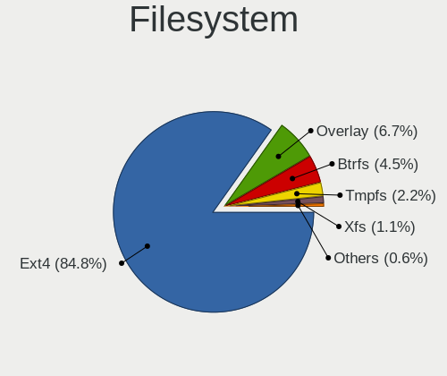
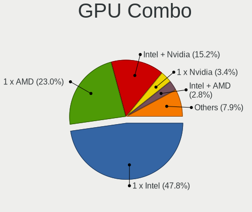
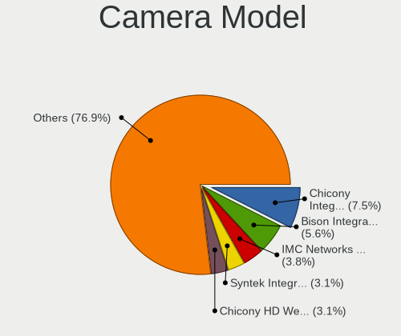
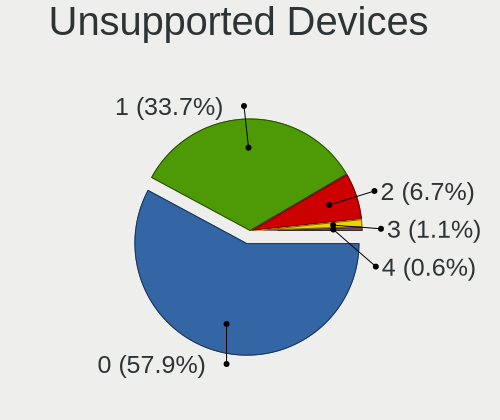

Debian - Hardware Trends (Notebooks)
------------------------------------

A project to identify most popular hardware characteristics and track their change
over time based on data collected by Linux users at https://Linux-Hardware.org.

Anyone can contribute to this report by the [hw-probe](https://github.com/linuxhw/hw-probe) tool:

    sudo -E hw-probe -all -upload

This report is for one last month. Overall report since the beginning of time: [TestDays](https://github.com/linuxhw/TestDays)

Period: Dec, 2023.

Contents
--------

* [ System ](#system)
  - [ OS                       ](#os)
  - [ OS Family                ](#os-family)
  - [ Kernel                   ](#kernel)
  - [ Kernel Family            ](#kernel-family)
  - [ Kernel Major Ver.        ](#kernel-major-ver)
  - [ Arch                     ](#arch)
  - [ DE                       ](#de)
  - [ Display Server           ](#display-server)
  - [ Display Manager          ](#display-manager)
  - [ OS Lang                  ](#os-lang)
  - [ Boot Mode                ](#boot-mode)
  - [ Filesystem               ](#filesystem)
  - [ Part. scheme             ](#part-scheme)
  - [ Dual Boot with Linux/BSD ](#dual-boot-with-linuxbsd)
  - [ Dual Boot (Win)          ](#dual-boot-win)

* [ Board ](#board)
  - [ Vendor                   ](#vendor)
  - [ Model                    ](#model)
  - [ Model Family             ](#model-family)
  - [ MFG Year                 ](#mfg-year)
  - [ Form Factor              ](#form-factor)
  - [ Secure Boot              ](#secure-boot)
  - [ Coreboot                 ](#coreboot)
  - [ RAM Size                 ](#ram-size)
  - [ RAM Used                 ](#ram-used)
  - [ Total Drives             ](#total-drives)
  - [ Has CD-ROM               ](#has-cd-rom)
  - [ Has Ethernet             ](#has-ethernet)
  - [ Has WiFi                 ](#has-wifi)
  - [ Has Bluetooth            ](#has-bluetooth)

* [ Location ](#location)
  - [ Country                  ](#country)
  - [ City                     ](#city)

* [ Drives ](#drives)
  - [ Drive Vendor             ](#drive-vendor)
  - [ Drive Model              ](#drive-model)
  - [ HDD Vendor               ](#hdd-vendor)
  - [ SSD Vendor               ](#ssd-vendor)
  - [ Drive Kind               ](#drive-kind)
  - [ Drive Connector          ](#drive-connector)
  - [ Drive Size               ](#drive-size)
  - [ Space Total              ](#space-total)
  - [ Space Used               ](#space-used)
  - [ Malfunc. Drives          ](#malfunc-drives)
  - [ Malfunc. Drive Vendor    ](#malfunc-drive-vendor)
  - [ Malfunc. HDD Vendor      ](#malfunc-hdd-vendor)
  - [ Malfunc. Drive Kind      ](#malfunc-drive-kind)
  - [ Failed Drives            ](#failed-drives)
  - [ Failed Drive Vendor      ](#failed-drive-vendor)
  - [ Drive Status             ](#drive-status)

* [ Storage controller ](#storage-controller)
  - [ Storage Vendor           ](#storage-vendor)
  - [ Storage Model            ](#storage-model)
  - [ Storage Kind             ](#storage-kind)

* [ Processor ](#processor)
  - [ CPU Vendor               ](#cpu-vendor)
  - [ CPU Model                ](#cpu-model)
  - [ CPU Model Family         ](#cpu-model-family)
  - [ CPU Cores                ](#cpu-cores)
  - [ CPU Sockets              ](#cpu-sockets)
  - [ CPU Threads              ](#cpu-threads)
  - [ CPU Op-Modes             ](#cpu-op-modes)
  - [ CPU Microcode            ](#cpu-microcode)
  - [ CPU Microarch            ](#cpu-microarch)

* [ Graphics ](#graphics)
  - [ GPU Vendor               ](#gpu-vendor)
  - [ GPU Model                ](#gpu-model)
  - [ GPU Combo                ](#gpu-combo)
  - [ GPU Driver               ](#gpu-driver)
  - [ GPU Memory               ](#gpu-memory)

* [ Monitor ](#monitor)
  - [ Monitor Vendor           ](#monitor-vendor)
  - [ Monitor Model            ](#monitor-model)
  - [ Monitor Resolution       ](#monitor-resolution)
  - [ Monitor Diagonal         ](#monitor-diagonal)
  - [ Monitor Width            ](#monitor-width)
  - [ Aspect Ratio             ](#aspect-ratio)
  - [ Monitor Area             ](#monitor-area)
  - [ Pixel Density            ](#pixel-density)
  - [ Multiple Monitors        ](#multiple-monitors)

* [ Network ](#network)
  - [ Net Controller Vendor    ](#net-controller-vendor)
  - [ Net Controller Model     ](#net-controller-model)
  - [ Wireless Vendor          ](#wireless-vendor)
  - [ Wireless Model           ](#wireless-model)
  - [ Ethernet Vendor          ](#ethernet-vendor)
  - [ Ethernet Model           ](#ethernet-model)
  - [ Net Controller Kind      ](#net-controller-kind)
  - [ Used Controller          ](#used-controller)
  - [ NICs                     ](#nics)
  - [ IPv6                     ](#ipv6)

* [ Bluetooth ](#bluetooth)
  - [ Bluetooth Vendor         ](#bluetooth-vendor)
  - [ Bluetooth Model          ](#bluetooth-model)

* [ Sound ](#sound)
  - [ Sound Vendor             ](#sound-vendor)
  - [ Sound Model              ](#sound-model)

* [ Memory ](#memory)
  - [ Memory Vendor            ](#memory-vendor)
  - [ Memory Model             ](#memory-model)
  - [ Memory Kind              ](#memory-kind)
  - [ Memory Form Factor       ](#memory-form-factor)
  - [ Memory Size              ](#memory-size)
  - [ Memory Speed             ](#memory-speed)

* [ Printers & scanners ](#printers--scanners)
  - [ Printer Vendor           ](#printer-vendor)
  - [ Printer Model            ](#printer-model)
  - [ Scanner Vendor           ](#scanner-vendor)
  - [ Scanner Model            ](#scanner-model)

* [ Camera ](#camera)
  - [ Camera Vendor            ](#camera-vendor)
  - [ Camera Model             ](#camera-model)

* [ Security ](#security)
  - [ Fingerprint Vendor       ](#fingerprint-vendor)
  - [ Fingerprint Model        ](#fingerprint-model)
  - [ Chipcard Vendor          ](#chipcard-vendor)
  - [ Chipcard Model           ](#chipcard-model)

* [ Unsupported ](#unsupported)
  - [ Unsupported Devices      ](#unsupported-devices)
  - [ Unsupported Device Types ](#unsupported-device-types)

System
------

OS
--

Installed operating systems

| Name                    | Notebooks | Percent |
|-------------------------|-----------|---------|
| Debian 12               | 182       | 75.21%  |
| Debian                  | 25        | 10.33%  |
| Debian Testing/unstable | 21        | 8.68%   |
| Debian 11               | 12        | 4.96%   |
| Debian 6                | 1         | 0.41%   |
| Debian 12-updates       | 1         | 0.41%   |

OS Family
---------

OS without a version

| Name   | Notebooks | Percent |
|--------|-----------|---------|
| Debian | 242       | 100%    |

Kernel
------

Version of the Linux kernel

| Version                   | Notebooks | Percent |
|---------------------------|-----------|---------|
| 6.1.0-16-amd64            | 71        | 29.34%  |
| 6.1.0-13-amd64            | 50        | 20.66%  |
| 6.1.0-15-amd64            | 32        | 13.22%  |
| 5.10.10-64                | 22        | 9.09%   |
| 6.5.0-5-amd64             | 15        | 6.2%    |
| 6.5.0-0.deb12.4-amd64     | 7         | 2.89%   |
| 6.1.0-14-amd64            | 7         | 2.89%   |
| 5.10.0-26-amd64           | 5         | 2.07%   |
| 6.5.0-4-amd64             | 4         | 1.65%   |
| 6.6.8-amd64               | 2         | 0.83%   |
| 6.1.0-4-amd64             | 2         | 0.83%   |
| 6.1.0-15-686-pae          | 2         | 0.83%   |
| 6.1.0-12-amd64            | 2         | 0.83%   |
| 6.6.1                     | 1         | 0.41%   |
| 6.6.0-chrultrabook        | 1         | 0.41%   |
| 6.6-amd64                 | 1         | 0.41%   |
| 6.5.10                    | 1         | 0.41%   |
| 6.5.0-1mx-ahs-amd64       | 1         | 0.41%   |
| 6.5.0-0.deb12.1-amd64     | 1         | 0.41%   |
| 6.4.0-4mx-ahs-amd64       | 1         | 0.41%   |
| 6.1.63-production+truenas | 1         | 0.41%   |
| 6.1.52-mos-amd64          | 1         | 0.41%   |
| 6.1.0-3-amd64             | 1         | 0.41%   |
| 6.1.0-16-rt-amd64         | 1         | 0.41%   |
| 6.1.0-16-686-pae          | 1         | 0.41%   |
| 6.1.0-13-686-pae          | 1         | 0.41%   |
| 6.1.0-11-amd64            | 1         | 0.41%   |
| 6.0.0-6mx-amd64           | 1         | 0.41%   |
| 5.19.0-0.deb11.2-amd64    | 1         | 0.41%   |
| 5.15.26                   | 1         | 0.41%   |
| 5.10.0-25-amd64           | 1         | 0.41%   |
| 5.10.0-20-amd64           | 1         | 0.41%   |
| 5.10.0-18-amd64           | 1         | 0.41%   |
| 5.10.0-15-amd64           | 1         | 0.41%   |

Kernel Family
-------------

Linux kernel without a distro release

| Version | Notebooks | Percent |
|---------|-----------|---------|
| 6.1.0   | 171       | 70.66%  |
| 6.5.0   | 28        | 11.57%  |
| 5.10.10 | 22        | 9.09%   |
| 5.10.0  | 9         | 3.72%   |
| 6.6.8   | 2         | 0.83%   |
| 6.6.1   | 1         | 0.41%   |
| 6.6.0   | 1         | 0.41%   |
| 6.6     | 1         | 0.41%   |
| 6.5.10  | 1         | 0.41%   |
| 6.4.0   | 1         | 0.41%   |
| 6.1.63  | 1         | 0.41%   |
| 6.1.52  | 1         | 0.41%   |
| 6.0.0   | 1         | 0.41%   |
| 5.19.0  | 1         | 0.41%   |
| 5.15.26 | 1         | 0.41%   |

Kernel Major Ver.
-----------------

Linux kernel major version

| Version | Notebooks | Percent |
|---------|-----------|---------|
| 6.1     | 173       | 71.49%  |
| 5.10    | 31        | 12.81%  |
| 6.5     | 29        | 11.98%  |
| 6.6     | 4         | 1.65%   |
| 6.4     | 1         | 0.41%   |
| 6.0     | 1         | 0.41%   |
| 6       | 1         | 0.41%   |
| 5.19    | 1         | 0.41%   |
| 5.15    | 1         | 0.41%   |

Arch
----

OS architecture (x86_64, i586, etc.)

| Name   | Notebooks | Percent |
|--------|-----------|---------|
| x86_64 | 238       | 98.35%  |
| i686   | 4         | 1.65%   |

DE
--

Desktop Environment

| Name            | Notebooks | Percent |
|-----------------|-----------|---------|
| GNOME           | 98        | 40.5%   |
| KDE5            | 49        | 20.25%  |
| LXDE            | 25        | 10.33%  |
| XFCE            | 21        | 8.68%   |
| X-Cinnamon      | 15        | 6.2%    |
| Unknown         | 13        | 5.37%   |
| MATE            | 5         | 2.07%   |
| i3              | 4         | 1.65%   |
| LXQt            | 3         | 1.24%   |
| GNOME Flashback | 2         | 0.83%   |
| GNOME Classic   | 2         | 0.83%   |
| Cinnamon        | 2         | 0.83%   |
| KDE             | 1         | 0.41%   |
| GNUstep         | 1         | 0.41%   |
| Deepin          | 1         | 0.41%   |

Display Server
--------------

X11 or Wayland

| Name    | Notebooks | Percent |
|---------|-----------|---------|
| X11     | 113       | 46.69%  |
| Wayland | 113       | 46.69%  |
| Unknown | 9         | 3.72%   |
| Tty     | 6         | 2.48%   |
| Web     | 1         | 0.41%   |

Display Manager
---------------

SDDM, LightDM, etc.

| Name    | Notebooks | Percent |
|---------|-----------|---------|
| GDM3    | 85        | 35.12%  |
| Unknown | 56        | 23.14%  |
| LightDM | 38        | 15.7%   |
| SDDM    | 36        | 14.88%  |
| NODM    | 22        | 9.09%   |
| GDM     | 4         | 1.65%   |
| GREETD  | 1         | 0.41%   |

OS Lang
-------

Language

| Lang    | Notebooks | Percent |
|---------|-----------|---------|
| en_US   | 98        | 40.5%   |
| fr_FR   | 38        | 15.7%   |
| de_DE   | 14        | 5.79%   |
| en_GB   | 12        | 4.96%   |
| ru_RU   | 9         | 3.72%   |
| it_IT   | 8         | 3.31%   |
| pl_PL   | 7         | 2.89%   |
| es_ES   | 7         | 2.89%   |
| C       | 5         | 2.07%   |
| Unknown | 5         | 2.07%   |
| en_AU   | 4         | 1.65%   |
| zh_TW   | 3         | 1.24%   |
| pt_BR   | 3         | 1.24%   |
| en_IN   | 3         | 1.24%   |
| en_CA   | 3         | 1.24%   |
| pt_PT   | 2         | 0.83%   |
| es_MX   | 2         | 0.83%   |
| es_CO   | 2         | 0.83%   |
| de_CH   | 2         | 0.83%   |
| zh_CN   | 1         | 0.41%   |
| tr_TR   | 1         | 0.41%   |
| nb_NO   | 1         | 0.41%   |
| ko_KR   | 1         | 0.41%   |
| hu_HU   | 1         | 0.41%   |
| es_PA   | 1         | 0.41%   |
| es_CR   | 1         | 0.41%   |
| es_CL   | 1         | 0.41%   |
| es_AR   | 1         | 0.41%   |
| en_SG   | 1         | 0.41%   |
| en_NZ   | 1         | 0.41%   |
| en_IE   | 1         | 0.41%   |
| en_AG   | 1         | 0.41%   |
| de_AT   | 1         | 0.41%   |
| cs_CZ   | 1         | 0.41%   |

Boot Mode
---------

EFI or BIOS

| Mode | Notebooks | Percent |
|------|-----------|---------|
| EFI  | 165       | 68.18%  |
| BIOS | 77        | 31.82%  |

Filesystem
----------

Type of filesystem

| Type    | Notebooks | Percent |
|---------|-----------|---------|
| Ext4    | 184       | 76.03%  |
| Rootfs  | 22        | 9.09%   |
| Overlay | 18        | 7.44%   |
| Btrfs   | 8         | 3.31%   |
| Tmpfs   | 5         | 2.07%   |
| Zfs     | 2         | 0.83%   |
| Xfs     | 2         | 0.83%   |
| Ext3    | 1         | 0.41%   |

Part. scheme
------------

Scheme of partitioning

| Type    | Notebooks | Percent |
|---------|-----------|---------|
| GPT     | 166       | 68.6%   |
| Unknown | 44        | 18.18%  |
| MBR     | 32        | 13.22%  |

Dual Boot with Linux/BSD
------------------------

Hosting more than one Linux/BSD

| Dual boot | Notebooks | Percent |
|-----------|-----------|---------|
| No        | 218       | 90.08%  |
| Yes       | 24        | 9.92%   |

Dual Boot (Win)
---------------

Hosting Linux and Windows

| Dual boot | Notebooks | Percent |
|-----------|-----------|---------|
| No        | 164       | 67.77%  |
| Yes       | 78        | 32.23%  |

Board
-----

Vendor
------

Motherboard manufacturer

| Name                | Notebooks | Percent |
|---------------------|-----------|---------|
| Lenovo              | 68        | 28.1%   |
| Hewlett-Packard     | 57        | 23.55%  |
| ASUSTek Computer    | 29        | 11.98%  |
| Dell                | 20        | 8.26%   |
| Acer                | 13        | 5.37%   |
| Apple               | 7         | 2.89%   |
| MSI                 | 6         | 2.48%   |
| Toshiba             | 5         | 2.07%   |
| Samsung Electronics | 4         | 1.65%   |
| Google              | 4         | 1.65%   |
| HUAWEI              | 3         | 1.24%   |
| Sony                | 2         | 0.83%   |
| Medion              | 2         | 0.83%   |
| HONOR               | 2         | 0.83%   |
| Gigabyte Technology | 2         | 0.83%   |
| Unknown             | 2         | 0.83%   |
| Timi                | 1         | 0.41%   |
| Schenker            | 1         | 0.41%   |
| Positivo            | 1         | 0.41%   |
| Packard Bell        | 1         | 0.41%   |
| MACHENIKE           | 1         | 0.41%   |
| Jumper              | 1         | 0.41%   |
| IBM                 | 1         | 0.41%   |
| Fujitsu Siemens     | 1         | 0.41%   |
| Framework           | 1         | 0.41%   |
| Dynabook            | 1         | 0.41%   |
| DellInc.            | 1         | 0.41%   |
| COIN COMPUTERS      | 1         | 0.41%   |
| Clevo               | 1         | 0.41%   |
| AVITA               | 1         | 0.41%   |
| Aquarius            | 1         | 0.41%   |
| Alienware           | 1         | 0.41%   |

Model
-----

Motherboard model

| Name                                      | Notebooks | Percent |
|-------------------------------------------|-----------|---------|
| Lenovo ThinkPad X230 2325V2Y              | 8         | 3.31%   |
| HP ProBook 650 G2                         | 5         | 2.07%   |
| HP ProBook 650 G1                         | 5         | 2.07%   |
| HP ProBook 450 G3                         | 4         | 1.65%   |
| HP ProBook 655 G2                         | 3         | 1.24%   |
| Unknown                                   | 3         | 1.24%   |
| Lenovo ThinkPad P16s Gen 2 21K9CTO1WW     | 2         | 0.83%   |
| Lenovo IdeaPad 3 15ALC6 82KU              | 2         | 0.83%   |
| HONOR HYM-WXX                             | 2         | 0.83%   |
| HP OMEN by Laptop 15-dc0xxx               | 2         | 0.83%   |
| HP EliteBook 830 G5                       | 2         | 0.83%   |
| Google Reks                               | 2         | 0.83%   |
| ASUS ROG Strix G513RM_G513RM              | 2         | 0.83%   |
| ASUS ASUS TUF Gaming F15 FX507ZC_TUF507ZC | 2         | 0.83%   |
| Apple MacBookPro12,1                      | 2         | 0.83%   |
| Apple MacBookAir7,2                       | 2         | 0.83%   |
| Toshiba Satellite L775                    | 1         | 0.41%   |
| Toshiba Satellite L50-A-19P               | 1         | 0.41%   |
| Toshiba Satellite C55-C                   | 1         | 0.41%   |
| Toshiba Satellite C50D-A-138              | 1         | 0.41%   |
| Toshiba Satellite A205                    | 1         | 0.41%   |
| Timi Mi Laptop Pro 15                     | 1         | 0.41%   |
| Sony VPCF11M1E                            | 1         | 0.41%   |
| Sony VPCEB46FX                            | 1         | 0.41%   |
| Schenker N13xWU                           | 1         | 0.41%   |
| Samsung R530/R730/R540                    | 1         | 0.41%   |
| Samsung NC210/NC110                       | 1         | 0.41%   |
| Samsung 760XDA                            | 1         | 0.41%   |
| Samsung 300E4C/300E5C/300E7C              | 1         | 0.41%   |
| Positivo H14BT58                          | 1         | 0.41%   |
| Packard Bell EasyNote TE11HC              | 1         | 0.41%   |
| MSI Vector GP77 13VG                      | 1         | 0.41%   |
| MSI Thin GF63 12VE                        | 1         | 0.41%   |
| MSI Pulse 17 B13VGK                       | 1         | 0.41%   |
| MSI Prestige 15 A10SC                     | 1         | 0.41%   |
| MSI GF65 Thin 10SER                       | 1         | 0.41%   |
| MSI Cyborg 15 A12VF                       | 1         | 0.41%   |
| Medion BEAST X30                          | 1         | 0.41%   |
| Medion Akoya E7226                        | 1         | 0.41%   |
| MACHENIKE T58-V                           | 1         | 0.41%   |

Model Family
------------

Motherboard model prefix

| Name                  | Notebooks | Percent |
|-----------------------|-----------|---------|
| Lenovo ThinkPad       | 40        | 16.53%  |
| HP ProBook            | 20        | 8.26%   |
| Lenovo IdeaPad        | 9         | 3.72%   |
| HP EliteBook          | 9         | 3.72%   |
| ASUS ASUS             | 8         | 3.31%   |
| HP Pavilion           | 7         | 2.89%   |
| HP Laptop             | 7         | 2.89%   |
| Dell Inspiron         | 6         | 2.48%   |
| ASUS ROG              | 6         | 2.48%   |
| Acer Aspire           | 6         | 2.48%   |
| Toshiba Satellite     | 5         | 2.07%   |
| Lenovo ThinkBook      | 5         | 2.07%   |
| Lenovo Legion         | 5         | 2.07%   |
| Dell Latitude         | 5         | 2.07%   |
| HP ENVY               | 4         | 1.65%   |
| Dell XPS              | 4         | 1.65%   |
| ASUS VivoBook         | 4         | 1.65%   |
| Acer Swift            | 3         | 1.24%   |
| Unknown               | 3         | 1.24%   |
| Lenovo V15            | 2         | 0.83%   |
| Lenovo Flex           | 2         | 0.83%   |
| HONOR HYM-WXX         | 2         | 0.83%   |
| HP OMEN               | 2         | 0.83%   |
| Google Reks           | 2         | 0.83%   |
| Dell Vostro           | 2         | 0.83%   |
| Dell Precision        | 2         | 0.83%   |
| ASUS Zenbook          | 2         | 0.83%   |
| Apple MacBookPro12    | 2         | 0.83%   |
| Apple MacBookAir7     | 2         | 0.83%   |
| Acer Extensa          | 2         | 0.83%   |
| Timi Mi               | 1         | 0.41%   |
| Sony VPCF11M1E        | 1         | 0.41%   |
| Sony VPCEB46FX        | 1         | 0.41%   |
| Schenker N13xWU       | 1         | 0.41%   |
| Samsung R530          | 1         | 0.41%   |
| Samsung NC210         | 1         | 0.41%   |
| Samsung 760XDA        | 1         | 0.41%   |
| Samsung 300E4C        | 1         | 0.41%   |
| Positivo H14BT58      | 1         | 0.41%   |
| Packard Bell EasyNote | 1         | 0.41%   |

MFG Year
--------

Motherboard manufacture year

| Year    | Notebooks | Percent |
|---------|-----------|---------|
| 2023    | 37        | 15.29%  |
| 2021    | 26        | 10.74%  |
| 2022    | 24        | 9.92%   |
| 2018    | 18        | 7.44%   |
| 2012    | 18        | 7.44%   |
| 2020    | 17        | 7.02%   |
| 2016    | 16        | 6.61%   |
| 2019    | 15        | 6.2%    |
| 2015    | 15        | 6.2%    |
| 2013    | 14        | 5.79%   |
| 2011    | 11        | 4.55%   |
| 2014    | 7         | 2.89%   |
| 2010    | 7         | 2.89%   |
| 2017    | 4         | 1.65%   |
| 2008    | 4         | 1.65%   |
| 2007    | 4         | 1.65%   |
| 2009    | 2         | 0.83%   |
| 2006    | 1         | 0.41%   |
| 2005    | 1         | 0.41%   |
| Unknown | 1         | 0.41%   |

Form Factor
-----------

Physical design of the computer

| Name     | Notebooks | Percent |
|----------|-----------|---------|
| Notebook | 242       | 100%    |

Secure Boot
-----------

Enabled or disabled

| State    | Notebooks | Percent |
|----------|-----------|---------|
| Disabled | 217       | 89.67%  |
| Enabled  | 25        | 10.33%  |

Coreboot
--------

Have coreboot on board

| Used | Notebooks | Percent |
|------|-----------|---------|
| No   | 237       | 97.93%  |
| Yes  | 5         | 2.07%   |

RAM Size
--------

Total RAM memory

| Size in GB  | Notebooks | Percent |
|-------------|-----------|---------|
| 4.01-8.0    | 58        | 23.97%  |
| 16.01-24.0  | 53        | 21.9%   |
| 8.01-16.0   | 45        | 18.6%   |
| 3.01-4.0    | 42        | 17.36%  |
| 32.01-64.0  | 22        | 9.09%   |
| 24.01-32.0  | 7         | 2.89%   |
| 1.01-2.0    | 5         | 2.07%   |
| 2.01-3.0    | 4         | 1.65%   |
| 64.01-256.0 | 4         | 1.65%   |
| 0.51-1.0    | 1         | 0.41%   |
| 0.01-0.5    | 1         | 0.41%   |

RAM Used
--------

Used RAM memory

| Used GB    | Notebooks | Percent |
|------------|-----------|---------|
| 1.01-2.0   | 82        | 33.88%  |
| 2.01-3.0   | 60        | 24.79%  |
| 3.01-4.0   | 34        | 14.05%  |
| 4.01-8.0   | 33        | 13.64%  |
| 0.51-1.0   | 18        | 7.44%   |
| 8.01-16.0  | 9         | 3.72%   |
| 0.01-0.5   | 4         | 1.65%   |
| 24.01-32.0 | 1         | 0.41%   |
| 16.01-24.0 | 1         | 0.41%   |

Total Drives
------------

Number of drives on board

| Drives | Notebooks | Percent |
|--------|-----------|---------|
| 1      | 183       | 75.62%  |
| 2      | 48        | 19.83%  |
| 3      | 5         | 2.07%   |
| 0      | 4         | 1.65%   |
| 4      | 2         | 0.83%   |

Has CD-ROM
----------

Has CD-ROM on board

| Presented | Notebooks | Percent |
|-----------|-----------|---------|
| No        | 188       | 77.69%  |
| Yes       | 54        | 22.31%  |

Has Ethernet
------------

Has Ethernet on board

| Presented | Notebooks | Percent |
|-----------|-----------|---------|
| Yes       | 194       | 80.17%  |
| No        | 48        | 19.83%  |

Has WiFi
--------

Has WiFi module

| Presented | Notebooks | Percent |
|-----------|-----------|---------|
| Yes       | 235       | 97.11%  |
| No        | 7         | 2.89%   |

Has Bluetooth
-------------

Has Bluetooth module

| Presented | Notebooks | Percent |
|-----------|-----------|---------|
| Yes       | 194       | 80.17%  |
| No        | 48        | 19.83%  |

Location
--------

Country
-------

Geographic location (country)

| Country         | Notebooks | Percent |
|-----------------|-----------|---------|
| France          | 41        | 16.94%  |
| Canada          | 27        | 11.16%  |
| USA             | 23        | 9.5%    |
| Germany         | 22        | 9.09%   |
| Italy           | 16        | 6.61%   |
| Poland          | 12        | 4.96%   |
| Russia          | 11        | 4.55%   |
| Spain           | 8         | 3.31%   |
| UK              | 7         | 2.89%   |
| Brazil          | 6         | 2.48%   |
| Switzerland     | 5         | 2.07%   |
| Taiwan          | 4         | 1.65%   |
| India           | 4         | 1.65%   |
| Australia       | 4         | 1.65%   |
| Turkey          | 3         | 1.24%   |
| Portugal        | 3         | 1.24%   |
| Colombia        | 3         | 1.24%   |
| Austria         | 3         | 1.24%   |
| The Netherlands | 2         | 0.83%   |
| Sweden          | 2         | 0.83%   |
| Slovakia        | 2         | 0.83%   |
| Romania         | 2         | 0.83%   |
| Nigeria         | 2         | 0.83%   |
| Mexico          | 2         | 0.83%   |
| Czechia         | 2         | 0.83%   |
| Bulgaria        | 2         | 0.83%   |
| Vietnam         | 1         | 0.41%   |
| Thailand        | 1         | 0.41%   |
| South Korea     | 1         | 0.41%   |
| Somalia         | 1         | 0.41%   |
| Singapore       | 1         | 0.41%   |
| Panama          | 1         | 0.41%   |
| Norway          | 1         | 0.41%   |
| New Zealand     | 1         | 0.41%   |
| Netherlands     | 1         | 0.41%   |
| Malaysia        | 1         | 0.41%   |
| Lebanon         | 1         | 0.41%   |
| Kuwait          | 1         | 0.41%   |
| Ireland         | 1         | 0.41%   |
| Iceland         | 1         | 0.41%   |

City
----

Geographic location (city)

| City                | Notebooks | Percent |
|---------------------|-----------|---------|
| Roubaix             | 28        | 11.57%  |
| Québec             | 12        | 4.96%   |
| Paris               | 4         | 1.65%   |
| Milan               | 4         | 1.65%   |
| Levis               | 4         | 1.65%   |
| Bangor              | 4         | 1.65%   |
| Moscow              | 3         | 1.24%   |
| Gmina Chełmiec     | 3         | 1.24%   |
| Berlin              | 3         | 1.24%   |
| Voronezh            | 2         | 0.83%   |
| Sydney              | 2         | 0.83%   |
| Rome                | 2         | 0.83%   |
| Rho                 | 2         | 0.83%   |
| Prague              | 2         | 0.83%   |
| Palma               | 2         | 0.83%   |
| Montreal            | 2         | 0.83%   |
| Madrid              | 2         | 0.83%   |
| Leipzig             | 2         | 0.83%   |
| Kaohsiung City      | 2         | 0.83%   |
| Istanbul            | 2         | 0.83%   |
| Duncan              | 2         | 0.83%   |
| Bogotá             | 2         | 0.83%   |
| Bengaluru           | 2         | 0.83%   |
| Bagneux             | 2         | 0.83%   |
| Adamowka            | 2         | 0.83%   |
| Zweidlen-Dorf       | 1         | 0.41%   |
| Zurich              | 1         | 0.41%   |
| Zeven               | 1         | 0.41%   |
| Zapopan             | 1         | 0.41%   |
| Yuba City           | 1         | 0.41%   |
| Ypsilanti           | 1         | 0.41%   |
| Vladivostok         | 1         | 0.41%   |
| Vila Franca de Xira | 1         | 0.41%   |
| Verdal              | 1         | 0.41%   |
| Velbert             | 1         | 0.41%   |
| Vanves              | 1         | 0.41%   |
| Vancouver           | 1         | 0.41%   |
| Valence             | 1         | 0.41%   |
| Uiwang-si           | 1         | 0.41%   |
| Trikala             | 1         | 0.41%   |

Drives
------

Drive Vendor
------------

Hard drive vendors

| Vendor                       | Notebooks | Drives | Percent |
|------------------------------|-----------|--------|---------|
| Samsung Electronics          | 62        | 72     | 21.53%  |
| WDC                          | 25        | 25     | 8.68%   |
| SK hynix                     | 21        | 21     | 7.29%   |
| SanDisk                      | 20        | 21     | 6.94%   |
| Micron Technology            | 17        | 18     | 5.9%    |
| Kingston                     | 16        | 16     | 5.56%   |
| Seagate                      | 15        | 15     | 5.21%   |
| Toshiba                      | 11        | 11     | 3.82%   |
| Intel                        | 11        | 14     | 3.82%   |
| Crucial                      | 11        | 11     | 3.82%   |
| HGST                         | 9         | 9      | 3.13%   |
| Unknown                      | 7         | 7      | 2.43%   |
| Hitachi                      | 7         | 7      | 2.43%   |
| Apple                        | 5         | 6      | 1.74%   |
| Transcend                    | 4         | 4      | 1.39%   |
| SSSTC                        | 4         | 4      | 1.39%   |
| Phison                       | 4         | 4      | 1.39%   |
| A-DATA Technology            | 4         | 4      | 1.39%   |
| Lexar                        | 3         | 3      | 1.04%   |
| Unknown                      | 3         | 3      | 1.04%   |
| Team                         | 2         | 2      | 0.69%   |
| SPCC                         | 2         | 2      | 0.69%   |
| MAXIO Technology (Hangzhou)  | 2         | 2      | 0.69%   |
| KIOXIA                       | 2         | 2      | 0.69%   |
| Fanxiang                     | 2         | 2      | 0.69%   |
| China                        | 2         | 2      | 0.69%   |
| ASMT                         | 2         | 2      | 0.69%   |
| Union Memory                 | 1         | 1      | 0.35%   |
| Shenzhen Longsys Electronics | 1         | 1      | 0.35%   |
| SABRENT                      | 1         | 1      | 0.35%   |
| Patriot                      | 1         | 1      | 0.35%   |
| LITEON                       | 1         | 1      | 0.35%   |
| KIOXIA-EXCERIA               | 1         | 1      | 0.35%   |
| Kingston Technology Company  | 1         | 1      | 0.35%   |
| Kimtigo                      | 1         | 1      | 0.35%   |
| JMicron Technology           | 1         | 1      | 0.35%   |
| HP SSD S                     | 1         | 1      | 0.35%   |
| Hised                        | 1         | 1      | 0.35%   |
| GOODRAM                      | 1         | 1      | 0.35%   |
| Fujitsu                      | 1         | 1      | 0.35%   |

Drive Model
-----------

Hard drive models

| Model                                              | Notebooks | Percent |
|----------------------------------------------------|-----------|---------|
| WDC WD5000LPLX-60ZNTT1 500GB                       | 8         | 2.67%   |
| Kingston SA400S37240G 240GB SSD                    | 5         | 1.67%   |
| SK hynix BC711 HFM256GD3JX013N 256GB               | 4         | 1.33%   |
| SanDisk NVMe SSD Drive 512GB                       | 4         | 1.33%   |
| SanDisk NVMe SSD Drive 1TB                         | 4         | 1.33%   |
| Samsung HM321HI 320GB                              | 4         | 1.33%   |
| Micron 2450_MTFDKBA512TFK 512GB                    | 4         | 1.33%   |
| Micron 2400_MTFDKBA512QFM 512GB                    | 4         | 1.33%   |
| Hitachi HTS543232A7A384 320GB                      | 4         | 1.33%   |
| HGST HTS541010A9E680 1TB                           | 4         | 1.33%   |
| Unknown MMC Card  32GB                             | 3         | 1%      |
| Toshiba MQ01ACF032 320GB                           | 3         | 1%      |
| Toshiba MQ01ABD100 1TB                             | 3         | 1%      |
| Seagate ST9500325AS 500GB                          | 3         | 1%      |
| Samsung SSD 850 EVO 500GB                          | 3         | 1%      |
| Samsung MZVL21T0HCLR-00BL2 1TB                     | 3         | 1%      |
| Kingston SA400S37120G 120GB SSD                    | 3         | 1%      |
| Intel SSDPEKNU512GZH 512GB                         | 3         | 1%      |
| Unknown                                            | 3         | 1%      |
| SK hynix SKHynix_HFS001TEJ9X162N 1TB               | 2         | 0.67%   |
| SK hynix SKHynix_HFM512GD3HX015N 512GB             | 2         | 0.67%   |
| SK hynix HFM512GD3JX013N 512GB                     | 2         | 0.67%   |
| Seagate ST9320325AS 320GB                          | 2         | 0.67%   |
| Seagate ST1000LM035-1RK172 1TB                     | 2         | 0.67%   |
| SanDisk SSD U110 16GB                              | 2         | 0.67%   |
| SanDisk NVMe SSD Drive 2TB                         | 2         | 0.67%   |
| Samsung SSD PM851 mSATA 256GB                      | 2         | 0.67%   |
| Samsung SSD CM871a 2.5 7mm 128GB                   | 2         | 0.67%   |
| Samsung SSD 860 EVO 250GB                          | 2         | 0.67%   |
| Samsung SSD 860 EVO 1TB                            | 2         | 0.67%   |
| Samsung SSD 850 EVO 250GB                          | 2         | 0.67%   |
| Samsung NVMe SSD Controller PM9A1/PM9A3/980PRO 2TB | 2         | 0.67%   |
| Samsung MZVL4512HBLU-00BTW 512GB                   | 2         | 0.67%   |
| Phison 311CD0512GB                                 | 2         | 0.67%   |
| Micron 2450_MTFDKBA1T0TFK 1TB                      | 2         | 0.67%   |
| Intel SSDPEKNU512GZ 512GB                          | 2         | 0.67%   |
| HGST HTS725050A7E630 500GB                         | 2         | 0.67%   |
| Crucial CT500MX500SSD1 500GB                       | 2         | 0.67%   |
| WDC WDS500G3X0C-00SJG0 500GB                       | 1         | 0.33%   |
| WDC WDS250G1B0A-00H9H0 250GB SSD                   | 1         | 0.33%   |

HDD Vendor
----------

Hard disk drive vendors

| Vendor              | Notebooks | Drives | Percent |
|---------------------|-----------|--------|---------|
| WDC                 | 15        | 15     | 23.44%  |
| Seagate             | 15        | 15     | 23.44%  |
| Toshiba             | 10        | 10     | 15.63%  |
| HGST                | 9         | 9      | 14.06%  |
| Hitachi             | 7         | 7      | 10.94%  |
| Samsung Electronics | 4         | 4      | 6.25%   |
| SABRENT             | 1         | 1      | 1.56%   |
| Fujitsu             | 1         | 1      | 1.56%   |
| ASMT                | 1         | 1      | 1.56%   |
| Unknown             | 1         | 1      | 1.56%   |

SSD Vendor
----------

Solid state drive vendors

| Vendor              | Notebooks | Drives | Percent |
|---------------------|-----------|--------|---------|
| Samsung Electronics | 22        | 26     | 28.95%  |
| Kingston            | 11        | 11     | 14.47%  |
| Crucial             | 7         | 7      | 9.21%   |
| SanDisk             | 6         | 6      | 7.89%   |
| Apple               | 4         | 4      | 5.26%   |
| WDC                 | 3         | 3      | 3.95%   |
| A-DATA Technology   | 3         | 3      | 3.95%   |
| Transcend           | 2         | 2      | 2.63%   |
| Team                | 2         | 2      | 2.63%   |
| SK hynix            | 2         | 2      | 2.63%   |
| China               | 2         | 2      | 2.63%   |
| Toshiba             | 1         | 1      | 1.32%   |
| SSSTC               | 1         | 1      | 1.32%   |
| SPCC                | 1         | 1      | 1.32%   |
| Patriot             | 1         | 1      | 1.32%   |
| Micron Technology   | 1         | 1      | 1.32%   |
| LITEON              | 1         | 1      | 1.32%   |
| KIOXIA-EXCERIA      | 1         | 1      | 1.32%   |
| Hised               | 1         | 1      | 1.32%   |
| GOODRAM             | 1         | 1      | 1.32%   |
| FORESEE             | 1         | 1      | 1.32%   |
| Fanxiang            | 1         | 1      | 1.32%   |
| ASMT                | 1         | 1      | 1.32%   |

Drive Kind
----------

HDD or SSD

| Kind    | Notebooks | Drives | Percent |
|---------|-----------|--------|---------|
| NVMe    | 125       | 147    | 46.13%  |
| SSD     | 71        | 80     | 26.2%   |
| HDD     | 63        | 64     | 23.25%  |
| MMC     | 11        | 11     | 4.06%   |
| Unknown | 1         | 2      | 0.37%   |

Drive Connector
---------------

SATA, SAS, NVMe, etc.

| Type | Notebooks | Drives | Percent |
|------|-----------|--------|---------|
| NVMe | 125       | 147    | 47.17%  |
| SATA | 119       | 135    | 44.91%  |
| MMC  | 11        | 11     | 4.15%   |
| SAS  | 10        | 11     | 3.77%   |

Drive Size
----------

Size of hard drive

| Size in TB | Notebooks | Drives | Percent |
|------------|-----------|--------|---------|
| 0.01-0.5   | 97        | 109    | 73.48%  |
| 0.51-1.0   | 31        | 31     | 23.48%  |
| 1.01-2.0   | 4         | 4      | 3.03%   |

Space Total
-----------

Amount of disk space available on the file system

| Size in GB     | Notebooks | Percent |
|----------------|-----------|---------|
| 251-500        | 77        | 31.82%  |
| 101-250        | 62        | 25.62%  |
| 501-1000       | 41        | 16.94%  |
| 1-20           | 19        | 7.85%   |
| 51-100         | 17        | 7.02%   |
| 1001-2000      | 8         | 3.31%   |
| Unknown        | 6         | 2.48%   |
| More than 3000 | 5         | 2.07%   |
| 21-50          | 4         | 1.65%   |
| 2001-3000      | 3         | 1.24%   |

Space Used
----------

Amount of used disk space

| Used GB   | Notebooks | Percent |
|-----------|-----------|---------|
| 1-20      | 128       | 52.89%  |
| 101-250   | 33        | 13.64%  |
| 51-100    | 31        | 12.81%  |
| 251-500   | 17        | 7.02%   |
| 21-50     | 17        | 7.02%   |
| Unknown   | 6         | 2.48%   |
| 501-1000  | 5         | 2.07%   |
| 1001-2000 | 4         | 1.65%   |
| 2001-3000 | 1         | 0.41%   |

Malfunc. Drives
---------------

Drive models with a malfunction

| Model                                | Notebooks | Drives | Percent |
|--------------------------------------|-----------|--------|---------|
| WDC WD5000LPLX-60ZNTT1 500GB         | 2         | 2      | 13.33%  |
| Seagate ST9320325AS 320GB            | 2         | 2      | 13.33%  |
| HGST HTS725050A7E630 500GB           | 2         | 2      | 13.33%  |
| WDC WDS240G2G0A-00JH30 240GB SSD     | 1         | 1      | 6.67%   |
| WDC WD5000LPCX-00VHAT0 500GB         | 1         | 1      | 6.67%   |
| WDC WD Blue SA510 2.5 1000GB SSD     | 1         | 1      | 6.67%   |
| SK hynix BC711 HFM256GD3JX013N 256GB | 1         | 1      | 6.67%   |
| Seagate ST9500325AS 500GB            | 1         | 1      | 6.67%   |
| Phison ES 512GB                      | 1         | 1      | 6.67%   |
| Kimtigo SSD 512GB                    | 1         | 1      | 6.67%   |
| Hitachi HTS727575A9E364 752GB        | 1         | 1      | 6.67%   |
| HGST HTS541010A9E680 1TB             | 1         | 1      | 6.67%   |

Malfunc. Drive Vendor
---------------------

Vendors of faulty drives

| Vendor   | Notebooks | Drives | Percent |
|----------|-----------|--------|---------|
| WDC      | 5         | 5      | 33.33%  |
| Seagate  | 3         | 3      | 20%     |
| HGST     | 3         | 3      | 20%     |
| SK hynix | 1         | 1      | 6.67%   |
| Phison   | 1         | 1      | 6.67%   |
| Kimtigo  | 1         | 1      | 6.67%   |
| Hitachi  | 1         | 1      | 6.67%   |

Malfunc. HDD Vendor
-------------------

Vendors of faulty HDD drives

| Vendor  | Notebooks | Drives | Percent |
|---------|-----------|--------|---------|
| WDC     | 3         | 3      | 30%     |
| Seagate | 3         | 3      | 30%     |
| HGST    | 3         | 3      | 30%     |
| Hitachi | 1         | 1      | 10%     |

Malfunc. Drive Kind
-------------------

Kinds of faulty drives

| Kind | Notebooks | Drives | Percent |
|------|-----------|--------|---------|
| HDD  | 10        | 10     | 66.67%  |
| NVMe | 3         | 3      | 20%     |
| SSD  | 2         | 2      | 13.33%  |

Failed Drives
-------------

Failed drive models

Zero info for selected period =(

Failed Drive Vendor
-------------------

Failed drive vendors

Zero info for selected period =(

Drive Status
------------

Number of failed and malfunc. drives

| Status   | Notebooks | Drives | Percent |
|----------|-----------|--------|---------|
| Works    | 165       | 198    | 65.22%  |
| Detected | 73        | 91     | 28.85%  |
| Malfunc  | 15        | 15     | 5.93%   |

Storage controller
------------------

Storage Vendor
--------------

Storage controller vendors

| Vendor                         | Notebooks | Percent |
|--------------------------------|-----------|---------|
| Intel                          | 148       | 49.66%  |
| Samsung Electronics            | 41        | 13.76%  |
| SanDisk                        | 20        | 6.71%   |
| SK hynix                       | 18        | 6.04%   |
| AMD                            | 18        | 6.04%   |
| Micron Technology              | 17        | 5.7%    |
| Kingston Technology Company    | 6         | 2.01%   |
| Phison Electronics             | 4         | 1.34%   |
| Micron/Crucial Technology      | 4         | 1.34%   |
| MAXIO Technology (Hangzhou)    | 4         | 1.34%   |
| Solid State Storage Technology | 3         | 1.01%   |
| Shenzhen Longsys Electronics   | 3         | 1.01%   |
| Transcend                      | 2         | 0.67%   |
| Silicon Motion                 | 2         | 0.67%   |
| KIOXIA                         | 2         | 0.67%   |
| Union Memory (Shenzhen)        | 1         | 0.34%   |
| Realtek Semiconductor          | 1         | 0.34%   |
| Nvidia                         | 1         | 0.34%   |
| Marvell Technology Group       | 1         | 0.34%   |
| Apple                          | 1         | 0.34%   |
| ADATA Technology               | 1         | 0.34%   |

Storage Model
-------------

Storage controller models

| Model                                                                          | Notebooks | Percent |
|--------------------------------------------------------------------------------|-----------|---------|
| Intel Sunrise Point-LP SATA Controller [AHCI mode]                             | 22        | 7.14%   |
| Intel Volume Management Device NVMe RAID Controller                            | 20        | 6.49%   |
| Intel 7 Series Chipset Family 6-port SATA Controller [AHCI mode]               | 16        | 5.19%   |
| AMD FCH SATA Controller [AHCI mode]                                            | 16        | 5.19%   |
| SK hynix Gold P31/BC711/PC711 NVMe Solid State Drive                           | 10        | 3.25%   |
| Samsung NVMe SSD Controller SM981/PM981/PM983                                  | 10        | 3.25%   |
| Samsung NVMe SSD Controller 980 (DRAM-less)                                    | 9         | 2.92%   |
| Intel 82801 Mobile SATA Controller [RAID mode]                                 | 9         | 2.92%   |
| Samsung NVMe SSD Controller PM9A1/PM9A3/980PRO                                 | 8         | 2.6%    |
| Intel SSD 670p Series [Keystone Harbor]                                        | 8         | 2.6%    |
| Intel 8 Series/C220 Series Chipset Family 6-port SATA Controller 1 [AHCI mode] | 8         | 2.6%    |
| Intel 6 Series/C200 Series Chipset Family 6 port Mobile SATA AHCI Controller   | 8         | 2.6%    |
| Samsung NVMe SSD Controller PM9B1 (DRAM-less)                                  | 7         | 2.27%   |
| SanDisk WD Black SN770 / PC SN740 256GB / PC SN560 (DRAM-less) NVMe SSD        | 6         | 1.95%   |
| Micron 2450 NVMe SSD [HendrixV] (DRAM-less)                                    | 6         | 1.95%   |
| Micron 2400 NVMe SSD (DRAM-less)                                               | 6         | 1.95%   |
| Intel Wildcat Point-LP SATA Controller [AHCI Mode]                             | 6         | 1.95%   |
| Intel Volume Management Device NVMe RAID Controller Intel Corporation          | 6         | 1.95%   |
| SanDisk Extreme Pro / WD Black SN750 / PC SN730 / Red SN700 NVMe SSD           | 5         | 1.62%   |
| Intel Alder Lake-P SATA AHCI Controller                                        | 5         | 1.62%   |
| Intel 5 Series/3400 Series Chipset 4 port SATA AHCI Controller                 | 5         | 1.62%   |
| Intel Cannon Lake Mobile PCH SATA AHCI Controller                              | 4         | 1.3%    |
| Intel 8 Series SATA Controller 1 [AHCI mode]                                   | 4         | 1.3%    |
| SK hynix Platinum P41/PC801 NVMe Solid State Drive                             | 3         | 0.97%   |
| Shenzhen Longsys Non-Volatile memory controller                                | 3         | 0.97%   |
| Phison PS5013-E13 PCIe3 NVMe Controller (DRAM-less)                            | 3         | 0.97%   |
| Micron/Crucial P2 [Nick P2] / P3 / P3 Plus NVMe PCIe SSD (DRAM-less)           | 3         | 0.97%   |
| MAXIO (Hangzhou) NVMe SSD Controller MAP1202                                   | 3         | 0.97%   |
| Intel Comet Lake SATA AHCI Controller                                          | 3         | 0.97%   |
| Intel Atom Processor E3800 Series SATA AHCI Controller                         | 3         | 0.97%   |
| Intel 82801IBM/IEM (ICH9M/ICH9M-E) 4 port SATA Controller [AHCI mode]          | 3         | 0.97%   |
| Solid State Storage Non-Volatile memory controller                             | 2         | 0.65%   |
| SK hynix BC511 NVMe SSD                                                        | 2         | 0.65%   |
| SanDisk WD Blue SN500 / PC SN520 x2 M.2 2280 NVMe SSD                          | 2         | 0.65%   |
| Sandisk WD Black SN850X NVMe SSD                                               | 2         | 0.65%   |
| Samsung S4LN058A01[SSUBX] AHCI SSD Controller (Apple slot)                     | 2         | 0.65%   |
| Samsung NVMe SSD Controller SM961/PM961/SM963                                  | 2         | 0.65%   |
| Micron 3400 NVMe SSD [Hendrix]                                                 | 2         | 0.65%   |
| Micron 2210 NVMe SSD [Cobain]                                                  | 2         | 0.65%   |
| Kingston Company KC3000/FURY Renegade NVMe SSD E18                             | 2         | 0.65%   |

Storage Kind
------------

Kind of storage controller (IDE, SATA, NVMe, SAS, ...)

| Kind | Notebooks | Percent |
|------|-----------|---------|
| SATA | 131       | 44.41%  |
| NVMe | 124       | 42.03%  |
| RAID | 35        | 11.86%  |
| IDE  | 5         | 1.69%   |

Processor
---------

CPU Vendor
----------

Processor vendors

| Vendor | Notebooks | Percent |
|--------|-----------|---------|
| Intel  | 194       | 80.17%  |
| AMD    | 48        | 19.83%  |

CPU Model
---------

Processor models

| Model                                         | Notebooks | Percent |
|-----------------------------------------------|-----------|---------|
| Intel Core i5-3230M CPU @ 2.60GHz             | 9         | 3.72%   |
| Intel Core i3-6100U CPU @ 2.30GHz             | 7         | 2.89%   |
| Intel 12th Gen Core i7-12700H                 | 6         | 2.48%   |
| Intel 12th Gen Core i5-1235U                  | 6         | 2.48%   |
| Intel Core i7-8750H CPU @ 2.20GHz             | 5         | 2.07%   |
| AMD Ryzen 7 PRO 7840U w/ Radeon 780M Graphics | 5         | 2.07%   |
| Intel Core i7-10750H CPU @ 2.60GHz            | 4         | 1.65%   |
| Intel Core i5-8350U CPU @ 1.70GHz             | 4         | 1.65%   |
| Intel Core i3-4000M CPU @ 2.40GHz             | 4         | 1.65%   |
| Intel 11th Gen Core i5-1135G7 @ 2.40GHz       | 4         | 1.65%   |
| AMD Ryzen 5 5500U with Radeon Graphics        | 4         | 1.65%   |
| AMD PRO A10-8700B R6, 10 Compute Cores 4C+6G  | 4         | 1.65%   |
| Intel Core i7-8550U CPU @ 1.80GHz             | 3         | 1.24%   |
| Intel Core i7-7500U CPU @ 2.70GHz             | 3         | 1.24%   |
| Intel Core i5-8250U CPU @ 1.60GHz             | 3         | 1.24%   |
| Intel Core i5-7200U CPU @ 2.50GHz             | 3         | 1.24%   |
| Intel Core i5-10210U CPU @ 1.60GHz            | 3         | 1.24%   |
| Intel Celeron CPU 3855U @ 1.60GHz             | 3         | 1.24%   |
| Intel 13th Gen Core i7-13700H                 | 3         | 1.24%   |
| Intel 13th Gen Core i5-1335U                  | 3         | 1.24%   |
| Intel 11th Gen Core i7-1165G7 @ 2.80GHz       | 3         | 1.24%   |
| Intel 11th Gen Core i5-11400H @ 2.70GHz       | 3         | 1.24%   |
| AMD Ryzen 7 6800H with Radeon Graphics        | 3         | 1.24%   |
| AMD Ryzen 7 5700U with Radeon Graphics        | 3         | 1.24%   |
| AMD Ryzen 5 5600H with Radeon Graphics        | 3         | 1.24%   |
| Intel Core i7-9750H CPU @ 2.60GHz             | 2         | 0.83%   |
| Intel Core i7-6500U CPU @ 2.50GHz             | 2         | 0.83%   |
| Intel Core i7-2670QM CPU @ 2.20GHz            | 2         | 0.83%   |
| Intel Core i7-10510U CPU @ 1.80GHz            | 2         | 0.83%   |
| Intel Core i5-6200U CPU @ 2.30GHz             | 2         | 0.83%   |
| Intel Core i5-5300U CPU @ 2.30GHz             | 2         | 0.83%   |
| Intel Core i5-5200U CPU @ 2.20GHz             | 2         | 0.83%   |
| Intel Core i5-4310U CPU @ 2.00GHz             | 2         | 0.83%   |
| Intel Core i5-4200M CPU @ 2.50GHz             | 2         | 0.83%   |
| Intel Core i5-1035G1 CPU @ 1.00GHz            | 2         | 0.83%   |
| Intel Core i5 CPU M 450 @ 2.40GHz             | 2         | 0.83%   |
| Intel Core i3-2350M CPU @ 2.30GHz             | 2         | 0.83%   |
| Intel Celeron CPU N3060 @ 1.60GHz             | 2         | 0.83%   |
| Intel 13th Gen Core i9-13900H                 | 2         | 0.83%   |
| Intel 13th Gen Core i7-13700HX                | 2         | 0.83%   |

CPU Model Family
----------------

Processor model prefix

| Model                   | Notebooks | Percent |
|-------------------------|-----------|---------|
| Other                   | 53        | 21.9%   |
| Intel Core i5           | 51        | 21.07%  |
| Intel Core i7           | 39        | 16.12%  |
| Intel Core i3           | 23        | 9.5%    |
| AMD Ryzen 7             | 14        | 5.79%   |
| AMD Ryzen 5             | 12        | 4.96%   |
| Intel Celeron           | 11        | 4.55%   |
| AMD Ryzen 3             | 6         | 2.48%   |
| AMD Ryzen 7 PRO         | 5         | 2.07%   |
| Intel Atom              | 4         | 1.65%   |
| AMD PRO A10             | 4         | 1.65%   |
| Intel Pentium           | 3         | 1.24%   |
| Intel Xeon              | 2         | 0.83%   |
| Intel Genuine           | 2         | 0.83%   |
| Intel Pentium M         | 1         | 0.41%   |
| Intel Pentium Dual-Core | 1         | 0.41%   |
| Intel Pentium Dual      | 1         | 0.41%   |
| Intel Core 2 Duo        | 1         | 0.41%   |
| Intel Core 2            | 1         | 0.41%   |
| Intel Celeron M         | 1         | 0.41%   |
| AMD Ryzen 9             | 1         | 0.41%   |
| AMD E2                  | 1         | 0.41%   |
| AMD E1                  | 1         | 0.41%   |
| AMD C-50                | 1         | 0.41%   |
| AMD Athlon II           | 1         | 0.41%   |
| AMD A8                  | 1         | 0.41%   |
| AMD A10                 | 1         | 0.41%   |

CPU Cores
---------

Number of processor cores

| Number | Notebooks | Percent |
|--------|-----------|---------|
| 2      | 97        | 40.08%  |
| 4      | 55        | 22.73%  |
| 6      | 29        | 11.98%  |
| 8      | 21        | 8.68%   |
| 10     | 14        | 5.79%   |
| 14     | 13        | 5.37%   |
| 12     | 5         | 2.07%   |
| 1      | 5         | 2.07%   |
| 16     | 2         | 0.83%   |
| 24     | 1         | 0.41%   |

CPU Sockets
-----------

Number of sockets

| Number | Notebooks | Percent |
|--------|-----------|---------|
| 1      | 242       | 100%    |

CPU Threads
-----------

Threads per core (Hyper-Threading)

| Number | Notebooks | Percent |
|--------|-----------|---------|
| 2      | 197       | 81.4%   |
| 1      | 45        | 18.6%   |

CPU Op-Modes
------------

CPU Operation Modes (32-bit, 64-bit)

| Op mode        | Notebooks | Percent |
|----------------|-----------|---------|
| 32-bit, 64-bit | 239       | 98.76%  |
| 32-bit         | 3         | 1.24%   |

CPU Microcode
-------------

Microcode number

| Number     | Notebooks | Percent |
|------------|-----------|---------|
| Unknown    | 66        | 27.27%  |
| 0x406e3    | 14        | 5.79%   |
| 0x306a9    | 11        | 4.55%   |
| 0x906a3    | 9         | 3.72%   |
| 0x306c3    | 9         | 3.72%   |
| 0x806ec    | 8         | 3.31%   |
| 0x806ea    | 8         | 3.31%   |
| 0x806c1    | 7         | 2.89%   |
| 0xb06a2    | 6         | 2.48%   |
| 0x906a4    | 6         | 2.48%   |
| 0x306d4    | 6         | 2.48%   |
| 0x0a704103 | 6         | 2.48%   |
| 0x08608103 | 6         | 2.48%   |
| 0x906ea    | 5         | 2.07%   |
| 0x206a7    | 5         | 2.07%   |
| 0x08108109 | 5         | 2.07%   |
| 0x806d1    | 4         | 1.65%   |
| 0x40651    | 4         | 1.65%   |
| 0x0a50000c | 4         | 1.65%   |
| 0xb06a3    | 3         | 1.24%   |
| 0xa0652    | 3         | 1.24%   |
| 0x6fd      | 3         | 1.24%   |
| 0x406c4    | 3         | 1.24%   |
| 0x30678    | 3         | 1.24%   |
| 0x20655    | 3         | 1.24%   |
| 0x0a404102 | 3         | 1.24%   |
| 0xb0671    | 2         | 0.83%   |
| 0x906e9    | 2         | 0.83%   |
| 0x0a50000d | 2         | 0.83%   |
| 0x08a00008 | 2         | 0.83%   |
| 0x06006112 | 2         | 0.83%   |
| 0xb06f2    | 1         | 0.41%   |
| 0x906ed    | 1         | 0.41%   |
| 0x906eb    | 1         | 0.41%   |
| 0x806e9    | 1         | 0.41%   |
| 0x806c2    | 1         | 0.41%   |
| 0x706a8    | 1         | 0.41%   |
| 0x6f2      | 1         | 0.41%   |
| 0x6ec      | 1         | 0.41%   |
| 0x6d8      | 1         | 0.41%   |

CPU Microarch
-------------

Microarchitecture

| Name             | Notebooks | Percent |
|------------------|-----------|---------|
| Unknown          | 42        | 17.36%  |
| KabyLake         | 39        | 16.12%  |
| Skylake          | 18        | 7.44%   |
| Alderlake Hybrid | 17        | 7.02%   |
| IvyBridge        | 14        | 5.79%   |
| Haswell          | 14        | 5.79%   |
| TigerLake        | 12        | 4.96%   |
| SandyBridge      | 10        | 4.13%   |
| Broadwell        | 10        | 4.13%   |
| Zen 3            | 9         | 3.72%   |
| Silvermont       | 8         | 3.31%   |
| CometLake        | 7         | 2.89%   |
| Zen+             | 6         | 2.48%   |
| Westmere         | 6         | 2.48%   |
| Icelake          | 5         | 2.07%   |
| Excavator        | 4         | 1.65%   |
| Core             | 4         | 1.65%   |
| Bonnell          | 3         | 1.24%   |
| Penryn           | 2         | 0.83%   |
| P6               | 2         | 0.83%   |
| Bobcat           | 2         | 0.83%   |
| Zen 2            | 1         | 0.41%   |
| Zen              | 1         | 0.41%   |
| Puma             | 1         | 0.41%   |
| Piledriver       | 1         | 0.41%   |
| K10              | 1         | 0.41%   |
| Jaguar           | 1         | 0.41%   |
| Goldmont plus    | 1         | 0.41%   |
| Goldmont         | 1         | 0.41%   |

Graphics
--------

GPU Vendor
----------

Vendors of graphics cards

| Vendor | Notebooks | Percent |
|--------|-----------|---------|
| Intel  | 186       | 60.78%  |
| Nvidia | 69        | 22.55%  |
| AMD    | 51        | 16.67%  |

GPU Model
---------

Graphics card models

| Model                                                                                    | Notebooks | Percent |
|------------------------------------------------------------------------------------------|-----------|---------|
| Intel 3rd Gen Core processor Graphics Controller                                         | 14        | 4.46%   |
| Intel Skylake GT2 [HD Graphics 520]                                                      | 13        | 4.14%   |
| Intel UHD Graphics 620                                                                   | 12        | 3.82%   |
| Intel TigerLake-LP GT2 [Iris Xe Graphics]                                                | 11        | 3.5%    |
| Intel 2nd Generation Core Processor Family Integrated Graphics Controller                | 10        | 3.18%   |
| Intel Raptor Lake-P [Iris Xe Graphics]                                                   | 9         | 2.87%   |
| Intel 4th Gen Core Processor Integrated Graphics Controller                              | 9         | 2.87%   |
| Intel Alder Lake-P GT2 [Iris Xe Graphics]                                                | 8         | 2.55%   |
| AMD Lucienne                                                                             | 8         | 2.55%   |
| Nvidia TU117M [GeForce GTX 1650 Mobile / Max-Q]                                          | 7         | 2.23%   |
| Nvidia GA106M [GeForce RTX 3060 Mobile / Max-Q]                                          | 7         | 2.23%   |
| AMD Phoenix1                                                                             | 7         | 2.23%   |
| AMD Cezanne [Radeon Vega Series / Radeon Vega Mobile Series]                             | 7         | 2.23%   |
| Intel HD Graphics 620                                                                    | 6         | 1.91%   |
| Intel HD Graphics 5500                                                                   | 6         | 1.91%   |
| Intel CometLake-U GT2 [UHD Graphics]                                                     | 6         | 1.91%   |
| Intel CoffeeLake-H GT2 [UHD Graphics 630]                                                | 6         | 1.91%   |
| Intel Alder Lake-UP3 GT2 [Iris Xe Graphics]                                              | 6         | 1.91%   |
| AMD Picasso/Raven 2 [Radeon Vega Series / Radeon Vega Mobile Series]                     | 6         | 1.91%   |
| Nvidia GA107M [GeForce RTX 3050 Mobile]                                                  | 5         | 1.59%   |
| Intel TigerLake-H GT1 [UHD Graphics]                                                     | 5         | 1.59%   |
| Intel Haswell-ULT Integrated Graphics Controller                                         | 5         | 1.59%   |
| Intel Core Processor Integrated Graphics Controller                                      | 5         | 1.59%   |
| Nvidia AD107M [GeForce RTX 4060 Max-Q / Mobile]                                          | 4         | 1.27%   |
| Nvidia AD106M [GeForce RTX 4070 Max-Q / Mobile]                                          | 4         | 1.27%   |
| Intel CometLake-H GT2 [UHD Graphics]                                                     | 4         | 1.27%   |
| Intel Atom/Celeron/Pentium Processor x5-E8000/J3xxx/N3xxx Integrated Graphics Controller | 4         | 1.27%   |
| Intel Atom Processor Z36xxx/Z37xxx Series Graphics & Display                             | 4         | 1.27%   |
| AMD Wani [Radeon R5/R6/R7 Graphics]                                                      | 4         | 1.27%   |
| AMD Rembrandt [Radeon 680M]                                                              | 4         | 1.27%   |
| Nvidia GP107M [GeForce GTX 1050 Ti Mobile]                                               | 3         | 0.96%   |
| Intel Mobile 945GM/GMS/GME, 943/940GML Express Integrated Graphics Controller            | 3         | 0.96%   |
| Intel Mobile 4 Series Chipset Integrated Graphics Controller                             | 3         | 0.96%   |
| Intel HD Graphics 510                                                                    | 3         | 0.96%   |
| Nvidia TU117M [GeForce MX450]                                                            | 2         | 0.64%   |
| Nvidia TU106M [GeForce RTX 2060 Mobile]                                                  | 2         | 0.64%   |
| Nvidia GM108M [GeForce 940MX]                                                            | 2         | 0.64%   |
| Nvidia GK208BM [GeForce 920M]                                                            | 2         | 0.64%   |
| Nvidia GA107M [GeForce RTX 3050 Ti Mobile]                                               | 2         | 0.64%   |
| Nvidia AD107M [GeForce RTX 4050 Max-Q / Mobile]                                          | 2         | 0.64%   |

GPU Combo
---------

Combinations of graphics cards

| Name                   | Notebooks | Percent |
|------------------------|-----------|---------|
| 1 x Intel              | 122       | 50.41%  |
| Intel + Nvidia         | 54        | 22.31%  |
| 1 x AMD                | 38        | 15.7%   |
| 1 x Nvidia             | 8         | 3.31%   |
| 2 x Intel              | 6         | 2.48%   |
| AMD + Nvidia           | 6         | 2.48%   |
| 2 x AMD                | 4         | 1.65%   |
| Intel + AMD            | 3         | 1.24%   |
| 2 x Intel + 1 x Nvidia | 1         | 0.41%   |

GPU Driver
----------

Free vs proprietary

| Driver      | Notebooks | Percent |
|-------------|-----------|---------|
| Free        | 202       | 83.47%  |
| Unknown     | 21        | 8.68%   |
| Proprietary | 19        | 7.85%   |

GPU Memory
----------

Total video memory

| Size in GB | Notebooks | Percent |
|------------|-----------|---------|
| Unknown    | 188       | 77.69%  |
| 0.01-0.5   | 18        | 7.44%   |
| 3.01-4.0   | 13        | 5.37%   |
| 1.01-2.0   | 9         | 3.72%   |
| 0.51-1.0   | 8         | 3.31%   |
| 5.01-6.0   | 4         | 1.65%   |
| 7.01-8.0   | 1         | 0.41%   |
| 8.01-16.0  | 1         | 0.41%   |

Monitor
-------

Monitor Vendor
--------------

Monitor vendors

| Vendor                  | Notebooks | Percent |
|-------------------------|-----------|---------|
| AU Optronics            | 60        | 23.44%  |
| Chimei Innolux          | 41        | 16.02%  |
| BOE                     | 36        | 14.06%  |
| LG Display              | 29        | 11.33%  |
| Samsung Electronics     | 24        | 9.38%   |
| Sharp                   | 9         | 3.52%   |
| Dell                    | 7         | 2.73%   |
| Apple                   | 7         | 2.73%   |
| Goldstar                | 6         | 2.34%   |
| LG Philips              | 4         | 1.56%   |
| Hewlett-Packard         | 4         | 1.56%   |
| Lenovo                  | 3         | 1.17%   |
| CSO                     | 3         | 1.17%   |
| Philips                 | 2         | 0.78%   |
| InfoVision              | 2         | 0.78%   |
| Iiyama                  | 2         | 0.78%   |
| Chi Mei Optoelectronics | 2         | 0.78%   |
| Acer                    | 2         | 0.78%   |
| ViewSonic               | 1         | 0.39%   |
| VIE                     | 1         | 0.39%   |
| Sony                    | 1         | 0.39%   |
| SKG                     | 1         | 0.39%   |
| PANDA                   | 1         | 0.39%   |
| Mi                      | 1         | 0.39%   |
| HKC                     | 1         | 0.39%   |
| HJW                     | 1         | 0.39%   |
| HannStar                | 1         | 0.39%   |
| Gigabyte Technology     | 1         | 0.39%   |
| DPL                     | 1         | 0.39%   |
| ASUSTek Computer        | 1         | 0.39%   |
| Ancor Communications    | 1         | 0.39%   |

Monitor Model
-------------

Monitor models

| Model                                                                | Notebooks | Percent |
|----------------------------------------------------------------------|-----------|---------|
| AU Optronics LCD Monitor AUO106C 1366x768 277x156mm 12.5-inch        | 9         | 3.44%   |
| Chimei Innolux LCD Monitor CMN15C9 1366x768 344x193mm 15.5-inch      | 5         | 1.91%   |
| Chimei Innolux LCD Monitor CMN14D4 1920x1080 309x173mm 13.9-inch     | 4         | 1.53%   |
| LG Display LCD Monitor LGD0465 1366x768 344x194mm 15.5-inch          | 3         | 1.15%   |
| Chimei Innolux LCD Monitor CMN15DB 1366x768 344x193mm 15.5-inch      | 3         | 1.15%   |
| Chimei Innolux LCD Monitor CMN15C3 1920x1080 344x193mm 15.5-inch     | 3         | 1.15%   |
| Chimei Innolux LCD Monitor CMN1521 1920x1080 344x193mm 15.5-inch     | 3         | 1.15%   |
| AU Optronics LCD Monitor AUO403D 1920x1080 309x173mm 13.9-inch       | 3         | 1.15%   |
| AU Optronics LCD Monitor AUO23ED 1920x1080 344x193mm 15.5-inch       | 3         | 1.15%   |
| AU Optronics LCD Monitor AUO21ED 1920x1080 344x193mm 15.5-inch       | 3         | 1.15%   |
| Philips PHL 243V5 PHLC0D1 1920x1080 521x293mm 23.5-inch              | 2         | 0.76%   |
| Philips PHL 223V5 PHLC0CF 1920x1080 480x270mm 21.7-inch              | 2         | 0.76%   |
| LG Display LCD Monitor LGD038E 1366x768 344x194mm 15.5-inch          | 2         | 0.76%   |
| Chimei Innolux LCD Monitor CMN15F5 1920x1080 344x193mm 15.5-inch     | 2         | 0.76%   |
| Chimei Innolux LCD Monitor CMN15E7 1920x1080 344x193mm 15.5-inch     | 2         | 0.76%   |
| Chimei Innolux LCD Monitor CMN1375 1920x1080 293x165mm 13.2-inch     | 2         | 0.76%   |
| BOE LCD Monitor BOE0991 1920x1080 344x194mm 15.5-inch                | 2         | 0.76%   |
| BOE LCD Monitor BOE08D5 1920x1080 344x194mm 15.5-inch                | 2         | 0.76%   |
| BOE LCD Monitor BOE0872 1920x1080 344x194mm 15.5-inch                | 2         | 0.76%   |
| BOE LCD Monitor BOE0672 1366x768 344x194mm 15.5-inch                 | 2         | 0.76%   |
| AU Optronics LCD Monitor AUO8294 1920x1080 382x215mm 17.3-inch       | 2         | 0.76%   |
| AU Optronics LCD Monitor AUO2E3C 1366x768 309x173mm 13.9-inch        | 2         | 0.76%   |
| AU Optronics LCD Monitor AUO26EC 1366x768 344x193mm 15.5-inch        | 2         | 0.76%   |
| Apple Color LCD APP9CF0 1440x900 290x180mm 13.4-inch                 | 2         | 0.76%   |
| ViewSonic XG2431 VSC3B3B 1920x1080 527x296mm 23.8-inch               | 1         | 0.38%   |
| VIE HORIZON Z21 VIE2150 1920x1080 476x268mm 21.5-inch                | 1         | 0.38%   |
| Sony LCD Monitor MS_0025 1920x1080 380x210mm 17.1-inch               | 1         | 0.38%   |
| SKG AF24H1 SKG2409 1920x1080 530x300mm 24.0-inch                     | 1         | 0.38%   |
| Sharp LQ173M1JW12 SHP1563 1920x1080 380x210mm 17.1-inch              | 1         | 0.38%   |
| Sharp LQ156M1JW25 SHP152C 1920x1080 344x194mm 15.5-inch              | 1         | 0.38%   |
| Sharp LQ156M1JW01 SHP14C3 1920x1080 344x194mm 15.5-inch              | 1         | 0.38%   |
| Sharp LCD Monitor SHP14B9 3840x2160 344x194mm 15.5-inch              | 1         | 0.38%   |
| Sharp LCD Monitor SHP14A1 3840x2160 344x194mm 15.5-inch              | 1         | 0.38%   |
| Sharp LCD Monitor SHP149A 1920x1080 344x194mm 15.5-inch              | 1         | 0.38%   |
| Sharp LCD Monitor SHP1484 1920x1080 294x165mm 13.3-inch              | 1         | 0.38%   |
| Sharp LCD Monitor SHP1450 3840x2160 350x190mm 15.7-inch              | 1         | 0.38%   |
| Sharp LCD Monitor SHP144A 3200x1800 294x165mm 13.3-inch              | 1         | 0.38%   |
| Samsung Electronics SyncMaster SAM0528 1600x900 443x250mm 20.0-inch  | 1         | 0.38%   |
| Samsung Electronics SyncMaster SAM01AE 1600x1200 408x306mm 20.1-inch | 1         | 0.38%   |
| Samsung Electronics S24F350 SAM0D20 1920x1080 521x293mm 23.5-inch    | 1         | 0.38%   |

Monitor Resolution
------------------

Monitor screen resolution

| Resolution         | Notebooks | Percent |
|--------------------|-----------|---------|
| 1920x1080 (FHD)    | 111       | 46.06%  |
| 1366x768 (WXGA)    | 62        | 25.73%  |
| 1920x1200 (WUXGA)  | 12        | 4.98%   |
| 1600x900 (HD+)     | 10        | 4.15%   |
| 3840x2160 (4K)     | 9         | 3.73%   |
| 2560x1600          | 8         | 3.32%   |
| 2560x1440 (QHD)    | 5         | 2.07%   |
| 1280x800 (WXGA)    | 5         | 2.07%   |
| 2880x1800          | 4         | 1.66%   |
| 1440x900 (WXGA+)   | 3         | 1.24%   |
| 3840x2400          | 2         | 0.83%   |
| 1600x1200          | 2         | 0.83%   |
| 3200x2000          | 1         | 0.41%   |
| 3200x1800 (QHD+)   | 1         | 0.41%   |
| 3072x1920          | 1         | 0.41%   |
| 2256x1504          | 1         | 0.41%   |
| 2240x1400          | 1         | 0.41%   |
| 2160x1440          | 1         | 0.41%   |
| 1680x1050 (WSXGA+) | 1         | 0.41%   |
| 1024x600           | 1         | 0.41%   |

Monitor Diagonal
----------------

Diagonal size in inches

| Inches  | Notebooks | Percent |
|---------|-----------|---------|
| 15      | 99        | 38.37%  |
| 13      | 36        | 13.95%  |
| 14      | 35        | 13.57%  |
| 16      | 14        | 5.43%   |
| 17      | 13        | 5.04%   |
| 12      | 13        | 5.04%   |
| 23      | 11        | 4.26%   |
| 27      | 8         | 3.1%    |
| 24      | 7         | 2.71%   |
| 21      | 7         | 2.71%   |
| 11      | 4         | 1.55%   |
| 31      | 3         | 1.16%   |
| 20      | 3         | 1.16%   |
| 41      | 1         | 0.39%   |
| 25      | 1         | 0.39%   |
| 18      | 1         | 0.39%   |
| 10      | 1         | 0.39%   |
| Unknown | 1         | 0.39%   |

Monitor Width
-------------

Physical width

| Width in mm | Notebooks | Percent |
|-------------|-----------|---------|
| 301-350     | 159       | 61.63%  |
| 201-300     | 39        | 15.12%  |
| 501-600     | 27        | 10.47%  |
| 351-400     | 18        | 6.98%   |
| 401-500     | 10        | 3.88%   |
| 601-700     | 3         | 1.16%   |
| 901-1000    | 1         | 0.39%   |
| Unknown     | 1         | 0.39%   |

Aspect Ratio
------------

Proportional relationship between the width and the height

| Ratio   | Notebooks | Percent |
|---------|-----------|---------|
| 16/9    | 186       | 80.87%  |
| 16/10   | 40        | 17.39%  |
| 3/2     | 2         | 0.87%   |
| 4/3     | 1         | 0.43%   |
| Unknown | 1         | 0.43%   |

Monitor Area
------------

Area in inch²

| Area in inch² | Notebooks | Percent |
|----------------|-----------|---------|
| 101-110        | 102       | 39.69%  |
| 81-90          | 57        | 22.18%  |
| 201-250        | 19        | 7.39%   |
| 61-70          | 13        | 5.06%   |
| 121-130        | 13        | 5.06%   |
| 71-80          | 12        | 4.67%   |
| 111-120        | 11        | 4.28%   |
| 301-350        | 8         | 3.11%   |
| 151-200        | 5         | 1.95%   |
| 51-60          | 4         | 1.56%   |
| 251-300        | 4         | 1.56%   |
| 351-500        | 3         | 1.17%   |
| 91-100         | 2         | 0.78%   |
| 41-50          | 1         | 0.39%   |
| 141-150        | 1         | 0.39%   |
| 501-1000       | 1         | 0.39%   |
| Unknown        | 1         | 0.39%   |

Pixel Density
-------------

Pixels per inch

| Density       | Notebooks | Percent |
|---------------|-----------|---------|
| 121-160       | 118       | 46.46%  |
| 101-120       | 56        | 22.05%  |
| 51-100        | 36        | 14.17%  |
| 161-240       | 29        | 11.42%  |
| More than 240 | 13        | 5.12%   |
| 1-50          | 1         | 0.39%   |
| Unknown       | 1         | 0.39%   |

Multiple Monitors
-----------------

Total monitors connected

| Total | Notebooks | Percent |
|-------|-----------|---------|
| 1     | 179       | 73.97%  |
| 2     | 34        | 14.05%  |
| 0     | 24        | 9.92%   |
| 3     | 4         | 1.65%   |
| 4     | 1         | 0.41%   |

Network
-------

Net Controller Vendor
---------------------

Controller vendors

| Vendor                            | Notebooks | Percent |
|-----------------------------------|-----------|---------|
| Intel                             | 139       | 35.1%   |
| Realtek Semiconductor             | 136       | 34.34%  |
| Qualcomm Atheros                  | 27        | 6.82%   |
| MediaTek                          | 16        | 4.04%   |
| Broadcom                          | 14        | 3.54%   |
| Marvell Technology Group          | 8         | 2.02%   |
| Ericsson Business Mobile Networks | 8         | 2.02%   |
| Qualcomm                          | 7         | 1.77%   |
| Broadcom Limited                  | 7         | 1.77%   |
| TP-Link                           | 5         | 1.26%   |
| Samsung Electronics               | 4         | 1.01%   |
| Lenovo                            | 4         | 1.01%   |
| Ralink                            | 3         | 0.76%   |
| Xiaomi                            | 2         | 0.51%   |
| Ralink Technology                 | 2         | 0.51%   |
| JMicron Technology                | 2         | 0.51%   |
| DisplayLink                       | 2         | 0.51%   |
| ASIX Electronics                  | 2         | 0.51%   |
| Sierra Wireless                   | 1         | 0.25%   |
| QinHeng Electronics               | 1         | 0.25%   |
| Nvidia                            | 1         | 0.25%   |
| Linksys                           | 1         | 0.25%   |
| Huawei Technologies               | 1         | 0.25%   |
| Fibocom                           | 1         | 0.25%   |
| Dell                              | 1         | 0.25%   |
| Attansic Technology               | 1         | 0.25%   |

Net Controller Model
--------------------

Controller models

| Model                                                              | Notebooks | Percent |
|--------------------------------------------------------------------|-----------|---------|
| Realtek RTL8111/8168/8411 PCI Express Gigabit Ethernet Controller  | 72        | 15.58%  |
| Intel Alder Lake-P PCH CNVi WiFi                                   | 16        | 3.46%   |
| Intel 82579LM Gigabit Network Connection (Lewisville)              | 15        | 3.25%   |
| Realtek RTL8153 Gigabit Ethernet Adapter                           | 13        | 2.81%   |
| Realtek RTL810xE PCI Express Fast Ethernet controller              | 12        | 2.6%    |
| Intel Wireless 7265                                                | 11        | 2.38%   |
| Realtek RTL8821CE 802.11ac PCIe Wireless Network Adapter           | 10        | 2.16%   |
| Intel Wireless 8265 / 8275                                         | 10        | 2.16%   |
| Realtek RTL8188CE 802.11b/g/n WiFi Adapter                         | 9         | 1.95%   |
| Intel Raptor Lake PCH CNVi WiFi                                    | 9         | 1.95%   |
| Realtek RTL8822CE 802.11ac PCIe Wireless Network Adapter           | 8         | 1.73%   |
| Qualcomm Atheros AR9485 Wireless Network Adapter                   | 8         | 1.73%   |
| Intel Wi-Fi 6 AX201                                                | 8         | 1.73%   |
| Intel Wi-Fi 6 AX200                                                | 8         | 1.73%   |
| Ericsson Business Mobile Networks H5321 gw Mobile Broadband Module | 8         | 1.73%   |
| Realtek RTL8125 2.5GbE Controller                                  | 7         | 1.52%   |
| Qualcomm QCNFA765 Wireless Network Adapter                         | 7         | 1.52%   |
| Qualcomm Atheros QCA9565 / AR9565 Wireless Network Adapter         | 7         | 1.52%   |
| MediaTek MT7921 802.11ax PCI Express Wireless Network Adapter      | 7         | 1.52%   |
| Intel Ethernet Connection I217-V                                   | 7         | 1.52%   |
| Intel Comet Lake PCH-LP CNVi WiFi                                  | 7         | 1.52%   |
| Realtek RTL8852AE 802.11ax PCIe Wireless Network Adapter           | 6         | 1.3%    |
| Realtek RTL8188EE Wireless Network Adapter                         | 6         | 1.3%    |
| MediaTek MT7922 802.11ax PCI Express Wireless Network Adapter      | 6         | 1.3%    |
| Intel Wireless 7260                                                | 6         | 1.3%    |
| Intel Wireless 3165                                                | 6         | 1.3%    |
| Intel Ethernet Connection I219-V                                   | 6         | 1.3%    |
| Intel Comet Lake PCH CNVi WiFi                                     | 6         | 1.3%    |
| Intel Cannon Lake PCH CNVi WiFi                                    | 6         | 1.3%    |
| Intel Ethernet Connection (4) I219-LM                              | 5         | 1.08%   |
| Intel Ethernet Connection (4) I219-V                               | 4         | 0.87%   |
| Intel Centrino Advanced-N 6205 [Taylor Peak]                       | 4         | 0.87%   |
| Intel 700 Series Chipset Family Wi-Fi                              | 4         | 0.87%   |
| Broadcom BCM4313 802.11bgn Wireless Network Adapter                | 4         | 0.87%   |
| Samsung Galaxy series, misc. (tethering mode)                      | 3         | 0.65%   |
| Qualcomm Atheros QCA9377 802.11ac Wireless Network Adapter         | 3         | 0.65%   |
| Qualcomm Atheros QCA6174 802.11ac Wireless Network Adapter         | 3         | 0.65%   |
| MediaTek Wi-Fi 6E MT7902 Wireless Network Adapter                  | 3         | 0.65%   |
| Intel Wireless 8260                                                | 3         | 0.65%   |
| Intel Wi-Fi 6 AX210/AX211/AX411 160MHz                             | 3         | 0.65%   |

Wireless Vendor
---------------

Wireless vendors

| Vendor                | Notebooks | Percent |
|-----------------------|-----------|---------|
| Intel                 | 121       | 49.79%  |
| Realtek Semiconductor | 44        | 18.11%  |
| Qualcomm Atheros      | 24        | 9.88%   |
| MediaTek              | 16        | 6.58%   |
| Broadcom              | 12        | 4.94%   |
| Qualcomm              | 7         | 2.88%   |
| Broadcom Limited      | 7         | 2.88%   |
| TP-Link               | 4         | 1.65%   |
| Ralink                | 3         | 1.23%   |
| Ralink Technology     | 2         | 0.82%   |
| Sierra Wireless       | 1         | 0.41%   |
| Linksys               | 1         | 0.41%   |
| Fibocom               | 1         | 0.41%   |

Wireless Model
--------------

Wireless models

| Model                                                                | Notebooks | Percent |
|----------------------------------------------------------------------|-----------|---------|
| Intel Alder Lake-P PCH CNVi WiFi                                     | 16        | 6.58%   |
| Intel Wireless 7265                                                  | 11        | 4.53%   |
| Realtek RTL8821CE 802.11ac PCIe Wireless Network Adapter             | 10        | 4.12%   |
| Intel Wireless 8265 / 8275                                           | 10        | 4.12%   |
| Realtek RTL8188CE 802.11b/g/n WiFi Adapter                           | 9         | 3.7%    |
| Intel Raptor Lake PCH CNVi WiFi                                      | 9         | 3.7%    |
| Realtek RTL8822CE 802.11ac PCIe Wireless Network Adapter             | 8         | 3.29%   |
| Qualcomm Atheros AR9485 Wireless Network Adapter                     | 8         | 3.29%   |
| Intel Wi-Fi 6 AX201                                                  | 8         | 3.29%   |
| Intel Wi-Fi 6 AX200                                                  | 8         | 3.29%   |
| Qualcomm QCNFA765 Wireless Network Adapter                           | 7         | 2.88%   |
| Qualcomm Atheros QCA9565 / AR9565 Wireless Network Adapter           | 7         | 2.88%   |
| MediaTek MT7921 802.11ax PCI Express Wireless Network Adapter        | 7         | 2.88%   |
| Intel Comet Lake PCH-LP CNVi WiFi                                    | 7         | 2.88%   |
| Realtek RTL8852AE 802.11ax PCIe Wireless Network Adapter             | 6         | 2.47%   |
| Realtek RTL8188EE Wireless Network Adapter                           | 6         | 2.47%   |
| MediaTek MT7922 802.11ax PCI Express Wireless Network Adapter        | 6         | 2.47%   |
| Intel Wireless 7260                                                  | 6         | 2.47%   |
| Intel Wireless 3165                                                  | 6         | 2.47%   |
| Intel Comet Lake PCH CNVi WiFi                                       | 6         | 2.47%   |
| Intel Cannon Lake PCH CNVi WiFi                                      | 6         | 2.47%   |
| Intel Centrino Advanced-N 6205 [Taylor Peak]                         | 4         | 1.65%   |
| Intel 700 Series Chipset Family Wi-Fi                                | 4         | 1.65%   |
| Broadcom BCM4313 802.11bgn Wireless Network Adapter                  | 4         | 1.65%   |
| Qualcomm Atheros QCA9377 802.11ac Wireless Network Adapter           | 3         | 1.23%   |
| Qualcomm Atheros QCA6174 802.11ac Wireless Network Adapter           | 3         | 1.23%   |
| MediaTek Wi-Fi 6E MT7902 Wireless Network Adapter                    | 3         | 1.23%   |
| Intel Wireless 8260                                                  | 3         | 1.23%   |
| Intel Wi-Fi 6 AX210/AX211/AX411 160MHz                               | 3         | 1.23%   |
| Broadcom Limited BCM4360 802.11ac Dual Band Wireless Network Adapter | 3         | 1.23%   |
| Broadcom BCM43602 802.11ac Wireless LAN SoC                          | 3         | 1.23%   |
| Qualcomm Atheros AR9285 Wireless Network Adapter (PCI-Express)       | 2         | 0.82%   |
| Intel Tiger Lake PCH CNVi WiFi                                       | 2         | 0.82%   |
| Intel Dual Band Wireless-AC 3165 Plus Bluetooth                      | 2         | 0.82%   |
| Intel Centrino Wireless-N 1000 [Condor Peak]                         | 2         | 0.82%   |
| Intel Cannon Point-LP CNVi [Wireless-AC]                             | 2         | 0.82%   |
| Broadcom Limited BCM4352 802.11ac Dual Band Wireless Network Adapter | 2         | 0.82%   |
| Broadcom Limited BCM4312 802.11b/g LP-PHY                            | 2         | 0.82%   |
| Broadcom BCM43142 802.11b/g/n                                        | 2         | 0.82%   |
| TP-Link TL-WN823N v2/v3 [Realtek RTL8192EU]                          | 1         | 0.41%   |

Ethernet Vendor
---------------

Ethernet vendors

| Vendor                   | Notebooks | Percent |
|--------------------------|-----------|---------|
| Realtek Semiconductor    | 110       | 53.14%  |
| Intel                    | 60        | 28.99%  |
| Marvell Technology Group | 8         | 3.86%   |
| Qualcomm Atheros         | 5         | 2.42%   |
| Samsung Electronics      | 4         | 1.93%   |
| Lenovo                   | 4         | 1.93%   |
| Broadcom                 | 3         | 1.45%   |
| Xiaomi                   | 2         | 0.97%   |
| JMicron Technology       | 2         | 0.97%   |
| DisplayLink              | 2         | 0.97%   |
| ASIX Electronics         | 2         | 0.97%   |
| TP-Link                  | 1         | 0.48%   |
| QinHeng Electronics      | 1         | 0.48%   |
| Nvidia                   | 1         | 0.48%   |
| Huawei Technologies      | 1         | 0.48%   |
| Attansic Technology      | 1         | 0.48%   |

Ethernet Model
--------------

Ethernet models

| Model                                                                          | Notebooks | Percent |
|--------------------------------------------------------------------------------|-----------|---------|
| Realtek RTL8111/8168/8411 PCI Express Gigabit Ethernet Controller              | 72        | 34.45%  |
| Intel 82579LM Gigabit Network Connection (Lewisville)                          | 15        | 7.18%   |
| Realtek RTL8153 Gigabit Ethernet Adapter                                       | 13        | 6.22%   |
| Realtek RTL810xE PCI Express Fast Ethernet controller                          | 12        | 5.74%   |
| Realtek RTL8125 2.5GbE Controller                                              | 7         | 3.35%   |
| Intel Ethernet Connection I217-V                                               | 7         | 3.35%   |
| Intel Ethernet Connection I219-V                                               | 6         | 2.87%   |
| Intel Ethernet Connection (4) I219-LM                                          | 5         | 2.39%   |
| Intel Ethernet Connection (4) I219-V                                           | 4         | 1.91%   |
| Samsung Galaxy series, misc. (tethering mode)                                  | 3         | 1.44%   |
| Intel Ethernet Connection I218-LM                                              | 3         | 1.44%   |
| Intel Ethernet Connection (3) I218-LM                                          | 3         | 1.44%   |
| Intel Ethernet Connection (16) I219-V                                          | 3         | 1.44%   |
| Intel Ethernet Connection (16) I219-LM                                         | 3         | 1.44%   |
| Xiaomi Mi/Redmi series (RNDIS)                                                 | 2         | 0.96%   |
| Realtek USB 10/100/1G/2.5G LAN                                                 | 2         | 0.96%   |
| Realtek RTL8152 Fast Ethernet Adapter                                          | 2         | 0.96%   |
| Qualcomm Atheros AR8151 v2.0 Gigabit Ethernet                                  | 2         | 0.96%   |
| Marvell Group 88E8040 PCI-E Fast Ethernet Controller                           | 2         | 0.96%   |
| TP-Link UE300 10/100/1000 LAN (ethernet mode) [Realtek RTL8153]                | 1         | 0.48%   |
| Samsung Kiera                                                                  | 1         | 0.48%   |
| Realtek PCIe GbE Family Controller                                             | 1         | 0.48%   |
| Realtek Killer E3000 2.5GbE Controller                                         | 1         | 0.48%   |
| Realtek Killer E2600 Gigabit Ethernet Controller                               | 1         | 0.48%   |
| Realtek Killer E2500 Gigabit Ethernet Controller                               | 1         | 0.48%   |
| Qualcomm Atheros QCA8172 Fast Ethernet                                         | 1         | 0.48%   |
| Qualcomm Atheros QCA8171 Gigabit Ethernet                                      | 1         | 0.48%   |
| Qualcomm Atheros AR8132 Fast Ethernet                                          | 1         | 0.48%   |
| QinHeng USB 10/100 LAN                                                         | 1         | 0.48%   |
| Nvidia MCP79 Ethernet                                                          | 1         | 0.48%   |
| Marvell Group Yukon Optima 88E8059 [PCIe Gigabit Ethernet Controller with AVB] | 1         | 0.48%   |
| Marvell Group 88E8057 PCI-E Gigabit Ethernet Controller                        | 1         | 0.48%   |
| Marvell Group 88E8055 PCI-E Gigabit Ethernet Controller                        | 1         | 0.48%   |
| Marvell Group 88E8042 PCI-E Fast Ethernet Controller                           | 1         | 0.48%   |
| Marvell Group 88E8039 PCI-E Fast Ethernet Controller                           | 1         | 0.48%   |
| Marvell Group 88E8038 PCI-E Fast Ethernet Controller                           | 1         | 0.48%   |
| Lenovo USB-C to LAN                                                            | 1         | 0.48%   |
| Lenovo ThinkPad TBT 3 Dock                                                     | 1         | 0.48%   |
| Lenovo ThinkPad Lan                                                            | 1         | 0.48%   |
| Lenovo Powered Hub                                                             | 1         | 0.48%   |

Net Controller Kind
-------------------

Ethernet, WiFi or modem

| Kind     | Notebooks | Percent |
|----------|-----------|---------|
| WiFi     | 235       | 53.65%  |
| Ethernet | 193       | 44.06%  |
| Modem    | 10        | 2.28%   |

Used Controller
---------------

Currently used network controller

| Kind     | Notebooks | Percent |
|----------|-----------|---------|
| WiFi     | 179       | 70.2%   |
| Ethernet | 76        | 29.8%   |

NICs
----

Total network controllers on board

| Total | Notebooks | Percent |
|-------|-----------|---------|
| 2     | 168       | 69.42%  |
| 1     | 72        | 29.75%  |
| 0     | 2         | 0.83%   |

IPv6
----

IPv6 vs IPv4

| Used | Notebooks | Percent |
|------|-----------|---------|
| No   | 158       | 65.29%  |
| Yes  | 84        | 34.71%  |

Bluetooth
---------

Bluetooth Vendor
----------------

Controller vendors

| Vendor                          | Notebooks | Percent |
|---------------------------------|-----------|---------|
| Intel                           | 99        | 50.77%  |
| Realtek Semiconductor           | 25        | 12.82%  |
| Broadcom                        | 16        | 8.21%   |
| IMC Networks                    | 13        | 6.67%   |
| Foxconn / Hon Hai               | 8         | 4.1%    |
| Qualcomm Atheros Communications | 7         | 3.59%   |
| Apple                           | 6         | 3.08%   |
| USI                             | 5         | 2.56%   |
| Lite-On Technology              | 4         | 2.05%   |
| Toshiba                         | 2         | 1.03%   |
| MediaTek                        | 2         | 1.03%   |
| Dell                            | 2         | 1.03%   |
| Taiyo Yuden                     | 1         | 0.51%   |
| Ralink Technology               | 1         | 0.51%   |
| Ralink                          | 1         | 0.51%   |
| Hewlett-Packard                 | 1         | 0.51%   |
| Foxconn International           | 1         | 0.51%   |
| Cambridge Silicon Radio         | 1         | 0.51%   |

Bluetooth Model
---------------

Controller models

| Model                                               | Notebooks | Percent |
|-----------------------------------------------------|-----------|---------|
| Intel Bluetooth Device                              | 42        | 21.54%  |
| Intel Bluetooth wireless interface                  | 32        | 16.41%  |
| Realtek Bluetooth Radio                             | 24        | 12.31%  |
| Intel Bluetooth 9460/9560 Jefferson Peak (JfP)      | 13        | 6.67%   |
| Broadcom BCM20702 Bluetooth 4.0 [ThinkPad]          | 9         | 4.62%   |
| Intel AX200 Bluetooth                               | 7         | 3.59%   |
| IMC Networks Wireless_Device                        | 6         | 3.08%   |
| USI Bluetooth Device                                | 5         | 2.56%   |
| Qualcomm Atheros  Bluetooth Device                  | 4         | 2.05%   |
| Lite-On Wireless_Device                             | 3         | 1.54%   |
| IMC Networks Bluetooth Device                       | 3         | 1.54%   |
| Foxconn / Hon Hai Bluetooth Device                  | 3         | 1.54%   |
| Foxconn / Hon Hai Bluetooth Adapter                 | 3         | 1.54%   |
| Apple Bluetooth USB Host Controller                 | 3         | 1.54%   |
| Apple Bluetooth Host Controller                     | 3         | 1.54%   |
| Toshiba Bluetooth Device                            | 2         | 1.03%   |
| Qualcomm Atheros AR3012 Bluetooth 4.0               | 2         | 1.03%   |
| MediaTek Wireless_Device                            | 2         | 1.03%   |
| Intel AX210 Bluetooth                               | 2         | 1.03%   |
| IMC Networks Bluetooth Radio                        | 2         | 1.03%   |
| Foxconn / Hon Hai Wireless_Device                   | 2         | 1.03%   |
| Broadcom HP Portable Valentine                      | 2         | 1.03%   |
| Taiyo Yuden Bluetooth Device (V2.0+EDR)             | 1         | 0.51%   |
| Realtek  Bluetooth 4.2 Adapter                      | 1         | 0.51%   |
| Ralink Motorola BC4 Bluetooth 3.0+HS Adapter        | 1         | 0.51%   |
| Ralink RT3290 Bluetooth                             | 1         | 0.51%   |
| Qualcomm Atheros QCA61x4 Bluetooth 4.0              | 1         | 0.51%   |
| Lite-On Qualcomm Atheros QCA9377 Bluetooth          | 1         | 0.51%   |
| Intel Wireless-AC 9260 Bluetooth Adapter            | 1         | 0.51%   |
| Intel Wireless-AC 3168 Bluetooth                    | 1         | 0.51%   |
| Intel Centrino Advanced-N 6230 Bluetooth adapter    | 1         | 0.51%   |
| IMC Networks Bluetooth module                       | 1         | 0.51%   |
| IMC Networks Atheros AR3012 Bluetooth 4.0 Adapter   | 1         | 0.51%   |
| HP Broadcom 2070 Bluetooth Combo                    | 1         | 0.51%   |
| Foxconn International BCM43142A0 Bluetooth module   | 1         | 0.51%   |
| Dell Wireless 365 Bluetooth                         | 1         | 0.51%   |
| Dell Broadcom BCM20702A0 Bluetooth                  | 1         | 0.51%   |
| Cambridge Silicon Radio Bluetooth Dongle (HCI mode) | 1         | 0.51%   |
| Broadcom HP Portable SoftSailing                    | 1         | 0.51%   |
| Broadcom HP Portable Bumble Bee                     | 1         | 0.51%   |

Sound
-----

Sound Vendor
------------

Sound card vendors

| Vendor                | Notebooks | Percent |
|-----------------------|-----------|---------|
| Intel                 | 192       | 62.54%  |
| AMD                   | 49        | 15.96%  |
| Nvidia                | 47        | 15.31%  |
| Texas Instruments     | 2         | 0.65%   |
| Lenovo                | 2         | 0.65%   |
| JMTek                 | 2         | 0.65%   |
| ASUSTek Computer      | 2         | 0.65%   |
| Unknown               | 1         | 0.33%   |
| Thomann               | 1         | 0.33%   |
| Realtek Semiconductor | 1         | 0.33%   |
| Microchip Technology  | 1         | 0.33%   |
| Logitech              | 1         | 0.33%   |
| Kingston Technology   | 1         | 0.33%   |
| Hewlett-Packard       | 1         | 0.33%   |
| GN Netcom             | 1         | 0.33%   |
| C-Media Electronics   | 1         | 0.33%   |
| Bose                  | 1         | 0.33%   |
| Unknown               | 1         | 0.33%   |

Sound Model
-----------

Sound card models

| Model                                                                                             | Notebooks | Percent |
|---------------------------------------------------------------------------------------------------|-----------|---------|
| AMD Family 17h/19h HD Audio Controller                                                            | 38        | 10.13%  |
| Intel Sunrise Point-LP HD Audio                                                                   | 36        | 9.6%    |
| Intel Alder Lake PCH-P High Definition Audio Controller                                           | 20        | 5.33%   |
| Nvidia Audio device                                                                               | 18        | 4.8%    |
| Intel 7 Series/C216 Chipset Family High Definition Audio Controller                               | 16        | 4.27%   |
| AMD Renoir Radeon High Definition Audio Controller                                                | 16        | 4.27%   |
| Intel Tiger Lake-LP Smart Sound Technology Audio Controller                                       | 12        | 3.2%    |
| Intel Raptor Lake-P/U/H cAVS                                                                      | 12        | 3.2%    |
| Intel Wildcat Point-LP High Definition Audio Controller                                           | 10        | 2.67%   |
| Intel Cannon Lake PCH cAVS                                                                        | 10        | 2.67%   |
| Intel Broadwell-U Audio Controller                                                                | 10        | 2.67%   |
| AMD Rembrandt Radeon High Definition Audio Controller                                             | 10        | 2.67%   |
| Intel Xeon E3-1200 v3/4th Gen Core Processor HD Audio Controller                                  | 9         | 2.4%    |
| Intel 8 Series/C220 Series Chipset High Definition Audio Controller                               | 9         | 2.4%    |
| Intel 6 Series/C200 Series Chipset Family High Definition Audio Controller                        | 8         | 2.13%   |
| Nvidia GA106 High Definition Audio Controller                                                     | 7         | 1.87%   |
| Intel Comet Lake PCH-LP cAVS                                                                      | 7         | 1.87%   |
| AMD Raven/Raven2/Fenghuang HDMI/DP Audio Controller                                               | 7         | 1.87%   |
| Intel Comet Lake PCH cAVS                                                                         | 6         | 1.6%    |
| Intel 5 Series/3400 Series Chipset High Definition Audio                                          | 6         | 1.6%    |
| AMD Kabini HDMI/DP Audio                                                                          | 6         | 1.6%    |
| Intel Tiger Lake-H HD Audio Controller                                                            | 5         | 1.33%   |
| Intel NM10/ICH7 Family High Definition Audio Controller                                           | 5         | 1.33%   |
| Intel Haswell-ULT HD Audio Controller                                                             | 5         | 1.33%   |
| Intel 8 Series HD Audio Controller                                                                | 5         | 1.33%   |
| Nvidia TU106 High Definition Audio Controller                                                     | 4         | 1.07%   |
| Intel Atom/Celeron/Pentium Processor x5-E8000/J3xxx/N3xxx Series High Definition Audio Controller | 4         | 1.07%   |
| Intel 700 Series Chipset Family Precise Touch and Stylus Port #1                                  | 4         | 1.07%   |
| AMD FCH Azalia Controller                                                                         | 4         | 1.07%   |
| AMD Family 15h (Models 60h-6fh) Audio Controller                                                  | 4         | 1.07%   |
| Nvidia TU107 GeForce GTX 1650 High Definition Audio Controller                                    | 3         | 0.8%    |
| Nvidia GP107GL High Definition Audio Controller                                                   | 3         | 0.8%    |
| Intel Cannon Point-LP High Definition Audio Controller                                            | 3         | 0.8%    |
| Intel Atom Processor Z36xxx/Z37xxx Series High Definition Audio Controller                        | 3         | 0.8%    |
| Intel 82801I (ICH9 Family) HD Audio Controller                                                    | 3         | 0.8%    |
| Nvidia High Definition Audio Controller                                                           | 2         | 0.53%   |
| Nvidia GK208 HDMI/DP Audio Controller                                                             | 2         | 0.53%   |
| Nvidia GF108 High Definition Audio Controller                                                     | 2         | 0.53%   |
| Lenovo ThinkPad USB-C Dock Audio                                                                  | 2         | 0.53%   |
| JMTek USB PnP Audio Device                                                                        | 2         | 0.53%   |

Memory
------

Memory Vendor
-------------

Memory module vendors

| Vendor                                  | Notebooks | Percent |
|-----------------------------------------|-----------|---------|
| Samsung Electronics                     | 76        | 32.34%  |
| SK hynix                                | 56        | 23.83%  |
| Micron Technology                       | 32        | 13.62%  |
| Unknown                                 | 17        | 7.23%   |
| Kingston                                | 12        | 5.11%   |
| Crucial                                 | 8         | 3.4%    |
| Ramaxel Technology                      | 5         | 2.13%   |
| Team                                    | 3         | 1.28%   |
| A-DATA Technology                       | 3         | 1.28%   |
| Nanya Technology                        | 2         | 0.85%   |
| G.Skill                                 | 2         | 0.85%   |
| Elpida                                  | 2         | 0.85%   |
| Unknown                                 | 2         | 0.85%   |
| Vasekey                                 | 1         | 0.43%   |
| Unknown (8AF1)                          | 1         | 0.43%   |
| Unknown (0x0BEC)                        | 1         | 0.43%   |
| Unknown (0x0B5E)                        | 1         | 0.43%   |
| Transcend                               | 1         | 0.43%   |
| Teikon                                  | 1         | 0.43%   |
| Silicon Power Computer & Communications | 1         | 0.43%   |
| Sesame                                  | 1         | 0.43%   |
| Qimonda                                 | 1         | 0.43%   |
| PKI/Kingston                            | 1         | 0.43%   |
| PKI                                     | 1         | 0.43%   |
| Patriot                                 | 1         | 0.43%   |
| fef5                                    | 1         | 0.43%   |
| ASint Technology                        | 1         | 0.43%   |
| 48spaces                                | 1         | 0.43%   |

Memory Model
------------

Memory module models

| Model                                                            | Notebooks | Percent |
|------------------------------------------------------------------|-----------|---------|
| SK hynix RAM HMT325S6CFR8C-PB 2GB SODIMM DDR3 1600MT/s           | 9         | 3.69%   |
| Unknown RAM Module 2GB SODIMM DDR3 1600MT/s                      | 8         | 3.28%   |
| Samsung RAM M471A1K43EB1-CWE 8GB SODIMM DDR4 3200MT/s            | 6         | 2.46%   |
| Samsung RAM M471A1G44AB0-CWE 8GB SODIMM DDR4 3200MT/s            | 6         | 2.46%   |
| Samsung RAM M425R1GB4BB0-CQKOL 8GB SODIMM DDR5 4800MT/s          | 5         | 2.05%   |
| SK hynix RAM Module 4GB SODIMM DDR3 1600MT/s                     | 4         | 1.64%   |
| Samsung RAM M471A1G44AB0-CWE 8GB Row Of Chips DDR4 3200MT/s      | 4         | 1.64%   |
| SK hynix RAM Module 4GB SODIMM DDR4 2133MT/s                     | 3         | 1.23%   |
| SK hynix RAM HMT351S6CFR8C-PB 4GB SODIMM DDR3 1600MT/s           | 3         | 1.23%   |
| SK hynix RAM HMA81GS6AFR8N-UH 8GB SODIMM DDR4 2667MT/s           | 3         | 1.23%   |
| Samsung RAM Module 8GB SODIMM DDR4 2133MT/s                      | 3         | 1.23%   |
| Samsung RAM Module 4GB SODIMM DDR4 2133MT/s                      | 3         | 1.23%   |
| Samsung RAM M471B1G73QH0-YK0 8GB SODIMM DDR3 1867MT/s            | 3         | 1.23%   |
| Samsung RAM M471A5244CB0-CWE 4GB Row Of Chips DDR4 3200MT/s      | 3         | 1.23%   |
| Ramaxel RAM RMT3170MN68F9F1600 4096MB SODIMM DDR3 1600MT/s       | 3         | 1.23%   |
| Team RAM TEAMGROUP-SD4-3200 16GB SODIMM DDR4 3200MT/s            | 2         | 0.82%   |
| SK hynix RAM HMT451S6BFR8A-PB 4GB SODIMM DDR3 1600MT/s           | 2         | 0.82%   |
| SK hynix RAM HMT41GS6BFR8A-PB 8GB SODIMM DDR3 1600MT/s           | 2         | 0.82%   |
| SK hynix RAM HMAG68EXNSA051N 8GB SODIMM DDR4 3200MT/s            | 2         | 0.82%   |
| SK hynix RAM HMA851S6CJR6N-VK 4GB SODIMM DDR4 2667MT/s           | 2         | 0.82%   |
| SK hynix RAM H9JCNNNCP3MLYR-N6E 2GB Row Of Chips LPDDR5 6400MT/s | 2         | 0.82%   |
| Samsung RAM Module 4GB SODIMM DDR3 1600MT/s                      | 2         | 0.82%   |
| Samsung RAM M471B5273DH0-CH9 4096MB SODIMM DDR3 1334MT/s         | 2         | 0.82%   |
| Samsung RAM M471B1G73DB0-YK0 8GB SODIMM DDR3 1600MT/s            | 2         | 0.82%   |
| Samsung RAM M471A5244CB0-CTD 4GB SODIMM DDR4 3266MT/s            | 2         | 0.82%   |
| Samsung RAM M471A1K43BB1-CRC 8GB SODIMM DDR4 2667MT/s            | 2         | 0.82%   |
| Samsung RAM K4E8E324EB-EGCF 2GB LPDDR3 1867MT/s                  | 2         | 0.82%   |
| Samsung RAM K3LKBKB0BM-MGCP 8GB Row Of Chips LPDDR5 6400MT/s     | 2         | 0.82%   |
| Ramaxel RAM RMSA3260ME78HAF-2666 8GB SODIMM DDR4 2667MT/s        | 2         | 0.82%   |
| Micron RAM MTC4C10163S1SC48BA1 8GB SODIMM DDR5 4800MT/s          | 2         | 0.82%   |
| Micron RAM MT62F2G32D4DS-026 WT 8GB SODIMM LPDDR5 7500MT/s       | 2         | 0.82%   |
| Micron RAM 4ATF51264HZ-3G2J1 4GB SODIMM DDR4 3200MT/s            | 2         | 0.82%   |
| Micron RAM 4ATF1G64HZ-3G2F1 8GB SODIMM DDR4 3200MT/s             | 2         | 0.82%   |
| Micron RAM 4ATF1G64HZ-3G2E1 8GB SODIMM DDR4 3200MT/s             | 2         | 0.82%   |
| Micron RAM 16KTF51264HZ-1G6M1 4GB SODIMM DDR3 1600MT/s           | 2         | 0.82%   |
| Kingston RAM 9905428-417.A00LF 8GB SODIMM DDR3 1600MT/s          | 2         | 0.82%   |
| Unknown                                                          | 2         | 0.82%   |
| Vasekey RAM VSKD41ANB32MHZ16G 16GB SODIMM DDR4 2667MT/s          | 1         | 0.41%   |
| Unknown RAM Module 8GB SODIMM DDR4 2667MT/s                      | 1         | 0.41%   |
| Unknown RAM Module 512MB SODIMM DDR2                             | 1         | 0.41%   |

Memory Kind
-----------

Memory module kinds

| Kind    | Notebooks | Percent |
|---------|-----------|---------|
| DDR4    | 95        | 47.74%  |
| DDR3    | 55        | 27.64%  |
| DDR5    | 17        | 8.54%   |
| LPDDR5  | 13        | 6.53%   |
| LPDDR3  | 6         | 3.02%   |
| LPDDR4  | 4         | 2.01%   |
| DDR2    | 4         | 2.01%   |
| SDRAM   | 2         | 1.01%   |
| Unknown | 2         | 1.01%   |
| DDR     | 1         | 0.5%    |

Memory Form Factor
------------------

Physical design of the memory module

| Name         | Notebooks | Percent |
|--------------|-----------|---------|
| SODIMM       | 177       | 86.34%  |
| Row Of Chips | 23        | 11.22%  |
| Unknown      | 3         | 1.46%   |
| DIMM         | 1         | 0.49%   |
| Chip         | 1         | 0.49%   |

Memory Size
-----------

Memory module size

| Size  | Notebooks | Percent |
|-------|-----------|---------|
| 8192  | 90        | 42.25%  |
| 4096  | 55        | 25.82%  |
| 16384 | 32        | 15.02%  |
| 2048  | 22        | 10.33%  |
| 32768 | 9         | 4.23%   |
| 1024  | 4         | 1.88%   |
| 512   | 1         | 0.47%   |

Memory Speed
------------

Memory module speed

| Speed   | Notebooks | Percent |
|---------|-----------|---------|
| 3200    | 52        | 24.64%  |
| 1600    | 40        | 18.96%  |
| 2667    | 30        | 14.22%  |
| 2133    | 12        | 5.69%   |
| 6400    | 11        | 5.21%   |
| 4800    | 10        | 4.74%   |
| 5600    | 8         | 3.79%   |
| 1867    | 8         | 3.79%   |
| 2400    | 7         | 3.32%   |
| 1334    | 6         | 2.84%   |
| 1333    | 6         | 2.84%   |
| Unknown | 3         | 1.42%   |
| 7500    | 2         | 0.95%   |
| 4267    | 2         | 0.95%   |
| 3266    | 2         | 0.95%   |
| 1067    | 2         | 0.95%   |
| 800     | 2         | 0.95%   |
| 8400    | 1         | 0.47%   |
| 4266    | 1         | 0.47%   |
| 4199    | 1         | 0.47%   |
| 2048    | 1         | 0.47%   |
| 1066    | 1         | 0.47%   |
| 975     | 1         | 0.47%   |
| 667     | 1         | 0.47%   |
| 333     | 1         | 0.47%   |

Printers & scanners
-------------------

Printer Vendor
--------------

Printer device vendors

Zero info for selected period =(

Printer Model
-------------

Printer device models

Zero info for selected period =(

Scanner Vendor
--------------

Scanner device vendors

| Vendor | Notebooks | Percent |
|--------|-----------|---------|
| Canon  | 1         | 100%    |

Scanner Model
-------------

Scanner device models

| Model                   | Notebooks | Percent |
|-------------------------|-----------|---------|
| Canon CanoScan LiDE 220 | 1         | 100%    |

Camera
------

Camera Vendor
-------------

Camera device vendors

| Vendor                                 | Notebooks | Percent |
|----------------------------------------|-----------|---------|
| Chicony Electronics                    | 49        | 23.22%  |
| Quanta                                 | 19        | 9%      |
| IMC Networks                           | 19        | 9%      |
| Bison Electronics                      | 19        | 9%      |
| Microdia                               | 16        | 7.58%   |
| Cheng Uei Precision Industry (Foxlink) | 13        | 6.16%   |
| Realtek Semiconductor                  | 11        | 5.21%   |
| Lite-On Technology                     | 11        | 5.21%   |
| Syntek                                 | 7         | 3.32%   |
| Sonix Technology                       | 7         | 3.32%   |
| Luxvisions Innotech Limited            | 6         | 2.84%   |
| Suyin                                  | 4         | 1.9%    |
| Sunplus Innovation Technology          | 4         | 1.9%    |
| Apple                                  | 4         | 1.9%    |
| Acer                                   | 4         | 1.9%    |
| Alcor Micro                            | 3         | 1.42%   |
| SunplusIT                              | 2         | 0.95%   |
| Silicon Motion                         | 2         | 0.95%   |
| Y Media                                | 1         | 0.47%   |
| Tenveo                                 | 1         | 0.47%   |
| ShineTech                              | 1         | 0.47%   |
| Samsung Electronics                    | 1         | 0.47%   |
| Primax Electronics                     | 1         | 0.47%   |
| OmniVision Technologies                | 1         | 0.47%   |
| icSpring                               | 1         | 0.47%   |
| Goodong                                | 1         | 0.47%   |
| DigiTech                               | 1         | 0.47%   |
| BillionPixels                          | 1         | 0.47%   |
| 8SSC21D67422V1SR28902JL                | 1         | 0.47%   |

Camera Model
------------

Camera device models

| Model                                               | Notebooks | Percent |
|-----------------------------------------------------|-----------|---------|
| Chicony Integrated Camera                           | 18        | 8.41%   |
| IMC Networks USB2.0 HD UVC WebCam                   | 8         | 3.74%   |
| Cheng Uei Precision Industry (Foxlink) HP HD Camera | 8         | 3.74%   |
| Bison Integrated Camera                             | 8         | 3.74%   |
| Lite-On HP HD Camera                                | 7         | 3.27%   |
| Syntek Integrated Camera                            | 6         | 2.8%    |
| Microdia Integrated_Webcam_HD                       | 6         | 2.8%    |
| Sonix USB2.0 HD UVC WebCam                          | 5         | 2.34%   |
| IMC Networks Integrated Camera                      | 5         | 2.34%   |
| Bison HD Webcam                                     | 4         | 1.87%   |
| Quanta HP TrueVision HD Camera                      | 3         | 1.4%    |
| Chicony HP HD Camera                                | 3         | 1.4%    |
| Chicony HD WebCam                                   | 3         | 1.4%    |
| Bison SunplusIT Integrated Camera                   | 3         | 1.4%    |
| SunplusIT HD Camera                                 | 2         | 0.93%   |
| Sonix USB2.0 FHD UVC WebCam                         | 2         | 0.93%   |
| Realtek Integrated_Webcam_HD                        | 2         | 0.93%   |
| Realtek Integrated Webcam                           | 2         | 0.93%   |
| Quanta ov9734_techfront_camera                      | 2         | 0.93%   |
| Quanta HP Wide Vision HD Camera                     | 2         | 0.93%   |
| Quanta HP HD Camera                                 | 2         | 0.93%   |
| Quanta Chromebook HD Camera                         | 2         | 0.93%   |
| Quanta ACER HD User Facing                          | 2         | 0.93%   |
| Microdia Integrated_Webcam_FHD                      | 2         | 0.93%   |
| Microdia Integrated Webcam                          | 2         | 0.93%   |
| Luxvisions Innotech Limited Integrated Camera       | 2         | 0.93%   |
| Luxvisions Innotech Limited HP TrueVision HD Camera | 2         | 0.93%   |
| Lite-On HP HD Webcam                                | 2         | 0.93%   |
| IMC Networks USB2.0 VGA UVC WebCam                  | 2         | 0.93%   |
| Chicony TOSHIBA Web Camera - HD                     | 2         | 0.93%   |
| Chicony Lenovo Integrated Camera (0.3MP)            | 2         | 0.93%   |
| Chicony Lenovo EasyCamera                           | 2         | 0.93%   |
| Chicony Integrated IR Camera                        | 2         | 0.93%   |
| Chicony Integrated Camera (1280x720@30)             | 2         | 0.93%   |
| Chicony HP Truevision HD camera                     | 2         | 0.93%   |
| Chicony HP Truevision HD                            | 2         | 0.93%   |
| Apple iPhone 5/5C/5S/6/SE                           | 2         | 0.93%   |
| Acer Integrated Camera                              | 2         | 0.93%   |
| Y Media USB Camera                                  | 1         | 0.47%   |
| Tenveo Tongveo 4K Cam                               | 1         | 0.47%   |

Security
--------

Fingerprint Vendor
------------------

Fingerprint sensor vendors

| Vendor                     | Notebooks | Percent |
|----------------------------|-----------|---------|
| Synaptics                  | 11        | 34.38%  |
| Validity Sensors           | 9         | 28.13%  |
| Shenzhen Goodix Technology | 6         | 18.75%  |
| Elan Microelectronics      | 3         | 9.38%   |
| Upek                       | 1         | 3.13%   |
| LighTuning Technology      | 1         | 3.13%   |
| HOLTEK                     | 1         | 3.13%   |

Fingerprint Model
-----------------

Fingerprint sensor models

| Model                                                                      | Notebooks | Percent |
|----------------------------------------------------------------------------|-----------|---------|
| Synaptics Metallica MIS Touch Fingerprint Reader                           | 6         | 18.75%  |
| Shenzhen Goodix  Fingerprint Device                                        | 5         | 15.63%  |
| Validity Sensors VFS495 Fingerprint Reader                                 | 3         | 9.38%   |
| Validity Sensors VFS491                                                    | 2         | 6.25%   |
| Synaptics Prometheus MIS Touch Fingerprint Reader                          | 2         | 6.25%   |
| Elan ELAN:ARM-M4                                                           | 2         | 6.25%   |
| Validity Sensors VFS5011 Fingerprint Reader                                | 1         | 3.13%   |
| Validity Sensors VFS 5011 fingerprint sensor                               | 1         | 3.13%   |
| Validity Sensors Synaptics VFS7552 Touch Fingerprint Sensor with PurePrint | 1         | 3.13%   |
| Validity Sensors Swipe Fingerprint Sensor                                  | 1         | 3.13%   |
| Upek Biometric Touchchip/Touchstrip Fingerprint Sensor                     | 1         | 3.13%   |
| Synaptics WBDI Fingerprint Reader USB 086                                  | 1         | 3.13%   |
| Synaptics  FS7604 Touch Fingerprint Sensor with PurePrint                  | 1         | 3.13%   |
| Synaptics Fingerprint reader [HP G6]                                       | 1         | 3.13%   |
| Shenzhen Goodix Fingerprint Reader                                         | 1         | 3.13%   |
| LighTuning EgisTec Touch Fingerprint Sensor                                | 1         | 3.13%   |
| HOLTEK FocalTech Fingerprint Device                                        | 1         | 3.13%   |
| Elan ELAN:Fingerprint                                                      | 1         | 3.13%   |

Chipcard Vendor
---------------

Chipcard module vendors

| Vendor      | Notebooks | Percent |
|-------------|-----------|---------|
| Alcor Micro | 6         | 54.55%  |
| Broadcom    | 4         | 36.36%  |
| Upek        | 1         | 9.09%   |

Chipcard Model
--------------

Chipcard module models

| Model                                                      | Notebooks | Percent |
|------------------------------------------------------------|-----------|---------|
| Alcor Micro AU9540 Smartcard Reader                        | 6         | 54.55%  |
| Broadcom BCM5880 Secure Applications Processor             | 2         | 18.18%  |
| Broadcom 58200                                             | 2         | 18.18%  |
| Upek TouchChip Fingerprint Coprocessor (WBF advanced mode) | 1         | 9.09%   |

Unsupported
-----------

Unsupported Devices
-------------------

Total unsupported devices on board

| Total | Notebooks | Percent |
|-------|-----------|---------|
| 0     | 136       | 56.2%   |
| 1     | 73        | 30.17%  |
| 2     | 15        | 6.2%    |
| 5     | 5         | 2.07%   |
| 3     | 5         | 2.07%   |
| 6     | 4         | 1.65%   |
| 4     | 4         | 1.65%   |

Unsupported Device Types
------------------------

Types of unsupported devices

| Type                     | Notebooks | Percent |
|--------------------------|-----------|---------|
| Graphics card            | 44        | 25.88%  |
| Fingerprint reader       | 32        | 18.82%  |
| Net/wireless             | 26        | 15.29%  |
| Communication controller | 13        | 7.65%   |
| Sound                    | 11        | 6.47%   |
| Camera                   | 11        | 6.47%   |
| Chipcard                 | 10        | 5.88%   |
| Multimedia controller    | 8         | 4.71%   |
| Modem                    | 6         | 3.53%   |
| Storage/raid             | 4         | 2.35%   |
| Bluetooth                | 3         | 1.76%   |
| Card reader              | 2         | 1.18%   |

