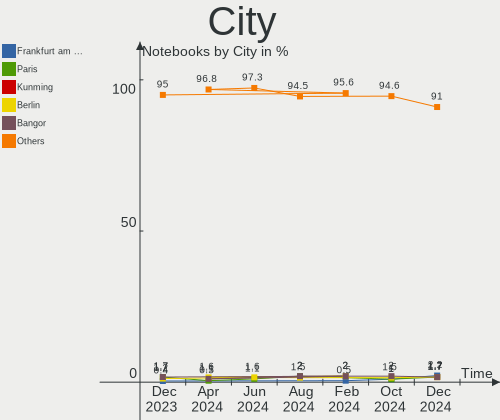
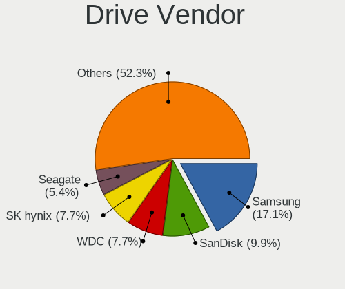
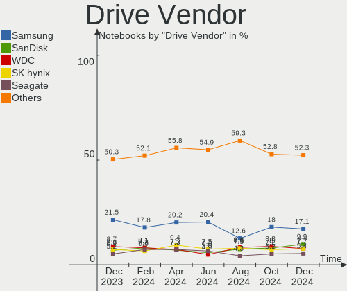
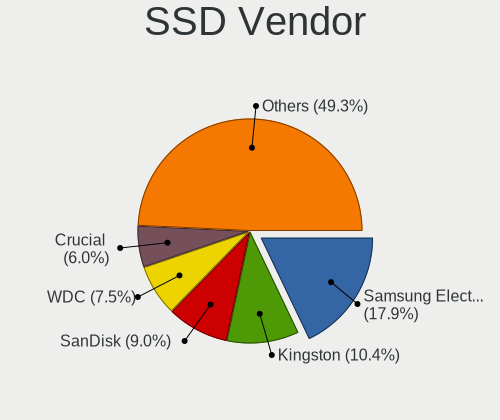
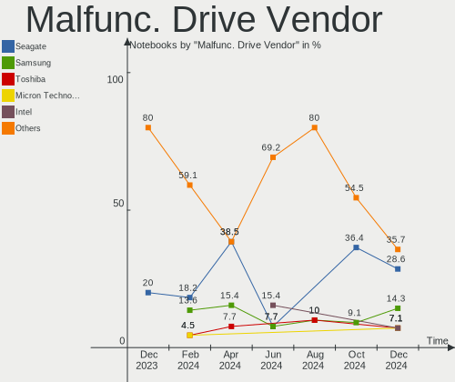
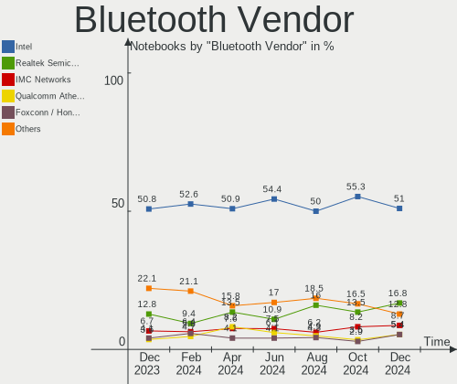
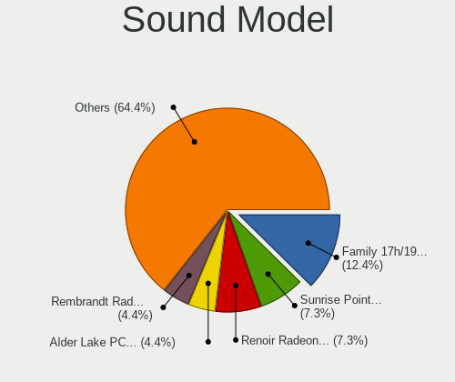

Debian - Hardware Trends (Notebooks)
------------------------------------

A project to identify most popular hardware characteristics and track their change
over time based on data collected by Linux users at https://Linux-Hardware.org.

Anyone can contribute to this report by the [hw-probe](https://github.com/linuxhw/hw-probe) tool:

    sudo -E hw-probe -all -upload

This report is for one last month. Overall report since the beginning of time: [TestDays](https://github.com/linuxhw/TestDays)

Period: Apr, 2023.

Contents
--------

* [ System ](#system)
  - [ OS                       ](#os)
  - [ OS Family                ](#os-family)
  - [ Kernel                   ](#kernel)
  - [ Kernel Family            ](#kernel-family)
  - [ Kernel Major Ver.        ](#kernel-major-ver)
  - [ Arch                     ](#arch)
  - [ DE                       ](#de)
  - [ Display Server           ](#display-server)
  - [ Display Manager          ](#display-manager)
  - [ OS Lang                  ](#os-lang)
  - [ Boot Mode                ](#boot-mode)
  - [ Filesystem               ](#filesystem)
  - [ Part. scheme             ](#part-scheme)
  - [ Dual Boot with Linux/BSD ](#dual-boot-with-linuxbsd)
  - [ Dual Boot (Win)          ](#dual-boot-win)

* [ Board ](#board)
  - [ Vendor                   ](#vendor)
  - [ Model                    ](#model)
  - [ Model Family             ](#model-family)
  - [ MFG Year                 ](#mfg-year)
  - [ Form Factor              ](#form-factor)
  - [ Secure Boot              ](#secure-boot)
  - [ Coreboot                 ](#coreboot)
  - [ RAM Size                 ](#ram-size)
  - [ RAM Used                 ](#ram-used)
  - [ Total Drives             ](#total-drives)
  - [ Has CD-ROM               ](#has-cd-rom)
  - [ Has Ethernet             ](#has-ethernet)
  - [ Has WiFi                 ](#has-wifi)
  - [ Has Bluetooth            ](#has-bluetooth)

* [ Location ](#location)
  - [ Country                  ](#country)
  - [ City                     ](#city)

* [ Drives ](#drives)
  - [ Drive Vendor             ](#drive-vendor)
  - [ Drive Model              ](#drive-model)
  - [ HDD Vendor               ](#hdd-vendor)
  - [ SSD Vendor               ](#ssd-vendor)
  - [ Drive Kind               ](#drive-kind)
  - [ Drive Connector          ](#drive-connector)
  - [ Drive Size               ](#drive-size)
  - [ Space Total              ](#space-total)
  - [ Space Used               ](#space-used)
  - [ Malfunc. Drives          ](#malfunc-drives)
  - [ Malfunc. Drive Vendor    ](#malfunc-drive-vendor)
  - [ Malfunc. HDD Vendor      ](#malfunc-hdd-vendor)
  - [ Malfunc. Drive Kind      ](#malfunc-drive-kind)
  - [ Failed Drives            ](#failed-drives)
  - [ Failed Drive Vendor      ](#failed-drive-vendor)
  - [ Drive Status             ](#drive-status)

* [ Storage controller ](#storage-controller)
  - [ Storage Vendor           ](#storage-vendor)
  - [ Storage Model            ](#storage-model)
  - [ Storage Kind             ](#storage-kind)

* [ Processor ](#processor)
  - [ CPU Vendor               ](#cpu-vendor)
  - [ CPU Model                ](#cpu-model)
  - [ CPU Model Family         ](#cpu-model-family)
  - [ CPU Cores                ](#cpu-cores)
  - [ CPU Sockets              ](#cpu-sockets)
  - [ CPU Threads              ](#cpu-threads)
  - [ CPU Op-Modes             ](#cpu-op-modes)
  - [ CPU Microcode            ](#cpu-microcode)
  - [ CPU Microarch            ](#cpu-microarch)

* [ Graphics ](#graphics)
  - [ GPU Vendor               ](#gpu-vendor)
  - [ GPU Model                ](#gpu-model)
  - [ GPU Combo                ](#gpu-combo)
  - [ GPU Driver               ](#gpu-driver)
  - [ GPU Memory               ](#gpu-memory)

* [ Monitor ](#monitor)
  - [ Monitor Vendor           ](#monitor-vendor)
  - [ Monitor Model            ](#monitor-model)
  - [ Monitor Resolution       ](#monitor-resolution)
  - [ Monitor Diagonal         ](#monitor-diagonal)
  - [ Monitor Width            ](#monitor-width)
  - [ Aspect Ratio             ](#aspect-ratio)
  - [ Monitor Area             ](#monitor-area)
  - [ Pixel Density            ](#pixel-density)
  - [ Multiple Monitors        ](#multiple-monitors)

* [ Network ](#network)
  - [ Net Controller Vendor    ](#net-controller-vendor)
  - [ Net Controller Model     ](#net-controller-model)
  - [ Wireless Vendor          ](#wireless-vendor)
  - [ Wireless Model           ](#wireless-model)
  - [ Ethernet Vendor          ](#ethernet-vendor)
  - [ Ethernet Model           ](#ethernet-model)
  - [ Net Controller Kind      ](#net-controller-kind)
  - [ Used Controller          ](#used-controller)
  - [ NICs                     ](#nics)
  - [ IPv6                     ](#ipv6)

* [ Bluetooth ](#bluetooth)
  - [ Bluetooth Vendor         ](#bluetooth-vendor)
  - [ Bluetooth Model          ](#bluetooth-model)

* [ Sound ](#sound)
  - [ Sound Vendor             ](#sound-vendor)
  - [ Sound Model              ](#sound-model)

* [ Memory ](#memory)
  - [ Memory Vendor            ](#memory-vendor)
  - [ Memory Model             ](#memory-model)
  - [ Memory Kind              ](#memory-kind)
  - [ Memory Form Factor       ](#memory-form-factor)
  - [ Memory Size              ](#memory-size)
  - [ Memory Speed             ](#memory-speed)

* [ Printers & scanners ](#printers--scanners)
  - [ Printer Vendor           ](#printer-vendor)
  - [ Printer Model            ](#printer-model)
  - [ Scanner Vendor           ](#scanner-vendor)
  - [ Scanner Model            ](#scanner-model)

* [ Camera ](#camera)
  - [ Camera Vendor            ](#camera-vendor)
  - [ Camera Model             ](#camera-model)

* [ Security ](#security)
  - [ Fingerprint Vendor       ](#fingerprint-vendor)
  - [ Fingerprint Model        ](#fingerprint-model)
  - [ Chipcard Vendor          ](#chipcard-vendor)
  - [ Chipcard Model           ](#chipcard-model)

* [ Unsupported ](#unsupported)
  - [ Unsupported Devices      ](#unsupported-devices)
  - [ Unsupported Device Types ](#unsupported-device-types)

System
------

OS
--

Installed operating systems

| Name      | Notebooks | Percent |
|-----------|-----------|---------|
| Debian 11 | 117       | 61.26%  |
| Debian 12 | 71        | 37.17%  |
| Debian 10 | 2         | 1.05%   |
| Debian    | 1         | 0.52%   |

OS Family
---------

OS without a version

| Name   | Notebooks | Percent |
|--------|-----------|---------|
| Debian | 191       | 100%    |

Kernel
------

Version of the Linux kernel

| Version                  | Notebooks | Percent |
|--------------------------|-----------|---------|
| 5.10.0-21-amd64          | 58        | 30.37%  |
| 6.1.0-7-amd64            | 34        | 17.8%   |
| 6.1.0-4-amd64            | 29        | 15.18%  |
| 5.10.0-20-amd64          | 22        | 11.52%  |
| 6.1.0-0.deb11.5-amd64    | 14        | 7.33%   |
| 6.1.0-6-amd64            | 7         | 3.66%   |
| 5.10.0-21-686-pae        | 3         | 1.57%   |
| 6.0.0-0.deb11.6-amd64    | 2         | 1.05%   |
| 5.10.0-15-amd64          | 2         | 1.05%   |
| 6.2.11-titanide          | 1         | 0.52%   |
| 6.2.11                   | 1         | 0.52%   |
| 6.1.15-2-liquorix-amd64  | 1         | 0.52%   |
| 6.1.0-7-rt-amd64         | 1         | 0.52%   |
| 6.1.0-7-686              | 1         | 0.52%   |
| 6.1.0-0.deb11.6-amd64    | 1         | 0.52%   |
| 6.1.0-0.deb11.5-rt-amd64 | 1         | 0.52%   |
| 6.0.2                    | 1         | 0.52%   |
| 6.0.12                   | 1         | 0.52%   |
| 6.0.0-6mx-amd64          | 1         | 0.52%   |
| 5.19.0-0.deb11.2-amd64   | 1         | 0.52%   |
| 5.15.0-0.bpo.3-amd64     | 1         | 0.52%   |
| 5.10.0-9-amd64           | 1         | 0.52%   |
| 5.10.0-22-amd64          | 1         | 0.52%   |
| 5.10.0-21-686            | 1         | 0.52%   |
| 5.10.0-20-686            | 1         | 0.52%   |
| 5.10.0-18-amd64          | 1         | 0.52%   |
| 5.10.0-13-amd64          | 1         | 0.52%   |
| 4.19.0-23-amd64          | 1         | 0.52%   |
| 4.19.0-16-amd64          | 1         | 0.52%   |

Kernel Family
-------------

Linux kernel without a distro release

| Version | Notebooks | Percent |
|---------|-----------|---------|
| 5.10.0  | 91        | 47.64%  |
| 6.1.0   | 88        | 46.07%  |
| 6.0.0   | 3         | 1.57%   |
| 6.2.11  | 2         | 1.05%   |
| 4.19.0  | 2         | 1.05%   |
| 6.1.15  | 1         | 0.52%   |
| 6.0.2   | 1         | 0.52%   |
| 6.0.12  | 1         | 0.52%   |
| 5.19.0  | 1         | 0.52%   |
| 5.15.0  | 1         | 0.52%   |

Kernel Major Ver.
-----------------

Linux kernel major version

| Version | Notebooks | Percent |
|---------|-----------|---------|
| 5.10    | 91        | 47.64%  |
| 6.1     | 89        | 46.6%   |
| 6.0     | 5         | 2.62%   |
| 6.2     | 2         | 1.05%   |
| 4.19    | 2         | 1.05%   |
| 5.19    | 1         | 0.52%   |
| 5.15    | 1         | 0.52%   |

Arch
----

OS architecture (x86_64, i586, etc.)

| Name   | Notebooks | Percent |
|--------|-----------|---------|
| x86_64 | 184       | 96.34%  |
| i686   | 7         | 3.66%   |

DE
--

Desktop Environment

| Name            | Notebooks | Percent |
|-----------------|-----------|---------|
| GNOME           | 57        | 29.84%  |
| Unknown         | 40        | 20.94%  |
| KDE5            | 33        | 17.28%  |
| XFCE            | 28        | 14.66%  |
| MATE            | 8         | 4.19%   |
| LXDE            | 6         | 3.14%   |
| X-Cinnamon      | 5         | 2.62%   |
| KDE             | 3         | 1.57%   |
| i3              | 2         | 1.05%   |
| GNOME Flashback | 2         | 1.05%   |
| BunsenLabs      | 2         | 1.05%   |
| Trinity         | 1         | 0.52%   |
| Openbox         | 1         | 0.52%   |
| mwm             | 1         | 0.52%   |
| GNOME Classic   | 1         | 0.52%   |
| Enlightenment   | 1         | 0.52%   |

Display Server
--------------

X11 or Wayland

| Name        | Notebooks | Percent |
|-------------|-----------|---------|
| X11         | 107       | 56.02%  |
| Wayland     | 41        | 21.47%  |
| Unknown     | 37        | 19.37%  |
| Tty         | 4         | 2.09%   |
| Unspecified | 2         | 1.05%   |

Display Manager
---------------

SDDM, LightDM, etc.

| Name    | Notebooks | Percent |
|---------|-----------|---------|
| Unknown | 59        | 30.89%  |
| LightDM | 46        | 24.08%  |
| SDDM    | 31        | 16.23%  |
| GDM     | 29        | 15.18%  |
| GDM3    | 22        | 11.52%  |
| XDM     | 2         | 1.05%   |
| SU      | 1         | 0.52%   |
| LXDM    | 1         | 0.52%   |

OS Lang
-------

Language

| Lang    | Notebooks | Percent |
|---------|-----------|---------|
| en_US   | 47        | 24.61%  |
| ru_RU   | 34        | 17.8%   |
| fr_FR   | 18        | 9.42%   |
| de_DE   | 17        | 8.9%    |
| pl_PL   | 12        | 6.28%   |
| en_GB   | 11        | 5.76%   |
| it_IT   | 6         | 3.14%   |
| es_ES   | 6         | 3.14%   |
| Unknown | 6         | 3.14%   |
| pt_BR   | 4         | 2.09%   |
| es_MX   | 4         | 2.09%   |
| es_AR   | 4         | 2.09%   |
| nl_NL   | 2         | 1.05%   |
| fr_BE   | 2         | 1.05%   |
| C       | 2         | 1.05%   |
| zh_CN   | 1         | 0.52%   |
| tr_TR   | 1         | 0.52%   |
| sk_SK   | 1         | 0.52%   |
| nl_BE   | 1         | 0.52%   |
| nb_NO   | 1         | 0.52%   |
| hu_HU   | 1         | 0.52%   |
| fi_FI   | 1         | 0.52%   |
| es_VE   | 1         | 0.52%   |
| es_CR   | 1         | 0.52%   |
| es_CO   | 1         | 0.52%   |
| en_IN   | 1         | 0.52%   |
| en_IL   | 1         | 0.52%   |
| en_CA   | 1         | 0.52%   |
| en_AU   | 1         | 0.52%   |
| de_CH   | 1         | 0.52%   |
| de_AT   | 1         | 0.52%   |

Boot Mode
---------

EFI or BIOS

| Mode | Notebooks | Percent |
|------|-----------|---------|
| EFI  | 133       | 69.63%  |
| BIOS | 58        | 30.37%  |

Filesystem
----------

Type of filesystem

| Type    | Notebooks | Percent |
|---------|-----------|---------|
| Ext4    | 141       | 73.82%  |
| Overlay | 44        | 23.04%  |
| Btrfs   | 4         | 2.09%   |
| Xfs     | 2         | 1.05%   |

Part. scheme
------------

Scheme of partitioning

| Type    | Notebooks | Percent |
|---------|-----------|---------|
| GPT     | 135       | 70.68%  |
| MBR     | 36        | 18.85%  |
| Unknown | 20        | 10.47%  |

Dual Boot with Linux/BSD
------------------------

Hosting more than one Linux/BSD

| Dual boot | Notebooks | Percent |
|-----------|-----------|---------|
| No        | 178       | 93.19%  |
| Yes       | 13        | 6.81%   |

Dual Boot (Win)
---------------

Hosting Linux and Windows

| Dual boot | Notebooks | Percent |
|-----------|-----------|---------|
| No        | 127       | 66.49%  |
| Yes       | 64        | 33.51%  |

Board
-----

Vendor
------

Motherboard manufacturer

| Name                   | Notebooks | Percent |
|------------------------|-----------|---------|
| Hewlett-Packard        | 42        | 21.99%  |
| Lenovo                 | 26        | 13.61%  |
| Aquarius               | 25        | 13.09%  |
| Dell                   | 24        | 12.57%  |
| Acer                   | 18        | 9.42%   |
| ASUSTek Computer       | 13        | 6.81%   |
| Toshiba                | 8         | 4.19%   |
| Google                 | 4         | 2.09%   |
| Apple                  | 4         | 2.09%   |
| Samsung Electronics    | 3         | 1.57%   |
| MSI                    | 3         | 1.57%   |
| Packard Bell           | 2         | 1.05%   |
| LG Electronics         | 2         | 1.05%   |
| eMachines              | 2         | 1.05%   |
| Tactus                 | 1         | 0.52%   |
| System76               | 1         | 0.52%   |
| Schenker               | 1         | 0.52%   |
| Positivo               | 1         | 0.52%   |
| PC Specialist          | 1         | 0.52%   |
| Notebook               | 1         | 0.52%   |
| Medion                 | 1         | 0.52%   |
| IGEL Technology        | 1         | 0.52%   |
| IBM                    | 1         | 0.52%   |
| HONOR                  | 1         | 0.52%   |
| Hampoo                 | 1         | 0.52%   |
| Framework              | 1         | 0.52%   |
| COPELION INTERNATIONAL | 1         | 0.52%   |
| Clevo                  | 1         | 0.52%   |
| ARDOR GAMING           | 1         | 0.52%   |

Model
-----

Motherboard model

| Name                                | Notebooks | Percent |
|-------------------------------------|-----------|---------|
| Aquarius NS585                      | 25        | 13.09%  |
| HP Pavilion Gaming Laptop 15-ec2xxx | 4         | 2.09%   |
| HP Pavilion Gaming Laptop 15-ec1xxx | 3         | 1.57%   |
| HP Notebook                         | 3         | 1.57%   |
| HP 255 G8 Notebook PC               | 3         | 1.57%   |
| Acer TravelMate 5735Z               | 3         | 1.57%   |
| HP Pavilion dv7                     | 2         | 1.05%   |
| HP Laptop 15s-eq2xxx                | 2         | 1.05%   |
| HP Laptop 15-db1xxx                 | 2         | 1.05%   |
| Google Reks                         | 2         | 1.05%   |
| Dell Latitude 3320                  | 2         | 1.05%   |
| Dell Inspiron 1525                  | 2         | 1.05%   |
| Toshiba Satellite X200              | 1         | 0.52%   |
| Toshiba Satellite Pro NB10-A-125    | 1         | 0.52%   |
| Toshiba Satellite Pro C850-1K0      | 1         | 0.52%   |
| Toshiba Satellite Pro C850-1J2      | 1         | 0.52%   |
| Toshiba Satellite Pro A100          | 1         | 0.52%   |
| Toshiba Satellite C855D-12J         | 1         | 0.52%   |
| Toshiba Satellite C70D-A            | 1         | 0.52%   |
| Toshiba PORTEGE Z20t-C              | 1         | 0.52%   |
| Tactus GeoBook 140                  | 1         | 0.52%   |
| System76 Lemur Pro                  | 1         | 0.52%   |
| Schenker XMG CORE (REN/M20)         | 1         | 0.52%   |
| Samsung RF511/RF411/RF711           | 1         | 0.52%   |
| Samsung 550XDA                      | 1         | 0.52%   |
| Samsung 550XCJ/550XCR               | 1         | 0.52%   |
| Positivo Q464C                      | 1         | 0.52%   |
| PC Specialist NV4XMB,ME,MZ          | 1         | 0.52%   |
| Packard Bell EasyNote_MX45          | 1         | 0.52%   |
| Packard Bell EasyNote TJ65          | 1         | 0.52%   |
| Notebook N7x0WU                     | 1         | 0.52%   |
| MSI Vector GP66 12UGS               | 1         | 0.52%   |
| MSI Prestige 15 A12UC               | 1         | 0.52%   |
| MSI GL65 Leopard 10SCSR             | 1         | 0.52%   |
| Medion P17605                       | 1         | 0.52%   |
| LG P530-KE6BK                       | 1         | 0.52%   |
| LG 17Z90Q-K.AA78A1                  | 1         | 0.52%   |
| Lenovo Yoga 500-15IBD 80N6          | 1         | 0.52%   |
| Lenovo XiaoXinPro 16ACH 2021 82L5   | 1         | 0.52%   |
| Lenovo V15 G2 ALC 82KD              | 1         | 0.52%   |

Model Family
------------

Motherboard model prefix

| Name                  | Notebooks | Percent |
|-----------------------|-----------|---------|
| Aquarius NS585        | 25        | 13.09%  |
| Lenovo ThinkPad       | 18        | 9.42%   |
| HP Pavilion           | 10        | 5.24%   |
| Dell Latitude         | 10        | 5.24%   |
| Acer Aspire           | 9         | 4.71%   |
| HP Laptop             | 8         | 4.19%   |
| Toshiba Satellite     | 7         | 3.66%   |
| HP EliteBook          | 6         | 3.14%   |
| Dell Inspiron         | 6         | 3.14%   |
| ASUS VivoBook         | 4         | 2.09%   |
| Acer TravelMate       | 4         | 2.09%   |
| HP ZBook              | 3         | 1.57%   |
| HP ProBook            | 3         | 1.57%   |
| HP Notebook           | 3         | 1.57%   |
| HP 255                | 3         | 1.57%   |
| Dell Precision        | 3         | 1.57%   |
| ASUS ASUS             | 3         | 1.57%   |
| Packard Bell EasyNote | 2         | 1.05%   |
| Lenovo IdeaPad        | 2         | 1.05%   |
| HP ENVY               | 2         | 1.05%   |
| Google Reks           | 2         | 1.05%   |
| Dell G15              | 2         | 1.05%   |
| Acer Swift            | 2         | 1.05%   |
| Toshiba PORTEGE       | 1         | 0.52%   |
| Tactus GeoBook        | 1         | 0.52%   |
| System76 Lemur        | 1         | 0.52%   |
| Schenker XMG          | 1         | 0.52%   |
| Samsung RF511         | 1         | 0.52%   |
| Samsung 550XDA        | 1         | 0.52%   |
| Samsung 550XCJ        | 1         | 0.52%   |
| Positivo Q464C        | 1         | 0.52%   |
| PC Specialist NV4XMB  | 1         | 0.52%   |
| Notebook N7x0WU       | 1         | 0.52%   |
| MSI Vector            | 1         | 0.52%   |
| MSI Prestige          | 1         | 0.52%   |
| MSI GL65              | 1         | 0.52%   |
| Medion P17605         | 1         | 0.52%   |
| LG P530-KE6BK         | 1         | 0.52%   |
| LG 17Z90Q-K.AA78A1    | 1         | 0.52%   |
| Lenovo Yoga           | 1         | 0.52%   |

MFG Year
--------

Motherboard manufacture year

| Year | Notebooks | Percent |
|------|-----------|---------|
| 2019 | 35        | 18.32%  |
| 2021 | 30        | 15.71%  |
| 2022 | 17        | 8.9%    |
| 2020 | 16        | 8.38%   |
| 2015 | 12        | 6.28%   |
| 2016 | 10        | 5.24%   |
| 2012 | 10        | 5.24%   |
| 2013 | 9         | 4.71%   |
| 2008 | 8         | 4.19%   |
| 2018 | 7         | 3.66%   |
| 2014 | 7         | 3.66%   |
| 2017 | 6         | 3.14%   |
| 2011 | 6         | 3.14%   |
| 2010 | 6         | 3.14%   |
| 2009 | 4         | 2.09%   |
| 2023 | 3         | 1.57%   |
| 2006 | 3         | 1.57%   |
| 2007 | 1         | 0.52%   |
| 2005 | 1         | 0.52%   |

Form Factor
-----------

Physical design of the computer

| Name     | Notebooks | Percent |
|----------|-----------|---------|
| Notebook | 191       | 100%    |

Secure Boot
-----------

Enabled or disabled

| State    | Notebooks | Percent |
|----------|-----------|---------|
| Disabled | 170       | 89.01%  |
| Enabled  | 21        | 10.99%  |

Coreboot
--------

Have coreboot on board

| Used | Notebooks | Percent |
|------|-----------|---------|
| No   | 186       | 97.38%  |
| Yes  | 5         | 2.62%   |

RAM Size
--------

Total RAM memory

| Size in GB  | Notebooks | Percent |
|-------------|-----------|---------|
| 4.01-8.0    | 64        | 33.51%  |
| 16.01-24.0  | 35        | 18.32%  |
| 8.01-16.0   | 34        | 17.8%   |
| 3.01-4.0    | 25        | 13.09%  |
| 32.01-64.0  | 14        | 7.33%   |
| 1.01-2.0    | 10        | 5.24%   |
| 64.01-256.0 | 4         | 2.09%   |
| 24.01-32.0  | 2         | 1.05%   |
| 0.51-1.0    | 2         | 1.05%   |
| 2.01-3.0    | 1         | 0.52%   |

RAM Used
--------

Used RAM memory

| Used GB   | Notebooks | Percent |
|-----------|-----------|---------|
| 1.01-2.0  | 47        | 24.61%  |
| 4.01-8.0  | 38        | 19.9%   |
| 2.01-3.0  | 37        | 19.37%  |
| 0.51-1.0  | 36        | 18.85%  |
| 3.01-4.0  | 21        | 10.99%  |
| 8.01-16.0 | 10        | 5.24%   |
| 0.01-0.5  | 2         | 1.05%   |

Total Drives
------------

Number of drives on board

| Drives | Notebooks | Percent |
|--------|-----------|---------|
| 1      | 145       | 75.92%  |
| 2      | 39        | 20.42%  |
| 3      | 5         | 2.62%   |
| 0      | 2         | 1.05%   |

Has CD-ROM
----------

Has CD-ROM on board

| Presented | Notebooks | Percent |
|-----------|-----------|---------|
| No        | 140       | 73.3%   |
| Yes       | 51        | 26.7%   |

Has Ethernet
------------

Has Ethernet on board

| Presented | Notebooks | Percent |
|-----------|-----------|---------|
| Yes       | 167       | 87.43%  |
| No        | 24        | 12.57%  |

Has WiFi
--------

Has WiFi module

| Presented | Notebooks | Percent |
|-----------|-----------|---------|
| Yes       | 187       | 97.91%  |
| No        | 4         | 2.09%   |

Has Bluetooth
-------------

Has Bluetooth module

| Presented | Notebooks | Percent |
|-----------|-----------|---------|
| Yes       | 162       | 84.82%  |
| No        | 29        | 15.18%  |

Location
--------

Country
-------

Geographic location (country)

| Country     | Notebooks | Percent |
|-------------|-----------|---------|
| Russia      | 38        | 19.9%   |
| Germany     | 23        | 12.04%  |
| France      | 17        | 8.9%    |
| Poland      | 14        | 7.33%   |
| USA         | 12        | 6.28%   |
| Italy       | 8         | 4.19%   |
| UK          | 7         | 3.66%   |
| Brazil      | 7         | 3.66%   |
| Spain       | 6         | 3.14%   |
| Belgium     | 6         | 3.14%   |
| Netherlands | 5         | 2.62%   |
| Mexico      | 5         | 2.62%   |
| Argentina   | 4         | 2.09%   |
| Finland     | 3         | 1.57%   |
| Austria     | 3         | 1.57%   |
| Australia   | 3         | 1.57%   |
| Turkey      | 2         | 1.05%   |
| Slovakia    | 2         | 1.05%   |
| Madagascar  | 2         | 1.05%   |
| Cyprus      | 2         | 1.05%   |
| Venezuela   | 1         | 0.52%   |
| Thailand    | 1         | 0.52%   |
| Tanzania    | 1         | 0.52%   |
| Switzerland | 1         | 0.52%   |
| Sweden      | 1         | 0.52%   |
| Romania     | 1         | 0.52%   |
| Portugal    | 1         | 0.52%   |
| Norway      | 1         | 0.52%   |
| Latvia      | 1         | 0.52%   |
| Japan       | 1         | 0.52%   |
| Israel      | 1         | 0.52%   |
| Indonesia   | 1         | 0.52%   |
| India       | 1         | 0.52%   |
| Hungary     | 1         | 0.52%   |
| Georgia     | 1         | 0.52%   |
| Czechia     | 1         | 0.52%   |
| Costa Rica  | 1         | 0.52%   |
| Colombia    | 1         | 0.52%   |
| China       | 1         | 0.52%   |
| Canada      | 1         | 0.52%   |

City
----

Geographic location (city)

| City                   | Notebooks | Percent |
|------------------------|-----------|---------|
| Voronezh               | 29        | 15.18%  |
| Chorzele               | 9         | 4.71%   |
| Paris                  | 5         | 2.62%   |
| Kirchhain              | 4         | 2.09%   |
| Moscow                 | 3         | 1.57%   |
| Bangor                 | 3         | 1.57%   |
| Warsaw                 | 2         | 1.05%   |
| Seville                | 2         | 1.05%   |
| Rome                   | 2         | 1.05%   |
| Perth                  | 2         | 1.05%   |
| Nicosia                | 2         | 1.05%   |
| Istanbul               | 2         | 1.05%   |
| Helsinki               | 2         | 1.05%   |
| Hamburg                | 2         | 1.05%   |
| Frankfurt am Main      | 2         | 1.05%   |
| Campo Grande           | 2         | 1.05%   |
| Bocholt                | 2         | 1.05%   |
| Berlin                 | 2         | 1.05%   |
| Antananarivo           | 2         | 1.05%   |
| Zurich                 | 1         | 0.52%   |
| Zuidland               | 1         | 0.52%   |
| Zgorzelec              | 1         | 0.52%   |
| Willowbrook            | 1         | 0.52%   |
| Wavre                  | 1         | 0.52%   |
| Vorselaar              | 1         | 0.52%   |
| Villeurbanne           | 1         | 0.52%   |
| Vienna                 | 1         | 0.52%   |
| Utrecht                | 1         | 0.52%   |
| Tomsk                  | 1         | 0.52%   |
| Tokyo                  | 1         | 0.52%   |
| Thermopolis            | 1         | 0.52%   |
| Tempio Pausania        | 1         | 0.52%   |
| Tel Aviv               | 1         | 0.52%   |
| Tbilisi                | 1         | 0.52%   |
| Swinton                | 1         | 0.52%   |
| Stockholm              | 1         | 0.52%   |
| Southsea               | 1         | 0.52%   |
| Smiltene               | 1         | 0.52%   |
| Santo Antonio de Padua | 1         | 0.52%   |
| Sant'Antonio Abate     | 1         | 0.52%   |

Drives
------

Drive Vendor
------------

Hard drive vendors

| Vendor              | Notebooks | Drives | Percent |
|---------------------|-----------|--------|---------|
| WDC                 | 31        | 31     | 13.54%  |
| Samsung Electronics | 31        | 33     | 13.54%  |
| A-DATA Technology   | 27        | 27     | 11.79%  |
| SK hynix            | 13        | 13     | 5.68%   |
| Seagate             | 13        | 13     | 5.68%   |
| Unknown             | 12        | 13     | 5.24%   |
| Kingston            | 12        | 13     | 5.24%   |
| Intel               | 12        | 12     | 5.24%   |
| Crucial             | 10        | 10     | 4.37%   |
| Toshiba             | 9         | 9      | 3.93%   |
| Sandisk             | 7         | 7      | 3.06%   |
| Micron Technology   | 7         | 7      | 3.06%   |
| KIOXIA              | 6         | 6      | 2.62%   |
| HGST                | 5         | 5      | 2.18%   |
| Intenso             | 3         | 3      | 1.31%   |
| Hitachi             | 3         | 3      | 1.31%   |
| Apple               | 3         | 3      | 1.31%   |
| Silicon Motion      | 2         | 2      | 0.87%   |
| Phison              | 2         | 2      | 0.87%   |
| Corsair             | 2         | 2      | 0.87%   |
| China               | 2         | 2      | 0.87%   |
| Unknown             | 2         | 2      | 0.87%   |
| TO Exter            | 1         | 1      | 0.44%   |
| Team                | 1         | 1      | 0.44%   |
| SSSTC               | 1         | 1      | 0.44%   |
| PNY                 | 1         | 1      | 0.44%   |
| OCZ                 | 1         | 1      | 0.44%   |
| Netac               | 1         | 1      | 0.44%   |
| LVCARDS             | 1         | 1      | 0.44%   |
| LITEONIT            | 1         | 1      | 0.44%   |
| Lexar               | 1         | 1      | 0.44%   |
| KingSpec            | 1         | 1      | 0.44%   |
| KingFast            | 1         | 1      | 0.44%   |
| JMicron Technology  | 1         | 1      | 0.44%   |
| Emtec               | 1         | 1      | 0.44%   |
| BAITITON            | 1         | 1      | 0.44%   |
| Apacer              | 1         | 1      | 0.44%   |

Drive Model
-----------

Hard drive models

| Model                                | Notebooks | Percent |
|--------------------------------------|-----------|---------|
| A-DATA SU800 512GB SSD               | 25        | 10.82%  |
| Intel SSDPEKNW512G8H 512GB           | 5         | 2.16%   |
| SK hynix PC711 HFS512GDE9X073N 512GB | 4         | 1.73%   |
| HGST HTS541010A9E680 1TB             | 4         | 1.73%   |
| Crucial CT500MX500SSD1 500GB         | 4         | 1.73%   |
| Kingston SA400S37480G 480GB SSD      | 3         | 1.3%    |
| WDC WDS500G2B0A-00SM50 500GB SSD     | 2         | 0.87%   |
| WDC WDS240G2G0B-00EPW0 240GB SSD     | 2         | 0.87%   |
| WDC PC SN530 NVMe 256GB              | 2         | 0.87%   |
| Toshiba MQ04ABF100 1TB               | 2         | 0.87%   |
| SK hynix BC711 NVMe 256GB            | 2         | 0.87%   |
| Seagate ST1000LM035-1RK172 970GB     | 2         | 0.87%   |
| Samsung SSD 850 EVO 500GB            | 2         | 0.87%   |
| Samsung MZVLW256HEHP-000L7 256GB     | 2         | 0.87%   |
| Samsung MZVLQ1T0HBLB-00B00 1024GB    | 2         | 0.87%   |
| Samsung MZVL21T0HCLR-00B00 1TB       | 2         | 0.87%   |
| Micron 2300 NVMe 512GB               | 2         | 0.87%   |
| KIOXIA KBG40ZNV256G 256GB            | 2         | 0.87%   |
| Kingston SA400M8240G 240GB SSD       | 2         | 0.87%   |
| Intenso SSD 256GB                    | 2         | 0.87%   |
| Intel SSDPEKNU512GZH 512GB           | 2         | 0.87%   |
| Intel SSDPEKNU512GZ 512GB            | 2         | 0.87%   |
| Crucial CT250MX500SSD1 250GB         | 2         | 0.87%   |
| Unknown                              | 2         | 0.87%   |
| WDC WDS500G2B0A 500GB SSD            | 1         | 0.43%   |
| WDC WDS250G2B0A-00SM50 250GB SSD     | 1         | 0.43%   |
| WDC WDBNCE0010PNC 1TB SSD            | 1         | 0.43%   |
| WDC WD800UE-22HCT0 80GB              | 1         | 0.43%   |
| WDC WD5000LPVX-22V0TT0 500GB         | 1         | 0.43%   |
| WDC WD5000LPVX-08V0TT5 500GB         | 1         | 0.43%   |
| WDC WD5000LPSX-75A6WT0 500GB         | 1         | 0.43%   |
| WDC WD5000LPCX-08VHA 500GB           | 1         | 0.43%   |
| WDC WD5000BEVT-22ZAT0 500GB          | 1         | 0.43%   |
| WDC WD50 00BPKT-75PK4 500GB          | 1         | 0.43%   |
| WDC WD2500BEVT-75A23T0 250GB         | 1         | 0.43%   |
| WDC WD2500BEVE-00WZT0 250GB          | 1         | 0.43%   |
| WDC WD1600BEVT-22A23T0 160GB         | 1         | 0.43%   |
| WDC WD10SPZX-60Z10T1 1TB             | 1         | 0.43%   |
| WDC WD10SPZX-35Z10T0 1TB             | 1         | 0.43%   |
| WDC WD10SPSX-08A6W 1TB               | 1         | 0.43%   |

HDD Vendor
----------

Hard disk drive vendors

| Vendor              | Notebooks | Drives | Percent |
|---------------------|-----------|--------|---------|
| WDC                 | 13        | 13     | 31.71%  |
| Seagate             | 12        | 12     | 29.27%  |
| Toshiba             | 6         | 6      | 14.63%  |
| HGST                | 5         | 5      | 12.2%   |
| Hitachi             | 3         | 3      | 7.32%   |
| Unknown             | 1         | 1      | 2.44%   |
| Samsung Electronics | 1         | 1      | 2.44%   |

SSD Vendor
----------

Solid state drive vendors

| Vendor              | Notebooks | Drives | Percent |
|---------------------|-----------|--------|---------|
| A-DATA Technology   | 26        | 26     | 27.08%  |
| Samsung Electronics | 10        | 11     | 10.42%  |
| Kingston            | 10        | 10     | 10.42%  |
| Crucial             | 9         | 9      | 9.38%   |
| WDC                 | 7         | 7      | 7.29%   |
| SanDisk             | 6         | 6      | 6.25%   |
| Intenso             | 3         | 3      | 3.13%   |
| Apple               | 3         | 3      | 3.13%   |
| SK hynix            | 2         | 2      | 2.08%   |
| Micron Technology   | 2         | 2      | 2.08%   |
| China               | 2         | 2      | 2.08%   |
| Toshiba             | 1         | 1      | 1.04%   |
| TO Exter            | 1         | 1      | 1.04%   |
| Team                | 1         | 1      | 1.04%   |
| PNY                 | 1         | 1      | 1.04%   |
| OCZ                 | 1         | 1      | 1.04%   |
| Netac               | 1         | 1      | 1.04%   |
| LVCARDS             | 1         | 1      | 1.04%   |
| LITEONIT            | 1         | 1      | 1.04%   |
| Lexar               | 1         | 1      | 1.04%   |
| KingSpec            | 1         | 1      | 1.04%   |
| KingFast            | 1         | 1      | 1.04%   |
| Intel               | 1         | 1      | 1.04%   |
| Emtec               | 1         | 1      | 1.04%   |
| Corsair             | 1         | 1      | 1.04%   |
| BAITITON            | 1         | 1      | 1.04%   |
| Apacer              | 1         | 1      | 1.04%   |

Drive Kind
----------

HDD or SSD

| Kind    | Notebooks | Drives | Percent |
|---------|-----------|--------|---------|
| SSD     | 92        | 97     | 41.82%  |
| NVMe    | 73        | 79     | 33.18%  |
| HDD     | 40        | 41     | 18.18%  |
| MMC     | 13        | 14     | 5.91%   |
| Unknown | 2         | 2      | 0.91%   |

Drive Connector
---------------

SATA, SAS, NVMe, etc.

| Type | Notebooks | Drives | Percent |
|------|-----------|--------|---------|
| SATA | 116       | 132    | 55.5%   |
| NVMe | 73        | 79     | 34.93%  |
| MMC  | 13        | 14     | 6.22%   |
| SAS  | 7         | 8      | 3.35%   |

Drive Size
----------

Size of hard drive

| Size in TB | Notebooks | Drives | Percent |
|------------|-----------|--------|---------|
| 0.01-0.5   | 77        | 85     | 59.23%  |
| 0.51-1.0   | 52        | 52     | 40%     |
| 3.01-4.0   | 1         | 1      | 0.77%   |

Space Total
-----------

Amount of disk space available on the file system

| Size in GB     | Notebooks | Percent |
|----------------|-----------|---------|
| 101-250        | 43        | 22.51%  |
| 251-500        | 42        | 21.99%  |
| Unknown        | 34        | 17.8%   |
| 501-1000       | 27        | 14.14%  |
| 1-20           | 13        | 6.81%   |
| 51-100         | 12        | 6.28%   |
| 1001-2000      | 9         | 4.71%   |
| 21-50          | 7         | 3.66%   |
| 2001-3000      | 3         | 1.57%   |
| More than 3000 | 1         | 0.52%   |

Space Used
----------

Amount of used disk space

| Used GB   | Notebooks | Percent |
|-----------|-----------|---------|
| 1-20      | 58        | 30.37%  |
| 101-250   | 34        | 17.8%   |
| Unknown   | 34        | 17.8%   |
| 21-50     | 23        | 12.04%  |
| 51-100    | 15        | 7.85%   |
| 251-500   | 14        | 7.33%   |
| 501-1000  | 8         | 4.19%   |
| 1001-2000 | 4         | 2.09%   |
| 2001-3000 | 1         | 0.52%   |

Malfunc. Drives
---------------

Drive models with a malfunction

| Model                                         | Notebooks | Drives | Percent |
|-----------------------------------------------|-----------|--------|---------|
| SK hynix PC711 HFS512GDE9X073N 512GB          | 4         | 4      | 22.22%  |
| HGST HTS541010A9E680 1TB                      | 2         | 2      | 11.11%  |
| WDC WD800UE-22HCT0 80GB                       | 1         | 1      | 5.56%   |
| WDC WD1600BEVT-22A23T0 160GB                  | 1         | 1      | 5.56%   |
| Toshiba MK3259GSXP 320GB                      | 1         | 1      | 5.56%   |
| SK hynix BC711 HFM512GD3JX013N 512GB          | 1         | 1      | 5.56%   |
| SanDisk SD6SP1M256G1012 256GB SSD             | 1         | 1      | 5.56%   |
| Micron Technology MTFDDAK128MAM-1J1 128GB SSD | 1         | 1      | 5.56%   |
| Micron Technology 2300 NVMe 512GB             | 1         | 1      | 5.56%   |
| KingSpec P3-128 128GB                         | 1         | 1      | 5.56%   |
| Hitachi HTS727550A9E364 500GB                 | 1         | 1      | 5.56%   |
| Hitachi HTS545050A7E380 500GB                 | 1         | 1      | 5.56%   |
| Hitachi HTS541616J9SA00 160GB                 | 1         | 1      | 5.56%   |
| Crucial CT275MX300SSD1 275GB                  | 1         | 1      | 5.56%   |

Malfunc. Drive Vendor
---------------------

Vendors of faulty drives

| Vendor            | Notebooks | Drives | Percent |
|-------------------|-----------|--------|---------|
| SK hynix          | 5         | 5      | 27.78%  |
| Hitachi           | 3         | 3      | 16.67%  |
| WDC               | 2         | 2      | 11.11%  |
| Micron Technology | 2         | 2      | 11.11%  |
| HGST              | 2         | 2      | 11.11%  |
| Toshiba           | 1         | 1      | 5.56%   |
| SanDisk           | 1         | 1      | 5.56%   |
| KingSpec          | 1         | 1      | 5.56%   |
| Crucial           | 1         | 1      | 5.56%   |

Malfunc. HDD Vendor
-------------------

Vendors of faulty HDD drives

| Vendor  | Notebooks | Drives | Percent |
|---------|-----------|--------|---------|
| Hitachi | 3         | 3      | 37.5%   |
| WDC     | 2         | 2      | 25%     |
| HGST    | 2         | 2      | 25%     |
| Toshiba | 1         | 1      | 12.5%   |

Malfunc. Drive Kind
-------------------

Kinds of faulty drives

| Kind | Notebooks | Drives | Percent |
|------|-----------|--------|---------|
| HDD  | 8         | 8      | 44.44%  |
| NVMe | 6         | 6      | 33.33%  |
| SSD  | 4         | 4      | 22.22%  |

Failed Drives
-------------

Failed drive models

| Model                     | Notebooks | Drives | Percent |
|---------------------------|-----------|--------|---------|
| Crucial CT500P2SSD8 500GB | 1         | 1      | 100%    |

Failed Drive Vendor
-------------------

Failed drive vendors

| Vendor  | Notebooks | Drives | Percent |
|---------|-----------|--------|---------|
| Crucial | 1         | 1      | 100%    |

Drive Status
------------

Number of failed and malfunc. drives

| Status   | Notebooks | Drives | Percent |
|----------|-----------|--------|---------|
| Works    | 146       | 168    | 71.57%  |
| Detected | 39        | 46     | 19.12%  |
| Malfunc  | 18        | 18     | 8.82%   |
| Failed   | 1         | 1      | 0.49%   |

Storage controller
------------------

Storage Vendor
--------------

Storage controller vendors

| Vendor                         | Notebooks | Percent |
|--------------------------------|-----------|---------|
| Intel                          | 125       | 57.34%  |
| AMD                            | 24        | 11.01%  |
| Samsung Electronics            | 21        | 9.63%   |
| SanDisk                        | 12        | 5.5%    |
| SK hynix                       | 11        | 5.05%   |
| Micron Technology              | 5         | 2.29%   |
| KIOXIA                         | 5         | 2.29%   |
| Phison Electronics             | 4         | 1.83%   |
| Toshiba America Info Systems   | 3         | 1.38%   |
| Silicon Motion                 | 2         | 0.92%   |
| Kingston Technology Company    | 2         | 0.92%   |
| Solid State Storage Technology | 1         | 0.46%   |
| Nvidia                         | 1         | 0.46%   |
| Marvell Technology Group       | 1         | 0.46%   |
| ADATA Technology               | 1         | 0.46%   |

Storage Model
-------------

Storage controller models

| Model                                                                            | Notebooks | Percent |
|----------------------------------------------------------------------------------|-----------|---------|
| Intel Cannon Lake PCH SATA AHCI Controller                                       | 25        | 11.06%  |
| AMD FCH SATA Controller [AHCI mode]                                              | 23        | 10.18%  |
| Intel Sunrise Point-LP SATA Controller [AHCI mode]                               | 14        | 6.19%   |
| Intel 7 Series Chipset Family 6-port SATA Controller [AHCI mode]                 | 10        | 4.42%   |
| Intel 82801IBM/IEM (ICH9M/ICH9M-E) 4 port SATA Controller [AHCI mode]            | 9         | 3.98%   |
| SK hynix Gold P31/PC711 NVMe Solid State Drive                                   | 8         | 3.54%   |
| Samsung NVMe SSD Controller 980                                                  | 8         | 3.54%   |
| Intel 82801 Mobile SATA Controller [RAID mode]                                   | 7         | 3.1%    |
| Intel 6 Series/C200 Series Chipset Family 6 port Mobile SATA AHCI Controller     | 7         | 3.1%    |
| SanDisk WD Blue SN550 NVMe SSD                                                   | 6         | 2.65%   |
| Intel 8 Series SATA Controller 1 [AHCI mode]                                     | 6         | 2.65%   |
| Samsung NVMe SSD Controller SM981/PM981/PM983                                    | 5         | 2.21%   |
| Samsung NVMe SSD Controller PM9A1/PM9A3/980PRO                                   | 5         | 2.21%   |
| Intel Wildcat Point-LP SATA Controller [AHCI Mode]                               | 5         | 2.21%   |
| Intel Volume Management Device NVMe RAID Controller                              | 5         | 2.21%   |
| Intel SSD 660P Series                                                            | 5         | 2.21%   |
| Intel Non-Volatile memory controller                                             | 5         | 2.21%   |
| Micron NVMe Storage Controller                                                   | 4         | 1.77%   |
| KIOXIA NVMe SSD Controller BG4                                                   | 4         | 1.77%   |
| Intel Tiger Lake-LP SATA Controller                                              | 4         | 1.77%   |
| Intel 82801HM/HEM (ICH8M/ICH8M-E) IDE Controller                                 | 4         | 1.77%   |
| Intel 8 Series/C220 Series Chipset Family 6-port SATA Controller 1 [AHCI mode]   | 4         | 1.77%   |
| Intel 82801HM/HEM (ICH8M/ICH8M-E) SATA Controller [AHCI mode]                    | 3         | 1.33%   |
| Silicon Motion SM2263EN/SM2263XT SSD Controller                                  | 2         | 0.88%   |
| SanDisk WD Black SN750 / PC SN730 NVMe SSD                                       | 2         | 0.88%   |
| SanDisk Non-Volatile memory controller                                           | 2         | 0.88%   |
| Samsung NVMe SSD Controller SM961/PM961/SM963                                    | 2         | 0.88%   |
| Intel Comet Lake SATA AHCI Controller                                            | 2         | 0.88%   |
| Intel Cannon Lake Mobile PCH SATA AHCI Controller                                | 2         | 0.88%   |
| Intel Atom/Celeron/Pentium Processor x5-E8000/J3xxx/N3xxx Series SATA Controller | 2         | 0.88%   |
| Intel Atom Processor E3800 Series SATA AHCI Controller                           | 2         | 0.88%   |
| Intel 82801GBM/GHM (ICH7-M Family) SATA Controller [IDE mode]                    | 2         | 0.88%   |
| Toshiba America Info Systems XG6 NVMe SSD Controller                             | 1         | 0.44%   |
| Toshiba America Info Systems XG5 NVMe SSD Controller                             | 1         | 0.44%   |
| Toshiba America Info Systems XG4 NVMe SSD Controller                             | 1         | 0.44%   |
| Solid State Storage Non-Volatile memory controller                               | 1         | 0.44%   |
| SK hynix Non-Volatile memory controller                                          | 1         | 0.44%   |
| SK hynix BC511                                                                   | 1         | 0.44%   |
| SK hynix BC501 NVMe Solid State Drive                                            | 1         | 0.44%   |
| SanDisk WD Blue SN500 / PC SN520 NVMe SSD                                        | 1         | 0.44%   |

Storage Kind
------------

Kind of storage controller (IDE, SATA, NVMe, SAS, ...)

| Kind | Notebooks | Percent |
|------|-----------|---------|
| SATA | 128       | 58.18%  |
| NVMe | 72        | 32.73%  |
| RAID | 12        | 5.45%   |
| IDE  | 8         | 3.64%   |

Processor
---------

CPU Vendor
----------

Processor vendors

| Vendor | Notebooks | Percent |
|--------|-----------|---------|
| Intel  | 151       | 79.06%  |
| AMD    | 40        | 20.94%  |

CPU Model
---------

Processor models

| Model                                         | Notebooks | Percent |
|-----------------------------------------------|-----------|---------|
| Intel Core i3-9100 CPU @ 3.60GHz              | 25        | 13.09%  |
| AMD Ryzen 5 5500U with Radeon Graphics        | 7         | 3.66%   |
| Intel 11th Gen Core i5-1135G7 @ 2.40GHz       | 6         | 3.14%   |
| AMD Ryzen 5 5600H with Radeon Graphics        | 6         | 3.14%   |
| Intel 11th Gen Core i7-1165G7 @ 2.80GHz       | 5         | 2.62%   |
| Intel Pentium Dual-Core CPU T4500 @ 2.30GHz   | 4         | 2.09%   |
| Intel Celeron CPU N3060 @ 1.60GHz             | 4         | 2.09%   |
| Intel 12th Gen Core i7-12700H                 | 4         | 2.09%   |
| AMD Ryzen 5 4600H with Radeon Graphics        | 4         | 2.09%   |
| AMD Ryzen 5 3500U with Radeon Vega Mobile Gfx | 4         | 2.09%   |
| Intel Core i5-7200U CPU @ 2.50GHz             | 3         | 1.57%   |
| Intel Core i5-6300U CPU @ 2.40GHz             | 3         | 1.57%   |
| AMD Ryzen 7 6800H with Radeon Graphics        | 3         | 1.57%   |
| AMD Ryzen 7 5800H with Radeon Graphics        | 3         | 1.57%   |
| Intel Pentium Dual-Core CPU T4400 @ 2.20GHz   | 2         | 1.05%   |
| Intel Core i7-7500U CPU @ 2.70GHz             | 2         | 1.05%   |
| Intel Core i7-5600U CPU @ 2.60GHz             | 2         | 1.05%   |
| Intel Core i7-4720HQ CPU @ 2.60GHz            | 2         | 1.05%   |
| Intel Core i7-2630QM CPU @ 2.00GHz            | 2         | 1.05%   |
| Intel Core i5-8350U CPU @ 1.70GHz             | 2         | 1.05%   |
| Intel Core i5-8250U CPU @ 1.60GHz             | 2         | 1.05%   |
| Intel Core i5-3320M CPU @ 2.60GHz             | 2         | 1.05%   |
| Intel Core i5-3210M CPU @ 2.50GHz             | 2         | 1.05%   |
| Intel Core i3-4010U CPU @ 1.70GHz             | 2         | 1.05%   |
| Intel Core i3-10110U CPU @ 2.10GHz            | 2         | 1.05%   |
| Intel Core 2 Duo CPU P8600 @ 2.40GHz          | 2         | 1.05%   |
| Intel Celeron CPU N2830 @ 2.16GHz             | 2         | 1.05%   |
| Intel 11th Gen Core i5-1145G7 @ 2.60GHz       | 2         | 1.05%   |
| AMD Ryzen 7 5700U with Radeon Graphics        | 2         | 1.05%   |
| Intel Pentium M processor 1.60GHz             | 1         | 0.52%   |
| Intel Pentium Dual CPU T3400 @ 2.16GHz        | 1         | 0.52%   |
| Intel Pentium CPU N3710 @ 1.60GHz             | 1         | 0.52%   |
| Intel Pentium CPU 3825U @ 1.90GHz             | 1         | 0.52%   |
| Intel Pentium 3558U @ 1.70GHz                 | 1         | 0.52%   |
| Intel Genuine CPU T2300 @ 1.66GHz             | 1         | 0.52%   |
| Intel Genuine CPU T2050 @ 1.60GHz             | 1         | 0.52%   |
| Intel Core m7-6Y75 CPU @ 1.20GHz              | 1         | 0.52%   |
| Intel Core i7-9850H CPU @ 2.60GHz             | 1         | 0.52%   |
| Intel Core i7-8650U CPU @ 1.90GHz             | 1         | 0.52%   |
| Intel Core i7-8565U CPU @ 1.80GHz             | 1         | 0.52%   |

CPU Model Family
----------------

Processor model prefix

| Model                   | Notebooks | Percent |
|-------------------------|-----------|---------|
| Intel Core i3           | 34        | 17.8%   |
| Intel Core i5           | 31        | 16.23%  |
| Other                   | 27        | 14.14%  |
| Intel Core i7           | 24        | 12.57%  |
| AMD Ryzen 5             | 21        | 10.99%  |
| Intel Celeron           | 11        | 5.76%   |
| AMD Ryzen 7             | 8         | 4.19%   |
| Intel Core 2 Duo        | 7         | 3.66%   |
| Intel Pentium Dual-Core | 6         | 3.14%   |
| Intel Pentium           | 3         | 1.57%   |
| Intel Atom              | 3         | 1.57%   |
| AMD A6                  | 3         | 1.57%   |
| Intel Genuine           | 2         | 1.05%   |
| AMD Ryzen 9             | 2         | 1.05%   |
| Intel Pentium M         | 1         | 0.52%   |
| Intel Pentium Dual      | 1         | 0.52%   |
| Intel Core m7           | 1         | 0.52%   |
| Intel Core 2            | 1         | 0.52%   |
| AMD PRO A10             | 1         | 0.52%   |
| AMD GX                  | 1         | 0.52%   |
| AMD E2                  | 1         | 0.52%   |
| AMD E                   | 1         | 0.52%   |
| AMD A4                  | 1         | 0.52%   |

CPU Cores
---------

Number of processor cores

| Number | Notebooks | Percent |
|--------|-----------|---------|
| 2      | 76        | 39.79%  |
| 4      | 75        | 39.27%  |
| 6      | 19        | 9.95%   |
| 8      | 11        | 5.76%   |
| 14     | 5         | 2.62%   |
| 12     | 2         | 1.05%   |
| 1      | 2         | 1.05%   |
| 10     | 1         | 0.52%   |

CPU Sockets
-----------

Number of sockets

| Number | Notebooks | Percent |
|--------|-----------|---------|
| 1      | 191       | 100%    |

CPU Threads
-----------

Threads per core (Hyper-Threading)

| Number | Notebooks | Percent |
|--------|-----------|---------|
| 2      | 122       | 63.87%  |
| 1      | 69        | 36.13%  |

CPU Op-Modes
------------

CPU Operation Modes (32-bit, 64-bit)

| Op mode        | Notebooks | Percent |
|----------------|-----------|---------|
| 32-bit, 64-bit | 188       | 98.43%  |
| 32-bit         | 3         | 1.57%   |

CPU Microcode
-------------

Microcode number

| Number     | Notebooks | Percent |
|------------|-----------|---------|
| Unknown    | 35        | 18.32%  |
| 0x906eb    | 25        | 13.09%  |
| 0x806c1    | 15        | 7.85%   |
| 0x1067a    | 9         | 4.71%   |
| 0x206a7    | 8         | 4.19%   |
| 0x806ea    | 7         | 3.66%   |
| 0x906a3    | 6         | 3.14%   |
| 0x406e3    | 6         | 3.14%   |
| 0x40651    | 6         | 3.14%   |
| 0x306d4    | 6         | 3.14%   |
| 0x306a9    | 6         | 3.14%   |
| 0x08608103 | 6         | 3.14%   |
| 0x806e9    | 5         | 2.62%   |
| 0x406c4    | 5         | 2.62%   |
| 0x0a50000c | 5         | 2.62%   |
| 0x806ec    | 4         | 2.09%   |
| 0x306c3    | 3         | 1.57%   |
| 0x07030105 | 3         | 1.57%   |
| 0xa0652    | 2         | 1.05%   |
| 0x6fd      | 2         | 1.05%   |
| 0x30678    | 2         | 1.05%   |
| 0x0a404101 | 2         | 1.05%   |
| 0xa0660    | 1         | 0.52%   |
| 0x906ed    | 1         | 0.52%   |
| 0x906a4    | 1         | 0.52%   |
| 0x806eb    | 1         | 0.52%   |
| 0x806d1    | 1         | 0.52%   |
| 0x706e5    | 1         | 0.52%   |
| 0x706a8    | 1         | 0.52%   |
| 0x6f6      | 1         | 0.52%   |
| 0x6e8      | 1         | 0.52%   |
| 0x6d6      | 1         | 0.52%   |
| 0x506c9    | 1         | 0.52%   |
| 0x106ca    | 1         | 0.52%   |
| 0x10676    | 1         | 0.52%   |
| 0x0a50000d | 1         | 0.52%   |
| 0x0a404102 | 1         | 0.52%   |
| 0x08608104 | 1         | 0.52%   |
| 0x08608102 | 1         | 0.52%   |
| 0x08600103 | 1         | 0.52%   |

CPU Microarch
-------------

Microarchitecture

| Name             | Notebooks | Percent |
|------------------|-----------|---------|
| KabyLake         | 45        | 23.56%  |
| TigerLake        | 17        | 8.9%    |
| Unknown          | 15        | 7.85%   |
| Zen 3            | 11        | 5.76%   |
| Penryn           | 11        | 5.76%   |
| Haswell          | 11        | 5.76%   |
| IvyBridge        | 10        | 5.24%   |
| Silvermont       | 9         | 4.71%   |
| SandyBridge      | 9         | 4.71%   |
| Skylake          | 8         | 4.19%   |
| Broadwell        | 7         | 3.66%   |
| Alderlake Hybrid | 5         | 2.62%   |
| Zen+             | 4         | 2.09%   |
| Zen 2            | 4         | 2.09%   |
| Core             | 4         | 2.09%   |
| Puma             | 3         | 1.57%   |
| P6               | 3         | 1.57%   |
| CometLake        | 3         | 1.57%   |
| IceLake          | 2         | 1.05%   |
| Excavator        | 2         | 1.05%   |
| Bobcat           | 2         | 1.05%   |
| Zen              | 1         | 0.52%   |
| Westmere         | 1         | 0.52%   |
| Jaguar           | 1         | 0.52%   |
| Goldmont plus    | 1         | 0.52%   |
| Goldmont         | 1         | 0.52%   |
| Bonnell          | 1         | 0.52%   |

Graphics
--------

GPU Vendor
----------

Vendors of graphics cards

| Vendor | Notebooks | Percent |
|--------|-----------|---------|
| Intel  | 140       | 58.58%  |
| AMD    | 51        | 21.34%  |
| Nvidia | 48        | 20.08%  |

GPU Model
---------

Graphics card models

| Model                                                                                    | Notebooks | Percent |
|------------------------------------------------------------------------------------------|-----------|---------|
| Intel CoffeeLake-S GT2 [UHD Graphics 630]                                                | 25        | 10.12%  |
| Intel TigerLake-LP GT2 [Iris Xe Graphics]                                                | 15        | 6.07%   |
| AMD Cezanne [Radeon Vega Series / Radeon Vega Mobile Series]                             | 11        | 4.45%   |
| AMD Lucienne                                                                             | 9         | 3.64%   |
| Intel 3rd Gen Core processor Graphics Controller                                         | 8         | 3.24%   |
| Intel 2nd Generation Core Processor Family Integrated Graphics Controller                | 8         | 3.24%   |
| Intel Mobile 4 Series Chipset Integrated Graphics Controller                             | 7         | 2.83%   |
| Intel HD Graphics 620                                                                    | 7         | 2.83%   |
| Intel Atom/Celeron/Pentium Processor x5-E8000/J3xxx/N3xxx Integrated Graphics Controller | 7         | 2.83%   |
| Intel UHD Graphics 620                                                                   | 6         | 2.43%   |
| Intel Haswell-ULT Integrated Graphics Controller                                         | 6         | 2.43%   |
| Intel Alder Lake-P Integrated Graphics Controller                                        | 6         | 2.43%   |
| Intel Skylake GT2 [HD Graphics 520]                                                      | 5         | 2.02%   |
| Intel HD Graphics 5500                                                                   | 5         | 2.02%   |
| AMD Picasso/Raven 2 [Radeon Vega Series / Radeon Vega Mobile Series]                     | 5         | 2.02%   |
| Nvidia TU117M [GeForce GTX 1650 Ti Mobile]                                               | 4         | 1.62%   |
| Nvidia TU117M                                                                            | 4         | 1.62%   |
| Intel 4th Gen Core Processor Integrated Graphics Controller                              | 4         | 1.62%   |
| AMD Renoir                                                                               | 4         | 1.62%   |
| Nvidia GA104M [GeForce RTX 3070 Mobile / Max-Q]                                          | 3         | 1.21%   |
| Intel Mobile GM965/GL960 Integrated Graphics Controller (secondary)                      | 3         | 1.21%   |
| Intel Mobile GM965/GL960 Integrated Graphics Controller (primary)                        | 3         | 1.21%   |
| Intel Mobile 945GM/GMS/GME, 943/940GML Express Integrated Graphics Controller            | 3         | 1.21%   |
| Intel Mobile 945GM/GMS, 943/940GML Express Integrated Graphics Controller                | 3         | 1.21%   |
| Intel CometLake-U GT2 [UHD Graphics]                                                     | 3         | 1.21%   |
| AMD Sun XT [Radeon HD 8670A/8670M/8690M / R5 M330 / M430 / Radeon 520 Mobile]            | 3         | 1.21%   |
| AMD Seymour [Radeon HD 6400M/7400M Series]                                               | 3         | 1.21%   |
| AMD Rembrandt [Radeon 680M]                                                              | 3         | 1.21%   |
| Nvidia TU106M [GeForce RTX 2060 Mobile]                                                  | 2         | 0.81%   |
| Nvidia GM108M [GeForce 940MX]                                                            | 2         | 0.81%   |
| Nvidia GM107 [GeForce 940MX]                                                             | 2         | 0.81%   |
| Nvidia GF117M [GeForce 610M/710M/810M/820M / GT 620M/625M/630M/720M]                     | 2         | 0.81%   |
| Nvidia GA107M [GeForce RTX 3050 Ti Mobile]                                               | 2         | 0.81%   |
| Nvidia GA107M [GeForce RTX 3050 Mobile]                                                  | 2         | 0.81%   |
| Nvidia GA106M [GeForce RTX 3060 Mobile / Max-Q]                                          | 2         | 0.81%   |
| Intel WhiskeyLake-U GT2 [UHD Graphics 620]                                               | 2         | 0.81%   |
| Intel Tiger Lake-LP GT2 [UHD Graphics G4]                                                | 2         | 0.81%   |
| Intel HD Graphics 530                                                                    | 2         | 0.81%   |
| Intel CometLake-H GT2 [UHD Graphics]                                                     | 2         | 0.81%   |
| Intel Atom Processor Z36xxx/Z37xxx Series Graphics & Display                             | 2         | 0.81%   |

GPU Combo
---------

Combinations of graphics cards

| Name           | Notebooks | Percent |
|----------------|-----------|---------|
| 1 x Intel      | 106       | 55.5%   |
| 1 x AMD        | 28        | 14.66%  |
| Intel + Nvidia | 27        | 14.14%  |
| AMD + Nvidia   | 15        | 7.85%   |
| 1 x Nvidia     | 6         | 3.14%   |
| Intel + AMD    | 6         | 3.14%   |
| 2 x AMD        | 2         | 1.05%   |
| Other          | 1         | 0.52%   |

GPU Driver
----------

Free vs proprietary

| Driver      | Notebooks | Percent |
|-------------|-----------|---------|
| Free        | 136       | 71.2%   |
| Unknown     | 34        | 17.8%   |
| Proprietary | 21        | 10.99%  |

GPU Memory
----------

Total video memory

| Size in GB | Notebooks | Percent |
|------------|-----------|---------|
| Unknown    | 133       | 69.63%  |
| 0.01-0.5   | 17        | 8.9%    |
| 3.01-4.0   | 14        | 7.33%   |
| 1.01-2.0   | 13        | 6.81%   |
| 0.51-1.0   | 9         | 4.71%   |
| 7.01-8.0   | 3         | 1.57%   |
| 5.01-6.0   | 2         | 1.05%   |

Monitor
-------

Monitor Vendor
--------------

Monitor vendors

| Vendor                  | Notebooks | Percent |
|-------------------------|-----------|---------|
| AU Optronics            | 33        | 17.93%  |
| Chimei Innolux          | 31        | 16.85%  |
| LG Display              | 25        | 13.59%  |
| BOE                     | 21        | 11.41%  |
| Samsung Electronics     | 18        | 9.78%   |
| Dell                    | 9         | 4.89%   |
| BenQ                    | 6         | 3.26%   |
| PANDA                   | 5         | 2.72%   |
| Lenovo                  | 4         | 2.17%   |
| Apple                   | 4         | 2.17%   |
| Goldstar                | 3         | 1.63%   |
| Philips                 | 2         | 1.09%   |
| LG Philips              | 2         | 1.09%   |
| InfoVision              | 2         | 1.09%   |
| CSO                     | 2         | 1.09%   |
| AOC                     | 2         | 1.09%   |
| ViewSonic               | 1         | 0.54%   |
| Unknown                 | 1         | 0.54%   |
| TMX                     | 1         | 0.54%   |
| Sharp                   | 1         | 0.54%   |
| Seiko/Epson             | 1         | 0.54%   |
| Panasonic               | 1         | 0.54%   |
| InnoLux Display         | 1         | 0.54%   |
| Hitachi                 | 1         | 0.54%   |
| Hewlett-Packard         | 1         | 0.54%   |
| HannStar                | 1         | 0.54%   |
| Chi Mei Optoelectronics | 1         | 0.54%   |
| BOE Technology Group    | 1         | 0.54%   |
| Ancor Communications    | 1         | 0.54%   |
| Acer                    | 1         | 0.54%   |
| Unknown                 | 1         | 0.54%   |

Monitor Model
-------------

Monitor models

| Model                                                                 | Notebooks | Percent |
|-----------------------------------------------------------------------|-----------|---------|
| LG Display LCD Monitor LGD06E8 1920x1080 344x194mm 15.5-inch          | 4         | 2.16%   |
| Goldstar FHD GSM5BC9 1920x1080 480x270mm 21.7-inch                    | 3         | 1.62%   |
| Chimei Innolux LCD Monitor CMN14D4 1920x1080 309x173mm 13.9-inch      | 3         | 1.62%   |
| BOE LCD Monitor BOE0687 1920x1080 344x193mm 15.5-inch                 | 3         | 1.62%   |
| BenQ GW2470 BNQ78E4 1920x1080 527x296mm 23.8-inch                     | 3         | 1.62%   |
| Samsung Electronics LCD Monitor SDC4C48 1920x1080 344x194mm 15.5-inch | 2         | 1.08%   |
| Samsung Electronics LCD Monitor SDC4161 1920x1080 344x194mm 15.5-inch | 2         | 1.08%   |
| PANDA LCD Monitor NCP005F 1920x1080 344x194mm 15.5-inch               | 2         | 1.08%   |
| PANDA LCD Monitor NCP0058 1920x1080 344x194mm 15.5-inch               | 2         | 1.08%   |
| LG Display LCD Monitor LGD027A 1600x900 382x215mm 17.3-inch           | 2         | 1.08%   |
| Chimei Innolux LCD Monitor CMN15C4 1920x1080 344x193mm 15.5-inch      | 2         | 1.08%   |
| Chimei Innolux LCD Monitor CMN1538 1920x1080 344x193mm 15.5-inch      | 2         | 1.08%   |
| Chimei Innolux LCD Monitor CMN1515 1920x1080 344x193mm 15.5-inch      | 2         | 1.08%   |
| Chimei Innolux LCD Monitor CMN14C9 1920x1080 309x173mm 13.9-inch      | 2         | 1.08%   |
| BOE LCD Monitor BOE08D5 1920x1080 344x194mm 15.5-inch                 | 2         | 1.08%   |
| BOE LCD Monitor BOE0812 1920x1080 344x194mm 15.5-inch                 | 2         | 1.08%   |
| BOE LCD Monitor BOE0609 1366x768 256x144mm 11.6-inch                  | 2         | 1.08%   |
| AU Optronics LCD Monitor AUO403D 1920x1080 309x174mm 14.0-inch        | 2         | 1.08%   |
| AU Optronics LCD Monitor AUO35ED 1920x1080 344x193mm 15.5-inch        | 2         | 1.08%   |
| AU Optronics LCD Monitor AUO2B99 1920x1080 293x165mm 13.2-inch        | 2         | 1.08%   |
| AU Optronics LCD Monitor AUO26EC 1366x768 344x193mm 15.5-inch         | 2         | 1.08%   |
| AU Optronics LCD Monitor AUO23EC 1366x768 344x193mm 15.5-inch         | 2         | 1.08%   |
| AU Optronics LCD Monitor AUO235C 1366x768 256x144mm 11.6-inch         | 2         | 1.08%   |
| AU Optronics LCD Monitor AUO22EC 1366x768 344x193mm 15.5-inch         | 2         | 1.08%   |
| ViewSonic VX3276-QHD VSCE635 2560x1440 698x393mm 31.5-inch            | 1         | 0.54%   |
| Unknown LCD Monitor Sharp LQ156M1JW03 1920x1080                       | 1         | 0.54%   |
| TMX TL140BDXP01-0 TMX1400 2560x1440 310x174mm 14.0-inch               | 1         | 0.54%   |
| Sharp LCD Monitor SHP14BA 1920x1080 344x194mm 15.5-inch               | 1         | 0.54%   |
| Seiko/Epson LCD Monitor 3520x1080                                     | 1         | 0.54%   |
| Samsung Electronics U28E590 SAM0C4D 3840x2160 607x345mm 27.5-inch     | 1         | 0.54%   |
| Samsung Electronics S27H85x SAM0E0E 2560x1440 597x336mm 27.0-inch     | 1         | 0.54%   |
| Samsung Electronics LCD Monitor SEC4251 1366x768 344x194mm 15.5-inch  | 1         | 0.54%   |
| Samsung Electronics LCD Monitor SEC3641 1280x800 331x207mm 15.4-inch  | 1         | 0.54%   |
| Samsung Electronics LCD Monitor SEC3250 1366x768 344x193mm 15.5-inch  | 1         | 0.54%   |
| Samsung Electronics LCD Monitor SEC3157 1280x800 303x190mm 14.1-inch  | 1         | 0.54%   |
| Samsung Electronics LCD Monitor SEC3047 1366x768 277x156mm 12.5-inch  | 1         | 0.54%   |
| Samsung Electronics LCD Monitor SDC4951 1366x768 344x194mm 15.5-inch  | 1         | 0.54%   |
| Samsung Electronics LCD Monitor SDC4350 1920x1080 276x156mm 12.5-inch | 1         | 0.54%   |
| Samsung Electronics LCD Monitor SDC4171 2880x1800 302x189mm 14.0-inch | 1         | 0.54%   |
| Samsung Electronics LCD Monitor SAM0F13 3840x2160 950x540mm 43.0-inch | 1         | 0.54%   |

Monitor Resolution
------------------

Monitor screen resolution

| Resolution         | Notebooks | Percent |
|--------------------|-----------|---------|
| 1920x1080 (FHD)    | 87        | 50.58%  |
| 1366x768 (WXGA)    | 42        | 24.42%  |
| 2560x1440 (QHD)    | 8         | 4.65%   |
| 1600x900 (HD+)     | 6         | 3.49%   |
| 1280x800 (WXGA)    | 5         | 2.91%   |
| 1920x1200 (WUXGA)  | 4         | 2.33%   |
| 3840x2160 (4K)     | 3         | 1.74%   |
| 2560x1600          | 3         | 1.74%   |
| 1680x1050 (WSXGA+) | 2         | 1.16%   |
| 1440x900 (WXGA+)   | 2         | 1.16%   |
| Unknown            | 2         | 1.16%   |
| 3840x1080          | 1         | 0.58%   |
| 3520x1080          | 1         | 0.58%   |
| 3440x1440          | 1         | 0.58%   |
| 2880x1800          | 1         | 0.58%   |
| 2256x1504          | 1         | 0.58%   |
| 1920x540           | 1         | 0.58%   |
| 1280x720 (HD)      | 1         | 0.58%   |
| 1280x1024 (SXGA)   | 1         | 0.58%   |

Monitor Diagonal
----------------

Diagonal size in inches

| Inches  | Notebooks | Percent |
|---------|-----------|---------|
| 15      | 82        | 44.81%  |
| 13      | 22        | 12.02%  |
| 14      | 16        | 8.74%   |
| 24      | 12        | 6.56%   |
| 11      | 9         | 4.92%   |
| 17      | 8         | 4.37%   |
| 27      | 6         | 3.28%   |
| 21      | 6         | 3.28%   |
| 18      | 4         | 2.19%   |
| 12      | 4         | 2.19%   |
| Unknown | 4         | 2.19%   |
| 48      | 2         | 1.09%   |
| 31      | 2         | 1.09%   |
| 16      | 2         | 1.09%   |
| 84      | 1         | 0.55%   |
| 40      | 1         | 0.55%   |
| 34      | 1         | 0.55%   |
| 23      | 1         | 0.55%   |

Monitor Width
-------------

Physical width

| Width in mm | Notebooks | Percent |
|-------------|-----------|---------|
| 301-350     | 112       | 61.88%  |
| 201-300     | 22        | 12.15%  |
| 501-600     | 17        | 9.39%   |
| 401-500     | 9         | 4.97%   |
| 351-400     | 9         | 4.97%   |
| Unknown     | 4         | 2.21%   |
| 601-700     | 3         | 1.66%   |
| 1001-1500   | 2         | 1.1%    |
| 801-900     | 1         | 0.55%   |
| 701-800     | 1         | 0.55%   |
| 1501-2000   | 1         | 0.55%   |

Aspect Ratio
------------

Proportional relationship between the width and the height

| Ratio   | Notebooks | Percent |
|---------|-----------|---------|
| 16/9    | 136       | 85.53%  |
| 16/10   | 14        | 8.81%   |
| Unknown | 4         | 2.52%   |
| 3/2     | 2         | 1.26%   |
| 5/4     | 1         | 0.63%   |
| 21/9    | 1         | 0.63%   |
| 1.96    | 1         | 0.63%   |

Monitor Area
------------

Area in inch

| Area in inch | Notebooks | Percent |
|----------------|-----------|---------|
| 101-110        | 82        | 44.81%  |
| 81-90          | 32        | 17.49%  |
| 201-250        | 16        | 8.74%   |
| 51-60          | 9         | 4.92%   |
| 121-130        | 8         | 4.37%   |
| 71-80          | 6         | 3.28%   |
| 301-350        | 6         | 3.28%   |
| 61-70          | 4         | 2.19%   |
| Unknown        | 4         | 2.19%   |
| 351-500        | 3         | 1.64%   |
| 141-150        | 3         | 1.64%   |
| More than 1000 | 2         | 1.09%   |
| 251-300        | 2         | 1.09%   |
| 151-200        | 2         | 1.09%   |
| 111-120        | 2         | 1.09%   |
| 501-1000       | 2         | 1.09%   |

Pixel Density
-------------

Pixels per inch

| Density       | Notebooks | Percent |
|---------------|-----------|---------|
| 121-160       | 88        | 48.35%  |
| 101-120       | 48        | 26.37%  |
| 51-100        | 25        | 13.74%  |
| 161-240       | 12        | 6.59%   |
| Unknown       | 4         | 2.2%    |
| 1-50          | 3         | 1.65%   |
| More than 240 | 2         | 1.1%    |

Multiple Monitors
-----------------

Total monitors connected

| Total | Notebooks | Percent |
|-------|-----------|---------|
| 1     | 121       | 63.35%  |
| 0     | 38        | 19.9%   |
| 2     | 31        | 16.23%  |
| 3     | 1         | 0.52%   |

Network
-------

Net Controller Vendor
---------------------

Controller vendors

| Vendor                   | Notebooks | Percent |
|--------------------------|-----------|---------|
| Realtek Semiconductor    | 111       | 35.58%  |
| Intel                    | 108       | 34.62%  |
| Qualcomm Atheros         | 28        | 8.97%   |
| Broadcom                 | 21        | 6.73%   |
| MediaTek                 | 8         | 2.56%   |
| Xiaomi                   | 6         | 1.92%   |
| Broadcom Limited         | 6         | 1.92%   |
| ASIX Electronics         | 6         | 1.92%   |
| Ralink Technology        | 3         | 0.96%   |
| Sierra Wireless          | 2         | 0.64%   |
| Ralink                   | 2         | 0.64%   |
| Marvell Technology Group | 2         | 0.64%   |
| Dell                     | 2         | 0.64%   |
| Qualcomm                 | 1         | 0.32%   |
| Nvidia                   | 1         | 0.32%   |
| NetGear                  | 1         | 0.32%   |
| Lenovo                   | 1         | 0.32%   |
| LeEco                    | 1         | 0.32%   |
| JMicron Technology       | 1         | 0.32%   |
| Dresden Elektronik       | 1         | 0.32%   |

Net Controller Model
--------------------

Controller models

| Model                                                             | Notebooks | Percent |
|-------------------------------------------------------------------|-----------|---------|
| Realtek RTL8111/8168/8411 PCI Express Gigabit Ethernet Controller | 87        | 23.14%  |
| Intel Cannon Lake PCH CNVi WiFi                                   | 26        | 6.91%   |
| Intel Wi-Fi 6 AX201                                               | 14        | 3.72%   |
| Realtek RTL810xE PCI Express Fast Ethernet controller             | 9         | 2.39%   |
| Qualcomm Atheros QCA9565 / AR9565 Wireless Network Adapter        | 9         | 2.39%   |
| Realtek RTL8822CE 802.11ac PCIe Wireless Network Adapter          | 8         | 2.13%   |
| Intel Wireless 7265                                               | 8         | 2.13%   |
| Intel Alder Lake-P PCH CNVi WiFi                                  | 8         | 2.13%   |
| MediaTek MT7921 802.11ax PCI Express Wireless Network Adapter     | 7         | 1.86%   |
| Xiaomi Mi/Redmi series (RNDIS)                                    | 6         | 1.6%    |
| Realtek RTL8821CE 802.11ac PCIe Wireless Network Adapter          | 6         | 1.6%    |
| Intel Wireless 8265 / 8275                                        | 6         | 1.6%    |
| Intel Wi-Fi 6 AX200                                               | 6         | 1.6%    |
| Realtek RTL8852AE 802.11ax PCIe Wireless Network Adapter          | 5         | 1.33%   |
| Qualcomm Atheros QCA9377 802.11ac Wireless Network Adapter        | 5         | 1.33%   |
| Intel Wireless 8260                                               | 5         | 1.33%   |
| Intel Ethernet Connection (4) I219-LM                             | 5         | 1.33%   |
| Intel 82579LM Gigabit Network Connection (Lewisville)             | 5         | 1.33%   |
| ASIX AX88179 Gigabit Ethernet                                     | 5         | 1.33%   |
| Realtek RTL8153 Gigabit Ethernet Adapter                          | 4         | 1.06%   |
| Qualcomm Atheros AR9485 Wireless Network Adapter                  | 4         | 1.06%   |
| Intel Wireless 7260                                               | 4         | 1.06%   |
| Intel Ethernet Connection I219-LM                                 | 4         | 1.06%   |
| Intel Comet Lake PCH-LP CNVi WiFi                                 | 4         | 1.06%   |
| Realtek RTL88x2bu [AC1200 Techkey]                                | 3         | 0.8%    |
| Realtek RTL8152 Fast Ethernet Adapter                             | 3         | 0.8%    |
| Qualcomm Atheros QCA6174 802.11ac Wireless Network Adapter        | 3         | 0.8%    |
| Qualcomm Atheros AR928X Wireless Network Adapter (PCI-Express)    | 3         | 0.8%    |
| Intel Wireless-AC 9260                                            | 3         | 0.8%    |
| Intel PRO/Wireless 3945ABG [Golan] Network Connection             | 3         | 0.8%    |
| Intel Ethernet Connection (3) I218-LM                             | 3         | 0.8%    |
| Broadcom NetLink BCM57785 Gigabit Ethernet PCIe                   | 3         | 0.8%    |
| Broadcom Limited NetLink BCM57780 Gigabit Ethernet PCIe           | 3         | 0.8%    |
| Broadcom BCM43225 802.11b/g/n                                     | 3         | 0.8%    |
| Broadcom BCM4313 802.11bgn Wireless Network Adapter               | 3         | 0.8%    |
| Realtek RTL8822BE 802.11a/b/g/n/ac WiFi adapter                   | 2         | 0.53%   |
| Ralink RT2870/RT3070 Wireless Adapter                             | 2         | 0.53%   |
| Qualcomm Atheros AR9462 Wireless Network Adapter                  | 2         | 0.53%   |
| Qualcomm Atheros AR9285 Wireless Network Adapter (PCI-Express)    | 2         | 0.53%   |
| Qualcomm Atheros AR8162 Fast Ethernet                             | 2         | 0.53%   |

Wireless Vendor
---------------

Wireless vendors

| Vendor                | Notebooks | Percent |
|-----------------------|-----------|---------|
| Intel                 | 105       | 54.12%  |
| Realtek Semiconductor | 28        | 14.43%  |
| Qualcomm Atheros      | 28        | 14.43%  |
| Broadcom              | 13        | 6.7%    |
| MediaTek              | 8         | 4.12%   |
| Ralink Technology     | 3         | 1.55%   |
| Broadcom Limited      | 3         | 1.55%   |
| Ralink                | 2         | 1.03%   |
| Sierra Wireless       | 1         | 0.52%   |
| Qualcomm              | 1         | 0.52%   |
| NetGear               | 1         | 0.52%   |
| Dell                  | 1         | 0.52%   |

Wireless Model
--------------

Wireless models

| Model                                                            | Notebooks | Percent |
|------------------------------------------------------------------|-----------|---------|
| Intel Cannon Lake PCH CNVi WiFi                                  | 26        | 13.33%  |
| Intel Wi-Fi 6 AX201                                              | 14        | 7.18%   |
| Qualcomm Atheros QCA9565 / AR9565 Wireless Network Adapter       | 9         | 4.62%   |
| Realtek RTL8822CE 802.11ac PCIe Wireless Network Adapter         | 8         | 4.1%    |
| Intel Wireless 7265                                              | 8         | 4.1%    |
| Intel Alder Lake-P PCH CNVi WiFi                                 | 8         | 4.1%    |
| MediaTek MT7921 802.11ax PCI Express Wireless Network Adapter    | 7         | 3.59%   |
| Realtek RTL8821CE 802.11ac PCIe Wireless Network Adapter         | 6         | 3.08%   |
| Intel Wireless 8265 / 8275                                       | 6         | 3.08%   |
| Intel Wi-Fi 6 AX200                                              | 6         | 3.08%   |
| Realtek RTL8852AE 802.11ax PCIe Wireless Network Adapter         | 5         | 2.56%   |
| Qualcomm Atheros QCA9377 802.11ac Wireless Network Adapter       | 5         | 2.56%   |
| Intel Wireless 8260                                              | 5         | 2.56%   |
| Qualcomm Atheros AR9485 Wireless Network Adapter                 | 4         | 2.05%   |
| Intel Wireless 7260                                              | 4         | 2.05%   |
| Intel Comet Lake PCH-LP CNVi WiFi                                | 4         | 2.05%   |
| Realtek RTL88x2bu [AC1200 Techkey]                               | 3         | 1.54%   |
| Qualcomm Atheros QCA6174 802.11ac Wireless Network Adapter       | 3         | 1.54%   |
| Qualcomm Atheros AR928X Wireless Network Adapter (PCI-Express)   | 3         | 1.54%   |
| Intel Wireless-AC 9260                                           | 3         | 1.54%   |
| Intel PRO/Wireless 3945ABG [Golan] Network Connection            | 3         | 1.54%   |
| Broadcom BCM43225 802.11b/g/n                                    | 3         | 1.54%   |
| Broadcom BCM4313 802.11bgn Wireless Network Adapter              | 3         | 1.54%   |
| Realtek RTL8822BE 802.11a/b/g/n/ac WiFi adapter                  | 2         | 1.03%   |
| Ralink RT2870/RT3070 Wireless Adapter                            | 2         | 1.03%   |
| Qualcomm Atheros AR9462 Wireless Network Adapter                 | 2         | 1.03%   |
| Qualcomm Atheros AR9285 Wireless Network Adapter (PCI-Express)   | 2         | 1.03%   |
| Intel Comet Lake PCH CNVi WiFi                                   | 2         | 1.03%   |
| Intel Centrino Advanced-N 6205 [Taylor Peak]                     | 2         | 1.03%   |
| Broadcom Limited BCM4360 802.11ac Wireless Network Adapter       | 2         | 1.03%   |
| Broadcom BCM43142 802.11b/g/n                                    | 2         | 1.03%   |
| Broadcom BCM4312 802.11b/g LP-PHY                                | 2         | 1.03%   |
| Sierra Wireless EM7305                                           | 1         | 0.51%   |
| Realtek RTL8723DE Wireless Network Adapter                       | 1         | 0.51%   |
| Realtek RTL8723BE PCIe Wireless Network Adapter                  | 1         | 0.51%   |
| Realtek RTL8723AE PCIe Wireless Network Adapter                  | 1         | 0.51%   |
| Realtek RTL8188EE Wireless Network Adapter                       | 1         | 0.51%   |
| Realtek RTL8188CE 802.11b/g/n WiFi Adapter                       | 1         | 0.51%   |
| Ralink RT5370 Wireless Adapter                                   | 1         | 0.51%   |
| Ralink RT5390 [802.11 b/g/n 1T1R G-band PCI Express Single Chip] | 1         | 0.51%   |

Ethernet Vendor
---------------

Ethernet vendors

| Vendor                   | Notebooks | Percent |
|--------------------------|-----------|---------|
| Realtek Semiconductor    | 105       | 59.32%  |
| Intel                    | 36        | 20.34%  |
| Broadcom                 | 9         | 5.08%   |
| Xiaomi                   | 6         | 3.39%   |
| ASIX Electronics         | 6         | 3.39%   |
| Qualcomm Atheros         | 5         | 2.82%   |
| Broadcom Limited         | 3         | 1.69%   |
| Marvell Technology Group | 2         | 1.13%   |
| Sierra Wireless          | 1         | 0.56%   |
| Nvidia                   | 1         | 0.56%   |
| Lenovo                   | 1         | 0.56%   |
| LeEco                    | 1         | 0.56%   |
| JMicron Technology       | 1         | 0.56%   |

Ethernet Model
--------------

Ethernet models

| Model                                                             | Notebooks | Percent |
|-------------------------------------------------------------------|-----------|---------|
| Realtek RTL8111/8168/8411 PCI Express Gigabit Ethernet Controller | 87        | 48.88%  |
| Realtek RTL810xE PCI Express Fast Ethernet controller             | 9         | 5.06%   |
| Xiaomi Mi/Redmi series (RNDIS)                                    | 6         | 3.37%   |
| Intel Ethernet Connection (4) I219-LM                             | 5         | 2.81%   |
| Intel 82579LM Gigabit Network Connection (Lewisville)             | 5         | 2.81%   |
| ASIX AX88179 Gigabit Ethernet                                     | 5         | 2.81%   |
| Realtek RTL8153 Gigabit Ethernet Adapter                          | 4         | 2.25%   |
| Intel Ethernet Connection I219-LM                                 | 4         | 2.25%   |
| Realtek RTL8152 Fast Ethernet Adapter                             | 3         | 1.69%   |
| Intel Ethernet Connection (3) I218-LM                             | 3         | 1.69%   |
| Broadcom NetLink BCM57785 Gigabit Ethernet PCIe                   | 3         | 1.69%   |
| Broadcom Limited NetLink BCM57780 Gigabit Ethernet PCIe           | 3         | 1.69%   |
| Qualcomm Atheros AR8162 Fast Ethernet                             | 2         | 1.12%   |
| Qualcomm Atheros AR8131 Gigabit Ethernet                          | 2         | 1.12%   |
| Marvell Group 88E8040 PCI-E Fast Ethernet Controller              | 2         | 1.12%   |
| Intel Ethernet Connection (4) I219-V                              | 2         | 1.12%   |
| Intel Ethernet Connection (16) I219-V                             | 2         | 1.12%   |
| Intel Ethernet Connection (13) I219-V                             | 2         | 1.12%   |
| Intel Ethernet Connection (13) I219-LM                            | 2         | 1.12%   |
| Intel 82567LM Gigabit Network Connection                          | 2         | 1.12%   |
| Broadcom NetXtreme BCM57786 Gigabit Ethernet PCIe                 | 2         | 1.12%   |
| Broadcom NetLink BCM5784M Gigabit Ethernet PCIe                   | 2         | 1.12%   |
| Sierra Wireless EM7345 4G LTE                                     | 1         | 0.56%   |
| Realtek RTL8125 2.5GbE Controller                                 | 1         | 0.56%   |
| Realtek RTL-8100/8101L/8139 PCI Fast Ethernet Adapter             | 1         | 0.56%   |
| Realtek Killer E2600 Gigabit Ethernet Controller                  | 1         | 0.56%   |
| Qualcomm Atheros AR8152 v2.0 Fast Ethernet                        | 1         | 0.56%   |
| Nvidia MCP79 Ethernet                                             | 1         | 0.56%   |
| Lenovo Thinkpad LAN                                               | 1         | 0.56%   |
| LeEco Android                                                     | 1         | 0.56%   |
| JMicron JMC250 PCI Express Gigabit Ethernet Controller            | 1         | 0.56%   |
| Intel PRO/100 VE Network Connection                               | 1         | 0.56%   |
| Intel Ethernet Connection I217-V                                  | 1         | 0.56%   |
| Intel Ethernet Connection I217-LM                                 | 1         | 0.56%   |
| Intel Ethernet Connection (6) I219-V                              | 1         | 0.56%   |
| Intel Ethernet Connection (2) I219-LM                             | 1         | 0.56%   |
| Intel Ethernet Connection (16) I219-LM                            | 1         | 0.56%   |
| Intel Ethernet Connection (14) I219-V                             | 1         | 0.56%   |
| Intel Ethernet Connection (10) I219-LM                            | 1         | 0.56%   |
| Intel 82801DB PRO/100 VE (MOB) Ethernet Controller                | 1         | 0.56%   |

Net Controller Kind
-------------------

Ethernet, WiFi or modem

| Kind     | Notebooks | Percent |
|----------|-----------|---------|
| WiFi     | 187       | 52.38%  |
| Ethernet | 167       | 46.78%  |
| Modem    | 3         | 0.84%   |

Used Controller
---------------

Currently used network controller

| Kind     | Notebooks | Percent |
|----------|-----------|---------|
| WiFi     | 105       | 52.24%  |
| Ethernet | 96        | 47.76%  |

NICs
----

Total network controllers on board

| Total | Notebooks | Percent |
|-------|-----------|---------|
| 2     | 153       | 80.1%   |
| 1     | 36        | 18.85%  |
| 0     | 2         | 1.05%   |

IPv6
----

IPv6 vs IPv4

| Used | Notebooks | Percent |
|------|-----------|---------|
| No   | 132       | 69.11%  |
| Yes  | 59        | 30.89%  |

Bluetooth
---------

Bluetooth Vendor
----------------

Controller vendors

| Vendor                          | Notebooks | Percent |
|---------------------------------|-----------|---------|
| Intel                           | 90        | 55.56%  |
| Realtek Semiconductor           | 22        | 13.58%  |
| IMC Networks                    | 9         | 5.56%   |
| Qualcomm Atheros Communications | 7         | 4.32%   |
| Lite-On Technology              | 7         | 4.32%   |
| Foxconn / Hon Hai               | 6         | 3.7%    |
| Broadcom                        | 6         | 3.7%    |
| Toshiba                         | 5         | 3.09%   |
| Apple                           | 4         | 2.47%   |
| Dell                            | 2         | 1.23%   |
| Cambridge Silicon Radio         | 2         | 1.23%   |
| Ralink Technology               | 1         | 0.62%   |
| Belkin Components               | 1         | 0.62%   |

Bluetooth Model
---------------

Controller models

| Model                                               | Notebooks | Percent |
|-----------------------------------------------------|-----------|---------|
| Intel Bluetooth 9460/9560 Jefferson Peak (JfP)      | 30        | 18.52%  |
| Intel Bluetooth wireless interface                  | 22        | 13.58%  |
| Intel AX201 Bluetooth                               | 19        | 11.73%  |
| Realtek Bluetooth Radio                             | 18        | 11.11%  |
| Intel Bluetooth Device                              | 7         | 4.32%   |
| Intel AX200 Bluetooth                               | 6         | 3.7%    |
| Qualcomm Atheros  Bluetooth Device                  | 5         | 3.09%   |
| Realtek  Bluetooth 4.2 Adapter                      | 4         | 2.47%   |
| IMC Networks Wireless_Device                        | 4         | 2.47%   |
| Lite-On Qualcomm Atheros QCA9377 Bluetooth          | 3         | 1.85%   |
| IMC Networks Bluetooth Device                       | 3         | 1.85%   |
| Foxconn / Hon Hai Bluetooth Device                  | 3         | 1.85%   |
| Toshiba Bluetooth Device                            | 2         | 1.23%   |
| Qualcomm Atheros AR3012 Bluetooth 4.0               | 2         | 1.23%   |
| Lite-On Wireless_Device                             | 2         | 1.23%   |
| Intel Wireless-AC 9260 Bluetooth Adapter            | 2         | 1.23%   |
| Intel Centrino Bluetooth Wireless Transceiver       | 2         | 1.23%   |
| Foxconn / Hon Hai Wireless_Device                   | 2         | 1.23%   |
| Cambridge Silicon Radio Bluetooth Dongle (HCI mode) | 2         | 1.23%   |
| Broadcom BCM2045B (BDC-2.1) [Bluetooth Controller]  | 2         | 1.23%   |
| Apple Bluetooth USB Host Controller                 | 2         | 1.23%   |
| Apple Bluetooth Host Controller                     | 2         | 1.23%   |
| Toshiba RT Bluetooth Radio                          | 1         | 0.62%   |
| Toshiba Integrated Bluetooth HCI                    | 1         | 0.62%   |
| Toshiba Atheros AR3012 Bluetooth                    | 1         | 0.62%   |
| Ralink CSR BS8510                                   | 1         | 0.62%   |
| Lite-On Bluetooth Device                            | 1         | 0.62%   |
| Lite-On Atheros AR3012 Bluetooth                    | 1         | 0.62%   |
| Intel Wireless-AC 3168 Bluetooth                    | 1         | 0.62%   |
| Intel Centrino Advanced-N 6230 Bluetooth adapter    | 1         | 0.62%   |
| IMC Networks Bluetooth USB Host Controller          | 1         | 0.62%   |
| IMC Networks Bluetooth Radio                        | 1         | 0.62%   |
| Foxconn / Hon Hai BCM2045A0                         | 1         | 0.62%   |
| Dell Wireless 355 Bluetooth                         | 1         | 0.62%   |
| Dell BCM20702A0 Bluetooth Module                    | 1         | 0.62%   |
| Broadcom BCM43142A0 Bluetooth Device                | 1         | 0.62%   |
| Broadcom BCM43142A0 Bluetooth 4.0                   | 1         | 0.62%   |
| Broadcom BCM20702 Bluetooth 4.0 [ThinkPad]          | 1         | 0.62%   |
| Broadcom BCM2070 Bluetooth 2.1 + EDR                | 1         | 0.62%   |
| Belkin Components Bluetooth Mini Dongle             | 1         | 0.62%   |

Sound
-----

Sound Vendor
------------

Sound card vendors

| Vendor                | Notebooks | Percent |
|-----------------------|-----------|---------|
| Intel                 | 148       | 64.63%  |
| AMD                   | 42        | 18.34%  |
| Nvidia                | 28        | 12.23%  |
| Realtek Semiconductor | 2         | 0.87%   |
| ASUSTek Computer      | 2         | 0.87%   |
| Sony                  | 1         | 0.44%   |
| Razer USA             | 1         | 0.44%   |
| Plantronics           | 1         | 0.44%   |
| Kingston Technology   | 1         | 0.44%   |
| GN Netcom             | 1         | 0.44%   |
| C-Media Electronics   | 1         | 0.44%   |
| Alesis                | 1         | 0.44%   |

Sound Model
-----------

Sound card models

| Model                                                                                             | Notebooks | Percent |
|---------------------------------------------------------------------------------------------------|-----------|---------|
| AMD Family 17h/19h HD Audio Controller                                                            | 30        | 10.91%  |
| Intel Cannon Lake PCH cAVS                                                                        | 27        | 9.82%   |
| Intel Sunrise Point-LP HD Audio                                                                   | 19        | 6.91%   |
| Intel Tiger Lake-LP Smart Sound Technology Audio Controller                                       | 17        | 6.18%   |
| AMD Renoir Radeon High Definition Audio Controller                                                | 14        | 5.09%   |
| Intel 7 Series/C216 Chipset Family High Definition Audio Controller                               | 12        | 4.36%   |
| Intel 82801I (ICH9 Family) HD Audio Controller                                                    | 9         | 3.27%   |
| Nvidia TU107 GeForce GTX 1650 High Definition Audio Controller                                    | 8         | 2.91%   |
| Intel Alder Lake PCH-P High Definition Audio Controller                                           | 8         | 2.91%   |
| Intel Wildcat Point-LP High Definition Audio Controller                                           | 7         | 2.55%   |
| Intel Haswell-ULT HD Audio Controller                                                             | 7         | 2.55%   |
| Intel Broadwell-U Audio Controller                                                                | 7         | 2.55%   |
| Intel 8 Series HD Audio Controller                                                                | 7         | 2.55%   |
| Intel 6 Series/C200 Series Chipset Family High Definition Audio Controller                        | 7         | 2.55%   |
| Intel Atom/Celeron/Pentium Processor x5-E8000/J3xxx/N3xxx Series High Definition Audio Controller | 5         | 1.82%   |
| AMD Raven/Raven2/Fenghuang HDMI/DP Audio Controller                                               | 5         | 1.82%   |
| AMD Kabini HDMI/DP Audio                                                                          | 5         | 1.82%   |
| AMD FCH Azalia Controller                                                                         | 5         | 1.82%   |
| Nvidia GA104 High Definition Audio Controller                                                     | 4         | 1.45%   |
| Intel Xeon E3-1200 v3/4th Gen Core Processor HD Audio Controller                                  | 4         | 1.45%   |
| Intel NM10/ICH7 Family High Definition Audio Controller                                           | 4         | 1.45%   |
| Intel Comet Lake PCH-LP cAVS                                                                      | 4         | 1.45%   |
| Intel 82801H (ICH8 Family) HD Audio Controller                                                    | 4         | 1.45%   |
| Intel 8 Series/C220 Series Chipset High Definition Audio Controller                               | 4         | 1.45%   |
| Nvidia GM107 High Definition Audio Controller [GeForce 940MX]                                     | 3         | 1.09%   |
| Nvidia GF108 High Definition Audio Controller                                                     | 3         | 1.09%   |
| Nvidia Audio device                                                                               | 3         | 1.09%   |
| Realtek Semiconductor USB Audio                                                                   | 2         | 0.73%   |
| Nvidia TU106 High Definition Audio Controller                                                     | 2         | 0.73%   |
| Nvidia GA106 High Definition Audio Controller                                                     | 2         | 0.73%   |
| Intel Comet Lake PCH cAVS                                                                         | 2         | 0.73%   |
| Intel Cannon Point-LP High Definition Audio Controller                                            | 2         | 0.73%   |
| Intel Atom Processor Z36xxx/Z37xxx Series High Definition Audio Controller                        | 2         | 0.73%   |
| Intel 100 Series/C230 Series Chipset Family HD Audio Controller                                   | 2         | 0.73%   |
| ASUSTek Computer C-Media Audio                                                                    | 2         | 0.73%   |
| AMD RV710/730 HDMI Audio [Radeon HD 4000 series]                                                  | 2         | 0.73%   |
| AMD Family 15h (Models 60h-6fh) Audio Controller                                                  | 2         | 0.73%   |
| Sony DualSense wireless controller (PS5)                                                          | 1         | 0.36%   |
| Razer USA Razer Barracuda 2.4                                                                     | 1         | 0.36%   |
| Plantronics C320-M                                                                                | 1         | 0.36%   |

Memory
------

Memory Vendor
-------------

Memory module vendors

| Vendor              | Notebooks | Percent |
|---------------------|-----------|---------|
| Samsung Electronics | 45        | 22.73%  |
| SK hynix            | 37        | 18.69%  |
| Crucial             | 30        | 15.15%  |
| Micron Technology   | 25        | 12.63%  |
| Kingston            | 18        | 9.09%   |
| Unknown             | 13        | 6.57%   |
| GOODRAM             | 8         | 4.04%   |
| Elpida              | 4         | 2.02%   |
| Ramaxel Technology  | 3         | 1.52%   |
| Corsair             | 3         | 1.52%   |
| A-DATA Technology   | 3         | 1.52%   |
| Unknown             | 2         | 1.01%   |
| Unknown (ABCD)      | 1         | 0.51%   |
| Unknown (0xD306)    | 1         | 0.51%   |
| Transcend           | 1         | 0.51%   |
| Smart               | 1         | 0.51%   |
| Neo Forza           | 1         | 0.51%   |
| Nanya Technology    | 1         | 0.51%   |
| fef5                | 1         | 0.51%   |

Memory Model
------------

Memory module models

| Model                                                            | Notebooks | Percent |
|------------------------------------------------------------------|-----------|---------|
| Crucial RAM CT8G4SFRA266.C8FD1 8GB SODIMM DDR4 2667MT/s          | 25        | 11.96%  |
| SK hynix RAM HMT41GS6BFR8A-PB 8GB SODIMM DDR3 1600MT/s           | 5         | 2.39%   |
| SK hynix RAM HMA81GS6DJR8N-XN 8GB SODIMM DDR4 3200MT/s           | 4         | 1.91%   |
| Samsung RAM M471A1K43EB1-CWE 8GB SODIMM DDR4 3200MT/s            | 4         | 1.91%   |
| Samsung RAM M471A1G44AB0-CWE 8GB SODIMM DDR4 3200MT/s            | 4         | 1.91%   |
| GOODRAM RAM GR3200S464L22/32G 32GB SODIMM DDR4 3200MT/s          | 4         | 1.91%   |
| Samsung RAM M471B5173EB0-YK0 4GB SODIMM DDR3 1600MT/s            | 3         | 1.44%   |
| Micron RAM 8ATF1G64HZ-3G2R1 8GB SODIMM DDR4 3200MT/s             | 3         | 1.44%   |
| GOODRAM RAM GR2666S464L19/16G 16GB SODIMM DDR4 2667MT/s          | 3         | 1.44%   |
| Unknown RAM Module 4GB Row Of Chips LPDDR4 4267MT/s              | 2         | 0.96%   |
| Unknown RAM Module 2GB SODIMM 800MT/s                            | 2         | 0.96%   |
| SK hynix RAM Module 8GB SODIMM DDR4 2400MT/s                     | 2         | 0.96%   |
| SK hynix RAM Module 4GB SODIMM DDR3 1600MT/s                     | 2         | 0.96%   |
| SK hynix RAM HMAB2GS6AMR6N-XN 16GB SODIMM DDR4 3200MT/s          | 2         | 0.96%   |
| SK hynix RAM HMAA1GS6CJR6N-XN 8GB SODIMM DDR4 3200MT/s           | 2         | 0.96%   |
| SK hynix RAM HMA851S6CJR6N-VK 4GB SODIMM DDR4 2667MT/s           | 2         | 0.96%   |
| Samsung RAM M471B5273DH0-CK0 4GB SODIMM DDR3 1600MT/s            | 2         | 0.96%   |
| Samsung RAM M471B5173QH0-YK0 4GB SODIMM DDR3 1600MT/s            | 2         | 0.96%   |
| Samsung RAM M471B5173DB0-YK0 4GB SODIMM DDR3 1600MT/s            | 2         | 0.96%   |
| Samsung RAM M471B5173BH0-YK0 4GB SODIMM DDR3 1600MT/s            | 2         | 0.96%   |
| Samsung RAM M471A1K43DB1-CWE 8GB SODIMM DDR4 3200MT/s            | 2         | 0.96%   |
| Samsung RAM K4E8E324EB-EGCF 2GB LPDDR3 1867MT/s                  | 2         | 0.96%   |
| Micron RAM 4ATF1G64HZ-3G2E2 8GB SODIMM DDR4 3200MT/s             | 2         | 0.96%   |
| Kingston RAM 99U5663-003.A00G 16GB SODIMM DDR4 2400MT/s          | 2         | 0.96%   |
| Elpida RAM EBJ40UG8EFU0-GN-F 4GB SODIMM DDR3 1600MT/s            | 2         | 0.96%   |
| Unknown                                                          | 2         | 0.96%   |
| Unknown RAM Module 8GB SODIMM DDR4 2667MT/s                      | 1         | 0.48%   |
| Unknown RAM Module 512MB SODIMM DDR2 533MT/s                     | 1         | 0.48%   |
| Unknown RAM Module 4GB SODIMM DDR4 2400MT/s                      | 1         | 0.48%   |
| Unknown RAM Module 4GB SODIMM DDR4 2133MT/s                      | 1         | 0.48%   |
| Unknown RAM Module 2GB SODIMM SDRAM                              | 1         | 0.48%   |
| Unknown RAM Module 2GB SODIMM DDR3 1066MT/s                      | 1         | 0.48%   |
| Unknown RAM Module 2GB SODIMM DDR2 667MT/s                       | 1         | 0.48%   |
| Unknown RAM Module 2GB Row Of Chips LPDDR4 4267MT/s              | 1         | 0.48%   |
| Unknown RAM Module 256MB SODIMM DDR                              | 1         | 0.48%   |
| Unknown RAM Module 1GB SODIMM SDRAM                              | 1         | 0.48%   |
| Unknown RAM Module 1GB SODIMM DDR2 667MT/s                       | 1         | 0.48%   |
| Unknown RAM Module 1GB SODIMM DDR2 533MT/s                       | 1         | 0.48%   |
| Unknown RAM Module 1GB SODIMM DDR                                | 1         | 0.48%   |
| Unknown (ABCD) RAM 123456789012345678 3GB SODIMM LPDDR4 2400MT/s | 1         | 0.48%   |

Memory Kind
-----------

Memory module kinds

| Kind    | Notebooks | Percent |
|---------|-----------|---------|
| DDR4    | 95        | 55.23%  |
| DDR3    | 42        | 24.42%  |
| LPDDR4  | 8         | 4.65%   |
| DDR2    | 7         | 4.07%   |
| DDR5    | 5         | 2.91%   |
| LPDDR3  | 4         | 2.33%   |
| Unknown | 4         | 2.33%   |
| DDR     | 3         | 1.74%   |
| SDRAM   | 2         | 1.16%   |
| LPDDR5  | 2         | 1.16%   |

Memory Form Factor
------------------

Physical design of the memory module

| Name         | Notebooks | Percent |
|--------------|-----------|---------|
| SODIMM       | 157       | 92.35%  |
| Row Of Chips | 8         | 4.71%   |
| Unknown      | 5         | 2.94%   |

Memory Size
-----------

Memory module size

| Size  | Notebooks | Percent |
|-------|-----------|---------|
| 8192  | 82        | 44.32%  |
| 4096  | 42        | 22.7%   |
| 16384 | 24        | 12.97%  |
| 2048  | 19        | 10.27%  |
| 1024  | 8         | 4.32%   |
| 32768 | 7         | 3.78%   |
| 512   | 2         | 1.08%   |
| 256   | 1         | 0.54%   |

Memory Speed
------------

Memory module speed

| Speed   | Notebooks | Percent |
|---------|-----------|---------|
| 2667    | 45        | 25.57%  |
| 3200    | 39        | 22.16%  |
| 1600    | 35        | 19.89%  |
| 2400    | 13        | 7.39%   |
| 4800    | 5         | 2.84%   |
| 2133    | 5         | 2.84%   |
| 800     | 5         | 2.84%   |
| 4267    | 4         | 2.27%   |
| 1334    | 4         | 2.27%   |
| 667     | 4         | 2.27%   |
| 6400    | 2         | 1.14%   |
| 1867    | 2         | 1.14%   |
| 1333    | 2         | 1.14%   |
| 1067    | 2         | 1.14%   |
| 1066    | 2         | 1.14%   |
| 533     | 2         | 1.14%   |
| Unknown | 2         | 1.14%   |
| 4266    | 1         | 0.57%   |
| 2048    | 1         | 0.57%   |
| 1866    | 1         | 0.57%   |

Printers & scanners
-------------------

Printer Vendor
--------------

Printer device vendors

| Vendor      | Notebooks | Percent |
|-------------|-----------|---------|
| Seiko Epson | 1         | 50%     |
| Canon       | 1         | 50%     |

Printer Model
-------------

Printer device models

| Model                   | Notebooks | Percent |
|-------------------------|-----------|---------|
| Seiko Epson L120 Series | 1         | 50%     |
| Canon LiDE 300          | 1         | 50%     |

Scanner Vendor
--------------

Scanner device vendors

Zero info for selected period =(

Scanner Model
-------------

Scanner device models

Zero info for selected period =(

Camera
------

Camera Vendor
-------------

Camera device vendors

| Vendor                                 | Notebooks | Percent |
|----------------------------------------|-----------|---------|
| Chicony Electronics                    | 36        | 21.05%  |
| Acer                                   | 31        | 18.13%  |
| Quanta                                 | 20        | 11.7%   |
| IMC Networks                           | 11        | 6.43%   |
| Cheng Uei Precision Industry (Foxlink) | 10        | 5.85%   |
| Sunplus Innovation Technology          | 9         | 5.26%   |
| Microdia                               | 9         | 5.26%   |
| Lite-On Technology                     | 8         | 4.68%   |
| Suyin                                  | 7         | 4.09%   |
| Realtek Semiconductor                  | 6         | 3.51%   |
| Bison Electronics                      | 4         | 2.34%   |
| Syntek                                 | 3         | 1.75%   |
| Luxvisions Innotech Limited            | 3         | 1.75%   |
| Sonix Technology                       | 2         | 1.17%   |
| Apple                                  | 2         | 1.17%   |
| SunplusIT                              | 1         | 0.58%   |
| Silicon Motion                         | 1         | 0.58%   |
| OmniVision Technologies                | 1         | 0.58%   |
| MacroSilicon                           | 1         | 0.58%   |
| Logitech                               | 1         | 0.58%   |
| Lenovo                                 | 1         | 0.58%   |
| Alpha Imaging Technology               | 1         | 0.58%   |
| ALi                                    | 1         | 0.58%   |
| Alcor Micro                            | 1         | 0.58%   |
| Unknown                                | 1         | 0.58%   |

Camera Model
------------

Camera device models

| Model                                                     | Notebooks | Percent |
|-----------------------------------------------------------|-----------|---------|
| Acer BisonCam, NB Pro                                     | 25        | 14.53%  |
| Quanta HP TrueVision HD Camera                            | 11        | 6.4%    |
| Microdia Integrated_Webcam_HD                             | 7         | 4.07%   |
| IMC Networks USB2.0 HD UVC WebCam                         | 5         | 2.91%   |
| IMC Networks Integrated Camera                            | 4         | 2.33%   |
| Chicony Integrated Camera                                 | 4         | 2.33%   |
| Realtek Integrated_Webcam_HD                              | 3         | 1.74%   |
| Quanta HP HD Camera                                       | 3         | 1.74%   |
| Lite-On Integrated Camera                                 | 3         | 1.74%   |
| Chicony USB2.0 HD UVC WebCam                              | 3         | 1.74%   |
| Chicony USB 2.0 Camera                                    | 3         | 1.74%   |
| Chicony HD WebCam                                         | 3         | 1.74%   |
| Cheng Uei Precision Industry (Foxlink) HP HD Camera       | 3         | 1.74%   |
| Sunplus Integrated_Webcam_HD                              | 2         | 1.16%   |
| Sonix USB2.0 HD UVC WebCam                                | 2         | 1.16%   |
| Quanta Chromebook HD Camera                               | 2         | 1.16%   |
| Luxvisions Innotech Limited HP TrueVision HD Camera       | 2         | 1.16%   |
| Lite-On TOSHIBA Web Camera - HD                           | 2         | 1.16%   |
| Chicony USB2.0 VGA UVC WebCam                             | 2         | 1.16%   |
| Chicony USB2.0 Camera                                     | 2         | 1.16%   |
| Chicony TOSHIBA Web Camera - HD                           | 2         | 1.16%   |
| Chicony HP Webcam                                         | 2         | 1.16%   |
| Chicony HP Truevision HD camera                           | 2         | 1.16%   |
| Chicony HP HD Camera                                      | 2         | 1.16%   |
| Chicony HD User Facing                                    | 2         | 1.16%   |
| Chicony Acer CrystalEye Webcam                            | 2         | 1.16%   |
| Chicony 1.3M Webcam                                       | 2         | 1.16%   |
| Cheng Uei Precision Industry (Foxlink) Webcam             | 2         | 1.16%   |
| Cheng Uei Precision Industry (Foxlink) HP Webcam          | 2         | 1.16%   |
| Bison HP TrueVision HD Webcam                             | 2         | 1.16%   |
| Acer Lenovo EasyCamera                                    | 2         | 1.16%   |
| Acer Integrated Camera                                    | 2         | 1.16%   |
| Syntek Web Cam - Packard Bell BU45, PB Easynote MX66-208W | 1         | 0.58%   |
| Syntek Lenovo EasyCamera                                  | 1         | 0.58%   |
| Syntek Integrated Camera                                  | 1         | 0.58%   |
| Suyin WebCam                                              | 1         | 0.58%   |
| Suyin Integrated_Webcam_HD                                | 1         | 0.58%   |
| Suyin HP TrueVision HD Integrated Webcam                  | 1         | 0.58%   |
| Suyin HP TrueVision HD                                    | 1         | 0.58%   |
| Suyin HD WebCam                                           | 1         | 0.58%   |

Security
--------

Fingerprint Vendor
------------------

Fingerprint sensor vendors

| Vendor                             | Notebooks | Percent |
|------------------------------------|-----------|---------|
| Validity Sensors                   | 13        | 40.63%  |
| Synaptics                          | 8         | 25%     |
| Shenzhen Goodix Technology         | 4         | 12.5%   |
| LighTuning Technology              | 2         | 6.25%   |
| Upek                               | 1         | 3.13%   |
| STMicroelectronics                 | 1         | 3.13%   |
| Realtek USB2.0 Finger Print Bridge | 1         | 3.13%   |
| Elan Microelectronics              | 1         | 3.13%   |
| AuthenTec                          | 1         | 3.13%   |

Fingerprint Model
-----------------

Fingerprint sensor models

| Model                                                                      | Notebooks | Percent |
|----------------------------------------------------------------------------|-----------|---------|
| Validity Sensors Fingerprint scanner                                       | 4         | 12.5%   |
| Shenzhen Goodix  FingerPrint Device                                        | 4         | 12.5%   |
| Validity Sensors VFS495 Fingerprint Reader                                 | 3         | 9.38%   |
| Synaptics Prometheus MIS Touch Fingerprint Reader                          | 3         | 9.38%   |
| Validity Sensors VFS5011 Fingerprint Reader                                | 2         | 6.25%   |
| Synaptics Metallica MIS Touch Fingerprint Reader                           | 2         | 6.25%   |
| LighTuning EgisTec Touch Fingerprint Sensor                                | 2         | 6.25%   |
| Validity Sensors VFS451 Fingerprint Reader                                 | 1         | 3.13%   |
| Validity Sensors VFS 5011 fingerprint sensor                               | 1         | 3.13%   |
| Validity Sensors Synaptics WBDI                                            | 1         | 3.13%   |
| Validity Sensors Synaptics VFS7552 Touch Fingerprint Sensor with PurePrint | 1         | 3.13%   |
| Upek TCS5B Fingerprint sensor                                              | 1         | 3.13%   |
| Synaptics WBDI Fingerprint Reader USB 086                                  | 1         | 3.13%   |
| Synaptics  VFS7552 Touch Fingerprint Sensor with PurePrint                 | 1         | 3.13%   |
| Synaptics FS7604 Touch Fingerprint Sensor with PurePrint                   | 1         | 3.13%   |
| STMicroelectronics Fingerprint Reader                                      | 1         | 3.13%   |
| Realtek USB2.0 Finger Print Bridge FocalTech Fingerprint Device            | 1         | 3.13%   |
| Elan ELAN:ARM-M4                                                           | 1         | 3.13%   |
| AuthenTec AES2810                                                          | 1         | 3.13%   |

Chipcard Vendor
---------------

Chipcard module vendors

| Vendor      | Notebooks | Percent |
|-------------|-----------|---------|
| Broadcom    | 7         | 53.85%  |
| Alcor Micro | 4         | 30.77%  |
| Upek        | 1         | 7.69%   |
| O2 Micro    | 1         | 7.69%   |

Chipcard Model
--------------

Chipcard module models

| Model                                                                        | Notebooks | Percent |
|------------------------------------------------------------------------------|-----------|---------|
| Alcor Micro AU9540 Smartcard Reader                                          | 4         | 30.77%  |
| Broadcom BCM5880 Secure Applications Processor with fingerprint swipe sensor | 3         | 23.08%  |
| Broadcom 58200                                                               | 3         | 23.08%  |
| Upek TouchChip Fingerprint Coprocessor (WBF advanced mode)                   | 1         | 7.69%   |
| O2 Micro OZ776 CCID Smartcard Reader                                         | 1         | 7.69%   |
| Broadcom BCM5880 Secure Applications Processor                               | 1         | 7.69%   |

Unsupported
-----------

Unsupported Devices
-------------------

Total unsupported devices on board

| Total | Notebooks | Percent |
|-------|-----------|---------|
| 0     | 98        | 51.31%  |
| 1     | 77        | 40.31%  |
| 2     | 13        | 6.81%   |
| 3     | 3         | 1.57%   |

Unsupported Device Types
------------------------

Types of unsupported devices

| Type                  | Notebooks | Percent |
|-----------------------|-----------|---------|
| Graphics card         | 45        | 41.28%  |
| Fingerprint reader    | 31        | 28.44%  |
| Net/wireless          | 12        | 11.01%  |
| Chipcard              | 12        | 11.01%  |
| Camera                | 5         | 4.59%   |
| Multimedia controller | 2         | 1.83%   |
| Net/ethernet          | 1         | 0.92%   |
| Bluetooth             | 1         | 0.92%   |

