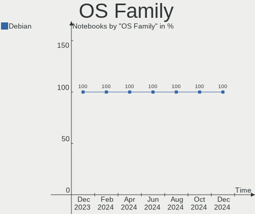
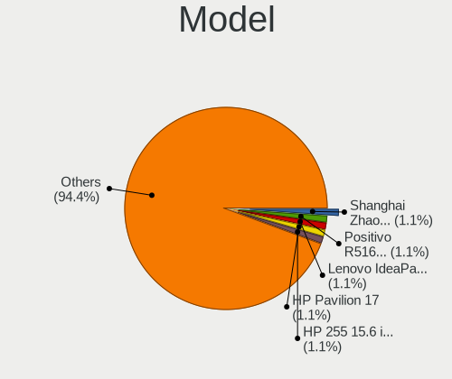
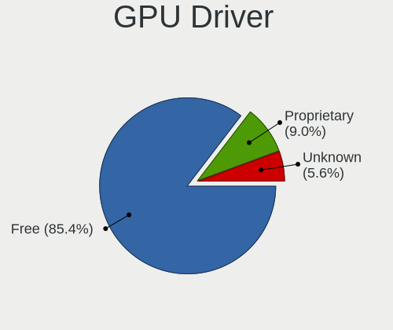
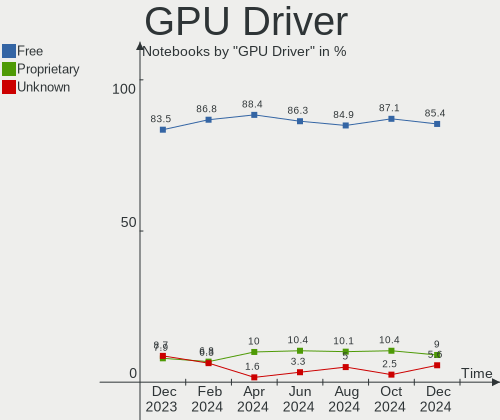
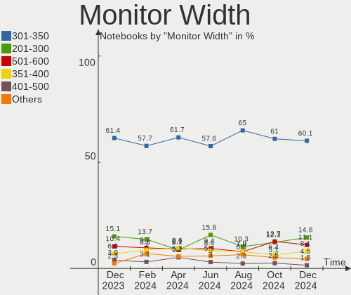

Debian Hardware Trends (Notebook)
---------------------------------

A project to identify most popular hardware characteristics and track their change
over time based on data collected by Debian users at https://Linux-Hardware.org.

Anyone can contribute to the study by uploading probes of their computers by
the [hw-probe](https://github.com/linuxhw/hw-probe) tool:

    sudo -E hw-probe -all -upload

Full-feature report is available here: https://linux-hardware.org/?view=trends&formfactor=notebook

Period: Oct, 2020.

Contents
--------

- [ OS                       ](#os)
- [ OS Family                ](#os-family)
- [ Kernel                   ](#kernel)
- [ Kernel Family            ](#kernel-family)
- [ Kernel Major Ver.        ](#kernel-major-ver)
- [ Arch                     ](#arch)
- [ DE                       ](#de)
- [ Display Server           ](#display-server)
- [ Display Manager          ](#display-manager)
- [ OS Lang                  ](#os-lang)
- [ Boot Mode                ](#boot-mode)
- [ Filesystem               ](#filesystem)
- [ Part. scheme             ](#part-scheme)
- [ Dual Boot with Linux/BSD ](#dual-boot-with-linux/bsd)
- [ Dual Boot (Win)          ](#dual-boot-win)
- [ Country                  ](#country)
- [ City                     ](#city)
- [ Vendor                   ](#vendor)
- [ Model                    ](#model)
- [ Model Family             ](#model-family)
- [ MFG Year                 ](#mfg-year)
- [ Form Factor              ](#form-factor)
- [ Secure Boot              ](#secure-boot)
- [ Coreboot                 ](#coreboot)
- [ RAM Size                 ](#ram-size)
- [ RAM Used                 ](#ram-used)
- [ Has CD-ROM               ](#has-cd-rom)
- [ Total Drives             ](#total-drives)
- [ Has Ethernet             ](#has-ethernet)
- [ Drive Vendor             ](#drive-vendor)
- [ HDD Vendor               ](#hdd-vendor)
- [ SSD Vendor               ](#ssd-vendor)
- [ Drive Model              ](#drive-model)
- [ Drive Kind               ](#drive-kind)
- [ Drive Connector          ](#drive-connector)
- [ Drive Size               ](#drive-size)
- [ Space Total              ](#space-total)
- [ Space Used               ](#space-used)
- [ Malfunc. Drives          ](#malfunc-drives)
- [ Malfunc. Drive Vendor    ](#malfunc-drive-vendor)
- [ Malfunc. HDD Vendor      ](#malfunc-hdd-vendor)
- [ Malfunc. Drive Kind      ](#malfunc-drive-kind)
- [ Failed Drives            ](#failed-drives)
- [ Failed Drive Vendor      ](#failed-drive-vendor)
- [ Drive Status             ](#drive-status)
- [ Storage Vendor           ](#storage-vendor)
- [ Storage Model            ](#storage-model)
- [ Storage Kind             ](#storage-kind)
- [ CPU Vendor               ](#cpu-vendor)
- [ CPU Model                ](#cpu-model)
- [ CPU Model Family         ](#cpu-model-family)
- [ CPU Cores                ](#cpu-cores)
- [ CPU Sockets              ](#cpu-sockets)
- [ CPU Threads              ](#cpu-threads)
- [ CPU Op-Modes             ](#cpu-op-modes)
- [ CPU Microcode            ](#cpu-microcode)
- [ CPU Microarch            ](#cpu-microarch)
- [ GPU Vendor               ](#gpu-vendor)
- [ GPU Model                ](#gpu-model)
- [ GPU Combo                ](#gpu-combo)
- [ GPU Driver               ](#gpu-driver)
- [ GPU Memory               ](#gpu-memory)
- [ Monitor Vendor           ](#monitor-vendor)
- [ Monitor Model            ](#monitor-model)
- [ Monitor Resolution       ](#monitor-resolution)
- [ Monitor Diagonal         ](#monitor-diagonal)
- [ Monitor Width            ](#monitor-width)
- [ Aspect Ratio             ](#aspect-ratio)
- [ Monitor Area             ](#monitor-area)
- [ Pixel Density            ](#pixel-density)
- [ Multiple Monitors        ](#multiple-monitors)
- [ Net Controller Vendor    ](#net-controller-vendor)
- [ Net Controller Model     ](#net-controller-model)
- [ Wireless Vendor          ](#wireless-vendor)
- [ Wireless Model           ](#wireless-model)
- [ Ethernet Vendor          ](#ethernet-vendor)
- [ Ethernet Model           ](#ethernet-model)
- [ Net Controller Kind      ](#net-controller-kind)
- [ Used Controller          ](#used-controller)
- [ NICs                     ](#nics)
- [ Memory Vendor            ](#memory-vendor)
- [ Memory Model             ](#memory-model)
- [ Memory Kind              ](#memory-kind)
- [ Memory Form Factor       ](#memory-form-factor)
- [ Memory Size              ](#memory-size)
- [ Memory Speed             ](#memory-speed)
- [ Sound Vendor             ](#sound-vendor)
- [ Sound Model              ](#sound-model)
- [ Camera Vendor            ](#camera-vendor)
- [ Camera Model             ](#camera-model)
- [ Fingerprint Vendor       ](#fingerprint-vendor)
- [ Fingerprint Model        ](#fingerprint-model)
- [ Chipcard Vendor          ](#chipcard-vendor)
- [ Chipcard Model           ](#chipcard-model)
- [ Printer Vendor           ](#printer-vendor)
- [ Printer Model            ](#printer-model)
- [ Scanner Vendor           ](#scanner-vendor)
- [ Scanner Model            ](#scanner-model)
- [ Bluetooth Vendor         ](#bluetooth-vendor)
- [ Bluetooth Model          ](#bluetooth-model)
- [ Unsupported Devices      ](#unsupported-devices)
- [ Unsupported Device Types ](#unsupported-device-types)

OS
--

Installed operating systems

| Name            | Notebooks | Percent |
|-----------------|-----------|---------|
| Debian 10       | 44        | 57.14%  |
| Debian Testing  | 22        | 28.57%  |
| Debian          | 6         | 7.79%   |
| Debian Unstable | 3         | 3.9%    |
| Debian 9.13     | 1         | 1.3%    |
| Debian 9        | 1         | 1.3%    |

OS Family
---------

OS without a version

| Name   | Notebooks | Percent |
|--------|-----------|---------|
| Debian | 77        | 100%    |

Kernel
------

Version of the Linux kernel

| Version                | Notebooks | Percent |
|------------------------|-----------|---------|
| 4.19.0-11-amd64        | 18        | 23.38%  |
| 5.8.0-2-amd64          | 15        | 19.48%  |
| 4.19.0-12-amd64        | 7         | 9.09%   |
| 5.9.0-1-amd64          | 6         | 7.79%   |
| 5.8.0-3-amd64          | 5         | 6.49%   |
| 4.19.0-10-amd64        | 4         | 5.19%   |
| 5.8.0-0.bpo.2-amd64    | 3         | 3.9%    |
| 5.7.0-0.bpo.2-amd64    | 3         | 3.9%    |
| 5.6.0-0.bpo.2-amd64    | 2         | 2.6%    |
| 5.9.2-gnu              | 1         | 1.3%    |
| 5.9.1-gnu              | 1         | 1.3%    |
| 5.8.16-hpdv2k          | 1         | 1.3%    |
| 5.8.0-3-686-pae        | 1         | 1.3%    |
| 5.8.0-2-686-pae        | 1         | 1.3%    |
| 5.7.0-2-amd64          | 1         | 1.3%    |
| 5.6.0-2-amd64          | 1         | 1.3%    |
| 5.4.65-1-pve           | 1         | 1.3%    |
| 5.4.16-polilinux-amd64 | 1         | 1.3%    |
| 5.4.0-4-amd64          | 1         | 1.3%    |
| 4.9.218black           | 1         | 1.3%    |
| 4.9.0-13-amd64         | 1         | 1.3%    |
| 4.19.0-9-amd64         | 1         | 1.3%    |
| 3.10.54                | 1         | 1.3%    |

Kernel Family
-------------

Linux kernel without a distro release

| Version | Notebooks | Percent |
|---------|-----------|---------|
| 4.19.0  | 30        | 38.96%  |
| 5.8.0   | 25        | 32.47%  |
| 5.9.0   | 6         | 7.79%   |
| 5.7.0   | 4         | 5.19%   |
| 5.6.0   | 3         | 3.9%    |
| 5.9.2   | 1         | 1.3%    |
| 5.9.1   | 1         | 1.3%    |
| 5.8.16  | 1         | 1.3%    |
| 5.4.65  | 1         | 1.3%    |
| 5.4.16  | 1         | 1.3%    |
| 5.4.0   | 1         | 1.3%    |
| 4.9.218 | 1         | 1.3%    |
| 4.9.0   | 1         | 1.3%    |
| 3.10.54 | 1         | 1.3%    |

Kernel Major Ver.
-----------------

Linux kernel major version

| Version | Notebooks | Percent |
|---------|-----------|---------|
| 4.19    | 30        | 38.96%  |
| 5.8     | 26        | 33.77%  |
| 5.9     | 8         | 10.39%  |
| 5.7     | 4         | 5.19%   |
| 5.6     | 3         | 3.9%    |
| 5.4     | 3         | 3.9%    |
| 4.9     | 2         | 2.6%    |
| 3.10    | 1         | 1.3%    |

Arch
----

OS architecture (x86_64, i586, etc.)

| Name   | Notebooks | Percent |
|--------|-----------|---------|
| x86_64 | 74        | 96.1%   |
| i686   | 2         | 2.6%    |
| armv7l | 1         | 1.3%    |

DE
--

Desktop Environment

| Name             | Notebooks | Percent |
|------------------|-----------|---------|
| GNOME            | 21        | 27.27%  |
| XFCE             | 14        | 18.18%  |
| KDE5             | 9         | 11.69%  |
| MATE             | 8         | 10.39%  |
| KDE              | 7         | 9.09%   |
| Unknown          | 6         | 7.79%   |
| Cinnamon         | 5         | 6.49%   |
| LXDE             | 2         | 2.6%    |
| i3               | 2         | 2.6%    |
| X-Cinnamon       | 1         | 1.3%    |
| lightdm-xsession | 1         | 1.3%    |
| GNOME Classic    | 1         | 1.3%    |

Display Server
--------------

X11 or Wayland

| Name    | Notebooks | Percent |
|---------|-----------|---------|
| X11     | 59        | 76.62%  |
| Wayland | 11        | 14.29%  |
| Tty     | 6         | 7.79%   |
| Unknown | 1         | 1.3%    |

Display Manager
---------------

SDDM, LightDM, etc.

| Name    | Notebooks | Percent |
|---------|-----------|---------|
| TDM     | 26        | 33.77%  |
| Unknown | 25        | 32.47%  |
| GDM     | 17        | 22.08%  |
| SDDM    | 9         | 11.69%  |

OS Lang
-------

Language

| Lang       | Notebooks | Percent |
|------------|-----------|---------|
| en_US      | 32        | 41.56%  |
| pt_BR      | 8         | 10.39%  |
| de_DE      | 6         | 7.79%   |
| Unknown    | 5         | 6.49%   |
| ru_UA      | 3         | 3.9%    |
| pl_PL      | 3         | 3.9%    |
| fr_FR      | 3         | 3.9%    |
| uk_UA      | 2         | 2.6%    |
| ru_RU      | 2         | 2.6%    |
| sl_SI      | 1         | 1.3%    |
| pt_PT      | 1         | 1.3%    |
| it_IT      | 1         | 1.3%    |
| fr_CA      | 1         | 1.3%    |
| fr_BE      | 1         | 1.3%    |
| es_MX      | 1         | 1.3%    |
| es_ES      | 1         | 1.3%    |
| en_IN      | 1         | 1.3%    |
| en_IE      | 1         | 1.3%    |
| en_GB      | 1         | 1.3%    |
| de_CH.utf8 | 1         | 1.3%    |
| da_DK      | 1         | 1.3%    |
| C          | 1         | 1.3%    |

Boot Mode
---------

EFI or BIOS

| Mode | Notebooks | Percent |
|------|-----------|---------|
| BIOS | 42        | 54.55%  |
| EFI  | 35        | 45.45%  |

Filesystem
----------

Type of filesystem

| Type    | Notebooks | Percent |
|---------|-----------|---------|
| Ext4    | 73        | 94.81%  |
| Btrfs   | 2         | 2.6%    |
| Overlay | 1         | 1.3%    |
| Ext3    | 1         | 1.3%    |

Part. scheme
------------

Scheme of partitioning

| Type    | Notebooks | Percent |
|---------|-----------|---------|
| GPT     | 33        | 42.86%  |
| Unknown | 27        | 35.06%  |
| MBR     | 17        | 22.08%  |

Dual Boot with Linux/BSD
------------------------

Hosting more than one Linux/BSD

| Dual boot | Notebooks | Percent |
|-----------|-----------|---------|
| No        | 68        | 88.31%  |
| Yes       | 9         | 11.69%  |

Dual Boot (Win)
---------------

Hosting Linux and Windows

| Dual boot | Notebooks | Percent |
|-----------|-----------|---------|
| No        | 57        | 74.03%  |
| Yes       | 20        | 25.97%  |

Country
-------

Geographic location (country)

| Country        | Notebooks | Percent |
|----------------|-----------|---------|
| Brazil         | 11        | 14.29%  |
| USA            | 10        | 12.99%  |
| Germany        | 9         | 11.69%  |
| France         | 5         | 6.49%   |
| Ukraine        | 4         | 5.19%   |
| Italy          | 4         | 5.19%   |
| Poland         | 3         | 3.9%    |
| Switzerland    | 2         | 2.6%    |
| Russia         | 2         | 2.6%    |
| Romania        | 2         | 2.6%    |
| Portugal       | 2         | 2.6%    |
| Netherlands    | 2         | 2.6%    |
| Mexico         | 2         | 2.6%    |
| Czech Republic | 2         | 2.6%    |
| Vietnam        | 1         | 1.3%    |
| UK             | 1         | 1.3%    |
| Turkey         | 1         | 1.3%    |
| Sweden         | 1         | 1.3%    |
| Spain          | 1         | 1.3%    |
| Slovenia       | 1         | 1.3%    |
| Norway         | 1         | 1.3%    |
| Ireland        | 1         | 1.3%    |
| India          | 1         | 1.3%    |
| Hungary        | 1         | 1.3%    |
| Finland        | 1         | 1.3%    |
| Denmark        | 1         | 1.3%    |
| Canada         | 1         | 1.3%    |
| Bermuda        | 1         | 1.3%    |
| Belgium        | 1         | 1.3%    |
| Belarus        | 1         | 1.3%    |
| Argentina      | 1         | 1.3%    |

City
----

Geographic location (city)

| City                  | Notebooks | Percent |
|-----------------------|-----------|---------|
| Paris                 | 3         | 3.9%    |
| Vasylkiv              | 2         | 2.6%    |
| São Paulo            | 2         | 2.6%    |
| Rome                  | 2         | 2.6%    |
| Mesa                  | 2         | 2.6%    |
| Lisbon                | 2         | 2.6%    |
| Zurich                | 1         | 1.3%    |
| Warsaw                | 1         | 1.3%    |
| Votuporanga           | 1         | 1.3%    |
| Valeggio sul Mincio   | 1         | 1.3%    |
| Tromsø               | 1         | 1.3%    |
| Stuttgart             | 1         | 1.3%    |
| Stelle                | 1         | 1.3%    |
| St Petersburg         | 1         | 1.3%    |
| South Burlington      | 1         | 1.3%    |
| Santo André          | 1         | 1.3%    |
| San Giorgio a Cremano | 1         | 1.3%    |
| Sainte-Julie          | 1         | 1.3%    |
| Recife                | 1         | 1.3%    |
| Příbram             | 1         | 1.3%    |
| Puebla City           | 1         | 1.3%    |
| Puebla                | 1         | 1.3%    |
| Prague                | 1         | 1.3%    |
| Poznan                | 1         | 1.3%    |
| Plan-de-Cuques        | 1         | 1.3%    |
| Pelotas               | 1         | 1.3%    |
| Odorheiu Secuiesc     | 1         | 1.3%    |
| Odense                | 1         | 1.3%    |
| Nuremberg             | 1         | 1.3%    |
| Novi                  | 1         | 1.3%    |
| Nivala                | 1         | 1.3%    |
| Munich                | 1         | 1.3%    |
| Moglingen             | 1         | 1.3%    |
| Minsk                 | 1         | 1.3%    |
| Maracanau             | 1         | 1.3%    |
| Manitowoc             | 1         | 1.3%    |
| Lviv                  | 1         | 1.3%    |
| Ljubljana             | 1         | 1.3%    |
| Leverkusen            | 1         | 1.3%    |
| Leeuwarden            | 1         | 1.3%    |
| Kharkiv               | 1         | 1.3%    |
| Kendallville          | 1         | 1.3%    |
| Jammu                 | 1         | 1.3%    |
| Istanbul              | 1         | 1.3%    |
| Indio                 | 1         | 1.3%    |
| Holyoke               | 1         | 1.3%    |
| Hanoi                 | 1         | 1.3%    |
| Handen                | 1         | 1.3%    |
| Hamilton              | 1         | 1.3%    |
| Halesowen             | 1         | 1.3%    |
| Goiânia              | 1         | 1.3%    |
| Florianópolis        | 1         | 1.3%    |
| Ensdorf               | 1         | 1.3%    |
| Ekaterinburg          | 1         | 1.3%    |
| Dublin                | 1         | 1.3%    |
| Caieiras              | 1         | 1.3%    |
| Bussigny              | 1         | 1.3%    |
| Burke                 | 1         | 1.3%    |
| Budapest              | 1         | 1.3%    |
| Brookline             | 1         | 1.3%    |

Vendor
------

Motherboard manufacturer

| Name                   | Notebooks | Percent |
|------------------------|-----------|---------|
| Lenovo                 | 24        | 31.17%  |
| Dell                   | 17        | 22.08%  |
| Hewlett-Packard        | 10        | 12.99%  |
| Samsung Electronics    | 5         | 6.49%   |
| ASUSTek Computer       | 3         | 3.9%    |
| Acer                   | 3         | 3.9%    |
| Sony                   | 2         | 2.6%    |
| Unknown                | 2         | 2.6%    |
| Razer                  | 1         | 1.3%    |
| Positivo Bahia - VAIO  | 1         | 1.3%    |
| Positivo               | 1         | 1.3%    |
| PC Specialist          | 1         | 1.3%    |
| Packard Bell           | 1         | 1.3%    |
| IBM                    | 1         | 1.3%    |
| HUAWEI                 | 1         | 1.3%    |
| Gigabyte Technology    | 1         | 1.3%    |
| Avell High Performance | 1         | 1.3%    |
| Apple                  | 1         | 1.3%    |
| Alienware              | 1         | 1.3%    |

Model
-----

Motherboard model

| Name                                                    | Notebooks | Percent |
|---------------------------------------------------------|-----------|---------|
| Unknown                                                 | 3         | 3.9%    |
| Lenovo IdeaPad 110-15IBR 80T7                           | 2         | 2.6%    |
| Sony VPCYB3V1E                                          | 1         | 1.3%    |
| Sony SVE14122CXW                                        | 1         | 1.3%    |
| Samsung Electronics RV411/RV511/E3511/S3511/RV711/E3411 | 1         | 1.3%    |
| Samsung Electronics RV409/RV509/RV709                   | 1         | 1.3%    |
| Samsung Electronics NC10                                | 1         | 1.3%    |
| Samsung Electronics N248P                               | 1         | 1.3%    |
| Samsung Electronics 300V3Z/300V4Z/300V5Z/200A4Y/200A5Y  | 1         | 1.3%    |
| Razer Blade 15 Base Model (Early 2020) - RZ09-0328      | 1         | 1.3%    |
| Positivo MOBILE                                         | 1         | 1.3%    |
| Positivo Bahia - VAIO VJFE42F11X-XXXXXX                 | 1         | 1.3%    |
| PC Specialist N150CU                                    | 1         | 1.3%    |
| Packard Bell EasyNote TE11HC                            | 1         | 1.3%    |
| Lenovo Z50-75 80EC                                      | 1         | 1.3%    |
| Lenovo Y520-15IKBN 80WK                                 | 1         | 1.3%    |
| Lenovo ThinkPad X220 4291B66                            | 1         | 1.3%    |
| Lenovo ThinkPad X13 Gen 1 20T2003TGE                    | 1         | 1.3%    |
| Lenovo ThinkPad T520 4243GE9                            | 1         | 1.3%    |
| Lenovo ThinkPad T495 20NKS0PG00                         | 1         | 1.3%    |
| Lenovo ThinkPad E585 20KV0008GE                         | 1         | 1.3%    |
| Lenovo ThinkPad E15 20RDS0LE00                          | 1         | 1.3%    |
| Lenovo ThinkPad E14 20RA001HRT                          | 1         | 1.3%    |
| Lenovo Legion Y7000P-1060 81LF                          | 1         | 1.3%    |
| Lenovo Legion Y530-15ICH 81FV                           | 1         | 1.3%    |
| Lenovo Legion 5 17IMH05H 81Y8                           | 1         | 1.3%    |
| Lenovo IdeaPad S340-14API 81NB                          | 1         | 1.3%    |
| Lenovo IdeaPad L340-17API 81LY                          | 1         | 1.3%    |
| Lenovo IdeaPad 510-15ISK 80SR                           | 1         | 1.3%    |
| Lenovo IdeaPad 5 14IIL05 81YH                           | 1         | 1.3%    |
| Lenovo IdeaPad 330-15IKB 81FE                           | 1         | 1.3%    |
| Lenovo IdeaPad 3 17ARE05 81W5                           | 1         | 1.3%    |
| Lenovo IdeaPad 130-15IKB 81H7                           | 1         | 1.3%    |
| Lenovo E31-80 80MX                                      | 1         | 1.3%    |
| Lenovo B50-50 80S2                                      | 1         | 1.3%    |
| IBM ThinkPad X31 2673PBU                                | 1         | 1.3%    |
| HUAWEI BOHK-WAX9X                                       | 1         | 1.3%    |
| HP ProBook 640 G1                                       | 1         | 1.3%    |
| HP ProBook 450 G7                                       | 1         | 1.3%    |
| HP Pavilion Notebook                                    | 1         | 1.3%    |
| HP Pavilion dv2000 (RN081EA#UUW)                        | 1         | 1.3%    |
| HP OMEN by HP Laptop                                    | 1         | 1.3%    |
| HP Mini 210-2000                                        | 1         | 1.3%    |
| HP Laptop 17-by1xxx                                     | 1         | 1.3%    |
| HP EliteBook 6930p                                      | 1         | 1.3%    |
| HP EliteBook 2540p                                      | 1         | 1.3%    |
| HP 255 G7 Notebook PC                                   | 1         | 1.3%    |
| Gigabyte P15F v3                                        | 1         | 1.3%    |
| Dell XPS L502X                                          | 1         | 1.3%    |
| Dell XPS 13 9360                                        | 1         | 1.3%    |
| Dell XPS 13 9350                                        | 1         | 1.3%    |
| Dell Latitude E7440                                     | 1         | 1.3%    |
| Dell Latitude E6530                                     | 1         | 1.3%    |
| Dell Latitude E5530 non-vPro                            | 1         | 1.3%    |
| Dell Latitude E5520                                     | 1         | 1.3%    |
| Dell Latitude 7490                                      | 1         | 1.3%    |
| Dell Latitude 7400                                      | 1         | 1.3%    |
| Dell Latitude 3400                                      | 1         | 1.3%    |
| Dell Inspiron N5110                                     | 1         | 1.3%    |
| Dell Inspiron 7577                                      | 1         | 1.3%    |

Model Family
------------

Motherboard model prefix

| Name                                    | Notebooks | Percent |
|-----------------------------------------|-----------|---------|
| Lenovo IdeaPad                          | 9         | 11.69%  |
| Lenovo ThinkPad                         | 7         | 9.09%   |
| Dell Latitude                           | 7         | 9.09%   |
| Dell Inspiron                           | 7         | 9.09%   |
| Lenovo Legion                           | 3         | 3.9%    |
| Dell XPS                                | 3         | 3.9%    |
| Acer Aspire                             | 3         | 3.9%    |
| Unknown                                 | 3         | 3.9%    |
| HP ProBook                              | 2         | 2.6%    |
| HP Pavilion                             | 2         | 2.6%    |
| HP EliteBook                            | 2         | 2.6%    |
| Sony VPCYB3V1E                          | 1         | 1.3%    |
| Sony SVE14122CXW                        | 1         | 1.3%    |
| Samsung Electronics RV411               | 1         | 1.3%    |
| Samsung Electronics RV409               | 1         | 1.3%    |
| Samsung Electronics NC10                | 1         | 1.3%    |
| Samsung Electronics N248P               | 1         | 1.3%    |
| Samsung Electronics 300V3Z              | 1         | 1.3%    |
| Razer Blade                             | 1         | 1.3%    |
| Positivo MOBILE                         | 1         | 1.3%    |
| Positivo Bahia - VAIO VJFE42F11X-XXXXXX | 1         | 1.3%    |
| PC Specialist N150CU                    | 1         | 1.3%    |
| Packard Bell EasyNote                   | 1         | 1.3%    |
| Lenovo Z50-75                           | 1         | 1.3%    |
| Lenovo Y520-15IKBN                      | 1         | 1.3%    |
| Lenovo E31-80                           | 1         | 1.3%    |
| Lenovo B50-50                           | 1         | 1.3%    |
| IBM ThinkPad                            | 1         | 1.3%    |
| HUAWEI BOHK-WAX9X                       | 1         | 1.3%    |
| HP OMEN                                 | 1         | 1.3%    |
| HP Mini                                 | 1         | 1.3%    |
| HP Laptop                               | 1         | 1.3%    |
| HP 255                                  | 1         | 1.3%    |
| Gigabyte P15F                           | 1         | 1.3%    |
| Avell High Performance A65              | 1         | 1.3%    |
| ASUS X510UQ                             | 1         | 1.3%    |
| ASUS X45C                               | 1         | 1.3%    |
| ASUS S551LN                             | 1         | 1.3%    |
| Apple MacBookAir7                       | 1         | 1.3%    |
| Alienware 17                            | 1         | 1.3%    |

MFG Year
--------

Motherboard manufacture year

| Year    | Notebooks | Percent |
|---------|-----------|---------|
| 2020    | 19        | 24.68%  |
| 2019    | 12        | 15.58%  |
| 2011    | 10        | 12.99%  |
| 2018    | 9         | 11.69%  |
| 2012    | 5         | 6.49%   |
| 2017    | 4         | 5.19%   |
| 2016    | 4         | 5.19%   |
| 2013    | 4         | 5.19%   |
| 2014    | 3         | 3.9%    |
| 2009    | 2         | 2.6%    |
| 2015    | 1         | 1.3%    |
| 2010    | 1         | 1.3%    |
| 2008    | 1         | 1.3%    |
| 2004    | 1         | 1.3%    |
| Unknown | 1         | 1.3%    |

Form Factor
-----------

Physical design of the computer

| Name     | Notebooks | Percent |
|----------|-----------|---------|
| Notebook | 77        | 100%    |

Secure Boot
-----------

Enabled or disabled

| State    | Notebooks | Percent |
|----------|-----------|---------|
| Disabled | 73        | 94.81%  |
| Enabled  | 4         | 5.19%   |

Coreboot
--------

Have coreboot on board

| Used | Notebooks | Percent |
|------|-----------|---------|
| No   | 77        | 100%    |

RAM Size
--------

Total RAM memory

| Size in GB  | Notebooks | Percent |
|-------------|-----------|---------|
| 4.01-8.0    | 24        | 31.17%  |
| 16.01-24.0  | 20        | 25.97%  |
| 8.01-16.0   | 11        | 14.29%  |
| 3.01-4.0    | 10        | 12.99%  |
| 32.01-64.0  | 3         | 3.9%    |
| 1.01-2.0    | 3         | 3.9%    |
| 0.01-1.0    | 3         | 3.9%    |
| 24.01-32.0  | 1         | 1.3%    |
| 2.01-3.0    | 1         | 1.3%    |
| 64.01-256.0 | 1         | 1.3%    |

RAM Used
--------

Used RAM memory

| Used GB    | Notebooks | Percent |
|------------|-----------|---------|
| 1.01-2.0   | 24        | 31.17%  |
| 2.01-3.0   | 16        | 20.78%  |
| 3.01-4.0   | 14        | 18.18%  |
| 4.01-8.0   | 13        | 16.88%  |
| 0.01-1.0   | 6         | 7.79%   |
| 8.01-16.0  | 2         | 2.6%    |
| 16.01-24.0 | 1         | 1.3%    |
| Unknown    | 1         | 1.3%    |

Has CD-ROM
----------

Has CD-ROM on board

| Presented | Notebooks | Percent |
|-----------|-----------|---------|
| No        | 50        | 64.94%  |
| Yes       | 27        | 35.06%  |

Total Drives
------------

Number of drives on board

| Drives | Notebooks | Percent |
|--------|-----------|---------|
| 1      | 51        | 66.23%  |
| 2      | 23        | 29.87%  |
| 3      | 3         | 3.9%    |

Has Ethernet
------------

Has Ethernet on board

| Presented | Notebooks | Percent |
|-----------|-----------|---------|
| Yes       | 65        | 84.42%  |
| No        | 12        | 15.58%  |

Drive Vendor
------------

Hard drive vendors

| Vendor              | Notebooks | Drives | Percent |
|---------------------|-----------|--------|---------|
| Samsung Electronics | 17        | 18     | 16.5%   |
| Seagate             | 15        | 15     | 14.56%  |
| WDC                 | 9         | 10     | 8.74%   |
| Toshiba             | 6         | 6      | 5.83%   |
| Crucial             | 6         | 6      | 5.83%   |
| Unknown             | 5         | 5      | 4.85%   |
| SanDisk             | 5         | 5      | 4.85%   |
| Kingston            | 5         | 5      | 4.85%   |
| Hitachi             | 5         | 5      | 4.85%   |
| Intel               | 4         | 4      | 3.88%   |
| HGST                | 4         | 4      | 3.88%   |
| SK Hynix            | 3         | 3      | 2.91%   |
| LITEON              | 2         | 2      | 1.94%   |
| A-DATA Technology   | 2         | 2      | 1.94%   |
| Transcend           | 1         | 1      | 0.97%   |
| Team                | 1         | 1      | 0.97%   |
| Silicon Motion      | 1         | 1      | 0.97%   |
| Phison              | 1         | 1      | 0.97%   |
| Patriot             | 1         | 1      | 0.97%   |
| Lexar               | 1         | 1      | 0.97%   |
| KingFast            | 1         | 1      | 0.97%   |
| KingDian            | 1         | 1      | 0.97%   |
| Kingchuxing         | 1         | 1      | 0.97%   |
| Intenso             | 1         | 1      | 0.97%   |
| IBM/Hitachi         | 1         | 1      | 0.97%   |
| Fujitsu             | 1         | 1      | 0.97%   |
| Dogfish             | 1         | 1      | 0.97%   |
| China               | 1         | 1      | 0.97%   |
| Apple               | 1         | 1      | 0.97%   |

HDD Vendor
----------

Hard disk drive vendors

| Vendor              | Notebooks | Drives | Percent |
|---------------------|-----------|--------|---------|
| Seagate             | 15        | 15     | 38.46%  |
| WDC                 | 7         | 8      | 17.95%  |
| Hitachi             | 5         | 5      | 12.82%  |
| Toshiba             | 4         | 4      | 10.26%  |
| HGST                | 4         | 4      | 10.26%  |
| Samsung Electronics | 1         | 1      | 2.56%   |
| Intenso             | 1         | 1      | 2.56%   |
| IBM/Hitachi         | 1         | 1      | 2.56%   |
| Fujitsu             | 1         | 1      | 2.56%   |

SSD Vendor
----------

Solid state drive vendors

| Vendor              | Notebooks | Drives | Percent |
|---------------------|-----------|--------|---------|
| Samsung Electronics | 7         | 8      | 22.58%  |
| Crucial             | 6         | 6      | 19.35%  |
| SanDisk             | 4         | 4      | 12.9%   |
| Kingston            | 4         | 4      | 12.9%   |
| Transcend           | 1         | 1      | 3.23%   |
| Team                | 1         | 1      | 3.23%   |
| LITEON              | 1         | 1      | 3.23%   |
| Lexar               | 1         | 1      | 3.23%   |
| KingDian            | 1         | 1      | 3.23%   |
| Kingchuxing         | 1         | 1      | 3.23%   |
| Intel               | 1         | 1      | 3.23%   |
| Dogfish             | 1         | 1      | 3.23%   |
| China               | 1         | 1      | 3.23%   |
| Apple               | 1         | 1      | 3.23%   |

Drive Model
-----------

Hard drive models

| Model                            | Notebooks | Percent |
|----------------------------------|-----------|---------|
| ST2000LM015-2E8174 2TB           | 3         | 2.88%   |
| NVMe SSD Drive 256GB             | 3         | 2.88%   |
| WD10SPZX-24Z10 1TB               | 2         | 1.92%   |
| WD10JPCX-24UE4T0 1TB             | 2         | 1.92%   |
| SA400S37120G 120GB SSD           | 2         | 1.92%   |
| MZALQ512HALU-000L2 512GB         | 2         | 1.92%   |
| HTS721010A9E630 1TB              | 2         | 1.92%   |
| Expansion 4TB                    | 2         | 1.92%   |
| WD2500BEVT-22ZCT0 250GB          | 1         | 0.96%   |
| WD10JPVX-00JC3T0 1TB             | 1         | 0.96%   |
| WD10 JPVX-22JC3T0 1TB            | 1         | 0.96%   |
| WD My Passport 261B 500GB        | 1         | 0.96%   |
| TS32GSSD370S 32GB                | 1         | 0.96%   |
| T253TD240G 240GB SSD             | 1         | 0.96%   |
| SX8200PNP 1TB                    | 1         | 0.96%   |
| ST9250410AS 250GB                | 1         | 0.96%   |
| ST750LM022 HN-M750MBB 752GB      | 1         | 0.96%   |
| ST500LT012-9WS142 500GB          | 1         | 0.96%   |
| ST500LM012 HN-M500MBB 500GB      | 1         | 0.96%   |
| ST2000LM007-1R8174 2TB           | 1         | 0.96%   |
| ST1000LX015-1U7172 1TB           | 1         | 0.96%   |
| ST1000LM049-2GH172 1TB           | 1         | 0.96%   |
| ST1000LM048-2E7172 1TB           | 1         | 0.96%   |
| ST1000LM035-1RK172 1TB           | 1         | 0.96%   |
| ST1000LM024 HN-M101MBB 1TB       | 1         | 0.96%   |
| SSDSCKKF512G8 SATA 512GB         | 1         | 0.96%   |
| SSDPEKKW256G8 256GB              | 1         | 0.96%   |
| SSDPEKKF256G8 NVMe 256GB         | 1         | 0.96%   |
| SSDPEK1W060GA 64GB               | 1         | 0.96%   |
| SSD SM0128G 121GB                | 1         | 0.96%   |
| SSD PM871 mSATA 256GB            | 1         | 0.96%   |
| SSD PLUS 240GB                   | 1         | 0.96%   |
| SSD PLUS 1000GB                  | 1         | 0.96%   |
| SSD 970 EVO 1TB                  | 1         | 0.96%   |
| SSD 960 PRO 512GB                | 1         | 0.96%   |
| SSD 860 EVO 500GB                | 1         | 0.96%   |
| SSD 860 EVO 1TB                  | 1         | 0.96%   |
| SSD 850 EVO mSATA 500GB          | 1         | 0.96%   |
| SSD 850 EVO M.2 250GB            | 1         | 0.96%   |
| SSD 850 EVO 120GB                | 1         | 0.96%   |
| SSD 32GB                         | 1         | 0.96%   |
| SSD 240GB                        | 1         | 0.96%   |
| SSD 128GB                        | 1         | 0.96%   |
| SKHynix_HFM512GDHTNI-87A0B 512GB | 1         | 0.96%   |
| SDSSDH3500G 500GB                | 1         | 0.96%   |
| SDSSDA240G 240GB                 | 1         | 0.96%   |
| SD01G  1GB                       | 1         | 0.96%   |
| Scorch M2 128GB                  | 1         | 0.96%   |
| SATA SSD 20GB                    | 1         | 0.96%   |
| SA400S37480G 480GB SSD           | 1         | 0.96%   |
| SA400S37240G 240GB SSD           | 1         | 0.96%   |
| S200 60GB SSD                    | 1         | 0.96%   |
| PC SN730 SDBPNTY-256G-1027 256GB | 1         | 0.96%   |
| NVMe SSD Drive 512GB             | 1         | 0.96%   |
| NVMe SSD Drive 240GB             | 1         | 0.96%   |
| NVMe SSD Drive 1024GB            | 1         | 0.96%   |
| MZYTY256HDHP-000L2 256GB SSD     | 1         | 0.96%   |
| MZVLB512HBJQ-00A00 512GB         | 1         | 0.96%   |
| MZVLB512HBJQ-000L7 512GB         | 1         | 0.96%   |
| MZALQ256HAJD-000L2 256GB         | 1         | 0.96%   |

Drive Kind
----------

HDD or SSD

| Kind    | Notebooks | Drives | Percent |
|---------|-----------|--------|---------|
| HDD     | 36        | 40     | 36.36%  |
| SSD     | 30        | 32     | 30.3%   |
| NVMe    | 26        | 26     | 26.26%  |
| MMC     | 5         | 5      | 5.05%   |
| Unknown | 2         | 2      | 2.02%   |

Drive Connector
---------------

SATA, SAS, NVMe, etc.

| Type | Notebooks | Drives | Percent |
|------|-----------|--------|---------|
| SATA | 58        | 69     | 61.7%   |
| NVMe | 26        | 26     | 27.66%  |
| SAS  | 5         | 5      | 5.32%   |
| MMC  | 5         | 5      | 5.32%   |

Drive Size
----------

Size of hard drive

| Size in TB | Notebooks | Drives | Percent |
|------------|-----------|--------|---------|
| 0.01-0.5   | 37        | 41     | 56.06%  |
| 0.51-1.0   | 23        | 25     | 34.85%  |
| 1.01-2.0   | 4         | 4      | 6.06%   |
| 3.01-4.0   | 2         | 2      | 3.03%   |

Space Total
-----------

Amount of disk space available on the file system

| Size in GB     | Notebooks | Percent |
|----------------|-----------|---------|
| 251-500        | 17        | 22.08%  |
| 101-250        | 16        | 20.78%  |
| 501-1000       | 14        | 18.18%  |
| 1001-2000      | 10        | 12.99%  |
| 21-50          | 5         | 6.49%   |
| 2001-3000      | 4         | 5.19%   |
| 51-100         | 4         | 5.19%   |
| 1-20           | 3         | 3.9%    |
| Unknown        | 3         | 3.9%    |
| More than 3000 | 1         | 1.3%    |

Space Used
----------

Amount of used disk space

| Used GB        | Notebooks | Percent |
|----------------|-----------|---------|
| 1-20           | 20        | 25.97%  |
| 21-50          | 13        | 16.88%  |
| 101-250        | 13        | 16.88%  |
| 51-100         | 9         | 11.69%  |
| 501-1000       | 8         | 10.39%  |
| 251-500        | 6         | 7.79%   |
| 1001-2000      | 4         | 5.19%   |
| Unknown        | 3         | 3.9%    |
| More than 3000 | 1         | 1.3%    |

Malfunc. Drives
---------------

Drive models with a malfunction

| Model                       | Notebooks | Drives | Percent |
|-----------------------------|-----------|--------|---------|
| ST750LM022 HN-M750MBB 752GB | 1         | 1      | 11.11%  |
| ST500LT012-9WS142 500GB     | 1         | 1      | 11.11%  |
| SA400S37120G 120GB SSD      | 1         | 1      | 11.11%  |
| S200 60GB SSD               | 1         | 1      | 11.11%  |
| MQ01ABD100 1TB              | 1         | 1      | 11.11%  |
| IC25N040ATCS04-0 40GB       | 1         | 1      | 11.11%  |
| HTS721010A9E630 1TB         | 1         | 1      | 11.11%  |
| HTS545050B9A300 500GB       | 1         | 1      | 11.11%  |
| HTS545016B9A300 160GB       | 1         | 1      | 11.11%  |

Malfunc. Drive Vendor
---------------------

Vendors of faulty drives

| Vendor      | Notebooks | Drives | Percent |
|-------------|-----------|--------|---------|
| Seagate     | 2         | 2      | 22.22%  |
| Hitachi     | 2         | 2      | 22.22%  |
| Toshiba     | 1         | 1      | 11.11%  |
| Kingston    | 1         | 1      | 11.11%  |
| KingDian    | 1         | 1      | 11.11%  |
| IBM/Hitachi | 1         | 1      | 11.11%  |
| HGST        | 1         | 1      | 11.11%  |

Malfunc. HDD Vendor
-------------------

Vendors of faulty HDD drives

| Vendor      | Notebooks | Drives | Percent |
|-------------|-----------|--------|---------|
| Seagate     | 2         | 2      | 28.57%  |
| Hitachi     | 2         | 2      | 28.57%  |
| Toshiba     | 1         | 1      | 14.29%  |
| IBM/Hitachi | 1         | 1      | 14.29%  |
| HGST        | 1         | 1      | 14.29%  |

Malfunc. Drive Kind
-------------------

Kinds of faulty drives

| Kind | Notebooks | Drives | Percent |
|------|-----------|--------|---------|
| HDD  | 6         | 7      | 75%     |
| SSD  | 2         | 2      | 25%     |

Failed Drives
-------------

Failed drive models

Zero info for selected period =(

Failed Drive Vendor
-------------------

Failed drive vendors

Zero info for selected period =(

Drive Status
------------

Number of failed and malfunc. drives

| Status   | Notebooks | Drives | Percent |
|----------|-----------|--------|---------|
| Works    | 47        | 57     | 55.95%  |
| Detected | 29        | 39     | 34.52%  |
| Malfunc  | 8         | 9      | 9.52%   |

Storage Vendor
--------------

Storage controller vendors

| Vendor                       | Notebooks | Percent |
|------------------------------|-----------|---------|
| Intel                        | 59        | 64.13%  |
| Samsung Electronics          | 10        | 10.87%  |
| AMD                          | 8         | 8.7%    |
| SK Hynix                     | 3         | 3.26%   |
| Toshiba America Info Systems | 2         | 2.17%   |
| Sandisk                      | 2         | 2.17%   |
| Phison Electronics           | 2         | 2.17%   |
| ADATA Technology             | 2         | 2.17%   |
| Silicon Motion               | 1         | 1.09%   |
| Nvidia                       | 1         | 1.09%   |
| Lite-On Technology           | 1         | 1.09%   |
| Kingston Technology Company  | 1         | 1.09%   |

Storage Model
-------------

Storage controller models

| Model                                                                      | Notebooks | Percent |
|----------------------------------------------------------------------------|-----------|---------|
| Sunrise Point-LP SATA Controller [AHCI mode]                               | 9         | 9.38%   |
| 7 Series Chipset Family 6-port SATA Controller [AHCI mode]                 | 7         | 7.29%   |
| Non-Volatile memory controller                                             | 6         | 6.25%   |
| FCH SATA Controller [AHCI mode]                                            | 6         | 6.25%   |
| Comet Lake SATA AHCI Controller                                            | 6         | 6.25%   |
| 6 Series/C200 Series Chipset Family 6 port Mobile SATA AHCI Controller     | 6         | 6.25%   |
| Electronics Non-Volatile memory controller                                 | 4         | 4.17%   |
| 82801 Mobile SATA Controller [RAID mode]                                   | 4         | 4.17%   |
| NVMe SSD Controller SM981/PM981/PM983                                      | 3         | 3.13%   |
| HM170/QM170 Chipset SATA Controller [AHCI Mode]                            | 3         | 3.13%   |
| SSD Pro 7600p/760p/E 6100p Series                                          | 2         | 2.08%   |
| SB7x0/SB8x0/SB9x0 SATA Controller [AHCI mode]                              | 2         | 2.08%   |
| NM10/ICH7 Family SATA Controller [AHCI mode]                               | 2         | 2.08%   |
| Cannon Lake Mobile PCH SATA AHCI Controller                                | 2         | 2.08%   |
| Atom/Celeron/Pentium Processor x5-E8000/J3xxx/N3xxx Series SATA Controller | 2         | 2.08%   |
| 8 Series/C220 Series Chipset Family 6-port SATA Controller 1 [AHCI mode]   | 2         | 2.08%   |
| 8 Series SATA Controller 1 [AHCI mode]                                     | 2         | 2.08%   |
| 5 Series/3400 Series Chipset 4 port SATA AHCI Controller                   | 2         | 2.08%   |
| 400 Series Chipset Family SATA AHCI Controller                             | 2         | 2.08%   |
| XPG SX8200 Pro PCIe Gen3x4 M.2 2280 Solid State Drive                      | 1         | 1.04%   |
| Wildcat Point-LP SATA Controller [AHCI Mode]                               | 1         | 1.04%   |
| WD Black 2019/PC SN750 NVMe SSD                                            | 1         | 1.04%   |
| Toshiba America Info Non-Volatile memory controller                        | 1         | 1.04%   |
| SATA controller                                                            | 1         | 1.04%   |
| Q170/Q150/B150/H170/H110/Z170/CM236 Chipset SATA Controller [AHCI Mode]    | 1         | 1.04%   |
| NVMe Storage Controller                                                    | 1         | 1.04%   |
| NVMe SSD Optane Series Controller                                          | 1         | 1.04%   |
| NVMe SSD Controller SM961/PM961                                            | 1         | 1.04%   |
| NVMe SSD Controller SM951/PM951                                            | 1         | 1.04%   |
| NVMe Controller                                                            | 1         | 1.04%   |
| MCP51 Serial ATA Controller                                                | 1         | 1.04%   |
| MCP51 IDE                                                                  | 1         | 1.04%   |
| Electronics SATA controller                                                | 1         | 1.04%   |
| E12 NVMe Controller                                                        | 1         | 1.04%   |
| BG3 NVMe SSD Controller                                                    | 1         | 1.04%   |
| BC501 NVMe Solid State Drive 512GB                                         | 1         | 1.04%   |
| 82801IBM/IEM (ICH9M/ICH9M-E) 4 port SATA Controller [AHCI mode]            | 1         | 1.04%   |
| 82801IBM/IEM (ICH9M/ICH9M-E) 2 port SATA Controller [IDE mode]             | 1         | 1.04%   |
| 82801HM/HEM (ICH8M/ICH8M-E) SATA Controller [AHCI mode]                    | 1         | 1.04%   |
| 82801HM/HEM (ICH8M/ICH8M-E) IDE Controller                                 | 1         | 1.04%   |
| 82801GBM/GHM (ICH7-M Family) SATA Controller [IDE mode]                    | 1         | 1.04%   |
| 82801DBM (ICH4-M) IDE Controller                                           | 1         | 1.04%   |
| 5 Series/3400 Series Chipset 6 port SATA AHCI Controller                   | 1         | 1.04%   |

Storage Kind
------------

Kind of storage controller (IDE, SATA, NVMe, SAS, ...)

| Kind | Notebooks | Percent |
|------|-----------|---------|
| SATA | 60        | 63.16%  |
| NVMe | 26        | 27.37%  |
| IDE  | 5         | 5.26%   |
| RAID | 4         | 4.21%   |

CPU Vendor
----------

Processor vendors

| Vendor | Notebooks | Percent |
|--------|-----------|---------|
| Intel  | 64        | 83.12%  |
| AMD    | 12        | 15.58%  |
| ARM    | 1         | 1.3%    |

CPU Model
---------

Processor models

| Model                                           | Notebooks | Percent |
|-------------------------------------------------|-----------|---------|
| Intel Core i7-10510U CPU @ 1.80GHz              | 6         | 7.79%   |
| Intel Core i5-6200U CPU @ 2.30GHz               | 4         | 5.19%   |
| Intel Core i5-2520M CPU @ 2.50GHz               | 3         | 3.9%    |
| Intel Core i7-8550U CPU @ 1.80GHz               | 2         | 2.6%    |
| Intel Core i7-7700HQ CPU @ 2.80GHz              | 2         | 2.6%    |
| Intel Core i7-4510U CPU @ 2.00GHz               | 2         | 2.6%    |
| Intel Core i7-10750H CPU @ 2.60GHz              | 2         | 2.6%    |
| Intel Core i5-8250U CPU @ 1.60GHz               | 2         | 2.6%    |
| Intel Celeron CPU N3060 @ 1.60GHz               | 2         | 2.6%    |
| Intel Atom CPU N455 @ 1.66GHz                   | 2         | 2.6%    |
| AMD Ryzen 7 4700U with Radeon Graphics          | 2         | 2.6%    |
| AMD E-450 APU with Radeon HD Graphics           | 2         | 2.6%    |
| Intel Pentium M processor 1600MHz               | 1         | 1.3%    |
| Intel Pentium CPU P6200 @ 2.13GHz               | 1         | 1.3%    |
| Intel Core i7-8750H CPU @ 2.20GHz               | 1         | 1.3%    |
| Intel Core i7-8665U CPU @ 1.90GHz               | 1         | 1.3%    |
| Intel Core i7-8650U CPU @ 1.90GHz               | 1         | 1.3%    |
| Intel Core i7-8565U CPU @ 1.80GHz               | 1         | 1.3%    |
| Intel Core i7-7820HK CPU @ 2.90GHz              | 1         | 1.3%    |
| Intel Core i7-7500U CPU @ 2.70GHz               | 1         | 1.3%    |
| Intel Core i7-4710MQ CPU @ 2.50GHz              | 1         | 1.3%    |
| Intel Core i7-4600U CPU @ 2.10GHz               | 1         | 1.3%    |
| Intel Core i7-3612QM CPU @ 2.10GHz              | 1         | 1.3%    |
| Intel Core i7-3540M CPU @ 3.00GHz               | 1         | 1.3%    |
| Intel Core i7-2640M CPU @ 2.80GHz               | 1         | 1.3%    |
| Intel Core i7-10875H CPU @ 2.30GHz              | 1         | 1.3%    |
| Intel Core i7 CPU L 640 @ 2.13GHz               | 1         | 1.3%    |
| Intel Core i5-8300H CPU @ 2.30GHz               | 1         | 1.3%    |
| Intel Core i5-8265U CPU @ 1.60GHz               | 1         | 1.3%    |
| Intel Core i5-7200U CPU @ 2.50GHz               | 1         | 1.3%    |
| Intel Core i5-6300HQ CPU @ 2.30GHz              | 1         | 1.3%    |
| Intel Core i5-5350U CPU @ 1.80GHz               | 1         | 1.3%    |
| Intel Core i5-4200M CPU @ 2.50GHz               | 1         | 1.3%    |
| Intel Core i5-3230M CPU @ 2.60GHz               | 1         | 1.3%    |
| Intel Core i5-2410M CPU @ 2.30GHz               | 1         | 1.3%    |
| Intel Core i5-1035G1 CPU @ 1.00GHz              | 1         | 1.3%    |
| Intel Core i5-10210U CPU @ 1.60GHz              | 1         | 1.3%    |
| Intel Core i5 CPU M 480 @ 2.67GHz               | 1         | 1.3%    |
| Intel Core i3-5005U CPU @ 2.00GHz               | 1         | 1.3%    |
| Intel Core i3-3227U CPU @ 1.90GHz               | 1         | 1.3%    |
| Intel Core i3-3110M CPU @ 2.40GHz               | 1         | 1.3%    |
| Intel Core i3-2370M CPU @ 2.40GHz               | 1         | 1.3%    |
| Intel Core i3-2330M CPU @ 2.20GHz               | 1         | 1.3%    |
| Intel Core i3-2328M CPU @ 2.20GHz               | 1         | 1.3%    |
| Intel Core 2 Duo CPU T9600 @ 2.80GHz            | 1         | 1.3%    |
| Intel Core 2 Duo CPU T8300 @ 2.40GHz            | 1         | 1.3%    |
| Intel Core 2 Duo CPU T6500 @ 2.10GHz            | 1         | 1.3%    |
| Intel Celeron N4100 CPU @ 1.10GHz               | 1         | 1.3%    |
| Intel Atom CPU N270 @ 1.60GHz                   | 1         | 1.3%    |
| ARM ARMv7 Processor rev 3 (v7l)                 | 1         | 1.3%    |
| AMD Turion 64 X2                                | 1         | 1.3%    |
| AMD Ryzen 7 PRO 3700U w/ Radeon Vega Mobile Gfx | 1         | 1.3%    |
| AMD Ryzen 7 3700U with Radeon Vega Mobile Gfx   | 1         | 1.3%    |
| AMD Ryzen 5 3500U with Radeon Vega Mobile Gfx   | 1         | 1.3%    |
| AMD Ryzen 5 2500U with Radeon Vega Mobile Gfx   | 1         | 1.3%    |
| AMD Ryzen 3 3200U with Radeon Vega Mobile Gfx   | 1         | 1.3%    |
| AMD Ryzen 3 2200U with Radeon Vega Mobile Gfx   | 1         | 1.3%    |
| AMD FX-7500 Radeon R7, 10 Compute Cores 4C+6G   | 1         | 1.3%    |

CPU Model Family
----------------

Processor model prefix

| Model            | Notebooks | Percent |
|------------------|-----------|---------|
| Intel Core i7    | 27        | 35.06%  |
| Intel Core i5    | 20        | 25.97%  |
| Intel Core i3    | 6         | 7.79%   |
| Intel Core 2 Duo | 3         | 3.9%    |
| Intel Celeron    | 3         | 3.9%    |
| Intel Atom       | 3         | 3.9%    |
| AMD Ryzen 7      | 3         | 3.9%    |
| AMD Ryzen 5      | 2         | 2.6%    |
| AMD Ryzen 3      | 2         | 2.6%    |
| AMD E            | 2         | 2.6%    |
| Intel Pentium M  | 1         | 1.3%    |
| Intel Pentium    | 1         | 1.3%    |
| ARM ARMv7        | 1         | 1.3%    |
| AMD Turion 64 X2 | 1         | 1.3%    |
| AMD Ryzen 7 PRO  | 1         | 1.3%    |
| AMD FX           | 1         | 1.3%    |

CPU Cores
---------

Number of processor cores

| Number | Notebooks | Percent |
|--------|-----------|---------|
| 2      | 39        | 50.65%  |
| 4      | 28        | 36.36%  |
| 1      | 4         | 5.19%   |
| 8      | 3         | 3.9%    |
| 6      | 3         | 3.9%    |

CPU Sockets
-----------

Number of sockets

| Number | Notebooks | Percent |
|--------|-----------|---------|
| 1      | 77        | 100%    |

CPU Threads
-----------

Threads per core (Hyper-Threading)

| Number | Notebooks | Percent |
|--------|-----------|---------|
| 2      | 62        | 80.52%  |
| 1      | 15        | 19.48%  |

CPU Op-Modes
------------

CPU Operation Modes (32-bit, 64-bit)

| Op mode        | Notebooks | Percent |
|----------------|-----------|---------|
| 32-bit, 64-bit | 74        | 96.1%   |
| 32-bit         | 2         | 2.6%    |
| Unknown        | 1         | 1.3%    |

CPU Microcode
-------------

Microcode number

| Number     | Notebooks | Percent |
|------------|-----------|---------|
| Unknown    | 21        | 27.27%  |
| 0x806ec    | 7         | 9.09%   |
| 0x206a7    | 6         | 7.79%   |
| 0x306a9    | 4         | 5.19%   |
| 0x906e9    | 3         | 3.9%    |
| 0x806ea    | 3         | 3.9%    |
| 0xa0652    | 2         | 2.6%    |
| 0x806e9    | 2         | 2.6%    |
| 0x406e3    | 2         | 2.6%    |
| 0x40651    | 2         | 2.6%    |
| 0x306d4    | 2         | 2.6%    |
| 0x306c3    | 2         | 2.6%    |
| 0x20655    | 2         | 2.6%    |
| 0x10676    | 2         | 2.6%    |
| 0x08108102 | 2         | 2.6%    |
| 0x0810100b | 2         | 2.6%    |
| 0x906ea    | 1         | 1.3%    |
| 0x706e5    | 1         | 1.3%    |
| 0x695      | 1         | 1.3%    |
| 0x506e3    | 1         | 1.3%    |
| 0x406c4    | 1         | 1.3%    |
| 0x106ca    | 1         | 1.3%    |
| 0x106c2    | 1         | 1.3%    |
| 0x1067a    | 1         | 1.3%    |
| 0x08600103 | 1         | 1.3%    |
| 0x08600102 | 1         | 1.3%    |
| 0x08108109 | 1         | 1.3%    |
| 0x06003106 | 1         | 1.3%    |
| 0x05000101 | 1         | 1.3%    |

CPU Microarch
-------------

Microarchitecture

| Name          | Notebooks | Percent |
|---------------|-----------|---------|
| KabyLake      | 22        | 28.57%  |
| SandyBridge   | 8         | 10.39%  |
| Skylake       | 5         | 6.49%   |
| IvyBridge     | 5         | 6.49%   |
| Haswell       | 5         | 6.49%   |
| Zen+          | 4         | 5.19%   |
| Westmere      | 3         | 3.9%    |
| Penryn        | 3         | 3.9%    |
| CometLake     | 3         | 3.9%    |
| Bonnell       | 3         | 3.9%    |
| Zen 2         | 2         | 2.6%    |
| Zen           | 2         | 2.6%    |
| Silvermont    | 2         | 2.6%    |
| Broadwell     | 2         | 2.6%    |
| Bobcat        | 2         | 2.6%    |
| Steamroller   | 1         | 1.3%    |
| P6            | 1         | 1.3%    |
| K8 Hammer     | 1         | 1.3%    |
| IceLake       | 1         | 1.3%    |
| Goldmont plus | 1         | 1.3%    |
| Unknown       | 1         | 1.3%    |

GPU Vendor
----------

Vendors of graphics cards

| Vendor | Notebooks | Percent |
|--------|-----------|---------|
| Intel  | 63        | 64.29%  |
| Nvidia | 19        | 19.39%  |
| AMD    | 16        | 16.33%  |

GPU Model
---------

Graphics card models

| Model                                                                              | Notebooks | Percent |
|------------------------------------------------------------------------------------|-----------|---------|
| UHD Graphics                                                                       | 10        | 9.9%    |
| 2nd Generation Core Processor Family Integrated Graphics Controller                | 8         | 7.92%   |
| UHD Graphics 620                                                                   | 5         | 4.95%   |
| 3rd Gen Core processor Graphics Controller                                         | 5         | 4.95%   |
| Skylake GT2 [HD Graphics 520]                                                      | 4         | 3.96%   |
| Picasso                                                                            | 4         | 3.96%   |
| UHD Graphics 620 (Whiskey Lake)                                                    | 3         | 2.97%   |
| HD Graphics 630                                                                    | 3         | 2.97%   |
| Haswell-ULT Integrated Graphics Controller                                         | 3         | 2.97%   |
| GM108M [GeForce 940MX]                                                             | 3         | 2.97%   |
| Core Processor Integrated Graphics Controller                                      | 3         | 2.97%   |
| Wrestler [Radeon HD 6320]                                                          | 2         | 1.98%   |
| UHD Graphics 630 (Mobile)                                                          | 2         | 1.98%   |
| TU106M [GeForce RTX 2060 Mobile]                                                   | 2         | 1.98%   |
| Topaz XT [Radeon R7 M260/M265 / M340/M360 / M440/M445 / 530/535 / 620/625 Mobile]  | 2         | 1.98%   |
| Renoir                                                                             | 2         | 1.98%   |
| Raven Ridge [Radeon Vega Series / Radeon Vega Mobile Series]                       | 2         | 1.98%   |
| Mobile 4 Series Chipset Integrated Graphics Controller                             | 2         | 1.98%   |
| HD Graphics 620                                                                    | 2         | 1.98%   |
| GP107M [GeForce GTX 1050 Mobile]                                                   | 2         | 1.98%   |
| Atom/Celeron/Pentium Processor x5-E8000/J3xxx/N3xxx Integrated Graphics Controller | 2         | 1.98%   |
| Atom Processor D4xx/D5xx/N4xx/N5xx Integrated Graphics Controller                  | 2         | 1.98%   |
| 4th Gen Core Processor Integrated Graphics Controller                              | 2         | 1.98%   |
| UHD Graphics 605                                                                   | 1         | 0.99%   |
| TU116M [GeForce GTX 1660 Ti Mobile]                                                | 1         | 0.99%   |
| RV100/M6 [Rage/Radeon Mobility Series]                                             | 1         | 0.99%   |
| Mobile GM965/GL960 Integrated Graphics Controller (secondary)                      | 1         | 0.99%   |
| Mobile GM965/GL960 Integrated Graphics Controller (primary)                        | 1         | 0.99%   |
| Mobile 945GSE Express Integrated Graphics Controller                               | 1         | 0.99%   |
| Mobile 945GM/GMS/GME, 943/940GML Express Integrated Graphics Controller            | 1         | 0.99%   |
| Lexa [Radeon 540X/550X/630 / RX 640 / E9171 MCM]                                   | 1         | 0.99%   |
| Kaveri [Radeon R6/R7 Graphics]                                                     | 1         | 0.99%   |
| Jet PRO [Radeon R5 M230 / R7 M260DX / Radeon 520 Mobile]                           | 1         | 0.99%   |
| Iris Plus Graphics G1 (Ice Lake)                                                   | 1         | 0.99%   |
| HD Graphics 6000                                                                   | 1         | 0.99%   |
| HD Graphics 5500                                                                   | 1         | 0.99%   |
| HD Graphics 530                                                                    | 1         | 0.99%   |
| GP108M [GeForce MX250]                                                             | 1         | 0.99%   |
| GP107M [GeForce GTX 1050 Ti Mobile]                                                | 1         | 0.99%   |
| GP106M [GeForce GTX 1060 Mobile]                                                   | 1         | 0.99%   |
| GP104BM [GeForce GTX 1070 Mobile]                                                  | 1         | 0.99%   |
| GM108M [GeForce 840M]                                                              | 1         | 0.99%   |
| GM107M [GeForce GTX 960M]                                                          | 1         | 0.99%   |
| GM107M [GeForce GTX 950M]                                                          | 1         | 0.99%   |
| GF119M [Quadro NVS 4200M]                                                          | 1         | 0.99%   |
| GF119M [GeForce GT 520MX]                                                          | 1         | 0.99%   |
| GF108M [GeForce GT 525M]                                                           | 1         | 0.99%   |
| Chelsea LP [Radeon HD 7730M]                                                       | 1         | 0.99%   |
| C51 [GeForce Go 6150]                                                              | 1         | 0.99%   |

GPU Combo
---------

Combinations of graphics cards

| Name           | Notebooks | Percent |
|----------------|-----------|---------|
| 1 x Intel      | 41        | 53.25%  |
| Intel + Nvidia | 17        | 22.08%  |
| 1 x AMD        | 11        | 14.29%  |
| Intel + AMD    | 4         | 5.19%   |
| 1 x Nvidia     | 2         | 2.6%    |
| Other          | 1         | 1.3%    |
| 2 x AMD        | 1         | 1.3%    |

GPU Driver
----------

Free vs proprietary

| Driver      | Notebooks | Percent |
|-------------|-----------|---------|
| Free        | 68        | 88.31%  |
| Proprietary | 5         | 6.49%   |
| Unknown     | 4         | 5.19%   |

GPU Memory
----------

Total video memory

| Size in GB | Notebooks | Percent |
|------------|-----------|---------|
| Unknown    | 60        | 77.92%  |
| 1.01-2.0   | 5         | 6.49%   |
| 0.51-1.0   | 5         | 6.49%   |
| 0.01-0.5   | 5         | 6.49%   |
| 7.01-8.0   | 1         | 1.3%    |
| 3.01-4.0   | 1         | 1.3%    |

Monitor Vendor
--------------

Monitor vendors

| Vendor                  | Notebooks | Percent |
|-------------------------|-----------|---------|
| AU Optronics            | 17        | 19.54%  |
| Samsung Electronics     | 14        | 16.09%  |
| BOE                     | 13        | 14.94%  |
| LG Display              | 12        | 13.79%  |
| Chimei Innolux          | 10        | 11.49%  |
| Lenovo                  | 3         | 3.45%   |
| Sharp                   | 2         | 2.3%    |
| Philips                 | 2         | 2.3%    |
| Iiyama                  | 2         | 2.3%    |
| Goldstar                | 2         | 2.3%    |
| Dell                    | 2         | 2.3%    |
| ViewSonic               | 1         | 1.15%   |
| PANDA                   | 1         | 1.15%   |
| InnoLux Display         | 1         | 1.15%   |
| InfoVision              | 1         | 1.15%   |
| HannStar                | 1         | 1.15%   |
| Chi Mei Optoelectronics | 1         | 1.15%   |
| Apple                   | 1         | 1.15%   |
| Ancor Communications    | 1         | 1.15%   |

Monitor Model
-------------

Monitor models

| Model                                              | Notebooks | Percent |
|----------------------------------------------------|-----------|---------|
| LCD Monitor CMN15DB 1366x768 344x193mm 15.5-inch   | 2         | 2.27%   |
| LCD Monitor AUO38ED 1920x1080 340x190mm 15.3-inch  | 2         | 2.27%   |
| LCD Monitor AUO21ED 1920x1080 344x194mm 15.5-inch  | 2         | 2.27%   |
| VG2021wm-2 VSCD91E 1680x1050 433x270mm 20.1-inch   | 1         | 1.14%   |
| VE247 ACI2493 1920x1080 531x299mm 24.0-inch        | 1         | 1.14%   |
| U28E590 SAM0C4E 3840x2160 608x345mm 27.5-inch      | 1         | 1.14%   |
| U2414H DELA0A4 1920x1080 530x300mm 24.0-inch       | 1         | 1.14%   |
| U2413 DELF046 1920x1080 520x320mm 24.0-inch        | 1         | 1.14%   |
| S24D332 SAM0F5E 1920x1080 531x299mm 24.0-inch      | 1         | 1.14%   |
| PLX2783H IVM6611 1920x1080 598x336mm 27.0-inch     | 1         | 1.14%   |
| PLE2483H-DP IVM611E 1920x1080 531x299mm 24.0-inch  | 1         | 1.14%   |
| PLE2483H IVM6113 1920x1080 531x299mm 24.0-inch     | 1         | 1.14%   |
| PHL 272B8Q PHL0918 1920x1080 597x336mm 27.0-inch   | 1         | 1.14%   |
| LG ULTRAWIDE GSM59F1 1920x1080 580x240mm 24.7-inch | 1         | 1.14%   |
| LG FULL HD GSM5ABB 1920x1080 480x270mm 21.7-inch   | 1         | 1.14%   |
| LCD Monitor SHP144A 3200x1800 294x165mm 13.3-inch  | 1         | 1.14%   |
| LCD Monitor SHP1449 1920x1080 294x165mm 13.3-inch  | 1         | 1.14%   |
| LCD Monitor SEC544B 1600x900 382x214mm 17.2-inch   | 1         | 1.14%   |
| LCD Monitor SEC5448 1920x1080 344x194mm 15.5-inch  | 1         | 1.14%   |
| LCD Monitor SEC4C42 1280x800 303x190mm 14.1-inch   | 1         | 1.14%   |
| LCD Monitor SEC4B41 1280x800 261x163mm 12.1-inch   | 1         | 1.14%   |
| LCD Monitor SEC4542 1280x800 303x190mm 14.1-inch   | 1         | 1.14%   |
| LCD Monitor SEC324A 1366x768 344x194mm 15.5-inch   | 1         | 1.14%   |
| LCD Monitor SEC3245 1366x768 344x194mm 15.5-inch   | 1         | 1.14%   |
| LCD Monitor SEC3142 1366x768 256x144mm 11.6-inch   | 1         | 1.14%   |
| LCD Monitor SEC3047 1366x768 277x156mm 12.5-inch   | 1         | 1.14%   |
| LCD Monitor SDC4141 1366x768 340x190mm 15.3-inch   | 1         | 1.14%   |
| LCD Monitor SAM0F39 1920x1080 1210x680mm 54.6-inch | 1         | 1.14%   |
| LCD Monitor SAM0678 1920x1080                      | 1         | 1.14%   |
| LCD Monitor NCP004B 1920x1080 344x194mm 15.5-inch  | 1         | 1.14%   |
| LCD Monitor LGD060A 1920x1080 294x165mm 13.3-inch  | 1         | 1.14%   |
| LCD Monitor LGD05F2 1920x1080 344x194mm 15.5-inch  | 1         | 1.14%   |
| LCD Monitor LGD05E5 1920x1080 344x194mm 15.5-inch  | 1         | 1.14%   |
| LCD Monitor LGD0590 1920x1080 344x194mm 15.5-inch  | 1         | 1.14%   |
| LCD Monitor LGD0573 1920x1080 344x194mm 15.5-inch  | 1         | 1.14%   |
| LCD Monitor LGD053F 1920x1080 344x194mm 15.5-inch  | 1         | 1.14%   |
| LCD Monitor LGD04FC 1366x768 344x194mm 15.5-inch   | 1         | 1.14%   |
| LCD Monitor LGD03F1 1600x900 309x174mm 14.0-inch   | 1         | 1.14%   |
| LCD Monitor LGD0375 1366x768 309x174mm 14.0-inch   | 1         | 1.14%   |
| LCD Monitor LGD033F 1366x768 309x174mm 14.0-inch   | 1         | 1.14%   |
| LCD Monitor LGD02DC 1366x768 344x194mm 15.5-inch   | 1         | 1.14%   |
| LCD Monitor LGD022F 1024x600 223x125mm 10.1-inch   | 1         | 1.14%   |
| LCD Monitor LEN40BA 1920x1080 344x194mm 15.5-inch  | 1         | 1.14%   |
| LCD Monitor LEN40B2 1920x1080 344x193mm 15.5-inch  | 1         | 1.14%   |
| LCD Monitor LEN4046 1600x1200 304x228mm 15.0-inch  | 1         | 1.14%   |
| LCD Monitor IVO0533 1366x768 293x164mm 13.2-inch   | 1         | 1.14%   |
| LCD Monitor INL0016 1366x768 309x174mm 14.0-inch   | 1         | 1.14%   |
| LCD Monitor CMO15A4 1366x768 344x194mm 15.5-inch   | 1         | 1.14%   |
| LCD Monitor CMN175A 1920x1080 381x214mm 17.2-inch  | 1         | 1.14%   |
| LCD Monitor CMN1738 1920x1080 381x214mm 17.2-inch  | 1         | 1.14%   |
| LCD Monitor CMN15E8 1920x1080 344x193mm 15.5-inch  | 1         | 1.14%   |
| LCD Monitor CMN15E7 1920x1080 344x193mm 15.5-inch  | 1         | 1.14%   |
| LCD Monitor CMN15CB 1920x1080 344x193mm 15.5-inch  | 1         | 1.14%   |
| LCD Monitor CMN14D4 1920x1080 309x173mm 13.9-inch  | 1         | 1.14%   |
| LCD Monitor CMN14D3 1920x1080 309x173mm 13.9-inch  | 1         | 1.14%   |
| LCD Monitor CMN1470 1366x768 309x174mm 14.0-inch   | 1         | 1.14%   |
| LCD Monitor BOE08E4 1600x900 382x215mm 17.3-inch   | 1         | 1.14%   |
| LCD Monitor BOE0872 1920x1080 344x194mm 15.5-inch  | 1         | 1.14%   |
| LCD Monitor BOE0852 1920x1080 344x194mm 15.5-inch  | 1         | 1.14%   |
| LCD Monitor BOE083C 1920x1080 309x173mm 13.9-inch  | 1         | 1.14%   |

Monitor Resolution
------------------

Monitor screen resolution

| Resolution         | Notebooks | Percent |
|--------------------|-----------|---------|
| 1920x1080 (FHD)    | 41        | 49.4%   |
| 1366x768 (WXGA)    | 20        | 24.1%   |
| 1600x900 (HD+)     | 5         | 6.02%   |
| 1024x600           | 3         | 3.61%   |
| 3840x2160 (4K)     | 2         | 2.41%   |
| 2560x1440 (QHD)    | 2         | 2.41%   |
| 1280x800 (WXGA)    | 2         | 2.41%   |
| 3200x1800 (QHD+)   | 1         | 1.2%    |
| 2560x1080          | 1         | 1.2%    |
| 1920x1200 (WUXGA)  | 1         | 1.2%    |
| 1680x1050 (WSXGA+) | 1         | 1.2%    |
| 1600x1200          | 1         | 1.2%    |
| 1440x900 (WXGA+)   | 1         | 1.2%    |
| 1360x768           | 1         | 1.2%    |
| 1280x1024 (SXGA)   | 1         | 1.2%    |

Monitor Diagonal
----------------

Diagonal size in inches

| Inches  | Notebooks | Percent |
|---------|-----------|---------|
| 15      | 36        | 41.38%  |
| 13      | 12        | 13.79%  |
| 14      | 11        | 12.64%  |
| 17      | 9         | 10.34%  |
| 24      | 5         | 5.75%   |
| 27      | 3         | 3.45%   |
| 10      | 3         | 3.45%   |
| 12      | 2         | 2.3%    |
| 54      | 1         | 1.15%   |
| 34      | 1         | 1.15%   |
| 21      | 1         | 1.15%   |
| 20      | 1         | 1.15%   |
| 18      | 1         | 1.15%   |
| Unknown | 1         | 1.15%   |

Monitor Width
-------------

Physical width

| Width in mm | Notebooks | Percent |
|-------------|-----------|---------|
| 301-350     | 54        | 62.79%  |
| 201-300     | 10        | 11.63%  |
| 351-400     | 8         | 9.3%    |
| 501-600     | 7         | 8.14%   |
| 401-500     | 3         | 3.49%   |
| 701-800     | 1         | 1.16%   |
| 601-700     | 1         | 1.16%   |
| 1001-1500   | 1         | 1.16%   |
| Unknown     | 1         | 1.16%   |

Aspect Ratio
------------

Proportional relationship between the width and the height

| Ratio | Notebooks | Percent |
|-------|-----------|---------|
| 16/9  | 69        | 88.46%  |
| 16/10 | 6         | 7.69%   |
| 5/4   | 1         | 1.28%   |
| 4/3   | 1         | 1.28%   |
| 21/9  | 1         | 1.28%   |

Monitor Area
------------

Area in inch²

| Area in inch² | Notebooks | Percent |
|----------------|-----------|---------|
| 101-110        | 36        | 41.38%  |
| 81-90          | 18        | 20.69%  |
| 121-130        | 8         | 9.2%    |
| 71-80          | 5         | 5.75%   |
| 201-250        | 5         | 5.75%   |
| 41-50          | 3         | 3.45%   |
| 301-350        | 3         | 3.45%   |
| 61-70          | 2         | 2.3%    |
| 141-150        | 2         | 2.3%    |
| More than 1000 | 1         | 1.15%   |
| 351-500        | 1         | 1.15%   |
| 251-300        | 1         | 1.15%   |
| 151-200        | 1         | 1.15%   |
| Unknown        | 1         | 1.15%   |

Pixel Density
-------------

Pixels per inch

| Density       | Notebooks | Percent |
|---------------|-----------|---------|
| 121-160       | 40        | 46.51%  |
| 101-120       | 30        | 34.88%  |
| 51-100        | 9         | 10.47%  |
| 161-240       | 3         | 3.49%   |
| More than 240 | 2         | 2.33%   |
| 1-50          | 1         | 1.16%   |
| Unknown       | 1         | 1.16%   |

Multiple Monitors
-----------------

Total monitors connected

| Total | Notebooks | Percent |
|-------|-----------|---------|
| 1     | 63        | 81.82%  |
| 2     | 9         | 11.69%  |
| 3     | 3         | 3.9%    |
| 0     | 2         | 2.6%    |

Net Controller Vendor
---------------------

Controller vendors

| Vendor                         | Notebooks | Percent |
|--------------------------------|-----------|---------|
| Realtek Semiconductor          | 45        | 36.59%  |
| Intel                          | 40        | 32.52%  |
| Qualcomm Atheros               | 21        | 17.07%  |
| Broadcom Inc. and subsidiaries | 6         | 4.88%   |
| Broadcom Limited               | 3         | 2.44%   |
| Marvell Technology Group       | 2         | 1.63%   |
| Dell                           | 2         | 1.63%   |
| TP-Link                        | 1         | 0.81%   |
| Ralink                         | 1         | 0.81%   |
| Nvidia                         | 1         | 0.81%   |
| JMicron Technology             | 1         | 0.81%   |

Net Controller Model
--------------------

Controller models

| Model                                                           | Notebooks | Percent |
|-----------------------------------------------------------------|-----------|---------|
| RTL8111/8168/8411 PCI Express Gigabit Ethernet Controller       | 33        | 22.45%  |
| RTL810xE PCI Express Fast Ethernet controller                   | 9         | 6.12%   |
| Comet Lake PCH-LP CNVi WiFi                                     | 6         | 4.08%   |
| AR9285 Wireless Network Adapter (PCI-Express)                   | 6         | 4.08%   |
| Wireless 8265 / 8275                                            | 3         | 2.04%   |
| Wi-Fi 6 AX200                                                   | 3         | 2.04%   |
| RTL8821CE 802.11ac PCIe Wireless Network Adapter                | 3         | 2.04%   |
| RTL8723BE PCIe Wireless Network Adapter                         | 3         | 2.04%   |
| RTL8153 Gigabit Ethernet Adapter                                | 3         | 2.04%   |
| QCA9377 802.11ac Wireless Network Adapter                       | 3         | 2.04%   |
| QCA6174 802.11ac Wireless Network Adapter                       | 3         | 2.04%   |
| Dual Band Wireless-AC 3165 Plus Bluetooth                       | 3         | 2.04%   |
| Comet Lake PCH CNVi WiFi                                        | 3         | 2.04%   |
| Centrino Advanced-N 6205 [Taylor Peak]                          | 3         | 2.04%   |
| AR9485 Wireless Network Adapter                                 | 3         | 2.04%   |
| 82579LM Gigabit Network Connection (Lewisville)                 | 3         | 2.04%   |
| Wireless-AC 9260                                                | 2         | 1.36%   |
| Wireless 3165                                                   | 2         | 1.36%   |
| RTL8822BE 802.11a/b/g/n/ac WiFi adapter                         | 2         | 1.36%   |
| RTL8821AE 802.11ac PCIe Wireless Network Adapter                | 2         | 1.36%   |
| QCA9565 / AR9565 Wireless Network Adapter                       | 2         | 1.36%   |
| NetXtreme BCM5761 Gigabit Ethernet PCIe                         | 2         | 1.36%   |
| Centrino Wireless-N 1030 [Rainbow Peak]                         | 2         | 1.36%   |
| 88E8040 PCI-E Fast Ethernet Controller                          | 2         | 1.36%   |
| Wireless 7265                                                   | 1         | 0.68%   |
| TL-WN823N v2/v3 [Realtek RTL8192EU]                             | 1         | 0.68%   |
| RTL8822CE 802.11ac PCIe Wireless Network Adapter                | 1         | 0.68%   |
| RTL8723DE Wireless Network Adapter                              | 1         | 0.68%   |
| RT5390 Wireless 802.11n 1T/1R PCIe                              | 1         | 0.68%   |
| QCA6164 802.11ac Wireless Network Adapter                       | 1         | 0.68%   |
| PRO/Wireless LAN 2100 3B Mini PCI Adapter                       | 1         | 0.68%   |
| PRO/Wireless 5100 AGN [Shiloh] Network Connection               | 1         | 0.68%   |
| NetLink BCM57785 Gigabit Ethernet PCIe                          | 1         | 0.68%   |
| NetLink BCM57780 Gigabit Ethernet PCIe                          | 1         | 0.68%   |
| MCP51 Ethernet Controller                                       | 1         | 0.68%   |
| Killer Wi-Fi 6 AX1650i 160MHz Wireless Network Adapter (201NGW) | 1         | 0.68%   |
| Killer E2500 Gigabit Ethernet Controller                        | 1         | 0.68%   |
| JMC260 PCI Express Fast Ethernet Controller                     | 1         | 0.68%   |
| F3607gw v2 Mobile Broadband Module                              | 1         | 0.68%   |
| Ethernet Connection I218-LM                                     | 1         | 0.68%   |
| Ethernet Connection I217-V                                      | 1         | 0.68%   |
| Ethernet Connection (4) I219-LM                                 | 1         | 0.68%   |
| Ethernet Connection (10) I219-V                                 | 1         | 0.68%   |
| DW5550                                                          | 1         | 0.68%   |
| Centrino Wireless-N 2230                                        | 1         | 0.68%   |
| Centrino Wireless-N 130                                         | 1         | 0.68%   |
| Centrino Wireless-N 1000 [Condor Peak]                          | 1         | 0.68%   |
| Centrino Ultimate-N 6300                                        | 1         | 0.68%   |
| Centrino Advanced-N 6230 [Rainbow Peak]                         | 1         | 0.68%   |
| Centrino Advanced-N 6200                                        | 1         | 0.68%   |
| Cannon Point-LP CNVi [Wireless-AC]                              | 1         | 0.68%   |
| BCM4360 802.11ac Wireless Network Adapter                       | 1         | 0.68%   |
| BCM4350 802.11ac Wireless Network Adapter                       | 1         | 0.68%   |
| BCM43228 802.11a/b/g/n                                          | 1         | 0.68%   |
| BCM4313 802.11bgn Wireless Network Adapter                      | 1         | 0.68%   |
| BCM4311 802.11a/b/g                                             | 1         | 0.68%   |
| AR9462 Wireless Network Adapter                                 | 1         | 0.68%   |
| AR8152 v2.0 Fast Ethernet                                       | 1         | 0.68%   |
| AR8131 Gigabit Ethernet                                         | 1         | 0.68%   |
| AR242x / AR542x Wireless Network Adapter (PCI-Express)          | 1         | 0.68%   |

Wireless Vendor
---------------

Wireless vendors

| Vendor                         | Notebooks | Percent |
|--------------------------------|-----------|---------|
| Intel                          | 38        | 49.35%  |
| Qualcomm Atheros               | 20        | 25.97%  |
| Realtek Semiconductor          | 12        | 15.58%  |
| Broadcom Inc. and subsidiaries | 3         | 3.9%    |
| Broadcom Limited               | 2         | 2.6%    |
| TP-Link                        | 1         | 1.3%    |
| Ralink                         | 1         | 1.3%    |

Wireless Model
--------------

Wireless models

| Model                                                           | Notebooks | Percent |
|-----------------------------------------------------------------|-----------|---------|
| Comet Lake PCH-LP CNVi WiFi                                     | 6         | 7.79%   |
| AR9285 Wireless Network Adapter (PCI-Express)                   | 6         | 7.79%   |
| Wireless 8265 / 8275                                            | 3         | 3.9%    |
| Wi-Fi 6 AX200                                                   | 3         | 3.9%    |
| RTL8821CE 802.11ac PCIe Wireless Network Adapter                | 3         | 3.9%    |
| RTL8723BE PCIe Wireless Network Adapter                         | 3         | 3.9%    |
| QCA9377 802.11ac Wireless Network Adapter                       | 3         | 3.9%    |
| QCA6174 802.11ac Wireless Network Adapter                       | 3         | 3.9%    |
| Dual Band Wireless-AC 3165 Plus Bluetooth                       | 3         | 3.9%    |
| Comet Lake PCH CNVi WiFi                                        | 3         | 3.9%    |
| Centrino Advanced-N 6205 [Taylor Peak]                          | 3         | 3.9%    |
| AR9485 Wireless Network Adapter                                 | 3         | 3.9%    |
| Wireless-AC 9260                                                | 2         | 2.6%    |
| Wireless 3165                                                   | 2         | 2.6%    |
| RTL8822BE 802.11a/b/g/n/ac WiFi adapter                         | 2         | 2.6%    |
| RTL8821AE 802.11ac PCIe Wireless Network Adapter                | 2         | 2.6%    |
| QCA9565 / AR9565 Wireless Network Adapter                       | 2         | 2.6%    |
| Centrino Wireless-N 1030 [Rainbow Peak]                         | 2         | 2.6%    |
| Wireless 7265                                                   | 1         | 1.3%    |
| TL-WN823N v2/v3 [Realtek RTL8192EU]                             | 1         | 1.3%    |
| RTL8822CE 802.11ac PCIe Wireless Network Adapter                | 1         | 1.3%    |
| RTL8723DE Wireless Network Adapter                              | 1         | 1.3%    |
| RT5390 Wireless 802.11n 1T/1R PCIe                              | 1         | 1.3%    |
| QCA6164 802.11ac Wireless Network Adapter                       | 1         | 1.3%    |
| PRO/Wireless LAN 2100 3B Mini PCI Adapter                       | 1         | 1.3%    |
| PRO/Wireless 5100 AGN [Shiloh] Network Connection               | 1         | 1.3%    |
| Killer Wi-Fi 6 AX1650i 160MHz Wireless Network Adapter (201NGW) | 1         | 1.3%    |
| Centrino Wireless-N 2230                                        | 1         | 1.3%    |
| Centrino Wireless-N 130                                         | 1         | 1.3%    |
| Centrino Wireless-N 1000 [Condor Peak]                          | 1         | 1.3%    |
| Centrino Ultimate-N 6300                                        | 1         | 1.3%    |
| Centrino Advanced-N 6230 [Rainbow Peak]                         | 1         | 1.3%    |
| Centrino Advanced-N 6200                                        | 1         | 1.3%    |
| Cannon Point-LP CNVi [Wireless-AC]                              | 1         | 1.3%    |
| BCM4360 802.11ac Wireless Network Adapter                       | 1         | 1.3%    |
| BCM4350 802.11ac Wireless Network Adapter                       | 1         | 1.3%    |
| BCM43228 802.11a/b/g/n                                          | 1         | 1.3%    |
| BCM4313 802.11bgn Wireless Network Adapter                      | 1         | 1.3%    |
| BCM4311 802.11a/b/g                                             | 1         | 1.3%    |
| AR9462 Wireless Network Adapter                                 | 1         | 1.3%    |
| AR242x / AR542x Wireless Network Adapter (PCI-Express)          | 1         | 1.3%    |

Ethernet Vendor
---------------

Ethernet vendors

| Vendor                         | Notebooks | Percent |
|--------------------------------|-----------|---------|
| Realtek Semiconductor          | 44        | 66.67%  |
| Intel                          | 11        | 16.67%  |
| Qualcomm Atheros               | 3         | 4.55%   |
| Broadcom Inc. and subsidiaries | 3         | 4.55%   |
| Marvell Technology Group       | 2         | 3.03%   |
| Nvidia                         | 1         | 1.52%   |
| JMicron Technology             | 1         | 1.52%   |
| Broadcom Limited               | 1         | 1.52%   |

Ethernet Model
--------------

Ethernet models

| Model                                                     | Notebooks | Percent |
|-----------------------------------------------------------|-----------|---------|
| RTL8111/8168/8411 PCI Express Gigabit Ethernet Controller | 33        | 49.25%  |
| RTL810xE PCI Express Fast Ethernet controller             | 9         | 13.43%  |
| RTL8153 Gigabit Ethernet Adapter                          | 3         | 4.48%   |
| 82579LM Gigabit Network Connection (Lewisville)           | 3         | 4.48%   |
| NetXtreme BCM5761 Gigabit Ethernet PCIe                   | 2         | 2.99%   |
| 88E8040 PCI-E Fast Ethernet Controller                    | 2         | 2.99%   |
| NetLink BCM57785 Gigabit Ethernet PCIe                    | 1         | 1.49%   |
| NetLink BCM57780 Gigabit Ethernet PCIe                    | 1         | 1.49%   |
| MCP51 Ethernet Controller                                 | 1         | 1.49%   |
| Killer E2500 Gigabit Ethernet Controller                  | 1         | 1.49%   |
| JMC260 PCI Express Fast Ethernet Controller               | 1         | 1.49%   |
| Ethernet Connection I218-LM                               | 1         | 1.49%   |
| Ethernet Connection I217-V                                | 1         | 1.49%   |
| Ethernet Connection (4) I219-LM                           | 1         | 1.49%   |
| Ethernet Connection (10) I219-V                           | 1         | 1.49%   |
| AR8152 v2.0 Fast Ethernet                                 | 1         | 1.49%   |
| AR8131 Gigabit Ethernet                                   | 1         | 1.49%   |
| 82577LM Gigabit Network Connection                        | 1         | 1.49%   |
| 82567LM Gigabit Network Connection                        | 1         | 1.49%   |
| 82566MM Gigabit Network Connection                        | 1         | 1.49%   |
| 82540EP Gigabit Ethernet Controller (Mobile)              | 1         | 1.49%   |

Net Controller Kind
-------------------

Ethernet, WiFi or modem

| Kind     | Notebooks | Percent |
|----------|-----------|---------|
| WiFi     | 76        | 52.78%  |
| Ethernet | 65        | 45.14%  |
| Modem    | 3         | 2.08%   |

Used Controller
---------------

Currently used network controller

| Kind     | Notebooks | Percent |
|----------|-----------|---------|
| WiFi     | 66        | 58.93%  |
| Ethernet | 46        | 41.07%  |

NICs
----

Total network controllers on board

| Total | Notebooks | Percent |
|-------|-----------|---------|
| 2     | 63        | 81.82%  |
| 1     | 12        | 15.58%  |
| 3     | 1         | 1.3%    |
| 0     | 1         | 1.3%    |

Memory Vendor
-------------

Memory module vendors

| Vendor              | Notebooks | Percent |
|---------------------|-----------|---------|
| Samsung Electronics | 19        | 27.94%  |
| SK Hynix            | 17        | 25%     |
| Micron Technology   | 7         | 10.29%  |
| Unknown             | 6         | 8.82%   |
| Kingston            | 3         | 4.41%   |
| Crucial             | 2         | 2.94%   |
| A-DATA Technology   | 2         | 2.94%   |
| Transcend           | 1         | 1.47%   |
| Teikon              | 1         | 1.47%   |
| SMART Brazil        | 1         | 1.47%   |
| Smart               | 1         | 1.47%   |
| Ramaxel Technology  | 1         | 1.47%   |
| Nanya Technology    | 1         | 1.47%   |
| High Bridge         | 1         | 1.47%   |
| GOODRAM             | 1         | 1.47%   |
| G.Skill             | 1         | 1.47%   |
| Corsair             | 1         | 1.47%   |
| Atermiter           | 1         | 1.47%   |
| 48spaces            | 1         | 1.47%   |

Memory Model
------------

Memory module models

| Model                                                   | Notebooks | Percent |
|---------------------------------------------------------|-----------|---------|
| RAM M471A1K43DB1-CWE 8GB SODIMM DDR4 3200MT/s           | 3         | 4.23%   |
| RAM HMA81GS6AFR8N-UH 8GB SODIMM DDR4 2667MT/s           | 3         | 4.23%   |
| RAM Module 32GB SODIMM DDR4 2667MT/s                    | 2         | 2.82%   |
| RAM M471B5273DH0-CH9 4GB SODIMM DDR3 1334MT/s           | 2         | 2.82%   |
| RAM M471B5273CH0-CH9 4096MB SODIMM DDR3 1334MT/s        | 2         | 2.82%   |
| RAM M471A1K43CB1-CTD 8GB SODIMM DDR4 2667MT/s           | 2         | 2.82%   |
| RAM M471A1K43CB1-CRC 8GB SODIMM DDR4 2667MT/s           | 2         | 2.82%   |
| RAM KHX2666C15S4/16G 16384MB SODIMM DDR4 2667MT/s       | 2         | 2.82%   |
| SODIMM 1024MB SODIMM DDR2 533MT/s                       | 1         | 1.41%   |
| RAM TMA81GS6AFR8N-UHSC 8192MB SODIMM DDR4 2400MT/s      | 1         | 1.41%   |
| RAM SMS4TDC3C0K0446SCG 4096MB SODIMM DDR4 2667MT/s      | 1         | 1.41%   |
| RAM SH564568FJ8NZRNSDR 2048MB SODIMM DDR3 1600MT/s      | 1         | 1.41%   |
| RAM SF464128CK8IWGKFEG 4096MB SODIMM DDR4 2133MT/s      | 1         | 1.41%   |
| RAM RMT3170MN68F9F1600 4096MB SODIMM DDR3 1600MT/s      | 1         | 1.41%   |
| RAM NT4GC64B8HG0NS-CG 4096MB SODIMM DDR3 1333MT/s       | 1         | 1.41%   |
| RAM Module 4096MB SODIMM DDR3                           | 1         | 1.41%   |
| RAM Module 4096MB SODIMM DDR2 667MT/s                   | 1         | 1.41%   |
| RAM Module 256MB SODIMM DDR                             | 1         | 1.41%   |
| RAM Module 16GB SODIMM DDR4 2667MT/s                    | 1         | 1.41%   |
| RAM Module 1024MB SODIMM DDR 667MT/s                    | 1         | 1.41%   |
| RAM M471B5773DH0-CH9 2048MB SODIMM DDR3 1600MT/s        | 1         | 1.41%   |
| RAM M471B5773CHS-CK0 2048MB SODIMM DDR3 1600MT/s        | 1         | 1.41%   |
| RAM M471B5673FH0-CH9 2GB SODIMM 1333MT/s                | 1         | 1.41%   |
| RAM M471B5173DB0-YK0 4096MB SODIMM DDR3 1600MT/s        | 1         | 1.41%   |
| RAM M471B2873FHS-CF8 1024MB SODIMM DDR3 1067MT/s        | 1         | 1.41%   |
| RAM M471B1G73DB0-YK0 8192MB SODIMM DDR3 1600MT/s        | 1         | 1.41%   |
| RAM M471A5244BB0-CPB 4GB SODIMM DDR4 2400MT/s           | 1         | 1.41%   |
| RAM M471A2K43CB1-CTD 16384MB SODIMM DDR4 2667MT/s       | 1         | 1.41%   |
| RAM KN2M64-ETB 8GB SODIMM DDR3 1600MT/s                 | 1         | 1.41%   |
| RAM K4E6E304EB-EGCF 4096MB Row Of Chips LPDDR3 1867MT/s | 1         | 1.41%   |
| RAM JM1600KSN-2G 2048MB SODIMM DDR3 1600MT/s            | 1         | 1.41%   |
| RAM HMT451S6BFR8A-PB 4GB SODIMM DDR3 1600MT/s           | 1         | 1.41%   |
| RAM HMT425S6MFR6A-H9 2048MB SODIMM DDR3 1333MT/s        | 1         | 1.41%   |
| RAM HMT351S6EFR8C-PB 4096MB SODIMM DDR3 1600MT/s        | 1         | 1.41%   |
| RAM HMT325S6CFR8C-PB 2048MB SODIMM DDR3 1600MT/s        | 1         | 1.41%   |
| RAM HMT325S6BFR8C-H9 2GB SODIMM DDR3 1333MT/s           | 1         | 1.41%   |
| RAM HMP451S6MMP8C-S6 4096MB SODIMM DDR2 800MT/s         | 1         | 1.41%   |
| RAM HMP351S6AFR8C-S6 4096MB SODIMM DDR2 800MT/s         | 1         | 1.41%   |
| RAM HMAA1GS6CMR6N-XN 8192MB SODIMM DDR4 3200MT/s        | 1         | 1.41%   |
| RAM HMA851S6JJR6N-VK 4GB SODIMM DDR4 2667MT/s           | 1         | 1.41%   |
| RAM HMA851S6DJR6N-XN 4096MB Row Of Chips DDR4 3200MT/s  | 1         | 1.41%   |
| RAM HMA851S6CJR6N-VK 4096MB Row Of Chips DDR4 2667MT/s  | 1         | 1.41%   |
| RAM HMA82GS6AFR8N-UH 16GB SODIMM DDR4 2400MT/s          | 1         | 1.41%   |
| RAM HMA81GS6JJR8N-VK 8GB SODIMM DDR4 2667MT/s           | 1         | 1.41%   |
| RAM HB3SU004GFM8MMD33 4096MB SODIMM DDR2                | 1         | 1.41%   |
| RAM GR3200S464L22/16G 16384MB SODIMM DDR4 3200MT/s      | 1         | 1.41%   |
| RAM F3-10666CL9-2GBSQ 2048MB SODIMM DDR3 667MT/s        | 1         | 1.41%   |
| RAM CT8G4SFD824A.M16FB 8192MB SODIMM DDR4 2400MT/s      | 1         | 1.41%   |
| RAM CT102464BF160B.C16 8GB SODIMM DDR3 1600MT/s         | 1         | 1.41%   |
| RAM CMSO16GX4M1A2133C15 16384MB SODIMM DDR4 2133MT/s    | 1         | 1.41%   |
| RAM Atermiter5.A00LF 8192MB SODIMM DDR3 1600MT/s        | 1         | 1.41%   |
| RAM AD73I1C1674EV 4096MB SODIMM DDR3 1334MT/s           | 1         | 1.41%   |
| RAM 8KTF51264HZ-1G6N1 4096MB SODIMM DDR3 1600MT/s       | 1         | 1.41%   |
| RAM 8ATF1G64HZ-2G3H1 8192MB SODIMM DDR4 2400MT/s        | 1         | 1.41%   |
| RAM 4KTF25664HZ-1G9P1 2GB SODIMM DDR3 1776MT/s          | 1         | 1.41%   |
| RAM 4ATF51264HZ-3G2J1 4096MB Row Of Chips DDR4 3200MT/s | 1         | 1.41%   |
| RAM 4ATF51264HZ-2G6E1 4GB SODIMM DDR4 2667MT/s          | 1         | 1.41%   |
| RAM 4471A5244CB0-CWE 4096MB SODIMM DDR4 3200MT/s        | 1         | 1.41%   |
| RAM 16KTF1G64HZ-1G9P1 8GB SODIMM DDR3 1867MT/s          | 1         | 1.41%   |
| RAM 16JTF51264HZ-1G6M1 4096MB SODIMM DDR3 1600MT/s      | 1         | 1.41%   |

Memory Kind
-----------

Memory module kinds

| Kind   | Notebooks | Percent |
|--------|-----------|---------|
| DDR4   | 28        | 47.46%  |
| DDR3   | 25        | 42.37%  |
| DDR2   | 3         | 5.08%   |
| DDR    | 2         | 3.39%   |
| LPDDR3 | 1         | 1.69%   |

Memory Form Factor
------------------

Physical design of the memory module

| Name         | Notebooks | Percent |
|--------------|-----------|---------|
| SODIMM       | 56        | 93.33%  |
| Row Of Chips | 4         | 6.67%   |

Memory Size
-----------

Memory module size

| Size  | Notebooks | Percent |
|-------|-----------|---------|
| 4096  | 23        | 36.51%  |
| 8192  | 18        | 28.57%  |
| 2048  | 9         | 14.29%  |
| 16384 | 7         | 11.11%  |
| 1024  | 3         | 4.76%   |
| 32768 | 2         | 3.17%   |
| 256   | 1         | 1.59%   |

Memory Speed
------------

Memory module speed

| Speed   | Notebooks | Percent |
|---------|-----------|---------|
| 2667    | 16        | 24.62%  |
| 1600    | 14        | 21.54%  |
| 3200    | 6         | 9.23%   |
| 1334    | 6         | 9.23%   |
| 2400    | 5         | 7.69%   |
| 1333    | 4         | 6.15%   |
| 667     | 4         | 6.15%   |
| 2133    | 2         | 3.08%   |
| 1867    | 2         | 3.08%   |
| Unknown | 2         | 3.08%   |
| 1776    | 1         | 1.54%   |
| 1067    | 1         | 1.54%   |
| 800     | 1         | 1.54%   |
| 533     | 1         | 1.54%   |

Sound Vendor
------------

Sound card vendors

| Vendor              | Notebooks | Percent |
|---------------------|-----------|---------|
| Intel               | 64        | 71.91%  |
| AMD                 | 11        | 12.36%  |
| Nvidia              | 9         | 10.11%  |
| Plantronics         | 2         | 2.25%   |
| C-Media Electronics | 2         | 2.25%   |
| Veho                | 1         | 1.12%   |

Sound Model
-----------

Sound card models

| Model                                                                                       | Notebooks | Percent |
|---------------------------------------------------------------------------------------------|-----------|---------|
| Sunrise Point-LP HD Audio                                                                   | 11        | 10.38%  |
| Family 17h (Models 10h-1fh) HD Audio Controller                                             | 8         | 7.55%   |
| Comet Lake PCH-LP cAVS                                                                      | 7         | 6.6%    |
| 7 Series/C216 Chipset Family High Definition Audio Controller                               | 7         | 6.6%    |
| Raven/Raven2/Fenghuang HDMI/DP Audio Controller                                             | 6         | 5.66%   |
| 6 Series/C200 Series Chipset Family High Definition Audio Controller                        | 6         | 5.66%   |
| NM10/ICH7 Family High Definition Audio Controller                                           | 3         | 2.83%   |
| Haswell-ULT HD Audio Controller                                                             | 3         | 2.83%   |
| Comet Lake PCH cAVS                                                                         | 3         | 2.83%   |
| CM238 HD Audio Controller                                                                   | 3         | 2.83%   |
| Cannon Point-LP High Definition Audio Controller                                            | 3         | 2.83%   |
| 8 Series HD Audio Controller                                                                | 3         | 2.83%   |
| 5 Series/3400 Series Chipset High Definition Audio                                          | 3         | 2.83%   |
| Xeon E3-1200 v3/4th Gen Core Processor HD Audio Controller                                  | 2         | 1.89%   |
| Wildcat Point-LP High Definition Audio Controller                                           | 2         | 1.89%   |
| TU106 High Definition Audio Controller                                                      | 2         | 1.89%   |
| SBx00 Azalia (Intel HDA)                                                                    | 2         | 1.89%   |
| Renoir Radeon High Definition Audio Controller                                              | 2         | 1.89%   |
| Cannon Lake PCH cAVS                                                                        | 2         | 1.89%   |
| Broadwell-U Audio Controller                                                                | 2         | 1.89%   |
| Atom/Celeron/Pentium Processor x5-E8000/J3xxx/N3xxx Series High Definition Audio Controller | 2         | 1.89%   |
| 82801I (ICH9 Family) HD Audio Controller                                                    | 2         | 1.89%   |
| 8 Series/C220 Series Chipset High Definition Audio Controller                               | 2         | 1.89%   |
| Wrestler HDMI Audio                                                                         | 1         | 0.94%   |
| USB Audio Device                                                                            | 1         | 0.94%   |
| TU116 High Definition Audio Controller                                                      | 1         | 0.94%   |
| Smart Sound Technology Audio Controller                                                     | 1         | 0.94%   |
| MCP51 High Definition Audio                                                                 | 1         | 0.94%   |
| Kaveri HDMI/DP Audio Controller                                                             | 1         | 0.94%   |
| GP107GL High Definition Audio Controller                                                    | 1         | 0.94%   |
| GP104 High Definition Audio Controller                                                      | 1         | 0.94%   |
| GM107 High Definition Audio Controller [GeForce 940MX]                                      | 1         | 0.94%   |
| GF119 HDMI Audio Controller                                                                 | 1         | 0.94%   |
| GF108 High Definition Audio Controller                                                      | 1         | 0.94%   |
| GameCom 780/788                                                                             | 1         | 0.94%   |
| FCH Azalia Controller                                                                       | 1         | 0.94%   |
| CM108 Audio Controller                                                                      | 1         | 0.94%   |
| Celeron/Pentium Silver Processor High Definition Audio                                      | 1         | 0.94%   |
| Blackwire 3225 Series                                                                       | 1         | 0.94%   |
| 82801H (ICH8 Family) HD Audio Controller                                                    | 1         | 0.94%   |
| 82801DB/DBL/DBM (ICH4/ICH4-L/ICH4-M) AC'97 Audio Controller                                 | 1         | 0.94%   |
| 2.4G Wireless Headset                                                                       | 1         | 0.94%   |
| 100 Series/C230 Series Chipset Family HD Audio Controller                                   | 1         | 0.94%   |

Camera Vendor
-------------

Camera device vendors

| Vendor                                 | Notebooks | Percent |
|----------------------------------------|-----------|---------|
| Chicony Electronics                    | 18        | 25.71%  |
| Microdia                               | 11        | 15.71%  |
| Realtek Semiconductor                  | 8         | 11.43%  |
| IMC Networks                           | 8         | 11.43%  |
| Sunplus Innovation Technology          | 7         | 10%     |
| Silicon Motion                         | 4         | 5.71%   |
| Syntek                                 | 2         | 2.86%   |
| Quanta                                 | 2         | 2.86%   |
| Lite-On Technology                     | 2         | 2.86%   |
| Acer                                   | 2         | 2.86%   |
| Z-Star Microelectronics                | 1         | 1.43%   |
| Tobii Technology AB                    | 1         | 1.43%   |
| Suyin                                  | 1         | 1.43%   |
| Samsung Electronics                    | 1         | 1.43%   |
| Genesys Logic                          | 1         | 1.43%   |
| Cheng Uei Precision Industry (Foxlink) | 1         | 1.43%   |

Camera Model
------------

Camera device models

| Model                            | Notebooks | Percent |
|----------------------------------|-----------|---------|
| Integrated Camera                | 10        | 14.29%  |
| Integrated_Webcam_HD             | 8         | 11.43%  |
| EasyCamera                       | 6         | 8.57%   |
| HD WebCam                        | 4         | 5.71%   |
| Lenovo EasyCamera                | 3         | 4.29%   |
| Integrated Webcam                | 3         | 4.29%   |
| WebCam SCB-0385N                 | 2         | 2.86%   |
| USB2.0 Camera                    | 2         | 2.86%   |
| USB 2.0 Camera                   | 2         | 2.86%   |
| HP Webcam                        | 2         | 2.86%   |
| Webcam Vitade AF                 | 1         | 1.43%   |
| WebCam SCB-1100N                 | 1         | 1.43%   |
| WebCam SCB-0355N                 | 1         | 1.43%   |
| WebCam                           | 1         | 1.43%   |
| VGA UVC WebCam                   | 1         | 1.43%   |
| USB2.0 HD UVC WebCam             | 1         | 1.43%   |
| USB Camera                       | 1         | 1.43%   |
| Sony Visual Communication Camera | 1         | 1.43%   |
| Sonix USB 2.0 Camera             | 1         | 1.43%   |
| ov9734_azurewave_camera          | 1         | 1.43%   |
| Namuga 1.3M Webcam               | 1         | 1.43%   |
| Lenovo Integrated Camera (0.3MP) | 1         | 1.43%   |
| Laptop_Integrated_Webcam_HD      | 1         | 1.43%   |
| Laptop_Integrated_Webcam_2HDM    | 1         | 1.43%   |
| Laptop Integrated Webcam FHD     | 1         | 1.43%   |
| Integrated_Webcam_FHD            | 1         | 1.43%   |
| Integrated Webcam HD             | 1         | 1.43%   |
| Integrated Camera (1280x720@30)  | 1         | 1.43%   |
| HP Wide Vision HD                | 1         | 1.43%   |
| HP Webcam [2 MP Macro]           | 1         | 1.43%   |
| HP TrueVision HD Camera          | 1         | 1.43%   |
| HP Truevision HD                 | 1         | 1.43%   |
| HP HD Webcam                     | 1         | 1.43%   |
| HP HD Camera                     | 1         | 1.43%   |
| Galaxy series, misc. (MTP mode)  | 1         | 1.43%   |
| EyeChip                          | 1         | 1.43%   |
| Dell HD Webcam                   | 1         | 1.43%   |
| Asus Webcam                      | 1         | 1.43%   |

Fingerprint Vendor
------------------

Fingerprint sensor vendors

| Vendor                     | Notebooks | Percent |
|----------------------------|-----------|---------|
| Synaptics                  | 4         | 44.44%  |
| Validity Sensors           | 3         | 33.33%  |
| Shenzhen Goodix Technology | 2         | 22.22%  |

Fingerprint Model
-----------------

Fingerprint sensor models

| Model                                   | Notebooks | Percent |
|-----------------------------------------|-----------|---------|
| Prometheus MIS Touch Fingerprint Reader | 2         | 22.22%  |
| Goodix Fingerprint Device               | 2         | 22.22%  |
| Unknown                                 | 2         | 22.22%  |
| VFS5011 Fingerprint Reader              | 1         | 11.11%  |
| VFS495 Fingerprint Reader               | 1         | 11.11%  |
| VFS451 Fingerprint Reader               | 1         | 11.11%  |

Chipcard Vendor
---------------

Chipcard module vendors

| Vendor      | Notebooks | Percent |
|-------------|-----------|---------|
| Broadcom    | 3         | 60%     |
| O2 Micro    | 1         | 20%     |
| Alcor Micro | 1         | 20%     |

Chipcard Model
--------------

Chipcard module models

| Model                                 | Notebooks | Percent |
|---------------------------------------|-----------|---------|
| OZ776 CCID Smartcard Reader           | 1         | 20%     |
| BCM5880 Secure Applications Processor | 1         | 20%     |
| AU9540 Smartcard Reader               | 1         | 20%     |
| 5880                                  | 1         | 20%     |
| 58200                                 | 1         | 20%     |

Printer Vendor
--------------

Printer device vendors

| Vendor          | Notebooks | Percent |
|-----------------|-----------|---------|
| Hewlett-Packard | 1         | 100%    |

Printer Model
-------------

Printer device models

| Model               | Notebooks | Percent |
|---------------------|-----------|---------|
| Deskjet 2540 series | 1         | 100%    |

Scanner Vendor
--------------

Scanner device vendors

Zero info for selected period =(

Scanner Model
-------------

Scanner device models

Zero info for selected period =(

Bluetooth Vendor
----------------

Controller vendors

| Vendor                          | Notebooks | Percent |
|---------------------------------|-----------|---------|
| Intel                           | 29        | 46.77%  |
| Realtek Semiconductor           | 11        | 17.74%  |
| Qualcomm Atheros Communications | 9         | 14.52%  |
| Broadcom                        | 4         | 6.45%   |
| Foxconn / Hon Hai               | 3         | 4.84%   |
| Hewlett-Packard                 | 2         | 3.23%   |
| Realtek                         | 1         | 1.61%   |
| Lite-On Technology              | 1         | 1.61%   |
| Dell                            | 1         | 1.61%   |
| Apple                           | 1         | 1.61%   |

Bluetooth Model
---------------

Controller models

| Model                                                             | Notebooks | Percent |
|-------------------------------------------------------------------|-----------|---------|
| Bluetooth wireless interface                                      | 9         | 14.52%  |
| Bluetooth Device                                                  | 9         | 14.52%  |
| Qualcomm Atheros Bluetooth Device                                 | 5         | 8.06%   |
| Bluetooth Radio                                                   | 5         | 8.06%   |
| Centrino Advanced-N 6230 Bluetooth adapter                        | 4         | 6.45%   |
| Bluetooth 9460/9560 Jefferson Peak (JfP)                          | 4         | 6.45%   |
| AX200 Bluetooth                                                   | 3         | 4.84%   |
| RTL8822BE Bluetooth 4.2 Adapter                                   | 2         | 3.23%   |
| RTL8821A Bluetooth                                                | 2         | 3.23%   |
| Realtek Bluetooth 4.2 Adapter                                     | 2         | 3.23%   |
| QCA61x4 Bluetooth 4.0                                             | 2         | 3.23%   |
| Bluetooth USB Host Controller                                     | 2         | 3.23%   |
| RTL8723B Bluetooth                                                | 1         | 1.61%   |
| Qualcomm Atheros QCA9377 Bluetooth                                | 1         | 1.61%   |
| HP Portable Bumble Bee                                            | 1         | 1.61%   |
| Foxconn T77H114 BCM2070 [Single-Chip Bluetooth 2.1 + EDR Adapter] | 1         | 1.61%   |
| Centrino Bluetooth Wireless Transceiver                           | 1         | 1.61%   |
| Broadcom 2070 Bluetooth Combo                                     | 1         | 1.61%   |
| Bluetooth 2.0 Interface [Broadcom BCM2045]                        | 1         | 1.61%   |
| BCM20702A0 Bluetooth Module                                       | 1         | 1.61%   |
| BCM2045B (BDC-2.1)                                                | 1         | 1.61%   |
| BCM2045A0                                                         | 1         | 1.61%   |
| BCM2045 Bluetooth                                                 | 1         | 1.61%   |
| AR3012 Bluetooth 4.0                                              | 1         | 1.61%   |
| AR3011 Bluetooth                                                  | 1         | 1.61%   |

Unsupported Devices
-------------------

Total unsupported devices on board

| Total | Notebooks | Percent |
|-------|-----------|---------|
| 0     | 48        | 62.34%  |
| 1     | 20        | 25.97%  |
| 2     | 7         | 9.09%   |
| 3     | 2         | 2.6%    |

Unsupported Device Types
------------------------

Types of unsupported devices

| Type                     | Notebooks | Percent |
|--------------------------|-----------|---------|
| Graphics card            | 10        | 25%     |
| Fingerprint reader       | 9         | 22.5%   |
| Multimedia controller    | 8         | 20%     |
| Chipcard                 | 5         | 12.5%   |
| Net/wireless             | 3         | 7.5%    |
| Storage                  | 1         | 2.5%    |
| Sound                    | 1         | 2.5%    |
| Firewire controller      | 1         | 2.5%    |
| Communication controller | 1         | 2.5%    |
| Bluetooth                | 1         | 2.5%    |

