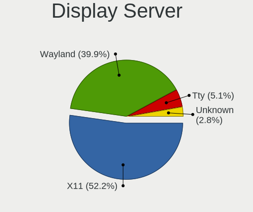
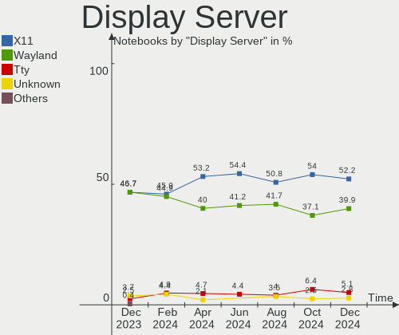
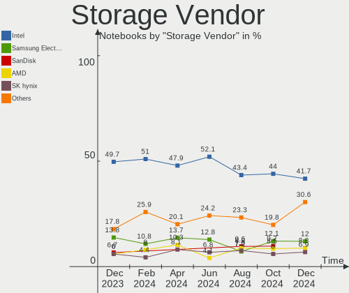
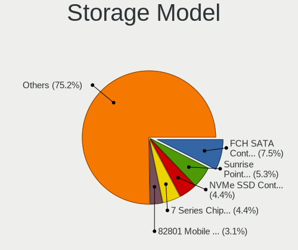

Debian Hardware Trends (Notebook)
---------------------------------

A project to identify most popular hardware characteristics and track their change
over time based on data collected by Debian users at https://Linux-Hardware.org.

Anyone can contribute to the study by uploading probes of their computers by
the [hw-probe](https://github.com/linuxhw/hw-probe) tool:

    sudo hw-probe -all -upload

Full-feature report is available here: https://linux-hardware.org/?view=trends&formfactor=notebook

Period: Feb, 2020.

Contents
--------

- [ OS                       ](#os)
- [ OS Family                ](#os-family)
- [ Kernel                   ](#kernel)
- [ Kernel Family            ](#kernel-family)
- [ Kernel Major Ver.        ](#kernel-major-ver)
- [ Arch                     ](#arch)
- [ DE                       ](#de)
- [ Display Server           ](#display-server)
- [ OS Lang                  ](#os-lang)
- [ Boot Mode                ](#boot-mode)
- [ Filesystem               ](#filesystem)
- [ Dual Boot with Linux     ](#dual-boot-with-linux)
- [ Dual Boot (Win)          ](#dual-boot-win)
- [ Country                  ](#country)
- [ City                     ](#city)
- [ Vendor                   ](#vendor)
- [ Model                    ](#model)
- [ Model Family             ](#model-family)
- [ MFG Year                 ](#mfg-year)
- [ Form Factor              ](#form-factor)
- [ Secure Boot              ](#secure-boot)
- [ Coreboot                 ](#coreboot)
- [ RAM Size                 ](#ram-size)
- [ RAM Used                 ](#ram-used)
- [ Drive Vendor             ](#drive-vendor)
- [ Drive Model              ](#drive-model)
- [ Drive Kind               ](#drive-kind)
- [ Drive Connector          ](#drive-connector)
- [ Drive Size               ](#drive-size)
- [ Space Total              ](#space-total)
- [ Space Used               ](#space-used)
- [ Malfunc. Drives          ](#malfunc-drives)
- [ Malfunc. Drive Vendor    ](#malfunc-drive-vendor)
- [ Malfunc. Drive Kind      ](#malfunc-drive-kind)
- [ Failed Drives            ](#failed-drives)
- [ Failed Drive Vendor      ](#failed-drive-vendor)
- [ Drive Status             ](#drive-status)
- [ Storage Vendor           ](#storage-vendor)
- [ Storage Model            ](#storage-model)
- [ Storage Kind             ](#storage-kind)
- [ CPU Vendor               ](#cpu-vendor)
- [ CPU Model                ](#cpu-model)
- [ CPU Model Family         ](#cpu-model-family)
- [ CPU Cores                ](#cpu-cores)
- [ CPU Sockets              ](#cpu-sockets)
- [ CPU Threads              ](#cpu-threads)
- [ CPU Op-Modes             ](#cpu-op-modes)
- [ CPU Microarch            ](#cpu-microarch)
- [ CPU Microcode            ](#cpu-microcode)
- [ GPU Vendor               ](#gpu-vendor)
- [ GPU Model                ](#gpu-model)
- [ GPU Combo                ](#gpu-combo)
- [ GPU Driver               ](#gpu-driver)
- [ GPU Memory               ](#gpu-memory)
- [ Monitor Vendor           ](#monitor-vendor)
- [ Monitor Model            ](#monitor-model)
- [ Monitor Resolution       ](#monitor-resolution)
- [ Monitor Diagonal         ](#monitor-diagonal)
- [ Monitor Width            ](#monitor-width)
- [ Aspect Ratio             ](#aspect-ratio)
- [ Monitor Area             ](#monitor-area)
- [ Pixel Density            ](#pixel-density)
- [ Multiple Monitors        ](#multiple-monitors)
- [ Net Controller Vendor    ](#net-controller-vendor)
- [ Net Controller Model     ](#net-controller-model)
- [ Net Controller Kind      ](#net-controller-kind)
- [ Used Controller          ](#used-controller)
- [ NICs                     ](#nics)
- [ Unsupported Devices      ](#unsupported-devices)
- [ Unsupported Device Types ](#unsupported-device-types)

OS
--

Installed operating systems

| Name            | Computers | Percent |
|-----------------|-----------|---------|
| Debian 10       | 31        | 62%     |
| Debian          | 9         | 18%     |
| Debian Testing  | 5         | 10%     |
| Debian Unstable | 4         | 8%      |
| Debian 9.12     | 1         | 2%      |

OS Family
---------

OS without a version

| Name   | Computers | Percent |
|--------|-----------|---------|
| Debian | 50        | 100%    |

Kernel
------

Version of the Linux kernel

| Version                       | Computers | Percent |
|-------------------------------|-----------|---------|
| 4.19.0-8-amd64                | 12        | 24%     |
| 4.19.0-6-amd64                | 12        | 24%     |
| 5.4.0-4-amd64                 | 4         | 8%      |
| 5.4.0-3-amd64                 | 4         | 8%      |
| 5.4.0-0.bpo.2-amd64           | 2         | 4%      |
| 4.19.0-8-686-pae              | 2         | 4%      |
| 5.5.0-rc5-amd64               | 1         | 2%      |
| 5.5.0-2.1-liquorix-amd64      | 1         | 2%      |
| 5.4.18-towo.1-siduction-amd64 | 1         | 2%      |
| 5.4.17                        | 1         | 2%      |
| 5.4.0-4-686-pae               | 1         | 2%      |
| 5.3.18-2-pve                  | 1         | 2%      |
| 4.9.0-9-amd64                 | 1         | 2%      |
| 4.9.0-8-amd64                 | 1         | 2%      |
| 4.9.0-8-686                   | 1         | 2%      |
| 4.9.0-12-amd64                | 1         | 2%      |
| 4.9.0-12-686                  | 1         | 2%      |
| 4.9.0-11-amd64                | 1         | 2%      |
| 4.9.0-11-686                  | 1         | 2%      |
| 4.19.0-6-686-pae              | 1         | 2%      |

Kernel Family
-------------

Linux kernel without a distro release

| Version | Computers | Percent |
|---------|-----------|---------|
| 4.19.0  | 27        | 54%     |
| 5.4.0   | 11        | 22%     |
| 4.9.0   | 7         | 14%     |
| 5.5.0   | 2         | 4%      |
| 5.4.18  | 1         | 2%      |
| 5.4.17  | 1         | 2%      |
| 5.3.18  | 1         | 2%      |

Kernel Major Ver.
-----------------

Linux kernel major version

| Version | Computers | Percent |
|---------|-----------|---------|
| 4.19    | 27        | 54%     |
| 5.4     | 13        | 26%     |
| 4.9     | 7         | 14%     |
| 5.5     | 2         | 4%      |
| 5.3     | 1         | 2%      |

Arch
----

OS architecture (x86_64, i586, etc.)

| Name   | Computers | Percent |
|--------|-----------|---------|
| x86_64 | 43        | 86%     |
| i686   | 7         | 14%     |

DE
--

Desktop Environment

| Name            | Computers | Percent |
|-----------------|-----------|---------|
| GNOME           | 14        | 28%     |
| KDE5            | 10        | 20%     |
| XFCE            | 7         | 14%     |
| X-Cinnamon      | 6         | 12%     |
| KDE             | 5         | 10%     |
| MATE            | 3         | 6%      |
| Unknown         | 3         | 6%      |
| GNOME Flashback | 1         | 2%      |
| Cinnamon        | 1         | 2%      |

Display Server
--------------

X11 or Wayland

| Name    | Computers | Percent |
|---------|-----------|---------|
| X11     | 39        | 78%     |
| Wayland | 10        | 20%     |
| Tty     | 1         | 2%      |

OS Lang
-------

Language

| Lang       | Computers | Percent |
|------------|-----------|---------|
| Unknown    | 14        | 28%     |
| en_US      | 13        | 26%     |
| ru_RU      | 4         | 8%      |
| de_DE      | 4         | 8%      |
| pl_PL      | 2         | 4%      |
| es_MX      | 2         | 4%      |
| pt_BR      | 1         | 2%      |
| nl_NL      | 1         | 2%      |
| it_IT      | 1         | 2%      |
| it_CH      | 1         | 2%      |
| fr_FR      | 1         | 2%      |
| es_CR      | 1         | 2%      |
| es_CO      | 1         | 2%      |
| en_US.utf8 | 1         | 2%      |
| en_GB.utf8 | 1         | 2%      |
| en_GB      | 1         | 2%      |
| cs_CZ      | 1         | 2%      |

Boot Mode
---------

EFI or BIOS

| Mode | Computers | Percent |
|------|-----------|---------|
| BIOS | 30        | 60%     |
| EFI  | 20        | 40%     |

Filesystem
----------

Type of filesystem

| Type    | Computers | Percent |
|---------|-----------|---------|
| Ext4    | 48        | 96%     |
| Overlay | 1         | 2%      |
| Btrfs   | 1         | 2%      |

Dual Boot with Linux
--------------------

Hosting more than one Linux

| Dual boot | Computers | Percent |
|-----------|-----------|---------|
| No        | 48        | 96%     |
| Yes       | 2         | 4%      |

Dual Boot (Win)
---------------

Hosting Linux and Windows

| Dual boot | Computers | Percent |
|-----------|-----------|---------|
| No        | 37        | 74%     |
| Yes       | 13        | 26%     |

Country
-------

Geographic location (country)

| Country        | Computers | Percent |
|----------------|-----------|---------|
| USA            | 6         | 12%     |
| Germany        | 6         | 12%     |
| Russia         | 5         | 10%     |
| Italy          | 5         | 10%     |
| France         | 3         | 6%      |
| Ukraine        | 2         | 4%      |
| Spain          | 2         | 4%      |
| Netherlands    | 2         | 4%      |
| Mexico         | 2         | 4%      |
| Greece         | 2         | 4%      |
| Costa Rica     | 2         | 4%      |
| Brazil         | 2         | 4%      |
| Turkey         | 1         | 2%      |
| Tunisia        | 1         | 2%      |
| Switzerland    | 1         | 2%      |
| Sweden         | 1         | 2%      |
| Poland         | 1         | 2%      |
| Norway         | 1         | 2%      |
| Denmark        | 1         | 2%      |
| Czech Republic | 1         | 2%      |
| Colombia       | 1         | 2%      |
| Belarus        | 1         | 2%      |
| Austria        | 1         | 2%      |

City
----

Geographic location (city)

| City                  | Computers | Percent |
|-----------------------|-----------|---------|
| Taubate               | 2         | 4%      |
| Moscow                | 2         | 4%      |
| Milan                 | 2         | 4%      |
| Cologne               | 2         | 4%      |
| Athens                | 2         | 4%      |
| Zeist                 | 1         | 2%      |
| Williston             | 1         | 2%      |
| Webster               | 1         | 2%      |
| Voronezh              | 1         | 2%      |
| Virum                 | 1         | 2%      |
| Villejuif             | 1         | 2%      |
| Vienna                | 1         | 2%      |
| Urswil                | 1         | 2%      |
| Ternovka              | 1         | 2%      |
| Stuttgart             | 1         | 2%      |
| Stockholm             | 1         | 2%      |
| St Petersburg         | 1         | 2%      |
| Sousse                | 1         | 2%      |
| San José             | 1         | 2%      |
| San Dimas             | 1         | 2%      |
| Prague                | 1         | 2%      |
| Portage               | 1         | 2%      |
| Palestrina            | 1         | 2%      |
| Palaiseau             | 1         | 2%      |
| Oyten                 | 1         | 2%      |
| Oslo                  | 1         | 2%      |
| Mönchengladbach      | 1         | 2%      |
| Mykolayiv             | 1         | 2%      |
| Montebelluna          | 1         | 2%      |
| Mexico City           | 1         | 2%      |
| Madrid                | 1         | 2%      |
| Kyiv                  | 1         | 2%      |
| Katowice              | 1         | 2%      |
| Heredia               | 1         | 2%      |
| Hamburg               | 1         | 2%      |
| Geveze                | 1         | 2%      |
| Fusagasuga            | 1         | 2%      |
| Forest Hills          | 1         | 2%      |
| Ciudad Nezahualcoyotl | 1         | 2%      |
| Bari                  | 1         | 2%      |
| Barcelona             | 1         | 2%      |
| Asipovichy            | 1         | 2%      |
| Antalya               | 1         | 2%      |
| Almere Stad           | 1         | 2%      |
| Albany                | 1         | 2%      |

Vendor
------

Motherboard manufacturer

| Name                | Computers | Percent |
|---------------------|-----------|---------|
| Lenovo              | 16        | 32%     |
| Hewlett-Packard     | 10        | 20%     |
| Dell                | 9         | 18%     |
| ASUSTek Computer    | 5         | 10%     |
| Acer                | 3         | 6%      |
| Toshiba             | 1         | 2%      |
| Sony                | 1         | 2%      |
| Samsung Electronics | 1         | 2%      |
| Packard Bell        | 1         | 2%      |
| OEM                 | 1         | 2%      |
| Fujitsu Siemens     | 1         | 2%      |
| Unknown             | 1         | 2%      |

Model
-----

Motherboard model

| Name                                     | Computers | Percent |
|------------------------------------------|-----------|---------|
| Toshiba Satellite A500                   | 1         | 2%      |
| Sony VPCEB11FM                           | 1         | 2%      |
| Samsung Electronics N150/N210/N220       | 1         | 2%      |
| Packard Bell DOT S                       | 1         | 2%      |
| OEM I41SI                                | 1         | 2%      |
| Lenovo Yoga 2 Pro 20266                  | 1         | 2%      |
| Lenovo V330-15IKB 81AX                   | 1         | 2%      |
| Lenovo ThinkPad X270 20K5S0R100          | 1         | 2%      |
| Lenovo ThinkPad X1 Carbon 7th 20R1S05B00 | 1         | 2%      |
| Lenovo ThinkPad X1 Carbon 7th 20QES01M00 | 1         | 2%      |
| Lenovo ThinkPad X1 Carbon 6th 20KHCTO1WW | 1         | 2%      |
| Lenovo ThinkPad W520 42844YS             | 1         | 2%      |
| Lenovo ThinkPad T495s 20QKS01E00         | 1         | 2%      |
| Lenovo ThinkPad T490s 20NX000EMX         | 1         | 2%      |
| Lenovo ThinkPad T490s 20NX000AGE         | 1         | 2%      |
| Lenovo ThinkPad T450s 20BXCTO1WW         | 1         | 2%      |
| Lenovo ThinkPad T440p 20AWS0VK00         | 1         | 2%      |
| Lenovo ThinkPad SL500 27468XU            | 1         | 2%      |
| Lenovo ThinkPad L13 20R3000FGE           | 1         | 2%      |
| Lenovo ThinkPad E590 20NB001AIX          | 1         | 2%      |
| Lenovo IdeaPad 700-15ISK 80RU            | 1         | 2%      |
| HP ZBook 14u G5                          | 1         | 2%      |
| HP ProBook 6570b                         | 1         | 2%      |
| HP ProBook 650 G1                        | 1         | 2%      |
| HP Pavilion Gaming Laptop 15-cx0xxx      | 1         | 2%      |
| HP Mini 110-3100                         | 1         | 2%      |
| HP G61                                   | 1         | 2%      |
| HP EliteBook 840 G6                      | 1         | 2%      |
| HP EliteBook 820 G1                      | 1         | 2%      |
| HP 350 G2                                | 1         | 2%      |
| HP 250 G6 Notebook PC                    | 1         | 2%      |
| Fujitsu Siemens ESPRIMO Mobile V5535     | 1         | 2%      |
| Dell Latitude E7470                      | 1         | 2%      |
| Dell Latitude E7450                      | 1         | 2%      |
| Dell Latitude E4310                      | 1         | 2%      |
| Dell Latitude D630                       | 1         | 2%      |
| Dell Latitude 7490                       | 1         | 2%      |
| Dell Latitude 7400                       | 1         | 2%      |
| Dell Latitude 5500                       | 1         | 2%      |
| Dell Inspiron 5566                       | 1         | 2%      |
| Dell Inspiron 1520                       | 1         | 2%      |
| ASUS X301A1                              | 1         | 2%      |
| ASUS UX303LA                             | 1         | 2%      |
| ASUS T100TAR                             | 1         | 2%      |
| ASUS K52F                                | 1         | 2%      |
| ASUS K42Jr                               | 1         | 2%      |
| Acer Aspire E5-571                       | 1         | 2%      |
| Acer Aspire E1-531                       | 1         | 2%      |
| Acer Aspire A517-51G                     | 1         | 2%      |
| Unknown                                  | 1         | 2%      |

Model Family
------------

Motherboard model prefix

| Name                     | Computers | Percent |
|--------------------------|-----------|---------|
| Lenovo ThinkPad          | 13        | 26%     |
| Dell Latitude            | 7         | 14%     |
| Acer Aspire              | 3         | 6%      |
| HP ProBook               | 2         | 4%      |
| HP EliteBook             | 2         | 4%      |
| Dell Inspiron            | 2         | 4%      |
| Toshiba Satellite        | 1         | 2%      |
| Sony VPCEB11FM           | 1         | 2%      |
| Samsung Electronics N150 | 1         | 2%      |
| Packard Bell DOT         | 1         | 2%      |
| OEM I41SI                | 1         | 2%      |
| Lenovo Yoga              | 1         | 2%      |
| Lenovo V330-15IKB        | 1         | 2%      |
| Lenovo IdeaPad           | 1         | 2%      |
| HP ZBook                 | 1         | 2%      |
| HP Pavilion              | 1         | 2%      |
| HP Mini                  | 1         | 2%      |
| HP G61                   | 1         | 2%      |
| HP 350                   | 1         | 2%      |
| HP 250                   | 1         | 2%      |
| Fujitsu Siemens ESPRIMO  | 1         | 2%      |
| ASUS X301A1              | 1         | 2%      |
| ASUS UX303LA             | 1         | 2%      |
| ASUS T100TAR             | 1         | 2%      |
| ASUS K52F                | 1         | 2%      |
| ASUS K42Jr               | 1         | 2%      |
| Unknown                  | 1         | 2%      |

MFG Year
--------

Motherboard manufacture year

| Year | Computers | Percent |
|------|-----------|---------|
| 2019 | 15        | 30%     |
| 2015 | 5         | 10%     |
| 2017 | 4         | 8%      |
| 2010 | 4         | 8%      |
| 2020 | 3         | 6%      |
| 2018 | 3         | 6%      |
| 2013 | 3         | 6%      |
| 2008 | 3         | 6%      |
| 2016 | 2         | 4%      |
| 2014 | 2         | 4%      |
| 2012 | 2         | 4%      |
| 2011 | 2         | 4%      |
| 2009 | 2         | 4%      |

Form Factor
-----------

Physical design of the computer

| Name     | Computers | Percent |
|----------|-----------|---------|
| Notebook | 50        | 100%    |

Secure Boot
-----------

Enabled or disabled

| State    | Computers | Percent |
|----------|-----------|---------|
| Disabled | 45        | 90%     |
| Enabled  | 5         | 10%     |

Coreboot
--------

Have coreboot on board

| Used | Computers | Percent |
|------|-----------|---------|
| No   | 50        | 100%    |

RAM Size
--------

Total RAM memory

| Size in GB | Computers | Percent |
|------------|-----------|---------|
| 3.01-4.0   | 15        | 30%     |
| 16.01-24.0 | 13        | 26%     |
| 8.01-16.0  | 11        | 22%     |
| 4.01-8.0   | 4         | 8%      |
| 1.01-2.0   | 4         | 8%      |
| 2.01-3.0   | 2         | 4%      |
| 32.01-64.0 | 1         | 2%      |

RAM Used
--------

Used RAM memory

| Used GB   | Computers | Percent |
|-----------|-----------|---------|
| 2.01-3.0  | 16        | 32%     |
| 1.01-2.0  | 14        | 28%     |
| 4.01-8.0  | 6         | 12%     |
| 0.01-1.0  | 6         | 12%     |
| 3.01-4.0  | 5         | 10%     |
| 8.01-16.0 | 3         | 6%      |

Drive Vendor
------------

Hard drive vendors

| Vendor              | Computers | Drives | Percent |
|---------------------|-----------|--------|---------|
| Samsung Electronics | 13        | 13     | 24.53%  |
| WDC                 | 11        | 11     | 20.75%  |
| Toshiba             | 7         | 7      | 13.21%  |
| Seagate             | 7         | 7      | 13.21%  |
| HGST                | 3         | 3      | 5.66%   |
| Unknown             | 1         | 1      | 1.89%   |
| Team                | 1         | 1      | 1.89%   |
| SK Hynix            | 1         | 1      | 1.89%   |
| Micron Technology   | 1         | 1      | 1.89%   |
| Kingston            | 1         | 1      | 1.89%   |
| KingFast            | 1         | 1      | 1.89%   |
| Intenso             | 1         | 1      | 1.89%   |
| Intel               | 1         | 1      | 1.89%   |
| Hitachi             | 1         | 1      | 1.89%   |
| Fujitsu             | 1         | 1      | 1.89%   |
| Crucial             | 1         | 1      | 1.89%   |
| Corsair             | 1         | 1      | 1.89%   |

Drive Model
-----------

Hard drive models

| Model                            | Computers | Percent |
|----------------------------------|-----------|---------|
| SSD 850 EVO 250GB                | 5         | 9.43%   |
| MZVLB1T0HBLR-000L7 1TB           | 2         | 3.77%   |
| HTS721010A9E630 1TB              | 2         | 3.77%   |
| WD5000LPLX-00ZNTT0 500GB         | 1         | 1.89%   |
| WD5000LPCX-24VHAT0 500GB         | 1         | 1.89%   |
| WD5000LPCX-21VHAT0 500GB         | 1         | 1.89%   |
| WD3200BEVT-60ZCT1 320GB          | 1         | 1.89%   |
| WD1200BEVS-22UST0 120GB          | 1         | 1.89%   |
| WD10SPZX-75Z10T1 1TB             | 1         | 1.89%   |
| WD10SPCX-24HWST1 1TB             | 1         | 1.89%   |
| THNSNC128GCSJ 128GB SSD          | 1         | 1.89%   |
| THNSFJ256GCSU 256GB SSD          | 1         | 1.89%   |
| TEAML5Lite3D240G 240GB SSD       | 1         | 1.89%   |
| SU02G  2GB                       | 1         | 1.89%   |
| ST9500423AS 500GB                | 1         | 1.89%   |
| ST9500325AS 500GB                | 1         | 1.89%   |
| ST9250315AS 250GB                | 1         | 1.89%   |
| ST2000LX001-1RG174 2TB           | 1         | 1.89%   |
| ST1000LM035-1RK172 1TB           | 1         | 1.89%   |
| ST1000LM024 HN-M101MBB 1TB       | 1         | 1.89%   |
| SSDPEKKF512G8L 512GB             | 1         | 1.89%   |
| SSD Sata III 240GB               | 1         | 1.89%   |
| SSD PM871 mSATA 512GB            | 1         | 1.89%   |
| SSD 850 EVO M.2 500GB            | 1         | 1.89%   |
| RBUSNS8180S3128GI1 128GB SSD     | 1         | 1.89%   |
| Performance Pro 128GB SSD        | 1         | 1.89%   |
| PC SN730 SDBQNTY-512G-1001 512GB | 1         | 1.89%   |
| PC SN730 SDBQNTY-256G-1001 256GB | 1         | 1.89%   |
| PC SN720 SDAQNTW-512G-1006 512GB | 1         | 1.89%   |
| PC SN520 SDAPNUW-128G-1006 128GB | 1         | 1.89%   |
| MZVLB256HAHQ-000H1 256GB         | 1         | 1.89%   |
| MZVLB1T0HALR-000L7 1TB           | 1         | 1.89%   |
| MZMTE256HMHP-000L1 256GB SSD     | 1         | 1.89%   |
| MQ01ACF032 320GB                 | 1         | 1.89%   |
| MK4055GSX 400GB                  | 1         | 1.89%   |
| MK3259GSXP 320GB                 | 1         | 1.89%   |
| MHZ2160BH G2 160GB               | 1         | 1.89%   |
| KXG6AZNV512G 512GB               | 1         | 1.89%   |
| KBG30ZMT256G 256GB               | 1         | 1.89%   |
| HTS541075A7E630 752GB            | 1         | 1.89%   |
| HTS541010G9SA00 100GB            | 1         | 1.89%   |
| HM251JI 250GB                    | 1         | 1.89%   |
| HBG4e  32GB                      | 1         | 1.89%   |
| CT240BX500SSD1 240GB             | 1         | 1.89%   |
| BarraCuda SSD ZA1000CM10002 1TB  | 1         | 1.89%   |
| 256GB                            | 1         | 1.89%   |
| 1100 SATA 256GB SSD              | 1         | 1.89%   |

Drive Kind
----------

HDD or SSD

| Kind    | Computers | Drives | Percent |
|---------|-----------|--------|---------|
| HDD     | 22        | 22     | 41.51%  |
| SSD     | 17        | 17     | 32.08%  |
| NVMe    | 11        | 11     | 20.75%  |
| MMC     | 2         | 2      | 3.77%   |
| Unknown | 1         | 1      | 1.89%   |

Drive Connector
---------------

SATA, SAS, NVMe, etc.

| Type | Computers | Drives | Percent |
|------|-----------|--------|---------|
| SATA | 37        | 40     | 74%     |
| NVMe | 11        | 11     | 22%     |
| MMC  | 2         | 2      | 4%      |

Drive Size
----------

Size of hard drive

| Size in TB | Computers | Drives | Percent |
|------------|-----------|--------|---------|
| 0.01-0.5   | 34        | 36     | 66.67%  |
| 0.51-1.0   | 13        | 13     | 25.49%  |
| 1.01-2.0   | 4         | 4      | 7.84%   |

Space Total
-----------

Amount of disk space available on the file system

| Size in GB | Computers | Percent |
|------------|-----------|---------|
| 101-250    | 16        | 32%     |
| 251-500    | 14        | 28%     |
| 21-50      | 8         | 16%     |
| 501-1000   | 6         | 12%     |
| 51-100     | 3         | 6%      |
| 2001-3000  | 1         | 2%      |
| 1001-2000  | 1         | 2%      |
| 1-20       | 1         | 2%      |

Space Used
----------

Amount of used disk space

| Used GB   | Computers | Percent |
|-----------|-----------|---------|
| 1-20      | 28        | 56%     |
| 21-50     | 7         | 14%     |
| 51-100    | 7         | 14%     |
| 101-250   | 5         | 10%     |
| 251-500   | 1         | 2%      |
| 1001-2000 | 1         | 2%      |
| 501-1000  | 1         | 2%      |

Malfunc. Drives
---------------

Drive models with a malfunction

| Model                     | Computers | Drives | Percent |
|---------------------------|-----------|--------|---------|
| WD3200BEVT-60ZCT1 320GB   | 1         | 1      | 25%     |
| ST9250315AS 250GB         | 1         | 1      | 25%     |
| Performance Pro 128GB SSD | 1         | 1      | 25%     |
| MK3259GSXP 320GB          | 1         | 1      | 25%     |

Malfunc. Drive Vendor
---------------------

Vendors of faulty drives

| Vendor  | Computers | Drives | Percent |
|---------|-----------|--------|---------|
| WDC     | 1         | 1      | 25%     |
| Toshiba | 1         | 1      | 25%     |
| Seagate | 1         | 1      | 25%     |
| Corsair | 1         | 1      | 25%     |

Malfunc. Drive Kind
-------------------

Kinds of faulty drives

| Kind | Computers | Drives | Percent |
|------|-----------|--------|---------|
| HDD  | 3         | 3      | 75%     |
| SSD  | 1         | 1      | 25%     |

Failed Drives
-------------

Failed drive models

Zero info for selected period =(

Failed Drive Vendor
-------------------

Failed drive vendors

Zero info for selected period =(

Drive Status
------------

Number of failed and malfunc. drives

| Status   | Computers | Drives | Percent |
|----------|-----------|--------|---------|
| Detected | 23        | 25     | 47.92%  |
| Works    | 21        | 24     | 43.75%  |
| Malfunc  | 4         | 4      | 8.33%   |

Storage Vendor
--------------

Storage controller vendors

| Vendor                           | Computers | Percent |
|----------------------------------|-----------|---------|
| Intel                            | 37        | 72.55%  |
| Samsung Electronics              | 5         | 9.8%    |
| Sandisk                          | 4         | 7.84%   |
| Toshiba America Info Systems     | 2         | 3.92%   |
| Silicon Integrated Systems [SiS] | 2         | 3.92%   |
| SK Hynix                         | 1         | 1.96%   |

Storage Model
-------------

Storage controller models

| Model                                                                    | Computers | Percent |
|--------------------------------------------------------------------------|-----------|---------|
| Sunrise Point-LP SATA Controller [AHCI mode]                             | 6         | 10.91%  |
| NVMe SSD Controller SM981/PM981/PM983                                    | 5         | 9.09%   |
| Wildcat Point-LP SATA Controller [AHCI Mode]                             | 4         | 7.27%   |
| Non-Volatile memory controller                                           | 3         | 5.45%   |
| NM10/ICH7 Family SATA Controller [AHCI mode]                             | 3         | 5.45%   |
| 82801IBM/IEM (ICH9M/ICH9M-E) 4 port SATA Controller [AHCI mode]          | 3         | 5.45%   |
| 8 Series SATA Controller 1 [AHCI mode]                                   | 3         | 5.45%   |
| 7 Series Chipset Family 6-port SATA Controller [AHCI mode]               | 3         | 5.45%   |
| 5 Series/3400 Series Chipset 4 port SATA AHCI Controller                 | 3         | 5.45%   |
| SATA Controller / IDE mode                                               | 2         | 3.64%   |
| 82801HM/HEM (ICH8M/ICH8M-E) SATA Controller [IDE mode]                   | 2         | 3.64%   |
| 82801HM/HEM (ICH8M/ICH8M-E) IDE Controller                               | 2         | 3.64%   |
| 82801 Mobile SATA Controller [RAID mode]                                 | 2         | 3.64%   |
| 8 Series/C220 Series Chipset Family 6-port SATA Controller 1 [AHCI mode] | 2         | 3.64%   |
| 5513 IDE Controller                                                      | 2         | 3.64%   |
| WD Black 2018/PC SN720 NVMe SSD                                          | 1         | 1.82%   |
| WD Black 2018/PC SN520 NVMe SSD                                          | 1         | 1.82%   |
| Toshiba America Info Non-Volatile memory controller                      | 1         | 1.82%   |
| SSD Pro 7600p/760p/E 6100p Series                                        | 1         | 1.82%   |
| HM170/QM170 Chipset SATA Controller [AHCI Mode]                          | 1         | 1.82%   |
| Cannon Point-LP SATA Controller [AHCI Mode]                              | 1         | 1.82%   |
| Cannon Lake Mobile PCH SATA AHCI Controller                              | 1         | 1.82%   |
| BG3 NVMe SSD Controller                                                  | 1         | 1.82%   |
| 6 Series/C200 Series Chipset Family 6 port Mobile SATA AHCI Controller   | 1         | 1.82%   |
| 5 Series/3400 Series Chipset 6 port SATA AHCI Controller                 | 1         | 1.82%   |

Storage Kind
------------

Kind of storage controller (IDE, SATA, NVMe, SAS, ...)

| Kind | Computers | Percent |
|------|-----------|---------|
| SATA | 32        | 62.75%  |
| NVMe | 13        | 25.49%  |
| IDE  | 4         | 7.84%   |
| RAID | 2         | 3.92%   |

CPU Vendor
----------

Processor vendors

| Vendor | Computers | Percent |
|--------|-----------|---------|
| Intel  | 49        | 98%     |
| AMD    | 1         | 2%      |

CPU Model
---------

Processor models

| Model                                           | Computers | Percent |
|-------------------------------------------------|-----------|---------|
| Intel Core i7-8665U CPU @ 1.90GHz               | 2         | 4%      |
| Intel Core i7-8565U CPU @ 1.80GHz               | 2         | 4%      |
| Intel Core i7-7500U CPU @ 2.70GHz               | 2         | 4%      |
| Intel Core i7-5600U CPU @ 2.60GHz               | 2         | 4%      |
| Intel Core i5-8265U CPU @ 1.60GHz               | 2         | 4%      |
| Intel Core i5-7200U CPU @ 2.50GHz               | 2         | 4%      |
| Intel Core i5-6300U CPU @ 2.40GHz               | 2         | 4%      |
| Intel Core i5-5200U CPU @ 2.20GHz               | 2         | 4%      |
| Intel Core 2 Duo CPU T7500 @ 2.20GHz            | 2         | 4%      |
| Intel Core 2 Duo CPU T6600 @ 2.20GHz            | 2         | 4%      |
| Intel Pentium Dual CPU T2370 @ 1.73GHz          | 1         | 2%      |
| Intel Pentium CPU B970 @ 2.30GHz                | 1         | 2%      |
| Intel Genuine CPU 585 @ 2.16GHz                 | 1         | 2%      |
| Intel Core i7-8650U CPU @ 1.90GHz               | 1         | 2%      |
| Intel Core i7-6700HQ CPU @ 2.60GHz              | 1         | 2%      |
| Intel Core i7-4800MQ CPU @ 2.70GHz              | 1         | 2%      |
| Intel Core i7-4510U CPU @ 2.00GHz               | 1         | 2%      |
| Intel Core i7-4500U CPU @ 1.80GHz               | 1         | 2%      |
| Intel Core i7-2860QM CPU @ 2.50GHz              | 1         | 2%      |
| Intel Core i7-10710U CPU @ 1.10GHz              | 1         | 2%      |
| Intel Core i7-10510U CPU @ 1.80GHz              | 1         | 2%      |
| Intel Core i5-8365U CPU @ 1.60GHz               | 1         | 2%      |
| Intel Core i5-8350U CPU @ 1.70GHz               | 1         | 2%      |
| Intel Core i5-8300H CPU @ 2.30GHz               | 1         | 2%      |
| Intel Core i5-8250U CPU @ 1.60GHz               | 1         | 2%      |
| Intel Core i5-4200U CPU @ 1.60GHz               | 1         | 2%      |
| Intel Core i5-4200M CPU @ 2.50GHz               | 1         | 2%      |
| Intel Core i5 CPU M 520 @ 2.40GHz               | 1         | 2%      |
| Intel Core i3-6006U CPU @ 2.00GHz               | 1         | 2%      |
| Intel Core i3-3120M CPU @ 2.50GHz               | 1         | 2%      |
| Intel Core i3 CPU M 380 @ 2.53GHz               | 1         | 2%      |
| Intel Core i3 CPU M 350 @ 2.27GHz               | 1         | 2%      |
| Intel Core i3 CPU M 330 @ 2.13GHz               | 1         | 2%      |
| Intel Core 2 Duo CPU P8700 @ 2.53GHz            | 1         | 2%      |
| Intel Celeron CPU 1000M @ 1.80GHz               | 1         | 2%      |
| Intel Atom CPU Z3775 @ 1.46GHz                  | 1         | 2%      |
| Intel Atom CPU N455 @ 1.66GHz                   | 1         | 2%      |
| Intel Atom CPU N450 @ 1.66GHz                   | 1         | 2%      |
| Intel Atom CPU N2600 @ 1.60GHz                  | 1         | 2%      |
| AMD Ryzen 7 PRO 3700U w/ Radeon Vega Mobile Gfx | 1         | 2%      |

CPU Model Family
----------------

Processor model prefix

| Model              | Computers | Percent |
|--------------------|-----------|---------|
| Intel Core i7      | 16        | 32%     |
| Intel Core i5      | 15        | 30%     |
| Intel Core i3      | 5         | 10%     |
| Intel Core 2 Duo   | 5         | 10%     |
| Intel Atom         | 4         | 8%      |
| Intel Pentium Dual | 1         | 2%      |
| Intel Pentium      | 1         | 2%      |
| Intel Genuine      | 1         | 2%      |
| Intel Celeron      | 1         | 2%      |
| AMD Ryzen 7 PRO    | 1         | 2%      |

CPU Cores
---------

Number of processor cores

| Number | Computers | Percent |
|--------|-----------|---------|
| 2      | 29        | 58%     |
| 4      | 17        | 34%     |
| 1      | 3         | 6%      |
| 6      | 1         | 2%      |

CPU Sockets
-----------

Number of sockets

| Number | Computers | Percent |
|--------|-----------|---------|
| 1      | 50        | 100%    |

CPU Threads
-----------

Threads per core (Hyper-Threading)

| Number | Computers | Percent |
|--------|-----------|---------|
| 2      | 39        | 78%     |
| 1      | 11        | 22%     |

CPU Op-Modes
------------

CPU Operation Modes (32-bit, 64-bit)

| Op mode        | Computers | Percent |
|----------------|-----------|---------|
| 32-bit, 64-bit | 50        | 100%    |

CPU Microarch
-------------

Microarchitecture

| Name        | Computers | Percent |
|-------------|-----------|---------|
| Skylake     | 12        | 24%     |
| KabyLake    | 9         | 18%     |
| Haswell     | 5         | 10%     |
| Core        | 5         | 10%     |
| Westmere    | 4         | 8%      |
| Broadwell   | 4         | 8%      |
| Bonnell     | 3         | 6%      |
| SandyBridge | 2         | 4%      |
| Penryn      | 2         | 4%      |
| IvyBridge   | 2         | 4%      |
| Zen+        | 1         | 2%      |
| Silvermont  | 1         | 2%      |

CPU Microcode
-------------

Microcode number

| Number     | Computers | Percent |
|------------|-----------|---------|
| Unknown    | 22        | 44%     |
| 0x806ec    | 5         | 10%     |
| 0x806e9    | 2         | 4%      |
| 0x406e3    | 2         | 4%      |
| 0x40651    | 2         | 4%      |
| 0x306d4    | 2         | 4%      |
| 0x306c3    | 2         | 4%      |
| 0x20652    | 2         | 4%      |
| 0xa0660    | 1         | 2%      |
| 0x906ea    | 1         | 2%      |
| 0x806ea    | 1         | 2%      |
| 0x506e3    | 1         | 2%      |
| 0x306a9    | 1         | 2%      |
| 0x30678    | 1         | 2%      |
| 0x30661    | 1         | 2%      |
| 0x20655    | 1         | 2%      |
| 0x106ca    | 1         | 2%      |
| 0x1067a    | 1         | 2%      |
| 0x08108102 | 1         | 2%      |

GPU Vendor
----------

Vendors of graphics cards

| Vendor                           | Computers | Percent |
|----------------------------------|-----------|---------|
| Intel                            | 44        | 80%     |
| Nvidia                           | 5         | 9.09%   |
| AMD                              | 4         | 7.27%   |
| Silicon Integrated Systems [SiS] | 2         | 3.64%   |

GPU Model
---------

Graphics card models

| Model                                                               | Computers | Percent |
|---------------------------------------------------------------------|-----------|---------|
| UHD Graphics 620 (Whiskey Lake)                                     | 7         | 12.28%  |
| HD Graphics 620                                                     | 4         | 7.02%   |
| HD Graphics 5500                                                    | 4         | 7.02%   |
| UHD Graphics 620                                                    | 3         | 5.26%   |
| Skylake GT2 [HD Graphics 520]                                       | 3         | 5.26%   |
| Haswell-ULT Integrated Graphics Controller                          | 3         | 5.26%   |
| Core Processor Integrated Graphics Controller                       | 3         | 5.26%   |
| UHD Graphics                                                        | 2         | 3.51%   |
| Mobile GM965/GL960 Integrated Graphics Controller (secondary)       | 2         | 3.51%   |
| Mobile GM965/GL960 Integrated Graphics Controller (primary)         | 2         | 3.51%   |
| Atom Processor D4xx/D5xx/N4xx/N5xx Integrated Graphics Controller   | 2         | 3.51%   |
| 771/671 PCIE VGA Display Adapter                                    | 2         | 3.51%   |
| 4th Gen Core Processor Integrated Graphics Controller               | 2         | 3.51%   |
| 3rd Gen Core processor Graphics Controller                          | 2         | 3.51%   |
| 2nd Generation Core Processor Family Integrated Graphics Controller | 2         | 3.51%   |
| UHD Graphics 630 (Mobile)                                           | 1         | 1.75%   |
| Picasso                                                             | 1         | 1.75%   |
| Park [Mobility Radeon HD 5430/5450/5470]                            | 1         | 1.75%   |
| Mobile 4 Series Chipset Integrated Graphics Controller              | 1         | 1.75%   |
| Jet XT [Radeon R5 M240]                                             | 1         | 1.75%   |
| HD Graphics 530                                                     | 1         | 1.75%   |
| GT216M [GeForce GT 230M]                                            | 1         | 1.75%   |
| GM108M [GeForce 940MX]                                              | 1         | 1.75%   |
| GM107M [GeForce GTX 950M]                                           | 1         | 1.75%   |
| GF106GLM [Quadro 2000M]                                             | 1         | 1.75%   |
| G98M [GeForce G 103M]                                               | 1         | 1.75%   |
| Baffin [Radeon RX 460/560D / Pro 450/455/460/555/555X/560/560X]     | 1         | 1.75%   |
| Atom Processor Z36xxx/Z37xxx Series Graphics & Display              | 1         | 1.75%   |
| Atom Processor D2xxx/N2xxx Integrated Graphics Controller           | 1         | 1.75%   |

GPU Combo
---------

Combinations of graphics cards

| Name           | Computers | Percent |
|----------------|-----------|---------|
| 1 x Intel      | 39        | 78%     |
| Intel + Nvidia | 3         | 6%      |
| 1 x SiS        | 2         | 4%      |
| 1 x Nvidia     | 2         | 4%      |
| Intel + AMD    | 2         | 4%      |
| 1 x AMD        | 2         | 4%      |

GPU Driver
----------

Free vs proprietary

| Driver      | Computers | Percent |
|-------------|-----------|---------|
| Free        | 45        | 90%     |
| Proprietary | 3         | 6%      |
| Unknown     | 2         | 4%      |

GPU Memory
----------

Total video memory

| Size in GB | Computers | Percent |
|------------|-----------|---------|
| Unknown    | 46        | 92%     |
| 3.01-4.0   | 1         | 2%      |
| 1.01-2.0   | 1         | 2%      |
| 0.51-1.0   | 1         | 2%      |
| 0.01-0.5   | 1         | 2%      |

Monitor Vendor
--------------

Monitor vendors

| Vendor                  | Computers | Percent |
|-------------------------|-----------|---------|
| AU Optronics            | 17        | 32.08%  |
| LG Display              | 9         | 16.98%  |
| Chimei Innolux          | 7         | 13.21%  |
| Lenovo                  | 3         | 5.66%   |
| Dell                    | 3         | 5.66%   |
| Sony                    | 2         | 3.77%   |
| Samsung Electronics     | 2         | 3.77%   |
| InfoVision              | 2         | 3.77%   |
| Goldstar                | 2         | 3.77%   |
| Chi Mei Optoelectronics | 2         | 3.77%   |
| BOE                     | 2         | 3.77%   |
| Iiyama                  | 1         | 1.89%   |
| Ancor Communications    | 1         | 1.89%   |

Monitor Model
-------------

Monitor models

| Model                                              | Computers | Percent |
|----------------------------------------------------|-----------|---------|
| LCD Monitor AUO133D 1920x1080 309x173mm 13.9-inch  | 3         | 5.56%   |
| LCD Monitor CMN14F2 1920x1080 309x173mm 13.9-inch  | 2         | 3.7%    |
| LCD Monitor AUO22EC 1366x768 344x193mm 15.5-inch   | 2         | 3.7%    |
| VE228 ACI22FA 1920x1080 477x268mm 21.5-inch        | 1         | 1.85%   |
| U3419W DELA131 3440x1440 800x335mm 34.1-inch       | 1         | 1.85%   |
| U2412M DELA07B 1920x1200 518x324mm 24.1-inch       | 1         | 1.85%   |
| TV SNYF500 1360x768 1600x900mm 72.3-inch           | 1         | 1.85%   |
| TV SNYF301 1920x1080 1600x900mm 72.3-inch          | 1         | 1.85%   |
| PLG2488H IVM6125 1920x1080 531x299mm 24.0-inch     | 1         | 1.85%   |
| P2317H DEL40F4 1920x1080 509x286mm 23.0-inch       | 1         | 1.85%   |
| P2317H DEL40F3 1920x1080 509x286mm 23.0-inch       | 1         | 1.85%   |
| LG ULTRAWIDE GSM59F1 1920x1080 580x240mm 24.7-inch | 1         | 1.85%   |
| LCD Monitor SEC3641 1366x768 353x198mm 15.9-inch   | 1         | 1.85%   |
| LCD Monitor SDC424A 3200x1800 293x165mm 13.2-inch  | 1         | 1.85%   |
| LCD Monitor LGD0608 1920x1080 309x174mm 14.0-inch  | 1         | 1.85%   |
| LCD Monitor LGD05F1 1920x1080 309x174mm 14.0-inch  | 1         | 1.85%   |
| LCD Monitor LGD05E6 1920x1080 344x194mm 15.5-inch  | 1         | 1.85%   |
| LCD Monitor LGD056D 1920x1080 380x210mm 17.1-inch  | 1         | 1.85%   |
| LCD Monitor LGD0557 1920x1080 309x174mm 14.0-inch  | 1         | 1.85%   |
| LCD Monitor LGD046D 1920x1080 309x174mm 14.0-inch  | 1         | 1.85%   |
| LCD Monitor LGD0437 1920x1080 276x156mm 12.5-inch  | 1         | 1.85%   |
| LCD Monitor LGD0258 1600x900 345x194mm 15.6-inch   | 1         | 1.85%   |
| LCD Monitor LGD024D 1366x768 294x166mm 13.3-inch   | 1         | 1.85%   |
| LCD Monitor LEN40BA 1920x1080 344x194mm 15.5-inch  | 1         | 1.85%   |
| LCD Monitor LEN40B2 1920x1080 344x193mm 15.5-inch  | 1         | 1.85%   |
| LCD Monitor LEN4050 1280x800 331x207mm 15.4-inch   | 1         | 1.85%   |
| LCD Monitor IVO8C69 1920x1080 309x174mm 14.0-inch  | 1         | 1.85%   |
| LCD Monitor IVO03F4 1920x1200 263x164mm 12.2-inch  | 1         | 1.85%   |
| LCD Monitor CMO1558 1366x768 344x193mm 15.5-inch   | 1         | 1.85%   |
| LCD Monitor CMO1007 1024x600 222x125mm 10.0-inch   | 1         | 1.85%   |
| LCD Monitor CMN15D5 1920x1080 340x190mm 15.3-inch  | 1         | 1.85%   |
| LCD Monitor CMN15C6 1366x768 340x190mm 15.3-inch   | 1         | 1.85%   |
| LCD Monitor CMN15BC 1366x768 350x190mm 15.7-inch   | 1         | 1.85%   |
| LCD Monitor CMN1375 1920x1080 293x165mm 13.2-inch  | 1         | 1.85%   |
| LCD Monitor CMN1361 1920x1080 290x170mm 13.2-inch  | 1         | 1.85%   |
| LCD Monitor BOE086E 1920x1080 344x194mm 15.5-inch  | 1         | 1.85%   |
| LCD Monitor BOE065D 1920x1080 344x194mm 15.5-inch  | 1         | 1.85%   |
| LCD Monitor AUO633D 1920x1080 309x174mm 14.0-inch  | 1         | 1.85%   |
| LCD Monitor AUO61D2 1024x600 220x130mm 10.1-inch   | 1         | 1.85%   |
| LCD Monitor AUO573D 1920x1080 309x174mm 14.0-inch  | 1         | 1.85%   |
| LCD Monitor AUO47EC 1366x768 344x193mm 15.5-inch   | 1         | 1.85%   |
| LCD Monitor AUO4544 1280x800 304x190mm 14.1-inch   | 1         | 1.85%   |
| LCD Monitor AUO38ED 1920x1080 340x190mm 15.3-inch  | 1         | 1.85%   |
| LCD Monitor AUO34ED 1920x1080 340x190mm 15.3-inch  | 1         | 1.85%   |
| LCD Monitor AUO313D 1920x1080 309x174mm 14.0-inch  | 1         | 1.85%   |
| LCD Monitor AUO302C 1366x768 293x164mm 13.2-inch   | 1         | 1.85%   |
| LCD Monitor AUO2336 2560x1440 309x174mm 14.0-inch  | 1         | 1.85%   |
| LCD Monitor AUO2077 1440x900 331x207mm 15.4-inch   | 1         | 1.85%   |
| LCD Monitor AUO206C 1366x768 277x156mm 12.5-inch   | 1         | 1.85%   |
| L1953S GSM4B3E 1280x1024 338x270mm 17.0-inch       | 1         | 1.85%   |

Monitor Resolution
------------------

Monitor screen resolution

| Resolution        | Computers | Percent |
|-------------------|-----------|---------|
| 1920x1080 (FHD)   | 26        | 52%     |
| 1366x768 (WXGA)   | 10        | 20%     |
| 1024x600          | 3         | 6%      |
| 1280x800 (WXGA)   | 2         | 4%      |
| 3440x1440         | 1         | 2%      |
| 3200x1800 (QHD+)  | 1         | 2%      |
| 2560x1440 (QHD)   | 1         | 2%      |
| 2560x1080         | 1         | 2%      |
| 1920x1200 (WUXGA) | 1         | 2%      |
| 1600x900 (HD+)    | 1         | 2%      |
| 1440x900 (WXGA+)  | 1         | 2%      |
| 1360x768          | 1         | 2%      |
| 1280x1024 (SXGA)  | 1         | 2%      |

Monitor Diagonal
----------------

Diagonal size in inches

| Inches | Computers | Percent |
|--------|-----------|---------|
| 15     | 18        | 33.96%  |
| 14     | 10        | 18.87%  |
| 13     | 10        | 18.87%  |
| 10     | 3         | 5.66%   |
| 72     | 2         | 3.77%   |
| 24     | 2         | 3.77%   |
| 17     | 2         | 3.77%   |
| 12     | 2         | 3.77%   |
| 34     | 1         | 1.89%   |
| 29     | 1         | 1.89%   |
| 23     | 1         | 1.89%   |
| 21     | 1         | 1.89%   |

Monitor Width
-------------

Physical width

| Width in mm | Computers | Percent |
|-------------|-----------|---------|
| 301-350     | 33        | 62.26%  |
| 201-300     | 10        | 18.87%  |
| 501-600     | 3         | 5.66%   |
| 351-400     | 2         | 3.77%   |
| 1501-2000   | 2         | 3.77%   |
| 701-800     | 1         | 1.89%   |
| 601-700     | 1         | 1.89%   |
| 401-500     | 1         | 1.89%   |

Aspect Ratio
------------

Proportional relationship between the width and the height

| Ratio | Computers | Percent |
|-------|-----------|---------|
| 16/9  | 43        | 86%     |
| 16/10 | 4         | 8%      |
| 21/9  | 2         | 4%      |
| 5/4   | 1         | 2%      |

Monitor Area
------------

Area in inch²

| Area in inch² | Computers | Percent |
|----------------|-----------|---------|
| 101-110        | 18        | 33.96%  |
| 81-90          | 15        | 28.3%   |
| 71-80          | 5         | 9.43%   |
| 41-50          | 3         | 5.66%   |
| More than 1000 | 2         | 3.77%   |
| 61-70          | 2         | 3.77%   |
| 201-250        | 2         | 3.77%   |
| 351-500        | 1         | 1.89%   |
| 301-350        | 1         | 1.89%   |
| 251-300        | 1         | 1.89%   |
| 151-200        | 1         | 1.89%   |
| 141-150        | 1         | 1.89%   |
| 121-130        | 1         | 1.89%   |

Pixel Density
-------------

Pixels per inch

| Density       | Computers | Percent |
|---------------|-----------|---------|
| 121-160       | 23        | 43.4%   |
| 101-120       | 15        | 28.3%   |
| 51-100        | 8         | 15.09%  |
| 161-240       | 4         | 7.55%   |
| 1-50          | 2         | 3.77%   |
| More than 240 | 1         | 1.89%   |

Multiple Monitors
-----------------

Total monitors connected

| Total | Computers | Percent |
|-------|-----------|---------|
| 1     | 40        | 80%     |
| 2     | 5         | 10%     |
| 0     | 3         | 6%      |
| 3     | 2         | 4%      |

Net Controller Vendor
---------------------

Controller vendors

| Vendor                         | Computers | Percent |
|--------------------------------|-----------|---------|
| Intel                          | 5         | 45.45%  |
| FIBOCOM                        | 2         | 18.18%  |
| TP-Link                        | 1         | 9.09%   |
| Realtek Semiconductor          | 1         | 9.09%   |
| Lenovo                         | 1         | 9.09%   |
| Broadcom Inc. and subsidiaries | 1         | 9.09%   |

Net Controller Model
--------------------

Controller models

| Model                                           | Computers | Percent |
|-------------------------------------------------|-----------|---------|
| L830-EB-00                                      | 2         | 14.29%  |
| Wireless 8265 / 8275                            | 1         | 7.14%   |
| Wi-Fi 6 AX200                                   | 1         | 7.14%   |
| USB-C Dock Ethernet                             | 1         | 7.14%   |
| RTL8153 TP-Link UE300 USB 10/100/1000 LAN       | 1         | 7.14%   |
| RTL8153 Gigabit Ethernet Adapter                | 1         | 7.14%   |
| Centrino Ultimate-N 6300                        | 1         | 7.14%   |
| Centrino Advanced-N 6205 [Taylor Peak]          | 1         | 7.14%   |
| Centrino Advanced-N 6200                        | 1         | 7.14%   |
| BCM4401-B0 100Base-TX                           | 1         | 7.14%   |
| 82579V Gigabit Network Connection               | 1         | 7.14%   |
| 82579LM Gigabit Network Connection (Lewisville) | 1         | 7.14%   |
| 82577LM Gigabit Network Connection              | 1         | 7.14%   |

Net Controller Kind
-------------------

Ethernet, WiFi or modem

| Kind     | Computers | Percent |
|----------|-----------|---------|
| WiFi     | 7         | 50%     |
| Ethernet | 7         | 50%     |

Used Controller
---------------

Currently used network controller

| Kind     | Computers | Percent |
|----------|-----------|---------|
| WiFi     | 4         | 50%     |
| Ethernet | 4         | 50%     |

NICs
----

Total network controllers on board

| Total | Computers | Percent |
|-------|-----------|---------|
| 2     | 44        | 88%     |
| 1     | 5         | 10%     |
| 0     | 1         | 2%      |

Unsupported Devices
-------------------

Total unsupported devices on board

| Total | Computers | Percent |
|-------|-----------|---------|
| 0     | 27        | 54%     |
| 1     | 17        | 34%     |
| 2     | 5         | 10%     |
| 3     | 1         | 2%      |

Unsupported Device Types
------------------------

Types of unsupported devices

| Type               | Computers | Percent |
|--------------------|-----------|---------|
| Fingerprint reader | 15        | 50%     |
| Chipcard           | 9         | 30%     |
| Net/wireless       | 2         | 6.67%   |
| Graphics card      | 2         | 6.67%   |
| Network            | 1         | 3.33%   |
| Card reader        | 1         | 3.33%   |

