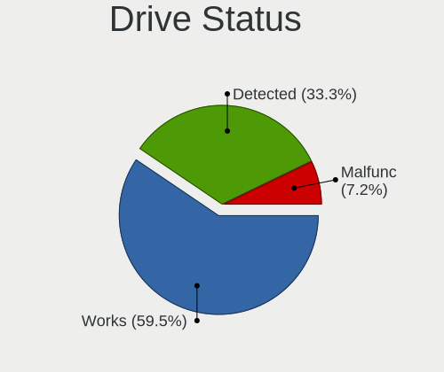
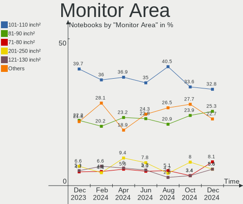
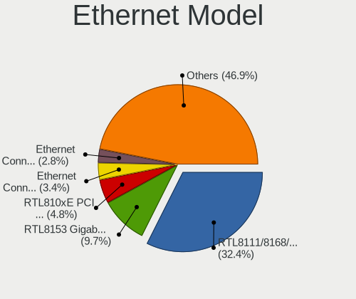

Debian Hardware Trends (Notebook)
---------------------------------

A project to identify most popular hardware characteristics and track their change
over time based on data collected by Debian users at https://Linux-Hardware.org.

Anyone can contribute to the study by uploading probes of their computers by
the [hw-probe](https://github.com/linuxhw/hw-probe) tool:

    sudo -E hw-probe -all -upload

Full-feature report is available here: https://linux-hardware.org/?view=trends&formfactor=notebook

Period: Feb, 2021.

Contents
--------

- [ OS                       ](#os)
- [ OS Family                ](#os-family)
- [ Kernel                   ](#kernel)
- [ Kernel Family            ](#kernel-family)
- [ Kernel Major Ver.        ](#kernel-major-ver)
- [ Arch                     ](#arch)
- [ DE                       ](#de)
- [ Display Server           ](#display-server)
- [ Display Manager          ](#display-manager)
- [ OS Lang                  ](#os-lang)
- [ Boot Mode                ](#boot-mode)
- [ Filesystem               ](#filesystem)
- [ Part. scheme             ](#part-scheme)
- [ Dual Boot with Linux/BSD ](#dual-boot-with-linux/bsd)
- [ Dual Boot (Win)          ](#dual-boot-win)
- [ Country                  ](#country)
- [ City                     ](#city)
- [ Vendor                   ](#vendor)
- [ Model                    ](#model)
- [ Model Family             ](#model-family)
- [ MFG Year                 ](#mfg-year)
- [ Form Factor              ](#form-factor)
- [ Secure Boot              ](#secure-boot)
- [ Coreboot                 ](#coreboot)
- [ RAM Size                 ](#ram-size)
- [ RAM Used                 ](#ram-used)
- [ Has CD-ROM               ](#has-cd-rom)
- [ Total Drives             ](#total-drives)
- [ Has Ethernet             ](#has-ethernet)
- [ Drive Vendor             ](#drive-vendor)
- [ Drive Model              ](#drive-model)
- [ HDD Vendor               ](#hdd-vendor)
- [ SSD Vendor               ](#ssd-vendor)
- [ Drive Kind               ](#drive-kind)
- [ Drive Connector          ](#drive-connector)
- [ Drive Size               ](#drive-size)
- [ Space Total              ](#space-total)
- [ Space Used               ](#space-used)
- [ Malfunc. Drives          ](#malfunc-drives)
- [ Malfunc. Drive Vendor    ](#malfunc-drive-vendor)
- [ Malfunc. HDD Vendor      ](#malfunc-hdd-vendor)
- [ Malfunc. Drive Kind      ](#malfunc-drive-kind)
- [ Failed Drives            ](#failed-drives)
- [ Failed Drive Vendor      ](#failed-drive-vendor)
- [ Drive Status             ](#drive-status)
- [ Storage Vendor           ](#storage-vendor)
- [ Storage Model            ](#storage-model)
- [ Storage Kind             ](#storage-kind)
- [ CPU Vendor               ](#cpu-vendor)
- [ CPU Model                ](#cpu-model)
- [ CPU Model Family         ](#cpu-model-family)
- [ CPU Cores                ](#cpu-cores)
- [ CPU Sockets              ](#cpu-sockets)
- [ CPU Threads              ](#cpu-threads)
- [ CPU Op-Modes             ](#cpu-op-modes)
- [ CPU Microcode            ](#cpu-microcode)
- [ CPU Microarch            ](#cpu-microarch)
- [ GPU Vendor               ](#gpu-vendor)
- [ GPU Model                ](#gpu-model)
- [ GPU Combo                ](#gpu-combo)
- [ GPU Driver               ](#gpu-driver)
- [ GPU Memory               ](#gpu-memory)
- [ Monitor Vendor           ](#monitor-vendor)
- [ Monitor Model            ](#monitor-model)
- [ Monitor Resolution       ](#monitor-resolution)
- [ Monitor Diagonal         ](#monitor-diagonal)
- [ Monitor Width            ](#monitor-width)
- [ Aspect Ratio             ](#aspect-ratio)
- [ Monitor Area             ](#monitor-area)
- [ Pixel Density            ](#pixel-density)
- [ Multiple Monitors        ](#multiple-monitors)
- [ Net Controller Vendor    ](#net-controller-vendor)
- [ Net Controller Model     ](#net-controller-model)
- [ Wireless Vendor          ](#wireless-vendor)
- [ Wireless Model           ](#wireless-model)
- [ Ethernet Vendor          ](#ethernet-vendor)
- [ Ethernet Model           ](#ethernet-model)
- [ Net Controller Kind      ](#net-controller-kind)
- [ Used Controller          ](#used-controller)
- [ NICs                     ](#nics)
- [ Memory Vendor            ](#memory-vendor)
- [ Memory Model             ](#memory-model)
- [ Memory Kind              ](#memory-kind)
- [ Memory Form Factor       ](#memory-form-factor)
- [ Memory Size              ](#memory-size)
- [ Memory Speed             ](#memory-speed)
- [ Sound Vendor             ](#sound-vendor)
- [ Sound Model              ](#sound-model)
- [ Camera Vendor            ](#camera-vendor)
- [ Camera Model             ](#camera-model)
- [ Fingerprint Vendor       ](#fingerprint-vendor)
- [ Fingerprint Model        ](#fingerprint-model)
- [ Chipcard Vendor          ](#chipcard-vendor)
- [ Chipcard Model           ](#chipcard-model)
- [ Printer Vendor           ](#printer-vendor)
- [ Printer Model            ](#printer-model)
- [ Scanner Vendor           ](#scanner-vendor)
- [ Scanner Model            ](#scanner-model)
- [ Bluetooth Vendor         ](#bluetooth-vendor)
- [ Bluetooth Model          ](#bluetooth-model)
- [ Unsupported Devices      ](#unsupported-devices)
- [ Unsupported Device Types ](#unsupported-device-types)

OS
--

Installed operating systems

| Name            | Notebooks | Percent |
|-----------------|-----------|---------|
| Debian 10       | 35        | 53.85%  |
| Debian          | 12        | 18.46%  |
| Debian Testing  | 11        | 16.92%  |
| Debian Unstable | 6         | 9.23%   |
| Debian 9.13     | 1         | 1.54%   |

OS Family
---------

OS without a version

| Name   | Notebooks | Percent |
|--------|-----------|---------|
| Debian | 65        | 100%    |

Kernel
------

Version of the Linux kernel

| Version              | Notebooks | Percent |
|----------------------|-----------|---------|
| 4.19.0-14-amd64      | 20        | 30.77%  |
| 5.10.0-3-amd64       | 17        | 26.15%  |
| 5.10.0-2-amd64       | 9         | 13.85%  |
| 4.19.0-13-amd64      | 4         | 6.15%   |
| 5.9.0-0.bpo.5-amd64  | 3         | 4.62%   |
| 5.10.0-0.bpo.3-amd64 | 2         | 3.08%   |
| 4.19.0-13-686-pae    | 2         | 3.08%   |
| 5.9.0-5-amd64        | 1         | 1.54%   |
| 5.9.0-2-amd64        | 1         | 1.54%   |
| 5.8.0-3-amd64        | 1         | 1.54%   |
| 5.10.18-xanmod1      | 1         | 1.54%   |
| 5.10.0-3-686-pae     | 1         | 1.54%   |
| 4.19.0-14-686-pae    | 1         | 1.54%   |
| 4.19.0-13-686        | 1         | 1.54%   |
| 4.19.0-12-amd64      | 1         | 1.54%   |

Kernel Family
-------------

Linux kernel without a distro release

| Version | Notebooks | Percent |
|---------|-----------|---------|
| 5.10.0  | 29        | 44.62%  |
| 4.19.0  | 29        | 44.62%  |
| 5.9.0   | 5         | 7.69%   |
| 5.8.0   | 1         | 1.54%   |
| 5.10.18 | 1         | 1.54%   |

Kernel Major Ver.
-----------------

Linux kernel major version

| Version | Notebooks | Percent |
|---------|-----------|---------|
| 5.10    | 30        | 46.15%  |
| 4.19    | 29        | 44.62%  |
| 5.9     | 5         | 7.69%   |
| 5.8     | 1         | 1.54%   |

Arch
----

OS architecture (x86_64, i586, etc.)

| Name   | Notebooks | Percent |
|--------|-----------|---------|
| x86_64 | 60        | 92.31%  |
| i686   | 5         | 7.69%   |

DE
--

Desktop Environment

| Name             | Notebooks | Percent |
|------------------|-----------|---------|
| GNOME            | 22        | 33.85%  |
| XFCE             | 10        | 15.38%  |
| KDE              | 8         | 12.31%  |
| X-Cinnamon       | 6         | 9.23%   |
| KDE5             | 6         | 9.23%   |
| Unknown          | 5         | 7.69%   |
| MATE             | 3         | 4.62%   |
| LXQt             | 1         | 1.54%   |
| lightdm-xsession | 1         | 1.54%   |
| i3               | 1         | 1.54%   |
| GNOME Flashback  | 1         | 1.54%   |
| GNOME Classic    | 1         | 1.54%   |

Display Server
--------------

X11 or Wayland

| Name    | Notebooks | Percent |
|---------|-----------|---------|
| X11     | 50        | 76.92%  |
| Wayland | 13        | 20%     |
| Unknown | 2         | 3.08%   |

Display Manager
---------------

SDDM, LightDM, etc.

| Name    | Notebooks | Percent |
|---------|-----------|---------|
| Unknown | 30        | 46.15%  |
| GDM     | 15        | 23.08%  |
| TDM     | 11        | 16.92%  |
| SDDM    | 6         | 9.23%   |
| SLiM    | 2         | 3.08%   |
| XDM     | 1         | 1.54%   |

OS Lang
-------

Language

| Lang    | Notebooks | Percent |
|---------|-----------|---------|
| en_US   | 22        | 33.85%  |
| ru_RU   | 6         | 9.23%   |
| en_GB   | 6         | 9.23%   |
| de_DE   | 5         | 7.69%   |
| pt_BR   | 4         | 6.15%   |
| fr_FR   | 3         | 4.62%   |
| C       | 3         | 4.62%   |
| tr_TR   | 2         | 3.08%   |
| nl_NL   | 2         | 3.08%   |
| it_IT   | 2         | 3.08%   |
| cs_CZ   | 2         | 3.08%   |
| ja_JP   | 1         | 1.54%   |
| es_ES   | 1         | 1.54%   |
| es_CL   | 1         | 1.54%   |
| en_ZA   | 1         | 1.54%   |
| en_IN   | 1         | 1.54%   |
| de_AT   | 1         | 1.54%   |
| ca_ES   | 1         | 1.54%   |
| Unknown | 1         | 1.54%   |

Boot Mode
---------

EFI or BIOS

| Mode | Notebooks | Percent |
|------|-----------|---------|
| BIOS | 39        | 60%     |
| EFI  | 26        | 40%     |

Filesystem
----------

Type of filesystem

| Type    | Notebooks | Percent |
|---------|-----------|---------|
| Ext4    | 62        | 95.38%  |
| Btrfs   | 2         | 3.08%   |
| Overlay | 1         | 1.54%   |

Part. scheme
------------

Scheme of partitioning

| Type    | Notebooks | Percent |
|---------|-----------|---------|
| Unknown | 32        | 49.23%  |
| GPT     | 24        | 36.92%  |
| MBR     | 9         | 13.85%  |

Dual Boot with Linux/BSD
------------------------

Hosting more than one Linux/BSD

| Dual boot | Notebooks | Percent |
|-----------|-----------|---------|
| No        | 60        | 92.31%  |
| Yes       | 5         | 7.69%   |

Dual Boot (Win)
---------------

Hosting Linux and Windows

| Dual boot | Notebooks | Percent |
|-----------|-----------|---------|
| No        | 52        | 80%     |
| Yes       | 13        | 20%     |

Country
-------

Geographic location (country)

| Country              | Notebooks | Percent |
|----------------------|-----------|---------|
| Germany              | 8         | 12.31%  |
| USA                  | 7         | 10.77%  |
| Russia               | 7         | 10.77%  |
| France               | 6         | 9.23%   |
| Brazil               | 5         | 7.69%   |
| UK                   | 4         | 6.15%   |
| Netherlands          | 3         | 4.62%   |
| Italy                | 3         | 4.62%   |
| Turkey               | 2         | 3.08%   |
| Spain                | 2         | 3.08%   |
| Mexico               | 2         | 3.08%   |
| India                | 2         | 3.08%   |
| Czech Republic       | 2         | 3.08%   |
| Vietnam              | 1         | 1.54%   |
| Ukraine              | 1         | 1.54%   |
| Sweden               | 1         | 1.54%   |
| South Africa         | 1         | 1.54%   |
| Romania              | 1         | 1.54%   |
| Morocco              | 1         | 1.54%   |
| Moldova, Republic of | 1         | 1.54%   |
| Kazakhstan           | 1         | 1.54%   |
| Japan                | 1         | 1.54%   |
| Hungary              | 1         | 1.54%   |
| Chile                | 1         | 1.54%   |
| Austria              | 1         | 1.54%   |

City
----

Geographic location (city)

| City                    | Notebooks | Percent |
|-------------------------|-----------|---------|
| Moscow                  | 3         | 4.62%   |
| Berlin                  | 3         | 4.62%   |
| Paris                   | 2         | 3.08%   |
| Milan                   | 2         | 3.08%   |
| Halstead                | 2         | 3.08%   |
| Ankara                  | 2         | 3.08%   |
| Örebro                 | 1         | 1.54%   |
| Vinnytsia               | 1         | 1.54%   |
| Villeurbanne            | 1         | 1.54%   |
| Vienna                  | 1         | 1.54%   |
| São Paulo              | 1         | 1.54%   |
| Szeged                  | 1         | 1.54%   |
| Stendal                 | 1         | 1.54%   |
| Steenwijk               | 1         | 1.54%   |
| St Petersburg           | 1         | 1.54%   |
| Shchelkovo              | 1         | 1.54%   |
| Sardieu                 | 1         | 1.54%   |
| San Antonio             | 1         | 1.54%   |
| Saint-Hilaire-des-Loges | 1         | 1.54%   |
| Saint-Dié              | 1         | 1.54%   |
| Rome                    | 1         | 1.54%   |
| Rio Grande              | 1         | 1.54%   |
| Rio de Janeiro          | 1         | 1.54%   |
| Prague                  | 1         | 1.54%   |
| Porto Alegre            | 1         | 1.54%   |
| Phoenix                 | 1         | 1.54%   |
| Perm                    | 1         | 1.54%   |
| Pechina                 | 1         | 1.54%   |
| Orlando                 | 1         | 1.54%   |
| Olching                 | 1         | 1.54%   |
| New Haven               | 1         | 1.54%   |
| Murakami                | 1         | 1.54%   |
| Millstadt               | 1         | 1.54%   |
| Magdalena Contreras     | 1         | 1.54%   |
| Lehliu-Gara             | 1         | 1.54%   |
| Laguna Hills            | 1         | 1.54%   |
| Kraluv Dvur             | 1         | 1.54%   |
| Johannesburg            | 1         | 1.54%   |
| Hyderabad               | 1         | 1.54%   |
| Guadalajara             | 1         | 1.54%   |
| Grafing bei Munchen     | 1         | 1.54%   |
| Friedrichsdorf          | 1         | 1.54%   |
| Fes                     | 1         | 1.54%   |
| Edinburgh               | 1         | 1.54%   |
| Duque de Caxias         | 1         | 1.54%   |
| Dulwich                 | 1         | 1.54%   |
| Dresden                 | 1         | 1.54%   |
| Concepción             | 1         | 1.54%   |
| Chisinau                | 1         | 1.54%   |
| Chennai                 | 1         | 1.54%   |
| Chelyabinsk             | 1         | 1.54%   |
| Cau Giay                | 1         | 1.54%   |
| Capelle aan den IJssel  | 1         | 1.54%   |
| Amsterdam               | 1         | 1.54%   |
| Almaty                  | 1         | 1.54%   |
| Allentown               | 1         | 1.54%   |
| Alcoy                   | 1         | 1.54%   |

Vendor
------

Motherboard manufacturer

| Name                | Notebooks | Percent |
|---------------------|-----------|---------|
| Lenovo              | 19        | 29.23%  |
| Dell                | 10        | 15.38%  |
| Hewlett-Packard     | 8         | 12.31%  |
| ASUSTek Computer    | 7         | 10.77%  |
| Acer                | 3         | 4.62%   |
| Toshiba             | 2         | 3.08%   |
| Sony                | 2         | 3.08%   |
| Samsung Electronics | 2         | 3.08%   |
| TQ-Group            | 1         | 1.54%   |
| Notebook            | 1         | 1.54%   |
| NEC Computers       | 1         | 1.54%   |
| MSI                 | 1         | 1.54%   |
| Medion              | 1         | 1.54%   |
| LG Electronics      | 1         | 1.54%   |
| Compaq              | 1         | 1.54%   |
| Compal              | 1         | 1.54%   |
| AWOW                | 1         | 1.54%   |
| Archos              | 1         | 1.54%   |
| Apple               | 1         | 1.54%   |
| Unknown             | 1         | 1.54%   |

Model
-----

Motherboard model

| Name                                  | Notebooks | Percent |
|---------------------------------------|-----------|---------|
| TQ-Group TQMxE39S                     | 1         | 1.54%   |
| Toshiba Satellite L745                | 1         | 1.54%   |
| Toshiba PORTEGE Z30-A                 | 1         | 1.54%   |
| Sony VPCEG15FB                        | 1         | 1.54%   |
| Sony VGN-NW270F                       | 1         | 1.54%   |
| Samsung R540/R580/R780/SA41/E452      | 1         | 1.54%   |
| Samsung 450R4E/450R5E/450R4V/450R5V   | 1         | 1.54%   |
| Notebook NJ50_70CU                    | 1         | 1.54%   |
| NEC Computers PC-VY12FBHEW            | 1         | 1.54%   |
| MSI CR70 2M/CX70 2OC/CX70 2OD         | 1         | 1.54%   |
| Medion P861X                          | 1         | 1.54%   |
| LG A410-K.BE43P1                      | 1         | 1.54%   |
| Lenovo V570 HuronRiver Platform       | 1         | 1.54%   |
| Lenovo ThinkPad X270 W10DG 20K5S3Y900 | 1         | 1.54%   |
| Lenovo ThinkPad X260 20F5S13G00       | 1         | 1.54%   |
| Lenovo ThinkPad W540 20BG0011US       | 1         | 1.54%   |
| Lenovo ThinkPad W510 4389W1B          | 1         | 1.54%   |
| Lenovo ThinkPad T460 20FN002JUS       | 1         | 1.54%   |
| Lenovo ThinkPad T450s 20BXCTO1WW      | 1         | 1.54%   |
| Lenovo ThinkPad T440p 20AWS3UX00      | 1         | 1.54%   |
| Lenovo ThinkPad T14s Gen 1 20UHS0G000 | 1         | 1.54%   |
| Lenovo ThinkPad T14 Gen 1 20UDCTO1WW  | 1         | 1.54%   |
| Lenovo ThinkPad P72 20MBCTO1WW        | 1         | 1.54%   |
| Lenovo ThinkPad L470 20J4003WGE       | 1         | 1.54%   |
| Lenovo ThinkPad L14 Gen 1 20U5001VMH  | 1         | 1.54%   |
| Lenovo ThinkPad E14 20RBCTO1WW        | 1         | 1.54%   |
| Lenovo Legion Y530-15ICH 81FV         | 1         | 1.54%   |
| Lenovo IdeaPad 700-15ISK 80RU         | 1         | 1.54%   |
| Lenovo IdeaPad 320-15ISK 80XH         | 1         | 1.54%   |
| Lenovo IdeaPad 100S-11IBY 80R2        | 1         | 1.54%   |
| Lenovo B50-30 20382                   | 1         | 1.54%   |
| HP ProBook 6460b                      | 1         | 1.54%   |
| HP ProBook 4540s                      | 1         | 1.54%   |
| HP ProBook 450 G5                     | 1         | 1.54%   |
| HP Notebook                           | 1         | 1.54%   |
| HP Laptop 15-da0xxx                   | 1         | 1.54%   |
| HP ENVY Notebook                      | 1         | 1.54%   |
| HP EliteBook 8560p                    | 1         | 1.54%   |
| HP EliteBook 850 G7 Notebook PC       | 1         | 1.54%   |
| Dell XPS 13 9310                      | 1         | 1.54%   |
| Dell Precision 7530                   | 1         | 1.54%   |
| Dell Latitude E7250                   | 1         | 1.54%   |
| Dell Latitude E5450                   | 1         | 1.54%   |
| Dell Latitude 7410                    | 1         | 1.54%   |
| Dell Latitude 7400                    | 1         | 1.54%   |
| Dell Latitude 3400                    | 1         | 1.54%   |
| Dell Inspiron 5759                    | 1         | 1.54%   |
| Dell Inspiron 3542                    | 1         | 1.54%   |
| Dell Inspiron 1545                    | 1         | 1.54%   |
| Compaq Presario CQ-31                 | 1         | 1.54%   |
| Compal PBL21                          | 1         | 1.54%   |
| AWOW AK41                             | 1         | 1.54%   |
| ASUS X555LJ                           | 1         | 1.54%   |
| ASUS X550CA                           | 1         | 1.54%   |
| ASUS X540LJ                           | 1         | 1.54%   |
| ASUS X502CA                           | 1         | 1.54%   |
| ASUS TUF Gaming FX505DY_FX505DY       | 1         | 1.54%   |
| ASUS M3N                              | 1         | 1.54%   |
| ASUS G75VW                            | 1         | 1.54%   |
| Archos 133 FLIP                       | 1         | 1.54%   |

Model Family
------------

Motherboard model prefix

| Name                       | Notebooks | Percent |
|----------------------------|-----------|---------|
| Lenovo ThinkPad            | 13        | 20%     |
| Dell Latitude              | 5         | 7.69%   |
| Lenovo IdeaPad             | 3         | 4.62%   |
| HP ProBook                 | 3         | 4.62%   |
| Dell Inspiron              | 3         | 4.62%   |
| HP EliteBook               | 2         | 3.08%   |
| TQ-Group TQMxE39S          | 1         | 1.54%   |
| Toshiba Satellite          | 1         | 1.54%   |
| Toshiba PORTEGE            | 1         | 1.54%   |
| Sony VPCEG15FB             | 1         | 1.54%   |
| Sony VGN-NW270F            | 1         | 1.54%   |
| Samsung R540               | 1         | 1.54%   |
| Samsung 450R4E             | 1         | 1.54%   |
| Notebook NJ50              | 1         | 1.54%   |
| NEC Computers PC-VY12FBHEW | 1         | 1.54%   |
| MSI CR70                   | 1         | 1.54%   |
| Medion P861X               | 1         | 1.54%   |
| LG A410-K.BE43P1           | 1         | 1.54%   |
| Lenovo V570                | 1         | 1.54%   |
| Lenovo Legion              | 1         | 1.54%   |
| Lenovo B50-30              | 1         | 1.54%   |
| HP Notebook                | 1         | 1.54%   |
| HP Laptop                  | 1         | 1.54%   |
| HP ENVY                    | 1         | 1.54%   |
| Dell XPS                   | 1         | 1.54%   |
| Dell Precision             | 1         | 1.54%   |
| Compaq Presario            | 1         | 1.54%   |
| Compal PBL21               | 1         | 1.54%   |
| AWOW AK41                  | 1         | 1.54%   |
| ASUS X555LJ                | 1         | 1.54%   |
| ASUS X550CA                | 1         | 1.54%   |
| ASUS X540LJ                | 1         | 1.54%   |
| ASUS X502CA                | 1         | 1.54%   |
| ASUS TUF                   | 1         | 1.54%   |
| ASUS M3N                   | 1         | 1.54%   |
| ASUS G75VW                 | 1         | 1.54%   |
| Archos 133                 | 1         | 1.54%   |
| Apple MacBookAir4          | 1         | 1.54%   |
| Acer Swift                 | 1         | 1.54%   |
| Acer Predator              | 1         | 1.54%   |
| Acer AO722                 | 1         | 1.54%   |
| Unknown                    | 1         | 1.54%   |

MFG Year
--------

Motherboard manufacture year

| Year | Notebooks | Percent |
|------|-----------|---------|
| 2020 | 18        | 27.69%  |
| 2019 | 8         | 12.31%  |
| 2018 | 7         | 10.77%  |
| 2011 | 6         | 9.23%   |
| 2015 | 5         | 7.69%   |
| 2013 | 4         | 6.15%   |
| 2017 | 3         | 4.62%   |
| 2016 | 3         | 4.62%   |
| 2009 | 3         | 4.62%   |
| 2014 | 2         | 3.08%   |
| 2010 | 2         | 3.08%   |
| 2021 | 1         | 1.54%   |
| 2012 | 1         | 1.54%   |
| 2006 | 1         | 1.54%   |
| 2004 | 1         | 1.54%   |

Form Factor
-----------

Physical design of the computer

| Name     | Notebooks | Percent |
|----------|-----------|---------|
| Notebook | 65        | 100%    |

Secure Boot
-----------

Enabled or disabled

| State    | Notebooks | Percent |
|----------|-----------|---------|
| Disabled | 60        | 92.31%  |
| Enabled  | 5         | 7.69%   |

Coreboot
--------

Have coreboot on board

| Used | Notebooks | Percent |
|------|-----------|---------|
| No   | 65        | 100%    |

RAM Size
--------

Total RAM memory

| Size in GB | Notebooks | Percent |
|------------|-----------|---------|
| 16.01-24.0 | 16        | 24.62%  |
| 8.01-16.0  | 16        | 24.62%  |
| 3.01-4.0   | 11        | 16.92%  |
| 4.01-8.0   | 10        | 15.38%  |
| 32.01-64.0 | 6         | 9.23%   |
| 1.01-2.0   | 6         | 9.23%   |

RAM Used
--------

Used RAM memory

| Used GB   | Notebooks | Percent |
|-----------|-----------|---------|
| 1.01-2.0  | 24        | 36.92%  |
| 4.01-8.0  | 18        | 27.69%  |
| 2.01-3.0  | 12        | 18.46%  |
| 0.51-1.0  | 5         | 7.69%   |
| 3.01-4.0  | 4         | 6.15%   |
| 8.01-16.0 | 2         | 3.08%   |

Has CD-ROM
----------

Has CD-ROM on board

| Presented | Notebooks | Percent |
|-----------|-----------|---------|
| No        | 42        | 64.62%  |
| Yes       | 23        | 35.38%  |

Total Drives
------------

Number of drives on board

| Drives | Notebooks | Percent |
|--------|-----------|---------|
| 1      | 40        | 61.54%  |
| 2      | 19        | 29.23%  |
| 3      | 6         | 9.23%   |

Has Ethernet
------------

Has Ethernet on board

| Presented | Notebooks | Percent |
|-----------|-----------|---------|
| Yes       | 59        | 90.77%  |
| No        | 6         | 9.23%   |

Drive Vendor
------------

Hard drive vendors

| Vendor              | Notebooks | Drives | Percent |
|---------------------|-----------|--------|---------|
| WDC                 | 12        | 12     | 13.64%  |
| Toshiba             | 10        | 10     | 11.36%  |
| Samsung Electronics | 9         | 9      | 10.23%  |
| Unknown             | 8         | 10     | 9.09%   |
| Seagate             | 8         | 8      | 9.09%   |
| Kingston            | 7         | 7      | 7.95%   |
| SK Hynix            | 5         | 5      | 5.68%   |
| SanDisk             | 4         | 4      | 4.55%   |
| Micron Technology   | 3         | 3      | 3.41%   |
| Hitachi             | 3         | 3      | 3.41%   |
| Crucial             | 3         | 3      | 3.41%   |
| Transcend           | 2         | 2      | 2.27%   |
| Intel               | 2         | 2      | 2.27%   |
| Fujitsu             | 2         | 2      | 2.27%   |
| ZTC                 | 1         | 1      | 1.14%   |
| XPG                 | 1         | 2      | 1.14%   |
| Team                | 1         | 1      | 1.14%   |
| Phison              | 1         | 1      | 1.14%   |
| LITEON              | 1         | 1      | 1.14%   |
| Lexar               | 1         | 1      | 1.14%   |
| JMicron             | 1         | 1      | 1.14%   |
| FORESEE             | 1         | 1      | 1.14%   |
| Corsair             | 1         | 1      | 1.14%   |
| Apple               | 1         | 1      | 1.14%   |

Drive Model
-----------

Hard drive models

| Model                                     | Notebooks | Percent |
|-------------------------------------------|-----------|---------|
| WDC WD50 00LPCX-24VHA 500GB               | 2         | 2.25%   |
| Seagate ST500LT012-1DG142 500GB           | 2         | 2.25%   |
| SanDisk SSD PLUS 120GB                    | 2         | 2.25%   |
| Kingston SA400S37480G 480GB SSD           | 2         | 2.25%   |
| ZTC SM201-512G SSD                        | 1         | 1.12%   |
| XPG NVMe SSD Drive 512GB                  | 1         | 1.12%   |
| WDC WDBNCE5000PNC 500GB SSD               | 1         | 1.12%   |
| WDC WD7500BPVX-22JC3T0 752GB              | 1         | 1.12%   |
| WDC WD7500BPVT-22HXZT3 752GB              | 1         | 1.12%   |
| WDC WD6400BPVT-24HXZT1 640GB              | 1         | 1.12%   |
| WDC WD5000LPVX-80V0TT0 500GB              | 1         | 1.12%   |
| WDC WD5000LPVX-22V0TT0 500GB              | 1         | 1.12%   |
| WDC WD1600BEVT-22ZCT0 160GB               | 1         | 1.12%   |
| WDC WD10SPZX-24Z10T0 1TB                  | 1         | 1.12%   |
| WDC WD10JPVX-75J 1TB                      | 1         | 1.12%   |
| WDC WD10JPVX-60JC3T0 1TB                  | 1         | 1.12%   |
| Unknown SD256  256GB                      | 1         | 1.12%   |
| Unknown SD  4GB                           | 1         | 1.12%   |
| Unknown MMC Card  7GB                     | 1         | 1.12%   |
| Unknown MMC Card  64GB                    | 1         | 1.12%   |
| Unknown MMC Card  4GB                     | 1         | 1.12%   |
| Unknown MMC Card  32GB                    | 1         | 1.12%   |
| Unknown MMC Card  256GB                   | 1         | 1.12%   |
| Unknown MBG4GC  32GB                      | 1         | 1.12%   |
| Unknown DG4032  32GB                      | 1         | 1.12%   |
| Transcend TS512GSSD370S 512GB             | 1         | 1.12%   |
| Transcend TS4GCF133 4GB                   | 1         | 1.12%   |
| Toshiba THNSNJ256GMCU 256GB SSD           | 1         | 1.12%   |
| Toshiba THNSFJ256GCSU 256GB SSD           | 1         | 1.12%   |
| Toshiba NVMe SSD Drive 512GB              | 1         | 1.12%   |
| Toshiba NVMe SSD Drive 1024GB             | 1         | 1.12%   |
| Toshiba MQ04ABF100 1TB                    | 1         | 1.12%   |
| Toshiba MK6459GSXP 640GB                  | 1         | 1.12%   |
| Toshiba MK6034GAX 64GB                    | 1         | 1.12%   |
| Toshiba MK5076GSX 500GB                   | 1         | 1.12%   |
| Toshiba KXG50ZNV512G 512GB                | 1         | 1.12%   |
| Toshiba HDWJ110 1TB                       | 1         | 1.12%   |
| Team T253LE120G 120GB SSD                 | 1         | 1.12%   |
| SK Hynix SKHynix_HFS512GD9TNI-L2B0B 512GB | 1         | 1.12%   |
| SK Hynix SKHynix_HFS001TD9TNI-L2B0B 1TB   | 1         | 1.12%   |
| SK Hynix PC601 NVMe 512GB                 | 1         | 1.12%   |
| SK Hynix NVMe SSD Drive 256GB             | 1         | 1.12%   |
| SK Hynix BC511 NVMe 512GB                 | 1         | 1.12%   |
| Seagate ST9500420AS 500GB                 | 1         | 1.12%   |
| Seagate ST9500325AS 500GB                 | 1         | 1.12%   |
| Seagate ST500VT000-1DK142 500GB           | 1         | 1.12%   |
| Seagate ST500LM030-2E717D 500GB           | 1         | 1.12%   |
| Seagate ST1000LM048-2E7172 1TB            | 1         | 1.12%   |
| Seagate Expansion 500GB                   | 1         | 1.12%   |
| SanDisk SD8SNAT-256G-1006 256GB SSD       | 1         | 1.12%   |
| Sandisk NVMe SSD Drive 128GB              | 1         | 1.12%   |
| Samsung SSD PM871 mSATA 256GB             | 1         | 1.12%   |
| Samsung SSD 860 QVO 2TB                   | 1         | 1.12%   |
| Samsung SSD 860 EVO 1TB                   | 1         | 1.12%   |
| Samsung SSD 850 PRO 512GB                 | 1         | 1.12%   |
| Samsung SSD 850 PRO 1TB                   | 1         | 1.12%   |
| Samsung SSD 850 EVO 500GB                 | 1         | 1.12%   |
| Samsung SSD 850 EVO 250GB                 | 1         | 1.12%   |
| Samsung NVMe SSD Drive 512GB              | 1         | 1.12%   |
| Samsung MZVLB256HBHQ-000L7 256GB          | 1         | 1.12%   |

HDD Vendor
----------

Hard disk drive vendors

| Vendor  | Notebooks | Drives | Percent |
|---------|-----------|--------|---------|
| WDC     | 11        | 11     | 37.93%  |
| Seagate | 8         | 8      | 27.59%  |
| Toshiba | 5         | 5      | 17.24%  |
| Hitachi | 3         | 3      | 10.34%  |
| Fujitsu | 2         | 2      | 6.9%    |

SSD Vendor
----------

Solid state drive vendors

| Vendor              | Notebooks | Drives | Percent |
|---------------------|-----------|--------|---------|
| Samsung Electronics | 7         | 7      | 21.21%  |
| Kingston            | 6         | 6      | 18.18%  |
| SanDisk             | 3         | 3      | 9.09%   |
| Crucial             | 3         | 3      | 9.09%   |
| Transcend           | 2         | 2      | 6.06%   |
| Toshiba             | 2         | 2      | 6.06%   |
| Micron Technology   | 2         | 2      | 6.06%   |
| ZTC                 | 1         | 1      | 3.03%   |
| WDC                 | 1         | 1      | 3.03%   |
| Team                | 1         | 1      | 3.03%   |
| LITEON              | 1         | 1      | 3.03%   |
| Lexar               | 1         | 1      | 3.03%   |
| JMicron             | 1         | 1      | 3.03%   |
| Corsair             | 1         | 1      | 3.03%   |
| Apple               | 1         | 1      | 3.03%   |

Drive Kind
----------

HDD or SSD

| Kind | Notebooks | Drives | Percent |
|------|-----------|--------|---------|
| SSD  | 28        | 33     | 34.57%  |
| HDD  | 28        | 29     | 34.57%  |
| NVMe | 17        | 19     | 20.99%  |
| MMC  | 8         | 10     | 9.88%   |

Drive Connector
---------------

SATA, SAS, NVMe, etc.

| Type | Notebooks | Drives | Percent |
|------|-----------|--------|---------|
| SATA | 47        | 58     | 61.84%  |
| NVMe | 17        | 19     | 22.37%  |
| MMC  | 8         | 10     | 10.53%  |
| SAS  | 4         | 4      | 5.26%   |

Drive Size
----------

Size of hard drive

| Size in TB | Notebooks | Drives | Percent |
|------------|-----------|--------|---------|
| 0.01-0.5   | 34        | 44     | 66.67%  |
| 0.51-1.0   | 16        | 17     | 31.37%  |
| 1.01-2.0   | 1         | 1      | 1.96%   |

Space Total
-----------

Amount of disk space available on the file system

| Size in GB | Notebooks | Percent |
|------------|-----------|---------|
| 101-250    | 27        | 41.54%  |
| 251-500    | 14        | 21.54%  |
| 501-1000   | 8         | 12.31%  |
| 1001-2000  | 7         | 10.77%  |
| 21-50      | 3         | 4.62%   |
| 2001-3000  | 2         | 3.08%   |
| 51-100     | 2         | 3.08%   |
| 1-20       | 1         | 1.54%   |
| Unknown    | 1         | 1.54%   |

Space Used
----------

Amount of used disk space

| Used GB   | Notebooks | Percent |
|-----------|-----------|---------|
| 101-250   | 17        | 26.15%  |
| 21-50     | 16        | 24.62%  |
| 1-20      | 16        | 24.62%  |
| 51-100    | 5         | 7.69%   |
| 1001-2000 | 4         | 6.15%   |
| 501-1000  | 4         | 6.15%   |
| 251-500   | 2         | 3.08%   |
| Unknown   | 1         | 1.54%   |

Malfunc. Drives
---------------

Drive models with a malfunction

| Model                          | Notebooks | Drives | Percent |
|--------------------------------|-----------|--------|---------|
| WDC WD7500BPVX-22JC3T0 752GB   | 1         | 1      | 12.5%   |
| Toshiba MK5076GSX 500GB        | 1         | 1      | 12.5%   |
| Seagate ST9500420AS 500GB      | 1         | 1      | 12.5%   |
| Seagate ST9500325AS 500GB      | 1         | 1      | 12.5%   |
| Seagate ST1000LM048-2E7172 1TB | 1         | 1      | 12.5%   |
| Hitachi HTS547575A9E384 752GB  | 1         | 1      | 12.5%   |
| Corsair Force 3 SSD 240GB      | 1         | 1      | 12.5%   |
| Apple SSD SM256C 256GB         | 1         | 1      | 12.5%   |

Malfunc. Drive Vendor
---------------------

Vendors of faulty drives

| Vendor  | Notebooks | Drives | Percent |
|---------|-----------|--------|---------|
| Seagate | 3         | 3      | 37.5%   |
| WDC     | 1         | 1      | 12.5%   |
| Toshiba | 1         | 1      | 12.5%   |
| Hitachi | 1         | 1      | 12.5%   |
| Corsair | 1         | 1      | 12.5%   |
| Apple   | 1         | 1      | 12.5%   |

Malfunc. HDD Vendor
-------------------

Vendors of faulty HDD drives

| Vendor  | Notebooks | Drives | Percent |
|---------|-----------|--------|---------|
| Seagate | 3         | 3      | 50%     |
| WDC     | 1         | 1      | 16.67%  |
| Toshiba | 1         | 1      | 16.67%  |
| Hitachi | 1         | 1      | 16.67%  |

Malfunc. Drive Kind
-------------------

Kinds of faulty drives

| Kind | Notebooks | Drives | Percent |
|------|-----------|--------|---------|
| HDD  | 6         | 6      | 75%     |
| SSD  | 2         | 2      | 25%     |

Failed Drives
-------------

Failed drive models

Zero info for selected period =(

Failed Drive Vendor
-------------------

Failed drive vendors

Zero info for selected period =(

Drive Status
------------

Number of failed and malfunc. drives

| Status   | Notebooks | Drives | Percent |
|----------|-----------|--------|---------|
| Detected | 37        | 53     | 52.11%  |
| Works    | 27        | 30     | 38.03%  |
| Malfunc  | 7         | 8      | 9.86%   |

Storage Vendor
--------------

Storage controller vendors

| Vendor                       | Notebooks | Percent |
|------------------------------|-----------|---------|
| Intel                        | 53        | 73.61%  |
| SK Hynix                     | 5         | 6.94%   |
| Toshiba America Info Systems | 3         | 4.17%   |
| Samsung Electronics          | 2         | 2.78%   |
| AMD                          | 2         | 2.78%   |
| Shenzhen Longsys Electronics | 1         | 1.39%   |
| Sandisk                      | 1         | 1.39%   |
| Phison Electronics           | 1         | 1.39%   |
| Nvidia                       | 1         | 1.39%   |
| Micron Technology            | 1         | 1.39%   |
| Kingston Technology Company  | 1         | 1.39%   |
| ADATA Technology             | 1         | 1.39%   |

Storage Model
-------------

Storage controller models

| Model                                                                                  | Notebooks | Percent |
|----------------------------------------------------------------------------------------|-----------|---------|
| Intel Sunrise Point-LP SATA Controller [AHCI mode]                                     | 8         | 10.81%  |
| Intel 6 Series/C200 Series Chipset Family 6 port Mobile SATA AHCI Controller           | 6         | 8.11%   |
| Intel 7 Series Chipset Family 6-port SATA Controller [AHCI mode]                       | 5         | 6.76%   |
| Intel Wildcat Point-LP SATA Controller [AHCI Mode]                                     | 4         | 5.41%   |
| SK Hynix Non-Volatile memory controller                                                | 3         | 4.05%   |
| Intel HM170/QM170 Chipset SATA Controller [AHCI Mode]                                  | 3         | 4.05%   |
| Intel Cannon Lake Mobile PCH SATA AHCI Controller                                      | 3         | 4.05%   |
| Intel 8 Series/C220 Series Chipset Family 6-port SATA Controller 1 [AHCI mode]         | 3         | 4.05%   |
| Toshiba America Info Systems XG6 NVMe SSD Controller                                   | 2         | 2.7%    |
| SK Hynix BC511                                                                         | 2         | 2.7%    |
| Samsung NVMe SSD Controller SM981/PM981/PM983                                          | 2         | 2.7%    |
| Intel Comet Lake SATA AHCI Controller                                                  | 2         | 2.7%    |
| Intel Celeron N3350/Pentium N4200/Atom E3900 Series SATA AHCI Controller               | 2         | 2.7%    |
| Intel 82801IBM/IEM (ICH9M/ICH9M-E) 4 port SATA Controller [AHCI mode]                  | 2         | 2.7%    |
| Intel 82801 Mobile SATA Controller [RAID mode]                                         | 2         | 2.7%    |
| Intel 8 Series SATA Controller 1 [AHCI mode]                                           | 2         | 2.7%    |
| Intel 5 Series/3400 Series Chipset 4 port SATA AHCI Controller                         | 2         | 2.7%    |
| Toshiba America Info Systems Toshiba America Info Non-Volatile memory controller       | 1         | 1.35%   |
| Shenzhen Longsys Non-Volatile memory controller                                        | 1         | 1.35%   |
| Sandisk PC SN520 NVMe SSD                                                              | 1         | 1.35%   |
| Phison E12 NVMe Controller                                                             | 1         | 1.35%   |
| Nvidia MCP79 AHCI Controller                                                           | 1         | 1.35%   |
| Micron Non-Volatile memory controller                                                  | 1         | 1.35%   |
| Kingston Company U-SNS8154P3 NVMe SSD                                                  | 1         | 1.35%   |
| Intel SSD 660P Series                                                                  | 1         | 1.35%   |
| Intel SSD 600P Series                                                                  | 1         | 1.35%   |
| Intel Celeron/Pentium Silver Processor SATA Controller                                 | 1         | 1.35%   |
| Intel Cannon Point-LP SATA Controller [AHCI Mode]                                      | 1         | 1.35%   |
| Intel Atom/Celeron/Pentium Processor x5-E8000/J3xxx/N3xxx Series SATA Controller       | 1         | 1.35%   |
| Intel Atom Processor E3800 Series SATA AHCI Controller                                 | 1         | 1.35%   |
| Intel 82801FB/FBM/FR/FW/FRW (ICH6 Family) IDE Controller                               | 1         | 1.35%   |
| Intel 82801DBM (ICH4-M) IDE Controller                                                 | 1         | 1.35%   |
| Intel 6 Series/C200 Series Chipset Family Mobile SATA Controller (IDE mode, ports 4-5) | 1         | 1.35%   |
| Intel 6 Series/C200 Series Chipset Family Mobile SATA Controller (IDE mode, ports 0-3) | 1         | 1.35%   |
| Intel 5 Series/3400 Series Chipset 6 port SATA AHCI Controller                         | 1         | 1.35%   |
| AMD SB7x0/SB8x0/SB9x0 SATA Controller [AHCI mode]                                      | 1         | 1.35%   |
| AMD FCH SATA Controller [AHCI mode]                                                    | 1         | 1.35%   |
| ADATA XPG SX8200 Pro PCIe Gen3x4 M.2 2280 Solid State Drive                            | 1         | 1.35%   |

Storage Kind
------------

Kind of storage controller (IDE, SATA, NVMe, SAS, ...)

| Kind | Notebooks | Percent |
|------|-----------|---------|
| SATA | 50        | 69.44%  |
| NVMe | 17        | 23.61%  |
| IDE  | 3         | 4.17%   |
| RAID | 2         | 2.78%   |

CPU Vendor
----------

Processor vendors

| Vendor | Notebooks | Percent |
|--------|-----------|---------|
| Intel  | 60        | 92.31%  |
| AMD    | 5         | 7.69%   |

CPU Model
---------

Processor models

| Model                                         | Notebooks | Percent |
|-----------------------------------------------|-----------|---------|
| Intel Core i7-8750H CPU @ 2.20GHz             | 2         | 3.08%   |
| Intel Core i7-7500U CPU @ 2.70GHz             | 2         | 3.08%   |
| Intel Core i7-6700HQ CPU @ 2.60GHz            | 2         | 3.08%   |
| Intel Core i5-2410M CPU @ 2.30GHz             | 2         | 3.08%   |
| Intel Atom CPU Z3735F @ 1.33GHz               | 2         | 3.08%   |
| AMD Ryzen 7 PRO 4750U with Radeon Graphics    | 2         | 3.08%   |
| Intel Pentium M processor 1600MHz             | 1         | 1.54%   |
| Intel Pentium M processor 1.20GHz             | 1         | 1.54%   |
| Intel Pentium Dual-Core CPU T4400 @ 2.20GHz   | 1         | 1.54%   |
| Intel Core i7-7700HQ CPU @ 2.80GHz            | 1         | 1.54%   |
| Intel Core i7-6500U CPU @ 2.50GHz             | 1         | 1.54%   |
| Intel Core i7-5600U CPU @ 2.60GHz             | 1         | 1.54%   |
| Intel Core i7-5500U CPU @ 2.40GHz             | 1         | 1.54%   |
| Intel Core i7-4910MQ CPU @ 2.90GHz            | 1         | 1.54%   |
| Intel Core i7-4700MQ CPU @ 2.40GHz            | 1         | 1.54%   |
| Intel Core i7-4510U CPU @ 2.00GHz             | 1         | 1.54%   |
| Intel Core i7-3630QM CPU @ 2.40GHz            | 1         | 1.54%   |
| Intel Core i7-2620M CPU @ 2.70GHz             | 1         | 1.54%   |
| Intel Core i7-1065G7 CPU @ 1.30GHz            | 1         | 1.54%   |
| Intel Core i7-10610U CPU @ 1.80GHz            | 1         | 1.54%   |
| Intel Core i7-10510U CPU @ 1.80GHz            | 1         | 1.54%   |
| Intel Core i7 CPU Q 720 @ 1.60GHz             | 1         | 1.54%   |
| Intel Core i5-8365U CPU @ 1.60GHz             | 1         | 1.54%   |
| Intel Core i5-8300H CPU @ 2.30GHz             | 1         | 1.54%   |
| Intel Core i5-8265U CPU @ 1.60GHz             | 1         | 1.54%   |
| Intel Core i5-8250U CPU @ 1.60GHz             | 1         | 1.54%   |
| Intel Core i5-7200U CPU @ 2.50GHz             | 1         | 1.54%   |
| Intel Core i5-6300U CPU @ 2.40GHz             | 1         | 1.54%   |
| Intel Core i5-6200U CPU @ 2.30GHz             | 1         | 1.54%   |
| Intel Core i5-5300U CPU @ 2.30GHz             | 1         | 1.54%   |
| Intel Core i5-5200U CPU @ 2.20GHz             | 1         | 1.54%   |
| Intel Core i5-4200M CPU @ 2.50GHz             | 1         | 1.54%   |
| Intel Core i5-3230M CPU @ 2.60GHz             | 1         | 1.54%   |
| Intel Core i5-2557M CPU @ 1.70GHz             | 1         | 1.54%   |
| Intel Core i5-2540M CPU @ 2.60GHz             | 1         | 1.54%   |
| Intel Core i5-2450M CPU @ 2.50GHz             | 1         | 1.54%   |
| Intel Core i5-2430M CPU @ 2.40GHz             | 1         | 1.54%   |
| Intel Core i5-10210U CPU @ 1.60GHz            | 1         | 1.54%   |
| Intel Core i5 CPU M 480 @ 2.67GHz             | 1         | 1.54%   |
| Intel Core i5 CPU M 460 @ 2.53GHz             | 1         | 1.54%   |
| Intel Core i3-6100U CPU @ 2.30GHz             | 1         | 1.54%   |
| Intel Core i3-6006U CPU @ 2.00GHz             | 1         | 1.54%   |
| Intel Core i3-5005U CPU @ 2.00GHz             | 1         | 1.54%   |
| Intel Core i3-4005U CPU @ 1.70GHz             | 1         | 1.54%   |
| Intel Core i3-3217U CPU @ 1.80GHz             | 1         | 1.54%   |
| Intel Core i3-2365M CPU @ 1.40GHz             | 1         | 1.54%   |
| Intel Core i3-2350M CPU @ 2.30GHz             | 1         | 1.54%   |
| Intel Core i3-10110U CPU @ 2.10GHz            | 1         | 1.54%   |
| Intel Core 2 Duo CPU T9600 @ 2.80GHz          | 1         | 1.54%   |
| Intel Core 2 Duo CPU T6600 @ 2.20GHz          | 1         | 1.54%   |
| Intel Celeron J4115 CPU @ 1.80GHz             | 1         | 1.54%   |
| Intel Celeron CPU N3060 @ 1.60GHz             | 1         | 1.54%   |
| Intel Celeron CPU N2830 @ 2.16GHz             | 1         | 1.54%   |
| Intel Celeron CPU J3455 @ 1.50GHz             | 1         | 1.54%   |
| Intel Atom Processor E3930 @ 1.30GHz          | 1         | 1.54%   |
| Intel 11th Gen Core i7-1165G7 @ 2.80GHz       | 1         | 1.54%   |
| AMD Ryzen 5 PRO 4650U with Radeon Graphics    | 1         | 1.54%   |
| AMD Ryzen 5 3550H with Radeon Vega Mobile Gfx | 1         | 1.54%   |
| AMD C-60 APU with Radeon HD Graphics          | 1         | 1.54%   |

CPU Model Family
----------------

Processor model prefix

| Model                   | Notebooks | Percent |
|-------------------------|-----------|---------|
| Intel Core i5           | 20        | 30.77%  |
| Intel Core i7           | 19        | 29.23%  |
| Intel Core i3           | 8         | 12.31%  |
| Intel Celeron           | 4         | 6.15%   |
| Intel Atom              | 3         | 4.62%   |
| Intel Pentium M         | 2         | 3.08%   |
| Intel Core 2 Duo        | 2         | 3.08%   |
| AMD Ryzen 7 PRO         | 2         | 3.08%   |
| Other                   | 1         | 1.54%   |
| Intel Pentium Dual-Core | 1         | 1.54%   |
| AMD Ryzen 5 PRO         | 1         | 1.54%   |
| AMD Ryzen 5             | 1         | 1.54%   |
| AMD C-60                | 1         | 1.54%   |

CPU Cores
---------

Number of processor cores

| Number | Notebooks | Percent |
|--------|-----------|---------|
| 2      | 37        | 56.92%  |
| 4      | 21        | 32.31%  |
| 6      | 3         | 4.62%   |
| 8      | 2         | 3.08%   |
| 1      | 2         | 3.08%   |

CPU Sockets
-----------

Number of sockets

| Number | Notebooks | Percent |
|--------|-----------|---------|
| 1      | 65        | 100%    |

CPU Threads
-----------

Threads per core (Hyper-Threading)

| Number | Notebooks | Percent |
|--------|-----------|---------|
| 2      | 52        | 80%     |
| 1      | 13        | 20%     |

CPU Op-Modes
------------

CPU Operation Modes (32-bit, 64-bit)

| Op mode        | Notebooks | Percent |
|----------------|-----------|---------|
| 32-bit, 64-bit | 63        | 96.92%  |
| 32-bit         | 2         | 3.08%   |

CPU Microcode
-------------

Microcode number

| Number     | Notebooks | Percent |
|------------|-----------|---------|
| Unknown    | 23        | 35.38%  |
| 0x206a7    | 6         | 9.23%   |
| 0x806ec    | 4         | 6.15%   |
| 0x306d4    | 4         | 6.15%   |
| 0x406e3    | 3         | 4.62%   |
| 0x306c3    | 3         | 4.62%   |
| 0x30678    | 3         | 4.62%   |
| 0x08600106 | 3         | 4.62%   |
| 0x40651    | 2         | 3.08%   |
| 0x1067a    | 2         | 3.08%   |
| 0x906ea    | 1         | 1.54%   |
| 0x906e9    | 1         | 1.54%   |
| 0x806ea    | 1         | 1.54%   |
| 0x706e5    | 1         | 1.54%   |
| 0x706a1    | 1         | 1.54%   |
| 0x6d8      | 1         | 1.54%   |
| 0x695      | 1         | 1.54%   |
| 0x506ca    | 1         | 1.54%   |
| 0x306a9    | 1         | 1.54%   |
| 0x20655    | 1         | 1.54%   |
| 0x106e5    | 1         | 1.54%   |
| 0x08108102 | 1         | 1.54%   |

CPU Microarch
-------------

Microarchitecture

| Name          | Notebooks | Percent |
|---------------|-----------|---------|
| KabyLake      | 14        | 21.54%  |
| SandyBridge   | 9         | 13.85%  |
| Skylake       | 7         | 10.77%  |
| Haswell       | 5         | 7.69%   |
| Broadwell     | 5         | 7.69%   |
| Silvermont    | 4         | 6.15%   |
| Zen 2         | 3         | 4.62%   |
| Penryn        | 3         | 4.62%   |
| IvyBridge     | 3         | 4.62%   |
| Westmere      | 2         | 3.08%   |
| P6            | 2         | 3.08%   |
| Goldmont      | 2         | 3.08%   |
| Zen+          | 1         | 1.54%   |
| TigerLake     | 1         | 1.54%   |
| Nehalem       | 1         | 1.54%   |
| IceLake       | 1         | 1.54%   |
| Goldmont plus | 1         | 1.54%   |
| Bobcat        | 1         | 1.54%   |

GPU Vendor
----------

Vendors of graphics cards

| Vendor | Notebooks | Percent |
|--------|-----------|---------|
| Intel  | 52        | 65%     |
| Nvidia | 18        | 22.5%   |
| AMD    | 10        | 12.5%   |

GPU Model
---------

Graphics card models

| Model                                                                                    | Notebooks | Percent |
|------------------------------------------------------------------------------------------|-----------|---------|
| Intel 2nd Generation Core Processor Family Integrated Graphics Controller                | 7         | 8.64%   |
| Intel HD Graphics 5500                                                                   | 5         | 6.17%   |
| Intel Skylake GT2 [HD Graphics 520]                                                      | 4         | 4.94%   |
| Intel CometLake-U GT2 [UHD Graphics]                                                     | 4         | 4.94%   |
| Intel HD Graphics 620                                                                    | 3         | 3.7%    |
| Intel Atom Processor Z36xxx/Z37xxx Series Graphics & Display                             | 3         | 3.7%    |
| Intel 4th Gen Core Processor Integrated Graphics Controller                              | 3         | 3.7%    |
| AMD Sun XT [Radeon HD 8670A/8670M/8690M / R5 M330 / M430 / Radeon 520 Mobile]            | 3         | 3.7%    |
| AMD Renoir                                                                               | 3         | 3.7%    |
| Nvidia GM107M [GeForce GTX 950M]                                                         | 2         | 2.47%   |
| Nvidia GK208BM [GeForce 920M]                                                            | 2         | 2.47%   |
| Intel WhiskeyLake-U GT2 [UHD Graphics 620]                                               | 2         | 2.47%   |
| Intel Mobile 4 Series Chipset Integrated Graphics Controller                             | 2         | 2.47%   |
| Intel HD Graphics 530                                                                    | 2         | 2.47%   |
| Intel HD Graphics 500                                                                    | 2         | 2.47%   |
| Intel Haswell-ULT Integrated Graphics Controller                                         | 2         | 2.47%   |
| Intel CoffeeLake-H GT2 [UHD Graphics 630]                                                | 2         | 2.47%   |
| Intel 3rd Gen Core processor Graphics Controller                                         | 2         | 2.47%   |
| Nvidia GT218M [GeForce 310M]                                                             | 1         | 1.23%   |
| Nvidia GT216GLM [Quadro FX 880M]                                                         | 1         | 1.23%   |
| Nvidia GP107M [GeForce MX350]                                                            | 1         | 1.23%   |
| Nvidia GP107M [GeForce GTX 1050 Mobile]                                                  | 1         | 1.23%   |
| Nvidia GP107GLM [Quadro P2000 Mobile]                                                    | 1         | 1.23%   |
| Nvidia GP106M [GeForce GTX 1060 Mobile]                                                  | 1         | 1.23%   |
| Nvidia GM108M [GeForce 930MX]                                                            | 1         | 1.23%   |
| Nvidia GK208M [GeForce GT 740M]                                                          | 1         | 1.23%   |
| Nvidia GK107M [GeForce GTX 660M]                                                         | 1         | 1.23%   |
| Nvidia GK107GLM [Quadro K1100M]                                                          | 1         | 1.23%   |
| Nvidia GF117M [GeForce 610M/710M/810M/820M / GT 620M/625M/630M/720M]                     | 1         | 1.23%   |
| Nvidia GF108M [GeForce GT 540M]                                                          | 1         | 1.23%   |
| Nvidia GF108M [GeForce GT 525M]                                                          | 1         | 1.23%   |
| Nvidia C79 [GeForce 9100M G]                                                             | 1         | 1.23%   |
| Intel UHD Graphics 620                                                                   | 1         | 1.23%   |
| Intel TigerLake GT2 [Iris Xe Graphics]                                                   | 1         | 1.23%   |
| Intel Mobile 915GM/GMS/910GML Express Graphics Controller                                | 1         | 1.23%   |
| Intel Iris Plus Graphics G7                                                              | 1         | 1.23%   |
| Intel HD Graphics 630                                                                    | 1         | 1.23%   |
| Intel HD Graphics 520                                                                    | 1         | 1.23%   |
| Intel GeminiLake [UHD Graphics 600]                                                      | 1         | 1.23%   |
| Intel Atom/Celeron/Pentium Processor x5-E8000/J3xxx/N3xxx Integrated Graphics Controller | 1         | 1.23%   |
| Intel 82852/855GM Integrated Graphics Device                                             | 1         | 1.23%   |
| AMD Wrestler [Radeon HD 6290]                                                            | 1         | 1.23%   |
| AMD Seymour [Radeon HD 6400M/7400M Series]                                               | 1         | 1.23%   |
| AMD RV710/M92 [Mobility Radeon HD 4530/4570/545v]                                        | 1         | 1.23%   |
| AMD Picasso                                                                              | 1         | 1.23%   |
| AMD Baffin [Radeon RX 460/560D / Pro 450/455/460/555/555X/560/560X]                      | 1         | 1.23%   |

GPU Combo
---------

Combinations of graphics cards

| Name           | Notebooks | Percent |
|----------------|-----------|---------|
| 1 x Intel      | 36        | 55.38%  |
| Intel + Nvidia | 12        | 18.46%  |
| 1 x Nvidia     | 6         | 9.23%   |
| 1 x AMD        | 6         | 9.23%   |
| Intel + AMD    | 3         | 4.62%   |
| Other          | 1         | 1.54%   |
| 2 x AMD        | 1         | 1.54%   |

GPU Driver
----------

Free vs proprietary

| Driver      | Notebooks | Percent |
|-------------|-----------|---------|
| Free        | 57        | 87.69%  |
| Proprietary | 8         | 12.31%  |

GPU Memory
----------

Total video memory

| Size in GB | Notebooks | Percent |
|------------|-----------|---------|
| Unknown    | 55        | 84.62%  |
| 1.01-2.0   | 4         | 6.15%   |
| 0.01-0.5   | 4         | 6.15%   |
| 0.51-1.0   | 2         | 3.08%   |

Monitor Vendor
--------------

Monitor vendors

| Vendor                  | Notebooks | Percent |
|-------------------------|-----------|---------|
| LG Display              | 15        | 20%     |
| BOE                     | 12        | 16%     |
| AU Optronics            | 12        | 16%     |
| Samsung Electronics     | 8         | 10.67%  |
| Chimei Innolux          | 7         | 9.33%   |
| Dell                    | 4         | 5.33%   |
| Philips                 | 2         | 2.67%   |
| Chi Mei Optoelectronics | 2         | 2.67%   |
| Sharp                   | 1         | 1.33%   |
| PANDA                   | 1         | 1.33%   |
| Panasonic               | 1         | 1.33%   |
| LG Electronics          | 1         | 1.33%   |
| Lenovo Group Limited    | 1         | 1.33%   |
| Lenovo                  | 1         | 1.33%   |
| KDC                     | 1         | 1.33%   |
| Iiyama                  | 1         | 1.33%   |
| Hewlett-Packard         | 1         | 1.33%   |
| Goldstar                | 1         | 1.33%   |
| Apple                   | 1         | 1.33%   |
| AOC                     | 1         | 1.33%   |
| Ancor Communications    | 1         | 1.33%   |

Monitor Model
-------------

Monitor models

| Model                                                                     | Notebooks | Percent |
|---------------------------------------------------------------------------|-----------|---------|
| LG Display LCD Monitor LGD02E9 1366x768 309x174mm 14.0-inch               | 2         | 2.63%   |
| Sharp LCD Monitor SHP14F9 1920x1200 288x180mm 13.4-inch                   | 1         | 1.32%   |
| Samsung Electronics SyncMaster SAM04D5 1920x540                           | 1         | 1.32%   |
| Samsung Electronics LCD Monitor SEC3741 1280x800 331x207mm 15.4-inch      | 1         | 1.32%   |
| Samsung Electronics LCD Monitor SEC334A 1366x768 340x190mm 15.3-inch      | 1         | 1.32%   |
| Samsung Electronics LCD Monitor SEC325A 1366x768 344x194mm 15.5-inch      | 1         | 1.32%   |
| Samsung Electronics LCD Monitor SEC3245 1366x768 344x194mm 15.5-inch      | 1         | 1.32%   |
| Samsung Electronics LCD Monitor SEC314B 1680x945 409x230mm 18.5-inch      | 1         | 1.32%   |
| Samsung Electronics LCD Monitor SDC3854 1920x1080 382x215mm 17.3-inch     | 1         | 1.32%   |
| Samsung Electronics LC32T55 SAM7024 1920x1080 700x400mm 31.7-inch         | 1         | 1.32%   |
| Philips PHL 243V7 PHLC155 1920x1080 530x300mm 24.0-inch                   | 1         | 1.32%   |
| Philips 221B PHL08A1 1920x1080 477x268mm 21.5-inch                        | 1         | 1.32%   |
| PANDA LCD Monitor NCP002D 1920x1080 344x194mm 15.5-inch                   | 1         | 1.32%   |
| Panasonic VVX13F009G00 MEI96A2 1920x1080 290x170mm 13.2-inch              | 1         | 1.32%   |
| LG Electronics LCD Monitor LG TV 1920x1080                                | 1         | 1.32%   |
| LG Display LCD Monitor LGD05FA 1920x1080 309x174mm 14.0-inch              | 1         | 1.32%   |
| LG Display LCD Monitor LGD05DA 1920x1080 309x174mm 14.0-inch              | 1         | 1.32%   |
| LG Display LCD Monitor LGD05BE 1920x1080 382x215mm 17.3-inch              | 1         | 1.32%   |
| LG Display LCD Monitor LGD0540 1920x1080 344x194mm 15.5-inch              | 1         | 1.32%   |
| LG Display LCD Monitor LGD04A4 1920x1080 309x174mm 14.0-inch              | 1         | 1.32%   |
| LG Display LCD Monitor LGD0465 1366x768 344x194mm 15.5-inch               | 1         | 1.32%   |
| LG Display LCD Monitor LGD045C 1366x768 350x190mm 15.7-inch               | 1         | 1.32%   |
| LG Display LCD Monitor LGD0456 1366x768 344x194mm 15.5-inch               | 1         | 1.32%   |
| LG Display LCD Monitor LGD03CD 1366x768 277x156mm 12.5-inch               | 1         | 1.32%   |
| LG Display LCD Monitor LGD02F1 1366x768 344x194mm 15.5-inch               | 1         | 1.32%   |
| LG Display LCD Monitor LGD02EB 1366x768 309x174mm 14.0-inch               | 1         | 1.32%   |
| LG Display LCD Monitor LGD02DC 1366x768 344x194mm 15.5-inch               | 1         | 1.32%   |
| LG Display LCD Monitor LGD0258 1600x900 345x194mm 15.6-inch               | 1         | 1.32%   |
| Lenovo LEN L2262wA LEN129F 1920x1080 476x268mm 21.5-inch                  | 1         | 1.32%   |
| Lenovo Group Limited LCD Monitor 1920x1080                                | 1         | 1.32%   |
| KDC LCD Monitor KDC05F1 1366x768 344x193mm 15.5-inch                      | 1         | 1.32%   |
| Iiyama XB2776QS-B1 IVM660C 2560x1440 597x336mm 27.0-inch                  | 1         | 1.32%   |
| Hewlett-Packard VH240a HPN3499 1920x1080 527x296mm 23.8-inch              | 1         | 1.32%   |
| Goldstar E2411 GSM583B 1920x1080 477x268mm 21.5-inch                      | 1         | 1.32%   |
| Dell U2518D DEL413A 2560x1440 553x311mm 25.0-inch                         | 1         | 1.32%   |
| Dell U2415 DELA0BA 1920x1080 518x324mm 24.1-inch                          | 1         | 1.32%   |
| Dell U2415 DELA0B9 1920x1080 518x324mm 24.1-inch                          | 1         | 1.32%   |
| Dell P2419H DELD0D9 1920x1080 527x296mm 23.8-inch                         | 1         | 1.32%   |
| Dell P2214H DELA097 1920x1080 480x270mm 21.7-inch                         | 1         | 1.32%   |
| Chimei Innolux LCD Monitor CMN1738 1920x1080 381x214mm 17.2-inch          | 1         | 1.32%   |
| Chimei Innolux LCD Monitor CMN15E8 1920x1080 344x193mm 15.5-inch          | 1         | 1.32%   |
| Chimei Innolux LCD Monitor CMN15D3 1920x1080 344x193mm 15.5-inch          | 1         | 1.32%   |
| Chimei Innolux LCD Monitor CMN15AB 1366x768 350x190mm 15.7-inch           | 1         | 1.32%   |
| Chimei Innolux LCD Monitor CMN1512 1920x1080 344x193mm 15.5-inch          | 1         | 1.32%   |
| Chimei Innolux LCD Monitor CMN1490 1366x768 309x173mm 13.9-inch           | 1         | 1.32%   |
| Chimei Innolux LCD Monitor CMN1355 1366x768 293x165mm 13.2-inch           | 1         | 1.32%   |
| Chi Mei Optoelectronics LCD Monitor CMO1720 1920x1080 382x215mm 17.3-inch | 1         | 1.32%   |
| Chi Mei Optoelectronics LCD Monitor                                       | 1         | 1.32%   |
| BOE LCD Monitor BOE095F 2256x1504 285x190mm 13.5-inch                     | 1         | 1.32%   |
| BOE LCD Monitor BOE08C7 1920x1080 309x174mm 14.0-inch                     | 1         | 1.32%   |
| BOE LCD Monitor BOE0872 1920x1080 344x194mm 15.5-inch                     | 1         | 1.32%   |
| BOE LCD Monitor BOE084E 1920x1080 382x215mm 17.3-inch                     | 1         | 1.32%   |
| BOE LCD Monitor BOE07BC 1920x1080 309x173mm 13.9-inch                     | 1         | 1.32%   |
| BOE LCD Monitor BOE06B3 1366x768 309x173mm 13.9-inch                      | 1         | 1.32%   |
| BOE LCD Monitor BOE0696 1366x768 309x173mm 13.9-inch                      | 1         | 1.32%   |
| BOE LCD Monitor BOE0675 1366x768 344x194mm 15.5-inch                      | 1         | 1.32%   |
| BOE LCD Monitor BOE065D 1920x1080 344x194mm 15.5-inch                     | 1         | 1.32%   |
| BOE LCD Monitor BOE065D 1920x1080 340x190mm 15.3-inch                     | 1         | 1.32%   |
| BOE LCD Monitor BOE0654 1366x768 344x194mm 15.5-inch                      | 1         | 1.32%   |
| BOE LCD Monitor BOE05F4 1366x768 277x156mm 12.5-inch                      | 1         | 1.32%   |

Monitor Resolution
------------------

Monitor screen resolution

| Resolution        | Notebooks | Percent |
|-------------------|-----------|---------|
| 1920x1080 (FHD)   | 33        | 48.53%  |
| 1366x768 (WXGA)   | 23        | 33.82%  |
| 2560x1440 (QHD)   | 2         | 2.94%   |
| 1600x900 (HD+)    | 2         | 2.94%   |
| 3840x2160 (4K)    | 1         | 1.47%   |
| 2256x1504         | 1         | 1.47%   |
| 1920x540          | 1         | 1.47%   |
| 1920x1200 (WUXGA) | 1         | 1.47%   |
| 1680x945          | 1         | 1.47%   |
| 1440x900 (WXGA+)  | 1         | 1.47%   |
| 1024x600          | 1         | 1.47%   |
| Unknown           | 1         | 1.47%   |

Monitor Diagonal
----------------

Diagonal size in inches

| Inches  | Notebooks | Percent |
|---------|-----------|---------|
| 15      | 25        | 34.25%  |
| 14      | 11        | 15.07%  |
| 13      | 9         | 12.33%  |
| 24      | 7         | 9.59%   |
| 17      | 7         | 9.59%   |
| 21      | 3         | 4.11%   |
| 12      | 3         | 4.11%   |
| Unknown | 3         | 4.11%   |
| 31      | 1         | 1.37%   |
| 27      | 1         | 1.37%   |
| 25      | 1         | 1.37%   |
| 18      | 1         | 1.37%   |
| 11      | 1         | 1.37%   |

Monitor Width
-------------

Physical width

| Width in mm | Notebooks | Percent |
|-------------|-----------|---------|
| 301-350     | 41        | 56.16%  |
| 501-600     | 9         | 12.33%  |
| 201-300     | 8         | 10.96%  |
| 351-400     | 7         | 9.59%   |
| 401-500     | 4         | 5.48%   |
| Unknown     | 3         | 4.11%   |
| 601-700     | 1         | 1.37%   |

Aspect Ratio
------------

Proportional relationship between the width and the height

| Ratio   | Notebooks | Percent |
|---------|-----------|---------|
| 16/9    | 56        | 86.15%  |
| 16/10   | 5         | 7.69%   |
| Unknown | 2         | 3.08%   |
| 32/9    | 1         | 1.54%   |
| 3/2     | 1         | 1.54%   |

Monitor Area
------------

Area in inch²

| Area in inch² | Notebooks | Percent |
|----------------|-----------|---------|
| 101-110        | 25        | 33.78%  |
| 81-90          | 18        | 24.32%  |
| 121-130        | 7         | 9.46%   |
| 201-250        | 6         | 8.11%   |
| 61-70          | 3         | 4.05%   |
| 251-300        | 3         | 4.05%   |
| Unknown        | 3         | 4.05%   |
| 71-80          | 2         | 2.7%    |
| 151-200        | 2         | 2.7%    |
| 51-60          | 1         | 1.35%   |
| 351-500        | 1         | 1.35%   |
| 301-350        | 1         | 1.35%   |
| 141-150        | 1         | 1.35%   |
| 91-100         | 1         | 1.35%   |

Pixel Density
-------------

Pixels per inch

| Density       | Notebooks | Percent |
|---------------|-----------|---------|
| 121-160       | 30        | 41.1%   |
| 101-120       | 25        | 34.25%  |
| 51-100        | 12        | 16.44%  |
| Unknown       | 3         | 4.11%   |
| 161-240       | 2         | 2.74%   |
| More than 240 | 1         | 1.37%   |

Multiple Monitors
-----------------

Total monitors connected

| Total | Notebooks | Percent |
|-------|-----------|---------|
| 1     | 51        | 78.46%  |
| 2     | 12        | 18.46%  |
| 3     | 1         | 1.54%   |
| 0     | 1         | 1.54%   |

Net Controller Vendor
---------------------

Controller vendors

| Vendor                         | Notebooks | Percent |
|--------------------------------|-----------|---------|
| Intel                          | 36        | 36%     |
| Realtek Semiconductor          | 33        | 33%     |
| Qualcomm Atheros               | 13        | 13%     |
| Broadcom Inc. and subsidiaries | 7         | 7%      |
| Marvell Technology Group       | 3         | 3%      |
| TP-Link                        | 1         | 1%      |
| Sierra Wireless                | 1         | 1%      |
| Ralink                         | 1         | 1%      |
| Nvidia                         | 1         | 1%      |
| Lenovo                         | 1         | 1%      |
| Hewlett-Packard                | 1         | 1%      |
| Fibocom                        | 1         | 1%      |
| Broadcom Limited               | 1         | 1%      |

Net Controller Model
--------------------

Controller models

| Model                                                                     | Notebooks | Percent |
|---------------------------------------------------------------------------|-----------|---------|
| Realtek RTL8111/8168/8411 PCI Express Gigabit Ethernet Controller         | 24        | 18.75%  |
| Intel Wi-Fi 6 AX200                                                       | 5         | 3.91%   |
| Realtek RTL8153 Gigabit Ethernet Adapter                                  | 4         | 3.13%   |
| Realtek RTL810xE PCI Express Fast Ethernet controller                     | 4         | 3.13%   |
| Qualcomm Atheros AR9485 Wireless Network Adapter                          | 4         | 3.13%   |
| Intel Wireless 7265                                                       | 4         | 3.13%   |
| Intel Comet Lake PCH-LP CNVi WiFi                                         | 4         | 3.13%   |
| Broadcom Inc. and subsidiaries BCM4313 802.11bgn Wireless Network Adapter | 4         | 3.13%   |
| Qualcomm Atheros AR9285 Wireless Network Adapter (PCI-Express)            | 3         | 2.34%   |
| Realtek RTL8822BE 802.11a/b/g/n/ac WiFi adapter                           | 2         | 1.56%   |
| Realtek RTL8821CE 802.11ac PCIe Wireless Network Adapter                  | 2         | 1.56%   |
| Realtek RTL8723BE PCIe Wireless Network Adapter                           | 2         | 1.56%   |
| Qualcomm Atheros QCA9565 / AR9565 Wireless Network Adapter                | 2         | 1.56%   |
| Qualcomm Atheros AR8161 Gigabit Ethernet                                  | 2         | 1.56%   |
| Qualcomm Atheros AR8152 v2.0 Fast Ethernet                                | 2         | 1.56%   |
| Qualcomm Atheros AR8151 v2.0 Gigabit Ethernet                             | 2         | 1.56%   |
| Marvell Group 88E8040 PCI-E Fast Ethernet Controller                      | 2         | 1.56%   |
| Intel Wireless 8260                                                       | 2         | 1.56%   |
| Intel Wireless 3165                                                       | 2         | 1.56%   |
| Intel Wireless 3160                                                       | 2         | 1.56%   |
| Intel Ethernet Connection I219-V                                          | 2         | 1.56%   |
| Intel Ethernet Connection I217-LM                                         | 2         | 1.56%   |
| Intel Ethernet Connection (3) I218-LM                                     | 2         | 1.56%   |
| TP-Link UE300 10/100/1000 LAN (ethernet mode) [Realtek RTL8153]           | 1         | 0.78%   |
| Sierra Wireless EM7305                                                    | 1         | 0.78%   |
| Realtek RTL8821AE 802.11ac PCIe Wireless Network Adapter                  | 1         | 0.78%   |
| Realtek RTL8723AE PCIe Wireless Network Adapter                           | 1         | 0.78%   |
| Realtek RTL8191SEvB Wireless LAN Controller                               | 1         | 0.78%   |
| Ralink RT3090 Wireless 802.11n 1T/1R PCIe                                 | 1         | 0.78%   |
| Qualcomm Atheros QCA6174 802.11ac Wireless Network Adapter                | 1         | 0.78%   |
| Qualcomm Atheros AR93xx Wireless Network Adapter                          | 1         | 0.78%   |
| Nvidia MCP79 Ethernet                                                     | 1         | 0.78%   |
| Marvell Group 88E8057 PCI-E Gigabit Ethernet Controller                   | 1         | 0.78%   |
| Lenovo USB-C Dock Ethernet                                                | 1         | 0.78%   |
| Intel Wireless-AC 9560 [Jefferson Peak]                                   | 1         | 0.78%   |
| Intel Wireless-AC 9260                                                    | 1         | 0.78%   |
| Intel Wireless 8265 / 8275                                                | 1         | 0.78%   |
| Intel Wireless 7260                                                       | 1         | 0.78%   |
| Intel WiFi Link 5100                                                      | 1         | 0.78%   |
| Intel Wi-Fi 6 AX201                                                       | 1         | 0.78%   |
| Intel PRO/Wireless LAN 2100 3B Mini PCI Adapter                           | 1         | 0.78%   |
| Intel Killer Wi-Fi 6 AX1650i 160MHz Wireless Network Adapter (201NGW)     | 1         | 0.78%   |
| Intel I210 Gigabit Network Connection                                     | 1         | 0.78%   |
| Intel Ethernet Connection I219-LM                                         | 1         | 0.78%   |
| Intel Ethernet Connection I218-V                                          | 1         | 0.78%   |
| Intel Ethernet Connection (7) I219-V                                      | 1         | 0.78%   |
| Intel Ethernet Connection (7) I219-LM                                     | 1         | 0.78%   |
| Intel Ethernet Connection (4) I219-V                                      | 1         | 0.78%   |
| Intel Ethernet Connection (3) I218-V                                      | 1         | 0.78%   |
| Intel Dual Band Wireless-AC 3165 Plus Bluetooth                           | 1         | 0.78%   |
| Intel Centrino Ultimate-N 6300                                            | 1         | 0.78%   |
| Intel Centrino Advanced-N 6205 [Taylor Peak]                              | 1         | 0.78%   |
| Intel Cannon Point-LP CNVi [Wireless-AC]                                  | 1         | 0.78%   |
| Intel AC 1550i Wireless                                                   | 1         | 0.78%   |
| Intel 82801FB/FBM/FR/FW/FRW (ICH6 Family) AC'97 Modem Controller          | 1         | 0.78%   |
| Intel 82801DB/DBL/DBM (ICH4/ICH4-L/ICH4-M) AC'97 Modem Controller         | 1         | 0.78%   |
| Intel 82801DB PRO/100 VM (MOB) Ethernet Controller                        | 1         | 0.78%   |
| Intel 82579V Gigabit Network Connection                                   | 1         | 0.78%   |
| Intel 82579LM Gigabit Network Connection (Lewisville)                     | 1         | 0.78%   |
| Intel 82577LM Gigabit Network Connection                                  | 1         | 0.78%   |

Wireless Vendor
---------------

Wireless vendors

| Vendor                         | Notebooks | Percent |
|--------------------------------|-----------|---------|
| Intel                          | 32        | 51.61%  |
| Qualcomm Atheros               | 11        | 17.74%  |
| Realtek Semiconductor          | 9         | 14.52%  |
| Broadcom Inc. and subsidiaries | 7         | 11.29%  |
| Sierra Wireless                | 1         | 1.61%   |
| Ralink                         | 1         | 1.61%   |
| Broadcom Limited               | 1         | 1.61%   |

Wireless Model
--------------

Wireless models

| Model                                                                     | Notebooks | Percent |
|---------------------------------------------------------------------------|-----------|---------|
| Intel Wi-Fi 6 AX200                                                       | 5         | 8.06%   |
| Qualcomm Atheros AR9485 Wireless Network Adapter                          | 4         | 6.45%   |
| Intel Wireless 7265                                                       | 4         | 6.45%   |
| Intel Comet Lake PCH-LP CNVi WiFi                                         | 4         | 6.45%   |
| Broadcom Inc. and subsidiaries BCM4313 802.11bgn Wireless Network Adapter | 4         | 6.45%   |
| Qualcomm Atheros AR9285 Wireless Network Adapter (PCI-Express)            | 3         | 4.84%   |
| Realtek RTL8822BE 802.11a/b/g/n/ac WiFi adapter                           | 2         | 3.23%   |
| Realtek RTL8821CE 802.11ac PCIe Wireless Network Adapter                  | 2         | 3.23%   |
| Realtek RTL8723BE PCIe Wireless Network Adapter                           | 2         | 3.23%   |
| Qualcomm Atheros QCA9565 / AR9565 Wireless Network Adapter                | 2         | 3.23%   |
| Intel Wireless 8260                                                       | 2         | 3.23%   |
| Intel Wireless 3165                                                       | 2         | 3.23%   |
| Intel Wireless 3160                                                       | 2         | 3.23%   |
| Sierra Wireless EM7305                                                    | 1         | 1.61%   |
| Realtek RTL8821AE 802.11ac PCIe Wireless Network Adapter                  | 1         | 1.61%   |
| Realtek RTL8723AE PCIe Wireless Network Adapter                           | 1         | 1.61%   |
| Realtek RTL8191SEvB Wireless LAN Controller                               | 1         | 1.61%   |
| Ralink RT3090 Wireless 802.11n 1T/1R PCIe                                 | 1         | 1.61%   |
| Qualcomm Atheros QCA6174 802.11ac Wireless Network Adapter                | 1         | 1.61%   |
| Qualcomm Atheros AR93xx Wireless Network Adapter                          | 1         | 1.61%   |
| Intel Wireless-AC 9560 [Jefferson Peak]                                   | 1         | 1.61%   |
| Intel Wireless-AC 9260                                                    | 1         | 1.61%   |
| Intel Wireless 8265 / 8275                                                | 1         | 1.61%   |
| Intel Wireless 7260                                                       | 1         | 1.61%   |
| Intel WiFi Link 5100                                                      | 1         | 1.61%   |
| Intel Wi-Fi 6 AX201                                                       | 1         | 1.61%   |
| Intel PRO/Wireless LAN 2100 3B Mini PCI Adapter                           | 1         | 1.61%   |
| Intel Killer Wi-Fi 6 AX1650i 160MHz Wireless Network Adapter (201NGW)     | 1         | 1.61%   |
| Intel Dual Band Wireless-AC 3165 Plus Bluetooth                           | 1         | 1.61%   |
| Intel Centrino Ultimate-N 6300                                            | 1         | 1.61%   |
| Intel Centrino Advanced-N 6205 [Taylor Peak]                              | 1         | 1.61%   |
| Intel Cannon Point-LP CNVi [Wireless-AC]                                  | 1         | 1.61%   |
| Intel AC 1550i Wireless                                                   | 1         | 1.61%   |
| Broadcom Limited BCM4313 802.11bgn Wireless Network Adapter               | 1         | 1.61%   |
| Broadcom Inc. and subsidiaries BCM4356 802.11ac Wireless Network Adapter  | 1         | 1.61%   |
| Broadcom Inc. and subsidiaries BCM43224 802.11a/b/g/n                     | 1         | 1.61%   |
| Broadcom Inc. and subsidiaries BCM43142 802.11b/g/n                       | 1         | 1.61%   |

Ethernet Vendor
---------------

Ethernet vendors

| Vendor                   | Notebooks | Percent |
|--------------------------|-----------|---------|
| Realtek Semiconductor    | 31        | 50%     |
| Intel                    | 18        | 29.03%  |
| Qualcomm Atheros         | 6         | 9.68%   |
| Marvell Technology Group | 3         | 4.84%   |
| TP-Link                  | 1         | 1.61%   |
| Nvidia                   | 1         | 1.61%   |
| Lenovo                   | 1         | 1.61%   |
| Fibocom                  | 1         | 1.61%   |

Ethernet Model
--------------

Ethernet models

| Model                                                             | Notebooks | Percent |
|-------------------------------------------------------------------|-----------|---------|
| Realtek RTL8111/8168/8411 PCI Express Gigabit Ethernet Controller | 24        | 38.1%   |
| Realtek RTL8153 Gigabit Ethernet Adapter                          | 4         | 6.35%   |
| Realtek RTL810xE PCI Express Fast Ethernet controller             | 4         | 6.35%   |
| Qualcomm Atheros AR8161 Gigabit Ethernet                          | 2         | 3.17%   |
| Qualcomm Atheros AR8152 v2.0 Fast Ethernet                        | 2         | 3.17%   |
| Qualcomm Atheros AR8151 v2.0 Gigabit Ethernet                     | 2         | 3.17%   |
| Marvell Group 88E8040 PCI-E Fast Ethernet Controller              | 2         | 3.17%   |
| Intel Ethernet Connection I219-V                                  | 2         | 3.17%   |
| Intel Ethernet Connection I217-LM                                 | 2         | 3.17%   |
| Intel Ethernet Connection (3) I218-LM                             | 2         | 3.17%   |
| TP-Link UE300 10/100/1000 LAN (ethernet mode) [Realtek RTL8153]   | 1         | 1.59%   |
| Nvidia MCP79 Ethernet                                             | 1         | 1.59%   |
| Marvell Group 88E8057 PCI-E Gigabit Ethernet Controller           | 1         | 1.59%   |
| Lenovo USB-C Dock Ethernet                                        | 1         | 1.59%   |
| Intel I210 Gigabit Network Connection                             | 1         | 1.59%   |
| Intel Ethernet Connection I219-LM                                 | 1         | 1.59%   |
| Intel Ethernet Connection I218-V                                  | 1         | 1.59%   |
| Intel Ethernet Connection (7) I219-V                              | 1         | 1.59%   |
| Intel Ethernet Connection (7) I219-LM                             | 1         | 1.59%   |
| Intel Ethernet Connection (4) I219-V                              | 1         | 1.59%   |
| Intel Ethernet Connection (3) I218-V                              | 1         | 1.59%   |
| Intel 82801DB PRO/100 VM (MOB) Ethernet Controller                | 1         | 1.59%   |
| Intel 82579V Gigabit Network Connection                           | 1         | 1.59%   |
| Intel 82579LM Gigabit Network Connection (Lewisville)             | 1         | 1.59%   |
| Intel 82577LM Gigabit Network Connection                          | 1         | 1.59%   |
| Intel 82541GI Gigabit Ethernet Controller                         | 1         | 1.59%   |
| Fibocom L831-EAU                                                  | 1         | 1.59%   |

Net Controller Kind
-------------------

Ethernet, WiFi or modem

| Kind     | Notebooks | Percent |
|----------|-----------|---------|
| WiFi     | 61        | 49.59%  |
| Ethernet | 59        | 47.97%  |
| Modem    | 3         | 2.44%   |

Used Controller
---------------

Currently used network controller

| Kind     | Notebooks | Percent |
|----------|-----------|---------|
| WiFi     | 54        | 56.84%  |
| Ethernet | 41        | 43.16%  |

NICs
----

Total network controllers on board

| Total | Notebooks | Percent |
|-------|-----------|---------|
| 2     | 53        | 81.54%  |
| 1     | 9         | 13.85%  |
| 0     | 2         | 3.08%   |
| 3     | 1         | 1.54%   |

Memory Vendor
-------------

Memory module vendors

| Vendor              | Notebooks | Percent |
|---------------------|-----------|---------|
| SK Hynix            | 11        | 25.58%  |
| Samsung Electronics | 9         | 20.93%  |
| Kingston            | 6         | 13.95%  |
| Unknown             | 4         | 9.3%    |
| Micron Technology   | 4         | 9.3%    |
| Corsair             | 3         | 6.98%   |
| Transcend           | 2         | 4.65%   |
| Crucial             | 2         | 4.65%   |
| Unknown (ABCD)      | 1         | 2.33%   |
| Elpida              | 1         | 2.33%   |

Memory Model
------------

Memory module models

| Model                                                               | Notebooks | Percent |
|---------------------------------------------------------------------|-----------|---------|
| Unknown RAM Module 2GB SODIMM DDR3 1333MT/s                         | 1         | 2.08%   |
| Unknown RAM Module 256MB 400MT/s                                    | 1         | 2.08%   |
| Unknown RAM Module 2048MB SODIMM LPDDR4 2133MT/s                    | 1         | 2.08%   |
| Unknown RAM Module 1GB SODIMM SDRAM                                 | 1         | 2.08%   |
| Unknown RAM Module 1024MB SODIMM 400MT/s                            | 1         | 2.08%   |
| Unknown (ABCD) RAM 123456789012345678 2048MB SODIMM LPDDR4 2400MT/s | 1         | 2.08%   |
| Transcend RAM TS1GSK64W6H 8192MB SODIMM DDR3 1600MT/s               | 1         | 2.08%   |
| Transcend RAM JM2400HSB-8G 8GB SODIMM DDR4 2400MT/s                 | 1         | 2.08%   |
| SK Hynix RAM Module 2048MB SODIMM DDR3 1333MT/s                     | 1         | 2.08%   |
| SK Hynix RAM HYMP125S64CP8-S6 2048MB SODIMM DDR2 975MT/s            | 1         | 2.08%   |
| SK Hynix RAM HMT851S6CMR6A-PB 4GB SODIMM DDR3 1600MT/s              | 1         | 2.08%   |
| SK Hynix RAM HMT451S6BFR8A-PB 4GB SODIMM DDR3 1600MT/s              | 1         | 2.08%   |
| SK Hynix RAM HMT41GS6BFR8A-PB 8GB SODIMM DDR3 1600MT/s              | 1         | 2.08%   |
| SK Hynix RAM HMT41GS6AFR8A-PB 8GB SODIMM DDR3 1600MT/s              | 1         | 2.08%   |
| SK Hynix RAM HMT351S6CFR8C-PB 4096MB SODIMM DDR3 1600MT/s           | 1         | 2.08%   |
| SK Hynix RAM HMP351S6AFR8C-S6 4GB SODIMM DDR 800MT/s                | 1         | 2.08%   |
| SK Hynix RAM HMA82GS6JJR8N-VK 16384MB SODIMM DDR4 2667MT/s          | 1         | 2.08%   |
| SK Hynix RAM HMA81GS6DJR8N-XN 8GB SODIMM DDR4 3200MT/s              | 1         | 2.08%   |
| SK Hynix RAM HMA81GS6CJR8N-VK 8GB SODIMM DDR4 2667MT/s              | 1         | 2.08%   |
| SK Hynix RAM HMA81GS6AFR8N-UH 8GB SODIMM DDR4 2667MT/s              | 1         | 2.08%   |
| Samsung RAM Module 16GB SODIMM DDR4 2667MT/s                        | 1         | 2.08%   |
| Samsung RAM M471B5674QH0-YK0 2GB SODIMM DDR3 1600MT/s               | 1         | 2.08%   |
| Samsung RAM M471B5173EB0-YK0 4096MB SODIMM DDR3 1600MT/s            | 1         | 2.08%   |
| Samsung RAM M471B1G73QH0-YK0 8192MB SODIMM DDR3 1600MT/s            | 1         | 2.08%   |
| Samsung RAM M471A2K43DB1-CTD 16384MB SODIMM DDR4 2667MT/s           | 1         | 2.08%   |
| Samsung RAM M471A2G44AM0-CWE 16GB SODIMM DDR4 3200MT/s              | 1         | 2.08%   |
| Samsung RAM M471A1K43BB1-CTD 8192MB Row Of Chips DDR4 2667MT/s      | 1         | 2.08%   |
| Samsung RAM M471A1K43BB1-CRC 8192MB SODIMM DDR4 2667MT/s            | 1         | 2.08%   |
| Samsung RAM K4UBE3D4AA-MGCH 8192MB Row Of Chips LPDDR4 3200MT/s     | 1         | 2.08%   |
| Micron RAM 8KTF51264HZ-1G6N1 4096MB SODIMM DDR3 1600MT/s            | 1         | 2.08%   |
| Micron RAM 8KTF51264HZ-1G6E1 4096MB SODIMM DDR3 1600MT/s            | 1         | 2.08%   |
| Micron RAM 8ATF2G64HZ-3G2E1 16GB SODIMM DDR4 3200MT/s               | 1         | 2.08%   |
| Micron RAM 4ATS2G64HZ-3G2B1 16GB SODIMM DDR4 3200MT/s               | 1         | 2.08%   |
| Micron RAM 16KTF1G64HZ-1G6E1 8GB SODIMM DDR3 1600MT/s               | 1         | 2.08%   |
| Kingston RAM Module 8GB SODIMM DDR4 2400MT/s                        | 1         | 2.08%   |
| Kingston RAM HP536726-H41-ELCUW 4096MB SODIMM DDR3 1333MT/s         | 1         | 2.08%   |
| Kingston RAM ACR26D4S9S8MH-8 8GB SODIMM DDR4 2667MT/s               | 1         | 2.08%   |
| Kingston RAM 99U5469-046.A00LF 4GB SODIMM DDR3 1333MT/s             | 1         | 2.08%   |
| Kingston RAM 99U5428-046.A00LF 4GB SODIMM DDR3 1334MT/s             | 1         | 2.08%   |
| Kingston RAM 99U5428-046.A00LF 4096MB SODIMM DDR3 1333MT/s          | 1         | 2.08%   |
| Kingston RAM 99U5428-042.A00G 4GB SODIMM DDR3 4199MT/s              | 1         | 2.08%   |
| Kingston RAM 9905663-007.A00G 16GB SODIMM DDR4 2133MT/s             | 1         | 2.08%   |
| Elpida RAM EBJ21UE8BDS0-AE-F 2048MB SODIMM 1067MT/s                 | 1         | 2.08%   |
| Crucial RAM CT204864BF160B.16F 16GB SODIMM DDR3 1600MT/s            | 1         | 2.08%   |
| Crucial RAM CT102464BF160B.M16 8GB SODIMM DDR3 1600MT/s             | 1         | 2.08%   |
| Corsair RAM CMSX8GX3M1A1600C10 8192MB SODIMM DDR3 1600MT/s          | 1         | 2.08%   |
| Corsair RAM CMSO4GX3M1A1333C9 4GB SODIMM DDR3 1333MT/s              | 1         | 2.08%   |
| Corsair RAM CM3X4GSD1066 4096MB SODIMM DDR3 1066MT/s                | 1         | 2.08%   |

Memory Kind
-----------

Memory module kinds

| Kind    | Notebooks | Percent |
|---------|-----------|---------|
| DDR3    | 17        | 44.74%  |
| DDR4    | 14        | 36.84%  |
| LPDDR4  | 3         | 7.89%   |
| SDRAM   | 2         | 5.26%   |
| DDR2    | 1         | 2.63%   |
| Unknown | 1         | 2.63%   |

Memory Form Factor
------------------

Physical design of the memory module

| Name         | Notebooks | Percent |
|--------------|-----------|---------|
| SODIMM       | 35        | 92.11%  |
| Row Of Chips | 2         | 5.26%   |
| Unknown      | 1         | 2.63%   |

Memory Size
-----------

Memory module size

| Size  | Notebooks | Percent |
|-------|-----------|---------|
| 8192  | 16        | 37.21%  |
| 4096  | 11        | 25.58%  |
| 16384 | 7         | 16.28%  |
| 2048  | 6         | 13.95%  |
| 1024  | 2         | 4.65%   |
| 256   | 1         | 2.33%   |

Memory Speed
------------

Memory module speed

| Speed   | Notebooks | Percent |
|---------|-----------|---------|
| 1600    | 11        | 27.5%   |
| 2667    | 8         | 20%     |
| 3200    | 4         | 10%     |
| 1333    | 4         | 10%     |
| 2400    | 3         | 7.5%    |
| 2133    | 2         | 5%      |
| 4199    | 1         | 2.5%    |
| 1334    | 1         | 2.5%    |
| 1067    | 1         | 2.5%    |
| 1066    | 1         | 2.5%    |
| 975     | 1         | 2.5%    |
| 800     | 1         | 2.5%    |
| 400     | 1         | 2.5%    |
| Unknown | 1         | 2.5%    |

Sound Vendor
------------

Sound card vendors

| Vendor                | Notebooks | Percent |
|-----------------------|-----------|---------|
| Intel                 | 57        | 67.86%  |
| Nvidia                | 12        | 14.29%  |
| AMD                   | 7         | 8.33%   |
| C-Media Electronics   | 3         | 3.57%   |
| Lenovo                | 2         | 2.38%   |
| Realtek Semiconductor | 1         | 1.19%   |
| JMTek                 | 1         | 1.19%   |
| Hewlett-Packard       | 1         | 1.19%   |

Sound Model
-----------

Sound card models

| Model                                                                                             | Notebooks | Percent |
|---------------------------------------------------------------------------------------------------|-----------|---------|
| Intel Sunrise Point-LP HD Audio                                                                   | 9         | 9.09%   |
| Intel 6 Series/C200 Series Chipset Family High Definition Audio Controller                        | 7         | 7.07%   |
| Intel Wildcat Point-LP High Definition Audio Controller                                           | 5         | 5.05%   |
| Intel Broadwell-U Audio Controller                                                                | 5         | 5.05%   |
| Intel 7 Series/C216 Chipset Family High Definition Audio Controller                               | 5         | 5.05%   |
| Intel Comet Lake PCH-LP cAVS                                                                      | 4         | 4.04%   |
| AMD Family 17h (Models 10h-1fh) HD Audio Controller                                               | 4         | 4.04%   |
| Intel Xeon E3-1200 v3/4th Gen Core Processor HD Audio Controller                                  | 3         | 3.03%   |
| Intel Cannon Lake PCH cAVS                                                                        | 3         | 3.03%   |
| Intel 8 Series/C220 Series Chipset High Definition Audio Controller                               | 3         | 3.03%   |
| Intel 5 Series/3400 Series Chipset High Definition Audio                                          | 3         | 3.03%   |
| AMD Renoir Radeon High Definition Audio Controller                                                | 3         | 3.03%   |
| Nvidia GP107GL High Definition Audio Controller                                                   | 2         | 2.02%   |
| Nvidia GK208 HDMI/DP Audio Controller                                                             | 2         | 2.02%   |
| Nvidia GK107 HDMI Audio Controller                                                                | 2         | 2.02%   |
| Nvidia GF108 High Definition Audio Controller                                                     | 2         | 2.02%   |
| Intel Haswell-ULT HD Audio Controller                                                             | 2         | 2.02%   |
| Intel Celeron N3350/Pentium N4200/Atom E3900 Series Audio Cluster                                 | 2         | 2.02%   |
| Intel Cannon Point-LP High Definition Audio Controller                                            | 2         | 2.02%   |
| Intel 82801I (ICH9 Family) HD Audio Controller                                                    | 2         | 2.02%   |
| Intel 8 Series HD Audio Controller                                                                | 2         | 2.02%   |
| Intel 100 Series/C230 Series Chipset Family HD Audio Controller                                   | 2         | 2.02%   |
| Realtek Semiconductor USB Audio                                                                   | 1         | 1.01%   |
| Nvidia MCP79 High Definition Audio                                                                | 1         | 1.01%   |
| Nvidia High Definition Audio Controller                                                           | 1         | 1.01%   |
| Nvidia GT216 HDMI Audio Controller                                                                | 1         | 1.01%   |
| Nvidia GP106 High Definition Audio Controller                                                     | 1         | 1.01%   |
| Lenovo ThinkPad USB-C Dock Gen2 USB Audio                                                         | 1         | 1.01%   |
| Lenovo ThinkPad Dock USB Audio                                                                    | 1         | 1.01%   |
| JMTek USB PnP Audio Device                                                                        | 1         | 1.01%   |
| Intel Tiger Lake-LP Smart Sound Technology Audio Controller                                       | 1         | 1.01%   |
| Intel Ice Lake-LP Smart Sound Technology Audio Controller                                         | 1         | 1.01%   |
| Intel CM238 HD Audio Controller                                                                   | 1         | 1.01%   |
| Intel Celeron/Pentium Silver Processor High Definition Audio                                      | 1         | 1.01%   |
| Intel Atom/Celeron/Pentium Processor x5-E8000/J3xxx/N3xxx Series High Definition Audio Controller | 1         | 1.01%   |
| Intel Atom Processor Z36xxx/Z37xxx Series High Definition Audio Controller                        | 1         | 1.01%   |
| Intel 82801FB/FBM/FR/FW/FRW (ICH6 Family) AC'97 Audio Controller                                  | 1         | 1.01%   |
| Intel 82801DB/DBL/DBM (ICH4/ICH4-L/ICH4-M) AC'97 Audio Controller                                 | 1         | 1.01%   |
| Hewlett-Packard USB Audio                                                                         | 1         | 1.01%   |
| C-Media Electronics USB Advanced Audio Device                                                     | 1         | 1.01%   |
| C-Media Electronics CM102-A+/102S+ Audio Controller                                               | 1         | 1.01%   |
| C-Media Electronics Audio Adapter (Unitek Y-247A)                                                 | 1         | 1.01%   |
| AMD Wrestler HDMI Audio                                                                           | 1         | 1.01%   |
| AMD SBx00 Azalia (Intel HDA)                                                                      | 1         | 1.01%   |
| AMD RV710/730 HDMI Audio [Radeon HD 4000 series]                                                  | 1         | 1.01%   |
| AMD Raven/Raven2/Fenghuang HDMI/DP Audio Controller                                               | 1         | 1.01%   |
| AMD Caicos HDMI Audio [Radeon HD 6450 / 7450/8450/8490 OEM / R5 230/235/235X OEM]                 | 1         | 1.01%   |

Camera Vendor
-------------

Camera device vendors

| Vendor                                 | Notebooks | Percent |
|----------------------------------------|-----------|---------|
| Chicony Electronics                    | 16        | 30.77%  |
| Realtek Semiconductor                  | 7         | 13.46%  |
| IMC Networks                           | 5         | 9.62%   |
| Sunplus Innovation Technology          | 4         | 7.69%   |
| Microdia                               | 3         | 5.77%   |
| Acer                                   | 3         | 5.77%   |
| Syntek                                 | 2         | 3.85%   |
| Lite-On Technology                     | 2         | 3.85%   |
| Apple                                  | 2         | 3.85%   |
| Suyin                                  | 1         | 1.92%   |
| Silicon Motion                         | 1         | 1.92%   |
| Quanta                                 | 1         | 1.92%   |
| MacroSilicon                           | 1         | 1.92%   |
| Lenovo                                 | 1         | 1.92%   |
| Genesys Logic                          | 1         | 1.92%   |
| DigiTech                               | 1         | 1.92%   |
| Cheng Uei Precision Industry (Foxlink) | 1         | 1.92%   |

Camera Model
------------

Camera device models

| Model                                                   | Notebooks | Percent |
|---------------------------------------------------------|-----------|---------|
| Chicony Integrated Camera                               | 4         | 7.55%   |
| Realtek Integrated_Webcam_HD                            | 3         | 5.66%   |
| IMC Networks Integrated Camera                          | 3         | 5.66%   |
| Sunplus Integrated_Webcam_HD                            | 2         | 3.77%   |
| Microdia Integrated_Webcam_HD                           | 2         | 3.77%   |
| Chicony Sony Visual Communication Camera                | 2         | 3.77%   |
| Chicony Lenovo EasyCamera                               | 2         | 3.77%   |
| Chicony Integrated Camera (1280x720@30)                 | 2         | 3.77%   |
| Acer Integrated Camera                                  | 2         | 3.77%   |
| Syntek USB Video Device                                 | 1         | 1.89%   |
| Syntek EasyCamera                                       | 1         | 1.89%   |
| Suyin Integrated_Webcam_HD                              | 1         | 1.89%   |
| Sunplus HP Universal Camera                             | 1         | 1.89%   |
| Sunplus HP HD Webcam [Fixed]                            | 1         | 1.89%   |
| Silicon Motion WebCam SC-10HDD12636N                    | 1         | 1.89%   |
| Realtek USB Camera                                      | 1         | 1.89%   |
| Realtek USB Boot                                        | 1         | 1.89%   |
| Realtek LG Webcam                                       | 1         | 1.89%   |
| Realtek Integrated Webcam_HD                            | 1         | 1.89%   |
| Quanta HP HD Camera                                     | 1         | 1.89%   |
| Microdia Integrated_Webcam_1.3M                         | 1         | 1.89%   |
| MacroSilicon MS210x Video Grabber [EasierCAP]           | 1         | 1.89%   |
| Lite-On Integrated Camera                               | 1         | 1.89%   |
| Lite-On HP HD Camera                                    | 1         | 1.89%   |
| Lenovo Integrated Webcam [R5U877]                       | 1         | 1.89%   |
| IMC Networks USB2.0 UVC HD Webcam                       | 1         | 1.89%   |
| IMC Networks USB2.0 HD UVC WebCam                       | 1         | 1.89%   |
| Genesys Logic USB2.0 UVC PC Camera                      | 1         | 1.89%   |
| DigiTech USB 2.0 PC Camera                              | 1         | 1.89%   |
| Chicony WebCam                                          | 1         | 1.89%   |
| Chicony USB2.0 HD UVC WebCam                            | 1         | 1.89%   |
| Chicony USB2.0 Camera                                   | 1         | 1.89%   |
| Chicony Integrated IR Camera                            | 1         | 1.89%   |
| Chicony HP TrueVision HD Camera                         | 1         | 1.89%   |
| Chicony HD WebCam                                       | 1         | 1.89%   |
| Chicony CNF9055 Toshiba Webcam                          | 1         | 1.89%   |
| Cheng Uei Precision Industry (Foxlink) HP TrueVision HD | 1         | 1.89%   |
| Apple iPhone 5/5C/5S/6/SE                               | 1         | 1.89%   |
| Apple FaceTime Camera                                   | 1         | 1.89%   |
| Acer Lenovo EasyCamera                                  | 1         | 1.89%   |

Fingerprint Vendor
------------------

Fingerprint sensor vendors

| Vendor                     | Notebooks | Percent |
|----------------------------|-----------|---------|
| Validity Sensors           | 10        | 52.63%  |
| Synaptics                  | 3         | 15.79%  |
| Shenzhen Goodix Technology | 3         | 15.79%  |
| LighTuning Technology      | 2         | 10.53%  |
| Upek                       | 1         | 5.26%   |

Fingerprint Model
-----------------

Fingerprint sensor models

| Model                                                  | Notebooks | Percent |
|--------------------------------------------------------|-----------|---------|
| Validity Sensors VFS 5011 fingerprint sensor           | 3         | 15.79%  |
| Validity Sensors VFS5011 Fingerprint Reader            | 2         | 10.53%  |
| Validity Sensors VFS495 Fingerprint Reader             | 1         | 5.26%   |
| Validity Sensors VFS491                                | 1         | 5.26%   |
| Validity Sensors VFS Fingerprint sensor                | 1         | 5.26%   |
| Validity Sensors Synaptics WBDI                        | 1         | 5.26%   |
| Validity Sensors Swipe Fingerprint Sensor              | 1         | 5.26%   |
| Upek Biometric Touchchip/Touchstrip Fingerprint Sensor | 1         | 5.26%   |
| Synaptics Prometheus MIS Touch Fingerprint Reader      | 1         | 5.26%   |
| Synaptics Metallica MIS Touch Fingerprint Reader       | 1         | 5.26%   |
| Shenzhen Goodix  FingerPrint Device                    | 1         | 5.26%   |
| Shenzhen Goodix Fingerprint Reader                     | 1         | 5.26%   |
| Shenzhen Goodix FingerPrint                            | 1         | 5.26%   |
| LighTuning ES603 Swipe Fingerprint Sensor              | 1         | 5.26%   |
| LighTuning EgisTec Touch Fingerprint Sensor            | 1         | 5.26%   |
| Unknown                                                | 1         | 5.26%   |

Chipcard Vendor
---------------

Chipcard module vendors

| Vendor      | Notebooks | Percent |
|-------------|-----------|---------|
| Broadcom    | 4         | 40%     |
| Alcor Micro | 4         | 40%     |
| O2 Micro    | 1         | 10%     |
| Lenovo      | 1         | 10%     |

Chipcard Model
--------------

Chipcard module models

| Model                                                                        | Notebooks | Percent |
|------------------------------------------------------------------------------|-----------|---------|
| Alcor Micro AU9540 Smartcard Reader                                          | 4         | 40%     |
| O2 Micro OZ776 CCID Smartcard Reader                                         | 1         | 10%     |
| Lenovo Integrated Smart Card Reader                                          | 1         | 10%     |
| Broadcom BCM5880 Secure Applications Processor with fingerprint swipe sensor | 1         | 10%     |
| Broadcom BCM5880 Secure Applications Processor                               | 1         | 10%     |
| Broadcom 5880                                                                | 1         | 10%     |
| Broadcom 58200                                                               | 1         | 10%     |

Printer Vendor
--------------

Printer device vendors

Zero info for selected period =(

Printer Model
-------------

Printer device models

Zero info for selected period =(

Scanner Vendor
--------------

Scanner device vendors

Zero info for selected period =(

Scanner Model
-------------

Scanner device models

Zero info for selected period =(

Bluetooth Vendor
----------------

Controller vendors

| Vendor                          | Notebooks | Percent |
|---------------------------------|-----------|---------|
| Intel                           | 26        | 49.06%  |
| Realtek Semiconductor           | 6         | 11.32%  |
| IMC Networks                    | 6         | 11.32%  |
| Broadcom                        | 5         | 9.43%   |
| Qualcomm Atheros Communications | 2         | 3.77%   |
| Hewlett-Packard                 | 2         | 3.77%   |
| Foxconn / Hon Hai               | 2         | 3.77%   |
| Toshiba                         | 1         | 1.89%   |
| Lite-On Technology              | 1         | 1.89%   |
| Dell                            | 1         | 1.89%   |
| Apple                           | 1         | 1.89%   |

Bluetooth Model
---------------

Controller models

| Model                                             | Notebooks | Percent |
|---------------------------------------------------|-----------|---------|
| Intel Bluetooth wireless interface                | 13        | 24.53%  |
| Intel Bluetooth Device                            | 5         | 9.43%   |
| Intel AX200 Bluetooth                             | 4         | 7.55%   |
| Intel Bluetooth 9460/9560 Jefferson Peak (JfP)    | 3         | 5.66%   |
| IMC Networks Bluetooth Device                     | 3         | 5.66%   |
| Realtek  Bluetooth 4.2 Adapter                    | 2         | 3.77%   |
| Realtek Bluetooth Radio                           | 2         | 3.77%   |
| HP Broadcom 2070 Bluetooth Combo                  | 2         | 3.77%   |
| Broadcom BCM2070 Bluetooth Device                 | 2         | 3.77%   |
| Toshiba Bluetooth Device                          | 1         | 1.89%   |
| Realtek RTL8822BE Bluetooth 4.2 Adapter           | 1         | 1.89%   |
| Realtek RTL8723B Bluetooth                        | 1         | 1.89%   |
| Qualcomm Atheros Bluetooth                        | 1         | 1.89%   |
| Qualcomm Atheros AR3012 Bluetooth 4.0             | 1         | 1.89%   |
| Lite-On Bluetooth Device                          | 1         | 1.89%   |
| Intel Wireless-AC 9260 Bluetooth Adapter          | 1         | 1.89%   |
| IMC Networks Bluetooth Radio                      | 1         | 1.89%   |
| IMC Networks Bluetooth                            | 1         | 1.89%   |
| IMC Networks Atheros AR3012 Bluetooth 4.0 Adapter | 1         | 1.89%   |
| Foxconn / Hon Hai Broadcom Bluetooth 2.1 Device   | 1         | 1.89%   |
| Foxconn / Hon Hai Bluetooth Device                | 1         | 1.89%   |
| Dell Wireless 365 Bluetooth                       | 1         | 1.89%   |
| Broadcom BCM43142 Bluetooth 4.0                   | 1         | 1.89%   |
| Broadcom BCM2070 Bluetooth 2.1 + EDR              | 1         | 1.89%   |
| Broadcom BCM2045B (BDC-2.1)                       | 1         | 1.89%   |
| Apple Built-in Bluetooth 2.0+EDR HCI              | 1         | 1.89%   |

Unsupported Devices
-------------------

Total unsupported devices on board

| Total | Notebooks | Percent |
|-------|-----------|---------|
| 0     | 34        | 52.31%  |
| 1     | 24        | 36.92%  |
| 2     | 7         | 10.77%  |

Unsupported Device Types
------------------------

Types of unsupported devices

| Type                  | Notebooks | Percent |
|-----------------------|-----------|---------|
| Fingerprint reader    | 19        | 50%     |
| Chipcard              | 9         | 23.68%  |
| Graphics card         | 3         | 7.89%   |
| Bluetooth             | 3         | 7.89%   |
| Net/wireless          | 2         | 5.26%   |
| Multimedia controller | 1         | 2.63%   |
| Card reader           | 1         | 2.63%   |

