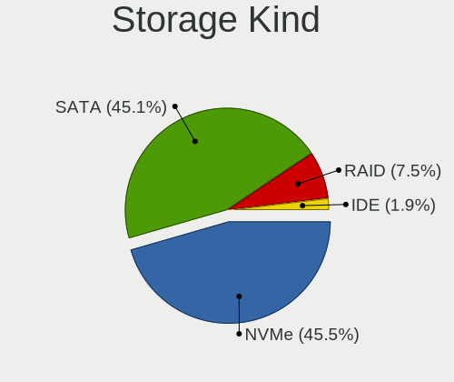
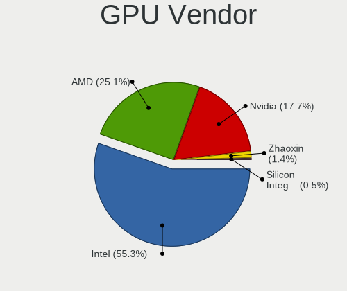
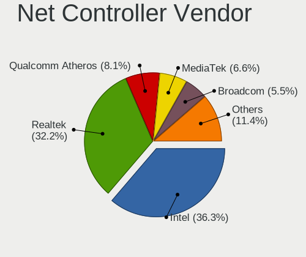

Debian Hardware Trends (Notebook)
---------------------------------

A project to identify most popular hardware characteristics and track their change
over time based on data collected by Debian users at https://Linux-Hardware.org.

Anyone can contribute to the study by uploading probes of their computers by
the [hw-probe](https://github.com/linuxhw/hw-probe) tool:

    sudo -E hw-probe -all -upload

Full-feature report is available here: https://linux-hardware.org/?view=trends&formfactor=notebook

Period: May, 2020.

Contents
--------

- [ OS                       ](#os)
- [ OS Family                ](#os-family)
- [ Kernel                   ](#kernel)
- [ Kernel Family            ](#kernel-family)
- [ Kernel Major Ver.        ](#kernel-major-ver)
- [ Arch                     ](#arch)
- [ DE                       ](#de)
- [ Display Server           ](#display-server)
- [ Display Manager          ](#display-manager)
- [ OS Lang                  ](#os-lang)
- [ Boot Mode                ](#boot-mode)
- [ Filesystem               ](#filesystem)
- [ Part. scheme             ](#part-scheme)
- [ Dual Boot with Linux/BSD ](#dual-boot-with-linux/bsd)
- [ Dual Boot (Win)          ](#dual-boot-win)
- [ Country                  ](#country)
- [ City                     ](#city)
- [ Vendor                   ](#vendor)
- [ Model                    ](#model)
- [ Model Family             ](#model-family)
- [ MFG Year                 ](#mfg-year)
- [ Form Factor              ](#form-factor)
- [ Secure Boot              ](#secure-boot)
- [ Coreboot                 ](#coreboot)
- [ RAM Size                 ](#ram-size)
- [ RAM Used                 ](#ram-used)
- [ Drive Vendor             ](#drive-vendor)
- [ Drive Model              ](#drive-model)
- [ Drive Kind               ](#drive-kind)
- [ Drive Connector          ](#drive-connector)
- [ Drive Size               ](#drive-size)
- [ Space Total              ](#space-total)
- [ Space Used               ](#space-used)
- [ Malfunc. Drives          ](#malfunc-drives)
- [ Malfunc. Drive Vendor    ](#malfunc-drive-vendor)
- [ Malfunc. Drive Kind      ](#malfunc-drive-kind)
- [ Failed Drives            ](#failed-drives)
- [ Failed Drive Vendor      ](#failed-drive-vendor)
- [ Drive Status             ](#drive-status)
- [ Storage Vendor           ](#storage-vendor)
- [ Storage Model            ](#storage-model)
- [ Storage Kind             ](#storage-kind)
- [ CPU Vendor               ](#cpu-vendor)
- [ CPU Model                ](#cpu-model)
- [ CPU Model Family         ](#cpu-model-family)
- [ CPU Cores                ](#cpu-cores)
- [ CPU Sockets              ](#cpu-sockets)
- [ CPU Threads              ](#cpu-threads)
- [ CPU Op-Modes             ](#cpu-op-modes)
- [ CPU Microcode            ](#cpu-microcode)
- [ CPU Microarch            ](#cpu-microarch)
- [ GPU Vendor               ](#gpu-vendor)
- [ GPU Model                ](#gpu-model)
- [ GPU Combo                ](#gpu-combo)
- [ GPU Driver               ](#gpu-driver)
- [ GPU Memory               ](#gpu-memory)
- [ Monitor Vendor           ](#monitor-vendor)
- [ Monitor Model            ](#monitor-model)
- [ Monitor Resolution       ](#monitor-resolution)
- [ Monitor Diagonal         ](#monitor-diagonal)
- [ Monitor Width            ](#monitor-width)
- [ Aspect Ratio             ](#aspect-ratio)
- [ Monitor Area             ](#monitor-area)
- [ Pixel Density            ](#pixel-density)
- [ Multiple Monitors        ](#multiple-monitors)
- [ Net Controller Vendor    ](#net-controller-vendor)
- [ Net Controller Model     ](#net-controller-model)
- [ Net Controller Kind      ](#net-controller-kind)
- [ Used Controller          ](#used-controller)
- [ NICs                     ](#nics)
- [ Unsupported Devices      ](#unsupported-devices)
- [ Unsupported Device Types ](#unsupported-device-types)

OS
--

Installed operating systems

| Name            | Computers | Percent |
|-----------------|-----------|---------|
| Debian 10       | 39        | 60%     |
| Debian Testing  | 12        | 18.46%  |
| Debian          | 7         | 10.77%  |
| Debian Unstable | 5         | 7.69%   |
| Debian 9.12     | 2         | 3.08%   |

OS Family
---------

OS without a version

| Name   | Computers | Percent |
|--------|-----------|---------|
| Debian | 66        | 100%    |

Kernel
------

Version of the Linux kernel

| Version                    | Computers | Percent |
|----------------------------|-----------|---------|
| 4.19.0-9-amd64             | 21        | 31.82%  |
| 5.6.0-1-amd64              | 14        | 21.21%  |
| 4.19.0-8-amd64             | 8         | 12.12%  |
| 5.5.0-2-amd64              | 3         | 4.55%   |
| 4.9.0-12-amd64             | 3         | 4.55%   |
| 4.19.0-9-686               | 3         | 4.55%   |
| 5.5.0-0.bpo.2-amd64        | 2         | 3.03%   |
| 5.4.0-0.bpo.2-amd64        | 2         | 3.03%   |
| 4.19.0-6-amd64             | 2         | 3.03%   |
| 5.6.8                      | 1         | 1.52%   |
| 5.6.0-13.1-liquorix-amd64  | 1         | 1.52%   |
| 5.5.0-rc5-amd64            | 1         | 1.52%   |
| 5.4.0-3-amd64              | 1         | 1.52%   |
| 5.4.0-0.bpo.2-lzk-bl-amd64 | 1         | 1.52%   |
| 5.3.0-2-amd64              | 1         | 1.52%   |
| 5.2.17-1rodete3-amd64      | 1         | 1.52%   |
| 4.19.0-0.bpo.8-amd64       | 1         | 1.52%   |

Kernel Family
-------------

Linux kernel without a distro release

| Version | Computers | Percent |
|---------|-----------|---------|
| 4.19.0  | 35        | 53.03%  |
| 5.6.0   | 15        | 22.73%  |
| 5.5.0   | 6         | 9.09%   |
| 5.4.0   | 4         | 6.06%   |
| 4.9.0   | 3         | 4.55%   |
| 5.6.8   | 1         | 1.52%   |
| 5.3.0   | 1         | 1.52%   |
| 5.2.17  | 1         | 1.52%   |

Kernel Major Ver.
-----------------

Linux kernel major version

| Version | Computers | Percent |
|---------|-----------|---------|
| 4.19    | 35        | 53.03%  |
| 5.6     | 16        | 24.24%  |
| 5.5     | 6         | 9.09%   |
| 5.4     | 4         | 6.06%   |
| 4.9     | 3         | 4.55%   |
| 5.3     | 1         | 1.52%   |
| 5.2     | 1         | 1.52%   |

Arch
----

OS architecture (x86_64, i586, etc.)

| Name   | Computers | Percent |
|--------|-----------|---------|
| x86_64 | 63        | 95.45%  |
| i686   | 3         | 4.55%   |

DE
--

Desktop Environment

| Name             | Computers | Percent |
|------------------|-----------|---------|
| GNOME            | 15        | 22.73%  |
| XFCE             | 11        | 16.67%  |
| KDE5             | 9         | 13.64%  |
| MATE             | 6         | 9.09%   |
| KDE              | 5         | 7.58%   |
| Cinnamon         | 4         | 6.06%   |
| X-Cinnamon       | 3         | 4.55%   |
| Budgie           | 3         | 4.55%   |
| Unknown          | 3         | 4.55%   |
| LXQt             | 2         | 3.03%   |
| LXDE             | 2         | 3.03%   |
| Openbox          | 1         | 1.52%   |
| lightdm-xsession | 1         | 1.52%   |
| i3               | 1         | 1.52%   |

Display Server
--------------

X11 or Wayland

| Name    | Computers | Percent |
|---------|-----------|---------|
| X11     | 55        | 83.33%  |
| Wayland | 9         | 13.64%  |
| Tty     | 2         | 3.03%   |

Display Manager
---------------

SDDM, LightDM, etc.

| Name    | Computers | Percent |
|---------|-----------|---------|
| Unknown | 25        | 37.88%  |
| LightDM | 16        | 24.24%  |
| GDM     | 14        | 21.21%  |
| SDDM    | 9         | 13.64%  |
| XDM     | 1         | 1.52%   |
| WDM     | 1         | 1.52%   |

OS Lang
-------

Language

| Lang       | Computers | Percent |
|------------|-----------|---------|
| en_US      | 21        | 31.82%  |
| de_DE      | 6         | 9.09%   |
| ru_RU      | 4         | 6.06%   |
| it_IT      | 3         | 4.55%   |
| fr_FR      | 3         | 4.55%   |
| es_AR      | 3         | 4.55%   |
| en_US.utf8 | 3         | 4.55%   |
| en_GB      | 3         | 4.55%   |
| Unknown    | 3         | 4.55%   |
| en_CA      | 2         | 3.03%   |
| zh_CN      | 1         | 1.52%   |
| pt_PT      | 1         | 1.52%   |
| pt_BR      | 1         | 1.52%   |
| pl_PL      | 1         | 1.52%   |
| hu_HU      | 1         | 1.52%   |
| fr_CH      | 1         | 1.52%   |
| es_MX      | 1         | 1.52%   |
| es_ES      | 1         | 1.52%   |
| es_CL      | 1         | 1.52%   |
| en_PH      | 1         | 1.52%   |
| en_IN      | 1         | 1.52%   |
| en_IE      | 1         | 1.52%   |
| da_DK      | 1         | 1.52%   |
| cs_CZ      | 1         | 1.52%   |
| C          | 1         | 1.52%   |

Boot Mode
---------

EFI or BIOS

| Mode | Computers | Percent |
|------|-----------|---------|
| BIOS | 42        | 63.64%  |
| EFI  | 24        | 36.36%  |

Filesystem
----------

Type of filesystem

| Type  | Computers | Percent |
|-------|-----------|---------|
| Ext4  | 63        | 95.45%  |
| Btrfs | 2         | 3.03%   |
| Xfs   | 1         | 1.52%   |

Part. scheme
------------

Scheme of partitioning

| Type    | Computers | Percent |
|---------|-----------|---------|
| Unknown | 46        | 69.7%   |
| GPT     | 12        | 18.18%  |
| MBR     | 8         | 12.12%  |

Dual Boot with Linux/BSD
------------------------

Hosting more than one Linux/BSD

| Dual boot | Computers | Percent |
|-----------|-----------|---------|
| No        | 62        | 93.94%  |
| Yes       | 4         | 6.06%   |

Dual Boot (Win)
---------------

Hosting Linux and Windows

| Dual boot | Computers | Percent |
|-----------|-----------|---------|
| No        | 57        | 86.36%  |
| Yes       | 9         | 13.64%  |

Country
-------

Geographic location (country)

| Country            | Computers | Percent |
|--------------------|-----------|---------|
| Germany            | 11        | 16.67%  |
| USA                | 10        | 15.15%  |
| Russia             | 7         | 10.61%  |
| Italy              | 4         | 6.06%   |
| Argentina          | 4         | 6.06%   |
| France             | 3         | 4.55%   |
| UK                 | 2         | 3.03%   |
| Slovenia           | 2         | 3.03%   |
| Ireland            | 2         | 3.03%   |
| Czech Republic     | 2         | 3.03%   |
| Chile              | 2         | 3.03%   |
| Turkey             | 1         | 1.52%   |
| Switzerland        | 1         | 1.52%   |
| Spain              | 1         | 1.52%   |
| Portugal           | 1         | 1.52%   |
| Poland             | 1         | 1.52%   |
| Philippines        | 1         | 1.52%   |
| Peru               | 1         | 1.52%   |
| Norway             | 1         | 1.52%   |
| Mexico             | 1         | 1.52%   |
| Hungary            | 1         | 1.52%   |
| Dominican Republic | 1         | 1.52%   |
| Denmark            | 1         | 1.52%   |
| Cyprus             | 1         | 1.52%   |
| China              | 1         | 1.52%   |
| Canada             | 1         | 1.52%   |
| Brazil             | 1         | 1.52%   |
| Bangladesh         | 1         | 1.52%   |

City
----

Geographic location (city)

| City               | Computers | Percent |
|--------------------|-----------|---------|
| St Petersburg      | 2         | 3.03%   |
| Santiago           | 2         | 3.03%   |
| Moscow             | 2         | 3.03%   |
| Maribor            | 2         | 3.03%   |
| Eppelheim          | 2         | 3.03%   |
| Blanchardstown     | 2         | 3.03%   |
| Wilderness Rim     | 1         | 1.52%   |
| Voronezh           | 1         | 1.52%   |
| Vologda            | 1         | 1.52%   |
| Valladolid         | 1         | 1.52%   |
| Turin              | 1         | 1.52%   |
| Tournefeuille      | 1         | 1.52%   |
| Tandil             | 1         | 1.52%   |
| Sykesville         | 1         | 1.52%   |
| Swindon            | 1         | 1.52%   |
| Stuttgart          | 1         | 1.52%   |
| Seattle            | 1         | 1.52%   |
| Santo Domingo      | 1         | 1.52%   |
| San Mateo          | 1         | 1.52%   |
| Remscheid          | 1         | 1.52%   |
| Prangins           | 1         | 1.52%   |
| Prague             | 1         | 1.52%   |
| Porto              | 1         | 1.52%   |
| Pembroke           | 1         | 1.52%   |
| Paphos             | 1         | 1.52%   |
| Ostrava            | 1         | 1.52%   |
| North Royalton     | 1         | 1.52%   |
| Nizhniy Novgorod   | 1         | 1.52%   |
| Newburyport        | 1         | 1.52%   |
| New York           | 1         | 1.52%   |
| Modena             | 1         | 1.52%   |
| Mexico City        | 1         | 1.52%   |
| Livron-sur-Drome   | 1         | 1.52%   |
| Lima               | 1         | 1.52%   |
| Leipzig            | 1         | 1.52%   |
| Leimen             | 1         | 1.52%   |
| Laval              | 1         | 1.52%   |
| Koblenz            | 1         | 1.52%   |
| Kobenhavn S        | 1         | 1.52%   |
| Kiel               | 1         | 1.52%   |
| Katowice           | 1         | 1.52%   |
| Kaiserslautern     | 1         | 1.52%   |
| Istanbul           | 1         | 1.52%   |
| Huntington Station | 1         | 1.52%   |
| Drammen            | 1         | 1.52%   |
| Dongguan           | 1         | 1.52%   |
| Dhaka              | 1         | 1.52%   |
| Cosquin            | 1         | 1.52%   |
| Corrientes         | 1         | 1.52%   |
| Cologne            | 1         | 1.52%   |
| Chelsea            | 1         | 1.52%   |
| Buenos Aires       | 1         | 1.52%   |
| Budapest           | 1         | 1.52%   |
| Brasília          | 1         | 1.52%   |
| Bologna            | 1         | 1.52%   |
| Berlin             | 1         | 1.52%   |
| Angeles City       | 1         | 1.52%   |
| Ancona             | 1         | 1.52%   |
| Alexandria         | 1         | 1.52%   |
| Aix-les-Bains      | 1         | 1.52%   |

Vendor
------

Motherboard manufacturer

| Name                       | Computers | Percent |
|----------------------------|-----------|---------|
| Lenovo                     | 18        | 27.27%  |
| Dell                       | 17        | 25.76%  |
| Hewlett-Packard            | 9         | 13.64%  |
| ASUSTek Computer           | 5         | 7.58%   |
| Acer                       | 5         | 7.58%   |
| Samsung Electronics        | 3         | 4.55%   |
| Apple                      | 3         | 4.55%   |
| MSI                        | 2         | 3.03%   |
| Toshiba                    | 1         | 1.52%   |
| Notebook                   | 1         | 1.52%   |
| HDC High Designed Computer | 1         | 1.52%   |
| Unknown                    | 1         | 1.52%   |

Model
-----

Motherboard model

| Name                                     | Computers | Percent |
|------------------------------------------|-----------|---------|
| Dell Latitude E7450                      | 2         | 3.03%   |
| Dell Inspiron 7559                       | 2         | 3.03%   |
| Toshiba Satellite S55-B                  | 1         | 1.52%   |
| Samsung Electronics RF510/RF410/RF710    | 1         | 1.52%   |
| Samsung Electronics R430/R480/R440       | 1         | 1.52%   |
| Samsung Electronics N150P/N210P/N220P    | 1         | 1.52%   |
| Notebook N130BU                          | 1         | 1.52%   |
| MSI GS73 Stealth 8RD                     | 1         | 1.52%   |
| MSI GL75 9SDK                            | 1         | 1.52%   |
| Lenovo V340-17IWL 81RG                   | 1         | 1.52%   |
| Lenovo ThinkPad X240 20AMS3AE04          | 1         | 1.52%   |
| Lenovo ThinkPad X230 2306CTO             | 1         | 1.52%   |
| Lenovo ThinkPad X220 4290LE6             | 1         | 1.52%   |
| Lenovo ThinkPad X200 74598Y7             | 1         | 1.52%   |
| Lenovo ThinkPad X1 Carbon 7th 20QES0410J | 1         | 1.52%   |
| Lenovo ThinkPad X1 Carbon 7th 20QES01L00 | 1         | 1.52%   |
| Lenovo ThinkPad T520 424329U             | 1         | 1.52%   |
| Lenovo ThinkPad T495s 20QKS01E00         | 1         | 1.52%   |
| Lenovo ThinkPad T400 6475VYS             | 1         | 1.52%   |
| Lenovo ThinkPad E480 20KN003WUS          | 1         | 1.52%   |
| Lenovo ThinkPad E470 20H1A029SG          | 1         | 1.52%   |
| Lenovo Legion Y9000X 2020 81TH           | 1         | 1.52%   |
| Lenovo IdeaPad Z585 20152                | 1         | 1.52%   |
| Lenovo IdeaPad U430p 20269               | 1         | 1.52%   |
| Lenovo IdeaPad S340-15API 81NC           | 1         | 1.52%   |
| Lenovo IdeaPad 330S-15IKB 81F5           | 1         | 1.52%   |
| Lenovo G580                              | 1         | 1.52%   |
| HP Stream Notebook PC 13                 | 1         | 1.52%   |
| HP Pavilion g6                           | 1         | 1.52%   |
| HP Laptop 17-ca1xxx                      | 1         | 1.52%   |
| HP Laptop 17-ca0xxx                      | 1         | 1.52%   |
| HP EliteBook 850 G1                      | 1         | 1.52%   |
| HP EliteBook 8470p                       | 1         | 1.52%   |
| HP EliteBook 830 G5                      | 1         | 1.52%   |
| HP EliteBook 1050 G1                     | 1         | 1.52%   |
| HP 15                                    | 1         | 1.52%   |
| HDC High Designed Computer CB14T332      | 1         | 1.52%   |
| Dell XPS 13 9360                         | 1         | 1.52%   |
| Dell Vostro 5370                         | 1         | 1.52%   |
| Dell Precision M6700                     | 1         | 1.52%   |
| Dell Precision M4600                     | 1         | 1.52%   |
| Dell Precision 3540                      | 1         | 1.52%   |
| Dell Latitude E7240                      | 1         | 1.52%   |
| Dell Latitude E6510                      | 1         | 1.52%   |
| Dell Latitude E6410                      | 1         | 1.52%   |
| Dell Latitude E5500                      | 1         | 1.52%   |
| Dell Latitude E4310                      | 1         | 1.52%   |
| Dell Inspiron N5050                      | 1         | 1.52%   |
| Dell Inspiron 5570                       | 1         | 1.52%   |
| Dell Inspiron 3458                       | 1         | 1.52%   |
| ASUS X540YA                              | 1         | 1.52%   |
| ASUS VivoBook_ASUSLaptop X420FA_X420FA   | 1         | 1.52%   |
| ASUS UX550VE                             | 1         | 1.52%   |
| ASUS UL80VT                              | 1         | 1.52%   |
| ASUS U47A                                | 1         | 1.52%   |
| Apple MacBookPro11,3                     | 1         | 1.52%   |
| Apple MacBookPro11,1                     | 1         | 1.52%   |
| Apple MacBook10,1                        | 1         | 1.52%   |
| Acer TravelMate P253                     | 1         | 1.52%   |
| Acer Swift SF315-52                      | 1         | 1.52%   |

Model Family
------------

Motherboard model prefix

| Name                                | Computers | Percent |
|-------------------------------------|-----------|---------|
| Lenovo ThinkPad                     | 11        | 16.67%  |
| Dell Latitude                       | 7         | 10.61%  |
| Dell Inspiron                       | 5         | 7.58%   |
| Lenovo IdeaPad                      | 4         | 6.06%   |
| HP EliteBook                        | 4         | 6.06%   |
| Dell Precision                      | 3         | 4.55%   |
| HP Laptop                           | 2         | 3.03%   |
| Apple MacBookPro11                  | 2         | 3.03%   |
| Acer Aspire                         | 2         | 3.03%   |
| Toshiba Satellite                   | 1         | 1.52%   |
| Samsung Electronics RF510           | 1         | 1.52%   |
| Samsung Electronics R430            | 1         | 1.52%   |
| Samsung Electronics N150P           | 1         | 1.52%   |
| Notebook N130BU                     | 1         | 1.52%   |
| MSI GS73                            | 1         | 1.52%   |
| MSI GL75                            | 1         | 1.52%   |
| Lenovo V340-17IWL                   | 1         | 1.52%   |
| Lenovo Legion                       | 1         | 1.52%   |
| Lenovo G580                         | 1         | 1.52%   |
| HP Stream                           | 1         | 1.52%   |
| HP Pavilion                         | 1         | 1.52%   |
| HP 15                               | 1         | 1.52%   |
| HDC High Designed Computer CB14T332 | 1         | 1.52%   |
| Dell XPS                            | 1         | 1.52%   |
| Dell Vostro                         | 1         | 1.52%   |
| ASUS X540YA                         | 1         | 1.52%   |
| ASUS VivoBook                       | 1         | 1.52%   |
| ASUS UX550VE                        | 1         | 1.52%   |
| ASUS UL80VT                         | 1         | 1.52%   |
| ASUS U47A                           | 1         | 1.52%   |
| Apple MacBook10                     | 1         | 1.52%   |
| Acer TravelMate                     | 1         | 1.52%   |
| Acer Swift                          | 1         | 1.52%   |
| Acer Nitro                          | 1         | 1.52%   |
| Unknown                             | 1         | 1.52%   |

MFG Year
--------

Motherboard manufacture year

| Year | Computers | Percent |
|------|-----------|---------|
| 2019 | 18        | 27.27%  |
| 2018 | 12        | 18.18%  |
| 2017 | 7         | 10.61%  |
| 2020 | 6         | 9.09%   |
| 2012 | 6         | 9.09%   |
| 2013 | 4         | 6.06%   |
| 2011 | 4         | 6.06%   |
| 2016 | 3         | 4.55%   |
| 2014 | 2         | 3.03%   |
| 2010 | 2         | 3.03%   |
| 2015 | 1         | 1.52%   |
| 2009 | 1         | 1.52%   |

Form Factor
-----------

Physical design of the computer

| Name     | Computers | Percent |
|----------|-----------|---------|
| Notebook | 66        | 100%    |

Secure Boot
-----------

Enabled or disabled

| State    | Computers | Percent |
|----------|-----------|---------|
| Disabled | 65        | 98.48%  |
| Enabled  | 1         | 1.52%   |

Coreboot
--------

Have coreboot on board

| Used | Computers | Percent |
|------|-----------|---------|
| No   | 65        | 98.48%  |
| Yes  | 1         | 1.52%   |

RAM Size
--------

Total RAM memory

| Size in GB | Computers | Percent |
|------------|-----------|---------|
| 8.01-16.0  | 18        | 27.27%  |
| 4.01-8.0   | 15        | 22.73%  |
| 16.01-24.0 | 14        | 21.21%  |
| 3.01-4.0   | 7         | 10.61%  |
| 1.01-2.0   | 4         | 6.06%   |
| 32.01-64.0 | 3         | 4.55%   |
| 2.01-3.0   | 3         | 4.55%   |
| 24.01-32.0 | 1         | 1.52%   |
| 0.01-1.0   | 1         | 1.52%   |

RAM Used
--------

Used RAM memory

| Used GB   | Computers | Percent |
|-----------|-----------|---------|
| 1.01-2.0  | 20        | 30.3%   |
| 4.01-8.0  | 15        | 22.73%  |
| 0.01-1.0  | 12        | 18.18%  |
| 2.01-3.0  | 11        | 16.67%  |
| 3.01-4.0  | 7         | 10.61%  |
| 8.01-16.0 | 1         | 1.52%   |

Drive Vendor
------------

Hard drive vendors

| Vendor              | Computers | Drives | Percent |
|---------------------|-----------|--------|---------|
| Samsung Electronics | 16        | 16     | 20.25%  |
| Seagate             | 15        | 15     | 18.99%  |
| WDC                 | 12        | 13     | 15.19%  |
| Unknown             | 6         | 9      | 7.59%   |
| SanDisk             | 5         | 5      | 6.33%   |
| Toshiba             | 4         | 4      | 5.06%   |
| Kingston            | 4         | 4      | 5.06%   |
| Crucial             | 4         | 4      | 5.06%   |
| SK Hynix            | 3         | 3      | 3.8%    |
| Micron Technology   | 2         | 2      | 2.53%   |
| Hitachi             | 2         | 2      | 2.53%   |
| HGST                | 2         | 2      | 2.53%   |
| KingSpec            | 1         | 1      | 1.27%   |
| Intenso             | 1         | 1      | 1.27%   |
| Intel               | 1         | 1      | 1.27%   |
| Apple               | 1         | 1      | 1.27%   |

Drive Model
-----------

Hard drive models

| Model                            | Computers | Percent |
|----------------------------------|-----------|---------|
| SV300S37A120G 120GB SSD          | 2         | 2.44%   |
| ST500LM012 HN-M500MBB 500GB      | 2         | 2.44%   |
| ST1000LM049-2GH172 1TB           | 2         | 2.44%   |
| ST1000LM035-1RK172 1TB           | 2         | 2.44%   |
| ST1000LM024 HN-M101MBB 1TB       | 2         | 2.44%   |
| SSD 860 EVO 250GB                | 2         | 2.44%   |
| SSD 850 EVO 250GB                | 2         | 2.44%   |
| PC SN520 SDAPMUW-512G-1101 512GB | 2         | 2.44%   |
| MMC Card  64GB                   | 2         | 2.44%   |
| X300 MSATA 128GB SSD             | 1         | 1.22%   |
| WDS240G2G0A-00JH30 240GB SSD     | 1         | 1.22%   |
| WDS120G1G0B-00RC30 120GB SSD     | 1         | 1.22%   |
| WD5000BPVT-22HXZT3 500GB         | 1         | 1.22%   |
| WD5000BPVT-11HXZT1 500GB         | 1         | 1.22%   |
| WD5000BEKT-75KA9T0 500GB         | 1         | 1.22%   |
| WD10SPZX-60Z10T0 1TB             | 1         | 1.22%   |
| WD10SPZX-24Z10 1TB               | 1         | 1.22%   |
| WD10SPZX-21Z10T0 1TB             | 1         | 1.22%   |
| WD10JPVX-00JC3T0 1TB             | 1         | 1.22%   |
| SU02G  2GB                       | 1         | 1.22%   |
| ST9500325AS 500GB                | 1         | 1.22%   |
| ST9250315AS 250GB                | 1         | 1.22%   |
| ST500LM000-SSHD-8GB              | 1         | 1.22%   |
| ST500LM000-1EJ162 500GB          | 1         | 1.22%   |
| ST320LT020-9YG142 320GB          | 1         | 1.22%   |
| ST2000LM007-1R8174 2TB           | 1         | 1.22%   |
| ST1000LM014-1EJ164 1TB           | 1         | 1.22%   |
| SSDPEKKW256G8 256GB              | 1         | 1.22%   |
| SSD SM841N mSATA 128GB           | 1         | 1.22%   |
| SSD SM0256F 256GB                | 1         | 1.22%   |
| SSD SATAIII 480GB                | 1         | 1.22%   |
| SSD 860 EVO 500GB                | 1         | 1.22%   |
| SSD 850 EVO 1TB                  | 1         | 1.22%   |
| SSD 840 Series 250GB             | 1         | 1.22%   |
| SSD 840 EVO 120GB                | 1         | 1.22%   |
| SDSSDH3 512G                     | 1         | 1.22%   |
| SD9SN8W512G1102 512GB SSD        | 1         | 1.22%   |
| SD8SN8U512G1002 512GB SSD        | 1         | 1.22%   |
| SD8SB8U1T002000 1024GB SSD       | 1         | 1.22%   |
| SD16G  16GB                      | 1         | 1.22%   |
| SC311 SATA 256GB SSD             | 1         | 1.22%   |
| RBUSNS8154P3128GJ1 128GB         | 1         | 1.22%   |
| RBUSNS8154P3128GJ 128GB          | 1         | 1.22%   |
| Q-360 360GB                      | 1         | 1.22%   |
| PC601 HFS001TD9TNG-L2A0A 1TB     | 1         | 1.22%   |
| PC SN730 SDBQNTY-512G-1001 512GB | 1         | 1.22%   |
| PC SN520 SDAPNUW-256G-1006 256GB | 1         | 1.22%   |
| MZVLW256HEHP-00000 256GB         | 1         | 1.22%   |
| MZVLB256HBHQ-000L7 256GB         | 1         | 1.22%   |
| MZVLB1T0HBLR-000L7 1TB           | 1         | 1.22%   |
| MZVLB1T0HBLR-000L2 1TB           | 1         | 1.22%   |
| MZ7TE128HMGR-000L1 128GB SSD     | 1         | 1.22%   |
| MTFDDAV256TBN 256GB SSD          | 1         | 1.22%   |
| MQ04ABF100 1TB                   | 1         | 1.22%   |
| MQ01ABD032 320GB                 | 1         | 1.22%   |
| MMC Card  32GB                   | 1         | 1.22%   |
| M4-CT128M4SSD2 128GB             | 1         | 1.22%   |
| KXG60ZNV512G NVMe KIOXIA 512GB   | 1         | 1.22%   |
| HTS721010A9E630 1TB              | 1         | 1.22%   |
| HTS547575A9E384 752GB            | 1         | 1.22%   |

Drive Kind
----------

HDD or SSD

| Kind    | Computers | Drives | Percent |
|---------|-----------|--------|---------|
| HDD     | 30        | 31     | 38.96%  |
| SSD     | 28        | 30     | 36.36%  |
| NVMe    | 13        | 13     | 16.88%  |
| MMC     | 5         | 8      | 6.49%   |
| Unknown | 1         | 1      | 1.3%    |

Drive Connector
---------------

SATA, SAS, NVMe, etc.

| Type | Computers | Drives | Percent |
|------|-----------|--------|---------|
| SATA | 51        | 62     | 73.91%  |
| NVMe | 13        | 13     | 18.84%  |
| MMC  | 5         | 8      | 7.25%   |

Drive Size
----------

Size of hard drive

| Size in TB | Computers | Drives | Percent |
|------------|-----------|--------|---------|
| 0.01-0.5   | 44        | 52     | 60.27%  |
| 0.51-1.0   | 24        | 25     | 32.88%  |
| 1.01-2.0   | 5         | 6      | 6.85%   |

Space Total
-----------

Amount of disk space available on the file system

| Size in GB | Computers | Percent |
|------------|-----------|---------|
| 101-250    | 21        | 31.82%  |
| 251-500    | 20        | 30.3%   |
| 501-1000   | 10        | 15.15%  |
| 1001-2000  | 5         | 7.58%   |
| 51-100     | 4         | 6.06%   |
| 21-50      | 2         | 3.03%   |
| 2001-3000  | 2         | 3.03%   |
| Unknown    | 2         | 3.03%   |

Space Used
----------

Amount of used disk space

| Used GB  | Computers | Percent |
|----------|-----------|---------|
| 101-250  | 21        | 31.82%  |
| 1-20     | 17        | 25.76%  |
| 251-500  | 9         | 13.64%  |
| 51-100   | 8         | 12.12%  |
| 21-50    | 7         | 10.61%  |
| 501-1000 | 2         | 3.03%   |
| Unknown  | 2         | 3.03%   |

Malfunc. Drives
---------------

Drive models with a malfunction

| Model                   | Computers | Drives | Percent |
|-------------------------|-----------|--------|---------|
| ST320LT020-9YG142 320GB | 1         | 1      | 14.29%  |
| ST1000LM035-1RK172 1TB  | 1         | 1      | 14.29%  |
| SSD 860 EVO 500GB       | 1         | 1      | 14.29%  |
| MTFDDAV256TBN 256GB SSD | 1         | 1      | 14.29%  |
| MQ01ABD032 320GB        | 1         | 1      | 14.29%  |
| HTS545050A7E680 500GB   | 1         | 1      | 14.29%  |
| HTS543216L9SA00 160GB   | 1         | 1      | 14.29%  |

Malfunc. Drive Vendor
---------------------

Vendors of faulty drives

| Vendor              | Computers | Drives | Percent |
|---------------------|-----------|--------|---------|
| Seagate             | 2         | 2      | 28.57%  |
| Toshiba             | 1         | 1      | 14.29%  |
| Samsung Electronics | 1         | 1      | 14.29%  |
| Micron Technology   | 1         | 1      | 14.29%  |
| Hitachi             | 1         | 1      | 14.29%  |
| HGST                | 1         | 1      | 14.29%  |

Malfunc. Drive Kind
-------------------

Kinds of faulty drives

| Kind | Computers | Drives | Percent |
|------|-----------|--------|---------|
| HDD  | 5         | 5      | 71.43%  |
| SSD  | 2         | 2      | 28.57%  |

Failed Drives
-------------

Failed drive models

Zero info for selected period =(

Failed Drive Vendor
-------------------

Failed drive vendors

Zero info for selected period =(

Drive Status
------------

Number of failed and malfunc. drives

| Status   | Computers | Drives | Percent |
|----------|-----------|--------|---------|
| Works    | 34        | 41     | 52.31%  |
| Detected | 24        | 35     | 36.92%  |
| Malfunc  | 7         | 7      | 10.77%  |

Storage Vendor
--------------

Storage controller vendors

| Vendor                       | Computers | Percent |
|------------------------------|-----------|---------|
| Intel                        | 47        | 66.2%   |
| AMD                          | 6         | 8.45%   |
| Sandisk                      | 5         | 7.04%   |
| Samsung Electronics          | 5         | 7.04%   |
| Toshiba America Info Systems | 2         | 2.82%   |
| Kingston Technology Company  | 2         | 2.82%   |
| SK Hynix                     | 1         | 1.41%   |
| Silicon Motion               | 1         | 1.41%   |
| Micron/Crucial Technology    | 1         | 1.41%   |
| Apple                        | 1         | 1.41%   |

Storage Model
-------------

Storage controller models

| Model                                                                  | Computers | Percent |
|------------------------------------------------------------------------|-----------|---------|
| 82801 Mobile SATA Controller [RAID mode]                               | 8         | 10.81%  |
| Non-Volatile memory controller                                         | 7         | 9.46%   |
| FCH SATA Controller [AHCI mode]                                        | 6         | 8.11%   |
| 7 Series Chipset Family 6-port SATA Controller [AHCI mode]             | 6         | 8.11%   |
| Sunrise Point-LP SATA Controller [AHCI mode]                           | 5         | 6.76%   |
| Cannon Lake Mobile PCH SATA AHCI Controller                            | 5         | 6.76%   |
| 82801IBM/IEM (ICH9M/ICH9M-E) 4 port SATA Controller [AHCI mode]        | 4         | 5.41%   |
| 8 Series SATA Controller 1 [AHCI mode]                                 | 4         | 5.41%   |
| NVMe SSD Controller SM981/PM981/PM983                                  | 3         | 4.05%   |
| HM170/QM170 Chipset SATA Controller [AHCI Mode]                        | 3         | 4.05%   |
| 6 Series/C200 Series Chipset Family 6 port Mobile SATA AHCI Controller | 3         | 4.05%   |
| Wildcat Point-LP SATA Controller [AHCI Mode]                           | 2         | 2.7%    |
| Toshiba America Info Non-Volatile memory controller                    | 2         | 2.7%    |
| Cannon Point-LP SATA Controller [AHCI Mode]                            | 2         | 2.7%    |
| 5 Series/3400 Series Chipset 4 port SATA AHCI Controller               | 2         | 2.7%    |
| WD Black 2018/PC SN720 NVMe SSD                                        | 1         | 1.35%   |
| WD Black 2018/PC SN520 NVMe SSD                                        | 1         | 1.35%   |
| SSD Pro 7600p/760p/E 6100p Series                                      | 1         | 1.35%   |
| S3X NVMe Controller                                                    | 1         | 1.35%   |
| P1 NVMe PCIe SSD                                                       | 1         | 1.35%   |
| NVMe SSD Controller SM961/PM961                                        | 1         | 1.35%   |
| NM10/ICH7 Family SATA Controller [AHCI mode]                           | 1         | 1.35%   |
| Celeron N3350/Pentium N4200/Atom E3900 Series SATA AHCI Controller     | 1         | 1.35%   |
| Apple PCIe SSD                                                         | 1         | 1.35%   |
| 82801GBM/GHM (ICH7-M Family) SATA Controller [AHCI mode]               | 1         | 1.35%   |
| 8 Series HECI IDER                                                     | 1         | 1.35%   |
| 5 Series/3400 Series Chipset 6 port SATA AHCI Controller               | 1         | 1.35%   |

Storage Kind
------------

Kind of storage controller (IDE, SATA, NVMe, SAS, ...)

| Kind | Computers | Percent |
|------|-----------|---------|
| SATA | 47        | 63.51%  |
| NVMe | 18        | 24.32%  |
| RAID | 8         | 10.81%  |
| IDE  | 1         | 1.35%   |

CPU Vendor
----------

Processor vendors

| Vendor | Computers | Percent |
|--------|-----------|---------|
| Intel  | 58        | 87.88%  |
| AMD    | 8         | 12.12%  |

CPU Model
---------

Processor models

| Model                                           | Computers | Percent |
|-------------------------------------------------|-----------|---------|
| Intel Core i7-8550U CPU @ 1.80GHz               | 6         | 9.09%   |
| Intel Core i7-8750H CPU @ 2.20GHz               | 3         | 4.55%   |
| Intel Pentium CPU B960 @ 2.20GHz                | 2         | 3.03%   |
| Intel Core i7-8565U CPU @ 1.80GHz               | 2         | 3.03%   |
| Intel Core i5-9300H CPU @ 2.40GHz               | 2         | 3.03%   |
| Intel Core i5-5300U CPU @ 2.30GHz               | 2         | 3.03%   |
| Intel Core i5 CPU M 560 @ 2.67GHz               | 2         | 3.03%   |
| AMD A8-4500M APU with Radeon HD Graphics        | 2         | 3.03%   |
| Intel Pentium CPU 5405U @ 2.30GHz               | 1         | 1.52%   |
| Intel Genuine CPU U7300 @ 1.30GHz               | 1         | 1.52%   |
| Intel Core m3-7Y32 CPU @ 1.10GHz                | 1         | 1.52%   |
| Intel Core i7-9750H CPU @ 2.60GHz               | 1         | 1.52%   |
| Intel Core i7-8665U CPU @ 1.90GHz               | 1         | 1.52%   |
| Intel Core i7-7700HQ CPU @ 2.80GHz              | 1         | 1.52%   |
| Intel Core i7-7500U CPU @ 2.70GHz               | 1         | 1.52%   |
| Intel Core i7-6700HQ CPU @ 2.60GHz              | 1         | 1.52%   |
| Intel Core i7-5500U CPU @ 2.40GHz               | 1         | 1.52%   |
| Intel Core i7-4850HQ CPU @ 2.30GHz              | 1         | 1.52%   |
| Intel Core i7-4600U CPU @ 2.10GHz               | 1         | 1.52%   |
| Intel Core i7-3940XM CPU @ 3.00GHz              | 1         | 1.52%   |
| Intel Core i7-2860QM CPU @ 2.50GHz              | 1         | 1.52%   |
| Intel Core i7-2640M CPU @ 2.80GHz               | 1         | 1.52%   |
| Intel Core i7 CPU Q 720 @ 1.60GHz               | 1         | 1.52%   |
| Intel Core i5-8265U CPU @ 1.60GHz               | 1         | 1.52%   |
| Intel Core i5-8250U CPU @ 1.60GHz               | 1         | 1.52%   |
| Intel Core i5-7200U CPU @ 2.50GHz               | 1         | 1.52%   |
| Intel Core i5-6300HQ CPU @ 2.30GHz              | 1         | 1.52%   |
| Intel Core i5-4310U CPU @ 2.00GHz               | 1         | 1.52%   |
| Intel Core i5-4300U CPU @ 1.90GHz               | 1         | 1.52%   |
| Intel Core i5-4278U CPU @ 2.60GHz               | 1         | 1.52%   |
| Intel Core i5-4210U CPU @ 1.70GHz               | 1         | 1.52%   |
| Intel Core i5-3320M CPU @ 2.60GHz               | 1         | 1.52%   |
| Intel Core i5-3210M CPU @ 2.50GHz               | 1         | 1.52%   |
| Intel Core i5-2520M CPU @ 2.50GHz               | 1         | 1.52%   |
| Intel Core i5 CPU M 520 @ 2.40GHz               | 1         | 1.52%   |
| Intel Core i3-4005U CPU @ 1.70GHz               | 1         | 1.52%   |
| Intel Core i3-2370M CPU @ 2.40GHz               | 1         | 1.52%   |
| Intel Core i3-2350M CPU @ 2.30GHz               | 1         | 1.52%   |
| Intel Core i3 CPU M 330 @ 2.13GHz               | 1         | 1.52%   |
| Intel Core 2 Duo CPU P8700 @ 2.53GHz            | 1         | 1.52%   |
| Intel Core 2 Duo CPU P8400 @ 2.26GHz            | 1         | 1.52%   |
| Intel Core 2 CPU P8700 @ 2.53GHz                | 1         | 1.52%   |
| Intel Celeron CPU N3350 @ 1.10GHz               | 1         | 1.52%   |
| Intel Celeron CPU N3050 @ 1.60GHz               | 1         | 1.52%   |
| Intel Atom x5-Z8300 CPU @ 1.44GHz               | 1         | 1.52%   |
| Intel Atom CPU N450 @ 1.66GHz                   | 1         | 1.52%   |
| Intel Atom CPU N270 @ 1.60GHz                   | 1         | 1.52%   |
| AMD Ryzen 7 PRO 3700U w/ Radeon Vega Mobile Gfx | 1         | 1.52%   |
| AMD Ryzen 7 3700U with Radeon Vega Mobile Gfx   | 1         | 1.52%   |
| AMD Ryzen 3 3200U with Radeon Vega Mobile Gfx   | 1         | 1.52%   |
| AMD Ryzen 3 2200U with Radeon Vega Mobile Gfx   | 1         | 1.52%   |
| AMD E2-6110 APU with AMD Radeon R2 Graphics     | 1         | 1.52%   |
| AMD E1-2100 APU with Radeon HD Graphics         | 1         | 1.52%   |

CPU Model Family
----------------

Processor model prefix

| Model            | Computers | Percent |
|------------------|-----------|---------|
| Intel Core i7    | 23        | 34.85%  |
| Intel Core i5    | 18        | 27.27%  |
| Intel Core i3    | 4         | 6.06%   |
| Intel Pentium    | 3         | 4.55%   |
| Intel Atom       | 3         | 4.55%   |
| Intel Core 2 Duo | 2         | 3.03%   |
| Intel Celeron    | 2         | 3.03%   |
| AMD Ryzen 3      | 2         | 3.03%   |
| AMD A8           | 2         | 3.03%   |
| Intel Genuine    | 1         | 1.52%   |
| Intel Core m3    | 1         | 1.52%   |
| Intel Core 2     | 1         | 1.52%   |
| AMD Ryzen 7 PRO  | 1         | 1.52%   |
| AMD Ryzen 7      | 1         | 1.52%   |
| AMD E2           | 1         | 1.52%   |
| AMD E1           | 1         | 1.52%   |

CPU Cores
---------

Number of processor cores

| Number | Computers | Percent |
|--------|-----------|---------|
| 2      | 36        | 54.55%  |
| 4      | 24        | 36.36%  |
| 6      | 4         | 6.06%   |
| 1      | 2         | 3.03%   |

CPU Sockets
-----------

Number of sockets

| Number | Computers | Percent |
|--------|-----------|---------|
| 1      | 66        | 100%    |

CPU Threads
-----------

Threads per core (Hyper-Threading)

| Number | Computers | Percent |
|--------|-----------|---------|
| 2      | 52        | 78.79%  |
| 1      | 14        | 21.21%  |

CPU Op-Modes
------------

CPU Operation Modes (32-bit, 64-bit)

| Op mode        | Computers | Percent |
|----------------|-----------|---------|
| 32-bit, 64-bit | 65        | 98.48%  |
| 32-bit         | 1         | 1.52%   |

CPU Microcode
-------------

Microcode number

| Number     | Computers | Percent |
|------------|-----------|---------|
| Unknown    | 24        | 36.36%  |
| 0x206a7    | 6         | 9.09%   |
| 0x906ea    | 5         | 7.58%   |
| 0x806ec    | 3         | 4.55%   |
| 0x806ea    | 3         | 4.55%   |
| 0x40651    | 3         | 4.55%   |
| 0x306d4    | 3         | 4.55%   |
| 0x1067a    | 3         | 4.55%   |
| 0x806e9    | 2         | 3.03%   |
| 0x906ed    | 1         | 1.52%   |
| 0x906e9    | 1         | 1.52%   |
| 0x806eb    | 1         | 1.52%   |
| 0x406c3    | 1         | 1.52%   |
| 0x306a9    | 1         | 1.52%   |
| 0x20652    | 1         | 1.52%   |
| 0x106e5    | 1         | 1.52%   |
| 0x106c2    | 1         | 1.52%   |
| 0x08108109 | 1         | 1.52%   |
| 0x08108102 | 1         | 1.52%   |
| 0x0810100b | 1         | 1.52%   |
| 0x07030106 | 1         | 1.52%   |
| 0x0700010f | 1         | 1.52%   |
| 0x06001116 | 1         | 1.52%   |

CPU Microarch
-------------

Microarchitecture

| Name        | Computers | Percent |
|-------------|-----------|---------|
| Skylake     | 13        | 19.7%   |
| KabyLake    | 11        | 16.67%  |
| SandyBridge | 7         | 10.61%  |
| Haswell     | 7         | 10.61%  |
| Westmere    | 4         | 6.06%   |
| Zen+        | 3         | 4.55%   |
| IvyBridge   | 3         | 4.55%   |
| Core        | 3         | 4.55%   |
| Broadwell   | 3         | 4.55%   |
| Silvermont  | 2         | 3.03%   |
| Piledriver  | 2         | 3.03%   |
| Bonnell     | 2         | 3.03%   |
| Zen         | 1         | 1.52%   |
| Puma        | 1         | 1.52%   |
| Penryn      | 1         | 1.52%   |
| Nehalem     | 1         | 1.52%   |
| Jaguar      | 1         | 1.52%   |
| Goldmont    | 1         | 1.52%   |

GPU Vendor
----------

Vendors of graphics cards

| Vendor | Computers | Percent |
|--------|-----------|---------|
| Intel  | 52        | 65%     |
| Nvidia | 14        | 17.5%   |
| AMD    | 14        | 17.5%   |

GPU Model
---------

Graphics card models

| Model                                                                              | Computers | Percent |
|------------------------------------------------------------------------------------|-----------|---------|
| UHD Graphics 620                                                                   | 7         | 8.43%   |
| Haswell-ULT Integrated Graphics Controller                                         | 6         | 7.23%   |
| 2nd Generation Core Processor Family Integrated Graphics Controller                | 6         | 7.23%   |
| UHD Graphics 630 (Mobile)                                                          | 5         | 6.02%   |
| Mobile 4 Series Chipset Integrated Graphics Controller                             | 4         | 4.82%   |
| UHD Graphics 620 (Whiskey Lake)                                                    | 3         | 3.61%   |
| Picasso                                                                            | 3         | 3.61%   |
| HD Graphics 5500                                                                   | 3         | 3.61%   |
| Core Processor Integrated Graphics Controller                                      | 3         | 3.61%   |
| 3rd Gen Core processor Graphics Controller                                         | 3         | 3.61%   |
| Trinity [Radeon HD 7640G]                                                          | 2         | 2.41%   |
| Topaz XT [Radeon R7 M260/M265 / M340/M360 / M440/M445 / 530/535 / 620/625 Mobile]  | 2         | 2.41%   |
| Thames [Radeon HD 7500M/7600M Series]                                              | 2         | 2.41%   |
| HD Graphics 620                                                                    | 2         | 2.41%   |
| HD Graphics 530                                                                    | 2         | 2.41%   |
| GP107M [GeForce GTX 1050 Ti Mobile]                                                | 2         | 2.41%   |
| GM107M [GeForce GTX 960M]                                                          | 2         | 2.41%   |
| Atom/Celeron/Pentium Processor x5-E8000/J3xxx/N3xxx Integrated Graphics Controller | 2         | 2.41%   |
| TU117M [GeForce GTX 1650 Mobile / Max-Q]                                           | 1         | 1.2%    |
| TU116M [GeForce GTX 1660 Ti Mobile]                                                | 1         | 1.2%    |
| Raven Ridge [Radeon Vega Series / Radeon Vega Mobile Series]                       | 1         | 1.2%    |
| Mullins [Radeon R2 Graphics]                                                       | 1         | 1.2%    |
| Mobile 945GSE Express Integrated Graphics Controller                               | 1         | 1.2%    |
| Mobile 945GM/GMS/GME, 943/940GML Express Integrated Graphics Controller            | 1         | 1.2%    |
| Mars [Radeon HD 8730M]                                                             | 1         | 1.2%    |
| Lexa XT [Radeon PRO WX 3100]                                                       | 1         | 1.2%    |
| Lexa PRO [Radeon 540/540X/550/550X / RX 540X/550/550X]                             | 1         | 1.2%    |
| Kabini [Radeon HD 8210]                                                            | 1         | 1.2%    |
| HD Graphics 630                                                                    | 1         | 1.2%    |
| HD Graphics 615                                                                    | 1         | 1.2%    |
| HD Graphics 500                                                                    | 1         | 1.2%    |
| GT218M [NVS 3100M]                                                                 | 1         | 1.2%    |
| GT218M [GeForce G210M]                                                             | 1         | 1.2%    |
| GP106M [GeForce GTX 1060 Mobile]                                                   | 1         | 1.2%    |
| GM108M [GeForce 840M]                                                              | 1         | 1.2%    |
| GK107M [GeForce GT 750M Mac Edition]                                               | 1         | 1.2%    |
| GK104GLM [Quadro K4000M]                                                           | 1         | 1.2%    |
| GF108M [GeForce GT 420M]                                                           | 1         | 1.2%    |
| GF108GLM [Quadro 1000M]                                                            | 1         | 1.2%    |
| Ellesmere [Radeon RX 470/480/570/570X/580/580X/590]                                | 1         | 1.2%    |
| Coffee Lake UHD Graphics                                                           | 1         | 1.2%    |
| Atom Processor D4xx/D5xx/N4xx/N5xx Integrated Graphics Controller                  | 1         | 1.2%    |

GPU Combo
---------

Combinations of graphics cards

| Name           | Computers | Percent |
|----------------|-----------|---------|
| 1 x Intel      | 37        | 56.06%  |
| Intel + Nvidia | 11        | 16.67%  |
| Intel + AMD    | 6         | 9.09%   |
| 1 x AMD        | 6         | 9.09%   |
| 1 x Nvidia     | 4         | 6.06%   |
| 2 x AMD        | 2         | 3.03%   |

GPU Driver
----------

Free vs proprietary

| Driver      | Computers | Percent |
|-------------|-----------|---------|
| Free        | 59        | 89.39%  |
| Proprietary | 7         | 10.61%  |

GPU Memory
----------

Total video memory

| Size in GB | Computers | Percent |
|------------|-----------|---------|
| Unknown    | 55        | 83.33%  |
| 1.01-2.0   | 6         | 9.09%   |
| 0.01-0.5   | 3         | 4.55%   |
| 3.01-4.0   | 1         | 1.52%   |
| 0.51-1.0   | 1         | 1.52%   |

Monitor Vendor
--------------

Monitor vendors

| Vendor                  | Computers | Percent |
|-------------------------|-----------|---------|
| AU Optronics            | 14        | 17.72%  |
| BOE                     | 12        | 15.19%  |
| LG Display              | 10        | 12.66%  |
| Samsung Electronics     | 9         | 11.39%  |
| Chimei Innolux          | 9         | 11.39%  |
| Apple                   | 3         | 3.8%    |
| InfoVision              | 2         | 2.53%   |
| Goldstar                | 2         | 2.53%   |
| Dell                    | 2         | 2.53%   |
| AOC                     | 2         | 2.53%   |
| Ancor Communications    | 2         | 2.53%   |
| Vizio                   | 1         | 1.27%   |
| SKY                     | 1         | 1.27%   |
| Sharp                   | 1         | 1.27%   |
| Seiko/Epson             | 1         | 1.27%   |
| Philips                 | 1         | 1.27%   |
| MP_                     | 1         | 1.27%   |
| LGD                     | 1         | 1.27%   |
| Lenovo                  | 1         | 1.27%   |
| Hewlett-Packard         | 1         | 1.27%   |
| CPT                     | 1         | 1.27%   |
| Chi Mei Optoelectronics | 1         | 1.27%   |
| BenQ                    | 1         | 1.27%   |

Monitor Model
-------------

Monitor models

| Model                                              | Computers | Percent |
|----------------------------------------------------|-----------|---------|
| LCD Monitor SEC5441 1366x768 344x194mm 15.5-inch   | 3         | 3.75%   |
| LCD Monitor BOE0700 1920x1080 344x194mm 15.5-inch  | 2         | 2.5%    |
| LCD Monitor AUO21ED 1920x1080 344x194mm 15.5-inch  | 2         | 2.5%    |
| W1943 GSM4BAD 1024x768 410x230mm 18.5-inch         | 1         | 1.25%   |
| U2417H DEL40E8 1920x1080 527x296mm 23.8-inch       | 1         | 1.25%   |
| TV-monitor SKY0001 1920x1080 697x392mm 31.5-inch   | 1         | 1.25%   |
| SyncMaster SAM0304 1680x1050 494x320mm 23.2-inch   | 1         | 1.25%   |
| PHL 243V5 PHLC0D1 1920x1080 521x293mm 23.5-inch    | 1         | 1.25%   |
| P502ui-B1E VIZ1013 3840x2160 1095x616mm 49.5-inch  | 1         | 1.25%   |
| MP-28UHDSS MP_2800 3840x2160 650x370mm 29.4-inch   | 1         | 1.25%   |
| LG ULTRAWIDE GSM59F1 1920x1080 580x240mm 24.7-inch | 1         | 1.25%   |
| LCD Monitor SHP1449 1920x1080 294x165mm 13.3-inch  | 1         | 1.25%   |
| LCD Monitor SEC4542 1280x800 303x190mm 14.1-inch   | 1         | 1.25%   |
| LCD Monitor SEC3047 1366x768 277x156mm 12.5-inch   | 1         | 1.25%   |
| LCD Monitor SEC3030 1024x600 223x125mm 10.1-inch   | 1         | 1.25%   |
| LCD Monitor SDC4146 1366x768 344x194mm 15.5-inch   | 1         | 1.25%   |
| LCD Monitor SDC314D 1366x768 309x174mm 14.0-inch   | 1         | 1.25%   |
| LCD Monitor LGD056D 1920x1080 380x210mm 17.1-inch  | 1         | 1.25%   |
| LCD Monitor LGD04B9 1920x1080 344x194mm 15.5-inch  | 1         | 1.25%   |
| LCD Monitor LGD046D 1920x1080 309x174mm 14.0-inch  | 1         | 1.25%   |
| LCD Monitor LGD03DC 1366x768 277x156mm 12.5-inch   | 1         | 1.25%   |
| LCD Monitor LGD033A 1366x768 340x190mm 15.3-inch   | 1         | 1.25%   |
| LCD Monitor LGD02E3 1366x768 344x194mm 15.5-inch   | 1         | 1.25%   |
| LCD Monitor LGD02DA 1920x1080 380x220mm 17.3-inch  | 1         | 1.25%   |
| LCD Monitor LGD02D8 1366x768 277x156mm 12.5-inch   | 1         | 1.25%   |
| LCD Monitor LGD024D 1366x768 294x166mm 13.3-inch   | 1         | 1.25%   |
| LCD Monitor LGD024B 1366x768 344x194mm 15.5-inch   | 1         | 1.25%   |
| LCD Monitor LGD01CA 1600x900 382x215mm 17.3-inch   | 1         | 1.25%   |
| LCD Monitor LEN4031 1280x800 303x190mm 14.1-inch   | 1         | 1.25%   |
| LCD Monitor IVO061C 1920x1080 344x194mm 15.5-inch  | 1         | 1.25%   |
| LCD Monitor IVO03F4 1920x1200 263x164mm 12.2-inch  | 1         | 1.25%   |
| LCD Monitor COR0207 1366x768 309x174mm 14.0-inch   | 1         | 1.25%   |
| LCD Monitor CMO15A2 1366x768 344x193mm 15.5-inch   | 1         | 1.25%   |
| LCD Monitor CMN175E 1920x1080 381x214mm 17.2-inch  | 1         | 1.25%   |
| LCD Monitor CMN1747 1920x1080 381x214mm 17.2-inch  | 1         | 1.25%   |
| LCD Monitor CMN1745 1600x900 380x210mm 17.1-inch   | 1         | 1.25%   |
| LCD Monitor CMN15E8 1920x1080 344x193mm 15.5-inch  | 1         | 1.25%   |
| LCD Monitor CMN15C2 1920x1080 344x194mm 15.5-inch  | 1         | 1.25%   |
| LCD Monitor CMN15AB 1366x768 350x190mm 15.7-inch   | 1         | 1.25%   |
| LCD Monitor CMN14C9 1920x1080 309x173mm 13.9-inch  | 1         | 1.25%   |
| LCD Monitor CMN1379 1920x1080 293x165mm 13.2-inch  | 1         | 1.25%   |
| LCD Monitor CMN1371 1920x1080 293x165mm 13.2-inch  | 1         | 1.25%   |
| LCD Monitor BOE081A 1920x1080 344x194mm 15.5-inch  | 1         | 1.25%   |
| LCD Monitor BOE07F6 1920x1080 309x174mm 14.0-inch  | 1         | 1.25%   |
| LCD Monitor BOE07DB 1920x1080 309x174mm 14.0-inch  | 1         | 1.25%   |
| LCD Monitor BOE07C8 3840x2160 309x174mm 14.0-inch  | 1         | 1.25%   |
| LCD Monitor BOE0732 3840x2160 344x194mm 15.5-inch  | 1         | 1.25%   |
| LCD Monitor BOE069C 1920x1080 344x193mm 15.5-inch  | 1         | 1.25%   |
| LCD Monitor BOE0685 1600x900 382x215mm 17.3-inch   | 1         | 1.25%   |
| LCD Monitor BOE0642 1920x1080 276x155mm 12.5-inch  | 1         | 1.25%   |
| LCD Monitor BOE062F 1920x1080 344x194mm 15.5-inch  | 1         | 1.25%   |
| LCD Monitor BOE0629 1366x768 309x173mm 13.9-inch   | 1         | 1.25%   |
| LCD Monitor AUO573D 1920x1080 309x174mm 14.0-inch  | 1         | 1.25%   |
| LCD Monitor AUO479D 1920x1080 382x215mm 17.3-inch  | 1         | 1.25%   |
| LCD Monitor AUO423D 1920x1080 309x173mm 13.9-inch  | 1         | 1.25%   |
| LCD Monitor AUO38ED 1920x1080 340x190mm 15.3-inch  | 1         | 1.25%   |
| LCD Monitor AUO333C 1366x768 309x173mm 13.9-inch   | 1         | 1.25%   |
| LCD Monitor AUO315D 1920x1080 256x144mm 11.6-inch  | 1         | 1.25%   |
| LCD Monitor AUO312C 1366x768 293x164mm 13.2-inch   | 1         | 1.25%   |
| LCD Monitor AUO23EC 1366x768 344x193mm 15.5-inch   | 1         | 1.25%   |

Monitor Resolution
------------------

Monitor screen resolution

| Resolution         | Computers | Percent |
|--------------------|-----------|---------|
| 1920x1080 (FHD)    | 34        | 44.74%  |
| 1366x768 (WXGA)    | 22        | 28.95%  |
| 1600x900 (HD+)     | 6         | 7.89%   |
| 3840x2160 (4K)     | 3         | 3.95%   |
| 1360x768           | 2         | 2.63%   |
| 1024x600           | 2         | 2.63%   |
| 2880x1800          | 1         | 1.32%   |
| 2560x1600          | 1         | 1.32%   |
| 2560x1080          | 1         | 1.32%   |
| 2304x1440          | 1         | 1.32%   |
| 1680x1050 (WSXGA+) | 1         | 1.32%   |
| 1280x800 (WXGA)    | 1         | 1.32%   |
| Unknown            | 1         | 1.32%   |

Monitor Diagonal
----------------

Diagonal size in inches

| Inches  | Computers | Percent |
|---------|-----------|---------|
| 15      | 25        | 31.65%  |
| 14      | 11        | 13.92%  |
| 13      | 11        | 13.92%  |
| 17      | 8         | 10.13%  |
| 23      | 6         | 7.59%   |
| 12      | 5         | 6.33%   |
| 10      | 2         | 2.53%   |
| Unknown | 2         | 2.53%   |
| 40      | 1         | 1.27%   |
| 34      | 1         | 1.27%   |
| 32      | 1         | 1.27%   |
| 29      | 1         | 1.27%   |
| 22      | 1         | 1.27%   |
| 21      | 1         | 1.27%   |
| 20      | 1         | 1.27%   |
| 18      | 1         | 1.27%   |
| 11      | 1         | 1.27%   |

Monitor Width
-------------

Physical width

| Width in mm | Computers | Percent |
|-------------|-----------|---------|
| 301-350     | 41        | 52.56%  |
| 201-300     | 14        | 17.95%  |
| 351-400     | 8         | 10.26%  |
| 501-600     | 5         | 6.41%   |
| 401-500     | 4         | 5.13%   |
| 701-800     | 2         | 2.56%   |
| Unknown     | 2         | 2.56%   |
| 801-900     | 1         | 1.28%   |
| 601-700     | 1         | 1.28%   |

Aspect Ratio
------------

Proportional relationship between the width and the height

| Ratio   | Computers | Percent |
|---------|-----------|---------|
| 16/9    | 58        | 86.57%  |
| 16/10   | 5         | 7.46%   |
| Unknown | 2         | 2.99%   |
| 3/2     | 1         | 1.49%   |
| 21/9    | 1         | 1.49%   |

Monitor Area
------------

Area in inch²

| Area in inch² | Computers | Percent |
|----------------|-----------|---------|
| 101-110        | 25        | 32.47%  |
| 81-90          | 16        | 20.78%  |
| 121-130        | 8         | 10.39%  |
| 71-80          | 6         | 7.79%   |
| 201-250        | 6         | 7.79%   |
| 61-70          | 5         | 6.49%   |
| 351-500        | 2         | 2.6%    |
| 41-50          | 2         | 2.6%    |
| 151-200        | 2         | 2.6%    |
| Unknown        | 2         | 2.6%    |
| 51-60          | 1         | 1.3%    |
| 141-150        | 1         | 1.3%    |
| 501-1000       | 1         | 1.3%    |

Pixel Density
-------------

Pixels per inch

| Density       | Computers | Percent |
|---------------|-----------|---------|
| 121-160       | 29        | 38.16%  |
| 101-120       | 25        | 32.89%  |
| 51-100        | 9         | 11.84%  |
| 161-240       | 8         | 10.53%  |
| More than 240 | 2         | 2.63%   |
| Unknown       | 2         | 2.63%   |
| 1-50          | 1         | 1.32%   |

Multiple Monitors
-----------------

Total monitors connected

| Total | Computers | Percent |
|-------|-----------|---------|
| 1     | 51        | 77.27%  |
| 2     | 14        | 21.21%  |
| 3     | 1         | 1.52%   |

Net Controller Vendor
---------------------

Controller vendors

| Vendor                | Computers | Percent |
|-----------------------|-----------|---------|
| Intel                 | 16        | 72.73%  |
| Realtek Semiconductor | 5         | 22.73%  |
| LG Electronics        | 1         | 4.55%   |

Net Controller Model
--------------------

Controller models

| Model                                                     | Computers | Percent |
|-----------------------------------------------------------|-----------|---------|
| 82579LM Gigabit Network Connection (Lewisville)           | 6         | 20.69%  |
| Wireless 8265 / 8275                                      | 3         | 10.34%  |
| 82577LM Gigabit Network Connection                        | 3         | 10.34%  |
| Wi-Fi 6 AX200                                             | 2         | 6.9%    |
| RTL8723DE Wireless Network Adapter                        | 2         | 6.9%    |
| Centrino Ultimate-N 6300                                  | 2         | 6.9%    |
| Centrino Advanced-N 6205 [Taylor Peak]                    | 2         | 6.9%    |
| Centrino Advanced-N 6200                                  | 2         | 6.9%    |
| 82567LM Gigabit Network Connection                        | 2         | 6.9%    |
| RTL8153 Gigabit Ethernet Adapter                          | 1         | 3.45%   |
| RTL8152 Fast Ethernet Adapter                             | 1         | 3.45%   |
| RTL8111/8168/8411 PCI Express Gigabit Ethernet Controller | 1         | 3.45%   |
| G2 Android Phone [tethering mode]                         | 1         | 3.45%   |
| 802.11n WLAN Adapter                                      | 1         | 3.45%   |

Net Controller Kind
-------------------

Ethernet, WiFi or modem

| Kind     | Computers | Percent |
|----------|-----------|---------|
| Ethernet | 15        | 51.72%  |
| WiFi     | 14        | 48.28%  |

Used Controller
---------------

Currently used network controller

| Kind     | Computers | Percent |
|----------|-----------|---------|
| WiFi     | 10        | 83.33%  |
| Ethernet | 2         | 16.67%  |

NICs
----

Total network controllers on board

| Total | Computers | Percent |
|-------|-----------|---------|
| 2     | 50        | 75.76%  |
| 1     | 15        | 22.73%  |
| 0     | 1         | 1.52%   |

Unsupported Devices
-------------------

Total unsupported devices on board

| Total | Computers | Percent |
|-------|-----------|---------|
| 1     | 32        | 48.48%  |
| 0     | 27        | 40.91%  |
| 2     | 7         | 10.61%  |

Unsupported Device Types
------------------------

Types of unsupported devices

| Type                  | Computers | Percent |
|-----------------------|-----------|---------|
| Fingerprint reader    | 15        | 32.61%  |
| Chipcard              | 12        | 26.09%  |
| Multimedia controller | 6         | 13.04%  |
| Graphics card         | 6         | 13.04%  |
| Network               | 2         | 4.35%   |
| Storage               | 1         | 2.17%   |
| Net/wireless          | 1         | 2.17%   |
| Card reader           | 1         | 2.17%   |
| Camera                | 1         | 2.17%   |
| Bluetooth             | 1         | 2.17%   |

