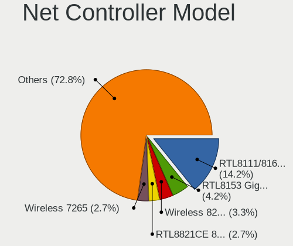

Debian - Hardware Trends (Notebooks)
------------------------------------

A project to identify most popular hardware characteristics and track their change
over time based on data collected by Linux users at https://Linux-Hardware.org.

Anyone can contribute to this report by the [hw-probe](https://github.com/linuxhw/hw-probe) tool:

    sudo -E hw-probe -all -upload

This report is for one last month. Overall report since the beginning of time: [TestDays](https://github.com/linuxhw/TestDays)

Period: Nov, 2023.

Contents
--------

* [ System ](#system)
  - [ OS                       ](#os)
  - [ OS Family                ](#os-family)
  - [ Kernel                   ](#kernel)
  - [ Kernel Family            ](#kernel-family)
  - [ Kernel Major Ver.        ](#kernel-major-ver)
  - [ Arch                     ](#arch)
  - [ DE                       ](#de)
  - [ Display Server           ](#display-server)
  - [ Display Manager          ](#display-manager)
  - [ OS Lang                  ](#os-lang)
  - [ Boot Mode                ](#boot-mode)
  - [ Filesystem               ](#filesystem)
  - [ Part. scheme             ](#part-scheme)
  - [ Dual Boot with Linux/BSD ](#dual-boot-with-linuxbsd)
  - [ Dual Boot (Win)          ](#dual-boot-win)

* [ Board ](#board)
  - [ Vendor                   ](#vendor)
  - [ Model                    ](#model)
  - [ Model Family             ](#model-family)
  - [ MFG Year                 ](#mfg-year)
  - [ Form Factor              ](#form-factor)
  - [ Secure Boot              ](#secure-boot)
  - [ Coreboot                 ](#coreboot)
  - [ RAM Size                 ](#ram-size)
  - [ RAM Used                 ](#ram-used)
  - [ Total Drives             ](#total-drives)
  - [ Has CD-ROM               ](#has-cd-rom)
  - [ Has Ethernet             ](#has-ethernet)
  - [ Has WiFi                 ](#has-wifi)
  - [ Has Bluetooth            ](#has-bluetooth)

* [ Location ](#location)
  - [ Country                  ](#country)
  - [ City                     ](#city)

* [ Drives ](#drives)
  - [ Drive Vendor             ](#drive-vendor)
  - [ Drive Model              ](#drive-model)
  - [ HDD Vendor               ](#hdd-vendor)
  - [ SSD Vendor               ](#ssd-vendor)
  - [ Drive Kind               ](#drive-kind)
  - [ Drive Connector          ](#drive-connector)
  - [ Drive Size               ](#drive-size)
  - [ Space Total              ](#space-total)
  - [ Space Used               ](#space-used)
  - [ Malfunc. Drives          ](#malfunc-drives)
  - [ Malfunc. Drive Vendor    ](#malfunc-drive-vendor)
  - [ Malfunc. HDD Vendor      ](#malfunc-hdd-vendor)
  - [ Malfunc. Drive Kind      ](#malfunc-drive-kind)
  - [ Failed Drives            ](#failed-drives)
  - [ Failed Drive Vendor      ](#failed-drive-vendor)
  - [ Drive Status             ](#drive-status)

* [ Storage controller ](#storage-controller)
  - [ Storage Vendor           ](#storage-vendor)
  - [ Storage Model            ](#storage-model)
  - [ Storage Kind             ](#storage-kind)

* [ Processor ](#processor)
  - [ CPU Vendor               ](#cpu-vendor)
  - [ CPU Model                ](#cpu-model)
  - [ CPU Model Family         ](#cpu-model-family)
  - [ CPU Cores                ](#cpu-cores)
  - [ CPU Sockets              ](#cpu-sockets)
  - [ CPU Threads              ](#cpu-threads)
  - [ CPU Op-Modes             ](#cpu-op-modes)
  - [ CPU Microcode            ](#cpu-microcode)
  - [ CPU Microarch            ](#cpu-microarch)

* [ Graphics ](#graphics)
  - [ GPU Vendor               ](#gpu-vendor)
  - [ GPU Model                ](#gpu-model)
  - [ GPU Combo                ](#gpu-combo)
  - [ GPU Driver               ](#gpu-driver)
  - [ GPU Memory               ](#gpu-memory)

* [ Monitor ](#monitor)
  - [ Monitor Vendor           ](#monitor-vendor)
  - [ Monitor Model            ](#monitor-model)
  - [ Monitor Resolution       ](#monitor-resolution)
  - [ Monitor Diagonal         ](#monitor-diagonal)
  - [ Monitor Width            ](#monitor-width)
  - [ Aspect Ratio             ](#aspect-ratio)
  - [ Monitor Area             ](#monitor-area)
  - [ Pixel Density            ](#pixel-density)
  - [ Multiple Monitors        ](#multiple-monitors)

* [ Network ](#network)
  - [ Net Controller Vendor    ](#net-controller-vendor)
  - [ Net Controller Model     ](#net-controller-model)
  - [ Wireless Vendor          ](#wireless-vendor)
  - [ Wireless Model           ](#wireless-model)
  - [ Ethernet Vendor          ](#ethernet-vendor)
  - [ Ethernet Model           ](#ethernet-model)
  - [ Net Controller Kind      ](#net-controller-kind)
  - [ Used Controller          ](#used-controller)
  - [ NICs                     ](#nics)
  - [ IPv6                     ](#ipv6)

* [ Bluetooth ](#bluetooth)
  - [ Bluetooth Vendor         ](#bluetooth-vendor)
  - [ Bluetooth Model          ](#bluetooth-model)

* [ Sound ](#sound)
  - [ Sound Vendor             ](#sound-vendor)
  - [ Sound Model              ](#sound-model)

* [ Memory ](#memory)
  - [ Memory Vendor            ](#memory-vendor)
  - [ Memory Model             ](#memory-model)
  - [ Memory Kind              ](#memory-kind)
  - [ Memory Form Factor       ](#memory-form-factor)
  - [ Memory Size              ](#memory-size)
  - [ Memory Speed             ](#memory-speed)

* [ Printers & scanners ](#printers--scanners)
  - [ Printer Vendor           ](#printer-vendor)
  - [ Printer Model            ](#printer-model)
  - [ Scanner Vendor           ](#scanner-vendor)
  - [ Scanner Model            ](#scanner-model)

* [ Camera ](#camera)
  - [ Camera Vendor            ](#camera-vendor)
  - [ Camera Model             ](#camera-model)

* [ Security ](#security)
  - [ Fingerprint Vendor       ](#fingerprint-vendor)
  - [ Fingerprint Model        ](#fingerprint-model)
  - [ Chipcard Vendor          ](#chipcard-vendor)
  - [ Chipcard Model           ](#chipcard-model)

* [ Unsupported ](#unsupported)
  - [ Unsupported Devices      ](#unsupported-devices)
  - [ Unsupported Device Types ](#unsupported-device-types)

System
------

OS
--

Installed operating systems

| Name                    | Notebooks | Percent |
|-------------------------|-----------|---------|
| Debian 12               | 166       | 76.5%   |
| Debian 11               | 26        | 11.98%  |
| Debian                  | 22        | 10.14%  |
| Debian Testing/unstable | 2         | 0.92%   |
| Debian Sid              | 1         | 0.46%   |

OS Family
---------

OS without a version

| Name   | Notebooks | Percent |
|--------|-----------|---------|
| Debian | 217       | 100%    |

Kernel
------

Version of the Linux kernel

| Version                | Notebooks | Percent |
|------------------------|-----------|---------|
| 6.1.0-13-amd64         | 133       | 61.29%  |
| 5.10.0-26-amd64        | 16        | 7.37%   |
| 6.1.0-4-amd64          | 14        | 6.45%   |
| 6.5.0-4-amd64          | 13        | 5.99%   |
| 6.5.0-3-amd64          | 5         | 2.3%    |
| 6.5.0-0.deb12.1-amd64  | 3         | 1.38%   |
| 6.4.0-0.deb12.2-amd64  | 3         | 1.38%   |
| 6.1.0-10-amd64         | 3         | 1.38%   |
| 6.6.0-0-arm64          | 2         | 0.92%   |
| 6.5.11-x64v3-xanmod1   | 2         | 0.92%   |
| 6.1.0-9-amd64          | 2         | 0.92%   |
| 5.10.10-64             | 2         | 0.92%   |
| 6.6.0-custom           | 1         | 0.46%   |
| 6.6.0-al               | 1         | 0.46%   |
| 6.5.11-x64v1-xanmod1   | 1         | 0.46%   |
| 6.5.10-zabbly+         | 1         | 0.46%   |
| 6.5.0-4mx-ahs-amd64    | 1         | 0.46%   |
| 6.5.0-1-amd64          | 1         | 0.46%   |
| 6.4.0-1mx-ahs-amd64    | 1         | 0.46%   |
| 6.3.0-2mx-ahs-amd64    | 1         | 0.46%   |
| 6.2.16-19-pve          | 1         | 0.46%   |
| 6.1.0-13-686           | 1         | 0.46%   |
| 6.1.0-0.deb11.11-amd64 | 1         | 0.46%   |
| 6.0.0-6mx-amd64        | 1         | 0.46%   |
| 6.0.0-3-amd64          | 1         | 0.46%   |
| 6.0.0-0.deb11.6-amd64  | 1         | 0.46%   |
| 5.10.0-26-686-pae      | 1         | 0.46%   |
| 5.10.0-25-amd64        | 1         | 0.46%   |
| 5.10.0-21-amd64        | 1         | 0.46%   |
| 5.10.0-20-amd64        | 1         | 0.46%   |
| 5.10.0-17-amd64        | 1         | 0.46%   |

Kernel Family
-------------

Linux kernel without a distro release

| Version | Notebooks | Percent |
|---------|-----------|---------|
| 6.1.0   | 154       | 70.97%  |
| 6.5.0   | 23        | 10.6%   |
| 5.10.0  | 21        | 9.68%   |
| 6.6.0   | 4         | 1.84%   |
| 6.4.0   | 4         | 1.84%   |
| 6.5.11  | 3         | 1.38%   |
| 6.0.0   | 3         | 1.38%   |
| 5.10.10 | 2         | 0.92%   |
| 6.5.10  | 1         | 0.46%   |
| 6.3.0   | 1         | 0.46%   |
| 6.2.16  | 1         | 0.46%   |

Kernel Major Ver.
-----------------

Linux kernel major version

| Version | Notebooks | Percent |
|---------|-----------|---------|
| 6.1     | 154       | 70.97%  |
| 6.5     | 27        | 12.44%  |
| 5.10    | 23        | 10.6%   |
| 6.6     | 4         | 1.84%   |
| 6.4     | 4         | 1.84%   |
| 6.0     | 3         | 1.38%   |
| 6.3     | 1         | 0.46%   |
| 6.2     | 1         | 0.46%   |

Arch
----

OS architecture (x86_64, i586, etc.)

| Name    | Notebooks | Percent |
|---------|-----------|---------|
| x86_64  | 213       | 98.16%  |
| i686    | 2         | 0.92%   |
| aarch64 | 2         | 0.92%   |

DE
--

Desktop Environment

| Name            | Notebooks | Percent |
|-----------------|-----------|---------|
| GNOME           | 74        | 34.1%   |
| KDE5            | 49        | 22.58%  |
| XFCE            | 30        | 13.82%  |
| Unknown         | 24        | 11.06%  |
| X-Cinnamon      | 14        | 6.45%   |
| MATE            | 10        | 4.61%   |
| LXDE            | 4         | 1.84%   |
| i3              | 3         | 1.38%   |
| Cinnamon        | 3         | 1.38%   |
| Unity           | 1         | 0.46%   |
| TOS:GNOME       | 1         | 0.46%   |
| qtile           | 1         | 0.46%   |
| LXQt            | 1         | 0.46%   |
| GNOME Flashback | 1         | 0.46%   |
| Budgie          | 1         | 0.46%   |

Display Server
--------------

X11 or Wayland

| Name    | Notebooks | Percent |
|---------|-----------|---------|
| X11     | 112       | 51.61%  |
| Wayland | 82        | 37.79%  |
| Unknown | 19        | 8.76%   |
| Tty     | 4         | 1.84%   |

Display Manager
---------------

SDDM, LightDM, etc.

| Name    | Notebooks | Percent |
|---------|-----------|---------|
| Unknown | 74        | 34.1%   |
| LightDM | 49        | 22.58%  |
| GDM3    | 49        | 22.58%  |
| SDDM    | 36        | 16.59%  |
| GDM     | 5         | 2.3%    |
| NODM    | 2         | 0.92%   |
| XDM     | 1         | 0.46%   |
| SLiM    | 1         | 0.46%   |

OS Lang
-------

Language

| Lang    | Notebooks | Percent |
|---------|-----------|---------|
| en_US   | 89        | 41.01%  |
| ru_RU   | 22        | 10.14%  |
| de_DE   | 20        | 9.22%   |
| en_GB   | 17        | 7.83%   |
| it_IT   | 13        | 5.99%   |
| pt_BR   | 8         | 3.69%   |
| es_ES   | 6         | 2.76%   |
| en_CA   | 5         | 2.3%    |
| pl_PL   | 4         | 1.84%   |
| fr_FR   | 4         | 1.84%   |
| en_IN   | 3         | 1.38%   |
| en_AU   | 3         | 1.38%   |
| cs_CZ   | 3         | 1.38%   |
| C       | 3         | 1.38%   |
| Unknown | 3         | 1.38%   |
| zh_CN   | 2         | 0.92%   |
| tr_TR   | 1         | 0.46%   |
| sv_SE   | 1         | 0.46%   |
| sr_RS   | 1         | 0.46%   |
| pt_PT   | 1         | 0.46%   |
| hu_HU   | 1         | 0.46%   |
| fi_FI   | 1         | 0.46%   |
| es_MX   | 1         | 0.46%   |
| es_AR   | 1         | 0.46%   |
| de_CH   | 1         | 0.46%   |
| da_DK   | 1         | 0.46%   |
| ca_ES   | 1         | 0.46%   |
| bg_BG   | 1         | 0.46%   |

Boot Mode
---------

EFI or BIOS

| Mode | Notebooks | Percent |
|------|-----------|---------|
| EFI  | 128       | 58.99%  |
| BIOS | 89        | 41.01%  |

Filesystem
----------

Type of filesystem

| Type    | Notebooks | Percent |
|---------|-----------|---------|
| Ext4    | 174       | 80.18%  |
| Overlay | 26        | 11.98%  |
| Btrfs   | 7         | 3.23%   |
| Tmpfs   | 5         | 2.3%    |
| Xfs     | 3         | 1.38%   |
| Rootfs  | 2         | 0.92%   |

Part. scheme
------------

Scheme of partitioning

| Type    | Notebooks | Percent |
|---------|-----------|---------|
| GPT     | 131       | 60.37%  |
| Unknown | 50        | 23.04%  |
| MBR     | 36        | 16.59%  |

Dual Boot with Linux/BSD
------------------------

Hosting more than one Linux/BSD

| Dual boot | Notebooks | Percent |
|-----------|-----------|---------|
| No        | 191       | 88.02%  |
| Yes       | 26        | 11.98%  |

Dual Boot (Win)
---------------

Hosting Linux and Windows

| Dual boot | Notebooks | Percent |
|-----------|-----------|---------|
| No        | 157       | 72.35%  |
| Yes       | 60        | 27.65%  |

Board
-----

Vendor
------

Motherboard manufacturer

| Name                | Notebooks | Percent |
|---------------------|-----------|---------|
| Lenovo              | 60        | 27.65%  |
| Hewlett-Packard     | 41        | 18.89%  |
| Dell                | 23        | 10.6%   |
| ASUSTek Computer    | 19        | 8.76%   |
| Acer                | 18        | 8.29%   |
| Google              | 9         | 4.15%   |
| Aquarius            | 7         | 3.23%   |
| Apple               | 7         | 3.23%   |
| Toshiba             | 5         | 2.3%    |
| Samsung Electronics | 5         | 2.3%    |
| MSI                 | 5         | 2.3%    |
| HUAWEI              | 4         | 1.84%   |
| Framework           | 3         | 1.38%   |
| Packard Bell        | 2         | 0.92%   |
| Unknown             | 2         | 0.92%   |
| TUXEDO              | 1         | 0.46%   |
| Timi                | 1         | 0.46%   |
| Phoenix/SiS         | 1         | 0.46%   |
| MACHENIKE           | 1         | 0.46%   |
| Irbis               | 1         | 0.46%   |
| IBM                 | 1         | 0.46%   |
| Daten Tecnologia    | 1         | 0.46%   |

Model
-----

Motherboard model

| Name                                   | Notebooks | Percent |
|----------------------------------------|-----------|---------|
| Aquarius NS585                         | 7         | 3.23%   |
| Unknown                                | 3         | 1.38%   |
| Lenovo ThinkPad 13 2nd Gen 20J10046US  | 2         | 0.92%   |
| HUAWEI BOM-WXX9                        | 2         | 0.92%   |
| HP Pavilion Notebook                   | 2         | 0.92%   |
| HP Pavilion dv6                        | 2         | 0.92%   |
| HP Laptop 15-da0xxx                    | 2         | 0.92%   |
| Framework Laptop (12th Gen Intel Core) | 2         | 0.92%   |
| Dell Latitude 3320                     | 2         | 0.92%   |
| ASUS Zenbook UX3402ZA_UX3402ZA         | 2         | 0.92%   |
| Toshiba TECRA R950                     | 1         | 0.46%   |
| Toshiba Satellite L455D                | 1         | 0.46%   |
| Toshiba Satellite L40                  | 1         | 0.46%   |
| Toshiba Satellite L300                 | 1         | 0.46%   |
| Toshiba QOSMIO X70-A                   | 1         | 0.46%   |
| Timi Mi NoteBook Pro                   | 1         | 0.46%   |
| Samsung RC530/RC730                    | 1         | 0.46%   |
| Samsung N102SP/N100SP/N101SP           | 1         | 0.46%   |
| Samsung 767XCL                         | 1         | 0.46%   |
| Samsung 530U3C/530U4C/532U3C           | 1         | 0.46%   |
| Samsung 270E5J/2570EJ                  | 1         | 0.46%   |
| Phoenix/SiS M730SR                     | 1         | 0.46%   |
| Packard Bell EasyNote TK87             | 1         | 0.46%   |
| Packard Bell EasyNote TK81             | 1         | 0.46%   |
| MSI Sword 15 A12UGS                    | 1         | 0.46%   |
| MSI Prestige 16Studio A13VF            | 1         | 0.46%   |
| MSI N6105                              | 1         | 0.46%   |
| MSI Modern 15 A10M                     | 1         | 0.46%   |
| MSI GS65 Stealth 9SD                   | 1         | 0.46%   |
| MACHENIKE L16P                         | 1         | 0.46%   |
| Lenovo Yoga Slim 7 14ARE05 82A2        | 1         | 0.46%   |
| Lenovo Yoga Pro 7 14ARP8 83AU          | 1         | 0.46%   |
| Lenovo Yoga 2 Pro 20266                | 1         | 0.46%   |
| Lenovo XiaoXinPro 16 IRH8 83AQ         | 1         | 0.46%   |
| Lenovo V14-IIL 82C4                    | 1         | 0.46%   |
| Lenovo ThinkPad X280 20KES5840A        | 1         | 0.46%   |
| Lenovo ThinkPad X270 W10DG 20K5S3HG00  | 1         | 0.46%   |
| Lenovo ThinkPad X230 23257AG           | 1         | 0.46%   |
| Lenovo ThinkPad X200 7458PN6           | 1         | 0.46%   |
| Lenovo ThinkPad X121e 30515YG          | 1         | 0.46%   |

Model Family
------------

Motherboard model prefix

| Name                  | Notebooks | Percent |
|-----------------------|-----------|---------|
| Lenovo ThinkPad       | 36        | 16.59%  |
| Dell Latitude         | 13        | 5.99%   |
| Acer Aspire           | 12        | 5.53%   |
| HP Pavilion           | 9         | 4.15%   |
| Lenovo IdeaPad        | 8         | 3.69%   |
| ASUS VivoBook         | 8         | 3.69%   |
| HP Laptop             | 7         | 3.23%   |
| HP EliteBook          | 7         | 3.23%   |
| Aquarius NS585        | 7         | 3.23%   |
| HP ProBook            | 4         | 1.84%   |
| Toshiba Satellite     | 3         | 1.38%   |
| Lenovo Yoga           | 3         | 1.38%   |
| Lenovo ThinkBook      | 3         | 1.38%   |
| HP OMEN               | 3         | 1.38%   |
| Framework Laptop      | 3         | 1.38%   |
| Dell Precision        | 3         | 1.38%   |
| Dell Inspiron         | 3         | 1.38%   |
| Unknown               | 3         | 1.38%   |
| Packard Bell EasyNote | 2         | 0.92%   |
| HUAWEI BOM-WXX9       | 2         | 0.92%   |
| HP ZBook              | 2         | 0.92%   |
| HP Stream             | 2         | 0.92%   |
| Dell XPS              | 2         | 0.92%   |
| Dell Vostro           | 2         | 0.92%   |
| ASUS Zenbook          | 2         | 0.92%   |
| ASUS ROG              | 2         | 0.92%   |
| Apple MacBook5        | 2         | 0.92%   |
| Acer Extensa          | 2         | 0.92%   |
| Toshiba TECRA         | 1         | 0.46%   |
| Toshiba QOSMIO        | 1         | 0.46%   |
| Timi Mi               | 1         | 0.46%   |
| Samsung RC530         | 1         | 0.46%   |
| Samsung N102SP        | 1         | 0.46%   |
| Samsung 767XCL        | 1         | 0.46%   |
| Samsung 530U3C        | 1         | 0.46%   |
| Samsung 270E5J        | 1         | 0.46%   |
| Phoenix/SiS M730SR    | 1         | 0.46%   |
| MSI Sword             | 1         | 0.46%   |
| MSI Prestige          | 1         | 0.46%   |
| MSI N6105             | 1         | 0.46%   |

MFG Year
--------

Motherboard manufacture year

| Year    | Notebooks | Percent |
|---------|-----------|---------|
| 2019    | 29        | 13.36%  |
| 2021    | 23        | 10.6%   |
| 2020    | 21        | 9.68%   |
| 2022    | 20        | 9.22%   |
| 2023    | 19        | 8.76%   |
| 2012    | 16        | 7.37%   |
| 2013    | 13        | 5.99%   |
| 2011    | 12        | 5.53%   |
| 2017    | 11        | 5.07%   |
| 2008    | 10        | 4.61%   |
| 2018    | 8         | 3.69%   |
| 2016    | 8         | 3.69%   |
| 2009    | 8         | 3.69%   |
| 2015    | 6         | 2.76%   |
| 2010    | 4         | 1.84%   |
| 2014    | 3         | 1.38%   |
| 2007    | 3         | 1.38%   |
| Unknown | 2         | 0.92%   |
| 2004    | 1         | 0.46%   |

Form Factor
-----------

Physical design of the computer

| Name     | Notebooks | Percent |
|----------|-----------|---------|
| Notebook | 217       | 100%    |

Secure Boot
-----------

Enabled or disabled

| State    | Notebooks | Percent |
|----------|-----------|---------|
| Disabled | 197       | 90.78%  |
| Enabled  | 20        | 9.22%   |

Coreboot
--------

Have coreboot on board

| Used | Notebooks | Percent |
|------|-----------|---------|
| No   | 209       | 96.31%  |
| Yes  | 8         | 3.69%   |

RAM Size
--------

Total RAM memory

| Size in GB  | Notebooks | Percent |
|-------------|-----------|---------|
| 4.01-8.0    | 59        | 27.19%  |
| 16.01-24.0  | 43        | 19.82%  |
| 8.01-16.0   | 40        | 18.43%  |
| 3.01-4.0    | 28        | 12.9%   |
| 32.01-64.0  | 21        | 9.68%   |
| 1.01-2.0    | 12        | 5.53%   |
| 2.01-3.0    | 7         | 3.23%   |
| 24.01-32.0  | 4         | 1.84%   |
| 64.01-256.0 | 3         | 1.38%   |

RAM Used
--------

Used RAM memory

| Used GB    | Notebooks | Percent |
|------------|-----------|---------|
| 4.01-8.0   | 49        | 22.58%  |
| 2.01-3.0   | 48        | 22.12%  |
| 1.01-2.0   | 40        | 18.43%  |
| 3.01-4.0   | 31        | 14.29%  |
| 0.51-1.0   | 28        | 12.9%   |
| 8.01-16.0  | 13        | 5.99%   |
| 0.01-0.5   | 5         | 2.3%    |
| 16.01-24.0 | 2         | 0.92%   |
| 24.01-32.0 | 1         | 0.46%   |

Total Drives
------------

Number of drives on board

| Drives | Notebooks | Percent |
|--------|-----------|---------|
| 1      | 159       | 73.27%  |
| 2      | 47        | 21.66%  |
| 3      | 8         | 3.69%   |
| 0      | 2         | 0.92%   |
| 4      | 1         | 0.46%   |

Has CD-ROM
----------

Has CD-ROM on board

| Presented | Notebooks | Percent |
|-----------|-----------|---------|
| No        | 153       | 70.51%  |
| Yes       | 64        | 29.49%  |

Has Ethernet
------------

Has Ethernet on board

| Presented | Notebooks | Percent |
|-----------|-----------|---------|
| Yes       | 173       | 79.72%  |
| No        | 44        | 20.28%  |

Has WiFi
--------

Has WiFi module

| Presented | Notebooks | Percent |
|-----------|-----------|---------|
| Yes       | 211       | 97.24%  |
| No        | 6         | 2.76%   |

Has Bluetooth
-------------

Has Bluetooth module

| Presented | Notebooks | Percent |
|-----------|-----------|---------|
| Yes       | 176       | 81.11%  |
| No        | 41        | 18.89%  |

Location
--------

Country
-------

Geographic location (country)

| Country     | Notebooks | Percent |
|-------------|-----------|---------|
| USA         | 36        | 16.59%  |
| Germany     | 25        | 11.52%  |
| Russia      | 24        | 11.06%  |
| Italy       | 21        | 9.68%   |
| Brazil      | 11        | 5.07%   |
| Spain       | 9         | 4.15%   |
| Canada      | 9         | 4.15%   |
| Poland      | 8         | 3.69%   |
| France      | 7         | 3.23%   |
| China       | 7         | 3.23%   |
| UK          | 6         | 2.76%   |
| Netherlands | 5         | 2.3%    |
| Turkey      | 4         | 1.84%   |
| Mexico      | 4         | 1.84%   |
| Czechia     | 4         | 1.84%   |
| India       | 3         | 1.38%   |
| Australia   | 3         | 1.38%   |
| Switzerland | 2         | 0.92%   |
| Sweden      | 2         | 0.92%   |
| Portugal    | 2         | 0.92%   |
| Norway      | 2         | 0.92%   |
| Malaysia    | 2         | 0.92%   |
| Finland     | 2         | 0.92%   |
| Ukraine     | 1         | 0.46%   |
| UAE         | 1         | 0.46%   |
| Thailand    | 1         | 0.46%   |
| Tanzania    | 1         | 0.46%   |
| South Korea | 1         | 0.46%   |
| Serbia      | 1         | 0.46%   |
| Paraguay    | 1         | 0.46%   |
| Kazakhstan  | 1         | 0.46%   |
| Hungary     | 1         | 0.46%   |
| Greece      | 1         | 0.46%   |
| Estonia     | 1         | 0.46%   |
| Ecuador     | 1         | 0.46%   |
| Denmark     | 1         | 0.46%   |
| Colombia    | 1         | 0.46%   |
| Chile       | 1         | 0.46%   |
| Bulgaria    | 1         | 0.46%   |
| Belgium     | 1         | 0.46%   |

City
----

Geographic location (city)

| City                | Notebooks | Percent |
|---------------------|-----------|---------|
| Voronezh            | 14        | 6.45%   |
| Milan               | 5         | 2.3%    |
| Bangor              | 5         | 2.3%    |
| Shanghai            | 4         | 1.84%   |
| Moscow              | 3         | 1.38%   |
| Leipzig             | 3         | 1.38%   |
| Hamburg             | 3         | 1.38%   |
| Tucson              | 2         | 0.92%   |
| Stuttgart           | 2         | 0.92%   |
| St Petersburg       | 2         | 0.92%   |
| Québec             | 2         | 0.92%   |
| Prague              | 2         | 0.92%   |
| Porto Alegre        | 2         | 0.92%   |
| Palermo             | 2         | 0.92%   |
| Oslo                | 2         | 0.92%   |
| Krakow              | 2         | 0.92%   |
| Gothenburg          | 2         | 0.92%   |
| Frankfurt am Main   | 2         | 0.92%   |
| Elblag              | 2         | 0.92%   |
| Dresden             | 2         | 0.92%   |
| Camarillo           | 2         | 0.92%   |
| Calgary             | 2         | 0.92%   |
| Brasília           | 2         | 0.92%   |
| Ankara              | 2         | 0.92%   |
| Amsterdam           | 2         | 0.92%   |
| Zoersel             | 1         | 0.46%   |
| Wuhan               | 1         | 0.46%   |
| Wroclaw             | 1         | 0.46%   |
| Wendeburg           | 1         | 0.46%   |
| Warsaw              | 1         | 0.46%   |
| Vila Franca de Xira | 1         | 0.46%   |
| Vigasio             | 1         | 0.46%   |
| Victoria            | 1         | 0.46%   |
| Vashon              | 1         | 0.46%   |
| Turkheim            | 1         | 0.46%   |
| Tres Cantos         | 1         | 0.46%   |
| Toronto             | 1         | 0.46%   |
| Tijuana             | 1         | 0.46%   |
| Teresina            | 1         | 0.46%   |
| Tallinn             | 1         | 0.46%   |

Drives
------

Drive Vendor
------------

Hard drive vendors

| Vendor                       | Notebooks | Drives | Percent |
|------------------------------|-----------|--------|---------|
| Samsung Electronics          | 51        | 59     | 18.89%  |
| WDC                          | 22        | 22     | 8.15%   |
| Unknown                      | 18        | 21     | 6.67%   |
| SanDisk                      | 18        | 19     | 6.67%   |
| Seagate                      | 17        | 17     | 6.3%    |
| SK hynix                     | 14        | 14     | 5.19%   |
| Kingston                     | 14        | 14     | 5.19%   |
| Toshiba                      | 13        | 13     | 4.81%   |
| Micron Technology            | 11        | 11     | 4.07%   |
| A-DATA Technology            | 10        | 10     | 3.7%    |
| Intel                        | 8         | 8      | 2.96%   |
| Crucial                      | 7         | 7      | 2.59%   |
| Unknown                      | 4         | 4      | 1.48%   |
| Silicon Motion               | 3         | 3      | 1.11%   |
| KIOXIA-EXCERIA               | 3         | 3      | 1.11%   |
| KIOXIA                       | 3         | 4      | 1.11%   |
| HGST                         | 3         | 4      | 1.11%   |
| Zheino                       | 2         | 2      | 0.74%   |
| Phison Electronics           | 2         | 2      | 0.74%   |
| Phison                       | 2         | 2      | 0.74%   |
| Netac                        | 2         | 2      | 0.74%   |
| Micron/Crucial Technology    | 2         | 2      | 0.74%   |
| LITEON                       | 2         | 2      | 0.74%   |
| Kingston Technology Company  | 2         | 2      | 0.74%   |
| GOODRAM                      | 2         | 2      | 0.74%   |
| Fujitsu                      | 2         | 2      | 0.74%   |
| China                        | 2         | 2      | 0.74%   |
| Apple                        | 2         | 2      | 0.74%   |
| Apacer                       | 2         | 2      | 0.74%   |
| YMTC                         | 1         | 1      | 0.37%   |
| Union Memory                 | 1         | 1      | 0.37%   |
| UMIS                         | 1         | 1      | 0.37%   |
| Transcend                    | 1         | 1      | 0.37%   |
| Team                         | 1         | 1      | 0.37%   |
| SSSTC                        | 1         | 1      | 0.37%   |
| SPCC                         | 1         | 1      | 0.37%   |
| Shenzhen Longsys Electronics | 1         | 1      | 0.37%   |
| Realtek Semiconductor        | 1         | 1      | 0.37%   |
| Realtek                      | 1         | 1      | 0.37%   |
| PNY                          | 1         | 1      | 0.37%   |

Drive Model
-----------

Hard drive models

| Model                                               | Notebooks | Percent |
|-----------------------------------------------------|-----------|---------|
| A-DATA SU800 512GB SSD                              | 7         | 2.48%   |
| Samsung NVMe SSD Controller SM981/PM981/PM983 250GB | 4         | 1.42%   |
| Unknown                                             | 4         | 1.42%   |
| Sandisk WD Black SN750 / PC SN730 NVMe SSD 500GB    | 3         | 1.06%   |
| WDC WD10SPZX-21Z10T0 1TB                            | 2         | 0.71%   |
| WDC PC SN530 NVMe 256GB                             | 2         | 0.71%   |
| Unknown SD32G  32GB                                 | 2         | 0.71%   |
| Unknown MMC Card  64GB                              | 2         | 0.71%   |
| Toshiba MQ04ABF100 1TB                              | 2         | 0.71%   |
| Toshiba MQ01ABF050 500GB                            | 2         | 0.71%   |
| Seagate ST1000LM024 HN-M101MBB 1TB                  | 2         | 0.71%   |
| SanDisk SSD PLUS 240GB                              | 2         | 0.71%   |
| SanDisk NVMe SSD Drive 512GB                        | 2         | 0.71%   |
| Samsung SSD 980 1TB                                 | 2         | 0.71%   |
| Samsung SSD 970 EVO Plus 1TB                        | 2         | 0.71%   |
| Samsung SSD 870 EVO 500GB                           | 2         | 0.71%   |
| Samsung SSD 870 EVO 250GB                           | 2         | 0.71%   |
| Samsung SSD 860 EVO M.2 1TB                         | 2         | 0.71%   |
| Samsung MZNTY128HDHP-000L1 128GB SSD                | 2         | 0.71%   |
| Samsung MZALQ512HBLU-00BL2 512GB                    | 2         | 0.71%   |
| Micron/Crucial P2 NVMe PCIe SSD 1TB                 | 2         | 0.71%   |
| Micron MTFDKBA1T0TFK 1TB                            | 2         | 0.71%   |
| KIOXIA-EXCERIA SATA SSD 480GB                       | 2         | 0.71%   |
| KIOXIA KBG50ZNS512G NVMe 512GB                      | 2         | 0.71%   |
| Kingston SUV400S37240G 240GB SSD                    | 2         | 0.71%   |
| Kingston SA400S37240G 240GB SSD                     | 2         | 0.71%   |
| Intel SSDPEKNU512GZ 512GB                           | 2         | 0.71%   |
| Intel SSDPEKKF010T8L 1TB                            | 2         | 0.71%   |
| GOODRAM SSDPR-CL100-120-G2 120GB                    | 2         | 0.71%   |
| Crucial CT120BX500SSD1 120GB                        | 2         | 0.71%   |
| Zheino CHN-mSATAM3-128 128GB SSD                    | 1         | 0.35%   |
| Zheino CHN 25SATAA3 360 360GB                       | 1         | 0.35%   |
| YMTC PC005 512GB                                    | 1         | 0.35%   |
| WDC WDS200T2B0B-00YS70 2TB SSD                      | 1         | 0.35%   |
| WDC WDS100T2B0C-00PXH0 1TB                          | 1         | 0.35%   |
| WDC WD7500BPVT-22HXZT3 752GB                        | 1         | 0.35%   |
| WDC WD7500BPKX-00HPJT0 752GB                        | 1         | 0.35%   |
| WDC WD5000LPCX-21VHAT0 500GB                        | 1         | 0.35%   |
| WDC WD5000BPKX-75HPJT0 500GB                        | 1         | 0.35%   |
| WDC WD3200BEVT-11ZCT0 320GB                         | 1         | 0.35%   |

HDD Vendor
----------

Hard disk drive vendors

| Vendor  | Notebooks | Drives | Percent |
|---------|-----------|--------|---------|
| Seagate | 16        | 16     | 37.21%  |
| WDC     | 12        | 12     | 27.91%  |
| Toshiba | 9         | 9      | 20.93%  |
| HGST    | 3         | 4      | 6.98%   |
| Fujitsu | 2         | 2      | 4.65%   |
| Hitachi | 1         | 1      | 2.33%   |

SSD Vendor
----------

Solid state drive vendors

| Vendor              | Notebooks | Drives | Percent |
|---------------------|-----------|--------|---------|
| Samsung Electronics | 21        | 23     | 24.14%  |
| Kingston            | 9         | 9      | 10.34%  |
| A-DATA Technology   | 9         | 9      | 10.34%  |
| SanDisk             | 8         | 9      | 9.2%    |
| Micron Technology   | 3         | 3      | 3.45%   |
| KIOXIA-EXCERIA      | 3         | 3      | 3.45%   |
| Crucial             | 3         | 3      | 3.45%   |
| Zheino              | 2         | 2      | 2.3%    |
| SK hynix            | 2         | 2      | 2.3%    |
| Netac               | 2         | 2      | 2.3%    |
| LITEON              | 2         | 2      | 2.3%    |
| GOODRAM             | 2         | 2      | 2.3%    |
| China               | 2         | 2      | 2.3%    |
| WDC                 | 1         | 1      | 1.15%   |
| Union Memory        | 1         | 1      | 1.15%   |
| Transcend           | 1         | 1      | 1.15%   |
| Toshiba             | 1         | 1      | 1.15%   |
| SPCC                | 1         | 1      | 1.15%   |
| Plextor             | 1         | 1      | 1.15%   |
| Pioneer             | 1         | 1      | 1.15%   |
| Patriot             | 1         | 1      | 1.15%   |
| Pado                | 1         | 1      | 1.15%   |
| ORIGIN              | 1         | 1      | 1.15%   |
| MASTERO             | 1         | 1      | 1.15%   |
| LITEONIT            | 1         | 1      | 1.15%   |
| Jumper              | 1         | 1      | 1.15%   |
| JMicron Technology  | 1         | 1      | 1.15%   |
| Intenso             | 1         | 1      | 1.15%   |
| Emtec               | 1         | 1      | 1.15%   |
| ASMT                | 1         | 1      | 1.15%   |
| Apacer              | 1         | 1      | 1.15%   |
| Unknown             | 1         | 1      | 1.15%   |

Drive Kind
----------

HDD or SSD

| Kind    | Notebooks | Drives | Percent |
|---------|-----------|--------|---------|
| NVMe    | 108       | 123    | 42.35%  |
| SSD     | 82        | 90     | 32.16%  |
| HDD     | 42        | 44     | 16.47%  |
| MMC     | 20        | 23     | 7.84%   |
| Unknown | 3         | 4      | 1.18%   |

Drive Connector
---------------

SATA, SAS, NVMe, etc.

| Type | Notebooks | Drives | Percent |
|------|-----------|--------|---------|
| SATA | 113       | 127    | 45.2%   |
| NVMe | 108       | 122    | 43.2%   |
| MMC  | 20        | 23     | 8%      |
| SAS  | 9         | 12     | 3.6%    |

Drive Size
----------

Size of hard drive

| Size in TB | Notebooks | Drives | Percent |
|------------|-----------|--------|---------|
| 0.01-0.5   | 80        | 86     | 63.49%  |
| 0.51-1.0   | 39        | 41     | 30.95%  |
| 1.01-2.0   | 5         | 5      | 3.97%   |
| 3.01-4.0   | 1         | 1      | 0.79%   |
| 4.01-10.0  | 1         | 1      | 0.79%   |

Space Total
-----------

Amount of disk space available on the file system

| Size in GB     | Notebooks | Percent |
|----------------|-----------|---------|
| 101-250        | 64        | 29.49%  |
| 251-500        | 52        | 23.96%  |
| 501-1000       | 38        | 17.51%  |
| Unknown        | 16        | 7.37%   |
| 1001-2000      | 15        | 6.91%   |
| 51-100         | 12        | 5.53%   |
| 1-20           | 9         | 4.15%   |
| 21-50          | 8         | 3.69%   |
| More than 3000 | 3         | 1.38%   |

Space Used
----------

Amount of used disk space

| Used GB        | Notebooks | Percent |
|----------------|-----------|---------|
| 1-20           | 73        | 33.64%  |
| 21-50          | 35        | 16.13%  |
| 51-100         | 28        | 12.9%   |
| 101-250        | 25        | 11.52%  |
| 251-500        | 18        | 8.29%   |
| 501-1000       | 16        | 7.37%   |
| Unknown        | 16        | 7.37%   |
| 1001-2000      | 5         | 2.3%    |
| More than 3000 | 1         | 0.46%   |

Malfunc. Drives
---------------

Drive models with a malfunction

| Model                                            | Notebooks | Drives | Percent |
|--------------------------------------------------|-----------|--------|---------|
| Toshiba MK6475GSX 640GB                          | 1         | 1      | 11.11%  |
| SK hynix HFS256G39TND-N210A 256GB SSD            | 1         | 1      | 11.11%  |
| SanDisk SDSSDX240GG25 240GB                      | 1         | 1      | 11.11%  |
| Samsung Electronics SSD 970 EVO 500GB            | 1         | 1      | 11.11%  |
| Samsung Electronics SSD 840 EVO 250GB mSATA      | 1         | 1      | 11.11%  |
| Samsung Electronics MZNLH128HBHQ-000H1 128GB SSD | 1         | 1      | 11.11%  |
| LITEON CV5-8Q256-HP 256GB SSD                    | 1         | 1      | 11.11%  |
| HGST HTS725050A7E630 500GB                       | 1         | 1      | 11.11%  |
| Fujitsu MHW2160BJ G2 160GB                       | 1         | 1      | 11.11%  |

Malfunc. Drive Vendor
---------------------

Vendors of faulty drives

| Vendor              | Notebooks | Drives | Percent |
|---------------------|-----------|--------|---------|
| Samsung Electronics | 3         | 3      | 33.33%  |
| Toshiba             | 1         | 1      | 11.11%  |
| SK hynix            | 1         | 1      | 11.11%  |
| SanDisk             | 1         | 1      | 11.11%  |
| LITEON              | 1         | 1      | 11.11%  |
| HGST                | 1         | 1      | 11.11%  |
| Fujitsu             | 1         | 1      | 11.11%  |

Malfunc. HDD Vendor
-------------------

Vendors of faulty HDD drives

| Vendor  | Notebooks | Drives | Percent |
|---------|-----------|--------|---------|
| Toshiba | 1         | 1      | 33.33%  |
| HGST    | 1         | 1      | 33.33%  |
| Fujitsu | 1         | 1      | 33.33%  |

Malfunc. Drive Kind
-------------------

Kinds of faulty drives

| Kind | Notebooks | Drives | Percent |
|------|-----------|--------|---------|
| SSD  | 5         | 5      | 55.56%  |
| HDD  | 3         | 3      | 33.33%  |
| NVMe | 1         | 1      | 11.11%  |

Failed Drives
-------------

Failed drive models

Zero info for selected period =(

Failed Drive Vendor
-------------------

Failed drive vendors

Zero info for selected period =(

Drive Status
------------

Number of failed and malfunc. drives

| Status   | Notebooks | Drives | Percent |
|----------|-----------|--------|---------|
| Works    | 143       | 170    | 61.11%  |
| Detected | 82        | 105    | 35.04%  |
| Malfunc  | 9         | 9      | 3.85%   |

Storage controller
------------------

Storage Vendor
--------------

Storage controller vendors

| Vendor                                  | Notebooks | Percent |
|-----------------------------------------|-----------|---------|
| Intel                                   | 122       | 46.74%  |
| Samsung Electronics                     | 32        | 12.26%  |
| AMD                                     | 25        | 9.58%   |
| Sandisk                                 | 18        | 6.9%    |
| SK hynix                                | 12        | 4.6%    |
| Micron Technology                       | 8         | 3.07%   |
| Phison Electronics                      | 7         | 2.68%   |
| Kingston Technology Company             | 7         | 2.68%   |
| Micron/Crucial Technology               | 5         | 1.92%   |
| Toshiba America Info Systems            | 4         | 1.53%   |
| Silicon Motion                          | 4         | 1.53%   |
| Nvidia                                  | 3         | 1.15%   |
| KIOXIA                                  | 2         | 0.77%   |
| Apple                                   | 2         | 0.77%   |
| Yangtze Memory Technologies             | 1         | 0.38%   |
| Solid State Storage Technology          | 1         | 0.38%   |
| Silicon Integrated Systems [SiS]        | 1         | 0.38%   |
| Shenzhen Unionmemory Information System | 1         | 0.38%   |
| Shenzhen Longsys Electronics            | 1         | 0.38%   |
| Seagate Technology                      | 1         | 0.38%   |
| Realtek Semiconductor                   | 1         | 0.38%   |
| MAXIO Technology (Hangzhou)             | 1         | 0.38%   |
| ASMedia Technology                      | 1         | 0.38%   |
| ADATA Technology                        | 1         | 0.38%   |

Storage Model
-------------

Storage controller models

| Model                                                                          | Notebooks | Percent |
|--------------------------------------------------------------------------------|-----------|---------|
| AMD FCH SATA Controller [AHCI mode]                                            | 19        | 6.99%   |
| Intel Sunrise Point-LP SATA Controller [AHCI mode]                             | 16        | 5.88%   |
| Intel 7 Series Chipset Family 6-port SATA Controller [AHCI mode]               | 16        | 5.88%   |
| Samsung NVMe SSD Controller SM981/PM981/PM983                                  | 14        | 5.15%   |
| Samsung NVMe SSD Controller 980 (DRAM-less)                                    | 10        | 3.68%   |
| Intel 82801 Mobile SATA Controller [RAID mode]                                 | 10        | 3.68%   |
| Intel 6 Series/C200 Series Chipset Family 6 port Mobile SATA AHCI Controller   | 8         | 2.94%   |
| Intel Volume Management Device NVMe RAID Controller                            | 7         | 2.57%   |
| Intel Cannon Lake PCH SATA AHCI Controller                                     | 7         | 2.57%   |
| Intel 82801IBM/IEM (ICH9M/ICH9M-E) 4 port SATA Controller [AHCI mode]          | 7         | 2.57%   |
| SK hynix Gold P31/BC711/PC711 NVMe Solid State Drive                           | 6         | 2.21%   |
| Intel SSD 670p Series [Keystone Harbor]                                        | 6         | 2.21%   |
| AMD SB7x0/SB8x0/SB9x0 SATA Controller [AHCI mode]                              | 6         | 2.21%   |
| SanDisk Extreme Pro / WD Black SN750 / PC SN730 / Red SN700 NVMe SSD           | 5         | 1.84%   |
| Samsung NVMe SSD Controller PM9A1/PM9A3/980PRO                                 | 5         | 1.84%   |
| Phison PS5013-E13 PCIe3 NVMe Controller (DRAM-less)                            | 4         | 1.47%   |
| Micron/Crucial P2 [Nick P2] / P3 / P3 Plus NVMe PCIe SSD (DRAM-less)           | 4         | 1.47%   |
| Intel Volume Management Device NVMe RAID Controller Intel Corporation          | 4         | 1.47%   |
| Intel Comet Lake SATA AHCI Controller                                          | 4         | 1.47%   |
| Intel Cannon Lake Mobile PCH SATA AHCI Controller                              | 4         | 1.47%   |
| Intel 8 Series/C220 Series Chipset Family 6-port SATA Controller 1 [AHCI mode] | 4         | 1.47%   |
| Intel 8 Series SATA Controller 1 [AHCI mode]                                   | 4         | 1.47%   |
| Toshiba America Info Systems XG6 NVMe SSD Controller                           | 3         | 1.1%    |
| Nvidia MCP79 AHCI Controller                                                   | 3         | 1.1%    |
| Micron 2450 NVMe SSD [HendrixV] (DRAM-less)                                    | 3         | 1.1%    |
| Intel NM10/ICH7 Family SATA Controller [AHCI mode]                             | 3         | 1.1%    |
| SK hynix Platinum P41/PC801 NVMe Solid State Drive                             | 2         | 0.74%   |
| Silicon Motion SM2263EN/SM2263XT (DRAM-less) NVMe SSD Controllers              | 2         | 0.74%   |
| Silicon Motion Non-Volatile memory controller                                  | 2         | 0.74%   |
| SanDisk WD PC SN810 / Black SN850 NVMe SSD                                     | 2         | 0.74%   |
| Sandisk WD PC SN740 NVMe SSD 512GB (DRAM-less)                                 | 2         | 0.74%   |
| SanDisk WD PC SN540 / Green SN350 NVMe SSD 1 TB (DRAM-less)                    | 2         | 0.74%   |
| SanDisk WD Blue SN500 / PC SN520 x2 M.2 2280 NVMe SSD                          | 2         | 0.74%   |
| SanDisk Ultra 3D / WD Blue SN550 NVMe SSD                                      | 2         | 0.74%   |
| SanDisk IX SN530 NVMe SSD (DRAM-less)                                          | 2         | 0.74%   |
| Samsung NVMe SSD Controller PM9B1 (DRAM-less)                                  | 2         | 0.74%   |
| Phison E12 NVMe Controller                                                     | 2         | 0.74%   |
| Micron 3400 NVMe SSD [Hendrix]                                                 | 2         | 0.74%   |
| Micron 2400 NVMe SSD (DRAM-less)                                               | 2         | 0.74%   |
| KIOXIA NVMe SSD Controller BG5 (DRAM-less)                                     | 2         | 0.74%   |

Storage Kind
------------

Kind of storage controller (IDE, SATA, NVMe, SAS, ...)

| Kind | Notebooks | Percent |
|------|-----------|---------|
| SATA | 120       | 46.33%  |
| NVMe | 106       | 40.93%  |
| RAID | 22        | 8.49%   |
| IDE  | 11        | 4.25%   |

Processor
---------

CPU Vendor
----------

Processor vendors

| Vendor | Notebooks | Percent |
|--------|-----------|---------|
| Intel  | 171       | 78.8%   |
| AMD    | 44        | 20.28%  |
| ARM    | 2         | 0.92%   |

CPU Model
---------

Processor models

| Model                                         | Notebooks | Percent |
|-----------------------------------------------|-----------|---------|
| Intel Core i3-9100 CPU @ 3.60GHz              | 7         | 3.23%   |
| Intel 11th Gen Core i5-1135G7 @ 2.40GHz       | 6         | 2.76%   |
| Intel Core i7-8565U CPU @ 1.80GHz             | 5         | 2.3%    |
| Intel Core i5-7200U CPU @ 2.50GHz             | 5         | 2.3%    |
| Intel Core i7-10510U CPU @ 1.80GHz            | 4         | 1.84%   |
| Intel 12th Gen Core i5-1240P                  | 4         | 1.84%   |
| AMD Ryzen 7 5800H with Radeon Graphics        | 4         | 1.84%   |
| Intel Core i5-6300U CPU @ 2.40GHz             | 3         | 1.38%   |
| Intel Core i5-3210M CPU @ 2.50GHz             | 3         | 1.38%   |
| Intel Core i5-2520M CPU @ 2.50GHz             | 3         | 1.38%   |
| Intel Core i5-10210U CPU @ 1.60GHz            | 3         | 1.38%   |
| Intel 13th Gen Core i7-1355U                  | 3         | 1.38%   |
| Intel 12th Gen Core i7-1255U                  | 3         | 1.38%   |
| Intel Core i7-7500U CPU @ 2.70GHz             | 2         | 0.92%   |
| Intel Core i7-2670QM CPU @ 2.20GHz            | 2         | 0.92%   |
| Intel Core i7-10750H CPU @ 2.60GHz            | 2         | 0.92%   |
| Intel Core i5-9300H CPU @ 2.40GHz             | 2         | 0.92%   |
| Intel Core i5-8365U CPU @ 1.60GHz             | 2         | 0.92%   |
| Intel Core i5-8250U CPU @ 1.60GHz             | 2         | 0.92%   |
| Intel Core i5-7300U CPU @ 2.60GHz             | 2         | 0.92%   |
| Intel Core i5-6200U CPU @ 2.30GHz             | 2         | 0.92%   |
| Intel Core i5-4210U CPU @ 1.70GHz             | 2         | 0.92%   |
| Intel Core i5-3320M CPU @ 2.60GHz             | 2         | 0.92%   |
| Intel Core i5-3317U CPU @ 1.70GHz             | 2         | 0.92%   |
| Intel Core i5-1035G1 CPU @ 1.00GHz            | 2         | 0.92%   |
| Intel Core 2 Duo CPU P8700 @ 2.53GHz          | 2         | 0.92%   |
| Intel Core 2 Duo CPU P7350 @ 2.00GHz          | 2         | 0.92%   |
| Intel Celeron N4020 CPU @ 1.10GHz             | 2         | 0.92%   |
| Intel Celeron CPU N3050 @ 1.60GHz             | 2         | 0.92%   |
| Intel Celeron CPU 3865U @ 1.80GHz             | 2         | 0.92%   |
| Intel 13th Gen Core i9-13900H                 | 2         | 0.92%   |
| Intel 12th Gen Core i7-12700H                 | 2         | 0.92%   |
| Intel 11th Gen Core i7-1165G7 @ 2.80GHz       | 2         | 0.92%   |
| ARM Processor                                 | 2         | 0.92%   |
| AMD Ryzen 7 PRO 5850U with Radeon Graphics    | 2         | 0.92%   |
| AMD Ryzen 7 5825U with Radeon Graphics        | 2         | 0.92%   |
| AMD Ryzen 7 5700U with Radeon Graphics        | 2         | 0.92%   |
| AMD Ryzen 5 5625U with Radeon Graphics        | 2         | 0.92%   |
| AMD Ryzen 5 5500U with Radeon Graphics        | 2         | 0.92%   |
| AMD Ryzen 5 3500U with Radeon Vega Mobile Gfx | 2         | 0.92%   |

CPU Model Family
----------------

Processor model prefix

| Model                   | Notebooks | Percent |
|-------------------------|-----------|---------|
| Intel Core i5           | 49        | 22.58%  |
| Other                   | 41        | 18.89%  |
| Intel Core i7           | 30        | 13.82%  |
| Intel Core i3           | 15        | 6.91%   |
| AMD Ryzen 7             | 13        | 5.99%   |
| Intel Celeron           | 12        | 5.53%   |
| Intel Core 2 Duo        | 11        | 5.07%   |
| AMD Ryzen 5             | 9         | 4.15%   |
| AMD A6                  | 5         | 2.3%    |
| Intel Atom              | 4         | 1.84%   |
| AMD Ryzen 7 PRO         | 4         | 1.84%   |
| AMD Athlon II           | 3         | 1.38%   |
| Intel Pentium Silver    | 2         | 0.92%   |
| Intel Pentium Dual-Core | 2         | 0.92%   |
| Intel Pentium Dual      | 2         | 0.92%   |
| Intel Pentium           | 2         | 0.92%   |
| Intel Core 2            | 2         | 0.92%   |
| AMD Ryzen 3 PRO         | 2         | 0.92%   |
| AMD E                   | 2         | 0.92%   |
| Intel Pentium M         | 1         | 0.46%   |
| Intel Core i9           | 1         | 0.46%   |
| AMD Sempron             | 1         | 0.46%   |
| AMD Ryzen 9             | 1         | 0.46%   |
| AMD Ryzen 5 PRO         | 1         | 0.46%   |
| AMD Ryzen 3             | 1         | 0.46%   |
| AMD Athlon              | 1         | 0.46%   |

CPU Cores
---------

Number of processor cores

| Number | Notebooks | Percent |
|--------|-----------|---------|
| 2      | 88        | 40.55%  |
| 4      | 65        | 29.95%  |
| 8      | 22        | 10.14%  |
| 6      | 14        | 6.45%   |
| 10     | 9         | 4.15%   |
| 12     | 7         | 3.23%   |
| 14     | 6         | 2.76%   |
| 1      | 5         | 2.3%    |
| 5      | 1         | 0.46%   |

CPU Sockets
-----------

Number of sockets

| Number | Notebooks | Percent |
|--------|-----------|---------|
| 1      | 217       | 100%    |

CPU Threads
-----------

Threads per core (Hyper-Threading)

| Number | Notebooks | Percent |
|--------|-----------|---------|
| 2      | 153       | 70.51%  |
| 1      | 64        | 29.49%  |

CPU Op-Modes
------------

CPU Operation Modes (32-bit, 64-bit)

| Op mode        | Notebooks | Percent |
|----------------|-----------|---------|
| 32-bit, 64-bit | 216       | 99.54%  |
| 32-bit         | 1         | 0.46%   |

CPU Microcode
-------------

Microcode number

| Number     | Notebooks | Percent |
|------------|-----------|---------|
| Unknown    | 79        | 36.41%  |
| 0x306a9    | 9         | 4.15%   |
| 0x906eb    | 7         | 3.23%   |
| 0x806ec    | 7         | 3.23%   |
| 0x806c1    | 7         | 3.23%   |
| 0x1067a    | 7         | 3.23%   |
| 0x906a3    | 5         | 2.3%    |
| 0x806ea    | 5         | 2.3%    |
| 0x806e9    | 5         | 2.3%    |
| 0x406e3    | 5         | 2.3%    |
| 0x0a50000d | 5         | 2.3%    |
| 0x206a7    | 4         | 1.84%   |
| 0x0a50000c | 4         | 1.84%   |
| 0x0a404102 | 4         | 1.84%   |
| 0x08108109 | 4         | 1.84%   |
| 0x40651    | 3         | 1.38%   |
| 0x306c3    | 3         | 1.38%   |
| 0x10676    | 3         | 1.38%   |
| 0x08608103 | 3         | 1.38%   |
| 0x08600106 | 3         | 1.38%   |
| 0xb06a3    | 2         | 0.92%   |
| 0xb06a2    | 2         | 0.92%   |
| 0xa0652    | 2         | 0.92%   |
| 0x906ea    | 2         | 0.92%   |
| 0x906a4    | 2         | 0.92%   |
| 0x806d1    | 2         | 0.92%   |
| 0x706e5    | 2         | 0.92%   |
| 0x706a8    | 2         | 0.92%   |
| 0x6f6      | 2         | 0.92%   |
| 0x506e3    | 2         | 0.92%   |
| 0x406c4    | 2         | 0.92%   |
| 0x30678    | 2         | 0.92%   |
| 0x06006705 | 2         | 0.92%   |
| 0xb06e0    | 1         | 0.46%   |
| 0x806eb    | 1         | 0.46%   |
| 0x6fd      | 1         | 0.46%   |
| 0x506c9    | 1         | 0.46%   |
| 0x406c3    | 1         | 0.46%   |
| 0x306d4    | 1         | 0.46%   |
| 0x30661    | 1         | 0.46%   |

CPU Microarch
-------------

Microarchitecture

| Name             | Notebooks | Percent |
|------------------|-----------|---------|
| KabyLake         | 46        | 21.2%   |
| Unknown          | 22        | 10.14%  |
| IvyBridge        | 18        | 8.29%   |
| Alderlake Hybrid | 14        | 6.45%   |
| Zen 3            | 12        | 5.53%   |
| TigerLake        | 12        | 5.53%   |
| Penryn           | 12        | 5.53%   |
| SandyBridge      | 9         | 4.15%   |
| Skylake          | 8         | 3.69%   |
| Haswell          | 8         | 3.69%   |
| Zen+             | 6         | 2.76%   |
| Silvermont       | 6         | 2.76%   |
| Zen 2            | 5         | 2.3%    |
| Icelake          | 5         | 2.3%    |
| Core             | 5         | 2.3%    |
| K10              | 3         | 1.38%   |
| Goldmont plus    | 3         | 1.38%   |
| CometLake        | 3         | 1.38%   |
| Bonnell          | 3         | 1.38%   |
| Westmere         | 2         | 0.92%   |
| Excavator        | 2         | 0.92%   |
| Broadwell        | 2         | 0.92%   |
| Bobcat           | 2         | 0.92%   |
| Tremont          | 1         | 0.46%   |
| Puma             | 1         | 0.46%   |
| Piledriver       | 1         | 0.46%   |
| P6               | 1         | 0.46%   |
| K8 & K10 hybrid  | 1         | 0.46%   |
| K10 Llano        | 1         | 0.46%   |
| Jaguar           | 1         | 0.46%   |
| Gracemont        | 1         | 0.46%   |
| Goldmont         | 1         | 0.46%   |

Graphics
--------

GPU Vendor
----------

Vendors of graphics cards

| Vendor                           | Notebooks | Percent |
|----------------------------------|-----------|---------|
| Intel                            | 156       | 59.09%  |
| AMD                              | 55        | 20.83%  |
| Nvidia                           | 52        | 19.7%   |
| Silicon Integrated Systems [SiS] | 1         | 0.38%   |

GPU Model
---------

Graphics card models

| Model                                                                                    | Notebooks | Percent |
|------------------------------------------------------------------------------------------|-----------|---------|
| Intel 3rd Gen Core processor Graphics Controller                                         | 16        | 5.93%   |
| Intel TigerLake-LP GT2 [Iris Xe Graphics]                                                | 11        | 4.07%   |
| Intel Raptor Lake-P [Iris Xe Graphics]                                                   | 9         | 3.33%   |
| Intel HD Graphics 620                                                                    | 9         | 3.33%   |
| Intel CometLake-U GT2 [UHD Graphics]                                                     | 8         | 2.96%   |
| AMD Cezanne [Radeon Vega Series / Radeon Vega Mobile Series]                             | 8         | 2.96%   |
| Intel WhiskeyLake-U GT2 [UHD Graphics 620]                                               | 7         | 2.59%   |
| Intel Mobile 4 Series Chipset Integrated Graphics Controller                             | 7         | 2.59%   |
| Intel CoffeeLake-S GT2 [UHD Graphics 630]                                                | 7         | 2.59%   |
| Intel Alder Lake-P GT2 [Iris Xe Graphics]                                                | 7         | 2.59%   |
| Intel 2nd Generation Core Processor Family Integrated Graphics Controller                | 7         | 2.59%   |
| Intel Skylake GT2 [HD Graphics 520]                                                      | 6         | 2.22%   |
| AMD Picasso/Raven 2 [Radeon Vega Series / Radeon Vega Mobile Series]                     | 6         | 2.22%   |
| Intel UHD Graphics 620                                                                   | 5         | 1.85%   |
| Intel CoffeeLake-H GT2 [UHD Graphics 630]                                                | 5         | 1.85%   |
| AMD Renoir [Radeon RX Vega 6 (Ryzen 4000/5000 Mobile Series)]                            | 5         | 1.85%   |
| Nvidia TU117M [GeForce GTX 1650 Mobile / Max-Q]                                          | 4         | 1.48%   |
| Intel Haswell-ULT Integrated Graphics Controller                                         | 4         | 1.48%   |
| Intel Atom/Celeron/Pentium Processor x5-E8000/J3xxx/N3xxx Integrated Graphics Controller | 4         | 1.48%   |
| AMD Rembrandt [Radeon 680M]                                                              | 4         | 1.48%   |
| AMD Lucienne                                                                             | 4         | 1.48%   |
| AMD Barcelo                                                                              | 4         | 1.48%   |
| Nvidia AD107M [GeForce RTX 4060 Max-Q / Mobile]                                          | 3         | 1.11%   |
| Intel HD Graphics 610                                                                    | 3         | 1.11%   |
| Intel CometLake-H GT2 [UHD Graphics]                                                     | 3         | 1.11%   |
| Intel 4th Gen Core Processor Integrated Graphics Controller                              | 3         | 1.11%   |
| AMD Park [Mobility Radeon HD 5430/5450/5470]                                             | 3         | 1.11%   |
| Nvidia TU117M [GeForce MX450]                                                            | 2         | 0.74%   |
| Nvidia TU116M [GeForce GTX 1660 Ti Mobile]                                               | 2         | 0.74%   |
| Nvidia GM107M [GeForce GTX 960M]                                                         | 2         | 0.74%   |
| Nvidia GK107M [GeForce GT 650M]                                                          | 2         | 0.74%   |
| Nvidia GK106M [GeForce GTX 770M]                                                         | 2         | 0.74%   |
| Nvidia GF117M [GeForce 610M/710M/810M/820M / GT 620M/625M/630M/720M]                     | 2         | 0.74%   |
| Nvidia GA107M [GeForce RTX 3050 Mobile]                                                  | 2         | 0.74%   |
| Nvidia GA106M [GeForce RTX 3060 Mobile / Max-Q]                                          | 2         | 0.74%   |
| Nvidia GA104 [Geforce RTX 3070 Ti Laptop GPU]                                            | 2         | 0.74%   |
| Nvidia C79 [GeForce 9400M]                                                               | 2         | 0.74%   |
| Intel TigerLake-H GT1 [UHD Graphics]                                                     | 2         | 0.74%   |
| Intel Mobile GM965/GL960 Integrated Graphics Controller (secondary)                      | 2         | 0.74%   |
| Intel Mobile GM965/GL960 Integrated Graphics Controller (primary)                        | 2         | 0.74%   |

GPU Combo
---------

Combinations of graphics cards

| Name           | Notebooks | Percent |
|----------------|-----------|---------|
| 1 x Intel      | 111       | 51.15%  |
| 1 x AMD        | 36        | 16.59%  |
| Intel + Nvidia | 32        | 14.75%  |
| 1 x Nvidia     | 11        | 5.07%   |
| AMD + Nvidia   | 9         | 4.15%   |
| Intel + AMD    | 8         | 3.69%   |
| 2 x Intel      | 5         | 2.3%    |
| Other          | 2         | 0.92%   |
| 2 x AMD        | 2         | 0.92%   |
| 1 x SiS        | 1         | 0.46%   |

GPU Driver
----------

Free vs proprietary

| Driver      | Notebooks | Percent |
|-------------|-----------|---------|
| Free        | 174       | 80.18%  |
| Unknown     | 24        | 11.06%  |
| Proprietary | 19        | 8.76%   |

GPU Memory
----------

Total video memory

| Size in GB | Notebooks | Percent |
|------------|-----------|---------|
| Unknown    | 167       | 76.96%  |
| 0.01-0.5   | 20        | 9.22%   |
| 1.01-2.0   | 14        | 6.45%   |
| 3.01-4.0   | 7         | 3.23%   |
| 0.51-1.0   | 4         | 1.84%   |
| 7.01-8.0   | 2         | 0.92%   |
| 5.01-6.0   | 2         | 0.92%   |
| 2.01-3.0   | 1         | 0.46%   |

Monitor
-------

Monitor Vendor
--------------

Monitor vendors

| Vendor                  | Notebooks | Percent |
|-------------------------|-----------|---------|
| AU Optronics            | 52        | 22.32%  |
| BOE                     | 38        | 16.31%  |
| Chimei Innolux          | 30        | 12.88%  |
| LG Display              | 23        | 9.87%   |
| Samsung Electronics     | 22        | 9.44%   |
| Goldstar                | 7         | 3%      |
| Chi Mei Optoelectronics | 7         | 3%      |
| Apple                   | 7         | 3%      |
| Dell                    | 6         | 2.58%   |
| PANDA                   | 5         | 2.15%   |
| Lenovo                  | 4         | 1.72%   |
| InfoVision              | 4         | 1.72%   |
| AOC                     | 4         | 1.72%   |
| Hewlett-Packard         | 3         | 1.29%   |
| ViewSonic               | 2         | 0.86%   |
| LG Philips              | 2         | 0.86%   |
| Iiyama                  | 2         | 0.86%   |
| Denver                  | 2         | 0.86%   |
| CSO                     | 2         | 0.86%   |
| Acer                    | 2         | 0.86%   |
| Xiaomi                  | 1         | 0.43%   |
| Sharp                   | 1         | 0.43%   |
| Sceptre Tech            | 1         | 0.43%   |
| Philips                 | 1         | 0.43%   |
| OEM                     | 1         | 0.43%   |
| LGD                     | 1         | 0.43%   |
| LDLC                    | 1         | 0.43%   |
| BenQ                    | 1         | 0.43%   |
| ASUSTek Computer        | 1         | 0.43%   |

Monitor Model
-------------

Monitor models

| Model                                                                     | Notebooks | Percent |
|---------------------------------------------------------------------------|-----------|---------|
| LG Display LCD Monitor LGD0521 1920x1080 309x174mm 14.0-inch              | 3         | 1.28%   |
| Chimei Innolux LCD Monitor CMN15E7 1920x1080 344x193mm 15.5-inch          | 3         | 1.28%   |
| BOE LCD Monitor BOE0872 1920x1080 344x194mm 15.5-inch                     | 3         | 1.28%   |
| Samsung Electronics LCD Monitor SDC4171 2880x1800 302x189mm 14.0-inch     | 2         | 0.85%   |
| LG Display LCD Monitor LGDD801 1366x768 344x194mm 15.5-inch               | 2         | 0.85%   |
| LG Display LCD Monitor LGD05FE 1920x1080 344x194mm 15.5-inch              | 2         | 0.85%   |
| LG Display LCD Monitor LGD0335 1366x768 310x174mm 14.0-inch               | 2         | 0.85%   |
| LG Display LCD Monitor LGD02DF 1600x900 310x174mm 14.0-inch               | 2         | 0.85%   |
| InfoVision LCD Monitor IVO0533 1366x768 293x165mm 13.2-inch               | 2         | 0.85%   |
| Chimei Innolux LCD Monitor CMN15F5 1920x1080 344x193mm 15.5-inch          | 2         | 0.85%   |
| Chimei Innolux LCD Monitor CMN15E6 1366x768 344x193mm 15.5-inch           | 2         | 0.85%   |
| Chimei Innolux LCD Monitor CMN14D4 1920x1080 309x173mm 13.9-inch          | 2         | 0.85%   |
| Chi Mei Optoelectronics LCD Monitor CMO1720 1920x1080 382x215mm 17.3-inch | 2         | 0.85%   |
| Chi Mei Optoelectronics LCD Monitor CMO15A7 1366x768 344x193mm 15.5-inch  | 2         | 0.85%   |
| BOE LCD Monitor BOE095F 2256x1504 285x190mm 13.5-inch                     | 2         | 0.85%   |
| BOE LCD Monitor BOE094A 1920x1080 344x194mm 15.5-inch                     | 2         | 0.85%   |
| BOE LCD Monitor BOE07DB 1920x1080 309x174mm 14.0-inch                     | 2         | 0.85%   |
| BOE LCD Monitor BOE07C9 1920x1080 309x173mm 13.9-inch                     | 2         | 0.85%   |
| AU Optronics LCD Monitor AUO61ED 1920x1080 344x194mm 15.5-inch            | 2         | 0.85%   |
| AU Optronics LCD Monitor AUO405C 1366x768 256x144mm 11.6-inch             | 2         | 0.85%   |
| AU Optronics LCD Monitor AUO38ED 1920x1080 344x193mm 15.5-inch            | 2         | 0.85%   |
| AU Optronics LCD Monitor AUO2B99 1920x1080 293x165mm 13.2-inch            | 2         | 0.85%   |
| AU Optronics LCD Monitor AUO235C 1366x768 256x144mm 11.6-inch             | 2         | 0.85%   |
| AU Optronics LCD Monitor AUO21ED 1920x1080 344x194mm 15.5-inch            | 2         | 0.85%   |
| AU Optronics LCD Monitor AUO213D 1920x1080 309x173mm 13.9-inch            | 2         | 0.85%   |
| AU Optronics LCD Monitor AUO106C 1366x768 276x155mm 12.5-inch             | 2         | 0.85%   |
| Xiaomi Woieyeks-4K XMD009A 2880x1800 480x270mm 21.7-inch                  | 1         | 0.43%   |
| ViewSonic VX3276-QHD VSCE635 2560x1440 698x393mm 31.5-inch                | 1         | 0.43%   |
| ViewSonic VG3456 VSC653B 3440x1440 800x340mm 34.2-inch                    | 1         | 0.43%   |
| Sharp LCD Monitor SHP144A 3200x1800 294x165mm 13.3-inch                   | 1         | 0.43%   |
| Sceptre Tech Sceptre P30 SPT0BCC 2560x1080 690x290mm 29.5-inch            | 1         | 0.43%   |
| Samsung Electronics U32J59x SAM0F52 3840x2160 697x392mm 31.5-inch         | 1         | 0.43%   |
| Samsung Electronics U32J59x SAM0F35 3840x2160 697x392mm 31.5-inch         | 1         | 0.43%   |
| Samsung Electronics SyncMaster SAM01AD 1600x1200 408x306mm 20.1-inch      | 1         | 0.43%   |
| Samsung Electronics SMB1930N SAM0632 1366x768 410x230mm 18.5-inch         | 1         | 0.43%   |
| Samsung Electronics S32F351 SAM0D24 1920x1080 698x393mm 31.5-inch         | 1         | 0.43%   |
| Samsung Electronics S24D332 SAM0F5E 1920x1080 531x299mm 24.0-inch         | 1         | 0.43%   |
| Samsung Electronics LCD Monitor SEC5448 1920x1080 353x198mm 15.9-inch     | 1         | 0.43%   |
| Samsung Electronics LCD Monitor SEC4252 1366x768 344x194mm 15.5-inch      | 1         | 0.43%   |
| Samsung Electronics LCD Monitor SEC4141 1366x768 344x193mm 15.5-inch      | 1         | 0.43%   |

Monitor Resolution
------------------

Monitor screen resolution

| Resolution         | Notebooks | Percent |
|--------------------|-----------|---------|
| 1920x1080 (FHD)    | 88        | 40%     |
| 1366x768 (WXGA)    | 55        | 25%     |
| 1920x1200 (WUXGA)  | 12        | 5.45%   |
| 3840x2160 (4K)     | 11        | 5%      |
| 2560x1600          | 8         | 3.64%   |
| 2560x1440 (QHD)    | 8         | 3.64%   |
| 1280x800 (WXGA)    | 8         | 3.64%   |
| 1600x900 (HD+)     | 5         | 2.27%   |
| 3440x1440          | 4         | 1.82%   |
| 2256x1504          | 3         | 1.36%   |
| 1680x1050 (WSXGA+) | 3         | 1.36%   |
| 1024x600           | 3         | 1.36%   |
| 3840x2400          | 2         | 0.91%   |
| 3200x1800 (QHD+)   | 2         | 0.91%   |
| 2880x1800          | 2         | 0.91%   |
| 3200x2000          | 1         | 0.45%   |
| 2560x1080          | 1         | 0.45%   |
| 1920x540           | 1         | 0.45%   |
| 1600x1200          | 1         | 0.45%   |
| 1440x900 (WXGA+)   | 1         | 0.45%   |
| 1280x1024 (SXGA)   | 1         | 0.45%   |

Monitor Diagonal
----------------

Diagonal size in inches

| Inches  | Notebooks | Percent |
|---------|-----------|---------|
| 15      | 84        | 36.52%  |
| 14      | 34        | 14.78%  |
| 13      | 30        | 13.04%  |
| 16      | 14        | 6.09%   |
| 11      | 10        | 4.35%   |
| 24      | 8         | 3.48%   |
| 17      | 7         | 3.04%   |
| 12      | 7         | 3.04%   |
| 31      | 6         | 2.61%   |
| 27      | 4         | 1.74%   |
| 23      | 4         | 1.74%   |
| 18      | 4         | 1.74%   |
| 21      | 3         | 1.3%    |
| 10      | 3         | 1.3%    |
| 35      | 2         | 0.87%   |
| 20      | 2         | 0.87%   |
| 49      | 1         | 0.43%   |
| 34      | 1         | 0.43%   |
| 33      | 1         | 0.43%   |
| 32      | 1         | 0.43%   |
| 29      | 1         | 0.43%   |
| 22      | 1         | 0.43%   |
| 19      | 1         | 0.43%   |
| Unknown | 1         | 0.43%   |

Monitor Width
-------------

Physical width

| Width in mm | Notebooks | Percent |
|-------------|-----------|---------|
| 301-350     | 142       | 62.01%  |
| 201-300     | 40        | 17.47%  |
| 501-600     | 14        | 6.11%   |
| 401-500     | 10        | 4.37%   |
| 601-700     | 8         | 3.49%   |
| 351-400     | 8         | 3.49%   |
| 701-800     | 3         | 1.31%   |
| 801-900     | 2         | 0.87%   |
| 1001-1500   | 1         | 0.44%   |
| Unknown     | 1         | 0.44%   |

Aspect Ratio
------------

Proportional relationship between the width and the height

| Ratio   | Notebooks | Percent |
|---------|-----------|---------|
| 16/9    | 158       | 75.96%  |
| 16/10   | 39        | 18.75%  |
| 21/9    | 4         | 1.92%   |
| 3/2     | 3         | 1.44%   |
| 5/4     | 1         | 0.48%   |
| 4/3     | 1         | 0.48%   |
| 32/9    | 1         | 0.48%   |
| Unknown | 1         | 0.48%   |

Monitor Area
------------

Area in inch²

| Area in inch² | Notebooks | Percent |
|----------------|-----------|---------|
| 101-110        | 84        | 36.52%  |
| 81-90          | 49        | 21.3%   |
| 71-80          | 14        | 6.09%   |
| 111-120        | 14        | 6.09%   |
| 201-250        | 13        | 5.65%   |
| 351-500        | 11        | 4.78%   |
| 51-60          | 10        | 4.35%   |
| 61-70          | 7         | 3.04%   |
| 121-130        | 6         | 2.61%   |
| 301-350        | 5         | 2.17%   |
| 141-150        | 4         | 1.74%   |
| 41-50          | 3         | 1.3%    |
| 251-300        | 3         | 1.3%    |
| 151-200        | 3         | 1.3%    |
| 131-140        | 1         | 0.43%   |
| 501-1000       | 1         | 0.43%   |
| 91-100         | 1         | 0.43%   |
| Unknown        | 1         | 0.43%   |

Pixel Density
-------------

Pixels per inch

| Density       | Notebooks | Percent |
|---------------|-----------|---------|
| 121-160       | 110       | 48.67%  |
| 101-120       | 53        | 23.45%  |
| 51-100        | 30        | 13.27%  |
| 161-240       | 22        | 9.73%   |
| More than 240 | 10        | 4.42%   |
| Unknown       | 1         | 0.44%   |

Multiple Monitors
-----------------

Total monitors connected

| Total | Notebooks | Percent |
|-------|-----------|---------|
| 1     | 157       | 72.35%  |
| 2     | 32        | 14.75%  |
| 0     | 21        | 9.68%   |
| 3     | 7         | 3.23%   |

Network
-------

Net Controller Vendor
---------------------

Controller vendors

| Vendor                            | Notebooks | Percent |
|-----------------------------------|-----------|---------|
| Intel                             | 121       | 35.17%  |
| Realtek Semiconductor             | 108       | 31.4%   |
| Qualcomm Atheros                  | 34        | 9.88%   |
| Broadcom                          | 19        | 5.52%   |
| MediaTek                          | 16        | 4.65%   |
| Marvell Technology Group          | 5         | 1.45%   |
| Ralink                            | 4         | 1.16%   |
| Broadcom Limited                  | 4         | 1.16%   |
| ASIX Electronics                  | 4         | 1.16%   |
| Xiaomi                            | 3         | 0.87%   |
| Qualcomm                          | 3         | 0.87%   |
| Nvidia                            | 3         | 0.87%   |
| DisplayLink                       | 3         | 0.87%   |
| TP-Link                           | 2         | 0.58%   |
| Samsung Electronics               | 2         | 0.58%   |
| Ralink Technology                 | 2         | 0.58%   |
| Hewlett-Packard                   | 2         | 0.58%   |
| Silicon Integrated Systems [SiS]  | 1         | 0.29%   |
| Sierra Wireless                   | 1         | 0.29%   |
| Quectel Wireless Solutions        | 1         | 0.29%   |
| Lenovo                            | 1         | 0.29%   |
| Fibocom                           | 1         | 0.29%   |
| Ericsson Business Mobile Networks | 1         | 0.29%   |
| Edimax Technology                 | 1         | 0.29%   |
| Dell                              | 1         | 0.29%   |
| Aquantia                          | 1         | 0.29%   |

Net Controller Model
--------------------

Controller models

| Model                                                             | Notebooks | Percent |
|-------------------------------------------------------------------|-----------|---------|
| Realtek RTL8111/8168/8411 PCI Express Gigabit Ethernet Controller | 65        | 15.7%   |
| Realtek RTL8153 Gigabit Ethernet Adapter                          | 15        | 3.62%   |
| Realtek RTL810xE PCI Express Fast Ethernet controller             | 14        | 3.38%   |
| Intel Wi-Fi 6 AX200                                               | 12        | 2.9%    |
| Intel Alder Lake-P PCH CNVi WiFi                                  | 11        | 2.66%   |
| Intel Cannon Lake PCH CNVi WiFi                                   | 10        | 2.42%   |
| Intel 82579LM Gigabit Network Connection (Lewisville)             | 10        | 2.42%   |
| MediaTek MT7921 802.11ax PCI Express Wireless Network Adapter     | 9         | 2.17%   |
| Intel Wi-Fi 6 AX201                                               | 9         | 2.17%   |
| Realtek RTL8821CE 802.11ac PCIe Wireless Network Adapter          | 6         | 1.45%   |
| Qualcomm Atheros AR9485 Wireless Network Adapter                  | 6         | 1.45%   |
| Intel Wireless 8265 / 8275                                        | 6         | 1.45%   |
| Intel Wireless 8260                                               | 6         | 1.45%   |
| Intel Wi-Fi 6 AX210/AX211/AX411 160MHz                            | 6         | 1.45%   |
| Intel Centrino Advanced-N 6205 [Taylor Peak]                      | 6         | 1.45%   |
| Qualcomm Atheros QCA9377 802.11ac Wireless Network Adapter        | 5         | 1.21%   |
| Intel Wireless 7265                                               | 5         | 1.21%   |
| Intel Comet Lake PCH-LP CNVi WiFi                                 | 5         | 1.21%   |
| Intel Cannon Point-LP CNVi [Wireless-AC]                          | 5         | 1.21%   |
| Realtek RTL8822CE 802.11ac PCIe Wireless Network Adapter          | 4         | 0.97%   |
| Qualcomm Atheros QCA8172 Fast Ethernet                            | 4         | 0.97%   |
| Intel Wireless 7260                                               | 4         | 0.97%   |
| Intel Wireless 3165                                               | 4         | 0.97%   |
| Intel Raptor Lake PCH CNVi WiFi                                   | 4         | 0.97%   |
| Intel Ethernet Connection I219-LM                                 | 4         | 0.97%   |
| Broadcom BCM43142 802.11b/g/n                                     | 4         | 0.97%   |
| Broadcom BCM4313 802.11bgn Wireless Network Adapter               | 4         | 0.97%   |
| ASIX AX88179 Gigabit Ethernet                                     | 4         | 0.97%   |
| Realtek RTL8852BE PCIe 802.11ax Wireless Network Controller       | 3         | 0.72%   |
| Realtek RTL8822BE 802.11a/b/g/n/ac WiFi adapter                   | 3         | 0.72%   |
| Realtek RTL8723BE PCIe Wireless Network Adapter                   | 3         | 0.72%   |
| Realtek RTL8152 Fast Ethernet Adapter                             | 3         | 0.72%   |
| Qualcomm Atheros QCA6174 802.11ac Wireless Network Adapter        | 3         | 0.72%   |
| Qualcomm Atheros AR9285 Wireless Network Adapter (PCI-Express)    | 3         | 0.72%   |
| Qualcomm Atheros AR8161 Gigabit Ethernet                          | 3         | 0.72%   |
| Nvidia MCP79 Ethernet                                             | 3         | 0.72%   |
| MediaTek Wi-Fi 6E MT7902 Wireless Network Adapter                 | 3         | 0.72%   |
| Intel WiFi Link 5100                                              | 3         | 0.72%   |
| Intel Ethernet Connection (6) I219-V                              | 3         | 0.72%   |
| Intel Ethernet Connection (4) I219-V                              | 3         | 0.72%   |

Wireless Vendor
---------------

Wireless vendors

| Vendor                     | Notebooks | Percent |
|----------------------------|-----------|---------|
| Intel                      | 116       | 52.73%  |
| Realtek Semiconductor      | 30        | 13.64%  |
| Qualcomm Atheros           | 24        | 10.91%  |
| Broadcom                   | 17        | 7.73%   |
| MediaTek                   | 16        | 7.27%   |
| Ralink                     | 4         | 1.82%   |
| TP-Link                    | 2         | 0.91%   |
| Ralink Technology          | 2         | 0.91%   |
| Qualcomm                   | 2         | 0.91%   |
| Broadcom Limited           | 2         | 0.91%   |
| Sierra Wireless            | 1         | 0.45%   |
| Quectel Wireless Solutions | 1         | 0.45%   |
| Fibocom                    | 1         | 0.45%   |
| Edimax Technology          | 1         | 0.45%   |
| Dell                       | 1         | 0.45%   |

Wireless Model
--------------

Wireless models

| Model                                                          | Notebooks | Percent |
|----------------------------------------------------------------|-----------|---------|
| Intel Wi-Fi 6 AX200                                            | 12        | 5.45%   |
| Intel Alder Lake-P PCH CNVi WiFi                               | 11        | 5%      |
| Intel Cannon Lake PCH CNVi WiFi                                | 10        | 4.55%   |
| MediaTek MT7921 802.11ax PCI Express Wireless Network Adapter  | 9         | 4.09%   |
| Intel Wi-Fi 6 AX201                                            | 9         | 4.09%   |
| Realtek RTL8821CE 802.11ac PCIe Wireless Network Adapter       | 6         | 2.73%   |
| Qualcomm Atheros AR9485 Wireless Network Adapter               | 6         | 2.73%   |
| Intel Wireless 8265 / 8275                                     | 6         | 2.73%   |
| Intel Wireless 8260                                            | 6         | 2.73%   |
| Intel Wi-Fi 6 AX210/AX211/AX411 160MHz                         | 6         | 2.73%   |
| Intel Centrino Advanced-N 6205 [Taylor Peak]                   | 6         | 2.73%   |
| Qualcomm Atheros QCA9377 802.11ac Wireless Network Adapter     | 5         | 2.27%   |
| Intel Wireless 7265                                            | 5         | 2.27%   |
| Intel Comet Lake PCH-LP CNVi WiFi                              | 5         | 2.27%   |
| Intel Cannon Point-LP CNVi [Wireless-AC]                       | 5         | 2.27%   |
| Realtek RTL8822CE 802.11ac PCIe Wireless Network Adapter       | 4         | 1.82%   |
| Intel Wireless 7260                                            | 4         | 1.82%   |
| Intel Wireless 3165                                            | 4         | 1.82%   |
| Intel Raptor Lake PCH CNVi WiFi                                | 4         | 1.82%   |
| Broadcom BCM43142 802.11b/g/n                                  | 4         | 1.82%   |
| Broadcom BCM4313 802.11bgn Wireless Network Adapter            | 4         | 1.82%   |
| Realtek RTL8852BE PCIe 802.11ax Wireless Network Controller    | 3         | 1.36%   |
| Realtek RTL8822BE 802.11a/b/g/n/ac WiFi adapter                | 3         | 1.36%   |
| Realtek RTL8723BE PCIe Wireless Network Adapter                | 3         | 1.36%   |
| Qualcomm Atheros QCA6174 802.11ac Wireless Network Adapter     | 3         | 1.36%   |
| Qualcomm Atheros AR9285 Wireless Network Adapter (PCI-Express) | 3         | 1.36%   |
| MediaTek Wi-Fi 6E MT7902 Wireless Network Adapter              | 3         | 1.36%   |
| Intel WiFi Link 5100                                           | 3         | 1.36%   |
| Intel Dual Band Wireless-AC 3168NGW [Stone Peak]               | 3         | 1.36%   |
| Intel Comet Lake PCH CNVi WiFi                                 | 3         | 1.36%   |
| Broadcom BCM4322 802.11a/b/g/n Wireless LAN Controller         | 3         | 1.36%   |
| Realtek RTL8852AE 802.11ax PCIe Wireless Network Adapter       | 2         | 0.91%   |
| Realtek RTL8723DE Wireless Network Adapter                     | 2         | 0.91%   |
| Realtek RTL8187B Wireless Adapter                              | 2         | 0.91%   |
| Ralink RT5390 Wireless 802.11n 1T/1R PCIe                      | 2         | 0.91%   |
| Ralink RT3090 Wireless 802.11n 1T/1R PCIe                      | 2         | 0.91%   |
| Qualcomm QCNFA765 Wireless Network Adapter                     | 2         | 0.91%   |
| Qualcomm Atheros QCA9565 / AR9565 Wireless Network Adapter     | 2         | 0.91%   |
| Qualcomm Atheros AR9287 Wireless Network Adapter (PCI-Express) | 2         | 0.91%   |
| MediaTek MT7922 802.11ax PCI Express Wireless Network Adapter  | 2         | 0.91%   |

Ethernet Vendor
---------------

Ethernet vendors

| Vendor                           | Notebooks | Percent |
|----------------------------------|-----------|---------|
| Realtek Semiconductor            | 96        | 51.34%  |
| Intel                            | 45        | 24.06%  |
| Qualcomm Atheros                 | 14        | 7.49%   |
| Marvell Technology Group         | 5         | 2.67%   |
| Broadcom                         | 5         | 2.67%   |
| ASIX Electronics                 | 4         | 2.14%   |
| Xiaomi                           | 3         | 1.6%    |
| Nvidia                           | 3         | 1.6%    |
| DisplayLink                      | 3         | 1.6%    |
| Samsung Electronics              | 2         | 1.07%   |
| Broadcom Limited                 | 2         | 1.07%   |
| Silicon Integrated Systems [SiS] | 1         | 0.53%   |
| Qualcomm                         | 1         | 0.53%   |
| Lenovo                           | 1         | 0.53%   |
| Hewlett-Packard                  | 1         | 0.53%   |
| Aquantia                         | 1         | 0.53%   |

Ethernet Model
--------------

Ethernet models

| Model                                                             | Notebooks | Percent |
|-------------------------------------------------------------------|-----------|---------|
| Realtek RTL8111/8168/8411 PCI Express Gigabit Ethernet Controller | 65        | 34.03%  |
| Realtek RTL8153 Gigabit Ethernet Adapter                          | 15        | 7.85%   |
| Realtek RTL810xE PCI Express Fast Ethernet controller             | 14        | 7.33%   |
| Intel 82579LM Gigabit Network Connection (Lewisville)             | 10        | 5.24%   |
| Qualcomm Atheros QCA8172 Fast Ethernet                            | 4         | 2.09%   |
| Intel Ethernet Connection I219-LM                                 | 4         | 2.09%   |
| ASIX AX88179 Gigabit Ethernet                                     | 4         | 2.09%   |
| Realtek RTL8152 Fast Ethernet Adapter                             | 3         | 1.57%   |
| Qualcomm Atheros AR8161 Gigabit Ethernet                          | 3         | 1.57%   |
| Nvidia MCP79 Ethernet                                             | 3         | 1.57%   |
| Intel Ethernet Connection (6) I219-V                              | 3         | 1.57%   |
| Intel Ethernet Connection (4) I219-V                              | 3         | 1.57%   |
| Intel Ethernet Connection (4) I219-LM                             | 3         | 1.57%   |
| Intel Ethernet Connection (16) I219-V                             | 3         | 1.57%   |
| Intel 82567LM Gigabit Network Connection                          | 3         | 1.57%   |
| Xiaomi Mi/Redmi series (RNDIS)                                    | 2         | 1.05%   |
| Samsung Galaxy series, misc. (tethering mode)                     | 2         | 1.05%   |
| Qualcomm Atheros AR8162 Fast Ethernet                             | 2         | 1.05%   |
| Qualcomm Atheros AR8151 v2.0 Gigabit Ethernet                     | 2         | 1.05%   |
| Intel Ethernet Connection (6) I219-LM                             | 2         | 1.05%   |
| Intel Ethernet Connection (13) I219-V                             | 2         | 1.05%   |
| Intel Ethernet Connection (13) I219-LM                            | 2         | 1.05%   |
| Xiaomi Mi/Redmi series (RNDIS + ADB)                              | 1         | 0.52%   |
| Silicon Integrated Systems [SiS] 191 Gigabit Ethernet Adapter     | 1         | 0.52%   |
| Realtek RTL-8100/8101L/8139 PCI Fast Ethernet Adapter             | 1         | 0.52%   |
| Realtek PCIe GbE Family Controller                                | 1         | 0.52%   |
| Realtek Killer E2600 Gigabit Ethernet Controller                  | 1         | 0.52%   |
| Qualcomm Fairphone 4 5G                                           | 1         | 0.52%   |
| Qualcomm Atheros QCA8171 Gigabit Ethernet                         | 1         | 0.52%   |
| Qualcomm Atheros Killer E2500 Gigabit Ethernet Controller         | 1         | 0.52%   |
| Qualcomm Atheros AR8132 Fast Ethernet                             | 1         | 0.52%   |
| Marvell Group 88E8072 PCI-E Gigabit Ethernet Controller           | 1         | 0.52%   |
| Marvell Group 88E8071 PCI-E Gigabit Ethernet Controller           | 1         | 0.52%   |
| Marvell Group 88E8053 PCI-E Gigabit Ethernet Controller           | 1         | 0.52%   |
| Marvell Group 88E8040 PCI-E Fast Ethernet Controller              | 1         | 0.52%   |
| Marvell Group 88E8038 PCI-E Fast Ethernet Controller              | 1         | 0.52%   |
| Lenovo ThinkPad TBT 3 Dock                                        | 1         | 0.52%   |
| Intel Ethernet Connection I219-V                                  | 1         | 0.52%   |
| Intel Ethernet Connection I217-V                                  | 1         | 0.52%   |
| Intel Ethernet Connection (7) I219-V                              | 1         | 0.52%   |

Net Controller Kind
-------------------

Ethernet, WiFi or modem

| Kind     | Notebooks | Percent |
|----------|-----------|---------|
| WiFi     | 211       | 54.38%  |
| Ethernet | 174       | 44.85%  |
| Modem    | 3         | 0.77%   |

Used Controller
---------------

Currently used network controller

| Kind     | Notebooks | Percent |
|----------|-----------|---------|
| WiFi     | 153       | 66.23%  |
| Ethernet | 78        | 33.77%  |

NICs
----

Total network controllers on board

| Total | Notebooks | Percent |
|-------|-----------|---------|
| 2     | 148       | 68.2%   |
| 1     | 63        | 29.03%  |
| 0     | 4         | 1.84%   |
| 3     | 2         | 0.92%   |

IPv6
----

IPv6 vs IPv4

| Used | Notebooks | Percent |
|------|-----------|---------|
| No   | 162       | 74.65%  |
| Yes  | 55        | 25.35%  |

Bluetooth
---------

Bluetooth Vendor
----------------

Controller vendors

| Vendor                          | Notebooks | Percent |
|---------------------------------|-----------|---------|
| Intel                           | 95        | 53.67%  |
| Realtek Semiconductor           | 17        | 9.6%    |
| IMC Networks                    | 9         | 5.08%   |
| Foxconn / Hon Hai               | 9         | 5.08%   |
| Lite-On Technology              | 8         | 4.52%   |
| Broadcom                        | 8         | 4.52%   |
| Qualcomm Atheros Communications | 7         | 3.95%   |
| Apple                           | 6         | 3.39%   |
| Hewlett-Packard                 | 4         | 2.26%   |
| Realtek                         | 3         | 1.69%   |
| Dell                            | 3         | 1.69%   |
| Foxconn International           | 2         | 1.13%   |
| Cambridge Silicon Radio         | 2         | 1.13%   |
| USI                             | 1         | 0.56%   |
| Toshiba                         | 1         | 0.56%   |
| Ralink Technology               | 1         | 0.56%   |
| MediaTek                        | 1         | 0.56%   |

Bluetooth Model
---------------

Controller models

| Model                                               | Notebooks | Percent |
|-----------------------------------------------------|-----------|---------|
| Intel Bluetooth wireless interface                  | 23        | 12.99%  |
| Intel Bluetooth 9460/9560 Jefferson Peak (JfP)      | 19        | 10.73%  |
| Intel AX201 Bluetooth                               | 15        | 8.47%   |
| Intel Bluetooth Device                              | 13        | 7.34%   |
| Realtek Bluetooth Radio                             | 12        | 6.78%   |
| Intel AX200 Bluetooth                               | 11        | 6.21%   |
| Intel AX210 Bluetooth                               | 6         | 3.39%   |
| IMC Networks Wireless_Device                        | 6         | 3.39%   |
| Realtek  Bluetooth 4.2 Adapter                      | 5         | 2.82%   |
| Foxconn / Hon Hai MediaTek Bluetooth Adapter        | 5         | 2.82%   |
| Lite-On Qualcomm Atheros QCA9377 Bluetooth          | 4         | 2.26%   |
| Realtek 802.11ac WLAN Adapter                       | 3         | 1.69%   |
| Qualcomm Atheros AR3012 Bluetooth 4.0               | 3         | 1.69%   |
| Intel Wireless-AC 3168 Bluetooth                    | 3         | 1.69%   |
| Intel Centrino Bluetooth Wireless Transceiver       | 3         | 1.69%   |
| HP Broadcom 2070 Bluetooth Combo                    | 3         | 1.69%   |
| Apple Bluetooth Host Controller                     | 3         | 1.69%   |
| Qualcomm Atheros  Bluetooth Device                  | 2         | 1.13%   |
| Lite-On Bluetooth Device                            | 2         | 1.13%   |
| IMC Networks Bluetooth Radio                        | 2         | 1.13%   |
| Foxconn International BCM43142A0 Bluetooth module   | 2         | 1.13%   |
| Cambridge Silicon Radio Bluetooth Dongle (HCI mode) | 2         | 1.13%   |
| Broadcom BCM20702 Bluetooth 4.0 [ThinkPad]          | 2         | 1.13%   |
| USI Bluetooth Device                                | 1         | 0.56%   |
| Toshiba Bluetooth USB Host Controller               | 1         | 0.56%   |
| Ralink Motorola BC4 Bluetooth 3.0+HS Adapter        | 1         | 0.56%   |
| Qualcomm Atheros QCA61x4 Bluetooth 4.0              | 1         | 0.56%   |
| Qualcomm Atheros AR3011 Bluetooth                   | 1         | 0.56%   |
| MediaTek Wireless_Device                            | 1         | 0.56%   |
| Lite-On Wireless_Device                             | 1         | 0.56%   |
| Lite-On BCM43142A0                                  | 1         | 0.56%   |
| Intel Wireless-AC 9260 Bluetooth Adapter            | 1         | 0.56%   |
| Intel Centrino Advanced-N 6230 Bluetooth adapter    | 1         | 0.56%   |
| IMC Networks BCM20702A0                             | 1         | 0.56%   |
| HP Bluetooth 2.0 Interface [Broadcom BCM2045]       | 1         | 0.56%   |
| Foxconn / Hon Hai Wireless_Device                   | 1         | 0.56%   |
| Foxconn / Hon Hai Broadcom BCM20702 Bluetooth       | 1         | 0.56%   |
| Foxconn / Hon Hai Bluetooth Device                  | 1         | 0.56%   |
| Foxconn / Hon Hai Bluetooth Adapter                 | 1         | 0.56%   |
| Dell Wireless 365 Bluetooth                         | 1         | 0.56%   |

Sound
-----

Sound Vendor
------------

Sound card vendors

| Vendor                           | Notebooks | Percent |
|----------------------------------|-----------|---------|
| Intel                            | 167       | 60.29%  |
| AMD                              | 49        | 17.69%  |
| Nvidia                           | 34        | 12.27%  |
| Lenovo                           | 5         | 1.81%   |
| C-Media Electronics              | 4         | 1.44%   |
| SteelSeries ApS                  | 2         | 0.72%   |
| Realtek Semiconductor            | 2         | 0.72%   |
| Logitech                         | 2         | 0.72%   |
| Kingston Technology              | 2         | 0.72%   |
| Hewlett-Packard                  | 2         | 0.72%   |
| Silicon Integrated Systems [SiS] | 1         | 0.36%   |
| JMTek                            | 1         | 0.36%   |
| Huawei Technologies              | 1         | 0.36%   |
| GN Netcom                        | 1         | 0.36%   |
| Focusrite-Novation               | 1         | 0.36%   |
| Astro Gaming                     | 1         | 0.36%   |
| Apple                            | 1         | 0.36%   |
| Alesis                           | 1         | 0.36%   |

Sound Model
-----------

Sound card models

| Model                                                                                             | Notebooks | Percent |
|---------------------------------------------------------------------------------------------------|-----------|---------|
| AMD Family 17h/19h HD Audio Controller                                                            | 30        | 9.29%   |
| Intel Sunrise Point-LP HD Audio                                                                   | 23        | 7.12%   |
| Intel 7 Series/C216 Chipset Family High Definition Audio Controller                               | 18        | 5.57%   |
| AMD Renoir Radeon High Definition Audio Controller                                                | 18        | 5.57%   |
| Intel Cannon Lake PCH cAVS                                                                        | 14        | 4.33%   |
| Intel Alder Lake PCH-P High Definition Audio Controller                                           | 13        | 4.02%   |
| Intel Tiger Lake-LP Smart Sound Technology Audio Controller                                       | 12        | 3.72%   |
| Intel Raptor Lake-P/U/H cAVS                                                                      | 9         | 2.79%   |
| Intel 82801I (ICH9 Family) HD Audio Controller                                                    | 9         | 2.79%   |
| Intel 6 Series/C200 Series Chipset Family High Definition Audio Controller                        | 9         | 2.79%   |
| Intel Comet Lake PCH-LP cAVS                                                                      | 8         | 2.48%   |
| Intel Cannon Point-LP High Definition Audio Controller                                            | 7         | 2.17%   |
| AMD SBx00 Azalia (Intel HDA)                                                                      | 6         | 1.86%   |
| AMD Raven/Raven2/Fenghuang HDMI/DP Audio Controller                                               | 6         | 1.86%   |
| Nvidia GA104 High Definition Audio Controller                                                     | 5         | 1.55%   |
| Nvidia Audio device                                                                               | 5         | 1.55%   |
| Intel NM10/ICH7 Family High Definition Audio Controller                                           | 5         | 1.55%   |
| Nvidia TU107 GeForce GTX 1650 High Definition Audio Controller                                    | 4         | 1.24%   |
| Intel Haswell-ULT HD Audio Controller                                                             | 4         | 1.24%   |
| Intel Atom/Celeron/Pentium Processor x5-E8000/J3xxx/N3xxx Series High Definition Audio Controller | 4         | 1.24%   |
| Intel 8 Series/C220 Series Chipset High Definition Audio Controller                               | 4         | 1.24%   |
| Intel 8 Series HD Audio Controller                                                                | 4         | 1.24%   |
| AMD Rembrandt Radeon High Definition Audio Controller                                             | 4         | 1.24%   |
| AMD FCH Azalia Controller                                                                         | 4         | 1.24%   |
| Nvidia MCP79 High Definition Audio                                                                | 3         | 0.93%   |
| Intel Xeon E3-1200 v3/4th Gen Core Processor HD Audio Controller                                  | 3         | 0.93%   |
| Intel Tiger Lake-H HD Audio Controller                                                            | 3         | 0.93%   |
| Intel Comet Lake PCH cAVS                                                                         | 3         | 0.93%   |
| Intel Celeron/Pentium Silver Processor High Definition Audio                                      | 3         | 0.93%   |
| Realtek Semiconductor USB Audio                                                                   | 2         | 0.62%   |
| Nvidia TU116 High Definition Audio Controller                                                     | 2         | 0.62%   |
| Nvidia GP107GL High Definition Audio Controller                                                   | 2         | 0.62%   |
| Nvidia GK107 HDMI Audio Controller                                                                | 2         | 0.62%   |
| Nvidia GK106 HDMI Audio Controller                                                                | 2         | 0.62%   |
| Nvidia GF119 HDMI Audio Controller                                                                | 2         | 0.62%   |
| Nvidia GF108 High Definition Audio Controller                                                     | 2         | 0.62%   |
| Nvidia GA106 High Definition Audio Controller                                                     | 2         | 0.62%   |
| Lenovo ThinkPad USB-C Dock Audio                                                                  | 2         | 0.62%   |
| Intel Wildcat Point-LP High Definition Audio Controller                                           | 2         | 0.62%   |
| Intel Ice Lake-LP Smart Sound Technology Audio Controller                                         | 2         | 0.62%   |

Memory
------

Memory Vendor
-------------

Memory module vendors

| Vendor              | Notebooks | Percent |
|---------------------|-----------|---------|
| Samsung Electronics | 54        | 26.73%  |
| SK hynix            | 36        | 17.82%  |
| Micron Technology   | 31        | 15.35%  |
| Crucial             | 20        | 9.9%    |
| Unknown             | 13        | 6.44%   |
| Kingston            | 12        | 5.94%   |
| Ramaxel Technology  | 11        | 5.45%   |
| Smart               | 4         | 1.98%   |
| Teikon              | 2         | 0.99%   |
| Team                | 2         | 0.99%   |
| Unknown             | 2         | 0.99%   |
| Unknown (ABCD)      | 1         | 0.5%    |
| Unknown (0B85)      | 1         | 0.5%    |
| Toshiba             | 1         | 0.5%    |
| Sesame              | 1         | 0.5%    |
| Qimonda             | 1         | 0.5%    |
| PKI                 | 1         | 0.5%    |
| Nanya Technology    | 1         | 0.5%    |
| G.Skill             | 1         | 0.5%    |
| fef5                | 1         | 0.5%    |
| Elpida              | 1         | 0.5%    |
| DATEN               | 1         | 0.5%    |
| Corsair             | 1         | 0.5%    |
| A-TECH              | 1         | 0.5%    |
| 4ea5                | 1         | 0.5%    |
| 2B0B00000000        | 1         | 0.5%    |

Memory Model
------------

Memory module models

| Model                                                            | Notebooks | Percent |
|------------------------------------------------------------------|-----------|---------|
| Crucial RAM CT8G4SFRA266.C8FD1 8GB SODIMM DDR4 2667MT/s          | 7         | 3.27%   |
| Samsung RAM M471A5244CB0-CWE 4GB SODIMM DDR4 3200MT/s            | 4         | 1.87%   |
| Samsung RAM M471A1K43EB1-CWE 8GB SODIMM DDR4 3200MT/s            | 4         | 1.87%   |
| Samsung RAM M471A1G44BB0-CWE 8GB SODIMM DDR4 3200MT/s            | 4         | 1.87%   |
| Samsung RAM M471B5273DH0-CH9 4GB SODIMM DDR3 1334MT/s            | 3         | 1.4%    |
| Ramaxel RAM RMT3170EB68F9W1600 4GB SODIMM DDR3 1600MT/s          | 3         | 1.4%    |
| Micron RAM 4ATF1G64HZ-3G2E1 8GB Row Of Chips DDR4 3200MT/s       | 3         | 1.4%    |
| Unknown RAM Module 8GB SODIMM DDR3 1600MT/s                      | 2         | 0.93%   |
| Unknown RAM Module 4GB Row Of Chips LPDDR4 4267MT/s              | 2         | 0.93%   |
| Unknown RAM Module 2GB SODIMM DDR2 800MT/s                       | 2         | 0.93%   |
| Unknown RAM Module 1GB SODIMM DDR2 800MT/s                       | 2         | 0.93%   |
| Smart RAM SH564128FJ8NWRNSQR 4GB SODIMM DDR3 1600MT/s            | 2         | 0.93%   |
| SK hynix RAM HYMP125S64CP8-S6 2GB SODIMM DDR2 975MT/s            | 2         | 0.93%   |
| SK hynix RAM HYMP125S64CP8-S6 2GB SODIMM DDR2 800MT/s            | 2         | 0.93%   |
| SK hynix RAM HMAG68EXNSA051N 8GB SODIMM DDR4 3200MT/s            | 2         | 0.93%   |
| SK hynix RAM HMA41GS6AFR8N-TF 8GB SODIMM DDR4 2667MT/s           | 2         | 0.93%   |
| Samsung RAM M471A5244BB0-CRC 4GB SODIMM DDR4 2667MT/s            | 2         | 0.93%   |
| Samsung RAM M471A2G43BB2-CWE 16GB SODIMM DDR4 3200MT/s           | 2         | 0.93%   |
| Samsung RAM M471A1K43DB1-CWE 8GB SODIMM DDR4 3200MT/s            | 2         | 0.93%   |
| Samsung RAM M471A1K43DB1-CTD 8GB SODIMM DDR4 2667MT/s            | 2         | 0.93%   |
| Samsung RAM M471A1K43BB1-CTD 8GB SODIMM DDR4 2667MT/s            | 2         | 0.93%   |
| Samsung RAM M471A1G44AB0-CWE 8GB SODIMM DDR4 3200MT/s            | 2         | 0.93%   |
| Ramaxel RAM RMT3160ED58E9W1600 4GB SODIMM DDR3 1600MT/s          | 2         | 0.93%   |
| Ramaxel RAM RMSA3260MH78HAF-2666 8GB SODIMM DDR4 2667MT/s        | 2         | 0.93%   |
| Micron RAM MTC4C10163S1SC48BA1 8GB SODIMM DDR5 4800MT/s          | 2         | 0.93%   |
| Micron RAM 4ATS2G64HZ-3G2B1 16GB SODIMM DDR4 3200MT/s            | 2         | 0.93%   |
| Micron RAM 4ATF1G64HZ-3G2F1 8GB SODIMM DDR4 3200MT/s             | 2         | 0.93%   |
| Crucial RAM CT8G4SFS824A.M8FE 8GB SODIMM DDR4 2667MT/s           | 2         | 0.93%   |
| Unknown                                                          | 2         | 0.93%   |
| Unknown RAM Module 8GB SODIMM DDR4 2400MT/s                      | 1         | 0.47%   |
| Unknown RAM Module 4GB SODIMM DDR4 2667MT/s                      | 1         | 0.47%   |
| Unknown RAM Module 4GB SODIMM                                    | 1         | 0.47%   |
| Unknown RAM Module 2GB SODIMM DDR3 1333MT/s                      | 1         | 0.47%   |
| Unknown RAM Module 2GB SODIMM DDR2 667MT/s                       | 1         | 0.47%   |
| Unknown RAM Module 2GB DIMM SDRAM                                | 1         | 0.47%   |
| Unknown RAM Module 1GB SODIMM DDR                                | 1         | 0.47%   |
| Unknown RAM Module 1GB DIMM SDRAM                                | 1         | 0.47%   |
| Unknown (ABCD) RAM 123456789012345678 2GB SODIMM LPDDR4 2400MT/s | 1         | 0.47%   |
| Unknown (0B85) RAM Module 16GB SODIMM DDR4 2667MT/s              | 1         | 0.47%   |
| Toshiba RAM 64T128020EDL2.5C2 2GB SODIMM 1066MT/s                | 1         | 0.47%   |

Memory Kind
-----------

Memory module kinds

| Kind    | Notebooks | Percent |
|---------|-----------|---------|
| DDR4    | 86        | 50.89%  |
| DDR3    | 35        | 20.71%  |
| DDR2    | 12        | 7.1%    |
| LPDDR5  | 10        | 5.92%   |
| LPDDR4  | 8         | 4.73%   |
| DDR5    | 6         | 3.55%   |
| SDRAM   | 5         | 2.96%   |
| LPDDR3  | 4         | 2.37%   |
| Unknown | 2         | 1.18%   |
| DDR     | 1         | 0.59%   |

Memory Form Factor
------------------

Physical design of the memory module

| Name         | Notebooks | Percent |
|--------------|-----------|---------|
| SODIMM       | 138       | 82.14%  |
| Row Of Chips | 24        | 14.29%  |
| Unknown      | 5         | 2.98%   |
| DIMM         | 1         | 0.6%    |

Memory Size
-----------

Memory module size

| Size  | Notebooks | Percent |
|-------|-----------|---------|
| 8192  | 74        | 40.22%  |
| 4096  | 37        | 20.11%  |
| 16384 | 31        | 16.85%  |
| 2048  | 27        | 14.67%  |
| 1024  | 8         | 4.35%   |
| 32768 | 7         | 3.8%    |

Memory Speed
------------

Memory module speed

| Speed   | Notebooks | Percent |
|---------|-----------|---------|
| 3200    | 45        | 25.28%  |
| 2667    | 35        | 19.66%  |
| 1600    | 24        | 13.48%  |
| 2400    | 11        | 6.18%   |
| 6400    | 9         | 5.06%   |
| 2133    | 8         | 4.49%   |
| 4800    | 6         | 3.37%   |
| 800     | 6         | 3.37%   |
| 1334    | 5         | 2.81%   |
| 1333    | 5         | 2.81%   |
| 4267    | 3         | 1.69%   |
| 4199    | 3         | 1.69%   |
| 667     | 3         | 1.69%   |
| Unknown | 3         | 1.69%   |
| 1066    | 2         | 1.12%   |
| 975     | 2         | 1.12%   |
| 7500    | 1         | 0.56%   |
| 4266    | 1         | 0.56%   |
| 3733    | 1         | 0.56%   |
| 3266    | 1         | 0.56%   |
| 2933    | 1         | 0.56%   |
| 2048    | 1         | 0.56%   |
| 1867    | 1         | 0.56%   |
| 533     | 1         | 0.56%   |

Printers & scanners
-------------------

Printer Vendor
--------------

Printer device vendors

| Vendor              | Notebooks | Percent |
|---------------------|-----------|---------|
| Hewlett-Packard     | 3         | 50%     |
| Samsung Electronics | 1         | 16.67%  |
| Canon               | 1         | 16.67%  |
| Brother Industries  | 1         | 16.67%  |

Printer Model
-------------

Printer device models

| Model                   | Notebooks | Percent |
|-------------------------|-----------|---------|
| Samsung SCX-472x Series | 1         | 16.67%  |
| HP Printing Support     | 1         | 16.67%  |
| HP LaserJet 1018        | 1         | 16.67%  |
| HP DeskJet 2700 series  | 1         | 16.67%  |
| Canon LiDE 400          | 1         | 16.67%  |
| Brother HL-2240D series | 1         | 16.67%  |

Scanner Vendor
--------------

Scanner device vendors

| Vendor | Notebooks | Percent |
|--------|-----------|---------|
| Canon  | 1         | 100%    |

Scanner Model
-------------

Scanner device models

| Model                   | Notebooks | Percent |
|-------------------------|-----------|---------|
| Canon CanoScan LiDE 210 | 1         | 100%    |

Camera
------

Camera Vendor
-------------

Camera device vendors

| Vendor                                 | Notebooks | Percent |
|----------------------------------------|-----------|---------|
| Chicony Electronics                    | 49        | 24.26%  |
| Quanta                                 | 17        | 8.42%   |
| Microdia                               | 17        | 8.42%   |
| IMC Networks                           | 17        | 8.42%   |
| Bison Electronics                      | 16        | 7.92%   |
| Luxvisions Innotech Limited            | 14        | 6.93%   |
| Realtek Semiconductor                  | 11        | 5.45%   |
| Sunplus Innovation Technology          | 10        | 4.95%   |
| Acer                                   | 10        | 4.95%   |
| Cheng Uei Precision Industry (Foxlink) | 6         | 2.97%   |
| Syntek                                 | 5         | 2.48%   |
| Logitech                               | 5         | 2.48%   |
| Suyin                                  | 4         | 1.98%   |
| Sonix Technology                       | 3         | 1.49%   |
| Silicon Motion                         | 3         | 1.49%   |
| Lite-On Technology                     | 3         | 1.49%   |
| Apple                                  | 3         | 1.49%   |
| Z-Star Microelectronics                | 1         | 0.5%    |
| USB Camera CS                          | 1         | 0.5%    |
| ShineTech                              | 1         | 0.5%    |
| Samsung Electronics                    | 1         | 0.5%    |
| Ricoh                                  | 1         | 0.5%    |
| Lenovo                                 | 1         | 0.5%    |
| Intel                                  | 1         | 0.5%    |
| BillionPixels                          | 1         | 0.5%    |
| Alcor Micro                            | 1         | 0.5%    |

Camera Model
------------

Camera device models

| Model                                                                      | Notebooks | Percent |
|----------------------------------------------------------------------------|-----------|---------|
| Chicony Integrated Camera                                                  | 12        | 5.94%   |
| IMC Networks Integrated Camera                                             | 9         | 4.46%   |
| Microdia Integrated_Webcam_HD                                              | 7         | 3.47%   |
| Bison Integrated Camera                                                    | 7         | 3.47%   |
| Acer BisonCam, NB Pro                                                      | 7         | 3.47%   |
| IMC Networks USB2.0 HD UVC WebCam                                          | 6         | 2.97%   |
| Chicony HD Webcam                                                          | 6         | 2.97%   |
| Quanta VGA WebCam                                                          | 4         | 1.98%   |
| Luxvisions Innotech Limited HP TrueVision HD Camera                        | 4         | 1.98%   |
| Chicony HP HD Camera                                                       | 4         | 1.98%   |
| Syntek Integrated Camera                                                   | 3         | 1.49%   |
| Quanta ov9734_techfront_camera                                             | 3         | 1.49%   |
| Quanta HD User Facing                                                      | 3         | 1.49%   |
| Luxvisions Innotech Limited Integrated RGB Camera                          | 3         | 1.49%   |
| Chicony EasyCamera                                                         | 3         | 1.49%   |
| Syntek Lenovo EasyCamera                                                   | 2         | 0.99%   |
| Sunplus Laptop_Integrated_Webcam_FHD                                       | 2         | 0.99%   |
| Sunplus Integrated_Webcam_FHD                                              | 2         | 0.99%   |
| Sonix USB2.0 FHD UVC WebCam                                                | 2         | 0.99%   |
| Realtek Laptop Camera                                                      | 2         | 0.99%   |
| Realtek Integrated_Webcam_HD                                               | 2         | 0.99%   |
| Quanta HP Wide Vision HD Camera                                            | 2         | 0.99%   |
| Luxvisions Innotech Limited Integrated Camera                              | 2         | 0.99%   |
| Luxvisions Innotech Limited HP Wide Vision HD Camera                       | 2         | 0.99%   |
| Logitech C920 PRO HD Webcam                                                | 2         | 0.99%   |
| Lite-On Integrated Camera                                                  | 2         | 0.99%   |
| Chicony USB2.0 HD UVC WebCam                                               | 2         | 0.99%   |
| Chicony HP TrueVision HD Camera                                            | 2         | 0.99%   |
| Cheng Uei Precision Industry (Foxlink) HP Wide Vision HD Integrated Webcam | 2         | 0.99%   |
| Bison Lenovo Integrated Webcam                                             | 2         | 0.99%   |
| Bison HD Webcam                                                            | 2         | 0.99%   |
| Apple Built-in iSight                                                      | 2         | 0.99%   |
| Z-Star A4 TECH USB2.0 PC Camera E                                          | 1         | 0.5%    |
| USB Camera CS USB Camera CS                                                | 1         | 0.5%    |
| Suyin USB2.0 UVC 1.3M WebCam                                               | 1         | 0.5%    |
| Suyin Acer/Lenovo Webcam [CN0316]                                          | 1         | 0.5%    |
| Suyin Acer/HP Integrated Webcam [CN0314]                                   | 1         | 0.5%    |
| Suyin 1.3M HD WebCam                                                       | 1         | 0.5%    |
| Sunplus XiaoMi USB 2.0 Webcam                                              | 1         | 0.5%    |
| Sunplus MTD camera                                                         | 1         | 0.5%    |

Security
--------

Fingerprint Vendor
------------------

Fingerprint sensor vendors

| Vendor                     | Notebooks | Percent |
|----------------------------|-----------|---------|
| Synaptics                  | 15        | 37.5%   |
| Validity Sensors           | 9         | 22.5%   |
| AuthenTec                  | 5         | 12.5%   |
| Shenzhen Goodix Technology | 4         | 10%     |
| Upek                       | 3         | 7.5%    |
| Elan Microelectronics      | 3         | 7.5%    |
| DigitalPersona             | 1         | 2.5%    |

Fingerprint Model
-----------------

Fingerprint sensor models

| Model                                                    | Notebooks | Percent |
|----------------------------------------------------------|-----------|---------|
| Synaptics Prometheus MIS Touch Fingerprint Reader        | 10        | 25%     |
| Shenzhen Goodix  Fingerprint Device                      | 4         | 10%     |
| AuthenTec AES2810                                        | 4         | 10%     |
| Upek Biometric Touchchip/Touchstrip Fingerprint Sensor   | 3         | 7.5%    |
| Elan ELAN:ARM-M4                                         | 3         | 7.5%    |
| Validity Sensors VFS5011 Fingerprint Reader              | 2         | 5%      |
| Synaptics FS7604 Touch Fingerprint Sensor with PurePrint | 2         | 5%      |
| Validity Sensors VFS495 Fingerprint Reader               | 1         | 2.5%    |
| Validity Sensors VFS491                                  | 1         | 2.5%    |
| Validity Sensors VFS471 Fingerprint Reader               | 1         | 2.5%    |
| Validity Sensors VFS301 Fingerprint Reader               | 1         | 2.5%    |
| Validity Sensors VFS Fingerprint sensor                  | 1         | 2.5%    |
| Validity Sensors VFS 5011 fingerprint sensor             | 1         | 2.5%    |
| Validity Sensors Synaptics WBDI                          | 1         | 2.5%    |
| Synaptics UWP WBDI Device                                | 1         | 2.5%    |
| Synaptics  WBDI                                          | 1         | 2.5%    |
| Synaptics Fingerprint reader [HP G6]                     | 1         | 2.5%    |
| DigitalPersona Fingerprint Reader                        | 1         | 2.5%    |
| AuthenTec Fingerprint Sensor                             | 1         | 2.5%    |

Chipcard Vendor
---------------

Chipcard module vendors

| Vendor                | Notebooks | Percent |
|-----------------------|-----------|---------|
| Alcor Micro           | 11        | 47.83%  |
| Broadcom              | 8         | 34.78%  |
| Yubico.com            | 1         | 4.35%   |
| Upek                  | 1         | 4.35%   |
| Lenovo                | 1         | 4.35%   |
| Gemalto (was Gemplus) | 1         | 4.35%   |

Chipcard Model
--------------

Chipcard module models

| Model                                                                        | Notebooks | Percent |
|------------------------------------------------------------------------------|-----------|---------|
| Alcor Micro AU9540 Smartcard Reader                                          | 11        | 47.83%  |
| Broadcom BCM5880 Secure Applications Processor with fingerprint swipe sensor | 3         | 13.04%  |
| Broadcom 58200                                                               | 3         | 13.04%  |
| Yubico.com Yubikey 4/5 CCID                                                  | 1         | 4.35%   |
| Upek TouchChip Fingerprint Coprocessor (WBF advanced mode)                   | 1         | 4.35%   |
| Lenovo Integrated Smart Card Reader                                          | 1         | 4.35%   |
| Gemalto (was Gemplus) Compact Smart Card Reader Writer                       | 1         | 4.35%   |
| Broadcom BCM5880 Secure Applications Processor                               | 1         | 4.35%   |
| Broadcom 5880                                                                | 1         | 4.35%   |

Unsupported
-----------

Unsupported Devices
-------------------

Total unsupported devices on board

| Total | Notebooks | Percent |
|-------|-----------|---------|
| 0     | 112       | 51.61%  |
| 1     | 75        | 34.56%  |
| 2     | 24        | 11.06%  |
| 3     | 3         | 1.38%   |
| 4     | 2         | 0.92%   |
| 5     | 1         | 0.46%   |

Unsupported Device Types
------------------------

Types of unsupported devices

| Type                     | Notebooks | Percent |
|--------------------------|-----------|---------|
| Graphics card            | 45        | 31.69%  |
| Fingerprint reader       | 40        | 28.17%  |
| Chipcard                 | 19        | 13.38%  |
| Net/wireless             | 10        | 7.04%   |
| Camera                   | 8         | 5.63%   |
| Multimedia controller    | 6         | 4.23%   |
| Sound                    | 3         | 2.11%   |
| Bluetooth                | 3         | 2.11%   |
| Storage                  | 2         | 1.41%   |
| Communication controller | 2         | 1.41%   |
| Wireless                 | 1         | 0.7%    |
| Modem                    | 1         | 0.7%    |
| Flash memory             | 1         | 0.7%    |
| Card reader              | 1         | 0.7%    |

