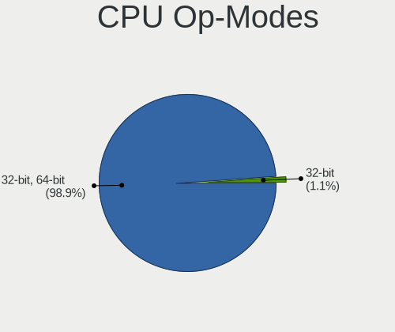
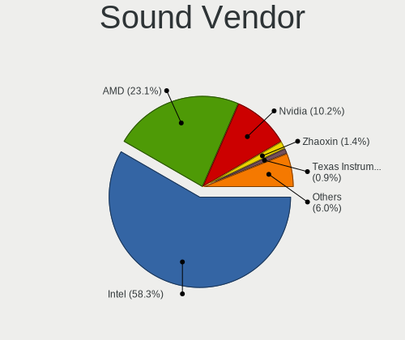
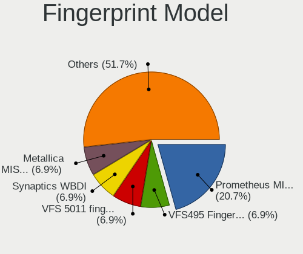

Debian Hardware Trends (Notebooks)
----------------------------------

A project to identify most popular hardware characteristics and track their change
over time based on data collected by Debian users at https://Linux-Hardware.org.

Anyone can contribute to this report by the [hw-probe](https://github.com/linuxhw/hw-probe) tool:

    sudo -E hw-probe -all -upload

Full-feature report is available here: https://linux-hardware.org/?view=trends&formfactor=notebook

Period: Jul, 2021.

Contents
--------

* [ System ](#system)
  - [ OS                       ](#os)
  - [ OS Family                ](#os-family)
  - [ Kernel                   ](#kernel)
  - [ Kernel Family            ](#kernel-family)
  - [ Kernel Major Ver.        ](#kernel-major-ver)
  - [ Arch                     ](#arch)
  - [ DE                       ](#de)
  - [ Display Server           ](#display-server)
  - [ Display Manager          ](#display-manager)
  - [ OS Lang                  ](#os-lang)
  - [ Boot Mode                ](#boot-mode)
  - [ Filesystem               ](#filesystem)
  - [ Part. scheme             ](#part-scheme)
  - [ Dual Boot with Linux/BSD ](#dual-boot-with-linuxbsd)
  - [ Dual Boot (Win)          ](#dual-boot-win)

* [ Board ](#board)
  - [ Vendor                   ](#vendor)
  - [ Model                    ](#model)
  - [ Model Family             ](#model-family)
  - [ MFG Year                 ](#mfg-year)
  - [ Form Factor              ](#form-factor)
  - [ Secure Boot              ](#secure-boot)
  - [ Coreboot                 ](#coreboot)
  - [ RAM Size                 ](#ram-size)
  - [ RAM Used                 ](#ram-used)
  - [ Total Drives             ](#total-drives)
  - [ Has CD-ROM               ](#has-cd-rom)
  - [ Has Ethernet             ](#has-ethernet)
  - [ Has WiFi                 ](#has-wifi)
  - [ Has Bluetooth            ](#has-bluetooth)

* [ Location ](#location)
  - [ Country                  ](#country)
  - [ City                     ](#city)

* [ Drives ](#drives)
  - [ Drive Vendor             ](#drive-vendor)
  - [ Drive Model              ](#drive-model)
  - [ HDD Vendor               ](#hdd-vendor)
  - [ SSD Vendor               ](#ssd-vendor)
  - [ Drive Kind               ](#drive-kind)
  - [ Drive Connector          ](#drive-connector)
  - [ Drive Size               ](#drive-size)
  - [ Space Total              ](#space-total)
  - [ Space Used               ](#space-used)
  - [ Malfunc. Drives          ](#malfunc-drives)
  - [ Malfunc. Drive Vendor    ](#malfunc-drive-vendor)
  - [ Malfunc. HDD Vendor      ](#malfunc-hdd-vendor)
  - [ Malfunc. Drive Kind      ](#malfunc-drive-kind)
  - [ Failed Drives            ](#failed-drives)
  - [ Failed Drive Vendor      ](#failed-drive-vendor)
  - [ Drive Status             ](#drive-status)

* [ Storage controller ](#storage-controller)
  - [ Storage Vendor           ](#storage-vendor)
  - [ Storage Model            ](#storage-model)
  - [ Storage Kind             ](#storage-kind)

* [ Processor ](#processor)
  - [ CPU Vendor               ](#cpu-vendor)
  - [ CPU Model                ](#cpu-model)
  - [ CPU Model Family         ](#cpu-model-family)
  - [ CPU Cores                ](#cpu-cores)
  - [ CPU Sockets              ](#cpu-sockets)
  - [ CPU Threads              ](#cpu-threads)
  - [ CPU Op-Modes             ](#cpu-op-modes)
  - [ CPU Microcode            ](#cpu-microcode)
  - [ CPU Microarch            ](#cpu-microarch)

* [ Graphics ](#graphics)
  - [ GPU Vendor               ](#gpu-vendor)
  - [ GPU Model                ](#gpu-model)
  - [ GPU Combo                ](#gpu-combo)
  - [ GPU Driver               ](#gpu-driver)
  - [ GPU Memory               ](#gpu-memory)

* [ Monitor ](#monitor)
  - [ Monitor Vendor           ](#monitor-vendor)
  - [ Monitor Model            ](#monitor-model)
  - [ Monitor Resolution       ](#monitor-resolution)
  - [ Monitor Diagonal         ](#monitor-diagonal)
  - [ Monitor Width            ](#monitor-width)
  - [ Aspect Ratio             ](#aspect-ratio)
  - [ Monitor Area             ](#monitor-area)
  - [ Pixel Density            ](#pixel-density)
  - [ Multiple Monitors        ](#multiple-monitors)

* [ Network ](#network)
  - [ Net Controller Vendor    ](#net-controller-vendor)
  - [ Net Controller Model     ](#net-controller-model)
  - [ Wireless Vendor          ](#wireless-vendor)
  - [ Wireless Model           ](#wireless-model)
  - [ Ethernet Vendor          ](#ethernet-vendor)
  - [ Ethernet Model           ](#ethernet-model)
  - [ Net Controller Kind      ](#net-controller-kind)
  - [ Used Controller          ](#used-controller)
  - [ NICs                     ](#nics)
  - [ IPv6                     ](#ipv6)

* [ Bluetooth ](#bluetooth)
  - [ Bluetooth Vendor         ](#bluetooth-vendor)
  - [ Bluetooth Model          ](#bluetooth-model)

* [ Sound ](#sound)
  - [ Sound Vendor             ](#sound-vendor)
  - [ Sound Model              ](#sound-model)

* [ Memory ](#memory)
  - [ Memory Vendor            ](#memory-vendor)
  - [ Memory Model             ](#memory-model)
  - [ Memory Kind              ](#memory-kind)
  - [ Memory Form Factor       ](#memory-form-factor)
  - [ Memory Size              ](#memory-size)
  - [ Memory Speed             ](#memory-speed)

* [ Printers & scanners ](#printers--scanners)
  - [ Printer Vendor           ](#printer-vendor)
  - [ Printer Model            ](#printer-model)
  - [ Scanner Vendor           ](#scanner-vendor)
  - [ Scanner Model            ](#scanner-model)

* [ Camera ](#camera)
  - [ Camera Vendor            ](#camera-vendor)
  - [ Camera Model             ](#camera-model)

* [ Security ](#security)
  - [ Fingerprint Vendor       ](#fingerprint-vendor)
  - [ Fingerprint Model        ](#fingerprint-model)
  - [ Chipcard Vendor          ](#chipcard-vendor)
  - [ Chipcard Model           ](#chipcard-model)

* [ Unsupported ](#unsupported)
  - [ Unsupported Devices      ](#unsupported-devices)
  - [ Unsupported Device Types ](#unsupported-device-types)

System
------

OS
--

Installed operating systems

| Name        | Notebooks | Percent |
|-------------|-----------|---------|
| Debian 11   | 138       | 80.7%   |
| Debian 10   | 23        | 13.45%  |
| Debian      | 6         | 3.51%   |
| Debian 9.13 | 2         | 1.17%   |
| Debian Sid  | 1         | 0.58%   |
| Debian 9    | 1         | 0.58%   |

OS Family
---------

OS without a version

| Name   | Notebooks | Percent |
|--------|-----------|---------|
| Debian | 171       | 100%    |

Kernel
------

Version of the Linux kernel

| Version                    | Notebooks | Percent |
|----------------------------|-----------|---------|
| 5.10.0-8-amd64             | 85        | 49.71%  |
| 5.10.0-7-amd64             | 39        | 22.81%  |
| 4.19.0-17-amd64            | 9         | 5.26%   |
| 5.10.0-2-amd64             | 6         | 3.51%   |
| 5.12.0-19.3-liquorix-amd64 | 2         | 1.17%   |
| 5.10.0-8-686               | 2         | 1.17%   |
| 5.10.0-6-amd64             | 2         | 1.17%   |
| 5.10.0-0.bpo.7-amd64       | 2         | 1.17%   |
| 5.10.0-0.bpo.3-amd64       | 2         | 1.17%   |
| 4.9.0-16-amd64             | 2         | 1.17%   |
| 4.19.0-17-686-pae          | 2         | 1.17%   |
| 5.8.0-3-amd64              | 1         | 0.58%   |
| 5.4.119-1-pve              | 1         | 0.58%   |
| 5.14.0-rc3-prygun          | 1         | 0.58%   |
| 5.13.5-xanmod1             | 1         | 0.58%   |
| 5.13.4-e5520               | 1         | 0.58%   |
| 5.13.1                     | 1         | 0.58%   |
| 5.12.0-14.2-liquorix-amd64 | 1         | 0.58%   |
| 5.11.22-1-pve              | 1         | 0.58%   |
| 5.10.40-ismynik            | 1         | 0.58%   |
| 5.10.0-8-686-pae           | 1         | 0.58%   |
| 5.10.0-5mx-amd64           | 1         | 0.58%   |
| 5.10.0-4-amd64             | 1         | 0.58%   |
| 5.10.0-0.bpo.5-amd64       | 1         | 0.58%   |
| 4.9.0-15-amd64             | 1         | 0.58%   |
| 4.19.194-atom              | 1         | 0.58%   |
| 4.19.0-17-rt-amd64         | 1         | 0.58%   |
| 4.19.0-16-amd64            | 1         | 0.58%   |
| 4.19.0-14-amd64            | 1         | 0.58%   |

Kernel Family
-------------

Linux kernel without a distro release

| Version  | Notebooks | Percent |
|----------|-----------|---------|
| 5.10.0   | 142       | 83.04%  |
| 4.19.0   | 14        | 8.19%   |
| 5.12.0   | 3         | 1.75%   |
| 4.9.0    | 3         | 1.75%   |
| 5.8.0    | 1         | 0.58%   |
| 5.4.119  | 1         | 0.58%   |
| 5.14.0   | 1         | 0.58%   |
| 5.13.5   | 1         | 0.58%   |
| 5.13.4   | 1         | 0.58%   |
| 5.13.1   | 1         | 0.58%   |
| 5.11.22  | 1         | 0.58%   |
| 5.10.40  | 1         | 0.58%   |
| 4.19.194 | 1         | 0.58%   |

Kernel Major Ver.
-----------------

Linux kernel major version

| Version | Notebooks | Percent |
|---------|-----------|---------|
| 5.10    | 143       | 83.63%  |
| 4.19    | 15        | 8.77%   |
| 5.13    | 3         | 1.75%   |
| 5.12    | 3         | 1.75%   |
| 4.9     | 3         | 1.75%   |
| 5.8     | 1         | 0.58%   |
| 5.4     | 1         | 0.58%   |
| 5.14    | 1         | 0.58%   |
| 5.11    | 1         | 0.58%   |

Arch
----

OS architecture (x86_64, i586, etc.)

| Name   | Notebooks | Percent |
|--------|-----------|---------|
| x86_64 | 166       | 97.08%  |
| i686   | 5         | 2.92%   |

DE
--

Desktop Environment

| Name             | Notebooks | Percent |
|------------------|-----------|---------|
| GNOME            | 61        | 35.67%  |
| KDE5             | 36        | 21.05%  |
| XFCE             | 24        | 14.04%  |
| Unknown          | 17        | 9.94%   |
| MATE             | 7         | 4.09%   |
| LXDE             | 6         | 3.51%   |
| LXQt             | 5         | 2.92%   |
| X-Cinnamon       | 4         | 2.34%   |
| i3               | 4         | 2.34%   |
| KDE              | 3         | 1.75%   |
| sway             | 1         | 0.58%   |
| openbox          | 1         | 0.58%   |
| lightdm-xsession | 1         | 0.58%   |
| Cinnamon         | 1         | 0.58%   |

Display Server
--------------

X11 or Wayland

| Name    | Notebooks | Percent |
|---------|-----------|---------|
| X11     | 103       | 60.23%  |
| Wayland | 48        | 28.07%  |
| Tty     | 12        | 7.02%   |
| Unknown | 8         | 4.68%   |

Display Manager
---------------

SDDM, LightDM, etc.

| Name    | Notebooks | Percent |
|---------|-----------|---------|
| GDM     | 51        | 29.82%  |
| Unknown | 41        | 23.98%  |
| SDDM    | 39        | 22.81%  |
| TDM     | 38        | 22.22%  |
| LightDM | 1         | 0.58%   |
| GDM3    | 1         | 0.58%   |

OS Lang
-------

Language

| Lang    | Notebooks | Percent |
|---------|-----------|---------|
| en_US   | 71        | 41.52%  |
| ru_RU   | 18        | 10.53%  |
| en_GB   | 14        | 8.19%   |
| fr_FR   | 8         | 4.68%   |
| en_IN   | 7         | 4.09%   |
| de_DE   | 7         | 4.09%   |
| it_IT   | 5         | 2.92%   |
| pt_BR   | 4         | 2.34%   |
| es_ES   | 4         | 2.34%   |
| pt_PT   | 3         | 1.75%   |
| en_AU   | 3         | 1.75%   |
| pl_PL   | 2         | 1.17%   |
| fi_FI   | 2         | 1.17%   |
| en_SG   | 2         | 1.17%   |
| cs_CZ   | 2         | 1.17%   |
| C       | 2         | 1.17%   |
| zh_CN   | 1         | 0.58%   |
| uk_UA   | 1         | 0.58%   |
| tr_TR   | 1         | 0.58%   |
| nl_BE   | 1         | 0.58%   |
| hu_HU   | 1         | 0.58%   |
| hr_HR   | 1         | 0.58%   |
| gl_ES   | 1         | 0.58%   |
| es_MX   | 1         | 0.58%   |
| es_EC   | 1         | 0.58%   |
| es_CR   | 1         | 0.58%   |
| es_CO   | 1         | 0.58%   |
| es_CL   | 1         | 0.58%   |
| en_SI   | 1         | 0.58%   |
| en_IE   | 1         | 0.58%   |
| en_CA   | 1         | 0.58%   |
| de_CH   | 1         | 0.58%   |
| Unknown | 1         | 0.58%   |

Boot Mode
---------

EFI or BIOS

| Mode | Notebooks | Percent |
|------|-----------|---------|
| EFI  | 113       | 66.08%  |
| BIOS | 58        | 33.92%  |

Filesystem
----------

Type of filesystem

| Type    | Notebooks | Percent |
|---------|-----------|---------|
| Ext4    | 147       | 85.96%  |
| Overlay | 13        | 7.6%    |
| Btrfs   | 8         | 4.68%   |
| Zfs     | 1         | 0.58%   |
| Xfs     | 1         | 0.58%   |
| Unknown | 1         | 0.58%   |

Part. scheme
------------

Scheme of partitioning

| Type    | Notebooks | Percent |
|---------|-----------|---------|
| GPT     | 114       | 66.67%  |
| MBR     | 34        | 19.88%  |
| Unknown | 23        | 13.45%  |

Dual Boot with Linux/BSD
------------------------

Hosting more than one Linux/BSD

| Dual boot | Notebooks | Percent |
|-----------|-----------|---------|
| No        | 152       | 88.89%  |
| Yes       | 19        | 11.11%  |

Dual Boot (Win)
---------------

Hosting Linux and Windows

| Dual boot | Notebooks | Percent |
|-----------|-----------|---------|
| No        | 122       | 71.35%  |
| Yes       | 49        | 28.65%  |

Board
-----

Vendor
------

Motherboard manufacturer

| Name                | Notebooks | Percent |
|---------------------|-----------|---------|
| Lenovo              | 63        | 36.84%  |
| Hewlett-Packard     | 28        | 16.37%  |
| Dell                | 27        | 15.79%  |
| Acer                | 16        | 9.36%   |
| ASUSTek Computer    | 15        | 8.77%   |
| Toshiba             | 3         | 1.75%   |
| MSI                 | 3         | 1.75%   |
| HUAWEI              | 3         | 1.75%   |
| Apple               | 3         | 1.75%   |
| Gigabyte Technology | 2         | 1.17%   |
| SLIMBOOK            | 1         | 0.58%   |
| Quanta              | 1         | 0.58%   |
| PC Specialist       | 1         | 0.58%   |
| Panasonic           | 1         | 0.58%   |
| One Education       | 1         | 0.58%   |
| Itautec             | 1         | 0.58%   |
| Fujitsu             | 1         | 0.58%   |
| Casper              | 1         | 0.58%   |

Model
-----

Motherboard model

| Name                                     | Notebooks | Percent |
|------------------------------------------|-----------|---------|
| Dell Latitude E6420                      | 3         | 1.75%   |
| Acer Aspire A315-23                      | 3         | 1.75%   |
| Lenovo G50-80 80E5                       | 2         | 1.17%   |
| HUAWEI NBLK-WAX9X                        | 2         | 1.17%   |
| Dell XPS 13 7390                         | 2         | 1.17%   |
| Dell Inspiron 5570                       | 2         | 1.17%   |
| ASUS VivoBook_ASUS Laptop E210MA_L210MA  | 2         | 1.17%   |
| Toshiba Satellite S55-A                  | 1         | 0.58%   |
| Toshiba Satellite M70                    | 1         | 0.58%   |
| Toshiba Satellite C45-A                  | 1         | 0.58%   |
| SLIMBOOK PROX14-AMD                      | 1         | 0.58%   |
| Quanta TWC                               | 1         | 0.58%   |
| PC Specialist NV4XMB,ME,MZ               | 1         | 0.58%   |
| Panasonic CF-AX2LDCZMF                   | 1         | 0.58%   |
| One Education Infinity:One               | 1         | 0.58%   |
| MSI U210/U210 Light                      | 1         | 0.58%   |
| MSI Modern 15 A11M                       | 1         | 0.58%   |
| MSI GF65 Thin 10UE                       | 1         | 0.58%   |
| Lenovo ThinkPad X61s 766734G             | 1         | 0.58%   |
| Lenovo ThinkPad X260 20F5S46R00          | 1         | 0.58%   |
| Lenovo ThinkPad X260 20F5S0JF00          | 1         | 0.58%   |
| Lenovo ThinkPad X250 20CLS1G70A          | 1         | 0.58%   |
| Lenovo ThinkPad X240 20AL008EUK          | 1         | 0.58%   |
| Lenovo ThinkPad X230 2325BQ3             | 1         | 0.58%   |
| Lenovo ThinkPad X220 4293B43             | 1         | 0.58%   |
| Lenovo ThinkPad X201 3626ES3             | 1         | 0.58%   |
| Lenovo ThinkPad X1 Carbon 5th 20HR002RMX | 1         | 0.58%   |
| Lenovo ThinkPad T495 20NKS0PG00          | 1         | 0.58%   |
| Lenovo ThinkPad T490 20RYCTO1WW          | 1         | 0.58%   |
| Lenovo ThinkPad T490 20N2CTO1WW          | 1         | 0.58%   |
| Lenovo ThinkPad T490 20N2002AUS          | 1         | 0.58%   |
| Lenovo ThinkPad T480s 20L8S7HF00         | 1         | 0.58%   |
| Lenovo ThinkPad T480 20L5S1S000          | 1         | 0.58%   |
| Lenovo ThinkPad T480 20L50063EU          | 1         | 0.58%   |
| Lenovo ThinkPad T470s 20HGS45C00         | 1         | 0.58%   |
| Lenovo ThinkPad T470s 20HGS0A600         | 1         | 0.58%   |
| Lenovo ThinkPad T470 W10DG 20JNS42314    | 1         | 0.58%   |
| Lenovo ThinkPad T470 20HES1UD00          | 1         | 0.58%   |
| Lenovo ThinkPad T460 20FMS03600          | 1         | 0.58%   |
| Lenovo ThinkPad T450s 20BX004QGE         | 1         | 0.58%   |
| Lenovo ThinkPad T430 2349V4B             | 1         | 0.58%   |
| Lenovo ThinkPad T430 2349GCG             | 1         | 0.58%   |
| Lenovo ThinkPad T430 2349BW1             | 1         | 0.58%   |
| Lenovo ThinkPad T430 2347FF9             | 1         | 0.58%   |
| Lenovo ThinkPad T420s 4174PEG            | 1         | 0.58%   |
| Lenovo ThinkPad T420 4236WNU             | 1         | 0.58%   |
| Lenovo ThinkPad T420 4236WC3             | 1         | 0.58%   |
| Lenovo ThinkPad T420 4236EV9             | 1         | 0.58%   |
| Lenovo ThinkPad T410 2522WUZ             | 1         | 0.58%   |
| Lenovo ThinkPad T14s Gen 1 20UH001AGE    | 1         | 0.58%   |
| Lenovo ThinkPad T14 Gen 2i 20W0CTO1WW    | 1         | 0.58%   |
| Lenovo ThinkPad T14 Gen 1 20UDCTO1WW     | 1         | 0.58%   |
| Lenovo ThinkPad R60 9462A45              | 1         | 0.58%   |
| Lenovo ThinkPad P52 20M9CTO1WW           | 1         | 0.58%   |
| Lenovo ThinkPad P14s Gen 1 20Y1002AFR    | 1         | 0.58%   |
| Lenovo ThinkPad L590 20Q7CTO1WW          | 1         | 0.58%   |
| Lenovo ThinkPad L390 20NRCTO1WW          | 1         | 0.58%   |
| Lenovo ThinkPad Edge E540 20C600KCJP     | 1         | 0.58%   |
| Lenovo ThinkPad E595 20NF0005IX          | 1         | 0.58%   |
| Lenovo ThinkPad E480 20KN001NGE          | 1         | 0.58%   |

Model Family
------------

Motherboard model prefix

| Name                       | Notebooks | Percent |
|----------------------------|-----------|---------|
| Lenovo ThinkPad            | 49        | 28.65%  |
| Acer Aspire                | 11        | 6.43%   |
| Lenovo IdeaPad             | 10        | 5.85%   |
| Dell Inspiron              | 9         | 5.26%   |
| HP ProBook                 | 8         | 4.68%   |
| Dell XPS                   | 7         | 4.09%   |
| Dell Latitude              | 6         | 3.51%   |
| HP Laptop                  | 5         | 2.92%   |
| HP EliteBook               | 5         | 2.92%   |
| ASUS VivoBook              | 5         | 2.92%   |
| Toshiba Satellite          | 3         | 1.75%   |
| Dell Vostro                | 3         | 1.75%   |
| Lenovo G50-80              | 2         | 1.17%   |
| HUAWEI NBLK-WAX9X          | 2         | 1.17%   |
| HP OMEN                    | 2         | 1.17%   |
| HP 250                     | 2         | 1.17%   |
| Gigabyte AERO              | 2         | 1.17%   |
| ASUS TUF                   | 2         | 1.17%   |
| Acer Swift                 | 2         | 1.17%   |
| SLIMBOOK PROX14-AMD        | 1         | 0.58%   |
| Quanta TWC                 | 1         | 0.58%   |
| PC Specialist NV4XMB       | 1         | 0.58%   |
| Panasonic CF-AX2LDCZMF     | 1         | 0.58%   |
| One Education Infinity:One | 1         | 0.58%   |
| MSI U210                   | 1         | 0.58%   |
| MSI Modern                 | 1         | 0.58%   |
| MSI GF65                   | 1         | 0.58%   |
| Lenovo B51-35              | 1         | 0.58%   |
| Lenovo B50-10              | 1         | 0.58%   |
| Itautec Infoway            | 1         | 0.58%   |
| HUAWEI BOHK-WAX9X          | 1         | 0.58%   |
| HP ZBook                   | 1         | 0.58%   |
| HP Stream                  | 1         | 0.58%   |
| HP Spectre                 | 1         | 0.58%   |
| HP Pavilion                | 1         | 0.58%   |
| HP Compaq                  | 1         | 0.58%   |
| HP 2000                    | 1         | 0.58%   |
| Fujitsu LIFEBOOK           | 1         | 0.58%   |
| Dell Studio                | 1         | 0.58%   |
| Dell Precision             | 1         | 0.58%   |
| Casper CASPER              | 1         | 0.58%   |
| ASUS ZenBook               | 1         | 0.58%   |
| ASUS X541NC                | 1         | 0.58%   |
| ASUS X205TA                | 1         | 0.58%   |
| ASUS ROG                   | 1         | 0.58%   |
| ASUS K56CB                 | 1         | 0.58%   |
| ASUS 701SD                 | 1         | 0.58%   |
| ASUS 701                   | 1         | 0.58%   |
| ASUS 1215B                 | 1         | 0.58%   |
| Apple MacBookPro9          | 1         | 0.58%   |
| Apple MacBookPro8          | 1         | 0.58%   |
| Apple MacBookPro11         | 1         | 0.58%   |
| Acer Nitro                 | 1         | 0.58%   |
| Acer E1-510                | 1         | 0.58%   |
| Acer AO725                 | 1         | 0.58%   |

MFG Year
--------

Motherboard manufacture year

| Year | Notebooks | Percent |
|------|-----------|---------|
| 2020 | 44        | 25.73%  |
| 2021 | 36        | 21.05%  |
| 2019 | 23        | 13.45%  |
| 2018 | 13        | 7.6%    |
| 2013 | 12        | 7.02%   |
| 2012 | 7         | 4.09%   |
| 2011 | 7         | 4.09%   |
| 2017 | 5         | 2.92%   |
| 2016 | 5         | 2.92%   |
| 2015 | 4         | 2.34%   |
| 2014 | 4         | 2.34%   |
| 2008 | 4         | 2.34%   |
| 2009 | 2         | 1.17%   |
| 2007 | 2         | 1.17%   |
| 2010 | 1         | 0.58%   |
| 2006 | 1         | 0.58%   |
| 2004 | 1         | 0.58%   |

Form Factor
-----------

Physical design of the computer

| Name     | Notebooks | Percent |
|----------|-----------|---------|
| Notebook | 171       | 100%    |

Secure Boot
-----------

Enabled or disabled

| State    | Notebooks | Percent |
|----------|-----------|---------|
| Disabled | 145       | 84.8%   |
| Enabled  | 26        | 15.2%   |

Coreboot
--------

Have coreboot on board

| Used | Notebooks | Percent |
|------|-----------|---------|
| No   | 171       | 100%    |

RAM Size
--------

Total RAM memory

| Size in GB  | Notebooks | Percent |
|-------------|-----------|---------|
| 4.01-8.0    | 52        | 30.41%  |
| 16.01-24.0  | 44        | 25.73%  |
| 3.01-4.0    | 24        | 14.04%  |
| 8.01-16.0   | 24        | 14.04%  |
| 32.01-64.0  | 12        | 7.02%   |
| 1.01-2.0    | 7         | 4.09%   |
| 0.01-0.5    | 3         | 1.75%   |
| 24.01-32.0  | 2         | 1.17%   |
| 2.01-3.0    | 2         | 1.17%   |
| 64.01-256.0 | 1         | 0.58%   |

RAM Used
--------

Used RAM memory

| Used GB    | Notebooks | Percent |
|------------|-----------|---------|
| 1.01-2.0   | 46        | 26.9%   |
| 2.01-3.0   | 33        | 19.3%   |
| 4.01-8.0   | 30        | 17.54%  |
| 3.01-4.0   | 21        | 12.28%  |
| 0.51-1.0   | 19        | 11.11%  |
| 8.01-16.0  | 14        | 8.19%   |
| 0.01-0.5   | 7         | 4.09%   |
| 32.01-64.0 | 1         | 0.58%   |

Total Drives
------------

Number of drives on board

| Drives | Notebooks | Percent |
|--------|-----------|---------|
| 1      | 115       | 67.25%  |
| 2      | 50        | 29.24%  |
| 3      | 3         | 1.75%   |
| 4      | 2         | 1.17%   |
| 0      | 1         | 0.58%   |

Has CD-ROM
----------

Has CD-ROM on board

| Presented | Notebooks | Percent |
|-----------|-----------|---------|
| No        | 128       | 74.85%  |
| Yes       | 43        | 25.15%  |

Has Ethernet
------------

Has Ethernet on board

| Presented | Notebooks | Percent |
|-----------|-----------|---------|
| Yes       | 139       | 81.29%  |
| No        | 32        | 18.71%  |

Has WiFi
--------

Has WiFi module

| Presented | Notebooks | Percent |
|-----------|-----------|---------|
| Yes       | 167       | 97.66%  |
| No        | 4         | 2.34%   |

Has Bluetooth
-------------

Has Bluetooth module

| Presented | Notebooks | Percent |
|-----------|-----------|---------|
| Yes       | 141       | 82.46%  |
| No        | 30        | 17.54%  |

Location
--------

Country
-------

Geographic location (country)

| Country     | Notebooks | Percent |
|-------------|-----------|---------|
| USA         | 22        | 12.87%  |
| Russia      | 17        | 9.94%   |
| Germany     | 14        | 8.19%   |
| France      | 14        | 8.19%   |
| UK          | 8         | 4.68%   |
| Spain       | 7         | 4.09%   |
| India       | 7         | 4.09%   |
| Netherlands | 6         | 3.51%   |
| Switzerland | 5         | 2.92%   |
| Brazil      | 5         | 2.92%   |
| Portugal    | 4         | 2.34%   |
| Kazakhstan  | 4         | 2.34%   |
| Italy       | 4         | 2.34%   |
| Greece      | 4         | 2.34%   |
| Ukraine     | 3         | 1.75%   |
| Thailand    | 3         | 1.75%   |
| Poland      | 3         | 1.75%   |
| Czechia     | 3         | 1.75%   |
| Belarus     | 3         | 1.75%   |
| Australia   | 3         | 1.75%   |
| Turkey      | 2         | 1.17%   |
| Slovenia    | 2         | 1.17%   |
| Mexico      | 2         | 1.17%   |
| Finland     | 2         | 1.17%   |
| Ecuador     | 2         | 1.17%   |
| Croatia     | 2         | 1.17%   |
| Colombia    | 2         | 1.17%   |
| Canada      | 2         | 1.17%   |
| Austria     | 2         | 1.17%   |
| Uganda      | 1         | 0.58%   |
| Tunisia     | 1         | 0.58%   |
| Philippines | 1         | 0.58%   |
| Norway      | 1         | 0.58%   |
| Mongolia    | 1         | 0.58%   |
| Malaysia    | 1         | 0.58%   |
| Indonesia   | 1         | 0.58%   |
| Hungary     | 1         | 0.58%   |
| China       | 1         | 0.58%   |
| Chile       | 1         | 0.58%   |
| Bulgaria    | 1         | 0.58%   |
| Belgium     | 1         | 0.58%   |
| Bangladesh  | 1         | 0.58%   |
| Azerbaijan  | 1         | 0.58%   |

City
----

Geographic location (city)

| City                 | Notebooks | Percent |
|----------------------|-----------|---------|
| Voronezh             | 6         | 3.51%   |
| St Petersburg        | 5         | 2.92%   |
| Paris                | 5         | 2.92%   |
| Bengaluru            | 4         | 2.34%   |
| Berlin               | 3         | 1.75%   |
| Bangkok              | 3         | 1.75%   |
| Athens               | 3         | 1.75%   |
| Zurich               | 2         | 1.17%   |
| Sunnyvale            | 2         | 1.17%   |
| Rio de Janeiro       | 2         | 1.17%   |
| Moscow               | 2         | 1.17%   |
| Mesa                 | 2         | 1.17%   |
| London               | 2         | 1.17%   |
| Kalamazoo            | 2         | 1.17%   |
| Helsinki             | 2         | 1.17%   |
| Gorinchem            | 2         | 1.17%   |
| Gloucester           | 2         | 1.17%   |
| Fryazino             | 2         | 1.17%   |
| Ajdov????ina         | 2         | 1.17%   |
| Zaragoza             | 1         | 0.58%   |
| Zagreb               | 1         | 0.58%   |
| Yiwu                 | 1         | 0.58%   |
| Whitefield           | 1         | 0.58%   |
| Waterloo             | 1         | 0.58%   |
| Waregem              | 1         | 0.58%   |
| Vitória             | 1         | 0.58%   |
| Vitry-sur-Seine      | 1         | 0.58%   |
| Vienna               | 1         | 0.58%   |
| Valladolid           | 1         | 0.58%   |
| Utrecht              | 1         | 0.58%   |
| Tyumen               | 1         | 0.58%   |
| Toul                 | 1         | 0.58%   |
| Toronto              | 1         | 0.58%   |
| Thonex               | 1         | 0.58%   |
| The Hague            | 1         | 0.58%   |
| The Colony           | 1         | 0.58%   |
| Tarn??w              | 1         | 0.58%   |
| Sydney               | 1         | 0.58%   |
| Stepnogorsk          | 1         | 0.58%   |
| Sofia                | 1         | 0.58%   |
| Schleswig            | 1         | 0.58%   |
| Saynshand            | 1         | 0.58%   |
| Sarand               | 1         | 0.58%   |
| Salvador             | 1         | 0.58%   |
| Sagunto              | 1         | 0.58%   |
| Runding              | 1         | 0.58%   |
| Rio Vista            | 1         | 0.58%   |
| Richmond             | 1         | 0.58%   |
| Ratiskovice          | 1         | 0.58%   |
| Pune                 | 1         | 0.58%   |
| Pula                 | 1         | 0.58%   |
| Pokrovsk             | 1         | 0.58%   |
| Piracicaba           | 1         | 0.58%   |
| P?ô?≠bram            | 1         | 0.58%   |
| Paderno Franciacorta | 1         | 0.58%   |
| Oracov               | 1         | 0.58%   |
| Oleksandrivka        | 1         | 0.58%   |
| Nur-Sultan           | 1         | 0.58%   |
| Norwich              | 1         | 0.58%   |
| Noblesville          | 1         | 0.58%   |

Drives
------

Drive Vendor
------------

Hard drive vendors

| Vendor              | Notebooks | Drives | Percent |
|---------------------|-----------|--------|---------|
| Samsung Electronics | 41        | 46     | 19.07%  |
| WDC                 | 31        | 31     | 14.42%  |
| Seagate             | 24        | 25     | 11.16%  |
| Toshiba             | 15        | 15     | 6.98%   |
| Kingston            | 14        | 15     | 6.51%   |
| Unknown             | 12        | 14     | 5.58%   |
| Crucial             | 11        | 11     | 5.12%   |
| SK Hynix            | 10        | 10     | 4.65%   |
| SanDisk             | 7         | 9      | 3.26%   |
| Intel               | 5         | 5      | 2.33%   |
| KIOXIA              | 4         | 4      | 1.86%   |
| A-DATA Technology   | 4         | 4      | 1.86%   |
| Union Memory        | 3         | 3      | 1.4%    |
| Transcend           | 3         | 3      | 1.4%    |
| Lenovo              | 3         | 3      | 1.4%    |
| Hitachi             | 3         | 3      | 1.4%    |
| China               | 3         | 3      | 1.4%    |
| Micron Technology   | 2         | 2      | 0.93%   |
| LDLC                | 2         | 2      | 0.93%   |
| Apple               | 2         | 2      | 0.93%   |
| ZTC                 | 1         | 1      | 0.47%   |
| SILICONMOTION       | 1         | 1      | 0.47%   |
| Silicon Motion      | 1         | 1      | 0.47%   |
| Phison              | 1         | 2      | 0.47%   |
| Patriot             | 1         | 1      | 0.47%   |
| Maxtor              | 1         | 1      | 0.47%   |
| LITEONIT            | 1         | 1      | 0.47%   |
| LITEON              | 1         | 1      | 0.47%   |
| KingSpec            | 1         | 1      | 0.47%   |
| Intenso             | 1         | 1      | 0.47%   |
| HUAWEI              | 1         | 1      | 0.47%   |
| HGST                | 1         | 1      | 0.47%   |
| ASUS-PHISON         | 1         | 1      | 0.47%   |
| ASMT                | 1         | 2      | 0.47%   |
| Apacer              | 1         | 1      | 0.47%   |
| AMD                 | 1         | 1      | 0.47%   |

Drive Model
-----------

Hard drive models

| Model                                           | Notebooks | Percent |
|-------------------------------------------------|-----------|---------|
| Seagate ST1000LM035-1RK172 1TB                  | 8         | 3.52%   |
| Toshiba MQ04ABF100 1TB                          | 4         | 1.76%   |
| Kingston SA400S37240G 240GB SSD                 | 4         | 1.76%   |
| WDC WD10JPVX-22JC3T0 1TB                        | 3         | 1.32%   |
| Samsung SSD 860 EVO M.2 1TB                     | 3         | 1.32%   |
| Samsung SSD 860 EVO 500GB                       | 3         | 1.32%   |
| Samsung SSD 850 EVO 250GB                       | 3         | 1.32%   |
| Crucial CT500MX500SSD1 500GB                    | 3         | 1.32%   |
| Crucial CT1000MX500SSD1 1TB                     | 3         | 1.32%   |
| WDC WD10SPZX-21Z10T0 1TB                        | 2         | 0.88%   |
| WDC PC SN730 SDBPNTY-1T00-1006 1TB              | 2         | 0.88%   |
| WDC PC SN720 SDAQNTW-512G-1001 512GB            | 2         | 0.88%   |
| Unknown MMC Card  32GB                          | 2         | 0.88%   |
| Unknown DA4064  64GB                            | 2         | 0.88%   |
| Seagate ST2000LX001-1RG174 2TB                  | 2         | 0.88%   |
| Seagate ST2000LM015-2E8174 2TB                  | 2         | 0.88%   |
| Seagate ST1000LM048-2E7172 1TB                  | 2         | 0.88%   |
| Samsung SSD 970 EVO Plus 500GB                  | 2         | 0.88%   |
| Samsung SSD 970 EVO 1TB                         | 2         | 0.88%   |
| Samsung SSD 860 EVO 1TB                         | 2         | 0.88%   |
| Samsung SSD 850 EVO 500GB                       | 2         | 0.88%   |
| Samsung NVMe SSD Drive 1TB                      | 2         | 0.88%   |
| Samsung MZALQ256HAJD-000L1 256GB                | 2         | 0.88%   |
| Kingston NVMe SSD Drive 512GB                   | 2         | 0.88%   |
| Crucial CT1000P1SSD8 1TB                        | 2         | 0.88%   |
| ZTC SM201-512G SSD                              | 1         | 0.44%   |
| WDC WDS480G2G0A-00JH30 480GB SSD                | 1         | 0.44%   |
| WDC WDS240G2G0B-00EPW0 240GB SSD                | 1         | 0.44%   |
| WDC WDS240G2G0A-00JH30 240GB SSD                | 1         | 0.44%   |
| WDC WDS100T3X0C-00SJG0 1TB                      | 1         | 0.44%   |
| WDC WD800BEVS-08RST2 80GB                       | 1         | 0.44%   |
| WDC WD5000LPCX-21VHAT0 500GB                    | 1         | 0.44%   |
| WDC WD50 00LPCX-24VHA 500GB                     | 1         | 0.44%   |
| WDC WD10SPZX-80Z10T2 1TB                        | 1         | 0.44%   |
| WDC WD10SPZX-60Z10T0 1TB                        | 1         | 0.44%   |
| WDC WD10SPZX-24Z10 1TB                          | 1         | 0.44%   |
| WDC WD10JPVT-75A1YT0 1TB                        | 1         | 0.44%   |
| WDC WD10JPVT-00A1YT0 1TB                        | 1         | 0.44%   |
| WDC PC SN730 SDBQNTY-512G-1001 512GB            | 1         | 0.44%   |
| WDC PC SN730 SDBPNTY-512G-1027 512GB            | 1         | 0.44%   |
| WDC PC SN730 SDBPNTY-256G-1027 256GB            | 1         | 0.44%   |
| WDC PC SN720 SDAQNTW-256G-1001 256GB            | 1         | 0.44%   |
| WDC PC SN720 SDAPNTW-1T00-1006 1TB              | 1         | 0.44%   |
| WDC PC SN530 SDBPNPZ-512G-1014 512GB            | 1         | 0.44%   |
| WDC PC SN530 SDBPNPZ-1T00-1006 1TB              | 1         | 0.44%   |
| WDC PC SN530 SDBPMPZ-512G-1101 512GB            | 1         | 0.44%   |
| WDC PC SN530 SDBPMPZ-256G-1001 256GB            | 1         | 0.44%   |
| WDC PC SN520 SDAPNUW-512G-1006 512GB            | 1         | 0.44%   |
| Unknown SU01G  1GB                              | 1         | 0.44%   |
| Unknown SL16G  16GB                             | 1         | 0.44%   |
| Unknown SL128  128GB                            | 1         | 0.44%   |
| Unknown SDW32G  32GB                            | 1         | 0.44%   |
| Unknown SD64G  64GB                             | 1         | 0.44%   |
| Unknown SD/MMC/MS PRO 128GB                     | 1         | 0.44%   |
| Unknown SC32G  32GB                             | 1         | 0.44%   |
| Unknown SB64G  64GB                             | 1         | 0.44%   |
| Unknown SA16G  16GB                             | 1         | 0.44%   |
| Unknown LX32G  32GB                             | 1         | 0.44%   |
| Union Memory UMIS RPJTJ512MEE1OWX 512GB         | 1         | 0.44%   |
| Union Memory UMIS LENSE40256GMSP34MESTB3A 256GB | 1         | 0.44%   |

HDD Vendor
----------

Hard disk drive vendors

| Vendor              | Notebooks | Drives | Percent |
|---------------------|-----------|--------|---------|
| Seagate             | 22        | 23     | 44.9%   |
| WDC                 | 13        | 13     | 26.53%  |
| Toshiba             | 7         | 7      | 14.29%  |
| Hitachi             | 3         | 3      | 6.12%   |
| SILICONMOTION       | 1         | 1      | 2.04%   |
| Samsung Electronics | 1         | 1      | 2.04%   |
| HGST                | 1         | 1      | 2.04%   |
| ASMT                | 1         | 2      | 2.04%   |

SSD Vendor
----------

Solid state drive vendors

| Vendor              | Notebooks | Drives | Percent |
|---------------------|-----------|--------|---------|
| Samsung Electronics | 24        | 26     | 30.77%  |
| Kingston            | 9         | 10     | 11.54%  |
| Crucial             | 7         | 7      | 8.97%   |
| SanDisk             | 5         | 7      | 6.41%   |
| WDC                 | 3         | 3      | 3.85%   |
| Transcend           | 3         | 3      | 3.85%   |
| Toshiba             | 3         | 3      | 3.85%   |
| Intel               | 3         | 3      | 3.85%   |
| China               | 3         | 3      | 3.85%   |
| SK Hynix            | 2         | 2      | 2.56%   |
| LDLC                | 2         | 2      | 2.56%   |
| Apple               | 2         | 2      | 2.56%   |
| ZTC                 | 1         | 1      | 1.28%   |
| Union Memory        | 1         | 1      | 1.28%   |
| Seagate             | 1         | 1      | 1.28%   |
| Patriot             | 1         | 1      | 1.28%   |
| Maxtor              | 1         | 1      | 1.28%   |
| LITEONIT            | 1         | 1      | 1.28%   |
| KingSpec            | 1         | 1      | 1.28%   |
| Intenso             | 1         | 1      | 1.28%   |
| ASUS-PHISON         | 1         | 1      | 1.28%   |
| Apacer              | 1         | 1      | 1.28%   |
| AMD                 | 1         | 1      | 1.28%   |
| A-DATA Technology   | 1         | 1      | 1.28%   |

Drive Kind
----------

HDD or SSD

| Kind    | Notebooks | Drives | Percent |
|---------|-----------|--------|---------|
| SSD     | 73        | 83     | 35.27%  |
| NVMe    | 70        | 76     | 33.82%  |
| HDD     | 48        | 51     | 23.19%  |
| MMC     | 13        | 15     | 6.28%   |
| Unknown | 3         | 3      | 1.45%   |

Drive Connector
---------------

SATA, SAS, NVMe, etc.

| Type | Notebooks | Drives | Percent |
|------|-----------|--------|---------|
| SATA | 106       | 127    | 54.08%  |
| NVMe | 70        | 76     | 35.71%  |
| MMC  | 13        | 15     | 6.63%   |
| SAS  | 7         | 10     | 3.57%   |

Drive Size
----------

Size of hard drive

| Size in TB | Notebooks | Drives | Percent |
|------------|-----------|--------|---------|
| 0.01-0.5   | 74        | 82     | 60.16%  |
| 0.51-1.0   | 43        | 46     | 34.96%  |
| 1.01-2.0   | 4         | 4      | 3.25%   |
| 3.01-4.0   | 1         | 1      | 0.81%   |
| 2.01-3.0   | 1         | 1      | 0.81%   |

Space Total
-----------

Amount of disk space available on the file system

| Size in GB     | Notebooks | Percent |
|----------------|-----------|---------|
| 101-250        | 40        | 23.39%  |
| 251-500        | 39        | 22.81%  |
| 501-1000       | 25        | 14.62%  |
| 1001-2000      | 17        | 9.94%   |
| 51-100         | 16        | 9.36%   |
| 1-20           | 13        | 7.6%    |
| Unknown        | 8         | 4.68%   |
| 21-50          | 6         | 3.51%   |
| More than 3000 | 5         | 2.92%   |
| 2001-3000      | 2         | 1.17%   |

Space Used
----------

Amount of used disk space

| Used GB   | Notebooks | Percent |
|-----------|-----------|---------|
| 1-20      | 48        | 28.07%  |
| 21-50     | 30        | 17.54%  |
| 51-100    | 27        | 15.79%  |
| 101-250   | 18        | 10.53%  |
| 501-1000  | 16        | 9.36%   |
| 251-500   | 14        | 8.19%   |
| Unknown   | 8         | 4.68%   |
| 1001-2000 | 5         | 2.92%   |
| 0         | 3         | 1.75%   |
| 2001-3000 | 2         | 1.17%   |

Malfunc. Drives
---------------

Drive models with a malfunction

| Model                           | Notebooks | Drives | Percent |
|---------------------------------|-----------|--------|---------|
| Toshiba MQ04ABF100 1TB          | 2         | 2      | 18.18%  |
| WDC WD10JPVX-22JC3T0 1TB        | 1         | 1      | 9.09%   |
| WDC WD10JPVT-75A1YT0 1TB        | 1         | 1      | 9.09%   |
| Toshiba MQ01ABF050 500GB        | 1         | 1      | 9.09%   |
| Toshiba MQ01ABD100 1TB          | 1         | 1      | 9.09%   |
| Seagate ST9160310AS 160GB       | 1         | 1      | 9.09%   |
| Seagate ST500LT012-9WS142 500GB | 1         | 1      | 9.09%   |
| Seagate ST320LT007-9ZV142 320GB | 1         | 1      | 9.09%   |
| Seagate ST1000LM035-1RK172 1TB  | 1         | 1      | 9.09%   |
| KingSpec Q-90 90GB SSD          | 1         | 1      | 9.09%   |

Malfunc. Drive Vendor
---------------------

Vendors of faulty drives

| Vendor   | Notebooks | Drives | Percent |
|----------|-----------|--------|---------|
| Toshiba  | 4         | 4      | 36.36%  |
| Seagate  | 4         | 4      | 36.36%  |
| WDC      | 2         | 2      | 18.18%  |
| KingSpec | 1         | 1      | 9.09%   |

Malfunc. HDD Vendor
-------------------

Vendors of faulty HDD drives

| Vendor  | Notebooks | Drives | Percent |
|---------|-----------|--------|---------|
| Toshiba | 4         | 4      | 40%     |
| Seagate | 4         | 4      | 40%     |
| WDC     | 2         | 2      | 20%     |

Malfunc. Drive Kind
-------------------

Kinds of faulty drives

| Kind | Notebooks | Drives | Percent |
|------|-----------|--------|---------|
| HDD  | 10        | 10     | 90.91%  |
| SSD  | 1         | 1      | 9.09%   |

Failed Drives
-------------

Failed drive models

Zero info for selected period =(

Failed Drive Vendor
-------------------

Failed drive vendors

Zero info for selected period =(

Drive Status
------------

Number of failed and malfunc. drives

| Status   | Notebooks | Drives | Percent |
|----------|-----------|--------|---------|
| Works    | 133       | 164    | 72.28%  |
| Detected | 40        | 53     | 21.74%  |
| Malfunc  | 11        | 11     | 5.98%   |

Storage controller
------------------

Storage Vendor
--------------

Storage controller vendors

| Vendor                       | Notebooks | Percent |
|------------------------------|-----------|---------|
| Intel                        | 103       | 52.82%  |
| Samsung Electronics          | 19        | 9.74%   |
| AMD                          | 19        | 9.74%   |
| Sandisk                      | 16        | 8.21%   |
| SK Hynix                     | 7         | 3.59%   |
| KIOXIA                       | 5         | 2.56%   |
| Kingston Technology Company  | 5         | 2.56%   |
| Toshiba America Info Systems | 4         | 2.05%   |
| Micron/Crucial Technology    | 4         | 2.05%   |
| Lenovo                       | 3         | 1.54%   |
| ADATA Technology             | 3         | 1.54%   |
| Union Memory (Shenzhen)      | 2         | 1.03%   |
| Micron Technology            | 2         | 1.03%   |
| Silicon Motion               | 1         | 0.51%   |
| Phison Electronics           | 1         | 0.51%   |
| Lite-On Technology           | 1         | 0.51%   |

Storage Model
-------------

Storage controller models

| Model                                                                          | Notebooks | Percent |
|--------------------------------------------------------------------------------|-----------|---------|
| AMD FCH SATA Controller [AHCI mode]                                            | 17        | 8.37%   |
| Intel 7 Series Chipset Family 6-port SATA Controller [AHCI mode]               | 16        | 7.88%   |
| Intel Sunrise Point-LP SATA Controller [AHCI mode]                             | 15        | 7.39%   |
| Samsung NVMe SSD Controller SM981/PM981/PM983                                  | 13        | 6.4%    |
| Intel 82801 Mobile SATA Controller [RAID mode]                                 | 13        | 6.4%    |
| Intel Wildcat Point-LP SATA Controller [AHCI Mode]                             | 9         | 4.43%   |
| Intel 6 Series/C200 Series Chipset Family 6 port Mobile SATA AHCI Controller   | 9         | 4.43%   |
| Sandisk WD Black SN750 / PC SN730 NVMe SSD                                     | 6         | 2.96%   |
| KIOXIA Non-Volatile memory controller                                          | 5         | 2.46%   |
| Intel Comet Lake SATA AHCI Controller                                          | 5         | 2.46%   |
| Sandisk WD Black 2018/SN750 / PC SN720 NVMe SSD                                | 4         | 1.97%   |
| Intel Volume Management Device NVMe RAID Controller                            | 4         | 1.97%   |
| Intel 82801HM/HEM (ICH8M/ICH8M-E) SATA Controller [AHCI mode]                  | 4         | 1.97%   |
| Intel 82801HM/HEM (ICH8M/ICH8M-E) IDE Controller                               | 4         | 1.97%   |
| Toshiba America Info Systems XG6 NVMe SSD Controller                           | 3         | 1.48%   |
| Sandisk WD Blue SN550 NVMe SSD                                                 | 3         | 1.48%   |
| Samsung NVMe Controller                                                        | 3         | 1.48%   |
| Micron/Crucial P1 NVMe PCIe SSD                                                | 3         | 1.48%   |
| Lenovo Non-Volatile memory controller                                          | 3         | 1.48%   |
| Kingston Company Company Non-Volatile memory controller                        | 3         | 1.48%   |
| Intel Celeron/Pentium Silver Processor SATA Controller                         | 3         | 1.48%   |
| Intel 82801FBM (ICH6M) SATA Controller                                         | 3         | 1.48%   |
| Intel 8 Series/C220 Series Chipset Family 6-port SATA Controller 1 [AHCI mode] | 3         | 1.48%   |
| SK Hynix NVMe SSD Controller                                                   | 2         | 0.99%   |
| SK Hynix BC511                                                                 | 2         | 0.99%   |
| SK Hynix BC501 NVMe Solid State Drive                                          | 2         | 0.99%   |
| Sandisk Non-Volatile memory controller                                         | 2         | 0.99%   |
| Samsung NVMe SSD Controller SM961/PM961/SM963                                  | 2         | 0.99%   |
| Micron Non-Volatile memory controller                                          | 2         | 0.99%   |
| Intel Celeron N3350/Pentium N4200/Atom E3900 Series SATA AHCI Controller       | 2         | 0.99%   |
| Intel Atom Processor E3800 Series SATA AHCI Controller                         | 2         | 0.99%   |
| Intel 82801IBM/IEM (ICH9M/ICH9M-E) 4 port SATA Controller [AHCI mode]          | 2         | 0.99%   |
| Intel 8 Series SATA Controller 1 [AHCI mode]                                   | 2         | 0.99%   |
| Intel 5 Series/3400 Series Chipset 6 port SATA AHCI Controller                 | 2         | 0.99%   |
| ADATA XPG SX8200 Pro PCIe Gen3x4 M.2 2280 Solid State Drive                    | 2         | 0.99%   |
| Union Memory (Shenzhen) NVMe 256G SSD device                                   | 1         | 0.49%   |
| Union Memory (Shenzhen) Non-Volatile memory controller                         | 1         | 0.49%   |
| Toshiba America Info Systems BG3 NVMe SSD Controller                           | 1         | 0.49%   |
| SK Hynix PC401 NVMe Solid State Drive 256GB                                    | 1         | 0.49%   |
| Silicon Motion SM2263EN/SM2263XT SSD Controller                                | 1         | 0.49%   |
| Sandisk WD Blue SN500 / PC SN520 NVMe SSD                                      | 1         | 0.49%   |
| Samsung Electronics SATA controller                                            | 1         | 0.49%   |
| Phison NVMe Storage Controller                                                 | 1         | 0.49%   |
| Phison E12 NVMe Controller                                                     | 1         | 0.49%   |
| Micron/Crucial P2 NVMe PCIe SSD                                                | 1         | 0.49%   |
| Lite-On Non-Volatile memory controller                                         | 1         | 0.49%   |
| Kingston Company U-SNS8154P3 NVMe SSD                                          | 1         | 0.49%   |
| Kingston Company OM3PDP3 NVMe SSD                                              | 1         | 0.49%   |
| Intel Tiger Lake-LP SATA Controller [AHCI mode]                                | 1         | 0.49%   |
| Intel SSD 660P Series                                                          | 1         | 0.49%   |
| Intel NVMe Optane Memory Series                                                | 1         | 0.49%   |
| Intel HM170/QM170 Chipset SATA Controller [AHCI Mode]                          | 1         | 0.49%   |
| Intel Cannon Point-LP SATA Controller [AHCI Mode]                              | 1         | 0.49%   |
| Intel Cannon Lake Mobile PCH SATA AHCI Controller                              | 1         | 0.49%   |
| Intel 82801IBM/IEM (ICH9M/ICH9M-E) 2 port SATA Controller [IDE mode]           | 1         | 0.49%   |
| Intel 82801GBM/GHM (ICH7-M Family) SATA Controller [IDE mode]                  | 1         | 0.49%   |
| Intel 82801FB/FBM/FR/FW/FRW (ICH6 Family) IDE Controller                       | 1         | 0.49%   |
| Intel 82801DBM (ICH4-M) IDE Controller                                         | 1         | 0.49%   |
| Intel 5 Series/3400 Series Chipset 4 port SATA AHCI Controller                 | 1         | 0.49%   |
| Intel 400 Series Chipset Family SATA AHCI Controller                           | 1         | 0.49%   |

Storage Kind
------------

Kind of storage controller (IDE, SATA, NVMe, SAS, ...)

| Kind | Notebooks | Percent |
|------|-----------|---------|
| SATA | 100       | 50.76%  |
| NVMe | 70        | 35.53%  |
| RAID | 17        | 8.63%   |
| IDE  | 10        | 5.08%   |

Processor
---------

CPU Vendor
----------

Processor vendors

| Vendor | Notebooks | Percent |
|--------|-----------|---------|
| Intel  | 140       | 81.87%  |
| AMD    | 31        | 18.13%  |

CPU Model
---------

Processor models

| Model                                         | Notebooks | Percent |
|-----------------------------------------------|-----------|---------|
| AMD Ryzen 5 3500U with Radeon Vega Mobile Gfx | 9         | 5.26%   |
| Intel Core i5-8250U CPU @ 1.60GHz             | 8         | 4.68%   |
| Intel Core i7-8565U CPU @ 1.80GHz             | 7         | 4.09%   |
| Intel Core i7-10510U CPU @ 1.80GHz            | 6         | 3.51%   |
| Intel Core i5-2520M CPU @ 2.50GHz             | 6         | 3.51%   |
| Intel 11th Gen Core i5-1135G7 @ 2.40GHz       | 6         | 3.51%   |
| Intel Core i7-8550U CPU @ 1.80GHz             | 5         | 2.92%   |
| Intel Core i5-3320M CPU @ 2.60GHz             | 5         | 2.92%   |
| Intel Core i3-5005U CPU @ 2.00GHz             | 5         | 2.92%   |
| AMD Ryzen 7 PRO 4750U with Radeon Graphics    | 5         | 2.92%   |
| Intel Core i5-6300U CPU @ 2.40GHz             | 4         | 2.34%   |
| Intel Core i7-8750H CPU @ 2.20GHz             | 3         | 1.75%   |
| Intel Core i5-6200U CPU @ 2.30GHz             | 3         | 1.75%   |
| Intel Core i5-10210U CPU @ 1.60GHz            | 3         | 1.75%   |
| AMD Ryzen 7 4700U with Radeon Graphics        | 3         | 1.75%   |
| Intel Pentium CPU N4200 @ 1.10GHz             | 2         | 1.17%   |
| Intel Core i7-7500U CPU @ 2.70GHz             | 2         | 1.17%   |
| Intel Core i7-5600U CPU @ 2.60GHz             | 2         | 1.17%   |
| Intel Core i7-3537U CPU @ 2.00GHz             | 2         | 1.17%   |
| Intel Core i7-2640M CPU @ 2.80GHz             | 2         | 1.17%   |
| Intel Core i7-10750H CPU @ 2.60GHz            | 2         | 1.17%   |
| Intel Core i7-1065G7 CPU @ 1.30GHz            | 2         | 1.17%   |
| Intel Core i5-7200U CPU @ 2.50GHz             | 2         | 1.17%   |
| Intel Core i5-4300U CPU @ 1.90GHz             | 2         | 1.17%   |
| Intel Core i5-3210M CPU @ 2.50GHz             | 2         | 1.17%   |
| Intel Core i3-1005G1 CPU @ 1.20GHz            | 2         | 1.17%   |
| Intel Core 2 Duo CPU T7300 @ 2.00GHz          | 2         | 1.17%   |
| Intel Core 2 Duo CPU T6400 @ 2.00GHz          | 2         | 1.17%   |
| Intel Celeron N4020 CPU @ 1.10GHz             | 2         | 1.17%   |
| Intel Celeron M processor 900MHz              | 2         | 1.17%   |
| Intel 11th Gen Core i7-1165G7 @ 2.80GHz       | 2         | 1.17%   |
| Intel Pentium Silver N5030 CPU @ 1.10GHz      | 1         | 0.58%   |
| Intel Pentium M processor 1500MHz             | 1         | 0.58%   |
| Intel Pentium M processor 1.73GHz             | 1         | 0.58%   |
| Intel Pentium CPU N3520 @ 2.16GHz             | 1         | 0.58%   |
| Intel Pentium CPU B960 @ 2.20GHz              | 1         | 0.58%   |
| Intel Core i7-9750H CPU @ 2.60GHz             | 1         | 0.58%   |
| Intel Core i7-8650U CPU @ 1.90GHz             | 1         | 0.58%   |
| Intel Core i7-6700HQ CPU @ 2.60GHz            | 1         | 0.58%   |
| Intel Core i7-5500U CPU @ 2.40GHz             | 1         | 0.58%   |
| Intel Core i7-4770HQ CPU @ 2.20GHz            | 1         | 0.58%   |
| Intel Core i7-4710MQ CPU @ 2.50GHz            | 1         | 0.58%   |
| Intel Core i7-4700MQ CPU @ 2.40GHz            | 1         | 0.58%   |
| Intel Core i7-3632QM CPU @ 2.20GHz            | 1         | 0.58%   |
| Intel Core i7-3612QM CPU @ 2.10GHz            | 1         | 0.58%   |
| Intel Core i7-3520M CPU @ 2.90GHz             | 1         | 0.58%   |
| Intel Core i7-2620M CPU @ 2.70GHz             | 1         | 0.58%   |
| Intel Core i7-10875H CPU @ 2.30GHz            | 1         | 0.58%   |
| Intel Core i7-10870H CPU @ 2.20GHz            | 1         | 0.58%   |
| Intel Core i5-8300H CPU @ 2.30GHz             | 1         | 0.58%   |
| Intel Core i5-8265U CPU @ 1.60GHz             | 1         | 0.58%   |
| Intel Core i5-7300U CPU @ 2.60GHz             | 1         | 0.58%   |
| Intel Core i5-5300U CPU @ 2.30GHz             | 1         | 0.58%   |
| Intel Core i5-4200M CPU @ 2.50GHz             | 1         | 0.58%   |
| Intel Core i5-3427U CPU @ 1.80GHz             | 1         | 0.58%   |
| Intel Core i5-3317U CPU @ 1.70GHz             | 1         | 0.58%   |
| Intel Core i5-2540M CPU @ 2.60GHz             | 1         | 0.58%   |
| Intel Core i5-2430M CPU @ 2.40GHz             | 1         | 0.58%   |
| Intel Core i5-2410M CPU @ 2.30GHz             | 1         | 0.58%   |
| Intel Core i5-10500H CPU @ 2.50GHz            | 1         | 0.58%   |

CPU Model Family
----------------

Processor model prefix

| Model                | Notebooks | Percent |
|----------------------|-----------|---------|
| Intel Core i5        | 51        | 29.82%  |
| Intel Core i7        | 46        | 26.9%   |
| AMD Ryzen 5          | 12        | 7.02%   |
| Other                | 11        | 6.43%   |
| Intel Core i3        | 9         | 5.26%   |
| Intel Core 2 Duo     | 7         | 4.09%   |
| AMD Ryzen 7 PRO      | 6         | 3.51%   |
| Intel Celeron        | 5         | 2.92%   |
| Intel Pentium        | 4         | 2.34%   |
| AMD Ryzen 7          | 4         | 2.34%   |
| Intel Pentium M      | 2         | 1.17%   |
| Intel Celeron M      | 2         | 1.17%   |
| Intel Atom           | 2         | 1.17%   |
| AMD Ryzen 3          | 2         | 1.17%   |
| Intel Pentium Silver | 1         | 0.58%   |
| Intel Core 2         | 1         | 0.58%   |
| AMD Ryzen 9          | 1         | 0.58%   |
| AMD C-70             | 1         | 0.58%   |
| AMD C-30             | 1         | 0.58%   |
| AMD Athlon Neo       | 1         | 0.58%   |
| AMD A8               | 1         | 0.58%   |
| AMD A12              | 1         | 0.58%   |

CPU Cores
---------

Number of processor cores

| Number | Notebooks | Percent |
|--------|-----------|---------|
| 2      | 74        | 43.27%  |
| 4      | 70        | 40.94%  |
| 8      | 12        | 7.02%   |
| 6      | 9         | 5.26%   |
| 1      | 6         | 3.51%   |

CPU Sockets
-----------

Number of sockets

| Number | Notebooks | Percent |
|--------|-----------|---------|
| 1      | 171       | 100%    |

CPU Threads
-----------

Threads per core (Hyper-Threading)

| Number | Notebooks | Percent |
|--------|-----------|---------|
| 2      | 138       | 80.7%   |
| 1      | 33        | 19.3%   |

CPU Op-Modes
------------

CPU Operation Modes (32-bit, 64-bit)

| Op mode        | Notebooks | Percent |
|----------------|-----------|---------|
| 32-bit, 64-bit | 167       | 97.66%  |
| 32-bit         | 4         | 2.34%   |

CPU Microcode
-------------

Microcode number

| Number     | Notebooks | Percent |
|------------|-----------|---------|
| Unknown    | 27        | 15.79%  |
| 0x306a9    | 14        | 8.19%   |
| 0x806ec    | 11        | 6.43%   |
| 0x806ea    | 11        | 6.43%   |
| 0x206a7    | 11        | 6.43%   |
| 0x806c1    | 8         | 4.68%   |
| 0x306d4    | 8         | 4.68%   |
| 0x08600106 | 8         | 4.68%   |
| 0x08108109 | 8         | 4.68%   |
| 0xa0652    | 6         | 3.51%   |
| 0x806e9    | 5         | 2.92%   |
| 0x706e5    | 5         | 2.92%   |
| 0x406e3    | 5         | 2.92%   |
| 0x906ea    | 4         | 2.34%   |
| 0x806eb    | 4         | 2.34%   |
| 0x706a8    | 3         | 1.75%   |
| 0x6d8      | 3         | 1.75%   |
| 0x6fa      | 2         | 1.17%   |
| 0x506c9    | 2         | 1.17%   |
| 0x30678    | 2         | 1.17%   |
| 0x20655    | 2         | 1.17%   |
| 0x1067a    | 2         | 1.17%   |
| 0x08108102 | 2         | 1.17%   |
| 0x6fb      | 1         | 0.58%   |
| 0x6f6      | 1         | 0.58%   |
| 0x695      | 1         | 0.58%   |
| 0x406c4    | 1         | 0.58%   |
| 0x406c3    | 1         | 0.58%   |
| 0x40661    | 1         | 0.58%   |
| 0x40651    | 1         | 0.58%   |
| 0x306c3    | 1         | 0.58%   |
| 0x30673    | 1         | 0.58%   |
| 0x0a50000b | 1         | 0.58%   |
| 0x08608103 | 1         | 0.58%   |
| 0x08600103 | 1         | 0.58%   |
| 0x0810100b | 1         | 0.58%   |
| 0x07030105 | 1         | 0.58%   |
| 0x06006705 | 1         | 0.58%   |
| 0x0600611a | 1         | 0.58%   |
| 0x05000119 | 1         | 0.58%   |
| 0x05000029 | 1         | 0.58%   |

CPU Microarch
-------------

Microarchitecture

| Name          | Notebooks | Percent |
|---------------|-----------|---------|
| KabyLake      | 42        | 24.56%  |
| IvyBridge     | 16        | 9.36%   |
| SandyBridge   | 13        | 7.6%    |
| Zen+          | 11        | 6.43%   |
| Zen 2         | 10        | 5.85%   |
| TigerLake     | 10        | 5.85%   |
| Broadwell     | 9         | 5.26%   |
| Skylake       | 8         | 4.68%   |
| Haswell       | 6         | 3.51%   |
| CometLake     | 6         | 3.51%   |
| Silvermont    | 5         | 2.92%   |
| IceLake       | 5         | 2.92%   |
| Core          | 5         | 2.92%   |
| P6            | 4         | 2.34%   |
| Westmere      | 3         | 1.75%   |
| Penryn        | 3         | 1.75%   |
| Goldmont plus | 3         | 1.75%   |
| Zen 3         | 2         | 1.17%   |
| Goldmont      | 2         | 1.17%   |
| Excavator     | 2         | 1.17%   |
| Bobcat        | 2         | 1.17%   |
| Zen           | 1         | 0.58%   |
| Puma          | 1         | 0.58%   |
| K8 Hammer     | 1         | 0.58%   |
| Unknown       | 1         | 0.58%   |

Graphics
--------

GPU Vendor
----------

Vendors of graphics cards

| Vendor | Notebooks | Percent |
|--------|-----------|---------|
| Intel  | 129       | 62.02%  |
| AMD    | 46        | 22.12%  |
| Nvidia | 33        | 15.87%  |

GPU Model
---------

Graphics card models

| Model                                                                                    | Notebooks | Percent |
|------------------------------------------------------------------------------------------|-----------|---------|
| Intel UHD Graphics 620                                                                   | 15        | 7.08%   |
| Intel 3rd Gen Core processor Graphics Controller                                         | 15        | 7.08%   |
| Intel 2nd Generation Core Processor Family Integrated Graphics Controller                | 13        | 6.13%   |
| AMD Picasso                                                                              | 11        | 5.19%   |
| AMD Renoir                                                                               | 10        | 4.72%   |
| Intel TigerLake-LP GT2 [Iris Xe Graphics]                                                | 9         | 4.25%   |
| Intel HD Graphics 5500                                                                   | 9         | 4.25%   |
| Intel CometLake-U GT2 [UHD Graphics]                                                     | 9         | 4.25%   |
| Intel WhiskeyLake-U GT2 [UHD Graphics 620]                                               | 8         | 3.77%   |
| Intel Skylake GT2 [HD Graphics 520]                                                      | 7         | 3.3%    |
| AMD Topaz XT [Radeon R7 M260/M265 / M340/M360 / M440/M445 / 530/535 / 620/625 Mobile]    | 6         | 2.83%   |
| Intel HD Graphics 620                                                                    | 5         | 2.36%   |
| Nvidia GF119M [NVS 4200M]                                                                | 4         | 1.89%   |
| Intel CometLake-H GT2 [UHD Graphics]                                                     | 4         | 1.89%   |
| Intel CoffeeLake-H GT2 [UHD Graphics 630]                                                | 4         | 1.89%   |
| Intel Mobile 915GM/GMS/910GML Express Graphics Controller                                | 3         | 1.42%   |
| Intel Iris Plus Graphics G1 (Ice Lake)                                                   | 3         | 1.42%   |
| Intel Atom Processor Z36xxx/Z37xxx Series Graphics & Display                             | 3         | 1.42%   |
| Intel 4th Gen Core Processor Integrated Graphics Controller                              | 3         | 1.42%   |
| Nvidia TU116M [GeForce GTX 1660 Ti Mobile]                                               | 2         | 0.94%   |
| Nvidia GP107M [GeForce GTX 1050 Mobile]                                                  | 2         | 0.94%   |
| Nvidia GK107M [GeForce GT 640M]                                                          | 2         | 0.94%   |
| Intel Mobile GM965/GL960 Integrated Graphics Controller (secondary)                      | 2         | 0.94%   |
| Intel Mobile GM965/GL960 Integrated Graphics Controller (primary)                        | 2         | 0.94%   |
| Intel Iris Plus Graphics G7                                                              | 2         | 0.94%   |
| Intel Haswell-ULT Integrated Graphics Controller                                         | 2         | 0.94%   |
| Intel GeminiLake [UHD Graphics 600]                                                      | 2         | 0.94%   |
| Intel Core Processor Integrated Graphics Controller                                      | 2         | 0.94%   |
| Intel Celeron N3350/Pentium N4200/Atom E3900 Series Integrated Graphics Controller       | 2         | 0.94%   |
| Intel Atom/Celeron/Pentium Processor x5-E8000/J3xxx/N3xxx Integrated Graphics Controller | 2         | 0.94%   |
| AMD Thames [Radeon HD 7550M/7570M/7650M]                                                 | 2         | 0.94%   |
| AMD Lexa PRO [Radeon 540/540X/550/550X / RX 540X/550/550X]                               | 2         | 0.94%   |
| AMD Cezanne                                                                              | 2         | 0.94%   |
| Nvidia TU117M [GeForce GTX 1650 Mobile / Max-Q]                                          | 1         | 0.47%   |
| Nvidia TU117GLM [Quadro T2000 Mobile / Max-Q]                                            | 1         | 0.47%   |
| Nvidia TU106M [GeForce RTX 2060 Mobile]                                                  | 1         | 0.47%   |
| Nvidia TU104BM [GeForce RTX 2070 SUPER Mobile / Max-Q]                                   | 1         | 0.47%   |
| Nvidia NV34M [GeForce FX Go5200 64M]                                                     | 1         | 0.47%   |
| Nvidia GP108M [GeForce MX330]                                                            | 1         | 0.47%   |
| Nvidia GP107M [GeForce MX350]                                                            | 1         | 0.47%   |
| Nvidia GP107M [GeForce GTX 1050 Ti Mobile]                                               | 1         | 0.47%   |
| Nvidia GP107GLM [Quadro P1000 Mobile]                                                    | 1         | 0.47%   |
| Nvidia GM108M [GeForce MX130]                                                            | 1         | 0.47%   |
| Nvidia GM108M [GeForce 930MX]                                                            | 1         | 0.47%   |
| Nvidia GM107M [GeForce GTX 950M]                                                         | 1         | 0.47%   |
| Nvidia GK208M [GeForce GT 740M]                                                          | 1         | 0.47%   |
| Nvidia GK208BM [GeForce 920M]                                                            | 1         | 0.47%   |
| Nvidia GK107M [GeForce GT 745M]                                                          | 1         | 0.47%   |
| Nvidia GK107M [GeForce GT 740M]                                                          | 1         | 0.47%   |
| Nvidia GK107M [GeForce GT 640M LE]                                                       | 1         | 0.47%   |
| Nvidia GK107M [GeForce 810M]                                                             | 1         | 0.47%   |
| Nvidia GF119M [Quadro NVS 4200M]                                                         | 1         | 0.47%   |
| Nvidia GA106M [GeForce RTX 3060 Mobile / Max-Q]                                          | 1         | 0.47%   |
| Nvidia GA104M [GeForce RTX 3080 Mobile / Max-Q 8GB/16GB]                                 | 1         | 0.47%   |
| Nvidia G86M [GeForce 8400M GS]                                                           | 1         | 0.47%   |
| Nvidia G84M [GeForce 8600M GT]                                                           | 1         | 0.47%   |
| Intel Tiger Lake UHD Graphics                                                            | 1         | 0.47%   |
| Intel Mobile 4 Series Chipset Integrated Graphics Controller                             | 1         | 0.47%   |
| Intel HD Graphics 530                                                                    | 1         | 0.47%   |
| Intel GeminiLake [UHD Graphics 605]                                                      | 1         | 0.47%   |

GPU Combo
---------

Combinations of graphics cards

| Name           | Notebooks | Percent |
|----------------|-----------|---------|
| 1 x Intel      | 94        | 54.97%  |
| 1 x AMD        | 32        | 18.71%  |
| Intel + Nvidia | 25        | 14.62%  |
| Intel + AMD    | 10        | 5.85%   |
| 1 x Nvidia     | 6         | 3.51%   |
| 2 x AMD        | 2         | 1.17%   |
| AMD + Nvidia   | 2         | 1.17%   |

GPU Driver
----------

Free vs proprietary

| Driver      | Notebooks | Percent |
|-------------|-----------|---------|
| Free        | 160       | 93.57%  |
| Unknown     | 8         | 4.68%   |
| Proprietary | 3         | 1.75%   |

GPU Memory
----------

Total video memory

| Size in GB | Notebooks | Percent |
|------------|-----------|---------|
| Unknown    | 121       | 70.76%  |
| 0.01-0.5   | 21        | 12.28%  |
| 1.01-2.0   | 13        | 7.6%    |
| 0.51-1.0   | 11        | 6.43%   |
| 3.01-4.0   | 3         | 1.75%   |
| 7.01-8.0   | 1         | 0.58%   |
| 5.01-6.0   | 1         | 0.58%   |

Monitor
-------

Monitor Vendor
--------------

Monitor vendors

| Vendor                  | Notebooks | Percent |
|-------------------------|-----------|---------|
| AU Optronics            | 41        | 21.81%  |
| Chimei Innolux          | 32        | 17.02%  |
| LG Display              | 28        | 14.89%  |
| BOE                     | 25        | 13.3%   |
| Dell                    | 8         | 4.26%   |
| Sharp                   | 6         | 3.19%   |
| Samsung Electronics     | 6         | 3.19%   |
| Lenovo                  | 5         | 2.66%   |
| Hewlett-Packard         | 4         | 2.13%   |
| BenQ                    | 4         | 2.13%   |
| Ancor Communications    | 4         | 2.13%   |
| Apple                   | 3         | 1.6%    |
| ViewSonic               | 2         | 1.06%   |
| InfoVision              | 2         | 1.06%   |
| HannStar                | 2         | 1.06%   |
| AOC                     | 2         | 1.06%   |
| Philips                 | 1         | 0.53%   |
| PANDA                   | 1         | 0.53%   |
| NCS                     | 1         | 0.53%   |
| MSI                     | 1         | 0.53%   |
| LPL                     | 1         | 0.53%   |
| LG Philips              | 1         | 0.53%   |
| JRY                     | 1         | 0.53%   |
| InnoLux Display         | 1         | 0.53%   |
| Goldstar                | 1         | 0.53%   |
| CPT                     | 1         | 0.53%   |
| CMN                     | 1         | 0.53%   |
| Chi Mei Optoelectronics | 1         | 0.53%   |
| ASUSTek Computer        | 1         | 0.53%   |
| Acer                    | 1         | 0.53%   |

Monitor Model
-------------

Monitor models

| Model                                                                 | Notebooks | Percent |
|-----------------------------------------------------------------------|-----------|---------|
| Chimei Innolux LCD Monitor CMN14D4 1920x1080 309x173mm 13.9-inch      | 4         | 2.12%   |
| AU Optronics LCD Monitor AUO235C 1366x768 260x140mm 11.6-inch         | 4         | 2.12%   |
| Chimei Innolux LCD Monitor CMN14C9 1920x1080 309x173mm 13.9-inch      | 3         | 1.59%   |
| AU Optronics LCD Monitor AUO38ED 1920x1080 340x190mm 15.3-inch        | 3         | 1.59%   |
| AU Optronics LCD Monitor AUO213E 1600x900 309x174mm 14.0-inch         | 3         | 1.59%   |
| Sharp LCD Monitor SHP14AD 3840x2160 294x165mm 13.3-inch               | 2         | 1.06%   |
| LG Display LCD Monitor LGD064C 1920x1080 344x194mm 15.5-inch          | 2         | 1.06%   |
| LG Display LCD Monitor LGD05FA 1920x1080 309x174mm 14.0-inch          | 2         | 1.06%   |
| LG Display LCD Monitor LGD0362 1600x900 309x174mm 14.0-inch           | 2         | 1.06%   |
| Hewlett-Packard LA2405 HWP284C 1920x1200 518x324mm 24.1-inch          | 2         | 1.06%   |
| HannStar HSD121PHW1 HSD04B6 1366x768 270x150mm 12.2-inch              | 2         | 1.06%   |
| Chimei Innolux LCD Monitor CMN15F5 1920x1080 344x193mm 15.5-inch      | 2         | 1.06%   |
| Chimei Innolux LCD Monitor CMN14E5 1920x1080 309x173mm 13.9-inch      | 2         | 1.06%   |
| BOE LCD Monitor BOE097D 1920x1080 344x194mm 15.5-inch                 | 2         | 1.06%   |
| BOE LCD Monitor BOE0903 1920x1080 344x194mm 15.5-inch                 | 2         | 1.06%   |
| BOE LCD Monitor BOE06A9 1920x1080 344x193mm 15.5-inch                 | 2         | 1.06%   |
| AU Optronics LCD Monitor AUO71EC 1366x768 340x190mm 15.3-inch         | 2         | 1.06%   |
| AU Optronics LCD Monitor AUO403D 1920x1080 309x173mm 13.9-inch        | 2         | 1.06%   |
| AU Optronics LCD Monitor AUO1536 2560x1440 309x174mm 14.0-inch        | 2         | 1.06%   |
| AU Optronics LCD Monitor AUO106C 1366x768 277x156mm 12.5-inch         | 2         | 1.06%   |
| Ancor Communications ASUS PA238 ACI23B1 1920x1080 509x286mm 23.0-inch | 2         | 1.06%   |
| ViewSonic VX3211-2K VSCF634 2560x1440 698x392mm 31.5-inch             | 1         | 0.53%   |
| ViewSonic LCD Monitor XG2401 SERIES                                   | 1         | 0.53%   |
| Sharp LQ156M1JW25 SHP152C 1920x1080 344x194mm 15.5-inch               | 1         | 0.53%   |
| Sharp LCD Monitor SHP14D7 1920x1200 366x229mm 17.0-inch               | 1         | 0.53%   |
| Sharp LCD Monitor SHP14CC 3840x2400 288x180mm 13.4-inch               | 1         | 0.53%   |
| Sharp LCD Monitor SHP1484 1920x1080 294x165mm 13.3-inch               | 1         | 0.53%   |
| Samsung Electronics SyncMaster SAM0304 1680x1050 494x320mm 23.2-inch  | 1         | 0.53%   |
| Samsung Electronics S34J55x SAM0F70 3440x1440 797x333mm 34.0-inch     | 1         | 0.53%   |
| Samsung Electronics LCD Monitor SEC5448 1920x1080 344x194mm 15.5-inch | 1         | 0.53%   |
| Samsung Electronics LCD Monitor SEC324C 1366x768 353x198mm 15.9-inch  | 1         | 0.53%   |
| Samsung Electronics LCD Monitor SDC4852 3840x2160 340x190mm 15.3-inch | 1         | 0.53%   |
| Samsung Electronics Color LCD SDCA029 2160x1440 252x168mm 11.9-inch   | 1         | 0.53%   |
| Philips 170S PHL082B 1280x1024 338x270mm 17.0-inch                    | 1         | 0.53%   |
| PANDA LCD Monitor NCP004D 1920x1080 344x194mm 15.5-inch               | 1         | 0.53%   |
| NCS LCD Monitor NCS2275 1920x1080 256x192mm 12.6-inch                 | 1         | 0.53%   |
| MSI MP242 MSI30A1 1920x1080 527x296mm 23.8-inch                       | 1         | 0.53%   |
| LPL LCD Monitor 1440x900                                              | 1         | 0.53%   |
| LG Philips LCD Monitor LPLCC00 1280x800 331x207mm 15.4-inch           | 1         | 0.53%   |
| LG Display LP156WH1-TLA1 LGD6301 1366x768 344x194mm 15.5-inch         | 1         | 0.53%   |
| LG Display LCD Monitor LGD7001 1366x768 344x194mm 15.5-inch           | 1         | 0.53%   |
| LG Display LCD Monitor LGD0676 1920x1080 309x174mm 14.0-inch          | 1         | 0.53%   |
| LG Display LCD Monitor LGD0671 1920x1080 382x215mm 17.3-inch          | 1         | 0.53%   |
| LG Display LCD Monitor LGD062E 1920x1080 344x194mm 15.5-inch          | 1         | 0.53%   |
| LG Display LCD Monitor LGD0611 1920x1080 382x215mm 17.3-inch          | 1         | 0.53%   |
| LG Display LCD Monitor LGD0608 1920x1080 309x174mm 14.0-inch          | 1         | 0.53%   |
| LG Display LCD Monitor LGD053B 1920x1080 294x165mm 13.3-inch          | 1         | 0.53%   |
| LG Display LCD Monitor LGD0521 1920x1080 309x174mm 14.0-inch          | 1         | 0.53%   |
| LG Display LCD Monitor LGD04F9 1920x1080 309x174mm 14.0-inch          | 1         | 0.53%   |
| LG Display LCD Monitor LGD04B7 1366x768 344x194mm 15.5-inch           | 1         | 0.53%   |
| LG Display LCD Monitor LGD0430 1366x768 345x194mm 15.6-inch           | 1         | 0.53%   |
| LG Display LCD Monitor LGD0404 1366x768 277x156mm 12.5-inch           | 1         | 0.53%   |
| LG Display LCD Monitor LGD03ED 1366x768 277x156mm 12.5-inch           | 1         | 0.53%   |
| LG Display LCD Monitor LGD03A3 1366x768 277x156mm 12.5-inch           | 1         | 0.53%   |
| LG Display LCD Monitor LGD039F 1366x768 345x194mm 15.6-inch           | 1         | 0.53%   |
| LG Display LCD Monitor LGD034D 1366x768 344x194mm 15.5-inch           | 1         | 0.53%   |
| LG Display LCD Monitor LGD034C 1366x768 293x165mm 13.2-inch           | 1         | 0.53%   |
| LG Display LCD Monitor LGD033C 1366x768 309x174mm 14.0-inch           | 1         | 0.53%   |
| LG Display LCD Monitor LGD02EB 1366x768 309x174mm 14.0-inch           | 1         | 0.53%   |
| LG Display LCD Monitor LGD02E2 1600x900 310x174mm 14.0-inch           | 1         | 0.53%   |

Monitor Resolution
------------------

Monitor screen resolution

| Resolution         | Notebooks | Percent |
|--------------------|-----------|---------|
| 1920x1080 (FHD)    | 85        | 46.96%  |
| 1366x768 (WXGA)    | 46        | 25.41%  |
| 1600x900 (HD+)     | 10        | 5.52%   |
| 3840x2160 (4K)     | 8         | 4.42%   |
| 1920x1200 (WUXGA)  | 6         | 3.31%   |
| 2560x1440 (QHD)    | 5         | 2.76%   |
| 1280x800 (WXGA)    | 5         | 2.76%   |
| 1440x900 (WXGA+)   | 3         | 1.66%   |
| 1280x1024 (SXGA)   | 3         | 1.66%   |
| 3840x2400          | 1         | 0.55%   |
| 3840x1080          | 1         | 0.55%   |
| 3440x1440          | 1         | 0.55%   |
| 2880x1800          | 1         | 0.55%   |
| 2560x1600          | 1         | 0.55%   |
| 2256x1504          | 1         | 0.55%   |
| 1680x1050 (WSXGA+) | 1         | 0.55%   |
| 1600x1200          | 1         | 0.55%   |
| 1024x768 (XGA)     | 1         | 0.55%   |
| Unknown            | 1         | 0.55%   |

Monitor Diagonal
----------------

Diagonal size in inches

| Inches  | Notebooks | Percent |
|---------|-----------|---------|
| 15      | 55        | 29.41%  |
| 13      | 43        | 22.99%  |
| 14      | 28        | 14.97%  |
| 12      | 12        | 6.42%   |
| 17      | 10        | 5.35%   |
| 24      | 7         | 3.74%   |
| 23      | 6         | 3.21%   |
| 11      | 6         | 3.21%   |
| 27      | 4         | 2.14%   |
| 21      | 4         | 2.14%   |
| 25      | 2         | 1.07%   |
| 19      | 2         | 1.07%   |
| 18      | 2         | 1.07%   |
| Unknown | 2         | 1.07%   |
| 34      | 1         | 0.53%   |
| 32      | 1         | 0.53%   |
| 31      | 1         | 0.53%   |
| 20      | 1         | 0.53%   |

Monitor Width
-------------

Physical width

| Width in mm | Notebooks | Percent |
|-------------|-----------|---------|
| 301-350     | 110       | 59.14%  |
| 201-300     | 34        | 18.28%  |
| 501-600     | 16        | 8.6%    |
| 351-400     | 10        | 5.38%   |
| 401-500     | 9         | 4.84%   |
| 601-700     | 3         | 1.61%   |
| 701-800     | 2         | 1.08%   |
| Unknown     | 2         | 1.08%   |

Aspect Ratio
------------

Proportional relationship between the width and the height

| Ratio   | Notebooks | Percent |
|---------|-----------|---------|
| 16/9    | 143       | 84.12%  |
| 16/10   | 15        | 8.82%   |
| 5/4     | 3         | 1.76%   |
| 4/3     | 3         | 1.76%   |
| 3/2     | 3         | 1.76%   |
| Unknown | 2         | 1.18%   |
| 21/9    | 1         | 0.59%   |

Monitor Area
------------

Area in inch²

| Area in inch² | Notebooks | Percent |
|----------------|-----------|---------|
| 81-90          | 58        | 31.02%  |
| 101-110        | 55        | 29.41%  |
| 71-80          | 14        | 7.49%   |
| 61-70          | 11        | 5.88%   |
| 201-250        | 11        | 5.88%   |
| 121-130        | 8         | 4.28%   |
| 51-60          | 6         | 3.21%   |
| 251-300        | 6         | 3.21%   |
| 151-200        | 5         | 2.67%   |
| 301-350        | 4         | 2.14%   |
| 141-150        | 4         | 2.14%   |
| 351-500        | 3         | 1.6%    |
| Unknown        | 2         | 1.07%   |

Pixel Density
-------------

Pixels per inch

| Density       | Notebooks | Percent |
|---------------|-----------|---------|
| 121-160       | 96        | 52.75%  |
| 101-120       | 37        | 20.33%  |
| 51-100        | 28        | 15.38%  |
| 161-240       | 14        | 7.69%   |
| More than 240 | 5         | 2.75%   |
| Unknown       | 2         | 1.1%    |

Multiple Monitors
-----------------

Total monitors connected

| Total | Notebooks | Percent |
|-------|-----------|---------|
| 1     | 134       | 78.36%  |
| 2     | 26        | 15.2%   |
| 0     | 8         | 4.68%   |
| 3     | 3         | 1.75%   |

Network
-------

Net Controller Vendor
---------------------

Controller vendors

| Vendor                            | Notebooks | Percent |
|-----------------------------------|-----------|---------|
| Intel                             | 112       | 42.11%  |
| Realtek Semiconductor             | 86        | 32.33%  |
| Qualcomm Atheros                  | 31        | 11.65%  |
| Broadcom                          | 8         | 3.01%   |
| Broadcom Limited                  | 4         | 1.5%    |
| Marvell Technology Group          | 3         | 1.13%   |
| Ericsson Business Mobile Networks | 3         | 1.13%   |
| Sierra Wireless                   | 2         | 0.75%   |
| DisplayLink                       | 2         | 0.75%   |
| Dell                              | 2         | 0.75%   |
| Cypress Semiconductor             | 2         | 0.75%   |
| ZyXEL Communications              | 1         | 0.38%   |
| Xiaomi                            | 1         | 0.38%   |
| Samsung Electronics               | 1         | 0.38%   |
| Qualcomm Atheros Communications   | 1         | 0.38%   |
| Microchip Technology              | 1         | 0.38%   |
| MEDIATEK                          | 1         | 0.38%   |
| Huawei Technologies               | 1         | 0.38%   |
| Hewlett-Packard                   | 1         | 0.38%   |
| Fibocom                           | 1         | 0.38%   |
| D-Link                            | 1         | 0.38%   |
| Attansic Technology               | 1         | 0.38%   |

Net Controller Model
--------------------

Controller models

| Model                                                                   | Notebooks | Percent |
|-------------------------------------------------------------------------|-----------|---------|
| Realtek RTL8111/8168/8411 PCI Express Gigabit Ethernet Controller       | 54        | 16.36%  |
| Intel Wi-Fi 6 AX200                                                     | 17        | 5.15%   |
| Intel 82579LM Gigabit Network Connection (Lewisville)                   | 16        | 4.85%   |
| Intel Centrino Advanced-N 6205 [Taylor Peak]                            | 13        | 3.94%   |
| Qualcomm Atheros QCA9377 802.11ac Wireless Network Adapter              | 11        | 3.33%   |
| Intel Wireless 8265 / 8275                                              | 10        | 3.03%   |
| Realtek RTL810xE PCI Express Fast Ethernet controller                   | 9         | 2.73%   |
| Realtek RTL8822CE 802.11ac PCIe Wireless Network Adapter                | 8         | 2.42%   |
| Intel Comet Lake PCH-LP CNVi WiFi                                       | 7         | 2.12%   |
| Realtek RTL8821CE 802.11ac PCIe Wireless Network Adapter                | 6         | 1.82%   |
| Intel Ethernet Connection (6) I219-V                                    | 6         | 1.82%   |
| Realtek RTL8153 Gigabit Ethernet Adapter                                | 5         | 1.52%   |
| Qualcomm Atheros QCA9565 / AR9565 Wireless Network Adapter              | 5         | 1.52%   |
| Intel Wireless 8260                                                     | 5         | 1.52%   |
| Intel Wireless 7265                                                     | 5         | 1.52%   |
| Intel Wi-Fi 6 AX201                                                     | 5         | 1.52%   |
| Intel Ethernet Connection (4) I219-V                                    | 5         | 1.52%   |
| Intel Comet Lake PCH CNVi WiFi                                          | 5         | 1.52%   |
| Intel Cannon Point-LP CNVi [Wireless-AC]                                | 5         | 1.52%   |
| Realtek RTL8723BE PCIe Wireless Network Adapter                         | 4         | 1.21%   |
| Qualcomm Atheros QCA6174 802.11ac Wireless Network Adapter              | 4         | 1.21%   |
| Intel Dual Band Wireless-AC 3165 Plus Bluetooth                         | 4         | 1.21%   |
| Intel Centrino Wireless-N 2230                                          | 4         | 1.21%   |
| Intel Centrino Ultimate-N 6300                                          | 4         | 1.21%   |
| Realtek Killer E2600 Gigabit Ethernet Controller                        | 3         | 0.91%   |
| Qualcomm Atheros AR9285 Wireless Network Adapter (PCI-Express)          | 3         | 0.91%   |
| Intel Wireless 3160                                                     | 3         | 0.91%   |
| Intel Ice Lake-LP PCH CNVi WiFi                                         | 3         | 0.91%   |
| Intel Ethernet Connection I219-LM                                       | 3         | 0.91%   |
| Intel Ethernet Connection (4) I219-LM                                   | 3         | 0.91%   |
| Intel Ethernet Connection (3) I218-LM                                   | 3         | 0.91%   |
| Intel Cannon Lake PCH CNVi WiFi                                         | 3         | 0.91%   |
| Sierra Wireless EM7455 Qualcomm Snapdragon X7 LTE-A                     | 2         | 0.61%   |
| Qualcomm Atheros AR8162 Fast Ethernet                                   | 2         | 0.61%   |
| Qualcomm Atheros AR8161 Gigabit Ethernet                                | 2         | 0.61%   |
| Qualcomm Atheros AR242x / AR542x Wireless Network Adapter (PCI-Express) | 2         | 0.61%   |
| Intel Wireless-AC 9260                                                  | 2         | 0.61%   |
| Intel Wireless 7260                                                     | 2         | 0.61%   |
| Intel Wireless 3165                                                     | 2         | 0.61%   |
| Intel PRO/Wireless 4965 AG or AGN [Kedron] Network Connection           | 2         | 0.61%   |
| Intel PRO/Wireless 3945ABG [Golan] Network Connection                   | 2         | 0.61%   |
| Intel Ethernet Connection I219-V                                        | 2         | 0.61%   |
| Intel Ethernet Connection I218-LM                                       | 2         | 0.61%   |
| Intel 82577LM Gigabit Network Connection                                | 2         | 0.61%   |
| Cypress K38231_03                                                       | 2         | 0.61%   |
| Broadcom NetXtreme BCM57765 Gigabit Ethernet PCIe                       | 2         | 0.61%   |
| Broadcom BCM4331 802.11a/b/g/n                                          | 2         | 0.61%   |
| ZyXEL NWD2105 802.11bgn Wireless Adapter [Ralink RT3070]                | 1         | 0.3%    |
| Xiaomi Mi/Redmi series (RNDIS)                                          | 1         | 0.3%    |
| Samsung Galaxy series, misc. (tethering mode)                           | 1         | 0.3%    |
| Realtek RTL88x2bu [AC1200 Techkey]                                      | 1         | 0.3%    |
| Realtek RTL8822BE 802.11a/b/g/n/ac WiFi adapter                         | 1         | 0.3%    |
| Realtek RTL8723DE Wireless Network Adapter                              | 1         | 0.3%    |
| Realtek RTL8723AE PCIe Wireless Network Adapter                         | 1         | 0.3%    |
| Realtek RTL8188EUS 802.11n Wireless Network Adapter                     | 1         | 0.3%    |
| Realtek RTL8188CE 802.11b/g/n WiFi Adapter                              | 1         | 0.3%    |
| Realtek RTL8187B Wireless 802.11g 54Mbps Network Adapter                | 1         | 0.3%    |
| Realtek RTL-8100/8101L/8139 PCI Fast Ethernet Adapter                   | 1         | 0.3%    |
| Qualcomm Atheros QCA8171 Gigabit Ethernet                               | 1         | 0.3%    |
| Qualcomm Atheros AR9271 802.11n                                         | 1         | 0.3%    |

Wireless Vendor
---------------

Wireless vendors

| Vendor                          | Notebooks | Percent |
|---------------------------------|-----------|---------|
| Intel                           | 110       | 63.22%  |
| Qualcomm Atheros                | 27        | 15.52%  |
| Realtek Semiconductor           | 25        | 14.37%  |
| Broadcom                        | 4         | 2.3%    |
| Sierra Wireless                 | 2         | 1.15%   |
| Broadcom Limited                | 2         | 1.15%   |
| ZyXEL Communications            | 1         | 0.57%   |
| Qualcomm Atheros Communications | 1         | 0.57%   |
| MEDIATEK                        | 1         | 0.57%   |
| Fibocom                         | 1         | 0.57%   |

Wireless Model
--------------

Wireless models

| Model                                                                   | Notebooks | Percent |
|-------------------------------------------------------------------------|-----------|---------|
| Intel Wi-Fi 6 AX200                                                     | 17        | 9.77%   |
| Intel Centrino Advanced-N 6205 [Taylor Peak]                            | 13        | 7.47%   |
| Qualcomm Atheros QCA9377 802.11ac Wireless Network Adapter              | 11        | 6.32%   |
| Intel Wireless 8265 / 8275                                              | 10        | 5.75%   |
| Realtek RTL8822CE 802.11ac PCIe Wireless Network Adapter                | 8         | 4.6%    |
| Intel Comet Lake PCH-LP CNVi WiFi                                       | 7         | 4.02%   |
| Realtek RTL8821CE 802.11ac PCIe Wireless Network Adapter                | 6         | 3.45%   |
| Qualcomm Atheros QCA9565 / AR9565 Wireless Network Adapter              | 5         | 2.87%   |
| Intel Wireless 8260                                                     | 5         | 2.87%   |
| Intel Wireless 7265                                                     | 5         | 2.87%   |
| Intel Wi-Fi 6 AX201                                                     | 5         | 2.87%   |
| Intel Comet Lake PCH CNVi WiFi                                          | 5         | 2.87%   |
| Intel Cannon Point-LP CNVi [Wireless-AC]                                | 5         | 2.87%   |
| Realtek RTL8723BE PCIe Wireless Network Adapter                         | 4         | 2.3%    |
| Qualcomm Atheros QCA6174 802.11ac Wireless Network Adapter              | 4         | 2.3%    |
| Intel Dual Band Wireless-AC 3165 Plus Bluetooth                         | 4         | 2.3%    |
| Intel Centrino Wireless-N 2230                                          | 4         | 2.3%    |
| Intel Centrino Ultimate-N 6300                                          | 4         | 2.3%    |
| Qualcomm Atheros AR9285 Wireless Network Adapter (PCI-Express)          | 3         | 1.72%   |
| Intel Wireless 3160                                                     | 3         | 1.72%   |
| Intel Ice Lake-LP PCH CNVi WiFi                                         | 3         | 1.72%   |
| Intel Cannon Lake PCH CNVi WiFi                                         | 3         | 1.72%   |
| Sierra Wireless EM7455 Qualcomm Snapdragon X7 LTE-A                     | 2         | 1.15%   |
| Qualcomm Atheros AR242x / AR542x Wireless Network Adapter (PCI-Express) | 2         | 1.15%   |
| Intel Wireless-AC 9260                                                  | 2         | 1.15%   |
| Intel Wireless 7260                                                     | 2         | 1.15%   |
| Intel Wireless 3165                                                     | 2         | 1.15%   |
| Intel PRO/Wireless 4965 AG or AGN [Kedron] Network Connection           | 2         | 1.15%   |
| Intel PRO/Wireless 3945ABG [Golan] Network Connection                   | 2         | 1.15%   |
| Broadcom BCM4331 802.11a/b/g/n                                          | 2         | 1.15%   |
| ZyXEL NWD2105 802.11bgn Wireless Adapter [Ralink RT3070]                | 1         | 0.57%   |
| Realtek RTL88x2bu [AC1200 Techkey]                                      | 1         | 0.57%   |
| Realtek RTL8822BE 802.11a/b/g/n/ac WiFi adapter                         | 1         | 0.57%   |
| Realtek RTL8723DE Wireless Network Adapter                              | 1         | 0.57%   |
| Realtek RTL8723AE PCIe Wireless Network Adapter                         | 1         | 0.57%   |
| Realtek RTL8188EUS 802.11n Wireless Network Adapter                     | 1         | 0.57%   |
| Realtek RTL8188CE 802.11b/g/n WiFi Adapter                              | 1         | 0.57%   |
| Realtek RTL8187B Wireless 802.11g 54Mbps Network Adapter                | 1         | 0.57%   |
| Qualcomm Atheros AR9271 802.11n                                         | 1         | 0.57%   |
| Qualcomm Atheros AR9485 Wireless Network Adapter                        | 1         | 0.57%   |
| Qualcomm Atheros AR5212/5213/2414 Wireless Network Adapter              | 1         | 0.57%   |
| MEDIATEK Network controller                                             | 1         | 0.57%   |
| Intel WiFi Link 5100                                                    | 1         | 0.57%   |
| Intel Wi-Fi 6 AX210/AX211/AX411 160MHz                                  | 1         | 0.57%   |
| Intel PRO/Wireless 5100 AGN [Shiloh] Network Connection                 | 1         | 0.57%   |
| Intel PRO/Wireless 2200BG [Calexico2] Network Connection                | 1         | 0.57%   |
| Intel Centrino Wireless-N 130                                           | 1         | 0.57%   |
| Intel Centrino Advanced-N 6235                                          | 1         | 0.57%   |
| Intel Centrino Advanced-N 6200                                          | 1         | 0.57%   |
| Fibocom L830-EB-00 LTE WWAN Modem                                       | 1         | 0.57%   |
| Broadcom Limited BCM43228 802.11a/b/g/n                                 | 1         | 0.57%   |
| Broadcom Limited BCM4312 802.11b/g LP-PHY                               | 1         | 0.57%   |
| Broadcom BCM43602 802.11ac Wireless LAN SoC                             | 1         | 0.57%   |
| Broadcom BCM43142 802.11b/g/n                                           | 1         | 0.57%   |

Ethernet Vendor
---------------

Ethernet vendors

| Vendor                   | Notebooks | Percent |
|--------------------------|-----------|---------|
| Realtek Semiconductor    | 72        | 48.98%  |
| Intel                    | 47        | 31.97%  |
| Qualcomm Atheros         | 7         | 4.76%   |
| Broadcom                 | 6         | 4.08%   |
| Marvell Technology Group | 3         | 2.04%   |
| Broadcom Limited         | 3         | 2.04%   |
| DisplayLink              | 2         | 1.36%   |
| Cypress Semiconductor    | 2         | 1.36%   |
| Xiaomi                   | 1         | 0.68%   |
| Samsung Electronics      | 1         | 0.68%   |
| Microchip Technology     | 1         | 0.68%   |
| D-Link                   | 1         | 0.68%   |
| Attansic Technology      | 1         | 0.68%   |

Ethernet Model
--------------

Ethernet models

| Model                                                             | Notebooks | Percent |
|-------------------------------------------------------------------|-----------|---------|
| Realtek RTL8111/8168/8411 PCI Express Gigabit Ethernet Controller | 54        | 36.73%  |
| Intel 82579LM Gigabit Network Connection (Lewisville)             | 16        | 10.88%  |
| Realtek RTL810xE PCI Express Fast Ethernet controller             | 9         | 6.12%   |
| Intel Ethernet Connection (6) I219-V                              | 6         | 4.08%   |
| Realtek RTL8153 Gigabit Ethernet Adapter                          | 5         | 3.4%    |
| Intel Ethernet Connection (4) I219-V                              | 5         | 3.4%    |
| Realtek Killer E2600 Gigabit Ethernet Controller                  | 3         | 2.04%   |
| Intel Ethernet Connection I219-LM                                 | 3         | 2.04%   |
| Intel Ethernet Connection (4) I219-LM                             | 3         | 2.04%   |
| Intel Ethernet Connection (3) I218-LM                             | 3         | 2.04%   |
| Qualcomm Atheros AR8162 Fast Ethernet                             | 2         | 1.36%   |
| Qualcomm Atheros AR8161 Gigabit Ethernet                          | 2         | 1.36%   |
| Intel Ethernet Connection I219-V                                  | 2         | 1.36%   |
| Intel Ethernet Connection I218-LM                                 | 2         | 1.36%   |
| Intel 82577LM Gigabit Network Connection                          | 2         | 1.36%   |
| Cypress K38231_03                                                 | 2         | 1.36%   |
| Broadcom NetXtreme BCM57765 Gigabit Ethernet PCIe                 | 2         | 1.36%   |
| Xiaomi Mi/Redmi series (RNDIS)                                    | 1         | 0.68%   |
| Samsung Galaxy series, misc. (tethering mode)                     | 1         | 0.68%   |
| Realtek RTL-8100/8101L/8139 PCI Fast Ethernet Adapter             | 1         | 0.68%   |
| Qualcomm Atheros QCA8171 Gigabit Ethernet                         | 1         | 0.68%   |
| Qualcomm Atheros Attansic L2 Fast Ethernet                        | 1         | 0.68%   |
| Qualcomm Atheros AR8121/AR8113/AR8114 Gigabit or Fast Ethernet    | 1         | 0.68%   |
| Microchip LAN9512/LAN9514 Ethernet 10/100 Adapter (SAL10)         | 1         | 0.68%   |
| Marvell Group 88E8072 PCI-E Gigabit Ethernet Controller           | 1         | 0.68%   |
| Marvell Group 88E8071 PCI-E Gigabit Ethernet Controller           | 1         | 0.68%   |
| Marvell Group 88E8055 PCI-E Gigabit Ethernet Controller           | 1         | 0.68%   |
| Intel Ethernet Connection (7) I219-V                              | 1         | 0.68%   |
| Intel Ethernet Connection (13) I219-LM                            | 1         | 0.68%   |
| Intel Ethernet Connection (10) I219-V                             | 1         | 0.68%   |
| Intel 82579V Gigabit Network Connection                           | 1         | 0.68%   |
| Intel 82566MM Gigabit Network Connection                          | 1         | 0.68%   |
| DisplayLink LAPDOCK                                               | 1         | 0.68%   |
| DisplayLink Dell Universal Dock D6000                             | 1         | 0.68%   |
| D-Link DUB-E100 Fast Ethernet Adapter(rev.C1) [ASIX AX88772]      | 1         | 0.68%   |
| Broadcom NetXtreme BCM5761 Gigabit Ethernet PCIe                  | 1         | 0.68%   |
| Broadcom NetLink BCM5787M Gigabit Ethernet PCI Express            | 1         | 0.68%   |
| Broadcom NetLink BCM57780 Gigabit Ethernet PCIe                   | 1         | 0.68%   |
| Broadcom Limited NetXtreme BCM5751M Gigabit Ethernet PCI Express  | 1         | 0.68%   |
| Broadcom Limited NetLink BCM5784M Gigabit Ethernet PCIe           | 1         | 0.68%   |
| Broadcom Limited BCM4401-B0 100Base-TX                            | 1         | 0.68%   |
| Broadcom BCM4401 100Base-T                                        | 1         | 0.68%   |
| Attansic AR8152 v2.0 Fast Ethernet                                | 1         | 0.68%   |

Net Controller Kind
-------------------

Ethernet, WiFi or modem

| Kind     | Notebooks | Percent |
|----------|-----------|---------|
| WiFi     | 167       | 53.02%  |
| Ethernet | 139       | 44.13%  |
| Modem    | 9         | 2.86%   |

Used Controller
---------------

Currently used network controller

| Kind     | Notebooks | Percent |
|----------|-----------|---------|
| WiFi     | 150       | 59.76%  |
| Ethernet | 100       | 39.84%  |
| Modem    | 1         | 0.4%    |

NICs
----

Total network controllers on board

| Total | Notebooks | Percent |
|-------|-----------|---------|
| 2     | 126       | 73.68%  |
| 1     | 40        | 23.39%  |
| 3     | 3         | 1.75%   |
| 0     | 2         | 1.17%   |

IPv6
----

IPv6 vs IPv4

| Used | Notebooks | Percent |
|------|-----------|---------|
| No   | 134       | 78.36%  |
| Yes  | 37        | 21.64%  |

Bluetooth
---------

Bluetooth Vendor
----------------

Controller vendors

| Vendor                          | Notebooks | Percent |
|---------------------------------|-----------|---------|
| Intel                           | 79        | 55.63%  |
| Realtek Semiconductor           | 15        | 10.56%  |
| Broadcom                        | 10        | 7.04%   |
| Lite-On Technology              | 9         | 6.34%   |
| Qualcomm Atheros Communications | 7         | 4.93%   |
| IMC Networks                    | 5         | 3.52%   |
| Dell                            | 4         | 2.82%   |
| Realtek                         | 3         | 2.11%   |
| Apple                           | 3         | 2.11%   |
| Toshiba                         | 2         | 1.41%   |
| Hewlett-Packard                 | 2         | 1.41%   |
| Foxconn / Hon Hai               | 2         | 1.41%   |
| Cambridge Silicon Radio         | 1         | 0.7%    |

Bluetooth Model
---------------

Controller models

| Model                                               | Notebooks | Percent |
|-----------------------------------------------------|-----------|---------|
| Intel Bluetooth wireless interface                  | 26        | 18.31%  |
| Intel AX201 Bluetooth                               | 19        | 13.38%  |
| Intel AX200 Bluetooth                               | 17        | 11.97%  |
| Realtek Bluetooth Radio                             | 11        | 7.75%   |
| Intel Bluetooth 9460/9560 Jefferson Peak (JfP)      | 9         | 6.34%   |
| Qualcomm Atheros  Bluetooth Device                  | 6         | 4.23%   |
| Lite-On Qualcomm Atheros QCA9377 Bluetooth          | 6         | 4.23%   |
| Intel Centrino Bluetooth Wireless Transceiver       | 5         | 3.52%   |
| Broadcom BCM2045B (BDC-2.1)                         | 4         | 2.82%   |
| Realtek Bluetooth Radio                             | 3         | 2.11%   |
| IMC Networks Bluetooth Radio                        | 3         | 2.11%   |
| Toshiba Bluetooth Device                            | 2         | 1.41%   |
| Realtek  Bluetooth 4.2 Adapter                      | 2         | 1.41%   |
| Intel Wireless-AC 9260 Bluetooth Adapter            | 2         | 1.41%   |
| Foxconn / Hon Hai Bluetooth Device                  | 2         | 1.41%   |
| Dell DW375 Bluetooth Module                         | 2         | 1.41%   |
| Broadcom BCM20702 Bluetooth 4.0 [ThinkPad]          | 2         | 1.41%   |
| Broadcom BCM2045B (BDC-2) [Bluetooth Controller]    | 2         | 1.41%   |
| Apple Bluetooth Host Controller                     | 2         | 1.41%   |
| Realtek RTL8723B Bluetooth                          | 1         | 0.7%    |
| Realtek CSR BS8510                                  | 1         | 0.7%    |
| Qualcomm Atheros AR3011 Bluetooth                   | 1         | 0.7%    |
| Lite-On Wireless_Device                             | 1         | 0.7%    |
| Lite-On Bluetooth Device                            | 1         | 0.7%    |
| Lite-On Atheros AR3012 Bluetooth                    | 1         | 0.7%    |
| Intel Centrino Advanced-N 6230 Bluetooth adapter    | 1         | 0.7%    |
| IMC Networks Bluetooth Device                       | 1         | 0.7%    |
| IMC Networks Bluetooth                              | 1         | 0.7%    |
| HP Broadcom 2070 Bluetooth Combo                    | 1         | 0.7%    |
| HP Bluetooth 2.0 Interface [Broadcom BCM2045]       | 1         | 0.7%    |
| Dell Wireless 355 Bluetooth                         | 1         | 0.7%    |
| Dell BCM20702A0 Bluetooth Module                    | 1         | 0.7%    |
| Cambridge Silicon Radio Bluetooth Dongle (HCI mode) | 1         | 0.7%    |
| Broadcom HP Portable SoftSailing                    | 1         | 0.7%    |
| Broadcom BCM43142 Bluetooth 4.0                     | 1         | 0.7%    |
| Apple Bluetooth USB Host Controller                 | 1         | 0.7%    |

Sound
-----

Sound Vendor
------------

Sound card vendors

| Vendor                 | Notebooks | Percent |
|------------------------|-----------|---------|
| Intel                  | 138       | 67.98%  |
| AMD                    | 34        | 16.75%  |
| Nvidia                 | 19        | 9.36%   |
| Generalplus Technology | 3         | 1.48%   |
| Texas Instruments      | 2         | 0.99%   |
| Plantronics            | 2         | 0.99%   |
| Logitech               | 2         | 0.99%   |
| C-Media Electronics    | 2         | 0.99%   |
| GN Netcom              | 1         | 0.49%   |

Sound Model
-----------

Sound card models

| Model                                                                                             | Notebooks | Percent |
|---------------------------------------------------------------------------------------------------|-----------|---------|
| Intel Sunrise Point-LP HD Audio                                                                   | 27        | 10.89%  |
| AMD Family 17h (Models 10h-1fh) HD Audio Controller                                               | 25        | 10.08%  |
| Intel 7 Series/C216 Chipset Family High Definition Audio Controller                               | 18        | 7.26%   |
| AMD Renoir Radeon High Definition Audio Controller                                                | 12        | 4.84%   |
| AMD Raven/Raven2/Fenghuang HDMI/DP Audio Controller                                               | 12        | 4.84%   |
| Intel 6 Series/C200 Series Chipset Family High Definition Audio Controller                        | 11        | 4.44%   |
| Intel Tiger Lake-LP Smart Sound Technology Audio Controller                                       | 10        | 4.03%   |
| Intel Wildcat Point-LP High Definition Audio Controller                                           | 9         | 3.63%   |
| Intel Comet Lake PCH-LP cAVS                                                                      | 9         | 3.63%   |
| Intel Broadwell-U Audio Controller                                                                | 9         | 3.63%   |
| Intel Cannon Point-LP High Definition Audio Controller                                            | 8         | 3.23%   |
| Intel Comet Lake PCH cAVS                                                                         | 6         | 2.42%   |
| Nvidia GF119 HDMI Audio Controller                                                                | 5         | 2.02%   |
| Intel Ice Lake-LP Smart Sound Technology Audio Controller                                         | 5         | 2.02%   |
| Intel Cannon Lake PCH cAVS                                                                        | 5         | 2.02%   |
| Intel 82801H (ICH8 Family) HD Audio Controller                                                    | 4         | 1.61%   |
| Intel 8 Series/C220 Series Chipset High Definition Audio Controller                               | 4         | 1.61%   |
| Nvidia GP107GL High Definition Audio Controller                                                   | 3         | 1.21%   |
| Intel Xeon E3-1200 v3/4th Gen Core Processor HD Audio Controller                                  | 3         | 1.21%   |
| Intel Celeron/Pentium Silver Processor High Definition Audio                                      | 3         | 1.21%   |
| Intel 82801I (ICH9 Family) HD Audio Controller                                                    | 3         | 1.21%   |
| Intel 5 Series/3400 Series Chipset High Definition Audio                                          | 3         | 1.21%   |
| Generalplus Technology USB Audio Device                                                           | 3         | 1.21%   |
| Texas Instruments PCM2912A Audio Codec                                                            | 2         | 0.81%   |
| Nvidia TU116 High Definition Audio Controller                                                     | 2         | 0.81%   |
| Nvidia TU107 GeForce GTX 1650 High Definition Audio Controller                                    | 2         | 0.81%   |
| Nvidia GK107 HDMI Audio Controller                                                                | 2         | 0.81%   |
| Intel Haswell-ULT HD Audio Controller                                                             | 2         | 0.81%   |
| Intel Celeron N3350/Pentium N4200/Atom E3900 Series Audio Cluster                                 | 2         | 0.81%   |
| Intel Atom Processor Z36xxx/Z37xxx Series High Definition Audio Controller                        | 2         | 0.81%   |
| Intel 82801FB/FBM/FR/FW/FRW (ICH6 Family) High Definition Audio Controller                        | 2         | 0.81%   |
| Intel 8 Series HD Audio Controller                                                                | 2         | 0.81%   |
| AMD Wrestler HDMI Audio                                                                           | 2         | 0.81%   |
| AMD SBx00 Azalia (Intel HDA)                                                                      | 2         | 0.81%   |
| AMD Kabini HDMI/DP Audio                                                                          | 2         | 0.81%   |
| AMD FCH Azalia Controller                                                                         | 2         | 0.81%   |
| AMD Family 15h (Models 60h-6fh) Audio Controller                                                  | 2         | 0.81%   |
| Plantronics DA40                                                                                  | 1         | 0.4%    |
| Plantronics Blackwire 3225 Series                                                                 | 1         | 0.4%    |
| Nvidia TU106 High Definition Audio Controller                                                     | 1         | 0.4%    |
| Nvidia TU104 HD Audio Controller                                                                  | 1         | 0.4%    |
| Nvidia GK208 HDMI/DP Audio Controller                                                             | 1         | 0.4%    |
| Nvidia GA104 High Definition Audio Controller                                                     | 1         | 0.4%    |
| Nvidia Audio device                                                                               | 1         | 0.4%    |
| Logitech USB Headset                                                                              | 1         | 0.4%    |
| Logitech Headset H340                                                                             | 1         | 0.4%    |
| Intel NM10/ICH7 Family High Definition Audio Controller                                           | 1         | 0.4%    |
| Intel Crystal Well HD Audio Controller                                                            | 1         | 0.4%    |
| Intel Atom/Celeron/Pentium Processor x5-E8000/J3xxx/N3xxx Series High Definition Audio Controller | 1         | 0.4%    |
| Intel 82801FB/FBM/FR/FW/FRW (ICH6 Family) AC'97 Audio Controller                                  | 1         | 0.4%    |
| Intel 82801DB/DBL/DBM (ICH4/ICH4-L/ICH4-M) AC'97 Audio Controller                                 | 1         | 0.4%    |
| Intel 100 Series/C230 Series Chipset Family HD Audio Controller                                   | 1         | 0.4%    |
| GN Netcom Jabra Link 380                                                                          | 1         | 0.4%    |
| C-Media Electronics Blue Snowball                                                                 | 1         | 0.4%    |
| C-Media Electronics Audio Adapter (Unitek Y-247A)                                                 | 1         | 0.4%    |
| AMD Turks HDMI Audio [Radeon HD 6500/6600 / 6700M Series]                                         | 1         | 0.4%    |
| AMD RV710/730 HDMI Audio [Radeon HD 4000 series]                                                  | 1         | 0.4%    |
| AMD RS690 HDMI Audio [Radeon Xpress 1200 Series]                                                  | 1         | 0.4%    |
| AMD Redwood HDMI Audio [Radeon HD 5000 Series]                                                    | 1         | 0.4%    |
| AMD High Definition Audio Controller                                                              | 1         | 0.4%    |

Memory
------

Memory Vendor
-------------

Memory module vendors

| Vendor              | Notebooks | Percent |
|---------------------|-----------|---------|
| SK Hynix            | 51        | 28.18%  |
| Samsung Electronics | 44        | 24.31%  |
| Micron Technology   | 24        | 13.26%  |
| Crucial             | 14        | 7.73%   |
| Unknown             | 13        | 7.18%   |
| Kingston            | 13        | 7.18%   |
| Ramaxel Technology  | 6         | 3.31%   |
| A-DATA Technology   | 6         | 3.31%   |
| Corsair             | 5         | 2.76%   |
| Team                | 2         | 1.1%    |
| Unifosa             | 1         | 0.55%   |
| SMART Brazil        | 1         | 0.55%   |
| Nanya Technology    | 1         | 0.55%   |

Memory Model
------------

Memory module models

| Model                                                            | Notebooks | Percent |
|------------------------------------------------------------------|-----------|---------|
| Samsung RAM M471A5244CB0-CTD 4GB SODIMM DDR4 2667MT/s            | 5         | 2.65%   |
| SK Hynix RAM HMT451S6BFR8A-PB 4096MB SODIMM DDR3 1600MT/s        | 4         | 2.12%   |
| Micron RAM 4ATF51264HZ-3G2J1 4096MB SODIMM DDR4 3200MT/s         | 4         | 2.12%   |
| SK Hynix RAM HMT41GS6BFR8A-PB 8GB SODIMM DDR3 1600MT/s           | 3         | 1.59%   |
| SK Hynix RAM HMA82GS6CJR8N-VK 16384MB SODIMM DDR4 2667MT/s       | 3         | 1.59%   |
| SK Hynix RAM HMA81GS6AFR8N-UH 8GB SODIMM DDR4 2667MT/s           | 3         | 1.59%   |
| SK Hynix RAM H9CCNNNCLGALAR-NVD 8GB Row Of Chips LPDDR3 2133MT/s | 3         | 1.59%   |
| Samsung RAM M471B5273CH0-CH9 4096MB SODIMM DDR3 1334MT/s         | 3         | 1.59%   |
| Samsung RAM M471B5173QH0-YK0 4GB SODIMM DDR3 1600MT/s            | 3         | 1.59%   |
| Samsung RAM M471A1K43DB1-CTD 8GB SODIMM DDR4 2667MT/s            | 3         | 1.59%   |
| Samsung RAM M471A1G44AB0-CWE 8GB SODIMM DDR4 3200MT/s            | 3         | 1.59%   |
| Unknown RAM Module 512MB SODIMM DDR2 400MT/s                     | 2         | 1.06%   |
| Unknown RAM Module 4GB SODIMM DDR4 2400MT/s                      | 2         | 1.06%   |
| SK Hynix RAM Module 4GB SODIMM DDR3 1600MT/s                     | 2         | 1.06%   |
| SK Hynix RAM HMT351S6EFR8C-PB 4GB SODIMM DDR3 1600MT/s           | 2         | 1.06%   |
| SK Hynix RAM HMT351S6CFR8C-H9 4GB SODIMM DDR3 1333MT/s           | 2         | 1.06%   |
| SK Hynix RAM HMA851S6CJR6N-VK 4GB Row Of Chips DDR4 2667MT/s     | 2         | 1.06%   |
| SK Hynix RAM HMA81GS6DJR8N-XN 8GB SODIMM DDR4 3200MT/s           | 2         | 1.06%   |
| Samsung RAM M471B5273DH0-CH9 4GB SODIMM DDR3 1334MT/s            | 2         | 1.06%   |
| Samsung RAM M471B1G73DB0-YK0 8GB SODIMM DDR3 1600MT/s            | 2         | 1.06%   |
| Ramaxel RAM RMSA3260ME78HAF-2666 8192MB SODIMM DDR4 2667MT/s     | 2         | 1.06%   |
| Micron RAM 8ATF1G64HZ-3G2J1 8GB SODIMM DDR4 3200MT/s             | 2         | 1.06%   |
| Micron RAM 4ATF1G64HZ-3G2E2 8GB SODIMM DDR4 3200MT/s             | 2         | 1.06%   |
| Crucial RAM CT8G4SFRA32A.C8FE 8GB SODIMM DDR4 3200MT/s           | 2         | 1.06%   |
| Corsair RAM CMSO8GX3M1C1600C11 8192MB SODIMM DDR3 1600MT/s       | 2         | 1.06%   |
| Unknown SODIMM 2GB SODIMM DDR2 667MT/s                           | 1         | 0.53%   |
| Unknown SODIMM 2GB SODIMM DDR2 533MT/s                           | 1         | 0.53%   |
| Unknown SODIMM 1GB SODIMM DDR2 533MT/s                           | 1         | 0.53%   |
| Unknown RAM Module 8GB SODIMM DDR4 2133MT/s                      | 1         | 0.53%   |
| Unknown RAM Module 4GB SODIMM DDR3 1333MT/s                      | 1         | 0.53%   |
| Unknown RAM Module 256MB SODIMM DDR 333MT/s                      | 1         | 0.53%   |
| Unknown RAM Module 2048MB SODIMM DDR3 1333MT/s                   | 1         | 0.53%   |
| Unknown RAM Module 2048MB SODIMM DDR2 333MT/s                    | 1         | 0.53%   |
| Unknown RAM Module 16GB Row Of Chips LPDDR4 4267MT/s             | 1         | 0.53%   |
| Unknown RAM Module 1024MB SODIMM DDR2 667MT/s                    | 1         | 0.53%   |
| Unifosa RAM GU672203EP0200 1GB SODIMM DDR3 1333MT/s              | 1         | 0.53%   |
| Team RAM TEAMGROUP-SD4-3200 16GB SODIMM DDR4 3200MT/s            | 1         | 0.53%   |
| Team RAM Module 8GB SODIMM DDR4 2133MT/s                         | 1         | 0.53%   |
| SMART Brazil RAM SMS4TDC3C0K0446SCG 4GB SODIMM DDR4 2667MT/s     | 1         | 0.53%   |
| SK Hynix RAM Module 8GB SODIMM DDR4 3200MT/s                     | 1         | 0.53%   |
| SK Hynix RAM Module 4GB SODIMM DDR3 1333MT/s                     | 1         | 0.53%   |
| SK Hynix RAM Module 32GB SODIMM DDR4 3200MT/s                    | 1         | 0.53%   |
| SK Hynix RAM Module 2GB Row Of Chips DDR3 1600MT/s               | 1         | 0.53%   |
| SK Hynix RAM Module 2048MB SODIMM DDR3 1066MT/s                  | 1         | 0.53%   |
| SK Hynix RAM Module 16GB SODIMM DDR4 3200MT/s                    | 1         | 0.53%   |
| SK Hynix RAM HYMP125S64CP8-S6 2GB SODIMM DDR2 975MT/s            | 1         | 0.53%   |
| SK Hynix RAM HT5SMRAP 4GB SODIMM DDR3 1600MT/s                   | 1         | 0.53%   |
| SK Hynix RAM HMT451S6MFR8A-PB 4GB SODIMM DDR3 1600MT/s           | 1         | 0.53%   |
| SK Hynix RAM HMT41GS6MFR8C-PB 8GB SODIMM DDR3 1600MT/s           | 1         | 0.53%   |
| SK Hynix RAM HMT351S6CFR8C-PB 4GB SODIMM DDR3 1600MT/s           | 1         | 0.53%   |
| SK Hynix RAM HMT351S6CFR8A-PB 4GB SODIMM DDR3 1600MT/s           | 1         | 0.53%   |
| SK Hynix RAM HMT351S6BFR8C-H9 4GB SODIMM DDR3 1333MT/s           | 1         | 0.53%   |
| SK Hynix RAM HMT112S6TFR8C-H9 1GB SODIMM DDR3 1333MT/s           | 1         | 0.53%   |
| SK Hynix RAM HMAB2GS6AMR6N-XN 16GB SODIMM DDR4 3200MT/s          | 1         | 0.53%   |
| SK Hynix RAM HMAA51S6AMR6N-UH 8GB SODIMM DDR4 2400MT/s           | 1         | 0.53%   |
| SK Hynix RAM HMA851S6DJR6N-XN 4GB SODIMM DDR4 3200MT/s           | 1         | 0.53%   |
| SK Hynix RAM HMA851S6CJR6N-UH 4GB SODIMM DDR4 2400MT/s           | 1         | 0.53%   |
| SK Hynix RAM HMA82GS6MFR8N-TF 16GB SODIMM DDR4 2133MT/s          | 1         | 0.53%   |
| SK Hynix RAM HMA82GS6DJR8N-VK 16GB SODIMM DDR4 2667MT/s          | 1         | 0.53%   |
| SK Hynix RAM HMA82GS6AFR8N-UH 16GB SODIMM DDR4 2667MT/s          | 1         | 0.53%   |

Memory Kind
-----------

Memory module kinds

| Kind   | Notebooks | Percent |
|--------|-----------|---------|
| DDR4   | 83        | 54.25%  |
| DDR3   | 49        | 32.03%  |
| DDR2   | 9         | 5.88%   |
| LPDDR3 | 7         | 4.58%   |
| LPDDR4 | 3         | 1.96%   |
| SDRAM  | 1         | 0.65%   |
| DDR    | 1         | 0.65%   |

Memory Form Factor
------------------

Physical design of the memory module

| Name         | Notebooks | Percent |
|--------------|-----------|---------|
| SODIMM       | 138       | 90.2%   |
| Row Of Chips | 15        | 9.8%    |

Memory Size
-----------

Memory module size

| Size  | Notebooks | Percent |
|-------|-----------|---------|
| 8192  | 59        | 35.54%  |
| 4096  | 57        | 34.34%  |
| 16384 | 24        | 14.46%  |
| 2048  | 13        | 7.83%   |
| 1024  | 6         | 3.61%   |
| 32768 | 4         | 2.41%   |
| 512   | 2         | 1.2%    |
| 256   | 1         | 0.6%    |

Memory Speed
------------

Memory module speed

| Speed | Notebooks | Percent |
|-------|-----------|---------|
| 2667  | 42        | 25%     |
| 1600  | 37        | 22.02%  |
| 3200  | 31        | 18.45%  |
| 2400  | 14        | 8.33%   |
| 2133  | 12        | 7.14%   |
| 1333  | 10        | 5.95%   |
| 1334  | 8         | 4.76%   |
| 667   | 4         | 2.38%   |
| 400   | 2         | 1.19%   |
| 333   | 2         | 1.19%   |
| 4267  | 1         | 0.6%    |
| 4199  | 1         | 0.6%    |
| 1867  | 1         | 0.6%    |
| 1066  | 1         | 0.6%    |
| 975   | 1         | 0.6%    |
| 533   | 1         | 0.6%    |

Printers & scanners
-------------------

Printer Vendor
--------------

Printer device vendors

| Vendor          | Notebooks | Percent |
|-----------------|-----------|---------|
| Hewlett-Packard | 1         | 100%    |

Printer Model
-------------

Printer device models

| Model      | Notebooks | Percent |
|------------|-----------|---------|
| HP EWS UPD | 1         | 100%    |

Scanner Vendor
--------------

Scanner device vendors

Zero info for selected period =(

Scanner Model
-------------

Scanner device models

Zero info for selected period =(

Camera
------

Camera Vendor
-------------

Camera device vendors

| Vendor                                 | Notebooks | Percent |
|----------------------------------------|-----------|---------|
| Chicony Electronics                    | 33        | 21.43%  |
| IMC Networks                           | 28        | 18.18%  |
| Acer                                   | 17        | 11.04%  |
| Quanta                                 | 12        | 7.79%   |
| Realtek Semiconductor                  | 11        | 7.14%   |
| Lite-On Technology                     | 11        | 7.14%   |
| Microdia                               | 10        | 6.49%   |
| Sunplus Innovation Technology          | 7         | 4.55%   |
| Suyin                                  | 4         | 2.6%    |
| Luxvisions Innotech Limited            | 4         | 2.6%    |
| Logitech                               | 3         | 1.95%   |
| Apple                                  | 3         | 1.95%   |
| Cheng Uei Precision Industry (Foxlink) | 2         | 1.3%    |
| Xiongmai                               | 1         | 0.65%   |
| Syntek                                 | 1         | 0.65%   |
| Pixart Imaging                         | 1         | 0.65%   |
| OmniVision Technologies                | 1         | 0.65%   |
| Lenovo                                 | 1         | 0.65%   |
| Generalplus Technology                 | 1         | 0.65%   |
| eMPIA Technology                       | 1         | 0.65%   |
| ALi                                    | 1         | 0.65%   |
| A4Tech                                 | 1         | 0.65%   |

Camera Model
------------

Camera device models

| Model                                               | Notebooks | Percent |
|-----------------------------------------------------|-----------|---------|
| Chicony Integrated Camera                           | 14        | 8.97%   |
| IMC Networks Integrated Camera                      | 11        | 7.05%   |
| Acer Integrated Camera                              | 6         | 3.85%   |
| Realtek Integrated_Webcam_HD                        | 5         | 3.21%   |
| Microdia Integrated_Webcam_HD                       | 5         | 3.21%   |
| Lite-On Integrated Camera                           | 5         | 3.21%   |
| IMC Networks USB2.0 HD UVC WebCam                   | 5         | 3.21%   |
| Chicony HD Webcam                                   | 5         | 3.21%   |
| Acer SunplusIT Integrated Camera                    | 5         | 3.21%   |
| Quanta VGA WebCam                                   | 4         | 2.56%   |
| IMC Networks USB2.0 VGA UVC WebCam                  | 4         | 2.56%   |
| Sunplus Laptop_Integrated_Webcam_FHD                | 3         | 1.92%   |
| Chicony HP HD Camera                                | 3         | 1.92%   |
| Realtek Integrated Webcam                           | 2         | 1.28%   |
| Quanta HP Wide Vision HD Camera                     | 2         | 1.28%   |
| Luxvisions Innotech Limited HP HD Camera            | 2         | 1.28%   |
| Logitech C505 HD Webcam                             | 2         | 1.28%   |
| Lite-On HP Webcam                                   | 2         | 1.28%   |
| Lite-On HP HD Camera                                | 2         | 1.28%   |
| IMC Networks ov9734_azurewave_camera                | 2         | 1.28%   |
| IMC Networks Lenovo EasyCamera                      | 2         | 1.28%   |
| Chicony HP Wide Vision HD Camera                    | 2         | 1.28%   |
| Apple FaceTime HD Camera                            | 2         | 1.28%   |
| Xiongmai web camera                                 | 1         | 0.64%   |
| Syntek Lenovo EasyCamera                            | 1         | 0.64%   |
| Suyin Laptop_Integrated_Webcam_HD                   | 1         | 0.64%   |
| Suyin HP TrueVision HD Integrated Webcam            | 1         | 0.64%   |
| Suyin Acer/HP Integrated Webcam [CN0314]            | 1         | 0.64%   |
| Suyin Acer CrystalEye Webcam                        | 1         | 0.64%   |
| Sunplus Laptop_Integrated_Webcam_HD                 | 1         | 0.64%   |
| Sunplus Laptop Integrated Webcam FHD                | 1         | 0.64%   |
| Sunplus Integrated_Webcam_HD                        | 1         | 0.64%   |
| Sunplus HD WebCam                                   | 1         | 0.64%   |
| Realtek USB Camera                                  | 1         | 0.64%   |
| Realtek Lenovo EasyCamera                           | 1         | 0.64%   |
| Realtek HD WebCam                                   | 1         | 0.64%   |
| Realtek EasyCamera                                  | 1         | 0.64%   |
| Quanta ov9734_techfront_camera                      | 1         | 0.64%   |
| Quanta HP Webcam                                    | 1         | 0.64%   |
| Quanta HP TrueVision HD Camera                      | 1         | 0.64%   |
| Quanta HP HD Camera                                 | 1         | 0.64%   |
| Quanta HD Webcam                                    | 1         | 0.64%   |
| Quanta HD User Facing                               | 1         | 0.64%   |
| Pixart Imaging GE 1.3 MP MiniCam Pro                | 1         | 0.64%   |
| OmniVision OV2640 Webcam                            | 1         | 0.64%   |
| Microdia Laptop_Integrated_Webcam_HD                | 1         | 0.64%   |
| Microdia Laptop_Integrated_Webcam_E4HD              | 1         | 0.64%   |
| Microdia Laptop_Integrated_Webcam_2M                | 1         | 0.64%   |
| Microdia Integrated Webcam HD                       | 1         | 0.64%   |
| Microdia 1.3 MPixel Integrated Webcam               | 1         | 0.64%   |
| Luxvisions Innotech Limited Integrated Camera       | 1         | 0.64%   |
| Luxvisions Innotech Limited HP TrueVision HD Camera | 1         | 0.64%   |
| Logitech Webcam C270                                | 1         | 0.64%   |
| Lite-On TOSHIBA Web Camera - HD                     | 1         | 0.64%   |
| Lite-On HP HD Webcam                                | 1         | 0.64%   |
| Lenovo Integrated Webcam                            | 1         | 0.64%   |
| IMC Networks USB2.0 HD IR UVC WebCam                | 1         | 0.64%   |
| IMC Networks USB Camera                             | 1         | 0.64%   |
| IMC Networks TOSHIBA Web Camera - HD                | 1         | 0.64%   |
| IMC Networks HP TrueVision HD Camera                | 1         | 0.64%   |

Security
--------

Fingerprint Vendor
------------------

Fingerprint sensor vendors

| Vendor                     | Notebooks | Percent |
|----------------------------|-----------|---------|
| Synaptics                  | 15        | 42.86%  |
| Shenzhen Goodix Technology | 8         | 22.86%  |
| Validity Sensors           | 5         | 14.29%  |
| Upek                       | 3         | 8.57%   |
| Elan Microelectronics      | 2         | 5.71%   |
| STMicroelectronics         | 1         | 2.86%   |
| LighTuning Technology      | 1         | 2.86%   |

Fingerprint Model
-----------------

Fingerprint sensor models

| Model                                                     | Notebooks | Percent |
|-----------------------------------------------------------|-----------|---------|
| Synaptics Prometheus MIS Touch Fingerprint Reader         | 6         | 17.14%  |
| Shenzhen Goodix  Fingerprint Device                       | 5         | 14.29%  |
| Synaptics Metallica MIS Touch Fingerprint Reader          | 4         | 11.43%  |
| Upek Biometric Touchchip/Touchstrip Fingerprint Sensor    | 3         | 8.57%   |
| Synaptics  FS7604 Touch Fingerprint Sensor with PurePrint | 3         | 8.57%   |
| Validity Sensors VFS495 Fingerprint Reader                | 2         | 5.71%   |
| Synaptics Metallica MOH Touch Fingerprint Reader          | 2         | 5.71%   |
| Shenzhen Goodix FingerPrint                               | 2         | 5.71%   |
| Elan ELAN:Fingerprint                                     | 2         | 5.71%   |
| Validity Sensors VFS471 Fingerprint Reader                | 1         | 2.86%   |
| Validity Sensors VFS 5011 fingerprint sensor              | 1         | 2.86%   |
| Validity Sensors Synaptics WBDI                           | 1         | 2.86%   |
| STMicroelectronics Fingerprint Reader                     | 1         | 2.86%   |
| Shenzhen Goodix Fingerprint Reader                        | 1         | 2.86%   |
| LighTuning EgisTec Touch Fingerprint Sensor               | 1         | 2.86%   |

Chipcard Vendor
---------------

Chipcard module vendors

| Vendor      | Notebooks | Percent |
|-------------|-----------|---------|
| Broadcom    | 6         | 33.33%  |
| Alcor Micro | 5         | 27.78%  |
| Upek        | 3         | 16.67%  |
| Lenovo      | 3         | 16.67%  |
| O2 Micro    | 1         | 5.56%   |

Chipcard Model
--------------

Chipcard module models

| Model                                                                        | Notebooks | Percent |
|------------------------------------------------------------------------------|-----------|---------|
| Alcor Micro AU9540 Smartcard Reader                                          | 5         | 27.78%  |
| Upek TouchChip Fingerprint Coprocessor (WBF advanced mode)                   | 3         | 16.67%  |
| Lenovo Integrated Smart Card Reader                                          | 3         | 16.67%  |
| Broadcom BCM5880 Secure Applications Processor with fingerprint swipe sensor | 2         | 11.11%  |
| Broadcom BCM5880 Secure Applications Processor                               | 2         | 11.11%  |
| O2 Micro OZ776 CCID Smartcard Reader                                         | 1         | 5.56%   |
| Broadcom 5880                                                                | 1         | 5.56%   |
| Broadcom 58200                                                               | 1         | 5.56%   |

Unsupported
-----------

Unsupported Devices
-------------------

Total unsupported devices on board

| Total | Notebooks | Percent |
|-------|-----------|---------|
| 0     | 113       | 66.08%  |
| 1     | 40        | 23.39%  |
| 2     | 15        | 8.77%   |
| 3     | 3         | 1.75%   |

Unsupported Device Types
------------------------

Types of unsupported devices

| Type                     | Notebooks | Percent |
|--------------------------|-----------|---------|
| Fingerprint reader       | 35        | 45.45%  |
| Chipcard                 | 15        | 19.48%  |
| Graphics card            | 13        | 16.88%  |
| Storage                  | 4         | 5.19%   |
| Net/wireless             | 4         | 5.19%   |
| Multimedia controller    | 2         | 2.6%    |
| Modem                    | 1         | 1.3%    |
| Firewire controller      | 1         | 1.3%    |
| Communication controller | 1         | 1.3%    |
| Bluetooth                | 1         | 1.3%    |

