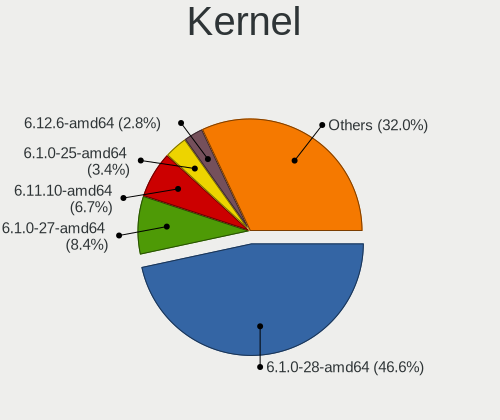
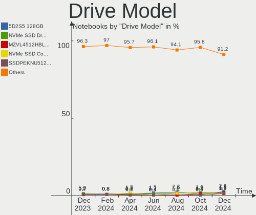
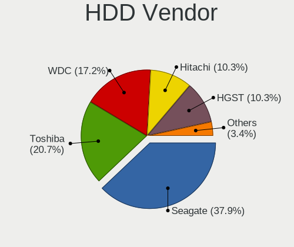
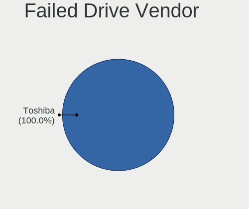
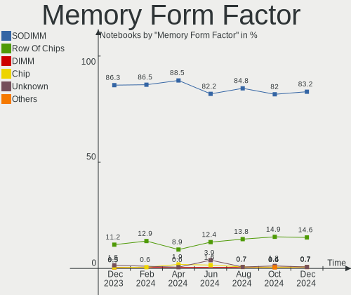
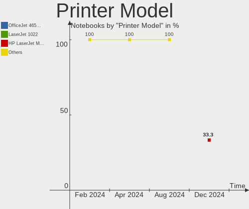

Debian - Hardware Trends (Notebooks)
------------------------------------

A project to identify most popular hardware characteristics and track their change
over time based on data collected by Linux users at https://Linux-Hardware.org.

Anyone can contribute to this report by the [hw-probe](https://github.com/linuxhw/hw-probe) tool:

    sudo -E hw-probe -all -upload

This report is for one last month. Overall report since the beginning of time: [TestCoverage](https://github.com/linuxhw/TestCoverage)

Period: Jun, 2022.

Contents
--------

* [ System ](#system)
  - [ OS                       ](#os)
  - [ OS Family                ](#os-family)
  - [ Kernel                   ](#kernel)
  - [ Kernel Family            ](#kernel-family)
  - [ Kernel Major Ver.        ](#kernel-major-ver)
  - [ Arch                     ](#arch)
  - [ DE                       ](#de)
  - [ Display Server           ](#display-server)
  - [ Display Manager          ](#display-manager)
  - [ OS Lang                  ](#os-lang)
  - [ Boot Mode                ](#boot-mode)
  - [ Filesystem               ](#filesystem)
  - [ Part. scheme             ](#part-scheme)
  - [ Dual Boot with Linux/BSD ](#dual-boot-with-linuxbsd)
  - [ Dual Boot (Win)          ](#dual-boot-win)

* [ Board ](#board)
  - [ Vendor                   ](#vendor)
  - [ Model                    ](#model)
  - [ Model Family             ](#model-family)
  - [ MFG Year                 ](#mfg-year)
  - [ Form Factor              ](#form-factor)
  - [ Secure Boot              ](#secure-boot)
  - [ Coreboot                 ](#coreboot)
  - [ RAM Size                 ](#ram-size)
  - [ RAM Used                 ](#ram-used)
  - [ Total Drives             ](#total-drives)
  - [ Has CD-ROM               ](#has-cd-rom)
  - [ Has Ethernet             ](#has-ethernet)
  - [ Has WiFi                 ](#has-wifi)
  - [ Has Bluetooth            ](#has-bluetooth)

* [ Location ](#location)
  - [ Country                  ](#country)
  - [ City                     ](#city)

* [ Drives ](#drives)
  - [ Drive Vendor             ](#drive-vendor)
  - [ Drive Model              ](#drive-model)
  - [ HDD Vendor               ](#hdd-vendor)
  - [ SSD Vendor               ](#ssd-vendor)
  - [ Drive Kind               ](#drive-kind)
  - [ Drive Connector          ](#drive-connector)
  - [ Drive Size               ](#drive-size)
  - [ Space Total              ](#space-total)
  - [ Space Used               ](#space-used)
  - [ Malfunc. Drives          ](#malfunc-drives)
  - [ Malfunc. Drive Vendor    ](#malfunc-drive-vendor)
  - [ Malfunc. HDD Vendor      ](#malfunc-hdd-vendor)
  - [ Malfunc. Drive Kind      ](#malfunc-drive-kind)
  - [ Failed Drives            ](#failed-drives)
  - [ Failed Drive Vendor      ](#failed-drive-vendor)
  - [ Drive Status             ](#drive-status)

* [ Storage controller ](#storage-controller)
  - [ Storage Vendor           ](#storage-vendor)
  - [ Storage Model            ](#storage-model)
  - [ Storage Kind             ](#storage-kind)

* [ Processor ](#processor)
  - [ CPU Vendor               ](#cpu-vendor)
  - [ CPU Model                ](#cpu-model)
  - [ CPU Model Family         ](#cpu-model-family)
  - [ CPU Cores                ](#cpu-cores)
  - [ CPU Sockets              ](#cpu-sockets)
  - [ CPU Threads              ](#cpu-threads)
  - [ CPU Op-Modes             ](#cpu-op-modes)
  - [ CPU Microcode            ](#cpu-microcode)
  - [ CPU Microarch            ](#cpu-microarch)

* [ Graphics ](#graphics)
  - [ GPU Vendor               ](#gpu-vendor)
  - [ GPU Model                ](#gpu-model)
  - [ GPU Combo                ](#gpu-combo)
  - [ GPU Driver               ](#gpu-driver)
  - [ GPU Memory               ](#gpu-memory)

* [ Monitor ](#monitor)
  - [ Monitor Vendor           ](#monitor-vendor)
  - [ Monitor Model            ](#monitor-model)
  - [ Monitor Resolution       ](#monitor-resolution)
  - [ Monitor Diagonal         ](#monitor-diagonal)
  - [ Monitor Width            ](#monitor-width)
  - [ Aspect Ratio             ](#aspect-ratio)
  - [ Monitor Area             ](#monitor-area)
  - [ Pixel Density            ](#pixel-density)
  - [ Multiple Monitors        ](#multiple-monitors)

* [ Network ](#network)
  - [ Net Controller Vendor    ](#net-controller-vendor)
  - [ Net Controller Model     ](#net-controller-model)
  - [ Wireless Vendor          ](#wireless-vendor)
  - [ Wireless Model           ](#wireless-model)
  - [ Ethernet Vendor          ](#ethernet-vendor)
  - [ Ethernet Model           ](#ethernet-model)
  - [ Net Controller Kind      ](#net-controller-kind)
  - [ Used Controller          ](#used-controller)
  - [ NICs                     ](#nics)
  - [ IPv6                     ](#ipv6)

* [ Bluetooth ](#bluetooth)
  - [ Bluetooth Vendor         ](#bluetooth-vendor)
  - [ Bluetooth Model          ](#bluetooth-model)

* [ Sound ](#sound)
  - [ Sound Vendor             ](#sound-vendor)
  - [ Sound Model              ](#sound-model)

* [ Memory ](#memory)
  - [ Memory Vendor            ](#memory-vendor)
  - [ Memory Model             ](#memory-model)
  - [ Memory Kind              ](#memory-kind)
  - [ Memory Form Factor       ](#memory-form-factor)
  - [ Memory Size              ](#memory-size)
  - [ Memory Speed             ](#memory-speed)

* [ Printers & scanners ](#printers--scanners)
  - [ Printer Vendor           ](#printer-vendor)
  - [ Printer Model            ](#printer-model)
  - [ Scanner Vendor           ](#scanner-vendor)
  - [ Scanner Model            ](#scanner-model)

* [ Camera ](#camera)
  - [ Camera Vendor            ](#camera-vendor)
  - [ Camera Model             ](#camera-model)

* [ Security ](#security)
  - [ Fingerprint Vendor       ](#fingerprint-vendor)
  - [ Fingerprint Model        ](#fingerprint-model)
  - [ Chipcard Vendor          ](#chipcard-vendor)
  - [ Chipcard Model           ](#chipcard-model)

* [ Unsupported ](#unsupported)
  - [ Unsupported Devices      ](#unsupported-devices)
  - [ Unsupported Device Types ](#unsupported-device-types)

System
------

OS
--

Installed operating systems

| Name              | Notebooks | Percent |
|-------------------|-----------|---------|
| Debian 11         | 119       | 83.8%   |
| Debian Testing    | 12        | 8.45%   |
| Debian 10         | 6         | 4.23%   |
| Debian Unstable   | 3         | 2.11%   |
| Debian 8          | 1         | 0.7%    |
| Debian 11-updates | 1         | 0.7%    |

OS Family
---------

OS without a version

| Name   | Notebooks | Percent |
|--------|-----------|---------|
| Debian | 142       | 100%    |

Kernel
------

Version of the Linux kernel

| Version                    | Notebooks | Percent |
|----------------------------|-----------|---------|
| 5.10.0-7-amd64             | 29        | 20.42%  |
| 5.10.0-15-amd64            | 29        | 20.42%  |
| 5.10.0-14-amd64            | 29        | 20.42%  |
| 5.10.0-13-amd64            | 11        | 7.75%   |
| 5.18.0-2-amd64             | 6         | 4.23%   |
| 5.18.0-1-amd64             | 4         | 2.82%   |
| 5.17.0-1-amd64             | 4         | 2.82%   |
| 5.16.0-0.bpo.4-amd64       | 4         | 2.82%   |
| 5.15.35-1-pve              | 2         | 1.41%   |
| 5.19.0-rc3-amd64           | 1         | 0.7%    |
| 5.18.4-xanmod1-x64v2       | 1         | 0.7%    |
| 5.18.0-trunk-amd64         | 1         | 0.7%    |
| 5.17.14                    | 1         | 0.7%    |
| 5.17.0-3-amd64             | 1         | 0.7%    |
| 5.17.0-2mx-amd64           | 1         | 0.7%    |
| 5.17.0-2-amd64             | 1         | 0.7%    |
| 5.17.0-14.1-liquorix-amd64 | 1         | 0.7%    |
| 5.15.32-xanmod1            | 1         | 0.7%    |
| 5.10.109+truenas           | 1         | 0.7%    |
| 5.10.10-64                 | 1         | 0.7%    |
| 5.10.0-3-amd64             | 1         | 0.7%    |
| 5.10.0-15-686              | 1         | 0.7%    |
| 5.10.0-14-686-pae          | 1         | 0.7%    |
| 5.10.0-13-686-pae          | 1         | 0.7%    |
| 5.10.0-13-686              | 1         | 0.7%    |
| 5.10.0-11-amd64            | 1         | 0.7%    |
| 5.10.0-10-amd64            | 1         | 0.7%    |
| 5.10.0-0.bpo.9-amd64       | 1         | 0.7%    |
| 5.10.0-0.bpo.12-amd64      | 1         | 0.7%    |
| 4.19.0-20-686-pae          | 1         | 0.7%    |
| 4.19.0-19-amd64            | 1         | 0.7%    |
| 4.19.0-16-amd64            | 1         | 0.7%    |
| 3.0.21-perf                | 1         | 0.7%    |

Kernel Family
-------------

Linux kernel without a distro release

| Version  | Notebooks | Percent |
|----------|-----------|---------|
| 5.10.0   | 107       | 75.35%  |
| 5.18.0   | 11        | 7.75%   |
| 5.17.0   | 8         | 5.63%   |
| 5.16.0   | 4         | 2.82%   |
| 4.19.0   | 3         | 2.11%   |
| 5.15.35  | 2         | 1.41%   |
| 5.19.0   | 1         | 0.7%    |
| 5.18.4   | 1         | 0.7%    |
| 5.17.14  | 1         | 0.7%    |
| 5.15.32  | 1         | 0.7%    |
| 5.10.109 | 1         | 0.7%    |
| 5.10.10  | 1         | 0.7%    |
| 3.0.21   | 1         | 0.7%    |

Kernel Major Ver.
-----------------

Linux kernel major version

| Version | Notebooks | Percent |
|---------|-----------|---------|
| 5.10    | 109       | 76.76%  |
| 5.18    | 12        | 8.45%   |
| 5.17    | 9         | 6.34%   |
| 5.16    | 4         | 2.82%   |
| 5.15    | 3         | 2.11%   |
| 4.19    | 3         | 2.11%   |
| 5.19    | 1         | 0.7%    |
| 3.0     | 1         | 0.7%    |

Arch
----

OS architecture (x86_64, i586, etc.)

| Name   | Notebooks | Percent |
|--------|-----------|---------|
| x86_64 | 136       | 95.77%  |
| i686   | 5         | 3.52%   |
| armv7l | 1         | 0.7%    |

DE
--

Desktop Environment

| Name             | Notebooks | Percent |
|------------------|-----------|---------|
| GNOME            | 45        | 31.69%  |
| Unknown          | 35        | 24.65%  |
| XFCE             | 21        | 14.79%  |
| KDE5             | 17        | 11.97%  |
| MATE             | 4         | 2.82%   |
| Cinnamon         | 4         | 2.82%   |
| LXQt             | 3         | 2.11%   |
| i3               | 3         | 2.11%   |
| X-Cinnamon       | 2         | 1.41%   |
| LXDE             | 2         | 1.41%   |
| Unity            | 1         | 0.7%    |
| trinity          | 1         | 0.7%    |
| sway             | 1         | 0.7%    |
| lightdm-xsession | 1         | 0.7%    |
| GNOME Flashback  | 1         | 0.7%    |
| Budgie           | 1         | 0.7%    |

Display Server
--------------

X11 or Wayland

| Name    | Notebooks | Percent |
|---------|-----------|---------|
| X11     | 71        | 50%     |
| Wayland | 35        | 24.65%  |
| Unknown | 32        | 22.54%  |
| Tty     | 4         | 2.82%   |

Display Manager
---------------

SDDM, LightDM, etc.

| Name    | Notebooks | Percent |
|---------|-----------|---------|
| Unknown | 48        | 33.8%   |
| LightDM | 34        | 23.94%  |
| GDM     | 27        | 19.01%  |
| SDDM    | 17        | 11.97%  |
| GDM3    | 14        | 9.86%   |
| NODM    | 2         | 1.41%   |

OS Lang
-------

Language

| Lang    | Notebooks | Percent |
|---------|-----------|---------|
| en_US   | 44        | 30.99%  |
| ru_RU   | 33        | 23.24%  |
| de_DE   | 13        | 9.15%   |
| en_GB   | 10        | 7.04%   |
| fr_FR   | 7         | 4.93%   |
| en_AU   | 4         | 2.82%   |
| Unknown | 4         | 2.82%   |
| zh_CN   | 3         | 2.11%   |
| pt_BR   | 3         | 2.11%   |
| es_AR   | 3         | 2.11%   |
| pl_PL   | 2         | 1.41%   |
| es_VE   | 2         | 1.41%   |
| en_IN   | 2         | 1.41%   |
| en_DE   | 2         | 1.41%   |
| en_CA   | 2         | 1.41%   |
| nl_BE   | 1         | 0.7%    |
| fi_FI   | 1         | 0.7%    |
| es_PE   | 1         | 0.7%    |
| es_MX   | 1         | 0.7%    |
| en_SG   | 1         | 0.7%    |
| en_NZ   | 1         | 0.7%    |
| en_IE   | 1         | 0.7%    |
| C       | 1         | 0.7%    |

Boot Mode
---------

EFI or BIOS

| Mode | Notebooks | Percent |
|------|-----------|---------|
| EFI  | 104       | 73.24%  |
| BIOS | 38        | 26.76%  |

Filesystem
----------

Type of filesystem

| Type    | Notebooks | Percent |
|---------|-----------|---------|
| Ext4    | 97        | 68.31%  |
| Overlay | 35        | 24.65%  |
| Btrfs   | 6         | 4.23%   |
| Zfs     | 2         | 1.41%   |
| Rootfs  | 1         | 0.7%    |
| Ext2    | 1         | 0.7%    |

Part. scheme
------------

Scheme of partitioning

| Type    | Notebooks | Percent |
|---------|-----------|---------|
| GPT     | 104       | 73.24%  |
| MBR     | 21        | 14.79%  |
| Unknown | 17        | 11.97%  |

Dual Boot with Linux/BSD
------------------------

Hosting more than one Linux/BSD

| Dual boot | Notebooks | Percent |
|-----------|-----------|---------|
| No        | 129       | 90.85%  |
| Yes       | 13        | 9.15%   |

Dual Boot (Win)
---------------

Hosting Linux and Windows

| Dual boot | Notebooks | Percent |
|-----------|-----------|---------|
| No        | 81        | 57.04%  |
| Yes       | 61        | 42.96%  |

Board
-----

Vendor
------

Motherboard manufacturer

| Name                | Notebooks | Percent |
|---------------------|-----------|---------|
| Lenovo              | 30        | 21.13%  |
| Aquarius            | 28        | 19.72%  |
| Dell                | 22        | 15.49%  |
| Hewlett-Packard     | 17        | 11.97%  |
| ASUSTek Computer    | 10        | 7.04%   |
| Acer                | 8         | 5.63%   |
| Apple               | 3         | 2.11%   |
| Toshiba             | 2         | 1.41%   |
| HUAWEI              | 2         | 1.41%   |
| Google              | 2         | 1.41%   |
| Fujitsu             | 2         | 1.41%   |
| TUXEDO              | 1         | 0.7%    |
| Timi                | 1         | 0.7%    |
| TEKNOSERVICE        | 1         | 0.7%    |
| SANTECH             | 1         | 0.7%    |
| Samsung Electronics | 1         | 0.7%    |
| Razer               | 1         | 0.7%    |
| PC Specialist       | 1         | 0.7%    |
| Notebook            | 1         | 0.7%    |
| Medion              | 1         | 0.7%    |
| LG Electronics      | 1         | 0.7%    |
| Insyde              | 1         | 0.7%    |
| Flipkart India Pvt. | 1         | 0.7%    |
| Chuwi               | 1         | 0.7%    |
| BenQ                | 1         | 0.7%    |
| AXDIA International | 1         | 0.7%    |
| Unknown             | 1         | 0.7%    |

Model
-----

Motherboard model

| Name                                               | Notebooks | Percent |
|----------------------------------------------------|-----------|---------|
| Aquarius NS585                                     | 28        | 19.72%  |
| TUXEDO Aura 15 Gen1                                | 1         | 0.7%    |
| Toshiba Satellite L850                             | 1         | 0.7%    |
| Toshiba Satellite A300                             | 1         | 0.7%    |
| Timi A7S                                           | 1         | 0.7%    |
| TEKNOSERVICE PORTATIL TTL 14                       | 1         | 0.7%    |
| SANTECH NHx0DB,DE                                  | 1         | 0.7%    |
| Samsung 935XDB                                     | 1         | 0.7%    |
| Razer Blade 15 Base Model (Early 2020) - RZ09-0328 | 1         | 0.7%    |
| PC Specialist Standard                             | 1         | 0.7%    |
| Notebook NL40_50CU                                 | 1         | 0.7%    |
| Medion E16402                                      | 1         | 0.7%    |
| LG A410-G.BC48P1                                   | 1         | 0.7%    |
| Lenovo XiaoXinPro-13ARE 2020 82DM                  | 1         | 0.7%    |
| Lenovo ThinkPad X260 VB6R77903H                    | 1         | 0.7%    |
| Lenovo ThinkPad X230 2325AEG                       | 1         | 0.7%    |
| Lenovo ThinkPad X140e 20BLA00C00                   | 1         | 0.7%    |
| Lenovo ThinkPad X1 Carbon Gen 9 20XW0050GE         | 1         | 0.7%    |
| Lenovo ThinkPad X1 Carbon Gen 10 21CBCTO1WW        | 1         | 0.7%    |
| Lenovo ThinkPad X1 Carbon 4th 20FBCTO1WW           | 1         | 0.7%    |
| Lenovo ThinkPad X1 Carbon 2nd 20A7002WUS           | 1         | 0.7%    |
| Lenovo ThinkPad T61 7659CA1                        | 1         | 0.7%    |
| Lenovo ThinkPad T480 20L5000BGE                    | 1         | 0.7%    |
| Lenovo ThinkPad T470 20HES07J00                    | 1         | 0.7%    |
| Lenovo ThinkPad T470 20HD000EUK                    | 1         | 0.7%    |
| Lenovo ThinkPad T440s 20AQ008FUS                   | 1         | 0.7%    |
| Lenovo ThinkPad T14s Gen 1 20UH001QGE              | 1         | 0.7%    |
| Lenovo ThinkPad T14 Gen 3 21AH0019US               | 1         | 0.7%    |
| Lenovo ThinkPad T14 Gen 1 20S1SGQM00               | 1         | 0.7%    |
| Lenovo ThinkPad T14 Gen 1 20S1S00100               | 1         | 0.7%    |
| Lenovo ThinkPad P15s Gen 2i 20W600ELUS             | 1         | 0.7%    |
| Lenovo ThinkPad P1 20MDCTO1WW                      | 1         | 0.7%    |
| Lenovo ThinkPad L15 Gen 1 20U7001VMH               | 1         | 0.7%    |
| Lenovo ThinkPad L14 Gen 1 20U50001GE               | 1         | 0.7%    |
| Lenovo ThinkBook 15 G3 ACL 21A4                    | 1         | 0.7%    |
| Lenovo ThinkBook 14p Gen 2 20YN                    | 1         | 0.7%    |
| Lenovo Legion 5 17ACH6 82K0                        | 1         | 0.7%    |
| Lenovo IdeaPad Slim 1-14AST-05 81VS                | 1         | 0.7%    |
| Lenovo IdeaPad S340-15IWL 81N8                     | 1         | 0.7%    |
| Lenovo IdeaPad S145-15API 81UT                     | 1         | 0.7%    |
| Lenovo IdeaPad 5-15IIL05 81YK                      | 1         | 0.7%    |
| Lenovo IdeaPad 5 Pro 16IHU6 82L9                   | 1         | 0.7%    |
| Lenovo Edge 15 80K9                                | 1         | 0.7%    |
| Insyde GeminiLake                                  | 1         | 0.7%    |
| HUAWEI NBD-WXX9                                    | 1         | 0.7%    |
| HUAWEI KLVD-WXX9                                   | 1         | 0.7%    |
| HP ZBook Fury 17.3 inch G8 Mobile Workstation PC   | 1         | 0.7%    |
| HP Stream Laptop 11-y0XX                           | 1         | 0.7%    |
| HP ProBook 440 G0                                  | 1         | 0.7%    |
| HP Pavilion g6                                     | 1         | 0.7%    |
| HP Pavilion g4                                     | 1         | 0.7%    |
| HP Pavilion 17                                     | 1         | 0.7%    |
| HP Pavilion 15                                     | 1         | 0.7%    |
| HP OMEN Laptop 15-ek0xxx                           | 1         | 0.7%    |
| HP EliteBook 850 G3                                | 1         | 0.7%    |
| HP EliteBook 845 G7 Notebook PC                    | 1         | 0.7%    |
| HP EliteBook 840 G6                                | 1         | 0.7%    |
| HP EliteBook 840 G3                                | 1         | 0.7%    |
| HP EliteBook 840 G1                                | 1         | 0.7%    |
| HP EliteBook 830 G5                                | 1         | 0.7%    |

Model Family
------------

Motherboard model prefix

| Name                            | Notebooks | Percent |
|---------------------------------|-----------|---------|
| Aquarius NS585                  | 28        | 19.72%  |
| Lenovo ThinkPad                 | 20        | 14.08%  |
| Dell Latitude                   | 12        | 8.45%   |
| HP EliteBook                    | 6         | 4.23%   |
| Acer Aspire                     | 6         | 4.23%   |
| Lenovo IdeaPad                  | 5         | 3.52%   |
| Dell Inspiron                   | 5         | 3.52%   |
| HP Pavilion                     | 4         | 2.82%   |
| Dell Vostro                     | 3         | 2.11%   |
| Toshiba Satellite               | 2         | 1.41%   |
| Lenovo ThinkBook                | 2         | 1.41%   |
| HP 250                          | 2         | 1.41%   |
| Fujitsu LIFEBOOK                | 2         | 1.41%   |
| ASUS ZenBook                    | 2         | 1.41%   |
| Apple MacBookPro11              | 2         | 1.41%   |
| Acer Nitro                      | 2         | 1.41%   |
| TUXEDO Aura                     | 1         | 0.7%    |
| Timi A7S                        | 1         | 0.7%    |
| TEKNOSERVICE PORTATIL           | 1         | 0.7%    |
| SANTECH NHx0DB                  | 1         | 0.7%    |
| Samsung 935XDB                  | 1         | 0.7%    |
| Razer Blade                     | 1         | 0.7%    |
| PC Specialist Standard          | 1         | 0.7%    |
| Notebook NL40                   | 1         | 0.7%    |
| Medion E16402                   | 1         | 0.7%    |
| LG A410-G.BC48P1                | 1         | 0.7%    |
| Lenovo XiaoXinPro-13ARE         | 1         | 0.7%    |
| Lenovo Legion                   | 1         | 0.7%    |
| Lenovo Edge                     | 1         | 0.7%    |
| Insyde GeminiLake               | 1         | 0.7%    |
| HUAWEI NBD-WXX9                 | 1         | 0.7%    |
| HUAWEI KLVD-WXX9                | 1         | 0.7%    |
| HP ZBook                        | 1         | 0.7%    |
| HP Stream                       | 1         | 0.7%    |
| HP ProBook                      | 1         | 0.7%    |
| HP OMEN                         | 1         | 0.7%    |
| HP 255                          | 1         | 0.7%    |
| Google Celes                    | 1         | 0.7%    |
| Google Cave                     | 1         | 0.7%    |
| Flipkart India Pvt. NKi510TL85S | 1         | 0.7%    |
| Dell Precision                  | 1         | 0.7%    |
| Dell G15                        | 1         | 0.7%    |
| Chuwi LarkBook                  | 1         | 0.7%    |
| BenQ Joybook                    | 1         | 0.7%    |
| AXDIA International MYBOOK      | 1         | 0.7%    |
| ASUS X751LK                     | 1         | 0.7%    |
| ASUS X556UQK                    | 1         | 0.7%    |
| ASUS X541UAK                    | 1         | 0.7%    |
| ASUS VivoBook                   | 1         | 0.7%    |
| ASUS S550CM                     | 1         | 0.7%    |
| ASUS N550JK                     | 1         | 0.7%    |
| ASUS G752VT                     | 1         | 0.7%    |
| ASUS ASUS                       | 1         | 0.7%    |
| Apple MacBookPro14              | 1         | 0.7%    |
| Unknown                         | 1         | 0.7%    |

MFG Year
--------

Motherboard manufacture year

| Year    | Notebooks | Percent |
|---------|-----------|---------|
| 2020    | 46        | 32.39%  |
| 2021    | 20        | 14.08%  |
| 2018    | 11        | 7.75%   |
| 2014    | 10        | 7.04%   |
| 2017    | 9         | 6.34%   |
| 2016    | 9         | 6.34%   |
| 2012    | 8         | 5.63%   |
| 2019    | 7         | 4.93%   |
| 2022    | 5         | 3.52%   |
| 2011    | 5         | 3.52%   |
| 2013    | 4         | 2.82%   |
| 2008    | 2         | 1.41%   |
| 2015    | 1         | 0.7%    |
| 2010    | 1         | 0.7%    |
| 2009    | 1         | 0.7%    |
| 2007    | 1         | 0.7%    |
| 2005    | 1         | 0.7%    |
| Unknown | 1         | 0.7%    |

Form Factor
-----------

Physical design of the computer

| Name     | Notebooks | Percent |
|----------|-----------|---------|
| Notebook | 142       | 100%    |

Secure Boot
-----------

Enabled or disabled

| State    | Notebooks | Percent |
|----------|-----------|---------|
| Disabled | 128       | 90.14%  |
| Enabled  | 14        | 9.86%   |

Coreboot
--------

Have coreboot on board

| Used | Notebooks | Percent |
|------|-----------|---------|
| No   | 140       | 98.59%  |
| Yes  | 2         | 1.41%   |

RAM Size
--------

Total RAM memory

| Size in GB  | Notebooks | Percent |
|-------------|-----------|---------|
| 4.01-8.0    | 63        | 44.37%  |
| 16.01-24.0  | 24        | 16.9%   |
| 8.01-16.0   | 19        | 13.38%  |
| 3.01-4.0    | 17        | 11.97%  |
| 32.01-64.0  | 8         | 5.63%   |
| 64.01-256.0 | 3         | 2.11%   |
| 1.01-2.0    | 2         | 1.41%   |
| 0.51-1.0    | 2         | 1.41%   |
| 24.01-32.0  | 1         | 0.7%    |
| 2.01-3.0    | 1         | 0.7%    |
| 0.01-0.5    | 1         | 0.7%    |
| Unknown     | 1         | 0.7%    |

RAM Used
--------

Used RAM memory

| Used GB    | Notebooks | Percent |
|------------|-----------|---------|
| 0.51-1.0   | 36        | 25.35%  |
| 1.01-2.0   | 31        | 21.83%  |
| 2.01-3.0   | 30        | 21.13%  |
| 4.01-8.0   | 16        | 11.27%  |
| 3.01-4.0   | 14        | 9.86%   |
| 8.01-16.0  | 9         | 6.34%   |
| 0.01-0.5   | 3         | 2.11%   |
| Unknown    | 2         | 1.41%   |
| 24.01-32.0 | 1         | 0.7%    |

Total Drives
------------

Number of drives on board

| Drives | Notebooks | Percent |
|--------|-----------|---------|
| 1      | 106       | 74.65%  |
| 2      | 30        | 21.13%  |
| 3      | 3         | 2.11%   |
| 7      | 1         | 0.7%    |
| 4      | 1         | 0.7%    |
| 0      | 1         | 0.7%    |

Has CD-ROM
----------

Has CD-ROM on board

| Presented | Notebooks | Percent |
|-----------|-----------|---------|
| No        | 118       | 83.1%   |
| Yes       | 24        | 16.9%   |

Has Ethernet
------------

Has Ethernet on board

| Presented | Notebooks | Percent |
|-----------|-----------|---------|
| Yes       | 116       | 81.69%  |
| No        | 26        | 18.31%  |

Has WiFi
--------

Has WiFi module

| Presented | Notebooks | Percent |
|-----------|-----------|---------|
| Yes       | 140       | 98.59%  |
| No        | 2         | 1.41%   |

Has Bluetooth
-------------

Has Bluetooth module

| Presented | Notebooks | Percent |
|-----------|-----------|---------|
| Yes       | 120       | 84.51%  |
| No        | 22        | 15.49%  |

Location
--------

Country
-------

Geographic location (country)

| Country      | Notebooks | Percent |
|--------------|-----------|---------|
| Russia       | 37        | 26.06%  |
| Germany      | 17        | 11.97%  |
| USA          | 16        | 11.27%  |
| France       | 8         | 5.63%   |
| UK           | 6         | 4.23%   |
| Brazil       | 6         | 4.23%   |
| Poland       | 5         | 3.52%   |
| China        | 5         | 3.52%   |
| Australia    | 5         | 3.52%   |
| Italy        | 3         | 2.11%   |
| Ireland      | 3         | 2.11%   |
| India        | 3         | 2.11%   |
| Canada       | 3         | 2.11%   |
| Argentina    | 3         | 2.11%   |
| Venezuela    | 2         | 1.41%   |
| Thailand     | 2         | 1.41%   |
| Austria      | 2         | 1.41%   |
| Uzbekistan   | 1         | 0.7%    |
| Spain        | 1         | 0.7%    |
| South Africa | 1         | 0.7%    |
| Singapore    | 1         | 0.7%    |
| Portugal     | 1         | 0.7%    |
| Peru         | 1         | 0.7%    |
| New Zealand  | 1         | 0.7%    |
| Netherlands  | 1         | 0.7%    |
| Nepal        | 1         | 0.7%    |
| Mexico       | 1         | 0.7%    |
| Iraq         | 1         | 0.7%    |
| Indonesia    | 1         | 0.7%    |
| Greece       | 1         | 0.7%    |
| Finland      | 1         | 0.7%    |
| Bulgaria     | 1         | 0.7%    |
| Belgium      | 1         | 0.7%    |

City
----

Geographic location (city)

| City                  | Notebooks | Percent |
|-----------------------|-----------|---------|
| Voronezh              | 29        | 20.42%  |
| London                | 5         | 3.52%   |
| Paris                 | 4         | 2.82%   |
| Moscow                | 4         | 2.82%   |
| Sydney                | 3         | 2.11%   |
| Dublin                | 3         | 2.11%   |
| Vienna                | 2         | 1.41%   |
| Shanghai              | 2         | 1.41%   |
| Perm                  | 2         | 1.41%   |
| Munich                | 2         | 1.41%   |
| Caracas               | 2         | 1.41%   |
| Weselberg             | 1         | 0.7%    |
| Wellington            | 1         | 0.7%    |
| Weare                 | 1         | 0.7%    |
| Washington            | 1         | 0.7%    |
| Warsaw                | 1         | 0.7%    |
| Vitória              | 1         | 0.7%    |
| Valley View           | 1         | 0.7%    |
| Uberlândia           | 1         | 0.7%    |
| Tyumen                | 1         | 0.7%    |
| Turin                 | 1         | 0.7%    |
| Tashkent              | 1         | 0.7%    |
| Stuttgart             | 1         | 0.7%    |
| Stevenage             | 1         | 0.7%    |
| St Louis              | 1         | 0.7%    |
| South Deerfield       | 1         | 0.7%    |
| Śliwice              | 1         | 0.7%    |
| Singapore             | 1         | 0.7%    |
| Shenzhen              | 1         | 0.7%    |
| Sevlievo              | 1         | 0.7%    |
| Semarang              | 1         | 0.7%    |
| Scarborough           | 1         | 0.7%    |
| Sao Carlos            | 1         | 0.7%    |
| Santa Rosa Loma Larga | 1         | 0.7%    |
| San Lorenzo           | 1         | 0.7%    |
| San Isidro            | 1         | 0.7%    |
| San Antonio           | 1         | 0.7%    |
| Samara                | 1         | 0.7%    |
| Saint-Denis           | 1         | 0.7%    |
| Saarbrücken          | 1         | 0.7%    |
| Ryde                  | 1         | 0.7%    |
| Rubí                 | 1         | 0.7%    |
| Póvoa de Varzim      | 1         | 0.7%    |
| Palos Verdes Estates  | 1         | 0.7%    |
| Oekene                | 1         | 0.7%    |
| Norman                | 1         | 0.7%    |
| Nonthaburi            | 1         | 0.7%    |
| New Delhi             | 1         | 0.7%    |
| Natal                 | 1         | 0.7%    |
| Meppen                | 1         | 0.7%    |
| Mar del Plata         | 1         | 0.7%    |
| Manteca               | 1         | 0.7%    |
| Lübeck               | 1         | 0.7%    |
| Longjumeau            | 1         | 0.7%    |
| Lille                 | 1         | 0.7%    |
| Lawrenceville         | 1         | 0.7%    |
| Laurel                | 1         | 0.7%    |
| Lainate               | 1         | 0.7%    |
| Kiel                  | 1         | 0.7%    |
| Kaufbeuren            | 1         | 0.7%    |

Drives
------

Drive Vendor
------------

Hard drive vendors

| Vendor                       | Notebooks | Drives | Percent |
|------------------------------|-----------|--------|---------|
| A-DATA Technology            | 30        | 30     | 17.14%  |
| Samsung Electronics          | 27        | 28     | 15.43%  |
| WDC                          | 20        | 20     | 11.43%  |
| Seagate                      | 16        | 19     | 9.14%   |
| SanDisk                      | 10        | 10     | 5.71%   |
| Unknown                      | 9         | 12     | 5.14%   |
| SK hynix                     | 7         | 8      | 4%      |
| Toshiba                      | 6         | 6      | 3.43%   |
| Kingston                     | 6         | 6      | 3.43%   |
| Intel                        | 5         | 6      | 2.86%   |
| Crucial                      | 5         | 5      | 2.86%   |
| LITEON                       | 3         | 3      | 1.71%   |
| Hitachi                      | 3         | 3      | 1.71%   |
| HGST                         | 3         | 3      | 1.71%   |
| Phison                       | 2         | 2      | 1.14%   |
| Netac                        | 2         | 2      | 1.14%   |
| KIOXIA                       | 2         | 2      | 1.14%   |
| Fujitsu                      | 2         | 2      | 1.14%   |
| Apple                        | 2         | 3      | 1.14%   |
| WDC PC S                     | 1         | 1      | 0.57%   |
| UMIS                         | 1         | 1      | 0.57%   |
| Transcend                    | 1         | 1      | 0.57%   |
| SPCC                         | 1         | 1      | 0.57%   |
| SMI DISK                     | 1         | 1      | 0.57%   |
| Silicon Motion               | 1         | 1      | 0.57%   |
| Shenzhen Longsys Electronics | 1         | 1      | 0.57%   |
| Patriot                      | 1         | 1      | 0.57%   |
| OWC                          | 1         | 1      | 0.57%   |
| LITEONIT                     | 1         | 1      | 0.57%   |
| KingFast                     | 1         | 1      | 0.57%   |
| KingDian                     | 1         | 1      | 0.57%   |
| JetFlash                     | 1         | 1      | 0.57%   |
| China                        | 1         | 1      | 0.57%   |
| ADATA Technology             | 1         | 1      | 0.57%   |

Drive Model
-----------

Hard drive models

| Model                                  | Notebooks | Percent |
|----------------------------------------|-----------|---------|
| A-DATA SU800 512GB SSD                 | 29        | 16.11%  |
| Seagate ST1000LM024 HN-M101MBB 1TB     | 5         | 2.78%   |
| HGST HTS541010A9E680 1TB               | 3         | 1.67%   |
| WDC PC SN530 SDBPNPZ-256G-1002 256GB   | 2         | 1.11%   |
| WDC PC SN530 NVMe 512GB                | 2         | 1.11%   |
| Unknown SD/MMC/MS PRO 128GB            | 2         | 1.11%   |
| Unknown MMC Card  32GB                 | 2         | 1.11%   |
| Unknown HBG4a2  32GB                   | 2         | 1.11%   |
| Toshiba MQ01ABF050 500GB               | 2         | 1.11%   |
| SK hynix SC311 SATA 256GB SSD          | 2         | 1.11%   |
| SanDisk SSD U100 24GB                  | 2         | 1.11%   |
| SanDisk SSD PLUS 120GB                 | 2         | 1.11%   |
| Samsung SSD 970 EVO Plus 1TB           | 2         | 1.11%   |
| Samsung MZVLQ512HALU-00000 512GB       | 2         | 1.11%   |
| Samsung MZVLB512HBJQ-000L7 512GB       | 2         | 1.11%   |
| Samsung MZVL2512HCJQ-00BL7 512GB       | 2         | 1.11%   |
| WDC WDS500G2B0C-00PXH0 500GB           | 1         | 0.56%   |
| WDC WDS500G2B0A-00SM50 500GB SSD       | 1         | 0.56%   |
| WDC WDS480G2G0A-00JH30 480GB SSD       | 1         | 0.56%   |
| WDC WDS240G2G0A-00JH30 240GB SSD       | 1         | 0.56%   |
| WDC WDS100T2B0C-00PXH0 1TB             | 1         | 0.56%   |
| WDC WD7500BPVX-75JC3T0 752GB           | 1         | 0.56%   |
| WDC WD10SPZX-75Z10T2 1TB               | 1         | 0.56%   |
| WDC WD10SPZX-24Z10 1TB                 | 1         | 0.56%   |
| WDC WD10SPZX-08Z10 1TB                 | 1         | 0.56%   |
| WDC WD10SPZX-00Z10T0 1TB               | 1         | 0.56%   |
| WDC WD10SPCX-24HWST1 1TB               | 1         | 0.56%   |
| WDC WD10 TPVT-65HT5T0 1TB              | 1         | 0.56%   |
| WDC PC SN730 SDBQNTY-256G-1001 256GB   | 1         | 0.56%   |
| WDC PC SN730 SDBQNTY-1T00-1001 1TB     | 1         | 0.56%   |
| WDC PC SN530 SDBPMPZ-512G-1101 512GB   | 1         | 0.56%   |
| WDC PC SN520 SDAPMUW-256G-1101 256GB   | 1         | 0.56%   |
| WDC PC S N730 SDBPNTY-512 512GB        | 1         | 0.56%   |
| Unknown SU16G  16GB                    | 1         | 0.56%   |
| Unknown MS  64GB                       | 1         | 0.56%   |
| Unknown MMC Card  64GB                 | 1         | 0.56%   |
| Unknown MMC Card  4GB                  | 1         | 0.56%   |
| Unknown 8GTF4R  8GB                    | 1         | 0.56%   |
| UMIS RPFTJ128PDD2EWX 128GB             | 1         | 0.56%   |
| Transcend TS120GMTS420S 120GB SSD      | 1         | 0.56%   |
| Toshiba THNSF5256GPUK 256GB            | 1         | 0.56%   |
| Toshiba MQ01ABD100 1TB                 | 1         | 0.56%   |
| Toshiba MQ01ABD050 500GB               | 1         | 0.56%   |
| Toshiba MK2546GSX 250GB                | 1         | 0.56%   |
| SPCC M.2 PCIe SSD 512GB                | 1         | 0.56%   |
| SMI DISK Disk 506GB                    | 1         | 0.56%   |
| SK hynix SKHynix_HFS512GDE9X084N 512GB | 1         | 0.56%   |
| SK hynix SHGP31-500GM-2 500GB          | 1         | 0.56%   |
| SK hynix PC801 NVMe 1TB                | 1         | 0.56%   |
| SK hynix NVMe SSD Drive 1024GB         | 1         | 0.56%   |
| SK hynix HFS256G32TND-N210A 256GB SSD  | 1         | 0.56%   |
| Silicon Motion 256GB PCS PCIe M.2 SSD  | 1         | 0.56%   |
| Shenzhen Longsys NVMe SSD Drive 256GB  | 1         | 0.56%   |
| Seagate ST925031 5AS 250GB             | 1         | 0.56%   |
| Seagate ST9160412ASG 160GB             | 1         | 0.56%   |
| Seagate ST9160412AS 160GB              | 1         | 0.56%   |
| Seagate ST750LM022 HN-M750MBB 752GB    | 1         | 0.56%   |
| Seagate ST500LM012 HN-M500MBB 500GB    | 1         | 0.56%   |
| Seagate ST500LM000-1EJ162 500GB        | 1         | 0.56%   |
| Seagate ST3750640AS 752GB              | 1         | 0.56%   |

HDD Vendor
----------

Hard disk drive vendors

| Vendor  | Notebooks | Drives | Percent |
|---------|-----------|--------|---------|
| Seagate | 16        | 19     | 42.11%  |
| WDC     | 7         | 7      | 18.42%  |
| Toshiba | 5         | 5      | 13.16%  |
| Hitachi | 3         | 3      | 7.89%   |
| HGST    | 3         | 3      | 7.89%   |
| Unknown | 2         | 2      | 5.26%   |
| Fujitsu | 2         | 2      | 5.26%   |

SSD Vendor
----------

Solid state drive vendors

| Vendor              | Notebooks | Drives | Percent |
|---------------------|-----------|--------|---------|
| A-DATA Technology   | 29        | 29     | 40.85%  |
| Samsung Electronics | 8         | 8      | 11.27%  |
| SanDisk             | 6         | 6      | 8.45%   |
| Kingston            | 5         | 5      | 7.04%   |
| WDC                 | 3         | 3      | 4.23%   |
| SK hynix            | 3         | 3      | 4.23%   |
| LITEON              | 3         | 3      | 4.23%   |
| Crucial             | 3         | 3      | 4.23%   |
| Netac               | 2         | 2      | 2.82%   |
| Intel               | 2         | 2      | 2.82%   |
| Transcend           | 1         | 1      | 1.41%   |
| Patriot             | 1         | 1      | 1.41%   |
| LITEONIT            | 1         | 1      | 1.41%   |
| KingFast            | 1         | 1      | 1.41%   |
| KingDian            | 1         | 1      | 1.41%   |
| China               | 1         | 1      | 1.41%   |
| Apple               | 1         | 1      | 1.41%   |

Drive Kind
----------

HDD or SSD

| Kind    | Notebooks | Drives | Percent |
|---------|-----------|--------|---------|
| SSD     | 68        | 71     | 41.21%  |
| NVMe    | 50        | 59     | 30.3%   |
| HDD     | 36        | 41     | 21.82%  |
| MMC     | 8         | 11     | 4.85%   |
| Unknown | 3         | 3      | 1.82%   |

Drive Connector
---------------

SATA, SAS, NVMe, etc.

| Type | Notebooks | Drives | Percent |
|------|-----------|--------|---------|
| SATA | 92        | 106    | 58.6%   |
| NVMe | 50        | 59     | 31.85%  |
| MMC  | 8         | 11     | 5.1%    |
| SAS  | 7         | 9      | 4.46%   |

Drive Size
----------

Size of hard drive

| Size in TB | Notebooks | Drives | Percent |
|------------|-----------|--------|---------|
| 0.51-1.0   | 54        | 57     | 52.43%  |
| 0.01-0.5   | 47        | 53     | 45.63%  |
| 3.01-4.0   | 1         | 1      | 0.97%   |
| 1.01-2.0   | 1         | 1      | 0.97%   |

Space Total
-----------

Amount of disk space available on the file system

| Size in GB | Notebooks | Percent |
|------------|-----------|---------|
| Unknown    | 36        | 25.35%  |
| 101-250    | 34        | 23.94%  |
| 251-500    | 26        | 18.31%  |
| 501-1000   | 25        | 17.61%  |
| 1001-2000  | 6         | 4.23%   |
| 21-50      | 5         | 3.52%   |
| 1-20       | 4         | 2.82%   |
| 51-100     | 4         | 2.82%   |
| 2001-3000  | 2         | 1.41%   |

Space Used
----------

Amount of used disk space

| Used GB   | Notebooks | Percent |
|-----------|-----------|---------|
| 1-20      | 40        | 28.17%  |
| Unknown   | 36        | 25.35%  |
| 21-50     | 16        | 11.27%  |
| 101-250   | 15        | 10.56%  |
| 251-500   | 14        | 9.86%   |
| 51-100    | 14        | 9.86%   |
| 501-1000  | 5         | 3.52%   |
| 1001-2000 | 2         | 1.41%   |

Malfunc. Drives
---------------

Drive models with a malfunction

| Model                                            | Notebooks | Drives | Percent |
|--------------------------------------------------|-----------|--------|---------|
| Seagate ST1000LM024 HN-M101MBB 1TB               | 3         | 3      | 17.65%  |
| WDC WD10 TPVT-65HT5T0 1TB                        | 1         | 1      | 5.88%   |
| Toshiba MK2546GSX 250GB                          | 1         | 1      | 5.88%   |
| Seagate ST9160412AS 160GB                        | 1         | 1      | 5.88%   |
| Seagate ST750LM022 HN-M750MBB 752GB              | 1         | 1      | 5.88%   |
| Seagate ST500LM012 HN-M500MBB 500GB              | 1         | 1      | 5.88%   |
| SanDisk SSD U100 24GB                            | 1         | 1      | 5.88%   |
| SanDisk SD9TN8W-256G-1006 256GB SSD              | 1         | 1      | 5.88%   |
| Samsung Electronics MZNLH256HAJD-000H1 256GB SSD | 1         | 1      | 5.88%   |
| Intel SSDSCKKF256H6 SATA 256GB                   | 1         | 1      | 5.88%   |
| Intel SSDSA2M160G2LE 160GB                       | 1         | 1      | 5.88%   |
| Hitachi HTS547564A9E384 640GB                    | 1         | 1      | 5.88%   |
| Hitachi HTS545016B9A300 160GB                    | 1         | 1      | 5.88%   |
| HGST HTS541010A9E680 1TB                         | 1         | 1      | 5.88%   |
| Fujitsu MHT2030AT 32GB                           | 1         | 1      | 5.88%   |

Malfunc. Drive Vendor
---------------------

Vendors of faulty drives

| Vendor              | Notebooks | Drives | Percent |
|---------------------|-----------|--------|---------|
| Seagate             | 6         | 6      | 35.29%  |
| SanDisk             | 2         | 2      | 11.76%  |
| Intel               | 2         | 2      | 11.76%  |
| Hitachi             | 2         | 2      | 11.76%  |
| WDC                 | 1         | 1      | 5.88%   |
| Toshiba             | 1         | 1      | 5.88%   |
| Samsung Electronics | 1         | 1      | 5.88%   |
| HGST                | 1         | 1      | 5.88%   |
| Fujitsu             | 1         | 1      | 5.88%   |

Malfunc. HDD Vendor
-------------------

Vendors of faulty HDD drives

| Vendor  | Notebooks | Drives | Percent |
|---------|-----------|--------|---------|
| Seagate | 6         | 6      | 50%     |
| Hitachi | 2         | 2      | 16.67%  |
| WDC     | 1         | 1      | 8.33%   |
| Toshiba | 1         | 1      | 8.33%   |
| HGST    | 1         | 1      | 8.33%   |
| Fujitsu | 1         | 1      | 8.33%   |

Malfunc. Drive Kind
-------------------

Kinds of faulty drives

| Kind | Notebooks | Drives | Percent |
|------|-----------|--------|---------|
| HDD  | 12        | 12     | 70.59%  |
| SSD  | 5         | 5      | 29.41%  |

Failed Drives
-------------

Failed drive models

| Model                           | Notebooks | Drives | Percent |
|---------------------------------|-----------|--------|---------|
| Seagate ST500LM000-1EJ162 500GB | 1         | 1      | 100%    |

Failed Drive Vendor
-------------------

Failed drive vendors

| Vendor  | Notebooks | Drives | Percent |
|---------|-----------|--------|---------|
| Seagate | 1         | 1      | 100%    |

Drive Status
------------

Number of failed and malfunc. drives

| Status   | Notebooks | Drives | Percent |
|----------|-----------|--------|---------|
| Works    | 108       | 130    | 71.05%  |
| Detected | 27        | 37     | 17.76%  |
| Malfunc  | 16        | 17     | 10.53%  |
| Failed   | 1         | 1      | 0.66%   |

Storage controller
------------------

Storage Vendor
--------------

Storage controller vendors

| Vendor                       | Notebooks | Percent |
|------------------------------|-----------|---------|
| Intel                        | 96        | 58.54%  |
| Samsung Electronics          | 21        | 12.8%   |
| AMD                          | 14        | 8.54%   |
| SanDisk                      | 12        | 7.32%   |
| SK hynix                     | 4         | 2.44%   |
| Phison Electronics           | 3         | 1.83%   |
| Micron/Crucial Technology    | 2         | 1.22%   |
| KIOXIA                       | 2         | 1.22%   |
| ADATA Technology             | 2         | 1.22%   |
| Union Memory (Shenzhen)      | 1         | 0.61%   |
| Toshiba America Info Systems | 1         | 0.61%   |
| Silicon Motion               | 1         | 0.61%   |
| Shenzhen Longsys Electronics | 1         | 0.61%   |
| MAXIO Technology (Hangzhou)  | 1         | 0.61%   |
| Kingston Technology Company  | 1         | 0.61%   |
| ASMedia Technology           | 1         | 0.61%   |
| Apple                        | 1         | 0.61%   |

Storage Model
-------------

Storage controller models

| Model                                                                          | Notebooks | Percent |
|--------------------------------------------------------------------------------|-----------|---------|
| Intel Cannon Lake PCH SATA AHCI Controller                                     | 28        | 16.09%  |
| AMD FCH SATA Controller [AHCI mode]                                            | 14        | 8.05%   |
| Intel Sunrise Point-LP SATA Controller [AHCI mode]                             | 10        | 5.75%   |
| Samsung NVMe SSD Controller SM981/PM981/PM983                                  | 9         | 5.17%   |
| Intel 82801 Mobile SATA Controller [RAID mode]                                 | 9         | 5.17%   |
| Intel 7 Series Chipset Family 6-port SATA Controller [AHCI mode]               | 8         | 4.6%    |
| Samsung NVMe SSD Controller 980                                                | 7         | 4.02%   |
| Intel Volume Management Device NVMe RAID Controller                            | 6         | 3.45%   |
| Intel 8 Series SATA Controller 1 [AHCI mode]                                   | 5         | 2.87%   |
| SanDisk WD Blue SN550 NVMe SSD                                                 | 4         | 2.3%    |
| SK hynix Gold P31 SSD                                                          | 3         | 1.72%   |
| SanDisk WD Black SN750 / PC SN730 NVMe SSD                                     | 3         | 1.72%   |
| SanDisk Non-Volatile memory controller                                         | 3         | 1.72%   |
| Samsung NVMe SSD Controller PM9A1/PM9A3/980PRO                                 | 3         | 1.72%   |
| Intel Tiger Lake-LP SATA Controller [AHCI mode]                                | 3         | 1.72%   |
| Intel Celeron/Pentium Silver Processor SATA Controller                         | 3         | 1.72%   |
| Intel Celeron N3350/Pentium N4200/Atom E3900 Series SATA AHCI Controller       | 3         | 1.72%   |
| Intel Cannon Point-LP SATA Controller [AHCI Mode]                              | 3         | 1.72%   |
| Intel 8 Series/C220 Series Chipset Family 6-port SATA Controller 1 [AHCI mode] | 3         | 1.72%   |
| SanDisk WD Blue SN570 NVMe SSD                                                 | 2         | 1.15%   |
| KIOXIA Non-Volatile memory controller                                          | 2         | 1.15%   |
| Intel Wildcat Point-LP SATA Controller [AHCI Mode]                             | 2         | 1.15%   |
| Intel Non-Volatile memory controller                                           | 2         | 1.15%   |
| Intel HM170/QM170 Chipset SATA Controller [AHCI Mode]                          | 2         | 1.15%   |
| Intel Comet Lake SATA AHCI Controller                                          | 2         | 1.15%   |
| Intel 82801HM/HEM (ICH8M/ICH8M-E) SATA Controller [AHCI mode]                  | 2         | 1.15%   |
| Intel 82801HM/HEM (ICH8M/ICH8M-E) IDE Controller                               | 2         | 1.15%   |
| AMD FCH IDE Controller                                                         | 2         | 1.15%   |
| ADATA Non-Volatile memory controller                                           | 2         | 1.15%   |
| Union Memory (Shenzhen) Non-Volatile memory controller                         | 1         | 0.57%   |
| Toshiba America Info Systems XG4 NVMe SSD Controller                           | 1         | 0.57%   |
| SK hynix Non-Volatile memory controller                                        | 1         | 0.57%   |
| Silicon Motion SM2263EN/SM2263XT SSD Controller                                | 1         | 0.57%   |
| Shenzhen Longsys Electronics Non-Volatile memory controller                    | 1         | 0.57%   |
| SanDisk PC SN520 NVMe SSD                                                      | 1         | 0.57%   |
| Samsung NVMe SSD Controller SM951/PM951                                        | 1         | 0.57%   |
| Samsung Apple PCIe SSD                                                         | 1         | 0.57%   |
| Phison PS5013 E13 NVMe Controller                                              | 1         | 0.57%   |
| Phison NVMe Storage Controller                                                 | 1         | 0.57%   |
| Phison E12 NVMe Controller                                                     | 1         | 0.57%   |
| Micron/Crucial P2 NVMe PCIe SSD                                                | 1         | 0.57%   |
| Micron/Crucial P1 NVMe PCIe SSD                                                | 1         | 0.57%   |
| MAXIO (Hangzhou) NVMe SSD Controller MAP1202                                   | 1         | 0.57%   |
| Kingston Company Company Non-Volatile memory controller                        | 1         | 0.57%   |
| Intel SSD 660P Series                                                          | 1         | 0.57%   |
| Intel Q170/Q150/B150/H170/H110/Z170/CM236 Chipset SATA Controller [AHCI Mode]  | 1         | 0.57%   |
| Intel Mobile PM965/GM965 PT IDER Controller                                    | 1         | 0.57%   |
| Intel Ice Lake-LP SATA Controller [AHCI mode]                                  | 1         | 0.57%   |
| Intel 82801GBM/GHM (ICH7-M Family) SATA Controller [AHCI mode]                 | 1         | 0.57%   |
| Intel 82801G (ICH7 Family) IDE Controller                                      | 1         | 0.57%   |
| Intel 82801FBM (ICH6M) SATA Controller                                         | 1         | 0.57%   |
| Intel 6 Series/C200 Series Chipset Family 6 port Mobile SATA AHCI Controller   | 1         | 0.57%   |
| Intel 5 Series/3400 Series Chipset 4 port SATA AHCI Controller                 | 1         | 0.57%   |
| Intel 400 Series Chipset Family SATA AHCI Controller                           | 1         | 0.57%   |
| ASMedia ASM1062 Serial ATA Controller                                          | 1         | 0.57%   |
| Apple S3X NVMe Controller                                                      | 1         | 0.57%   |

Storage Kind
------------

Kind of storage controller (IDE, SATA, NVMe, SAS, ...)

| Kind | Notebooks | Percent |
|------|-----------|---------|
| SATA | 95        | 56.89%  |
| NVMe | 51        | 30.54%  |
| RAID | 15        | 8.98%   |
| IDE  | 6         | 3.59%   |

Processor
---------

CPU Vendor
----------

Processor vendors

| Vendor | Notebooks | Percent |
|--------|-----------|---------|
| Intel  | 120       | 84.51%  |
| AMD    | 21        | 14.79%  |
| ARM    | 1         | 0.7%    |

CPU Model
---------

Processor models

| Model                                      | Notebooks | Percent |
|--------------------------------------------|-----------|---------|
| Intel Core i3-9100 CPU @ 3.60GHz           | 28        | 19.72%  |
| Intel 11th Gen Core i5-1135G7 @ 2.40GHz    | 6         | 4.23%   |
| Intel Core i5-6200U CPU @ 2.30GHz          | 4         | 2.82%   |
| Intel Core i7-10750H CPU @ 2.60GHz         | 3         | 2.11%   |
| Intel Core i5-8265U CPU @ 1.60GHz          | 3         | 2.11%   |
| Intel 11th Gen Core i7-1165G7 @ 2.80GHz    | 3         | 2.11%   |
| AMD Ryzen 7 PRO 4750U with Radeon Graphics | 3         | 2.11%   |
| Intel Core i5-8250U CPU @ 1.60GHz          | 2         | 1.41%   |
| Intel Core i5-7200U CPU @ 2.50GHz          | 2         | 1.41%   |
| Intel Core i5-4300U CPU @ 1.90GHz          | 2         | 1.41%   |
| Intel Core i5-4300M CPU @ 2.60GHz          | 2         | 1.41%   |
| Intel Core i5-3317U CPU @ 1.70GHz          | 2         | 1.41%   |
| Intel Core i5-3230M CPU @ 2.60GHz          | 2         | 1.41%   |
| Intel Core i5-3210M CPU @ 2.50GHz          | 2         | 1.41%   |
| Intel Celeron CPU N3350 @ 1.10GHz          | 2         | 1.41%   |
| AMD Ryzen 7 5800H with Radeon Graphics     | 2         | 1.41%   |
| AMD A10-5745M APU with Radeon HD Graphics  | 2         | 1.41%   |
| Intel Pentium Silver N6000 @ 1.10GHz       | 1         | 0.7%    |
| Intel Pentium Silver N5030 CPU @ 1.10GHz   | 1         | 0.7%    |
| Intel Pentium M processor 1.86GHz          | 1         | 0.7%    |
| Intel Core m3-6Y30 CPU @ 0.90GHz           | 1         | 0.7%    |
| Intel Core i7-8850H CPU @ 2.60GHz          | 1         | 0.7%    |
| Intel Core i7-8550U CPU @ 1.80GHz          | 1         | 0.7%    |
| Intel Core i7-7660U CPU @ 2.50GHz          | 1         | 0.7%    |
| Intel Core i7-7500U CPU @ 2.70GHz          | 1         | 0.7%    |
| Intel Core i7-6700HQ CPU @ 2.60GHz         | 1         | 0.7%    |
| Intel Core i7-6600U CPU @ 2.60GHz          | 1         | 0.7%    |
| Intel Core i7-5500U CPU @ 2.40GHz          | 1         | 0.7%    |
| Intel Core i7-4770HQ CPU @ 2.20GHz         | 1         | 0.7%    |
| Intel Core i7-4710HQ CPU @ 2.50GHz         | 1         | 0.7%    |
| Intel Core i7-4600U CPU @ 2.10GHz          | 1         | 0.7%    |
| Intel Core i7-4510U CPU @ 2.00GHz          | 1         | 0.7%    |
| Intel Core i7-3632QM CPU @ 2.20GHz         | 1         | 0.7%    |
| Intel Core i7-2620M CPU @ 2.70GHz          | 1         | 0.7%    |
| Intel Core i7-10610U CPU @ 1.80GHz         | 1         | 0.7%    |
| Intel Core i7-10510U CPU @ 1.80GHz         | 1         | 0.7%    |
| Intel Core i5-8350U CPU @ 1.70GHz          | 1         | 0.7%    |
| Intel Core i5-7300HQ CPU @ 2.50GHz         | 1         | 0.7%    |
| Intel Core i5-6300U CPU @ 2.40GHz          | 1         | 0.7%    |
| Intel Core i5-6300HQ CPU @ 2.30GHz         | 1         | 0.7%    |
| Intel Core i5-5200U CPU @ 2.20GHz          | 1         | 0.7%    |
| Intel Core i5-4288U CPU @ 2.60GHz          | 1         | 0.7%    |
| Intel Core i5-3380M CPU @ 2.90GHz          | 1         | 0.7%    |
| Intel Core i5-3320M CPU @ 2.60GHz          | 1         | 0.7%    |
| Intel Core i5-2410M CPU @ 2.30GHz          | 1         | 0.7%    |
| Intel Core i5-10500H CPU @ 2.50GHz         | 1         | 0.7%    |
| Intel Core i5-1035G1 CPU @ 1.00GHz         | 1         | 0.7%    |
| Intel Core i5-10310U CPU @ 1.70GHz         | 1         | 0.7%    |
| Intel Core i5-10300H CPU @ 2.50GHz         | 1         | 0.7%    |
| Intel Core i5-10210U CPU @ 1.60GHz         | 1         | 0.7%    |
| Intel Core i5 CPU M 520 @ 2.40GHz          | 1         | 0.7%    |
| Intel Core i5 CPU M 480 @ 2.67GHz          | 1         | 0.7%    |
| Intel Core i3-7100U CPU @ 2.40GHz          | 1         | 0.7%    |
| Intel Core i3-6006U CPU @ 2.00GHz          | 1         | 0.7%    |
| Intel Core i3-3120M CPU @ 2.50GHz          | 1         | 0.7%    |
| Intel Core i3-10110U CPU @ 2.10GHz         | 1         | 0.7%    |
| Intel Core 2 Duo CPU T8100 @ 2.10GHz       | 1         | 0.7%    |
| Intel Core 2 Duo CPU T5550 @ 1.83GHz       | 1         | 0.7%    |
| Intel Core 2 Duo CPU P8600 @ 2.40GHz       | 1         | 0.7%    |
| Intel Celeron N4120 CPU @ 1.10GHz          | 1         | 0.7%    |

CPU Model Family
----------------

Processor model prefix

| Model                | Notebooks | Percent |
|----------------------|-----------|---------|
| Intel Core i5        | 37        | 26.06%  |
| Intel Core i3        | 32        | 22.54%  |
| Other                | 18        | 12.68%  |
| Intel Core i7        | 18        | 12.68%  |
| Intel Celeron        | 7         | 4.93%   |
| AMD Ryzen 5          | 5         | 3.52%   |
| Intel Core 2 Duo     | 3         | 2.11%   |
| AMD Ryzen 7 PRO      | 3         | 2.11%   |
| AMD Ryzen 7          | 3         | 2.11%   |
| Intel Pentium Silver | 2         | 1.41%   |
| Intel Atom           | 2         | 1.41%   |
| AMD Ryzen 3          | 2         | 1.41%   |
| AMD E1               | 2         | 1.41%   |
| AMD A10              | 2         | 1.41%   |
| Intel Pentium M      | 1         | 0.7%    |
| Intel Core m3        | 1         | 0.7%    |
| ARM ARMv7            | 1         | 0.7%    |
| AMD Ryzen 9          | 1         | 0.7%    |
| AMD Ryzen 5 PRO      | 1         | 0.7%    |
| AMD E2               | 1         | 0.7%    |

CPU Cores
---------

Number of processor cores

| Number | Notebooks | Percent |
|--------|-----------|---------|
| 4      | 68        | 47.89%  |
| 2      | 50        | 35.21%  |
| 6      | 10        | 7.04%   |
| 8      | 8         | 5.63%   |
| 1      | 3         | 2.11%   |
| 14     | 1         | 0.7%    |
| 12     | 1         | 0.7%    |
| 10     | 1         | 0.7%    |

CPU Sockets
-----------

Number of sockets

| Number | Notebooks | Percent |
|--------|-----------|---------|
| 1      | 141       | 99.3%   |
| 2      | 1         | 0.7%    |

CPU Threads
-----------

Threads per core (Hyper-Threading)

| Number | Notebooks | Percent |
|--------|-----------|---------|
| 2      | 90        | 63.38%  |
| 1      | 52        | 36.62%  |

CPU Op-Modes
------------

CPU Operation Modes (32-bit, 64-bit)

| Op mode        | Notebooks | Percent |
|----------------|-----------|---------|
| 32-bit, 64-bit | 138       | 97.18%  |
| 32-bit         | 2         | 1.41%   |
| Unknown        | 2         | 1.41%   |

CPU Microcode
-------------

Microcode number

| Number     | Notebooks | Percent |
|------------|-----------|---------|
| 0x906eb    | 28        | 19.72%  |
| Unknown    | 18        | 12.68%  |
| 0x806c1    | 8         | 5.63%   |
| 0x306a9    | 8         | 5.63%   |
| 0x406e3    | 7         | 4.93%   |
| 0x806ec    | 6         | 4.23%   |
| 0xa0652    | 5         | 3.52%   |
| 0x40651    | 5         | 3.52%   |
| 0x08600106 | 5         | 3.52%   |
| 0x806e9    | 4         | 2.82%   |
| 0x0a50000c | 4         | 2.82%   |
| 0x806ea    | 3         | 2.11%   |
| 0x706a8    | 3         | 2.11%   |
| 0x506c9    | 3         | 2.11%   |
| 0x306c3    | 3         | 2.11%   |
| 0x906a3    | 2         | 1.41%   |
| 0x806d1    | 2         | 1.41%   |
| 0x506e3    | 2         | 1.41%   |
| 0x306d4    | 2         | 1.41%   |
| 0x20655    | 2         | 1.41%   |
| 0x906ea    | 1         | 0.7%    |
| 0x906e9    | 1         | 0.7%    |
| 0x906c0    | 1         | 0.7%    |
| 0x906a4    | 1         | 0.7%    |
| 0x806eb    | 1         | 0.7%    |
| 0x706e5    | 1         | 0.7%    |
| 0x6fd      | 1         | 0.7%    |
| 0x6d8      | 1         | 0.7%    |
| 0x406c4    | 1         | 0.7%    |
| 0x206a7    | 1         | 0.7%    |
| 0x106c2    | 1         | 0.7%    |
| 0x1067a    | 1         | 0.7%    |
| 0x10676    | 1         | 0.7%    |
| 0x08608103 | 1         | 0.7%    |
| 0x08108109 | 1         | 0.7%    |
| 0x08108102 | 1         | 0.7%    |
| 0x07000110 | 1         | 0.7%    |
| 0x0700010f | 1         | 0.7%    |
| 0x06006705 | 1         | 0.7%    |
| 0x0600111f | 1         | 0.7%    |
| 0x06001119 | 1         | 0.7%    |
| 0x0500010d | 1         | 0.7%    |

CPU Microarch
-------------

Microarchitecture

| Name             | Notebooks | Percent |
|------------------|-----------|---------|
| KabyLake         | 47        | 33.1%   |
| TigerLake        | 12        | 8.45%   |
| Skylake          | 10        | 7.04%   |
| IvyBridge        | 10        | 7.04%   |
| Haswell          | 10        | 7.04%   |
| Zen 2            | 7         | 4.93%   |
| CometLake        | 5         | 3.52%   |
| Zen 3            | 4         | 2.82%   |
| Zen+             | 3         | 2.11%   |
| Icelake          | 3         | 2.11%   |
| Goldmont plus    | 3         | 2.11%   |
| Goldmont         | 3         | 2.11%   |
| Unknown          | 3         | 2.11%   |
| Westmere         | 2         | 1.41%   |
| Silvermont       | 2         | 1.41%   |
| SandyBridge      | 2         | 1.41%   |
| Piledriver       | 2         | 1.41%   |
| Penryn           | 2         | 1.41%   |
| Jaguar           | 2         | 1.41%   |
| Broadwell        | 2         | 1.41%   |
| Alderlake Hybrid | 2         | 1.41%   |
| Tremont          | 1         | 0.7%    |
| P6               | 1         | 0.7%    |
| Excavator        | 1         | 0.7%    |
| Core             | 1         | 0.7%    |
| Bonnell          | 1         | 0.7%    |
| Bobcat           | 1         | 0.7%    |

Graphics
--------

GPU Vendor
----------

Vendors of graphics cards

| Vendor | Notebooks | Percent |
|--------|-----------|---------|
| Intel  | 118       | 71.08%  |
| Nvidia | 26        | 15.66%  |
| AMD    | 22        | 13.25%  |

GPU Model
---------

Graphics card models

| Model                                                                                    | Notebooks | Percent |
|------------------------------------------------------------------------------------------|-----------|---------|
| Intel CoffeeLake-S GT2 [UHD Graphics 630]                                                | 28        | 16.28%  |
| Intel TigerLake-LP GT2 [Iris Xe Graphics]                                                | 10        | 5.81%   |
| Intel 3rd Gen Core processor Graphics Controller                                         | 10        | 5.81%   |
| Intel Skylake GT2 [HD Graphics 520]                                                      | 7         | 4.07%   |
| AMD Renoir                                                                               | 7         | 4.07%   |
| Intel Haswell-ULT Integrated Graphics Controller                                         | 6         | 3.49%   |
| Intel CometLake-U GT2 [UHD Graphics]                                                     | 5         | 2.91%   |
| Intel CometLake-H GT2 [UHD Graphics]                                                     | 5         | 2.91%   |
| Intel UHD Graphics 620                                                                   | 4         | 2.33%   |
| Intel HD Graphics 620                                                                    | 4         | 2.33%   |
| Intel WhiskeyLake-U GT2 [UHD Graphics 620]                                               | 3         | 1.74%   |
| Intel HD Graphics 500                                                                    | 3         | 1.74%   |
| Intel 4th Gen Core Processor Integrated Graphics Controller                              | 3         | 1.74%   |
| AMD Topaz XT [Radeon R7 M260/M265 / M340/M360 / M440/M445 / 530/535 / 620/625 Mobile]    | 3         | 1.74%   |
| AMD Picasso/Raven 2 [Radeon Vega Series / Radeon Vega Mobile Series]                     | 3         | 1.74%   |
| AMD Cezanne                                                                              | 3         | 1.74%   |
| Nvidia TU117M                                                                            | 2         | 1.16%   |
| Nvidia GM108M [GeForce 840M]                                                             | 2         | 1.16%   |
| Nvidia GM107M [GeForce GTX 850M]                                                         | 2         | 1.16%   |
| Intel TigerLake-H GT1 [UHD Graphics]                                                     | 2         | 1.16%   |
| Intel Mobile GM965/GL960 Integrated Graphics Controller (secondary)                      | 2         | 1.16%   |
| Intel Mobile GM965/GL960 Integrated Graphics Controller (primary)                        | 2         | 1.16%   |
| Intel HD Graphics 5500                                                                   | 2         | 1.16%   |
| Intel GeminiLake [UHD Graphics 600]                                                      | 2         | 1.16%   |
| Intel Core Processor Integrated Graphics Controller                                      | 2         | 1.16%   |
| Intel Atom/Celeron/Pentium Processor x5-E8000/J3xxx/N3xxx Integrated Graphics Controller | 2         | 1.16%   |
| Intel Alder Lake-P Integrated Graphics Controller                                        | 2         | 1.16%   |
| Intel 2nd Generation Core Processor Family Integrated Graphics Controller                | 2         | 1.16%   |
| AMD Richland [Radeon HD 8610G]                                                           | 2         | 1.16%   |
| Nvidia TU117M [GeForce MX450]                                                            | 1         | 0.58%   |
| Nvidia TU117M [GeForce GTX 1650 Mobile / Max-Q]                                          | 1         | 0.58%   |
| Nvidia TU117GLM [Quadro T500 Mobile]                                                     | 1         | 0.58%   |
| Nvidia TU117BM [GeForce GTX 1650 Mobile Refresh]                                         | 1         | 0.58%   |
| Nvidia TU106M [GeForce RTX 2070 Mobile / Max-Q Refresh]                                  | 1         | 0.58%   |
| Nvidia TU106M [GeForce RTX 2060 Mobile]                                                  | 1         | 0.58%   |
| Nvidia GP108M [GeForce MX330]                                                            | 1         | 0.58%   |
| Nvidia GP108M [GeForce MX150]                                                            | 1         | 0.58%   |
| Nvidia GP107M [GeForce GTX 1050 Ti Mobile]                                               | 1         | 0.58%   |
| Nvidia GP107GLM [Quadro P1000 Mobile]                                                    | 1         | 0.58%   |
| Nvidia GM204M [GeForce GTX 970M]                                                         | 1         | 0.58%   |
| Nvidia GM108M [GeForce 940MX]                                                            | 1         | 0.58%   |
| Nvidia GM107M [GeForce GTX 950M]                                                         | 1         | 0.58%   |
| Nvidia GK107M [GeForce GT 730M]                                                          | 1         | 0.58%   |
| Nvidia GF108M [GeForce GT 635M]                                                          | 1         | 0.58%   |
| Nvidia GA107M [GeForce RTX 3050 Ti Mobile]                                               | 1         | 0.58%   |
| Nvidia GA107GLM [RTX A2000 Mobile]                                                       | 1         | 0.58%   |
| Nvidia GA106M [GeForce RTX 3060 Mobile / Max-Q]                                          | 1         | 0.58%   |
| Nvidia GA104M [GeForce RTX 3070 Mobile / Max-Q]                                          | 1         | 0.58%   |
| Nvidia G98M [Quadro NVS 160M]                                                            | 1         | 0.58%   |
| Intel VGA compatible controller                                                          | 1         | 0.58%   |
| Intel Tiger Lake UHD Graphics                                                            | 1         | 0.58%   |
| Intel Tiger Lake Iris Xe Graphics                                                        | 1         | 0.58%   |
| Intel Mobile 945GSE Express Integrated Graphics Controller                               | 1         | 0.58%   |
| Intel Mobile 945GM/GMS/GME, 943/940GML Express Integrated Graphics Controller            | 1         | 0.58%   |
| Intel Mobile 915GM/GMS/910GML Express Graphics Controller                                | 1         | 0.58%   |
| Intel JasperLake [UHD Graphics]                                                          | 1         | 0.58%   |
| Intel Iris Plus Graphics G1 (Ice Lake)                                                   | 1         | 0.58%   |
| Intel Iris Plus Graphics 640                                                             | 1         | 0.58%   |
| Intel HD Graphics 630                                                                    | 1         | 0.58%   |
| Intel HD Graphics 530                                                                    | 1         | 0.58%   |

GPU Combo
---------

Combinations of graphics cards

| Name           | Notebooks | Percent |
|----------------|-----------|---------|
| 1 x Intel      | 96        | 67.61%  |
| Intel + Nvidia | 20        | 14.08%  |
| 1 x AMD        | 14        | 9.86%   |
| 2 x AMD        | 3         | 2.11%   |
| 1 x Nvidia     | 3         | 2.11%   |
| AMD + Nvidia   | 3         | 2.11%   |
| Intel + AMD    | 2         | 1.41%   |
| Other          | 1         | 0.7%    |

GPU Driver
----------

Free vs proprietary

| Driver      | Notebooks | Percent |
|-------------|-----------|---------|
| Free        | 97        | 68.31%  |
| Unknown     | 35        | 24.65%  |
| Proprietary | 10        | 7.04%   |

GPU Memory
----------

Total video memory

| Size in GB | Notebooks | Percent |
|------------|-----------|---------|
| Unknown    | 118       | 83.1%   |
| 1.01-2.0   | 9         | 6.34%   |
| 0.01-0.5   | 9         | 6.34%   |
| 3.01-4.0   | 3         | 2.11%   |
| 5.01-6.0   | 1         | 0.7%    |
| 2.01-3.0   | 1         | 0.7%    |
| 0.51-1.0   | 1         | 0.7%    |

Monitor
-------

Monitor Vendor
--------------

Monitor vendors

| Vendor                  | Notebooks | Percent |
|-------------------------|-----------|---------|
| AU Optronics            | 30        | 22.9%   |
| LG Display              | 20        | 15.27%  |
| Chimei Innolux          | 19        | 14.5%   |
| BOE                     | 15        | 11.45%  |
| Samsung Electronics     | 8         | 6.11%   |
| PANDA                   | 3         | 2.29%   |
| Hewlett-Packard         | 3         | 2.29%   |
| BenQ                    | 3         | 2.29%   |
| Apple                   | 3         | 2.29%   |
| AOC                     | 3         | 2.29%   |
| Unknown                 | 2         | 1.53%   |
| Lenovo                  | 2         | 1.53%   |
| Iiyama                  | 2         | 1.53%   |
| Goldstar                | 2         | 1.53%   |
| Dell                    | 2         | 1.53%   |
| Acer                    | 2         | 1.53%   |
| RTK                     | 1         | 0.76%   |
| Qushimei                | 1         | 0.76%   |
| Quanta Display          | 1         | 0.76%   |
| Philips                 | 1         | 0.76%   |
| Mi                      | 1         | 0.76%   |
| LG Philips              | 1         | 0.76%   |
| InfoVision              | 1         | 0.76%   |
| CSO                     | 1         | 0.76%   |
| CPT                     | 1         | 0.76%   |
| Chi Mei Optoelectronics | 1         | 0.76%   |
| Ancor Communications    | 1         | 0.76%   |
| AGT                     | 1         | 0.76%   |

Monitor Model
-------------

Monitor models

| Model                                                                 | Notebooks | Percent |
|-----------------------------------------------------------------------|-----------|---------|
| AU Optronics LCD Monitor AUOE48D 1920x1080 344x194mm 15.5-inch        | 3         | 2.24%   |
| Unknown LCD Monitor FFFF 2288x1287 2550x2550mm 142.0-inch             | 2         | 1.49%   |
| AU Optronics LCD Monitor AUO203D 1920x1080 309x174mm 14.0-inch        | 2         | 1.49%   |
| Samsung Electronics SMBX2331 SAM076F 1920x1080 509x286mm 23.0-inch    | 1         | 0.75%   |
| Samsung Electronics LCD Monitor SEC5441 1366x768 344x194mm 15.5-inch  | 1         | 0.75%   |
| Samsung Electronics LCD Monitor SEC334A 1366x768 344x194mm 15.5-inch  | 1         | 0.75%   |
| Samsung Electronics LCD Monitor SEC315A 1366x768 344x194mm 15.5-inch  | 1         | 0.75%   |
| Samsung Electronics LCD Monitor SEC3150 1366x768 340x190mm 15.3-inch  | 1         | 0.75%   |
| Samsung Electronics LCD Monitor SDC4A42 1366x768 309x174mm 14.0-inch  | 1         | 0.75%   |
| Samsung Electronics LCD Monitor SDC4951 1366x768 344x194mm 15.5-inch  | 1         | 0.75%   |
| Samsung Electronics LCD Monitor SDC4156 1920x1080 294x165mm 13.3-inch | 1         | 0.75%   |
| RTK WCS Display RTK2A3B 3840x2160 344x195mm 15.6-inch                 | 1         | 0.75%   |
| Qushimei QUHMINEI190 QSM1910 1440x900 410x230mm 18.5-inch             | 1         | 0.75%   |
| Quanta Display LCD Monitor QDS0017 1400x1050 285x214mm 14.0-inch      | 1         | 0.75%   |
| Philips PHL 243V7 PHLC155 1920x1080 527x296mm 23.8-inch               | 1         | 0.75%   |
| PANDA LCD Monitor NCP004B 1920x1080 344x194mm 15.5-inch               | 1         | 0.75%   |
| PANDA LCD Monitor NCP0035 1920x1080 309x174mm 14.0-inch               | 1         | 0.75%   |
| PANDA LCD Monitor NCP002C 1920x1080 309x174mm 14.0-inch               | 1         | 0.75%   |
| Mi Monitor XMI23C3 1920x1080 527x293mm 23.7-inch                      | 1         | 0.75%   |
| LG Philips LCD Monitor LPL0140 1440x900 304x190mm 14.1-inch           | 1         | 0.75%   |
| LG Display LCD Monitor LGD06FF 1920x1080 344x194mm 15.5-inch          | 1         | 0.75%   |
| LG Display LCD Monitor LGD065D 1920x1080 344x194mm 15.5-inch          | 1         | 0.75%   |
| LG Display LCD Monitor LGD05E5 1920x1080 340x190mm 15.3-inch          | 1         | 0.75%   |
| LG Display LCD Monitor LGD05DB 1920x1080 294x165mm 13.3-inch          | 1         | 0.75%   |
| LG Display LCD Monitor LGD0521 1920x1080 309x174mm 14.0-inch          | 1         | 0.75%   |
| LG Display LCD Monitor LGD04E8 1920x1080 380x210mm 17.1-inch          | 1         | 0.75%   |
| LG Display LCD Monitor LGD049A 2560x1440 310x174mm 14.0-inch          | 1         | 0.75%   |
| LG Display LCD Monitor LGD0490 1920x1080 309x174mm 14.0-inch          | 1         | 0.75%   |
| LG Display LCD Monitor LGD046B 1366x768 344x194mm 15.5-inch           | 1         | 0.75%   |
| LG Display LCD Monitor LGD0460 1366x768 344x194mm 15.5-inch           | 1         | 0.75%   |
| LG Display LCD Monitor LGD044F 1920x1080 345x194mm 15.6-inch          | 1         | 0.75%   |
| LG Display LCD Monitor LGD042C 1920x1080 345x194mm 15.6-inch          | 1         | 0.75%   |
| LG Display LCD Monitor LGD0419 2560x1440 310x174mm 14.0-inch          | 1         | 0.75%   |
| LG Display LCD Monitor LGD03CD 1366x768 277x156mm 12.5-inch           | 1         | 0.75%   |
| LG Display LCD Monitor LGD03AB 1366x768 344x194mm 15.5-inch           | 1         | 0.75%   |
| LG Display LCD Monitor LGD034C 1366x768 293x165mm 13.2-inch           | 1         | 0.75%   |
| LG Display LCD Monitor LGD033B 1366x768 344x194mm 15.5-inch           | 1         | 0.75%   |
| LG Display LCD Monitor LGD02E9 1366x768 309x174mm 14.0-inch           | 1         | 0.75%   |
| LG Display LCD Monitor LGD02E3 1366x768 344x194mm 15.5-inch           | 1         | 0.75%   |
| LG Display LCD Monitor LGD02D8 1366x768 277x156mm 12.5-inch           | 1         | 0.75%   |
| Lenovo LCD Monitor LEN40BA 1920x1080 344x194mm 15.5-inch              | 1         | 0.75%   |
| Lenovo LCD Monitor LEN4031 1280x800 304x190mm 14.1-inch               | 1         | 0.75%   |
| InfoVision LCD Monitor IVO057D 1920x1080 309x174mm 14.0-inch          | 1         | 0.75%   |
| Iiyama PLX2783H IVM6611 1920x1080 598x336mm 27.0-inch                 | 1         | 0.75%   |
| Iiyama PL2530H IVM6133 1920x1080 540x300mm 24.3-inch                  | 1         | 0.75%   |
| Iiyama PL2530H IVM6132 1920x1080 540x300mm 24.3-inch                  | 1         | 0.75%   |
| Hewlett-Packard Z23i HWP3091 1920x1080 509x286mm 23.0-inch            | 1         | 0.75%   |
| Hewlett-Packard w1907 HWP26A2 1440x900 408x255mm 18.9-inch            | 1         | 0.75%   |
| Hewlett-Packard E240 HWP3264 1920x1080 527x296mm 23.8-inch            | 1         | 0.75%   |
| Hewlett-Packard 27f HPN354A 1920x1080 598x336mm 27.0-inch             | 1         | 0.75%   |
| Goldstar ULTRAWIDE GSM76FC 3840x1600 874x366mm 37.3-inch              | 1         | 0.75%   |
| Goldstar E2240 GSM57A3 1920x1080 477x268mm 21.5-inch                  | 1         | 0.75%   |
| Dell U2412M DELA07B 1920x1200 518x324mm 24.1-inch                     | 1         | 0.75%   |
| Dell U2412M DELA07A 1920x1200 518x324mm 24.1-inch                     | 1         | 0.75%   |
| Dell P2719H DEL4185 1920x1080 598x336mm 27.0-inch                     | 1         | 0.75%   |
| CSO LCD Monitor CSO1601 2560x1600 345x215mm 16.0-inch                 | 1         | 0.75%   |
| CPT LCD Monitor CPT1401 1280x800 331x207mm 15.4-inch                  | 1         | 0.75%   |
| Chimei Innolux LCD Monitor CMN1734 1600x900 382x214mm 17.2-inch       | 1         | 0.75%   |
| Chimei Innolux LCD Monitor CMN1604 1920x1080 355x199mm 16.0-inch      | 1         | 0.75%   |
| Chimei Innolux LCD Monitor CMN1602 1920x1080 355x199mm 16.0-inch      | 1         | 0.75%   |

Monitor Resolution
------------------

Monitor screen resolution

| Resolution         | Notebooks | Percent |
|--------------------|-----------|---------|
| 1920x1080 (FHD)    | 58        | 49.57%  |
| 1366x768 (WXGA)    | 28        | 23.93%  |
| 2560x1440 (QHD)    | 4         | 3.42%   |
| 3840x2160 (4K)     | 3         | 2.56%   |
| 1920x1200 (WUXGA)  | 3         | 2.56%   |
| 1600x900 (HD+)     | 3         | 2.56%   |
| 1440x900 (WXGA+)   | 3         | 2.56%   |
| 2880x1800          | 2         | 1.71%   |
| 2560x1600          | 2         | 1.71%   |
| 2288x1287          | 2         | 1.71%   |
| 1280x800 (WXGA)    | 2         | 1.71%   |
| 3840x2400          | 1         | 0.85%   |
| 3840x1600          | 1         | 0.85%   |
| 2240x1400          | 1         | 0.85%   |
| 2160x1440          | 1         | 0.85%   |
| 1680x1050 (WSXGA+) | 1         | 0.85%   |
| 1400x1050          | 1         | 0.85%   |
| 1024x600           | 1         | 0.85%   |

Monitor Diagonal
----------------

Diagonal size in inches

| Inches | Notebooks | Percent |
|--------|-----------|---------|
| 15     | 43        | 32.82%  |
| 14     | 25        | 19.08%  |
| 13     | 21        | 16.03%  |
| 27     | 6         | 4.58%   |
| 24     | 6         | 4.58%   |
| 23     | 5         | 3.82%   |
| 17     | 5         | 3.82%   |
| 11     | 4         | 3.05%   |
| 16     | 3         | 2.29%   |
| 12     | 3         | 2.29%   |
| 142    | 2         | 1.53%   |
| 21     | 2         | 1.53%   |
| 55     | 1         | 0.76%   |
| 37     | 1         | 0.76%   |
| 22     | 1         | 0.76%   |
| 19     | 1         | 0.76%   |
| 18     | 1         | 0.76%   |
| 10     | 1         | 0.76%   |

Monitor Width
-------------

Physical width

| Width in mm    | Notebooks | Percent |
|----------------|-----------|---------|
| 301-350        | 77        | 58.78%  |
| 201-300        | 20        | 15.27%  |
| 501-600        | 17        | 12.98%  |
| 351-400        | 8         | 6.11%   |
| 401-500        | 5         | 3.82%   |
| More than 2000 | 2         | 1.53%   |
| 801-900        | 1         | 0.76%   |
| 1001-1500      | 1         | 0.76%   |

Aspect Ratio
------------

Proportional relationship between the width and the height

| Ratio | Notebooks | Percent |
|-------|-----------|---------|
| 16/9  | 93        | 83.04%  |
| 16/10 | 14        | 12.5%   |
| 1.00  | 2         | 1.79%   |
| 4/3   | 1         | 0.89%   |
| 3/2   | 1         | 0.89%   |
| 21/9  | 1         | 0.89%   |

Monitor Area
------------

Area in inch²

| Area in inch² | Notebooks | Percent |
|----------------|-----------|---------|
| 101-110        | 45        | 34.35%  |
| 81-90          | 36        | 27.48%  |
| 201-250        | 12        | 9.16%   |
| 71-80          | 9         | 6.87%   |
| 301-350        | 6         | 4.58%   |
| 121-130        | 5         | 3.82%   |
| 51-60          | 4         | 3.05%   |
| More than 1000 | 3         | 2.29%   |
| 61-70          | 3         | 2.29%   |
| 251-300        | 2         | 1.53%   |
| 351-500        | 1         | 0.76%   |
| 41-50          | 1         | 0.76%   |
| 151-200        | 1         | 0.76%   |
| 141-150        | 1         | 0.76%   |
| 111-120        | 1         | 0.76%   |
| 91-100         | 1         | 0.76%   |

Pixel Density
-------------

Pixels per inch

| Density       | Notebooks | Percent |
|---------------|-----------|---------|
| 121-160       | 57        | 43.85%  |
| 101-120       | 27        | 20.77%  |
| 51-100        | 21        | 16.15%  |
| 161-240       | 18        | 13.85%  |
| More than 240 | 4         | 3.08%   |
| 1-50          | 3         | 2.31%   |

Multiple Monitors
-----------------

Total monitors connected

| Total | Notebooks | Percent |
|-------|-----------|---------|
| 1     | 86        | 60.56%  |
| 0     | 34        | 23.94%  |
| 2     | 17        | 11.97%  |
| 3     | 5         | 3.52%   |

Network
-------

Net Controller Vendor
---------------------

Controller vendors

| Vendor                   | Notebooks | Percent |
|--------------------------|-----------|---------|
| Intel                    | 102       | 44.16%  |
| Realtek Semiconductor    | 79        | 34.2%   |
| Qualcomm Atheros         | 18        | 7.79%   |
| Broadcom                 | 10        | 4.33%   |
| ASIX Electronics         | 4         | 1.73%   |
| Ralink                   | 3         | 1.3%    |
| MediaTek                 | 2         | 0.87%   |
| DisplayLink              | 2         | 0.87%   |
| Dell                     | 2         | 0.87%   |
| Broadcom Limited         | 2         | 0.87%   |
| Sierra Wireless          | 1         | 0.43%   |
| Samsung Electronics      | 1         | 0.43%   |
| Qualcomm                 | 1         | 0.43%   |
| Marvell Technology Group | 1         | 0.43%   |
| LG Electronics           | 1         | 0.43%   |
| ICS Advent               | 1         | 0.43%   |
| Fibocom                  | 1         | 0.43%   |

Net Controller Model
--------------------

Controller models

| Model                                                             | Notebooks | Percent |
|-------------------------------------------------------------------|-----------|---------|
| Realtek RTL8111/8168/8411 PCI Express Gigabit Ethernet Controller | 60        | 21.98%  |
| Intel Cannon Lake PCH CNVi WiFi                                   | 29        | 10.62%  |
| Intel Wi-Fi 6 AX201                                               | 11        | 4.03%   |
| Intel Wi-Fi 6 AX200                                               | 9         | 3.3%    |
| Realtek RTL810xE PCI Express Fast Ethernet controller             | 8         | 2.93%   |
| Realtek RTL8153 Gigabit Ethernet Adapter                          | 6         | 2.2%    |
| Qualcomm Atheros QCA9377 802.11ac Wireless Network Adapter        | 6         | 2.2%    |
| Intel Wireless 8265 / 8275                                        | 6         | 2.2%    |
| Intel Wireless 7265                                               | 5         | 1.83%   |
| Intel Wireless 8260                                               | 4         | 1.47%   |
| Intel Wireless 7260                                               | 4         | 1.47%   |
| Intel Ethernet Connection (4) I219-V                              | 4         | 1.47%   |
| Intel Comet Lake PCH CNVi WiFi                                    | 4         | 1.47%   |
| ASIX AX88179 Gigabit Ethernet                                     | 4         | 1.47%   |
| Qualcomm Atheros QCA9565 / AR9565 Wireless Network Adapter        | 3         | 1.1%    |
| Qualcomm Atheros QCA6174 802.11ac Wireless Network Adapter        | 3         | 1.1%    |
| Qualcomm Atheros AR9485 Wireless Network Adapter                  | 3         | 1.1%    |
| Intel Wi-Fi 6 AX210/AX211/AX411 160MHz                            | 3         | 1.1%    |
| Intel Ethernet Connection I219-LM                                 | 3         | 1.1%    |
| Intel Ethernet Connection I218-LM                                 | 3         | 1.1%    |
| Intel Comet Lake PCH-LP CNVi WiFi                                 | 3         | 1.1%    |
| Intel Centrino Advanced-N 6205 [Taylor Peak]                      | 3         | 1.1%    |
| Intel Cannon Point-LP CNVi [Wireless-AC]                          | 3         | 1.1%    |
| Intel Alder Lake-P PCH CNVi WiFi                                  | 3         | 1.1%    |
| Intel 82579LM Gigabit Network Connection (Lewisville)             | 3         | 1.1%    |
| Realtek RTL8852AE 802.11ax PCIe Wireless Network Adapter          | 2         | 0.73%   |
| Realtek RTL8822CE 802.11ac PCIe Wireless Network Adapter          | 2         | 0.73%   |
| Realtek RTL8723BE PCIe Wireless Network Adapter                   | 2         | 0.73%   |
| Realtek RTL8152 Fast Ethernet Adapter                             | 2         | 0.73%   |
| Realtek RTL8125 2.5GbE Controller                                 | 2         | 0.73%   |
| Qualcomm Atheros AR9462 Wireless Network Adapter                  | 2         | 0.73%   |
| Intel Ethernet Connection I219-V                                  | 2         | 0.73%   |
| Intel Ethernet Connection (10) I219-LM                            | 2         | 0.73%   |
| Broadcom BCM43142 802.11b/g/n                                     | 2         | 0.73%   |
| Sierra Wireless EM7305 Modem                                      | 1         | 0.37%   |
| Samsung GT-I9070 (network tethering, USB debugging enabled)       | 1         | 0.37%   |
| Realtek RTL88x2bu [AC1200 Techkey]                                | 1         | 0.37%   |
| Realtek RTL8821CE 802.11ac PCIe Wireless Network Adapter          | 1         | 0.37%   |
| Realtek RTL8723BU 802.11b/g/n WLAN Adapter                        | 1         | 0.37%   |
| Realtek RTL8188CE 802.11b/g/n WiFi Adapter                        | 1         | 0.37%   |
| Realtek Killer E2600 Gigabit Ethernet Controller                  | 1         | 0.37%   |
| Ralink RT5390R 802.11bgn PCIe Wireless Network Adapter            | 1         | 0.37%   |
| Ralink RT5390 Wireless 802.11n 1T/1R PCIe                         | 1         | 0.37%   |
| Ralink RT3290 Wireless 802.11n 1T/1R PCIe                         | 1         | 0.37%   |
| Qualcomm MDM9207-MTP _SN:D3BB13ED                                 | 1         | 0.37%   |
| Qualcomm Atheros QCA6164 802.11ac Wireless Network Adapter        | 1         | 0.37%   |
| MediaTek TECNO SPARK 3                                            | 1         | 0.37%   |
| MediaTek MT7921 802.11ax PCI Express Wireless Network Adapter     | 1         | 0.37%   |
| Marvell Group 88E8040T PCI-E Fast Ethernet Controller             | 1         | 0.37%   |
| LG G2 Android Phone [tethering mode]                              | 1         | 0.37%   |
| Intel Wireless 3165                                               | 1         | 0.37%   |
| Intel WiFi Link 5100                                              | 1         | 0.37%   |
| Intel Wi-Fi 6 AX201 160MHz                                        | 1         | 0.37%   |
| Intel Tiger Lake PCH CNVi WiFi                                    | 1         | 0.37%   |
| Intel PRO/Wireless 4965 AG or AGN [Kedron] Network Connection     | 1         | 0.37%   |
| Intel PRO/Wireless 3945ABG [Golan] Network Connection             | 1         | 0.37%   |
| Intel PRO/Wireless 2200BG [Calexico2] Network Connection          | 1         | 0.37%   |
| Intel MODEM + 2 CDC-ACM + 3 CDC-NCM + SS                          | 1         | 0.37%   |
| Intel Ice Lake-LP PCH CNVi WiFi                                   | 1         | 0.37%   |
| Intel Ethernet Connection I217-V                                  | 1         | 0.37%   |

Wireless Vendor
---------------

Wireless vendors

| Vendor                | Notebooks | Percent |
|-----------------------|-----------|---------|
| Intel                 | 100       | 69.44%  |
| Qualcomm Atheros      | 18        | 12.5%   |
| Realtek Semiconductor | 10        | 6.94%   |
| Broadcom              | 8         | 5.56%   |
| Ralink                | 3         | 2.08%   |
| Sierra Wireless       | 1         | 0.69%   |
| MediaTek              | 1         | 0.69%   |
| Fibocom               | 1         | 0.69%   |
| Dell                  | 1         | 0.69%   |
| Broadcom Limited      | 1         | 0.69%   |

Wireless Model
--------------

Wireless models

| Model                                                         | Notebooks | Percent |
|---------------------------------------------------------------|-----------|---------|
| Intel Cannon Lake PCH CNVi WiFi                               | 29        | 20.14%  |
| Intel Wi-Fi 6 AX201                                           | 11        | 7.64%   |
| Intel Wi-Fi 6 AX200                                           | 9         | 6.25%   |
| Qualcomm Atheros QCA9377 802.11ac Wireless Network Adapter    | 6         | 4.17%   |
| Intel Wireless 8265 / 8275                                    | 6         | 4.17%   |
| Intel Wireless 7265                                           | 5         | 3.47%   |
| Intel Wireless 8260                                           | 4         | 2.78%   |
| Intel Wireless 7260                                           | 4         | 2.78%   |
| Intel Comet Lake PCH CNVi WiFi                                | 4         | 2.78%   |
| Qualcomm Atheros QCA9565 / AR9565 Wireless Network Adapter    | 3         | 2.08%   |
| Qualcomm Atheros QCA6174 802.11ac Wireless Network Adapter    | 3         | 2.08%   |
| Qualcomm Atheros AR9485 Wireless Network Adapter              | 3         | 2.08%   |
| Intel Wi-Fi 6 AX210/AX211/AX411 160MHz                        | 3         | 2.08%   |
| Intel Comet Lake PCH-LP CNVi WiFi                             | 3         | 2.08%   |
| Intel Centrino Advanced-N 6205 [Taylor Peak]                  | 3         | 2.08%   |
| Intel Cannon Point-LP CNVi [Wireless-AC]                      | 3         | 2.08%   |
| Intel Alder Lake-P PCH CNVi WiFi                              | 3         | 2.08%   |
| Realtek RTL8852AE 802.11ax PCIe Wireless Network Adapter      | 2         | 1.39%   |
| Realtek RTL8822CE 802.11ac PCIe Wireless Network Adapter      | 2         | 1.39%   |
| Realtek RTL8723BE PCIe Wireless Network Adapter               | 2         | 1.39%   |
| Qualcomm Atheros AR9462 Wireless Network Adapter              | 2         | 1.39%   |
| Broadcom BCM43142 802.11b/g/n                                 | 2         | 1.39%   |
| Sierra Wireless EM7305 Modem                                  | 1         | 0.69%   |
| Realtek RTL88x2bu [AC1200 Techkey]                            | 1         | 0.69%   |
| Realtek RTL8821CE 802.11ac PCIe Wireless Network Adapter      | 1         | 0.69%   |
| Realtek RTL8723BU 802.11b/g/n WLAN Adapter                    | 1         | 0.69%   |
| Realtek RTL8188CE 802.11b/g/n WiFi Adapter                    | 1         | 0.69%   |
| Ralink RT5390R 802.11bgn PCIe Wireless Network Adapter        | 1         | 0.69%   |
| Ralink RT5390 Wireless 802.11n 1T/1R PCIe                     | 1         | 0.69%   |
| Ralink RT3290 Wireless 802.11n 1T/1R PCIe                     | 1         | 0.69%   |
| Qualcomm Atheros QCA6164 802.11ac Wireless Network Adapter    | 1         | 0.69%   |
| MediaTek MT7921 802.11ax PCI Express Wireless Network Adapter | 1         | 0.69%   |
| Intel Wireless 3165                                           | 1         | 0.69%   |
| Intel WiFi Link 5100                                          | 1         | 0.69%   |
| Intel Wi-Fi 6 AX201 160MHz                                    | 1         | 0.69%   |
| Intel Tiger Lake PCH CNVi WiFi                                | 1         | 0.69%   |
| Intel PRO/Wireless 4965 AG or AGN [Kedron] Network Connection | 1         | 0.69%   |
| Intel PRO/Wireless 3945ABG [Golan] Network Connection         | 1         | 0.69%   |
| Intel PRO/Wireless 2200BG [Calexico2] Network Connection      | 1         | 0.69%   |
| Intel Ice Lake-LP PCH CNVi WiFi                               | 1         | 0.69%   |
| Intel Dual Band Wireless-AC 3168NGW [Stone Peak]              | 1         | 0.69%   |
| Intel Centrino Wireless-N 2200                                | 1         | 0.69%   |
| Intel Centrino Wireless-N 1030 [Rainbow Peak]                 | 1         | 0.69%   |
| Intel Centrino Advanced-N 6235                                | 1         | 0.69%   |
| Intel Centrino Advanced-N 6200                                | 1         | 0.69%   |
| Fibocom L830-EB-00 LTE WWAN Modem                             | 1         | 0.69%   |
| Dell DW5820e L850-GL                                          | 1         | 0.69%   |
| Broadcom Limited BCM4360 802.11ac Wireless Network Adapter    | 1         | 0.69%   |
| Broadcom BCM43602 802.11ac Wireless LAN SoC                   | 1         | 0.69%   |
| Broadcom BCM4356 802.11ac Wireless Network Adapter            | 1         | 0.69%   |
| Broadcom BCM4352 802.11ac Wireless Network Adapter            | 1         | 0.69%   |
| Broadcom BCM4350 802.11ac Wireless Network Adapter            | 1         | 0.69%   |
| Broadcom BCM4313 802.11bgn Wireless Network Adapter           | 1         | 0.69%   |
| Broadcom BCM4312 802.11b/g LP-PHY                             | 1         | 0.69%   |

Ethernet Vendor
---------------

Ethernet vendors

| Vendor                   | Notebooks | Percent |
|--------------------------|-----------|---------|
| Realtek Semiconductor    | 77        | 62.1%   |
| Intel                    | 31        | 25%     |
| ASIX Electronics         | 4         | 3.23%   |
| Broadcom                 | 3         | 2.42%   |
| DisplayLink              | 2         | 1.61%   |
| Samsung Electronics      | 1         | 0.81%   |
| Qualcomm                 | 1         | 0.81%   |
| MediaTek                 | 1         | 0.81%   |
| Marvell Technology Group | 1         | 0.81%   |
| LG Electronics           | 1         | 0.81%   |
| ICS Advent               | 1         | 0.81%   |
| Broadcom Limited         | 1         | 0.81%   |

Ethernet Model
--------------

Ethernet models

| Model                                                             | Notebooks | Percent |
|-------------------------------------------------------------------|-----------|---------|
| Realtek RTL8111/8168/8411 PCI Express Gigabit Ethernet Controller | 60        | 47.62%  |
| Realtek RTL810xE PCI Express Fast Ethernet controller             | 8         | 6.35%   |
| Realtek RTL8153 Gigabit Ethernet Adapter                          | 6         | 4.76%   |
| Intel Ethernet Connection (4) I219-V                              | 4         | 3.17%   |
| ASIX AX88179 Gigabit Ethernet                                     | 4         | 3.17%   |
| Intel Ethernet Connection I219-LM                                 | 3         | 2.38%   |
| Intel Ethernet Connection I218-LM                                 | 3         | 2.38%   |
| Intel 82579LM Gigabit Network Connection (Lewisville)             | 3         | 2.38%   |
| Realtek RTL8152 Fast Ethernet Adapter                             | 2         | 1.59%   |
| Realtek RTL8125 2.5GbE Controller                                 | 2         | 1.59%   |
| Intel Ethernet Connection I219-V                                  | 2         | 1.59%   |
| Intel Ethernet Connection (10) I219-LM                            | 2         | 1.59%   |
| Samsung GT-I9070 (network tethering, USB debugging enabled)       | 1         | 0.79%   |
| Realtek Killer E2600 Gigabit Ethernet Controller                  | 1         | 0.79%   |
| Qualcomm MDM9207-MTP _SN:D3BB13ED                                 | 1         | 0.79%   |
| MediaTek TECNO SPARK 3                                            | 1         | 0.79%   |
| Marvell Group 88E8040T PCI-E Fast Ethernet Controller             | 1         | 0.79%   |
| LG G2 Android Phone [tethering mode]                              | 1         | 0.79%   |
| Intel Ethernet Connection I217-V                                  | 1         | 0.79%   |
| Intel Ethernet Connection I217-LM                                 | 1         | 0.79%   |
| Intel Ethernet Connection (7) I219-LM                             | 1         | 0.79%   |
| Intel Ethernet Connection (6) I219-V                              | 1         | 0.79%   |
| Intel Ethernet Connection (4) I219-LM                             | 1         | 0.79%   |
| Intel Ethernet Connection (16) I219-V                             | 1         | 0.79%   |
| Intel Ethernet Connection (16) I219-LM                            | 1         | 0.79%   |
| Intel Ethernet Connection (14) I219-V                             | 1         | 0.79%   |
| Intel Ethernet Connection (14) I219-LM                            | 1         | 0.79%   |
| Intel Ethernet Connection (10) I219-V                             | 1         | 0.79%   |
| Intel 82579V Gigabit Network Connection                           | 1         | 0.79%   |
| Intel 82577LM Gigabit Network Connection                          | 1         | 0.79%   |
| Intel 82567LM Gigabit Network Connection                          | 1         | 0.79%   |
| Intel 82566MM Gigabit Network Connection                          | 1         | 0.79%   |
| ICS Advent DM9601 Fast Ethernet Adapter                           | 1         | 0.79%   |
| DisplayLink USB3.0 Dual Video Dock                                | 1         | 0.79%   |
| DisplayLink Plugable UD-3900H                                     | 1         | 0.79%   |
| Broadcom NetXtreme BCM57762 Gigabit Ethernet PCIe                 | 1         | 0.79%   |
| Broadcom NetXtreme BCM5761 Gigabit Ethernet PCIe                  | 1         | 0.79%   |
| Broadcom NetLink BCM57785 Gigabit Ethernet PCIe                   | 1         | 0.79%   |
| Broadcom Limited NetXtreme BCM5751 Gigabit Ethernet PCI Express   | 1         | 0.79%   |

Net Controller Kind
-------------------

Ethernet, WiFi or modem

| Kind     | Notebooks | Percent |
|----------|-----------|---------|
| WiFi     | 140       | 54.05%  |
| Ethernet | 116       | 44.79%  |
| Modem    | 3         | 1.16%   |

Used Controller
---------------

Currently used network controller

| Kind     | Notebooks | Percent |
|----------|-----------|---------|
| WiFi     | 77        | 53.85%  |
| Ethernet | 66        | 46.15%  |

NICs
----

Total network controllers on board

| Total | Notebooks | Percent |
|-------|-----------|---------|
| 2     | 107       | 75.35%  |
| 1     | 33        | 23.24%  |
| 0     | 2         | 1.41%   |

IPv6
----

IPv6 vs IPv4

| Used | Notebooks | Percent |
|------|-----------|---------|
| No   | 110       | 77.46%  |
| Yes  | 32        | 22.54%  |

Bluetooth
---------

Bluetooth Vendor
----------------

Controller vendors

| Vendor                          | Notebooks | Percent |
|---------------------------------|-----------|---------|
| Intel                           | 87        | 71.9%   |
| Lite-On Technology              | 7         | 5.79%   |
| Realtek Semiconductor           | 6         | 4.96%   |
| Qualcomm Atheros Communications | 5         | 4.13%   |
| IMC Networks                    | 5         | 4.13%   |
| Foxconn / Hon Hai               | 3         | 2.48%   |
| Dell                            | 2         | 1.65%   |
| Apple                           | 2         | 1.65%   |
| Toshiba                         | 1         | 0.83%   |
| Ralink                          | 1         | 0.83%   |
| Opticis                         | 1         | 0.83%   |
| Broadcom                        | 1         | 0.83%   |

Bluetooth Model
---------------

Controller models

| Model                                            | Notebooks | Percent |
|--------------------------------------------------|-----------|---------|
| Intel Bluetooth 9460/9560 Jefferson Peak (JfP)   | 34        | 28.1%   |
| Intel Bluetooth Device                           | 21        | 17.36%  |
| Intel Bluetooth wireless interface               | 18        | 14.88%  |
| Intel AX200 Bluetooth                            | 9         | 7.44%   |
| Realtek Bluetooth Radio                          | 5         | 4.13%   |
| Lite-On Bluetooth Device                         | 4         | 3.31%   |
| Qualcomm Atheros  Bluetooth Device               | 3         | 2.48%   |
| Lite-On Qualcomm Atheros QCA9377 Bluetooth       | 2         | 1.65%   |
| Intel AX210 Bluetooth                            | 2         | 1.65%   |
| IMC Networks Bluetooth Device                    | 2         | 1.65%   |
| Dell BCM20702A0 Bluetooth Module                 | 2         | 1.65%   |
| Apple Bluetooth Host Controller                  | 2         | 1.65%   |
| Toshiba Integrated Bluetooth HCI                 | 1         | 0.83%   |
| Realtek  Bluetooth 4.2 Adapter                   | 1         | 0.83%   |
| Ralink RT3290 Bluetooth                          | 1         | 0.83%   |
| Qualcomm Atheros QCA61x4 Bluetooth 4.0           | 1         | 0.83%   |
| Qualcomm Atheros AR9462 Bluetooth                | 1         | 0.83%   |
| Opticis Bluetooth Radio                          | 1         | 0.83%   |
| Lite-On Broadcom BCM43142A0 Bluetooth Device     | 1         | 0.83%   |
| Intel Wireless-AC 3168 Bluetooth                 | 1         | 0.83%   |
| Intel Centrino Bluetooth Wireless Transceiver    | 1         | 0.83%   |
| Intel Centrino Advanced-N 6230 Bluetooth adapter | 1         | 0.83%   |
| IMC Networks Bluetooth USB Host Controller       | 1         | 0.83%   |
| IMC Networks Bluetooth Radio                     | 1         | 0.83%   |
| IMC Networks BCM20702A0                          | 1         | 0.83%   |
| Foxconn / Hon Hai Wireless_Device                | 1         | 0.83%   |
| Foxconn / Hon Hai Bluetooth Device               | 1         | 0.83%   |
| Foxconn / Hon Hai BCM20702A0                     | 1         | 0.83%   |
| Broadcom BCM43142 Bluetooth 4.0                  | 1         | 0.83%   |

Sound
-----

Sound Vendor
------------

Sound card vendors

| Vendor                | Notebooks | Percent |
|-----------------------|-----------|---------|
| Intel                 | 120       | 75.95%  |
| AMD                   | 21        | 13.29%  |
| Nvidia                | 13        | 8.23%   |
| Realtek Semiconductor | 2         | 1.27%   |
| Texas Instruments     | 1         | 0.63%   |
| Hewlett-Packard       | 1         | 0.63%   |

Sound Model
-----------

Sound card models

| Model                                                                                             | Notebooks | Percent |
|---------------------------------------------------------------------------------------------------|-----------|---------|
| Intel Cannon Lake PCH cAVS                                                                        | 29        | 15.34%  |
| Intel Sunrise Point-LP HD Audio                                                                   | 17        | 8.99%   |
| AMD Family 17h/19h HD Audio Controller                                                            | 15        | 7.94%   |
| Intel Tiger Lake-LP Smart Sound Technology Audio Controller                                       | 12        | 6.35%   |
| Intel 7 Series/C216 Chipset Family High Definition Audio Controller                               | 10        | 5.29%   |
| AMD Renoir Radeon High Definition Audio Controller                                                | 10        | 5.29%   |
| Intel Haswell-ULT HD Audio Controller                                                             | 6         | 3.17%   |
| Intel 8 Series HD Audio Controller                                                                | 6         | 3.17%   |
| Intel Comet Lake PCH-LP cAVS                                                                      | 5         | 2.65%   |
| Intel Comet Lake PCH cAVS                                                                         | 5         | 2.65%   |
| AMD FCH Azalia Controller                                                                         | 5         | 2.65%   |
| Nvidia TU107 GeForce GTX 1650 High Definition Audio Controller                                    | 4         | 2.12%   |
| Intel 8 Series/C220 Series Chipset High Definition Audio Controller                               | 4         | 2.12%   |
| Nvidia Audio device                                                                               | 3         | 1.59%   |
| Intel Xeon E3-1200 v3/4th Gen Core Processor HD Audio Controller                                  | 3         | 1.59%   |
| Intel Celeron/Pentium Silver Processor High Definition Audio                                      | 3         | 1.59%   |
| Intel Celeron N3350/Pentium N4200/Atom E3900 Series Audio Cluster                                 | 3         | 1.59%   |
| Intel Cannon Point-LP High Definition Audio Controller                                            | 3         | 1.59%   |
| Intel Alder Lake PCH-P High Definition Audio Controller                                           | 3         | 1.59%   |
| AMD Raven/Raven2/Fenghuang HDMI/DP Audio Controller                                               | 3         | 1.59%   |
| Realtek Semiconductor USB Audio                                                                   | 2         | 1.06%   |
| Nvidia GP107GL High Definition Audio Controller                                                   | 2         | 1.06%   |
| Intel Wildcat Point-LP High Definition Audio Controller                                           | 2         | 1.06%   |
| Intel Tiger Lake-H HD Audio Controller                                                            | 2         | 1.06%   |
| Intel Broadwell-U Audio Controller                                                                | 2         | 1.06%   |
| Intel Atom/Celeron/Pentium Processor x5-E8000/J3xxx/N3xxx Series High Definition Audio Controller | 2         | 1.06%   |
| Intel 82801H (ICH8 Family) HD Audio Controller                                                    | 2         | 1.06%   |
| Intel 6 Series/C200 Series Chipset Family High Definition Audio Controller                        | 2         | 1.06%   |
| Intel 5 Series/3400 Series Chipset High Definition Audio                                          | 2         | 1.06%   |
| Intel 100 Series/C230 Series Chipset Family HD Audio Controller                                   | 2         | 1.06%   |
| AMD Trinity HDMI Audio Controller                                                                 | 2         | 1.06%   |
| AMD Kabini HDMI/DP Audio                                                                          | 2         | 1.06%   |
| Texas Instruments PCM2902 Audio Codec                                                             | 1         | 0.53%   |
| Nvidia TU106 High Definition Audio Controller                                                     | 1         | 0.53%   |
| Nvidia GM204 High Definition Audio Controller                                                     | 1         | 0.53%   |
| Nvidia GF108 High Definition Audio Controller                                                     | 1         | 0.53%   |
| Nvidia GA104 High Definition Audio Controller                                                     | 1         | 0.53%   |
| Intel NM10/ICH7 Family High Definition Audio Controller                                           | 1         | 0.53%   |
| Intel Jasper Lake HD Audio                                                                        | 1         | 0.53%   |
| Intel Ice Lake-LP Smart Sound Technology Audio Controller                                         | 1         | 0.53%   |
| Intel Crystal Well HD Audio Controller                                                            | 1         | 0.53%   |
| Intel CM238 HD Audio Controller                                                                   | 1         | 0.53%   |
| Intel 82801I (ICH9 Family) HD Audio Controller                                                    | 1         | 0.53%   |
| Intel 82801FB/FBM/FR/FW/FRW (ICH6 Family) AC'97 Audio Controller                                  | 1         | 0.53%   |
| Hewlett-Packard USB Audio                                                                         | 1         | 0.53%   |
| AMD Wrestler HDMI Audio                                                                           | 1         | 0.53%   |
| AMD High Definition Audio Controller                                                              | 1         | 0.53%   |
| AMD Family 15h (Models 60h-6fh) Audio Controller                                                  | 1         | 0.53%   |

Memory
------

Memory Vendor
-------------

Memory module vendors

| Vendor              | Notebooks | Percent |
|---------------------|-----------|---------|
| SK hynix            | 33        | 23.08%  |
| Samsung Electronics | 32        | 22.38%  |
| Crucial             | 28        | 19.58%  |
| Micron Technology   | 13        | 9.09%   |
| Kingston            | 10        | 6.99%   |
| Elpida              | 3         | 2.1%    |
| Corsair             | 3         | 2.1%    |
| A-DATA Technology   | 3         | 2.1%    |
| Unknown             | 2         | 1.4%    |
| Nanya Technology    | 2         | 1.4%    |
| Goodram             | 2         | 1.4%    |
| Wilk                | 1         | 0.7%    |
| Unknown (ABCD)      | 1         | 0.7%    |
| Unknown (89F7)      | 1         | 0.7%    |
| Transcend           | 1         | 0.7%    |
| Teikon              | 1         | 0.7%    |
| Smart               | 1         | 0.7%    |
| Silicon Power       | 1         | 0.7%    |
| Ramaxel Technology  | 1         | 0.7%    |
| Patriot             | 1         | 0.7%    |
| High Bridge         | 1         | 0.7%    |
| G.Skill             | 1         | 0.7%    |
| Essencore           | 1         | 0.7%    |

Memory Model
------------

Memory module models

| Model                                                               | Notebooks | Percent |
|---------------------------------------------------------------------|-----------|---------|
| Crucial RAM CT8G4SFRA266.C8FD1 8GB SODIMM DDR4 2667MT/s             | 28        | 18.67%  |
| SK hynix RAM HMAA1GS6CJR6N-XN 8192MB SODIMM DDR4 3200MT/s           | 5         | 3.33%   |
| SK hynix RAM HMT451S6BFR8A-PB 4096MB SODIMM DDR3 1600MT/s           | 2         | 1.33%   |
| SK hynix RAM HMT451S6AFR8A-PB 4GB SODIMM DDR3 1600MT/s              | 2         | 1.33%   |
| Samsung RAM Module 8GB SODIMM DDR4 2133MT/s                         | 2         | 1.33%   |
| Samsung RAM M471B5273DH0-CH9 4GB SODIMM DDR3 1334MT/s               | 2         | 1.33%   |
| Samsung RAM M471B1G73DB0-YK0 8GB SODIMM DDR3 1600MT/s               | 2         | 1.33%   |
| Samsung RAM M471A1K43DB1-CWE 8GB SODIMM DDR4 3200MT/s               | 2         | 1.33%   |
| Samsung RAM M471A1K43BB1-CRC 8GB SODIMM DDR4 2667MT/s               | 2         | 1.33%   |
| Micron RAM 4ATS2G64HZ-3G2B1 16GB SODIMM DDR4 3200MT/s               | 2         | 1.33%   |
| Kingston RAM ACR256X64D3S13C9G 2GB SODIMM DDR3 1334MT/s             | 2         | 1.33%   |
| Corsair RAM CM4X32GE2666C18S2 32GB SODIMM DDR4 2667MT/s             | 2         | 1.33%   |
| Wilk RAM GR2666S464L19S/16G 16GB SODIMM DDR4 2667MT/s               | 1         | 0.67%   |
| Unknown RAM Module 1GB SODIMM DDR2 667MT/s                          | 1         | 0.67%   |
| Unknown RAM Module 1024MB SODIMM DDR2 667MT/s                       | 1         | 0.67%   |
| Unknown (ABCD) RAM 123456789012345678 2048MB SODIMM LPDDR4 2400MT/s | 1         | 0.67%   |
| Unknown (89F7) RAM Module 8GB SODIMM DDR3 1600MT/s                  | 1         | 0.67%   |
| Transcend RAM JM2400HSB-8G 8GB Chip DDR4 2133MT/s                   | 1         | 0.67%   |
| Teikon RAM TMA81GS6CJR8N-VKSC 8GB SODIMM DDR4 2667MT/s              | 1         | 0.67%   |
| Smart RAM SH564568FH8NZPHSCG 2GB SODIMM DDR3 1333MT/s               | 1         | 0.67%   |
| SK hynix RAM Module 8GB SODIMM DDR4 3200MT/s                        | 1         | 0.67%   |
| SK hynix RAM Module 8GB SODIMM DDR3 1600MT/s                        | 1         | 0.67%   |
| SK hynix RAM Module 4GB SODIMM DDR3 1600MT/s                        | 1         | 0.67%   |
| SK hynix RAM Module 2GB SODIMM DDR3 1333MT/s                        | 1         | 0.67%   |
| SK hynix RAM Module 2GB Row Of Chips DDR3 1600MT/s                  | 1         | 0.67%   |
| SK hynix RAM Module 1GB SODIMM DDR 667MT/s                          | 1         | 0.67%   |
| SK hynix RAM HMT851S6AMR6A-PB 4GB Chip DDR3 1600MT/s                | 1         | 0.67%   |
| SK hynix RAM HMT451S6MFR8C-PB 4GB SODIMM DDR3 1600MT/s              | 1         | 0.67%   |
| SK hynix RAM HMT41GS6BFR8A-PB 8192MB SODIMM DDR3 1600MT/s           | 1         | 0.67%   |
| SK hynix RAM HMT41GS6AFR8A-PB 8192MB SODIMM DDR3 1600MT/s           | 1         | 0.67%   |
| SK hynix RAM HMT351S6EFR8A-PB 4096MB SODIMM DDR3 1600MT/s           | 1         | 0.67%   |
| SK hynix RAM HMT351S6CFR8C-PB 4GB SODIMM DDR3 1600MT/s              | 1         | 0.67%   |
| SK hynix RAM HMAB2GS6AMR6N-XN 16GB SODIMM DDR4 3200MT/s             | 1         | 0.67%   |
| SK hynix RAM HMAB2GS6AMR6N-XN 16GB Row Of Chips DDR4 3200MT/s       | 1         | 0.67%   |
| SK hynix RAM HMAA2GS6CJR8N-XN 16384MB SODIMM DDR4 3200MT/s          | 1         | 0.67%   |
| SK hynix RAM HMAA1GS6CMR6N-XN 8GB Row Of Chips DDR4 3200MT/s        | 1         | 0.67%   |
| SK hynix RAM HMAA1GS6CMR6N-XN 4GB SODIMM DDR4 3200MT/s              | 1         | 0.67%   |
| SK hynix RAM HMAA1GS6CMR6N-VK 8GB SODIMM DDR4 2667MT/s              | 1         | 0.67%   |
| SK hynix RAM HMA851S6DJR6N-XN 4096MB SODIMM DDR4 3200MT/s           | 1         | 0.67%   |
| SK hynix RAM HMA851S6CJR6N-VK 4GB Row Of Chips DDR4 1866MT/s        | 1         | 0.67%   |
| SK hynix RAM HMA851S6AFR6N-UH 4GB Row Of Chips DDR4 2400MT/s        | 1         | 0.67%   |
| SK hynix RAM HMA82GS6CJR8N-VK 16GB SODIMM DDR4 2667MT/s             | 1         | 0.67%   |
| SK hynix RAM HMA82GS6AFR8N-UH 16GB SODIMM DDR4 2667MT/s             | 1         | 0.67%   |
| SK hynix RAM HMA41GS6AFR8N-TF 8GB SODIMM DDR4 2667MT/s              | 1         | 0.67%   |
| SK hynix RAM HCNNNCPMMLXR-NEE 2GB Row Of Chips LPDDR4 4267MT/s      | 1         | 0.67%   |
| SK hynix RAM HCNNNBKMMLXR-NEE 4GB Row Of Chips LPDDR4 4267MT/s      | 1         | 0.67%   |
| Silicon Power RAM SP016GBSFU266F02 16GB SODIMM DDR4 2667MT/s        | 1         | 0.67%   |
| Samsung RAM Module 8GB SODIMM DDR4 2400MT/s                         | 1         | 0.67%   |
| Samsung RAM Module 4GB SODIMM DDR4 2133MT/s                         | 1         | 0.67%   |
| Samsung RAM Module 1GB SODIMM DDR2 533MT/s                          | 1         | 0.67%   |
| Samsung RAM Module 16GB SODIMM DDR4 3200MT/s                        | 1         | 0.67%   |
| Samsung RAM M471B5773CHS-CK0 2GB SODIMM DDR3 1600MT/s               | 1         | 0.67%   |
| Samsung RAM M471B5674-H0-YK0--- 4GB Chip DDR3 1600MT/s              | 1         | 0.67%   |
| Samsung RAM M471B5273CH0-CH9 4GB SODIMM DDR3 1334MT/s               | 1         | 0.67%   |
| Samsung RAM M471B5173QH0-YK0 4GB SODIMM DDR3 1600MT/s               | 1         | 0.67%   |
| Samsung RAM M471B5173BH0-YK0 4GB SODIMM DDR3 1600MT/s               | 1         | 0.67%   |
| Samsung RAM M471B5173BH0-CK0 4GB SODIMM DDR3 1600MT/s               | 1         | 0.67%   |
| Samsung RAM M471B1G73QH0-YK0 8GB SODIMM DDR3 1600MT/s               | 1         | 0.67%   |
| Samsung RAM M471A5244CB0-CWE 4GB SODIMM DDR4 3200MT/s               | 1         | 0.67%   |
| Samsung RAM M471A5244CB0-CTD 4GB SODIMM DDR4 3266MT/s               | 1         | 0.67%   |

Memory Kind
-----------

Memory module kinds

| Kind    | Notebooks | Percent |
|---------|-----------|---------|
| DDR4    | 83        | 65.87%  |
| DDR3    | 30        | 23.81%  |
| LPDDR4  | 4         | 3.17%   |
| LPDDR3  | 3         | 2.38%   |
| DDR2    | 3         | 2.38%   |
| SDRAM   | 1         | 0.79%   |
| DDR     | 1         | 0.79%   |
| Unknown | 1         | 0.79%   |

Memory Form Factor
------------------

Physical design of the memory module

| Name         | Notebooks | Percent |
|--------------|-----------|---------|
| SODIMM       | 112       | 87.5%   |
| Row Of Chips | 11        | 8.59%   |
| Chip         | 4         | 3.13%   |
| Unknown      | 1         | 0.78%   |

Memory Size
-----------

Memory module size

| Size  | Notebooks | Percent |
|-------|-----------|---------|
| 8192  | 68        | 52.31%  |
| 4096  | 32        | 24.62%  |
| 16384 | 15        | 11.54%  |
| 2048  | 8         | 6.15%   |
| 1024  | 4         | 3.08%   |
| 32768 | 3         | 2.31%   |

Memory Speed
------------

Memory module speed

| Speed | Notebooks | Percent |
|-------|-----------|---------|
| 2667  | 49        | 37.12%  |
| 3200  | 25        | 18.94%  |
| 1600  | 24        | 18.18%  |
| 2400  | 7         | 5.3%    |
| 2133  | 7         | 5.3%    |
| 1334  | 4         | 3.03%   |
| 4267  | 3         | 2.27%   |
| 667   | 3         | 2.27%   |
| 1867  | 2         | 1.52%   |
| 1333  | 2         | 1.52%   |
| 6400  | 1         | 0.76%   |
| 3266  | 1         | 0.76%   |
| 2048  | 1         | 0.76%   |
| 1866  | 1         | 0.76%   |
| 1067  | 1         | 0.76%   |
| 533   | 1         | 0.76%   |

Printers & scanners
-------------------

Printer Vendor
--------------

Printer device vendors

| Vendor          | Notebooks | Percent |
|-----------------|-----------|---------|
| Xerox           | 2         | 66.67%  |
| Hewlett-Packard | 1         | 33.33%  |

Printer Model
-------------

Printer device models

| Model            | Notebooks | Percent |
|------------------|-----------|---------|
| Xerox B205       | 2         | 66.67%  |
| HP LaserJet 1022 | 1         | 33.33%  |

Scanner Vendor
--------------

Scanner device vendors

Zero info for selected period =(

Scanner Model
-------------

Scanner device models

Zero info for selected period =(

Camera
------

Camera Vendor
-------------

Camera device vendors

| Vendor                                 | Notebooks | Percent |
|----------------------------------------|-----------|---------|
| Acer                                   | 38        | 29.23%  |
| Chicony Electronics                    | 22        | 16.92%  |
| Realtek Semiconductor                  | 14        | 10.77%  |
| IMC Networks                           | 14        | 10.77%  |
| Microdia                               | 8         | 6.15%   |
| Quanta                                 | 7         | 5.38%   |
| Sunplus Innovation Technology          | 5         | 3.85%   |
| Lite-On Technology                     | 5         | 3.85%   |
| Syntek                                 | 4         | 3.08%   |
| Suyin                                  | 3         | 2.31%   |
| Sonix Technology                       | 2         | 1.54%   |
| Luxvisions Innotech Limited            | 2         | 1.54%   |
| Cheng Uei Precision Industry (Foxlink) | 2         | 1.54%   |
| Unknown                                | 1         | 0.77%   |
| Microsoft                              | 1         | 0.77%   |
| Apple                                  | 1         | 0.77%   |
| Alcor Micro                            | 1         | 0.77%   |

Camera Model
------------

Camera device models

| Model                                                          | Notebooks | Percent |
|----------------------------------------------------------------|-----------|---------|
| Acer BisonCam, NB Pro                                          | 27        | 20.45%  |
| Realtek Integrated_Webcam_HD                                   | 7         | 5.3%    |
| IMC Networks Integrated Camera                                 | 6         | 4.55%   |
| Acer Integrated Camera                                         | 6         | 4.55%   |
| Chicony Integrated Camera                                      | 5         | 3.79%   |
| Microdia Integrated_Webcam_HD                                  | 4         | 3.03%   |
| Chicony HP HD Camera                                           | 4         | 3.03%   |
| Syntek Integrated Camera                                       | 3         | 2.27%   |
| IMC Networks USB2.0 HD UVC WebCam                              | 3         | 2.27%   |
| Acer BisonCam,NB Pro                                           | 3         | 2.27%   |
| Sunplus HD WebCam                                              | 2         | 1.52%   |
| Sonix USB2.0 HD UVC WebCam                                     | 2         | 1.52%   |
| Realtek USB Camera                                             | 2         | 1.52%   |
| Realtek HP "Truevision HD" laptop camera                       | 2         | 1.52%   |
| Quanta VGA WebCam                                              | 2         | 1.52%   |
| Lite-On Integrated Camera                                      | 2         | 1.52%   |
| Lite-On HP HD Webcam                                           | 2         | 1.52%   |
| Chicony USB 2.0 Camera                                         | 2         | 1.52%   |
| Chicony HD Webcam                                              | 2         | 1.52%   |
| Chicony FJ Camera                                              | 2         | 1.52%   |
| Acer Integrated IR Camera                                      | 2         | 1.52%   |
| Unknown 720p HD Camera                                         | 1         | 0.76%   |
| Syntek Lenovo EasyCamera                                       | 1         | 0.76%   |
| Suyin LG Webcam                                                | 1         | 0.76%   |
| Suyin Integrated_Webcam_HD                                     | 1         | 0.76%   |
| Suyin HP TrueVision HD Integrated Webcam                       | 1         | 0.76%   |
| Sunplus Laptop_Integrated_Webcam_FHD                           | 1         | 0.76%   |
| Sunplus Integrated_Webcam_FHD                                  | 1         | 0.76%   |
| Sunplus Hy HD Camera                                           | 1         | 0.76%   |
| Realtek MTD Camera                                             | 1         | 0.76%   |
| Realtek Integrated Webcam HD                                   | 1         | 0.76%   |
| Realtek EasyCamera                                             | 1         | 0.76%   |
| Quanta ov9734_techfront_camera                                 | 1         | 0.76%   |
| Quanta HP Wide Vision HD Camera                                | 1         | 0.76%   |
| Quanta HP Webcam                                               | 1         | 0.76%   |
| Quanta HD Webcam                                               | 1         | 0.76%   |
| Quanta HD User Facing                                          | 1         | 0.76%   |
| Microsoft Microsoft LifeCam HD-6000 for Notebooks            | 1         | 0.76%   |
| Microdia Webcam                                                | 1         | 0.76%   |
| Microdia Laptop_Integrated_Webcam_E4HD                         | 1         | 0.76%   |
| Microdia HP Webcam                                             | 1         | 0.76%   |
| Microdia Dell Integrated HD Webcam                             | 1         | 0.76%   |
| Luxvisions Innotech Limited Integrated Camera                  | 1         | 0.76%   |
| Luxvisions Innotech Limited HP HD Camera                       | 1         | 0.76%   |
| Lite-On HP HD Camera                                           | 1         | 0.76%   |
| IMC Networks XiaoMi Webcam                                     | 1         | 0.76%   |
| IMC Networks USB2.0 VGA UVC WebCam                             | 1         | 0.76%   |
| IMC Networks USB2.0 UVC HD Webcam                              | 1         | 0.76%   |
| IMC Networks USB Camera                                        | 1         | 0.76%   |
| IMC Networks HD Camera                                         | 1         | 0.76%   |
| Chicony USB2.0 VGA UVC WebCam                                  | 1         | 0.76%   |
| Chicony USB2.0 HD UVC WebCam                                   | 1         | 0.76%   |
| Chicony USB2.0 FHD UVC WebCam                                  | 1         | 0.76%   |
| Chicony TOSHIBA Web Camera - HD                                | 1         | 0.76%   |
| Chicony Integrated Camera [ThinkPad]                           | 1         | 0.76%   |
| Chicony HP Webcam                                              | 1         | 0.76%   |
| Chicony 720p HD Camera                                         | 1         | 0.76%   |
| Cheng Uei Precision Industry (Foxlink) HP TrueVision HD Camera | 1         | 0.76%   |
| Cheng Uei Precision Industry (Foxlink) HP Truevision HD        | 1         | 0.76%   |
| Apple iPhone 5/5C/5S/6/SE                                      | 1         | 0.76%   |

Security
--------

Fingerprint Vendor
------------------

Fingerprint sensor vendors

| Vendor                     | Notebooks | Percent |
|----------------------------|-----------|---------|
| Validity Sensors           | 11        | 44%     |
| Synaptics                  | 7         | 28%     |
| Shenzhen Goodix Technology | 5         | 20%     |
| Elan Microelectronics      | 2         | 8%      |

Fingerprint Model
-----------------

Fingerprint sensor models

| Model                                                                      | Notebooks | Percent |
|----------------------------------------------------------------------------|-----------|---------|
| Validity Sensors VFS495 Fingerprint Reader                                 | 3         | 12%     |
| Shenzhen Goodix  Fingerprint Device                                        | 3         | 12%     |
| Validity Sensors VFS 5011 fingerprint sensor                               | 2         | 8%      |
| Validity Sensors Synaptics WBDI                                            | 2         | 8%      |
| Synaptics Prometheus MIS Touch Fingerprint Reader                          | 2         | 8%      |
| Synaptics Metallica MIS Touch Fingerprint Reader                           | 2         | 8%      |
| Shenzhen Goodix Fingerprint Reader                                         | 2         | 8%      |
| Elan ELAN:Fingerprint                                                      | 2         | 8%      |
| Validity Sensors VFS7500 Touch Fingerprint Sensor                          | 1         | 4%      |
| Validity Sensors VFS5011 Fingerprint Reader                                | 1         | 4%      |
| Validity Sensors Synaptics VFS7552 Touch Fingerprint Sensor with PurePrint | 1         | 4%      |
| Validity Sensors Swipe Fingerprint Sensor                                  | 1         | 4%      |
| Synaptics  VFS7552 Touch Fingerprint Sensor with PurePrint                 | 1         | 4%      |
| Synaptics  FS7604 Touch Fingerprint Sensor with PurePrint                  | 1         | 4%      |
| Unknown                                                                    | 1         | 4%      |

Chipcard Vendor
---------------

Chipcard module vendors

| Vendor      | Notebooks | Percent |
|-------------|-----------|---------|
| Broadcom    | 7         | 46.67%  |
| Alcor Micro | 6         | 40%     |
| Upek        | 1         | 6.67%   |
| O2 Micro    | 1         | 6.67%   |

Chipcard Model
--------------

Chipcard module models

| Model                                                                        | Notebooks | Percent |
|------------------------------------------------------------------------------|-----------|---------|
| Alcor Micro AU9540 Smartcard Reader                                          | 6         | 40%     |
| Broadcom BCM5880 Secure Applications Processor                               | 5         | 33.33%  |
| Upek TouchChip Fingerprint Coprocessor (WBF advanced mode)                   | 1         | 6.67%   |
| O2 Micro OZ776 CCID Smartcard Reader                                         | 1         | 6.67%   |
| Broadcom BCM5880 Secure Applications Processor with fingerprint swipe sensor | 1         | 6.67%   |
| Broadcom 58200                                                               | 1         | 6.67%   |

Unsupported
-----------

Unsupported Devices
-------------------

Total unsupported devices on board

| Total | Notebooks | Percent |
|-------|-----------|---------|
| 1     | 73        | 51.41%  |
| 0     | 56        | 39.44%  |
| 2     | 11        | 7.75%   |
| 6     | 1         | 0.7%    |
| 3     | 1         | 0.7%    |

Unsupported Device Types
------------------------

Types of unsupported devices

| Type                     | Notebooks | Percent |
|--------------------------|-----------|---------|
| Graphics card            | 40        | 40%     |
| Fingerprint reader       | 25        | 25%     |
| Chipcard                 | 12        | 12%     |
| Net/wireless             | 6         | 6%      |
| Multimedia controller    | 5         | 5%      |
| Bluetooth                | 3         | 3%      |
| Storage                  | 2         | 2%      |
| Communication controller | 2         | 2%      |
| Card reader              | 2         | 2%      |
| Unassigned class         | 1         | 1%      |
| Network                  | 1         | 1%      |
| Camera                   | 1         | 1%      |

