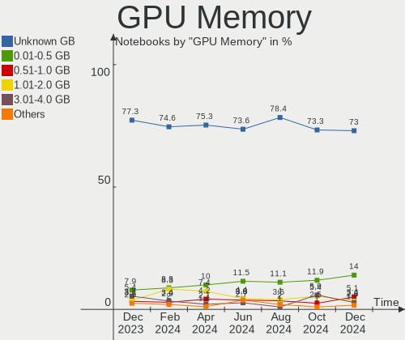
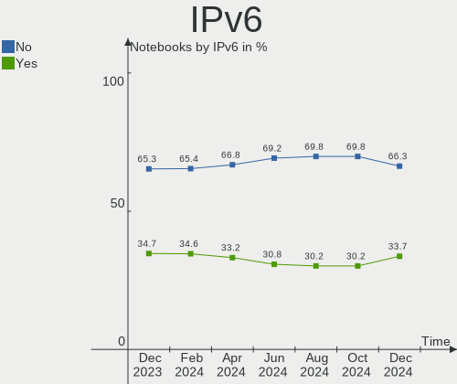
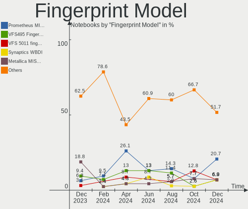
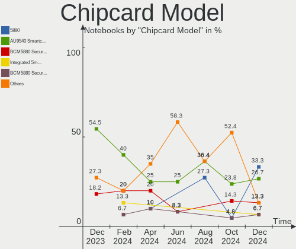

Debian - Hardware Trends (Notebooks)
------------------------------------

A project to identify most popular hardware characteristics and track their change
over time based on data collected by Linux users at https://Linux-Hardware.org.

Anyone can contribute to this report by the [hw-probe](https://github.com/linuxhw/hw-probe) tool:

    sudo -E hw-probe -all -upload

This report is for one last month. Overall report since the beginning of time: [TestDays](https://github.com/linuxhw/TestDays)

Period: Jul, 2023.

Contents
--------

* [ System ](#system)
  - [ OS                       ](#os)
  - [ OS Family                ](#os-family)
  - [ Kernel                   ](#kernel)
  - [ Kernel Family            ](#kernel-family)
  - [ Kernel Major Ver.        ](#kernel-major-ver)
  - [ Arch                     ](#arch)
  - [ DE                       ](#de)
  - [ Display Server           ](#display-server)
  - [ Display Manager          ](#display-manager)
  - [ OS Lang                  ](#os-lang)
  - [ Boot Mode                ](#boot-mode)
  - [ Filesystem               ](#filesystem)
  - [ Part. scheme             ](#part-scheme)
  - [ Dual Boot with Linux/BSD ](#dual-boot-with-linuxbsd)
  - [ Dual Boot (Win)          ](#dual-boot-win)

* [ Board ](#board)
  - [ Vendor                   ](#vendor)
  - [ Model                    ](#model)
  - [ Model Family             ](#model-family)
  - [ MFG Year                 ](#mfg-year)
  - [ Form Factor              ](#form-factor)
  - [ Secure Boot              ](#secure-boot)
  - [ Coreboot                 ](#coreboot)
  - [ RAM Size                 ](#ram-size)
  - [ RAM Used                 ](#ram-used)
  - [ Total Drives             ](#total-drives)
  - [ Has CD-ROM               ](#has-cd-rom)
  - [ Has Ethernet             ](#has-ethernet)
  - [ Has WiFi                 ](#has-wifi)
  - [ Has Bluetooth            ](#has-bluetooth)

* [ Location ](#location)
  - [ Country                  ](#country)
  - [ City                     ](#city)

* [ Drives ](#drives)
  - [ Drive Vendor             ](#drive-vendor)
  - [ Drive Model              ](#drive-model)
  - [ HDD Vendor               ](#hdd-vendor)
  - [ SSD Vendor               ](#ssd-vendor)
  - [ Drive Kind               ](#drive-kind)
  - [ Drive Connector          ](#drive-connector)
  - [ Drive Size               ](#drive-size)
  - [ Space Total              ](#space-total)
  - [ Space Used               ](#space-used)
  - [ Malfunc. Drives          ](#malfunc-drives)
  - [ Malfunc. Drive Vendor    ](#malfunc-drive-vendor)
  - [ Malfunc. HDD Vendor      ](#malfunc-hdd-vendor)
  - [ Malfunc. Drive Kind      ](#malfunc-drive-kind)
  - [ Failed Drives            ](#failed-drives)
  - [ Failed Drive Vendor      ](#failed-drive-vendor)
  - [ Drive Status             ](#drive-status)

* [ Storage controller ](#storage-controller)
  - [ Storage Vendor           ](#storage-vendor)
  - [ Storage Model            ](#storage-model)
  - [ Storage Kind             ](#storage-kind)

* [ Processor ](#processor)
  - [ CPU Vendor               ](#cpu-vendor)
  - [ CPU Model                ](#cpu-model)
  - [ CPU Model Family         ](#cpu-model-family)
  - [ CPU Cores                ](#cpu-cores)
  - [ CPU Sockets              ](#cpu-sockets)
  - [ CPU Threads              ](#cpu-threads)
  - [ CPU Op-Modes             ](#cpu-op-modes)
  - [ CPU Microcode            ](#cpu-microcode)
  - [ CPU Microarch            ](#cpu-microarch)

* [ Graphics ](#graphics)
  - [ GPU Vendor               ](#gpu-vendor)
  - [ GPU Model                ](#gpu-model)
  - [ GPU Combo                ](#gpu-combo)
  - [ GPU Driver               ](#gpu-driver)
  - [ GPU Memory               ](#gpu-memory)

* [ Monitor ](#monitor)
  - [ Monitor Vendor           ](#monitor-vendor)
  - [ Monitor Model            ](#monitor-model)
  - [ Monitor Resolution       ](#monitor-resolution)
  - [ Monitor Diagonal         ](#monitor-diagonal)
  - [ Monitor Width            ](#monitor-width)
  - [ Aspect Ratio             ](#aspect-ratio)
  - [ Monitor Area             ](#monitor-area)
  - [ Pixel Density            ](#pixel-density)
  - [ Multiple Monitors        ](#multiple-monitors)

* [ Network ](#network)
  - [ Net Controller Vendor    ](#net-controller-vendor)
  - [ Net Controller Model     ](#net-controller-model)
  - [ Wireless Vendor          ](#wireless-vendor)
  - [ Wireless Model           ](#wireless-model)
  - [ Ethernet Vendor          ](#ethernet-vendor)
  - [ Ethernet Model           ](#ethernet-model)
  - [ Net Controller Kind      ](#net-controller-kind)
  - [ Used Controller          ](#used-controller)
  - [ NICs                     ](#nics)
  - [ IPv6                     ](#ipv6)

* [ Bluetooth ](#bluetooth)
  - [ Bluetooth Vendor         ](#bluetooth-vendor)
  - [ Bluetooth Model          ](#bluetooth-model)

* [ Sound ](#sound)
  - [ Sound Vendor             ](#sound-vendor)
  - [ Sound Model              ](#sound-model)

* [ Memory ](#memory)
  - [ Memory Vendor            ](#memory-vendor)
  - [ Memory Model             ](#memory-model)
  - [ Memory Kind              ](#memory-kind)
  - [ Memory Form Factor       ](#memory-form-factor)
  - [ Memory Size              ](#memory-size)
  - [ Memory Speed             ](#memory-speed)

* [ Printers & scanners ](#printers--scanners)
  - [ Printer Vendor           ](#printer-vendor)
  - [ Printer Model            ](#printer-model)
  - [ Scanner Vendor           ](#scanner-vendor)
  - [ Scanner Model            ](#scanner-model)

* [ Camera ](#camera)
  - [ Camera Vendor            ](#camera-vendor)
  - [ Camera Model             ](#camera-model)

* [ Security ](#security)
  - [ Fingerprint Vendor       ](#fingerprint-vendor)
  - [ Fingerprint Model        ](#fingerprint-model)
  - [ Chipcard Vendor          ](#chipcard-vendor)
  - [ Chipcard Model           ](#chipcard-model)

* [ Unsupported ](#unsupported)
  - [ Unsupported Devices      ](#unsupported-devices)
  - [ Unsupported Device Types ](#unsupported-device-types)

System
------

OS
--

Installed operating systems

| Name      | Notebooks | Percent |
|-----------|-----------|---------|
| Debian 12 | 162       | 72.65%  |
| Debian 11 | 36        | 16.14%  |
| Debian    | 24        | 10.76%  |
| Debian 22 | 1         | 0.45%   |

OS Family
---------

OS without a version

| Name   | Notebooks | Percent |
|--------|-----------|---------|
| Debian | 223       | 100%    |

Kernel
------

Version of the Linux kernel

| Version                         | Notebooks | Percent |
|---------------------------------|-----------|---------|
| 6.1.0-10-amd64                  | 92        | 41.26%  |
| 6.1.0-9-amd64                   | 45        | 20.18%  |
| 5.10.0-23-amd64                 | 22        | 9.87%   |
| 6.3.0-1-amd64                   | 15        | 6.73%   |
| 6.3.0-2-amd64                   | 5         | 2.24%   |
| 6.4.0-1-amd64                   | 4         | 1.79%   |
| 6.2.16-3-pve                    | 3         | 1.35%   |
| 6.1.0-10-686-pae                | 3         | 1.35%   |
| 6.0.0-6mx-amd64                 | 3         | 1.35%   |
| 6.4.3-1-liquorix-amd64          | 2         | 0.9%    |
| 6.1.0-1-amd64                   | 2         | 0.9%    |
| 5.10.0-22-amd64                 | 2         | 0.9%    |
| 5.10.0-21-amd64                 | 2         | 0.9%    |
| 6.4.7-1-liquorix-amd64          | 1         | 0.45%   |
| 6.4.3-x64v2-xanmod1             | 1         | 0.45%   |
| 6.4.2-surface                   | 1         | 0.45%   |
| 6.4.2-edwardron-amd64           | 1         | 0.45%   |
| 6.4.2-1-liquorix-amd64          | 1         | 0.45%   |
| 6.4.0-asahi-00515-g35564c906fa6 | 1         | 0.45%   |
| 6.4.0-1-arm64                   | 1         | 0.45%   |
| 6.3.10-1-liquorix-amd64         | 1         | 0.45%   |
| 6.1.12+                         | 1         | 0.45%   |
| 6.1.11-stb-cbt+                 | 1         | 0.45%   |
| 6.1.0-8-amd64                   | 1         | 0.45%   |
| 6.1.0-7-amd64                   | 1         | 0.45%   |
| 6.1.0-4-amd64                   | 1         | 0.45%   |
| 6.1.0-3-686-pae                 | 1         | 0.45%   |
| 6.1.0-0.deb11.7-amd64           | 1         | 0.45%   |
| 5.15.107-2-pve                  | 1         | 0.45%   |
| 5.10.181-loc-os                 | 1         | 0.45%   |
| 5.10.0-8-amd64                  | 1         | 0.45%   |
| 5.10.0-20-amd64                 | 1         | 0.45%   |
| 5.10.0-19-amd64                 | 1         | 0.45%   |
| 5.10.0-15-amd64                 | 1         | 0.45%   |
| 5.10.0-13-amd64                 | 1         | 0.45%   |
| 5.10.0-11-amd64                 | 1         | 0.45%   |

Kernel Family
-------------

Linux kernel without a distro release

| Version  | Notebooks | Percent |
|----------|-----------|---------|
| 6.1.0    | 147       | 65.92%  |
| 5.10.0   | 32        | 14.35%  |
| 6.3.0    | 20        | 8.97%   |
| 6.4.0    | 6         | 2.69%   |
| 6.4.3    | 3         | 1.35%   |
| 6.4.2    | 3         | 1.35%   |
| 6.2.16   | 3         | 1.35%   |
| 6.0.0    | 3         | 1.35%   |
| 6.4.7    | 1         | 0.45%   |
| 6.3.10   | 1         | 0.45%   |
| 6.1.12   | 1         | 0.45%   |
| 6.1.11   | 1         | 0.45%   |
| 5.15.107 | 1         | 0.45%   |
| 5.10.181 | 1         | 0.45%   |

Kernel Major Ver.
-----------------

Linux kernel major version

| Version | Notebooks | Percent |
|---------|-----------|---------|
| 6.1     | 149       | 66.82%  |
| 5.10    | 33        | 14.8%   |
| 6.3     | 21        | 9.42%   |
| 6.4     | 13        | 5.83%   |
| 6.2     | 3         | 1.35%   |
| 6.0     | 3         | 1.35%   |
| 5.15    | 1         | 0.45%   |

Arch
----

OS architecture (x86_64, i586, etc.)

| Name    | Notebooks | Percent |
|---------|-----------|---------|
| x86_64  | 216       | 96.86%  |
| i686    | 4         | 1.79%   |
| aarch64 | 2         | 0.9%    |
| armv7l  | 1         | 0.45%   |

DE
--

Desktop Environment

| Name            | Notebooks | Percent |
|-----------------|-----------|---------|
| GNOME           | 79        | 35.43%  |
| KDE5            | 50        | 22.42%  |
| XFCE            | 29        | 13%     |
| X-Cinnamon      | 18        | 8.07%   |
| MATE            | 13        | 5.83%   |
| Unknown         | 11        | 4.93%   |
| Cinnamon        | 7         | 3.14%   |
| LXQt            | 6         | 2.69%   |
| LXDE            | 4         | 1.79%   |
| Trinity         | 1         | 0.45%   |
| KDE             | 1         | 0.45%   |
| i3              | 1         | 0.45%   |
| GNOME Flashback | 1         | 0.45%   |
| dwm             | 1         | 0.45%   |
| bspwm           | 1         | 0.45%   |

Display Server
--------------

X11 or Wayland

| Name    | Notebooks | Percent |
|---------|-----------|---------|
| X11     | 128       | 57.4%   |
| Wayland | 81        | 36.32%  |
| Unknown | 8         | 3.59%   |
| Tty     | 6         | 2.69%   |

Display Manager
---------------

SDDM, LightDM, etc.

| Name    | Notebooks | Percent |
|---------|-----------|---------|
| Unknown | 67        | 30.04%  |
| LightDM | 58        | 26.01%  |
| GDM3    | 46        | 20.63%  |
| SDDM    | 45        | 20.18%  |
| GDM     | 6         | 2.69%   |
| LXDM    | 1         | 0.45%   |

OS Lang
-------

Language

| Lang    | Notebooks | Percent |
|---------|-----------|---------|
| en_US   | 88        | 39.46%  |
| en_GB   | 22        | 9.87%   |
| fr_FR   | 16        | 7.17%   |
| de_DE   | 15        | 6.73%   |
| ru_RU   | 14        | 6.28%   |
| pt_BR   | 9         | 4.04%   |
| en_CA   | 8         | 3.59%   |
| en_IN   | 6         | 2.69%   |
| it_IT   | 4         | 1.79%   |
| hu_HU   | 4         | 1.79%   |
| C       | 4         | 1.79%   |
| Unknown | 4         | 1.79%   |
| pl_PL   | 3         | 1.35%   |
| es_VE   | 3         | 1.35%   |
| es_ES   | 3         | 1.35%   |
| es_MX   | 2         | 0.9%    |
| en_DK   | 2         | 0.9%    |
| en_AU   | 2         | 0.9%    |
| zh_CN   | 1         | 0.45%   |
| sv_SE   | 1         | 0.45%   |
| nn_NO   | 1         | 0.45%   |
| nb_NO   | 1         | 0.45%   |
| ko_KR   | 1         | 0.45%   |
| ja_JP   | 1         | 0.45%   |
| fr_CH   | 1         | 0.45%   |
| es_SV   | 1         | 0.45%   |
| es_CO   | 1         | 0.45%   |
| es_CL   | 1         | 0.45%   |
| es_AR   | 1         | 0.45%   |
| en_NZ   | 1         | 0.45%   |
| de_CH   | 1         | 0.45%   |
| bg_BG   | 1         | 0.45%   |

Boot Mode
---------

EFI or BIOS

| Mode | Notebooks | Percent |
|------|-----------|---------|
| EFI  | 128       | 57.4%   |
| BIOS | 95        | 42.6%   |

Filesystem
----------

Type of filesystem

| Type    | Notebooks | Percent |
|---------|-----------|---------|
| Ext4    | 190       | 85.2%   |
| Btrfs   | 14        | 6.28%   |
| Overlay | 13        | 5.83%   |
| Tmpfs   | 3         | 1.35%   |
| Xfs     | 2         | 0.9%    |
| Zfs     | 1         | 0.45%   |

Part. scheme
------------

Scheme of partitioning

| Type    | Notebooks | Percent |
|---------|-----------|---------|
| GPT     | 131       | 58.74%  |
| Unknown | 54        | 24.22%  |
| MBR     | 38        | 17.04%  |

Dual Boot with Linux/BSD
------------------------

Hosting more than one Linux/BSD

| Dual boot | Notebooks | Percent |
|-----------|-----------|---------|
| No        | 198       | 88.79%  |
| Yes       | 25        | 11.21%  |

Dual Boot (Win)
---------------

Hosting Linux and Windows

| Dual boot | Notebooks | Percent |
|-----------|-----------|---------|
| No        | 174       | 78.03%  |
| Yes       | 49        | 21.97%  |

Board
-----

Vendor
------

Motherboard manufacturer

| Name                           | Notebooks | Percent |
|--------------------------------|-----------|---------|
| Lenovo                         | 47        | 21.08%  |
| Dell                           | 38        | 17.04%  |
| Hewlett-Packard                | 37        | 16.59%  |
| Acer                           | 21        | 9.42%   |
| ASUSTek Computer               | 19        | 8.52%   |
| Apple                          | 10        | 4.48%   |
| MSI                            | 9         | 4.04%   |
| Google                         | 8         | 3.59%   |
| Fujitsu                        | 4         | 1.79%   |
| Toshiba                        | 3         | 1.35%   |
| HUAWEI                         | 3         | 1.35%   |
| Unknown                        | 3         | 1.35%   |
| Samsung Electronics            | 2         | 0.9%    |
| NEC Computers                  | 2         | 0.9%    |
| HONOR                          | 2         | 0.9%    |
| Valve                          | 1         | 0.45%   |
| VALE                           | 1         | 0.45%   |
| Timi                           | 1         | 0.45%   |
| Sony                           | 1         | 0.45%   |
| SLIMBOOK                       | 1         | 0.45%   |
| SIRAGON                        | 1         | 0.45%   |
| Shanghai Zhaoxin Semiconductor | 1         | 0.45%   |
| SANTECH                        | 1         | 0.45%   |
| Positivo                       | 1         | 0.45%   |
| Packard Bell                   | 1         | 0.45%   |
| Notebook                       | 1         | 0.45%   |
| Coradir                        | 1         | 0.45%   |
| Compaq                         | 1         | 0.45%   |
| Chitech Shenzhen Technology    | 1         | 0.45%   |
| Casper                         | 1         | 0.45%   |

Model
-----

Motherboard model

| Name                            | Notebooks | Percent |
|---------------------------------|-----------|---------|
| Dell Inspiron 15 3511           | 3         | 1.35%   |
| Unknown                         | 3         | 1.35%   |
| Lenovo ThinkPad T400 2768WGB    | 2         | 0.9%    |
| HP ProBook 640 G2               | 2         | 0.9%    |
| Google Lillipup                 | 2         | 0.9%    |
| Dell Latitude 7480              | 2         | 0.9%    |
| Apple MacBookPro14,3            | 2         | 0.9%    |
| Valve Jupiter                   | 1         | 0.45%   |
| VALE Notebook Classic C140      | 1         | 0.45%   |
| Toshiba Satellite S75-B         | 1         | 0.45%   |
| Toshiba Satellite L755          | 1         | 0.45%   |
| Toshiba PORTEGE Z30-C           | 1         | 0.45%   |
| Timi A7S                        | 1         | 0.45%   |
| Sony SVS13A1Z9RN                | 1         | 0.45%   |
| SLIMBOOK PROX15-AMD             | 1         | 0.45%   |
| SIRAGON LM-C100                 | 1         | 0.45%   |
| Shanghai Zhaoxin ZXE CRB        | 1         | 0.45%   |
| SANTECH NHx0DB,DE               | 1         | 0.45%   |
| Samsung 770Z5E/780Z5E           | 1         | 0.45%   |
| Samsung 305E4Z/305E5Z/305E7Z    | 1         | 0.45%   |
| Positivo Mobile                 | 1         | 0.45%   |
| Packard Bell H17HV              | 1         | 0.45%   |
| Notebook N650DU                 | 1         | 0.45%   |
| NEC Computers PC-VY22GXZCA      | 1         | 0.45%   |
| NEC Computers PC-VK27MBZCG      | 1         | 0.45%   |
| MSI SUMMIT E13FlipEvo A12MT     | 1         | 0.45%   |
| MSI Stealth 16Studio A13VG      | 1         | 0.45%   |
| MSI Modern 14 B11MOU            | 1         | 0.45%   |
| MSI Katana GF66 11UG            | 1         | 0.45%   |
| MSI GF63 Thin 11UC              | 1         | 0.45%   |
| MSI FX603                       | 1         | 0.45%   |
| MSI Creator 15M A9SD            | 1         | 0.45%   |
| MSI Alpha 15 B5EEK              | 1         | 0.45%   |
| MSI Alpha 15 A4DEK              | 1         | 0.45%   |
| Lenovo Yoga 14sITL 2021 82G2    | 1         | 0.45%   |
| Lenovo V14-IIL 82C4             | 1         | 0.45%   |
| Lenovo V14 G2 ITL 82NM          | 1         | 0.45%   |
| Lenovo ThinkPad X270 20HMS10600 | 1         | 0.45%   |
| Lenovo ThinkPad X260 20F5S04B00 | 1         | 0.45%   |
| Lenovo ThinkPad X220 42914XG    | 1         | 0.45%   |

Model Family
------------

Motherboard model prefix

| Name                       | Notebooks | Percent |
|----------------------------|-----------|---------|
| Lenovo ThinkPad            | 33        | 14.8%   |
| Dell Latitude              | 16        | 7.17%   |
| Acer Aspire                | 15        | 6.73%   |
| HP EliteBook               | 10        | 4.48%   |
| Dell Inspiron              | 10        | 4.48%   |
| Lenovo IdeaPad             | 9         | 4.04%   |
| HP Pavilion                | 8         | 3.59%   |
| ASUS VivoBook              | 8         | 3.59%   |
| HP ProBook                 | 5         | 2.24%   |
| HP Laptop                  | 5         | 2.24%   |
| Dell XPS                   | 5         | 2.24%   |
| Fujitsu LIFEBOOK           | 4         | 1.79%   |
| Dell Vostro                | 3         | 1.35%   |
| Unknown                    | 3         | 1.35%   |
| Toshiba Satellite          | 2         | 0.9%    |
| MSI Alpha                  | 2         | 0.9%    |
| HP Victus                  | 2         | 0.9%    |
| Google Lillipup            | 2         | 0.9%    |
| Dell Precision             | 2         | 0.9%    |
| ASUS ASUS                  | 2         | 0.9%    |
| Apple MacBookPro5          | 2         | 0.9%    |
| Apple MacBookPro14         | 2         | 0.9%    |
| Acer Swift                 | 2         | 0.9%    |
| Acer Extensa               | 2         | 0.9%    |
| Valve Jupiter              | 1         | 0.45%   |
| VALE Notebook              | 1         | 0.45%   |
| Toshiba PORTEGE            | 1         | 0.45%   |
| Timi A7S                   | 1         | 0.45%   |
| Sony SVS13A1Z9RN           | 1         | 0.45%   |
| SLIMBOOK PROX15-AMD        | 1         | 0.45%   |
| SIRAGON LM-C100            | 1         | 0.45%   |
| Shanghai Zhaoxin ZXE       | 1         | 0.45%   |
| SANTECH NHx0DB             | 1         | 0.45%   |
| Samsung 770Z5E             | 1         | 0.45%   |
| Samsung 305E4Z             | 1         | 0.45%   |
| Positivo Mobile            | 1         | 0.45%   |
| Packard Bell H17HV         | 1         | 0.45%   |
| Notebook N650DU            | 1         | 0.45%   |
| NEC Computers PC-VY22GXZCA | 1         | 0.45%   |
| NEC Computers PC-VK27MBZCG | 1         | 0.45%   |

MFG Year
--------

Motherboard manufacture year

| Year    | Notebooks | Percent |
|---------|-----------|---------|
| 2021    | 37        | 16.59%  |
| 2022    | 23        | 10.31%  |
| 2020    | 19        | 8.52%   |
| 2011    | 16        | 7.17%   |
| 2019    | 14        | 6.28%   |
| 2018    | 14        | 6.28%   |
| 2017    | 14        | 6.28%   |
| 2013    | 14        | 6.28%   |
| 2016    | 12        | 5.38%   |
| 2012    | 12        | 5.38%   |
| 2023    | 9         | 4.04%   |
| 2010    | 8         | 3.59%   |
| 2014    | 7         | 3.14%   |
| 2009    | 7         | 3.14%   |
| 2008    | 6         | 2.69%   |
| 2015    | 5         | 2.24%   |
| Unknown | 3         | 1.35%   |
| 2005    | 2         | 0.9%    |
| 2007    | 1         | 0.45%   |

Form Factor
-----------

Physical design of the computer

| Name     | Notebooks | Percent |
|----------|-----------|---------|
| Notebook | 223       | 100%    |

Secure Boot
-----------

Enabled or disabled

| State    | Notebooks | Percent |
|----------|-----------|---------|
| Disabled | 198       | 88.79%  |
| Enabled  | 25        | 11.21%  |

Coreboot
--------

Have coreboot on board

| Used | Notebooks | Percent |
|------|-----------|---------|
| No   | 216       | 96.86%  |
| Yes  | 7         | 3.14%   |

RAM Size
--------

Total RAM memory

| Size in GB  | Notebooks | Percent |
|-------------|-----------|---------|
| 4.01-8.0    | 66        | 29.6%   |
| 8.01-16.0   | 51        | 22.87%  |
| 16.01-24.0  | 50        | 22.42%  |
| 3.01-4.0    | 21        | 9.42%   |
| 32.01-64.0  | 16        | 7.17%   |
| 1.01-2.0    | 8         | 3.59%   |
| 64.01-256.0 | 5         | 2.24%   |
| 2.01-3.0    | 4         | 1.79%   |
| 24.01-32.0  | 2         | 0.9%    |

RAM Used
--------

Used RAM memory

| Used GB    | Notebooks | Percent |
|------------|-----------|---------|
| 1.01-2.0   | 59        | 26.46%  |
| 2.01-3.0   | 58        | 26.01%  |
| 4.01-8.0   | 51        | 22.87%  |
| 3.01-4.0   | 28        | 12.56%  |
| 8.01-16.0  | 15        | 6.73%   |
| 0.51-1.0   | 10        | 4.48%   |
| 24.01-32.0 | 1         | 0.45%   |
| 0.01-0.5   | 1         | 0.45%   |

Total Drives
------------

Number of drives on board

| Drives | Notebooks | Percent |
|--------|-----------|---------|
| 1      | 155       | 69.51%  |
| 2      | 59        | 26.46%  |
| 3      | 5         | 2.24%   |
| 4      | 3         | 1.35%   |
| 0      | 1         | 0.45%   |

Has CD-ROM
----------

Has CD-ROM on board

| Presented | Notebooks | Percent |
|-----------|-----------|---------|
| No        | 180       | 80.72%  |
| Yes       | 43        | 19.28%  |

Has Ethernet
------------

Has Ethernet on board

| Presented | Notebooks | Percent |
|-----------|-----------|---------|
| Yes       | 172       | 77.13%  |
| No        | 51        | 22.87%  |

Has WiFi
--------

Has WiFi module

| Presented | Notebooks | Percent |
|-----------|-----------|---------|
| Yes       | 217       | 97.31%  |
| No        | 6         | 2.69%   |

Has Bluetooth
-------------

Has Bluetooth module

| Presented | Notebooks | Percent |
|-----------|-----------|---------|
| Yes       | 178       | 79.82%  |
| No        | 45        | 20.18%  |

Location
--------

Country
-------

Geographic location (country)

| Country     | Notebooks | Percent |
|-------------|-----------|---------|
| USA         | 37        | 16.59%  |
| Germany     | 20        | 8.97%   |
| Russia      | 17        | 7.62%   |
| France      | 17        | 7.62%   |
| Brazil      | 13        | 5.83%   |
| Canada      | 11        | 4.93%   |
| Italy       | 9         | 4.04%   |
| Turkey      | 8         | 3.59%   |
| India       | 8         | 3.59%   |
| UK          | 7         | 3.14%   |
| Poland      | 6         | 2.69%   |
| Venezuela   | 5         | 2.24%   |
| Hungary     | 5         | 2.24%   |
| Sweden      | 4         | 1.79%   |
| Spain       | 4         | 1.79%   |
| Romania     | 3         | 1.35%   |
| Netherlands | 3         | 1.35%   |
| Greece      | 3         | 1.35%   |
| China       | 3         | 1.35%   |
| Australia   | 3         | 1.35%   |
| Switzerland | 2         | 0.9%    |
| Norway      | 2         | 0.9%    |
| Mexico      | 2         | 0.9%    |
| Lithuania   | 2         | 0.9%    |
| Indonesia   | 2         | 0.9%    |
| Colombia    | 2         | 0.9%    |
| Belarus     | 2         | 0.9%    |
| Austria     | 2         | 0.9%    |
| Ukraine     | 1         | 0.45%   |
| Tunisia     | 1         | 0.45%   |
| Thailand    | 1         | 0.45%   |
| South Korea | 1         | 0.45%   |
| Slovakia    | 1         | 0.45%   |
| Portugal    | 1         | 0.45%   |
| Philippines | 1         | 0.45%   |
| New Zealand | 1         | 0.45%   |
| Kenya       | 1         | 0.45%   |
| Kazakhstan  | 1         | 0.45%   |
| Japan       | 1         | 0.45%   |
| Hong Kong   | 1         | 0.45%   |

City
----

Geographic location (city)

| City        | Notebooks | Percent |
|-------------|-----------|---------|
| Moscow      | 9         | 4.04%   |
| Bangor      | 4         | 1.79%   |
| Paris       | 3         | 1.35%   |
| Ankara      | 3         | 1.35%   |
| Wroclaw     | 2         | 0.9%    |
| Vancouver   | 2         | 0.9%    |
| Toronto     | 2         | 0.9%    |
| Tatabánya  | 2         | 0.9%    |
| Sydney      | 2         | 0.9%    |
| Stockholm   | 2         | 0.9%    |
| Sao Paulo   | 2         | 0.9%    |
| Mogilev     | 2         | 0.9%    |
| London      | 2         | 0.9%    |
| Lonato      | 2         | 0.9%    |
| Istanbul    | 2         | 0.9%    |
| Caracas     | 2         | 0.9%    |
| Bucharest   | 2         | 0.9%    |
| Bremen      | 2         | 0.9%    |
| Brasília   | 2         | 0.9%    |
| Bonn        | 2         | 0.9%    |
| Berlin      | 2         | 0.9%    |
| Athens      | 2         | 0.9%    |
| Zhengzhou   | 1         | 0.45%   |
| Woodstock   | 1         | 0.45%   |
| Woodford    | 1         | 0.45%   |
| Whangarei   | 1         | 0.45%   |
| Westbrook   | 1         | 0.45%   |
| Weckolsheim | 1         | 0.45%   |
| Voronezh    | 1         | 0.45%   |
| Vilnius     | 1         | 0.45%   |
| Vila Velha  | 1         | 0.45%   |
| Vienna      | 1         | 0.45%   |
| Vernon      | 1         | 0.45%   |
| Veracruz    | 1         | 0.45%   |
| Utrecht     | 1         | 0.45%   |
| Uster       | 1         | 0.45%   |
| Twist       | 1         | 0.45%   |
| Turin       | 1         | 0.45%   |
| Tunis       | 1         | 0.45%   |
| Trivandrum  | 1         | 0.45%   |

Drives
------

Drive Vendor
------------

Hard drive vendors

| Vendor                      | Notebooks | Drives | Percent |
|-----------------------------|-----------|--------|---------|
| Samsung Electronics         | 50        | 56     | 17.73%  |
| WDC                         | 31        | 33     | 10.99%  |
| SK hynix                    | 19        | 19     | 6.74%   |
| Seagate                     | 18        | 18     | 6.38%   |
| Unknown                     | 17        | 20     | 6.03%   |
| SanDisk                     | 17        | 17     | 6.03%   |
| Kingston                    | 16        | 16     | 5.67%   |
| Micron Technology           | 10        | 10     | 3.55%   |
| Toshiba                     | 7         | 7      | 2.48%   |
| Intel                       | 7         | 7      | 2.48%   |
| HGST                        | 7         | 7      | 2.48%   |
| Crucial                     | 7         | 7      | 2.48%   |
| SPCC                        | 5         | 5      | 1.77%   |
| KIOXIA                      | 5         | 5      | 1.77%   |
| Hitachi                     | 5         | 5      | 1.77%   |
| China                       | 5         | 5      | 1.77%   |
| Apple                       | 4         | 7      | 1.42%   |
| Kingston Technology Company | 3         | 3      | 1.06%   |
| A-DATA Technology           | 3         | 3      | 1.06%   |
| SSSTC                       | 2         | 2      | 0.71%   |
| PNY                         | 2         | 2      | 0.71%   |
| Patriot                     | 2         | 2      | 0.71%   |
| Netac                       | 2         | 2      | 0.71%   |
| Micron/Crucial Technology   | 2         | 2      | 0.71%   |
| LITEONIT                    | 2         | 2      | 0.71%   |
| LITEON                      | 2         | 2      | 0.71%   |
| Intenso                     | 2         | 2      | 0.71%   |
| Gigabyte Technology         | 2         | 2      | 0.71%   |
| Fujitsu                     | 2         | 2      | 0.71%   |
| Unknown                     | 2         | 2      | 0.71%   |
| ZHITAI                      | 1         | 1      | 0.35%   |
| YMTC                        | 1         | 1      | 0.35%   |
| Verbatim                    | 1         | 1      | 0.35%   |
| V-GeN                       | 1         | 1      | 0.35%   |
| Team                        | 1         | 1      | 0.35%   |
| SYMTEC                      | 1         | 1      | 0.35%   |
| Solid State Storage         | 1         | 1      | 0.35%   |
| Silicon Motion              | 1         | 1      | 0.35%   |
| Realtek                     | 1         | 1      | 0.35%   |
| Qumo                        | 1         | 1      | 0.35%   |

Drive Model
-----------

Hard drive models

| Model                                               | Notebooks | Percent |
|-----------------------------------------------------|-----------|---------|
| Kingston SA400S37480G 480GB SSD                     | 5         | 1.71%   |
| Seagate ST1000LM024 HN-M101MBB 1TB                  | 4         | 1.37%   |
| Samsung NVMe SSD Controller SM981/PM981/PM983 500GB | 4         | 1.37%   |
| Seagate ST1000LM035-1RK172 1TB                      | 3         | 1.03%   |
| Sandisk WD Blue SN550 NVMe SSD 250GB                | 3         | 1.03%   |
| Samsung SSD 850 EVO 250GB                           | 3         | 1.03%   |
| Samsung NVMe SSD Controller PM9A1/PM9A3/980PRO 1TB  | 3         | 1.03%   |
| WDC WDS480G2G0C-00AJM0 480GB                        | 2         | 0.68%   |
| WDC WDS240G2G0A-00JH30 240GB SSD                    | 2         | 0.68%   |
| Unknown MMC Card  64GB                              | 2         | 0.68%   |
| Toshiba MQ04ABF100 1TB                              | 2         | 0.68%   |
| SPCC Solid State Disk 512GB                         | 2         | 0.68%   |
| SK hynix SC311 SATA 512GB SSD                       | 2         | 0.68%   |
| SK hynix BC711 NVMe 256GB                           | 2         | 0.68%   |
| SanDisk NVMe SSD Drive 1TB                          | 2         | 0.68%   |
| Samsung SSD 990 PRO 2TB                             | 2         | 0.68%   |
| Samsung SSD 980 PRO 2TB                             | 2         | 0.68%   |
| Samsung NVMe SSD Controller SM961/PM961/SM963 256GB | 2         | 0.68%   |
| Samsung MZVLQ512HBLU-00B00 512GB                    | 2         | 0.68%   |
| Micron/Crucial P2 NVMe PCIe SSD 1TB                 | 2         | 0.68%   |
| Kingston OM8PCP3512F-AI1 512GB                      | 2         | 0.68%   |
| Intel SSDPEKNU512GZ 512GB                           | 2         | 0.68%   |
| Intel SSD 660P Series 1024GB                        | 2         | 0.68%   |
| Crucial CT1000MX500SSD1 1TB                         | 2         | 0.68%   |
| Unknown                                             | 2         | 0.68%   |
| ZHITAI PC005 Active 512GB                           | 1         | 0.34%   |
| YMTC PC005 256GB                                    | 1         | 0.34%   |
| WDC WDS500G3X0C-00SJG0 500GB                        | 1         | 0.34%   |
| WDC WDS500G2B0A-00SM50 500GB SSD                    | 1         | 0.34%   |
| WDC WDS250G1B0A-00H9H0 250GB SSD                    | 1         | 0.34%   |
| WDC WDS200T2B0B-00YS70 2TB SSD                      | 1         | 0.34%   |
| WDC WDS100T2B0A-00SM50 1TB SSD                      | 1         | 0.34%   |
| WDC WDBNCE5000PNC 500GB SSD                         | 1         | 0.34%   |
| WDC WD5000LPVX-22V0TT0 500GB                        | 1         | 0.34%   |
| WDC WD400UE-22HCT0 40GB                             | 1         | 0.34%   |
| WDC WD3200LPLX-75ZNTT0 320GB                        | 1         | 0.34%   |
| WDC WD3200LPCX-24C6HT0 320GB                        | 1         | 0.34%   |
| WDC WD3200BPVT-22JJ5T0 320GB                        | 1         | 0.34%   |
| WDC WD3200BEVT-00A0RT0 320GB                        | 1         | 0.34%   |
| WDC WD3200BEKT-75PVMT0 320GB                        | 1         | 0.34%   |

HDD Vendor
----------

Hard disk drive vendors

| Vendor              | Notebooks | Drives | Percent |
|---------------------|-----------|--------|---------|
| Seagate             | 18        | 18     | 33.33%  |
| WDC                 | 12        | 12     | 22.22%  |
| HGST                | 7         | 7      | 12.96%  |
| Toshiba             | 5         | 5      | 9.26%   |
| Hitachi             | 5         | 5      | 9.26%   |
| Fujitsu             | 2         | 2      | 3.7%    |
| SYMTEC              | 1         | 1      | 1.85%   |
| Samsung Electronics | 1         | 1      | 1.85%   |
| JMicron Technology  | 1         | 1      | 1.85%   |
| ASMT                | 1         | 1      | 1.85%   |
| Apple               | 1         | 2      | 1.85%   |

SSD Vendor
----------

Solid state drive vendors

| Vendor              | Notebooks | Drives | Percent |
|---------------------|-----------|--------|---------|
| Samsung Electronics | 20        | 20     | 21.74%  |
| WDC                 | 9         | 9      | 9.78%   |
| Kingston            | 8         | 8      | 8.7%    |
| SanDisk             | 7         | 7      | 7.61%   |
| Crucial             | 7         | 7      | 7.61%   |
| China               | 5         | 5      | 5.43%   |
| SPCC                | 4         | 4      | 4.35%   |
| SK hynix            | 4         | 4      | 4.35%   |
| Micron Technology   | 4         | 4      | 4.35%   |
| PNY                 | 2         | 2      | 2.17%   |
| Netac               | 2         | 2      | 2.17%   |
| LITEONIT            | 2         | 2      | 2.17%   |
| Intenso             | 2         | 2      | 2.17%   |
| Apple               | 2         | 2      | 2.17%   |
| Verbatim            | 1         | 1      | 1.09%   |
| V-GeN               | 1         | 1      | 1.09%   |
| Toshiba             | 1         | 1      | 1.09%   |
| Team                | 1         | 1      | 1.09%   |
| Maxtor              | 1         | 1      | 1.09%   |
| LITEON              | 1         | 1      | 1.09%   |
| Lexar               | 1         | 1      | 1.09%   |
| KingDian            | 1         | 1      | 1.09%   |
| Hikvision           | 1         | 1      | 1.09%   |
| Hewlett-Packard     | 1         | 1      | 1.09%   |
| Gigabyte Technology | 1         | 1      | 1.09%   |
| BHT                 | 1         | 1      | 1.09%   |
| A-DATA Technology   | 1         | 1      | 1.09%   |
| Unknown             | 1         | 1      | 1.09%   |

Drive Kind
----------

HDD or SSD

| Kind    | Notebooks | Drives | Percent |
|---------|-----------|--------|---------|
| NVMe    | 109       | 125    | 41.29%  |
| SSD     | 83        | 92     | 31.44%  |
| HDD     | 51        | 55     | 19.32%  |
| MMC     | 17        | 20     | 6.44%   |
| Unknown | 4         | 4      | 1.52%   |

Drive Connector
---------------

SATA, SAS, NVMe, etc.

| Type | Notebooks | Drives | Percent |
|------|-----------|--------|---------|
| SATA | 120       | 144    | 47.43%  |
| NVMe | 109       | 124    | 43.08%  |
| MMC  | 17        | 20     | 6.72%   |
| SAS  | 7         | 8      | 2.77%   |

Drive Size
----------

Size of hard drive

| Size in TB | Notebooks | Drives | Percent |
|------------|-----------|--------|---------|
| 0.01-0.5   | 85        | 97     | 64.89%  |
| 0.51-1.0   | 39        | 43     | 29.77%  |
| 1.01-2.0   | 7         | 7      | 5.34%   |

Space Total
-----------

Amount of disk space available on the file system

| Size in GB     | Notebooks | Percent |
|----------------|-----------|---------|
| 101-250        | 62        | 27.8%   |
| 251-500        | 59        | 26.46%  |
| 501-1000       | 38        | 17.04%  |
| 51-100         | 17        | 7.62%   |
| 1001-2000      | 16        | 7.17%   |
| 21-50          | 12        | 5.38%   |
| 1-20           | 8         | 3.59%   |
| 2001-3000      | 4         | 1.79%   |
| Unknown        | 4         | 1.79%   |
| More than 3000 | 3         | 1.35%   |

Space Used
----------

Amount of used disk space

| Used GB        | Notebooks | Percent |
|----------------|-----------|---------|
| 1-20           | 89        | 39.91%  |
| 21-50          | 36        | 16.14%  |
| 101-250        | 36        | 16.14%  |
| 51-100         | 30        | 13.45%  |
| 251-500        | 14        | 6.28%   |
| 501-1000       | 8         | 3.59%   |
| 1001-2000      | 4         | 1.79%   |
| Unknown        | 4         | 1.79%   |
| More than 3000 | 1         | 0.45%   |
| 2001-3000      | 1         | 0.45%   |

Malfunc. Drives
---------------

Drive models with a malfunction

| Model                                 | Notebooks | Drives | Percent |
|---------------------------------------|-----------|--------|---------|
| WDC WD400UE-22HCT0 40GB               | 1         | 1      | 5.56%   |
| WDC WD3200BEVT-00A0RT0 320GB          | 1         | 1      | 5.56%   |
| Toshiba MQ01ABD100 1TB                | 1         | 1      | 5.56%   |
| Toshiba MK2552GSX 250GB               | 1         | 1      | 5.56%   |
| SK hynix PC711 HFS512GDE9X073N 512GB  | 1         | 1      | 5.56%   |
| SK hynix HFS128G39TND-N210A 128GB SSD | 1         | 1      | 5.56%   |
| Seagate ST9500325AS 500GB             | 1         | 1      | 5.56%   |
| Seagate ST500LM021-1KJ152 500GB       | 1         | 1      | 5.56%   |
| Samsung Electronics SSD 870 EVO 500GB | 1         | 1      | 5.56%   |
| Samsung Electronics HM160HI 160GB     | 1         | 1      | 5.56%   |
| Hitachi HTS545050B9SA02 500GB         | 1         | 1      | 5.56%   |
| HGST HTS725050A7E630 500GB            | 1         | 1      | 5.56%   |
| HGST HTS545050A7E380 500GB            | 1         | 1      | 5.56%   |
| HGST HTS541075A9E680 752GB            | 1         | 1      | 5.56%   |
| HGST HTS541010B7E610 1TB              | 1         | 1      | 5.56%   |
| HGST HTS541010A7E630 1TB              | 1         | 1      | 5.56%   |
| Crucial CT256M550SSD1 256GB           | 1         | 1      | 5.56%   |
| Apple HDD HTS541010A9E662 1TB         | 1         | 2      | 5.56%   |

Malfunc. Drive Vendor
---------------------

Vendors of faulty drives

| Vendor              | Notebooks | Drives | Percent |
|---------------------|-----------|--------|---------|
| HGST                | 5         | 5      | 27.78%  |
| WDC                 | 2         | 2      | 11.11%  |
| Toshiba             | 2         | 2      | 11.11%  |
| SK hynix            | 2         | 2      | 11.11%  |
| Seagate             | 2         | 2      | 11.11%  |
| Samsung Electronics | 2         | 2      | 11.11%  |
| Hitachi             | 1         | 1      | 5.56%   |
| Crucial             | 1         | 1      | 5.56%   |
| Apple               | 1         | 2      | 5.56%   |

Malfunc. HDD Vendor
-------------------

Vendors of faulty HDD drives

| Vendor              | Notebooks | Drives | Percent |
|---------------------|-----------|--------|---------|
| HGST                | 5         | 5      | 35.71%  |
| WDC                 | 2         | 2      | 14.29%  |
| Toshiba             | 2         | 2      | 14.29%  |
| Seagate             | 2         | 2      | 14.29%  |
| Samsung Electronics | 1         | 1      | 7.14%   |
| Hitachi             | 1         | 1      | 7.14%   |
| Apple               | 1         | 2      | 7.14%   |

Malfunc. Drive Kind
-------------------

Kinds of faulty drives

| Kind | Notebooks | Drives | Percent |
|------|-----------|--------|---------|
| HDD  | 14        | 15     | 77.78%  |
| SSD  | 3         | 3      | 16.67%  |
| NVMe | 1         | 1      | 5.56%   |

Failed Drives
-------------

Failed drive models

Zero info for selected period =(

Failed Drive Vendor
-------------------

Failed drive vendors

Zero info for selected period =(

Drive Status
------------

Number of failed and malfunc. drives

| Status   | Notebooks | Drives | Percent |
|----------|-----------|--------|---------|
| Works    | 140       | 172    | 60.09%  |
| Detected | 75        | 105    | 32.19%  |
| Malfunc  | 18        | 19     | 7.73%   |

Storage controller
------------------

Storage Vendor
--------------

Storage controller vendors

| Vendor                           | Notebooks | Percent |
|----------------------------------|-----------|---------|
| Intel                            | 130       | 47.97%  |
| Samsung Electronics              | 29        | 10.7%   |
| AMD                              | 29        | 10.7%   |
| SanDisk                          | 21        | 7.75%   |
| SK hynix                         | 14        | 5.17%   |
| Kingston Technology Company      | 10        | 3.69%   |
| Micron Technology                | 6         | 2.21%   |
| Phison Electronics               | 5         | 1.85%   |
| KIOXIA                           | 5         | 1.85%   |
| Nvidia                           | 4         | 1.48%   |
| Solid State Storage Technology   | 3         | 1.11%   |
| ADATA Technology                 | 3         | 1.11%   |
| Yangtze Memory Technologies      | 2         | 0.74%   |
| Toshiba America Info Systems     | 2         | 0.74%   |
| Micron/Crucial Technology        | 2         | 0.74%   |
| MAXIO Technology (Hangzhou)      | 2         | 0.74%   |
| Silicon Motion                   | 1         | 0.37%   |
| Silicon Integrated Systems [SiS] | 1         | 0.37%   |
| Lite-On Technology               | 1         | 0.37%   |
| Jiangsu Huacun Elec.             | 1         | 0.37%   |

Storage Model
-------------

Storage controller models

| Model                                                                          | Notebooks | Percent |
|--------------------------------------------------------------------------------|-----------|---------|
| AMD FCH SATA Controller [AHCI mode]                                            | 26        | 9%      |
| Intel Sunrise Point-LP SATA Controller [AHCI mode]                             | 19        | 6.57%   |
| Intel 6 Series/C200 Series Chipset Family 6 port Mobile SATA AHCI Controller   | 12        | 4.15%   |
| Samsung NVMe SSD Controller SM981/PM981/PM983                                  | 11        | 3.81%   |
| Intel Volume Management Device NVMe RAID Controller                            | 11        | 3.81%   |
| Intel 7 Series Chipset Family 6-port SATA Controller [AHCI mode]               | 10        | 3.46%   |
| Samsung NVMe SSD Controller 980                                                | 9         | 3.11%   |
| Intel Tiger Lake-LP SATA Controller                                            | 9         | 3.11%   |
| SanDisk WD Blue SN550 NVMe SSD                                                 | 8         | 2.77%   |
| Samsung NVMe SSD Controller PM9A1/PM9A3/980PRO                                 | 7         | 2.42%   |
| Intel 82801IBM/IEM (ICH9M/ICH9M-E) 4 port SATA Controller [AHCI mode]          | 7         | 2.42%   |
| Intel 8 Series SATA Controller 1 [AHCI mode]                                   | 7         | 2.42%   |
| SK hynix Gold P31/BC711/PC711 NVMe Solid State Drive                           | 6         | 2.08%   |
| Intel 82801 Mobile SATA Controller [RAID mode]                                 | 6         | 2.08%   |
| Intel 8 Series/C220 Series Chipset Family 6-port SATA Controller 1 [AHCI mode] | 6         | 2.08%   |
| Intel 5 Series/3400 Series Chipset 4 port SATA AHCI Controller                 | 6         | 2.08%   |
| Intel SSD 670p Series [Keystone Harbor]                                        | 5         | 1.73%   |
| SK hynix BC501 NVMe Solid State Drive                                          | 3         | 1.04%   |
| SanDisk WD Green SN350 NVMe SSD 240GB (DRAM-less)                              | 3         | 1.04%   |
| Phison PS5013 E13 NVMe Controller                                              | 3         | 1.04%   |
| Nvidia MCP79 AHCI Controller                                                   | 3         | 1.04%   |
| Micron 2450 NVMe SSD [HendrixV] (DRAM-less)                                    | 3         | 1.04%   |
| KIOXIA NVMe SSD Controller BG5 (DRAM-less)                                     | 3         | 1.04%   |
| Intel Wildcat Point-LP SATA Controller [AHCI Mode]                             | 3         | 1.04%   |
| Intel Tiger Lake SATA AHCI Controller                                          | 3         | 1.04%   |
| Intel Q170/Q150/B150/H170/H110/Z170/CM236 Chipset SATA Controller [AHCI Mode]  | 3         | 1.04%   |
| Intel Comet Lake SATA AHCI Controller                                          | 3         | 1.04%   |
| Intel Celeron/Pentium Silver Processor SATA Controller                         | 3         | 1.04%   |
| AMD SB7x0/SB8x0/SB9x0 SATA Controller [AHCI mode]                              | 3         | 1.04%   |
| Solid State Storage CL1-3D256-Q11 NVMe SSD M.2                                 | 2         | 0.69%   |
| SK hynix PC611 NVMe Solid State Drive                                          | 2         | 0.69%   |
| SK hynix BC511 NVMe SSD                                                        | 2         | 0.69%   |
| SanDisk WD Green SN350 NVMe SSD 1 TB (DRAM-less)                               | 2         | 0.69%   |
| SanDisk WD Blue SN570 NVMe SSD 1TB                                             | 2         | 0.69%   |
| SanDisk WD Black SN750 / PC SN730 NVMe SSD                                     | 2         | 0.69%   |
| SanDisk PC SN520 NVMe SSD                                                      | 2         | 0.69%   |
| Samsung NVMe SSD Controller SM961/PM961/SM963                                  | 2         | 0.69%   |
| Samsung NVMe SSD Controller S4LV008[Pascal]                                    | 2         | 0.69%   |
| Micron/Crucial P2 [Nick P2] / P3 / P3 Plus NVMe PCIe SSD (DRAM-less)           | 2         | 0.69%   |
| Micron 2210 NVMe SSD [Cobain]                                                  | 2         | 0.69%   |

Storage Kind
------------

Kind of storage controller (IDE, SATA, NVMe, SAS, ...)

| Kind | Notebooks | Percent |
|------|-----------|---------|
| SATA | 141       | 51.09%  |
| NVMe | 108       | 39.13%  |
| RAID | 18        | 6.52%   |
| IDE  | 9         | 3.26%   |

Processor
---------

CPU Vendor
----------

Processor vendors

| Vendor       | Notebooks | Percent |
|--------------|-----------|---------|
| Intel        | 165       | 73.99%  |
| AMD          | 54        | 24.22%  |
| ARM          | 2         | 0.9%    |
| CentaurHauls | 1         | 0.45%   |
| Unknown      | 1         | 0.45%   |

CPU Model
---------

Processor models

| Model                                         | Notebooks | Percent |
|-----------------------------------------------|-----------|---------|
| Intel 11th Gen Core i5-1135G7 @ 2.40GHz       | 7         | 3.14%   |
| Intel Celeron N4020 CPU @ 1.10GHz             | 6         | 2.69%   |
| Intel 11th Gen Core i7-11800H @ 2.30GHz       | 5         | 2.24%   |
| AMD Ryzen 5 5500U with Radeon Graphics        | 5         | 2.24%   |
| Intel Core i7-7600U CPU @ 2.80GHz             | 4         | 1.79%   |
| Intel Core i5-6300U CPU @ 2.40GHz             | 4         | 1.79%   |
| Intel 11th Gen Core i3-1115G4 @ 3.00GHz       | 4         | 1.79%   |
| AMD Ryzen 5 5600H with Radeon Graphics        | 4         | 1.79%   |
| AMD Ryzen 5 3500U with Radeon Vega Mobile Gfx | 4         | 1.79%   |
| Intel Core i7-8650U CPU @ 1.90GHz             | 3         | 1.35%   |
| Intel Core i7-2640M CPU @ 2.80GHz             | 3         | 1.35%   |
| Intel Core i5-8250U CPU @ 1.60GHz             | 3         | 1.35%   |
| Intel Core i5-2540M CPU @ 2.60GHz             | 3         | 1.35%   |
| AMD Ryzen 7 5825U with Radeon Graphics        | 3         | 1.35%   |
| Intel Core i7-9750H CPU @ 2.60GHz             | 2         | 0.9%    |
| Intel Core i7-8665U CPU @ 1.90GHz             | 2         | 0.9%    |
| Intel Core i7-7820HQ CPU @ 2.90GHz            | 2         | 0.9%    |
| Intel Core i7-7500U CPU @ 2.70GHz             | 2         | 0.9%    |
| Intel Core i7-5600U CPU @ 2.60GHz             | 2         | 0.9%    |
| Intel Core i5-9300H CPU @ 2.40GHz             | 2         | 0.9%    |
| Intel Core i5-8265U CPU @ 1.60GHz             | 2         | 0.9%    |
| Intel Core i5-7200U CPU @ 2.50GHz             | 2         | 0.9%    |
| Intel Core i5-6200U CPU @ 2.30GHz             | 2         | 0.9%    |
| Intel Core i5-3340M CPU @ 2.70GHz             | 2         | 0.9%    |
| Intel Core i5-3320M CPU @ 2.60GHz             | 2         | 0.9%    |
| Intel Core i5-10300H CPU @ 2.50GHz            | 2         | 0.9%    |
| Intel Core i5 CPU M 460 @ 2.53GHz             | 2         | 0.9%    |
| Intel Core 2 Duo CPU P8600 @ 2.40GHz          | 2         | 0.9%    |
| Intel Core 2 Duo CPU P7450 @ 2.13GHz          | 2         | 0.9%    |
| Intel 12th Gen Core i5-1235U                  | 2         | 0.9%    |
| Intel 11th Gen Core i5-11400H @ 2.70GHz       | 2         | 0.9%    |
| AMD Ryzen 7 5800H with Radeon Graphics        | 2         | 0.9%    |
| AMD Ryzen 7 5700U with Radeon Graphics        | 2         | 0.9%    |
| AMD Ryzen 7 3700U with Radeon Vega Mobile Gfx | 2         | 0.9%    |
| AMD Ryzen 5 7530U with Radeon Graphics        | 2         | 0.9%    |
| AMD Ryzen 5 4600H with Radeon Graphics        | 2         | 0.9%    |
| AMD Ryzen 5 4500U with Radeon Graphics        | 2         | 0.9%    |
| AMD A6-9225 RADEON R4, 5 COMPUTE CORES 2C+3G  | 2         | 0.9%    |
| Intel Pentium Silver N6000 @ 1.10GHz          | 1         | 0.45%   |
| Intel Pentium M processor 1.73GHz             | 1         | 0.45%   |

CPU Model Family
----------------

Processor model prefix

| Model                | Notebooks | Percent |
|----------------------|-----------|---------|
| Intel Core i7        | 44        | 19.73%  |
| Intel Core i5        | 43        | 19.28%  |
| Other                | 38        | 17.04%  |
| AMD Ryzen 5          | 20        | 8.97%   |
| AMD Ryzen 7          | 13        | 5.83%   |
| Intel Core i3        | 12        | 5.38%   |
| Intel Core 2 Duo     | 12        | 5.38%   |
| Intel Celeron        | 11        | 4.93%   |
| Intel Pentium        | 4         | 1.79%   |
| AMD Ryzen 7 PRO      | 4         | 1.79%   |
| Intel Atom           | 3         | 1.35%   |
| AMD E                | 3         | 1.35%   |
| AMD A6               | 2         | 0.9%    |
| AMD A4               | 2         | 0.9%    |
| Intel Pentium Silver | 1         | 0.45%   |
| Intel Pentium M      | 1         | 0.45%   |
| Intel Genuine        | 1         | 0.45%   |
| Intel Core m5        | 1         | 0.45%   |
| Intel Core i9        | 1         | 0.45%   |
| Intel Celeron M      | 1         | 0.45%   |
| AMD Ryzen 9          | 1         | 0.45%   |
| AMD Ryzen 3          | 1         | 0.45%   |
| AMD E2               | 1         | 0.45%   |
| AMD E1               | 1         | 0.45%   |
| AMD Athlon           | 1         | 0.45%   |
| AMD A10              | 1         | 0.45%   |

CPU Cores
---------

Number of processor cores

| Number | Notebooks | Percent |
|--------|-----------|---------|
| 2      | 111       | 49.78%  |
| 4      | 54        | 24.22%  |
| 8      | 23        | 10.31%  |
| 6      | 22        | 9.87%   |
| 14     | 4         | 1.79%   |
| 10     | 4         | 1.79%   |
| 1      | 4         | 1.79%   |
| 12     | 1         | 0.45%   |

CPU Sockets
-----------

Number of sockets

| Number | Notebooks | Percent |
|--------|-----------|---------|
| 1      | 223       | 100%    |

CPU Threads
-----------

Threads per core (Hyper-Threading)

| Number | Notebooks | Percent |
|--------|-----------|---------|
| 2      | 173       | 77.58%  |
| 1      | 50        | 22.42%  |

CPU Op-Modes
------------

CPU Operation Modes (32-bit, 64-bit)

| Op mode        | Notebooks | Percent |
|----------------|-----------|---------|
| 32-bit, 64-bit | 219       | 98.21%  |
| 32-bit         | 2         | 0.9%    |
| 64-bit         | 1         | 0.45%   |
| Unknown        | 1         | 0.45%   |

CPU Microcode
-------------

Microcode number

| Number     | Notebooks | Percent |
|------------|-----------|---------|
| Unknown    | 90        | 40.36%  |
| 0x206a7    | 10        | 4.48%   |
| 0x08108109 | 7         | 3.14%   |
| 0x806c1    | 6         | 2.69%   |
| 0x306d4    | 6         | 2.69%   |
| 0x306a9    | 6         | 2.69%   |
| 0x1067a    | 6         | 2.69%   |
| 0x0a50000d | 6         | 2.69%   |
| 0x806ec    | 5         | 2.24%   |
| 0x706a8    | 5         | 2.24%   |
| 0x20655    | 5         | 2.24%   |
| 0x906ea    | 4         | 1.79%   |
| 0x906a4    | 4         | 1.79%   |
| 0x806ea    | 4         | 1.79%   |
| 0x406e3    | 4         | 1.79%   |
| 0x40651    | 4         | 1.79%   |
| 0x0a50000c | 4         | 1.79%   |
| 0x06006705 | 4         | 1.79%   |
| 0x806e9    | 3         | 1.35%   |
| 0x08608103 | 3         | 1.35%   |
| 0x806d1    | 2         | 0.9%    |
| 0x706e5    | 2         | 0.9%    |
| 0x6d8      | 2         | 0.9%    |
| 0x306c3    | 2         | 0.9%    |
| 0x08608102 | 2         | 0.9%    |
| 0x05000119 | 2         | 0.9%    |
| 0xb06a2    | 1         | 0.45%   |
| 0xa0652    | 1         | 0.45%   |
| 0x906ed    | 1         | 0.45%   |
| 0x906e9    | 1         | 0.45%   |
| 0x906c0    | 1         | 0.45%   |
| 0x906a3    | 1         | 0.45%   |
| 0x806c2    | 1         | 0.45%   |
| 0x506e3    | 1         | 0.45%   |
| 0x506c9    | 1         | 0.45%   |
| 0x406c4    | 1         | 0.45%   |
| 0x30678    | 1         | 0.45%   |
| 0x30661    | 1         | 0.45%   |
| 0x20652    | 1         | 0.45%   |
| 0x106ca    | 1         | 0.45%   |

CPU Microarch
-------------

Microarchitecture

| Name             | Notebooks | Percent |
|------------------|-----------|---------|
| KabyLake         | 36        | 16.14%  |
| Unknown          | 22        | 9.87%   |
| Zen 3            | 16        | 7.17%   |
| TigerLake        | 14        | 6.28%   |
| SandyBridge      | 14        | 6.28%   |
| Haswell          | 13        | 5.83%   |
| Skylake          | 12        | 5.38%   |
| Penryn           | 12        | 5.38%   |
| IvyBridge        | 12        | 5.38%   |
| Zen+             | 8         | 3.59%   |
| Westmere         | 8         | 3.59%   |
| Goldmont plus    | 7         | 3.14%   |
| Zen 2            | 6         | 2.69%   |
| Broadwell        | 6         | 2.69%   |
| Alderlake Hybrid | 6         | 2.69%   |
| IceLake          | 5         | 2.24%   |
| Excavator        | 5         | 2.24%   |
| CometLake        | 4         | 1.79%   |
| Bobcat           | 3         | 1.35%   |
| Silvermont       | 2         | 0.9%    |
| P6               | 2         | 0.9%    |
| Bonnell          | 2         | 0.9%    |
| Zen              | 1         | 0.45%   |
| Tremont          | 1         | 0.45%   |
| Puma             | 1         | 0.45%   |
| Piledriver       | 1         | 0.45%   |
| K10 Llano        | 1         | 0.45%   |
| Jaguar           | 1         | 0.45%   |
| Goldmont         | 1         | 0.45%   |
| Core             | 1         | 0.45%   |

Graphics
--------

GPU Vendor
----------

Vendors of graphics cards

| Vendor                           | Notebooks | Percent |
|----------------------------------|-----------|---------|
| Intel                            | 149       | 55.6%   |
| AMD                              | 68        | 25.37%  |
| Nvidia                           | 49        | 18.28%  |
| Zhaoxin                          | 1         | 0.37%   |
| Silicon Integrated Systems [SiS] | 1         | 0.37%   |

GPU Model
---------

Graphics card models

| Model                                                                     | Notebooks | Percent |
|---------------------------------------------------------------------------|-----------|---------|
| Intel 2nd Generation Core Processor Family Integrated Graphics Controller | 13        | 4.73%   |
| Intel 3rd Gen Core processor Graphics Controller                          | 12        | 4.36%   |
| Intel TigerLake-LP GT2 [Iris Xe Graphics]                                 | 10        | 3.64%   |
| Intel Skylake GT2 [HD Graphics 520]                                       | 9         | 3.27%   |
| Intel HD Graphics 620                                                     | 9         | 3.27%   |
| AMD Picasso/Raven 2 [Radeon Vega Series / Radeon Vega Mobile Series]      | 9         | 3.27%   |
| AMD Cezanne [Radeon Vega Series / Radeon Vega Mobile Series]              | 9         | 3.27%   |
| Intel UHD Graphics 620                                                    | 8         | 2.91%   |
| AMD Lucienne                                                              | 8         | 2.91%   |
| Intel TigerLake-H GT1 [UHD Graphics]                                      | 7         | 2.55%   |
| Intel GeminiLake [UHD Graphics 600]                                       | 7         | 2.55%   |
| AMD Barcelo                                                               | 7         | 2.55%   |
| Intel Haswell-ULT Integrated Graphics Controller                          | 6         | 2.18%   |
| Intel Core Processor Integrated Graphics Controller                       | 6         | 2.18%   |
| Intel CoffeeLake-H GT2 [UHD Graphics 630]                                 | 6         | 2.18%   |
| AMD Renoir                                                                | 6         | 2.18%   |
| Intel HD Graphics 5500                                                    | 5         | 1.82%   |
| AMD Seymour [Radeon HD 6400M/7400M Series]                                | 5         | 1.82%   |
| Intel WhiskeyLake-U GT2 [UHD Graphics 620]                                | 4         | 1.45%   |
| Intel Tiger Lake-LP GT2 [UHD Graphics G4]                                 | 4         | 1.45%   |
| Intel Mobile 4 Series Chipset Integrated Graphics Controller              | 4         | 1.45%   |
| Intel Alder Lake-UP3 GT2 [Iris Xe Graphics]                               | 4         | 1.45%   |
| Intel 4th Gen Core Processor Integrated Graphics Controller               | 4         | 1.45%   |
| AMD Stoney [Radeon R2/R3/R4/R5 Graphics]                                  | 4         | 1.45%   |
| Nvidia GA107M [GeForce RTX 3050 Ti Mobile]                                | 3         | 1.09%   |
| Nvidia GA106M [GeForce RTX 3060 Mobile / Max-Q]                           | 3         | 1.09%   |
| Intel CometLake-H GT2 [UHD Graphics]                                      | 3         | 1.09%   |
| Intel Alder Lake-P Integrated Graphics Controller                         | 3         | 1.09%   |
| Nvidia TU117M [GeForce GTX 1650 Ti Mobile]                                | 2         | 0.73%   |
| Nvidia TU117M [GeForce GTX 1650 Mobile / Max-Q]                           | 2         | 0.73%   |
| Nvidia GT216M [GeForce GT 330M]                                           | 2         | 0.73%   |
| Nvidia GP107GLM [Quadro P620]                                             | 2         | 0.73%   |
| Nvidia GA107M [GeForce RTX 3050 Mobile]                                   | 2         | 0.73%   |
| Nvidia C79 [GeForce 9400M]                                                | 2         | 0.73%   |
| Intel Raptor Lake-P [Iris Xe Graphics]                                    | 2         | 0.73%   |
| Intel Mobile 915GM/GMS/910GML Express Graphics Controller                 | 2         | 0.73%   |
| Intel Iris Plus Graphics G1 (Ice Lake)                                    | 2         | 0.73%   |
| Intel HD Graphics 610                                                     | 2         | 0.73%   |
| Intel CometLake-U GT2 [UHD Graphics]                                      | 2         | 0.73%   |
| AMD Wrestler [Radeon HD 6310]                                             | 2         | 0.73%   |

GPU Combo
---------

Combinations of graphics cards

| Name           | Notebooks | Percent |
|----------------|-----------|---------|
| 1 x Intel      | 102       | 45.74%  |
| 1 x AMD        | 49        | 21.97%  |
| Intel + Nvidia | 35        | 15.7%   |
| 1 x Nvidia     | 8         | 3.59%   |
| Intel + AMD    | 8         | 3.59%   |
| 2 x AMD        | 6         | 2.69%   |
| AMD + Nvidia   | 5         | 2.24%   |
| Other          | 4         | 1.79%   |
| 2 x Intel      | 3         | 1.35%   |
| 2 x Nvidia     | 1         | 0.45%   |
| 1 x Zhaoxin    | 1         | 0.45%   |
| 1 x SiS        | 1         | 0.45%   |

GPU Driver
----------

Free vs proprietary

| Driver      | Notebooks | Percent |
|-------------|-----------|---------|
| Free        | 194       | 87%     |
| Proprietary | 22        | 9.87%   |
| Unknown     | 7         | 3.14%   |

GPU Memory
----------

Total video memory

| Size in GB | Notebooks | Percent |
|------------|-----------|---------|
| Unknown    | 156       | 69.96%  |
| 0.01-0.5   | 30        | 13.45%  |
| 3.01-4.0   | 11        | 4.93%   |
| 1.01-2.0   | 10        | 4.48%   |
| 0.51-1.0   | 10        | 4.48%   |
| 5.01-6.0   | 2         | 0.9%    |
| 2.01-3.0   | 2         | 0.9%    |
| 7.01-8.0   | 1         | 0.45%   |
| 0          | 1         | 0.45%   |

Monitor
-------

Monitor Vendor
--------------

Monitor vendors

| Vendor                  | Notebooks | Percent |
|-------------------------|-----------|---------|
| AU Optronics            | 49        | 19.29%  |
| Chimei Innolux          | 41        | 16.14%  |
| BOE                     | 31        | 12.2%   |
| LG Display              | 28        | 11.02%  |
| Samsung Electronics     | 23        | 9.06%   |
| Apple                   | 10        | 3.94%   |
| Lenovo                  | 9         | 3.54%   |
| Sharp                   | 7         | 2.76%   |
| InfoVision              | 7         | 2.76%   |
| Hewlett-Packard         | 6         | 2.36%   |
| Dell                    | 6         | 2.36%   |
| PANDA                   | 5         | 1.97%   |
| Goldstar                | 4         | 1.57%   |
| Philips                 | 3         | 1.18%   |
| Chi Mei Optoelectronics | 3         | 1.18%   |
| BenQ                    | 3         | 1.18%   |
| ASUSTek Computer        | 3         | 1.18%   |
| Acer                    | 3         | 1.18%   |
| Valve                   | 1         | 0.39%   |
| STD                     | 1         | 0.39%   |
| SANYO                   | 1         | 0.39%   |
| SAC                     | 1         | 0.39%   |
| MSF                     | 1         | 0.39%   |
| Iiyama                  | 1         | 0.39%   |
| IBM                     | 1         | 0.39%   |
| Hyundai ImageQuest      | 1         | 0.39%   |
| Denver                  | 1         | 0.39%   |
| CTO                     | 1         | 0.39%   |
| CSO                     | 1         | 0.39%   |
| AOC                     | 1         | 0.39%   |
| Ancor Communications    | 1         | 0.39%   |

Monitor Model
-------------

Monitor models

| Model                                                                     | Notebooks | Percent |
|---------------------------------------------------------------------------|-----------|---------|
| Chimei Innolux LCD Monitor CMN14D4 1920x1080 309x173mm 13.9-inch          | 3         | 1.18%   |
| AU Optronics LCD Monitor AUOAF90 1920x1080 344x193mm 15.5-inch            | 3         | 1.18%   |
| Samsung Electronics LCD Monitor SEC325A 1366x768 344x194mm 15.5-inch      | 2         | 0.78%   |
| Samsung Electronics LCD Monitor SDC4161 1920x1080 344x194mm 15.5-inch     | 2         | 0.78%   |
| Lenovo LCD Monitor LEN40B1 1600x900 345x194mm 15.6-inch                   | 2         | 0.78%   |
| Lenovo LCD Monitor LEN4036 1440x900 303x189mm 14.1-inch                   | 2         | 0.78%   |
| InfoVision LCD Monitor IVO057D 1920x1080 309x174mm 14.0-inch              | 2         | 0.78%   |
| Hewlett-Packard E240 HWP3265 1920x1080 527x296mm 23.8-inch                | 2         | 0.78%   |
| Chimei Innolux LCD Monitor CMN15F5 1920x1080 344x193mm 15.5-inch          | 2         | 0.78%   |
| Chimei Innolux LCD Monitor CMN15C4 1920x1080 344x193mm 15.5-inch          | 2         | 0.78%   |
| Chimei Innolux LCD Monitor CMN1521 1920x1080 344x193mm 15.5-inch          | 2         | 0.78%   |
| Chimei Innolux LCD Monitor CMN14D3 1920x1080 309x173mm 13.9-inch          | 2         | 0.78%   |
| Chimei Innolux LCD Monitor CMN14C0 1920x1080 308x173mm 13.9-inch          | 2         | 0.78%   |
| Chi Mei Optoelectronics LCD Monitor CMO1720 1920x1080 382x215mm 17.3-inch | 2         | 0.78%   |
| BOE LCD Monitor BOE0872 1920x1080 344x194mm 15.5-inch                     | 2         | 0.78%   |
| AU Optronics LCD Monitor AUOE48D 1920x1080 344x194mm 15.5-inch            | 2         | 0.78%   |
| AU Optronics LCD Monitor AUO80ED 1920x1080 344x193mm 15.5-inch            | 2         | 0.78%   |
| AU Optronics LCD Monitor AUO5B2D 1920x1080 293x162mm 13.2-inch            | 2         | 0.78%   |
| AU Optronics LCD Monitor AUO133D 1920x1080 309x173mm 13.9-inch            | 2         | 0.78%   |
| AU Optronics LCD Monitor AUO123D 1920x1080 309x173mm 13.9-inch            | 2         | 0.78%   |
| Apple Color LCD APPA030 2880x1800 331x207mm 15.4-inch                     | 2         | 0.78%   |
| Valve ANX7530 U VLV3001 800x1280 100x150mm 7.1-inch                       | 1         | 0.39%   |
| STD LED STD0001 1024x768 300x230mm 14.9-inch                              | 1         | 0.39%   |
| Sharp LQ156M1JW01 SHP14C3 1920x1080 344x194mm 15.5-inch                   | 1         | 0.39%   |
| Sharp LQ134N1JW53 SHP1521 1920x1200 288x180mm 13.4-inch                   | 1         | 0.39%   |
| Sharp LQ133M1JW07 SHP1435 1920x1080 294x165mm 13.3-inch                   | 1         | 0.39%   |
| Sharp LCD Monitor SHP1517 3840x2400 366x229mm 17.0-inch                   | 1         | 0.39%   |
| Sharp LCD Monitor SHP1515 1920x1200 336x210mm 15.6-inch                   | 1         | 0.39%   |
| Sharp LCD Monitor SHP1484 1920x1080 294x165mm 13.3-inch                   | 1         | 0.39%   |
| Sharp LCD Monitor SHP144F 1920x1080 276x156mm 12.5-inch                   | 1         | 0.39%   |
| SANYO '' SANBE51 1400x1050                                                | 1         | 0.39%   |
| Samsung Electronics SMT24A550 SAM07B3 1920x1080 531x299mm 24.0-inch       | 1         | 0.39%   |
| Samsung Electronics SA300/SA350 SAM078F 1920x1080 477x268mm 21.5-inch     | 1         | 0.39%   |
| Samsung Electronics S24E650 SAM0CB8 1920x1080 521x293mm 23.5-inch         | 1         | 0.39%   |
| Samsung Electronics S22B300 SAM08C8 1920x1080 477x268mm 21.5-inch         | 1         | 0.39%   |
| Samsung Electronics LCD Monitor SEC5541 1366x768 344x193mm 15.5-inch      | 1         | 0.39%   |
| Samsung Electronics LCD Monitor SEC4258 1024x768 286x214mm 14.1-inch      | 1         | 0.39%   |
| Samsung Electronics LCD Monitor SEC4149 1366x768 292x174mm 13.4-inch      | 1         | 0.39%   |
| Samsung Electronics LCD Monitor SEC4141 1366x768 344x193mm 15.5-inch      | 1         | 0.39%   |
| Samsung Electronics LCD Monitor SEC315A 1366x768 344x194mm 15.5-inch      | 1         | 0.39%   |

Monitor Resolution
------------------

Monitor screen resolution

| Resolution         | Notebooks | Percent |
|--------------------|-----------|---------|
| 1920x1080 (FHD)    | 117       | 49.79%  |
| 1366x768 (WXGA)    | 50        | 21.28%  |
| 1600x900 (HD+)     | 12        | 5.11%   |
| 2560x1440 (QHD)    | 8         | 3.4%    |
| 3840x2160 (4K)     | 6         | 2.55%   |
| 1920x1200 (WUXGA)  | 6         | 2.55%   |
| 1440x900 (WXGA+)   | 6         | 2.55%   |
| 1680x1050 (WSXGA+) | 4         | 1.7%    |
| 1280x1024 (SXGA)   | 4         | 1.7%    |
| 2880x1800          | 3         | 1.28%   |
| 1280x800 (WXGA)    | 3         | 1.28%   |
| 3840x2400          | 2         | 0.85%   |
| 3440x1440          | 2         | 0.85%   |
| 2560x1600          | 2         | 0.85%   |
| 2560x1080          | 2         | 0.85%   |
| 800x1280           | 1         | 0.43%   |
| 3840x1100          | 1         | 0.43%   |
| 3072x1920          | 1         | 0.43%   |
| 2160x1440          | 1         | 0.43%   |
| 1600x2560          | 1         | 0.43%   |
| 1400x1050          | 1         | 0.43%   |
| 1360x768           | 1         | 0.43%   |
| 1024x768 (XGA)     | 1         | 0.43%   |

Monitor Diagonal
----------------

Diagonal size in inches

| Inches  | Notebooks | Percent |
|---------|-----------|---------|
| 15      | 84        | 33.2%   |
| 13      | 44        | 17.39%  |
| 14      | 32        | 12.65%  |
| 17      | 20        | 7.91%   |
| 24      | 12        | 4.74%   |
| 12      | 11        | 4.35%   |
| 27      | 10        | 3.95%   |
| 23      | 7         | 2.77%   |
| 16      | 7         | 2.77%   |
| 11      | 7         | 2.77%   |
| 34      | 4         | 1.58%   |
| 21      | 4         | 1.58%   |
| 19      | 3         | 1.19%   |
| Unknown | 2         | 0.79%   |
| 54      | 1         | 0.4%    |
| 25      | 1         | 0.4%    |
| 22      | 1         | 0.4%    |
| 20      | 1         | 0.4%    |
| 8       | 1         | 0.4%    |
| 7       | 1         | 0.4%    |

Monitor Width
-------------

Physical width

| Width in mm | Notebooks | Percent |
|-------------|-----------|---------|
| 301-350     | 145       | 57.54%  |
| 201-300     | 37        | 14.68%  |
| 501-600     | 30        | 11.9%   |
| 351-400     | 25        | 9.92%   |
| 401-500     | 6         | 2.38%   |
| 701-800     | 4         | 1.59%   |
| Unknown     | 2         | 0.79%   |
| 101-200     | 1         | 0.4%    |
| 1001-1500   | 1         | 0.4%    |
| 1-100       | 1         | 0.4%    |

Aspect Ratio
------------

Proportional relationship between the width and the height

| Ratio   | Notebooks | Percent |
|---------|-----------|---------|
| 16/9    | 183       | 81.33%  |
| 16/10   | 26        | 11.56%  |
| 5/4     | 4         | 1.78%   |
| 21/9    | 4         | 1.78%   |
| 4/3     | 2         | 0.89%   |
| 3/2     | 2         | 0.89%   |
| 3.40    | 1         | 0.44%   |
| 0.67    | 1         | 0.44%   |
| 0.58    | 1         | 0.44%   |
| Unknown | 1         | 0.44%   |

Monitor Area
------------

Area in inch²

| Area in inch² | Notebooks | Percent |
|----------------|-----------|---------|
| 101-110        | 84        | 33.33%  |
| 81-90          | 59        | 23.41%  |
| 201-250        | 21        | 8.33%   |
| 121-130        | 17        | 6.75%   |
| 71-80          | 15        | 5.95%   |
| 61-70          | 11        | 4.37%   |
| 301-350        | 10        | 3.97%   |
| 51-60          | 8         | 3.17%   |
| 111-120        | 7         | 2.78%   |
| 351-500        | 4         | 1.59%   |
| 151-200        | 4         | 1.59%   |
| 251-300        | 3         | 1.19%   |
| 1-40           | 2         | 0.79%   |
| 131-140        | 2         | 0.79%   |
| Unknown        | 2         | 0.79%   |
| More than 1000 | 1         | 0.4%    |
| 141-150        | 1         | 0.4%    |
| 91-100         | 1         | 0.4%    |

Pixel Density
-------------

Pixels per inch

| Density       | Notebooks | Percent |
|---------------|-----------|---------|
| 121-160       | 123       | 49.6%   |
| 101-120       | 56        | 22.58%  |
| 51-100        | 35        | 14.11%  |
| 161-240       | 27        | 10.89%  |
| More than 240 | 4         | 1.61%   |
| Unknown       | 2         | 0.81%   |
| 1-50          | 1         | 0.4%    |

Multiple Monitors
-----------------

Total monitors connected

| Total | Notebooks | Percent |
|-------|-----------|---------|
| 1     | 174       | 78.03%  |
| 2     | 38        | 17.04%  |
| 0     | 7         | 3.14%   |
| 3     | 4         | 1.79%   |

Network
-------

Net Controller Vendor
---------------------

Controller vendors

| Vendor                           | Notebooks | Percent |
|----------------------------------|-----------|---------|
| Intel                            | 123       | 36.39%  |
| Realtek Semiconductor            | 119       | 35.21%  |
| Qualcomm Atheros                 | 27        | 7.99%   |
| Broadcom                         | 16        | 4.73%   |
| MediaTek                         | 13        | 3.85%   |
| Qualcomm                         | 6         | 1.78%   |
| Broadcom Limited                 | 5         | 1.48%   |
| Sierra Wireless                  | 4         | 1.18%   |
| Ralink Technology                | 4         | 1.18%   |
| ASIX Electronics                 | 4         | 1.18%   |
| Nvidia                           | 3         | 0.89%   |
| TP-Link                          | 2         | 0.59%   |
| Silicon Integrated Systems [SiS] | 1         | 0.3%    |
| Samsung Electronics              | 1         | 0.3%    |
| Ralink                           | 1         | 0.3%    |
| OpenMoko                         | 1         | 0.3%    |
| Marvell Technology Group         | 1         | 0.3%    |
| Lenovo                           | 1         | 0.3%    |
| Huawei Technologies              | 1         | 0.3%    |
| Hewlett-Packard                  | 1         | 0.3%    |
| Fibocom                          | 1         | 0.3%    |
| Dresden Elektronik               | 1         | 0.3%    |
| DisplayLink                      | 1         | 0.3%    |
| Dell                             | 1         | 0.3%    |

Net Controller Model
--------------------

Controller models

| Model                                                             | Notebooks | Percent |
|-------------------------------------------------------------------|-----------|---------|
| Realtek RTL8111/8168/8411 PCI Express Gigabit Ethernet Controller | 68        | 15.93%  |
| Intel Wireless 8265 / 8275                                        | 19        | 4.45%   |
| Realtek RTL8153 Gigabit Ethernet Adapter                          | 17        | 3.98%   |
| Realtek RTL810xE PCI Express Fast Ethernet controller             | 15        | 3.51%   |
| Realtek RTL8822CE 802.11ac PCIe Wireless Network Adapter          | 10        | 2.34%   |
| Realtek RTL8821CE 802.11ac PCIe Wireless Network Adapter          | 10        | 2.34%   |
| MediaTek MT7921 802.11ax PCI Express Wireless Network Adapter     | 10        | 2.34%   |
| Intel Wi-Fi 6 AX201                                               | 10        | 2.34%   |
| Intel Wi-Fi 6 AX200                                               | 10        | 2.34%   |
| Intel 82579LM Gigabit Network Connection (Lewisville)             | 10        | 2.34%   |
| Intel Ethernet Connection (4) I219-LM                             | 9         | 2.11%   |
| Intel Centrino Advanced-N 6205 [Taylor Peak]                      | 9         | 2.11%   |
| Realtek RTL8852BE PCIe 802.11ax Wireless Network Controller       | 6         | 1.41%   |
| Realtek RTL8188CE 802.11b/g/n WiFi Adapter                        | 6         | 1.41%   |
| Qualcomm Atheros QCA9377 802.11ac Wireless Network Adapter        | 6         | 1.41%   |
| Intel Wireless 8260                                               | 6         | 1.41%   |
| Intel Wireless 7265                                               | 6         | 1.41%   |
| Intel Ethernet Connection I219-LM                                 | 6         | 1.41%   |
| Intel Alder Lake-P PCH CNVi WiFi                                  | 6         | 1.41%   |
| Qualcomm Atheros AR9285 Wireless Network Adapter (PCI-Express)    | 5         | 1.17%   |
| Intel Gemini Lake PCH CNVi WiFi                                   | 5         | 1.17%   |
| Qualcomm Atheros QCA9565 / AR9565 Wireless Network Adapter        | 4         | 0.94%   |
| Intel Wireless 7260                                               | 4         | 0.94%   |
| Intel Tiger Lake PCH CNVi WiFi                                    | 4         | 0.94%   |
| Intel Ethernet Connection I217-LM                                 | 4         | 0.94%   |
| Realtek RTL8822BE 802.11a/b/g/n/ac WiFi adapter                   | 3         | 0.7%    |
| Qualcomm QCNFA765 Wireless Network Adapter                        | 3         | 0.7%    |
| Qualcomm Atheros QCA6174 802.11ac Wireless Network Adapter        | 3         | 0.7%    |
| Qualcomm Atheros AR8152 v2.0 Fast Ethernet                        | 3         | 0.7%    |
| Nvidia MCP79 Ethernet                                             | 3         | 0.7%    |
| Intel PRO/Wireless 5100 AGN [Shiloh] Network Connection           | 3         | 0.7%    |
| Intel Ethernet Connection I218-LM                                 | 3         | 0.7%    |
| Intel Ethernet Connection (4) I219-V                              | 3         | 0.7%    |
| Intel Ethernet Connection (3) I218-LM                             | 3         | 0.7%    |
| Intel Comet Lake PCH-LP CNVi WiFi                                 | 3         | 0.7%    |
| Intel Centrino Advanced-N 6235                                    | 3         | 0.7%    |
| Intel Cannon Lake PCH CNVi WiFi                                   | 3         | 0.7%    |
| Intel 82567LM Gigabit Network Connection                          | 3         | 0.7%    |
| Broadcom BCM4322 802.11a/b/g/n Wireless LAN Controller            | 3         | 0.7%    |
| ASIX AX88179 Gigabit Ethernet                                     | 3         | 0.7%    |

Wireless Vendor
---------------

Wireless vendors

| Vendor                   | Notebooks | Percent |
|--------------------------|-----------|---------|
| Intel                    | 116       | 50.22%  |
| Realtek Semiconductor    | 43        | 18.61%  |
| Qualcomm Atheros         | 22        | 9.52%   |
| Broadcom                 | 16        | 6.93%   |
| MediaTek                 | 13        | 5.63%   |
| Sierra Wireless          | 4         | 1.73%   |
| Ralink Technology        | 4         | 1.73%   |
| Qualcomm                 | 4         | 1.73%   |
| Broadcom Limited         | 4         | 1.73%   |
| TP-Link                  | 2         | 0.87%   |
| Ralink                   | 1         | 0.43%   |
| Marvell Technology Group | 1         | 0.43%   |
| Fibocom                  | 1         | 0.43%   |

Wireless Model
--------------

Wireless models

| Model                                                                                         | Notebooks | Percent |
|-----------------------------------------------------------------------------------------------|-----------|---------|
| Intel Wireless 8265 / 8275                                                                    | 19        | 8.15%   |
| Realtek RTL8822CE 802.11ac PCIe Wireless Network Adapter                                      | 10        | 4.29%   |
| Realtek RTL8821CE 802.11ac PCIe Wireless Network Adapter                                      | 10        | 4.29%   |
| MediaTek MT7921 802.11ax PCI Express Wireless Network Adapter                                 | 10        | 4.29%   |
| Intel Wi-Fi 6 AX201                                                                           | 10        | 4.29%   |
| Intel Wi-Fi 6 AX200                                                                           | 10        | 4.29%   |
| Intel Centrino Advanced-N 6205 [Taylor Peak]                                                  | 9         | 3.86%   |
| Realtek RTL8852BE PCIe 802.11ax Wireless Network Controller                                   | 6         | 2.58%   |
| Realtek RTL8188CE 802.11b/g/n WiFi Adapter                                                    | 6         | 2.58%   |
| Qualcomm Atheros QCA9377 802.11ac Wireless Network Adapter                                    | 6         | 2.58%   |
| Intel Wireless 8260                                                                           | 6         | 2.58%   |
| Intel Wireless 7265                                                                           | 6         | 2.58%   |
| Intel Alder Lake-P PCH CNVi WiFi                                                              | 6         | 2.58%   |
| Qualcomm Atheros AR9285 Wireless Network Adapter (PCI-Express)                                | 5         | 2.15%   |
| Intel Gemini Lake PCH CNVi WiFi                                                               | 5         | 2.15%   |
| Qualcomm Atheros QCA9565 / AR9565 Wireless Network Adapter                                    | 4         | 1.72%   |
| Intel Wireless 7260                                                                           | 4         | 1.72%   |
| Intel Tiger Lake PCH CNVi WiFi                                                                | 4         | 1.72%   |
| Realtek RTL8822BE 802.11a/b/g/n/ac WiFi adapter                                               | 3         | 1.29%   |
| Qualcomm QCNFA765 Wireless Network Adapter                                                    | 3         | 1.29%   |
| Qualcomm Atheros QCA6174 802.11ac Wireless Network Adapter                                    | 3         | 1.29%   |
| Intel PRO/Wireless 5100 AGN [Shiloh] Network Connection                                       | 3         | 1.29%   |
| Intel Comet Lake PCH-LP CNVi WiFi                                                             | 3         | 1.29%   |
| Intel Centrino Advanced-N 6235                                                                | 3         | 1.29%   |
| Intel Cannon Lake PCH CNVi WiFi                                                               | 3         | 1.29%   |
| Broadcom BCM4322 802.11a/b/g/n Wireless LAN Controller                                        | 3         | 1.29%   |
| Realtek RTL8723BE PCIe Wireless Network Adapter                                               | 2         | 0.86%   |
| Realtek RTL8188EUS 802.11n Wireless Network Adapter                                           | 2         | 0.86%   |
| Realtek Realtek 8812AU/8821AU 802.11ac WLAN Adapter [USB Wireless Dual-Band Adapter 2.4/5Ghz] | 2         | 0.86%   |
| Ralink RT5370 Wireless Adapter                                                                | 2         | 0.86%   |
| Qualcomm Atheros AR9485 Wireless Network Adapter                                              | 2         | 0.86%   |
| Intel WiFi Link 5100                                                                          | 2         | 0.86%   |
| Intel Raptor Lake PCH CNVi WiFi                                                               | 2         | 0.86%   |
| Intel Dual Band Wireless-AC 3168NGW [Stone Peak]                                              | 2         | 0.86%   |
| Intel Comet Lake PCH CNVi WiFi                                                                | 2         | 0.86%   |
| Intel Centrino Ultimate-N 6300                                                                | 2         | 0.86%   |
| Intel Cannon Point-LP CNVi [Wireless-AC]                                                      | 2         | 0.86%   |
| Broadcom BCM43602 802.11ac Wireless LAN SoC                                                   | 2         | 0.86%   |
| Broadcom BCM4331 802.11a/b/g/n                                                                | 2         | 0.86%   |
| Broadcom BCM43224 802.11a/b/g/n                                                               | 2         | 0.86%   |

Ethernet Vendor
---------------

Ethernet vendors

| Vendor                           | Notebooks | Percent |
|----------------------------------|-----------|---------|
| Realtek Semiconductor            | 102       | 56.04%  |
| Intel                            | 53        | 29.12%  |
| Qualcomm Atheros                 | 9         | 4.95%   |
| ASIX Electronics                 | 4         | 2.2%    |
| Nvidia                           | 3         | 1.65%   |
| Broadcom                         | 3         | 1.65%   |
| Qualcomm                         | 2         | 1.1%    |
| Silicon Integrated Systems [SiS] | 1         | 0.55%   |
| Lenovo                           | 1         | 0.55%   |
| Huawei Technologies              | 1         | 0.55%   |
| Hewlett-Packard                  | 1         | 0.55%   |
| DisplayLink                      | 1         | 0.55%   |
| Broadcom Limited                 | 1         | 0.55%   |

Ethernet Model
--------------

Ethernet models

| Model                                                             | Notebooks | Percent |
|-------------------------------------------------------------------|-----------|---------|
| Realtek RTL8111/8168/8411 PCI Express Gigabit Ethernet Controller | 68        | 36.36%  |
| Realtek RTL8153 Gigabit Ethernet Adapter                          | 17        | 9.09%   |
| Realtek RTL810xE PCI Express Fast Ethernet controller             | 15        | 8.02%   |
| Intel 82579LM Gigabit Network Connection (Lewisville)             | 10        | 5.35%   |
| Intel Ethernet Connection (4) I219-LM                             | 9         | 4.81%   |
| Intel Ethernet Connection I219-LM                                 | 6         | 3.21%   |
| Intel Ethernet Connection I217-LM                                 | 4         | 2.14%   |
| Qualcomm Atheros AR8152 v2.0 Fast Ethernet                        | 3         | 1.6%    |
| Nvidia MCP79 Ethernet                                             | 3         | 1.6%    |
| Intel Ethernet Connection I218-LM                                 | 3         | 1.6%    |
| Intel Ethernet Connection (4) I219-V                              | 3         | 1.6%    |
| Intel Ethernet Connection (3) I218-LM                             | 3         | 1.6%    |
| Intel 82567LM Gigabit Network Connection                          | 3         | 1.6%    |
| ASIX AX88179 Gigabit Ethernet                                     | 3         | 1.6%    |
| Realtek RTL8152 Fast Ethernet Adapter                             | 2         | 1.07%   |
| Qualcomm Atheros QCA8171 Gigabit Ethernet                         | 2         | 1.07%   |
| Qualcomm Atheros AR8121/AR8113/AR8114 Gigabit or Fast Ethernet    | 2         | 1.07%   |
| Intel Ethernet Connection (5) I219-LM                             | 2         | 1.07%   |
| Intel 82577LM Gigabit Network Connection                          | 2         | 1.07%   |
| Broadcom NetXtreme BCM57765 Gigabit Ethernet PCIe                 | 2         | 1.07%   |
| Silicon Integrated Systems [SiS] 191 Gigabit Ethernet Adapter     | 1         | 0.53%   |
| Realtek USB 10/100/1G/2.5G LAN                                    | 1         | 0.53%   |
| Realtek RTL-8100/8101L/8139 PCI Fast Ethernet Adapter             | 1         | 0.53%   |
| Realtek Killer E3000 2.5GbE Controller                            | 1         | 0.53%   |
| Realtek Killer E2600 Gigabit Ethernet Controller                  | 1         | 0.53%   |
| Qualcomm SM6150-IDP _SN:488AC473                                  | 1         | 0.53%   |
| Qualcomm Redmi Note 8                                             | 1         | 0.53%   |
| Qualcomm Atheros AR8151 v1.0 Gigabit Ethernet                     | 1         | 0.53%   |
| Qualcomm Atheros AR8131 Gigabit Ethernet                          | 1         | 0.53%   |
| Lenovo ThinkPad Dock Ethernet [Realtek RTL8153B]                  | 1         | 0.53%   |
| Intel Ethernet Controller I225-V                                  | 1         | 0.53%   |
| Intel Ethernet Connection I219-V                                  | 1         | 0.53%   |
| Intel Ethernet Connection (7) I219-V                              | 1         | 0.53%   |
| Intel Ethernet Connection (6) I219-LM                             | 1         | 0.53%   |
| Intel Ethernet Connection (13) I219-LM                            | 1         | 0.53%   |
| Intel Ethernet Connection (11) I219-V                             | 1         | 0.53%   |
| Intel 82577LC Gigabit Network Connection                          | 1         | 0.53%   |
| Intel 82566MM Gigabit Network Connection                          | 1         | 0.53%   |
| Huawei WLZ-AN00                                                   | 1         | 0.53%   |
| HP lt4120 Snapdragon X5 LTE                                       | 1         | 0.53%   |

Net Controller Kind
-------------------

Ethernet, WiFi or modem

| Kind     | Notebooks | Percent |
|----------|-----------|---------|
| WiFi     | 217       | 54.8%   |
| Ethernet | 172       | 43.43%  |
| Modem    | 6         | 1.52%   |
| Unknown  | 1         | 0.25%   |

Used Controller
---------------

Currently used network controller

| Kind     | Notebooks | Percent |
|----------|-----------|---------|
| WiFi     | 169       | 73.16%  |
| Ethernet | 62        | 26.84%  |

NICs
----

Total network controllers on board

| Total | Notebooks | Percent |
|-------|-----------|---------|
| 2     | 149       | 66.82%  |
| 1     | 70        | 31.39%  |
| 3     | 2         | 0.9%    |
| 0     | 2         | 0.9%    |

IPv6
----

IPv6 vs IPv4

| Used | Notebooks | Percent |
|------|-----------|---------|
| No   | 165       | 73.99%  |
| Yes  | 58        | 26.01%  |

Bluetooth
---------

Bluetooth Vendor
----------------

Controller vendors

| Vendor                          | Notebooks | Percent |
|---------------------------------|-----------|---------|
| Intel                           | 93        | 51.96%  |
| Realtek Semiconductor           | 26        | 14.53%  |
| IMC Networks                    | 11        | 6.15%   |
| Lite-On Technology              | 8         | 4.47%   |
| Broadcom                        | 7         | 3.91%   |
| Apple                           | 7         | 3.91%   |
| Qualcomm Atheros Communications | 6         | 3.35%   |
| Foxconn / Hon Hai               | 6         | 3.35%   |
| Realtek                         | 3         | 1.68%   |
| Hewlett-Packard                 | 3         | 1.68%   |
| Dell                            | 2         | 1.12%   |
| USI                             | 1         | 0.56%   |
| Micro Star International        | 1         | 0.56%   |
| MediaTek                        | 1         | 0.56%   |
| Marvell Semiconductor           | 1         | 0.56%   |
| Fujitsu                         | 1         | 0.56%   |
| Cambridge Silicon Radio         | 1         | 0.56%   |
| Askey Computer                  | 1         | 0.56%   |

Bluetooth Model
---------------

Controller models

| Model                                                       | Notebooks | Percent |
|-------------------------------------------------------------|-----------|---------|
| Intel Bluetooth wireless interface                          | 38        | 21.23%  |
| Realtek Bluetooth Radio                                     | 23        | 12.85%  |
| Intel Bluetooth 9460/9560 Jefferson Peak (JfP)              | 17        | 9.5%    |
| Intel AX201 Bluetooth                                       | 15        | 8.38%   |
| Intel AX200 Bluetooth                                       | 10        | 5.59%   |
| Intel Bluetooth Device                                      | 7         | 3.91%   |
| IMC Networks Wireless_Device                                | 6         | 3.35%   |
| Foxconn / Hon Hai Bluetooth Device                          | 5         | 2.79%   |
| Realtek 802.11ac WLAN Adapter                               | 3         | 1.68%   |
| Lite-On Wireless_Device                                     | 3         | 1.68%   |
| Lite-On Qualcomm Atheros QCA9377 Bluetooth                  | 3         | 1.68%   |
| IMC Networks Bluetooth Radio                                | 3         | 1.68%   |
| Apple Bluetooth USB Host Controller                         | 3         | 1.68%   |
| Apple Bluetooth Host Controller                             | 3         | 1.68%   |
| Realtek RTL8822BE Bluetooth 4.2 Adapter                     | 2         | 1.12%   |
| Qualcomm Atheros  Bluetooth Device                          | 2         | 1.12%   |
| Qualcomm Atheros AR3011 Bluetooth                           | 2         | 1.12%   |
| Lite-On Bluetooth Device                                    | 2         | 1.12%   |
| Intel Centrino Bluetooth Wireless Transceiver               | 2         | 1.12%   |
| Broadcom HP Portable SoftSailing                            | 2         | 1.12%   |
| USI Bluetooth Device                                        | 1         | 0.56%   |
| Realtek  Bluetooth 4.2 Adapter                              | 1         | 0.56%   |
| Qualcomm Atheros AR3012 Bluetooth 4.0                       | 1         | 0.56%   |
| Qualcomm Atheros AR3012 Bluetooth                           | 1         | 0.56%   |
| Micro Star International Motorola Bluetooth 2.1+EDR Device  | 1         | 0.56%   |
| MediaTek Wireless_Device                                    | 1         | 0.56%   |
| Marvell Bluetooth and Wireless LAN Composite Device         | 1         | 0.56%   |
| Intel Wireless-AC 9260 Bluetooth Adapter                    | 1         | 0.56%   |
| Intel Wireless-AC 3168 Bluetooth                            | 1         | 0.56%   |
| Intel Centrino Advanced-N 6230 Bluetooth adapter            | 1         | 0.56%   |
| Intel AX210 Bluetooth                                       | 1         | 0.56%   |
| IMC Networks Bluetooth Device                               | 1         | 0.56%   |
| IMC Networks BCM20702A0                                     | 1         | 0.56%   |
| HP Integrated Module with Bluetooth 2.1 Wireless technology | 1         | 0.56%   |
| HP Bluetooth 2.0 Interface [Broadcom BCM2045]               | 1         | 0.56%   |
| HP Atheros AR9285 Malbec Bluetooth Adapter                  | 1         | 0.56%   |
| Fujitsu Bluetooth Radio                                     | 1         | 0.56%   |
| Foxconn / Hon Hai Wireless_Device                           | 1         | 0.56%   |
| Dell Broadcom BCM20702A0 Bluetooth                          | 1         | 0.56%   |
| Dell BCM20702A0 Bluetooth Module                            | 1         | 0.56%   |

Sound
-----

Sound Vendor
------------

Sound card vendors

| Vendor                           | Notebooks | Percent |
|----------------------------------|-----------|---------|
| Intel                            | 159       | 58.67%  |
| AMD                              | 61        | 22.51%  |
| Nvidia                           | 32        | 11.81%  |
| Realtek Semiconductor            | 4         | 1.48%   |
| CMX Systems                      | 2         | 0.74%   |
| Zhaoxin                          | 1         | 0.37%   |
| Silicon Integrated Systems [SiS] | 1         | 0.37%   |
| Logitech                         | 1         | 0.37%   |
| Lenovo                           | 1         | 0.37%   |
| JMTek                            | 1         | 0.37%   |
| Hewlett-Packard                  | 1         | 0.37%   |
| Generalplus Technology           | 1         | 0.37%   |
| Fujitsu                          | 1         | 0.37%   |
| Focusrite-Novation               | 1         | 0.37%   |
| Creative Technology              | 1         | 0.37%   |
| C-Media Electronics              | 1         | 0.37%   |
| bestechnic                       | 1         | 0.37%   |
| AlfaPlus Semiconductor           | 1         | 0.37%   |

Sound Model
-----------

Sound card models

| Model                                                                      | Notebooks | Percent |
|----------------------------------------------------------------------------|-----------|---------|
| AMD Family 17h/19h HD Audio Controller                                     | 40        | 11.63%  |
| Intel Sunrise Point-LP HD Audio                                            | 29        | 8.43%   |
| AMD Renoir Radeon High Definition Audio Controller                         | 28        | 8.14%   |
| Intel Tiger Lake-LP Smart Sound Technology Audio Controller                | 14        | 4.07%   |
| Intel 7 Series/C216 Chipset Family High Definition Audio Controller        | 13        | 3.78%   |
| Intel 6 Series/C200 Series Chipset Family High Definition Audio Controller | 13        | 3.78%   |
| AMD Raven/Raven2/Fenghuang HDMI/DP Audio Controller                        | 9         | 2.62%   |
| Intel 5 Series/3400 Series Chipset High Definition Audio                   | 8         | 2.33%   |
| Nvidia TU107 GeForce GTX 1650 High Definition Audio Controller             | 7         | 2.03%   |
| Intel Tiger Lake-H HD Audio Controller                                     | 7         | 2.03%   |
| Intel Haswell-ULT HD Audio Controller                                      | 7         | 2.03%   |
| Intel Celeron/Pentium Silver Processor High Definition Audio               | 7         | 2.03%   |
| Intel Cannon Lake PCH cAVS                                                 | 7         | 2.03%   |
| Intel Alder Lake PCH-P High Definition Audio Controller                    | 7         | 2.03%   |
| Intel 82801I (ICH9 Family) HD Audio Controller                             | 7         | 2.03%   |
| Intel 8 Series HD Audio Controller                                         | 7         | 2.03%   |
| Intel Wildcat Point-LP High Definition Audio Controller                    | 6         | 1.74%   |
| Intel Broadwell-U Audio Controller                                         | 6         | 1.74%   |
| Intel 8 Series/C220 Series Chipset High Definition Audio Controller        | 6         | 1.74%   |
| Intel Xeon E3-1200 v3/4th Gen Core Processor HD Audio Controller           | 5         | 1.45%   |
| AMD Family 15h (Models 60h-6fh) Audio Controller                           | 5         | 1.45%   |
| Realtek Semiconductor USB Audio                                            | 4         | 1.16%   |
| Nvidia Audio device                                                        | 4         | 1.16%   |
| Intel Comet Lake PCH-LP cAVS                                               | 4         | 1.16%   |
| Intel Cannon Point-LP High Definition Audio Controller                     | 4         | 1.16%   |
| AMD High Definition Audio Controller                                       | 4         | 1.16%   |
| AMD FCH Azalia Controller                                                  | 4         | 1.16%   |
| Nvidia MCP79 High Definition Audio                                         | 3         | 0.87%   |
| Nvidia GA106 High Definition Audio Controller                              | 3         | 0.87%   |
| Intel Comet Lake PCH cAVS                                                  | 3         | 0.87%   |
| Intel 100 Series/C230 Series Chipset Family HD Audio Controller            | 3         | 0.87%   |
| AMD SBx00 Azalia (Intel HDA)                                               | 3         | 0.87%   |
| AMD Rembrandt Radeon High Definition Audio Controller                      | 3         | 0.87%   |
| AMD Kabini HDMI/DP Audio                                                   | 3         | 0.87%   |
| Nvidia GT216 HDMI Audio Controller                                         | 2         | 0.58%   |
| Nvidia GP107GL High Definition Audio Controller                            | 2         | 0.58%   |
| Nvidia GF108 High Definition Audio Controller                              | 2         | 0.58%   |
| Intel USB PnP Sound Device                                                 | 2         | 0.58%   |
| Intel Raptor Lake-P/U/H cAVS                                               | 2         | 0.58%   |
| Intel NM10/ICH7 Family High Definition Audio Controller                    | 2         | 0.58%   |

Memory
------

Memory Vendor
-------------

Memory module vendors

| Vendor              | Notebooks | Percent |
|---------------------|-----------|---------|
| Samsung Electronics | 65        | 30.95%  |
| SK hynix            | 45        | 21.43%  |
| Micron Technology   | 36        | 17.14%  |
| Kingston            | 13        | 6.19%   |
| Crucial             | 9         | 4.29%   |
| Unknown             | 7         | 3.33%   |
| Elpida              | 6         | 2.86%   |
| Ramaxel Technology  | 3         | 1.43%   |
| G.Skill             | 3         | 1.43%   |
| ff                  | 3         | 1.43%   |
| A-DATA Technology   | 3         | 1.43%   |
| 4ea5                | 3         | 1.43%   |
| Unknown (ABCD)      | 2         | 0.95%   |
| Timetec             | 2         | 0.95%   |
| Corsair             | 2         | 0.95%   |
| Team                | 1         | 0.48%   |
| Smart               | 1         | 0.48%   |
| Patriot             | 1         | 0.48%   |
| Nanya Technology    | 1         | 0.48%   |
| Apacer              | 1         | 0.48%   |
| AMD                 | 1         | 0.48%   |
| <Invalid>           | 1         | 0.48%   |
| Unknown             | 1         | 0.48%   |

Memory Model
------------

Memory module models

| Model                                                            | Notebooks | Percent |
|------------------------------------------------------------------|-----------|---------|
| Samsung RAM M471A1K43EB1-CWE 8GB SODIMM DDR4 3200MT/s            | 7         | 3.18%   |
| SK hynix RAM HMAA1GS6CJR6N-XN 8GB SODIMM DDR4 3200MT/s           | 5         | 2.27%   |
| SK hynix RAM HMT451S6AFR8A-PB 4GB SODIMM DDR3 1600MT/s           | 3         | 1.36%   |
| SK hynix RAM HMAA1GS6CJR6N-XN 8GB Row Of Chips DDR4 3200MT/s     | 3         | 1.36%   |
| Samsung RAM M471B5273CH0-CH9 4GB SODIMM DDR3 1334MT/s            | 3         | 1.36%   |
| Samsung RAM M471B5173EB0-YK0 4GB SODIMM DDR3 1600MT/s            | 3         | 1.36%   |
| Samsung RAM M471B5173DB0-YK0 4GB SODIMM DDR3 1600MT/s            | 3         | 1.36%   |
| Samsung RAM M471A5244CB0-CWE 4GB SODIMM DDR4 3200MT/s            | 3         | 1.36%   |
| Samsung RAM M471A5244CB0-CTD 4GB SODIMM DDR4 3266MT/s            | 3         | 1.36%   |
| Samsung RAM M471A1G44AB0-CWE 8GB SODIMM DDR4 3200MT/s            | 3         | 1.36%   |
| Micron RAM 8KTF51264HZ-1G6E1 4GB SODIMM DDR3 1600MT/s            | 3         | 1.36%   |
| Elpida RAM EBJ41UF8BCS0-DJ-F 4GB SODIMM DDR3 1334MT/s            | 3         | 1.36%   |
| Unknown (ABCD) RAM 123456789012345678 2GB SODIMM LPDDR4 2400MT/s | 2         | 0.91%   |
| SK hynix RAM Module 16GB SODIMM DDR4 3200MT/s                    | 2         | 0.91%   |
| SK hynix RAM HMT351S6CFR8C-H9 4GB SODIMM DDR3 1334MT/s           | 2         | 0.91%   |
| SK hynix RAM HMA851S6CJR6N-XN 4GB SODIMM DDR4 3200MT/s           | 2         | 0.91%   |
| SK hynix RAM HMA81GS6AFR8N-UH 8GB SODIMM DDR4 2667MT/s           | 2         | 0.91%   |
| SK hynix RAM H9HCNNN8KUMLHR-NME 1GB LPDDR4 2400MT/s              | 2         | 0.91%   |
| Samsung RAM Module 8GB SODIMM DDR4 2133MT/s                      | 2         | 0.91%   |
| Samsung RAM M471B5273DH0-CK0 4GB SODIMM DDR3 1600MT/s            | 2         | 0.91%   |
| Samsung RAM M471B5173QH0-YK0 4096MB SODIMM DDR3 1600MT/s         | 2         | 0.91%   |
| Samsung RAM M471B1G73EB0-YK0 8GB SODIMM DDR3 1600MT/s            | 2         | 0.91%   |
| Samsung RAM M471A1K43DB1-CWE 8192MB SODIMM DDR4 3200MT/s         | 2         | 0.91%   |
| Samsung RAM M471A1K43CB1-CTD 8GB SODIMM DDR4 2667MT/s            | 2         | 0.91%   |
| Samsung RAM M471A1K43CB1-CRC 8GB SODIMM DDR4 2667MT/s            | 2         | 0.91%   |
| Samsung RAM M471A1G44BB0-CWE 8GB SODIMM DDR4 3200MT/s            | 2         | 0.91%   |
| Micron RAM MT62F1G32D4DR-031 WT 4GB SODIMM LPDDR5 6400MT/s       | 2         | 0.91%   |
| Micron RAM Module 16GB SODIMM DDR4 3200MT/s                      | 2         | 0.91%   |
| Micron RAM 8JSF25664HZ-1G4D1 2GB SODIMM 1334MT/s                 | 2         | 0.91%   |
| Micron RAM 8ATF1G64HZ-3G2R1 8GB SODIMM DDR4 3200MT/s             | 2         | 0.91%   |
| Micron RAM 8ATF1G64HZ-2G6E1 8GB SODIMM DDR4 2667MT/s             | 2         | 0.91%   |
| Micron RAM 4ATF1G64HZ-3G2F1 8GB SODIMM DDR4 3200MT/s             | 2         | 0.91%   |
| Micron RAM 16JSF51264HZ-1G4D1 4GB SODIMM DDR3 1334MT/s           | 2         | 0.91%   |
| ff RAM H9HCNNN8KUMLHR-NME 1GB LPDDR4 2400MT/s                    | 2         | 0.91%   |
| 4ea5 RAM H9HCNNN8KUMLHR-NME 1GB LPDDR4 2400MT/s                  | 2         | 0.91%   |
| Unknown RAM Module 8GB SODIMM DDR4 2133MT/s                      | 1         | 0.45%   |
| Unknown RAM Module 8GB SODIMM DDR3 1600MT/s                      | 1         | 0.45%   |
| Unknown RAM Module 8GB SODIMM DDR3                               | 1         | 0.45%   |
| Unknown RAM Module 4GB SODIMM DDR3 1333MT/s                      | 1         | 0.45%   |
| Unknown RAM Module 4GB SODIMM DDR3                               | 1         | 0.45%   |

Memory Kind
-----------

Memory module kinds

| Kind    | Notebooks | Percent |
|---------|-----------|---------|
| DDR4    | 82        | 50%     |
| DDR3    | 52        | 31.71%  |
| LPDDR4  | 12        | 7.32%   |
| LPDDR3  | 8         | 4.88%   |
| LPDDR5  | 2         | 1.22%   |
| DDR5    | 2         | 1.22%   |
| DDR     | 2         | 1.22%   |
| SDRAM   | 1         | 0.61%   |
| DRAM    | 1         | 0.61%   |
| DDR2    | 1         | 0.61%   |
| Unknown | 1         | 0.61%   |

Memory Form Factor
------------------

Physical design of the memory module

| Name         | Notebooks | Percent |
|--------------|-----------|---------|
| SODIMM       | 146       | 85.38%  |
| Row Of Chips | 19        | 11.11%  |
| Unknown      | 5         | 2.92%   |
| Chip         | 1         | 0.58%   |

Memory Size
-----------

Memory module size

| Size  | Notebooks | Percent |
|-------|-----------|---------|
| 8192  | 78        | 42.62%  |
| 4096  | 60        | 32.79%  |
| 16384 | 19        | 10.38%  |
| 2048  | 11        | 6.01%   |
| 1024  | 10        | 5.46%   |
| 32768 | 5         | 2.73%   |

Memory Speed
------------

Memory module speed

| Speed   | Notebooks | Percent |
|---------|-----------|---------|
| 3200    | 45        | 24.86%  |
| 1600    | 29        | 16.02%  |
| 2667    | 27        | 14.92%  |
| 2400    | 21        | 11.6%   |
| 1334    | 14        | 7.73%   |
| 2133    | 10        | 5.52%   |
| 1333    | 7         | 3.87%   |
| 1067    | 6         | 3.31%   |
| 4267    | 4         | 2.21%   |
| 3266    | 3         | 1.66%   |
| Unknown | 3         | 1.66%   |
| 6400    | 2         | 1.1%    |
| 800     | 2         | 1.1%    |
| 5600    | 1         | 0.55%   |
| 4800    | 1         | 0.55%   |
| 4266    | 1         | 0.55%   |
| 2666    | 1         | 0.55%   |
| 2048    | 1         | 0.55%   |
| 1867    | 1         | 0.55%   |
| 1066    | 1         | 0.55%   |
| 667     | 1         | 0.55%   |

Printers & scanners
-------------------

Printer Vendor
--------------

Printer device vendors

| Vendor             | Notebooks | Percent |
|--------------------|-----------|---------|
| Brother Industries | 1         | 100%    |

Printer Model
-------------

Printer device models

| Model            | Notebooks | Percent |
|------------------|-----------|---------|
| Brother DCP-7010 | 1         | 100%    |

Scanner Vendor
--------------

Scanner device vendors

| Vendor | Notebooks | Percent |
|--------|-----------|---------|
| Canon  | 1         | 100%    |

Scanner Model
-------------

Scanner device models

| Model                   | Notebooks | Percent |
|-------------------------|-----------|---------|
| Canon CanoScan LiDE 110 | 1         | 100%    |

Camera
------

Camera Vendor
-------------

Camera device vendors

| Vendor                                 | Notebooks | Percent |
|----------------------------------------|-----------|---------|
| Chicony Electronics                    | 43        | 21.72%  |
| IMC Networks                           | 21        | 10.61%  |
| Microdia                               | 19        | 9.6%    |
| Quanta                                 | 18        | 9.09%   |
| Realtek Semiconductor                  | 12        | 6.06%   |
| Bison Electronics                      | 11        | 5.56%   |
| Luxvisions Innotech Limited            | 10        | 5.05%   |
| Acer                                   | 10        | 5.05%   |
| Sunplus Innovation Technology          | 9         | 4.55%   |
| Apple                                  | 9         | 4.55%   |
| Suyin                                  | 5         | 2.53%   |
| Cheng Uei Precision Industry (Foxlink) | 5         | 2.53%   |
| Syntek                                 | 4         | 2.02%   |
| Lite-On Technology                     | 4         | 2.02%   |
| Silicon Motion                         | 3         | 1.52%   |
| Sonix Technology                       | 2         | 1.01%   |
| Microsoft                              | 2         | 1.01%   |
| Logitech                               | 2         | 1.01%   |
| Lenovo                                 | 2         | 1.01%   |
| Z-Star Microelectronics                | 1         | 0.51%   |
| Sony Electronics                       | 1         | 0.51%   |
| Primax Electronics                     | 1         | 0.51%   |
| Importek                               | 1         | 0.51%   |
| Image Processor                        | 1         | 0.51%   |
| BKX-FAY-220407                         | 1         | 0.51%   |
| ALi                                    | 1         | 0.51%   |

Camera Model
------------

Camera device models

| Model                                                | Notebooks | Percent |
|------------------------------------------------------|-----------|---------|
| Chicony Integrated Camera                            | 13        | 6.53%   |
| Microdia Integrated_Webcam_HD                        | 11        | 5.53%   |
| IMC Networks USB2.0 HD UVC WebCam                    | 6         | 3.02%   |
| Acer Integrated Camera                               | 6         | 3.02%   |
| Realtek Integrated_Webcam_HD                         | 5         | 2.51%   |
| IMC Networks Integrated Camera                       | 5         | 2.51%   |
| Syntek Integrated Camera                             | 4         | 2.01%   |
| Sunplus Integrated_Webcam_HD                         | 4         | 2.01%   |
| Quanta HD User Facing                                | 4         | 2.01%   |
| Luxvisions Innotech Limited HP TrueVision HD Camera  | 4         | 2.01%   |
| Chicony HP HD Camera                                 | 4         | 2.01%   |
| Quanta HP TrueVision HD Camera                       | 3         | 1.51%   |
| IMC Networks USB2.0 VGA UVC WebCam                   | 3         | 1.51%   |
| Chicony FJ Camera                                    | 3         | 1.51%   |
| Bison Integrated Camera                              | 3         | 1.51%   |
| Apple Built-in iSight                                | 3         | 1.51%   |
| Sunplus Laptop_Integrated_Webcam_HD                  | 2         | 1.01%   |
| Sonix USB2.0 HD UVC WebCam                           | 2         | 1.01%   |
| Quanta VGA WebCam                                    | 2         | 1.01%   |
| Microdia Integrated Webcam                           | 2         | 1.01%   |
| Microdia HP Integrated Webcam                        | 2         | 1.01%   |
| Luxvisions Innotech Limited Integrated Camera        | 2         | 1.01%   |
| Luxvisions Innotech Limited HP Wide Vision HD Camera | 2         | 1.01%   |
| Lite-On Integrated Camera                            | 2         | 1.01%   |
| Lite-On HP HD Camera                                 | 2         | 1.01%   |
| Lenovo Integrated Webcam                             | 2         | 1.01%   |
| IMC Networks ov9734_azurewave_camera                 | 2         | 1.01%   |
| Chicony VGA WebCam                                   | 2         | 1.01%   |
| Chicony Integrated HP HD Webcam                      | 2         | 1.01%   |
| Chicony HD WebCam                                    | 2         | 1.01%   |
| Chicony HD User Facing                               | 2         | 1.01%   |
| Cheng Uei Precision Industry (Foxlink) HP HD Camera  | 2         | 1.01%   |
| Bison SunplusIT Integrated Camera                    | 2         | 1.01%   |
| Bison FHD Camera                                     | 2         | 1.01%   |
| Apple iBridge                                        | 2         | 1.01%   |
| Apple FaceTime HD Camera                             | 2         | 1.01%   |
| Z-Star WebCam SC-03FFL11739P                         | 1         | 0.5%    |
| Suyin Integrated Webcam                              | 1         | 0.5%    |
| Suyin HP TrueVision HD Integrated Webcam             | 1         | 0.5%    |
| Suyin HP TrueVision HD                               | 1         | 0.5%    |

Security
--------

Fingerprint Vendor
------------------

Fingerprint sensor vendors

| Vendor                     | Notebooks | Percent |
|----------------------------|-----------|---------|
| Validity Sensors           | 13        | 35.14%  |
| Synaptics                  | 10        | 27.03%  |
| Shenzhen Goodix Technology | 5         | 13.51%  |
| AuthenTec                  | 4         | 10.81%  |
| Upek                       | 2         | 5.41%   |
| Elan Microelectronics      | 2         | 5.41%   |
| STMicroelectronics         | 1         | 2.7%    |

Fingerprint Model
-----------------

Fingerprint sensor models

| Model                                                                      | Notebooks | Percent |
|----------------------------------------------------------------------------|-----------|---------|
| Validity Sensors VFS495 Fingerprint Reader                                 | 4         | 10.81%  |
| Synaptics Prometheus MIS Touch Fingerprint Reader                          | 4         | 10.81%  |
| Shenzhen Goodix  Fingerprint Device                                        | 4         | 10.81%  |
| Synaptics Metallica MIS Touch Fingerprint Reader                           | 3         | 8.11%   |
| Validity Sensors Fingerprint scanner                                       | 2         | 5.41%   |
| Upek Biometric Touchchip/Touchstrip Fingerprint Sensor                     | 2         | 5.41%   |
| Validity Sensors VFS5011 Fingerprint Reader                                | 1         | 2.7%    |
| Validity Sensors VFS491                                                    | 1         | 2.7%    |
| Validity Sensors VFS Fingerprint sensor                                    | 1         | 2.7%    |
| Validity Sensors VFS 5011 fingerprint sensor                               | 1         | 2.7%    |
| Validity Sensors Synaptics WBDI                                            | 1         | 2.7%    |
| Validity Sensors Synaptics VFS7552 Touch Fingerprint Sensor with PurePrint | 1         | 2.7%    |
| Validity Sensors Synaptics VFS7552 Touch Fingerprint Sensor                | 1         | 2.7%    |
| Synaptics WBDI                                                             | 1         | 2.7%    |
| Synaptics UWP WBDI Device                                                  | 1         | 2.7%    |
| STMicroelectronics Fingerprint Reader                                      | 1         | 2.7%    |
| Shenzhen Goodix Fingerprint Reader                                         | 1         | 2.7%    |
| Elan ELAN:Fingerprint                                                      | 1         | 2.7%    |
| Elan ELAN:ARM-M4                                                           | 1         | 2.7%    |
| AuthenTec AES2810                                                          | 1         | 2.7%    |
| AuthenTec AES2550 Fingerprint Sensor                                       | 1         | 2.7%    |
| AuthenTec AES1660 Fingerprint Sensor                                       | 1         | 2.7%    |
| AuthenTec AES1600                                                          | 1         | 2.7%    |
| Unknown                                                                    | 1         | 2.7%    |

Chipcard Vendor
---------------

Chipcard module vendors

| Vendor                | Notebooks | Percent |
|-----------------------|-----------|---------|
| Broadcom              | 8         | 47.06%  |
| Alcor Micro           | 4         | 23.53%  |
| Lenovo                | 3         | 17.65%  |
| Upek                  | 1         | 5.88%   |
| Gemalto (was Gemplus) | 1         | 5.88%   |

Chipcard Model
--------------

Chipcard module models

| Model                                                                        | Notebooks | Percent |
|------------------------------------------------------------------------------|-----------|---------|
| Alcor Micro AU9540 Smartcard Reader                                          | 4         | 23.53%  |
| Lenovo Integrated Smart Card Reader                                          | 3         | 17.65%  |
| Broadcom BCM5880 Secure Applications Processor with fingerprint swipe sensor | 2         | 11.76%  |
| Broadcom BCM5880 Secure Applications Processor                               | 2         | 11.76%  |
| Broadcom 5880                                                                | 2         | 11.76%  |
| Broadcom 58200                                                               | 2         | 11.76%  |
| Upek TouchChip Fingerprint Coprocessor (WBF advanced mode)                   | 1         | 5.88%   |
| Gemalto (was Gemplus) Compact Smart Card Reader Writer                       | 1         | 5.88%   |

Unsupported
-----------

Unsupported Devices
-------------------

Total unsupported devices on board

| Total | Notebooks | Percent |
|-------|-----------|---------|
| 0     | 130       | 58.3%   |
| 1     | 77        | 34.53%  |
| 2     | 15        | 6.73%   |
| 5     | 1         | 0.45%   |

Unsupported Device Types
------------------------

Types of unsupported devices

| Type                     | Notebooks | Percent |
|--------------------------|-----------|---------|
| Fingerprint reader       | 37        | 34.91%  |
| Graphics card            | 22        | 20.75%  |
| Chipcard                 | 16        | 15.09%  |
| Net/wireless             | 10        | 9.43%   |
| Multimedia controller    | 8         | 7.55%   |
| Camera                   | 6         | 5.66%   |
| Bluetooth                | 3         | 2.83%   |
| Storage                  | 1         | 0.94%   |
| Sound                    | 1         | 0.94%   |
| Network                  | 1         | 0.94%   |
| Communication controller | 1         | 0.94%   |

