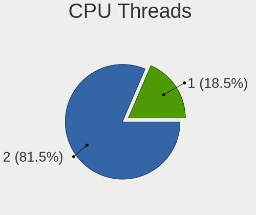
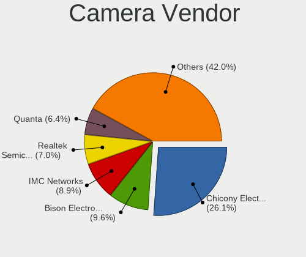

Debian - Hardware Trends (Notebooks)
------------------------------------

A project to identify most popular hardware characteristics and track their change
over time based on data collected by Linux users at https://Linux-Hardware.org.

Anyone can contribute to this report by the [hw-probe](https://github.com/linuxhw/hw-probe) tool:

    sudo -E hw-probe -all -upload

This report is for one last month. Overall report since the beginning of time: [TestCoverage](https://github.com/linuxhw/TestCoverage)

Period: Dec, 2022.

Contents
--------

* [ System ](#system)
  - [ OS                       ](#os)
  - [ OS Family                ](#os-family)
  - [ Kernel                   ](#kernel)
  - [ Kernel Family            ](#kernel-family)
  - [ Kernel Major Ver.        ](#kernel-major-ver)
  - [ Arch                     ](#arch)
  - [ DE                       ](#de)
  - [ Display Server           ](#display-server)
  - [ Display Manager          ](#display-manager)
  - [ OS Lang                  ](#os-lang)
  - [ Boot Mode                ](#boot-mode)
  - [ Filesystem               ](#filesystem)
  - [ Part. scheme             ](#part-scheme)
  - [ Dual Boot with Linux/BSD ](#dual-boot-with-linuxbsd)
  - [ Dual Boot (Win)          ](#dual-boot-win)

* [ Board ](#board)
  - [ Vendor                   ](#vendor)
  - [ Model                    ](#model)
  - [ Model Family             ](#model-family)
  - [ MFG Year                 ](#mfg-year)
  - [ Form Factor              ](#form-factor)
  - [ Secure Boot              ](#secure-boot)
  - [ Coreboot                 ](#coreboot)
  - [ RAM Size                 ](#ram-size)
  - [ RAM Used                 ](#ram-used)
  - [ Total Drives             ](#total-drives)
  - [ Has CD-ROM               ](#has-cd-rom)
  - [ Has Ethernet             ](#has-ethernet)
  - [ Has WiFi                 ](#has-wifi)
  - [ Has Bluetooth            ](#has-bluetooth)

* [ Location ](#location)
  - [ Country                  ](#country)
  - [ City                     ](#city)

* [ Drives ](#drives)
  - [ Drive Vendor             ](#drive-vendor)
  - [ Drive Model              ](#drive-model)
  - [ HDD Vendor               ](#hdd-vendor)
  - [ SSD Vendor               ](#ssd-vendor)
  - [ Drive Kind               ](#drive-kind)
  - [ Drive Connector          ](#drive-connector)
  - [ Drive Size               ](#drive-size)
  - [ Space Total              ](#space-total)
  - [ Space Used               ](#space-used)
  - [ Malfunc. Drives          ](#malfunc-drives)
  - [ Malfunc. Drive Vendor    ](#malfunc-drive-vendor)
  - [ Malfunc. HDD Vendor      ](#malfunc-hdd-vendor)
  - [ Malfunc. Drive Kind      ](#malfunc-drive-kind)
  - [ Failed Drives            ](#failed-drives)
  - [ Failed Drive Vendor      ](#failed-drive-vendor)
  - [ Drive Status             ](#drive-status)

* [ Storage controller ](#storage-controller)
  - [ Storage Vendor           ](#storage-vendor)
  - [ Storage Model            ](#storage-model)
  - [ Storage Kind             ](#storage-kind)

* [ Processor ](#processor)
  - [ CPU Vendor               ](#cpu-vendor)
  - [ CPU Model                ](#cpu-model)
  - [ CPU Model Family         ](#cpu-model-family)
  - [ CPU Cores                ](#cpu-cores)
  - [ CPU Sockets              ](#cpu-sockets)
  - [ CPU Threads              ](#cpu-threads)
  - [ CPU Op-Modes             ](#cpu-op-modes)
  - [ CPU Microcode            ](#cpu-microcode)
  - [ CPU Microarch            ](#cpu-microarch)

* [ Graphics ](#graphics)
  - [ GPU Vendor               ](#gpu-vendor)
  - [ GPU Model                ](#gpu-model)
  - [ GPU Combo                ](#gpu-combo)
  - [ GPU Driver               ](#gpu-driver)
  - [ GPU Memory               ](#gpu-memory)

* [ Monitor ](#monitor)
  - [ Monitor Vendor           ](#monitor-vendor)
  - [ Monitor Model            ](#monitor-model)
  - [ Monitor Resolution       ](#monitor-resolution)
  - [ Monitor Diagonal         ](#monitor-diagonal)
  - [ Monitor Width            ](#monitor-width)
  - [ Aspect Ratio             ](#aspect-ratio)
  - [ Monitor Area             ](#monitor-area)
  - [ Pixel Density            ](#pixel-density)
  - [ Multiple Monitors        ](#multiple-monitors)

* [ Network ](#network)
  - [ Net Controller Vendor    ](#net-controller-vendor)
  - [ Net Controller Model     ](#net-controller-model)
  - [ Wireless Vendor          ](#wireless-vendor)
  - [ Wireless Model           ](#wireless-model)
  - [ Ethernet Vendor          ](#ethernet-vendor)
  - [ Ethernet Model           ](#ethernet-model)
  - [ Net Controller Kind      ](#net-controller-kind)
  - [ Used Controller          ](#used-controller)
  - [ NICs                     ](#nics)
  - [ IPv6                     ](#ipv6)

* [ Bluetooth ](#bluetooth)
  - [ Bluetooth Vendor         ](#bluetooth-vendor)
  - [ Bluetooth Model          ](#bluetooth-model)

* [ Sound ](#sound)
  - [ Sound Vendor             ](#sound-vendor)
  - [ Sound Model              ](#sound-model)

* [ Memory ](#memory)
  - [ Memory Vendor            ](#memory-vendor)
  - [ Memory Model             ](#memory-model)
  - [ Memory Kind              ](#memory-kind)
  - [ Memory Form Factor       ](#memory-form-factor)
  - [ Memory Size              ](#memory-size)
  - [ Memory Speed             ](#memory-speed)

* [ Printers & scanners ](#printers--scanners)
  - [ Printer Vendor           ](#printer-vendor)
  - [ Printer Model            ](#printer-model)
  - [ Scanner Vendor           ](#scanner-vendor)
  - [ Scanner Model            ](#scanner-model)

* [ Camera ](#camera)
  - [ Camera Vendor            ](#camera-vendor)
  - [ Camera Model             ](#camera-model)

* [ Security ](#security)
  - [ Fingerprint Vendor       ](#fingerprint-vendor)
  - [ Fingerprint Model        ](#fingerprint-model)
  - [ Chipcard Vendor          ](#chipcard-vendor)
  - [ Chipcard Model           ](#chipcard-model)

* [ Unsupported ](#unsupported)
  - [ Unsupported Devices      ](#unsupported-devices)
  - [ Unsupported Device Types ](#unsupported-device-types)

System
------

OS
--

Installed operating systems

| Name              | Notebooks | Percent |
|-------------------|-----------|---------|
| Debian 11         | 159       | 82.38%  |
| Debian            | 30        | 15.54%  |
| Debian 11-updates | 2         | 1.04%   |
| Debian 8          | 1         | 0.52%   |
| Debian 10         | 1         | 0.52%   |

OS Family
---------

OS without a version

| Name   | Notebooks | Percent |
|--------|-----------|---------|
| Debian | 193       | 100%    |

Kernel
------

Version of the Linux kernel

| Version                | Notebooks | Percent |
|------------------------|-----------|---------|
| 5.10.0-20-amd64        | 53        | 27.46%  |
| 5.10.0-19-amd64        | 50        | 25.91%  |
| 5.10.0-18-amd64        | 19        | 9.84%   |
| 6.0.0-5-amd64          | 15        | 7.77%   |
| 6.0.0-0.deb11.2-amd64  | 15        | 7.77%   |
| 6.0.0-6-amd64          | 8         | 4.15%   |
| 5.10.0-7-amd64         | 5         | 2.59%   |
| 6.0.0-4-amd64          | 4         | 2.07%   |
| 5.10.0-20-686-pae      | 2         | 1.04%   |
| 5.10.0-15-amd64        | 2         | 1.04%   |
| 6.1.1-pkg1             | 1         | 0.52%   |
| 6.1.0-titanide         | 1         | 0.52%   |
| 6.1.0-asahi            | 1         | 0.52%   |
| 6.0.11-x64v1-xanmod1   | 1         | 0.52%   |
| 6.0.0-6-686            | 1         | 0.52%   |
| 6.0.0-5-686            | 1         | 0.52%   |
| 6.0.0-4mx-amd64        | 1         | 0.52%   |
| 6.0.0-2-amd64          | 1         | 0.52%   |
| 5.19.0-1-amd64         | 1         | 0.52%   |
| 5.19.0-0.deb11.2-amd64 | 1         | 0.52%   |
| 5.18.0-4mx-amd64       | 1         | 0.52%   |
| 5.16.12-64             | 1         | 0.52%   |
| 5.10.92                | 1         | 0.52%   |
| 5.10.0-9-amd64         | 1         | 0.52%   |
| 5.10.0-20-686          | 1         | 0.52%   |
| 5.10.0-19-rt-amd64     | 1         | 0.52%   |
| 5.10.0-19-686          | 1         | 0.52%   |
| 5.10.0-16-amd64        | 1         | 0.52%   |
| 4.19.0-22-amd64        | 1         | 0.52%   |
| 3.10.65+               | 1         | 0.52%   |

Kernel Family
-------------

Linux kernel without a distro release

| Version | Notebooks | Percent |
|---------|-----------|---------|
| 5.10.0  | 136       | 70.47%  |
| 6.0.0   | 46        | 23.83%  |
| 6.1.0   | 2         | 1.04%   |
| 5.19.0  | 2         | 1.04%   |
| 6.1.1   | 1         | 0.52%   |
| 6.0.11  | 1         | 0.52%   |
| 5.18.0  | 1         | 0.52%   |
| 5.16.12 | 1         | 0.52%   |
| 5.10.92 | 1         | 0.52%   |
| 4.19.0  | 1         | 0.52%   |
| 3.10.65 | 1         | 0.52%   |

Kernel Major Ver.
-----------------

Linux kernel major version

| Version | Notebooks | Percent |
|---------|-----------|---------|
| 5.10    | 137       | 70.98%  |
| 6.0     | 47        | 24.35%  |
| 6.1     | 3         | 1.55%   |
| 5.19    | 2         | 1.04%   |
| 5.18    | 1         | 0.52%   |
| 5.16    | 1         | 0.52%   |
| 4.19    | 1         | 0.52%   |
| 3.10    | 1         | 0.52%   |

Arch
----

OS architecture (x86_64, i586, etc.)

| Name    | Notebooks | Percent |
|---------|-----------|---------|
| x86_64  | 185       | 95.85%  |
| i686    | 6         | 3.11%   |
| armv7l  | 1         | 0.52%   |
| aarch64 | 1         | 0.52%   |

DE
--

Desktop Environment

| Name              | Notebooks | Percent |
|-------------------|-----------|---------|
| GNOME             | 61        | 31.61%  |
| KDE5              | 33        | 17.1%   |
| XFCE              | 27        | 13.99%  |
| Unknown           | 25        | 12.95%  |
| X-Cinnamon        | 11        | 5.7%    |
| MATE              | 7         | 3.63%   |
| LXDE              | 7         | 3.63%   |
| Cinnamon          | 7         | 3.63%   |
| LXQt              | 6         | 3.11%   |
| KDE               | 2         | 1.04%   |
| GNOME Flashback   | 2         | 1.04%   |
| x-session-manager | 1         | 0.52%   |
| i3                | 1         | 0.52%   |
| GNOME Classic     | 1         | 0.52%   |
| fluxbox           | 1         | 0.52%   |
| Budgie            | 1         | 0.52%   |

Display Server
--------------

X11 or Wayland

| Name        | Notebooks | Percent |
|-------------|-----------|---------|
| X11         | 116       | 60.1%   |
| Wayland     | 46        | 23.83%  |
| Unknown     | 17        | 8.81%   |
| Tty         | 12        | 6.22%   |
| Web         | 1         | 0.52%   |
| Unspecified | 1         | 0.52%   |

Display Manager
---------------

SDDM, LightDM, etc.

| Name    | Notebooks | Percent |
|---------|-----------|---------|
| LightDM | 50        | 25.91%  |
| Unknown | 49        | 25.39%  |
| GDM     | 47        | 24.35%  |
| SDDM    | 28        | 14.51%  |
| GDM3    | 17        | 8.81%   |
| XDM     | 1         | 0.52%   |
| KDM     | 1         | 0.52%   |

OS Lang
-------

Language

| Lang    | Notebooks | Percent |
|---------|-----------|---------|
| en_US   | 66        | 34.2%   |
| fr_FR   | 18        | 9.33%   |
| en_GB   | 14        | 7.25%   |
| de_DE   | 14        | 7.25%   |
| ru_RU   | 13        | 6.74%   |
| it_IT   | 11        | 5.7%    |
| Unknown | 7         | 3.63%   |
| es_ES   | 6         | 3.11%   |
| pt_BR   | 5         | 2.59%   |
| pl_PL   | 5         | 2.59%   |
| ko_KR   | 5         | 2.59%   |
| C       | 5         | 2.59%   |
| en_IN   | 4         | 2.07%   |
| es_AR   | 3         | 1.55%   |
| en_IE   | 3         | 1.55%   |
| en_CA   | 3         | 1.55%   |
| zh_TW   | 1         | 0.52%   |
| zh_CN   | 1         | 0.52%   |
| pt_PT   | 1         | 0.52%   |
| nl_NL   | 1         | 0.52%   |
| nb_NO   | 1         | 0.52%   |
| fr_CA   | 1         | 0.52%   |
| es_PR   | 1         | 0.52%   |
| es_MX   | 1         | 0.52%   |
| en_NZ   | 1         | 0.52%   |
| en_AU   | 1         | 0.52%   |
| de_CH   | 1         | 0.52%   |

Boot Mode
---------

EFI or BIOS

| Mode | Notebooks | Percent |
|------|-----------|---------|
| EFI  | 130       | 67.36%  |
| BIOS | 63        | 32.64%  |

Filesystem
----------

Type of filesystem

| Type    | Notebooks | Percent |
|---------|-----------|---------|
| Ext4    | 143       | 74.09%  |
| Overlay | 38        | 19.69%  |
| Btrfs   | 7         | 3.63%   |
| Xfs     | 2         | 1.04%   |
| Tmpfs   | 2         | 1.04%   |
| Rootfs  | 1         | 0.52%   |

Part. scheme
------------

Scheme of partitioning

| Type    | Notebooks | Percent |
|---------|-----------|---------|
| GPT     | 131       | 67.88%  |
| MBR     | 40        | 20.73%  |
| Unknown | 22        | 11.4%   |

Dual Boot with Linux/BSD
------------------------

Hosting more than one Linux/BSD

| Dual boot | Notebooks | Percent |
|-----------|-----------|---------|
| No        | 172       | 89.12%  |
| Yes       | 21        | 10.88%  |

Dual Boot (Win)
---------------

Hosting Linux and Windows

| Dual boot | Notebooks | Percent |
|-----------|-----------|---------|
| No        | 137       | 70.98%  |
| Yes       | 56        | 29.02%  |

Board
-----

Vendor
------

Motherboard manufacturer

| Name             | Notebooks | Percent |
|------------------|-----------|---------|
| Lenovo           | 51        | 26.42%  |
| Dell             | 33        | 17.1%   |
| Hewlett-Packard  | 28        | 14.51%  |
| ASUSTek Computer | 20        | 10.36%  |
| Acer             | 11        | 5.7%    |
| Toshiba          | 7         | 3.63%   |
| Google           | 7         | 3.63%   |
| Apple            | 6         | 3.11%   |
| Unknown          | 5         | 2.59%   |
| MSI              | 4         | 2.07%   |
| Aquarius         | 4         | 2.07%   |
| HUAWEI           | 3         | 1.55%   |
| Panasonic        | 2         | 1.04%   |
| Notebook         | 2         | 1.04%   |
| Intel            | 2         | 1.04%   |
| Sony             | 1         | 0.52%   |
| SANTECH          | 1         | 0.52%   |
| Packard Bell     | 1         | 0.52%   |
| Medion           | 1         | 0.52%   |
| MACHCREATOR      | 1         | 0.52%   |
| GMKtec           | 1         | 0.52%   |
| Exo              | 1         | 0.52%   |
| EUROCOM          | 1         | 0.52%   |

Model
-----

Motherboard model

| Name                                  | Notebooks | Percent |
|---------------------------------------|-----------|---------|
| Dell Latitude E7440                   | 8         | 4.15%   |
| Unknown                               | 6         | 3.11%   |
| Aquarius NS585                        | 4         | 2.07%   |
| Apple MacBookAir7,1                   | 3         | 1.55%   |
| Lenovo ThinkPad 13 2nd Gen 20J10046US | 2         | 1.04%   |
| HP EliteBook 8460p                    | 2         | 1.04%   |
| Google Reks                           | 2         | 1.04%   |
| Dell Inspiron 5490                    | 2         | 1.04%   |
| Apple MacBookAir7,2                   | 2         | 1.04%   |
| Toshiba TECRA A11                     | 1         | 0.52%   |
| Toshiba Satellite L775-12V            | 1         | 0.52%   |
| Toshiba Satellite L455D               | 1         | 0.52%   |
| Toshiba Satellite L10W-B-101          | 1         | 0.52%   |
| Toshiba Satellite C850-1LJ            | 1         | 0.52%   |
| Toshiba Satellite C55Dt-A             | 1         | 0.52%   |
| Toshiba dynabook R63/P                | 1         | 0.52%   |
| Sony SVE1112M1EB                      | 1         | 0.52%   |
| SANTECH NHx0DB,DE                     | 1         | 0.52%   |
| Panasonic FZ55-2                      | 1         | 0.52%   |
| Panasonic CFMX4-1                     | 1         | 0.52%   |
| Packard Bell DOT S                    | 1         | 0.52%   |
| Notebook NJ50_70CU                    | 1         | 0.52%   |
| Notebook L14xMU                       | 1         | 0.52%   |
| MSI GP73 Leopard 8RD                  | 1         | 0.52%   |
| MSI GL65 Leopard 10SDR                | 1         | 0.52%   |
| MSI GE62 2QC                          | 1         | 0.52%   |
| MSI Creator 15M A9SD                  | 1         | 0.52%   |
| Medion E122X                          | 1         | 0.52%   |
| MACHCREATOR AB                        | 1         | 0.52%   |
| Lenovo Yoga Slim 7 ProX 14IAH7 82TK   | 1         | 0.52%   |
| Lenovo Yoga Slim 7 Pro 14ACH5 82MS    | 1         | 0.52%   |
| Lenovo XiaoXinPro 16ACH 2021 82L5     | 1         | 0.52%   |
| Lenovo V330-15IKB 81AX                | 1         | 0.52%   |
| Lenovo ThinkPad X280 20KE0015BR       | 1         | 0.52%   |
| Lenovo ThinkPad X270 20HMS16200       | 1         | 0.52%   |
| Lenovo ThinkPad X260 20F5005NAU       | 1         | 0.52%   |
| Lenovo ThinkPad X250 20CLS1UB00       | 1         | 0.52%   |
| Lenovo ThinkPad X230 2325SDE          | 1         | 0.52%   |
| Lenovo ThinkPad X230 23255NG          | 1         | 0.52%   |
| Lenovo ThinkPad X230 2320CTO          | 1         | 0.52%   |

Model Family
------------

Motherboard model prefix

| Name              | Notebooks | Percent |
|-------------------|-----------|---------|
| Lenovo ThinkPad   | 38        | 19.69%  |
| Dell Latitude     | 18        | 9.33%   |
| Dell Inspiron     | 12        | 6.22%   |
| Acer Aspire       | 9         | 4.66%   |
| HP EliteBook      | 7         | 3.63%   |
| Unknown           | 6         | 3.11%   |
| Toshiba Satellite | 5         | 2.59%   |
| HP Laptop         | 5         | 2.59%   |
| ASUS VivoBook     | 5         | 2.59%   |
| Apple MacBookAir7 | 5         | 2.59%   |
| Aquarius NS585    | 4         | 2.07%   |
| Lenovo IdeaPad    | 3         | 1.55%   |
| HP 255            | 3         | 1.55%   |
| ASUS ZenBook      | 3         | 1.55%   |
| Lenovo Yoga       | 2         | 1.04%   |
| Lenovo Legion     | 2         | 1.04%   |
| HP ZBook          | 2         | 1.04%   |
| HP ProBook        | 2         | 1.04%   |
| Google Reks       | 2         | 1.04%   |
| Dell Vostro       | 2         | 1.04%   |
| Toshiba TECRA     | 1         | 0.52%   |
| Toshiba dynabook  | 1         | 0.52%   |
| Sony SVE1112M1EB  | 1         | 0.52%   |
| SANTECH NHx0DB    | 1         | 0.52%   |
| Panasonic FZ55-2  | 1         | 0.52%   |
| Panasonic CFMX4-1 | 1         | 0.52%   |
| Packard Bell DOT  | 1         | 0.52%   |
| Notebook NJ50     | 1         | 0.52%   |
| Notebook L14xMU   | 1         | 0.52%   |
| MSI GP73          | 1         | 0.52%   |
| MSI GL65          | 1         | 0.52%   |
| MSI GE62          | 1         | 0.52%   |
| MSI Creator       | 1         | 0.52%   |
| Medion E122X      | 1         | 0.52%   |
| MACHCREATOR AB    | 1         | 0.52%   |
| Lenovo XiaoXinPro | 1         | 0.52%   |
| Lenovo V330-15IKB | 1         | 0.52%   |
| Lenovo ThinkBook  | 1         | 0.52%   |
| Lenovo K14        | 1         | 0.52%   |
| Lenovo G770       | 1         | 0.52%   |

MFG Year
--------

Motherboard manufacture year

| Year    | Notebooks | Percent |
|---------|-----------|---------|
| 2021    | 26        | 13.47%  |
| 2019    | 24        | 12.44%  |
| 2017    | 20        | 10.36%  |
| 2020    | 16        | 8.29%   |
| 2012    | 15        | 7.77%   |
| 2022    | 14        | 7.25%   |
| 2013    | 14        | 7.25%   |
| 2015    | 11        | 5.7%    |
| 2018    | 9         | 4.66%   |
| 2011    | 9         | 4.66%   |
| 2016    | 8         | 4.15%   |
| 2010    | 8         | 4.15%   |
| 2014    | 7         | 3.63%   |
| 2009    | 4         | 2.07%   |
| 2007    | 3         | 1.55%   |
| Unknown | 2         | 1.04%   |
| 2008    | 1         | 0.52%   |
| 2006    | 1         | 0.52%   |
| 2004    | 1         | 0.52%   |

Form Factor
-----------

Physical design of the computer

| Name     | Notebooks | Percent |
|----------|-----------|---------|
| Notebook | 193       | 100%    |

Secure Boot
-----------

Enabled or disabled

| State    | Notebooks | Percent |
|----------|-----------|---------|
| Disabled | 172       | 89.12%  |
| Enabled  | 21        | 10.88%  |

Coreboot
--------

Have coreboot on board

| Used | Notebooks | Percent |
|------|-----------|---------|
| No   | 184       | 95.34%  |
| Yes  | 9         | 4.66%   |

RAM Size
--------

Total RAM memory

| Size in GB  | Notebooks | Percent |
|-------------|-----------|---------|
| 4.01-8.0    | 57        | 29.53%  |
| 8.01-16.0   | 38        | 19.69%  |
| 3.01-4.0    | 34        | 17.62%  |
| 16.01-24.0  | 27        | 13.99%  |
| 32.01-64.0  | 14        | 7.25%   |
| 1.01-2.0    | 11        | 5.7%    |
| 24.01-32.0  | 5         | 2.59%   |
| 0.51-1.0    | 4         | 2.07%   |
| 2.01-3.0    | 2         | 1.04%   |
| 64.01-256.0 | 1         | 0.52%   |

RAM Used
--------

Used RAM memory

| Used GB   | Notebooks | Percent |
|-----------|-----------|---------|
| 1.01-2.0  | 60        | 31.09%  |
| 2.01-3.0  | 43        | 22.28%  |
| 3.01-4.0  | 35        | 18.13%  |
| 4.01-8.0  | 22        | 11.4%   |
| 0.51-1.0  | 20        | 10.36%  |
| 8.01-16.0 | 6         | 3.11%   |
| 0.01-0.5  | 6         | 3.11%   |
| Unknown   | 1         | 0.52%   |

Total Drives
------------

Number of drives on board

| Drives | Notebooks | Percent |
|--------|-----------|---------|
| 1      | 149       | 77.2%   |
| 2      | 37        | 19.17%  |
| 3      | 3         | 1.55%   |
| 4      | 2         | 1.04%   |
| 0      | 2         | 1.04%   |

Has CD-ROM
----------

Has CD-ROM on board

| Presented | Notebooks | Percent |
|-----------|-----------|---------|
| No        | 151       | 78.24%  |
| Yes       | 42        | 21.76%  |

Has Ethernet
------------

Has Ethernet on board

| Presented | Notebooks | Percent |
|-----------|-----------|---------|
| Yes       | 157       | 81.35%  |
| No        | 36        | 18.65%  |

Has WiFi
--------

Has WiFi module

| Presented | Notebooks | Percent |
|-----------|-----------|---------|
| Yes       | 188       | 97.41%  |
| No        | 5         | 2.59%   |

Has Bluetooth
-------------

Has Bluetooth module

| Presented | Notebooks | Percent |
|-----------|-----------|---------|
| Yes       | 159       | 82.38%  |
| No        | 34        | 17.62%  |

Location
--------

Country
-------

Geographic location (country)

| Country      | Notebooks | Percent |
|--------------|-----------|---------|
| USA          | 43        | 22.28%  |
| Germany      | 23        | 11.92%  |
| Italy        | 16        | 8.29%   |
| France       | 16        | 8.29%   |
| Russia       | 14        | 7.25%   |
| Poland       | 9         | 4.66%   |
| Spain        | 8         | 4.15%   |
| Brazil       | 7         | 3.63%   |
| UK           | 5         | 2.59%   |
| South Korea  | 5         | 2.59%   |
| Canada       | 5         | 2.59%   |
| India        | 4         | 2.07%   |
| Netherlands  | 3         | 1.55%   |
| Argentina    | 3         | 1.55%   |
| Turkey       | 2         | 1.04%   |
| Taiwan       | 2         | 1.04%   |
| Portugal     | 2         | 1.04%   |
| Ireland      | 2         | 1.04%   |
| Hong Kong    | 2         | 1.04%   |
| Australia    | 2         | 1.04%   |
| Switzerland  | 1         | 0.52%   |
| Sweden       | 1         | 0.52%   |
| South Africa | 1         | 0.52%   |
| Slovakia     | 1         | 0.52%   |
| Romania      | 1         | 0.52%   |
| Puerto Rico  | 1         | 0.52%   |
| Peru         | 1         | 0.52%   |
| Norway       | 1         | 0.52%   |
| New Zealand  | 1         | 0.52%   |
| Mexico       | 1         | 0.52%   |
| Lithuania    | 1         | 0.52%   |
| Indonesia    | 1         | 0.52%   |
| Greece       | 1         | 0.52%   |
| El Salvador  | 1         | 0.52%   |
| Denmark      | 1         | 0.52%   |
| Czechia      | 1         | 0.52%   |
| Croatia      | 1         | 0.52%   |
| Chile        | 1         | 0.52%   |
| Bulgaria     | 1         | 0.52%   |
| Algeria      | 1         | 0.52%   |

City
----

Geographic location (city)

| City                   | Notebooks | Percent |
|------------------------|-----------|---------|
| Bangor                 | 27        | 13.99%  |
| Voronezh               | 6         | 3.11%   |
| Seocho-gu              | 5         | 2.59%   |
| Milan                  | 4         | 2.07%   |
| St Petersburg          | 3         | 1.55%   |
| Paris                  | 3         | 1.55%   |
| Moscow                 | 3         | 1.55%   |
| Madrid                 | 3         | 1.55%   |
| Hamburg                | 3         | 1.55%   |
| Berlin                 | 3         | 1.55%   |
| Warsaw                 | 2         | 1.04%   |
| Seville                | 2         | 1.04%   |
| Sao Paulo              | 2         | 1.04%   |
| Poznan                 | 2         | 1.04%   |
| Pittsburgh             | 2         | 1.04%   |
| Mesa                   | 2         | 1.04%   |
| Lisbon                 | 2         | 1.04%   |
| Istanbul               | 2         | 1.04%   |
| Gloucester             | 2         | 1.04%   |
| Xiawanzi               | 1         | 0.52%   |
| Wiemersdorf            | 1         | 0.52%   |
| Vouille                | 1         | 0.52%   |
| Vilnius                | 1         | 0.52%   |
| Vila Velha             | 1         | 0.52%   |
| Valencia               | 1         | 0.52%   |
| Ultimo                 | 1         | 0.52%   |
| Turin                  | 1         | 0.52%   |
| Tuchenbach             | 1         | 0.52%   |
| Trabuco Canyon         | 1         | 0.52%   |
| Tilburg                | 1         | 0.52%   |
| Tarragona              | 1         | 0.52%   |
| Stuttgart              | 1         | 0.52%   |
| Siano                  | 1         | 0.52%   |
| Sélestat              | 1         | 0.52%   |
| Seattle                | 1         | 0.52%   |
| Saoula                 | 1         | 0.52%   |
| Santo André           | 1         | 0.52%   |
| Santiago               | 1         | 0.52%   |
| San Salvador           | 1         | 0.52%   |
| San Miguel de Tucumán | 1         | 0.52%   |

Drives
------

Drive Vendor
------------

Hard drive vendors

| Vendor              | Notebooks | Drives | Percent |
|---------------------|-----------|--------|---------|
| Samsung Electronics | 46        | 49     | 20%     |
| WDC                 | 24        | 25     | 10.43%  |
| Kingston            | 17        | 17     | 7.39%   |
| Unknown             | 16        | 17     | 6.96%   |
| Toshiba             | 15        | 15     | 6.52%   |
| Crucial             | 13        | 13     | 5.65%   |
| Seagate             | 12        | 15     | 5.22%   |
| SanDisk             | 9         | 9      | 3.91%   |
| A-DATA Technology   | 8         | 8      | 3.48%   |
| SK hynix            | 7         | 7      | 3.04%   |
| Intel               | 6         | 6      | 2.61%   |
| Apple               | 6         | 8      | 2.61%   |
| SSSTC               | 4         | 4      | 1.74%   |
| Micron Technology   | 4         | 4      | 1.74%   |
| KIOXIA              | 4         | 4      | 1.74%   |
| HGST                | 4         | 4      | 1.74%   |
| SPCC                | 3         | 3      | 1.3%    |
| Hitachi             | 3         | 3      | 1.3%    |
| Team                | 2         | 2      | 0.87%   |
| PNY                 | 2         | 2      | 0.87%   |
| Phison              | 2         | 2      | 0.87%   |
| LITEONIT            | 2         | 2      | 0.87%   |
| LITEON              | 2         | 2      | 0.87%   |
| Fujitsu             | 2         | 2      | 0.87%   |
| ZTC                 | 1         | 1      | 0.43%   |
| XrayDisk            | 1         | 1      | 0.43%   |
| Verbatim            | 1         | 1      | 0.43%   |
| UMIS                | 1         | 1      | 0.43%   |
| Silicon Motion      | 1         | 1      | 0.43%   |
| S3+                 | 1         | 1      | 0.43%   |
| Patriot             | 1         | 1      | 0.43%   |
| Netac               | 1         | 1      | 0.43%   |
| LDLC                | 1         | 1      | 0.43%   |
| JMicron Technology  | 1         | 1      | 0.43%   |
| Intenso             | 1         | 1      | 0.43%   |
| Fanxiang            | 1         | 1      | 0.43%   |
| Dogfish             | 1         | 1      | 0.43%   |
| China               | 1         | 1      | 0.43%   |
| ASUSTek Computer    | 1         | 1      | 0.43%   |
| ASMT                | 1         | 1      | 0.43%   |

Drive Model
-----------

Hard drive models

| Model                                | Notebooks | Percent |
|--------------------------------------|-----------|---------|
| Kingston SA400S37240G 240GB SSD      | 4         | 1.69%   |
| A-DATA SU800 512GB SSD               | 4         | 1.69%   |
| Samsung SSD 980 1TB                  | 3         | 1.27%   |
| Kingston SV300S37A120G 120GB SSD     | 3         | 1.27%   |
| Apple SSD AP0128H 121GB              | 3         | 1.27%   |
| WDC WD10SPZX-21Z10T0 1TB             | 2         | 0.85%   |
| Unknown MMC Card  32GB               | 2         | 0.85%   |
| Unknown DA4064  64GB                 | 2         | 0.85%   |
| Toshiba MQ04ABF100 1TB               | 2         | 0.85%   |
| SSSTC CL1-3D256-Q11 NVMe 256GB       | 2         | 0.85%   |
| Seagate ST1000LM049-2GH172 1TB       | 2         | 0.85%   |
| Seagate M3 Portable 4TB              | 2         | 0.85%   |
| SanDisk NVMe SSD Drive 1TB           | 2         | 0.85%   |
| SanDisk DF4032  32GB                 | 2         | 0.85%   |
| Samsung SSD 970 EVO Plus 1TB         | 2         | 0.85%   |
| Samsung SSD 860 EVO 250GB            | 2         | 0.85%   |
| Samsung SSD 860 EVO 1TB              | 2         | 0.85%   |
| Samsung SSD 850 EVO 500GB            | 2         | 0.85%   |
| Samsung SSD 850 EVO 250GB            | 2         | 0.85%   |
| Samsung MZVLB512HBJQ-000L2 512GB     | 2         | 0.85%   |
| Samsung MZVLB512HBJQ-000H1 512GB     | 2         | 0.85%   |
| Samsung MZVLB1T0HALR-00000 1TB       | 2         | 0.85%   |
| Samsung MZNTY128HDHP-000L1 128GB SSD | 2         | 0.85%   |
| Samsung MZALQ512HBLU-00BL1 512GB     | 2         | 0.85%   |
| Samsung MZ7LN256HCHP-000L7 256GB SSD | 2         | 0.85%   |
| Phison 311CD0512GB                   | 2         | 0.85%   |
| Kingston SA400S37480G 480GB SSD      | 2         | 0.85%   |
| Crucial CT1000P2SSD8 1TB             | 2         | 0.85%   |
| Crucial CT1000BX500SSD1 1TB          | 2         | 0.85%   |
| Apple SSD SM0128G 121GB              | 2         | 0.85%   |
| ZTC SM201-256G SSD                   | 1         | 0.42%   |
| XrayDisk SSD 240GB                   | 1         | 0.42%   |
| WDC WDS240G2G0B-00EPW0 240GB SSD     | 1         | 0.42%   |
| WDC WDS240G2G0A-00JH30 240GB SSD     | 1         | 0.42%   |
| WDC WDS100T2B0C-00PXH0 1TB           | 1         | 0.42%   |
| WDC WDS100T2B0A-00SM50 1TB SSD       | 1         | 0.42%   |
| WDC WD800BEVS-22RST0 80GB            | 1         | 0.42%   |
| WDC WD7500BPVT-24HXZT1 752GB         | 1         | 0.42%   |
| WDC WD5000LPVX-75V0TT0 500GB         | 1         | 0.42%   |
| WDC WD5000LPCX-24C6HT0 500GB         | 1         | 0.42%   |

HDD Vendor
----------

Hard disk drive vendors

| Vendor  | Notebooks | Drives | Percent |
|---------|-----------|--------|---------|
| WDC     | 17        | 17     | 35.42%  |
| Seagate | 11        | 13     | 22.92%  |
| Toshiba | 7         | 7      | 14.58%  |
| HGST    | 4         | 4      | 8.33%   |
| Hitachi | 3         | 3      | 6.25%   |
| Unknown | 2         | 2      | 4.17%   |
| Fujitsu | 2         | 2      | 4.17%   |
| Intenso | 1         | 1      | 2.08%   |
| ASMT    | 1         | 1      | 2.08%   |

SSD Vendor
----------

Solid state drive vendors

| Vendor              | Notebooks | Drives | Percent |
|---------------------|-----------|--------|---------|
| Samsung Electronics | 17        | 18     | 20.73%  |
| Kingston            | 13        | 13     | 15.85%  |
| Crucial             | 11        | 11     | 13.41%  |
| A-DATA Technology   | 5         | 5      | 6.1%    |
| SanDisk             | 4         | 4      | 4.88%   |
| WDC                 | 3         | 3      | 3.66%   |
| Toshiba             | 2         | 2      | 2.44%   |
| SPCC                | 2         | 2      | 2.44%   |
| SK hynix            | 2         | 2      | 2.44%   |
| Micron Technology   | 2         | 2      | 2.44%   |
| LITEONIT            | 2         | 2      | 2.44%   |
| Intel               | 2         | 2      | 2.44%   |
| Apple               | 2         | 2      | 2.44%   |
| ZTC                 | 1         | 1      | 1.22%   |
| XrayDisk            | 1         | 1      | 1.22%   |
| Verbatim            | 1         | 1      | 1.22%   |
| Team                | 1         | 1      | 1.22%   |
| SSSTC               | 1         | 1      | 1.22%   |
| S3+                 | 1         | 1      | 1.22%   |
| PNY                 | 1         | 1      | 1.22%   |
| Patriot             | 1         | 1      | 1.22%   |
| Netac               | 1         | 1      | 1.22%   |
| LITEON              | 1         | 1      | 1.22%   |
| LDLC                | 1         | 1      | 1.22%   |
| Fanxiang            | 1         | 1      | 1.22%   |
| Dogfish             | 1         | 1      | 1.22%   |
| China               | 1         | 1      | 1.22%   |
| ASUSTek Computer    | 1         | 1      | 1.22%   |

Drive Kind
----------

HDD or SSD

| Kind    | Notebooks | Drives | Percent |
|---------|-----------|--------|---------|
| NVMe    | 79        | 85     | 35.27%  |
| SSD     | 77        | 83     | 34.38%  |
| HDD     | 47        | 50     | 20.98%  |
| MMC     | 18        | 19     | 8.04%   |
| Unknown | 3         | 3      | 1.34%   |

Drive Connector
---------------

SATA, SAS, NVMe, etc.

| Type | Notebooks | Drives | Percent |
|------|-----------|--------|---------|
| SATA | 111       | 127    | 51.63%  |
| NVMe | 79        | 85     | 36.74%  |
| MMC  | 18        | 19     | 8.37%   |
| SAS  | 7         | 9      | 3.26%   |

Drive Size
----------

Size of hard drive

| Size in TB | Notebooks | Drives | Percent |
|------------|-----------|--------|---------|
| 0.01-0.5   | 84        | 90     | 67.74%  |
| 0.51-1.0   | 34        | 35     | 27.42%  |
| 1.01-2.0   | 5         | 6      | 4.03%   |
| 4.01-10.0  | 1         | 2      | 0.81%   |

Space Total
-----------

Amount of disk space available on the file system

| Size in GB     | Notebooks | Percent |
|----------------|-----------|---------|
| 101-250        | 56        | 29.02%  |
| 251-500        | 41        | 21.24%  |
| 501-1000       | 26        | 13.47%  |
| Unknown        | 26        | 13.47%  |
| 51-100         | 13        | 6.74%   |
| 1001-2000      | 12        | 6.22%   |
| 1-20           | 10        | 5.18%   |
| 21-50          | 7         | 3.63%   |
| More than 3000 | 1         | 0.52%   |
| 2001-3000      | 1         | 0.52%   |

Space Used
----------

Amount of used disk space

| Used GB        | Notebooks | Percent |
|----------------|-----------|---------|
| 1-20           | 82        | 42.49%  |
| Unknown        | 26        | 13.47%  |
| 101-250        | 22        | 11.4%   |
| 51-100         | 22        | 11.4%   |
| 21-50          | 19        | 9.84%   |
| 251-500        | 11        | 5.7%    |
| 501-1000       | 10        | 5.18%   |
| More than 3000 | 1         | 0.52%   |

Malfunc. Drives
---------------

Drive models with a malfunction

| Model                                                               | Notebooks | Drives | Percent |
|---------------------------------------------------------------------|-----------|--------|---------|
| WDC WD5000LPVX-75V0TT0 500GB                                        | 1         | 1      | 7.14%   |
| Toshiba MQ01ABF032 320GB                                            | 1         | 1      | 7.14%   |
| SSSTC CVB-8D128-HP 128GB                                            | 1         | 1      | 7.14%   |
| SK hynix SH920 mSATA 128GB SSD                                      | 1         | 1      | 7.14%   |
| Seagate ST9500325AS 500GB                                           | 1         | 1      | 7.14%   |
| Seagate ST500LM021-1KJ152 500GB                                     | 1         | 1      | 7.14%   |
| Seagate ST1000LM024 HN-M101MBB 1TB                                  | 1         | 1      | 7.14%   |
| Micron Technology MTFDDAK960TCB-1AR1ZA 01GV854 01GV857LEN 960GB SSD | 1         | 1      | 7.14%   |
| Micron Technology 1100 SATA 512GB SSD                               | 1         | 1      | 7.14%   |
| Kingston SV300S37A120G 120GB SSD                                    | 1         | 1      | 7.14%   |
| Kingston SH103S3240G 240GB                                          | 1         | 1      | 7.14%   |
| HGST HTS545050A7E380 500GB                                          | 1         | 1      | 7.14%   |
| Crucial CT128M550SSD1 128GB                                         | 1         | 1      | 7.14%   |
| A-DATA Technology SP900 128GB SSD                                   | 1         | 1      | 7.14%   |

Malfunc. Drive Vendor
---------------------

Vendors of faulty drives

| Vendor            | Notebooks | Drives | Percent |
|-------------------|-----------|--------|---------|
| Seagate           | 3         | 3      | 21.43%  |
| Micron Technology | 2         | 2      | 14.29%  |
| Kingston          | 2         | 2      | 14.29%  |
| WDC               | 1         | 1      | 7.14%   |
| Toshiba           | 1         | 1      | 7.14%   |
| SSSTC             | 1         | 1      | 7.14%   |
| SK hynix          | 1         | 1      | 7.14%   |
| HGST              | 1         | 1      | 7.14%   |
| Crucial           | 1         | 1      | 7.14%   |
| A-DATA Technology | 1         | 1      | 7.14%   |

Malfunc. HDD Vendor
-------------------

Vendors of faulty HDD drives

| Vendor  | Notebooks | Drives | Percent |
|---------|-----------|--------|---------|
| Seagate | 3         | 3      | 50%     |
| WDC     | 1         | 1      | 16.67%  |
| Toshiba | 1         | 1      | 16.67%  |
| HGST    | 1         | 1      | 16.67%  |

Malfunc. Drive Kind
-------------------

Kinds of faulty drives

| Kind | Notebooks | Drives | Percent |
|------|-----------|--------|---------|
| SSD  | 8         | 8      | 57.14%  |
| HDD  | 6         | 6      | 42.86%  |

Failed Drives
-------------

Failed drive models

Zero info for selected period =(

Failed Drive Vendor
-------------------

Failed drive vendors

Zero info for selected period =(

Drive Status
------------

Number of failed and malfunc. drives

| Status   | Notebooks | Drives | Percent |
|----------|-----------|--------|---------|
| Works    | 144       | 168    | 70.94%  |
| Detected | 45        | 58     | 22.17%  |
| Malfunc  | 14        | 14     | 6.9%    |

Storage controller
------------------

Storage Vendor
--------------

Storage controller vendors

| Vendor                         | Notebooks | Percent |
|--------------------------------|-----------|---------|
| Intel                          | 124       | 55.11%  |
| Samsung Electronics            | 31        | 13.78%  |
| AMD                            | 21        | 9.33%   |
| Sandisk                        | 8         | 3.56%   |
| Toshiba America Info Systems   | 7         | 3.11%   |
| SK hynix                       | 5         | 2.22%   |
| Kingston Technology Company    | 4         | 1.78%   |
| Solid State Storage Technology | 3         | 1.33%   |
| Phison Electronics             | 3         | 1.33%   |
| KIOXIA                         | 3         | 1.33%   |
| Apple                          | 3         | 1.33%   |
| ADATA Technology               | 3         | 1.33%   |
| Micron/Crucial Technology      | 2         | 0.89%   |
| Micron Technology              | 2         | 0.89%   |
| MAXIO Technology (Hangzhou)    | 2         | 0.89%   |
| Union Memory (Shenzhen)        | 1         | 0.44%   |
| Silicon Motion                 | 1         | 0.44%   |
| Nvidia                         | 1         | 0.44%   |
| Lite-On Technology             | 1         | 0.44%   |

Storage Model
-------------

Storage controller models

| Model                                                                          | Notebooks | Percent |
|--------------------------------------------------------------------------------|-----------|---------|
| AMD FCH SATA Controller [AHCI mode]                                            | 20        | 8.37%   |
| Intel Sunrise Point-LP SATA Controller [AHCI mode]                             | 15        | 6.28%   |
| Intel 82801 Mobile SATA Controller [RAID mode]                                 | 14        | 5.86%   |
| Intel 7 Series Chipset Family 6-port SATA Controller [AHCI mode]               | 14        | 5.86%   |
| Samsung NVMe SSD Controller SM981/PM981/PM983                                  | 13        | 5.44%   |
| Intel Tiger Lake-LP SATA Controller                                            | 10        | 4.18%   |
| Intel Volume Management Device NVMe RAID Controller                            | 9         | 3.77%   |
| Samsung NVMe SSD Controller 980                                                | 8         | 3.35%   |
| Intel 6 Series/C200 Series Chipset Family 6 port Mobile SATA AHCI Controller   | 7         | 2.93%   |
| Intel Cannon Lake Mobile PCH SATA AHCI Controller                              | 6         | 2.51%   |
| Samsung NVMe SSD Controller PM9A1/PM9A3/980PRO                                 | 5         | 2.09%   |
| Intel Wildcat Point-LP SATA Controller [AHCI Mode]                             | 5         | 2.09%   |
| Intel Cannon Lake PCH SATA AHCI Controller                                     | 4         | 1.67%   |
| Intel 8 Series/C220 Series Chipset Family 6-port SATA Controller 1 [AHCI mode] | 4         | 1.67%   |
| Toshiba America Info Systems XG6 NVMe SSD Controller                           | 3         | 1.26%   |
| Solid State Storage Non-Volatile memory controller                             | 3         | 1.26%   |
| SK hynix Gold P31/PC711 NVMe Solid State Drive                                 | 3         | 1.26%   |
| SanDisk Non-Volatile memory controller                                         | 3         | 1.26%   |
| Samsung Electronics SATA controller                                            | 3         | 1.26%   |
| KIOXIA NVMe SSD Controller BG4                                                 | 3         | 1.26%   |
| Intel NM10/ICH7 Family SATA Controller [AHCI mode]                             | 3         | 1.26%   |
| Intel HM170/QM170 Chipset SATA Controller [AHCI Mode]                          | 3         | 1.26%   |
| Intel Comet Lake SATA AHCI Controller                                          | 3         | 1.26%   |
| Intel Cannon Point-LP SATA Controller [AHCI Mode]                              | 3         | 1.26%   |
| Intel 400 Series Chipset Family SATA AHCI Controller                           | 3         | 1.26%   |
| Apple S1X NVMe Controller                                                      | 3         | 1.26%   |
| Toshiba America Info Systems XG5 NVMe SSD Controller                           | 2         | 0.84%   |
| Toshiba America Info Systems BG3 NVMe SSD Controller                           | 2         | 0.84%   |
| SK hynix BC501 NVMe Solid State Drive                                          | 2         | 0.84%   |
| SanDisk WD Blue SN550 NVMe SSD                                                 | 2         | 0.84%   |
| Phison PS5013 E13 NVMe Controller                                              | 2         | 0.84%   |
| Micron/Crucial P2 NVMe PCIe SSD                                                | 2         | 0.84%   |
| Micron Non-Volatile memory controller                                          | 2         | 0.84%   |
| MAXIO (Hangzhou) NVMe SSD Controller MAP1202                                   | 2         | 0.84%   |
| Kingston Company OM3PDP3 NVMe SSD                                              | 2         | 0.84%   |
| Intel SSD 600P Series                                                          | 2         | 0.84%   |
| Intel Celeron/Pentium Silver Processor SATA Controller                         | 2         | 0.84%   |
| Intel Celeron N3350/Pentium N4200/Atom E3900 Series SATA AHCI Controller       | 2         | 0.84%   |
| Intel 82801HM/HEM (ICH8M/ICH8M-E) SATA Controller [IDE mode]                   | 2         | 0.84%   |
| Intel 82801HM/HEM (ICH8M/ICH8M-E) SATA Controller [AHCI mode]                  | 2         | 0.84%   |

Storage Kind
------------

Kind of storage controller (IDE, SATA, NVMe, SAS, ...)

| Kind | Notebooks | Percent |
|------|-----------|---------|
| SATA | 121       | 51.71%  |
| NVMe | 78        | 33.33%  |
| RAID | 24        | 10.26%  |
| IDE  | 11        | 4.7%    |

Processor
---------

CPU Vendor
----------

Processor vendors

| Vendor  | Notebooks | Percent |
|---------|-----------|---------|
| Intel   | 159       | 82.38%  |
| AMD     | 32        | 16.58%  |
| ARM     | 1         | 0.52%   |
| Unknown | 1         | 0.52%   |

CPU Model
---------

Processor models

| Model                                         | Notebooks | Percent |
|-----------------------------------------------|-----------|---------|
| Intel 11th Gen Core i5-1135G7 @ 2.40GHz       | 8         | 4.15%   |
| AMD Ryzen 5 3500U with Radeon Vega Mobile Gfx | 6         | 3.11%   |
| Intel Core i5-5250U CPU @ 1.60GHz             | 5         | 2.59%   |
| Intel Core i5-4300U CPU @ 1.90GHz             | 5         | 2.59%   |
| Intel Core i5-3320M CPU @ 2.60GHz             | 5         | 2.59%   |
| Intel Core i7-9750H CPU @ 2.60GHz             | 4         | 2.07%   |
| Intel Core i7-8550U CPU @ 1.80GHz             | 4         | 2.07%   |
| Intel Core i7-7500U CPU @ 2.70GHz             | 4         | 2.07%   |
| Intel Core i3-9100 CPU @ 3.60GHz              | 4         | 2.07%   |
| AMD Ryzen 5 5500U with Radeon Graphics        | 4         | 2.07%   |
| Intel Core i5-8265U CPU @ 1.60GHz             | 3         | 1.55%   |
| Intel Core i5-6200U CPU @ 2.30GHz             | 3         | 1.55%   |
| Intel Core i5-4310U CPU @ 2.00GHz             | 3         | 1.55%   |
| Intel Core i5-2520M CPU @ 2.50GHz             | 3         | 1.55%   |
| Intel Core i5-10210U CPU @ 1.60GHz            | 3         | 1.55%   |
| Intel Celeron CPU N3060 @ 1.60GHz             | 3         | 1.55%   |
| Intel 12th Gen Core i5-1235U                  | 3         | 1.55%   |
| Intel 11th Gen Core i7-1165G7 @ 2.80GHz       | 3         | 1.55%   |
| AMD Ryzen 7 5800H with Radeon Graphics        | 3         | 1.55%   |
| Intel Core i7-7820HQ CPU @ 2.90GHz            | 2         | 1.04%   |
| Intel Core i7-10750H CPU @ 2.60GHz            | 2         | 1.04%   |
| Intel Core i5-7300U CPU @ 2.60GHz             | 2         | 1.04%   |
| Intel Core i5-6300U CPU @ 2.40GHz             | 2         | 1.04%   |
| Intel Core i5-5300U CPU @ 2.30GHz             | 2         | 1.04%   |
| Intel Core i5-3210M CPU @ 2.50GHz             | 2         | 1.04%   |
| Intel Core i5-2410M CPU @ 2.30GHz             | 2         | 1.04%   |
| Intel Core i3-7100U CPU @ 2.40GHz             | 2         | 1.04%   |
| Intel Core i3-6100U CPU @ 2.30GHz             | 2         | 1.04%   |
| Intel Core i3-5010U CPU @ 2.10GHz             | 2         | 1.04%   |
| Intel Celeron N4020 CPU @ 1.10GHz             | 2         | 1.04%   |
| Intel Celeron CPU N2840 @ 2.16GHz             | 2         | 1.04%   |
| Intel Celeron CPU 3865U @ 1.80GHz             | 2         | 1.04%   |
| Intel Atom CPU N450 @ 1.66GHz                 | 2         | 1.04%   |
| Intel Atom CPU N2600 @ 1.60GHz                | 2         | 1.04%   |
| Intel 11th Gen Core i7-1185G7 @ 3.00GHz       | 2         | 1.04%   |
| Intel 11th Gen Core i7-11800H @ 2.30GHz       | 2         | 1.04%   |
| Intel 11th Gen Core i3-1125G4 @ 2.00GHz       | 2         | 1.04%   |
| AMD Ryzen 7 5825U with Radeon Graphics        | 2         | 1.04%   |
| AMD Ryzen 5 5600H with Radeon Graphics        | 2         | 1.04%   |
| AMD A9-9420 RADEON R5, 5 COMPUTE CORES 2C+3G  | 2         | 1.04%   |

CPU Model Family
----------------

Processor model prefix

| Model                   | Notebooks | Percent |
|-------------------------|-----------|---------|
| Intel Core i5           | 48        | 24.87%  |
| Intel Core i7           | 35        | 18.13%  |
| Other                   | 27        | 13.99%  |
| Intel Core i3           | 18        | 9.33%   |
| Intel Celeron           | 16        | 8.29%   |
| AMD Ryzen 5             | 13        | 6.74%   |
| AMD Ryzen 7             | 7         | 3.63%   |
| Intel Atom              | 6         | 3.11%   |
| Intel Core 2 Duo        | 5         | 2.59%   |
| AMD E1                  | 2         | 1.04%   |
| Intel Pentium M         | 1         | 0.52%   |
| Intel Pentium Dual-Core | 1         | 0.52%   |
| Intel Pentium Dual      | 1         | 0.52%   |
| Intel Pentium           | 1         | 0.52%   |
| Intel Core i9           | 1         | 0.52%   |
| Intel Core 2            | 1         | 0.52%   |
| Intel Celeron M         | 1         | 0.52%   |
| ARM ARMv7               | 1         | 0.52%   |
| AMD Sempron             | 1         | 0.52%   |
| AMD Ryzen 7 PRO         | 1         | 0.52%   |
| AMD Ryzen 5 PRO         | 1         | 0.52%   |
| AMD Ryzen 3             | 1         | 0.52%   |
| AMD Embedded            | 1         | 0.52%   |
| AMD E2                  | 1         | 0.52%   |
| AMD A6                  | 1         | 0.52%   |
| AMD A4                  | 1         | 0.52%   |

CPU Cores
---------

Number of processor cores

| Number | Notebooks | Percent |
|--------|-----------|---------|
| 2      | 91        | 47.15%  |
| 4      | 62        | 32.12%  |
| 6      | 18        | 9.33%   |
| 8      | 12        | 6.22%   |
| 1      | 5         | 2.59%   |
| 10     | 3         | 1.55%   |
| 14     | 1         | 0.52%   |
| 12     | 1         | 0.52%   |

CPU Sockets
-----------

Number of sockets

| Number | Notebooks | Percent |
|--------|-----------|---------|
| 1      | 193       | 100%    |

CPU Threads
-----------

Threads per core (Hyper-Threading)

| Number | Notebooks | Percent |
|--------|-----------|---------|
| 2      | 145       | 75.13%  |
| 1      | 48        | 24.87%  |

CPU Op-Modes
------------

CPU Operation Modes (32-bit, 64-bit)

| Op mode        | Notebooks | Percent |
|----------------|-----------|---------|
| 32-bit, 64-bit | 189       | 97.93%  |
| 32-bit         | 2         | 1.04%   |
| 64-bit         | 1         | 0.52%   |
| Unknown        | 1         | 0.52%   |

CPU Microcode
-------------

Microcode number

| Number     | Notebooks | Percent |
|------------|-----------|---------|
| Unknown    | 24        | 12.44%  |
| 0x806c1    | 16        | 8.29%   |
| 0x306a9    | 12        | 6.22%   |
| 0x806e9    | 9         | 4.66%   |
| 0x40651    | 9         | 4.66%   |
| 0x306d4    | 9         | 4.66%   |
| 0x806ec    | 7         | 3.63%   |
| 0x206a7    | 7         | 3.63%   |
| 0x906ea    | 5         | 2.59%   |
| 0x806ea    | 5         | 2.59%   |
| 0x406e3    | 5         | 2.59%   |
| 0x0a50000c | 5         | 2.59%   |
| 0x08608103 | 5         | 2.59%   |
| 0x906eb    | 4         | 2.07%   |
| 0x406c4    | 4         | 2.07%   |
| 0x306c3    | 4         | 2.07%   |
| 0x08108109 | 4         | 2.07%   |
| 0xa0652    | 3         | 1.55%   |
| 0x906e9    | 3         | 1.55%   |
| 0x906a4    | 3         | 1.55%   |
| 0x20652    | 3         | 1.55%   |
| 0xa0660    | 2         | 1.04%   |
| 0x906ed    | 2         | 1.04%   |
| 0x906a3    | 2         | 1.04%   |
| 0x706a8    | 2         | 1.04%   |
| 0x506c9    | 2         | 1.04%   |
| 0x406c3    | 2         | 1.04%   |
| 0x30678    | 2         | 1.04%   |
| 0x1067a    | 2         | 1.04%   |
| 0x08108102 | 2         | 1.04%   |
| 0x06006705 | 2         | 1.04%   |
| 0x906c0    | 1         | 0.52%   |
| 0x806d1    | 1         | 0.52%   |
| 0x706a1    | 1         | 0.52%   |
| 0x6fd      | 1         | 0.52%   |
| 0x6fb      | 1         | 0.52%   |
| 0x6fa      | 1         | 0.52%   |
| 0x6f6      | 1         | 0.52%   |
| 0x6d8      | 1         | 0.52%   |
| 0x695      | 1         | 0.52%   |

CPU Microarch
-------------

Microarchitecture

| Name             | Notebooks | Percent |
|------------------|-----------|---------|
| KabyLake         | 42        | 21.76%  |
| TigerLake        | 17        | 8.81%   |
| Haswell          | 13        | 6.74%   |
| IvyBridge        | 12        | 6.22%   |
| Unknown          | 11        | 5.7%    |
| Silvermont       | 10        | 5.18%   |
| SandyBridge      | 10        | 5.18%   |
| Broadwell        | 10        | 5.18%   |
| Zen 3            | 9         | 4.66%   |
| Skylake          | 8         | 4.15%   |
| Zen+             | 6         | 3.11%   |
| CometLake        | 5         | 2.59%   |
| Westmere         | 4         | 2.07%   |
| Penryn           | 4         | 2.07%   |
| Core             | 4         | 2.07%   |
| Bonnell          | 4         | 2.07%   |
| Alderlake Hybrid | 4         | 2.07%   |
| Goldmont plus    | 3         | 1.55%   |
| Excavator        | 3         | 1.55%   |
| P6               | 2         | 1.04%   |
| Jaguar           | 2         | 1.04%   |
| Goldmont         | 2         | 1.04%   |
| Zen 2            | 1         | 0.52%   |
| Tremont          | 1         | 0.52%   |
| Puma             | 1         | 0.52%   |
| Nehalem          | 1         | 0.52%   |
| K8 & K10 hybrid  | 1         | 0.52%   |
| K10 Llano        | 1         | 0.52%   |
| Icelake          | 1         | 0.52%   |
| Bobcat           | 1         | 0.52%   |

Graphics
--------

GPU Vendor
----------

Vendors of graphics cards

| Vendor | Notebooks | Percent |
|--------|-----------|---------|
| Intel  | 149       | 65.64%  |
| Nvidia | 40        | 17.62%  |
| AMD    | 38        | 16.74%  |

GPU Model
---------

Graphics card models

| Model                                                                                    | Notebooks | Percent |
|------------------------------------------------------------------------------------------|-----------|---------|
| Intel TigerLake-LP GT2 [Iris Xe Graphics]                                                | 14        | 5.98%   |
| Intel 3rd Gen Core processor Graphics Controller                                         | 10        | 4.27%   |
| Intel HD Graphics 620                                                                    | 9         | 3.85%   |
| Intel Haswell-ULT Integrated Graphics Controller                                         | 9         | 3.85%   |
| Intel CoffeeLake-H GT2 [UHD Graphics 630]                                                | 8         | 3.42%   |
| Intel UHD Graphics 620                                                                   | 7         | 2.99%   |
| Intel Skylake GT2 [HD Graphics 520]                                                      | 7         | 2.99%   |
| Intel Atom/Celeron/Pentium Processor x5-E8000/J3xxx/N3xxx Integrated Graphics Controller | 7         | 2.99%   |
| Intel 2nd Generation Core Processor Family Integrated Graphics Controller                | 7         | 2.99%   |
| AMD Cezanne [Radeon Vega Series / Radeon Vega Mobile Series]                             | 7         | 2.99%   |
| AMD Picasso/Raven 2 [Radeon Vega Series / Radeon Vega Mobile Series]                     | 6         | 2.56%   |
| AMD Lucienne                                                                             | 6         | 2.56%   |
| Intel WhiskeyLake-U GT2 [UHD Graphics 620]                                               | 5         | 2.14%   |
| Intel HD Graphics 6000                                                                   | 5         | 2.14%   |
| Intel HD Graphics 5500                                                                   | 5         | 2.14%   |
| Nvidia TU116M [GeForce GTX 1660 Ti Mobile]                                               | 4         | 1.71%   |
| Intel Core Processor Integrated Graphics Controller                                      | 4         | 1.71%   |
| Intel CometLake-U GT2 [UHD Graphics]                                                     | 4         | 1.71%   |
| Intel CoffeeLake-S GT2 [UHD Graphics 630]                                                | 4         | 1.71%   |
| Intel Tiger Lake-LP GT2 [UHD Graphics G4]                                                | 3         | 1.28%   |
| Intel Mobile GM965/GL960 Integrated Graphics Controller (secondary)                      | 3         | 1.28%   |
| Intel Mobile GM965/GL960 Integrated Graphics Controller (primary)                        | 3         | 1.28%   |
| Intel HD Graphics 630                                                                    | 3         | 1.28%   |
| Intel GeminiLake [UHD Graphics 600]                                                      | 3         | 1.28%   |
| Intel CometLake-H GT2 [UHD Graphics]                                                     | 3         | 1.28%   |
| Intel Atom Processor Z36xxx/Z37xxx Series Graphics & Display                             | 3         | 1.28%   |
| Intel Alder Lake-UP3 GT2 [Iris Xe Graphics]                                              | 3         | 1.28%   |
| Intel 4th Gen Core Processor Integrated Graphics Controller                              | 3         | 1.28%   |
| AMD Stoney [Radeon R2/R3/R4/R5 Graphics]                                                 | 3         | 1.28%   |
| Nvidia TU117M                                                                            | 2         | 0.85%   |
| Nvidia GP108M [GeForce MX230]                                                            | 2         | 0.85%   |
| Nvidia GP107M [GeForce GTX 1050 Ti Mobile]                                               | 2         | 0.85%   |
| Nvidia GM108M [GeForce MX130]                                                            | 2         | 0.85%   |
| Nvidia GF108M [GeForce GT 525M]                                                          | 2         | 0.85%   |
| Intel TigerLake-H GT1 [UHD Graphics]                                                     | 2         | 0.85%   |
| Intel HD Graphics 610                                                                    | 2         | 0.85%   |
| Intel Comet Lake UHD Graphics                                                            | 2         | 0.85%   |
| Intel Atom Processor D4xx/D5xx/N4xx/N5xx Integrated Graphics Controller                  | 2         | 0.85%   |
| Intel Atom Processor D2xxx/N2xxx Integrated Graphics Controller                          | 2         | 0.85%   |
| Intel Alder Lake-P Integrated Graphics Controller                                        | 2         | 0.85%   |

GPU Combo
---------

Combinations of graphics cards

| Name           | Notebooks | Percent |
|----------------|-----------|---------|
| 1 x Intel      | 117       | 60.62%  |
| Intel + Nvidia | 30        | 15.54%  |
| 1 x AMD        | 29        | 15.03%  |
| 1 x Nvidia     | 6         | 3.11%   |
| AMD + Nvidia   | 4         | 2.07%   |
| 2 x AMD        | 3         | 1.55%   |
| Other          | 2         | 1.04%   |
| Intel + AMD    | 2         | 1.04%   |

GPU Driver
----------

Free vs proprietary

| Driver      | Notebooks | Percent |
|-------------|-----------|---------|
| Free        | 160       | 82.9%   |
| Unknown     | 17        | 8.81%   |
| Proprietary | 16        | 8.29%   |

GPU Memory
----------

Total video memory

| Size in GB | Notebooks | Percent |
|------------|-----------|---------|
| Unknown    | 150       | 77.72%  |
| 0.01-0.5   | 14        | 7.25%   |
| 1.01-2.0   | 12        | 6.22%   |
| 0.51-1.0   | 9         | 4.66%   |
| 3.01-4.0   | 4         | 2.07%   |
| 2.01-3.0   | 2         | 1.04%   |
| 7.01-8.0   | 1         | 0.52%   |
| 5.01-6.0   | 1         | 0.52%   |

Monitor
-------

Monitor Vendor
--------------

Monitor vendors

| Vendor                  | Notebooks | Percent |
|-------------------------|-----------|---------|
| AU Optronics            | 45        | 21.84%  |
| BOE                     | 32        | 15.53%  |
| LG Display              | 27        | 13.11%  |
| Chimei Innolux          | 25        | 12.14%  |
| Samsung Electronics     | 17        | 8.25%   |
| InfoVision              | 8         | 3.88%   |
| Dell                    | 7         | 3.4%    |
| Apple                   | 6         | 2.91%   |
| Lenovo                  | 5         | 2.43%   |
| Chi Mei Optoelectronics | 5         | 2.43%   |
| Goldstar                | 4         | 1.94%   |
| Ancor Communications    | 4         | 1.94%   |
| ViewSonic               | 3         | 1.46%   |
| Iiyama                  | 2         | 0.97%   |
| Hewlett-Packard         | 2         | 0.97%   |
| CSO                     | 2         | 0.97%   |
| Vizio                   | 1         | 0.49%   |
| Unknown                 | 1         | 0.49%   |
| TUO                     | 1         | 0.49%   |
| Philips                 | 1         | 0.49%   |
| PANDA                   | 1         | 0.49%   |
| LGD                     | 1         | 0.49%   |
| LG Philips              | 1         | 0.49%   |
| JDI                     | 1         | 0.49%   |
| HKC                     | 1         | 0.49%   |
| Eizo                    | 1         | 0.49%   |
| CEX                     | 1         | 0.49%   |
| Acer                    | 1         | 0.49%   |

Monitor Model
-------------

Monitor models

| Model                                                                 | Notebooks | Percent |
|-----------------------------------------------------------------------|-----------|---------|
| LG Display LCD Monitor LGD03D7 1366x768 309x174mm 14.0-inch           | 3         | 1.43%   |
| InfoVision LCD Monitor IVO0533 1366x768 293x165mm 13.2-inch           | 3         | 1.43%   |
| Lenovo LCD Monitor LEN4011 1280x800 261x163mm 12.1-inch               | 2         | 0.95%   |
| Iiyama PL2740HS IVM6663 1920x1080 598x336mm 27.0-inch                 | 2         | 0.95%   |
| Iiyama PL2740HS IVM6662 1920x1080 598x336mm 27.0-inch                 | 2         | 0.95%   |
| Chimei Innolux LCD Monitor CMN15DB 1366x768 344x193mm 15.5-inch       | 2         | 0.95%   |
| Chimei Innolux LCD Monitor CMN14D4 1920x1080 309x173mm 13.9-inch      | 2         | 0.95%   |
| Chimei Innolux LCD Monitor CMN14C3 1366x768 309x173mm 13.9-inch       | 2         | 0.95%   |
| Chimei Innolux LCD Monitor CMN1492 1366x768 309x174mm 14.0-inch       | 2         | 0.95%   |
| BOE LCD Monitor BOE082E 1920x1080 309x174mm 14.0-inch                 | 2         | 0.95%   |
| BOE LCD Monitor BOE07AA 1366x768 344x194mm 15.5-inch                  | 2         | 0.95%   |
| AU Optronics LCD Monitor AUO2E3C 1366x768 309x173mm 13.9-inch         | 2         | 0.95%   |
| AU Optronics LCD Monitor AUO22EC 1366x768 344x193mm 15.5-inch         | 2         | 0.95%   |
| AU Optronics LCD Monitor AUO21ED 1920x1080 344x193mm 15.5-inch        | 2         | 0.95%   |
| AU Optronics LCD Monitor AUO106C 1366x768 276x155mm 12.5-inch         | 2         | 0.95%   |
| Apple Color LCD APP9CF3 1366x768 260x140mm 11.6-inch                  | 2         | 0.95%   |
| Apple Color LCD APP9CF0 1440x900 290x180mm 13.4-inch                  | 2         | 0.95%   |
| Ancor Communications ASUS VE278 ACI27F6 1920x1080 598x336mm 27.0-inch | 2         | 0.95%   |
| Vizio D32f-G1 VIZ1027 1920x1080 698x392mm 31.5-inch                   | 1         | 0.48%   |
| ViewSonic VX2410 SERIES VSCEF2D 1920x1080 521x293mm 23.5-inch         | 1         | 0.48%   |
| ViewSonic VG730m VSC951E 1280x1024 338x270mm 17.0-inch                | 1         | 0.48%   |
| ViewSonic VA2432-FHD VSCB639 1920x1080 530x300mm 24.0-inch            | 1         | 0.48%   |
| Unknown LCD Monitor FFFF 2288x1287 2550x2550mm 142.0-inch             | 1         | 0.48%   |
| TUO 240RS TUO2400 1920x1080 408x255mm 18.9-inch                       | 1         | 0.48%   |
| Samsung Electronics U28E590 SAM0C4C 3840x2160 608x345mm 27.5-inch     | 1         | 0.48%   |
| Samsung Electronics SMS24A450 SAM083A 1920x1200 518x324mm 24.1-inch   | 1         | 0.48%   |
| Samsung Electronics S34J55x SAM0F70 3440x1440 797x333mm 34.0-inch     | 1         | 0.48%   |
| Samsung Electronics S24F350 SAM0D20 1920x1080 520x290mm 23.4-inch     | 1         | 0.48%   |
| Samsung Electronics S19C301 SAM0B08 1366x768 410x230mm 18.5-inch      | 1         | 0.48%   |
| Samsung Electronics LCD Monitor SEC544B 1600x900 382x214mm 17.2-inch  | 1         | 0.48%   |
| Samsung Electronics LCD Monitor SEC5441 1366x768 344x194mm 15.5-inch  | 1         | 0.48%   |
| Samsung Electronics LCD Monitor SEC4C45 1280x800 331x207mm 15.4-inch  | 1         | 0.48%   |
| Samsung Electronics LCD Monitor SEC4156 1600x900 382x215mm 17.3-inch  | 1         | 0.48%   |
| Samsung Electronics LCD Monitor SEC325A 1366x768 344x194mm 15.5-inch  | 1         | 0.48%   |
| Samsung Electronics LCD Monitor SEC3150 1366x768 344x193mm 15.5-inch  | 1         | 0.48%   |
| Samsung Electronics LCD Monitor SDCA029 3840x2160 344x194mm 15.5-inch | 1         | 0.48%   |
| Samsung Electronics LCD Monitor SDC5441 1366x768 309x174mm 14.0-inch  | 1         | 0.48%   |
| Samsung Electronics LCD Monitor SDC415D 3840x2400 344x215mm 16.0-inch | 1         | 0.48%   |
| Samsung Electronics LCD Monitor SDC4158 1920x1080 294x165mm 13.3-inch | 1         | 0.48%   |
| Samsung Electronics LCD Monitor C27F390                               | 1         | 0.48%   |

Monitor Resolution
------------------

Monitor screen resolution

| Resolution         | Notebooks | Percent |
|--------------------|-----------|---------|
| 1920x1080 (FHD)    | 77        | 39.49%  |
| 1366x768 (WXGA)    | 68        | 34.87%  |
| 3840x2160 (4K)     | 6         | 3.08%   |
| 1920x1200 (WUXGA)  | 6         | 3.08%   |
| 1280x800 (WXGA)    | 5         | 2.56%   |
| 1024x600           | 5         | 2.56%   |
| 1600x900 (HD+)     | 4         | 2.05%   |
| 1440x900 (WXGA+)   | 4         | 2.05%   |
| 3840x2400          | 2         | 1.03%   |
| 3440x1440          | 2         | 1.03%   |
| 2560x1440 (QHD)    | 2         | 1.03%   |
| 2560x1080          | 2         | 1.03%   |
| 3840x1100          | 1         | 0.51%   |
| 3840x1080          | 1         | 0.51%   |
| 3072x1920          | 1         | 0.51%   |
| 2560x1600          | 1         | 0.51%   |
| 2288x1287          | 1         | 0.51%   |
| 2160x1440          | 1         | 0.51%   |
| 1680x1050 (WSXGA+) | 1         | 0.51%   |
| 1600x1200          | 1         | 0.51%   |
| 1400x1050          | 1         | 0.51%   |
| 1280x1024 (SXGA)   | 1         | 0.51%   |
| 1024x768 (XGA)     | 1         | 0.51%   |
| Unknown            | 1         | 0.51%   |

Monitor Diagonal
----------------

Diagonal size in inches

| Inches  | Notebooks | Percent |
|---------|-----------|---------|
| 15      | 65        | 31.55%  |
| 14      | 34        | 16.5%   |
| 13      | 33        | 16.02%  |
| 17      | 12        | 5.83%   |
| 12      | 12        | 5.83%   |
| 27      | 9         | 4.37%   |
| 24      | 8         | 3.88%   |
| 11      | 8         | 3.88%   |
| 23      | 5         | 2.43%   |
| 34      | 4         | 1.94%   |
| 10      | 4         | 1.94%   |
| 18      | 2         | 0.97%   |
| 16      | 2         | 0.97%   |
| 142     | 1         | 0.49%   |
| 49      | 1         | 0.49%   |
| 41      | 1         | 0.49%   |
| 31      | 1         | 0.49%   |
| 21      | 1         | 0.49%   |
| 20      | 1         | 0.49%   |
| 8       | 1         | 0.49%   |
| Unknown | 1         | 0.49%   |

Monitor Width
-------------

Physical width

| Width in mm    | Notebooks | Percent |
|----------------|-----------|---------|
| 301-350        | 117       | 57.07%  |
| 201-300        | 40        | 19.51%  |
| 501-600        | 20        | 9.76%   |
| 351-400        | 12        | 5.85%   |
| 701-800        | 4         | 1.95%   |
| 401-500        | 4         | 1.95%   |
| 601-700        | 3         | 1.46%   |
| More than 2000 | 1         | 0.49%   |
| 101-200        | 1         | 0.49%   |
| 1001-1500      | 1         | 0.49%   |
| 901-1000       | 1         | 0.49%   |
| Unknown        | 1         | 0.49%   |

Aspect Ratio
------------

Proportional relationship between the width and the height

| Ratio   | Notebooks | Percent |
|---------|-----------|---------|
| 16/9    | 157       | 82.63%  |
| 16/10   | 20        | 10.53%  |
| 21/9    | 4         | 2.11%   |
| 3/2     | 3         | 1.58%   |
| 4/3     | 2         | 1.05%   |
| 5/4     | 1         | 0.53%   |
| 3.40    | 1         | 0.53%   |
| 1.00    | 1         | 0.53%   |
| Unknown | 1         | 0.53%   |

Monitor Area
------------

Area in inch²

| Area in inch² | Notebooks | Percent |
|----------------|-----------|---------|
| 101-110        | 64        | 31.07%  |
| 81-90          | 53        | 25.73%  |
| 61-70          | 12        | 5.83%   |
| 71-80          | 11        | 5.34%   |
| 121-130        | 10        | 4.85%   |
| 51-60          | 9         | 4.37%   |
| 301-350        | 9         | 4.37%   |
| 201-250        | 9         | 4.37%   |
| 351-500        | 5         | 2.43%   |
| 251-300        | 5         | 2.43%   |
| 41-50          | 4         | 1.94%   |
| 91-100         | 3         | 1.46%   |
| More than 1000 | 2         | 0.97%   |
| 151-200        | 2         | 0.97%   |
| 141-150        | 2         | 0.97%   |
| 111-120        | 2         | 0.97%   |
| 1-40           | 1         | 0.49%   |
| 131-140        | 1         | 0.49%   |
| 501-1000       | 1         | 0.49%   |
| Unknown        | 1         | 0.49%   |

Pixel Density
-------------

Pixels per inch

| Density       | Notebooks | Percent |
|---------------|-----------|---------|
| 121-160       | 86        | 42.57%  |
| 101-120       | 61        | 30.2%   |
| 51-100        | 31        | 15.35%  |
| 161-240       | 16        | 7.92%   |
| More than 240 | 4         | 1.98%   |
| 1-50          | 3         | 1.49%   |
| Unknown       | 1         | 0.5%    |

Multiple Monitors
-----------------

Total monitors connected

| Total | Notebooks | Percent |
|-------|-----------|---------|
| 1     | 143       | 74.09%  |
| 2     | 29        | 15.03%  |
| 0     | 17        | 8.81%   |
| 3     | 4         | 2.07%   |

Network
-------

Net Controller Vendor
---------------------

Controller vendors

| Vendor                            | Notebooks | Percent |
|-----------------------------------|-----------|---------|
| Intel                             | 118       | 38.94%  |
| Realtek Semiconductor             | 92        | 30.36%  |
| Qualcomm Atheros                  | 32        | 10.56%  |
| Broadcom Limited                  | 11        | 3.63%   |
| Broadcom                          | 9         | 2.97%   |
| MediaTek                          | 8         | 2.64%   |
| TP-Link                           | 4         | 1.32%   |
| Hewlett-Packard                   | 4         | 1.32%   |
| Dell                              | 4         | 1.32%   |
| Lenovo                            | 3         | 0.99%   |
| Ericsson Business Mobile Networks | 3         | 0.99%   |
| Sierra Wireless                   | 2         | 0.66%   |
| Samsung Electronics               | 2         | 0.66%   |
| Qualcomm                          | 2         | 0.66%   |
| ASIX Electronics                  | 2         | 0.66%   |
| Sigma Designs                     | 1         | 0.33%   |
| Ralink Technology                 | 1         | 0.33%   |
| OPPO Electronics                  | 1         | 0.33%   |
| OnePlus Technology (Shenzhen)     | 1         | 0.33%   |
| Nvidia                            | 1         | 0.33%   |
| Dresden Elektronik                | 1         | 0.33%   |
| DisplayLink                       | 1         | 0.33%   |

Net Controller Model
--------------------

Controller models

| Model                                                             | Notebooks | Percent |
|-------------------------------------------------------------------|-----------|---------|
| Realtek RTL8111/8168/8411 PCI Express Gigabit Ethernet Controller | 53        | 13.91%  |
| Realtek RTL810xE PCI Express Fast Ethernet controller             | 14        | 3.67%   |
| Realtek RTL8153 Gigabit Ethernet Adapter                          | 12        | 3.15%   |
| Intel Wi-Fi 6 AX201                                               | 11        | 2.89%   |
| Intel Wireless 8265 / 8275                                        | 10        | 2.62%   |
| Intel Wireless 7260                                               | 10        | 2.62%   |
| Intel 82579LM Gigabit Network Connection (Lewisville)             | 10        | 2.62%   |
| Intel Cannon Lake PCH CNVi WiFi                                   | 9         | 2.36%   |
| Intel Ethernet Connection I218-LM                                 | 8         | 2.1%    |
| Qualcomm Atheros QCA9377 802.11ac Wireless Network Adapter        | 7         | 1.84%   |
| MediaTek MT7921 802.11ax PCI Express Wireless Network Adapter     | 7         | 1.84%   |
| Intel Wireless 7265                                               | 7         | 1.84%   |
| Intel Wi-Fi 6 AX200                                               | 7         | 1.84%   |
| Realtek RTL8821CE 802.11ac PCIe Wireless Network Adapter          | 5         | 1.31%   |
| Intel Wireless 8260                                               | 5         | 1.31%   |
| Intel Comet Lake PCH-LP CNVi WiFi                                 | 5         | 1.31%   |
| Intel Centrino Ultimate-N 6300                                    | 5         | 1.31%   |
| Intel Alder Lake-P PCH CNVi WiFi                                  | 5         | 1.31%   |
| Broadcom Limited BCM4360 802.11ac Wireless Network Adapter        | 5         | 1.31%   |
| Realtek RTL8852AE 802.11ax PCIe Wireless Network Adapter          | 4         | 1.05%   |
| Realtek RTL8822CE 802.11ac PCIe Wireless Network Adapter          | 4         | 1.05%   |
| Qualcomm Atheros QCA9565 / AR9565 Wireless Network Adapter        | 4         | 1.05%   |
| Qualcomm Atheros AR9485 Wireless Network Adapter                  | 4         | 1.05%   |
| Qualcomm Atheros AR9462 Wireless Network Adapter                  | 4         | 1.05%   |
| Intel Wireless 3165                                               | 4         | 1.05%   |
| Intel Ethernet Connection (4) I219-LM                             | 4         | 1.05%   |
| Intel Centrino Advanced-N 6205 [Taylor Peak]                      | 4         | 1.05%   |
| Realtek RTL8723BE PCIe Wireless Network Adapter                   | 3         | 0.79%   |
| Realtek RTL8188CE 802.11b/g/n WiFi Adapter                        | 3         | 0.79%   |
| Qualcomm Atheros QCA6174 802.11ac Wireless Network Adapter        | 3         | 0.79%   |
| Qualcomm Atheros AR9285 Wireless Network Adapter (PCI-Express)    | 3         | 0.79%   |
| Intel Wi-Fi 6 AX210/AX211/AX411 160MHz                            | 3         | 0.79%   |
| Intel PRO/Wireless 3945ABG [Golan] Network Connection             | 3         | 0.79%   |
| Intel Ethernet Connection I219-V                                  | 3         | 0.79%   |
| Intel Ethernet Connection (4) I219-V                              | 3         | 0.79%   |
| Intel Dual Band Wireless-AC 3165 Plus Bluetooth                   | 3         | 0.79%   |
| Intel 82579V Gigabit Network Connection                           | 3         | 0.79%   |
| Intel 82577LM Gigabit Network Connection                          | 3         | 0.79%   |
| Sierra Wireless EM7455                                            | 2         | 0.52%   |
| Realtek 802.11n WLAN Adapter                                      | 2         | 0.52%   |

Wireless Vendor
---------------

Wireless vendors

| Vendor                | Notebooks | Percent |
|-----------------------|-----------|---------|
| Intel                 | 108       | 54%     |
| Realtek Semiconductor | 32        | 16%     |
| Qualcomm Atheros      | 28        | 14%     |
| Broadcom Limited      | 9         | 4.5%    |
| MediaTek              | 8         | 4%      |
| Broadcom              | 5         | 2.5%    |
| TP-Link               | 3         | 1.5%    |
| Dell                  | 3         | 1.5%    |
| Sierra Wireless       | 2         | 1%      |
| Ralink Technology     | 1         | 0.5%    |
| Qualcomm              | 1         | 0.5%    |

Wireless Model
--------------

Wireless models

| Model                                                          | Notebooks | Percent |
|----------------------------------------------------------------|-----------|---------|
| Intel Wi-Fi 6 AX201                                            | 11        | 5.5%    |
| Intel Wireless 8265 / 8275                                     | 10        | 5%      |
| Intel Wireless 7260                                            | 10        | 5%      |
| Intel Cannon Lake PCH CNVi WiFi                                | 9         | 4.5%    |
| Qualcomm Atheros QCA9377 802.11ac Wireless Network Adapter     | 7         | 3.5%    |
| MediaTek MT7921 802.11ax PCI Express Wireless Network Adapter  | 7         | 3.5%    |
| Intel Wireless 7265                                            | 7         | 3.5%    |
| Intel Wi-Fi 6 AX200                                            | 7         | 3.5%    |
| Realtek RTL8821CE 802.11ac PCIe Wireless Network Adapter       | 5         | 2.5%    |
| Intel Wireless 8260                                            | 5         | 2.5%    |
| Intel Comet Lake PCH-LP CNVi WiFi                              | 5         | 2.5%    |
| Intel Centrino Ultimate-N 6300                                 | 5         | 2.5%    |
| Intel Alder Lake-P PCH CNVi WiFi                               | 5         | 2.5%    |
| Broadcom Limited BCM4360 802.11ac Wireless Network Adapter     | 5         | 2.5%    |
| Realtek RTL8852AE 802.11ax PCIe Wireless Network Adapter       | 4         | 2%      |
| Realtek RTL8822CE 802.11ac PCIe Wireless Network Adapter       | 4         | 2%      |
| Qualcomm Atheros QCA9565 / AR9565 Wireless Network Adapter     | 4         | 2%      |
| Qualcomm Atheros AR9485 Wireless Network Adapter               | 4         | 2%      |
| Qualcomm Atheros AR9462 Wireless Network Adapter               | 4         | 2%      |
| Intel Wireless 3165                                            | 4         | 2%      |
| Intel Centrino Advanced-N 6205 [Taylor Peak]                   | 4         | 2%      |
| Realtek RTL8723BE PCIe Wireless Network Adapter                | 3         | 1.5%    |
| Realtek RTL8188CE 802.11b/g/n WiFi Adapter                     | 3         | 1.5%    |
| Qualcomm Atheros QCA6174 802.11ac Wireless Network Adapter     | 3         | 1.5%    |
| Qualcomm Atheros AR9285 Wireless Network Adapter (PCI-Express) | 3         | 1.5%    |
| Intel Wi-Fi 6 AX210/AX211/AX411 160MHz                         | 3         | 1.5%    |
| Intel PRO/Wireless 3945ABG [Golan] Network Connection          | 3         | 1.5%    |
| Intel Dual Band Wireless-AC 3165 Plus Bluetooth                | 3         | 1.5%    |
| Sierra Wireless EM7455                                         | 2         | 1%      |
| Realtek 802.11n WLAN Adapter                                   | 2         | 1%      |
| Realtek 802.11ac NIC                                           | 2         | 1%      |
| Intel PRO/Wireless 4965 AG or AGN [Kedron] Network Connection  | 2         | 1%      |
| Intel Gemini Lake PCH CNVi WiFi                                | 2         | 1%      |
| Intel Comet Lake PCH CNVi WiFi                                 | 2         | 1%      |
| Intel Centrino Advanced-N 6200                                 | 2         | 1%      |
| Intel Cannon Point-LP CNVi [Wireless-AC]                       | 2         | 1%      |
| Dell DW5820e L850-GL                                           | 2         | 1%      |
| Broadcom Limited BCM43224 802.11a/b/g/n                        | 2         | 1%      |
| Broadcom BCM4313 802.11bgn Wireless Network Adapter            | 2         | 1%      |
| TP-Link TL-WN823N v2/v3 [Realtek RTL8192EU]                    | 1         | 0.5%    |

Ethernet Vendor
---------------

Ethernet vendors

| Vendor                        | Notebooks | Percent |
|-------------------------------|-----------|---------|
| Realtek Semiconductor         | 78        | 46.15%  |
| Intel                         | 63        | 37.28%  |
| Qualcomm Atheros              | 7         | 4.14%   |
| Broadcom                      | 5         | 2.96%   |
| Lenovo                        | 3         | 1.78%   |
| Samsung Electronics           | 2         | 1.18%   |
| Broadcom Limited              | 2         | 1.18%   |
| ASIX Electronics              | 2         | 1.18%   |
| TP-Link                       | 1         | 0.59%   |
| Qualcomm                      | 1         | 0.59%   |
| OPPO Electronics              | 1         | 0.59%   |
| OnePlus Technology (Shenzhen) | 1         | 0.59%   |
| Nvidia                        | 1         | 0.59%   |
| Hewlett-Packard               | 1         | 0.59%   |
| DisplayLink                   | 1         | 0.59%   |

Ethernet Model
--------------

Ethernet models

| Model                                                             | Notebooks | Percent |
|-------------------------------------------------------------------|-----------|---------|
| Realtek RTL8111/8168/8411 PCI Express Gigabit Ethernet Controller | 53        | 31.18%  |
| Realtek RTL810xE PCI Express Fast Ethernet controller             | 14        | 8.24%   |
| Realtek RTL8153 Gigabit Ethernet Adapter                          | 12        | 7.06%   |
| Intel 82579LM Gigabit Network Connection (Lewisville)             | 10        | 5.88%   |
| Intel Ethernet Connection I218-LM                                 | 8         | 4.71%   |
| Intel Ethernet Connection (4) I219-LM                             | 4         | 2.35%   |
| Intel Ethernet Connection I219-V                                  | 3         | 1.76%   |
| Intel Ethernet Connection (4) I219-V                              | 3         | 1.76%   |
| Intel 82579V Gigabit Network Connection                           | 3         | 1.76%   |
| Intel 82577LM Gigabit Network Connection                          | 3         | 1.76%   |
| Intel Ethernet Connection I219-LM                                 | 2         | 1.18%   |
| Intel Ethernet Connection (7) I219-LM                             | 2         | 1.18%   |
| Intel Ethernet Connection (5) I219-LM                             | 2         | 1.18%   |
| Intel Ethernet Connection (3) I218-LM                             | 2         | 1.18%   |
| Intel Ethernet Connection (16) I219-V                             | 2         | 1.18%   |
| Intel Ethernet Connection (13) I219-V                             | 2         | 1.18%   |
| Intel Ethernet Connection (13) I219-LM                            | 2         | 1.18%   |
| Intel Ethernet Connection (10) I219-V                             | 2         | 1.18%   |
| Intel Ethernet Connection (10) I219-LM                            | 2         | 1.18%   |
| Broadcom NetLink BCM57785 Gigabit Ethernet PCIe                   | 2         | 1.18%   |
| TP-Link USB 10/100 LAN                                            | 1         | 0.59%   |
| Samsung GT-I9070 (network tethering, USB debugging enabled)       | 1         | 0.59%   |
| Samsung Galaxy series, misc. (tethering mode)                     | 1         | 0.59%   |
| Qualcomm MegaFon M150-4                                           | 1         | 0.59%   |
| Qualcomm Atheros Killer E2400 Gigabit Ethernet Controller         | 1         | 0.59%   |
| Qualcomm Atheros Killer E220x Gigabit Ethernet Controller         | 1         | 0.59%   |
| Qualcomm Atheros AR8161 Gigabit Ethernet                          | 1         | 0.59%   |
| Qualcomm Atheros AR8152 v2.0 Fast Ethernet                        | 1         | 0.59%   |
| Qualcomm Atheros AR8151 v2.0 Gigabit Ethernet                     | 1         | 0.59%   |
| Qualcomm Atheros AR8132 Fast Ethernet                             | 1         | 0.59%   |
| Qualcomm Atheros AR8121/AR8113/AR8114 Gigabit or Fast Ethernet    | 1         | 0.59%   |
| OPPO RMX3263                                                      | 1         | 0.59%   |
| OnePlus (Shenzhen) OnePlus                                        | 1         | 0.59%   |
| Nvidia MCP79 Ethernet                                             | 1         | 0.59%   |
| Lenovo USB-C Dock Ethernet                                        | 1         | 0.59%   |
| Lenovo ThinkPad TBT 3 Dock                                        | 1         | 0.59%   |
| Lenovo Powered Hub                                                | 1         | 0.59%   |
| Intel Ethernet Controller I225-V                                  | 1         | 0.59%   |
| Intel Ethernet Connection I217-LM                                 | 1         | 0.59%   |
| Intel Ethernet Connection (6) I219-V                              | 1         | 0.59%   |

Net Controller Kind
-------------------

Ethernet, WiFi or modem

| Kind     | Notebooks | Percent |
|----------|-----------|---------|
| WiFi     | 188       | 52.81%  |
| Ethernet | 157       | 44.1%   |
| Modem    | 10        | 2.81%   |
| Unknown  | 1         | 0.28%   |

Used Controller
---------------

Currently used network controller

| Kind     | Notebooks | Percent |
|----------|-----------|---------|
| WiFi     | 145       | 71.43%  |
| Ethernet | 58        | 28.57%  |

NICs
----

Total network controllers on board

| Total | Notebooks | Percent |
|-------|-----------|---------|
| 2     | 142       | 73.58%  |
| 1     | 45        | 23.32%  |
| 0     | 5         | 2.59%   |
| 3     | 1         | 0.52%   |

IPv6
----

IPv6 vs IPv4

| Used | Notebooks | Percent |
|------|-----------|---------|
| No   | 150       | 77.72%  |
| Yes  | 43        | 22.28%  |

Bluetooth
---------

Bluetooth Vendor
----------------

Controller vendors

| Vendor                          | Notebooks | Percent |
|---------------------------------|-----------|---------|
| Intel                           | 83        | 51.55%  |
| Realtek Semiconductor           | 16        | 9.94%   |
| Qualcomm Atheros Communications | 11        | 6.83%   |
| Lite-On Technology              | 10        | 6.21%   |
| Broadcom                        | 10        | 6.21%   |
| IMC Networks                    | 8         | 4.97%   |
| Foxconn / Hon Hai               | 7         | 4.35%   |
| Apple                           | 6         | 3.73%   |
| Toshiba                         | 2         | 1.24%   |
| Realtek                         | 2         | 1.24%   |
| Dell                            | 2         | 1.24%   |
| Cambridge Silicon Radio         | 2         | 1.24%   |
| MediaTek                        | 1         | 0.62%   |
| Hewlett-Packard                 | 1         | 0.62%   |

Bluetooth Model
---------------

Controller models

| Model                                               | Notebooks | Percent |
|-----------------------------------------------------|-----------|---------|
| Intel Bluetooth wireless interface                  | 35        | 21.74%  |
| Intel Bluetooth 9460/9560 Jefferson Peak (JfP)      | 18        | 11.18%  |
| Intel AX201 Bluetooth                               | 15        | 9.32%   |
| Realtek Bluetooth Radio                             | 13        | 8.07%   |
| Intel AX200 Bluetooth                               | 7         | 4.35%   |
| Qualcomm Atheros  Bluetooth Device                  | 5         | 3.11%   |
| Apple Bluetooth USB Host Controller                 | 5         | 3.11%   |
| Realtek  Bluetooth 4.2 Adapter                      | 3         | 1.86%   |
| Qualcomm Atheros AR3012 Bluetooth 4.0               | 3         | 1.86%   |
| Lite-On Qualcomm Atheros QCA9377 Bluetooth          | 3         | 1.86%   |
| Lite-On Bluetooth Device                            | 3         | 1.86%   |
| Intel AX210 Bluetooth                               | 3         | 1.86%   |
| IMC Networks Wireless_Device                        | 3         | 1.86%   |
| Broadcom HP Portable SoftSailing                    | 3         | 1.86%   |
| Broadcom BCM20702 Bluetooth 4.0 [ThinkPad]          | 3         | 1.86%   |
| Realtek Bluetooth Radio                             | 2         | 1.24%   |
| Qualcomm Atheros AR3011 Bluetooth                   | 2         | 1.24%   |
| Lite-On Wireless_Device                             | 2         | 1.24%   |
| Intel Bluetooth Device                              | 2         | 1.24%   |
| IMC Networks Bluetooth USB Host Controller          | 2         | 1.24%   |
| Foxconn / Hon Hai Wireless_Device                   | 2         | 1.24%   |
| Foxconn / Hon Hai Broadcom Bluetooth 2.1 Device     | 2         | 1.24%   |
| Foxconn / Hon Hai Bluetooth Device                  | 2         | 1.24%   |
| Cambridge Silicon Radio Bluetooth Dongle (HCI mode) | 2         | 1.24%   |
| Broadcom BCM2045B (BDC-2.1)                         | 2         | 1.24%   |
| Broadcom BCM2045B (BDC-2) [Bluetooth Controller]    | 2         | 1.24%   |
| Toshiba Integrated Bluetooth HCI                    | 1         | 0.62%   |
| Toshiba Bluetooth Radio                             | 1         | 0.62%   |
| Qualcomm Atheros QCA61x4 Bluetooth 4.0              | 1         | 0.62%   |
| MediaTek Wireless_Device                            | 1         | 0.62%   |
| Lite-On Broadcom BCM43142A0 Bluetooth Device        | 1         | 0.62%   |
| Lite-On Atheros AR3012 Bluetooth                    | 1         | 0.62%   |
| Intel Wireless-AC 9260 Bluetooth Adapter            | 1         | 0.62%   |
| Intel Wireless-AC 3168 Bluetooth                    | 1         | 0.62%   |
| Intel Centrino Advanced-N 6230 Bluetooth adapter    | 1         | 0.62%   |
| IMC Networks Bluetooth Radio                        | 1         | 0.62%   |
| IMC Networks Bluetooth Module                       | 1         | 0.62%   |
| IMC Networks Bluetooth Device                       | 1         | 0.62%   |
| HP Broadcom 2070 Bluetooth Combo                    | 1         | 0.62%   |
| Foxconn / Hon Hai Bluetooth USB Host Controller     | 1         | 0.62%   |

Sound
-----

Sound Vendor
------------

Sound card vendors

| Vendor                                       | Notebooks | Percent |
|----------------------------------------------|-----------|---------|
| Intel                                        | 156       | 68.42%  |
| AMD                                          | 35        | 15.35%  |
| Nvidia                                       | 23        | 10.09%  |
| C-Media Electronics                          | 3         | 1.32%   |
| Realtek Semiconductor                        | 2         | 0.88%   |
| Zoran Co. Personal Media Division (Nogatech) | 1         | 0.44%   |
| XMOS                                         | 1         | 0.44%   |
| Lenovo                                       | 1         | 0.44%   |
| Hewlett-Packard                              | 1         | 0.44%   |
| Generalplus Technology                       | 1         | 0.44%   |
| Focusrite-Novation                           | 1         | 0.44%   |
| Conexant Systems                             | 1         | 0.44%   |
| BEHRINGER International                      | 1         | 0.44%   |
| ASUSTek Computer                             | 1         | 0.44%   |

Sound Model
-----------

Sound card models

| Model                                                                                             | Notebooks | Percent |
|---------------------------------------------------------------------------------------------------|-----------|---------|
| Intel Sunrise Point-LP HD Audio                                                                   | 25        | 8.99%   |
| AMD Family 17h/19h HD Audio Controller                                                            | 21        | 7.55%   |
| Intel Tiger Lake-LP Smart Sound Technology Audio Controller                                       | 17        | 6.12%   |
| Intel 7 Series/C216 Chipset Family High Definition Audio Controller                               | 14        | 5.04%   |
| AMD Renoir Radeon High Definition Audio Controller                                                | 13        | 4.68%   |
| Intel Cannon Lake PCH cAVS                                                                        | 12        | 4.32%   |
| Intel Wildcat Point-LP High Definition Audio Controller                                           | 10        | 3.6%    |
| Intel Broadwell-U Audio Controller                                                                | 10        | 3.6%    |
| Intel Haswell-ULT HD Audio Controller                                                             | 9         | 3.24%   |
| Intel 8 Series HD Audio Controller                                                                | 9         | 3.24%   |
| Intel 6 Series/C200 Series Chipset Family High Definition Audio Controller                        | 8         | 2.88%   |
| Intel Comet Lake PCH-LP cAVS                                                                      | 6         | 2.16%   |
| Intel Atom/Celeron/Pentium Processor x5-E8000/J3xxx/N3xxx Series High Definition Audio Controller | 6         | 2.16%   |
| AMD Raven/Raven2/Fenghuang HDMI/DP Audio Controller                                               | 6         | 2.16%   |
| Intel NM10/ICH7 Family High Definition Audio Controller                                           | 5         | 1.8%    |
| Intel Cannon Point-LP High Definition Audio Controller                                            | 5         | 1.8%    |
| Intel Alder Lake PCH-P High Definition Audio Controller                                           | 5         | 1.8%    |
| Intel 5 Series/3400 Series Chipset High Definition Audio                                          | 5         | 1.8%    |
| AMD FCH Azalia Controller                                                                         | 5         | 1.8%    |
| Nvidia GF108 High Definition Audio Controller                                                     | 4         | 1.44%   |
| Intel 82801H (ICH8 Family) HD Audio Controller                                                    | 4         | 1.44%   |
| Intel 8 Series/C220 Series Chipset High Definition Audio Controller                               | 4         | 1.44%   |
| Nvidia TU116 High Definition Audio Controller                                                     | 3         | 1.08%   |
| Nvidia TU107 GeForce GTX 1650 High Definition Audio Controller                                    | 3         | 1.08%   |
| Intel Xeon E3-1200 v3/4th Gen Core Processor HD Audio Controller                                  | 3         | 1.08%   |
| Intel Comet Lake PCH cAVS                                                                         | 3         | 1.08%   |
| Intel CM238 HD Audio Controller                                                                   | 3         | 1.08%   |
| Intel Celeron/Pentium Silver Processor High Definition Audio                                      | 3         | 1.08%   |
| AMD Kabini HDMI/DP Audio                                                                          | 3         | 1.08%   |
| AMD High Definition Audio Controller                                                              | 3         | 1.08%   |
| AMD Family 15h (Models 60h-6fh) Audio Controller                                                  | 3         | 1.08%   |
| Realtek Semiconductor USB Audio                                                                   | 2         | 0.72%   |
| Nvidia GM107 High Definition Audio Controller [GeForce 940MX]                                     | 2         | 0.72%   |
| Nvidia GK208 HDMI/DP Audio Controller                                                             | 2         | 0.72%   |
| Nvidia GK104 HDMI Audio Controller                                                                | 2         | 0.72%   |
| Intel Tiger Lake-H HD Audio Controller                                                            | 2         | 0.72%   |
| Intel Celeron N3350/Pentium N4200/Atom E3900 Series Audio Cluster                                 | 2         | 0.72%   |
| Intel Atom Processor Z36xxx/Z37xxx Series High Definition Audio Controller                        | 2         | 0.72%   |
| Intel 82801I (ICH9 Family) HD Audio Controller                                                    | 2         | 0.72%   |
| AMD Caicos HDMI Audio [Radeon HD 6450 / 7450/8450/8490 OEM / R5 230/235/235X OEM]                 | 2         | 0.72%   |

Memory
------

Memory Vendor
-------------

Memory module vendors

| Vendor                             | Notebooks | Percent |
|------------------------------------|-----------|---------|
| Samsung Electronics                | 67        | 34.18%  |
| SK hynix                           | 49        | 25%     |
| Micron Technology                  | 15        | 7.65%   |
| Crucial                            | 13        | 6.63%   |
| Kingston                           | 11        | 5.61%   |
| Unknown                            | 9         | 4.59%   |
| A-DATA Technology                  | 6         | 3.06%   |
| Ramaxel Technology                 | 3         | 1.53%   |
| Elpida                             | 3         | 1.53%   |
| Unknown (ABCD)                     | 2         | 1.02%   |
| Transcend                          | 2         | 1.02%   |
| Nanya Technology                   | 2         | 1.02%   |
| G.Skill                            | 2         | 1.02%   |
| Unknown                            | 2         | 1.02%   |
| Unknown (0x0C97)                   | 1         | 0.51%   |
| Unifosa                            | 1         | 0.51%   |
| Toshiba                            | 1         | 0.51%   |
| Timetec                            | 1         | 0.51%   |
| Team                               | 1         | 0.51%   |
| PUSKILL                            | 1         | 0.51%   |
| PNY                                | 1         | 0.51%   |
| Kimtigo Semiconductor (HK) Limited | 1         | 0.51%   |
| GOODRAM                            | 1         | 0.51%   |
| Corsair                            | 1         | 0.51%   |

Memory Model
------------

Memory module models

| Model                                                            | Notebooks | Percent |
|------------------------------------------------------------------|-----------|---------|
| Samsung RAM M471B5173DB0-YK0 4GB SODIMM DDR3 1600MT/s            | 7         | 3.38%   |
| SK hynix RAM HMT451S6BFR8A-PB 4GB SODIMM DDR3 1600MT/s           | 4         | 1.93%   |
| SK hynix RAM HMAA1GS6CJR6N-XN 8GB SODIMM DDR4 3200MT/s           | 4         | 1.93%   |
| Crucial RAM CT8G4SFRA266.C8FD1 8GB SODIMM DDR4 2667MT/s          | 4         | 1.93%   |
| SK hynix RAM HMA81GS6JJR8N-VK 8GB SODIMM DDR4 2667MT/s           | 3         | 1.45%   |
| SK hynix RAM HMA41GS6AFR8N-TF 8GB SODIMM DDR4 2667MT/s           | 3         | 1.45%   |
| Samsung RAM M471A5244CB0-CTD 4GB SODIMM DDR4 3266MT/s            | 3         | 1.45%   |
| Samsung RAM M471A2K43DB1-CWE 16GB SODIMM DDR4 3200MT/s           | 3         | 1.45%   |
| Samsung RAM M471A1K43DB1-CTD 8GB SODIMM DDR4 2667MT/s            | 3         | 1.45%   |
| Samsung RAM M471A1K43CB1-CTD 8GB SODIMM DDR4 2667MT/s            | 3         | 1.45%   |
| Samsung RAM M471A1G44AB0-CWE 8GB SODIMM DDR4 3200MT/s            | 3         | 1.45%   |
| Crucial RAM CT8G4SFS824A.M8FE 8192MB SODIMM DDR4 2667MT/s        | 3         | 1.45%   |
| Unknown (ABCD) RAM 123456789012345678 2GB SODIMM LPDDR4 2400MT/s | 2         | 0.97%   |
| SK hynix RAM HMT451S6AFR8C-PB 4GB SODIMM DDR3 1600MT/s           | 2         | 0.97%   |
| SK hynix RAM HMT451S6AFR8A-PB 4GB SODIMM DDR3 1600MT/s           | 2         | 0.97%   |
| SK hynix RAM HMT41GS6BFR8A-PB 8GB SODIMM DDR3 1600MT/s           | 2         | 0.97%   |
| SK hynix RAM HMT351S6CFR8C-PB 4GB SODIMM DDR3 1600MT/s           | 2         | 0.97%   |
| SK hynix RAM HMAA2GS6CJR8N-XN 16GB SODIMM DDR4 3200MT/s          | 2         | 0.97%   |
| SK hynix RAM HMA851S6DJR6N-VK 4GB SODIMM DDR4 2667MT/s           | 2         | 0.97%   |
| SK hynix RAM HMA851S6AFR6N-UH 2GB SODIMM LPDDR4 2667MT/s         | 2         | 0.97%   |
| SK hynix RAM HMA451S6AFR8N-TF 4GB SODIMM DDR4 2133MT/s           | 2         | 0.97%   |
| Samsung RAM Module 4GB SODIMM DDR3 1600MT/s                      | 2         | 0.97%   |
| Samsung RAM Module 2GB SODIMM DDR3 1600MT/s                      | 2         | 0.97%   |
| Samsung RAM M471B5673FH0-CF8 2GB SODIMM DDR3 1067MT/s            | 2         | 0.97%   |
| Samsung RAM M471B5273DH0-CK0 4GB SODIMM DDR3 1600MT/s            | 2         | 0.97%   |
| Samsung RAM M471B5273DH0-CH9 4096MB SODIMM DDR3 1334MT/s         | 2         | 0.97%   |
| Samsung RAM M471B5273CH0-CH9 4GB SODIMM DDR3 1334MT/s            | 2         | 0.97%   |
| Samsung RAM M471A2K43CB1-CRC 16GB SODIMM DDR4 2667MT/s           | 2         | 0.97%   |
| Samsung RAM M471A2G43BB2-CWE 16GB SODIMM DDR4 3200MT/s           | 2         | 0.97%   |
| Samsung RAM M471A2G43AB2-CWE 16GB SODIMM DDR4 3200MT/s           | 2         | 0.97%   |
| Samsung RAM M471A1K43EB1-CWE 8GB SODIMM DDR4 3200MT/s            | 2         | 0.97%   |
| Samsung RAM M471A1K43CB1-CRC 8GB SODIMM DDR4 2667MT/s            | 2         | 0.97%   |
| Samsung RAM M471A1G44BB0-CWE 8GB SODIMM DDR4 3200MT/s            | 2         | 0.97%   |
| Micron RAM MT52L256M32D1PF107 2GB LPDDR3 1600MT/s                | 2         | 0.97%   |
| Micron RAM 4ATS2G64HZ-3G2B1 16GB SODIMM DDR4 3200MT/s            | 2         | 0.97%   |
| Micron RAM 4ATF51264HZ-3G2J1 4GB SODIMM DDR4 3200MT/s            | 2         | 0.97%   |
| Kingston RAM 99U5469-046.A00LF 4GB SODIMM DDR3 1333MT/s          | 2         | 0.97%   |
| Elpida RAM EBJ21UE8BDS0-DJ-F 2GB SODIMM DDR3 1334MT/s            | 2         | 0.97%   |
| Unknown                                                          | 2         | 0.97%   |
| Unknown RAM Module 4GB SODIMM DDR4 2400MT/s                      | 1         | 0.48%   |

Memory Kind
-----------

Memory module kinds

| Kind   | Notebooks | Percent |
|--------|-----------|---------|
| DDR4   | 87        | 51.79%  |
| DDR3   | 56        | 33.33%  |
| LPDDR4 | 8         | 4.76%   |
| LPDDR3 | 5         | 2.98%   |
| DDR2   | 5         | 2.98%   |
| SDRAM  | 4         | 2.38%   |
| LPDDR5 | 1         | 0.6%    |
| DDR5   | 1         | 0.6%    |
| DDR    | 1         | 0.6%    |

Memory Form Factor
------------------

Physical design of the memory module

| Name         | Notebooks | Percent |
|--------------|-----------|---------|
| SODIMM       | 151       | 90.42%  |
| Row Of Chips | 11        | 6.59%   |
| Unknown      | 4         | 2.4%    |
| DIMM         | 1         | 0.6%    |

Memory Size
-----------

Memory module size

| Size  | Notebooks | Percent |
|-------|-----------|---------|
| 8192  | 66        | 37.29%  |
| 4096  | 56        | 31.64%  |
| 16384 | 25        | 14.12%  |
| 2048  | 17        | 9.6%    |
| 1024  | 10        | 5.65%   |
| 32768 | 3         | 1.69%   |

Memory Speed
------------

Memory module speed

| Speed   | Notebooks | Percent |
|---------|-----------|---------|
| 1600    | 43        | 23.89%  |
| 2667    | 42        | 23.33%  |
| 3200    | 36        | 20%     |
| 2400    | 11        | 6.11%   |
| 2133    | 8         | 4.44%   |
| 1334    | 7         | 3.89%   |
| 1067    | 5         | 2.78%   |
| 1333    | 4         | 2.22%   |
| 3266    | 3         | 1.67%   |
| 1066    | 3         | 1.67%   |
| Unknown | 3         | 1.67%   |
| 667     | 2         | 1.11%   |
| 8400    | 1         | 0.56%   |
| 6400    | 1         | 0.56%   |
| 4800    | 1         | 0.56%   |
| 4267    | 1         | 0.56%   |
| 4266    | 1         | 0.56%   |
| 4199    | 1         | 0.56%   |
| 3733    | 1         | 0.56%   |
| 2933    | 1         | 0.56%   |
| 2048    | 1         | 0.56%   |
| 1867    | 1         | 0.56%   |
| 1639    | 1         | 0.56%   |
| 533     | 1         | 0.56%   |
| 400     | 1         | 0.56%   |

Printers & scanners
-------------------

Printer Vendor
--------------

Printer device vendors

Zero info for selected period =(

Printer Model
-------------

Printer device models

Zero info for selected period =(

Scanner Vendor
--------------

Scanner device vendors

Zero info for selected period =(

Scanner Model
-------------

Scanner device models

Zero info for selected period =(

Camera
------

Camera Vendor
-------------

Camera device vendors

| Vendor                                 | Notebooks | Percent |
|----------------------------------------|-----------|---------|
| Chicony Electronics                    | 40        | 24.24%  |
| Acer                                   | 20        | 12.12%  |
| Realtek Semiconductor                  | 15        | 9.09%   |
| Quanta                                 | 15        | 9.09%   |
| IMC Networks                           | 15        | 9.09%   |
| Microdia                               | 14        | 8.48%   |
| Sunplus Innovation Technology          | 9         | 5.45%   |
| Cheng Uei Precision Industry (Foxlink) | 5         | 3.03%   |
| Syntek                                 | 4         | 2.42%   |
| Suyin                                  | 4         | 2.42%   |
| Luxvisions Innotech Limited            | 4         | 2.42%   |
| Logitech                               | 3         | 1.82%   |
| Lite-On Technology                     | 3         | 1.82%   |
| Primax Electronics                     | 2         | 1.21%   |
| Lenovo                                 | 2         | 1.21%   |
| Apple                                  | 2         | 1.21%   |
| USB Camera                             | 1         | 0.61%   |
| Sonix Technology                       | 1         | 0.61%   |
| Samsung Electronics                    | 1         | 0.61%   |
| Ricoh                                  | 1         | 0.61%   |
| Pixart Imaging                         | 1         | 0.61%   |
| Importek                               | 1         | 0.61%   |
| ALi                                    | 1         | 0.61%   |
| Alcor Micro                            | 1         | 0.61%   |

Camera Model
------------

Camera device models

| Model                                    | Notebooks | Percent |
|------------------------------------------|-----------|---------|
| Chicony Integrated Camera                | 14        | 8.48%   |
| Realtek Integrated_Webcam_HD             | 7         | 4.24%   |
| Acer Integrated Camera                   | 7         | 4.24%   |
| Microdia Integrated_Webcam_HD            | 5         | 3.03%   |
| IMC Networks Integrated Camera           | 5         | 3.03%   |
| Acer BisonCam, NB Pro                    | 5         | 3.03%   |
| Microdia Integrated Webcam               | 4         | 2.42%   |
| Chicony HD WebCam                        | 4         | 2.42%   |
| Syntek Integrated Camera                 | 3         | 1.82%   |
| Sunplus Laptop Integrated Webcam HD      | 3         | 1.82%   |
| Sunplus Integrated_Webcam_HD             | 3         | 1.82%   |
| Quanta HP HD Camera                      | 3         | 1.82%   |
| Chicony HP TrueVision HD Camera          | 3         | 1.82%   |
| Sunplus HP HD Webcam [Fixed]             | 2         | 1.21%   |
| Realtek USB Camera                       | 2         | 1.21%   |
| Quanta USB2.0 HD UVC WebCam              | 2         | 1.21%   |
| Quanta Lenovo EasyCamera                 | 2         | 1.21%   |
| Quanta HP TrueVision HD Camera           | 2         | 1.21%   |
| Lenovo Integrated Webcam                 | 2         | 1.21%   |
| IMC Networks VGA UVC WebCam              | 2         | 1.21%   |
| IMC Networks USB2.0 UVC HD Webcam        | 2         | 1.21%   |
| IMC Networks USB2.0 HD UVC WebCam        | 2         | 1.21%   |
| Chicony VGA Webcam                       | 2         | 1.21%   |
| Chicony USB2.0 HD UVC WebCam             | 2         | 1.21%   |
| Chicony USB2.0 Camera                    | 2         | 1.21%   |
| Chicony Integrated HP HD Webcam          | 2         | 1.21%   |
| Chicony Integrated Camera (1280x720@30)  | 2         | 1.21%   |
| Chicony HD User Facing                   | 2         | 1.21%   |
| Acer USB HD Webcam                       | 2         | 1.21%   |
| Acer BisonCam,NB Pro                     | 2         | 1.21%   |
| USB Camera USB Camera                    | 1         | 0.61%   |
| Syntek Lenovo EasyCamera                 | 1         | 0.61%   |
| Suyin USB 2.0 UVC 1.3M WebCam            | 1         | 0.61%   |
| Suyin Lenovo EasyCamera                  | 1         | 0.61%   |
| Suyin Acer/HP Integrated Webcam [CN0314] | 1         | 0.61%   |
| Suyin 1.3M Front                         | 1         | 0.61%   |
| Sunplus HP Universal Camera              | 1         | 0.61%   |
| Sonix USB2.0 HD UVC WebCam               | 1         | 0.61%   |
| Samsung Galaxy A5 (MTP)                  | 1         | 0.61%   |
| Ricoh USB2.0 Camera                      | 1         | 0.61%   |

Security
--------

Fingerprint Vendor
------------------

Fingerprint sensor vendors

| Vendor                     | Notebooks | Percent |
|----------------------------|-----------|---------|
| Validity Sensors           | 12        | 34.29%  |
| Synaptics                  | 11        | 31.43%  |
| Shenzhen Goodix Technology | 6         | 17.14%  |
| Upek                       | 2         | 5.71%   |
| STMicroelectronics         | 2         | 5.71%   |
| Elan Microelectronics      | 1         | 2.86%   |
| AuthenTec                  | 1         | 2.86%   |

Fingerprint Model
-----------------

Fingerprint sensor models

| Model                                                      | Notebooks | Percent |
|------------------------------------------------------------|-----------|---------|
| Shenzhen Goodix  FingerPrint Device                        | 6         | 17.14%  |
| Validity Sensors VFS5011 Fingerprint Reader                | 4         | 11.43%  |
| Unknown                                                    | 4         | 11.43%  |
| Synaptics Prometheus MIS Touch Fingerprint Reader          | 3         | 8.57%   |
| Validity Sensors VFS471 Fingerprint Reader                 | 2         | 5.71%   |
| Validity Sensors VFS 5011 fingerprint sensor               | 2         | 5.71%   |
| Upek Biometric Touchchip/Touchstrip Fingerprint Sensor     | 2         | 5.71%   |
| STMicroelectronics Fingerprint Reader                      | 2         | 5.71%   |
| Validity Sensors VFS495 Fingerprint Reader                 | 1         | 2.86%   |
| Validity Sensors VFS491                                    | 1         | 2.86%   |
| Validity Sensors VFS Fingerprint sensor                    | 1         | 2.86%   |
| Validity Sensors Synaptics WBDI                            | 1         | 2.86%   |
| Synaptics  WBDI                                            | 1         | 2.86%   |
| Synaptics  VFS7552 Touch Fingerprint Sensor with PurePrint | 1         | 2.86%   |
| Synaptics Metallica MOH Touch Fingerprint Reader           | 1         | 2.86%   |
| Synaptics Metallica MIS Touch Fingerprint Reader           | 1         | 2.86%   |
| Elan ELAN:ARM-M4                                           | 1         | 2.86%   |
| AuthenTec Fingerprint Sensor                               | 1         | 2.86%   |

Chipcard Vendor
---------------

Chipcard module vendors

| Vendor                | Notebooks | Percent |
|-----------------------|-----------|---------|
| Broadcom              | 6         | 40%     |
| Alcor Micro           | 6         | 40%     |
| O2 Micro              | 1         | 6.67%   |
| Lenovo                | 1         | 6.67%   |
| Gemalto (was Gemplus) | 1         | 6.67%   |

Chipcard Model
--------------

Chipcard module models

| Model                                                                        | Notebooks | Percent |
|------------------------------------------------------------------------------|-----------|---------|
| Alcor Micro AU9540 Smartcard Reader                                          | 6         | 40%     |
| Broadcom 58200                                                               | 3         | 20%     |
| Broadcom BCM5880 Secure Applications Processor                               | 2         | 13.33%  |
| O2 Micro OZ776 CCID Smartcard Reader                                         | 1         | 6.67%   |
| Lenovo Integrated Smart Card Reader                                          | 1         | 6.67%   |
| Gemalto (was Gemplus) GemPC Twin SmartCard Reader                            | 1         | 6.67%   |
| Broadcom BCM5880 Secure Applications Processor with fingerprint swipe sensor | 1         | 6.67%   |

Unsupported
-----------

Unsupported Devices
-------------------

Total unsupported devices on board

| Total | Notebooks | Percent |
|-------|-----------|---------|
| 0     | 114       | 59.07%  |
| 1     | 63        | 32.64%  |
| 2     | 12        | 6.22%   |
| 3     | 4         | 2.07%   |

Unsupported Device Types
------------------------

Types of unsupported devices

| Type                  | Notebooks | Percent |
|-----------------------|-----------|---------|
| Fingerprint reader    | 35        | 35.71%  |
| Graphics card         | 25        | 25.51%  |
| Chipcard              | 14        | 14.29%  |
| Net/wireless          | 9         | 9.18%   |
| Multimedia controller | 7         | 7.14%   |
| Camera                | 4         | 4.08%   |
| Card reader           | 3         | 3.06%   |
| Storage               | 1         | 1.02%   |

