Debian - Hardware Trends
------------------------

A project to identify most popular hardware characteristics and track their change
over time based on data collected by Linux users at https://Linux-Hardware.org.

Anyone can contribute to this report by the [hw-probe](https://github.com/linuxhw/hw-probe) tool:

    sudo -E hw-probe -all -upload

This is a report for all computer types. See also reports for [desktops](/Dist/Debian/Desktop/README.md) and [notebooks](/Dist/Debian/Notebook/README.md).

This report is for one last month. Overall report since the beginning of time: [TestDays](https://github.com/linuxhw/TestDays)

Period: Dec, 2025.

Contents
--------

* [ System ](#system)
  - [ OS                       ](#os)
  - [ OS Family                ](#os-family)
  - [ Kernel                   ](#kernel)
  - [ Kernel Family            ](#kernel-family)
  - [ Kernel Major Ver.        ](#kernel-major-ver)
  - [ Arch                     ](#arch)
  - [ DE                       ](#de)
  - [ Display Server           ](#display-server)
  - [ Display Manager          ](#display-manager)
  - [ OS Lang                  ](#os-lang)
  - [ Boot Mode                ](#boot-mode)
  - [ Filesystem               ](#filesystem)
  - [ Part. scheme             ](#part-scheme)
  - [ Dual Boot with Linux/BSD ](#dual-boot-with-linuxbsd)
  - [ Dual Boot (Win)          ](#dual-boot-win)

* [ Board ](#board)
  - [ Vendor                   ](#vendor)
  - [ Model                    ](#model)
  - [ Model Family             ](#model-family)
  - [ MFG Year                 ](#mfg-year)
  - [ Form Factor              ](#form-factor)
  - [ Secure Boot              ](#secure-boot)
  - [ Coreboot                 ](#coreboot)
  - [ RAM Size                 ](#ram-size)
  - [ RAM Used                 ](#ram-used)
  - [ Total Drives             ](#total-drives)
  - [ Has CD-ROM               ](#has-cd-rom)
  - [ Has Ethernet             ](#has-ethernet)
  - [ Has WiFi                 ](#has-wifi)
  - [ Has Bluetooth            ](#has-bluetooth)

* [ Location ](#location)
  - [ Country                  ](#country)
  - [ City                     ](#city)

* [ Drives ](#drives)
  - [ Drive Vendor             ](#drive-vendor)
  - [ Drive Model              ](#drive-model)
  - [ HDD Vendor               ](#hdd-vendor)
  - [ SSD Vendor               ](#ssd-vendor)
  - [ Drive Kind               ](#drive-kind)
  - [ Drive Connector          ](#drive-connector)
  - [ Drive Size               ](#drive-size)
  - [ Space Total              ](#space-total)
  - [ Space Used               ](#space-used)
  - [ Malfunc. Drives          ](#malfunc-drives)
  - [ Malfunc. Drive Vendor    ](#malfunc-drive-vendor)
  - [ Malfunc. HDD Vendor      ](#malfunc-hdd-vendor)
  - [ Malfunc. Drive Kind      ](#malfunc-drive-kind)
  - [ Failed Drives            ](#failed-drives)
  - [ Failed Drive Vendor      ](#failed-drive-vendor)
  - [ Drive Status             ](#drive-status)

* [ Storage controller ](#storage-controller)
  - [ Storage Vendor           ](#storage-vendor)
  - [ Storage Model            ](#storage-model)
  - [ Storage Kind             ](#storage-kind)

* [ Processor ](#processor)
  - [ CPU Vendor               ](#cpu-vendor)
  - [ CPU Model                ](#cpu-model)
  - [ CPU Model Family         ](#cpu-model-family)
  - [ CPU Cores                ](#cpu-cores)
  - [ CPU Sockets              ](#cpu-sockets)
  - [ CPU Threads              ](#cpu-threads)
  - [ CPU Op-Modes             ](#cpu-op-modes)
  - [ CPU Microcode            ](#cpu-microcode)
  - [ CPU Microarch            ](#cpu-microarch)

* [ Graphics ](#graphics)
  - [ GPU Vendor               ](#gpu-vendor)
  - [ GPU Model                ](#gpu-model)
  - [ GPU Combo                ](#gpu-combo)
  - [ GPU Driver               ](#gpu-driver)
  - [ GPU Memory               ](#gpu-memory)

* [ Monitor ](#monitor)
  - [ Monitor Vendor           ](#monitor-vendor)
  - [ Monitor Model            ](#monitor-model)
  - [ Monitor Resolution       ](#monitor-resolution)
  - [ Monitor Diagonal         ](#monitor-diagonal)
  - [ Monitor Width            ](#monitor-width)
  - [ Aspect Ratio             ](#aspect-ratio)
  - [ Monitor Area             ](#monitor-area)
  - [ Pixel Density            ](#pixel-density)
  - [ Multiple Monitors        ](#multiple-monitors)

* [ Network ](#network)
  - [ Net Controller Vendor    ](#net-controller-vendor)
  - [ Net Controller Model     ](#net-controller-model)
  - [ Wireless Vendor          ](#wireless-vendor)
  - [ Wireless Model           ](#wireless-model)
  - [ Ethernet Vendor          ](#ethernet-vendor)
  - [ Ethernet Model           ](#ethernet-model)
  - [ Net Controller Kind      ](#net-controller-kind)
  - [ Used Controller          ](#used-controller)
  - [ NICs                     ](#nics)
  - [ IPv6                     ](#ipv6)

* [ Bluetooth ](#bluetooth)
  - [ Bluetooth Vendor         ](#bluetooth-vendor)
  - [ Bluetooth Model          ](#bluetooth-model)

* [ Sound ](#sound)
  - [ Sound Vendor             ](#sound-vendor)
  - [ Sound Model              ](#sound-model)

* [ Memory ](#memory)
  - [ Memory Vendor            ](#memory-vendor)
  - [ Memory Model             ](#memory-model)
  - [ Memory Kind              ](#memory-kind)
  - [ Memory Form Factor       ](#memory-form-factor)
  - [ Memory Size              ](#memory-size)
  - [ Memory Speed             ](#memory-speed)

* [ Printers & scanners ](#printers--scanners)
  - [ Printer Vendor           ](#printer-vendor)
  - [ Printer Model            ](#printer-model)
  - [ Scanner Vendor           ](#scanner-vendor)
  - [ Scanner Model            ](#scanner-model)

* [ Camera ](#camera)
  - [ Camera Vendor            ](#camera-vendor)
  - [ Camera Model             ](#camera-model)

* [ Security ](#security)
  - [ Fingerprint Vendor       ](#fingerprint-vendor)
  - [ Fingerprint Model        ](#fingerprint-model)
  - [ Chipcard Vendor          ](#chipcard-vendor)
  - [ Chipcard Model           ](#chipcard-model)

* [ Unsupported ](#unsupported)
  - [ Unsupported Devices      ](#unsupported-devices)
  - [ Unsupported Device Types ](#unsupported-device-types)

System
------

OS
--

Installed operating systems

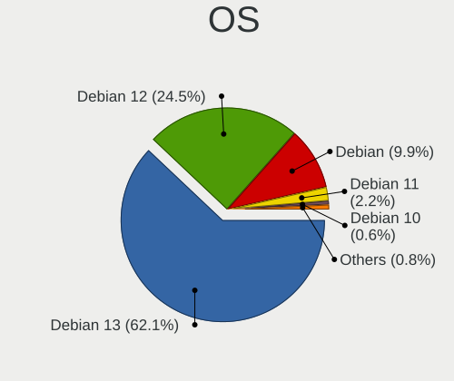

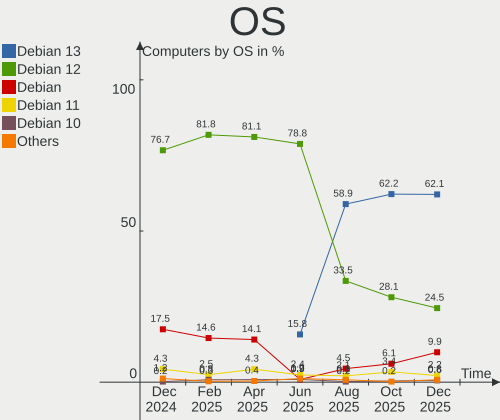

| Name        | Computers | Percent |
|-------------|-----------|---------|
| Debian 13   | 314       | 62.06%  |
| Debian 12   | 124       | 24.51%  |
| Debian      | 50        | 9.88%   |
| Debian 11   | 11        | 2.17%   |
| Debian 10   | 3         | 0.59%   |
| Debian 2025 | 2         | 0.4%    |
| Debian 9    | 1         | 0.2%    |
| Debian 23   | 1         | 0.2%    |

OS Family
---------

OS without a version

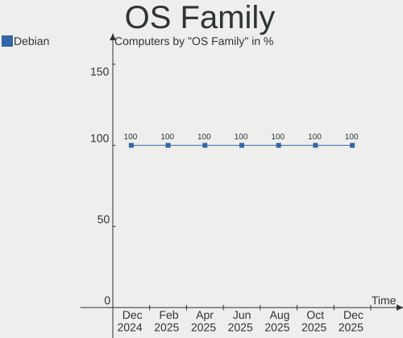

| Name   | Computers | Percent |
|--------|-----------|---------|
| Debian | 506       | 100%    |

Kernel
------

Version of the Linux kernel

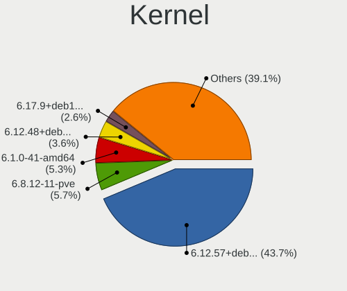

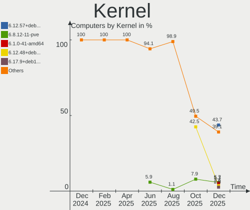

| Version               | Computers | Percent |
|-----------------------|-----------|---------|
| 6.12.57+deb13-amd64   | 221       | 43.68%  |
| 6.8.12-11-pve         | 29        | 5.73%   |
| 6.1.0-41-amd64        | 27        | 5.34%   |
| 6.12.48+deb13-amd64   | 18        | 3.56%   |
| 6.17.9+deb14-amd64    | 13        | 2.57%   |
| 6.17.8+deb13-amd64    | 8         | 1.58%   |
| 6.17.2-2-pve          | 8         | 1.58%   |
| 6.1.0-40-amd64        | 7         | 1.38%   |
| 6.8.12-17-pve         | 6         | 1.19%   |
| 6.12.47+rpt-rpi-2712  | 6         | 1.19%   |
| 6.12.41+deb13-amd64   | 6         | 1.19%   |
| 6.8.12-9-pve          | 5         | 0.99%   |
| 6.8.12-15-pve         | 5         | 0.99%   |
| 6.8.12-13-pve         | 5         | 0.99%   |
| 6.17.8+deb14-amd64    | 5         | 0.99%   |
| 6.17.4-1-pve          | 5         | 0.99%   |
| 6.17.2-1-pve          | 5         | 0.99%   |
| 6.17.13+deb14-amd64   | 5         | 0.99%   |
| 6.17.12+deb14-amd64   | 5         | 0.99%   |
| 6.12.57+deb12-amd64   | 4         | 0.79%   |
| 6.8.12-8-pve          | 3         | 0.59%   |
| 6.18.0                | 3         | 0.59%   |
| 6.16.3+deb13-amd64    | 3         | 0.59%   |
| 6.14.11-4-pve         | 3         | 0.59%   |
| 6.14.11-3-pve         | 3         | 0.59%   |
| 6.12.43+deb13-amd64   | 3         | 0.59%   |
| 6.8.8-2-pve           | 2         | 0.4%    |
| 6.8.4-2-pve           | 2         | 0.4%    |
| 6.8.12-16-pve         | 2         | 0.4%    |
| 6.18.2-1-t2-trixie    | 2         | 0.4%    |
| 6.18.0-rc7            | 2         | 0.4%    |
| 6.17.11+deb14-amd64   | 2         | 0.4%    |
| 6.16.12+deb14+1-amd64 | 2         | 0.4%    |
| 6.1.148               | 2         | 0.4%    |
| 6.1.0-38-amd64        | 2         | 0.4%    |
| 6.1.0-37-amd64        | 2         | 0.4%    |
| 6.1.0-25-amd64        | 2         | 0.4%    |
| 5.10.0-37-amd64       | 2         | 0.4%    |
| 5.10.0-36-amd64       | 2         | 0.4%    |
| 5.10.0-35-amd64       | 2         | 0.4%    |

Kernel Family
-------------

Linux kernel without a distro release

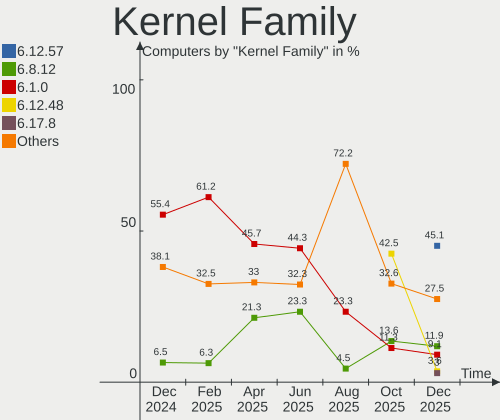

| Version | Computers | Percent |
|---------|-----------|---------|
| 6.12.57 | 228       | 45.06%  |
| 6.8.12  | 60        | 11.86%  |
| 6.1.0   | 46        | 9.09%   |
| 6.12.48 | 18        | 3.56%   |
| 6.17.8  | 15        | 2.96%   |
| 6.17.9  | 14        | 2.77%   |
| 6.17.2  | 13        | 2.57%   |
| 5.10.0  | 10        | 1.98%   |
| 6.18.0  | 7         | 1.38%   |
| 6.14.11 | 7         | 1.38%   |
| 6.12.47 | 7         | 1.38%   |
| 6.17.4  | 6         | 1.19%   |
| 6.17.13 | 6         | 1.19%   |
| 6.17.12 | 6         | 1.19%   |
| 6.12.41 | 6         | 1.19%   |
| 6.18.2  | 3         | 0.59%   |
| 6.17.11 | 3         | 0.59%   |
| 6.17.10 | 3         | 0.59%   |
| 6.16.3  | 3         | 0.59%   |
| 6.16.12 | 3         | 0.59%   |
| 6.12.43 | 3         | 0.59%   |
| 6.8.8   | 2         | 0.4%    |
| 6.8.4   | 2         | 0.4%    |
| 6.12.61 | 2         | 0.4%    |
| 6.12.58 | 2         | 0.4%    |
| 6.1.148 | 2         | 0.4%    |
| 6.19.0  | 1         | 0.2%    |
| 6.18.1  | 1         | 0.2%    |
| 6.18    | 1         | 0.2%    |
| 6.17.6  | 1         | 0.2%    |
| 6.17.5  | 1         | 0.2%    |
| 6.17.1  | 1         | 0.2%    |
| 6.17.0  | 1         | 0.2%    |
| 6.16.9  | 1         | 0.2%    |
| 6.14.8  | 1         | 0.2%    |
| 6.12.8  | 1         | 0.2%    |
| 6.12.62 | 1         | 0.2%    |
| 6.12.59 | 1         | 0.2%    |
| 6.12.54 | 1         | 0.2%    |
| 6.12.38 | 1         | 0.2%    |

Kernel Major Ver.
-----------------

Linux kernel major version

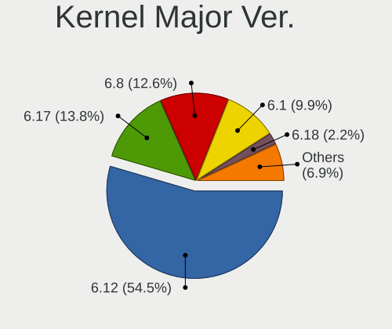

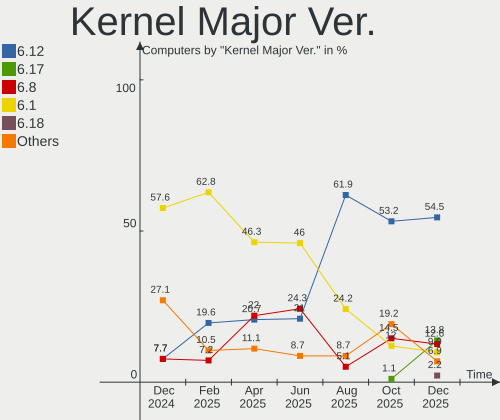

| Version | Computers | Percent |
|---------|-----------|---------|
| 6.12    | 276       | 54.55%  |
| 6.17    | 70        | 13.83%  |
| 6.8     | 64        | 12.65%  |
| 6.1     | 50        | 9.88%   |
| 6.18    | 11        | 2.17%   |
| 5.10    | 11        | 2.17%   |
| 6.14    | 8         | 1.58%   |
| 6.16    | 7         | 1.38%   |
| 6.10    | 2         | 0.4%    |
| 5.15    | 2         | 0.4%    |
| 6.19    | 1         | 0.2%    |
| 6.11    | 1         | 0.2%    |
| 6       | 1         | 0.2%    |
| 4.19    | 1         | 0.2%    |
| 4.16    | 1         | 0.2%    |

Arch
----

OS architecture (x86_64, i586, etc.)

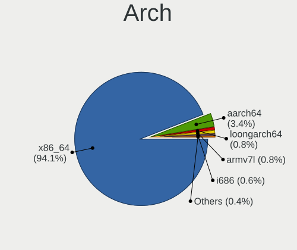

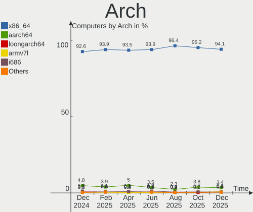

| Name        | Computers | Percent |
|-------------|-----------|---------|
| x86_64      | 476       | 94.07%  |
| aarch64     | 17        | 3.36%   |
| loongarch64 | 4         | 0.79%   |
| armv7l      | 4         | 0.79%   |
| i686        | 3         | 0.59%   |
| sparc64     | 1         | 0.2%    |
| riscv64     | 1         | 0.2%    |

DE
--

Desktop Environment

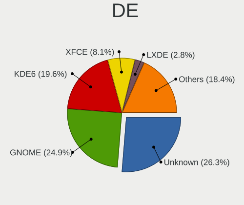

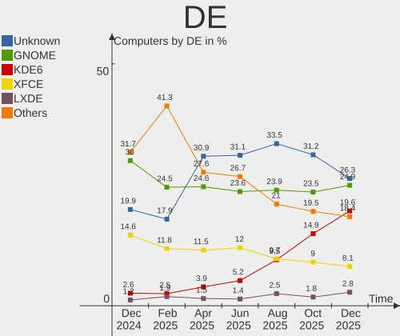

| Name                        | Computers | Percent |
|-----------------------------|-----------|---------|
| Unknown                     | 133       | 26.28%  |
| GNOME                       | 126       | 24.9%   |
| KDE6                        | 99        | 19.57%  |
| XFCE                        | 41        | 8.1%    |
| LXDE                        | 14        | 2.77%   |
| KDE5                        | 14        | 2.77%   |
| X-Cinnamon                  | 12        | 2.37%   |
| LXQt                        | 12        | 2.37%   |
| MATE                        | 11        | 2.17%   |
| KDE                         | 8         | 1.58%   |
| i3                          | 8         | 1.58%   |
| labwc:wlroots               | 6         | 1.19%   |
| Cinnamon                    | 5         | 0.99%   |
| Trinity                     | 3         | 0.59%   |
| sway:wlroots                | 2         | 0.4%    |
| sway                        | 2         | 0.4%    |
| Hyprland                    | 2         | 0.4%    |
| wlroots                     | 1         | 0.2%    |
| TDE:                        | 1         | 0.2%    |
| Openbox                     | 1         | 0.2%    |
| niri                        | 1         | 0.2%    |
| GNUstep                     | 1         | 0.2%    |
| GNOME Flashback             | 1         | 0.2%    |
| bspwm:                      | 1         | 0.2%    |
| /usr/local/bin/start-mwm.sh | 1         | 0.2%    |

Display Server
--------------

X11 or Wayland

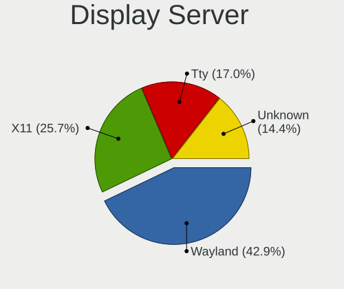

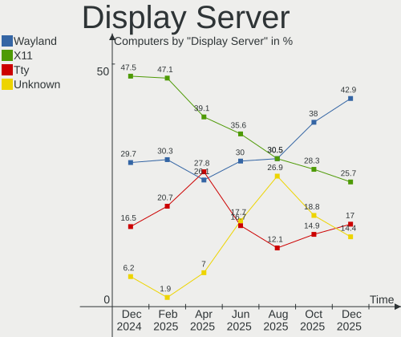

| Name    | Computers | Percent |
|---------|-----------|---------|
| Wayland | 217       | 42.89%  |
| X11     | 130       | 25.69%  |
| Tty     | 86        | 17%     |
| Unknown | 73        | 14.43%  |

Display Manager
---------------

SDDM, LightDM, etc.

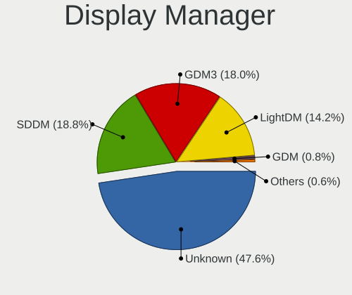

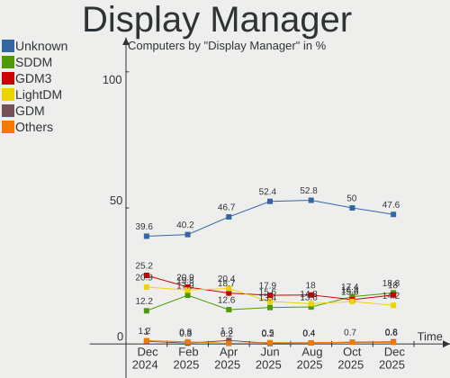

| Name    | Computers | Percent |
|---------|-----------|---------|
| Unknown | 241       | 47.63%  |
| SDDM    | 95        | 18.77%  |
| GDM3    | 91        | 17.98%  |
| LightDM | 72        | 14.23%  |
| GDM     | 4         | 0.79%   |
| TDM     | 2         | 0.4%    |
| GREETD  | 1         | 0.2%    |

OS Lang
-------

Language

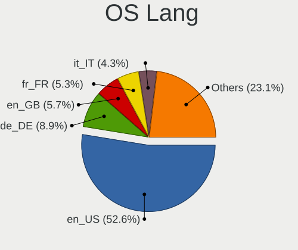

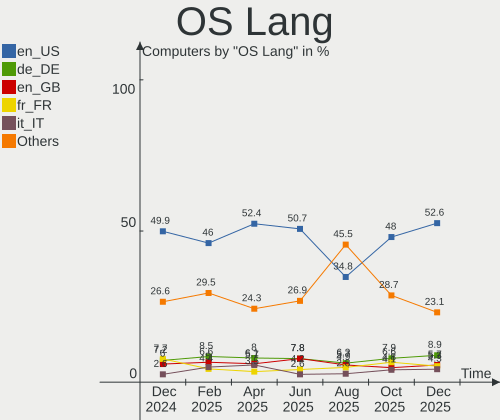

| Lang    | Computers | Percent |
|---------|-----------|---------|
| en_US   | 266       | 52.57%  |
| de_DE   | 45        | 8.89%   |
| en_GB   | 29        | 5.73%   |
| fr_FR   | 27        | 5.34%   |
| it_IT   | 22        | 4.35%   |
| pt_BR   | 11        | 2.17%   |
| ru_RU   | 10        | 1.98%   |
| es_MX   | 10        | 1.98%   |
| es_ES   | 9         | 1.78%   |
| C       | 9         | 1.78%   |
| en_CA   | 7         | 1.38%   |
| pl_PL   | 6         | 1.19%   |
| en_IE   | 6         | 1.19%   |
| zh_CN   | 4         | 0.79%   |
| nl_NL   | 4         | 0.79%   |
| Unknown | 4         | 0.79%   |
| hu_HU   | 3         | 0.59%   |
| es_AR   | 3         | 0.59%   |
| en_IN   | 3         | 0.59%   |
| en_AU   | 3         | 0.59%   |
| de_AT   | 3         | 0.59%   |
| cs_CZ   | 3         | 0.59%   |
| it_CH   | 2         | 0.4%    |
| en_IL   | 2         | 0.4%    |
| de_CH   | 2         | 0.4%    |
| zh_TW   | 1         | 0.2%    |
| sr_RS   | 1         | 0.2%    |
| sk_SK   | 1         | 0.2%    |
| pt_PT   | 1         | 0.2%    |
| fr_CH   | 1         | 0.2%    |
| fr_CA   | 1         | 0.2%    |
| fr_BE   | 1         | 0.2%    |
| es_US   | 1         | 0.2%    |
| es_CO   | 1         | 0.2%    |
| es_BO   | 1         | 0.2%    |
| en_ZA   | 1         | 0.2%    |
| en_SG   | 1         | 0.2%    |
| bg_BG   | 1         | 0.2%    |

Boot Mode
---------

EFI or BIOS

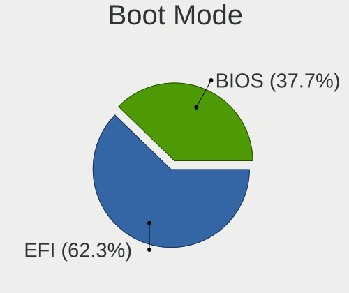

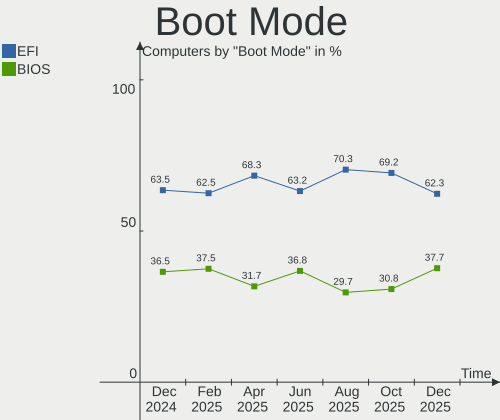

| Mode | Computers | Percent |
|------|-----------|---------|
| EFI  | 315       | 62.25%  |
| BIOS | 191       | 37.75%  |

Filesystem
----------

Type of filesystem

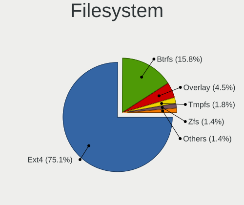

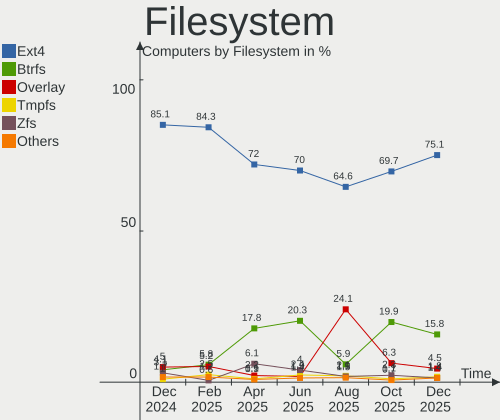

| Type    | Computers | Percent |
|---------|-----------|---------|
| Ext4    | 380       | 75.1%   |
| Btrfs   | 80        | 15.81%  |
| Overlay | 23        | 4.55%   |
| Tmpfs   | 9         | 1.78%   |
| Zfs     | 7         | 1.38%   |
| Xfs     | 4         | 0.79%   |
| F2fs    | 2         | 0.4%    |
| Ext3    | 1         | 0.2%    |

Part. scheme
------------

Scheme of partitioning

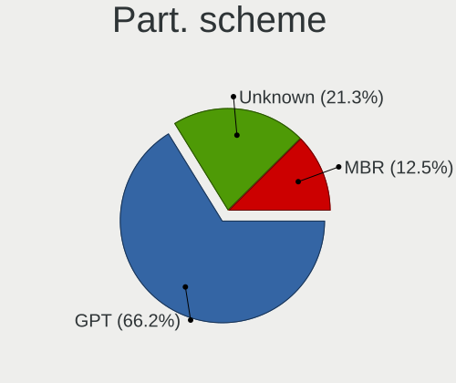

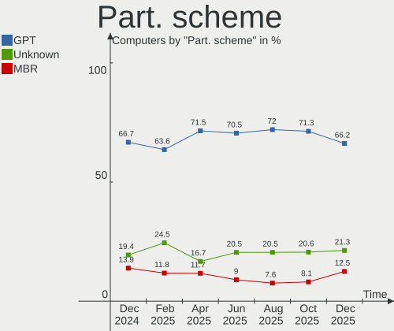

| Type    | Computers | Percent |
|---------|-----------|---------|
| GPT     | 335       | 66.21%  |
| Unknown | 108       | 21.34%  |
| MBR     | 63        | 12.45%  |

Dual Boot with Linux/BSD
------------------------

Hosting more than one Linux/BSD

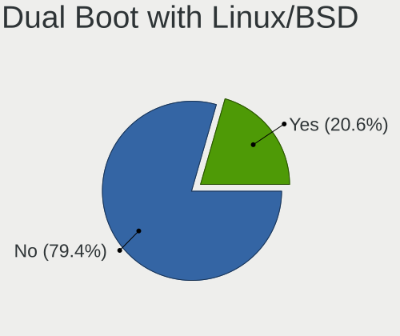

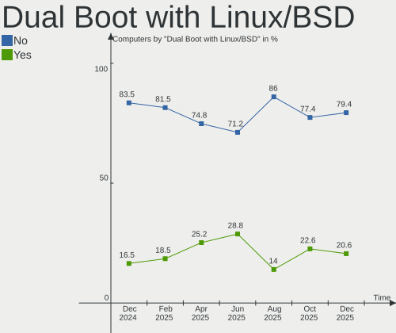

| Dual boot | Computers | Percent |
|-----------|-----------|---------|
| No        | 402       | 79.45%  |
| Yes       | 104       | 20.55%  |

Dual Boot (Win)
---------------

Hosting Linux and Windows

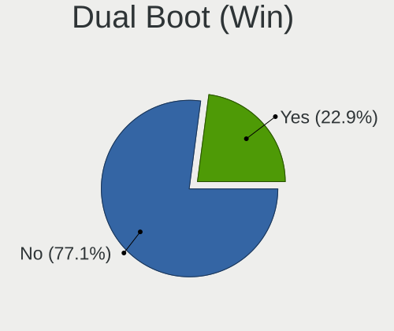

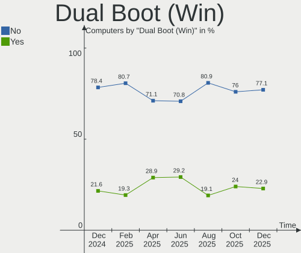

| Dual boot | Computers | Percent |
|-----------|-----------|---------|
| No        | 390       | 77.08%  |
| Yes       | 116       | 22.92%  |

Board
-----

Vendor
------

Motherboard manufacturer

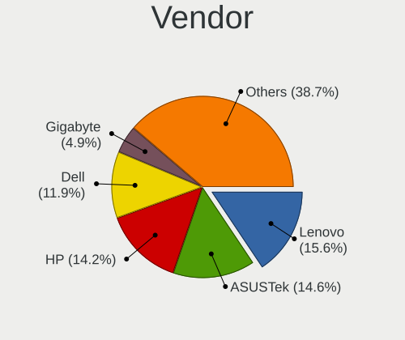

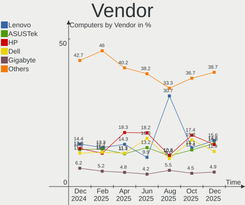

| Name                                 | Computers | Percent |
|--------------------------------------|-----------|---------|
| Lenovo                               | 79        | 15.61%  |
| ASUSTek Computer                     | 74        | 14.62%  |
| Hewlett-Packard                      | 72        | 14.23%  |
| Dell                                 | 60        | 11.86%  |
| Gigabyte Technology                  | 25        | 4.94%   |
| MSI                                  | 23        | 4.55%   |
| ASRock                               | 18        | 3.56%   |
| Unknown                              | 14        | 2.77%   |
| Raspberry Pi Foundation              | 13        | 2.57%   |
| Intel                                | 13        | 2.57%   |
| Apple                                | 13        | 2.57%   |
| Supermicro                           | 12        | 2.37%   |
| Acer                                 | 11        | 2.17%   |
| Fujitsu                              | 6         | 1.19%   |
| Sony                                 | 4         | 0.79%   |
| AZW                                  | 4         | 0.79%   |
| Toshiba                              | 3         | 0.59%   |
| GMKtec                               | 3         | 0.59%   |
| Fujitsu Siemens                      | 3         | 0.59%   |
| ZOTAC                                | 2         | 0.4%    |
| TUXEDO                               | 2         | 0.4%    |
| Shenzhen Meigao Electronic Equipment | 2         | 0.4%    |
| Microsoft                            | 2         | 0.4%    |
| Medion                               | 2         | 0.4%    |
| IPASON                               | 2         | 0.4%    |
| HUAWEI                               | 2         | 0.4%    |
| Google                               | 2         | 0.4%    |
| Giga Computing                       | 2         | 0.4%    |
| Chuwi                                | 2         | 0.4%    |
| Xunlong                              | 1         | 0.2%    |
| WeiBu                                | 1         | 0.2%    |
| VANT                                 | 1         | 0.2%    |
| TongFang                             | 1         | 0.2%    |
| Shenzhen Anxin Taihe Technology      | 1         | 0.2%    |
| Shanghai Zhaoxin Semiconductor       | 1         | 0.2%    |
| Sapphire                             | 1         | 0.2%    |
| Samsung Electronics                  | 1         | 0.2%    |
| Positivo                             | 1         | 0.2%    |
| PC Specialist                        | 1         | 0.2%    |
| OrangePi                             | 1         | 0.2%    |

Model
-----

Motherboard model

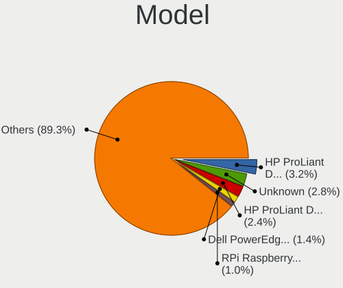

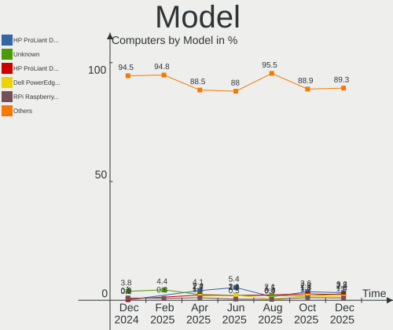

| Name                                                  | Computers | Percent |
|-------------------------------------------------------|-----------|---------|
| HP ProLiant DL360 Gen9                                | 16        | 3.16%   |
| Unknown                                               | 14        | 2.77%   |
| HP ProLiant DL380 Gen9                                | 12        | 2.37%   |
| Dell PowerEdge R630                                   | 7         | 1.38%   |
| RPi Raspberry Pi 5 Model B Rev 1.0                    | 5         | 0.99%   |
| Supermicro Super Server                               | 4         | 0.79%   |
| RPi Raspberry Pi 5 Model B Rev 1.1                    | 3         | 0.59%   |
| ASUS All Series                                       | 3         | 0.59%   |
| Supermicro SYS-6018U-TR4+                             | 2         | 0.4%    |
| Shenzhen Meigao Electronic Equipment EliteMini Series | 2         | 0.4%    |
| RPi Raspberry Pi                                      | 2         | 0.4%    |
| Lenovo IdeaPad Slim 3 15ABR8 82XM                     | 2         | 0.4%    |
| Lenovo IdeaPad 3 15ADA05 81W1                         | 2         | 0.4%    |
| IPASON LL300                                          | 2         | 0.4%    |
| HP ProLiant DL360p Gen8                               | 2         | 0.4%    |
| Gigabyte X670E AORUS XTREME                           | 2         | 0.4%    |
| Dell PowerEdge R730                                   | 2         | 0.4%    |
| Dell OptiPlex 7080                                    | 2         | 0.4%    |
| Dell Latitude E6410                                   | 2         | 0.4%    |
| Dell Latitude 5400                                    | 2         | 0.4%    |
| Chuwi LarkBox X                                       | 2         | 0.4%    |
| AZW LZX                                               | 2         | 0.4%    |
| ASUS ROG STRIX B550-F GAMING                          | 2         | 0.4%    |
| ZOTAC ZBOX-CI337NANO                                  | 1         | 0.2%    |
| ZOTAC ZBOX-CI323NANO                                  | 1         | 0.2%    |
| Xunlong Orange Pi One                                 | 1         | 0.2%    |
| WeiBu ADL-N                                           | 1         | 0.2%    |
| VANT MOOVE3-15                                        | 1         | 0.2%    |
| TUXEDO InfinityBook S 15/17 Gen7                      | 1         | 0.2%    |
| TUXEDO InfinityBook Pro AMD Gen9                      | 1         | 0.2%    |
| Toshiba Satellite L305D                               | 1         | 0.2%    |
| Toshiba Satellite C660                                | 1         | 0.2%    |
| Toshiba SATE                                          | 1         | 0.2%    |
| TongFang GX4HRXL                                      | 1         | 0.2%    |
| Supermicro X9SCL/X9SCM                                | 1         | 0.2%    |
| Supermicro X9DRD-iF/LF                                | 1         | 0.2%    |
| Supermicro X8DTU                                      | 1         | 0.2%    |
| Supermicro X8DT3                                      | 1         | 0.2%    |
| Supermicro X10SLM+-LN4F                               | 1         | 0.2%    |
| Supermicro SYS-5039D-I                                | 1         | 0.2%    |

Model Family
------------

Motherboard model prefix

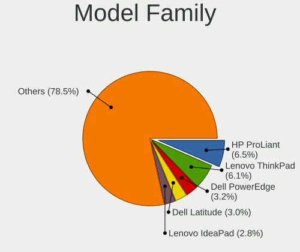

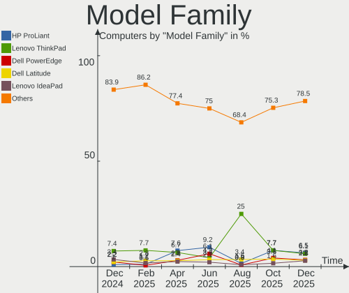

| Name                                           | Computers | Percent |
|------------------------------------------------|-----------|---------|
| HP ProLiant                                    | 33        | 6.52%   |
| Lenovo ThinkPad                                | 31        | 6.13%   |
| Dell PowerEdge                                 | 16        | 3.16%   |
| Dell Latitude                                  | 15        | 2.96%   |
| Lenovo IdeaPad                                 | 14        | 2.77%   |
| Unknown                                        | 14        | 2.77%   |
| RPi Raspberry                                  | 13        | 2.57%   |
| Lenovo ThinkBook                               | 8         | 1.58%   |
| ASUS Vivobook                                  | 8         | 1.58%   |
| Dell XPS                                       | 7         | 1.38%   |
| ASUS ROG                                       | 7         | 1.38%   |
| Lenovo ThinkCentre                             | 6         | 1.19%   |
| Dell OptiPlex                                  | 6         | 1.19%   |
| ASUS TUF                                       | 6         | 1.19%   |
| ASUS ASUS                                      | 6         | 1.19%   |
| Acer Aspire                                    | 6         | 1.19%   |
| Lenovo Yoga                                    | 5         | 0.99%   |
| HP Pavilion                                    | 5         | 0.99%   |
| HP Laptop                                      | 5         | 0.99%   |
| HP EliteBook                                   | 5         | 0.99%   |
| ASUS PRIME                                     | 5         | 0.99%   |
| Supermicro Super                               | 4         | 0.79%   |
| Lenovo Legion                                  | 4         | 0.79%   |
| HP Compaq                                      | 4         | 0.79%   |
| Fujitsu LIFEBOOK                               | 4         | 0.79%   |
| Dell Precision                                 | 4         | 0.79%   |
| Dell Inspiron                                  | 4         | 0.79%   |
| HP ProBook                                     | 3         | 0.59%   |
| HP ENVY                                        | 3         | 0.59%   |
| HP EliteDesk                                   | 3         | 0.59%   |
| Fujitsu Siemens ESPRIMO                        | 3         | 0.59%   |
| ASUS Pro                                       | 3         | 0.59%   |
| ASUS All                                       | 3         | 0.59%   |
| TUXEDO InfinityBook                            | 2         | 0.4%    |
| Toshiba Satellite                              | 2         | 0.4%    |
| Supermicro SYS-6018U-TR4+                      | 2         | 0.4%    |
| Shenzhen Meigao Electronic Equipment EliteMini | 2         | 0.4%    |
| Microsoft Surface                              | 2         | 0.4%    |
| Lenovo V15                                     | 2         | 0.4%    |
| IPASON LL300                                   | 2         | 0.4%    |

MFG Year
--------

Motherboard manufacture year

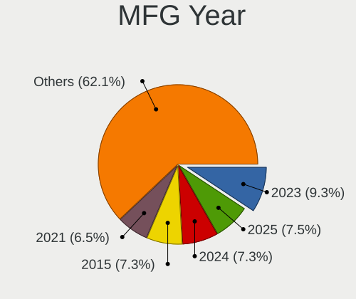

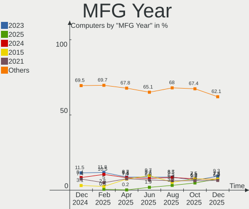

| Year    | Computers | Percent |
|---------|-----------|---------|
| 2023    | 47        | 9.29%   |
| 2025    | 38        | 7.51%   |
| 2024    | 37        | 7.31%   |
| 2015    | 37        | 7.31%   |
| 2021    | 33        | 6.52%   |
| 2018    | 32        | 6.32%   |
| 2020    | 31        | 6.13%   |
| 2014    | 29        | 5.73%   |
| 2019    | 28        | 5.53%   |
| 2012    | 25        | 4.94%   |
| 2011    | 25        | 4.94%   |
| Unknown | 24        | 4.74%   |
| 2017    | 21        | 4.15%   |
| 2022    | 20        | 3.95%   |
| 2010    | 18        | 3.56%   |
| 2013    | 15        | 2.96%   |
| 2009    | 15        | 2.96%   |
| 2016    | 13        | 2.57%   |
| 2008    | 10        | 1.98%   |
| 2007    | 4         | 0.79%   |
| 2006    | 2         | 0.4%    |
| 2003    | 2         | 0.4%    |

Form Factor
-----------

Physical design of the computer

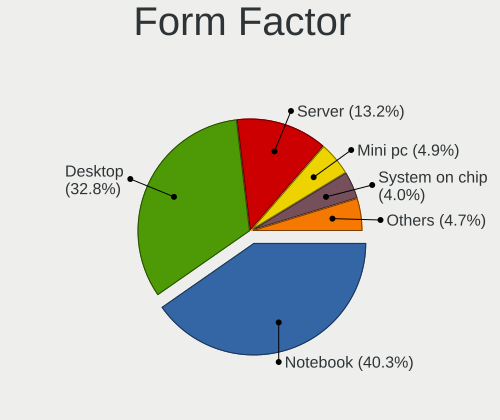

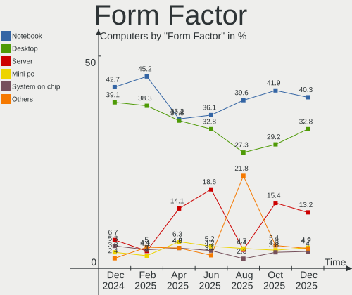

| Name           | Computers | Percent |
|----------------|-----------|---------|
| Notebook       | 204       | 40.32%  |
| Desktop        | 166       | 32.81%  |
| Server         | 67        | 13.24%  |
| Mini pc        | 25        | 4.94%   |
| System on chip | 20        | 3.95%   |
| Convertible    | 11        | 2.17%   |
| Tablet         | 7         | 1.38%   |
| All in one     | 4         | 0.79%   |
| Other          | 1         | 0.2%    |
| Stick pc       | 1         | 0.2%    |

Secure Boot
-----------

Enabled or disabled

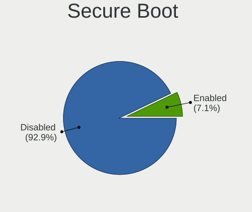

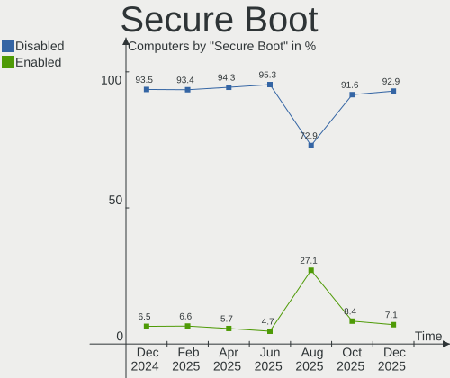

| State    | Computers | Percent |
|----------|-----------|---------|
| Disabled | 470       | 92.89%  |
| Enabled  | 36        | 7.11%   |

Coreboot
--------

Have coreboot on board

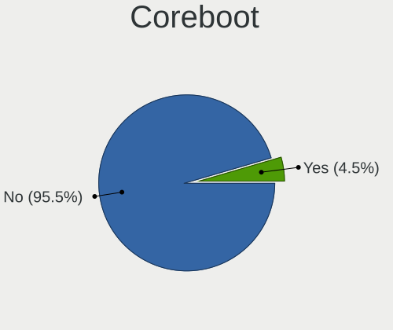

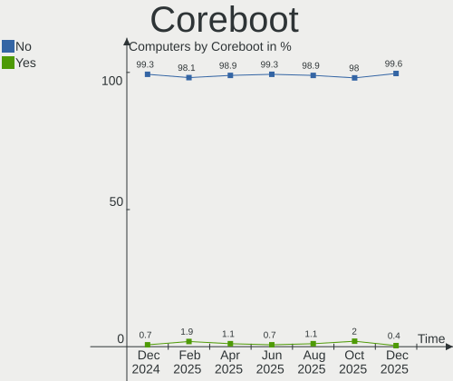

| Used | Computers | Percent |
|------|-----------|---------|
| No   | 504       | 99.6%   |
| Yes  | 2         | 0.4%    |

RAM Size
--------

Total RAM memory

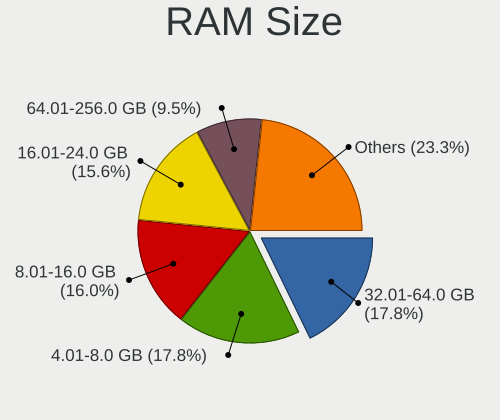

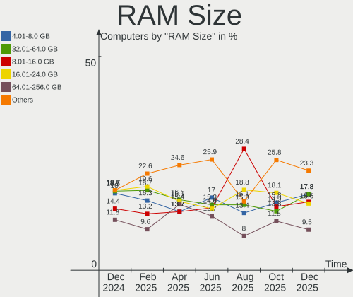

| Size in GB      | Computers | Percent |
|-----------------|-----------|---------|
| 4.01-8.0        | 90        | 17.79%  |
| 32.01-64.0      | 90        | 17.79%  |
| 8.01-16.0       | 81        | 16.01%  |
| 16.01-24.0      | 79        | 15.61%  |
| 64.01-256.0     | 48        | 9.49%   |
| 3.01-4.0        | 37        | 7.31%   |
| More than 256.0 | 36        | 7.11%   |
| 24.01-32.0      | 23        | 4.55%   |
| 1.01-2.0        | 10        | 1.98%   |
| 2.01-3.0        | 7         | 1.38%   |
| 0.51-1.0        | 3         | 0.59%   |
| 0.01-0.5        | 2         | 0.4%    |

RAM Used
--------

Used RAM memory

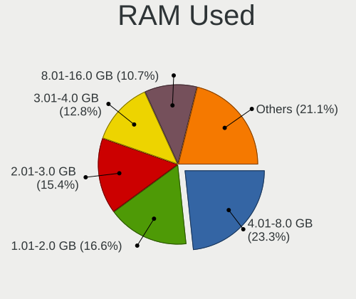

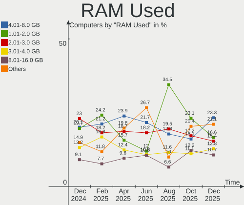

| Used GB         | Computers | Percent |
|-----------------|-----------|---------|
| 4.01-8.0        | 118       | 23.32%  |
| 1.01-2.0        | 84        | 16.6%   |
| 2.01-3.0        | 78        | 15.42%  |
| 3.01-4.0        | 65        | 12.85%  |
| 8.01-16.0       | 54        | 10.67%  |
| 64.01-256.0     | 37        | 7.31%   |
| 0.51-1.0        | 35        | 6.92%   |
| 0.01-0.5        | 11        | 2.17%   |
| 24.01-32.0      | 8         | 1.58%   |
| 16.01-24.0      | 8         | 1.58%   |
| 32.01-64.0      | 6         | 1.19%   |
| More than 256.0 | 2         | 0.4%    |

Total Drives
------------

Number of drives on board

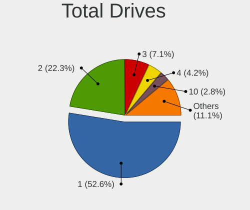

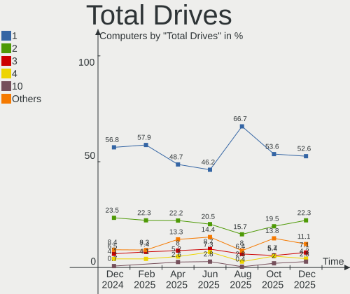

| Drives | Computers | Percent |
|--------|-----------|---------|
| 1      | 266       | 52.57%  |
| 2      | 113       | 22.33%  |
| 3      | 36        | 7.11%   |
| 4      | 21        | 4.15%   |
| 10     | 14        | 2.77%   |
| 5      | 14        | 2.77%   |
| 6      | 6         | 1.19%   |
| 14     | 5         | 0.99%   |
| 7      | 5         | 0.99%   |
| 13     | 4         | 0.79%   |
| 0      | 4         | 0.79%   |
| 18     | 3         | 0.59%   |
| 12     | 3         | 0.59%   |
| 11     | 2         | 0.4%    |
| 8      | 2         | 0.4%    |
| 111    | 1         | 0.2%    |
| 70     | 1         | 0.2%    |
| 40     | 1         | 0.2%    |
| 33     | 1         | 0.2%    |
| 31     | 1         | 0.2%    |
| 28     | 1         | 0.2%    |
| 19     | 1         | 0.2%    |
| 17     | 1         | 0.2%    |

Has CD-ROM
----------

Has CD-ROM on board

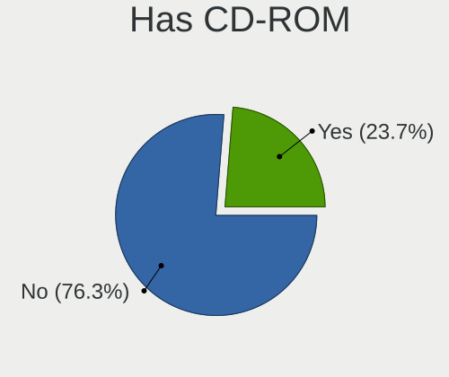

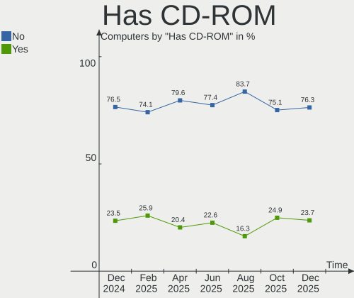

| Presented | Computers | Percent |
|-----------|-----------|---------|
| No        | 386       | 76.28%  |
| Yes       | 120       | 23.72%  |

Has Ethernet
------------

Has Ethernet on board

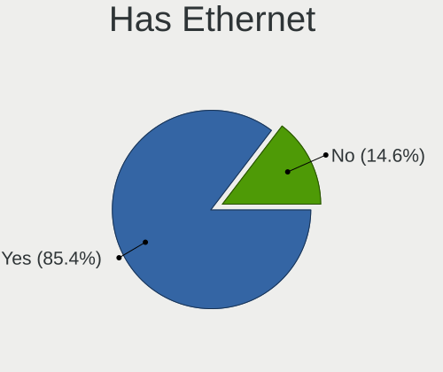

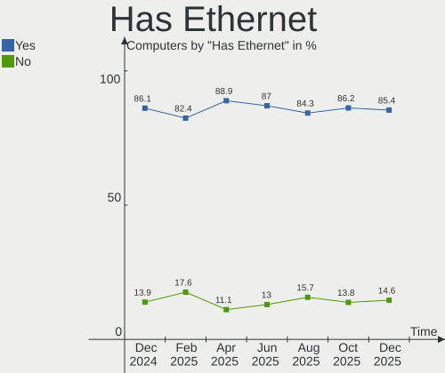

| Presented | Computers | Percent |
|-----------|-----------|---------|
| Yes       | 432       | 85.38%  |
| No        | 74        | 14.62%  |

Has WiFi
--------

Has WiFi module

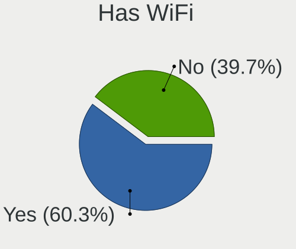

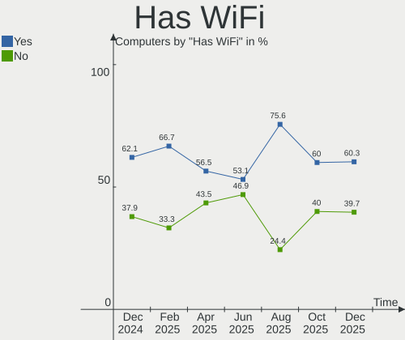

| Presented | Computers | Percent |
|-----------|-----------|---------|
| Yes       | 305       | 60.28%  |
| No        | 201       | 39.72%  |

Has Bluetooth
-------------

Has Bluetooth module

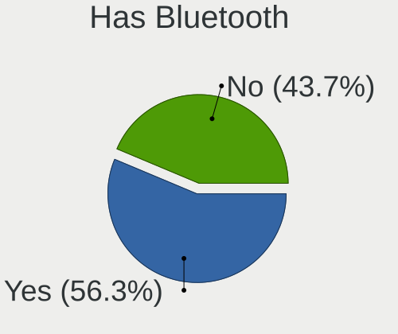

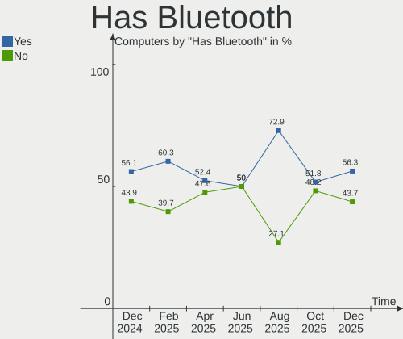

| Presented | Computers | Percent |
|-----------|-----------|---------|
| Yes       | 285       | 56.32%  |
| No        | 221       | 43.68%  |

Location
--------

Country
-------

Geographic location (country)

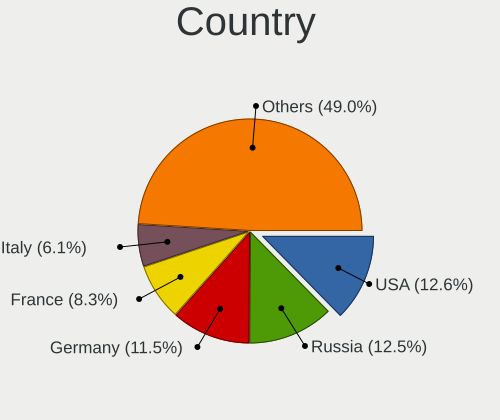

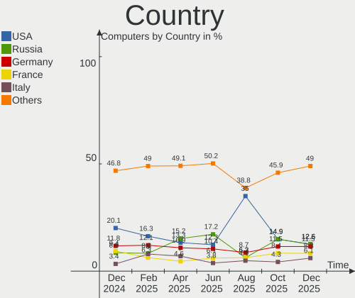

| Country         | Computers | Percent |
|-----------------|-----------|---------|
| USA             | 64        | 12.65%  |
| Russia          | 63        | 12.45%  |
| Germany         | 58        | 11.46%  |
| France          | 42        | 8.3%    |
| Italy           | 31        | 6.13%   |
| Finland         | 22        | 4.35%   |
| UK              | 15        | 2.96%   |
| China           | 15        | 2.96%   |
| Austria         | 15        | 2.96%   |
| Brazil          | 14        | 2.77%   |
| Poland          | 13        | 2.57%   |
| Mexico          | 12        | 2.37%   |
| Switzerland     | 11        | 2.17%   |
| Canada          | 11        | 2.17%   |
| Spain           | 10        | 1.98%   |
| Netherlands     | 9         | 1.78%   |
| Romania         | 6         | 1.19%   |
| Hungary         | 6         | 1.19%   |
| Bulgaria        | 6         | 1.19%   |
| Argentina       | 6         | 1.19%   |
| The Netherlands | 5         | 0.99%   |
| Israel          | 5         | 0.99%   |
| India           | 5         | 0.99%   |
| Turkey          | 3         | 0.59%   |
| Portugal        | 3         | 0.59%   |
| Greece          | 3         | 0.59%   |
| Czechia         | 3         | 0.59%   |
| Bolivia         | 3         | 0.59%   |
| Belgium         | 3         | 0.59%   |
| Australia       | 3         | 0.59%   |
| Tunisia         | 2         | 0.4%    |
| Taiwan          | 2         | 0.4%    |
| Serbia          | 2         | 0.4%    |
| Norway          | 2         | 0.4%    |
| Kazakhstan      | 2         | 0.4%    |
| Indonesia       | 2         | 0.4%    |
| Cyprus          | 2         | 0.4%    |
| Colombia        | 2         | 0.4%    |
| Belarus         | 2         | 0.4%    |
| Vietnam         | 1         | 0.2%    |

City
----

Geographic location (city)

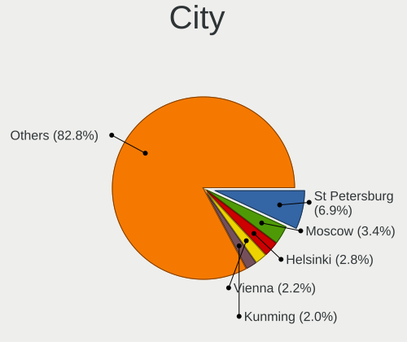

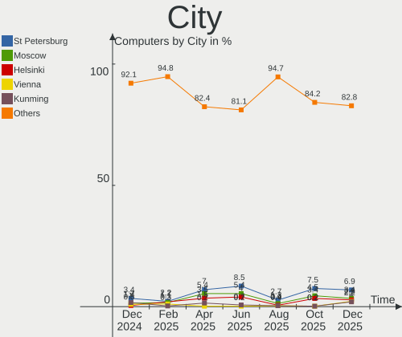

| City              | Computers | Percent |
|-------------------|-----------|---------|
| St Petersburg     | 35        | 6.92%   |
| Moscow            | 17        | 3.36%   |
| Helsinki          | 14        | 2.77%   |
| Vienna            | 11        | 2.17%   |
| Kunming           | 10        | 1.98%   |
| Milan             | 7         | 1.38%   |
| Espoo             | 7         | 1.38%   |
| Berlin            | 6         | 1.19%   |
| Frankfurt am Main | 5         | 0.99%   |
| Paris             | 4         | 0.79%   |
| Madrid            | 4         | 0.79%   |
| Budapest          | 4         | 0.79%   |
| Sofia             | 3         | 0.59%   |
| Poznan            | 3         | 0.59%   |
| Mexico City       | 3         | 0.59%   |
| Graz              | 3         | 0.59%   |
| Bad Hersfeld      | 3         | 0.59%   |
| Amsterdam         | 3         | 0.59%   |
| Zurich            | 2         | 0.4%    |
| Wroclaw           | 2         | 0.4%    |
| Warsaw            | 2         | 0.4%    |
| Tunis             | 2         | 0.4%    |
| Toronto           | 2         | 0.4%    |
| Sydney            | 2         | 0.4%    |
| Social Circle     | 2         | 0.4%    |
| Sao Goncalo       | 2         | 0.4%    |
| Rome              | 2         | 0.4%    |
| Richmond          | 2         | 0.4%    |
| Prague            | 2         | 0.4%    |
| Porto Alegre      | 2         | 0.4%    |
| Pijnacker         | 2         | 0.4%    |
| Neuwied           | 2         | 0.4%    |
| Montreal          | 2         | 0.4%    |
| Minsk             | 2         | 0.4%    |
| Marseille         | 2         | 0.4%    |
| Los Angeles       | 2         | 0.4%    |
| Livorno           | 2         | 0.4%    |
| Ligonier          | 2         | 0.4%    |
| Las Vegas         | 2         | 0.4%    |
| Landau            | 2         | 0.4%    |

Drives
------

Drive Vendor
------------

Hard drive vendors

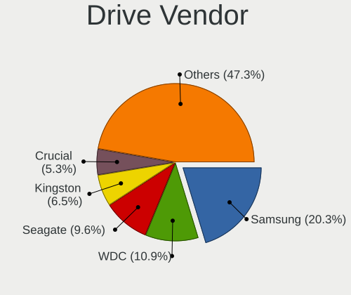

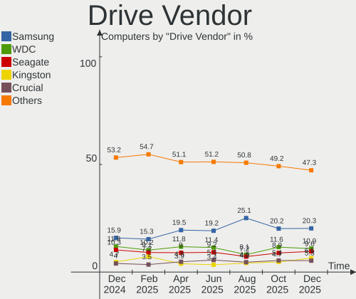

| Vendor                      | Computers | Drives | Percent |
|-----------------------------|-----------|--------|---------|
| Samsung Electronics         | 152       | 439    | 20.29%  |
| WDC                         | 82        | 202    | 10.95%  |
| Seagate                     | 72        | 168    | 9.61%   |
| Kingston                    | 49        | 56     | 6.54%   |
| Crucial                     | 40        | 59     | 5.34%   |
| SanDisk                     | 36        | 41     | 4.81%   |
| SK hynix                    | 31        | 35     | 4.14%   |
| Unknown                     | 27        | 34     | 3.6%    |
| Toshiba                     | 24        | 48     | 3.2%    |
| Micron Technology           | 16        | 18     | 2.14%   |
| HGST                        | 13        | 112    | 1.74%   |
| Kingston Technology Company | 12        | 12     | 1.6%    |
| A-DATA Technology           | 12        | 14     | 1.6%    |
| Intel                       | 9         | 13     | 1.2%    |
| Hewlett-Packard             | 9         | 55     | 1.2%    |
| China                       | 9         | 9      | 1.2%    |
| Apple                       | 8         | 11     | 1.07%   |
| KIOXIA                      | 7         | 10     | 0.93%   |
| Hitachi                     | 7         | 7      | 0.93%   |
| Transcend                   | 6         | 6      | 0.8%    |
| Unknown                     | 5         | 5      | 0.67%   |
| YMTC                        | 4         | 4      | 0.53%   |
| Phison Electronics          | 4         | 4      | 0.53%   |
| Patriot                     | 4         | 4      | 0.53%   |
| GOODRAM                     | 4         | 5      | 0.53%   |
| ZHITAI                      | 3         | 3      | 0.4%    |
| Realtek                     | 3         | 3      | 0.4%    |
| PNY                         | 3         | 3      | 0.4%    |
| MAXIO Technology (Hangzhou) | 3         | 3      | 0.4%    |
| KIOXIA-EXCERIA              | 3         | 4      | 0.4%    |
| JMicron Technology          | 3         | 3      | 0.4%    |
| Intenso                     | 3         | 6      | 0.4%    |
| ADATA Technology            | 3         | 3      | 0.4%    |
| USB                         | 2         | 2      | 0.27%   |
| UMIS                        | 2         | 2      | 0.27%   |
| Team                        | 2         | 2      | 0.27%   |
| Silicon Motion              | 2         | 2      | 0.27%   |
| SABRENT                     | 2         | 2      | 0.27%   |
| Phison                      | 2         | 2      | 0.27%   |
| Micron/Crucial Technology   | 2         | 3      | 0.27%   |

Drive Model
-----------

Hard drive models

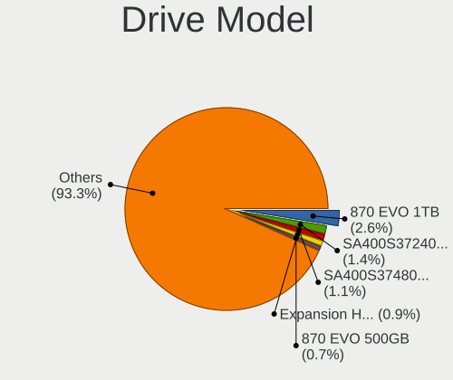

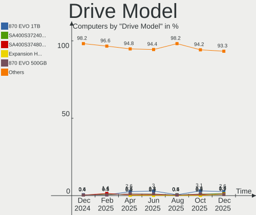

| Model                                              | Computers | Percent |
|----------------------------------------------------|-----------|---------|
| Samsung SSD 870 EVO 1TB                            | 22        | 2.58%   |
| Kingston SA400S37240G 240GB SSD                    | 12        | 1.41%   |
| Kingston SA400S37480G 480GB SSD                    | 9         | 1.06%   |
| Seagate Expansion HDD 4TB                          | 8         | 0.94%   |
| Samsung SSD 870 EVO 500GB                          | 6         | 0.7%    |
| Samsung SSD 850 PRO 256GB                          | 6         | 0.7%    |
| Kingston Company SNV2S1000G 1TB                    | 6         | 0.7%    |
| WDC WDS100T2B0A-00SM50 1TB SSD                     | 5         | 0.59%   |
| Samsung SSD 870 EVO 250GB                          | 5         | 0.59%   |
| Samsung SSD 860 EVO 1TB                            | 5         | 0.59%   |
| Unknown                                            | 5         | 0.59%   |
| SanDisk NVMe SSD Drive 2TB                         | 4         | 0.47%   |
| Samsung SSD 990 PRO 1TB                            | 4         | 0.47%   |
| Kingston SUV400S37120G 120GB SSD                   | 4         | 0.47%   |
| HP LOGICAL VOLUME 160GB                            | 4         | 0.47%   |
| Crucial CT240BX500SSD1 240GB                       | 4         | 0.47%   |
| Crucial CT1000MX500SSD1 1TB                        | 4         | 0.47%   |
| WDC WDS500G2B0A-00SM50 500GB                       | 3         | 0.35%   |
| WDC WD20EARX-00PASB0 2TB                           | 3         | 0.35%   |
| WDC WD10EZEX-08WN4A0 1TB                           | 3         | 0.35%   |
| Unknown SD64G  64GB                                | 3         | 0.35%   |
| Unknown SD/MMC/MS PRO 2GB                          | 3         | 0.35%   |
| Seagate ST1000LM024 HN-M101MBB 1TB                 | 3         | 0.35%   |
| Seagate ST1000DM010-2EP102 1TB                     | 3         | 0.35%   |
| SanDisk NVMe SSD Drive 512GB                       | 3         | 0.35%   |
| SanDisk NVMe SSD Drive 1TB                         | 3         | 0.35%   |
| Samsung SSD 990 PRO 2TB                            | 3         | 0.35%   |
| Samsung SSD 970 EVO Plus 500GB                     | 3         | 0.35%   |
| Samsung SSD 970 EVO Plus 2TB                       | 3         | 0.35%   |
| Samsung SSD 870 EVO 2TB                            | 3         | 0.35%   |
| Samsung SSD 860 EVO 500GB                          | 3         | 0.35%   |
| Samsung SSD 850 EVO 500GB                          | 3         | 0.35%   |
| Samsung SSD 850 EVO 250GB                          | 3         | 0.35%   |
| Samsung NVMe SSD Controller PM9A1/PM9A3/980PRO 1TB | 3         | 0.35%   |
| JMicron Tech 250GB                                 | 3         | 0.35%   |
| Crucial CT500MX500SSD1 500GB                       | 3         | 0.35%   |
| Crucial CT480BX500SSD1 480GB                       | 3         | 0.35%   |
| Crucial CT1000P310SSD8 1TB                         | 3         | 0.35%   |
| A-DATA SU630 240GB SSD                             | 3         | 0.35%   |
| ZHITAI SC001 Active 512GB SSD                      | 2         | 0.23%   |

HDD Vendor
----------

Hard disk drive vendors

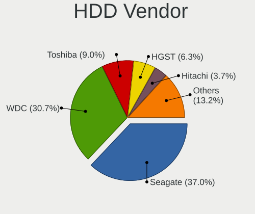

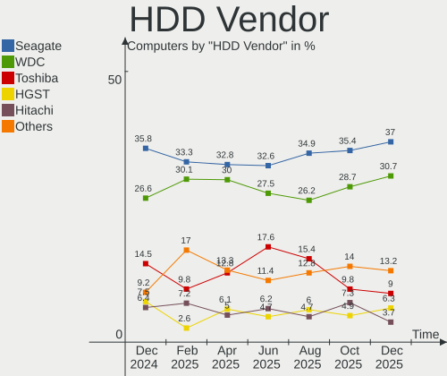

| Vendor              | Computers | Drives | Percent |
|---------------------|-----------|--------|---------|
| Seagate             | 70        | 166    | 37.04%  |
| WDC                 | 58        | 155    | 30.69%  |
| Toshiba             | 17        | 39     | 8.99%   |
| HGST                | 12        | 89     | 6.35%   |
| Hitachi             | 7         | 7      | 3.7%    |
| Samsung Electronics | 6         | 7      | 3.17%   |
| Hewlett-Packard     | 6         | 52     | 3.17%   |
| Unknown             | 4         | 5      | 2.12%   |
| HGST HTS            | 2         | 2      | 1.06%   |
| Fujitsu             | 2         | 2      | 1.06%   |
| NETAPP              | 1         | 6      | 0.53%   |
| IB-AC703            | 1         | 1      | 0.53%   |
| HPE                 | 1         | 11     | 0.53%   |
| Elite               | 1         | 2      | 0.53%   |
| Apple               | 1         | 1      | 0.53%   |

SSD Vendor
----------

Solid state drive vendors

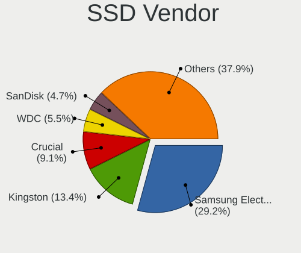

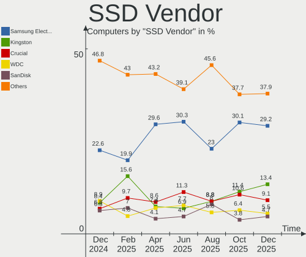

| Vendor              | Computers | Drives | Percent |
|---------------------|-----------|--------|---------|
| Samsung Electronics | 74        | 330    | 29.25%  |
| Kingston            | 34        | 39     | 13.44%  |
| Crucial             | 23        | 35     | 9.09%   |
| WDC                 | 14        | 36     | 5.53%   |
| SanDisk             | 12        | 13     | 4.74%   |
| China               | 9         | 9      | 3.56%   |
| A-DATA Technology   | 8         | 10     | 3.16%   |
| Toshiba             | 6         | 8      | 2.37%   |
| SK hynix            | 6         | 10     | 2.37%   |
| Transcend           | 4         | 4      | 1.58%   |
| Patriot             | 3         | 3      | 1.19%   |
| Micron Technology   | 3         | 3      | 1.19%   |
| Intenso             | 3         | 6      | 1.19%   |
| Hewlett-Packard     | 3         | 3      | 1.19%   |
| GOODRAM             | 3         | 4      | 1.19%   |
| Apple               | 3         | 3      | 1.19%   |
| ZHITAI              | 2         | 2      | 0.79%   |
| Team                | 2         | 2      | 0.79%   |
| SABRENT             | 2         | 2      | 0.79%   |
| PNY                 | 2         | 2      | 0.79%   |
| KIOXIA-EXCERIA      | 2         | 2      | 0.79%   |
| Intel               | 2         | 3      | 0.79%   |
| HGST                | 2         | 22     | 0.79%   |
| Colorful            | 2         | 2      | 0.79%   |
| Apacer              | 2         | 2      | 0.79%   |
| AirDisk             | 2         | 2      | 0.79%   |
| Wicgtyp             | 1         | 1      | 0.4%    |
| VICKTER             | 1         | 1      | 0.4%    |
| VERICO              | 1         | 1      | 0.4%    |
| SPCC                | 1         | 1      | 0.4%    |
| sobetter            | 1         | 1      | 0.4%    |
| SMI                 | 1         | 1      | 0.4%    |
| PELADN              | 1         | 1      | 0.4%    |
| OWC                 | 1         | 1      | 0.4%    |
| Mushkin             | 1         | 1      | 0.4%    |
| MSI                 | 1         | 1      | 0.4%    |
| Min Yi U            | 1         | 1      | 0.4%    |
| LITEON L            | 1         | 1      | 0.4%    |
| KIOXIA              | 1         | 4      | 0.4%    |
| HS-SSD-WAVE(S)      | 1         | 1      | 0.4%    |

Drive Kind
----------

HDD or SSD

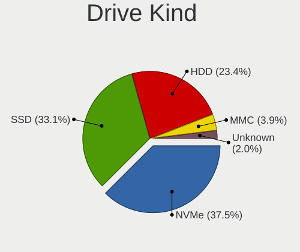

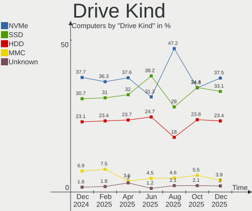

| Kind    | Computers | Drives | Percent |
|---------|-----------|--------|---------|
| NVMe    | 248       | 325    | 37.52%  |
| SSD     | 219       | 586    | 33.13%  |
| HDD     | 155       | 545    | 23.45%  |
| MMC     | 26        | 30     | 3.93%   |
| Unknown | 13        | 19     | 1.97%   |

Drive Connector
---------------

SATA, SAS, NVMe, etc.

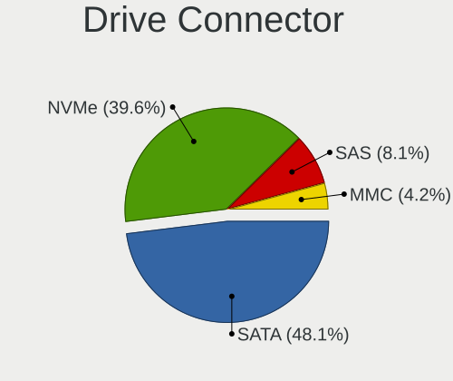

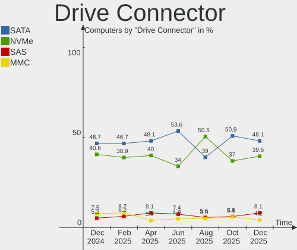

| Type | Computers | Drives | Percent |
|------|-----------|--------|---------|
| SATA | 296       | 1082   | 48.05%  |
| NVMe | 244       | 319    | 39.61%  |
| SAS  | 50        | 74     | 8.12%   |
| MMC  | 26        | 30     | 4.22%   |

Drive Size
----------

Size of hard drive

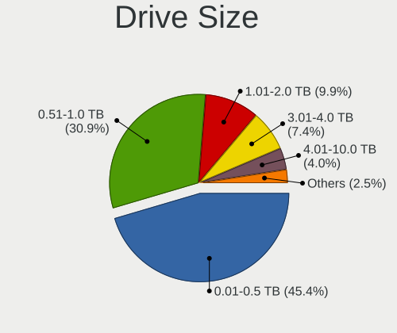

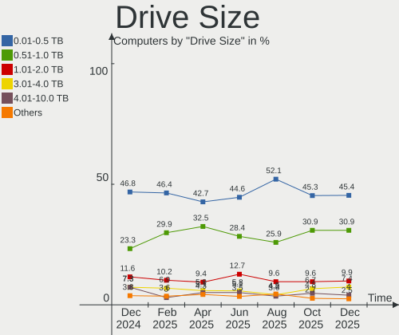

| Size in TB | Computers | Drives | Percent |
|------------|-----------|--------|---------|
| 0.01-0.5   | 184       | 308    | 45.43%  |
| 0.51-1.0   | 125       | 352    | 30.86%  |
| 1.01-2.0   | 40        | 125    | 9.88%   |
| 3.01-4.0   | 30        | 182    | 7.41%   |
| 4.01-10.0  | 16        | 133    | 3.95%   |
| 2.01-3.0   | 5         | 7      | 1.23%   |
| 10.01-20.0 | 4         | 23     | 0.99%   |
| 20.01-50.0 | 1         | 1      | 0.25%   |

Space Total
-----------

Amount of disk space available on the file system

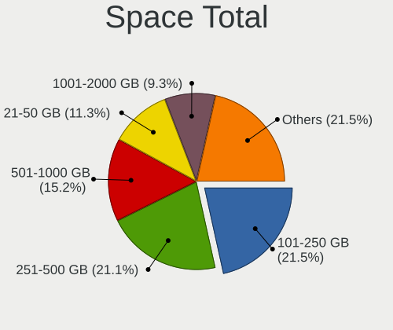

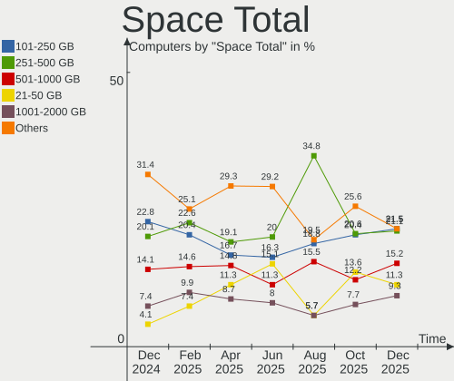

| Size in GB     | Computers | Percent |
|----------------|-----------|---------|
| 101-250        | 109       | 21.54%  |
| 251-500        | 107       | 21.15%  |
| 501-1000       | 77        | 15.22%  |
| 21-50          | 57        | 11.26%  |
| 1001-2000      | 47        | 9.29%   |
| More than 3000 | 37        | 7.31%   |
| 51-100         | 29        | 5.73%   |
| 1-20           | 28        | 5.53%   |
| Unknown        | 9         | 1.78%   |
| 2001-3000      | 6         | 1.19%   |

Space Used
----------

Amount of used disk space

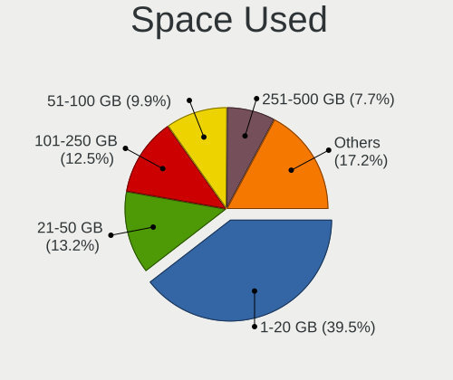

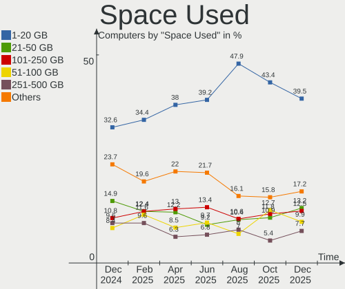

| Used GB        | Computers | Percent |
|----------------|-----------|---------|
| 1-20           | 200       | 39.53%  |
| 21-50          | 67        | 13.24%  |
| 101-250        | 63        | 12.45%  |
| 51-100         | 50        | 9.88%   |
| 251-500        | 39        | 7.71%   |
| 501-1000       | 36        | 7.11%   |
| 1001-2000      | 21        | 4.15%   |
| More than 3000 | 14        | 2.77%   |
| Unknown        | 9         | 1.78%   |
| 2001-3000      | 6         | 1.19%   |
| 0              | 1         | 0.2%    |

Malfunc. Drives
---------------

Drive models with a malfunction

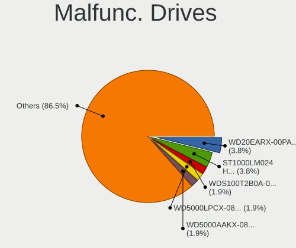

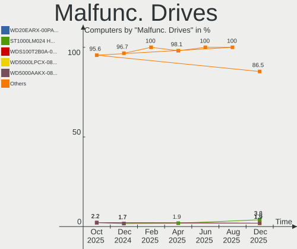

| Model                                          | Computers | Drives | Percent |
|------------------------------------------------|-----------|--------|---------|
| WDC WD20EARX-00PASB0 2TB                       | 2         | 2      | 3.85%   |
| Seagate ST1000LM024 HN-M101MBB 1TB             | 2         | 2      | 3.85%   |
| WDC WDS100T2B0A-00SM50 1TB SSD                 | 1         | 3      | 1.92%   |
| WDC WD5000LPCX-08VHA 500GB                     | 1         | 1      | 1.92%   |
| WDC WD5000AAKX-08U6AA0 500GB                   | 1         | 1      | 1.92%   |
| WDC WD42PURZ-85B4YY0 4TB                       | 1         | 9      | 1.92%   |
| WDC WD40PURZ-85AKKY0 4TB                       | 1         | 9      | 1.92%   |
| WDC WD2500BEVT-60ZCT1 250GB                    | 1         | 1      | 1.92%   |
| WDC WD20EZRX-00D8PB0 2TB                       | 1         | 1      | 1.92%   |
| WDC WD20EFRX-68EUZN0 2TB                       | 1         | 1      | 1.92%   |
| WDC WD2000F9YZ-09N20L0 2TB                     | 1         | 9      | 1.92%   |
| WDC WD10EZEX-21M2NA0 1TB                       | 1         | 1      | 1.92%   |
| WDC WD10EALX-009BA0 1TB                        | 1         | 1      | 1.92%   |
| WDC WD Blue SA510 2.5 1000GB SSD               | 1         | 1      | 1.92%   |
| Transcend TS128GSSD230S 128GB                  | 1         | 1      | 1.92%   |
| Toshiba MQ01ABD100 1TB                         | 1         | 1      | 1.92%   |
| Toshiba MK5065GSX 500GB                        | 1         | 1      | 1.92%   |
| Toshiba DT01ACA200 2TB                         | 1         | 1      | 1.92%   |
| Toshiba DT01ACA050 500GB                       | 1         | 1      | 1.92%   |
| SK hynix HFS256G3AMNB-2200A 256GB SSD          | 1         | 1      | 1.92%   |
| SK hynix BC501 HFM256GDJTNG-8310A 256GB        | 1         | 1      | 1.92%   |
| Seagate ST9750420AS 752GB                      | 1         | 1      | 1.92%   |
| Seagate ST95005620AS 500GB                     | 1         | 1      | 1.92%   |
| Seagate ST500LM012 HN-M500MBB 500GB            | 1         | 1      | 1.92%   |
| Seagate ST3500418AS 500GB                      | 1         | 1      | 1.92%   |
| Seagate ST3250410AS 250GB                      | 1         | 1      | 1.92%   |
| Seagate ST320LT007-9ZV142 320GB                | 1         | 1      | 1.92%   |
| Seagate ST31500541AS 1TB                       | 1         | 1      | 1.92%   |
| Seagate ST31000524AS 1TB                       | 1         | 1      | 1.92%   |
| Seagate ST2000DM006-2DM164 2TB                 | 1         | 1      | 1.92%   |
| Seagate ST1000NM0033-9ZM173 1TB                | 1         | 2      | 1.92%   |
| Seagate ST1000LX015-1U7172 1TB                 | 1         | 1      | 1.92%   |
| Seagate ST1000DM003-9YN162 1TB                 | 1         | 1      | 1.92%   |
| Seagate ST1000DM003-1CH162 1TB                 | 1         | 1      | 1.92%   |
| SanDisk SSD P4 32GB                            | 1         | 1      | 1.92%   |
| Samsung Electronics SSD 980 PRO 500GB          | 1         | 1      | 1.92%   |
| Samsung Electronics SSD 870 EVO 250GB          | 1         | 2      | 1.92%   |
| Samsung Electronics MZWLO15THBLA-00A07 15.3TB  | 1         | 1      | 1.92%   |
| Philips FM82SS001N-93 NVME 4.0 1TB             | 1         | 1      | 1.92%   |
| Micron Technology 1100_MTFDDAK256TBN 256GB SSD | 1         | 1      | 1.92%   |

Malfunc. Drive Vendor
---------------------

Vendors of faulty drives

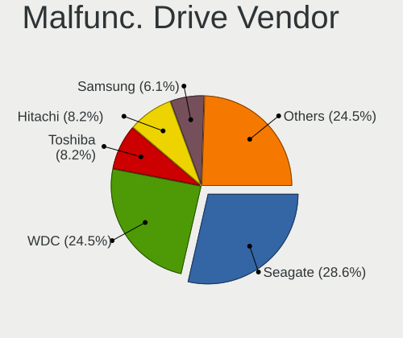

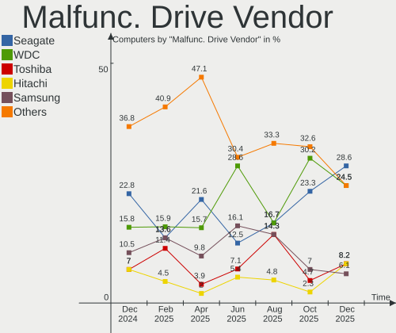

| Vendor              | Computers | Drives | Percent |
|---------------------|-----------|--------|---------|
| Seagate             | 14        | 16     | 28.57%  |
| WDC                 | 12        | 40     | 24.49%  |
| Toshiba             | 4         | 4      | 8.16%   |
| Hitachi             | 4         | 4      | 8.16%   |
| Samsung Electronics | 3         | 4      | 6.12%   |
| SK hynix            | 2         | 2      | 4.08%   |
| HGST                | 2         | 2      | 4.08%   |
| Transcend           | 1         | 1      | 2.04%   |
| SanDisk             | 1         | 1      | 2.04%   |
| Philips             | 1         | 1      | 2.04%   |
| Micron Technology   | 1         | 1      | 2.04%   |
| Intel               | 1         | 2      | 2.04%   |
| Hewlett-Packard     | 1         | 4      | 2.04%   |
| Crucial             | 1         | 1      | 2.04%   |
| A-DATA Technology   | 1         | 1      | 2.04%   |

Malfunc. HDD Vendor
-------------------

Vendors of faulty HDD drives

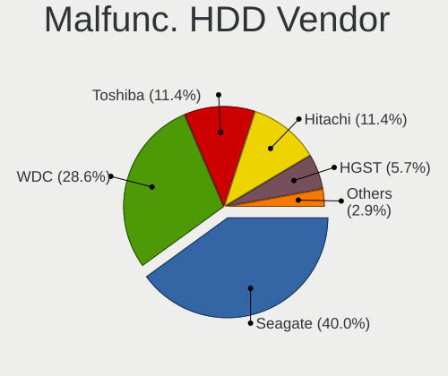

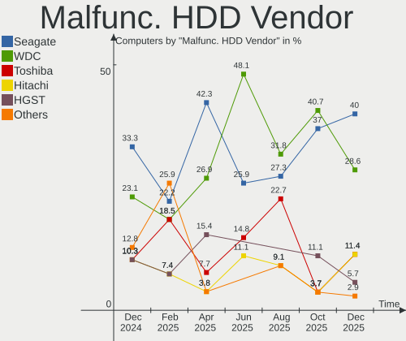

| Vendor          | Computers | Drives | Percent |
|-----------------|-----------|--------|---------|
| Seagate         | 14        | 16     | 40%     |
| WDC             | 10        | 36     | 28.57%  |
| Toshiba         | 4         | 4      | 11.43%  |
| Hitachi         | 4         | 4      | 11.43%  |
| HGST            | 2         | 2      | 5.71%   |
| Hewlett-Packard | 1         | 4      | 2.86%   |

Malfunc. Drive Kind
-------------------

Kinds of faulty drives

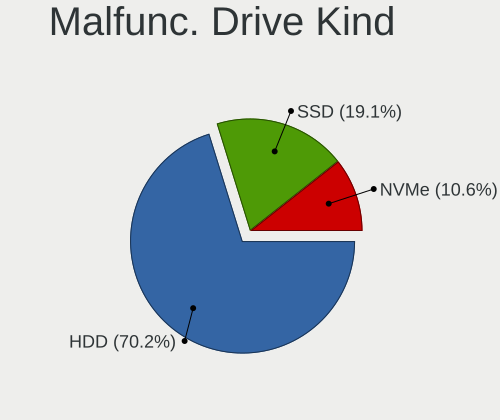

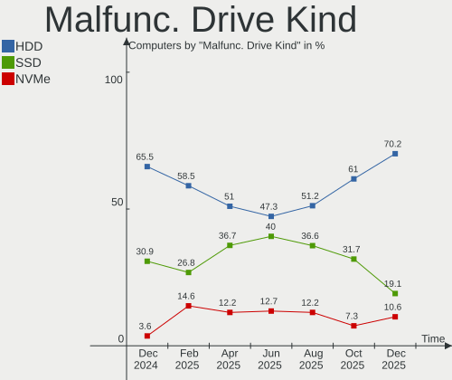

| Kind | Computers | Drives | Percent |
|------|-----------|--------|---------|
| HDD  | 33        | 66     | 70.21%  |
| SSD  | 9         | 13     | 19.15%  |
| NVMe | 5         | 5      | 10.64%  |

Failed Drives
-------------

Failed drive models

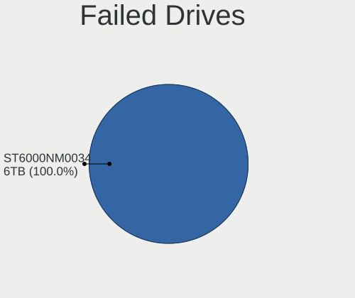

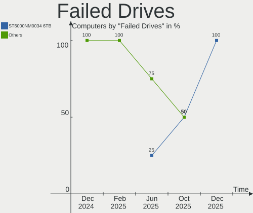

| Model                    | Computers | Drives | Percent |
|--------------------------|-----------|--------|---------|
| Seagate ST6000NM0034 6TB | 1         | 6      | 100%    |

Failed Drive Vendor
-------------------

Failed drive vendors

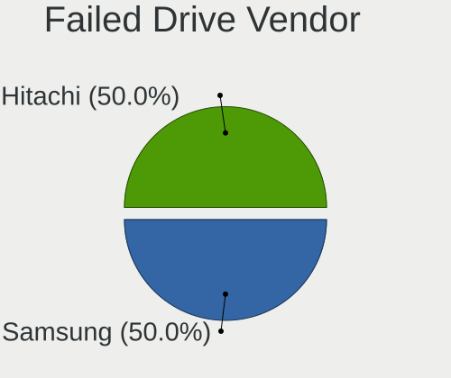

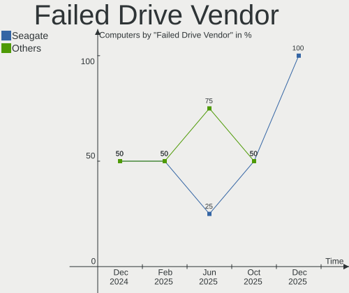

| Vendor  | Computers | Drives | Percent |
|---------|-----------|--------|---------|
| Seagate | 1         | 6      | 100%    |

Drive Status
------------

Number of failed and malfunc. drives

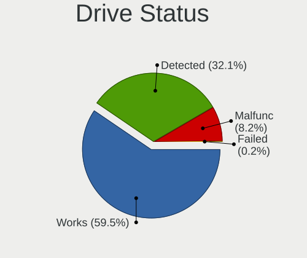

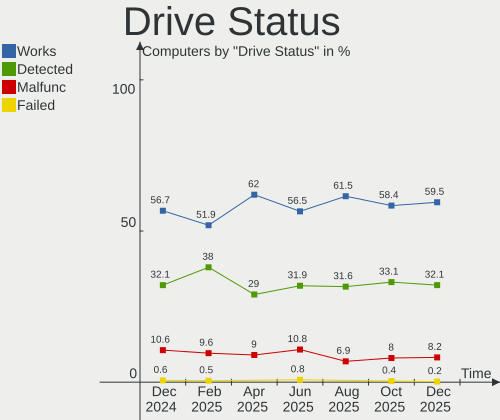

| Status   | Computers | Drives | Percent |
|----------|-----------|--------|---------|
| Works    | 341       | 1100   | 59.51%  |
| Detected | 184       | 315    | 32.11%  |
| Malfunc  | 47        | 84     | 8.2%    |
| Failed   | 1         | 6      | 0.17%   |

Storage controller
------------------

Storage Vendor
--------------

Storage controller vendors

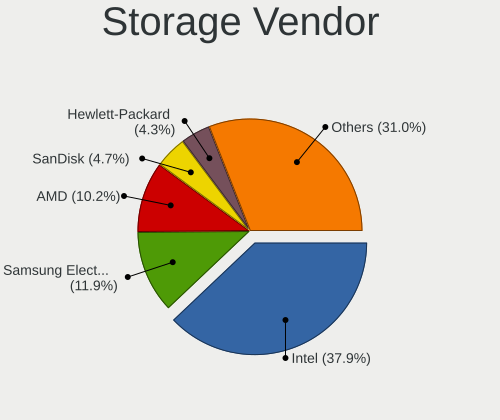

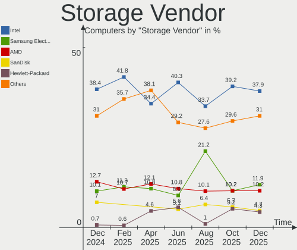

| Vendor                                  | Computers | Percent |
|-----------------------------------------|-----------|---------|
| Intel                                   | 267       | 37.93%  |
| Samsung Electronics                     | 84        | 11.93%  |
| AMD                                     | 72        | 10.23%  |
| SanDisk                                 | 33        | 4.69%   |
| Hewlett-Packard                         | 30        | 4.26%   |
| Kingston Technology Company             | 28        | 3.98%   |
| SK hynix                                | 24        | 3.41%   |
| Micron/Crucial Technology               | 18        | 2.56%   |
| Micron Technology                       | 16        | 2.27%   |
| Broadcom / LSI                          | 16        | 2.27%   |
| MAXIO Technology (Hangzhou)             | 11        | 1.56%   |
| Phison Electronics                      | 10        | 1.42%   |
| LSI Logic / Symbios Logic               | 10        | 1.42%   |
| ASMedia Technology                      | 10        | 1.42%   |
| KIOXIA                                  | 8         | 1.14%   |
| ADATA Technology                        | 6         | 0.85%   |
| Zhaoxin                                 | 5         | 0.71%   |
| Silicon Motion                          | 5         | 0.71%   |
| Marvell Technology Group                | 5         | 0.71%   |
| JMicron Technology                      | 5         | 0.71%   |
| Yangtze Memory Technologies             | 4         | 0.57%   |
| Realtek Semiconductor                   | 4         | 0.57%   |
| Adaptec                                 | 4         | 0.57%   |
| Shenzhen Longsys Electronics            | 3         | 0.43%   |
| Loongson Technology                     | 3         | 0.43%   |
| Transcend                               | 2         | 0.28%   |
| Shenzhen Unionmemory Information System | 2         | 0.28%   |
| Seagate Technology                      | 2         | 0.28%   |
| Nvidia                                  | 2         | 0.28%   |
| INNOGRIT                                | 2         | 0.28%   |
| Apple                                   | 2         | 0.28%   |
| VIA Technologies                        | 1         | 0.14%   |
| ULi Electronics                         | 1         | 0.14%   |
| Solidigm                                | 1         | 0.14%   |
| Solid State Storage Technology          | 1         | 0.14%   |
| Red Hat                                 | 1         | 0.14%   |
| O2 Micro                                | 1         | 0.14%   |
| Huawei Technologies                     | 1         | 0.14%   |
| Hosin Global Electronics                | 1         | 0.14%   |
| DapuStor                                | 1         | 0.14%   |

Storage Model
-------------

Storage controller models

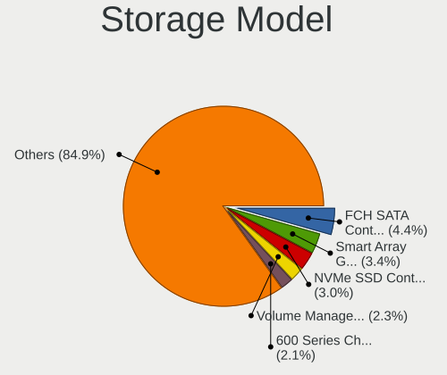

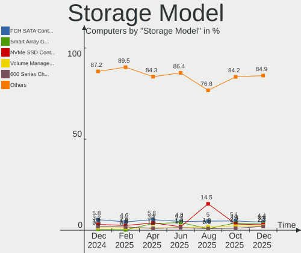

| Model                                                                          | Computers | Percent |
|--------------------------------------------------------------------------------|-----------|---------|
| AMD FCH SATA Controller [AHCI mode]                                            | 34        | 4.39%   |
| HP Smart Array Gen9 Controllers                                                | 26        | 3.36%   |
| Samsung NVMe SSD Controller SM981/PM981/PM983                                  | 23        | 2.97%   |
| Intel Volume Management Device NVMe RAID Controller                            | 18        | 2.33%   |
| AMD 600 Series Chipset SATA Controller                                         | 16        | 2.07%   |
| Samsung NVMe SSD Controller S4LV008[Pascal]                                    | 14        | 1.81%   |
| Intel C610/X99 series chipset 6-Port SATA Controller [AHCI mode]               | 14        | 1.81%   |
| Samsung NVMe SSD Controller PM9A1/PM9A3/980PRO                                 | 13        | 1.68%   |
| Intel 6 Series/C200 Series Chipset Family 6 port Desktop SATA AHCI Controller  | 13        | 1.68%   |
| Samsung NVMe SSD Controller PM9C1a (DRAM-less)                                 | 12        | 1.55%   |
| Intel Sunrise Point-LP SATA Controller [AHCI mode]                             | 12        | 1.55%   |
| Intel Q170/Q150/B150/H170/H110/Z170/CM236 Chipset SATA Controller [AHCI Mode]  | 12        | 1.55%   |
| Intel 82801 Mobile SATA Controller [RAID mode]                                 | 11        | 1.42%   |
| Intel 8 Series/C220 Series Chipset Family 6-port SATA Controller 1 [AHCI mode] | 11        | 1.42%   |
| Intel 7 Series Chipset Family 6-port SATA Controller [AHCI mode]               | 11        | 1.42%   |
| Samsung NVMe SSD Controller SM961/PM961/SM963                                  | 10        | 1.29%   |
| Samsung NVMe SSD Controller 980 (DRAM-less)                                    | 9         | 1.16%   |
| MAXIO (Hangzhou) NVMe SSD Controller MAP1202 (DRAM-less)                       | 9         | 1.16%   |
| AMD SB7x0/SB8x0/SB9x0 IDE Controller                                           | 9         | 1.16%   |
| Intel Comet Lake SATA AHCI Controller                                          | 8         | 1.03%   |
| Intel Cannon Lake PCH SATA AHCI Controller                                     | 8         | 1.03%   |
| Intel Alder Lake-N SATA AHCI Controller                                        | 8         | 1.03%   |
| ASMedia ASM1061/ASM1062 Serial ATA Controller                                  | 8         | 1.03%   |
| Micron/Crucial P2 [Nick P2] / P3 / P3 Plus NVMe PCIe SSD (DRAM-less)           | 7         | 0.9%    |
| Intel Tiger Lake-LP SATA Controller                                            | 7         | 0.9%    |
| Intel 5 Series/3400 Series Chipset 6 port SATA AHCI Controller                 | 7         | 0.9%    |
| AMD 500 Series Chipset SATA Controller                                         | 7         | 0.9%    |
| AMD 400 Series Chipset SATA Controller                                         | 7         | 0.9%    |
| SK hynix Gold P31/BC711/PC711 NVMe Solid State Drive                           | 6         | 0.78%   |
| LSI Logic / Symbios Logic MegaRAID SAS-3 3108 [Invader]                        | 6         | 0.78%   |
| Intel 82801JI (ICH10 Family) SATA AHCI Controller                              | 6         | 0.78%   |
| Intel 7 Series/C210 Series Chipset Family 6-port SATA Controller [AHCI mode]   | 6         | 0.78%   |
| Intel 5 Series/3400 Series Chipset 4 port SATA AHCI Controller                 | 6         | 0.78%   |
| Intel 200 Series PCH SATA controller [AHCI mode]                               | 6         | 0.78%   |
| Broadcom / LSI MegaRAID SAS-3 3108 [Invader]                                   | 6         | 0.78%   |
| AMD SB7x0/SB8x0/SB9x0 SATA Controller [AHCI mode]                              | 6         | 0.78%   |
| Zhaoxin ZX-100/ZX-200/KX-6000/KX-6000G/KH-40000/KX-7000 StorX AHCI Controller  | 5         | 0.65%   |
| SanDisk WD SN560/SN740/SN770/SN5000 NVMe SSD                                   | 5         | 0.65%   |
| Micron 2550 NVMe SSD (DRAM-less)                                               | 5         | 0.65%   |
| Kingston Company NV2 NVMe SSD [SM2267XT] (DRAM-less)                           | 5         | 0.65%   |

Storage Kind
------------

Kind of storage controller (IDE, SATA, NVMe, SAS, ...)

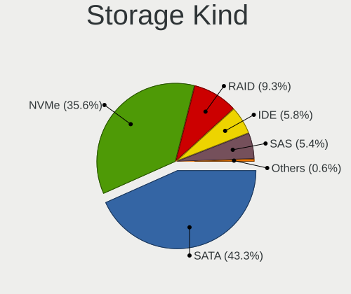

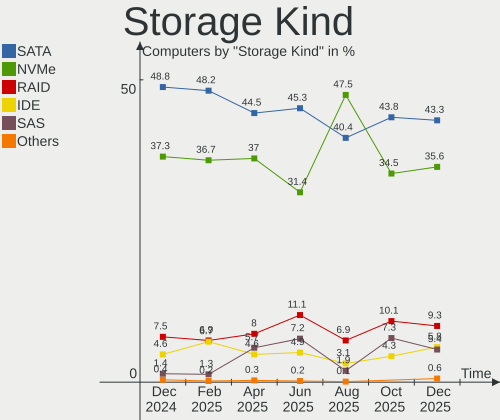

| Kind | Computers | Percent |
|------|-----------|---------|
| SATA | 298       | 43.31%  |
| NVMe | 245       | 35.61%  |
| RAID | 64        | 9.3%    |
| IDE  | 40        | 5.81%   |
| SAS  | 37        | 5.38%   |
| SCSI | 4         | 0.58%   |

Processor
---------

CPU Vendor
----------

Processor vendors

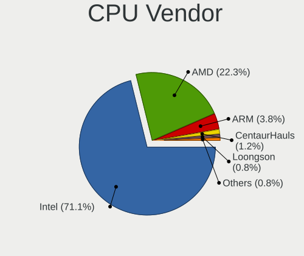

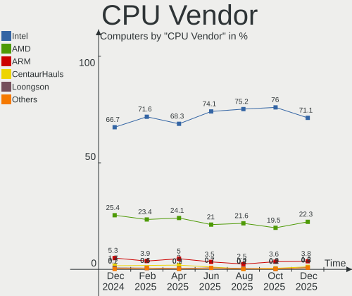

| Vendor                | Computers | Percent |
|-----------------------|-----------|---------|
| Intel                 | 360       | 71.15%  |
| AMD                   | 113       | 22.33%  |
| ARM                   | 19        | 3.75%   |
| CentaurHauls          | 6         | 1.19%   |
| Loongson              | 4         | 0.79%   |
| Unknown               | 2         | 0.4%    |
| sifive,u74-mc         | 1         | 0.2%    |
| Marvell Semiconductor | 1         | 0.2%    |

CPU Model
---------

Processor models

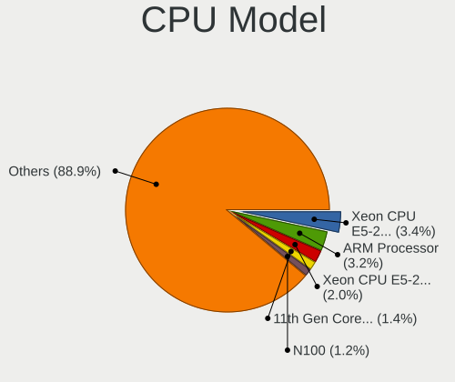

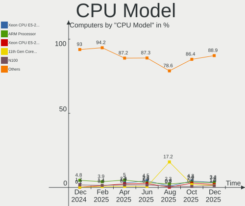

| Model                                          | Computers | Percent |
|------------------------------------------------|-----------|---------|
| Intel Xeon CPU E5-2667 v4 @ 3.20GHz            | 17        | 3.36%   |
| ARM Processor                                  | 16        | 3.16%   |
| Intel Xeon CPU E5-2640 v4 @ 2.40GHz            | 10        | 1.98%   |
| Intel 11th Gen Core i7-1165G7 @ 2.80GHz        | 7         | 1.38%   |
| Intel N100                                     | 6         | 1.19%   |
| Intel 11th Gen Core i5-1135G7 @ 2.40GHz        | 5         | 0.99%   |
| Intel 11th Gen Core i3-1115G4 @ 3.00GHz        | 5         | 0.99%   |
| Loongson Loongson 3A                           | 4         | 0.79%   |
| Intel Xeon CPU X5650 @ 2.67GHz                 | 4         | 0.79%   |
| Intel Core i5-8400 CPU @ 2.80GHz               | 4         | 0.79%   |
| Intel Core i5 CPU M 560 @ 2.67GHz              | 4         | 0.79%   |
| Intel 13th Gen Core i3-1315U                   | 4         | 0.79%   |
| Intel Core Ultra 7 255H                        | 3         | 0.59%   |
| Intel Core Ultra 5 125U                        | 3         | 0.59%   |
| Intel Core i7-6500U CPU @ 2.50GHz              | 3         | 0.59%   |
| Intel Core i5-8350U CPU @ 1.70GHz              | 3         | 0.59%   |
| Intel Core i5-8250U CPU @ 1.60GHz              | 3         | 0.59%   |
| Intel Core i5-7300U CPU @ 2.60GHz              | 3         | 0.59%   |
| Intel Core i5-6500 CPU @ 3.20GHz               | 3         | 0.59%   |
| Intel Core i5-4210U CPU @ 1.70GHz              | 3         | 0.59%   |
| Intel Core i5 CPU M 520 @ 2.40GHz              | 3         | 0.59%   |
| CentaurHauls ZHAOXIN KaiXian KX-6640MA@2.2+GHz | 3         | 0.59%   |
| AMD Ryzen AI 7 350 w/ Radeon 860M              | 3         | 0.59%   |
| AMD Ryzen 7 PRO 4750U with Radeon Graphics     | 3         | 0.59%   |
| AMD Ryzen 7 8845HS w/ Radeon 780M Graphics     | 3         | 0.59%   |
| Intel Xeon Gold 6144 CPU @ 3.50GHz             | 2         | 0.4%    |
| Intel Xeon CPU E5606 @ 2.13GHz                 | 2         | 0.4%    |
| Intel Xeon CPU E5-2697A v4 @ 2.60GHz           | 2         | 0.4%    |
| Intel Xeon CPU E5-2690 v4 @ 2.60GHz            | 2         | 0.4%    |
| Intel Xeon CPU E5-2680 v4 @ 2.40GHz            | 2         | 0.4%    |
| Intel Xeon CPU E5-2680 v2 @ 2.80GHz            | 2         | 0.4%    |
| Intel Xeon CPU E5-2673 v4 @ 2.30GHz            | 2         | 0.4%    |
| Intel Xeon CPU E5-2630L v3 @ 1.80GHz           | 2         | 0.4%    |
| Intel Xeon CPU E5-2630 v4 @ 2.20GHz            | 2         | 0.4%    |
| Intel Xeon CPU E5-2620 v3 @ 2.40GHz            | 2         | 0.4%    |
| Intel Xeon CPU E5-2620 v2 @ 2.10GHz            | 2         | 0.4%    |
| Intel Xeon CPU E3-1220 V2 @ 3.10GHz            | 2         | 0.4%    |
| Intel Pentium Dual-Core CPU E5700 @ 3.00GHz    | 2         | 0.4%    |
| Intel Pentium CPU P6100 @ 2.00GHz              | 2         | 0.4%    |
| Intel N150                                     | 2         | 0.4%    |

CPU Model Family
----------------

Processor model prefix

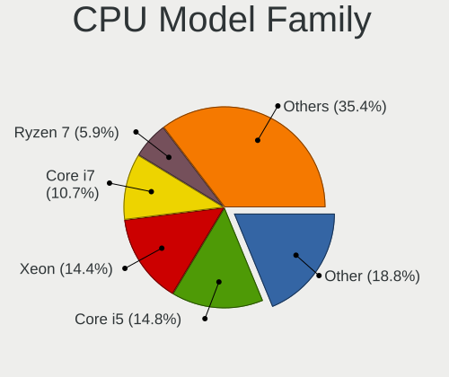

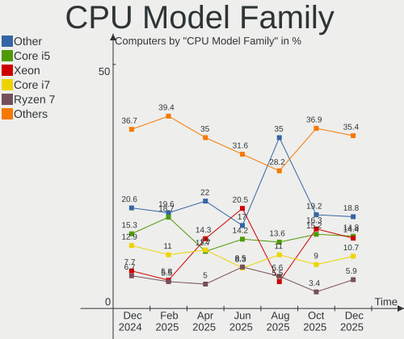

| Model                   | Computers | Percent |
|-------------------------|-----------|---------|
| Other                   | 95        | 18.77%  |
| Intel Core i5           | 75        | 14.82%  |
| Intel Xeon              | 73        | 14.43%  |
| Intel Core i7           | 54        | 10.67%  |
| AMD Ryzen 7             | 30        | 5.93%   |
| Intel Core i3           | 23        | 4.55%   |
| Intel Core              | 23        | 4.55%   |
| AMD Ryzen 5             | 20        | 3.95%   |
| AMD Ryzen 9             | 17        | 3.36%   |
| Intel Celeron           | 13        | 2.57%   |
| Intel Atom              | 7         | 1.38%   |
| AMD FX                  | 6         | 1.19%   |
| Intel Pentium           | 5         | 0.99%   |
| AMD Ryzen 3             | 5         | 0.99%   |
| Intel Pentium Dual-Core | 4         | 0.79%   |
| Intel Core 2 Duo        | 4         | 0.79%   |
| AMD A6                  | 4         | 0.79%   |
| Intel Xeon Silver       | 3         | 0.59%   |
| Intel Xeon Gold         | 3         | 0.59%   |
| Intel Core i9           | 3         | 0.59%   |
| AMD Ryzen 7 PRO         | 3         | 0.59%   |
| AMD Ryzen 5 PRO         | 3         | 0.59%   |
| AMD EPYC                | 3         | 0.59%   |
| Intel Core 2 Quad       | 2         | 0.4%    |
| Intel Core 2 Extreme    | 2         | 0.4%    |
| Intel Core 2            | 2         | 0.4%    |
| AMD GX                  | 2         | 0.4%    |
| AMD Athlon              | 2         | 0.4%    |
| Intel Pentium Silver    | 1         | 0.2%    |
| Intel Pentium M         | 1         | 0.2%    |
| Intel Pentium Gold      | 1         | 0.2%    |
| Intel Pentium Dual      | 1         | 0.2%    |
| Intel Pentium 4         | 1         | 0.2%    |
| ARM BCM                 | 1         | 0.2%    |
| ARM Allwinner           | 1         | 0.2%    |
| AMD Turion 64 X2 Mobile | 1         | 0.2%    |
| AMD Sempron             | 1         | 0.2%    |
| AMD Ryzen Threadripper  | 1         | 0.2%    |
| AMD Phenom II X6        | 1         | 0.2%    |
| AMD Phenom II X4        | 1         | 0.2%    |

CPU Cores
---------

Number of processor cores

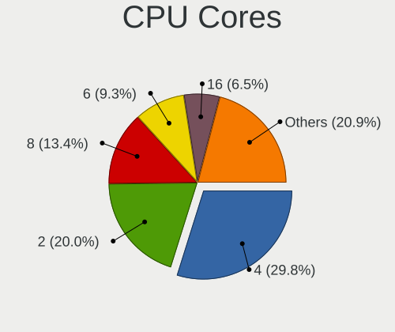

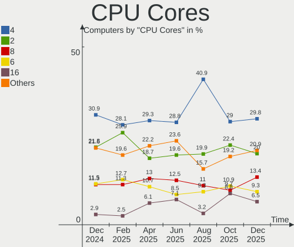

| Number  | Computers | Percent |
|---------|-----------|---------|
| 4       | 151       | 29.84%  |
| 2       | 101       | 19.96%  |
| 8       | 68        | 13.44%  |
| 6       | 47        | 9.29%   |
| 16      | 33        | 6.52%   |
| 12      | 24        | 4.74%   |
| 20      | 21        | 4.15%   |
| 10      | 15        | 2.96%   |
| Unknown | 13        | 2.57%   |
| 14      | 10        | 1.98%   |
| 1       | 6         | 1.19%   |
| 28      | 4         | 0.79%   |
| 40      | 3         | 0.59%   |
| 32      | 3         | 0.59%   |
| 128     | 1         | 0.2%    |
| 96      | 1         | 0.2%    |
| 64      | 1         | 0.2%    |
| 48      | 1         | 0.2%    |
| 24      | 1         | 0.2%    |
| 5       | 1         | 0.2%    |
| 3       | 1         | 0.2%    |

CPU Sockets
-----------

Number of sockets

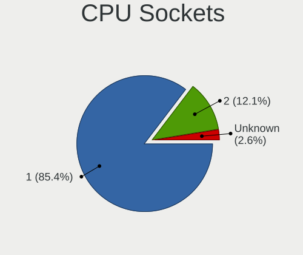

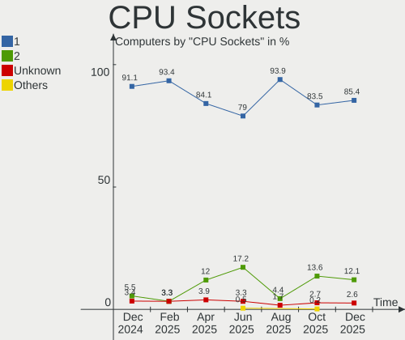

| Number  | Computers | Percent |
|---------|-----------|---------|
| 1       | 432       | 85.38%  |
| 2       | 61        | 12.06%  |
| Unknown | 13        | 2.57%   |

CPU Threads
-----------

Threads per core (Hyper-Threading)

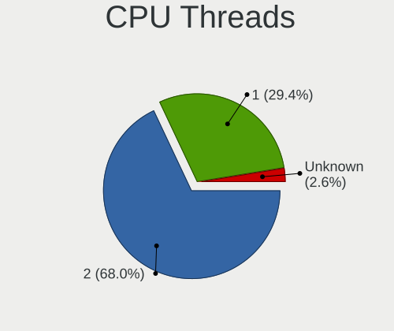

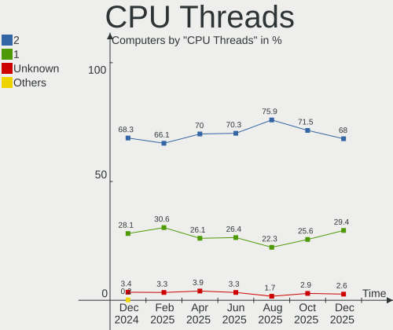

| Number  | Computers | Percent |
|---------|-----------|---------|
| 2       | 344       | 67.98%  |
| 1       | 149       | 29.45%  |
| Unknown | 13        | 2.57%   |

CPU Op-Modes
------------

CPU Operation Modes (32-bit, 64-bit)

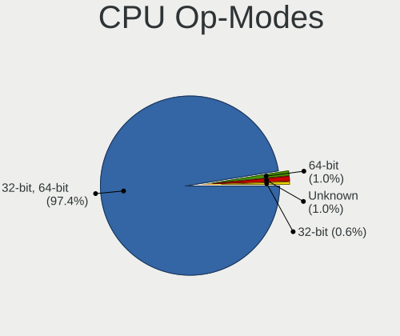

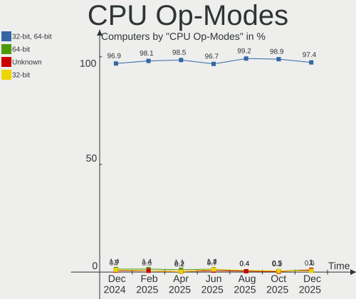

| Op mode        | Computers | Percent |
|----------------|-----------|---------|
| 32-bit, 64-bit | 493       | 97.43%  |
| 64-bit         | 5         | 0.99%   |
| Unknown        | 5         | 0.99%   |
| 32-bit         | 3         | 0.59%   |

CPU Microcode
-------------

Microcode number

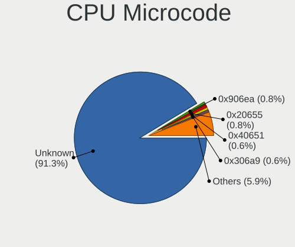

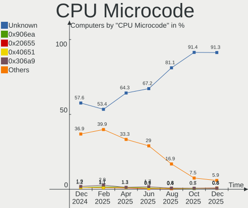

| Number     | Computers | Percent |
|------------|-----------|---------|
| Unknown    | 462       | 91.3%   |
| 0x906ea    | 4         | 0.79%   |
| 0x20655    | 4         | 0.79%   |
| 0x40651    | 3         | 0.59%   |
| 0x306a9    | 3         | 0.59%   |
| 0x306c3    | 2         | 0.4%    |
| 0x106ca    | 2         | 0.4%    |
| 0x08a0000a | 2         | 0.4%    |
| 0xf29      | 1         | 0.2%    |
| 0xa0660    | 1         | 0.2%    |
| 0x906ed    | 1         | 0.2%    |
| 0x906ec    | 1         | 0.2%    |
| 0x90675    | 1         | 0.2%    |
| 0x806e9    | 1         | 0.2%    |
| 0x806c1    | 1         | 0.2%    |
| 0x706a1    | 1         | 0.2%    |
| 0x6fb      | 1         | 0.2%    |
| 0x6d6      | 1         | 0.2%    |
| 0x506e3    | 1         | 0.2%    |
| 0x40671    | 1         | 0.2%    |
| 0x30661    | 1         | 0.2%    |
| 0x206c2    | 1         | 0.2%    |
| 0x206a7    | 1         | 0.2%    |
| 0x20652    | 1         | 0.2%    |
| 0x106a5    | 1         | 0.2%    |
| 0x0b600037 | 1         | 0.2%    |
| 0x0a601209 | 1         | 0.2%    |
| 0x0a601206 | 1         | 0.2%    |
| 0x0a500011 | 1         | 0.2%    |
| 0x0a50000f | 1         | 0.2%    |
| 0x08701021 | 1         | 0.2%    |
| 0x0600063e | 1         | 0.2%    |

CPU Microarch
-------------

Microarchitecture

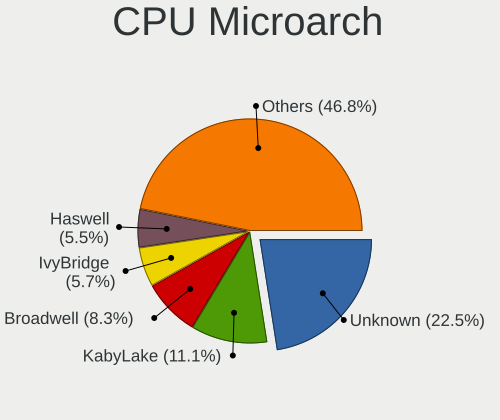

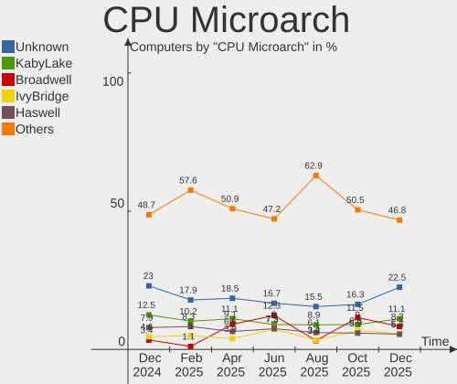

| Name              | Computers | Percent |
|-------------------|-----------|---------|
| Unknown           | 114       | 22.53%  |
| KabyLake          | 56        | 11.07%  |
| Broadwell         | 42        | 8.3%    |
| IvyBridge         | 29        | 5.73%   |
| Haswell           | 28        | 5.53%   |
| Westmere          | 23        | 4.55%   |
| Zen 3             | 22        | 4.35%   |
| TigerLake         | 20        | 3.95%   |
| Skylake           | 19        | 3.75%   |
| SandyBridge       | 15        | 2.96%   |
| Alderlake Hybrid  | 15        | 2.96%   |
| Zen 2             | 12        | 2.37%   |
| Gracemont         | 10        | 1.98%   |
| Penryn            | 9         | 1.78%   |
| CometLake         | 9         | 1.78%   |
| Zen+              | 8         | 1.58%   |
| Silvermont        | 7         | 1.38%   |
| Core              | 7         | 1.38%   |
| IceLake           | 6         | 1.19%   |
| Bonnell           | 6         | 1.19%   |
| Puma              | 5         | 0.99%   |
| Goldmont plus     | 5         | 0.99%   |
| Piledriver        | 4         | 0.79%   |
| Meteorlake Hybrid | 4         | 0.79%   |
| Lunarlake Hybrid  | 4         | 0.79%   |
| Nehalem           | 3         | 0.59%   |
| K10               | 3         | 0.59%   |
| Bulldozer         | 3         | 0.59%   |
| Zen               | 2         | 0.4%    |
| Sapphire Rapids   | 2         | 0.4%    |
| K8 Hammer         | 2         | 0.4%    |
| Jaguar            | 2         | 0.4%    |
| Goldmont          | 2         | 0.4%    |
| Excavator         | 2         | 0.4%    |
| P6                | 1         | 0.2%    |
| NetBurst          | 1         | 0.2%    |
| K8 & K10 hybrid   | 1         | 0.2%    |
| K10 Llano         | 1         | 0.2%    |
| Granite Rapids    | 1         | 0.2%    |
| Bobcat            | 1         | 0.2%    |

Graphics
--------

GPU Vendor
----------

Vendors of graphics cards

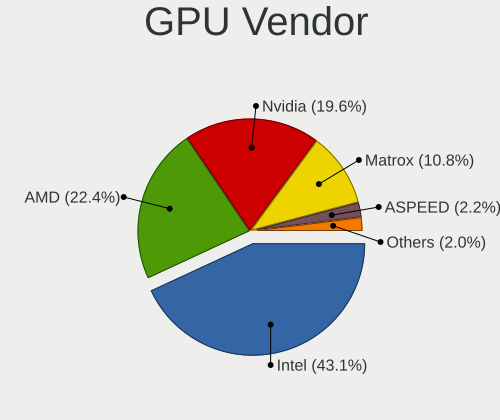

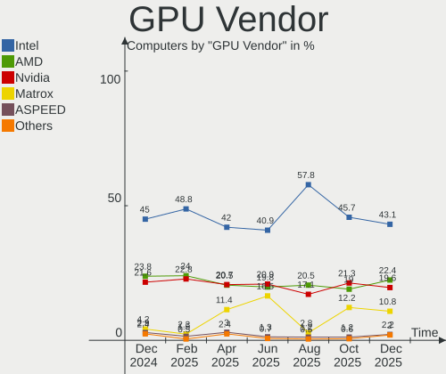

| Vendor                     | Computers | Percent |
|----------------------------|-----------|---------|
| Intel                      | 240       | 43.09%  |
| AMD                        | 125       | 22.44%  |
| Nvidia                     | 109       | 19.57%  |
| Matrox Electronics Systems | 60        | 10.77%  |
| ASPEED Technology          | 12        | 2.15%   |
| Zhaoxin                    | 6         | 1.08%   |
| Loongson Technology        | 4         | 0.72%   |
| Red Hat                    | 1         | 0.18%   |

GPU Model
---------

Graphics card models

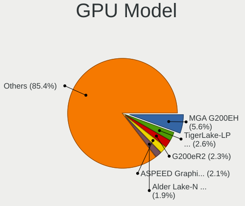

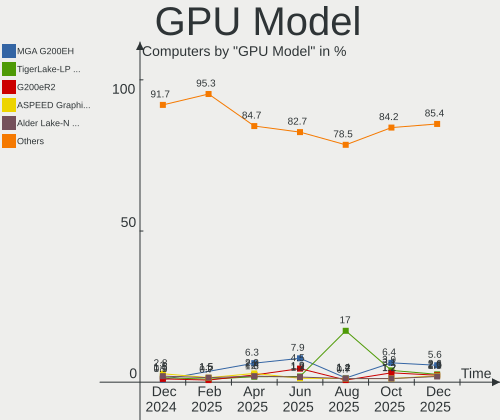

| Model                                                                       | Computers | Percent |
|-----------------------------------------------------------------------------|-----------|---------|
| Matrox Electronics Systems MGA G200EH                                       | 32        | 5.62%   |
| Intel TigerLake-LP GT2 [Iris Xe Graphics]                                   | 15        | 2.64%   |
| Matrox Electronics Systems G200eR2                                          | 13        | 2.28%   |
| ASPEED Technology ASPEED Graphics Family                                    | 12        | 2.11%   |
| Intel Alder Lake-N [UHD Graphics]                                           | 11        | 1.93%   |
| Intel 2nd Generation Core Processor Family Integrated Graphics Controller   | 11        | 1.93%   |
| Intel Kaby Lake-R GT2 [UHD Graphics 620]                                    | 10        | 1.76%   |
| Intel 3rd Gen Core processor Graphics Controller                            | 9         | 1.58%   |
| AMD Granite Ridge [Radeon Graphics]                                         | 9         | 1.58%   |
| Intel Core Processor Integrated Graphics Controller                         | 8         | 1.41%   |
| Intel CoffeeLake-S GT2 [UHD Graphics 630]                                   | 8         | 1.41%   |
| AMD Cezanne [Radeon Vega Series / Radeon Vega Mobile Series]                | 8         | 1.41%   |
| Nvidia GP104GL [Quadro P4000]                                               | 7         | 1.23%   |
| Intel WhiskeyLake-U GT2 [UHD Graphics 620]                                  | 7         | 1.23%   |
| Intel Haswell-ULT Integrated Graphics Controller                            | 7         | 1.23%   |
| AMD HawkPoint1                                                              | 7         | 1.23%   |
| Zhaoxin KX-6000 C-960 GPU                                                   | 6         | 1.05%   |
| Matrox Electronics Systems MGA G200eW WPCM450                               | 6         | 1.05%   |
| Intel Xeon E3-1200 v3/4th Gen Core Processor Integrated Graphics Controller | 6         | 1.05%   |
| Intel Kaby Lake-U GT2 [HD Graphics 620]                                     | 6         | 1.05%   |
| AMD Renoir [Radeon Vega Series / Radeon Vega Mobile Series]                 | 6         | 1.05%   |
| AMD Picasso/Raven 2 [Radeon Vega Series / Radeon Vega Mobile Series]        | 6         | 1.05%   |
| Intel Tiger Lake-LP GT2 [UHD Graphics G4]                                   | 5         | 0.88%   |
| Intel Skylake-U GT2 [HD Graphics 520]                                       | 5         | 0.88%   |
| Intel Skylake-S GT2 [HD Graphics 530]                                       | 5         | 0.88%   |
| Intel Raptor Lake-P [UHD Graphics]                                          | 5         | 0.88%   |
| Intel Meteor Lake-P [Intel Graphics]                                        | 5         | 0.88%   |
| Intel CoffeeLake-H GT2 [UHD Graphics 630]                                   | 5         | 0.88%   |
| Intel Atom Processor D4xx/D5xx/N4xx/N5xx Integrated Graphics Controller     | 5         | 0.88%   |
| AMD Rembrandt [Radeon 680M]                                                 | 5         | 0.88%   |
| AMD Raphael                                                                 | 5         | 0.88%   |
| AMD Mendocino [Radeon 610M]                                                 | 5         | 0.88%   |
| AMD Krackan [Radeon 840M / 860M Graphics]                                   | 5         | 0.88%   |
| AMD Barcelo                                                                 | 5         | 0.88%   |
| Nvidia GP107M [GeForce GTX 1050 Mobile]                                     | 4         | 0.7%    |
| Matrox Electronics Systems MGA G200e [Pilot] ServerEngines (SEP1)           | 4         | 0.7%    |
| Loongson Technology 2K2000 / 7A2000 Chipset Display Controller              | 4         | 0.7%    |
| Intel Xeon E3-1200 v2/3rd Gen Core processor Graphics Controller            | 4         | 0.7%    |
| Intel Raptor Lake-P [Iris Xe Graphics]                                      | 4         | 0.7%    |
| Intel GeminiLake [UHD Graphics 600]                                         | 4         | 0.7%    |

GPU Combo
---------

Combinations of graphics cards

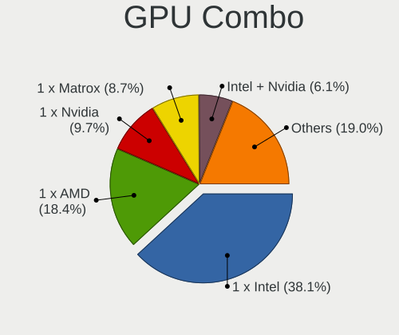

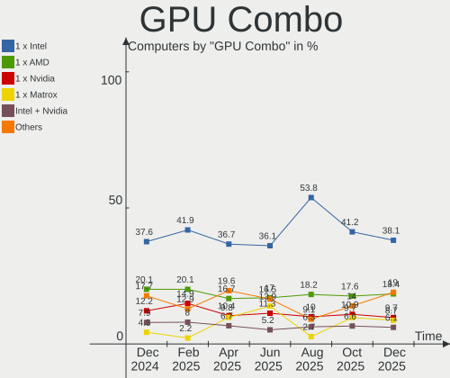

| Name                    | Computers | Percent |
|-------------------------|-----------|---------|
| 1 x Intel               | 193       | 38.14%  |
| 1 x AMD                 | 93        | 18.38%  |
| 1 x Nvidia              | 49        | 9.68%   |
| 1 x Matrox              | 44        | 8.7%    |
| Intel + Nvidia          | 31        | 6.13%   |
| Other                   | 22        | 4.35%   |
| Nvidia + Matrox         | 14        | 2.77%   |
| AMD + Nvidia            | 14        | 2.77%   |
| 1 x ASPEED              | 10        | 1.98%   |
| 2 x AMD                 | 8         | 1.58%   |
| Intel + AMD             | 7         | 1.38%   |
| 1 x Zhaoxin             | 6         | 1.19%   |
| 2 x Intel               | 5         | 0.99%   |
| 1 x Loongson Technology | 4         | 0.79%   |
| 3 x AMD                 | 1         | 0.2%    |
| 1 x Red Hat             | 1         | 0.2%    |
| Nvidia + ASPEED         | 1         | 0.2%    |
| Intel + Matrox          | 1         | 0.2%    |
| AMD + Matrox            | 1         | 0.2%    |
| AMD + ASPEED            | 1         | 0.2%    |

GPU Driver
----------

Free vs proprietary

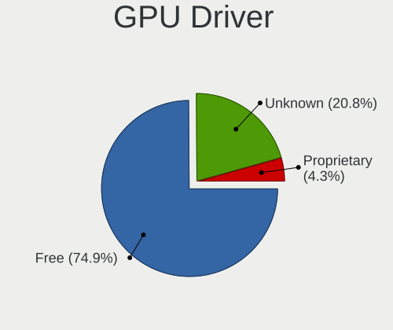

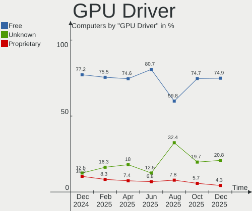

| Driver      | Computers | Percent |
|-------------|-----------|---------|
| Free        | 379       | 74.9%   |
| Unknown     | 105       | 20.75%  |
| Proprietary | 22        | 4.35%   |

GPU Memory
----------

Total video memory

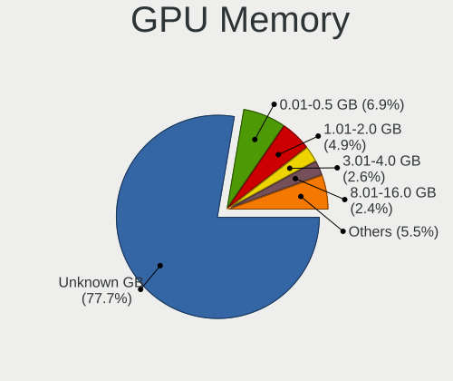

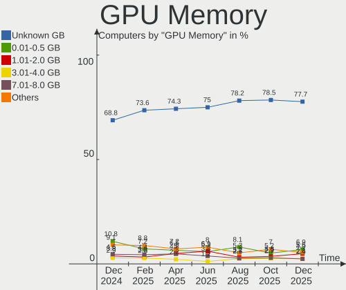

| Size in GB | Computers | Percent |
|------------|-----------|---------|
| Unknown    | 393       | 77.67%  |
| 0.01-0.5   | 35        | 6.92%   |
| 1.01-2.0   | 25        | 4.94%   |
| 3.01-4.0   | 13        | 2.57%   |
| 7.01-8.0   | 12        | 2.37%   |
| 8.01-16.0  | 12        | 2.37%   |
| 0.51-1.0   | 7         | 1.38%   |
| 5.01-6.0   | 4         | 0.79%   |
| 2.01-3.0   | 4         | 0.79%   |
| 16.01-24.0 | 1         | 0.2%    |

Monitor
-------

Monitor Vendor
--------------

Monitor vendors

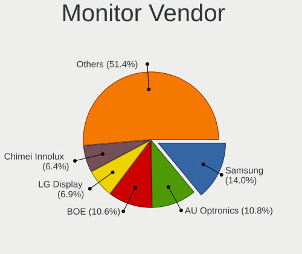

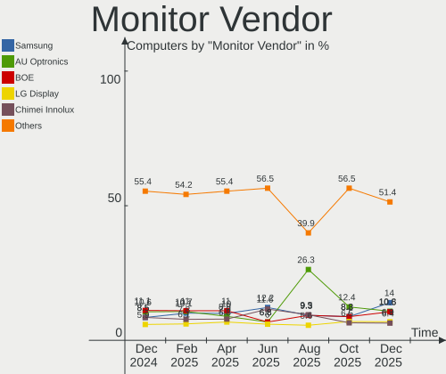

| Vendor                  | Computers | Percent |
|-------------------------|-----------|---------|
| Samsung Electronics     | 61        | 13.99%  |
| AU Optronics            | 47        | 10.78%  |
| BOE                     | 46        | 10.55%  |
| LG Display              | 30        | 6.88%   |
| Chimei Innolux          | 28        | 6.42%   |
| Goldstar                | 26        | 5.96%   |
| Dell                    | 26        | 5.96%   |
| Acer                    | 16        | 3.67%   |
| AOC                     | 15        | 3.44%   |
| Philips                 | 13        | 2.98%   |
| Lenovo                  | 11        | 2.52%   |
| Hewlett-Packard         | 10        | 2.29%   |
| Apple                   | 9         | 2.06%   |
| MSI                     | 8         | 1.83%   |
| Sharp                   | 7         | 1.61%   |
| Iiyama                  | 5         | 1.15%   |
| BenQ                    | 5         | 1.15%   |
| ASUSTek Computer        | 4         | 0.92%   |
| RTK                     | 3         | 0.69%   |
| Panasonic               | 3         | 0.69%   |
| HKC                     | 3         | 0.69%   |
| Sony                    | 2         | 0.46%   |
| Sceptre Tech            | 2         | 0.46%   |
| LG Philips              | 2         | 0.46%   |
| InfoVision              | 2         | 0.46%   |
| Idek Iiyama             | 2         | 0.46%   |
| Huion                   | 2         | 0.46%   |
| Hitachi                 | 2         | 0.46%   |
| FL_                     | 2         | 0.46%   |
| CSW                     | 2         | 0.46%   |
| Chi Mei Optoelectronics | 2         | 0.46%   |
| Ancor Communications    | 2         | 0.46%   |
| ZTR                     | 1         | 0.23%   |
| Xiaomi                  | 1         | 0.23%   |
| Wacom                   | 1         | 0.23%   |
| Vizio                   | 1         | 0.23%   |
| ViewSonic               | 1         | 0.23%   |
| Vestel Elektronik       | 1         | 0.23%   |
| Toshiba                 | 1         | 0.23%   |
| TM@                     | 1         | 0.23%   |

Monitor Model
-------------

Monitor models

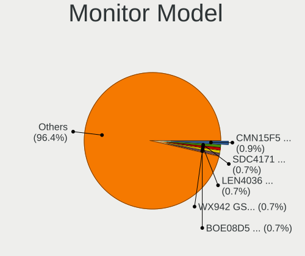

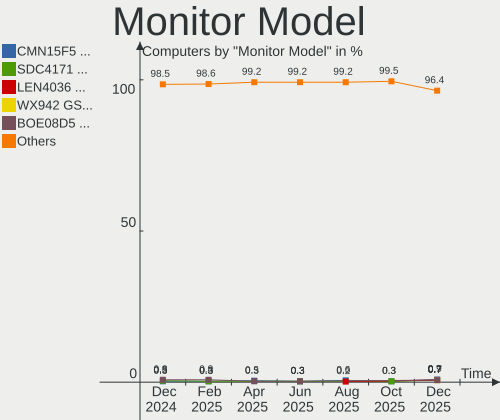

| Model                                                                 | Computers | Percent |
|-----------------------------------------------------------------------|-----------|---------|
| Chimei Innolux LCD Monitor CMN15F5 1920x1080 344x193mm 15.5-inch      | 4         | 0.9%    |
| Samsung Electronics LCD Monitor SDC4171 2880x1800 302x189mm 14.0-inch | 3         | 0.67%   |
| Lenovo LCD Monitor LEN4036 1440x900 303x190mm 14.1-inch               | 3         | 0.67%   |
| Goldstar WX942 GSM4B80 1440x900 410x260mm 19.1-inch                   | 3         | 0.67%   |
| BOE LCD Monitor BOE08D5 1920x1080 344x194mm 15.5-inch                 | 3         | 0.67%   |
| AU Optronics LCD Monitor AUO106C 1366x768 276x155mm 12.5-inch         | 3         | 0.67%   |
| Samsung Electronics LC27G7xT SAM105C 2560x1440 597x336mm 27.0-inch    | 2         | 0.45%   |
| Philips PHL 272B8Q PHL0918 2560x1440 597x336mm 27.0-inch              | 2         | 0.45%   |
| Panasonic VVX11F009G00 MEI96A2 1920x1080 344x193mm 15.5-inch          | 2         | 0.45%   |
| MSI MP241X MSI3BA9 1920x1080 527x296mm 23.8-inch                      | 2         | 0.45%   |
| LG Display LCD Monitor LGD053F 1920x1080 344x194mm 15.5-inch          | 2         | 0.45%   |
| LG Display LCD Monitor LGD039F 1366x768 345x194mm 15.6-inch           | 2         | 0.45%   |
| Iiyama PL2595W IVM6144 1920x1200 535x339mm 24.9-inch                  | 2         | 0.45%   |
| Hewlett-Packard 22y HPN3503 1920x1080 477x268mm 21.5-inch             | 2         | 0.45%   |
| Goldstar ULTRAWIDE GSM5BF8 2560x1080 673x284mm 28.8-inch              | 2         | 0.45%   |
| FL_ HDMI2K FL_2701 2560x1440 480x270mm 21.7-inch                      | 2         | 0.45%   |
| CSW MNE007ZA3-2 CSW1431 2880x1800 301x188mm 14.0-inch                 | 2         | 0.45%   |
| Chimei Innolux LCD Monitor CMN14C3 1366x768 309x173mm 13.9-inch       | 2         | 0.45%   |
| BOE NV140DRMN63 BOE0032 2240x1400 302x188mm 14.0-inch                 | 2         | 0.45%   |
| BOE LCD Monitor BOE0B9C 1920x1200 302x188mm 14.0-inch                 | 2         | 0.45%   |
| BOE LCD Monitor BOE09CC 1920x1080 344x194mm 15.5-inch                 | 2         | 0.45%   |
| AU Optronics LCD Monitor AUO5A2D 1920x1080 293x165mm 13.2-inch        | 2         | 0.45%   |
| AU Optronics LCD Monitor AUO592D 1920x1080 293x165mm 13.2-inch        | 2         | 0.45%   |
| AU Optronics LCD Monitor AUO573D 1920x1080 309x174mm 14.0-inch        | 2         | 0.45%   |
| AU Optronics LCD Monitor AUO4147 1440x900 303x189mm 14.1-inch         | 2         | 0.45%   |
| AU Optronics LCD Monitor AUO22EC 1366x768 344x193mm 15.5-inch         | 2         | 0.45%   |
| AU Optronics LCD Monitor AUO213D 1920x1080 309x173mm 13.9-inch        | 2         | 0.45%   |
| AOC 27G2G4 AOC2702 1920x1080 598x336mm 27.0-inch                      | 2         | 0.45%   |
| AOC 2778X AOC2778 2560x1440 597x336mm 27.0-inch                       | 2         | 0.45%   |
| AOC 24G2W1G3 AOC2402 1920x1080 527x296mm 23.8-inch                    | 2         | 0.45%   |
| Acer S242HL ACR0216 1920x1080 531x299mm 24.0-inch                     | 2         | 0.45%   |
| ZTR 156XX5419T02 ZTR0015 1920x1080 344x193mm 15.5-inch                | 1         | 0.22%   |
| Xiaomi Mi TV XMD0076 3840x2160 1110x620mm 50.1-inch                   | 1         | 0.22%   |
| Wacom One 13 WAC1070 1920x1080 294x166mm 13.3-inch                    | 1         | 0.22%   |
| Vizio E220VA VIZ0070 1920x1080 476x268mm 21.5-inch                    | 1         | 0.22%   |
| Vizio D24f-J09 VIZ1044 1920x1080 521x293mm 23.5-inch                  | 1         | 0.22%   |
| ViewSonic VX2363 Series VSC6B2F 1920x1080 509x286mm 23.0-inch         | 1         | 0.22%   |
| Vestel Elektronik 40UHD_LCD_TV VES3700 3840x2160 880x500mm 39.8-inch  | 1         | 0.22%   |
| Toshiba 43UHD_LCD_TV TSB3700 3840x2160 940x540mm 42.7-inch            | 1         | 0.22%   |
| TM@ TM140 TM@2A12 1920x1200 301x188mm 14.0-inch                       | 1         | 0.22%   |

Monitor Resolution
------------------

Monitor screen resolution

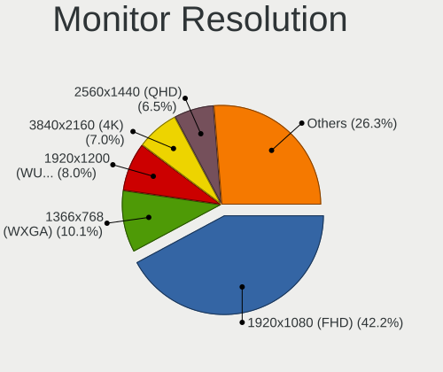

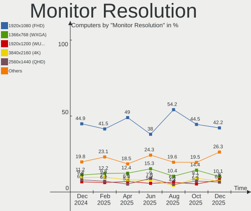

| Resolution         | Computers | Percent |
|--------------------|-----------|---------|
| 1920x1080 (FHD)    | 175       | 42.17%  |
| 1366x768 (WXGA)    | 42        | 10.12%  |
| 1920x1200 (WUXGA)  | 33        | 7.95%   |
| 3840x2160 (4K)     | 29        | 6.99%   |
| 2560x1440 (QHD)    | 27        | 6.51%   |
| 1440x900 (WXGA+)   | 12        | 2.89%   |
| 2880x1800          | 10        | 2.41%   |
| 1680x1050 (WSXGA+) | 9         | 2.17%   |
| 1600x900 (HD+)     | 9         | 2.17%   |
| 1280x800 (WXGA)    | 9         | 2.17%   |
| 2560x1600          | 8         | 1.93%   |
| 3440x1440          | 7         | 1.69%   |
| 1280x1024 (SXGA)   | 7         | 1.69%   |
| 2560x1080          | 5         | 1.2%    |
| 1920x540           | 3         | 0.72%   |
| 1600x1200          | 3         | 0.72%   |
| 1024x600           | 3         | 0.72%   |
| Unknown            | 3         | 0.72%   |
| 3200x1800 (QHD+)   | 2         | 0.48%   |
| 2240x1400          | 2         | 0.48%   |
| 1400x1050          | 2         | 0.48%   |
| 3840x2400          | 1         | 0.24%   |
| 3840x1080          | 1         | 0.24%   |
| 3456x2160          | 1         | 0.24%   |
| 3200x2000          | 1         | 0.24%   |
| 3072x1920          | 1         | 0.24%   |
| 2736x1824          | 1         | 0.24%   |
| 2560x2880          | 1         | 0.24%   |
| 2560x1397          | 1         | 0.24%   |
| 2520x1680          | 1         | 0.24%   |
| 2256x1504          | 1         | 0.24%   |
| 2160x1440          | 1         | 0.24%   |
| 1920x720           | 1         | 0.24%   |
| 1360x768           | 1         | 0.24%   |
| 1280x720 (HD)      | 1         | 0.24%   |
| 1024x768 (XGA)     | 1         | 0.24%   |

Monitor Diagonal
----------------

Diagonal size in inches

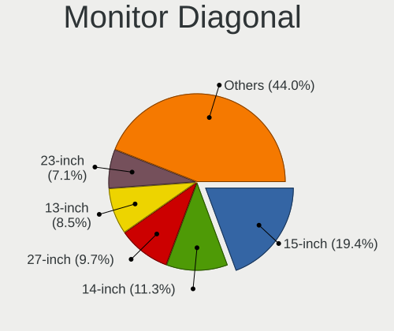

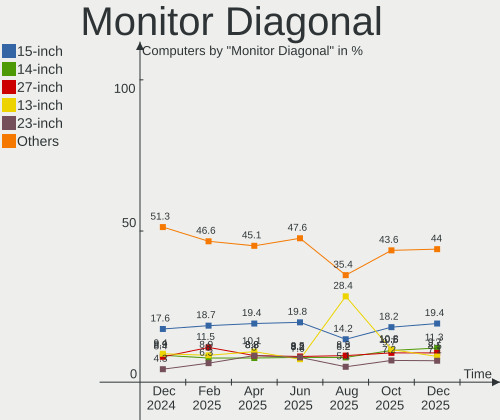

| Inches  | Computers | Percent |
|---------|-----------|---------|
| 15      | 84        | 19.35%  |
| 14      | 49        | 11.29%  |
| 27      | 42        | 9.68%   |
| 13      | 37        | 8.53%   |
| 23      | 31        | 7.14%   |
| 24      | 28        | 6.45%   |
| 21      | 23        | 5.3%    |
| 16      | 15        | 3.46%   |
| Unknown | 13        | 3%      |
| 17      | 12        | 2.76%   |
| 19      | 11        | 2.53%   |
| 31      | 10        | 2.3%    |
| 84      | 8         | 1.84%   |
| 22      | 8         | 1.84%   |
| 12      | 8         | 1.84%   |
| 18      | 6         | 1.38%   |
| 34      | 5         | 1.15%   |
| 20      | 5         | 1.15%   |
| 49      | 4         | 0.92%   |
| 40      | 4         | 0.92%   |
| 32      | 4         | 0.92%   |
| 10      | 4         | 0.92%   |
| 25      | 3         | 0.69%   |
| 11      | 3         | 0.69%   |
| 63      | 2         | 0.46%   |
| 54      | 2         | 0.46%   |
| 42      | 2         | 0.46%   |
| 29      | 2         | 0.46%   |
| 28      | 2         | 0.46%   |
| 82      | 1         | 0.23%   |
| 72      | 1         | 0.23%   |
| 61      | 1         | 0.23%   |
| 58      | 1         | 0.23%   |
| 48      | 1         | 0.23%   |
| 37      | 1         | 0.23%   |
| 35      | 1         | 0.23%   |

Monitor Width
-------------

Physical width

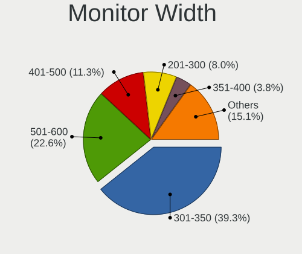

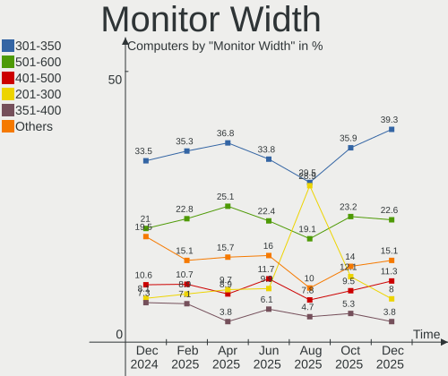

| Width in mm | Computers | Percent |
|-------------|-----------|---------|
| 301-350     | 167       | 39.29%  |
| 501-600     | 96        | 22.59%  |
| 401-500     | 48        | 11.29%  |
| 201-300     | 34        | 8%      |
| 351-400     | 16        | 3.76%   |
| 601-700     | 13        | 3.06%   |
| Unknown     | 13        | 3.06%   |
| 1001-1500   | 11        | 2.59%   |
| 1501-2000   | 10        | 2.35%   |
| 701-800     | 9         | 2.12%   |
| 801-900     | 5         | 1.18%   |
| 901-1000    | 3         | 0.71%   |

Aspect Ratio
------------

Proportional relationship between the width and the height

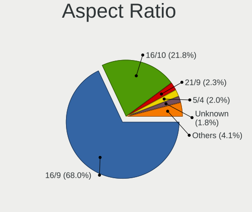

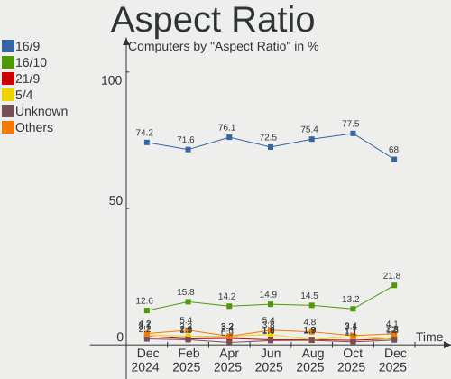

| Ratio   | Computers | Percent |
|---------|-----------|---------|
| 16/9    | 268       | 68.02%  |
| 16/10   | 86        | 21.83%  |
| 21/9    | 9         | 2.28%   |
| 5/4     | 8         | 2.03%   |
| Unknown | 7         | 1.78%   |
| 4/3     | 5         | 1.27%   |
| 32/9    | 4         | 1.02%   |
| 3/2     | 4         | 1.02%   |
| 2.67    | 1         | 0.25%   |
| 1.96    | 1         | 0.25%   |
| 0.89    | 1         | 0.25%   |

Monitor Area
------------

Area in inch²

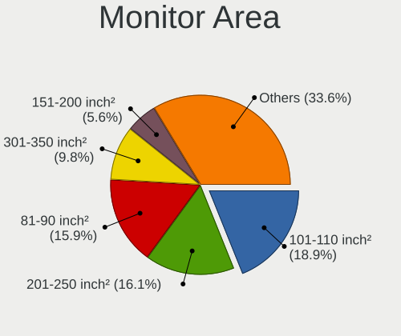

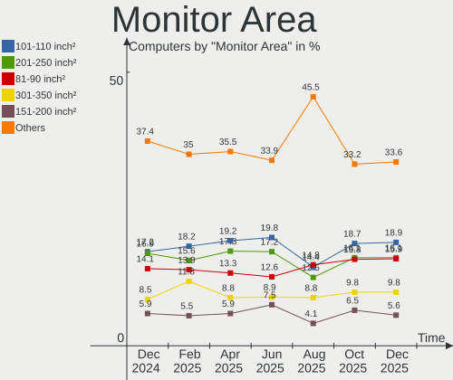

| Area in inch² | Computers | Percent |
|----------------|-----------|---------|
| 101-110        | 81        | 18.93%  |
| 201-250        | 69        | 16.12%  |
| 81-90          | 68        | 15.89%  |
| 301-350        | 42        | 9.81%   |
| 151-200        | 24        | 5.61%   |
| 351-500        | 21        | 4.91%   |
| More than 1000 | 17        | 3.97%   |
| 71-80          | 17        | 3.97%   |
| 111-120        | 16        | 3.74%   |
| 251-300        | 15        | 3.5%    |
| Unknown        | 13        | 3.04%   |
| 121-130        | 11        | 2.57%   |
| 501-1000       | 10        | 2.34%   |
| 61-70          | 8         | 1.87%   |
| 141-150        | 7         | 1.64%   |
| 41-50          | 4         | 0.93%   |
| 51-60          | 3         | 0.7%    |
| 91-100         | 2         | 0.47%   |

Pixel Density
-------------

Pixels per inch

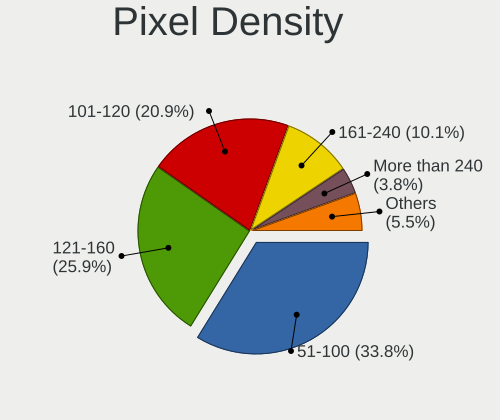

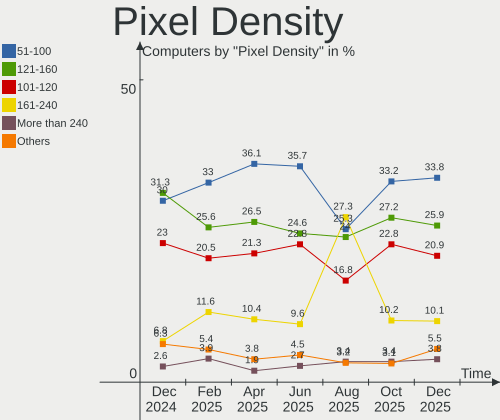

| Density       | Computers | Percent |
|---------------|-----------|---------|
| 51-100        | 141       | 33.81%  |
| 121-160       | 108       | 25.9%   |
| 101-120       | 87        | 20.86%  |
| 161-240       | 42        | 10.07%  |
| More than 240 | 16        | 3.84%   |
| Unknown       | 13        | 3.12%   |
| 1-50          | 10        | 2.4%    |

Multiple Monitors
-----------------

Total monitors connected

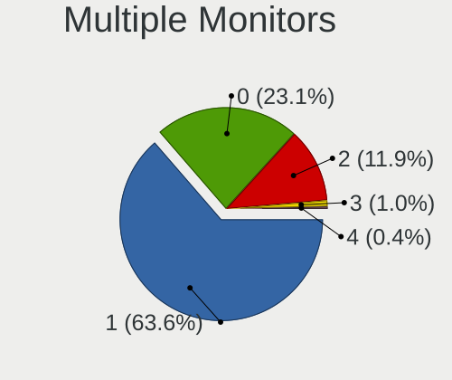

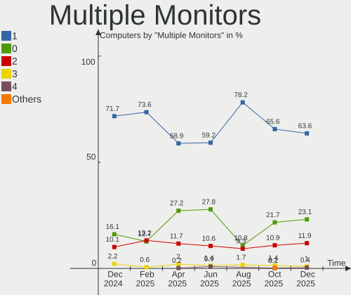

| Total | Computers | Percent |
|-------|-----------|---------|
| 1     | 322       | 63.64%  |
| 0     | 117       | 23.12%  |
| 2     | 60        | 11.86%  |
| 3     | 5         | 0.99%   |
| 4     | 2         | 0.4%    |

Network
-------

Net Controller Vendor
---------------------

Controller vendors

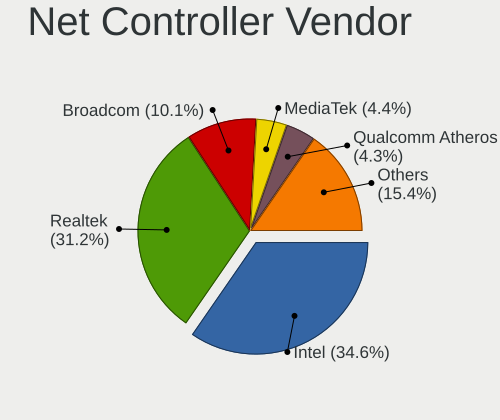

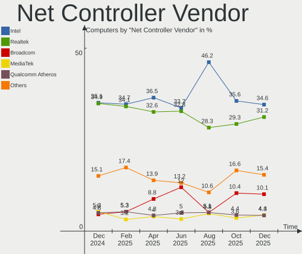

| Vendor                                 | Computers | Percent |
|----------------------------------------|-----------|---------|
| Intel                                  | 250       | 34.63%  |
| Realtek Semiconductor                  | 225       | 31.16%  |
| Broadcom                               | 73        | 10.11%  |
| MediaTek                               | 32        | 4.43%   |
| Qualcomm Atheros                       | 31        | 4.29%   |
| Raspberry Pi                           | 10        | 1.39%   |
| Broadcom Limited                       | 9         | 1.25%   |
| Marvell Technology Group               | 7         | 0.97%   |
| ASIX Electronics                       | 6         | 0.83%   |
| Suzhou Motorcomm Electronic Technology | 5         | 0.69%   |
| TP-Link                                | 4         | 0.55%   |
| Shenzhen Goodix Technology             | 4         | 0.55%   |
| Qualcomm Technologies                  | 4         | 0.55%   |
| Aquantia                               | 4         | 0.55%   |
| Samsung Electronics                    | 3         | 0.42%   |
| Lenovo                                 | 3         | 0.42%   |
| Dell                                   | 3         | 0.42%   |
| VIA Technologies                       | 2         | 0.28%   |
| U-Blox                                 | 2         | 0.28%   |
| Ralink Technology                      | 2         | 0.28%   |
| Ralink                                 | 2         | 0.28%   |
| Qualcomm                               | 2         | 0.28%   |
| QinHeng Electronics                    | 2         | 0.28%   |
| Nvidia                                 | 2         | 0.28%   |
| Fibocom                                | 2         | 0.28%   |
| Edimax Technology                      | 2         | 0.28%   |
| American Megatrends                    | 2         | 0.28%   |
| Xiaomi                                 | 1         | 0.14%   |
| Sigma Designs                          | 1         | 0.14%   |
| Sierra Wireless                        | 1         | 0.14%   |
| Quectel Wireless Solutions             | 1         | 0.14%   |
| QLogic                                 | 1         | 0.14%   |
| OPPO Electronics                       | 1         | 0.14%   |
| OCZ Technology                         | 1         | 0.14%   |
| Netchip Technology                     | 1         | 0.14%   |
| Nabu Casa                              | 1         | 0.14%   |
| Microsoft                              | 1         | 0.14%   |
| Microchip Technology                   | 1         | 0.14%   |
| Mercucys                               | 1         | 0.14%   |
| Mellanox Technologies                  | 1         | 0.14%   |

Net Controller Model
--------------------

Controller models

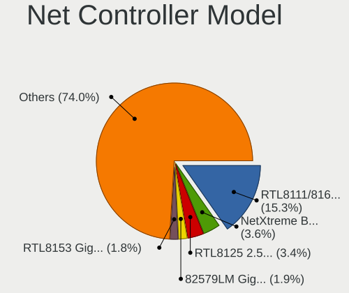

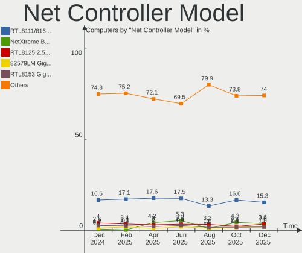

| Model                                                                           | Computers | Percent |
|---------------------------------------------------------------------------------|-----------|---------|
| Realtek RTL8111/8168/8211/8411 PCI Express Gigabit Ethernet Controller          | 130       | 15.28%  |
| Broadcom NetXtreme BCM5719 Gigabit Ethernet PCIe                                | 31        | 3.64%   |
| Realtek RTL8125 2.5GbE Controller                                               | 29        | 3.41%   |
| Intel 82579LM Gigabit Network Connection (Lewisville)                           | 16        | 1.88%   |
| Realtek RTL8153 Gigabit Ethernet Adapter                                        | 15        | 1.76%   |
| Intel Wireless 8265 / 8275                                                      | 15        | 1.76%   |
| Intel Wi-Fi 6 AX200                                                             | 15        | 1.76%   |
| Intel I350 Gigabit Network Connection                                           | 15        | 1.76%   |
| Realtek RTL8821CE 802.11ac PCIe Wireless Network Adapter                        | 14        | 1.65%   |
| Realtek RTL8822CE 802.11ac PCIe Wireless Network Adapter                        | 13        | 1.53%   |
| Realtek RTL810xE PCI Express Fast Ethernet controller                           | 13        | 1.53%   |
| MediaTek MT7922 802.11ax PCI Express Wireless Network Adapter                   | 13        | 1.53%   |
| Intel Wi-Fi 6 AX201                                                             | 13        | 1.53%   |
| Realtek RTL8852BE PCIe 802.11ax Wireless Network Controller                     | 10        | 1.18%   |
| Raspberry Pi RP1 PCIe 2.0 South Bridge                                          | 10        | 1.18%   |
| Intel Wi-Fi 6E(802.11ax) AX210/AX1675* 2x2 [Typhoon Peak]                       | 10        | 1.18%   |
| Intel Ethernet Controller I226-V                                                | 9         | 1.06%   |
| Broadcom NetXtreme BCM5720 Gigabit Ethernet PCIe                                | 9         | 1.06%   |
| Intel Meteor Lake PCH CNVi WiFi                                                 | 8         | 0.94%   |
| Intel Alder Lake-P PCH CNVi WiFi                                                | 8         | 0.94%   |
| Intel Alder Lake-N PCH CNVi WiFi                                                | 8         | 0.94%   |
| Intel Raptor Lake PCH CNVi WiFi                                                 | 7         | 0.82%   |
| Intel Centrino Advanced-N 6205 [Taylor Peak]                                    | 7         | 0.82%   |
| MediaTek MT7925 802.11be 160MHz 2x2 PCIe Wireless Network Adapter [Filogic 360] | 6         | 0.71%   |
| Intel Ethernet Connection (4) I219-LM                                           | 6         | 0.71%   |
| Intel Ethernet Connection (13) I219-V                                           | 6         | 0.71%   |
| Intel 82574L Gigabit Network Connection                                         | 6         | 0.71%   |
| Suzhou Motorcomm Electronic YT6801 Gigabit Ethernet Controller                  | 5         | 0.59%   |
| Qualcomm Atheros QCA9565 / AR9565 Wireless Network Adapter                      | 5         | 0.59%   |
| Qualcomm Atheros AR9485 Wireless Network Adapter                                | 5         | 0.59%   |
| Qualcomm Atheros AR9285 Wireless Network Adapter (PCI-Express)                  | 5         | 0.59%   |
| MediaTek MT7921 802.11ax PCIe Wireless Network Adapter [Filogic 330]            | 5         | 0.59%   |
| Intel Wireless 7265                                                             | 5         | 0.59%   |
| Intel Wireless 7260                                                             | 5         | 0.59%   |
| Intel I211 Gigabit Network Connection                                           | 5         | 0.59%   |
| Intel Ethernet Controller I225-V                                                | 5         | 0.59%   |
| Intel Ethernet Connection I217-LM                                               | 5         | 0.59%   |
| Intel Ethernet Connection (4) I219-V                                            | 5         | 0.59%   |
| Intel Comet Lake PCH-LP CNVi WiFi                                               | 5         | 0.59%   |
| Intel Centrino Advanced-N 6200                                                  | 5         | 0.59%   |

Wireless Vendor
---------------

Wireless vendors

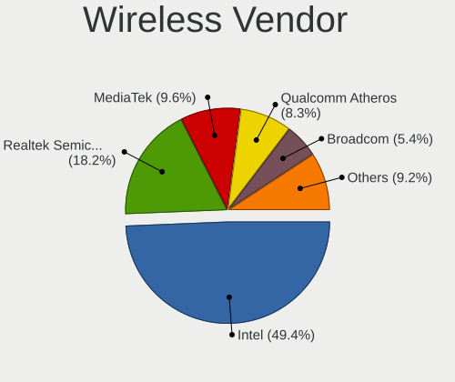

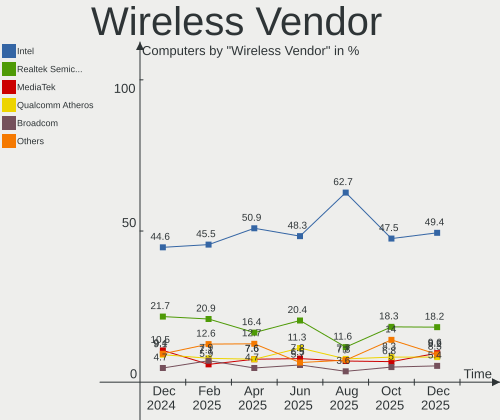

| Vendor                     | Computers | Percent |
|----------------------------|-----------|---------|
| Intel                      | 155       | 49.36%  |
| Realtek Semiconductor      | 57        | 18.15%  |
| MediaTek                   | 30        | 9.55%   |
| Qualcomm Atheros           | 26        | 8.28%   |
| Broadcom                   | 17        | 5.41%   |
| Broadcom Limited           | 5         | 1.59%   |
| TP-Link                    | 4         | 1.27%   |
| Ralink Technology          | 2         | 0.64%   |
| Ralink                     | 2         | 0.64%   |
| Qualcomm Technologies      | 2         | 0.64%   |
| Fibocom                    | 2         | 0.64%   |
| Edimax Technology          | 2         | 0.64%   |
| Sierra Wireless            | 1         | 0.32%   |
| Quectel Wireless Solutions | 1         | 0.32%   |
| Qualcomm                   | 1         | 0.32%   |
| Microsoft                  | 1         | 0.32%   |
| Mercucys                   | 1         | 0.32%   |
| Marvell Technology Group   | 1         | 0.32%   |
| Gemtek                     | 1         | 0.32%   |
| Dell                       | 1         | 0.32%   |
| Belkin Components          | 1         | 0.32%   |
| 3Com                       | 1         | 0.32%   |

Wireless Model
--------------

Wireless models

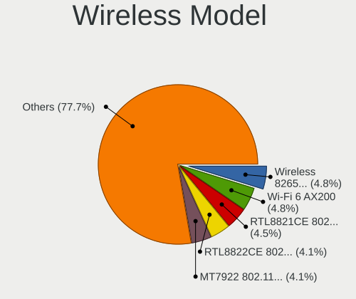

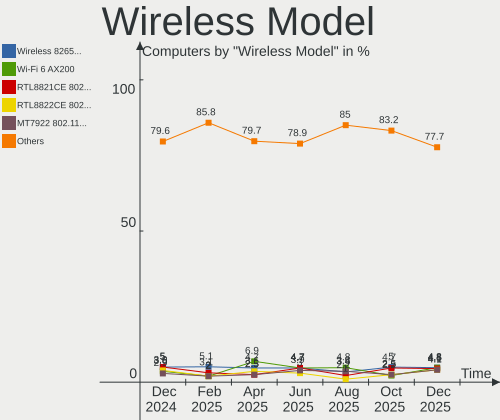

| Model                                                                           | Computers | Percent |
|---------------------------------------------------------------------------------|-----------|---------|
| Intel Wireless 8265 / 8275                                                      | 15        | 4.78%   |
| Intel Wi-Fi 6 AX200                                                             | 15        | 4.78%   |
| Realtek RTL8821CE 802.11ac PCIe Wireless Network Adapter                        | 14        | 4.46%   |
| Realtek RTL8822CE 802.11ac PCIe Wireless Network Adapter                        | 13        | 4.14%   |
| MediaTek MT7922 802.11ax PCI Express Wireless Network Adapter                   | 13        | 4.14%   |
| Intel Wi-Fi 6 AX201                                                             | 13        | 4.14%   |
| Intel Wi-Fi 6E(802.11ax) AX210/AX1675* 2x2 [Typhoon Peak]                       | 10        | 3.18%   |
| Intel Meteor Lake PCH CNVi WiFi                                                 | 8         | 2.55%   |
| Intel Alder Lake-N PCH CNVi WiFi                                                | 8         | 2.55%   |
| Intel Raptor Lake PCH CNVi WiFi                                                 | 7         | 2.23%   |
| Intel Centrino Advanced-N 6205 [Taylor Peak]                                    | 7         | 2.23%   |
| Realtek RTL8852BE PCIe 802.11ax Wireless Network Controller                     | 5         | 1.59%   |
| Qualcomm Atheros QCA9565 / AR9565 Wireless Network Adapter                      | 5         | 1.59%   |
| Qualcomm Atheros AR9485 Wireless Network Adapter                                | 5         | 1.59%   |
| Qualcomm Atheros AR9285 Wireless Network Adapter (PCI-Express)                  | 5         | 1.59%   |
| MediaTek MT7925 802.11be 160MHz 2x2 PCIe Wireless Network Adapter [Filogic 360] | 5         | 1.59%   |
| MediaTek MT7921 802.11ax PCIe Wireless Network Adapter [Filogic 330]            | 5         | 1.59%   |
| Intel Wireless 7265                                                             | 5         | 1.59%   |
| Intel Wireless 7260                                                             | 5         | 1.59%   |
| Intel Comet Lake PCH-LP CNVi WiFi                                               | 5         | 1.59%   |
| Intel Centrino Advanced-N 6200                                                  | 5         | 1.59%   |
| Intel Cannon Point-LP CNVi [Wireless-AC]                                        | 5         | 1.59%   |
| Intel Cannon Lake PCH CNVi WiFi                                                 | 5         | 1.59%   |
| Intel Alder Lake-P PCH CNVi WiFi                                                | 5         | 1.59%   |
| Realtek RTL88x2bu [AC1200 Techkey]                                              | 4         | 1.27%   |
| Intel Comet Lake PCH CNVi WiFi                                                  | 4         | 1.27%   |
| Realtek RTL8723BE PCIe Wireless Network Adapter                                 | 3         | 0.96%   |
| MediaTek MT7902 802.11ax PCIe Wireless Network Adapter [Filogic 310]            | 3         | 0.96%   |
| Intel PRO/Wireless 3945ABG [Golan] Network Connection                           | 3         | 0.96%   |
| Intel Dual Band Wireless-AC 3168NGW [Stone Peak]                                | 3         | 0.96%   |
| Broadcom BCM4313 802.11bgn Wireless Network Adapter                             | 3         | 0.96%   |
| Realtek RTL8852CE PCIe 802.11ax Wireless Network Controller                     | 2         | 0.64%   |
| Realtek RTL8822BE 802.11a/b/g/n/ac WiFi adapter                                 | 2         | 0.64%   |
| Realtek RTL8192EU 802.11b/g/n WLAN Adapter                                      | 2         | 0.64%   |
| Realtek RTL8188EUS 802.11n Wireless Network Adapter                             | 2         | 0.64%   |
| Realtek 802.11ac NIC                                                            | 2         | 0.64%   |
| Ralink MT7601U Wireless Adapter                                                 | 2         | 0.64%   |
| Qualcomm Atheros QCA6174 802.11ac Wireless Network Adapter                      | 2         | 0.64%   |
| Qualcomm Atheros AR9462 Wireless Network Adapter                                | 2         | 0.64%   |
| Qualcomm Atheros AR928X Wireless Network Adapter (PCI-Express)                  | 2         | 0.64%   |

Ethernet Vendor
---------------

Ethernet vendors

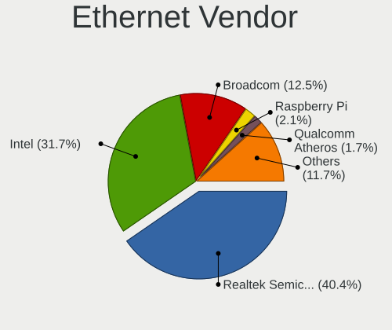

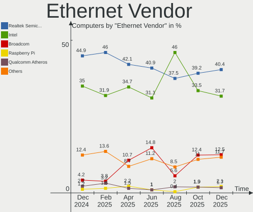

| Vendor                                 | Computers | Percent |
|----------------------------------------|-----------|---------|
| Realtek Semiconductor                  | 194       | 40.42%  |
| Intel                                  | 152       | 31.67%  |
| Broadcom                               | 60        | 12.5%   |
| Raspberry Pi                           | 10        | 2.08%   |
| Qualcomm Atheros                       | 8         | 1.67%   |
| Marvell Technology Group               | 6         | 1.25%   |
| ASIX Electronics                       | 6         | 1.25%   |
| Suzhou Motorcomm Electronic Technology | 5         | 1.04%   |
| Broadcom Limited                       | 4         | 0.83%   |
| Aquantia                               | 4         | 0.83%   |
| Samsung Electronics                    | 3         | 0.63%   |
| Lenovo                                 | 3         | 0.63%   |
| VIA Technologies                       | 2         | 0.42%   |
| Qualcomm Technologies                  | 2         | 0.42%   |
| Nvidia                                 | 2         | 0.42%   |
| American Megatrends                    | 2         | 0.42%   |
| Xiaomi                                 | 1         | 0.21%   |
| Qualcomm                               | 1         | 0.21%   |
| QLogic                                 | 1         | 0.21%   |
| QinHeng Electronics                    | 1         | 0.21%   |
| OPPO Electronics                       | 1         | 0.21%   |
| Microchip Technology                   | 1         | 0.21%   |
| Mellanox Technologies                  | 1         | 0.21%   |
| MediaTek                               | 1         | 0.21%   |
| Loongson Technology                    | 1         | 0.21%   |
| Linksys                                | 1         | 0.21%   |
| JMicron Technology                     | 1         | 0.21%   |
| Insyde Software                        | 1         | 0.21%   |
| DisplayLink                            | 1         | 0.21%   |
| D-Link System                          | 1         | 0.21%   |
| Compex                                 | 1         | 0.21%   |
| Attansic Technology                    | 1         | 0.21%   |
| Apple                                  | 1         | 0.21%   |

Ethernet Model
--------------

Ethernet models

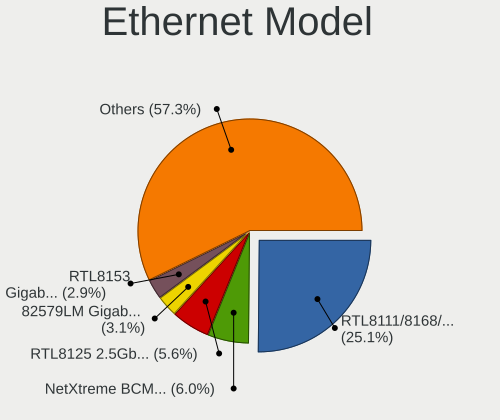

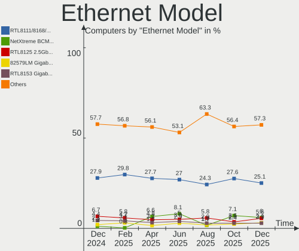

| Model                                                                  | Computers | Percent |
|------------------------------------------------------------------------|-----------|---------|
| Realtek RTL8111/8168/8211/8411 PCI Express Gigabit Ethernet Controller | 130       | 25.15%  |
| Broadcom NetXtreme BCM5719 Gigabit Ethernet PCIe                       | 31        | 6%      |
| Realtek RTL8125 2.5GbE Controller                                      | 29        | 5.61%   |
| Intel 82579LM Gigabit Network Connection (Lewisville)                  | 16        | 3.09%   |
| Realtek RTL8153 Gigabit Ethernet Adapter                               | 15        | 2.9%    |
| Intel I350 Gigabit Network Connection                                  | 15        | 2.9%    |
| Realtek RTL810xE PCI Express Fast Ethernet controller                  | 13        | 2.51%   |
| Raspberry Pi RP1 PCIe 2.0 South Bridge                                 | 10        | 1.93%   |
| Intel Ethernet Controller I226-V                                       | 9         | 1.74%   |
| Broadcom NetXtreme BCM5720 Gigabit Ethernet PCIe                       | 9         | 1.74%   |
| Intel Ethernet Connection (4) I219-LM                                  | 6         | 1.16%   |
| Intel Ethernet Connection (13) I219-V                                  | 6         | 1.16%   |
| Intel 82574L Gigabit Network Connection                                | 6         | 1.16%   |
| Suzhou Motorcomm Electronic YT6801 Gigabit Ethernet Controller         | 5         | 0.97%   |
| Realtek RTL8852BE PCIe 802.11ax Wireless Network Controller            | 5         | 0.97%   |
| Intel I211 Gigabit Network Connection                                  | 5         | 0.97%   |
| Intel Ethernet Controller I225-V                                       | 5         | 0.97%   |
| Intel Ethernet Connection I217-LM                                      | 5         | 0.97%   |
| Intel Ethernet Connection (4) I219-V                                   | 5         | 0.97%   |
| Intel 82577LM Gigabit Network Connection                               | 5         | 0.97%   |
| Intel Ethernet Connection (7) I219-LM                                  | 4         | 0.77%   |
| Intel Ethernet Connection (2) I219-V                                   | 4         | 0.77%   |
| Intel Arrow Lake CNVi WiFi                                             | 4         | 0.77%   |
| Broadcom NetXtreme BCM57766 Gigabit Ethernet PCIe                      | 4         | 0.77%   |
| Broadcom BCM57416 NetXtreme-E Dual-Media 10G RDMA Ethernet Controller  | 4         | 0.77%   |
| ASIX AX88179 Gigabit Ethernet                                          | 4         | 0.77%   |
| Samsung Galaxy series, misc. (tethering mode)                          | 3         | 0.58%   |
| Realtek RTL8126 5GbE Controller                                        | 3         | 0.58%   |
| Intel I210 Gigabit Network Connection                                  | 3         | 0.58%   |
| Intel Ethernet Connection (7) I219-V                                   | 3         | 0.58%   |
| Intel Ethernet Connection (24) I219-V                                  | 3         | 0.58%   |
| Intel Ethernet Connection (23) I219-V                                  | 3         | 0.58%   |
| Intel Ethernet Connection (18) I219-LM                                 | 3         | 0.58%   |
| Intel Ethernet Connection (17) I219-LM                                 | 3         | 0.58%   |
| Intel Ethernet Connection (10) I219-V                                  | 3         | 0.58%   |
| Intel Alder Lake-P PCH CNVi WiFi                                       | 3         | 0.58%   |
| Intel 82575EB Gigabit Network Connection                               | 3         | 0.58%   |
| Realtek RTL-8100/8101L/8139 PCI Fast Ethernet Adapter                  | 2         | 0.39%   |
| Realtek Killer E3000 2.5GbE Controller                                 | 2         | 0.39%   |
| Qualcomm WCN785x Wi-Fi 7(802.11be) 320MHz 2x2 [FastConnect 7800]       | 2         | 0.39%   |

Net Controller Kind
-------------------

Ethernet, WiFi or modem

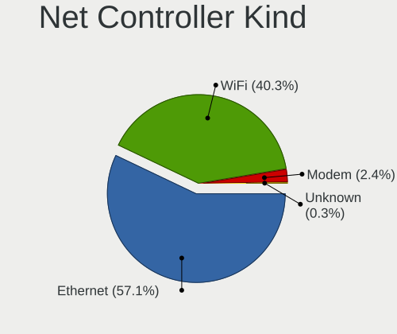

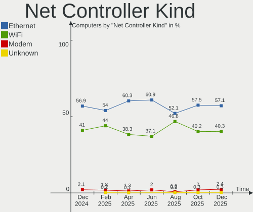

| Kind     | Computers | Percent |
|----------|-----------|---------|
| Ethernet | 432       | 57.07%  |
| WiFi     | 305       | 40.29%  |
| Modem    | 18        | 2.38%   |
| Unknown  | 2         | 0.26%   |

Used Controller
---------------

Currently used network controller

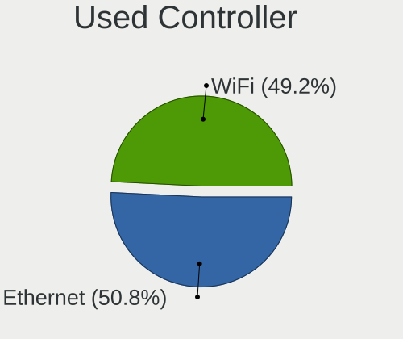

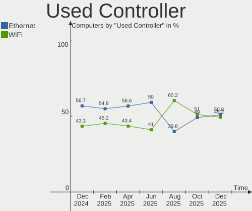

| Kind     | Computers | Percent |
|----------|-----------|---------|
| Ethernet | 228       | 50.78%  |
| WiFi     | 221       | 49.22%  |

NICs
----

Total network controllers on board

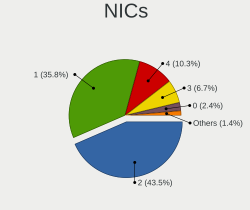

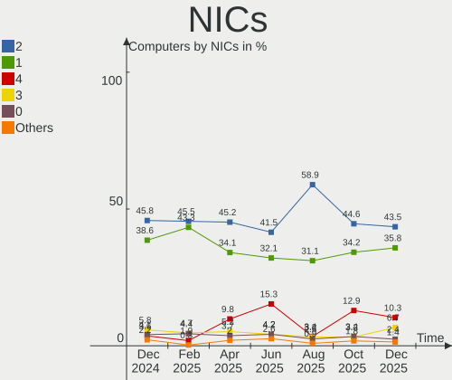

| Total | Computers | Percent |
|-------|-----------|---------|
| 2     | 220       | 43.48%  |
| 1     | 181       | 35.77%  |
| 4     | 52        | 10.28%  |
| 3     | 34        | 6.72%   |
| 0     | 12        | 2.37%   |
| 6     | 4         | 0.79%   |
| 10    | 1         | 0.2%    |
| 9     | 1         | 0.2%    |
| 5     | 1         | 0.2%    |

IPv6
----

IPv6 vs IPv4

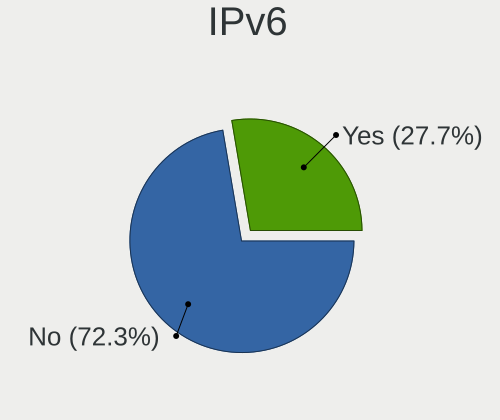

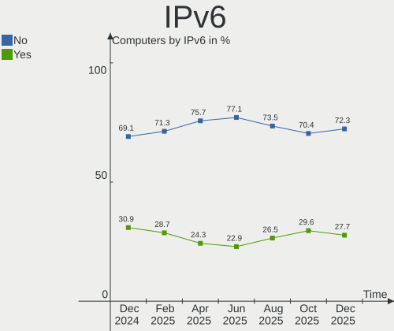

| Used | Computers | Percent |
|------|-----------|---------|
| No   | 366       | 72.33%  |
| Yes  | 140       | 27.67%  |

Bluetooth
---------

Bluetooth Vendor
----------------

Controller vendors

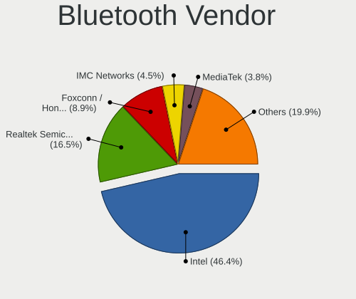

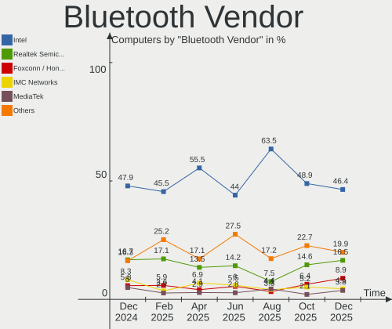

| Vendor                          | Computers | Percent |
|---------------------------------|-----------|---------|
| Intel                           | 135       | 46.39%  |
| Realtek Semiconductor           | 48        | 16.49%  |
| Foxconn / Hon Hai               | 26        | 8.93%   |
| IMC Networks                    | 13        | 4.47%   |
| MediaTek                        | 11        | 3.78%   |
| Apple                           | 11        | 3.78%   |
| Broadcom                        | 10        | 3.44%   |
| Qualcomm Atheros Communications | 8         | 2.75%   |
| Cambridge Silicon Radio         | 7         | 2.41%   |
| ASUSTek Computer                | 4         | 1.37%   |
| TP-Link                         | 3         | 1.03%   |
| Edimax Technology               | 2         | 0.69%   |
| Dell                            | 2         | 0.69%   |
| Toshiba                         | 1         | 0.34%   |
| Realtek                         | 1         | 0.34%   |
| Ralink                          | 1         | 0.34%   |
| Quectel Wireless Solutions      | 1         | 0.34%   |
| Marvell Semiconductor           | 1         | 0.34%   |
| Lite-On Technology              | 1         | 0.34%   |
| Integrated System Solution      | 1         | 0.34%   |
| Hewlett-Packard                 | 1         | 0.34%   |
| Alps Electric                   | 1         | 0.34%   |
| Actions                         | 1         | 0.34%   |
| Unknown                         | 1         | 0.34%   |

Bluetooth Model
---------------

Controller models

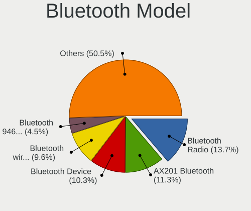

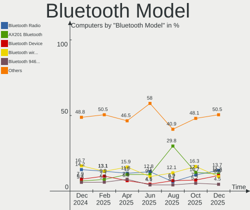

| Model                                                        | Computers | Percent |
|--------------------------------------------------------------|-----------|---------|
| Realtek Bluetooth Radio                                      | 40        | 13.75%  |
| Intel AX201 Bluetooth                                        | 33        | 11.34%  |
| Intel Bluetooth Device                                       | 30        | 10.31%  |
| Intel Bluetooth wireless interface                           | 28        | 9.62%   |
| Intel Bluetooth 9460/9560 Jefferson Peak (JfP)               | 13        | 4.47%   |
| Intel AX200 Bluetooth                                        | 13        | 4.47%   |
| Foxconn / Hon Hai Wireless_Device                            | 12        | 4.12%   |
| MediaTek Wireless_Device                                     | 11        | 3.78%   |
| Intel AX210 Bluetooth                                        | 8         | 2.75%   |
| Cambridge Silicon Radio Bluetooth Dongle (HCI mode)          | 7         | 2.41%   |
| IMC Networks Bluetooth Radio                                 | 5         | 1.72%   |
| Foxconn / Hon Hai MediaTek Bluetooth Adapter                 | 5         | 1.72%   |
| Broadcom BCM2045B (BDC-2.1)                                  | 5         | 1.72%   |
| Intel Centrino Bluetooth Wireless Transceiver                | 4         | 1.37%   |
| Foxconn / Hon Hai Bluetooth Device                           | 4         | 1.37%   |
| Apple Bluetooth USB Host Controller                          | 4         | 1.37%   |
| Apple Bluetooth Host Controller                              | 4         | 1.37%   |
| TP-Link TP-T@- UB500 Adapter                                 | 3         | 1.03%   |
| Qualcomm Atheros  Bluetooth Device                           | 3         | 1.03%   |
| Qualcomm Atheros AR3011 Bluetooth                            | 3         | 1.03%   |
| Intel Wireless-AC 3168 Bluetooth                             | 3         | 1.03%   |
| IMC Networks Wireless_Device                                 | 3         | 1.03%   |
| IMC Networks Bluetooth Device                                | 3         | 1.03%   |
| Foxconn / Hon Hai BCM20702A0                                 | 3         | 1.03%   |
| Realtek RTL8822BE Bluetooth 4.2 Adapter                      | 2         | 0.69%   |
| Realtek Bluetooth 5.4 Radio                                  | 2         | 0.69%   |
| Intel Wireless-AC 9260 Bluetooth Adapter                     | 2         | 0.69%   |
| IMC Networks Atheros AR3012 Bluetooth 4.0 Adapter            | 2         | 0.69%   |
| Edimax Bluetooth Device                                      | 2         | 0.69%   |
| ASUS ASUS USB-BT500                                          | 2         | 0.69%   |
| Apple Built-in Bluetooth 2.0+EDR HCI                         | 2         | 0.69%   |
| Toshiba Askey Bluetooth Module                               | 1         | 0.34%   |
| Realtek RTL8821A Bluetooth                                   | 1         | 0.34%   |
| Realtek RTL8723B Bluetooth                                   | 1         | 0.34%   |
| Realtek  Bluetooth 4.2 Adapter                               | 1         | 0.34%   |
| Realtek Bluetooth 5.3 Radio                                  | 1         | 0.34%   |
| Realtek Bluetooth Radio                                      | 1         | 0.34%   |
| Ralink RT3290 Bluetooth                                      | 1         | 0.34%   |
| Quectel Wireless Solutions Quectel Wireless Bluetooth Device | 1         | 0.34%   |
| Qualcomm Atheros QCA61x4 Bluetooth 4.0                       | 1         | 0.34%   |

Sound
-----

Sound Vendor
------------

Sound card vendors

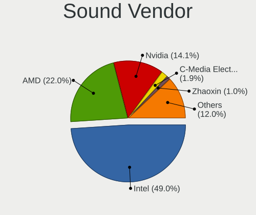

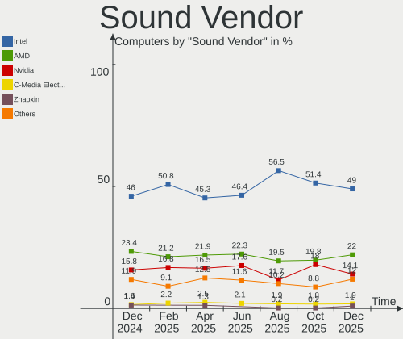

| Vendor                                       | Computers | Percent |
|----------------------------------------------|-----------|---------|
| Intel                                        | 285       | 48.97%  |
| AMD                                          | 128       | 21.99%  |
| Nvidia                                       | 82        | 14.09%  |
| C-Media Electronics                          | 11        | 1.89%   |
| Zhaoxin                                      | 6         | 1.03%   |
| Creative Labs                                | 6         | 1.03%   |
| SteelSeries ApS                              | 4         | 0.69%   |
| Loongson Technology                          | 4         | 0.69%   |
| Texas Instruments                            | 3         | 0.52%   |
| Creative Technology                          | 3         | 0.52%   |
| BEHRINGER International                      | 3         | 0.52%   |
| Zoran Co. Personal Media Division (Nogatech) | 2         | 0.34%   |
| Realtek Semiconductor                        | 2         | 0.34%   |
| Razer USA                                    | 2         | 0.34%   |
| JMTek                                        | 2         | 0.34%   |
| Hewlett-Packard                              | 2         | 0.34%   |
| Generalplus Technology                       | 2         | 0.34%   |
| FiiO Electronics Technology                  | 2         | 0.34%   |
| DSEA A/S                                     | 2         | 0.34%   |
| Dell                                         | 2         | 0.34%   |
| ULi Electronics                              | 1         | 0.17%   |
| Trust                                        | 1         | 0.17%   |
| Thesycon Systemsoftware & Consulting         | 1         | 0.17%   |
| TEAC                                         | 1         | 0.17%   |
| Soundprese                                   | 1         | 0.17%   |
| Sony                                         | 1         | 0.17%   |
| Solum Voice S Onyx White                     | 1         | 0.17%   |
| Roland                                       | 1         | 0.17%   |
| RODE Microphones                             | 1         | 0.17%   |
| PreSonus Audio Electronics                   | 1         | 0.17%   |
| Plantronics                                  | 1         | 0.17%   |
| Micro Star International                     | 1         | 0.17%   |
| M-Audio                                      | 1         | 0.17%   |
| Logitech                                     | 1         | 0.17%   |
| Logic3                                       | 1         | 0.17%   |
| Lenovo                                       | 1         | 0.17%   |
| KTMICRO                                      | 1         | 0.17%   |
| KORG                                         | 1         | 0.17%   |
| Jieli Technology                             | 1         | 0.17%   |
| JBL                                          | 1         | 0.17%   |

Sound Model
-----------

Sound card models

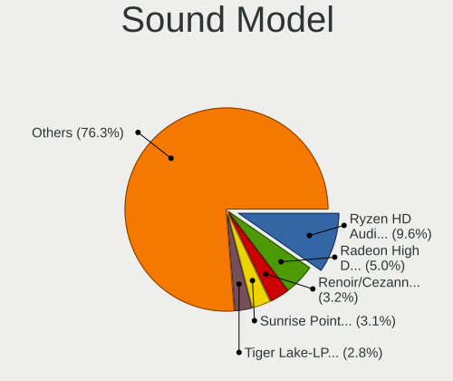

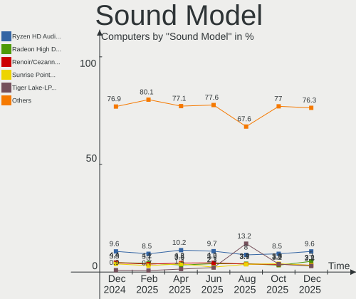

| Model                                                                                     | Computers | Percent |
|-------------------------------------------------------------------------------------------|-----------|---------|
| AMD Ryzen HD Audio Controller                                                             | 69        | 9.64%   |
| AMD Radeon High Definition Audio Controller                                               | 36        | 5.03%   |
| AMD Renoir/Cezanne HDMI/DP Audio Controller                                               | 23        | 3.21%   |
| Intel Sunrise Point-LP HD Audio                                                           | 22        | 3.07%   |
| Intel Tiger Lake-LP Smart Sound Technology Audio Controller                               | 20        | 2.79%   |
| Intel 7 Series/C216 Chipset Family High Definition Audio Controller                       | 18        | 2.51%   |
| Intel 5 Series/3400 Series Chipset High Definition Audio                                  | 16        | 2.23%   |
| Intel 6 Series/C200 Series Chipset Family High Definition Audio Controller                | 15        | 2.09%   |
| Intel Cannon Lake PCH cAVS                                                                | 14        | 1.96%   |
| Intel Alder Lake-N PCH High Definition Audio Controller                                   | 14        | 1.96%   |
| Nvidia GP104 High Definition Audio Controller                                             | 12        | 1.68%   |
| AMD Starship/Matisse HD Audio Controller                                                  | 12        | 1.68%   |
| AMD SBx00 Azalia (Intel HDA)                                                              | 12        | 1.68%   |
| Intel Raptor Lake-P/U/H cAVS                                                              | 11        | 1.54%   |
| Intel Alder Lake PCH-P High Definition Audio Controller                                   | 11        | 1.54%   |
| Intel 100 Series/C230 Series Chipset Family HD Audio Controller                           | 11        | 1.54%   |
| Intel Xeon E3-1200 v3/4th Gen Core Processor HD Audio Controller                          | 10        | 1.4%    |
| Intel 8 Series/C220 Series Chipset High Definition Audio Controller                       | 10        | 1.4%    |
| AMD Navi 21/23 HDMI/DP Audio Controller                                                   | 9         | 1.26%   |
| Intel NM10/ICH7 Family High Definition Audio Controller                                   | 8         | 1.12%   |
| Intel Meteor Lake-P HD Audio Controller                                                   | 8         | 1.12%   |
| AMD Navi 31 HDMI/DP Audio                                                                 | 8         | 1.12%   |
| AMD FCH Azalia Controller                                                                 | 8         | 1.12%   |
| Nvidia GP107GL High Definition Audio Controller                                           | 7         | 0.98%   |
| Intel Haswell-ULT HD Audio Controller                                                     | 7         | 0.98%   |
| Intel Comet Lake PCH cAVS                                                                 | 7         | 0.98%   |
| Intel Cannon Point-LP High Definition Audio Controller                                    | 7         | 0.98%   |
| Intel 8 Series HD Audio Controller                                                        | 7         | 0.98%   |
| AMD Raven/Raven2/Fenghuang HDMI/DP Audio Controller                                       | 7         | 0.98%   |
| AMD Kabini HDMI/DP Audio                                                                  | 7         | 0.98%   |
| Zhaoxin ZX-E High Definition Audio Controller                                             | 6         | 0.84%   |
| Zhaoxin ZX-100/KX-5000/KX-6000/KX-6000G/KH-40000/KX-7000 High Definition Audio Controller | 6         | 0.84%   |
| Nvidia High Definition Audio Controller                                                   | 6         | 0.84%   |
| Intel Arrow Lake cAVS                                                                     | 6         | 0.84%   |
| Intel Alder Lake-S HD Audio Controller                                                    | 6         | 0.84%   |
| Intel 82801H (ICH8 Family) HD Audio Controller                                            | 6         | 0.84%   |
| Intel 200 Series PCH HD Audio                                                             | 6         | 0.84%   |
| C-Media Electronics Audio Adapter (Unitek Y-247A)                                         | 6         | 0.84%   |
| AMD Ellesmere HDMI Audio [Radeon RX 470/480 / 570/580/590]                                | 6         | 0.84%   |
| Nvidia GK208 HDMI/DP Audio Controller                                                     | 5         | 0.7%    |

Memory
------

Memory Vendor
-------------

Memory module vendors

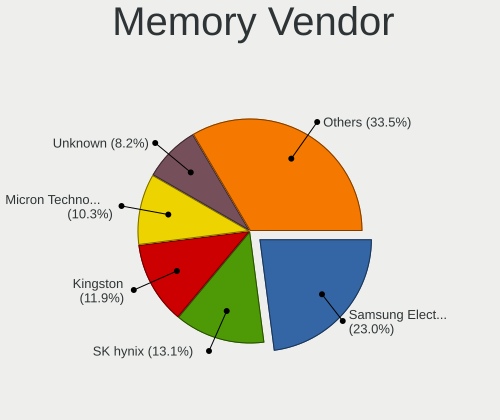

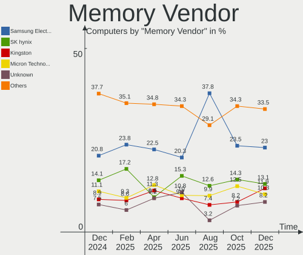

| Vendor                               | Computers | Percent |
|--------------------------------------|-----------|---------|
| Samsung Electronics                  | 98        | 22.95%  |
| SK hynix                             | 56        | 13.11%  |
| Kingston                             | 51        | 11.94%  |
| Micron Technology                    | 44        | 10.3%   |
| Unknown                              | 35        | 8.2%    |
| Unknown                              | 20        | 4.68%   |
| Corsair                              | 19        | 4.45%   |
| Hewlett-Packard                      | 17        | 3.98%   |
| Crucial                              | 15        | 3.51%   |
| G.Skill                              | 14        | 3.28%   |
| A-DATA Technology                    | 10        | 2.34%   |
| Ramaxel Technology                   | 6         | 1.41%   |
| Unknown (ABCD)                       | 4         | 0.94%   |
| Patriot                              | 4         | 0.94%   |
| Nanya Technology                     | 4         | 0.94%   |
| Kimtigo Semiconductor (HK) Limited   | 2         | 0.47%   |
| GOODRAM                              | 2         | 0.47%   |
| GeIL                                 | 2         | 0.47%   |
| Elpida                               | 2         | 0.47%   |
| Apacer                               | 2         | 0.47%   |
| Zentel                               | 1         | 0.23%   |
| V-Color                              | 1         | 0.23%   |
| Unknown (0x7FFF)                     | 1         | 0.23%   |
| Timetec                              | 1         | 0.23%   |
| TeamGroup                            | 1         | 0.23%   |
| TakeMS                               | 1         | 0.23%   |
| Smart                                | 1         | 0.23%   |
| Shenzhen Techwinsemi Technology Twsc | 1         | 0.23%   |
| Shenzhen Longsys                     | 1         | 0.23%   |
| QEMU                                 | 1         | 0.23%   |
| PNY                                  | 1         | 0.23%   |
| Patriot Memory (PDP Systems)         | 1         | 0.23%   |
| King Tiger                           | 1         | 0.23%   |
| Essencore Limited                    | 1         | 0.23%   |
| CSX                                  | 1         | 0.23%   |
| Avant                                | 1         | 0.23%   |
| Atermiter                            | 1         | 0.23%   |
| ASint Technology                     | 1         | 0.23%   |
| <Unknown>                            | 1         | 0.23%   |
| 2B0B00000000                         | 1         | 0.23%   |

Memory Model
------------

Memory module models

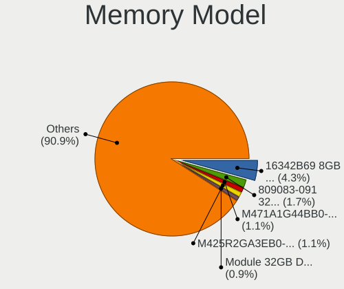

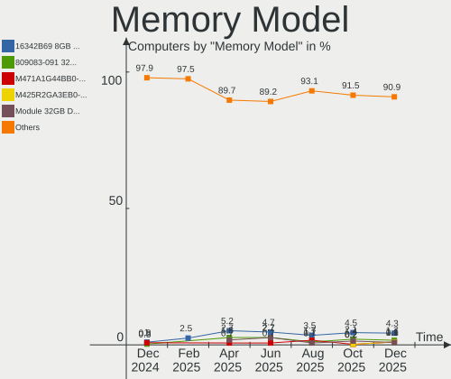

| Model                                                            | Computers | Percent |
|------------------------------------------------------------------|-----------|---------|
| Unknown                                                          | 20        | 4.32%   |
| HP RAM 809083-091 32GB DIMM DDR4 2400MT/s                        | 8         | 1.73%   |
| Samsung RAM M471A1G44BB0-CWE 8GB SODIMM DDR4 3200MT/s            | 5         | 1.08%   |
| Samsung RAM M425R2GA3EB0-CWMOL 16GB SODIMM DDR5 5600MT/s         | 5         | 1.08%   |
| Unknown RAM Module 32GB DIMM DDR4 2400MT/s                       | 4         | 0.86%   |
| Unknown RAM Module 16GB DIMM DDR4 2133MT/s                       | 4         | 0.86%   |
| Samsung RAM M471B5273DH0-CH9 4GB SODIMM DDR3 1600MT/s            | 3         | 0.65%   |
| Samsung RAM M471A1G44AB0-CWE 8GiB SODIMM DDR4 3200MT/s           | 3         | 0.65%   |
| Samsung RAM M393A4K40BB0-CPB 32GB DIMM DDR4 2133MT/s             | 3         | 0.65%   |
| Corsair RAM CMK32GX4M2E3200C16 16GB DIMM DDR4 3600MT/s           | 3         | 0.65%   |
| Unknown RAM Module 8GB SODIMM DDR4 2400MT/s                      | 2         | 0.43%   |
| Unknown RAM Module 8GB DIMM 1333MT/s                             | 2         | 0.43%   |
| Unknown RAM Module 2GB DIMM DDR2 800MT/s                         | 2         | 0.43%   |
| Unknown (ABCD) RAM 123456789012345678 2GB SODIMM LPDDR4 2400MT/s | 2         | 0.43%   |
| Unknown (ABCD) RAM 123456789012345678 2GB DIMM LPDDR4 2133MT/s   | 2         | 0.43%   |
| SK hynix RAM HYMP125S64CP8-S6 2GB SODIMM DDR2 975MT/s            | 2         | 0.43%   |
| SK hynix RAM HMT351S6BFR8C-H9 4GB SODIMM 1334MT/s                | 2         | 0.43%   |
| SK hynix RAM HMA851S6DJR6N-XN 4GB SODIMM DDR4 3200MT/s           | 2         | 0.43%   |
| SK hynix RAM HMA81GS6AFR8N-UH 8GB SODIMM DDR4 2667MT/s           | 2         | 0.43%   |
| SK hynix RAM HMA42GR7MFR4N-TF 16GB DIMM DDR4 2133MT/s            | 2         | 0.43%   |
| Samsung RAM M471B5673FH0-CF8 2048MB SODIMM DDR3 1067MT/s         | 2         | 0.43%   |
| Samsung RAM M471B5173DB0-YK0 4GB SODIMM DDR3 1600MT/s            | 2         | 0.43%   |
| Samsung RAM M471A5244CB0-CWE 4GB Row Of Chips DDR4 3200MT/s      | 2         | 0.43%   |
| Samsung RAM M471A5244CB0-CTD 4GB SODIMM DDR4 3266MT/s            | 2         | 0.43%   |
| Samsung RAM M471A4G43AB1-CWE 32GB SODIMM DDR4 3200MT/s           | 2         | 0.43%   |
| Samsung RAM M471A1K43DB1-CTD 8GB SODIMM DDR4 2667MT/s            | 2         | 0.43%   |
| Samsung RAM M471A1K43CB1-CTD 8GB SODIMM DDR4 3200MT/s            | 2         | 0.43%   |
| Samsung RAM M471A1G44CB0-CWE 8GB SODIMM DDR4 3200MT/s            | 2         | 0.43%   |
| Samsung RAM M425R2GA3BB0-CWMOD 16GiB SODIMM DDR5 5600MT/s        | 2         | 0.43%   |
| Samsung RAM M393A4K40CB1-CRC 32GB DIMM DDR4 2400MT/s             | 2         | 0.43%   |
| Samsung RAM M386A8K40BMB-CRC 64GB DIMM DDR4 2400MT/s             | 2         | 0.43%   |
| Samsung RAM M378B5773DH0-CH9 2GB DIMM DDR3 1333MT/s              | 2         | 0.43%   |
| Samsung RAM K3KL8L80CM-MGCT 2GB Row Of Chips LPDDR5 7500MT/s     | 2         | 0.43%   |
| Micron RAM Module 3GB Row Of Chips LPDDR5 6400MT/s               | 2         | 0.43%   |
| Micron RAM Module 16GB DIMM DDR4 3200MT/s                        | 2         | 0.43%   |
| Micron RAM 8JSF25664HZ-1G4D1 2GB SODIMM DDR3 1334MT/s            | 2         | 0.43%   |
| Micron RAM 4ATF51264HZ-2G6E1 4GB SODIMM DDR4 2667MT/s            | 2         | 0.43%   |
| Micron RAM 36ASF4G72PZ-2G3B1 32GB DIMM DDR4 2400MT/s             | 2         | 0.43%   |
| HP RAM 840758-091 32GB DIMM DDR4 2600MT/s                        | 2         | 0.43%   |
| HP RAM 752372-081 32GB DIMM DDR4 2133MT/s                        | 2         | 0.43%   |

Memory Kind
-----------

Memory module kinds

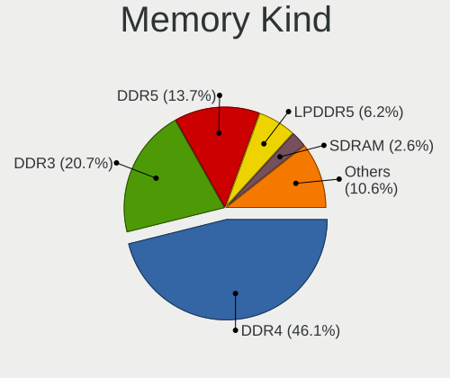

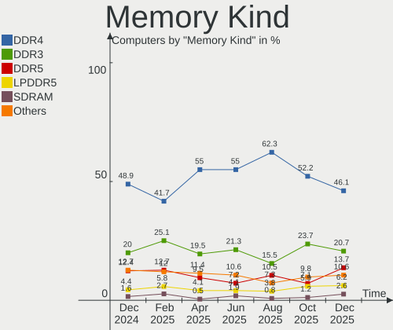

| Kind    | Computers | Percent |
|---------|-----------|---------|
| DDR4    | 178       | 46.11%  |
| DDR3    | 80        | 20.73%  |
| DDR5    | 53        | 13.73%  |
| LPDDR5  | 24        | 6.22%   |
| SDRAM   | 10        | 2.59%   |
| LPDDR4  | 10        | 2.59%   |
| Unknown | 9         | 2.33%   |
| DDR2    | 8         | 2.07%   |
| LPDDR3  | 6         | 1.55%   |
| DRAM    | 4         | 1.04%   |
| DDR     | 3         | 0.78%   |
| RAM     | 1         | 0.26%   |

Memory Form Factor
------------------

Physical design of the memory module

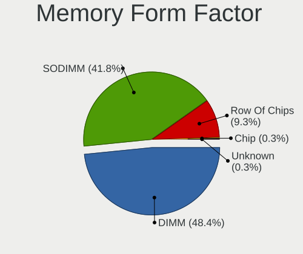

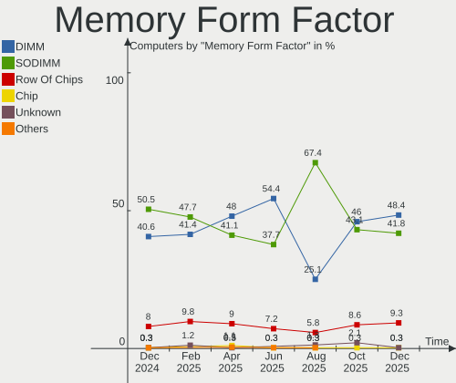

| Name         | Computers | Percent |
|--------------|-----------|---------|
| DIMM         | 183       | 48.41%  |
| SODIMM       | 158       | 41.8%   |
| Row Of Chips | 35        | 9.26%   |
| Chip         | 1         | 0.26%   |
| Unknown      | 1         | 0.26%   |

Memory Size
-----------

Memory module size

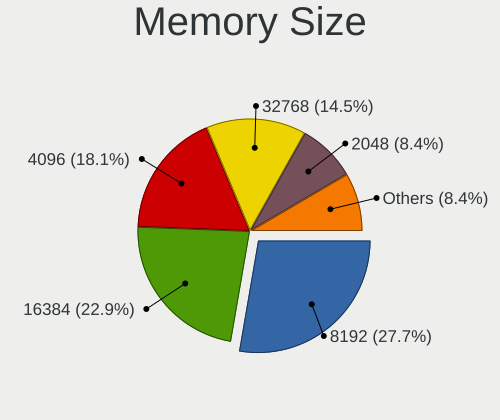

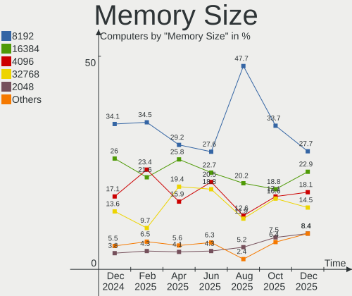

| Size  | Computers | Percent |
|-------|-----------|---------|
| 8192  | 115       | 27.71%  |
| 16384 | 95        | 22.89%  |
| 4096  | 75        | 18.07%  |
| 32768 | 60        | 14.46%  |
| 2048  | 35        | 8.43%   |
| 65536 | 20        | 4.82%   |
| 1024  | 9         | 2.17%   |
| 3072  | 2         | 0.48%   |
| 49152 | 1         | 0.24%   |
| 24576 | 1         | 0.24%   |
| 512   | 1         | 0.24%   |
| 16    | 1         | 0.24%   |

Memory Speed
------------

Memory module speed

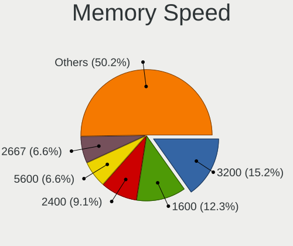

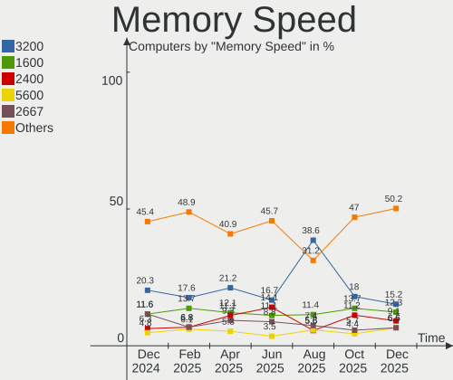

| Speed   | Computers | Percent |
|---------|-----------|---------|
| 3200    | 62        | 15.2%   |
| 1600    | 50        | 12.25%  |
| 2400    | 37        | 9.07%   |
| 5600    | 27        | 6.62%   |
| 2667    | 27        | 6.62%   |
| 2133    | 24        | 5.88%   |
| 1333    | 22        | 5.39%   |
| 6400    | 20        | 4.9%    |
| 3600    | 13        | 3.19%   |
| 2600    | 13        | 3.19%   |
| 4800    | 9         | 2.21%   |
| 1334    | 8         | 1.96%   |
| 2666    | 7         | 1.72%   |
| 1867    | 7         | 1.72%   |
| 7500    | 6         | 1.47%   |
| 800     | 6         | 1.47%   |
| 667     | 6         | 1.47%   |
| 6000    | 5         | 1.23%   |
| Unknown | 5         | 1.23%   |
| 8533    | 4         | 0.98%   |
| 2933    | 4         | 0.98%   |
| 1866    | 4         | 0.98%   |
| 5200    | 3         | 0.74%   |
| 4267    | 3         | 0.74%   |
| 1066    | 3         | 0.74%   |
| 7467    | 2         | 0.49%   |
| 4266    | 2         | 0.49%   |
| 4000    | 2         | 0.49%   |
| 3266    | 2         | 0.49%   |
| 3000    | 2         | 0.49%   |
| 2048    | 2         | 0.49%   |
| 1067    | 2         | 0.49%   |
| 975     | 2         | 0.49%   |
| 8400    | 1         | 0.25%   |
| 7400    | 1         | 0.25%   |
| 7200    | 1         | 0.25%   |
| 4199    | 1         | 0.25%   |
| 3933    | 1         | 0.25%   |
| 3866    | 1         | 0.25%   |
| 3733    | 1         | 0.25%   |

Printers & scanners
-------------------

Printer Vendor
--------------

Printer device vendors

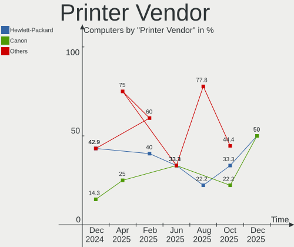

| Vendor          | Computers | Percent |
|-----------------|-----------|---------|
| Hewlett-Packard | 2         | 50%     |
| Canon           | 2         | 50%     |

Printer Model
-------------

Printer device models

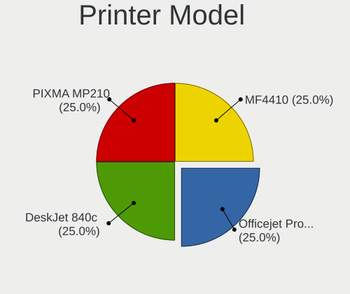

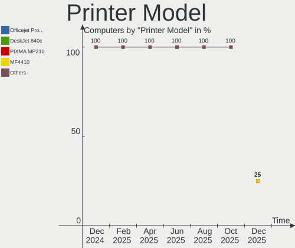

| Model                                  | Computers | Percent |
|----------------------------------------|-----------|---------|
| HP Officejet Pro 8000 Enterprise A811a | 1         | 25%     |
| HP DeskJet 840c                        | 1         | 25%     |
| Canon PIXMA MP210                      | 1         | 25%     |
| Canon MF4410                           | 1         | 25%     |

Scanner Vendor
--------------

Scanner device vendors

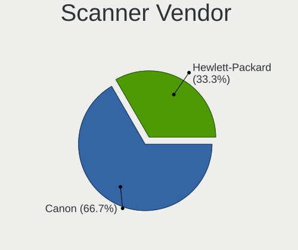

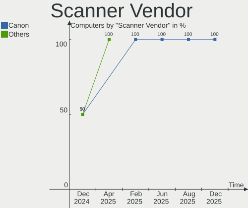

| Vendor | Computers | Percent |
|--------|-----------|---------|
| Canon  | 1         | 100%    |

Scanner Model
-------------

Scanner device models

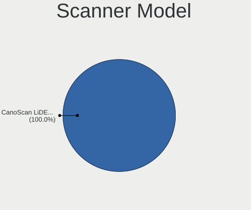

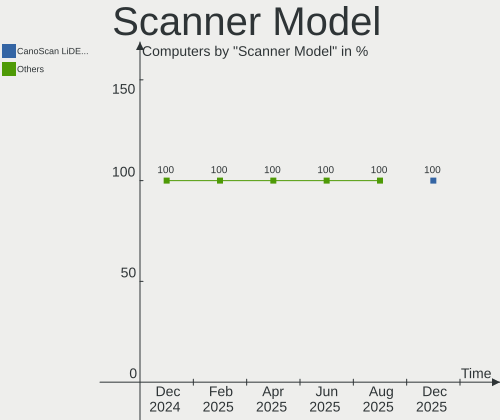

| Model                    | Computers | Percent |
|--------------------------|-----------|---------|
| Canon CanoScan LiDE 700F | 1         | 100%    |

Camera
------

Camera Vendor
-------------

Camera device vendors

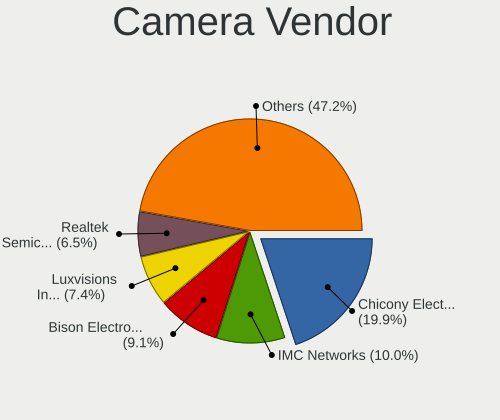

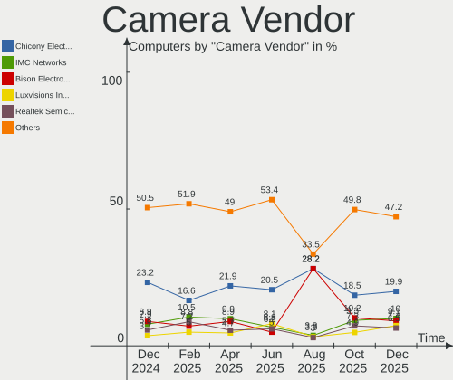

| Vendor                                 | Computers | Percent |
|----------------------------------------|-----------|---------|
| Chicony Electronics                    | 46        | 19.91%  |
| IMC Networks                           | 23        | 9.96%   |
| Bison Electronics                      | 21        | 9.09%   |
| Luxvisions Innotech Limited            | 17        | 7.36%   |
| Realtek Semiconductor                  | 15        | 6.49%   |
| Sunplus Innovation Technology          | 13        | 5.63%   |
| Microdia                               | 13        | 5.63%   |
| Logitech                               | 12        | 5.19%   |
| Syntek                                 | 11        | 4.76%   |
| Sonix Technology                       | 6         | 2.6%    |
| Quanta                                 | 6         | 2.6%    |
| ShineTech                              | 5         | 2.16%   |
| Apple                                  | 5         | 2.16%   |
| Lenovo                                 | 4         | 1.73%   |
| Cheng Uei Precision Industry (Foxlink) | 4         | 1.73%   |
| Ricoh                                  | 3         | 1.3%    |
| kingcome                               | 3         | 1.3%    |
| Alcor Micro                            | 3         | 1.3%    |
| Z-Star Microelectronics                | 2         | 0.87%   |
| Microsoft                              | 2         | 0.87%   |
| Generalplus Technology                 | 2         | 0.87%   |
| USB CAMERA                             | 1         | 0.43%   |
| Trust                                  | 1         | 0.43%   |
| Suyin                                  | 1         | 0.43%   |
| Silicon Motion                         | 1         | 0.43%   |
| OmniVision Technologies                | 1         | 0.43%   |
| KYE Systems (Mouse Systems)            | 1         | 0.43%   |
| icSpring                               | 1         | 0.43%   |
| Framework                              | 1         | 0.43%   |
| eMeet                                  | 1         | 0.43%   |
| AVerMedia Technologies                 | 1         | 0.43%   |
| ARC International                      | 1         | 0.43%   |
| Anker Innovations Limited              | 1         | 0.43%   |
| ALi                                    | 1         | 0.43%   |
| A4Tech                                 | 1         | 0.43%   |
| Unknown                                | 1         | 0.43%   |

Camera Model
------------

Camera device models

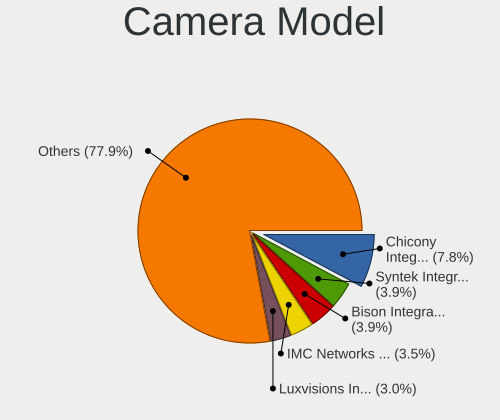

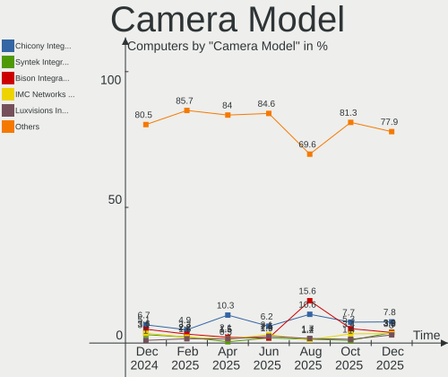

| Model                                               | Computers | Percent |
|-----------------------------------------------------|-----------|---------|
| Chicony Integrated Camera                           | 18        | 7.79%   |
| Syntek Integrated Camera                            | 9         | 3.9%    |
| Bison Integrated Camera                             | 9         | 3.9%    |
| IMC Networks USB2.0 HD UVC WebCam                   | 8         | 3.46%   |
| Luxvisions Innotech Limited Integrated Camera       | 7         | 3.03%   |
| Realtek Integrated_Webcam_HD                        | 6         | 2.6%    |
| Microdia Integrated_Webcam_HD                       | 5         | 2.16%   |
| Luxvisions Innotech Limited HP TrueVision HD Camera | 5         | 2.16%   |
| Logitech Webcam C270                                | 5         | 2.16%   |
| IMC Networks Integrated Camera                      | 5         | 2.16%   |
| Chicony HD WebCam                                   | 5         | 2.16%   |
| IMC Networks USB2.0 VGA UVC WebCam                  | 4         | 1.73%   |
| Sunplus Integrated_Webcam_HD                        | 3         | 1.3%    |
| Sonix USB2.0 FHD UVC WebCam                         | 3         | 1.3%    |
| Shinetech USB2.0 FHD UVC WebCam                     | 3         | 1.3%    |
| Luxvisions Innotech Limited Integrated RGB Camera   | 3         | 1.3%    |
| Lenovo Integrated Webcam [R5U877]                   | 3         | 1.3%    |
| kingcome FHD WebCam                                 | 3         | 1.3%    |
| Chicony FJ Camera                                   | 3         | 1.3%    |
| Apple Built-in iSight                               | 3         | 1.3%    |
| Sunplus USB 2.0 Camera                              | 2         | 0.87%   |
| Sunplus Integrated Camera                           | 2         | 0.87%   |
| Realtek Integrated_Webcam_FHD                       | 2         | 0.87%   |
| Quanta HP HD Camera                                 | 2         | 0.87%   |
| Microdia USB 2.0 Camera                             | 2         | 0.87%   |
| Logitech Webcam C310                                | 2         | 0.87%   |
| Logitech HD Pro Webcam C920                         | 2         | 0.87%   |
| IMC Networks XHC Camera                             | 2         | 0.87%   |
| IMC Networks UVC VGA Webcam                         | 2         | 0.87%   |
| Chicony USB 2.0 Camera                              | 2         | 0.87%   |
| Chicony Integrated Camera (1280x720@30)             | 2         | 0.87%   |
| Chicony HP Truevision HD camera                     | 2         | 0.87%   |
| Chicony Chicony USB2.0 Camera                       | 2         | 0.87%   |
| Bison SunplusIT Integrated Camera                   | 2         | 0.87%   |
| Bison Lenovo EasyCamera                             | 2         | 0.87%   |
| Bison Integrated 5M Camera                          | 2         | 0.87%   |
| Apple FaceTime HD Camera (Built-in)                 | 2         | 0.87%   |
| Z-Star Venus USB2.0 Camera                          | 1         | 0.43%   |
| Z-Star Traveler TV 6500 SF Dia-scanner              | 1         | 0.43%   |
| USB CAMERA USB CAMERA                               | 1         | 0.43%   |

Security
--------

Fingerprint Vendor
------------------

Fingerprint sensor vendors

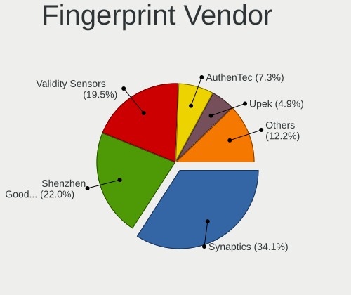

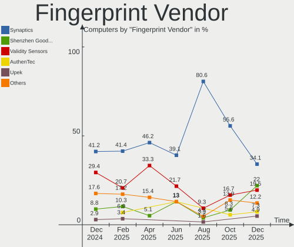

| Vendor                             | Computers | Percent |
|------------------------------------|-----------|---------|
| Synaptics                          | 14        | 34.15%  |
| Shenzhen Goodix Technology         | 9         | 21.95%  |
| Validity Sensors                   | 8         | 19.51%  |
| AuthenTec                          | 3         | 7.32%   |
| Upek                               | 2         | 4.88%   |
| HOLTEK                             | 2         | 4.88%   |
| Elan Microelectronics              | 2         | 4.88%   |
| Realtek USB2.0 Finger Print Bridge | 1         | 2.44%   |

Fingerprint Model
-----------------

Fingerprint sensor models

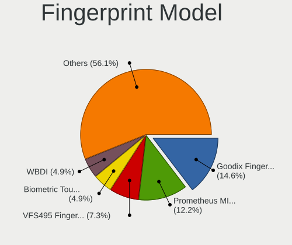

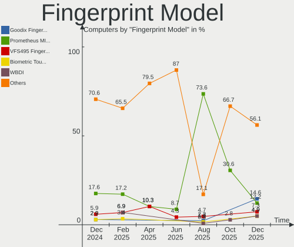

| Model                                                                      | Computers | Percent |
|----------------------------------------------------------------------------|-----------|---------|
| Shenzhen Goodix  FingerPrint Device                                        | 6         | 14.63%  |
| Synaptics Prometheus MIS Touch Fingerprint Reader                          | 5         | 12.2%   |
| Validity Sensors VFS495 Fingerprint Reader                                 | 3         | 7.32%   |
| Upek Biometric Touchchip/Touchstrip Fingerprint Sensor                     | 2         | 4.88%   |
| Synaptics WBDI                                                             | 2         | 4.88%   |
| Synaptics Metallica MIS Touch Fingerprint Reader                           | 2         | 4.88%   |
| Shenzhen Goodix Fingerprint Reader                                         | 2         | 4.88%   |
| HOLTEK FocalTech Fingerprint Device                                        | 2         | 4.88%   |
| Elan ELAN:ARM-M4                                                           | 2         | 4.88%   |
| Validity Sensors VFS5011 Fingerprint Reader                                | 1         | 2.44%   |
| Validity Sensors VFS491                                                    | 1         | 2.44%   |
| Validity Sensors Synaptics WBDI                                            | 1         | 2.44%   |
| Validity Sensors Synaptics VFS7552 Touch Fingerprint Sensor with PurePrint | 1         | 2.44%   |
| Validity Sensors Swipe Fingerprint Sensor                                  | 1         | 2.44%   |
| Synaptics WBDI Fingerprint Reader USB 102                                  | 1         | 2.44%   |
| Synaptics UWP WBDI                                                         | 1         | 2.44%   |
| Synaptics  WBDI                                                            | 1         | 2.44%   |
| Synaptics Prometheus Fingerprint Reader                                    | 1         | 2.44%   |
| Synaptics Metallica MOH Touch Fingerprint Reader                           | 1         | 2.44%   |
| Shenzhen Goodix FingerPrint                                                | 1         | 2.44%   |
| Realtek USB2.0 Finger Print Bridge FocalTech Fingerprint Device            | 1         | 2.44%   |
| AuthenTec Fingerprint Sensor                                               | 1         | 2.44%   |
| AuthenTec AES2501 Fingerprint Sensor                                       | 1         | 2.44%   |
| AuthenTec AES1600                                                          | 1         | 2.44%   |

Chipcard Vendor
---------------

Chipcard module vendors

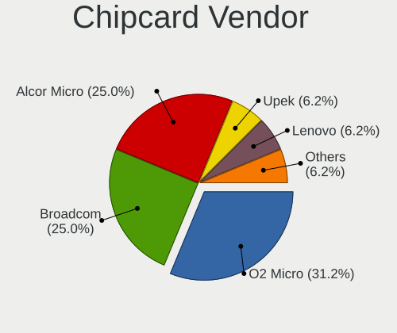

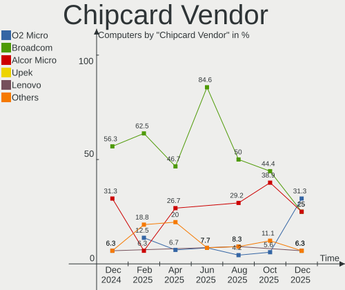

| Vendor      | Computers | Percent |
|-------------|-----------|---------|
| O2 Micro    | 5         | 31.25%  |
| Broadcom    | 4         | 25%     |
| Alcor Micro | 4         | 25%     |
| Upek        | 1         | 6.25%   |
| Lenovo      | 1         | 6.25%   |
| Aktiv       | 1         | 6.25%   |

Chipcard Model
--------------

Chipcard module models

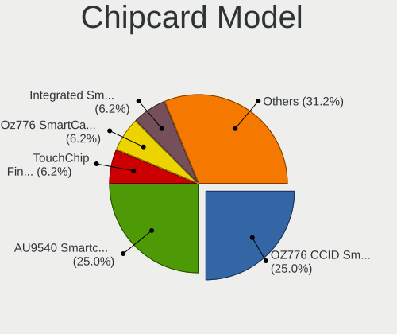

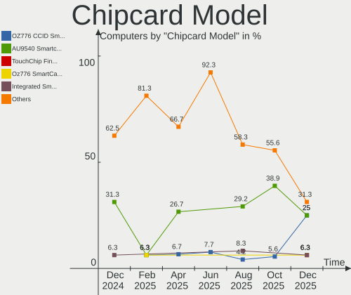

| Model                                                                        | Computers | Percent |
|------------------------------------------------------------------------------|-----------|---------|
| O2 Micro OZ776 CCID Smartcard Reader                                         | 4         | 25%     |
| Alcor Micro AU9540 Smartcard Reader                                          | 4         | 25%     |
| Upek TouchChip Fingerprint Coprocessor (WBF advanced mode)                   | 1         | 6.25%   |
| O2 Micro Oz776 SmartCard Reader                                              | 1         | 6.25%   |
| Lenovo Integrated Smart Card Reader                                          | 1         | 6.25%   |
| Broadcom BCM5880 Secure Applications Processor with fingerprint swipe sensor | 1         | 6.25%   |
| Broadcom BCM5880 Secure Applications Processor                               | 1         | 6.25%   |
| Broadcom 5880                                                                | 1         | 6.25%   |
| Broadcom 58200                                                               | 1         | 6.25%   |
| Aktiv Rutoken lite                                                           | 1         | 6.25%   |

Unsupported
-----------

Unsupported Devices
-------------------

Total unsupported devices on board

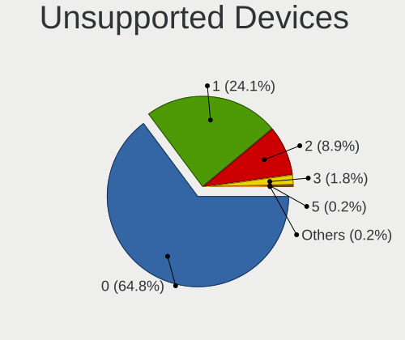

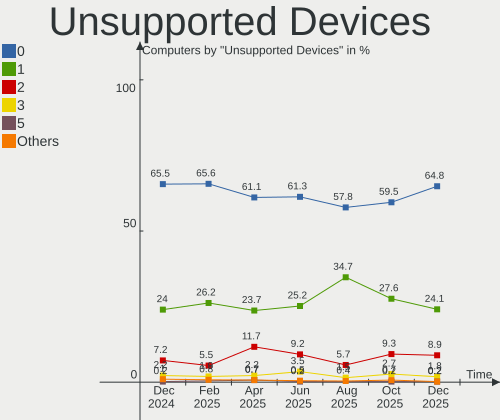

| Total | Computers | Percent |
|-------|-----------|---------|
| 0     | 328       | 64.82%  |
| 1     | 122       | 24.11%  |
| 2     | 45        | 8.89%   |
| 3     | 9         | 1.78%   |
| 5     | 1         | 0.2%    |
| 4     | 1         | 0.2%    |

Unsupported Device Types
------------------------

Types of unsupported devices

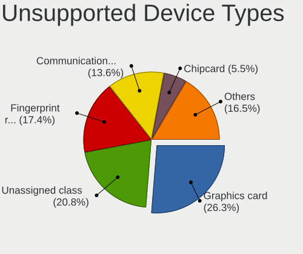

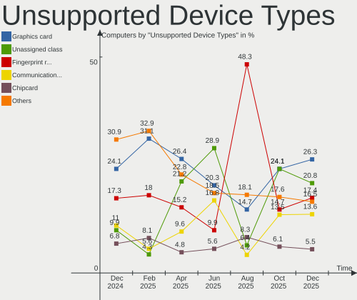

| Type                     | Computers | Percent |
|--------------------------|-----------|---------|
| Graphics card            | 62        | 26.27%  |
| Unassigned class         | 49        | 20.76%  |
| Fingerprint reader       | 41        | 17.37%  |
| Communication controller | 32        | 13.56%  |
| Chipcard                 | 13        | 5.51%   |
| Multimedia controller    | 10        | 4.24%   |
| Net/ethernet             | 7         | 2.97%   |
| Net/wireless             | 6         | 2.54%   |
| Bluetooth                | 6         | 2.54%   |
| Card reader              | 3         | 1.27%   |
| Storage/raid             | 2         | 0.85%   |
| Sound                    | 2         | 0.85%   |
| Storage/nvme             | 1         | 0.42%   |
| Storage                  | 1         | 0.42%   |
| Network                  | 1         | 0.42%   |

