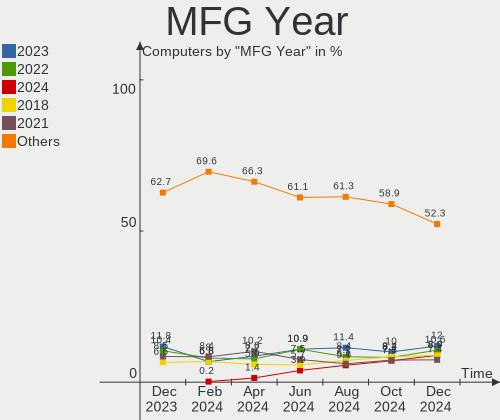
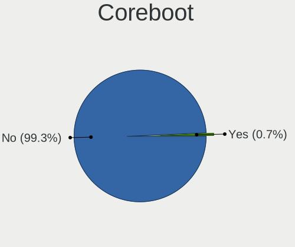
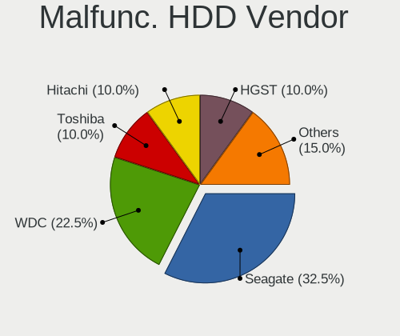
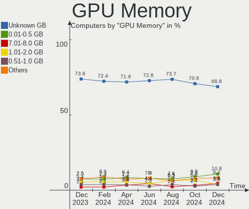

Debian Hardware Trends
----------------------

A project to identify most popular hardware characteristics and track their change
over time based on data collected by Debian users at https://Linux-Hardware.org.

Anyone can contribute to the study by uploading probes of their computers by
the [hw-probe](https://github.com/linuxhw/hw-probe) tool:

    sudo -E hw-probe -all -upload

This is a report for all computer types. See also reports for [desktops](/Dist/Debian/Desktop/README.md) and [notebooks](/Dist/Debian/Notebook/README.md).

Full-feature report is available here: https://linux-hardware.org/?view=trends

Period: Jan, 2021.

Contents
--------

- [ OS                       ](#os)
- [ OS Family                ](#os-family)
- [ Kernel                   ](#kernel)
- [ Kernel Family            ](#kernel-family)
- [ Kernel Major Ver.        ](#kernel-major-ver)
- [ Arch                     ](#arch)
- [ DE                       ](#de)
- [ Display Server           ](#display-server)
- [ Display Manager          ](#display-manager)
- [ OS Lang                  ](#os-lang)
- [ Boot Mode                ](#boot-mode)
- [ Filesystem               ](#filesystem)
- [ Part. scheme             ](#part-scheme)
- [ Dual Boot with Linux/BSD ](#dual-boot-with-linux/bsd)
- [ Dual Boot (Win)          ](#dual-boot-win)
- [ Country                  ](#country)
- [ City                     ](#city)
- [ Vendor                   ](#vendor)
- [ Model                    ](#model)
- [ Model Family             ](#model-family)
- [ MFG Year                 ](#mfg-year)
- [ Form Factor              ](#form-factor)
- [ Secure Boot              ](#secure-boot)
- [ Coreboot                 ](#coreboot)
- [ RAM Size                 ](#ram-size)
- [ RAM Used                 ](#ram-used)
- [ Has CD-ROM               ](#has-cd-rom)
- [ Total Drives             ](#total-drives)
- [ Has Ethernet             ](#has-ethernet)
- [ Drive Vendor             ](#drive-vendor)
- [ Drive Model              ](#drive-model)
- [ HDD Vendor               ](#hdd-vendor)
- [ SSD Vendor               ](#ssd-vendor)
- [ Drive Kind               ](#drive-kind)
- [ Drive Connector          ](#drive-connector)
- [ Drive Size               ](#drive-size)
- [ Space Total              ](#space-total)
- [ Space Used               ](#space-used)
- [ Malfunc. Drives          ](#malfunc-drives)
- [ Malfunc. Drive Vendor    ](#malfunc-drive-vendor)
- [ Malfunc. HDD Vendor      ](#malfunc-hdd-vendor)
- [ Malfunc. Drive Kind      ](#malfunc-drive-kind)
- [ Failed Drives            ](#failed-drives)
- [ Failed Drive Vendor      ](#failed-drive-vendor)
- [ Drive Status             ](#drive-status)
- [ Storage Vendor           ](#storage-vendor)
- [ Storage Model            ](#storage-model)
- [ Storage Kind             ](#storage-kind)
- [ CPU Vendor               ](#cpu-vendor)
- [ CPU Model                ](#cpu-model)
- [ CPU Model Family         ](#cpu-model-family)
- [ CPU Cores                ](#cpu-cores)
- [ CPU Sockets              ](#cpu-sockets)
- [ CPU Threads              ](#cpu-threads)
- [ CPU Op-Modes             ](#cpu-op-modes)
- [ CPU Microcode            ](#cpu-microcode)
- [ CPU Microarch            ](#cpu-microarch)
- [ GPU Vendor               ](#gpu-vendor)
- [ GPU Model                ](#gpu-model)
- [ GPU Combo                ](#gpu-combo)
- [ GPU Driver               ](#gpu-driver)
- [ GPU Memory               ](#gpu-memory)
- [ Monitor Vendor           ](#monitor-vendor)
- [ Monitor Model            ](#monitor-model)
- [ Monitor Resolution       ](#monitor-resolution)
- [ Monitor Diagonal         ](#monitor-diagonal)
- [ Monitor Width            ](#monitor-width)
- [ Aspect Ratio             ](#aspect-ratio)
- [ Monitor Area             ](#monitor-area)
- [ Pixel Density            ](#pixel-density)
- [ Multiple Monitors        ](#multiple-monitors)
- [ Net Controller Vendor    ](#net-controller-vendor)
- [ Net Controller Model     ](#net-controller-model)
- [ Wireless Vendor          ](#wireless-vendor)
- [ Wireless Model           ](#wireless-model)
- [ Ethernet Vendor          ](#ethernet-vendor)
- [ Ethernet Model           ](#ethernet-model)
- [ Net Controller Kind      ](#net-controller-kind)
- [ Used Controller          ](#used-controller)
- [ NICs                     ](#nics)
- [ Memory Vendor            ](#memory-vendor)
- [ Memory Model             ](#memory-model)
- [ Memory Kind              ](#memory-kind)
- [ Memory Form Factor       ](#memory-form-factor)
- [ Memory Size              ](#memory-size)
- [ Memory Speed             ](#memory-speed)
- [ Sound Vendor             ](#sound-vendor)
- [ Sound Model              ](#sound-model)
- [ Camera Vendor            ](#camera-vendor)
- [ Camera Model             ](#camera-model)
- [ Fingerprint Vendor       ](#fingerprint-vendor)
- [ Fingerprint Model        ](#fingerprint-model)
- [ Chipcard Vendor          ](#chipcard-vendor)
- [ Chipcard Model           ](#chipcard-model)
- [ Printer Vendor           ](#printer-vendor)
- [ Printer Model            ](#printer-model)
- [ Scanner Vendor           ](#scanner-vendor)
- [ Scanner Model            ](#scanner-model)
- [ Bluetooth Vendor         ](#bluetooth-vendor)
- [ Bluetooth Model          ](#bluetooth-model)
- [ Unsupported Devices      ](#unsupported-devices)
- [ Unsupported Device Types ](#unsupported-device-types)

OS
--

Installed operating systems

| Name            | Computers | Percent |
|-----------------|-----------|---------|
| Debian 10       | 96        | 60.38%  |
| Debian Testing  | 29        | 18.24%  |
| Debian          | 14        | 8.81%   |
| Debian Unstable | 9         | 5.66%   |
| Debian 9.13     | 5         | 3.14%   |
| Debian 9        | 3         | 1.89%   |
| Debian 9.12     | 1         | 0.63%   |
| Debian 8.11     | 1         | 0.63%   |
| Debian 11       | 1         | 0.63%   |

OS Family
---------

OS without a version

| Name   | Computers | Percent |
|--------|-----------|---------|
| Debian | 159       | 100%    |

Kernel
------

Version of the Linux kernel

| Version                     | Computers | Percent |
|-----------------------------|-----------|---------|
| 4.19.0-13-amd64             | 50        | 31.45%  |
| 5.10.0-1-amd64              | 22        | 13.84%  |
| 5.9.0-5-amd64               | 15        | 9.43%   |
| 5.9.0-0.bpo.2-amd64         | 11        | 6.92%   |
| 5.4.78-2-pve                | 7         | 4.4%    |
| 4.19.0-13-686-pae           | 5         | 3.14%   |
| 5.10.0-2-amd64              | 4         | 2.52%   |
| 5.9.0-5-686-pae             | 2         | 1.26%   |
| 5.9.0-4-amd64               | 2         | 1.26%   |
| 5.9.0-0.bpo.5-amd64         | 2         | 1.26%   |
| 5.4.73-1-pve                | 2         | 1.26%   |
| 4.9.0-14-amd64              | 2         | 1.26%   |
| 4.19.0-13-686               | 2         | 1.26%   |
| 5.9.0-arm-64                | 1         | 0.63%   |
| 5.9.0-8.3-liquorix-amd64    | 1         | 0.63%   |
| 5.8.0-3-amd64               | 1         | 0.63%   |
| 5.8.0-2-amd64               | 1         | 0.63%   |
| 5.6.0-2-amd64               | 1         | 0.63%   |
| 5.6.0-1-amd64               | 1         | 0.63%   |
| 5.4.89                      | 1         | 0.63%   |
| 5.4.79-v8+                  | 1         | 0.63%   |
| 5.4.74-10576-gb6cc41974db3  | 1         | 0.63%   |
| 5.4.34-1-pve                | 1         | 0.63%   |
| 5.4.0-4-amd64               | 1         | 0.63%   |
| 5.3.6-050306-generic        | 1         | 0.63%   |
| 5.10.5-xanmod1-cacule       | 1         | 0.63%   |
| 5.10.4shjk                  | 1         | 0.63%   |
| 5.10.1-051001-generic       | 1         | 0.63%   |
| 5.10.0-4.2-liquorix-amd64   | 1         | 0.63%   |
| 5.10.0-1-rt-amd64           | 1         | 0.63%   |
| 5.10-sunxi64                | 1         | 0.63%   |
| 5.0.21-4-pve                | 1         | 0.63%   |
| 4.9.235-antix.1-amd64-smp   | 1         | 0.63%   |
| 4.9.0-9-amd64               | 1         | 0.63%   |
| 4.9.0-8-amd64               | 1         | 0.63%   |
| 4.9.0-14-686-pae            | 1         | 0.63%   |
| 4.9.0-13-amd64              | 1         | 0.63%   |
| 4.9.0-12-amd64              | 1         | 0.63%   |
| 4.9.0-0.bpo.6-amd64         | 1         | 0.63%   |
| 4.19.128-microsoft-standard | 1         | 0.63%   |
| 4.19.0-9-amd64              | 1         | 0.63%   |
| 4.19.0-6-amd64              | 1         | 0.63%   |
| 4.19.0-6-686-pae            | 1         | 0.63%   |
| 4.19.0-12-amd64             | 1         | 0.63%   |
| 4.19.0-0.bpo.9-rt-amd64     | 1         | 0.63%   |
| 4.15.0-1-686-pae            | 1         | 0.63%   |

Kernel Family
-------------

Linux kernel without a distro release

| Version  | Computers | Percent |
|----------|-----------|---------|
| 4.19.0   | 62        | 38.99%  |
| 5.9.0    | 34        | 21.38%  |
| 5.10.0   | 28        | 17.61%  |
| 4.9.0    | 8         | 5.03%   |
| 5.4.78   | 7         | 4.4%    |
| 5.8.0    | 2         | 1.26%   |
| 5.6.0    | 2         | 1.26%   |
| 5.4.73   | 2         | 1.26%   |
| 5.4.89   | 1         | 0.63%   |
| 5.4.79   | 1         | 0.63%   |
| 5.4.74   | 1         | 0.63%   |
| 5.4.34   | 1         | 0.63%   |
| 5.4.0    | 1         | 0.63%   |
| 5.3.6    | 1         | 0.63%   |
| 5.10.5   | 1         | 0.63%   |
| 5.10.4   | 1         | 0.63%   |
| 5.10.1   | 1         | 0.63%   |
| 5.10     | 1         | 0.63%   |
| 5.0.21   | 1         | 0.63%   |
| 4.9.235  | 1         | 0.63%   |
| 4.19.128 | 1         | 0.63%   |
| 4.15.0   | 1         | 0.63%   |

Kernel Major Ver.
-----------------

Linux kernel major version

| Version | Computers | Percent |
|---------|-----------|---------|
| 4.19    | 63        | 39.62%  |
| 5.9     | 34        | 21.38%  |
| 5.10    | 31        | 19.5%   |
| 5.4     | 14        | 8.81%   |
| 4.9     | 9         | 5.66%   |
| 5.8     | 2         | 1.26%   |
| 5.6     | 2         | 1.26%   |
| 5.3     | 1         | 0.63%   |
| 5.0     | 1         | 0.63%   |
| 5       | 1         | 0.63%   |
| 4.15    | 1         | 0.63%   |

Arch
----

OS architecture (x86_64, i586, etc.)

| Name    | Computers | Percent |
|---------|-----------|---------|
| x86_64  | 141       | 88.68%  |
| i686    | 13        | 8.18%   |
| aarch64 | 4         | 2.52%   |
| armv7l  | 1         | 0.63%   |

DE
--

Desktop Environment

| Name            | Computers | Percent |
|-----------------|-----------|---------|
| GNOME           | 44        | 27.67%  |
| Unknown         | 42        | 26.42%  |
| XFCE            | 26        | 16.35%  |
| KDE             | 13        | 8.18%   |
| X-Cinnamon      | 6         | 3.77%   |
| LXDE            | 6         | 3.77%   |
| MATE            | 5         | 3.14%   |
| KDE5            | 5         | 3.14%   |
| Cinnamon        | 4         | 2.52%   |
| LXQt            | 3         | 1.89%   |
| GNOME Flashback | 2         | 1.26%   |
| trinity         | 1         | 0.63%   |
| sway            | 1         | 0.63%   |
| Openbox         | 1         | 0.63%   |

Display Server
--------------

X11 or Wayland

| Name    | Computers | Percent |
|---------|-----------|---------|
| X11     | 110       | 69.18%  |
| Wayland | 23        | 14.47%  |
| Tty     | 13        | 8.18%   |
| Unknown | 13        | 8.18%   |

Display Manager
---------------

SDDM, LightDM, etc.

| Name    | Computers | Percent |
|---------|-----------|---------|
| Unknown | 86        | 54.09%  |
| TDM     | 33        | 20.75%  |
| GDM     | 25        | 15.72%  |
| SDDM    | 8         | 5.03%   |
| LightDM | 3         | 1.89%   |
| GDM3    | 2         | 1.26%   |
| XDM     | 1         | 0.63%   |
| NODM    | 1         | 0.63%   |

OS Lang
-------

Language

| Lang    | Computers | Percent |
|---------|-----------|---------|
| en_US   | 45        | 28.3%   |
| en_GB   | 15        | 9.43%   |
| de_DE   | 15        | 9.43%   |
| ru_RU   | 14        | 8.81%   |
| pt_BR   | 13        | 8.18%   |
| fr_FR   | 9         | 5.66%   |
| Unknown | 9         | 5.66%   |
| es_ES   | 5         | 3.14%   |
| en_CA   | 5         | 3.14%   |
| en_AU   | 4         | 2.52%   |
| C       | 4         | 2.52%   |
| pt_PT   | 2         | 1.26%   |
| ja_JP   | 2         | 1.26%   |
| it_IT   | 2         | 1.26%   |
| hu_HU   | 2         | 1.26%   |
| en_IN   | 2         | 1.26%   |
| cs_CZ   | 2         | 1.26%   |
| tr_TR   | 1         | 0.63%   |
| sv_SE   | 1         | 0.63%   |
| sk_SK   | 1         | 0.63%   |
| nl_NL   | 1         | 0.63%   |
| es_VE   | 1         | 0.63%   |
| es_SV   | 1         | 0.63%   |
| es_CL   | 1         | 0.63%   |
| el_GR   | 1         | 0.63%   |
| de_AT   | 1         | 0.63%   |

Boot Mode
---------

EFI or BIOS

| Mode | Computers | Percent |
|------|-----------|---------|
| BIOS | 101       | 63.52%  |
| EFI  | 58        | 36.48%  |

Filesystem
----------

Type of filesystem

| Type  | Computers | Percent |
|-------|-----------|---------|
| Ext4  | 146       | 91.82%  |
| Btrfs | 9         | 5.66%   |
| Xfs   | 2         | 1.26%   |
| Ext2  | 2         | 1.26%   |

Part. scheme
------------

Scheme of partitioning

| Type    | Computers | Percent |
|---------|-----------|---------|
| GPT     | 62        | 38.99%  |
| Unknown | 59        | 37.11%  |
| MBR     | 38        | 23.9%   |

Dual Boot with Linux/BSD
------------------------

Hosting more than one Linux/BSD

| Dual boot | Computers | Percent |
|-----------|-----------|---------|
| No        | 134       | 84.28%  |
| Yes       | 25        | 15.72%  |

Dual Boot (Win)
---------------

Hosting Linux and Windows

| Dual boot | Computers | Percent |
|-----------|-----------|---------|
| No        | 116       | 72.96%  |
| Yes       | 43        | 27.04%  |

Country
-------

Geographic location (country)

| Country                | Computers | Percent |
|------------------------|-----------|---------|
| Russia                 | 21        | 13.21%  |
| USA                    | 18        | 11.32%  |
| Germany                | 16        | 10.06%  |
| Brazil                 | 16        | 10.06%  |
| France                 | 12        | 7.55%   |
| UK                     | 10        | 6.29%   |
| Spain                  | 6         | 3.77%   |
| Italy                  | 5         | 3.14%   |
| India                  | 5         | 3.14%   |
| Canada                 | 5         | 3.14%   |
| Hungary                | 4         | 2.52%   |
| Australia              | 4         | 2.52%   |
| Switzerland            | 3         | 1.89%   |
| Vietnam                | 2         | 1.26%   |
| Slovakia               | 2         | 1.26%   |
| Portugal               | 2         | 1.26%   |
| Netherlands            | 2         | 1.26%   |
| Myanmar                | 2         | 1.26%   |
| Japan                  | 2         | 1.26%   |
| Finland                | 2         | 1.26%   |
| Czech Republic         | 2         | 1.26%   |
| Colombia               | 2         | 1.26%   |
| Chile                  | 2         | 1.26%   |
| Ukraine                | 1         | 0.63%   |
| Turkey                 | 1         | 0.63%   |
| Thailand               | 1         | 0.63%   |
| Sweden                 | 1         | 0.63%   |
| Mexico                 | 1         | 0.63%   |
| Latvia                 | 1         | 0.63%   |
| Iran                   | 1         | 0.63%   |
| Indonesia              | 1         | 0.63%   |
| Greece                 | 1         | 0.63%   |
| El Salvador            | 1         | 0.63%   |
| Denmark                | 1         | 0.63%   |
| Bosnia and Herzegovina | 1         | 0.63%   |
| Belgium                | 1         | 0.63%   |
| Austria                | 1         | 0.63%   |

City
----

Geographic location (city)

| City                | Computers | Percent |
|---------------------|-----------|---------|
| St Petersburg       | 9         | 5.66%   |
| Perm                | 4         | 2.52%   |
| Nizhniy Novgorod    | 3         | 1.89%   |
| Yangon              | 2         | 1.26%   |
| Valencia            | 2         | 1.26%   |
| Springfield         | 2         | 1.26%   |
| Sao Vicente         | 2         | 1.26%   |
| Ringwood            | 2         | 1.26%   |
| Montreal            | 2         | 1.26%   |
| Hyderabad           | 2         | 1.26%   |
| Hatboro             | 2         | 1.26%   |
| Halstead            | 2         | 1.26%   |
| Bengaluru           | 2         | 1.26%   |
| Zwijndrecht         | 1         | 0.63%   |
| Washington          | 1         | 0.63%   |
| Vienna              | 1         | 0.63%   |
| Utsunomiya          | 1         | 0.63%   |
| Ufa                 | 1         | 0.63%   |
| Temuco              | 1         | 0.63%   |
| Tehran              | 1         | 0.63%   |
| São Caetano do Sul | 1         | 0.63%   |
| Stuhr               | 1         | 0.63%   |
| Stratford           | 1         | 0.63%   |
| Steinbach           | 1         | 0.63%   |
| St Louis            | 1         | 0.63%   |
| Shchelkovo          | 1         | 0.63%   |
| Sendai              | 1         | 0.63%   |
| Sarajevo            | 1         | 0.63%   |
| San Salvador        | 1         | 0.63%   |
| San Jose            | 1         | 0.63%   |
| Saint-Prex          | 1         | 0.63%   |
| Saint-Dié          | 1         | 0.63%   |
| Rome                | 1         | 0.63%   |
| Risskov             | 1         | 0.63%   |
| Riga                | 1         | 0.63%   |
| Riachao             | 1         | 0.63%   |
| Puebla              | 1         | 0.63%   |
| Praia Grande        | 1         | 0.63%   |
| Porto Alegre        | 1         | 0.63%   |
| Pieve Emanuele      | 1         | 0.63%   |
| Pfullingen          | 1         | 0.63%   |
| Perth               | 1         | 0.63%   |
| Palm Bay            | 1         | 0.63%   |
| Nurtingen           | 1         | 0.63%   |
| Novosibirsk         | 1         | 0.63%   |
| Norwich             | 1         | 0.63%   |
| Noisy-le-Grand      | 1         | 0.63%   |
| New York            | 1         | 0.63%   |
| Munich              | 1         | 0.63%   |
| Moscow              | 1         | 0.63%   |
| Minneapolis         | 1         | 0.63%   |
| Milton Keynes       | 1         | 0.63%   |
| Michalovce          | 1         | 0.63%   |
| Miami               | 1         | 0.63%   |
| Meerbusch           | 1         | 0.63%   |
| Medellín           | 1         | 0.63%   |
| Mars                | 1         | 0.63%   |
| Manauli             | 1         | 0.63%   |
| Maceió             | 1         | 0.63%   |
| Macaparana          | 1         | 0.63%   |

Vendor
------

Motherboard manufacturer

| Name                    | Computers | Percent |
|-------------------------|-----------|---------|
| Dell                    | 28        | 17.61%  |
| ASUSTek Computer        | 28        | 17.61%  |
| Lenovo                  | 20        | 12.58%  |
| Hewlett-Packard         | 19        | 11.95%  |
| ASRock                  | 8         | 5.03%   |
| Acer                    | 7         | 4.4%    |
| MSI                     | 5         | 3.14%   |
| Gigabyte Technology     | 5         | 3.14%   |
| Unknown                 | 5         | 3.14%   |
| Intel                   | 4         | 2.52%   |
| IBM                     | 4         | 2.52%   |
| Toshiba                 | 2         | 1.26%   |
| Supermicro              | 2         | 1.26%   |
| Positivo                | 2         | 1.26%   |
| Apple                   | 2         | 1.26%   |
| TYAN Computer           | 1         | 0.63%   |
| Shuttle                 | 1         | 0.63%   |
| Schenker                | 1         | 0.63%   |
| Samsung Electronics     | 1         | 0.63%   |
| Raspberry Pi Foundation | 1         | 0.63%   |
| Qbex                    | 1         | 0.63%   |
| Pine Microsystems       | 1         | 0.63%   |
| PCWare                  | 1         | 0.63%   |
| OEM                     | 1         | 0.63%   |
| NEXCOM                  | 1         | 0.63%   |
| Medion                  | 1         | 0.63%   |
| IT Channel Pty          | 1         | 0.63%   |
| HUAWEI                  | 1         | 0.63%   |
| Huanan                  | 1         | 0.63%   |
| HARDKERNEL              | 1         | 0.63%   |
| Hampoo                  | 1         | 0.63%   |
| Fujitsu                 | 1         | 0.63%   |
| BESSTAR Tech            | 1         | 0.63%   |

Model
-----

Motherboard model

| Name                                                                | Computers | Percent |
|---------------------------------------------------------------------|-----------|---------|
| Unknown                                                             | 5         | 3.14%   |
| ASUS All Series                                                     | 4         | 2.52%   |
| MSI Express5800/R120b-1 [N8100-1660F]                               | 2         | 1.26%   |
| Lenovo IdeaPad 700-15ISK 80RU                                       | 2         | 1.26%   |
| IBM System x3250 M3 -[4252K4G]-                                     | 2         | 1.26%   |
| HP Pavilion g4                                                      | 2         | 1.26%   |
| Dell Latitude E6330                                                 | 2         | 1.26%   |
| ASUS TUF GAMING B550-PLUS                                           | 2         | 1.26%   |
| TYAN S8026GM2NRE                                                    | 1         | 0.63%   |
| Toshiba PORTEGE Z30-E                                               | 1         | 0.63%   |
| Toshiba PORTEGE R935                                                | 1         | 0.63%   |
| Supermicro X9DRi-LN4+/X9DR3-LN4+                                    | 1         | 0.63%   |
| Supermicro HYVE-ZEUS                                                | 1         | 0.63%   |
| Shuttle SX79R                                                       | 1         | 0.63%   |
| Schenker SCHENKER_SLIM_SERIES_L18                                   | 1         | 0.63%   |
| Samsung 530XBB                                                      | 1         | 0.63%   |
| RPi Raspberry Pi 4 Model B Rev 1.1                                  | 1         | 0.63%   |
| Qbex QBEX-H61H2-M2                                                  | 1         | 0.63%   |
| Positivo POS-VVCN896BD                                              | 1         | 0.63%   |
| Positivo C14CR21                                                    | 1         | 0.63%   |
| Pine Microsystems Pine64 PinePhone (1.2)                            | 1         | 0.63%   |
| PCWare IPMH61R2                                                     | 1         | 0.63%   |
| OEM I42IL1                                                          | 1         | 0.63%   |
| NEXCOM NDIS B322                                                    | 1         | 0.63%   |
| MSI MS-7C84                                                         | 1         | 0.63%   |
| MSI MS-7C56                                                         | 1         | 0.63%   |
| MSI GE60 2PL                                                        | 1         | 0.63%   |
| Medion MS-7817                                                      | 1         | 0.63%   |
| Lenovo Y50-70 20378                                                 | 1         | 0.63%   |
| Lenovo ThinkStation P500 30A6S0AT00                                 | 1         | 0.63%   |
| Lenovo ThinkPad X260 20F5S13G00                                     | 1         | 0.63%   |
| Lenovo ThinkPad X220 4291G26                                        | 1         | 0.63%   |
| Lenovo ThinkPad T510 4384GEG                                        | 1         | 0.63%   |
| Lenovo ThinkPad T450s 20BXCTO1WW                                    | 1         | 0.63%   |
| Lenovo ThinkPad T430s 2356A89                                       | 1         | 0.63%   |
| Lenovo ThinkPad T430 2349W2P                                        | 1         | 0.63%   |
| Lenovo ThinkPad T430 2349V4B                                        | 1         | 0.63%   |
| Lenovo ThinkPad T420 4236WS7                                        | 1         | 0.63%   |
| Lenovo ThinkPad T14 Gen 1 20UDCTO1WW                                | 1         | 0.63%   |
| Lenovo ThinkPad P72 20MBCTO1WW                                      | 1         | 0.63%   |
| Lenovo ThinkPad E590 20NB0012RT                                     | 1         | 0.63%   |
| Lenovo ThinkCentre M93p 10A8CTO1WW                                  | 1         | 0.63%   |
| Lenovo ThinkCentre M700 10J0S0U800                                  | 1         | 0.63%   |
| Lenovo IdeaPad 5-14ARE05 81YH                                       | 1         | 0.63%   |
| Lenovo IdeaPad 310-15ABR 80ST                                       | 1         | 0.63%   |
| Lenovo G470 4328                                                    | 1         | 0.63%   |
| IT Channel Pty N8xEJEK                                              | 1         | 0.63%   |
| Intel PR1710N                                                       | 1         | 0.63%   |
| Intel NUC7i5BNH                                                     | 1         | 0.63%   |
| Intel NUC7i3BNH                                                     | 1         | 0.63%   |
| Intel DH87RL AAG74240-402                                           | 1         | 0.63%   |
| IBM ThinkPad X31 2673PBU                                            | 1         | 0.63%   |
| IBM System x3250 M3 -[4252PAW]-                                     | 1         | 0.63%   |
| HUAWEI BOHK-WAX9X                                                   | 1         | 0.63%   |
| Huanan X79 INTEL (INTEL Xeon E5/Corei7 DMI2 - C600/C200 Cipset V3.1 | 1         | 0.63%   |
| HP ZBook 15 G2                                                      | 1         | 0.63%   |
| HP Spectre x2 Detachable 12-c0XX                                    | 1         | 0.63%   |
| HP ProLiant MicroServer Gen8                                        | 1         | 0.63%   |
| HP ProBook 450 G5                                                   | 1         | 0.63%   |
| HP ProBook 4430s                                                    | 1         | 0.63%   |

Model Family
------------

Motherboard model prefix

| Name                     | Computers | Percent |
|--------------------------|-----------|---------|
| Lenovo ThinkPad          | 11        | 6.92%   |
| Dell Inspiron            | 8         | 5.03%   |
| Dell Latitude            | 7         | 4.4%    |
| ASUS ROG                 | 5         | 3.14%   |
| Acer Aspire              | 5         | 3.14%   |
| Unknown                  | 5         | 3.14%   |
| Lenovo IdeaPad           | 4         | 2.52%   |
| HP Pavilion              | 4         | 2.52%   |
| Dell XPS                 | 4         | 2.52%   |
| ASUS TUF                 | 4         | 2.52%   |
| ASUS All                 | 4         | 2.52%   |
| IBM System               | 3         | 1.89%   |
| HP Laptop                | 3         | 1.89%   |
| HP Compaq                | 3         | 1.89%   |
| Dell Vostro              | 3         | 1.89%   |
| Dell PowerEdge           | 3         | 1.89%   |
| Toshiba PORTEGE          | 2         | 1.26%   |
| MSI Express5800          | 2         | 1.26%   |
| Lenovo ThinkCentre       | 2         | 1.26%   |
| HP ProBook               | 2         | 1.26%   |
| HP EliteBook             | 2         | 1.26%   |
| Dell OptiPlex            | 2         | 1.26%   |
| ASUS VivoBook            | 2         | 1.26%   |
| TYAN S8026GM2NRE         | 1         | 0.63%   |
| Supermicro X9DRi-LN4+    | 1         | 0.63%   |
| Supermicro HYVE-ZEUS     | 1         | 0.63%   |
| Shuttle SX79R            | 1         | 0.63%   |
| Schenker SCHENKER        | 1         | 0.63%   |
| Samsung 530XBB           | 1         | 0.63%   |
| RPi Raspberry            | 1         | 0.63%   |
| Qbex QBEX-H61H2-M2       | 1         | 0.63%   |
| Positivo POS-VVCN896BD   | 1         | 0.63%   |
| Positivo C14CR21         | 1         | 0.63%   |
| Pine Microsystems Pine64 | 1         | 0.63%   |
| PCWare IPMH61R2          | 1         | 0.63%   |
| OEM I42IL1               | 1         | 0.63%   |
| NEXCOM NDIS              | 1         | 0.63%   |
| MSI MS-7C84              | 1         | 0.63%   |
| MSI MS-7C56              | 1         | 0.63%   |
| MSI GE60                 | 1         | 0.63%   |
| Medion MS-7817           | 1         | 0.63%   |
| Lenovo Y50-70            | 1         | 0.63%   |
| Lenovo ThinkStation      | 1         | 0.63%   |
| Lenovo G470              | 1         | 0.63%   |
| IT Channel Pty N8xEJEK   | 1         | 0.63%   |
| Intel PR1710N            | 1         | 0.63%   |
| Intel NUC7i5BNH          | 1         | 0.63%   |
| Intel NUC7i3BNH          | 1         | 0.63%   |
| Intel DH87RL             | 1         | 0.63%   |
| IBM ThinkPad             | 1         | 0.63%   |
| HUAWEI BOHK-WAX9X        | 1         | 0.63%   |
| Huanan X79               | 1         | 0.63%   |
| HP ZBook                 | 1         | 0.63%   |
| HP Spectre               | 1         | 0.63%   |
| HP ProLiant              | 1         | 0.63%   |
| HP 2000                  | 1         | 0.63%   |
| HP 14                    | 1         | 0.63%   |
| HARDKERNEL ODROID-H2     | 1         | 0.63%   |
| Hampoo C3W6              | 1         | 0.63%   |
| Gigabyte H97M-HD3        | 1         | 0.63%   |

MFG Year
--------

Motherboard manufacture year

| Year    | Computers | Percent |
|---------|-----------|---------|
| 2020    | 31        | 19.5%   |
| 2019    | 26        | 16.35%  |
| 2018    | 15        | 9.43%   |
| 2013    | 13        | 8.18%   |
| 2014    | 12        | 7.55%   |
| 2010    | 8         | 5.03%   |
| 2017    | 7         | 4.4%    |
| 2012    | 7         | 4.4%    |
| 2009    | 7         | 4.4%    |
| 2016    | 6         | 3.77%   |
| 2015    | 6         | 3.77%   |
| Unknown | 6         | 3.77%   |
| 2011    | 4         | 2.52%   |
| 2007    | 4         | 2.52%   |
| 2006    | 3         | 1.89%   |
| 2005    | 2         | 1.26%   |
| 2008    | 1         | 0.63%   |
| 2004    | 1         | 0.63%   |

Form Factor
-----------

Physical design of the computer

| Name           | Computers | Percent |
|----------------|-----------|---------|
| Notebook       | 80        | 50.31%  |
| Desktop        | 59        | 37.11%  |
| Server         | 10        | 6.29%   |
| System on chip | 3         | 1.89%   |
| Mini pc        | 3         | 1.89%   |
| Convertible    | 2         | 1.26%   |
| Phone          | 1         | 0.63%   |
| Tablet         | 1         | 0.63%   |

Secure Boot
-----------

Enabled or disabled

| State    | Computers | Percent |
|----------|-----------|---------|
| Disabled | 156       | 98.11%  |
| Enabled  | 3         | 1.89%   |

Coreboot
--------

Have coreboot on board

| Used | Computers | Percent |
|------|-----------|---------|
| No   | 159       | 100%    |

RAM Size
--------

Total RAM memory

| Size in GB      | Computers | Percent |
|-----------------|-----------|---------|
| 16.01-24.0      | 40        | 25.16%  |
| 3.01-4.0        | 27        | 16.98%  |
| 4.01-8.0        | 25        | 15.72%  |
| 8.01-16.0       | 25        | 15.72%  |
| 32.01-64.0      | 17        | 10.69%  |
| 2.01-3.0        | 8         | 5.03%   |
| 64.01-256.0     | 5         | 3.14%   |
| 24.01-32.0      | 4         | 2.52%   |
| 1.01-2.0        | 4         | 2.52%   |
| 0.01-0.5        | 2         | 1.26%   |
| More than 256.0 | 1         | 0.63%   |
| 0.51-1.0        | 1         | 0.63%   |

RAM Used
--------

Used RAM memory

| Used GB    | Computers | Percent |
|------------|-----------|---------|
| 1.01-2.0   | 37        | 23.27%  |
| 4.01-8.0   | 31        | 19.5%   |
| 2.01-3.0   | 27        | 16.98%  |
| 3.01-4.0   | 21        | 13.21%  |
| 0.51-1.0   | 17        | 10.69%  |
| 8.01-16.0  | 12        | 7.55%   |
| 0.01-0.5   | 11        | 6.92%   |
| 16.01-24.0 | 3         | 1.89%   |

Has CD-ROM
----------

Has CD-ROM on board

| Presented | Computers | Percent |
|-----------|-----------|---------|
| No        | 103       | 64.78%  |
| Yes       | 56        | 35.22%  |

Total Drives
------------

Number of drives on board

| Drives | Computers | Percent |
|--------|-----------|---------|
| 1      | 86        | 54.09%  |
| 2      | 47        | 29.56%  |
| 3      | 13        | 8.18%   |
| 4      | 5         | 3.14%   |
| 7      | 2         | 1.26%   |
| 6      | 2         | 1.26%   |
| 5      | 2         | 1.26%   |
| 9      | 1         | 0.63%   |
| 0      | 1         | 0.63%   |

Has Ethernet
------------

Has Ethernet on board

| Presented | Computers | Percent |
|-----------|-----------|---------|
| Yes       | 143       | 89.94%  |
| No        | 16        | 10.06%  |

Drive Vendor
------------

Hard drive vendors

| Vendor              | Computers | Drives | Percent |
|---------------------|-----------|--------|---------|
| Samsung Electronics | 43        | 46     | 18.45%  |
| WDC                 | 40        | 61     | 17.17%  |
| Seagate             | 34        | 45     | 14.59%  |
| Toshiba             | 14        | 14     | 6.01%   |
| Kingston            | 14        | 14     | 6.01%   |
| Unknown             | 13        | 15     | 5.58%   |
| Crucial             | 9         | 9      | 3.86%   |
| Sandisk             | 8         | 8      | 3.43%   |
| Hitachi             | 8         | 9      | 3.43%   |
| SK Hynix            | 5         | 5      | 2.15%   |
| A-DATA Technology   | 4         | 4      | 1.72%   |
| Intenso             | 3         | 3      | 1.29%   |
| HGST                | 3         | 5      | 1.29%   |
| Apple               | 3         | 3      | 1.29%   |
| Silicon Motion      | 2         | 2      | 0.86%   |
| Micron Technology   | 2         | 2      | 0.86%   |
| Intel               | 2         | 2      | 0.86%   |
| Corsair             | 2         | 2      | 0.86%   |
| ZTC                 | 1         | 1      | 0.43%   |
| Zheino              | 1         | 1      | 0.43%   |
| XPG                 | 1         | 2      | 0.43%   |
| ULTIMATE            | 1         | 1      | 0.43%   |
| Transcend           | 1         | 1      | 0.43%   |
| Team                | 1         | 1      | 0.43%   |
| SNR-ML              | 1         | 1      | 0.43%   |
| PLEXTOR             | 1         | 2      | 0.43%   |
| Phison              | 1         | 1      | 0.43%   |
| Patriot             | 1         | 1      | 0.43%   |
| OCZ                 | 1         | 1      | 0.43%   |
| MyDigitalSSD        | 1         | 1      | 0.43%   |
| Msft                | 1         | 2      | 0.43%   |
| Maxtor              | 1         | 1      | 0.43%   |
| LITEONIT            | 1         | 1      | 0.43%   |
| Lexar               | 1         | 1      | 0.43%   |
| Integral            | 1         | 1      | 0.43%   |
| Hoodisk             | 1         | 1      | 0.43%   |
| HGST HDS            | 1         | 1      | 0.43%   |
| GOODRAM             | 1         | 1      | 0.43%   |
| Elite               | 1         | 2      | 0.43%   |
| DGM                 | 1         | 1      | 0.43%   |
| Dell                | 1         | 1      | 0.43%   |
| ASMT                | 1         | 1      | 0.43%   |

Drive Model
-----------

Hard drive models

| Model                                          | Computers | Percent |
|------------------------------------------------|-----------|---------|
| Toshiba MQ01ABD100 1TB                         | 3         | 1.21%   |
| Samsung SSD 860 EVO 500GB                      | 3         | 1.21%   |
| Samsung SSD 850 EVO 500GB                      | 3         | 1.21%   |
| Kingston SUV400S37240G 240GB SSD               | 3         | 1.21%   |
| WDC WDS240G2G0A-00JH30 240GB SSD               | 2         | 0.81%   |
| Seagate ST2000DM008-2FR102 2TB                 | 2         | 0.81%   |
| Seagate ST1000DM003-1ER162 1TB                 | 2         | 0.81%   |
| Samsung SSD PM871b M.2 2280 256GB              | 2         | 0.81%   |
| Samsung SSD PM871 mSATA 256GB                  | 2         | 0.81%   |
| Samsung SSD 860 EVO 250GB                      | 2         | 0.81%   |
| Samsung SSD 840 EVO 250GB                      | 2         | 0.81%   |
| Kingston SA400S37240G 240GB SSD                | 2         | 0.81%   |
| Kingston OM8PCP3512F-AB 512GB                  | 2         | 0.81%   |
| Crucial CT240BX500SSD1 240GB                   | 2         | 0.81%   |
| Apple HDD HTS547550A9E384 500GB                | 2         | 0.81%   |
| A-DATA SU800 256GB SSD                         | 2         | 0.81%   |
| ZTC SM201-512G                                 | 1         | 0.4%    |
| Zheino CHN 25SATAA3 360 360GB SSD              | 1         | 0.4%    |
| XPG NVMe SSD Drive 512GB                       | 1         | 0.4%    |
| WDC WDS500G2B0B-00YS70 500GB SSD               | 1         | 0.4%    |
| WDC WDS500G2B0A-00SM50 500GB SSD               | 1         | 0.4%    |
| WDC WDS480G2G0A-00JH30 480GB SSD               | 1         | 0.4%    |
| WDC WDS240G2G0B-00EPW0 240GB SSD               | 1         | 0.4%    |
| WDC WDS120G2G0A-00JH30 120GB SSD               | 1         | 0.4%    |
| WDC WD7500BPVX-60JC3T0 752GB                   | 1         | 0.4%    |
| WDC WD7500BPKX-22HPJT0 752GB                   | 1         | 0.4%    |
| WDC WD5000LPVX-00V0TT0 500GB                   | 1         | 0.4%    |
| WDC WD5000BEVT-22ZAT0 500GB                    | 1         | 0.4%    |
| WDC WD5000AZRX-00L4HB0 500GB                   | 1         | 0.4%    |
| WDC WD50 00LPCX-24VHA 500GB                    | 1         | 0.4%    |
| WDC WD40EFRX-68N32N0 4TB                       | 1         | 0.4%    |
| WDC WD3200BEKT-75PVMT1 320GB                   | 1         | 0.4%    |
| WDC WD3200AVJS-63N9A0 320GB                    | 1         | 0.4%    |
| WDC WD3200AAKX-001CA0 320GB                    | 1         | 0.4%    |
| WDC WD3200AAJS-56M0A0 320GB                    | 1         | 0.4%    |
| WDC WD2502ABYS-23B7A0 39M4511 42C0463IBM 250GB | 1         | 0.4%    |
| WDC WD20EFRX-68EUZN0 2TB                       | 1         | 0.4%    |
| WDC WD2003FYYS-20W0B0 2TB                      | 1         | 0.4%    |
| WDC WD1600JS-00MHB0 160GB                      | 1         | 0.4%    |
| WDC WD140EDFZ-11A0VA0 14TB                     | 1         | 0.4%    |
| WDC WD10SPZX-60Z10T0 1TB                       | 1         | 0.4%    |
| WDC WD10SPCX-24HWST1 1TB                       | 1         | 0.4%    |
| WDC WD10JUCT-63CYNY0 1TB                       | 1         | 0.4%    |
| WDC WD10JPVX-75J 1TB                           | 1         | 0.4%    |
| WDC WD10JPLX-00MBPT0 1TB                       | 1         | 0.4%    |
| WDC WD10EZRZ-00HTKB0 1TB                       | 1         | 0.4%    |
| WDC WD10EZEX-21WN4A0 1TB                       | 1         | 0.4%    |
| WDC WD10EZEX-21M2NA0 1TB                       | 1         | 0.4%    |
| WDC WD10EZEX-08WN4A0 1TB                       | 1         | 0.4%    |
| WDC WD10EZEX-00BN5A0 1TB                       | 1         | 0.4%    |
| WDC WD10EVVS-63M5B0 1TB                        | 1         | 0.4%    |
| WDC WD10EFRX-68FYTN0 1TB                       | 1         | 0.4%    |
| WDC WD10EAVS-00D7B0 1TB                        | 1         | 0.4%    |
| WDC WD10EARX-32N0YB0 1TB                       | 1         | 0.4%    |
| WDC WD10EARX-00N0YB0 1TB                       | 1         | 0.4%    |
| WDC WD10EADS-00L5B1 1TB                        | 1         | 0.4%    |
| WDC WD10EACS-00ZJB0 1TB                        | 1         | 0.4%    |
| WDC WD100EMAZ-00WJTA0 10TB                     | 1         | 0.4%    |
| WDC PC SN730 SDBPNTY-256G-1027 256GB           | 1         | 0.4%    |
| WDC PC SN520 SDAPNUW-256G-1006 256GB           | 1         | 0.4%    |

HDD Vendor
----------

Hard disk drive vendors

| Vendor              | Computers | Drives | Percent |
|---------------------|-----------|--------|---------|
| Seagate             | 33        | 43     | 34.74%  |
| WDC                 | 31        | 50     | 32.63%  |
| Toshiba             | 8         | 8      | 8.42%   |
| Hitachi             | 8         | 9      | 8.42%   |
| Samsung Electronics | 6         | 8      | 6.32%   |
| HGST                | 3         | 5      | 3.16%   |
| Apple               | 2         | 2      | 2.11%   |
| Msft                | 1         | 2      | 1.05%   |
| Maxtor              | 1         | 1      | 1.05%   |
| Intenso             | 1         | 1      | 1.05%   |
| ASMT                | 1         | 1      | 1.05%   |

SSD Vendor
----------

Solid state drive vendors

| Vendor              | Computers | Drives | Percent |
|---------------------|-----------|--------|---------|
| Samsung Electronics | 28        | 28     | 31.82%  |
| Kingston            | 12        | 12     | 13.64%  |
| Crucial             | 9         | 9      | 10.23%  |
| WDC                 | 7         | 7      | 7.95%   |
| SanDisk             | 5         | 5      | 5.68%   |
| A-DATA Technology   | 4         | 4      | 4.55%   |
| ZTC                 | 1         | 1      | 1.14%   |
| Zheino              | 1         | 1      | 1.14%   |
| ULTIMATE            | 1         | 1      | 1.14%   |
| Transcend           | 1         | 1      | 1.14%   |
| Toshiba             | 1         | 1      | 1.14%   |
| Team                | 1         | 1      | 1.14%   |
| SNR-ML              | 1         | 1      | 1.14%   |
| SK Hynix            | 1         | 1      | 1.14%   |
| PLEXTOR             | 1         | 2      | 1.14%   |
| Patriot             | 1         | 1      | 1.14%   |
| OCZ                 | 1         | 1      | 1.14%   |
| MyDigitalSSD        | 1         | 1      | 1.14%   |
| Micron Technology   | 1         | 1      | 1.14%   |
| LITEONIT            | 1         | 1      | 1.14%   |
| Lexar               | 1         | 1      | 1.14%   |
| Intenso             | 1         | 1      | 1.14%   |
| Intel               | 1         | 1      | 1.14%   |
| Integral            | 1         | 1      | 1.14%   |
| Hoodisk             | 1         | 1      | 1.14%   |
| GOODRAM             | 1         | 1      | 1.14%   |
| DGM                 | 1         | 1      | 1.14%   |
| Corsair             | 1         | 1      | 1.14%   |
| Apple               | 1         | 1      | 1.14%   |

Drive Kind
----------

HDD or SSD

| Kind    | Computers | Drives | Percent |
|---------|-----------|--------|---------|
| HDD     | 80        | 130    | 38.65%  |
| SSD     | 77        | 89     | 37.2%   |
| NVMe    | 31        | 35     | 14.98%  |
| MMC     | 13        | 15     | 6.28%   |
| Unknown | 6         | 8      | 2.9%    |

Drive Connector
---------------

SATA, SAS, NVMe, etc.

| Type | Computers | Drives | Percent |
|------|-----------|--------|---------|
| SATA | 126       | 212    | 70.39%  |
| NVMe | 31        | 35     | 17.32%  |
| MMC  | 13        | 15     | 7.26%   |
| SAS  | 9         | 15     | 5.03%   |

Drive Size
----------

Size of hard drive

| Size in TB | Computers | Drives | Percent |
|------------|-----------|--------|---------|
| 0.01-0.5   | 99        | 129    | 62.26%  |
| 0.51-1.0   | 43        | 59     | 27.04%  |
| 1.01-2.0   | 9         | 14     | 5.66%   |
| 3.01-4.0   | 4         | 6      | 2.52%   |
| 4.01-10.0  | 2         | 6      | 1.26%   |
| 2.01-3.0   | 1         | 1      | 0.63%   |
| 10.01-20.0 | 1         | 4      | 0.63%   |

Space Total
-----------

Amount of disk space available on the file system

| Size in GB     | Computers | Percent |
|----------------|-----------|---------|
| 101-250        | 40        | 25.16%  |
| 251-500        | 29        | 18.24%  |
| 501-1000       | 21        | 13.21%  |
| 51-100         | 15        | 9.43%   |
| Unknown        | 11        | 6.92%   |
| 21-50          | 10        | 6.29%   |
| 1001-2000      | 10        | 6.29%   |
| 1-20           | 10        | 6.29%   |
| More than 3000 | 8         | 5.03%   |
| 2001-3000      | 5         | 3.14%   |

Space Used
----------

Amount of used disk space

| Used GB        | Computers | Percent |
|----------------|-----------|---------|
| 1-20           | 55        | 34.59%  |
| 101-250        | 24        | 15.09%  |
| 21-50          | 22        | 13.84%  |
| 51-100         | 15        | 9.43%   |
| 251-500        | 13        | 8.18%   |
| Unknown        | 11        | 6.92%   |
| 501-1000       | 9         | 5.66%   |
| 1001-2000      | 7         | 4.4%    |
| More than 3000 | 3         | 1.89%   |

Malfunc. Drives
---------------

Drive models with a malfunction

| Model                             | Computers | Drives | Percent |
|-----------------------------------|-----------|--------|---------|
| WDC WD5000BEVT-22ZAT0 500GB       | 1         | 1      | 4.55%   |
| WDC WD3200BEKT-75PVMT1 320GB      | 1         | 1      | 4.55%   |
| WDC WD10JUCT-63CYNY0 1TB          | 1         | 1      | 4.55%   |
| WDC WD10EZEX-21WN4A0 1TB          | 1         | 1      | 4.55%   |
| WDC WD10EZEX-00BN5A0 1TB          | 1         | 1      | 4.55%   |
| Toshiba MQ01ABD100 1TB            | 1         | 1      | 4.55%   |
| Seagate ST9320325AS 320GB         | 1         | 1      | 4.55%   |
| Seagate ST9160314AS 160GB         | 1         | 1      | 4.55%   |
| Seagate ST500LM021-1KJ152 500GB   | 1         | 1      | 4.55%   |
| Seagate ST3500418AS 500GB         | 1         | 1      | 4.55%   |
| Seagate ST3250620AS 250GB         | 1         | 1      | 4.55%   |
| Seagate ST3250310AS 250GB         | 1         | 1      | 4.55%   |
| Seagate ST320LT007-9ZV142 320GB   | 1         | 1      | 4.55%   |
| Seagate ST32000644NS 2TB          | 1         | 2      | 4.55%   |
| Seagate ST3160813AS 160GB         | 1         | 1      | 4.55%   |
| Seagate ST31000524AS 1TB          | 1         | 1      | 4.55%   |
| Seagate ST3000DM001-9YN166 3TB    | 1         | 1      | 4.55%   |
| Seagate ST250LT021-1AF14C 250GB   | 1         | 1      | 4.55%   |
| Kingston SV300S37A240G 240GB SSD  | 1         | 1      | 4.55%   |
| Hitachi HTS541680J9SA00 80GB      | 1         | 1      | 4.55%   |
| Hitachi HDS721050CLA362 500GB     | 1         | 1      | 4.55%   |
| A-DATA Technology SU800 256GB SSD | 1         | 1      | 4.55%   |

Malfunc. Drive Vendor
---------------------

Vendors of faulty drives

| Vendor            | Computers | Drives | Percent |
|-------------------|-----------|--------|---------|
| Seagate           | 12        | 13     | 54.55%  |
| WDC               | 5         | 5      | 22.73%  |
| Hitachi           | 2         | 2      | 9.09%   |
| Toshiba           | 1         | 1      | 4.55%   |
| Kingston          | 1         | 1      | 4.55%   |
| A-DATA Technology | 1         | 1      | 4.55%   |

Malfunc. HDD Vendor
-------------------

Vendors of faulty HDD drives

| Vendor  | Computers | Drives | Percent |
|---------|-----------|--------|---------|
| Seagate | 12        | 13     | 60%     |
| WDC     | 5         | 5      | 25%     |
| Hitachi | 2         | 2      | 10%     |
| Toshiba | 1         | 1      | 5%      |

Malfunc. Drive Kind
-------------------

Kinds of faulty drives

| Kind | Computers | Drives | Percent |
|------|-----------|--------|---------|
| HDD  | 18        | 21     | 90%     |
| SSD  | 2         | 2      | 10%     |

Failed Drives
-------------

Failed drive models

| Model                           | Computers | Drives | Percent |
|---------------------------------|-----------|--------|---------|
| Samsung Electronics HE103SJ 1TB | 1         | 2      | 100%    |

Failed Drive Vendor
-------------------

Failed drive vendors

| Vendor              | Computers | Drives | Percent |
|---------------------|-----------|--------|---------|
| Samsung Electronics | 1         | 2      | 100%    |

Drive Status
------------

Number of failed and malfunc. drives

| Status   | Computers | Drives | Percent |
|----------|-----------|--------|---------|
| Works    | 84        | 144    | 48%     |
| Detected | 70        | 108    | 40%     |
| Malfunc  | 20        | 23     | 11.43%  |
| Failed   | 1         | 2      | 0.57%   |

Storage Vendor
--------------

Storage controller vendors

| Vendor                       | Computers | Percent |
|------------------------------|-----------|---------|
| Intel                        | 118       | 61.78%  |
| AMD                          | 25        | 13.09%  |
| Samsung Electronics          | 10        | 5.24%   |
| Sandisk                      | 5         | 2.62%   |
| LSI Logic / Symbios Logic    | 5         | 2.62%   |
| Toshiba America Info Systems | 4         | 2.09%   |
| SK Hynix                     | 4         | 2.09%   |
| Marvell Technology Group     | 4         | 2.09%   |
| ASMedia Technology           | 4         | 2.09%   |
| Silicon Motion               | 2         | 1.05%   |
| Phison Electronics           | 2         | 1.05%   |
| Kingston Technology Company  | 2         | 1.05%   |
| VIA Technologies             | 1         | 0.52%   |
| Micron Technology            | 1         | 0.52%   |
| KIOXIA                       | 1         | 0.52%   |
| ADATA Technology             | 1         | 0.52%   |
| Adaptec                      | 1         | 0.52%   |
| 3ware                        | 1         | 0.52%   |

Storage Model
-------------

Storage controller models

| Model                                                                                   | Computers | Percent |
|-----------------------------------------------------------------------------------------|-----------|---------|
| AMD FCH SATA Controller [AHCI mode]                                                     | 17        | 7.56%   |
| Intel Sunrise Point-LP SATA Controller [AHCI mode]                                      | 12        | 5.33%   |
| Intel 8 Series/C220 Series Chipset Family 6-port SATA Controller 1 [AHCI mode]          | 12        | 5.33%   |
| Intel 7 Series Chipset Family 6-port SATA Controller [AHCI mode]                        | 8         | 3.56%   |
| Intel 82801G (ICH7 Family) IDE Controller                                               | 7         | 3.11%   |
| Intel 82801 Mobile SATA Controller [RAID mode]                                          | 7         | 3.11%   |
| Samsung NVMe SSD Controller SM981/PM981/PM983                                           | 5         | 2.22%   |
| Intel NM10/ICH7 Family SATA Controller [IDE mode]                                       | 5         | 2.22%   |
| Intel 6 Series/C200 Series Chipset Family 6 port Mobile SATA AHCI Controller            | 5         | 2.22%   |
| Samsung NVMe SSD Controller SM961/PM961/SM963                                           | 4         | 1.78%   |
| Intel Cannon Point-LP SATA Controller [AHCI Mode]                                       | 4         | 1.78%   |
| Intel Cannon Lake Mobile PCH SATA AHCI Controller                                       | 4         | 1.78%   |
| Intel C600/X79 series chipset 6-Port SATA AHCI Controller                               | 4         | 1.78%   |
| Intel 5 Series/3400 Series Chipset 6 port SATA AHCI Controller                          | 4         | 1.78%   |
| ASMedia ASM1062 Serial ATA Controller                                                   | 4         | 1.78%   |
| AMD SATA controller                                                                     | 4         | 1.78%   |
| SK Hynix BC501 NVMe Solid State Drive 512GB                                             | 3         | 1.33%   |
| LSI Logic / Symbios Logic SAS1064ET PCI-Express Fusion-MPT SAS                          | 3         | 1.33%   |
| Intel Wildcat Point-LP SATA Controller [AHCI Mode]                                      | 3         | 1.33%   |
| Intel Q170/Q150/B150/H170/H110/Z170/CM236 Chipset SATA Controller [AHCI Mode]           | 3         | 1.33%   |
| Intel 7 Series/C210 Series Chipset Family 6-port SATA Controller [AHCI mode]            | 3         | 1.33%   |
| Intel 6 Series/C200 Series Chipset Family Desktop SATA Controller (IDE mode, ports 4-5) | 3         | 1.33%   |
| Intel 6 Series/C200 Series Chipset Family Desktop SATA Controller (IDE mode, ports 0-3) | 3         | 1.33%   |
| Intel 6 Series/C200 Series Chipset Family 6 port Desktop SATA AHCI Controller           | 3         | 1.33%   |
| Intel 5 Series/3400 Series Chipset 4 port SATA AHCI Controller                          | 3         | 1.33%   |
| Toshiba America Info Systems XG6 NVMe SSD Controller                                    | 2         | 0.89%   |
| Toshiba America Info Systems Toshiba America Info Non-Volatile memory controller        | 2         | 0.89%   |
| Silicon Motion SM2263EN/SM2263XT SSD Controller                                         | 2         | 0.89%   |
| Sandisk WD Black 2018 / PC SN720 NVMe SSD                                               | 2         | 0.89%   |
| Kingston Company Company Non-Volatile memory controller                                 | 2         | 0.89%   |
| Intel HM170/QM170 Chipset SATA Controller [AHCI Mode]                                   | 2         | 0.89%   |
| Intel Celeron/Pentium Silver Processor SATA Controller                                  | 2         | 0.89%   |
| Intel Celeron N3350/Pentium N4200/Atom E3900 Series SATA AHCI Controller                | 2         | 0.89%   |
| Intel C610/X99 series chipset sSATA Controller [AHCI mode]                              | 2         | 0.89%   |
| Intel C610/X99 series chipset 6-Port SATA Controller [AHCI mode]                        | 2         | 0.89%   |
| Intel 82801JI (ICH10 Family) SATA AHCI Controller                                       | 2         | 0.89%   |
| Intel 82801JI (ICH10 Family) 4 port SATA IDE Controller #1                              | 2         | 0.89%   |
| Intel 82801JI (ICH10 Family) 2 port SATA IDE Controller #2                              | 2         | 0.89%   |
| Intel 82801IBM/IEM (ICH9M/ICH9M-E) 4 port SATA Controller [AHCI mode]                   | 2         | 0.89%   |
| Intel 82801FB/FBM/FR/FW/FRW (ICH6 Family) IDE Controller                                | 2         | 0.89%   |
| Intel 8 Series SATA Controller 1 [AHCI mode]                                            | 2         | 0.89%   |
| Intel 5 Series/3400 Series Chipset 4 port SATA IDE Controller                           | 2         | 0.89%   |
| Intel 5 Series/3400 Series Chipset 2 port SATA IDE Controller                           | 2         | 0.89%   |
| AMD SB7x0/SB8x0/SB9x0 SATA Controller [AHCI mode]                                       | 2         | 0.89%   |
| AMD 400 Series Chipset SATA Controller                                                  | 2         | 0.89%   |
| VIA VT82C586A/B/VT82C686/A/B/VT823x/A/C PIPC Bus Master IDE                             | 1         | 0.44%   |
| VIA VT8237/8251 Serial ATA Controller                                                   | 1         | 0.44%   |
| SK Hynix Non-Volatile memory controller                                                 | 1         | 0.44%   |
| Sandisk WD Blue SN500 / PC SN520 NVMe SSD                                               | 1         | 0.44%   |
| Sandisk WD Black SN750 / PC SN730 NVMe SSD                                              | 1         | 0.44%   |
| Sandisk PC SN520 NVMe SSD                                                               | 1         | 0.44%   |
| Samsung Electronics SATA controller                                                     | 1         | 0.44%   |
| Phison NVMe Storage Controller                                                          | 1         | 0.44%   |
| Phison E12 NVMe Controller                                                              | 1         | 0.44%   |
| Micron Non-Volatile memory controller                                                   | 1         | 0.44%   |
| Marvell Group 88SE9235 PCIe 2.0 x2 4-port SATA 6 Gb/s Controller                        | 1         | 0.44%   |
| Marvell Group 88SE9172 SATA 6Gb/s Controller                                            | 1         | 0.44%   |
| Marvell Group 88SE9128 PCIe SATA 6 Gb/s RAID controller with HyperDuo                   | 1         | 0.44%   |
| Marvell Group 88SE6111/6121 SATA II / PATA Controller                                   | 1         | 0.44%   |
| LSI Logic / Symbios Logic SAS2008 PCI-Express Fusion-MPT SAS-2 [Falcon]                 | 1         | 0.44%   |

Storage Kind
------------

Kind of storage controller (IDE, SATA, NVMe, SAS, ...)

| Kind | Computers | Percent |
|------|-----------|---------|
| SATA | 116       | 60.1%   |
| NVMe | 31        | 16.06%  |
| IDE  | 29        | 15.03%  |
| RAID | 11        | 5.7%    |
| SAS  | 3         | 1.55%   |
| SCSI | 3         | 1.55%   |

CPU Vendor
----------

Processor vendors

| Vendor       | Computers | Percent |
|--------------|-----------|---------|
| Intel        | 126       | 79.25%  |
| AMD          | 27        | 16.98%  |
| ARM          | 5         | 3.14%   |
| CentaurHauls | 1         | 0.63%   |

CPU Model
---------

Processor models

| Model                                         | Computers | Percent |
|-----------------------------------------------|-----------|---------|
| Intel Core i5-3320M CPU @ 2.60GHz             | 4         | 2.52%   |
| ARM Processor                                 | 4         | 2.52%   |
| AMD Ryzen 5 3600 6-Core Processor             | 4         | 2.52%   |
| Intel Xeon CPU X3470 @ 2.93GHz                | 3         | 1.89%   |
| AMD Ryzen 5 3500U with Radeon Vega Mobile Gfx | 3         | 1.89%   |
| Intel Xeon CPU E5645 @ 2.40GHz                | 2         | 1.26%   |
| Intel Xeon CPU E5-2689 0 @ 2.60GHz            | 2         | 1.26%   |
| Intel Core i7-9750H CPU @ 2.60GHz             | 2         | 1.26%   |
| Intel Core i7-8750H CPU @ 2.20GHz             | 2         | 1.26%   |
| Intel Core i7-8565U CPU @ 1.80GHz             | 2         | 1.26%   |
| Intel Core i7-8550U CPU @ 1.80GHz             | 2         | 1.26%   |
| Intel Core i7-4790 CPU @ 3.60GHz              | 2         | 1.26%   |
| Intel Core i5-8265U CPU @ 1.60GHz             | 2         | 1.26%   |
| Intel Core i5-8250U CPU @ 1.60GHz             | 2         | 1.26%   |
| Intel Core i5-7200U CPU @ 2.50GHz             | 2         | 1.26%   |
| Intel Core i5-5200U CPU @ 2.20GHz             | 2         | 1.26%   |
| Intel Core i5-3570 CPU @ 3.40GHz              | 2         | 1.26%   |
| Intel Core i5-3230M CPU @ 2.60GHz             | 2         | 1.26%   |
| Intel Core i5-2520M CPU @ 2.50GHz             | 2         | 1.26%   |
| Intel Core i5-2410M CPU @ 2.30GHz             | 2         | 1.26%   |
| Intel Core i3-4150 CPU @ 3.50GHz              | 2         | 1.26%   |
| Intel Core i3-2100 CPU @ 3.10GHz              | 2         | 1.26%   |
| AMD Ryzen 9 3900X 12-Core Processor           | 2         | 1.26%   |
| AMD Ryzen 7 3700X 8-Core Processor            | 2         | 1.26%   |
| Intel Xeon CPU X5650 @ 2.67GHz                | 1         | 0.63%   |
| Intel Xeon CPU X5355 @ 2.66GHz                | 1         | 0.63%   |
| Intel Xeon CPU W3565 @ 3.20GHz                | 1         | 0.63%   |
| Intel Xeon CPU E5-2690 0 @ 2.90GHz            | 1         | 0.63%   |
| Intel Xeon CPU E5-1680 v2 @ 3.00GHz           | 1         | 0.63%   |
| Intel Xeon CPU E5-1650 v3 @ 3.50GHz           | 1         | 0.63%   |
| Intel Xeon CPU E31220L @ 2.20GHz              | 1         | 0.63%   |
| Intel Xeon CPU E3-1220 v3 @ 3.10GHz           | 1         | 0.63%   |
| Intel Pentium M processor 1600MHz             | 1         | 0.63%   |
| Intel Pentium M processor 1.73GHz             | 1         | 0.63%   |
| Intel Pentium Dual-Core CPU E5400 @ 2.70GHz   | 1         | 0.63%   |
| Intel Pentium CPU G4560 @ 3.50GHz             | 1         | 0.63%   |
| Intel Pentium CPU G2030 @ 3.00GHz             | 1         | 0.63%   |
| Intel Pentium CPU B960 @ 2.20GHz              | 1         | 0.63%   |
| Intel Pentium CPU 5405U @ 2.30GHz             | 1         | 0.63%   |
| Intel Pentium CPU 2020M @ 2.40GHz             | 1         | 0.63%   |
| Intel Pentium 4 CPU 3.40GHz                   | 1         | 0.63%   |
| Intel Pentium 4 CPU 3.00GHz                   | 1         | 0.63%   |
| Intel Pentium 4 CPU 2.80GHz                   | 1         | 0.63%   |
| Intel Genuine CPU T2050 @ 1.60GHz             | 1         | 0.63%   |
| Intel Genuine CPU 2160 @ 1.80GHz              | 1         | 0.63%   |
| Intel Core i7-7560U CPU @ 2.40GHz             | 1         | 0.63%   |
| Intel Core i7-7500U CPU @ 2.70GHz             | 1         | 0.63%   |
| Intel Core i7-6700HQ CPU @ 2.60GHz            | 1         | 0.63%   |
| Intel Core i7-6500U CPU @ 2.50GHz             | 1         | 0.63%   |
| Intel Core i7-5820K CPU @ 3.30GHz             | 1         | 0.63%   |
| Intel Core i7-5600U CPU @ 2.60GHz             | 1         | 0.63%   |
| Intel Core i7-4820K CPU @ 3.70GHz             | 1         | 0.63%   |
| Intel Core i7-4810MQ CPU @ 2.80GHz            | 1         | 0.63%   |
| Intel Core i7-4790K CPU @ 4.00GHz             | 1         | 0.63%   |
| Intel Core i7-4770K CPU @ 3.50GHz             | 1         | 0.63%   |
| Intel Core i7-4710HQ CPU @ 2.50GHz            | 1         | 0.63%   |
| Intel Core i7-4500U CPU @ 1.80GHz             | 1         | 0.63%   |
| Intel Core i7-3930K CPU @ 3.20GHz             | 1         | 0.63%   |
| Intel Core i7-3770 CPU @ 3.40GHz              | 1         | 0.63%   |
| Intel Core i7-1065G7 CPU @ 1.30GHz            | 1         | 0.63%   |

CPU Model Family
----------------

Processor model prefix

| Model                   | Computers | Percent |
|-------------------------|-----------|---------|
| Intel Core i5           | 37        | 23.27%  |
| Intel Core i7           | 27        | 16.98%  |
| Intel Core i3           | 16        | 10.06%  |
| Intel Xeon              | 15        | 9.43%   |
| Intel Celeron           | 9         | 5.66%   |
| AMD Ryzen 5             | 8         | 5.03%   |
| Other                   | 6         | 3.77%   |
| Intel Pentium           | 5         | 3.14%   |
| AMD Ryzen 7             | 5         | 3.14%   |
| Intel Core 2 Duo        | 4         | 2.52%   |
| Intel Pentium 4         | 3         | 1.89%   |
| Intel Pentium M         | 2         | 1.26%   |
| Intel Genuine           | 2         | 1.26%   |
| Intel Core 2            | 2         | 1.26%   |
| Intel Atom              | 2         | 1.26%   |
| AMD Ryzen 9             | 2         | 1.26%   |
| AMD FX                  | 2         | 1.26%   |
| Intel Pentium Dual-Core | 1         | 0.63%   |
| CentaurHauls VIA C7     | 1         | 0.63%   |
| AMD Ryzen Threadripper  | 1         | 0.63%   |
| AMD Ryzen 7 PRO         | 1         | 0.63%   |
| AMD Phenom II           | 1         | 0.63%   |
| AMD EPYC                | 1         | 0.63%   |
| AMD E1                  | 1         | 0.63%   |
| AMD Athlon 64           | 1         | 0.63%   |
| AMD Athlon              | 1         | 0.63%   |
| AMD A8                  | 1         | 0.63%   |
| AMD A12                 | 1         | 0.63%   |
| AMD A10                 | 1         | 0.63%   |

CPU Cores
---------

Number of processor cores

| Number | Computers | Percent |
|--------|-----------|---------|
| 2      | 67        | 42.14%  |
| 4      | 52        | 32.7%   |
| 6      | 11        | 6.92%   |
| 1      | 11        | 6.92%   |
| 8      | 8         | 5.03%   |
| 12     | 5         | 3.14%   |
| 16     | 4         | 2.52%   |
| 3      | 1         | 0.63%   |

CPU Sockets
-----------

Number of sockets

| Number | Computers | Percent |
|--------|-----------|---------|
| 1      | 154       | 96.86%  |
| 2      | 5         | 3.14%   |

CPU Threads
-----------

Threads per core (Hyper-Threading)

| Number | Computers | Percent |
|--------|-----------|---------|
| 2      | 116       | 72.96%  |
| 1      | 43        | 27.04%  |

CPU Op-Modes
------------

CPU Operation Modes (32-bit, 64-bit)

| Op mode        | Computers | Percent |
|----------------|-----------|---------|
| 32-bit, 64-bit | 149       | 93.71%  |
| 32-bit         | 6         | 3.77%   |
| 64-bit         | 2         | 1.26%   |
| Unknown        | 2         | 1.26%   |

CPU Microcode
-------------

Microcode number

| Number     | Computers | Percent |
|------------|-----------|---------|
| Unknown    | 53        | 33.33%  |
| 0x306c3    | 9         | 5.66%   |
| 0x306a9    | 9         | 5.66%   |
| 0x206a7    | 9         | 5.66%   |
| 0x08701021 | 6         | 3.77%   |
| 0x806ea    | 4         | 2.52%   |
| 0x306d4    | 4         | 2.52%   |
| 0x20655    | 4         | 2.52%   |
| 0x906ea    | 3         | 1.89%   |
| 0x806ec    | 3         | 1.89%   |
| 0x206c2    | 3         | 1.89%   |
| 0x106e5    | 3         | 1.89%   |
| 0x08108109 | 3         | 1.89%   |
| 0x806eb    | 2         | 1.26%   |
| 0x706a1    | 2         | 1.26%   |
| 0x6fb      | 2         | 1.26%   |
| 0x6f2      | 2         | 1.26%   |
| 0x40651    | 2         | 1.26%   |
| 0x306e4    | 2         | 1.26%   |
| 0x206d7    | 2         | 1.26%   |
| 0x1067a    | 2         | 1.26%   |
| 0xf4a      | 1         | 0.63%   |
| 0xf41      | 1         | 0.63%   |
| 0x906ed    | 1         | 0.63%   |
| 0x906e9    | 1         | 0.63%   |
| 0x806e9    | 1         | 0.63%   |
| 0x806c1    | 1         | 0.63%   |
| 0x6fd      | 1         | 0.63%   |
| 0x6f6      | 1         | 0.63%   |
| 0x6e8      | 1         | 0.63%   |
| 0x695      | 1         | 0.63%   |
| 0x506e3    | 1         | 0.63%   |
| 0x506c9    | 1         | 0.63%   |
| 0x406e3    | 1         | 0.63%   |
| 0x406c4    | 1         | 0.63%   |
| 0x306f2    | 1         | 0.63%   |
| 0x106a5    | 1         | 0.63%   |
| 0x10661    | 1         | 0.63%   |
| 0x08701013 | 1         | 0.63%   |
| 0x08600106 | 1         | 0.63%   |
| 0x08600104 | 1         | 0.63%   |
| 0x08108102 | 1         | 0.63%   |
| 0x0810100b | 1         | 0.63%   |
| 0x08001227 | 1         | 0.63%   |
| 0x0800111c | 1         | 0.63%   |
| 0x06006118 | 1         | 0.63%   |
| 0x06001119 | 1         | 0.63%   |
| 0x06000852 | 1         | 0.63%   |
| 0x06000822 | 1         | 0.63%   |
| 0x05000119 | 1         | 0.63%   |
| 0x010000c8 | 1         | 0.63%   |

CPU Microarch
-------------

Microarchitecture

| Name          | Computers | Percent |
|---------------|-----------|---------|
| KabyLake      | 28        | 17.61%  |
| Haswell       | 17        | 10.69%  |
| SandyBridge   | 16        | 10.06%  |
| IvyBridge     | 16        | 10.06%  |
| Zen 2         | 10        | 6.29%   |
| Westmere      | 9         | 5.66%   |
| Core          | 7         | 4.4%    |
| Skylake       | 6         | 3.77%   |
| Unknown       | 6         | 3.77%   |
| Zen           | 5         | 3.14%   |
| Zen+          | 4         | 2.52%   |
| Penryn        | 4         | 2.52%   |
| Nehalem       | 4         | 2.52%   |
| Broadwell     | 4         | 2.52%   |
| Piledriver    | 3         | 1.89%   |
| P6            | 3         | 1.89%   |
| NetBurst      | 3         | 1.89%   |
| Goldmont plus | 2         | 1.26%   |
| Goldmont      | 2         | 1.26%   |
| Bonnell       | 2         | 1.26%   |
| TigerLake     | 1         | 0.63%   |
| Silvermont    | 1         | 0.63%   |
| Puma          | 1         | 0.63%   |
| K8 Hammer     | 1         | 0.63%   |
| K10           | 1         | 0.63%   |
| IceLake       | 1         | 0.63%   |
| Excavator     | 1         | 0.63%   |
| Bobcat        | 1         | 0.63%   |

GPU Vendor
----------

Vendors of graphics cards

| Vendor                     | Computers | Percent |
|----------------------------|-----------|---------|
| Intel                      | 89        | 50.28%  |
| Nvidia                     | 43        | 24.29%  |
| AMD                        | 32        | 18.08%  |
| Matrox Electronics Systems | 10        | 5.65%   |
| VIA Technologies           | 1         | 0.56%   |
| Red Hat                    | 1         | 0.56%   |
| ASPEED Technology          | 1         | 0.56%   |

GPU Model
---------

Graphics card models

| Model                                                                         | Computers | Percent |
|-------------------------------------------------------------------------------|-----------|---------|
| Intel 2nd Generation Core Processor Family Integrated Graphics Controller     | 10        | 5.43%   |
| Intel 3rd Gen Core processor Graphics Controller                              | 9         | 4.89%   |
| Intel UHD Graphics 620 (Whiskey Lake)                                         | 6         | 3.26%   |
| Intel UHD Graphics 620                                                        | 5         | 2.72%   |
| Intel HD Graphics 620                                                         | 5         | 2.72%   |
| Nvidia GP107 [GeForce GTX 1050 Ti]                                            | 4         | 2.17%   |
| Matrox Electronics Systems MGA G200eW WPCM450                                 | 4         | 2.17%   |
| Intel HD Graphics 5500                                                        | 4         | 2.17%   |
| Intel Core Processor Integrated Graphics Controller                           | 4         | 2.17%   |
| AMD Picasso                                                                   | 4         | 2.17%   |
| Nvidia GT218 [GeForce 210]                                                    | 3         | 1.63%   |
| Matrox Electronics Systems MGA G200EV                                         | 3         | 1.63%   |
| Intel Xeon E3-1200 v3/4th Gen Core Processor Integrated Graphics Controller   | 3         | 1.63%   |
| Intel Xeon E3-1200 v2/3rd Gen Core processor Graphics Controller              | 3         | 1.63%   |
| Intel UHD Graphics 630 (Mobile)                                               | 3         | 1.63%   |
| Intel Skylake GT2 [HD Graphics 520]                                           | 3         | 1.63%   |
| Intel HD Graphics 530                                                         | 3         | 1.63%   |
| Intel 82945G/GZ Integrated Graphics Controller                                | 3         | 1.63%   |
| Intel 4th Gen Core Processor Integrated Graphics Controller                   | 3         | 1.63%   |
| AMD Ellesmere [Radeon RX 470/480/570/570X/580/580X/590]                       | 3         | 1.63%   |
| Nvidia TU117M [GeForce GTX 1650 Mobile / Max-Q]                               | 2         | 1.09%   |
| Nvidia GM107M [GeForce GTX 950M]                                              | 2         | 1.09%   |
| Nvidia GM107 [GeForce GTX 750 Ti]                                             | 2         | 1.09%   |
| Nvidia GK208B [GeForce GT 710]                                                | 2         | 1.09%   |
| Nvidia GF117M [GeForce 610M/710M/810M/820M / GT 620M/625M/630M/720M]          | 2         | 1.09%   |
| Matrox Electronics Systems MGA G200e [Pilot] ServerEngines (SEP1)             | 2         | 1.09%   |
| Intel UHD Graphics 605                                                        | 2         | 1.09%   |
| Intel Mobile 945GM/GMS/GME, 943/940GML Express Integrated Graphics Controller | 2         | 1.09%   |
| Intel Mobile 4 Series Chipset Integrated Graphics Controller                  | 2         | 1.09%   |
| Intel Iris Plus Graphics 640                                                  | 2         | 1.09%   |
| Intel HD Graphics 500                                                         | 2         | 1.09%   |
| Intel Haswell-ULT Integrated Graphics Controller                              | 2         | 1.09%   |
| Intel CometLake-U GT2 [UHD Graphics]                                          | 2         | 1.09%   |
| Intel 4th Generation Core Processor Family Integrated Graphics Controller     | 2         | 1.09%   |
| AMD Sun XT [Radeon HD 8670A/8670M/8690M / R5 M330 / M430 / Radeon 520 Mobile] | 2         | 1.09%   |
| AMD Renoir                                                                    | 2         | 1.09%   |
| AMD Raven Ridge [Radeon Vega Series / Radeon Vega Mobile Series]              | 2         | 1.09%   |
| AMD ES1000                                                                    | 2         | 1.09%   |
| VIA Technologies CN896/VN896/P4M900 [Chrome 9 HC]                             | 1         | 0.54%   |
| Red Hat Virtio GPU                                                            | 1         | 0.54%   |
| Nvidia TU116M [GeForce GTX 1660 Ti Mobile]                                    | 1         | 0.54%   |
| Nvidia TU116 [GeForce GTX 1660 SUPER]                                         | 1         | 0.54%   |
| Nvidia GT218M [NVS 3100M]                                                     | 1         | 0.54%   |
| Nvidia GP108M [GeForce MX230]                                                 | 1         | 0.54%   |
| Nvidia GP107M [GeForce MX350]                                                 | 1         | 0.54%   |
| Nvidia GP107M [GeForce GTX 1050 Mobile]                                       | 1         | 0.54%   |
| Nvidia GP107GLM [Quadro P2000 Mobile]                                         | 1         | 0.54%   |
| Nvidia GP106 [GeForce GTX 1060 6GB]                                           | 1         | 0.54%   |
| Nvidia GP104 [GeForce GTX 1070]                                               | 1         | 0.54%   |
| Nvidia GP102 [GeForce GTX 1080 Ti]                                            | 1         | 0.54%   |
| Nvidia GM206 [GeForce GTX 960]                                                | 1         | 0.54%   |
| Nvidia GM204 [GeForce GTX 980]                                                | 1         | 0.54%   |
| Nvidia GM108M [GeForce 930MX]                                                 | 1         | 0.54%   |
| Nvidia GM107M [GeForce GTX 960M]                                              | 1         | 0.54%   |
| Nvidia GM107M [GeForce GTX 850M]                                              | 1         | 0.54%   |
| Nvidia GM107GL [Quadro K2200]                                                 | 1         | 0.54%   |
| Nvidia GK208BM [GeForce 920M]                                                 | 1         | 0.54%   |
| Nvidia GK208 [GeForce GT 720]                                                 | 1         | 0.54%   |
| Nvidia GK107M [GeForce GT 750M]                                               | 1         | 0.54%   |
| Nvidia GK107GLM [Quadro K1100M]                                               | 1         | 0.54%   |

GPU Combo
---------

Combinations of graphics cards

| Name           | Computers | Percent |
|----------------|-----------|---------|
| 1 x Intel      | 68        | 42.77%  |
| 1 x Nvidia     | 24        | 15.09%  |
| 1 x AMD        | 22        | 13.84%  |
| Intel + Nvidia | 16        | 10.06%  |
| 1 x Matrox     | 10        | 6.29%   |
| Other          | 5         | 3.14%   |
| 2 x AMD        | 4         | 2.52%   |
| Intel + AMD    | 4         | 2.52%   |
| AMD + Nvidia   | 2         | 1.26%   |
| 2 x Nvidia     | 1         | 0.63%   |
| 1 x VIA        | 1         | 0.63%   |
| 1 x Red Hat    | 1         | 0.63%   |
| 1 x ASPEED     | 1         | 0.63%   |

GPU Driver
----------

Free vs proprietary

| Driver      | Computers | Percent |
|-------------|-----------|---------|
| Free        | 129       | 81.13%  |
| Proprietary | 21        | 13.21%  |
| Unknown     | 9         | 5.66%   |

GPU Memory
----------

Total video memory

| Size in GB | Computers | Percent |
|------------|-----------|---------|
| Unknown    | 113       | 71.07%  |
| 1.01-2.0   | 13        | 8.18%   |
| 0.51-1.0   | 11        | 6.92%   |
| 0.01-0.5   | 10        | 6.29%   |
| 3.01-4.0   | 6         | 3.77%   |
| 7.01-8.0   | 2         | 1.26%   |
| 5.01-6.0   | 2         | 1.26%   |
| 2.01-3.0   | 1         | 0.63%   |
| 8.01-16.0  | 1         | 0.63%   |

Monitor Vendor
--------------

Monitor vendors

| Vendor               | Computers | Percent |
|----------------------|-----------|---------|
| AU Optronics         | 19        | 12.84%  |
| LG Display           | 16        | 10.81%  |
| Samsung Electronics  | 14        | 9.46%   |
| Chimei Innolux       | 11        | 7.43%   |
| Dell                 | 10        | 6.76%   |
| BOE                  | 10        | 6.76%   |
| BenQ                 | 7         | 4.73%   |
| Ancor Communications | 7         | 4.73%   |
| Philips              | 6         | 4.05%   |
| Hewlett-Packard      | 6         | 4.05%   |
| Goldstar             | 6         | 4.05%   |
| PANDA                | 4         | 2.7%    |
| Acer                 | 4         | 2.7%    |
| ViewSonic            | 3         | 2.03%   |
| Unknown              | 3         | 2.03%   |
| Sharp                | 3         | 2.03%   |
| AOC                  | 3         | 2.03%   |
| Medion               | 2         | 1.35%   |
| Lenovo               | 2         | 1.35%   |
| HannStar             | 2         | 1.35%   |
| Quanta Display       | 1         | 0.68%   |
| LG Philips           | 1         | 0.68%   |
| Iiyama               | 1         | 0.68%   |
| Hyundai ImageQuest   | 1         | 0.68%   |
| HYO                  | 1         | 0.68%   |
| Hitachi              | 1         | 0.68%   |
| Fujitsu Siemens      | 1         | 0.68%   |
| Eizo                 | 1         | 0.68%   |
| CPT                  | 1         | 0.68%   |
| Compaq Computer      | 1         | 0.68%   |

Monitor Model
-------------

Monitor models

| Model                                                                   | Computers | Percent |
|-------------------------------------------------------------------------|-----------|---------|
| AU Optronics LCD Monitor AUO213E 1600x900 309x174mm 14.0-inch           | 3         | 1.99%   |
| LG Display LCD Monitor LGD02E9 1366x768 309x174mm 14.0-inch             | 2         | 1.32%   |
| Goldstar 23MP65 GSM5A45 1920x1080 510x290mm 23.1-inch                   | 2         | 1.32%   |
| BOE LCD Monitor BOE065D 1920x1080 344x194mm 15.5-inch                   | 2         | 1.32%   |
| BenQ GW2283 BNQ78E9 1920x1080 480x270mm 21.7-inch                       | 2         | 1.32%   |
| AU Optronics LCD Monitor AUO38ED 1920x1080 340x190mm 15.3-inch          | 2         | 1.32%   |
| Ancor Communications PA248 ACI24B1 1920x1080 550x350mm 25.7-inch        | 2         | 1.32%   |
| ViewSonic VX2453 Series VSC0C28 1920x1080 520x290mm 23.4-inch           | 1         | 0.66%   |
| ViewSonic VA2265 SERIES VSCB330 1920x1080 476x268mm 21.5-inch           | 1         | 0.66%   |
| ViewSonic VA1901 Series VSCBE32 1366x768 410x230mm 18.5-inch            | 1         | 0.66%   |
| Unknown LCD Monitor SZM MON-SIS289 1920x1080                            | 1         | 0.66%   |
| Unknown LCD Monitor SAMSUNG 3840x2160                                   | 1         | 0.66%   |
| Unknown LCD Monitor Dell SE2717H/HX 1920x1080                           | 1         | 0.66%   |
| Sharp LQ133M1JW01 SHP141B 1920x1080 294x165mm 13.3-inch                 | 1         | 0.66%   |
| Sharp LCD Monitor SHP14F9 1920x1200 288x180mm 13.4-inch                 | 1         | 0.66%   |
| Sharp LCD Monitor SHP148B 3840x2160 294x165mm 13.3-inch                 | 1         | 0.66%   |
| Samsung Electronics SyncMaster SAM0091 1600x1200 432x324mm 21.3-inch    | 1         | 0.66%   |
| Samsung Electronics SMBX2450 SAM0722 1920x1080 531x299mm 24.0-inch      | 1         | 0.66%   |
| Samsung Electronics S34J55x SAM0F71 3440x1440 797x333mm 34.0-inch       | 1         | 0.66%   |
| Samsung Electronics S27E650 SAM0CC8 1920x1080 600x340mm 27.2-inch       | 1         | 0.66%   |
| Samsung Electronics LF27T850 SAM704F 2560x1440 597x336mm 27.0-inch      | 1         | 0.66%   |
| Samsung Electronics LCD Monitor SEC5842 1366x768 309x174mm 14.0-inch    | 1         | 0.66%   |
| Samsung Electronics LCD Monitor SEC5441 1366x768 344x194mm 15.5-inch    | 1         | 0.66%   |
| Samsung Electronics LCD Monitor SEC4D42 1280x800 303x190mm 14.1-inch    | 1         | 0.66%   |
| Samsung Electronics LCD Monitor SEC335A 1366x768 309x174mm 14.0-inch    | 1         | 0.66%   |
| Samsung Electronics LCD Monitor SEC3047 1366x768 277x156mm 12.5-inch    | 1         | 0.66%   |
| Samsung Electronics LCD Monitor SDC4852 3840x2160 340x190mm 15.3-inch   | 1         | 0.66%   |
| Samsung Electronics LCD Monitor SAM0F17 3840x2160 1872x1053mm 84.6-inch | 1         | 0.66%   |
| Samsung Electronics LCD Monitor SAM0D42 1920x540                        | 1         | 0.66%   |
| Samsung Electronics LCD Monitor SAM0B7C 1920x1080 886x498mm 40.0-inch   | 1         | 0.66%   |
| Quanta Display LCD Monitor QDS001F 1280x800 304x190mm 14.1-inch         | 1         | 0.66%   |
| Philips PHL 246E9Q PHLC17C 1920x1080 527x296mm 23.8-inch                | 1         | 0.66%   |
| Philips PHL 244E5 PHLC0C0 1920x1080 530x300mm 24.0-inch                 | 1         | 0.66%   |
| Philips PH107C/F/H/T6 PHLE01C 1280x960 306x230mm 15.1-inch              | 1         | 0.66%   |
| Philips 244E PHLC036 1920x1080 521x293mm 23.5-inch                      | 1         | 0.66%   |
| Philips 241BLPY PHL08B3 1920x1080 531x299mm 24.0-inch                   | 1         | 0.66%   |
| Philips 170S PHL082B 1280x1024 338x270mm 17.0-inch                      | 1         | 0.66%   |
| PANDA LM156LF1L03 NCP001C 1920x1080 344x194mm 15.5-inch                 | 1         | 0.66%   |
| PANDA LCD Monitor NCP0042 1920x1080 344x194mm 15.5-inch                 | 1         | 0.66%   |
| PANDA LCD Monitor NCP0035 1920x1080 309x174mm 14.0-inch                 | 1         | 0.66%   |
| PANDA LCD Monitor NCP0004 1920x1080 294x165mm 13.3-inch                 | 1         | 0.66%   |
| Medion MD7218AR MED4869 1280x1024 359x287mm 18.1-inch                   | 1         | 0.66%   |
| Medion MD 20889 MED3688 1920x1080 509x286mm 23.0-inch                   | 1         | 0.66%   |
| LG Philips LCD Monitor LPLA900 1280x800 331x207mm 15.4-inch             | 1         | 0.66%   |
| LG Display LCD Monitor LGD40A0 1366x768 310x174mm 14.0-inch             | 1         | 0.66%   |
| LG Display LCD Monitor LGD05C4 1920x1080 344x194mm 15.5-inch            | 1         | 0.66%   |
| LG Display LCD Monitor LGD05BE 1920x1080 382x215mm 17.3-inch            | 1         | 0.66%   |
| LG Display LCD Monitor LGD0590 1920x1080 344x194mm 15.5-inch            | 1         | 0.66%   |
| LG Display LCD Monitor LGD055D 3000x2000 260x173mm 12.3-inch            | 1         | 0.66%   |
| LG Display LCD Monitor LGD046D 1920x1080 309x174mm 14.0-inch            | 1         | 0.66%   |
| LG Display LCD Monitor LGD0456 1366x768 344x194mm 15.5-inch             | 1         | 0.66%   |
| LG Display LCD Monitor LGD0436 1920x1080 276x156mm 12.5-inch            | 1         | 0.66%   |
| LG Display LCD Monitor LGD03CD 1366x768 277x156mm 12.5-inch             | 1         | 0.66%   |
| LG Display LCD Monitor LGD0395 1366x768 344x194mm 15.5-inch             | 1         | 0.66%   |
| LG Display LCD Monitor LGD0384 1366x768 344x194mm 15.5-inch             | 1         | 0.66%   |
| LG Display LCD Monitor LGD034C 1366x768 293x165mm 13.2-inch             | 1         | 0.66%   |
| LG Display LCD Monitor LGD02DC 1366x768 344x194mm 15.5-inch             | 1         | 0.66%   |
| LG Display LCD Monitor LGD0249 1280x800 304x190mm 14.1-inch             | 1         | 0.66%   |
| Lenovo LCD Monitor LEN40BA 1920x1080 344x194mm 15.5-inch                | 1         | 0.66%   |
| Lenovo LCD Monitor LEN40B2 1920x1080 344x193mm 15.5-inch                | 1         | 0.66%   |

Monitor Resolution
------------------

Monitor screen resolution

| Resolution         | Computers | Percent |
|--------------------|-----------|---------|
| 1920x1080 (FHD)    | 69        | 47.59%  |
| 1366x768 (WXGA)    | 25        | 17.24%  |
| 1280x1024 (SXGA)   | 9         | 6.21%   |
| 3840x2160 (4K)     | 7         | 4.83%   |
| 1600x900 (HD+)     | 6         | 4.14%   |
| 1280x800 (WXGA)    | 6         | 4.14%   |
| 1920x1200 (WUXGA)  | 5         | 3.45%   |
| 2560x1440 (QHD)    | 4         | 2.76%   |
| 3440x1440          | 3         | 2.07%   |
| 1680x1050 (WSXGA+) | 2         | 1.38%   |
| 1440x900 (WXGA+)   | 2         | 1.38%   |
| 1024x600           | 2         | 1.38%   |
| 3840x1080          | 1         | 0.69%   |
| 3000x2000          | 1         | 0.69%   |
| 2560x1080          | 1         | 0.69%   |
| 1600x1200          | 1         | 0.69%   |
| Unknown            | 1         | 0.69%   |

Monitor Diagonal
----------------

Diagonal size in inches

| Inches  | Computers | Percent |
|---------|-----------|---------|
| 15      | 32        | 21.62%  |
| 14      | 20        | 13.51%  |
| 24      | 13        | 8.78%   |
| 17      | 12        | 8.11%   |
| 23      | 11        | 7.43%   |
| 13      | 11        | 7.43%   |
| 27      | 8         | 5.41%   |
| 21      | 8         | 5.41%   |
| Unknown | 7         | 4.73%   |
| 34      | 4         | 2.7%    |
| 18      | 4         | 2.7%    |
| 12      | 4         | 2.7%    |
| 84      | 3         | 2.03%   |
| 20      | 3         | 2.03%   |
| 25      | 2         | 1.35%   |
| 19      | 2         | 1.35%   |
| 10      | 2         | 1.35%   |
| 40      | 1         | 0.68%   |
| 16      | 1         | 0.68%   |

Monitor Width
-------------

Physical width

| Width in mm | Computers | Percent |
|-------------|-----------|---------|
| 301-350     | 60        | 41.67%  |
| 501-600     | 32        | 22.22%  |
| 401-500     | 13        | 9.03%   |
| 201-300     | 13        | 9.03%   |
| 351-400     | 11        | 7.64%   |
| Unknown     | 7         | 4.86%   |
| 701-800     | 4         | 2.78%   |
| 1501-2000   | 3         | 2.08%   |
| 801-900     | 1         | 0.69%   |

Aspect Ratio
------------

Proportional relationship between the width and the height

| Ratio   | Computers | Percent |
|---------|-----------|---------|
| 16/9    | 99        | 73.33%  |
| 16/10   | 13        | 9.63%   |
| 5/4     | 8         | 5.93%   |
| Unknown | 7         | 5.19%   |
| 21/9    | 4         | 2.96%   |
| 4/3     | 2         | 1.48%   |
| 6/5     | 1         | 0.74%   |
| 3/2     | 1         | 0.74%   |

Monitor Area
------------

Area in inch²

| Area in inch² | Computers | Percent |
|----------------|-----------|---------|
| 101-110        | 32        | 21.77%  |
| 201-250        | 28        | 19.05%  |
| 81-90          | 24        | 16.33%  |
| 301-350        | 8         | 5.44%   |
| 151-200        | 8         | 5.44%   |
| 71-80          | 7         | 4.76%   |
| 141-150        | 7         | 4.76%   |
| 121-130        | 7         | 4.76%   |
| Unknown        | 7         | 4.76%   |
| 61-70          | 4         | 2.72%   |
| 351-500        | 4         | 2.72%   |
| 251-300        | 4         | 2.72%   |
| More than 1000 | 3         | 2.04%   |
| 41-50          | 2         | 1.36%   |
| 131-140        | 1         | 0.68%   |
| 501-1000       | 1         | 0.68%   |

Pixel Density
-------------

Pixels per inch

| Density       | Computers | Percent |
|---------------|-----------|---------|
| 51-100        | 51        | 35.42%  |
| 101-120       | 41        | 28.47%  |
| 121-160       | 37        | 25.69%  |
| Unknown       | 7         | 4.86%   |
| 161-240       | 6         | 4.17%   |
| More than 240 | 2         | 1.39%   |

Multiple Monitors
-----------------

Total monitors connected

| Total | Computers | Percent |
|-------|-----------|---------|
| 1     | 116       | 72.96%  |
| 0     | 22        | 13.84%  |
| 2     | 20        | 12.58%  |
| 3     | 1         | 0.63%   |

Net Controller Vendor
---------------------

Controller vendors

| Vendor                                 | Computers | Percent |
|----------------------------------------|-----------|---------|
| Intel                                  | 80        | 34.48%  |
| Realtek Semiconductor                  | 78        | 33.62%  |
| Qualcomm Atheros                       | 28        | 12.07%  |
| Broadcom Inc. and subsidiaries         | 21        | 9.05%   |
| IBM                                    | 3         | 1.29%   |
| Xiaomi                                 | 2         | 0.86%   |
| Ralink                                 | 2         | 0.86%   |
| Ericsson Business Mobile Networks      | 2         | 0.86%   |
| Edimax Technology                      | 2         | 0.86%   |
| Broadcom Limited                       | 2         | 0.86%   |
| Wilocity                               | 1         | 0.43%   |
| TRENDnet                               | 1         | 0.43%   |
| Sony Ericsson Mobile Communications AB | 1         | 0.43%   |
| Samsung Electronics                    | 1         | 0.43%   |
| Ralink Technology                      | 1         | 0.43%   |
| OPPO Electronics                       | 1         | 0.43%   |
| Microsoft                              | 1         | 0.43%   |
| Lenovo                                 | 1         | 0.43%   |
| JMicron Technology                     | 1         | 0.43%   |
| Hewlett-Packard                        | 1         | 0.43%   |
| Broadcom                               | 1         | 0.43%   |
| ASIX Electronics                       | 1         | 0.43%   |

Net Controller Model
--------------------

Controller models

| Model                                                                         | Computers | Percent |
|-------------------------------------------------------------------------------|-----------|---------|
| Realtek RTL8111/8168/8411 PCI Express Gigabit Ethernet Controller             | 51        | 18.35%  |
| Realtek RTL810xE PCI Express Fast Ethernet controller                         | 14        | 5.04%   |
| Intel 82579LM Gigabit Network Connection (Lewisville)                         | 8         | 2.88%   |
| Qualcomm Atheros QCA9565 / AR9565 Wireless Network Adapter                    | 7         | 2.52%   |
| Intel Wireless 8265 / 8275                                                    | 7         | 2.52%   |
| Qualcomm Atheros AR9285 Wireless Network Adapter (PCI-Express)                | 5         | 1.8%    |
| Realtek RTL8125 2.5GbE Controller                                             | 4         | 1.44%   |
| Qualcomm Atheros QCA6174 802.11ac Wireless Network Adapter                    | 4         | 1.44%   |
| Intel Wireless-AC 9560 [Jefferson Peak]                                       | 4         | 1.44%   |
| Intel Wireless 3165                                                           | 4         | 1.44%   |
| Intel Centrino Ultimate-N 6300                                                | 4         | 1.44%   |
| Intel Centrino Advanced-N 6205 [Taylor Peak]                                  | 4         | 1.44%   |
| Intel Cannon Point-LP CNVi [Wireless-AC]                                      | 4         | 1.44%   |
| Intel 82574L Gigabit Network Connection                                       | 4         | 1.44%   |
| Realtek RTL8822CE 802.11ac PCIe Wireless Network Adapter                      | 3         | 1.08%   |
| Realtek RTL8153 Gigabit Ethernet Adapter                                      | 3         | 1.08%   |
| Intel Wireless 7265                                                           | 3         | 1.08%   |
| Intel Wi-Fi 6 AX200                                                           | 3         | 1.08%   |
| Intel I211 Gigabit Network Connection                                         | 3         | 1.08%   |
| Intel Ethernet Connection I217-V                                              | 3         | 1.08%   |
| Intel Ethernet Connection (4) I219-V                                          | 3         | 1.08%   |
| Intel Dual Band Wireless-AC 3168NGW [Stone Peak]                              | 3         | 1.08%   |
| IBM RNDIS/CDC ETHER                                                           | 3         | 1.08%   |
| Xiaomi Mi/Redmi series (RNDIS)                                                | 2         | 0.72%   |
| Realtek RTL8723DE Wireless Network Adapter                                    | 2         | 0.72%   |
| Realtek 802.11n                                                               | 2         | 0.72%   |
| Ralink RT3290 Wireless 802.11n 1T/1R PCIe                                     | 2         | 0.72%   |
| Qualcomm Atheros QCA9377 802.11ac Wireless Network Adapter                    | 2         | 0.72%   |
| Qualcomm Atheros AR9485 Wireless Network Adapter                              | 2         | 0.72%   |
| Qualcomm Atheros AR928X Wireless Network Adapter (PCI-Express)                | 2         | 0.72%   |
| Qualcomm Atheros AR8152 v2.0 Fast Ethernet                                    | 2         | 0.72%   |
| Qualcomm Atheros AR8132 Fast Ethernet                                         | 2         | 0.72%   |
| Intel Wireless 7260                                                           | 2         | 0.72%   |
| Intel PRO/Wireless 3945ABG [Golan] Network Connection                         | 2         | 0.72%   |
| Intel I350 Gigabit Network Connection                                         | 2         | 0.72%   |
| Intel Ethernet Connection I217-LM                                             | 2         | 0.72%   |
| Intel Ethernet Connection (4) I219-LM                                         | 2         | 0.72%   |
| Intel Ethernet Connection (3) I218-LM                                         | 2         | 0.72%   |
| Intel Dual Band Wireless-AC 3165 Plus Bluetooth                               | 2         | 0.72%   |
| Intel Comet Lake PCH-LP CNVi WiFi                                             | 2         | 0.72%   |
| Intel 82801FB/FBM/FR/FW/FRW (ICH6 Family) AC'97 Modem Controller              | 2         | 0.72%   |
| Intel 82579V Gigabit Network Connection                                       | 2         | 0.72%   |
| Intel 82576 Gigabit Network Connection                                        | 2         | 0.72%   |
| Intel 82571EB/82571GB Gigabit Ethernet Controller D0/D1 (copper applications) | 2         | 0.72%   |
| Broadcom Inc. and subsidiaries NetXtreme BCM5720 2-port Gigabit Ethernet PCIe | 2         | 0.72%   |
| Broadcom Inc. and subsidiaries NetLink BCM57785 Gigabit Ethernet PCIe         | 2         | 0.72%   |
| Broadcom Inc. and subsidiaries BCM4401-B0 100Base-TX                          | 2         | 0.72%   |
| Broadcom Inc. and subsidiaries BCM4313 802.11bgn Wireless Network Adapter     | 2         | 0.72%   |
| Wilocity Wil6200 802.11ad Wireless Network Adapter                            | 1         | 0.36%   |
| TRENDnet 802.11n WLAN Adapter                                                 | 1         | 0.36%   |
| Sony Ericsson Mobile AB D2005                                                 | 1         | 0.36%   |
| Samsung Galaxy series, misc. (tethering mode)                                 | 1         | 0.36%   |
| Realtek RTL88x2bu [AC1200 Techkey]                                            | 1         | 0.36%   |
| Realtek RTL8822BE 802.11a/b/g/n/ac WiFi adapter                               | 1         | 0.36%   |
| Realtek RTL8821CE 802.11ac PCIe Wireless Network Adapter                      | 1         | 0.36%   |
| Realtek RTL8814AU 802.11a/b/g/n/ac Wireless Adapter                           | 1         | 0.36%   |
| Realtek RTL8192CE PCIe Wireless Network Adapter                               | 1         | 0.36%   |
| Realtek RTL8188EUS 802.11n Wireless Network Adapter                           | 1         | 0.36%   |
| Realtek RTL8188CE 802.11b/g/n WiFi Adapter                                    | 1         | 0.36%   |
| Realtek RTL8187SE Wireless LAN Controller                                     | 1         | 0.36%   |

Wireless Vendor
---------------

Wireless vendors

| Vendor                         | Computers | Percent |
|--------------------------------|-----------|---------|
| Intel                          | 53        | 48.18%  |
| Qualcomm Atheros               | 26        | 23.64%  |
| Realtek Semiconductor          | 15        | 13.64%  |
| Broadcom Inc. and subsidiaries | 8         | 7.27%   |
| Ralink                         | 2         | 1.82%   |
| Edimax Technology              | 2         | 1.82%   |
| Wilocity                       | 1         | 0.91%   |
| TRENDnet                       | 1         | 0.91%   |
| Ralink Technology              | 1         | 0.91%   |
| Broadcom Limited               | 1         | 0.91%   |

Wireless Model
--------------

Wireless models

| Model                                                                         | Computers | Percent |
|-------------------------------------------------------------------------------|-----------|---------|
| Qualcomm Atheros QCA9565 / AR9565 Wireless Network Adapter                    | 7         | 6.31%   |
| Intel Wireless 8265 / 8275                                                    | 7         | 6.31%   |
| Qualcomm Atheros AR9285 Wireless Network Adapter (PCI-Express)                | 5         | 4.5%    |
| Qualcomm Atheros QCA6174 802.11ac Wireless Network Adapter                    | 4         | 3.6%    |
| Intel Wireless-AC 9560 [Jefferson Peak]                                       | 4         | 3.6%    |
| Intel Wireless 3165                                                           | 4         | 3.6%    |
| Intel Centrino Ultimate-N 6300                                                | 4         | 3.6%    |
| Intel Centrino Advanced-N 6205 [Taylor Peak]                                  | 4         | 3.6%    |
| Intel Cannon Point-LP CNVi [Wireless-AC]                                      | 4         | 3.6%    |
| Realtek RTL8822CE 802.11ac PCIe Wireless Network Adapter                      | 3         | 2.7%    |
| Intel Wireless 7265                                                           | 3         | 2.7%    |
| Intel Wi-Fi 6 AX200                                                           | 3         | 2.7%    |
| Intel Dual Band Wireless-AC 3168NGW [Stone Peak]                              | 3         | 2.7%    |
| Realtek RTL8723DE Wireless Network Adapter                                    | 2         | 1.8%    |
| Realtek 802.11n                                                               | 2         | 1.8%    |
| Ralink RT3290 Wireless 802.11n 1T/1R PCIe                                     | 2         | 1.8%    |
| Qualcomm Atheros QCA9377 802.11ac Wireless Network Adapter                    | 2         | 1.8%    |
| Qualcomm Atheros AR9485 Wireless Network Adapter                              | 2         | 1.8%    |
| Qualcomm Atheros AR928X Wireless Network Adapter (PCI-Express)                | 2         | 1.8%    |
| Intel Wireless 7260                                                           | 2         | 1.8%    |
| Intel PRO/Wireless 3945ABG [Golan] Network Connection                         | 2         | 1.8%    |
| Intel Dual Band Wireless-AC 3165 Plus Bluetooth                               | 2         | 1.8%    |
| Intel Comet Lake PCH-LP CNVi WiFi                                             | 2         | 1.8%    |
| Broadcom Inc. and subsidiaries BCM4313 802.11bgn Wireless Network Adapter     | 2         | 1.8%    |
| Wilocity Wil6200 802.11ad Wireless Network Adapter                            | 1         | 0.9%    |
| TRENDnet 802.11n WLAN Adapter                                                 | 1         | 0.9%    |
| Realtek RTL88x2bu [AC1200 Techkey]                                            | 1         | 0.9%    |
| Realtek RTL8822BE 802.11a/b/g/n/ac WiFi adapter                               | 1         | 0.9%    |
| Realtek RTL8821CE 802.11ac PCIe Wireless Network Adapter                      | 1         | 0.9%    |
| Realtek RTL8814AU 802.11a/b/g/n/ac Wireless Adapter                           | 1         | 0.9%    |
| Realtek RTL8192CE PCIe Wireless Network Adapter                               | 1         | 0.9%    |
| Realtek RTL8188EUS 802.11n Wireless Network Adapter                           | 1         | 0.9%    |
| Realtek RTL8188CE 802.11b/g/n WiFi Adapter                                    | 1         | 0.9%    |
| Realtek RTL8187SE Wireless LAN Controller                                     | 1         | 0.9%    |
| Ralink RT2870/RT3070 Wireless Adapter                                         | 1         | 0.9%    |
| Qualcomm Atheros AR9462 Wireless Network Adapter                              | 1         | 0.9%    |
| Qualcomm Atheros AR93xx Wireless Network Adapter                              | 1         | 0.9%    |
| Qualcomm Atheros AR9287 Wireless Network Adapter (PCI-Express)                | 1         | 0.9%    |
| Qualcomm Atheros AR9227 Wireless Network Adapter                              | 1         | 0.9%    |
| Qualcomm Atheros AR2413/AR2414 Wireless Network Adapter [AR5005G(S) 802.11bg] | 1         | 0.9%    |
| Intel Wireless-AC 9260                                                        | 1         | 0.9%    |
| Intel Wireless 8260                                                           | 1         | 0.9%    |
| Intel Wireless 3160                                                           | 1         | 0.9%    |
| Intel Wi-Fi 6 AX201                                                           | 1         | 0.9%    |
| Intel PRO/Wireless LAN 2100 3B Mini PCI Adapter                               | 1         | 0.9%    |
| Intel PRO/Wireless 2200BG [Calexico2] Network Connection                      | 1         | 0.9%    |
| Intel Killer Wi-Fi 6 AX1650i 160MHz Wireless Network Adapter (201NGW)         | 1         | 0.9%    |
| Intel Centrino Advanced-N 6230 [Rainbow Peak]                                 | 1         | 0.9%    |
| Intel AC 1550i Wireless                                                       | 1         | 0.9%    |
| Edimax EW-7811Un 802.11n Wireless Adapter [Realtek RTL8188CUS]                | 1         | 0.9%    |
| Edimax EW-7711UTn nLite Wireless Adapter [Ralink RT3070]                      | 1         | 0.9%    |
| Broadcom Limited BCM4360 802.11ac Wireless Network Adapter                    | 1         | 0.9%    |
| Broadcom Inc. and subsidiaries BCM4360 802.11ac Wireless Network Adapter      | 1         | 0.9%    |
| Broadcom Inc. and subsidiaries BCM4356 802.11ac Wireless Network Adapter      | 1         | 0.9%    |
| Broadcom Inc. and subsidiaries BCM4352 802.11ac Wireless Network Adapter      | 1         | 0.9%    |
| Broadcom Inc. and subsidiaries BCM43225 802.11b/g/n                           | 1         | 0.9%    |
| Broadcom Inc. and subsidiaries BCM43142 802.11b/g/n                           | 1         | 0.9%    |
| Broadcom Inc. and subsidiaries BCM4312 802.11b/g LP-PHY                       | 1         | 0.9%    |

Ethernet Vendor
---------------

Ethernet vendors

| Vendor                                 | Computers | Percent |
|----------------------------------------|-----------|---------|
| Realtek Semiconductor                  | 74        | 46.84%  |
| Intel                                  | 49        | 31.01%  |
| Broadcom Inc. and subsidiaries         | 14        | 8.86%   |
| Qualcomm Atheros                       | 6         | 3.8%    |
| IBM                                    | 3         | 1.9%    |
| Xiaomi                                 | 2         | 1.27%   |
| Sony Ericsson Mobile Communications AB | 1         | 0.63%   |
| Samsung Electronics                    | 1         | 0.63%   |
| OPPO Electronics                       | 1         | 0.63%   |
| Microsoft                              | 1         | 0.63%   |
| Lenovo                                 | 1         | 0.63%   |
| JMicron Technology                     | 1         | 0.63%   |
| Hewlett-Packard                        | 1         | 0.63%   |
| Broadcom Limited                       | 1         | 0.63%   |
| Broadcom                               | 1         | 0.63%   |
| ASIX Electronics                       | 1         | 0.63%   |

Ethernet Model
--------------

Ethernet models

| Model                                                                         | Computers | Percent |
|-------------------------------------------------------------------------------|-----------|---------|
| Realtek RTL8111/8168/8411 PCI Express Gigabit Ethernet Controller             | 51        | 31.48%  |
| Realtek RTL810xE PCI Express Fast Ethernet controller                         | 14        | 8.64%   |
| Intel 82579LM Gigabit Network Connection (Lewisville)                         | 8         | 4.94%   |
| Realtek RTL8125 2.5GbE Controller                                             | 4         | 2.47%   |
| Intel 82574L Gigabit Network Connection                                       | 4         | 2.47%   |
| Realtek RTL8153 Gigabit Ethernet Adapter                                      | 3         | 1.85%   |
| Intel I211 Gigabit Network Connection                                         | 3         | 1.85%   |
| Intel Ethernet Connection I217-V                                              | 3         | 1.85%   |
| Intel Ethernet Connection (4) I219-V                                          | 3         | 1.85%   |
| IBM RNDIS/CDC ETHER                                                           | 3         | 1.85%   |
| Xiaomi Mi/Redmi series (RNDIS)                                                | 2         | 1.23%   |
| Qualcomm Atheros AR8152 v2.0 Fast Ethernet                                    | 2         | 1.23%   |
| Qualcomm Atheros AR8132 Fast Ethernet                                         | 2         | 1.23%   |
| Intel I350 Gigabit Network Connection                                         | 2         | 1.23%   |
| Intel Ethernet Connection I217-LM                                             | 2         | 1.23%   |
| Intel Ethernet Connection (4) I219-LM                                         | 2         | 1.23%   |
| Intel Ethernet Connection (3) I218-LM                                         | 2         | 1.23%   |
| Intel 82579V Gigabit Network Connection                                       | 2         | 1.23%   |
| Intel 82576 Gigabit Network Connection                                        | 2         | 1.23%   |
| Intel 82571EB/82571GB Gigabit Ethernet Controller D0/D1 (copper applications) | 2         | 1.23%   |
| Broadcom Inc. and subsidiaries NetXtreme BCM5720 2-port Gigabit Ethernet PCIe | 2         | 1.23%   |
| Broadcom Inc. and subsidiaries NetLink BCM57785 Gigabit Ethernet PCIe         | 2         | 1.23%   |
| Broadcom Inc. and subsidiaries BCM4401-B0 100Base-TX                          | 2         | 1.23%   |
| Sony Ericsson Mobile AB D2005                                                 | 1         | 0.62%   |
| Samsung Galaxy series, misc. (tethering mode)                                 | 1         | 0.62%   |
| Realtek RTL8169 PCI Gigabit Ethernet Controller                               | 1         | 0.62%   |
| Realtek RTL-8100/8101L/8139 PCI Fast Ethernet Adapter                         | 1         | 0.62%   |
| Realtek Killer E3000 2.5GbE Controller                                        | 1         | 0.62%   |
| Qualcomm Atheros Killer E220x Gigabit Ethernet Controller                     | 1         | 0.62%   |
| Qualcomm Atheros AR8131 Gigabit Ethernet                                      | 1         | 0.62%   |
| OPPO USB Host-to-Host link                                                    | 1         | 0.62%   |
| Microsoft Ethernet Adapter                                                    | 1         | 0.62%   |
| Lenovo ThinkPad Lan                                                           | 1         | 0.62%   |
| JMicron JMC250 PCI Express Gigabit Ethernet Controller                        | 1         | 0.62%   |
| Intel NM10/ICH7 Family LAN Controller                                         | 1         | 0.62%   |
| Intel Ethernet Controller I225-V                                              | 1         | 0.62%   |
| Intel Ethernet Controller 10-Gigabit X540-AT2                                 | 1         | 0.62%   |
| Intel Ethernet Connection I219-V                                              | 1         | 0.62%   |
| Intel Ethernet Connection I219-LM                                             | 1         | 0.62%   |
| Intel Ethernet Connection (7) I219-V                                          | 1         | 0.62%   |
| Intel Ethernet Connection (6) I219-LM                                         | 1         | 0.62%   |
| Intel Ethernet Connection (3) I218-V                                          | 1         | 0.62%   |
| Intel Ethernet Connection (2) I219-V                                          | 1         | 0.62%   |
| Intel Ethernet Connection (2) I218-V                                          | 1         | 0.62%   |
| Intel Ethernet Connection (2) I218-LM                                         | 1         | 0.62%   |
| Intel 82599ES 10-Gigabit SFI/SFP+ Network Connection                          | 1         | 0.62%   |
| Intel 82577LM Gigabit Network Connection                                      | 1         | 0.62%   |
| Intel 82567LM-3 Gigabit Network Connection                                    | 1         | 0.62%   |
| Intel 82566DM-2 Gigabit Network Connection                                    | 1         | 0.62%   |
| Intel 82540EP Gigabit Ethernet Controller (Mobile)                            | 1         | 0.62%   |
| Intel 80003ES2LAN Gigabit Ethernet Controller (Copper)                        | 1         | 0.62%   |
| HP lt4211 Gobi 4G Module                                                      | 1         | 0.62%   |
| Broadcom NetXtreme II BCM5709 Gigabit Ethernet                                | 1         | 0.62%   |
| Broadcom Limited NetXtreme II BCM5709 Gigabit Ethernet                        | 1         | 0.62%   |
| Broadcom Inc. and subsidiaries NetXtreme II BCM5716 Gigabit Ethernet          | 1         | 0.62%   |
| Broadcom Inc. and subsidiaries NetXtreme BCM5788 Gigabit Ethernet             | 1         | 0.62%   |
| Broadcom Inc. and subsidiaries NetXtreme BCM57762 Gigabit Ethernet PCIe       | 1         | 0.62%   |
| Broadcom Inc. and subsidiaries NetXtreme BCM5761e Gigabit Ethernet PCIe       | 1         | 0.62%   |
| Broadcom Inc. and subsidiaries NetXtreme BCM5754 Gigabit Ethernet PCI Express | 1         | 0.62%   |
| Broadcom Inc. and subsidiaries NetXtreme BCM5751 Gigabit Ethernet PCI Express | 1         | 0.62%   |

Net Controller Kind
-------------------

Ethernet, WiFi or modem

| Kind     | Computers | Percent |
|----------|-----------|---------|
| Ethernet | 143       | 56.08%  |
| WiFi     | 107       | 41.96%  |
| Modem    | 5         | 1.96%   |

Used Controller
---------------

Currently used network controller

| Kind     | Computers | Percent |
|----------|-----------|---------|
| Ethernet | 112       | 54.63%  |
| WiFi     | 92        | 44.88%  |
| Modem    | 1         | 0.49%   |

NICs
----

Total network controllers on board

| Total | Computers | Percent |
|-------|-----------|---------|
| 2     | 89        | 55.97%  |
| 1     | 50        | 31.45%  |
| 0     | 7         | 4.4%    |
| 4     | 6         | 3.77%   |
| 3     | 6         | 3.77%   |
| 6     | 1         | 0.63%   |

Memory Vendor
-------------

Memory module vendors

| Vendor              | Computers | Percent |
|---------------------|-----------|---------|
| SK Hynix            | 28        | 22.05%  |
| Unknown             | 17        | 13.39%  |
| Kingston            | 16        | 12.6%   |
| Samsung Electronics | 15        | 11.81%  |
| Micron Technology   | 10        | 7.87%   |
| Crucial             | 6         | 4.72%   |
| Corsair             | 6         | 4.72%   |
| Smart               | 5         | 3.94%   |
| G.Skill             | 5         | 3.94%   |
| Unknown (ABCD)      | 3         | 2.36%   |
| Transcend           | 3         | 2.36%   |
| A-DATA Technology   | 3         | 2.36%   |
| Ramaxel Technology  | 2         | 1.57%   |
| Team                | 1         | 0.79%   |
| Silicon Power       | 1         | 0.79%   |
| Qimonda             | 1         | 0.79%   |
| PNY                 | 1         | 0.79%   |
| ELPIDA              | 1         | 0.79%   |
| Avant               | 1         | 0.79%   |
| Apacer              | 1         | 0.79%   |
| AMD                 | 1         | 0.79%   |

Memory Model
------------

Memory module models

| Model                                                               | Computers | Percent |
|---------------------------------------------------------------------|-----------|---------|
| Unknown (ABCD) RAM 123456789012345678 2GB DIMM DDR3 2400MT/s        | 2         | 1.49%   |
| Transcend RAM JM2400HSB-8G 8192MB SODIMM DDR4 2400MT/s              | 2         | 1.49%   |
| SK Hynix RAM HMT31GR7BFR4A-H9 8192MB DIMM DDR3 1333MT/s             | 2         | 1.49%   |
| SK Hynix RAM HMA81GS6AFR8N-UH 8GB SODIMM DDR4 2667MT/s              | 2         | 1.49%   |
| Samsung RAM M393B1K73CHD-YF8 8192MB DIMM 800MT/s                    | 2         | 1.49%   |
| Micron RAM 8ATF1G64HZ-3G2J1 8GB SODIMM DDR4 3200MT/s                | 2         | 1.49%   |
| Kingston RAM 99U5428-063.A00LF 8192MB SODIMM DDR3 1600MT/s          | 2         | 1.49%   |
| Corsair RAM CMK32GX4M2B3200C16 16GB DIMM DDR4 3400MT/s              | 2         | 1.49%   |
| Unknown SODIMM 2GB SODIMM DDR2 667MT/s                              | 1         | 0.75%   |
| Unknown RAM UG10U7200N4DG-ACP 8192MB DIMM DDR3 1333MT/s             | 1         | 0.75%   |
| Unknown RAM Module 8192MB DIMM DDR3 1600MT/s                        | 1         | 0.75%   |
| Unknown RAM Module 8192MB DIMM DDR3 1333MT/s                        | 1         | 0.75%   |
| Unknown RAM Module 4GB DIMM 1333MT/s                                | 1         | 0.75%   |
| Unknown RAM Module 2GB Row Of Chips LPDDR4 4267MT/s                 | 1         | 0.75%   |
| Unknown RAM Module 2GB DIMM DDR2 800MT/s                            | 1         | 0.75%   |
| Unknown RAM Module 2GB DIMM DDR2                                    | 1         | 0.75%   |
| Unknown RAM Module 256MB SODIMM DDR                                 | 1         | 0.75%   |
| Unknown RAM Module 2048MB SODIMM SDRAM                              | 1         | 0.75%   |
| Unknown RAM Module 2048MB DIMM DDR2 667MT/s                         | 1         | 0.75%   |
| Unknown RAM Module 2048MB DIMM DDR 1333MT/s                         | 1         | 0.75%   |
| Unknown RAM Module 1GB DIMM SDRAM 533MT/s                           | 1         | 0.75%   |
| Unknown RAM Module 1GB DIMM DDR2 800MT/s                            | 1         | 0.75%   |
| Unknown RAM Module 1GB DIMM DDR2 667MT/s                            | 1         | 0.75%   |
| Unknown RAM Module 16GB DIMM DDR3 1866MT/s                          | 1         | 0.75%   |
| Unknown RAM LD4AS008G-H3200GST 8GB SODIMM DDR4 3200MT/s             | 1         | 0.75%   |
| Unknown RAM 8GBPC1600 PB N0 8192MB DIMM DDR3 1600MT/s               | 1         | 0.75%   |
| Unknown (ABCD) RAM 123456789012345678 1024MB SODIMM LPDDR4 2400MT/s | 1         | 0.75%   |
| Transcend RAM TS1GLK64W6H 8192MB DIMM DDR3 1600MT/s                 | 1         | 0.75%   |
| Team RAM TEAMGROUP-SD4-2400 16384MB SODIMM DDR4 2400MT/s            | 1         | 0.75%   |
| Smart RAM SH564568FH8NZPHSCG 2048MB SODIMM DDR3 1333MT/s            | 1         | 0.75%   |
| Smart RAM SH564568FH8NWPHSFR 2048MB SODIMM DDR3 1334MT/s            | 1         | 0.75%   |
| Smart RAM SH564128FJ8NZRNSDR 4GB SODIMM DDR3 1600MT/s               | 1         | 0.75%   |
| Smart RAM SH564128FH8NZQNSCG 4GB SODIMM DDR3 1600MT/s               | 1         | 0.75%   |
| Smart RAM SH564128FH8NZPHSCG 4096MB SODIMM DDR3 1333MT/s            | 1         | 0.75%   |
| Smart RAM SH564128FH8N6TNSQG 4GB DIMM DDR3 1333MT/s                 | 1         | 0.75%   |
| Smart RAM SG564568FG8NWKF-Z1 2048MB SODIMM DDR2 800MT/s             | 1         | 0.75%   |
| SK Hynix RAM SNOAMOO Ltd:016M00 4096MB DIMM DDR3 1600MT/s           | 1         | 0.75%   |
| SK Hynix RAM HMT851S6CMR6A-PB 4GB SODIMM DDR3 1600MT/s              | 1         | 0.75%   |
| SK Hynix RAM HMT451S6BFR8A-PB 4GB SODIMM DDR3 1600MT/s              | 1         | 0.75%   |
| SK Hynix RAM HMT451S6AFR8A-PB 4GB SODIMM DDR3 1600MT/s              | 1         | 0.75%   |
| SK Hynix RAM HMT41GV7CMR8A-G7 8192MB DIMM 800MT/s                   | 1         | 0.75%   |
| SK Hynix RAM HMT41GS6BFR8A-PB 8192MB SODIMM DDR3 1600MT/s           | 1         | 0.75%   |
| SK Hynix RAM HMT351S6EFR8A-PB 4096MB SODIMM DDR3 1600MT/s           | 1         | 0.75%   |
| SK Hynix RAM HMT351S6CFR8C-PB 4096MB SODIMM DDR3 1600MT/s           | 1         | 0.75%   |
| SK Hynix RAM HMT351S6CFR8C-H9 4096MB SODIMM DDR3 1333MT/s           | 1         | 0.75%   |
| SK Hynix RAM HMT351S6BFR8C-H9 4GB SODIMM DDR3 1334MT/s              | 1         | 0.75%   |
| SK Hynix RAM HMT351R7BFR8C-H9 4096MB DIMM DDR3 1333MT/s             | 1         | 0.75%   |
| SK Hynix RAM HMT325S6BFR8C-H9 2GB SODIMM DDR3 1600MT/s              | 1         | 0.75%   |
| SK Hynix RAM HMT125S6BFR8C-H9 2GB SODIMM DDR3 1333MT/s              | 1         | 0.75%   |
| SK Hynix RAM HMA851S6DJR6N-XN 4GB SODIMM DDR4 3200MT/s              | 1         | 0.75%   |
| SK Hynix RAM HMA851S6CJR6N-VK 4GB Row Of Chips DDR4 2667MT/s        | 1         | 0.75%   |
| SK Hynix RAM HMA851S6CJR6N-UH 4096MB SODIMM DDR4 2400MT/s           | 1         | 0.75%   |
| SK Hynix RAM HMA82GR7AFR8N-VK 16384MB DIMM DDR4 2667MT/s            | 1         | 0.75%   |
| SK Hynix RAM HMA81GS6JJR8N-VK 8GB SODIMM DDR4 2667MT/s              | 1         | 0.75%   |
| SK Hynix RAM HMA81GS6JJR8N-VK 8192MB SODIMM DDR4 2667MT/s           | 1         | 0.75%   |
| SK Hynix RAM HMA81GS6CJR8N-VK 8192MB SODIMM DDR4 2667MT/s           | 1         | 0.75%   |
| SK Hynix RAM HMA41GS6AFR8N-TF 8GB SODIMM DDR4 2133MT/s              | 1         | 0.75%   |
| SK Hynix RAM HMA41GR7MFR4N-TF 8GB DIMM DDR4 2133MT/s                | 1         | 0.75%   |
| SK Hynix RAM HMA41GR7AFR4N-TF 8GB DIMM DDR4 2133MT/s                | 1         | 0.75%   |
| SK Hynix RAM H9CCNNNCLGALAR-NVD 8192MB Row Of Chips LPDDR3 2133MT/s | 1         | 0.75%   |

Memory Kind
-----------

Memory module kinds

| Kind    | Computers | Percent |
|---------|-----------|---------|
| DDR3    | 48        | 43.64%  |
| DDR4    | 40        | 36.36%  |
| DDR2    | 10        | 9.09%   |
| LPDDR4  | 4         | 3.64%   |
| Unknown | 3         | 2.73%   |
| SDRAM   | 2         | 1.82%   |
| DDR     | 2         | 1.82%   |
| LPDDR3  | 1         | 0.91%   |

Memory Form Factor
------------------

Physical design of the memory module

| Name         | Computers | Percent |
|--------------|-----------|---------|
| SODIMM       | 52        | 47.71%  |
| DIMM         | 52        | 47.71%  |
| Row Of Chips | 4         | 3.67%   |
| FB-DIMM      | 1         | 0.92%   |

Memory Size
-----------

Memory module size

| Size  | Computers | Percent |
|-------|-----------|---------|
| 8192  | 45        | 36.89%  |
| 4096  | 33        | 27.05%  |
| 16384 | 19        | 15.57%  |
| 2048  | 17        | 13.93%  |
| 1024  | 5         | 4.1%    |
| 32768 | 1         | 0.82%   |
| 512   | 1         | 0.82%   |
| 256   | 1         | 0.82%   |

Memory Speed
------------

Memory module speed

| Speed   | Computers | Percent |
|---------|-----------|---------|
| 1600    | 30        | 25.21%  |
| 1333    | 16        | 13.45%  |
| 2667    | 14        | 11.76%  |
| 2400    | 13        | 10.92%  |
| 2133    | 9         | 7.56%   |
| 800     | 7         | 5.88%   |
| 3200    | 5         | 4.2%    |
| 1334    | 5         | 4.2%    |
| 667     | 5         | 4.2%    |
| 3600    | 4         | 3.36%   |
| Unknown | 3         | 2.52%   |
| 3400    | 2         | 1.68%   |
| 533     | 2         | 1.68%   |
| 4267    | 1         | 0.84%   |
| 2666    | 1         | 0.84%   |
| 1866    | 1         | 0.84%   |
| 1066    | 1         | 0.84%   |

Sound Vendor
------------

Sound card vendors

| Vendor              | Computers | Percent |
|---------------------|-----------|---------|
| Intel               | 110       | 56.41%  |
| AMD                 | 33        | 16.92%  |
| Nvidia              | 30        | 15.38%  |
| C-Media Electronics | 7         | 3.59%   |
| GN Netcom           | 3         | 1.54%   |
| Logitech            | 2         | 1.03%   |
| JMTek               | 2         | 1.03%   |
| VIA Technologies    | 1         | 0.51%   |
| Texas Instruments   | 1         | 0.51%   |
| Native Instruments  | 1         | 0.51%   |
| Dell                | 1         | 0.51%   |
| Creative Labs       | 1         | 0.51%   |
| Corsair             | 1         | 0.51%   |
| B & W Group         | 1         | 0.51%   |
| AVID Technology     | 1         | 0.51%   |

Sound Model
-----------

Sound card models

| Model                                                                                             | Computers | Percent |
|---------------------------------------------------------------------------------------------------|-----------|---------|
| Intel Sunrise Point-LP HD Audio                                                                   | 15        | 6.64%   |
| Intel 7 Series/C216 Chipset Family High Definition Audio Controller                               | 13        | 5.75%   |
| Intel 6 Series/C200 Series Chipset Family High Definition Audio Controller                        | 11        | 4.87%   |
| Intel 8 Series/C220 Series Chipset High Definition Audio Controller                               | 10        | 4.42%   |
| Intel NM10/ICH7 Family High Definition Audio Controller                                           | 8         | 3.54%   |
| AMD Starship/Matisse HD Audio Controller                                                          | 8         | 3.54%   |
| AMD Family 17h (Models 10h-1fh) HD Audio Controller                                               | 8         | 3.54%   |
| Intel Xeon E3-1200 v3/4th Gen Core Processor HD Audio Controller                                  | 7         | 3.1%    |
| Intel Cannon Point-LP High Definition Audio Controller                                            | 7         | 3.1%    |
| AMD Raven/Raven2/Fenghuang HDMI/DP Audio Controller                                               | 6         | 2.65%   |
| Nvidia GP107GL High Definition Audio Controller                                                   | 5         | 2.21%   |
| Intel 5 Series/3400 Series Chipset High Definition Audio                                          | 5         | 2.21%   |
| Intel 100 Series/C230 Series Chipset Family HD Audio Controller                                   | 5         | 2.21%   |
| AMD Ellesmere HDMI Audio [Radeon RX 470/480 / 570/580/590]                                        | 5         | 2.21%   |
| Nvidia High Definition Audio Controller                                                           | 4         | 1.77%   |
| Nvidia GK208 HDMI/DP Audio Controller                                                             | 4         | 1.77%   |
| Intel Wildcat Point-LP High Definition Audio Controller                                           | 4         | 1.77%   |
| Intel Cannon Lake PCH cAVS                                                                        | 4         | 1.77%   |
| Intel Broadwell-U Audio Controller                                                                | 4         | 1.77%   |
| AMD SBx00 Azalia (Intel HDA)                                                                      | 4         | 1.77%   |
| Nvidia GM107 High Definition Audio Controller [GeForce 940MX]                                     | 3         | 1.33%   |
| Intel C600/X79 series chipset High Definition Audio Controller                                    | 3         | 1.33%   |
| AMD FCH Azalia Controller                                                                         | 3         | 1.33%   |
| Nvidia TU116 High Definition Audio Controller                                                     | 2         | 0.88%   |
| Nvidia TU107 GeForce GTX 1650 High Definition Audio Controller                                    | 2         | 0.88%   |
| Nvidia GK107 HDMI Audio Controller                                                                | 2         | 0.88%   |
| Nvidia GF119 HDMI Audio Controller                                                                | 2         | 0.88%   |
| JMTek USB PnP Audio Device                                                                        | 2         | 0.88%   |
| Intel Haswell-ULT HD Audio Controller                                                             | 2         | 0.88%   |
| Intel Comet Lake PCH-LP cAVS                                                                      | 2         | 0.88%   |
| Intel Celeron N3350/Pentium N4200/Atom E3900 Series Audio Cluster                                 | 2         | 0.88%   |
| Intel C610/X99 series chipset HD Audio Controller                                                 | 2         | 0.88%   |
| Intel 82801JI (ICH10 Family) HD Audio Controller                                                  | 2         | 0.88%   |
| Intel 82801I (ICH9 Family) HD Audio Controller                                                    | 2         | 0.88%   |
| Intel 82801FB/FBM/FR/FW/FRW (ICH6 Family) AC'97 Audio Controller                                  | 2         | 0.88%   |
| Intel 8 Series HD Audio Controller                                                                | 2         | 0.88%   |
| C-Media Electronics Audio Adapter (Unitek Y-247A)                                                 | 2         | 0.88%   |
| AMD Tahiti HDMI Audio [Radeon HD 7870 XT / 7950/7970]                                             | 2         | 0.88%   |
| AMD Renoir Radeon High Definition Audio Controller                                                | 2         | 0.88%   |
| AMD Kabini HDMI/DP Audio                                                                          | 2         | 0.88%   |
| AMD Family 17h (Models 00h-0fh) HD Audio Controller                                               | 2         | 0.88%   |
| AMD Cedar HDMI Audio [Radeon HD 5400/6300/7300 Series]                                            | 2         | 0.88%   |
| VIA Technologies VT1720/24 [Envy24PT/HT] PCI Multi-Channel Audio Controller                       | 1         | 0.44%   |
| Texas Instruments PCM2902C Audio CODEC                                                            | 1         | 0.44%   |
| Nvidia GP106 High Definition Audio Controller                                                     | 1         | 0.44%   |
| Nvidia GP104 High Definition Audio Controller                                                     | 1         | 0.44%   |
| Nvidia GP102 HDMI Audio Controller                                                                | 1         | 0.44%   |
| Nvidia GM206 High Definition Audio Controller                                                     | 1         | 0.44%   |
| Nvidia GM204 High Definition Audio Controller                                                     | 1         | 0.44%   |
| Nvidia GK104 HDMI Audio Controller                                                                | 1         | 0.44%   |
| Nvidia GF110 High Definition Audio Controller                                                     | 1         | 0.44%   |
| Native Instruments Komplete Audio 6                                                               | 1         | 0.44%   |
| Logitech Headset H390                                                                             | 1         | 0.44%   |
| Logitech 960 Headset                                                                              | 1         | 0.44%   |
| Intel USB PnP Sound Device                                                                        | 1         | 0.44%   |
| Intel Tiger Lake-LP Smart Sound Technology Audio Controller                                       | 1         | 0.44%   |
| Intel Ice Lake-LP Smart Sound Technology Audio Controller                                         | 1         | 0.44%   |
| Intel Celeron/Pentium Silver Processor High Definition Audio                                      | 1         | 0.44%   |
| Intel Atom/Celeron/Pentium Processor x5-E8000/J3xxx/N3xxx Series High Definition Audio Controller | 1         | 0.44%   |
| Intel 9 Series Chipset Family HD Audio Controller                                                 | 1         | 0.44%   |

Camera Vendor
-------------

Camera device vendors

| Vendor                                 | Computers | Percent |
|----------------------------------------|-----------|---------|
| Chicony Electronics                    | 24        | 26.97%  |
| Realtek Semiconductor                  | 10        | 11.24%  |
| Microdia                               | 9         | 10.11%  |
| Logitech                               | 9         | 10.11%  |
| IMC Networks                           | 7         | 7.87%   |
| Suyin                                  | 5         | 5.62%   |
| Acer                                   | 5         | 5.62%   |
| Sunplus Innovation Technology          | 4         | 4.49%   |
| Cheng Uei Precision Industry (Foxlink) | 4         | 4.49%   |
| Lite-On Technology                     | 3         | 3.37%   |
| Samsung Electronics                    | 2         | 2.25%   |
| Generalplus Technology                 | 2         | 2.25%   |
| YGTek                                  | 1         | 1.12%   |
| Syntek                                 | 1         | 1.12%   |
| Silicon Motion                         | 1         | 1.12%   |
| Lenovo                                 | 1         | 1.12%   |
| Apple                                  | 1         | 1.12%   |

Camera Model
------------

Camera device models

| Model                                            | Computers | Percent |
|--------------------------------------------------|-----------|---------|
| Realtek Integrated_Webcam_HD                     | 6         | 6.67%   |
| IMC Networks USB2.0 HD UVC WebCam                | 4         | 4.44%   |
| Sunplus Integrated_Webcam_HD                     | 3         | 3.33%   |
| Logitech Webcam C270                             | 3         | 3.33%   |
| Chicony Integrated Camera                        | 3         | 3.33%   |
| Suyin Integrated_Webcam_HD                       | 2         | 2.22%   |
| Samsung Galaxy series, misc. (MTP mode)          | 2         | 2.22%   |
| Logitech HD Webcam C525                          | 2         | 2.22%   |
| Logitech HD Pro Webcam C920                      | 2         | 2.22%   |
| Logitech C922 Pro Stream Webcam                  | 2         | 2.22%   |
| Chicony Lenovo EasyCamera                        | 2         | 2.22%   |
| Chicony HP Truevision HD                         | 2         | 2.22%   |
| Chicony HP HD Camera                             | 2         | 2.22%   |
| Chicony HD WebCam                                | 2         | 2.22%   |
| Cheng Uei Precision Industry (Foxlink) HP Webcam | 2         | 2.22%   |
| Acer Lenovo EasyCamera                           | 2         | 2.22%   |
| Acer Integrated Camera                           | 2         | 2.22%   |
| YGTek webcam                                     | 1         | 1.11%   |
| Syntek Integrated Camera                         | 1         | 1.11%   |
| Suyin HP Webcam 101                              | 1         | 1.11%   |
| Suyin HP TrueVision HD Integrated Webcam         | 1         | 1.11%   |
| Suyin 1.3M HD WebCam                             | 1         | 1.11%   |
| Sunplus Laptop_Integrated_Webcam_1.3M            | 1         | 1.11%   |
| Silicon Motion Web Camera                        | 1         | 1.11%   |
| Realtek Integrated Webcam_HD                     | 1         | 1.11%   |
| Realtek Integrated Webcam                        | 1         | 1.11%   |
| Realtek FJ Camera                                | 1         | 1.11%   |
| Realtek EasyCamera                               | 1         | 1.11%   |
| Microdia Webcam Vitade AF                        | 1         | 1.11%   |
| Microdia USB 2.0 Camera                          | 1         | 1.11%   |
| Microdia Sonix USB 2.0 Camera                    | 1         | 1.11%   |
| Microdia Laptop_Integrated_Webcam_HD             | 1         | 1.11%   |
| Microdia Integrated_Webcam_HD                    | 1         | 1.11%   |
| Microdia Integrated Webcam                       | 1         | 1.11%   |
| Microdia HP Webcam-101                           | 1         | 1.11%   |
| Microdia HD USB Camera                           | 1         | 1.11%   |
| Microdia Dell Integrated HD Webcam               | 1         | 1.11%   |
| Lite-On Integrated Camera                        | 1         | 1.11%   |
| Lite-On HP Wide Vision HD Camera                 | 1         | 1.11%   |
| Lite-On HP HD Camera                             | 1         | 1.11%   |
| Lenovo Integrated Webcam [R5U877]                | 1         | 1.11%   |
| IMC Networks USB 2.0 Camera                      | 1         | 1.11%   |
| IMC Networks ov9734_azurewave_camera             | 1         | 1.11%   |
| IMC Networks Integrated Camera                   | 1         | 1.11%   |
| Generalplus GENERAL WEBCAM                       | 1         | 1.11%   |
| Generalplus 808 Camera #9 (web-cam mode)         | 1         | 1.11%   |
| Chicony WebCam                                   | 1         | 1.11%   |
| Chicony USB2.0 VGA UVC WebCam                    | 1         | 1.11%   |
| Chicony USB2.0 0.3M UVC WebCam                   | 1         | 1.11%   |
| Chicony USB 2.0 Camera                           | 1         | 1.11%   |
| Chicony TOSHIBA Web Camera - HD                  | 1         | 1.11%   |
| Chicony TOSHIBA Web Camera - FHD                 | 1         | 1.11%   |
| Chicony Thinkpad T430 camera                     | 1         | 1.11%   |
| Chicony Integrated IR Camera                     | 1         | 1.11%   |
| Chicony Integrated HP HD Webcam                  | 1         | 1.11%   |
| Chicony Integrated Camera [ThinkPad]             | 1         | 1.11%   |
| Chicony Integrated Camera (1280x720@30)          | 1         | 1.11%   |
| Chicony HP TrueVision HD Camera                  | 1         | 1.11%   |
| Chicony CNF8111                                  | 1         | 1.11%   |
| Chicony 1.3M Webcam                              | 1         | 1.11%   |

Fingerprint Vendor
------------------

Fingerprint sensor vendors

| Vendor                     | Computers | Percent |
|----------------------------|-----------|---------|
| Validity Sensors           | 6         | 37.5%   |
| Synaptics                  | 3         | 18.75%  |
| Upek                       | 2         | 12.5%   |
| Shenzhen Goodix Technology | 2         | 12.5%   |
| Samsung Electronics        | 1         | 6.25%   |
| LighTuning Technology      | 1         | 6.25%   |
| Elan Microelectronics      | 1         | 6.25%   |

Fingerprint Model
-----------------

Fingerprint sensor models

| Model                                                  | Computers | Percent |
|--------------------------------------------------------|-----------|---------|
| Validity Sensors VFS495 Fingerprint Reader             | 3         | 18.75%  |
| Upek Biometric Touchchip/Touchstrip Fingerprint Sensor | 2         | 12.5%   |
| Validity Sensors VFS471 Fingerprint Reader             | 1         | 6.25%   |
| Validity Sensors VFS 5011 fingerprint sensor           | 1         | 6.25%   |
| Validity Sensors Swipe Fingerprint Sensor              | 1         | 6.25%   |
| Synaptics Prometheus MIS Touch Fingerprint Reader      | 1         | 6.25%   |
| Synaptics Metallica MOH Touch Fingerprint Reader       | 1         | 6.25%   |
| Synaptics Metallica MIS Touch Fingerprint Reader       | 1         | 6.25%   |
| Shenzhen Goodix  Fingerprint Device                    | 1         | 6.25%   |
| Shenzhen Goodix FingerPrint                            | 1         | 6.25%   |
| Samsung Fingerprint Device                             | 1         | 6.25%   |
| LighTuning ES603 Swipe Fingerprint Sensor              | 1         | 6.25%   |
| Elan ELAN:Fingerprint                                  | 1         | 6.25%   |

Chipcard Vendor
---------------

Chipcard module vendors

| Vendor      | Computers | Percent |
|-------------|-----------|---------|
| Lenovo      | 4         | 33.33%  |
| Broadcom    | 4         | 33.33%  |
| Alcor Micro | 2         | 16.67%  |
| Upek        | 1         | 8.33%   |
| O2 Micro    | 1         | 8.33%   |

Chipcard Model
--------------

Chipcard module models

| Model                                                                        | Computers | Percent |
|------------------------------------------------------------------------------|-----------|---------|
| Lenovo Integrated Smart Card Reader                                          | 4         | 33.33%  |
| Alcor Micro AU9540 Smartcard Reader                                          | 2         | 16.67%  |
| Upek TouchChip Fingerprint Coprocessor (WBF advanced mode)                   | 1         | 8.33%   |
| O2 Micro OZ776 CCID Smartcard Reader                                         | 1         | 8.33%   |
| Broadcom BCM5880 Secure Applications Processor with fingerprint swipe sensor | 1         | 8.33%   |
| Broadcom BCM5880 Secure Applications Processor                               | 1         | 8.33%   |
| Broadcom 5880                                                                | 1         | 8.33%   |
| Broadcom 58200                                                               | 1         | 8.33%   |

Printer Vendor
--------------

Printer device vendors

| Vendor             | Computers | Percent |
|--------------------|-----------|---------|
| Seiko Epson        | 1         | 33.33%  |
| Hewlett-Packard    | 1         | 33.33%  |
| Brother Industries | 1         | 33.33%  |

Printer Model
-------------

Printer device models

| Model                       | Computers | Percent |
|-----------------------------|-----------|---------|
| Seiko Epson XP-15000 Series | 1         | 33.33%  |
| HP DeskJet 2130 series      | 1         | 33.33%  |
| Brother MFC-L2710DW series  | 1         | 33.33%  |

Scanner Vendor
--------------

Scanner device vendors

Zero info for selected period =(

Scanner Model
-------------

Scanner device models

Zero info for selected period =(

Bluetooth Vendor
----------------

Controller vendors

| Vendor                          | Computers | Percent |
|---------------------------------|-----------|---------|
| Intel                           | 39        | 47.56%  |
| Qualcomm Atheros Communications | 11        | 13.41%  |
| Broadcom                        | 7         | 8.54%   |
| ASUSTek Computer                | 6         | 7.32%   |
| Realtek Semiconductor           | 4         | 4.88%   |
| Cambridge Silicon Radio         | 4         | 4.88%   |
| Ralink                          | 2         | 2.44%   |
| Lite-On Technology              | 2         | 2.44%   |
| Foxconn / Hon Hai               | 2         | 2.44%   |
| Apple                           | 2         | 2.44%   |
| Realtek                         | 1         | 1.22%   |
| IMC Networks                    | 1         | 1.22%   |
| Hewlett-Packard                 | 1         | 1.22%   |

Bluetooth Model
---------------

Controller models

| Model                                               | Computers | Percent |
|-----------------------------------------------------|-----------|---------|
| Intel Bluetooth wireless interface                  | 19        | 23.17%  |
| Intel Bluetooth 9460/9560 Jefferson Peak (JfP)      | 9         | 10.98%  |
| Qualcomm Atheros  Bluetooth Device                  | 5         | 6.1%    |
| Cambridge Silicon Radio Bluetooth Dongle (HCI mode) | 4         | 4.88%   |
| Intel Wireless-AC 3168 Bluetooth                    | 3         | 3.66%   |
| Intel Bluetooth Device                              | 3         | 3.66%   |
| Intel AX200 Bluetooth                               | 3         | 3.66%   |
| Realtek  Bluetooth 4.2 Adapter                      | 2         | 2.44%   |
| Realtek 802.11n WLAN Adapter                        | 2         | 2.44%   |
| Ralink RT3290 Bluetooth                             | 2         | 2.44%   |
| Qualcomm Atheros AR9462 Bluetooth                   | 2         | 2.44%   |
| Qualcomm Atheros AR3011 Bluetooth                   | 2         | 2.44%   |
| Foxconn / Hon Hai Bluetooth Device                  | 2         | 2.44%   |
| Broadcom BCM20702 Bluetooth 4.0 [ThinkPad]          | 2         | 2.44%   |
| Broadcom BCM2045B (BDC-2.1)                         | 2         | 2.44%   |
| ASUS Broadcom BCM20702A0 Bluetooth                  | 2         | 2.44%   |
| Apple Bluetooth USB Host Controller                 | 2         | 2.44%   |
| Realtek Bluetooth Radio                             | 1         | 1.22%   |
| Qualcomm Atheros Bluetooth USB Host Controller      | 1         | 1.22%   |
| Qualcomm Atheros AR3012 Bluetooth 4.0               | 1         | 1.22%   |
| Lite-On Bluetooth Radio                             | 1         | 1.22%   |
| Lite-On Bluetooth Device                            | 1         | 1.22%   |
| Intel Wireless-AC 9260 Bluetooth Adapter            | 1         | 1.22%   |
| Intel Centrino Advanced-N 6230 Bluetooth adapter    | 1         | 1.22%   |
| IMC Networks Bluetooth Radio                        | 1         | 1.22%   |
| HP Atheros AR9285 Malbec Bluetooth Adapter          | 1         | 1.22%   |
| Broadcom BCM43142 Bluetooth 4.0                     | 1         | 1.22%   |
| Broadcom BCM2070 Bluetooth 2.1 + EDR                | 1         | 1.22%   |
| Broadcom BCM2045 Bluetooth                          | 1         | 1.22%   |
| ASUS Qualcomm Bluetooth 4.1                         | 1         | 1.22%   |
| ASUS BT-183 Bluetooth 2.0+EDR adapter               | 1         | 1.22%   |
| ASUS Bluetooth Device                               | 1         | 1.22%   |
| ASUS BCM20702A0                                     | 1         | 1.22%   |

Unsupported Devices
-------------------

Total unsupported devices on board

| Total | Computers | Percent |
|-------|-----------|---------|
| 0     | 116       | 72.96%  |
| 1     | 28        | 17.61%  |
| 2     | 15        | 9.43%   |

Unsupported Device Types
------------------------

Types of unsupported devices

| Type                     | Computers | Percent |
|--------------------------|-----------|---------|
| Fingerprint reader       | 16        | 29.09%  |
| Graphics card            | 13        | 23.64%  |
| Chipcard                 | 9         | 16.36%  |
| Net/wireless             | 4         | 7.27%   |
| Communication controller | 3         | 5.45%   |
| Bluetooth                | 3         | 5.45%   |
| Unassigned class         | 2         | 3.64%   |
| Multimedia controller    | 2         | 3.64%   |
| Net/ethernet             | 1         | 1.82%   |
| Flash memory             | 1         | 1.82%   |
| Camera                   | 1         | 1.82%   |

