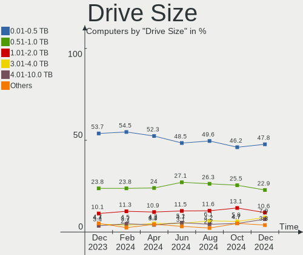

Debian Hardware Trends
----------------------

A project to identify most popular hardware characteristics and track their change
over time based on data collected by Debian users at https://Linux-Hardware.org.

Anyone can contribute to this report by the [hw-probe](https://github.com/linuxhw/hw-probe) tool:

    sudo -E hw-probe -all -upload

This is a report for all computer types. See also reports for [desktops](/Dist/Debian/Desktop/README.md) and [notebooks](/Dist/Debian/Notebook/README.md).

Full-feature report is available here: https://linux-hardware.org/?view=trends

Period: Jan, 2022.

Contents
--------

* [ System ](#system)
  - [ OS                       ](#os)
  - [ OS Family                ](#os-family)
  - [ Kernel                   ](#kernel)
  - [ Kernel Family            ](#kernel-family)
  - [ Kernel Major Ver.        ](#kernel-major-ver)
  - [ Arch                     ](#arch)
  - [ DE                       ](#de)
  - [ Display Server           ](#display-server)
  - [ Display Manager          ](#display-manager)
  - [ OS Lang                  ](#os-lang)
  - [ Boot Mode                ](#boot-mode)
  - [ Filesystem               ](#filesystem)
  - [ Part. scheme             ](#part-scheme)
  - [ Dual Boot with Linux/BSD ](#dual-boot-with-linuxbsd)
  - [ Dual Boot (Win)          ](#dual-boot-win)

* [ Board ](#board)
  - [ Vendor                   ](#vendor)
  - [ Model                    ](#model)
  - [ Model Family             ](#model-family)
  - [ MFG Year                 ](#mfg-year)
  - [ Form Factor              ](#form-factor)
  - [ Secure Boot              ](#secure-boot)
  - [ Coreboot                 ](#coreboot)
  - [ RAM Size                 ](#ram-size)
  - [ RAM Used                 ](#ram-used)
  - [ Total Drives             ](#total-drives)
  - [ Has CD-ROM               ](#has-cd-rom)
  - [ Has Ethernet             ](#has-ethernet)
  - [ Has WiFi                 ](#has-wifi)
  - [ Has Bluetooth            ](#has-bluetooth)

* [ Location ](#location)
  - [ Country                  ](#country)
  - [ City                     ](#city)

* [ Drives ](#drives)
  - [ Drive Vendor             ](#drive-vendor)
  - [ Drive Model              ](#drive-model)
  - [ HDD Vendor               ](#hdd-vendor)
  - [ SSD Vendor               ](#ssd-vendor)
  - [ Drive Kind               ](#drive-kind)
  - [ Drive Connector          ](#drive-connector)
  - [ Drive Size               ](#drive-size)
  - [ Space Total              ](#space-total)
  - [ Space Used               ](#space-used)
  - [ Malfunc. Drives          ](#malfunc-drives)
  - [ Malfunc. Drive Vendor    ](#malfunc-drive-vendor)
  - [ Malfunc. HDD Vendor      ](#malfunc-hdd-vendor)
  - [ Malfunc. Drive Kind      ](#malfunc-drive-kind)
  - [ Failed Drives            ](#failed-drives)
  - [ Failed Drive Vendor      ](#failed-drive-vendor)
  - [ Drive Status             ](#drive-status)

* [ Storage controller ](#storage-controller)
  - [ Storage Vendor           ](#storage-vendor)
  - [ Storage Model            ](#storage-model)
  - [ Storage Kind             ](#storage-kind)

* [ Processor ](#processor)
  - [ CPU Vendor               ](#cpu-vendor)
  - [ CPU Model                ](#cpu-model)
  - [ CPU Model Family         ](#cpu-model-family)
  - [ CPU Cores                ](#cpu-cores)
  - [ CPU Sockets              ](#cpu-sockets)
  - [ CPU Threads              ](#cpu-threads)
  - [ CPU Op-Modes             ](#cpu-op-modes)
  - [ CPU Microcode            ](#cpu-microcode)
  - [ CPU Microarch            ](#cpu-microarch)

* [ Graphics ](#graphics)
  - [ GPU Vendor               ](#gpu-vendor)
  - [ GPU Model                ](#gpu-model)
  - [ GPU Combo                ](#gpu-combo)
  - [ GPU Driver               ](#gpu-driver)
  - [ GPU Memory               ](#gpu-memory)

* [ Monitor ](#monitor)
  - [ Monitor Vendor           ](#monitor-vendor)
  - [ Monitor Model            ](#monitor-model)
  - [ Monitor Resolution       ](#monitor-resolution)
  - [ Monitor Diagonal         ](#monitor-diagonal)
  - [ Monitor Width            ](#monitor-width)
  - [ Aspect Ratio             ](#aspect-ratio)
  - [ Monitor Area             ](#monitor-area)
  - [ Pixel Density            ](#pixel-density)
  - [ Multiple Monitors        ](#multiple-monitors)

* [ Network ](#network)
  - [ Net Controller Vendor    ](#net-controller-vendor)
  - [ Net Controller Model     ](#net-controller-model)
  - [ Wireless Vendor          ](#wireless-vendor)
  - [ Wireless Model           ](#wireless-model)
  - [ Ethernet Vendor          ](#ethernet-vendor)
  - [ Ethernet Model           ](#ethernet-model)
  - [ Net Controller Kind      ](#net-controller-kind)
  - [ Used Controller          ](#used-controller)
  - [ NICs                     ](#nics)
  - [ IPv6                     ](#ipv6)

* [ Bluetooth ](#bluetooth)
  - [ Bluetooth Vendor         ](#bluetooth-vendor)
  - [ Bluetooth Model          ](#bluetooth-model)

* [ Sound ](#sound)
  - [ Sound Vendor             ](#sound-vendor)
  - [ Sound Model              ](#sound-model)

* [ Memory ](#memory)
  - [ Memory Vendor            ](#memory-vendor)
  - [ Memory Model             ](#memory-model)
  - [ Memory Kind              ](#memory-kind)
  - [ Memory Form Factor       ](#memory-form-factor)
  - [ Memory Size              ](#memory-size)
  - [ Memory Speed             ](#memory-speed)

* [ Printers & scanners ](#printers--scanners)
  - [ Printer Vendor           ](#printer-vendor)
  - [ Printer Model            ](#printer-model)
  - [ Scanner Vendor           ](#scanner-vendor)
  - [ Scanner Model            ](#scanner-model)

* [ Camera ](#camera)
  - [ Camera Vendor            ](#camera-vendor)
  - [ Camera Model             ](#camera-model)

* [ Security ](#security)
  - [ Fingerprint Vendor       ](#fingerprint-vendor)
  - [ Fingerprint Model        ](#fingerprint-model)
  - [ Chipcard Vendor          ](#chipcard-vendor)
  - [ Chipcard Model           ](#chipcard-model)

* [ Unsupported ](#unsupported)
  - [ Unsupported Devices      ](#unsupported-devices)
  - [ Unsupported Device Types ](#unsupported-device-types)

System
------

OS
--

Installed operating systems

| Name              | Computers | Percent |
|-------------------|-----------|---------|
| Debian 11         | 238       | 79.87%  |
| Debian Unstable   | 17        | 5.7%    |
| Debian Testing    | 16        | 5.37%   |
| Debian 10         | 12        | 4.03%   |
| Debian 5          | 5         | 1.68%   |
| Debian 11-updates | 5         | 1.68%   |
| Debian 9          | 2         | 0.67%   |
| Debian 8          | 2         | 0.67%   |
| Debian 99         | 1         | 0.34%   |

OS Family
---------

OS without a version

| Name   | Computers | Percent |
|--------|-----------|---------|
| Debian | 298       | 100%    |

Kernel
------

Version of the Linux kernel

| Version                      | Computers | Percent |
|------------------------------|-----------|---------|
| 5.10.0-10-amd64              | 99        | 33.22%  |
| 5.10.0-11-amd64              | 35        | 11.74%  |
| 5.15.0-2-amd64               | 29        | 9.73%   |
| 5.10.0-7-amd64               | 24        | 8.05%   |
| 5.10.0-9-amd64               | 12        | 4.03%   |
| 5.10.0-8-amd64               | 9         | 3.02%   |
| 5.13.19-2-pve                | 8         | 2.68%   |
| 5.15.0-0.bpo.2-amd64         | 7         | 2.35%   |
| 5.15.0-3-amd64               | 6         | 2.01%   |
| 5.10.0-10-686-pae            | 6         | 2.01%   |
| 4.19.0-18-amd64              | 6         | 2.01%   |
| 5.14.0-9parrot1-amd64        | 5         | 1.68%   |
| 5.13.19-3-pve                | 4         | 1.34%   |
| 5.16.0-rc8-amd64             | 3         | 1.01%   |
| 5.10.63-v8+                  | 3         | 1.01%   |
| 5.14.0-0.bpo.2-amd64         | 2         | 0.67%   |
| 5.10.0-6-amd64               | 2         | 0.67%   |
| 5.10.0-11-686-pae            | 2         | 0.67%   |
| 4.19.0-0.bpo.9-amd64         | 2         | 0.67%   |
| 5.8.0-3-amd64                | 1         | 0.34%   |
| 5.4.0-faked                  | 1         | 0.34%   |
| 5.16.0-amd64                 | 1         | 0.34%   |
| 5.15.5-custom-v16            | 1         | 0.34%   |
| 5.15.15-qcmm                 | 1         | 0.34%   |
| 5.15.13titanide-1            | 1         | 0.34%   |
| 5.15.11-xanmod1              | 1         | 0.34%   |
| 5.15.11-bully-1.0            | 1         | 0.34%   |
| 5.15.0-2mx-amd64             | 1         | 0.34%   |
| 5.15.0-16.2-liquorix-amd64   | 1         | 0.34%   |
| 5.15.0-13.1-liquorix-amd64   | 1         | 0.34%   |
| 5.15.0-12.2-liquorix-amd64   | 1         | 0.34%   |
| 5.14.21                      | 1         | 0.34%   |
| 5.14.0-4mx-amd64             | 1         | 0.34%   |
| 5.14.0-2-amd64               | 1         | 0.34%   |
| 5.14.0-0.bpo.2-686-pae       | 1         | 0.34%   |
| 5.13.19-1-pve                | 1         | 0.34%   |
| 5.13.13                      | 1         | 0.34%   |
| 5.10.92-v8+                  | 1         | 0.34%   |
| 5.10.81+truenas              | 1         | 0.34%   |
| 5.10.57-antix.1-amd64-smp    | 1         | 0.34%   |
| 5.10.0-9-686                 | 1         | 0.34%   |
| 5.10.0-11-arm64              | 1         | 0.34%   |
| 5.10.0-11-686                | 1         | 0.34%   |
| 5.10.0-10-686                | 1         | 0.34%   |
| 5.10.0-0.bpo.9-amd64         | 1         | 0.34%   |
| 4.9.0-8-amd64                | 1         | 0.34%   |
| 4.9.0-0.bpo.11-amd64         | 1         | 0.34%   |
| 4.9.0-0.bpo.11-686-pae       | 1         | 0.34%   |
| 4.19.202-antix.1-686-smp-pae | 1         | 0.34%   |
| 4.19.0-6-amd64               | 1         | 0.34%   |
| 4.19.0-17-amd64              | 1         | 0.34%   |
| 4.19.0-16-amd64              | 1         | 0.34%   |
| 3.16.0-11-amd64              | 1         | 0.34%   |

Kernel Family
-------------

Linux kernel without a distro release

| Version  | Computers | Percent |
|----------|-----------|---------|
| 5.10.0   | 194       | 65.1%   |
| 5.15.0   | 46        | 15.44%  |
| 5.13.19  | 13        | 4.36%   |
| 4.19.0   | 11        | 3.69%   |
| 5.14.0   | 10        | 3.36%   |
| 5.16.0   | 4         | 1.34%   |
| 5.10.63  | 3         | 1.01%   |
| 4.9.0    | 3         | 1.01%   |
| 5.15.11  | 2         | 0.67%   |
| 5.8.0    | 1         | 0.34%   |
| 5.4.0    | 1         | 0.34%   |
| 5.15.5   | 1         | 0.34%   |
| 5.15.15  | 1         | 0.34%   |
| 5.15.13  | 1         | 0.34%   |
| 5.14.21  | 1         | 0.34%   |
| 5.13.13  | 1         | 0.34%   |
| 5.10.92  | 1         | 0.34%   |
| 5.10.81  | 1         | 0.34%   |
| 5.10.57  | 1         | 0.34%   |
| 4.19.202 | 1         | 0.34%   |
| 3.16.0   | 1         | 0.34%   |

Kernel Major Ver.
-----------------

Linux kernel major version

| Version | Computers | Percent |
|---------|-----------|---------|
| 5.10    | 200       | 67.11%  |
| 5.15    | 51        | 17.11%  |
| 5.13    | 14        | 4.7%    |
| 4.19    | 12        | 4.03%   |
| 5.14    | 11        | 3.69%   |
| 5.16    | 4         | 1.34%   |
| 4.9     | 3         | 1.01%   |
| 5.8     | 1         | 0.34%   |
| 5.4     | 1         | 0.34%   |
| 3.16    | 1         | 0.34%   |

Arch
----

OS architecture (x86_64, i586, etc.)

| Name    | Computers | Percent |
|---------|-----------|---------|
| x86_64  | 278       | 93.29%  |
| i686    | 14        | 4.7%    |
| aarch64 | 6         | 2.01%   |

DE
--

Desktop Environment

| Name             | Computers | Percent |
|------------------|-----------|---------|
| GNOME            | 72        | 24.16%  |
| Unknown          | 72        | 24.16%  |
| KDE5             | 49        | 16.44%  |
| XFCE             | 44        | 14.77%  |
| MATE             | 14        | 4.7%    |
| LXDE             | 14        | 4.7%    |
| X-Cinnamon       | 8         | 2.68%   |
| Cinnamon         | 8         | 2.68%   |
| lightdm-xsession | 5         | 1.68%   |
| LXQt             | 3         | 1.01%   |
| KDE              | 3         | 1.01%   |
| i3               | 2         | 0.67%   |
| trinity          | 1         | 0.34%   |
| GNOME Flashback  | 1         | 0.34%   |
| GNOME Classic    | 1         | 0.34%   |
| awesome          | 1         | 0.34%   |

Display Server
--------------

X11 or Wayland

| Name    | Computers | Percent |
|---------|-----------|---------|
| X11     | 170       | 57.05%  |
| Wayland | 54        | 18.12%  |
| Unknown | 39        | 13.09%  |
| Tty     | 35        | 11.74%  |

Display Manager
---------------

SDDM, LightDM, etc.

| Name    | Computers | Percent |
|---------|-----------|---------|
| Unknown | 118       | 39.6%   |
| LightDM | 68        | 22.82%  |
| GDM     | 45        | 15.1%   |
| SDDM    | 39        | 13.09%  |
| GDM3    | 20        | 6.71%   |
| SLiM    | 4         | 1.34%   |
| XDM     | 2         | 0.67%   |
| NODM    | 2         | 0.67%   |

OS Lang
-------

Language

| Lang        | Computers | Percent |
|-------------|-----------|---------|
| en_US       | 113       | 37.92%  |
| ru_RU       | 31        | 10.4%   |
| de_DE       | 29        | 9.73%   |
| fr_FR       | 19        | 6.38%   |
| en_GB       | 15        | 5.03%   |
| pt_BR       | 11        | 3.69%   |
| Unknown     | 10        | 3.36%   |
| es_ES       | 8         | 2.68%   |
| it_IT       | 6         | 2.01%   |
| pl_PL       | 5         | 1.68%   |
| zh_CN       | 4         | 1.34%   |
| hu_HU       | 4         | 1.34%   |
| es_AR       | 4         | 1.34%   |
| en_IN       | 4         | 1.34%   |
| en_AU       | 4         | 1.34%   |
| es_MX       | 3         | 1.01%   |
| en_CA       | 3         | 1.01%   |
| C           | 3         | 1.01%   |
| nl_NL       | 2         | 0.67%   |
| es_VE       | 2         | 0.67%   |
| es_CL       | 2         | 0.67%   |
| de_CH       | 2         | 0.67%   |
| zh_TW       | 1         | 0.34%   |
| nl_BE       | 1         | 0.34%   |
| ja_JP.utf-8 | 1         | 0.34%   |
| ja_JP       | 1         | 0.34%   |
| it_CH       | 1         | 0.34%   |
| id_ID       | 1         | 0.34%   |
| hr_HR       | 1         | 0.34%   |
| et_EE       | 1         | 0.34%   |
| es_PY       | 1         | 0.34%   |
| es_BO       | 1         | 0.34%   |
| en_ZA       | 1         | 0.34%   |
| en_NG       | 1         | 0.34%   |
| en_IE       | 1         | 0.34%   |
| ca_ES       | 1         | 0.34%   |

Boot Mode
---------

EFI or BIOS

| Mode | Computers | Percent |
|------|-----------|---------|
| EFI  | 153       | 51.34%  |
| BIOS | 145       | 48.66%  |

Filesystem
----------

Type of filesystem

| Type    | Computers | Percent |
|---------|-----------|---------|
| Ext4    | 237       | 79.53%  |
| Overlay | 37        | 12.42%  |
| Btrfs   | 15        | 5.03%   |
| Zfs     | 5         | 1.68%   |
| Xfs     | 2         | 0.67%   |
| Tmpfs   | 1         | 0.34%   |
| Ext2    | 1         | 0.34%   |

Part. scheme
------------

Scheme of partitioning

| Type    | Computers | Percent |
|---------|-----------|---------|
| GPT     | 161       | 54.03%  |
| MBR     | 77        | 25.84%  |
| Unknown | 60        | 20.13%  |

Dual Boot with Linux/BSD
------------------------

Hosting more than one Linux/BSD

| Dual boot | Computers | Percent |
|-----------|-----------|---------|
| No        | 252       | 84.56%  |
| Yes       | 46        | 15.44%  |

Dual Boot (Win)
---------------

Hosting Linux and Windows

| Dual boot | Computers | Percent |
|-----------|-----------|---------|
| No        | 205       | 68.79%  |
| Yes       | 93        | 31.21%  |

Board
-----

Vendor
------

Motherboard manufacturer

| Name                    | Computers | Percent |
|-------------------------|-----------|---------|
| Lenovo                  | 55        | 18.46%  |
| Hewlett-Packard         | 41        | 13.76%  |
| ASUSTek Computer        | 37        | 12.42%  |
| Dell                    | 33        | 11.07%  |
| MSI                     | 18        | 6.04%   |
| Gigabyte Technology     | 15        | 5.03%   |
| ASRock                  | 13        | 4.36%   |
| Acer                    | 11        | 3.69%   |
| Toshiba                 | 6         | 2.01%   |
| Aquarius                | 6         | 2.01%   |
| Sony                    | 5         | 1.68%   |
| Samsung Electronics     | 5         | 1.68%   |
| Intel                   | 5         | 1.68%   |
| Unknown                 | 5         | 1.68%   |
| Supermicro              | 4         | 1.34%   |
| Raspberry Pi Foundation | 4         | 1.34%   |
| Medion                  | 4         | 1.34%   |
| Apple                   | 4         | 1.34%   |
| Compal                  | 2         | 0.67%   |
| AZW                     | 2         | 0.67%   |
| Alienware               | 2         | 0.67%   |
| ZOTAC                   | 1         | 0.34%   |
| YiFang                  | 1         | 0.34%   |
| TUXEDO                  | 1         | 0.34%   |
| Timi                    | 1         | 0.34%   |
| Positivo                | 1         | 0.34%   |
| Phytium                 | 1         | 0.34%   |
| Packard Bell            | 1         | 0.34%   |
| Notebook                | 1         | 0.34%   |
| Microsoft               | 1         | 0.34%   |
| Micro Electronics       | 1         | 0.34%   |
| Lex BayTrail            | 1         | 0.34%   |
| Jumper                  | 1         | 0.34%   |
| Inventec                | 1         | 0.34%   |
| IBM                     | 1         | 0.34%   |
| HUAWEI                  | 1         | 0.34%   |
| Fujitsu                 | 1         | 0.34%   |
| Foxconn                 | 1         | 0.34%   |
| EPoX Computer           | 1         | 0.34%   |
| ECS                     | 1         | 0.34%   |
| Biostar                 | 1         | 0.34%   |
| AXDIA International     | 1         | 0.34%   |

Model
-----

Motherboard model

| Name                                      | Computers | Percent |
|-------------------------------------------|-----------|---------|
| Aquarius NS585                            | 6         | 2.01%   |
| Unknown                                   | 5         | 1.68%   |
| RPi Raspberry Pi                          | 4         | 1.34%   |
| ASUS All Series                           | 4         | 1.34%   |
| Lenovo ThinkPad L13 Yoga Gen 2 20VK0019US | 3         | 1.01%   |
| Lenovo ThinkPad E475 20H40006US           | 3         | 1.01%   |
| ASUS PRIME B450M-A                        | 3         | 1.01%   |
| Samsung N150P/N210P/N220P                 | 2         | 0.67%   |
| Lenovo IdeaPad Slim 1-14AST-05 81VS       | 2         | 0.67%   |
| Lenovo IdeaPad S540-13API 81XC            | 2         | 0.67%   |
| Intel S1200RP                             | 2         | 0.67%   |
| HP Z420 Workstation                       | 2         | 0.67%   |
| HP ProBook 650 G5                         | 2         | 0.67%   |
| HP Pavilion Gaming Laptop 15-ec2xxx       | 2         | 0.67%   |
| HP Laptop 15-db0xxx                       | 2         | 0.67%   |
| HP EliteBook 8440p                        | 2         | 0.67%   |
| HP 250 G7 Notebook PC                     | 2         | 0.67%   |
| Gigabyte Z77X-D3H                         | 2         | 0.67%   |
| Dell Inspiron 5580                        | 2         | 0.67%   |
| Dell Inspiron 15-3567                     | 2         | 0.67%   |
| ASUS TUF GAMING X570-PLUS                 | 2         | 0.67%   |
| ASUS PRIME H510M-A                        | 2         | 0.67%   |
| ASRock H470M-HVS                          | 2         | 0.67%   |
| Acer Aspire A515-56                       | 2         | 0.67%   |
| ZOTAC ZBOX-CI527/CI547                    | 1         | 0.34%   |
| YiFang NXW9QC132                          | 1         | 0.34%   |
| TUXEDO Polaris 15 AMD Gen1                | 1         | 0.34%   |
| Toshiba TECRA R950                        | 1         | 0.34%   |
| Toshiba TECRA A50-C                       | 1         | 0.34%   |
| Toshiba Satellite P850                    | 1         | 0.34%   |
| Toshiba Satellite L775D                   | 1         | 0.34%   |
| Toshiba Satellite L50-B                   | 1         | 0.34%   |
| Toshiba Satellite C660D                   | 1         | 0.34%   |
| Timi A7S                                  | 1         | 0.34%   |
| Supermicro X9SRA/X9SRA-3                  | 1         | 0.34%   |
| Supermicro X8DA3                          | 1         | 0.34%   |
| Supermicro Super Server                   | 1         | 0.34%   |
| Supermicro C7SIM-Q                        | 1         | 0.34%   |
| Sony VPCS13V9E                            | 1         | 0.34%   |
| Sony VPCF12C5E                            | 1         | 0.34%   |
| Sony VPCEB3S1E                            | 1         | 0.34%   |
| Sony SVS13A1C5E                           | 1         | 0.34%   |
| Sony SVE15127CDS                          | 1         | 0.34%   |
| Samsung 750XDA                            | 1         | 0.34%   |
| Samsung 535U3C                            | 1         | 0.34%   |
| Samsung 340XAA/350XAA/550XAA              | 1         | 0.34%   |
| Positivo Harrison                         | 1         | 0.34%   |
| Phytium FT-2000/4                         | 1         | 0.34%   |
| Packard Bell EasyNote LM98                | 1         | 0.34%   |
| Notebook W65_67SZ                         | 1         | 0.34%   |
| MSI p6620ch-m                             | 1         | 0.34%   |
| MSI MS-7C80                               | 1         | 0.34%   |
| MSI MS-7C75                               | 1         | 0.34%   |
| MSI MS-7C56                               | 1         | 0.34%   |
| MSI MS-7C37                               | 1         | 0.34%   |
| MSI MS-7C31                               | 1         | 0.34%   |
| MSI MS-7B79                               | 1         | 0.34%   |
| MSI MS-7B24                               | 1         | 0.34%   |
| MSI MS-7A34                               | 1         | 0.34%   |
| MSI MS-7A15                               | 1         | 0.34%   |

Model Family
------------

Motherboard model prefix

| Name                  | Computers | Percent |
|-----------------------|-----------|---------|
| Lenovo ThinkPad       | 27        | 9.06%   |
| Dell Inspiron         | 13        | 4.36%   |
| Lenovo IdeaPad        | 11        | 3.69%   |
| Dell Latitude         | 10        | 3.36%   |
| Acer Aspire           | 8         | 2.68%   |
| HP Pavilion           | 7         | 2.35%   |
| Aquarius NS585        | 6         | 2.01%   |
| ASUS ROG              | 5         | 1.68%   |
| ASUS PRIME            | 5         | 1.68%   |
| Unknown               | 5         | 1.68%   |
| Toshiba Satellite     | 4         | 1.34%   |
| RPi Raspberry         | 4         | 1.34%   |
| HP Laptop             | 4         | 1.34%   |
| HP EliteBook          | 4         | 1.34%   |
| HP Compaq             | 4         | 1.34%   |
| Dell Vostro           | 4         | 1.34%   |
| ASUS All              | 4         | 1.34%   |
| HP ProBook            | 3         | 1.01%   |
| HP 250                | 3         | 1.01%   |
| ASUS TUF              | 3         | 1.01%   |
| Toshiba TECRA         | 2         | 0.67%   |
| Samsung N150P         | 2         | 0.67%   |
| Lenovo Yoga           | 2         | 0.67%   |
| Lenovo ThinkStation   | 2         | 0.67%   |
| Intel S1200RP         | 2         | 0.67%   |
| HP Z420               | 2         | 0.67%   |
| HP ProDesk            | 2         | 0.67%   |
| HP EliteDesk          | 2         | 0.67%   |
| Gigabyte Z77X-D3H     | 2         | 0.67%   |
| Dell XPS              | 2         | 0.67%   |
| Dell Precision        | 2         | 0.67%   |
| ASUS ZenBook          | 2         | 0.67%   |
| ASRock H470M-HVS      | 2         | 0.67%   |
| Acer Swift            | 2         | 0.67%   |
| ZOTAC ZBOX-CI527      | 1         | 0.34%   |
| YiFang NXW9QC132      | 1         | 0.34%   |
| TUXEDO Polaris        | 1         | 0.34%   |
| Timi A7S              | 1         | 0.34%   |
| Supermicro X9SRA      | 1         | 0.34%   |
| Supermicro X8DA3      | 1         | 0.34%   |
| Supermicro Super      | 1         | 0.34%   |
| Supermicro C7SIM-Q    | 1         | 0.34%   |
| Sony VPCS13V9E        | 1         | 0.34%   |
| Sony VPCF12C5E        | 1         | 0.34%   |
| Sony VPCEB3S1E        | 1         | 0.34%   |
| Sony SVS13A1C5E       | 1         | 0.34%   |
| Sony SVE15127CDS      | 1         | 0.34%   |
| Samsung 750XDA        | 1         | 0.34%   |
| Samsung 535U3C        | 1         | 0.34%   |
| Samsung 340XAA        | 1         | 0.34%   |
| Positivo Harrison     | 1         | 0.34%   |
| Phytium FT-2000       | 1         | 0.34%   |
| Packard Bell EasyNote | 1         | 0.34%   |
| Notebook W65          | 1         | 0.34%   |
| MSI p6620ch-m         | 1         | 0.34%   |
| MSI MS-7C80           | 1         | 0.34%   |
| MSI MS-7C75           | 1         | 0.34%   |
| MSI MS-7C56           | 1         | 0.34%   |
| MSI MS-7C37           | 1         | 0.34%   |
| MSI MS-7C31           | 1         | 0.34%   |

MFG Year
--------

Motherboard manufacture year

| Year    | Computers | Percent |
|---------|-----------|---------|
| 2021    | 43        | 14.43%  |
| 2020    | 37        | 12.42%  |
| 2012    | 28        | 9.4%    |
| 2019    | 27        | 9.06%   |
| 2018    | 25        | 8.39%   |
| 2017    | 20        | 6.71%   |
| 2010    | 20        | 6.71%   |
| 2013    | 16        | 5.37%   |
| 2016    | 15        | 5.03%   |
| 2014    | 15        | 5.03%   |
| 2011    | 13        | 4.36%   |
| 2015    | 12        | 4.03%   |
| 2009    | 10        | 3.36%   |
| 2008    | 5         | 1.68%   |
| Unknown | 5         | 1.68%   |
| 2005    | 3         | 1.01%   |
| 2007    | 2         | 0.67%   |
| 2006    | 1         | 0.34%   |
| 2002    | 1         | 0.34%   |

Form Factor
-----------

Physical design of the computer

| Name           | Computers | Percent |
|----------------|-----------|---------|
| Notebook       | 167       | 56.04%  |
| Desktop        | 97        | 32.55%  |
| Convertible    | 11        | 3.69%   |
| Server         | 8         | 2.68%   |
| Mini pc        | 6         | 2.01%   |
| System on chip | 5         | 1.68%   |
| Tablet         | 2         | 0.67%   |
| All in one     | 2         | 0.67%   |

Secure Boot
-----------

Enabled or disabled

| State    | Computers | Percent |
|----------|-----------|---------|
| Disabled | 279       | 93.62%  |
| Enabled  | 19        | 6.38%   |

Coreboot
--------

Have coreboot on board

| Used | Computers | Percent |
|------|-----------|---------|
| No   | 298       | 100%    |

RAM Size
--------

Total RAM memory

| Size in GB      | Computers | Percent |
|-----------------|-----------|---------|
| 4.01-8.0        | 87        | 29.19%  |
| 8.01-16.0       | 56        | 18.79%  |
| 16.01-24.0      | 53        | 17.79%  |
| 3.01-4.0        | 39        | 13.09%  |
| 32.01-64.0      | 31        | 10.4%   |
| 64.01-256.0     | 12        | 4.03%   |
| 2.01-3.0        | 6         | 2.01%   |
| 24.01-32.0      | 5         | 1.68%   |
| 1.01-2.0        | 4         | 1.34%   |
| 0.51-1.0        | 3         | 1.01%   |
| More than 256.0 | 2         | 0.67%   |

RAM Used
--------

Used RAM memory

| Used GB     | Computers | Percent |
|-------------|-----------|---------|
| 1.01-2.0    | 81        | 27.18%  |
| 2.01-3.0    | 59        | 19.8%   |
| 4.01-8.0    | 55        | 18.46%  |
| 0.51-1.0    | 47        | 15.77%  |
| 3.01-4.0    | 27        | 9.06%   |
| 8.01-16.0   | 15        | 5.03%   |
| 0.01-0.5    | 8         | 2.68%   |
| 24.01-32.0  | 2         | 0.67%   |
| 16.01-24.0  | 2         | 0.67%   |
| 32.01-64.0  | 1         | 0.34%   |
| 64.01-256.0 | 1         | 0.34%   |

Total Drives
------------

Number of drives on board

| Drives | Computers | Percent |
|--------|-----------|---------|
| 1      | 175       | 58.72%  |
| 2      | 66        | 22.15%  |
| 3      | 23        | 7.72%   |
| 4      | 15        | 5.03%   |
| 5      | 7         | 2.35%   |
| 6      | 4         | 1.34%   |
| 7      | 3         | 1.01%   |
| 0      | 2         | 0.67%   |
| 28     | 1         | 0.34%   |
| 11     | 1         | 0.34%   |
| 10     | 1         | 0.34%   |

Has CD-ROM
----------

Has CD-ROM on board

| Presented | Computers | Percent |
|-----------|-----------|---------|
| No        | 215       | 72.15%  |
| Yes       | 83        | 27.85%  |

Has Ethernet
------------

Has Ethernet on board

| Presented | Computers | Percent |
|-----------|-----------|---------|
| Yes       | 256       | 85.91%  |
| No        | 42        | 14.09%  |

Has WiFi
--------

Has WiFi module

| Presented | Computers | Percent |
|-----------|-----------|---------|
| Yes       | 210       | 70.47%  |
| No        | 88        | 29.53%  |

Has Bluetooth
-------------

Has Bluetooth module

| Presented | Computers | Percent |
|-----------|-----------|---------|
| Yes       | 167       | 56.04%  |
| No        | 131       | 43.96%  |

Location
--------

Country
-------

Geographic location (country)

| Country      | Computers | Percent |
|--------------|-----------|---------|
| USA          | 50        | 16.78%  |
| Germany      | 41        | 13.76%  |
| Russia       | 34        | 11.41%  |
| France       | 22        | 7.38%   |
| Brazil       | 13        | 4.36%   |
| UK           | 12        | 4.03%   |
| Italy        | 11        | 3.69%   |
| Spain        | 10        | 3.36%   |
| Switzerland  | 8         | 2.68%   |
| Netherlands  | 8         | 2.68%   |
| Poland       | 7         | 2.35%   |
| Canada       | 6         | 2.01%   |
| Mexico       | 5         | 1.68%   |
| India        | 5         | 1.68%   |
| China        | 5         | 1.68%   |
| Belgium      | 5         | 1.68%   |
| Hungary      | 4         | 1.34%   |
| Czechia      | 4         | 1.34%   |
| Australia    | 4         | 1.34%   |
| Argentina    | 4         | 1.34%   |
| Norway       | 3         | 1.01%   |
| Venezuela    | 2         | 0.67%   |
| Turkey       | 2         | 0.67%   |
| Sweden       | 2         | 0.67%   |
| South Africa | 2         | 0.67%   |
| Slovenia     | 2         | 0.67%   |
| Romania      | 2         | 0.67%   |
| Japan        | 2         | 0.67%   |
| Indonesia    | 2         | 0.67%   |
| Chile        | 2         | 0.67%   |
| Bangladesh   | 2         | 0.67%   |
| Austria      | 2         | 0.67%   |
| Taiwan       | 1         | 0.34%   |
| Slovakia     | 1         | 0.34%   |
| Saudi Arabia | 1         | 0.34%   |
| Paraguay     | 1         | 0.34%   |
| Nigeria      | 1         | 0.34%   |
| Morocco      | 1         | 0.34%   |
| Madagascar   | 1         | 0.34%   |
| Latvia       | 1         | 0.34%   |
| Kazakhstan   | 1         | 0.34%   |
| Iran         | 1         | 0.34%   |
| Hong Kong    | 1         | 0.34%   |
| Finland      | 1         | 0.34%   |
| Estonia      | 1         | 0.34%   |
| Croatia      | 1         | 0.34%   |
| Bolivia      | 1         | 0.34%   |

City
----

Geographic location (city)

| City                     | Computers | Percent |
|--------------------------|-----------|---------|
| Voronezh                 | 25        | 8.39%   |
| Berlin                   | 7         | 2.35%   |
| Bangor                   | 7         | 2.35%   |
| Frankfurt am Main        | 5         | 1.68%   |
| Prague                   | 4         | 1.34%   |
| Wheaton                  | 3         | 1.01%   |
| Warsaw                   | 3         | 1.01%   |
| S??o Paulo               | 3         | 1.01%   |
| Paris                    | 3         | 1.01%   |
| Oslo                     | 3         | 1.01%   |
| Falkenstein              | 3         | 1.01%   |
| Barcelona                | 3         | 1.01%   |
| Zurich                   | 2         | 0.67%   |
| Turin                    | 2         | 0.67%   |
| Shenzhen                 | 2         | 0.67%   |
| San Antonio              | 2         | 0.67%   |
| Pretoria                 | 2         | 0.67%   |
| Munich                   | 2         | 0.67%   |
| Moscow                   | 2         | 0.67%   |
| Midlothian               | 2         | 0.67%   |
| London                   | 2         | 0.67%   |
| Ljubljana                | 2         | 0.67%   |
| Le Kremlin-Bicetre       | 2         | 0.67%   |
| Hamburg                  | 2         | 0.67%   |
| Grenoble                 | 2         | 0.67%   |
| Fenstanton               | 2         | 0.67%   |
| Donostia / San Sebastian | 2         | 0.67%   |
| Darmstadt                | 2         | 0.67%   |
| Cologne                  | 2         | 0.67%   |
| Cambridge                | 2         | 0.67%   |
| Brussels                 | 2         | 0.67%   |
| Bologna                  | 2         | 0.67%   |
| Biancavilla              | 2         | 0.67%   |
| ?‰rd                     | 2         | 0.67%   |
| Angers                   | 2         | 0.67%   |
| Amsterdam                | 2         | 0.67%   |
| Zvenigorod               | 1         | 0.34%   |
| Zaragoza                 | 1         | 0.34%   |
| Yekaterinburg            | 1         | 0.34%   |
| Wo?‚omin                 | 1         | 0.34%   |
| Wildwood                 | 1         | 0.34%   |
| Warrnambool              | 1         | 0.34%   |
| Waregem                  | 1         | 0.34%   |
| Vignola                  | 1         | 0.34%   |
| Valencia                 | 1         | 0.34%   |
| Ungurpils                | 1         | 0.34%   |
| Toyokawa                 | 1         | 0.34%   |
| Toulouse                 | 1         | 0.34%   |
| Tostado                  | 1         | 0.34%   |
| Toledo                   | 1         | 0.34%   |
| Toeroekbalint            | 1         | 0.34%   |
| Tilburg                  | 1         | 0.34%   |
| Thaleischweiler-Froschen | 1         | 0.34%   |
| Texarkana                | 1         | 0.34%   |
| Tehran                   | 1         | 0.34%   |
| T??bingen                | 1         | 0.34%   |
| Tallinn                  | 1         | 0.34%   |
| Szombathely              | 1         | 0.34%   |
| Sydney                   | 1         | 0.34%   |
| Swansea                  | 1         | 0.34%   |

Drives
------

Drive Vendor
------------

Hard drive vendors

| Vendor              | Computers | Drives | Percent |
|---------------------|-----------|--------|---------|
| Samsung Electronics | 81        | 96     | 17.96%  |
| WDC                 | 65        | 88     | 14.41%  |
| Seagate             | 53        | 89     | 11.75%  |
| Toshiba             | 32        | 49     | 7.1%    |
| Kingston            | 27        | 29     | 5.99%   |
| Crucial             | 23        | 26     | 5.1%    |
| SanDisk             | 20        | 24     | 4.43%   |
| Unknown             | 18        | 19     | 3.99%   |
| A-DATA Technology   | 16        | 18     | 3.55%   |
| SK Hynix            | 14        | 14     | 3.1%    |
| Hitachi             | 12        | 12     | 2.66%   |
| Intel               | 9         | 11     | 2%      |
| Micron Technology   | 6         | 6      | 1.33%   |
| KIOXIA              | 6         | 6      | 1.33%   |
| HGST                | 5         | 7      | 1.11%   |
| China               | 5         | 5      | 1.11%   |
| XPG                 | 4         | 4      | 0.89%   |
| SSSTC               | 3         | 3      | 0.67%   |
| Patriot             | 3         | 3      | 0.67%   |
| Netac               | 3         | 3      | 0.67%   |
| Intenso             | 3         | 3      | 0.67%   |
| Apple               | 3         | 3      | 0.67%   |
| Unknown             | 3         | 3      | 0.67%   |
| UMIS                | 2         | 2      | 0.44%   |
| Phison              | 2         | 2      | 0.44%   |
| JetFlash            | 2         | 2      | 0.44%   |
| Hikvision           | 2         | 2      | 0.44%   |
| Fujitsu             | 2         | 2      | 0.44%   |
| ASMT                | 2         | 2      | 0.44%   |
| ZTC                 | 1         | 1      | 0.22%   |
| Vaseky              | 1         | 1      | 0.22%   |
| USB3.0              | 1         | 1      | 0.22%   |
| Transcend           | 1         | 1      | 0.22%   |
| Silicon Motion      | 1         | 1      | 0.22%   |
| SHGS31-5            | 1         | 1      | 0.22%   |
| Realtek             | 1         | 1      | 0.22%   |
| PNY                 | 1         | 1      | 0.22%   |
| PLEXTOR             | 1         | 1      | 0.22%   |
| Phison Electronics  | 1         | 1      | 0.22%   |
| OCZ                 | 1         | 1      | 0.22%   |
| NGFF                | 1         | 1      | 0.22%   |
| NAS                 | 1         | 5      | 0.22%   |
| Lexar               | 1         | 1      | 0.22%   |
| Lenovo              | 1         | 1      | 0.22%   |
| LDLC                | 1         | 1      | 0.22%   |
| KingSpec            | 1         | 1      | 0.22%   |
| Integral            | 1         | 1      | 0.22%   |
| Inateck             | 1         | 1      | 0.22%   |
| Hewlett-Packard     | 1         | 1      | 0.22%   |
| GOODRAM             | 1         | 1      | 0.22%   |
| Gigabyte Technology | 1         | 1      | 0.22%   |
| BIWIN               | 1         | 1      | 0.22%   |
| Apacer              | 1         | 1      | 0.22%   |
| 2.5"                | 1         | 1      | 0.22%   |

Drive Model
-----------

Hard drive models

| Model                                | Computers | Percent |
|--------------------------------------|-----------|---------|
| A-DATA SU800 512GB SSD               | 8         | 1.58%   |
| Kingston SA400S37240G 240GB SSD      | 7         | 1.38%   |
| Seagate ST2000DM008-2FR102 2TB       | 6         | 1.19%   |
| Toshiba MQ01ABD100 1TB               | 5         | 0.99%   |
| Samsung SSD 970 EVO Plus 1TB         | 5         | 0.99%   |
| Kingston SA400S37120G 120GB SSD      | 5         | 0.99%   |
| Unknown SD/MMC/MS PRO 128GB          | 4         | 0.79%   |
| Samsung SSD 970 EVO Plus 500GB       | 4         | 0.79%   |
| Samsung SSD 860 EVO 500GB            | 4         | 0.79%   |
| Samsung SSD 860 EVO 250GB            | 4         | 0.79%   |
| Samsung SSD 850 EVO 250GB            | 4         | 0.79%   |
| Crucial CT1000MX500SSD1 1TB          | 4         | 0.79%   |
| WDC WDS120G2G0A-00JH30 120GB SSD     | 3         | 0.59%   |
| WDC WD5000AAKX-60U6AA0 500GB         | 3         | 0.59%   |
| WDC WD10SPZX-24Z10 1TB               | 3         | 0.59%   |
| WDC PC SN730 SDBQNTY-512G-1001 512GB | 3         | 0.59%   |
| Toshiba DT01ACA200 2TB               | 3         | 0.59%   |
| Toshiba DT01ACA100 1TB               | 3         | 0.59%   |
| Seagate ST9500325AS 500GB            | 3         | 0.59%   |
| Seagate ST500DM002-1BD142 500GB      | 3         | 0.59%   |
| Seagate Expansion Desk 8TB           | 3         | 0.59%   |
| Samsung SSD 980 PRO 1TB              | 3         | 0.59%   |
| Samsung SSD 970 EVO Plus 2TB         | 3         | 0.59%   |
| Kingston SA400S37960G 960GB SSD      | 3         | 0.59%   |
| Kingston SA400S37480G 480GB SSD      | 3         | 0.59%   |
| Crucial CT500MX500SSD1 500GB         | 3         | 0.59%   |
| Crucial CT480BX500SSD1 480GB         | 3         | 0.59%   |
| Crucial CT120BX500SSD1 120GB         | 3         | 0.59%   |
| Unknown                              | 3         | 0.59%   |
| XPG GAMMIX S11 Pro 2TB               | 2         | 0.4%    |
| WDC WDS240G2G0A-00JH30 240GB SSD     | 2         | 0.4%    |
| WDC WDS100T2B0C-00PXH0 1TB           | 2         | 0.4%    |
| WDC WD5000LPVX-22V0TT0 500GB         | 2         | 0.4%    |
| WDC WD40EZAZ-00SF3B0 4TB             | 2         | 0.4%    |
| WDC WD30EFRX-68EUZN0 3TB             | 2         | 0.4%    |
| WDC WD20EFRX-68AX9N0 2TB             | 2         | 0.4%    |
| WDC WD15EARS-00MVWB0 1TB             | 2         | 0.4%    |
| WDC WD10EZEX-08WN4A0 1TB             | 2         | 0.4%    |
| WDC WD10EZEX-00RKKA0 1TB             | 2         | 0.4%    |
| WDC WD10EZEX-00BN5A0 1TB             | 2         | 0.4%    |
| WDC PC SN730 SDBQNTY-1T00-1001 1TB   | 2         | 0.4%    |
| WDC PC SN730 SDBPNTY-512G-1101 512GB | 2         | 0.4%    |
| UMIS RPFTJ128PDD2EWX 128GB           | 2         | 0.4%    |
| Toshiba HDWD110 1TB                  | 2         | 0.4%    |
| SK Hynix PC711 HFS512GDE9X073N 512GB | 2         | 0.4%    |
| SK Hynix HFM512GD3JX013N 512GB       | 2         | 0.4%    |
| Seagate ST9500420AS 500GB            | 2         | 0.4%    |
| Seagate ST6000DM003-2CY186 6TB       | 2         | 0.4%    |
| Seagate ST31500341AS 1TB             | 2         | 0.4%    |
| Seagate ST2000DM001-1CH164 2TB       | 2         | 0.4%    |
| Seagate ST1000LM024 HN-M101MBB 1TB   | 2         | 0.4%    |
| Seagate ST1000DM010-2EP102 1TB       | 2         | 0.4%    |
| Seagate ST1000DM003-1ER162 1TB       | 2         | 0.4%    |
| Seagate ST1000DM003-1CH162 1TB       | 2         | 0.4%    |
| Seagate Expansion 1TB                | 2         | 0.4%    |
| SanDisk 3.2 Gen 1 250GB SSD          | 2         | 0.4%    |
| Samsung SSD 870 QVO 2TB              | 2         | 0.4%    |
| Samsung SSD 870 EVO 1TB              | 2         | 0.4%    |
| Samsung SSD 860 EVO 1TB              | 2         | 0.4%    |
| Samsung SSD 840 EVO 250GB            | 2         | 0.4%    |

HDD Vendor
----------

Hard disk drive vendors

| Vendor              | Computers | Drives | Percent |
|---------------------|-----------|--------|---------|
| Seagate             | 52        | 87     | 32.3%   |
| WDC                 | 45        | 62     | 27.95%  |
| Toshiba             | 28        | 44     | 17.39%  |
| Hitachi             | 12        | 12     | 7.45%   |
| Samsung Electronics | 7         | 8      | 4.35%   |
| Unknown             | 5         | 5      | 3.11%   |
| HGST                | 5         | 7      | 3.11%   |
| Fujitsu             | 2         | 2      | 1.24%   |
| USB3.0              | 1         | 1      | 0.62%   |
| NAS                 | 1         | 5      | 0.62%   |
| Intenso             | 1         | 1      | 0.62%   |
| Inateck             | 1         | 1      | 0.62%   |
| Apple               | 1         | 1      | 0.62%   |

SSD Vendor
----------

Solid state drive vendors

| Vendor              | Computers | Drives | Percent |
|---------------------|-----------|--------|---------|
| Samsung Electronics | 43        | 48     | 24.57%  |
| Kingston            | 22        | 24     | 12.57%  |
| Crucial             | 22        | 25     | 12.57%  |
| SanDisk             | 17        | 20     | 9.71%   |
| A-DATA Technology   | 14        | 16     | 8%      |
| WDC                 | 10        | 10     | 5.71%   |
| Intel               | 5         | 6      | 2.86%   |
| China               | 5         | 5      | 2.86%   |
| Patriot             | 3         | 3      | 1.71%   |
| Netac               | 3         | 3      | 1.71%   |
| Micron Technology   | 3         | 3      | 1.71%   |
| Toshiba             | 2         | 2      | 1.14%   |
| SK Hynix            | 2         | 2      | 1.14%   |
| Intenso             | 2         | 2      | 1.14%   |
| ASMT                | 2         | 2      | 1.14%   |
| ZTC                 | 1         | 1      | 0.57%   |
| Vaseky              | 1         | 1      | 0.57%   |
| Unknown             | 1         | 1      | 0.57%   |
| Transcend           | 1         | 1      | 0.57%   |
| Seagate             | 1         | 1      | 0.57%   |
| PNY                 | 1         | 1      | 0.57%   |
| PLEXTOR             | 1         | 1      | 0.57%   |
| OCZ                 | 1         | 1      | 0.57%   |
| NGFF                | 1         | 1      | 0.57%   |
| Lexar               | 1         | 1      | 0.57%   |
| LDLC                | 1         | 1      | 0.57%   |
| KingSpec            | 1         | 1      | 0.57%   |
| Integral            | 1         | 1      | 0.57%   |
| GOODRAM             | 1         | 1      | 0.57%   |
| Gigabyte Technology | 1         | 1      | 0.57%   |
| BIWIN               | 1         | 1      | 0.57%   |
| Apple               | 1         | 1      | 0.57%   |
| Apacer              | 1         | 1      | 0.57%   |
| 2.5"                | 1         | 1      | 0.57%   |
| Unknown             | 1         | 1      | 0.57%   |

Drive Kind
----------

HDD or SSD

| Kind    | Computers | Drives | Percent |
|---------|-----------|--------|---------|
| SSD     | 157       | 191    | 39.55%  |
| HDD     | 123       | 236    | 30.98%  |
| NVMe    | 98        | 114    | 24.69%  |
| MMC     | 14        | 16     | 3.53%   |
| Unknown | 5         | 5      | 1.26%   |

Drive Connector
---------------

SATA, SAS, NVMe, etc.

| Type | Computers | Drives | Percent |
|------|-----------|--------|---------|
| SATA | 221       | 387    | 61.9%   |
| NVMe | 98        | 113    | 27.45%  |
| SAS  | 24        | 46     | 6.72%   |
| MMC  | 14        | 16     | 3.92%   |

Drive Size
----------

Size of hard drive

| Size in TB | Computers | Drives | Percent |
|------------|-----------|--------|---------|
| 0.01-0.5   | 164       | 200    | 54.13%  |
| 0.51-1.0   | 86        | 109    | 28.38%  |
| 1.01-2.0   | 25        | 44     | 8.25%   |
| 4.01-10.0  | 15        | 50     | 4.95%   |
| 3.01-4.0   | 8         | 12     | 2.64%   |
| 2.01-3.0   | 4         | 6      | 1.32%   |
| 10.01-20.0 | 1         | 6      | 0.33%   |

Space Total
-----------

Amount of disk space available on the file system

| Size in GB     | Computers | Percent |
|----------------|-----------|---------|
| 101-250        | 85        | 28.52%  |
| 251-500        | 58        | 19.46%  |
| Unknown        | 40        | 13.42%  |
| 501-1000       | 39        | 13.09%  |
| More than 3000 | 18        | 6.04%   |
| 1001-2000      | 17        | 5.7%    |
| 51-100         | 17        | 5.7%    |
| 21-50          | 9         | 3.02%   |
| 1-20           | 9         | 3.02%   |
| 2001-3000      | 6         | 2.01%   |

Space Used
----------

Amount of used disk space

| Used GB        | Computers | Percent |
|----------------|-----------|---------|
| 1-20           | 82        | 27.52%  |
| 21-50          | 42        | 14.09%  |
| 51-100         | 41        | 13.76%  |
| Unknown        | 40        | 13.42%  |
| 101-250        | 36        | 12.08%  |
| 251-500        | 18        | 6.04%   |
| 501-1000       | 14        | 4.7%    |
| More than 3000 | 10        | 3.36%   |
| 1001-2000      | 10        | 3.36%   |
| 2001-3000      | 4         | 1.34%   |
| 0              | 1         | 0.34%   |

Malfunc. Drives
---------------

Drive models with a malfunction

| Model                                        | Computers | Drives | Percent |
|----------------------------------------------|-----------|--------|---------|
| WDC WD5000AAKX-60U6AA0 500GB                 | 2         | 2      | 4.76%   |
| SK Hynix PC711 HFS512GDE9X073N 512GB         | 2         | 2      | 4.76%   |
| Seagate ST9500325AS 500GB                    | 2         | 3      | 4.76%   |
| Seagate ST31500341AS 1TB                     | 2         | 2      | 4.76%   |
| WDC WD5000LPLX-08ZNTT0 500GB                 | 1         | 2      | 2.38%   |
| WDC WD5000BPVT-08HXZT1 500GB                 | 1         | 1      | 2.38%   |
| WDC WD5000AAKX-08ERMA0 500GB                 | 1         | 1      | 2.38%   |
| WDC WD20EZRX-00DC0B0 2TB                     | 1         | 1      | 2.38%   |
| WDC WD20EFRX-68AX9N0 2TB                     | 1         | 1      | 2.38%   |
| WDC WD10EZEX-08WN4A0 1TB                     | 1         | 1      | 2.38%   |
| WDC WD10EURS-630AB1 1TB                      | 1         | 1      | 2.38%   |
| Toshiba MK1655GSXF 160GB                     | 1         | 1      | 2.38%   |
| Toshiba MK1002TSKB 1TB                       | 1         | 1      | 2.38%   |
| SK Hynix SC210 mSATA 128GB SSD               | 1         | 1      | 2.38%   |
| Seagate ST9500420AS 500GB                    | 1         | 1      | 2.38%   |
| Seagate ST500DM002-1BD142 500GB              | 1         | 1      | 2.38%   |
| Seagate ST5000NM0024-1HT170 5TB              | 1         | 2      | 2.38%   |
| Seagate ST4000DM004-2CV104 4TB               | 1         | 1      | 2.38%   |
| Seagate ST3500820AS 500GB                    | 1         | 1      | 2.38%   |
| Seagate ST3120827AS 120GB                    | 1         | 1      | 2.38%   |
| Seagate ST2000DL001-9VT156 2TB               | 1         | 1      | 2.38%   |
| Seagate ST1000LM024 HN-M101MBB 1TB           | 1         | 1      | 2.38%   |
| Seagate ST1000DM003-1CH162 1TB               | 1         | 1      | 2.38%   |
| Seagate ST10000NM0156-2AA111 10TB            | 1         | 4      | 2.38%   |
| SanDisk SSD U100 24GB                        | 1         | 1      | 2.38%   |
| Samsung Electronics SSD 970 EVO 250GB        | 1         | 1      | 2.38%   |
| Samsung Electronics SSD 840 PRO Series 128GB | 1         | 1      | 2.38%   |
| Samsung Electronics HD120IJ 120GB            | 1         | 1      | 2.38%   |
| Kingston SA400S37960G 960GB SSD              | 1         | 1      | 2.38%   |
| Intel SSDSC2BX200G4R 200GB                   | 1         | 2      | 2.38%   |
| Hitachi HTS545032B9A300 320GB                | 1         | 1      | 2.38%   |
| Hitachi HTE725032A9A364 320GB                | 1         | 1      | 2.38%   |
| GOODRAM C40 120GB SSD                        | 1         | 1      | 2.38%   |
| Fujitsu MHZ2160BH G2 160GB                   | 1         | 1      | 2.38%   |
| Crucial M4-CT512M4SSD2 512GB                 | 1         | 1      | 2.38%   |
| Crucial M4-CT256M4SSD1 256GB                 | 1         | 1      | 2.38%   |
| Crucial M4-CT128M4SSD2 128GB                 | 1         | 1      | 2.38%   |
| A-DATA Technology SU650 240GB SSD            | 1         | 1      | 2.38%   |

Malfunc. Drive Vendor
---------------------

Vendors of faulty drives

| Vendor              | Computers | Drives | Percent |
|---------------------|-----------|--------|---------|
| Seagate             | 13        | 19     | 31.71%  |
| WDC                 | 9         | 10     | 21.95%  |
| SK Hynix            | 3         | 3      | 7.32%   |
| Samsung Electronics | 3         | 3      | 7.32%   |
| Crucial             | 3         | 3      | 7.32%   |
| Toshiba             | 2         | 2      | 4.88%   |
| Hitachi             | 2         | 2      | 4.88%   |
| SanDisk             | 1         | 1      | 2.44%   |
| Kingston            | 1         | 1      | 2.44%   |
| Intel               | 1         | 2      | 2.44%   |
| GOODRAM             | 1         | 1      | 2.44%   |
| Fujitsu             | 1         | 1      | 2.44%   |
| A-DATA Technology   | 1         | 1      | 2.44%   |

Malfunc. HDD Vendor
-------------------

Vendors of faulty HDD drives

| Vendor              | Computers | Drives | Percent |
|---------------------|-----------|--------|---------|
| Seagate             | 13        | 19     | 46.43%  |
| WDC                 | 9         | 10     | 32.14%  |
| Toshiba             | 2         | 2      | 7.14%   |
| Hitachi             | 2         | 2      | 7.14%   |
| Samsung Electronics | 1         | 1      | 3.57%   |
| Fujitsu             | 1         | 1      | 3.57%   |

Malfunc. Drive Kind
-------------------

Kinds of faulty drives

| Kind | Computers | Drives | Percent |
|------|-----------|--------|---------|
| HDD  | 26        | 35     | 66.67%  |
| SSD  | 10        | 11     | 25.64%  |
| NVMe | 3         | 3      | 7.69%   |

Failed Drives
-------------

Failed drive models

Zero info for selected period =(

Failed Drive Vendor
-------------------

Failed drive vendors

Zero info for selected period =(

Drive Status
------------

Number of failed and malfunc. drives

| Status   | Computers | Drives | Percent |
|----------|-----------|--------|---------|
| Works    | 213       | 367    | 63.39%  |
| Detected | 85        | 146    | 25.3%   |
| Malfunc  | 38        | 49     | 11.31%  |

Storage controller
------------------

Storage Vendor
--------------

Storage controller vendors

| Vendor                         | Computers | Percent |
|--------------------------------|-----------|---------|
| Intel                          | 195       | 51.72%  |
| AMD                            | 56        | 14.85%  |
| Samsung Electronics            | 33        | 8.75%   |
| Sandisk                        | 16        | 4.24%   |
| SK Hynix                       | 12        | 3.18%   |
| ASMedia Technology             | 8         | 2.12%   |
| Marvell Technology Group       | 7         | 1.86%   |
| Toshiba America Info Systems   | 5         | 1.33%   |
| Nvidia                         | 5         | 1.33%   |
| Kingston Technology Company    | 5         | 1.33%   |
| ADATA Technology               | 5         | 1.33%   |
| Silicon Motion                 | 4         | 1.06%   |
| Phison Electronics             | 4         | 1.06%   |
| KIOXIA                         | 4         | 1.06%   |
| Solid State Storage Technology | 3         | 0.8%    |
| Micron Technology              | 3         | 0.8%    |
| LSI Logic / Symbios Logic      | 3         | 0.8%    |
| Union Memory (Shenzhen)        | 2         | 0.53%   |
| JMicron Technology             | 2         | 0.53%   |
| VIA Technologies               | 1         | 0.27%   |
| Unknown                        | 1         | 0.27%   |
| Micron/Crucial Technology      | 1         | 0.27%   |
| Apple                          | 1         | 0.27%   |
| Unknown                        | 1         | 0.27%   |

Storage Model
-------------

Storage controller models

| Model                                                                                   | Computers | Percent |
|-----------------------------------------------------------------------------------------|-----------|---------|
| AMD FCH SATA Controller [AHCI mode]                                                     | 42        | 9.79%   |
| Samsung NVMe SSD Controller SM981/PM981/PM983                                           | 20        | 4.66%   |
| Intel Sunrise Point-LP SATA Controller [AHCI mode]                                      | 19        | 4.43%   |
| Intel 8 Series/C220 Series Chipset Family 6-port SATA Controller 1 [AHCI mode]          | 14        | 3.26%   |
| Intel 82801 Mobile SATA Controller [RAID mode]                                          | 13        | 3.03%   |
| Intel 7 Series Chipset Family 6-port SATA Controller [AHCI mode]                        | 13        | 3.03%   |
| Intel Cannon Lake PCH SATA AHCI Controller                                              | 9         | 2.1%    |
| SK Hynix Gold P31 SSD                                                                   | 8         | 1.86%   |
| Sandisk WD Black SN750 / PC SN730 NVMe SSD                                              | 8         | 1.86%   |
| Intel 8 Series SATA Controller 1 [AHCI mode]                                            | 8         | 1.86%   |
| Samsung NVMe SSD Controller 980                                                         | 7         | 1.63%   |
| AMD 400 Series Chipset SATA Controller                                                  | 7         | 1.63%   |
| Samsung NVMe SSD Controller PM9A1/PM9A3/980PRO                                          | 6         | 1.4%    |
| Intel Cannon Point-LP SATA Controller [AHCI Mode]                                       | 6         | 1.4%    |
| Intel 500 Series Chipset Family SATA AHCI Controller                                    | 6         | 1.4%    |
| ASMedia ASM1062 Serial ATA Controller                                                   | 6         | 1.4%    |
| Intel Wildcat Point-LP SATA Controller [AHCI Mode]                                      | 5         | 1.17%   |
| Intel Volume Management Device NVMe RAID Controller                                     | 5         | 1.17%   |
| Intel Q170/Q150/B150/H170/H110/Z170/CM236 Chipset SATA Controller [AHCI Mode]           | 5         | 1.17%   |
| Intel Comet Lake SATA AHCI Controller                                                   | 5         | 1.17%   |
| Intel Celeron/Pentium Silver Processor SATA Controller                                  | 5         | 1.17%   |
| Intel 5 Series/3400 Series Chipset 4 port SATA AHCI Controller                          | 5         | 1.17%   |
| Intel 200 Series PCH SATA controller [AHCI mode]                                        | 5         | 1.17%   |
| AMD SB7x0/SB8x0/SB9x0 SATA Controller [IDE mode]                                        | 5         | 1.17%   |
| AMD SB7x0/SB8x0/SB9x0 SATA Controller [AHCI mode]                                       | 5         | 1.17%   |
| Toshiba America Info Systems XG6 NVMe SSD Controller                                    | 4         | 0.93%   |
| KIOXIA Non-Volatile memory controller                                                   | 4         | 0.93%   |
| Intel Tiger Lake-LP SATA Controller [AHCI mode]                                         | 4         | 0.93%   |
| Intel C602 chipset 4-Port SATA Storage Control Unit                                     | 4         | 0.93%   |
| Intel 7 Series/C210 Series Chipset Family 6-port SATA Controller [AHCI mode]            | 4         | 0.93%   |
| Intel 6 Series/C200 Series Chipset Family Desktop SATA Controller (IDE mode, ports 4-5) | 4         | 0.93%   |
| Intel 6 Series/C200 Series Chipset Family Desktop SATA Controller (IDE mode, ports 0-3) | 4         | 0.93%   |
| Intel 5 Series/3400 Series Chipset 6 port SATA AHCI Controller                          | 4         | 0.93%   |
| AMD Starship/Matisse Chipset SATA Controller [AHCI mode]                                | 4         | 0.93%   |
| AMD SB7x0/SB8x0/SB9x0 IDE Controller                                                    | 4         | 0.93%   |
| ADATA XPG SX8200 Pro PCIe Gen3x4 M.2 2280 Solid State Drive                             | 4         | 0.93%   |
| Solid State Storage Non-Volatile memory controller                                      | 3         | 0.7%    |
| SK Hynix BC501 NVMe Solid State Drive                                                   | 3         | 0.7%    |
| Sandisk WD Blue SN550 NVMe SSD                                                          | 3         | 0.7%    |
| Sandisk Non-Volatile memory controller                                                  | 3         | 0.7%    |
| Micron Non-Volatile memory controller                                                   | 3         | 0.7%    |
| Intel NM10/ICH7 Family SATA Controller [IDE mode]                                       | 3         | 0.7%    |
| Intel NM10/ICH7 Family SATA Controller [AHCI mode]                                      | 3         | 0.7%    |
| Intel Ice Lake-LP SATA Controller [AHCI mode]                                           | 3         | 0.7%    |
| Intel Celeron N3350/Pentium N4200/Atom E3900 Series SATA AHCI Controller                | 3         | 0.7%    |
| Intel Cannon Lake Mobile PCH SATA AHCI Controller                                       | 3         | 0.7%    |
| Intel C600/X79 series chipset 6-Port SATA AHCI Controller                               | 3         | 0.7%    |
| Union Memory (Shenzhen) Non-Volatile memory controller                                  | 2         | 0.47%   |
| Silicon Motion SM2263EN/SM2263XT SSD Controller                                         | 2         | 0.47%   |
| Silicon Motion SM2262/SM2262EN SSD Controller                                           | 2         | 0.47%   |
| Phison E12 NVMe Controller                                                              | 2         | 0.47%   |
| Nvidia MCP79 AHCI Controller                                                            | 2         | 0.47%   |
| Nvidia MCP61 SATA Controller                                                            | 2         | 0.47%   |
| Nvidia MCP61 IDE                                                                        | 2         | 0.47%   |
| Marvell Group 88SE9215 PCIe 2.0 x1 4-port SATA 6 Gb/s Controller                        | 2         | 0.47%   |
| Marvell Group 88SE9172 SATA 6Gb/s Controller                                            | 2         | 0.47%   |
| Kingston Company OM3PDP3 NVMe SSD                                                       | 2         | 0.47%   |
| Kingston Company A2000 NVMe SSD                                                         | 2         | 0.47%   |
| JMicron JMB363 SATA/IDE Controller                                                      | 2         | 0.47%   |
| Intel SATA Controller [RAID mode]                                                       | 2         | 0.47%   |

Storage Kind
------------

Kind of storage controller (IDE, SATA, NVMe, SAS, ...)

| Kind | Computers | Percent |
|------|-----------|---------|
| SATA | 211       | 56.27%  |
| NVMe | 97        | 25.87%  |
| IDE  | 37        | 9.87%   |
| RAID | 25        | 6.67%   |
| SAS  | 5         | 1.33%   |

Processor
---------

CPU Vendor
----------

Processor vendors

| Vendor  | Computers | Percent |
|---------|-----------|---------|
| Intel   | 220       | 73.83%  |
| AMD     | 72        | 24.16%  |
| ARM     | 5         | 1.68%   |
| Phytium | 1         | 0.34%   |

CPU Model
---------

Processor models

| Model                                         | Computers | Percent |
|-----------------------------------------------|-----------|---------|
| Intel Core i5-7200U CPU @ 2.50GHz             | 8         | 2.68%   |
| Intel Core i5-8265U CPU @ 1.60GHz             | 7         | 2.35%   |
| Intel Core i3-9100 CPU @ 3.60GHz              | 7         | 2.35%   |
| Intel 11th Gen Core i7-1165G7 @ 2.80GHz       | 7         | 2.35%   |
| AMD Ryzen 5 5500U with Radeon Graphics        | 5         | 1.68%   |
| Intel Core i7-8550U CPU @ 1.80GHz             | 4         | 1.34%   |
| Intel Core i5-8250U CPU @ 1.60GHz             | 4         | 1.34%   |
| Intel 11th Gen Core i5-1135G7 @ 2.40GHz       | 4         | 1.34%   |
| ARM Processor                                 | 4         | 1.34%   |
| Intel Core i7-9750H CPU @ 2.60GHz             | 3         | 1.01%   |
| Intel Core i7-8565U CPU @ 1.80GHz             | 3         | 1.01%   |
| Intel Core i7-3630QM CPU @ 2.40GHz            | 3         | 1.01%   |
| Intel Core i7-10750H CPU @ 2.60GHz            | 3         | 1.01%   |
| Intel Core i5-5200U CPU @ 2.20GHz             | 3         | 1.01%   |
| Intel Core i5-3320M CPU @ 2.60GHz             | 3         | 1.01%   |
| Intel Core i3 CPU 550 @ 3.20GHz               | 3         | 1.01%   |
| AMD Ryzen 7 5800U with Radeon Graphics        | 3         | 1.01%   |
| AMD Ryzen 3 3200G with Radeon Vega Graphics   | 3         | 1.01%   |
| AMD PRO A6-9500B R5, 6 COMPUTE CORES 2C+4G    | 3         | 1.01%   |
| Intel Xeon CPU E3-1271 v3 @ 3.60GHz           | 2         | 0.67%   |
| Intel Pentium Silver N6000 @ 1.10GHz          | 2         | 0.67%   |
| Intel Core i7-7500U CPU @ 2.70GHz             | 2         | 0.67%   |
| Intel Core i7-6700HQ CPU @ 2.60GHz            | 2         | 0.67%   |
| Intel Core i7-6500U CPU @ 2.50GHz             | 2         | 0.67%   |
| Intel Core i7-4600U CPU @ 2.10GHz             | 2         | 0.67%   |
| Intel Core i7-4510U CPU @ 2.00GHz             | 2         | 0.67%   |
| Intel Core i7-3770 CPU @ 3.40GHz              | 2         | 0.67%   |
| Intel Core i7-3520M CPU @ 2.90GHz             | 2         | 0.67%   |
| Intel Core i7-10700 CPU @ 2.90GHz             | 2         | 0.67%   |
| Intel Core i7-10610U CPU @ 1.80GHz            | 2         | 0.67%   |
| Intel Core i5-4590 CPU @ 3.30GHz              | 2         | 0.67%   |
| Intel Core i5-4210U CPU @ 1.70GHz             | 2         | 0.67%   |
| Intel Core i5-3210M CPU @ 2.50GHz             | 2         | 0.67%   |
| Intel Core i5 CPU M 560 @ 2.67GHz             | 2         | 0.67%   |
| Intel Core i5 CPU M 520 @ 2.40GHz             | 2         | 0.67%   |
| Intel Core i5 CPU M 460 @ 2.53GHz             | 2         | 0.67%   |
| Intel Core i3-6100 CPU @ 3.70GHz              | 2         | 0.67%   |
| Intel Core i3-4130 CPU @ 3.40GHz              | 2         | 0.67%   |
| Intel Core i3-10100 CPU @ 3.60GHz             | 2         | 0.67%   |
| Intel Celeron N4000 CPU @ 1.10GHz             | 2         | 0.67%   |
| Intel Celeron J4125 CPU @ 2.00GHz             | 2         | 0.67%   |
| Intel Celeron CPU N3450 @ 1.10GHz             | 2         | 0.67%   |
| Intel Atom x5-Z8350 CPU @ 1.44GHz             | 2         | 0.67%   |
| Intel Atom CPU N450 @ 1.66GHz                 | 2         | 0.67%   |
| AMD Ryzen 7 PRO 5850U with Radeon Graphics    | 2         | 0.67%   |
| AMD Ryzen 7 5800H with Radeon Graphics        | 2         | 0.67%   |
| AMD Ryzen 7 5700U with Radeon Graphics        | 2         | 0.67%   |
| AMD Ryzen 7 3750H with Radeon Vega Mobile Gfx | 2         | 0.67%   |
| AMD Ryzen 5 5600X 6-Core Processor            | 2         | 0.67%   |
| AMD Ryzen 5 5600H with Radeon Graphics        | 2         | 0.67%   |
| AMD Ryzen 5 3500U with Radeon Vega Mobile Gfx | 2         | 0.67%   |
| AMD Ryzen 5 2600 Six-Core Processor           | 2         | 0.67%   |
| AMD A9-9420e RADEON R5, 5 COMPUTE CORES 2C+3G | 2         | 0.67%   |
| Phytium FT-2000/4                             | 1         | 0.34%   |
| Intel Xeon W-1270 CPU @ 3.40GHz               | 1         | 0.34%   |
| Intel Xeon CPU X5670 @ 2.93GHz                | 1         | 0.34%   |
| Intel Xeon CPU W3530 @ 2.80GHz                | 1         | 0.34%   |
| Intel Xeon CPU E5-2696 v2 @ 2.50GHz           | 1         | 0.34%   |
| Intel Xeon CPU E5-2690 0 @ 2.90GHz            | 1         | 0.34%   |
| Intel Xeon CPU E5-2643 0 @ 3.30GHz            | 1         | 0.34%   |

CPU Model Family
----------------

Processor model prefix

| Model                   | Computers | Percent |
|-------------------------|-----------|---------|
| Intel Core i5           | 59        | 19.8%   |
| Intel Core i7           | 52        | 17.45%  |
| Other                   | 34        | 11.41%  |
| Intel Core i3           | 30        | 10.07%  |
| AMD Ryzen 5             | 17        | 5.7%    |
| Intel Xeon              | 12        | 4.03%   |
| AMD Ryzen 7             | 11        | 3.69%   |
| Intel Celeron           | 9         | 3.02%   |
| Intel Atom              | 9         | 3.02%   |
| Intel Core 2 Duo        | 7         | 2.35%   |
| Intel Pentium           | 6         | 2.01%   |
| AMD Ryzen 3             | 5         | 1.68%   |
| Intel Pentium Silver    | 3         | 1.01%   |
| Intel Pentium Dual-Core | 3         | 1.01%   |
| AMD Sempron             | 3         | 1.01%   |
| AMD Ryzen 9             | 3         | 1.01%   |
| AMD Phenom II X6        | 3         | 1.01%   |
| AMD A6                  | 3         | 1.01%   |
| Intel Pentium M         | 2         | 0.67%   |
| Intel Core 2 Quad       | 2         | 0.67%   |
| AMD Ryzen 7 PRO         | 2         | 0.67%   |
| AMD FX                  | 2         | 0.67%   |
| AMD A8                  | 2         | 0.67%   |
| Intel Pentium III       | 1         | 0.34%   |
| Intel Pentium Gold      | 1         | 0.34%   |
| Intel Pentium Dual      | 1         | 0.34%   |
| Intel Core i9           | 1         | 0.34%   |
| Intel Core 2            | 1         | 0.34%   |
| ARM AArch64             | 1         | 0.34%   |
| AMD V140                | 1         | 0.34%   |
| AMD Ryzen Threadripper  | 1         | 0.34%   |
| AMD Ryzen 5 PRO         | 1         | 0.34%   |
| AMD Opteron             | 1         | 0.34%   |
| AMD GX                  | 1         | 0.34%   |
| AMD G                   | 1         | 0.34%   |
| AMD E2                  | 1         | 0.34%   |
| AMD E1                  | 1         | 0.34%   |
| AMD C-50                | 1         | 0.34%   |
| AMD Athlon X4           | 1         | 0.34%   |
| AMD Athlon II X3        | 1         | 0.34%   |
| AMD A4                  | 1         | 0.34%   |
| AMD A10                 | 1         | 0.34%   |

CPU Cores
---------

Number of processor cores

| Number | Computers | Percent |
|--------|-----------|---------|
| 4      | 119       | 39.93%  |
| 2      | 104       | 34.9%   |
| 6      | 27        | 9.06%   |
| 8      | 22        | 7.38%   |
| 1      | 16        | 5.37%   |
| 16     | 4         | 1.34%   |
| 12     | 3         | 1.01%   |
| 32     | 1         | 0.34%   |
| 24     | 1         | 0.34%   |
| 3      | 1         | 0.34%   |

CPU Sockets
-----------

Number of sockets

| Number | Computers | Percent |
|--------|-----------|---------|
| 1      | 293       | 98.32%  |
| 2      | 4         | 1.34%   |
| 4      | 1         | 0.34%   |

CPU Threads
-----------

Threads per core (Hyper-Threading)

| Number | Computers | Percent |
|--------|-----------|---------|
| 2      | 205       | 68.79%  |
| 1      | 93        | 31.21%  |

CPU Op-Modes
------------

CPU Operation Modes (32-bit, 64-bit)

| Op mode        | Computers | Percent |
|----------------|-----------|---------|
| 32-bit, 64-bit | 294       | 98.66%  |
| 32-bit         | 4         | 1.34%   |

CPU Microcode
-------------

Microcode number

| Number     | Computers | Percent |
|------------|-----------|---------|
| Unknown    | 68        | 22.82%  |
| 0x306c3    | 15        | 5.03%   |
| 0x306a9    | 15        | 5.03%   |
| 0x806c1    | 13        | 4.36%   |
| 0x806e9    | 10        | 3.36%   |
| 0x906eb    | 9         | 3.02%   |
| 0x40651    | 9         | 3.02%   |
| 0x20655    | 8         | 2.68%   |
| 0x0a50000c | 8         | 2.68%   |
| 0x1067a    | 7         | 2.35%   |
| 0x806ec    | 6         | 2.01%   |
| 0x306d4    | 6         | 2.01%   |
| 0x206a7    | 6         | 2.01%   |
| 0x08108109 | 6         | 2.01%   |
| 0x08608103 | 5         | 1.68%   |
| 0xa0653    | 4         | 1.34%   |
| 0x906ea    | 4         | 1.34%   |
| 0x806ea    | 4         | 1.34%   |
| 0x506e3    | 4         | 1.34%   |
| 0x106ca    | 4         | 1.34%   |
| 0x06006705 | 4         | 1.34%   |
| 0xa0671    | 3         | 1.01%   |
| 0xa0652    | 3         | 1.01%   |
| 0x906e9    | 3         | 1.01%   |
| 0x706e5    | 3         | 1.01%   |
| 0x706a8    | 3         | 1.01%   |
| 0x506c9    | 3         | 1.01%   |
| 0x406e3    | 3         | 1.01%   |
| 0x0600611a | 3         | 1.01%   |
| 0xa0655    | 2         | 0.67%   |
| 0x906c0    | 2         | 0.67%   |
| 0x806eb    | 2         | 0.67%   |
| 0x6fd      | 2         | 0.67%   |
| 0x306e4    | 2         | 0.67%   |
| 0x30678    | 2         | 0.67%   |
| 0x206d7    | 2         | 0.67%   |
| 0x20652    | 2         | 0.67%   |
| 0x0a201016 | 2         | 0.67%   |
| 0x08108102 | 2         | 0.67%   |
| 0x06000852 | 2         | 0.67%   |
| 0x010000bf | 2         | 0.67%   |
| 0x010000b6 | 2         | 0.67%   |
| 0x906ec    | 1         | 0.34%   |
| 0x90672    | 1         | 0.34%   |
| 0x806d1    | 1         | 0.34%   |
| 0x806c2    | 1         | 0.34%   |
| 0x706a1    | 1         | 0.34%   |
| 0x6fb      | 1         | 0.34%   |
| 0x6f2      | 1         | 0.34%   |
| 0x6d8      | 1         | 0.34%   |
| 0x6b1      | 1         | 0.34%   |
| 0x406c4    | 1         | 0.34%   |
| 0x206c2    | 1         | 0.34%   |
| 0x0a50000b | 1         | 0.34%   |
| 0x0a201009 | 1         | 0.34%   |
| 0x08701021 | 1         | 0.34%   |
| 0x08608102 | 1         | 0.34%   |
| 0x08600106 | 1         | 0.34%   |
| 0x08600104 | 1         | 0.34%   |
| 0x08600103 | 1         | 0.34%   |

CPU Microarch
-------------

Microarchitecture

| Name             | Computers | Percent |
|------------------|-----------|---------|
| KabyLake         | 53        | 17.79%  |
| Haswell          | 26        | 8.72%   |
| IvyBridge        | 23        | 7.72%   |
| Unknown          | 16        | 5.37%   |
| TigerLake        | 15        | 5.03%   |
| Westmere         | 14        | 4.7%    |
| Zen 3            | 13        | 4.36%   |
| Skylake          | 12        | 4.03%   |
| SandyBridge      | 12        | 4.03%   |
| Zen+             | 11        | 3.69%   |
| CometLake        | 11        | 3.69%   |
| Penryn           | 9         | 3.02%   |
| Excavator        | 7         | 2.35%   |
| Zen 2            | 6         | 2.01%   |
| Piledriver       | 6         | 2.01%   |
| K10              | 6         | 2.01%   |
| IceLake          | 6         | 2.01%   |
| Broadwell        | 6         | 2.01%   |
| Silvermont       | 5         | 1.68%   |
| Goldmont plus    | 5         | 1.68%   |
| Core             | 5         | 1.68%   |
| Bonnell          | 5         | 1.68%   |
| Zen              | 4         | 1.34%   |
| Puma             | 3         | 1.01%   |
| P6               | 3         | 1.01%   |
| K10 Llano        | 3         | 1.01%   |
| Goldmont         | 3         | 1.01%   |
| Tremont          | 2         | 0.67%   |
| K8 Hammer        | 2         | 0.67%   |
| Bobcat           | 2         | 0.67%   |
| Steamroller      | 1         | 0.34%   |
| Nehalem          | 1         | 0.34%   |
| Jaguar           | 1         | 0.34%   |
| Alderlake Hybrid | 1         | 0.34%   |

Graphics
--------

GPU Vendor
----------

Vendors of graphics cards

| Vendor                     | Computers | Percent |
|----------------------------|-----------|---------|
| Intel                      | 169       | 50.3%   |
| Nvidia                     | 83        | 24.7%   |
| AMD                        | 78        | 23.21%  |
| Matrox Electronics Systems | 5         | 1.49%   |
| S3 Graphics                | 1         | 0.3%    |

GPU Model
---------

Graphics card models

| Model                                                                                    | Computers | Percent |
|------------------------------------------------------------------------------------------|-----------|---------|
| Intel TigerLake-LP GT2 [Iris Xe Graphics]                                                | 14        | 4.11%   |
| Intel HD Graphics 620                                                                    | 12        | 3.52%   |
| Intel 3rd Gen Core processor Graphics Controller                                         | 12        | 3.52%   |
| Intel WhiskeyLake-U GT2 [UHD Graphics 620]                                               | 11        | 3.23%   |
| Intel CoffeeLake-S GT2 [UHD Graphics 630]                                                | 11        | 3.23%   |
| AMD Picasso/Raven 2 [Radeon Vega Series / Radeon Vega Mobile Series]                     | 10        | 2.93%   |
| Intel UHD Graphics 620                                                                   | 9         | 2.64%   |
| Intel Haswell-ULT Integrated Graphics Controller                                         | 9         | 2.64%   |
| AMD Cezanne                                                                              | 9         | 2.64%   |
| Intel Xeon E3-1200 v3/4th Gen Core Processor Integrated Graphics Controller              | 8         | 2.35%   |
| Intel 2nd Generation Core Processor Family Integrated Graphics Controller                | 7         | 2.05%   |
| AMD Lucienne                                                                             | 7         | 2.05%   |
| Intel Skylake GT2 [HD Graphics 520]                                                      | 6         | 1.76%   |
| Intel HD Graphics 5500                                                                   | 5         | 1.47%   |
| Intel Core Processor Integrated Graphics Controller                                      | 5         | 1.47%   |
| Nvidia TU106M [GeForce RTX 2060 Mobile]                                                  | 4         | 1.17%   |
| Nvidia GP106 [GeForce GTX 1060 6GB]                                                      | 4         | 1.17%   |
| Intel HD Graphics 530                                                                    | 4         | 1.17%   |
| Intel GeminiLake [UHD Graphics 600]                                                      | 4         | 1.17%   |
| AMD Stoney [Radeon R2/R3/R4/R5 Graphics]                                                 | 4         | 1.17%   |
| AMD Ellesmere [Radeon RX 470/480/570/570X/580/580X/590]                                  | 4         | 1.17%   |
| Nvidia TU106 [GeForce RTX 2060 Rev. A]                                                   | 3         | 0.88%   |
| Nvidia GT218 [GeForce 210]                                                               | 3         | 0.88%   |
| Nvidia GP108M [GeForce MX150]                                                            | 3         | 0.88%   |
| Nvidia GF108 [GeForce GT 730]                                                            | 3         | 0.88%   |
| Intel Xeon E3-1200 v2/3rd Gen Core processor Graphics Controller                         | 3         | 0.88%   |
| Intel TigerLake-H GT1 [UHD Graphics]                                                     | 3         | 0.88%   |
| Intel HD Graphics 500                                                                    | 3         | 0.88%   |
| Intel CoffeeLake-H GT2 [UHD Graphics 630]                                                | 3         | 0.88%   |
| Intel Atom Processor Z36xxx/Z37xxx Series Graphics & Display                             | 3         | 0.88%   |
| Intel Atom Processor D4xx/D5xx/N4xx/N5xx Integrated Graphics Controller                  | 3         | 0.88%   |
| Intel 4th Generation Core Processor Family Integrated Graphics Controller                | 3         | 0.88%   |
| AMD Wani [Radeon R5/R6/R7 Graphics]                                                      | 3         | 0.88%   |
| AMD Topaz XT [Radeon R7 M260/M265 / M340/M360 / M440/M445 / 530/535 / 620/625 Mobile]    | 3         | 0.88%   |
| AMD Renoir                                                                               | 3         | 0.88%   |
| Nvidia TU117M [GeForce GTX 1650 Mobile / Max-Q]                                          | 2         | 0.59%   |
| Nvidia TU117M                                                                            | 2         | 0.59%   |
| Nvidia GP107 [GeForce GTX 1050 Ti]                                                       | 2         | 0.59%   |
| Nvidia GP102 [GeForce GTX 1080 Ti]                                                       | 2         | 0.59%   |
| Nvidia GM107M [GeForce GTX 950M]                                                         | 2         | 0.59%   |
| Nvidia GF117M [GeForce 610M/710M/810M/820M / GT 620M/625M/630M/720M]                     | 2         | 0.59%   |
| Nvidia GA106M [GeForce RTX 3060 Mobile / Max-Q]                                          | 2         | 0.59%   |
| Matrox Electronics Systems MGA G200e [Pilot] ServerEngines (SEP1)                        | 2         | 0.59%   |
| Intel Mobile 915GM/GMS/910GML Express Graphics Controller                                | 2         | 0.59%   |
| Intel JasperLake [UHD Graphics]                                                          | 2         | 0.59%   |
| Intel Iris Plus Graphics G1 (Ice Lake)                                                   | 2         | 0.59%   |
| Intel CometLake-U GT2 [UHD Graphics]                                                     | 2         | 0.59%   |
| Intel CometLake-S GT2 [UHD Graphics 630]                                                 | 2         | 0.59%   |
| Intel CometLake-H GT2 [UHD Graphics]                                                     | 2         | 0.59%   |
| Intel Atom/Celeron/Pentium Processor x5-E8000/J3xxx/N3xxx Integrated Graphics Controller | 2         | 0.59%   |
| Intel 4th Gen Core Processor Integrated Graphics Controller                              | 2         | 0.59%   |
| Intel 4 Series Chipset Integrated Graphics Controller                                    | 2         | 0.59%   |
| AMD Sun XT [Radeon HD 8670A/8670M/8690M / R5 M330 / M430 / Radeon 520 Mobile]            | 2         | 0.59%   |
| AMD Sumo [Radeon HD 6520G]                                                               | 2         | 0.59%   |
| AMD Mullins [Radeon R4/R5 Graphics]                                                      | 2         | 0.59%   |
| S3 Graphics SuperSavage IX/C SDR                                                         | 1         | 0.29%   |
| Nvidia TU117M [GeForce GTX 1650 Ti Mobile]                                               | 1         | 0.29%   |
| Nvidia TU117GLM [T600 Mobile]                                                            | 1         | 0.29%   |
| Nvidia TU117GLM [Quadro T500 Mobile]                                                     | 1         | 0.29%   |
| Nvidia TU117GLM [Quadro T1000 Mobile]                                                    | 1         | 0.29%   |

GPU Combo
---------

Combinations of graphics cards

| Name            | Computers | Percent |
|-----------------|-----------|---------|
| 1 x Intel       | 131       | 43.96%  |
| 1 x AMD         | 65        | 21.81%  |
| 1 x Nvidia      | 45        | 15.1%   |
| Intel + Nvidia  | 33        | 11.07%  |
| Other           | 5         | 1.68%   |
| 1 x Matrox      | 5         | 1.68%   |
| AMD + Nvidia    | 5         | 1.68%   |
| Intel + AMD     | 4         | 1.34%   |
| 2 x AMD         | 3         | 1.01%   |
| 3 x AMD         | 1         | 0.34%   |
| 1 x S3 Graphics | 1         | 0.34%   |

GPU Driver
----------

Free vs proprietary

| Driver      | Computers | Percent |
|-------------|-----------|---------|
| Free        | 212       | 71.14%  |
| Unknown     | 53        | 17.79%  |
| Proprietary | 33        | 11.07%  |

GPU Memory
----------

Total video memory

| Size in GB | Computers | Percent |
|------------|-----------|---------|
| Unknown    | 210       | 70.47%  |
| 0.01-0.5   | 28        | 9.4%    |
| 1.01-2.0   | 20        | 6.71%   |
| 0.51-1.0   | 14        | 4.7%    |
| 3.01-4.0   | 10        | 3.36%   |
| 5.01-6.0   | 8         | 2.68%   |
| 8.01-16.0  | 4         | 1.34%   |
| 7.01-8.0   | 2         | 0.67%   |
| 2.01-3.0   | 2         | 0.67%   |

Monitor
-------

Monitor Vendor
--------------

Monitor vendors

| Vendor                  | Computers | Percent |
|-------------------------|-----------|---------|
| AU Optronics            | 38        | 13.29%  |
| Samsung Electronics     | 36        | 12.59%  |
| LG Display              | 25        | 8.74%   |
| Chimei Innolux          | 25        | 8.74%   |
| BOE                     | 23        | 8.04%   |
| Goldstar                | 19        | 6.64%   |
| Dell                    | 16        | 5.59%   |
| Hewlett-Packard         | 9         | 3.15%   |
| Philips                 | 8         | 2.8%    |
| Chi Mei Optoelectronics | 8         | 2.8%    |
| BenQ                    | 8         | 2.8%    |
| Acer                    | 7         | 2.45%   |
| AOC                     | 6         | 2.1%    |
| Ancor Communications    | 5         | 1.75%   |
| Sharp                   | 4         | 1.4%    |
| Lenovo                  | 4         | 1.4%    |
| Apple                   | 4         | 1.4%    |
| Unknown                 | 3         | 1.05%   |
| HannStar                | 3         | 1.05%   |
| CSO                     | 3         | 1.05%   |
| ViewSonic               | 2         | 0.7%    |
| Vestel Elektronik       | 2         | 0.7%    |
| Sony                    | 2         | 0.7%    |
| Panasonic               | 2         | 0.7%    |
| LG Philips              | 2         | 0.7%    |
| IOD                     | 2         | 0.7%    |
| ASUSTek Computer        | 2         | 0.7%    |
| Xiaomi                  | 1         | 0.35%   |
| TMX                     | 1         | 0.35%   |
| SLD                     | 1         | 0.35%   |
| Quanta Display          | 1         | 0.35%   |
| Planar                  | 1         | 0.35%   |
| Pixio                   | 1         | 0.35%   |
| PHA                     | 1         | 0.35%   |
| PANDA                   | 1         | 0.35%   |
| NEC Computers           | 1         | 0.35%   |
| LG Electronics          | 1         | 0.35%   |
| ITE                     | 1         | 0.35%   |
| InnoLux Display         | 1         | 0.35%   |
| InfoVision              | 1         | 0.35%   |
| Iiyama                  | 1         | 0.35%   |
| Hitachi                 | 1         | 0.35%   |
| Grundig                 | 1         | 0.35%   |
| Compal                  | 1         | 0.35%   |
| CHR                     | 1         | 0.35%   |

Monitor Model
-------------

Monitor models

| Model                                                                     | Computers | Percent |
|---------------------------------------------------------------------------|-----------|---------|
| Goldstar LG FULL HD GSM5B55 1920x1080 480x270mm 21.7-inch                 | 4         | 1.37%   |
| AU Optronics LCD Monitor AUO38ED 1920x1080 344x193mm 15.5-inch            | 4         | 1.37%   |
| Unknown LCD Monitor FFFF 2288x1287 2550x2550mm 142.0-inch                 | 3         | 1.02%   |
| Chimei Innolux LCD Monitor CMN15DB 1366x768 344x193mm 15.5-inch           | 3         | 1.02%   |
| Chi Mei Optoelectronics LCD Monitor CMO1720 1920x1080 382x215mm 17.3-inch | 3         | 1.02%   |
| BOE LCD Monitor BOE06B3 1366x768 309x173mm 13.9-inch                      | 3         | 1.02%   |
| Vestel Elektronik LCD Monitor VES3700 1920x540                            | 2         | 0.68%   |
| Samsung Electronics S24F350 SAM0D20 1920x1080 521x293mm 23.5-inch         | 2         | 0.68%   |
| LG Display LCD Monitor LGD06E8 1920x1080 344x194mm 15.5-inch              | 2         | 0.68%   |
| Lenovo LCD Monitor LEN40B2 1920x1080 344x193mm 15.5-inch                  | 2         | 0.68%   |
| Goldstar LCD Monitor GSM5AB8 1920x1080 480x270mm 21.7-inch                | 2         | 0.68%   |
| CSO LCD Monitor CSO1407 3840x2160 309x174mm 14.0-inch                     | 2         | 0.68%   |
| Chimei Innolux LCD Monitor CMN1735 1920x1080 382x215mm 17.3-inch          | 2         | 0.68%   |
| Chimei Innolux LCD Monitor CMN14D4 1920x1080 309x173mm 13.9-inch          | 2         | 0.68%   |
| Chimei Innolux LCD Monitor CMN14C9 1920x1080 309x173mm 13.9-inch          | 2         | 0.68%   |
| Chimei Innolux LCD Monitor CMN1387 1920x1080 293x165mm 13.2-inch          | 2         | 0.68%   |
| BOE LCD Monitor BOE084D 1920x1080 344x193mm 15.5-inch                     | 2         | 0.68%   |
| AU Optronics LCD Monitor AUO81EC 1366x768 344x193mm 15.5-inch             | 2         | 0.68%   |
| AU Optronics LCD Monitor AUO71EC 1366x768 344x193mm 15.5-inch             | 2         | 0.68%   |
| AU Optronics LCD Monitor AUO2E3C 1366x768 309x173mm 13.9-inch             | 2         | 0.68%   |
| AU Optronics LCD Monitor AUO213E 1600x900 309x174mm 14.0-inch             | 2         | 0.68%   |
| AU Optronics LCD Monitor AUO203D 1920x1080 309x174mm 14.0-inch            | 2         | 0.68%   |
| AU Optronics LCD Monitor AUO2026 2560x1600 286x178mm 13.3-inch            | 2         | 0.68%   |
| Xiaomi Mi TV XMD004A 1920x1080 708x398mm 32.0-inch                        | 1         | 0.34%   |
| ViewSonic VX2770 SERIES VSC3A2C 1920x1080 597x336mm 27.0-inch             | 1         | 0.34%   |
| ViewSonic VX2739wm VSC3F24 1920x1080 598x336mm 27.0-inch                  | 1         | 0.34%   |
| ViewSonic VX2452 Series VSCDE2E 1920x1080 521x293mm 23.5-inch             | 1         | 0.34%   |
| TMX TL142GDXP02-0 TMX1420 2520x1680 300x200mm 14.2-inch                   | 1         | 0.34%   |
| Sony TV SNYE903 1920x1080                                                 | 1         | 0.34%   |
| Sony Nvidia Defaul SNY05FA 1366x768 290x170mm 13.2-inch                   | 1         | 0.34%   |
| SLD LCD Monitor SLD003C 1366x768 309x173mm 13.9-inch                      | 1         | 0.34%   |
| Sharp LQ173M1JW04 SHP14E1 1920x1080 382x215mm 17.3-inch                   | 1         | 0.34%   |
| Sharp LCD Monitor SHP1516 3840x2400 336x210mm 15.6-inch                   | 1         | 0.34%   |
| Sharp LCD Monitor SHP14E2 1920x1080 309x174mm 14.0-inch                   | 1         | 0.34%   |
| Sharp LCD Monitor SHP14A2 1920x1080 309x174mm 14.0-inch                   | 1         | 0.34%   |
| Samsung Electronics U28E590 SAM0C4C 3840x2160 608x345mm 27.5-inch         | 1         | 0.34%   |
| Samsung Electronics SyncMaster SAM0554 1920x1080 700x390mm 31.5-inch      | 1         | 0.34%   |
| Samsung Electronics SyncMaster SAM01B7 1280x1024 338x270mm 17.0-inch      | 1         | 0.34%   |
| Samsung Electronics SyncMaster SAM01AE 1600x1200 408x306mm 20.1-inch      | 1         | 0.34%   |
| Samsung Electronics SyncMaster SAM01AD 1600x1200 408x306mm 20.1-inch      | 1         | 0.34%   |
| Samsung Electronics SyncMaster SAM0116 1024x768 267x200mm 13.1-inch       | 1         | 0.34%   |
| Samsung Electronics SMT27A550 SAM07B8 1920x1080 598x336mm 27.0-inch       | 1         | 0.34%   |
| Samsung Electronics S24D300 SAM0B43 1920x1080 531x299mm 24.0-inch         | 1         | 0.34%   |
| Samsung Electronics S22B300 SAM08AC 1920x1080 477x268mm 21.5-inch         | 1         | 0.34%   |
| Samsung Electronics S19C200 SAM09AC 1366x768 410x230mm 18.5-inch          | 1         | 0.34%   |
| Samsung Electronics LU28R55 SAM1018 3840x2160 632x360mm 28.6-inch         | 1         | 0.34%   |
| Samsung Electronics LCD Monitor SMB2430H 1920x1080                        | 1         | 0.34%   |
| Samsung Electronics LCD Monitor SEC434E 1600x900 310x170mm 13.9-inch      | 1         | 0.34%   |
| Samsung Electronics LCD Monitor SEC3642 1366x768 309x174mm 14.0-inch      | 1         | 0.34%   |
| Samsung Electronics LCD Monitor SEC3542 2160x1440 254x169mm 12.0-inch     | 1         | 0.34%   |
| Samsung Electronics LCD Monitor SEC3246 1366x768 293x165mm 13.2-inch      | 1         | 0.34%   |
| Samsung Electronics LCD Monitor SEC3152 1366x768 344x194mm 15.5-inch      | 1         | 0.34%   |
| Samsung Electronics LCD Monitor SEC3052 1024x600 223x125mm 10.1-inch      | 1         | 0.34%   |
| Samsung Electronics LCD Monitor SEC304C 1366x768 353x198mm 15.9-inch      | 1         | 0.34%   |
| Samsung Electronics LCD Monitor SDC4C48 1920x1080 293x165mm 13.2-inch     | 1         | 0.34%   |
| Samsung Electronics LCD Monitor SDC484E 1600x900 309x174mm 14.0-inch      | 1         | 0.34%   |
| Samsung Electronics LCD Monitor SDC4158 1920x1080 294x165mm 13.3-inch     | 1         | 0.34%   |
| Samsung Electronics LCD Monitor SDC4152 2880x1800 302x189mm 14.0-inch     | 1         | 0.34%   |
| Samsung Electronics LCD Monitor SDC4143 3840x2160 344x194mm 15.5-inch     | 1         | 0.34%   |
| Samsung Electronics LCD Monitor SDC354A 1366x768 344x194mm 15.5-inch      | 1         | 0.34%   |

Monitor Resolution
------------------

Monitor screen resolution

| Resolution         | Computers | Percent |
|--------------------|-----------|---------|
| 1920x1080 (FHD)    | 122       | 45.02%  |
| 1366x768 (WXGA)    | 43        | 15.87%  |
| 3840x2160 (4K)     | 26        | 9.59%   |
| 1600x900 (HD+)     | 15        | 5.54%   |
| 1280x1024 (SXGA)   | 11        | 4.06%   |
| 2560x1440 (QHD)    | 10        | 3.69%   |
| 1920x1200 (WUXGA)  | 6         | 2.21%   |
| 2560x1600          | 5         | 1.85%   |
| 2288x1287          | 3         | 1.11%   |
| 1600x1200          | 3         | 1.11%   |
| 1280x800 (WXGA)    | 3         | 1.11%   |
| 3840x1080          | 2         | 0.74%   |
| 3440x1440          | 2         | 0.74%   |
| 2560x1080          | 2         | 0.74%   |
| 1680x1050 (WSXGA+) | 2         | 0.74%   |
| 1440x900 (WXGA+)   | 2         | 0.74%   |
| 1360x768           | 2         | 0.74%   |
| 1024x600           | 2         | 0.74%   |
| Unknown            | 2         | 0.74%   |
| 5760x2160          | 1         | 0.37%   |
| 3840x2400          | 1         | 0.37%   |
| 2880x1800          | 1         | 0.37%   |
| 2880x1620          | 1         | 0.37%   |
| 2736x1824          | 1         | 0.37%   |
| 2520x1680          | 1         | 0.37%   |
| 2160x1440          | 1         | 0.37%   |
| 1024x768 (XGA)     | 1         | 0.37%   |

Monitor Diagonal
----------------

Diagonal size in inches

| Inches  | Computers | Percent |
|---------|-----------|---------|
| 15      | 65        | 22.81%  |
| 13      | 37        | 12.98%  |
| 14      | 29        | 10.18%  |
| 27      | 25        | 8.77%   |
| 17      | 19        | 6.67%   |
| 24      | 18        | 6.32%   |
| 21      | 18        | 6.32%   |
| 23      | 11        | 3.86%   |
| 19      | 8         | 2.81%   |
| Unknown | 6         | 2.11%   |
| 31      | 5         | 1.75%   |
| 18      | 5         | 1.75%   |
| 12      | 5         | 1.75%   |
| 84      | 4         | 1.4%    |
| 20      | 4         | 1.4%    |
| 142     | 3         | 1.05%   |
| 34      | 3         | 1.05%   |
| 25      | 3         | 1.05%   |
| 54      | 2         | 0.7%    |
| 32      | 2         | 0.7%    |
| 11      | 2         | 0.7%    |
| 10      | 2         | 0.7%    |
| 72      | 1         | 0.35%   |
| 65      | 1         | 0.35%   |
| 52      | 1         | 0.35%   |
| 49      | 1         | 0.35%   |
| 29      | 1         | 0.35%   |
| 28      | 1         | 0.35%   |
| 26      | 1         | 0.35%   |
| 22      | 1         | 0.35%   |
| 16      | 1         | 0.35%   |

Monitor Width
-------------

Physical width

| Width in mm    | Computers | Percent |
|----------------|-----------|---------|
| 301-350        | 117       | 41.79%  |
| 501-600        | 52        | 18.57%  |
| 401-500        | 31        | 11.07%  |
| 201-300        | 29        | 10.36%  |
| 351-400        | 18        | 6.43%   |
| 601-700        | 9         | 3.21%   |
| Unknown        | 6         | 2.14%   |
| 701-800        | 5         | 1.79%   |
| 1501-2000      | 5         | 1.79%   |
| 1001-1500      | 5         | 1.79%   |
| More than 2000 | 3         | 1.07%   |

Aspect Ratio
------------

Proportional relationship between the width and the height

| Ratio   | Computers | Percent |
|---------|-----------|---------|
| 16/9    | 201       | 80.08%  |
| 16/10   | 22        | 8.76%   |
| 5/4     | 11        | 4.38%   |
| Unknown | 4         | 1.59%   |
| 4/3     | 3         | 1.2%    |
| 21/9    | 3         | 1.2%    |
| 1.00    | 3         | 1.2%    |
| 3/2     | 2         | 0.8%    |
| 32/9    | 1         | 0.4%    |
| 2.65    | 1         | 0.4%    |

Monitor Area
------------

Area in inch²

| Area in inch² | Computers | Percent |
|----------------|-----------|---------|
| 101-110        | 65        | 23.05%  |
| 81-90          | 48        | 17.02%  |
| 201-250        | 39        | 13.83%  |
| 301-350        | 26        | 9.22%   |
| 71-80          | 17        | 6.03%   |
| 151-200        | 13        | 4.61%   |
| More than 1000 | 12        | 4.26%   |
| 141-150        | 12        | 4.26%   |
| 121-130        | 11        | 3.9%    |
| 351-500        | 10        | 3.55%   |
| 251-300        | 10        | 3.55%   |
| Unknown        | 6         | 2.13%   |
| 61-70          | 5         | 1.77%   |
| 51-60          | 2         | 0.71%   |
| 41-50          | 2         | 0.71%   |
| 91-100         | 2         | 0.71%   |
| 131-140        | 1         | 0.35%   |
| 501-1000       | 1         | 0.35%   |

Pixel Density
-------------

Pixels per inch

| Density       | Computers | Percent |
|---------------|-----------|---------|
| 121-160       | 83        | 29.96%  |
| 51-100        | 83        | 29.96%  |
| 101-120       | 68        | 24.55%  |
| 161-240       | 21        | 7.58%   |
| More than 240 | 8         | 2.89%   |
| 1-50          | 8         | 2.89%   |
| Unknown       | 6         | 2.17%   |

Multiple Monitors
-----------------

Total monitors connected

| Total | Computers | Percent |
|-------|-----------|---------|
| 1     | 194       | 65.1%   |
| 0     | 55        | 18.46%  |
| 2     | 44        | 14.77%  |
| 3     | 5         | 1.68%   |

Network
-------

Net Controller Vendor
---------------------

Controller vendors

| Vendor                          | Computers | Percent |
|---------------------------------|-----------|---------|
| Realtek Semiconductor           | 162       | 36.99%  |
| Intel                           | 141       | 32.19%  |
| Qualcomm Atheros                | 47        | 10.73%  |
| Broadcom                        | 18        | 4.11%   |
| MEDIATEK                        | 10        | 2.28%   |
| Broadcom Limited                | 10        | 2.28%   |
| Ralink Technology               | 5         | 1.14%   |
| Ralink                          | 5         | 1.14%   |
| Nvidia                          | 5         | 1.14%   |
| Marvell Technology Group        | 5         | 1.14%   |
| TP-Link                         | 4         | 0.91%   |
| Dell                            | 3         | 0.68%   |
| Xiaomi                          | 2         | 0.46%   |
| VIA Technologies                | 2         | 0.46%   |
| Samsung Electronics             | 2         | 0.46%   |
| Mellanox Technologies           | 2         | 0.46%   |
| Aquantia                        | 2         | 0.46%   |
| Qualcomm Atheros Communications | 1         | 0.23%   |
| Lenovo                          | 1         | 0.23%   |
| IMC Networks                    | 1         | 0.23%   |
| ICS Advent                      | 1         | 0.23%   |
| HMD Global                      | 1         | 0.23%   |
| Hewlett-Packard                 | 1         | 0.23%   |
| Exar                            | 1         | 0.23%   |
| Dresden Elektronik              | 1         | 0.23%   |
| DisplayLink                     | 1         | 0.23%   |
| D-Link System                   | 1         | 0.23%   |
| D-Link                          | 1         | 0.23%   |
| Cypress Semiconductor           | 1         | 0.23%   |
| ASUSTek Computer                | 1         | 0.23%   |

Net Controller Model
--------------------

Controller models

| Model                                                             | Computers | Percent |
|-------------------------------------------------------------------|-----------|---------|
| Realtek RTL8111/8168/8411 PCI Express Gigabit Ethernet Controller | 116       | 22.31%  |
| Realtek RTL810xE PCI Express Fast Ethernet controller             | 24        | 4.62%   |
| Intel 82579LM Gigabit Network Connection (Lewisville)             | 13        | 2.5%    |
| Realtek RTL8153 Gigabit Ethernet Adapter                          | 12        | 2.31%   |
| Intel Wi-Fi 6 AX201                                               | 11        | 2.12%   |
| Qualcomm Atheros QCA9377 802.11ac Wireless Network Adapter        | 10        | 1.92%   |
| MEDIATEK MT7921 802.11ax PCI Express Wireless Network Adapter     | 10        | 1.92%   |
| Intel Wireless 8265 / 8275                                        | 9         | 1.73%   |
| Intel Wi-Fi 6 AX200                                               | 9         | 1.73%   |
| Intel Cannon Lake PCH CNVi WiFi                                   | 8         | 1.54%   |
| Intel Wireless 3165                                               | 7         | 1.35%   |
| Intel Centrino Advanced-N 6205 [Taylor Peak]                      | 7         | 1.35%   |
| Realtek RTL8821CE 802.11ac PCIe Wireless Network Adapter          | 6         | 1.15%   |
| Qualcomm Atheros QCA6174 802.11ac Wireless Network Adapter        | 6         | 1.15%   |
| Intel 82574L Gigabit Network Connection                           | 6         | 1.15%   |
| Realtek RTL8852AE 802.11ax PCIe Wireless Network Adapter          | 5         | 0.96%   |
| Qualcomm Atheros AR9485 Wireless Network Adapter                  | 5         | 0.96%   |
| Intel I210 Gigabit Network Connection                             | 5         | 0.96%   |
| Intel Ethernet Connection (13) I219-V                             | 5         | 0.96%   |
| Intel Dual Band Wireless-AC 3165 Plus Bluetooth                   | 5         | 0.96%   |
| Intel Comet Lake PCH CNVi WiFi                                    | 5         | 0.96%   |
| Realtek RTL8723BE PCIe Wireless Network Adapter                   | 4         | 0.77%   |
| Qualcomm Atheros AR9285 Wireless Network Adapter (PCI-Express)    | 4         | 0.77%   |
| Intel Wireless 8260                                               | 4         | 0.77%   |
| Intel Wireless 7260                                               | 4         | 0.77%   |
| Intel Centrino Advanced-N 6200                                    | 4         | 0.77%   |
| Intel Cannon Point-LP CNVi [Wireless-AC]                          | 4         | 0.77%   |
| Broadcom BCM4313 802.11bgn Wireless Network Adapter               | 4         | 0.77%   |
| Realtek RTL8125 2.5GbE Controller                                 | 3         | 0.58%   |
| Ralink RT2870/RT3070 Wireless Adapter                             | 3         | 0.58%   |
| Ralink RT3090 Wireless 802.11n 1T/1R PCIe                         | 3         | 0.58%   |
| Qualcomm Atheros QCA9565 / AR9565 Wireless Network Adapter        | 3         | 0.58%   |
| Qualcomm Atheros Killer E220x Gigabit Ethernet Controller         | 3         | 0.58%   |
| Qualcomm Atheros AR9462 Wireless Network Adapter                  | 3         | 0.58%   |
| Intel Wireless 7265                                               | 3         | 0.58%   |
| Intel Tiger Lake PCH CNVi WiFi                                    | 3         | 0.58%   |
| Intel Ethernet Controller I225-V                                  | 3         | 0.58%   |
| Intel Ethernet Connection I219-LM                                 | 3         | 0.58%   |
| Intel Ethernet Connection I217-LM                                 | 3         | 0.58%   |
| Intel Ethernet Connection (7) I219-V                              | 3         | 0.58%   |
| Intel Ethernet Connection (3) I218-LM                             | 3         | 0.58%   |
| Intel Ethernet Connection (14) I219-V                             | 3         | 0.58%   |
| Intel 82577LM Gigabit Network Connection                          | 3         | 0.58%   |
| Xiaomi Mi/Redmi series (RNDIS)                                    | 2         | 0.38%   |
| TP-Link 802.11ac WLAN Adapter                                     | 2         | 0.38%   |
| Samsung GT-I9070 (network tethering, USB debugging enabled)       | 2         | 0.38%   |
| Realtek RTL8822BE 802.11a/b/g/n/ac WiFi adapter                   | 2         | 0.38%   |
| Realtek RTL8812AU 802.11a/b/g/n/ac 2T2R DB WLAN Adapter           | 2         | 0.38%   |
| Realtek RTL8812AE 802.11ac PCIe Wireless Network Adapter          | 2         | 0.38%   |
| Realtek RTL8723BU 802.11b/g/n WLAN Adapter                        | 2         | 0.38%   |
| Realtek RTL8723AE PCIe Wireless Network Adapter                   | 2         | 0.38%   |
| Realtek RTL-8100/8101L/8139 PCI Fast Ethernet Adapter             | 2         | 0.38%   |
| Qualcomm Atheros AR928X Wireless Network Adapter (PCI-Express)    | 2         | 0.38%   |
| Nvidia MCP79 Ethernet                                             | 2         | 0.38%   |
| Nvidia MCP61 Ethernet                                             | 2         | 0.38%   |
| Mellanox MT27500 Family [ConnectX-3]                              | 2         | 0.38%   |
| Marvell Group 88E8040 PCI-E Fast Ethernet Controller              | 2         | 0.38%   |
| Intel Wireless-AC 9260                                            | 2         | 0.38%   |
| Intel Wireless 3160                                               | 2         | 0.38%   |
| Intel Wi-Fi 6 AX210/AX211/AX411 160MHz                            | 2         | 0.38%   |

Wireless Vendor
---------------

Wireless vendors

| Vendor                          | Computers | Percent |
|---------------------------------|-----------|---------|
| Intel                           | 103       | 46.61%  |
| Qualcomm Atheros                | 38        | 17.19%  |
| Realtek Semiconductor           | 36        | 16.29%  |
| Broadcom                        | 11        | 4.98%   |
| MEDIATEK                        | 9         | 4.07%   |
| Ralink Technology               | 5         | 2.26%   |
| Ralink                          | 5         | 2.26%   |
| Broadcom Limited                | 5         | 2.26%   |
| TP-Link                         | 3         | 1.36%   |
| Qualcomm Atheros Communications | 1         | 0.45%   |
| Marvell Technology Group        | 1         | 0.45%   |
| IMC Networks                    | 1         | 0.45%   |
| Dell                            | 1         | 0.45%   |
| D-Link                          | 1         | 0.45%   |
| ASUSTek Computer                | 1         | 0.45%   |

Wireless Model
--------------

Wireless models

| Model                                                          | Computers | Percent |
|----------------------------------------------------------------|-----------|---------|
| Intel Wi-Fi 6 AX201                                            | 11        | 4.95%   |
| Qualcomm Atheros QCA9377 802.11ac Wireless Network Adapter     | 10        | 4.5%    |
| MEDIATEK MT7921 802.11ax PCI Express Wireless Network Adapter  | 9         | 4.05%   |
| Intel Wireless 8265 / 8275                                     | 9         | 4.05%   |
| Intel Wi-Fi 6 AX200                                            | 9         | 4.05%   |
| Intel Cannon Lake PCH CNVi WiFi                                | 8         | 3.6%    |
| Intel Wireless 3165                                            | 7         | 3.15%   |
| Intel Centrino Advanced-N 6205 [Taylor Peak]                   | 7         | 3.15%   |
| Realtek RTL8821CE 802.11ac PCIe Wireless Network Adapter       | 6         | 2.7%    |
| Qualcomm Atheros QCA6174 802.11ac Wireless Network Adapter     | 6         | 2.7%    |
| Realtek RTL8852AE 802.11ax PCIe Wireless Network Adapter       | 5         | 2.25%   |
| Qualcomm Atheros AR9485 Wireless Network Adapter               | 5         | 2.25%   |
| Intel Dual Band Wireless-AC 3165 Plus Bluetooth                | 5         | 2.25%   |
| Intel Comet Lake PCH CNVi WiFi                                 | 5         | 2.25%   |
| Realtek RTL8723BE PCIe Wireless Network Adapter                | 4         | 1.8%    |
| Qualcomm Atheros AR9285 Wireless Network Adapter (PCI-Express) | 4         | 1.8%    |
| Intel Wireless 8260                                            | 4         | 1.8%    |
| Intel Wireless 7260                                            | 4         | 1.8%    |
| Intel Centrino Advanced-N 6200                                 | 4         | 1.8%    |
| Intel Cannon Point-LP CNVi [Wireless-AC]                       | 4         | 1.8%    |
| Broadcom BCM4313 802.11bgn Wireless Network Adapter            | 4         | 1.8%    |
| Ralink RT2870/RT3070 Wireless Adapter                          | 3         | 1.35%   |
| Ralink RT3090 Wireless 802.11n 1T/1R PCIe                      | 3         | 1.35%   |
| Qualcomm Atheros QCA9565 / AR9565 Wireless Network Adapter     | 3         | 1.35%   |
| Qualcomm Atheros AR9462 Wireless Network Adapter               | 3         | 1.35%   |
| Intel Wireless 7265                                            | 3         | 1.35%   |
| Intel Tiger Lake PCH CNVi WiFi                                 | 3         | 1.35%   |
| TP-Link 802.11ac WLAN Adapter                                  | 2         | 0.9%    |
| Realtek RTL8822BE 802.11a/b/g/n/ac WiFi adapter                | 2         | 0.9%    |
| Realtek RTL8812AU 802.11a/b/g/n/ac 2T2R DB WLAN Adapter        | 2         | 0.9%    |
| Realtek RTL8812AE 802.11ac PCIe Wireless Network Adapter       | 2         | 0.9%    |
| Realtek RTL8723BU 802.11b/g/n WLAN Adapter                     | 2         | 0.9%    |
| Realtek RTL8723AE PCIe Wireless Network Adapter                | 2         | 0.9%    |
| Qualcomm Atheros AR928X Wireless Network Adapter (PCI-Express) | 2         | 0.9%    |
| Intel Wireless-AC 9260                                         | 2         | 0.9%    |
| Intel Wireless 3160                                            | 2         | 0.9%    |
| Intel Wi-Fi 6 AX210/AX211/AX411 160MHz                         | 2         | 0.9%    |
| Intel PRO/Wireless 2200BG [Calexico2] Network Connection       | 2         | 0.9%    |
| Intel Dual Band Wireless-AC 3168NGW [Stone Peak]               | 2         | 0.9%    |
| Intel Comet Lake PCH-LP CNVi WiFi                              | 2         | 0.9%    |
| Intel Centrino Advanced-N 6235                                 | 2         | 0.9%    |
| Broadcom Limited BCM4360 802.11ac Wireless Network Adapter     | 2         | 0.9%    |
| Broadcom BCM4360 802.11ac Wireless Network Adapter             | 2         | 0.9%    |
| TP-Link TL-WN722N v2/v3 [Realtek RTL8188EUS]                   | 1         | 0.45%   |
| Realtek RTL8822CE 802.11ac PCIe Wireless Network Adapter       | 1         | 0.45%   |
| Realtek RTL8821AE 802.11ac PCIe Wireless Network Adapter       | 1         | 0.45%   |
| Realtek RTL8814AU 802.11a/b/g/n/ac Wireless Adapter            | 1         | 0.45%   |
| Realtek RTL8192CE PCIe Wireless Network Adapter                | 1         | 0.45%   |
| Realtek RTL8191SU 802.11n WLAN Adapter                         | 1         | 0.45%   |
| Realtek RTL8191SEvB Wireless LAN Controller                    | 1         | 0.45%   |
| Realtek RTL8188EUS 802.11n Wireless Network Adapter            | 1         | 0.45%   |
| Realtek RTL8188EE Wireless Network Adapter                     | 1         | 0.45%   |
| Realtek RTL8188CUS 802.11n WLAN Adapter                        | 1         | 0.45%   |
| Realtek RTL8188CE 802.11b/g/n WiFi Adapter                     | 1         | 0.45%   |
| Realtek Realtek Network controller                             | 1         | 0.45%   |
| Realtek 802.11ac NIC                                           | 1         | 0.45%   |
| Ralink RT5372 Wireless Adapter                                 | 1         | 0.45%   |
| Ralink MT7610U ("Archer T2U" 2.4G+5G WLAN Adapter              | 1         | 0.45%   |
| Ralink RT5390 Wireless 802.11n 1T/1R PCIe                      | 1         | 0.45%   |
| Ralink RT5362 PCI 802.11n Wireless Network Adapter             | 1         | 0.45%   |

Ethernet Vendor
---------------

Ethernet vendors

| Vendor                   | Computers | Percent |
|--------------------------|-----------|---------|
| Realtek Semiconductor    | 154       | 55.2%   |
| Intel                    | 75        | 26.88%  |
| Qualcomm Atheros         | 11        | 3.94%   |
| Broadcom                 | 8         | 2.87%   |
| Nvidia                   | 5         | 1.79%   |
| Broadcom Limited         | 5         | 1.79%   |
| Marvell Technology Group | 4         | 1.43%   |
| Xiaomi                   | 2         | 0.72%   |
| VIA Technologies         | 2         | 0.72%   |
| Samsung Electronics      | 2         | 0.72%   |
| Aquantia                 | 2         | 0.72%   |
| TP-Link                  | 1         | 0.36%   |
| Mellanox Technologies    | 1         | 0.36%   |
| Lenovo                   | 1         | 0.36%   |
| ICS Advent               | 1         | 0.36%   |
| HMD Global               | 1         | 0.36%   |
| Hewlett-Packard          | 1         | 0.36%   |
| DisplayLink              | 1         | 0.36%   |
| D-Link System            | 1         | 0.36%   |
| Cypress Semiconductor    | 1         | 0.36%   |

Ethernet Model
--------------

Ethernet models

| Model                                                                          | Computers | Percent |
|--------------------------------------------------------------------------------|-----------|---------|
| Realtek RTL8111/8168/8411 PCI Express Gigabit Ethernet Controller              | 116       | 39.86%  |
| Realtek RTL810xE PCI Express Fast Ethernet controller                          | 24        | 8.25%   |
| Intel 82579LM Gigabit Network Connection (Lewisville)                          | 13        | 4.47%   |
| Realtek RTL8153 Gigabit Ethernet Adapter                                       | 12        | 4.12%   |
| Intel 82574L Gigabit Network Connection                                        | 6         | 2.06%   |
| Intel I210 Gigabit Network Connection                                          | 5         | 1.72%   |
| Intel Ethernet Connection (13) I219-V                                          | 5         | 1.72%   |
| Realtek RTL8125 2.5GbE Controller                                              | 3         | 1.03%   |
| Qualcomm Atheros Killer E220x Gigabit Ethernet Controller                      | 3         | 1.03%   |
| Intel Ethernet Controller I225-V                                               | 3         | 1.03%   |
| Intel Ethernet Connection I219-LM                                              | 3         | 1.03%   |
| Intel Ethernet Connection I217-LM                                              | 3         | 1.03%   |
| Intel Ethernet Connection (7) I219-V                                           | 3         | 1.03%   |
| Intel Ethernet Connection (3) I218-LM                                          | 3         | 1.03%   |
| Intel Ethernet Connection (14) I219-V                                          | 3         | 1.03%   |
| Intel 82577LM Gigabit Network Connection                                       | 3         | 1.03%   |
| Xiaomi Mi/Redmi series (RNDIS)                                                 | 2         | 0.69%   |
| Samsung GT-I9070 (network tethering, USB debugging enabled)                    | 2         | 0.69%   |
| Realtek RTL-8100/8101L/8139 PCI Fast Ethernet Adapter                          | 2         | 0.69%   |
| Nvidia MCP79 Ethernet                                                          | 2         | 0.69%   |
| Nvidia MCP61 Ethernet                                                          | 2         | 0.69%   |
| Marvell Group 88E8040 PCI-E Fast Ethernet Controller                           | 2         | 0.69%   |
| Intel Ethernet Controller I225-LM                                              | 2         | 0.69%   |
| Intel Ethernet Connection I218-LM                                              | 2         | 0.69%   |
| Intel Ethernet Connection (6) I219-V                                           | 2         | 0.69%   |
| Intel Ethernet Connection (4) I219-V                                           | 2         | 0.69%   |
| Intel Ethernet Connection (3) I218-V                                           | 2         | 0.69%   |
| Intel Ethernet Connection (2) I219-LM                                          | 2         | 0.69%   |
| Intel Ethernet Connection (2) I218-V                                           | 2         | 0.69%   |
| Intel 82567LM-3 Gigabit Network Connection                                     | 2         | 0.69%   |
| Aquantia AQC107 NBase-T/IEEE 802.3bz Ethernet Controller [AQtion]              | 2         | 0.69%   |
| VIA VT6120/VT6121/VT6122 Gigabit Ethernet Adapter                              | 1         | 0.34%   |
| VIA VT6102/VT6103 [Rhine-II]                                                   | 1         | 0.34%   |
| TP-Link UE300 10/100/1000 LAN (ethernet mode) [Realtek RTL8153]                | 1         | 0.34%   |
| Qualcomm Atheros Killer E2400 Gigabit Ethernet Controller                      | 1         | 0.34%   |
| Qualcomm Atheros AR8162 Fast Ethernet                                          | 1         | 0.34%   |
| Qualcomm Atheros AR8161 Gigabit Ethernet                                       | 1         | 0.34%   |
| Qualcomm Atheros AR8152 v1.1 Fast Ethernet                                     | 1         | 0.34%   |
| Qualcomm Atheros AR8151 v2.0 Gigabit Ethernet                                  | 1         | 0.34%   |
| Qualcomm Atheros AR8132 Fast Ethernet                                          | 1         | 0.34%   |
| Qualcomm Atheros AR8131 Gigabit Ethernet                                       | 1         | 0.34%   |
| Qualcomm Atheros AR8121/AR8113/AR8114 Gigabit or Fast Ethernet                 | 1         | 0.34%   |
| Nvidia CK8S Ethernet Controller                                                | 1         | 0.34%   |
| Mellanox MT27500 Family [ConnectX-3]                                           | 1         | 0.34%   |
| Marvell Group Yukon Optima 88E8059 [PCIe Gigabit Ethernet Controller with AVB] | 1         | 0.34%   |
| Marvell Group 88E8057 PCI-E Gigabit Ethernet Controller                        | 1         | 0.34%   |
| Lenovo Thinkpad USB LAN                                                        | 1         | 0.34%   |
| Intel Ethernet Connection (7) I219-LM                                          | 1         | 0.34%   |
| Intel Ethernet Connection (5) I219-LM                                          | 1         | 0.34%   |
| Intel Ethernet Connection (4) I219-LM                                          | 1         | 0.34%   |
| Intel Ethernet Connection (2) I219-V                                           | 1         | 0.34%   |
| Intel Ethernet Connection (14) I219-LM                                         | 1         | 0.34%   |
| Intel Ethernet Connection (13) I219-LM                                         | 1         | 0.34%   |
| Intel Ethernet Connection (11) I219-LM                                         | 1         | 0.34%   |
| Intel Ethernet Connection (10) I219-LM                                         | 1         | 0.34%   |
| Intel 82801CAM (ICH3) PRO/100 VE (LOM) Ethernet Controller                     | 1         | 0.34%   |
| Intel 82583V Gigabit Network Connection                                        | 1         | 0.34%   |
| Intel 82579V Gigabit Network Connection                                        | 1         | 0.34%   |
| Intel 82578DM Gigabit Network Connection                                       | 1         | 0.34%   |
| Intel 82578DC Gigabit Network Connection                                       | 1         | 0.34%   |

Net Controller Kind
-------------------

Ethernet, WiFi or modem

| Kind     | Computers | Percent |
|----------|-----------|---------|
| Ethernet | 256       | 54.01%  |
| WiFi     | 211       | 44.51%  |
| Modem    | 5         | 1.05%   |
| Unknown  | 2         | 0.42%   |

Used Controller
---------------

Currently used network controller

| Kind     | Computers | Percent |
|----------|-----------|---------|
| Ethernet | 215       | 55.84%  |
| WiFi     | 170       | 44.16%  |

NICs
----

Total network controllers on board

| Total | Computers | Percent |
|-------|-----------|---------|
| 2     | 165       | 55.37%  |
| 1     | 113       | 37.92%  |
| 0     | 8         | 2.68%   |
| 3     | 7         | 2.35%   |
| 4     | 4         | 1.34%   |
| 5     | 1         | 0.34%   |

IPv6
----

IPv6 vs IPv4

| Used | Computers | Percent |
|------|-----------|---------|
| No   | 224       | 75.17%  |
| Yes  | 74        | 24.83%  |

Bluetooth
---------

Bluetooth Vendor
----------------

Controller vendors

| Vendor                          | Computers | Percent |
|---------------------------------|-----------|---------|
| Intel                           | 79        | 46.47%  |
| Qualcomm Atheros Communications | 19        | 11.18%  |
| Realtek Semiconductor           | 17        | 10%     |
| Foxconn / Hon Hai               | 12        | 7.06%   |
| Cambridge Silicon Radio         | 9         | 5.29%   |
| IMC Networks                    | 7         | 4.12%   |
| Broadcom                        | 7         | 4.12%   |
| Lite-On Technology              | 6         | 3.53%   |
| Apple                           | 4         | 2.35%   |
| Toshiba                         | 2         | 1.18%   |
| Hewlett-Packard                 | 2         | 1.18%   |
| ASUSTek Computer                | 2         | 1.18%   |
| Ralink Technology               | 1         | 0.59%   |
| Opticis                         | 1         | 0.59%   |
| Marvell Semiconductor           | 1         | 0.59%   |
| Foxconn International           | 1         | 0.59%   |

Bluetooth Model
---------------

Controller models

| Model                                                                               | Computers | Percent |
|-------------------------------------------------------------------------------------|-----------|---------|
| Intel Bluetooth Device                                                              | 46        | 27.06%  |
| Intel Bluetooth 9460/9560 Jefferson Peak (JfP)                                      | 14        | 8.24%   |
| Realtek Bluetooth Radio                                                             | 12        | 7.06%   |
| Qualcomm Atheros  Bluetooth Device                                                  | 11        | 6.47%   |
| Intel Bluetooth wireless interface                                                  | 11        | 6.47%   |
| Cambridge Silicon Radio Bluetooth Dongle (HCI mode)                                 | 9         | 5.29%   |
| Qualcomm Atheros QCA61x4 Bluetooth 4.0                                              | 5         | 2.94%   |
| Foxconn / Hon Hai Wireless_Device                                                   | 5         | 2.94%   |
| Realtek  Bluetooth 4.2 Adapter                                                      | 4         | 2.35%   |
| Broadcom BCM20702 Bluetooth 4.0 [ThinkPad]                                          | 4         | 2.35%   |
| Lite-On Wireless_Device                                                             | 3         | 1.76%   |
| Intel Centrino Bluetooth Wireless Transceiver                                       | 3         | 1.76%   |
| Foxconn / Hon Hai Foxconn T77H114 BCM2070 [Single-Chip Bluetooth 2.1 + EDR Adapter] | 3         | 1.76%   |
| Broadcom BCM2070 Bluetooth Device                                                   | 3         | 1.76%   |
| Qualcomm Atheros Bluetooth USB Host Controller                                      | 2         | 1.18%   |
| Intel Wireless-AC 3168 Bluetooth                                                    | 2         | 1.18%   |
| Intel AX210 Bluetooth                                                               | 2         | 1.18%   |
| IMC Networks Wireless_Device                                                        | 2         | 1.18%   |
| IMC Networks Bluetooth Radio                                                        | 2         | 1.18%   |
| ASUS Broadcom BCM20702A0 Bluetooth                                                  | 2         | 1.18%   |
| Apple Bluetooth Host Controller                                                     | 2         | 1.18%   |
| Toshiba RT Bluetooth Radio                                                          | 1         | 0.59%   |
| Toshiba Askey Bluetooth Module                                                      | 1         | 0.59%   |
| Realtek RTL8723B Bluetooth                                                          | 1         | 0.59%   |
| Ralink Motorola BC4 Bluetooth 3.0+HS Adapter                                        | 1         | 0.59%   |
| Qualcomm Atheros AR3011 Bluetooth                                                   | 1         | 0.59%   |
| Opticis Bluetooth Radio                                                             | 1         | 0.59%   |
| Marvell Bluetooth and Wireless LAN Composite Device                                 | 1         | 0.59%   |
| Lite-On Qualcomm Atheros QCA9377 Bluetooth                                          | 1         | 0.59%   |
| Lite-On Broadcom BCM43142A0 Bluetooth Device                                        | 1         | 0.59%   |
| Lite-On Atheros AR3012 Bluetooth                                                    | 1         | 0.59%   |
| Intel Wireless-AC 9260 Bluetooth Adapter                                            | 1         | 0.59%   |
| IMC Networks Bluetooth Device                                                       | 1         | 0.59%   |
| IMC Networks Bluetooth                                                              | 1         | 0.59%   |
| IMC Networks Atheros AR3012 Bluetooth 4.0 Adapter                                   | 1         | 0.59%   |
| HP Integrated Module with Bluetooth 2.1 Wireless technology                         | 1         | 0.59%   |
| HP Broadcom 2070 Bluetooth Combo                                                    | 1         | 0.59%   |
| Foxconn International BCM43142A0 Bluetooth module                                   | 1         | 0.59%   |
| Foxconn / Hon Hai Bluetooth USB Host Controller                                     | 1         | 0.59%   |
| Foxconn / Hon Hai Bluetooth Device                                                  | 1         | 0.59%   |
| Foxconn / Hon Hai BCM2045A0                                                         | 1         | 0.59%   |
| Foxconn / Hon Hai Acer Module                                                       | 1         | 0.59%   |
| Apple Built-in Bluetooth 2.0+EDR HCI                                                | 1         | 0.59%   |
| Apple Bluetooth USB Host Controller                                                 | 1         | 0.59%   |

Sound
-----

Sound Vendor
------------

Sound card vendors

| Vendor                 | Computers | Percent |
|------------------------|-----------|---------|
| Intel                  | 207       | 54.05%  |
| AMD                    | 83        | 21.67%  |
| Nvidia                 | 60        | 15.67%  |
| C-Media Electronics    | 8         | 2.09%   |
| Texas Instruments      | 6         | 1.57%   |
| Logitech               | 5         | 1.31%   |
| Creative Technology    | 3         | 0.78%   |
| Generalplus Technology | 2         | 0.52%   |
| Yamaha                 | 1         | 0.26%   |
| Unknown                | 1         | 0.26%   |
| Thomann                | 1         | 0.26%   |
| Hewlett-Packard        | 1         | 0.26%   |
| GYROCOM C&C            | 1         | 0.26%   |
| Focusrite-Novation     | 1         | 0.26%   |
| Ensoniq                | 1         | 0.26%   |
| Creative Labs          | 1         | 0.26%   |
| ASUSTek Computer       | 1         | 0.26%   |

Sound Model
-----------

Sound card models

| Model                                                                      | Computers | Percent |
|----------------------------------------------------------------------------|-----------|---------|
| AMD Family 17h (Models 10h-1fh) HD Audio Controller                        | 30        | 6.48%   |
| Intel Sunrise Point-LP HD Audio                                            | 27        | 5.83%   |
| Intel 7 Series/C216 Chipset Family High Definition Audio Controller        | 22        | 4.75%   |
| AMD Renoir Radeon High Definition Audio Controller                         | 16        | 3.46%   |
| Intel Tiger Lake-LP Smart Sound Technology Audio Controller                | 15        | 3.24%   |
| Intel 5 Series/3400 Series Chipset High Definition Audio                   | 13        | 2.81%   |
| Intel Cannon Lake PCH cAVS                                                 | 12        | 2.59%   |
| Intel Xeon E3-1200 v3/4th Gen Core Processor HD Audio Controller           | 11        | 2.38%   |
| Intel 8 Series/C220 Series Chipset High Definition Audio Controller        | 11        | 2.38%   |
| AMD Raven/Raven2/Fenghuang HDMI/DP Audio Controller                        | 11        | 2.38%   |
| AMD FCH Azalia Controller                                                  | 11        | 2.38%   |
| Intel Cannon Point-LP High Definition Audio Controller                     | 10        | 2.16%   |
| Intel Haswell-ULT HD Audio Controller                                      | 9         | 1.94%   |
| Intel 8 Series HD Audio Controller                                         | 9         | 1.94%   |
| Nvidia TU106 High Definition Audio Controller                              | 8         | 1.73%   |
| Intel Comet Lake PCH cAVS                                                  | 8         | 1.73%   |
| Intel 6 Series/C200 Series Chipset Family High Definition Audio Controller | 8         | 1.73%   |
| AMD SBx00 Azalia (Intel HDA)                                               | 8         | 1.73%   |
| Nvidia High Definition Audio Controller                                    | 7         | 1.51%   |
| Intel 100 Series/C230 Series Chipset Family HD Audio Controller            | 7         | 1.51%   |
| AMD Kabini HDMI/DP Audio                                                   | 7         | 1.51%   |
| AMD Family 15h (Models 60h-6fh) Audio Controller                           | 7         | 1.51%   |
| Nvidia GF108 High Definition Audio Controller                              | 6         | 1.3%    |
| Intel Wildcat Point-LP High Definition Audio Controller                    | 6         | 1.3%    |
| Intel NM10/ICH7 Family High Definition Audio Controller                    | 6         | 1.3%    |
| Intel Broadwell-U Audio Controller                                         | 6         | 1.3%    |
| AMD Oland/Hainan/Cape Verde/Pitcairn HDMI Audio [Radeon HD 7000 Series]    | 6         | 1.3%    |
| Nvidia TU107 GeForce GTX 1650 High Definition Audio Controller             | 5         | 1.08%   |
| Nvidia GP106 High Definition Audio Controller                              | 5         | 1.08%   |
| Intel Tiger Lake-H HD Audio Controller                                     | 5         | 1.08%   |
| Intel Celeron/Pentium Silver Processor High Definition Audio               | 5         | 1.08%   |
| Intel 200 Series PCH HD Audio                                              | 5         | 1.08%   |
| Texas Instruments PCM2902 Audio Codec                                      | 4         | 0.86%   |
| Intel C600/X79 series chipset High Definition Audio Controller             | 4         | 0.86%   |
| Intel Audio device                                                         | 4         | 0.86%   |
| AMD Starship/Matisse HD Audio Controller                                   | 4         | 0.86%   |
| AMD High Definition Audio Controller                                       | 4         | 0.86%   |
| AMD Ellesmere HDMI Audio [Radeon RX 470/480 / 570/580/590]                 | 4         | 0.86%   |
| Nvidia GM107 High Definition Audio Controller [GeForce 940MX]              | 3         | 0.65%   |
| Intel Ice Lake-LP Smart Sound Technology Audio Controller                  | 3         | 0.65%   |
| Intel Celeron N3350/Pentium N4200/Atom E3900 Series Audio Cluster          | 3         | 0.65%   |
| Intel 82801JI (ICH10 Family) HD Audio Controller                           | 3         | 0.65%   |
| Intel 82801JD/DO (ICH10 Family) HD Audio Controller                        | 3         | 0.65%   |
| AMD RV710/730 HDMI Audio [Radeon HD 4000 series]                           | 3         | 0.65%   |
| AMD Redwood HDMI Audio [Radeon HD 5000 Series]                             | 3         | 0.65%   |
| AMD Family 17h (Models 00h-0fh) HD Audio Controller                        | 3         | 0.65%   |
| AMD BeaverCreek HDMI Audio [Radeon HD 6500D and 6400G-6600G series]        | 3         | 0.65%   |
| Nvidia TU116 High Definition Audio Controller                              | 2         | 0.43%   |
| Nvidia MCP79 High Definition Audio                                         | 2         | 0.43%   |
| Nvidia MCP61 High Definition Audio                                         | 2         | 0.43%   |
| Nvidia GP107GL High Definition Audio Controller                            | 2         | 0.43%   |
| Nvidia GP102 HDMI Audio Controller                                         | 2         | 0.43%   |
| Nvidia GK107 HDMI Audio Controller                                         | 2         | 0.43%   |
| Nvidia GF116 High Definition Audio Controller                              | 2         | 0.43%   |
| Nvidia Audio device                                                        | 2         | 0.43%   |
| Logitech 960 Headset                                                       | 2         | 0.43%   |
| Intel USB2.0 Device                                                        | 2         | 0.43%   |
| Intel Comet Lake PCH-LP cAVS                                               | 2         | 0.43%   |
| Intel Atom Processor Z36xxx/Z37xxx Series High Definition Audio Controller | 2         | 0.43%   |
| Intel 9 Series Chipset Family HD Audio Controller                          | 2         | 0.43%   |

Memory
------

Memory Vendor
-------------

Memory module vendors

| Vendor              | Computers | Percent |
|---------------------|-----------|---------|
| Samsung Electronics | 56        | 20.51%  |
| SK Hynix            | 46        | 16.85%  |
| Micron Technology   | 28        | 10.26%  |
| Kingston            | 26        | 9.52%   |
| Crucial             | 26        | 9.52%   |
| Unknown             | 23        | 8.42%   |
| G.Skill             | 13        | 4.76%   |
| Corsair             | 12        | 4.4%    |
| A-DATA Technology   | 8         | 2.93%   |
| Ramaxel Technology  | 6         | 2.2%    |
| Unknown (ABCD)      | 4         | 1.47%   |
| Transcend           | 4         | 1.47%   |
| Smart               | 3         | 1.1%    |
| Nanya Technology    | 2         | 0.73%   |
| Hikvision           | 2         | 0.73%   |
| GOODRAM             | 2         | 0.73%   |
| 48spaces            | 2         | 0.73%   |
| Unknown (08C8)      | 1         | 0.37%   |
| Teikon              | 1         | 0.37%   |
| SemsoTai            | 1         | 0.37%   |
| Qimonda             | 1         | 0.37%   |
| Patriot             | 1         | 0.37%   |
| Klevv               | 1         | 0.37%   |
| Essencore           | 1         | 0.37%   |
| Elpida              | 1         | 0.37%   |
| ATP                 | 1         | 0.37%   |
| ASint Technology    | 1         | 0.37%   |

Memory Model
------------

Memory module models

| Model                                                                     | Computers | Percent |
|---------------------------------------------------------------------------|-----------|---------|
| Crucial RAM CT8G4SFRA266.C8FD1 8GB SODIMM DDR4 2667MT/s                   | 6         | 2.03%   |
| Samsung RAM M471A1G44AB0-CWE 8192MB SODIMM DDR4 3200MT/s                  | 5         | 1.69%   |
| SK Hynix RAM HMT351S6CFR8C-PB 4GB SODIMM DDR3 1600MT/s                    | 4         | 1.36%   |
| Unknown RAM Module 4GB SODIMM DDR3                                        | 3         | 1.02%   |
| SK Hynix RAM HMAA1GS6CJR6N-XN 8192MB SODIMM DDR4 3200MT/s                 | 3         | 1.02%   |
| SK Hynix RAM HMA81GS6CJR8N-VK 8GB SODIMM DDR4 2667MT/s                    | 3         | 1.02%   |
| Samsung RAM M378A1K43DB2-CTD 8GB DIMM DDR4 4333MT/s                       | 3         | 1.02%   |
| Micron RAM 4ATS2G64HZ-3G2B1 16GB SODIMM DDR4 3200MT/s                     | 3         | 1.02%   |
| Micron RAM 4ATF51264HZ-3G2J1 4GB SODIMM DDR4 3200MT/s                     | 3         | 1.02%   |
| Unknown RAM Module 2GB SODIMM DDR3                                        | 2         | 0.68%   |
| Unknown RAM Module 2GB DIMM SDRAM                                         | 2         | 0.68%   |
| Unknown RAM Module 2GB DIMM 1333MT/s                                      | 2         | 0.68%   |
| Unknown (ABCD) RAM 123456789012345678 4GB SODIMM LPDDR3 2400MT/s          | 2         | 0.68%   |
| Unknown (ABCD) RAM 123456789012345678 4GB DIMM LPDDR4 2400MT/s            | 2         | 0.68%   |
| SK Hynix RAM HMT851S6AMR6R-PB N0 4GB Chip DDR3 1600MT/s                   | 2         | 0.68%   |
| SK Hynix RAM HMT451S6BFR8A-PB 4096MB SODIMM DDR3 1600MT/s                 | 2         | 0.68%   |
| SK Hynix RAM HMA851S6CJR6N-VK 4GB SODIMM DDR4 2667MT/s                    | 2         | 0.68%   |
| SK Hynix RAM HMA851S6CJR6N-VK 4GB Row Of Chips DDR4 1866MT/s              | 2         | 0.68%   |
| Samsung RAM M471B5773CHS-CH9 2GB SODIMM DDR3 4199MT/s                     | 2         | 0.68%   |
| Samsung RAM M471B5173EB0-YK0 4GB SODIMM DDR3 1600MT/s                     | 2         | 0.68%   |
| Samsung RAM M471B1G73DB0-YK0 8GB SODIMM DDR3 1600MT/s                     | 2         | 0.68%   |
| Samsung RAM M471A5143SB1-CRC 4GB SODIMM DDR4 2400MT/s                     | 2         | 0.68%   |
| Samsung RAM M471A4G43MB1-CTD 32GB SODIMM DDR4 2667MT/s                    | 2         | 0.68%   |
| Samsung RAM M471A2K43DB1-CWE 16GB SODIMM DDR4 3200MT/s                    | 2         | 0.68%   |
| Samsung RAM M471A1K43CB1-CTD 8GB SODIMM DDR4 2667MT/s                     | 2         | 0.68%   |
| Samsung RAM M378B5673FH0-CH9 2GB DIMM DDR3 1600MT/s                       | 2         | 0.68%   |
| Ramaxel RAM RMSA3320ME88HBF-3200 16GB SODIMM DDR4 3200MT/s                | 2         | 0.68%   |
| Micron RAM 8ATF1G64HZ-2G6E1 8192MB SODIMM DDR4 2667MT/s                   | 2         | 0.68%   |
| Micron RAM 4ATF51264HZ-3G2J1 4GB Row Of Chips DDR4 3200MT/s               | 2         | 0.68%   |
| Kingston RAM KN2M64-ETB 8GB SODIMM DDR3 1600MT/s                          | 2         | 0.68%   |
| Hikvision RAM HKED4161DAA1D0MA1 16GB DIMM DDR4 2667MT/s                   | 2         | 0.68%   |
| G.Skill RAM F4-3200C16-8GVKB 8192MB DIMM DDR4 3200MT/s                    | 2         | 0.68%   |
| Crucial RAM CT102464BF160B.C16 8GB SODIMM DDR3 1600MT/s                   | 2         | 0.68%   |
| A-DATA RAM AO1P24HC8T1-BSFS 8GB SODIMM DDR4 2400MT/s                      | 2         | 0.68%   |
| 48spaces RAM 012345678901234567890123456789012345 2GB SODIMM DDR2 667MT/s | 2         | 0.68%   |
| Unknown RAM Module 8GB DIMM DDR3 1066MT/s                                 | 1         | 0.34%   |
| Unknown RAM Module 512MB SODIMM SDRAM                                     | 1         | 0.34%   |
| Unknown RAM Module 4GB SODIMM DDR3 800MT/s                                | 1         | 0.34%   |
| Unknown RAM Module 4GB DIMM DDR3 667MT/s                                  | 1         | 0.34%   |
| Unknown RAM Module 4GB DIMM 1333MT/s                                      | 1         | 0.34%   |
| Unknown RAM Module 4GB DIMM 1066MT/s                                      | 1         | 0.34%   |
| Unknown RAM Module 4096MB DIMM 1333MT/s                                   | 1         | 0.34%   |
| Unknown RAM Module 2GB SODIMM DDR3 667MT/s                                | 1         | 0.34%   |
| Unknown RAM Module 2GB DIMM DDR3 1333MT/s                                 | 1         | 0.34%   |
| Unknown RAM Module 2GB DIMM DDR2 800MT/s                                  | 1         | 0.34%   |
| Unknown RAM Module 2GB DIMM DDR 667MT/s                                   | 1         | 0.34%   |
| Unknown RAM Module 2GB DIMM                                               | 1         | 0.34%   |
| Unknown RAM Module 2048MB SODIMM DDR2 800MT/s                             | 1         | 0.34%   |
| Unknown RAM Module 1GB SODIMM DDR3 1333MT/s                               | 1         | 0.34%   |
| Unknown RAM Module 1GB DIMM DDR 667MT/s                                   | 1         | 0.34%   |
| Unknown RAM Module 1GB DIMM                                               | 1         | 0.34%   |
| Unknown RAM Module 16GB Row Of Chips LPDDR4 4267MT/s                      | 1         | 0.34%   |
| Unknown (08C8) RAM LMKUFG68AHFHD-32A 16GB DIMM DDR4 3200MT/s              | 1         | 0.34%   |
| Transcend RAM TS1GSK64W6H-I 8GB SODIMM DDR3 1333MT/s                      | 1         | 0.34%   |
| Transcend RAM TS1GSK64W6H 8GB SODIMM DDR3 1600MT/s                        | 1         | 0.34%   |
| Transcend RAM TS1GLH64V1H 8GB DIMM DDR4 2133MT/s                          | 1         | 0.34%   |
| Transcend RAM JM1600KLN-2G 2GB DIMM DDR3 1333MT/s                         | 1         | 0.34%   |
| Teikon RAM TMA81GS6AFR8N-UHSC 8GB SODIMM DDR4 2400MT/s                    | 1         | 0.34%   |
| Smart RAM SH564568FH8NZPHSCR 2GB SODIMM DDR3 1333MT/s                     | 1         | 0.34%   |
| Smart RAM SH564128FJ8NWRNSQG 4096MB SODIMM DDR3 1600MT/s                  | 1         | 0.34%   |

Memory Kind
-----------

Memory module kinds

| Kind    | Computers | Percent |
|---------|-----------|---------|
| DDR4    | 115       | 47.52%  |
| DDR3    | 86        | 35.54%  |
| LPDDR4  | 14        | 5.79%   |
| SDRAM   | 9         | 3.72%   |
| Unknown | 7         | 2.89%   |
| DDR2    | 5         | 2.07%   |
| LPDDR3  | 4         | 1.65%   |
| DDR     | 2         | 0.83%   |

Memory Form Factor
------------------

Physical design of the memory module

| Name         | Computers | Percent |
|--------------|-----------|---------|
| SODIMM       | 136       | 56.67%  |
| DIMM         | 85        | 35.42%  |
| Row Of Chips | 17        | 7.08%   |
| Chip         | 2         | 0.83%   |

Memory Size
-----------

Memory module size

| Size  | Computers | Percent |
|-------|-----------|---------|
| 8192  | 100       | 38.31%  |
| 4096  | 71        | 27.2%   |
| 16384 | 38        | 14.56%  |
| 2048  | 34        | 13.03%  |
| 32768 | 9         | 3.45%   |
| 1024  | 7         | 2.68%   |
| 512   | 2         | 0.77%   |

Memory Speed
------------

Memory module speed

| Speed   | Computers | Percent |
|---------|-----------|---------|
| 1600    | 57        | 21.92%  |
| 2667    | 47        | 18.08%  |
| 3200    | 44        | 16.92%  |
| 1333    | 21        | 8.08%   |
| 2400    | 20        | 7.69%   |
| 2133    | 9         | 3.46%   |
| Unknown | 9         | 3.46%   |
| 667     | 8         | 3.08%   |
| 800     | 6         | 2.31%   |
| 3600    | 5         | 1.92%   |
| 1866    | 5         | 1.92%   |
| 4267    | 4         | 1.54%   |
| 4266    | 4         | 1.54%   |
| 4333    | 3         | 1.15%   |
| 1334    | 3         | 1.15%   |
| 1066    | 3         | 1.15%   |
| 4199    | 2         | 0.77%   |
| 3000    | 2         | 0.77%   |
| 2048    | 2         | 0.77%   |
| 1867    | 2         | 0.77%   |
| 6000    | 1         | 0.38%   |
| 2668    | 1         | 0.38%   |
| 2200    | 1         | 0.38%   |
| 1067    | 1         | 0.38%   |

Printers & scanners
-------------------

Printer Vendor
--------------

Printer device vendors

| Vendor              | Computers | Percent |
|---------------------|-----------|---------|
| Xerox               | 2         | 22.22%  |
| Hewlett-Packard     | 2         | 22.22%  |
| Brother Industries  | 2         | 22.22%  |
| Prolific Technology | 1         | 11.11%  |
| GODEX INTERNATIONAL | 1         | 11.11%  |
| Canon               | 1         | 11.11%  |

Printer Model
-------------

Printer device models

| Model                         | Computers | Percent |
|-------------------------------|-----------|---------|
| Xerox B205                    | 2         | 22.22%  |
| Prolific PL2305 Parallel Port | 1         | 11.11%  |
| HP LaserJet M14-M17           | 1         | 11.11%  |
| HP Ink Tank 110 series        | 1         | 11.11%  |
| GODEX INTERNATIONAL DT2       | 1         | 11.11%  |
| Canon MF4100 series           | 1         | 11.11%  |
| Brother HL-5370DW series      | 1         | 11.11%  |
| Brother DCP-L2500D            | 1         | 11.11%  |

Scanner Vendor
--------------

Scanner device vendors

| Vendor          | Computers | Percent |
|-----------------|-----------|---------|
| Canon           | 2         | 66.67%  |
| Hewlett-Packard | 1         | 33.33%  |

Scanner Model
-------------

Scanner device models

| Model                   | Computers | Percent |
|-------------------------|-----------|---------|
| HP Scanjet 300          | 1         | 33.33%  |
| Canon CanoScan LiDE 220 | 1         | 33.33%  |
| Canon CanoScan LiDE 210 | 1         | 33.33%  |

Camera
------

Camera Vendor
-------------

Camera device vendors

| Vendor                                 | Computers | Percent |
|----------------------------------------|-----------|---------|
| Chicony Electronics                    | 37        | 20.56%  |
| Acer                                   | 20        | 11.11%  |
| Microdia                               | 19        | 10.56%  |
| IMC Networks                           | 15        | 8.33%   |
| Realtek Semiconductor                  | 14        | 7.78%   |
| Sunplus Innovation Technology          | 11        | 6.11%   |
| Logitech                               | 10        | 5.56%   |
| Quanta                                 | 7         | 3.89%   |
| Lite-On Technology                     | 6         | 3.33%   |
| Cheng Uei Precision Industry (Foxlink) | 6         | 3.33%   |
| Syntek                                 | 4         | 2.22%   |
| Luxvisions Innotech Limited            | 4         | 2.22%   |
| Apple                                  | 4         | 2.22%   |
| Alcor Micro                            | 3         | 1.67%   |
| Z-Star Microelectronics                | 2         | 1.11%   |
| Suyin                                  | 2         | 1.11%   |
| Silicon Motion                         | 2         | 1.11%   |
| Microsoft                              | 2         | 1.11%   |
| MacroSilicon                           | 2         | 1.11%   |
| Creative Technology                    | 2         | 1.11%   |
| USB2.0 Webcamera                       | 1         | 0.56%   |
| SunplusIT                              | 1         | 0.56%   |
| Samsung Electronics                    | 1         | 0.56%   |
| Ruision                                | 1         | 0.56%   |
| Ricoh                                  | 1         | 0.56%   |
| KYE Systems (Mouse Systems)            | 1         | 0.56%   |
| Google                                 | 1         | 0.56%   |
| GenesysLogic Technology                | 1         | 0.56%   |

Camera Model
------------

Camera device models

| Model                                                                      | Computers | Percent |
|----------------------------------------------------------------------------|-----------|---------|
| Chicony Integrated Camera                                                  | 12        | 6.56%   |
| Microdia Integrated_Webcam_HD                                              | 11        | 6.01%   |
| IMC Networks Integrated Camera                                             | 8         | 4.37%   |
| Acer Integrated Camera                                                     | 8         | 4.37%   |
| Acer BisonCam, NB Pro                                                      | 6         | 3.28%   |
| Sunplus Integrated_Webcam_HD                                               | 5         | 2.73%   |
| Realtek Integrated_Webcam_HD                                               | 4         | 2.19%   |
| Chicony HD Webcam                                                          | 4         | 2.19%   |
| Acer EasyCamera                                                            | 4         | 2.19%   |
| Realtek EasyCamera                                                         | 3         | 1.64%   |
| Quanta HP TrueVision HD Camera                                             | 3         | 1.64%   |
| Lite-On Integrated Camera                                                  | 3         | 1.64%   |
| Chicony HD User Facing                                                     | 3         | 1.64%   |
| Z-Star Webcam                                                              | 2         | 1.09%   |
| Syntek Integrated Camera                                                   | 2         | 1.09%   |
| Realtek USB2.0 VGA UVC WebCam                                              | 2         | 1.09%   |
| Realtek USB Camera                                                         | 2         | 1.09%   |
| Microdia USB 2.0 Camera                                                    | 2         | 1.09%   |
| MacroSilicon MiraBox Capture                                               | 2         | 1.09%   |
| Luxvisions Innotech Limited HP Wide Vision HD Camera                       | 2         | 1.09%   |
| Logitech Webcam C270                                                       | 2         | 1.09%   |
| Logitech Webcam C170                                                       | 2         | 1.09%   |
| Logitech HD Pro Webcam C920                                                | 2         | 1.09%   |
| Lite-On HP TrueVision HD Camera                                            | 2         | 1.09%   |
| IMC Networks USB2.0 VGA UVC WebCam                                         | 2         | 1.09%   |
| IMC Networks USB2.0 HD UVC WebCam                                          | 2         | 1.09%   |
| Chicony TOSHIBA Web Camera - HD                                            | 2         | 1.09%   |
| Cheng Uei Precision Industry (Foxlink) HP Wide Vision HD Integrated Webcam | 2         | 1.09%   |
| Cheng Uei Precision Industry (Foxlink) HP Webcam-101                       | 2         | 1.09%   |
| Apple iPhone 5/5C/5S/6/SE                                                  | 2         | 1.09%   |
| Apple Built-in iSight                                                      | 2         | 1.09%   |
| Alcor Micro USB 2.0 Web Camera                                             | 2         | 1.09%   |
| Acer Integrated 5M Camera                                                  | 2         | 1.09%   |
| USB2.0 Webcamera USB2.0 Webcamera                                          | 1         | 0.55%   |
| Syntek HP Webcam                                                           | 1         | 0.55%   |
| Syntek EasyCamera                                                          | 1         | 0.55%   |
| Suyin Sony Visual Communication Camera                                     | 1         | 0.55%   |
| Suyin HP Truevision HD                                                     | 1         | 0.55%   |
| SunplusIT 720p HD Camera                                                   | 1         | 0.55%   |
| Sunplus USB2.0 Camera                                                      | 1         | 0.55%   |
| Sunplus Laptop_Integrated_Webcam_FHD                                       | 1         | 0.55%   |
| Sunplus Laptop Integrated Webcam HD                                        | 1         | 0.55%   |
| Sunplus Dell E5570 integrated webcam                                       | 1         | 0.55%   |
| Sunplus 5Mega AoutFocus Webcam                                             | 1         | 0.55%   |
| Sunplus 1.3M HD WebCam                                                     | 1         | 0.55%   |
| Silicon Motion WebCam SC-13HDL12131N                                       | 1         | 0.55%   |
| Silicon Motion Web Camera                                                  | 1         | 0.55%   |
| Samsung Galaxy A5 (MTP)                                                    | 1         | 0.55%   |
| Ruision UVC Camera                                                         | 1         | 0.55%   |
| Ricoh Sony Visual Communication Camera                                     | 1         | 0.55%   |
| Realtek USB2.0 HD UVC WebCam                                               | 1         | 0.55%   |
| Realtek Lenovo EasyCamera                                                  | 1         | 0.55%   |
| Realtek HP Webcam                                                          | 1         | 0.55%   |
| Quanta VGA WebCam                                                          | 1         | 0.55%   |
| Quanta HP Webcam                                                           | 1         | 0.55%   |
| Quanta HP HD Camera                                                        | 1         | 0.55%   |
| Quanta HD User Facing                                                      | 1         | 0.55%   |
| Microsoft LifeCam Rear                                                     | 1         | 0.55%   |
| Microsoft LifeCam HD-3000                                                  | 1         | 0.55%   |
| Microsoft LifeCam Front                                                    | 1         | 0.55%   |

Security
--------

Fingerprint Vendor
------------------

Fingerprint sensor vendors

| Vendor                     | Computers | Percent |
|----------------------------|-----------|---------|
| Synaptics                  | 12        | 42.86%  |
| Validity Sensors           | 6         | 21.43%  |
| Shenzhen Goodix Technology | 4         | 14.29%  |
| AuthenTec                  | 3         | 10.71%  |
| Upek                       | 2         | 7.14%   |
| LighTuning Technology      | 1         | 3.57%   |

Fingerprint Model
-----------------

Fingerprint sensor models

| Model                                                      | Computers | Percent |
|------------------------------------------------------------|-----------|---------|
| Synaptics Prometheus MIS Touch Fingerprint Reader          | 8         | 28.57%  |
| Shenzhen Goodix  FingerPrint Device                        | 3         | 10.71%  |
| Validity Sensors VFS5011 Fingerprint Reader                | 2         | 7.14%   |
| Validity Sensors VFS 5011 fingerprint sensor               | 2         | 7.14%   |
| AuthenTec AES1660 Fingerprint Sensor                       | 2         | 7.14%   |
| Validity Sensors VFS495 Fingerprint Reader                 | 1         | 3.57%   |
| Validity Sensors VFS Fingerprint sensor                    | 1         | 3.57%   |
| Upek TCS5B Fingerprint sensor                              | 1         | 3.57%   |
| Upek Biometric Touchchip/Touchstrip Fingerprint Sensor     | 1         | 3.57%   |
| Synaptics  WBDI                                            | 1         | 3.57%   |
| Synaptics  VFS7552 Touch Fingerprint Sensor with PurePrint | 1         | 3.57%   |
| Synaptics Metallica MIS Touch Fingerprint Reader           | 1         | 3.57%   |
| Shenzhen Goodix Fingerprint Reader                         | 1         | 3.57%   |
| LighTuning ES603 Swipe Fingerprint Sensor                  | 1         | 3.57%   |
| AuthenTec Fingerprint Sensor                               | 1         | 3.57%   |
| Unknown                                                    | 1         | 3.57%   |

Chipcard Vendor
---------------

Chipcard module vendors

| Vendor                    | Computers | Percent |
|---------------------------|-----------|---------|
| Broadcom                  | 7         | 33.33%  |
| Upek                      | 5         | 23.81%  |
| Alcor Micro               | 3         | 14.29%  |
| O2 Micro                  | 2         | 9.52%   |
| Aladdin Knowledge Systems | 2         | 9.52%   |
| Lenovo                    | 1         | 4.76%   |
| Advanced Card Systems     | 1         | 4.76%   |

Chipcard Model
--------------

Chipcard module models

| Model                                                                        | Computers | Percent |
|------------------------------------------------------------------------------|-----------|---------|
| Upek TouchChip Fingerprint Coprocessor (WBF advanced mode)                   | 5         | 23.81%  |
| Broadcom 58200                                                               | 3         | 14.29%  |
| Alcor Micro AU9540 Smartcard Reader                                          | 3         | 14.29%  |
| O2 Micro OZ776 CCID Smartcard Reader                                         | 2         | 9.52%   |
| Broadcom 5880                                                                | 2         | 9.52%   |
| Aladdin Knowledge Systems Token JC                                           | 2         | 9.52%   |
| Lenovo Integrated Smart Card Reader                                          | 1         | 4.76%   |
| Broadcom BCM5880 Secure Applications Processor with fingerprint swipe sensor | 1         | 4.76%   |
| Broadcom BCM5880 Secure Applications Processor                               | 1         | 4.76%   |
| Advanced Card Systems ACR38 SmartCard Reader                                 | 1         | 4.76%   |

Unsupported
-----------

Unsupported Devices
-------------------

Total unsupported devices on board

| Total | Computers | Percent |
|-------|-----------|---------|
| 0     | 177       | 59.4%   |
| 1     | 95        | 31.88%  |
| 2     | 21        | 7.05%   |
| 3     | 5         | 1.68%   |

Unsupported Device Types
------------------------

Types of unsupported devices

| Type                     | Computers | Percent |
|--------------------------|-----------|---------|
| Graphics card            | 63        | 43.15%  |
| Fingerprint reader       | 28        | 19.18%  |
| Chipcard                 | 19        | 13.01%  |
| Net/wireless             | 11        | 7.53%   |
| Communication controller | 7         | 4.79%   |
| Multimedia controller    | 5         | 3.42%   |
| Unassigned class         | 2         | 1.37%   |
| Storage                  | 2         | 1.37%   |
| Net/ethernet             | 2         | 1.37%   |
| Bluetooth                | 2         | 1.37%   |
| Sound                    | 1         | 0.68%   |
| Network                  | 1         | 0.68%   |
| Modem                    | 1         | 0.68%   |
| Card reader              | 1         | 0.68%   |
| Camera                   | 1         | 0.68%   |

