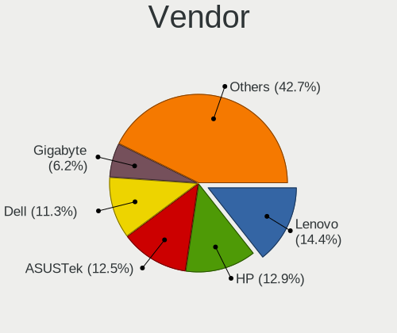
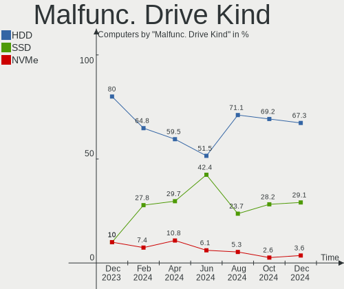
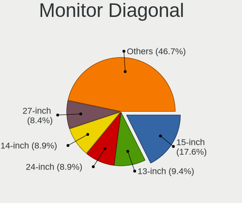

Debian Hardware Trends
----------------------

A project to identify most popular hardware characteristics and track their change
over time based on data collected by Debian users at https://Linux-Hardware.org.

Anyone can contribute to the study by uploading probes of their computers by
the [hw-probe](https://github.com/linuxhw/hw-probe) tool:

    sudo -E hw-probe -all -upload

This is a report for all computer types. See also reports for [desktops](/Dist/Debian/Desktop/README.md) and [notebooks](/Dist/Debian/Notebook/README.md).

Full-feature report is available here: https://linux-hardware.org/?view=trends

Period: Jun, 2021.

Contents
--------

- [ OS                       ](#os)
- [ OS Family                ](#os-family)
- [ Kernel                   ](#kernel)
- [ Kernel Family            ](#kernel-family)
- [ Kernel Major Ver.        ](#kernel-major-ver)
- [ Arch                     ](#arch)
- [ DE                       ](#de)
- [ Display Server           ](#display-server)
- [ Display Manager          ](#display-manager)
- [ OS Lang                  ](#os-lang)
- [ Boot Mode                ](#boot-mode)
- [ Filesystem               ](#filesystem)
- [ Part. scheme             ](#part-scheme)
- [ Dual Boot with Linux/BSD ](#dual-boot-with-linux/bsd)
- [ Dual Boot (Win)          ](#dual-boot-win)
- [ Country                  ](#country)
- [ City                     ](#city)
- [ Vendor                   ](#vendor)
- [ Model                    ](#model)
- [ Model Family             ](#model-family)
- [ MFG Year                 ](#mfg-year)
- [ Form Factor              ](#form-factor)
- [ Secure Boot              ](#secure-boot)
- [ Coreboot                 ](#coreboot)
- [ RAM Size                 ](#ram-size)
- [ RAM Used                 ](#ram-used)
- [ Has CD-ROM               ](#has-cd-rom)
- [ Total Drives             ](#total-drives)
- [ Has Ethernet             ](#has-ethernet)
- [ Has WiFi                 ](#has-wifi)
- [ Has Bluetooth            ](#has-bluetooth)
- [ Drive Vendor             ](#drive-vendor)
- [ Drive Model              ](#drive-model)
- [ HDD Vendor               ](#hdd-vendor)
- [ SSD Vendor               ](#ssd-vendor)
- [ Drive Kind               ](#drive-kind)
- [ Drive Connector          ](#drive-connector)
- [ Drive Size               ](#drive-size)
- [ Space Total              ](#space-total)
- [ Space Used               ](#space-used)
- [ Malfunc. Drives          ](#malfunc-drives)
- [ Malfunc. Drive Vendor    ](#malfunc-drive-vendor)
- [ Malfunc. HDD Vendor      ](#malfunc-hdd-vendor)
- [ Malfunc. Drive Kind      ](#malfunc-drive-kind)
- [ Failed Drives            ](#failed-drives)
- [ Failed Drive Vendor      ](#failed-drive-vendor)
- [ Drive Status             ](#drive-status)
- [ Storage Vendor           ](#storage-vendor)
- [ Storage Model            ](#storage-model)
- [ Storage Kind             ](#storage-kind)
- [ CPU Vendor               ](#cpu-vendor)
- [ CPU Model                ](#cpu-model)
- [ CPU Model Family         ](#cpu-model-family)
- [ CPU Cores                ](#cpu-cores)
- [ CPU Sockets              ](#cpu-sockets)
- [ CPU Threads              ](#cpu-threads)
- [ CPU Op-Modes             ](#cpu-op-modes)
- [ CPU Microcode            ](#cpu-microcode)
- [ CPU Microarch            ](#cpu-microarch)
- [ GPU Vendor               ](#gpu-vendor)
- [ GPU Model                ](#gpu-model)
- [ GPU Combo                ](#gpu-combo)
- [ GPU Driver               ](#gpu-driver)
- [ GPU Memory               ](#gpu-memory)
- [ Monitor Vendor           ](#monitor-vendor)
- [ Monitor Model            ](#monitor-model)
- [ Monitor Resolution       ](#monitor-resolution)
- [ Monitor Diagonal         ](#monitor-diagonal)
- [ Monitor Width            ](#monitor-width)
- [ Aspect Ratio             ](#aspect-ratio)
- [ Monitor Area             ](#monitor-area)
- [ Pixel Density            ](#pixel-density)
- [ Multiple Monitors        ](#multiple-monitors)
- [ Net Controller Vendor    ](#net-controller-vendor)
- [ Net Controller Model     ](#net-controller-model)
- [ Wireless Vendor          ](#wireless-vendor)
- [ Wireless Model           ](#wireless-model)
- [ Ethernet Vendor          ](#ethernet-vendor)
- [ Ethernet Model           ](#ethernet-model)
- [ Net Controller Kind      ](#net-controller-kind)
- [ Used Controller          ](#used-controller)
- [ NICs                     ](#nics)
- [ IPv6                     ](#ipv6)
- [ Memory Vendor            ](#memory-vendor)
- [ Memory Model             ](#memory-model)
- [ Memory Kind              ](#memory-kind)
- [ Memory Form Factor       ](#memory-form-factor)
- [ Memory Size              ](#memory-size)
- [ Memory Speed             ](#memory-speed)
- [ Sound Vendor             ](#sound-vendor)
- [ Sound Model              ](#sound-model)
- [ Camera Vendor            ](#camera-vendor)
- [ Camera Model             ](#camera-model)
- [ Fingerprint Vendor       ](#fingerprint-vendor)
- [ Fingerprint Model        ](#fingerprint-model)
- [ Chipcard Vendor          ](#chipcard-vendor)
- [ Chipcard Model           ](#chipcard-model)
- [ Printer Vendor           ](#printer-vendor)
- [ Printer Model            ](#printer-model)
- [ Scanner Vendor           ](#scanner-vendor)
- [ Scanner Model            ](#scanner-model)
- [ Bluetooth Vendor         ](#bluetooth-vendor)
- [ Bluetooth Model          ](#bluetooth-model)
- [ Unsupported Devices      ](#unsupported-devices)
- [ Unsupported Device Types ](#unsupported-device-types)

OS
--

Installed operating systems

| Name           | Computers | Percent |
|----------------|-----------|---------|
| Debian 10      | 84        | 45.16%  |
| Debian 11      | 62        | 33.33%  |
| Debian         | 26        | 13.98%  |
| Debian 9.9     | 3         | 1.61%   |
| Debian 9       | 3         | 1.61%   |
| Debian Testing | 2         | 1.08%   |
| Debian 9.5     | 2         | 1.08%   |
| Debian 9.8     | 1         | 0.54%   |
| Debian 9.6     | 1         | 0.54%   |
| Debian 9.3     | 1         | 0.54%   |
| Debian 9.13    | 1         | 0.54%   |

OS Family
---------

OS without a version

| Name   | Computers | Percent |
|--------|-----------|---------|
| Debian | 186       | 100%    |

Kernel
------

Version of the Linux kernel

| Version                        | Computers | Percent |
|--------------------------------|-----------|---------|
| 5.10.0-7-amd64                 | 35        | 18.82%  |
| 5.10.0-2-amd64                 | 26        | 13.98%  |
| 4.19.0-16-amd64                | 19        | 10.22%  |
| 5.10.0-6-amd64                 | 13        | 6.99%   |
| 5.10.0-0.bpo.5-amd64           | 7         | 3.76%   |
| 4.19.0-17-amd64                | 6         | 3.23%   |
| 5.4.65-1-pve                   | 4         | 2.15%   |
| 5.4.119-1-pve                  | 4         | 2.15%   |
| 5.4.114-1-pve                  | 4         | 2.15%   |
| 5.6.0-2-amd64                  | 3         | 1.61%   |
| 5.4.106-1-pve                  | 3         | 1.61%   |
| 5.10.0-5mx-amd64               | 3         | 1.61%   |
| 5.10.0-0.bpo.7-amd64           | 3         | 1.61%   |
| 4.19.0-6-amd64                 | 3         | 1.61%   |
| 4.19.0-16-686-pae              | 3         | 1.61%   |
| 4.19.0-14-amd64                | 3         | 1.61%   |
| 5.8.0-3-amd64                  | 2         | 1.08%   |
| 5.4.103-1-pve                  | 2         | 1.08%   |
| 4.19.0-16-686                  | 2         | 1.08%   |
| 4.15.18-2-pve                  | 2         | 1.08%   |
| 4.15.18-16-pve                 | 2         | 1.08%   |
| 5.9.0-0.bpo.5-amd64            | 1         | 0.54%   |
| 5.8.0-0.bpo.2-amd64            | 1         | 0.54%   |
| 5.4.98-1-pve                   | 1         | 0.54%   |
| 5.4.78-2-pve                   | 1         | 0.54%   |
| 5.4.78-1-pve                   | 1         | 0.54%   |
| 5.4.73-1-pve                   | 1         | 0.54%   |
| 5.4.44-2-pve                   | 1         | 0.54%   |
| 5.4.41-1-pve                   | 1         | 0.54%   |
| 5.4.0-73-generic               | 1         | 0.54%   |
| 5.3.13-1-pve                   | 1         | 0.54%   |
| 5.13.0-rc7-00024-g0418ae8de752 | 1         | 0.54%   |
| 5.13.0-051300rc6-generic       | 1         | 0.54%   |
| 5.12.10                        | 1         | 0.54%   |
| 5.12.0-9.2-liquorix-amd64      | 1         | 0.54%   |
| 5.11.21-1-pve                  | 1         | 0.54%   |
| 5.11.17-1-pve                  | 1         | 0.54%   |
| 5.11.0-21.1-liquorix-amd64     | 1         | 0.54%   |
| 5.10.35-rockchip64             | 1         | 0.54%   |
| 5.10.34-sunxi64                | 1         | 0.54%   |
| 5.10.17-v8+                    | 1         | 0.54%   |
| 5.10.0-8-amd64                 | 1         | 0.54%   |
| 5.10.0-6-rt-amd64              | 1         | 0.54%   |
| 5.10.0-3-amd64                 | 1         | 0.54%   |
| 5.10.0-0.bpo.5-rt-amd64        | 1         | 0.54%   |
| 5.10-sunxi64                   | 1         | 0.54%   |
| 5.0.21-4-pve                   | 1         | 0.54%   |
| 5.0.21-2-pve                   | 1         | 0.54%   |
| 4.9.0-11-686                   | 1         | 0.54%   |
| 4.19.181-z580322               | 1         | 0.54%   |
| 4.19.0-17-rt-amd64             | 1         | 0.54%   |
| 4.19.0-13-amd64                | 1         | 0.54%   |
| 4.19.0-10-amd64                | 1         | 0.54%   |
| 4.15.18-9-pve                  | 1         | 0.54%   |
| 4.15.18-30-pve                 | 1         | 0.54%   |
| 4.15.18-15-pve                 | 1         | 0.54%   |
| 4.15.18-12-pve                 | 1         | 0.54%   |
| 4.13.13-2-pve                  | 1         | 0.54%   |

Kernel Family
-------------

Linux kernel without a distro release

| Version  | Computers | Percent |
|----------|-----------|---------|
| 5.10.0   | 91        | 48.92%  |
| 4.19.0   | 39        | 20.97%  |
| 4.15.18  | 8         | 4.3%    |
| 5.4.65   | 4         | 2.15%   |
| 5.4.119  | 4         | 2.15%   |
| 5.4.114  | 4         | 2.15%   |
| 5.8.0    | 3         | 1.61%   |
| 5.6.0    | 3         | 1.61%   |
| 5.4.106  | 3         | 1.61%   |
| 5.4.78   | 2         | 1.08%   |
| 5.4.103  | 2         | 1.08%   |
| 5.13.0   | 2         | 1.08%   |
| 5.0.21   | 2         | 1.08%   |
| 5.9.0    | 1         | 0.54%   |
| 5.4.98   | 1         | 0.54%   |
| 5.4.73   | 1         | 0.54%   |
| 5.4.44   | 1         | 0.54%   |
| 5.4.41   | 1         | 0.54%   |
| 5.4.0    | 1         | 0.54%   |
| 5.3.13   | 1         | 0.54%   |
| 5.12.10  | 1         | 0.54%   |
| 5.12.0   | 1         | 0.54%   |
| 5.11.21  | 1         | 0.54%   |
| 5.11.17  | 1         | 0.54%   |
| 5.11.0   | 1         | 0.54%   |
| 5.10.35  | 1         | 0.54%   |
| 5.10.34  | 1         | 0.54%   |
| 5.10.17  | 1         | 0.54%   |
| 5.10     | 1         | 0.54%   |
| 4.9.0    | 1         | 0.54%   |
| 4.19.181 | 1         | 0.54%   |
| 4.13.13  | 1         | 0.54%   |

Kernel Major Ver.
-----------------

Linux kernel major version

| Version | Computers | Percent |
|---------|-----------|---------|
| 5.10    | 94        | 50.54%  |
| 4.19    | 40        | 21.51%  |
| 5.4     | 24        | 12.9%   |
| 4.15    | 8         | 4.3%    |
| 5.8     | 3         | 1.61%   |
| 5.6     | 3         | 1.61%   |
| 5.11    | 3         | 1.61%   |
| 5.13    | 2         | 1.08%   |
| 5.12    | 2         | 1.08%   |
| 5.0     | 2         | 1.08%   |
| 5.9     | 1         | 0.54%   |
| 5.3     | 1         | 0.54%   |
| 5       | 1         | 0.54%   |
| 4.9     | 1         | 0.54%   |
| 4.13    | 1         | 0.54%   |

Arch
----

OS architecture (x86_64, i586, etc.)

| Name    | Computers | Percent |
|---------|-----------|---------|
| x86_64  | 176       | 94.62%  |
| i686    | 6         | 3.23%   |
| aarch64 | 4         | 2.15%   |

DE
--

Desktop Environment

| Name            | Computers | Percent |
|-----------------|-----------|---------|
| Unknown         | 81        | 43.55%  |
| GNOME           | 30        | 16.13%  |
| XFCE            | 27        | 14.52%  |
| KDE             | 11        | 5.91%   |
| MATE            | 9         | 4.84%   |
| KDE5            | 8         | 4.3%    |
| LXQt            | 4         | 2.15%   |
| i3              | 4         | 2.15%   |
| X-Cinnamon      | 3         | 1.61%   |
| Cinnamon        | 3         | 1.61%   |
| LXDE            | 2         | 1.08%   |
| GNOME Flashback | 2         | 1.08%   |
| trinity         | 1         | 0.54%   |
| openbox         | 1         | 0.54%   |

Display Server
--------------

X11 or Wayland

| Name    | Computers | Percent |
|---------|-----------|---------|
| X11     | 90        | 48.39%  |
| Unknown | 50        | 26.88%  |
| Tty     | 32        | 17.2%   |
| Wayland | 14        | 7.53%   |

Display Manager
---------------

SDDM, LightDM, etc.

| Name    | Computers | Percent |
|---------|-----------|---------|
| Unknown | 118       | 63.44%  |
| TDM     | 31        | 16.67%  |
| GDM     | 16        | 8.6%    |
| SDDM    | 12        | 6.45%   |
| LightDM | 7         | 3.76%   |
| XDM     | 2         | 1.08%   |

OS Lang
-------

Language

| Lang    | Computers | Percent |
|---------|-----------|---------|
| en_US   | 78        | 41.94%  |
| ru_RU   | 32        | 17.2%   |
| fr_FR   | 10        | 5.38%   |
| de_DE   | 9         | 4.84%   |
| Unknown | 7         | 3.76%   |
| es_ES   | 6         | 3.23%   |
| en_GB   | 6         | 3.23%   |
| pt_BR   | 5         | 2.69%   |
| C       | 4         | 2.15%   |
| tr_TR   | 3         | 1.61%   |
| en_IE   | 3         | 1.61%   |
| zh_CN   | 2         | 1.08%   |
| ru_UA   | 2         | 1.08%   |
| pl_PL   | 2         | 1.08%   |
| hu_HU   | 2         | 1.08%   |
| es_VE   | 2         | 1.08%   |
| en_IN   | 2         | 1.08%   |
| en_CA   | 2         | 1.08%   |
| sv_SE   | 1         | 0.54%   |
| sr_RS   | 1         | 0.54%   |
| ro_RO   | 1         | 0.54%   |
| pt_PT   | 1         | 0.54%   |
| nl_BE   | 1         | 0.54%   |
| fr_CH   | 1         | 0.54%   |
| es_UY   | 1         | 0.54%   |
| en_ZA   | 1         | 0.54%   |
| ca_ES   | 1         | 0.54%   |

Boot Mode
---------

EFI or BIOS

| Mode | Computers | Percent |
|------|-----------|---------|
| BIOS | 113       | 60.75%  |
| EFI  | 73        | 39.25%  |

Filesystem
----------

Type of filesystem

| Type    | Computers | Percent |
|---------|-----------|---------|
| Ext4    | 123       | 66.13%  |
| Overlay | 30        | 16.13%  |
| Zfs     | 20        | 10.75%  |
| Btrfs   | 5         | 2.69%   |
| Xfs     | 2         | 1.08%   |
| Ext3    | 2         | 1.08%   |
| Tmpfs   | 1         | 0.54%   |
| F2fs    | 1         | 0.54%   |
| Aufs    | 1         | 0.54%   |
| Unknown | 1         | 0.54%   |

Part. scheme
------------

Scheme of partitioning

| Type    | Computers | Percent |
|---------|-----------|---------|
| GPT     | 90        | 48.39%  |
| MBR     | 48        | 25.81%  |
| Unknown | 48        | 25.81%  |

Dual Boot with Linux/BSD
------------------------

Hosting more than one Linux/BSD

| Dual boot | Computers | Percent |
|-----------|-----------|---------|
| No        | 155       | 83.33%  |
| Yes       | 31        | 16.67%  |

Dual Boot (Win)
---------------

Hosting Linux and Windows

| Dual boot | Computers | Percent |
|-----------|-----------|---------|
| No        | 114       | 61.29%  |
| Yes       | 72        | 38.71%  |

Country
-------

Geographic location (country)

| Country       | Computers | Percent |
|---------------|-----------|---------|
| Russia        | 64        | 34.41%  |
| USA           | 21        | 11.29%  |
| Germany       | 13        | 6.99%   |
| France        | 9         | 4.84%   |
| Brazil        | 9         | 4.84%   |
| Spain         | 7         | 3.76%   |
| Netherlands   | 5         | 2.69%   |
| Ukraine       | 4         | 2.15%   |
| UK            | 4         | 2.15%   |
| Poland        | 4         | 2.15%   |
| Italy         | 4         | 2.15%   |
| Venezuela     | 3         | 1.61%   |
| Turkey        | 3         | 1.61%   |
| Ireland       | 3         | 1.61%   |
| Hungary       | 3         | 1.61%   |
| Canada        | 3         | 1.61%   |
| Belgium       | 3         | 1.61%   |
| Thailand      | 2         | 1.08%   |
| Switzerland   | 2         | 1.08%   |
| Portugal      | 2         | 1.08%   |
| Norway        | 2         | 1.08%   |
| India         | 2         | 1.08%   |
| China         | 2         | 1.08%   |
| Sweden        | 1         | 0.54%   |
| South Africa  | 1         | 0.54%   |
| Serbia        | 1         | 0.54%   |
| Romania       | 1         | 0.54%   |
| New Caledonia | 1         | 0.54%   |
| Kazakhstan    | 1         | 0.54%   |
| Finland       | 1         | 0.54%   |
| Denmark       | 1         | 0.54%   |
| Chile         | 1         | 0.54%   |
| Belarus       | 1         | 0.54%   |
| Argentina     | 1         | 0.54%   |
| Algeria       | 1         | 0.54%   |

City
----

Geographic location (city)

| City                        | Computers | Percent |
|-----------------------------|-----------|---------|
| St Petersburg               | 28        | 15.05%  |
| Voronezh                    | 26        | 13.98%  |
| Warsaw                      | 3         | 1.61%   |
| Naas                        | 3         | 1.61%   |
| São Paulo                  | 2         | 1.08%   |
| Paris                       | 2         | 1.08%   |
| New York                    | 2         | 1.08%   |
| Mesa                        | 2         | 1.08%   |
| London                      | 2         | 1.08%   |
| Las Vegas                   | 2         | 1.08%   |
| Kyiv                        | 2         | 1.08%   |
| Havre de Grace              | 2         | 1.08%   |
| Gatchina                    | 2         | 1.08%   |
| Danville                    | 2         | 1.08%   |
| Ankara                      | 2         | 1.08%   |
| Amsterdam                   | 2         | 1.08%   |
| Almere Stad                 | 2         | 1.08%   |
| Zurich                      | 1         | 0.54%   |
| Zele                        | 1         | 0.54%   |
| Winnipeg                    | 1         | 0.54%   |
| Waregem                     | 1         | 0.54%   |
| Vologda                     | 1         | 0.54%   |
| Vitória                    | 1         | 0.54%   |
| Vigra                       | 1         | 0.54%   |
| Vargas                      | 1         | 0.54%   |
| Valencia                    | 1         | 0.54%   |
| Uberlingen                  | 1         | 0.54%   |
| Treviso                     | 1         | 0.54%   |
| Toulouse                    | 1         | 0.54%   |
| Tel'mana                    | 1         | 0.54%   |
| Stuttgart                   | 1         | 0.54%   |
| Srednyaya Akhtuba           | 1         | 0.54%   |
| Shenzhen                    | 1         | 0.54%   |
| Sarand                      | 1         | 0.54%   |
| Santa Barbara               | 1         | 0.54%   |
| San Justo                   | 1         | 0.54%   |
| San Francisco               | 1         | 0.54%   |
| San Cristóbal de La Laguna | 1         | 0.54%   |
| San Cristóbal              | 1         | 0.54%   |
| Salamanca                   | 1         | 0.54%   |
| Saint Neots                 | 1         | 0.54%   |
| Runding                     | 1         | 0.54%   |
| Rottenburg                  | 1         | 0.54%   |
| Ribeirao Pires              | 1         | 0.54%   |
| Reliquias                   | 1         | 0.54%   |
| Reims                       | 1         | 0.54%   |
| Regen                       | 1         | 0.54%   |
| Prairie du Sac              | 1         | 0.54%   |
| Perm                        | 1         | 0.54%   |
| Pavlohrad                   | 1         | 0.54%   |
| Oslo                        | 1         | 0.54%   |
| Oran                        | 1         | 0.54%   |
| Odessa                      | 1         | 0.54%   |
| Novo Hamburgo               | 1         | 0.54%   |
| Noumea                      | 1         | 0.54%   |
| New Lenox                   | 1         | 0.54%   |
| Munich                      | 1         | 0.54%   |
| Mumbai                      | 1         | 0.54%   |
| Moscow                      | 1         | 0.54%   |
| Montreal                    | 1         | 0.54%   |

Vendor
------

Motherboard manufacturer

| Name                    | Computers | Percent |
|-------------------------|-----------|---------|
| ASUSTek Computer        | 40        | 21.51%  |
| Dell                    | 24        | 12.9%   |
| Hewlett-Packard         | 17        | 9.14%   |
| Gigabyte Technology     | 17        | 9.14%   |
| ASRock                  | 17        | 9.14%   |
| Lenovo                  | 16        | 8.6%    |
| Supermicro              | 12        | 6.45%   |
| Acer                    | 10        | 5.38%   |
| Intel                   | 5         | 2.69%   |
| Sony                    | 3         | 1.61%   |
| MSI                     | 3         | 1.61%   |
| IBM                     | 2         | 1.08%   |
| Fujitsu                 | 2         | 1.08%   |
| VIT                     | 1         | 0.54%   |
| UNOWHY                  | 1         | 0.54%   |
| Toshiba                 | 1         | 0.54%   |
| Timi                    | 1         | 0.54%   |
| sunxi                   | 1         | 0.54%   |
| Samsung Electronics     | 1         | 0.54%   |
| Raspberry Pi Foundation | 1         | 0.54%   |
| QIYIDA                  | 1         | 0.54%   |
| Pine Microsystems       | 1         | 0.54%   |
| Pegatron                | 1         | 0.54%   |
| Monster                 | 1         | 0.54%   |
| HUAWEI                  | 1         | 0.54%   |
| Huanan                  | 1         | 0.54%   |
| HARDKERNEL              | 1         | 0.54%   |
| Clevo                   | 1         | 0.54%   |
| Biostar                 | 1         | 0.54%   |
| ASRockRack              | 1         | 0.54%   |
| Unknown                 | 1         | 0.54%   |

Model
-----

Motherboard model

| Name                                          | Computers | Percent |
|-----------------------------------------------|-----------|---------|
| ASRock B450M Pro4                             | 6         | 3.23%   |
| Supermicro Super Server                       | 4         | 2.15%   |
| ASUS All Series                               | 4         | 2.15%   |
| Supermicro X10SLL-F                           | 2         | 1.08%   |
| Gigabyte Z370 AORUS Gaming 5                  | 2         | 1.08%   |
| Gigabyte H61M-DS2 REV 1.2                     | 2         | 1.08%   |
| Gigabyte B360M H                              | 2         | 1.08%   |
| Dell XPS 13 9310                              | 2         | 1.08%   |
| Dell OptiPlex 7010                            | 2         | 1.08%   |
| ASUS PRIME B365M-A                            | 2         | 1.08%   |
| ASUS P8H61-M LX3 R2.0                         | 2         | 1.08%   |
| ASUS P5QL-CM                                  | 2         | 1.08%   |
| ASRock B450 Pro4                              | 2         | 1.08%   |
| Acer Aspire 5750G                             | 2         | 1.08%   |
| Unknown                                       | 2         | 1.08%   |
| VIT P2400                                     | 1         | 0.54%   |
| UNOWHY Y13G002S4EI                            | 1         | 0.54%   |
| Toshiba TECRA M4                              | 1         | 0.54%   |
| Timi TM1612                                   | 1         | 0.54%   |
| Supermicro X9SRE/X9SRE-3F/X9SRi/X9SRi-3F      | 1         | 0.54%   |
| Supermicro X8DTU                              | 1         | 0.54%   |
| Supermicro X8DTL                              | 1         | 0.54%   |
| Supermicro SYS-5039MS-H12TRF                  | 1         | 0.54%   |
| Supermicro SYS-5039MC-H12TRF                  | 1         | 0.54%   |
| Supermicro SSG-5029P-E1CTR12L                 | 1         | 0.54%   |
| Sony VGN-FW21L                                | 1         | 0.54%   |
| Sony VGN-FW21E                                | 1         | 0.54%   |
| Sony SVE1512G1RB                              | 1         | 0.54%   |
| Samsung 355V4C/356V4C/3445VC/3545VC           | 1         | 0.54%   |
| RPi Raspberry Pi 4 Model B Rev 1.2            | 1         | 0.54%   |
| QIYIDA X99-H9 V2.0                            | 1         | 0.54%   |
| Pine Microsystems Pine64 PinePhone (1.2) (DT) | 1         | 0.54%   |
| Pegatron A15                                  | 1         | 0.54%   |
| MSI MS-7B89                                   | 1         | 0.54%   |
| MSI MS-7823                                   | 1         | 0.54%   |
| MSI GF65 Thin 10UE                            | 1         | 0.54%   |
| Monster ABRA A5 V15.2                         | 1         | 0.54%   |
| Lenovo Yoga 300-11IBR 80M1                    | 1         | 0.54%   |
| Lenovo ThinkPad X270 W10DG 20K5S41E00         | 1         | 0.54%   |
| Lenovo ThinkPad X230 2325AZ8                  | 1         | 0.54%   |
| Lenovo ThinkPad X230 23252EG                  | 1         | 0.54%   |
| Lenovo ThinkPad X1 Extreme Gen 3 20TK001GUS   | 1         | 0.54%   |
| Lenovo ThinkPad T495 20NKS0PG00               | 1         | 0.54%   |
| Lenovo ThinkPad T495 20NJCTO1WW               | 1         | 0.54%   |
| Lenovo ThinkPad T430s 2356A89                 | 1         | 0.54%   |
| Lenovo ThinkPad T15 Gen 1 20S6000NIX          | 1         | 0.54%   |
| Lenovo ThinkPad E590 20NB001AGE               | 1         | 0.54%   |
| Lenovo ThinkPad E15 20RD0011GE                | 1         | 0.54%   |
| Lenovo IdeaPad Z580                           | 1         | 0.54%   |
| Lenovo IdeaPad 700-15ISK 80RU                 | 1         | 0.54%   |
| Lenovo IdeaPad 320-15IKB 80XL                 | 1         | 0.54%   |
| Lenovo IdeaCentre AIO 720-24IKB F0CM000MRK    | 1         | 0.54%   |
| Lenovo B50-10 80QR                            | 1         | 0.54%   |
| Intel S5500BC                                 | 1         | 0.54%   |
| Intel DP965LT AAD41694-209                    | 1         | 0.54%   |
| Intel DG965RY AAD41691-206                    | 1         | 0.54%   |
| Intel DG41RQ AAE54511-205                     | 1         | 0.54%   |
| Intel DG33FB AAD81072-306                     | 1         | 0.54%   |
| IBM ThinkPad T42 23736YG                      | 1         | 0.54%   |
| IBM 8215D1U                                   | 1         | 0.54%   |

Model Family
------------

Motherboard model prefix

| Name                          | Computers | Percent |
|-------------------------------|-----------|---------|
| Lenovo ThinkPad               | 10        | 5.38%   |
| Dell Latitude                 | 8         | 4.3%    |
| ASRock B450M                  | 8         | 4.3%    |
| Acer Aspire                   | 7         | 3.76%   |
| Dell Inspiron                 | 6         | 3.23%   |
| ASUS PRIME                    | 6         | 3.23%   |
| HP ProBook                    | 5         | 2.69%   |
| Dell OptiPlex                 | 5         | 2.69%   |
| Supermicro Super              | 4         | 2.15%   |
| ASUS All                      | 4         | 2.15%   |
| ASRock B450                   | 4         | 2.15%   |
| Lenovo IdeaPad                | 3         | 1.61%   |
| Supermicro X10SLL-F           | 2         | 1.08%   |
| HP ZBook                      | 2         | 1.08%   |
| HP EliteBook                  | 2         | 1.08%   |
| HP Compaq                     | 2         | 1.08%   |
| Gigabyte Z370                 | 2         | 1.08%   |
| Gigabyte H61M-DS2             | 2         | 1.08%   |
| Gigabyte B360M                | 2         | 1.08%   |
| Fujitsu LIFEBOOK              | 2         | 1.08%   |
| Dell XPS                      | 2         | 1.08%   |
| ASUS P8H61-M                  | 2         | 1.08%   |
| ASUS P5QL-CM                  | 2         | 1.08%   |
| Unknown                       | 2         | 1.08%   |
| VIT P2400                     | 1         | 0.54%   |
| UNOWHY Y13G002S4EI            | 1         | 0.54%   |
| Toshiba TECRA                 | 1         | 0.54%   |
| Timi TM1612                   | 1         | 0.54%   |
| Supermicro X9SRE              | 1         | 0.54%   |
| Supermicro X8DTU              | 1         | 0.54%   |
| Supermicro X8DTL              | 1         | 0.54%   |
| Supermicro SYS-5039MS-H12TRF  | 1         | 0.54%   |
| Supermicro SYS-5039MC-H12TRF  | 1         | 0.54%   |
| Supermicro SSG-5029P-E1CTR12L | 1         | 0.54%   |
| Sony VGN-FW21L                | 1         | 0.54%   |
| Sony VGN-FW21E                | 1         | 0.54%   |
| Sony SVE1512G1RB              | 1         | 0.54%   |
| Samsung 355V4C                | 1         | 0.54%   |
| RPi Raspberry                 | 1         | 0.54%   |
| QIYIDA X99-H9                 | 1         | 0.54%   |
| Pine Microsystems Pine64      | 1         | 0.54%   |
| Pegatron A15                  | 1         | 0.54%   |
| MSI MS-7B89                   | 1         | 0.54%   |
| MSI MS-7823                   | 1         | 0.54%   |
| MSI GF65                      | 1         | 0.54%   |
| Monster ABRA                  | 1         | 0.54%   |
| Lenovo Yoga                   | 1         | 0.54%   |
| Lenovo IdeaCentre             | 1         | 0.54%   |
| Lenovo B50-10                 | 1         | 0.54%   |
| Intel S5500BC                 | 1         | 0.54%   |
| Intel DP965LT                 | 1         | 0.54%   |
| Intel DG965RY                 | 1         | 0.54%   |
| Intel DG41RQ                  | 1         | 0.54%   |
| Intel DG33FB                  | 1         | 0.54%   |
| IBM ThinkPad                  | 1         | 0.54%   |
| IBM 8215D1U                   | 1         | 0.54%   |
| HUAWEI BOHK-WAX9X             | 1         | 0.54%   |
| Huanan X99-8M-F               | 1         | 0.54%   |
| HP xw6400                     | 1         | 0.54%   |
| HP Spectre                    | 1         | 0.54%   |

MFG Year
--------

Motherboard manufacture year

| Year    | Computers | Percent |
|---------|-----------|---------|
| 2020    | 34        | 18.28%  |
| 2019    | 24        | 12.9%   |
| 2021    | 18        | 9.68%   |
| 2018    | 14        | 7.53%   |
| 2016    | 14        | 7.53%   |
| 2012    | 14        | 7.53%   |
| 2014    | 10        | 5.38%   |
| 2015    | 9         | 4.84%   |
| 2011    | 8         | 4.3%    |
| 2009    | 8         | 4.3%    |
| 2013    | 6         | 3.23%   |
| 2010    | 6         | 3.23%   |
| 2007    | 5         | 2.69%   |
| 2017    | 4         | 2.15%   |
| 2008    | 4         | 2.15%   |
| Unknown | 4         | 2.15%   |
| 2006    | 1         | 0.54%   |
| 2005    | 1         | 0.54%   |
| 2004    | 1         | 0.54%   |
| 2003    | 1         | 0.54%   |

Form Factor
-----------

Physical design of the computer

| Name           | Computers | Percent |
|----------------|-----------|---------|
| Desktop        | 92        | 49.46%  |
| Notebook       | 73        | 39.25%  |
| Server         | 13        | 6.99%   |
| System on chip | 3         | 1.61%   |
| Tablet         | 2         | 1.08%   |
| Phone          | 1         | 0.54%   |
| Mini pc        | 1         | 0.54%   |
| All in one     | 1         | 0.54%   |

Secure Boot
-----------

Enabled or disabled

| State    | Computers | Percent |
|----------|-----------|---------|
| Disabled | 176       | 94.62%  |
| Enabled  | 10        | 5.38%   |

Coreboot
--------

Have coreboot on board

| Used | Computers | Percent |
|------|-----------|---------|
| No   | 186       | 100%    |

RAM Size
--------

Total RAM memory

| Size in GB  | Computers | Percent |
|-------------|-----------|---------|
| 16.01-24.0  | 44        | 23.66%  |
| 4.01-8.0    | 33        | 17.74%  |
| 8.01-16.0   | 28        | 15.05%  |
| 3.01-4.0    | 26        | 13.98%  |
| 32.01-64.0  | 16        | 8.6%    |
| 64.01-256.0 | 14        | 7.53%   |
| 1.01-2.0    | 9         | 4.84%   |
| 24.01-32.0  | 7         | 3.76%   |
| 2.01-3.0    | 5         | 2.69%   |
| 0.51-1.0    | 3         | 1.61%   |
| 0.01-0.5    | 1         | 0.54%   |

RAM Used
--------

Used RAM memory

| Used GB     | Computers | Percent |
|-------------|-----------|---------|
| 0.51-1.0    | 34        | 18.28%  |
| 2.01-3.0    | 30        | 16.13%  |
| 1.01-2.0    | 29        | 15.59%  |
| 4.01-8.0    | 25        | 13.44%  |
| 8.01-16.0   | 22        | 11.83%  |
| 3.01-4.0    | 18        | 9.68%   |
| 16.01-24.0  | 9         | 4.84%   |
| 0.01-0.5    | 8         | 4.3%    |
| 32.01-64.0  | 5         | 2.69%   |
| 24.01-32.0  | 5         | 2.69%   |
| 64.01-256.0 | 1         | 0.54%   |

Has CD-ROM
----------

Has CD-ROM on board

| Presented | Computers | Percent |
|-----------|-----------|---------|
| No        | 131       | 70.43%  |
| Yes       | 55        | 29.57%  |

Total Drives
------------

Number of drives on board

| Drives | Computers | Percent |
|--------|-----------|---------|
| 1      | 97        | 52.15%  |
| 2      | 42        | 22.58%  |
| 3      | 19        | 10.22%  |
| 4      | 10        | 5.38%   |
| 5      | 9         | 4.84%   |
| 6      | 3         | 1.61%   |
| 8      | 2         | 1.08%   |
| 0      | 2         | 1.08%   |
| 17     | 1         | 0.54%   |
| 14     | 1         | 0.54%   |

Has Ethernet
------------

Has Ethernet on board

| Presented | Computers | Percent |
|-----------|-----------|---------|
| Yes       | 172       | 92.47%  |
| No        | 14        | 7.53%   |

Has WiFi
--------

Has WiFi module

| Presented | Computers | Percent |
|-----------|-----------|---------|
| Yes       | 93        | 50%     |
| No        | 93        | 50%     |

Has Bluetooth
-------------

Has Bluetooth module

| Presented | Computers | Percent |
|-----------|-----------|---------|
| No        | 112       | 60.22%  |
| Yes       | 74        | 39.78%  |

Drive Vendor
------------

Hard drive vendors

| Vendor              | Computers | Drives | Percent |
|---------------------|-----------|--------|---------|
| WDC                 | 48        | 82     | 16.96%  |
| Seagate             | 48        | 75     | 16.96%  |
| Samsung Electronics | 37        | 45     | 13.07%  |
| Toshiba             | 27        | 36     | 9.54%   |
| Crucial             | 19        | 20     | 6.71%   |
| Intel               | 15        | 24     | 5.3%    |
| Unknown             | 11        | 13     | 3.89%   |
| SanDisk             | 10        | 11     | 3.53%   |
| Kingston            | 10        | 11     | 3.53%   |
| Hitachi             | 10        | 14     | 3.53%   |
| HGST                | 7         | 12     | 2.47%   |
| A-DATA Technology   | 7         | 8      | 2.47%   |
| SK Hynix            | 4         | 5      | 1.41%   |
| Micron Technology   | 4         | 4      | 1.41%   |
| Patriot             | 3         | 3      | 1.06%   |
| Fujitsu             | 3         | 3      | 1.06%   |
| Transcend           | 2         | 2      | 0.71%   |
| PNY                 | 2         | 2      | 0.71%   |
| Phison              | 2         | 3      | 0.71%   |
| Maxtor              | 2         | 2      | 0.71%   |
| LITEON              | 2         | 2      | 0.71%   |
| Intenso             | 2         | 2      | 0.71%   |
| SPCC                | 1         | 1      | 0.35%   |
| Silicon Motion      | 1         | 1      | 0.35%   |
| SABRENT             | 1         | 1      | 0.35%   |
| Phison Electronics  | 1         | 1      | 0.35%   |
| JMicron             | 1         | 1      | 0.35%   |
| Hewlett-Packard     | 1         | 1      | 0.35%   |
| Gigabyte Technology | 1         | 1      | 0.35%   |
| ASMT                | 1         | 1      | 0.35%   |

Drive Model
-----------

Hard drive models

| Model                              | Computers | Percent |
|------------------------------------|-----------|---------|
| Toshiba HDWD120 2TB                | 5         | 1.6%    |
| Toshiba HDWL120 2TB                | 4         | 1.28%   |
| Samsung SSD 860 EVO 250GB          | 4         | 1.28%   |
| Crucial CT250MX500SSD1 250GB       | 4         | 1.28%   |
| WDC WD20EZRZ-00Z5HB0 2TB           | 3         | 0.96%   |
| Seagate ST500DM002-1BD142 500GB    | 3         | 0.96%   |
| Seagate ST4000VN008-2DR166 4TB     | 3         | 0.96%   |
| Samsung SSD 970 EVO Plus 1TB       | 3         | 0.96%   |
| Samsung SSD 970 EVO 1TB            | 3         | 0.96%   |
| Samsung SSD 850 EVO 250GB          | 3         | 0.96%   |
| Kingston SV300S37A120G 120GB SSD   | 3         | 0.96%   |
| WDC WDS500G3X0C-00SJG0 500GB       | 2         | 0.64%   |
| WDC WDS250G2B0A-00SM50 250GB SSD   | 2         | 0.64%   |
| WDC WDS240G2G0A-00JH30 240GB SSD   | 2         | 0.64%   |
| WDC WD5000AAKX-60U6AA0 500GB       | 2         | 0.64%   |
| WDC WD3200AAJS-00L7A0 320GB        | 2         | 0.64%   |
| WDC WD20EFRX-68EUZN0 2TB           | 2         | 0.64%   |
| WDC WD1003FBYZ-010FB0 1TB          | 2         | 0.64%   |
| Unknown MMC Card  32GB             | 2         | 0.64%   |
| Toshiba MQ01ACF032 320GB           | 2         | 0.64%   |
| Toshiba MQ01ABD100 1TB             | 2         | 0.64%   |
| Toshiba HDWD110 1TB                | 2         | 0.64%   |
| Seagate ST2000LX001-1RG174 2TB     | 2         | 0.64%   |
| Seagate ST1000LM048-2E7172 1TB     | 2         | 0.64%   |
| Seagate ST1000LM035-1RK172 1TB     | 2         | 0.64%   |
| Seagate ST1000LM024 HN-M101MBB 1TB | 2         | 0.64%   |
| Seagate ST1000DM003-1CH162 1TB     | 2         | 0.64%   |
| Seagate BUP Slim BL 2TB            | 2         | 0.64%   |
| SanDisk SSD PLUS 240GB             | 2         | 0.64%   |
| Samsung SSD 870 EVO 250GB          | 2         | 0.64%   |
| Kingston SA400S37240G 240GB SSD    | 2         | 0.64%   |
| Intel SSDSC2KW120H6 120GB          | 2         | 0.64%   |
| Intel NVMe SSD Drive 1024GB        | 2         | 0.64%   |
| Intel MEMPEK1J016GAL 16GB          | 2         | 0.64%   |
| HGST HUS726020ALE614 2TB           | 2         | 0.64%   |
| Crucial CT500P2SSD8 500GB          | 2         | 0.64%   |
| Crucial CT500MX500SSD4N 500GB      | 2         | 0.64%   |
| Crucial CT250MX500SSD4N 250GB      | 2         | 0.64%   |
| Crucial CT240BX500SSD1 240GB       | 2         | 0.64%   |
| Crucial CT1000P1SSD8 1TB           | 2         | 0.64%   |
| WDC WDS500G1R0A-68A4W0 500GB SSD   | 1         | 0.32%   |
| WDC WDS250G1B0A-00H9H0 250GB SSD   | 1         | 0.32%   |
| WDC WDS100T2B0C-00PXH0 1TB         | 1         | 0.32%   |
| WDC WDS100T2B0A-00SM50 1TB SSD     | 1         | 0.32%   |
| WDC WD80EZAZ-11TDBA0 8TB           | 1         | 0.32%   |
| WDC WD800BD-22MRA1 80GB            | 1         | 0.32%   |
| WDC WD800AAJS-00PSA0 80GB          | 1         | 0.32%   |
| WDC WD7500BPVT-22A1YT0 752GB       | 1         | 0.32%   |
| WDC WD7500AACS-00ZJB0 752GB        | 1         | 0.32%   |
| WDC WD5000BPVT-00HXZT3 500GB       | 1         | 0.32%   |
| WDC WD5000AVCS-632DY1 500GB        | 1         | 0.32%   |
| WDC WD5000AAKX-22ERMA0 500GB       | 1         | 0.32%   |
| WDC WD5000AAKX-00ERMA0 500GB       | 1         | 0.32%   |
| WDC WD5000A 500GB                  | 1         | 0.32%   |
| WDC WD50 00LPCX-24VHA 500GB        | 1         | 0.32%   |
| WDC WD40EZRZ-22GXCB0 4TB           | 1         | 0.32%   |
| WDC WD40EZRZ-00GXCB0 4TB           | 1         | 0.32%   |
| WDC WD40EFRX-68WT0N0 4TB           | 1         | 0.32%   |
| WDC WD3200BEKT-75PVMT1 320GB       | 1         | 0.32%   |
| WDC WD3200AAKS-75L9A0 320GB        | 1         | 0.32%   |

HDD Vendor
----------

Hard disk drive vendors

| Vendor              | Computers | Drives | Percent |
|---------------------|-----------|--------|---------|
| Seagate             | 48        | 74     | 36.36%  |
| WDC                 | 37        | 68     | 28.03%  |
| Toshiba             | 22        | 30     | 16.67%  |
| Hitachi             | 10        | 14     | 7.58%   |
| HGST                | 7         | 12     | 5.3%    |
| Samsung Electronics | 3         | 4      | 2.27%   |
| Fujitsu             | 3         | 3      | 2.27%   |
| Maxtor              | 1         | 1      | 0.76%   |
| ASMT                | 1         | 1      | 0.76%   |

SSD Vendor
----------

Solid state drive vendors

| Vendor              | Computers | Drives | Percent |
|---------------------|-----------|--------|---------|
| Samsung Electronics | 22        | 24     | 25.29%  |
| Crucial             | 15        | 15     | 17.24%  |
| Kingston            | 8         | 8      | 9.2%    |
| WDC                 | 7         | 7      | 8.05%   |
| SanDisk             | 7         | 8      | 8.05%   |
| Intel               | 7         | 9      | 8.05%   |
| A-DATA Technology   | 5         | 6      | 5.75%   |
| Patriot             | 3         | 3      | 3.45%   |
| Transcend           | 2         | 2      | 2.3%    |
| PNY                 | 2         | 2      | 2.3%    |
| LITEON              | 2         | 2      | 2.3%    |
| Toshiba             | 1         | 1      | 1.15%   |
| SPCC                | 1         | 1      | 1.15%   |
| SK Hynix            | 1         | 1      | 1.15%   |
| SABRENT             | 1         | 1      | 1.15%   |
| Micron Technology   | 1         | 1      | 1.15%   |
| Maxtor              | 1         | 1      | 1.15%   |
| Intenso             | 1         | 1      | 1.15%   |

Drive Kind
----------

HDD or SSD

| Kind    | Computers | Drives | Percent |
|---------|-----------|--------|---------|
| HDD     | 108       | 207    | 42.19%  |
| SSD     | 78        | 93     | 30.47%  |
| NVMe    | 56        | 71     | 21.88%  |
| MMC     | 10        | 12     | 3.91%   |
| Unknown | 4         | 4      | 1.56%   |

Drive Connector
---------------

SATA, SAS, NVMe, etc.

| Type | Computers | Drives | Percent |
|------|-----------|--------|---------|
| SATA | 146       | 292    | 66.06%  |
| NVMe | 56        | 71     | 25.34%  |
| MMC  | 10        | 12     | 4.52%   |
| SAS  | 9         | 12     | 4.07%   |

Drive Size
----------

Size of hard drive

| Size in TB | Computers | Drives | Percent |
|------------|-----------|--------|---------|
| 0.01-0.5   | 102       | 131    | 52.85%  |
| 0.51-1.0   | 45        | 72     | 23.32%  |
| 1.01-2.0   | 27        | 42     | 13.99%  |
| 3.01-4.0   | 10        | 22     | 5.18%   |
| 4.01-10.0  | 4         | 13     | 2.07%   |
| 2.01-3.0   | 3         | 3      | 1.55%   |
| 10.01-20.0 | 2         | 17     | 1.04%   |

Space Total
-----------

Amount of disk space available on the file system

| Size in GB     | Computers | Percent |
|----------------|-----------|---------|
| Unknown        | 56        | 30.11%  |
| 101-250        | 29        | 15.59%  |
| 251-500        | 26        | 13.98%  |
| 51-100         | 20        | 10.75%  |
| 1001-2000      | 18        | 9.68%   |
| 501-1000       | 15        | 8.06%   |
| More than 3000 | 8         | 4.3%    |
| 21-50          | 7         | 3.76%   |
| 1-20           | 5         | 2.69%   |
| 2001-3000      | 2         | 1.08%   |

Space Used
----------

Amount of used disk space

| Used GB        | Computers | Percent |
|----------------|-----------|---------|
| Unknown        | 56        | 30.11%  |
| 1-20           | 41        | 22.04%  |
| 101-250        | 24        | 12.9%   |
| 51-100         | 17        | 9.14%   |
| 21-50          | 16        | 8.6%    |
| 251-500        | 14        | 7.53%   |
| 1001-2000      | 8         | 4.3%    |
| 501-1000       | 6         | 3.23%   |
| More than 3000 | 4         | 2.15%   |

Malfunc. Drives
---------------

Drive models with a malfunction

| Model                                 | Computers | Drives | Percent |
|---------------------------------------|-----------|--------|---------|
| Intel SSDSC2KW120H6 120GB             | 2         | 3      | 5.88%   |
| WDC WD7500AACS-00ZJB0 752GB           | 1         | 1      | 2.94%   |
| WDC WD3200BEKT-75PVMT1 320GB          | 1         | 1      | 2.94%   |
| WDC WD3200AAJS-08L7A0 320GB           | 1         | 1      | 2.94%   |
| WDC WD3200AAJS-00L7A0 320GB           | 1         | 1      | 2.94%   |
| Toshiba MQ01ABF050H 500GB             | 1         | 1      | 2.94%   |
| Toshiba MQ01ABD100 1TB                | 1         | 1      | 2.94%   |
| Toshiba MK1059GSM 1TB                 | 1         | 1      | 2.94%   |
| Toshiba HDWL120 2TB                   | 1         | 2      | 2.94%   |
| Toshiba DT01ACA050 500GB              | 1         | 1      | 2.94%   |
| Seagate ST9500420AS 500GB             | 1         | 1      | 2.94%   |
| Seagate ST9160310AS 160GB             | 1         | 1      | 2.94%   |
| Seagate ST3500418AS 500GB             | 1         | 1      | 2.94%   |
| Seagate ST2000LX001-1RG174 2TB        | 1         | 1      | 2.94%   |
| Seagate ST2000DM001-9YN164 2TB        | 1         | 1      | 2.94%   |
| Seagate ST1000DM003-1CH162 1TB        | 1         | 1      | 2.94%   |
| Samsung Electronics HM120JC 120GB     | 1         | 1      | 2.94%   |
| Intel SSDSC2CW120A3 120GB             | 1         | 1      | 2.94%   |
| Intel SSDSC2BF180A4H 180GB            | 1         | 1      | 2.94%   |
| Intel SSDPEKKW010T7 1TB               | 1         | 2      | 2.94%   |
| Hitachi HUA722010CLA630 1TB           | 1         | 4      | 2.94%   |
| Hitachi HTS545025B9SA02 250GB         | 1         | 1      | 2.94%   |
| Hitachi HTS543212L9A300 120GB         | 1         | 1      | 2.94%   |
| Hitachi HTS541040G9AT00 40GB          | 1         | 1      | 2.94%   |
| Hitachi HDS722525VLAT80 250GB         | 1         | 1      | 2.94%   |
| Hitachi HDS721010CLA632 1TB           | 1         | 1      | 2.94%   |
| Hitachi DK23CA-30 32GB                | 1         | 1      | 2.94%   |
| Fujitsu MHZ2250BH G1 250GB            | 1         | 1      | 2.94%   |
| Fujitsu MHJ2181AT 18GB                | 1         | 1      | 2.94%   |
| Crucial CT240BX500SSD1 240GB          | 1         | 1      | 2.94%   |
| A-DATA Technology SU800 256GB SSD     | 1         | 1      | 2.94%   |
| A-DATA Technology SU630 480GB SSD     | 1         | 1      | 2.94%   |
| A-DATA Technology SSD DP900 128GB-DL3 | 1         | 1      | 2.94%   |

Malfunc. Drive Vendor
---------------------

Vendors of faulty drives

| Vendor              | Computers | Drives | Percent |
|---------------------|-----------|--------|---------|
| Hitachi             | 7         | 10     | 20.59%  |
| Seagate             | 6         | 6      | 17.65%  |
| Toshiba             | 5         | 6      | 14.71%  |
| Intel               | 5         | 7      | 14.71%  |
| WDC                 | 4         | 4      | 11.76%  |
| A-DATA Technology   | 3         | 3      | 8.82%   |
| Fujitsu             | 2         | 2      | 5.88%   |
| Samsung Electronics | 1         | 1      | 2.94%   |
| Crucial             | 1         | 1      | 2.94%   |

Malfunc. HDD Vendor
-------------------

Vendors of faulty HDD drives

| Vendor              | Computers | Drives | Percent |
|---------------------|-----------|--------|---------|
| Hitachi             | 7         | 10     | 28%     |
| Seagate             | 6         | 6      | 24%     |
| Toshiba             | 5         | 6      | 20%     |
| WDC                 | 4         | 4      | 16%     |
| Fujitsu             | 2         | 2      | 8%      |
| Samsung Electronics | 1         | 1      | 4%      |

Malfunc. Drive Kind
-------------------

Kinds of faulty drives

| Kind | Computers | Drives | Percent |
|------|-----------|--------|---------|
| HDD  | 22        | 29     | 70.97%  |
| SSD  | 8         | 9      | 25.81%  |
| NVMe | 1         | 2      | 3.23%   |

Failed Drives
-------------

Failed drive models

| Model                    | Computers | Drives | Percent |
|--------------------------|-----------|--------|---------|
| Crucial CT1000P1SSD8 1TB | 1         | 1      | 100%    |

Failed Drive Vendor
-------------------

Failed drive vendors

| Vendor  | Computers | Drives | Percent |
|---------|-----------|--------|---------|
| Crucial | 1         | 1      | 100%    |

Drive Status
------------

Number of failed and malfunc. drives

| Status   | Computers | Drives | Percent |
|----------|-----------|--------|---------|
| Works    | 121       | 256    | 59.02%  |
| Detected | 53        | 90     | 25.85%  |
| Malfunc  | 30        | 40     | 14.63%  |
| Failed   | 1         | 1      | 0.49%   |

Storage Vendor
--------------

Storage controller vendors

| Vendor                       | Computers | Percent |
|------------------------------|-----------|---------|
| Intel                        | 126       | 52.72%  |
| AMD                          | 40        | 16.74%  |
| Samsung Electronics          | 15        | 6.28%   |
| Sandisk                      | 9         | 3.77%   |
| JMicron Technology           | 6         | 2.51%   |
| Micron/Crucial Technology    | 5         | 2.09%   |
| ASMedia Technology           | 5         | 2.09%   |
| Toshiba America Info Systems | 4         | 1.67%   |
| Phison Electronics           | 4         | 1.67%   |
| Marvell Technology Group     | 4         | 1.67%   |
| SK Hynix                     | 3         | 1.26%   |
| Micron Technology            | 3         | 1.26%   |
| Kingston Technology Company  | 3         | 1.26%   |
| VIA Technologies             | 2         | 0.84%   |
| Silicon Motion               | 2         | 0.84%   |
| Broadcom / LSI               | 2         | 0.84%   |
| ADATA Technology             | 2         | 0.84%   |
| Silicon Image                | 1         | 0.42%   |
| Nvidia                       | 1         | 0.42%   |
| LSI Logic / Symbios Logic    | 1         | 0.42%   |
| Adaptec                      | 1         | 0.42%   |

Storage Model
-------------

Storage controller models

| Model                                                                            | Computers | Percent |
|----------------------------------------------------------------------------------|-----------|---------|
| AMD FCH SATA Controller [AHCI mode]                                              | 33        | 11.5%   |
| AMD 400 Series Chipset SATA Controller                                           | 18        | 6.27%   |
| Intel 8 Series/C220 Series Chipset Family 6-port SATA Controller 1 [AHCI mode]   | 12        | 4.18%   |
| Samsung NVMe SSD Controller SM981/PM981/PM983                                    | 11        | 3.83%   |
| Intel Q170/Q150/B150/H170/H110/Z170/CM236 Chipset SATA Controller [AHCI Mode]    | 10        | 3.48%   |
| Intel 7 Series Chipset Family 6-port SATA Controller [AHCI mode]                 | 9         | 3.14%   |
| Intel 82801 Mobile SATA Controller [RAID mode]                                   | 7         | 2.44%   |
| Intel Sunrise Point-LP SATA Controller [AHCI mode]                               | 6         | 2.09%   |
| Intel Cannon Lake PCH SATA AHCI Controller                                       | 5         | 1.74%   |
| Intel 6 Series/C200 Series Chipset Family 6 port Mobile SATA AHCI Controller     | 5         | 1.74%   |
| Intel 6 Series/C200 Series Chipset Family 6 port Desktop SATA AHCI Controller    | 5         | 1.74%   |
| Intel 200 Series PCH SATA controller [AHCI mode]                                 | 5         | 1.74%   |
| ASMedia ASM1062 Serial ATA Controller                                            | 5         | 1.74%   |
| Sandisk WD Black SN750 / PC SN730 NVMe SSD                                       | 4         | 1.39%   |
| JMicron JMB368 IDE controller                                                    | 4         | 1.39%   |
| Intel 82801JI (ICH10 Family) SATA AHCI Controller                                | 4         | 1.39%   |
| AMD SB7x0/SB8x0/SB9x0 SATA Controller [AHCI mode]                                | 4         | 1.39%   |
| Toshiba America Info Systems XG6 NVMe SSD Controller                             | 3         | 1.05%   |
| SK Hynix BC501 NVMe Solid State Drive                                            | 3         | 1.05%   |
| Sandisk WD Blue SN550 NVMe SSD                                                   | 3         | 1.05%   |
| Phison E12 NVMe Controller                                                       | 3         | 1.05%   |
| Micron/Crucial P1 NVMe PCIe SSD                                                  | 3         | 1.05%   |
| Micron Non-Volatile memory controller                                            | 3         | 1.05%   |
| Marvell Group 88SE6101/6102 single-port PATA133 interface                        | 3         | 1.05%   |
| Intel Volume Management Device NVMe RAID Controller                              | 3         | 1.05%   |
| Intel SSD 600P Series                                                            | 3         | 1.05%   |
| Intel NM10/ICH7 Family SATA Controller [IDE mode]                                | 3         | 1.05%   |
| Intel HM170/QM170 Chipset SATA Controller [AHCI Mode]                            | 3         | 1.05%   |
| Intel 82801JI (ICH10 Family) 4 port SATA IDE Controller #1                       | 3         | 1.05%   |
| Intel 82801JI (ICH10 Family) 2 port SATA IDE Controller #2                       | 3         | 1.05%   |
| Intel 82801IBM/IEM (ICH9M/ICH9M-E) 4 port SATA Controller [AHCI mode]            | 3         | 1.05%   |
| Intel 82801G (ICH7 Family) IDE Controller                                        | 3         | 1.05%   |
| Intel 8 Series SATA Controller 1 [AHCI mode]                                     | 3         | 1.05%   |
| Silicon Motion SM2263EN/SM2263XT SSD Controller                                  | 2         | 0.7%    |
| Samsung NVMe Controller                                                          | 2         | 0.7%    |
| Micron/Crucial P2 NVMe PCIe SSD                                                  | 2         | 0.7%    |
| Kingston Company A2000 NVMe SSD                                                  | 2         | 0.7%    |
| Intel SSD 660P Series                                                            | 2         | 0.7%    |
| Intel SATA Controller [RAID mode]                                                | 2         | 0.7%    |
| Intel NVMe Optane Memory Series                                                  | 2         | 0.7%    |
| Intel Comet Lake SATA AHCI Controller                                            | 2         | 0.7%    |
| Intel Celeron N3350/Pentium N4200/Atom E3900 Series SATA AHCI Controller         | 2         | 0.7%    |
| Intel Cannon Point-LP SATA Controller [AHCI Mode]                                | 2         | 0.7%    |
| Intel Cannon Lake Mobile PCH SATA AHCI Controller                                | 2         | 0.7%    |
| Intel C600/X79 series chipset 6-Port SATA AHCI Controller                        | 2         | 0.7%    |
| Intel 82801FBM (ICH6M) SATA Controller                                           | 2         | 0.7%    |
| Intel 82801DBM (ICH4-M) IDE Controller                                           | 2         | 0.7%    |
| Intel 7 Series/C210 Series Chipset Family 6-port SATA Controller [AHCI mode]     | 2         | 0.7%    |
| AMD Starship/Matisse Chipset SATA Controller [AHCI mode]                         | 2         | 0.7%    |
| AMD 300 Series Chipset SATA Controller                                           | 2         | 0.7%    |
| ADATA Non-Volatile memory controller                                             | 2         | 0.7%    |
| VIA VT82C586A/B/VT82C686/A/B/VT823x/A/C PIPC Bus Master IDE                      | 1         | 0.35%   |
| VIA VT6415 PATA IDE Host Controller                                              | 1         | 0.35%   |
| VIA Serial ATA Controller                                                        | 1         | 0.35%   |
| Toshiba America Info Systems Toshiba America Info Non-Volatile memory controller | 1         | 0.35%   |
| Silicon Image PCI0646                                                            | 1         | 0.35%   |
| Sandisk WD Black 2018/SN750 / PC SN720 NVMe SSD                                  | 1         | 0.35%   |
| Sandisk Non-Volatile memory controller                                           | 1         | 0.35%   |
| Samsung NVMe SSD Controller SM961/PM961/SM963                                    | 1         | 0.35%   |
| Samsung NVMe SSD Controller PM9A1/PM9A3/980PRO                                   | 1         | 0.35%   |

Storage Kind
------------

Kind of storage controller (IDE, SATA, NVMe, SAS, ...)

| Kind | Computers | Percent |
|------|-----------|---------|
| SATA | 137       | 57.56%  |
| NVMe | 56        | 23.53%  |
| IDE  | 26        | 10.92%  |
| RAID | 14        | 5.88%   |
| SAS  | 3         | 1.26%   |
| SCSI | 2         | 0.84%   |

CPU Vendor
----------

Processor vendors

| Vendor | Computers | Percent |
|--------|-----------|---------|
| Intel  | 139       | 74.73%  |
| AMD    | 43        | 23.12%  |
| ARM    | 4         | 2.15%   |

CPU Model
---------

Processor models

| Model                                           | Computers | Percent |
|-------------------------------------------------|-----------|---------|
| AMD Ryzen 5 3400G with Radeon Vega Graphics     | 6         | 3.23%   |
| AMD Ryzen 7 2700X Eight-Core Processor          | 5         | 2.69%   |
| Intel Core i5-3320M CPU @ 2.60GHz               | 4         | 2.15%   |
| AMD Ryzen 5 3600 6-Core Processor               | 4         | 2.15%   |
| AMD Ryzen 5 3500U with Radeon Vega Mobile Gfx   | 4         | 2.15%   |
| Intel Core i5-8265U CPU @ 1.60GHz               | 3         | 1.61%   |
| Intel Core i5-7200U CPU @ 2.50GHz               | 3         | 1.61%   |
| Intel Core 2 Duo CPU E7400 @ 2.80GHz            | 3         | 1.61%   |
| Intel 11th Gen Core i7-1185G7 @ 3.00GHz         | 3         | 1.61%   |
| ARM Processor                                   | 3         | 1.61%   |
| AMD Ryzen 7 3700X 8-Core Processor              | 3         | 1.61%   |
| AMD Ryzen 5 1600 Six-Core Processor             | 3         | 1.61%   |
| Intel Xeon CPU E3-1220 v3 @ 3.10GHz             | 2         | 1.08%   |
| Intel Pentium Gold G5400 CPU @ 3.70GHz          | 2         | 1.08%   |
| Intel Core i7-8700K CPU @ 3.70GHz               | 2         | 1.08%   |
| Intel Core i7-10750H CPU @ 2.60GHz              | 2         | 1.08%   |
| Intel Core i5-9600K CPU @ 3.70GHz               | 2         | 1.08%   |
| Intel Core i5-6600 CPU @ 3.30GHz                | 2         | 1.08%   |
| Intel Core i5-3570 CPU @ 3.40GHz                | 2         | 1.08%   |
| Intel Core i5-2520M CPU @ 2.50GHz               | 2         | 1.08%   |
| Intel Core i5-10210U CPU @ 1.60GHz              | 2         | 1.08%   |
| Intel Core i3-3220 CPU @ 3.30GHz                | 2         | 1.08%   |
| Intel Core i3-2370M CPU @ 2.40GHz               | 2         | 1.08%   |
| Intel Core 2 Duo CPU T5800 @ 2.00GHz            | 2         | 1.08%   |
| Intel Core 2 Duo CPU E4500 @ 2.20GHz            | 2         | 1.08%   |
| Intel 11th Gen Core i7-1165G7 @ 2.80GHz         | 2         | 1.08%   |
| Intel 11th Gen Core i5-1135G7 @ 2.40GHz         | 2         | 1.08%   |
| AMD Ryzen 7 PRO 3700U w/ Radeon Vega Mobile Gfx | 2         | 1.08%   |
| AMD A8-5600K APU with Radeon HD Graphics        | 2         | 1.08%   |
| Intel Xeon Silver 4208 CPU @ 2.10GHz            | 1         | 0.54%   |
| Intel Xeon E-2278G CPU @ 3.40GHz                | 1         | 0.54%   |
| Intel Xeon E-2276G CPU @ 3.80GHz                | 1         | 0.54%   |
| Intel Xeon E-2176M CPU @ 2.70GHz                | 1         | 0.54%   |
| Intel Xeon CPU X5687 @ 3.60GHz                  | 1         | 0.54%   |
| Intel Xeon CPU X5650 @ 2.67GHz                  | 1         | 0.54%   |
| Intel Xeon CPU L5630 @ 2.13GHz                  | 1         | 0.54%   |
| Intel Xeon CPU E5606 @ 2.13GHz                  | 1         | 0.54%   |
| Intel Xeon CPU E5345 @ 2.33GHz                  | 1         | 0.54%   |
| Intel Xeon CPU E5-2640 v3 @ 2.60GHz             | 1         | 0.54%   |
| Intel Xeon CPU E5-2620 v3 @ 2.40GHz             | 1         | 0.54%   |
| Intel Xeon CPU E5-1620 v4 @ 3.50GHz             | 1         | 0.54%   |
| Intel Xeon CPU E5-1620 v2 @ 3.70GHz             | 1         | 0.54%   |
| Intel Xeon CPU E3-1230 v5 @ 3.40GHz             | 1         | 0.54%   |
| Intel Xeon CPU E3-1220 v6 @ 3.00GHz             | 1         | 0.54%   |
| Intel Xeon CPU E3-1220 v5 @ 3.00GHz             | 1         | 0.54%   |
| Intel Pentium M processor 2.00GHz               | 1         | 0.54%   |
| Intel Pentium M processor 1600MHz               | 1         | 0.54%   |
| Intel Pentium M processor 1.70GHz               | 1         | 0.54%   |
| Intel Pentium III Mobile CPU 1000MHz            | 1         | 0.54%   |
| Intel Pentium Dual-Core CPU E6500 @ 2.93GHz     | 1         | 0.54%   |
| Intel Pentium CPU N4200 @ 1.10GHz               | 1         | 0.54%   |
| Intel Pentium CPU G620 @ 2.60GHz                | 1         | 0.54%   |
| Intel Pentium CPU G4560 @ 3.50GHz               | 1         | 0.54%   |
| Intel Pentium CPU G4400 @ 3.30GHz               | 1         | 0.54%   |
| Intel Pentium CPU G3420 @ 3.20GHz               | 1         | 0.54%   |
| Intel Pentium CPU B980 @ 2.40GHz                | 1         | 0.54%   |
| Intel Pentium CPU 4415U @ 2.30GHz               | 1         | 0.54%   |
| Intel Pentium CPU 4405U @ 2.10GHz               | 1         | 0.54%   |
| Intel Pentium 4 CPU 3.00GHz                     | 1         | 0.54%   |
| Intel Pentium 3556U @ 1.70GHz                   | 1         | 0.54%   |

CPU Model Family
----------------

Processor model prefix

| Model                   | Computers | Percent |
|-------------------------|-----------|---------|
| Intel Core i5           | 41        | 22.04%  |
| Intel Core i7           | 19        | 10.22%  |
| AMD Ryzen 5             | 19        | 10.22%  |
| Intel Xeon              | 17        | 9.14%   |
| Intel Core i3           | 12        | 6.45%   |
| Other                   | 10        | 5.38%   |
| Intel Core 2 Duo        | 10        | 5.38%   |
| Intel Pentium           | 9         | 4.84%   |
| AMD Ryzen 7             | 9         | 4.84%   |
| Intel Celeron           | 6         | 3.23%   |
| Intel Pentium M         | 3         | 1.61%   |
| Intel Core 2            | 3         | 1.61%   |
| Intel Pentium Gold      | 2         | 1.08%   |
| Intel Core 2 Quad       | 2         | 1.08%   |
| AMD Ryzen 7 PRO         | 2         | 1.08%   |
| AMD FX                  | 2         | 1.08%   |
| AMD A8                  | 2         | 1.08%   |
| Intel Xeon Silver       | 1         | 0.54%   |
| Intel Pentium III       | 1         | 0.54%   |
| Intel Pentium Dual-Core | 1         | 0.54%   |
| Intel Pentium 4         | 1         | 0.54%   |
| Intel Core m3           | 1         | 0.54%   |
| Intel Celeron M         | 1         | 0.54%   |
| Intel Celeron Dual-Core | 1         | 0.54%   |
| Intel Atom              | 1         | 0.54%   |
| ARM AArch64             | 1         | 0.54%   |
| AMD Ryzen Threadripper  | 1         | 0.54%   |
| AMD Ryzen 9             | 1         | 0.54%   |
| AMD Ryzen 3             | 1         | 0.54%   |
| AMD Phenom II X4        | 1         | 0.54%   |
| AMD E1                  | 1         | 0.54%   |
| AMD E                   | 1         | 0.54%   |
| AMD Athlon II X2        | 1         | 0.54%   |
| AMD A6                  | 1         | 0.54%   |
| AMD A4                  | 1         | 0.54%   |

CPU Cores
---------

Number of processor cores

| Number | Computers | Percent |
|--------|-----------|---------|
| 4      | 70        | 37.63%  |
| 2      | 66        | 35.48%  |
| 6      | 22        | 11.83%  |
| 8      | 16        | 8.6%    |
| 1      | 9         | 4.84%   |
| 12     | 2         | 1.08%   |
| 32     | 1         | 0.54%   |

CPU Sockets
-----------

Number of sockets

| Number | Computers | Percent |
|--------|-----------|---------|
| 1      | 180       | 96.77%  |
| 2      | 6         | 3.23%   |

CPU Threads
-----------

Threads per core (Hyper-Threading)

| Number | Computers | Percent |
|--------|-----------|---------|
| 2      | 116       | 62.37%  |
| 1      | 70        | 37.63%  |

CPU Op-Modes
------------

CPU Operation Modes (32-bit, 64-bit)

| Op mode        | Computers | Percent |
|----------------|-----------|---------|
| 32-bit, 64-bit | 178       | 95.7%   |
| 32-bit         | 5         | 2.69%   |
| Unknown        | 2         | 1.08%   |
| 64-bit         | 1         | 0.54%   |

CPU Microcode
-------------

Microcode number

| Number     | Computers | Percent |
|------------|-----------|---------|
| Unknown    | 43        | 23.12%  |
| 0x206a7    | 11        | 5.91%   |
| 0x306c3    | 10        | 5.38%   |
| 0x1067a    | 9         | 4.84%   |
| 0x08108109 | 9         | 4.84%   |
| 0x306a9    | 7         | 3.76%   |
| 0x906ea    | 6         | 3.23%   |
| 0x906e9    | 6         | 3.23%   |
| 0x806c1    | 5         | 2.69%   |
| 0x406e3    | 5         | 2.69%   |
| 0x08701021 | 5         | 2.69%   |
| 0x0800820d | 5         | 2.69%   |
| 0x806ec    | 4         | 2.15%   |
| 0x806e9    | 4         | 2.15%   |
| 0x6fd      | 4         | 2.15%   |
| 0x506e3    | 4         | 2.15%   |
| 0x906ed    | 3         | 1.61%   |
| 0x06001119 | 3         | 1.61%   |
| 0xa0652    | 2         | 1.08%   |
| 0x6f6      | 2         | 1.08%   |
| 0x6d8      | 2         | 1.08%   |
| 0x506c9    | 2         | 1.08%   |
| 0x40651    | 2         | 1.08%   |
| 0x306f2    | 2         | 1.08%   |
| 0x206c2    | 2         | 1.08%   |
| 0xf43      | 1         | 0.54%   |
| 0xa0660    | 1         | 0.54%   |
| 0x706e5    | 1         | 0.54%   |
| 0x706a1    | 1         | 0.54%   |
| 0x6fb      | 1         | 0.54%   |
| 0x6f2      | 1         | 0.54%   |
| 0x6d6      | 1         | 0.54%   |
| 0x6b1      | 1         | 0.54%   |
| 0x695      | 1         | 0.54%   |
| 0x50657    | 1         | 0.54%   |
| 0x406f1    | 1         | 0.54%   |
| 0x406c4    | 1         | 0.54%   |
| 0x406c3    | 1         | 0.54%   |
| 0x306e4    | 1         | 0.54%   |
| 0x30678    | 1         | 0.54%   |
| 0x206d7    | 1         | 0.54%   |
| 0x20655    | 1         | 0.54%   |
| 0x20652    | 1         | 0.54%   |
| 0x10676    | 1         | 0.54%   |
| 0x10661    | 1         | 0.54%   |
| 0x08108102 | 1         | 0.54%   |
| 0x0800820c | 1         | 0.54%   |
| 0x0800820b | 1         | 0.54%   |
| 0x08001138 | 1         | 0.54%   |
| 0x08001122 | 1         | 0.54%   |
| 0x0600063e | 1         | 0.54%   |
| 0x05000119 | 1         | 0.54%   |
| 0x05000029 | 1         | 0.54%   |
| 0x010000c8 | 1         | 0.54%   |

CPU Microarch
-------------

Microarchitecture

| Name          | Computers | Percent |
|---------------|-----------|---------|
| KabyLake      | 30        | 16.13%  |
| Zen+          | 22        | 11.83%  |
| Haswell       | 18        | 9.68%   |
| Skylake       | 14        | 7.53%   |
| SandyBridge   | 14        | 7.53%   |
| IvyBridge     | 13        | 6.99%   |
| Penryn        | 10        | 5.38%   |
| Zen 2         | 9         | 4.84%   |
| Core          | 9         | 4.84%   |
| TigerLake     | 7         | 3.76%   |
| Westmere      | 6         | 3.23%   |
| P6            | 5         | 2.69%   |
| Piledriver    | 4         | 2.15%   |
| CometLake     | 4         | 2.15%   |
| Unknown       | 4         | 2.15%   |
| Silvermont    | 3         | 1.61%   |
| Zen           | 2         | 1.08%   |
| K10           | 2         | 1.08%   |
| Goldmont      | 2         | 1.08%   |
| Bobcat        | 2         | 1.08%   |
| Steamroller   | 1         | 0.54%   |
| NetBurst      | 1         | 0.54%   |
| IceLake       | 1         | 0.54%   |
| Goldmont plus | 1         | 0.54%   |
| Bulldozer     | 1         | 0.54%   |
| Broadwell     | 1         | 0.54%   |

GPU Vendor
----------

Vendors of graphics cards

| Vendor                     | Computers | Percent |
|----------------------------|-----------|---------|
| Intel                      | 101       | 48.79%  |
| Nvidia                     | 47        | 22.71%  |
| AMD                        | 43        | 20.77%  |
| ASPEED Technology          | 10        | 4.83%   |
| Matrox Electronics Systems | 5         | 2.42%   |
| VIA Technologies           | 1         | 0.48%   |

GPU Model
---------

Graphics card models

| Model                                                                                    | Computers | Percent |
|------------------------------------------------------------------------------------------|-----------|---------|
| Intel 2nd Generation Core Processor Family Integrated Graphics Controller                | 12        | 5.66%   |
| AMD Picasso                                                                              | 11        | 5.19%   |
| ASPEED Technology ASPEED Graphics Family                                                 | 10        | 4.72%   |
| Intel TigerLake-LP GT2 [Iris Xe Graphics]                                                | 7         | 3.3%    |
| Intel Xeon E3-1200 v3/4th Gen Core Processor Integrated Graphics Controller              | 6         | 2.83%   |
| Intel 3rd Gen Core processor Graphics Controller                                         | 6         | 2.83%   |
| Intel HD Graphics 630                                                                    | 5         | 2.36%   |
| AMD Ellesmere [Radeon RX 470/480/570/570X/580/580X/590]                                  | 5         | 2.36%   |
| Matrox Electronics Systems MGA G200eW WPCM450                                            | 4         | 1.89%   |
| Intel Xeon E3-1200 v2/3rd Gen Core processor Graphics Controller                         | 4         | 1.89%   |
| Intel Skylake GT2 [HD Graphics 520]                                                      | 4         | 1.89%   |
| Intel HD Graphics 530                                                                    | 4         | 1.89%   |
| Intel Haswell-ULT Integrated Graphics Controller                                         | 4         | 1.89%   |
| Intel WhiskeyLake-U GT2 [UHD Graphics 620]                                               | 3         | 1.42%   |
| Intel HD Graphics 620                                                                    | 3         | 1.42%   |
| Intel CometLake-U GT2 [UHD Graphics]                                                     | 3         | 1.42%   |
| Intel CometLake-S GT2 [UHD Graphics 630]                                                 | 3         | 1.42%   |
| Intel CometLake-H GT2 [UHD Graphics]                                                     | 3         | 1.42%   |
| AMD Caicos [Radeon HD 6450/7450/8450 / R5 230 OEM]                                       | 3         | 1.42%   |
| Nvidia GP107M [GeForce GTX 1050 Mobile]                                                  | 2         | 0.94%   |
| Nvidia GK208B [GeForce GT 710]                                                           | 2         | 0.94%   |
| Nvidia GK107M [GeForce GT 640M]                                                          | 2         | 0.94%   |
| Nvidia GF116 [GeForce GTX 550 Ti]                                                        | 2         | 0.94%   |
| Intel HD Graphics 510                                                                    | 2         | 0.94%   |
| Intel CoffeeLake-S GT2 [UHD Graphics 630]                                                | 2         | 0.94%   |
| Intel CoffeeLake-S GT1 [UHD Graphics 610]                                                | 2         | 0.94%   |
| Intel Atom/Celeron/Pentium Processor x5-E8000/J3xxx/N3xxx Integrated Graphics Controller | 2         | 0.94%   |
| Intel 4th Generation Core Processor Family Integrated Graphics Controller                | 2         | 0.94%   |
| Intel 4 Series Chipset Integrated Graphics Controller                                    | 2         | 0.94%   |
| AMD Topaz XT [Radeon R7 M260/M265 / M340/M360 / M440/M445 / 530/535 / 620/625 Mobile]    | 2         | 0.94%   |
| AMD RV730 XT [Radeon HD 4670]                                                            | 2         | 0.94%   |
| AMD RV620/M82 [Mobility Radeon HD 3450/3470]                                             | 2         | 0.94%   |
| VIA Technologies CN896/VN896/P4M900 [Chrome 9 HC]                                        | 1         | 0.47%   |
| Nvidia TU117M [GeForce GTX 1650 Ti Mobile]                                               | 1         | 0.47%   |
| Nvidia TU117M [GeForce GTX 1650 Mobile / Max-Q]                                          | 1         | 0.47%   |
| Nvidia TU117GLM [Quadro T500 Mobile]                                                     | 1         | 0.47%   |
| Nvidia TU117GLM [Quadro T2000 Mobile / Max-Q]                                            | 1         | 0.47%   |
| Nvidia TU117 [GeForce GTX 1650]                                                          | 1         | 0.47%   |
| Nvidia TU116 [GeForce GTX 1660 SUPER]                                                    | 1         | 0.47%   |
| Nvidia TU116 [GeForce GTX 1650 SUPER]                                                    | 1         | 0.47%   |
| Nvidia TU104 [GeForce RTX 2060]                                                          | 1         | 0.47%   |
| Nvidia NV43M [GeForce Go6200 TE / 6600 TE]                                               | 1         | 0.47%   |
| Nvidia NV11M [GeForce2 Go]                                                               | 1         | 0.47%   |
| Nvidia GT218 [GeForce 8400 GS Rev. 3]                                                    | 1         | 0.47%   |
| Nvidia GT218 [GeForce 210]                                                               | 1         | 0.47%   |
| Nvidia GT216 [GeForce GT 220]                                                            | 1         | 0.47%   |
| Nvidia GT215M [GeForce GT 335M]                                                          | 1         | 0.47%   |
| Nvidia GP108M [GeForce MX250]                                                            | 1         | 0.47%   |
| Nvidia GP108M [GeForce MX230]                                                            | 1         | 0.47%   |
| Nvidia GP106 [GeForce GTX 1060 3GB]                                                      | 1         | 0.47%   |
| Nvidia GP104GLM [Quadro P3200 Mobile]                                                    | 1         | 0.47%   |
| Nvidia GM204 [GeForce GTX 980]                                                           | 1         | 0.47%   |
| Nvidia GM204 [GeForce GTX 970]                                                           | 1         | 0.47%   |
| Nvidia GM200 [GeForce GTX 980 Ti]                                                        | 1         | 0.47%   |
| Nvidia GM108M [GeForce MX130]                                                            | 1         | 0.47%   |
| Nvidia GM108M [GeForce 940MX]                                                            | 1         | 0.47%   |
| Nvidia GM107M [GeForce GTX 960M]                                                         | 1         | 0.47%   |
| Nvidia GM107M [GeForce GTX 950M]                                                         | 1         | 0.47%   |
| Nvidia GM107 [GeForce GTX 750 Ti]                                                        | 1         | 0.47%   |
| Nvidia GK107 [GeForce GTX 650]                                                           | 1         | 0.47%   |

GPU Combo
---------

Combinations of graphics cards

| Name           | Computers | Percent |
|----------------|-----------|---------|
| 1 x Intel      | 75        | 40.32%  |
| 1 x AMD        | 37        | 19.89%  |
| 1 x Nvidia     | 26        | 13.98%  |
| Intel + Nvidia | 21        | 11.29%  |
| 1 x ASPEED     | 10        | 5.38%   |
| Other          | 6         | 3.23%   |
| 1 x Matrox     | 5         | 2.69%   |
| 2 x AMD        | 3         | 1.61%   |
| Intel + AMD    | 2         | 1.08%   |
| 1 x VIA        | 1         | 0.54%   |

GPU Driver
----------

Free vs proprietary

| Driver      | Computers | Percent |
|-------------|-----------|---------|
| Free        | 129       | 69.35%  |
| Unknown     | 41        | 22.04%  |
| Proprietary | 16        | 8.6%    |

GPU Memory
----------

Total video memory

| Size in GB | Computers | Percent |
|------------|-----------|---------|
| Unknown    | 142       | 76.34%  |
| 1.01-2.0   | 14        | 7.53%   |
| 0.01-0.5   | 11        | 5.91%   |
| 3.01-4.0   | 6         | 3.23%   |
| 0.51-1.0   | 6         | 3.23%   |
| 7.01-8.0   | 3         | 1.61%   |
| 5.01-6.0   | 3         | 1.61%   |
| 2.01-3.0   | 1         | 0.54%   |

Monitor Vendor
--------------

Monitor vendors

| Vendor                  | Computers | Percent |
|-------------------------|-----------|---------|
| Samsung Electronics     | 20        | 13.07%  |
| AU Optronics            | 16        | 10.46%  |
| BOE                     | 15        | 9.8%    |
| Dell                    | 12        | 7.84%   |
| LG Display              | 11        | 7.19%   |
| Hewlett-Packard         | 10        | 6.54%   |
| Goldstar                | 10        | 6.54%   |
| Acer                    | 9         | 5.88%   |
| Chimei Innolux          | 8         | 5.23%   |
| Sharp                   | 5         | 3.27%   |
| AOC                     | 4         | 2.61%   |
| Ancor Communications    | 4         | 2.61%   |
| Philips                 | 3         | 1.96%   |
| BenQ                    | 3         | 1.96%   |
| Unknown                 | 2         | 1.31%   |
| PANDA                   | 2         | 1.31%   |
| NEC Computers           | 2         | 1.31%   |
| Eizo                    | 2         | 1.31%   |
| Chi Mei Optoelectronics | 2         | 1.31%   |
| Xiaomi                  | 1         | 0.65%   |
| TEO                     | 1         | 0.65%   |
| Panasonic               | 1         | 0.65%   |
| LG Electronics          | 1         | 0.65%   |
| Lenovo                  | 1         | 0.65%   |
| InnoLux Display         | 1         | 0.65%   |
| INFOTRONIC              | 1         | 0.65%   |
| Iiyama                  | 1         | 0.65%   |
| Idek Iiyama             | 1         | 0.65%   |
| IBM                     | 1         | 0.65%   |
| HannStar                | 1         | 0.65%   |
| CSO                     | 1         | 0.65%   |
| Belinea                 | 1         | 0.65%   |

Monitor Model
-------------

Monitor models

| Model                                                                  | Computers | Percent |
|------------------------------------------------------------------------|-----------|---------|
| Unknown LCD Monitor FFFF 2288x1287 2550x2550mm 142.0-inch              | 2         | 1.26%   |
| Sharp LCD Monitor SHP14F9 1920x1200 288x180mm 13.4-inch                | 2         | 1.26%   |
| Hewlett-Packard ZR30w HWP286C 2560x1600 641x400mm 29.7-inch            | 2         | 1.26%   |
| Goldstar L1750SQ GSM43E8 1280x1024 338x270mm 17.0-inch                 | 2         | 1.26%   |
| BOE LCD Monitor BOE06D3 1366x768 344x194mm 15.5-inch                   | 2         | 1.26%   |
| Ancor Communications ASUS VH236H ACI23F2 1920x1080 520x290mm 23.4-inch | 2         | 1.26%   |
| Acer G246HL ACR02FF 1920x1080 531x299mm 24.0-inch                      | 2         | 1.26%   |
| Xiaomi Mi TV XMD00E1 3840x2160 708x398mm 32.0-inch                     | 1         | 0.63%   |
| TEO TL565 TEO5550 1024x768 304x228mm 15.0-inch                         | 1         | 0.63%   |
| Sharp LQ133M1JW08 SHP1425 1920x1080 294x165mm 13.3-inch                | 1         | 0.63%   |
| Sharp LL-T15A4-B SHP20A6 1024x768 304x228mm 15.0-inch                  | 1         | 0.63%   |
| Sharp LCD Monitor SHP138E 1600x1200 304x228mm 15.0-inch                | 1         | 0.63%   |
| Samsung Electronics SyncMaster SAM0656 1920x1080 510x287mm 23.0-inch   | 1         | 0.63%   |
| Samsung Electronics SyncMaster SAM04D4 1920x1080 531x298mm 24.0-inch   | 1         | 0.63%   |
| Samsung Electronics SyncMaster SAM047D 1920x1080 410x230mm 18.5-inch   | 1         | 0.63%   |
| Samsung Electronics SyncMaster SAM0302 1680x1050 459x296mm 21.5-inch   | 1         | 0.63%   |
| Samsung Electronics SyncMaster SAM021E 1680x1050 433x271mm 20.1-inch   | 1         | 0.63%   |
| Samsung Electronics SyncMaster SAM01AE 1600x1200 408x306mm 20.1-inch   | 1         | 0.63%   |
| Samsung Electronics SyncMaster SAM011E 1280x1024 338x270mm 17.0-inch   | 1         | 0.63%   |
| Samsung Electronics SyncMaster SAM0115 1280x1024 376x301mm 19.0-inch   | 1         | 0.63%   |
| Samsung Electronics SyncMaster SAM00D3 1280x1024 338x270mm 17.0-inch   | 1         | 0.63%   |
| Samsung Electronics SyncMaster SAM0057 1024x768 304x228mm 15.0-inch    | 1         | 0.63%   |
| Samsung Electronics SMB2430H SAM064D 1920x1080 531x299mm 24.0-inch     | 1         | 0.63%   |
| Samsung Electronics S27D390 SAM0B67 1920x1080 600x340mm 27.2-inch      | 1         | 0.63%   |
| Samsung Electronics S24D330 SAM0D92 1920x1080 531x299mm 24.0-inch      | 1         | 0.63%   |
| Samsung Electronics LCD Monitor SyncMaster 5760x1080                   | 1         | 0.63%   |
| Samsung Electronics LCD Monitor SMB2430L                               | 1         | 0.63%   |
| Samsung Electronics LCD Monitor SEC4252 1366x768 344x194mm 15.5-inch   | 1         | 0.63%   |
| Samsung Electronics LCD Monitor SEC3358 1280x800 331x207mm 15.4-inch   | 1         | 0.63%   |
| Samsung Electronics LCD Monitor SDC5441 1366x768 340x190mm 15.3-inch   | 1         | 0.63%   |
| Samsung Electronics LCD Monitor SAM0200 1280x720                       | 1         | 0.63%   |
| Samsung Electronics LCD Monitor C24F390 3360x1080                      | 1         | 0.63%   |
| Samsung Electronics LC32G7xT SAM705A 2560x1440 698x393mm 31.5-inch     | 1         | 0.63%   |
| Philips PHL 276E8V PHLC18F 3840x2160 597x336mm 27.0-inch               | 1         | 0.63%   |
| Philips PHL 243V5 PHLC0D1 1920x1080 521x293mm 23.5-inch                | 1         | 0.63%   |
| Philips 231E PHLC039 1920x1080 510x287mm 23.0-inch                     | 1         | 0.63%   |
| PANDA LCD Monitor NCP0056 1920x1080 309x174mm 14.0-inch                | 1         | 0.63%   |
| PANDA LCD Monitor NCP0035 1920x1080 309x174mm 14.0-inch                | 1         | 0.63%   |
| Panasonic TV MEIA296 1920x1080 1280x720mm 57.8-inch                    | 1         | 0.63%   |
| NEC Computers EA244WMi NEC68D6 1920x1200 519x324mm 24.1-inch           | 1         | 0.63%   |
| NEC Computers EA244WMi NEC68D5 1920x1200 519x324mm 24.1-inch           | 1         | 0.63%   |
| NEC Computers EA244WMi NEC68D4 1920x1200 519x324mm 24.1-inch           | 1         | 0.63%   |
| LG Electronics LCD Monitor 27GL850 2560x1440                           | 1         | 0.63%   |
| LG Display LCD Monitor LGD05E5 1920x1080 344x194mm 15.5-inch           | 1         | 0.63%   |
| LG Display LCD Monitor LGD0590 1920x1080 344x194mm 15.5-inch           | 1         | 0.63%   |
| LG Display LCD Monitor LGD055D 3000x2000 260x173mm 12.3-inch           | 1         | 0.63%   |
| LG Display LCD Monitor LGD04B7 1366x768 344x194mm 15.5-inch            | 1         | 0.63%   |
| LG Display LCD Monitor LGD04A7 1920x1080 340x190mm 15.3-inch           | 1         | 0.63%   |
| LG Display LCD Monitor LGD0404 1366x768 277x156mm 12.5-inch            | 1         | 0.63%   |
| LG Display LCD Monitor LGD03EA 1920x1080 309x174mm 14.0-inch           | 1         | 0.63%   |
| LG Display LCD Monitor LGD03DB 1366x768 345x194mm 15.6-inch            | 1         | 0.63%   |
| LG Display LCD Monitor LGD034C 1366x768 293x165mm 13.2-inch            | 1         | 0.63%   |
| LG Display LCD Monitor LGD02DC 1366x768 344x194mm 15.5-inch            | 1         | 0.63%   |
| LG Display LCD Monitor LGD02D8 1366x768 277x156mm 12.5-inch            | 1         | 0.63%   |
| Lenovo LEN-AIO720-B LEN1218 1920x1080 525x295mm 23.7-inch              | 1         | 0.63%   |
| InnoLux Display LCD Monitor INL0028 1366x768 309x174mm 14.0-inch       | 1         | 0.63%   |
| INFOTRONIC L2130 ITR8852 1600x1200 432x324mm 21.3-inch                 | 1         | 0.63%   |
| Iiyama PL2480H IVM610B 1920x1080 520x290mm 23.4-inch                   | 1         | 0.63%   |
| Idek Iiyama LCD Monitor PL2492H                                        | 1         | 0.63%   |
| IBM L190 IBM2471 1280x1024 378x301mm 19.0-inch                         | 1         | 0.63%   |

Monitor Resolution
------------------

Monitor screen resolution

| Resolution         | Computers | Percent |
|--------------------|-----------|---------|
| 1920x1080 (FHD)    | 58        | 40.56%  |
| 1366x768 (WXGA)    | 25        | 17.48%  |
| 1280x1024 (SXGA)   | 10        | 6.99%   |
| 3840x2160 (4K)     | 7         | 4.9%    |
| 2560x1440 (QHD)    | 6         | 4.2%    |
| 1920x1200 (WUXGA)  | 6         | 4.2%    |
| 1680x1050 (WSXGA+) | 6         | 4.2%    |
| 1600x900 (HD+)     | 4         | 2.8%    |
| 1024x768 (XGA)     | 4         | 2.8%    |
| 1600x1200          | 3         | 2.1%    |
| 2560x1600          | 2         | 1.4%    |
| 2288x1287          | 2         | 1.4%    |
| Unknown            | 2         | 1.4%    |
| 5760x1080          | 1         | 0.7%    |
| 3360x1080          | 1         | 0.7%    |
| 3000x2000          | 1         | 0.7%    |
| 1440x900 (WXGA+)   | 1         | 0.7%    |
| 1360x768           | 1         | 0.7%    |
| 1280x800 (WXGA)    | 1         | 0.7%    |
| 1280x720 (HD)      | 1         | 0.7%    |
| 1024x600           | 1         | 0.7%    |

Monitor Diagonal
----------------

Diagonal size in inches

| Inches  | Computers | Percent |
|---------|-----------|---------|
| 15      | 33        | 22.15%  |
| 23      | 20        | 13.42%  |
| 24      | 13        | 8.72%   |
| 17      | 11        | 7.38%   |
| 13      | 11        | 7.38%   |
| 21      | 9         | 6.04%   |
| 14      | 9         | 6.04%   |
| 12      | 7         | 4.7%    |
| 27      | 6         | 4.03%   |
| Unknown | 6         | 4.03%   |
| 19      | 4         | 2.68%   |
| 31      | 3         | 2.01%   |
| 18      | 3         | 2.01%   |
| 142     | 2         | 1.34%   |
| 29      | 2         | 1.34%   |
| 20      | 2         | 1.34%   |
| 11      | 2         | 1.34%   |
| 84      | 1         | 0.67%   |
| 43      | 1         | 0.67%   |
| 33      | 1         | 0.67%   |
| 25      | 1         | 0.67%   |
| 22      | 1         | 0.67%   |
| 8       | 1         | 0.67%   |

Monitor Width
-------------

Physical width

| Width in mm    | Computers | Percent |
|----------------|-----------|---------|
| 301-350        | 54        | 37.24%  |
| 501-600        | 35        | 24.14%  |
| 401-500        | 16        | 11.03%  |
| 201-300        | 15        | 10.34%  |
| 351-400        | 7         | 4.83%   |
| 601-700        | 6         | 4.14%   |
| Unknown        | 6         | 4.14%   |
| More than 2000 | 2         | 1.38%   |
| 701-800        | 1         | 0.69%   |
| 1501-2000      | 1         | 0.69%   |
| 101-200        | 1         | 0.69%   |
| 901-1000       | 1         | 0.69%   |

Aspect Ratio
------------

Proportional relationship between the width and the height

| Ratio   | Computers | Percent |
|---------|-----------|---------|
| 16/9    | 94        | 70.15%  |
| 16/10   | 13        | 9.7%    |
| 5/4     | 10        | 7.46%   |
| 4/3     | 7         | 5.22%   |
| Unknown | 5         | 3.73%   |
| 3/2     | 3         | 2.24%   |
| 1.00    | 2         | 1.49%   |

Monitor Area
------------

Area in inch²

| Area in inch² | Computers | Percent |
|----------------|-----------|---------|
| 201-250        | 33        | 22.76%  |
| 101-110        | 33        | 22.76%  |
| 81-90          | 14        | 9.66%   |
| 141-150        | 9         | 6.21%   |
| 151-200        | 8         | 5.52%   |
| 71-80          | 7         | 4.83%   |
| 61-70          | 6         | 4.14%   |
| 351-500        | 6         | 4.14%   |
| 301-350        | 6         | 4.14%   |
| 251-300        | 6         | 4.14%   |
| Unknown        | 6         | 4.14%   |
| 121-130        | 4         | 2.76%   |
| More than 1000 | 3         | 2.07%   |
| 51-60          | 2         | 1.38%   |
| 1-40           | 1         | 0.69%   |
| 501-1000       | 1         | 0.69%   |

Pixel Density
-------------

Pixels per inch

| Density       | Computers | Percent |
|---------------|-----------|---------|
| 51-100        | 56        | 40%     |
| 121-160       | 37        | 26.43%  |
| 101-120       | 29        | 20.71%  |
| 161-240       | 8         | 5.71%   |
| Unknown       | 6         | 4.29%   |
| More than 240 | 2         | 1.43%   |
| 1-50          | 2         | 1.43%   |

Multiple Monitors
-----------------

Total monitors connected

| Total | Computers | Percent |
|-------|-----------|---------|
| 1     | 93        | 50%     |
| 0     | 61        | 32.8%   |
| 2     | 28        | 15.05%  |
| 3     | 3         | 1.61%   |
| 4     | 1         | 0.54%   |

Net Controller Vendor
---------------------

Controller vendors

| Vendor                            | Computers | Percent |
|-----------------------------------|-----------|---------|
| Realtek Semiconductor             | 101       | 39.92%  |
| Intel                             | 96        | 37.94%  |
| Qualcomm Atheros                  | 23        | 9.09%   |
| Marvell Technology Group          | 5         | 1.98%   |
| Broadcom                          | 4         | 1.58%   |
| Ralink                            | 3         | 1.19%   |
| Dell                              | 2         | 0.79%   |
| D-Link System                     | 2         | 0.79%   |
| Broadcom Limited                  | 2         | 0.79%   |
| Xiaomi                            | 1         | 0.4%    |
| VIA Technologies                  | 1         | 0.4%    |
| Sundance Technology Inc / IC Plus | 1         | 0.4%    |
| Samsung Electronics               | 1         | 0.4%    |
| Ralink Technology                 | 1         | 0.4%    |
| QLogic                            | 1         | 0.4%    |
| Nvidia                            | 1         | 0.4%    |
| LSI                               | 1         | 0.4%    |
| Lenovo                            | 1         | 0.4%    |
| JMicron Technology                | 1         | 0.4%    |
| Google                            | 1         | 0.4%    |
| Ericsson Business Mobile Networks | 1         | 0.4%    |
| D-Link                            | 1         | 0.4%    |
| Cypress Semiconductor             | 1         | 0.4%    |
| 3Com                              | 1         | 0.4%    |

Net Controller Model
--------------------

Controller models

| Model                                                             | Computers | Percent |
|-------------------------------------------------------------------|-----------|---------|
| Realtek RTL8111/8168/8411 PCI Express Gigabit Ethernet Controller | 84        | 28.67%  |
| Intel I210 Gigabit Network Connection                             | 8         | 2.73%   |
| Qualcomm Atheros QCA9377 802.11ac Wireless Network Adapter        | 7         | 2.39%   |
| Intel Wi-Fi 6 AX201                                               | 7         | 2.39%   |
| Intel 82579LM Gigabit Network Connection (Lewisville)             | 7         | 2.39%   |
| Realtek RTL810xE PCI Express Fast Ethernet controller             | 6         | 2.05%   |
| Qualcomm Atheros AR9485 Wireless Network Adapter                  | 5         | 1.71%   |
| Intel I211 Gigabit Network Connection                             | 5         | 1.71%   |
| Intel Ethernet Connection (2) I219-V                              | 5         | 1.71%   |
| Realtek RTL8153 Gigabit Ethernet Adapter                          | 4         | 1.37%   |
| Qualcomm Atheros AR9285 Wireless Network Adapter (PCI-Express)    | 4         | 1.37%   |
| Intel Wireless-AC 9260                                            | 4         | 1.37%   |
| Intel Wireless 3165                                               | 4         | 1.37%   |
| Intel I350 Gigabit Network Connection                             | 4         | 1.37%   |
| Intel Ethernet Connection I217-LM                                 | 4         | 1.37%   |
| Intel Dual Band Wireless-AC 3168NGW [Stone Peak]                  | 4         | 1.37%   |
| Intel Centrino Advanced-N 6205 [Taylor Peak]                      | 4         | 1.37%   |
| Intel Wireless 8265 / 8275                                        | 3         | 1.02%   |
| Intel Wireless 8260                                               | 3         | 1.02%   |
| Intel Wireless 7260                                               | 3         | 1.02%   |
| Intel Ethernet Connection I219-LM                                 | 3         | 1.02%   |
| Intel Comet Lake PCH-LP CNVi WiFi                                 | 3         | 1.02%   |
| Intel Comet Lake PCH CNVi WiFi                                    | 3         | 1.02%   |
| Intel 82579V Gigabit Network Connection                           | 3         | 1.02%   |
| Intel 82574L Gigabit Network Connection                           | 3         | 1.02%   |
| Realtek RTL-8100/8101L/8139 PCI Fast Ethernet Adapter             | 2         | 0.68%   |
| Qualcomm Atheros QCA6174 802.11ac Wireless Network Adapter        | 2         | 0.68%   |
| Qualcomm Atheros AR8121/AR8113/AR8114 Gigabit or Fast Ethernet    | 2         | 0.68%   |
| Marvell Group 88E8055 PCI-E Gigabit Ethernet Controller           | 2         | 0.68%   |
| Intel Wireless 7265                                               | 2         | 0.68%   |
| Intel WiFi Link 5100                                              | 2         | 0.68%   |
| Intel PRO/Wireless LAN 2100 3B Mini PCI Adapter                   | 2         | 0.68%   |
| Intel Ethernet Connection I218-LM                                 | 2         | 0.68%   |
| Intel Ethernet Connection (2) I218-V                              | 2         | 0.68%   |
| Intel Ethernet Connection (13) I219-V                             | 2         | 0.68%   |
| Intel Ethernet Connection (10) I219-V                             | 2         | 0.68%   |
| Intel Cannon Lake PCH CNVi WiFi                                   | 2         | 0.68%   |
| Intel 82801DB/DBL/DBM (ICH4/ICH4-L/ICH4-M) AC'97 Modem Controller | 2         | 0.68%   |
| Intel 82566DC Gigabit Network Connection                          | 2         | 0.68%   |
| Broadcom NetLink BCM57785 Gigabit Ethernet PCIe                   | 2         | 0.68%   |
| Xiaomi Mi/Redmi series (RNDIS)                                    | 1         | 0.34%   |
| VIA VT6102/VT6103 [Rhine-II]                                      | 1         | 0.34%   |
| Sundance Inc / IC Plus IP1000 Family Gigabit Ethernet             | 1         | 0.34%   |
| Samsung GT-I9070 (network tethering, USB debugging enabled)       | 1         | 0.34%   |
| Realtek USB 10/100/1G/2.5G LAN                                    | 1         | 0.34%   |
| Realtek RTL8822CE 802.11ac PCIe Wireless Network Adapter          | 1         | 0.34%   |
| Realtek RTL8822BE 802.11a/b/g/n/ac WiFi adapter                   | 1         | 0.34%   |
| Realtek RTL8723BE PCIe Wireless Network Adapter                   | 1         | 0.34%   |
| Realtek RTL8723AE PCIe Wireless Network Adapter                   | 1         | 0.34%   |
| Realtek RTL8192CU 802.11n WLAN Adapter                            | 1         | 0.34%   |
| Realtek RTL8187SE Wireless LAN Controller                         | 1         | 0.34%   |
| Realtek RTL8187 Wireless Adapter                                  | 1         | 0.34%   |
| Realtek RTL8125 2.5GbE Controller                                 | 1         | 0.34%   |
| Realtek 802.11n WLAN Adapter                                      | 1         | 0.34%   |
| Ralink RT5572 Wireless Adapter                                    | 1         | 0.34%   |
| Ralink RT3290 Wireless 802.11n 1T/1R PCIe                         | 1         | 0.34%   |
| Ralink RT2600 802.11 MIMO                                         | 1         | 0.34%   |
| Ralink RT2500 Wireless 802.11bg                                   | 1         | 0.34%   |
| Qualcomm Atheros Killer E2500 Gigabit Ethernet Controller         | 1         | 0.34%   |
| Qualcomm Atheros AR9462 Wireless Network Adapter                  | 1         | 0.34%   |

Wireless Vendor
---------------

Wireless vendors

| Vendor                | Computers | Percent |
|-----------------------|-----------|---------|
| Intel                 | 55        | 58.51%  |
| Qualcomm Atheros      | 20        | 21.28%  |
| Realtek Semiconductor | 8         | 8.51%   |
| Ralink                | 3         | 3.19%   |
| D-Link System         | 2         | 2.13%   |
| Broadcom              | 2         | 2.13%   |
| Ralink Technology     | 1         | 1.06%   |
| Dell                  | 1         | 1.06%   |
| D-Link                | 1         | 1.06%   |
| Broadcom Limited      | 1         | 1.06%   |

Wireless Model
--------------

Wireless models

| Model                                                                             | Computers | Percent |
|-----------------------------------------------------------------------------------|-----------|---------|
| Qualcomm Atheros QCA9377 802.11ac Wireless Network Adapter                        | 7         | 7.37%   |
| Intel Wi-Fi 6 AX201                                                               | 7         | 7.37%   |
| Qualcomm Atheros AR9485 Wireless Network Adapter                                  | 5         | 5.26%   |
| Qualcomm Atheros AR9285 Wireless Network Adapter (PCI-Express)                    | 4         | 4.21%   |
| Intel Wireless-AC 9260                                                            | 4         | 4.21%   |
| Intel Wireless 3165                                                               | 4         | 4.21%   |
| Intel Dual Band Wireless-AC 3168NGW [Stone Peak]                                  | 4         | 4.21%   |
| Intel Centrino Advanced-N 6205 [Taylor Peak]                                      | 4         | 4.21%   |
| Intel Wireless 8265 / 8275                                                        | 3         | 3.16%   |
| Intel Wireless 8260                                                               | 3         | 3.16%   |
| Intel Wireless 7260                                                               | 3         | 3.16%   |
| Intel Comet Lake PCH-LP CNVi WiFi                                                 | 3         | 3.16%   |
| Intel Comet Lake PCH CNVi WiFi                                                    | 3         | 3.16%   |
| Qualcomm Atheros QCA6174 802.11ac Wireless Network Adapter                        | 2         | 2.11%   |
| Intel Wireless 7265                                                               | 2         | 2.11%   |
| Intel WiFi Link 5100                                                              | 2         | 2.11%   |
| Intel PRO/Wireless LAN 2100 3B Mini PCI Adapter                                   | 2         | 2.11%   |
| Intel Cannon Lake PCH CNVi WiFi                                                   | 2         | 2.11%   |
| Realtek RTL8822CE 802.11ac PCIe Wireless Network Adapter                          | 1         | 1.05%   |
| Realtek RTL8822BE 802.11a/b/g/n/ac WiFi adapter                                   | 1         | 1.05%   |
| Realtek RTL8723BE PCIe Wireless Network Adapter                                   | 1         | 1.05%   |
| Realtek RTL8723AE PCIe Wireless Network Adapter                                   | 1         | 1.05%   |
| Realtek RTL8192CU 802.11n WLAN Adapter                                            | 1         | 1.05%   |
| Realtek RTL8187SE Wireless LAN Controller                                         | 1         | 1.05%   |
| Realtek RTL8187 Wireless Adapter                                                  | 1         | 1.05%   |
| Realtek 802.11n WLAN Adapter                                                      | 1         | 1.05%   |
| Ralink RT5572 Wireless Adapter                                                    | 1         | 1.05%   |
| Ralink RT3290 Wireless 802.11n 1T/1R PCIe                                         | 1         | 1.05%   |
| Ralink RT2600 802.11 MIMO                                                         | 1         | 1.05%   |
| Ralink RT2500 Wireless 802.11bg                                                   | 1         | 1.05%   |
| Qualcomm Atheros AR9462 Wireless Network Adapter                                  | 1         | 1.05%   |
| Qualcomm Atheros AR9287 Wireless Network Adapter (PCI-Express)                    | 1         | 1.05%   |
| Intel Wireless Gigabit 17265                                                      | 1         | 1.05%   |
| Intel Wireless 3160                                                               | 1         | 1.05%   |
| Intel Wi-Fi 6 AX200                                                               | 1         | 1.05%   |
| Intel PRO/Wireless 3945ABG [Golan] Network Connection                             | 1         | 1.05%   |
| Intel PRO/Wireless 2200BG [Calexico2] Network Connection                          | 1         | 1.05%   |
| Intel Dual Band Wireless-AC 3165 Plus Bluetooth                                   | 1         | 1.05%   |
| Intel Centrino Wireless-N 2200                                                    | 1         | 1.05%   |
| Intel Centrino Wireless-N 1000 [Condor Peak]                                      | 1         | 1.05%   |
| Intel Centrino Ultimate-N 6300                                                    | 1         | 1.05%   |
| Intel Cannon Point-LP CNVi [Wireless-AC]                                          | 1         | 1.05%   |
| Dell Hub of E-Port Replicator                                                     | 1         | 1.05%   |
| D-Link System DWA-140 RangeBooster N Adapter(rev.B2) [Ralink RT3072]              | 1         | 1.05%   |
| D-Link System DWA-131 802.11n Wireless N Nano Adapter(rev.A1) [Realtek RTL8192SU] | 1         | 1.05%   |
| D-Link DWA-131 802.11n Wireless N Nano Adapter (rev.B1) [Realtek RTL8192CU]       | 1         | 1.05%   |
| Broadcom Limited BCM4313 802.11bgn Wireless Network Adapter                       | 1         | 1.05%   |
| Broadcom BCM43227 802.11b/g/n                                                     | 1         | 1.05%   |
| Broadcom BCM4312 802.11b/g LP-PHY                                                 | 1         | 1.05%   |

Ethernet Vendor
---------------

Ethernet vendors

| Vendor                            | Computers | Percent |
|-----------------------------------|-----------|---------|
| Realtek Semiconductor             | 96        | 51.89%  |
| Intel                             | 66        | 35.68%  |
| Marvell Technology Group          | 5         | 2.7%    |
| Qualcomm Atheros                  | 4         | 2.16%   |
| Broadcom                          | 3         | 1.62%   |
| Xiaomi                            | 1         | 0.54%   |
| VIA Technologies                  | 1         | 0.54%   |
| Sundance Technology Inc / IC Plus | 1         | 0.54%   |
| Samsung Electronics               | 1         | 0.54%   |
| QLogic                            | 1         | 0.54%   |
| Nvidia                            | 1         | 0.54%   |
| Lenovo                            | 1         | 0.54%   |
| JMicron Technology                | 1         | 0.54%   |
| Cypress Semiconductor             | 1         | 0.54%   |
| Broadcom Limited                  | 1         | 0.54%   |
| 3Com                              | 1         | 0.54%   |

Ethernet Model
--------------

Ethernet models

| Model                                                                         | Computers | Percent |
|-------------------------------------------------------------------------------|-----------|---------|
| Realtek RTL8111/8168/8411 PCI Express Gigabit Ethernet Controller             | 84        | 43.98%  |
| Intel I210 Gigabit Network Connection                                         | 8         | 4.19%   |
| Intel 82579LM Gigabit Network Connection (Lewisville)                         | 7         | 3.66%   |
| Realtek RTL810xE PCI Express Fast Ethernet controller                         | 6         | 3.14%   |
| Intel I211 Gigabit Network Connection                                         | 5         | 2.62%   |
| Intel Ethernet Connection (2) I219-V                                          | 5         | 2.62%   |
| Realtek RTL8153 Gigabit Ethernet Adapter                                      | 4         | 2.09%   |
| Intel I350 Gigabit Network Connection                                         | 4         | 2.09%   |
| Intel Ethernet Connection I217-LM                                             | 4         | 2.09%   |
| Intel Ethernet Connection I219-LM                                             | 3         | 1.57%   |
| Intel 82579V Gigabit Network Connection                                       | 3         | 1.57%   |
| Intel 82574L Gigabit Network Connection                                       | 3         | 1.57%   |
| Realtek RTL-8100/8101L/8139 PCI Fast Ethernet Adapter                         | 2         | 1.05%   |
| Qualcomm Atheros AR8121/AR8113/AR8114 Gigabit or Fast Ethernet                | 2         | 1.05%   |
| Marvell Group 88E8055 PCI-E Gigabit Ethernet Controller                       | 2         | 1.05%   |
| Intel Ethernet Connection I218-LM                                             | 2         | 1.05%   |
| Intel Ethernet Connection (2) I218-V                                          | 2         | 1.05%   |
| Intel Ethernet Connection (13) I219-V                                         | 2         | 1.05%   |
| Intel Ethernet Connection (10) I219-V                                         | 2         | 1.05%   |
| Intel 82566DC Gigabit Network Connection                                      | 2         | 1.05%   |
| Broadcom NetLink BCM57785 Gigabit Ethernet PCIe                               | 2         | 1.05%   |
| Xiaomi Mi/Redmi series (RNDIS)                                                | 1         | 0.52%   |
| VIA VT6102/VT6103 [Rhine-II]                                                  | 1         | 0.52%   |
| Sundance Inc / IC Plus IP1000 Family Gigabit Ethernet                         | 1         | 0.52%   |
| Samsung GT-I9070 (network tethering, USB debugging enabled)                   | 1         | 0.52%   |
| Realtek USB 10/100/1G/2.5G LAN                                                | 1         | 0.52%   |
| Realtek RTL8125 2.5GbE Controller                                             | 1         | 0.52%   |
| Qualcomm Atheros Killer E2500 Gigabit Ethernet Controller                     | 1         | 0.52%   |
| Qualcomm Atheros AR8151 v2.0 Gigabit Ethernet                                 | 1         | 0.52%   |
| QLogic cLOM8214 1/10GbE Controller                                            | 1         | 0.52%   |
| Nvidia MCP77 Ethernet                                                         | 1         | 0.52%   |
| Marvell Group 88E8056 PCI-E Gigabit Ethernet Controller                       | 1         | 0.52%   |
| Marvell Group 88E8053 PCI-E Gigabit Ethernet Controller                       | 1         | 0.52%   |
| Marvell Group 88E8040 PCI-E Fast Ethernet Controller                          | 1         | 0.52%   |
| Lenovo ThinkPad Dock Ethernet [Realtek RTL8153B]                              | 1         | 0.52%   |
| JMicron JMC250 PCI Express Gigabit Ethernet Controller                        | 1         | 0.52%   |
| Intel Ethernet Connection X722 for 10GBASE-T                                  | 1         | 0.52%   |
| Intel Ethernet Connection (7) I219-LM                                         | 1         | 0.52%   |
| Intel Ethernet Connection (6) I219-V                                          | 1         | 0.52%   |
| Intel Ethernet Connection (4) I219-V                                          | 1         | 0.52%   |
| Intel Ethernet Connection (4) I219-LM                                         | 1         | 0.52%   |
| Intel Ethernet Connection (2) I219-LM                                         | 1         | 0.52%   |
| Intel Ethernet Connection (13) I219-LM                                        | 1         | 0.52%   |
| Intel 82801DB PRO/100 VM (MOB) Ethernet Controller                            | 1         | 0.52%   |
| Intel 82576 Gigabit Network Connection                                        | 1         | 0.52%   |
| Intel 82573E Gigabit Ethernet Controller (Copper)                             | 1         | 0.52%   |
| Intel 82571EB/82571GB Gigabit Ethernet Controller D0/D1 (copper applications) | 1         | 0.52%   |
| Intel 82571EB/82571GB Gigabit Ethernet Controller (Copper)                    | 1         | 0.52%   |
| Intel 82567LM-3 Gigabit Network Connection                                    | 1         | 0.52%   |
| Intel 82567LM-2 Gigabit Network Connection                                    | 1         | 0.52%   |
| Intel 82566DC-2 Gigabit Network Connection                                    | 1         | 0.52%   |
| Intel 82562V 10/100 Network Connection                                        | 1         | 0.52%   |
| Intel 82557/8/9/0/1 Ethernet Pro 100                                          | 1         | 0.52%   |
| Intel 82540EP Gigabit Ethernet Controller (Mobile)                            | 1         | 0.52%   |
| Cypress K38231_03                                                             | 1         | 0.52%   |
| Broadcom NetXtreme BCM5752 Gigabit Ethernet PCI Express                       | 1         | 0.52%   |
| Broadcom Limited NetXtreme BCM5753M Gigabit Ethernet PCI Express              | 1         | 0.52%   |
| 3Com 3c905C-TX/TX-M [Tornado]                                                 | 1         | 0.52%   |

Net Controller Kind
-------------------

Ethernet, WiFi or modem

| Kind     | Computers | Percent |
|----------|-----------|---------|
| Ethernet | 172       | 63.47%  |
| WiFi     | 92        | 33.95%  |
| Modem    | 7         | 2.58%   |

Used Controller
---------------

Currently used network controller

| Kind     | Computers | Percent |
|----------|-----------|---------|
| Ethernet | 142       | 66.67%  |
| WiFi     | 71        | 33.33%  |

NICs
----

Total network controllers on board

| Total | Computers | Percent |
|-------|-----------|---------|
| 2     | 89        | 47.85%  |
| 1     | 83        | 44.62%  |
| 3     | 7         | 3.76%   |
| 0     | 5         | 2.69%   |
| 5     | 1         | 0.54%   |
| 4     | 1         | 0.54%   |

IPv6
----

IPv6 vs IPv4

| Used | Computers | Percent |
|------|-----------|---------|
| No   | 149       | 80.11%  |
| Yes  | 37        | 19.89%  |

Memory Vendor
-------------

Memory module vendors

| Vendor              | Computers | Percent |
|---------------------|-----------|---------|
| SK Hynix            | 30        | 18.07%  |
| Unknown             | 27        | 16.27%  |
| Kingston            | 26        | 15.66%  |
| Samsung Electronics | 23        | 13.86%  |
| Crucial             | 15        | 9.04%   |
| Micron Technology   | 7         | 4.22%   |
| Corsair             | 7         | 4.22%   |
| G.Skill             | 6         | 3.61%   |
| A-DATA Technology   | 4         | 2.41%   |
| Nanya Technology    | 3         | 1.81%   |
| Elpida              | 3         | 1.81%   |
| Unknown (ABCD)      | 2         | 1.2%    |
| GeIL                | 2         | 1.2%    |
| AMD                 | 2         | 1.2%    |
| Transcend           | 1         | 0.6%    |
| Ramaxel Technology  | 1         | 0.6%    |
| Qumo                | 1         | 0.6%    |
| PNY                 | 1         | 0.6%    |
| Patriot             | 1         | 0.6%    |
| GOODRAM             | 1         | 0.6%    |
| Goldkey             | 1         | 0.6%    |
| ASint Technology    | 1         | 0.6%    |
| Apacer              | 1         | 0.6%    |

Memory Model
------------

Memory module models

| Model                                                               | Computers | Percent |
|---------------------------------------------------------------------|-----------|---------|
| Unknown RAM Module 2048MB DIMM DDR2 800MT/s                         | 5         | 2.75%   |
| SK Hynix RAM HMT351S6CFR8C-PB 4096MB SODIMM DDR3 1600MT/s           | 3         | 1.65%   |
| Unknown RAM Module 2048MB SODIMM DDR2                               | 2         | 1.1%    |
| SK Hynix RAM HMA41GS6AFR8N-TF 8192MB SODIMM DDR4 2133MT/s           | 2         | 1.1%    |
| Samsung RAM M471A5244CB0-CRC 4096MB SODIMM DDR4 2667MT/s            | 2         | 1.1%    |
| Samsung RAM M391A4G43MB1-CTD 32GB DIMM DDR4 2667MT/s                | 2         | 1.1%    |
| GeIL RAM CL11-11-11 D3-1600 8GB DIMM DDR3 1600MT/s                  | 2         | 1.1%    |
| Crucial RAM CT16G4DFD8266.M16FE 16384MB DIMM DDR4 2667MT/s          | 2         | 1.1%    |
| Unknown RAM Module 8192MB DIMM 1333MT/s                             | 1         | 0.55%   |
| Unknown RAM Module 512MB SODIMM DDR                                 | 1         | 0.55%   |
| Unknown RAM Module 4GB DIMM 1333MT/s                                | 1         | 0.55%   |
| Unknown RAM Module 4096MB SODIMM DDR3                               | 1         | 0.55%   |
| Unknown RAM Module 4096MB DIMM 1333MT/s                             | 1         | 0.55%   |
| Unknown RAM Module 32GB DIMM DDR4 3200MT/s                          | 1         | 0.55%   |
| Unknown RAM Module 2GB Row Of Chips LPDDR4 4267MT/s                 | 1         | 0.55%   |
| Unknown RAM Module 2GB DIMM 1333MT/s                                | 1         | 0.55%   |
| Unknown RAM Module 256MB SODIMM DRAM                                | 1         | 0.55%   |
| Unknown RAM Module 2048MB SODIMM DDR3 1600MT/s                      | 1         | 0.55%   |
| Unknown RAM Module 2048MB DIMM DDR3 667MT/s                         | 1         | 0.55%   |
| Unknown RAM Module 2048MB DIMM DDR2 667MT/s                         | 1         | 0.55%   |
| Unknown RAM Module 2048MB DIMM DDR 800MT/s                          | 1         | 0.55%   |
| Unknown RAM Module 2048MB DIMM DDR 1333MT/s                         | 1         | 0.55%   |
| Unknown RAM Module 2048MB DIMM 800MT/s                              | 1         | 0.55%   |
| Unknown RAM Module 2048MB DIMM 1066MT/s                             | 1         | 0.55%   |
| Unknown RAM Module 1GB SODIMM SDRAM                                 | 1         | 0.55%   |
| Unknown RAM Module 16GB DIMM DDR4 2667MT/s                          | 1         | 0.55%   |
| Unknown RAM Module 128MB SODIMM DRAM                                | 1         | 0.55%   |
| Unknown RAM Module 1024MB SODIMM SDRAM                              | 1         | 0.55%   |
| Unknown RAM Module 1024MB SODIMM DDR2 400MT/s                       | 1         | 0.55%   |
| Unknown RAM Module 1024MB SODIMM DDR2                               | 1         | 0.55%   |
| Unknown RAM Module 1024MB SODIMM DDR                                | 1         | 0.55%   |
| Unknown RAM Module 1024MB DIMM DDR2                                 | 1         | 0.55%   |
| Unknown RAM Module 1024MB DIMM 800MT/s                              | 1         | 0.55%   |
| Unknown (ABCD) RAM 123456789012345678 4GB DIMM DDR4 2400MT/s        | 1         | 0.55%   |
| Unknown (ABCD) RAM 123456789012345678 1536MB SODIMM LPDDR4 2400MT/s | 1         | 0.55%   |
| Transcend RAM Module 2GB DIMM DDR2 667MT/s                          | 1         | 0.55%   |
| SK Hynix RAM Module 8GB SODIMM DDR4 2133MT/s                        | 1         | 0.55%   |
| SK Hynix RAM Module 32GB SODIMM DDR4 3200MT/s                       | 1         | 0.55%   |
| SK Hynix RAM Module 16384MB SODIMM DDR4 3200MT/s                    | 1         | 0.55%   |
| SK Hynix RAM Module 16384MB SODIMM DDR4 2667MT/s                    | 1         | 0.55%   |
| SK Hynix RAM Module 1024MB DIMM DDR2 800MT/s                        | 1         | 0.55%   |
| SK Hynix RAM HYMP512S64CP8-Y5 1GB SODIMM DDR2 667MT/s               | 1         | 0.55%   |
| SK Hynix RAM HYMP125S64CP8-S6 2GB SODIMM DDR 975MT/s                | 1         | 0.55%   |
| SK Hynix RAM HMT451U6MFR8C-PB 4096MB DIMM DDR3 1800MT/s             | 1         | 0.55%   |
| SK Hynix RAM HMT425S6AFR6A-PB 2GB SODIMM DDR3 1600MT/s              | 1         | 0.55%   |
| SK Hynix RAM HMT41GV7BMR4C-H9 8192MB DIMM 1066MT/s                  | 1         | 0.55%   |
| SK Hynix RAM HMT41GS6BFR8A-PB 8192MB SODIMM DDR3 1600MT/s           | 1         | 0.55%   |
| SK Hynix RAM HMT351S6CFR8C-H9 4096MB SODIMM DDR3 1334MT/s           | 1         | 0.55%   |
| SK Hynix RAM HMT351S6CFR8A-PB 4096MB SODIMM DDR3 1600MT/s           | 1         | 0.55%   |
| SK Hynix RAM HMT325S6CFR8C-PB 2GB SODIMM DDR3 1600MT/s              | 1         | 0.55%   |
| SK Hynix RAM HMAA4GS6AJR8N-XN 32GB SODIMM DDR4 3200MT/s             | 1         | 0.55%   |
| SK Hynix RAM HMAA2GS6AJR8N-XN 16GB SODIMM DDR4 3200MT/s             | 1         | 0.55%   |
| SK Hynix RAM HMA851S6CJR6N-VK 4GB Row Of Chips DDR4 2667MT/s        | 1         | 0.55%   |
| SK Hynix RAM HMA851S6CJR6N-UH 4GB SODIMM DDR4 2400MT/s              | 1         | 0.55%   |
| SK Hynix RAM HMA851S6AFR6N-UH 4096MB SODIMM DDR4 2667MT/s           | 1         | 0.55%   |
| SK Hynix RAM HMA82GS6JJR8N-VK 16384MB SODIMM DDR4 2667MT/s          | 1         | 0.55%   |
| SK Hynix RAM HMA82GS6AFR8N-UH 16384MB SODIMM DDR4 2667MT/s          | 1         | 0.55%   |
| SK Hynix RAM HMA82GR7CJR8N-VK 16384MB DIMM DDR4 2666MT/s            | 1         | 0.55%   |
| SK Hynix RAM HMA81GS6CJR8N-VK 8192MB SODIMM DDR4 2667MT/s           | 1         | 0.55%   |
| SK Hynix RAM HMA81GS6AFR8N-UH 8GB SODIMM DDR4 2667MT/s              | 1         | 0.55%   |

Memory Kind
-----------

Memory module kinds

| Kind    | Computers | Percent |
|---------|-----------|---------|
| DDR4    | 72        | 48.98%  |
| DDR3    | 39        | 26.53%  |
| DDR2    | 17        | 11.56%  |
| Unknown | 7         | 4.76%   |
| LPDDR4  | 4         | 2.72%   |
| SDRAM   | 3         | 2.04%   |
| DDR     | 3         | 2.04%   |
| LPDDR3  | 1         | 0.68%   |
| DRAM    | 1         | 0.68%   |

Memory Form Factor
------------------

Physical design of the memory module

| Name         | Computers | Percent |
|--------------|-----------|---------|
| DIMM         | 83        | 57.24%  |
| SODIMM       | 59        | 40.69%  |
| Row Of Chips | 2         | 1.38%   |
| FB-DIMM      | 1         | 0.69%   |

Memory Size
-----------

Memory module size

| Size  | Computers | Percent |
|-------|-----------|---------|
| 8192  | 39        | 24.22%  |
| 16384 | 33        | 20.5%   |
| 4096  | 33        | 20.5%   |
| 2048  | 29        | 18.01%  |
| 1024  | 15        | 9.32%   |
| 32768 | 9         | 5.59%   |
| 512   | 1         | 0.62%   |
| 256   | 1         | 0.62%   |
| 128   | 1         | 0.62%   |

Memory Speed
------------

Memory module speed

| Speed   | Computers | Percent |
|---------|-----------|---------|
| 2667    | 31        | 20%     |
| 1600    | 22        | 14.19%  |
| 2400    | 12        | 7.74%   |
| 2133    | 12        | 7.74%   |
| 3200    | 11        | 7.1%    |
| 800     | 11        | 7.1%    |
| 1333    | 9         | 5.81%   |
| Unknown | 8         | 5.16%   |
| 667     | 5         | 3.23%   |
| 2666    | 4         | 2.58%   |
| 1334    | 4         | 2.58%   |
| 1066    | 4         | 2.58%   |
| 2933    | 2         | 1.29%   |
| 1867    | 2         | 1.29%   |
| 975     | 2         | 1.29%   |
| 49926   | 1         | 0.65%   |
| 4267    | 1         | 0.65%   |
| 4199    | 1         | 0.65%   |
| 3733    | 1         | 0.65%   |
| 3600    | 1         | 0.65%   |
| 3400    | 1         | 0.65%   |
| 3334    | 1         | 0.65%   |
| 3151    | 1         | 0.65%   |
| 3066    | 1         | 0.65%   |
| 3000    | 1         | 0.65%   |
| 2465    | 1         | 0.65%   |
| 2132    | 1         | 0.65%   |
| 1800    | 1         | 0.65%   |
| 1400    | 1         | 0.65%   |
| 1067    | 1         | 0.65%   |
| 400     | 1         | 0.65%   |

Sound Vendor
------------

Sound card vendors

| Vendor                 | Computers | Percent |
|------------------------|-----------|---------|
| Intel                  | 120       | 55.3%   |
| AMD                    | 49        | 22.58%  |
| Nvidia                 | 31        | 14.29%  |
| C-Media Electronics    | 6         | 2.76%   |
| Razer USA              | 2         | 0.92%   |
| VIA Technologies       | 1         | 0.46%   |
| Unknown                | 1         | 0.46%   |
| Texas Instruments      | 1         | 0.46%   |
| Logitech               | 1         | 0.46%   |
| Lenovo                 | 1         | 0.46%   |
| GN Netcom              | 1         | 0.46%   |
| Generalplus Technology | 1         | 0.46%   |
| ESS Technology         | 1         | 0.46%   |
| Creative Technology    | 1         | 0.46%   |

Sound Model
-----------

Sound card models

| Model                                                                             | Computers | Percent |
|-----------------------------------------------------------------------------------|-----------|---------|
| Intel 7 Series/C216 Chipset Family High Definition Audio Controller               | 14        | 5.51%   |
| Intel Sunrise Point-LP HD Audio                                                   | 12        | 4.72%   |
| Intel 6 Series/C200 Series Chipset Family High Definition Audio Controller        | 11        | 4.33%   |
| AMD Raven/Raven2/Fenghuang HDMI/DP Audio Controller                               | 11        | 4.33%   |
| AMD Family 17h (Models 10h-1fh) HD Audio Controller                               | 11        | 4.33%   |
| Intel 8 Series/C220 Series Chipset High Definition Audio Controller               | 9         | 3.54%   |
| AMD Starship/Matisse HD Audio Controller                                          | 9         | 3.54%   |
| AMD Family 17h (Models 00h-0fh) HD Audio Controller                               | 9         | 3.54%   |
| Intel Xeon E3-1200 v3/4th Gen Core Processor HD Audio Controller                  | 7         | 2.76%   |
| Intel Tiger Lake-LP Smart Sound Technology Audio Controller                       | 7         | 2.76%   |
| Intel 100 Series/C230 Series Chipset Family HD Audio Controller                   | 7         | 2.76%   |
| Intel Cannon Lake PCH cAVS                                                        | 5         | 1.97%   |
| Intel 82801I (ICH9 Family) HD Audio Controller                                    | 5         | 1.97%   |
| Intel 200 Series PCH HD Audio                                                     | 5         | 1.97%   |
| AMD FCH Azalia Controller                                                         | 5         | 1.97%   |
| AMD Ellesmere HDMI Audio [Radeon RX 470/480 / 570/580/590]                        | 5         | 1.97%   |
| Nvidia TU107 GeForce GTX 1650 High Definition Audio Controller                    | 4         | 1.57%   |
| Intel NM10/ICH7 Family High Definition Audio Controller                           | 4         | 1.57%   |
| Intel Haswell-ULT HD Audio Controller                                             | 4         | 1.57%   |
| Intel Comet Lake PCH-LP cAVS                                                      | 4         | 1.57%   |
| Intel 82801JI (ICH10 Family) HD Audio Controller                                  | 4         | 1.57%   |
| Intel 82801H (ICH8 Family) HD Audio Controller                                    | 4         | 1.57%   |
| Intel 8 Series HD Audio Controller                                                | 4         | 1.57%   |
| AMD SBx00 Azalia (Intel HDA)                                                      | 4         | 1.57%   |
| Nvidia High Definition Audio Controller                                           | 3         | 1.18%   |
| Nvidia GF108 High Definition Audio Controller                                     | 3         | 1.18%   |
| Intel Comet Lake PCH cAVS                                                         | 3         | 1.18%   |
| Intel Cannon Point-LP High Definition Audio Controller                            | 3         | 1.18%   |
| AMD Caicos HDMI Audio [Radeon HD 6450 / 7450/8450/8490 OEM / R5 230/235/235X OEM] | 3         | 1.18%   |
| Nvidia TU116 High Definition Audio Controller                                     | 2         | 0.79%   |
| Nvidia GM204 High Definition Audio Controller                                     | 2         | 0.79%   |
| Nvidia GK208 HDMI/DP Audio Controller                                             | 2         | 0.79%   |
| Nvidia GK107 HDMI Audio Controller                                                | 2         | 0.79%   |
| Nvidia GF116 High Definition Audio Controller                                     | 2         | 0.79%   |
| Intel CM238 HD Audio Controller                                                   | 2         | 0.79%   |
| Intel Celeron N3350/Pentium N4200/Atom E3900 Series Audio Cluster                 | 2         | 0.79%   |
| Intel 9 Series Chipset Family HD Audio Controller                                 | 2         | 0.79%   |
| Intel 82801DB/DBL/DBM (ICH4/ICH4-L/ICH4-M) AC'97 Audio Controller                 | 2         | 0.79%   |
| Intel 5 Series/3400 Series Chipset High Definition Audio                          | 2         | 0.79%   |
| AMD Wrestler HDMI Audio                                                           | 2         | 0.79%   |
| AMD Trinity HDMI Audio Controller                                                 | 2         | 0.79%   |
| AMD RV710/730 HDMI Audio [Radeon HD 4000 series]                                  | 2         | 0.79%   |
| AMD RV620 HDMI Audio [Radeon HD 3450/3470/3550/3570]                              | 2         | 0.79%   |
| VIA Technologies VX900/VT8xxx High Definition Audio Controller                    | 1         | 0.39%   |
| Unknown Avaya B109                                                                | 1         | 0.39%   |
| Texas Instruments PCM2912A Audio Codec                                            | 1         | 0.39%   |
| Razer USA Razer Thresher 7.1                                                      | 1         | 0.39%   |
| Razer USA Kraken 7.1 Chroma                                                       | 1         | 0.39%   |
| Nvidia TU104 HD Audio Controller                                                  | 1         | 0.39%   |
| Nvidia MCP72XE/MCP72P/MCP78U/MCP78S High Definition Audio                         | 1         | 0.39%   |
| Nvidia GT216 HDMI Audio Controller                                                | 1         | 0.39%   |
| Nvidia GP107GL High Definition Audio Controller                                   | 1         | 0.39%   |
| Nvidia GP106 High Definition Audio Controller                                     | 1         | 0.39%   |
| Nvidia GP104 High Definition Audio Controller                                     | 1         | 0.39%   |
| Nvidia GM200 High Definition Audio                                                | 1         | 0.39%   |
| Nvidia GM107 High Definition Audio Controller [GeForce 940MX]                     | 1         | 0.39%   |
| Nvidia GK104 HDMI Audio Controller                                                | 1         | 0.39%   |
| Nvidia GF110 High Definition Audio Controller                                     | 1         | 0.39%   |
| Nvidia Audio device                                                               | 1         | 0.39%   |
| Logitech ClearChat Pro USB                                                        | 1         | 0.39%   |

Camera Vendor
-------------

Camera device vendors

| Vendor                                 | Computers | Percent |
|----------------------------------------|-----------|---------|
| Chicony Electronics                    | 13        | 14.94%  |
| Microdia                               | 12        | 13.79%  |
| Logitech                               | 9         | 10.34%  |
| IMC Networks                           | 7         | 8.05%   |
| Realtek Semiconductor                  | 6         | 6.9%    |
| Quanta                                 | 6         | 6.9%    |
| Acer                                   | 6         | 6.9%    |
| Sunplus Innovation Technology          | 5         | 5.75%   |
| Generalplus Technology                 | 3         | 3.45%   |
| Xiongmai                               | 2         | 2.3%    |
| Syntek                                 | 2         | 2.3%    |
| Samsung Electronics                    | 2         | 2.3%    |
| Ricoh                                  | 2         | 2.3%    |
| Lite-On Technology                     | 2         | 2.3%    |
| Cheng Uei Precision Industry (Foxlink) | 2         | 2.3%    |
| Suyin                                  | 1         | 1.15%   |
| Razer USA                              | 1         | 1.15%   |
| Pixart Imaging                         | 1         | 1.15%   |
| Huawei Technologies                    | 1         | 1.15%   |
| Hewlett-Packard                        | 1         | 1.15%   |
| AVerMedia Technologies                 | 1         | 1.15%   |
| ARC International                      | 1         | 1.15%   |
| Alcor Micro                            | 1         | 1.15%   |

Camera Model
------------

Camera device models

| Model                                                         | Computers | Percent |
|---------------------------------------------------------------|-----------|---------|
| Realtek Integrated_Webcam_HD                                  | 3         | 3.45%   |
| Quanta HP HD Camera                                           | 3         | 3.45%   |
| Microdia Integrated_Webcam_HD                                 | 3         | 3.45%   |
| Logitech Webcam C270                                          | 3         | 3.45%   |
| IMC Networks Integrated Camera                                | 3         | 3.45%   |
| Acer Integrated Camera                                        | 3         | 3.45%   |
| Xiongmai web camera                                           | 2         | 2.3%    |
| Sunplus Integrated_Webcam_HD                                  | 2         | 2.3%    |
| Sunplus 1.3M HD WebCam                                        | 2         | 2.3%    |
| Samsung Galaxy A5 (MTP)                                       | 2         | 2.3%    |
| Ricoh Sony Vaio Integrated Webcam                             | 2         | 2.3%    |
| Quanta VGA WebCam                                             | 2         | 2.3%    |
| Microdia Webcam Vitade AF                                     | 2         | 2.3%    |
| Microdia USB 2.0 Camera                                       | 2         | 2.3%    |
| Microdia Integrated Webcam                                    | 2         | 2.3%    |
| IMC Networks USB2.0 HD UVC WebCam                             | 2         | 2.3%    |
| Generalplus GENERAL WEBCAM                                    | 2         | 2.3%    |
| Chicony Lenovo EasyCamera                                     | 2         | 2.3%    |
| Chicony HP HD Camera                                          | 2         | 2.3%    |
| Chicony HD WebCam                                             | 2         | 2.3%    |
| Syntek Lenovo EasyCamera                                      | 1         | 1.15%   |
| Syntek Integrated Camera                                      | 1         | 1.15%   |
| Suyin HP Webcam-101                                           | 1         | 1.15%   |
| Sunplus Dell E5570 integrated webcam                          | 1         | 1.15%   |
| Realtek Integrated Webcam_HD                                  | 1         | 1.15%   |
| Realtek Integrated Webcam                                     | 1         | 1.15%   |
| Realtek Acer 640 x 480 laptop camera                          | 1         | 1.15%   |
| Razer USA Gaming Webcam [Kiyo]                                | 1         | 1.15%   |
| Quanta HD Webcam                                              | 1         | 1.15%   |
| Pixart Imaging Digital_Camera                                 | 1         | 1.15%   |
| Microdia WebCam SC-13HDL12639P                                | 1         | 1.15%   |
| Microdia Laptop_Integrated_Webcam_E4HD                        | 1         | 1.15%   |
| Microdia Dell Laptop Integrated Webcam HD                     | 1         | 1.15%   |
| Logitech Webcam C930e                                         | 1         | 1.15%   |
| Logitech Webcam C925e                                         | 1         | 1.15%   |
| Logitech Webcam C170                                          | 1         | 1.15%   |
| Logitech HD Webcam B910                                       | 1         | 1.15%   |
| Logitech HD Pro Webcam C920                                   | 1         | 1.15%   |
| Logitech C505 HD Webcam                                       | 1         | 1.15%   |
| Lite-On Integrated Camera                                     | 1         | 1.15%   |
| Lite-On HP HD Webcam                                          | 1         | 1.15%   |
| IMC Networks ov9734_azurewave_camera                          | 1         | 1.15%   |
| IMC Networks Integrated Webcam                                | 1         | 1.15%   |
| Huawei HiCamera                                               | 1         | 1.15%   |
| HP Webcam 3110                                                | 1         | 1.15%   |
| Generalplus 808 Camera #9 (web-cam mode)                      | 1         | 1.15%   |
| Chicony XiaoMi USB 2.0 Webcam                                 | 1         | 1.15%   |
| Chicony USB2.0 HD UVC WebCam                                  | 1         | 1.15%   |
| Chicony ThinkPad T490 Webcam                                  | 1         | 1.15%   |
| Chicony Integrated Camera (1280x720@30)                       | 1         | 1.15%   |
| Chicony Integrated Camera                                     | 1         | 1.15%   |
| Chicony HP TrueVision HD Camera                               | 1         | 1.15%   |
| Chicony FJ Camera                                             | 1         | 1.15%   |
| Cheng Uei Precision Industry (Foxlink) USB2.0 UVC 1.3M Webcam | 1         | 1.15%   |
| Cheng Uei Precision Industry (Foxlink) HP HD Webcam           | 1         | 1.15%   |
| AVerMedia Live Gamer Ultra-Video                              | 1         | 1.15%   |
| ARC International Camera                                      | 1         | 1.15%   |
| Alcor Micro USB 2.0 Camera                                    | 1         | 1.15%   |
| Acer USB2.0 Camera                                            | 1         | 1.15%   |
| Acer Lenovo EasyCamera                                        | 1         | 1.15%   |

Fingerprint Vendor
------------------

Fingerprint sensor vendors

| Vendor                     | Computers | Percent |
|----------------------------|-----------|---------|
| Synaptics                  | 6         | 46.15%  |
| Shenzhen Goodix Technology | 3         | 23.08%  |
| Validity Sensors           | 2         | 15.38%  |
| Elan Microelectronics      | 1         | 7.69%   |
| AuthenTec                  | 1         | 7.69%   |

Fingerprint Model
-----------------

Fingerprint sensor models

| Model                                                                      | Computers | Percent |
|----------------------------------------------------------------------------|-----------|---------|
| Synaptics Prometheus MIS Touch Fingerprint Reader                          | 4         | 30.77%  |
| Shenzhen Goodix FingerPrint                                                | 2         | 15.38%  |
| Validity Sensors VFS471 Fingerprint Reader                                 | 1         | 7.69%   |
| Validity Sensors Synaptics VFS7552 Touch Fingerprint Sensor with PurePrint | 1         | 7.69%   |
| Synaptics  FS7604 Touch Fingerprint Sensor with PurePrint                  | 1         | 7.69%   |
| Synaptics Metallica MOH Touch Fingerprint Reader                           | 1         | 7.69%   |
| Shenzhen Goodix  Fingerprint Device                                        | 1         | 7.69%   |
| Elan ELAN:Fingerprint                                                      | 1         | 7.69%   |
| AuthenTec AES2501 Fingerprint Sensor                                       | 1         | 7.69%   |

Chipcard Vendor
---------------

Chipcard module vendors

| Vendor      | Computers | Percent |
|-------------|-----------|---------|
| Broadcom    | 4         | 40%     |
| Alcor Micro | 3         | 30%     |
| Upek        | 2         | 20%     |
| Lenovo      | 1         | 10%     |

Chipcard Model
--------------

Chipcard module models

| Model                                                                        | Computers | Percent |
|------------------------------------------------------------------------------|-----------|---------|
| Alcor Micro AU9540 Smartcard Reader                                          | 3         | 30%     |
| Upek TouchChip Fingerprint Coprocessor (WBF advanced mode)                   | 2         | 20%     |
| Broadcom 5880                                                                | 2         | 20%     |
| Lenovo Integrated Smart Card Reader                                          | 1         | 10%     |
| Broadcom BCM5880 Secure Applications Processor with fingerprint swipe sensor | 1         | 10%     |
| Broadcom 58200                                                               | 1         | 10%     |

Printer Vendor
--------------

Printer device vendors

| Vendor              | Computers | Percent |
|---------------------|-----------|---------|
| Hewlett-Packard     | 4         | 57.14%  |
| STMicroelectronics  | 1         | 14.29%  |
| Samsung Electronics | 1         | 14.29%  |
| Datamax-O'Neil      | 1         | 14.29%  |

Printer Model
-------------

Printer device models

| Model                                                     | Computers | Percent |
|-----------------------------------------------------------|-----------|---------|
| STMicroelectronics LED badge -- mini LED display -- 11x44 | 1         | 14.29%  |
| Samsung SCX-4650 4x21S Series                             | 1         | 14.29%  |
| HP LaserJet Pro M404-M405                                 | 1         | 14.29%  |
| HP LaserJet 400 M401a                                     | 1         | 14.29%  |
| HP LaserJet 1200                                          | 1         | 14.29%  |
| HP EWS UPD                                                | 1         | 14.29%  |
| Datamax-O'Neil Datamax E-4304                             | 1         | 14.29%  |

Scanner Vendor
--------------

Scanner device vendors

| Vendor      | Computers | Percent |
|-------------|-----------|---------|
| Seiko Epson | 1         | 50%     |
| Canon       | 1         | 50%     |

Scanner Model
-------------

Scanner device models

| Model                                         | Computers | Percent |
|-----------------------------------------------|-----------|---------|
| Seiko Epson GT-9300UF [Perfection 2400 PHOTO] | 1         | 50%     |
| Canon CanoScan LiDE 210                       | 1         | 50%     |

Bluetooth Vendor
----------------

Controller vendors

| Vendor                          | Computers | Percent |
|---------------------------------|-----------|---------|
| Intel                           | 38        | 51.35%  |
| Qualcomm Atheros Communications | 6         | 8.11%   |
| Cambridge Silicon Radio         | 5         | 6.76%   |
| Lite-On Technology              | 4         | 5.41%   |
| Broadcom                        | 4         | 5.41%   |
| Realtek Semiconductor           | 3         | 4.05%   |
| ASUSTek Computer                | 3         | 4.05%   |
| IMC Networks                    | 2         | 2.7%    |
| Foxconn / Hon Hai               | 2         | 2.7%    |
| Alps Electric                   | 2         | 2.7%    |
| Realtek                         | 1         | 1.35%   |
| Ralink                          | 1         | 1.35%   |
| Hewlett-Packard                 | 1         | 1.35%   |
| Dell                            | 1         | 1.35%   |
| Askey Computer                  | 1         | 1.35%   |

Bluetooth Model
---------------

Controller models

| Model                                               | Computers | Percent |
|-----------------------------------------------------|-----------|---------|
| Intel Bluetooth wireless interface                  | 15        | 20.27%  |
| Intel Bluetooth Device                              | 11        | 14.86%  |
| Qualcomm Atheros  Bluetooth Device                  | 5         | 6.76%   |
| Cambridge Silicon Radio Bluetooth Dongle (HCI mode) | 5         | 6.76%   |
| Intel Wireless-AC 3168 Bluetooth                    | 4         | 5.41%   |
| Intel Bluetooth 9460/9560 Jefferson Peak (JfP)      | 4         | 5.41%   |
| Intel Wireless-AC 9260 Bluetooth Adapter            | 3         | 4.05%   |
| Broadcom BCM20702 Bluetooth 4.0 [ThinkPad]          | 3         | 4.05%   |
| Realtek Bluetooth Radio                             | 2         | 2.7%    |
| Lite-On Qualcomm Atheros QCA9377 Bluetooth          | 2         | 2.7%    |
| Alps Electric BCM2046 Bluetooth Device              | 2         | 2.7%    |
| Realtek RT Bluetooth Radio                          | 1         | 1.35%   |
| Realtek Bluetooth Radio                             | 1         | 1.35%   |
| Ralink RT3290 Bluetooth                             | 1         | 1.35%   |
| Qualcomm Atheros Bluetooth USB Host Controller      | 1         | 1.35%   |
| Lite-On Bluetooth Device                            | 1         | 1.35%   |
| Lite-On Atheros AR3012 Bluetooth                    | 1         | 1.35%   |
| Intel AX200 Bluetooth                               | 1         | 1.35%   |
| IMC Networks Bluetooth Radio                        | 1         | 1.35%   |
| IMC Networks Bluetooth Device                       | 1         | 1.35%   |
| HP Broadcom 2070 Bluetooth Combo                    | 1         | 1.35%   |
| Foxconn / Hon Hai Broadcom BCM20702 Bluetooth       | 1         | 1.35%   |
| Foxconn / Hon Hai Bluetooth USB Host Controller     | 1         | 1.35%   |
| Dell BCM20702A0 Bluetooth Module                    | 1         | 1.35%   |
| Broadcom Bluetooth 2.0+eDR dongle                   | 1         | 1.35%   |
| ASUS BT-270 Bluetooth Adapter                       | 1         | 1.35%   |
| ASUS Broadcom BCM20702A0 Bluetooth                  | 1         | 1.35%   |
| ASUS Bluetooth Adapter                              | 1         | 1.35%   |
| Askey Bluetooth Device                              | 1         | 1.35%   |

Unsupported Devices
-------------------

Total unsupported devices on board

| Total | Computers | Percent |
|-------|-----------|---------|
| 0     | 114       | 61.29%  |
| 1     | 54        | 29.03%  |
| 2     | 15        | 8.06%   |
| 4     | 2         | 1.08%   |
| 3     | 1         | 0.54%   |

Unsupported Device Types
------------------------

Types of unsupported devices

| Type                     | Computers | Percent |
|--------------------------|-----------|---------|
| Graphics card            | 45        | 50%     |
| Fingerprint reader       | 13        | 14.44%  |
| Chipcard                 | 9         | 10%     |
| Communication controller | 6         | 6.67%   |
| Net/wireless             | 5         | 5.56%   |
| Multimedia controller    | 3         | 3.33%   |
| Unassigned class         | 2         | 2.22%   |
| Sound                    | 2         | 2.22%   |
| Bluetooth                | 2         | 2.22%   |
| Modem                    | 1         | 1.11%   |
| Card reader              | 1         | 1.11%   |
| Camera                   | 1         | 1.11%   |

