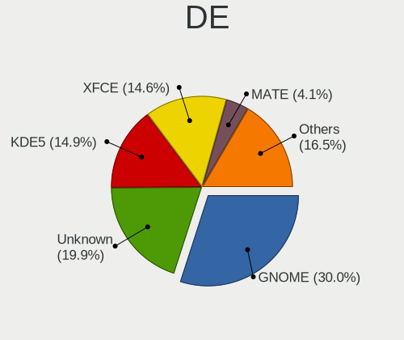

Debian Hardware Trends
----------------------

A project to identify most popular hardware characteristics and track their change
over time based on data collected by Debian users at https://Linux-Hardware.org.

Anyone can contribute to this report by the [hw-probe](https://github.com/linuxhw/hw-probe) tool:

    sudo -E hw-probe -all -upload

This is a report for all computer types. See also reports for [desktops](/Dist/Debian/Desktop/README.md) and [notebooks](/Dist/Debian/Notebook/README.md).

Full-feature report is available here: https://linux-hardware.org/?view=trends

Period: Sep, 2021.

Contents
--------

* [ System ](#system)
  - [ OS                       ](#os)
  - [ OS Family                ](#os-family)
  - [ Kernel                   ](#kernel)
  - [ Kernel Family            ](#kernel-family)
  - [ Kernel Major Ver.        ](#kernel-major-ver)
  - [ Arch                     ](#arch)
  - [ DE                       ](#de)
  - [ Display Server           ](#display-server)
  - [ Display Manager          ](#display-manager)
  - [ OS Lang                  ](#os-lang)
  - [ Boot Mode                ](#boot-mode)
  - [ Filesystem               ](#filesystem)
  - [ Part. scheme             ](#part-scheme)
  - [ Dual Boot with Linux/BSD ](#dual-boot-with-linuxbsd)
  - [ Dual Boot (Win)          ](#dual-boot-win)

* [ Board ](#board)
  - [ Vendor                   ](#vendor)
  - [ Model                    ](#model)
  - [ Model Family             ](#model-family)
  - [ MFG Year                 ](#mfg-year)
  - [ Form Factor              ](#form-factor)
  - [ Secure Boot              ](#secure-boot)
  - [ Coreboot                 ](#coreboot)
  - [ RAM Size                 ](#ram-size)
  - [ RAM Used                 ](#ram-used)
  - [ Total Drives             ](#total-drives)
  - [ Has CD-ROM               ](#has-cd-rom)
  - [ Has Ethernet             ](#has-ethernet)
  - [ Has WiFi                 ](#has-wifi)
  - [ Has Bluetooth            ](#has-bluetooth)

* [ Location ](#location)
  - [ Country                  ](#country)
  - [ City                     ](#city)

* [ Drives ](#drives)
  - [ Drive Vendor             ](#drive-vendor)
  - [ Drive Model              ](#drive-model)
  - [ HDD Vendor               ](#hdd-vendor)
  - [ SSD Vendor               ](#ssd-vendor)
  - [ Drive Kind               ](#drive-kind)
  - [ Drive Connector          ](#drive-connector)
  - [ Drive Size               ](#drive-size)
  - [ Space Total              ](#space-total)
  - [ Space Used               ](#space-used)
  - [ Malfunc. Drives          ](#malfunc-drives)
  - [ Malfunc. Drive Vendor    ](#malfunc-drive-vendor)
  - [ Malfunc. HDD Vendor      ](#malfunc-hdd-vendor)
  - [ Malfunc. Drive Kind      ](#malfunc-drive-kind)
  - [ Failed Drives            ](#failed-drives)
  - [ Failed Drive Vendor      ](#failed-drive-vendor)
  - [ Drive Status             ](#drive-status)

* [ Storage controller ](#storage-controller)
  - [ Storage Vendor           ](#storage-vendor)
  - [ Storage Model            ](#storage-model)
  - [ Storage Kind             ](#storage-kind)

* [ Processor ](#processor)
  - [ CPU Vendor               ](#cpu-vendor)
  - [ CPU Model                ](#cpu-model)
  - [ CPU Model Family         ](#cpu-model-family)
  - [ CPU Cores                ](#cpu-cores)
  - [ CPU Sockets              ](#cpu-sockets)
  - [ CPU Threads              ](#cpu-threads)
  - [ CPU Op-Modes             ](#cpu-op-modes)
  - [ CPU Microcode            ](#cpu-microcode)
  - [ CPU Microarch            ](#cpu-microarch)

* [ Graphics ](#graphics)
  - [ GPU Vendor               ](#gpu-vendor)
  - [ GPU Model                ](#gpu-model)
  - [ GPU Combo                ](#gpu-combo)
  - [ GPU Driver               ](#gpu-driver)
  - [ GPU Memory               ](#gpu-memory)

* [ Monitor ](#monitor)
  - [ Monitor Vendor           ](#monitor-vendor)
  - [ Monitor Model            ](#monitor-model)
  - [ Monitor Resolution       ](#monitor-resolution)
  - [ Monitor Diagonal         ](#monitor-diagonal)
  - [ Monitor Width            ](#monitor-width)
  - [ Aspect Ratio             ](#aspect-ratio)
  - [ Monitor Area             ](#monitor-area)
  - [ Pixel Density            ](#pixel-density)
  - [ Multiple Monitors        ](#multiple-monitors)

* [ Network ](#network)
  - [ Net Controller Vendor    ](#net-controller-vendor)
  - [ Net Controller Model     ](#net-controller-model)
  - [ Wireless Vendor          ](#wireless-vendor)
  - [ Wireless Model           ](#wireless-model)
  - [ Ethernet Vendor          ](#ethernet-vendor)
  - [ Ethernet Model           ](#ethernet-model)
  - [ Net Controller Kind      ](#net-controller-kind)
  - [ Used Controller          ](#used-controller)
  - [ NICs                     ](#nics)
  - [ IPv6                     ](#ipv6)

* [ Bluetooth ](#bluetooth)
  - [ Bluetooth Vendor         ](#bluetooth-vendor)
  - [ Bluetooth Model          ](#bluetooth-model)

* [ Sound ](#sound)
  - [ Sound Vendor             ](#sound-vendor)
  - [ Sound Model              ](#sound-model)

* [ Memory ](#memory)
  - [ Memory Vendor            ](#memory-vendor)
  - [ Memory Model             ](#memory-model)
  - [ Memory Kind              ](#memory-kind)
  - [ Memory Form Factor       ](#memory-form-factor)
  - [ Memory Size              ](#memory-size)
  - [ Memory Speed             ](#memory-speed)

* [ Printers & scanners ](#printers--scanners)
  - [ Printer Vendor           ](#printer-vendor)
  - [ Printer Model            ](#printer-model)
  - [ Scanner Vendor           ](#scanner-vendor)
  - [ Scanner Model            ](#scanner-model)

* [ Camera ](#camera)
  - [ Camera Vendor            ](#camera-vendor)
  - [ Camera Model             ](#camera-model)

* [ Security ](#security)
  - [ Fingerprint Vendor       ](#fingerprint-vendor)
  - [ Fingerprint Model        ](#fingerprint-model)
  - [ Chipcard Vendor          ](#chipcard-vendor)
  - [ Chipcard Model           ](#chipcard-model)

* [ Unsupported ](#unsupported)
  - [ Unsupported Devices      ](#unsupported-devices)
  - [ Unsupported Device Types ](#unsupported-device-types)

System
------

OS
--

Installed operating systems

| Name                            | Computers | Percent |
|---------------------------------|-----------|---------|
| Debian 11                       | 374       | 86.98%  |
| Debian 10                       | 30        | 6.98%   |
| Debian Testing                  | 16        | 3.72%   |
| Debian 9                        | 5         | 1.16%   |
| Debian Unstable                 | 2         | 0.47%   |
| Debian Testing-proposed-updates | 1         | 0.23%   |
| Debian 8                        | 1         | 0.23%   |
| Debian 11-updates               | 1         | 0.23%   |

OS Family
---------

OS without a version

| Name   | Computers | Percent |
|--------|-----------|---------|
| Debian | 430       | 100%    |

Kernel
------

Version of the Linux kernel

| Version                    | Computers | Percent |
|----------------------------|-----------|---------|
| 5.10.0-8-amd64             | 263       | 61.16%  |
| 5.10.0-7-amd64             | 84        | 19.53%  |
| 5.10.0-8-arm64             | 17        | 3.95%   |
| 4.19.0-17-amd64            | 11        | 2.56%   |
| 5.10.0-5mx-amd64           | 5         | 1.16%   |
| 5.14.0-1-amd64             | 4         | 0.93%   |
| 5.11.22-4-pve              | 4         | 0.93%   |
| 5.10.0-8-686-pae           | 4         | 0.93%   |
| 4.9.0-16-amd64             | 3         | 0.7%    |
| 5.10.0-0.bpo.8-amd64       | 2         | 0.47%   |
| 5.10.0-0.bpo.5-amd64       | 2         | 0.47%   |
| 5.9.0-4-amd64              | 1         | 0.23%   |
| 5.9.0-0.bpo.5-amd64        | 1         | 0.23%   |
| 5.8.0-3-amd64              | 1         | 0.23%   |
| 5.4.148                    | 1         | 0.23%   |
| 5.4.140-1-pve              | 1         | 0.23%   |
| 5.4.128-1-pve              | 1         | 0.23%   |
| 5.2.0-0.bpo.2-amd64        | 1         | 0.23%   |
| 5.14.6-ndmnet-sid-1        | 1         | 0.23%   |
| 5.14.6                     | 1         | 0.23%   |
| 5.14.3-xanmod1-edge        | 1         | 0.23%   |
| 5.14.0-trunk-amd64         | 1         | 0.23%   |
| 5.14.0+                    | 1         | 0.23%   |
| 5.13.3                     | 1         | 0.23%   |
| 5.13.15-xanmod1            | 1         | 0.23%   |
| 5.13.13-arch1-1            | 1         | 0.23%   |
| 5.13.13                    | 1         | 0.23%   |
| 5.13.0-trunk-amd64         | 1         | 0.23%   |
| 5.13.0-13.1-liquorix-amd64 | 1         | 0.23%   |
| 5.13.0-12.3-liquorix-amd64 | 1         | 0.23%   |
| 5.13.0-12.1-liquorix-amd64 | 1         | 0.23%   |
| 5.10.60-v8+                | 1         | 0.23%   |
| 5.10.0-8-rt-amd64          | 1         | 0.23%   |
| 5.10.0-5-amd64             | 1         | 0.23%   |
| 4.9.236-BPI-M5-Kernel      | 1         | 0.23%   |
| 4.9.0-7-amd64              | 1         | 0.23%   |
| 4.9.0-264-antix.1-486-smp  | 1         | 0.23%   |
| 4.19.0-6-amd64             | 1         | 0.23%   |
| 4.19.0-17-686-pae          | 1         | 0.23%   |
| 4.19.0-17-686              | 1         | 0.23%   |
| 4.19.0-14-amd64            | 1         | 0.23%   |
| 4.1.42-rivoreo-powerpc64   | 1         | 0.23%   |

Kernel Family
-------------

Linux kernel without a distro release

| Version | Computers | Percent |
|---------|-----------|---------|
| 5.10.0  | 379       | 88.14%  |
| 4.19.0  | 15        | 3.49%   |
| 5.14.0  | 6         | 1.4%    |
| 4.9.0   | 5         | 1.16%   |
| 5.13.0  | 4         | 0.93%   |
| 5.11.22 | 4         | 0.93%   |
| 5.9.0   | 2         | 0.47%   |
| 5.14.6  | 2         | 0.47%   |
| 5.13.13 | 2         | 0.47%   |
| 5.8.0   | 1         | 0.23%   |
| 5.4.148 | 1         | 0.23%   |
| 5.4.140 | 1         | 0.23%   |
| 5.4.128 | 1         | 0.23%   |
| 5.2.0   | 1         | 0.23%   |
| 5.14.3  | 1         | 0.23%   |
| 5.13.3  | 1         | 0.23%   |
| 5.13.15 | 1         | 0.23%   |
| 5.10.60 | 1         | 0.23%   |
| 4.9.236 | 1         | 0.23%   |
| 4.1.42  | 1         | 0.23%   |

Kernel Major Ver.
-----------------

Linux kernel major version

| Version | Computers | Percent |
|---------|-----------|---------|
| 5.10    | 380       | 88.37%  |
| 4.19    | 15        | 3.49%   |
| 5.14    | 9         | 2.09%   |
| 5.13    | 8         | 1.86%   |
| 4.9     | 6         | 1.4%    |
| 5.11    | 4         | 0.93%   |
| 5.4     | 3         | 0.7%    |
| 5.9     | 2         | 0.47%   |
| 5.8     | 1         | 0.23%   |
| 5.2     | 1         | 0.23%   |
| 4.1     | 1         | 0.23%   |

Arch
----

OS architecture (x86_64, i586, etc.)

| Name    | Computers | Percent |
|---------|-----------|---------|
| x86_64  | 403       | 93.72%  |
| aarch64 | 19        | 4.42%   |
| i686    | 7         | 1.63%   |
| ppc64   | 1         | 0.23%   |

DE
--

Desktop Environment

| Name             | Computers | Percent |
|------------------|-----------|---------|
| Unknown          | 213       | 49.53%  |
| GNOME            | 89        | 20.7%   |
| XFCE             | 38        | 8.84%   |
| KDE5             | 31        | 7.21%   |
| MATE             | 10        | 2.33%   |
| KDE              | 9         | 2.09%   |
| LXDE             | 8         | 1.86%   |
| Cinnamon         | 8         | 1.86%   |
| X-Cinnamon       | 7         | 1.63%   |
| GNOME Flashback  | 5         | 1.16%   |
| lightdm-xsession | 3         | 0.7%    |
| i3               | 3         | 0.7%    |
| GNOME Classic    | 3         | 0.7%    |
| Budgie           | 1         | 0.23%   |
| bspwm            | 1         | 0.23%   |
| awesome          | 1         | 0.23%   |

Display Server
--------------

X11 or Wayland

| Name    | Computers | Percent |
|---------|-----------|---------|
| Unknown | 172       | 40%     |
| X11     | 160       | 37.21%  |
| Wayland | 61        | 14.19%  |
| Tty     | 37        | 8.6%    |

Display Manager
---------------

SDDM, LightDM, etc.

| Name    | Computers | Percent |
|---------|-----------|---------|
| Unknown | 253       | 58.84%  |
| GDM     | 75        | 17.44%  |
| LightDM | 71        | 16.51%  |
| SDDM    | 29        | 6.74%   |
| XDM     | 1         | 0.23%   |
| GDM3    | 1         | 0.23%   |

OS Lang
-------

Language

| Lang    | Computers | Percent |
|---------|-----------|---------|
| en_US   | 115       | 26.74%  |
| ru_RU   | 96        | 22.33%  |
| Unknown | 80        | 18.6%   |
| es_ES   | 26        | 6.05%   |
| de_DE   | 14        | 3.26%   |
| en_GB   | 13        | 3.02%   |
| pt_BR   | 12        | 2.79%   |
| it_IT   | 11        | 2.56%   |
| en_AU   | 8         | 1.86%   |
| fr_FR   | 7         | 1.63%   |
| pt_PT   | 5         | 1.16%   |
| pl_PL   | 5         | 1.16%   |
| zh_CN   | 4         | 0.93%   |
| es_AR   | 3         | 0.7%    |
| en_IE   | 3         | 0.7%    |
| uk_UA   | 2         | 0.47%   |
| nl_BE   | 2         | 0.47%   |
| es_MX   | 2         | 0.47%   |
| en_CA   | 2         | 0.47%   |
| C       | 2         | 0.47%   |
| zh_TW   | 1         | 0.23%   |
| tt_RU   | 1         | 0.23%   |
| ro_RO   | 1         | 0.23%   |
| nb_NO   | 1         | 0.23%   |
| ja_JP   | 1         | 0.23%   |
| hu_HU   | 1         | 0.23%   |
| fi_FI   | 1         | 0.23%   |
| et_EE   | 1         | 0.23%   |
| es_CO   | 1         | 0.23%   |
| es_CL   | 1         | 0.23%   |
| en_ZM   | 1         | 0.23%   |
| en_ZA   | 1         | 0.23%   |
| en_IN   | 1         | 0.23%   |
| en_DK   | 1         | 0.23%   |
| el_GR   | 1         | 0.23%   |
| de_CH   | 1         | 0.23%   |
| de_AT   | 1         | 0.23%   |
| cs_CZ   | 1         | 0.23%   |

Boot Mode
---------

EFI or BIOS

| Mode | Computers | Percent |
|------|-----------|---------|
| EFI  | 228       | 53.02%  |
| BIOS | 202       | 46.98%  |

Filesystem
----------

Type of filesystem

| Type    | Computers | Percent |
|---------|-----------|---------|
| Ext4    | 229       | 53.26%  |
| Overlay | 175       | 40.7%   |
| Btrfs   | 13        | 3.02%   |
| Xfs     | 7         | 1.63%   |
| Zfs     | 3         | 0.7%    |
| Ext3    | 2         | 0.47%   |
| Unknown | 1         | 0.23%   |

Part. scheme
------------

Scheme of partitioning

| Type    | Computers | Percent |
|---------|-----------|---------|
| GPT     | 221       | 51.4%   |
| MBR     | 150       | 34.88%  |
| Unknown | 59        | 13.72%  |

Dual Boot with Linux/BSD
------------------------

Hosting more than one Linux/BSD

| Dual boot | Computers | Percent |
|-----------|-----------|---------|
| No        | 395       | 91.86%  |
| Yes       | 35        | 8.14%   |

Dual Boot (Win)
---------------

Hosting Linux and Windows

| Dual boot | Computers | Percent |
|-----------|-----------|---------|
| No        | 276       | 64.19%  |
| Yes       | 154       | 35.81%  |

Board
-----

Vendor
------

Motherboard manufacturer

| Name                    | Computers | Percent |
|-------------------------|-----------|---------|
| Lenovo                  | 115       | 26.74%  |
| ASUSTek Computer        | 82        | 19.07%  |
| Dell                    | 29        | 6.74%   |
| Hewlett-Packard         | 27        | 6.28%   |
| Acer                    | 21        | 4.88%   |
| Gigabyte Technology     | 19        | 4.42%   |
| Raspberry Pi Foundation | 17        | 3.95%   |
| Apple                   | 17        | 3.95%   |
| ECS                     | 16        | 3.72%   |
| MSI                     | 14        | 3.26%   |
| Intel                   | 12        | 2.79%   |
| ASRock                  | 12        | 2.79%   |
| Google                  | 8         | 1.86%   |
| Toshiba                 | 4         | 0.93%   |
| Unknown                 | 4         | 0.93%   |
| Timi                    | 3         | 0.7%    |
| HUAWEI                  | 3         | 0.7%    |
| Foxconn                 | 3         | 0.7%    |
| Supermicro              | 2         | 0.47%   |
| Wistron                 | 1         | 0.23%   |
| Sony                    | 1         | 0.23%   |
| Schenker                | 1         | 0.23%   |
| Samsung Electronics     | 1         | 0.23%   |
| Positivo                | 1         | 0.23%   |
| Pegatron                | 1         | 0.23%   |
| PC Specialist           | 1         | 0.23%   |
| Packard Bell            | 1         | 0.23%   |
| Microsoft               | 1         | 0.23%   |
| Libretrend              | 1         | 0.23%   |
| LG Electronics          | 1         | 0.23%   |
| Intel Client Systems    | 1         | 0.23%   |
| HC                      | 1         | 0.23%   |
| GTZS                    | 1         | 0.23%   |
| Fujitsu Siemens         | 1         | 0.23%   |
| Fujitsu                 | 1         | 0.23%   |
| Digiboard               | 1         | 0.23%   |
| Biostar                 | 1         | 0.23%   |
| ASRockRack              | 1         | 0.23%   |
| Aquarius                | 1         | 0.23%   |
| AOpen                   | 1         | 0.23%   |
| AMI                     | 1         | 0.23%   |

Model
-----

Motherboard model

| Name                                      | Computers | Percent |
|-------------------------------------------|-----------|---------|
| Lenovo ThinkPad L13 Yoga Gen 2 20VK0019US | 55        | 12.79%  |
| ASUS All Series                           | 19        | 4.42%   |
| ECS H61H2-M13                             | 13        | 3.02%   |
| RPi Raspberry Pi 4 Model B Rev 1.2        | 8         | 1.86%   |
| Google Enguarde                           | 8         | 1.86%   |
| Acer Aspire A315-23                       | 8         | 1.86%   |
| ASUS P8H67-M                              | 7         | 1.63%   |
| ASUS P8H61-M LX3 PLUS R2.0                | 7         | 1.63%   |
| RPi Raspberry Pi 3 Model B Rev 1.2        | 6         | 1.4%    |
| Apple MacBookAir7,1                       | 5         | 1.16%   |
| Unknown                                   | 5         | 1.16%   |
| Apple MacBookAir7,2                       | 4         | 0.93%   |
| RPi Raspberry Pi 4 Model B Rev 1.1        | 3         | 0.7%    |
| ECS G31T-M9                               | 3         | 0.7%    |
| ASUS PRIME A320M-K                        | 3         | 0.7%    |
| Timi TM1613                               | 2         | 0.47%   |
| MSI MS-7817                               | 2         | 0.47%   |
| MSI MS-7721                               | 2         | 0.47%   |
| Lenovo Yoga 530-14ARR 81H9                | 2         | 0.47%   |
| Lenovo ThinkPad 13 2nd Gen 20J10046US     | 2         | 0.47%   |
| Lenovo IdeaPad 330-15ARR 81D2             | 2         | 0.47%   |
| Lenovo G50-45 80E3                        | 2         | 0.47%   |
| HP Pavilion Gaming Laptop 15-ec2xxx       | 2         | 0.47%   |
| Gigabyte H81M-S2V                         | 2         | 0.47%   |
| Gigabyte H61M-DS2                         | 2         | 0.47%   |
| Dell OptiPlex 3020                        | 2         | 0.47%   |
| Dell Latitude 7480                        | 2         | 0.47%   |
| ASUS PRIME X570-PRO                       | 2         | 0.47%   |
| ASUS P6T DELUXE V2                        | 2         | 0.47%   |
| ASRock H470M-HVS                          | 2         | 0.47%   |
| Wistron ProLiant ML110 G6                 | 1         | 0.23%   |
| Toshiba Satellite L500                    | 1         | 0.23%   |
| Toshiba Satellite C655D                   | 1         | 0.23%   |
| Toshiba Satellite C55-B                   | 1         | 0.23%   |
| Toshiba PORTEGE R830                      | 1         | 0.23%   |
| Timi TM1801                               | 1         | 0.23%   |
| Supermicro X9SCL/X9SCM                    | 1         | 0.23%   |
| Supermicro X8DTN                          | 1         | 0.23%   |
| Sony VGN-CR21Z_N                          | 1         | 0.23%   |
| Schenker XMG NEO (TGL/M21)                | 1         | 0.23%   |
| Samsung NC10                              | 1         | 0.23%   |
| Positivo POS-PIQ77CL                      | 1         | 0.23%   |
| Pegatron NP267AA-A2L e9180f               | 1         | 0.23%   |
| PC Specialist Standard                    | 1         | 0.23%   |
| Packard Bell EasyNote TS11HR              | 1         | 0.23%   |
| MSI U270 series                           | 1         | 0.23%   |
| MSI MS-7C06                               | 1         | 0.23%   |
| MSI MS-7B49                               | 1         | 0.23%   |
| MSI MS-7A34                               | 1         | 0.23%   |
| MSI MS-7996                               | 1         | 0.23%   |
| MSI MS-7971                               | 1         | 0.23%   |
| MSI GF75 Thin 9SC                         | 1         | 0.23%   |
| MSI GF63 8RD                              | 1         | 0.23%   |
| MSI GE70 2QE                              | 1         | 0.23%   |
| MSI Bravo 15 A4DDR                        | 1         | 0.23%   |
| Microsoft Surface Pro 4                   | 1         | 0.23%   |
| Libretrend LT1000                         | 1         | 0.23%   |
| LG A410-K.BE43P1                          | 1         | 0.23%   |
| Lenovo Y520-15IKBN 80WK                   | 1         | 0.23%   |
| Lenovo V510-15IKB 80WQ                    | 1         | 0.23%   |

Model Family
------------

Motherboard model prefix

| Name                   | Computers | Percent |
|------------------------|-----------|---------|
| Lenovo ThinkPad        | 86        | 20%     |
| ASUS All               | 19        | 4.42%   |
| RPi Raspberry          | 17        | 3.95%   |
| Acer Aspire            | 16        | 3.72%   |
| ECS H61H2-M13          | 13        | 3.02%   |
| Lenovo IdeaPad         | 12        | 2.79%   |
| Dell Inspiron          | 9         | 2.09%   |
| ASUS PRIME             | 9         | 2.09%   |
| Apple MacBookAir7      | 9         | 2.09%   |
| Google Enguarde        | 8         | 1.86%   |
| ASUS P8H67-M           | 8         | 1.86%   |
| ASUS P8H61-M           | 8         | 1.86%   |
| ASUS TUF               | 7         | 1.63%   |
| HP Pavilion            | 6         | 1.4%    |
| Dell Latitude          | 6         | 1.4%    |
| Dell OptiPlex          | 5         | 1.16%   |
| Unknown                | 5         | 1.16%   |
| Dell Precision         | 4         | 0.93%   |
| Toshiba Satellite      | 3         | 0.7%    |
| HP EliteDesk           | 3         | 0.7%    |
| HP EliteBook           | 3         | 0.7%    |
| Gigabyte H61M-DS2      | 3         | 0.7%    |
| ECS G31T-M9            | 3         | 0.7%    |
| Timi TM1613            | 2         | 0.47%   |
| MSI MS-7817            | 2         | 0.47%   |
| MSI MS-7721            | 2         | 0.47%   |
| Lenovo Yoga            | 2         | 0.47%   |
| Lenovo ThinkBook       | 2         | 0.47%   |
| Lenovo G50-45          | 2         | 0.47%   |
| Intel DH67CL           | 2         | 0.47%   |
| HP ProBook             | 2         | 0.47%   |
| HP Compaq              | 2         | 0.47%   |
| Gigabyte H81M-S2V      | 2         | 0.47%   |
| Dell Vostro            | 2         | 0.47%   |
| Dell PowerEdge         | 2         | 0.47%   |
| ASUS P6T               | 2         | 0.47%   |
| ASUS ASUS              | 2         | 0.47%   |
| ASRock H470M-HVS       | 2         | 0.47%   |
| Acer TravelMate        | 2         | 0.47%   |
| Wistron ProLiant       | 1         | 0.23%   |
| Toshiba PORTEGE        | 1         | 0.23%   |
| Timi TM1801            | 1         | 0.23%   |
| Supermicro X9SCL       | 1         | 0.23%   |
| Supermicro X8DTN       | 1         | 0.23%   |
| Sony VGN-CR21Z         | 1         | 0.23%   |
| Schenker XMG           | 1         | 0.23%   |
| Samsung NC10           | 1         | 0.23%   |
| Positivo POS-PIQ77CL   | 1         | 0.23%   |
| Pegatron NP267AA-A2L   | 1         | 0.23%   |
| PC Specialist Standard | 1         | 0.23%   |
| Packard Bell EasyNote  | 1         | 0.23%   |
| MSI U270               | 1         | 0.23%   |
| MSI MS-7C06            | 1         | 0.23%   |
| MSI MS-7B49            | 1         | 0.23%   |
| MSI MS-7A34            | 1         | 0.23%   |
| MSI MS-7996            | 1         | 0.23%   |
| MSI MS-7971            | 1         | 0.23%   |
| MSI GF75               | 1         | 0.23%   |
| MSI GF63               | 1         | 0.23%   |
| MSI GE70               | 1         | 0.23%   |

MFG Year
--------

Motherboard manufacture year

| Year    | Computers | Percent |
|---------|-----------|---------|
| 2021    | 120       | 27.91%  |
| 2020    | 61        | 14.19%  |
| 2011    | 41        | 9.53%   |
| 2019    | 32        | 7.44%   |
| 2014    | 27        | 6.28%   |
| 2012    | 24        | 5.58%   |
| 2018    | 21        | 4.88%   |
| Unknown | 20        | 4.65%   |
| 2015    | 16        | 3.72%   |
| 2010    | 14        | 3.26%   |
| 2009    | 14        | 3.26%   |
| 2016    | 13        | 3.02%   |
| 2013    | 12        | 2.79%   |
| 2008    | 7         | 1.63%   |
| 2017    | 3         | 0.7%    |
| 2006    | 2         | 0.47%   |
| 2007    | 1         | 0.23%   |
| 2005    | 1         | 0.23%   |
| 2004    | 1         | 0.23%   |

Form Factor
-----------

Physical design of the computer

| Name           | Computers | Percent |
|----------------|-----------|---------|
| Notebook       | 170       | 39.53%  |
| Desktop        | 162       | 37.67%  |
| Convertible    | 59        | 13.72%  |
| System on chip | 19        | 4.42%   |
| Mini pc        | 7         | 1.63%   |
| All in one     | 7         | 1.63%   |
| Server         | 4         | 0.93%   |
| Tablet         | 2         | 0.47%   |

Secure Boot
-----------

Enabled or disabled

| State    | Computers | Percent |
|----------|-----------|---------|
| Disabled | 411       | 95.58%  |
| Enabled  | 19        | 4.42%   |

Coreboot
--------

Have coreboot on board

| Used | Computers | Percent |
|------|-----------|---------|
| No   | 421       | 97.91%  |
| Yes  | 9         | 2.09%   |

RAM Size
--------

Total RAM memory

| Size in GB      | Computers | Percent |
|-----------------|-----------|---------|
| 16.01-24.0      | 104       | 24.19%  |
| 4.01-8.0        | 103       | 23.95%  |
| 3.01-4.0        | 91        | 21.16%  |
| 8.01-16.0       | 63        | 14.65%  |
| 32.01-64.0      | 23        | 5.35%   |
| 1.01-2.0        | 14        | 3.26%   |
| 64.01-256.0     | 13        | 3.02%   |
| 0.51-1.0        | 11        | 2.56%   |
| 2.01-3.0        | 4         | 0.93%   |
| More than 256.0 | 3         | 0.7%    |
| Unknown         | 1         | 0.23%   |

RAM Used
--------

Used RAM memory

| Used GB    | Computers | Percent |
|------------|-----------|---------|
| 1.01-2.0   | 144       | 33.49%  |
| 0.51-1.0   | 108       | 25.12%  |
| 2.01-3.0   | 61        | 14.19%  |
| 4.01-8.0   | 42        | 9.77%   |
| 3.01-4.0   | 31        | 7.21%   |
| 0.01-0.5   | 26        | 6.05%   |
| 8.01-16.0  | 11        | 2.56%   |
| 16.01-24.0 | 5         | 1.16%   |
| 24.01-32.0 | 1         | 0.23%   |
| Unknown    | 1         | 0.23%   |

Total Drives
------------

Number of drives on board

| Drives | Computers | Percent |
|--------|-----------|---------|
| 1      | 325       | 75.58%  |
| 2      | 62        | 14.42%  |
| 3      | 16        | 3.72%   |
| 4      | 13        | 3.02%   |
| 7      | 4         | 0.93%   |
| 5      | 4         | 0.93%   |
| 6      | 3         | 0.7%    |
| 0      | 2         | 0.47%   |
| 8      | 1         | 0.23%   |

Has CD-ROM
----------

Has CD-ROM on board

| Presented | Computers | Percent |
|-----------|-----------|---------|
| No        | 322       | 74.88%  |
| Yes       | 108       | 25.12%  |

Has Ethernet
------------

Has Ethernet on board

| Presented | Computers | Percent |
|-----------|-----------|---------|
| Yes       | 377       | 87.67%  |
| No        | 53        | 12.33%  |

Has WiFi
--------

Has WiFi module

| Presented | Computers | Percent |
|-----------|-----------|---------|
| Yes       | 276       | 64.19%  |
| No        | 154       | 35.81%  |

Has Bluetooth
-------------

Has Bluetooth module

| Presented | Computers | Percent |
|-----------|-----------|---------|
| Yes       | 233       | 54.19%  |
| No        | 197       | 45.81%  |

Location
--------

Country
-------

Geographic location (country)

| Country      | Computers | Percent |
|--------------|-----------|---------|
| USA          | 118       | 27.44%  |
| Russia       | 99        | 23.02%  |
| Spain        | 29        | 6.74%   |
| Germany      | 24        | 5.58%   |
| Switzerland  | 20        | 4.65%   |
| Brazil       | 17        | 3.95%   |
| Italy        | 11        | 2.56%   |
| France       | 10        | 2.33%   |
| Portugal     | 9         | 2.09%   |
| Australia    | 9         | 2.09%   |
| UK           | 7         | 1.63%   |
| Poland       | 7         | 1.63%   |
| Romania      | 6         | 1.4%    |
| China        | 6         | 1.4%    |
| Argentina    | 5         | 1.16%   |
| Belgium      | 4         | 0.93%   |
| Ukraine      | 3         | 0.7%    |
| Sweden       | 3         | 0.7%    |
| Canada       | 3         | 0.7%    |
| Pakistan     | 2         | 0.47%   |
| Norway       | 2         | 0.47%   |
| Mexico       | 2         | 0.47%   |
| Latvia       | 2         | 0.47%   |
| Ireland      | 2         | 0.47%   |
| India        | 2         | 0.47%   |
| Hungary      | 2         | 0.47%   |
| Finland      | 2         | 0.47%   |
| Czechia      | 2         | 0.47%   |
| Chile        | 2         | 0.47%   |
| Austria      | 2         | 0.47%   |
| Zambia       | 1         | 0.23%   |
| Vietnam      | 1         | 0.23%   |
| Taiwan       | 1         | 0.23%   |
| South Africa | 1         | 0.23%   |
| Nepal        | 1         | 0.23%   |
| Japan        | 1         | 0.23%   |
| Israel       | 1         | 0.23%   |
| Iran         | 1         | 0.23%   |
| Indonesia    | 1         | 0.23%   |
| Guatemala    | 1         | 0.23%   |
| Greece       | 1         | 0.23%   |
| Georgia      | 1         | 0.23%   |
| Fiji         | 1         | 0.23%   |
| Estonia      | 1         | 0.23%   |
| Colombia     | 1         | 0.23%   |
| Bolivia      | 1         | 0.23%   |
| Belarus      | 1         | 0.23%   |
| Bangladesh   | 1         | 0.23%   |

City
----

Geographic location (city)

| City                   | Computers | Percent |
|------------------------|-----------|---------|
| Voronezh               | 84        | 19.53%  |
| Portland               | 79        | 18.37%  |
| M??laga                | 18        | 4.19%   |
| Zurich                 | 16        | 3.72%   |
| S??o Paulo             | 5         | 1.16%   |
| St Petersburg          | 4         | 0.93%   |
| Moscow                 | 4         | 0.93%   |
| Osnabr??ck             | 3         | 0.7%    |
| Milan                  | 3         | 0.7%    |
| Lisbon                 | 3         | 0.7%    |
| Iasi                   | 3         | 0.7%    |
| Hampden                | 3         | 0.7%    |
| Berlin                 | 3         | 0.7%    |
| Yarraville             | 2         | 0.47%   |
| Wroclaw                | 2         | 0.47%   |
| Valencia               | 2         | 0.47%   |
| Tucson                 | 2         | 0.47%   |
| Trieste                | 2         | 0.47%   |
| Ternopil               | 2         | 0.47%   |
| Sydney                 | 2         | 0.47%   |
| Sueca                  | 2         | 0.47%   |
| Sevastopol'            | 2         | 0.47%   |
| San Miguel de Tucum??n | 2         | 0.47%   |
| Roseville              | 2         | 0.47%   |
| Riga                   | 2         | 0.47%   |
| New Orleans            | 2         | 0.47%   |
| Helsinki               | 2         | 0.47%   |
| Hamburg                | 2         | 0.47%   |
| Grand Rapids           | 2         | 0.47%   |
| Dublin                 | 2         | 0.47%   |
| Brisbane               | 2         | 0.47%   |
| Adliswil               | 2         | 0.47%   |
| Zwiesel                | 1         | 0.23%   |
| Zibo                   | 1         | 0.23%   |
| Zhengzhou              | 1         | 0.23%   |
| Yekaterinburg          | 1         | 0.23%   |
| Wuppertal              | 1         | 0.23%   |
| Williston              | 1         | 0.23%   |
| Warsaw                 | 1         | 0.23%   |
| Warminster             | 1         | 0.23%   |
| Waregem                | 1         | 0.23%   |
| Vologda                | 1         | 0.23%   |
| Vladivostok            | 1         | 0.23%   |
| Villa del Rosario      | 1         | 0.23%   |
| Vijayawada             | 1         | 0.23%   |
| Vienna                 | 1         | 0.23%   |
| Ustron                 | 1         | 0.23%   |
| Trinidad               | 1         | 0.23%   |
| Tehran                 | 1         | 0.23%   |
| Tbilisi                | 1         | 0.23%   |
| Tartu                  | 1         | 0.23%   |
| Sunnyvale              | 1         | 0.23%   |
| Suceava                | 1         | 0.23%   |
| Stockholm              | 1         | 0.23%   |
| South Deerfield        | 1         | 0.23%   |
| Soudos                 | 1         | 0.23%   |
| Sherbrooke             | 1         | 0.23%   |
| Shanghai               | 1         | 0.23%   |
| Schildow               | 1         | 0.23%   |
| Sao Teotonio           | 1         | 0.23%   |

Drives
------

Drive Vendor
------------

Hard drive vendors

| Vendor                    | Computers | Drives | Percent |
|---------------------------|-----------|--------|---------|
| Samsung Electronics       | 123       | 138    | 22.65%  |
| WDC                       | 85        | 109    | 15.65%  |
| Seagate                   | 63        | 77     | 11.6%   |
| Unknown                   | 33        | 33     | 6.08%   |
| Kingston                  | 32        | 33     | 5.89%   |
| Toshiba                   | 25        | 28     | 4.6%    |
| Hitachi                   | 24        | 25     | 4.42%   |
| Crucial                   | 18        | 20     | 3.31%   |
| HGST                      | 17        | 18     | 3.13%   |
| SK Hynix                  | 14        | 16     | 2.58%   |
| Intel                     | 14        | 15     | 2.58%   |
| Apple                     | 13        | 14     | 2.39%   |
| SanDisk                   | 12        | 13     | 2.21%   |
| A-DATA Technology         | 9         | 9      | 1.66%   |
| Micron Technology         | 5         | 5      | 0.92%   |
| MAXTOR                    | 5         | 5      | 0.92%   |
| Silicon Motion            | 4         | 4      | 0.74%   |
| KIOXIA                    | 3         | 3      | 0.55%   |
| Fujitsu                   | 3         | 6      | 0.55%   |
| Corsair                   | 3         | 4      | 0.55%   |
| China                     | 3         | 3      | 0.55%   |
| XPG                       | 2         | 3      | 0.37%   |
| Solid State Storage       | 2         | 2      | 0.37%   |
| SABRENT                   | 2         | 2      | 0.37%   |
| PLEXTOR                   | 2         | 2      | 0.37%   |
| Patriot                   | 2         | 2      | 0.37%   |
| Netac                     | 2         | 2      | 0.37%   |
| Mushkin                   | 2         | 2      | 0.37%   |
| Lexar                     | 2         | 2      | 0.37%   |
| USB3.0                    | 1         | 1      | 0.18%   |
| SPCC                      | 1         | 1      | 0.18%   |
| RDM-II                    | 1         | 1      | 0.18%   |
| OCZ                       | 1         | 1      | 0.18%   |
| Micron/Crucial Technology | 1         | 1      | 0.18%   |
| Mass                      | 1         | 1      | 0.18%   |
| LITEON                    | 1         | 1      | 0.18%   |
| Lenovo                    | 1         | 1      | 0.18%   |
| KING                      | 1         | 1      | 0.18%   |
| Intenso                   | 1         | 1      | 0.18%   |
| Hewlett-Packard           | 1         | 2      | 0.18%   |
| Hajaan                    | 1         | 1      | 0.18%   |
| GOODRAM                   | 1         | 1      | 0.18%   |
| Gigabyte Technology       | 1         | 2      | 0.18%   |
| BIWIN                     | 1         | 1      | 0.18%   |
| ASMT                      | 1         | 2      | 0.18%   |
| ASMedia                   | 1         | 1      | 0.18%   |
| Apacer                    | 1         | 1      | 0.18%   |
| 2-Power                   | 1         | 1      | 0.18%   |

Drive Model
-----------

Hard drive models

| Model                                | Computers | Percent |
|--------------------------------------|-----------|---------|
| Samsung MZVLB512HBJQ-000L7 512GB     | 55        | 9.47%   |
| WDC WD5000AAKX-60U6AA0 500GB         | 15        | 2.58%   |
| Hitachi HDS721050DLE630 500GB        | 10        | 1.72%   |
| Unknown Y032V  32GB                  | 8         | 1.38%   |
| Seagate ST1000LM035-1RK172 1TB       | 8         | 1.38%   |
| Seagate ST1000DM003-9YN162 1TB       | 8         | 1.38%   |
| WDC WD2500AAKX-00ERMA0 250GB         | 7         | 1.2%    |
| Unknown SD16G  16GB                  | 6         | 1.03%   |
| Seagate ST500DM002-1BD142 500GB      | 6         | 1.03%   |
| Seagate ST1000LM024 HN-M101MBB 1TB   | 6         | 1.03%   |
| Samsung SSD 970 EVO Plus 1TB         | 6         | 1.03%   |
| Samsung SSD 870 EVO 500GB            | 6         | 1.03%   |
| Seagate ST1000DM010-2EP102 1TB       | 5         | 0.86%   |
| Samsung SSD 860 EVO 500GB            | 5         | 0.86%   |
| Samsung SSD 860 EVO 250GB            | 5         | 0.86%   |
| Crucial CT500MX500SSD1 500GB         | 5         | 0.86%   |
| Apple SSD AP0128H 121GB              | 5         | 0.86%   |
| Unknown AGND3R  16GB                 | 4         | 0.69%   |
| Toshiba DT01ACA050 500GB             | 4         | 0.69%   |
| Kingston SA400S37480G 480GB SSD      | 4         | 0.69%   |
| Kingston SA400S37240G 240GB SSD      | 4         | 0.69%   |
| Kingston SA400S37120G 120GB SSD      | 4         | 0.69%   |
| Hitachi HDS721050CLA362 500GB        | 4         | 0.69%   |
| Apple SSD SM0128G 121GB              | 4         | 0.69%   |
| WDC WD1002FAEX-00Z3A0 1TB            | 3         | 0.52%   |
| WDC PC SN730 SDBQNTY-512G-1001 512GB | 3         | 0.52%   |
| Unknown SL16G  16GB                  | 3         | 0.52%   |
| Unknown HAG2e  16GB                  | 3         | 0.52%   |
| Toshiba HDWD110 1TB                  | 3         | 0.52%   |
| Seagate ST1000DM003-1ER162 1TB       | 3         | 0.52%   |
| Samsung SSD 970 EVO Plus 500GB       | 3         | 0.52%   |
| Samsung SSD 850 EVO 250GB            | 3         | 0.52%   |
| Samsung NVMe SSD Drive 1TB           | 3         | 0.52%   |
| MAXTOR STM3500320AS 500GB            | 3         | 0.52%   |
| Kingston SV300S37A120G 120GB SSD     | 3         | 0.52%   |
| Kingston SUV400S37240G 240GB SSD     | 3         | 0.52%   |
| HGST HTS725050A7E630 500GB           | 3         | 0.52%   |
| HGST HTS721010A9E630 1TB             | 3         | 0.52%   |
| WDC WD10SPZX-60Z10T0 1TB             | 2         | 0.34%   |
| WDC WD10SPZX-24Z10 1TB               | 2         | 0.34%   |
| Unknown SD/MMC/MS PRO 128GB          | 2         | 0.34%   |
| Toshiba MQ04ABF100 1TB               | 2         | 0.34%   |
| Toshiba KBG40ZNT256G MEMORY 256GB    | 2         | 0.34%   |
| Toshiba DT01ACA100 1TB               | 2         | 0.34%   |
| Silicon Motion NVMe SSD Drive 1TB    | 2         | 0.34%   |
| Seagate ST9320325AS 320GB            | 2         | 0.34%   |
| Seagate ST4000DM000-1F2168 4TB       | 2         | 0.34%   |
| Seagate ST31000528AS 1TB             | 2         | 0.34%   |
| SanDisk SSD PLUS 480GB               | 2         | 0.34%   |
| Sandisk NVMe SSD Drive 256GB         | 2         | 0.34%   |
| Samsung SSD 860 EVO 1TB              | 2         | 0.34%   |
| Samsung SSD 850 EVO 500GB            | 2         | 0.34%   |
| Samsung MZVLB512HBJQ-000L2 512GB     | 2         | 0.34%   |
| Samsung MZVLB256HAHQ-00000 256GB     | 2         | 0.34%   |
| Samsung MZNTY128HDHP-000L1 128GB SSD | 2         | 0.34%   |
| Samsung MZ7LN256HAJQ-000L2 256GB SSD | 2         | 0.34%   |
| SABRENT Disk 1TB                     | 2         | 0.34%   |
| Netac SSD 240GB                      | 2         | 0.34%   |
| Micron 2210_MTFDHBA512QFD 512GB      | 2         | 0.34%   |
| Lexar 512GB SSD                      | 2         | 0.34%   |

HDD Vendor
----------

Hard disk drive vendors

| Vendor              | Computers | Drives | Percent |
|---------------------|-----------|--------|---------|
| WDC                 | 66        | 84     | 32.04%  |
| Seagate             | 63        | 77     | 30.58%  |
| Hitachi             | 24        | 25     | 11.65%  |
| Toshiba             | 19        | 21     | 9.22%   |
| HGST                | 17        | 18     | 8.25%   |
| Samsung Electronics | 4         | 4      | 1.94%   |
| MAXTOR              | 4         | 4      | 1.94%   |
| Fujitsu             | 3         | 6      | 1.46%   |
| Unknown             | 2         | 2      | 0.97%   |
| USB3.0              | 1         | 1      | 0.49%   |
| Hewlett-Packard     | 1         | 2      | 0.49%   |
| ASMT                | 1         | 2      | 0.49%   |
| Apple               | 1         | 1      | 0.49%   |

SSD Vendor
----------

Solid state drive vendors

| Vendor              | Computers | Drives | Percent |
|---------------------|-----------|--------|---------|
| Samsung Electronics | 43        | 47     | 27.39%  |
| Kingston            | 30        | 31     | 19.11%  |
| Crucial             | 15        | 16     | 9.55%   |
| WDC                 | 10        | 10     | 6.37%   |
| SanDisk             | 9         | 10     | 5.73%   |
| Apple               | 6         | 6      | 3.82%   |
| Intel               | 5         | 5      | 3.18%   |
| A-DATA Technology   | 5         | 5      | 3.18%   |
| SK Hynix            | 3         | 4      | 1.91%   |
| China               | 3         | 3      | 1.91%   |
| SABRENT             | 2         | 2      | 1.27%   |
| PLEXTOR             | 2         | 2      | 1.27%   |
| Netac               | 2         | 2      | 1.27%   |
| Mushkin             | 2         | 2      | 1.27%   |
| Micron Technology   | 2         | 2      | 1.27%   |
| Lexar               | 2         | 2      | 1.27%   |
| Corsair             | 2         | 2      | 1.27%   |
| Unknown             | 1         | 1      | 0.64%   |
| Toshiba             | 1         | 1      | 0.64%   |
| SPCC                | 1         | 1      | 0.64%   |
| RDM-II              | 1         | 1      | 0.64%   |
| Patriot             | 1         | 1      | 0.64%   |
| OCZ                 | 1         | 1      | 0.64%   |
| MAXTOR              | 1         | 1      | 0.64%   |
| LITEON              | 1         | 1      | 0.64%   |
| KING                | 1         | 1      | 0.64%   |
| Hajaan              | 1         | 1      | 0.64%   |
| GOODRAM             | 1         | 1      | 0.64%   |
| ASMedia             | 1         | 1      | 0.64%   |
| Apacer              | 1         | 1      | 0.64%   |
| 2-Power             | 1         | 1      | 0.64%   |

Drive Kind
----------

HDD or SSD

| Kind    | Computers | Drives | Percent |
|---------|-----------|--------|---------|
| HDD     | 194       | 247    | 37.38%  |
| NVMe    | 149       | 172    | 28.71%  |
| SSD     | 143       | 165    | 27.55%  |
| MMC     | 31        | 31     | 5.97%   |
| Unknown | 2         | 2      | 0.39%   |

Drive Connector
---------------

SATA, SAS, NVMe, etc.

| Type | Computers | Drives | Percent |
|------|-----------|--------|---------|
| SATA | 281       | 395    | 59.41%  |
| NVMe | 149       | 172    | 31.5%   |
| MMC  | 31        | 31     | 6.55%   |
| SAS  | 12        | 19     | 2.54%   |

Drive Size
----------

Size of hard drive

| Size in TB  | Computers | Drives | Percent |
|-------------|-----------|--------|---------|
| 0.01-0.5    | 204       | 232    | 59.3%   |
| 0.51-1.0    | 97        | 111    | 28.2%   |
| 1.01-2.0    | 20        | 25     | 5.81%   |
| 3.01-4.0    | 11        | 16     | 3.2%    |
| 4.01-10.0   | 5         | 9      | 1.45%   |
| 10.01-20.0  | 4         | 13     | 1.16%   |
| 2.01-3.0    | 2         | 2      | 0.58%   |
| 50.01-100.0 | 1         | 4      | 0.29%   |

Space Total
-----------

Amount of disk space available on the file system

| Size in GB     | Computers | Percent |
|----------------|-----------|---------|
| 251-500        | 111       | 25.81%  |
| Unknown        | 92        | 21.4%   |
| 101-250        | 91        | 21.16%  |
| 501-1000       | 35        | 8.14%   |
| 1-20           | 29        | 6.74%   |
| More than 3000 | 23        | 5.35%   |
| 1001-2000      | 21        | 4.88%   |
| 21-50          | 12        | 2.79%   |
| 51-100         | 10        | 2.33%   |
| 2001-3000      | 6         | 1.4%    |

Space Used
----------

Amount of used disk space

| Used GB        | Computers | Percent |
|----------------|-----------|---------|
| 1-20           | 188       | 43.72%  |
| Unknown        | 92        | 21.4%   |
| 51-100         | 35        | 8.14%   |
| 21-50          | 28        | 6.51%   |
| 101-250        | 28        | 6.51%   |
| 251-500        | 15        | 3.49%   |
| 501-1000       | 15        | 3.49%   |
| More than 3000 | 13        | 3.02%   |
| 2001-3000      | 7         | 1.63%   |
| 1001-2000      | 7         | 1.63%   |
| 0              | 2         | 0.47%   |

Malfunc. Drives
---------------

Drive models with a malfunction

| Model                                          | Computers | Drives | Percent |
|------------------------------------------------|-----------|--------|---------|
| WDC WD5000AAKX-60U6AA0 500GB                   | 12        | 12     | 17.14%  |
| Hitachi HDS721050DLE630 500GB                  | 5         | 5      | 7.14%   |
| Seagate ST1000DM003-9YN162 1TB                 | 3         | 3      | 4.29%   |
| Seagate ST500DM002-1BD142 500GB                | 2         | 2      | 2.86%   |
| Seagate ST31000528AS 1TB                       | 2         | 2      | 2.86%   |
| Hitachi HDS721050CLA362 500GB                  | 2         | 2      | 2.86%   |
| WDC WD6400BPVT-22HXZT3 640GB                   | 1         | 1      | 1.43%   |
| WDC WD5000AAKX-221CA1 500GB                    | 1         | 1      | 1.43%   |
| WDC WD2500AAKX-00ERMA0 250GB                   | 1         | 1      | 1.43%   |
| WDC WD20EARS-00MVWB0 2TB                       | 1         | 1      | 1.43%   |
| WDC WD10SPZX-24Z10 1TB                         | 1         | 1      | 1.43%   |
| WDC WD10EARS-00Y5B1 1TB                        | 1         | 1      | 1.43%   |
| WDC WD1002FAEX-00Z3A0 1TB                      | 1         | 1      | 1.43%   |
| Toshiba MQ01ABD050 500GB                       | 1         | 1      | 1.43%   |
| Toshiba DT01ACA100 1TB                         | 1         | 1      | 1.43%   |
| SK Hynix SH920 mSATA 128GB SSD                 | 1         | 1      | 1.43%   |
| SK Hynix PC401 NVMe 512GB                      | 1         | 2      | 1.43%   |
| Seagate ST500LT012-9WS142 500GB                | 1         | 1      | 1.43%   |
| Seagate ST3500418AS 500GB                      | 1         | 1      | 1.43%   |
| Seagate ST3320620AS 320GB                      | 1         | 1      | 1.43%   |
| Seagate ST3320613AS 320GB                      | 1         | 1      | 1.43%   |
| Seagate ST3250310AS 250GB                      | 1         | 1      | 1.43%   |
| Seagate ST1000LM024 HN-M101MBB 1TB             | 1         | 1      | 1.43%   |
| Seagate ST1000DM003-1ER162 1TB                 | 1         | 1      | 1.43%   |
| Seagate ST10000NE0004-1ZF101 10TB              | 1         | 1      | 1.43%   |
| Samsung Electronics HM251HI 250GB              | 1         | 1      | 1.43%   |
| Samsung Electronics HM160HI 160GB              | 1         | 1      | 1.43%   |
| Micron Technology 1100_MTFDDAK256TBN 256GB SSD | 1         | 1      | 1.43%   |
| MAXTOR STM3500320AS 500GB                      | 1         | 1      | 1.43%   |
| MAXTOR STM3250310AS 250GB                      | 1         | 1      | 1.43%   |
| LITEON IT SCS-256L9S 256GB SSD                 | 1         | 1      | 1.43%   |
| Kingston SV300S37A120G 120GB SSD               | 1         | 1      | 1.43%   |
| Intel SSDSC2KF256H6L 256GB                     | 1         | 1      | 1.43%   |
| Intel SSDPEKKW512G7 512GB                      | 1         | 1      | 1.43%   |
| Intel SSDPEKKW256G7 256GB                      | 1         | 1      | 1.43%   |
| Hitachi HTS547575A9E384 752GB                  | 1         | 1      | 1.43%   |
| Hitachi HTS545050B9A300 500GB                  | 1         | 1      | 1.43%   |
| Hitachi HTS545032B9A300 320GB                  | 1         | 1      | 1.43%   |
| Hitachi HTS541075A9E680 752GB                  | 1         | 1      | 1.43%   |
| Hitachi HTS541060G9AT00 64GB                   | 1         | 1      | 1.43%   |
| Hitachi HDS721010KLA330 1TB                    | 1         | 1      | 1.43%   |
| HGST HTS545050A7E680 500GB                     | 1         | 1      | 1.43%   |
| HGST HTS545050A7 500GB                         | 1         | 1      | 1.43%   |
| HGST HTS541010A9E680 1TB                       | 1         | 1      | 1.43%   |
| Fujitsu MHZ2320BH G2 320GB                     | 1         | 1      | 1.43%   |
| Crucial CT128MX100SSD1 128GB                   | 1         | 1      | 1.43%   |
| Corsair Force LS SSD 64GB                      | 1         | 1      | 1.43%   |
| A-DATA Technology SX8200PNP 1TB                | 1         | 1      | 1.43%   |
| A-DATA Technology SU650 240GB SSD              | 1         | 1      | 1.43%   |
| A-DATA Technology SP600 64GB SSD               | 1         | 1      | 1.43%   |

Malfunc. Drive Vendor
---------------------

Vendors of faulty drives

| Vendor              | Computers | Drives | Percent |
|---------------------|-----------|--------|---------|
| WDC                 | 19        | 19     | 27.54%  |
| Seagate             | 14        | 15     | 20.29%  |
| Hitachi             | 13        | 13     | 18.84%  |
| Intel               | 3         | 3      | 4.35%   |
| HGST                | 3         | 3      | 4.35%   |
| A-DATA Technology   | 3         | 3      | 4.35%   |
| Toshiba             | 2         | 2      | 2.9%    |
| SK Hynix            | 2         | 3      | 2.9%    |
| Samsung Electronics | 2         | 2      | 2.9%    |
| MAXTOR              | 2         | 2      | 2.9%    |
| Micron Technology   | 1         | 1      | 1.45%   |
| LITEON              | 1         | 1      | 1.45%   |
| Kingston            | 1         | 1      | 1.45%   |
| Fujitsu             | 1         | 1      | 1.45%   |
| Crucial             | 1         | 1      | 1.45%   |
| Corsair             | 1         | 1      | 1.45%   |

Malfunc. HDD Vendor
-------------------

Vendors of faulty HDD drives

| Vendor              | Computers | Drives | Percent |
|---------------------|-----------|--------|---------|
| WDC                 | 19        | 19     | 33.93%  |
| Seagate             | 14        | 15     | 25%     |
| Hitachi             | 13        | 13     | 23.21%  |
| HGST                | 3         | 3      | 5.36%   |
| Toshiba             | 2         | 2      | 3.57%   |
| Samsung Electronics | 2         | 2      | 3.57%   |
| MAXTOR              | 2         | 2      | 3.57%   |
| Fujitsu             | 1         | 1      | 1.79%   |

Malfunc. Drive Kind
-------------------

Kinds of faulty drives

| Kind | Computers | Drives | Percent |
|------|-----------|--------|---------|
| HDD  | 54        | 57     | 80.6%   |
| SSD  | 9         | 9      | 13.43%  |
| NVMe | 4         | 5      | 5.97%   |

Failed Drives
-------------

Failed drive models

Zero info for selected period =(

Failed Drive Vendor
-------------------

Failed drive vendors

Zero info for selected period =(

Drive Status
------------

Number of failed and malfunc. drives

| Status   | Computers | Drives | Percent |
|----------|-----------|--------|---------|
| Works    | 288       | 408    | 63.58%  |
| Detected | 101       | 138    | 22.3%   |
| Malfunc  | 64        | 71     | 14.13%  |

Storage controller
------------------

Storage Vendor
--------------

Storage controller vendors

| Vendor                         | Computers | Percent |
|--------------------------------|-----------|---------|
| Intel                          | 235       | 47.57%  |
| Samsung Electronics            | 85        | 17.21%  |
| AMD                            | 74        | 14.98%  |
| Sandisk                        | 17        | 3.44%   |
| SK Hynix                       | 11        | 2.23%   |
| VIA Technologies               | 8         | 1.62%   |
| Marvell Technology Group       | 7         | 1.42%   |
| Silicon Motion                 | 6         | 1.21%   |
| Apple                          | 6         | 1.21%   |
| ADATA Technology               | 6         | 1.21%   |
| KIOXIA                         | 5         | 1.01%   |
| Nvidia                         | 4         | 0.81%   |
| Micron/Crucial Technology      | 4         | 0.81%   |
| JMicron Technology             | 4         | 0.81%   |
| Toshiba America Info Systems   | 3         | 0.61%   |
| Micron Technology              | 3         | 0.61%   |
| LSI Logic / Symbios Logic      | 3         | 0.61%   |
| ASMedia Technology             | 3         | 0.61%   |
| Solid State Storage Technology | 2         | 0.4%    |
| Phison Electronics             | 2         | 0.4%    |
| Kingston Technology Company    | 2         | 0.4%    |
| Integrated Technology Express  | 1         | 0.2%    |
| IBM                            | 1         | 0.2%    |
| Broadcom / LSI                 | 1         | 0.2%    |
| Adaptec                        | 1         | 0.2%    |

Storage Model
-------------

Storage controller models

| Model                                                                                   | Computers | Percent |
|-----------------------------------------------------------------------------------------|-----------|---------|
| Samsung NVMe SSD Controller SM981/PM981/PM983                                           | 72        | 12.86%  |
| AMD FCH SATA Controller [AHCI mode]                                                     | 57        | 10.18%  |
| Intel 8 Series/C220 Series Chipset Family 6-port SATA Controller 1 [AHCI mode]          | 35        | 6.25%   |
| Intel Sunrise Point-LP SATA Controller [AHCI mode]                                      | 22        | 3.93%   |
| Intel 6 Series/C200 Series Chipset Family 6 port Desktop SATA AHCI Controller           | 22        | 3.93%   |
| Intel 6 Series/C200 Series Chipset Family Desktop SATA Controller (IDE mode, ports 4-5) | 17        | 3.04%   |
| Intel 6 Series/C200 Series Chipset Family Desktop SATA Controller (IDE mode, ports 0-3) | 17        | 3.04%   |
| Intel 7 Series Chipset Family 6-port SATA Controller [AHCI mode]                        | 14        | 2.5%    |
| Intel Comet Lake SATA AHCI Controller                                                   | 10        | 1.79%   |
| Intel 82801JI (ICH10 Family) SATA AHCI Controller                                       | 9         | 1.61%   |
| VIA VT6415 PATA IDE Host Controller                                                     | 8         | 1.43%   |
| Sandisk WD Black SN750 / PC SN730 NVMe SSD                                              | 8         | 1.43%   |
| AMD SB7x0/SB8x0/SB9x0 SATA Controller [AHCI mode]                                       | 8         | 1.43%   |
| AMD SB7x0/SB8x0/SB9x0 IDE Controller                                                    | 8         | 1.43%   |
| Intel NM10/ICH7 Family SATA Controller [IDE mode]                                       | 7         | 1.25%   |
| Intel Cannon Lake Mobile PCH SATA AHCI Controller                                       | 7         | 1.25%   |
| Intel 82801G (ICH7 Family) IDE Controller                                               | 7         | 1.25%   |
| AMD 400 Series Chipset SATA Controller                                                  | 7         | 1.25%   |
| Intel Q170/Q150/B150/H170/H110/Z170/CM236 Chipset SATA Controller [AHCI Mode]           | 6         | 1.07%   |
| Intel Cannon Lake PCH SATA AHCI Controller                                              | 6         | 1.07%   |
| Silicon Motion SM2263EN/SM2263XT SSD Controller                                         | 5         | 0.89%   |
| Samsung Electronics SATA controller                                                     | 5         | 0.89%   |
| KIOXIA Non-Volatile memory controller                                                   | 5         | 0.89%   |
| Intel SSD 660P Series                                                                   | 5         | 0.89%   |
| Intel 7 Series/C210 Series Chipset Family 6-port SATA Controller [AHCI mode]            | 5         | 0.89%   |
| Intel 200 Series PCH SATA controller [AHCI mode]                                        | 5         | 0.89%   |
| Apple S1X NVMe Controller                                                               | 5         | 0.89%   |
| SK Hynix BC511                                                                          | 4         | 0.71%   |
| Sandisk WD Blue SN500 / PC SN520 NVMe SSD                                               | 4         | 0.71%   |
| Samsung NVMe SSD Controller 980                                                         | 4         | 0.71%   |
| Intel SATA Controller [RAID mode]                                                       | 4         | 0.71%   |
| Intel 8 Series SATA Controller 1 [AHCI mode]                                            | 4         | 0.71%   |
| AMD SB7x0/SB8x0/SB9x0 SATA Controller [IDE mode]                                        | 4         | 0.71%   |
| Samsung NVMe SSD Controller PM9A1/PM9A3/980PRO                                          | 3         | 0.54%   |
| Micron Non-Volatile memory controller                                                   | 3         | 0.54%   |
| JMicron JMB363 SATA/IDE Controller                                                      | 3         | 0.54%   |
| Intel Wildcat Point-LP SATA Controller [AHCI Mode]                                      | 3         | 0.54%   |
| Intel Volume Management Device NVMe RAID Controller                                     | 3         | 0.54%   |
| Intel SSD 600P Series                                                                   | 3         | 0.54%   |
| Intel Ice Lake-LP SATA Controller [AHCI mode]                                           | 3         | 0.54%   |
| Intel Celeron N3350/Pentium N4200/Atom E3900 Series SATA AHCI Controller                | 3         | 0.54%   |
| Intel 82801IBM/IEM (ICH9M/ICH9M-E) 4 port SATA Controller [AHCI mode]                   | 3         | 0.54%   |
| Intel 82801HM/HEM (ICH8M/ICH8M-E) SATA Controller [AHCI mode]                           | 3         | 0.54%   |
| Intel 82801HM/HEM (ICH8M/ICH8M-E) IDE Controller                                        | 3         | 0.54%   |
| Intel 82801GBM/GHM (ICH7-M Family) SATA Controller [IDE mode]                           | 3         | 0.54%   |
| Intel 6 Series/C200 Series Chipset Family 6 port Mobile SATA AHCI Controller            | 3         | 0.54%   |
| Intel 500 Series Chipset Family SATA AHCI Controller                                    | 3         | 0.54%   |
| Intel 5 Series/3400 Series Chipset 4 port SATA AHCI Controller                          | 3         | 0.54%   |
| Intel 400 Series Chipset Family SATA AHCI Controller                                    | 3         | 0.54%   |
| AMD FCH SATA Controller D                                                               | 3         | 0.54%   |
| ADATA XPG SX8200 Pro PCIe Gen3x4 M.2 2280 Solid State Drive                             | 3         | 0.54%   |
| ADATA Non-Volatile memory controller                                                    | 3         | 0.54%   |
| Toshiba America Info Systems XG6 NVMe SSD Controller                                    | 2         | 0.36%   |
| Solid State Storage Non-Volatile memory controller                                      | 2         | 0.36%   |
| SK Hynix Non-Volatile memory controller                                                 | 2         | 0.36%   |
| SK Hynix Gold P31 SSD                                                                   | 2         | 0.36%   |
| SK Hynix BC501 NVMe Solid State Drive                                                   | 2         | 0.36%   |
| Sandisk Non-Volatile memory controller                                                  | 2         | 0.36%   |
| Nvidia MCP61 SATA Controller                                                            | 2         | 0.36%   |
| Nvidia MCP61 IDE                                                                        | 2         | 0.36%   |

Storage Kind
------------

Kind of storage controller (IDE, SATA, NVMe, SAS, ...)

| Kind | Computers | Percent |
|------|-----------|---------|
| SATA | 268       | 54.14%  |
| NVMe | 149       | 30.1%   |
| IDE  | 64        | 12.93%  |
| RAID | 12        | 2.42%   |
| SCSI | 2         | 0.4%    |

Processor
---------

CPU Vendor
----------

Processor vendors

| Vendor            | Computers | Percent |
|-------------------|-----------|---------|
| Intel             | 323       | 75.12%  |
| AMD               | 87        | 20.23%  |
| ARM               | 19        | 4.42%   |
| CHRP IBM,8233-E8B | 1         | 0.23%   |

CPU Model
---------

Processor models

| Model                                          | Computers | Percent |
|------------------------------------------------|-----------|---------|
| Intel 11th Gen Core i7-1165G7 @ 2.80GHz        | 57        | 13.26%  |
| ARM Processor                                  | 19        | 4.42%   |
| Intel Pentium CPU G3420 @ 3.20GHz              | 15        | 3.49%   |
| AMD Ryzen 5 3500U with Radeon Vega Mobile Gfx  | 15        | 3.49%   |
| Intel Pentium CPU G630 @ 2.70GHz               | 14        | 3.26%   |
| Intel Core i5-5250U CPU @ 1.60GHz              | 9         | 2.09%   |
| Intel Celeron CPU N2840 @ 2.16GHz              | 8         | 1.86%   |
| Intel Core i5-2300 CPU @ 2.80GHz               | 7         | 1.63%   |
| Intel Core i5-10210U CPU @ 1.60GHz             | 7         | 1.63%   |
| Intel Core i3-3240 CPU @ 3.40GHz               | 7         | 1.63%   |
| Intel Core i7-6600U CPU @ 2.60GHz              | 4         | 0.93%   |
| Intel Core i5-8250U CPU @ 1.60GHz              | 4         | 0.93%   |
| Intel Core i5-4590 CPU @ 3.30GHz               | 4         | 0.93%   |
| Intel Core i7-8750H CPU @ 2.20GHz              | 3         | 0.7%    |
| Intel Core i5-6300U CPU @ 2.40GHz              | 3         | 0.7%    |
| Intel Core i5-6200U CPU @ 2.30GHz              | 3         | 0.7%    |
| Intel Core i5-3210M CPU @ 2.50GHz              | 3         | 0.7%    |
| Intel Core i3-2100 CPU @ 3.10GHz               | 3         | 0.7%    |
| Intel Core 2 Duo CPU E8400 @ 3.00GHz           | 3         | 0.7%    |
| AMD Ryzen 9 3900X 12-Core Processor            | 3         | 0.7%    |
| AMD Ryzen 5 4500U with Radeon Graphics         | 3         | 0.7%    |
| AMD Ryzen 5 2500U with Radeon Vega Mobile Gfx  | 3         | 0.7%    |
| Intel Xeon CPU X5650 @ 2.67GHz                 | 2         | 0.47%   |
| Intel Pentium Dual-Core CPU E6500 @ 2.93GHz    | 2         | 0.47%   |
| Intel Core i7-9750H CPU @ 2.60GHz              | 2         | 0.47%   |
| Intel Core i7-8565U CPU @ 1.80GHz              | 2         | 0.47%   |
| Intel Core i7-8550U CPU @ 1.80GHz              | 2         | 0.47%   |
| Intel Core i7-7500U CPU @ 2.70GHz              | 2         | 0.47%   |
| Intel Core i7-6500U CPU @ 2.50GHz              | 2         | 0.47%   |
| Intel Core i7-3720QM CPU @ 2.60GHz             | 2         | 0.47%   |
| Intel Core i7-3630QM CPU @ 2.40GHz             | 2         | 0.47%   |
| Intel Core i7-10700 CPU @ 2.90GHz              | 2         | 0.47%   |
| Intel Core i7 CPU 930 @ 2.80GHz                | 2         | 0.47%   |
| Intel Core i5-7500 CPU @ 3.40GHz               | 2         | 0.47%   |
| Intel Core i5-6400 CPU @ 2.70GHz               | 2         | 0.47%   |
| Intel Core i5-5200U CPU @ 2.20GHz              | 2         | 0.47%   |
| Intel Core i5-3337U CPU @ 1.80GHz              | 2         | 0.47%   |
| Intel Core i5-1035G1 CPU @ 1.00GHz             | 2         | 0.47%   |
| Intel Core i3-4130 CPU @ 3.40GHz               | 2         | 0.47%   |
| Intel Core i3-3220 CPU @ 3.30GHz               | 2         | 0.47%   |
| Intel Core i3-2120 CPU @ 3.30GHz               | 2         | 0.47%   |
| Intel Core 2 Duo CPU E6750 @ 2.66GHz           | 2         | 0.47%   |
| Intel Celeron CPU J3455 @ 1.50GHz              | 2         | 0.47%   |
| Intel Celeron CPU 3865U @ 1.80GHz              | 2         | 0.47%   |
| Intel Atom CPU N270 @ 1.60GHz                  | 2         | 0.47%   |
| Intel 11th Gen Core i5-1135G7 @ 2.40GHz        | 2         | 0.47%   |
| AMD Ryzen 7 PRO 4750U with Radeon Graphics     | 2         | 0.47%   |
| AMD Ryzen 7 4700U with Radeon Graphics         | 2         | 0.47%   |
| AMD Ryzen 7 2700U with Radeon Vega Mobile Gfx  | 2         | 0.47%   |
| AMD Ryzen 5 5600X 6-Core Processor             | 2         | 0.47%   |
| AMD Ryzen 5 3600 6-Core Processor              | 2         | 0.47%   |
| AMD Ryzen 3 2200G with Radeon Vega Graphics    | 2         | 0.47%   |
| AMD E-350 Processor                            | 2         | 0.47%   |
| AMD C-60 APU with Radeon HD Graphics           | 2         | 0.47%   |
| AMD Athlon II X2 270 Processor                 | 2         | 0.47%   |
| AMD A6-6310 APU with AMD Radeon R4 Graphics    | 2         | 0.47%   |
| AMD A10-9700 RADEON R7, 10 COMPUTE CORES 4C+6G | 2         | 0.47%   |
| Intel Xeon W-2145 CPU @ 3.70GHz                | 1         | 0.23%   |
| Intel Xeon E-2176G CPU @ 3.70GHz               | 1         | 0.23%   |
| Intel Xeon CPU X3460 @ 2.80GHz                 | 1         | 0.23%   |

CPU Model Family
----------------

Processor model prefix

| Model                   | Computers | Percent |
|-------------------------|-----------|---------|
| Other                   | 84        | 19.53%  |
| Intel Core i5           | 79        | 18.37%  |
| Intel Core i7           | 47        | 10.93%  |
| Intel Pentium           | 35        | 8.14%   |
| Intel Core i3           | 32        | 7.44%   |
| AMD Ryzen 5             | 32        | 7.44%   |
| Intel Celeron           | 21        | 4.88%   |
| Intel Core 2 Duo        | 16        | 3.72%   |
| Intel Xeon              | 10        | 2.33%   |
| AMD Ryzen 7             | 8         | 1.86%   |
| Intel Atom              | 5         | 1.16%   |
| AMD Ryzen 9             | 5         | 1.16%   |
| AMD Ryzen 3             | 5         | 1.16%   |
| AMD A6                  | 5         | 1.16%   |
| Intel Pentium Dual-Core | 4         | 0.93%   |
| Intel Core 2 Quad       | 3         | 0.7%    |
| AMD E                   | 3         | 0.7%    |
| AMD A8                  | 3         | 0.7%    |
| AMD A10                 | 3         | 0.7%    |
| Intel Core i9           | 2         | 0.47%   |
| AMD Ryzen 7 PRO         | 2         | 0.47%   |
| AMD FX                  | 2         | 0.47%   |
| AMD EPYC                | 2         | 0.47%   |
| AMD C-60                | 2         | 0.47%   |
| AMD Athlon II X2        | 2         | 0.47%   |
| AMD Athlon              | 2         | 0.47%   |
| AMD A4                  | 2         | 0.47%   |
| Intel Pentium M         | 1         | 0.23%   |
| Intel Pentium Dual      | 1         | 0.23%   |
| Intel Pentium 4         | 1         | 0.23%   |
| Intel Core m3           | 1         | 0.23%   |
| Intel Core 2            | 1         | 0.23%   |
| Intel Celeron M         | 1         | 0.23%   |
| AMD Turion II Dual-Core | 1         | 0.23%   |
| AMD Ryzen Threadripper  | 1         | 0.23%   |
| AMD Phenom II X4        | 1         | 0.23%   |
| AMD Phenom II X3        | 1         | 0.23%   |
| AMD E1                  | 1         | 0.23%   |
| AMD C-50                | 1         | 0.23%   |
| AMD Athlon II Neo       | 1         | 0.23%   |
| AMD Athlon 64 X2        | 1         | 0.23%   |

CPU Cores
---------

Number of processor cores

| Number | Computers | Percent |
|--------|-----------|---------|
| 4      | 195       | 45.35%  |
| 2      | 169       | 39.3%   |
| 6      | 24        | 5.58%   |
| 8      | 18        | 4.19%   |
| 1      | 10        | 2.33%   |
| 12     | 6         | 1.4%    |
| 3      | 3         | 0.7%    |
| 24     | 2         | 0.47%   |
| 32     | 1         | 0.23%   |
| 18     | 1         | 0.23%   |
| 16     | 1         | 0.23%   |

CPU Sockets
-----------

Number of sockets

| Number | Computers | Percent |
|--------|-----------|---------|
| 1      | 427       | 99.3%   |
| 2      | 3         | 0.7%    |

CPU Threads
-----------

Threads per core (Hyper-Threading)

| Number | Computers | Percent |
|--------|-----------|---------|
| 2      | 263       | 61.16%  |
| 1      | 166       | 38.6%   |
| 4      | 1         | 0.23%   |

CPU Op-Modes
------------

CPU Operation Modes (32-bit, 64-bit)

| Op mode        | Computers | Percent |
|----------------|-----------|---------|
| 32-bit, 64-bit | 424       | 98.6%   |
| 32-bit         | 4         | 0.93%   |
| Unknown        | 2         | 0.47%   |

CPU Microcode
-------------

Microcode number

| Number     | Computers | Percent |
|------------|-----------|---------|
| Unknown    | 91        | 21.16%  |
| 0x806c1    | 58        | 13.49%  |
| 0x206a7    | 35        | 8.14%   |
| 0x306c3    | 34        | 7.91%   |
| 0x306a9    | 17        | 3.95%   |
| 0x08108109 | 16        | 3.72%   |
| 0x306d4    | 12        | 2.79%   |
| 0x1067a    | 12        | 2.79%   |
| 0x806ec    | 9         | 2.09%   |
| 0x406e3    | 8         | 1.86%   |
| 0x30678    | 8         | 1.86%   |
| 0x906ea    | 7         | 1.63%   |
| 0x806e9    | 7         | 1.63%   |
| 0x506e3    | 6         | 1.4%    |
| 0x08701021 | 5         | 1.16%   |
| 0x08600104 | 4         | 0.93%   |
| 0x0810100b | 4         | 0.93%   |
| 0x010000c8 | 4         | 0.93%   |
| 0x906e9    | 3         | 0.7%    |
| 0x806ea    | 3         | 0.7%    |
| 0x706e5    | 3         | 0.7%    |
| 0x40651    | 3         | 0.7%    |
| 0x206c2    | 3         | 0.7%    |
| 0x08108102 | 3         | 0.7%    |
| 0x0600611a | 3         | 0.7%    |
| 0xa0655    | 2         | 0.47%   |
| 0xa0652    | 2         | 0.47%   |
| 0x906ed    | 2         | 0.47%   |
| 0x906eb    | 2         | 0.47%   |
| 0x806d1    | 2         | 0.47%   |
| 0x6fd      | 2         | 0.47%   |
| 0x6fb      | 2         | 0.47%   |
| 0x506c9    | 2         | 0.47%   |
| 0x20655    | 2         | 0.47%   |
| 0x106e5    | 2         | 0.47%   |
| 0x106c2    | 2         | 0.47%   |
| 0x106a5    | 2         | 0.47%   |
| 0x0a50000c | 2         | 0.47%   |
| 0x0a201016 | 2         | 0.47%   |
| 0x08600103 | 2         | 0.47%   |
| 0x08101016 | 2         | 0.47%   |
| 0x07030105 | 2         | 0.47%   |
| 0x05000028 | 2         | 0.47%   |
| 0xf43      | 1         | 0.23%   |
| 0xa0671    | 1         | 0.23%   |
| 0xa0660    | 1         | 0.23%   |
| 0xa0653    | 1         | 0.23%   |
| 0x906ec    | 1         | 0.23%   |
| 0x706a1    | 1         | 0.23%   |
| 0x6f6      | 1         | 0.23%   |
| 0x6e8      | 1         | 0.23%   |
| 0x695      | 1         | 0.23%   |
| 0x506ca    | 1         | 0.23%   |
| 0x50654    | 1         | 0.23%   |
| 0x406c4    | 1         | 0.23%   |
| 0x406c3    | 1         | 0.23%   |
| 0x306f2    | 1         | 0.23%   |
| 0x30673    | 1         | 0.23%   |
| 0x20652    | 1         | 0.23%   |
| 0x106ca    | 1         | 0.23%   |

CPU Microarch
-------------

Microarchitecture

| Name          | Computers | Percent |
|---------------|-----------|---------|
| TigerLake     | 61        | 14.19%  |
| KabyLake      | 45        | 10.47%  |
| Haswell       | 42        | 9.77%   |
| SandyBridge   | 39        | 9.07%   |
| IvyBridge     | 25        | 5.81%   |
| Unknown       | 23        | 5.35%   |
| Zen+          | 22        | 5.12%   |
| Skylake       | 22        | 5.12%   |
| Penryn        | 18        | 4.19%   |
| Zen 2         | 17        | 3.95%   |
| Silvermont    | 13        | 3.02%   |
| Broadwell     | 13        | 3.02%   |
| Zen           | 10        | 2.33%   |
| Westmere      | 8         | 1.86%   |
| CometLake     | 8         | 1.86%   |
| Core          | 7         | 1.63%   |
| Nehalem       | 6         | 1.4%    |
| K10           | 6         | 1.4%    |
| Bobcat        | 6         | 1.4%    |
| Zen 3         | 5         | 1.16%   |
| IceLake       | 5         | 1.16%   |
| Puma          | 4         | 0.93%   |
| Excavator     | 4         | 0.93%   |
| Steamroller   | 3         | 0.7%    |
| Piledriver    | 3         | 0.7%    |
| Goldmont      | 3         | 0.7%    |
| Bonnell       | 3         | 0.7%    |
| P6            | 2         | 0.47%   |
| Jaguar        | 2         | 0.47%   |
| NetBurst      | 1         | 0.23%   |
| K8 Hammer     | 1         | 0.23%   |
| K10 Llano     | 1         | 0.23%   |
| Goldmont plus | 1         | 0.23%   |
| Bulldozer     | 1         | 0.23%   |

Graphics
--------

GPU Vendor
----------

Vendors of graphics cards

| Vendor                     | Computers | Percent |
|----------------------------|-----------|---------|
| Intel                      | 244       | 52.59%  |
| Nvidia                     | 118       | 25.43%  |
| AMD                        | 94        | 20.26%  |
| Matrox Electronics Systems | 6         | 1.29%   |
| ASPEED Technology          | 2         | 0.43%   |

GPU Model
---------

Graphics card models

| Model                                                                                    | Computers | Percent |
|------------------------------------------------------------------------------------------|-----------|---------|
| Intel TigerLake-LP GT2 [Iris Xe Graphics]                                                | 60        | 12.63%  |
| AMD Picasso                                                                              | 20        | 4.21%   |
| Intel Xeon E3-1200 v3/4th Gen Core Processor Integrated Graphics Controller              | 18        | 3.79%   |
| Intel 2nd Generation Core Processor Family Integrated Graphics Controller                | 18        | 3.79%   |
| Nvidia GF108 [GeForce GT 630]                                                            | 14        | 2.95%   |
| Intel 3rd Gen Core processor Graphics Controller                                         | 14        | 2.95%   |
| Intel Skylake GT2 [HD Graphics 520]                                                      | 12        | 2.53%   |
| Intel Atom Processor Z36xxx/Z37xxx Series Graphics & Display                             | 10        | 2.11%   |
| Intel Xeon E3-1200 v2/3rd Gen Core processor Graphics Controller                         | 9         | 1.89%   |
| Intel HD Graphics 6000                                                                   | 9         | 1.89%   |
| Intel CometLake-U GT2 [UHD Graphics]                                                     | 9         | 1.89%   |
| AMD Renoir                                                                               | 9         | 1.89%   |
| Nvidia GF108 [GeForce GT 730]                                                            | 8         | 1.68%   |
| Nvidia GF108 [GeForce GT 430]                                                            | 8         | 1.68%   |
| AMD Raven Ridge [Radeon Vega Series / Radeon Vega Mobile Series]                         | 8         | 1.68%   |
| Intel CoffeeLake-H GT2 [UHD Graphics 630]                                                | 7         | 1.47%   |
| Intel UHD Graphics 620                                                                   | 6         | 1.26%   |
| Nvidia GF117M [GeForce 610M/710M/810M/820M / GT 620M/625M/630M/720M]                     | 5         | 1.05%   |
| Intel HD Graphics 620                                                                    | 5         | 1.05%   |
| Nvidia GK208B [GeForce GT 710]                                                           | 4         | 0.84%   |
| Intel HD Graphics 530                                                                    | 4         | 0.84%   |
| Intel Haswell-ULT Integrated Graphics Controller                                         | 4         | 0.84%   |
| Intel 82G33/G31 Express Integrated Graphics Controller                                   | 4         | 0.84%   |
| Intel 4th Gen Core Processor Integrated Graphics Controller                              | 4         | 0.84%   |
| Intel 4 Series Chipset Integrated Graphics Controller                                    | 4         | 0.84%   |
| AMD Topaz XT [Radeon R7 M260/M265 / M340/M360 / M440/M445 / 530/535 / 620/625 Mobile]    | 4         | 0.84%   |
| Nvidia TU117M                                                                            | 3         | 0.63%   |
| Nvidia GP108 [GeForce GT 1030]                                                           | 3         | 0.63%   |
| Intel WhiskeyLake-U GT2 [UHD Graphics 620]                                               | 3         | 0.63%   |
| Intel Mobile 945GM/GMS/GME, 943/940GML Express Integrated Graphics Controller            | 3         | 0.63%   |
| Intel Iris Plus Graphics G1 (Ice Lake)                                                   | 3         | 0.63%   |
| Intel HD Graphics 630                                                                    | 3         | 0.63%   |
| Intel HD Graphics 5500                                                                   | 3         | 0.63%   |
| Intel CometLake-S GT2 [UHD Graphics 630]                                                 | 3         | 0.63%   |
| Intel CometLake-H GT2 [UHD Graphics]                                                     | 3         | 0.63%   |
| AMD Mullins [Radeon R4/R5 Graphics]                                                      | 3         | 0.63%   |
| AMD Lexa PRO [Radeon 540/540X/550/550X / RX 540X/550/550X]                               | 3         | 0.63%   |
| AMD Ellesmere [Radeon RX 470/480/570/570X/580/580X/590]                                  | 3         | 0.63%   |
| Nvidia TU117M [GeForce GTX 1650 Mobile / Max-Q]                                          | 2         | 0.42%   |
| Nvidia TU106 [GeForce RTX 2060 Rev. A]                                                   | 2         | 0.42%   |
| Nvidia TU104 [GeForce RTX 2080 SUPER]                                                    | 2         | 0.42%   |
| Nvidia TU104 [GeForce RTX 2070 SUPER]                                                    | 2         | 0.42%   |
| Nvidia GP108M [GeForce MX230]                                                            | 2         | 0.42%   |
| Nvidia GP107M [GeForce GTX 1050 Mobile]                                                  | 2         | 0.42%   |
| Nvidia GM206GL [Quadro M2000]                                                            | 2         | 0.42%   |
| Nvidia GM108M [GeForce 940MX]                                                            | 2         | 0.42%   |
| Nvidia GM107M [GeForce GTX 950M]                                                         | 2         | 0.42%   |
| Nvidia GF119 [GeForce GT 520]                                                            | 2         | 0.42%   |
| Nvidia GF108M [GeForce GT 620M/630M/635M/640M LE]                                        | 2         | 0.42%   |
| Nvidia G92 [GeForce GTS 250]                                                             | 2         | 0.42%   |
| Matrox Electronics Systems MGA G200eW WPCM450                                            | 2         | 0.42%   |
| Matrox Electronics Systems MGA G200e [Pilot] ServerEngines (SEP1)                        | 2         | 0.42%   |
| Intel Mobile GM965/GL960 Integrated Graphics Controller (secondary)                      | 2         | 0.42%   |
| Intel Mobile GM965/GL960 Integrated Graphics Controller (primary)                        | 2         | 0.42%   |
| Intel Mobile 945GSE Express Integrated Graphics Controller                               | 2         | 0.42%   |
| Intel Kaby Lake-U GT1 Integrated Graphics Controller                                     | 2         | 0.42%   |
| Intel HD Graphics 500                                                                    | 2         | 0.42%   |
| Intel Core Processor Integrated Graphics Controller                                      | 2         | 0.42%   |
| Intel CoffeeLake-S GT2 [UHD Graphics 630]                                                | 2         | 0.42%   |
| Intel Atom/Celeron/Pentium Processor x5-E8000/J3xxx/N3xxx Integrated Graphics Controller | 2         | 0.42%   |

GPU Combo
---------

Combinations of graphics cards

| Name           | Computers | Percent |
|----------------|-----------|---------|
| 1 x Intel      | 194       | 45.12%  |
| 1 x AMD        | 80        | 18.6%   |
| 1 x Nvidia     | 77        | 17.91%  |
| Intel + Nvidia | 37        | 8.6%    |
| Other          | 20        | 4.65%   |
| 1 x Matrox     | 6         | 1.4%    |
| 2 x AMD        | 5         | 1.16%   |
| Intel + AMD    | 5         | 1.16%   |
| AMD + Nvidia   | 4         | 0.93%   |
| 1 x ASPEED     | 2         | 0.47%   |

GPU Driver
----------

Free vs proprietary

| Driver      | Computers | Percent |
|-------------|-----------|---------|
| Free        | 276       | 64.19%  |
| Unknown     | 115       | 26.74%  |
| Proprietary | 39        | 9.07%   |

GPU Memory
----------

Total video memory

| Size in GB | Computers | Percent |
|------------|-----------|---------|
| Unknown    | 331       | 76.98%  |
| 0.01-0.5   | 32        | 7.44%   |
| 1.01-2.0   | 22        | 5.12%   |
| 3.01-4.0   | 16        | 3.72%   |
| 0.51-1.0   | 15        | 3.49%   |
| 7.01-8.0   | 8         | 1.86%   |
| 5.01-6.0   | 3         | 0.7%    |
| 8.01-16.0  | 3         | 0.7%    |

Monitor
-------

Monitor Vendor
--------------

Monitor vendors

| Vendor                  | Computers | Percent |
|-------------------------|-----------|---------|
| AU Optronics            | 86        | 23.82%  |
| Samsung Electronics     | 36        | 9.97%   |
| Chimei Innolux          | 29        | 8.03%   |
| LG Display              | 27        | 7.48%   |
| BOE                     | 25        | 6.93%   |
| Dell                    | 19        | 5.26%   |
| Apple                   | 14        | 3.88%   |
| Goldstar                | 12        | 3.32%   |
| Lenovo                  | 10        | 2.77%   |
| Hewlett-Packard         | 8         | 2.22%   |
| AOC                     | 7         | 1.94%   |
| Philips                 | 6         | 1.66%   |
| PANDA                   | 6         | 1.66%   |
| Eizo                    | 6         | 1.66%   |
| BenQ                    | 6         | 1.66%   |
| Ancor Communications    | 6         | 1.66%   |
| Unknown                 | 5         | 1.39%   |
| NEC Computers           | 5         | 1.39%   |
| Iiyama                  | 5         | 1.39%   |
| ViewSonic               | 4         | 1.11%   |
| LG Electronics          | 3         | 0.83%   |
| InfoVision              | 3         | 0.83%   |
| Chi Mei Optoelectronics | 3         | 0.83%   |
| Sharp                   | 2         | 0.55%   |
| MStar                   | 2         | 0.55%   |
| LG Philips              | 2         | 0.55%   |
| Fujitsu Siemens         | 2         | 0.55%   |
| Acer                    | 2         | 0.55%   |
| Vestel Elektronik       | 1         | 0.28%   |
| Toshiba                 | 1         | 0.28%   |
| Sony                    | 1         | 0.28%   |
| Sangyo                  | 1         | 0.28%   |
| RIC                     | 1         | 0.28%   |
| PPC                     | 1         | 0.28%   |
| Panasonic               | 1         | 0.28%   |
| Medion                  | 1         | 0.28%   |
| Marantz                 | 1         | 0.28%   |
| InnoLux Display         | 1         | 0.28%   |
| HXF                     | 1         | 0.28%   |
| HPN                     | 1         | 0.28%   |
| HannStar                | 1         | 0.28%   |
| CSO                     | 1         | 0.28%   |
| CPT                     | 1         | 0.28%   |
| CHR                     | 1         | 0.28%   |
| CHE                     | 1         | 0.28%   |
| BOE Technology Group    | 1         | 0.28%   |
| Belinea                 | 1         | 0.28%   |
| ASUSTek Computer        | 1         | 0.28%   |

Monitor Model
-------------

Monitor models

| Model                                                                    | Computers | Percent |
|--------------------------------------------------------------------------|-----------|---------|
| AU Optronics LCD Monitor AUO592D 1920x1080 293x165mm 13.2-inch           | 55        | 14.91%  |
| BOE LCD Monitor BOE0609 1366x768 256x144mm 11.6-inch                     | 6         | 1.63%   |
| Unknown LCD Monitor FFFF 2288x1287 2550x2550mm 142.0-inch                | 4         | 1.08%   |
| ViewSonic VG730m VSC951E 1280x1024 338x270mm 17.0-inch                   | 3         | 0.81%   |
| Chimei Innolux LCD Monitor CMN15DB 1366x768 344x193mm 15.5-inch          | 3         | 0.81%   |
| Chimei Innolux LCD Monitor CMN14D4 1920x1080 309x173mm 13.9-inch         | 3         | 0.81%   |
| AU Optronics LCD Monitor AUO38ED 1920x1080 340x190mm 15.3-inch           | 3         | 0.81%   |
| Apple Color LCD APP9CF3 1366x768 260x140mm 11.6-inch                     | 3         | 0.81%   |
| Apple Color LCD APP9CDF 1440x900 286x179mm 13.3-inch                     | 3         | 0.81%   |
| Sharp LCD Monitor SHP1447 1920x1080 290x170mm 13.2-inch                  | 2         | 0.54%   |
| PANDA LCD Monitor NCP004D 1920x1080 344x194mm 15.5-inch                  | 2         | 0.54%   |
| PANDA LCD Monitor NCP0035 1920x1080 309x174mm 14.0-inch                  | 2         | 0.54%   |
| NEC Computers P401 NEC6785 1920x540 890x500mm 40.2-inch                  | 2         | 0.54%   |
| MStar TV_MONITOR MST0030 1440x900 1150x650mm 52.0-inch                   | 2         | 0.54%   |
| LG Display LCD Monitor LGD0563 1920x1080 344x194mm 15.5-inch             | 2         | 0.54%   |
| Lenovo LEN LI2364d LEN65C8 1920x1080 509x286mm 23.0-inch                 | 2         | 0.54%   |
| Lenovo LEN L22e-20 LEN65DE 1920x1080 476x268mm 21.5-inch                 | 2         | 0.54%   |
| InfoVision LCD Monitor IVO0533 1366x768 293x164mm 13.2-inch              | 2         | 0.54%   |
| Eizo L767 ENC1687 1280x1024 376x301mm 19.0-inch                          | 2         | 0.54%   |
| Chimei Innolux LCD Monitor CMN15E8 1920x1080 344x193mm 15.5-inch         | 2         | 0.54%   |
| Chimei Innolux LCD Monitor CMN15C4 1920x1080 344x193mm 15.5-inch         | 2         | 0.54%   |
| Chimei Innolux LCD Monitor CMN1409 1920x1080 309x173mm 13.9-inch         | 2         | 0.54%   |
| Chimei Innolux LCD Monitor CMN1132 1366x768 260x140mm 11.6-inch          | 2         | 0.54%   |
| Chi Mei Optoelectronics LCD Monitor CMO1680 1366x768 344x193mm 15.5-inch | 2         | 0.54%   |
| AU Optronics LCD Monitor AUO61ED 1920x1080 340x190mm 15.3-inch           | 2         | 0.54%   |
| AU Optronics LCD Monitor AUO403D 1920x1080 309x173mm 13.9-inch           | 2         | 0.54%   |
| AU Optronics LCD Monitor AUO21ED 1920x1080 344x194mm 15.5-inch           | 2         | 0.54%   |
| AU Optronics LCD Monitor AUO10EC 1366x768 340x190mm 15.3-inch            | 2         | 0.54%   |
| Apple Color LCD APP9CF2 1366x768 260x140mm 11.6-inch                     | 2         | 0.54%   |
| AOC Q3279WG5B AOC3279 2560x1440 730x430mm 33.4-inch                      | 2         | 0.54%   |
| ViewSonic VX3209-2K VSC328E 2560x1440 698x393mm 31.5-inch                | 1         | 0.27%   |
| Vestel Elektronik 50UHD_LCD_TV VES3700 3840x2160 1872x1053mm 84.6-inch   | 1         | 0.27%   |
| Unknown LCD Monitor SAMSUNG 1920x1080                                    | 1         | 0.27%   |
| Toshiba TV TSB0108 1920x1080 890x500mm 40.2-inch                         | 1         | 0.27%   |
| Sony TV SNYE903 1920x1080 1600x900mm 72.3-inch                           | 1         | 0.27%   |
| Sangyo LCD Monitor MT23L 1360x768                                        | 1         | 0.27%   |
| Samsung Electronics U28E590 SAM0C4E 3840x2160 608x345mm 27.5-inch        | 1         | 0.27%   |
| Samsung Electronics U28E590 SAM0C4D 3840x2160 607x345mm 27.5-inch        | 1         | 0.27%   |
| Samsung Electronics U28E570 SAM0D6F 3840x2160 607x345mm 27.5-inch        | 1         | 0.27%   |
| Samsung Electronics T24B530 SAM0947 1920x1080 530x300mm 24.0-inch        | 1         | 0.27%   |
| Samsung Electronics SyncMaster SAM0572 1280x1024 376x301mm 19.0-inch     | 1         | 0.27%   |
| Samsung Electronics SyncMaster SAM0564 1024x768 410x230mm 18.5-inch      | 1         | 0.27%   |
| Samsung Electronics SyncMaster SAM0546 1920x1080 510x287mm 23.0-inch     | 1         | 0.27%   |
| Samsung Electronics SyncMaster SAM0524 1920x1080 477x268mm 21.5-inch     | 1         | 0.27%   |
| Samsung Electronics SyncMaster SAM0472 1440x900 367x229mm 17.0-inch      | 1         | 0.27%   |
| Samsung Electronics SyncMaster SAM03E5 1680x1050 470x300mm 22.0-inch     | 1         | 0.27%   |
| Samsung Electronics SyncMaster SAM037C 1680x1050 474x296mm 22.0-inch     | 1         | 0.27%   |
| Samsung Electronics SyncMaster SAM0373 1680x1050 459x296mm 21.5-inch     | 1         | 0.27%   |
| Samsung Electronics SyncMaster SAM036F 1440x900 428x255mm 19.6-inch      | 1         | 0.27%   |
| Samsung Electronics SyncMaster SAM0332 1600x1200 410x310mm 20.2-inch     | 1         | 0.27%   |
| Samsung Electronics SyncMaster SAM0226 1440x900 410x257mm 19.1-inch      | 1         | 0.27%   |
| Samsung Electronics SyncMaster SAM0152 1280x1024 312x234mm 15.4-inch     | 1         | 0.27%   |
| Samsung Electronics SyncMaster SAM00C8 1280x1024 338x270mm 17.0-inch     | 1         | 0.27%   |
| Samsung Electronics SMS24A450 SAM083A 1920x1200 518x324mm 24.1-inch      | 1         | 0.27%   |
| Samsung Electronics SA300/SA350 SAM078F 1920x1080 477x268mm 21.5-inch    | 1         | 0.27%   |
| Samsung Electronics SA300/350/360 SAM07D6 1920x1080 531x299mm 24.0-inch  | 1         | 0.27%   |
| Samsung Electronics S27F350 SAM0D22 1920x1080 598x336mm 27.0-inch        | 1         | 0.27%   |
| Samsung Electronics S24C350 SAM0A3A 1920x1080 531x299mm 24.0-inch        | 1         | 0.27%   |
| Samsung Electronics S23B350 SAM08D6 1920x1080 510x287mm 23.0-inch        | 1         | 0.27%   |
| Samsung Electronics LCD Monitor SEC4252 1366x768 344x194mm 15.5-inch     | 1         | 0.27%   |

Monitor Resolution
------------------

Monitor screen resolution

| Resolution         | Computers | Percent |
|--------------------|-----------|---------|
| 1920x1080 (FHD)    | 186       | 53.3%   |
| 1366x768 (WXGA)    | 56        | 16.05%  |
| 1280x1024 (SXGA)   | 22        | 6.3%    |
| 3840x2160 (4K)     | 14        | 4.01%   |
| 2560x1440 (QHD)    | 11        | 3.15%   |
| 1440x900 (WXGA+)   | 9         | 2.58%   |
| 1920x1200 (WUXGA)  | 6         | 1.72%   |
| 1680x1050 (WSXGA+) | 5         | 1.43%   |
| 2288x1287          | 4         | 1.15%   |
| 1920x540           | 4         | 1.15%   |
| 1600x900 (HD+)     | 4         | 1.15%   |
| 1024x600           | 4         | 1.15%   |
| 2880x1800          | 3         | 0.86%   |
| 2560x1080          | 3         | 0.86%   |
| 1280x800 (WXGA)    | 3         | 0.86%   |
| Unknown            | 3         | 0.86%   |
| 2160x1440          | 2         | 0.57%   |
| 1600x1200          | 2         | 0.57%   |
| 1360x768           | 2         | 0.57%   |
| 7680x2160          | 1         | 0.29%   |
| 6400x2160          | 1         | 0.29%   |
| 5120x1080          | 1         | 0.29%   |
| 2736x1824          | 1         | 0.29%   |
| 2560x1600          | 1         | 0.29%   |
| 1024x768 (XGA)     | 1         | 0.29%   |

Monitor Diagonal
----------------

Diagonal size in inches

| Inches  | Computers | Percent |
|---------|-----------|---------|
| 13      | 84        | 23.33%  |
| 15      | 71        | 19.72%  |
| 21      | 23        | 6.39%   |
| 14      | 21        | 5.83%   |
| 24      | 18        | 5%      |
| 17      | 18        | 5%      |
| 23      | 17        | 4.72%   |
| 11      | 16        | 4.44%   |
| 27      | 14        | 3.89%   |
| Unknown | 13        | 3.61%   |
| 19      | 8         | 2.22%   |
| 18      | 7         | 1.94%   |
| 12      | 7         | 1.94%   |
| 31      | 6         | 1.67%   |
| 22      | 5         | 1.39%   |
| 142     | 4         | 1.11%   |
| 72      | 4         | 1.11%   |
| 34      | 3         | 0.83%   |
| 20      | 3         | 0.83%   |
| 16      | 3         | 0.83%   |
| 84      | 2         | 0.56%   |
| 52      | 2         | 0.56%   |
| 40      | 2         | 0.56%   |
| 33      | 2         | 0.56%   |
| 10      | 2         | 0.56%   |
| 48      | 1         | 0.28%   |
| 46      | 1         | 0.28%   |
| 32      | 1         | 0.28%   |
| 25      | 1         | 0.28%   |
| 8       | 1         | 0.28%   |

Monitor Width
-------------

Physical width

| Width in mm    | Computers | Percent |
|----------------|-----------|---------|
| 301-350        | 119       | 33.43%  |
| 201-300        | 94        | 26.4%   |
| 501-600        | 46        | 12.92%  |
| 401-500        | 35        | 9.83%   |
| 351-400        | 17        | 4.78%   |
| Unknown        | 13        | 3.65%   |
| 601-700        | 9         | 2.53%   |
| 701-800        | 6         | 1.69%   |
| 1501-2000      | 6         | 1.69%   |
| More than 2000 | 4         | 1.12%   |
| 1001-1500      | 4         | 1.12%   |
| 801-900        | 2         | 0.56%   |
| 101-200        | 1         | 0.28%   |

Aspect Ratio
------------

Proportional relationship between the width and the height

| Ratio   | Computers | Percent |
|---------|-----------|---------|
| 16/9    | 258       | 77.95%  |
| 16/10   | 27        | 8.16%   |
| 5/4     | 18        | 5.44%   |
| Unknown | 11        | 3.32%   |
| 4/3     | 4         | 1.21%   |
| 1.00    | 4         | 1.21%   |
| 6/5     | 3         | 0.91%   |
| 3/2     | 3         | 0.91%   |
| 21/9    | 3         | 0.91%   |

Monitor Area
------------

Area in inch

| Area in inch | Computers | Percent |
|----------------|-----------|---------|
| 101-110        | 71        | 19.83%  |
| 71-80          | 66        | 18.44%  |
| 201-250        | 48        | 13.41%  |
| 81-90          | 39        | 10.89%  |
| 151-200        | 22        | 6.15%   |
| 51-60          | 16        | 4.47%   |
| 141-150        | 15        | 4.19%   |
| 301-350        | 14        | 3.91%   |
| More than 1000 | 13        | 3.63%   |
| Unknown        | 13        | 3.63%   |
| 351-500        | 12        | 3.35%   |
| 61-70          | 7         | 1.96%   |
| 251-300        | 6         | 1.68%   |
| 121-130        | 6         | 1.68%   |
| 131-140        | 3         | 0.84%   |
| 501-1000       | 3         | 0.84%   |
| 41-50          | 2         | 0.56%   |
| 1-40           | 1         | 0.28%   |
| 111-120        | 1         | 0.28%   |

Pixel Density
-------------

Pixels per inch

| Density       | Computers | Percent |
|---------------|-----------|---------|
| 51-100        | 97        | 27.64%  |
| 121-160       | 94        | 26.78%  |
| 161-240       | 67        | 19.09%  |
| 101-120       | 64        | 18.23%  |
| 1-50          | 13        | 3.7%    |
| Unknown       | 13        | 3.7%    |
| More than 240 | 3         | 0.85%   |

Multiple Monitors
-----------------

Total monitors connected

| Total | Computers | Percent |
|-------|-----------|---------|
| 1     | 274       | 63.72%  |
| 0     | 108       | 25.12%  |
| 2     | 44        | 10.23%  |
| 3     | 4         | 0.93%   |

Network
-------

Net Controller Vendor
---------------------

Controller vendors

| Vendor                          | Computers | Percent |
|---------------------------------|-----------|---------|
| Realtek Semiconductor           | 214       | 38.21%  |
| Intel                           | 192       | 34.29%  |
| Qualcomm Atheros                | 58        | 10.36%  |
| Broadcom                        | 24        | 4.29%   |
| Broadcom Limited                | 15        | 2.68%   |
| TP-Link                         | 6         | 1.07%   |
| Standard Microsystems           | 6         | 1.07%   |
| Marvell Technology Group        | 6         | 1.07%   |
| Ralink                          | 5         | 0.89%   |
| Nvidia                          | 3         | 0.54%   |
| Microsoft                       | 3         | 0.54%   |
| Sierra Wireless                 | 2         | 0.36%   |
| Qualcomm Atheros Communications | 2         | 0.36%   |
| Lenovo                          | 2         | 0.36%   |
| DisplayLink                     | 2         | 0.36%   |
| D-Link System                   | 2         | 0.36%   |
| Belkin Components               | 2         | 0.36%   |
| ASUSTek Computer                | 2         | 0.36%   |
| Samsung Electronics             | 1         | 0.18%   |
| Ralink Technology               | 1         | 0.18%   |
| QinHeng Electronics             | 1         | 0.18%   |
| OPPO                            | 1         | 0.18%   |
| MEDIATEK                        | 1         | 0.18%   |
| JMicron Technology              | 1         | 0.18%   |
| IBM                             | 1         | 0.18%   |
| Hokuyo Data Flex for USB        | 1         | 0.18%   |
| Google                          | 1         | 0.18%   |
| Dell                            | 1         | 0.18%   |
| Attansic Technology             | 1         | 0.18%   |
| ASIX Electronics                | 1         | 0.18%   |
| Aquantia                        | 1         | 0.18%   |
| ADMtek                          | 1         | 0.18%   |

Net Controller Model
--------------------

Controller models

| Model                                                                   | Computers | Percent |
|-------------------------------------------------------------------------|-----------|---------|
| Realtek RTL8111/8168/8411 PCI Express Gigabit Ethernet Controller       | 155       | 22.33%  |
| Intel Wi-Fi 6 AX201                                                     | 59        | 8.5%    |
| Intel Ethernet Connection (13) I219-V                                   | 56        | 8.07%   |
| Realtek RTL810xE PCI Express Fast Ethernet controller                   | 34        | 4.9%    |
| Qualcomm Atheros QCA9377 802.11ac Wireless Network Adapter              | 16        | 2.31%   |
| Intel Wireless 7260                                                     | 11        | 1.59%   |
| Intel Wi-Fi 6 AX200                                                     | 11        | 1.59%   |
| Realtek RTL8153 Gigabit Ethernet Adapter                                | 10        | 1.44%   |
| Intel Wireless 8265 / 8275                                              | 10        | 1.44%   |
| Realtek RTL8822CE 802.11ac PCIe Wireless Network Adapter                | 9         | 1.3%    |
| Realtek RTL8821CE 802.11ac PCIe Wireless Network Adapter                | 9         | 1.3%    |
| Intel Comet Lake PCH-LP CNVi WiFi                                       | 9         | 1.3%    |
| Broadcom Limited BCM4360 802.11ac Wireless Network Adapter              | 9         | 1.3%    |
| Intel Wireless 8260                                                     | 8         | 1.15%   |
| Intel Cannon Lake PCH CNVi WiFi                                         | 8         | 1.15%   |
| Qualcomm Atheros AR9485 Wireless Network Adapter                        | 7         | 1.01%   |
| Qualcomm Atheros AR9285 Wireless Network Adapter (PCI-Express)          | 7         | 1.01%   |
| Standard Microsystems SMSC9512/9514 Fast Ethernet Adapter               | 6         | 0.86%   |
| Intel I211 Gigabit Network Connection                                   | 6         | 0.86%   |
| Intel Ethernet Connection (4) I219-V                                    | 6         | 0.86%   |
| Intel Dual Band Wireless-AC 3165 Plus Bluetooth                         | 6         | 0.86%   |
| Intel 82579V Gigabit Network Connection                                 | 6         | 0.86%   |
| Qualcomm Atheros QCA9565 / AR9565 Wireless Network Adapter              | 5         | 0.72%   |
| Intel I210 Gigabit Network Connection                                   | 5         | 0.72%   |
| Intel Ethernet Connection (10) I219-V                                   | 5         | 0.72%   |
| Intel 82579LM Gigabit Network Connection (Lewisville)                   | 5         | 0.72%   |
| Realtek RTL8125 2.5GbE Controller                                       | 4         | 0.58%   |
| Qualcomm Atheros AR928X Wireless Network Adapter (PCI-Express)          | 4         | 0.58%   |
| Intel Wireless 7265                                                     | 4         | 0.58%   |
| Intel Ethernet Connection I219-LM                                       | 4         | 0.58%   |
| Realtek RTL8152 Fast Ethernet Adapter                                   | 3         | 0.43%   |
| Ralink RT3090 Wireless 802.11n 1T/1R PCIe                               | 3         | 0.43%   |
| Qualcomm Atheros AR242x / AR542x Wireless Network Adapter (PCI-Express) | 3         | 0.43%   |
| Intel Wireless-AC 9260                                                  | 3         | 0.43%   |
| Intel Ethernet Connection I217-LM                                       | 3         | 0.43%   |
| Intel Ethernet Connection (7) I219-V                                    | 3         | 0.43%   |
| Intel Ethernet Connection (2) I219-V                                    | 3         | 0.43%   |
| Intel Centrino Advanced-N 6205 [Taylor Peak]                            | 3         | 0.43%   |
| Realtek RTL8852AE 802.11ax PCIe Wireless Network Adapter                | 2         | 0.29%   |
| Realtek RTL8723BE PCIe Wireless Network Adapter                         | 2         | 0.29%   |
| Realtek RTL8191SEvB Wireless LAN Controller                             | 2         | 0.29%   |
| Realtek RTL8188CE 802.11b/g/n WiFi Adapter                              | 2         | 0.29%   |
| Qualcomm Atheros QCA6174 802.11ac Wireless Network Adapter              | 2         | 0.29%   |
| Qualcomm Atheros Killer E220x Gigabit Ethernet Controller               | 2         | 0.29%   |
| Qualcomm Atheros AR9271 802.11n                                         | 2         | 0.29%   |
| Qualcomm Atheros AR9462 Wireless Network Adapter                        | 2         | 0.29%   |
| Qualcomm Atheros AR8162 Fast Ethernet                                   | 2         | 0.29%   |
| Qualcomm Atheros AR8161 Gigabit Ethernet                                | 2         | 0.29%   |
| Qualcomm Atheros AR8151 v2.0 Gigabit Ethernet                           | 2         | 0.29%   |
| Nvidia MCP61 Ethernet                                                   | 2         | 0.29%   |
| Marvell Group 88E8056 PCI-E Gigabit Ethernet Controller                 | 2         | 0.29%   |
| Marvell Group 88E8040 PCI-E Fast Ethernet Controller                    | 2         | 0.29%   |
| Intel Wireless 3165                                                     | 2         | 0.29%   |
| Intel Tiger Lake PCH CNVi WiFi                                          | 2         | 0.29%   |
| Intel PRO/Wireless 3945ABG [Golan] Network Connection                   | 2         | 0.29%   |
| Intel Ice Lake-LP PCH CNVi WiFi                                         | 2         | 0.29%   |
| Intel Ethernet Connection I218-LM                                       | 2         | 0.29%   |
| Intel Ethernet Connection (7) I219-LM                                   | 2         | 0.29%   |
| Intel Ethernet Connection (5) I219-LM                                   | 2         | 0.29%   |
| Intel Ethernet Connection (3) I218-LM                                   | 2         | 0.29%   |

Wireless Vendor
---------------

Wireless vendors

| Vendor                          | Computers | Percent |
|---------------------------------|-----------|---------|
| Intel                           | 153       | 53.31%  |
| Qualcomm Atheros                | 50        | 17.42%  |
| Realtek Semiconductor           | 35        | 12.2%   |
| Broadcom Limited                | 12        | 4.18%   |
| Broadcom                        | 12        | 4.18%   |
| Ralink                          | 5         | 1.74%   |
| TP-Link                         | 4         | 1.39%   |
| Sierra Wireless                 | 2         | 0.7%    |
| Qualcomm Atheros Communications | 2         | 0.7%    |
| Microsoft                       | 2         | 0.7%    |
| D-Link System                   | 2         | 0.7%    |
| Belkin Components               | 2         | 0.7%    |
| ASUSTek Computer                | 2         | 0.7%    |
| Ralink Technology               | 1         | 0.35%   |
| MEDIATEK                        | 1         | 0.35%   |
| Marvell Technology Group        | 1         | 0.35%   |
| Dell                            | 1         | 0.35%   |

Wireless Model
--------------

Wireless models

| Model                                                                   | Computers | Percent |
|-------------------------------------------------------------------------|-----------|---------|
| Intel Wi-Fi 6 AX201                                                     | 59        | 20.49%  |
| Qualcomm Atheros QCA9377 802.11ac Wireless Network Adapter              | 16        | 5.56%   |
| Intel Wireless 7260                                                     | 11        | 3.82%   |
| Intel Wi-Fi 6 AX200                                                     | 11        | 3.82%   |
| Intel Wireless 8265 / 8275                                              | 10        | 3.47%   |
| Realtek RTL8822CE 802.11ac PCIe Wireless Network Adapter                | 9         | 3.13%   |
| Realtek RTL8821CE 802.11ac PCIe Wireless Network Adapter                | 9         | 3.13%   |
| Intel Comet Lake PCH-LP CNVi WiFi                                       | 9         | 3.13%   |
| Broadcom Limited BCM4360 802.11ac Wireless Network Adapter              | 9         | 3.13%   |
| Intel Wireless 8260                                                     | 8         | 2.78%   |
| Intel Cannon Lake PCH CNVi WiFi                                         | 8         | 2.78%   |
| Qualcomm Atheros AR9485 Wireless Network Adapter                        | 7         | 2.43%   |
| Qualcomm Atheros AR9285 Wireless Network Adapter (PCI-Express)          | 7         | 2.43%   |
| Intel Dual Band Wireless-AC 3165 Plus Bluetooth                         | 6         | 2.08%   |
| Qualcomm Atheros QCA9565 / AR9565 Wireless Network Adapter              | 5         | 1.74%   |
| Qualcomm Atheros AR928X Wireless Network Adapter (PCI-Express)          | 4         | 1.39%   |
| Intel Wireless 7265                                                     | 4         | 1.39%   |
| Ralink RT3090 Wireless 802.11n 1T/1R PCIe                               | 3         | 1.04%   |
| Qualcomm Atheros AR242x / AR542x Wireless Network Adapter (PCI-Express) | 3         | 1.04%   |
| Intel Wireless-AC 9260                                                  | 3         | 1.04%   |
| Intel Centrino Advanced-N 6205 [Taylor Peak]                            | 3         | 1.04%   |
| Realtek RTL8852AE 802.11ax PCIe Wireless Network Adapter                | 2         | 0.69%   |
| Realtek RTL8723BE PCIe Wireless Network Adapter                         | 2         | 0.69%   |
| Realtek RTL8191SEvB Wireless LAN Controller                             | 2         | 0.69%   |
| Realtek RTL8188CE 802.11b/g/n WiFi Adapter                              | 2         | 0.69%   |
| Qualcomm Atheros QCA6174 802.11ac Wireless Network Adapter              | 2         | 0.69%   |
| Qualcomm Atheros AR9271 802.11n                                         | 2         | 0.69%   |
| Qualcomm Atheros AR9462 Wireless Network Adapter                        | 2         | 0.69%   |
| Intel Wireless 3165                                                     | 2         | 0.69%   |
| Intel Tiger Lake PCH CNVi WiFi                                          | 2         | 0.69%   |
| Intel PRO/Wireless 3945ABG [Golan] Network Connection                   | 2         | 0.69%   |
| Intel Ice Lake-LP PCH CNVi WiFi                                         | 2         | 0.69%   |
| Intel Dual Band Wireless-AC 3168NGW [Stone Peak]                        | 2         | 0.69%   |
| Intel Comet Lake PCH CNVi WiFi                                          | 2         | 0.69%   |
| Intel Cannon Point-LP CNVi [Wireless-AC]                                | 2         | 0.69%   |
| Broadcom BCM4313 802.11bgn Wireless Network Adapter                     | 2         | 0.69%   |
| Broadcom BCM4312 802.11b/g LP-PHY                                       | 2         | 0.69%   |
| TP-Link TL-WN722N v2                                                    | 1         | 0.35%   |
| TP-Link Archer T4UH wireless Realtek 8812AU                             | 1         | 0.35%   |
| TP-Link Archer T4U ver.3                                                | 1         | 0.35%   |
| TP-Link 802.11ac WLAN Adapter                                           | 1         | 0.35%   |
| Sierra Wireless EM7455 Qualcomm Snapdragon X7 LTE-A                     | 1         | 0.35%   |
| Sierra Wireless EM7345 4G LTE                                           | 1         | 0.35%   |
| Realtek RTL88x2bu [AC1200 Techkey]                                      | 1         | 0.35%   |
| Realtek RTL8822BE 802.11a/b/g/n/ac WiFi adapter                         | 1         | 0.35%   |
| Realtek RTL8821AE 802.11ac PCIe Wireless Network Adapter                | 1         | 0.35%   |
| Realtek RTL8812AU 802.11a/b/g/n/ac 2T2R DB WLAN Adapter                 | 1         | 0.35%   |
| Realtek RTL8192EE PCIe Wireless Network Adapter                         | 1         | 0.35%   |
| Realtek RTL8191SU 802.11n WLAN Adapter                                  | 1         | 0.35%   |
| Realtek RTL8191SEvA Wireless LAN Controller                             | 1         | 0.35%   |
| Realtek RTL8188EUS 802.11n Wireless Network Adapter                     | 1         | 0.35%   |
| Realtek RTL-8185 IEEE 802.11a/b/g Wireless LAN Controller               | 1         | 0.35%   |
| Realtek 802.11ac NIC                                                    | 1         | 0.35%   |
| Ralink MT7601U Wireless Adapter                                         | 1         | 0.35%   |
| Ralink RT5390R 802.11bgn PCIe Wireless Network Adapter                  | 1         | 0.35%   |
| Ralink RT3290 Wireless 802.11n 1T/1R PCIe                               | 1         | 0.35%   |
| Qualcomm Atheros QCA6164 802.11ac Wireless Network Adapter              | 1         | 0.35%   |
| Qualcomm Atheros AR93xx Wireless Network Adapter                        | 1         | 0.35%   |
| Qualcomm Atheros AR9287 Wireless Network Adapter (PCI-Express)          | 1         | 0.35%   |
| Qualcomm Atheros AR5212/5213/2414 Wireless Network Adapter              | 1         | 0.35%   |

Ethernet Vendor
---------------

Ethernet vendors

| Vendor                   | Computers | Percent |
|--------------------------|-----------|---------|
| Realtek Semiconductor    | 203       | 51.52%  |
| Intel                    | 131       | 33.25%  |
| Broadcom                 | 15        | 3.81%   |
| Qualcomm Atheros         | 12        | 3.05%   |
| Standard Microsystems    | 6         | 1.52%   |
| Marvell Technology Group | 5         | 1.27%   |
| Nvidia                   | 3         | 0.76%   |
| Broadcom Limited         | 3         | 0.76%   |
| TP-Link                  | 2         | 0.51%   |
| Lenovo                   | 2         | 0.51%   |
| DisplayLink              | 2         | 0.51%   |
| Samsung Electronics      | 1         | 0.25%   |
| OPPO                     | 1         | 0.25%   |
| Microsoft                | 1         | 0.25%   |
| JMicron Technology       | 1         | 0.25%   |
| IBM                      | 1         | 0.25%   |
| Google                   | 1         | 0.25%   |
| Attansic Technology      | 1         | 0.25%   |
| ASIX Electronics         | 1         | 0.25%   |
| Aquantia                 | 1         | 0.25%   |
| ADMtek                   | 1         | 0.25%   |

Ethernet Model
--------------

Ethernet models

| Model                                                             | Computers | Percent |
|-------------------------------------------------------------------|-----------|---------|
| Realtek RTL8111/8168/8411 PCI Express Gigabit Ethernet Controller | 155       | 38.46%  |
| Intel Ethernet Connection (13) I219-V                             | 56        | 13.9%   |
| Realtek RTL810xE PCI Express Fast Ethernet controller             | 34        | 8.44%   |
| Realtek RTL8153 Gigabit Ethernet Adapter                          | 10        | 2.48%   |
| Standard Microsystems SMSC9512/9514 Fast Ethernet Adapter         | 6         | 1.49%   |
| Intel I211 Gigabit Network Connection                             | 6         | 1.49%   |
| Intel Ethernet Connection (4) I219-V                              | 6         | 1.49%   |
| Intel 82579V Gigabit Network Connection                           | 6         | 1.49%   |
| Intel I210 Gigabit Network Connection                             | 5         | 1.24%   |
| Intel Ethernet Connection (10) I219-V                             | 5         | 1.24%   |
| Intel 82579LM Gigabit Network Connection (Lewisville)             | 5         | 1.24%   |
| Realtek RTL8125 2.5GbE Controller                                 | 4         | 0.99%   |
| Intel Ethernet Connection I219-LM                                 | 4         | 0.99%   |
| Realtek RTL8152 Fast Ethernet Adapter                             | 3         | 0.74%   |
| Intel Ethernet Connection I217-LM                                 | 3         | 0.74%   |
| Intel Ethernet Connection (7) I219-V                              | 3         | 0.74%   |
| Intel Ethernet Connection (2) I219-V                              | 3         | 0.74%   |
| Qualcomm Atheros Killer E220x Gigabit Ethernet Controller         | 2         | 0.5%    |
| Qualcomm Atheros AR8162 Fast Ethernet                             | 2         | 0.5%    |
| Qualcomm Atheros AR8161 Gigabit Ethernet                          | 2         | 0.5%    |
| Qualcomm Atheros AR8151 v2.0 Gigabit Ethernet                     | 2         | 0.5%    |
| Nvidia MCP61 Ethernet                                             | 2         | 0.5%    |
| Marvell Group 88E8056 PCI-E Gigabit Ethernet Controller           | 2         | 0.5%    |
| Marvell Group 88E8040 PCI-E Fast Ethernet Controller              | 2         | 0.5%    |
| Intel Ethernet Connection I218-LM                                 | 2         | 0.5%    |
| Intel Ethernet Connection (7) I219-LM                             | 2         | 0.5%    |
| Intel Ethernet Connection (5) I219-LM                             | 2         | 0.5%    |
| Intel Ethernet Connection (3) I218-LM                             | 2         | 0.5%    |
| Intel Ethernet Connection (2) I219-LM                             | 2         | 0.5%    |
| Intel Ethernet Connection (2) I218-LM                             | 2         | 0.5%    |
| Intel 82567LM-3 Gigabit Network Connection                        | 2         | 0.5%    |
| Intel 82566DM-2 Gigabit Network Connection                        | 2         | 0.5%    |
| Broadcom NetXtreme BCM57766 Gigabit Ethernet PCIe                 | 2         | 0.5%    |
| Broadcom NetXtreme BCM5761 Gigabit Ethernet PCIe                  | 2         | 0.5%    |
| Broadcom NetXtreme BCM5723 Gigabit Ethernet PCIe                  | 2         | 0.5%    |
| TP-Link USB 10/100 LAN                                            | 1         | 0.25%   |
| TP-Link UE300 10/100/1000 LAN (ethernet mode) [Realtek RTL8153]   | 1         | 0.25%   |
| Samsung Galaxy series, misc. (tethering mode)                     | 1         | 0.25%   |
| Realtek RTL-8100/8101L/8139 PCI Fast Ethernet Adapter             | 1         | 0.25%   |
| Qualcomm Atheros QCA8171 Gigabit Ethernet                         | 1         | 0.25%   |
| Qualcomm Atheros AR8152 v1.1 Fast Ethernet                        | 1         | 0.25%   |
| Qualcomm Atheros AR8132 Fast Ethernet                             | 1         | 0.25%   |
| Qualcomm Atheros AR8121/AR8113/AR8114 Gigabit or Fast Ethernet    | 1         | 0.25%   |
| OPPO SDM665-IDP _SN:6A6C23F9                                      | 1         | 0.25%   |
| Nvidia MCP79 Ethernet                                             | 1         | 0.25%   |
| Microsoft RTL8153 GigE [Surface Ethernet Adapter]                 | 1         | 0.25%   |
| Marvell Group 88E8058 PCI-E Gigabit Ethernet Controller           | 1         | 0.25%   |
| Lenovo USB-C Dock Ethernet                                        | 1         | 0.25%   |
| Lenovo ThinkPad TBT3 LAN                                          | 1         | 0.25%   |
| JMicron JMC250 PCI Express Gigabit Ethernet Controller            | 1         | 0.25%   |
| Intel I350 Gigabit Network Connection                             | 1         | 0.25%   |
| Intel Ethernet Controller 10G X550T                               | 1         | 0.25%   |
| Intel Ethernet Connection I219-V                                  | 1         | 0.25%   |
| Intel Ethernet Connection (6) I219-V                              | 1         | 0.25%   |
| Intel Ethernet Connection (4) I219-LM                             | 1         | 0.25%   |
| Intel Ethernet Connection (14) I219-LM                            | 1         | 0.25%   |
| Intel Ethernet Connection (13) I219-LM                            | 1         | 0.25%   |
| Intel Ethernet Connection (11) I219-LM                            | 1         | 0.25%   |
| Intel 82801DB PRO/100 VM (MOB) Ethernet Controller                | 1         | 0.25%   |
| Intel 82599ES 10-Gigabit SFI/SFP+ Network Connection              | 1         | 0.25%   |

Net Controller Kind
-------------------

Ethernet, WiFi or modem

| Kind     | Computers | Percent |
|----------|-----------|---------|
| Ethernet | 377       | 57.47%  |
| WiFi     | 276       | 42.07%  |
| Modem    | 3         | 0.46%   |

Used Controller
---------------

Currently used network controller

| Kind     | Computers | Percent |
|----------|-----------|---------|
| Ethernet | 333       | 57.91%  |
| WiFi     | 242       | 42.09%  |

NICs
----

Total network controllers on board

| Total | Computers | Percent |
|-------|-----------|---------|
| 2     | 222       | 51.63%  |
| 1     | 178       | 41.4%   |
| 0     | 20        | 4.65%   |
| 3     | 7         | 1.63%   |
| 4     | 2         | 0.47%   |
| 6     | 1         | 0.23%   |

IPv6
----

IPv6 vs IPv4

| Used | Computers | Percent |
|------|-----------|---------|
| No   | 371       | 86.28%  |
| Yes  | 59        | 13.72%  |

Bluetooth
---------

Bluetooth Vendor
----------------

Controller vendors

| Vendor                          | Computers | Percent |
|---------------------------------|-----------|---------|
| Intel                           | 138       | 58.97%  |
| Realtek Semiconductor           | 18        | 7.69%   |
| Apple                           | 16        | 6.84%   |
| Qualcomm Atheros Communications | 14        | 5.98%   |
| Lite-On Technology              | 11        | 4.7%    |
| IMC Networks                    | 9         | 3.85%   |
| Broadcom                        | 7         | 2.99%   |
| Cambridge Silicon Radio         | 5         | 2.14%   |
| Realtek                         | 4         | 1.71%   |
| Hewlett-Packard                 | 3         | 1.28%   |
| Toshiba                         | 2         | 0.85%   |
| USI                             | 1         | 0.43%   |
| Ralink                          | 1         | 0.43%   |
| Qcom                            | 1         | 0.43%   |
| Foxconn / Hon Hai               | 1         | 0.43%   |
| Dell                            | 1         | 0.43%   |
| ASUSTek Computer                | 1         | 0.43%   |
| Alps Electric                   | 1         | 0.43%   |

Bluetooth Model
---------------

Controller models

| Model                                               | Computers | Percent |
|-----------------------------------------------------|-----------|---------|
| Intel AX201 Bluetooth                               | 69        | 29.49%  |
| Intel Bluetooth wireless interface                  | 28        | 11.97%  |
| Intel Bluetooth Device                              | 16        | 6.84%   |
| Realtek Bluetooth Radio                             | 14        | 5.98%   |
| Intel Bluetooth 9460/9560 Jefferson Peak (JfP)      | 13        | 5.56%   |
| Intel AX200 Bluetooth                               | 11        | 4.7%    |
| Apple Bluetooth USB Host Controller                 | 11        | 4.7%    |
| Lite-On Qualcomm Atheros QCA9377 Bluetooth          | 9         | 3.85%   |
| Qualcomm Atheros  Bluetooth Device                  | 6         | 2.56%   |
| Cambridge Silicon Radio Bluetooth Dongle (HCI mode) | 5         | 2.14%   |
| Realtek  Bluetooth 4.2 Adapter                      | 4         | 1.71%   |
| Realtek Bluetooth Radio                             | 4         | 1.71%   |
| Qualcomm Atheros QCA61x4 Bluetooth 4.0              | 3         | 1.28%   |
| IMC Networks Bluetooth Device                       | 3         | 1.28%   |
| Apple Bluetooth Host Controller                     | 3         | 1.28%   |
| Qualcomm Atheros Bluetooth USB Host Controller      | 2         | 0.85%   |
| Qualcomm Atheros AR3011 Bluetooth                   | 2         | 0.85%   |
| IMC Networks Bluetooth Radio                        | 2         | 0.85%   |
| HP Broadcom 2070 Bluetooth Combo                    | 2         | 0.85%   |
| Broadcom BCM20702 Bluetooth 4.0 [ThinkPad]          | 2         | 0.85%   |
| Broadcom BCM2045 Bluetooth                          | 2         | 0.85%   |
| USI Bluetooth Module BCM92070                       | 1         | 0.43%   |
| Toshiba Integrated Bluetooth HCI                    | 1         | 0.43%   |
| Toshiba Atheros AR3012 Bluetooth                    | 1         | 0.43%   |
| Ralink RT3290 Bluetooth                             | 1         | 0.43%   |
| Qualcomm Atheros AR3012 Bluetooth 4.0               | 1         | 0.43%   |
| Qcom Bluetooth USB                                  | 1         | 0.43%   |
| Lite-On Broadcom BCM43142A0 Bluetooth Device        | 1         | 0.43%   |
| Lite-On Bluetooth Radio                             | 1         | 0.43%   |
| Intel Centrino Bluetooth Wireless Transceiver       | 1         | 0.43%   |
| IMC Networks Wireless_Device                        | 1         | 0.43%   |
| IMC Networks Bluetooth USB Host Controller          | 1         | 0.43%   |
| IMC Networks Bluetooth module                       | 1         | 0.43%   |
| IMC Networks Atheros AR3012 Bluetooth 4.0 Adapter   | 1         | 0.43%   |
| HP Atheros AR9285 Malbec Bluetooth Adapter          | 1         | 0.43%   |
| Foxconn / Hon Hai Bluetooth Device                  | 1         | 0.43%   |
| Dell Wireless 355 Bluetooth                         | 1         | 0.43%   |
| Broadcom BCM92046DG-CL1ROM Bluetooth 2.1 Adapter    | 1         | 0.43%   |
| Broadcom BCM43142A0 Bluetooth 4.0                   | 1         | 0.43%   |
| Broadcom BCM2045B (BDC-2) [Bluetooth Controller]    | 1         | 0.43%   |
| ASUS Broadcom BCM20702A0 Bluetooth                  | 1         | 0.43%   |
| Apple Built-in Bluetooth 2.0+EDR HCI                | 1         | 0.43%   |
| Apple Bluetooth HCI                                 | 1         | 0.43%   |
| Alps Electric Bluetooth Controller (ALPS/UGPZ6)     | 1         | 0.43%   |

Sound
-----

Sound Vendor
------------

Sound card vendors

| Vendor                  | Computers | Percent |
|-------------------------|-----------|---------|
| Intel                   | 315       | 60.23%  |
| AMD                     | 94        | 17.97%  |
| Nvidia                  | 87        | 16.63%  |
| Generalplus Technology  | 3         | 0.57%   |
| Creative Technology     | 3         | 0.57%   |
| RODE Microphones        | 2         | 0.38%   |
| Realtek Semiconductor   | 2         | 0.38%   |
| Logitech                | 2         | 0.38%   |
| Lenovo                  | 2         | 0.38%   |
| C-Media Electronics     | 2         | 0.38%   |
| Unknown                 | 1         | 0.19%   |
| Texas Instruments       | 1         | 0.19%   |
| Razer USA               | 1         | 0.19%   |
| Plantronics             | 1         | 0.19%   |
| Microsoft               | 1         | 0.19%   |
| JMTek                   | 1         | 0.19%   |
| GN Netcom               | 1         | 0.19%   |
| Dell                    | 1         | 0.19%   |
| Creative Labs           | 1         | 0.19%   |
| Corsair                 | 1         | 0.19%   |
| Cambridge Silicon Radio | 1         | 0.19%   |

Sound Model
-----------

Sound card models

| Model                                                                      | Computers | Percent |
|----------------------------------------------------------------------------|-----------|---------|
| Intel Tiger Lake-LP Smart Sound Technology Audio Controller                | 61        | 9.76%   |
| Intel 6 Series/C200 Series Chipset Family High Definition Audio Controller | 42        | 6.72%   |
| AMD Family 17h (Models 10h-1fh) HD Audio Controller                        | 40        | 6.4%    |
| Intel 8 Series/C220 Series Chipset High Definition Audio Controller        | 34        | 5.44%   |
| Nvidia GF108 High Definition Audio Controller                              | 32        | 5.12%   |
| Intel Sunrise Point-LP HD Audio                                            | 28        | 4.48%   |
| AMD Raven/Raven2/Fenghuang HDMI/DP Audio Controller                        | 27        | 4.32%   |
| Intel Xeon E3-1200 v3/4th Gen Core Processor HD Audio Controller           | 23        | 3.68%   |
| Intel 7 Series/C216 Chipset Family High Definition Audio Controller        | 21        | 3.36%   |
| Intel Cannon Lake PCH cAVS                                                 | 13        | 2.08%   |
| Intel Broadwell-U Audio Controller                                         | 13        | 2.08%   |
| AMD FCH Azalia Controller                                                  | 13        | 2.08%   |
| Intel Wildcat Point-LP High Definition Audio Controller                    | 12        | 1.92%   |
| Intel NM10/ICH7 Family High Definition Audio Controller                    | 12        | 1.92%   |
| AMD SBx00 Azalia (Intel HDA)                                               | 11        | 1.76%   |
| Intel Comet Lake PCH-LP cAVS                                               | 10        | 1.6%    |
| Intel Atom Processor Z36xxx/Z37xxx Series High Definition Audio Controller | 10        | 1.6%    |
| Intel 82801JI (ICH10 Family) HD Audio Controller                           | 9         | 1.44%   |
| AMD Starship/Matisse HD Audio Controller                                   | 9         | 1.44%   |
| AMD Renoir Radeon High Definition Audio Controller                         | 9         | 1.44%   |
| AMD Kabini HDMI/DP Audio                                                   | 8         | 1.28%   |
| Intel 100 Series/C230 Series Chipset Family HD Audio Controller            | 7         | 1.12%   |
| Nvidia TU107 GeForce GTX 1650 High Definition Audio Controller             | 6         | 0.96%   |
| Intel Comet Lake PCH cAVS                                                  | 6         | 0.96%   |
| Intel 82801I (ICH9 Family) HD Audio Controller                             | 6         | 0.96%   |
| Intel 5 Series/3400 Series Chipset High Definition Audio                   | 6         | 0.96%   |
| Intel 200 Series PCH HD Audio                                              | 6         | 0.96%   |
| Nvidia GK208 HDMI/DP Audio Controller                                      | 5         | 0.8%    |
| AMD Wrestler HDMI Audio                                                    | 5         | 0.8%    |
| Nvidia TU104 HD Audio Controller                                           | 4         | 0.64%   |
| Nvidia GK107 HDMI Audio Controller                                         | 4         | 0.64%   |
| Intel Haswell-ULT HD Audio Controller                                      | 4         | 0.64%   |
| Intel 82801H (ICH8 Family) HD Audio Controller                             | 4         | 0.64%   |
| Intel 8 Series HD Audio Controller                                         | 4         | 0.64%   |
| AMD RV710/730 HDMI Audio [Radeon HD 4000 series]                           | 4         | 0.64%   |
| AMD Family 17h (Models 00h-0fh) HD Audio Controller                        | 4         | 0.64%   |
| AMD Family 15h (Models 60h-6fh) Audio Controller                           | 4         | 0.64%   |
| Nvidia TU106 High Definition Audio Controller                              | 3         | 0.48%   |
| Nvidia GP108 High Definition Audio Controller                              | 3         | 0.48%   |
| Nvidia GM206 High Definition Audio Controller                              | 3         | 0.48%   |
| Nvidia GM107 High Definition Audio Controller [GeForce 940MX]              | 3         | 0.48%   |
| Nvidia GF119 HDMI Audio Controller                                         | 3         | 0.48%   |
| Intel Tiger Lake-H HD Audio Controller                                     | 3         | 0.48%   |
| Intel Ice Lake-LP Smart Sound Technology Audio Controller                  | 3         | 0.48%   |
| Intel Celeron N3350/Pentium N4200/Atom E3900 Series Audio Cluster          | 3         | 0.48%   |
| Intel Cannon Point-LP High Definition Audio Controller                     | 3         | 0.48%   |
| Generalplus Technology Usb Audio Device                                    | 3         | 0.48%   |
| AMD Navi 10 HDMI Audio                                                     | 3         | 0.48%   |
| AMD Kaveri HDMI/DP Audio Controller                                        | 3         | 0.48%   |
| AMD Ellesmere HDMI Audio [Radeon RX 470/480 / 570/580/590]                 | 3         | 0.48%   |
| AMD Baffin HDMI/DP Audio [Radeon RX 550 640SP / RX 560/560X]               | 3         | 0.48%   |
| Realtek Semiconductor USB Audio                                            | 2         | 0.32%   |
| Nvidia TU116 High Definition Audio Controller                              | 2         | 0.32%   |
| Nvidia MCP79 High Definition Audio                                         | 2         | 0.32%   |
| Nvidia MCP61 High Definition Audio                                         | 2         | 0.32%   |
| Nvidia High Definition Audio Controller                                    | 2         | 0.32%   |
| Nvidia GP107GL High Definition Audio Controller                            | 2         | 0.32%   |
| Nvidia GP106 High Definition Audio Controller                              | 2         | 0.32%   |
| Nvidia GK104 HDMI Audio Controller                                         | 2         | 0.32%   |
| Nvidia GA104 High Definition Audio Controller                              | 2         | 0.32%   |

Memory
------

Memory Vendor
-------------

Memory module vendors

| Vendor                       | Computers | Percent |
|------------------------------|-----------|---------|
| Samsung Electronics          | 121       | 29.23%  |
| Kingston                     | 59        | 14.25%  |
| SK Hynix                     | 42        | 10.14%  |
| Micron Technology            | 36        | 8.7%    |
| Crucial                      | 31        | 7.49%   |
| Unknown                      | 29        | 7%      |
| Patriot                      | 23        | 5.56%   |
| Ramaxel Technology           | 11        | 2.66%   |
| Corsair                      | 11        | 2.66%   |
| G.Skill                      | 8         | 1.93%   |
| Elpida                       | 6         | 1.45%   |
| Smart                        | 5         | 1.21%   |
| Transcend                    | 4         | 0.97%   |
| Nanya Technology             | 4         | 0.97%   |
| A-DATA Technology            | 3         | 0.72%   |
| Team                         | 2         | 0.48%   |
| Hikvision                    | 2         | 0.48%   |
| AMD                          | 2         | 0.48%   |
| 48spaces                     | 2         | 0.48%   |
| Unknown (0x7F7F7F8A00000000) | 1         | 0.24%   |
| Unknown (000000000FE02)      | 1         | 0.24%   |
| Unknown (0000000002C80)      | 1         | 0.24%   |
| Unifosa                      | 1         | 0.24%   |
| TwinMOS                      | 1         | 0.24%   |
| Toshiba                      | 1         | 0.24%   |
| SemsoTai                     | 1         | 0.24%   |
| Novatech                     | 1         | 0.24%   |
| Hyundai lnc                  | 1         | 0.24%   |
| CSX                          | 1         | 0.24%   |
| Avant                        | 1         | 0.24%   |
| ASint Technology             | 1         | 0.24%   |
| Unknown                      | 1         | 0.24%   |

Memory Model
------------

Memory module models

| Model                                                         | Computers | Percent |
|---------------------------------------------------------------|-----------|---------|
| Samsung RAM M471A1G44AB0-CWE 8GB SODIMM DDR4 3200MT/s         | 59        | 13.02%  |
| Kingston RAM 99U5584-010.A00LF 4GB DIMM DDR3 1600MT/s         | 16        | 3.53%   |
| Patriot RAM PSD32G13332 2048MB DIMM DDR3 1333MT/s             | 10        | 2.21%   |
| Samsung RAM M471B5674QH0-YK0 2048MB SODIMM DDR3 1600MT/s      | 8         | 1.77%   |
| Micron RAM 4ATF51264HZ-3G2J1 4GB SODIMM DDR4 3200MT/s         | 8         | 1.77%   |
| Samsung RAM M471A5244CB0-CTD 4096MB SODIMM DDR4 3266MT/s      | 7         | 1.55%   |
| Patriot RAM PSD34G160081 4GB DIMM DDR3 1600MT/s               | 7         | 1.55%   |
| Kingston RAM 9905474-012.A00LF 2048MB DIMM DDR3 1333MT/s      | 7         | 1.55%   |
| Kingston RAM 99U5474-025.A00LF 2GB DIMM DDR3 1333MT/s         | 6         | 1.32%   |
| Crucial RAM CT25664BA160B.D8FE 2GB DIMM DDR3 1600MT/s         | 6         | 1.32%   |
| Patriot RAM PSD32G133381 2048MB DIMM DDR3 1333MT/s            | 4         | 0.88%   |
| Samsung RAM Module 4GB SODIMM DDR3 1600MT/s                   | 3         | 0.66%   |
| Samsung RAM M471B5173QH0-YK0 4GB SODIMM DDR3 1600MT/s         | 3         | 0.66%   |
| Micron RAM 4ATF51264HZ-3G2J1 4GB Row Of Chips DDR4 3200MT/s   | 3         | 0.66%   |
| Kingston RAM 99U5584-017.A00LF 4GB DIMM DDR3 1600MT/s         | 3         | 0.66%   |
| Kingston RAM 99U5584-005.A00LF 4096MB DIMM DDR3 1600MT/s      | 3         | 0.66%   |
| Kingston RAM 99U5428-018.A00LF 8GB SODIMM DDR3 1600MT/s       | 3         | 0.66%   |
| Elpida RAM Module 2GB SODIMM DDR3 1600MT/s                    | 3         | 0.66%   |
| Unknown RAM Module 4096MB DIMM 1066MT/s                       | 2         | 0.44%   |
| Unknown RAM Module 2GB DIMM SDRAM                             | 2         | 0.44%   |
| Unknown RAM Module 2GB DIMM DDR2 800MT/s                      | 2         | 0.44%   |
| Unknown RAM Module 2048MB DIMM 1066MT/s                       | 2         | 0.44%   |
| Unknown RAM Module 1024MB DIMM 1066MT/s                       | 2         | 0.44%   |
| SK Hynix RAM HMT41GS6BFR8A-PB 8GB SODIMM DDR3 1600MT/s        | 2         | 0.44%   |
| SK Hynix RAM HMT351S6EFR8C-PB 4096MB SODIMM DDR3 1600MT/s     | 2         | 0.44%   |
| SK Hynix RAM HMT351S6CFR8C-PB 4096MB SODIMM DDR3 1600MT/s     | 2         | 0.44%   |
| SK Hynix RAM HMA851S6AFR6N-UH 4GB SODIMM DDR4 2667MT/s        | 2         | 0.44%   |
| SK Hynix RAM HMA81GS6JJR8N-VK 8192MB SODIMM DDR4 2667MT/s     | 2         | 0.44%   |
| SK Hynix RAM HMA81GS6CJR8N-VK 8192MB SODIMM DDR4 2667MT/s     | 2         | 0.44%   |
| Samsung RAM Module 2GB SODIMM DDR3 1600MT/s                   | 2         | 0.44%   |
| Samsung RAM M471B5173DB0-YK0 4GB SODIMM DDR3 1600MT/s         | 2         | 0.44%   |
| Samsung RAM M471A4G43MB1-CTD 32GB SODIMM DDR4 2667MT/s        | 2         | 0.44%   |
| Samsung RAM M471A2K43CB1-CTD 16GB SODIMM DDR4 2667MT/s        | 2         | 0.44%   |
| Samsung RAM M471A1K43DB1-CWE 8192MB SODIMM DDR4 3200MT/s      | 2         | 0.44%   |
| Samsung RAM M471A1K43DB1-CTD 8192MB SODIMM DDR4 2667MT/s      | 2         | 0.44%   |
| Samsung RAM M471A1K43CB1-CTD 8192MB SODIMM DDR4 2667MT/s      | 2         | 0.44%   |
| Ramaxel RAM RMT3170MN68F9F1600 4096MB SODIMM DDR3 1600MT/s    | 2         | 0.44%   |
| Micron RAM 53E512M32D2NP-046 1GB Row Of Chips LPDDR4 4267MT/s | 2         | 0.44%   |
| Micron RAM 4ATF51264HZ-2G6E1 4096MB SODIMM DDR4 2667MT/s      | 2         | 0.44%   |
| Hikvision RAM HKED4161DAA1D0MA1 16384MB DIMM DDR4 2667MT/s    | 2         | 0.44%   |
| Elpida RAM Module 4GB SODIMM DDR3 1600MT/s                    | 2         | 0.44%   |
| Crucial RAM CT8G4SFS824A.M8FE 8GB SODIMM DDR4 2667MT/s        | 2         | 0.44%   |
| Corsair RAM CMK32GX4M2A2666C16 16GB DIMM DDR4 3100MT/s        | 2         | 0.44%   |
| Unknown SODIMM 1GB SODIMM DDR2 533MT/s                        | 1         | 0.22%   |
| Unknown RAM Module 8GB DIMM DDR4 3200MT/s                     | 1         | 0.22%   |
| Unknown RAM Module 8GB DIMM DDR3 1333MT/s                     | 1         | 0.22%   |
| Unknown RAM Module 512MB SODIMM DDR2                          | 1         | 0.22%   |
| Unknown RAM Module 512MB DIMM 66MT/s                          | 1         | 0.22%   |
| Unknown RAM Module 4GB SODIMM DDR3 1600MT/s                   | 1         | 0.22%   |
| Unknown RAM Module 4GB DIMM SDRAM                             | 1         | 0.22%   |
| Unknown RAM Module 4GB DIMM 1333MT/s                          | 1         | 0.22%   |
| Unknown RAM Module 4GB Chip DDR4 2133MT/s                     | 1         | 0.22%   |
| Unknown RAM Module 4096MB DIMM DDR3 1332MT/s                  | 1         | 0.22%   |
| Unknown RAM Module 2GB SODIMM DDR2                            | 1         | 0.22%   |
| Unknown RAM Module 2GB DIMM DDR2 1067MT/s                     | 1         | 0.22%   |
| Unknown RAM Module 2GB DIMM 800MT/s                           | 1         | 0.22%   |
| Unknown RAM Module 2GB DIMM 667MT/s                           | 1         | 0.22%   |
| Unknown RAM Module 2048MB DIMM SDRAM                          | 1         | 0.22%   |
| Unknown RAM Module 2048MB DIMM DDR 1333MT/s                   | 1         | 0.22%   |
| Unknown RAM Module 2048MB DIMM 800MT/s                        | 1         | 0.22%   |

Memory Kind
-----------

Memory module kinds

| Kind    | Computers | Percent |
|---------|-----------|---------|
| DDR4    | 174       | 48.47%  |
| DDR3    | 142       | 39.55%  |
| DDR2    | 12        | 3.34%   |
| Unknown | 11        | 3.06%   |
| SDRAM   | 9         | 2.51%   |
| LPDDR4  | 5         | 1.39%   |
| LPDDR3  | 4         | 1.11%   |
| DDR     | 2         | 0.56%   |

Memory Form Factor
------------------

Physical design of the memory module

| Name         | Computers | Percent |
|--------------|-----------|---------|
| SODIMM       | 208       | 57.62%  |
| DIMM         | 140       | 38.78%  |
| Row Of Chips | 12        | 3.32%   |
| Chip         | 1         | 0.28%   |

Memory Size
-----------

Memory module size

| Size  | Computers | Percent |
|-------|-----------|---------|
| 8192  | 137       | 34.6%   |
| 4096  | 127       | 32.07%  |
| 2048  | 78        | 19.7%   |
| 16384 | 26        | 6.57%   |
| 1024  | 13        | 3.28%   |
| 32768 | 11        | 2.78%   |
| 512   | 3         | 0.76%   |
| 65536 | 1         | 0.25%   |

Memory Speed
------------

Memory module speed

| Speed   | Computers | Percent |
|---------|-----------|---------|
| 1600    | 95        | 24.8%   |
| 3200    | 93        | 24.28%  |
| 2667    | 49        | 12.79%  |
| 1333    | 43        | 11.23%  |
| 2400    | 18        | 4.7%    |
| 2133    | 10        | 2.61%   |
| 800     | 9         | 2.35%   |
| 3266    | 7         | 1.83%   |
| Unknown | 7         | 1.83%   |
| 1067    | 5         | 1.31%   |
| 1066    | 5         | 1.31%   |
| 1334    | 4         | 1.04%   |
| 667     | 4         | 1.04%   |
| 4267    | 3         | 0.78%   |
| 1867    | 3         | 0.78%   |
| 975     | 3         | 0.78%   |
| 3600    | 2         | 0.52%   |
| 3100    | 2         | 0.52%   |
| 2933    | 2         | 0.52%   |
| 2666    | 2         | 0.52%   |
| 1866    | 2         | 0.52%   |
| 1400    | 2         | 0.52%   |
| 533     | 2         | 0.52%   |
| 4199    | 1         | 0.26%   |
| 3466    | 1         | 0.26%   |
| 3400    | 1         | 0.26%   |
| 3333    | 1         | 0.26%   |
| 3000    | 1         | 0.26%   |
| 2465    | 1         | 0.26%   |
| 2048    | 1         | 0.26%   |
| 1777    | 1         | 0.26%   |
| 1332    | 1         | 0.26%   |
| 1200    | 1         | 0.26%   |
| 66      | 1         | 0.26%   |

Printers & scanners
-------------------

Printer Vendor
--------------

Printer device vendors

| Vendor              | Computers | Percent |
|---------------------|-----------|---------|
| Brother Industries  | 2         | 50%     |
| Prolific Technology | 1         | 25%     |
| Hewlett-Packard     | 1         | 25%     |

Printer Model
-------------

Printer device models

| Model                         | Computers | Percent |
|-------------------------------|-----------|---------|
| Prolific PL2305 Parallel Port | 1         | 25%     |
| HP ENVY 4520 series           | 1         | 25%     |
| Brother HL-2240 series        | 1         | 25%     |
| Brother FAX-2940              | 1         | 25%     |

Scanner Vendor
--------------

Scanner device vendors

| Vendor | Computers | Percent |
|--------|-----------|---------|
| Canon  | 1         | 100%    |

Scanner Model
-------------

Scanner device models

| Model                   | Computers | Percent |
|-------------------------|-----------|---------|
| Canon CanoScan LiDE 210 | 1         | 100%    |

Camera
------

Camera Vendor
-------------

Camera device vendors

| Vendor                                 | Computers | Percent |
|----------------------------------------|-----------|---------|
| Acer                                   | 73        | 27.44%  |
| Chicony Electronics                    | 65        | 24.44%  |
| IMC Networks                           | 24        | 9.02%   |
| Quanta                                 | 17        | 6.39%   |
| Realtek Semiconductor                  | 13        | 4.89%   |
| Microdia                               | 12        | 4.51%   |
| Logitech                               | 12        | 4.51%   |
| Cheng Uei Precision Industry (Foxlink) | 7         | 2.63%   |
| Suyin                                  | 5         | 1.88%   |
| Sunplus Innovation Technology          | 5         | 1.88%   |
| Apple                                  | 5         | 1.88%   |
| Syntek                                 | 3         | 1.13%   |
| Luxvisions Innotech Limited            | 3         | 1.13%   |
| Lite-On Technology                     | 3         | 1.13%   |
| Z-Star Microelectronics                | 2         | 0.75%   |
| Intel                                  | 2         | 0.75%   |
| Xiongmai                               | 1         | 0.38%   |
| Sunplus Technology                     | 1         | 0.38%   |
| Sonix Technology                       | 1         | 0.38%   |
| Silicon Motion                         | 1         | 0.38%   |
| Samsung Electronics                    | 1         | 0.38%   |
| Ricoh                                  | 1         | 0.38%   |
| Mimaki Engineering                     | 1         | 0.38%   |
| Microsoft                              | 1         | 0.38%   |
| KYE Systems (Mouse Systems)            | 1         | 0.38%   |
| Jieli Technology                       | 1         | 0.38%   |
| Importek                               | 1         | 0.38%   |
| icSpring                               | 1         | 0.38%   |
| Generalplus Technology                 | 1         | 0.38%   |
| Creative Technology                    | 1         | 0.38%   |
| Alcor Micro                            | 1         | 0.38%   |

Camera Model
------------

Camera device models

| Model                                                        | Computers | Percent |
|--------------------------------------------------------------|-----------|---------|
| Acer Integrated Camera                                       | 63        | 21.65%  |
| Chicony Integrated 5M Camera                                 | 30        | 10.31%  |
| Acer Integrated 5M Camera                                    | 25        | 8.59%   |
| Chicony Integrated Camera                                    | 17        | 5.84%   |
| Quanta VGA WebCam                                            | 9         | 3.09%   |
| Quanta Chromebook HD Camera                                  | 7         | 2.41%   |
| IMC Networks Integrated Camera                               | 7         | 2.41%   |
| Realtek Integrated_Webcam_HD                                 | 6         | 2.06%   |
| IMC Networks USB2.0 HD UVC WebCam                            | 5         | 1.72%   |
| Logitech Webcam C270                                         | 4         | 1.37%   |
| Microdia Integrated_Webcam_HD                                | 3         | 1.03%   |
| Microdia Integrated Webcam                                   | 3         | 1.03%   |
| Logitech HD Pro Webcam C920                                  | 3         | 1.03%   |
| Chicony Lenovo EasyCamera                                    | 3         | 1.03%   |
| Chicony HD WebCam                                            | 3         | 1.03%   |
| Cheng Uei Precision Industry (Foxlink) XiaoMi USB 2.0 Webcam | 3         | 1.03%   |
| Apple Built-in iSight                                        | 3         | 1.03%   |
| Acer ThinkPad P50 Integrated Camera                          | 3         | 1.03%   |
| Syntek Integrated Camera                                     | 2         | 0.69%   |
| Microdia Laptop_Integrated_Webcam_HD                         | 2         | 0.69%   |
| Luxvisions Innotech Limited HP TrueVision HD Camera          | 2         | 0.69%   |
| Lite-On Integrated Camera                                    | 2         | 0.69%   |
| IMC Networks USB2.0 VGA UVC WebCam                           | 2         | 0.69%   |
| IMC Networks USB2.0 UVC HD Webcam                            | 2         | 0.69%   |
| IMC Networks ov9734_azurewave_camera                         | 2         | 0.69%   |
| Chicony HP TrueVision HD Camera                              | 2         | 0.69%   |
| Cheng Uei Precision Industry (Foxlink) HP Truevision HD      | 2         | 0.69%   |
| Apple FaceTime HD Camera (Built-in)                          | 2         | 0.69%   |
| Acer EasyCamera                                              | 2         | 0.69%   |
| Acer BisonCam, NB Pro                                        | 2         | 0.69%   |
| Z-Star Venus USB2.0 Camera                                   | 1         | 0.34%   |
| Z-Star Namuga 1.3M Webcam                                    | 1         | 0.34%   |
| Xiongmai web camera                                          | 1         | 0.34%   |
| Syntek EasyCamera                                            | 1         | 0.34%   |
| Suyin USB 2.0 Camera                                         | 1         | 0.34%   |
| Suyin HP Webcam-101                                          | 1         | 0.34%   |
| Suyin Asus Integrated Webcam                                 | 1         | 0.34%   |
| Suyin Acer/HP Integrated Webcam [CN0314]                     | 1         | 0.34%   |
| Suyin Acer CrystalEye Webcam                                 | 1         | 0.34%   |
| Sunplus 1.3M WebCam                                          | 1         | 0.34%   |
| Sunplus Integrated_Webcam_HD                                 | 1         | 0.34%   |
| Sunplus HD WebCam                                            | 1         | 0.34%   |
| Sunplus FHD Camera Microphone                                | 1         | 0.34%   |
| Sunplus FanNicao S20                                         | 1         | 0.34%   |
| Sunplus ASUS USB2.0 Webcam                                   | 1         | 0.34%   |
| Sonix USB2.0 HD UVC WebCam                                   | 1         | 0.34%   |
| Silicon Motion HP Webcam-101                                 | 1         | 0.34%   |
| Samsung Galaxy A5 (MTP)                                      | 1         | 0.34%   |
| Ricoh Visual Communication Camera VGP-VCC6 [R5U870]          | 1         | 0.34%   |
| Realtek USB2.0 VGA UVC WebCam                                | 1         | 0.34%   |
| Realtek USB2.0 HD UVC WebCam                                 | 1         | 0.34%   |
| Realtek USB Camera                                           | 1         | 0.34%   |
| Realtek Lenovo EasyCamera                                    | 1         | 0.34%   |
| Realtek Integrated Webcam                                    | 1         | 0.34%   |
| Realtek HD WebCam                                            | 1         | 0.34%   |
| Realtek EasyCamera                                           | 1         | 0.34%   |
| Quanta HD User Facing                                        | 1         | 0.34%   |
| Mimaki Engineering HD WEB CAMERA                             | 1         | 0.34%   |
| Microsoft LifeCam HD-3000                                    | 1         | 0.34%   |
| Microdia USB 2.0 Camera                                      | 1         | 0.34%   |

Security
--------

Fingerprint Vendor
------------------

Fingerprint sensor vendors

| Vendor                     | Computers | Percent |
|----------------------------|-----------|---------|
| Synaptics                  | 69        | 78.41%  |
| Validity Sensors           | 10        | 11.36%  |
| Shenzhen Goodix Technology | 7         | 7.95%   |
| Elan Microelectronics      | 2         | 2.27%   |

Fingerprint Model
-----------------

Fingerprint sensor models

| Model                                             | Computers | Percent |
|---------------------------------------------------|-----------|---------|
| Synaptics Prometheus MIS Touch Fingerprint Reader | 62        | 70.45%  |
| Shenzhen Goodix  Fingerprint Device               | 6         | 6.82%   |
| Validity Sensors VFS5011 Fingerprint Reader       | 4         | 4.55%   |
| Synaptics Metallica MIS Touch Fingerprint Reader  | 3         | 3.41%   |
| Validity Sensors VFS7500 Touch Fingerprint Sensor | 2         | 2.27%   |
| Synaptics  WBDI                                   | 2         | 2.27%   |
| Elan ELAN:Fingerprint                             | 2         | 2.27%   |
| Validity Sensors VFS495 Fingerprint Reader        | 1         | 1.14%   |
| Validity Sensors VFS471 Fingerprint Reader        | 1         | 1.14%   |
| Validity Sensors VFS451 Fingerprint Reader        | 1         | 1.14%   |
| Validity Sensors Synaptics WBDI                   | 1         | 1.14%   |
| Synaptics Metallica MOH Touch Fingerprint Reader  | 1         | 1.14%   |
| Shenzhen Goodix Fingerprint Reader                | 1         | 1.14%   |
| Unknown                                           | 1         | 1.14%   |

Chipcard Vendor
---------------

Chipcard module vendors

| Vendor                | Computers | Percent |
|-----------------------|-----------|---------|
| Broadcom              | 7         | 35%     |
| Alcor Micro           | 7         | 35%     |
| Upek                  | 2         | 10%     |
| O2 Micro              | 1         | 5%      |
| Lenovo                | 1         | 5%      |
| Gemalto (was Gemplus) | 1         | 5%      |
| Chicony Electronics   | 1         | 5%      |

Chipcard Model
--------------

Chipcard module models

| Model                                                                        | Computers | Percent |
|------------------------------------------------------------------------------|-----------|---------|
| Alcor Micro AU9540 Smartcard Reader                                          | 7         | 35%     |
| Broadcom BCM5880 Secure Applications Processor with fingerprint swipe sensor | 3         | 15%     |
| Upek TouchChip Fingerprint Coprocessor (WBF advanced mode)                   | 2         | 10%     |
| Broadcom 5880                                                                | 2         | 10%     |
| Broadcom 58200                                                               | 2         | 10%     |
| O2 Micro OZ776 CCID Smartcard Reader                                         | 1         | 5%      |
| Lenovo Integrated Smart Card Reader                                          | 1         | 5%      |
| Gemalto (was Gemplus) GemPC Twin SmartCard Reader                            | 1         | 5%      |
| Chicony Electronics HP Skylab USB Smartcard Keyboard                         | 1         | 5%      |

Unsupported
-----------

Unsupported Devices
-------------------

Total unsupported devices on board

| Total | Computers | Percent |
|-------|-----------|---------|
| 1     | 205       | 47.67%  |
| 0     | 196       | 45.58%  |
| 2     | 22        | 5.12%   |
| 3     | 7         | 1.63%   |

Unsupported Device Types
------------------------

Types of unsupported devices

| Type                     | Computers | Percent |
|--------------------------|-----------|---------|
| Graphics card            | 108       | 42.35%  |
| Fingerprint reader       | 88        | 34.51%  |
| Multimedia controller    | 18        | 7.06%   |
| Chipcard                 | 15        | 5.88%   |
| Net/wireless             | 11        | 4.31%   |
| Bluetooth                | 6         | 2.35%   |
| Net/ethernet             | 2         | 0.78%   |
| Dvb card                 | 2         | 0.78%   |
| Unassigned class         | 1         | 0.39%   |
| Tv card                  | 1         | 0.39%   |
| Sound                    | 1         | 0.39%   |
| Flash memory             | 1         | 0.39%   |
| Communication controller | 1         | 0.39%   |

