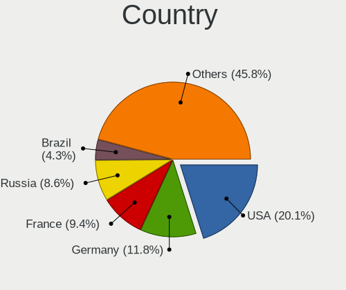
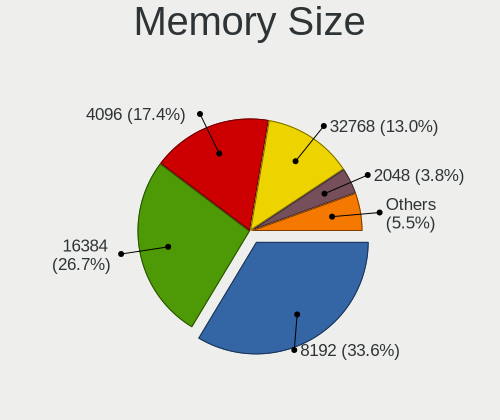
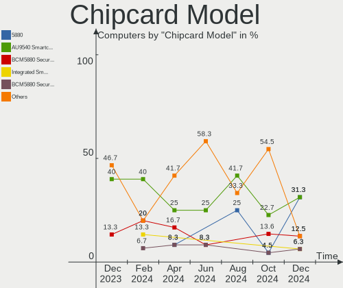

Debian Hardware Trends
----------------------

A project to identify most popular hardware characteristics and track their change
over time based on data collected by Debian users at https://Linux-Hardware.org.

Anyone can contribute to this report by the [hw-probe](https://github.com/linuxhw/hw-probe) tool:

    sudo -E hw-probe -all -upload

This is a report for all computer types. See also reports for [desktops](/Dist/Debian/Desktop/README.md) and [notebooks](/Dist/Debian/Notebook/README.md).

Full-feature report is available here: https://linux-hardware.org/?view=trends

Period: Dec, 2021.

Contents
--------

* [ System ](#system)
  - [ OS                       ](#os)
  - [ OS Family                ](#os-family)
  - [ Kernel                   ](#kernel)
  - [ Kernel Family            ](#kernel-family)
  - [ Kernel Major Ver.        ](#kernel-major-ver)
  - [ Arch                     ](#arch)
  - [ DE                       ](#de)
  - [ Display Server           ](#display-server)
  - [ Display Manager          ](#display-manager)
  - [ OS Lang                  ](#os-lang)
  - [ Boot Mode                ](#boot-mode)
  - [ Filesystem               ](#filesystem)
  - [ Part. scheme             ](#part-scheme)
  - [ Dual Boot with Linux/BSD ](#dual-boot-with-linuxbsd)
  - [ Dual Boot (Win)          ](#dual-boot-win)

* [ Board ](#board)
  - [ Vendor                   ](#vendor)
  - [ Model                    ](#model)
  - [ Model Family             ](#model-family)
  - [ MFG Year                 ](#mfg-year)
  - [ Form Factor              ](#form-factor)
  - [ Secure Boot              ](#secure-boot)
  - [ Coreboot                 ](#coreboot)
  - [ RAM Size                 ](#ram-size)
  - [ RAM Used                 ](#ram-used)
  - [ Total Drives             ](#total-drives)
  - [ Has CD-ROM               ](#has-cd-rom)
  - [ Has Ethernet             ](#has-ethernet)
  - [ Has WiFi                 ](#has-wifi)
  - [ Has Bluetooth            ](#has-bluetooth)

* [ Location ](#location)
  - [ Country                  ](#country)
  - [ City                     ](#city)

* [ Drives ](#drives)
  - [ Drive Vendor             ](#drive-vendor)
  - [ Drive Model              ](#drive-model)
  - [ HDD Vendor               ](#hdd-vendor)
  - [ SSD Vendor               ](#ssd-vendor)
  - [ Drive Kind               ](#drive-kind)
  - [ Drive Connector          ](#drive-connector)
  - [ Drive Size               ](#drive-size)
  - [ Space Total              ](#space-total)
  - [ Space Used               ](#space-used)
  - [ Malfunc. Drives          ](#malfunc-drives)
  - [ Malfunc. Drive Vendor    ](#malfunc-drive-vendor)
  - [ Malfunc. HDD Vendor      ](#malfunc-hdd-vendor)
  - [ Malfunc. Drive Kind      ](#malfunc-drive-kind)
  - [ Failed Drives            ](#failed-drives)
  - [ Failed Drive Vendor      ](#failed-drive-vendor)
  - [ Drive Status             ](#drive-status)

* [ Storage controller ](#storage-controller)
  - [ Storage Vendor           ](#storage-vendor)
  - [ Storage Model            ](#storage-model)
  - [ Storage Kind             ](#storage-kind)

* [ Processor ](#processor)
  - [ CPU Vendor               ](#cpu-vendor)
  - [ CPU Model                ](#cpu-model)
  - [ CPU Model Family         ](#cpu-model-family)
  - [ CPU Cores                ](#cpu-cores)
  - [ CPU Sockets              ](#cpu-sockets)
  - [ CPU Threads              ](#cpu-threads)
  - [ CPU Op-Modes             ](#cpu-op-modes)
  - [ CPU Microcode            ](#cpu-microcode)
  - [ CPU Microarch            ](#cpu-microarch)

* [ Graphics ](#graphics)
  - [ GPU Vendor               ](#gpu-vendor)
  - [ GPU Model                ](#gpu-model)
  - [ GPU Combo                ](#gpu-combo)
  - [ GPU Driver               ](#gpu-driver)
  - [ GPU Memory               ](#gpu-memory)

* [ Monitor ](#monitor)
  - [ Monitor Vendor           ](#monitor-vendor)
  - [ Monitor Model            ](#monitor-model)
  - [ Monitor Resolution       ](#monitor-resolution)
  - [ Monitor Diagonal         ](#monitor-diagonal)
  - [ Monitor Width            ](#monitor-width)
  - [ Aspect Ratio             ](#aspect-ratio)
  - [ Monitor Area             ](#monitor-area)
  - [ Pixel Density            ](#pixel-density)
  - [ Multiple Monitors        ](#multiple-monitors)

* [ Network ](#network)
  - [ Net Controller Vendor    ](#net-controller-vendor)
  - [ Net Controller Model     ](#net-controller-model)
  - [ Wireless Vendor          ](#wireless-vendor)
  - [ Wireless Model           ](#wireless-model)
  - [ Ethernet Vendor          ](#ethernet-vendor)
  - [ Ethernet Model           ](#ethernet-model)
  - [ Net Controller Kind      ](#net-controller-kind)
  - [ Used Controller          ](#used-controller)
  - [ NICs                     ](#nics)
  - [ IPv6                     ](#ipv6)

* [ Bluetooth ](#bluetooth)
  - [ Bluetooth Vendor         ](#bluetooth-vendor)
  - [ Bluetooth Model          ](#bluetooth-model)

* [ Sound ](#sound)
  - [ Sound Vendor             ](#sound-vendor)
  - [ Sound Model              ](#sound-model)

* [ Memory ](#memory)
  - [ Memory Vendor            ](#memory-vendor)
  - [ Memory Model             ](#memory-model)
  - [ Memory Kind              ](#memory-kind)
  - [ Memory Form Factor       ](#memory-form-factor)
  - [ Memory Size              ](#memory-size)
  - [ Memory Speed             ](#memory-speed)

* [ Printers & scanners ](#printers--scanners)
  - [ Printer Vendor           ](#printer-vendor)
  - [ Printer Model            ](#printer-model)
  - [ Scanner Vendor           ](#scanner-vendor)
  - [ Scanner Model            ](#scanner-model)

* [ Camera ](#camera)
  - [ Camera Vendor            ](#camera-vendor)
  - [ Camera Model             ](#camera-model)

* [ Security ](#security)
  - [ Fingerprint Vendor       ](#fingerprint-vendor)
  - [ Fingerprint Model        ](#fingerprint-model)
  - [ Chipcard Vendor          ](#chipcard-vendor)
  - [ Chipcard Model           ](#chipcard-model)

* [ Unsupported ](#unsupported)
  - [ Unsupported Devices      ](#unsupported-devices)
  - [ Unsupported Device Types ](#unsupported-device-types)

System
------

OS
--

Installed operating systems

| Name                            | Computers | Percent |
|---------------------------------|-----------|---------|
| Debian 11                       | 298       | 84.18%  |
| Debian Testing                  | 22        | 6.21%   |
| Debian Unstable                 | 14        | 3.95%   |
| Debian 10                       | 13        | 3.67%   |
| Debian 11-updates               | 4         | 1.13%   |
| Debian Testing-proposed-updates | 1         | 0.28%   |
| Debian 9                        | 1         | 0.28%   |
| Debian 21                       | 1         | 0.28%   |

OS Family
---------

OS without a version

| Name   | Computers | Percent |
|--------|-----------|---------|
| Debian | 354       | 100%    |

Kernel
------

Version of the Linux kernel

| Version                    | Computers | Percent |
|----------------------------|-----------|---------|
| 5.10.0-9-amd64             | 86        | 24.29%  |
| 5.10.0-8-amd64             | 80        | 22.6%   |
| 5.10.0-10-amd64            | 45        | 12.71%  |
| 5.15.0-2-amd64             | 39        | 11.02%  |
| 5.10.0-7-amd64             | 38        | 10.73%  |
| 5.14.0-0.bpo.2-amd64       | 15        | 4.24%   |
| 4.19.0-18-amd64            | 5         | 1.41%   |
| 5.15.0-1-amd64             | 4         | 1.13%   |
| 5.13.19-2-pve              | 4         | 1.13%   |
| 5.13.19-1-pve              | 4         | 1.13%   |
| 5.14.0-2-amd64             | 2         | 0.56%   |
| 5.10.60-sunxi              | 2         | 0.56%   |
| 5.10.0-9-686-pae           | 2         | 0.56%   |
| 5.4.21                     | 1         | 0.28%   |
| 5.4.143-1-pve              | 1         | 0.28%   |
| 5.16.0-rc6-amd64           | 1         | 0.28%   |
| 5.15.8-edge                | 1         | 0.28%   |
| 5.15.7-xanmod1             | 1         | 0.28%   |
| 5.15.7-wrkd                | 1         | 0.28%   |
| 5.15.5                     | 1         | 0.28%   |
| 5.15.10-xanmod1            | 1         | 0.28%   |
| 5.15.0-6.1-liquorix-amd64  | 1         | 0.28%   |
| 5.15.0-11.1-liquorix-amd64 | 1         | 0.28%   |
| 5.14.7-ct                  | 1         | 0.28%   |
| 5.14.0-4mx-amd64           | 1         | 0.28%   |
| 5.14.0-3mx-amd64           | 1         | 0.28%   |
| 5.10.88                    | 1         | 0.28%   |
| 5.10.81+truenas            | 1         | 0.28%   |
| 5.10.63-v8+                | 1         | 0.28%   |
| 5.10.23                    | 1         | 0.28%   |
| 5.10.10-64                 | 1         | 0.28%   |
| 5.10.0-9-686               | 1         | 0.28%   |
| 5.10.0-10-rt-amd64         | 1         | 0.28%   |
| 5.10.0-10-686-pae          | 1         | 0.28%   |
| 5.10.0-0.bpo.9-amd64       | 1         | 0.28%   |
| 4.9.0-15-amd64             | 1         | 0.28%   |
| 4.4.146                    | 1         | 0.28%   |
| 4.19.0-18-rt-amd64         | 1         | 0.28%   |
| 4.19.0-17-amd64            | 1         | 0.28%   |
| 4.19.0-17-686-pae          | 1         | 0.28%   |
| 4.19.0-16-amd64            | 1         | 0.28%   |

Kernel Family
-------------

Linux kernel without a distro release

| Version | Computers | Percent |
|---------|-----------|---------|
| 5.10.0  | 255       | 72.03%  |
| 5.15.0  | 45        | 12.71%  |
| 5.14.0  | 19        | 5.37%   |
| 4.19.0  | 9         | 2.54%   |
| 5.13.19 | 8         | 2.26%   |
| 5.15.7  | 2         | 0.56%   |
| 5.10.60 | 2         | 0.56%   |
| 5.4.21  | 1         | 0.28%   |
| 5.4.143 | 1         | 0.28%   |
| 5.16.0  | 1         | 0.28%   |
| 5.15.8  | 1         | 0.28%   |
| 5.15.5  | 1         | 0.28%   |
| 5.15.10 | 1         | 0.28%   |
| 5.14.7  | 1         | 0.28%   |
| 5.10.88 | 1         | 0.28%   |
| 5.10.81 | 1         | 0.28%   |
| 5.10.63 | 1         | 0.28%   |
| 5.10.23 | 1         | 0.28%   |
| 5.10.10 | 1         | 0.28%   |
| 4.9.0   | 1         | 0.28%   |
| 4.4.146 | 1         | 0.28%   |

Kernel Major Ver.
-----------------

Linux kernel major version

| Version | Computers | Percent |
|---------|-----------|---------|
| 5.10    | 262       | 74.01%  |
| 5.15    | 50        | 14.12%  |
| 5.14    | 20        | 5.65%   |
| 4.19    | 9         | 2.54%   |
| 5.13    | 8         | 2.26%   |
| 5.4     | 2         | 0.56%   |
| 5.16    | 1         | 0.28%   |
| 4.9     | 1         | 0.28%   |
| 4.4     | 1         | 0.28%   |

Arch
----

OS architecture (x86_64, i586, etc.)

| Name    | Computers | Percent |
|---------|-----------|---------|
| x86_64  | 345       | 97.46%  |
| i686    | 5         | 1.41%   |
| armv7l  | 2         | 0.56%   |
| aarch64 | 2         | 0.56%   |

DE
--

Desktop Environment

| Name             | Computers | Percent |
|------------------|-----------|---------|
| Unknown          | 141       | 39.83%  |
| GNOME            | 65        | 18.36%  |
| KDE5             | 41        | 11.58%  |
| XFCE             | 32        | 9.04%   |
| LXDE             | 18        | 5.08%   |
| MATE             | 13        | 3.67%   |
| Cinnamon         | 12        | 3.39%   |
| X-Cinnamon       | 9         | 2.54%   |
| i3               | 6         | 1.69%   |
| lightdm-xsession | 4         | 1.13%   |
| trinity          | 2         | 0.56%   |
| Openbox          | 2         | 0.56%   |
| LXQt             | 2         | 0.56%   |
| DWM              | 2         | 0.56%   |
| wmaker-common    | 1         | 0.28%   |
| UKUI             | 1         | 0.28%   |
| KDE              | 1         | 0.28%   |
| GNOME Flashback  | 1         | 0.28%   |
| Budgie           | 1         | 0.28%   |

Display Server
--------------

X11 or Wayland

| Name    | Computers | Percent |
|---------|-----------|---------|
| X11     | 169       | 47.74%  |
| Unknown | 120       | 33.9%   |
| Wayland | 42        | 11.86%  |
| Tty     | 23        | 6.5%    |

Display Manager
---------------

SDDM, LightDM, etc.

| Name    | Computers | Percent |
|---------|-----------|---------|
| Unknown | 187       | 52.82%  |
| LightDM | 57        | 16.1%   |
| SDDM    | 48        | 13.56%  |
| GDM     | 46        | 12.99%  |
| GDM3    | 11        | 3.11%   |
| XDM     | 2         | 0.56%   |
| SLiM    | 1         | 0.28%   |
| NODM    | 1         | 0.28%   |
| LXDM    | 1         | 0.28%   |

OS Lang
-------

Language

| Lang        | Computers | Percent |
|-------------|-----------|---------|
| Unknown     | 84        | 23.73%  |
| en_US       | 82        | 23.16%  |
| ru_RU       | 48        | 13.56%  |
| de_DE       | 24        | 6.78%   |
| pl_PL       | 21        | 5.93%   |
| en_GB       | 20        | 5.65%   |
| fr_FR       | 15        | 4.24%   |
| it_IT       | 6         | 1.69%   |
| zh_CN       | 5         | 1.41%   |
| pt_BR       | 5         | 1.41%   |
| en_CA       | 5         | 1.41%   |
| C           | 3         | 0.85%   |
| pt_PT       | 2         | 0.56%   |
| es_MX       | 2         | 0.56%   |
| es_ES       | 2         | 0.56%   |
| es_CL       | 2         | 0.56%   |
| es_AR       | 2         | 0.56%   |
| en_ZA       | 2         | 0.56%   |
| en_NZ       | 2         | 0.56%   |
| en_IN       | 2         | 0.56%   |
| en_AU       | 2         | 0.56%   |
| de_CH       | 2         | 0.56%   |
| uk_UA       | 1         | 0.28%   |
| ru_UA       | 1         | 0.28%   |
| nl_NL       | 1         | 0.28%   |
| ja_JP.utf-8 | 1         | 0.28%   |
| ja_JP       | 1         | 0.28%   |
| fr_CH       | 1         | 0.28%   |
| fr_BE       | 1         | 0.28%   |
| es_US       | 1         | 0.28%   |
| es_PE       | 1         | 0.28%   |
| es_EC       | 1         | 0.28%   |
| en_SE       | 1         | 0.28%   |
| en_NG       | 1         | 0.28%   |
| de_AT       | 1         | 0.28%   |
| cs_CZ       | 1         | 0.28%   |
| ca_ES       | 1         | 0.28%   |
| bg_BG       | 1         | 0.28%   |

Boot Mode
---------

EFI or BIOS

| Mode | Computers | Percent |
|------|-----------|---------|
| EFI  | 203       | 57.34%  |
| BIOS | 151       | 42.66%  |

Filesystem
----------

Type of filesystem

| Type    | Computers | Percent |
|---------|-----------|---------|
| Ext4    | 218       | 61.58%  |
| Overlay | 120       | 33.9%   |
| Btrfs   | 8         | 2.26%   |
| Zfs     | 4         | 1.13%   |
| Xfs     | 2         | 0.56%   |
| Tmpfs   | 1         | 0.28%   |
| Rootfs  | 1         | 0.28%   |

Part. scheme
------------

Scheme of partitioning

| Type    | Computers | Percent |
|---------|-----------|---------|
| GPT     | 219       | 61.86%  |
| MBR     | 79        | 22.32%  |
| Unknown | 56        | 15.82%  |

Dual Boot with Linux/BSD
------------------------

Hosting more than one Linux/BSD

| Dual boot | Computers | Percent |
|-----------|-----------|---------|
| No        | 323       | 91.24%  |
| Yes       | 31        | 8.76%   |

Dual Boot (Win)
---------------

Hosting Linux and Windows

| Dual boot | Computers | Percent |
|-----------|-----------|---------|
| No        | 243       | 68.64%  |
| Yes       | 111       | 31.36%  |

Board
-----

Vendor
------

Motherboard manufacturer

| Name                    | Computers | Percent |
|-------------------------|-----------|---------|
| Lenovo                  | 114       | 32.2%   |
| Hewlett-Packard         | 46        | 12.99%  |
| ASUSTek Computer        | 36        | 10.17%  |
| Dell                    | 27        | 7.63%   |
| Gigabyte Technology     | 19        | 5.37%   |
| ASRock                  | 19        | 5.37%   |
| MSI                     | 15        | 4.24%   |
| Acer                    | 9         | 2.54%   |
| Apple                   | 7         | 1.98%   |
| Intel                   | 6         | 1.69%   |
| HUAWEI                  | 4         | 1.13%   |
| Google                  | 4         | 1.13%   |
| Fujitsu                 | 4         | 1.13%   |
| Unknown                 | 4         | 1.13%   |
| Toshiba                 | 3         | 0.85%   |
| Supermicro              | 3         | 0.85%   |
| Huanan                  | 3         | 0.85%   |
| Foxconn                 | 2         | 0.56%   |
| Xunlong                 | 1         | 0.28%   |
| TYAN Computer           | 1         | 0.28%   |
| sunxi                   | 1         | 0.28%   |
| SeeedStudio             | 1         | 0.28%   |
| Schenker                | 1         | 0.28%   |
| Raspberry Pi Foundation | 1         | 0.28%   |
| Positivo Bahia - VAIO   | 1         | 0.28%   |
| Pegatron                | 1         | 0.28%   |
| Packard Bell            | 1         | 0.28%   |
| Notebook                | 1         | 0.28%   |
| Microsoft               | 1         | 0.28%   |
| Maibenben               | 1         | 0.28%   |
| LG Electronics          | 1         | 0.28%   |
| JGINYUE                 | 1         | 0.28%   |
| Insyde                  | 1         | 0.28%   |
| IBM                     | 1         | 0.28%   |
| HONOR                   | 1         | 0.28%   |
| HASEE Computer          | 1         | 0.28%   |
| Fujitsu Siemens         | 1         | 0.28%   |
| Framework               | 1         | 0.28%   |
| ECS                     | 1         | 0.28%   |
| DFI                     | 1         | 0.28%   |
| CSL-Computer            | 1         | 0.28%   |
| CompuLab                | 1         | 0.28%   |
| Chuwi                   | 1         | 0.28%   |
| AZW                     | 1         | 0.28%   |
| AXDIA International     | 1         | 0.28%   |
| ASRockRack              | 1         | 0.28%   |
| Advent                  | 1         | 0.28%   |

Model
-----

Motherboard model

| Name                                      | Computers | Percent |
|-------------------------------------------|-----------|---------|
| Lenovo ThinkPad L13 Yoga Gen 2 20VK0019US | 51        | 14.41%  |
| Lenovo ThinkPad E475 20H40006US           | 19        | 5.37%   |
| ASRock H470M-HVS                          | 6         | 1.69%   |
| HP Pavilion Gaming Laptop 15-ec1xxx       | 5         | 1.41%   |
| HP Laptop 15-db1xxx                       | 5         | 1.41%   |
| ASUS All Series                           | 5         | 1.41%   |
| Unknown                                   | 5         | 1.41%   |
| HP Laptop 15-db0xxx                       | 3         | 0.85%   |
| Gigabyte H81M-S2V                         | 3         | 0.85%   |
| Fujitsu ESPRIMO P720                      | 3         | 0.85%   |
| ASUS ZenBook UX325EA_UX325EA              | 3         | 0.85%   |
| ASUS Pro H510M-C                          | 3         | 0.85%   |
| Supermicro Super Server                   | 2         | 0.56%   |
| MSI MS-7C75                               | 2         | 0.56%   |
| Lenovo ThinkPad 13 2nd Gen 20J10046US     | 2         | 0.56%   |
| Lenovo IdeaPad S540-13API 81XC            | 2         | 0.56%   |
| Google Enguarde                           | 2         | 0.56%   |
| Gigabyte X570 GAMING X                    | 2         | 0.56%   |
| Foxconn GEG                               | 2         | 0.56%   |
| Dell XPS 17 9700                          | 2         | 0.56%   |
| Dell PowerEdge T30                        | 2         | 0.56%   |
| ASUS H61M-K                               | 2         | 0.56%   |
| ASRock B450M Pro4-F                       | 2         | 0.56%   |
| Apple MacBookAir7,1                       | 2         | 0.56%   |
| Apple iMac10,1                            | 2         | 0.56%   |
| Xunlong Orange Pi PC                      | 1         | 0.28%   |
| TYAN S7002                                | 1         | 0.28%   |
| Toshiba Satellite L775D                   | 1         | 0.28%   |
| Toshiba Satellite L755D                   | 1         | 0.28%   |
| Toshiba Satellite E205                    | 1         | 0.28%   |
| Supermicro X9SCL/X9SCM                    | 1         | 0.28%   |
| sunxi FriendlyARM NanoPi NEO              | 1         | 0.28%   |
| SeeedStudio ODYSSEY-X86J4125              | 1         | 0.28%   |
| Schenker VIA 15 Pro                       | 1         | 0.28%   |
| RPi Raspberry Pi                          | 1         | 0.28%   |
| Positivo Bahia - VAIO VJFE42F11X-XXXXXX   | 1         | 0.28%   |
| Pegatron Compaq dx2400 Microtower         | 1         | 0.28%   |
| Packard Bell EasyNote TM85                | 1         | 0.28%   |
| Notebook NV4XMB,ME,MZ                     | 1         | 0.28%   |
| MSI W200                                  | 1         | 0.28%   |
| MSI PS42 8RB                              | 1         | 0.28%   |
| MSI p6620ch-m                             | 1         | 0.28%   |
| MSI MS-7C88                               | 1         | 0.28%   |
| MSI MS-7C84                               | 1         | 0.28%   |
| MSI MS-7C67                               | 1         | 0.28%   |
| MSI MS-7C56                               | 1         | 0.28%   |
| MSI MS-7B86                               | 1         | 0.28%   |
| MSI MS-7B79                               | 1         | 0.28%   |
| MSI MS-7A94                               | 1         | 0.28%   |
| MSI MS-7A70                               | 1         | 0.28%   |
| MSI MS-7715                               | 1         | 0.28%   |
| MSI MS-7593                               | 1         | 0.28%   |
| Microsoft Surface Pro 7                   | 1         | 0.28%   |
| Maibenben E5100                           | 1         | 0.28%   |
| LG 15Z95P-P.AAE8U1                        | 1         | 0.28%   |
| Lenovo Z51-70 80K6                        | 1         | 0.28%   |
| Lenovo Yoga 9 14ITL5 82BG                 | 1         | 0.28%   |
| Lenovo Yoga 710-14IKB 80V4                | 1         | 0.28%   |
| Lenovo V130-15IGM 81HL                    | 1         | 0.28%   |
| Lenovo ThinkStation D30 4223CC9           | 1         | 0.28%   |

Model Family
------------

Motherboard model prefix

| Name                                    | Computers | Percent |
|-----------------------------------------|-----------|---------|
| Lenovo ThinkPad                         | 97        | 27.4%   |
| HP Laptop                               | 12        | 3.39%   |
| HP EliteBook                            | 8         | 2.26%   |
| Acer Aspire                             | 8         | 2.26%   |
| HP Pavilion                             | 7         | 1.98%   |
| Dell Latitude                           | 6         | 1.69%   |
| Dell Inspiron                           | 6         | 1.69%   |
| ASRock H470M-HVS                        | 6         | 1.69%   |
| ASUS PRIME                              | 5         | 1.41%   |
| ASUS All                                | 5         | 1.41%   |
| Unknown                                 | 5         | 1.41%   |
| Lenovo IdeaPad                          | 4         | 1.13%   |
| HP Compaq                               | 4         | 1.13%   |
| Dell XPS                                | 4         | 1.13%   |
| ASUS ZenBook                            | 4         | 1.13%   |
| Toshiba Satellite                       | 3         | 0.85%   |
| HP ProBook                              | 3         | 0.85%   |
| Gigabyte H81M-S2V                       | 3         | 0.85%   |
| Fujitsu ESPRIMO                         | 3         | 0.85%   |
| Dell Precision                          | 3         | 0.85%   |
| Dell PowerEdge                          | 3         | 0.85%   |
| Dell OptiPlex                           | 3         | 0.85%   |
| ASUS Pro                                | 3         | 0.85%   |
| Supermicro Super                        | 2         | 0.56%   |
| MSI MS-7C75                             | 2         | 0.56%   |
| Lenovo Yoga                             | 2         | 0.56%   |
| Lenovo ThinkCentre                      | 2         | 0.56%   |
| HP ZBook                                | 2         | 0.56%   |
| HP ENVY                                 | 2         | 0.56%   |
| Google Enguarde                         | 2         | 0.56%   |
| Gigabyte X570                           | 2         | 0.56%   |
| Foxconn GEG                             | 2         | 0.56%   |
| ASUS ROG                                | 2         | 0.56%   |
| ASUS P5G41T-M                           | 2         | 0.56%   |
| ASUS H61M-K                             | 2         | 0.56%   |
| ASUS ASUS                               | 2         | 0.56%   |
| ASRock B450M                            | 2         | 0.56%   |
| Apple MacBookAir7                       | 2         | 0.56%   |
| Apple iMac10                            | 2         | 0.56%   |
| Xunlong Orange                          | 1         | 0.28%   |
| TYAN S7002                              | 1         | 0.28%   |
| Supermicro X9SCL                        | 1         | 0.28%   |
| sunxi FriendlyARM                       | 1         | 0.28%   |
| SeeedStudio ODYSSEY-X86J4125            | 1         | 0.28%   |
| Schenker VIA                            | 1         | 0.28%   |
| RPi Raspberry                           | 1         | 0.28%   |
| Positivo Bahia - VAIO VJFE42F11X-XXXXXX | 1         | 0.28%   |
| Pegatron Compaq                         | 1         | 0.28%   |
| Packard Bell EasyNote                   | 1         | 0.28%   |
| Notebook NV4XMB                         | 1         | 0.28%   |
| MSI W200                                | 1         | 0.28%   |
| MSI PS42                                | 1         | 0.28%   |
| MSI p6620ch-m                           | 1         | 0.28%   |
| MSI MS-7C88                             | 1         | 0.28%   |
| MSI MS-7C84                             | 1         | 0.28%   |
| MSI MS-7C67                             | 1         | 0.28%   |
| MSI MS-7C56                             | 1         | 0.28%   |
| MSI MS-7B86                             | 1         | 0.28%   |
| MSI MS-7B79                             | 1         | 0.28%   |
| MSI MS-7A94                             | 1         | 0.28%   |

MFG Year
--------

Motherboard manufacture year

| Year    | Computers | Percent |
|---------|-----------|---------|
| 2021    | 129       | 36.44%  |
| 2020    | 51        | 14.41%  |
| 2019    | 39        | 11.02%  |
| 2018    | 26        | 7.34%   |
| 2013    | 17        | 4.8%    |
| 2011    | 14        | 3.95%   |
| 2012    | 13        | 3.67%   |
| 2009    | 12        | 3.39%   |
| 2014    | 11        | 3.11%   |
| 2016    | 10        | 2.82%   |
| 2015    | 9         | 2.54%   |
| 2010    | 8         | 2.26%   |
| 2008    | 4         | 1.13%   |
| Unknown | 4         | 1.13%   |
| 2017    | 3         | 0.85%   |
| 2007    | 2         | 0.56%   |
| 2006    | 1         | 0.28%   |
| 2005    | 1         | 0.28%   |

Form Factor
-----------

Physical design of the computer

| Name           | Computers | Percent |
|----------------|-----------|---------|
| Notebook       | 156       | 44.07%  |
| Desktop        | 120       | 33.9%   |
| Convertible    | 58        | 16.38%  |
| Mini pc        | 5         | 1.41%   |
| Server         | 5         | 1.41%   |
| System on chip | 4         | 1.13%   |
| Tablet         | 4         | 1.13%   |
| All in one     | 2         | 0.56%   |

Secure Boot
-----------

Enabled or disabled

| State    | Computers | Percent |
|----------|-----------|---------|
| Disabled | 321       | 90.68%  |
| Enabled  | 33        | 9.32%   |

Coreboot
--------

Have coreboot on board

| Used | Computers | Percent |
|------|-----------|---------|
| No   | 350       | 98.87%  |
| Yes  | 4         | 1.13%   |

RAM Size
--------

Total RAM memory

| Size in GB      | Computers | Percent |
|-----------------|-----------|---------|
| 16.01-24.0      | 108       | 30.51%  |
| 4.01-8.0        | 73        | 20.62%  |
| 3.01-4.0        | 50        | 14.12%  |
| 8.01-16.0       | 41        | 11.58%  |
| 32.01-64.0      | 39        | 11.02%  |
| 64.01-256.0     | 14        | 3.95%   |
| 24.01-32.0      | 13        | 3.67%   |
| 2.01-3.0        | 5         | 1.41%   |
| 1.01-2.0        | 5         | 1.41%   |
| 0.51-1.0        | 4         | 1.13%   |
| More than 256.0 | 1         | 0.28%   |
| 0.01-0.5        | 1         | 0.28%   |

RAM Used
--------

Used RAM memory

| Used GB    | Computers | Percent |
|------------|-----------|---------|
| 1.01-2.0   | 141       | 39.83%  |
| 0.51-1.0   | 51        | 14.41%  |
| 2.01-3.0   | 50        | 14.12%  |
| 4.01-8.0   | 49        | 13.84%  |
| 3.01-4.0   | 30        | 8.47%   |
| 8.01-16.0  | 17        | 4.8%    |
| 0.01-0.5   | 10        | 2.82%   |
| 32.01-64.0 | 3         | 0.85%   |
| 16.01-24.0 | 3         | 0.85%   |

Total Drives
------------

Number of drives on board

| Drives | Computers | Percent |
|--------|-----------|---------|
| 1      | 247       | 69.77%  |
| 2      | 63        | 17.8%   |
| 3      | 16        | 4.52%   |
| 4      | 14        | 3.95%   |
| 5      | 7         | 1.98%   |
| 7      | 2         | 0.56%   |
| 11     | 1         | 0.28%   |
| 9      | 1         | 0.28%   |
| 8      | 1         | 0.28%   |
| 6      | 1         | 0.28%   |
| 0      | 1         | 0.28%   |

Has CD-ROM
----------

Has CD-ROM on board

| Presented | Computers | Percent |
|-----------|-----------|---------|
| No        | 266       | 75.14%  |
| Yes       | 88        | 24.86%  |

Has Ethernet
------------

Has Ethernet on board

| Presented | Computers | Percent |
|-----------|-----------|---------|
| Yes       | 311       | 87.85%  |
| No        | 43        | 12.15%  |

Has WiFi
--------

Has WiFi module

| Presented | Computers | Percent |
|-----------|-----------|---------|
| Yes       | 253       | 71.47%  |
| No        | 101       | 28.53%  |

Has Bluetooth
-------------

Has Bluetooth module

| Presented | Computers | Percent |
|-----------|-----------|---------|
| Yes       | 216       | 61.02%  |
| No        | 138       | 38.98%  |

Location
--------

Country
-------

Geographic location (country)

| Country            | Computers | Percent |
|--------------------|-----------|---------|
| USA                | 107       | 30.23%  |
| Russia             | 48        | 13.56%  |
| Germany            | 29        | 8.19%   |
| France             | 21        | 5.93%   |
| Poland             | 20        | 5.65%   |
| UK                 | 9         | 2.54%   |
| Brazil             | 9         | 2.54%   |
| China              | 8         | 2.26%   |
| Italy              | 7         | 1.98%   |
| Switzerland        | 6         | 1.69%   |
| Spain              | 6         | 1.69%   |
| Canada             | 6         | 1.69%   |
| Austria            | 6         | 1.69%   |
| Mexico             | 5         | 1.41%   |
| Sweden             | 4         | 1.13%   |
| Netherlands        | 4         | 1.13%   |
| Japan              | 4         | 1.13%   |
| Ukraine            | 3         | 0.85%   |
| Saudi Arabia       | 3         | 0.85%   |
| Croatia            | 3         | 0.85%   |
| Argentina          | 3         | 0.85%   |
| South Africa       | 2         | 0.56%   |
| Portugal           | 2         | 0.56%   |
| Pakistan           | 2         | 0.56%   |
| India              | 2         | 0.56%   |
| Finland            | 2         | 0.56%   |
| Dominican Republic | 2         | 0.56%   |
| Czechia            | 2         | 0.56%   |
| Chile              | 2         | 0.56%   |
| Bulgaria           | 2         | 0.56%   |
| Belarus            | 2         | 0.56%   |
| Australia          | 2         | 0.56%   |
| Vietnam            | 1         | 0.28%   |
| Uganda             | 1         | 0.28%   |
| Turkey             | 1         | 0.28%   |
| South Korea        | 1         | 0.28%   |
| Singapore          | 1         | 0.28%   |
| Peru               | 1         | 0.28%   |
| Nigeria            | 1         | 0.28%   |
| New Zealand        | 1         | 0.28%   |
| Morocco            | 1         | 0.28%   |
| Lithuania          | 1         | 0.28%   |
| Kenya              | 1         | 0.28%   |
| Ireland            | 1         | 0.28%   |
| Hungary            | 1         | 0.28%   |
| Greece             | 1         | 0.28%   |
| Ecuador            | 1         | 0.28%   |
| Denmark            | 1         | 0.28%   |
| Cyprus             | 1         | 0.28%   |
| Cuba               | 1         | 0.28%   |
| Colombia           | 1         | 0.28%   |
| Belgium            | 1         | 0.28%   |
| Bangladesh         | 1         | 0.28%   |

City
----

Geographic location (city)

| City                   | Computers | Percent |
|------------------------|-----------|---------|
| Bangor                 | 69        | 19.49%  |
| Voronezh               | 37        | 10.45%  |
| Warsaw                 | 16        | 4.52%   |
| Eliot                  | 9         | 2.54%   |
| Moscow                 | 5         | 1.41%   |
| Vienna                 | 3         | 0.85%   |
| Paris                  | 3         | 0.85%   |
| Munich                 | 3         | 0.85%   |
| Milan                  | 3         | 0.85%   |
| Leimen                 | 3         | 0.85%   |
| Hohhot                 | 3         | 0.85%   |
| Berlin                 | 3         | 0.85%   |
| Barcelona              | 3         | 0.85%   |
| Zagreb                 | 2         | 0.56%   |
| Santo Domingo Este     | 2         | 0.56%   |
| Riyadh                 | 2         | 0.56%   |
| Prague                 | 2         | 0.56%   |
| London                 | 2         | 0.56%   |
| Leipzig                | 2         | 0.56%   |
| Lahore                 | 2         | 0.56%   |
| Houston                | 2         | 0.56%   |
| Hangzhou               | 2         | 0.56%   |
| Hamilton               | 2         | 0.56%   |
| Hamburg                | 2         | 0.56%   |
| Cambridge              | 2         | 0.56%   |
| Zurich                 | 1         | 0.28%   |
| Zolochiv               | 1         | 0.28%   |
| Wo?‚omin               | 1         | 0.28%   |
| Wisconsin Rapids       | 1         | 0.28%   |
| Winnipeg               | 1         | 0.28%   |
| Villingen-Schwenningen | 1         | 0.28%   |
| Vila-seca              | 1         | 0.28%   |
| Vila Nova de Gaia      | 1         | 0.28%   |
| Viedma                 | 1         | 0.28%   |
| Valencia               | 1         | 0.28%   |
| Upplands Vasby         | 1         | 0.28%   |
| Tucson                 | 1         | 0.28%   |
| Troy                   | 1         | 0.28%   |
| Toronto                | 1         | 0.28%   |
| Tijuana                | 1         | 0.28%   |
| Thessaloniki           | 1         | 0.28%   |
| Tatab??nya             | 1         | 0.28%   |
| Tarn??w                | 1         | 0.28%   |
| Syktyvkar              | 1         | 0.28%   |
| Stuttgart              | 1         | 0.28%   |
| Stockholm              | 1         | 0.28%   |
| Stockelsdorf           | 1         | 0.28%   |
| Stains                 | 1         | 0.28%   |
| St Petersburg          | 1         | 0.28%   |
| Southwold              | 1         | 0.28%   |
| Sokoto                 | 1         | 0.28%   |
| Sofia                  | 1         | 0.28%   |
| Slatina                | 1         | 0.28%   |
| Singapore              | 1         | 0.28%   |
| Shibuya                | 1         | 0.28%   |
| Sharon                 | 1         | 0.28%   |
| S??o Paulo             | 1         | 0.28%   |
| S??o Jos?© dos Campos  | 1         | 0.28%   |
| Santiago               | 1         | 0.28%   |
| Santa Fe               | 1         | 0.28%   |

Drives
------

Drive Vendor
------------

Hard drive vendors

| Vendor              | Computers | Drives | Percent |
|---------------------|-----------|--------|---------|
| Samsung Electronics | 127       | 135    | 26.85%  |
| WDC                 | 67        | 85     | 14.16%  |
| Seagate             | 47        | 70     | 9.94%   |
| Kingston            | 36        | 37     | 7.61%   |
| Toshiba             | 27        | 33     | 5.71%   |
| Unknown             | 15        | 20     | 3.17%   |
| Intel               | 13        | 15     | 2.75%   |
| Hitachi             | 13        | 16     | 2.75%   |
| Crucial             | 13        | 15     | 2.75%   |
| SanDisk             | 12        | 13     | 2.54%   |
| A-DATA Technology   | 9         | 10     | 1.9%    |
| SK Hynix            | 8         | 8      | 1.69%   |
| Netac               | 8         | 8      | 1.69%   |
| HGST                | 6         | 11     | 1.27%   |
| Intenso             | 5         | 6      | 1.06%   |
| Transcend           | 4         | 4      | 0.85%   |
| Apple               | 4         | 4      | 0.85%   |
| Xinhaike            | 3         | 3      | 0.63%   |
| SPCC                | 3         | 3      | 0.63%   |
| Silicon Motion      | 3         | 3      | 0.63%   |
| Micron Technology   | 3         | 3      | 0.63%   |
| KIOXIA              | 3         | 3      | 0.63%   |
| Hewlett-Packard     | 3         | 4      | 0.63%   |
| GOODRAM             | 3         | 7      | 0.63%   |
| FOXLINE             | 3         | 3      | 0.63%   |
| Phison              | 2         | 3      | 0.42%   |
| OCZ                 | 2         | 2      | 0.42%   |
| JMicron             | 2         | 2      | 0.42%   |
| Gigabyte Technology | 2         | 2      | 0.42%   |
| Corsair             | 2         | 3      | 0.42%   |
| Unknown             | 2         | 2      | 0.42%   |
| XPG                 | 1         | 1      | 0.21%   |
| walram              | 1         | 1      | 0.21%   |
| Vaseky              | 1         | 1      | 0.21%   |
| Teclast             | 1         | 1      | 0.21%   |
| Team                | 1         | 1      | 0.21%   |
| QGeeM               | 1         | 1      | 0.21%   |
| PNY                 | 1         | 1      | 0.21%   |
| PLEXTOR             | 1         | 1      | 0.21%   |
| Pioneer             | 1         | 1      | 0.21%   |
| Phison Electronics  | 1         | 1      | 0.21%   |
| Patriot             | 1         | 1      | 0.21%   |
| MAXTOR              | 1         | 1      | 0.21%   |
| Maxone              | 1         | 1      | 0.21%   |
| LITEONIT            | 1         | 1      | 0.21%   |
| LITEON              | 1         | 1      | 0.21%   |
| Lexar               | 1         | 1      | 0.21%   |
| IBM-ESXS            | 1         | 1      | 0.21%   |
| Hajaan              | 1         | 1      | 0.21%   |
| H/W                 | 1         | 3      | 0.21%   |
| Dogeish             | 1         | 1      | 0.21%   |
| China               | 1         | 1      | 0.21%   |
| ASMT                | 1         | 1      | 0.21%   |
| Apacer              | 1         | 1      | 0.21%   |

Drive Model
-----------

Hard drive models

| Model                                   | Computers | Percent |
|-----------------------------------------|-----------|---------|
| Samsung MZVLB512HBJQ-000L7 512GB        | 53        | 10.15%  |
| Kingston SA400S37120G 120GB SSD         | 22        | 4.21%   |
| Toshiba HDWD110 1TB                     | 7         | 1.34%   |
| Netac SSD 240GB                         | 7         | 1.34%   |
| WDC PC SN530 SDBPNPZ-512G-1006 512GB    | 6         | 1.15%   |
| Samsung SSD 860 EVO 1TB                 | 6         | 1.15%   |
| Samsung SSD 970 EVO Plus 1TB            | 5         | 0.96%   |
| Samsung SSD 860 EVO 500GB               | 5         | 0.96%   |
| Samsung SSD 860 EVO 250GB               | 5         | 0.96%   |
| Kingston SA400S37240G 240GB SSD         | 5         | 0.96%   |
| Seagate ST1000DM003-1ER162 1TB          | 4         | 0.77%   |
| Intel SSDPEKNW512G8H 512GB              | 4         | 0.77%   |
| Xinhaike SSD 120GB                      | 3         | 0.57%   |
| WDC WD40EFRX-68N32N0 4TB                | 3         | 0.57%   |
| Toshiba DT01ACA200 2TB                  | 3         | 0.57%   |
| Toshiba DT01ACA050 500GB                | 3         | 0.57%   |
| Seagate ST500DM002-1BD142 500GB         | 3         | 0.57%   |
| Seagate ST2000DM008-2FR102 2TB          | 3         | 0.57%   |
| Samsung SSD 970 EVO 1TB                 | 3         | 0.57%   |
| Samsung NVMe SSD Drive 1TB              | 3         | 0.57%   |
| Samsung MZVLQ512HALU-000H1 512GB        | 3         | 0.57%   |
| FOXLINE FLSSD480X5SE 480GB              | 3         | 0.57%   |
| Crucial CT1000MX500SSD1 1TB             | 3         | 0.57%   |
| WDC WD3200AAJS-60M0A0 320GB             | 2         | 0.38%   |
| WDC WD20EZRX-00D8PB0 2TB                | 2         | 0.38%   |
| WDC WD10SPZX-24Z10 1TB                  | 2         | 0.38%   |
| Unknown MMC Card  64GB                  | 2         | 0.38%   |
| Unknown MMC Card  128GB                 | 2         | 0.38%   |
| Unknown AGND3R  16GB                    | 2         | 0.38%   |
| SPCC M.2 PCIe SSD 1TB                   | 2         | 0.38%   |
| SK Hynix BC511 HFM256GDJTNI-82A0A 256GB | 2         | 0.38%   |
| Seagate ST380815AS 80GB                 | 2         | 0.38%   |
| Seagate ST3500413AS 500GB               | 2         | 0.38%   |
| Seagate ST3250620AS 250GB               | 2         | 0.38%   |
| Seagate ST3160815AS 160GB               | 2         | 0.38%   |
| Seagate ST31500341AS 1TB                | 2         | 0.38%   |
| Seagate ST31000524AS 1TB                | 2         | 0.38%   |
| Seagate ST3000NXCLAR3000 3TB            | 2         | 0.38%   |
| Seagate ST1000LM048-2E7172 1TB          | 2         | 0.38%   |
| Seagate ST1000LM035-1RK172 1TB          | 2         | 0.38%   |
| Seagate ST1000DM010-2EP102 1TB          | 2         | 0.38%   |
| Seagate ST1000DM003-1CH162 1TB          | 2         | 0.38%   |
| Seagate Expansion 1TB                   | 2         | 0.38%   |
| Samsung SSD 960 EVO 250GB               | 2         | 0.38%   |
| Samsung SSD 870 QVO 1TB                 | 2         | 0.38%   |
| Samsung SSD 860 QVO 1TB                 | 2         | 0.38%   |
| Samsung MZVLB1T0HALR-00000 1TB          | 2         | 0.38%   |
| Samsung MZNTY128HDHP-000L1 128GB SSD    | 2         | 0.38%   |
| OCZ AGILITY3 240GB SSD                  | 2         | 0.38%   |
| Intel SSDPEKNW512G8 512GB               | 2         | 0.38%   |
| Hitachi HUS724040ALE641 4TB             | 2         | 0.38%   |
| Hitachi HDS721050CLA362 500GB           | 2         | 0.38%   |
| HP MB2000EBZQC 2TB                      | 2         | 0.38%   |
| GOODRAM IRP-SSDPR-S25C-256 256GB        | 2         | 0.38%   |
| GOODRAM IR-SSDPR-P34B-02T-80 2TB        | 2         | 0.38%   |
| Apple SSD AP0128H 121GB                 | 2         | 0.38%   |
| Unknown                                 | 2         | 0.38%   |
| XPG GAMMIX S11 Pro 1TB                  | 1         | 0.19%   |
| WDC WDS512G1X0C-00ENX0 512GB            | 1         | 0.19%   |
| WDC WDS500G2B0A-00SM50 500GB SSD        | 1         | 0.19%   |

HDD Vendor
----------

Hard disk drive vendors

| Vendor              | Computers | Drives | Percent |
|---------------------|-----------|--------|---------|
| Seagate             | 47        | 70     | 32.41%  |
| WDC                 | 44        | 60     | 30.34%  |
| Toshiba             | 26        | 32     | 17.93%  |
| Hitachi             | 13        | 16     | 8.97%   |
| HGST                | 6         | 11     | 4.14%   |
| Samsung Electronics | 3         | 3      | 2.07%   |
| Hewlett-Packard     | 2         | 3      | 1.38%   |
| Unknown             | 1         | 1      | 0.69%   |
| Maxone              | 1         | 1      | 0.69%   |
| Intenso             | 1         | 1      | 0.69%   |
| Apple               | 1         | 1      | 0.69%   |

SSD Vendor
----------

Solid state drive vendors

| Vendor              | Computers | Drives | Percent |
|---------------------|-----------|--------|---------|
| Samsung Electronics | 36        | 38     | 22.78%  |
| Kingston            | 35        | 36     | 22.15%  |
| Crucial             | 11        | 13     | 6.96%   |
| SanDisk             | 10        | 11     | 6.33%   |
| Netac               | 8         | 8      | 5.06%   |
| WDC                 | 6         | 6      | 3.8%    |
| A-DATA Technology   | 6         | 7      | 3.8%    |
| Intel               | 4         | 6      | 2.53%   |
| Xinhaike            | 3         | 3      | 1.9%    |
| Transcend           | 3         | 3      | 1.9%    |
| FOXLINE             | 3         | 3      | 1.9%    |
| OCZ                 | 2         | 2      | 1.27%   |
| Micron Technology   | 2         | 2      | 1.27%   |
| Intenso             | 2         | 3      | 1.27%   |
| GOODRAM             | 2         | 2      | 1.27%   |
| walram              | 1         | 1      | 0.63%   |
| Vaseky              | 1         | 1      | 0.63%   |
| Unknown             | 1         | 1      | 0.63%   |
| Toshiba             | 1         | 1      | 0.63%   |
| Teclast             | 1         | 1      | 0.63%   |
| Team                | 1         | 1      | 0.63%   |
| SPCC                | 1         | 1      | 0.63%   |
| SK Hynix            | 1         | 1      | 0.63%   |
| PNY                 | 1         | 1      | 0.63%   |
| PLEXTOR             | 1         | 1      | 0.63%   |
| Pioneer             | 1         | 1      | 0.63%   |
| Patriot             | 1         | 1      | 0.63%   |
| MAXTOR              | 1         | 1      | 0.63%   |
| LITEONIT            | 1         | 1      | 0.63%   |
| LITEON              | 1         | 1      | 0.63%   |
| Lexar               | 1         | 1      | 0.63%   |
| JMicron             | 1         | 1      | 0.63%   |
| Hewlett-Packard     | 1         | 1      | 0.63%   |
| Hajaan              | 1         | 1      | 0.63%   |
| Gigabyte Technology | 1         | 1      | 0.63%   |
| Dogeish             | 1         | 1      | 0.63%   |
| Corsair             | 1         | 2      | 0.63%   |
| China               | 1         | 1      | 0.63%   |
| Apple               | 1         | 1      | 0.63%   |
| Apacer              | 1         | 1      | 0.63%   |

Drive Kind
----------

HDD or SSD

| Kind    | Computers | Drives | Percent |
|---------|-----------|--------|---------|
| NVMe    | 154       | 162    | 35.32%  |
| SSD     | 140       | 169    | 32.11%  |
| HDD     | 121       | 199    | 27.75%  |
| MMC     | 14        | 19     | 3.21%   |
| Unknown | 7         | 9      | 1.61%   |

Drive Connector
---------------

SATA, SAS, NVMe, etc.

| Type | Computers | Drives | Percent |
|------|-----------|--------|---------|
| SATA | 216       | 359    | 54.14%  |
| NVMe | 154       | 162    | 38.6%   |
| SAS  | 15        | 18     | 3.76%   |
| MMC  | 14        | 19     | 3.51%   |

Drive Size
----------

Size of hard drive

| Size in TB | Computers | Drives | Percent |
|------------|-----------|--------|---------|
| 0.01-0.5   | 160       | 195    | 56.54%  |
| 0.51-1.0   | 77        | 93     | 27.21%  |
| 1.01-2.0   | 23        | 32     | 8.13%   |
| 3.01-4.0   | 12        | 24     | 4.24%   |
| 2.01-3.0   | 6         | 12     | 2.12%   |
| 4.01-10.0  | 5         | 12     | 1.77%   |

Space Total
-----------

Amount of disk space available on the file system

| Size in GB     | Computers | Percent |
|----------------|-----------|---------|
| 251-500        | 99        | 27.97%  |
| Unknown        | 70        | 19.77%  |
| 101-250        | 52        | 14.69%  |
| 501-1000       | 47        | 13.28%  |
| 1001-2000      | 25        | 7.06%   |
| 51-100         | 24        | 6.78%   |
| More than 3000 | 15        | 4.24%   |
| 1-20           | 11        | 3.11%   |
| 21-50          | 7         | 1.98%   |
| 2001-3000      | 4         | 1.13%   |

Space Used
----------

Amount of used disk space

| Used GB        | Computers | Percent |
|----------------|-----------|---------|
| 1-20           | 135       | 38.14%  |
| Unknown        | 70        | 19.77%  |
| 21-50          | 38        | 10.73%  |
| 51-100         | 26        | 7.34%   |
| 251-500        | 25        | 7.06%   |
| 101-250        | 25        | 7.06%   |
| 501-1000       | 17        | 4.8%    |
| More than 3000 | 9         | 2.54%   |
| 1001-2000      | 7         | 1.98%   |
| 2001-3000      | 1         | 0.28%   |
| 0              | 1         | 0.28%   |

Malfunc. Drives
---------------

Drive models with a malfunction

| Model                               | Computers | Drives | Percent |
|-------------------------------------|-----------|--------|---------|
| Seagate ST31500341AS 1TB            | 2         | 2      | 4.76%   |
| Hitachi HDS721050CLA362 500GB       | 2         | 2      | 4.76%   |
| WDC WD5003ABYX-18WERA0 500GB        | 1         | 2      | 2.38%   |
| WDC WD5000AAKX-60U6AA0 500GB        | 1         | 1      | 2.38%   |
| WDC WD5000AAKX-001CA0 500GB         | 1         | 1      | 2.38%   |
| WDC WD3200AAJS-60M0A0 320GB         | 1         | 1      | 2.38%   |
| WDC WD3200AAJS-08L7A0 320GB         | 1         | 1      | 2.38%   |
| WDC WD1600BJKT-75F4T0 160GB         | 1         | 1      | 2.38%   |
| WDC WD10SPZX-60Z10T0 1TB            | 1         | 1      | 2.38%   |
| WDC WD10EZEX-60WN4A0 1TB            | 1         | 1      | 2.38%   |
| WDC WD10EALX-009BA0 1TB             | 1         | 1      | 2.38%   |
| WDC WD10EADS-65M2B1 1TB             | 1         | 1      | 2.38%   |
| WDC WD1001FALS-75J7B0 1TB           | 1         | 1      | 2.38%   |
| Toshiba MK3275GSX 320GB             | 1         | 1      | 2.38%   |
| Seagate ST500DM002-1SB10A 500GB     | 1         | 1      | 2.38%   |
| Seagate ST4000DM000-1F2168 4TB      | 1         | 1      | 2.38%   |
| Seagate ST380815AS 80GB             | 1         | 1      | 2.38%   |
| Seagate ST3250620AS 250GB           | 1         | 1      | 2.38%   |
| Seagate ST3160815AS 160GB           | 1         | 1      | 2.38%   |
| Seagate ST31000528AS 1TB            | 1         | 1      | 2.38%   |
| Seagate ST31000524AS 1TB            | 1         | 1      | 2.38%   |
| Seagate ST250DM000-1BD141 250GB     | 1         | 1      | 2.38%   |
| Seagate ST2000DM008-2FR102 2TB      | 1         | 1      | 2.38%   |
| Seagate ST1000NM0033-9ZM173 1TB     | 1         | 2      | 2.38%   |
| Seagate ST1000LM035-1RK172 1TB      | 1         | 1      | 2.38%   |
| Samsung Electronics SSD 850 EVO 1TB | 1         | 1      | 2.38%   |
| Samsung Electronics HM500JI 500GB   | 1         | 1      | 2.38%   |
| Samsung Electronics HD103SJ 1TB     | 1         | 1      | 2.38%   |
| Kingston SHFS37A120G 120GB SSD      | 1         | 1      | 2.38%   |
| Intel SSDSCKKW010X6 1TB             | 1         | 1      | 2.38%   |
| Intel SSDSC2BW120H6 120GB           | 1         | 1      | 2.38%   |
| Hitachi HUA723020ALA640 2TB         | 1         | 1      | 2.38%   |
| Hitachi HTS723232A7A364 320GB       | 1         | 1      | 2.38%   |
| Hitachi HTS545050B9A300 500GB       | 1         | 1      | 2.38%   |
| Hitachi HTS545032B9A300 320GB       | 1         | 1      | 2.38%   |
| Hitachi HTS541060G9AT00 64GB        | 1         | 1      | 2.38%   |
| HGST HTS725050A7E630 500GB          | 1         | 1      | 2.38%   |
| Hewlett-Packard MB2000EBZQC 2TB     | 1         | 1      | 2.38%   |
| A-DATA Technology SX900 256GB SSD   | 1         | 1      | 2.38%   |
| A-DATA Technology SX6000NP 128GB    | 1         | 1      | 2.38%   |

Malfunc. Drive Vendor
---------------------

Vendors of faulty drives

| Vendor              | Computers | Drives | Percent |
|---------------------|-----------|--------|---------|
| Seagate             | 13        | 14     | 30.95%  |
| WDC                 | 11        | 12     | 26.19%  |
| Hitachi             | 7         | 7      | 16.67%  |
| Samsung Electronics | 3         | 3      | 7.14%   |
| Intel               | 2         | 2      | 4.76%   |
| A-DATA Technology   | 2         | 2      | 4.76%   |
| Toshiba             | 1         | 1      | 2.38%   |
| Kingston            | 1         | 1      | 2.38%   |
| HGST                | 1         | 1      | 2.38%   |
| Hewlett-Packard     | 1         | 1      | 2.38%   |

Malfunc. HDD Vendor
-------------------

Vendors of faulty HDD drives

| Vendor              | Computers | Drives | Percent |
|---------------------|-----------|--------|---------|
| Seagate             | 13        | 14     | 36.11%  |
| WDC                 | 11        | 12     | 30.56%  |
| Hitachi             | 7         | 7      | 19.44%  |
| Samsung Electronics | 2         | 2      | 5.56%   |
| Toshiba             | 1         | 1      | 2.78%   |
| HGST                | 1         | 1      | 2.78%   |
| Hewlett-Packard     | 1         | 1      | 2.78%   |

Malfunc. Drive Kind
-------------------

Kinds of faulty drives

| Kind | Computers | Drives | Percent |
|------|-----------|--------|---------|
| HDD  | 33        | 38     | 84.62%  |
| SSD  | 5         | 5      | 12.82%  |
| NVMe | 1         | 1      | 2.56%   |

Failed Drives
-------------

Failed drive models

Zero info for selected period =(

Failed Drive Vendor
-------------------

Failed drive vendors

Zero info for selected period =(

Drive Status
------------

Number of failed and malfunc. drives

| Status   | Computers | Drives | Percent |
|----------|-----------|--------|---------|
| Works    | 268       | 387    | 70.16%  |
| Detected | 75        | 127    | 19.63%  |
| Malfunc  | 39        | 44     | 10.21%  |

Storage controller
------------------

Storage Vendor
--------------

Storage controller vendors

| Vendor                       | Computers | Percent |
|------------------------------|-----------|---------|
| Intel                        | 183       | 43.68%  |
| Samsung Electronics          | 92        | 21.96%  |
| AMD                          | 68        | 16.23%  |
| Sandisk                      | 21        | 5.01%   |
| Phison Electronics           | 8         | 1.91%   |
| SK Hynix                     | 7         | 1.67%   |
| ASMedia Technology           | 7         | 1.67%   |
| Silicon Motion               | 5         | 1.19%   |
| Nvidia                       | 3         | 0.72%   |
| Marvell Technology Group     | 3         | 0.72%   |
| JMicron Technology           | 3         | 0.72%   |
| ADATA Technology             | 3         | 0.72%   |
| Toshiba America Info Systems | 2         | 0.48%   |
| Micron/Crucial Technology    | 2         | 0.48%   |
| LSI Logic / Symbios Logic    | 2         | 0.48%   |
| Apple                        | 2         | 0.48%   |
| VIA Technologies             | 1         | 0.24%   |
| Realtek Semiconductor        | 1         | 0.24%   |
| Micron Technology            | 1         | 0.24%   |
| KIOXIA                       | 1         | 0.24%   |
| Kingston Technology Company  | 1         | 0.24%   |
| Broadcom / LSI               | 1         | 0.24%   |
| Adaptec                      | 1         | 0.24%   |
| Unknown                      | 1         | 0.24%   |

Storage Model
-------------

Storage controller models

| Model                                                                                   | Computers | Percent |
|-----------------------------------------------------------------------------------------|-----------|---------|
| Samsung NVMe SSD Controller SM981/PM981/PM983                                           | 77        | 16.28%  |
| AMD FCH SATA Controller [AHCI mode]                                                     | 51        | 10.78%  |
| Intel Comet Lake SATA AHCI Controller                                                   | 14        | 2.96%   |
| Intel 8 Series/C220 Series Chipset Family 6-port SATA Controller 1 [AHCI mode]          | 13        | 2.75%   |
| Samsung NVMe SSD Controller 980                                                         | 11        | 2.33%   |
| Intel Volume Management Device NVMe RAID Controller                                     | 11        | 2.33%   |
| Intel Sunrise Point-LP SATA Controller [AHCI mode]                                      | 10        | 2.11%   |
| Sandisk WD Blue SN550 NVMe SSD                                                          | 9         | 1.9%    |
| Intel 7 Series Chipset Family 6-port SATA Controller [AHCI mode]                        | 9         | 1.9%    |
| Sandisk WD Black SN750 / PC SN730 NVMe SSD                                              | 8         | 1.69%   |
| Intel SSD 660P Series                                                                   | 8         | 1.69%   |
| Intel SATA Controller [RAID mode]                                                       | 8         | 1.69%   |
| Intel Wildcat Point-LP SATA Controller [AHCI Mode]                                      | 7         | 1.48%   |
| Intel NM10/ICH7 Family SATA Controller [IDE mode]                                       | 7         | 1.48%   |
| Intel Celeron/Pentium Silver Processor SATA Controller                                  | 7         | 1.48%   |
| Intel 82801G (ICH7 Family) IDE Controller                                               | 7         | 1.48%   |
| AMD 400 Series Chipset SATA Controller                                                  | 7         | 1.48%   |
| Intel 6 Series/C200 Series Chipset Family 6 port Desktop SATA AHCI Controller           | 6         | 1.27%   |
| Intel 500 Series Chipset Family SATA AHCI Controller                                    | 6         | 1.27%   |
| AMD Starship/Matisse Chipset SATA Controller [AHCI mode]                                | 6         | 1.27%   |
| Intel 6 Series/C200 Series Chipset Family 6 port Mobile SATA AHCI Controller            | 5         | 1.06%   |
| Intel 5 Series/3400 Series Chipset 6 port SATA AHCI Controller                          | 5         | 1.06%   |
| Intel 200 Series PCH SATA controller [AHCI mode]                                        | 5         | 1.06%   |
| ASMedia ASM1062 Serial ATA Controller                                                   | 5         | 1.06%   |
| AMD SB7x0/SB8x0/SB9x0 IDE Controller                                                    | 5         | 1.06%   |
| SK Hynix BC511                                                                          | 4         | 0.85%   |
| Phison E12 NVMe Controller                                                              | 4         | 0.85%   |
| Intel Q170/Q150/B150/H170/H110/Z170/CM236 Chipset SATA Controller [AHCI Mode]           | 4         | 0.85%   |
| Intel Cannon Point-LP SATA Controller [AHCI Mode]                                       | 4         | 0.85%   |
| Intel C610/X99 series chipset sSATA Controller [AHCI mode]                              | 4         | 0.85%   |
| Intel C610/X99 series chipset 6-Port SATA Controller [AHCI mode]                        | 4         | 0.85%   |
| Intel 82801JI (ICH10 Family) SATA AHCI Controller                                       | 4         | 0.85%   |
| Intel 82801 Mobile SATA Controller [RAID mode]                                          | 4         | 0.85%   |
| Intel 8 Series/C220 Series Chipset Family 4-port SATA Controller 1 [IDE mode]           | 4         | 0.85%   |
| Intel 7 Series/C210 Series Chipset Family 6-port SATA Controller [AHCI mode]            | 4         | 0.85%   |
| AMD SB7x0/SB8x0/SB9x0 SATA Controller [IDE mode]                                        | 4         | 0.85%   |
| AMD SB7x0/SB8x0/SB9x0 SATA Controller [AHCI mode]                                       | 4         | 0.85%   |
| Samsung NVMe SSD Controller SM961/PM961/SM963                                           | 3         | 0.63%   |
| Intel Tiger Lake-LP SATA Controller [AHCI mode]                                         | 3         | 0.63%   |
| Intel Celeron N3350/Pentium N4200/Atom E3900 Series SATA AHCI Controller                | 3         | 0.63%   |
| Intel 82801IBM/IEM (ICH9M/ICH9M-E) 4 port SATA Controller [AHCI mode]                   | 3         | 0.63%   |
| Intel 8 Series SATA Controller 1 [AHCI mode]                                            | 3         | 0.63%   |
| Intel 6 Series/C200 Series Chipset Family Desktop SATA Controller (IDE mode, ports 4-5) | 3         | 0.63%   |
| Intel 6 Series/C200 Series Chipset Family Desktop SATA Controller (IDE mode, ports 0-3) | 3         | 0.63%   |
| Intel 5 Series/3400 Series Chipset 4 port SATA AHCI Controller                          | 3         | 0.63%   |
| Toshiba America Info Systems XG6 NVMe SSD Controller                                    | 2         | 0.42%   |
| SK Hynix BC501 NVMe Solid State Drive                                                   | 2         | 0.42%   |
| Silicon Motion SM2263EN/SM2263XT SSD Controller                                         | 2         | 0.42%   |
| Silicon Motion SM2262/SM2262EN SSD Controller                                           | 2         | 0.42%   |
| Phison PS5013 E13 NVMe Controller                                                       | 2         | 0.42%   |
| Nvidia MCP79 AHCI Controller                                                            | 2         | 0.42%   |
| Marvell Group 88SE9172 SATA 6Gb/s Controller                                            | 2         | 0.42%   |
| JMicron JMB363 SATA/IDE Controller                                                      | 2         | 0.42%   |
| Intel SSD Pro 7600p/760p/E 6100p Series                                                 | 2         | 0.42%   |
| Intel Cannon Lake PCH SATA AHCI Controller                                              | 2         | 0.42%   |
| Intel C602 chipset 4-Port SATA Storage Control Unit                                     | 2         | 0.42%   |
| Intel C600/X79 series chipset 6-Port SATA AHCI Controller                               | 2         | 0.42%   |
| Intel Atom Processor E3800 Series SATA AHCI Controller                                  | 2         | 0.42%   |
| Intel 82801IR/IO/IH (ICH9R/DO/DH) 4 port SATA Controller [IDE mode]                     | 2         | 0.42%   |
| Intel 82801I (ICH9 Family) 2 port SATA Controller [IDE mode]                            | 2         | 0.42%   |

Storage Kind
------------

Kind of storage controller (IDE, SATA, NVMe, SAS, ...)

| Kind | Computers | Percent |
|------|-----------|---------|
| SATA | 212       | 48.85%  |
| NVMe | 155       | 35.71%  |
| IDE  | 36        | 8.29%   |
| RAID | 26        | 5.99%   |
| SAS  | 3         | 0.69%   |
| SCSI | 2         | 0.46%   |

Processor
---------

CPU Vendor
----------

Processor vendors

| Vendor       | Computers | Percent |
|--------------|-----------|---------|
| Intel        | 263       | 74.29%  |
| AMD          | 86        | 24.29%  |
| ARM          | 4         | 1.13%   |
| CentaurHauls | 1         | 0.28%   |

CPU Model
---------

Processor models

| Model                                         | Computers | Percent |
|-----------------------------------------------|-----------|---------|
| Intel 11th Gen Core i7-1165G7 @ 2.80GHz       | 59        | 16.67%  |
| AMD PRO A6-9500B R5, 6 COMPUTE CORES 2C+4G    | 19        | 5.37%   |
| AMD Ryzen 5 3500U with Radeon Vega Mobile Gfx | 9         | 2.54%   |
| Intel Core i7-10700 CPU @ 2.90GHz             | 6         | 1.69%   |
| AMD Ryzen 5 4600H with Radeon Graphics        | 6         | 1.69%   |
| Intel Core i3-4130 CPU @ 3.40GHz              | 5         | 1.41%   |
| Intel Core i7-8565U CPU @ 1.80GHz             | 4         | 1.13%   |
| Intel Core i7-10510U CPU @ 1.80GHz            | 4         | 1.13%   |
| Intel Core i5-10400 CPU @ 2.90GHz             | 4         | 1.13%   |
| Intel 11th Gen Core i7-1185G7 @ 3.00GHz       | 4         | 1.13%   |
| Intel 11th Gen Core i5-1135G7 @ 2.40GHz       | 4         | 1.13%   |
| Intel Xeon CPU E3-1225 v5 @ 3.30GHz           | 3         | 0.85%   |
| Intel Core i7-7500U CPU @ 2.70GHz             | 3         | 0.85%   |
| Intel Core i5-7200U CPU @ 2.50GHz             | 3         | 0.85%   |
| Intel Core i5-5300U CPU @ 2.30GHz             | 3         | 0.85%   |
| Intel Core i5-10210U CPU @ 1.60GHz            | 3         | 0.85%   |
| Intel Core 2 Duo CPU E7600 @ 3.06GHz          | 3         | 0.85%   |
| AMD Ryzen 7 5800X 8-Core Processor            | 3         | 0.85%   |
| AMD Ryzen 5 5600X 6-Core Processor            | 3         | 0.85%   |
| AMD Ryzen 5 2500U with Radeon Vega Mobile Gfx | 3         | 0.85%   |
| AMD Ryzen 3 3200G with Radeon Vega Graphics   | 3         | 0.85%   |
| Intel Xeon CPU E5-2678 v3 @ 2.50GHz           | 2         | 0.56%   |
| Intel Pentium Dual-Core CPU E6500 @ 2.93GHz   | 2         | 0.56%   |
| Intel Pentium CPU G3420 @ 3.20GHz             | 2         | 0.56%   |
| Intel Pentium CPU G3240 @ 3.10GHz             | 2         | 0.56%   |
| Intel Core i7-8650U CPU @ 1.90GHz             | 2         | 0.56%   |
| Intel Core i7-6700 CPU @ 3.40GHz              | 2         | 0.56%   |
| Intel Core i7-10700K CPU @ 3.80GHz            | 2         | 0.56%   |
| Intel Core i7-1065G7 CPU @ 1.30GHz            | 2         | 0.56%   |
| Intel Core i5-8265U CPU @ 1.60GHz             | 2         | 0.56%   |
| Intel Core i5-5250U CPU @ 1.60GHz             | 2         | 0.56%   |
| Intel Core i5-5200U CPU @ 2.20GHz             | 2         | 0.56%   |
| Intel Core i5-3320M CPU @ 2.60GHz             | 2         | 0.56%   |
| Intel Core i5-2540M CPU @ 2.60GHz             | 2         | 0.56%   |
| Intel Core i5-2520M CPU @ 2.50GHz             | 2         | 0.56%   |
| Intel Core i5 CPU M 520 @ 2.40GHz             | 2         | 0.56%   |
| Intel Core i5 CPU M 430 @ 2.27GHz             | 2         | 0.56%   |
| Intel Core 2 Quad CPU Q8300 @ 2.50GHz         | 2         | 0.56%   |
| Intel Celeron N4120 CPU @ 1.10GHz             | 2         | 0.56%   |
| Intel Celeron J4125 CPU @ 2.00GHz             | 2         | 0.56%   |
| Intel Celeron J4105 CPU @ 1.50GHz             | 2         | 0.56%   |
| Intel Celeron CPU N2840 @ 2.16GHz             | 2         | 0.56%   |
| Intel Celeron CPU 3865U @ 1.80GHz             | 2         | 0.56%   |
| Intel 11th Gen Core i5-11400 @ 2.60GHz        | 2         | 0.56%   |
| ARM Allwinner sun8i Family Processor          | 2         | 0.56%   |
| AMD Ryzen 7 4800H with Radeon Graphics        | 2         | 0.56%   |
| AMD Ryzen 7 3750H with Radeon Vega Mobile Gfx | 2         | 0.56%   |
| AMD FX-4300 Quad-Core Processor               | 2         | 0.56%   |
| AMD E1-1200 APU with Radeon HD Graphics       | 2         | 0.56%   |
| AMD A6-3400M APU with Radeon HD Graphics      | 2         | 0.56%   |
| Intel Xeon CPU X5675 @ 3.07GHz                | 1         | 0.28%   |
| Intel Xeon CPU X5560 @ 2.80GHz                | 1         | 0.28%   |
| Intel Xeon CPU X5460 @ 3.16GHz                | 1         | 0.28%   |
| Intel Xeon CPU X3450 @ 2.67GHz                | 1         | 0.28%   |
| Intel Xeon CPU W3550 @ 3.07GHz                | 1         | 0.28%   |
| Intel Xeon CPU E5-2683 v4 @ 2.10GHz           | 1         | 0.28%   |
| Intel Xeon CPU E5-2660 0 @ 2.20GHz            | 1         | 0.28%   |
| Intel Xeon CPU E5-2650 0 @ 2.00GHz            | 1         | 0.28%   |
| Intel Xeon CPU E5-2640 v3 @ 2.60GHz           | 1         | 0.28%   |
| Intel Xeon CPU E5-2637 v4 @ 3.50GHz           | 1         | 0.28%   |

CPU Model Family
----------------

Processor model prefix

| Model                   | Computers | Percent |
|-------------------------|-----------|---------|
| Other                   | 93        | 26.27%  |
| Intel Core i5           | 53        | 14.97%  |
| Intel Core i7           | 43        | 12.15%  |
| AMD Ryzen 5             | 26        | 7.34%   |
| Intel Xeon              | 20        | 5.65%   |
| Intel Core i3           | 19        | 5.37%   |
| Intel Celeron           | 17        | 4.8%    |
| AMD Ryzen 7             | 12        | 3.39%   |
| Intel Core 2 Duo        | 10        | 2.82%   |
| Intel Pentium           | 7         | 1.98%   |
| Intel Pentium Dual-Core | 5         | 1.41%   |
| Intel Atom              | 5         | 1.41%   |
| AMD FX                  | 5         | 1.41%   |
| AMD A6                  | 4         | 1.13%   |
| Intel Core 2 Quad       | 3         | 0.85%   |
| AMD Ryzen 5 PRO         | 3         | 0.85%   |
| AMD Ryzen 3             | 3         | 0.85%   |
| Intel Pentium M         | 2         | 0.56%   |
| Intel Core i9           | 2         | 0.56%   |
| Intel Core 2            | 2         | 0.56%   |
| ARM Allwinner           | 2         | 0.56%   |
| AMD Ryzen 7 PRO         | 2         | 0.56%   |
| AMD E1                  | 2         | 0.56%   |
| AMD Athlon              | 2         | 0.56%   |
| Intel Pentium Dual      | 1         | 0.28%   |
| Intel Pentium D         | 1         | 0.28%   |
| CentaurHauls VIA C7     | 1         | 0.28%   |
| ARM AArch64             | 1         | 0.28%   |
| AMD Turion 64 X2 Mobile | 1         | 0.28%   |
| AMD Ryzen Threadripper  | 1         | 0.28%   |
| AMD Ryzen 9             | 1         | 0.28%   |
| AMD Phenom II X4        | 1         | 0.28%   |
| AMD E                   | 1         | 0.28%   |
| AMD Athlon II X4        | 1         | 0.28%   |
| AMD A8                  | 1         | 0.28%   |
| AMD A4                  | 1         | 0.28%   |

CPU Cores
---------

Number of processor cores

| Number | Computers | Percent |
|--------|-----------|---------|
| 4      | 168       | 47.46%  |
| 2      | 98        | 27.68%  |
| 8      | 29        | 8.19%   |
| 6      | 27        | 7.63%   |
| 1      | 24        | 6.78%   |
| 16     | 5         | 1.41%   |
| 24     | 1         | 0.28%   |
| 12     | 1         | 0.28%   |
| 3      | 1         | 0.28%   |

CPU Sockets
-----------

Number of sockets

| Number | Computers | Percent |
|--------|-----------|---------|
| 1      | 347       | 98.02%  |
| 2      | 7         | 1.98%   |

CPU Threads
-----------

Threads per core (Hyper-Threading)

| Number | Computers | Percent |
|--------|-----------|---------|
| 2      | 263       | 74.29%  |
| 1      | 91        | 25.71%  |

CPU Op-Modes
------------

CPU Operation Modes (32-bit, 64-bit)

| Op mode        | Computers | Percent |
|----------------|-----------|---------|
| 32-bit, 64-bit | 347       | 98.02%  |
| 32-bit         | 3         | 0.85%   |
| Unknown        | 3         | 0.85%   |
| 64-bit         | 1         | 0.28%   |

CPU Microcode
-------------

Microcode number

| Number     | Computers | Percent |
|------------|-----------|---------|
| Unknown    | 72        | 20.34%  |
| 0x806c1    | 65        | 18.36%  |
| 0x0600611a | 19        | 5.37%   |
| 0x306c3    | 13        | 3.67%   |
| 0x806ec    | 12        | 3.39%   |
| 0x206a7    | 10        | 2.82%   |
| 0x1067a    | 10        | 2.82%   |
| 0xa0655    | 9         | 2.54%   |
| 0x306a9    | 9         | 2.54%   |
| 0x806e9    | 8         | 2.26%   |
| 0x306d4    | 8         | 2.26%   |
| 0x08108109 | 7         | 1.98%   |
| 0x806ea    | 5         | 1.41%   |
| 0x08600106 | 5         | 1.41%   |
| 0x08108102 | 5         | 1.41%   |
| 0xa0653    | 4         | 1.13%   |
| 0x706a8    | 4         | 1.13%   |
| 0x506e3    | 4         | 1.13%   |
| 0x306f2    | 4         | 1.13%   |
| 0x30678    | 4         | 1.13%   |
| 0x20655    | 4         | 1.13%   |
| 0x506c9    | 3         | 0.85%   |
| 0x206d7    | 3         | 0.85%   |
| 0x20652    | 3         | 0.85%   |
| 0xa0671    | 2         | 0.56%   |
| 0xa0652    | 2         | 0.56%   |
| 0x906eb    | 2         | 0.56%   |
| 0x906e9    | 2         | 0.56%   |
| 0x806c2    | 2         | 0.56%   |
| 0x706e5    | 2         | 0.56%   |
| 0x6fd      | 2         | 0.56%   |
| 0x6fb      | 2         | 0.56%   |
| 0x6d8      | 2         | 0.56%   |
| 0x406e3    | 2         | 0.56%   |
| 0x40651    | 2         | 0.56%   |
| 0x106a5    | 2         | 0.56%   |
| 0x0a201016 | 2         | 0.56%   |
| 0x0a201009 | 2         | 0.56%   |
| 0x08701021 | 2         | 0.56%   |
| 0x08608103 | 2         | 0.56%   |
| 0x08600103 | 2         | 0.56%   |
| 0x06000852 | 2         | 0.56%   |
| 0x06000822 | 2         | 0.56%   |
| 0xf44      | 1         | 0.28%   |
| 0x906ed    | 1         | 0.28%   |
| 0x906ec    | 1         | 0.28%   |
| 0x906ea    | 1         | 0.28%   |
| 0x806eb    | 1         | 0.28%   |
| 0x706a1    | 1         | 0.28%   |
| 0x6f2      | 1         | 0.28%   |
| 0x506f1    | 1         | 0.28%   |
| 0x50663    | 1         | 0.28%   |
| 0x406f1    | 1         | 0.28%   |
| 0x406c4    | 1         | 0.28%   |
| 0x406c3    | 1         | 0.28%   |
| 0x30661    | 1         | 0.28%   |
| 0x08600104 | 1         | 0.28%   |
| 0x08101016 | 1         | 0.28%   |
| 0x0810100b | 1         | 0.28%   |
| 0x0800820d | 1         | 0.28%   |

CPU Microarch
-------------

Microarchitecture

| Name          | Computers | Percent |
|---------------|-----------|---------|
| TigerLake     | 70        | 19.77%  |
| KabyLake      | 39        | 11.02%  |
| Haswell       | 23        | 6.5%    |
| Excavator     | 21        | 5.93%   |
| Zen+          | 19        | 5.37%   |
| SandyBridge   | 18        | 5.08%   |
| CometLake     | 17        | 4.8%    |
| Penryn        | 16        | 4.52%   |
| Zen 2         | 14        | 3.95%   |
| IvyBridge     | 14        | 3.95%   |
| Broadwell     | 13        | 3.67%   |
| Unknown       | 10        | 2.82%   |
| Westmere      | 9         | 2.54%   |
| Zen 3         | 8         | 2.26%   |
| Skylake       | 8         | 2.26%   |
| Zen           | 7         | 1.98%   |
| Goldmont plus | 7         | 1.98%   |
| Silvermont    | 6         | 1.69%   |
| Piledriver    | 6         | 1.69%   |
| Core          | 6         | 1.69%   |
| Nehalem       | 4         | 1.13%   |
| Goldmont      | 4         | 1.13%   |
| Bobcat        | 3         | 0.85%   |
| P6            | 2         | 0.56%   |
| K10 Llano     | 2         | 0.56%   |
| K10           | 2         | 0.56%   |
| IceLake       | 2         | 0.56%   |
| Steamroller   | 1         | 0.28%   |
| NetBurst      | 1         | 0.28%   |
| K8 Hammer     | 1         | 0.28%   |
| Bonnell       | 1         | 0.28%   |

Graphics
--------

GPU Vendor
----------

Vendors of graphics cards

| Vendor                     | Computers | Percent |
|----------------------------|-----------|---------|
| Intel                      | 203       | 53%     |
| AMD                        | 97        | 25.33%  |
| Nvidia                     | 75        | 19.58%  |
| Matrox Electronics Systems | 3         | 0.78%   |
| ASPEED Technology          | 3         | 0.78%   |
| VIA Technologies           | 1         | 0.26%   |
| ATI Technologies           | 1         | 0.26%   |

GPU Model
---------

Graphics card models

| Model                                                                                    | Computers | Percent |
|------------------------------------------------------------------------------------------|-----------|---------|
| Intel TigerLake-LP GT2 [Iris Xe Graphics]                                                | 70        | 17.99%  |
| AMD Wani [Radeon R5/R6/R7 Graphics]                                                      | 19        | 4.88%   |
| AMD Picasso/Raven 2 [Radeon Vega Series / Radeon Vega Mobile Series]                     | 18        | 4.63%   |
| AMD Renoir                                                                               | 12        | 3.08%   |
| Intel 2nd Generation Core Processor Family Integrated Graphics Controller                | 11        | 2.83%   |
| Nvidia TU106 [GeForce RTX 2060 Rev. A]                                                   | 8         | 2.06%   |
| Intel CometLake-U GT2 [UHD Graphics]                                                     | 8         | 2.06%   |
| Intel Xeon E3-1200 v3/4th Gen Core Processor Integrated Graphics Controller              | 7         | 1.8%    |
| Intel WhiskeyLake-U GT2 [UHD Graphics 620]                                               | 7         | 1.8%    |
| Intel HD Graphics 5500                                                                   | 7         | 1.8%    |
| Intel GeminiLake [UHD Graphics 600]                                                      | 7         | 1.8%    |
| Intel 3rd Gen Core processor Graphics Controller                                         | 7         | 1.8%    |
| Nvidia TU117M [GeForce GTX 1650 Ti Mobile]                                               | 6         | 1.54%   |
| Intel HD Graphics 620                                                                    | 6         | 1.54%   |
| Intel 4th Generation Core Processor Family Integrated Graphics Controller                | 6         | 1.54%   |
| Intel UHD Graphics 620                                                                   | 5         | 1.29%   |
| Intel CometLake-S GT2 [UHD Graphics 630]                                                 | 5         | 1.29%   |
| AMD Raven Ridge [Radeon Vega Series / Radeon Vega Mobile Series]                         | 5         | 1.29%   |
| Nvidia GP108 [GeForce GT 1030]                                                           | 4         | 1.03%   |
| Intel Xeon E3-1200 v2/3rd Gen Core processor Graphics Controller                         | 4         | 1.03%   |
| Intel Core Processor Integrated Graphics Controller                                      | 4         | 1.03%   |
| Intel Atom Processor Z36xxx/Z37xxx Series Graphics & Display                             | 4         | 1.03%   |
| Intel 4 Series Chipset Integrated Graphics Controller                                    | 4         | 1.03%   |
| Nvidia GT218 [GeForce 210]                                                               | 3         | 0.77%   |
| Nvidia GP108M [GeForce MX150]                                                            | 3         | 0.77%   |
| Nvidia GP107 [GeForce GTX 1050 Ti]                                                       | 3         | 0.77%   |
| Nvidia GP106 [GeForce GTX 1060 6GB]                                                      | 3         | 0.77%   |
| Intel 82G33/G31 Express Integrated Graphics Controller                                   | 3         | 0.77%   |
| ASPEED Technology ASPEED Graphics Family                                                 | 3         | 0.77%   |
| AMD Ellesmere [Radeon RX 470/480/570/570X/580/580X/590]                                  | 3         | 0.77%   |
| Nvidia TU116 [GeForce GTX 1650 SUPER]                                                    | 2         | 0.51%   |
| Nvidia GP104 [GeForce GTX 1080]                                                          | 2         | 0.51%   |
| Nvidia GM107 [GeForce 940MX]                                                             | 2         | 0.51%   |
| Nvidia GF108 [GeForce GT 730]                                                            | 2         | 0.51%   |
| Matrox Electronics Systems G200eR2                                                       | 2         | 0.51%   |
| Intel Skylake GT2 [HD Graphics 520]                                                      | 2         | 0.51%   |
| Intel RocketLake-S GT1 [UHD Graphics 730]                                                | 2         | 0.51%   |
| Intel Mobile 4 Series Chipset Integrated Graphics Controller                             | 2         | 0.51%   |
| Intel Kaby Lake-U GT1 Integrated Graphics Controller                                     | 2         | 0.51%   |
| Intel Iris Plus Graphics G7                                                              | 2         | 0.51%   |
| Intel HD Graphics P530                                                                   | 2         | 0.51%   |
| Intel HD Graphics 6000                                                                   | 2         | 0.51%   |
| Intel HD Graphics 500                                                                    | 2         | 0.51%   |
| Intel Haswell-ULT Integrated Graphics Controller                                         | 2         | 0.51%   |
| Intel CometLake-H GT2 [UHD Graphics]                                                     | 2         | 0.51%   |
| Intel Comet Lake UHD Graphics                                                            | 2         | 0.51%   |
| Intel Atom/Celeron/Pentium Processor x5-E8000/J3xxx/N3xxx Integrated Graphics Controller | 2         | 0.51%   |
| AMD Wrestler [Radeon HD 7310]                                                            | 2         | 0.51%   |
| AMD Topaz XT [Radeon R7 M260/M265 / M340/M360 / M440/M445 / 530/535 / 620/625 Mobile]    | 2         | 0.51%   |
| AMD Sumo [Radeon HD 6520G]                                                               | 2         | 0.51%   |
| AMD RV730/M96-XT [Mobility Radeon HD 4670]                                               | 2         | 0.51%   |
| AMD Navi 10 [Radeon RX 5600 OEM/5600 XT / 5700/5700 XT]                                  | 2         | 0.51%   |
| AMD Lucienne                                                                             | 2         | 0.51%   |
| AMD Lexa XT [Radeon PRO WX 3200]                                                         | 2         | 0.51%   |
| VIA Technologies CN700/P4M800 Pro/P4M800 CE/VN800 Graphics [S3 UniChrome Pro]            | 1         | 0.26%   |
| Nvidia TU117GLM [Quadro T500 Mobile]                                                     | 1         | 0.26%   |
| Nvidia TU116 [GeForce GTX 1650]                                                          | 1         | 0.26%   |
| Nvidia TU106M [GeForce RTX 2060 Mobile]                                                  | 1         | 0.26%   |
| Nvidia TU106M [GeForce RTX 2060 Max-Q]                                                   | 1         | 0.26%   |
| Nvidia GT218 [GeForce G210]                                                              | 1         | 0.26%   |

GPU Combo
---------

Combinations of graphics cards

| Name           | Computers | Percent |
|----------------|-----------|---------|
| 1 x Intel      | 179       | 50.56%  |
| 1 x AMD        | 80        | 22.6%   |
| 1 x Nvidia     | 51        | 14.41%  |
| Intel + Nvidia | 17        | 4.8%    |
| AMD + Nvidia   | 7         | 1.98%   |
| Intel + AMD    | 6         | 1.69%   |
| Other          | 4         | 1.13%   |
| 2 x AMD        | 3         | 0.85%   |
| 1 x Matrox     | 3         | 0.85%   |
| 1 x ASPEED     | 2         | 0.56%   |
| 1 x VIA        | 1         | 0.28%   |
| AMD + ASPEED   | 1         | 0.28%   |

GPU Driver
----------

Free vs proprietary

| Driver      | Computers | Percent |
|-------------|-----------|---------|
| Free        | 271       | 76.55%  |
| Unknown     | 54        | 15.25%  |
| Proprietary | 29        | 8.19%   |

GPU Memory
----------

Total video memory

| Size in GB | Computers | Percent |
|------------|-----------|---------|
| Unknown    | 254       | 71.75%  |
| 0.01-0.5   | 41        | 11.58%  |
| 1.01-2.0   | 19        | 5.37%   |
| 0.51-1.0   | 16        | 4.52%   |
| 3.01-4.0   | 14        | 3.95%   |
| 7.01-8.0   | 5         | 1.41%   |
| 5.01-6.0   | 4         | 1.13%   |
| 2.01-3.0   | 1         | 0.28%   |

Monitor
-------

Monitor Vendor
--------------

Monitor vendors

| Vendor                  | Computers | Percent |
|-------------------------|-----------|---------|
| AU Optronics            | 88        | 25.88%  |
| BOE                     | 53        | 15.59%  |
| Samsung Electronics     | 35        | 10.29%  |
| Dell                    | 22        | 6.47%   |
| Chimei Innolux          | 19        | 5.59%   |
| LG Display              | 17        | 5%      |
| Goldstar                | 11        | 3.24%   |
| BenQ                    | 11        | 3.24%   |
| Hewlett-Packard         | 10        | 2.94%   |
| Lenovo                  | 7         | 2.06%   |
| InfoVision              | 6         | 1.76%   |
| Apple                   | 6         | 1.76%   |
| AOC                     | 6         | 1.76%   |
| Acer                    | 5         | 1.47%   |
| Sharp                   | 4         | 1.18%   |
| Unknown                 | 3         | 0.88%   |
| Iiyama                  | 3         | 0.88%   |
| Chi Mei Optoelectronics | 3         | 0.88%   |
| Ancor Communications    | 3         | 0.88%   |
| Sony                    | 2         | 0.59%   |
| Philips                 | 2         | 0.59%   |
| NEC Computers           | 2         | 0.59%   |
| Idek Iiyama             | 2         | 0.59%   |
| Eizo                    | 2         | 0.59%   |
| ViewSonic               | 1         | 0.29%   |
| Toshiba                 | 1         | 0.29%   |
| TMX                     | 1         | 0.29%   |
| PER                     | 1         | 0.29%   |
| PANDA                   | 1         | 0.29%   |
| Microstep               | 1         | 0.29%   |
| JVC                     | 1         | 0.29%   |
| ITE                     | 1         | 0.29%   |
| IOD                     | 1         | 0.29%   |
| HannStar                | 1         | 0.29%   |
| Green House             | 1         | 0.29%   |
| Fujitsu Siemens         | 1         | 0.29%   |
| EXP                     | 1         | 0.29%   |
| Denver                  | 1         | 0.29%   |
| CSO                     | 1         | 0.29%   |
| Belinea                 | 1         | 0.29%   |
| ASUSTek Computer        | 1         | 0.29%   |
| Unknown                 | 1         | 0.29%   |

Monitor Model
-------------

Monitor models

| Model                                                                 | Computers | Percent |
|-----------------------------------------------------------------------|-----------|---------|
| AU Optronics LCD Monitor AUO592D 1920x1080 293x165mm 13.2-inch        | 51        | 14.57%  |
| BOE LCD Monitor BOE06B3 1366x768 309x173mm 13.9-inch                  | 19        | 5.43%   |
| BOE LCD Monitor BOE0687 1920x1080 344x193mm 15.5-inch                 | 6         | 1.71%   |
| BenQ GW2470 BNQ78E4 1920x1080 527x296mm 23.8-inch                     | 5         | 1.43%   |
| Goldstar FULL HD GSM5B55 1920x1080 480x270mm 21.7-inch                | 3         | 0.86%   |
| Chimei Innolux LCD Monitor CMN1521 1920x1080 344x193mm 15.5-inch      | 3         | 0.86%   |
| AU Optronics LCD Monitor AUO38ED 1920x1080 340x190mm 15.3-inch        | 3         | 0.86%   |
| Unknown LCD Monitor FFFF 2288x1287 2550x2550mm 142.0-inch             | 2         | 0.57%   |
| Samsung Electronics SyncMaster SAM04DD 1920x1080 477x268mm 21.5-inch  | 2         | 0.57%   |
| Samsung Electronics LCD Monitor SDC4155 1920x1080 294x165mm 13.3-inch | 2         | 0.57%   |
| Samsung Electronics LCD Monitor SAM052F 1360x768 410x256mm 19.0-inch  | 2         | 0.57%   |
| Lenovo LCD Monitor LEN40BA 1920x1080 344x194mm 15.5-inch              | 2         | 0.57%   |
| Chimei Innolux LCD Monitor CMN15C4 1920x1080 344x193mm 15.5-inch      | 2         | 0.57%   |
| Chimei Innolux LCD Monitor CMN1515 1920x1080 344x193mm 15.5-inch      | 2         | 0.57%   |
| BOE LCD Monitor BOE0878 1920x1080 355x200mm 16.0-inch                 | 2         | 0.57%   |
| BOE LCD Monitor BOE0791 1920x1080 309x173mm 13.9-inch                 | 2         | 0.57%   |
| BOE LCD Monitor BOE0718 1920x1080 309x173mm 13.9-inch                 | 2         | 0.57%   |
| AU Optronics LCD Monitor AUO235C 1366x768 260x140mm 11.6-inch         | 2         | 0.57%   |
| AU Optronics LCD Monitor AUO21ED 1920x1080 344x194mm 15.5-inch        | 2         | 0.57%   |
| AU Optronics LCD Monitor AUO2026 2560x1600 286x178mm 13.3-inch        | 2         | 0.57%   |
| Apple Color LCD APP9CB5 2560x1440 597x336mm 27.0-inch                 | 2         | 0.57%   |
| ViewSonic VP2768-4k VSC9636 3840x2160 597x336mm 27.0-inch             | 1         | 0.29%   |
| Unknown LCD Monitor SAMSUNG 3840x2160                                 | 1         | 0.29%   |
| Toshiba ScreenXpert TSB8888 1080x2160                                 | 1         | 0.29%   |
| TMX TL142GDXP02-0 TMX1420 2520x1680 300x200mm 14.2-inch               | 1         | 0.29%   |
| Sony TV SNY1703 1360x768 1600x900mm 72.3-inch                         | 1         | 0.29%   |
| Sony TV *02 SNYC403 1920x1080 1218x685mm 55.0-inch                    | 1         | 0.29%   |
| Sharp LQ156M1JW01 SHP14C3 1920x1080 344x194mm 15.5-inch               | 1         | 0.29%   |
| Sharp LCD Monitor SHP14FA 3840x2400 288x180mm 13.4-inch               | 1         | 0.29%   |
| Sharp LCD Monitor SHP14D7 1920x1200 366x229mm 17.0-inch               | 1         | 0.29%   |
| Sharp LCD Monitor SHP14D6 3840x2400 366x229mm 17.0-inch               | 1         | 0.29%   |
| Samsung Electronics U32J59x SAM0F35 3840x2160 697x392mm 31.5-inch     | 1         | 0.29%   |
| Samsung Electronics SyncMaster SAM0582 1680x1050 480x270mm 21.7-inch  | 1         | 0.29%   |
| Samsung Electronics SyncMaster SAM0572 1280x1024 376x301mm 19.0-inch  | 1         | 0.29%   |
| Samsung Electronics SyncMaster SAM04EA 1680x1050 478x300mm 22.2-inch  | 1         | 0.29%   |
| Samsung Electronics SyncMaster SAM04D4 1920x1080 531x298mm 24.0-inch  | 1         | 0.29%   |
| Samsung Electronics SyncMaster SAM02B5 1920x1200 518x324mm 24.1-inch  | 1         | 0.29%   |
| Samsung Electronics SyncMaster SAM022F 1280x1024 312x234mm 15.4-inch  | 1         | 0.29%   |
| Samsung Electronics SMS24A450 SAM083A 1920x1200 518x324mm 24.1-inch   | 1         | 0.29%   |
| Samsung Electronics SMB2430L SAM0645 1920x1080 521x293mm 23.5-inch    | 1         | 0.29%   |
| Samsung Electronics SMB1940 SAM06BA 1280x1024 376x301mm 19.0-inch     | 1         | 0.29%   |
| Samsung Electronics SMB1630N SAM0630 1366x768 344x194mm 15.5-inch     | 1         | 0.29%   |
| Samsung Electronics S27E650 SAM0CC8 1920x1080 600x340mm 27.2-inch     | 1         | 0.29%   |
| Samsung Electronics S27E390 SAM0C1C 1920x1080 598x336mm 27.0-inch     | 1         | 0.29%   |
| Samsung Electronics S27D390 SAM0B67 1920x1080 600x340mm 27.2-inch     | 1         | 0.29%   |
| Samsung Electronics S24E450 SAM0C81 1920x1080 531x299mm 24.0-inch     | 1         | 0.29%   |
| Samsung Electronics S22F350 SAM0D1A 1920x1080 480x270mm 21.7-inch     | 1         | 0.29%   |
| Samsung Electronics S22E200 SAM0C6E 1920x1080 477x268mm 21.5-inch     | 1         | 0.29%   |
| Samsung Electronics S19C200 SAM09B3 1440x900 408x255mm 18.9-inch      | 1         | 0.29%   |
| Samsung Electronics LCD Monitor SyncMaster 5760x1080                  | 1         | 0.29%   |
| Samsung Electronics LCD Monitor SMB2430L                              | 1         | 0.29%   |
| Samsung Electronics LCD Monitor SMB2430H 4480x1440                    | 1         | 0.29%   |
| Samsung Electronics LCD Monitor SEC5541 1366x768 344x193mm 15.5-inch  | 1         | 0.29%   |
| Samsung Electronics LCD Monitor SEC544B 1600x900 382x214mm 17.2-inch  | 1         | 0.29%   |
| Samsung Electronics LCD Monitor SEC5448 1920x1080 344x194mm 15.5-inch | 1         | 0.29%   |
| Samsung Electronics LCD Monitor SEC5441 1366x768 344x194mm 15.5-inch  | 1         | 0.29%   |
| Samsung Electronics LCD Monitor SEC3358 1280x800 331x207mm 15.4-inch  | 1         | 0.29%   |
| Samsung Electronics LCD Monitor SEC315A 1366x768 344x194mm 15.5-inch  | 1         | 0.29%   |
| Samsung Electronics LCD Monitor SEC3047 1366x768 277x156mm 12.5-inch  | 1         | 0.29%   |
| Samsung Electronics LCD Monitor SDC4158 1920x1080 294x165mm 13.3-inch | 1         | 0.29%   |

Monitor Resolution
------------------

Monitor screen resolution

| Resolution         | Computers | Percent |
|--------------------|-----------|---------|
| 1920x1080 (FHD)    | 180       | 55.05%  |
| 1366x768 (WXGA)    | 37        | 11.31%  |
| 3840x2160 (4K)     | 19        | 5.81%   |
| 2560x1440 (QHD)    | 16        | 4.89%   |
| 1600x900 (HD+)     | 12        | 3.67%   |
| 1280x1024 (SXGA)   | 12        | 3.67%   |
| 1440x900 (WXGA+)   | 9         | 2.75%   |
| 1920x1200 (WUXGA)  | 7         | 2.14%   |
| Unknown            | 5         | 1.53%   |
| 2560x1600          | 4         | 1.22%   |
| 1360x768           | 3         | 0.92%   |
| 1280x800 (WXGA)    | 3         | 0.92%   |
| 3840x2400          | 2         | 0.61%   |
| 2736x1824          | 2         | 0.61%   |
| 2288x1287          | 2         | 0.61%   |
| 1680x1050 (WSXGA+) | 2         | 0.61%   |
| 5760x1080          | 1         | 0.31%   |
| 5120x2160          | 1         | 0.31%   |
| 4480x1440          | 1         | 0.31%   |
| 3840x1100          | 1         | 0.31%   |
| 3840x1080          | 1         | 0.31%   |
| 3440x1440          | 1         | 0.31%   |
| 2560x1080          | 1         | 0.31%   |
| 2520x1680          | 1         | 0.31%   |
| 2256x1504          | 1         | 0.31%   |
| 2048x1152          | 1         | 0.31%   |
| 1280x960           | 1         | 0.31%   |
| 1024x600           | 1         | 0.31%   |

Monitor Diagonal
----------------

Diagonal size in inches

| Inches  | Computers | Percent |
|---------|-----------|---------|
| 13      | 101       | 29.97%  |
| 15      | 62        | 18.4%   |
| 27      | 26        | 7.72%   |
| 14      | 26        | 7.72%   |
| 24      | 25        | 7.42%   |
| 19      | 13        | 3.86%   |
| 17      | 13        | 3.86%   |
| 21      | 11        | 3.26%   |
| 23      | 10        | 2.97%   |
| Unknown | 8         | 2.37%   |
| 12      | 7         | 2.08%   |
| 11      | 7         | 2.08%   |
| 18      | 5         | 1.48%   |
| 31      | 4         | 1.19%   |
| 16      | 3         | 0.89%   |
| 142     | 2         | 0.59%   |
| 34      | 2         | 0.59%   |
| 25      | 2         | 0.59%   |
| 22      | 2         | 0.59%   |
| 20      | 2         | 0.59%   |
| 84      | 1         | 0.3%    |
| 72      | 1         | 0.3%    |
| 55      | 1         | 0.3%    |
| 52      | 1         | 0.3%    |
| 26      | 1         | 0.3%    |
| 10      | 1         | 0.3%    |

Monitor Width
-------------

Physical width

| Width in mm    | Computers | Percent |
|----------------|-----------|---------|
| 301-350        | 123       | 37.16%  |
| 201-300        | 84        | 25.38%  |
| 501-600        | 57        | 17.22%  |
| 401-500        | 26        | 7.85%   |
| 351-400        | 18        | 5.44%   |
| Unknown        | 8         | 2.42%   |
| 601-700        | 7         | 2.11%   |
| More than 2000 | 2         | 0.6%    |
| 701-800        | 2         | 0.6%    |
| 1501-2000      | 2         | 0.6%    |
| 1001-1500      | 2         | 0.6%    |

Aspect Ratio
------------

Proportional relationship between the width and the height

| Ratio   | Computers | Percent |
|---------|-----------|---------|
| 16/9    | 247       | 80.72%  |
| 16/10   | 28        | 9.15%   |
| 5/4     | 12        | 3.92%   |
| Unknown | 8         | 2.61%   |
| 3/2     | 4         | 1.31%   |
| 4/3     | 2         | 0.65%   |
| 21/9    | 2         | 0.65%   |
| 1.00    | 2         | 0.65%   |
| 3.40    | 1         | 0.33%   |

Monitor Area
------------

Area in inch²

| Area in inch² | Computers | Percent |
|----------------|-----------|---------|
| 71-80          | 67        | 20.18%  |
| 101-110        | 62        | 18.67%  |
| 81-90          | 59        | 17.77%  |
| 201-250        | 35        | 10.54%  |
| 301-350        | 27        | 8.13%   |
| 151-200        | 21        | 6.33%   |
| 51-60          | 8         | 2.41%   |
| Unknown        | 8         | 2.41%   |
| 251-300        | 7         | 2.11%   |
| 141-150        | 7         | 2.11%   |
| More than 1000 | 6         | 1.81%   |
| 61-70          | 6         | 1.81%   |
| 351-500        | 6         | 1.81%   |
| 121-130        | 6         | 1.81%   |
| 131-140        | 2         | 0.6%    |
| 111-120        | 2         | 0.6%    |
| 91-100         | 2         | 0.6%    |
| 41-50          | 1         | 0.3%    |

Pixel Density
-------------

Pixels per inch

| Density       | Computers | Percent |
|---------------|-----------|---------|
| 121-160       | 90        | 27.44%  |
| 161-240       | 74        | 22.56%  |
| 101-120       | 73        | 22.26%  |
| 51-100        | 73        | 22.26%  |
| Unknown       | 8         | 2.44%   |
| More than 240 | 5         | 1.52%   |
| 1-50          | 5         | 1.52%   |

Multiple Monitors
-----------------

Total monitors connected

| Total | Computers | Percent |
|-------|-----------|---------|
| 1     | 238       | 67.23%  |
| 0     | 60        | 16.95%  |
| 2     | 50        | 14.12%  |
| 3     | 6         | 1.69%   |

Network
-------

Net Controller Vendor
---------------------

Controller vendors

| Vendor                            | Computers | Percent |
|-----------------------------------|-----------|---------|
| Intel                             | 190       | 39.67%  |
| Realtek Semiconductor             | 169       | 35.28%  |
| Qualcomm Atheros                  | 48        | 10.02%  |
| Broadcom                          | 15        | 3.13%   |
| Broadcom Limited                  | 12        | 2.51%   |
| Ralink Technology                 | 4         | 0.84%   |
| Ralink                            | 4         | 0.84%   |
| Marvell Technology Group          | 4         | 0.84%   |
| Nvidia                            | 3         | 0.63%   |
| Microsoft                         | 3         | 0.63%   |
| MediaTek                          | 2         | 0.42%   |
| Xiaomi                            | 1         | 0.21%   |
| TP-Link                           | 1         | 0.21%   |
| Sundance Technology Inc / IC Plus | 1         | 0.21%   |
| Sitecom Europe                    | 1         | 0.21%   |
| Sierra Wireless                   | 1         | 0.21%   |
| Seeed Technology                  | 1         | 0.21%   |
| Samsung Electronics               | 1         | 0.21%   |
| Qualcomm Atheros Communications   | 1         | 0.21%   |
| Qualcomm                          | 1         | 0.21%   |
| LG Electronics                    | 1         | 0.21%   |
| Lenovo                            | 1         | 0.21%   |
| IBM                               | 1         | 0.21%   |
| HMD Global                        | 1         | 0.21%   |
| Hewlett-Packard                   | 1         | 0.21%   |
| Gemtek                            | 1         | 0.21%   |
| FIBOCOM                           | 1         | 0.21%   |
| Fiberline                         | 1         | 0.21%   |
| Ericsson Business Mobile Networks | 1         | 0.21%   |
| Dresden Elektronik                | 1         | 0.21%   |
| Dell                              | 1         | 0.21%   |
| D-Link System                     | 1         | 0.21%   |
| D-Link                            | 1         | 0.21%   |
| AVM                               | 1         | 0.21%   |
| Attansic Technology               | 1         | 0.21%   |
| 3Com                              | 1         | 0.21%   |

Net Controller Model
--------------------

Controller models

| Model                                                                   | Computers | Percent |
|-------------------------------------------------------------------------|-----------|---------|
| Realtek RTL8111/8168/8411 PCI Express Gigabit Ethernet Controller       | 124       | 20.43%  |
| Intel Wi-Fi 6 AX201                                                     | 65        | 10.71%  |
| Intel Ethernet Connection (13) I219-V                                   | 52        | 8.57%   |
| Qualcomm Atheros QCA9377 802.11ac Wireless Network Adapter              | 25        | 4.12%   |
| Realtek RTL810xE PCI Express Fast Ethernet controller                   | 14        | 2.31%   |
| Intel 82579LM Gigabit Network Connection (Lewisville)                   | 13        | 2.14%   |
| Realtek RTL8822CE 802.11ac PCIe Wireless Network Adapter                | 10        | 1.65%   |
| Realtek RTL8153 Gigabit Ethernet Adapter                                | 10        | 1.65%   |
| Intel Wireless 8265 / 8275                                              | 10        | 1.65%   |
| Intel Wi-Fi 6 AX200                                                     | 10        | 1.65%   |
| Intel Comet Lake PCH-LP CNVi WiFi                                       | 9         | 1.48%   |
| Intel Wireless 7265                                                     | 7         | 1.15%   |
| Intel Centrino Advanced-N 6205 [Taylor Peak]                            | 7         | 1.15%   |
| Realtek RTL8822BE 802.11a/b/g/n/ac WiFi adapter                         | 6         | 0.99%   |
| Realtek RTL8821CE 802.11ac PCIe Wireless Network Adapter                | 6         | 0.99%   |
| Qualcomm Atheros AR9285 Wireless Network Adapter (PCI-Express)          | 6         | 0.99%   |
| Realtek RTL8125 2.5GbE Controller                                       | 5         | 0.82%   |
| Intel Ethernet Connection (6) I219-V                                    | 5         | 0.82%   |
| Intel 82574L Gigabit Network Connection                                 | 5         | 0.82%   |
| Realtek RTL8188CE 802.11b/g/n WiFi Adapter                              | 4         | 0.66%   |
| Intel Wireless-AC 9260                                                  | 4         | 0.66%   |
| Intel I210 Gigabit Network Connection                                   | 4         | 0.66%   |
| Intel Ethernet Controller I225-V                                        | 4         | 0.66%   |
| Intel Ethernet Connection (4) I219-V                                    | 4         | 0.66%   |
| Intel Ethernet Connection (3) I218-LM                                   | 4         | 0.66%   |
| Intel Ethernet Connection (2) I219-LM                                   | 4         | 0.66%   |
| Intel Ethernet Connection (14) I219-V                                   | 4         | 0.66%   |
| Intel Comet Lake PCH CNVi WiFi                                          | 4         | 0.66%   |
| Intel Cannon Point-LP CNVi [Wireless-AC]                                | 4         | 0.66%   |
| Broadcom Limited NetXtreme BCM5751 Gigabit Ethernet PCI Express         | 4         | 0.66%   |
| Realtek RTL-8100/8101L/8139 PCI Fast Ethernet Adapter                   | 3         | 0.49%   |
| Qualcomm Atheros QCA9565 / AR9565 Wireless Network Adapter              | 3         | 0.49%   |
| Qualcomm Atheros AR928X Wireless Network Adapter (PCI-Express)          | 3         | 0.49%   |
| Intel Wireless 7260                                                     | 3         | 0.49%   |
| Intel Wi-Fi 6 AX210/AX211/AX411 160MHz                                  | 3         | 0.49%   |
| Intel I211 Gigabit Network Connection                                   | 3         | 0.49%   |
| Intel Ethernet Connection I217-V                                        | 3         | 0.49%   |
| Intel Ethernet Connection (7) I219-V                                    | 3         | 0.49%   |
| Intel Ethernet Connection (4) I219-LM                                   | 3         | 0.49%   |
| Intel Ethernet Connection (2) I219-V                                    | 3         | 0.49%   |
| Intel Ethernet Connection (10) I219-V                                   | 3         | 0.49%   |
| Intel 82579V Gigabit Network Connection                                 | 3         | 0.49%   |
| Broadcom NetLink BCM57780 Gigabit Ethernet PCIe                         | 3         | 0.49%   |
| Broadcom Limited BCM4360 802.11ac Wireless Network Adapter              | 3         | 0.49%   |
| Realtek RTL88x2bu [AC1200 Techkey]                                      | 2         | 0.33%   |
| Ralink RT5370 Wireless Adapter                                          | 2         | 0.33%   |
| Ralink MT7601U Wireless Adapter                                         | 2         | 0.33%   |
| Ralink RT3090 Wireless 802.11n 1T/1R PCIe                               | 2         | 0.33%   |
| Qualcomm Atheros QCA6174 802.11ac Wireless Network Adapter              | 2         | 0.33%   |
| Qualcomm Atheros AR8152 v2.0 Fast Ethernet                              | 2         | 0.33%   |
| Qualcomm Atheros AR242x / AR542x Wireless Network Adapter (PCI-Express) | 2         | 0.33%   |
| Nvidia MCP79 Ethernet                                                   | 2         | 0.33%   |
| Marvell Group 88E8053 PCI-E Gigabit Ethernet Controller                 | 2         | 0.33%   |
| Intel Wireless 8260                                                     | 2         | 0.33%   |
| Intel Wireless 3165                                                     | 2         | 0.33%   |
| Intel Gemini Lake PCH CNVi WiFi                                         | 2         | 0.33%   |
| Intel Ethernet Connection I217-LM                                       | 2         | 0.33%   |
| Intel Ethernet Connection (2) I218-V                                    | 2         | 0.33%   |
| Intel Dual Band Wireless-AC 3168NGW [Stone Peak]                        | 2         | 0.33%   |
| Intel Centrino Wireless-N 2230                                          | 2         | 0.33%   |

Wireless Vendor
---------------

Wireless vendors

| Vendor                          | Computers | Percent |
|---------------------------------|-----------|---------|
| Intel                           | 146       | 57.03%  |
| Qualcomm Atheros                | 44        | 17.19%  |
| Realtek Semiconductor           | 34        | 13.28%  |
| Broadcom                        | 8         | 3.13%   |
| Ralink Technology               | 4         | 1.56%   |
| Ralink                          | 4         | 1.56%   |
| Broadcom Limited                | 4         | 1.56%   |
| Microsoft                       | 2         | 0.78%   |
| TP-Link                         | 1         | 0.39%   |
| Sitecom Europe                  | 1         | 0.39%   |
| Qualcomm Atheros Communications | 1         | 0.39%   |
| Qualcomm                        | 1         | 0.39%   |
| MEDIATEK                        | 1         | 0.39%   |
| FIBOCOM                         | 1         | 0.39%   |
| Fiberline                       | 1         | 0.39%   |
| D-Link System                   | 1         | 0.39%   |
| D-Link                          | 1         | 0.39%   |
| AVM                             | 1         | 0.39%   |

Wireless Model
--------------

Wireless models

| Model                                                                                         | Computers | Percent |
|-----------------------------------------------------------------------------------------------|-----------|---------|
| Intel Wi-Fi 6 AX201                                                                           | 65        | 25.19%  |
| Qualcomm Atheros QCA9377 802.11ac Wireless Network Adapter                                    | 25        | 9.69%   |
| Realtek RTL8822CE 802.11ac PCIe Wireless Network Adapter                                      | 10        | 3.88%   |
| Intel Wireless 8265 / 8275                                                                    | 10        | 3.88%   |
| Intel Wi-Fi 6 AX200                                                                           | 10        | 3.88%   |
| Intel Comet Lake PCH-LP CNVi WiFi                                                             | 9         | 3.49%   |
| Intel Wireless 7265                                                                           | 7         | 2.71%   |
| Intel Centrino Advanced-N 6205 [Taylor Peak]                                                  | 7         | 2.71%   |
| Realtek RTL8822BE 802.11a/b/g/n/ac WiFi adapter                                               | 6         | 2.33%   |
| Realtek RTL8821CE 802.11ac PCIe Wireless Network Adapter                                      | 6         | 2.33%   |
| Qualcomm Atheros AR9285 Wireless Network Adapter (PCI-Express)                                | 6         | 2.33%   |
| Realtek RTL8188CE 802.11b/g/n WiFi Adapter                                                    | 4         | 1.55%   |
| Intel Wireless-AC 9260                                                                        | 4         | 1.55%   |
| Intel Comet Lake PCH CNVi WiFi                                                                | 4         | 1.55%   |
| Intel Cannon Point-LP CNVi [Wireless-AC]                                                      | 4         | 1.55%   |
| Qualcomm Atheros QCA9565 / AR9565 Wireless Network Adapter                                    | 3         | 1.16%   |
| Qualcomm Atheros AR928X Wireless Network Adapter (PCI-Express)                                | 3         | 1.16%   |
| Intel Wireless 7260                                                                           | 3         | 1.16%   |
| Intel Wi-Fi 6 AX210/AX211/AX411 160MHz                                                        | 3         | 1.16%   |
| Broadcom Limited BCM4360 802.11ac Wireless Network Adapter                                    | 3         | 1.16%   |
| Realtek RTL88x2bu [AC1200 Techkey]                                                            | 2         | 0.78%   |
| Ralink RT5370 Wireless Adapter                                                                | 2         | 0.78%   |
| Ralink MT7601U Wireless Adapter                                                               | 2         | 0.78%   |
| Ralink RT3090 Wireless 802.11n 1T/1R PCIe                                                     | 2         | 0.78%   |
| Qualcomm Atheros QCA6174 802.11ac Wireless Network Adapter                                    | 2         | 0.78%   |
| Qualcomm Atheros AR242x / AR542x Wireless Network Adapter (PCI-Express)                       | 2         | 0.78%   |
| Intel Wireless 8260                                                                           | 2         | 0.78%   |
| Intel Wireless 3165                                                                           | 2         | 0.78%   |
| Intel Gemini Lake PCH CNVi WiFi                                                               | 2         | 0.78%   |
| Intel Dual Band Wireless-AC 3168NGW [Stone Peak]                                              | 2         | 0.78%   |
| Intel Centrino Wireless-N 2230                                                                | 2         | 0.78%   |
| Intel Centrino Ultimate-N 6300                                                                | 2         | 0.78%   |
| Broadcom BCM43228 802.11a/b/g/n                                                               | 2         | 0.78%   |
| Broadcom BCM43142 802.11b/g/n                                                                 | 2         | 0.78%   |
| TP-Link TL-WN821N v5/v6 [RTL8192EU]                                                           | 1         | 0.39%   |
| Sitecom Europe 802.11n WLAN Adapter                                                           | 1         | 0.39%   |
| Realtek RTL8814AU 802.11a/b/g/n/ac Wireless Adapter                                           | 1         | 0.39%   |
| Realtek RTL8723BU 802.11b/g/n WLAN Adapter                                                    | 1         | 0.39%   |
| Realtek RTL8723BE PCIe Wireless Network Adapter                                               | 1         | 0.39%   |
| Realtek RTL8723AU 802.11n WLAN Adapter                                                        | 1         | 0.39%   |
| Realtek RTL8188FTV 802.11b/g/n 1T1R 2.4G WLAN Adapter                                         | 1         | 0.39%   |
| Realtek RTL8188EUS 802.11n Wireless Network Adapter                                           | 1         | 0.39%   |
| Realtek Realtek 8812AU/8821AU 802.11ac WLAN Adapter [USB Wireless Dual-Band Adapter 2.4/5Ghz] | 1         | 0.39%   |
| Ralink RT3290 Wireless 802.11n 1T/1R PCIe                                                     | 1         | 0.39%   |
| Ralink RT2800 802.11n PCI                                                                     | 1         | 0.39%   |
| Qualcomm QCA6390 Wireless Network Adapter [AX500-DBS (2x2)]                                   | 1         | 0.39%   |
| Qualcomm Atheros AR9271 802.11n                                                               | 1         | 0.39%   |
| Qualcomm Atheros AR9485 Wireless Network Adapter                                              | 1         | 0.39%   |
| Qualcomm Atheros AR5418 Wireless Network Adapter [AR5008E 802.11(a)bgn] (PCI-Express)         | 1         | 0.39%   |
| Qualcomm Atheros AR2413/AR2414 Wireless Network Adapter [AR5005G(S) 802.11bg]                 | 1         | 0.39%   |
| Microsoft XBOX ACC                                                                            | 1         | 0.39%   |
| Microsoft Xbox 360 Wireless Adapter                                                           | 1         | 0.39%   |
| MEDIATEK Network controller                                                                   | 1         | 0.39%   |
| Intel Wireless 3160                                                                           | 1         | 0.39%   |
| Intel WiFi Link 5100                                                                          | 1         | 0.39%   |
| Intel Tiger Lake PCH CNVi WiFi                                                                | 1         | 0.39%   |
| Intel PRO/Wireless 3945ABG [Golan] Network Connection                                         | 1         | 0.39%   |
| Intel PRO/Wireless 2200BG [Calexico2] Network Connection                                      | 1         | 0.39%   |
| Intel Ice Lake-LP PCH CNVi WiFi                                                               | 1         | 0.39%   |
| Intel Centrino Wireless-N 1030 [Rainbow Peak]                                                 | 1         | 0.39%   |

Ethernet Vendor
---------------

Ethernet vendors

| Vendor                            | Computers | Percent |
|-----------------------------------|-----------|---------|
| Realtek Semiconductor             | 157       | 47.15%  |
| Intel                             | 135       | 40.54%  |
| Broadcom Limited                  | 8         | 2.4%    |
| Broadcom                          | 8         | 2.4%    |
| Qualcomm Atheros                  | 5         | 1.5%    |
| Marvell Technology Group          | 4         | 1.2%    |
| Nvidia                            | 3         | 0.9%    |
| Xiaomi                            | 1         | 0.3%    |
| Sundance Technology Inc / IC Plus | 1         | 0.3%    |
| Sierra Wireless                   | 1         | 0.3%    |
| Samsung Electronics               | 1         | 0.3%    |
| Microsoft                         | 1         | 0.3%    |
| LG Electronics                    | 1         | 0.3%    |
| Lenovo                            | 1         | 0.3%    |
| IBM                               | 1         | 0.3%    |
| HMD Global                        | 1         | 0.3%    |
| Hewlett-Packard                   | 1         | 0.3%    |
| Gemtek                            | 1         | 0.3%    |
| Attansic Technology               | 1         | 0.3%    |
| 3Com                              | 1         | 0.3%    |

Ethernet Model
--------------

Ethernet models

| Model                                                                      | Computers | Percent |
|----------------------------------------------------------------------------|-----------|---------|
| Realtek RTL8111/8168/8411 PCI Express Gigabit Ethernet Controller          | 124       | 36.15%  |
| Intel Ethernet Connection (13) I219-V                                      | 52        | 15.16%  |
| Realtek RTL810xE PCI Express Fast Ethernet controller                      | 14        | 4.08%   |
| Intel 82579LM Gigabit Network Connection (Lewisville)                      | 13        | 3.79%   |
| Realtek RTL8153 Gigabit Ethernet Adapter                                   | 10        | 2.92%   |
| Realtek RTL8125 2.5GbE Controller                                          | 5         | 1.46%   |
| Intel Ethernet Connection (6) I219-V                                       | 5         | 1.46%   |
| Intel 82574L Gigabit Network Connection                                    | 5         | 1.46%   |
| Intel I210 Gigabit Network Connection                                      | 4         | 1.17%   |
| Intel Ethernet Controller I225-V                                           | 4         | 1.17%   |
| Intel Ethernet Connection (4) I219-V                                       | 4         | 1.17%   |
| Intel Ethernet Connection (3) I218-LM                                      | 4         | 1.17%   |
| Intel Ethernet Connection (2) I219-LM                                      | 4         | 1.17%   |
| Intel Ethernet Connection (14) I219-V                                      | 4         | 1.17%   |
| Broadcom Limited NetXtreme BCM5751 Gigabit Ethernet PCI Express            | 4         | 1.17%   |
| Realtek RTL-8100/8101L/8139 PCI Fast Ethernet Adapter                      | 3         | 0.87%   |
| Intel I211 Gigabit Network Connection                                      | 3         | 0.87%   |
| Intel Ethernet Connection I217-V                                           | 3         | 0.87%   |
| Intel Ethernet Connection (7) I219-V                                       | 3         | 0.87%   |
| Intel Ethernet Connection (4) I219-LM                                      | 3         | 0.87%   |
| Intel Ethernet Connection (2) I219-V                                       | 3         | 0.87%   |
| Intel Ethernet Connection (10) I219-V                                      | 3         | 0.87%   |
| Intel 82579V Gigabit Network Connection                                    | 3         | 0.87%   |
| Broadcom NetLink BCM57780 Gigabit Ethernet PCIe                            | 3         | 0.87%   |
| Qualcomm Atheros AR8152 v2.0 Fast Ethernet                                 | 2         | 0.58%   |
| Nvidia MCP79 Ethernet                                                      | 2         | 0.58%   |
| Marvell Group 88E8053 PCI-E Gigabit Ethernet Controller                    | 2         | 0.58%   |
| Intel Ethernet Connection I217-LM                                          | 2         | 0.58%   |
| Intel Ethernet Connection (2) I218-V                                       | 2         | 0.58%   |
| Intel 82599ES 10-Gigabit SFI/SFP+ Network Connection                       | 2         | 0.58%   |
| Intel 82577LM Gigabit Network Connection                                   | 2         | 0.58%   |
| Intel 82567V-2 Gigabit Network Connection                                  | 2         | 0.58%   |
| Xiaomi Mi/Redmi series (RNDIS + ADB)                                       | 1         | 0.29%   |
| Sundance Inc / IC Plus IC Plus IP100A Integrated 10/100 Ethernet MAC + PHY | 1         | 0.29%   |
| Sierra Wireless EM7345 4G LTE                                              | 1         | 0.29%   |
| Samsung GT-I9070 (network tethering, USB debugging enabled)                | 1         | 0.29%   |
| Realtek RTL8152 Fast Ethernet Adapter                                      | 1         | 0.29%   |
| Realtek Killer E2600 Gigabit Ethernet Controller                           | 1         | 0.29%   |
| Qualcomm Atheros AR8161 Gigabit Ethernet                                   | 1         | 0.29%   |
| Qualcomm Atheros AR8152 v1.1 Fast Ethernet                                 | 1         | 0.29%   |
| Qualcomm Atheros AR8131 Gigabit Ethernet                                   | 1         | 0.29%   |
| Nvidia MCP65 Ethernet                                                      | 1         | 0.29%   |
| Microsoft RTL8153B GigE [Surface Ethernet Adapter]                         | 1         | 0.29%   |
| Marvell Group 88E8058 PCI-E Gigabit Ethernet Controller                    | 1         | 0.29%   |
| Marvell Group 88E8057 PCI-E Gigabit Ethernet Controller                    | 1         | 0.29%   |
| LG G2 Android Phone [tethering mode]                                       | 1         | 0.29%   |
| Lenovo USB-C Dock Ethernet                                                 | 1         | 0.29%   |
| Intel Ethernet Connection X553 1GbE                                        | 1         | 0.29%   |
| Intel Ethernet Connection X552/X557-AT 10GBASE-T                           | 1         | 0.29%   |
| Intel Ethernet Connection I219-LM                                          | 1         | 0.29%   |
| Intel Ethernet Connection I218-LM                                          | 1         | 0.29%   |
| Intel Ethernet Connection (6) I219-LM                                      | 1         | 0.29%   |
| Intel Ethernet Connection (3) I218-V                                       | 1         | 0.29%   |
| Intel Ethernet Connection (13) I219-LM                                     | 1         | 0.29%   |
| Intel Ethernet Connection (10) I219-LM                                     | 1         | 0.29%   |
| Intel 82572EI Gigabit Ethernet Controller (Copper)                         | 1         | 0.29%   |
| Intel 82571EB/82571GB Gigabit Ethernet Controller (Copper)                 | 1         | 0.29%   |
| Intel 82567LM-3 Gigabit Network Connection                                 | 1         | 0.29%   |
| Intel 82567LM Gigabit Network Connection                                   | 1         | 0.29%   |
| Intel 82566DM-2 Gigabit Network Connection                                 | 1         | 0.29%   |

Net Controller Kind
-------------------

Ethernet, WiFi or modem

| Kind     | Computers | Percent |
|----------|-----------|---------|
| Ethernet | 311       | 54.66%  |
| WiFi     | 252       | 44.29%  |
| Modem    | 6         | 1.05%   |

Used Controller
---------------

Currently used network controller

| Kind     | Computers | Percent |
|----------|-----------|---------|
| Ethernet | 278       | 54.94%  |
| WiFi     | 228       | 45.06%  |

NICs
----

Total network controllers on board

| Total | Computers | Percent |
|-------|-----------|---------|
| 2     | 199       | 56.21%  |
| 1     | 130       | 36.72%  |
| 0     | 8         | 2.26%   |
| 4     | 7         | 1.98%   |
| 3     | 7         | 1.98%   |
| 6     | 2         | 0.56%   |
| 5     | 1         | 0.28%   |

IPv6
----

IPv6 vs IPv4

| Used | Computers | Percent |
|------|-----------|---------|
| No   | 290       | 81.92%  |
| Yes  | 64        | 18.08%  |

Bluetooth
---------

Bluetooth Vendor
----------------

Controller vendors

| Vendor                          | Computers | Percent |
|---------------------------------|-----------|---------|
| Intel                           | 130       | 59.36%  |
| Qualcomm Atheros Communications | 26        | 11.87%  |
| Realtek Semiconductor           | 23        | 10.5%   |
| Broadcom                        | 9         | 4.11%   |
| Apple                           | 8         | 3.65%   |
| Cambridge Silicon Radio         | 6         | 2.74%   |
| IMC Networks                    | 4         | 1.83%   |
| Lite-On Technology              | 3         | 1.37%   |
| Dell                            | 3         | 1.37%   |
| Realtek                         | 2         | 0.91%   |
| Ralink Technology               | 1         | 0.46%   |
| Ralink                          | 1         | 0.46%   |
| Hewlett-Packard                 | 1         | 0.46%   |
| Foxconn / Hon Hai               | 1         | 0.46%   |
| ASUSTek Computer                | 1         | 0.46%   |

Bluetooth Model
---------------

Controller models

| Model                                               | Computers | Percent |
|-----------------------------------------------------|-----------|---------|
| Intel Bluetooth Device                              | 100       | 45.66%  |
| Qualcomm Atheros  Bluetooth Device                  | 23        | 10.5%   |
| Realtek Bluetooth Radio                             | 13        | 5.94%   |
| Intel Bluetooth wireless interface                  | 11        | 5.02%   |
| Intel AX200 Bluetooth                               | 10        | 4.57%   |
| Realtek  Bluetooth 4.2 Adapter                      | 9         | 4.11%   |
| Cambridge Silicon Radio Bluetooth Dongle (HCI mode) | 6         | 2.74%   |
| Intel Wireless-AC 9260 Bluetooth Adapter            | 3         | 1.37%   |
| Intel Centrino Bluetooth Wireless Transceiver       | 3         | 1.37%   |
| IMC Networks Bluetooth Device                       | 3         | 1.37%   |
| Broadcom BCM2045B (BDC-2.1)                         | 3         | 1.37%   |
| Apple Bluetooth USB Host Controller                 | 3         | 1.37%   |
| Realtek Bluetooth Radio                             | 2         | 0.91%   |
| Qualcomm Atheros AR3012 Bluetooth 4.0               | 2         | 0.91%   |
| Intel Wireless-AC 3168 Bluetooth                    | 2         | 0.91%   |
| Broadcom BCM43142 Bluetooth 4.0                     | 2         | 0.91%   |
| Broadcom BCM20702A0 Bluetooth 4.0                   | 2         | 0.91%   |
| Apple Built-in Bluetooth 2.0+EDR HCI                | 2         | 0.91%   |
| Realtek RTL8822BE Bluetooth 4.2 Adapter             | 1         | 0.46%   |
| Ralink Motorola BC4 Bluetooth 3.0+HS Adapter        | 1         | 0.46%   |
| Ralink RT3290 Bluetooth                             | 1         | 0.46%   |
| Qualcomm Atheros AR3011 Bluetooth                   | 1         | 0.46%   |
| Lite-On Wireless_Device                             | 1         | 0.46%   |
| Lite-On Qualcomm Atheros QCA9377 Bluetooth          | 1         | 0.46%   |
| Lite-On Atheros AR3012 Bluetooth                    | 1         | 0.46%   |
| Intel Centrino Advanced-N 6230 Bluetooth adapter    | 1         | 0.46%   |
| IMC Networks Atheros AR3012 Bluetooth 4.0 Adapter   | 1         | 0.46%   |
| HP Bluetooth 2.0 Interface [Broadcom BCM2045]       | 1         | 0.46%   |
| Foxconn / Hon Hai Acer Bluetooth module             | 1         | 0.46%   |
| Dell Wireless 370 Bluetooth Mini-card               | 1         | 0.46%   |
| Dell Wireless 365 Bluetooth                         | 1         | 0.46%   |
| Dell DW375 Bluetooth Module                         | 1         | 0.46%   |
| Broadcom BCM20702A0                                 | 1         | 0.46%   |
| Broadcom BCM20702 Bluetooth 4.0 [ThinkPad]          | 1         | 0.46%   |
| ASUS BT-183 Bluetooth 2.0+EDR adapter               | 1         | 0.46%   |
| Apple Bluetooth Host Controller                     | 1         | 0.46%   |
| Apple Bluetooth HCI MacBookPro (HID mode)           | 1         | 0.46%   |
| Apple Bluetooth HCI                                 | 1         | 0.46%   |

Sound
-----

Sound Vendor
------------

Sound card vendors

| Vendor                    | Computers | Percent |
|---------------------------|-----------|---------|
| Intel                     | 252       | 57.4%   |
| AMD                       | 96        | 21.87%  |
| Nvidia                    | 60        | 13.67%  |
| Logitech                  | 4         | 0.91%   |
| C-Media Electronics       | 3         | 0.68%   |
| SteelSeries ApS           | 2         | 0.46%   |
| Plantronics               | 2         | 0.46%   |
| GN Netcom                 | 2         | 0.46%   |
| Generalplus Technology    | 2         | 0.46%   |
| VIA Technologies          | 1         | 0.23%   |
| Texas Instruments         | 1         | 0.23%   |
| Sennheiser Communications | 1         | 0.23%   |
| Roland                    | 1         | 0.23%   |
| Pixart Imaging            | 1         | 0.23%   |
| Microsoft                 | 1         | 0.23%   |
| Lenovo                    | 1         | 0.23%   |
| Kingston Technology       | 1         | 0.23%   |
| JMTek                     | 1         | 0.23%   |
| Hewlett-Packard           | 1         | 0.23%   |
| GYROCOM C&C               | 1         | 0.23%   |
| Focusrite-Novation        | 1         | 0.23%   |
| ESS Technology            | 1         | 0.23%   |
| Blue Microphones          | 1         | 0.23%   |
| Audioengine               | 1         | 0.23%   |
| ATI Technologies          | 1         | 0.23%   |

Sound Model
-----------

Sound card models

| Model                                                                             | Computers | Percent |
|-----------------------------------------------------------------------------------|-----------|---------|
| Intel Tiger Lake-LP Smart Sound Technology Audio Controller                       | 70        | 13.21%  |
| AMD Family 17h (Models 10h-1fh) HD Audio Controller                               | 37        | 6.98%   |
| AMD Raven/Raven2/Fenghuang HDMI/DP Audio Controller                               | 22        | 4.15%   |
| AMD Family 15h (Models 60h-6fh) Audio Controller                                  | 20        | 3.77%   |
| AMD Kabini HDMI/DP Audio                                                          | 19        | 3.58%   |
| Intel Sunrise Point-LP HD Audio                                                   | 15        | 2.83%   |
| Intel 8 Series/C220 Series Chipset High Definition Audio Controller               | 14        | 2.64%   |
| Intel 7 Series/C216 Chipset Family High Definition Audio Controller               | 14        | 2.64%   |
| Intel 6 Series/C200 Series Chipset Family High Definition Audio Controller        | 14        | 2.64%   |
| Intel Xeon E3-1200 v3/4th Gen Core Processor HD Audio Controller                  | 12        | 2.26%   |
| Intel Comet Lake PCH cAVS                                                         | 11        | 2.08%   |
| Nvidia TU106 High Definition Audio Controller                                     | 10        | 1.89%   |
| Intel Wildcat Point-LP High Definition Audio Controller                           | 10        | 1.89%   |
| Intel Comet Lake PCH-LP cAVS                                                      | 10        | 1.89%   |
| Intel Broadwell-U Audio Controller                                                | 10        | 1.89%   |
| AMD Renoir Radeon High Definition Audio Controller                                | 10        | 1.89%   |
| Intel NM10/ICH7 Family High Definition Audio Controller                           | 9         | 1.7%    |
| Intel 5 Series/3400 Series Chipset High Definition Audio                          | 9         | 1.7%    |
| AMD Starship/Matisse HD Audio Controller                                          | 8         | 1.51%   |
| AMD SBx00 Azalia (Intel HDA)                                                      | 8         | 1.51%   |
| Intel Celeron/Pentium Silver Processor High Definition Audio                      | 7         | 1.32%   |
| Intel Cannon Point-LP High Definition Audio Controller                            | 7         | 1.32%   |
| Nvidia High Definition Audio Controller                                           | 6         | 1.13%   |
| Intel 82801JI (ICH10 Family) HD Audio Controller                                  | 6         | 1.13%   |
| Intel 82801I (ICH9 Family) HD Audio Controller                                    | 6         | 1.13%   |
| Intel 100 Series/C230 Series Chipset Family HD Audio Controller                   | 6         | 1.13%   |
| AMD FCH Azalia Controller                                                         | 6         | 1.13%   |
| Nvidia TU107 GeForce GTX 1650 High Definition Audio Controller                    | 5         | 0.94%   |
| Nvidia GP107GL High Definition Audio Controller                                   | 5         | 0.94%   |
| Intel Audio device                                                                | 5         | 0.94%   |
| Intel 200 Series PCH HD Audio                                                     | 5         | 0.94%   |
| Nvidia GP108 High Definition Audio Controller                                     | 4         | 0.75%   |
| Intel Cannon Lake PCH cAVS                                                        | 4         | 0.75%   |
| Intel Atom Processor Z36xxx/Z37xxx Series High Definition Audio Controller        | 4         | 0.75%   |
| AMD Oland/Hainan/Cape Verde/Pitcairn HDMI Audio [Radeon HD 7000 Series]           | 4         | 0.75%   |
| Nvidia TU116 High Definition Audio Controller                                     | 3         | 0.57%   |
| Nvidia GP106 High Definition Audio Controller                                     | 3         | 0.57%   |
| Nvidia GP104 High Definition Audio Controller                                     | 3         | 0.57%   |
| Nvidia GF108 High Definition Audio Controller                                     | 3         | 0.57%   |
| Intel Haswell-ULT HD Audio Controller                                             | 3         | 0.57%   |
| Intel Celeron N3350/Pentium N4200/Atom E3900 Series Audio Cluster                 | 3         | 0.57%   |
| Intel C610/X99 series chipset HD Audio Controller                                 | 3         | 0.57%   |
| Intel C600/X79 series chipset High Definition Audio Controller                    | 3         | 0.57%   |
| Intel 82801H (ICH8 Family) HD Audio Controller                                    | 3         | 0.57%   |
| Intel 8 Series HD Audio Controller                                                | 3         | 0.57%   |
| AMD RV710/730 HDMI Audio [Radeon HD 4000 series]                                  | 3         | 0.57%   |
| AMD Family 17h (Models 00h-0fh) HD Audio Controller                               | 3         | 0.57%   |
| AMD Ellesmere HDMI Audio [Radeon RX 470/480 / 570/580/590]                        | 3         | 0.57%   |
| Nvidia MCP79 High Definition Audio                                                | 2         | 0.38%   |
| Nvidia GM107 High Definition Audio Controller [GeForce 940MX]                     | 2         | 0.38%   |
| Nvidia GK208 HDMI/DP Audio Controller                                             | 2         | 0.38%   |
| Intel Tiger Lake-H HD Audio Controller                                            | 2         | 0.38%   |
| Intel Ice Lake-LP Smart Sound Technology Audio Controller                         | 2         | 0.38%   |
| Generalplus Technology USB Audio Device                                           | 2         | 0.38%   |
| AMD Navi 10 HDMI Audio                                                            | 2         | 0.38%   |
| AMD Juniper HDMI Audio [Radeon HD 5700 Series]                                    | 2         | 0.38%   |
| AMD Cedar HDMI Audio [Radeon HD 5400/6300/7300 Series]                            | 2         | 0.38%   |
| AMD Caicos HDMI Audio [Radeon HD 6450 / 7450/8450/8490 OEM / R5 230/235/235X OEM] | 2         | 0.38%   |
| AMD BeaverCreek HDMI Audio [Radeon HD 6500D and 6400G-6600G series]               | 2         | 0.38%   |
| AMD Baffin HDMI/DP Audio [Radeon RX 550 640SP / RX 560/560X]                      | 2         | 0.38%   |

Memory
------

Memory Vendor
-------------

Memory module vendors

| Vendor                       | Computers | Percent |
|------------------------------|-----------|---------|
| Samsung Electronics          | 123       | 38.08%  |
| SK Hynix                     | 37        | 11.46%  |
| Kingston                     | 28        | 8.67%   |
| Micron Technology            | 22        | 6.81%   |
| Crucial                      | 17        | 5.26%   |
| Unknown                      | 16        | 4.95%   |
| G.Skill                      | 12        | 3.72%   |
| Corsair                      | 8         | 2.48%   |
| GOODRAM                      | 7         | 2.17%   |
| Patriot                      | 6         | 1.86%   |
| Hikvision                    | 6         | 1.86%   |
| A-DATA Technology            | 6         | 1.86%   |
| Transcend                    | 5         | 1.55%   |
| Unknown (ABCD)               | 3         | 0.93%   |
| Team                         | 3         | 0.93%   |
| Ramaxel Technology           | 3         | 0.93%   |
| AMD                          | 3         | 0.93%   |
| Nanya Technology             | 2         | 0.62%   |
| Elpida                       | 2         | 0.62%   |
| Unknown                      | 2         | 0.62%   |
| Wilk Elektronik              | 1         | 0.31%   |
| Wilk                         | 1         | 0.31%   |
| Unknown (0x08A4FFFFFFFFFFFF) | 1         | 0.31%   |
| Unknown (0x02BA)             | 1         | 0.31%   |
| Toshiba                      | 1         | 0.31%   |
| TIMETEC                      | 1         | 0.31%   |
| Silicon Power                | 1         | 0.31%   |
| GEIL                         | 1         | 0.31%   |
| AXIOM                        | 1         | 0.31%   |
| ATP                          | 1         | 0.31%   |
| A-DA                         | 1         | 0.31%   |
| 48spaces                     | 1         | 0.31%   |

Memory Model
------------

Memory module models

| Model                                                            | Computers | Percent |
|------------------------------------------------------------------|-----------|---------|
| Samsung RAM M471A1G44AB0-CWE 8GB SODIMM DDR4 3200MT/s            | 51        | 14.87%  |
| Samsung RAM M471A5143SB1-CRC 4GB SODIMM DDR4 2400MT/s            | 10        | 2.92%   |
| Samsung RAM M471A5244BB0-CRC 4GB SODIMM DDR4 2667MT/s            | 7         | 2.04%   |
| Hikvision RAM HKED4161DAA1D0MA1 16GB DIMM DDR4 2667MT/s          | 6         | 1.75%   |
| Crucial RAM CT8G4SFS824A.M8FE 8GB SODIMM DDR4 2667MT/s           | 5         | 1.46%   |
| Micron RAM 53E1G32D2NP-046 2GB Row Of Chips LPDDR4 4267MT/s      | 4         | 1.17%   |
| Kingston RAM KHX2400C14S4/16G 16GB SODIMM DDR4 2667MT/s          | 4         | 1.17%   |
| SK Hynix RAM HMT351S6CFR8C-PB 4GB SODIMM DDR3 1600MT/s           | 3         | 0.87%   |
| Samsung RAM UBE3D4AA-MGCR 2GB Row Of Chips LPDDR4 4267MT/s       | 3         | 0.87%   |
| Samsung RAM M378B5773QB0-CK0 2GB DIMM DDR3 1600MT/s              | 3         | 0.87%   |
| Patriot RAM PSD38G13332 8GB DIMM DDR3 1333MT/s                   | 3         | 0.87%   |
| GOODRAM RAM GR3200S464L22/16G 16384MB SODIMM DDR4 3200MT/s       | 3         | 0.87%   |
| GOODRAM RAM GR2666S464L19/16G 16GB SODIMM DDR4 2667MT/s          | 3         | 0.87%   |
| G.Skill RAM F4-3600C18-32GVK 32GB DIMM DDR4 3600MT/s             | 3         | 0.87%   |
| AMD RAM R748G2606U2S-U 8GB DIMM DDR4 3066MT/s                    | 3         | 0.87%   |
| Unknown RAM Module 2GB DIMM SDRAM                                | 2         | 0.58%   |
| Unknown (ABCD) RAM 123456789012345678 2GB SODIMM LPDDR4 2400MT/s | 2         | 0.58%   |
| SK Hynix RAM HMT41GS6BFR8A-PB 8192MB SODIMM DDR3 1600MT/s        | 2         | 0.58%   |
| SK Hynix RAM HMT351S6EFR8C-PB 4096MB SODIMM DDR3 1600MT/s        | 2         | 0.58%   |
| SK Hynix RAM HMA81GS6DJR8N-XN 8192MB SODIMM DDR4 3200MT/s        | 2         | 0.58%   |
| SK Hynix RAM HMA81GS6DJR8N-VK 8GB SODIMM DDR4 2667MT/s           | 2         | 0.58%   |
| Samsung RAM Module 2GB SODIMM DDR3 1600MT/s                      | 2         | 0.58%   |
| Samsung RAM M471B5674QH0-YK0 2GB SODIMM DDR3 1600MT/s            | 2         | 0.58%   |
| Samsung RAM M471B5273DH0-CK0 4096MB SODIMM DDR3 1600MT/s         | 2         | 0.58%   |
| Samsung RAM M471B5173EB0-YK0 4GB SODIMM DDR3 1600MT/s            | 2         | 0.58%   |
| Samsung RAM M471A2K43CB1-CRC 16GB SODIMM DDR4 2667MT/s           | 2         | 0.58%   |
| Patriot RAM PSD34G160081 4GB DIMM DDR3 1600MT/s                  | 2         | 0.58%   |
| Micron RAM 8ATF1G64HZ-2G6E1 8GB SODIMM DDR4 2667MT/s             | 2         | 0.58%   |
| Micron RAM 4ATF51264HZ-3G2J1 4GB Row Of Chips DDR4 3200MT/s      | 2         | 0.58%   |
| Micron RAM 4ATF1G64HZ-3G2E1 8GB SODIMM DDR4 3200MT/s             | 2         | 0.58%   |
| Micron RAM 4ATF1G64HZ-3G2E1 8GB Row Of Chips DDR4 3200MT/s       | 2         | 0.58%   |
| Kingston RAM KHX3000C15D4/8GX 8GB DIMM DDR4 3400MT/s             | 2         | 0.58%   |
| Kingston RAM KHX2666C15S4/16G 16384MB SODIMM DDR4 2667MT/s       | 2         | 0.58%   |
| Corsair RAM CMK8GX4M1A2666C16 8GB DIMM DDR4 3000MT/s             | 2         | 0.58%   |
| Unknown                                                          | 2         | 0.58%   |
| Wilk RAM GR2666D464L19/16G 16GB DIMM DDR4 2666MT/s               | 1         | 0.29%   |
| Wilk Elektronik RAM IRP3600D4V64L17/16G 16GB DIMM DDR4 3600MT/s  | 1         | 0.29%   |
| Unknown RAM V02D4LF8GB5285282400 8192MB DIMM DDR4 2400MT/s       | 1         | 0.29%   |
| Unknown RAM Module 8GB DIMM 667MT/s                              | 1         | 0.29%   |
| Unknown RAM Module 4GB SODIMM DDR4 2400MT/s                      | 1         | 0.29%   |
| Unknown RAM Module 4GB SODIMM DDR3 1600MT/s                      | 1         | 0.29%   |
| Unknown RAM Module 4GB Row Of Chips LPDDR4 4267MT/s              | 1         | 0.29%   |
| Unknown RAM Module 4GB DIMM 667MT/s                              | 1         | 0.29%   |
| Unknown RAM Module 4GB DIMM                                      | 1         | 0.29%   |
| Unknown RAM Module 32GB SODIMM DDR4 2667MT/s                     | 1         | 0.29%   |
| Unknown RAM Module 2GB DIMM                                      | 1         | 0.29%   |
| Unknown RAM Module 1GB SODIMM SDRAM                              | 1         | 0.29%   |
| Unknown RAM Module 1GB SODIMM DDR                                | 1         | 0.29%   |
| Unknown RAM Module 1GB DIMM SDRAM                                | 1         | 0.29%   |
| Unknown RAM Module 1GB DIMM 667MT/s                              | 1         | 0.29%   |
| Unknown RAM Module 1GB DIMM                                      | 1         | 0.29%   |
| Unknown RAM Module 16GB DIMM DDR4 2667MT/s                       | 1         | 0.29%   |
| Unknown RAM Module 16GB DIMM DDR4 2400MT/s                       | 1         | 0.29%   |
| Unknown (ABCD) RAM 123456789012345678 4GB DIMM DDR4 2400MT/s     | 1         | 0.29%   |
| Unknown (0x08A4FFFFFFFFFFFF) RAM Module 4GB SODIMM DDR2 667MT/s  | 1         | 0.29%   |
| Unknown (0x02BA) RAM Module 4GB SODIMM DDR3 1067MT/s             | 1         | 0.29%   |
| Transcend RAM TS512MLK72V3N 4096MB DIMM DDR3 1333MT/s            | 1         | 0.29%   |
| Transcend RAM TS1GLH64V1H 8GB DIMM DDR4 2133MT/s                 | 1         | 0.29%   |
| Transcend RAM JM800QSU-2G 2GB SODIMM DDR2 975MT/s                | 1         | 0.29%   |
| Transcend RAM JM2666HSB-16G 16GB SODIMM DDR4 2667MT/s            | 1         | 0.29%   |

Memory Kind
-----------

Memory module kinds

| Kind    | Computers | Percent |
|---------|-----------|---------|
| DDR4    | 190       | 63.55%  |
| DDR3    | 69        | 23.08%  |
| LPDDR4  | 13        | 4.35%   |
| SDRAM   | 10        | 3.34%   |
| DDR2    | 9         | 3.01%   |
| Unknown | 5         | 1.67%   |
| LPDDR3  | 2         | 0.67%   |
| DDR     | 1         | 0.33%   |

Memory Form Factor
------------------

Physical design of the memory module

| Name         | Computers | Percent |
|--------------|-----------|---------|
| SODIMM       | 179       | 60.68%  |
| DIMM         | 97        | 32.88%  |
| Row Of Chips | 17        | 5.76%   |
| FB-DIMM      | 1         | 0.34%   |
| Chip         | 1         | 0.34%   |

Memory Size
-----------

Memory module size

| Size  | Computers | Percent |
|-------|-----------|---------|
| 8192  | 144       | 45.71%  |
| 4096  | 66        | 20.95%  |
| 16384 | 53        | 16.83%  |
| 2048  | 32        | 10.16%  |
| 32768 | 11        | 3.49%   |
| 1024  | 9         | 2.86%   |

Memory Speed
------------

Memory module speed

| Speed   | Computers | Percent |
|---------|-----------|---------|
| 3200    | 82        | 26.28%  |
| 2667    | 63        | 20.19%  |
| 1600    | 48        | 15.38%  |
| 2400    | 31        | 9.94%   |
| 1333    | 12        | 3.85%   |
| 4267    | 9         | 2.88%   |
| 3600    | 9         | 2.88%   |
| 2133    | 8         | 2.56%   |
| Unknown | 7         | 2.24%   |
| 667     | 6         | 1.92%   |
| 800     | 5         | 1.6%    |
| 1334    | 4         | 1.28%   |
| 3066    | 3         | 0.96%   |
| 1067    | 3         | 0.96%   |
| 4199    | 2         | 0.64%   |
| 3733    | 2         | 0.64%   |
| 3400    | 2         | 0.64%   |
| 3000    | 2         | 0.64%   |
| 2666    | 2         | 0.64%   |
| 1867    | 2         | 0.64%   |
| 1800    | 2         | 0.64%   |
| 49926   | 1         | 0.32%   |
| 4333    | 1         | 0.32%   |
| 2048    | 1         | 0.32%   |
| 1639    | 1         | 0.32%   |
| 1066    | 1         | 0.32%   |
| 1033    | 1         | 0.32%   |
| 975     | 1         | 0.32%   |
| 933     | 1         | 0.32%   |

Printers & scanners
-------------------

Printer Vendor
--------------

Printer device vendors

| Vendor              | Computers | Percent |
|---------------------|-----------|---------|
| Samsung Electronics | 2         | 50%     |
| Zebra               | 1         | 25%     |
| Hewlett-Packard     | 1         | 25%     |

Printer Model
-------------

Printer device models

| Model                         | Computers | Percent |
|-------------------------------|-----------|---------|
| Zebra ZTC ZP 500 (ZPL)        | 1         | 25%     |
| Samsung SCX-3200 Series       | 1         | 25%     |
| Samsung ML-1520 Laser Printer | 1         | 25%     |
| HP DeskJet Plus 4100 series   | 1         | 25%     |

Scanner Vendor
--------------

Scanner device vendors

Zero info for selected period =(

Scanner Model
-------------

Scanner device models

Zero info for selected period =(

Camera
------

Camera Vendor
-------------

Camera device vendors

| Vendor                                 | Computers | Percent |
|----------------------------------------|-----------|---------|
| Chicony Electronics                    | 98        | 36.3%   |
| Acer                                   | 64        | 23.7%   |
| IMC Networks                           | 16        | 5.93%   |
| Quanta                                 | 12        | 4.44%   |
| Microdia                               | 10        | 3.7%    |
| Logitech                               | 9         | 3.33%   |
| Luxvisions Innotech Limited            | 8         | 2.96%   |
| Cheng Uei Precision Industry (Foxlink) | 8         | 2.96%   |
| Realtek Semiconductor                  | 7         | 2.59%   |
| Apple                                  | 6         | 2.22%   |
| Suyin                                  | 5         | 1.85%   |
| Sunplus Innovation Technology          | 4         | 1.48%   |
| Lite-On Technology                     | 4         | 1.48%   |
| Silicon Motion                         | 2         | 0.74%   |
| Samsung Electronics                    | 2         | 0.74%   |
| Z-Star Microelectronics                | 1         | 0.37%   |
| Xiongmai                               | 1         | 0.37%   |
| Xiaomi                                 | 1         | 0.37%   |
| Syntek                                 | 1         | 0.37%   |
| Ricoh                                  | 1         | 0.37%   |
| Mimaki Engineering                     | 1         | 0.37%   |
| Microsoft                              | 1         | 0.37%   |
| Lenovo                                 | 1         | 0.37%   |
| Intel                                  | 1         | 0.37%   |
| Importek                               | 1         | 0.37%   |
| Genesys Logic                          | 1         | 0.37%   |
| Generalplus Technology                 | 1         | 0.37%   |
| DLEQNA1G4FA2WJ                         | 1         | 0.37%   |
| ARC International                      | 1         | 0.37%   |
| Alcor Micro                            | 1         | 0.37%   |

Camera Model
------------

Camera device models

| Model                                                          | Computers | Percent |
|----------------------------------------------------------------|-----------|---------|
| Chicony Integrated Camera                                      | 66        | 24.35%  |
| Acer Integrated 5M Camera                                      | 40        | 14.76%  |
| Acer Integrated Camera                                         | 20        | 7.38%   |
| Chicony Integrated 5M Camera                                   | 11        | 4.06%   |
| Quanta HP TrueVision HD Camera                                 | 7         | 2.58%   |
| IMC Networks Integrated Camera                                 | 6         | 2.21%   |
| Luxvisions Innotech Limited HP TrueVision HD Camera            | 5         | 1.85%   |
| Cheng Uei Precision Industry (Foxlink) HP TrueVision HD Camera | 5         | 1.85%   |
| Logitech HD Pro Webcam C920                                    | 4         | 1.48%   |
| IMC Networks USB2.0 HD UVC WebCam                              | 4         | 1.48%   |
| Realtek Integrated_Webcam_HD                                   | 3         | 1.11%   |
| Microdia Integrated_Webcam_HD                                  | 3         | 1.11%   |
| Apple iPhone 5/5C/5S/6/SE                                      | 3         | 1.11%   |
| Apple Built-in iSight                                          | 3         | 1.11%   |
| Samsung Galaxy A5 (MTP)                                        | 2         | 0.74%   |
| Quanta Chromebook HD Camera                                    | 2         | 0.74%   |
| Microdia Sonix USB 2.0 Camera                                  | 2         | 0.74%   |
| Microdia Laptop_Integrated_Webcam_HD                           | 2         | 0.74%   |
| Luxvisions Innotech Limited HP HD Camera                       | 2         | 0.74%   |
| Logitech C922 Pro Stream Webcam                                | 2         | 0.74%   |
| Lite-On Integrated Camera                                      | 2         | 0.74%   |
| IMC Networks USB2.0 HD IR UVC WebCam                           | 2         | 0.74%   |
| IMC Networks HD Camera                                         | 2         | 0.74%   |
| Chicony Lenovo Integrated Camera (0.3MP)                       | 2         | 0.74%   |
| Chicony Integrated Camera (1280x720@30)                        | 2         | 0.74%   |
| Chicony HD WebCam                                              | 2         | 0.74%   |
| Acer SunplusIT Integrated Camera                               | 2         | 0.74%   |
| Z-Star Integrated Camera                                       | 1         | 0.37%   |
| Xiongmai web camera                                            | 1         | 0.37%   |
| Xiaomi Mi Note 10 Lite                                         | 1         | 0.37%   |
| Syntek Integrated Camera                                       | 1         | 0.37%   |
| Suyin Integrated Webcam                                        | 1         | 0.37%   |
| Suyin Asus Integrated Webcam                                   | 1         | 0.37%   |
| Suyin Acer/Lenovo Webcam [CN0316]                              | 1         | 0.37%   |
| Suyin 1.3M WebCam (notebook emachines E730, Acer sub-brand)    | 1         | 0.37%   |
| Suyin 1.3M HD WebCam                                           | 1         | 0.37%   |
| Sunplus Laptop_Integrated_Webcam_FHD                           | 1         | 0.37%   |
| Sunplus Laptop Integrated Webcam HD                            | 1         | 0.37%   |
| Sunplus HP HD Webcam [Fixed]                                   | 1         | 0.37%   |
| Sunplus Feeltek Full HD Webcam 1080P                           | 1         | 0.37%   |
| Silicon Motion HP Webcam-101                                   | 1         | 0.37%   |
| Silicon Motion 300k Pixel Camera                               | 1         | 0.37%   |
| Ricoh Dell Laptop Integrated Webcam                            | 1         | 0.37%   |
| Realtek MTD Camera                                             | 1         | 0.37%   |
| Realtek LG Camera                                              | 1         | 0.37%   |
| Realtek Lenovo EasyCamera                                      | 1         | 0.37%   |
| Realtek HD WebCam                                              | 1         | 0.37%   |
| Quanta VGA WebCam                                              | 1         | 0.37%   |
| Quanta HP HD Camera                                            | 1         | 0.37%   |
| Quanta HD Camera                                               | 1         | 0.37%   |
| Mimaki Engineering USB 2.0 Camera                              | 1         | 0.37%   |
| Microsoft LifeCam HD-3000                                      | 1         | 0.37%   |
| Microdia USB 2.0 Camera                                        | 1         | 0.37%   |
| Microdia Laptop_Integrated_Webcam_E4HD                         | 1         | 0.37%   |
| Microdia Integrated Webcam                                     | 1         | 0.37%   |
| Luxvisions Innotech Limited USB Camera                         | 1         | 0.37%   |
| Logitech Webcam C310                                           | 1         | 0.37%   |
| Logitech Webcam C270                                           | 1         | 0.37%   |
| Logitech HD Webcam C525                                        | 1         | 0.37%   |
| Lite-On HP HD Webcam                                           | 1         | 0.37%   |

Security
--------

Fingerprint Vendor
------------------

Fingerprint sensor vendors

| Vendor                     | Computers | Percent |
|----------------------------|-----------|---------|
| Synaptics                  | 64        | 75.29%  |
| Validity Sensors           | 10        | 11.76%  |
| Shenzhen Goodix Technology | 8         | 9.41%   |
| Upek                       | 2         | 2.35%   |
| AuthenTec                  | 1         | 1.18%   |

Fingerprint Model
-----------------

Fingerprint sensor models

| Model                                                                      | Computers | Percent |
|----------------------------------------------------------------------------|-----------|---------|
| Synaptics Prometheus MIS Touch Fingerprint Reader                          | 55        | 64.71%  |
| Validity Sensors VFS5011 Fingerprint Reader                                | 4         | 4.71%   |
| Synaptics Metallica MIS Touch Fingerprint Reader                           | 3         | 3.53%   |
| Shenzhen Goodix  Fingerprint Device                                        | 3         | 3.53%   |
| Shenzhen Goodix FingerPrint                                                | 3         | 3.53%   |
| Validity Sensors VFS 5011 fingerprint sensor                               | 2         | 2.35%   |
| Upek Biometric Touchchip/Touchstrip Fingerprint Sensor                     | 2         | 2.35%   |
| Synaptics  FS7604 Touch Fingerprint Sensor with PurePrint                  | 2         | 2.35%   |
| Shenzhen Goodix Fingerprint Reader                                         | 2         | 2.35%   |
| Unknown                                                                    | 2         | 2.35%   |
| Validity Sensors VFS495 Fingerprint Reader                                 | 1         | 1.18%   |
| Validity Sensors VFS491                                                    | 1         | 1.18%   |
| Validity Sensors Synaptics WBDI                                            | 1         | 1.18%   |
| Validity Sensors Synaptics VFS7552 Touch Fingerprint Sensor with PurePrint | 1         | 1.18%   |
| Synaptics  VFS7552 Touch Fingerprint Sensor with PurePrint                 | 1         | 1.18%   |
| Synaptics Metallica MOH Touch Fingerprint Reader                           | 1         | 1.18%   |
| AuthenTec AES2501 Fingerprint Sensor                                       | 1         | 1.18%   |

Chipcard Vendor
---------------

Chipcard module vendors

| Vendor                | Computers | Percent |
|-----------------------|-----------|---------|
| Alcor Micro           | 12        | 63.16%  |
| Broadcom              | 3         | 15.79%  |
| Upek                  | 2         | 10.53%  |
| Lenovo                | 1         | 5.26%   |
| Advanced Card Systems | 1         | 5.26%   |

Chipcard Model
--------------

Chipcard module models

| Model                                                                        | Computers | Percent |
|------------------------------------------------------------------------------|-----------|---------|
| Alcor Micro AU9540 Smartcard Reader                                          | 12        | 63.16%  |
| Upek TouchChip Fingerprint Coprocessor (WBF advanced mode)                   | 2         | 10.53%  |
| Lenovo Integrated Smart Card Reader                                          | 1         | 5.26%   |
| Broadcom BCM5880 Secure Applications Processor with fingerprint swipe sensor | 1         | 5.26%   |
| Broadcom BCM5880 Secure Applications Processor                               | 1         | 5.26%   |
| Broadcom 58200                                                               | 1         | 5.26%   |
| Advanced Card Systems ACR38 SmartCard Reader                                 | 1         | 5.26%   |

Unsupported
-----------

Unsupported Devices
-------------------

Total unsupported devices on board

| Total | Computers | Percent |
|-------|-----------|---------|
| 0     | 179       | 50.56%  |
| 1     | 151       | 42.66%  |
| 2     | 17        | 4.8%    |
| 3     | 4         | 1.13%   |
| 4     | 3         | 0.85%   |

Unsupported Device Types
------------------------

Types of unsupported devices

| Type                     | Computers | Percent |
|--------------------------|-----------|---------|
| Fingerprint reader       | 85        | 42.5%   |
| Graphics card            | 62        | 31%     |
| Chipcard                 | 16        | 8%      |
| Net/wireless             | 8         | 4%      |
| Communication controller | 8         | 4%      |
| Multimedia controller    | 6         | 3%      |
| Unassigned class         | 5         | 2.5%    |
| Bluetooth                | 4         | 2%      |
| Wireless                 | 1         | 0.5%    |
| Storage/ide              | 1         | 0.5%    |
| Storage                  | 1         | 0.5%    |
| Sound                    | 1         | 0.5%    |
| Card reader              | 1         | 0.5%    |
| Camera                   | 1         | 0.5%    |

