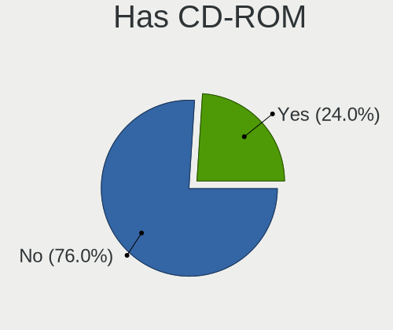
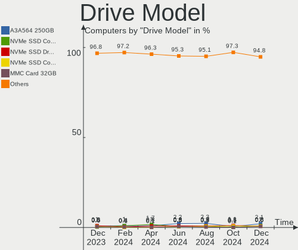
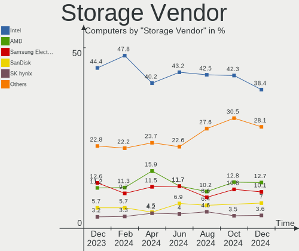
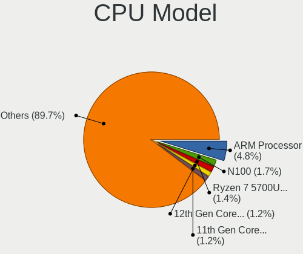
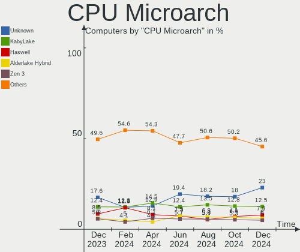

Debian Hardware Trends
----------------------

A project to identify most popular hardware characteristics and track their change
over time based on data collected by Debian users at https://Linux-Hardware.org.

Anyone can contribute to this report by the [hw-probe](https://github.com/linuxhw/hw-probe) tool:

    sudo -E hw-probe -all -upload

This is a report for all computer types. See also reports for [desktops](/Dist/Debian/Desktop/README.md) and [notebooks](/Dist/Debian/Notebook/README.md).

Full-feature report is available here: https://linux-hardware.org/?view=trends

Period: Feb, 2022.

Contents
--------

* [ System ](#system)
  - [ OS                       ](#os)
  - [ OS Family                ](#os-family)
  - [ Kernel                   ](#kernel)
  - [ Kernel Family            ](#kernel-family)
  - [ Kernel Major Ver.        ](#kernel-major-ver)
  - [ Arch                     ](#arch)
  - [ DE                       ](#de)
  - [ Display Server           ](#display-server)
  - [ Display Manager          ](#display-manager)
  - [ OS Lang                  ](#os-lang)
  - [ Boot Mode                ](#boot-mode)
  - [ Filesystem               ](#filesystem)
  - [ Part. scheme             ](#part-scheme)
  - [ Dual Boot with Linux/BSD ](#dual-boot-with-linuxbsd)
  - [ Dual Boot (Win)          ](#dual-boot-win)

* [ Board ](#board)
  - [ Vendor                   ](#vendor)
  - [ Model                    ](#model)
  - [ Model Family             ](#model-family)
  - [ MFG Year                 ](#mfg-year)
  - [ Form Factor              ](#form-factor)
  - [ Secure Boot              ](#secure-boot)
  - [ Coreboot                 ](#coreboot)
  - [ RAM Size                 ](#ram-size)
  - [ RAM Used                 ](#ram-used)
  - [ Total Drives             ](#total-drives)
  - [ Has CD-ROM               ](#has-cd-rom)
  - [ Has Ethernet             ](#has-ethernet)
  - [ Has WiFi                 ](#has-wifi)
  - [ Has Bluetooth            ](#has-bluetooth)

* [ Location ](#location)
  - [ Country                  ](#country)
  - [ City                     ](#city)

* [ Drives ](#drives)
  - [ Drive Vendor             ](#drive-vendor)
  - [ Drive Model              ](#drive-model)
  - [ HDD Vendor               ](#hdd-vendor)
  - [ SSD Vendor               ](#ssd-vendor)
  - [ Drive Kind               ](#drive-kind)
  - [ Drive Connector          ](#drive-connector)
  - [ Drive Size               ](#drive-size)
  - [ Space Total              ](#space-total)
  - [ Space Used               ](#space-used)
  - [ Malfunc. Drives          ](#malfunc-drives)
  - [ Malfunc. Drive Vendor    ](#malfunc-drive-vendor)
  - [ Malfunc. HDD Vendor      ](#malfunc-hdd-vendor)
  - [ Malfunc. Drive Kind      ](#malfunc-drive-kind)
  - [ Failed Drives            ](#failed-drives)
  - [ Failed Drive Vendor      ](#failed-drive-vendor)
  - [ Drive Status             ](#drive-status)

* [ Storage controller ](#storage-controller)
  - [ Storage Vendor           ](#storage-vendor)
  - [ Storage Model            ](#storage-model)
  - [ Storage Kind             ](#storage-kind)

* [ Processor ](#processor)
  - [ CPU Vendor               ](#cpu-vendor)
  - [ CPU Model                ](#cpu-model)
  - [ CPU Model Family         ](#cpu-model-family)
  - [ CPU Cores                ](#cpu-cores)
  - [ CPU Sockets              ](#cpu-sockets)
  - [ CPU Threads              ](#cpu-threads)
  - [ CPU Op-Modes             ](#cpu-op-modes)
  - [ CPU Microcode            ](#cpu-microcode)
  - [ CPU Microarch            ](#cpu-microarch)

* [ Graphics ](#graphics)
  - [ GPU Vendor               ](#gpu-vendor)
  - [ GPU Model                ](#gpu-model)
  - [ GPU Combo                ](#gpu-combo)
  - [ GPU Driver               ](#gpu-driver)
  - [ GPU Memory               ](#gpu-memory)

* [ Monitor ](#monitor)
  - [ Monitor Vendor           ](#monitor-vendor)
  - [ Monitor Model            ](#monitor-model)
  - [ Monitor Resolution       ](#monitor-resolution)
  - [ Monitor Diagonal         ](#monitor-diagonal)
  - [ Monitor Width            ](#monitor-width)
  - [ Aspect Ratio             ](#aspect-ratio)
  - [ Monitor Area             ](#monitor-area)
  - [ Pixel Density            ](#pixel-density)
  - [ Multiple Monitors        ](#multiple-monitors)

* [ Network ](#network)
  - [ Net Controller Vendor    ](#net-controller-vendor)
  - [ Net Controller Model     ](#net-controller-model)
  - [ Wireless Vendor          ](#wireless-vendor)
  - [ Wireless Model           ](#wireless-model)
  - [ Ethernet Vendor          ](#ethernet-vendor)
  - [ Ethernet Model           ](#ethernet-model)
  - [ Net Controller Kind      ](#net-controller-kind)
  - [ Used Controller          ](#used-controller)
  - [ NICs                     ](#nics)
  - [ IPv6                     ](#ipv6)

* [ Bluetooth ](#bluetooth)
  - [ Bluetooth Vendor         ](#bluetooth-vendor)
  - [ Bluetooth Model          ](#bluetooth-model)

* [ Sound ](#sound)
  - [ Sound Vendor             ](#sound-vendor)
  - [ Sound Model              ](#sound-model)

* [ Memory ](#memory)
  - [ Memory Vendor            ](#memory-vendor)
  - [ Memory Model             ](#memory-model)
  - [ Memory Kind              ](#memory-kind)
  - [ Memory Form Factor       ](#memory-form-factor)
  - [ Memory Size              ](#memory-size)
  - [ Memory Speed             ](#memory-speed)

* [ Printers & scanners ](#printers--scanners)
  - [ Printer Vendor           ](#printer-vendor)
  - [ Printer Model            ](#printer-model)
  - [ Scanner Vendor           ](#scanner-vendor)
  - [ Scanner Model            ](#scanner-model)

* [ Camera ](#camera)
  - [ Camera Vendor            ](#camera-vendor)
  - [ Camera Model             ](#camera-model)

* [ Security ](#security)
  - [ Fingerprint Vendor       ](#fingerprint-vendor)
  - [ Fingerprint Model        ](#fingerprint-model)
  - [ Chipcard Vendor          ](#chipcard-vendor)
  - [ Chipcard Model           ](#chipcard-model)

* [ Unsupported ](#unsupported)
  - [ Unsupported Devices      ](#unsupported-devices)
  - [ Unsupported Device Types ](#unsupported-device-types)

System
------

OS
--

Installed operating systems

| Name              | Computers | Percent |
|-------------------|-----------|---------|
| Debian 11         | 228       | 87.02%  |
| Debian Testing    | 15        | 5.73%   |
| Debian 10         | 11        | 4.2%    |
| Debian Unstable   | 4         | 1.53%   |
| Debian 11-updates | 3         | 1.15%   |
| Debian 16         | 1         | 0.38%   |

OS Family
---------

OS without a version

| Name   | Computers | Percent |
|--------|-----------|---------|
| Debian | 262       | 100%    |

Kernel
------

Version of the Linux kernel

| Version                   | Computers | Percent |
|---------------------------|-----------|---------|
| 5.10.0-11-amd64           | 108       | 41.22%  |
| 5.10.0-7-amd64            | 22        | 8.4%    |
| 5.15.0-2-amd64            | 21        | 8.02%   |
| 5.15.0-3-amd64            | 18        | 6.87%   |
| 5.10.0-10-amd64           | 16        | 6.11%   |
| 5.10.0-9-amd64            | 10        | 3.82%   |
| 5.16.0-1-amd64            | 8         | 3.05%   |
| 5.10.92-v8+               | 8         | 3.05%   |
| 4.19.0-18-amd64           | 6         | 2.29%   |
| 5.15.0-0.bpo.3-amd64      | 4         | 1.53%   |
| 5.15.0-0.bpo.2-amd64      | 4         | 1.53%   |
| 5.13.19-4-pve             | 4         | 1.53%   |
| 5.10.0-11-686-pae         | 3         | 1.15%   |
| 5.16.0-trunk-amd64        | 2         | 0.76%   |
| 5.13.19-3-pve             | 2         | 0.76%   |
| 5.9.0-arm-64              | 1         | 0.38%   |
| 5.4.106-1-pve             | 1         | 0.38%   |
| 5.16.5-titanide           | 1         | 0.38%   |
| 5.16.0-rc8-amd64          | 1         | 0.38%   |
| 5.16.0-8.2-liquorix-amd64 | 1         | 0.38%   |
| 5.16.0-8.1-liquorix-amd64 | 1         | 0.38%   |
| 5.16.0-7.1-liquorix-amd64 | 1         | 0.38%   |
| 5.16.0-5.1-liquorix-amd64 | 1         | 0.38%   |
| 5.15.21-wrkd              | 1         | 0.38%   |
| 5.15.20-qcmm              | 1         | 0.38%   |
| 5.15.17-xanmod2-tt        | 1         | 0.38%   |
| 5.15.0-0.bpo.2-rt-arm64   | 1         | 0.38%   |
| 5.14.21-xanmod1           | 1         | 0.38%   |
| 5.14.0-4mx-amd64          | 1         | 0.38%   |
| 5.14.0-0.bpo.2-amd64      | 1         | 0.38%   |
| 5.13.0-28-generic         | 1         | 0.38%   |
| 5.10.60-sunxi             | 1         | 0.38%   |
| 5.10.10-64                | 1         | 0.38%   |
| 5.10.0-9-686              | 1         | 0.38%   |
| 5.10.0-8-amd64            | 1         | 0.38%   |
| 5.10.0-5mx-amd64          | 1         | 0.38%   |
| 5.10.0-11-686             | 1         | 0.38%   |
| 5.10.0-10-686-pae         | 1         | 0.38%   |
| 5.10.0-10-686             | 1         | 0.38%   |
| 5.10.0-0.bpo.9-amd64      | 1         | 0.38%   |
| 4.19.0-17-amd64           | 1         | 0.38%   |

Kernel Family
-------------

Linux kernel without a distro release

| Version | Computers | Percent |
|---------|-----------|---------|
| 5.10.0  | 166       | 63.36%  |
| 5.15.0  | 48        | 18.32%  |
| 5.16.0  | 15        | 5.73%   |
| 5.10.92 | 8         | 3.05%   |
| 4.19.0  | 7         | 2.67%   |
| 5.13.19 | 6         | 2.29%   |
| 5.14.0  | 2         | 0.76%   |
| 5.9.0   | 1         | 0.38%   |
| 5.4.106 | 1         | 0.38%   |
| 5.16.5  | 1         | 0.38%   |
| 5.15.21 | 1         | 0.38%   |
| 5.15.20 | 1         | 0.38%   |
| 5.15.17 | 1         | 0.38%   |
| 5.14.21 | 1         | 0.38%   |
| 5.13.0  | 1         | 0.38%   |
| 5.10.60 | 1         | 0.38%   |
| 5.10.10 | 1         | 0.38%   |

Kernel Major Ver.
-----------------

Linux kernel major version

| Version | Computers | Percent |
|---------|-----------|---------|
| 5.10    | 176       | 67.18%  |
| 5.15    | 51        | 19.47%  |
| 5.16    | 16        | 6.11%   |
| 5.13    | 7         | 2.67%   |
| 4.19    | 7         | 2.67%   |
| 5.14    | 3         | 1.15%   |
| 5.9     | 1         | 0.38%   |
| 5.4     | 1         | 0.38%   |

Arch
----

OS architecture (x86_64, i586, etc.)

| Name    | Computers | Percent |
|---------|-----------|---------|
| x86_64  | 244       | 93.13%  |
| aarch64 | 10        | 3.82%   |
| i686    | 7         | 2.67%   |
| armv7l  | 1         | 0.38%   |

DE
--

Desktop Environment

| Name             | Computers | Percent |
|------------------|-----------|---------|
| GNOME            | 73        | 27.86%  |
| Unknown          | 63        | 24.05%  |
| XFCE             | 37        | 14.12%  |
| KDE5             | 25        | 9.54%   |
| X-Cinnamon       | 18        | 6.87%   |
| MATE             | 15        | 5.73%   |
| Cinnamon         | 9         | 3.44%   |
| LXDE             | 7         | 2.67%   |
| lightdm-xsession | 4         | 1.53%   |
| Openbox          | 2         | 0.76%   |
| KDE              | 2         | 0.76%   |
| GNOME Flashback  | 2         | 0.76%   |
| GNOME Classic    | 2         | 0.76%   |
| LXQt             | 1         | 0.38%   |
| i3               | 1         | 0.38%   |
| Cutefish         | 1         | 0.38%   |

Display Server
--------------

X11 or Wayland

| Name    | Computers | Percent |
|---------|-----------|---------|
| X11     | 148       | 56.49%  |
| Unknown | 50        | 19.08%  |
| Wayland | 40        | 15.27%  |
| Tty     | 24        | 9.16%   |

Display Manager
---------------

SDDM, LightDM, etc.

| Name    | Computers | Percent |
|---------|-----------|---------|
| Unknown | 104       | 39.69%  |
| LightDM | 70        | 26.72%  |
| GDM     | 54        | 20.61%  |
| SDDM    | 20        | 7.63%   |
| GDM3    | 11        | 4.2%    |
| SLiM    | 2         | 0.76%   |
| KDM     | 1         | 0.38%   |

OS Lang
-------

Language

| Lang    | Computers | Percent |
|---------|-----------|---------|
| en_US   | 71        | 27.1%   |
| ru_RU   | 56        | 21.37%  |
| de_DE   | 28        | 10.69%  |
| en_GB   | 21        | 8.02%   |
| it_IT   | 14        | 5.34%   |
| pt_BR   | 12        | 4.58%   |
| Unknown | 9         | 3.44%   |
| fr_FR   | 8         | 3.05%   |
| pl_PL   | 6         | 2.29%   |
| es_MX   | 4         | 1.53%   |
| es_ES   | 3         | 1.15%   |
| nl_NL   | 2         | 0.76%   |
| nl_BE   | 2         | 0.76%   |
| es_VE   | 2         | 0.76%   |
| es_CL   | 2         | 0.76%   |
| en_IE   | 2         | 0.76%   |
| de_AT   | 2         | 0.76%   |
| zh_CN   | 1         | 0.38%   |
| sl_SI   | 1         | 0.38%   |
| pt_PT   | 1         | 0.38%   |
| ja_JP   | 1         | 0.38%   |
| hu_HU   | 1         | 0.38%   |
| fr_CA   | 1         | 0.38%   |
| fr_BE   | 1         | 0.38%   |
| es_EC   | 1         | 0.38%   |
| es_CO   | 1         | 0.38%   |
| es_AR   | 1         | 0.38%   |
| en_SG   | 1         | 0.38%   |
| en_IN   | 1         | 0.38%   |
| en_CA   | 1         | 0.38%   |
| en_AU   | 1         | 0.38%   |
| da_DK   | 1         | 0.38%   |
| ca_ES   | 1         | 0.38%   |
| C       | 1         | 0.38%   |
| bg_BG   | 1         | 0.38%   |

Boot Mode
---------

EFI or BIOS

| Mode | Computers | Percent |
|------|-----------|---------|
| BIOS | 135       | 51.53%  |
| EFI  | 127       | 48.47%  |

Filesystem
----------

Type of filesystem

| Type    | Computers | Percent |
|---------|-----------|---------|
| Ext4    | 198       | 75.57%  |
| Overlay | 50        | 19.08%  |
| Btrfs   | 7         | 2.67%   |
| Zfs     | 2         | 0.76%   |
| Xfs     | 2         | 0.76%   |
| Tmpfs   | 1         | 0.38%   |
| Rootfs  | 1         | 0.38%   |
| Ext2    | 1         | 0.38%   |

Part. scheme
------------

Scheme of partitioning

| Type    | Computers | Percent |
|---------|-----------|---------|
| GPT     | 126       | 48.09%  |
| MBR     | 89        | 33.97%  |
| Unknown | 47        | 17.94%  |

Dual Boot with Linux/BSD
------------------------

Hosting more than one Linux/BSD

| Dual boot | Computers | Percent |
|-----------|-----------|---------|
| No        | 228       | 87.02%  |
| Yes       | 34        | 12.98%  |

Dual Boot (Win)
---------------

Hosting Linux and Windows

| Dual boot | Computers | Percent |
|-----------|-----------|---------|
| No        | 177       | 67.56%  |
| Yes       | 85        | 32.44%  |

Board
-----

Vendor
------

Motherboard manufacturer

| Name                    | Computers | Percent |
|-------------------------|-----------|---------|
| ASUSTek Computer        | 39        | 14.89%  |
| Lenovo                  | 38        | 14.5%   |
| Hewlett-Packard         | 34        | 12.98%  |
| Gigabyte Technology     | 26        | 9.92%   |
| Dell                    | 26        | 9.92%   |
| ASRock                  | 17        | 6.49%   |
| MSI                     | 14        | 5.34%   |
| Acer                    | 10        | 3.82%   |
| Raspberry Pi Foundation | 8         | 3.05%   |
| Intel                   | 6         | 2.29%   |
| Samsung Electronics     | 4         | 1.53%   |
| Fujitsu                 | 3         | 1.15%   |
| ECS                     | 3         | 1.15%   |
| Unknown                 | 3         | 1.15%   |
| Toshiba                 | 2         | 0.76%   |
| Supermicro              | 2         | 0.76%   |
| Positivo                | 2         | 0.76%   |
| GPU Company             | 2         | 0.76%   |
| Google                  | 2         | 0.76%   |
| Foxconn                 | 2         | 0.76%   |
| Apple                   | 2         | 0.76%   |
| TUXEDO                  | 1         | 0.38%   |
| Timi                    | 1         | 0.38%   |
| System76                | 1         | 0.38%   |
| sunxi                   | 1         | 0.38%   |
| Sony                    | 1         | 0.38%   |
| Phytium                 | 1         | 0.38%   |
| Packard Bell            | 1         | 0.38%   |
| Notebook                | 1         | 0.38%   |
| Medion                  | 1         | 0.38%   |
| Gateway                 | 1         | 0.38%   |
| eMachines               | 1         | 0.38%   |
| Digiboard               | 1         | 0.38%   |
| Clientron Crop.         | 1         | 0.38%   |
| Chuwi                   | 1         | 0.38%   |
| Biostar                 | 1         | 0.38%   |
| ASRockRack              | 1         | 0.38%   |
| ABIT                    | 1         | 0.38%   |

Model
-----

Motherboard model

| Name                                      | Computers | Percent |
|-------------------------------------------|-----------|---------|
| RPi Raspberry Pi                          | 8         | 3.05%   |
| ASUS PRIME H510M-A                        | 5         | 1.91%   |
| ASUS All Series                           | 5         | 1.91%   |
| MSI MS-7817                               | 3         | 1.15%   |
| Lenovo ThinkPad L13 Yoga Gen 2 20VK0019US | 3         | 1.15%   |
| ECS G31T-M9                               | 3         | 1.15%   |
| Unknown                                   | 3         | 1.15%   |
| Supermicro X8DTL                          | 2         | 0.76%   |
| Lenovo IdeaPad S540-13API 81XC            | 2         | 0.76%   |
| Lenovo G580 20157                         | 2         | 0.76%   |
| HP Z620 Workstation                       | 2         | 0.76%   |
| HP Laptop 15-db1xxx                       | 2         | 0.76%   |
| GPU Company GWTC116-2                     | 2         | 0.76%   |
| Gigabyte H61M-DS2 REV 1.2                 | 2         | 0.76%   |
| TUXEDO Pulse 15 Gen1                      | 1         | 0.38%   |
| Toshiba Satellite L775D                   | 1         | 0.38%   |
| Toshiba Satellite E45DW-C                 | 1         | 0.38%   |
| Timi RedmiBook 16                         | 1         | 0.38%   |
| System76 Gazelle Professional             | 1         | 0.38%   |
| sunxi Banana Pi BPI-M2-Plus H3            | 1         | 0.38%   |
| Sony SVE1713F1EW                          | 1         | 0.38%   |
| Samsung RC530/RC730                       | 1         | 0.38%   |
| Samsung N230                              | 1         | 0.38%   |
| Samsung N150P/N210P/N220P                 | 1         | 0.38%   |
| Samsung 355V4C/356V4C/3445VC/3545VC       | 1         | 0.38%   |
| Positivo POS-EAA75DE                      | 1         | 0.38%   |
| Positivo CHT12CP                          | 1         | 0.38%   |
| Phytium FT-2000/4                         | 1         | 0.38%   |
| Packard Bell EasyNote TE11HC              | 1         | 0.38%   |
| Notebook W65_W670SR                       | 1         | 0.38%   |
| MSI MS-7D52                               | 1         | 0.38%   |
| MSI MS-7B79                               | 1         | 0.38%   |
| MSI MS-7A40                               | 1         | 0.38%   |
| MSI MS-7A34                               | 1         | 0.38%   |
| MSI MS-7996                               | 1         | 0.38%   |
| MSI MS-7917                               | 1         | 0.38%   |
| MSI MS-7721                               | 1         | 0.38%   |
| MSI MS-7592                               | 1         | 0.38%   |
| MSI MS-7309                               | 1         | 0.38%   |
| MSI MS-7053                               | 1         | 0.38%   |
| MSI GP72M 7RDX                            | 1         | 0.38%   |
| Medion MD34189/C731                       | 1         | 0.38%   |
| Lenovo V14-ARE 82DQ                       | 1         | 0.38%   |
| Lenovo ThinkStation P340 Tiny 30DF002BUK  | 1         | 0.38%   |
| Lenovo ThinkPad X230 2325V4D              | 1         | 0.38%   |
| Lenovo ThinkPad X220 4291Q50              | 1         | 0.38%   |
| Lenovo ThinkPad X200 7459ZC2              | 1         | 0.38%   |
| Lenovo ThinkPad T490 20RXS0VX00           | 1         | 0.38%   |
| Lenovo ThinkPad T410 2537A12              | 1         | 0.38%   |
| Lenovo ThinkPad R61e 7649AL6              | 1         | 0.38%   |
| Lenovo ThinkPad L530 24813QG              | 1         | 0.38%   |
| Lenovo ThinkPad L440 20ASS3A300           | 1         | 0.38%   |
| Lenovo ThinkPad L15 Gen 2 20X4S8YL00      | 1         | 0.38%   |
| Lenovo ThinkPad E475 20H40006US           | 1         | 0.38%   |
| Lenovo ThinkPad E15 Gen 3 20YHS01S00      | 1         | 0.38%   |
| Lenovo ThinkPad E15 Gen 3 20YGCTO1WW      | 1         | 0.38%   |
| Lenovo ThinkCentre M920t 10SFCTO1WW       | 1         | 0.38%   |
| Lenovo ThinkCentre M72e 3264AN3           | 1         | 0.38%   |
| Lenovo ThinkCentre M720q 10T700BHBL       | 1         | 0.38%   |
| Lenovo ThinkCentre M715q 10VG001DGE       | 1         | 0.38%   |

Model Family
------------

Motherboard model prefix

| Name                  | Computers | Percent |
|-----------------------|-----------|---------|
| Lenovo ThinkPad       | 15        | 5.73%   |
| Lenovo IdeaPad        | 10        | 3.82%   |
| RPi Raspberry         | 8         | 3.05%   |
| ASUS PRIME            | 7         | 2.67%   |
| HP Laptop             | 6         | 2.29%   |
| Dell Latitude         | 6         | 2.29%   |
| Acer Aspire           | 6         | 2.29%   |
| Lenovo ThinkCentre    | 5         | 1.91%   |
| Dell XPS              | 5         | 1.91%   |
| ASUS All              | 5         | 1.91%   |
| HP ZBook              | 4         | 1.53%   |
| HP Pavilion           | 4         | 1.53%   |
| HP EliteBook          | 4         | 1.53%   |
| Dell OptiPlex         | 4         | 1.53%   |
| MSI MS-7817           | 3         | 1.15%   |
| HP Compaq             | 3         | 1.15%   |
| ECS G31T-M9           | 3         | 1.15%   |
| Dell PowerEdge        | 3         | 1.15%   |
| Dell Inspiron         | 3         | 1.15%   |
| Unknown               | 3         | 1.15%   |
| Toshiba Satellite     | 2         | 0.76%   |
| Supermicro X8DTL      | 2         | 0.76%   |
| Lenovo G580           | 2         | 0.76%   |
| HP Z620               | 2         | 0.76%   |
| HP OMEN               | 2         | 0.76%   |
| HP EliteDesk          | 2         | 0.76%   |
| GPU Company GWTC116-2 | 2         | 0.76%   |
| Gigabyte X570         | 2         | 0.76%   |
| Gigabyte H61M-DS2     | 2         | 0.76%   |
| Gigabyte B550M        | 2         | 0.76%   |
| Fujitsu LIFEBOOK      | 2         | 0.76%   |
| Dell Vostro           | 2         | 0.76%   |
| Dell Precision        | 2         | 0.76%   |
| ASUS ROG              | 2         | 0.76%   |
| ASRock FM2A68M-HD+    | 2         | 0.76%   |
| ASRock B450           | 2         | 0.76%   |
| Acer Swift            | 2         | 0.76%   |
| TUXEDO Pulse          | 1         | 0.38%   |
| Timi RedmiBook        | 1         | 0.38%   |
| System76 Gazelle      | 1         | 0.38%   |
| sunxi Banana          | 1         | 0.38%   |
| Sony SVE1713F1EW      | 1         | 0.38%   |
| Samsung RC530         | 1         | 0.38%   |
| Samsung N230          | 1         | 0.38%   |
| Samsung N150P         | 1         | 0.38%   |
| Samsung 355V4C        | 1         | 0.38%   |
| Positivo POS-EAA75DE  | 1         | 0.38%   |
| Positivo CHT12CP      | 1         | 0.38%   |
| Phytium FT-2000       | 1         | 0.38%   |
| Packard Bell EasyNote | 1         | 0.38%   |
| Notebook W65          | 1         | 0.38%   |
| MSI MS-7D52           | 1         | 0.38%   |
| MSI MS-7B79           | 1         | 0.38%   |
| MSI MS-7A40           | 1         | 0.38%   |
| MSI MS-7A34           | 1         | 0.38%   |
| MSI MS-7996           | 1         | 0.38%   |
| MSI MS-7917           | 1         | 0.38%   |
| MSI MS-7721           | 1         | 0.38%   |
| MSI MS-7592           | 1         | 0.38%   |
| MSI MS-7309           | 1         | 0.38%   |

MFG Year
--------

Motherboard manufacture year

| Year    | Computers | Percent |
|---------|-----------|---------|
| 2021    | 33        | 12.6%   |
| 2012    | 29        | 11.07%  |
| 2020    | 28        | 10.69%  |
| 2019    | 23        | 8.78%   |
| 2014    | 19        | 7.25%   |
| 2011    | 17        | 6.49%   |
| 2013    | 14        | 5.34%   |
| 2018    | 13        | 4.96%   |
| 2017    | 12        | 4.58%   |
| 2010    | 12        | 4.58%   |
| 2009    | 12        | 4.58%   |
| 2015    | 11        | 4.2%    |
| 2016    | 10        | 3.82%   |
| Unknown | 10        | 3.82%   |
| 2008    | 7         | 2.67%   |
| 2007    | 7         | 2.67%   |
| 2005    | 2         | 0.76%   |
| 2022    | 1         | 0.38%   |
| 2006    | 1         | 0.38%   |
| 2003    | 1         | 0.38%   |

Form Factor
-----------

Physical design of the computer

| Name           | Computers | Percent |
|----------------|-----------|---------|
| Desktop        | 119       | 45.42%  |
| Notebook       | 114       | 43.51%  |
| System on chip | 10        | 3.82%   |
| Mini pc        | 9         | 3.44%   |
| Server         | 5         | 1.91%   |
| Convertible    | 3         | 1.15%   |
| All in one     | 2         | 0.76%   |

Secure Boot
-----------

Enabled or disabled

| State    | Computers | Percent |
|----------|-----------|---------|
| Disabled | 244       | 93.13%  |
| Enabled  | 18        | 6.87%   |

Coreboot
--------

Have coreboot on board

| Used | Computers | Percent |
|------|-----------|---------|
| No   | 259       | 98.85%  |
| Yes  | 3         | 1.15%   |

RAM Size
--------

Total RAM memory

| Size in GB      | Computers | Percent |
|-----------------|-----------|---------|
| 4.01-8.0        | 75        | 28.63%  |
| 3.01-4.0        | 55        | 20.99%  |
| 16.01-24.0      | 41        | 15.65%  |
| 8.01-16.0       | 35        | 13.36%  |
| 32.01-64.0      | 22        | 8.4%    |
| 1.01-2.0        | 16        | 6.11%   |
| 64.01-256.0     | 7         | 2.67%   |
| 2.01-3.0        | 4         | 1.53%   |
| 0.51-1.0        | 4         | 1.53%   |
| 24.01-32.0      | 2         | 0.76%   |
| More than 256.0 | 1         | 0.38%   |

RAM Used
--------

Used RAM memory

| Used GB     | Computers | Percent |
|-------------|-----------|---------|
| 1.01-2.0    | 79        | 30.15%  |
| 0.51-1.0    | 59        | 22.52%  |
| 2.01-3.0    | 47        | 17.94%  |
| 4.01-8.0    | 32        | 12.21%  |
| 3.01-4.0    | 24        | 9.16%   |
| 0.01-0.5    | 12        | 4.58%   |
| 8.01-16.0   | 3         | 1.15%   |
| 32.01-64.0  | 2         | 0.76%   |
| 64.01-256.0 | 2         | 0.76%   |
| 16.01-24.0  | 2         | 0.76%   |

Total Drives
------------

Number of drives on board

| Drives | Computers | Percent |
|--------|-----------|---------|
| 1      | 176       | 67.18%  |
| 2      | 47        | 17.94%  |
| 3      | 18        | 6.87%   |
| 4      | 8         | 3.05%   |
| 5      | 6         | 2.29%   |
| 8      | 2         | 0.76%   |
| 0      | 2         | 0.76%   |
| 28     | 1         | 0.38%   |
| 12     | 1         | 0.38%   |
| 9      | 1         | 0.38%   |

Has CD-ROM
----------

Has CD-ROM on board

| Presented | Computers | Percent |
|-----------|-----------|---------|
| No        | 168       | 64.12%  |
| Yes       | 94        | 35.88%  |

Has Ethernet
------------

Has Ethernet on board

| Presented | Computers | Percent |
|-----------|-----------|---------|
| Yes       | 239       | 91.22%  |
| No        | 23        | 8.78%   |

Has WiFi
--------

Has WiFi module

| Presented | Computers | Percent |
|-----------|-----------|---------|
| Yes       | 154       | 58.78%  |
| No        | 108       | 41.22%  |

Has Bluetooth
-------------

Has Bluetooth module

| Presented | Computers | Percent |
|-----------|-----------|---------|
| No        | 152       | 58.02%  |
| Yes       | 110       | 41.98%  |

Location
--------

Country
-------

Geographic location (country)

| Country     | Computers | Percent |
|-------------|-----------|---------|
| Russia      | 55        | 20.99%  |
| Germany     | 36        | 13.74%  |
| USA         | 27        | 10.31%  |
| Italy       | 21        | 8.02%   |
| Brazil      | 13        | 4.96%   |
| UK          | 11        | 4.2%    |
| France      | 11        | 4.2%    |
| Spain       | 6         | 2.29%   |
| Netherlands | 6         | 2.29%   |
| Belgium     | 6         | 2.29%   |
| Poland      | 5         | 1.91%   |
| Mexico      | 5         | 1.91%   |
| Indonesia   | 4         | 1.53%   |
| Finland     | 4         | 1.53%   |
| Ukraine     | 3         | 1.15%   |
| Hungary     | 3         | 1.15%   |
| Chile       | 3         | 1.15%   |
| Venezuela   | 2         | 0.76%   |
| Turkey      | 2         | 0.76%   |
| Switzerland | 2         | 0.76%   |
| Sweden      | 2         | 0.76%   |
| Slovakia    | 2         | 0.76%   |
| Singapore   | 2         | 0.76%   |
| Latvia      | 2         | 0.76%   |
| Canada      | 2         | 0.76%   |
| Bulgaria    | 2         | 0.76%   |
| Austria     | 2         | 0.76%   |
| UAE         | 1         | 0.38%   |
| Slovenia    | 1         | 0.38%   |
| Romania     | 1         | 0.38%   |
| Portugal    | 1         | 0.38%   |
| Morocco     | 1         | 0.38%   |
| Moldova     | 1         | 0.38%   |
| Japan       | 1         | 0.38%   |
| Israel      | 1         | 0.38%   |
| India       | 1         | 0.38%   |
| Iceland     | 1         | 0.38%   |
| Guatemala   | 1         | 0.38%   |
| Ecuador     | 1         | 0.38%   |
| Denmark     | 1         | 0.38%   |
| Czechia     | 1         | 0.38%   |
| Cyprus      | 1         | 0.38%   |
| Croatia     | 1         | 0.38%   |
| Costa Rica  | 1         | 0.38%   |
| Colombia    | 1         | 0.38%   |
| China       | 1         | 0.38%   |
| Belarus     | 1         | 0.38%   |
| Bangladesh  | 1         | 0.38%   |
| Australia   | 1         | 0.38%   |
| Argentina   | 1         | 0.38%   |

City
----

Geographic location (city)

| City            | Computers | Percent |
|-----------------|-----------|---------|
| Voronezh        | 40        | 15.27%  |
| Bangor          | 6         | 2.29%   |
| Berlin          | 5         | 1.91%   |
| São Paulo    | 4         | 1.53%   |
| Milan           | 4         | 1.53%   |
| St Petersburg   | 3         | 1.15%   |
| Paris           | 3         | 1.15%   |
| Leipzig         | 3         | 1.15%   |
| Jemgum          | 3         | 1.15%   |
| Ivanovo         | 3         | 1.15%   |
| Waregem         | 2         | 0.76%   |
| Valencia        | 2         | 0.76%   |
| Ulyanovsk       | 2         | 0.76%   |
| Stockholm       | 2         | 0.76%   |
| Singapore       | 2         | 0.76%   |
| Rome            | 2         | 0.76%   |
| Riga            | 2         | 0.76%   |
| Raahe           | 2         | 0.76%   |
| Ponferrada      | 2         | 0.76%   |
| Phoenix         | 2         | 0.76%   |
| Perm            | 2         | 0.76%   |
| Moscow          | 2         | 0.76%   |
| Manchester      | 2         | 0.76%   |
| Los Angeles     | 2         | 0.76%   |
| Helsinki        | 2         | 0.76%   |
| Guidonia        | 2         | 0.76%   |
| Ghent           | 2         | 0.76%   |
| Blizniew        | 2         | 0.76%   |
| Barcelona       | 2         | 0.76%   |
| Bad Hall        | 2         | 0.76%   |
| Amsterdam       | 2         | 0.76%   |
| Zumpango        | 1         | 0.38%   |
| Zlatoust        | 1         | 0.38%   |
| Zaporizhzhya    | 1         | 0.38%   |
| Zagreb          | 1         | 0.38%   |
| Yogyakarta      | 1         | 0.38%   |
| Yerba Buena     | 1         | 0.38%   |
| Wolfsburg       | 1         | 0.38%   |
| Wołomin     | 1         | 0.38%   |
| Wiesbaden       | 1         | 0.38%   |
| Weselberg       | 1         | 0.38%   |
| Watertown       | 1         | 0.38%   |
| Washington      | 1         | 0.38%   |
| Venice          | 1         | 0.38%   |
| Toulouse        | 1         | 0.38%   |
| Tizayuca        | 1         | 0.38%   |
| Thousand Oaks   | 1         | 0.38%   |
| Tel Aviv        | 1         | 0.38%   |
| Taurisano       | 1         | 0.38%   |
| Szolnok         | 1         | 0.38%   |
| Syeverodonets'k | 1         | 0.38%   |
| Strasbourg      | 1         | 0.38%   |
| Southampton     | 1         | 0.38%   |
| Sosnowiec       | 1         | 0.38%   |
| Somers          | 1         | 0.38%   |
| Sofia           | 1         | 0.38%   |
| Skocjan         | 1         | 0.38%   |
| Shenzhen        | 1         | 0.38%   |
| Severna Park    | 1         | 0.38%   |
| Senec           | 1         | 0.38%   |

Drives
------

Drive Vendor
------------

Hard drive vendors

| Vendor              | Computers | Drives | Percent |
|---------------------|-----------|--------|---------|
| WDC                 | 66        | 81     | 17.89%  |
| Seagate             | 61        | 88     | 16.53%  |
| Samsung Electronics | 53        | 66     | 14.36%  |
| Toshiba             | 29        | 38     | 7.86%   |
| Kingston            | 25        | 28     | 6.78%   |
| Crucial             | 20        | 22     | 5.42%   |
| Unknown             | 16        | 18     | 4.34%   |
| SanDisk             | 16        | 17     | 4.34%   |
| Hitachi             | 13        | 14     | 3.52%   |
| SK Hynix            | 9         | 9      | 2.44%   |
| Intel               | 7         | 9      | 1.9%    |
| HGST                | 5         | 6      | 1.36%   |
| Micron Technology   | 4         | 5      | 1.08%   |
| A-DATA Technology   | 4         | 4      | 1.08%   |
| SPCC                | 3         | 3      | 0.81%   |
| Intenso             | 3         | 3      | 0.81%   |
| Transcend           | 2         | 2      | 0.54%   |
| Phison              | 2         | 2      | 0.54%   |
| Netac               | 2         | 2      | 0.54%   |
| GOODRAM             | 2         | 2      | 0.54%   |
| Gigabyte Technology | 2         | 2      | 0.54%   |
| China               | 2         | 3      | 0.54%   |
| Apple               | 2         | 2      | 0.54%   |
| XPG                 | 1         | 1      | 0.27%   |
| V-GeN               | 1         | 1      | 0.27%   |
| Team                | 1         | 1      | 0.27%   |
| T-FORCE             | 1         | 1      | 0.27%   |
| PNY                 | 1         | 1      | 0.27%   |
| Philips             | 1         | 1      | 0.27%   |
| Pear 2TB            | 1         | 1      | 0.27%   |
| Patriot             | 1         | 1      | 0.27%   |
| OCZ-VERTEX3         | 1         | 1      | 0.27%   |
| NETAPP              | 1         | 4      | 0.27%   |
| MAXTOR              | 1         | 1      | 0.27%   |
| LITEONIT            | 1         | 1      | 0.27%   |
| KIOXIA-EXCERIA      | 1         | 1      | 0.27%   |
| KIOXIA              | 1         | 1      | 0.27%   |
| JMicron             | 1         | 1      | 0.27%   |
| JASTER              | 1         | 1      | 0.27%   |
| Hikvision           | 1         | 1      | 0.27%   |
| Fujitsu             | 1         | 1      | 0.27%   |
| Foxline             | 1         | 1      | 0.27%   |
| Corsair             | 1         | 1      | 0.27%   |
| Unknown             | 1         | 1      | 0.27%   |

Drive Model
-----------

Hard drive models

| Model                                     | Computers | Percent |
|-------------------------------------------|-----------|---------|
| Seagate ST500DM002-1BD142 500GB           | 9         | 2.22%   |
| Toshiba DT01ACA050 500GB                  | 5         | 1.23%   |
| Kingston SA400S37240G 240GB SSD           | 5         | 1.23%   |
| Seagate ST1000LM035-1RK172 1TB            | 4         | 0.99%   |
| Samsung SSD 970 EVO Plus 500GB            | 4         | 0.99%   |
| Samsung SSD 970 EVO Plus 1TB              | 4         | 0.99%   |
| Kingston SA400S37120G 120GB SSD           | 4         | 0.99%   |
| Crucial CT500MX500SSD1 500GB              | 4         | 0.99%   |
| Crucial CT1000MX500SSD1 1TB               | 4         | 0.99%   |
| WDC WDS240G2G0A-00JH30 240GB SSD          | 3         | 0.74%   |
| WDC WD5000AAKX-00ERMA0 500GB              | 3         | 0.74%   |
| WDC PC SN730 SDBQNTY-512G-1001 512GB      | 3         | 0.74%   |
| Toshiba MQ01ABF050 500GB                  | 3         | 0.74%   |
| Toshiba DT01ACA100 1TB                    | 3         | 0.74%   |
| Seagate ST3250318AS 250GB                 | 3         | 0.74%   |
| Seagate ST1000LM024 HN-M101MBB 1TB        | 3         | 0.74%   |
| Samsung SSD 970 EVO Plus 2TB              | 3         | 0.74%   |
| Samsung MZVLB512HBJQ-000L7 512GB          | 3         | 0.74%   |
| Kingston SA400S37480G 480GB SSD           | 3         | 0.74%   |
| Hitachi HDS721050CLA362 500GB             | 3         | 0.74%   |
| WDC WDS120G2G0A-00JH30 120GB SSD          | 2         | 0.49%   |
| WDC WDS120G1G0A-00SS50 120GB SSD          | 2         | 0.49%   |
| WDC WDS100T2B0A-00SM50 1TB SSD            | 2         | 0.49%   |
| WDC WD30EFRX-68EUZN0 3TB                  | 2         | 0.49%   |
| WDC WD2500AAJS-00B4A0 250GB               | 2         | 0.49%   |
| WDC WD1003FZEX-00MK2A0 1TB                | 2         | 0.49%   |
| WDC PC SN530 SDBPNPZ-512G-1114 512GB      | 2         | 0.49%   |
| Unknown MMC Card  128GB                   | 2         | 0.49%   |
| Unknown Biwin  64GB                       | 2         | 0.49%   |
| Toshiba MQ01ABD050 500GB                  | 2         | 0.49%   |
| Toshiba HDWG180 8TB                       | 2         | 0.49%   |
| Toshiba HDWE150 5TB                       | 2         | 0.49%   |
| SPCC M.2 PCIe SSD 1TB                     | 2         | 0.49%   |
| SK Hynix SKHynix_HFM512GDHTNI-87A0B 512GB | 2         | 0.49%   |
| Seagate ST750LM022 HN-M750MBB 752GB       | 2         | 0.49%   |
| Seagate ST6000DM003-2CY186 6TB            | 2         | 0.49%   |
| Seagate ST500LT012-9WS142 500GB           | 2         | 0.49%   |
| Seagate ST500LT012-1DG142 500GB           | 2         | 0.49%   |
| Seagate ST2000LM015-2E8174 2TB            | 2         | 0.49%   |
| Seagate ST2000DM008-2UB102 2TB            | 2         | 0.49%   |
| Seagate ST1000DM010-2EP102 1TB            | 2         | 0.49%   |
| SanDisk SSD PLUS 240GB                    | 2         | 0.49%   |
| SanDisk SDSSDH3 2T00 2TB                  | 2         | 0.49%   |
| Sandisk NVMe SSD Drive 1TB                | 2         | 0.49%   |
| Samsung SSD 860 EVO 500GB                 | 2         | 0.49%   |
| Samsung SSD 860 EVO 250GB                 | 2         | 0.49%   |
| Samsung SSD 850 EVO 120GB                 | 2         | 0.49%   |
| Kingston SV300S37A120G 120GB SSD          | 2         | 0.49%   |
| Kingston SUV400S37240G 240GB SSD          | 2         | 0.49%   |
| Kingston SUV400S37120G 120GB SSD          | 2         | 0.49%   |
| Hitachi HTS545025B9A300 250GB             | 2         | 0.49%   |
| Crucial CT240BX500SSD1 240GB              | 2         | 0.49%   |
| Crucial CT1000BX500SSD1 1TB               | 2         | 0.49%   |
| XPG GAMMIX S11 Pro 1TB                    | 1         | 0.25%   |
| WDC WDS500G2B0B-00YS70 500GB SSD          | 1         | 0.25%   |
| WDC WDS500G1X0E-00AFY0 500GB              | 1         | 0.25%   |
| WDC WDS480G2G0A-00JH30 480GB SSD          | 1         | 0.25%   |
| WDC WDS256G1X0C-00ENX0 256GB              | 1         | 0.25%   |
| WDC WDS250G2B0A 250GB SSD                 | 1         | 0.25%   |
| WDC WD80EFAX-68KNBN0 8TB                  | 1         | 0.25%   |

HDD Vendor
----------

Hard disk drive vendors

| Vendor              | Computers | Drives | Percent |
|---------------------|-----------|--------|---------|
| Seagate             | 61        | 88     | 40.67%  |
| WDC                 | 40        | 54     | 26.67%  |
| Toshiba             | 25        | 34     | 16.67%  |
| Hitachi             | 12        | 12     | 8%      |
| HGST                | 5         | 6      | 3.33%   |
| Unknown             | 1         | 1      | 0.67%   |
| Samsung Electronics | 1         | 1      | 0.67%   |
| Pear 2TB            | 1         | 1      | 0.67%   |
| NETAPP              | 1         | 4      | 0.67%   |
| MAXTOR              | 1         | 1      | 0.67%   |
| Fujitsu             | 1         | 1      | 0.67%   |
| Apple               | 1         | 1      | 0.67%   |

SSD Vendor
----------

Solid state drive vendors

| Vendor              | Computers | Drives | Percent |
|---------------------|-----------|--------|---------|
| Samsung Electronics | 23        | 33     | 18.7%   |
| Kingston            | 22        | 23     | 17.89%  |
| Crucial             | 19        | 21     | 15.45%  |
| SanDisk             | 13        | 14     | 10.57%  |
| WDC                 | 12        | 12     | 9.76%   |
| Micron Technology   | 4         | 5      | 3.25%   |
| Intel               | 3         | 5      | 2.44%   |
| A-DATA Technology   | 3         | 3      | 2.44%   |
| Transcend           | 2         | 2      | 1.63%   |
| SK Hynix            | 2         | 2      | 1.63%   |
| Netac               | 2         | 2      | 1.63%   |
| Intenso             | 2         | 2      | 1.63%   |
| GOODRAM             | 2         | 2      | 1.63%   |
| Gigabyte Technology | 2         | 2      | 1.63%   |
| China               | 2         | 3      | 1.63%   |
| Toshiba             | 1         | 1      | 0.81%   |
| Team                | 1         | 1      | 0.81%   |
| SPCC                | 1         | 1      | 0.81%   |
| PNY                 | 1         | 1      | 0.81%   |
| Patriot             | 1         | 1      | 0.81%   |
| OCZ-VERTEX3         | 1         | 1      | 0.81%   |
| LITEONIT            | 1         | 1      | 0.81%   |
| KIOXIA-EXCERIA      | 1         | 1      | 0.81%   |
| Hitachi             | 1         | 2      | 0.81%   |
| Foxline             | 1         | 1      | 0.81%   |

Drive Kind
----------

HDD or SSD

| Kind    | Computers | Drives | Percent |
|---------|-----------|--------|---------|
| HDD     | 130       | 204    | 38.81%  |
| SSD     | 110       | 142    | 32.84%  |
| NVMe    | 74        | 81     | 22.09%  |
| MMC     | 17        | 19     | 5.07%   |
| Unknown | 4         | 4      | 1.19%   |

Drive Connector
---------------

SATA, SAS, NVMe, etc.

| Type | Computers | Drives | Percent |
|------|-----------|--------|---------|
| SATA | 193       | 323    | 65.87%  |
| NVMe | 73        | 80     | 24.91%  |
| MMC  | 17        | 19     | 5.8%    |
| SAS  | 10        | 28     | 3.41%   |

Drive Size
----------

Size of hard drive

| Size in TB | Computers | Drives | Percent |
|------------|-----------|--------|---------|
| 0.01-0.5   | 154       | 196    | 62.6%   |
| 0.51-1.0   | 53        | 73     | 21.54%  |
| 1.01-2.0   | 19        | 27     | 7.72%   |
| 4.01-10.0  | 9         | 31     | 3.66%   |
| 3.01-4.0   | 6         | 7      | 2.44%   |
| 2.01-3.0   | 3         | 3      | 1.22%   |
| 10.01-20.0 | 2         | 9      | 0.81%   |

Space Total
-----------

Amount of disk space available on the file system

| Size in GB     | Computers | Percent |
|----------------|-----------|---------|
| 101-250        | 61        | 23.28%  |
| Unknown        | 46        | 17.56%  |
| 251-500        | 44        | 16.79%  |
| 501-1000       | 44        | 16.79%  |
| 21-50          | 17        | 6.49%   |
| 1001-2000      | 15        | 5.73%   |
| More than 3000 | 13        | 4.96%   |
| 51-100         | 11        | 4.2%    |
| 2001-3000      | 6         | 2.29%   |
| 1-20           | 5         | 1.91%   |

Space Used
----------

Amount of used disk space

| Used GB        | Computers | Percent |
|----------------|-----------|---------|
| 1-20           | 87        | 33.21%  |
| Unknown        | 46        | 17.56%  |
| 101-250        | 31        | 11.83%  |
| 21-50          | 24        | 9.16%   |
| 51-100         | 24        | 9.16%   |
| 251-500        | 23        | 8.78%   |
| 501-1000       | 9         | 3.44%   |
| 1001-2000      | 7         | 2.67%   |
| 2001-3000      | 6         | 2.29%   |
| More than 3000 | 4         | 1.53%   |
| 0              | 1         | 0.38%   |

Malfunc. Drives
---------------

Drive models with a malfunction

| Model                                               | Computers | Drives | Percent |
|-----------------------------------------------------|-----------|--------|---------|
| WDC WDS120G2G0A-00JH30 120GB SSD                    | 2         | 2      | 4.65%   |
| WDC WD2500AAJS-00B4A0 250GB                         | 2         | 2      | 4.65%   |
| Seagate ST500DM002-1BD142 500GB                     | 2         | 2      | 4.65%   |
| Seagate ST3250318AS 250GB                           | 2         | 2      | 4.65%   |
| WDC WD5000AAKX-08U6AA0 500GB                        | 1         | 1      | 2.33%   |
| WDC WD5000AAKX-00ERMA0 500GB                        | 1         | 1      | 2.33%   |
| WDC WD5000AADS-00S9B0 500GB                         | 1         | 1      | 2.33%   |
| WDC WD30EFRX-68EUZN0 3TB                            | 1         | 1      | 2.33%   |
| WDC WD10EZEX-22MFCA0 1TB                            | 1         | 1      | 2.33%   |
| Toshiba MQ01ABD050 500GB                            | 1         | 1      | 2.33%   |
| SK Hynix HFS256G39MND-2300A 256GB SSD               | 1         | 1      | 2.33%   |
| Seagate ST9500325AS 500GB                           | 1         | 1      | 2.33%   |
| Seagate ST750LM022 HN-M750MBB 752GB                 | 1         | 1      | 2.33%   |
| Seagate ST6000DM003-2CY186 6TB                      | 1         | 1      | 2.33%   |
| Seagate ST500VT000-1DK142 500GB                     | 1         | 1      | 2.33%   |
| Seagate ST500LT012-9WS142 500GB                     | 1         | 1      | 2.33%   |
| Seagate ST500LM012 HN-M500MBB 500GB                 | 1         | 1      | 2.33%   |
| Seagate ST500LM000-SSHD-8GB                         | 1         | 1      | 2.33%   |
| Seagate ST3320311CS 320GB                           | 1         | 1      | 2.33%   |
| Seagate ST3250410AS 250GB                           | 1         | 1      | 2.33%   |
| Seagate ST320LT020-9YG142 320GB                     | 1         | 1      | 2.33%   |
| Seagate ST32000542AS 2TB                            | 1         | 1      | 2.33%   |
| Seagate ST2000DM001-1CH164 2TB                      | 1         | 1      | 2.33%   |
| Seagate ST1500DL003-9VT16L 1TB                      | 1         | 1      | 2.33%   |
| Seagate ST1000DM003-9YN162 1TB                      | 1         | 2      | 2.33%   |
| Samsung Electronics SSD 840 PRO Series 128GB        | 1         | 1      | 2.33%   |
| Micron Technology MTFDDAV256TDL-1AW1ZABHA 256GB SSD | 1         | 1      | 2.33%   |
| LITEONIT LCT-128M3S 128GB SSD                       | 1         | 1      | 2.33%   |
| Kingston SHFS37A120G 120GB SSD                      | 1         | 1      | 2.33%   |
| Kingston SH103S3240G 240GB SSD                      | 1         | 1      | 2.33%   |
| Kingston SH103S3120G 120GB SSD                      | 1         | 1      | 2.33%   |
| Hitachi HDS722020ALA330 2TB                         | 1         | 1      | 2.33%   |
| Hitachi HDS721050CLA362 500GB                       | 1         | 1      | 2.33%   |
| Hitachi HDP725025GLA380 250GB                       | 1         | 1      | 2.33%   |
| HGST HTS725050A7E630 500GB                          | 1         | 1      | 2.33%   |
| Fujitsu MHZ2160BH G2 160GB                          | 1         | 1      | 2.33%   |
| Crucial M4-CT512M4SSD1 512GB                        | 1         | 1      | 2.33%   |
| Crucial M4-CT256M4SSD1 256GB                        | 1         | 1      | 2.33%   |
| Crucial CT480M500SSD1 480GB                         | 1         | 1      | 2.33%   |

Malfunc. Drive Vendor
---------------------

Vendors of faulty drives

| Vendor              | Computers | Drives | Percent |
|---------------------|-----------|--------|---------|
| Seagate             | 17        | 19     | 40.48%  |
| WDC                 | 9         | 9      | 21.43%  |
| Kingston            | 3         | 3      | 7.14%   |
| Hitachi             | 3         | 3      | 7.14%   |
| Crucial             | 3         | 3      | 7.14%   |
| Toshiba             | 1         | 1      | 2.38%   |
| SK Hynix            | 1         | 1      | 2.38%   |
| Samsung Electronics | 1         | 1      | 2.38%   |
| Micron Technology   | 1         | 1      | 2.38%   |
| LITEONIT            | 1         | 1      | 2.38%   |
| HGST                | 1         | 1      | 2.38%   |
| Fujitsu             | 1         | 1      | 2.38%   |

Malfunc. HDD Vendor
-------------------

Vendors of faulty HDD drives

| Vendor  | Computers | Drives | Percent |
|---------|-----------|--------|---------|
| Seagate | 17        | 19     | 56.67%  |
| WDC     | 7         | 7      | 23.33%  |
| Hitachi | 3         | 3      | 10%     |
| Toshiba | 1         | 1      | 3.33%   |
| HGST    | 1         | 1      | 3.33%   |
| Fujitsu | 1         | 1      | 3.33%   |

Malfunc. Drive Kind
-------------------

Kinds of faulty drives

| Kind | Computers | Drives | Percent |
|------|-----------|--------|---------|
| HDD  | 29        | 32     | 70.73%  |
| SSD  | 12        | 12     | 29.27%  |

Failed Drives
-------------

Failed drive models

Zero info for selected period =(

Failed Drive Vendor
-------------------

Failed drive vendors

Zero info for selected period =(

Drive Status
------------

Number of failed and malfunc. drives

| Status   | Computers | Drives | Percent |
|----------|-----------|--------|---------|
| Works    | 178       | 289    | 62.46%  |
| Detected | 67        | 117    | 23.51%  |
| Malfunc  | 40        | 44     | 14.04%  |

Storage controller
------------------

Storage Vendor
--------------

Storage controller vendors

| Vendor                       | Computers | Percent |
|------------------------------|-----------|---------|
| Intel                        | 166       | 51.55%  |
| AMD                          | 54        | 16.77%  |
| Samsung Electronics          | 28        | 8.7%    |
| Sandisk                      | 17        | 5.28%   |
| SK Hynix                     | 7         | 2.17%   |
| Nvidia                       | 7         | 2.17%   |
| ASMedia Technology           | 7         | 2.17%   |
| Phison Electronics           | 6         | 1.86%   |
| Kingston Technology Company  | 5         | 1.55%   |
| Marvell Technology Group     | 4         | 1.24%   |
| LSI Logic / Symbios Logic    | 3         | 0.93%   |
| JMicron Technology           | 3         | 0.93%   |
| VIA Technologies             | 2         | 0.62%   |
| Toshiba America Info Systems | 2         | 0.62%   |
| KIOXIA                       | 2         | 0.62%   |
| Broadcom / LSI               | 2         | 0.62%   |
| ADATA Technology             | 2         | 0.62%   |
| Silicon Motion               | 1         | 0.31%   |
| Micron/Crucial Technology    | 1         | 0.31%   |
| Broadcom                     | 1         | 0.31%   |
| Apple                        | 1         | 0.31%   |
| 3ware                        | 1         | 0.31%   |

Storage Model
-------------

Storage controller models

| Model                                                                                   | Computers | Percent |
|-----------------------------------------------------------------------------------------|-----------|---------|
| AMD FCH SATA Controller [AHCI mode]                                                     | 41        | 10.96%  |
| Samsung NVMe SSD Controller SM981/PM981/PM983                                           | 19        | 5.08%   |
| Intel 7 Series Chipset Family 6-port SATA Controller [AHCI mode]                        | 15        | 4.01%   |
| Intel NM10/ICH7 Family SATA Controller [IDE mode]                                       | 11        | 2.94%   |
| Intel 8 Series/C220 Series Chipset Family 6-port SATA Controller 1 [AHCI mode]          | 11        | 2.94%   |
| Intel 6 Series/C200 Series Chipset Family 6 port Desktop SATA AHCI Controller           | 10        | 2.67%   |
| Intel 82801G (ICH7 Family) IDE Controller                                               | 8         | 2.14%   |
| Intel 82801 Mobile SATA Controller [RAID mode]                                          | 7         | 1.87%   |
| Intel 500 Series Chipset Family SATA AHCI Controller                                    | 7         | 1.87%   |
| Intel Celeron/Pentium Silver Processor SATA Controller                                  | 6         | 1.6%    |
| Intel 8 Series SATA Controller 1 [AHCI mode]                                            | 6         | 1.6%    |
| Intel 200 Series PCH SATA controller [AHCI mode]                                        | 6         | 1.6%    |
| ASMedia ASM1062 Serial ATA Controller                                                   | 6         | 1.6%    |
| AMD SB7x0/SB8x0/SB9x0 SATA Controller [AHCI mode]                                       | 6         | 1.6%    |
| Sandisk WD Black SN750 / PC SN730 NVMe SSD                                              | 5         | 1.34%   |
| Samsung NVMe SSD Controller 980                                                         | 5         | 1.34%   |
| Intel Wildcat Point-LP SATA Controller [AHCI Mode]                                      | 5         | 1.34%   |
| Intel Comet Lake SATA AHCI Controller                                                   | 5         | 1.34%   |
| Intel Cannon Lake PCH SATA AHCI Controller                                              | 5         | 1.34%   |
| Intel 9 Series Chipset Family SATA Controller [AHCI Mode]                               | 5         | 1.34%   |
| AMD SB7x0/SB8x0/SB9x0 IDE Controller                                                    | 5         | 1.34%   |
| AMD 400 Series Chipset SATA Controller                                                  | 5         | 1.34%   |
| Sandisk WD Blue SN550 NVMe SSD                                                          | 4         | 1.07%   |
| Sandisk Non-Volatile memory controller                                                  | 4         | 1.07%   |
| Nvidia MCP61 SATA Controller                                                            | 4         | 1.07%   |
| Nvidia MCP61 IDE                                                                        | 4         | 1.07%   |
| Intel Volume Management Device NVMe RAID Controller                                     | 4         | 1.07%   |
| Intel Sunrise Point-LP SATA Controller [AHCI mode]                                      | 4         | 1.07%   |
| Intel 400 Series Chipset Family SATA AHCI Controller                                    | 4         | 1.07%   |
| AMD Starship/Matisse Chipset SATA Controller [AHCI mode]                                | 4         | 1.07%   |
| SK Hynix BC511                                                                          | 3         | 0.8%    |
| Phison E12 NVMe Controller                                                              | 3         | 0.8%    |
| Kingston Company A2000 NVMe SSD                                                         | 3         | 0.8%    |
| Intel Tiger Lake-LP SATA Controller [AHCI mode]                                         | 3         | 0.8%    |
| Intel SSD 660P Series                                                                   | 3         | 0.8%    |
| Intel Q170/Q150/B150/H170/H110/Z170/CM236 Chipset SATA Controller [AHCI Mode]           | 3         | 0.8%    |
| Intel HM170/QM170 Chipset SATA Controller [AHCI Mode]                                   | 3         | 0.8%    |
| Intel C602 chipset 4-Port SATA Storage Control Unit                                     | 3         | 0.8%    |
| Intel 82801JI (ICH10 Family) SATA AHCI Controller                                       | 3         | 0.8%    |
| Intel 6 Series/C200 Series Chipset Family Desktop SATA Controller (IDE mode, ports 4-5) | 3         | 0.8%    |
| Intel 6 Series/C200 Series Chipset Family Desktop SATA Controller (IDE mode, ports 0-3) | 3         | 0.8%    |
| Intel 5 Series/3400 Series Chipset 6 port SATA AHCI Controller                          | 3         | 0.8%    |
| Intel 5 Series/3400 Series Chipset 4 port SATA AHCI Controller                          | 3         | 0.8%    |
| AMD FCH SATA Controller D                                                               | 3         | 0.8%    |
| Samsung NVMe SSD Controller PM9A1/PM9A3/980PRO                                          | 2         | 0.53%   |
| KIOXIA Non-Volatile memory controller                                                   | 2         | 0.53%   |
| JMicron JMB363 SATA/IDE Controller                                                      | 2         | 0.53%   |
| Intel NM10/ICH7 Family SATA Controller [AHCI mode]                                      | 2         | 0.53%   |
| Intel C600/X79 series chipset SATA RAID Controller                                      | 2         | 0.53%   |
| Intel C600/X79 series chipset 6-Port SATA AHCI Controller                               | 2         | 0.53%   |
| Intel Atom Processor E3800 Series SATA AHCI Controller                                  | 2         | 0.53%   |
| Intel 82Q35 Express PT IDER Controller                                                  | 2         | 0.53%   |
| Intel 82801JI (ICH10 Family) 4 port SATA IDE Controller #1                              | 2         | 0.53%   |
| Intel 82801JI (ICH10 Family) 2 port SATA IDE Controller #2                              | 2         | 0.53%   |
| Intel 82801IR/IO/IH (ICH9R/DO/DH) 4 port SATA Controller [IDE mode]                     | 2         | 0.53%   |
| Intel 82801IBM/IEM (ICH9M/ICH9M-E) 4 port SATA Controller [AHCI mode]                   | 2         | 0.53%   |
| Intel 82801I (ICH9 Family) 2 port SATA Controller [IDE mode]                            | 2         | 0.53%   |
| Intel 82801HM/HEM (ICH8M/ICH8M-E) IDE Controller                                        | 2         | 0.53%   |
| Intel 6 Series/C200 Series Chipset Family 6 port Mobile SATA AHCI Controller            | 2         | 0.53%   |
| AMD SB7x0/SB8x0/SB9x0 SATA Controller [IDE mode]                                        | 2         | 0.53%   |

Storage Kind
------------

Kind of storage controller (IDE, SATA, NVMe, SAS, ...)

| Kind | Computers | Percent |
|------|-----------|---------|
| SATA | 183       | 56.66%  |
| NVMe | 72        | 22.29%  |
| IDE  | 43        | 13.31%  |
| RAID | 19        | 5.88%   |
| SAS  | 5         | 1.55%   |
| SCSI | 1         | 0.31%   |

Processor
---------

CPU Vendor
----------

Processor vendors

| Vendor       | Computers | Percent |
|--------------|-----------|---------|
| Intel        | 182       | 69.47%  |
| AMD          | 67        | 25.57%  |
| ARM          | 10        | 3.82%   |
| Phytium      | 1         | 0.38%   |
| CentaurHauls | 1         | 0.38%   |
| Unknown      | 1         | 0.38%   |

CPU Model
---------

Processor models

| Model                                         | Computers | Percent |
|-----------------------------------------------|-----------|---------|
| ARM Processor                                 | 9         | 3.44%   |
| Intel Pentium Dual-Core CPU E6500 @ 2.93GHz   | 6         | 2.29%   |
| Intel Core i7-8700 CPU @ 3.20GHz              | 4         | 1.53%   |
| Intel Xeon CPU E5620 @ 2.40GHz                | 3         | 1.15%   |
| Intel Core i7-4770 CPU @ 3.40GHz              | 3         | 1.15%   |
| Intel Core i5-7200U CPU @ 2.50GHz             | 3         | 1.15%   |
| Intel Core i5-3230M CPU @ 2.60GHz             | 3         | 1.15%   |
| Intel Core i5-10400 CPU @ 2.90GHz             | 3         | 1.15%   |
| Intel Core i5-10210U CPU @ 1.60GHz            | 3         | 1.15%   |
| Intel Core i3-4030U CPU @ 1.90GHz             | 3         | 1.15%   |
| Intel 11th Gen Core i7-1165G7 @ 2.80GHz       | 3         | 1.15%   |
| AMD Ryzen 5 3500U with Radeon Vega Mobile Gfx | 3         | 1.15%   |
| Intel Xeon CPU E5-2690 0 @ 2.90GHz            | 2         | 0.76%   |
| Intel Pentium CPU G620 @ 2.60GHz              | 2         | 0.76%   |
| Intel Pentium CPU G4600 @ 3.60GHz             | 2         | 0.76%   |
| Intel Pentium CPU G3420 @ 3.20GHz             | 2         | 0.76%   |
| Intel Pentium CPU G3220 @ 3.00GHz             | 2         | 0.76%   |
| Intel Pentium CPU 3825U @ 1.90GHz             | 2         | 0.76%   |
| Intel Core i7-7700HQ CPU @ 2.80GHz            | 2         | 0.76%   |
| Intel Core i7-10750H CPU @ 2.60GHz            | 2         | 0.76%   |
| Intel Core i7-10510U CPU @ 1.80GHz            | 2         | 0.76%   |
| Intel Core i5-3320M CPU @ 2.60GHz             | 2         | 0.76%   |
| Intel Core i5-2400 CPU @ 3.10GHz              | 2         | 0.76%   |
| Intel Core i5 CPU M 520 @ 2.40GHz             | 2         | 0.76%   |
| Intel Core i3-4160 CPU @ 3.60GHz              | 2         | 0.76%   |
| Intel Core i3-10105 CPU @ 3.70GHz             | 2         | 0.76%   |
| Intel Celeron N4020 CPU @ 1.10GHz             | 2         | 0.76%   |
| Intel Celeron N4000 CPU @ 1.10GHz             | 2         | 0.76%   |
| Intel Celeron J4125 CPU @ 2.00GHz             | 2         | 0.76%   |
| Intel Celeron CPU J1800 @ 2.41GHz             | 2         | 0.76%   |
| Intel Atom x5-Z8350 CPU @ 1.44GHz             | 2         | 0.76%   |
| Intel 11th Gen Core i7-1185G7 @ 3.00GHz       | 2         | 0.76%   |
| Intel 11th Gen Core i5-1135G7 @ 2.40GHz       | 2         | 0.76%   |
| AMD Ryzen 9 5950X 16-Core Processor           | 2         | 0.76%   |
| AMD Ryzen 7 4700U with Radeon Graphics        | 2         | 0.76%   |
| AMD Ryzen 7 3750H with Radeon Vega Mobile Gfx | 2         | 0.76%   |
| AMD Ryzen 7 3700X 8-Core Processor            | 2         | 0.76%   |
| AMD Ryzen 5 5600X 6-Core Processor            | 2         | 0.76%   |
| AMD Ryzen 5 5500U with Radeon Graphics        | 2         | 0.76%   |
| AMD Ryzen 5 4500U with Radeon Graphics        | 2         | 0.76%   |
| AMD Ryzen 5 1600 Six-Core Processor           | 2         | 0.76%   |
| AMD FX-4300 Quad-Core Processor               | 2         | 0.76%   |
| Phytium FT-2000/4                             | 1         | 0.38%   |
| Intel Xeon E-2236 CPU @ 3.40GHz               | 1         | 0.38%   |
| Intel Xeon CPU E5-2650 v2 @ 2.60GHz           | 1         | 0.38%   |
| Intel Xeon CPU E5-1607 0 @ 3.00GHz            | 1         | 0.38%   |
| Intel Xeon CPU E3-1505M v5 @ 2.80GHz          | 1         | 0.38%   |
| Intel Xeon CPU E3-1270 V2 @ 3.50GHz           | 1         | 0.38%   |
| Intel Xeon CPU 2.80GHz                        | 1         | 0.38%   |
| Intel Pentium Gold G5400 CPU @ 3.70GHz        | 1         | 0.38%   |
| Intel Pentium Gold 7505 @ 2.00GHz             | 1         | 0.38%   |
| Intel Pentium Dual-Core CPU T4500 @ 2.30GHz   | 1         | 0.38%   |
| Intel Pentium Dual-Core CPU E5700 @ 3.00GHz   | 1         | 0.38%   |
| Intel Pentium Dual-Core CPU E5400 @ 2.70GHz   | 1         | 0.38%   |
| Intel Pentium CPU P6200 @ 2.13GHz             | 1         | 0.38%   |
| Intel Pentium CPU P6100 @ 2.00GHz             | 1         | 0.38%   |
| Intel Pentium CPU J4205 @ 1.50GHz             | 1         | 0.38%   |
| Intel Pentium CPU G645 @ 2.90GHz              | 1         | 0.38%   |
| Intel Pentium CPU G4400 @ 3.30GHz             | 1         | 0.38%   |
| Intel Pentium CPU B960 @ 2.20GHz              | 1         | 0.38%   |

CPU Model Family
----------------

Processor model prefix

| Model                   | Computers | Percent |
|-------------------------|-----------|---------|
| Intel Core i5           | 38        | 14.5%   |
| Intel Core i7           | 34        | 12.98%  |
| Other                   | 25        | 9.54%   |
| Intel Core i3           | 23        | 8.78%   |
| Intel Pentium           | 18        | 6.87%   |
| AMD Ryzen 5             | 15        | 5.73%   |
| Intel Core 2 Duo        | 12        | 4.58%   |
| Intel Celeron           | 12        | 4.58%   |
| Intel Xeon              | 11        | 4.2%    |
| AMD Ryzen 7             | 11        | 4.2%    |
| Intel Pentium Dual-Core | 9         | 3.44%   |
| AMD A6                  | 5         | 1.91%   |
| Intel Atom              | 4         | 1.53%   |
| AMD FX                  | 4         | 1.53%   |
| AMD Ryzen 9             | 3         | 1.15%   |
| AMD E1                  | 3         | 1.15%   |
| AMD Athlon II X2        | 3         | 1.15%   |
| AMD A8                  | 3         | 1.15%   |
| AMD A4                  | 3         | 1.15%   |
| Intel Pentium Gold      | 2         | 0.76%   |
| Intel Pentium 4         | 2         | 0.76%   |
| Intel Core 2 Quad       | 2         | 0.76%   |
| AMD Ryzen 3             | 2         | 0.76%   |
| AMD A10                 | 2         | 0.76%   |
| Intel Core M            | 1         | 0.38%   |
| Intel Core 2 Extreme    | 1         | 0.38%   |
| CentaurHauls VIA Eden   | 1         | 0.38%   |
| ARM Allwinner           | 1         | 0.38%   |
| AMD Sempron             | 1         | 0.38%   |
| AMD Ryzen Threadripper  | 1         | 0.38%   |
| AMD Ryzen 7 PRO         | 1         | 0.38%   |
| AMD Ryzen 5 PRO         | 1         | 0.38%   |
| AMD Ryzen 3 PRO         | 1         | 0.38%   |
| AMD PRO A8              | 1         | 0.38%   |
| AMD Phenom              | 1         | 0.38%   |
| AMD C-60                | 1         | 0.38%   |
| AMD Athlon II X3        | 1         | 0.38%   |
| AMD Athlon 64 X2        | 1         | 0.38%   |
| AMD Athlon 64           | 1         | 0.38%   |
| AMD Athlon              | 1         | 0.38%   |

CPU Cores
---------

Number of processor cores

| Number | Computers | Percent |
|--------|-----------|---------|
| 2      | 116       | 44.27%  |
| 4      | 84        | 32.06%  |
| 6      | 24        | 9.16%   |
| 8      | 18        | 6.87%   |
| 1      | 12        | 4.58%   |
| 16     | 5         | 1.91%   |
| 64     | 1         | 0.38%   |
| 12     | 1         | 0.38%   |
| 3      | 1         | 0.38%   |

CPU Sockets
-----------

Number of sockets

| Number | Computers | Percent |
|--------|-----------|---------|
| 1      | 256       | 97.71%  |
| 2      | 6         | 2.29%   |

CPU Threads
-----------

Threads per core (Hyper-Threading)

| Number | Computers | Percent |
|--------|-----------|---------|
| 2      | 164       | 62.6%   |
| 1      | 98        | 37.4%   |

CPU Op-Modes
------------

CPU Operation Modes (32-bit, 64-bit)

| Op mode        | Computers | Percent |
|----------------|-----------|---------|
| 32-bit, 64-bit | 257       | 98.09%  |
| Unknown        | 4         | 1.53%   |
| 32-bit         | 1         | 0.38%   |

CPU Microcode
-------------

Microcode number

| Number     | Computers | Percent |
|------------|-----------|---------|
| Unknown    | 59        | 22.52%  |
| 0x306c3    | 15        | 5.73%   |
| 0x306a9    | 14        | 5.34%   |
| 0x1067a    | 11        | 4.2%    |
| 0x206a7    | 10        | 3.82%   |
| 0x806c1    | 9         | 3.44%   |
| 0xa0653    | 8         | 3.05%   |
| 0x906ea    | 7         | 2.67%   |
| 0x806ec    | 7         | 2.67%   |
| 0x6fb      | 5         | 1.91%   |
| 0x506e3    | 5         | 1.91%   |
| 0x40651    | 5         | 1.91%   |
| 0x306d4    | 5         | 1.91%   |
| 0x706a8    | 4         | 1.53%   |
| 0x10676    | 4         | 1.53%   |
| 0x0a201016 | 4         | 1.53%   |
| 0x08108102 | 4         | 1.53%   |
| 0x906e9    | 3         | 1.15%   |
| 0x806e9    | 3         | 1.15%   |
| 0x206c2    | 3         | 1.15%   |
| 0x20655    | 3         | 1.15%   |
| 0x0a50000c | 3         | 1.15%   |
| 0x08600106 | 3         | 1.15%   |
| 0x0800820d | 3         | 1.15%   |
| 0x0600611a | 3         | 1.15%   |
| 0x06003106 | 3         | 1.15%   |
| 0x05000119 | 3         | 1.15%   |
| 0xa0671    | 2         | 0.76%   |
| 0xa0655    | 2         | 0.76%   |
| 0xa0652    | 2         | 0.76%   |
| 0x806ea    | 2         | 0.76%   |
| 0x706e5    | 2         | 0.76%   |
| 0x406c4    | 2         | 0.76%   |
| 0x306e4    | 2         | 0.76%   |
| 0x20652    | 2         | 0.76%   |
| 0x08701021 | 2         | 0.76%   |
| 0x08608103 | 2         | 0.76%   |
| 0x08108109 | 2         | 0.76%   |
| 0x06000822 | 2         | 0.76%   |
| 0x010000c8 | 2         | 0.76%   |
| 0xf4a      | 1         | 0.38%   |
| 0xf29      | 1         | 0.38%   |
| 0x90675    | 1         | 0.38%   |
| 0x806d1    | 1         | 0.38%   |
| 0x806c2    | 1         | 0.38%   |
| 0x706a1    | 1         | 0.38%   |
| 0x6fd      | 1         | 0.38%   |
| 0x506c9    | 1         | 0.38%   |
| 0x406c3    | 1         | 0.38%   |
| 0x30678    | 1         | 0.38%   |
| 0x206d7    | 1         | 0.38%   |
| 0x106ca    | 1         | 0.38%   |
| 0x106c2    | 1         | 0.38%   |
| 0x106a5    | 1         | 0.38%   |
| 0x10677    | 1         | 0.38%   |
| 0x0a50000b | 1         | 0.38%   |
| 0x08600103 | 1         | 0.38%   |
| 0x08301039 | 1         | 0.38%   |
| 0x0810100b | 1         | 0.38%   |
| 0x08101007 | 1         | 0.38%   |

CPU Microarch
-------------

Microarchitecture

| Name          | Computers | Percent |
|---------------|-----------|---------|
| KabyLake      | 29        | 11.07%  |
| Haswell       | 23        | 8.78%   |
| IvyBridge     | 20        | 7.63%   |
| SandyBridge   | 19        | 7.25%   |
| Penryn        | 18        | 6.87%   |
| Unknown       | 16        | 6.11%   |
| CometLake     | 12        | 4.58%   |
| Zen+          | 11        | 4.2%    |
| TigerLake     | 10        | 3.82%   |
| Zen 3         | 9         | 3.44%   |
| Zen 2         | 9         | 3.44%   |
| Westmere      | 9         | 3.44%   |
| Excavator     | 7         | 2.67%   |
| Skylake       | 6         | 2.29%   |
| K10           | 6         | 2.29%   |
| Goldmont plus | 6         | 2.29%   |
| Core          | 6         | 2.29%   |
| Broadwell     | 6         | 2.29%   |
| Zen           | 5         | 1.91%   |
| Silvermont    | 5         | 1.91%   |
| Piledriver    | 5         | 1.91%   |
| Steamroller   | 4         | 1.53%   |
| Icelake       | 4         | 1.53%   |
| NetBurst      | 3         | 1.15%   |
| Bonnell       | 3         | 1.15%   |
| Bobcat        | 3         | 1.15%   |
| Puma          | 2         | 0.76%   |
| K8 Hammer     | 2         | 0.76%   |
| Nehalem       | 1         | 0.38%   |
| K10 Llano     | 1         | 0.38%   |
| Jaguar        | 1         | 0.38%   |
| Goldmont      | 1         | 0.38%   |

Graphics
--------

GPU Vendor
----------

Vendors of graphics cards

| Vendor                     | Computers | Percent |
|----------------------------|-----------|---------|
| Intel                      | 145       | 50.17%  |
| AMD                        | 74        | 25.61%  |
| Nvidia                     | 62        | 21.45%  |
| Matrox Electronics Systems | 6         | 2.08%   |
| VIA Technologies           | 1         | 0.35%   |
| ASPEED Technology          | 1         | 0.35%   |

GPU Model
---------

Graphics card models

| Model                                                                                    | Computers | Percent |
|------------------------------------------------------------------------------------------|-----------|---------|
| Intel 2nd Generation Core Processor Family Integrated Graphics Controller                | 13        | 4.44%   |
| Intel 3rd Gen Core processor Graphics Controller                                         | 11        | 3.75%   |
| Intel TigerLake-LP GT2 [Iris Xe Graphics]                                                | 9         | 3.07%   |
| Intel CometLake-S GT2 [UHD Graphics 630]                                                 | 9         | 3.07%   |
| AMD Picasso/Raven 2 [Radeon Vega Series / Radeon Vega Mobile Series]                     | 9         | 3.07%   |
| Intel Xeon E3-1200 v3/4th Gen Core Processor Integrated Graphics Controller              | 7         | 2.39%   |
| Intel Haswell-ULT Integrated Graphics Controller                                         | 6         | 2.05%   |
| Intel GeminiLake [UHD Graphics 600]                                                      | 6         | 2.05%   |
| Intel CometLake-U GT2 [UHD Graphics]                                                     | 6         | 2.05%   |
| AMD Renoir                                                                               | 6         | 2.05%   |
| Nvidia GF117M [GeForce 610M/710M/810M/820M / GT 620M/625M/630M/720M]                     | 5         | 1.71%   |
| Intel HD Graphics 630                                                                    | 5         | 1.71%   |
| Intel Core Processor Integrated Graphics Controller                                      | 5         | 1.71%   |
| AMD Wani [Radeon R5/R6/R7 Graphics]                                                      | 5         | 1.71%   |
| Intel Xeon E3-1200 v2/3rd Gen Core processor Graphics Controller                         | 4         | 1.37%   |
| Intel HD Graphics 620                                                                    | 4         | 1.37%   |
| Intel CoffeeLake-S GT2 [UHD Graphics 630]                                                | 4         | 1.37%   |
| Intel 82G33/G31 Express Integrated Graphics Controller                                   | 4         | 1.37%   |
| Intel 4 Series Chipset Integrated Graphics Controller                                    | 4         | 1.37%   |
| AMD Cezanne                                                                              | 4         | 1.37%   |
| Nvidia GT218 [GeForce 210]                                                               | 3         | 1.02%   |
| Nvidia GP107 [GeForce GTX 1050 Ti]                                                       | 3         | 1.02%   |
| Nvidia GM107M [GeForce GTX 950M]                                                         | 3         | 1.02%   |
| Nvidia GF108 [GeForce GT 730]                                                            | 3         | 1.02%   |
| Intel UHD Graphics 620                                                                   | 3         | 1.02%   |
| Intel Mobile 4 Series Chipset Integrated Graphics Controller                             | 3         | 1.02%   |
| Intel HD Graphics 5500                                                                   | 3         | 1.02%   |
| Intel HD Graphics 530                                                                    | 3         | 1.02%   |
| Intel Atom/Celeron/Pentium Processor x5-E8000/J3xxx/N3xxx Integrated Graphics Controller | 3         | 1.02%   |
| Intel 4th Generation Core Processor Family Integrated Graphics Controller                | 3         | 1.02%   |
| AMD Raven Ridge [Radeon Vega Series / Radeon Vega Mobile Series]                         | 3         | 1.02%   |
| AMD Ellesmere [Radeon RX 470/480/570/570X/580/580X/590]                                  | 3         | 1.02%   |
| Nvidia GP108 [GeForce GT 1030]                                                           | 2         | 0.68%   |
| Nvidia GP107M [GeForce GTX 1050 Mobile]                                                  | 2         | 0.68%   |
| Nvidia GK208BM [GeForce 920M]                                                            | 2         | 0.68%   |
| Nvidia GK106 [GeForce GTX 650 Ti]                                                        | 2         | 0.68%   |
| Nvidia G86 [GeForce 8500 GT]                                                             | 2         | 0.68%   |
| Matrox Electronics Systems MGA G200eW WPCM450                                            | 2         | 0.68%   |
| Intel WhiskeyLake-U GT2 [UHD Graphics 620]                                               | 2         | 0.68%   |
| Intel Mobile GM965/GL960 Integrated Graphics Controller (secondary)                      | 2         | 0.68%   |
| Intel Mobile GM965/GL960 Integrated Graphics Controller (primary)                        | 2         | 0.68%   |
| Intel Iris Plus Graphics G1 (Ice Lake)                                                   | 2         | 0.68%   |
| Intel HD Graphics                                                                        | 2         | 0.68%   |
| Intel Atom Processor Z36xxx/Z37xxx Series Graphics & Display                             | 2         | 0.68%   |
| Intel Atom Processor D4xx/D5xx/N4xx/N5xx Integrated Graphics Controller                  | 2         | 0.68%   |
| Intel 4th Gen Core Processor Integrated Graphics Controller                              | 2         | 0.68%   |
| AMD Wrestler [Radeon HD 7310]                                                            | 2         | 0.68%   |
| AMD Sun XT [Radeon HD 8670A/8670M/8690M / R5 M330 / M430 / Radeon 520 Mobile]            | 2         | 0.68%   |
| AMD Stoney [Radeon R2/R3/R4/R5 Graphics]                                                 | 2         | 0.68%   |
| AMD RS780L [Radeon 3000]                                                                 | 2         | 0.68%   |
| AMD Redwood PRO [Radeon HD 5550/5570/5630/6510/6610/7570]                                | 2         | 0.68%   |
| AMD Oland XT [Radeon HD 8670 / R5 340X OEM / R7 250/350/350X OEM]                        | 2         | 0.68%   |
| AMD Navi 23 [Radeon RX 6600/6600 XT/6600M]                                               | 2         | 0.68%   |
| AMD Lucienne                                                                             | 2         | 0.68%   |
| AMD Lexa PRO [Radeon 540/540X/550/550X / RX 540X/550/550X]                               | 2         | 0.68%   |
| AMD Kaveri [Radeon R7 Graphics]                                                          | 2         | 0.68%   |
| VIA Technologies VX900 Graphics [Chrome9 HD]                                             | 1         | 0.34%   |
| Nvidia TU117M [GeForce MX450]                                                            | 1         | 0.34%   |
| Nvidia TU117M                                                                            | 1         | 0.34%   |
| Nvidia TU117GLM [Quadro T500 Mobile]                                                     | 1         | 0.34%   |

GPU Combo
---------

Combinations of graphics cards

| Name           | Computers | Percent |
|----------------|-----------|---------|
| 1 x Intel      | 110       | 41.98%  |
| 1 x AMD        | 65        | 24.81%  |
| 1 x Nvidia     | 34        | 12.98%  |
| Intel + Nvidia | 27        | 10.31%  |
| Other          | 11        | 4.2%    |
| 1 x Matrox     | 6         | 2.29%   |
| Intel + AMD    | 4         | 1.53%   |
| 2 x AMD        | 2         | 0.76%   |
| 1 x VIA        | 1         | 0.38%   |
| AMD + Nvidia   | 1         | 0.38%   |
| AMD + ASPEED   | 1         | 0.38%   |

GPU Driver
----------

Free vs proprietary

| Driver      | Computers | Percent |
|-------------|-----------|---------|
| Free        | 180       | 68.7%   |
| Unknown     | 63        | 24.05%  |
| Proprietary | 19        | 7.25%   |

GPU Memory
----------

Total video memory

| Size in GB | Computers | Percent |
|------------|-----------|---------|
| Unknown    | 190       | 72.52%  |
| 1.01-2.0   | 19        | 7.25%   |
| 0.51-1.0   | 16        | 6.11%   |
| 3.01-4.0   | 14        | 5.34%   |
| 0.01-0.5   | 14        | 5.34%   |
| 7.01-8.0   | 5         | 1.91%   |
| 5.01-6.0   | 2         | 0.76%   |
| 2.01-3.0   | 2         | 0.76%   |

Monitor
-------

Monitor Vendor
--------------

Monitor vendors

| Vendor                  | Computers | Percent |
|-------------------------|-----------|---------|
| Samsung Electronics     | 29        | 12.39%  |
| AU Optronics            | 27        | 11.54%  |
| Chimei Innolux          | 23        | 9.83%   |
| LG Display              | 20        | 8.55%   |
| Dell                    | 18        | 7.69%   |
| Goldstar                | 14        | 5.98%   |
| BOE                     | 13        | 5.56%   |
| BenQ                    | 11        | 4.7%    |
| Philips                 | 7         | 2.99%   |
| Lenovo                  | 7         | 2.99%   |
| ViewSonic               | 6         | 2.56%   |
| Hewlett-Packard         | 5         | 2.14%   |
| Ancor Communications    | 5         | 2.14%   |
| Sharp                   | 4         | 1.71%   |
| Chi Mei Optoelectronics | 4         | 1.71%   |
| Acer                    | 4         | 1.71%   |
| Unknown                 | 3         | 1.28%   |
| Toshiba                 | 3         | 1.28%   |
| Medion                  | 3         | 1.28%   |
| Eizo                    | 3         | 1.28%   |
| Sony                    | 2         | 0.85%   |
| Iiyama                  | 2         | 0.85%   |
| Belinea                 | 2         | 0.85%   |
| Apple                   | 2         | 0.85%   |
| AOC                     | 2         | 0.85%   |
| Xiaomi                  | 1         | 0.43%   |
| VIE                     | 1         | 0.43%   |
| Vestel Elektronik       | 1         | 0.43%   |
| Sanyo                   | 1         | 0.43%   |
| SAC                     | 1         | 0.43%   |
| NEC Computers           | 1         | 0.43%   |
| MStar                   | 1         | 0.43%   |
| LG Philips              | 1         | 0.43%   |
| InfoVision              | 1         | 0.43%   |
| Idek Iiyama             | 1         | 0.43%   |
| Gigabyte Technology     | 1         | 0.43%   |
| Fujitsu Siemens         | 1         | 0.43%   |
| DTV                     | 1         | 0.43%   |
| DMT                     | 1         | 0.43%   |
| CSO                     | 1         | 0.43%   |

Monitor Model
-------------

Monitor models

| Model                                                                  | Computers | Percent |
|------------------------------------------------------------------------|-----------|---------|
| Unknown LCD Monitor FFFF 2288x1287 2550x2550mm 142.0-inch              | 3         | 1.24%   |
| ViewSonic VX2452 Series VSCDE2E 1920x1080 521x293mm 23.5-inch          | 2         | 0.83%   |
| ViewSonic VG730m VSC951E 1280x1024 338x270mm 17.0-inch                 | 2         | 0.83%   |
| Toshiba LCD Monitor 15" 1 5" LCD000D 1024x768 304x228mm 15.0-inch      | 2         | 0.83%   |
| Samsung Electronics LCD Monitor SEC3152 1366x768 344x194mm 15.5-inch   | 2         | 0.83%   |
| Medion MD20432 MED36A8 1920x1080 521x293mm 23.5-inch                   | 2         | 0.83%   |
| LG Display LCD Monitor LGD045E 1366x768 310x174mm 14.0-inch            | 2         | 0.83%   |
| LG Display LCD Monitor LGD0365 1600x900 382x215mm 17.3-inch            | 2         | 0.83%   |
| Goldstar LG FULL HD GSM5B55 1920x1080 480x270mm 21.7-inch              | 2         | 0.83%   |
| Goldstar FULL HD GSM5B54 1920x1080 480x270mm 21.7-inch                 | 2         | 0.83%   |
| Dell P2419H DELD0DA 1920x1080 527x296mm 23.8-inch                      | 2         | 0.83%   |
| Chimei Innolux LCD Monitor CMN1735 1920x1080 382x215mm 17.3-inch       | 2         | 0.83%   |
| Chimei Innolux LCD Monitor CMN15F5 1920x1080 344x193mm 15.5-inch       | 2         | 0.83%   |
| Chimei Innolux LCD Monitor CMN14D6 1366x768 309x173mm 13.9-inch        | 2         | 0.83%   |
| Chimei Innolux LCD Monitor CMN14D4 1920x1080 309x173mm 13.9-inch       | 2         | 0.83%   |
| BOE LCD Monitor BOE0771 1366x768 256x144mm 11.6-inch                   | 2         | 0.83%   |
| BOE LCD Monitor BOE0687 1920x1080 344x193mm 15.5-inch                  | 2         | 0.83%   |
| BenQ GW2480 BNQ78E7 1920x1080 527x296mm 23.8-inch                      | 2         | 0.83%   |
| AU Optronics LCD Monitor AUO26EC 1366x768 344x193mm 15.5-inch          | 2         | 0.83%   |
| AU Optronics LCD Monitor AUO2026 2560x1600 286x178mm 13.3-inch         | 2         | 0.83%   |
| AU Optronics LCD Monitor AUO106C 1366x768 277x156mm 12.5-inch          | 2         | 0.83%   |
| Xiaomi Mi TV XMD004A 1920x1080 708x398mm 32.0-inch                     | 1         | 0.41%   |
| ViewSonic VX3276-QHD VSCE635 2560x1440 698x393mm 31.5-inch             | 1         | 0.41%   |
| ViewSonic VA916 Series VSC7C20 1280x1024 376x301mm 19.0-inch           | 1         | 0.41%   |
| VIE M2487HVB VIE1919 1920x1080 520x310mm 23.8-inch                     | 1         | 0.41%   |
| Vestel Elektronik 50UHD_LCD_TV VES3700 3840x2160 1100x620mm 49.7-inch  | 1         | 0.41%   |
| Toshiba LCD Monitor LCD2207 1280x800 287x180mm 13.3-inch               | 1         | 0.41%   |
| Sony TV SNY2801 1920x1080                                              | 1         | 0.41%   |
| Sony CPD-G400 SNY0290 1800x1440 352x264mm 17.3-inch                    | 1         | 0.41%   |
| Sharp LQ156M1JW01 SHP14C3 1920x1080 344x194mm 15.5-inch                | 1         | 0.41%   |
| Sharp LCD Monitor SHP14FA 3840x2400 288x180mm 13.4-inch                | 1         | 0.41%   |
| Sharp LCD Monitor SHP1484 1920x1080 294x165mm 13.3-inch                | 1         | 0.41%   |
| Sharp LCD Monitor SHP1476 3840x2160 346x194mm 15.6-inch                | 1         | 0.41%   |
| Sanyo LED MONITOR SAN309A 1920x1080 443x249mm 20.0-inch                | 1         | 0.41%   |
| Samsung Electronics SyncMaster SAM04D5 1920x540                        | 1         | 0.41%   |
| Samsung Electronics SyncMaster SAM03E5 1680x1050 474x296mm 22.0-inch   | 1         | 0.41%   |
| Samsung Electronics SyncMaster SAM011E 1280x1024 338x270mm 17.0-inch   | 1         | 0.41%   |
| Samsung Electronics SMT27A550 SAM07B8 1920x1080 598x336mm 27.0-inch    | 1         | 0.41%   |
| Samsung Electronics SME1920NR SAM06A4 1280x1024 376x301mm 19.0-inch    | 1         | 0.41%   |
| Samsung Electronics SMBX2450L SAM0720 1920x1080 521x293mm 23.5-inch    | 1         | 0.41%   |
| Samsung Electronics SMBX2440 SAM068B 1920x1080 531x299mm 24.0-inch     | 1         | 0.41%   |
| Samsung Electronics SMBX2231 SAM076D 1920x1080 477x268mm 21.5-inch     | 1         | 0.41%   |
| Samsung Electronics SMB1940 SAM06BA 1280x1024 376x301mm 19.0-inch      | 1         | 0.41%   |
| Samsung Electronics SE790C SAM0BFD 3440x1440 797x333mm 34.0-inch       | 1         | 0.41%   |
| Samsung Electronics S27F350 SAM0D22 1920x1080 598x336mm 27.0-inch      | 1         | 0.41%   |
| Samsung Electronics S20B350 SAM0917 1600x900 443x249mm 20.0-inch       | 1         | 0.41%   |
| Samsung Electronics LCD Monitor SyncMaster 1680x1050                   | 1         | 0.41%   |
| Samsung Electronics LCD Monitor SEC544B 1600x900 382x214mm 17.2-inch   | 1         | 0.41%   |
| Samsung Electronics LCD Monitor SEC5441 1366x768 344x194mm 15.5-inch   | 1         | 0.41%   |
| Samsung Electronics LCD Monitor SEC4442 1280x800 300x190mm 14.0-inch   | 1         | 0.41%   |
| Samsung Electronics LCD Monitor SEC4252 1366x768 344x194mm 15.5-inch   | 1         | 0.41%   |
| Samsung Electronics LCD Monitor SEC3052 1366x768 256x144mm 11.6-inch   | 1         | 0.41%   |
| Samsung Electronics LCD Monitor SDC4C48 1920x1080 293x165mm 13.2-inch  | 1         | 0.41%   |
| Samsung Electronics LCD Monitor SAM7017 3840x2160 950x540mm 43.0-inch  | 1         | 0.41%   |
| Samsung Electronics LCD Monitor SAM0D3B 3840x2160 1020x570mm 46.0-inch | 1         | 0.41%   |
| Samsung Electronics LCD Monitor SAM0B54 1366x768 609x347mm 27.6-inch   | 1         | 0.41%   |
| Samsung Electronics LCD Monitor SAM07C5 1920x1080 1020x570mm 46.0-inch | 1         | 0.41%   |
| Samsung Electronics LCD Monitor SAM0678 1360x768                       | 1         | 0.41%   |
| Samsung Electronics LCD Monitor SAM0677 1360x768 410x256mm 19.0-inch   | 1         | 0.41%   |
| Samsung Electronics LCD Monitor SAM052F 1360x768 410x256mm 19.0-inch   | 1         | 0.41%   |

Monitor Resolution
------------------

Monitor screen resolution

| Resolution         | Computers | Percent |
|--------------------|-----------|---------|
| 1920x1080 (FHD)    | 77        | 34.22%  |
| 1366x768 (WXGA)    | 50        | 22.22%  |
| 1280x1024 (SXGA)   | 15        | 6.67%   |
| 3840x2160 (4K)     | 13        | 5.78%   |
| 2560x1440 (QHD)    | 13        | 5.78%   |
| 1600x900 (HD+)     | 12        | 5.33%   |
| 1280x800 (WXGA)    | 6         | 2.67%   |
| 1920x1200 (WUXGA)  | 5         | 2.22%   |
| 1680x1050 (WSXGA+) | 5         | 2.22%   |
| 1360x768           | 5         | 2.22%   |
| 2560x1600          | 3         | 1.33%   |
| 2288x1287          | 3         | 1.33%   |
| 1600x1200          | 3         | 1.33%   |
| 1440x900 (WXGA+)   | 3         | 1.33%   |
| 3440x1440          | 2         | 0.89%   |
| 1024x768 (XGA)     | 2         | 0.89%   |
| 5120x1440          | 1         | 0.44%   |
| 3840x2400          | 1         | 0.44%   |
| 2304x1440          | 1         | 0.44%   |
| 2160x1440          | 1         | 0.44%   |
| 1920x540           | 1         | 0.44%   |
| 1800x1440          | 1         | 0.44%   |
| 1400x1050          | 1         | 0.44%   |
| Unknown            | 1         | 0.44%   |

Monitor Diagonal
----------------

Diagonal size in inches

| Inches  | Computers | Percent |
|---------|-----------|---------|
| 15      | 51        | 21.7%   |
| 13      | 24        | 10.21%  |
| 17      | 21        | 8.94%   |
| 27      | 20        | 8.51%   |
| 24      | 17        | 7.23%   |
| 23      | 14        | 5.96%   |
| 21      | 13        | 5.53%   |
| 14      | 12        | 5.11%   |
| 19      | 11        | 4.68%   |
| 31      | 6         | 2.55%   |
| 18      | 6         | 2.55%   |
| 20      | 5         | 2.13%   |
| 12      | 5         | 2.13%   |
| 11      | 5         | 2.13%   |
| 22      | 4         | 1.7%    |
| Unknown | 4         | 1.7%    |
| 142     | 3         | 1.28%   |
| 84      | 3         | 1.28%   |
| 52      | 2         | 0.85%   |
| 34      | 2         | 0.85%   |
| 16      | 2         | 0.85%   |
| 72      | 1         | 0.43%   |
| 65      | 1         | 0.43%   |
| 54      | 1         | 0.43%   |
| 32      | 1         | 0.43%   |
| 25      | 1         | 0.43%   |

Monitor Width
-------------

Physical width

| Width in mm    | Computers | Percent |
|----------------|-----------|---------|
| 301-350        | 83        | 35.78%  |
| 501-600        | 48        | 20.69%  |
| 401-500        | 31        | 13.36%  |
| 351-400        | 23        | 9.91%   |
| 201-300        | 21        | 9.05%   |
| 601-700        | 8         | 3.45%   |
| 1501-2000      | 4         | 1.72%   |
| 1001-1500      | 4         | 1.72%   |
| Unknown        | 4         | 1.72%   |
| More than 2000 | 3         | 1.29%   |
| 701-800        | 3         | 1.29%   |

Aspect Ratio
------------

Proportional relationship between the width and the height

| Ratio   | Computers | Percent |
|---------|-----------|---------|
| 16/9    | 157       | 74.76%  |
| 16/10   | 24        | 11.43%  |
| 5/4     | 14        | 6.67%   |
| 4/3     | 5         | 2.38%   |
| 1.00    | 3         | 1.43%   |
| 21/9    | 2         | 0.95%   |
| Unknown | 2         | 0.95%   |
| 6/5     | 1         | 0.48%   |
| 32/9    | 1         | 0.48%   |
| 3/2     | 1         | 0.48%   |

Monitor Area
------------

Area in inch²

| Area in inch² | Computers | Percent |
|----------------|-----------|---------|
| 101-110        | 51        | 22.17%  |
| 201-250        | 40        | 17.39%  |
| 81-90          | 25        | 10.87%  |
| 301-350        | 20        | 8.7%    |
| 151-200        | 17        | 7.39%   |
| 141-150        | 12        | 5.22%   |
| More than 1000 | 11        | 4.78%   |
| 71-80          | 11        | 4.78%   |
| 121-130        | 11        | 4.78%   |
| 351-500        | 9         | 3.91%   |
| 61-70          | 5         | 2.17%   |
| 51-60          | 5         | 2.17%   |
| 251-300        | 5         | 2.17%   |
| Unknown        | 4         | 1.74%   |
| 131-140        | 3         | 1.3%    |
| 111-120        | 1         | 0.43%   |

Pixel Density
-------------

Pixels per inch

| Density       | Computers | Percent |
|---------------|-----------|---------|
| 51-100        | 81        | 35.68%  |
| 101-120       | 74        | 32.6%   |
| 121-160       | 43        | 18.94%  |
| 161-240       | 13        | 5.73%   |
| 1-50          | 9         | 3.96%   |
| Unknown       | 4         | 1.76%   |
| More than 240 | 3         | 1.32%   |

Multiple Monitors
-----------------

Total monitors connected

| Total | Computers | Percent |
|-------|-----------|---------|
| 1     | 157       | 59.92%  |
| 0     | 61        | 23.28%  |
| 2     | 42        | 16.03%  |
| 3     | 2         | 0.76%   |

Network
-------

Net Controller Vendor
---------------------

Controller vendors

| Vendor                           | Computers | Percent |
|----------------------------------|-----------|---------|
| Realtek Semiconductor            | 154       | 41.18%  |
| Intel                            | 97        | 25.94%  |
| Qualcomm Atheros                 | 46        | 12.3%   |
| Broadcom                         | 18        | 4.81%   |
| TP-Link                          | 5         | 1.34%   |
| Nvidia                           | 5         | 1.34%   |
| Ralink Technology                | 4         | 1.07%   |
| Ralink                           | 4         | 1.07%   |
| Marvell Technology Group         | 4         | 1.07%   |
| Samsung Electronics              | 3         | 0.8%    |
| Microchip Technology             | 3         | 0.8%    |
| Qualcomm Atheros Communications  | 2         | 0.53%   |
| NetGear                          | 2         | 0.53%   |
| MEDIATEK                         | 2         | 0.53%   |
| Edimax Technology                | 2         | 0.53%   |
| Broadcom Limited                 | 2         | 0.53%   |
| 3Com                             | 2         | 0.53%   |
| U-Blox                           | 1         | 0.27%   |
| Texas Instruments                | 1         | 0.27%   |
| Silicon Integrated Systems [SiS] | 1         | 0.27%   |
| Qualcomm                         | 1         | 0.27%   |
| Motorola PCS                     | 1         | 0.27%   |
| Linksys                          | 1         | 0.27%   |
| JMicron Technology               | 1         | 0.27%   |
| ICS Advent                       | 1         | 0.27%   |
| Huawei Technologies              | 1         | 0.27%   |
| HMD Global                       | 1         | 0.27%   |
| Hewlett-Packard                  | 1         | 0.27%   |
| Gemalto M2M                      | 1         | 0.27%   |
| Dresden Elektronik               | 1         | 0.27%   |
| Dell                             | 1         | 0.27%   |
| D-Link System                    | 1         | 0.27%   |
| Attansic Technology              | 1         | 0.27%   |
| ASUSTek Computer                 | 1         | 0.27%   |
| ASIX Electronics                 | 1         | 0.27%   |
| American Megatrends              | 1         | 0.27%   |

Net Controller Model
--------------------

Controller models

| Model                                                             | Computers | Percent |
|-------------------------------------------------------------------|-----------|---------|
| Realtek RTL8111/8168/8411 PCI Express Gigabit Ethernet Controller | 103       | 23.73%  |
| Realtek RTL810xE PCI Express Fast Ethernet controller             | 20        | 4.61%   |
| Intel 82579LM Gigabit Network Connection (Lewisville)             | 11        | 2.53%   |
| Realtek RTL8153 Gigabit Ethernet Adapter                          | 10        | 2.3%    |
| Qualcomm Atheros QCA9377 802.11ac Wireless Network Adapter        | 8         | 1.84%   |
| Qualcomm Atheros AR9485 Wireless Network Adapter                  | 7         | 1.61%   |
| Intel Wi-Fi 6 AX201                                               | 7         | 1.61%   |
| Realtek RTL8125 2.5GbE Controller                                 | 6         | 1.38%   |
| Intel Wi-Fi 6 AX200                                               | 6         | 1.38%   |
| Intel Ethernet Connection (14) I219-V                             | 6         | 1.38%   |
| Intel Comet Lake PCH-LP CNVi WiFi                                 | 6         | 1.38%   |
| Qualcomm Atheros QCA6174 802.11ac Wireless Network Adapter        | 5         | 1.15%   |
| Qualcomm Atheros AR9285 Wireless Network Adapter (PCI-Express)    | 5         | 1.15%   |
| Intel 82579V Gigabit Network Connection                           | 5         | 1.15%   |
| Intel 82574L Gigabit Network Connection                           | 5         | 1.15%   |
| Qualcomm Atheros AR9462 Wireless Network Adapter                  | 4         | 0.92%   |
| Qualcomm Atheros AR8131 Gigabit Ethernet                          | 4         | 0.92%   |
| Intel Wireless 3165                                               | 4         | 0.92%   |
| Broadcom BCM43142 802.11b/g/n                                     | 4         | 0.92%   |
| Broadcom BCM4313 802.11bgn Wireless Network Adapter               | 4         | 0.92%   |
| Realtek RTL8852AE 802.11ax PCIe Wireless Network Adapter          | 3         | 0.69%   |
| Realtek RTL8822CE 802.11ac PCIe Wireless Network Adapter          | 3         | 0.69%   |
| Realtek RTL8821CE 802.11ac PCIe Wireless Network Adapter          | 3         | 0.69%   |
| Realtek RTL8723DE Wireless Network Adapter                        | 3         | 0.69%   |
| Realtek 802.11ac NIC                                              | 3         | 0.69%   |
| Ralink RT5390 Wireless 802.11n 1T/1R PCIe                         | 3         | 0.69%   |
| Qualcomm Atheros AR928X Wireless Network Adapter (PCI-Express)    | 3         | 0.69%   |
| Qualcomm Atheros AR8151 v2.0 Gigabit Ethernet                     | 3         | 0.69%   |
| Nvidia MCP61 Ethernet                                             | 3         | 0.69%   |
| Intel Wireless 8265 / 8275                                        | 3         | 0.69%   |
| Intel Wireless 8260                                               | 3         | 0.69%   |
| Intel I211 Gigabit Network Connection                             | 3         | 0.69%   |
| Intel Ethernet Connection (2) I218-V                              | 3         | 0.69%   |
| Intel Ethernet Connection (13) I219-V                             | 3         | 0.69%   |
| Intel Dual Band Wireless-AC 3168NGW [Stone Peak]                  | 3         | 0.69%   |
| Intel Comet Lake PCH CNVi WiFi                                    | 3         | 0.69%   |
| Intel Centrino Advanced-N 6205 [Taylor Peak]                      | 3         | 0.69%   |
| TP-Link TL-WN722N v2/v3 [Realtek RTL8188EUS]                      | 2         | 0.46%   |
| Samsung Galaxy series, misc. (tethering mode)                     | 2         | 0.46%   |
| Realtek RTL88x2bu [AC1200 Techkey]                                | 2         | 0.46%   |
| Realtek RTL8822BE 802.11a/b/g/n/ac WiFi adapter                   | 2         | 0.46%   |
| Realtek RTL8821AE 802.11ac PCIe Wireless Network Adapter          | 2         | 0.46%   |
| Realtek RTL8723BE PCIe Wireless Network Adapter                   | 2         | 0.46%   |
| Realtek RTL8188CE 802.11b/g/n WiFi Adapter                        | 2         | 0.46%   |
| Realtek RTL8169 PCI Gigabit Ethernet Controller                   | 2         | 0.46%   |
| Realtek 802.11n WLAN Adapter                                      | 2         | 0.46%   |
| Ralink RT5370 Wireless Adapter                                    | 2         | 0.46%   |
| Qualcomm Atheros QCA9565 / AR9565 Wireless Network Adapter        | 2         | 0.46%   |
| Qualcomm Atheros Killer E220x Gigabit Ethernet Controller         | 2         | 0.46%   |
| Qualcomm Atheros AR8162 Fast Ethernet                             | 2         | 0.46%   |
| Nvidia MCP79 Ethernet                                             | 2         | 0.46%   |
| Microchip LAN7800                                                 | 2         | 0.46%   |
| MEDIATEK MT7921 802.11ax PCI Express Wireless Network Adapter     | 2         | 0.46%   |
| Marvell Group 88E8040 PCI-E Fast Ethernet Controller              | 2         | 0.46%   |
| Intel Wireless-AC 9260                                            | 2         | 0.46%   |
| Intel Wireless 7260                                               | 2         | 0.46%   |
| Intel WiFi Link 5100                                              | 2         | 0.46%   |
| Intel Ice Lake-LP PCH CNVi WiFi                                   | 2         | 0.46%   |
| Intel Ethernet Connection (7) I219-V                              | 2         | 0.46%   |
| Intel Ethernet Connection (7) I219-LM                             | 2         | 0.46%   |

Wireless Vendor
---------------

Wireless vendors

| Vendor                          | Computers | Percent |
|---------------------------------|-----------|---------|
| Intel                           | 60        | 37.27%  |
| Qualcomm Atheros                | 35        | 21.74%  |
| Realtek Semiconductor           | 33        | 20.5%   |
| Broadcom                        | 9         | 5.59%   |
| TP-Link                         | 4         | 2.48%   |
| Ralink Technology               | 4         | 2.48%   |
| Ralink                          | 4         | 2.48%   |
| Qualcomm Atheros Communications | 2         | 1.24%   |
| NetGear                         | 2         | 1.24%   |
| MEDIATEK                        | 2         | 1.24%   |
| Edimax Technology               | 2         | 1.24%   |
| Qualcomm                        | 1         | 0.62%   |
| Linksys                         | 1         | 0.62%   |
| Broadcom Limited                | 1         | 0.62%   |
| ASUSTek Computer                | 1         | 0.62%   |

Wireless Model
--------------

Wireless models

| Model                                                                         | Computers | Percent |
|-------------------------------------------------------------------------------|-----------|---------|
| Qualcomm Atheros QCA9377 802.11ac Wireless Network Adapter                    | 8         | 4.91%   |
| Qualcomm Atheros AR9485 Wireless Network Adapter                              | 7         | 4.29%   |
| Intel Wi-Fi 6 AX201                                                           | 7         | 4.29%   |
| Intel Wi-Fi 6 AX200                                                           | 6         | 3.68%   |
| Intel Comet Lake PCH-LP CNVi WiFi                                             | 6         | 3.68%   |
| Qualcomm Atheros QCA6174 802.11ac Wireless Network Adapter                    | 5         | 3.07%   |
| Qualcomm Atheros AR9285 Wireless Network Adapter (PCI-Express)                | 5         | 3.07%   |
| Qualcomm Atheros AR9462 Wireless Network Adapter                              | 4         | 2.45%   |
| Intel Wireless 3165                                                           | 4         | 2.45%   |
| Broadcom BCM43142 802.11b/g/n                                                 | 4         | 2.45%   |
| Broadcom BCM4313 802.11bgn Wireless Network Adapter                           | 4         | 2.45%   |
| Realtek RTL8852AE 802.11ax PCIe Wireless Network Adapter                      | 3         | 1.84%   |
| Realtek RTL8822CE 802.11ac PCIe Wireless Network Adapter                      | 3         | 1.84%   |
| Realtek RTL8821CE 802.11ac PCIe Wireless Network Adapter                      | 3         | 1.84%   |
| Realtek RTL8723DE Wireless Network Adapter                                    | 3         | 1.84%   |
| Realtek 802.11ac NIC                                                          | 3         | 1.84%   |
| Ralink RT5390 Wireless 802.11n 1T/1R PCIe                                     | 3         | 1.84%   |
| Qualcomm Atheros AR928X Wireless Network Adapter (PCI-Express)                | 3         | 1.84%   |
| Intel Wireless 8265 / 8275                                                    | 3         | 1.84%   |
| Intel Wireless 8260                                                           | 3         | 1.84%   |
| Intel Dual Band Wireless-AC 3168NGW [Stone Peak]                              | 3         | 1.84%   |
| Intel Comet Lake PCH CNVi WiFi                                                | 3         | 1.84%   |
| Intel Centrino Advanced-N 6205 [Taylor Peak]                                  | 3         | 1.84%   |
| TP-Link TL-WN722N v2/v3 [Realtek RTL8188EUS]                                  | 2         | 1.23%   |
| Realtek RTL88x2bu [AC1200 Techkey]                                            | 2         | 1.23%   |
| Realtek RTL8822BE 802.11a/b/g/n/ac WiFi adapter                               | 2         | 1.23%   |
| Realtek RTL8821AE 802.11ac PCIe Wireless Network Adapter                      | 2         | 1.23%   |
| Realtek RTL8723BE PCIe Wireless Network Adapter                               | 2         | 1.23%   |
| Realtek RTL8188CE 802.11b/g/n WiFi Adapter                                    | 2         | 1.23%   |
| Realtek 802.11n WLAN Adapter                                                  | 2         | 1.23%   |
| Ralink RT5370 Wireless Adapter                                                | 2         | 1.23%   |
| Qualcomm Atheros QCA9565 / AR9565 Wireless Network Adapter                    | 2         | 1.23%   |
| MEDIATEK MT7921 802.11ax PCI Express Wireless Network Adapter                 | 2         | 1.23%   |
| Intel Wireless-AC 9260                                                        | 2         | 1.23%   |
| Intel Wireless 7260                                                           | 2         | 1.23%   |
| Intel WiFi Link 5100                                                          | 2         | 1.23%   |
| Intel Ice Lake-LP PCH CNVi WiFi                                               | 2         | 1.23%   |
| Intel Centrino Advanced-N 6200                                                | 2         | 1.23%   |
| TP-Link TL WN823N RTL8192EU                                                   | 1         | 0.61%   |
| TP-Link Archer T1U 802.11a/n/ac Wireless Adapter [MediaTek MT7610U]           | 1         | 0.61%   |
| Realtek RTL8814AU 802.11a/b/g/n/ac Wireless Adapter                           | 1         | 0.61%   |
| Realtek RTL8812AE 802.11ac PCIe Wireless Network Adapter                      | 1         | 0.61%   |
| Realtek RTL8723AE PCIe Wireless Network Adapter                               | 1         | 0.61%   |
| Realtek RTL8192EU 802.11b/g/n WLAN Adapter                                    | 1         | 0.61%   |
| Realtek RTL8192EE PCIe Wireless Network Adapter                               | 1         | 0.61%   |
| Realtek RTL8188FTV 802.11b/g/n 1T1R 2.4G WLAN Adapter                         | 1         | 0.61%   |
| Realtek RTL8188EE Wireless Network Adapter                                    | 1         | 0.61%   |
| Realtek Realtek Network controller                                            | 1         | 0.61%   |
| Ralink RT2870/RT3070 Wireless Adapter                                         | 1         | 0.61%   |
| Ralink MT7610U ("Archer T2U" 2.4G+5G WLAN Adapter                             | 1         | 0.61%   |
| Ralink RT3290 Wireless 802.11n 1T/1R PCIe                                     | 1         | 0.61%   |
| Qualcomm QCA6390 Wireless Network Adapter [AX500-DBS (2x2)]                   | 1         | 0.61%   |
| Qualcomm Atheros TP-Link TL-WN322G v3 / TL-WN422G v2 802.11g [Atheros AR9271] | 1         | 0.61%   |
| Qualcomm Atheros AR9271 802.11n                                               | 1         | 0.61%   |
| Qualcomm Atheros AR5212/5213/2414 Wireless Network Adapter                    | 1         | 0.61%   |
| NetGear A6150                                                                 | 1         | 0.61%   |
| NetGear A6100 AC600 DB Wireless Adapter [Realtek RTL8811AU]                   | 1         | 0.61%   |
| Linksys WUSB6100M 802.11a/b/g/n/ac Wireless Adapter                           | 1         | 0.61%   |
| Intel Wireless 7265                                                           | 1         | 0.61%   |
| Intel Wi-Fi 6 AX210/AX211/AX411 160MHz                                        | 1         | 0.61%   |

Ethernet Vendor
---------------

Ethernet vendors

| Vendor                           | Computers | Percent |
|----------------------------------|-----------|---------|
| Realtek Semiconductor            | 143       | 55.64%  |
| Intel                            | 63        | 24.51%  |
| Qualcomm Atheros                 | 14        | 5.45%   |
| Broadcom                         | 9         | 3.5%    |
| Nvidia                           | 5         | 1.95%   |
| Marvell Technology Group         | 4         | 1.56%   |
| Samsung Electronics              | 3         | 1.17%   |
| Microchip Technology             | 3         | 1.17%   |
| 3Com                             | 2         | 0.78%   |
| TP-Link                          | 1         | 0.39%   |
| Silicon Integrated Systems [SiS] | 1         | 0.39%   |
| Motorola PCS                     | 1         | 0.39%   |
| JMicron Technology               | 1         | 0.39%   |
| ICS Advent                       | 1         | 0.39%   |
| HMD Global                       | 1         | 0.39%   |
| D-Link System                    | 1         | 0.39%   |
| Broadcom Limited                 | 1         | 0.39%   |
| Attansic Technology              | 1         | 0.39%   |
| ASIX Electronics                 | 1         | 0.39%   |
| American Megatrends              | 1         | 0.39%   |

Ethernet Model
--------------

Ethernet models

| Model                                                             | Computers | Percent |
|-------------------------------------------------------------------|-----------|---------|
| Realtek RTL8111/8168/8411 PCI Express Gigabit Ethernet Controller | 103       | 39.02%  |
| Realtek RTL810xE PCI Express Fast Ethernet controller             | 20        | 7.58%   |
| Intel 82579LM Gigabit Network Connection (Lewisville)             | 11        | 4.17%   |
| Realtek RTL8153 Gigabit Ethernet Adapter                          | 10        | 3.79%   |
| Realtek RTL8125 2.5GbE Controller                                 | 6         | 2.27%   |
| Intel Ethernet Connection (14) I219-V                             | 6         | 2.27%   |
| Intel 82579V Gigabit Network Connection                           | 5         | 1.89%   |
| Intel 82574L Gigabit Network Connection                           | 5         | 1.89%   |
| Qualcomm Atheros AR8131 Gigabit Ethernet                          | 4         | 1.52%   |
| Qualcomm Atheros AR8151 v2.0 Gigabit Ethernet                     | 3         | 1.14%   |
| Nvidia MCP61 Ethernet                                             | 3         | 1.14%   |
| Intel I211 Gigabit Network Connection                             | 3         | 1.14%   |
| Intel Ethernet Connection (2) I218-V                              | 3         | 1.14%   |
| Intel Ethernet Connection (13) I219-V                             | 3         | 1.14%   |
| Samsung Galaxy series, misc. (tethering mode)                     | 2         | 0.76%   |
| Realtek RTL8169 PCI Gigabit Ethernet Controller                   | 2         | 0.76%   |
| Qualcomm Atheros Killer E220x Gigabit Ethernet Controller         | 2         | 0.76%   |
| Qualcomm Atheros AR8162 Fast Ethernet                             | 2         | 0.76%   |
| Nvidia MCP79 Ethernet                                             | 2         | 0.76%   |
| Microchip LAN7800                                                 | 2         | 0.76%   |
| Marvell Group 88E8040 PCI-E Fast Ethernet Controller              | 2         | 0.76%   |
| Intel Ethernet Connection (7) I219-V                              | 2         | 0.76%   |
| Intel Ethernet Connection (7) I219-LM                             | 2         | 0.76%   |
| Intel Ethernet Connection (6) I219-V                              | 2         | 0.76%   |
| Intel Ethernet Connection (10) I219-V                             | 2         | 0.76%   |
| Intel 82577LM Gigabit Network Connection                          | 2         | 0.76%   |
| Intel 82567LM Gigabit Network Connection                          | 2         | 0.76%   |
| Intel 82566DM-2 Gigabit Network Connection                        | 2         | 0.76%   |
| Broadcom NetXtreme BCM5720 Gigabit Ethernet PCIe                  | 2         | 0.76%   |
| Broadcom NetLink BCM57785 Gigabit Ethernet PCIe                   | 2         | 0.76%   |
| TP-Link UE300 10/100/1000 LAN (ethernet mode) [Realtek RTL8153]   | 1         | 0.38%   |
| Silicon Integrated Systems [SiS] SiS900 PCI Fast Ethernet         | 1         | 0.38%   |
| Samsung GT-I9070 (network tethering, USB debugging enabled)       | 1         | 0.38%   |
| Realtek RTL8152 Fast Ethernet Adapter                             | 1         | 0.38%   |
| Realtek RTL-8110SC/8169SC Gigabit Ethernet                        | 1         | 0.38%   |
| Realtek RTL-8100/8101L/8139 PCI Fast Ethernet Adapter             | 1         | 0.38%   |
| Realtek Killer E2600 Gigabit Ethernet Controller                  | 1         | 0.38%   |
| Qualcomm Atheros Killer E2400 Gigabit Ethernet Controller         | 1         | 0.38%   |
| Qualcomm Atheros Attansic L1 Gigabit Ethernet                     | 1         | 0.38%   |
| Qualcomm Atheros AR8161 Gigabit Ethernet                          | 1         | 0.38%   |
| Motorola PCS motorola edge                                        | 1         | 0.38%   |
| Microchip SMSC9512/9514 Fast Ethernet Adapter                     | 1         | 0.38%   |
| Marvell Group 88E8056 PCI-E Gigabit Ethernet Controller           | 1         | 0.38%   |
| Marvell Group 88E8001 Gigabit Ethernet Controller                 | 1         | 0.38%   |
| JMicron JMC250 PCI Express Gigabit Ethernet Controller            | 1         | 0.38%   |
| Intel I350 Gigabit Network Connection                             | 1         | 0.38%   |
| Intel Ethernet Controller I225-V                                  | 1         | 0.38%   |
| Intel Ethernet Controller 10G X550T                               | 1         | 0.38%   |
| Intel Ethernet Connection I219-V                                  | 1         | 0.38%   |
| Intel Ethernet Connection I217-V                                  | 1         | 0.38%   |
| Intel Ethernet Connection (5) I219-LM                             | 1         | 0.38%   |
| Intel Ethernet Connection (4) I219-LM                             | 1         | 0.38%   |
| Intel Ethernet Connection (3) I218-LM                             | 1         | 0.38%   |
| Intel Ethernet Connection (2) I219-V                              | 1         | 0.38%   |
| Intel Ethernet Connection (2) I219-LM                             | 1         | 0.38%   |
| Intel Ethernet Connection (14) I219-LM                            | 1         | 0.38%   |
| Intel Ethernet Connection (11) I219-V                             | 1         | 0.38%   |
| Intel Ethernet Connection (11) I219-LM                            | 1         | 0.38%   |
| Intel 82567LM-3 Gigabit Network Connection                        | 1         | 0.38%   |
| Intel 82562ET/EZ/GT/GZ - PRO/100 VE (LOM) Ethernet Controller     | 1         | 0.38%   |

Net Controller Kind
-------------------

Ethernet, WiFi or modem

| Kind     | Computers | Percent |
|----------|-----------|---------|
| Ethernet | 240       | 59.85%  |
| WiFi     | 154       | 38.4%   |
| Modem    | 7         | 1.75%   |

Used Controller
---------------

Currently used network controller

| Kind     | Computers | Percent |
|----------|-----------|---------|
| Ethernet | 215       | 63.24%  |
| WiFi     | 123       | 36.18%  |
| Modem    | 2         | 0.59%   |

NICs
----

Total network controllers on board

| Total | Computers | Percent |
|-------|-----------|---------|
| 2     | 122       | 46.56%  |
| 1     | 115       | 43.89%  |
| 0     | 16        | 6.11%   |
| 3     | 6         | 2.29%   |
| 4     | 2         | 0.76%   |
| 5     | 1         | 0.38%   |

IPv6
----

IPv6 vs IPv4

| Used | Computers | Percent |
|------|-----------|---------|
| No   | 207       | 79.01%  |
| Yes  | 55        | 20.99%  |

Bluetooth
---------

Bluetooth Vendor
----------------

Controller vendors

| Vendor                          | Computers | Percent |
|---------------------------------|-----------|---------|
| Intel                           | 44        | 39.64%  |
| Realtek Semiconductor           | 16        | 14.41%  |
| Qualcomm Atheros Communications | 10        | 9.01%   |
| Cambridge Silicon Radio         | 10        | 9.01%   |
| Lite-On Technology              | 6         | 5.41%   |
| Foxconn / Hon Hai               | 6         | 5.41%   |
| Broadcom                        | 6         | 5.41%   |
| Qualcomm Atheros                | 3         | 2.7%    |
| IMC Networks                    | 2         | 1.8%    |
| ASUSTek Computer                | 2         | 1.8%    |
| Toshiba                         | 1         | 0.9%    |
| Realtek                         | 1         | 0.9%    |
| Ralink                          | 1         | 0.9%    |
| Fujitsu                         | 1         | 0.9%    |
| Dell                            | 1         | 0.9%    |
| Apple                           | 1         | 0.9%    |

Bluetooth Model
---------------

Controller models

| Model                                               | Computers | Percent |
|-----------------------------------------------------|-----------|---------|
| Intel AX201 Bluetooth                               | 14        | 12.61%  |
| Realtek Bluetooth Radio                             | 11        | 9.91%   |
| Intel Bluetooth Device                              | 11        | 9.91%   |
| Cambridge Silicon Radio Bluetooth Dongle (HCI mode) | 10        | 9.01%   |
| Qualcomm Atheros  Bluetooth Device                  | 9         | 8.11%   |
| Intel Bluetooth wireless interface                  | 8         | 7.21%   |
| Intel AX200 Bluetooth                               | 6         | 5.41%   |
| Realtek  Bluetooth 4.2 Adapter                      | 4         | 3.6%    |
| Qualcomm Atheros AR3012 Bluetooth 4.0               | 3         | 2.7%    |
| Lite-On Broadcom BCM43142A0 Bluetooth Device        | 3         | 2.7%    |
| Lite-On Bluetooth Device                            | 3         | 2.7%    |
| Intel Wireless-AC 3168 Bluetooth                    | 3         | 2.7%    |
| Foxconn / Hon Hai Bluetooth Device                  | 3         | 2.7%    |
| Foxconn / Hon Hai Wireless_Device                   | 2         | 1.8%    |
| Broadcom BCM20702 Bluetooth 4.0 [ThinkPad]          | 2         | 1.8%    |
| Toshiba Bluetooth Radio                             | 1         | 0.9%    |
| Realtek RTL8723A Bluetooth                          | 1         | 0.9%    |
| Realtek Bluetooth Radio                             | 1         | 0.9%    |
| Ralink RT3290 Bluetooth                             | 1         | 0.9%    |
| Qualcomm Atheros AR3011 Bluetooth (no firmware)     | 1         | 0.9%    |
| Intel Wireless-AC 9260 Bluetooth Adapter            | 1         | 0.9%    |
| Intel Centrino Bluetooth Wireless Transceiver       | 1         | 0.9%    |
| IMC Networks Bluetooth Device                       | 1         | 0.9%    |
| IMC Networks Atheros AR3012 Bluetooth               | 1         | 0.9%    |
| Fujitsu Bluetooth Device                            | 1         | 0.9%    |
| Foxconn / Hon Hai BCM20702A0                        | 1         | 0.9%    |
| Dell Wireless 360 Bluetooth                         | 1         | 0.9%    |
| Broadcom HP Portable SoftSailing                    | 1         | 0.9%    |
| Broadcom BCM43142A0 Bluetooth Device                | 1         | 0.9%    |
| Broadcom BCM43142 Bluetooth 4.0                     | 1         | 0.9%    |
| Broadcom BCM2070 Bluetooth Device                   | 1         | 0.9%    |
| ASUS BT-270 Bluetooth Adapter                       | 1         | 0.9%    |
| ASUS BT-253 Bluetooth Adapter                       | 1         | 0.9%    |
| Apple Built-in Bluetooth 2.0+EDR HCI                | 1         | 0.9%    |

Sound
-----

Sound Vendor
------------

Sound card vendors

| Vendor                    | Computers | Percent |
|---------------------------|-----------|---------|
| Intel                     | 170       | 55.02%  |
| AMD                       | 75        | 24.27%  |
| Nvidia                    | 44        | 14.24%  |
| Creative Technology       | 3         | 0.97%   |
| ASUSTek Computer          | 3         | 0.97%   |
| Logitech                  | 2         | 0.65%   |
| Creative Labs             | 2         | 0.65%   |
| VIA Technologies          | 1         | 0.32%   |
| Texas Instruments         | 1         | 0.32%   |
| Sennheiser Communications | 1         | 0.32%   |
| Micro Star International  | 1         | 0.32%   |
| JMTek                     | 1         | 0.32%   |
| Hewlett-Packard           | 1         | 0.32%   |
| Generalplus Technology    | 1         | 0.32%   |
| CMX Systems               | 1         | 0.32%   |
| C-Media Electronics       | 1         | 0.32%   |
| BEHRINGER International   | 1         | 0.32%   |

Sound Model
-----------

Sound card models

| Model                                                                      | Computers | Percent |
|----------------------------------------------------------------------------|-----------|---------|
| AMD Family 17h/19h HD Audio Controller                                     | 24        | 6.17%   |
| Intel 7 Series/C216 Chipset Family High Definition Audio Controller        | 19        | 4.88%   |
| Intel 6 Series/C200 Series Chipset Family High Definition Audio Controller | 14        | 3.6%    |
| AMD FCH Azalia Controller                                                  | 14        | 3.6%    |
| Intel NM10/ICH7 Family High Definition Audio Controller                    | 13        | 3.34%   |
| Intel 8 Series/C220 Series Chipset High Definition Audio Controller        | 12        | 3.08%   |
| AMD Raven/Raven2/Fenghuang HDMI/DP Audio Controller                        | 12        | 3.08%   |
| AMD Renoir Radeon High Definition Audio Controller                         | 11        | 2.83%   |
| Intel Tiger Lake-LP Smart Sound Technology Audio Controller                | 10        | 2.57%   |
| Intel Xeon E3-1200 v3/4th Gen Core Processor HD Audio Controller           | 9         | 2.31%   |
| Intel Sunrise Point-LP HD Audio                                            | 8         | 2.06%   |
| AMD Starship/Matisse HD Audio Controller                                   | 8         | 2.06%   |
| AMD SBx00 Azalia (Intel HDA)                                               | 8         | 2.06%   |
| AMD Kabini HDMI/DP Audio                                                   | 8         | 2.06%   |
| Intel Wildcat Point-LP High Definition Audio Controller                    | 6         | 1.54%   |
| Intel Haswell-ULT HD Audio Controller                                      | 6         | 1.54%   |
| Intel Comet Lake PCH-LP cAVS                                               | 6         | 1.54%   |
| Intel Celeron/Pentium Silver Processor High Definition Audio               | 6         | 1.54%   |
| Intel Broadwell-U Audio Controller                                         | 6         | 1.54%   |
| Intel 82801I (ICH9 Family) HD Audio Controller                             | 6         | 1.54%   |
| Intel 8 Series HD Audio Controller                                         | 6         | 1.54%   |
| Intel 5 Series/3400 Series Chipset High Definition Audio                   | 6         | 1.54%   |
| Intel 200 Series PCH HD Audio                                              | 6         | 1.54%   |
| AMD Oland/Hainan/Cape Verde/Pitcairn HDMI Audio [Radeon HD 7000 Series]    | 6         | 1.54%   |
| Nvidia GP107GL High Definition Audio Controller                            | 5         | 1.29%   |
| Nvidia GF108 High Definition Audio Controller                              | 5         | 1.29%   |
| Intel Cannon Lake PCH cAVS                                                 | 5         | 1.29%   |
| Intel Audio device                                                         | 5         | 1.29%   |
| Intel 9 Series Chipset Family HD Audio Controller                          | 5         | 1.29%   |
| Nvidia MCP61 High Definition Audio                                         | 4         | 1.03%   |
| Nvidia High Definition Audio Controller                                    | 4         | 1.03%   |
| Nvidia GK208 HDMI/DP Audio Controller                                      | 4         | 1.03%   |
| Intel C600/X79 series chipset High Definition Audio Controller             | 4         | 1.03%   |
| Intel 100 Series/C230 Series Chipset Family HD Audio Controller            | 4         | 1.03%   |
| AMD Family 17h (Models 00h-0fh) HD Audio Controller                        | 4         | 1.03%   |
| AMD Family 15h (Models 60h-6fh) Audio Controller                           | 4         | 1.03%   |
| Nvidia GM107 High Definition Audio Controller [GeForce 940MX]              | 3         | 0.77%   |
| Nvidia GK106 HDMI Audio Controller                                         | 3         | 0.77%   |
| Intel Tiger Lake-H HD Audio Controller                                     | 3         | 0.77%   |
| Intel Comet Lake PCH-V cAVS                                                | 3         | 0.77%   |
| Intel Comet Lake PCH cAVS                                                  | 3         | 0.77%   |
| Intel Cannon Point-LP High Definition Audio Controller                     | 3         | 0.77%   |
| Intel 82801JI (ICH10 Family) HD Audio Controller                           | 3         | 0.77%   |
| Intel 82801H (ICH8 Family) HD Audio Controller                             | 3         | 0.77%   |
| AMD Wrestler HDMI Audio                                                    | 3         | 0.77%   |
| AMD Redwood HDMI Audio [Radeon HD 5000 Series]                             | 3         | 0.77%   |
| AMD Navi 21 HDMI Audio [Radeon RX 6800/6800 XT / 6900 XT]                  | 3         | 0.77%   |
| AMD Kaveri HDMI/DP Audio Controller                                        | 3         | 0.77%   |
| AMD Ellesmere HDMI Audio [Radeon RX 470/480 / 570/580/590]                 | 3         | 0.77%   |
| Nvidia TU107 GeForce GTX 1650 High Definition Audio Controller             | 2         | 0.51%   |
| Nvidia MCP79 High Definition Audio                                         | 2         | 0.51%   |
| Nvidia GP108 High Definition Audio Controller                              | 2         | 0.51%   |
| Nvidia GP106 High Definition Audio Controller                              | 2         | 0.51%   |
| Nvidia GM204 High Definition Audio Controller                              | 2         | 0.51%   |
| Intel USB2.0 Device                                                        | 2         | 0.51%   |
| Intel Ice Lake-LP Smart Sound Technology Audio Controller                  | 2         | 0.51%   |
| Intel CM238 HD Audio Controller                                            | 2         | 0.51%   |
| ASUSTek Computer USB Audio                                                 | 2         | 0.51%   |
| AMD RV710/730 HDMI Audio [Radeon HD 4000 series]                           | 2         | 0.51%   |
| AMD High Definition Audio Controller                                       | 2         | 0.51%   |

Memory
------

Memory Vendor
-------------

Memory module vendors

| Vendor              | Computers | Percent |
|---------------------|-----------|---------|
| Samsung Electronics | 46        | 19.33%  |
| Unknown             | 35        | 14.71%  |
| Kingston            | 35        | 14.71%  |
| SK Hynix            | 34        | 14.29%  |
| Micron Technology   | 18        | 7.56%   |
| Crucial             | 16        | 6.72%   |
| Corsair             | 8         | 3.36%   |
| G.Skill             | 6         | 2.52%   |
| Elpida              | 5         | 2.1%    |
| A-DATA Technology   | 5         | 2.1%    |
| Unknown             | 5         | 2.1%    |
| Ramaxel Technology  | 4         | 1.68%   |
| Unknown (ABCD)      | 3         | 1.26%   |
| Nanya Technology    | 3         | 1.26%   |
| Teikon              | 2         | 0.84%   |
| Patriot             | 2         | 0.84%   |
| 48spaces            | 2         | 0.84%   |
| Wilk Elektronik     | 1         | 0.42%   |
| Unknown (08C8)      | 1         | 0.42%   |
| Team                | 1         | 0.42%   |
| Smart               | 1         | 0.42%   |
| Silicon Power       | 1         | 0.42%   |
| Foxline             | 1         | 0.42%   |
| Avant               | 1         | 0.42%   |
| ASint Technology    | 1         | 0.42%   |
| AMD                 | 1         | 0.42%   |

Memory Model
------------

Memory module models

| Model                                                                     | Computers | Percent |
|---------------------------------------------------------------------------|-----------|---------|
| Unknown RAM Module 2GB DIMM SDRAM                                         | 6         | 2.32%   |
| Samsung RAM M471A1G44AB0-CWE 8GB SODIMM DDR4 3200MT/s                     | 6         | 2.32%   |
| Unknown                                                                   | 5         | 1.93%   |
| Unknown RAM Module 2GB DIMM 800MT/s                                       | 4         | 1.54%   |
| Unknown RAM Module 1GB DIMM SDRAM                                         | 3         | 1.16%   |
| Unknown (ABCD) RAM 123456789012345678 2GB SODIMM LPDDR4 2400MT/s          | 3         | 1.16%   |
| SK Hynix RAM HMAA1GS6CJR6N-XN 8GB SODIMM DDR4 3200MT/s                    | 3         | 1.16%   |
| SK Hynix RAM HMA851S6CJR6N-VK 4GB SODIMM DDR4 2667MT/s                    | 3         | 1.16%   |
| Samsung RAM M471B5173DB0-YK0 4GB SODIMM DDR3 1600MT/s                     | 3         | 1.16%   |
| Samsung RAM M471A1K43EB1-CWE 8GB SODIMM DDR4 3200MT/s                     | 3         | 1.16%   |
| Samsung RAM M471A1K43DB1-CTD 8GB SODIMM DDR4 2667MT/s                     | 3         | 1.16%   |
| Micron RAM 4ATF51264HZ-3G2J1 4GB Row Of Chips DDR4 3200MT/s               | 3         | 1.16%   |
| Kingston RAM KHX1600C10D3/8G 8GB DIMM DDR3 1867MT/s                       | 3         | 1.16%   |
| Kingston RAM 99U5584-010.A00LF 4GB DIMM DDR3 1866MT/s                     | 3         | 1.16%   |
| Unknown RAM Module 8GB DIMM DDR3 1600MT/s                                 | 2         | 0.77%   |
| Unknown RAM Module 4GB DIMM 1333MT/s                                      | 2         | 0.77%   |
| Unknown RAM Module 4GB DIMM 1066MT/s                                      | 2         | 0.77%   |
| Unknown RAM Module 2GB DIMM 1066MT/s                                      | 2         | 0.77%   |
| SK Hynix RAM Module 16GB SODIMM DDR4 3200MT/s                             | 2         | 0.77%   |
| Samsung RAM M471A5244CB0-CTD 4096MB SODIMM DDR4 3266MT/s                  | 2         | 0.77%   |
| Samsung RAM M471A5143EB0-CPB 4GB SODIMM DDR4 2133MT/s                     | 2         | 0.77%   |
| Samsung RAM M471A1K43BB1-CTD 8GB SODIMM DDR4 2667MT/s                     | 2         | 0.77%   |
| Nanya RAM NT4GC64B8HG0NS-CG 4GB SODIMM DDR3 1334MT/s                      | 2         | 0.77%   |
| Elpida RAM EBJ21UE8BDS0-AE-F 2GB SODIMM DDR3 1067MT/s                     | 2         | 0.77%   |
| Crucial RAM CT8G4DFRA32A.M4FE 8GB DIMM DDR4 3200MT/s                      | 2         | 0.77%   |
| Crucial RAM CT51264BA160B.C16F 4096MB DIMM DDR3 1600MT/s                  | 2         | 0.77%   |
| 48spaces RAM 012345678901234567890123456789012345 2GB SODIMM DDR2 667MT/s | 2         | 0.77%   |
| Wilk Elektronik RAM IRP3600D4V64L17/16G 16GB DIMM DDR4 3600MT/s           | 1         | 0.39%   |
| Unknown RAM V02D4LF8GB5285282400 8192MB DIMM DDR4 2400MT/s                | 1         | 0.39%   |
| Unknown RAM Module 8GB SODIMM DDR4 2133MT/s                               | 1         | 0.39%   |
| Unknown RAM Module 8GB DIMM 1333MT/s                                      | 1         | 0.39%   |
| Unknown RAM Module 512MB DIMM DDR 266MT/s                                 | 1         | 0.39%   |
| Unknown RAM Module 4GB SODIMM DDR3 1067MT/s                               | 1         | 0.39%   |
| Unknown RAM Module 4GB SODIMM DDR3 1066MT/s                               | 1         | 0.39%   |
| Unknown RAM Module 4GB Row Of Chips LPDDR4 4267MT/s                       | 1         | 0.39%   |
| Unknown RAM Module 4GB DIMM 400MT/s                                       | 1         | 0.39%   |
| Unknown RAM Module 4GB DIMM 1600MT/s                                      | 1         | 0.39%   |
| Unknown RAM Module 2GB SODIMM 800MT/s                                     | 1         | 0.39%   |
| Unknown RAM Module 2GB DIMM SDRAM 1066MT/s                                | 1         | 0.39%   |
| Unknown RAM Module 2GB DIMM DDR2 667MT/s                                  | 1         | 0.39%   |
| Unknown RAM Module 2GB DIMM 667MT/s                                       | 1         | 0.39%   |
| Unknown RAM Module 2048MB SODIMM DDR3 1600MT/s                            | 1         | 0.39%   |
| Unknown RAM Module 1GB DIMM SDRAM 667MT/s                                 | 1         | 0.39%   |
| Unknown RAM Module 1GB DIMM DDR2 800MT/s                                  | 1         | 0.39%   |
| Unknown RAM Module 1GB DIMM 800MT/s                                       | 1         | 0.39%   |
| Unknown RAM Module 1GB DIMM 66MT/s                                        | 1         | 0.39%   |
| Unknown RAM Module 1GB DIMM 667MT/s                                       | 1         | 0.39%   |
| Unknown RAM 8GBPC1600 PB N0 8192MB DIMM DDR3 1600MT/s                     | 1         | 0.39%   |
| Unknown (08C8) RAM Module 16GB SODIMM DDR4 2667MT/s                       | 1         | 0.39%   |
| Teikon RAM TMT451U6BFR8C-PBHJ 4GB DIMM DDR3 1600MT/s                      | 1         | 0.39%   |
| Teikon RAM TMT451S6BFR8A-PBHJ 4GB SODIMM DDR3 1600MT/s                    | 1         | 0.39%   |
| Teikon RAM TMA81GS6AFR8N-UHSC 8GB SODIMM DDR4 2400MT/s                    | 1         | 0.39%   |
| Team RAM TEAMGROUP-UD4-3200 16GB DIMM DDR4 3200MT/s                       | 1         | 0.39%   |
| Smart RAM SMS4WEC8C2K0446FCG 16GB SODIMM DDR4 3200MT/s                    | 1         | 0.39%   |
| SK Hynix RAM S949A4UUH-ITR 16GB DIMM DDR4 2400MT/s                        | 1         | 0.39%   |
| SK Hynix RAM Module 8GB SODIMM DDR4 3200MT/s                              | 1         | 0.39%   |
| SK Hynix RAM Module 8GB SODIMM DDR4 2667MT/s                              | 1         | 0.39%   |
| SK Hynix RAM Module 4GB SODIMM DDR4 2133MT/s                              | 1         | 0.39%   |
| SK Hynix RAM Module 4GB DIMM DDR3 1333MT/s                                | 1         | 0.39%   |
| SK Hynix RAM Module 2GB SODIMM DDR3 1066MT/s                              | 1         | 0.39%   |

Memory Kind
-----------

Memory module kinds

| Kind    | Computers | Percent |
|---------|-----------|---------|
| DDR4    | 94        | 44.34%  |
| DDR3    | 78        | 36.79%  |
| Unknown | 15        | 7.08%   |
| SDRAM   | 12        | 5.66%   |
| LPDDR4  | 5         | 2.36%   |
| DDR2    | 5         | 2.36%   |
| DDR     | 2         | 0.94%   |
| LPDDR3  | 1         | 0.47%   |

Memory Form Factor
------------------

Physical design of the memory module

| Name         | Computers | Percent |
|--------------|-----------|---------|
| DIMM         | 105       | 49.07%  |
| SODIMM       | 100       | 46.73%  |
| Row Of Chips | 8         | 3.74%   |
| Unknown      | 1         | 0.47%   |

Memory Size
-----------

Memory module size

| Size  | Computers | Percent |
|-------|-----------|---------|
| 8192  | 79        | 34.05%  |
| 4096  | 77        | 33.19%  |
| 2048  | 36        | 15.52%  |
| 16384 | 23        | 9.91%   |
| 1024  | 10        | 4.31%   |
| 32768 | 6         | 2.59%   |
| 512   | 1         | 0.43%   |

Memory Speed
------------

Memory module speed

| Speed   | Computers | Percent |
|---------|-----------|---------|
| 1600    | 47        | 21.17%  |
| 3200    | 42        | 18.92%  |
| 2667    | 23        | 10.36%  |
| 2400    | 18        | 8.11%   |
| 1333    | 14        | 6.31%   |
| 2133    | 8         | 3.6%    |
| 1066    | 8         | 3.6%    |
| 800     | 8         | 3.6%    |
| 1334    | 7         | 3.15%   |
| Unknown | 7         | 3.15%   |
| 667     | 5         | 2.25%   |
| 3600    | 4         | 1.8%    |
| 1866    | 4         | 1.8%    |
| 1067    | 4         | 1.8%    |
| 1867    | 3         | 1.35%   |
| 4267    | 2         | 0.9%    |
| 4199    | 2         | 0.9%    |
| 3400    | 2         | 0.9%    |
| 3266    | 2         | 0.9%    |
| 2048    | 2         | 0.9%    |
| 4333    | 1         | 0.45%   |
| 3733    | 1         | 0.45%   |
| 3466    | 1         | 0.45%   |
| 2800    | 1         | 0.45%   |
| 2668    | 1         | 0.45%   |
| 975     | 1         | 0.45%   |
| 933     | 1         | 0.45%   |
| 400     | 1         | 0.45%   |
| 266     | 1         | 0.45%   |
| 66      | 1         | 0.45%   |

Printers & scanners
-------------------

Printer Vendor
--------------

Printer device vendors

| Vendor             | Computers | Percent |
|--------------------|-----------|---------|
| Hewlett-Packard    | 5         | 55.56%  |
| Zebra              | 1         | 11.11%  |
| Xiaomi             | 1         | 11.11%  |
| Canon              | 1         | 11.11%  |
| Brother Industries | 1         | 11.11%  |

Printer Model
-------------

Printer device models

| Model                         | Computers | Percent |
|-------------------------------|-----------|---------|
| Zebra ZTC ZD420-203dpi ZPL    | 1         | 11.11%  |
| Xiaomi MiMouse 2              | 1         | 11.11%  |
| HP LaserJet Pro M404-M405     | 1         | 11.11%  |
| HP LaserJet P2055 series      | 1         | 11.11%  |
| HP LaserJet 1300              | 1         | 11.11%  |
| HP LaserJet 1015              | 1         | 11.11%  |
| HP Deskjet 4640 series        | 1         | 11.11%  |
| Canon LBP3010/LBP3018/LBP3050 | 1         | 11.11%  |
| Brother PT-9500PC             | 1         | 11.11%  |

Scanner Vendor
--------------

Scanner device vendors

| Vendor          | Computers | Percent |
|-----------------|-----------|---------|
| Hewlett-Packard | 1         | 100%    |

Scanner Model
-------------

Scanner device models

| Model                  | Computers | Percent |
|------------------------|-----------|---------|
| HP ScanJet Pro 2500 f1 | 1         | 100%    |

Camera
------

Camera Vendor
-------------

Camera device vendors

| Vendor                                 | Computers | Percent |
|----------------------------------------|-----------|---------|
| Chicony Electronics                    | 28        | 22.05%  |
| Realtek Semiconductor                  | 14        | 11.02%  |
| Acer                                   | 10        | 7.87%   |
| Quanta                                 | 9         | 7.09%   |
| IMC Networks                           | 9         | 7.09%   |
| Microdia                               | 8         | 6.3%    |
| Syntek                                 | 6         | 4.72%   |
| Sunplus Innovation Technology          | 6         | 4.72%   |
| Suyin                                  | 4         | 3.15%   |
| Logitech                               | 4         | 3.15%   |
| Luxvisions Innotech Limited            | 3         | 2.36%   |
| Generalplus Technology                 | 3         | 2.36%   |
| Cheng Uei Precision Industry (Foxlink) | 3         | 2.36%   |
| SunplusIT                              | 2         | 1.57%   |
| Microsoft                              | 2         | 1.57%   |
| Lite-On Technology                     | 2         | 1.57%   |
| Lenovo                                 | 2         | 1.57%   |
| Z-Star Microelectronics                | 1         | 0.79%   |
| Samsung Electronics                    | 1         | 0.79%   |
| Ricoh                                  | 1         | 0.79%   |
| Mimaki Engineering                     | 1         | 0.79%   |
| MacroSilicon                           | 1         | 0.79%   |
| KYE Systems (Mouse Systems)            | 1         | 0.79%   |
| Jieli Technology                       | 1         | 0.79%   |
| Google                                 | 1         | 0.79%   |
| Arkmicro Technologies                  | 1         | 0.79%   |
| Apple                                  | 1         | 0.79%   |
| Alcor Micro                            | 1         | 0.79%   |
| 8SSC20F27145V1SR18P0H10                | 1         | 0.79%   |

Camera Model
------------

Camera device models

| Model                                               | Computers | Percent |
|-----------------------------------------------------|-----------|---------|
| Syntek Integrated Camera                            | 4         | 3.13%   |
| Sunplus Integrated_Webcam_HD                        | 4         | 3.13%   |
| Realtek Integrated_Webcam_HD                        | 4         | 3.13%   |
| IMC Networks Integrated Camera                      | 4         | 3.13%   |
| Chicony Integrated Camera                           | 4         | 3.13%   |
| Chicony HD WebCam                                   | 4         | 3.13%   |
| Acer Integrated Camera                              | 4         | 3.13%   |
| Realtek USB Camera                                  | 3         | 2.34%   |
| Quanta HP HD Camera                                 | 3         | 2.34%   |
| Acer Lenovo Integrated Webcam                       | 3         | 2.34%   |
| Suyin HP Truevision HD                              | 2         | 1.56%   |
| SunplusIT MTD camera                                | 2         | 1.56%   |
| Sunplus HD WebCam                                   | 2         | 1.56%   |
| Quanta HP TrueVision HD Camera                      | 2         | 1.56%   |
| Quanta HD User Facing                               | 2         | 1.56%   |
| Microdia Laptop_Integrated_Webcam_1.3M              | 2         | 1.56%   |
| Luxvisions Innotech Limited HP TrueVision HD Camera | 2         | 1.56%   |
| Logitech Webcam C270                                | 2         | 1.56%   |
| Generalplus GENERAL WEBCAM                          | 2         | 1.56%   |
| Chicony Integrated Camera [ThinkPad]                | 2         | 1.56%   |
| Chicony HP Webcam                                   | 2         | 1.56%   |
| Chicony FJ Camera                                   | 2         | 1.56%   |
| Acer Integrated 5M Camera                           | 2         | 1.56%   |
| Z-Star Webcam                                       | 1         | 0.78%   |
| Syntek USB2.0 Camera                                | 1         | 0.78%   |
| Syntek EasyCamera                                   | 1         | 0.78%   |
| Suyin USB2.0 UVC 1.3M WebCam                        | 1         | 0.78%   |
| Suyin HP Webcam                                     | 1         | 0.78%   |
| Samsung Galaxy A5 (MTP)                             | 1         | 0.78%   |
| Ricoh HD Webcam                                     | 1         | 0.78%   |
| Realtek USB2.0 VGA UVC WebCam                       | 1         | 0.78%   |
| Realtek USB2.0 HD UVC WebCam                        | 1         | 0.78%   |
| Realtek Lenovo EasyCamera                           | 1         | 0.78%   |
| Realtek Integrated Camera                           | 1         | 0.78%   |
| Realtek HP Truevision HD                            | 1         | 0.78%   |
| Realtek HD Webcam - Realtek                         | 1         | 0.78%   |
| Realtek HD WebCam                                   | 1         | 0.78%   |
| Quanta VGA WebCam                                   | 1         | 0.78%   |
| Quanta HP Wide Vision HD Camera                     | 1         | 0.78%   |
| Mimaki Engineering HD WEB CAMERA                    | 1         | 0.78%   |
| Microsoft LifeCam HD-5000                           | 1         | 0.78%   |
| Microsoft LifeCam HD-3000                           | 1         | 0.78%   |
| Microdia Webcam Vitade AF                           | 1         | 0.78%   |
| Microdia WebCam SC-13HDL12639P                      | 1         | 0.78%   |
| Microdia USB 2.0 Camera                             | 1         | 0.78%   |
| Microdia Sonix USB 2.0 Camera                       | 1         | 0.78%   |
| Microdia Laptop_Integrated_Webcam_E4HD              | 1         | 0.78%   |
| Microdia Dell Laptop Integrated Webcam HD           | 1         | 0.78%   |
| MacroSilicon MS210x Video Grabber [EasierCAP]       | 1         | 0.78%   |
| Luxvisions Innotech Limited HP HD Camera            | 1         | 0.78%   |
| Logitech HD Webcam C510                             | 1         | 0.78%   |
| Logitech BRIO Ultra HD Webcam                       | 1         | 0.78%   |
| Lite-On HP Wide Vision HD Camera                    | 1         | 0.78%   |
| Lite-On HP TrueVision HD Camera                     | 1         | 0.78%   |
| Lenovo Integrated Webcam [R5U877]                   | 1         | 0.78%   |
| Lenovo Integrated Webcam                            | 1         | 0.78%   |
| KYE Systems (Mouse Systems) Genius Webcam           | 1         | 0.78%   |
| Jieli USB PHY 2.0                                   | 1         | 0.78%   |
| IMC Networks USB2.0 VGA UVC WebCam                  | 1         | 0.78%   |
| IMC Networks USB Camera                             | 1         | 0.78%   |

Security
--------

Fingerprint Vendor
------------------

Fingerprint sensor vendors

| Vendor                     | Computers | Percent |
|----------------------------|-----------|---------|
| Synaptics                  | 9         | 47.37%  |
| Validity Sensors           | 3         | 15.79%  |
| Upek                       | 2         | 10.53%  |
| Shenzhen Goodix Technology | 2         | 10.53%  |
| LighTuning Technology      | 2         | 10.53%  |
| AuthenTec                  | 1         | 5.26%   |

Fingerprint Model
-----------------

Fingerprint sensor models

| Model                                                     | Computers | Percent |
|-----------------------------------------------------------|-----------|---------|
| Synaptics Prometheus MIS Touch Fingerprint Reader         | 5         | 26.32%  |
| Upek Biometric Touchchip/Touchstrip Fingerprint Sensor    | 2         | 10.53%  |
| Synaptics  FS7604 Touch Fingerprint Sensor with PurePrint | 2         | 10.53%  |
| LighTuning EgisTec Touch Fingerprint Sensor               | 2         | 10.53%  |
| Unknown                                                   | 2         | 10.53%  |
| Validity Sensors VFS7552 Touch Fingerprint Sensor         | 1         | 5.26%   |
| Validity Sensors VFS5011 Fingerprint Reader               | 1         | 5.26%   |
| Validity Sensors VFS Fingerprint sensor                   | 1         | 5.26%   |
| Shenzhen Goodix  FingerPrint Device                       | 1         | 5.26%   |
| Shenzhen Goodix FingerPrint                               | 1         | 5.26%   |
| AuthenTec AES1600                                         | 1         | 5.26%   |

Chipcard Vendor
---------------

Chipcard module vendors

| Vendor      | Computers | Percent |
|-------------|-----------|---------|
| Broadcom    | 4         | 40%     |
| O2 Micro    | 2         | 20%     |
| Alcor Micro | 2         | 20%     |
| Upek        | 1         | 10%     |
| Lenovo      | 1         | 10%     |

Chipcard Model
--------------

Chipcard module models

| Model                                                                        | Computers | Percent |
|------------------------------------------------------------------------------|-----------|---------|
| O2 Micro OZ776 CCID Smartcard Reader                                         | 2         | 20%     |
| Broadcom BCM5880 Secure Applications Processor                               | 2         | 20%     |
| Alcor Micro AU9540 Smartcard Reader                                          | 2         | 20%     |
| Upek TouchChip Fingerprint Coprocessor (WBF advanced mode)                   | 1         | 10%     |
| Lenovo Integrated Smart Card Reader                                          | 1         | 10%     |
| Broadcom BCM5880 Secure Applications Processor with fingerprint swipe sensor | 1         | 10%     |
| Broadcom 5880                                                                | 1         | 10%     |

Unsupported
-----------

Unsupported Devices
-------------------

Total unsupported devices on board

| Total | Computers | Percent |
|-------|-----------|---------|
| 0     | 157       | 59.92%  |
| 1     | 89        | 33.97%  |
| 2     | 11        | 4.2%    |
| 3     | 5         | 1.91%   |

Unsupported Device Types
------------------------

Types of unsupported devices

| Type                     | Computers | Percent |
|--------------------------|-----------|---------|
| Graphics card            | 67        | 54.47%  |
| Fingerprint reader       | 19        | 15.45%  |
| Net/wireless             | 13        | 10.57%  |
| Chipcard                 | 10        | 8.13%   |
| Card reader              | 4         | 3.25%   |
| Communication controller | 3         | 2.44%   |
| Multimedia controller    | 2         | 1.63%   |
| Bluetooth                | 2         | 1.63%   |
| Tv card                  | 1         | 0.81%   |
| Net/ethernet             | 1         | 0.81%   |
| Camera                   | 1         | 0.81%   |

