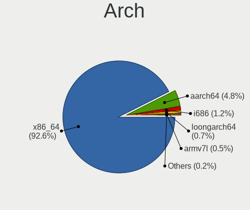
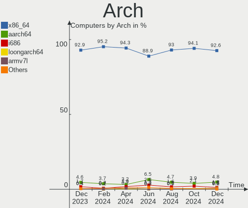
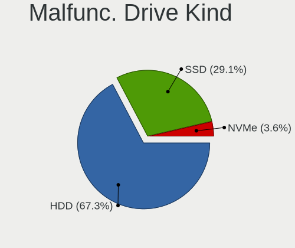
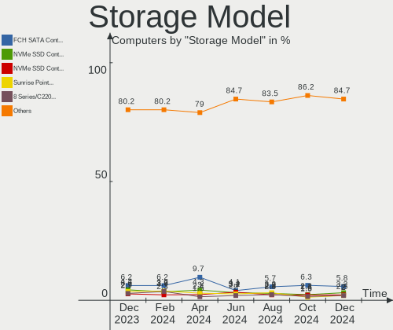
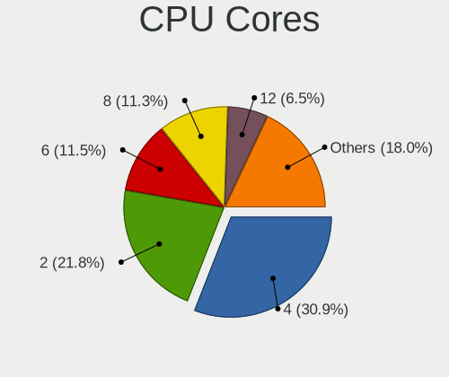

Debian - Hardware Trends
------------------------

A project to identify most popular hardware characteristics and track their change
over time based on data collected by Linux users at https://Linux-Hardware.org.

Anyone can contribute to this report by the [hw-probe](https://github.com/linuxhw/hw-probe) tool:

    sudo -E hw-probe -all -upload

This is a report for all computer types. See also reports for [desktops](/Dist/Debian/Desktop/README.md) and [notebooks](/Dist/Debian/Notebook/README.md).

This report is for one last month. Overall report since the beginning of time: [TestDays](https://github.com/linuxhw/TestDays)

Period: Jun, 2023.

Contents
--------

* [ System ](#system)
  - [ OS                       ](#os)
  - [ OS Family                ](#os-family)
  - [ Kernel                   ](#kernel)
  - [ Kernel Family            ](#kernel-family)
  - [ Kernel Major Ver.        ](#kernel-major-ver)
  - [ Arch                     ](#arch)
  - [ DE                       ](#de)
  - [ Display Server           ](#display-server)
  - [ Display Manager          ](#display-manager)
  - [ OS Lang                  ](#os-lang)
  - [ Boot Mode                ](#boot-mode)
  - [ Filesystem               ](#filesystem)
  - [ Part. scheme             ](#part-scheme)
  - [ Dual Boot with Linux/BSD ](#dual-boot-with-linuxbsd)
  - [ Dual Boot (Win)          ](#dual-boot-win)

* [ Board ](#board)
  - [ Vendor                   ](#vendor)
  - [ Model                    ](#model)
  - [ Model Family             ](#model-family)
  - [ MFG Year                 ](#mfg-year)
  - [ Form Factor              ](#form-factor)
  - [ Secure Boot              ](#secure-boot)
  - [ Coreboot                 ](#coreboot)
  - [ RAM Size                 ](#ram-size)
  - [ RAM Used                 ](#ram-used)
  - [ Total Drives             ](#total-drives)
  - [ Has CD-ROM               ](#has-cd-rom)
  - [ Has Ethernet             ](#has-ethernet)
  - [ Has WiFi                 ](#has-wifi)
  - [ Has Bluetooth            ](#has-bluetooth)

* [ Location ](#location)
  - [ Country                  ](#country)
  - [ City                     ](#city)

* [ Drives ](#drives)
  - [ Drive Vendor             ](#drive-vendor)
  - [ Drive Model              ](#drive-model)
  - [ HDD Vendor               ](#hdd-vendor)
  - [ SSD Vendor               ](#ssd-vendor)
  - [ Drive Kind               ](#drive-kind)
  - [ Drive Connector          ](#drive-connector)
  - [ Drive Size               ](#drive-size)
  - [ Space Total              ](#space-total)
  - [ Space Used               ](#space-used)
  - [ Malfunc. Drives          ](#malfunc-drives)
  - [ Malfunc. Drive Vendor    ](#malfunc-drive-vendor)
  - [ Malfunc. HDD Vendor      ](#malfunc-hdd-vendor)
  - [ Malfunc. Drive Kind      ](#malfunc-drive-kind)
  - [ Failed Drives            ](#failed-drives)
  - [ Failed Drive Vendor      ](#failed-drive-vendor)
  - [ Drive Status             ](#drive-status)

* [ Storage controller ](#storage-controller)
  - [ Storage Vendor           ](#storage-vendor)
  - [ Storage Model            ](#storage-model)
  - [ Storage Kind             ](#storage-kind)

* [ Processor ](#processor)
  - [ CPU Vendor               ](#cpu-vendor)
  - [ CPU Model                ](#cpu-model)
  - [ CPU Model Family         ](#cpu-model-family)
  - [ CPU Cores                ](#cpu-cores)
  - [ CPU Sockets              ](#cpu-sockets)
  - [ CPU Threads              ](#cpu-threads)
  - [ CPU Op-Modes             ](#cpu-op-modes)
  - [ CPU Microcode            ](#cpu-microcode)
  - [ CPU Microarch            ](#cpu-microarch)

* [ Graphics ](#graphics)
  - [ GPU Vendor               ](#gpu-vendor)
  - [ GPU Model                ](#gpu-model)
  - [ GPU Combo                ](#gpu-combo)
  - [ GPU Driver               ](#gpu-driver)
  - [ GPU Memory               ](#gpu-memory)

* [ Monitor ](#monitor)
  - [ Monitor Vendor           ](#monitor-vendor)
  - [ Monitor Model            ](#monitor-model)
  - [ Monitor Resolution       ](#monitor-resolution)
  - [ Monitor Diagonal         ](#monitor-diagonal)
  - [ Monitor Width            ](#monitor-width)
  - [ Aspect Ratio             ](#aspect-ratio)
  - [ Monitor Area             ](#monitor-area)
  - [ Pixel Density            ](#pixel-density)
  - [ Multiple Monitors        ](#multiple-monitors)

* [ Network ](#network)
  - [ Net Controller Vendor    ](#net-controller-vendor)
  - [ Net Controller Model     ](#net-controller-model)
  - [ Wireless Vendor          ](#wireless-vendor)
  - [ Wireless Model           ](#wireless-model)
  - [ Ethernet Vendor          ](#ethernet-vendor)
  - [ Ethernet Model           ](#ethernet-model)
  - [ Net Controller Kind      ](#net-controller-kind)
  - [ Used Controller          ](#used-controller)
  - [ NICs                     ](#nics)
  - [ IPv6                     ](#ipv6)

* [ Bluetooth ](#bluetooth)
  - [ Bluetooth Vendor         ](#bluetooth-vendor)
  - [ Bluetooth Model          ](#bluetooth-model)

* [ Sound ](#sound)
  - [ Sound Vendor             ](#sound-vendor)
  - [ Sound Model              ](#sound-model)

* [ Memory ](#memory)
  - [ Memory Vendor            ](#memory-vendor)
  - [ Memory Model             ](#memory-model)
  - [ Memory Kind              ](#memory-kind)
  - [ Memory Form Factor       ](#memory-form-factor)
  - [ Memory Size              ](#memory-size)
  - [ Memory Speed             ](#memory-speed)

* [ Printers & scanners ](#printers--scanners)
  - [ Printer Vendor           ](#printer-vendor)
  - [ Printer Model            ](#printer-model)
  - [ Scanner Vendor           ](#scanner-vendor)
  - [ Scanner Model            ](#scanner-model)

* [ Camera ](#camera)
  - [ Camera Vendor            ](#camera-vendor)
  - [ Camera Model             ](#camera-model)

* [ Security ](#security)
  - [ Fingerprint Vendor       ](#fingerprint-vendor)
  - [ Fingerprint Model        ](#fingerprint-model)
  - [ Chipcard Vendor          ](#chipcard-vendor)
  - [ Chipcard Model           ](#chipcard-model)

* [ Unsupported ](#unsupported)
  - [ Unsupported Devices      ](#unsupported-devices)
  - [ Unsupported Device Types ](#unsupported-device-types)

System
------

OS
--

Installed operating systems

| Name      | Computers | Percent |
|-----------|-----------|---------|
| Debian 12 | 244       | 56.48%  |
| Debian 11 | 164       | 37.96%  |
| Debian    | 12        | 2.78%   |
| Debian 10 | 9         | 2.08%   |
| Debian 9  | 2         | 0.46%   |
| Debian 22 | 1         | 0.23%   |

OS Family
---------

OS without a version

| Name   | Computers | Percent |
|--------|-----------|---------|
| Debian | 432       | 100%    |

Kernel
------

Version of the Linux kernel

| Version                    | Computers | Percent |
|----------------------------|-----------|---------|
| 6.1.0-9-amd64              | 175       | 40.51%  |
| 5.10.0-23-amd64            | 81        | 18.75%  |
| 6.1.0-4-amd64              | 48        | 11.11%  |
| 5.10.0-22-amd64            | 13        | 3.01%   |
| 6.1.0-0.deb11.7-amd64      | 8         | 1.85%   |
| 5.15.107-2-pve             | 8         | 1.85%   |
| 6.3.0-1-amd64              | 7         | 1.62%   |
| 5.10.0-20-amd64            | 6         | 1.39%   |
| 4.19.0-10-amd64            | 5         | 1.16%   |
| 6.1.21-v8+                 | 4         | 0.93%   |
| 5.10.0-21-amd64            | 4         | 0.93%   |
| 5.15.108-1-pve             | 3         | 0.69%   |
| 5.15.102-1-pve             | 3         | 0.69%   |
| 5.10.0-15-amd64            | 3         | 0.69%   |
| 6.3.9-1-liquorix-amd64     | 2         | 0.46%   |
| 6.2.16-3-pve               | 2         | 0.46%   |
| 6.2.16-2-pve               | 2         | 0.46%   |
| 6.1.0-9-686-pae            | 2         | 0.46%   |
| 6.0.0-6mx-amd64            | 2         | 0.46%   |
| 5.15.0-starfive            | 2         | 0.46%   |
| 5.10.0-8-amd64             | 2         | 0.46%   |
| 5.10.0-23-rt-amd64         | 2         | 0.46%   |
| 5.10.0-23-686              | 2         | 0.46%   |
| 6.3.8-1-liquorix-amd64     | 1         | 0.23%   |
| 6.3.5-x64v3-xanmod1        | 1         | 0.23%   |
| 6.3.5-titanide             | 1         | 0.23%   |
| 6.3.3-tkg-cfs              | 1         | 0.23%   |
| 6.3.10-x64v3-xanmod1       | 1         | 0.23%   |
| 6.2.8-safran               | 1         | 0.23%   |
| 6.2.8                      | 1         | 0.23%   |
| 6.2.6-1-pve                | 1         | 0.23%   |
| 6.2.16-dell-latitude-e5510 | 1         | 0.23%   |
| 6.2.12                     | 1         | 0.23%   |
| 6.2.11-2-pve               | 1         | 0.23%   |
| 6.1.31-dell-latitude-e5510 | 1         | 0.23%   |
| 6.1.27-mab64               | 1         | 0.23%   |
| 6.1.26-sunxi               | 1         | 0.23%   |
| 6.1.26-05272-g26c406245a2c | 1         | 0.23%   |
| 6.1.11-meson64             | 1         | 0.23%   |
| 6.1.0-9-rt-amd64           | 1         | 0.23%   |

Kernel Family
-------------

Linux kernel without a distro release

| Version  | Computers | Percent |
|----------|-----------|---------|
| 6.1.0    | 240       | 55.56%  |
| 5.10.0   | 122       | 28.24%  |
| 5.15.107 | 9         | 2.08%   |
| 4.19.0   | 8         | 1.85%   |
| 6.3.0    | 7         | 1.62%   |
| 6.2.16   | 5         | 1.16%   |
| 6.1.21   | 4         | 0.93%   |
| 6.0.0    | 4         | 0.93%   |
| 5.15.108 | 3         | 0.69%   |
| 5.15.102 | 3         | 0.69%   |
| 6.3.9    | 2         | 0.46%   |
| 6.3.5    | 2         | 0.46%   |
| 6.2.8    | 2         | 0.46%   |
| 6.1.26   | 2         | 0.46%   |
| 5.15.0   | 2         | 0.46%   |
| 6.3.8    | 1         | 0.23%   |
| 6.3.3    | 1         | 0.23%   |
| 6.3.10   | 1         | 0.23%   |
| 6.2.6    | 1         | 0.23%   |
| 6.2.12   | 1         | 0.23%   |
| 6.2.11   | 1         | 0.23%   |
| 6.1.31   | 1         | 0.23%   |
| 6.1.27   | 1         | 0.23%   |
| 6.1.11   | 1         | 0.23%   |
| 5.15.94  | 1         | 0.23%   |
| 5.15.83  | 1         | 0.23%   |
| 5.15.79  | 1         | 0.23%   |
| 5.10.78  | 1         | 0.23%   |
| 5.10.57  | 1         | 0.23%   |
| 5.10.181 | 1         | 0.23%   |
| 5.10.136 | 1         | 0.23%   |
| 4.9.0    | 1         | 0.23%   |

Kernel Major Ver.
-----------------

Linux kernel major version

| Version | Computers | Percent |
|---------|-----------|---------|
| 6.1     | 249       | 57.64%  |
| 5.10    | 126       | 29.17%  |
| 5.15    | 20        | 4.63%   |
| 6.3     | 14        | 3.24%   |
| 6.2     | 10        | 2.31%   |
| 4.19    | 8         | 1.85%   |
| 6.0     | 4         | 0.93%   |
| 4.9     | 1         | 0.23%   |

Arch
----

OS architecture (x86_64, i586, etc.)

| Name    | Computers | Percent |
|---------|-----------|---------|
| x86_64  | 411       | 95.14%  |
| i686    | 7         | 1.62%   |
| aarch64 | 7         | 1.62%   |
| armv7l  | 5         | 1.16%   |
| riscv64 | 2         | 0.46%   |

DE
--

Desktop Environment

| Name             | Computers | Percent |
|------------------|-----------|---------|
| Unknown          | 132       | 30.56%  |
| GNOME            | 122       | 28.24%  |
| KDE5             | 56        | 12.96%  |
| XFCE             | 49        | 11.34%  |
| MATE             | 23        | 5.32%   |
| X-Cinnamon       | 20        | 4.63%   |
| LXDE             | 8         | 1.85%   |
| LXQt             | 4         | 0.93%   |
| GNOME Classic    | 3         | 0.69%   |
| Openbox          | 2         | 0.46%   |
| lightdm-xsession | 2         | 0.46%   |
| KDE              | 2         | 0.46%   |
| i3               | 2         | 0.46%   |
| Cinnamon         | 2         | 0.46%   |
| Budgie           | 2         | 0.46%   |
| Trinity          | 1         | 0.23%   |
| GNOME Flashback  | 1         | 0.23%   |
| Dwm              | 1         | 0.23%   |

Display Server
--------------

X11 or Wayland

| Name    | Computers | Percent |
|---------|-----------|---------|
| X11     | 200       | 46.3%   |
| Unknown | 103       | 23.84%  |
| Wayland | 97        | 22.45%  |
| Tty     | 32        | 7.41%   |

Display Manager
---------------

SDDM, LightDM, etc.

| Name    | Computers | Percent |
|---------|-----------|---------|
| Unknown | 206       | 47.69%  |
| LightDM | 88        | 20.37%  |
| GDM3    | 57        | 13.19%  |
| SDDM    | 40        | 9.26%   |
| GDM     | 36        | 8.33%   |
| LXDM    | 4         | 0.93%   |
| TDM     | 1         | 0.23%   |

OS Lang
-------

Language

| Lang    | Computers | Percent |
|---------|-----------|---------|
| en_US   | 151       | 34.95%  |
| ru_RU   | 66        | 15.28%  |
| Unknown | 36        | 8.33%   |
| de_DE   | 35        | 8.1%    |
| en_GB   | 26        | 6.02%   |
| fr_FR   | 14        | 3.24%   |
| pt_BR   | 12        | 2.78%   |
| en_CA   | 9         | 2.08%   |
| it_IT   | 8         | 1.85%   |
| en_AU   | 7         | 1.62%   |
| C       | 6         | 1.39%   |
| pl_PL   | 5         | 1.16%   |
| es_ES   | 5         | 1.16%   |
| es_AR   | 5         | 1.16%   |
| zh_CN   | 4         | 0.93%   |
| en_IE   | 4         | 0.93%   |
| tr_TR   | 3         | 0.69%   |
| en_IN   | 3         | 0.69%   |
| es_VE   | 2         | 0.46%   |
| es_MX   | 2         | 0.46%   |
| es_CU   | 2         | 0.46%   |
| en_ZA   | 2         | 0.46%   |
| de_AT   | 2         | 0.46%   |
| zh_TW   | 1         | 0.23%   |
| vi_VN   | 1         | 0.23%   |
| sv_SE   | 1         | 0.23%   |
| ru_UA   | 1         | 0.23%   |
| pt_PT   | 1         | 0.23%   |
| nl_NL   | 1         | 0.23%   |
| id_ID   | 1         | 0.23%   |
| fr_CH   | 1         | 0.23%   |
| fi_FI   | 1         | 0.23%   |
| eu_ES   | 1         | 0.23%   |
| es_US   | 1         | 0.23%   |
| es_PE   | 1         | 0.23%   |
| es_EC   | 1         | 0.23%   |
| es_CO   | 1         | 0.23%   |
| en_SG   | 1         | 0.23%   |
| en_NZ   | 1         | 0.23%   |
| en_DK   | 1         | 0.23%   |

Boot Mode
---------

EFI or BIOS

| Mode | Computers | Percent |
|------|-----------|---------|
| BIOS | 221       | 51.16%  |
| EFI  | 211       | 48.84%  |

Filesystem
----------

Type of filesystem

| Type    | Computers | Percent |
|---------|-----------|---------|
| Ext4    | 308       | 71.3%   |
| Overlay | 92        | 21.3%   |
| Btrfs   | 15        | 3.47%   |
| Zfs     | 7         | 1.62%   |
| Tmpfs   | 4         | 0.93%   |
| Ext2    | 3         | 0.69%   |
| Xfs     | 2         | 0.46%   |
| F2fs    | 1         | 0.23%   |

Part. scheme
------------

Scheme of partitioning

| Type    | Computers | Percent |
|---------|-----------|---------|
| GPT     | 243       | 56.25%  |
| MBR     | 106       | 24.54%  |
| Unknown | 83        | 19.21%  |

Dual Boot with Linux/BSD
------------------------

Hosting more than one Linux/BSD

| Dual boot | Computers | Percent |
|-----------|-----------|---------|
| No        | 355       | 82.18%  |
| Yes       | 77        | 17.82%  |

Dual Boot (Win)
---------------

Hosting Linux and Windows

| Dual boot | Computers | Percent |
|-----------|-----------|---------|
| No        | 283       | 65.51%  |
| Yes       | 149       | 34.49%  |

Board
-----

Vendor
------

Motherboard manufacturer

| Name                    | Computers | Percent |
|-------------------------|-----------|---------|
| Lenovo                  | 74        | 17.13%  |
| ASUSTek Computer        | 62        | 14.35%  |
| Dell                    | 50        | 11.57%  |
| Hewlett-Packard         | 42        | 9.72%   |
| Gigabyte Technology     | 33        | 7.64%   |
| Apple                   | 19        | 4.4%    |
| MSI                     | 18        | 4.17%   |
| Acer                    | 17        | 3.94%   |
| ASRock                  | 12        | 2.78%   |
| Aquarius                | 11        | 2.55%   |
| Supermicro              | 10        | 2.31%   |
| Intel                   | 9         | 2.08%   |
| Raspberry Pi Foundation | 7         | 1.62%   |
| Unknown                 | 5         | 1.16%   |
| HUAWEI                  | 4         | 0.93%   |
| Fujitsu                 | 3         | 0.69%   |
| ASRockRack              | 3         | 0.69%   |
| AMI                     | 3         | 0.69%   |
| Toshiba                 | 2         | 0.46%   |
| Shuttle                 | 2         | 0.46%   |
| Pegatron                | 2         | 0.46%   |
| Packard Bell            | 2         | 0.46%   |
| Inventec                | 2         | 0.46%   |
| HONOR                   | 2         | 0.46%   |
| Google                  | 2         | 0.46%   |
| Foxconn                 | 2         | 0.46%   |
| ECS                     | 2         | 0.46%   |
| Biostar                 | 2         | 0.46%   |
| BESSTAR Tech            | 2         | 0.46%   |
| AZW                     | 2         | 0.46%   |
| Xunlong                 | 1         | 0.23%   |
| VIT                     | 1         | 0.23%   |
| Sony                    | 1         | 0.23%   |
| Semp Toshiba            | 1         | 0.23%   |
| Samsung Electronics     | 1         | 0.23%   |
| Positivo                | 1         | 0.23%   |
| OEM                     | 1         | 0.23%   |
| NEC Computers           | 1         | 0.23%   |
| Microsoft               | 1         | 0.23%   |
| Medion                  | 1         | 0.23%   |

Model
-----

Motherboard model

| Name                                      | Computers | Percent |
|-------------------------------------------|-----------|---------|
| Lenovo ThinkCentre M55p 8808D8U           | 12        | 2.78%   |
| Aquarius NS585                            | 11        | 2.55%   |
| ASUS PRIME B450M-K                        | 10        | 2.31%   |
| Unknown                                   | 7         | 1.62%   |
| Apple MacBookAir7,2                       | 6         | 1.39%   |
| ASUS All Series                           | 4         | 0.93%   |
| Supermicro SYS-5039MC-H8TRF               | 3         | 0.69%   |
| HUAWEI BOHK-WAX9X                         | 3         | 0.69%   |
| Gigabyte B550M DS3H                       | 3         | 0.69%   |
| ASUS S20 K29                              | 3         | 0.69%   |
| Supermicro SYS-530MT-H8TNR                | 2         | 0.46%   |
| Pegatron Spring Peak                      | 2         | 0.46%   |
| MSI MS-7817                               | 2         | 0.46%   |
| Lenovo ThinkPad L13 Yoga Gen 2 20VK0019US | 2         | 0.46%   |
| Lenovo IdeaPad Gaming 3 15ACH6 82K2       | 2         | 0.46%   |
| HP Pavilion dv6                           | 2         | 0.46%   |
| HP EliteBook 845 G8 Notebook PC           | 2         | 0.46%   |
| Gigabyte M68MT-S2                         | 2         | 0.46%   |
| Gigabyte H61M-DS2 REV 1.2                 | 2         | 0.46%   |
| Gigabyte B450 AORUS ELITE                 | 2         | 0.46%   |
| ECS G31T-M9                               | 2         | 0.46%   |
| Dell Latitude E7450                       | 2         | 0.46%   |
| Dell Latitude E6430                       | 2         | 0.46%   |
| Dell Latitude E6400                       | 2         | 0.46%   |
| Dell Latitude 5480                        | 2         | 0.46%   |
| Dell Latitude 3320                        | 2         | 0.46%   |
| ASUS TUF Gaming X570-PLUS                 | 2         | 0.46%   |
| ASUS M4A78T-E                             | 2         | 0.46%   |
| ASRockRack X470D4U                        | 2         | 0.46%   |
| Apple MacBookPro5,5                       | 2         | 0.46%   |
| Xunlong Orange Pi Lite                    | 1         | 0.23%   |
| VIT P2423                                 | 1         | 0.23%   |
| Toshiba WT8-A                             | 1         | 0.23%   |
| Toshiba Satellite L45-B                   | 1         | 0.23%   |
| Supermicro X9DRT                          | 1         | 0.23%   |
| Supermicro X8ST3                          | 1         | 0.23%   |
| Supermicro X8DTU                          | 1         | 0.23%   |
| Supermicro SYS-1029U-TRT                  | 1         | 0.23%   |
| Supermicro S10G5                          | 1         | 0.23%   |
| Sony SVE11116FGW                          | 1         | 0.23%   |

Model Family
------------

Motherboard model prefix

| Name                        | Computers | Percent |
|-----------------------------|-----------|---------|
| Lenovo ThinkPad             | 33        | 7.64%   |
| Dell Latitude               | 21        | 4.86%   |
| ASUS PRIME                  | 19        | 4.4%    |
| Lenovo ThinkCentre          | 16        | 3.7%    |
| Acer Aspire                 | 12        | 2.78%   |
| HP EliteBook                | 11        | 2.55%   |
| Dell Inspiron               | 11        | 2.55%   |
| Aquarius NS585              | 11        | 2.55%   |
| Lenovo IdeaPad              | 10        | 2.31%   |
| RPi Raspberry               | 7         | 1.62%   |
| HP Pavilion                 | 7         | 1.62%   |
| Apple MacBookAir7           | 7         | 1.62%   |
| Unknown                     | 7         | 1.62%   |
| ASUS TUF                    | 5         | 1.16%   |
| HP Laptop                   | 4         | 0.93%   |
| Dell XPS                    | 4         | 0.93%   |
| ASUS VivoBook               | 4         | 0.93%   |
| ASUS All                    | 4         | 0.93%   |
| Acer TravelMate             | 4         | 0.93%   |
| Supermicro SYS-5039MC-H8TRF | 3         | 0.69%   |
| HUAWEI BOHK-WAX9X           | 3         | 0.69%   |
| HP Compaq                   | 3         | 0.69%   |
| Gigabyte B550M              | 3         | 0.69%   |
| Fujitsu LIFEBOOK            | 3         | 0.69%   |
| Dell Precision              | 3         | 0.69%   |
| Dell PowerEdge              | 3         | 0.69%   |
| ASUS ZenBook                | 3         | 0.69%   |
| ASUS S20                    | 3         | 0.69%   |
| ASUS ROG                    | 3         | 0.69%   |
| Supermicro SYS-530MT-H8TNR  | 2         | 0.46%   |
| Pegatron Spring             | 2         | 0.46%   |
| Packard Bell EasyNote       | 2         | 0.46%   |
| MSI MS-7817                 | 2         | 0.46%   |
| Lenovo Yoga                 | 2         | 0.46%   |
| Lenovo Legion               | 2         | 0.46%   |
| HP OMEN                     | 2         | 0.46%   |
| Gigabyte M68MT-S2           | 2         | 0.46%   |
| Gigabyte H61M-DS2           | 2         | 0.46%   |
| Gigabyte GA-78LMT-USB3      | 2         | 0.46%   |
| Gigabyte B450M              | 2         | 0.46%   |

MFG Year
--------

Motherboard manufacture year

| Year    | Computers | Percent |
|---------|-----------|---------|
| 2019    | 49        | 11.34%  |
| 2020    | 41        | 9.49%   |
| 2018    | 36        | 8.33%   |
| 2022    | 32        | 7.41%   |
| 2021    | 30        | 6.94%   |
| 2014    | 26        | 6.02%   |
| 2017    | 25        | 5.79%   |
| 2012    | 23        | 5.32%   |
| 2010    | 22        | 5.09%   |
| 2007    | 21        | 4.86%   |
| 2009    | 20        | 4.63%   |
| 2008    | 19        | 4.4%    |
| 2013    | 18        | 4.17%   |
| 2015    | 17        | 3.94%   |
| 2011    | 16        | 3.7%    |
| 2023    | 13        | 3.01%   |
| Unknown | 12        | 2.78%   |
| 2016    | 10        | 2.31%   |
| 2006    | 2         | 0.46%   |

Form Factor
-----------

Physical design of the computer

| Name           | Computers | Percent |
|----------------|-----------|---------|
| Notebook       | 214       | 49.54%  |
| Desktop        | 171       | 39.58%  |
| System on chip | 13        | 3.01%   |
| Mini pc        | 10        | 2.31%   |
| Convertible    | 9         | 2.08%   |
| Server         | 9         | 2.08%   |
| All in one     | 3         | 0.69%   |
| Tablet         | 2         | 0.46%   |
| Stick pc       | 1         | 0.23%   |

Secure Boot
-----------

Enabled or disabled

| State    | Computers | Percent |
|----------|-----------|---------|
| Disabled | 410       | 94.91%  |
| Enabled  | 22        | 5.09%   |

Coreboot
--------

Have coreboot on board

| Used | Computers | Percent |
|------|-----------|---------|
| No   | 430       | 99.54%  |
| Yes  | 2         | 0.46%   |

RAM Size
--------

Total RAM memory

| Size in GB      | Computers | Percent |
|-----------------|-----------|---------|
| 4.01-8.0        | 112       | 25.93%  |
| 3.01-4.0        | 70        | 16.2%   |
| 8.01-16.0       | 69        | 15.97%  |
| 16.01-24.0      | 57        | 13.19%  |
| 32.01-64.0      | 52        | 12.04%  |
| 1.01-2.0        | 23        | 5.32%   |
| 64.01-256.0     | 22        | 5.09%   |
| 2.01-3.0        | 9         | 2.08%   |
| 24.01-32.0      | 7         | 1.62%   |
| 0.51-1.0        | 6         | 1.39%   |
| More than 256.0 | 3         | 0.69%   |
| 0.01-0.5        | 2         | 0.46%   |

RAM Used
--------

Used RAM memory

| Used GB     | Computers | Percent |
|-------------|-----------|---------|
| 1.01-2.0    | 105       | 24.31%  |
| 2.01-3.0    | 92        | 21.3%   |
| 0.51-1.0    | 78        | 18.06%  |
| 4.01-8.0    | 67        | 15.51%  |
| 3.01-4.0    | 42        | 9.72%   |
| 0.01-0.5    | 17        | 3.94%   |
| 8.01-16.0   | 16        | 3.7%    |
| 16.01-24.0  | 7         | 1.62%   |
| 32.01-64.0  | 4         | 0.93%   |
| 64.01-256.0 | 4         | 0.93%   |

Total Drives
------------

Number of drives on board

| Drives | Computers | Percent |
|--------|-----------|---------|
| 1      | 271       | 62.73%  |
| 2      | 91        | 21.06%  |
| 3      | 37        | 8.56%   |
| 4      | 13        | 3.01%   |
| 6      | 5         | 1.16%   |
| 5      | 5         | 1.16%   |
| 10     | 2         | 0.46%   |
| 8      | 2         | 0.46%   |
| 0      | 2         | 0.46%   |
| 47     | 1         | 0.23%   |
| 29     | 1         | 0.23%   |
| 12     | 1         | 0.23%   |
| 9      | 1         | 0.23%   |

Has CD-ROM
----------

Has CD-ROM on board

| Presented | Computers | Percent |
|-----------|-----------|---------|
| No        | 314       | 72.69%  |
| Yes       | 118       | 27.31%  |

Has Ethernet
------------

Has Ethernet on board

| Presented | Computers | Percent |
|-----------|-----------|---------|
| Yes       | 377       | 87.27%  |
| No        | 55        | 12.73%  |

Has WiFi
--------

Has WiFi module

| Presented | Computers | Percent |
|-----------|-----------|---------|
| Yes       | 287       | 66.44%  |
| No        | 145       | 33.56%  |

Has Bluetooth
-------------

Has Bluetooth module

| Presented | Computers | Percent |
|-----------|-----------|---------|
| Yes       | 224       | 51.85%  |
| No        | 208       | 48.15%  |

Location
--------

Country
-------

Geographic location (country)

| Country      | Computers | Percent |
|--------------|-----------|---------|
| USA          | 75        | 17.36%  |
| Russia       | 71        | 16.44%  |
| Germany      | 54        | 12.5%   |
| Brazil       | 22        | 5.09%   |
| France       | 18        | 4.17%   |
| UK           | 17        | 3.94%   |
| Australia    | 13        | 3.01%   |
| Italy        | 12        | 2.78%   |
| Canada       | 12        | 2.78%   |
| Spain        | 10        | 2.31%   |
| Poland       | 9         | 2.08%   |
| China        | 8         | 1.85%   |
| Czechia      | 7         | 1.62%   |
| Austria      | 7         | 1.62%   |
| Argentina    | 7         | 1.62%   |
| Sweden       | 6         | 1.39%   |
| Netherlands  | 6         | 1.39%   |
| Mexico       | 5         | 1.16%   |
| India        | 4         | 0.93%   |
| Denmark      | 4         | 0.93%   |
| Turkey       | 3         | 0.69%   |
| Switzerland  | 3         | 0.69%   |
| Myanmar      | 3         | 0.69%   |
| Israel       | 3         | 0.69%   |
| Vietnam      | 2         | 0.46%   |
| Venezuela    | 2         | 0.46%   |
| Ukraine      | 2         | 0.46%   |
| Slovakia     | 2         | 0.46%   |
| Romania      | 2         | 0.46%   |
| Norway       | 2         | 0.46%   |
| Malaysia     | 2         | 0.46%   |
| Ireland      | 2         | 0.46%   |
| Indonesia    | 2         | 0.46%   |
| Finland      | 2         | 0.46%   |
| Ecuador      | 2         | 0.46%   |
| Cuba         | 2         | 0.46%   |
| Bulgaria     | 2         | 0.46%   |
| Belgium      | 2         | 0.46%   |
| Taiwan       | 1         | 0.23%   |
| South Africa | 1         | 0.23%   |

City
----

Geographic location (city)

| City              | Computers | Percent |
|-------------------|-----------|---------|
| Voronezh          | 48        | 11.11%  |
| Bangor            | 29        | 6.71%   |
| Moscow            | 8         | 1.85%   |
| Paris             | 6         | 1.39%   |
| Melbourne         | 6         | 1.39%   |
| Toronto           | 5         | 1.16%   |
| St Petersburg     | 4         | 0.93%   |
| Karlsruhe         | 4         | 0.93%   |
| Yangon            | 3         | 0.69%   |
| Warsaw            | 3         | 0.69%   |
| Vila Velha        | 3         | 0.69%   |
| Vienna            | 3         | 0.69%   |
| Siegsdorf         | 3         | 0.69%   |
| Samara            | 3         | 0.69%   |
| Prague            | 3         | 0.69%   |
| Manchester        | 3         | 0.69%   |
| London            | 3         | 0.69%   |
| Istanbul          | 3         | 0.69%   |
| Hofheim am Taunus | 3         | 0.69%   |
| Bonn              | 3         | 0.69%   |
| Berlin            | 3         | 0.69%   |
| Beijing           | 3         | 0.69%   |
| Amsterdam         | 3         | 0.69%   |
| Sydney            | 2         | 0.46%   |
| Stockholm         | 2         | 0.46%   |
| Seville           | 2         | 0.46%   |
| Sao Paulo         | 2         | 0.46%   |
| Rome              | 2         | 0.46%   |
| Rio de Janeiro    | 2         | 0.46%   |
| Poznan            | 2         | 0.46%   |
| Philadelphia      | 2         | 0.46%   |
| Novosibirsk       | 2         | 0.46%   |
| Milan             | 2         | 0.46%   |
| Marseille         | 2         | 0.46%   |
| Malmo             | 2         | 0.46%   |
| Lüneburg         | 2         | 0.46%   |
| Jianshui          | 2         | 0.46%   |
| Indianapolis      | 2         | 0.46%   |
| Havana            | 2         | 0.46%   |
| Gresham           | 2         | 0.46%   |

Drives
------

Drive Vendor
------------

Hard drive vendors

| Vendor                      | Computers | Drives | Percent |
|-----------------------------|-----------|--------|---------|
| WDC                         | 90        | 126    | 14.59%  |
| Samsung Electronics         | 82        | 97     | 13.29%  |
| Seagate                     | 61        | 144    | 9.89%   |
| Crucial                     | 53        | 62     | 8.59%   |
| Toshiba                     | 33        | 37     | 5.35%   |
| Kingston                    | 29        | 30     | 4.7%    |
| SanDisk                     | 27        | 29     | 4.38%   |
| Unknown                     | 25        | 26     | 4.05%   |
| Hitachi                     | 24        | 24     | 3.89%   |
| A-DATA Technology           | 17        | 17     | 2.76%   |
| SK hynix                    | 11        | 11     | 1.78%   |
| Intel                       | 10        | 12     | 1.62%   |
| HGST                        | 10        | 23     | 1.62%   |
| Apple                       | 10        | 10     | 1.62%   |
| Micron Technology           | 9         | 9      | 1.46%   |
| KIOXIA                      | 8         | 8      | 1.3%    |
| Kingston Technology Company | 8         | 9      | 1.3%    |
| Intenso                     | 8         | 8      | 1.3%    |
| Transcend                   | 5         | 5      | 0.81%   |
| China                       | 5         | 5      | 0.81%   |
| Unknown                     | 5         | 6      | 0.81%   |
| SPCC                        | 4         | 8      | 0.65%   |
| PNY                         | 4         | 4      | 0.65%   |
| Patriot                     | 4         | 4      | 0.65%   |
| Fujitsu                     | 4         | 4      | 0.65%   |
| SABRENT                     | 3         | 3      | 0.49%   |
| Netac                       | 3         | 3      | 0.49%   |
| LITEON                      | 3         | 3      | 0.49%   |
| JMicron Technology          | 3         | 3      | 0.49%   |
| Hewlett-Packard             | 3         | 3      | 0.49%   |
| ADATA Technology            | 3         | 3      | 0.49%   |
| Western Digital             | 2         | 6      | 0.32%   |
| Team                        | 2         | 2      | 0.32%   |
| Silicon Motion              | 2         | 2      | 0.32%   |
| Realtek Semiconductor       | 2         | 2      | 0.32%   |
| Plextor                     | 2         | 2      | 0.32%   |
| OCZ                         | 2         | 2      | 0.32%   |
| Mushkin                     | 2         | 3      | 0.32%   |
| Maxtor                      | 2         | 2      | 0.32%   |
| Corsair                     | 2         | 2      | 0.32%   |

Drive Model
-----------

Hard drive models

| Model                                               | Computers | Percent |
|-----------------------------------------------------|-----------|---------|
| Crucial CT480BX500SSD1 480GB                        | 14        | 2.05%   |
| Crucial CT500MX500SSD1 500GB                        | 12        | 1.76%   |
| A-DATA SU800 512GB SSD                              | 11        | 1.61%   |
| Seagate ST4000DM004-2CV104 4TB                      | 8         | 1.17%   |
| Kingston SA400S37240G 240GB SSD                     | 8         | 1.17%   |
| Crucial CT1000MX500SSD1 1TB                         | 8         | 1.17%   |
| Hitachi HDS728080PLA380 40Y9028LEN 80GB             | 7         | 1.03%   |
| Samsung NVMe SSD Controller SM981/PM981/PM983 250GB | 6         | 0.88%   |
| Kingston SA400S37480G 480GB SSD                     | 6         | 0.88%   |
| Apple SSD SM0128G 121GB                             | 6         | 0.88%   |
| Seagate ST4000VN008-2DR166 4TB                      | 5         | 0.73%   |
| SanDisk NVMe SSD Drive 1TB                          | 5         | 0.73%   |
| Unknown                                             | 5         | 0.73%   |
| Unknown MMC Card  32GB                              | 4         | 0.59%   |
| Samsung SSD 970 EVO Plus 500GB                      | 4         | 0.59%   |
| Samsung SSD 870 EVO 500GB                           | 4         | 0.59%   |
| Samsung SSD 860 EVO 250GB                           | 4         | 0.59%   |
| Kingston Company SNV2S1000G 1TB                     | 4         | 0.59%   |
| HGST HTS721010A9E630 1TB                            | 4         | 0.59%   |
| WDC WDS100T2B0A-00SM50 1TB SSD                      | 3         | 0.44%   |
| WDC WD800JD-08MSA1 80GB                             | 3         | 0.44%   |
| WDC WD5000LPLX-00ZNTT0 500GB                        | 3         | 0.44%   |
| WDC WD20EZRZ-00Z5HB0 2TB                            | 3         | 0.44%   |
| Toshiba MQ01ABF050 500GB                            | 3         | 0.44%   |
| Toshiba DT01ACA100 1TB                              | 3         | 0.44%   |
| Seagate ST9500420AS 500GB                           | 3         | 0.44%   |
| Seagate ST3808110AS 41N3267 LEN 80GB                | 3         | 0.44%   |
| Seagate ST3000DM001-1ER166 3TB                      | 3         | 0.44%   |
| Samsung SSD 980 500GB                               | 3         | 0.44%   |
| Samsung SSD 980 1TB                                 | 3         | 0.44%   |
| Samsung SSD 970 EVO Plus 1TB                        | 3         | 0.44%   |
| Samsung SSD 860 EVO 500GB                           | 3         | 0.44%   |
| Samsung SSD 850 EVO 250GB                           | 3         | 0.44%   |
| Samsung MZVLB512HBJQ-000L7 512GB                    | 3         | 0.44%   |
| SABRENT Disk 1TB                                    | 3         | 0.44%   |
| KIOXIA KBG40ZNS256G NVMe 256GB                      | 3         | 0.44%   |
| Kingston SA400S37120G 120GB SSD                     | 3         | 0.44%   |
| WDC WDS500G2B0A-00SM50 500GB SSD                    | 2         | 0.29%   |
| WDC WDS250G2B0A-00SM50 250GB SSD                    | 2         | 0.29%   |
| WDC WDS240G2G0A-00JH30 240GB SSD                    | 2         | 0.29%   |

HDD Vendor
----------

Hard disk drive vendors

| Vendor              | Computers | Drives | Percent |
|---------------------|-----------|--------|---------|
| WDC                 | 68        | 88     | 35.05%  |
| Seagate             | 60        | 141    | 30.93%  |
| Toshiba             | 24        | 27     | 12.37%  |
| Hitachi             | 24        | 24     | 12.37%  |
| HGST                | 10        | 23     | 5.15%   |
| Fujitsu             | 4         | 4      | 2.06%   |
| Maxtor              | 2         | 2      | 1.03%   |
| Unknown             | 1         | 1      | 0.52%   |
| Samsung Electronics | 1         | 1      | 0.52%   |

SSD Vendor
----------

Solid state drive vendors

| Vendor              | Computers | Drives | Percent |
|---------------------|-----------|--------|---------|
| Crucial             | 43        | 50     | 19.28%  |
| Samsung Electronics | 32        | 35     | 14.35%  |
| Kingston            | 23        | 24     | 10.31%  |
| WDC                 | 16        | 23     | 7.17%   |
| SanDisk             | 14        | 14     | 6.28%   |
| A-DATA Technology   | 12        | 12     | 5.38%   |
| Apple               | 9         | 9      | 4.04%   |
| Intenso             | 8         | 8      | 3.59%   |
| China               | 5         | 5      | 2.24%   |
| Transcend           | 4         | 4      | 1.79%   |
| PNY                 | 4         | 4      | 1.79%   |
| Intel               | 4         | 6      | 1.79%   |
| SPCC                | 3         | 6      | 1.35%   |
| Micron Technology   | 3         | 3      | 1.35%   |
| LITEON              | 3         | 3      | 1.35%   |
| Toshiba             | 2         | 2      | 0.9%    |
| Team                | 2         | 2      | 0.9%    |
| SK hynix            | 2         | 2      | 0.9%    |
| Seagate             | 2         | 3      | 0.9%    |
| Plextor             | 2         | 2      | 0.9%    |
| Patriot             | 2         | 2      | 0.9%    |
| OCZ                 | 2         | 2      | 0.9%    |
| Netac               | 2         | 2      | 0.9%    |
| Hewlett-Packard     | 2         | 2      | 0.9%    |
| Wellcomm            | 1         | 1      | 0.45%   |
| Verbatim            | 1         | 1      | 0.45%   |
| SSD                 | 1         | 1      | 0.45%   |
| S3+                 | 1         | 1      | 0.45%   |
| Pioneer             | 1         | 1      | 0.45%   |
| Origin              | 1         | 1      | 0.45%   |
| OCZ-VERTEX3         | 1         | 1      | 0.45%   |
| MicroFrom           | 1         | 1      | 0.45%   |
| LITEONIT            | 1         | 1      | 0.45%   |
| Lenovo              | 1         | 1      | 0.45%   |
| KOWIN               | 1         | 1      | 0.45%   |
| KIOXIA-EXCERIA      | 1         | 1      | 0.45%   |
| GOODRAM             | 1         | 1      | 0.45%   |
| GOFATOO             | 1         | 1      | 0.45%   |
| FORESEE             | 1         | 1      | 0.45%   |
| External            | 1         | 2      | 0.45%   |

Drive Kind
----------

HDD or SSD

| Kind    | Computers | Drives | Percent |
|---------|-----------|--------|---------|
| SSD     | 201       | 249    | 35.89%  |
| HDD     | 170       | 311    | 30.36%  |
| NVMe    | 154       | 200    | 27.5%   |
| MMC     | 30        | 31     | 5.36%   |
| Unknown | 5         | 5      | 0.89%   |

Drive Connector
---------------

SATA, SAS, NVMe, etc.

| Type | Computers | Drives | Percent |
|------|-----------|--------|---------|
| SATA | 307       | 506    | 60.31%  |
| NVMe | 149       | 193    | 29.27%  |
| MMC  | 30        | 31     | 5.89%   |
| SAS  | 23        | 66     | 4.52%   |

Drive Size
----------

Size of hard drive

| Size in TB | Computers | Drives | Percent |
|------------|-----------|--------|---------|
| 0.01-0.5   | 240       | 285    | 60.45%  |
| 0.51-1.0   | 88        | 115    | 22.17%  |
| 1.01-2.0   | 30        | 46     | 7.56%   |
| 3.01-4.0   | 20        | 50     | 5.04%   |
| 2.01-3.0   | 7         | 8      | 1.76%   |
| 4.01-10.0  | 7         | 23     | 1.76%   |
| 10.01-20.0 | 5         | 33     | 1.26%   |

Space Total
-----------

Amount of disk space available on the file system

| Size in GB     | Computers | Percent |
|----------------|-----------|---------|
| Unknown        | 94        | 21.76%  |
| 101-250        | 91        | 21.06%  |
| 251-500        | 79        | 18.29%  |
| 501-1000       | 48        | 11.11%  |
| 1001-2000      | 33        | 7.64%   |
| More than 3000 | 21        | 4.86%   |
| 1-20           | 20        | 4.63%   |
| 51-100         | 20        | 4.63%   |
| 21-50          | 16        | 3.7%    |
| 2001-3000      | 10        | 2.31%   |

Space Used
----------

Amount of used disk space

| Used GB        | Computers | Percent |
|----------------|-----------|---------|
| 1-20           | 136       | 31.48%  |
| Unknown        | 94        | 21.76%  |
| 21-50          | 53        | 12.27%  |
| 101-250        | 47        | 10.88%  |
| 51-100         | 32        | 7.41%   |
| 251-500        | 27        | 6.25%   |
| 501-1000       | 18        | 4.17%   |
| 1001-2000      | 12        | 2.78%   |
| More than 3000 | 8         | 1.85%   |
| 2001-3000      | 5         | 1.16%   |

Malfunc. Drives
---------------

Drive models with a malfunction

| Model                                        | Computers | Drives | Percent |
|----------------------------------------------|-----------|--------|---------|
| ZHITAI TiPlus5000 512GB                      | 1         | 1      | 1.56%   |
| Western Digital SN730 500GB                  | 1         | 2      | 1.56%   |
| WDC WDS120G2G0B-00EPW0 120GB SSD             | 1         | 1      | 1.56%   |
| WDC WD5000LPVT-08G33T1 500GB                 | 1         | 1      | 1.56%   |
| WDC WD400BD-60LRA0 40GB                      | 1         | 1      | 1.56%   |
| WDC WD3200AAJS-00L7A0 320GB                  | 1         | 1      | 1.56%   |
| WDC WD2500AAKS-00VSA0 250GB                  | 1         | 1      | 1.56%   |
| WDC WD20PURX-64AKYY0 2TB                     | 1         | 1      | 1.56%   |
| WDC WD20EARX-00PASB0 2TB                     | 1         | 1      | 1.56%   |
| WDC WD2002FAEX-007BA0 2TB                    | 1         | 1      | 1.56%   |
| WDC WD1600YS-18SHB2 160GB                    | 1         | 1      | 1.56%   |
| WDC WD1600AAJS-00B4A0 160GB                  | 1         | 1      | 1.56%   |
| WDC WD10EZEX-00WN4A0 1TB                     | 1         | 1      | 1.56%   |
| WDC WD10EALX-009BA0 1TB                      | 1         | 1      | 1.56%   |
| WDC WD10EADS-00L5B1 1TB                      | 1         | 1      | 1.56%   |
| WDC WD Blue SA510 2.5 1000GB SSD             | 1         | 1      | 1.56%   |
| Transcend TS256GSSD230S 256GB                | 1         | 1      | 1.56%   |
| Toshiba MQ01ABF050 500GB                     | 1         | 1      | 1.56%   |
| Toshiba MQ01ABD050V 500GB                    | 1         | 1      | 1.56%   |
| Toshiba MK7559GSXP 752GB                     | 1         | 1      | 1.56%   |
| Toshiba MK3263GSX 320GB                      | 1         | 1      | 1.56%   |
| Toshiba MK2565GSX 250GB                      | 1         | 1      | 1.56%   |
| Toshiba HDWL120 2TB                          | 1         | 2      | 1.56%   |
| SK hynix PC711 HFS512GDE9X073N 512GB         | 1         | 1      | 1.56%   |
| ShiJi 1TB                                    | 1         | 1      | 1.56%   |
| Seagate ST980411ASG 80GB                     | 1         | 1      | 1.56%   |
| Seagate ST9500420AS 500GB                    | 1         | 1      | 1.56%   |
| Seagate ST9500325AS 500GB                    | 1         | 1      | 1.56%   |
| Seagate ST9320325AS 320GB                    | 1         | 1      | 1.56%   |
| Seagate ST9250414ASG 250GB                   | 1         | 1      | 1.56%   |
| Seagate ST9160314AS 160GB                    | 1         | 1      | 1.56%   |
| Seagate ST500DM002-1BD142 500GB              | 1         | 3      | 1.56%   |
| Seagate ST4000LM016-1N2170 4TB               | 1         | 1      | 1.56%   |
| Seagate ST4000DM000-1F2168 4TB               | 1         | 1      | 1.56%   |
| Seagate ST3808110AS 41N3267 LEN 80GB         | 1         | 1      | 1.56%   |
| Seagate ST3500514NS 39M4517 42C0468IBM 500GB | 1         | 1      | 1.56%   |
| Seagate ST3320418AS 320GB                    | 1         | 1      | 1.56%   |
| Seagate ST3250312AS 250GB                    | 1         | 1      | 1.56%   |
| Seagate ST3000DM001-1CH166 3TB               | 1         | 1      | 1.56%   |
| Seagate ST1000LM024 HN-M101MBB 1TB           | 1         | 1      | 1.56%   |

Malfunc. Drive Vendor
---------------------

Vendors of faulty drives

| Vendor              | Computers | Drives | Percent |
|---------------------|-----------|--------|---------|
| Seagate             | 14        | 17     | 22.58%  |
| WDC                 | 13        | 14     | 20.97%  |
| Hitachi             | 9         | 9      | 14.52%  |
| Toshiba             | 6         | 7      | 9.68%   |
| Maxtor              | 2         | 2      | 3.23%   |
| Kingston            | 2         | 2      | 3.23%   |
| ZHITAI              | 1         | 1      | 1.61%   |
| Western Digital     | 1         | 2      | 1.61%   |
| Transcend           | 1         | 1      | 1.61%   |
| SK hynix            | 1         | 1      | 1.61%   |
| ShiJi               | 1         | 1      | 1.61%   |
| SanDisk             | 1         | 1      | 1.61%   |
| Samsung Electronics | 1         | 1      | 1.61%   |
| Patriot             | 1         | 1      | 1.61%   |
| Mushkin             | 1         | 1      | 1.61%   |
| Micron Technology   | 1         | 1      | 1.61%   |
| LITEON              | 1         | 1      | 1.61%   |
| JMicron Technology  | 1         | 1      | 1.61%   |
| Intel               | 1         | 1      | 1.61%   |
| HGST                | 1         | 1      | 1.61%   |
| Fujitsu             | 1         | 1      | 1.61%   |
| Crucial             | 1         | 1      | 1.61%   |

Malfunc. HDD Vendor
-------------------

Vendors of faulty HDD drives

| Vendor  | Computers | Drives | Percent |
|---------|-----------|--------|---------|
| Seagate | 14        | 17     | 31.82%  |
| WDC     | 11        | 12     | 25%     |
| Hitachi | 9         | 9      | 20.45%  |
| Toshiba | 6         | 7      | 13.64%  |
| Maxtor  | 2         | 2      | 4.55%   |
| HGST    | 1         | 1      | 2.27%   |
| Fujitsu | 1         | 1      | 2.27%   |

Malfunc. Drive Kind
-------------------

Kinds of faulty drives

| Kind    | Computers | Drives | Percent |
|---------|-----------|--------|---------|
| HDD     | 41        | 49     | 70.69%  |
| SSD     | 10        | 11     | 17.24%  |
| NVMe    | 6         | 7      | 10.34%  |
| Unknown | 1         | 1      | 1.72%   |

Failed Drives
-------------

Failed drive models

Zero info for selected period =(

Failed Drive Vendor
-------------------

Failed drive vendors

Zero info for selected period =(

Drive Status
------------

Number of failed and malfunc. drives

| Status   | Computers | Drives | Percent |
|----------|-----------|--------|---------|
| Works    | 298       | 505    | 61.57%  |
| Detected | 131       | 223    | 27.07%  |
| Malfunc  | 55        | 68     | 11.36%  |

Storage controller
------------------

Storage Vendor
--------------

Storage controller vendors

| Vendor                         | Computers | Percent |
|--------------------------------|-----------|---------|
| Intel                          | 260       | 47.36%  |
| AMD                            | 81        | 14.75%  |
| Samsung Electronics            | 56        | 10.2%   |
| SanDisk                        | 26        | 4.74%   |
| Kingston Technology Company    | 12        | 2.19%   |
| Micron/Crucial Technology      | 11        | 2%      |
| Nvidia                         | 9         | 1.64%   |
| SK hynix                       | 8         | 1.46%   |
| ASMedia Technology             | 8         | 1.46%   |
| ADATA Technology               | 8         | 1.46%   |
| Toshiba America Info Systems   | 7         | 1.28%   |
| JMicron Technology             | 7         | 1.28%   |
| Silicon Motion                 | 6         | 1.09%   |
| Phison Electronics             | 6         | 1.09%   |
| Micron Technology              | 6         | 1.09%   |
| KIOXIA                         | 6         | 1.09%   |
| Broadcom / LSI                 | 5         | 0.91%   |
| Marvell Technology Group       | 4         | 0.73%   |
| MAXIO Technology (Hangzhou)    | 3         | 0.55%   |
| LSI Logic / Symbios Logic      | 3         | 0.55%   |
| Yangtze Memory Technologies    | 2         | 0.36%   |
| VIA Technologies               | 2         | 0.36%   |
| Silicon Image                  | 2         | 0.36%   |
| Realtek Semiconductor          | 2         | 0.36%   |
| Western Digital                | 1         | 0.18%   |
| Union Memory (Shenzhen)        | 1         | 0.18%   |
| Transcend                      | 1         | 0.18%   |
| Toshiba                        | 1         | 0.18%   |
| Solid State Storage Technology | 1         | 0.18%   |
| Hewlett-Packard                | 1         | 0.18%   |
| Biwin Storage Technology       | 1         | 0.18%   |
| Apple                          | 1         | 0.18%   |
| Adaptec                        | 1         | 0.18%   |

Storage Model
-------------

Storage controller models

| Model                                                                          | Computers | Percent |
|--------------------------------------------------------------------------------|-----------|---------|
| AMD FCH SATA Controller [AHCI mode]                                            | 54        | 8.27%   |
| Samsung NVMe SSD Controller SM981/PM981/PM983                                  | 22        | 3.37%   |
| AMD 400 Series Chipset SATA Controller                                         | 21        | 3.22%   |
| Intel Cannon Lake PCH SATA AHCI Controller                                     | 17        | 2.6%    |
| Intel Sunrise Point-LP SATA Controller [AHCI mode]                             | 15        | 2.3%    |
| Intel 8 Series/C220 Series Chipset Family 6-port SATA Controller 1 [AHCI mode] | 14        | 2.14%   |
| Intel 200 Series PCH SATA controller [AHCI mode]                               | 14        | 2.14%   |
| Intel 7 Series Chipset Family 6-port SATA Controller [AHCI mode]               | 13        | 1.99%   |
| Samsung NVMe SSD Controller 980                                                | 11        | 1.68%   |
| Intel 5 Series/3400 Series Chipset 4 port SATA AHCI Controller                 | 11        | 1.68%   |
| AMD 500 Series Chipset SATA Controller                                         | 11        | 1.68%   |
| Micron/Crucial P2 NVMe PCIe SSD                                                | 10        | 1.53%   |
| Intel NM10/ICH7 Family SATA Controller [IDE mode]                              | 10        | 1.53%   |
| Intel 82801G (ICH7 Family) IDE Controller                                      | 10        | 1.53%   |
| AMD SB7x0/SB8x0/SB9x0 SATA Controller [AHCI mode]                              | 10        | 1.53%   |
| Samsung NVMe SSD Controller SM961/PM961/SM963                                  | 9         | 1.38%   |
| Intel 82Q963/Q965 PT IDER Controller                                           | 9         | 1.38%   |
| Kingston Company Company Non-Volatile memory controller                        | 8         | 1.23%   |
| Intel Tiger Lake-LP SATA Controller                                            | 8         | 1.23%   |
| Intel 82801HR/HO/HH (ICH8R/DO/DH) 6 port SATA Controller [AHCI mode]           | 8         | 1.23%   |
| Intel 8 Series SATA Controller 1 [AHCI mode]                                   | 8         | 1.23%   |
| Intel 6 Series/C200 Series Chipset Family 6 port Desktop SATA AHCI Controller  | 8         | 1.23%   |
| Intel Volume Management Device NVMe RAID Controller                            | 7         | 1.07%   |
| Intel Comet Lake SATA AHCI Controller                                          | 7         | 1.07%   |
| Intel 82801 Mobile SATA Controller [RAID mode]                                 | 7         | 1.07%   |
| Intel 5 Series/3400 Series Chipset 6 port SATA AHCI Controller                 | 7         | 1.07%   |
| ASMedia ASM1062 Serial ATA Controller                                          | 7         | 1.07%   |
| SanDisk WD Black SN750 / PC SN730 NVMe SSD                                     | 6         | 0.92%   |
| Samsung NVMe SSD Controller PM9A1/PM9A3/980PRO                                 | 6         | 0.92%   |
| Samsung Electronics SATA controller                                            | 6         | 0.92%   |
| Intel Celeron/Pentium Silver Processor SATA Controller                         | 6         | 0.92%   |
| Intel 6 Series/C200 Series Chipset Family 6 port Mobile SATA AHCI Controller   | 6         | 0.92%   |
| AMD SB7x0/SB8x0/SB9x0 IDE Controller                                           | 6         | 0.92%   |
| Intel Cannon Lake Mobile PCH SATA AHCI Controller                              | 5         | 0.77%   |
| Intel 82801IBM/IEM (ICH9M/ICH9M-E) 4 port SATA Controller [AHCI mode]          | 5         | 0.77%   |
| Intel 82801HR/HO/HH (ICH8R/DO/DH) 2 port SATA Controller [IDE mode]            | 5         | 0.77%   |
| Intel 82801HM/HEM (ICH8M/ICH8M-E) IDE Controller                               | 5         | 0.77%   |
| Intel 82801H (ICH8 Family) 4 port SATA Controller [IDE mode]                   | 5         | 0.77%   |
| SK hynix Gold P31/BC711/PC711 NVMe Solid State Drive                           | 4         | 0.61%   |
| Silicon Motion SM2263EN/SM2263XT SSD Controller                                | 4         | 0.61%   |

Storage Kind
------------

Kind of storage controller (IDE, SATA, NVMe, SAS, ...)

| Kind | Computers | Percent |
|------|-----------|---------|
| SATA | 306       | 55.04%  |
| NVMe | 149       | 26.8%   |
| IDE  | 66        | 11.87%  |
| RAID | 27        | 4.86%   |
| SAS  | 6         | 1.08%   |
| SCSI | 2         | 0.36%   |

Processor
---------

CPU Vendor
----------

Processor vendors

| Vendor                | Computers | Percent |
|-----------------------|-----------|---------|
| Intel                 | 316       | 73.15%  |
| AMD                   | 102       | 23.61%  |
| ARM                   | 11        | 2.55%   |
| sifive,u74-mc         | 2         | 0.46%   |
| Marvell Semiconductor | 1         | 0.23%   |

CPU Model
---------

Processor models

| Model                                         | Computers | Percent |
|-----------------------------------------------|-----------|---------|
| Intel Core 2 CPU 6400 @ 2.13GHz               | 12        | 2.78%   |
| Intel 11th Gen Core i5-1135G7 @ 2.40GHz       | 12        | 2.78%   |
| Intel Core i3-9100 CPU @ 3.60GHz              | 11        | 2.55%   |
| AMD Ryzen 5 3350G with Radeon Vega Graphics   | 10        | 2.31%   |
| Intel Core i5-5250U CPU @ 1.60GHz             | 7         | 1.62%   |
| ARM Processor                                 | 7         | 1.62%   |
| Intel Core i5-7300U CPU @ 2.60GHz             | 5         | 1.16%   |
| AMD Ryzen 5 5600G with Radeon Graphics        | 5         | 1.16%   |
| AMD Ryzen 5 3500U with Radeon Vega Mobile Gfx | 5         | 1.16%   |
| Intel Pentium Dual-Core CPU E6500 @ 2.93GHz   | 4         | 0.93%   |
| Intel Core i7-10510U CPU @ 1.80GHz            | 4         | 0.93%   |
| Intel Core i5-9400 CPU @ 2.90GHz              | 4         | 0.93%   |
| Intel Core i5-6200U CPU @ 2.30GHz             | 4         | 0.93%   |
| Intel Core 2 Duo CPU P8700 @ 2.53GHz          | 4         | 0.93%   |
| Intel Xeon E-2288G CPU @ 3.70GHz              | 3         | 0.69%   |
| Intel Pentium CPU G620 @ 2.60GHz              | 3         | 0.69%   |
| Intel Core i7-8650U CPU @ 1.90GHz             | 3         | 0.69%   |
| Intel Core i7-7500U CPU @ 2.70GHz             | 3         | 0.69%   |
| Intel Core i7-6700HQ CPU @ 2.60GHz            | 3         | 0.69%   |
| Intel Core i5-3320M CPU @ 2.60GHz             | 3         | 0.69%   |
| Intel Core i5-10210U CPU @ 1.60GHz            | 3         | 0.69%   |
| Intel Core i3-3240 CPU @ 3.40GHz              | 3         | 0.69%   |
| ARM BCM2835 Processor                         | 3         | 0.69%   |
| AMD Ryzen 9 7900X 12-Core Processor           | 3         | 0.69%   |
| AMD Ryzen 9 3900X 12-Core Processor           | 3         | 0.69%   |
| AMD Ryzen 7 5800H with Radeon Graphics        | 3         | 0.69%   |
| AMD Ryzen 7 5700G with Radeon Graphics        | 3         | 0.69%   |
| AMD Ryzen 5 PRO 4650G with Radeon Graphics    | 3         | 0.69%   |
| AMD Ryzen 5 5500U with Radeon Graphics        | 3         | 0.69%   |
| AMD Ryzen 5 5500                              | 3         | 0.69%   |
| sifive,u74-mc rv64imafdc                      | 2         | 0.46%   |
| Intel Xeon E-2388G CPU @ 3.20GHz              | 2         | 0.46%   |
| Intel Xeon CPU X5675 @ 3.07GHz                | 2         | 0.46%   |
| Intel Xeon CPU E5-2670 0 @ 2.60GHz            | 2         | 0.46%   |
| Intel Pentium CPU P6200 @ 2.13GHz             | 2         | 0.46%   |
| Intel Core i7-9750H CPU @ 2.60GHz             | 2         | 0.46%   |
| Intel Core i7-8750H CPU @ 2.20GHz             | 2         | 0.46%   |
| Intel Core i7-8550U CPU @ 1.80GHz             | 2         | 0.46%   |
| Intel Core i7-3770 CPU @ 3.40GHz              | 2         | 0.46%   |
| Intel Core i7-3520M CPU @ 2.90GHz             | 2         | 0.46%   |

CPU Model Family
----------------

Processor model prefix

| Model                   | Computers | Percent |
|-------------------------|-----------|---------|
| Intel Core i5           | 82        | 18.98%  |
| Intel Core i7           | 48        | 11.11%  |
| Other                   | 46        | 10.65%  |
| Intel Core i3           | 39        | 9.03%   |
| AMD Ryzen 5             | 33        | 7.64%   |
| Intel Core 2 Duo        | 21        | 4.86%   |
| Intel Celeron           | 20        | 4.63%   |
| AMD Ryzen 7             | 19        | 4.4%    |
| Intel Xeon              | 17        | 3.94%   |
| Intel Core 2            | 14        | 3.24%   |
| Intel Pentium           | 11        | 2.55%   |
| AMD Ryzen 9             | 11        | 2.55%   |
| Intel Pentium Dual-Core | 7         | 1.62%   |
| Intel Atom              | 6         | 1.39%   |
| AMD Ryzen 5 PRO         | 6         | 1.39%   |
| AMD FX                  | 4         | 0.93%   |
| AMD A6                  | 4         | 0.93%   |
| ARM BCM                 | 3         | 0.69%   |
| Intel Pentium Silver    | 2         | 0.46%   |
| Intel Pentium Gold      | 2         | 0.46%   |
| Intel Core i9           | 2         | 0.46%   |
| Intel Core 2 Quad       | 2         | 0.46%   |
| AMD Ryzen 7 PRO         | 2         | 0.46%   |
| AMD Ryzen 3             | 2         | 0.46%   |
| AMD G                   | 2         | 0.46%   |
| AMD E2                  | 2         | 0.46%   |
| AMD Athlon II X3        | 2         | 0.46%   |
| AMD Athlon II           | 2         | 0.46%   |
| AMD A8                  | 2         | 0.46%   |
| Intel Xeon Platinum     | 1         | 0.23%   |
| Intel Xeon Gold         | 1         | 0.23%   |
| Intel Pentium Dual      | 1         | 0.23%   |
| Intel Pentium D         | 1         | 0.23%   |
| Intel Pentium 4         | 1         | 0.23%   |
| Intel Genuine           | 1         | 0.23%   |
| Intel Core m5           | 1         | 0.23%   |
| ARM Allwinner           | 1         | 0.23%   |
| AMD Turion 64 X2 Mobile | 1         | 0.23%   |
| AMD Ryzen 3 PRO         | 1         | 0.23%   |
| AMD Quad-Core Opteron   | 1         | 0.23%   |

CPU Cores
---------

Number of processor cores

| Number  | Computers | Percent |
|---------|-----------|---------|
| 2       | 172       | 39.81%  |
| 4       | 136       | 31.48%  |
| 6       | 46        | 10.65%  |
| 8       | 33        | 7.64%   |
| 12      | 12        | 2.78%   |
| 1       | 7         | 1.62%   |
| 16      | 5         | 1.16%   |
| 14      | 5         | 1.16%   |
| 10      | 4         | 0.93%   |
| 3       | 3         | 0.69%   |
| Unknown | 3         | 0.69%   |
| 28      | 2         | 0.46%   |
| 24      | 2         | 0.46%   |
| 48      | 1         | 0.23%   |
| 22      | 1         | 0.23%   |

CPU Sockets
-----------

Number of sockets

| Number  | Computers | Percent |
|---------|-----------|---------|
| 1       | 418       | 96.76%  |
| 2       | 11        | 2.55%   |
| Unknown | 3         | 0.69%   |

CPU Threads
-----------

Threads per core (Hyper-Threading)

| Number  | Computers | Percent |
|---------|-----------|---------|
| 2       | 271       | 62.73%  |
| 1       | 158       | 36.57%  |
| Unknown | 3         | 0.69%   |

CPU Op-Modes
------------

CPU Operation Modes (32-bit, 64-bit)

| Op mode        | Computers | Percent |
|----------------|-----------|---------|
| 32-bit, 64-bit | 422       | 97.69%  |
| Unknown        | 7         | 1.62%   |
| 32-bit         | 2         | 0.46%   |
| 64-bit         | 1         | 0.23%   |

CPU Microcode
-------------

Microcode number

| Number     | Computers | Percent |
|------------|-----------|---------|
| Unknown    | 124       | 28.7%   |
| 0x08108109 | 18        | 4.17%   |
| 0x1067a    | 17        | 3.94%   |
| 0x206a7    | 15        | 3.47%   |
| 0x906eb    | 13        | 3.01%   |
| 0x806c1    | 13        | 3.01%   |
| 0x806e9    | 11        | 2.55%   |
| 0x6f2      | 11        | 2.55%   |
| 0x306c3    | 11        | 2.55%   |
| 0x306a9    | 11        | 2.55%   |
| 0x906ea    | 10        | 2.31%   |
| 0x20655    | 10        | 2.31%   |
| 0x0a50000d | 9         | 2.08%   |
| 0x806ec    | 7         | 1.62%   |
| 0x306d4    | 7         | 1.62%   |
| 0x806ea    | 5         | 1.16%   |
| 0x706a8    | 5         | 1.16%   |
| 0x406e3    | 5         | 1.16%   |
| 0x08600106 | 5         | 1.16%   |
| 0x906ed    | 4         | 0.93%   |
| 0x906e9    | 4         | 0.93%   |
| 0x506e3    | 4         | 0.93%   |
| 0x10676    | 4         | 0.93%   |
| 0x0a601203 | 4         | 0.93%   |
| 0x08608103 | 4         | 0.93%   |
| 0xb0671    | 3         | 0.69%   |
| 0xa0671    | 3         | 0.69%   |
| 0xa0653    | 3         | 0.69%   |
| 0x906c0    | 3         | 0.69%   |
| 0x906a3    | 3         | 0.69%   |
| 0x6fd      | 3         | 0.69%   |
| 0x40651    | 3         | 0.69%   |
| 0x30678    | 3         | 0.69%   |
| 0x20652    | 3         | 0.69%   |
| 0x0a50000c | 3         | 0.69%   |
| 0x0a20120a | 3         | 0.69%   |
| 0x0a201016 | 3         | 0.69%   |
| 0x08701021 | 3         | 0.69%   |
| 0x010000c6 | 3         | 0.69%   |
| 0xa0652    | 2         | 0.46%   |

CPU Microarch
-------------

Microarchitecture

| Name             | Computers | Percent |
|------------------|-----------|---------|
| KabyLake         | 73        | 16.9%   |
| Unknown          | 33        | 7.64%   |
| Zen 3            | 30        | 6.94%   |
| Penryn           | 27        | 6.25%   |
| Haswell          | 24        | 5.56%   |
| SandyBridge      | 22        | 5.09%   |
| Zen+             | 20        | 4.63%   |
| Westmere         | 20        | 4.63%   |
| IvyBridge        | 20        | 4.63%   |
| Core             | 20        | 4.63%   |
| TigerLake        | 19        | 4.4%    |
| Skylake          | 18        | 4.17%   |
| Broadwell        | 13        | 3.01%   |
| Zen 2            | 11        | 2.55%   |
| Silvermont       | 11        | 2.55%   |
| Alderlake Hybrid | 11        | 2.55%   |
| K10              | 7         | 1.62%   |
| Goldmont plus    | 7         | 1.62%   |
| CometLake        | 7         | 1.62%   |
| Piledriver       | 6         | 1.39%   |
| Bobcat           | 6         | 1.39%   |
| IceLake          | 5         | 1.16%   |
| Nehalem          | 4         | 0.93%   |
| Tremont          | 3         | 0.69%   |
| Excavator        | 3         | 0.69%   |
| NetBurst         | 2         | 0.46%   |
| K8 Hammer        | 2         | 0.46%   |
| Bonnell          | 2         | 0.46%   |
| Zen              | 1         | 0.23%   |
| Steamroller      | 1         | 0.23%   |
| Puma             | 1         | 0.23%   |
| P6               | 1         | 0.23%   |
| Jaguar           | 1         | 0.23%   |
| Goldmont         | 1         | 0.23%   |

Graphics
--------

GPU Vendor
----------

Vendors of graphics cards

| Vendor                     | Computers | Percent |
|----------------------------|-----------|---------|
| Intel                      | 241       | 50.63%  |
| AMD                        | 113       | 23.74%  |
| Nvidia                     | 106       | 22.27%  |
| ASPEED Technology          | 11        | 2.31%   |
| Matrox Electronics Systems | 5         | 1.05%   |

GPU Model
---------

Graphics card models

| Model                                                                                 | Computers | Percent |
|---------------------------------------------------------------------------------------|-----------|---------|
| Intel TigerLake-LP GT2 [Iris Xe Graphics]                                             | 18        | 3.7%    |
| Intel CoffeeLake-S GT2 [UHD Graphics 630]                                             | 18        | 3.7%    |
| AMD Picasso/Raven 2 [Radeon Vega Series / Radeon Vega Mobile Series]                  | 18        | 3.7%    |
| AMD Cezanne [Radeon Vega Series / Radeon Vega Mobile Series]                          | 16        | 3.29%   |
| Intel 2nd Generation Core Processor Family Integrated Graphics Controller             | 14        | 2.87%   |
| Intel 82Q963/Q965 Integrated Graphics Controller                                      | 13        | 2.67%   |
| Intel HD Graphics 620                                                                 | 12        | 2.46%   |
| Intel Core Processor Integrated Graphics Controller                                   | 12        | 2.46%   |
| Intel 3rd Gen Core processor Graphics Controller                                      | 11        | 2.26%   |
| ASPEED Technology ASPEED Graphics Family                                              | 11        | 2.26%   |
| Intel UHD Graphics 620                                                                | 8         | 1.64%   |
| Intel Haswell-ULT Integrated Graphics Controller                                      | 8         | 1.64%   |
| Intel CometLake-U GT2 [UHD Graphics]                                                  | 8         | 1.64%   |
| Intel Atom Processor Z36xxx/Z37xxx Series Graphics & Display                          | 8         | 1.64%   |
| Intel Skylake GT2 [HD Graphics 520]                                                   | 7         | 1.44%   |
| Intel HD Graphics 6000                                                                | 7         | 1.44%   |
| Intel CoffeeLake-H GT2 [UHD Graphics 630]                                             | 7         | 1.44%   |
| AMD Renoir                                                                            | 7         | 1.44%   |
| Intel Xeon E3-1200 v3/4th Gen Core Processor Integrated Graphics Controller           | 6         | 1.23%   |
| Intel GeminiLake [UHD Graphics 600]                                                   | 6         | 1.23%   |
| AMD Lucienne                                                                          | 6         | 1.23%   |
| Nvidia GF108 [GeForce GT 730]                                                         | 5         | 1.03%   |
| Intel HD Graphics 530                                                                 | 5         | 1.03%   |
| Intel 4th Gen Core Processor Integrated Graphics Controller                           | 5         | 1.03%   |
| AMD Ellesmere [Radeon RX 470/480/570/570X/580/580X/590]                               | 5         | 1.03%   |
| Nvidia GT218 [GeForce 210]                                                            | 4         | 0.82%   |
| Matrox Electronics Systems MGA G200eW WPCM450                                         | 4         | 0.82%   |
| Intel WhiskeyLake-U GT2 [UHD Graphics 620]                                            | 4         | 0.82%   |
| Intel Mobile 4 Series Chipset Integrated Graphics Controller                          | 4         | 0.82%   |
| Intel HD Graphics 630                                                                 | 4         | 0.82%   |
| Intel HD Graphics 5500                                                                | 4         | 0.82%   |
| AMD Topaz XT [Radeon R7 M260/M265 / M340/M360 / M440/M445 / 530/535 / 620/625 Mobile] | 4         | 0.82%   |
| Nvidia TU117M [GeForce GTX 1650 Mobile / Max-Q]                                       | 3         | 0.62%   |
| Nvidia TU106M [GeForce RTX 2060 Mobile]                                               | 3         | 0.62%   |
| Nvidia GP108 [GeForce GT 1030]                                                        | 3         | 0.62%   |
| Nvidia GP106 [GeForce GTX 1060 6GB]                                                   | 3         | 0.62%   |
| Nvidia GK208B [GeForce GT 730]                                                        | 3         | 0.62%   |
| Nvidia GF108 [GeForce GT 630]                                                         | 3         | 0.62%   |
| Nvidia G86M [GeForce 8400M GS]                                                        | 3         | 0.62%   |
| Nvidia C79 [GeForce 9400M]                                                            | 3         | 0.62%   |

GPU Combo
---------

Combinations of graphics cards

| Name                    | Computers | Percent |
|-------------------------|-----------|---------|
| 1 x Intel               | 191       | 44.21%  |
| 1 x AMD                 | 91        | 21.06%  |
| 1 x Nvidia              | 59        | 13.66%  |
| Intel + Nvidia          | 35        | 8.1%    |
| Other                   | 14        | 3.24%   |
| 1 x ASPEED              | 9         | 2.08%   |
| AMD + Nvidia            | 9         | 2.08%   |
| Intel + AMD             | 8         | 1.85%   |
| 2 x AMD                 | 5         | 1.16%   |
| 1 x Matrox              | 5         | 1.16%   |
| 2 x Intel               | 4         | 0.93%   |
| 2 x Nvidia + 1 x ASPEED | 1         | 0.23%   |
| Nvidia + ASPEED         | 1         | 0.23%   |

GPU Driver
----------

Free vs proprietary

| Driver      | Computers | Percent |
|-------------|-----------|---------|
| Free        | 309       | 71.53%  |
| Unknown     | 87        | 20.14%  |
| Proprietary | 36        | 8.33%   |

GPU Memory
----------

Total video memory

| Size in GB | Computers | Percent |
|------------|-----------|---------|
| Unknown    | 321       | 74.31%  |
| 0.01-0.5   | 31        | 7.18%   |
| 1.01-2.0   | 23        | 5.32%   |
| 0.51-1.0   | 18        | 4.17%   |
| 3.01-4.0   | 16        | 3.7%    |
| 7.01-8.0   | 11        | 2.55%   |
| 5.01-6.0   | 5         | 1.16%   |
| 8.01-16.0  | 4         | 0.93%   |
| 2.01-3.0   | 2         | 0.46%   |
| 4.01-5.0   | 1         | 0.23%   |

Monitor
-------

Monitor Vendor
--------------

Monitor vendors

| Vendor                  | Computers | Percent |
|-------------------------|-----------|---------|
| AU Optronics            | 55        | 14.78%  |
| Samsung Electronics     | 40        | 10.75%  |
| BOE                     | 38        | 10.22%  |
| LG Display              | 26        | 6.99%   |
| Chimei Innolux          | 24        | 6.45%   |
| Ancor Communications    | 18        | 4.84%   |
| Dell                    | 17        | 4.57%   |
| Apple                   | 17        | 4.57%   |
| Hewlett-Packard         | 12        | 3.23%   |
| Goldstar                | 11        | 2.96%   |
| Acer                    | 9         | 2.42%   |
| Philips                 | 8         | 2.15%   |
| AOC                     | 8         | 2.15%   |
| BenQ                    | 7         | 1.88%   |
| Sharp                   | 6         | 1.61%   |
| Lenovo                  | 6         | 1.61%   |
| Iiyama                  | 6         | 1.61%   |
| ViewSonic               | 5         | 1.34%   |
| InfoVision              | 4         | 1.08%   |
| Chi Mei Optoelectronics | 4         | 1.08%   |
| Sony                    | 3         | 0.81%   |
| PANDA                   | 3         | 0.81%   |
| NEC Computers           | 3         | 0.81%   |
| Vizio                   | 2         | 0.54%   |
| Unknown                 | 2         | 0.54%   |
| Toshiba                 | 2         | 0.54%   |
| MSI                     | 2         | 0.54%   |
| LG Philips              | 2         | 0.54%   |
| IPS                     | 2         | 0.54%   |
| HKC                     | 2         | 0.54%   |
| HannStar                | 2         | 0.54%   |
| Vestel Elektronik       | 1         | 0.27%   |
| Sceptre Tech            | 1         | 0.27%   |
| RTK                     | 1         | 0.27%   |
| QCM                     | 1         | 0.27%   |
| Pixio                   | 1         | 0.27%   |
| Panasonic               | 1         | 0.27%   |
| Packard Bell            | 1         | 0.27%   |
| NCS                     | 1         | 0.27%   |
| MStar                   | 1         | 0.27%   |

Monitor Model
-------------

Monitor models

| Model                                                                 | Computers | Percent |
|-----------------------------------------------------------------------|-----------|---------|
| Ancor Communications ASUS VS229 ACI22D3 1920x1080 475x267mm 21.5-inch | 13        | 3.42%   |
| Chimei Innolux LCD Monitor CMN14D4 1920x1080 309x173mm 13.9-inch      | 3         | 0.79%   |
| BOE LCD Monitor BOE0872 1920x1080 344x194mm 15.5-inch                 | 3         | 0.79%   |
| AU Optronics LCD Monitor AUO22EC 1366x768 344x193mm 15.5-inch         | 3         | 0.79%   |
| Apple Color LCD APP9CF0 1440x900 290x180mm 13.4-inch                  | 3         | 0.79%   |
| Apple Color LCD APP9CDF 1440x900 286x179mm 13.3-inch                  | 3         | 0.79%   |
| ViewSonic VA2446 SERIES VSC732E 1920x1080 521x293mm 23.5-inch         | 2         | 0.53%   |
| Unknown LCD Monitor FFFF 2288x1287 2550x2550mm 142.0-inch             | 2         | 0.53%   |
| Samsung Electronics U28E590 SAM0C4D 3840x2160 607x345mm 27.5-inch     | 2         | 0.53%   |
| Samsung Electronics LU28R55 SAM1017 3840x2160 632x360mm 28.6-inch     | 2         | 0.53%   |
| Philips FTV PHL04C3 1920x1080 1440x810mm 65.0-inch                    | 2         | 0.53%   |
| LG Display LCD Monitor LGD05FA 1920x1080 309x174mm 14.0-inch          | 2         | 0.53%   |
| LG Display LCD Monitor LGD0590 1920x1080 344x194mm 15.5-inch          | 2         | 0.53%   |
| LG Display LCD Monitor LGD04B1 1366x768 310x174mm 14.0-inch           | 2         | 0.53%   |
| Lenovo LCD Monitor LEN40D1 1366x768 256x144mm 11.6-inch               | 2         | 0.53%   |
| Hewlett-Packard 23xi HWP3032 1920x1080 509x286mm 23.0-inch            | 2         | 0.53%   |
| Chimei Innolux LCD Monitor CMN14C3 1366x768 309x173mm 13.9-inch       | 2         | 0.53%   |
| BOE LCD Monitor BOE08D5 1920x1080 344x194mm 15.5-inch                 | 2         | 0.53%   |
| AU Optronics LCD Monitor AUOD291 1920x1200 300x190mm 14.0-inch        | 2         | 0.53%   |
| AU Optronics LCD Monitor AUO592D 1920x1080 293x165mm 13.2-inch        | 2         | 0.53%   |
| AU Optronics LCD Monitor AUO38ED 1920x1080 344x193mm 15.5-inch        | 2         | 0.53%   |
| AU Optronics LCD Monitor AUO2B99 1920x1080 293x165mm 13.2-inch        | 2         | 0.53%   |
| AU Optronics LCD Monitor AUO243D 1920x1080 309x173mm 13.9-inch        | 2         | 0.53%   |
| AU Optronics LCD Monitor AUO23EC 1366x768 344x193mm 15.5-inch         | 2         | 0.53%   |
| Apple LCD Monitor APP9C5F 1280x800 286x179mm 13.3-inch                | 2         | 0.53%   |
| Vizio E231-B1 VIZ0095 1360x768 534x311mm 24.3-inch                    | 1         | 0.26%   |
| Vizio D40f-G9 VIZ1027 1920x1080 930x520mm 41.9-inch                   | 1         | 0.26%   |
| ViewSonic VA2465 SERIES VSCB730 1920x1080 520x290mm 23.4-inch         | 1         | 0.26%   |
| ViewSonic TD1630-3 VSCC234 1366x768 344x193mm 15.5-inch               | 1         | 0.26%   |
| ViewSonic LCD Monitor VA2406-FHD                                      | 1         | 0.26%   |
| Vestel Elektronik 32FHD_LCD_TV VES3700 1920x1080 700x400mm 31.7-inch  | 1         | 0.26%   |
| Toshiba TV TSB0108 1360x768 698x393mm 31.5-inch                       | 1         | 0.26%   |
| Toshiba ScreenXpert TSB8888 1080x2160                                 | 1         | 0.26%   |
| Sony TV *30 SNYB905 3840x2160 1439x809mm 65.0-inch                    | 1         | 0.26%   |
| Sony TV *00 SNYF303 1920x1080 1218x685mm 55.0-inch                    | 1         | 0.26%   |
| Sony SDM-HS75 SNY2400 1280x1024 338x270mm 17.0-inch                   | 1         | 0.26%   |
| Sharp LQ100P1JX51 SHP14A6 1800x1200 211x141mm 10.0-inch               | 1         | 0.26%   |
| Sharp LCD Monitor SHP14BA 1920x1080 344x194mm 15.5-inch               | 1         | 0.26%   |
| Sharp LCD Monitor SHP14A1 3840x2160 344x194mm 15.5-inch               | 1         | 0.26%   |
| Sharp LCD Monitor SHP148D 3840x2160 344x194mm 15.5-inch               | 1         | 0.26%   |

Monitor Resolution
------------------

Monitor screen resolution

| Resolution         | Computers | Percent |
|--------------------|-----------|---------|
| 1920x1080 (FHD)    | 168       | 46.93%  |
| 1366x768 (WXGA)    | 63        | 17.6%   |
| 3840x2160 (4K)     | 29        | 8.1%    |
| 1600x900 (HD+)     | 14        | 3.91%   |
| 1440x900 (WXGA+)   | 13        | 3.63%   |
| 1280x800 (WXGA)    | 12        | 3.35%   |
| 1280x1024 (SXGA)   | 9         | 2.51%   |
| 1920x1200 (WUXGA)  | 8         | 2.23%   |
| 2560x1440 (QHD)    | 7         | 1.96%   |
| 2560x1600          | 4         | 1.12%   |
| 1680x1050 (WSXGA+) | 4         | 1.12%   |
| 3440x1440          | 3         | 0.84%   |
| Unknown            | 3         | 0.84%   |
| 2880x1800          | 2         | 0.56%   |
| 2288x1287          | 2         | 0.56%   |
| 1920x540           | 2         | 0.56%   |
| 1024x600           | 2         | 0.56%   |
| 3840x1600          | 1         | 0.28%   |
| 3840x1200          | 1         | 0.28%   |
| 3840x1100          | 1         | 0.28%   |
| 3840x1080          | 1         | 0.28%   |
| 3456x2160          | 1         | 0.28%   |
| 3000x2000          | 1         | 0.28%   |
| 2944x1080          | 1         | 0.28%   |
| 2880x1620          | 1         | 0.28%   |
| 2800x1752          | 1         | 0.28%   |
| 2560x1080          | 1         | 0.28%   |
| 1800x1200          | 1         | 0.28%   |
| 1360x768           | 1         | 0.28%   |
| 1024x768 (XGA)     | 1         | 0.28%   |

Monitor Diagonal
----------------

Diagonal size in inches

| Inches  | Computers | Percent |
|---------|-----------|---------|
| 15      | 89        | 23.99%  |
| 14      | 46        | 12.4%   |
| 13      | 45        | 12.13%  |
| 21      | 28        | 7.55%   |
| 24      | 26        | 7.01%   |
| 27      | 22        | 5.93%   |
| 23      | 22        | 5.93%   |
| 17      | 14        | 3.77%   |
| 18      | 9         | 2.43%   |
| 19      | 8         | 2.16%   |
| Unknown | 6         | 1.62%   |
| 84      | 5         | 1.35%   |
| 31      | 5         | 1.35%   |
| 20      | 5         | 1.35%   |
| 12      | 5         | 1.35%   |
| 11      | 5         | 1.35%   |
| 34      | 4         | 1.08%   |
| 40      | 3         | 0.81%   |
| 28      | 3         | 0.81%   |
| 10      | 3         | 0.81%   |
| 142     | 2         | 0.54%   |
| 65      | 2         | 0.54%   |
| 22      | 2         | 0.54%   |
| 16      | 2         | 0.54%   |
| 85      | 1         | 0.27%   |
| 75      | 1         | 0.27%   |
| 72      | 1         | 0.27%   |
| 66      | 1         | 0.27%   |
| 52      | 1         | 0.27%   |
| 49      | 1         | 0.27%   |
| 43      | 1         | 0.27%   |
| 42      | 1         | 0.27%   |
| 39      | 1         | 0.27%   |
| 26      | 1         | 0.27%   |

Monitor Width
-------------

Physical width

| Width in mm    | Computers | Percent |
|----------------|-----------|---------|
| 301-350        | 150       | 41.21%  |
| 501-600        | 65        | 17.86%  |
| 401-500        | 47        | 12.91%  |
| 201-300        | 42        | 11.54%  |
| 351-400        | 20        | 5.49%   |
| 601-700        | 10        | 2.75%   |
| 1501-2000      | 8         | 2.2%    |
| Unknown        | 6         | 1.65%   |
| 801-900        | 4         | 1.1%    |
| 701-800        | 4         | 1.1%    |
| 1001-1500      | 4         | 1.1%    |
| More than 2000 | 2         | 0.55%   |
| 901-1000       | 2         | 0.55%   |

Aspect Ratio
------------

Proportional relationship between the width and the height

| Ratio   | Computers | Percent |
|---------|-----------|---------|
| 16/9    | 267       | 78.76%  |
| 16/10   | 44        | 12.98%  |
| 5/4     | 8         | 2.36%   |
| Unknown | 5         | 1.47%   |
| 4/3     | 4         | 1.18%   |
| 21/9    | 4         | 1.18%   |
| 3/2     | 2         | 0.59%   |
| 1.00    | 2         | 0.59%   |
| 32/9    | 1         | 0.29%   |
| 3.40    | 1         | 0.29%   |
| 0.45    | 1         | 0.29%   |

Monitor Area
------------

Area in inch²

| Area in inch² | Computers | Percent |
|----------------|-----------|---------|
| 101-110        | 91        | 24.46%  |
| 81-90          | 71        | 19.09%  |
| 201-250        | 69        | 18.55%  |
| 301-350        | 23        | 6.18%   |
| 71-80          | 19        | 5.11%   |
| 151-200        | 18        | 4.84%   |
| More than 1000 | 15        | 4.03%   |
| 351-500        | 12        | 3.23%   |
| 141-150        | 11        | 2.96%   |
| 121-130        | 8         | 2.15%   |
| 51-60          | 6         | 1.61%   |
| 501-1000       | 6         | 1.61%   |
| Unknown        | 6         | 1.61%   |
| 251-300        | 5         | 1.34%   |
| 61-70          | 4         | 1.08%   |
| 131-140        | 4         | 1.08%   |
| 41-50          | 3         | 0.81%   |
| 111-120        | 1         | 0.27%   |

Pixel Density
-------------

Pixels per inch

| Density       | Computers | Percent |
|---------------|-----------|---------|
| 121-160       | 106       | 29.53%  |
| 51-100        | 102       | 28.41%  |
| 101-120       | 96        | 26.74%  |
| 161-240       | 32        | 8.91%   |
| 1-50          | 10        | 2.79%   |
| More than 240 | 7         | 1.95%   |
| Unknown       | 6         | 1.67%   |

Multiple Monitors
-----------------

Total monitors connected

| Total | Computers | Percent |
|-------|-----------|---------|
| 1     | 279       | 64.58%  |
| 0     | 100       | 23.15%  |
| 2     | 48        | 11.11%  |
| 3     | 5         | 1.16%   |

Network
-------

Net Controller Vendor
---------------------

Controller vendors

| Vendor                            | Computers | Percent |
|-----------------------------------|-----------|---------|
| Realtek Semiconductor             | 249       | 37.73%  |
| Intel                             | 196       | 29.7%   |
| Qualcomm Atheros                  | 50        | 7.58%   |
| Broadcom                          | 44        | 6.67%   |
| Broadcom Limited                  | 17        | 2.58%   |
| MediaTek                          | 13        | 1.97%   |
| Marvell Technology Group          | 9         | 1.36%   |
| Nvidia                            | 8         | 1.21%   |
| TP-Link                           | 7         | 1.06%   |
| Ralink                            | 5         | 0.76%   |
| Mellanox Technologies             | 5         | 0.76%   |
| ASIX Electronics                  | 5         | 0.76%   |
| Samsung Electronics               | 4         | 0.61%   |
| Qualcomm                          | 4         | 0.61%   |
| Ralink Technology                 | 3         | 0.45%   |
| Microchip Technology              | 3         | 0.45%   |
| JMicron Technology                | 3         | 0.45%   |
| Xiaomi                            | 2         | 0.3%    |
| Sierra Wireless                   | 2         | 0.3%    |
| NetGear                           | 2         | 0.3%    |
| Insyde Software                   | 2         | 0.3%    |
| Google                            | 2         | 0.3%    |
| Edimax Technology                 | 2         | 0.3%    |
| American Megatrends               | 2         | 0.3%    |
| 3Com                              | 2         | 0.3%    |
| Wacom                             | 1         | 0.15%   |
| VIA Technologies                  | 1         | 0.15%   |
| U-Blox                            | 1         | 0.15%   |
| Solarflare Communications         | 1         | 0.15%   |
| OPPO Electronics                  | 1         | 0.15%   |
| Microsoft                         | 1         | 0.15%   |
| Linksys                           | 1         | 0.15%   |
| Lenovo                            | 1         | 0.15%   |
| Lakeview Research                 | 1         | 0.15%   |
| IBM                               | 1         | 0.15%   |
| Fitbit                            | 1         | 0.15%   |
| Ericsson Business Mobile Networks | 1         | 0.15%   |
| Emulex                            | 1         | 0.15%   |
| DisplayLink                       | 1         | 0.15%   |
| Dell                              | 1         | 0.15%   |

Net Controller Model
--------------------

Controller models

| Model                                                             | Computers | Percent |
|-------------------------------------------------------------------|-----------|---------|
| Realtek RTL8111/8168/8411 PCI Express Gigabit Ethernet Controller | 164       | 21.41%  |
| Realtek RTL810xE PCI Express Fast Ethernet controller             | 19        | 2.48%   |
| Realtek RTL8125 2.5GbE Controller                                 | 18        | 2.35%   |
| Realtek RTL8152 Fast Ethernet Adapter                             | 17        | 2.22%   |
| Realtek RTL8153 Gigabit Ethernet Adapter                          | 16        | 2.09%   |
| Intel Wireless 8265 / 8275                                        | 16        | 2.09%   |
| Intel Wi-Fi 6 AX200                                               | 15        | 1.96%   |
| Intel Cannon Lake PCH CNVi WiFi                                   | 14        | 1.83%   |
| Intel Wi-Fi 6 AX201                                               | 12        | 1.57%   |
| Intel 82566DM Gigabit Network Connection                          | 12        | 1.57%   |
| Intel 82579LM Gigabit Network Connection (Lewisville)             | 11        | 1.44%   |
| Qualcomm Atheros QCA9377 802.11ac Wireless Network Adapter        | 10        | 1.31%   |
| Intel Ethernet Connection (4) I219-LM                             | 10        | 1.31%   |
| Broadcom BCM4313 802.11bgn Wireless Network Adapter               | 9         | 1.17%   |
| Realtek RTL8852BE PCIe 802.11ax Wireless Network Controller       | 8         | 1.04%   |
| Realtek RTL8822CE 802.11ac PCIe Wireless Network Adapter          | 8         | 1.04%   |
| Intel Ethernet Connection (2) I219-V                              | 7         | 0.91%   |
| Broadcom Limited BCM4360 802.11ac Wireless Network Adapter        | 7         | 0.91%   |
| Intel Wireless 7265                                               | 6         | 0.78%   |
| Intel Wireless 7260                                               | 6         | 0.78%   |
| Intel I350 Gigabit Network Connection                             | 6         | 0.78%   |
| Intel Ethernet Connection I217-LM                                 | 6         | 0.78%   |
| Intel Comet Lake PCH-LP CNVi WiFi                                 | 6         | 0.78%   |
| Intel 82599ES 10-Gigabit SFI/SFP+ Network Connection              | 6         | 0.78%   |
| Realtek RTL8821CE 802.11ac PCIe Wireless Network Adapter          | 5         | 0.65%   |
| Realtek RTL8188CE 802.11b/g/n WiFi Adapter                        | 5         | 0.65%   |
| Qualcomm Atheros AR9462 Wireless Network Adapter                  | 5         | 0.65%   |
| Intel Wireless 8260                                               | 5         | 0.65%   |
| Intel Wireless 3165                                               | 5         | 0.65%   |
| Intel Wi-Fi 6 AX210/AX211/AX411 160MHz                            | 5         | 0.65%   |
| Intel Alder Lake-P PCH CNVi WiFi                                  | 5         | 0.65%   |
| Broadcom BCM4312 802.11b/g LP-PHY                                 | 5         | 0.65%   |
| Realtek 802.11ac NIC                                              | 4         | 0.52%   |
| Qualcomm Atheros QCA6174 802.11ac Wireless Network Adapter        | 4         | 0.52%   |
| Qualcomm Atheros AR9287 Wireless Network Adapter (PCI-Express)    | 4         | 0.52%   |
| Qualcomm Atheros AR8121/AR8113/AR8114 Gigabit or Fast Ethernet    | 4         | 0.52%   |
| Nvidia MCP79 Ethernet                                             | 4         | 0.52%   |
| MediaTek MT7921K (RZ608) Wi-Fi 6E 80MHz                           | 4         | 0.52%   |
| MediaTek MT7921 802.11ax PCI Express Wireless Network Adapter     | 4         | 0.52%   |
| Intel I211 Gigabit Network Connection                             | 4         | 0.52%   |

Wireless Vendor
---------------

Wireless vendors

| Vendor                | Computers | Percent |
|-----------------------|-----------|---------|
| Intel                 | 137       | 45.07%  |
| Realtek Semiconductor | 50        | 16.45%  |
| Qualcomm Atheros      | 38        | 12.5%   |
| Broadcom              | 29        | 9.54%   |
| Broadcom Limited      | 11        | 3.62%   |
| MediaTek              | 10        | 3.29%   |
| TP-Link               | 6         | 1.97%   |
| Ralink                | 5         | 1.64%   |
| Ralink Technology     | 3         | 0.99%   |
| Qualcomm              | 3         | 0.99%   |
| Sierra Wireless       | 2         | 0.66%   |
| NetGear               | 2         | 0.66%   |
| Edimax Technology     | 2         | 0.66%   |
| Wacom                 | 1         | 0.33%   |
| Microsoft             | 1         | 0.33%   |
| Linksys               | 1         | 0.33%   |
| Dell                  | 1         | 0.33%   |
| Belkin Components     | 1         | 0.33%   |
| ASUSTek Computer      | 1         | 0.33%   |

Wireless Model
--------------

Wireless models

| Model                                                          | Computers | Percent |
|----------------------------------------------------------------|-----------|---------|
| Intel Wireless 8265 / 8275                                     | 16        | 5.19%   |
| Intel Wi-Fi 6 AX200                                            | 15        | 4.87%   |
| Intel Cannon Lake PCH CNVi WiFi                                | 14        | 4.55%   |
| Intel Wi-Fi 6 AX201                                            | 12        | 3.9%    |
| Qualcomm Atheros QCA9377 802.11ac Wireless Network Adapter     | 10        | 3.25%   |
| Broadcom BCM4313 802.11bgn Wireless Network Adapter            | 9         | 2.92%   |
| Realtek RTL8852BE PCIe 802.11ax Wireless Network Controller    | 8         | 2.6%    |
| Realtek RTL8822CE 802.11ac PCIe Wireless Network Adapter       | 8         | 2.6%    |
| Broadcom Limited BCM4360 802.11ac Wireless Network Adapter     | 7         | 2.27%   |
| Intel Wireless 7265                                            | 6         | 1.95%   |
| Intel Wireless 7260                                            | 6         | 1.95%   |
| Intel Comet Lake PCH-LP CNVi WiFi                              | 6         | 1.95%   |
| Realtek RTL8821CE 802.11ac PCIe Wireless Network Adapter       | 5         | 1.62%   |
| Realtek RTL8188CE 802.11b/g/n WiFi Adapter                     | 5         | 1.62%   |
| Qualcomm Atheros AR9462 Wireless Network Adapter               | 5         | 1.62%   |
| Intel Wireless 8260                                            | 5         | 1.62%   |
| Intel Wireless 3165                                            | 5         | 1.62%   |
| Intel Wi-Fi 6 AX210/AX211/AX411 160MHz                         | 5         | 1.62%   |
| Intel Alder Lake-P PCH CNVi WiFi                               | 5         | 1.62%   |
| Broadcom BCM4312 802.11b/g LP-PHY                              | 5         | 1.62%   |
| Realtek 802.11ac NIC                                           | 4         | 1.3%    |
| Qualcomm Atheros QCA6174 802.11ac Wireless Network Adapter     | 4         | 1.3%    |
| Qualcomm Atheros AR9287 Wireless Network Adapter (PCI-Express) | 4         | 1.3%    |
| MediaTek MT7921K (RZ608) Wi-Fi 6E 80MHz                        | 4         | 1.3%    |
| MediaTek MT7921 802.11ax PCI Express Wireless Network Adapter  | 4         | 1.3%    |
| Intel Centrino Advanced-N 6205 [Taylor Peak]                   | 4         | 1.3%    |
| Intel 700 Series Chipset Family Wi-Fi                          | 4         | 1.3%    |
| Broadcom BCM4322 802.11a/b/g/n Wireless LAN Controller         | 4         | 1.3%    |
| Realtek RTL8852AE 802.11ax PCIe Wireless Network Adapter       | 3         | 0.97%   |
| Realtek RTL8188EUS 802.11n Wireless Network Adapter            | 3         | 0.97%   |
| Realtek RTL8188CUS 802.11n WLAN Adapter                        | 3         | 0.97%   |
| Qualcomm QCNFA765 Wireless Network Adapter                     | 3         | 0.97%   |
| Qualcomm Atheros QCA9565 / AR9565 Wireless Network Adapter     | 3         | 0.97%   |
| Qualcomm Atheros AR9485 Wireless Network Adapter               | 3         | 0.97%   |
| Intel Wireless-AC 9260                                         | 3         | 0.97%   |
| Intel Gemini Lake PCH CNVi WiFi                                | 3         | 0.97%   |
| Intel Alder Lake-U CNVi: Wireless-AC                           | 3         | 0.97%   |
| TP-Link TL-WN823N v2/v3 [Realtek RTL8192EU]                    | 2         | 0.65%   |
| TP-Link 802.11ac NIC                                           | 2         | 0.65%   |
| Realtek RTL8723BE PCIe Wireless Network Adapter                | 2         | 0.65%   |

Ethernet Vendor
---------------

Ethernet vendors

| Vendor                    | Computers | Percent |
|---------------------------|-----------|---------|
| Realtek Semiconductor     | 232       | 53.7%   |
| Intel                     | 105       | 24.31%  |
| Broadcom                  | 19        | 4.4%    |
| Qualcomm Atheros          | 13        | 3.01%   |
| Marvell Technology Group  | 9         | 2.08%   |
| Nvidia                    | 8         | 1.85%   |
| Broadcom Limited          | 6         | 1.39%   |
| ASIX Electronics          | 5         | 1.16%   |
| Mellanox Technologies     | 4         | 0.93%   |
| Microchip Technology      | 3         | 0.69%   |
| MediaTek                  | 3         | 0.69%   |
| JMicron Technology        | 3         | 0.69%   |
| Xiaomi                    | 2         | 0.46%   |
| Insyde Software           | 2         | 0.46%   |
| Google                    | 2         | 0.46%   |
| American Megatrends       | 2         | 0.46%   |
| 3Com                      | 2         | 0.46%   |
| VIA Technologies          | 1         | 0.23%   |
| TP-Link                   | 1         | 0.23%   |
| Solarflare Communications | 1         | 0.23%   |
| Samsung Electronics       | 1         | 0.23%   |
| Qualcomm                  | 1         | 0.23%   |
| OPPO Electronics          | 1         | 0.23%   |
| Lenovo                    | 1         | 0.23%   |
| IBM                       | 1         | 0.23%   |
| Emulex                    | 1         | 0.23%   |
| DisplayLink               | 1         | 0.23%   |
| D-Link                    | 1         | 0.23%   |
| Aquantia                  | 1         | 0.23%   |

Ethernet Model
--------------

Ethernet models

| Model                                                             | Computers | Percent |
|-------------------------------------------------------------------|-----------|---------|
| Realtek RTL8111/8168/8411 PCI Express Gigabit Ethernet Controller | 164       | 36.44%  |
| Realtek RTL810xE PCI Express Fast Ethernet controller             | 19        | 4.22%   |
| Realtek RTL8125 2.5GbE Controller                                 | 18        | 4%      |
| Realtek RTL8152 Fast Ethernet Adapter                             | 17        | 3.78%   |
| Realtek RTL8153 Gigabit Ethernet Adapter                          | 16        | 3.56%   |
| Intel 82566DM Gigabit Network Connection                          | 12        | 2.67%   |
| Intel 82579LM Gigabit Network Connection (Lewisville)             | 11        | 2.44%   |
| Intel Ethernet Connection (4) I219-LM                             | 10        | 2.22%   |
| Intel Ethernet Connection (2) I219-V                              | 7         | 1.56%   |
| Intel I350 Gigabit Network Connection                             | 6         | 1.33%   |
| Intel Ethernet Connection I217-LM                                 | 6         | 1.33%   |
| Intel 82599ES 10-Gigabit SFI/SFP+ Network Connection              | 6         | 1.33%   |
| Qualcomm Atheros AR8121/AR8113/AR8114 Gigabit or Fast Ethernet    | 4         | 0.89%   |
| Nvidia MCP79 Ethernet                                             | 4         | 0.89%   |
| Intel I211 Gigabit Network Connection                             | 4         | 0.89%   |
| ASIX AX88179 Gigabit Ethernet                                     | 4         | 0.89%   |
| Microchip SMSC9512/9514 Fast Ethernet Adapter                     | 3         | 0.67%   |
| MediaTek Armor X10 Pro                                            | 3         | 0.67%   |
| Marvell Group 88E8056 PCI-E Gigabit Ethernet Controller           | 3         | 0.67%   |
| JMicron JMC250 PCI Express Gigabit Ethernet Controller            | 3         | 0.67%   |
| Intel I210 Gigabit Network Connection                             | 3         | 0.67%   |
| Intel Ethernet Connection (3) I218-LM                             | 3         | 0.67%   |
| Intel Ethernet Connection (13) I219-V                             | 3         | 0.67%   |
| Intel 82579V Gigabit Network Connection                           | 3         | 0.67%   |
| Intel 82577LM Gigabit Network Connection                          | 3         | 0.67%   |
| Intel 82574L Gigabit Network Connection                           | 3         | 0.67%   |
| Intel 82567LM Gigabit Network Connection                          | 3         | 0.67%   |
| Xiaomi Mi/Redmi series (RNDIS)                                    | 2         | 0.44%   |
| Realtek RTL-8100/8101L/8139 PCI Fast Ethernet Adapter             | 2         | 0.44%   |
| Nvidia MCP61 Ethernet                                             | 2         | 0.44%   |
| Mellanox MT27500 Family [ConnectX-3]                              | 2         | 0.44%   |
| Marvell Group 88E8053 PCI-E Gigabit Ethernet Controller           | 2         | 0.44%   |
| Marvell Group 88E8040 PCI-E Fast Ethernet Controller              | 2         | 0.44%   |
| Intel Ethernet Controller I226-V                                  | 2         | 0.44%   |
| Intel Ethernet Controller I225-V                                  | 2         | 0.44%   |
| Intel Ethernet Connection I219-V                                  | 2         | 0.44%   |
| Intel Ethernet Connection I219-LM                                 | 2         | 0.44%   |
| Intel Ethernet Connection (13) I219-LM                            | 2         | 0.44%   |
| Intel Ethernet Connection (11) I219-V                             | 2         | 0.44%   |
| Intel Ethernet Connection (10) I219-V                             | 2         | 0.44%   |

Net Controller Kind
-------------------

Ethernet, WiFi or modem

| Kind     | Computers | Percent |
|----------|-----------|---------|
| Ethernet | 377       | 56.1%   |
| WiFi     | 287       | 42.71%  |
| Modem    | 7         | 1.04%   |
| Unknown  | 1         | 0.15%   |

Used Controller
---------------

Currently used network controller

| Kind     | Computers | Percent |
|----------|-----------|---------|
| Ethernet | 240       | 56.21%  |
| WiFi     | 187       | 43.79%  |

NICs
----

Total network controllers on board

| Total | Computers | Percent |
|-------|-----------|---------|
| 2     | 222       | 51.39%  |
| 1     | 162       | 37.5%   |
| 0     | 17        | 3.94%   |
| 4     | 14        | 3.24%   |
| 3     | 14        | 3.24%   |
| 8     | 2         | 0.46%   |
| 6     | 1         | 0.23%   |

IPv6
----

IPv6 vs IPv4

| Used | Computers | Percent |
|------|-----------|---------|
| No   | 336       | 77.78%  |
| Yes  | 96        | 22.22%  |

Bluetooth
---------

Bluetooth Vendor
----------------

Controller vendors

| Vendor                          | Computers | Percent |
|---------------------------------|-----------|---------|
| Intel                           | 112       | 49.56%  |
| Realtek Semiconductor           | 22        | 9.73%   |
| Apple                           | 19        | 8.41%   |
| Qualcomm Atheros Communications | 13        | 5.75%   |
| Cambridge Silicon Radio         | 9         | 3.98%   |
| IMC Networks                    | 8         | 3.54%   |
| Foxconn / Hon Hai               | 7         | 3.1%    |
| Broadcom                        | 6         | 2.65%   |
| Lite-On Technology              | 5         | 2.21%   |
| Realtek                         | 4         | 1.77%   |
| ASUSTek Computer                | 4         | 1.77%   |
| MediaTek                        | 3         | 1.33%   |
| Toshiba                         | 2         | 0.88%   |
| Ralink Technology               | 2         | 0.88%   |
| Hewlett-Packard                 | 2         | 0.88%   |
| TP-Link                         | 1         | 0.44%   |
| Micro Star International        | 1         | 0.44%   |
| Fujitsu                         | 1         | 0.44%   |
| Foxconn International           | 1         | 0.44%   |
| Edimax Technology               | 1         | 0.44%   |
| Dell                            | 1         | 0.44%   |
| Corsair                         | 1         | 0.44%   |
| Askey Computer                  | 1         | 0.44%   |

Bluetooth Model
---------------

Controller models

| Model                                               | Computers | Percent |
|-----------------------------------------------------|-----------|---------|
| Intel Bluetooth wireless interface                  | 36        | 15.93%  |
| Intel AX201 Bluetooth                               | 24        | 10.62%  |
| Realtek Bluetooth Radio                             | 21        | 9.29%   |
| Intel Bluetooth 9460/9560 Jefferson Peak (JfP)      | 21        | 9.29%   |
| Intel AX200 Bluetooth                               | 15        | 6.64%   |
| Cambridge Silicon Radio Bluetooth Dongle (HCI mode) | 9         | 3.98%   |
| Qualcomm Atheros  Bluetooth Device                  | 8         | 3.54%   |
| Apple Bluetooth Host Controller                     | 8         | 3.54%   |
| Intel Bluetooth Device                              | 7         | 3.1%    |
| Apple Bluetooth USB Host Controller                 | 7         | 3.1%    |
| Realtek Bluetooth Radio                             | 4         | 1.77%   |
| Intel Wireless-AC 9260 Bluetooth Adapter            | 4         | 1.77%   |
| IMC Networks Bluetooth Radio                        | 4         | 1.77%   |
| Qualcomm Atheros AR3012 Bluetooth 4.0               | 3         | 1.33%   |
| MediaTek Wireless_Device                            | 3         | 1.33%   |
| Intel AX210 Bluetooth                               | 3         | 1.33%   |
| Foxconn / Hon Hai Bluetooth Device                  | 3         | 1.33%   |
| Apple Bluetooth HCI                                 | 3         | 1.33%   |
| Ralink Motorola BC4 Bluetooth 3.0+HS Adapter        | 2         | 0.88%   |
| Lite-On Atheros AR3012 Bluetooth                    | 2         | 0.88%   |
| IMC Networks Broadcom Bluetooth 2.1                 | 2         | 0.88%   |
| IMC Networks Bluetooth Device                       | 2         | 0.88%   |
| Foxconn / Hon Hai Wireless_Device                   | 2         | 0.88%   |
| Foxconn / Hon Hai MediaTek Bluetooth Adapter        | 2         | 0.88%   |
| Broadcom BCM2070 Bluetooth 2.1 + EDR                | 2         | 0.88%   |
| ASUS ASUS USB-BT500                                 | 2         | 0.88%   |
| TP-Link UB500 Adapter                               | 1         | 0.44%   |
| Toshiba Bluetooth Device                            | 1         | 0.44%   |
| Toshiba Atheros AR3012 Bluetooth                    | 1         | 0.44%   |
| Realtek  Bluetooth 4.2 Adapter                      | 1         | 0.44%   |
| Qualcomm Atheros QCA61x4 Bluetooth 4.0              | 1         | 0.44%   |
| Qualcomm Atheros AR3011 Bluetooth                   | 1         | 0.44%   |
| Micro Star International Bluetooth EDR Device       | 1         | 0.44%   |
| Lite-On Wireless_Device                             | 1         | 0.44%   |
| Lite-On Qualcomm Atheros QCA9377 Bluetooth          | 1         | 0.44%   |
| Lite-On Bluetooth Device                            | 1         | 0.44%   |
| Intel Wireless-AC 3168 Bluetooth                    | 1         | 0.44%   |
| Intel Centrino Advanced-N 6230 Bluetooth adapter    | 1         | 0.44%   |
| HP Broadcom 2070 Bluetooth Combo                    | 1         | 0.44%   |
| HP Bluetooth 2.0 Interface [Broadcom BCM2045]       | 1         | 0.44%   |

Sound
-----

Sound Vendor
------------

Sound card vendors

| Vendor                   | Computers | Percent |
|--------------------------|-----------|---------|
| Intel                    | 286       | 54.68%  |
| AMD                      | 113       | 21.61%  |
| Nvidia                   | 73        | 13.96%  |
| C-Media Electronics      | 11        | 2.1%    |
| Logitech                 | 6         | 1.15%   |
| Plantronics              | 4         | 0.76%   |
| VIA Technologies         | 2         | 0.38%   |
| Lenovo                   | 2         | 0.38%   |
| Hewlett-Packard          | 2         | 0.38%   |
| Dell                     | 2         | 0.38%   |
| Creative Technology      | 2         | 0.38%   |
| Creative Labs            | 2         | 0.38%   |
| Blue Microphones         | 2         | 0.38%   |
| Yamaha                   | 1         | 0.19%   |
| Valve Software           | 1         | 0.19%   |
| Tenx Technology          | 1         | 0.19%   |
| Samson Technologies      | 1         | 0.19%   |
| Realtek Semiconductor    | 1         | 0.19%   |
| Micronas                 | 1         | 0.19%   |
| KTMicro                  | 1         | 0.19%   |
| GN Netcom                | 1         | 0.19%   |
| Generalplus Technology   | 1         | 0.19%   |
| Fujitsu                  | 1         | 0.19%   |
| Cambridge Silicon Radio  | 1         | 0.19%   |
| BEHRINGER International  | 1         | 0.19%   |
| Audient                  | 1         | 0.19%   |
| ASUSTek Computer         | 1         | 0.19%   |
| Asahi Kasei Microsystems | 1         | 0.19%   |
| Apple                    | 1         | 0.19%   |

Sound Model
-----------

Sound card models

| Model                                                                      | Computers | Percent |
|----------------------------------------------------------------------------|-----------|---------|
| AMD Family 17h/19h HD Audio Controller                                     | 58        | 9.19%   |
| AMD Renoir Radeon High Definition Audio Controller                         | 34        | 5.39%   |
| Intel Sunrise Point-LP HD Audio                                            | 30        | 4.75%   |
| Intel Cannon Lake PCH cAVS                                                 | 21        | 3.33%   |
| Intel Tiger Lake-LP Smart Sound Technology Audio Controller                | 19        | 3.01%   |
| Intel 7 Series/C216 Chipset Family High Definition Audio Controller        | 19        | 3.01%   |
| Intel 6 Series/C200 Series Chipset Family High Definition Audio Controller | 19        | 3.01%   |
| Intel 82801H (ICH8 Family) HD Audio Controller                             | 18        | 2.85%   |
| Intel 5 Series/3400 Series Chipset High Definition Audio                   | 17        | 2.69%   |
| Intel NM10/ICH7 Family High Definition Audio Controller                    | 14        | 2.22%   |
| Intel 8 Series/C220 Series Chipset High Definition Audio Controller        | 14        | 2.22%   |
| Intel Wildcat Point-LP High Definition Audio Controller                    | 12        | 1.9%    |
| Intel Broadwell-U Audio Controller                                         | 12        | 1.9%    |
| AMD Starship/Matisse HD Audio Controller                                   | 12        | 1.9%    |
| Intel 200 Series PCH HD Audio                                              | 11        | 1.74%   |
| AMD SBx00 Azalia (Intel HDA)                                               | 11        | 1.74%   |
| Intel 82801I (ICH9 Family) HD Audio Controller                             | 10        | 1.58%   |
| Nvidia GF108 High Definition Audio Controller                              | 9         | 1.43%   |
| Intel Xeon E3-1200 v3/4th Gen Core Processor HD Audio Controller           | 9         | 1.43%   |
| Intel Comet Lake PCH-LP cAVS                                               | 9         | 1.43%   |
| Intel Haswell-ULT HD Audio Controller                                      | 8         | 1.27%   |
| Intel 8 Series HD Audio Controller                                         | 8         | 1.27%   |
| AMD Raven/Raven2/Fenghuang HDMI/DP Audio Controller                        | 8         | 1.27%   |
| AMD FCH Azalia Controller                                                  | 8         | 1.27%   |
| Nvidia GP107GL High Definition Audio Controller                            | 7         | 1.11%   |
| Intel Celeron/Pentium Silver Processor High Definition Audio               | 7         | 1.11%   |
| Intel Atom Processor Z36xxx/Z37xxx Series High Definition Audio Controller | 6         | 0.95%   |
| Intel Alder Lake PCH-P High Definition Audio Controller                    | 6         | 0.95%   |
| Intel 100 Series/C230 Series Chipset Family HD Audio Controller            | 6         | 0.95%   |
| C-Media Electronics Audio Adapter (Unitek Y-247A)                          | 6         | 0.95%   |
| AMD Wrestler HDMI Audio                                                    | 6         | 0.95%   |
| AMD Rembrandt Radeon High Definition Audio Controller                      | 6         | 0.95%   |
| AMD Navi 21/23 HDMI/DP Audio Controller                                    | 6         | 0.95%   |
| Nvidia High Definition Audio Controller                                    | 5         | 0.79%   |
| Nvidia GP106 High Definition Audio Controller                              | 5         | 0.79%   |
| Nvidia GM107 High Definition Audio Controller [GeForce 940MX]              | 5         | 0.79%   |
| Intel Cannon Point-LP High Definition Audio Controller                     | 5         | 0.79%   |
| AMD Ellesmere HDMI Audio [Radeon RX 470/480 / 570/580/590]                 | 5         | 0.79%   |
| Nvidia MCP79 High Definition Audio                                         | 4         | 0.63%   |
| Nvidia GK208 HDMI/DP Audio Controller                                      | 4         | 0.63%   |

Memory
------

Memory Vendor
-------------

Memory module vendors

| Vendor                                  | Computers | Percent |
|-----------------------------------------|-----------|---------|
| Samsung Electronics                     | 85        | 22.31%  |
| SK hynix                                | 59        | 15.49%  |
| Kingston                                | 48        | 12.6%   |
| Unknown                                 | 45        | 11.81%  |
| Crucial                                 | 36        | 9.45%   |
| Micron Technology                       | 23        | 6.04%   |
| Corsair                                 | 15        | 3.94%   |
| A-DATA Technology                       | 11        | 2.89%   |
| G.Skill                                 | 9         | 2.36%   |
| Micro Memory Bank                       | 8         | 2.1%    |
| Ramaxel Technology                      | 7         | 1.84%   |
| Transcend                               | 4         | 1.05%   |
| Unknown                                 | 4         | 1.05%   |
| Unknown (ABCD)                          | 3         | 0.79%   |
| Elpida                                  | 3         | 0.79%   |
| Team                                    | 2         | 0.52%   |
| Smart                                   | 2         | 0.52%   |
| V-Color                                 | 1         | 0.26%   |
| Unknown (0x5846)                        | 1         | 0.26%   |
| Unknown (0x0E9D)                        | 1         | 0.26%   |
| Timetec                                 | 1         | 0.26%   |
| Silicon Power Computer & Communications | 1         | 0.26%   |
| Silicon Power                           | 1         | 0.26%   |
| PNY                                     | 1         | 0.26%   |
| PKI                                     | 1         | 0.26%   |
| Patriot                                 | 1         | 0.26%   |
| Nanya Technology                        | 1         | 0.26%   |
| KLEVV                                   | 1         | 0.26%   |
| Kingmax                                 | 1         | 0.26%   |
| GOODRAM                                 | 1         | 0.26%   |
| Avant                                   | 1         | 0.26%   |
| ASint Technology                        | 1         | 0.26%   |
| Apacer                                  | 1         | 0.26%   |
| A Force                                 | 1         | 0.26%   |

Memory Model
------------

Memory module models

| Model                                                                            | Computers | Percent |
|----------------------------------------------------------------------------------|-----------|---------|
| Crucial RAM CT8G4SFRA266.C8FD1 8GB SODIMM DDR4 2667MT/s                          | 11        | 2.67%   |
| Samsung RAM M378A1K43DB2-CTD 8GB DIMM DDR4 4333MT/s                              | 10        | 2.43%   |
| Micro Memory Bank RAM FFFFFFFFFFFFFFFFFFFFFFFFFFFFFFFFFFFF 2GB DIMM DDR2 667MT/s | 8         | 1.94%   |
| Unknown RAM Module 2GB DIMM SDRAM                                                | 5         | 1.21%   |
| Samsung RAM M471A1K43EB1-CWE 8GB SODIMM DDR4 3200MT/s                            | 4         | 0.97%   |
| Kingston RAM KF3200C16D4/32GX 32GB DIMM DDR4 3933MT/s                            | 4         | 0.97%   |
| Unknown                                                                          | 4         | 0.97%   |
| Unknown RAM Module 2GB DIMM 1333MT/s                                             | 3         | 0.73%   |
| SK hynix RAM Module 4GB SODIMM DDR3 1600MT/s                                     | 3         | 0.73%   |
| SK hynix RAM HMT451S6AFR8A-PB 4GB SODIMM DDR3 1600MT/s                           | 3         | 0.73%   |
| Samsung RAM M471B5273DH0-CH9 4GB SODIMM DDR3 1334MT/s                            | 3         | 0.73%   |
| Samsung RAM M471A1K43DB1-CWE 8GB SODIMM DDR4 3200MT/s                            | 3         | 0.73%   |
| Samsung RAM M471A1K43CB1-CRC 8GB SODIMM DDR4 2667MT/s                            | 3         | 0.73%   |
| Samsung RAM M471A1G44AB0-CWE 8GB SODIMM DDR4 3200MT/s                            | 3         | 0.73%   |
| Samsung RAM M391A2K43BB1-CTD 16GB DIMM DDR4 3600MT/s                             | 3         | 0.73%   |
| Kingston RAM KF3200C16D4/16GX 16GB DIMM DDR4 3200MT/s                            | 3         | 0.73%   |
| Crucial RAM 524D313238363441413636372E384648FFFF 1GB DIMM DDR2 667MT/s           | 3         | 0.73%   |
| Unknown RAM Module 4GB Row Of Chips LPDDR4 4267MT/s                              | 2         | 0.49%   |
| Unknown RAM Module 4GB DIMM SDRAM                                                | 2         | 0.49%   |
| Unknown RAM Module 4GB DIMM DDR 1333MT/s                                         | 2         | 0.49%   |
| Unknown RAM Module 4GB DIMM 1066MT/s                                             | 2         | 0.49%   |
| Unknown RAM Module 2GB SODIMM DDR3 1066MT/s                                      | 2         | 0.49%   |
| Unknown RAM Module 2GB DIMM DDR2 800MT/s                                         | 2         | 0.49%   |
| Unknown RAM Module 2GB DIMM DDR 1333MT/s                                         | 2         | 0.49%   |
| Unknown RAM Module 1GB SODIMM DDR3 1066MT/s                                      | 2         | 0.49%   |
| Unknown (ABCD) RAM 123456789012345678 3GB SODIMM LPDDR4 2400MT/s                 | 2         | 0.49%   |
| SK hynix RAM HMT41GS6BFR8A-PB 8GB SODIMM DDR3 1600MT/s                           | 2         | 0.49%   |
| SK hynix RAM HMAA2GS6CJR8N-XN 16GB SODIMM DDR4 3200MT/s                          | 2         | 0.49%   |
| SK hynix RAM HMA851S6CJR6N-VK 4GB Row Of Chips DDR4 2667MT/s                     | 2         | 0.49%   |
| Samsung RAM Module 4GB SODIMM DDR3 1600MT/s                                      | 2         | 0.49%   |
| Samsung RAM M471B5673FH0-CF8 2GB SODIMM DDR3 1067MT/s                            | 2         | 0.49%   |
| Samsung RAM M471A5244CB0-CWE 4GB SODIMM DDR4 3200MT/s                            | 2         | 0.49%   |
| Samsung RAM M471A5244CB0-CTD 4GB SODIMM DDR4 3266MT/s                            | 2         | 0.49%   |
| Samsung RAM M471A5244BB0-CPB 4GB SODIMM DDR4 2400MT/s                            | 2         | 0.49%   |
| Samsung RAM M471A2K43CB1-CTD 16GB SODIMM DDR4 8400MT/s                           | 2         | 0.49%   |
| Samsung RAM M471A1K44BM0-CRC 8GB SODIMM DDR4 2400MT/s                            | 2         | 0.49%   |
| Samsung RAM M471A1K43BB1-CRC 8GB SODIMM DDR4 2667MT/s                            | 2         | 0.49%   |
| Samsung RAM M471A1G44AB0-CWE 8GB Row Of Chips DDR4 3200MT/s                      | 2         | 0.49%   |
| Samsung RAM M393B1K70DH0-YH9 8GB DIMM 1333MT/s                                   | 2         | 0.49%   |
| Samsung RAM M378A1K43CB2-CTD 8GB DIMM DDR4 3266MT/s                              | 2         | 0.49%   |

Memory Kind
-----------

Memory module kinds

| Kind    | Computers | Percent |
|---------|-----------|---------|
| DDR4    | 167       | 49.26%  |
| DDR3    | 84        | 24.78%  |
| DDR2    | 29        | 8.55%   |
| Unknown | 16        | 4.72%   |
| SDRAM   | 12        | 3.54%   |
| LPDDR4  | 9         | 2.65%   |
| DDR5    | 8         | 2.36%   |
| LPDDR3  | 6         | 1.77%   |
| DDR     | 4         | 1.18%   |
| LPDDR5  | 2         | 0.59%   |
| DRAM    | 2         | 0.59%   |

Memory Form Factor
------------------

Physical design of the memory module

| Name         | Computers | Percent |
|--------------|-----------|---------|
| SODIMM       | 165       | 48.82%  |
| DIMM         | 147       | 43.49%  |
| Row Of Chips | 20        | 5.92%   |
| Unknown      | 3         | 0.89%   |
| RIMM         | 1         | 0.3%    |
| FB-DIMM      | 1         | 0.3%    |
| Chip         | 1         | 0.3%    |

Memory Size
-----------

Memory module size

| Size  | Computers | Percent |
|-------|-----------|---------|
| 8192  | 127       | 34.32%  |
| 4096  | 75        | 20.27%  |
| 2048  | 60        | 16.22%  |
| 16384 | 57        | 15.41%  |
| 32768 | 26        | 7.03%   |
| 1024  | 18        | 4.86%   |
| 512   | 5         | 1.35%   |
| 65536 | 1         | 0.27%   |
| 8072  | 1         | 0.27%   |

Memory Speed
------------

Memory module speed

| Speed   | Computers | Percent |
|---------|-----------|---------|
| 3200    | 58        | 16.11%  |
| 1600    | 48        | 13.33%  |
| 2667    | 45        | 12.5%   |
| 2400    | 23        | 6.39%   |
| 1333    | 21        | 5.83%   |
| 667     | 21        | 5.83%   |
| 2133    | 14        | 3.89%   |
| Unknown | 11        | 3.06%   |
| 4333    | 10        | 2.78%   |
| 3600    | 10        | 2.78%   |
| 1066    | 9         | 2.5%    |
| 1067    | 8         | 2.22%   |
| 4800    | 7         | 1.94%   |
| 1334    | 7         | 1.94%   |
| 800     | 7         | 1.94%   |
| 4267    | 6         | 1.67%   |
| 2666    | 6         | 1.67%   |
| 1867    | 5         | 1.39%   |
| 3933    | 4         | 1.11%   |
| 3266    | 4         | 1.11%   |
| 1866    | 4         | 1.11%   |
| 8400    | 3         | 0.83%   |
| 6400    | 3         | 0.83%   |
| 3000    | 3         | 0.83%   |
| 1800    | 3         | 0.83%   |
| 2866    | 2         | 0.56%   |
| 2048    | 2         | 0.56%   |
| 1639    | 2         | 0.56%   |
| 975     | 2         | 0.56%   |
| 6000    | 1         | 0.28%   |
| 5600    | 1         | 0.28%   |
| 5354    | 1         | 0.28%   |
| 5200    | 1         | 0.28%   |
| 4199    | 1         | 0.28%   |
| 3534    | 1         | 0.28%   |
| 3466    | 1         | 0.28%   |
| 3400    | 1         | 0.28%   |
| 2933    | 1         | 0.28%   |
| 2200    | 1         | 0.28%   |
| 1331    | 1         | 0.28%   |

Printers & scanners
-------------------

Printer Vendor
--------------

Printer device vendors

| Vendor              | Computers | Percent |
|---------------------|-----------|---------|
| Samsung Electronics | 1         | 25%     |
| Pantum              | 1         | 25%     |
| Canon               | 1         | 25%     |
| Brother Industries  | 1         | 25%     |

Printer Model
-------------

Printer device models

| Model                            | Computers | Percent |
|----------------------------------|-----------|---------|
| Samsung M2020 Series             | 1         | 25%     |
| Pantum P2500W series             | 1         | 25%     |
| Canon LiDE 400                   | 1         | 25%     |
| Brother DCP-7055 scanner/printer | 1         | 25%     |

Scanner Vendor
--------------

Scanner device vendors

| Vendor      | Computers | Percent |
|-------------|-----------|---------|
| Canon       | 3         | 75%     |
| Seiko Epson | 1         | 25%     |

Scanner Model
-------------

Scanner device models

| Model                                       | Computers | Percent |
|---------------------------------------------|-----------|---------|
| Canon CanoScan LiDE 210                     | 2         | 50%     |
| Seiko Epson GT-X800 [Perfection 4990 PHOTO] | 1         | 25%     |
| Canon CanoScan LiDE 60                      | 1         | 25%     |

Camera
------

Camera Vendor
-------------

Camera device vendors

| Vendor                                 | Computers | Percent |
|----------------------------------------|-----------|---------|
| Chicony Electronics                    | 46        | 22.01%  |
| IMC Networks                           | 23        | 11%     |
| Acer                                   | 23        | 11%     |
| Sunplus Innovation Technology          | 14        | 6.7%    |
| Realtek Semiconductor                  | 14        | 6.7%    |
| Microdia                               | 12        | 5.74%   |
| Logitech                               | 9         | 4.31%   |
| Bison Electronics                      | 9         | 4.31%   |
| Quanta                                 | 7         | 3.35%   |
| Lite-On Technology                     | 7         | 3.35%   |
| Apple                                  | 7         | 3.35%   |
| Syntek                                 | 6         | 2.87%   |
| Suyin                                  | 5         | 2.39%   |
| Cheng Uei Precision Industry (Foxlink) | 5         | 2.39%   |
| OmniVision Technologies                | 3         | 1.44%   |
| Luxvisions Innotech Limited            | 3         | 1.44%   |
| Generalplus Technology                 | 3         | 1.44%   |
| Alcor Micro                            | 3         | 1.44%   |
| GEMBIRD                                | 2         | 0.96%   |
| Valve Software                         | 1         | 0.48%   |
| SunplusIT                              | 1         | 0.48%   |
| Silicon Motion                         | 1         | 0.48%   |
| Samsung Electronics                    | 1         | 0.48%   |
| Lenovo                                 | 1         | 0.48%   |
| Denron                                 | 1         | 0.48%   |
| Creative Technology                    | 1         | 0.48%   |
| ALi                                    | 1         | 0.48%   |

Camera Model
------------

Camera device models

| Model                                             | Computers | Percent |
|---------------------------------------------------|-----------|---------|
| Acer BisonCam, NB Pro                             | 12        | 5.69%   |
| Chicony Integrated Camera                         | 10        | 4.74%   |
| Microdia Integrated_Webcam_HD                     | 8         | 3.79%   |
| IMC Networks Integrated Camera                    | 7         | 3.32%   |
| Sunplus Integrated_Webcam_HD                      | 6         | 2.84%   |
| Realtek Integrated_Webcam_HD                      | 6         | 2.84%   |
| Syntek Integrated Camera                          | 5         | 2.37%   |
| Chicony HD Webcam                                 | 5         | 2.37%   |
| Apple Built-in iSight                             | 5         | 2.37%   |
| Sunplus HD WebCam                                 | 4         | 1.9%    |
| Logitech HD Pro Webcam C920                       | 4         | 1.9%    |
| Lite-On Integrated Camera                         | 4         | 1.9%    |
| IMC Networks USB2.0 HD UVC WebCam                 | 4         | 1.9%    |
| Bison Integrated Camera                           | 4         | 1.9%    |
| Acer Integrated Camera                            | 4         | 1.9%    |
| OmniVision OV2640 Webcam                          | 3         | 1.42%   |
| Logitech Webcam C270                              | 3         | 1.42%   |
| IMC Networks ov9734_azurewave_camera              | 3         | 1.42%   |
| Generalplus GENERAL WEBCAM                        | 3         | 1.42%   |
| Chicony Integrated Camera (1280x720@30)           | 3         | 1.42%   |
| Chicony HP Wide Vision HD Camera                  | 3         | 1.42%   |
| Chicony HD User Facing                            | 3         | 1.42%   |
| Chicony FJ Camera                                 | 3         | 1.42%   |
| Acer Lenovo EasyCamera                            | 3         | 1.42%   |
| Suyin USB 2.0 UVC 1.3M WebCam                     | 2         | 0.95%   |
| Realtek Integrated Webcam                         | 2         | 0.95%   |
| Realtek HP Truevision HD                          | 2         | 0.95%   |
| Quanta VGA WebCam                                 | 2         | 0.95%   |
| Quanta ov9734_techfront_camera                    | 2         | 0.95%   |
| Lite-On HP HD Camera                              | 2         | 0.95%   |
| IMC Networks USB2.0 VGA UVC WebCam                | 2         | 0.95%   |
| GEMBIRD Generic UVC 1.00 camera [AppoTech AX2311] | 2         | 0.95%   |
| Chicony USB 2.0 Camera                            | 2         | 0.95%   |
| Chicony Lenovo Integrated Camera                  | 2         | 0.95%   |
| Chicony Integrated HP HD Webcam                   | 2         | 0.95%   |
| Chicony HP HD Camera                              | 2         | 0.95%   |
| Bison Lenovo Integrated Webcam                    | 2         | 0.95%   |
| Acer Integrated 5M Camera                         | 2         | 0.95%   |
| Acer HD Webcam                                    | 2         | 0.95%   |
| Valve Software 3D Camera                          | 1         | 0.47%   |

Security
--------

Fingerprint Vendor
------------------

Fingerprint sensor vendors

| Vendor                             | Computers | Percent |
|------------------------------------|-----------|---------|
| Synaptics                          | 16        | 34.04%  |
| Validity Sensors                   | 11        | 23.4%   |
| Shenzhen Goodix Technology         | 7         | 14.89%  |
| AuthenTec                          | 4         | 8.51%   |
| Upek                               | 3         | 6.38%   |
| LighTuning Technology              | 2         | 4.26%   |
| STMicroelectronics                 | 1         | 2.13%   |
| Realtek USB2.0 Finger Print Bridge | 1         | 2.13%   |
| Focal-systems.Corp                 | 1         | 2.13%   |
| Elan Microelectronics              | 1         | 2.13%   |

Fingerprint Model
-----------------

Fingerprint sensor models

| Model                                                                      | Computers | Percent |
|----------------------------------------------------------------------------|-----------|---------|
| Synaptics Prometheus MIS Touch Fingerprint Reader                          | 7         | 14.89%  |
| Shenzhen Goodix  Fingerprint Device                                        | 6         | 12.77%  |
| Validity Sensors Synaptics WBDI                                            | 5         | 10.64%  |
| Synaptics Metallica MIS Touch Fingerprint Reader                           | 3         | 6.38%   |
| Synaptics FS7604 Touch Fingerprint Sensor with PurePrint                   | 3         | 6.38%   |
| Validity Sensors Synaptics VFS7552 Touch Fingerprint Sensor with PurePrint | 2         | 4.26%   |
| Upek Biometric Touchchip/Touchstrip Fingerprint Sensor                     | 2         | 4.26%   |
| Validity Sensors VFS7500 Touch Fingerprint Sensor                          | 1         | 2.13%   |
| Validity Sensors VFS495 Fingerprint Reader                                 | 1         | 2.13%   |
| Validity Sensors VFS451 Fingerprint Reader                                 | 1         | 2.13%   |
| Validity Sensors Synaptics VFS7552 Touch Fingerprint Sensor                | 1         | 2.13%   |
| Upek TCS5B Fingerprint sensor                                              | 1         | 2.13%   |
| Synaptics WBDI Fingerprint Reader USB 086                                  | 1         | 2.13%   |
| Synaptics UWP WBDI                                                         | 1         | 2.13%   |
| Synaptics  VFS7552 Touch Fingerprint Sensor with PurePrint                 | 1         | 2.13%   |
| STMicroelectronics Fingerprint Reader                                      | 1         | 2.13%   |
| Shenzhen Goodix Fingerprint Reader                                         | 1         | 2.13%   |
| Realtek USB2.0 Finger Print Bridge FocalTech Fingerprint Device            | 1         | 2.13%   |
| LighTuning ES603 Swipe Fingerprint Sensor                                  | 1         | 2.13%   |
| LighTuning EgisTec Touch Fingerprint Sensor                                | 1         | 2.13%   |
| Focal-systems.Corp FT9201Fingerprint.                                      | 1         | 2.13%   |
| Elan ELAN:ARM-M4                                                           | 1         | 2.13%   |
| AuthenTec Fingerprint Sensor                                               | 1         | 2.13%   |
| AuthenTec AES2810                                                          | 1         | 2.13%   |
| AuthenTec AES2550 Fingerprint Sensor                                       | 1         | 2.13%   |
| AuthenTec AES1600                                                          | 1         | 2.13%   |

Chipcard Vendor
---------------

Chipcard module vendors

| Vendor      | Computers | Percent |
|-------------|-----------|---------|
| Broadcom    | 12        | 52.17%  |
| Alcor Micro | 8         | 34.78%  |
| Upek        | 1         | 4.35%   |
| O2 Micro    | 1         | 4.35%   |
| Lenovo      | 1         | 4.35%   |

Chipcard Model
--------------

Chipcard module models

| Model                                                                        | Computers | Percent |
|------------------------------------------------------------------------------|-----------|---------|
| Alcor Micro AU9540 Smartcard Reader                                          | 8         | 34.78%  |
| Broadcom BCM5880 Secure Applications Processor with fingerprint swipe sensor | 6         | 26.09%  |
| Broadcom 5880                                                                | 3         | 13.04%  |
| Broadcom 58200                                                               | 3         | 13.04%  |
| Upek TouchChip Fingerprint Coprocessor (WBF advanced mode)                   | 1         | 4.35%   |
| O2 Micro Oz776 SmartCard Reader                                              | 1         | 4.35%   |
| Lenovo Integrated Smart Card Reader                                          | 1         | 4.35%   |

Unsupported
-----------

Unsupported Devices
-------------------

Total unsupported devices on board

| Total | Computers | Percent |
|-------|-----------|---------|
| 0     | 233       | 53.94%  |
| 1     | 161       | 37.27%  |
| 2     | 28        | 6.48%   |
| 3     | 8         | 1.85%   |
| 5     | 1         | 0.23%   |
| 4     | 1         | 0.23%   |

Unsupported Device Types
------------------------

Types of unsupported devices

| Type                     | Computers | Percent |
|--------------------------|-----------|---------|
| Graphics card            | 88        | 37.77%  |
| Fingerprint reader       | 47        | 20.17%  |
| Net/wireless             | 26        | 11.16%  |
| Chipcard                 | 22        | 9.44%   |
| Multimedia controller    | 14        | 6.01%   |
| Camera                   | 10        | 4.29%   |
| Communication controller | 9         | 3.86%   |
| Unassigned class         | 5         | 2.15%   |
| Storage                  | 2         | 0.86%   |
| Net/ethernet             | 2         | 0.86%   |
| Card reader              | 2         | 0.86%   |
| Bluetooth                | 2         | 0.86%   |
| Sound                    | 1         | 0.43%   |
| Network                  | 1         | 0.43%   |
| Flash memory             | 1         | 0.43%   |
| Dvb card                 | 1         | 0.43%   |

