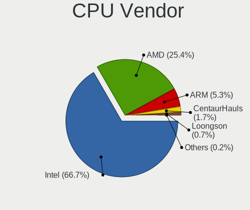
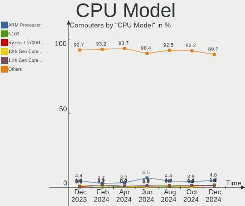

Debian Hardware Trends
----------------------

A project to identify most popular hardware characteristics and track their change
over time based on data collected by Debian users at https://Linux-Hardware.org.

Anyone can contribute to the study by uploading probes of their computers by
the [hw-probe](https://github.com/linuxhw/hw-probe) tool:

    sudo -E hw-probe -all -upload

This is a report for all computer types. See also reports for [desktops](/Dist/Debian/Desktop/README.md) and [notebooks](/Dist/Debian/Notebook/README.md).

Full-feature report is available here: https://linux-hardware.org/?view=trends

Period: Feb, 2021.

Contents
--------

- [ OS                       ](#os)
- [ OS Family                ](#os-family)
- [ Kernel                   ](#kernel)
- [ Kernel Family            ](#kernel-family)
- [ Kernel Major Ver.        ](#kernel-major-ver)
- [ Arch                     ](#arch)
- [ DE                       ](#de)
- [ Display Server           ](#display-server)
- [ Display Manager          ](#display-manager)
- [ OS Lang                  ](#os-lang)
- [ Boot Mode                ](#boot-mode)
- [ Filesystem               ](#filesystem)
- [ Part. scheme             ](#part-scheme)
- [ Dual Boot with Linux/BSD ](#dual-boot-with-linux/bsd)
- [ Dual Boot (Win)          ](#dual-boot-win)
- [ Country                  ](#country)
- [ City                     ](#city)
- [ Vendor                   ](#vendor)
- [ Model                    ](#model)
- [ Model Family             ](#model-family)
- [ MFG Year                 ](#mfg-year)
- [ Form Factor              ](#form-factor)
- [ Secure Boot              ](#secure-boot)
- [ Coreboot                 ](#coreboot)
- [ RAM Size                 ](#ram-size)
- [ RAM Used                 ](#ram-used)
- [ Has CD-ROM               ](#has-cd-rom)
- [ Total Drives             ](#total-drives)
- [ Has Ethernet             ](#has-ethernet)
- [ Drive Vendor             ](#drive-vendor)
- [ Drive Model              ](#drive-model)
- [ HDD Vendor               ](#hdd-vendor)
- [ SSD Vendor               ](#ssd-vendor)
- [ Drive Kind               ](#drive-kind)
- [ Drive Connector          ](#drive-connector)
- [ Drive Size               ](#drive-size)
- [ Space Total              ](#space-total)
- [ Space Used               ](#space-used)
- [ Malfunc. Drives          ](#malfunc-drives)
- [ Malfunc. Drive Vendor    ](#malfunc-drive-vendor)
- [ Malfunc. HDD Vendor      ](#malfunc-hdd-vendor)
- [ Malfunc. Drive Kind      ](#malfunc-drive-kind)
- [ Failed Drives            ](#failed-drives)
- [ Failed Drive Vendor      ](#failed-drive-vendor)
- [ Drive Status             ](#drive-status)
- [ Storage Vendor           ](#storage-vendor)
- [ Storage Model            ](#storage-model)
- [ Storage Kind             ](#storage-kind)
- [ CPU Vendor               ](#cpu-vendor)
- [ CPU Model                ](#cpu-model)
- [ CPU Model Family         ](#cpu-model-family)
- [ CPU Cores                ](#cpu-cores)
- [ CPU Sockets              ](#cpu-sockets)
- [ CPU Threads              ](#cpu-threads)
- [ CPU Op-Modes             ](#cpu-op-modes)
- [ CPU Microcode            ](#cpu-microcode)
- [ CPU Microarch            ](#cpu-microarch)
- [ GPU Vendor               ](#gpu-vendor)
- [ GPU Model                ](#gpu-model)
- [ GPU Combo                ](#gpu-combo)
- [ GPU Driver               ](#gpu-driver)
- [ GPU Memory               ](#gpu-memory)
- [ Monitor Vendor           ](#monitor-vendor)
- [ Monitor Model            ](#monitor-model)
- [ Monitor Resolution       ](#monitor-resolution)
- [ Monitor Diagonal         ](#monitor-diagonal)
- [ Monitor Width            ](#monitor-width)
- [ Aspect Ratio             ](#aspect-ratio)
- [ Monitor Area             ](#monitor-area)
- [ Pixel Density            ](#pixel-density)
- [ Multiple Monitors        ](#multiple-monitors)
- [ Net Controller Vendor    ](#net-controller-vendor)
- [ Net Controller Model     ](#net-controller-model)
- [ Wireless Vendor          ](#wireless-vendor)
- [ Wireless Model           ](#wireless-model)
- [ Ethernet Vendor          ](#ethernet-vendor)
- [ Ethernet Model           ](#ethernet-model)
- [ Net Controller Kind      ](#net-controller-kind)
- [ Used Controller          ](#used-controller)
- [ NICs                     ](#nics)
- [ Memory Vendor            ](#memory-vendor)
- [ Memory Model             ](#memory-model)
- [ Memory Kind              ](#memory-kind)
- [ Memory Form Factor       ](#memory-form-factor)
- [ Memory Size              ](#memory-size)
- [ Memory Speed             ](#memory-speed)
- [ Sound Vendor             ](#sound-vendor)
- [ Sound Model              ](#sound-model)
- [ Camera Vendor            ](#camera-vendor)
- [ Camera Model             ](#camera-model)
- [ Fingerprint Vendor       ](#fingerprint-vendor)
- [ Fingerprint Model        ](#fingerprint-model)
- [ Chipcard Vendor          ](#chipcard-vendor)
- [ Chipcard Model           ](#chipcard-model)
- [ Printer Vendor           ](#printer-vendor)
- [ Printer Model            ](#printer-model)
- [ Scanner Vendor           ](#scanner-vendor)
- [ Scanner Model            ](#scanner-model)
- [ Bluetooth Vendor         ](#bluetooth-vendor)
- [ Bluetooth Model          ](#bluetooth-model)
- [ Unsupported Devices      ](#unsupported-devices)
- [ Unsupported Device Types ](#unsupported-device-types)

OS
--

Installed operating systems

| Name            | Computers | Percent |
|-----------------|-----------|---------|
| Debian 10       | 80        | 60.61%  |
| Debian Testing  | 27        | 20.45%  |
| Debian          | 14        | 10.61%  |
| Debian Unstable | 7         | 5.3%    |
| Debian 9.5      | 1         | 0.76%   |
| Debian 9.13     | 1         | 0.76%   |
| Debian 9        | 1         | 0.76%   |
| Debian 11       | 1         | 0.76%   |

OS Family
---------

OS without a version

| Name   | Computers | Percent |
|--------|-----------|---------|
| Debian | 132       | 100%    |

Kernel
------

Version of the Linux kernel

| Version              | Computers | Percent |
|----------------------|-----------|---------|
| 4.19.0-14-amd64      | 48        | 36.36%  |
| 5.10.0-3-amd64       | 24        | 18.18%  |
| 5.10.0-2-amd64       | 13        | 9.85%   |
| 4.19.0-13-amd64      | 8         | 6.06%   |
| 5.9.0-0.bpo.5-amd64  | 5         | 3.79%   |
| 5.8.0-3-amd64        | 2         | 1.52%   |
| 5.6.0-2-amd64        | 2         | 1.52%   |
| 5.4.78-2-pve         | 2         | 1.52%   |
| 5.10.11-v8+          | 2         | 1.52%   |
| 5.10.0-0.bpo.3-amd64 | 2         | 1.52%   |
| 4.19.0-13-686-pae    | 2         | 1.52%   |
| 4.19.0-12-amd64      | 2         | 1.52%   |
| 5.9.0-5-amd64        | 1         | 0.76%   |
| 5.9.0-2-amd64        | 1         | 0.76%   |
| 5.9.0-1-amd64        | 1         | 0.76%   |
| 5.7.0-0.bpo.2-amd64  | 1         | 0.76%   |
| 5.11.0               | 1         | 0.76%   |
| 5.10.18-xanmod1      | 1         | 0.76%   |
| 5.10.18-wrkd         | 1         | 0.76%   |
| 5.10.17-wrkd         | 1         | 0.76%   |
| 5.10.16-qcmm-dirty   | 1         | 0.76%   |
| 5.10.14-v8+          | 1         | 0.76%   |
| 5.10.12-sunxi        | 1         | 0.76%   |
| 5.10.0-3-686-pae     | 1         | 0.76%   |
| 5.10-sunxi64         | 1         | 0.76%   |
| 4.9.0-8-686-pae      | 1         | 0.76%   |
| 4.9.0-14-amd64       | 1         | 0.76%   |
| 4.19.122-2-osmc      | 1         | 0.76%   |
| 4.19.0-6-amd64       | 1         | 0.76%   |
| 4.19.0-14-armmp-lpae | 1         | 0.76%   |
| 4.19.0-14-686-pae    | 1         | 0.76%   |
| 4.19.0-13-686        | 1         | 0.76%   |

Kernel Family
-------------

Linux kernel without a distro release

| Version  | Computers | Percent |
|----------|-----------|---------|
| 4.19.0   | 64        | 48.48%  |
| 5.10.0   | 40        | 30.3%   |
| 5.9.0    | 8         | 6.06%   |
| 5.8.0    | 2         | 1.52%   |
| 5.6.0    | 2         | 1.52%   |
| 5.4.78   | 2         | 1.52%   |
| 5.10.18  | 2         | 1.52%   |
| 5.10.11  | 2         | 1.52%   |
| 4.9.0    | 2         | 1.52%   |
| 5.7.0    | 1         | 0.76%   |
| 5.11.0   | 1         | 0.76%   |
| 5.10.17  | 1         | 0.76%   |
| 5.10.16  | 1         | 0.76%   |
| 5.10.14  | 1         | 0.76%   |
| 5.10.12  | 1         | 0.76%   |
| 5.10     | 1         | 0.76%   |
| 4.19.122 | 1         | 0.76%   |

Kernel Major Ver.
-----------------

Linux kernel major version

| Version | Computers | Percent |
|---------|-----------|---------|
| 4.19    | 65        | 49.24%  |
| 5.10    | 48        | 36.36%  |
| 5.9     | 8         | 6.06%   |
| 5.8     | 2         | 1.52%   |
| 5.6     | 2         | 1.52%   |
| 5.4     | 2         | 1.52%   |
| 4.9     | 2         | 1.52%   |
| 5.7     | 1         | 0.76%   |
| 5.11    | 1         | 0.76%   |
| 5       | 1         | 0.76%   |

Arch
----

OS architecture (x86_64, i586, etc.)

| Name    | Computers | Percent |
|---------|-----------|---------|
| x86_64  | 119       | 90.15%  |
| i686    | 6         | 4.55%   |
| aarch64 | 4         | 3.03%   |
| armv7l  | 3         | 2.27%   |

DE
--

Desktop Environment

| Name             | Computers | Percent |
|------------------|-----------|---------|
| GNOME            | 36        | 27.27%  |
| XFCE             | 22        | 16.67%  |
| Unknown          | 18        | 13.64%  |
| KDE5             | 15        | 11.36%  |
| KDE              | 12        | 9.09%   |
| X-Cinnamon       | 9         | 6.82%   |
| MATE             | 4         | 3.03%   |
| lightdm-xsession | 4         | 3.03%   |
| LXQt             | 3         | 2.27%   |
| i3               | 2         | 1.52%   |
| GNOME Classic    | 2         | 1.52%   |
| trinity          | 1         | 0.76%   |
| Openbox          | 1         | 0.76%   |
| LXDE             | 1         | 0.76%   |
| GNOME Flashback  | 1         | 0.76%   |
| Budgie           | 1         | 0.76%   |

Display Server
--------------

X11 or Wayland

| Name    | Computers | Percent |
|---------|-----------|---------|
| X11     | 98        | 74.24%  |
| Wayland | 17        | 12.88%  |
| Tty     | 13        | 9.85%   |
| Unknown | 4         | 3.03%   |

Display Manager
---------------

SDDM, LightDM, etc.

| Name    | Computers | Percent |
|---------|-----------|---------|
| Unknown | 64        | 48.48%  |
| TDM     | 26        | 19.7%   |
| GDM     | 21        | 15.91%  |
| SDDM    | 18        | 13.64%  |
| SLiM    | 2         | 1.52%   |
| XDM     | 1         | 0.76%   |

OS Lang
-------

Language

| Lang    | Computers | Percent |
|---------|-----------|---------|
| en_US   | 56        | 42.42%  |
| ru_RU   | 8         | 6.06%   |
| pt_BR   | 8         | 6.06%   |
| en_GB   | 8         | 6.06%   |
| de_DE   | 7         | 5.3%    |
| fr_FR   | 6         | 4.55%   |
| C       | 5         | 3.79%   |
| en_IN   | 3         | 2.27%   |
| Unknown | 3         | 2.27%   |
| tr_TR   | 2         | 1.52%   |
| pl_PL   | 2         | 1.52%   |
| nl_NL   | 2         | 1.52%   |
| ja_JP   | 2         | 1.52%   |
| it_IT   | 2         | 1.52%   |
| es_ES   | 2         | 1.52%   |
| de_AT   | 2         | 1.52%   |
| cs_CZ   | 2         | 1.52%   |
| sk_SK   | 1         | 0.76%   |
| pt_PT   | 1         | 0.76%   |
| es_MX   | 1         | 0.76%   |
| es_CL   | 1         | 0.76%   |
| es_AR   | 1         | 0.76%   |
| en_ZA   | 1         | 0.76%   |
| en_CA   | 1         | 0.76%   |
| en_AU   | 1         | 0.76%   |
| el_GR   | 1         | 0.76%   |
| de_CH   | 1         | 0.76%   |
| da_DK   | 1         | 0.76%   |
| ca_ES   | 1         | 0.76%   |

Boot Mode
---------

EFI or BIOS

| Mode | Computers | Percent |
|------|-----------|---------|
| BIOS | 84        | 63.64%  |
| EFI  | 48        | 36.36%  |

Filesystem
----------

Type of filesystem

| Type    | Computers | Percent |
|---------|-----------|---------|
| Ext4    | 114       | 86.36%  |
| Btrfs   | 7         | 5.3%    |
| Overlay | 6         | 4.55%   |
| Xfs     | 3         | 2.27%   |
| Zfs     | 1         | 0.76%   |
| Ext3    | 1         | 0.76%   |

Part. scheme
------------

Scheme of partitioning

| Type    | Computers | Percent |
|---------|-----------|---------|
| Unknown | 56        | 42.42%  |
| GPT     | 48        | 36.36%  |
| MBR     | 28        | 21.21%  |

Dual Boot with Linux/BSD
------------------------

Hosting more than one Linux/BSD

| Dual boot | Computers | Percent |
|-----------|-----------|---------|
| No        | 121       | 91.67%  |
| Yes       | 11        | 8.33%   |

Dual Boot (Win)
---------------

Hosting Linux and Windows

| Dual boot | Computers | Percent |
|-----------|-----------|---------|
| No        | 102       | 77.27%  |
| Yes       | 30        | 22.73%  |

Country
-------

Geographic location (country)

| Country                | Computers | Percent |
|------------------------|-----------|---------|
| USA                    | 24        | 18.18%  |
| Russia                 | 11        | 8.33%   |
| Germany                | 11        | 8.33%   |
| Brazil                 | 11        | 8.33%   |
| France                 | 10        | 7.58%   |
| UK                     | 4         | 3.03%   |
| Spain                  | 4         | 3.03%   |
| Poland                 | 4         | 3.03%   |
| Italy                  | 4         | 3.03%   |
| India                  | 4         | 3.03%   |
| Turkey                 | 3         | 2.27%   |
| Switzerland            | 3         | 2.27%   |
| Netherlands            | 3         | 2.27%   |
| Mexico                 | 3         | 2.27%   |
| Finland                | 3         | 2.27%   |
| Croatia                | 3         | 2.27%   |
| Slovakia               | 2         | 1.52%   |
| Japan                  | 2         | 1.52%   |
| Czech Republic         | 2         | 1.52%   |
| Canada                 | 2         | 1.52%   |
| Austria                | 2         | 1.52%   |
| Vietnam                | 1         | 0.76%   |
| Ukraine                | 1         | 0.76%   |
| Sweden                 | 1         | 0.76%   |
| South Africa           | 1         | 0.76%   |
| Romania                | 1         | 0.76%   |
| Portugal               | 1         | 0.76%   |
| Norway                 | 1         | 0.76%   |
| Morocco                | 1         | 0.76%   |
| Moldova, Republic of   | 1         | 0.76%   |
| Kazakhstan             | 1         | 0.76%   |
| Hungary                | 1         | 0.76%   |
| Greece                 | 1         | 0.76%   |
| Estonia                | 1         | 0.76%   |
| Denmark                | 1         | 0.76%   |
| Chile                  | 1         | 0.76%   |
| Bosnia and Herzegovina | 1         | 0.76%   |
| Argentina              | 1         | 0.76%   |

City
----

Geographic location (city)

| City                    | Computers | Percent |
|-------------------------|-----------|---------|
| Moscow                  | 4         | 3.03%   |
| Berlin                  | 4         | 3.03%   |
| Zagreb                  | 3         | 2.27%   |
| Porto Alegre            | 3         | 2.27%   |
| Ankara                  | 3         | 2.27%   |
| Warsaw                  | 2         | 1.52%   |
| Vienna                  | 2         | 1.52%   |
| St Petersburg           | 2         | 1.52%   |
| St Louis                | 2         | 1.52%   |
| Raahe                   | 2         | 1.52%   |
| Perm                    | 2         | 1.52%   |
| Paris                   | 2         | 1.52%   |
| New Haven               | 2         | 1.52%   |
| Minneapolis             | 2         | 1.52%   |
| Milan                   | 2         | 1.52%   |
| Halstead                | 2         | 1.52%   |
| Brasília               | 2         | 1.52%   |
| Örebro                 | 1         | 0.76%   |
| Zurich                  | 1         | 0.76%   |
| Zaragoza                | 1         | 0.76%   |
| Wrocław                | 1         | 0.76%   |
| Vinnytsia               | 1         | 0.76%   |
| Villeurbanne            | 1         | 0.76%   |
| Vilafranca del Penedès | 1         | 0.76%   |
| Ufa                     | 1         | 0.76%   |
| Tucson                  | 1         | 0.76%   |
| Tokorozawa              | 1         | 0.76%   |
| Timbo                   | 1         | 0.76%   |
| Thessaloniki            | 1         | 0.76%   |
| The Bronx               | 1         | 0.76%   |
| Tallinn                 | 1         | 0.76%   |
| São Paulo              | 1         | 0.76%   |
| Szeged                  | 1         | 0.76%   |
| Sunnyvale               | 1         | 0.76%   |
| Strasbourg              | 1         | 0.76%   |
| Stoughton               | 1         | 0.76%   |
| Stendal                 | 1         | 0.76%   |
| Steinbach               | 1         | 0.76%   |
| Steenwijk               | 1         | 0.76%   |
| Shchelkovo              | 1         | 0.76%   |
| Serra                   | 1         | 0.76%   |
| Sardieu                 | 1         | 0.76%   |
| Sarajevo                | 1         | 0.76%   |
| Santa Clara             | 1         | 0.76%   |
| San Jose                | 1         | 0.76%   |
| San Antonio             | 1         | 0.76%   |
| Saint-Hilaire-des-Loges | 1         | 0.76%   |
| Saint-Dié              | 1         | 0.76%   |
| Rungis                  | 1         | 0.76%   |
| Roubaix                 | 1         | 0.76%   |
| Rome                    | 1         | 0.76%   |
| Rio Grande              | 1         | 0.76%   |
| Rio de Janeiro          | 1         | 0.76%   |
| Rajahmundry             | 1         | 0.76%   |
| Prague                  | 1         | 0.76%   |
| Posadas                 | 1         | 0.76%   |
| Phoenix                 | 1         | 0.76%   |
| Pechina                 | 1         | 0.76%   |
| Orlando                 | 1         | 0.76%   |
| Olching                 | 1         | 0.76%   |

Vendor
------

Motherboard manufacturer

| Name                    | Computers | Percent |
|-------------------------|-----------|---------|
| Lenovo                  | 21        | 15.91%  |
| ASUSTek Computer        | 21        | 15.91%  |
| Hewlett-Packard         | 15        | 11.36%  |
| Dell                    | 14        | 10.61%  |
| MSI                     | 7         | 5.3%    |
| ASRock                  | 7         | 5.3%    |
| Gigabyte Technology     | 6         | 4.55%   |
| Intel                   | 5         | 3.79%   |
| Raspberry Pi Foundation | 3         | 2.27%   |
| Acer                    | 3         | 2.27%   |
| Toshiba                 | 2         | 1.52%   |
| Sony                    | 2         | 1.52%   |
| Samsung Electronics     | 2         | 1.52%   |
| Positivo                | 2         | 1.52%   |
| Medion                  | 2         | 1.52%   |
| Intel X79               | 2         | 1.52%   |
| Apple                   | 2         | 1.52%   |
| Unknown                 | 2         | 1.52%   |
| TQ-Group                | 1         | 0.76%   |
| Supermicro              | 1         | 0.76%   |
| sunxi                   | 1         | 0.76%   |
| Pine Microsystems       | 1         | 0.76%   |
| Pegatron                | 1         | 0.76%   |
| Olimex                  | 1         | 0.76%   |
| Notebook                | 1         | 0.76%   |
| NEC Computers           | 1         | 0.76%   |
| LG Electronics          | 1         | 0.76%   |
| Compaq                  | 1         | 0.76%   |
| Compal                  | 1         | 0.76%   |
| AWOW                    | 1         | 0.76%   |
| Archos                  | 1         | 0.76%   |
| Alienware               | 1         | 0.76%   |

Model
-----

Motherboard model

| Name                                     | Computers | Percent |
|------------------------------------------|-----------|---------|
| ASUS All Series                          | 3         | 2.27%   |
| Positivo C464C                           | 2         | 1.52%   |
| MSI MS-7C75                              | 2         | 1.52%   |
| Intel X79 Board                          | 2         | 1.52%   |
| Unknown                                  | 2         | 1.52%   |
| TQ-Group TQMxE39S                        | 1         | 0.76%   |
| Toshiba Satellite L745                   | 1         | 0.76%   |
| Toshiba PORTEGE Z30-A                    | 1         | 0.76%   |
| Supermicro Super Server                  | 1         | 0.76%   |
| sunxi Banana Pi BPI-M2-Ultra             | 1         | 0.76%   |
| Sony VPCEG15FB                           | 1         | 0.76%   |
| Sony VGN-NW270F                          | 1         | 0.76%   |
| Samsung R540/R580/R780/SA41/E452         | 1         | 0.76%   |
| Samsung 450R4E/450R5E/450R4V/450R5V      | 1         | 0.76%   |
| RPi Raspberry Pi 4 Model B Rev 1.4       | 1         | 0.76%   |
| RPi Raspberry Pi 4 Model B Rev 1.1       | 1         | 0.76%   |
| RPi Raspberry Pi 3 Model B Rev 1.2       | 1         | 0.76%   |
| Pine Microsystems Pine64 PinePhone (1.2) | 1         | 0.76%   |
| Pegatron BK139AA-ABA 600-1120            | 1         | 0.76%   |
| Olimex A20-OLinuXino-LIME2               | 1         | 0.76%   |
| Notebook NJ50_70CU                       | 1         | 0.76%   |
| NEC Computers PC-VY12FBHEW               | 1         | 0.76%   |
| MSI MS-7C95                              | 1         | 0.76%   |
| MSI MS-7C84                              | 1         | 0.76%   |
| MSI MS-7926                              | 1         | 0.76%   |
| MSI MS-7329                              | 1         | 0.76%   |
| MSI CR70 2M/CX70 2OC/CX70 2OD            | 1         | 0.76%   |
| Medion P861X                             | 1         | 0.76%   |
| Medion MS-7797                           | 1         | 0.76%   |
| LG A410-K.BE43P1                         | 1         | 0.76%   |
| Lenovo V570 HuronRiver Platform          | 1         | 0.76%   |
| Lenovo ThinkPad X270 W10DG 20K5S3Y900    | 1         | 0.76%   |
| Lenovo ThinkPad X260 20F5S13G00          | 1         | 0.76%   |
| Lenovo ThinkPad W540 20BG0011US          | 1         | 0.76%   |
| Lenovo ThinkPad W510 4389W1B             | 1         | 0.76%   |
| Lenovo ThinkPad T460 20FN002JUS          | 1         | 0.76%   |
| Lenovo ThinkPad T450s 20BXCTO1WW         | 1         | 0.76%   |
| Lenovo ThinkPad T440p 20AWS3UX00         | 1         | 0.76%   |
| Lenovo ThinkPad T14s Gen 1 20UHS0G000    | 1         | 0.76%   |
| Lenovo ThinkPad T14 Gen 1 20UDCTO1WW     | 1         | 0.76%   |
| Lenovo ThinkPad P72 20MBCTO1WW           | 1         | 0.76%   |
| Lenovo ThinkPad L470 20J4003WGE          | 1         | 0.76%   |
| Lenovo ThinkPad L14 Gen 1 20U5001VMH     | 1         | 0.76%   |
| Lenovo ThinkPad E14 20RBCTO1WW           | 1         | 0.76%   |
| Lenovo ThinkCentre M92p 3209EK4          | 1         | 0.76%   |
| Lenovo Legion Y530-15ICH 81FV            | 1         | 0.76%   |
| Lenovo IdeaPad Flex 5 14ARE05 81X2       | 1         | 0.76%   |
| Lenovo IdeaPad 700-15ISK 80RU            | 1         | 0.76%   |
| Lenovo IdeaPad 320-15ISK 80XH            | 1         | 0.76%   |
| Lenovo IdeaPad 100S-11IBY 80R2           | 1         | 0.76%   |
| Lenovo B50-30 20382                      | 1         | 0.76%   |
| Intel NUC10i7FNH                         | 1         | 0.76%   |
| Intel DN2800MT AAG23738-801              | 1         | 0.76%   |
| Intel DH87RL AAG74240-402                | 1         | 0.76%   |
| Intel DH61CR AAG14064-207                | 1         | 0.76%   |
| Intel B828                               | 1         | 0.76%   |
| HP t620 Quad Core TC                     | 1         | 0.76%   |
| HP ProLiant BL460c Gen8                  | 1         | 0.76%   |
| HP ProDesk 600 G1 DM                     | 1         | 0.76%   |
| HP ProBook 6460b                         | 1         | 0.76%   |

Model Family
------------

Motherboard model prefix

| Name                       | Computers | Percent |
|----------------------------|-----------|---------|
| Lenovo ThinkPad            | 13        | 9.85%   |
| Dell Latitude              | 5         | 3.79%   |
| Lenovo IdeaPad             | 4         | 3.03%   |
| RPi Raspberry              | 3         | 2.27%   |
| HP ProBook                 | 3         | 2.27%   |
| Dell Inspiron              | 3         | 2.27%   |
| ASUS TUF                   | 3         | 2.27%   |
| ASUS All                   | 3         | 2.27%   |
| Positivo C464C             | 2         | 1.52%   |
| MSI MS-7C75                | 2         | 1.52%   |
| Intel X79 Board            | 2         | 1.52%   |
| HP EliteBook               | 2         | 1.52%   |
| Dell OptiPlex              | 2         | 1.52%   |
| ASUS PRIME                 | 2         | 1.52%   |
| Unknown                    | 2         | 1.52%   |
| TQ-Group TQMxE39S          | 1         | 0.76%   |
| Toshiba Satellite          | 1         | 0.76%   |
| Toshiba PORTEGE            | 1         | 0.76%   |
| Supermicro Super           | 1         | 0.76%   |
| sunxi Banana               | 1         | 0.76%   |
| Sony VPCEG15FB             | 1         | 0.76%   |
| Sony VGN-NW270F            | 1         | 0.76%   |
| Samsung R540               | 1         | 0.76%   |
| Samsung 450R4E             | 1         | 0.76%   |
| Pine Microsystems Pine64   | 1         | 0.76%   |
| Pegatron BK139AA-ABA       | 1         | 0.76%   |
| Olimex A20-OLinuXino-LIME2 | 1         | 0.76%   |
| Notebook NJ50              | 1         | 0.76%   |
| NEC Computers PC-VY12FBHEW | 1         | 0.76%   |
| MSI MS-7C95                | 1         | 0.76%   |
| MSI MS-7C84                | 1         | 0.76%   |
| MSI MS-7926                | 1         | 0.76%   |
| MSI MS-7329                | 1         | 0.76%   |
| MSI CR70                   | 1         | 0.76%   |
| Medion P861X               | 1         | 0.76%   |
| Medion MS-7797             | 1         | 0.76%   |
| LG A410-K.BE43P1           | 1         | 0.76%   |
| Lenovo V570                | 1         | 0.76%   |
| Lenovo ThinkCentre         | 1         | 0.76%   |
| Lenovo Legion              | 1         | 0.76%   |
| Lenovo B50-30              | 1         | 0.76%   |
| Intel NUC10i7FNH           | 1         | 0.76%   |
| Intel DN2800MT             | 1         | 0.76%   |
| Intel DH87RL               | 1         | 0.76%   |
| Intel DH61CR               | 1         | 0.76%   |
| Intel B828                 | 1         | 0.76%   |
| HP t620                    | 1         | 0.76%   |
| HP ProLiant                | 1         | 0.76%   |
| HP ProDesk                 | 1         | 0.76%   |
| HP OMEN                    | 1         | 0.76%   |
| HP Notebook                | 1         | 0.76%   |
| HP Laptop                  | 1         | 0.76%   |
| HP ENVY                    | 1         | 0.76%   |
| HP EliteDesk               | 1         | 0.76%   |
| HP 870-210                 | 1         | 0.76%   |
| HP 550-171ng               | 1         | 0.76%   |
| Gigabyte Z97X-SLI          | 1         | 0.76%   |
| Gigabyte Z370              | 1         | 0.76%   |
| Gigabyte H97M-HD3          | 1         | 0.76%   |
| Gigabyte GA-78LMT-S2P      | 1         | 0.76%   |

MFG Year
--------

Motherboard manufacture year

| Year    | Computers | Percent |
|---------|-----------|---------|
| 2020    | 33        | 25%     |
| 2019    | 17        | 12.88%  |
| 2018    | 11        | 8.33%   |
| 2013    | 10        | 7.58%   |
| 2011    | 9         | 6.82%   |
| 2016    | 8         | 6.06%   |
| 2015    | 8         | 6.06%   |
| Unknown | 7         | 5.3%    |
| 2017    | 5         | 3.79%   |
| 2014    | 5         | 3.79%   |
| 2010    | 4         | 3.03%   |
| 2009    | 4         | 3.03%   |
| 2021    | 3         | 2.27%   |
| 2012    | 3         | 2.27%   |
| 2006    | 2         | 1.52%   |
| 2008    | 1         | 0.76%   |
| 2004    | 1         | 0.76%   |
| 2002    | 1         | 0.76%   |

Form Factor
-----------

Physical design of the computer

| Name           | Computers | Percent |
|----------------|-----------|---------|
| Notebook       | 65        | 49.24%  |
| Desktop        | 51        | 38.64%  |
| System on chip | 6         | 4.55%   |
| Convertible    | 4         | 3.03%   |
| Server         | 3         | 2.27%   |
| Phone          | 1         | 0.76%   |
| Mini pc        | 1         | 0.76%   |
| All in one     | 1         | 0.76%   |

Secure Boot
-----------

Enabled or disabled

| State    | Computers | Percent |
|----------|-----------|---------|
| Disabled | 126       | 95.45%  |
| Enabled  | 6         | 4.55%   |

Coreboot
--------

Have coreboot on board

| Used | Computers | Percent |
|------|-----------|---------|
| No   | 132       | 100%    |

RAM Size
--------

Total RAM memory

| Size in GB  | Computers | Percent |
|-------------|-----------|---------|
| 16.01-24.0  | 30        | 22.73%  |
| 3.01-4.0    | 25        | 18.94%  |
| 8.01-16.0   | 21        | 15.91%  |
| 4.01-8.0    | 17        | 12.88%  |
| 32.01-64.0  | 15        | 11.36%  |
| 64.01-256.0 | 10        | 7.58%   |
| 1.01-2.0    | 8         | 6.06%   |
| 0.51-1.0    | 3         | 2.27%   |
| 2.01-3.0    | 2         | 1.52%   |
| 24.01-32.0  | 1         | 0.76%   |

RAM Used
--------

Used RAM memory

| Used GB     | Computers | Percent |
|-------------|-----------|---------|
| 1.01-2.0    | 40        | 30.3%   |
| 4.01-8.0    | 25        | 18.94%  |
| 2.01-3.0    | 24        | 18.18%  |
| 0.51-1.0    | 18        | 13.64%  |
| 3.01-4.0    | 11        | 8.33%   |
| 8.01-16.0   | 5         | 3.79%   |
| 0.01-0.5    | 5         | 3.79%   |
| 16.01-24.0  | 2         | 1.52%   |
| 24.01-32.0  | 1         | 0.76%   |
| 64.01-256.0 | 1         | 0.76%   |

Has CD-ROM
----------

Has CD-ROM on board

| Presented | Computers | Percent |
|-----------|-----------|---------|
| No        | 83        | 62.88%  |
| Yes       | 49        | 37.12%  |

Total Drives
------------

Number of drives on board

| Drives | Computers | Percent |
|--------|-----------|---------|
| 1      | 73        | 55.3%   |
| 2      | 31        | 23.48%  |
| 3      | 18        | 13.64%  |
| 4      | 7         | 5.3%    |
| 8      | 1         | 0.76%   |
| 6      | 1         | 0.76%   |
| 5      | 1         | 0.76%   |

Has Ethernet
------------

Has Ethernet on board

| Presented | Computers | Percent |
|-----------|-----------|---------|
| Yes       | 118       | 89.39%  |
| No        | 14        | 10.61%  |

Drive Vendor
------------

Hard drive vendors

| Vendor              | Computers | Drives | Percent |
|---------------------|-----------|--------|---------|
| WDC                 | 31        | 44     | 15.74%  |
| Seagate             | 27        | 30     | 13.71%  |
| Samsung Electronics | 25        | 31     | 12.69%  |
| Unknown             | 19        | 25     | 9.64%   |
| Toshiba             | 15        | 16     | 7.61%   |
| Kingston            | 13        | 15     | 6.6%    |
| SanDisk             | 8         | 8      | 4.06%   |
| Crucial             | 7         | 7      | 3.55%   |
| SK Hynix            | 6         | 6      | 3.05%   |
| Intel               | 5         | 6      | 2.54%   |
| Hitachi             | 5         | 5      | 2.54%   |
| Micron Technology   | 4         | 4      | 2.03%   |
| LITEON              | 3         | 3      | 1.52%   |
| Corsair             | 3         | 3      | 1.52%   |
| Transcend           | 2         | 2      | 1.02%   |
| OCZ                 | 2         | 2      | 1.02%   |
| Lite-On             | 2         | 2      | 1.02%   |
| Fujitsu             | 2         | 2      | 1.02%   |
| A-DATA Technology   | 2         | 3      | 1.02%   |
| ZTC                 | 1         | 1      | 0.51%   |
| XPG                 | 1         | 2      | 0.51%   |
| ULTIMATE            | 1         | 1      | 0.51%   |
| TO Exter            | 1         | 1      | 0.51%   |
| Team                | 1         | 1      | 0.51%   |
| Phison              | 1         | 1      | 0.51%   |
| Patriot             | 1         | 1      | 0.51%   |
| Lexar               | 1         | 1      | 0.51%   |
| KingFast            | 1         | 1      | 0.51%   |
| JMicron             | 1         | 1      | 0.51%   |
| INTEL SS            | 1         | 1      | 0.51%   |
| Inateck             | 1         | 1      | 0.51%   |
| HGST                | 1         | 2      | 0.51%   |
| FORESEE             | 1         | 1      | 0.51%   |
| BAITITON            | 1         | 1      | 0.51%   |
| Apple               | 1         | 1      | 0.51%   |

Drive Model
-----------

Hard drive models

| Model                               | Computers | Percent |
|-------------------------------------|-----------|---------|
| Unknown MMC Card  32GB              | 4         | 1.83%   |
| Samsung SSD 850 EVO 250GB           | 4         | 1.83%   |
| WDC WD10SPZX-24Z10T0 1TB            | 3         | 1.38%   |
| Unknown MMC Card  64GB              | 3         | 1.38%   |
| Seagate ST1000DM010-2EP102 1TB      | 3         | 1.38%   |
| Kingston SUV400S37240G 240GB SSD    | 3         | 1.38%   |
| Kingston SA400S37480G 480GB SSD     | 3         | 1.38%   |
| Kingston SA400S37240G 240GB SSD     | 3         | 1.38%   |
| WDC WD50 00LPCX-24VHA 500GB         | 2         | 0.92%   |
| WDC WD40EZRZ-00GXCB0 4TB            | 2         | 0.92%   |
| WDC WD1002FAEX-00Z3A0 1TB           | 2         | 0.92%   |
| Unknown SD/MMC/MS PRO 64GB          | 2         | 0.92%   |
| Seagate ST500LT012-1DG142 500GB     | 2         | 0.92%   |
| Seagate ST500LM012 HN-M500MBB 500GB | 2         | 0.92%   |
| Seagate ST3500418AS 500GB           | 2         | 0.92%   |
| Seagate ST1000LM048-2E7172 1TB      | 2         | 0.92%   |
| SanDisk SSD PLUS 480GB              | 2         | 0.92%   |
| SanDisk SSD PLUS 120GB              | 2         | 0.92%   |
| SanDisk SDSSDA240G 240GB            | 2         | 0.92%   |
| Samsung SSD 970 EVO Plus 1TB        | 2         | 0.92%   |
| Samsung SSD 860 QVO 2TB             | 2         | 0.92%   |
| Samsung SSD 860 EVO 500GB           | 2         | 0.92%   |
| Samsung SSD 860 EVO 250GB           | 2         | 0.92%   |
| Samsung SSD 860 EVO 1TB             | 2         | 0.92%   |
| Samsung SSD 850 EVO 500GB           | 2         | 0.92%   |
| Samsung HD103SJ 1TB                 | 2         | 0.92%   |
| OCZ AGILITY3 240GB SSD              | 2         | 0.92%   |
| Micron 1100_MTFDDAV256TBN 256GB SSD | 2         | 0.92%   |
| Lite-On NVMe SSD Drive 256GB        | 2         | 0.92%   |
| Kingston SA400S37120G 120GB SSD     | 2         | 0.92%   |
| Crucial CT120BX500SSD1 120GB        | 2         | 0.92%   |
| Corsair Force 3 SSD 240GB           | 2         | 0.92%   |
| ZTC SM201-512G SSD                  | 1         | 0.46%   |
| XPG NVMe SSD Drive 512GB            | 1         | 0.46%   |
| WDC WDS250G2B0A 250GB SSD           | 1         | 0.46%   |
| WDC WDS240G2G0A-00JH30 240GB SSD    | 1         | 0.46%   |
| WDC WDBNCE5000PNC 500GB SSD         | 1         | 0.46%   |
| WDC WD800AAJS-00PSA0 80GB           | 1         | 0.46%   |
| WDC WD7500BPVX-22JC3T0 752GB        | 1         | 0.46%   |
| WDC WD7500BPVT-22HXZT3 752GB        | 1         | 0.46%   |
| WDC WD6400BPVT-24HXZT1 640GB        | 1         | 0.46%   |
| WDC WD60EZRZ-00GZ5B1 6TB            | 1         | 0.46%   |
| WDC WD60EZRX-00MVLB1 6TB            | 1         | 0.46%   |
| WDC WD6003FRYZ-01F0DB0 6TB          | 1         | 0.46%   |
| WDC WD5000LPVX-80V0TT0 500GB        | 1         | 0.46%   |
| WDC WD5000LPVX-22V0TT0 500GB        | 1         | 0.46%   |
| WDC WD5000AAKX-083CA1 500GB         | 1         | 0.46%   |
| WDC WD40EFRX-68N32N0 4TB            | 1         | 0.46%   |
| WDC WD4005FZBX-00K5WB0 4TB          | 1         | 0.46%   |
| WDC WD3200AAJS-00L7A0 320GB         | 1         | 0.46%   |
| WDC WD3200AAJB-00WGA0 320GB         | 1         | 0.46%   |
| WDC WD20EZAZ-00GGJB0 2TB            | 1         | 0.46%   |
| WDC WD1600BEVT-22ZCT0 160GB         | 1         | 0.46%   |
| WDC WD1600AAJS-00L7A0 160GB         | 1         | 0.46%   |
| WDC WD10JPVX-75J 1TB                | 1         | 0.46%   |
| WDC WD10JPVX-60JC3T0 1TB            | 1         | 0.46%   |
| WDC WD10EZEX-60WN4A0 1TB            | 1         | 0.46%   |
| WDC WD10EZEX-00RKKA0 1TB            | 1         | 0.46%   |
| WDC WD10EFRX-68FYTN0 1TB            | 1         | 0.46%   |
| WDC WD10EADS-65M2B1 1TB             | 1         | 0.46%   |

HDD Vendor
----------

Hard disk drive vendors

| Vendor              | Computers | Drives | Percent |
|---------------------|-----------|--------|---------|
| WDC                 | 29        | 41     | 38.16%  |
| Seagate             | 27        | 30     | 35.53%  |
| Toshiba             | 9         | 10     | 11.84%  |
| Hitachi             | 5         | 5      | 6.58%   |
| Samsung Electronics | 2         | 2      | 2.63%   |
| Fujitsu             | 2         | 2      | 2.63%   |
| TO Exter            | 1         | 1      | 1.32%   |
| HGST                | 1         | 2      | 1.32%   |

SSD Vendor
----------

Solid state drive vendors

| Vendor              | Computers | Drives | Percent |
|---------------------|-----------|--------|---------|
| Samsung Electronics | 16        | 18     | 23.53%  |
| Kingston            | 12        | 13     | 17.65%  |
| SanDisk             | 7         | 7      | 10.29%  |
| Crucial             | 7         | 7      | 10.29%  |
| WDC                 | 3         | 3      | 4.41%   |
| Micron Technology   | 3         | 3      | 4.41%   |
| Transcend           | 2         | 2      | 2.94%   |
| Toshiba             | 2         | 2      | 2.94%   |
| OCZ                 | 2         | 2      | 2.94%   |
| LITEON              | 2         | 2      | 2.94%   |
| Corsair             | 2         | 2      | 2.94%   |
| ZTC                 | 1         | 1      | 1.47%   |
| ULTIMATE            | 1         | 1      | 1.47%   |
| Team                | 1         | 1      | 1.47%   |
| Lexar               | 1         | 1      | 1.47%   |
| KingFast            | 1         | 1      | 1.47%   |
| JMicron             | 1         | 1      | 1.47%   |
| INTEL SS            | 1         | 1      | 1.47%   |
| BAITITON            | 1         | 1      | 1.47%   |
| Apple               | 1         | 1      | 1.47%   |
| A-DATA Technology   | 1         | 2      | 1.47%   |

Drive Kind
----------

HDD or SSD

| Kind    | Computers | Drives | Percent |
|---------|-----------|--------|---------|
| HDD     | 66        | 93     | 37.08%  |
| SSD     | 58        | 72     | 32.58%  |
| NVMe    | 33        | 40     | 18.54%  |
| MMC     | 16        | 21     | 8.99%   |
| Unknown | 5         | 6      | 2.81%   |

Drive Connector
---------------

SATA, SAS, NVMe, etc.

| Type | Computers | Drives | Percent |
|------|-----------|--------|---------|
| SATA | 97        | 158    | 61.39%  |
| NVMe | 33        | 40     | 20.89%  |
| MMC  | 16        | 21     | 10.13%  |
| SAS  | 12        | 13     | 7.59%   |

Drive Size
----------

Size of hard drive

| Size in TB | Computers | Drives | Percent |
|------------|-----------|--------|---------|
| 0.01-0.5   | 74        | 96     | 59.68%  |
| 0.51-1.0   | 33        | 44     | 26.61%  |
| 3.01-4.0   | 8         | 10     | 6.45%   |
| 1.01-2.0   | 6         | 6      | 4.84%   |
| 4.01-10.0  | 3         | 9      | 2.42%   |

Space Total
-----------

Amount of disk space available on the file system

| Size in GB     | Computers | Percent |
|----------------|-----------|---------|
| 101-250        | 37        | 28.03%  |
| 251-500        | 25        | 18.94%  |
| 501-1000       | 15        | 11.36%  |
| 1001-2000      | 13        | 9.85%   |
| 21-50          | 11        | 8.33%   |
| More than 3000 | 9         | 6.82%   |
| 2001-3000      | 8         | 6.06%   |
| 51-100         | 6         | 4.55%   |
| 1-20           | 4         | 3.03%   |
| Unknown        | 4         | 3.03%   |

Space Used
----------

Amount of used disk space

| Used GB        | Computers | Percent |
|----------------|-----------|---------|
| 1-20           | 38        | 28.79%  |
| 101-250        | 28        | 21.21%  |
| 21-50          | 20        | 15.15%  |
| 1001-2000      | 10        | 7.58%   |
| 501-1000       | 10        | 7.58%   |
| 51-100         | 10        | 7.58%   |
| 251-500        | 5         | 3.79%   |
| 2001-3000      | 4         | 3.03%   |
| Unknown        | 4         | 3.03%   |
| More than 3000 | 3         | 2.27%   |

Malfunc. Drives
---------------

Drive models with a malfunction

| Model                           | Computers | Drives | Percent |
|---------------------------------|-----------|--------|---------|
| WDC WD7500BPVX-22JC3T0 752GB    | 1         | 1      | 7.14%   |
| WDC WD10EADS-65M2B1 1TB         | 1         | 1      | 7.14%   |
| Toshiba MK5076GSX 500GB         | 1         | 1      | 7.14%   |
| Seagate ST9500420AS 500GB       | 1         | 1      | 7.14%   |
| Seagate ST9500325AS 500GB       | 1         | 1      | 7.14%   |
| Seagate ST4000NM0033-9ZM170 4TB | 1         | 1      | 7.14%   |
| Seagate ST380011A 80GB          | 1         | 1      | 7.14%   |
| Seagate ST3500418AS 500GB       | 1         | 1      | 7.14%   |
| Seagate ST1000LM048-2E7172 1TB  | 1         | 1      | 7.14%   |
| Samsung Electronics HD103SJ 1TB | 1         | 1      | 7.14%   |
| Hitachi HTS547575A9E384 752GB   | 1         | 1      | 7.14%   |
| Crucial CT1024MX200SSD1 1TB     | 1         | 1      | 7.14%   |
| Corsair Force 3 SSD 240GB       | 1         | 1      | 7.14%   |
| Apple SSD SM256C 256GB          | 1         | 1      | 7.14%   |

Malfunc. Drive Vendor
---------------------

Vendors of faulty drives

| Vendor              | Computers | Drives | Percent |
|---------------------|-----------|--------|---------|
| Seagate             | 6         | 6      | 42.86%  |
| WDC                 | 2         | 2      | 14.29%  |
| Toshiba             | 1         | 1      | 7.14%   |
| Samsung Electronics | 1         | 1      | 7.14%   |
| Hitachi             | 1         | 1      | 7.14%   |
| Crucial             | 1         | 1      | 7.14%   |
| Corsair             | 1         | 1      | 7.14%   |
| Apple               | 1         | 1      | 7.14%   |

Malfunc. HDD Vendor
-------------------

Vendors of faulty HDD drives

| Vendor              | Computers | Drives | Percent |
|---------------------|-----------|--------|---------|
| Seagate             | 6         | 6      | 54.55%  |
| WDC                 | 2         | 2      | 18.18%  |
| Toshiba             | 1         | 1      | 9.09%   |
| Samsung Electronics | 1         | 1      | 9.09%   |
| Hitachi             | 1         | 1      | 9.09%   |

Malfunc. Drive Kind
-------------------

Kinds of faulty drives

| Kind | Computers | Drives | Percent |
|------|-----------|--------|---------|
| HDD  | 11        | 11     | 78.57%  |
| SSD  | 3         | 3      | 21.43%  |

Failed Drives
-------------

Failed drive models

Zero info for selected period =(

Failed Drive Vendor
-------------------

Failed drive vendors

Zero info for selected period =(

Drive Status
------------

Number of failed and malfunc. drives

| Status   | Computers | Drives | Percent |
|----------|-----------|--------|---------|
| Detected | 71        | 109    | 47.97%  |
| Works    | 64        | 109    | 43.24%  |
| Malfunc  | 13        | 14     | 8.78%   |

Storage Vendor
--------------

Storage controller vendors

| Vendor                       | Computers | Percent |
|------------------------------|-----------|---------|
| Intel                        | 98        | 62.42%  |
| AMD                          | 14        | 8.92%   |
| Samsung Electronics          | 9         | 5.73%   |
| SK Hynix                     | 6         | 3.82%   |
| ASMedia Technology           | 6         | 3.82%   |
| Toshiba America Info Systems | 3         | 1.91%   |
| Phison Electronics           | 3         | 1.91%   |
| Nvidia                       | 3         | 1.91%   |
| Marvell Technology Group     | 3         | 1.91%   |
| LSI Logic / Symbios Logic    | 2         | 1.27%   |
| Lite-On Technology           | 2         | 1.27%   |
| Kingston Technology Company  | 2         | 1.27%   |
| ADATA Technology             | 2         | 1.27%   |
| Shenzhen Longsys Electronics | 1         | 0.64%   |
| Sandisk                      | 1         | 0.64%   |
| Micron Technology            | 1         | 0.64%   |
| Hewlett-Packard              | 1         | 0.64%   |

Storage Model
-------------

Storage controller models

| Model                                                                            | Computers | Percent |
|----------------------------------------------------------------------------------|-----------|---------|
| AMD FCH SATA Controller [AHCI mode]                                              | 11        | 6.29%   |
| Samsung NVMe SSD Controller SM981/PM981/PM983                                    | 8         | 4.57%   |
| Intel Sunrise Point-LP SATA Controller [AHCI mode]                               | 8         | 4.57%   |
| Intel 8 Series/C220 Series Chipset Family 6-port SATA Controller 1 [AHCI mode]   | 7         | 4%      |
| Intel 9 Series Chipset Family SATA Controller [AHCI Mode]                        | 6         | 3.43%   |
| Intel 7 Series/C210 Series Chipset Family 6-port SATA Controller [AHCI mode]     | 6         | 3.43%   |
| Intel 6 Series/C200 Series Chipset Family 6 port Mobile SATA AHCI Controller     | 6         | 3.43%   |
| Intel 7 Series Chipset Family 6-port SATA Controller [AHCI mode]                 | 5         | 2.86%   |
| ASMedia ASM1062 Serial ATA Controller                                            | 5         | 2.86%   |
| Intel Wildcat Point-LP SATA Controller [AHCI Mode]                               | 4         | 2.29%   |
| Intel NM10/ICH7 Family SATA Controller [IDE mode]                                | 4         | 2.29%   |
| Intel Celeron N3350/Pentium N4200/Atom E3900 Series SATA AHCI Controller         | 4         | 2.29%   |
| Intel 82801G (ICH7 Family) IDE Controller                                        | 4         | 2.29%   |
| SK Hynix Non-Volatile memory controller                                          | 3         | 1.71%   |
| SK Hynix BC511                                                                   | 3         | 1.71%   |
| Intel HM170/QM170 Chipset SATA Controller [AHCI Mode]                            | 3         | 1.71%   |
| Intel Comet Lake SATA AHCI Controller                                            | 3         | 1.71%   |
| Intel Cannon Lake Mobile PCH SATA AHCI Controller                                | 3         | 1.71%   |
| Intel 400 Series Chipset Family SATA AHCI Controller                             | 3         | 1.71%   |
| Intel 200 Series PCH SATA controller [AHCI mode]                                 | 3         | 1.71%   |
| Toshiba America Info Systems XG6 NVMe SSD Controller                             | 2         | 1.14%   |
| Samsung NVMe SSD Controller SM961/PM961/SM963                                    | 2         | 1.14%   |
| Marvell Group 88SE9128 PCIe SATA 6 Gb/s RAID controller with HyperDuo            | 2         | 1.14%   |
| Lite-On Non-Volatile memory controller                                           | 2         | 1.14%   |
| Intel SSD 660P Series                                                            | 2         | 1.14%   |
| Intel SATA Controller [RAID mode]                                                | 2         | 1.14%   |
| Intel Q170/Q150/B150/H170/H110/Z170/CM236 Chipset SATA Controller [AHCI Mode]    | 2         | 1.14%   |
| Intel Non-Volatile memory controller                                             | 2         | 1.14%   |
| Intel Cannon Point-LP SATA Controller [AHCI Mode]                                | 2         | 1.14%   |
| Intel C600/X79 series chipset 6-Port SATA AHCI Controller                        | 2         | 1.14%   |
| Intel 82801IBM/IEM (ICH9M/ICH9M-E) 4 port SATA Controller [AHCI mode]            | 2         | 1.14%   |
| Intel 82801 Mobile SATA Controller [RAID mode]                                   | 2         | 1.14%   |
| Intel 8 Series SATA Controller 1 [AHCI mode]                                     | 2         | 1.14%   |
| Intel 6 Series/C200 Series Chipset Family 6 port Desktop SATA AHCI Controller    | 2         | 1.14%   |
| Intel 5 Series/3400 Series Chipset 6 port SATA AHCI Controller                   | 2         | 1.14%   |
| Intel 5 Series/3400 Series Chipset 4 port SATA AHCI Controller                   | 2         | 1.14%   |
| AMD X370 Series Chipset SATA Controller                                          | 2         | 1.14%   |
| AMD 400 Series Chipset SATA Controller                                           | 2         | 1.14%   |
| ADATA XPG SX8200 Pro PCIe Gen3x4 M.2 2280 Solid State Drive                      | 2         | 1.14%   |
| Toshiba America Info Systems Toshiba America Info Non-Volatile memory controller | 1         | 0.57%   |
| Shenzhen Longsys Non-Volatile memory controller                                  | 1         | 0.57%   |
| Sandisk PC SN520 NVMe SSD                                                        | 1         | 0.57%   |
| Samsung NVMe SSD Controller 172Xa/172Xb                                          | 1         | 0.57%   |
| Phison NVMe Storage Controller                                                   | 1         | 0.57%   |
| Phison E16 PCIe4 NVMe Controller                                                 | 1         | 0.57%   |
| Phison E12 NVMe Controller                                                       | 1         | 0.57%   |
| Nvidia MCP79 AHCI Controller                                                     | 1         | 0.57%   |
| Nvidia MCP61 SATA Controller                                                     | 1         | 0.57%   |
| Nvidia MCP61 IDE                                                                 | 1         | 0.57%   |
| Nvidia MCP51 Serial ATA Controller                                               | 1         | 0.57%   |
| Nvidia MCP51 IDE                                                                 | 1         | 0.57%   |
| Micron Non-Volatile memory controller                                            | 1         | 0.57%   |
| Marvell Group 88SE9230 PCIe 2.0 x2 4-port SATA 6 Gb/s RAID Controller            | 1         | 0.57%   |
| LSI Logic / Symbios Logic SAS2008 PCI-Express Fusion-MPT SAS-2 [Falcon]          | 1         | 0.57%   |
| LSI Logic / Symbios Logic MegaRAID SAS-3 3008 [Fury]                             | 1         | 0.57%   |
| Kingston Company U-SNS8154P3 NVMe SSD                                            | 1         | 0.57%   |
| Kingston Company A2000 NVMe SSD                                                  | 1         | 0.57%   |
| Intel SSD 600P Series                                                            | 1         | 0.57%   |
| Intel NM10/ICH7 Family SATA Controller [AHCI mode]                               | 1         | 0.57%   |
| Intel Chipset SATA RAID Controller                                               | 1         | 0.57%   |

Storage Kind
------------

Kind of storage controller (IDE, SATA, NVMe, SAS, ...)

| Kind | Computers | Percent |
|------|-----------|---------|
| SATA | 97        | 64.67%  |
| NVMe | 33        | 22%     |
| IDE  | 11        | 7.33%   |
| RAID | 8         | 5.33%   |
| SAS  | 1         | 0.67%   |

CPU Vendor
----------

Processor vendors

| Vendor | Computers | Percent |
|--------|-----------|---------|
| Intel  | 106       | 80.3%   |
| AMD    | 19        | 14.39%  |
| ARM    | 7         | 5.3%    |

CPU Model
---------

Processor models

| Model                                       | Computers | Percent |
|---------------------------------------------|-----------|---------|
| ARM Processor                               | 4         | 3.03%   |
| Intel Xeon CPU E5-2650 v2 @ 2.60GHz         | 2         | 1.52%   |
| Intel Core i9-10900K CPU @ 3.70GHz          | 2         | 1.52%   |
| Intel Core i7-8750H CPU @ 2.20GHz           | 2         | 1.52%   |
| Intel Core i7-7500U CPU @ 2.70GHz           | 2         | 1.52%   |
| Intel Core i7-6700HQ CPU @ 2.60GHz          | 2         | 1.52%   |
| Intel Core i7-4790 CPU @ 3.60GHz            | 2         | 1.52%   |
| Intel Core i7-4770 CPU @ 3.40GHz            | 2         | 1.52%   |
| Intel Core i5-4570S CPU @ 2.90GHz           | 2         | 1.52%   |
| Intel Core i5-2410M CPU @ 2.30GHz           | 2         | 1.52%   |
| Intel Core i5-10400F CPU @ 2.90GHz          | 2         | 1.52%   |
| Intel Core i3-4150 CPU @ 3.50GHz            | 2         | 1.52%   |
| Intel Celeron CPU N3350 @ 1.10GHz           | 2         | 1.52%   |
| Intel Atom CPU Z3735F @ 1.33GHz             | 2         | 1.52%   |
| AMD Ryzen 7 PRO 4750U with Radeon Graphics  | 2         | 1.52%   |
| Intel Xeon E-2288G CPU @ 3.70GHz            | 1         | 0.76%   |
| Intel Xeon E-2276G CPU @ 3.80GHz            | 1         | 0.76%   |
| Intel Xeon CPU E5-2690 v2 @ 3.00GHz         | 1         | 0.76%   |
| Intel Pentium M processor 1600MHz           | 1         | 0.76%   |
| Intel Pentium M processor 1.20GHz           | 1         | 0.76%   |
| Intel Pentium Dual-Core CPU T4400 @ 2.20GHz | 1         | 0.76%   |
| Intel Pentium Dual-Core CPU E5700 @ 3.00GHz | 1         | 0.76%   |
| Intel Pentium 4 CPU 3.40GHz                 | 1         | 0.76%   |
| Intel Core i7-8700K CPU @ 3.70GHz           | 1         | 0.76%   |
| Intel Core i7-8565U CPU @ 1.80GHz           | 1         | 0.76%   |
| Intel Core i7-7700K CPU @ 4.20GHz           | 1         | 0.76%   |
| Intel Core i7-7700HQ CPU @ 2.80GHz          | 1         | 0.76%   |
| Intel Core i7-6500U CPU @ 2.50GHz           | 1         | 0.76%   |
| Intel Core i7-5600U CPU @ 2.60GHz           | 1         | 0.76%   |
| Intel Core i7-5500U CPU @ 2.40GHz           | 1         | 0.76%   |
| Intel Core i7-4910MQ CPU @ 2.90GHz          | 1         | 0.76%   |
| Intel Core i7-4820K CPU @ 3.70GHz           | 1         | 0.76%   |
| Intel Core i7-4790K CPU @ 4.00GHz           | 1         | 0.76%   |
| Intel Core i7-4771 CPU @ 3.50GHz            | 1         | 0.76%   |
| Intel Core i7-4700MQ CPU @ 2.40GHz          | 1         | 0.76%   |
| Intel Core i7-4510U CPU @ 2.00GHz           | 1         | 0.76%   |
| Intel Core i7-3930K CPU @ 3.20GHz           | 1         | 0.76%   |
| Intel Core i7-3820 CPU @ 3.60GHz            | 1         | 0.76%   |
| Intel Core i7-3630QM CPU @ 2.40GHz          | 1         | 0.76%   |
| Intel Core i7-2620M CPU @ 2.70GHz           | 1         | 0.76%   |
| Intel Core i7-10710U CPU @ 1.10GHz          | 1         | 0.76%   |
| Intel Core i7-10700K CPU @ 3.80GHz          | 1         | 0.76%   |
| Intel Core i7-1065G7 CPU @ 1.30GHz          | 1         | 0.76%   |
| Intel Core i7-10610U CPU @ 1.80GHz          | 1         | 0.76%   |
| Intel Core i7-10510U CPU @ 1.80GHz          | 1         | 0.76%   |
| Intel Core i7 CPU Q 720 @ 1.60GHz           | 1         | 0.76%   |
| Intel Core i5-8365U CPU @ 1.60GHz           | 1         | 0.76%   |
| Intel Core i5-8300H CPU @ 2.30GHz           | 1         | 0.76%   |
| Intel Core i5-8265U CPU @ 1.60GHz           | 1         | 0.76%   |
| Intel Core i5-8250U CPU @ 1.60GHz           | 1         | 0.76%   |
| Intel Core i5-7200U CPU @ 2.50GHz           | 1         | 0.76%   |
| Intel Core i5-6400 CPU @ 2.70GHz            | 1         | 0.76%   |
| Intel Core i5-6300U CPU @ 2.40GHz           | 1         | 0.76%   |
| Intel Core i5-6200U CPU @ 2.30GHz           | 1         | 0.76%   |
| Intel Core i5-5300U CPU @ 2.30GHz           | 1         | 0.76%   |
| Intel Core i5-5200U CPU @ 2.20GHz           | 1         | 0.76%   |
| Intel Core i5-4440 CPU @ 3.10GHz            | 1         | 0.76%   |
| Intel Core i5-4200M CPU @ 2.50GHz           | 1         | 0.76%   |
| Intel Core i5-3570K CPU @ 3.40GHz           | 1         | 0.76%   |
| Intel Core i5-3570 CPU @ 3.40GHz            | 1         | 0.76%   |

CPU Model Family
----------------

Processor model prefix

| Model                   | Computers | Percent |
|-------------------------|-----------|---------|
| Intel Core i7           | 33        | 25%     |
| Intel Core i5           | 32        | 24.24%  |
| Intel Core i3           | 13        | 9.85%   |
| Intel Celeron           | 8         | 6.06%   |
| Other                   | 5         | 3.79%   |
| Intel Xeon              | 5         | 3.79%   |
| Intel Atom              | 4         | 3.03%   |
| AMD Ryzen 5             | 4         | 3.03%   |
| Intel Core 2 Duo        | 3         | 2.27%   |
| AMD Ryzen 3             | 3         | 2.27%   |
| Intel Pentium M         | 2         | 1.52%   |
| Intel Pentium Dual-Core | 2         | 1.52%   |
| Intel Core i9           | 2         | 1.52%   |
| ARM Allwinner           | 2         | 1.52%   |
| AMD Ryzen 7 PRO         | 2         | 1.52%   |
| AMD Ryzen 7             | 2         | 1.52%   |
| Intel Pentium 4         | 1         | 0.76%   |
| ARM BCM                 | 1         | 0.76%   |
| AMD Ryzen 9             | 1         | 0.76%   |
| AMD Ryzen 5 PRO         | 1         | 0.76%   |
| AMD Phenom II X4        | 1         | 0.76%   |
| AMD GX                  | 1         | 0.76%   |
| AMD FX                  | 1         | 0.76%   |
| AMD C-60                | 1         | 0.76%   |
| AMD Athlon 64 X2        | 1         | 0.76%   |
| AMD A8                  | 1         | 0.76%   |

CPU Cores
---------

Number of processor cores

| Number | Computers | Percent |
|--------|-----------|---------|
| 4      | 53        | 40.15%  |
| 2      | 50        | 37.88%  |
| 6      | 12        | 9.09%   |
| 8      | 8         | 6.06%   |
| 1      | 5         | 3.79%   |
| 10     | 2         | 1.52%   |
| 20     | 1         | 0.76%   |
| 12     | 1         | 0.76%   |

CPU Sockets
-----------

Number of sockets

| Number | Computers | Percent |
|--------|-----------|---------|
| 1      | 131       | 99.24%  |
| 2      | 1         | 0.76%   |

CPU Threads
-----------

Threads per core (Hyper-Threading)

| Number | Computers | Percent |
|--------|-----------|---------|
| 2      | 88        | 66.67%  |
| 1      | 44        | 33.33%  |

CPU Op-Modes
------------

CPU Operation Modes (32-bit, 64-bit)

| Op mode        | Computers | Percent |
|----------------|-----------|---------|
| 32-bit, 64-bit | 123       | 93.18%  |
| Unknown        | 6         | 4.55%   |
| 32-bit         | 3         | 2.27%   |

CPU Microcode
-------------

Microcode number

| Number     | Computers | Percent |
|------------|-----------|---------|
| Unknown    | 49        | 37.12%  |
| 0x306c3    | 12        | 9.09%   |
| 0x206a7    | 7         | 5.3%    |
| 0x806ec    | 4         | 3.03%   |
| 0x306d4    | 4         | 3.03%   |
| 0x1067a    | 4         | 3.03%   |
| 0xa0655    | 3         | 2.27%   |
| 0x906ea    | 3         | 2.27%   |
| 0x906e9    | 3         | 2.27%   |
| 0x406e3    | 3         | 2.27%   |
| 0x306e4    | 3         | 2.27%   |
| 0x306a9    | 3         | 2.27%   |
| 0x30678    | 3         | 2.27%   |
| 0x08701021 | 3         | 2.27%   |
| 0x08600106 | 3         | 2.27%   |
| 0xa0653    | 2         | 1.52%   |
| 0x40651    | 2         | 1.52%   |
| 0xf4a      | 1         | 0.76%   |
| 0xf13      | 1         | 0.76%   |
| 0xa0660    | 1         | 0.76%   |
| 0x906ed    | 1         | 0.76%   |
| 0x906eb    | 1         | 0.76%   |
| 0x806ea    | 1         | 0.76%   |
| 0x706e5    | 1         | 0.76%   |
| 0x706a1    | 1         | 0.76%   |
| 0x6d8      | 1         | 0.76%   |
| 0x695      | 1         | 0.76%   |
| 0x506ca    | 1         | 0.76%   |
| 0x206d7    | 1         | 0.76%   |
| 0x206d6    | 1         | 0.76%   |
| 0x20655    | 1         | 0.76%   |
| 0x20652    | 1         | 0.76%   |
| 0x106e5    | 1         | 0.76%   |
| 0x08600104 | 1         | 0.76%   |
| 0x08108109 | 1         | 0.76%   |
| 0x08108102 | 1         | 0.76%   |
| 0x08101016 | 1         | 0.76%   |
| 0x07000110 | 1         | 0.76%   |

CPU Microarch
-------------

Microarchitecture

| Name          | Computers | Percent |
|---------------|-----------|---------|
| KabyLake      | 21        | 15.91%  |
| Haswell       | 16        | 12.12%  |
| SandyBridge   | 13        | 9.85%   |
| IvyBridge     | 11        | 8.33%   |
| Skylake       | 8         | 6.06%   |
| Zen 2         | 7         | 5.3%    |
| Unknown       | 7         | 5.3%    |
| CometLake     | 6         | 4.55%   |
| Penryn        | 5         | 3.79%   |
| Broadwell     | 5         | 3.79%   |
| Zen           | 4         | 3.03%   |
| Silvermont    | 4         | 3.03%   |
| Goldmont      | 4         | 3.03%   |
| Westmere      | 3         | 2.27%   |
| Zen+          | 2         | 1.52%   |
| P6            | 2         | 1.52%   |
| NetBurst      | 2         | 1.52%   |
| TigerLake     | 1         | 0.76%   |
| Nehalem       | 1         | 0.76%   |
| K8 Hammer     | 1         | 0.76%   |
| K10           | 1         | 0.76%   |
| Jaguar        | 1         | 0.76%   |
| IceLake       | 1         | 0.76%   |
| Goldmont plus | 1         | 0.76%   |
| Excavator     | 1         | 0.76%   |
| Core          | 1         | 0.76%   |
| Bulldozer     | 1         | 0.76%   |
| Bonnell       | 1         | 0.76%   |
| Bobcat        | 1         | 0.76%   |

GPU Vendor
----------

Vendors of graphics cards

| Vendor                     | Computers | Percent |
|----------------------------|-----------|---------|
| Intel                      | 78        | 54.55%  |
| Nvidia                     | 40        | 27.97%  |
| AMD                        | 22        | 15.38%  |
| Matrox Electronics Systems | 2         | 1.4%    |
| ASPEED Technology          | 1         | 0.7%    |

GPU Model
---------

Graphics card models

| Model                                                                         | Computers | Percent |
|-------------------------------------------------------------------------------|-----------|---------|
| Intel 2nd Generation Core Processor Family Integrated Graphics Controller     | 8         | 5.52%   |
| Intel Xeon E3-1200 v3/4th Gen Core Processor Integrated Graphics Controller   | 6         | 4.14%   |
| Intel HD Graphics 5500                                                        | 5         | 3.45%   |
| Intel Skylake GT2 [HD Graphics 520]                                           | 4         | 2.76%   |
| Intel HD Graphics 500                                                         | 4         | 2.76%   |
| Intel CometLake-U GT2 [UHD Graphics]                                          | 4         | 2.76%   |
| AMD Renoir                                                                    | 4         | 2.76%   |
| Intel WhiskeyLake-U GT2 [UHD Graphics 620]                                    | 3         | 2.07%   |
| Intel HD Graphics 620                                                         | 3         | 2.07%   |
| Intel CometLake-S GT2 [UHD Graphics 630]                                      | 3         | 2.07%   |
| Intel Atom Processor Z36xxx/Z37xxx Series Graphics & Display                  | 3         | 2.07%   |
| Intel 4th Gen Core Processor Integrated Graphics Controller                   | 3         | 2.07%   |
| AMD Sun XT [Radeon HD 8670A/8670M/8690M / R5 M330 / M430 / Radeon 520 Mobile] | 3         | 2.07%   |
| Nvidia GT218 [GeForce 210]                                                    | 2         | 1.38%   |
| Nvidia GP107 [GeForce GTX 1050 Ti]                                            | 2         | 1.38%   |
| Nvidia GP102 [GeForce GTX 1080 Ti]                                            | 2         | 1.38%   |
| Nvidia GM107M [GeForce GTX 950M]                                              | 2         | 1.38%   |
| Nvidia GK208BM [GeForce 920M]                                                 | 2         | 1.38%   |
| Nvidia GK110 [GeForce GTX 780]                                                | 2         | 1.38%   |
| Nvidia GK106 [GeForce GTX 660]                                                | 2         | 1.38%   |
| Intel Xeon E3-1200 v2/3rd Gen Core processor Graphics Controller              | 2         | 1.38%   |
| Intel Mobile 4 Series Chipset Integrated Graphics Controller                  | 2         | 1.38%   |
| Intel HD Graphics 630                                                         | 2         | 1.38%   |
| Intel HD Graphics 530                                                         | 2         | 1.38%   |
| Intel Haswell-ULT Integrated Graphics Controller                              | 2         | 1.38%   |
| Intel CoffeeLake-H GT2 [UHD Graphics 630]                                     | 2         | 1.38%   |
| Intel 4th Generation Core Processor Family Integrated Graphics Controller     | 2         | 1.38%   |
| Intel 3rd Gen Core processor Graphics Controller                              | 2         | 1.38%   |
| AMD Picasso                                                                   | 2         | 1.38%   |
| AMD Ellesmere [Radeon RX 470/480/570/570X/580/580X/590]                       | 2         | 1.38%   |
| AMD Baffin [Radeon RX 460/560D / Pro 450/455/460/555/555X/560/560X]           | 2         | 1.38%   |
| Nvidia TU116 [GeForce GTX 1660]                                               | 1         | 0.69%   |
| Nvidia TU102 [GeForce RTX 2080 Ti]                                            | 1         | 0.69%   |
| Nvidia GT218M [GeForce 310M]                                                  | 1         | 0.69%   |
| Nvidia GT216GLM [Quadro FX 880M]                                              | 1         | 0.69%   |
| Nvidia GP107M [GeForce MX350]                                                 | 1         | 0.69%   |
| Nvidia GP107M [GeForce GTX 1050 Mobile]                                       | 1         | 0.69%   |
| Nvidia GP107GLM [Quadro P2000 Mobile]                                         | 1         | 0.69%   |
| Nvidia GP106M [GeForce GTX 1060 Mobile]                                       | 1         | 0.69%   |
| Nvidia GP104 [GeForce GTX 1070]                                               | 1         | 0.69%   |
| Nvidia GM204 [GeForce GTX 970]                                                | 1         | 0.69%   |
| Nvidia GM108M [GeForce 930MX]                                                 | 1         | 0.69%   |
| Nvidia GM107 [GeForce GTX 750 Ti]                                             | 1         | 0.69%   |
| Nvidia GK208M [GeForce GT 740M]                                               | 1         | 0.69%   |
| Nvidia GK107M [GeForce GTX 660M]                                              | 1         | 0.69%   |
| Nvidia GK107GLM [Quadro K1100M]                                               | 1         | 0.69%   |
| Nvidia GK107 [GeForce GTX 650]                                                | 1         | 0.69%   |
| Nvidia GK106 [GeForce GTX 650 Ti]                                             | 1         | 0.69%   |
| Nvidia GF117M [GeForce 610M/710M/810M/820M / GT 620M/625M/630M/720M]          | 1         | 0.69%   |
| Nvidia GF110 [GeForce GTX 570 Rev. 2]                                         | 1         | 0.69%   |
| Nvidia GF108M [GeForce GT 540M]                                               | 1         | 0.69%   |
| Nvidia GF108M [GeForce GT 525M]                                               | 1         | 0.69%   |
| Nvidia GF108 [GeForce GT 620]                                                 | 1         | 0.69%   |
| Nvidia GF106 [GeForce GTS 450]                                                | 1         | 0.69%   |
| Nvidia GA104 [GeForce RTX 3070]                                               | 1         | 0.69%   |
| Nvidia C79 [GeForce 9100M G]                                                  | 1         | 0.69%   |
| Nvidia C61 [GeForce 7025 / nForce 630a]                                       | 1         | 0.69%   |
| Nvidia C51 [GeForce 6150 LE]                                                  | 1         | 0.69%   |
| Matrox Electronics Systems MGA G200EH                                         | 1         | 0.69%   |
| Matrox Electronics Systems Integrated Matrox G200eW3 Graphics Controller      | 1         | 0.69%   |

GPU Combo
---------

Combinations of graphics cards

| Name           | Computers | Percent |
|----------------|-----------|---------|
| 1 x Intel      | 59        | 44.7%   |
| 1 x Nvidia     | 25        | 18.94%  |
| 1 x AMD        | 18        | 13.64%  |
| Intel + Nvidia | 14        | 10.61%  |
| Other          | 8         | 6.06%   |
| Intel + AMD    | 3         | 2.27%   |
| 1 x Matrox     | 2         | 1.52%   |
| 2 x Nvidia     | 1         | 0.76%   |
| 2 x AMD        | 1         | 0.76%   |
| 1 x ASPEED     | 1         | 0.76%   |

GPU Driver
----------

Free vs proprietary

| Driver      | Computers | Percent |
|-------------|-----------|---------|
| Free        | 100       | 75.76%  |
| Proprietary | 21        | 15.91%  |
| Unknown     | 11        | 8.33%   |

GPU Memory
----------

Total video memory

| Size in GB | Computers | Percent |
|------------|-----------|---------|
| Unknown    | 93        | 70.45%  |
| 0.51-1.0   | 10        | 7.58%   |
| 1.01-2.0   | 8         | 6.06%   |
| 0.01-0.5   | 8         | 6.06%   |
| 2.01-3.0   | 4         | 3.03%   |
| 7.01-8.0   | 3         | 2.27%   |
| 8.01-16.0  | 3         | 2.27%   |
| 3.01-4.0   | 2         | 1.52%   |
| 5.01-6.0   | 1         | 0.76%   |

Monitor Vendor
--------------

Monitor vendors

| Vendor                  | Computers | Percent |
|-------------------------|-----------|---------|
| Samsung Electronics     | 17        | 12.88%  |
| LG Display              | 15        | 11.36%  |
| Dell                    | 15        | 11.36%  |
| BOE                     | 13        | 9.85%   |
| AU Optronics            | 13        | 9.85%   |
| Chimei Innolux          | 8         | 6.06%   |
| BenQ                    | 7         | 5.3%    |
| Philips                 | 5         | 3.79%   |
| Hewlett-Packard         | 5         | 3.79%   |
| Goldstar                | 5         | 3.79%   |
| AOC                     | 5         | 3.79%   |
| LG Electronics          | 3         | 2.27%   |
| Lenovo Group Limited    | 2         | 1.52%   |
| Lenovo                  | 2         | 1.52%   |
| Chi Mei Optoelectronics | 2         | 1.52%   |
| Apple                   | 2         | 1.52%   |
| Acer                    | 2         | 1.52%   |
| WCS                     | 1         | 0.76%   |
| Unknown                 | 1         | 0.76%   |
| Sharp                   | 1         | 0.76%   |
| PANDA                   | 1         | 0.76%   |
| Panasonic               | 1         | 0.76%   |
| KDC                     | 1         | 0.76%   |
| Iiyama                  | 1         | 0.76%   |
| HJW                     | 1         | 0.76%   |
| HannStar                | 1         | 0.76%   |
| AUS                     | 1         | 0.76%   |
| Ancor Communications    | 1         | 0.76%   |

Monitor Model
-------------

Monitor models

| Model                                                                 | Computers | Percent |
|-----------------------------------------------------------------------|-----------|---------|
| Samsung Electronics SMB1940 SAM06BA 1280x1024 376x301mm 19.0-inch     | 2         | 1.48%   |
| LG Display LCD Monitor LGD02E9 1366x768 309x174mm 14.0-inch           | 2         | 1.48%   |
| Goldstar HDR WFHD GSM7714 2560x1080 798x334mm 34.1-inch               | 2         | 1.48%   |
| Goldstar 23MP55 GSM5A23 1920x1080 510x290mm 23.1-inch                 | 2         | 1.48%   |
| Dell S2209W DELA043 1920x1080 480x270mm 21.7-inch                     | 2         | 1.48%   |
| Dell P2719H DEL4184 1920x1080 598x336mm 27.0-inch                     | 2         | 1.48%   |
| Dell LCD Monitor S2721QS                                              | 2         | 1.48%   |
| BenQ LCD Monitor GW2470 5760x2160                                     | 2         | 1.48%   |
| AOC 2481W AOC2481 1920x1080 527x296mm 23.8-inch                       | 2         | 1.48%   |
| WCS HDMI WCS2556 1920x1080 345x194mm 15.6-inch                        | 1         | 0.74%   |
| Unknown LCD Monitor Dell SE2717H/HX 1920x1080                         | 1         | 0.74%   |
| Sharp LCD Monitor SHP14F9 1920x1200 288x180mm 13.4-inch               | 1         | 0.74%   |
| Samsung Electronics SyncMaster SAM0598 1360x768 410x230mm 18.5-inch   | 1         | 0.74%   |
| Samsung Electronics SyncMaster SAM04D5 1920x540                       | 1         | 0.74%   |
| Samsung Electronics SyncMaster SAM0091 1600x1200 432x324mm 21.3-inch  | 1         | 0.74%   |
| Samsung Electronics SMS24A450 SAM083A 1920x1200 518x324mm 24.1-inch   | 1         | 0.74%   |
| Samsung Electronics SME1920NR SAM06A4 1280x1024 376x301mm 19.0-inch   | 1         | 0.74%   |
| Samsung Electronics S23B550 SAM0919 1920x1080 510x287mm 23.0-inch     | 1         | 0.74%   |
| Samsung Electronics LCD Monitor U28E590 3840x2160                     | 1         | 0.74%   |
| Samsung Electronics LCD Monitor SyncMaster 1440x900                   | 1         | 0.74%   |
| Samsung Electronics LCD Monitor SEC3741 1280x800 331x207mm 15.4-inch  | 1         | 0.74%   |
| Samsung Electronics LCD Monitor SEC334A 1366x768 340x190mm 15.3-inch  | 1         | 0.74%   |
| Samsung Electronics LCD Monitor SEC325A 1366x768 344x194mm 15.5-inch  | 1         | 0.74%   |
| Samsung Electronics LCD Monitor SEC3245 1366x768 344x194mm 15.5-inch  | 1         | 0.74%   |
| Samsung Electronics LCD Monitor SEC314B 1680x945 409x230mm 18.5-inch  | 1         | 0.74%   |
| Samsung Electronics LCD Monitor SDC3854 1920x1080 382x215mm 17.3-inch | 1         | 0.74%   |
| Samsung Electronics LC32T55 SAM7024 1920x1080 700x400mm 31.7-inch     | 1         | 0.74%   |
| Philips PHL 288E2 PHLC231 3840x2160 620x340mm 27.8-inch               | 1         | 0.74%   |
| Philips PHL 243V7 PHLC155 1920x1080 530x300mm 24.0-inch               | 1         | 0.74%   |
| Philips 241BLPY PHL08B3 1920x1080 531x299mm 24.0-inch                 | 1         | 0.74%   |
| Philips 240BW PHL0867 1920x1200 519x324mm 24.1-inch                   | 1         | 0.74%   |
| Philips 221B PHL08A1 1920x1080 477x268mm 21.5-inch                    | 1         | 0.74%   |
| PANDA LCD Monitor NCP002D 1920x1080 344x194mm 15.5-inch               | 1         | 0.74%   |
| Panasonic VVX13F009G00 MEI96A2 1920x1080 290x170mm 13.2-inch          | 1         | 0.74%   |
| LG Electronics LCD Monitor W2043                                      | 1         | 0.74%   |
| LG Electronics LCD Monitor LG TV SSCR 3840x2160                       | 1         | 0.74%   |
| LG Electronics LCD Monitor LG TV 1920x1080                            | 1         | 0.74%   |
| LG Display LCD Monitor LGD05FA 1920x1080 309x174mm 14.0-inch          | 1         | 0.74%   |
| LG Display LCD Monitor LGD05DA 1920x1080 309x174mm 14.0-inch          | 1         | 0.74%   |
| LG Display LCD Monitor LGD05BE 1920x1080 382x215mm 17.3-inch          | 1         | 0.74%   |
| LG Display LCD Monitor LGD0540 1920x1080 344x194mm 15.5-inch          | 1         | 0.74%   |
| LG Display LCD Monitor LGD04A4 1920x1080 309x174mm 14.0-inch          | 1         | 0.74%   |
| LG Display LCD Monitor LGD0465 1366x768 344x194mm 15.5-inch           | 1         | 0.74%   |
| LG Display LCD Monitor LGD045C 1366x768 350x190mm 15.7-inch           | 1         | 0.74%   |
| LG Display LCD Monitor LGD0456 1366x768 344x194mm 15.5-inch           | 1         | 0.74%   |
| LG Display LCD Monitor LGD03CD 1366x768 277x156mm 12.5-inch           | 1         | 0.74%   |
| LG Display LCD Monitor LGD02F1 1366x768 344x194mm 15.5-inch           | 1         | 0.74%   |
| LG Display LCD Monitor LGD02EB 1366x768 309x174mm 14.0-inch           | 1         | 0.74%   |
| LG Display LCD Monitor LGD02DC 1366x768 344x194mm 15.5-inch           | 1         | 0.74%   |
| LG Display LCD Monitor LGD0258 1600x900 345x194mm 15.6-inch           | 1         | 0.74%   |
| Lenovo LEN L27q-10 LEN65CE 2560x1440 597x336mm 27.0-inch              | 1         | 0.74%   |
| Lenovo LEN L2262wA LEN129F 1920x1080 476x268mm 21.5-inch              | 1         | 0.74%   |
| Lenovo Group Limited LCD Monitor LEN G24-10                           | 1         | 0.74%   |
| Lenovo Group Limited LCD Monitor 1920x1080                            | 1         | 0.74%   |
| KDC LCD Monitor KDC05F1 1366x768 344x193mm 15.5-inch                  | 1         | 0.74%   |
| Iiyama XB2776QS-B1 IVM660C 2560x1440 597x336mm 27.0-inch              | 1         | 0.74%   |
| HJW MACROSILICON HJW1836 1680x1050 530x290mm 23.8-inch                | 1         | 0.74%   |
| Hewlett-Packard VH240a HPN3499 1920x1080 527x296mm 23.8-inch          | 1         | 0.74%   |
| Hewlett-Packard S2031 HWP2903 1600x900 443x249mm 20.0-inch            | 1         | 0.74%   |
| Hewlett-Packard LCD Monitor W2072a 3200x900                           | 1         | 0.74%   |

Monitor Resolution
------------------

Monitor screen resolution

| Resolution         | Computers | Percent |
|--------------------|-----------|---------|
| 1920x1080 (FHD)    | 59        | 46.83%  |
| 1366x768 (WXGA)    | 24        | 19.05%  |
| 3840x2160 (4K)     | 6         | 4.76%   |
| 2560x1440 (QHD)    | 5         | 3.97%   |
| Unknown            | 5         | 3.97%   |
| 1920x1200 (WUXGA)  | 4         | 3.17%   |
| 1600x900 (HD+)     | 4         | 3.17%   |
| 1280x1024 (SXGA)   | 3         | 2.38%   |
| 5760x2160          | 2         | 1.59%   |
| 2560x1080          | 2         | 1.59%   |
| 1680x1050 (WSXGA+) | 2         | 1.59%   |
| 1440x900 (WXGA+)   | 2         | 1.59%   |
| 5360x1440          | 1         | 0.79%   |
| 3200x900           | 1         | 0.79%   |
| 2256x1504          | 1         | 0.79%   |
| 1920x540           | 1         | 0.79%   |
| 1680x945           | 1         | 0.79%   |
| 1600x1200          | 1         | 0.79%   |
| 1360x768           | 1         | 0.79%   |
| 1024x600           | 1         | 0.79%   |

Monitor Diagonal
----------------

Diagonal size in inches

| Inches  | Computers | Percent |
|---------|-----------|---------|
| 15      | 26        | 20.31%  |
| 24      | 13        | 10.16%  |
| Unknown | 12        | 9.38%   |
| 27      | 11        | 8.59%   |
| 14      | 11        | 8.59%   |
| 13      | 11        | 8.59%   |
| 23      | 10        | 7.81%   |
| 21      | 8         | 6.25%   |
| 17      | 8         | 6.25%   |
| 19      | 3         | 2.34%   |
| 18      | 3         | 2.34%   |
| 12      | 3         | 2.34%   |
| 34      | 2         | 1.56%   |
| 25      | 2         | 1.56%   |
| 20      | 2         | 1.56%   |
| 31      | 1         | 0.78%   |
| 22      | 1         | 0.78%   |
| 11      | 1         | 0.78%   |

Monitor Width
-------------

Physical width

| Width in mm | Computers | Percent |
|-------------|-----------|---------|
| 301-350     | 43        | 34.4%   |
| 501-600     | 32        | 25.6%   |
| 401-500     | 14        | 11.2%   |
| Unknown     | 12        | 9.6%    |
| 351-400     | 11        | 8.8%    |
| 201-300     | 9         | 7.2%    |
| 701-800     | 2         | 1.6%    |
| 601-700     | 2         | 1.6%    |

Aspect Ratio
------------

Proportional relationship between the width and the height

| Ratio   | Computers | Percent |
|---------|-----------|---------|
| 16/9    | 88        | 75.86%  |
| Unknown | 11        | 9.48%   |
| 16/10   | 9         | 7.76%   |
| 5/4     | 3         | 2.59%   |
| 21/9    | 2         | 1.72%   |
| 4/3     | 1         | 0.86%   |
| 32/9    | 1         | 0.86%   |
| 3/2     | 1         | 0.86%   |

Monitor Area
------------

Area in inch²

| Area in inch² | Computers | Percent |
|----------------|-----------|---------|
| 101-110        | 26        | 20.31%  |
| 201-250        | 24        | 18.75%  |
| 81-90          | 19        | 14.84%  |
| Unknown        | 12        | 9.38%   |
| 301-350        | 11        | 8.59%   |
| 121-130        | 8         | 6.25%   |
| 251-300        | 7         | 5.47%   |
| 151-200        | 7         | 5.47%   |
| 71-80          | 3         | 2.34%   |
| 61-70          | 3         | 2.34%   |
| 351-500        | 3         | 2.34%   |
| 141-150        | 3         | 2.34%   |
| 51-60          | 1         | 0.78%   |
| 91-100         | 1         | 0.78%   |

Pixel Density
-------------

Pixels per inch

| Density       | Computers | Percent |
|---------------|-----------|---------|
| 51-100        | 40        | 32.26%  |
| 121-160       | 34        | 27.42%  |
| 101-120       | 32        | 25.81%  |
| Unknown       | 12        | 9.68%   |
| 161-240       | 5         | 4.03%   |
| More than 240 | 1         | 0.81%   |

Multiple Monitors
-----------------

Total monitors connected

| Total | Computers | Percent |
|-------|-----------|---------|
| 1     | 95        | 71.97%  |
| 2     | 22        | 16.67%  |
| 0     | 14        | 10.61%  |
| 3     | 1         | 0.76%   |

Net Controller Vendor
---------------------

Controller vendors

| Vendor                                 | Computers | Percent |
|----------------------------------------|-----------|---------|
| Intel                                  | 66        | 34.2%   |
| Realtek Semiconductor                  | 61        | 31.61%  |
| Qualcomm Atheros                       | 22        | 11.4%   |
| Broadcom Inc. and subsidiaries         | 11        | 5.7%    |
| Samsung Electronics                    | 3         | 1.55%   |
| Ralink                                 | 3         | 1.55%   |
| Nvidia                                 | 3         | 1.55%   |
| Marvell Technology Group               | 3         | 1.55%   |
| TP-Link                                | 2         | 1.04%   |
| 3Com                                   | 2         | 1.04%   |
| Texas Instruments                      | 1         | 0.52%   |
| Sony Ericsson Mobile Communications AB | 1         | 0.52%   |
| Sierra Wireless                        | 1         | 0.52%   |
| Ralink Technology                      | 1         | 0.52%   |
| PLANEX                                 | 1         | 0.52%   |
| OnePlus                                | 1         | 0.52%   |
| Microchip Technology                   | 1         | 0.52%   |
| Micro Star International               | 1         | 0.52%   |
| Linux 3.4.39 with sunxi_usb_udc        | 1         | 0.52%   |
| Lenovo                                 | 1         | 0.52%   |
| Huawei Technologies                    | 1         | 0.52%   |
| Hewlett-Packard                        | 1         | 0.52%   |
| GreenWave Reality                      | 1         | 0.52%   |
| Fibocom                                | 1         | 0.52%   |
| Emulex                                 | 1         | 0.52%   |
| D-Link System                          | 1         | 0.52%   |
| Broadcom Limited                       | 1         | 0.52%   |

Net Controller Model
--------------------

Controller models

| Model                                                                     | Computers | Percent |
|---------------------------------------------------------------------------|-----------|---------|
| Realtek RTL8111/8168/8411 PCI Express Gigabit Ethernet Controller         | 43        | 18.53%  |
| Intel Wi-Fi 6 AX200                                                       | 7         | 3.02%   |
| Intel Comet Lake PCH-LP CNVi WiFi                                         | 5         | 2.16%   |
| Intel 82579V Gigabit Network Connection                                   | 5         | 2.16%   |
| Realtek RTL8153 Gigabit Ethernet Adapter                                  | 4         | 1.72%   |
| Realtek RTL810xE PCI Express Fast Ethernet controller                     | 4         | 1.72%   |
| Qualcomm Atheros AR9485 Wireless Network Adapter                          | 4         | 1.72%   |
| Qualcomm Atheros AR9285 Wireless Network Adapter (PCI-Express)            | 4         | 1.72%   |
| Intel Wireless 7265                                                       | 4         | 1.72%   |
| Intel I211 Gigabit Network Connection                                     | 4         | 1.72%   |
| Intel Ethernet Connection I217-LM                                         | 4         | 1.72%   |
| Intel Ethernet Connection (2) I218-V                                      | 4         | 1.72%   |
| Broadcom Inc. and subsidiaries BCM4313 802.11bgn Wireless Network Adapter | 4         | 1.72%   |
| Samsung Galaxy series, misc. (tethering mode)                             | 3         | 1.29%   |
| Realtek RTL8125 2.5GbE Controller                                         | 3         | 1.29%   |
| Qualcomm Atheros QCA9565 / AR9565 Wireless Network Adapter                | 3         | 1.29%   |
| Qualcomm Atheros AR93xx Wireless Network Adapter                          | 3         | 1.29%   |
| Qualcomm Atheros AR8152 v2.0 Fast Ethernet                                | 3         | 1.29%   |
| Intel Wireless 3165                                                       | 3         | 1.29%   |
| Intel Ethernet Connection I217-V                                          | 3         | 1.29%   |
| TP-Link UE300 10/100/1000 LAN (ethernet mode) [Realtek RTL8153]           | 2         | 0.86%   |
| Realtek RTL8822BE 802.11a/b/g/n/ac WiFi adapter                           | 2         | 0.86%   |
| Realtek RTL8821CE 802.11ac PCIe Wireless Network Adapter                  | 2         | 0.86%   |
| Realtek RTL8723BU 802.11b/g/n WLAN Adapter                                | 2         | 0.86%   |
| Realtek RTL8723BE PCIe Wireless Network Adapter                           | 2         | 0.86%   |
| Realtek RTL8188CUS 802.11n WLAN Adapter                                   | 2         | 0.86%   |
| Realtek RTL-8100/8101L/8139 PCI Fast Ethernet Adapter                     | 2         | 0.86%   |
| Qualcomm Atheros QCA6174 802.11ac Wireless Network Adapter                | 2         | 0.86%   |
| Qualcomm Atheros AR8161 Gigabit Ethernet                                  | 2         | 0.86%   |
| Qualcomm Atheros AR8151 v2.0 Gigabit Ethernet                             | 2         | 0.86%   |
| Qualcomm Atheros AR2417 Wireless Network Adapter [AR5007G 802.11bg]       | 2         | 0.86%   |
| Marvell Group 88E8040 PCI-E Fast Ethernet Controller                      | 2         | 0.86%   |
| Intel Wireless-AC 9260                                                    | 2         | 0.86%   |
| Intel Wireless 8260                                                       | 2         | 0.86%   |
| Intel Wireless 3160                                                       | 2         | 0.86%   |
| Intel I210 Gigabit Network Connection                                     | 2         | 0.86%   |
| Intel Ethernet Connection I219-V                                          | 2         | 0.86%   |
| Intel Ethernet Connection (3) I218-LM                                     | 2         | 0.86%   |
| Intel Ethernet Connection (2) I219-V                                      | 2         | 0.86%   |
| Intel Dual Band Wireless-AC 3168NGW [Stone Peak]                          | 2         | 0.86%   |
| Intel Centrino Advanced-N 6205 [Taylor Peak]                              | 2         | 0.86%   |
| Intel Cannon Point-LP CNVi [Wireless-AC]                                  | 2         | 0.86%   |
| Intel 82579LM Gigabit Network Connection (Lewisville)                     | 2         | 0.86%   |
| 3Com 3c905C-TX/TX-M [Tornado]                                             | 2         | 0.86%   |
| Texas Instruments CC2531 ZigBee                                           | 1         | 0.43%   |
| Sony Ericsson Mobile AB D2005                                             | 1         | 0.43%   |
| Sierra Wireless EM7305                                                    | 1         | 0.43%   |
| Realtek RTL88x2bu [AC1200 Techkey]                                        | 1         | 0.43%   |
| Realtek RTL8822CE 802.11ac PCIe Wireless Network Adapter                  | 1         | 0.43%   |
| Realtek RTL8821AE 802.11ac PCIe Wireless Network Adapter                  | 1         | 0.43%   |
| Realtek RTL8723AE PCIe Wireless Network Adapter                           | 1         | 0.43%   |
| Realtek RTL8192EE PCIe Wireless Network Adapter                           | 1         | 0.43%   |
| Realtek RTL8192CU 802.11n WLAN Adapter                                    | 1         | 0.43%   |
| Realtek RTL8191SEvB Wireless LAN Controller                               | 1         | 0.43%   |
| Ralink RT5372 Wireless Adapter                                            | 1         | 0.43%   |
| Ralink RT5592 PCIe Wireless Network Adapter                               | 1         | 0.43%   |
| Ralink RT3092 Wireless 802.11n 2T/2R PCIe                                 | 1         | 0.43%   |
| Ralink RT3090 Wireless 802.11n 1T/1R PCIe                                 | 1         | 0.43%   |
| Qualcomm Atheros Killer E220x Gigabit Ethernet Controller                 | 1         | 0.43%   |
| Qualcomm Atheros AR9227 Wireless Network Adapter                          | 1         | 0.43%   |

Wireless Vendor
---------------

Wireless vendors

| Vendor                         | Computers | Percent |
|--------------------------------|-----------|---------|
| Intel                          | 42        | 45.16%  |
| Qualcomm Atheros               | 18        | 19.35%  |
| Realtek Semiconductor          | 17        | 18.28%  |
| Broadcom Inc. and subsidiaries | 8         | 8.6%    |
| Ralink                         | 3         | 3.23%   |
| Sierra Wireless                | 1         | 1.08%   |
| Ralink Technology              | 1         | 1.08%   |
| PLANEX                         | 1         | 1.08%   |
| Micro Star International       | 1         | 1.08%   |
| Broadcom Limited               | 1         | 1.08%   |

Wireless Model
--------------

Wireless models

| Model                                                                     | Computers | Percent |
|---------------------------------------------------------------------------|-----------|---------|
| Intel Wi-Fi 6 AX200                                                       | 7         | 7.45%   |
| Intel Comet Lake PCH-LP CNVi WiFi                                         | 5         | 5.32%   |
| Qualcomm Atheros AR9485 Wireless Network Adapter                          | 4         | 4.26%   |
| Qualcomm Atheros AR9285 Wireless Network Adapter (PCI-Express)            | 4         | 4.26%   |
| Intel Wireless 7265                                                       | 4         | 4.26%   |
| Broadcom Inc. and subsidiaries BCM4313 802.11bgn Wireless Network Adapter | 4         | 4.26%   |
| Qualcomm Atheros QCA9565 / AR9565 Wireless Network Adapter                | 3         | 3.19%   |
| Qualcomm Atheros AR93xx Wireless Network Adapter                          | 3         | 3.19%   |
| Intel Wireless 3165                                                       | 3         | 3.19%   |
| Realtek RTL8822BE 802.11a/b/g/n/ac WiFi adapter                           | 2         | 2.13%   |
| Realtek RTL8821CE 802.11ac PCIe Wireless Network Adapter                  | 2         | 2.13%   |
| Realtek RTL8723BU 802.11b/g/n WLAN Adapter                                | 2         | 2.13%   |
| Realtek RTL8723BE PCIe Wireless Network Adapter                           | 2         | 2.13%   |
| Realtek RTL8188CUS 802.11n WLAN Adapter                                   | 2         | 2.13%   |
| Qualcomm Atheros QCA6174 802.11ac Wireless Network Adapter                | 2         | 2.13%   |
| Qualcomm Atheros AR2417 Wireless Network Adapter [AR5007G 802.11bg]       | 2         | 2.13%   |
| Intel Wireless-AC 9260                                                    | 2         | 2.13%   |
| Intel Wireless 8260                                                       | 2         | 2.13%   |
| Intel Wireless 3160                                                       | 2         | 2.13%   |
| Intel Dual Band Wireless-AC 3168NGW [Stone Peak]                          | 2         | 2.13%   |
| Intel Centrino Advanced-N 6205 [Taylor Peak]                              | 2         | 2.13%   |
| Intel Cannon Point-LP CNVi [Wireless-AC]                                  | 2         | 2.13%   |
| Sierra Wireless EM7305                                                    | 1         | 1.06%   |
| Realtek RTL88x2bu [AC1200 Techkey]                                        | 1         | 1.06%   |
| Realtek RTL8822CE 802.11ac PCIe Wireless Network Adapter                  | 1         | 1.06%   |
| Realtek RTL8821AE 802.11ac PCIe Wireless Network Adapter                  | 1         | 1.06%   |
| Realtek RTL8723AE PCIe Wireless Network Adapter                           | 1         | 1.06%   |
| Realtek RTL8192EE PCIe Wireless Network Adapter                           | 1         | 1.06%   |
| Realtek RTL8192CU 802.11n WLAN Adapter                                    | 1         | 1.06%   |
| Realtek RTL8191SEvB Wireless LAN Controller                               | 1         | 1.06%   |
| Ralink RT5372 Wireless Adapter                                            | 1         | 1.06%   |
| Ralink RT5592 PCIe Wireless Network Adapter                               | 1         | 1.06%   |
| Ralink RT3092 Wireless 802.11n 2T/2R PCIe                                 | 1         | 1.06%   |
| Ralink RT3090 Wireless 802.11n 1T/1R PCIe                                 | 1         | 1.06%   |
| Qualcomm Atheros AR9227 Wireless Network Adapter                          | 1         | 1.06%   |
| PLANEX GW-900D                                                            | 1         | 1.06%   |
| Micro Star International RT2573                                           | 1         | 1.06%   |
| Intel Wireless-AC 9560 [Jefferson Peak]                                   | 1         | 1.06%   |
| Intel Wireless 8265 / 8275                                                | 1         | 1.06%   |
| Intel Wireless 7260                                                       | 1         | 1.06%   |
| Intel WiFi Link 5100                                                      | 1         | 1.06%   |
| Intel Wi-Fi 6 AX201                                                       | 1         | 1.06%   |
| Intel PRO/Wireless LAN 2100 3B Mini PCI Adapter                           | 1         | 1.06%   |
| Intel Killer Wi-Fi 6 AX1650i 160MHz Wireless Network Adapter (201NGW)     | 1         | 1.06%   |
| Intel Dual Band Wireless-AC 3165 Plus Bluetooth                           | 1         | 1.06%   |
| Intel Comet Lake PCH CNVi WiFi                                            | 1         | 1.06%   |
| Intel Centrino Ultimate-N 6300                                            | 1         | 1.06%   |
| Intel AC 1550i Wireless                                                   | 1         | 1.06%   |
| Broadcom Limited BCM4313 802.11bgn Wireless Network Adapter               | 1         | 1.06%   |
| Broadcom Inc. and subsidiaries BCM4356 802.11ac Wireless Network Adapter  | 1         | 1.06%   |
| Broadcom Inc. and subsidiaries BCM43228 802.11a/b/g/n                     | 1         | 1.06%   |
| Broadcom Inc. and subsidiaries BCM43224 802.11a/b/g/n                     | 1         | 1.06%   |
| Broadcom Inc. and subsidiaries BCM43142 802.11b/g/n                       | 1         | 1.06%   |

Ethernet Vendor
---------------

Ethernet vendors

| Vendor                                 | Computers | Percent |
|----------------------------------------|-----------|---------|
| Realtek Semiconductor                  | 54        | 41.86%  |
| Intel                                  | 42        | 32.56%  |
| Qualcomm Atheros                       | 9         | 6.98%   |
| Samsung Electronics                    | 3         | 2.33%   |
| Nvidia                                 | 3         | 2.33%   |
| Marvell Technology Group               | 3         | 2.33%   |
| Broadcom Inc. and subsidiaries         | 3         | 2.33%   |
| TP-Link                                | 2         | 1.55%   |
| 3Com                                   | 2         | 1.55%   |
| Sony Ericsson Mobile Communications AB | 1         | 0.78%   |
| OnePlus                                | 1         | 0.78%   |
| Microchip Technology                   | 1         | 0.78%   |
| Linux 3.4.39 with sunxi_usb_udc        | 1         | 0.78%   |
| Lenovo                                 | 1         | 0.78%   |
| Huawei Technologies                    | 1         | 0.78%   |
| Fibocom                                | 1         | 0.78%   |
| D-Link System                          | 1         | 0.78%   |

Ethernet Model
--------------

Ethernet models

| Model                                                                         | Computers | Percent |
|-------------------------------------------------------------------------------|-----------|---------|
| Realtek RTL8111/8168/8411 PCI Express Gigabit Ethernet Controller             | 43        | 32.58%  |
| Intel 82579V Gigabit Network Connection                                       | 5         | 3.79%   |
| Realtek RTL8153 Gigabit Ethernet Adapter                                      | 4         | 3.03%   |
| Realtek RTL810xE PCI Express Fast Ethernet controller                         | 4         | 3.03%   |
| Intel I211 Gigabit Network Connection                                         | 4         | 3.03%   |
| Intel Ethernet Connection I217-LM                                             | 4         | 3.03%   |
| Intel Ethernet Connection (2) I218-V                                          | 4         | 3.03%   |
| Samsung Galaxy series, misc. (tethering mode)                                 | 3         | 2.27%   |
| Realtek RTL8125 2.5GbE Controller                                             | 3         | 2.27%   |
| Qualcomm Atheros AR8152 v2.0 Fast Ethernet                                    | 3         | 2.27%   |
| Intel Ethernet Connection I217-V                                              | 3         | 2.27%   |
| TP-Link UE300 10/100/1000 LAN (ethernet mode) [Realtek RTL8153]               | 2         | 1.52%   |
| Realtek RTL-8100/8101L/8139 PCI Fast Ethernet Adapter                         | 2         | 1.52%   |
| Qualcomm Atheros AR8161 Gigabit Ethernet                                      | 2         | 1.52%   |
| Qualcomm Atheros AR8151 v2.0 Gigabit Ethernet                                 | 2         | 1.52%   |
| Marvell Group 88E8040 PCI-E Fast Ethernet Controller                          | 2         | 1.52%   |
| Intel I210 Gigabit Network Connection                                         | 2         | 1.52%   |
| Intel Ethernet Connection I219-V                                              | 2         | 1.52%   |
| Intel Ethernet Connection (3) I218-LM                                         | 2         | 1.52%   |
| Intel Ethernet Connection (2) I219-V                                          | 2         | 1.52%   |
| Intel 82579LM Gigabit Network Connection (Lewisville)                         | 2         | 1.52%   |
| 3Com 3c905C-TX/TX-M [Tornado]                                                 | 2         | 1.52%   |
| Sony Ericsson Mobile AB D2005                                                 | 1         | 0.76%   |
| Qualcomm Atheros Killer E220x Gigabit Ethernet Controller                     | 1         | 0.76%   |
| Qualcomm Atheros AR8121/AR8113/AR8114 Gigabit or Fast Ethernet                | 1         | 0.76%   |
| OnePlus AC2001                                                                | 1         | 0.76%   |
| Nvidia MCP79 Ethernet                                                         | 1         | 0.76%   |
| Nvidia MCP61 Ethernet                                                         | 1         | 0.76%   |
| Nvidia MCP51 Ethernet Controller                                              | 1         | 0.76%   |
| Microchip SMSC9512/9514 Fast Ethernet Adapter                                 | 1         | 0.76%   |
| Marvell Group 88E8057 PCI-E Gigabit Ethernet Controller                       | 1         | 0.76%   |
| Linux 3.4.39 with sunxi_usb_udc RNDIS/Ethernet Gadget                         | 1         | 0.76%   |
| Lenovo USB-C Dock Ethernet                                                    | 1         | 0.76%   |
| Intel Ethernet Connection I219-LM                                             | 1         | 0.76%   |
| Intel Ethernet Connection I218-V                                              | 1         | 0.76%   |
| Intel Ethernet Connection (7) I219-V                                          | 1         | 0.76%   |
| Intel Ethernet Connection (7) I219-LM                                         | 1         | 0.76%   |
| Intel Ethernet Connection (4) I219-V                                          | 1         | 0.76%   |
| Intel Ethernet Connection (3) I218-V                                          | 1         | 0.76%   |
| Intel Ethernet Connection (11) I219-V                                         | 1         | 0.76%   |
| Intel Ethernet Connection (11) I219-LM                                        | 1         | 0.76%   |
| Intel Ethernet Connection (10) I219-V                                         | 1         | 0.76%   |
| Intel 82801DB PRO/100 VM (MOB) Ethernet Controller                            | 1         | 0.76%   |
| Intel 82577LM Gigabit Network Connection                                      | 1         | 0.76%   |
| Intel 82574L Gigabit Network Connection                                       | 1         | 0.76%   |
| Intel 82541GI Gigabit Ethernet Controller                                     | 1         | 0.76%   |
| Huawei JNY-LX1                                                                | 1         | 0.76%   |
| Fibocom L831-EAU                                                              | 1         | 0.76%   |
| D-Link System DGE-530T Gigabit Ethernet Adapter (rev 11)                      | 1         | 0.76%   |
| Broadcom Inc. and subsidiaries NetXtreme BCM57765 Gigabit Ethernet PCIe       | 1         | 0.76%   |
| Broadcom Inc. and subsidiaries NetXtreme BCM5751 Gigabit Ethernet PCI Express | 1         | 0.76%   |
| Broadcom Inc. and subsidiaries NetXtreme BCM5720 2-port Gigabit Ethernet PCIe | 1         | 0.76%   |

Net Controller Kind
-------------------

Ethernet, WiFi or modem

| Kind     | Computers | Percent |
|----------|-----------|---------|
| Ethernet | 118       | 54.88%  |
| WiFi     | 92        | 42.79%  |
| Modem    | 4         | 1.86%   |
| Unknown  | 1         | 0.47%   |

Used Controller
---------------

Currently used network controller

| Kind     | Computers | Percent |
|----------|-----------|---------|
| Ethernet | 97        | 56.4%   |
| WiFi     | 75        | 43.6%   |

NICs
----

Total network controllers on board

| Total | Computers | Percent |
|-------|-----------|---------|
| 2     | 76        | 57.58%  |
| 1     | 39        | 29.55%  |
| 0     | 12        | 9.09%   |
| 3     | 4         | 3.03%   |
| 4     | 1         | 0.76%   |

Memory Vendor
-------------

Memory module vendors

| Vendor              | Computers | Percent |
|---------------------|-----------|---------|
| Samsung Electronics | 17        | 19.54%  |
| SK Hynix            | 15        | 17.24%  |
| Kingston            | 14        | 16.09%  |
| Unknown             | 12        | 13.79%  |
| Corsair             | 7         | 8.05%   |
| Micron Technology   | 6         | 6.9%    |
| Crucial             | 6         | 6.9%    |
| Transcend           | 3         | 3.45%   |
| G.Skill             | 3         | 3.45%   |
| Elpida              | 2         | 2.3%    |
| Unknown (ABCD)      | 1         | 1.15%   |
| Nanya Technology    | 1         | 1.15%   |

Memory Model
------------

Memory module models

| Model                                                               | Computers | Percent |
|---------------------------------------------------------------------|-----------|---------|
| Samsung RAM M471B5173EB0-YK0 4096MB SODIMM DDR3 1600MT/s            | 2         | 2.15%   |
| Crucial RAM BL8G36C16U4BL.M8FE1 8GB DIMM DDR4 3600MT/s              | 2         | 2.15%   |
| Unknown RAM Module 8192MB SODIMM DDR3 1600MT/s                      | 1         | 1.08%   |
| Unknown RAM Module 4GB DIMM DDR3 1333MT/s                           | 1         | 1.08%   |
| Unknown RAM Module 2GB SODIMM DDR3 1333MT/s                         | 1         | 1.08%   |
| Unknown RAM Module 2GB DIMM DDR2 800MT/s                            | 1         | 1.08%   |
| Unknown RAM Module 256MB 400MT/s                                    | 1         | 1.08%   |
| Unknown RAM Module 2048MB SODIMM LPDDR4 2133MT/s                    | 1         | 1.08%   |
| Unknown RAM Module 2048MB DIMM SDRAM                                | 1         | 1.08%   |
| Unknown RAM Module 2048MB DIMM DDR3 1066MT/s                        | 1         | 1.08%   |
| Unknown RAM Module 1GB SODIMM SDRAM                                 | 1         | 1.08%   |
| Unknown RAM Module 16GB DIMM DDR3 1333MT/s                          | 1         | 1.08%   |
| Unknown RAM Module 1024MB SODIMM 400MT/s                            | 1         | 1.08%   |
| Unknown RAM Module 1024MB DIMM 266MT/s                              | 1         | 1.08%   |
| Unknown RAM 8GBPC1600 PB N0 8192MB DIMM DDR3 1600MT/s               | 1         | 1.08%   |
| Unknown (ABCD) RAM 123456789012345678 2048MB SODIMM LPDDR4 2400MT/s | 1         | 1.08%   |
| Transcend RAM TS1GSK64W6H 8192MB SODIMM DDR3 1600MT/s               | 1         | 1.08%   |
| Transcend RAM TS1GLK64W6H 8192MB DIMM DDR3 1600MT/s                 | 1         | 1.08%   |
| Transcend RAM JM2400HSB-8G 8GB SODIMM DDR4 2400MT/s                 | 1         | 1.08%   |
| SK Hynix RAM Module 2048MB SODIMM DDR3 1333MT/s                     | 1         | 1.08%   |
| SK Hynix RAM HYMP125S64CP8-S6 2048MB SODIMM DDR2 975MT/s            | 1         | 1.08%   |
| SK Hynix RAM HMT851S6CMR6A-PB 4GB SODIMM DDR3 1600MT/s              | 1         | 1.08%   |
| SK Hynix RAM HMT451S6BFR8A-PB 4GB SODIMM DDR3 1600MT/s              | 1         | 1.08%   |
| SK Hynix RAM HMT41GS6BFR8A-PB 8GB SODIMM DDR3 1600MT/s              | 1         | 1.08%   |
| SK Hynix RAM HMT41GS6AFR8A-PB 8GB SODIMM DDR3 1600MT/s              | 1         | 1.08%   |
| SK Hynix RAM HMT351S6CFR8C-PB 4096MB SODIMM DDR3 1600MT/s           | 1         | 1.08%   |
| SK Hynix RAM HMT351S6CFR8C-PB 4096MB DIMM DDR3 1599MT/s             | 1         | 1.08%   |
| SK Hynix RAM HMP351S6AFR8C-S6 4GB SODIMM DDR 800MT/s                | 1         | 1.08%   |
| SK Hynix RAM HMA82GU7CJR8N-VK 16GB DIMM DDR4 2667MT/s               | 1         | 1.08%   |
| SK Hynix RAM HMA82GU6DJR8N-XN 16384MB DIMM DDR4 3200MT/s            | 1         | 1.08%   |
| SK Hynix RAM HMA82GS6JJR8N-VK 16384MB SODIMM DDR4 2667MT/s          | 1         | 1.08%   |
| SK Hynix RAM HMA81GS6DJR8N-XN 8GB SODIMM DDR4 3200MT/s              | 1         | 1.08%   |
| SK Hynix RAM HMA81GS6CJR8N-VK 8GB SODIMM DDR4 2667MT/s              | 1         | 1.08%   |
| SK Hynix RAM HMA81GS6AFR8N-UH 8GB SODIMM DDR4 2667MT/s              | 1         | 1.08%   |
| SK Hynix RAM DMT351E6CFR8C-H9 4096MB DIMM DDR3 1333MT/s             | 1         | 1.08%   |
| Samsung RAM Module 16GB SODIMM DDR4 2667MT/s                        | 1         | 1.08%   |
| Samsung RAM M471B5674QH0-YK0 2GB SODIMM DDR3 1600MT/s               | 1         | 1.08%   |
| Samsung RAM M471B5673EH1-CH9 2048MB DIMM DDR3 1066MT/s              | 1         | 1.08%   |
| Samsung RAM M471B5173QH0-YK0 4096MB SODIMM DDR3 1600MT/s            | 1         | 1.08%   |
| Samsung RAM M471B1G73QH0-YK0 8192MB SODIMM DDR3 1600MT/s            | 1         | 1.08%   |
| Samsung RAM M471A5244CB0-CWE 4096MB Row Of Chips DDR4 3200MT/s      | 1         | 1.08%   |
| Samsung RAM M471A4G43MB1-CTD 32GB SODIMM DDR4 2667MT/s              | 1         | 1.08%   |
| Samsung RAM M471A2K43DB1-CTD 16384MB SODIMM DDR4 2667MT/s           | 1         | 1.08%   |
| Samsung RAM M471A2G44AM0-CWE 16GB SODIMM DDR4 3200MT/s              | 1         | 1.08%   |
| Samsung RAM M471A1K43BB1-CTD 8192MB Row Of Chips DDR4 2667MT/s      | 1         | 1.08%   |
| Samsung RAM M471A1K43BB1-CRC 8192MB SODIMM DDR4 2667MT/s            | 1         | 1.08%   |
| Samsung RAM M393B2G70DB0 16GB DIMM DDR3 1866MT/s                    | 1         | 1.08%   |
| Samsung RAM M391A4G43MB1-CTD 32GB DIMM DDR4 2667MT/s                | 1         | 1.08%   |
| Samsung RAM M378A5244CB0-CTD 4GB DIMM DDR4 2667MT/s                 | 1         | 1.08%   |
| Samsung RAM K4UBE3D4AA-MGCH 8192MB Row Of Chips LPDDR4 3200MT/s     | 1         | 1.08%   |
| Nanya RAM M2X2G64CB88G7N-DG 2GB DIMM DDR3                           | 1         | 1.08%   |
| Micron RAM 8KTF51264HZ-1G6N1 4096MB SODIMM DDR3 1600MT/s            | 1         | 1.08%   |
| Micron RAM 8KTF51264HZ-1G6E1 4096MB SODIMM DDR3 1600MT/s            | 1         | 1.08%   |
| Micron RAM 8JTF51264AZ-1G6E1 4GB DIMM DDR3 1600MT/s                 | 1         | 1.08%   |
| Micron RAM 8ATF2G64HZ-3G2E1 16GB SODIMM DDR4 3200MT/s               | 1         | 1.08%   |
| Micron RAM 8ATF1G64AZ-2G3B1 8GB DIMM DDR4 2400MT/s                  | 1         | 1.08%   |
| Micron RAM 4ATS2G64HZ-3G2B1 16GB SODIMM DDR4 3200MT/s               | 1         | 1.08%   |
| Micron RAM 16KTF1G64HZ-1G6E1 8GB SODIMM DDR3 1600MT/s               | 1         | 1.08%   |
| Kingston RAM Module 8GB SODIMM DDR4 2400MT/s                        | 1         | 1.08%   |
| Kingston RAM Module 16GB DIMM DDR4 3200MT/s                         | 1         | 1.08%   |

Memory Kind
-----------

Memory module kinds

| Kind    | Computers | Percent |
|---------|-----------|---------|
| DDR3    | 36        | 45%     |
| DDR4    | 33        | 41.25%  |
| SDRAM   | 3         | 3.75%   |
| LPDDR4  | 3         | 3.75%   |
| DDR2    | 3         | 3.75%   |
| Unknown | 2         | 2.5%    |

Memory Form Factor
------------------

Physical design of the memory module

| Name         | Computers | Percent |
|--------------|-----------|---------|
| SODIMM       | 41        | 51.25%  |
| DIMM         | 35        | 43.75%  |
| Row Of Chips | 3         | 3.75%   |
| Unknown      | 1         | 1.25%   |

Memory Size
-----------

Memory module size

| Size  | Computers | Percent |
|-------|-----------|---------|
| 8192  | 30        | 34.48%  |
| 4096  | 21        | 24.14%  |
| 16384 | 16        | 18.39%  |
| 2048  | 11        | 12.64%  |
| 32768 | 4         | 4.6%    |
| 1024  | 4         | 4.6%    |
| 256   | 1         | 1.15%   |

Memory Speed
------------

Memory module speed

| Speed   | Computers | Percent |
|---------|-----------|---------|
| 1600    | 19        | 22.35%  |
| 2667    | 12        | 14.12%  |
| 3200    | 9         | 10.59%  |
| 1333    | 8         | 9.41%   |
| 2400    | 7         | 8.24%   |
| 2133    | 5         | 5.88%   |
| 3600    | 4         | 4.71%   |
| 1066    | 3         | 3.53%   |
| 800     | 3         | 3.53%   |
| 2933    | 2         | 2.35%   |
| Unknown | 2         | 2.35%   |
| 4199    | 1         | 1.18%   |
| 3666    | 1         | 1.18%   |
| 1867    | 1         | 1.18%   |
| 1866    | 1         | 1.18%   |
| 1599    | 1         | 1.18%   |
| 1334    | 1         | 1.18%   |
| 1067    | 1         | 1.18%   |
| 975     | 1         | 1.18%   |
| 667     | 1         | 1.18%   |
| 400     | 1         | 1.18%   |
| 266     | 1         | 1.18%   |

Sound Vendor
------------

Sound card vendors

| Vendor                   | Computers | Percent |
|--------------------------|-----------|---------|
| Intel                    | 99        | 54.7%   |
| Nvidia                   | 34        | 18.78%  |
| AMD                      | 25        | 13.81%  |
| JMTek                    | 3         | 1.66%   |
| C-Media Electronics      | 3         | 1.66%   |
| Logitech                 | 2         | 1.1%    |
| Lenovo                   | 2         | 1.1%    |
| Dell                     | 2         | 1.1%    |
| Astro Gaming             | 2         | 1.1%    |
| VIA Technologies         | 1         | 0.55%   |
| Texas Instruments        | 1         | 0.55%   |
| RODE Microphones         | 1         | 0.55%   |
| Realtek Semiconductor    | 1         | 0.55%   |
| Musical Fidelity         | 1         | 0.55%   |
| Microsoft                | 1         | 0.55%   |
| Micro Star International | 1         | 0.55%   |
| Hewlett-Packard          | 1         | 0.55%   |
| Creative Labs            | 1         | 0.55%   |

Sound Model
-----------

Sound card models

| Model                                                                             | Computers | Percent |
|-----------------------------------------------------------------------------------|-----------|---------|
| Intel Xeon E3-1200 v3/4th Gen Core Processor HD Audio Controller                  | 11        | 5.26%   |
| Intel 7 Series/C216 Chipset Family High Definition Audio Controller               | 11        | 5.26%   |
| Intel Sunrise Point-LP HD Audio                                                   | 9         | 4.31%   |
| Intel 6 Series/C200 Series Chipset Family High Definition Audio Controller        | 9         | 4.31%   |
| Intel 9 Series Chipset Family HD Audio Controller                                 | 7         | 3.35%   |
| AMD Family 17h (Models 10h-1fh) HD Audio Controller                               | 7         | 3.35%   |
| Intel 8 Series/C220 Series Chipset High Definition Audio Controller               | 6         | 2.87%   |
| Intel Wildcat Point-LP High Definition Audio Controller                           | 5         | 2.39%   |
| Intel Comet Lake PCH-LP cAVS                                                      | 5         | 2.39%   |
| Intel Comet Lake PCH cAVS                                                         | 5         | 2.39%   |
| Intel Broadwell-U Audio Controller                                                | 5         | 2.39%   |
| Nvidia GP107GL High Definition Audio Controller                                   | 4         | 1.91%   |
| Intel Celeron N3350/Pentium N4200/Atom E3900 Series Audio Cluster                 | 4         | 1.91%   |
| Intel 5 Series/3400 Series Chipset High Definition Audio                          | 4         | 1.91%   |
| Intel 100 Series/C230 Series Chipset Family HD Audio Controller                   | 4         | 1.91%   |
| AMD Renoir Radeon High Definition Audio Controller                                | 4         | 1.91%   |
| Nvidia High Definition Audio Controller                                           | 3         | 1.44%   |
| Nvidia GK107 HDMI Audio Controller                                                | 3         | 1.44%   |
| Nvidia GK106 HDMI Audio Controller                                                | 3         | 1.44%   |
| Nvidia GF108 High Definition Audio Controller                                     | 3         | 1.44%   |
| JMTek USB PnP Audio Device                                                        | 3         | 1.44%   |
| Intel NM10/ICH7 Family High Definition Audio Controller                           | 3         | 1.44%   |
| Intel Cannon Point-LP High Definition Audio Controller                            | 3         | 1.44%   |
| Intel Cannon Lake PCH cAVS                                                        | 3         | 1.44%   |
| Intel C600/X79 series chipset High Definition Audio Controller                    | 3         | 1.44%   |
| Intel 200 Series PCH HD Audio                                                     | 3         | 1.44%   |
| AMD Starship/Matisse HD Audio Controller                                          | 3         | 1.44%   |
| AMD Raven/Raven2/Fenghuang HDMI/DP Audio Controller                               | 3         | 1.44%   |
| AMD Family 17h (Models 00h-0fh) HD Audio Controller                               | 3         | 1.44%   |
| AMD Ellesmere HDMI Audio [Radeon RX 470/480 / 570/580/590]                        | 3         | 1.44%   |
| Nvidia GP102 HDMI Audio Controller                                                | 2         | 0.96%   |
| Nvidia GK208 HDMI/DP Audio Controller                                             | 2         | 0.96%   |
| Nvidia GK110 High Definition Audio Controller                                     | 2         | 0.96%   |
| Intel Haswell-ULT HD Audio Controller                                             | 2         | 0.96%   |
| Intel 82801I (ICH9 Family) HD Audio Controller                                    | 2         | 0.96%   |
| Intel 8 Series HD Audio Controller                                                | 2         | 0.96%   |
| Dell AC511 Sound Bar                                                              | 2         | 0.96%   |
| Astro Gaming Astro MixAmp Pro                                                     | 2         | 0.96%   |
| AMD SBx00 Azalia (Intel HDA)                                                      | 2         | 0.96%   |
| AMD Caicos HDMI Audio [Radeon HD 6450 / 7450/8450/8490 OEM / R5 230/235/235X OEM] | 2         | 0.96%   |
| VIA Technologies ICE1712 [Envy24] PCI Multi-Channel I/O Controller                | 1         | 0.48%   |
| Texas Instruments PCM2704 16-bit stereo audio DAC                                 | 1         | 0.48%   |
| RODE Microphones Podcaster                                                        | 1         | 0.48%   |
| Realtek Semiconductor USB Audio                                                   | 1         | 0.48%   |
| Nvidia TU116 High Definition Audio Controller                                     | 1         | 0.48%   |
| Nvidia TU102 High Definition Audio Controller                                     | 1         | 0.48%   |
| Nvidia MCP79 High Definition Audio                                                | 1         | 0.48%   |
| Nvidia MCP61 High Definition Audio                                                | 1         | 0.48%   |
| Nvidia MCP51 High Definition Audio                                                | 1         | 0.48%   |
| Nvidia GT216 HDMI Audio Controller                                                | 1         | 0.48%   |
| Nvidia GP106 High Definition Audio Controller                                     | 1         | 0.48%   |
| Nvidia GP104 High Definition Audio Controller                                     | 1         | 0.48%   |
| Nvidia GM204 High Definition Audio Controller                                     | 1         | 0.48%   |
| Nvidia GM107 High Definition Audio Controller [GeForce 940MX]                     | 1         | 0.48%   |
| Nvidia GF110 High Definition Audio Controller                                     | 1         | 0.48%   |
| Nvidia GF106 High Definition Audio Controller                                     | 1         | 0.48%   |
| Nvidia GA104 High Definition Audio Controller                                     | 1         | 0.48%   |
| Musical Fidelity V90-HPA 24/96                                                    | 1         | 0.48%   |
| Microsoft LifeChat LX-3000 Headset                                                | 1         | 0.48%   |
| Micro Star International USB2.0 High-Speed True HD Audio                          | 1         | 0.48%   |

Camera Vendor
-------------

Camera device vendors

| Vendor                                 | Computers | Percent |
|----------------------------------------|-----------|---------|
| Chicony Electronics                    | 17        | 24.64%  |
| Logitech                               | 8         | 11.59%  |
| Realtek Semiconductor                  | 7         | 10.14%  |
| IMC Networks                           | 6         | 8.7%    |
| Sunplus Innovation Technology          | 4         | 5.8%    |
| Microdia                               | 4         | 5.8%    |
| Syntek                                 | 3         | 4.35%   |
| Apple                                  | 3         | 4.35%   |
| Acer                                   | 3         | 4.35%   |
| Lite-On Technology                     | 2         | 2.9%    |
| Alcor Micro                            | 2         | 2.9%    |
| Suyin                                  | 1         | 1.45%   |
| Silicon Motion                         | 1         | 1.45%   |
| Samsung Electronics                    | 1         | 1.45%   |
| Quanta                                 | 1         | 1.45%   |
| MacroSilicon                           | 1         | 1.45%   |
| Lenovo                                 | 1         | 1.45%   |
| Genesys Logic                          | 1         | 1.45%   |
| DigiTech                               | 1         | 1.45%   |
| Cubeternet                             | 1         | 1.45%   |
| Cheng Uei Precision Industry (Foxlink) | 1         | 1.45%   |

Camera Model
------------

Camera device models

| Model                                                   | Computers | Percent |
|---------------------------------------------------------|-----------|---------|
| Logitech HD Pro Webcam C920                             | 4         | 5.71%   |
| Chicony Integrated Camera                               | 4         | 5.71%   |
| Realtek Integrated_Webcam_HD                            | 3         | 4.29%   |
| IMC Networks Integrated Camera                          | 3         | 4.29%   |
| Sunplus Integrated_Webcam_HD                            | 2         | 2.86%   |
| Microdia Integrated_Webcam_HD                           | 2         | 2.86%   |
| Chicony Sony Visual Communication Camera                | 2         | 2.86%   |
| Chicony Lenovo EasyCamera                               | 2         | 2.86%   |
| Chicony Integrated Camera (1280x720@30)                 | 2         | 2.86%   |
| Alcor Micro USB 2.0 Web Camera                          | 2         | 2.86%   |
| Acer Integrated Camera                                  | 2         | 2.86%   |
| Syntek USB Video Device                                 | 1         | 1.43%   |
| Syntek Integrated Camera                                | 1         | 1.43%   |
| Syntek EasyCamera                                       | 1         | 1.43%   |
| Suyin Integrated_Webcam_HD                              | 1         | 1.43%   |
| Sunplus HP Universal Camera                             | 1         | 1.43%   |
| Sunplus HP HD Webcam [Fixed]                            | 1         | 1.43%   |
| Silicon Motion WebCam SC-10HDD12636N                    | 1         | 1.43%   |
| Samsung Galaxy (PTP mode)                               | 1         | 1.43%   |
| Realtek USB Camera                                      | 1         | 1.43%   |
| Realtek USB Boot                                        | 1         | 1.43%   |
| Realtek LG Webcam                                       | 1         | 1.43%   |
| Realtek Integrated Webcam_HD                            | 1         | 1.43%   |
| Quanta HP HD Camera                                     | 1         | 1.43%   |
| Microdia USB Camera                                     | 1         | 1.43%   |
| Microdia Integrated_Webcam_1.3M                         | 1         | 1.43%   |
| MacroSilicon MS210x Video Grabber [EasierCAP]           | 1         | 1.43%   |
| Logitech Webcam C310                                    | 1         | 1.43%   |
| Logitech Webcam C270                                    | 1         | 1.43%   |
| Logitech Webcam C170                                    | 1         | 1.43%   |
| Logitech HD Webcam C615                                 | 1         | 1.43%   |
| Lite-On Integrated Camera                               | 1         | 1.43%   |
| Lite-On HP HD Camera                                    | 1         | 1.43%   |
| Lenovo Integrated Webcam [R5U877]                       | 1         | 1.43%   |
| IMC Networks USB2.0 UVC HD Webcam                       | 1         | 1.43%   |
| IMC Networks USB2.0 HD UVC WebCam                       | 1         | 1.43%   |
| IMC Networks USB2.0 HD IR UVC WebCam                    | 1         | 1.43%   |
| Genesys Logic USB2.0 UVC PC Camera                      | 1         | 1.43%   |
| DigiTech USB 2.0 PC Camera                              | 1         | 1.43%   |
| Cubeternet GL-UPC822 UVC WebCam                         | 1         | 1.43%   |
| Chicony WebCam                                          | 1         | 1.43%   |
| Chicony USB2.0 HD UVC WebCam                            | 1         | 1.43%   |
| Chicony USB2.0 Camera                                   | 1         | 1.43%   |
| Chicony Integrated IR Camera                            | 1         | 1.43%   |
| Chicony HP TrueVision HD Camera                         | 1         | 1.43%   |
| Chicony HD WebCam                                       | 1         | 1.43%   |
| Chicony CNF9055 Toshiba Webcam                          | 1         | 1.43%   |
| Chicony CNF8050 Webcam                                  | 1         | 1.43%   |
| Cheng Uei Precision Industry (Foxlink) HP TrueVision HD | 1         | 1.43%   |
| Apple iPhone 5/5C/5S/6/SE                               | 1         | 1.43%   |
| Apple FaceTime HD Camera (Built-in)                     | 1         | 1.43%   |
| Apple FaceTime Camera                                   | 1         | 1.43%   |
| Acer Lenovo EasyCamera                                  | 1         | 1.43%   |

Fingerprint Vendor
------------------

Fingerprint sensor vendors

| Vendor                     | Computers | Percent |
|----------------------------|-----------|---------|
| Validity Sensors           | 10        | 50%     |
| Synaptics                  | 4         | 20%     |
| Shenzhen Goodix Technology | 3         | 15%     |
| LighTuning Technology      | 2         | 10%     |
| Upek                       | 1         | 5%      |

Fingerprint Model
-----------------

Fingerprint sensor models

| Model                                                  | Computers | Percent |
|--------------------------------------------------------|-----------|---------|
| Validity Sensors VFS 5011 fingerprint sensor           | 3         | 15%     |
| Validity Sensors VFS5011 Fingerprint Reader            | 2         | 10%     |
| Unknown                                                | 2         | 10%     |
| Validity Sensors VFS495 Fingerprint Reader             | 1         | 5%      |
| Validity Sensors VFS491                                | 1         | 5%      |
| Validity Sensors VFS Fingerprint sensor                | 1         | 5%      |
| Validity Sensors Synaptics WBDI                        | 1         | 5%      |
| Validity Sensors Swipe Fingerprint Sensor              | 1         | 5%      |
| Upek Biometric Touchchip/Touchstrip Fingerprint Sensor | 1         | 5%      |
| Synaptics Prometheus MIS Touch Fingerprint Reader      | 1         | 5%      |
| Synaptics Metallica MIS Touch Fingerprint Reader       | 1         | 5%      |
| Shenzhen Goodix  FingerPrint Device                    | 1         | 5%      |
| Shenzhen Goodix Fingerprint Reader                     | 1         | 5%      |
| Shenzhen Goodix FingerPrint                            | 1         | 5%      |
| LighTuning ES603 Swipe Fingerprint Sensor              | 1         | 5%      |
| LighTuning EgisTec Touch Fingerprint Sensor            | 1         | 5%      |

Chipcard Vendor
---------------

Chipcard module vendors

| Vendor      | Computers | Percent |
|-------------|-----------|---------|
| Broadcom    | 4         | 40%     |
| Alcor Micro | 4         | 40%     |
| O2 Micro    | 1         | 10%     |
| Lenovo      | 1         | 10%     |

Chipcard Model
--------------

Chipcard module models

| Model                                                                        | Computers | Percent |
|------------------------------------------------------------------------------|-----------|---------|
| Alcor Micro AU9540 Smartcard Reader                                          | 4         | 40%     |
| O2 Micro OZ776 CCID Smartcard Reader                                         | 1         | 10%     |
| Lenovo Integrated Smart Card Reader                                          | 1         | 10%     |
| Broadcom BCM5880 Secure Applications Processor with fingerprint swipe sensor | 1         | 10%     |
| Broadcom BCM5880 Secure Applications Processor                               | 1         | 10%     |
| Broadcom 5880                                                                | 1         | 10%     |
| Broadcom 58200                                                               | 1         | 10%     |

Printer Vendor
--------------

Printer device vendors

| Vendor              | Computers | Percent |
|---------------------|-----------|---------|
| QinHeng Electronics | 1         | 50%     |
| Brother Industries  | 1         | 50%     |

Printer Model
-------------

Printer device models

| Model                  | Computers | Percent |
|------------------------|-----------|---------|
| QinHeng CH340S         | 1         | 50%     |
| Brother HL-1110 series | 1         | 50%     |

Scanner Vendor
--------------

Scanner device vendors

Zero info for selected period =(

Scanner Model
-------------

Scanner device models

Zero info for selected period =(

Bluetooth Vendor
----------------

Controller vendors

| Vendor                          | Computers | Percent |
|---------------------------------|-----------|---------|
| Intel                           | 35        | 46.05%  |
| Realtek Semiconductor           | 10        | 13.16%  |
| IMC Networks                    | 6         | 7.89%   |
| Cambridge Silicon Radio         | 5         | 6.58%   |
| Broadcom                        | 5         | 6.58%   |
| Qualcomm Atheros Communications | 4         | 5.26%   |
| Hewlett-Packard                 | 2         | 2.63%   |
| Foxconn / Hon Hai               | 2         | 2.63%   |
| Apple                           | 2         | 2.63%   |
| Toshiba                         | 1         | 1.32%   |
| Micro Star International        | 1         | 1.32%   |
| Lite-On Technology              | 1         | 1.32%   |
| Dell                            | 1         | 1.32%   |
| ASUSTek Computer                | 1         | 1.32%   |

Bluetooth Model
---------------

Controller models

| Model                                               | Computers | Percent |
|-----------------------------------------------------|-----------|---------|
| Intel Bluetooth wireless interface                  | 14        | 18.42%  |
| Intel Bluetooth Device                              | 7         | 9.21%   |
| Realtek Bluetooth Radio                             | 6         | 7.89%   |
| Intel AX200 Bluetooth                               | 6         | 7.89%   |
| Cambridge Silicon Radio Bluetooth Dongle (HCI mode) | 5         | 6.58%   |
| Intel Bluetooth 9460/9560 Jefferson Peak (JfP)      | 4         | 5.26%   |
| IMC Networks Bluetooth Device                       | 3         | 3.95%   |
| Realtek  Bluetooth 4.2 Adapter                      | 2         | 2.63%   |
| Intel Wireless-AC 9260 Bluetooth Adapter            | 2         | 2.63%   |
| Intel Wireless-AC 3168 Bluetooth                    | 2         | 2.63%   |
| HP Broadcom 2070 Bluetooth Combo                    | 2         | 2.63%   |
| Broadcom BCM2070 Bluetooth Device                   | 2         | 2.63%   |
| Apple Built-in Bluetooth 2.0+EDR HCI                | 2         | 2.63%   |
| Toshiba Bluetooth Device                            | 1         | 1.32%   |
| Realtek RTL8822BE Bluetooth 4.2 Adapter             | 1         | 1.32%   |
| Realtek RTL8723B Bluetooth                          | 1         | 1.32%   |
| Qualcomm Atheros  Bluetooth Device                  | 1         | 1.32%   |
| Qualcomm Atheros Bluetooth                          | 1         | 1.32%   |
| Qualcomm Atheros AR3012 Bluetooth 4.0               | 1         | 1.32%   |
| Qualcomm Atheros AR3011 Bluetooth                   | 1         | 1.32%   |
| Micro Star International Bluetooth EDR Device       | 1         | 1.32%   |
| Lite-On Bluetooth Device                            | 1         | 1.32%   |
| IMC Networks Bluetooth Radio                        | 1         | 1.32%   |
| IMC Networks Bluetooth                              | 1         | 1.32%   |
| IMC Networks Atheros AR3012 Bluetooth 4.0 Adapter   | 1         | 1.32%   |
| Foxconn / Hon Hai Broadcom Bluetooth 2.1 Device     | 1         | 1.32%   |
| Foxconn / Hon Hai Bluetooth Device                  | 1         | 1.32%   |
| Dell Wireless 365 Bluetooth                         | 1         | 1.32%   |
| Broadcom BCM43142 Bluetooth 4.0                     | 1         | 1.32%   |
| Broadcom BCM2070 Bluetooth 2.1 + EDR                | 1         | 1.32%   |
| Broadcom BCM2045B (BDC-2.1)                         | 1         | 1.32%   |
| ASUS Qualcomm Bluetooth 4.1                         | 1         | 1.32%   |

Unsupported Devices
-------------------

Total unsupported devices on board

| Total | Computers | Percent |
|-------|-----------|---------|
| 0     | 90        | 68.18%  |
| 1     | 33        | 25%     |
| 2     | 8         | 6.06%   |
| 3     | 1         | 0.76%   |

Unsupported Device Types
------------------------

Types of unsupported devices

| Type                     | Computers | Percent |
|--------------------------|-----------|---------|
| Fingerprint reader       | 20        | 40%     |
| Graphics card            | 9         | 18%     |
| Chipcard                 | 9         | 18%     |
| Communication controller | 3         | 6%      |
| Bluetooth                | 3         | 6%      |
| Net/wireless             | 2         | 4%      |
| Storage/raid             | 1         | 2%      |
| Network                  | 1         | 2%      |
| Multimedia controller    | 1         | 2%      |
| Card reader              | 1         | 2%      |

