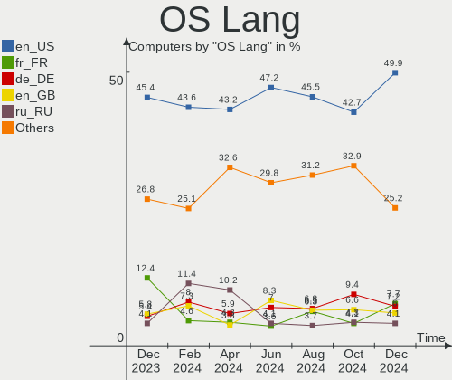
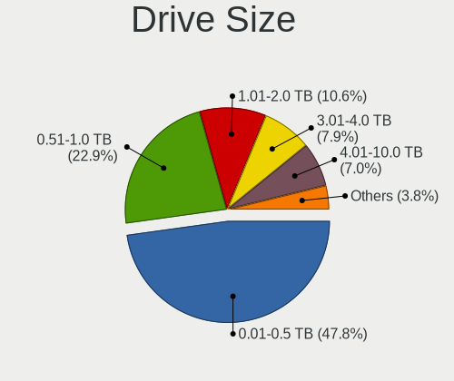

Debian Hardware Trends
----------------------

A project to identify most popular hardware characteristics and track their change
over time based on data collected by Debian users at https://Linux-Hardware.org.

Anyone can contribute to this report by the [hw-probe](https://github.com/linuxhw/hw-probe) tool:

    sudo -E hw-probe -all -upload

This is a report for all computer types. See also reports for [desktops](/Dist/Debian/Desktop/README.md) and [notebooks](/Dist/Debian/Notebook/README.md).

Full-feature report is available here: https://linux-hardware.org/?view=trends

Period: Oct, 2021.

Contents
--------

* [ System ](#system)
  - [ OS                       ](#os)
  - [ OS Family                ](#os-family)
  - [ Kernel                   ](#kernel)
  - [ Kernel Family            ](#kernel-family)
  - [ Kernel Major Ver.        ](#kernel-major-ver)
  - [ Arch                     ](#arch)
  - [ DE                       ](#de)
  - [ Display Server           ](#display-server)
  - [ Display Manager          ](#display-manager)
  - [ OS Lang                  ](#os-lang)
  - [ Boot Mode                ](#boot-mode)
  - [ Filesystem               ](#filesystem)
  - [ Part. scheme             ](#part-scheme)
  - [ Dual Boot with Linux/BSD ](#dual-boot-with-linuxbsd)
  - [ Dual Boot (Win)          ](#dual-boot-win)

* [ Board ](#board)
  - [ Vendor                   ](#vendor)
  - [ Model                    ](#model)
  - [ Model Family             ](#model-family)
  - [ MFG Year                 ](#mfg-year)
  - [ Form Factor              ](#form-factor)
  - [ Secure Boot              ](#secure-boot)
  - [ Coreboot                 ](#coreboot)
  - [ RAM Size                 ](#ram-size)
  - [ RAM Used                 ](#ram-used)
  - [ Total Drives             ](#total-drives)
  - [ Has CD-ROM               ](#has-cd-rom)
  - [ Has Ethernet             ](#has-ethernet)
  - [ Has WiFi                 ](#has-wifi)
  - [ Has Bluetooth            ](#has-bluetooth)

* [ Location ](#location)
  - [ Country                  ](#country)
  - [ City                     ](#city)

* [ Drives ](#drives)
  - [ Drive Vendor             ](#drive-vendor)
  - [ Drive Model              ](#drive-model)
  - [ HDD Vendor               ](#hdd-vendor)
  - [ SSD Vendor               ](#ssd-vendor)
  - [ Drive Kind               ](#drive-kind)
  - [ Drive Connector          ](#drive-connector)
  - [ Drive Size               ](#drive-size)
  - [ Space Total              ](#space-total)
  - [ Space Used               ](#space-used)
  - [ Malfunc. Drives          ](#malfunc-drives)
  - [ Malfunc. Drive Vendor    ](#malfunc-drive-vendor)
  - [ Malfunc. HDD Vendor      ](#malfunc-hdd-vendor)
  - [ Malfunc. Drive Kind      ](#malfunc-drive-kind)
  - [ Failed Drives            ](#failed-drives)
  - [ Failed Drive Vendor      ](#failed-drive-vendor)
  - [ Drive Status             ](#drive-status)

* [ Storage controller ](#storage-controller)
  - [ Storage Vendor           ](#storage-vendor)
  - [ Storage Model            ](#storage-model)
  - [ Storage Kind             ](#storage-kind)

* [ Processor ](#processor)
  - [ CPU Vendor               ](#cpu-vendor)
  - [ CPU Model                ](#cpu-model)
  - [ CPU Model Family         ](#cpu-model-family)
  - [ CPU Cores                ](#cpu-cores)
  - [ CPU Sockets              ](#cpu-sockets)
  - [ CPU Threads              ](#cpu-threads)
  - [ CPU Op-Modes             ](#cpu-op-modes)
  - [ CPU Microcode            ](#cpu-microcode)
  - [ CPU Microarch            ](#cpu-microarch)

* [ Graphics ](#graphics)
  - [ GPU Vendor               ](#gpu-vendor)
  - [ GPU Model                ](#gpu-model)
  - [ GPU Combo                ](#gpu-combo)
  - [ GPU Driver               ](#gpu-driver)
  - [ GPU Memory               ](#gpu-memory)

* [ Monitor ](#monitor)
  - [ Monitor Vendor           ](#monitor-vendor)
  - [ Monitor Model            ](#monitor-model)
  - [ Monitor Resolution       ](#monitor-resolution)
  - [ Monitor Diagonal         ](#monitor-diagonal)
  - [ Monitor Width            ](#monitor-width)
  - [ Aspect Ratio             ](#aspect-ratio)
  - [ Monitor Area             ](#monitor-area)
  - [ Pixel Density            ](#pixel-density)
  - [ Multiple Monitors        ](#multiple-monitors)

* [ Network ](#network)
  - [ Net Controller Vendor    ](#net-controller-vendor)
  - [ Net Controller Model     ](#net-controller-model)
  - [ Wireless Vendor          ](#wireless-vendor)
  - [ Wireless Model           ](#wireless-model)
  - [ Ethernet Vendor          ](#ethernet-vendor)
  - [ Ethernet Model           ](#ethernet-model)
  - [ Net Controller Kind      ](#net-controller-kind)
  - [ Used Controller          ](#used-controller)
  - [ NICs                     ](#nics)
  - [ IPv6                     ](#ipv6)

* [ Bluetooth ](#bluetooth)
  - [ Bluetooth Vendor         ](#bluetooth-vendor)
  - [ Bluetooth Model          ](#bluetooth-model)

* [ Sound ](#sound)
  - [ Sound Vendor             ](#sound-vendor)
  - [ Sound Model              ](#sound-model)

* [ Memory ](#memory)
  - [ Memory Vendor            ](#memory-vendor)
  - [ Memory Model             ](#memory-model)
  - [ Memory Kind              ](#memory-kind)
  - [ Memory Form Factor       ](#memory-form-factor)
  - [ Memory Size              ](#memory-size)
  - [ Memory Speed             ](#memory-speed)

* [ Printers & scanners ](#printers--scanners)
  - [ Printer Vendor           ](#printer-vendor)
  - [ Printer Model            ](#printer-model)
  - [ Scanner Vendor           ](#scanner-vendor)
  - [ Scanner Model            ](#scanner-model)

* [ Camera ](#camera)
  - [ Camera Vendor            ](#camera-vendor)
  - [ Camera Model             ](#camera-model)

* [ Security ](#security)
  - [ Fingerprint Vendor       ](#fingerprint-vendor)
  - [ Fingerprint Model        ](#fingerprint-model)
  - [ Chipcard Vendor          ](#chipcard-vendor)
  - [ Chipcard Model           ](#chipcard-model)

* [ Unsupported ](#unsupported)
  - [ Unsupported Devices      ](#unsupported-devices)
  - [ Unsupported Device Types ](#unsupported-device-types)

System
------

OS
--

Installed operating systems

| Name              | Computers | Percent |
|-------------------|-----------|---------|
| Debian 11         | 210       | 78.07%  |
| Debian 10         | 28        | 10.41%  |
| Debian Testing    | 17        | 6.32%   |
| Debian Unstable   | 5         | 1.86%   |
| Debian 11-updates | 5         | 1.86%   |
| Debian 9          | 4         | 1.49%   |

OS Family
---------

OS without a version

| Name   | Computers | Percent |
|--------|-----------|---------|
| Debian | 269       | 100%    |

Kernel
------

Version of the Linux kernel

| Version                                    | Computers | Percent |
|--------------------------------------------|-----------|---------|
| 5.10.0-9-amd64                             | 77        | 28.62%  |
| 5.10.0-8-amd64                             | 75        | 27.88%  |
| 5.10.0-7-amd64                             | 34        | 12.64%  |
| 5.14.0-2-amd64                             | 12        | 4.46%   |
| 4.19.0-18-amd64                            | 7         | 2.6%    |
| 4.19.0-17-amd64                            | 7         | 2.6%    |
| 5.11.22-5-pve                              | 5         | 1.86%   |
| 5.14.0-12.1-liquorix-amd64                 | 4         | 1.49%   |
| 5.10.0-9-686                               | 4         | 1.49%   |
| 5.14.0-1-amd64                             | 3         | 1.12%   |
| 5.11.22-4-pve                              | 3         | 1.12%   |
| 5.10.0-9-686-pae                           | 3         | 1.12%   |
| 5.14.0-3-amd64                             | 2         | 0.74%   |
| 5.10.0-0.bpo.8-amd64                       | 2         | 0.74%   |
| 5.9.0-2-amd64                              | 1         | 0.37%   |
| 5.6.19-daveiii-pyradef-aufs                | 1         | 0.37%   |
| 5.6.0-0.bpo.2-amd64                        | 1         | 0.37%   |
| 5.4.21                                     | 1         | 0.37%   |
| 5.4.143-1-pve                              | 1         | 0.37%   |
| 5.15.0-rc5-recomp                          | 1         | 0.37%   |
| 5.14.9-xanmod1-cacule                      | 1         | 0.37%   |
| 5.14.11-surface                            | 1         | 0.37%   |
| 5.14.0-2mx-amd64                           | 1         | 0.37%   |
| 5.14.0-14.1-liquorix-amd64                 | 1         | 0.37%   |
| 5.14.0-13.1-liquorix-amd64                 | 1         | 0.37%   |
| 5.10.65-gnu1                               | 1         | 0.37%   |
| 5.10.63-rk3188                             | 1         | 0.37%   |
| 5.10.0-8-686-pae                           | 1         | 0.37%   |
| 5.10.0-5mx-amd64                           | 1         | 0.37%   |
| 5.10.0-2-amd64                             | 1         | 0.37%   |
| 5.10.0-0.bpo.7-amd64                       | 1         | 0.37%   |
| 4.9.0-264-antix.1-amd64-smp                | 1         | 0.37%   |
| 4.9.0-16-amd64                             | 1         | 0.37%   |
| 4.9.0-16-686                               | 1         | 0.37%   |
| 4.4.194-rk322x                             | 1         | 0.37%   |
| 4.4.190-1233-rockchip-ayufan-gd3f1be0ed310 | 1         | 0.37%   |
| 4.19.147-rivoreo-amd64                     | 1         | 0.37%   |
| 4.19.0-9-amd64                             | 1         | 0.37%   |
| 4.19.0-8-amd64                             | 1         | 0.37%   |
| 4.19.0-6-amd64                             | 1         | 0.37%   |
| 4.19.0-18-686-pae                          | 1         | 0.37%   |
| 4.19.0-17-686                              | 1         | 0.37%   |
| 4.19.0-0.bpo.5-amd64                       | 1         | 0.37%   |
| 4.14.93-g538e75632e3b-dirty                | 1         | 0.37%   |
| 3.10.54                                    | 1         | 0.37%   |

Kernel Family
-------------

Linux kernel without a distro release

| Version  | Computers | Percent |
|----------|-----------|---------|
| 5.10.0   | 199       | 73.98%  |
| 5.14.0   | 24        | 8.92%   |
| 4.19.0   | 20        | 7.43%   |
| 5.11.22  | 8         | 2.97%   |
| 4.9.0    | 3         | 1.12%   |
| 5.9.0    | 1         | 0.37%   |
| 5.6.19   | 1         | 0.37%   |
| 5.6.0    | 1         | 0.37%   |
| 5.4.21   | 1         | 0.37%   |
| 5.4.143  | 1         | 0.37%   |
| 5.15.0   | 1         | 0.37%   |
| 5.14.9   | 1         | 0.37%   |
| 5.14.11  | 1         | 0.37%   |
| 5.10.65  | 1         | 0.37%   |
| 5.10.63  | 1         | 0.37%   |
| 4.4.194  | 1         | 0.37%   |
| 4.4.190  | 1         | 0.37%   |
| 4.19.147 | 1         | 0.37%   |
| 4.14.93  | 1         | 0.37%   |
| 3.10.54  | 1         | 0.37%   |

Kernel Major Ver.
-----------------

Linux kernel major version

| Version | Computers | Percent |
|---------|-----------|---------|
| 5.10    | 201       | 74.72%  |
| 5.14    | 26        | 9.67%   |
| 4.19    | 21        | 7.81%   |
| 5.11    | 8         | 2.97%   |
| 4.9     | 3         | 1.12%   |
| 5.6     | 2         | 0.74%   |
| 5.4     | 2         | 0.74%   |
| 4.4     | 2         | 0.74%   |
| 5.9     | 1         | 0.37%   |
| 5.15    | 1         | 0.37%   |
| 4.14    | 1         | 0.37%   |
| 3.10    | 1         | 0.37%   |

Arch
----

OS architecture (x86_64, i586, etc.)

| Name    | Computers | Percent |
|---------|-----------|---------|
| x86_64  | 253       | 94.05%  |
| i686    | 11        | 4.09%   |
| armv7l  | 4         | 1.49%   |
| aarch64 | 1         | 0.37%   |

DE
--

Desktop Environment

| Name          | Computers | Percent |
|---------------|-----------|---------|
| GNOME         | 76        | 28.25%  |
| Unknown       | 69        | 25.65%  |
| XFCE          | 38        | 14.13%  |
| KDE5          | 36        | 13.38%  |
| LXDE          | 14        | 5.2%    |
| MATE          | 9         | 3.35%   |
| X-Cinnamon    | 8         | 2.97%   |
| Cinnamon      | 6         | 2.23%   |
| i3            | 5         | 1.86%   |
| Trinity       | 2         | 0.74%   |
| Openbox       | 2         | 0.74%   |
| LXQt          | 1         | 0.37%   |
| KDE           | 1         | 0.37%   |
| GNOME Classic | 1         | 0.37%   |
| awesome       | 1         | 0.37%   |

Display Server
--------------

X11 or Wayland

| Name    | Computers | Percent |
|---------|-----------|---------|
| X11     | 150       | 55.76%  |
| Wayland | 49        | 18.22%  |
| Unknown | 47        | 17.47%  |
| Tty     | 23        | 8.55%   |

Display Manager
---------------

SDDM, LightDM, etc.

| Name    | Computers | Percent |
|---------|-----------|---------|
| Unknown | 107       | 39.78%  |
| LightDM | 60        | 22.3%   |
| GDM     | 56        | 20.82%  |
| SDDM    | 36        | 13.38%  |
| GDM3    | 9         | 3.35%   |
| NODM    | 1         | 0.37%   |

OS Lang
-------

Language

| Lang    | Computers | Percent |
|---------|-----------|---------|
| en_US   | 80        | 29.74%  |
| ru_RU   | 49        | 18.22%  |
| es_ES   | 19        | 7.06%   |
| fr_FR   | 14        | 5.2%    |
| pt_BR   | 13        | 4.83%   |
| Unknown | 13        | 4.83%   |
| de_DE   | 10        | 3.72%   |
| it_IT   | 9         | 3.35%   |
| en_GB   | 9         | 3.35%   |
| en_CA   | 7         | 2.6%    |
| pl_PL   | 5         | 1.86%   |
| es_CL   | 5         | 1.86%   |
| en_AU   | 4         | 1.49%   |
| es_MX   | 3         | 1.12%   |
| es_AR   | 3         | 1.12%   |
| de_AT   | 3         | 1.12%   |
| pt_PT   | 2         | 0.74%   |
| ja_JP   | 2         | 0.74%   |
| hu_HU   | 2         | 0.74%   |
| C       | 2         | 0.74%   |
| zh_TW   | 1         | 0.37%   |
| zh_CN   | 1         | 0.37%   |
| uk_UA   | 1         | 0.37%   |
| sv_SE   | 1         | 0.37%   |
| ru_UA   | 1         | 0.37%   |
| nl_BE   | 1         | 0.37%   |
| fr_CH   | 1         | 0.37%   |
| fr_BE   | 1         | 0.37%   |
| es_CR   | 1         | 0.37%   |
| en_ZA   | 1         | 0.37%   |
| en_DK   | 1         | 0.37%   |
| de_CH   | 1         | 0.37%   |
| cs_CZ   | 1         | 0.37%   |
| ca_ES   | 1         | 0.37%   |
| bg_BG   | 1         | 0.37%   |

Boot Mode
---------

EFI or BIOS

| Mode | Computers | Percent |
|------|-----------|---------|
| BIOS | 140       | 52.04%  |
| EFI  | 129       | 47.96%  |

Filesystem
----------

Type of filesystem

| Type       | Computers | Percent |
|------------|-----------|---------|
| Ext4       | 207       | 76.95%  |
| Overlay    | 44        | 16.36%  |
| Btrfs      | 8         | 2.97%   |
| Zfs        | 4         | 1.49%   |
| Xfs        | 3         | 1.12%   |
| Tmpfs      | 1         | 0.37%   |
| Fuse.sshfs | 1         | 0.37%   |
| F2fs       | 1         | 0.37%   |

Part. scheme
------------

Scheme of partitioning

| Type    | Computers | Percent |
|---------|-----------|---------|
| GPT     | 143       | 53.16%  |
| MBR     | 74        | 27.51%  |
| Unknown | 52        | 19.33%  |

Dual Boot with Linux/BSD
------------------------

Hosting more than one Linux/BSD

| Dual boot | Computers | Percent |
|-----------|-----------|---------|
| No        | 231       | 85.87%  |
| Yes       | 38        | 14.13%  |

Dual Boot (Win)
---------------

Hosting Linux and Windows

| Dual boot | Computers | Percent |
|-----------|-----------|---------|
| No        | 175       | 65.06%  |
| Yes       | 94        | 34.94%  |

Board
-----

Vendor
------

Motherboard manufacturer

| Name                | Computers | Percent |
|---------------------|-----------|---------|
| Hewlett-Packard     | 43        | 15.99%  |
| ASUSTek Computer    | 41        | 15.24%  |
| Lenovo              | 37        | 13.75%  |
| Dell                | 36        | 13.38%  |
| Acer                | 16        | 5.95%   |
| Gigabyte Technology | 14        | 5.2%    |
| ASRock              | 14        | 5.2%    |
| MSI                 | 13        | 4.83%   |
| Aquarius            | 11        | 4.09%   |
| Apple               | 8         | 2.97%   |
| Unknown             | 7         | 2.6%    |
| Samsung Electronics | 3         | 1.12%   |
| Pegatron            | 3         | 1.12%   |
| Intel               | 3         | 1.12%   |
| Toshiba             | 2         | 0.74%   |
| TrekStor            | 1         | 0.37%   |
| Supermicro          | 1         | 0.37%   |
| Sun Microsystems    | 1         | 0.37%   |
| Sony                | 1         | 0.37%   |
| Rockchip            | 1         | 0.37%   |
| Nvidia              | 1         | 0.37%   |
| Microsoft           | 1         | 0.37%   |
| LG Electronics      | 1         | 0.37%   |
| Jumper              | 1         | 0.37%   |
| HUAWEI              | 1         | 0.37%   |
| HPE                 | 1         | 0.37%   |
| Foxconn             | 1         | 0.37%   |
| Digiboard           | 1         | 0.37%   |
| Compal              | 1         | 0.37%   |
| Chuwi               | 1         | 0.37%   |
| AZW                 | 1         | 0.37%   |
| AOpen               | 1         | 0.37%   |
| American Megatrends | 1         | 0.37%   |

Model
-----

Motherboard model

| Name                                                                                     | Computers | Percent |
|------------------------------------------------------------------------------------------|-----------|---------|
| Aquarius NS585                                                                           | 11        | 4.09%   |
| Unknown                                                                                  | 8         | 2.97%   |
| ASUS All Series                                                                          | 6         | 2.23%   |
| Apple MacBookAir7,2                                                                      | 4         | 1.49%   |
| HP Pavilion Gaming Laptop 15-ec1xxx                                                      | 3         | 1.12%   |
| Lenovo IdeaPad S145-15API 81V7                                                           | 2         | 0.74%   |
| Lenovo IdeaPad Flex 5 14ARE05 81X2                                                       | 2         | 0.74%   |
| HP Pavilion g6                                                                           | 2         | 0.74%   |
| HP EliteDesk 800 G1 SFF                                                                  | 2         | 0.74%   |
| HP EliteDesk 700 G1 SFF                                                                  | 2         | 0.74%   |
| HP EliteBook 8460p                                                                       | 2         | 0.74%   |
| Gigabyte H61M-S2PV                                                                       | 2         | 0.74%   |
| Dell OptiPlex 7010                                                                       | 2         | 0.74%   |
| ASRock G31M-VS2                                                                          | 2         | 0.74%   |
| Apple MacBook3,1                                                                         | 2         | 0.74%   |
| Acer Aspire A515-51G                                                                     | 2         | 0.74%   |
| TrekStor Surfbook A13                                                                    | 1         | 0.37%   |
| Toshiba Satellite A215                                                                   | 1         | 0.37%   |
| Toshiba Satellite A205                                                                   | 1         | 0.37%   |
| Supermicro Super Server                                                                  | 1         | 0.37%   |
| Sun Microsystems Ultra 27                                                                | 1         | 0.37%   |
| Sony SVE14A15FLB                                                                         | 1         | 0.37%   |
| Samsung 350V5C/350V5X/350V4C/350V4X/351V5C/351V5X/351V4C/351V4X/3540VC/3540VX/3440VC/344 | 1         | 0.37%   |
| Samsung 300E4Z/300E5Z/300E7Z                                                             | 1         | 0.37%   |
| Samsung 300E4C/300E5C/300E7C                                                             | 1         | 0.37%   |
| Pegatron p7-1030                                                                         | 1         | 0.37%   |
| Pegatron IPXCR_VN1                                                                       | 1         | 0.37%   |
| Pegatron 505B Microtower PC                                                              | 1         | 0.37%   |
| Nvidia NF-MCP61                                                                          | 1         | 0.37%   |
| MSI MS-7C75                                                                              | 1         | 0.37%   |
| MSI MS-7C56                                                                              | 1         | 0.37%   |
| MSI MS-7C35                                                                              | 1         | 0.37%   |
| MSI MS-7C02                                                                              | 1         | 0.37%   |
| MSI MS-7979                                                                              | 1         | 0.37%   |
| MSI MS-7817                                                                              | 1         | 0.37%   |
| MSI MS-7721                                                                              | 1         | 0.37%   |
| MSI MS-7597                                                                              | 1         | 0.37%   |
| MSI MS-7519                                                                              | 1         | 0.37%   |
| MSI GF75 Thin 9SC                                                                        | 1         | 0.37%   |
| MSI GF63 8RD                                                                             | 1         | 0.37%   |
| MSI GE72 6QD                                                                             | 1         | 0.37%   |
| MSI Bravo 15 A4DDR                                                                       | 1         | 0.37%   |
| Microsoft Surface Laptop Go                                                              | 1         | 0.37%   |
| LG X120-L.C7L1A9                                                                         | 1         | 0.37%   |
| Lenovo Y520-15IKBN 80WK                                                                  | 1         | 0.37%   |
| Lenovo V330-15IKB 81AX                                                                   | 1         | 0.37%   |
| Lenovo ThinkPad X60 17068GG                                                              | 1         | 0.37%   |
| Lenovo ThinkPad X140e 20BL000BUS                                                         | 1         | 0.37%   |
| Lenovo ThinkPad X1 Carbon Gen 9 20XWCTO1WW                                               | 1         | 0.37%   |
| Lenovo ThinkPad X1 Carbon Gen 9 20XWA003CD                                               | 1         | 0.37%   |
| Lenovo ThinkPad X1 Carbon Gen 9 20XW003HUS                                               | 1         | 0.37%   |
| Lenovo ThinkPad X1 Carbon 7th 20QD00L7GE                                                 | 1         | 0.37%   |
| Lenovo ThinkPad W530 244743G                                                             | 1         | 0.37%   |
| Lenovo ThinkPad T61 8895WFJ                                                              | 1         | 0.37%   |
| Lenovo ThinkPad T540p 20BFS05B0Q                                                         | 1         | 0.37%   |
| Lenovo ThinkPad T520 4242W9B                                                             | 1         | 0.37%   |
| Lenovo ThinkPad T490 20N2000KGE                                                          | 1         | 0.37%   |
| Lenovo ThinkPad T480s 20L7002AUS                                                         | 1         | 0.37%   |
| Lenovo ThinkPad T480 20L5000AMC                                                          | 1         | 0.37%   |
| Lenovo ThinkPad T440 20B7S1X108                                                          | 1         | 0.37%   |

Model Family
------------

Motherboard model prefix

| Name                   | Computers | Percent |
|------------------------|-----------|---------|
| Lenovo ThinkPad        | 20        | 7.43%   |
| Dell Inspiron          | 13        | 4.83%   |
| Aquarius NS585         | 11        | 4.09%   |
| HP EliteBook           | 8         | 2.97%   |
| Acer Aspire            | 8         | 2.97%   |
| Unknown                | 8         | 2.97%   |
| Lenovo IdeaPad         | 7         | 2.6%    |
| Dell Latitude          | 7         | 2.6%    |
| HP Pavilion            | 6         | 2.23%   |
| ASUS All               | 6         | 2.23%   |
| HP Laptop              | 5         | 1.86%   |
| Apple MacBookAir7      | 5         | 1.86%   |
| HP EliteDesk           | 4         | 1.49%   |
| HP Compaq              | 4         | 1.49%   |
| Dell XPS               | 4         | 1.49%   |
| ASUS TUF               | 4         | 1.49%   |
| ASUS PRIME             | 4         | 1.49%   |
| Lenovo ThinkCentre     | 3         | 1.12%   |
| Dell PowerEdge         | 3         | 1.12%   |
| Dell OptiPlex          | 3         | 1.12%   |
| ASUS ROG               | 3         | 1.12%   |
| Toshiba Satellite      | 2         | 0.74%   |
| HP ProLiant            | 2         | 0.74%   |
| HP ProBook             | 2         | 0.74%   |
| HP OMEN                | 2         | 0.74%   |
| HP 250                 | 2         | 0.74%   |
| Gigabyte H61M-S2PV     | 2         | 0.74%   |
| Dell Vostro            | 2         | 0.74%   |
| Dell Precision         | 2         | 0.74%   |
| ASRock G31M-VS2        | 2         | 0.74%   |
| Apple MacBook3         | 2         | 0.74%   |
| Acer Nitro             | 2         | 0.74%   |
| TrekStor Surfbook      | 1         | 0.37%   |
| Supermicro Super       | 1         | 0.37%   |
| Sun Microsystems Ultra | 1         | 0.37%   |
| Sony SVE14A15FLB       | 1         | 0.37%   |
| Samsung 350V5C         | 1         | 0.37%   |
| Samsung 300E4Z         | 1         | 0.37%   |
| Samsung 300E4C         | 1         | 0.37%   |
| Pegatron p7-1030       | 1         | 0.37%   |
| Pegatron IPXCR         | 1         | 0.37%   |
| Pegatron 505B          | 1         | 0.37%   |
| Nvidia NF-MCP61        | 1         | 0.37%   |
| MSI MS-7C75            | 1         | 0.37%   |
| MSI MS-7C56            | 1         | 0.37%   |
| MSI MS-7C35            | 1         | 0.37%   |
| MSI MS-7C02            | 1         | 0.37%   |
| MSI MS-7979            | 1         | 0.37%   |
| MSI MS-7817            | 1         | 0.37%   |
| MSI MS-7721            | 1         | 0.37%   |
| MSI MS-7597            | 1         | 0.37%   |
| MSI MS-7519            | 1         | 0.37%   |
| MSI GF75               | 1         | 0.37%   |
| MSI GF63               | 1         | 0.37%   |
| MSI GE72               | 1         | 0.37%   |
| MSI Bravo              | 1         | 0.37%   |
| Microsoft Surface      | 1         | 0.37%   |
| LG X120-L.C7L1A9       | 1         | 0.37%   |
| Lenovo Y520-15IKBN     | 1         | 0.37%   |
| Lenovo V330-15IKB      | 1         | 0.37%   |

MFG Year
--------

Motherboard manufacture year

| Year    | Computers | Percent |
|---------|-----------|---------|
| 2021    | 48        | 17.84%  |
| 2020    | 41        | 15.24%  |
| 2018    | 25        | 9.29%   |
| 2019    | 23        | 8.55%   |
| 2012    | 19        | 7.06%   |
| 2014    | 17        | 6.32%   |
| 2013    | 15        | 5.58%   |
| 2011    | 14        | 5.2%    |
| 2010    | 14        | 5.2%    |
| 2015    | 11        | 4.09%   |
| 2009    | 10        | 3.72%   |
| 2016    | 9         | 3.35%   |
| 2008    | 9         | 3.35%   |
| 2017    | 6         | 2.23%   |
| Unknown | 5         | 1.86%   |
| 2007    | 1         | 0.37%   |
| 2006    | 1         | 0.37%   |
| 2005    | 1         | 0.37%   |

Form Factor
-----------

Physical design of the computer

| Name           | Computers | Percent |
|----------------|-----------|---------|
| Notebook       | 153       | 56.88%  |
| Desktop        | 100       | 37.17%  |
| Server         | 6         | 2.23%   |
| Convertible    | 3         | 1.12%   |
| Tablet         | 2         | 0.74%   |
| Mini pc        | 2         | 0.74%   |
| Other          | 1         | 0.37%   |
| System on chip | 1         | 0.37%   |
| All in one     | 1         | 0.37%   |

Secure Boot
-----------

Enabled or disabled

| State    | Computers | Percent |
|----------|-----------|---------|
| Disabled | 257       | 95.54%  |
| Enabled  | 12        | 4.46%   |

Coreboot
--------

Have coreboot on board

| Used | Computers | Percent |
|------|-----------|---------|
| No   | 269       | 100%    |

RAM Size
--------

Total RAM memory

| Size in GB      | Computers | Percent |
|-----------------|-----------|---------|
| 4.01-8.0        | 68        | 25.28%  |
| 16.01-24.0      | 49        | 18.22%  |
| 8.01-16.0       | 49        | 18.22%  |
| 3.01-4.0        | 42        | 15.61%  |
| 32.01-64.0      | 23        | 8.55%   |
| 1.01-2.0        | 13        | 4.83%   |
| 64.01-256.0     | 8         | 2.97%   |
| 2.01-3.0        | 7         | 2.6%    |
| 0.51-1.0        | 5         | 1.86%   |
| 24.01-32.0      | 3         | 1.12%   |
| More than 256.0 | 1         | 0.37%   |
| Unknown         | 1         | 0.37%   |

RAM Used
--------

Used RAM memory

| Used GB    | Computers | Percent |
|------------|-----------|---------|
| 1.01-2.0   | 83        | 30.86%  |
| 0.51-1.0   | 52        | 19.33%  |
| 2.01-3.0   | 42        | 15.61%  |
| 4.01-8.0   | 35        | 13.01%  |
| 3.01-4.0   | 27        | 10.04%  |
| 0.01-0.5   | 11        | 4.09%   |
| 8.01-16.0  | 8         | 2.97%   |
| 16.01-24.0 | 4         | 1.49%   |
| 32.01-64.0 | 3         | 1.12%   |
| 24.01-32.0 | 3         | 1.12%   |
| Unknown    | 1         | 0.37%   |

Total Drives
------------

Number of drives on board

| Drives | Computers | Percent |
|--------|-----------|---------|
| 1      | 171       | 63.57%  |
| 2      | 55        | 20.45%  |
| 3      | 14        | 5.2%    |
| 4      | 12        | 4.46%   |
| 7      | 6         | 2.23%   |
| 5      | 3         | 1.12%   |
| 0      | 3         | 1.12%   |
| 8      | 2         | 0.74%   |
| 13     | 1         | 0.37%   |
| 11     | 1         | 0.37%   |
| 6      | 1         | 0.37%   |

Has CD-ROM
----------

Has CD-ROM on board

| Presented | Computers | Percent |
|-----------|-----------|---------|
| No        | 190       | 70.63%  |
| Yes       | 79        | 29.37%  |

Has Ethernet
------------

Has Ethernet on board

| Presented | Computers | Percent |
|-----------|-----------|---------|
| Yes       | 230       | 85.5%   |
| No        | 39        | 14.5%   |

Has WiFi
--------

Has WiFi module

| Presented | Computers | Percent |
|-----------|-----------|---------|
| Yes       | 187       | 69.52%  |
| No        | 82        | 30.48%  |

Has Bluetooth
-------------

Has Bluetooth module

| Presented | Computers | Percent |
|-----------|-----------|---------|
| Yes       | 159       | 59.11%  |
| No        | 110       | 40.89%  |

Location
--------

Country
-------

Geographic location (country)

| Country      | Computers | Percent |
|--------------|-----------|---------|
| Russia       | 47        | 17.47%  |
| USA          | 39        | 14.5%   |
| Spain        | 21        | 7.81%   |
| France       | 17        | 6.32%   |
| Brazil       | 15        | 5.58%   |
| Germany      | 13        | 4.83%   |
| Italy        | 12        | 4.46%   |
| Canada       | 8         | 2.97%   |
| Ukraine      | 6         | 2.23%   |
| UK           | 6         | 2.23%   |
| Hungary      | 6         | 2.23%   |
| Sweden       | 5         | 1.86%   |
| Poland       | 5         | 1.86%   |
| Mexico       | 5         | 1.86%   |
| China        | 5         | 1.86%   |
| Chile        | 5         | 1.86%   |
| Switzerland  | 4         | 1.49%   |
| Netherlands  | 4         | 1.49%   |
| Austria      | 4         | 1.49%   |
| Argentina    | 4         | 1.49%   |
| Portugal     | 3         | 1.12%   |
| Czechia      | 3         | 1.12%   |
| Belgium      | 3         | 1.12%   |
| Australia    | 3         | 1.12%   |
| Taiwan       | 2         | 0.74%   |
| Morocco      | 2         | 0.74%   |
| Japan        | 2         | 0.74%   |
| Costa Rica   | 2         | 0.74%   |
| Venezuela    | 1         | 0.37%   |
| UAE          | 1         | 0.37%   |
| Turkey       | 1         | 0.37%   |
| Tunisia      | 1         | 0.37%   |
| South Africa | 1         | 0.37%   |
| Philippines  | 1         | 0.37%   |
| Pakistan     | 1         | 0.37%   |
| New Zealand  | 1         | 0.37%   |
| Libya        | 1         | 0.37%   |
| Latvia       | 1         | 0.37%   |
| Kazakhstan   | 1         | 0.37%   |
| Jamaica      | 1         | 0.37%   |
| Indonesia    | 1         | 0.37%   |
| Guam         | 1         | 0.37%   |
| Finland      | 1         | 0.37%   |
| Croatia      | 1         | 0.37%   |
| Bulgaria     | 1         | 0.37%   |
| Belarus      | 1         | 0.37%   |

City
----

Geographic location (city)

| City                 | Computers | Percent |
|----------------------|-----------|---------|
| Voronezh             | 34        | 12.64%  |
| M??laga              | 9         | 3.35%   |
| Santiago             | 6         | 2.23%   |
| Portland             | 5         | 1.86%   |
| St Petersburg        | 4         | 1.49%   |
| S??o Paulo           | 3         | 1.12%   |
| Moscow               | 3         | 1.12%   |
| Zerkow               | 2         | 0.74%   |
| Warminster           | 2         | 0.74%   |
| Toronto              | 2         | 0.74%   |
| Shanghai             | 2         | 0.74%   |
| Seville              | 2         | 0.74%   |
| Salvador             | 2         | 0.74%   |
| Salt Lake City       | 2         | 0.74%   |
| Rome                 | 2         | 0.74%   |
| Paris                | 2         | 0.74%   |
| Moosomin             | 2         | 0.74%   |
| London               | 2         | 0.74%   |
| Kyiv                 | 2         | 0.74%   |
| Eureka               | 2         | 0.74%   |
| Chengdu              | 2         | 0.74%   |
| Catania              | 2         | 0.74%   |
| Buenos Aires         | 2         | 0.74%   |
| Albuquerque          | 2         | 0.74%   |
| Zeist                | 1         | 0.37%   |
| Zaporizhzhya         | 1         | 0.37%   |
| Zagreb               | 1         | 0.37%   |
| Yuma                 | 1         | 0.37%   |
| Yuanlin              | 1         | 0.37%   |
| York                 | 1         | 0.37%   |
| Yerba Buena          | 1         | 0.37%   |
| Yekaterinburg        | 1         | 0.37%   |
| Williston            | 1         | 0.37%   |
| Warsaw               | 1         | 0.37%   |
| Warrnambool          | 1         | 0.37%   |
| Wanroij              | 1         | 0.37%   |
| Volgograd            | 1         | 0.37%   |
| Villemomble          | 1         | 0.37%   |
| Vienna               | 1         | 0.37%   |
| Veliky Novgorod      | 1         | 0.37%   |
| Valencia             | 1         | 0.37%   |
| Upplands Vasby       | 1         | 0.37%   |
| Tripoli              | 1         | 0.37%   |
| Trieste              | 1         | 0.37%   |
| Tredion              | 1         | 0.37%   |
| Torres de la Alameda | 1         | 0.37%   |
| Torrent              | 1         | 0.37%   |
| Thonon-les-Bains     | 1         | 0.37%   |
| Thermopolis          | 1         | 0.37%   |
| Tatab??nya           | 1         | 0.37%   |
| Tancrou              | 1         | 0.37%   |
| Surabaya             | 1         | 0.37%   |
| Strasbourg           | 1         | 0.37%   |
| Stonehouse           | 1         | 0.37%   |
| Stockholm            | 1         | 0.37%   |
| Stockerau            | 1         | 0.37%   |
| Stains               | 1         | 0.37%   |
| St Louis             | 1         | 0.37%   |
| Sofia                | 1         | 0.37%   |
| Sion                 | 1         | 0.37%   |

Drives
------

Drive Vendor
------------

Hard drive vendors

| Vendor              | Computers | Drives | Percent |
|---------------------|-----------|--------|---------|
| Seagate             | 60        | 83     | 15.83%  |
| WDC                 | 56        | 87     | 14.78%  |
| Samsung Electronics | 51        | 60     | 13.46%  |
| Kingston            | 26        | 27     | 6.86%   |
| Toshiba             | 18        | 28     | 4.75%   |
| A-DATA Technology   | 18        | 18     | 4.75%   |
| SanDisk             | 16        | 16     | 4.22%   |
| Crucial             | 16        | 16     | 4.22%   |
| SK Hynix            | 15        | 15     | 3.96%   |
| Hitachi             | 13        | 14     | 3.43%   |
| Unknown             | 12        | 14     | 3.17%   |
| HGST                | 9         | 11     | 2.37%   |
| Micron Technology   | 7         | 7      | 1.85%   |
| Intel               | 7         | 8      | 1.85%   |
| Apple               | 6         | 7      | 1.58%   |
| OCZ                 | 4         | 4      | 1.06%   |
| SPCC                | 3         | 3      | 0.79%   |
| PNY                 | 3         | 3      | 0.79%   |
| XPG                 | 2         | 2      | 0.53%   |
| Transcend           | 2         | 2      | 0.53%   |
| Silicon Motion      | 2         | 2      | 0.53%   |
| Phison              | 2         | 2      | 0.53%   |
| MAXTOR              | 2         | 2      | 0.53%   |
| KIOXIA              | 2         | 2      | 0.53%   |
| Hewlett-Packard     | 2         | 4      | 0.53%   |
| China               | 2         | 2      | 0.53%   |
| Unknown             | 2         | 2      | 0.53%   |
| TrekStor            | 1         | 1      | 0.26%   |
| Team                | 1         | 1      | 0.26%   |
| Smartbuy            | 1         | 1      | 0.26%   |
| SABRENT             | 1         | 1      | 0.26%   |
| QGeeM               | 1         | 1      | 0.26%   |
| Patriot             | 1         | 1      | 0.26%   |
| Mushkin             | 1         | 1      | 0.26%   |
| MARSHAL             | 1         | 1      | 0.26%   |
| LITEON              | 1         | 1      | 0.26%   |
| Lenovo              | 1         | 1      | 0.26%   |
| LaCie               | 1         | 1      | 0.26%   |
| KLEVV               | 1         | 1      | 0.26%   |
| KingSpec            | 1         | 1      | 0.26%   |
| JMicron             | 1         | 1      | 0.26%   |
| JAMESDONKEY         | 1         | 1      | 0.26%   |
| IBM/Hitachi         | 1         | 1      | 0.26%   |
| Hajaan              | 1         | 1      | 0.26%   |
| GOODRAM             | 1         | 1      | 0.26%   |
| GALAX               | 1         | 1      | 0.26%   |
| Fujitsu             | 1         | 1      | 0.26%   |
| DREVO               | 1         | 1      | 0.26%   |

Drive Model
-----------

Hard drive models

| Model                                | Computers | Percent |
|--------------------------------------|-----------|---------|
| A-DATA SU800 512GB SSD               | 12        | 2.93%   |
| Seagate ST500DM002-1BD142 500GB      | 8         | 1.95%   |
| Kingston SA400S37240G 240GB SSD      | 8         | 1.95%   |
| Crucial CT500MX500SSD1 500GB         | 5         | 1.22%   |
| WDC WD5000AAKX-60U6AA0 500GB         | 4         | 0.98%   |
| Samsung SSD 860 EVO 250GB            | 4         | 0.98%   |
| Kingston SA400S37480G 480GB SSD      | 4         | 0.98%   |
| Apple SSD SM0128G 121GB              | 4         | 0.98%   |
| Toshiba MQ01ABF050 500GB             | 3         | 0.73%   |
| SPCC Solid State Disk 512GB          | 3         | 0.73%   |
| Seagate ST3500418AS 500GB            | 3         | 0.73%   |
| Seagate ST2000DM008-2FR102 2TB       | 3         | 0.73%   |
| Seagate ST1000LM035-1RK172 1TB       | 3         | 0.73%   |
| Seagate ST1000DM010-2EP102 1TB       | 3         | 0.73%   |
| Seagate ST1000DM003-1CH162 1TB       | 3         | 0.73%   |
| SanDisk SSD PLUS 240GB               | 3         | 0.73%   |
| Samsung SSD 850 EVO 500GB            | 3         | 0.73%   |
| Kingston SA400S37960G 960GB SSD      | 3         | 0.73%   |
| HGST HTS721010A9E630 1TB             | 3         | 0.73%   |
| Crucial CT1000MX500SSD1 1TB          | 3         | 0.73%   |
| WDC WUH721818ALE6L4 18TB             | 2         | 0.49%   |
| WDC WDS240G2G0A-00JH30 240GB SSD     | 2         | 0.49%   |
| WDC WD40EZRX-00SPEB0 4TB             | 2         | 0.49%   |
| WDC WD10SPZX-60Z10T0 1TB             | 2         | 0.49%   |
| WDC WD10EZEX-08WN4A0 1TB             | 2         | 0.49%   |
| WDC PC SN720 SDAPNTW-512G-1006 512GB | 2         | 0.49%   |
| WDC PC SN520 SDAPNUW-256G-1006 256GB | 2         | 0.49%   |
| Unknown MMC Card  128GB              | 2         | 0.49%   |
| Toshiba DT01ACA200 2TB               | 2         | 0.49%   |
| Toshiba DT01ACA100 1TB               | 2         | 0.49%   |
| Toshiba DT01ACA050 500GB             | 2         | 0.49%   |
| SK Hynix SHGP31-500GM-2 500GB        | 2         | 0.49%   |
| SK Hynix HFM512GDJTNI-82A0A 512GB    | 2         | 0.49%   |
| Seagate ST9250315AS 250GB            | 2         | 0.49%   |
| Seagate ST8000DM004-2CX188 8TB       | 2         | 0.49%   |
| Seagate ST500LM030-2E717D 500GB      | 2         | 0.49%   |
| Seagate ST3320613AS 320GB            | 2         | 0.49%   |
| SanDisk SDSSDH3 500G                 | 2         | 0.49%   |
| SanDisk SDSSDA240G 240GB             | 2         | 0.49%   |
| SanDisk SD8SN8U128G1001 128GB SSD    | 2         | 0.49%   |
| Sandisk NVMe SSD Drive 256GB         | 2         | 0.49%   |
| Samsung SSD 970 PRO 1TB              | 2         | 0.49%   |
| Samsung SSD 970 EVO 1TB              | 2         | 0.49%   |
| Samsung SSD 860 EVO 500GB            | 2         | 0.49%   |
| Samsung SSD 860 EVO 1TB              | 2         | 0.49%   |
| Samsung MZVLQ512HALU-000H1 512GB     | 2         | 0.49%   |
| Samsung MZVL21T0HCLR-00BL7 1TB       | 2         | 0.49%   |
| PNY CS900 250GB SSD                  | 2         | 0.49%   |
| Kingston SV300S37A60G 64GB SSD       | 2         | 0.49%   |
| Kingston SV300S37A120G 120GB SSD     | 2         | 0.49%   |
| Hitachi HDS721010CLA332 1TB          | 2         | 0.49%   |
| Crucial CT275MX300SSD1 275GB         | 2         | 0.49%   |
| Crucial CT120BX500SSD1 120GB         | 2         | 0.49%   |
| Unknown                              | 2         | 0.49%   |
| XPG SPECTRIX S40G 512GB              | 1         | 0.24%   |
| XPG GAMMIX S5 256GB                  | 1         | 0.24%   |
| WDC WDS240G2G0B-00EPW0 240GB SSD     | 1         | 0.24%   |
| WDC WDS200T2B0A 2TB SSD              | 1         | 0.24%   |
| WDC WDS100T2G0A-00JH30 1TB SSD       | 1         | 0.24%   |
| WDC WDS100T2B0B-00YS70 1TB SSD       | 1         | 0.24%   |

HDD Vendor
----------

Hard disk drive vendors

| Vendor              | Computers | Drives | Percent |
|---------------------|-----------|--------|---------|
| Seagate             | 59        | 81     | 40.69%  |
| WDC                 | 39        | 66     | 26.9%   |
| Toshiba             | 14        | 24     | 9.66%   |
| Hitachi             | 13        | 14     | 8.97%   |
| HGST                | 9         | 11     | 6.21%   |
| Samsung Electronics | 5         | 5      | 3.45%   |
| SABRENT             | 1         | 1      | 0.69%   |
| MAXTOR              | 1         | 1      | 0.69%   |
| MARSHAL             | 1         | 1      | 0.69%   |
| IBM/Hitachi         | 1         | 1      | 0.69%   |
| Hewlett-Packard     | 1         | 2      | 0.69%   |
| Fujitsu             | 1         | 1      | 0.69%   |

SSD Vendor
----------

Solid state drive vendors

| Vendor              | Computers | Drives | Percent |
|---------------------|-----------|--------|---------|
| Samsung Electronics | 32        | 36     | 20.92%  |
| Kingston            | 23        | 24     | 15.03%  |
| A-DATA Technology   | 17        | 17     | 11.11%  |
| Crucial             | 16        | 16     | 10.46%  |
| SanDisk             | 13        | 13     | 8.5%    |
| WDC                 | 8         | 8      | 5.23%   |
| OCZ                 | 4         | 4      | 2.61%   |
| Apple               | 4         | 4      | 2.61%   |
| SPCC                | 3         | 3      | 1.96%   |
| SK Hynix            | 3         | 3      | 1.96%   |
| PNY                 | 3         | 3      | 1.96%   |
| Micron Technology   | 3         | 3      | 1.96%   |
| Intel               | 3         | 4      | 1.96%   |
| Transcend           | 2         | 2      | 1.31%   |
| Toshiba             | 2         | 2      | 1.31%   |
| China               | 2         | 2      | 1.31%   |
| TrekStor            | 1         | 1      | 0.65%   |
| Team                | 1         | 1      | 0.65%   |
| Smartbuy            | 1         | 1      | 0.65%   |
| Patriot             | 1         | 1      | 0.65%   |
| Mushkin             | 1         | 1      | 0.65%   |
| MAXTOR              | 1         | 1      | 0.65%   |
| LITEON              | 1         | 1      | 0.65%   |
| Lenovo              | 1         | 1      | 0.65%   |
| KingSpec            | 1         | 1      | 0.65%   |
| JAMESDONKEY         | 1         | 1      | 0.65%   |
| Hajaan              | 1         | 1      | 0.65%   |
| GOODRAM             | 1         | 1      | 0.65%   |
| GALAX               | 1         | 1      | 0.65%   |
| DREVO               | 1         | 1      | 0.65%   |
| Unknown             | 1         | 1      | 0.65%   |

Drive Kind
----------

HDD or SSD

| Kind    | Computers | Drives | Percent |
|---------|-----------|--------|---------|
| SSD     | 135       | 159    | 39.02%  |
| HDD     | 125       | 208    | 36.13%  |
| NVMe    | 68        | 74     | 19.65%  |
| MMC     | 12        | 15     | 3.47%   |
| Unknown | 6         | 6      | 1.73%   |

Drive Connector
---------------

SATA, SAS, NVMe, etc.

| Type | Computers | Drives | Percent |
|------|-----------|--------|---------|
| SATA | 207       | 362    | 69.46%  |
| NVMe | 68        | 74     | 22.82%  |
| MMC  | 12        | 15     | 4.03%   |
| SAS  | 11        | 11     | 3.69%   |

Drive Size
----------

Size of hard drive

| Size in TB | Computers | Drives | Percent |
|------------|-----------|--------|---------|
| 0.01-0.5   | 158       | 197    | 58.96%  |
| 0.51-1.0   | 71        | 87     | 26.49%  |
| 1.01-2.0   | 23        | 39     | 8.58%   |
| 3.01-4.0   | 7         | 10     | 2.61%   |
| 10.01-20.0 | 4         | 16     | 1.49%   |
| 4.01-10.0  | 4         | 16     | 1.49%   |
| 2.01-3.0   | 1         | 2      | 0.37%   |

Space Total
-----------

Amount of disk space available on the file system

| Size in GB     | Computers | Percent |
|----------------|-----------|---------|
| 101-250        | 67        | 24.91%  |
| 251-500        | 59        | 21.93%  |
| Unknown        | 44        | 16.36%  |
| 501-1000       | 33        | 12.27%  |
| 1001-2000      | 17        | 6.32%   |
| More than 3000 | 14        | 5.2%    |
| 51-100         | 13        | 4.83%   |
| 21-50          | 8         | 2.97%   |
| 1-20           | 8         | 2.97%   |
| 2001-3000      | 6         | 2.23%   |

Space Used
----------

Amount of used disk space

| Used GB        | Computers | Percent |
|----------------|-----------|---------|
| 1-20           | 82        | 30.48%  |
| Unknown        | 44        | 16.36%  |
| 21-50          | 33        | 12.27%  |
| 101-250        | 31        | 11.52%  |
| 51-100         | 27        | 10.04%  |
| 251-500        | 24        | 8.92%   |
| 501-1000       | 11        | 4.09%   |
| More than 3000 | 6         | 2.23%   |
| 1001-2000      | 5         | 1.86%   |
| 2001-3000      | 4         | 1.49%   |
| 0              | 2         | 0.74%   |

Malfunc. Drives
---------------

Drive models with a malfunction

| Model                                        | Computers | Drives | Percent |
|----------------------------------------------|-----------|--------|---------|
| WDC WD5000AAKX-60U6AA0 500GB                 | 2         | 2      | 5.41%   |
| Seagate ST500DM002-1BD142 500GB              | 2         | 2      | 5.41%   |
| Crucial CT275MX300SSD1 275GB                 | 2         | 2      | 5.41%   |
| WDC WD40EZRX-00SPEB0 4TB                     | 1         | 1      | 2.7%    |
| WDC WD3200BEKT-75PVMT1 320GB                 | 1         | 1      | 2.7%    |
| WDC WD3200AAJS-22B4A0 320GB                  | 1         | 1      | 2.7%    |
| WDC WD3000JD-55KLB0 304GB                    | 1         | 1      | 2.7%    |
| WDC WD10EZEX-08WN4A0 1TB                     | 1         | 1      | 2.7%    |
| Toshiba MQ01ABF050 500GB                     | 1         | 1      | 2.7%    |
| SK Hynix HFS256G39MND-2300A 256GB SSD        | 1         | 1      | 2.7%    |
| SK Hynix HFS128G39TND-N210A 128GB SSD        | 1         | 1      | 2.7%    |
| Seagate ST9500420AS 500GB                    | 1         | 1      | 2.7%    |
| Seagate ST9250315AS 250GB                    | 1         | 1      | 2.7%    |
| Seagate ST3750330AS 752GB                    | 1         | 1      | 2.7%    |
| Seagate ST3500418AS 500GB                    | 1         | 1      | 2.7%    |
| Seagate ST340016A 40GB                       | 1         | 1      | 2.7%    |
| Seagate ST3320613AS 320GB                    | 1         | 1      | 2.7%    |
| Seagate ST3120022A 120GB                     | 1         | 1      | 2.7%    |
| Seagate ST1000DM003-1CH162 1TB               | 1         | 1      | 2.7%    |
| SanDisk SSD PLUS 240GB                       | 1         | 1      | 2.7%    |
| Samsung Electronics SSD 840 PRO Series 512GB | 1         | 1      | 2.7%    |
| OCZ VERTEX4 128GB SSD                        | 1         | 1      | 2.7%    |
| Micron Technology 2300 NVMe 512GB            | 1         | 1      | 2.7%    |
| Micron Technology 1100 SATA 256GB SSD        | 1         | 1      | 2.7%    |
| Kingston SV300S37A120G 120GB SSD             | 1         | 1      | 2.7%    |
| Intel SSDSC2KW120H6 120GB                    | 1         | 1      | 2.7%    |
| Intel SSDSC2KG960G7R 960GB                   | 1         | 2      | 2.7%    |
| Hitachi HTS547575A9E384 752GB                | 1         | 1      | 2.7%    |
| Hitachi HTS547550A9E384 500GB                | 1         | 1      | 2.7%    |
| Hitachi HTS543216L9A300 160GB                | 1         | 1      | 2.7%    |
| Hitachi HTS542516K9SA00 160GB                | 1         | 1      | 2.7%    |
| Hitachi HTS541010G9SA00 100GB                | 1         | 1      | 2.7%    |
| HGST HTS545050A7E680 500GB                   | 1         | 1      | 2.7%    |
| HGST HTS545050A7E380 500GB                   | 1         | 1      | 2.7%    |

Malfunc. Drive Vendor
---------------------

Vendors of faulty drives

| Vendor              | Computers | Drives | Percent |
|---------------------|-----------|--------|---------|
| Seagate             | 10        | 10     | 27.03%  |
| WDC                 | 7         | 7      | 18.92%  |
| Hitachi             | 5         | 5      | 13.51%  |
| SK Hynix            | 2         | 2      | 5.41%   |
| Micron Technology   | 2         | 2      | 5.41%   |
| Intel               | 2         | 3      | 5.41%   |
| HGST                | 2         | 2      | 5.41%   |
| Crucial             | 2         | 2      | 5.41%   |
| Toshiba             | 1         | 1      | 2.7%    |
| SanDisk             | 1         | 1      | 2.7%    |
| Samsung Electronics | 1         | 1      | 2.7%    |
| OCZ                 | 1         | 1      | 2.7%    |
| Kingston            | 1         | 1      | 2.7%    |

Malfunc. HDD Vendor
-------------------

Vendors of faulty HDD drives

| Vendor  | Computers | Drives | Percent |
|---------|-----------|--------|---------|
| Seagate | 10        | 10     | 40%     |
| WDC     | 7         | 7      | 28%     |
| Hitachi | 5         | 5      | 20%     |
| HGST    | 2         | 2      | 8%      |
| Toshiba | 1         | 1      | 4%      |

Malfunc. Drive Kind
-------------------

Kinds of faulty drives

| Kind | Computers | Drives | Percent |
|------|-----------|--------|---------|
| HDD  | 23        | 25     | 65.71%  |
| SSD  | 11        | 12     | 31.43%  |
| NVMe | 1         | 1      | 2.86%   |

Failed Drives
-------------

Failed drive models

| Model                           | Computers | Drives | Percent |
|---------------------------------|-----------|--------|---------|
| Seagate ST500DM002-1BD142 500GB | 1         | 1      | 50%     |
| HGST HDN724040ALE640 4TB        | 1         | 1      | 50%     |

Failed Drive Vendor
-------------------

Failed drive vendors

| Vendor  | Computers | Drives | Percent |
|---------|-----------|--------|---------|
| Seagate | 1         | 1      | 50%     |
| HGST    | 1         | 1      | 50%     |

Drive Status
------------

Number of failed and malfunc. drives

| Status   | Computers | Drives | Percent |
|----------|-----------|--------|---------|
| Works    | 184       | 300    | 63.23%  |
| Detected | 71        | 122    | 24.4%   |
| Malfunc  | 34        | 38     | 11.68%  |
| Failed   | 2         | 2      | 0.69%   |

Storage controller
------------------

Storage Vendor
--------------

Storage controller vendors

| Vendor                           | Computers | Percent |
|----------------------------------|-----------|---------|
| Intel                            | 179       | 55.08%  |
| AMD                              | 49        | 15.08%  |
| Samsung Electronics              | 24        | 7.38%   |
| Sandisk                          | 13        | 4%      |
| SK Hynix                         | 11        | 3.38%   |
| Marvell Technology Group         | 6         | 1.85%   |
| LSI Logic / Symbios Logic        | 6         | 1.85%   |
| ASMedia Technology               | 5         | 1.54%   |
| Nvidia                           | 4         | 1.23%   |
| Micron Technology                | 4         | 1.23%   |
| Toshiba America Info Systems     | 3         | 0.92%   |
| Kingston Technology Company      | 3         | 0.92%   |
| Silicon Motion                   | 2         | 0.62%   |
| Realtek Semiconductor            | 2         | 0.62%   |
| JMicron Technology               | 2         | 0.62%   |
| Broadcom / LSI                   | 2         | 0.62%   |
| Apple                            | 2         | 0.62%   |
| VIA Technologies                 | 1         | 0.31%   |
| Solid State Storage Technology   | 1         | 0.31%   |
| Silicon Integrated Systems [SiS] | 1         | 0.31%   |
| Seagate Technology               | 1         | 0.31%   |
| Phison Electronics               | 1         | 0.31%   |
| KIOXIA                           | 1         | 0.31%   |
| Biwin Storage Technology         | 1         | 0.31%   |
| ADATA Technology                 | 1         | 0.31%   |

Storage Model
-------------

Storage controller models

| Model                                                                            | Computers | Percent |
|----------------------------------------------------------------------------------|-----------|---------|
| AMD FCH SATA Controller [AHCI mode]                                              | 37        | 10.03%  |
| Intel 8 Series/C220 Series Chipset Family 6-port SATA Controller 1 [AHCI mode]   | 15        | 4.07%   |
| Intel Cannon Lake PCH SATA AHCI Controller                                       | 13        | 3.52%   |
| Intel 7 Series Chipset Family 6-port SATA Controller [AHCI mode]                 | 13        | 3.52%   |
| Intel Sunrise Point-LP SATA Controller [AHCI mode]                               | 9         | 2.44%   |
| Samsung NVMe SSD Controller SM981/PM981/PM983                                    | 8         | 2.17%   |
| Intel 6 Series/C200 Series Chipset Family 6 port Mobile SATA AHCI Controller     | 8         | 2.17%   |
| Intel 82801 Mobile SATA Controller [RAID mode]                                   | 7         | 1.9%    |
| Samsung NVMe SSD Controller 980                                                  | 6         | 1.63%   |
| Intel Volume Management Device NVMe RAID Controller                              | 6         | 1.63%   |
| Intel SATA Controller [RAID mode]                                                | 6         | 1.63%   |
| Intel NM10/ICH7 Family SATA Controller [IDE mode]                                | 6         | 1.63%   |
| Intel Cannon Lake Mobile PCH SATA AHCI Controller                                | 6         | 1.63%   |
| Intel 82801HM/HEM (ICH8M/ICH8M-E) IDE Controller                                 | 6         | 1.63%   |
| Intel 6 Series/C200 Series Chipset Family 6 port Desktop SATA AHCI Controller    | 6         | 1.63%   |
| Sandisk WD Black SN750 / PC SN730 NVMe SSD                                       | 5         | 1.36%   |
| Samsung Electronics SATA controller                                              | 5         | 1.36%   |
| Intel Q170/Q150/B150/H170/H110/Z170/CM236 Chipset SATA Controller [AHCI Mode]    | 5         | 1.36%   |
| Intel HM170/QM170 Chipset SATA Controller [AHCI Mode]                            | 5         | 1.36%   |
| Intel 82801HM/HEM (ICH8M/ICH8M-E) SATA Controller [AHCI mode]                    | 5         | 1.36%   |
| Intel 82801G (ICH7 Family) IDE Controller                                        | 5         | 1.36%   |
| AMD 400 Series Chipset SATA Controller                                           | 5         | 1.36%   |
| SK Hynix Gold P31 SSD                                                            | 4         | 1.08%   |
| Samsung NVMe SSD Controller PM9A1/PM9A3/980PRO                                   | 4         | 1.08%   |
| Micron Non-Volatile memory controller                                            | 4         | 1.08%   |
| Intel Atom/Celeron/Pentium Processor x5-E8000/J3xxx/N3xxx Series SATA Controller | 4         | 1.08%   |
| Intel Atom Processor E3800 Series SATA AHCI Controller                           | 4         | 1.08%   |
| Intel 82801JI (ICH10 Family) SATA AHCI Controller                                | 4         | 1.08%   |
| Intel 82801IBM/IEM (ICH9M/ICH9M-E) 4 port SATA Controller [AHCI mode]            | 4         | 1.08%   |
| Intel 82801GBM/GHM (ICH7-M Family) SATA Controller [AHCI mode]                   | 4         | 1.08%   |
| ASMedia ASM1062 Serial ATA Controller                                            | 4         | 1.08%   |
| AMD SB7x0/SB8x0/SB9x0 SATA Controller [AHCI mode]                                | 4         | 1.08%   |
| SK Hynix BC511                                                                   | 3         | 0.81%   |
| Sandisk WD Blue SN500 / PC SN520 NVMe SSD                                        | 3         | 0.81%   |
| Sandisk WD Black 2018/SN750 / PC SN720 NVMe SSD                                  | 3         | 0.81%   |
| Nvidia MCP61 SATA Controller                                                     | 3         | 0.81%   |
| Intel NM10/ICH7 Family SATA Controller [AHCI mode]                               | 3         | 0.81%   |
| Intel 7 Series/C210 Series Chipset Family 6-port SATA Controller [AHCI mode]     | 3         | 0.81%   |
| Intel 5 Series/3400 Series Chipset 6 port SATA AHCI Controller                   | 3         | 0.81%   |
| Intel 400 Series Chipset Family SATA AHCI Controller                             | 3         | 0.81%   |
| AMD Starship/Matisse Chipset SATA Controller [AHCI mode]                         | 3         | 0.81%   |
| Toshiba America Info Systems XG6 NVMe SSD Controller                             | 2         | 0.54%   |
| SK Hynix Non-Volatile memory controller                                          | 2         | 0.54%   |
| SK Hynix BC501 NVMe Solid State Drive                                            | 2         | 0.54%   |
| Silicon Motion SM2263EN/SM2263XT SSD Controller                                  | 2         | 0.54%   |
| Sandisk Non-Volatile memory controller                                           | 2         | 0.54%   |
| Nvidia MCP61 IDE                                                                 | 2         | 0.54%   |
| LSI Logic / Symbios Logic SAS2008 PCI-Express Fusion-MPT SAS-2 [Falcon]          | 2         | 0.54%   |
| LSI Logic / Symbios Logic SAS1068E PCI-Express Fusion-MPT SAS                    | 2         | 0.54%   |
| Intel Wildcat Point-LP SATA Controller [AHCI Mode]                               | 2         | 0.54%   |
| Intel Tiger Lake-LP SATA Controller [AHCI mode]                                  | 2         | 0.54%   |
| Intel SSD Pro 7600p/760p/E 6100p Series                                          | 2         | 0.54%   |
| Intel SSD 660P Series                                                            | 2         | 0.54%   |
| Intel Comet Lake SATA AHCI Controller                                            | 2         | 0.54%   |
| Intel Celeron N3350/Pentium N4200/Atom E3900 Series SATA AHCI Controller         | 2         | 0.54%   |
| Intel C600/X79 series chipset 6-Port SATA AHCI Controller                        | 2         | 0.54%   |
| Intel 82801HM/HEM (ICH8M/ICH8M-E) SATA Controller [IDE mode]                     | 2         | 0.54%   |
| Intel 8 Series SATA Controller 1 [AHCI mode]                                     | 2         | 0.54%   |
| Intel 7 Series/C210 Series Chipset Family 4-port SATA Controller [IDE mode]      | 2         | 0.54%   |
| Intel 7 Series/C210 Series Chipset Family 2-port SATA Controller [IDE mode]      | 2         | 0.54%   |

Storage Kind
------------

Kind of storage controller (IDE, SATA, NVMe, SAS, ...)

| Kind | Computers | Percent |
|------|-----------|---------|
| SATA | 193       | 58.13%  |
| NVMe | 68        | 20.48%  |
| IDE  | 41        | 12.35%  |
| RAID | 24        | 7.23%   |
| SAS  | 4         | 1.2%    |
| SCSI | 2         | 0.6%    |

Processor
---------

CPU Vendor
----------

Processor vendors

| Vendor | Computers | Percent |
|--------|-----------|---------|
| Intel  | 201       | 74.72%  |
| AMD    | 63        | 23.42%  |
| ARM    | 5         | 1.86%   |

CPU Model
---------

Processor models

| Model                                         | Computers | Percent |
|-----------------------------------------------|-----------|---------|
| Intel Core i3-9100 CPU @ 3.60GHz              | 11        | 4.09%   |
| Intel 11th Gen Core i7-1165G7 @ 2.80GHz       | 6         | 2.23%   |
| AMD Ryzen 5 3500U with Radeon Vega Mobile Gfx | 6         | 2.23%   |
| Intel Core i5-5250U CPU @ 1.60GHz             | 5         | 1.86%   |
| Intel Core i5-2520M CPU @ 2.50GHz             | 5         | 1.86%   |
| Intel Pentium CPU G3420 @ 3.20GHz             | 4         | 1.49%   |
| Intel Core i5-8250U CPU @ 1.60GHz             | 4         | 1.49%   |
| Intel Xeon CPU X5650 @ 2.67GHz                | 3         | 1.12%   |
| Intel Core i7-9750H CPU @ 2.60GHz             | 3         | 1.12%   |
| Intel Core i7-8565U CPU @ 1.80GHz             | 3         | 1.12%   |
| Intel Core i7-8550U CPU @ 1.80GHz             | 3         | 1.12%   |
| Intel Atom CPU N455 @ 1.66GHz                 | 3         | 1.12%   |
| Intel 11th Gen Core i5-1135G7 @ 2.40GHz       | 3         | 1.12%   |
| AMD Ryzen 7 4700U with Radeon Graphics        | 3         | 1.12%   |
| Intel Xeon CPU E3-1240 V2 @ 3.40GHz           | 2         | 0.74%   |
| Intel Pentium Dual-Core CPU T4300 @ 2.10GHz   | 2         | 0.74%   |
| Intel Pentium Dual-Core CPU E6500 @ 2.93GHz   | 2         | 0.74%   |
| Intel Pentium CPU N3710 @ 1.60GHz             | 2         | 0.74%   |
| Intel Pentium CPU N3700 @ 1.60GHz             | 2         | 0.74%   |
| Intel Core i7-8750H CPU @ 2.20GHz             | 2         | 0.74%   |
| Intel Core i7-8700 CPU @ 3.20GHz              | 2         | 0.74%   |
| Intel Core i7-7700HQ CPU @ 2.80GHz            | 2         | 0.74%   |
| Intel Core i7-6700HQ CPU @ 2.60GHz            | 2         | 0.74%   |
| Intel Core i7-3630QM CPU @ 2.40GHz            | 2         | 0.74%   |
| Intel Core i7-10750H CPU @ 2.60GHz            | 2         | 0.74%   |
| Intel Core i5-8265U CPU @ 1.60GHz             | 2         | 0.74%   |
| Intel Core i5-4590 CPU @ 3.30GHz              | 2         | 0.74%   |
| Intel Core i5-4570 CPU @ 3.20GHz              | 2         | 0.74%   |
| Intel Core i5-3470 CPU @ 3.20GHz              | 2         | 0.74%   |
| Intel Core i5-2450M CPU @ 2.50GHz             | 2         | 0.74%   |
| Intel Core i3-2350M CPU @ 2.30GHz             | 2         | 0.74%   |
| Intel Core i3-2100 CPU @ 3.10GHz              | 2         | 0.74%   |
| Intel Core 2 Duo CPU T9300 @ 2.50GHz          | 2         | 0.74%   |
| Intel Core 2 Duo CPU T7500 @ 2.20GHz          | 2         | 0.74%   |
| Intel Celeron CPU 3865U @ 1.80GHz             | 2         | 0.74%   |
| Intel Atom CPU N280 @ 1.66GHz                 | 2         | 0.74%   |
| Intel Atom CPU N270 @ 1.60GHz                 | 2         | 0.74%   |
| Intel 11th Gen Core i7-1185G7 @ 3.00GHz       | 2         | 0.74%   |
| AMD Ryzen 7 5800X 8-Core Processor            | 2         | 0.74%   |
| AMD Ryzen 7 5800H with Radeon Graphics        | 2         | 0.74%   |
| AMD Ryzen 7 4800H with Radeon Graphics        | 2         | 0.74%   |
| AMD Ryzen 5 5500U with Radeon Graphics        | 2         | 0.74%   |
| AMD Ryzen 5 4600H with Radeon Graphics        | 2         | 0.74%   |
| AMD Ryzen 5 3600 6-Core Processor             | 2         | 0.74%   |
| AMD Ryzen 5 2500U with Radeon Vega Mobile Gfx | 2         | 0.74%   |
| Intel Xeon Silver 4114 CPU @ 2.20GHz          | 1         | 0.37%   |
| Intel Xeon CPU W3540 @ 2.93GHz                | 1         | 0.37%   |
| Intel Xeon CPU E5405 @ 2.00GHz                | 1         | 0.37%   |
| Intel Xeon CPU E5-2660 v3 @ 2.60GHz           | 1         | 0.37%   |
| Intel Xeon CPU E5-2640 v3 @ 2.60GHz           | 1         | 0.37%   |
| Intel Xeon CPU E5-1620 0 @ 3.60GHz            | 1         | 0.37%   |
| Intel Pentium M processor 1.70GHz             | 1         | 0.37%   |
| Intel Pentium Dual CPU E2180 @ 2.00GHz        | 1         | 0.37%   |
| Intel Pentium CPU N4200 @ 1.10GHz             | 1         | 0.37%   |
| Intel Pentium CPU N3530 @ 2.16GHz             | 1         | 0.37%   |
| Intel Pentium CPU G3430 @ 3.30GHz             | 1         | 0.37%   |
| Intel Pentium CPU G3220 @ 3.00GHz             | 1         | 0.37%   |
| Intel Genuine CPU U7300 @ 1.30GHz             | 1         | 0.37%   |
| Intel Genuine CPU T2400 @ 1.83GHz             | 1         | 0.37%   |
| Intel Core i7-9700F CPU @ 3.00GHz             | 1         | 0.37%   |

CPU Model Family
----------------

Processor model prefix

| Model                   | Computers | Percent |
|-------------------------|-----------|---------|
| Intel Core i5           | 52        | 19.33%  |
| Intel Core i7           | 39        | 14.5%   |
| Intel Core i3           | 29        | 10.78%  |
| Other                   | 18        | 6.69%   |
| AMD Ryzen 5             | 16        | 5.95%   |
| Intel Celeron           | 14        | 5.2%    |
| AMD Ryzen 7             | 14        | 5.2%    |
| Intel Pentium           | 12        | 4.46%   |
| Intel Core 2 Duo        | 11        | 4.09%   |
| Intel Xeon              | 10        | 3.72%   |
| Intel Atom              | 10        | 3.72%   |
| AMD Ryzen 9             | 5         | 1.86%   |
| Intel Pentium Dual-Core | 4         | 1.49%   |
| AMD FX                  | 3         | 1.12%   |
| AMD Athlon              | 3         | 1.12%   |
| Intel Genuine           | 2         | 0.74%   |
| AMD E1                  | 2         | 0.74%   |
| AMD Athlon II X4        | 2         | 0.74%   |
| AMD Athlon II X2        | 2         | 0.74%   |
| AMD A4                  | 2         | 0.74%   |
| AMD A10                 | 2         | 0.74%   |
| Intel Xeon Silver       | 1         | 0.37%   |
| Intel Pentium M         | 1         | 0.37%   |
| Intel Pentium Dual      | 1         | 0.37%   |
| Intel Core 2 Quad       | 1         | 0.37%   |
| Intel Core 2            | 1         | 0.37%   |
| ARM ARMv7               | 1         | 0.37%   |
| AMD Ryzen Threadripper  | 1         | 0.37%   |
| AMD Ryzen 7 PRO         | 1         | 0.37%   |
| AMD Ryzen 5 PRO         | 1         | 0.37%   |
| AMD Phenom II X4        | 1         | 0.37%   |
| AMD Opteron             | 1         | 0.37%   |
| AMD EPYC                | 1         | 0.37%   |
| AMD Athlon XP           | 1         | 0.37%   |
| AMD Athlon X4           | 1         | 0.37%   |
| AMD Athlon II Neo       | 1         | 0.37%   |
| AMD Athlon 64 X2        | 1         | 0.37%   |
| AMD A6                  | 1         | 0.37%   |

CPU Cores
---------

Number of processor cores

| Number | Computers | Percent |
|--------|-----------|---------|
| 4      | 105       | 39.03%  |
| 2      | 98        | 36.43%  |
| 6      | 23        | 8.55%   |
| 8      | 22        | 8.18%   |
| 1      | 11        | 4.09%   |
| 16     | 4         | 1.49%   |
| 12     | 3         | 1.12%   |
| 20     | 2         | 0.74%   |
| 3      | 1         | 0.37%   |

CPU Sockets
-----------

Number of sockets

| Number | Computers | Percent |
|--------|-----------|---------|
| 1      | 263       | 97.77%  |
| 2      | 6         | 2.23%   |

CPU Threads
-----------

Threads per core (Hyper-Threading)

| Number | Computers | Percent |
|--------|-----------|---------|
| 2      | 165       | 61.34%  |
| 1      | 104       | 38.66%  |

CPU Op-Modes
------------

CPU Operation Modes (32-bit, 64-bit)

| Op mode        | Computers | Percent |
|----------------|-----------|---------|
| 32-bit, 64-bit | 258       | 95.91%  |
| 32-bit         | 7         | 2.6%    |
| Unknown        | 4         | 1.49%   |

CPU Microcode
-------------

Microcode number

| Number     | Computers | Percent |
|------------|-----------|---------|
| Unknown    | 62        | 23.05%  |
| 0x206a7    | 18        | 6.69%   |
| 0x306c3    | 14        | 5.2%    |
| 0x906eb    | 11        | 4.09%   |
| 0x306a9    | 10        | 3.72%   |
| 0x806c1    | 9         | 3.35%   |
| 0x1067a    | 8         | 2.97%   |
| 0x806ec    | 6         | 2.23%   |
| 0x306d4    | 6         | 2.23%   |
| 0x906ed    | 5         | 1.86%   |
| 0x806ea    | 5         | 1.86%   |
| 0x506e3    | 5         | 1.86%   |
| 0x08701021 | 5         | 1.86%   |
| 0x08108109 | 5         | 1.86%   |
| 0x906ea    | 4         | 1.49%   |
| 0x906e9    | 4         | 1.49%   |
| 0x806e9    | 4         | 1.49%   |
| 0x106c2    | 4         | 1.49%   |
| 0x08600104 | 4         | 1.49%   |
| 0xa0652    | 3         | 1.12%   |
| 0x6fd      | 3         | 1.12%   |
| 0x406e3    | 3         | 1.12%   |
| 0x406c4    | 3         | 1.12%   |
| 0x406c3    | 3         | 1.12%   |
| 0x40651    | 3         | 1.12%   |
| 0x30678    | 3         | 1.12%   |
| 0x20655    | 3         | 1.12%   |
| 0x10676    | 3         | 1.12%   |
| 0x0a50000c | 3         | 1.12%   |
| 0x0800820d | 3         | 1.12%   |
| 0xa0671    | 2         | 0.74%   |
| 0xa0653    | 2         | 0.74%   |
| 0x6fb      | 2         | 0.74%   |
| 0x206c2    | 2         | 0.74%   |
| 0x106e5    | 2         | 0.74%   |
| 0x106ca    | 2         | 0.74%   |
| 0x08600106 | 2         | 0.74%   |
| 0x08001137 | 2         | 0.74%   |
| 0x06003106 | 2         | 0.74%   |
| 0x06001119 | 2         | 0.74%   |
| 0x010000c8 | 2         | 0.74%   |
| 0x706a1    | 1         | 0.37%   |
| 0x6f7      | 1         | 0.37%   |
| 0x6f2      | 1         | 0.37%   |
| 0x6e8      | 1         | 0.37%   |
| 0x6d6      | 1         | 0.37%   |
| 0x506c9    | 1         | 0.37%   |
| 0x50654    | 1         | 0.37%   |
| 0x306f2    | 1         | 0.37%   |
| 0x206d7    | 1         | 0.37%   |
| 0x0a50000b | 1         | 0.37%   |
| 0x0a201016 | 1         | 0.37%   |
| 0x08608103 | 1         | 0.37%   |
| 0x08608102 | 1         | 0.37%   |
| 0x08108102 | 1         | 0.37%   |
| 0x08101016 | 1         | 0.37%   |
| 0x08001227 | 1         | 0.37%   |
| 0x07043001 | 1         | 0.37%   |
| 0x07000110 | 1         | 0.37%   |
| 0x06006705 | 1         | 0.37%   |

CPU Microarch
-------------

Microarchitecture

| Name            | Computers | Percent |
|-----------------|-----------|---------|
| KabyLake        | 47        | 17.47%  |
| SandyBridge     | 23        | 8.55%   |
| Haswell         | 22        | 8.18%   |
| IvyBridge       | 17        | 6.32%   |
| Zen 2           | 13        | 4.83%   |
| Penryn          | 13        | 4.83%   |
| Zen+            | 11        | 4.09%   |
| TigerLake       | 11        | 4.09%   |
| Silvermont      | 11        | 4.09%   |
| Skylake         | 10        | 3.72%   |
| Unknown         | 10        | 3.72%   |
| Core            | 8         | 2.97%   |
| Bonnell         | 8         | 2.97%   |
| Zen 3           | 7         | 2.6%    |
| Zen             | 7         | 2.6%    |
| Westmere        | 7         | 2.6%    |
| Broadwell       | 7         | 2.6%    |
| K10             | 6         | 2.23%   |
| CometLake       | 6         | 2.23%   |
| Piledriver      | 3         | 1.12%   |
| Nehalem         | 3         | 1.12%   |
| Steamroller     | 2         | 0.74%   |
| P6              | 2         | 0.74%   |
| Jaguar          | 2         | 0.74%   |
| Goldmont        | 2         | 0.74%   |
| Excavator       | 2         | 0.74%   |
| Bulldozer       | 2         | 0.74%   |
| Puma            | 1         | 0.37%   |
| K8 Hammer       | 1         | 0.37%   |
| K8 & K10 hybrid | 1         | 0.37%   |
| K6              | 1         | 0.37%   |
| IceLake         | 1         | 0.37%   |
| Goldmont plus   | 1         | 0.37%   |
| Bobcat          | 1         | 0.37%   |

Graphics
--------

GPU Vendor
----------

Vendors of graphics cards

| Vendor                           | Computers | Percent |
|----------------------------------|-----------|---------|
| Intel                            | 157       | 52.16%  |
| Nvidia                           | 76        | 25.25%  |
| AMD                              | 62        | 20.6%   |
| Matrox Electronics Systems       | 4         | 1.33%   |
| Silicon Integrated Systems [SiS] | 1         | 0.33%   |
| ASPEED Technology                | 1         | 0.33%   |

GPU Model
---------

Graphics card models

| Model                                                                                      | Computers | Percent |
|--------------------------------------------------------------------------------------------|-----------|---------|
| Intel 2nd Generation Core Processor Family Integrated Graphics Controller                  | 15        | 4.75%   |
| Intel TigerLake-LP GT2 [Iris Xe Graphics]                                                  | 11        | 3.48%   |
| Intel CoffeeLake-S GT2 [UHD Graphics 630]                                                  | 11        | 3.48%   |
| Intel Xeon E3-1200 v3/4th Gen Core Processor Integrated Graphics Controller                | 10        | 3.16%   |
| Intel 3rd Gen Core processor Graphics Controller                                           | 9         | 2.85%   |
| AMD Picasso                                                                                | 8         | 2.53%   |
| Intel UHD Graphics 620                                                                     | 7         | 2.22%   |
| Intel Atom/Celeron/Pentium Processor x5-E8000/J3xxx/N3xxx Integrated Graphics Controller   | 7         | 2.22%   |
| AMD Renoir                                                                                 | 7         | 2.22%   |
| Intel WhiskeyLake-U GT2 [UHD Graphics 620]                                                 | 6         | 1.9%    |
| Intel Mobile GM965/GL960 Integrated Graphics Controller (secondary)                        | 6         | 1.9%    |
| Intel Mobile GM965/GL960 Integrated Graphics Controller (primary)                          | 6         | 1.9%    |
| Intel CoffeeLake-H GT2 [UHD Graphics 630]                                                  | 6         | 1.9%    |
| Nvidia GP107 [GeForce GTX 1050 Ti]                                                         | 5         | 1.58%   |
| Intel HD Graphics 6000                                                                     | 5         | 1.58%   |
| AMD Ellesmere [Radeon RX 470/480/570/570X/580/580X/590]                                    | 5         | 1.58%   |
| Nvidia GK208B [GeForce GT 710]                                                             | 4         | 1.27%   |
| Intel Mobile 945GM/GMS/GME, 943/940GML Express Integrated Graphics Controller              | 4         | 1.27%   |
| Intel HD Graphics 630                                                                      | 4         | 1.27%   |
| Intel HD Graphics 530                                                                      | 4         | 1.27%   |
| Intel Core Processor Integrated Graphics Controller                                        | 4         | 1.27%   |
| Intel Atom Processor Z36xxx/Z37xxx Series Graphics & Display                               | 4         | 1.27%   |
| AMD Cezanne                                                                                | 4         | 1.27%   |
| Nvidia TU117M [GeForce GTX 1650 Ti Mobile]                                                 | 3         | 0.95%   |
| Nvidia TU117M [GeForce GTX 1650 Mobile / Max-Q]                                            | 3         | 0.95%   |
| Nvidia GT218 [GeForce 210]                                                                 | 3         | 0.95%   |
| Nvidia GP106 [GeForce GTX 1060 3GB]                                                        | 3         | 0.95%   |
| Nvidia GM107M [GeForce GTX 960M]                                                           | 3         | 0.95%   |
| Intel Skylake GT2 [HD Graphics 520]                                                        | 3         | 0.95%   |
| Intel Mobile 945GSE Express Integrated Graphics Controller                                 | 3         | 0.95%   |
| Intel Mobile 4 Series Chipset Integrated Graphics Controller                               | 3         | 0.95%   |
| Intel Haswell-ULT Integrated Graphics Controller                                           | 3         | 0.95%   |
| Intel CometLake-U GT2 [UHD Graphics]                                                       | 3         | 0.95%   |
| Intel CometLake-S GT2 [UHD Graphics 630]                                                   | 3         | 0.95%   |
| Intel CometLake-H GT2 [UHD Graphics]                                                       | 3         | 0.95%   |
| Intel Atom Processor D4xx/D5xx/N4xx/N5xx Integrated Graphics Controller                    | 3         | 0.95%   |
| Intel 82G33/G31 Express Integrated Graphics Controller                                     | 3         | 0.95%   |
| Intel 4th Gen Core Processor Integrated Graphics Controller                                | 3         | 0.95%   |
| AMD Topaz XT [Radeon R7 M260/M265 / M340/M360 / M440/M445 / 530/535 / 620/625 Mobile]      | 3         | 0.95%   |
| AMD Thames [Radeon HD 7500M/7600M Series]                                                  | 3         | 0.95%   |
| AMD Raven Ridge [Radeon Vega Series / Radeon Vega Mobile Series]                           | 3         | 0.95%   |
| Nvidia TU116M [GeForce GTX 1660 Ti Mobile]                                                 | 2         | 0.63%   |
| Nvidia GP108M [GeForce MX150]                                                              | 2         | 0.63%   |
| Nvidia GP108 [GeForce GT 1030]                                                             | 2         | 0.63%   |
| Nvidia GP107M [GeForce GTX 1050 Ti Mobile]                                                 | 2         | 0.63%   |
| Nvidia GP107M [GeForce GTX 1050 Mobile]                                                    | 2         | 0.63%   |
| Nvidia GK107M [GeForce GT 650M]                                                            | 2         | 0.63%   |
| Nvidia GF117M [GeForce 610M/710M/810M/820M / GT 620M/625M/630M/720M]                       | 2         | 0.63%   |
| Nvidia GF108 [GeForce GT 730]                                                              | 2         | 0.63%   |
| Nvidia GA106M [GeForce RTX 3060 Mobile / Max-Q]                                            | 2         | 0.63%   |
| Intel Xeon E3-1200 v2/3rd Gen Core processor Graphics Controller                           | 2         | 0.63%   |
| Intel Kaby Lake-U GT1 Integrated Graphics Controller                                       | 2         | 0.63%   |
| Intel HD Graphics 5500                                                                     | 2         | 0.63%   |
| AMD Lucienne                                                                               | 2         | 0.63%   |
| AMD Baffin [Radeon RX 460/560D / Pro 450/455/460/555/555X/560/560X]                        | 2         | 0.63%   |
| Silicon Integrated Systems [SiS] 661/741/760 PCI/AGP or 662/761Gx PCIE VGA Display Adapter | 1         | 0.32%   |
| Nvidia TU117M [GeForce MX450]                                                              | 1         | 0.32%   |
| Nvidia TU117M                                                                              | 1         | 0.32%   |
| Nvidia TU116 [GeForce GTX 1660]                                                            | 1         | 0.32%   |
| Nvidia TU116 [GeForce GTX 1660 SUPER]                                                      | 1         | 0.32%   |

GPU Combo
---------

Combinations of graphics cards

| Name           | Computers | Percent |
|----------------|-----------|---------|
| 1 x Intel      | 127       | 47.21%  |
| 1 x AMD        | 45        | 16.73%  |
| 1 x Nvidia     | 44        | 16.36%  |
| Intel + Nvidia | 23        | 8.55%   |
| Intel + AMD    | 7         | 2.6%    |
| AMD + Nvidia   | 7         | 2.6%    |
| Other          | 6         | 2.23%   |
| 1 x Matrox     | 4         | 1.49%   |
| 2 x AMD        | 3         | 1.12%   |
| 2 x Nvidia     | 1         | 0.37%   |
| 1 x SiS        | 1         | 0.37%   |
| 1 x ASPEED     | 1         | 0.37%   |

GPU Driver
----------

Free vs proprietary

| Driver      | Computers | Percent |
|-------------|-----------|---------|
| Free        | 180       | 66.91%  |
| Unknown     | 47        | 17.47%  |
| Proprietary | 42        | 15.61%  |

GPU Memory
----------

Total video memory

| Size in GB | Computers | Percent |
|------------|-----------|---------|
| Unknown    | 191       | 71%     |
| 0.01-0.5   | 22        | 8.18%   |
| 1.01-2.0   | 20        | 7.43%   |
| 3.01-4.0   | 14        | 5.2%    |
| 0.51-1.0   | 10        | 3.72%   |
| 7.01-8.0   | 4         | 1.49%   |
| 5.01-6.0   | 4         | 1.49%   |
| 2.01-3.0   | 3         | 1.12%   |
| 8.01-16.0  | 1         | 0.37%   |

Monitor
-------

Monitor Vendor
--------------

Monitor vendors

| Vendor                  | Computers | Percent |
|-------------------------|-----------|---------|
| Samsung Electronics     | 26        | 10.83%  |
| LG Display              | 24        | 10%     |
| AU Optronics            | 24        | 10%     |
| Chimei Innolux          | 20        | 8.33%   |
| BOE                     | 20        | 8.33%   |
| Dell                    | 12        | 5%      |
| BenQ                    | 10        | 4.17%   |
| Hewlett-Packard         | 9         | 3.75%   |
| Apple                   | 8         | 3.33%   |
| AOC                     | 8         | 3.33%   |
| Acer                    | 8         | 3.33%   |
| Unknown                 | 5         | 2.08%   |
| Lenovo                  | 5         | 2.08%   |
| InfoVision              | 5         | 2.08%   |
| Goldstar                | 5         | 2.08%   |
| Ancor Communications    | 5         | 2.08%   |
| Sharp                   | 4         | 1.67%   |
| Philips                 | 4         | 1.67%   |
| PANDA                   | 4         | 1.67%   |
| HannStar                | 3         | 1.25%   |
| CSO                     | 3         | 1.25%   |
| ASUSTek Computer        | 3         | 1.25%   |
| Unknown                 | 3         | 1.25%   |
| ViewSonic               | 2         | 0.83%   |
| Eizo                    | 2         | 0.83%   |
| Chi Mei Optoelectronics | 2         | 0.83%   |
| ___                     | 1         | 0.42%   |
| Vestel Elektronik       | 1         | 0.42%   |
| TXD                     | 1         | 0.42%   |
| TPU                     | 1         | 0.42%   |
| Sceptre Tech            | 1         | 0.42%   |
| ONN                     | 1         | 0.42%   |
| Onkyo                   | 1         | 0.42%   |
| OLI                     | 1         | 0.42%   |
| MStar                   | 1         | 0.42%   |
| MiTAC                   | 1         | 0.42%   |
| LG Philips              | 1         | 0.42%   |
| LG Electronics          | 1         | 0.42%   |
| Hitachi                 | 1         | 0.42%   |
| CPT                     | 1         | 0.42%   |
| Compal                  | 1         | 0.42%   |
| AUS                     | 1         | 0.42%   |

Monitor Model
-------------

Monitor models

| Model                                                                  | Computers | Percent |
|------------------------------------------------------------------------|-----------|---------|
| Apple Color LCD APP9CDF 1440x900 286x179mm 13.3-inch                   | 4         | 1.64%   |
| Unknown                                                                | 3         | 1.23%   |
| Unknown LCD Monitor FFFF 2288x1287 2550x2550mm 142.0-inch              | 2         | 0.82%   |
| Samsung Electronics LCD Monitor SDC324C 1920x1080 344x194mm 15.5-inch  | 2         | 0.82%   |
| LG Display LCD Monitor LGD0590 1920x1080 344x194mm 15.5-inch           | 2         | 0.82%   |
| LG Display LCD Monitor LGD02E3 1366x768 344x194mm 15.5-inch            | 2         | 0.82%   |
| InfoVision LCD Monitor IVO8C78 1920x1080 309x174mm 14.0-inch           | 2         | 0.82%   |
| HannStar LCD Monitor HSD03E9 1024x600 220x129mm 10.0-inch              | 2         | 0.82%   |
| Goldstar LG ULTRAWIDE GSM59F1 1920x1080 580x240mm 24.7-inch            | 2         | 0.82%   |
| Chimei Innolux LCD Monitor CMN139E 1920x1080 293x165mm 13.2-inch       | 2         | 0.82%   |
| BOE LCD Monitor BOE097D 1920x1080 344x194mm 15.5-inch                  | 2         | 0.82%   |
| BOE LCD Monitor BOE0818 1920x1080 344x194mm 15.5-inch                  | 2         | 0.82%   |
| BOE LCD Monitor BOE0757 1366x768 344x194mm 15.5-inch                   | 2         | 0.82%   |
| BOE LCD Monitor BOE06CF 1366x768 277x156mm 12.5-inch                   | 2         | 0.82%   |
| BOE LCD Monitor BOE06A9 1920x1080 344x193mm 15.5-inch                  | 2         | 0.82%   |
| BOE LCD Monitor BOE06A5 1366x768 344x194mm 15.5-inch                   | 2         | 0.82%   |
| AU Optronics LCD Monitor AUO479D 1920x1080 382x215mm 17.3-inch         | 2         | 0.82%   |
| AU Optronics LCD Monitor AUO183C 1366x768 309x173mm 13.9-inch          | 2         | 0.82%   |
| ___ LCDTV16 ___3393 1600x1200 1600x900mm 72.3-inch                     | 1         | 0.41%   |
| ViewSonic XG2401 SERIES VSCBB31 1920x1080 531x299mm 24.0-inch          | 1         | 0.41%   |
| ViewSonic VX3211-2K VSCF634 2560x1440 698x392mm 31.5-inch              | 1         | 0.41%   |
| Vestel Elektronik 50UHD_LCD_TV VES3700 3840x2160 1872x1053mm 84.6-inch | 1         | 0.41%   |
| Unknown LCDTV16 3393 1920x1080 1600x900mm 72.3-inch                    | 1         | 0.41%   |
| Unknown LCD Monitor SAMSUNG 3840x2160                                  | 1         | 0.41%   |
| Unknown LCD Monitor SAMSUNG 3840x1080                                  | 1         | 0.41%   |
| TXD HDMI TXD7825 1600x900 410x260mm 19.1-inch                          | 1         | 0.41%   |
| TPU HDMI TPU2150 1920x1080 376x301mm 19.0-inch                         | 1         | 0.41%   |
| Sharp LCD Monitor SHP14E2 1920x1080 309x174mm 14.0-inch                | 1         | 0.41%   |
| Sharp LCD Monitor SHP14BA 1920x1080 344x194mm 15.5-inch                | 1         | 0.41%   |
| Sharp LCD Monitor SHP1476 3840x2160 346x194mm 15.6-inch                | 1         | 0.41%   |
| Sharp LCD Monitor SHP13CF 1280x800 331x207mm 15.4-inch                 | 1         | 0.41%   |
| Sceptre Tech X240BV-FHD SPT2411 1920x1080 531x299mm 24.0-inch          | 1         | 0.41%   |
| Samsung Electronics SyncMaster SAM027F 1680x1050 474x296mm 22.0-inch   | 1         | 0.41%   |
| Samsung Electronics SyncMaster SAM01E1 1280x1024 376x301mm 19.0-inch   | 1         | 0.41%   |
| Samsung Electronics SyncMaster SAM01DF 1280x1024 376x301mm 19.0-inch   | 1         | 0.41%   |
| Samsung Electronics SyncMaster SAM01B7 1280x1024 338x270mm 17.0-inch   | 1         | 0.41%   |
| Samsung Electronics SyncMaster SAM011F 1280x1024 376x301mm 19.0-inch   | 1         | 0.41%   |
| Samsung Electronics SyncMaster SAM00C8 1280x1024 338x270mm 17.0-inch   | 1         | 0.41%   |
| Samsung Electronics SMS27A350H SAM07CE 1920x1080 598x336mm 27.0-inch   | 1         | 0.41%   |
| Samsung Electronics SMB2240W SAM0699 1680x1050 459x296mm 21.5-inch     | 1         | 0.41%   |
| Samsung Electronics SA300/SA350 SAM0790 1920x1080 510x287mm 23.0-inch  | 1         | 0.41%   |
| Samsung Electronics S24R35x SAM100E 1920x1080 530x300mm 24.0-inch      | 1         | 0.41%   |
| Samsung Electronics S19B150 SAM08A2 1366x768 410x230mm 18.5-inch       | 1         | 0.41%   |
| Samsung Electronics LCD Monitor U32J59x 3840x2160                      | 1         | 0.41%   |
| Samsung Electronics LCD Monitor SyncMaster 1680x1050                   | 1         | 0.41%   |
| Samsung Electronics LCD Monitor SEC5448 1920x1080 344x194mm 15.5-inch  | 1         | 0.41%   |
| Samsung Electronics LCD Monitor SEC5441 1366x768 344x194mm 15.5-inch   | 1         | 0.41%   |
| Samsung Electronics LCD Monitor SEC4D41 1280x800 261x163mm 12.1-inch   | 1         | 0.41%   |
| Samsung Electronics LCD Monitor SEC3651 1366x768 344x194mm 15.5-inch   | 1         | 0.41%   |
| Samsung Electronics LCD Monitor SEC3633 1280x800 331x207mm 15.4-inch   | 1         | 0.41%   |
| Samsung Electronics LCD Monitor SEC325A 1366x768 344x194mm 15.5-inch   | 1         | 0.41%   |
| Samsung Electronics LCD Monitor SDC8B4F 1920x1080 344x194mm 15.5-inch  | 1         | 0.41%   |
| Samsung Electronics LCD Monitor SAM0DF6 3840x2160 890x500mm 40.2-inch  | 1         | 0.41%   |
| Samsung Electronics LCD Monitor SAM0B54 1366x768 609x347mm 27.6-inch   | 1         | 0.41%   |
| Samsung Electronics LCD Monitor C27F390 1920x1080                      | 1         | 0.41%   |
| Samsung Electronics C27R504 SAM0F9D 1920x1080 598x336mm 27.0-inch      | 1         | 0.41%   |
| Philips PHL 244E5 PHLC0C0 1920x1080 530x300mm 24.0-inch                | 1         | 0.41%   |
| Philips PHL 243V5 PHLC0D1 1920x1080 521x293mm 23.5-inch                | 1         | 0.41%   |
| Philips LCD Monitor 19B4 1280x1024                                     | 1         | 0.41%   |
| Philips 220BW PHL0870 1680x1050 474x296mm 22.0-inch                    | 1         | 0.41%   |

Monitor Resolution
------------------

Monitor screen resolution

| Resolution         | Computers | Percent |
|--------------------|-----------|---------|
| 1920x1080 (FHD)    | 97        | 42.54%  |
| 1366x768 (WXGA)    | 44        | 19.3%   |
| 1280x1024 (SXGA)   | 11        | 4.82%   |
| 3840x2160 (4K)     | 10        | 4.39%   |
| 2560x1440 (QHD)    | 8         | 3.51%   |
| 1920x1200 (WUXGA)  | 7         | 3.07%   |
| 1440x900 (WXGA+)   | 7         | 3.07%   |
| 1680x1050 (WSXGA+) | 6         | 2.63%   |
| 1280x800 (WXGA)    | 6         | 2.63%   |
| 1600x900 (HD+)     | 5         | 2.19%   |
| 1024x600           | 5         | 2.19%   |
| Unknown            | 4         | 1.75%   |
| 3440x1440          | 2         | 0.88%   |
| 2560x1080          | 2         | 0.88%   |
| 2288x1287          | 2         | 0.88%   |
| 1024x768 (XGA)     | 2         | 0.88%   |
| 4480x1440          | 1         | 0.44%   |
| 3840x2400          | 1         | 0.44%   |
| 3840x1080          | 1         | 0.44%   |
| 3360x1050          | 1         | 0.44%   |
| 2880x1800          | 1         | 0.44%   |
| 2736x1824          | 1         | 0.44%   |
| 2560x1024          | 1         | 0.44%   |
| 1600x1200          | 1         | 0.44%   |
| 1400x1050          | 1         | 0.44%   |
| 1360x768           | 1         | 0.44%   |

Monitor Diagonal
----------------

Diagonal size in inches

| Inches  | Computers | Percent |
|---------|-----------|---------|
| 15      | 61        | 25.85%  |
| 13      | 28        | 11.86%  |
| 14      | 20        | 8.47%   |
| 24      | 15        | 6.36%   |
| 27      | 14        | 5.93%   |
| Unknown | 14        | 5.93%   |
| 23      | 13        | 5.51%   |
| 17      | 12        | 5.08%   |
| 19      | 8         | 3.39%   |
| 21      | 7         | 2.97%   |
| 18      | 6         | 2.54%   |
| 22      | 5         | 2.12%   |
| 12      | 5         | 2.12%   |
| 10      | 5         | 2.12%   |
| 11      | 4         | 1.69%   |
| 34      | 3         | 1.27%   |
| 142     | 2         | 0.85%   |
| 84      | 2         | 0.85%   |
| 52      | 2         | 0.85%   |
| 32      | 2         | 0.85%   |
| 31      | 2         | 0.85%   |
| 72      | 1         | 0.42%   |
| 35      | 1         | 0.42%   |
| 25      | 1         | 0.42%   |
| 20      | 1         | 0.42%   |
| 16      | 1         | 0.42%   |
| 8       | 1         | 0.42%   |

Monitor Width
-------------

Physical width

| Width in mm    | Computers | Percent |
|----------------|-----------|---------|
| 301-350        | 97        | 41.28%  |
| 501-600        | 40        | 17.02%  |
| 201-300        | 30        | 12.77%  |
| 401-500        | 20        | 8.51%   |
| 351-400        | 16        | 6.81%   |
| Unknown        | 14        | 5.96%   |
| 701-800        | 5         | 2.13%   |
| 601-700        | 4         | 1.7%    |
| 1501-2000      | 3         | 1.28%   |
| More than 2000 | 2         | 0.85%   |
| 1001-1500      | 2         | 0.85%   |
| 801-900        | 1         | 0.43%   |
| 101-200        | 1         | 0.43%   |

Aspect Ratio
------------

Proportional relationship between the width and the height

| Ratio   | Computers | Percent |
|---------|-----------|---------|
| 16/9    | 154       | 71.3%   |
| 16/10   | 27        | 12.5%   |
| Unknown | 13        | 6.02%   |
| 5/4     | 11        | 5.09%   |
| 4/3     | 4         | 1.85%   |
| 21/9    | 4         | 1.85%   |
| 1.00    | 2         | 0.93%   |
| 3/2     | 1         | 0.46%   |

Monitor Area
------------

Area in inch

| Area in inch | Computers | Percent |
|----------------|-----------|---------|
| 101-110        | 61        | 25.63%  |
| 201-250        | 37        | 15.55%  |
| 81-90          | 34        | 14.29%  |
| 71-80          | 14        | 5.88%   |
| 301-350        | 14        | 5.88%   |
| Unknown        | 14        | 5.88%   |
| 151-200        | 11        | 4.62%   |
| 141-150        | 9         | 3.78%   |
| 351-500        | 8         | 3.36%   |
| 121-130        | 8         | 3.36%   |
| More than 1000 | 7         | 2.94%   |
| 41-50          | 5         | 2.1%    |
| 61-70          | 4         | 1.68%   |
| 51-60          | 4         | 1.68%   |
| 251-300        | 4         | 1.68%   |
| 91-100         | 2         | 0.84%   |
| 1-40           | 1         | 0.42%   |
| 131-140        | 1         | 0.42%   |

Pixel Density
-------------

Pixels per inch

| Density       | Computers | Percent |
|---------------|-----------|---------|
| 121-160       | 75        | 32.47%  |
| 51-100        | 71        | 30.74%  |
| 101-120       | 51        | 22.08%  |
| Unknown       | 14        | 6.06%   |
| 161-240       | 10        | 4.33%   |
| 1-50          | 6         | 2.6%    |
| More than 240 | 4         | 1.73%   |

Multiple Monitors
-----------------

Total monitors connected

| Total | Computers | Percent |
|-------|-----------|---------|
| 1     | 179       | 66.54%  |
| 0     | 54        | 20.07%  |
| 2     | 32        | 11.9%   |
| 3     | 3         | 1.12%   |
| 4     | 1         | 0.37%   |

Network
-------

Net Controller Vendor
---------------------

Controller vendors

| Vendor                            | Computers | Percent |
|-----------------------------------|-----------|---------|
| Realtek Semiconductor             | 153       | 37.59%  |
| Intel                             | 126       | 30.96%  |
| Qualcomm Atheros                  | 51        | 12.53%  |
| Broadcom                          | 20        | 4.91%   |
| Broadcom Limited                  | 9         | 2.21%   |
| Marvell Technology Group          | 5         | 1.23%   |
| Ralink                            | 4         | 0.98%   |
| MEDIATEK                          | 4         | 0.98%   |
| Nvidia                            | 3         | 0.74%   |
| NetGear                           | 3         | 0.74%   |
| D-Link                            | 3         | 0.74%   |
| VIA Technologies                  | 2         | 0.49%   |
| Ralink Technology                 | 2         | 0.49%   |
| Qualcomm Atheros Communications   | 2         | 0.49%   |
| Microsoft                         | 2         | 0.49%   |
| Belkin Components                 | 2         | 0.49%   |
| Xilinx                            | 1         | 0.25%   |
| TP-Link                           | 1         | 0.25%   |
| Sundance Technology Inc / IC Plus | 1         | 0.25%   |
| STMicroelectronics                | 1         | 0.25%   |
| Silicon Integrated Systems [SiS]  | 1         | 0.25%   |
| Quectel Wireless Solutions        | 1         | 0.25%   |
| QLogic                            | 1         | 0.25%   |
| Mellanox Technologies             | 1         | 0.25%   |
| Lenovo                            | 1         | 0.25%   |
| Hewlett-Packard                   | 1         | 0.25%   |
| Google                            | 1         | 0.25%   |
| Fibocom                           | 1         | 0.25%   |
| DisplayLink                       | 1         | 0.25%   |
| Dell                              | 1         | 0.25%   |
| Cinterion                         | 1         | 0.25%   |
| ASIX Electronics                  | 1         | 0.25%   |

Net Controller Model
--------------------

Controller models

| Model                                                                   | Computers | Percent |
|-------------------------------------------------------------------------|-----------|---------|
| Realtek RTL8111/8168/8411 PCI Express Gigabit Ethernet Controller       | 104       | 22.86%  |
| Realtek RTL810xE PCI Express Fast Ethernet controller                   | 23        | 5.05%   |
| Intel Cannon Lake PCH CNVi WiFi                                         | 16        | 3.52%   |
| Intel Wi-Fi 6 AX200                                                     | 12        | 2.64%   |
| Intel 82579LM Gigabit Network Connection (Lewisville)                   | 12        | 2.64%   |
| Qualcomm Atheros QCA9377 802.11ac Wireless Network Adapter              | 11        | 2.42%   |
| Realtek RTL8153 Gigabit Ethernet Adapter                                | 8         | 1.76%   |
| Qualcomm Atheros AR9485 Wireless Network Adapter                        | 7         | 1.54%   |
| Intel Wireless 8265 / 8275                                              | 7         | 1.54%   |
| Intel Ethernet Connection I217-LM                                       | 7         | 1.54%   |
| Realtek RTL8192EE PCIe Wireless Network Adapter                         | 6         | 1.32%   |
| Intel Wireless 3165                                                     | 6         | 1.32%   |
| Intel Wi-Fi 6 AX201                                                     | 6         | 1.32%   |
| Qualcomm Atheros QCA9565 / AR9565 Wireless Network Adapter              | 5         | 1.1%    |
| Qualcomm Atheros QCA6174 802.11ac Wireless Network Adapter              | 5         | 1.1%    |
| Intel Wireless 7265                                                     | 5         | 1.1%    |
| Intel Cannon Point-LP CNVi [Wireless-AC]                                | 5         | 1.1%    |
| Broadcom Limited BCM4360 802.11ac Wireless Network Adapter              | 5         | 1.1%    |
| Realtek RTL8822CE 802.11ac PCIe Wireless Network Adapter                | 4         | 0.88%   |
| Qualcomm Atheros AR9462 Wireless Network Adapter                        | 4         | 0.88%   |
| Intel Ethernet Connection (4) I219-V                                    | 4         | 0.88%   |
| Intel Centrino Advanced-N 6205 [Taylor Peak]                            | 4         | 0.88%   |
| Realtek RTL8821CE 802.11ac PCIe Wireless Network Adapter                | 3         | 0.66%   |
| Realtek RTL8723DE Wireless Network Adapter                              | 3         | 0.66%   |
| Realtek RTL8125 2.5GbE Controller                                       | 3         | 0.66%   |
| Ralink RT3290 Wireless 802.11n 1T/1R PCIe                               | 3         | 0.66%   |
| Qualcomm Atheros AR928X Wireless Network Adapter (PCI-Express)          | 3         | 0.66%   |
| Qualcomm Atheros AR9285 Wireless Network Adapter (PCI-Express)          | 3         | 0.66%   |
| Qualcomm Atheros AR8151 v2.0 Gigabit Ethernet                           | 3         | 0.66%   |
| Qualcomm Atheros AR242x / AR542x Wireless Network Adapter (PCI-Express) | 3         | 0.66%   |
| Intel Wireless 7260                                                     | 3         | 0.66%   |
| Intel I211 Gigabit Network Connection                                   | 3         | 0.66%   |
| Intel Ethernet Connection I218-LM                                       | 3         | 0.66%   |
| Intel Ethernet Connection (6) I219-V                                    | 3         | 0.66%   |
| Intel Ethernet Connection (2) I219-V                                    | 3         | 0.66%   |
| Intel Comet Lake PCH CNVi WiFi                                          | 3         | 0.66%   |
| Intel 82599 10 Gigabit Dual Port Network Connection                     | 3         | 0.66%   |
| Intel 82579V Gigabit Network Connection                                 | 3         | 0.66%   |
| Broadcom BCM4313 802.11bgn Wireless Network Adapter                     | 3         | 0.66%   |
| VIA VT6105/VT6106S [Rhine-III]                                          | 2         | 0.44%   |
| Realtek RTL8723BE PCIe Wireless Network Adapter                         | 2         | 0.44%   |
| Realtek RTL8188EUS 802.11n Wireless Network Adapter                     | 2         | 0.44%   |
| Qualcomm Atheros QCA8171 Gigabit Ethernet                               | 2         | 0.44%   |
| Qualcomm Atheros AR9271 802.11n                                         | 2         | 0.44%   |
| Qualcomm Atheros AR8132 Fast Ethernet                                   | 2         | 0.44%   |
| Qualcomm Atheros AR8131 Gigabit Ethernet                                | 2         | 0.44%   |
| Nvidia MCP61 Ethernet                                                   | 2         | 0.44%   |
| NetGear A6210                                                           | 2         | 0.44%   |
| MEDIATEK Network controller                                             | 2         | 0.44%   |
| Marvell Group 88E8058 PCI-E Gigabit Ethernet Controller                 | 2         | 0.44%   |
| Marvell Group 88E8040 PCI-E Fast Ethernet Controller                    | 2         | 0.44%   |
| Intel Wireless 3160                                                     | 2         | 0.44%   |
| Intel Wi-Fi 6 AX210/AX211/AX411 160MHz                                  | 2         | 0.44%   |
| Intel PRO/Wireless 3945ABG [Golan] Network Connection                   | 2         | 0.44%   |
| Intel I350 Gigabit Network Connection                                   | 2         | 0.44%   |
| Intel Ethernet Connection (2) I219-LM                                   | 2         | 0.44%   |
| Intel Ethernet Connection (13) I219-V                                   | 2         | 0.44%   |
| Intel Comet Lake PCH-LP CNVi WiFi                                       | 2         | 0.44%   |
| Intel Centrino Ultimate-N 6300                                          | 2         | 0.44%   |
| Intel 82574L Gigabit Network Connection                                 | 2         | 0.44%   |

Wireless Vendor
---------------

Wireless vendors

| Vendor                          | Computers | Percent |
|---------------------------------|-----------|---------|
| Intel                           | 88        | 44.22%  |
| Qualcomm Atheros                | 41        | 20.6%   |
| Realtek Semiconductor           | 29        | 14.57%  |
| Broadcom                        | 9         | 4.52%   |
| Broadcom Limited                | 8         | 4.02%   |
| Ralink                          | 4         | 2.01%   |
| NetGear                         | 3         | 1.51%   |
| MEDIATEK                        | 3         | 1.51%   |
| D-Link                          | 3         | 1.51%   |
| Ralink Technology               | 2         | 1.01%   |
| Qualcomm Atheros Communications | 2         | 1.01%   |
| Belkin Components               | 2         | 1.01%   |
| TP-Link                         | 1         | 0.5%    |
| Quectel Wireless Solutions      | 1         | 0.5%    |
| Microsoft                       | 1         | 0.5%    |
| Fibocom                         | 1         | 0.5%    |
| Cinterion                       | 1         | 0.5%    |

Wireless Model
--------------

Wireless models

| Model                                                                   | Computers | Percent |
|-------------------------------------------------------------------------|-----------|---------|
| Intel Cannon Lake PCH CNVi WiFi                                         | 16        | 8.04%   |
| Intel Wi-Fi 6 AX200                                                     | 12        | 6.03%   |
| Qualcomm Atheros QCA9377 802.11ac Wireless Network Adapter              | 11        | 5.53%   |
| Qualcomm Atheros AR9485 Wireless Network Adapter                        | 7         | 3.52%   |
| Intel Wireless 8265 / 8275                                              | 7         | 3.52%   |
| Realtek RTL8192EE PCIe Wireless Network Adapter                         | 6         | 3.02%   |
| Intel Wireless 3165                                                     | 6         | 3.02%   |
| Intel Wi-Fi 6 AX201                                                     | 6         | 3.02%   |
| Qualcomm Atheros QCA9565 / AR9565 Wireless Network Adapter              | 5         | 2.51%   |
| Qualcomm Atheros QCA6174 802.11ac Wireless Network Adapter              | 5         | 2.51%   |
| Intel Wireless 7265                                                     | 5         | 2.51%   |
| Intel Cannon Point-LP CNVi [Wireless-AC]                                | 5         | 2.51%   |
| Broadcom Limited BCM4360 802.11ac Wireless Network Adapter              | 5         | 2.51%   |
| Realtek RTL8822CE 802.11ac PCIe Wireless Network Adapter                | 4         | 2.01%   |
| Qualcomm Atheros AR9462 Wireless Network Adapter                        | 4         | 2.01%   |
| Intel Centrino Advanced-N 6205 [Taylor Peak]                            | 4         | 2.01%   |
| Realtek RTL8821CE 802.11ac PCIe Wireless Network Adapter                | 3         | 1.51%   |
| Realtek RTL8723DE Wireless Network Adapter                              | 3         | 1.51%   |
| Ralink RT3290 Wireless 802.11n 1T/1R PCIe                               | 3         | 1.51%   |
| Qualcomm Atheros AR928X Wireless Network Adapter (PCI-Express)          | 3         | 1.51%   |
| Qualcomm Atheros AR9285 Wireless Network Adapter (PCI-Express)          | 3         | 1.51%   |
| Qualcomm Atheros AR242x / AR542x Wireless Network Adapter (PCI-Express) | 3         | 1.51%   |
| Intel Wireless 7260                                                     | 3         | 1.51%   |
| Intel Comet Lake PCH CNVi WiFi                                          | 3         | 1.51%   |
| Broadcom BCM4313 802.11bgn Wireless Network Adapter                     | 3         | 1.51%   |
| Realtek RTL8723BE PCIe Wireless Network Adapter                         | 2         | 1.01%   |
| Realtek RTL8188EUS 802.11n Wireless Network Adapter                     | 2         | 1.01%   |
| Qualcomm Atheros AR9271 802.11n                                         | 2         | 1.01%   |
| NetGear A6210                                                           | 2         | 1.01%   |
| MEDIATEK Network controller                                             | 2         | 1.01%   |
| Intel Wireless 3160                                                     | 2         | 1.01%   |
| Intel Wi-Fi 6 AX210/AX211/AX411 160MHz                                  | 2         | 1.01%   |
| Intel PRO/Wireless 3945ABG [Golan] Network Connection                   | 2         | 1.01%   |
| Intel Comet Lake PCH-LP CNVi WiFi                                       | 2         | 1.01%   |
| Intel Centrino Ultimate-N 6300                                          | 2         | 1.01%   |
| Broadcom Limited BCM4312 802.11b/g LP-PHY                               | 2         | 1.01%   |
| Broadcom BCM4321 802.11a/b/g/n                                          | 2         | 1.01%   |
| Belkin Components F5D7050 Wireless G Adapter v3000 [Ralink RT2571W]     | 2         | 1.01%   |
| TP-Link Archer T3U [Realtek RTL8812BU]                                  | 1         | 0.5%    |
| Realtek RTL8852AE 802.11ax PCIe Wireless Network Adapter                | 1         | 0.5%    |
| Realtek RTL8822BE 802.11a/b/g/n/ac WiFi adapter                         | 1         | 0.5%    |
| Realtek RTL8812AU 802.11a/b/g/n/ac 2T2R DB WLAN Adapter                 | 1         | 0.5%    |
| Realtek RTL8723AU 802.11n WLAN Adapter                                  | 1         | 0.5%    |
| Realtek RTL8188FTV 802.11b/g/n 1T1R 2.4G WLAN Adapter                   | 1         | 0.5%    |
| Realtek RTL8188CE 802.11b/g/n WiFi Adapter                              | 1         | 0.5%    |
| Realtek RTL8187SE Wireless LAN Controller                               | 1         | 0.5%    |
| Realtek RTL8187B Wireless Adapter                                       | 1         | 0.5%    |
| Realtek 802.11ac NIC                                                    | 1         | 0.5%    |
| Ralink RT5370 Wireless Adapter                                          | 1         | 0.5%    |
| Ralink MT7601U Wireless Adapter                                         | 1         | 0.5%    |
| Ralink RT5390 Wireless 802.11n 1T/1R PCIe                               | 1         | 0.5%    |
| Quectel Wireless Solutions Quectel EM05-CE                              | 1         | 0.5%    |
| NetGear WG111v2 54 Mbps Wireless [RealTek RTL8187L]                     | 1         | 0.5%    |
| Microsoft Xbox 360 Wireless Adapter                                     | 1         | 0.5%    |
| MediaTek WiFi                                                           | 1         | 0.5%    |
| Intel Wireless-AC 9260                                                  | 1         | 0.5%    |
| Intel Wireless 8260                                                     | 1         | 0.5%    |
| Intel Tiger Lake PCH CNVi WiFi                                          | 1         | 0.5%    |
| Intel PRO/Wireless 5100 AGN [Shiloh] Network Connection                 | 1         | 0.5%    |
| Intel PRO/Wireless 4965 AG or AGN [Kedron] Network Connection           | 1         | 0.5%    |

Ethernet Vendor
---------------

Ethernet vendors

| Vendor                            | Computers | Percent |
|-----------------------------------|-----------|---------|
| Realtek Semiconductor             | 138       | 56.56%  |
| Intel                             | 61        | 25%     |
| Qualcomm Atheros                  | 13        | 5.33%   |
| Broadcom                          | 12        | 4.92%   |
| Marvell Technology Group          | 5         | 2.05%   |
| Nvidia                            | 3         | 1.23%   |
| VIA Technologies                  | 2         | 0.82%   |
| Sundance Technology Inc / IC Plus | 1         | 0.41%   |
| Silicon Integrated Systems [SiS]  | 1         | 0.41%   |
| QLogic                            | 1         | 0.41%   |
| Microsoft                         | 1         | 0.41%   |
| Mellanox Technologies             | 1         | 0.41%   |
| MediaTek                          | 1         | 0.41%   |
| Lenovo                            | 1         | 0.41%   |
| DisplayLink                       | 1         | 0.41%   |
| Broadcom Limited                  | 1         | 0.41%   |
| ASIX Electronics                  | 1         | 0.41%   |

Ethernet Model
--------------

Ethernet models

| Model                                                             | Computers | Percent |
|-------------------------------------------------------------------|-----------|---------|
| Realtek RTL8111/8168/8411 PCI Express Gigabit Ethernet Controller | 104       | 41.6%   |
| Realtek RTL810xE PCI Express Fast Ethernet controller             | 23        | 9.2%    |
| Intel 82579LM Gigabit Network Connection (Lewisville)             | 12        | 4.8%    |
| Realtek RTL8153 Gigabit Ethernet Adapter                          | 8         | 3.2%    |
| Intel Ethernet Connection I217-LM                                 | 7         | 2.8%    |
| Intel Ethernet Connection (4) I219-V                              | 4         | 1.6%    |
| Realtek RTL8125 2.5GbE Controller                                 | 3         | 1.2%    |
| Qualcomm Atheros AR8151 v2.0 Gigabit Ethernet                     | 3         | 1.2%    |
| Intel I211 Gigabit Network Connection                             | 3         | 1.2%    |
| Intel Ethernet Connection I218-LM                                 | 3         | 1.2%    |
| Intel Ethernet Connection (6) I219-V                              | 3         | 1.2%    |
| Intel Ethernet Connection (2) I219-V                              | 3         | 1.2%    |
| Intel 82599 10 Gigabit Dual Port Network Connection               | 3         | 1.2%    |
| Intel 82579V Gigabit Network Connection                           | 3         | 1.2%    |
| VIA VT6105/VT6106S [Rhine-III]                                    | 2         | 0.8%    |
| Qualcomm Atheros QCA8171 Gigabit Ethernet                         | 2         | 0.8%    |
| Qualcomm Atheros AR8132 Fast Ethernet                             | 2         | 0.8%    |
| Qualcomm Atheros AR8131 Gigabit Ethernet                          | 2         | 0.8%    |
| Nvidia MCP61 Ethernet                                             | 2         | 0.8%    |
| Marvell Group 88E8058 PCI-E Gigabit Ethernet Controller           | 2         | 0.8%    |
| Marvell Group 88E8040 PCI-E Fast Ethernet Controller              | 2         | 0.8%    |
| Intel I350 Gigabit Network Connection                             | 2         | 0.8%    |
| Intel Ethernet Connection (2) I219-LM                             | 2         | 0.8%    |
| Intel Ethernet Connection (13) I219-V                             | 2         | 0.8%    |
| Intel 82574L Gigabit Network Connection                           | 2         | 0.8%    |
| Broadcom NetXtreme BCM5761 Gigabit Ethernet PCIe                  | 2         | 0.8%    |
| Broadcom NetXtreme BCM5720 Gigabit Ethernet PCIe                  | 2         | 0.8%    |
| Sundance Inc / IC Plus IP1000 Family Gigabit Ethernet             | 1         | 0.4%    |
| Silicon Integrated Systems [SiS] SiS900 PCI Fast Ethernet         | 1         | 0.4%    |
| Realtek RTL-8100/8101L/8139 PCI Fast Ethernet Adapter             | 1         | 0.4%    |
| Realtek Realtek Ethernet controller                               | 1         | 0.4%    |
| Realtek Killer E3000 2.5GbE Controller                            | 1         | 0.4%    |
| Realtek Killer E2500 Gigabit Ethernet Controller                  | 1         | 0.4%    |
| Qualcomm Atheros Killer E2500 Gigabit Ethernet Controller         | 1         | 0.4%    |
| Qualcomm Atheros Killer E2400 Gigabit Ethernet Controller         | 1         | 0.4%    |
| Qualcomm Atheros Killer E220x Gigabit Ethernet Controller         | 1         | 0.4%    |
| Qualcomm Atheros AR8152 v2.0 Fast Ethernet                        | 1         | 0.4%    |
| QLogic cLOM8214 1/10GbE Controller                                | 1         | 0.4%    |
| Nvidia MCP77 Ethernet                                             | 1         | 0.4%    |
| Microsoft RTL8153B GigE [Surface Ethernet Adapter]                | 1         | 0.4%    |
| Mellanox MT27700 Family [ConnectX-4]                              | 1         | 0.4%    |
| MediaTek moto g(8) power lite                                     | 1         | 0.4%    |
| Marvell Group 88E8039 PCI-E Fast Ethernet Controller              | 1         | 0.4%    |
| Lenovo USB-C Dock Ethernet                                        | 1         | 0.4%    |
| Intel PRO/100 VE Network Connection                               | 1         | 0.4%    |
| Intel Ethernet Controller I225-V                                  | 1         | 0.4%    |
| Intel Ethernet Connection (7) I219-LM                             | 1         | 0.4%    |
| Intel Ethernet Connection (3) I218-LM                             | 1         | 0.4%    |
| Intel Ethernet Connection (14) I219-V                             | 1         | 0.4%    |
| Intel Ethernet Connection (11) I219-V                             | 1         | 0.4%    |
| Intel Ethernet 10G 2P X520 Adapter                                | 1         | 0.4%    |
| Intel 82583V Gigabit Network Connection                           | 1         | 0.4%    |
| Intel 82573L Gigabit Ethernet Controller                          | 1         | 0.4%    |
| Intel 82567LM-3 Gigabit Network Connection                        | 1         | 0.4%    |
| Intel 82567LM-2 Gigabit Network Connection                        | 1         | 0.4%    |
| Intel 82567LM Gigabit Network Connection                          | 1         | 0.4%    |
| Intel 82566MM Gigabit Network Connection                          | 1         | 0.4%    |
| Intel 82541PI Gigabit Ethernet Controller                         | 1         | 0.4%    |
| DisplayLink Dell Universal Dock D6000                             | 1         | 0.4%    |
| Broadcom NetXtreme II BCM5709 Gigabit Ethernet                    | 1         | 0.4%    |

Net Controller Kind
-------------------

Ethernet, WiFi or modem

| Kind     | Computers | Percent |
|----------|-----------|---------|
| Ethernet | 229       | 54.27%  |
| WiFi     | 187       | 44.31%  |
| Modem    | 4         | 0.95%   |
| Unknown  | 2         | 0.47%   |

Used Controller
---------------

Currently used network controller

| Kind     | Computers | Percent |
|----------|-----------|---------|
| Ethernet | 203       | 59.01%  |
| WiFi     | 140       | 40.7%   |
| Unknown  | 1         | 0.29%   |

NICs
----

Total network controllers on board

| Total | Computers | Percent |
|-------|-----------|---------|
| 2     | 144       | 53.53%  |
| 1     | 108       | 40.15%  |
| 0     | 8         | 2.97%   |
| 4     | 4         | 1.49%   |
| 3     | 3         | 1.12%   |
| 8     | 1         | 0.37%   |
| 5     | 1         | 0.37%   |

IPv6
----

IPv6 vs IPv4

| Used | Computers | Percent |
|------|-----------|---------|
| No   | 214       | 79.55%  |
| Yes  | 55        | 20.45%  |

Bluetooth
---------

Bluetooth Vendor
----------------

Controller vendors

| Vendor                          | Computers | Percent |
|---------------------------------|-----------|---------|
| Intel                           | 77        | 47.83%  |
| Qualcomm Atheros Communications | 19        | 11.8%   |
| Realtek Semiconductor           | 12        | 7.45%   |
| Cambridge Silicon Radio         | 9         | 5.59%   |
| Lite-On Technology              | 8         | 4.97%   |
| Apple                           | 7         | 4.35%   |
| IMC Networks                    | 6         | 3.73%   |
| ASUSTek Computer                | 6         | 3.73%   |
| Dell                            | 5         | 3.11%   |
| Ralink                          | 3         | 1.86%   |
| Broadcom                        | 3         | 1.86%   |
| Foxconn / Hon Hai               | 2         | 1.24%   |
| Unknown                         | 1         | 0.62%   |
| Realtek                         | 1         | 0.62%   |
| Qcom                            | 1         | 0.62%   |
| Edimax Technology               | 1         | 0.62%   |

Bluetooth Model
---------------

Controller models

| Model                                                   | Computers | Percent |
|---------------------------------------------------------|-----------|---------|
| Intel Bluetooth 9460/9560 Jefferson Peak (JfP)          | 22        | 13.66%  |
| Intel Bluetooth wireless interface                      | 16        | 9.94%   |
| Intel AX200 Bluetooth                                   | 13        | 8.07%   |
| Intel AX201 Bluetooth                                   | 12        | 7.45%   |
| Intel Bluetooth Device                                  | 11        | 6.83%   |
| Qualcomm Atheros  Bluetooth Device                      | 9         | 5.59%   |
| Cambridge Silicon Radio Bluetooth Dongle (HCI mode)     | 9         | 5.59%   |
| Lite-On Bluetooth Device                                | 7         | 4.35%   |
| Realtek  Bluetooth 4.2 Adapter                          | 6         | 3.73%   |
| Realtek Bluetooth Radio                                 | 6         | 3.73%   |
| Qualcomm Atheros AR3012 Bluetooth 4.0                   | 5         | 3.11%   |
| Apple Bluetooth USB Host Controller                     | 5         | 3.11%   |
| Ralink RT3290 Bluetooth                                 | 3         | 1.86%   |
| Qualcomm Atheros QCA61x4 Bluetooth 4.0                  | 2         | 1.24%   |
| IMC Networks Bluetooth Radio                            | 2         | 1.24%   |
| IMC Networks Bluetooth Device                           | 2         | 1.24%   |
| ASUS Broadcom BCM20702A0 Bluetooth                      | 2         | 1.24%   |
| ASUS Bluetooth Device                                   | 2         | 1.24%   |
| Apple Bluetooth HCI                                     | 2         | 1.24%   |
| Unknown Bluetooth Device                                | 1         | 0.62%   |
| Realtek Bluetooth Radio                                 | 1         | 0.62%   |
| Qualcomm Atheros Bluetooth USB Host Controller          | 1         | 0.62%   |
| Qualcomm Atheros AR9462 Bluetooth                       | 1         | 0.62%   |
| Qualcomm Atheros AR3011 Bluetooth                       | 1         | 0.62%   |
| Qcom Broadcom Bluetooth USB                             | 1         | 0.62%   |
| Lite-On Atheros AR3012 Bluetooth                        | 1         | 0.62%   |
| Intel Wireless-AC 9260 Bluetooth Adapter                | 1         | 0.62%   |
| Intel Wireless-AC 3168 Bluetooth                        | 1         | 0.62%   |
| Intel AX210 Bluetooth                                   | 1         | 0.62%   |
| IMC Networks Wireless_Device                            | 1         | 0.62%   |
| IMC Networks Bluetooth USB Host Controller              | 1         | 0.62%   |
| Foxconn / Hon Hai Wireless_Device                       | 1         | 0.62%   |
| Foxconn / Hon Hai Bluetooth USB Host Controller         | 1         | 0.62%   |
| Edimax EW-7611ULB 802.11b/g/n and Bluetooth 4.0 Adapter | 1         | 0.62%   |
| Dell Wireless 365 Bluetooth                             | 1         | 0.62%   |
| Dell Wireless 360 Bluetooth                             | 1         | 0.62%   |
| Dell Wireless 355 Bluetooth                             | 1         | 0.62%   |
| Dell DW375 Bluetooth Module                             | 1         | 0.62%   |
| Dell BCM20702A0 Bluetooth Module                        | 1         | 0.62%   |
| Broadcom BCM43142A0 Bluetooth 4.0                       | 1         | 0.62%   |
| Broadcom BCM20702A0 Bluetooth 4.0                       | 1         | 0.62%   |
| Broadcom BCM2045B (BDC-2.1)                             | 1         | 0.62%   |
| ASUS BT-183 Bluetooth 2.0+EDR adapter                   | 1         | 0.62%   |
| ASUS Broadcom Bluetooth 2.1                             | 1         | 0.62%   |

Sound
-----

Sound Vendor
------------

Sound card vendors

| Vendor                           | Computers | Percent |
|----------------------------------|-----------|---------|
| Intel                            | 194       | 57.91%  |
| AMD                              | 65        | 19.4%   |
| Nvidia                           | 55        | 16.42%  |
| Hewlett-Packard                  | 3         | 0.9%    |
| C-Media Electronics              | 3         | 0.9%    |
| GN Netcom                        | 2         | 0.6%    |
| Generalplus Technology           | 2         | 0.6%    |
| Creative Labs                    | 2         | 0.6%    |
| Texas Instruments                | 1         | 0.3%    |
| SteelSeries ApS                  | 1         | 0.3%    |
| Sony                             | 1         | 0.3%    |
| Silicon Integrated Systems [SiS] | 1         | 0.3%    |
| Plantronics                      | 1         | 0.3%    |
| Logitech                         | 1         | 0.3%    |
| Lenovo                           | 1         | 0.3%    |
| DisplayLink                      | 1         | 0.3%    |
| Audio-Technica                   | 1         | 0.3%    |

Sound Model
-----------

Sound card models

| Model                                                                                             | Computers | Percent |
|---------------------------------------------------------------------------------------------------|-----------|---------|
| AMD Family 17h (Models 10h-1fh) HD Audio Controller                                               | 24        | 6.06%   |
| Intel Cannon Lake PCH cAVS                                                                        | 20        | 5.05%   |
| Intel 7 Series/C216 Chipset Family High Definition Audio Controller                               | 20        | 5.05%   |
| Intel 6 Series/C200 Series Chipset Family High Definition Audio Controller                        | 18        | 4.55%   |
| Intel 8 Series/C220 Series Chipset High Definition Audio Controller                               | 17        | 4.29%   |
| Intel Sunrise Point-LP HD Audio                                                                   | 14        | 3.54%   |
| Intel NM10/ICH7 Family High Definition Audio Controller                                           | 14        | 3.54%   |
| Intel Xeon E3-1200 v3/4th Gen Core Processor HD Audio Controller                                  | 13        | 3.28%   |
| Intel Tiger Lake-LP Smart Sound Technology Audio Controller                                       | 11        | 2.78%   |
| AMD Raven/Raven2/Fenghuang HDMI/DP Audio Controller                                               | 11        | 2.78%   |
| AMD Starship/Matisse HD Audio Controller                                                          | 9         | 2.27%   |
| AMD FCH Azalia Controller                                                                         | 8         | 2.02%   |
| Intel Wildcat Point-LP High Definition Audio Controller                                           | 7         | 1.77%   |
| Intel Broadwell-U Audio Controller                                                                | 7         | 1.77%   |
| Intel 82801H (ICH8 Family) HD Audio Controller                                                    | 7         | 1.77%   |
| Intel 100 Series/C230 Series Chipset Family HD Audio Controller                                   | 7         | 1.77%   |
| AMD Renoir Radeon High Definition Audio Controller                                                | 7         | 1.77%   |
| Nvidia GP107GL High Definition Audio Controller                                                   | 6         | 1.52%   |
| Intel Cannon Point-LP High Definition Audio Controller                                            | 6         | 1.52%   |
| Intel 5 Series/3400 Series Chipset High Definition Audio                                          | 6         | 1.52%   |
| AMD SBx00 Azalia (Intel HDA)                                                                      | 6         | 1.52%   |
| AMD Family 17h (Models 00h-0fh) HD Audio Controller                                               | 6         | 1.52%   |
| Nvidia TU107 GeForce GTX 1650 High Definition Audio Controller                                    | 5         | 1.26%   |
| Nvidia High Definition Audio Controller                                                           | 5         | 1.26%   |
| Nvidia GP106 High Definition Audio Controller                                                     | 5         | 1.26%   |
| Nvidia GK208 HDMI/DP Audio Controller                                                             | 5         | 1.26%   |
| Intel Comet Lake PCH cAVS                                                                         | 5         | 1.26%   |
| Intel Atom/Celeron/Pentium Processor x5-E8000/J3xxx/N3xxx Series High Definition Audio Controller | 5         | 1.26%   |
| Intel 82801JI (ICH10 Family) HD Audio Controller                                                  | 5         | 1.26%   |
| AMD Ellesmere HDMI Audio [Radeon RX 470/480 / 570/580/590]                                        | 5         | 1.26%   |
| Nvidia TU116 High Definition Audio Controller                                                     | 4         | 1.01%   |
| Nvidia GF119 HDMI Audio Controller                                                                | 4         | 1.01%   |
| Nvidia GF108 High Definition Audio Controller                                                     | 4         | 1.01%   |
| Intel Atom Processor Z36xxx/Z37xxx Series High Definition Audio Controller                        | 4         | 1.01%   |
| Intel 82801I (ICH9 Family) HD Audio Controller                                                    | 4         | 1.01%   |
| Nvidia MCP61 High Definition Audio                                                                | 3         | 0.76%   |
| Intel Haswell-ULT HD Audio Controller                                                             | 3         | 0.76%   |
| Intel Comet Lake PCH-LP cAVS                                                                      | 3         | 0.76%   |
| Intel CM238 HD Audio Controller                                                                   | 3         | 0.76%   |
| Intel 8 Series HD Audio Controller                                                                | 3         | 0.76%   |
| Intel 200 Series PCH HD Audio                                                                     | 3         | 0.76%   |
| Hewlett-Packard USB Audio                                                                         | 3         | 0.76%   |
| AMD Kabini HDMI/DP Audio                                                                          | 3         | 0.76%   |
| Nvidia GP108 High Definition Audio Controller                                                     | 2         | 0.51%   |
| Nvidia GM204 High Definition Audio Controller                                                     | 2         | 0.51%   |
| Nvidia GM107 High Definition Audio Controller [GeForce 940MX]                                     | 2         | 0.51%   |
| Nvidia GK107 HDMI Audio Controller                                                                | 2         | 0.51%   |
| Nvidia GK106 HDMI Audio Controller                                                                | 2         | 0.51%   |
| Nvidia Audio device                                                                               | 2         | 0.51%   |
| Intel Tiger Lake-H HD Audio Controller                                                            | 2         | 0.51%   |
| Intel Celeron N3350/Pentium N4200/Atom E3900 Series Audio Cluster                                 | 2         | 0.51%   |
| Intel C600/X79 series chipset High Definition Audio Controller                                    | 2         | 0.51%   |
| Generalplus Technology Usb Audio Device                                                           | 2         | 0.51%   |
| C-Media Electronics CMI8788 [Oxygen HD Audio]                                                     | 2         | 0.51%   |
| AMD Oland/Hainan/Cape Verde/Pitcairn HDMI Audio [Radeon HD 7000 Series]                           | 2         | 0.51%   |
| AMD Baffin HDMI/DP Audio [Radeon RX 550 640SP / RX 560/560X]                                      | 2         | 0.51%   |
| Texas Instruments PCM2900C Audio CODEC                                                            | 1         | 0.25%   |
| SteelSeries ApS SteelSeries Arctis 9                                                              | 1         | 0.25%   |
| Sony DualShock 4 [CUH-ZCT2x]                                                                      | 1         | 0.25%   |
| Silicon Integrated Systems [SiS] SiS7012 AC'97 Sound Controller                                   | 1         | 0.25%   |

Memory
------

Memory Vendor
-------------

Memory module vendors

| Vendor              | Computers | Percent |
|---------------------|-----------|---------|
| SK Hynix            | 45        | 17.79%  |
| Samsung Electronics | 45        | 17.79%  |
| Unknown             | 37        | 14.62%  |
| Crucial             | 28        | 11.07%  |
| Micron Technology   | 26        | 10.28%  |
| Kingston            | 19        | 7.51%   |
| A-DATA Technology   | 9         | 3.56%   |
| Corsair             | 8         | 3.16%   |
| G.Skill             | 6         | 2.37%   |
| Ramaxel Technology  | 4         | 1.58%   |
| Elpida              | 4         | 1.58%   |
| Team                | 3         | 1.19%   |
| Smart               | 3         | 1.19%   |
| Patriot             | 3         | 1.19%   |
| Nanya Technology    | 2         | 0.79%   |
| GOODRAM             | 2         | 0.79%   |
| Unknown (ABCD)      | 1         | 0.4%    |
| Transcend           | 1         | 0.4%    |
| TIMETEC             | 1         | 0.4%    |
| Teikon              | 1         | 0.4%    |
| SMART Brazil        | 1         | 0.4%    |
| Qimonda             | 1         | 0.4%    |
| Kingmax             | 1         | 0.4%    |
| Hewlett-Packard     | 1         | 0.4%    |
| AMD                 | 1         | 0.4%    |

Memory Model
------------

Memory module models

| Model                                                          | Computers | Percent |
|----------------------------------------------------------------|-----------|---------|
| Crucial RAM CT8G4SFRA266.C8FD1 8GB SODIMM DDR4 2667MT/s        | 11        | 3.99%   |
| Kingston RAM 99U5584-010.A00LF 4GB DIMM DDR3 1600MT/s          | 4         | 1.45%   |
| Unknown RAM Module 2GB DIMM SDRAM                              | 3         | 1.09%   |
| Samsung RAM M471A1G44AB0-CWE 8GB SODIMM DDR4 3200MT/s          | 3         | 1.09%   |
| Micron RAM 8ATF1G64HZ-3G2J1 8GB SODIMM DDR4 3200MT/s           | 3         | 1.09%   |
| Micron RAM 4ATF1G64HZ-3G2E2 8GB SODIMM DDR4 3200MT/s           | 3         | 1.09%   |
| Unknown RAM Module 4GB DIMM DDR3 1600MT/s                      | 2         | 0.72%   |
| Unknown RAM Module 4GB DIMM 1333MT/s                           | 2         | 0.72%   |
| Unknown RAM Module 2GB DIMM 1333MT/s                           | 2         | 0.72%   |
| Unknown RAM Module 1GB SODIMM DDR2                             | 2         | 0.72%   |
| Unknown RAM Module 1GB DIMM SDRAM                              | 2         | 0.72%   |
| SK Hynix RAM HMT451U6BFR8A-PB 4GB DIMM DDR3 1600MT/s           | 2         | 0.72%   |
| SK Hynix RAM HMT451S6BFR8A-PB 4GB SODIMM DDR3 1600MT/s         | 2         | 0.72%   |
| SK Hynix RAM HMAA1GS6CJR6N-XN 8GB SODIMM DDR4 3200MT/s         | 2         | 0.72%   |
| SK Hynix RAM HMA81GS6JJR8N-VK 8192MB SODIMM DDR4 2667MT/s      | 2         | 0.72%   |
| SK Hynix RAM HMA81GS6CJR8N-VK 8GB SODIMM DDR4 2667MT/s         | 2         | 0.72%   |
| SK Hynix RAM HMA41GS6AFR8N-TF 8192MB SODIMM DDR4 2667MT/s      | 2         | 0.72%   |
| Samsung RAM Module 4GB SODIMM DDR3 1600MT/s                    | 2         | 0.72%   |
| Samsung RAM M471B5773CHS-CH9 2048MB SODIMM DDR3 4199MT/s       | 2         | 0.72%   |
| Samsung RAM M471B5273DH0-CK0 4GB SODIMM DDR3 1600MT/s          | 2         | 0.72%   |
| Samsung RAM M471B5173DB0-YK0 4GB SODIMM DDR3 1600MT/s          | 2         | 0.72%   |
| Samsung RAM M471A5244CB0-CRC 4GB SODIMM DDR4 2667MT/s          | 2         | 0.72%   |
| Samsung RAM M471A4G43MB1-CTD 32GB SODIMM DDR4 2667MT/s         | 2         | 0.72%   |
| Samsung RAM M471A2K43CB1-CTD 16GB SODIMM DDR4 2667MT/s         | 2         | 0.72%   |
| Samsung RAM M471A1G44AB0-CWE 8192MB Row Of Chips DDR4 3200MT/s | 2         | 0.72%   |
| Micron RAM Module 2GB SODIMM DDR2 667MT/s                      | 2         | 0.72%   |
| Micron RAM 53E1G32D2NP-046 2048MB Row Of Chips LPDDR4 4267MT/s | 2         | 0.72%   |
| Micron RAM 4ATF51264HZ-3G2J1 4GB SODIMM DDR4 3200MT/s          | 2         | 0.72%   |
| Elpida RAM Module 4GB SODIMM DDR3 1600MT/s                     | 2         | 0.72%   |
| Crucial RAM CT8G4SFS824A.M8FE 8GB SODIMM DDR4 2667MT/s         | 2         | 0.72%   |
| Crucial RAM CT25664BA160BJ.M4F 2GB DIMM DDR3 1600MT/s          | 2         | 0.72%   |
| A-DATA RAM DDR4 3200 8GB DIMM DDR4 3200MT/s                    | 2         | 0.72%   |
| Unknown SODIMM 1GB SODIMM DDR2 667MT/s                         | 1         | 0.36%   |
| Unknown RAM V1RT-4AFT00 8GB DIMM DDR4 2667MT/s                 | 1         | 0.36%   |
| Unknown RAM Module 8GB SODIMM DDR3 1600MT/s                    | 1         | 0.36%   |
| Unknown RAM Module 8GB DIMM DDR3 1600MT/s                      | 1         | 0.36%   |
| Unknown RAM Module 8192MB                                      | 1         | 0.36%   |
| Unknown RAM Module 512MB SODIMM DDR 266MT/s                    | 1         | 0.36%   |
| Unknown RAM Module 4GB SODIMM DDR2 667MT/s                     | 1         | 0.36%   |
| Unknown RAM Module 4GB DIMM DDR3 1333MT/s                      | 1         | 0.36%   |
| Unknown RAM Module 4GB DIMM 1600MT/s                           | 1         | 0.36%   |
| Unknown RAM Module 4096MB SODIMM DDR3 1333MT/s                 | 1         | 0.36%   |
| Unknown RAM Module 4096MB DIMM SDRAM 1333MT/s                  | 1         | 0.36%   |
| Unknown RAM Module 4096MB DIMM DDR 1333MT/s                    | 1         | 0.36%   |
| Unknown RAM Module 2GB SODIMM DDR3                             | 1         | 0.36%   |
| Unknown RAM Module 2GB SODIMM DDR2 667MT/s                     | 1         | 0.36%   |
| Unknown RAM Module 2GB SODIMM DDR                              | 1         | 0.36%   |
| Unknown RAM Module 2GB Row Of Chips LPDDR4 4267MT/s            | 1         | 0.36%   |
| Unknown RAM Module 2GB DIMM DDR3 1333MT/s                      | 1         | 0.36%   |
| Unknown RAM Module 2GB DIMM DDR2 800MT/s                       | 1         | 0.36%   |
| Unknown RAM Module 2GB DIMM DDR2                               | 1         | 0.36%   |
| Unknown RAM Module 2GB DIMM 800MT/s                            | 1         | 0.36%   |
| Unknown RAM Module 2GB DIMM                                    | 1         | 0.36%   |
| Unknown RAM Module 2048MB SODIMM DRAM 667MT/s                  | 1         | 0.36%   |
| Unknown RAM Module 2048MB SODIMM DDR2 667MT/s                  | 1         | 0.36%   |
| Unknown RAM Module 2048MB SODIMM DDR2                          | 1         | 0.36%   |
| Unknown RAM Module 2048MB SODIMM 667MT/s                       | 1         | 0.36%   |
| Unknown RAM Module 1GB SODIMM SDRAM                            | 1         | 0.36%   |
| Unknown RAM Module 1GB DIMM 800MT/s                            | 1         | 0.36%   |
| Unknown RAM Module 1GB DIMM                                    | 1         | 0.36%   |

Memory Kind
-----------

Memory module kinds

| Kind    | Computers | Percent |
|---------|-----------|---------|
| DDR4    | 96        | 44.44%  |
| DDR3    | 73        | 33.8%   |
| DDR2    | 14        | 6.48%   |
| SDRAM   | 9         | 4.17%   |
| Unknown | 9         | 4.17%   |
| LPDDR4  | 8         | 3.7%    |
| DDR     | 4         | 1.85%   |
| LPDDR3  | 2         | 0.93%   |
| DRAM    | 1         | 0.46%   |

Memory Form Factor
------------------

Physical design of the memory module

| Name         | Computers | Percent |
|--------------|-----------|---------|
| SODIMM       | 117       | 54.42%  |
| DIMM         | 82        | 38.14%  |
| Row Of Chips | 14        | 6.51%   |
| FB-DIMM      | 1         | 0.47%   |
| Unknown      | 1         | 0.47%   |

Memory Size
-----------

Memory module size

| Size  | Computers | Percent |
|-------|-----------|---------|
| 8192  | 81        | 34.18%  |
| 4096  | 68        | 28.69%  |
| 2048  | 39        | 16.46%  |
| 16384 | 28        | 11.81%  |
| 1024  | 10        | 4.22%   |
| 32768 | 7         | 2.95%   |
| 512   | 3         | 1.27%   |
| 65536 | 1         | 0.42%   |

Memory Speed
------------

Memory module speed

| Speed   | Computers | Percent |
|---------|-----------|---------|
| 1600    | 51        | 21.34%  |
| 2667    | 40        | 16.74%  |
| 3200    | 31        | 12.97%  |
| 1333    | 20        | 8.37%   |
| 2400    | 18        | 7.53%   |
| Unknown | 14        | 5.86%   |
| 2133    | 11        | 4.6%    |
| 667     | 10        | 4.18%   |
| 4267    | 6         | 2.51%   |
| 1334    | 5         | 2.09%   |
| 3000    | 3         | 1.26%   |
| 2666    | 3         | 1.26%   |
| 1067    | 3         | 1.26%   |
| 4199    | 2         | 0.84%   |
| 3733    | 2         | 0.84%   |
| 3400    | 2         | 0.84%   |
| 1866    | 2         | 0.84%   |
| 1066    | 2         | 0.84%   |
| 800     | 2         | 0.84%   |
| 533     | 2         | 0.84%   |
| 4333    | 1         | 0.42%   |
| 4266    | 1         | 0.42%   |
| 3800    | 1         | 0.42%   |
| 3066    | 1         | 0.42%   |
| 2933    | 1         | 0.42%   |
| 2134    | 1         | 0.42%   |
| 1867    | 1         | 0.42%   |
| 1800    | 1         | 0.42%   |
| 975     | 1         | 0.42%   |
| 266     | 1         | 0.42%   |

Printers & scanners
-------------------

Printer Vendor
--------------

Printer device vendors

| Vendor          | Computers | Percent |
|-----------------|-----------|---------|
| Hewlett-Packard | 4         | 66.67%  |
| Dymo-CoStar     | 1         | 16.67%  |
| Canon           | 1         | 16.67%  |

Printer Model
-------------

Printer device models

| Model                       | Computers | Percent |
|-----------------------------|-----------|---------|
| HP Officejet J4500 series   | 1         | 16.67%  |
| HP LaserJet M101-M106       | 1         | 16.67%  |
| HP LaserJet 1020            | 1         | 16.67%  |
| HP DeskJet 2130 series      | 1         | 16.67%  |
| Dymo-CoStar LabelWriter 450 | 1         | 16.67%  |
| Canon PIXMA MX920 Series    | 1         | 16.67%  |

Scanner Vendor
--------------

Scanner device vendors

| Vendor          | Computers | Percent |
|-----------------|-----------|---------|
| Seiko Epson     | 1         | 50%     |
| Hewlett-Packard | 1         | 50%     |

Scanner Model
-------------

Scanner device models

| Model                                             | Computers | Percent |
|---------------------------------------------------|-----------|---------|
| Seiko Epson GT-F650 [GT-S600/Perfection V10/V100] | 1         | 50%     |
| HP ScanJet 3970c                                  | 1         | 50%     |

Camera
------

Camera Vendor
-------------

Camera device vendors

| Vendor                                 | Computers | Percent |
|----------------------------------------|-----------|---------|
| Chicony Electronics                    | 28        | 17.83%  |
| Acer                                   | 20        | 12.74%  |
| Quanta                                 | 15        | 9.55%   |
| Logitech                               | 15        | 9.55%   |
| Microdia                               | 14        | 8.92%   |
| Realtek Semiconductor                  | 7         | 4.46%   |
| IMC Networks                           | 7         | 4.46%   |
| Syntek                                 | 6         | 3.82%   |
| Cheng Uei Precision Industry (Foxlink) | 6         | 3.82%   |
| Suyin                                  | 5         | 3.18%   |
| Sunplus Innovation Technology          | 5         | 3.18%   |
| Apple                                  | 4         | 2.55%   |
| Silicon Motion                         | 3         | 1.91%   |
| Lite-On Technology                     | 3         | 1.91%   |
| Alcor Micro                            | 3         | 1.91%   |
| Z-Star Microelectronics                | 2         | 1.27%   |
| Ricoh                                  | 2         | 1.27%   |
| OmniVision Technologies                | 2         | 1.27%   |
| Microsoft                              | 2         | 1.27%   |
| Samsung Electronics                    | 1         | 0.64%   |
| Nintendo                               | 1         | 0.64%   |
| Luxvisions Innotech Limited            | 1         | 0.64%   |
| Lenovo                                 | 1         | 0.64%   |
| Intel                                  | 1         | 0.64%   |
| Holitech                               | 1         | 0.64%   |
| Generalplus Technology                 | 1         | 0.64%   |
| Anker                                  | 1         | 0.64%   |

Camera Model
------------

Camera device models

| Model                                                                      | Computers | Percent |
|----------------------------------------------------------------------------|-----------|---------|
| Acer BisonCam, NB Pro                                                      | 12        | 7.64%   |
| Chicony Integrated Camera                                                  | 8         | 5.1%    |
| Microdia Integrated_Webcam_HD                                              | 6         | 3.82%   |
| Logitech C922 Pro Stream Webcam                                            | 5         | 3.18%   |
| Syntek Integrated Camera                                                   | 4         | 2.55%   |
| Quanta HP TrueVision HD Camera                                             | 4         | 2.55%   |
| Logitech Webcam C270                                                       | 4         | 2.55%   |
| Acer Integrated Camera                                                     | 4         | 2.55%   |
| Quanta VGA WebCam                                                          | 3         | 1.91%   |
| Quanta HD User Facing                                                      | 3         | 1.91%   |
| Chicony HD WebCam                                                          | 3         | 1.91%   |
| Apple iPhone 5/5C/5S/6/SE                                                  | 3         | 1.91%   |
| Syntek HP Webcam                                                           | 2         | 1.27%   |
| Suyin HP TrueVision HD Integrated Webcam                                   | 2         | 1.27%   |
| Sunplus Integrated_Webcam_HD                                               | 2         | 1.27%   |
| OmniVision OV2640 Webcam                                                   | 2         | 1.27%   |
| Microdia Laptop_Integrated_Webcam_1.3M                                     | 2         | 1.27%   |
| Microdia Integrated Webcam                                                 | 2         | 1.27%   |
| Logitech Webcam C170                                                       | 2         | 1.27%   |
| Lite-On HP HD Camera                                                       | 2         | 1.27%   |
| IMC Networks USB2.0 HD UVC WebCam                                          | 2         | 1.27%   |
| IMC Networks Integrated Camera                                             | 2         | 1.27%   |
| Chicony USB 2.0 Camera                                                     | 2         | 1.27%   |
| Chicony Lenovo EasyCamera                                                  | 2         | 1.27%   |
| Chicony Integrated Camera (1280x720@30)                                    | 2         | 1.27%   |
| Chicony HD WebCam (Asus N-series)                                          | 2         | 1.27%   |
| Cheng Uei Precision Industry (Foxlink) HP Wide Vision HD Integrated Webcam | 2         | 1.27%   |
| Acer Lenovo EasyCamera                                                     | 2         | 1.27%   |
| Z-Star WebCam SC-03FFL11739P                                               | 1         | 0.64%   |
| Z-Star Venus USB2.0 Camera                                                 | 1         | 0.64%   |
| Suyin UVC 1.3MPixel WebCam                                                 | 1         | 0.64%   |
| Suyin Asus Integrated Webcam                                               | 1         | 0.64%   |
| Suyin Acer CrystalEye Webcam                                               | 1         | 0.64%   |
| Sunplus Laptop_Integrated_Webcam_FHD                                       | 1         | 0.64%   |
| Sunplus Integrated Webcam                                                  | 1         | 0.64%   |
| Sunplus HD WebCam                                                          | 1         | 0.64%   |
| Silicon Motion WebCam SC-13HDL11939N                                       | 1         | 0.64%   |
| Silicon Motion WebCam SC-03FFL11939N                                       | 1         | 0.64%   |
| Silicon Motion HP Webcam-101                                               | 1         | 0.64%   |
| Samsung Galaxy A5 (MTP)                                                    | 1         | 0.64%   |
| Ricoh Integrated_Webcam_1.3M                                               | 1         | 0.64%   |
| Ricoh Integrated Webcam                                                    | 1         | 0.64%   |
| Realtek USB2.0 VGA UVC WebCam                                              | 1         | 0.64%   |
| Realtek USB2.0 HD UVC WebCam                                               | 1         | 0.64%   |
| Realtek TOSHIBA Web Camera                                                 | 1         | 0.64%   |
| Realtek Integrated_Webcam_HD                                               | 1         | 0.64%   |
| Realtek Integrated Webcam HD                                               | 1         | 0.64%   |
| Realtek Integrated Webcam                                                  | 1         | 0.64%   |
| Realtek HD WebCam                                                          | 1         | 0.64%   |
| Quanta HP Wide Vision HD Camera                                            | 1         | 0.64%   |
| Quanta HP Webcam                                                           | 1         | 0.64%   |
| Quanta HP HD Camera                                                        | 1         | 0.64%   |
| Quanta HD Webcam                                                           | 1         | 0.64%   |
| Quanta HD Camera                                                           | 1         | 0.64%   |
| Nintendo USB Camera                                                        | 1         | 0.64%   |
| Microsoft LifeCam NX-6000                                                  | 1         | 0.64%   |
| Microsoft LifeCam Cinema                                                   | 1         | 0.64%   |
| Microdia USB 2.0 Camera                                                    | 1         | 0.64%   |
| Microdia Lenovo EasyCamera                                                 | 1         | 0.64%   |
| Microdia Laptop_Integrated_Webcam_HD                                       | 1         | 0.64%   |

Security
--------

Fingerprint Vendor
------------------

Fingerprint sensor vendors

| Vendor                     | Computers | Percent |
|----------------------------|-----------|---------|
| Synaptics                  | 10        | 43.48%  |
| Validity Sensors           | 7         | 30.43%  |
| Shenzhen Goodix Technology | 2         | 8.7%    |
| Upek                       | 1         | 4.35%   |
| STMicroelectronics         | 1         | 4.35%   |
| LighTuning Technology      | 1         | 4.35%   |
| AuthenTec                  | 1         | 4.35%   |

Fingerprint Model
-----------------

Fingerprint sensor models

| Model                                                                      | Computers | Percent |
|----------------------------------------------------------------------------|-----------|---------|
| Synaptics Prometheus MIS Touch Fingerprint Reader                          | 4         | 17.39%  |
| Validity Sensors VFS5011 Fingerprint Reader                                | 2         | 8.7%    |
| Synaptics Metallica MIS Touch Fingerprint Reader                           | 2         | 8.7%    |
| Shenzhen Goodix  Fingerprint Device                                        | 2         | 8.7%    |
| Unknown                                                                    | 2         | 8.7%    |
| Validity Sensors VFS7552 Touch Fingerprint Sensor                          | 1         | 4.35%   |
| Validity Sensors VFS491                                                    | 1         | 4.35%   |
| Validity Sensors VFS471 Fingerprint Reader                                 | 1         | 4.35%   |
| Validity Sensors VFS301 Fingerprint Reader                                 | 1         | 4.35%   |
| Validity Sensors Synaptics VFS7552 Touch Fingerprint Sensor with PurePrint | 1         | 4.35%   |
| Upek Biometric Touchchip/Touchstrip Fingerprint Sensor                     | 1         | 4.35%   |
| Synaptics  WBDI                                                            | 1         | 4.35%   |
| Synaptics  FS7604 Touch Fingerprint Sensor with PurePrint                  | 1         | 4.35%   |
| STMicroelectronics Fingerprint Reader                                      | 1         | 4.35%   |
| LighTuning ES603 Swipe Fingerprint Sensor                                  | 1         | 4.35%   |
| AuthenTec AES1660 Fingerprint Sensor                                       | 1         | 4.35%   |

Chipcard Vendor
---------------

Chipcard module vendors

| Vendor                     | Computers | Percent |
|----------------------------|-----------|---------|
| Broadcom                   | 4         | 30.77%  |
| Alcor Micro                | 4         | 30.77%  |
| Upek                       | 1         | 7.69%   |
| Lenovo                     | 1         | 7.69%   |
| Hewlett-Packard            | 1         | 7.69%   |
| Gemalto (was Gemplus)      | 1         | 7.69%   |
| Athena Smartcard Solutions | 1         | 7.69%   |

Chipcard Model
--------------

Chipcard module models

| Model                                                                        | Computers | Percent |
|------------------------------------------------------------------------------|-----------|---------|
| Alcor Micro AU9540 Smartcard Reader                                          | 3         | 23.08%  |
| Upek TouchChip Fingerprint Coprocessor (WBF advanced mode)                   | 1         | 7.69%   |
| Lenovo Integrated Smart Card Reader                                          | 1         | 7.69%   |
| Hewlett-Packard SC Keyboard - Apollo (Liteon)                                | 1         | 7.69%   |
| Gemalto (was Gemplus) GemPC Twin SmartCard Reader                            | 1         | 7.69%   |
| Broadcom BCM5880 Secure Applications Processor with fingerprint touch sensor | 1         | 7.69%   |
| Broadcom BCM5880 Secure Applications Processor with fingerprint swipe sensor | 1         | 7.69%   |
| Broadcom 5880                                                                | 1         | 7.69%   |
| Broadcom 58200                                                               | 1         | 7.69%   |
| Athena Smartcard Solutions ASEDrive CCID                                     | 1         | 7.69%   |
| Alcor Micro Watchdata W 1981                                                 | 1         | 7.69%   |

Unsupported
-----------

Unsupported Devices
-------------------

Total unsupported devices on board

| Total | Computers | Percent |
|-------|-----------|---------|
| 0     | 164       | 60.97%  |
| 1     | 83        | 30.86%  |
| 2     | 15        | 5.58%   |
| 3     | 7         | 2.6%    |

Unsupported Device Types
------------------------

Types of unsupported devices

| Type                     | Computers | Percent |
|--------------------------|-----------|---------|
| Graphics card            | 50        | 39.68%  |
| Fingerprint reader       | 22        | 17.46%  |
| Net/wireless             | 11        | 8.73%   |
| Multimedia controller    | 8         | 6.35%   |
| Chipcard                 | 8         | 6.35%   |
| Communication controller | 6         | 4.76%   |
| Bluetooth                | 6         | 4.76%   |
| Unassigned class         | 4         | 3.17%   |
| Card reader              | 3         | 2.38%   |
| Sound                    | 2         | 1.59%   |
| Camera                   | 2         | 1.59%   |
| Storage/ide              | 1         | 0.79%   |
| Storage                  | 1         | 0.79%   |
| Network                  | 1         | 0.79%   |
| Net/ethernet             | 1         | 0.79%   |

