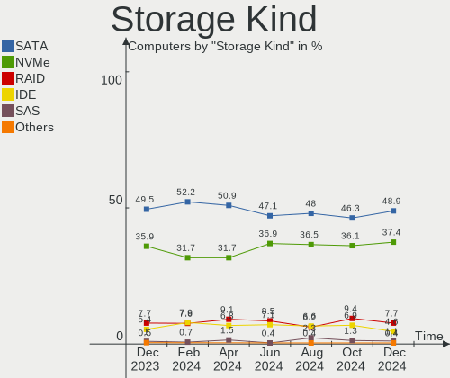
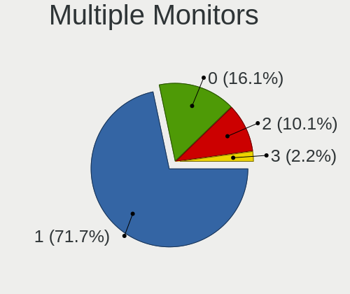
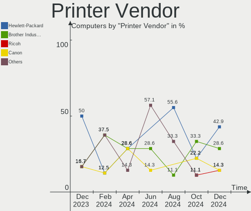

Debian - Hardware Trends
------------------------

A project to identify most popular hardware characteristics and track their change
over time based on data collected by Linux users at https://Linux-Hardware.org.

Anyone can contribute to this report by the [hw-probe](https://github.com/linuxhw/hw-probe) tool:

    sudo -E hw-probe -all -upload

This is a report for all computer types. See also reports for [desktops](/Dist/Debian/Desktop/README.md) and [notebooks](/Dist/Debian/Notebook/README.md).

This report is for one last month. Overall report since the beginning of time: [TestDays](https://github.com/linuxhw/TestDays)

Period: Oct, 2023.

Contents
--------

* [ System ](#system)
  - [ OS                       ](#os)
  - [ OS Family                ](#os-family)
  - [ Kernel                   ](#kernel)
  - [ Kernel Family            ](#kernel-family)
  - [ Kernel Major Ver.        ](#kernel-major-ver)
  - [ Arch                     ](#arch)
  - [ DE                       ](#de)
  - [ Display Server           ](#display-server)
  - [ Display Manager          ](#display-manager)
  - [ OS Lang                  ](#os-lang)
  - [ Boot Mode                ](#boot-mode)
  - [ Filesystem               ](#filesystem)
  - [ Part. scheme             ](#part-scheme)
  - [ Dual Boot with Linux/BSD ](#dual-boot-with-linuxbsd)
  - [ Dual Boot (Win)          ](#dual-boot-win)

* [ Board ](#board)
  - [ Vendor                   ](#vendor)
  - [ Model                    ](#model)
  - [ Model Family             ](#model-family)
  - [ MFG Year                 ](#mfg-year)
  - [ Form Factor              ](#form-factor)
  - [ Secure Boot              ](#secure-boot)
  - [ Coreboot                 ](#coreboot)
  - [ RAM Size                 ](#ram-size)
  - [ RAM Used                 ](#ram-used)
  - [ Total Drives             ](#total-drives)
  - [ Has CD-ROM               ](#has-cd-rom)
  - [ Has Ethernet             ](#has-ethernet)
  - [ Has WiFi                 ](#has-wifi)
  - [ Has Bluetooth            ](#has-bluetooth)

* [ Location ](#location)
  - [ Country                  ](#country)
  - [ City                     ](#city)

* [ Drives ](#drives)
  - [ Drive Vendor             ](#drive-vendor)
  - [ Drive Model              ](#drive-model)
  - [ HDD Vendor               ](#hdd-vendor)
  - [ SSD Vendor               ](#ssd-vendor)
  - [ Drive Kind               ](#drive-kind)
  - [ Drive Connector          ](#drive-connector)
  - [ Drive Size               ](#drive-size)
  - [ Space Total              ](#space-total)
  - [ Space Used               ](#space-used)
  - [ Malfunc. Drives          ](#malfunc-drives)
  - [ Malfunc. Drive Vendor    ](#malfunc-drive-vendor)
  - [ Malfunc. HDD Vendor      ](#malfunc-hdd-vendor)
  - [ Malfunc. Drive Kind      ](#malfunc-drive-kind)
  - [ Failed Drives            ](#failed-drives)
  - [ Failed Drive Vendor      ](#failed-drive-vendor)
  - [ Drive Status             ](#drive-status)

* [ Storage controller ](#storage-controller)
  - [ Storage Vendor           ](#storage-vendor)
  - [ Storage Model            ](#storage-model)
  - [ Storage Kind             ](#storage-kind)

* [ Processor ](#processor)
  - [ CPU Vendor               ](#cpu-vendor)
  - [ CPU Model                ](#cpu-model)
  - [ CPU Model Family         ](#cpu-model-family)
  - [ CPU Cores                ](#cpu-cores)
  - [ CPU Sockets              ](#cpu-sockets)
  - [ CPU Threads              ](#cpu-threads)
  - [ CPU Op-Modes             ](#cpu-op-modes)
  - [ CPU Microcode            ](#cpu-microcode)
  - [ CPU Microarch            ](#cpu-microarch)

* [ Graphics ](#graphics)
  - [ GPU Vendor               ](#gpu-vendor)
  - [ GPU Model                ](#gpu-model)
  - [ GPU Combo                ](#gpu-combo)
  - [ GPU Driver               ](#gpu-driver)
  - [ GPU Memory               ](#gpu-memory)

* [ Monitor ](#monitor)
  - [ Monitor Vendor           ](#monitor-vendor)
  - [ Monitor Model            ](#monitor-model)
  - [ Monitor Resolution       ](#monitor-resolution)
  - [ Monitor Diagonal         ](#monitor-diagonal)
  - [ Monitor Width            ](#monitor-width)
  - [ Aspect Ratio             ](#aspect-ratio)
  - [ Monitor Area             ](#monitor-area)
  - [ Pixel Density            ](#pixel-density)
  - [ Multiple Monitors        ](#multiple-monitors)

* [ Network ](#network)
  - [ Net Controller Vendor    ](#net-controller-vendor)
  - [ Net Controller Model     ](#net-controller-model)
  - [ Wireless Vendor          ](#wireless-vendor)
  - [ Wireless Model           ](#wireless-model)
  - [ Ethernet Vendor          ](#ethernet-vendor)
  - [ Ethernet Model           ](#ethernet-model)
  - [ Net Controller Kind      ](#net-controller-kind)
  - [ Used Controller          ](#used-controller)
  - [ NICs                     ](#nics)
  - [ IPv6                     ](#ipv6)

* [ Bluetooth ](#bluetooth)
  - [ Bluetooth Vendor         ](#bluetooth-vendor)
  - [ Bluetooth Model          ](#bluetooth-model)

* [ Sound ](#sound)
  - [ Sound Vendor             ](#sound-vendor)
  - [ Sound Model              ](#sound-model)

* [ Memory ](#memory)
  - [ Memory Vendor            ](#memory-vendor)
  - [ Memory Model             ](#memory-model)
  - [ Memory Kind              ](#memory-kind)
  - [ Memory Form Factor       ](#memory-form-factor)
  - [ Memory Size              ](#memory-size)
  - [ Memory Speed             ](#memory-speed)

* [ Printers & scanners ](#printers--scanners)
  - [ Printer Vendor           ](#printer-vendor)
  - [ Printer Model            ](#printer-model)
  - [ Scanner Vendor           ](#scanner-vendor)
  - [ Scanner Model            ](#scanner-model)

* [ Camera ](#camera)
  - [ Camera Vendor            ](#camera-vendor)
  - [ Camera Model             ](#camera-model)

* [ Security ](#security)
  - [ Fingerprint Vendor       ](#fingerprint-vendor)
  - [ Fingerprint Model        ](#fingerprint-model)
  - [ Chipcard Vendor          ](#chipcard-vendor)
  - [ Chipcard Model           ](#chipcard-model)

* [ Unsupported ](#unsupported)
  - [ Unsupported Devices      ](#unsupported-devices)
  - [ Unsupported Device Types ](#unsupported-device-types)

System
------

OS
--

Installed operating systems

| Name      | Computers | Percent |
|-----------|-----------|---------|
| Debian 12 | 392       | 75.97%  |
| Debian 11 | 68        | 13.18%  |
| Debian    | 50        | 9.69%   |
| Debian 10 | 3         | 0.58%   |
| Debian 23 | 2         | 0.39%   |
| Debian 9  | 1         | 0.19%   |

OS Family
---------

OS without a version

| Name   | Computers | Percent |
|--------|-----------|---------|
| Debian | 516       | 100%    |

Kernel
------

Version of the Linux kernel

| Version                          | Computers | Percent |
|----------------------------------|-----------|---------|
| 6.1.0-13-amd64                   | 213       | 41.28%  |
| 6.1.0-12-amd64                   | 89        | 17.25%  |
| 6.5.0-1-amd64                    | 20        | 3.88%   |
| 5.10.0-26-amd64                  | 19        | 3.68%   |
| 6.1.0-10-amd64                   | 18        | 3.49%   |
| 6.1.0-4-amd64                    | 15        | 2.91%   |
| 6.5.0-2-amd64                    | 11        | 2.13%   |
| 5.10.0-25-amd64                  | 11        | 2.13%   |
| 6.4.0-0.deb12.2-amd64            | 8         | 1.55%   |
| 6.2.16-15-pve                    | 7         | 1.36%   |
| 6.1.21-v8+                       | 7         | 1.36%   |
| 6.5.0-3-amd64                    | 6         | 1.16%   |
| 6.1.0-0.deb11.11-amd64           | 6         | 1.16%   |
| 6.2.16-14-pve                    | 5         | 0.97%   |
| 6.4.0-4-amd64                    | 4         | 0.78%   |
| 6.1.0-9-amd64                    | 4         | 0.78%   |
| 5.10.0-23-amd64                  | 4         | 0.78%   |
| 6.1.0-rpi4-rpi-v8                | 3         | 0.58%   |
| 6.1.0-11-amd64                   | 3         | 0.58%   |
| 5.15.126-1-pve                   | 3         | 0.58%   |
| 6.4.0-1mx-ahs-amd64              | 2         | 0.39%   |
| 6.2.16-3-pve                     | 2         | 0.39%   |
| 6.1.0-12-686-pae                 | 2         | 0.39%   |
| 6.1.0-0.deb11.7-amd64            | 2         | 0.39%   |
| 5.15.0-starfive                  | 2         | 0.39%   |
| 5.10.0-22-amd64                  | 2         | 0.39%   |
| 5.10.0-19-amd64                  | 2         | 0.39%   |
| 96.5.7-srb-hydramd-g5608462499cf | 1         | 0.19%   |
| 6.6.0-rc6                        | 1         | 0.19%   |
| 6.5.8                            | 1         | 0.19%   |
| 6.5.7                            | 1         | 0.19%   |
| 6.5.6-surface                    | 1         | 0.19%   |
| 6.5.6-hpelite                    | 1         | 0.19%   |
| 6.5.5-x64v3-xanmod1              | 1         | 0.19%   |
| 6.5.5-2-liquorix-amd64           | 1         | 0.19%   |
| 6.5.5+                           | 1         | 0.19%   |
| 6.5.4-chrultrabook               | 1         | 0.19%   |
| 6.5.0-0.deb12.1-rt-amd64         | 1         | 0.19%   |
| 6.5.0-0.deb12.1-amd64            | 1         | 0.19%   |
| 6.4.12-surface                   | 1         | 0.19%   |

Kernel Family
-------------

Linux kernel without a distro release

| Version  | Computers | Percent |
|----------|-----------|---------|
| 6.1.0    | 357       | 69.19%  |
| 5.10.0   | 43        | 8.33%   |
| 6.5.0    | 39        | 7.56%   |
| 6.2.16   | 18        | 3.49%   |
| 6.4.0    | 15        | 2.91%   |
| 6.1.21   | 7         | 1.36%   |
| 6.5.5    | 3         | 0.58%   |
| 5.15.126 | 3         | 0.58%   |
| 4.19.0   | 3         | 0.58%   |
| 6.5.6    | 2         | 0.39%   |
| 6.3.0    | 2         | 0.39%   |
| 5.15.0   | 2         | 0.39%   |
| 96.5.7   | 1         | 0.19%   |
| 6.6.0    | 1         | 0.19%   |
| 6.5.8    | 1         | 0.19%   |
| 6.5.7    | 1         | 0.19%   |
| 6.5.4    | 1         | 0.19%   |
| 6.4.12   | 1         | 0.19%   |
| 6.3      | 1         | 0.19%   |
| 6.1.55   | 1         | 0.19%   |
| 6.1.54   | 1         | 0.19%   |
| 6.1.52   | 1         | 0.19%   |
| 6.1.50   | 1         | 0.19%   |
| 6.1.31   | 1         | 0.19%   |
| 5.15.92  | 1         | 0.19%   |
| 5.15.108 | 1         | 0.19%   |
| 5.15.107 | 1         | 0.19%   |
| 5.13.19  | 1         | 0.19%   |
| 5.11.22  | 1         | 0.19%   |
| 5.10.43  | 1         | 0.19%   |
| 5.10.197 | 1         | 0.19%   |
| 5.10.191 | 1         | 0.19%   |
| 5.10.113 | 1         | 0.19%   |
| 5.10.110 | 1         | 0.19%   |

Kernel Major Ver.
-----------------

Linux kernel major version

| Version | Computers | Percent |
|---------|-----------|---------|
| 6.1     | 369       | 71.51%  |
| 5.10    | 48        | 9.3%    |
| 6.5     | 47        | 9.11%   |
| 6.2     | 18        | 3.49%   |
| 6.4     | 16        | 3.1%    |
| 5.15    | 8         | 1.55%   |
| 4.19    | 3         | 0.58%   |
| 6.3     | 2         | 0.39%   |
| 96.5    | 1         | 0.19%   |
| 6.6     | 1         | 0.19%   |
| 6       | 1         | 0.19%   |
| 5.13    | 1         | 0.19%   |
| 5.11    | 1         | 0.19%   |

Arch
----

OS architecture (x86_64, i586, etc.)

| Name    | Computers | Percent |
|---------|-----------|---------|
| x86_64  | 490       | 94.96%  |
| aarch64 | 16        | 3.1%    |
| i686    | 4         | 0.78%   |
| riscv64 | 3         | 0.58%   |
| armv7l  | 2         | 0.39%   |
| mips64  | 1         | 0.19%   |

DE
--

Desktop Environment

| Name              | Computers | Percent |
|-------------------|-----------|---------|
| GNOME             | 141       | 27.33%  |
| Unknown           | 127       | 24.61%  |
| KDE5              | 101       | 19.57%  |
| XFCE              | 47        | 9.11%   |
| MATE              | 29        | 5.62%   |
| X-Cinnamon        | 18        | 3.49%   |
| LXDE              | 11        | 2.13%   |
| Cinnamon          | 8         | 1.55%   |
| i3                | 6         | 1.16%   |
| LXQt              | 5         | 0.97%   |
| openbox           | 3         | 0.58%   |
| KDE               | 3         | 0.58%   |
| GNOME Flashback   | 3         | 0.58%   |
| Budgie            | 3         | 0.58%   |
| x-session-manager | 2         | 0.39%   |
| LXDE-pi-wayfire   | 2         | 0.39%   |
| Unity             | 1         | 0.19%   |
| Trinity           | 1         | 0.19%   |
| Phosh:GNOME       | 1         | 0.19%   |
| lightdm-xsession  | 1         | 0.19%   |
| Hyprland          | 1         | 0.19%   |
| GNUstep           | 1         | 0.19%   |
| awesome           | 1         | 0.19%   |

Display Server
--------------

X11 or Wayland

| Name    | Computers | Percent |
|---------|-----------|---------|
| X11     | 208       | 40.31%  |
| Wayland | 159       | 30.81%  |
| Unknown | 90        | 17.44%  |
| Tty     | 58        | 11.24%  |
| Web     | 1         | 0.19%   |

Display Manager
---------------

SDDM, LightDM, etc.

| Name    | Computers | Percent |
|---------|-----------|---------|
| Unknown | 220       | 42.64%  |
| GDM3    | 106       | 20.54%  |
| LightDM | 92        | 17.83%  |
| SDDM    | 75        | 14.53%  |
| GDM     | 15        | 2.91%   |
| LXDM    | 4         | 0.78%   |
| XDM     | 2         | 0.39%   |
| TDM     | 1         | 0.19%   |
| GREETD  | 1         | 0.19%   |

OS Lang
-------

Language

| Lang              | Computers | Percent |
|-------------------|-----------|---------|
| en_US             | 211       | 40.89%  |
| Unknown           | 64        | 12.4%   |
| de_DE             | 38        | 7.36%   |
| ru_RU             | 30        | 5.81%   |
| en_GB             | 28        | 5.43%   |
| it_IT             | 22        | 4.26%   |
| es_ES             | 18        | 3.49%   |
| fr_FR             | 14        | 2.71%   |
| pt_BR             | 10        | 1.94%   |
| en_CA             | 9         | 1.74%   |
| C                 | 9         | 1.74%   |
| es_MX             | 7         | 1.36%   |
| pl_PL             | 5         | 0.97%   |
| hu_HU             | 5         | 0.97%   |
| es_AR             | 5         | 0.97%   |
| en_IN             | 4         | 0.78%   |
| en_AU             | 4         | 0.78%   |
| en_ZA             | 3         | 0.58%   |
| en_IE             | 3         | 0.58%   |
| sv_SE             | 2         | 0.39%   |
| nl_NL             | 2         | 0.39%   |
| et_EE             | 2         | 0.39%   |
| es_CL             | 2         | 0.39%   |
| de_AT             | 2         | 0.39%   |
| cs_CZ             | 2         | 0.39%   |
| zh_CN             | 1         | 0.19%   |
| tr_TR             | 1         | 0.19%   |
| pt_PT             | 1         | 0.19%   |
| nb_NO             | 1         | 0.19%   |
| lt_LT             | 1         | 0.19%   |
| ja_JP             | 1         | 0.19%   |
| fi_FI             | 1         | 0.19%   |
| eu_ES             | 1         | 0.19%   |
| es_CO             | 1         | 0.19%   |
| es_BO             | 1         | 0.19%   |
| en_US.ISO-8859-15 | 1         | 0.19%   |
| en_PH             | 1         | 0.19%   |
| en_NL             | 1         | 0.19%   |
| de_CH             | 1         | 0.19%   |
| ca_ES             | 1         | 0.19%   |

Boot Mode
---------

EFI or BIOS

| Mode | Computers | Percent |
|------|-----------|---------|
| EFI  | 325       | 62.98%  |
| BIOS | 191       | 37.02%  |

Filesystem
----------

Type of filesystem

| Type    | Computers | Percent |
|---------|-----------|---------|
| Ext4    | 363       | 70.35%  |
| Overlay | 91        | 17.64%  |
| Btrfs   | 24        | 4.65%   |
| Tmpfs   | 15        | 2.91%   |
| Zfs     | 13        | 2.52%   |
| Xfs     | 6         | 1.16%   |
| Ext3    | 2         | 0.39%   |
| Jfs     | 1         | 0.19%   |
| Unknown | 1         | 0.19%   |

Part. scheme
------------

Scheme of partitioning

| Type    | Computers | Percent |
|---------|-----------|---------|
| GPT     | 344       | 66.67%  |
| Unknown | 94        | 18.22%  |
| MBR     | 78        | 15.12%  |

Dual Boot with Linux/BSD
------------------------

Hosting more than one Linux/BSD

| Dual boot | Computers | Percent |
|-----------|-----------|---------|
| No        | 457       | 88.57%  |
| Yes       | 59        | 11.43%  |

Dual Boot (Win)
---------------

Hosting Linux and Windows

| Dual boot | Computers | Percent |
|-----------|-----------|---------|
| No        | 364       | 70.54%  |
| Yes       | 152       | 29.46%  |

Board
-----

Vendor
------

Motherboard manufacturer

| Name                                 | Computers | Percent |
|--------------------------------------|-----------|---------|
| Lenovo                               | 98        | 18.99%  |
| ASUSTek Computer                     | 78        | 15.12%  |
| Hewlett-Packard                      | 46        | 8.91%   |
| Dell                                 | 43        | 8.33%   |
| Google                               | 36        | 6.98%   |
| Gigabyte Technology                  | 33        | 6.4%    |
| Acer                                 | 22        | 4.26%   |
| MSI                                  | 19        | 3.68%   |
| ASRock                               | 13        | 2.52%   |
| Apple                                | 12        | 2.33%   |
| Unknown                              | 12        | 2.33%   |
| Raspberry Pi Foundation              | 11        | 2.13%   |
| Intel                                | 9         | 1.74%   |
| Fujitsu                              | 7         | 1.36%   |
| Toshiba                              | 6         | 1.16%   |
| Supermicro                           | 5         | 0.97%   |
| HUAWEI                               | 4         | 0.78%   |
| AZW                                  | 4         | 0.78%   |
| Packard Bell                         | 3         | 0.58%   |
| Timi                                 | 2         | 0.39%   |
| Pine Microsystems                    | 2         | 0.39%   |
| Pegatron                             | 2         | 0.39%   |
| OrangePi                             | 2         | 0.39%   |
| Notebook                             | 2         | 0.39%   |
| Exo                                  | 2         | 0.39%   |
| ECS                                  | 2         | 0.39%   |
| Biostar                              | 2         | 0.39%   |
| ASRockRack                           | 2         | 0.39%   |
| Aquarius                             | 2         | 0.39%   |
| VANT                                 | 1         | 0.19%   |
| VALE                                 | 1         | 0.19%   |
| TUXEDO                               | 1         | 0.19%   |
| THUNDEROBOT                          | 1         | 0.19%   |
| TELECOMITALIA                        | 1         | 0.19%   |
| Teclast                              | 1         | 0.19%   |
| Sophos                               | 1         | 0.19%   |
| Shuttle                              | 1         | 0.19%   |
| Shenzhen Meigao Electronic Equipment | 1         | 0.19%   |
| Shenzhen DOKE electronic             | 1         | 0.19%   |
| Razer                                | 1         | 0.19%   |

Model
-----

Motherboard model

| Name                                      | Computers | Percent |
|-------------------------------------------|-----------|---------|
| Google Reks                               | 32        | 6.2%    |
| Lenovo ThinkPad E475 20H40006US           | 22        | 4.26%   |
| Unknown                                   | 14        | 2.71%   |
| RPi Raspberry Pi 4 Model B Rev 1.5        | 5         | 0.97%   |
| Lenovo ThinkPad 13 2nd Gen 20J10046US     | 4         | 0.78%   |
| ASUS TUF Gaming X570-PLUS                 | 3         | 0.58%   |
| RPi Raspberry Pi 4 Model B Rev 1.4        | 2         | 0.39%   |
| Lenovo ThinkPad L13 Yoga Gen 2 20VK0019US | 2         | 0.39%   |
| Intel Jasper Lake Client Platform         | 2         | 0.39%   |
| HUAWEI KLVL-WXXW                          | 2         | 0.39%   |
| HP Victus by Gaming Laptop 15-fb0xxx      | 2         | 0.39%   |
| HP ProDesk 600 G6 Small Form Factor PC    | 2         | 0.39%   |
| HP Laptop 15-dw3xxx                       | 2         | 0.39%   |
| HP EliteDesk 800 G2 DM 35W                | 2         | 0.39%   |
| Dell PowerEdge T20                        | 2         | 0.39%   |
| Biostar B450MH                            | 2         | 0.39%   |
| AZW SER                                   | 2         | 0.39%   |
| ASUS VivoBook_ASUSLaptop X7400PC_N7400PC  | 2         | 0.39%   |
| ASUS TUF Gaming B550M-E                   | 2         | 0.39%   |
| ASUS PRIME A320M-K                        | 2         | 0.39%   |
| ASUS All Series                           | 2         | 0.39%   |
| Aquarius NS585                            | 2         | 0.39%   |
| Apple iMac15,1                            | 2         | 0.39%   |
| VANT MOOVE3-15                            | 1         | 0.19%   |
| VALE Notebook Classic C140                | 1         | 0.19%   |
| TUXEDO InfinityBook S 14 v5               | 1         | 0.19%   |
| Toshiba TECRA R950                        | 1         | 0.19%   |
| Toshiba Satellite P75-A                   | 1         | 0.19%   |
| Toshiba Satellite L845                    | 1         | 0.19%   |
| Toshiba Satellite L755                    | 1         | 0.19%   |
| Toshiba Satellite L455D                   | 1         | 0.19%   |
| Toshiba Satellite A205                    | 1         | 0.19%   |
| Timi RedmiBook Pro 14S                    | 1         | 0.19%   |
| Timi Mi NoteBook Pro                      | 1         | 0.19%   |
| THUNDEROBOT 911AirD                       | 1         | 0.19%   |
| TELECOMITALIA M7x0S                       | 1         | 0.19%   |
| Teclast F15Plus 2                         | 1         | 0.19%   |
| Supermicro X9DRi-LN4+/X9DR3-LN4+          | 1         | 0.19%   |
| Supermicro X8DTH-i/6/iF/6F                | 1         | 0.19%   |
| Supermicro X10SLM-F                       | 1         | 0.19%   |

Model Family
------------

Motherboard model prefix

| Name                     | Computers | Percent |
|--------------------------|-----------|---------|
| Lenovo ThinkPad          | 72        | 13.95%  |
| Google Reks              | 32        | 6.2%    |
| ASUS PRIME               | 16        | 3.1%    |
| Acer Aspire              | 15        | 2.91%   |
| Unknown                  | 14        | 2.71%   |
| RPi Raspberry            | 11        | 2.13%   |
| ASUS ROG                 | 11        | 2.13%   |
| ASUS VivoBook            | 10        | 1.94%   |
| Dell PowerEdge           | 9         | 1.74%   |
| HP Laptop                | 7         | 1.36%   |
| Dell Latitude            | 7         | 1.36%   |
| Dell XPS                 | 6         | 1.16%   |
| Dell Precision           | 6         | 1.16%   |
| ASUS TUF                 | 6         | 1.16%   |
| ASUS ASUS                | 6         | 1.16%   |
| Toshiba Satellite        | 5         | 0.97%   |
| Lenovo IdeaPad           | 5         | 0.97%   |
| HP EliteBook             | 5         | 0.97%   |
| Dell Inspiron            | 5         | 0.97%   |
| Lenovo Yoga              | 4         | 0.78%   |
| Lenovo Legion            | 4         | 0.78%   |
| HP Pavilion              | 4         | 0.78%   |
| HP EliteDesk             | 4         | 0.78%   |
| Fujitsu ESPRIMO          | 4         | 0.78%   |
| Dell OptiPlex            | 4         | 0.78%   |
| HP Victus                | 3         | 0.58%   |
| HP ProLiant              | 3         | 0.58%   |
| HP ProBook               | 3         | 0.58%   |
| Dell Vostro              | 3         | 0.58%   |
| Acer Swift               | 3         | 0.58%   |
| Pine Microsystems Pine64 | 2         | 0.39%   |
| Packard Bell EasyNote    | 2         | 0.39%   |
| MSI Katana               | 2         | 0.39%   |
| MSI GF63                 | 2         | 0.39%   |
| Lenovo ThinkCentre       | 2         | 0.39%   |
| Intel Jasper             | 2         | 0.39%   |
| HUAWEI KLVL-WXXW         | 2         | 0.39%   |
| HP ZBook                 | 2         | 0.39%   |
| HP ProDesk               | 2         | 0.39%   |
| HP ENVY                  | 2         | 0.39%   |

MFG Year
--------

Motherboard manufacture year

| Year    | Computers | Percent |
|---------|-----------|---------|
| 2023    | 60        | 11.63%  |
| 2021    | 60        | 11.63%  |
| 2019    | 59        | 11.43%  |
| 2022    | 51        | 9.88%   |
| 2020    | 42        | 8.14%   |
| 2018    | 32        | 6.2%    |
| 2017    | 29        | 5.62%   |
| 2015    | 28        | 5.43%   |
| 2012    | 24        | 4.65%   |
| 2014    | 22        | 4.26%   |
| Unknown | 21        | 4.07%   |
| 2013    | 20        | 3.88%   |
| 2011    | 20        | 3.88%   |
| 2010    | 16        | 3.1%    |
| 2016    | 12        | 2.33%   |
| 2009    | 8         | 1.55%   |
| 2008    | 6         | 1.16%   |
| 2007    | 5         | 0.97%   |
| 2005    | 1         | 0.19%   |

Form Factor
-----------

Physical design of the computer

| Name           | Computers | Percent |
|----------------|-----------|---------|
| Notebook       | 271       | 52.52%  |
| Desktop        | 176       | 34.11%  |
| System on chip | 21        | 4.07%   |
| Server         | 15        | 2.91%   |
| Convertible    | 12        | 2.33%   |
| Mini pc        | 12        | 2.33%   |
| Tablet         | 4         | 0.78%   |
| All in one     | 4         | 0.78%   |
| Firewall       | 1         | 0.19%   |

Secure Boot
-----------

Enabled or disabled

| State    | Computers | Percent |
|----------|-----------|---------|
| Disabled | 473       | 91.67%  |
| Enabled  | 43        | 8.33%   |

Coreboot
--------

Have coreboot on board

| Used | Computers | Percent |
|------|-----------|---------|
| No   | 480       | 93.02%  |
| Yes  | 36        | 6.98%   |

RAM Size
--------

Total RAM memory

| Size in GB      | Computers | Percent |
|-----------------|-----------|---------|
| 4.01-8.0        | 108       | 20.93%  |
| 16.01-24.0      | 105       | 20.35%  |
| 3.01-4.0        | 92        | 17.83%  |
| 8.01-16.0       | 74        | 14.34%  |
| 32.01-64.0      | 71        | 13.76%  |
| 64.01-256.0     | 36        | 6.98%   |
| 1.01-2.0        | 15        | 2.91%   |
| 24.01-32.0      | 7         | 1.36%   |
| 2.01-3.0        | 3         | 0.58%   |
| 0.51-1.0        | 3         | 0.58%   |
| More than 256.0 | 1         | 0.19%   |
| 0.01-0.5        | 1         | 0.19%   |

RAM Used
--------

Used RAM memory

| Used GB     | Computers | Percent |
|-------------|-----------|---------|
| 1.01-2.0    | 141       | 27.33%  |
| 4.01-8.0    | 100       | 19.38%  |
| 2.01-3.0    | 80        | 15.5%   |
| 3.01-4.0    | 79        | 15.31%  |
| 0.51-1.0    | 43        | 8.33%   |
| 8.01-16.0   | 37        | 7.17%   |
| 0.01-0.5    | 17        | 3.29%   |
| 32.01-64.0  | 6         | 1.16%   |
| 16.01-24.0  | 6         | 1.16%   |
| 64.01-256.0 | 4         | 0.78%   |
| 24.01-32.0  | 3         | 0.58%   |

Total Drives
------------

Number of drives on board

| Drives | Computers | Percent |
|--------|-----------|---------|
| 1      | 318       | 61.63%  |
| 2      | 117       | 22.67%  |
| 3      | 28        | 5.43%   |
| 4      | 20        | 3.88%   |
| 5      | 10        | 1.94%   |
| 6      | 7         | 1.36%   |
| 7      | 5         | 0.97%   |
| 9      | 3         | 0.58%   |
| 8      | 2         | 0.39%   |
| 0      | 2         | 0.39%   |
| 19     | 1         | 0.19%   |
| 17     | 1         | 0.19%   |
| 11     | 1         | 0.19%   |
| 10     | 1         | 0.19%   |

Has CD-ROM
----------

Has CD-ROM on board

| Presented | Computers | Percent |
|-----------|-----------|---------|
| No        | 426       | 82.56%  |
| Yes       | 90        | 17.44%  |

Has Ethernet
------------

Has Ethernet on board

| Presented | Computers | Percent |
|-----------|-----------|---------|
| Yes       | 402       | 77.91%  |
| No        | 114       | 22.09%  |

Has WiFi
--------

Has WiFi module

| Presented | Computers | Percent |
|-----------|-----------|---------|
| Yes       | 376       | 72.87%  |
| No        | 140       | 27.13%  |

Has Bluetooth
-------------

Has Bluetooth module

| Presented | Computers | Percent |
|-----------|-----------|---------|
| Yes       | 320       | 62.02%  |
| No        | 196       | 37.98%  |

Location
--------

Country
-------

Geographic location (country)

| Country       | Computers | Percent |
|---------------|-----------|---------|
| USA           | 134       | 25.97%  |
| Russia        | 56        | 10.85%  |
| Germany       | 54        | 10.47%  |
| Italy         | 30        | 5.81%   |
| Spain         | 24        | 4.65%   |
| France        | 23        | 4.46%   |
| Brazil        | 17        | 3.29%   |
| UK            | 15        | 2.91%   |
| Netherlands   | 11        | 2.13%   |
| Canada        | 10        | 1.94%   |
| Mexico        | 9         | 1.74%   |
| Austria       | 9         | 1.74%   |
| Poland        | 8         | 1.55%   |
| Czechia       | 8         | 1.55%   |
| Portugal      | 7         | 1.36%   |
| India         | 7         | 1.36%   |
| Hungary       | 6         | 1.16%   |
| Argentina     | 6         | 1.16%   |
| Finland       | 5         | 0.97%   |
| Sweden        | 4         | 0.78%   |
| Malaysia      | 4         | 0.78%   |
| Belgium       | 4         | 0.78%   |
| Australia     | 4         | 0.78%   |
| Vietnam       | 3         | 0.58%   |
| Switzerland   | 3         | 0.58%   |
| South Africa  | 3         | 0.58%   |
| Philippines   | 3         | 0.58%   |
| Norway        | 3         | 0.58%   |
| Japan         | 3         | 0.58%   |
| Greece        | 3         | 0.58%   |
| Estonia       | 3         | 0.58%   |
| Croatia       | 3         | 0.58%   |
| UAE           | 2         | 0.39%   |
| Turkey        | 2         | 0.39%   |
| Serbia        | 2         | 0.39%   |
| Romania       | 2         | 0.39%   |
| New Caledonia | 2         | 0.39%   |
| Indonesia     | 2         | 0.39%   |
| Colombia      | 2         | 0.39%   |
| China         | 2         | 0.39%   |

City
----

Geographic location (city)

| City               | Computers | Percent |
|--------------------|-----------|---------|
| Bangor             | 63        | 12.21%  |
| Voronezh           | 16        | 3.1%    |
| St Petersburg      | 9         | 1.74%   |
| Moscow             | 8         | 1.55%   |
| Perm               | 7         | 1.36%   |
| Paris              | 6         | 1.16%   |
| Madrid             | 5         | 0.97%   |
| Berlin             | 5         | 0.97%   |
| Vienna             | 4         | 0.78%   |
| Toronto            | 4         | 0.78%   |
| Nola               | 4         | 0.78%   |
| Milan              | 4         | 0.78%   |
| Mesa               | 4         | 0.78%   |
| Amsterdam          | 4         | 0.78%   |
| Warsaw             | 3         | 0.58%   |
| Turin              | 3         | 0.58%   |
| Sao Paulo          | 3         | 0.58%   |
| Rome               | 3         | 0.58%   |
| Rio de Janeiro     | 3         | 0.58%   |
| Ratingen           | 3         | 0.58%   |
| Pittsburgh         | 3         | 0.58%   |
| New York           | 3         | 0.58%   |
| Milano             | 3         | 0.58%   |
| Mexico City        | 3         | 0.58%   |
| Budapest           | 3         | 0.58%   |
| Zagreb             | 2         | 0.39%   |
| Yerres             | 2         | 0.39%   |
| Vigo               | 2         | 0.39%   |
| Tours              | 2         | 0.39%   |
| Toulouse           | 2         | 0.39%   |
| Tampere            | 2         | 0.39%   |
| Sydney             | 2         | 0.39%   |
| Stuttgart          | 2         | 0.39%   |
| Springfield        | 2         | 0.39%   |
| Rheine             | 2         | 0.39%   |
| Prague             | 2         | 0.39%   |
| Portland           | 2         | 0.39%   |
| Phoenix            | 2         | 0.39%   |
| Paços de Ferreira | 2         | 0.39%   |
| Oslo               | 2         | 0.39%   |

Drives
------

Drive Vendor
------------

Hard drive vendors

| Vendor                      | Computers | Drives | Percent |
|-----------------------------|-----------|--------|---------|
| Samsung Electronics         | 123       | 164    | 16.4%   |
| WDC                         | 78        | 116    | 10.4%   |
| Unknown                     | 66        | 72     | 8.8%    |
| Kingston                    | 65        | 68     | 8.67%   |
| Seagate                     | 64        | 108    | 8.53%   |
| Toshiba                     | 38        | 46     | 5.07%   |
| SanDisk                     | 28        | 29     | 3.73%   |
| Crucial                     | 25        | 27     | 3.33%   |
| Hitachi                     | 21        | 32     | 2.8%    |
| Unknown                     | 21        | 21     | 2.8%    |
| Intel                       | 20        | 24     | 2.67%   |
| HGST                        | 16        | 42     | 2.13%   |
| A-DATA Technology           | 15        | 16     | 2%      |
| SK hynix                    | 11        | 11     | 1.47%   |
| Micron Technology           | 11        | 11     | 1.47%   |
| China                       | 11        | 11     | 1.47%   |
| KIOXIA                      | 10        | 10     | 1.33%   |
| Phison                      | 7         | 7      | 0.93%   |
| Corsair                     | 6         | 9      | 0.8%    |
| Apple                       | 6         | 7      | 0.8%    |
| Transcend                   | 5         | 5      | 0.67%   |
| Patriot                     | 5         | 5      | 0.67%   |
| Micron/Crucial Technology   | 5         | 5      | 0.67%   |
| Apacer                      | 5         | 6      | 0.67%   |
| SPCC                        | 4         | 4      | 0.53%   |
| Phison Electronics          | 4         | 4      | 0.53%   |
| Lexar                       | 4         | 4      | 0.53%   |
| UMIS                        | 3         | 3      | 0.4%    |
| PNY                         | 3         | 4      | 0.4%    |
| OCZ                         | 3         | 3      | 0.4%    |
| Netac                       | 3         | 3      | 0.4%    |
| MAXIO Technology (Hangzhou) | 3         | 4      | 0.4%    |
| Fanxiang                    | 3         | 3      | 0.4%    |
| XPG                         | 2         | 2      | 0.27%   |
| Teclast                     | 2         | 2      | 0.27%   |
| Team                        | 2         | 2      | 0.27%   |
| SNR                         | 2         | 8      | 0.27%   |
| Silicon Motion              | 2         | 2      | 0.27%   |
| Realtek                     | 2         | 2      | 0.27%   |
| NT-512                      | 2         | 2      | 0.27%   |

Drive Model
-----------

Hard drive models

| Model                                              | Computers | Percent |
|----------------------------------------------------|-----------|---------|
| Kingston SA400S37120G 120GB SSD                    | 26        | 3.14%   |
| Unknown DF4016  16GB                               | 23        | 2.78%   |
| Unknown                                            | 21        | 2.54%   |
| Seagate ST1000DM010-2EP102 1TB                     | 8         | 0.97%   |
| Samsung SSD 860 EVO 500GB                          | 7         | 0.85%   |
| Kingston SA400S37240G 240GB SSD                    | 7         | 0.85%   |
| Samsung SSD 860 EVO 250GB                          | 6         | 0.73%   |
| Samsung NVMe SSD Controller SM981/PM981/PM983 1TB  | 6         | 0.73%   |
| Seagate ST1000LM035-1RK172 1TB                     | 5         | 0.6%    |
| Seagate ST1000DM003-1ER162 1TB                     | 5         | 0.6%    |
| Samsung SSD 990 PRO 2TB                            | 5         | 0.6%    |
| Samsung SSD 980 1TB                                | 5         | 0.6%    |
| Samsung NVMe SSD Controller PM9A1/PM9A3/980PRO 1TB | 5         | 0.6%    |
| Micron/Crucial P2 NVMe PCIe SSD 500GB              | 5         | 0.6%    |
| Unknown SD32G  32GB                                | 4         | 0.48%   |
| Unknown MMC Card  64GB                             | 4         | 0.48%   |
| Toshiba DT01ACA100 1TB                             | 4         | 0.48%   |
| Toshiba DT01ACA050 500GB                           | 4         | 0.48%   |
| SanDisk NVMe SSD Drive 500GB                       | 4         | 0.48%   |
| SanDisk NVMe SSD Drive 1TB                         | 4         | 0.48%   |
| Samsung SSD 970 EVO 500GB                          | 4         | 0.48%   |
| Samsung SSD 870 EVO 1TB                            | 4         | 0.48%   |
| Samsung SSD 850 PRO 256GB                          | 4         | 0.48%   |
| Samsung SSD 850 EVO 250GB                          | 4         | 0.48%   |
| Crucial CT480BX500SSD1 480GB                       | 4         | 0.48%   |
| A-DATA SU650 240GB SSD                             | 4         | 0.48%   |
| Toshiba DT01ACA300 3TB                             | 3         | 0.36%   |
| Seagate ST4000DM004-2CV104 4TB                     | 3         | 0.36%   |
| Seagate ST2000DM008-2FR102 2TB                     | 3         | 0.36%   |
| Seagate ST2000DM006-2DM164 2TB                     | 3         | 0.36%   |
| Samsung SSD 970 EVO Plus 2TB                       | 3         | 0.36%   |
| Samsung SSD 970 EVO Plus 1TB                       | 3         | 0.36%   |
| Samsung SSD 870 QVO 2TB                            | 3         | 0.36%   |
| Samsung MZVLB512HBJQ-000L7 512GB                   | 3         | 0.36%   |
| Samsung MZVL21T0HCLR-00BL7 1TB                     | 3         | 0.36%   |
| Samsung MZVL21T0HCLR-00BL2 1TB                     | 3         | 0.36%   |
| Phison E12 NVMe Controller 1TB                     | 3         | 0.36%   |
| Kingston SUV400S37240G 240GB SSD                   | 3         | 0.36%   |
| Crucial CT2000P5PSSD8 2TB                          | 3         | 0.36%   |
| XPG SPECTRIX S40G 1TB                              | 2         | 0.24%   |

HDD Vendor
----------

Hard disk drive vendors

| Vendor              | Computers | Drives | Percent |
|---------------------|-----------|--------|---------|
| Seagate             | 60        | 104    | 29.56%  |
| WDC                 | 57        | 89     | 28.08%  |
| Toshiba             | 30        | 38     | 14.78%  |
| Hitachi             | 21        | 32     | 10.34%  |
| HGST                | 16        | 42     | 7.88%   |
| Samsung Electronics | 8         | 9      | 3.94%   |
| Unknown             | 3         | 3      | 1.48%   |
| Apple               | 3         | 3      | 1.48%   |
| Maxtor              | 2         | 2      | 0.99%   |
| LaCie               | 1         | 1      | 0.49%   |
| IBM-ESXS            | 1         | 1      | 0.49%   |
| DELLBOSS            | 1         | 1      | 0.49%   |

SSD Vendor
----------

Solid state drive vendors

| Vendor              | Computers | Drives | Percent |
|---------------------|-----------|--------|---------|
| Kingston            | 49        | 51     | 21.3%   |
| Samsung Electronics | 48        | 63     | 20.87%  |
| Crucial             | 18        | 19     | 7.83%   |
| SanDisk             | 11        | 11     | 4.78%   |
| China               | 11        | 11     | 4.78%   |
| A-DATA Technology   | 11        | 11     | 4.78%   |
| WDC                 | 7         | 7      | 3.04%   |
| Intel               | 6         | 9      | 2.61%   |
| Transcend           | 5         | 5      | 2.17%   |
| SPCC                | 4         | 4      | 1.74%   |
| Patriot             | 4         | 4      | 1.74%   |
| Apple               | 4         | 4      | 1.74%   |
| PNY                 | 3         | 4      | 1.3%    |
| OCZ                 | 3         | 3      | 1.3%    |
| Corsair             | 3         | 3      | 1.3%    |
| Apacer              | 3         | 4      | 1.3%    |
| Team                | 2         | 2      | 0.87%   |
| NT-512              | 2         | 2      | 0.87%   |
| Netac               | 2         | 2      | 0.87%   |
| Micron Technology   | 2         | 2      | 0.87%   |
| Lexar               | 2         | 2      | 0.87%   |
| Hewlett-Packard     | 2         | 2      | 0.87%   |
| FORESEE             | 2         | 2      | 0.87%   |
| Fanxiang            | 2         | 2      | 0.87%   |
| AMD                 | 2         | 2      | 0.87%   |
| Wibtek              | 1         | 1      | 0.43%   |
| TSA                 | 1         | 1      | 0.43%   |
| Teclast             | 1         | 1      | 0.43%   |
| Super Talent        | 1         | 1      | 0.43%   |
| SNR                 | 1         | 5      | 0.43%   |
| SK hynix            | 1         | 1      | 0.43%   |
| MSCC                | 1         | 1      | 0.43%   |
| LITEON              | 1         | 1      | 0.43%   |
| KingSpec            | 1         | 1      | 0.43%   |
| KingFast            | 1         | 1      | 0.43%   |
| Kimtigo             | 1         | 1      | 0.43%   |
| Intenso             | 1         | 1      | 0.43%   |
| INNOVATION IT       | 1         | 1      | 0.43%   |
| Innodisk            | 1         | 1      | 0.43%   |
| HS-SSD-C100         | 1         | 1      | 0.43%   |

Drive Kind
----------

HDD or SSD

| Kind    | Computers | Drives | Percent |
|---------|-----------|--------|---------|
| NVMe    | 212       | 269    | 31.93%  |
| SSD     | 204       | 257    | 30.72%  |
| HDD     | 160       | 325    | 24.1%   |
| MMC     | 79        | 85     | 11.9%   |
| Unknown | 9         | 12     | 1.36%   |

Drive Connector
---------------

SATA, SAS, NVMe, etc.

| Type | Computers | Drives | Percent |
|------|-----------|--------|---------|
| SATA | 303       | 544    | 49.03%  |
| NVMe | 211       | 264    | 34.14%  |
| MMC  | 79        | 85     | 12.78%  |
| SAS  | 25        | 55     | 4.05%   |

Drive Size
----------

Size of hard drive

| Size in TB | Computers | Drives | Percent |
|------------|-----------|--------|---------|
| 0.01-0.5   | 211       | 262    | 52.49%  |
| 0.51-1.0   | 108       | 150    | 26.87%  |
| 1.01-2.0   | 36        | 56     | 8.96%   |
| 3.01-4.0   | 15        | 47     | 3.73%   |
| 4.01-10.0  | 14        | 33     | 3.48%   |
| 2.01-3.0   | 13        | 19     | 3.23%   |
| 10.01-20.0 | 5         | 15     | 1.24%   |

Space Total
-----------

Amount of disk space available on the file system

| Size in GB     | Computers | Percent |
|----------------|-----------|---------|
| 251-500        | 94        | 18.22%  |
| 101-250        | 94        | 18.22%  |
| 501-1000       | 80        | 15.5%   |
| Unknown        | 58        | 11.24%  |
| 1-20           | 55        | 10.66%  |
| 1001-2000      | 39        | 7.56%   |
| More than 3000 | 29        | 5.62%   |
| 51-100         | 27        | 5.23%   |
| 2001-3000      | 22        | 4.26%   |
| 21-50          | 18        | 3.49%   |

Space Used
----------

Amount of used disk space

| Used GB        | Computers | Percent |
|----------------|-----------|---------|
| 1-20           | 189       | 36.63%  |
| 21-50          | 69        | 13.37%  |
| Unknown        | 58        | 11.24%  |
| 101-250        | 49        | 9.5%    |
| 51-100         | 49        | 9.5%    |
| 251-500        | 44        | 8.53%   |
| 501-1000       | 27        | 5.23%   |
| More than 3000 | 13        | 2.52%   |
| 1001-2000      | 13        | 2.52%   |
| 2001-3000      | 5         | 0.97%   |

Malfunc. Drives
---------------

Drive models with a malfunction

| Model                                                 | Computers | Drives | Percent |
|-------------------------------------------------------|-----------|--------|---------|
| Samsung Electronics SSD 870 EVO 1TB                   | 3         | 3      | 4.62%   |
| Seagate ST500DM002-1BD142 500GB                       | 2         | 2      | 3.08%   |
| Seagate ST2000DM006-2DM164 2TB                        | 2         | 3      | 3.08%   |
| Samsung Electronics SSD 970 EVO 500GB                 | 2         | 2      | 3.08%   |
| WDC WD6400BPVT-22HXZT3 640GB                          | 1         | 1      | 1.54%   |
| WDC WD5000AAKX-60U6AA0 500GB                          | 1         | 1      | 1.54%   |
| WDC WD5000AAKX-07U6AA1 500GB                          | 1         | 2      | 1.54%   |
| WDC WD40EFZX-68AWUN0 4TB                              | 1         | 6      | 1.54%   |
| WDC WD3200AAJS-07M0A0 320GB                           | 1         | 1      | 1.54%   |
| WDC WD30EZRZ-00WN9B0 3TB                              | 1         | 1      | 1.54%   |
| WDC WD15EARS-00Z5B1 1TB                               | 1         | 1      | 1.54%   |
| WDC WD1200BEVS-22UST0 120GB                           | 1         | 1      | 1.54%   |
| WDC WD10EAVS-00D7B0 1TB                               | 1         | 1      | 1.54%   |
| WDC WD10EARS-00MVWB0 1TB                              | 1         | 1      | 1.54%   |
| WDC WD1003FBYZ-010FB0 1TB                             | 1         | 1      | 1.54%   |
| WDC WD1003FBYX-01Y7B2 1TB                             | 1         | 1      | 1.54%   |
| Toshiba MQ01ABF050 500GB                              | 1         | 1      | 1.54%   |
| Toshiba MQ01ABD100 1TB                                | 1         | 1      | 1.54%   |
| Toshiba MK6475GSX 640GB                               | 1         | 1      | 1.54%   |
| Toshiba MK6465GSXN 640GB                              | 1         | 1      | 1.54%   |
| Toshiba MK3263GSXN 320GB                              | 1         | 1      | 1.54%   |
| Toshiba MK3261GSYN 320GB                              | 1         | 1      | 1.54%   |
| Toshiba MK1655GSX 160GB                               | 1         | 1      | 1.54%   |
| Seagate ST9500420ASG 500GB                            | 1         | 1      | 1.54%   |
| Seagate ST4000DM000-1F2168 4TB                        | 1         | 1      | 1.54%   |
| Seagate ST3250410AS 250GB                             | 1         | 1      | 1.54%   |
| Seagate ST1500DL003-9VT16L 1TB                        | 1         | 1      | 1.54%   |
| Seagate ST1000LM035-1RK172 1TB                        | 1         | 1      | 1.54%   |
| Seagate ST1000DX001-1NS162 1TB                        | 1         | 1      | 1.54%   |
| Seagate ST1000DM003-1ER162 1TB                        | 1         | 1      | 1.54%   |
| Samsung Electronics SSD PM810 2.5 128GB               | 1         | 1      | 1.54%   |
| Samsung Electronics SSD 970 EVO 500GB S5H7NS0N586263N | 1         | 1      | 1.54%   |
| Samsung Electronics MZVLQ512HBLU-00B00 512GB          | 1         | 1      | 1.54%   |
| Samsung Electronics HN-M101MBB 1TB                    | 1         | 1      | 1.54%   |
| Samsung Electronics HD402LJ 400GB                     | 1         | 1      | 1.54%   |
| Samsung Electronics HD080HJ 80GB                      | 1         | 1      | 1.54%   |
| OCZ VERTEX3 120GB SSD                                 | 1         | 1      | 1.54%   |
| Netac NS512GSSD340 512GB                              | 1         | 1      | 1.54%   |
| Micron Technology MTFDDAK256MAM-1K 256GB SSD          | 1         | 1      | 1.54%   |
| Maxtor STM3500320AS 500GB                             | 1         | 1      | 1.54%   |

Malfunc. Drive Vendor
---------------------

Vendors of faulty drives

| Vendor              | Computers | Drives | Percent |
|---------------------|-----------|--------|---------|
| WDC                 | 11        | 18     | 17.74%  |
| Samsung Electronics | 11        | 11     | 17.74%  |
| Seagate             | 10        | 12     | 16.13%  |
| Toshiba             | 7         | 7      | 11.29%  |
| Hitachi             | 4         | 5      | 6.45%   |
| Intel               | 3         | 5      | 4.84%   |
| Maxtor              | 2         | 2      | 3.23%   |
| Kingston            | 2         | 2      | 3.23%   |
| HGST                | 2         | 2      | 3.23%   |
| Corsair             | 2         | 2      | 3.23%   |
| OCZ                 | 1         | 1      | 1.61%   |
| Netac               | 1         | 1      | 1.61%   |
| Micron Technology   | 1         | 1      | 1.61%   |
| Lenovo              | 1         | 1      | 1.61%   |
| Kimtigo             | 1         | 1      | 1.61%   |
| HS-SSD-C100         | 1         | 1      | 1.61%   |
| HECTRON             | 1         | 1      | 1.61%   |
| Dogfish             | 1         | 1      | 1.61%   |

Malfunc. HDD Vendor
-------------------

Vendors of faulty HDD drives

| Vendor              | Computers | Drives | Percent |
|---------------------|-----------|--------|---------|
| WDC                 | 11        | 18     | 28.21%  |
| Seagate             | 10        | 12     | 25.64%  |
| Toshiba             | 7         | 7      | 17.95%  |
| Hitachi             | 4         | 5      | 10.26%  |
| Samsung Electronics | 3         | 3      | 7.69%   |
| Maxtor              | 2         | 2      | 5.13%   |
| HGST                | 2         | 2      | 5.13%   |

Malfunc. Drive Kind
-------------------

Kinds of faulty drives

| Kind | Computers | Drives | Percent |
|------|-----------|--------|---------|
| HDD  | 36        | 49     | 61.02%  |
| SSD  | 16        | 18     | 27.12%  |
| NVMe | 7         | 7      | 11.86%  |

Failed Drives
-------------

Failed drive models

Zero info for selected period =(

Failed Drive Vendor
-------------------

Failed drive vendors

Zero info for selected period =(

Drive Status
------------

Number of failed and malfunc. drives

| Status   | Computers | Drives | Percent |
|----------|-----------|--------|---------|
| Works    | 313       | 564    | 54.06%  |
| Detected | 208       | 310    | 35.92%  |
| Malfunc  | 58        | 74     | 10.02%  |

Storage controller
------------------

Storage Vendor
--------------

Storage controller vendors

| Vendor                           | Computers | Percent |
|----------------------------------|-----------|---------|
| Intel                            | 265       | 40.83%  |
| AMD                              | 111       | 17.1%   |
| Samsung Electronics              | 76        | 11.71%  |
| SanDisk                          | 31        | 4.78%   |
| Kingston Technology Company      | 19        | 2.93%   |
| Phison Electronics               | 16        | 2.47%   |
| Micron/Crucial Technology        | 13        | 2%      |
| KIOXIA                           | 12        | 1.85%   |
| ASMedia Technology               | 12        | 1.85%   |
| Marvell Technology Group         | 11        | 1.69%   |
| SK hynix                         | 10        | 1.54%   |
| Micron Technology                | 9         | 1.39%   |
| Toshiba America Info Systems     | 7         | 1.08%   |
| Silicon Motion                   | 6         | 0.92%   |
| LSI Logic / Symbios Logic        | 6         | 0.92%   |
| ADATA Technology                 | 6         | 0.92%   |
| MAXIO Technology (Hangzhou)      | 5         | 0.77%   |
| JMicron Technology               | 4         | 0.62%   |
| Broadcom / LSI                   | 4         | 0.62%   |
| Adaptec                          | 4         | 0.62%   |
| Union Memory (Shenzhen)          | 3         | 0.46%   |
| Seagate Technology               | 3         | 0.46%   |
| Solidigm                         | 2         | 0.31%   |
| Shenzhen Longsys Electronics     | 2         | 0.31%   |
| INNOGRIT                         | 2         | 0.31%   |
| Yangtze Memory Technologies      | 1         | 0.15%   |
| Silicon Integrated Systems [SiS] | 1         | 0.15%   |
| ShenZhen TIGO Semiconductor      | 1         | 0.15%   |
| Realtek Semiconductor            | 1         | 0.15%   |
| Nvidia                           | 1         | 0.15%   |
| Loongson Technology              | 1         | 0.15%   |
| Lite-On Technology               | 1         | 0.15%   |
| Lenovo                           | 1         | 0.15%   |
| HighPoint Technologies           | 1         | 0.15%   |
| Hewlett-Packard                  | 1         | 0.15%   |

Storage Model
-------------

Storage controller models

| Model                                                                          | Computers | Percent |
|--------------------------------------------------------------------------------|-----------|---------|
| AMD FCH SATA Controller [AHCI mode]                                            | 84        | 11.62%  |
| Samsung NVMe SSD Controller SM981/PM981/PM983                                  | 31        | 4.29%   |
| Samsung NVMe SSD Controller PM9A1/PM9A3/980PRO                                 | 20        | 2.77%   |
| Samsung NVMe SSD Controller 980 (DRAM-less)                                    | 19        | 2.63%   |
| Intel Volume Management Device NVMe RAID Controller                            | 19        | 2.63%   |
| Intel Celeron/Pentium Silver Processor SATA Controller                         | 18        | 2.49%   |
| Intel 8 Series/C220 Series Chipset Family 6-port SATA Controller 1 [AHCI mode] | 16        | 2.21%   |
| Intel Sunrise Point-LP SATA Controller [AHCI mode]                             | 15        | 2.07%   |
| Intel Q170/Q150/B150/H170/H110/Z170/CM236 Chipset SATA Controller [AHCI Mode]  | 15        | 2.07%   |
| Intel 7 Series Chipset Family 6-port SATA Controller [AHCI mode]               | 12        | 1.66%   |
| AMD 400 Series Chipset SATA Controller                                         | 12        | 1.66%   |
| AMD 500 Series Chipset SATA Controller                                         | 11        | 1.52%   |
| Micron/Crucial P2 [Nick P2] / P3 / P3 Plus NVMe PCIe SSD (DRAM-less)           | 10        | 1.38%   |
| ASMedia ASM1062 Serial ATA Controller                                          | 9         | 1.24%   |
| AMD SB7x0/SB8x0/SB9x0 SATA Controller [AHCI mode]                              | 9         | 1.24%   |
| Intel SATA Controller [RAID mode]                                              | 8         | 1.11%   |
| Intel NM10/ICH7 Family SATA Controller [IDE mode]                              | 8         | 1.11%   |
| Intel 82801 Mobile SATA Controller [RAID mode]                                 | 8         | 1.11%   |
| Intel 6 Series/C200 Series Chipset Family 6 port Mobile SATA AHCI Controller   | 8         | 1.11%   |
| SanDisk WD Black SN770 / PC SN740 256GB / PC SN560 (DRAM-less) NVMe SSD        | 7         | 0.97%   |
| Intel Tiger Lake-LP SATA Controller                                            | 7         | 0.97%   |
| Intel 6 Series/C200 Series Chipset Family 6 port Desktop SATA AHCI Controller  | 7         | 0.97%   |
| Intel 200 Series PCH SATA controller [AHCI mode]                               | 7         | 0.97%   |
| SK hynix Gold P31/BC711/PC711 NVMe Solid State Drive                           | 6         | 0.83%   |
| Silicon Motion SM2263EN/SM2263XT (DRAM-less) NVMe SSD Controllers              | 6         | 0.83%   |
| Samsung NVMe SSD Controller S4LV008[Pascal]                                    | 6         | 0.83%   |
| Phison PS5013-E13 PCIe3 NVMe Controller (DRAM-less)                            | 6         | 0.83%   |
| Phison E12 NVMe Controller                                                     | 6         | 0.83%   |
| Intel Wildcat Point-LP SATA Controller [AHCI Mode]                             | 6         | 0.83%   |
| Intel Tiger Lake SATA AHCI Controller                                          | 6         | 0.83%   |
| Intel Comet Lake SATA AHCI Controller                                          | 6         | 0.83%   |
| Intel Cannon Lake PCH SATA AHCI Controller                                     | 6         | 0.83%   |
| Intel Alder Lake-S PCH SATA Controller [AHCI Mode]                             | 6         | 0.83%   |
| MAXIO (Hangzhou) NVMe SSD Controller MAP1202                                   | 5         | 0.69%   |
| Intel SSD 670p Series [Keystone Harbor]                                        | 5         | 0.69%   |
| Intel SSD 660P Series                                                          | 5         | 0.69%   |
| Intel Alder Lake-P SATA AHCI Controller                                        | 5         | 0.69%   |
| Intel 82801JI (ICH10 Family) SATA AHCI Controller                              | 5         | 0.69%   |
| Intel 8 Series SATA Controller 1 [AHCI mode]                                   | 5         | 0.69%   |
| Intel 500 Series Chipset Family SATA AHCI Controller                           | 5         | 0.69%   |

Storage Kind
------------

Kind of storage controller (IDE, SATA, NVMe, SAS, ...)

| Kind | Computers | Percent |
|------|-----------|---------|
| SATA | 325       | 51.59%  |
| NVMe | 211       | 33.49%  |
| RAID | 45        | 7.14%   |
| IDE  | 38        | 6.03%   |
| SAS  | 8         | 1.27%   |
| SCSI | 3         | 0.48%   |

Processor
---------

CPU Vendor
----------

Processor vendors

| Vendor        | Computers | Percent |
|---------------|-----------|---------|
| Intel         | 354       | 68.6%   |
| AMD           | 139       | 26.94%  |
| ARM           | 18        | 3.49%   |
| Unknown       | 3         | 0.58%   |
| sifive,u74-mc | 2         | 0.39%   |

CPU Model
---------

Processor models

| Model                                       | Computers | Percent |
|---------------------------------------------|-----------|---------|
| Intel Celeron CPU N3060 @ 1.60GHz           | 33        | 6.4%    |
| AMD PRO A6-9500B R5, 6 COMPUTE CORES 2C+4G  | 22        | 4.26%   |
| ARM Processor                               | 16        | 3.1%    |
| Intel 12th Gen Core i5-1235U                | 7         | 1.36%   |
| Intel Celeron N4020 CPU @ 1.10GHz           | 6         | 1.16%   |
| Intel 12th Gen Core i7-12700H               | 6         | 1.16%   |
| AMD Ryzen 5 3600 6-Core Processor           | 6         | 1.16%   |
| Intel 11th Gen Core i7-11800H @ 2.30GHz     | 5         | 0.97%   |
| Intel 11th Gen Core i7-1165G7 @ 2.80GHz     | 5         | 0.97%   |
| AMD Ryzen 5 5600G with Radeon Graphics      | 5         | 0.97%   |
| Intel Core i5-7300U CPU @ 2.60GHz           | 4         | 0.78%   |
| Intel Core i5-7200U CPU @ 2.50GHz           | 4         | 0.78%   |
| Intel Celeron J4125 CPU @ 2.00GHz           | 4         | 0.78%   |
| Intel Celeron CPU 3865U @ 1.80GHz           | 4         | 0.78%   |
| Intel 11th Gen Core i5-1135G7 @ 2.40GHz     | 4         | 0.78%   |
| AMD Ryzen 9 5950X 16-Core Processor         | 4         | 0.78%   |
| AMD Ryzen 7 5800X 8-Core Processor          | 4         | 0.78%   |
| AMD Ryzen 7 5700U with Radeon Graphics      | 4         | 0.78%   |
| AMD Ryzen 5 5500U with Radeon Graphics      | 4         | 0.78%   |
| Intel Core i7-8650U CPU @ 1.90GHz           | 3         | 0.58%   |
| Intel Core i7-8565U CPU @ 1.80GHz           | 3         | 0.58%   |
| Intel Core i7-7500U CPU @ 2.70GHz           | 3         | 0.58%   |
| Intel Core i7-10510U CPU @ 1.80GHz          | 3         | 0.58%   |
| Intel Core i5-8350U CPU @ 1.70GHz           | 3         | 0.58%   |
| Intel Core i5-5200U CPU @ 2.20GHz           | 3         | 0.58%   |
| Intel Core i5-2450M CPU @ 2.50GHz           | 3         | 0.58%   |
| Intel Core i5-1035G1 CPU @ 1.00GHz          | 3         | 0.58%   |
| Intel Celeron N4120 CPU @ 1.10GHz           | 3         | 0.58%   |
| Intel Celeron J6413 @ 1.80GHz               | 3         | 0.58%   |
| Intel Atom x5-Z8350 CPU @ 1.44GHz           | 3         | 0.58%   |
| Intel 13th Gen Core i5-1335U                | 3         | 0.58%   |
| Intel 11th Gen Core i3-1115G4 @ 3.00GHz     | 3         | 0.58%   |
| AMD Ryzen 9 3900X 12-Core Processor         | 3         | 0.58%   |
| AMD Ryzen 7 5800H with Radeon Graphics      | 3         | 0.58%   |
| AMD Ryzen 7 4700U with Radeon Graphics      | 3         | 0.58%   |
| AMD Ryzen 5 5600H with Radeon Graphics      | 3         | 0.58%   |
| AMD Ryzen 5 4600H with Radeon Graphics      | 3         | 0.58%   |
| AMD Ryzen 3 3200G with Radeon Vega Graphics | 3         | 0.58%   |
| AMD FX-6300 Six-Core Processor              | 3         | 0.58%   |
|                                             | 3         | 0.58%   |

CPU Model Family
----------------

Processor model prefix

| Model                   | Computers | Percent |
|-------------------------|-----------|---------|
| Other                   | 112       | 21.71%  |
| Intel Celeron           | 73        | 14.15%  |
| Intel Core i5           | 66        | 12.79%  |
| Intel Core i7           | 61        | 11.82%  |
| AMD Ryzen 5             | 34        | 6.59%   |
| Intel Xeon              | 27        | 5.23%   |
| AMD Ryzen 7             | 25        | 4.84%   |
| AMD Ryzen 9             | 18        | 3.49%   |
| Intel Core i3           | 15        | 2.91%   |
| Intel Pentium           | 10        | 1.94%   |
| Intel Atom              | 10        | 1.94%   |
| Intel Core 2 Duo        | 9         | 1.74%   |
| AMD Ryzen 3             | 8         | 1.55%   |
| AMD Ryzen 7 PRO         | 6         | 1.16%   |
| AMD FX                  | 5         | 0.97%   |
| AMD A8                  | 5         | 0.97%   |
| Intel Pentium Silver    | 4         | 0.78%   |
| Intel Xeon Silver       | 3         | 0.58%   |
| Intel Pentium Dual-Core | 3         | 0.58%   |
| AMD A4                  | 3         | 0.58%   |
| Intel Core i9           | 2         | 0.39%   |
| AMD Athlon              | 2         | 0.39%   |
| AMD A6                  | 2         | 0.39%   |
| Intel Core m5           | 1         | 0.19%   |
| Intel Core Duo          | 1         | 0.19%   |
| Intel Core 2            | 1         | 0.19%   |
| Intel Celeron M         | 1         | 0.19%   |
| ARM BCM                 | 1         | 0.19%   |
| AMD Sempron             | 1         | 0.19%   |
| AMD Ryzen Threadripper  | 1         | 0.19%   |
| AMD Ryzen 3 PRO         | 1         | 0.19%   |
| AMD Phenom II X6        | 1         | 0.19%   |
| AMD GX                  | 1         | 0.19%   |
| AMD G                   | 1         | 0.19%   |
| AMD Athlon II X4        | 1         | 0.19%   |
| AMD Athlon II Neo       | 1         | 0.19%   |

CPU Cores
---------

Number of processor cores

| Number  | Computers | Percent |
|---------|-----------|---------|
| 4       | 164       | 31.78%  |
| 2       | 145       | 28.1%   |
| 6       | 53        | 10.27%  |
| 8       | 50        | 9.69%   |
| 1       | 28        | 5.43%   |
| 10      | 18        | 3.49%   |
| 12      | 15        | 2.91%   |
| 14      | 12        | 2.33%   |
| 16      | 10        | 1.94%   |
| Unknown | 10        | 1.94%   |
| 24      | 3         | 0.58%   |
| 20      | 3         | 0.58%   |
| 3       | 3         | 0.58%   |
| 36      | 1         | 0.19%   |
| 5       | 1         | 0.19%   |

CPU Sockets
-----------

Number of sockets

| Number  | Computers | Percent |
|---------|-----------|---------|
| 1       | 492       | 95.35%  |
| 2       | 14        | 2.71%   |
| Unknown | 10        | 1.94%   |

CPU Threads
-----------

Threads per core (Hyper-Threading)

| Number  | Computers | Percent |
|---------|-----------|---------|
| 2       | 326       | 63.18%  |
| 1       | 180       | 34.88%  |
| Unknown | 10        | 1.94%   |

CPU Op-Modes
------------

CPU Operation Modes (32-bit, 64-bit)

| Op mode        | Computers | Percent |
|----------------|-----------|---------|
| 32-bit, 64-bit | 505       | 97.87%  |
| Unknown        | 6         | 1.16%   |
| 32-bit         | 3         | 0.58%   |
| 64-bit         | 2         | 0.39%   |

CPU Microcode
-------------

Microcode number

| Number     | Computers | Percent |
|------------|-----------|---------|
| Unknown    | 187       | 36.24%  |
| 0x406c4    | 36        | 6.98%   |
| 0x0600611a | 23        | 4.46%   |
| 0x206a7    | 17        | 3.29%   |
| 0x306c3    | 13        | 2.52%   |
| 0x306a9    | 12        | 2.33%   |
| 0x806e9    | 10        | 1.94%   |
| 0x1067a    | 10        | 1.94%   |
| 0x906a3    | 9         | 1.74%   |
| 0x806d1    | 8         | 1.55%   |
| 0x806c1    | 8         | 1.55%   |
| 0x906e9    | 7         | 1.36%   |
| 0x906a4    | 7         | 1.36%   |
| 0x706a8    | 7         | 1.36%   |
| 0x506e3    | 7         | 1.36%   |
| 0x08701021 | 7         | 1.36%   |
| 0xa0653    | 6         | 1.16%   |
| 0xb06a3    | 5         | 0.97%   |
| 0x906ea    | 5         | 0.97%   |
| 0x0a601203 | 5         | 0.97%   |
| 0x0a50000d | 5         | 0.97%   |
| 0x08108109 | 5         | 0.97%   |
| 0x706a1    | 4         | 0.78%   |
| 0x306f2    | 4         | 0.78%   |
| 0x306d4    | 4         | 0.78%   |
| 0x0a404102 | 4         | 0.78%   |
| 0x08608103 | 4         | 0.78%   |
| 0x906c0    | 3         | 0.58%   |
| 0x806ec    | 3         | 0.58%   |
| 0x6fd      | 3         | 0.58%   |
| 0x30678    | 3         | 0.58%   |
| 0x106a5    | 3         | 0.58%   |
| 0x0a50000c | 3         | 0.58%   |
| 0x0a201025 | 3         | 0.58%   |
| 0x08608102 | 3         | 0.58%   |
| 0x08600106 | 3         | 0.58%   |
| 0x08600104 | 3         | 0.58%   |
| 0x08001138 | 3         | 0.58%   |
| 0xb06f2    | 2         | 0.39%   |
| 0xb0671    | 2         | 0.39%   |

CPU Microarch
-------------

Microarchitecture

| Name             | Computers | Percent |
|------------------|-----------|---------|
| KabyLake         | 60        | 11.63%  |
| Unknown          | 55        | 10.66%  |
| Silvermont       | 43        | 8.33%   |
| Alderlake Hybrid | 35        | 6.78%   |
| Zen 3            | 32        | 6.2%    |
| Haswell          | 30        | 5.81%   |
| Zen 2            | 26        | 5.04%   |
| SandyBridge      | 25        | 4.84%   |
| Excavator        | 25        | 4.84%   |
| Skylake          | 20        | 3.88%   |
| Goldmont plus    | 19        | 3.68%   |
| IvyBridge        | 18        | 3.49%   |
| TigerLake        | 16        | 3.1%    |
| Penryn           | 13        | 2.52%   |
| Icelake          | 13        | 2.52%   |
| CometLake        | 11        | 2.13%   |
| Broadwell        | 9         | 1.74%   |
| Zen+             | 8         | 1.55%   |
| Piledriver       | 8         | 1.55%   |
| Nehalem          | 8         | 1.55%   |
| Tremont          | 7         | 1.36%   |
| Westmere         | 6         | 1.16%   |
| Zen              | 5         | 0.97%   |
| Core             | 5         | 0.97%   |
| Jaguar           | 4         | 0.78%   |
| K10              | 3         | 0.58%   |
| Bonnell          | 3         | 0.58%   |
| Puma             | 2         | 0.39%   |
| P6               | 2         | 0.39%   |
| Goldmont         | 2         | 0.39%   |
| K8 & K10 hybrid  | 1         | 0.19%   |
| K10 Llano        | 1         | 0.19%   |
| Bobcat           | 1         | 0.19%   |

Graphics
--------

GPU Vendor
----------

Vendors of graphics cards

| Vendor                                       | Computers | Percent |
|----------------------------------------------|-----------|---------|
| Intel                                        | 291       | 51.05%  |
| AMD                                          | 141       | 24.74%  |
| Nvidia                                       | 120       | 21.05%  |
| Matrox Electronics Systems                   | 10        | 1.75%   |
| ASPEED Technology                            | 6         | 1.05%   |
| XGI Technology (eXtreme Graphics Innovation) | 1         | 0.18%   |
| Silicon Integrated Systems [SiS]             | 1         | 0.18%   |

GPU Model
---------

Graphics card models

| Model                                                                                    | Computers | Percent |
|------------------------------------------------------------------------------------------|-----------|---------|
| Intel Atom/Celeron/Pentium Processor x5-E8000/J3xxx/N3xxx Integrated Graphics Controller | 40        | 6.92%   |
| AMD Wani [Radeon R5/R6/R7 Graphics]                                                      | 24        | 4.15%   |
| Intel 2nd Generation Core Processor Family Integrated Graphics Controller                | 20        | 3.46%   |
| Intel GeminiLake [UHD Graphics 600]                                                      | 16        | 2.77%   |
| AMD Cezanne [Radeon Vega Series / Radeon Vega Mobile Series]                             | 15        | 2.6%    |
| Intel TigerLake-LP GT2 [Iris Xe Graphics]                                                | 13        | 2.25%   |
| Intel HD Graphics 620                                                                    | 12        | 2.08%   |
| AMD Renoir [Radeon RX Vega 6 (Ryzen 4000/5000 Mobile Series)]                            | 11        | 1.9%    |
| Intel TigerLake-H GT1 [UHD Graphics]                                                     | 9         | 1.56%   |
| Intel HD Graphics 530                                                                    | 9         | 1.56%   |
| AMD Lucienne                                                                             | 9         | 1.56%   |
| Intel CometLake-S GT2 [UHD Graphics 630]                                                 | 8         | 1.38%   |
| Intel Alder Lake-P GT2 [Iris Xe Graphics]                                                | 8         | 1.38%   |
| Intel 3rd Gen Core processor Graphics Controller                                         | 8         | 1.38%   |
| AMD Raphael                                                                              | 8         | 1.38%   |
| Nvidia TU117M [GeForce GTX 1650 Mobile / Max-Q]                                          | 7         | 1.21%   |
| Intel WhiskeyLake-U GT2 [UHD Graphics 620]                                               | 7         | 1.21%   |
| Intel UHD Graphics 620                                                                   | 7         | 1.21%   |
| Intel HD Graphics 630                                                                    | 7         | 1.21%   |
| Intel HD Graphics 5500                                                                   | 6         | 1.04%   |
| Intel Alder Lake-UP3 GT2 [Iris Xe Graphics]                                              | 6         | 1.04%   |
| ASPEED Technology ASPEED Graphics Family                                                 | 6         | 1.04%   |
| Nvidia GA107M [GeForce RTX 3050 Mobile]                                                  | 5         | 0.87%   |
| Matrox Electronics Systems MGA G200eW WPCM450                                            | 5         | 0.87%   |
| Intel Raptor Lake-P [Iris Xe Graphics]                                                   | 5         | 0.87%   |
| Intel Haswell-ULT Integrated Graphics Controller                                         | 5         | 0.87%   |
| Intel CometLake-U GT2 [UHD Graphics]                                                     | 5         | 0.87%   |
| Intel 4th Gen Core Processor Integrated Graphics Controller                              | 5         | 0.87%   |
| AMD Picasso/Raven 2 [Radeon Vega Series / Radeon Vega Mobile Series]                     | 5         | 0.87%   |
| Nvidia GA104M [GeForce RTX 3070 Mobile / Max-Q]                                          | 4         | 0.69%   |
| Intel JasperLake [UHD Graphics]                                                          | 4         | 0.69%   |
| Intel HD Graphics 610                                                                    | 4         | 0.69%   |
| Intel AlderLake-S GT1                                                                    | 4         | 0.69%   |
| Intel 4 Series Chipset Integrated Graphics Controller                                    | 4         | 0.69%   |
| AMD Rembrandt [Radeon 680M]                                                              | 4         | 0.69%   |
| AMD Navi 10 [Radeon RX 5600 OEM/5600 XT / 5700/5700 XT]                                  | 4         | 0.69%   |
| AMD Ellesmere [Radeon RX 470/480/570/570X/580/580X/590]                                  | 4         | 0.69%   |
| Nvidia TU117 [GeForce GTX 1650]                                                          | 3         | 0.52%   |
| Nvidia GP108 [GeForce GT 1030]                                                           | 3         | 0.52%   |
| Nvidia GP107 [GeForce GTX 1050]                                                          | 3         | 0.52%   |

GPU Combo
---------

Combinations of graphics cards

| Name            | Computers | Percent |
|-----------------|-----------|---------|
| 1 x Intel       | 223       | 43.22%  |
| 1 x AMD         | 115       | 22.29%  |
| 1 x Nvidia      | 55        | 10.66%  |
| Intel + Nvidia  | 52        | 10.08%  |
| Other           | 23        | 4.46%   |
| AMD + Nvidia    | 12        | 2.33%   |
| 1 x Matrox      | 9         | 1.74%   |
| Intel + AMD     | 7         | 1.36%   |
| 2 x AMD         | 6         | 1.16%   |
| 2 x Intel       | 5         | 0.97%   |
| 1 x ASPEED      | 5         | 0.97%   |
| 1 x XGI         | 1         | 0.19%   |
| 1 x SiS         | 1         | 0.19%   |
| Nvidia + Matrox | 1         | 0.19%   |
| AMD + ASPEED    | 1         | 0.19%   |

GPU Driver
----------

Free vs proprietary

| Driver      | Computers | Percent |
|-------------|-----------|---------|
| Free        | 383       | 74.22%  |
| Unknown     | 78        | 15.12%  |
| Proprietary | 55        | 10.66%  |

GPU Memory
----------

Total video memory

| Size in GB | Computers | Percent |
|------------|-----------|---------|
| Unknown    | 362       | 70.16%  |
| 0.01-0.5   | 52        | 10.08%  |
| 3.01-4.0   | 30        | 5.81%   |
| 1.01-2.0   | 27        | 5.23%   |
| 0.51-1.0   | 14        | 2.71%   |
| 5.01-6.0   | 12        | 2.33%   |
| 7.01-8.0   | 10        | 1.94%   |
| 8.01-16.0  | 6         | 1.16%   |
| 16.01-24.0 | 2         | 0.39%   |
| 2.01-3.0   | 1         | 0.19%   |

Monitor
-------

Monitor Vendor
--------------

Monitor vendors

| Vendor                  | Computers | Percent |
|-------------------------|-----------|---------|
| BOE                     | 82        | 16.37%  |
| Samsung Electronics     | 51        | 10.18%  |
| AU Optronics            | 50        | 9.98%   |
| Chimei Innolux          | 47        | 9.38%   |
| Dell                    | 33        | 6.59%   |
| LG Display              | 32        | 6.39%   |
| Goldstar                | 22        | 4.39%   |
| Philips                 | 15        | 2.99%   |
| AOC                     | 14        | 2.79%   |
| Hewlett-Packard         | 12        | 2.4%    |
| Acer                    | 12        | 2.4%    |
| InfoVision              | 11        | 2.2%    |
| BenQ                    | 11        | 2.2%    |
| Ancor Communications    | 11        | 2.2%    |
| Apple                   | 9         | 1.8%    |
| ViewSonic               | 8         | 1.6%    |
| Sharp                   | 6         | 1.2%    |
| ASUSTek Computer        | 6         | 1.2%    |
| PANDA                   | 5         | 1%      |
| Eizo                    | 5         | 1%      |
| CSO                     | 5         | 1%      |
| Unknown                 | 5         | 1%      |
| Sony                    | 4         | 0.8%    |
| Lenovo                  | 4         | 0.8%    |
| Iiyama                  | 4         | 0.8%    |
| Unknown                 | 3         | 0.6%    |
| Sceptre Tech            | 3         | 0.6%    |
| Chi Mei Optoelectronics | 3         | 0.6%    |
| NEC Computers           | 2         | 0.4%    |
| LG Electronics          | 2         | 0.4%    |
| HannStar                | 2         | 0.4%    |
| ___                     | 1         | 0.2%    |
| Yamaha                  | 1         | 0.2%    |
| Vizio                   | 1         | 0.2%    |
| Toshiba                 | 1         | 0.2%    |
| TMX                     | 1         | 0.2%    |
| STA                     | 1         | 0.2%    |
| SKG                     | 1         | 0.2%    |
| SGT                     | 1         | 0.2%    |
| RTK                     | 1         | 0.2%    |

Monitor Model
-------------

Monitor models

| Model                                                                | Computers | Percent |
|----------------------------------------------------------------------|-----------|---------|
| BOE LCD Monitor BOE06B3 1920x1080                                    | 22        | 4.33%   |
| BOE LCD Monitor BOE0609 1366x768 256x144mm 11.6-inch                 | 17        | 3.35%   |
| Chimei Innolux LCD Monitor CMN1132 1366x768 256x144mm 11.6-inch      | 9         | 1.77%   |
| InfoVision LCD Monitor IVO048E 1366x768 256x144mm 11.6-inch          | 5         | 0.98%   |
| Unknown                                                              | 5         | 0.98%   |
| InfoVision LCD Monitor IVO0533 1366x768 293x165mm 13.2-inch          | 3         | 0.59%   |
| Chimei Innolux LCD Monitor CMN1521 1920x1080 344x193mm 15.5-inch     | 3         | 0.59%   |
| Chimei Innolux LCD Monitor CMN14C9 1920x1080 309x173mm 13.9-inch     | 3         | 0.59%   |
| BOE LCD Monitor BOE0893 2160x1440 296x197mm 14.0-inch                | 3         | 0.59%   |
| ViewSonic VA2261 Series VSC0F30 1920x1080 477x268mm 21.5-inch        | 2         | 0.39%   |
| Unknown LCD Monitor FFFF 2288x1287 2550x2550mm 142.0-inch            | 2         | 0.39%   |
| Samsung Electronics LCD Monitor SEC3047 1366x768 277x156mm 12.5-inch | 2         | 0.39%   |
| Samsung Electronics C24F390 SAM0D2C 1920x1080 521x293mm 23.5-inch    | 2         | 0.39%   |
| Philips FTV PHL04C3 1920x1080 1440x810mm 65.0-inch                   | 2         | 0.39%   |
| LG Display LCD Monitor LGD046C 1920x1080 380x210mm 17.1-inch         | 2         | 0.39%   |
| LG Display LCD Monitor LGD02DF 1600x900 310x174mm 14.0-inch          | 2         | 0.39%   |
| Goldstar Ultra HD GSM5B08 3840x2160 600x340mm 27.2-inch              | 2         | 0.39%   |
| Goldstar LG ULTRAWIDE GSM59F1 2560x1080 800x340mm 34.2-inch          | 2         | 0.39%   |
| Goldstar FULL HD GSM5B55 1920x1080 480x270mm 21.7-inch               | 2         | 0.39%   |
| Dell U2414H DELA0A4 1920x1080 530x300mm 24.0-inch                    | 2         | 0.39%   |
| Dell U2412M DELA07A 1920x1200 518x324mm 24.1-inch                    | 2         | 0.39%   |
| Dell P2419H DELD0DA 1920x1080 527x296mm 23.8-inch                    | 2         | 0.39%   |
| Dell P2418D DELD0C1 2560x1440 530x300mm 24.0-inch                    | 2         | 0.39%   |
| CSO LCD Monitor CSO1500 3840x2160 344x194mm 15.5-inch                | 2         | 0.39%   |
| CSO LCD Monitor CSO1404 1920x1200 302x189mm 14.0-inch                | 2         | 0.39%   |
| Chimei Innolux LCD Monitor CMN15F5 1920x1080 344x193mm 15.5-inch     | 2         | 0.39%   |
| Chimei Innolux LCD Monitor CMN153B 1920x1080 344x193mm 15.5-inch     | 2         | 0.39%   |
| Chimei Innolux LCD Monitor CMN1538 1920x1080 344x193mm 15.5-inch     | 2         | 0.39%   |
| Chimei Innolux LCD Monitor CMN14FF 1920x1080 309x173mm 13.9-inch     | 2         | 0.39%   |
| Chimei Innolux LCD Monitor CMN14D4 1920x1080 309x173mm 13.9-inch     | 2         | 0.39%   |
| Chimei Innolux LCD Monitor CMN1406 1920x1080 309x173mm 13.9-inch     | 2         | 0.39%   |
| BOE LCD Monitor BOE0812 1920x1080 344x194mm 15.5-inch                | 2         | 0.39%   |
| BOE LCD Monitor BOE07CB 1920x1080 344x193mm 15.5-inch                | 2         | 0.39%   |
| BOE LCD Monitor BOE06DF 1920x1080 309x173mm 13.9-inch                | 2         | 0.39%   |
| BenQ LCD BNQ801B 2560x1440 527x296mm 23.8-inch                       | 2         | 0.39%   |
| AU Optronics LCD Monitor AUOFA9B 1920x1200 301x188mm 14.0-inch       | 2         | 0.39%   |
| AU Optronics LCD Monitor AUO499F 1920x1080 344x194mm 15.5-inch       | 2         | 0.39%   |
| AU Optronics LCD Monitor AUO46EC 1366x768 344x193mm 15.5-inch        | 2         | 0.39%   |
| AU Optronics LCD Monitor AUO103D 1920x1080 309x173mm 13.9-inch       | 2         | 0.39%   |
| Apple iMac APPAE01 3840x2160 597x336mm 27.0-inch                     | 2         | 0.39%   |

Monitor Resolution
------------------

Monitor screen resolution

| Resolution         | Computers | Percent |
|--------------------|-----------|---------|
| 1920x1080 (FHD)    | 226       | 46.99%  |
| 1366x768 (WXGA)    | 82        | 17.05%  |
| 2560x1440 (QHD)    | 32        | 6.65%   |
| 3840x2160 (4K)     | 30        | 6.24%   |
| 1920x1200 (WUXGA)  | 19        | 3.95%   |
| 1680x1050 (WSXGA+) | 13        | 2.7%    |
| 1280x1024 (SXGA)   | 11        | 2.29%   |
| 1440x900 (WXGA+)   | 7         | 1.46%   |
| 3440x1440          | 6         | 1.25%   |
| 1600x900 (HD+)     | 6         | 1.25%   |
| 3840x1080          | 5         | 1.04%   |
| Unknown            | 5         | 1.04%   |
| 2880x1800          | 4         | 0.83%   |
| 2560x1600          | 4         | 0.83%   |
| 2560x1080          | 4         | 0.83%   |
| 1280x800 (WXGA)    | 4         | 0.83%   |
| 2160x1440          | 3         | 0.62%   |
| 1024x768 (XGA)     | 3         | 0.62%   |
| 2288x1287          | 2         | 0.42%   |
| 1024x600           | 2         | 0.42%   |
| 3840x2400          | 1         | 0.21%   |
| 3468x1468          | 1         | 0.21%   |
| 3200x2000          | 1         | 0.21%   |
| 3072x1920          | 1         | 0.21%   |
| 3000x2000          | 1         | 0.21%   |
| 2880x1620          | 1         | 0.21%   |
| 2736x1824          | 1         | 0.21%   |
| 2720x768           | 1         | 0.21%   |
| 2048x1152          | 1         | 0.21%   |
| 1920x540           | 1         | 0.21%   |
| 1600x1200          | 1         | 0.21%   |
| 1400x1050          | 1         | 0.21%   |
| 1360x768           | 1         | 0.21%   |

Monitor Diagonal
----------------

Diagonal size in inches

| Inches  | Computers | Percent |
|---------|-----------|---------|
| 15      | 94        | 19.03%  |
| 13      | 66        | 13.36%  |
| 14      | 40        | 8.1%    |
| 27      | 39        | 7.89%   |
| 24      | 38        | 7.69%   |
| 11      | 38        | 7.69%   |
| 23      | 26        | 5.26%   |
| 21      | 20        | 4.05%   |
| 17      | 20        | 4.05%   |
| Unknown | 17        | 3.44%   |
| 31      | 11        | 2.23%   |
| 19      | 11        | 2.23%   |
| 12      | 10        | 2.02%   |
| 16      | 9         | 1.82%   |
| 34      | 8         | 1.62%   |
| 20      | 5         | 1.01%   |
| 22      | 4         | 0.81%   |
| 72      | 3         | 0.61%   |
| 32      | 3         | 0.61%   |
| 28      | 3         | 0.61%   |
| 18      | 3         | 0.61%   |
| 142     | 2         | 0.4%    |
| 65      | 2         | 0.4%    |
| 54      | 2         | 0.4%    |
| 48      | 2         | 0.4%    |
| 40      | 2         | 0.4%    |
| 33      | 2         | 0.4%    |
| 26      | 2         | 0.4%    |
| 8       | 2         | 0.4%    |
| 84      | 1         | 0.2%    |
| 69      | 1         | 0.2%    |
| 52      | 1         | 0.2%    |
| 46      | 1         | 0.2%    |
| 44      | 1         | 0.2%    |
| 42      | 1         | 0.2%    |
| 39      | 1         | 0.2%    |
| 29      | 1         | 0.2%    |
| 25      | 1         | 0.2%    |
| 10      | 1         | 0.2%    |

Monitor Width
-------------

Physical width

| Width in mm    | Computers | Percent |
|----------------|-----------|---------|
| 301-350        | 190       | 38.78%  |
| 501-600        | 100       | 20.41%  |
| 201-300        | 68        | 13.88%  |
| 401-500        | 37        | 7.55%   |
| 351-400        | 26        | 5.31%   |
| 601-700        | 17        | 3.47%   |
| Unknown        | 17        | 3.47%   |
| 701-800        | 13        | 2.65%   |
| 1001-1500      | 9         | 1.84%   |
| 1501-2000      | 5         | 1.02%   |
| More than 2000 | 2         | 0.41%   |
| 801-900        | 2         | 0.41%   |
| 101-200        | 2         | 0.41%   |
| 901-1000       | 2         | 0.41%   |

Aspect Ratio
------------

Proportional relationship between the width and the height

| Ratio   | Computers | Percent |
|---------|-----------|---------|
| 16/9    | 357       | 77.78%  |
| 16/10   | 52        | 11.33%  |
| Unknown | 13        | 2.83%   |
| 5/4     | 10        | 2.18%   |
| 21/9    | 10        | 2.18%   |
| 4/3     | 7         | 1.53%   |
| 3/2     | 5         | 1.09%   |
| 1.00    | 3         | 0.65%   |
| 32/9    | 2         | 0.44%   |

Monitor Area
------------

Area in inch²

| Area in inch² | Computers | Percent |
|----------------|-----------|---------|
| 101-110        | 97        | 19.72%  |
| 81-90          | 92        | 18.7%   |
| 201-250        | 75        | 15.24%  |
| 301-350        | 41        | 8.33%   |
| 51-60          | 38        | 7.72%   |
| 351-500        | 27        | 5.49%   |
| 151-200        | 19        | 3.86%   |
| Unknown        | 17        | 3.46%   |
| 71-80          | 14        | 2.85%   |
| 121-130        | 14        | 2.85%   |
| More than 1000 | 13        | 2.64%   |
| 251-300        | 10        | 2.03%   |
| 61-70          | 9         | 1.83%   |
| 141-150        | 7         | 1.42%   |
| 501-1000       | 7         | 1.42%   |
| 111-120        | 6         | 1.22%   |
| 1-40           | 2         | 0.41%   |
| 131-140        | 2         | 0.41%   |
| 41-50          | 1         | 0.2%    |
| 91-100         | 1         | 0.2%    |

Pixel Density
-------------

Pixels per inch

| Density       | Computers | Percent |
|---------------|-----------|---------|
| 121-160       | 174       | 36.4%   |
| 51-100        | 136       | 28.45%  |
| 101-120       | 96        | 20.08%  |
| 161-240       | 29        | 6.07%   |
| Unknown       | 17        | 3.56%   |
| More than 240 | 14        | 2.93%   |
| 1-50          | 12        | 2.51%   |

Multiple Monitors
-----------------

Total monitors connected

| Total | Computers | Percent |
|-------|-----------|---------|
| 1     | 388       | 75.19%  |
| 0     | 63        | 12.21%  |
| 2     | 58        | 11.24%  |
| 3     | 7         | 1.36%   |

Network
-------

Net Controller Vendor
---------------------

Controller vendors

| Vendor                           | Computers | Percent |
|----------------------------------|-----------|---------|
| Realtek Semiconductor            | 263       | 36.13%  |
| Intel                            | 247       | 33.93%  |
| Qualcomm Atheros                 | 65        | 8.93%   |
| Broadcom                         | 43        | 5.91%   |
| MediaTek                         | 27        | 3.71%   |
| ASIX Electronics                 | 7         | 0.96%   |
| TP-Link                          | 6         | 0.82%   |
| Ralink Technology                | 6         | 0.82%   |
| Xiaomi                           | 4         | 0.55%   |
| Qualcomm                         | 4         | 0.55%   |
| Lenovo                           | 4         | 0.55%   |
| Broadcom Limited                 | 4         | 0.55%   |
| Sierra Wireless                  | 3         | 0.41%   |
| Samsung Electronics              | 3         | 0.41%   |
| QinHeng Electronics              | 3         | 0.41%   |
| Marvell Technology Group         | 3         | 0.41%   |
| Hewlett-Packard                  | 3         | 0.41%   |
| Google                           | 3         | 0.41%   |
| Fibocom                          | 3         | 0.41%   |
| Ralink                           | 2         | 0.27%   |
| Microchip Technology             | 2         | 0.27%   |
| DisplayLink                      | 2         | 0.27%   |
| Dell                             | 2         | 0.27%   |
| D-Link                           | 2         | 0.27%   |
| Aquantia                         | 2         | 0.27%   |
| Silicon Integrated Systems [SiS] | 1         | 0.14%   |
| Qualcomm Atheros Communications  | 1         | 0.14%   |
| Nvidia                           | 1         | 0.14%   |
| NetGear                          | 1         | 0.14%   |
| Motorola PCS                     | 1         | 0.14%   |
| Mellanox Technologies            | 1         | 0.14%   |
| Linksys                          | 1         | 0.14%   |
| Lakeview Research                | 1         | 0.14%   |
| ICS Advent                       | 1         | 0.14%   |
| IBM                              | 1         | 0.14%   |
| Huawei Technologies              | 1         | 0.14%   |
| Emulex                           | 1         | 0.14%   |
| D-Link System                    | 1         | 0.14%   |
| American Megatrends              | 1         | 0.14%   |
| ADMtek                           | 1         | 0.14%   |

Net Controller Model
--------------------

Controller models

| Model                                                             | Computers | Percent |
|-------------------------------------------------------------------|-----------|---------|
| Realtek RTL8111/8168/8411 PCI Express Gigabit Ethernet Controller | 183       | 21.18%  |
| Intel Wireless 7265                                               | 39        | 4.51%   |
| Qualcomm Atheros QCA9377 802.11ac Wireless Network Adapter        | 30        | 3.47%   |
| Intel Wireless 8265 / 8275                                        | 20        | 2.31%   |
| Realtek RTL8125 2.5GbE Controller                                 | 19        | 2.2%    |
| Intel Wi-Fi 6 AX200                                               | 19        | 2.2%    |
| Realtek RTL8153 Gigabit Ethernet Adapter                          | 17        | 1.97%   |
| Realtek RTL810xE PCI Express Fast Ethernet controller             | 17        | 1.97%   |
| Intel Alder Lake-P PCH CNVi WiFi                                  | 17        | 1.97%   |
| Realtek RTL8822CE 802.11ac PCIe Wireless Network Adapter          | 14        | 1.62%   |
| MediaTek MT7921 802.11ax PCI Express Wireless Network Adapter     | 13        | 1.5%    |
| Intel Wi-Fi 6 AX201                                               | 11        | 1.27%   |
| Intel Wi-Fi 6 AX210/AX211/AX411 160MHz                            | 10        | 1.16%   |
| Intel Ethernet Controller I225-V                                  | 10        | 1.16%   |
| Realtek RTL8821CE 802.11ac PCIe Wireless Network Adapter          | 9         | 1.04%   |
| Intel I211 Gigabit Network Connection                             | 9         | 1.04%   |
| Qualcomm Atheros QCA6174 802.11ac Wireless Network Adapter        | 8         | 0.93%   |
| Intel Wireless 7260                                               | 8         | 0.93%   |
| Intel Ethernet Connection (4) I219-V                              | 8         | 0.93%   |
| Intel Ethernet Connection (4) I219-LM                             | 8         | 0.93%   |
| Intel Wireless 3165                                               | 7         | 0.81%   |
| Intel Ethernet Connection I217-LM                                 | 7         | 0.81%   |
| Realtek RTL8188CE 802.11b/g/n WiFi Adapter                        | 6         | 0.69%   |
| MediaTek MT7922 802.11ax PCI Express Wireless Network Adapter     | 6         | 0.69%   |
| Intel Wireless 8260                                               | 6         | 0.69%   |
| Intel Ethernet Connection (2) I219-V                              | 6         | 0.69%   |
| Intel Cannon Point-LP CNVi [Wireless-AC]                          | 6         | 0.69%   |
| Intel 82579LM Gigabit Network Connection (Lewisville)             | 6         | 0.69%   |
| ASIX AX88179 Gigabit Ethernet                                     | 6         | 0.69%   |
| Realtek 802.11n WLAN Adapter                                      | 5         | 0.58%   |
| MediaTek MT7921K (RZ608) Wi-Fi 6E 80MHz                           | 5         | 0.58%   |
| Intel Tiger Lake PCH CNVi WiFi                                    | 5         | 0.58%   |
| Broadcom BCM4313 802.11bgn Wireless Network Adapter               | 5         | 0.58%   |
| Realtek RTL8852BE PCIe 802.11ax Wireless Network Controller       | 4         | 0.46%   |
| Realtek RTL8188EE Wireless Network Adapter                        | 4         | 0.46%   |
| Ralink MT7601U Wireless Adapter                                   | 4         | 0.46%   |
| Qualcomm QCNFA765 Wireless Network Adapter                        | 4         | 0.46%   |
| Qualcomm Atheros AR9485 Wireless Network Adapter                  | 4         | 0.46%   |
| Qualcomm Atheros AR9462 Wireless Network Adapter                  | 4         | 0.46%   |
| Intel Wireless-AC 9260                                            | 4         | 0.46%   |

Wireless Vendor
---------------

Wireless vendors

| Vendor                          | Computers | Percent |
|---------------------------------|-----------|---------|
| Intel                           | 190       | 48.22%  |
| Realtek Semiconductor           | 63        | 15.99%  |
| Qualcomm Atheros                | 55        | 13.96%  |
| MediaTek                        | 27        | 6.85%   |
| Broadcom                        | 23        | 5.84%   |
| TP-Link                         | 6         | 1.52%   |
| Ralink Technology               | 6         | 1.52%   |
| Qualcomm                        | 4         | 1.02%   |
| Sierra Wireless                 | 3         | 0.76%   |
| Fibocom                         | 3         | 0.76%   |
| Broadcom Limited                | 3         | 0.76%   |
| Ralink                          | 2         | 0.51%   |
| Hewlett-Packard                 | 2         | 0.51%   |
| D-Link                          | 2         | 0.51%   |
| Qualcomm Atheros Communications | 1         | 0.25%   |
| NetGear                         | 1         | 0.25%   |
| Marvell Technology Group        | 1         | 0.25%   |
| Linksys                         | 1         | 0.25%   |
| Dell                            | 1         | 0.25%   |

Wireless Model
--------------

Wireless models

| Model                                                         | Computers | Percent |
|---------------------------------------------------------------|-----------|---------|
| Intel Wireless 7265                                           | 39        | 9.9%    |
| Qualcomm Atheros QCA9377 802.11ac Wireless Network Adapter    | 30        | 7.61%   |
| Intel Wireless 8265 / 8275                                    | 20        | 5.08%   |
| Intel Wi-Fi 6 AX200                                           | 19        | 4.82%   |
| Intel Alder Lake-P PCH CNVi WiFi                              | 17        | 4.31%   |
| Realtek RTL8822CE 802.11ac PCIe Wireless Network Adapter      | 14        | 3.55%   |
| MediaTek MT7921 802.11ax PCI Express Wireless Network Adapter | 13        | 3.3%    |
| Intel Wi-Fi 6 AX201                                           | 11        | 2.79%   |
| Intel Wi-Fi 6 AX210/AX211/AX411 160MHz                        | 10        | 2.54%   |
| Realtek RTL8821CE 802.11ac PCIe Wireless Network Adapter      | 9         | 2.28%   |
| Qualcomm Atheros QCA6174 802.11ac Wireless Network Adapter    | 8         | 2.03%   |
| Intel Wireless 7260                                           | 8         | 2.03%   |
| Intel Wireless 3165                                           | 7         | 1.78%   |
| Realtek RTL8188CE 802.11b/g/n WiFi Adapter                    | 6         | 1.52%   |
| MediaTek MT7922 802.11ax PCI Express Wireless Network Adapter | 6         | 1.52%   |
| Intel Wireless 8260                                           | 6         | 1.52%   |
| Intel Cannon Point-LP CNVi [Wireless-AC]                      | 6         | 1.52%   |
| Realtek 802.11n WLAN Adapter                                  | 5         | 1.27%   |
| MediaTek MT7921K (RZ608) Wi-Fi 6E 80MHz                       | 5         | 1.27%   |
| Intel Tiger Lake PCH CNVi WiFi                                | 5         | 1.27%   |
| Broadcom BCM4313 802.11bgn Wireless Network Adapter           | 5         | 1.27%   |
| Realtek RTL8852BE PCIe 802.11ax Wireless Network Controller   | 4         | 1.02%   |
| Realtek RTL8188EE Wireless Network Adapter                    | 4         | 1.02%   |
| Ralink MT7601U Wireless Adapter                               | 4         | 1.02%   |
| Qualcomm QCNFA765 Wireless Network Adapter                    | 4         | 1.02%   |
| Qualcomm Atheros AR9485 Wireless Network Adapter              | 4         | 1.02%   |
| Qualcomm Atheros AR9462 Wireless Network Adapter              | 4         | 1.02%   |
| Intel Wireless-AC 9260                                        | 4         | 1.02%   |
| Intel Raptor Lake PCH CNVi WiFi                               | 4         | 1.02%   |
| Intel Comet Lake PCH-LP CNVi WiFi                             | 4         | 1.02%   |
| Intel Cannon Lake PCH CNVi WiFi                               | 4         | 1.02%   |
| Broadcom BCM4360 802.11ac Dual Band Wireless Network Adapter  | 4         | 1.02%   |
| TP-Link AC600 wireless Realtek RTL8811AU [Archer T2U Nano]    | 3         | 0.76%   |
| TP-Link 802.11ac NIC                                          | 3         | 0.76%   |
| Realtek RTL8192CU 802.11n WLAN Adapter                        | 3         | 0.76%   |
| Intel Gemini Lake PCH CNVi WiFi                               | 3         | 0.76%   |
| Intel Dual Band Wireless-AC 3168NGW [Stone Peak]              | 3         | 0.76%   |
| Intel 700 Series Chipset Family Wi-Fi                         | 3         | 0.76%   |
| Broadcom BCM4331 802.11a/b/g/n                                | 3         | 0.76%   |
| Broadcom BCM43142 802.11b/g/n                                 | 3         | 0.76%   |

Ethernet Vendor
---------------

Ethernet vendors

| Vendor                           | Computers | Percent |
|----------------------------------|-----------|---------|
| Realtek Semiconductor            | 233       | 52.6%   |
| Intel                            | 125       | 28.22%  |
| Broadcom                         | 30        | 6.77%   |
| Qualcomm Atheros                 | 15        | 3.39%   |
| ASIX Electronics                 | 7         | 1.58%   |
| Xiaomi                           | 4         | 0.9%    |
| Lenovo                           | 4         | 0.9%    |
| Samsung Electronics              | 3         | 0.68%   |
| Google                           | 3         | 0.68%   |
| Marvell Technology Group         | 2         | 0.45%   |
| DisplayLink                      | 2         | 0.45%   |
| Aquantia                         | 2         | 0.45%   |
| Silicon Integrated Systems [SiS] | 1         | 0.23%   |
| Nvidia                           | 1         | 0.23%   |
| Microchip Technology             | 1         | 0.23%   |
| Mellanox Technologies            | 1         | 0.23%   |
| ICS Advent                       | 1         | 0.23%   |
| IBM                              | 1         | 0.23%   |
| Hewlett-Packard                  | 1         | 0.23%   |
| Emulex                           | 1         | 0.23%   |
| Dell                             | 1         | 0.23%   |
| D-Link System                    | 1         | 0.23%   |
| Broadcom Limited                 | 1         | 0.23%   |
| American Megatrends              | 1         | 0.23%   |
| ADMtek                           | 1         | 0.23%   |

Ethernet Model
--------------

Ethernet models

| Model                                                             | Computers | Percent |
|-------------------------------------------------------------------|-----------|---------|
| Realtek RTL8111/8168/8411 PCI Express Gigabit Ethernet Controller | 183       | 39.61%  |
| Realtek RTL8125 2.5GbE Controller                                 | 19        | 4.11%   |
| Realtek RTL8153 Gigabit Ethernet Adapter                          | 17        | 3.68%   |
| Realtek RTL810xE PCI Express Fast Ethernet controller             | 17        | 3.68%   |
| Intel Ethernet Controller I225-V                                  | 10        | 2.16%   |
| Intel I211 Gigabit Network Connection                             | 9         | 1.95%   |
| Intel Ethernet Connection (4) I219-V                              | 8         | 1.73%   |
| Intel Ethernet Connection (4) I219-LM                             | 8         | 1.73%   |
| Intel Ethernet Connection I217-LM                                 | 7         | 1.52%   |
| Intel Ethernet Connection (2) I219-V                              | 6         | 1.3%    |
| Intel 82579LM Gigabit Network Connection (Lewisville)             | 6         | 1.3%    |
| ASIX AX88179 Gigabit Ethernet                                     | 6         | 1.3%    |
| Intel I210 Gigabit Network Connection                             | 4         | 0.87%   |
| Intel Ethernet Controller I226-V                                  | 4         | 0.87%   |
| Intel Ethernet Connection (2) I219-LM                             | 4         | 0.87%   |
| Broadcom NetXtreme BCM57766 Gigabit Ethernet PCIe                 | 4         | 0.87%   |
| Broadcom NetLink BCM57785 Gigabit Ethernet PCIe                   | 4         | 0.87%   |
| Xiaomi Mi/Redmi series (RNDIS)                                    | 3         | 0.65%   |
| Samsung Galaxy series, misc. (tethering mode)                     | 3         | 0.65%   |
| Qualcomm Atheros AR8152 v2.0 Fast Ethernet                        | 3         | 0.65%   |
| Lenovo USB-C Dock Ethernet                                        | 3         | 0.65%   |
| Intel I350 Gigabit Network Connection                             | 3         | 0.65%   |
| Intel Ethernet Controller I225-LM                                 | 3         | 0.65%   |
| Intel Ethernet Connection (6) I219-LM                             | 3         | 0.65%   |
| Intel Ethernet Connection (5) I219-LM                             | 3         | 0.65%   |
| Intel Ethernet Connection (16) I219-V                             | 3         | 0.65%   |
| Intel Ethernet Connection (13) I219-V                             | 3         | 0.65%   |
| Intel 82574L Gigabit Network Connection                           | 3         | 0.65%   |
| Broadcom NetXtreme BCM57765 Gigabit Ethernet PCIe                 | 3         | 0.65%   |
| Broadcom NetXtreme BCM5761 Gigabit Ethernet PCIe                  | 3         | 0.65%   |
| Realtek RTL8152 Fast Ethernet Adapter                             | 2         | 0.43%   |
| Qualcomm Atheros Killer E2500 Gigabit Ethernet Controller         | 2         | 0.43%   |
| Qualcomm Atheros Killer E2400 Gigabit Ethernet Controller         | 2         | 0.43%   |
| Qualcomm Atheros AR8151 v2.0 Gigabit Ethernet                     | 2         | 0.43%   |
| Qualcomm Atheros AR8131 Gigabit Ethernet                          | 2         | 0.43%   |
| Intel Ethernet Controller X550                                    | 2         | 0.43%   |
| Intel Ethernet Connection I219-LM                                 | 2         | 0.43%   |
| Intel Ethernet Connection (7) I219-LM                             | 2         | 0.43%   |
| Intel Ethernet Connection (3) I218-V                              | 2         | 0.43%   |
| Intel Ethernet Connection (3) I218-LM                             | 2         | 0.43%   |

Net Controller Kind
-------------------

Ethernet, WiFi or modem

| Kind     | Computers | Percent |
|----------|-----------|---------|
| Ethernet | 401       | 51.08%  |
| WiFi     | 376       | 47.9%   |
| Modem    | 7         | 0.89%   |
| Unknown  | 1         | 0.13%   |

Used Controller
---------------

Currently used network controller

| Kind     | Computers | Percent |
|----------|-----------|---------|
| WiFi     | 275       | 52.68%  |
| Ethernet | 247       | 47.32%  |

NICs
----

Total network controllers on board

| Total | Computers | Percent |
|-------|-----------|---------|
| 2     | 256       | 49.61%  |
| 1     | 203       | 39.34%  |
| 0     | 29        | 5.62%   |
| 3     | 15        | 2.91%   |
| 4     | 6         | 1.16%   |
| 6     | 4         | 0.78%   |
| 8     | 1         | 0.19%   |
| 7     | 1         | 0.19%   |
| 5     | 1         | 0.19%   |

IPv6
----

IPv6 vs IPv4

| Used | Computers | Percent |
|------|-----------|---------|
| No   | 397       | 76.94%  |
| Yes  | 119       | 23.06%  |

Bluetooth
---------

Bluetooth Vendor
----------------

Controller vendors

| Vendor                          | Computers | Percent |
|---------------------------------|-----------|---------|
| Intel                           | 173       | 53.4%   |
| Qualcomm Atheros Communications | 34        | 10.49%  |
| Realtek Semiconductor           | 29        | 8.95%   |
| IMC Networks                    | 21        | 6.48%   |
| Apple                           | 11        | 3.4%    |
| Foxconn / Hon Hai               | 9         | 2.78%   |
| MediaTek                        | 8         | 2.47%   |
| Lite-On Technology              | 8         | 2.47%   |
| Cambridge Silicon Radio         | 8         | 2.47%   |
| Broadcom                        | 5         | 1.54%   |
| USI                             | 4         | 1.23%   |
| ASUSTek Computer                | 3         | 0.93%   |
| Realtek                         | 2         | 0.62%   |
| TP-Link                         | 1         | 0.31%   |
| Toshiba                         | 1         | 0.31%   |
| Taiyo Yuden                     | 1         | 0.31%   |
| Ralink Technology               | 1         | 0.31%   |
| Opticis                         | 1         | 0.31%   |
| Marvell Semiconductor           | 1         | 0.31%   |
| Hewlett-Packard                 | 1         | 0.31%   |
| Dynex                           | 1         | 0.31%   |
| Dell                            | 1         | 0.31%   |

Bluetooth Model
---------------

Controller models

| Model                                               | Computers | Percent |
|-----------------------------------------------------|-----------|---------|
| Intel Bluetooth wireless interface                  | 75        | 23.15%  |
| Intel AX201 Bluetooth                               | 27        | 8.33%   |
| Realtek Bluetooth Radio                             | 26        | 8.02%   |
| Qualcomm Atheros  Bluetooth Device                  | 25        | 7.72%   |
| Intel Bluetooth 9460/9560 Jefferson Peak (JfP)      | 20        | 6.17%   |
| Intel AX200 Bluetooth                               | 19        | 5.86%   |
| Intel Bluetooth Device                              | 15        | 4.63%   |
| IMC Networks Wireless_Device                        | 12        | 3.7%    |
| Intel AX210 Bluetooth                               | 9         | 2.78%   |
| MediaTek Wireless_Device                            | 8         | 2.47%   |
| Cambridge Silicon Radio Bluetooth Dongle (HCI mode) | 8         | 2.47%   |
| Qualcomm Atheros QCA61x4 Bluetooth 4.0              | 7         | 2.16%   |
| Apple Bluetooth Host Controller                     | 7         | 2.16%   |
| IMC Networks Bluetooth Radio                        | 5         | 1.54%   |
| USI Bluetooth Device                                | 4         | 1.23%   |
| Intel Wireless-AC 9260 Bluetooth Adapter            | 4         | 1.23%   |
| Foxconn / Hon Hai Wireless_Device                   | 4         | 1.23%   |
| Intel Wireless-AC 3168 Bluetooth                    | 3         | 0.93%   |
| IMC Networks Bluetooth Device                       | 3         | 0.93%   |
| Realtek Bluetooth Radio                             | 2         | 0.62%   |
| Qualcomm Atheros AR3012 Bluetooth 4.0               | 2         | 0.62%   |
| Lite-On Wireless_Device                             | 2         | 0.62%   |
| Lite-On Qualcomm Atheros QCA9377 Bluetooth          | 2         | 0.62%   |
| Lite-On Bluetooth Radio                             | 2         | 0.62%   |
| Foxconn / Hon Hai Bluetooth Device                  | 2         | 0.62%   |
| Apple Built-in Bluetooth 2.0+EDR HCI                | 2         | 0.62%   |
| Apple Bluetooth USB Host Controller                 | 2         | 0.62%   |
| TP-Link UB500 Adapter                               | 1         | 0.31%   |
| Toshiba Bluetooth USB Host Controller               | 1         | 0.31%   |
| Taiyo Yuden Bluetooth Device(BC04-External)         | 1         | 0.31%   |
| Realtek RTL8822BE Bluetooth 4.2 Adapter             | 1         | 0.31%   |
| Realtek RTL8723B Bluetooth                          | 1         | 0.31%   |
| Realtek  Bluetooth 4.2 Adapter                      | 1         | 0.31%   |
| Ralink CSR BS8510                                   | 1         | 0.31%   |
| Opticis Bluetooth Radio                             | 1         | 0.31%   |
| Marvell Bluetooth and Wireless LAN Composite        | 1         | 0.31%   |
| Lite-On Bluetooth Device                            | 1         | 0.31%   |
| Lite-On BCM43142A0                                  | 1         | 0.31%   |
| Intel Centrino Bluetooth Wireless Transceiver       | 1         | 0.31%   |
| IMC Networks Bluetooth module                       | 1         | 0.31%   |

Sound
-----

Sound Vendor
------------

Sound card vendors

| Vendor                                       | Computers | Percent |
|----------------------------------------------|-----------|---------|
| Intel                                        | 327       | 50.15%  |
| AMD                                          | 154       | 23.62%  |
| Nvidia                                       | 92        | 14.11%  |
| C-Media Electronics                          | 12        | 1.84%   |
| Logitech                                     | 6         | 0.92%   |
| ASUSTek Computer                             | 5         | 0.77%   |
| Lenovo                                       | 4         | 0.61%   |
| Creative Labs                                | 4         | 0.61%   |
| SteelSeries ApS                              | 3         | 0.46%   |
| GN Netcom                                    | 3         | 0.46%   |
| Blue Microphones                             | 3         | 0.46%   |
| Texas Instruments                            | 2         | 0.31%   |
| Realtek Semiconductor                        | 2         | 0.31%   |
| Medeli Electronics                           | 2         | 0.31%   |
| JMTek                                        | 2         | 0.31%   |
| Generalplus Technology                       | 2         | 0.31%   |
| Focusrite-Novation                           | 2         | 0.31%   |
| FiiO Electronics Technology                  | 2         | 0.31%   |
| DCMT Technology                              | 2         | 0.31%   |
| Zoran Co. Personal Media Division (Nogatech) | 1         | 0.15%   |
| VIA Technologies                             | 1         | 0.15%   |
| Tenx Technology                              | 1         | 0.15%   |
| TEAC                                         | 1         | 0.15%   |
| Sony                                         | 1         | 0.15%   |
| Silicon Integrated Systems [SiS]             | 1         | 0.15%   |
| Sennheiser Communications                    | 1         | 0.15%   |
| Schiit Audio                                 | 1         | 0.15%   |
| Razer USA                                    | 1         | 0.15%   |
| Plantronics                                  | 1         | 0.15%   |
| Native Instruments                           | 1         | 0.15%   |
| Micro Star International                     | 1         | 0.15%   |
| Loongson Technology                          | 1         | 0.15%   |
| Lautsprecher Teufel                          | 1         | 0.15%   |
| Jieli Technology                             | 1         | 0.15%   |
| DSEA A/S                                     | 1         | 0.15%   |
| Drop                                         | 1         | 0.15%   |
| Dell                                         | 1         | 0.15%   |
| Creative Technology                          | 1         | 0.15%   |
| Corsair                                      | 1         | 0.15%   |
| Conexant Systems                             | 1         | 0.15%   |

Sound Model
-----------

Sound card models

| Model                                                                                             | Computers | Percent |
|---------------------------------------------------------------------------------------------------|-----------|---------|
| AMD Family 17h/19h HD Audio Controller                                                            | 53        | 6.75%   |
| AMD Renoir Radeon High Definition Audio Controller                                                | 38        | 4.84%   |
| Intel Atom/Celeron/Pentium Processor x5-E8000/J3xxx/N3xxx Series High Definition Audio Controller | 35        | 4.46%   |
| AMD Kabini HDMI/DP Audio                                                                          | 29        | 3.69%   |
| Intel Sunrise Point-LP HD Audio                                                                   | 28        | 3.57%   |
| AMD Starship/Matisse HD Audio Controller                                                          | 25        | 3.18%   |
| AMD Family 15h (Models 60h-6fh) Audio Controller                                                  | 24        | 3.06%   |
| Intel Alder Lake PCH-P High Definition Audio Controller                                           | 21        | 2.68%   |
| Intel 6 Series/C200 Series Chipset Family High Definition Audio Controller                        | 21        | 2.68%   |
| Intel 8 Series/C220 Series Chipset High Definition Audio Controller                               | 19        | 2.42%   |
| Intel Celeron/Pentium Silver Processor High Definition Audio                                      | 18        | 2.29%   |
| Intel 7 Series/C216 Chipset Family High Definition Audio Controller                               | 17        | 2.17%   |
| Intel Tiger Lake-LP Smart Sound Technology Audio Controller                                       | 16        | 2.04%   |
| AMD Rembrandt Radeon High Definition Audio Controller                                             | 15        | 1.91%   |
| Intel 100 Series/C230 Series Chipset Family HD Audio Controller                                   | 13        | 1.66%   |
| Intel Tiger Lake-H HD Audio Controller                                                            | 11        | 1.4%    |
| Intel Xeon E3-1200 v3/4th Gen Core Processor HD Audio Controller                                  | 10        | 1.27%   |
| Intel NM10/ICH7 Family High Definition Audio Controller                                           | 10        | 1.27%   |
| AMD FCH Azalia Controller                                                                         | 10        | 1.27%   |
| Nvidia GA104 High Definition Audio Controller                                                     | 9         | 1.15%   |
| Nvidia Audio device                                                                               | 9         | 1.15%   |
| Intel Cannon Lake PCH cAVS                                                                        | 9         | 1.15%   |
| Intel 200 Series PCH HD Audio                                                                     | 9         | 1.15%   |
| AMD SBx00 Azalia (Intel HDA)                                                                      | 9         | 1.15%   |
| Nvidia TU107 GeForce GTX 1650 High Definition Audio Controller                                    | 8         | 1.02%   |
| Intel Cannon Point-LP High Definition Audio Controller                                            | 8         | 1.02%   |
| Nvidia GK208 HDMI/DP Audio Controller                                                             | 7         | 0.89%   |
| Intel Wildcat Point-LP High Definition Audio Controller                                           | 7         | 0.89%   |
| Intel Raptor Lake-P/U/H cAVS                                                                      | 7         | 0.89%   |
| Intel Broadwell-U Audio Controller                                                                | 7         | 0.89%   |
| AMD Family 17h (Models 00h-0fh) HD Audio Controller                                               | 7         | 0.89%   |
| Nvidia GA106 High Definition Audio Controller                                                     | 6         | 0.76%   |
| Intel Comet Lake PCH-LP cAVS                                                                      | 6         | 0.76%   |
| AMD Navi 21/23 HDMI/DP Audio Controller                                                           | 6         | 0.76%   |
| AMD Ellesmere HDMI Audio [Radeon RX 470/480 / 570/580/590]                                        | 6         | 0.76%   |
| AMD Baffin HDMI/DP Audio [Radeon RX 550 640SP / RX 560/560X]                                      | 6         | 0.76%   |
| Nvidia TU116 High Definition Audio Controller                                                     | 5         | 0.64%   |
| Nvidia GP107GL High Definition Audio Controller                                                   | 5         | 0.64%   |
| Nvidia GP106 High Definition Audio Controller                                                     | 5         | 0.64%   |
| Nvidia GM107 High Definition Audio Controller [GeForce 940MX]                                     | 5         | 0.64%   |

Memory
------

Memory Vendor
-------------

Memory module vendors

| Vendor                                  | Computers | Percent |
|-----------------------------------------|-----------|---------|
| Samsung Electronics                     | 124       | 28.05%  |
| Kingston                                | 56        | 12.67%  |
| SK hynix                                | 51        | 11.54%  |
| Micron Technology                       | 45        | 10.18%  |
| Crucial                                 | 42        | 9.5%    |
| Unknown                                 | 23        | 5.2%    |
| Corsair                                 | 16        | 3.62%   |
| G.Skill                                 | 11        | 2.49%   |
| Unknown                                 | 11        | 2.49%   |
| Unknown (ABCD)                          | 8         | 1.81%   |
| A-DATA Technology                       | 7         | 1.58%   |
| Ramaxel Technology                      | 6         | 1.36%   |
| Nanya Technology                        | 5         | 1.13%   |
| Team                                    | 4         | 0.9%    |
| Transcend                               | 3         | 0.68%   |
| Elpida                                  | 3         | 0.68%   |
| Timetec                                 | 2         | 0.45%   |
| Patriot                                 | 2         | 0.45%   |
| KLEVV                                   | 2         | 0.45%   |
| AMD                                     | 2         | 0.45%   |
| Wodposit                                | 1         | 0.23%   |
| Unknown (7A89)                          | 1         | 0.23%   |
| Unknown (0x7FFF)                        | 1         | 0.23%   |
| Unknown (0x0E9D)                        | 1         | 0.23%   |
| Unknown (0x0B85)                        | 1         | 0.23%   |
| Toshiba                                 | 1         | 0.23%   |
| Teikon                                  | 1         | 0.23%   |
| Smart                                   | 1         | 0.23%   |
| Silicon Power Computer & Communications | 1         | 0.23%   |
| Sesame                                  | 1         | 0.23%   |
| King Tiger                              | 1         | 0.23%   |
| INNOVATION PC                           | 1         | 0.23%   |
| Hewlett-Packard                         | 1         | 0.23%   |
| GOODRAM                                 | 1         | 0.23%   |
| Gigabyte Technology                     | 1         | 0.23%   |
| ff                                      | 1         | 0.23%   |
| Atermiter                               | 1         | 0.23%   |
| 4ea5                                    | 1         | 0.23%   |
| 2B0B00000000                            | 1         | 0.23%   |

Memory Model
------------

Memory module models

| Model                                                            | Computers | Percent |
|------------------------------------------------------------------|-----------|---------|
| Samsung RAM K4E8E324EB-EGCF 2GB LPDDR3 1867MT/s                  | 32        | 6.94%   |
| Samsung RAM M471A5143SB1-CRC 4GB SODIMM DDR4 2400MT/s            | 12        | 2.6%    |
| Unknown                                                          | 11        | 2.39%   |
| Samsung RAM M471A5244BB0-CRC 4GB SODIMM DDR4 2667MT/s            | 8         | 1.74%   |
| Crucial RAM CT8G4SFS824A.M8FE 8GB SODIMM DDR4 2667MT/s           | 8         | 1.74%   |
| Samsung RAM M471A1K43EB1-CWE 8GB SODIMM DDR4 3200MT/s            | 6         | 1.3%    |
| Micron RAM 4ATF1G64HZ-3G2F1 8GB SODIMM DDR4 3200MT/s             | 5         | 1.08%   |
| Unknown (ABCD) RAM 123456789012345678 2GB SODIMM LPDDR4 2400MT/s | 4         | 0.87%   |
| Unknown (ABCD) RAM 123456789012345678 2GB DIMM LPDDR4 2400MT/s   | 4         | 0.87%   |
| Samsung RAM M471A5244CB0-CWE 4GB SODIMM DDR4 3200MT/s            | 4         | 0.87%   |
| Samsung RAM M471A1G44AB0-CWE 8GB SODIMM DDR4 3200MT/s            | 4         | 0.87%   |
| Micron RAM 8ATF1G64HZ-3G2R1 8GB SODIMM DDR4 3200MT/s             | 4         | 0.87%   |
| Crucial RAM CT8G4SFRA266.C8FD1 8GB SODIMM DDR4 2667MT/s          | 4         | 0.87%   |
| Unknown RAM Module 8GB SODIMM DDR3 1600MT/s                      | 3         | 0.65%   |
| SK hynix RAM HMT351S6CFR8C-PB 4GB SODIMM DDR3 1600MT/s           | 3         | 0.65%   |
| SK hynix RAM HMAA1GS6CJR6N-XN 8GB SODIMM DDR4 3200MT/s           | 3         | 0.65%   |
| SK hynix RAM HMA81GS6AFR8N-UH 8GB SODIMM DDR4 2667MT/s           | 3         | 0.65%   |
| Samsung RAM M471A1G44BB0-CWE 8GB SODIMM DDR4 3200MT/s            | 3         | 0.65%   |
| Micron RAM Module 4GB SODIMM DDR3 1600MT/s                       | 3         | 0.65%   |
| Unknown RAM Module 2GB SODIMM DDR2 667MT/s                       | 2         | 0.43%   |
| Timetec RAM Module 8GB SODIMM DDR3 1600MT/s                      | 2         | 0.43%   |
| SK hynix RAM HMT41GU7BFR8A-PB 8GB DIMM DDR3 1600MT/s             | 2         | 0.43%   |
| SK hynix RAM HMCG78MEBSA092N 16GB SODIMM DDR5 4800MT/s           | 2         | 0.43%   |
| SK hynix RAM HMA82GS6DJR8N-VK 16GB SODIMM DDR4 2667MT/s          | 2         | 0.43%   |
| SK hynix RAM HMA451S6AFR8N-TF 4GB SODIMM DDR4 2133MT/s           | 2         | 0.43%   |
| SK hynix RAM HMA41GU6AFR8N-TF 8GB DIMM DDR4 2465MT/s             | 2         | 0.43%   |
| SK hynix RAM H9JCNNNFA5MLYR-N6E 8GB SODIMM LPDDR5 6400MT/s       | 2         | 0.43%   |
| Samsung RAM Module 8GB SODIMM DDR4 2133MT/s                      | 2         | 0.43%   |
| Samsung RAM M471B1G73QH0-YK0 8GB SODIMM DDR3 1867MT/s            | 2         | 0.43%   |
| Samsung RAM M471B1G73BH0-YK0 8GB SODIMM DDR3 1600MT/s            | 2         | 0.43%   |
| Samsung RAM M471A5244CB0-CTD 4GB Row Of Chips DDR4 2667MT/s      | 2         | 0.43%   |
| Samsung RAM M471A2K43CB1-CRC 16GB SODIMM DDR4 2667MT/s           | 2         | 0.43%   |
| Samsung RAM M471A1G44AB0-CWE 8GB Row Of Chips DDR4 3200MT/s      | 2         | 0.43%   |
| Samsung RAM M425R2GA3BB0-CQKOD 16GB SODIMM DDR5 4800MT/s         | 2         | 0.43%   |
| Samsung RAM M393B1K70CH0-CH9 8GB DIMM DDR3 1333MT/s              | 2         | 0.43%   |
| Micron RAM MT62F4G32D8DV-026 WT 16GB SODIMM LPDDR5 6400MT/s      | 2         | 0.43%   |
| Micron RAM 4ATS2G64HZ-3G2B1 16GB SODIMM DDR4 3200MT/s            | 2         | 0.43%   |
| Micron RAM 4ATF51264HZ-3G2J1 4GB SODIMM DDR4 3200MT/s            | 2         | 0.43%   |
| Micron RAM 4ATF51264HZ-2G6E1 4GB SODIMM DDR4 2667MT/s            | 2         | 0.43%   |
| Micron RAM 4ATF1G64HZ-3G2E2 8GB SODIMM DDR4 3200MT/s             | 2         | 0.43%   |

Memory Kind
-----------

Memory module kinds

| Kind    | Computers | Percent |
|---------|-----------|---------|
| DDR4    | 204       | 51.65%  |
| DDR3    | 83        | 21.01%  |
| LPDDR3  | 38        | 9.62%   |
| DDR5    | 23        | 5.82%   |
| LPDDR4  | 16        | 4.05%   |
| DDR2    | 11        | 2.78%   |
| LPDDR5  | 10        | 2.53%   |
| Unknown | 7         | 1.77%   |
| SDRAM   | 1         | 0.25%   |
| DRAM    | 1         | 0.25%   |
| DDR     | 1         | 0.25%   |

Memory Form Factor
------------------

Physical design of the memory module

| Name         | Computers | Percent |
|--------------|-----------|---------|
| SODIMM       | 202       | 50.88%  |
| DIMM         | 137       | 34.51%  |
| Unknown      | 33        | 8.31%   |
| Row Of Chips | 25        | 6.3%    |

Memory Size
-----------

Memory module size

| Size  | Computers | Percent |
|-------|-----------|---------|
| 8192  | 173       | 41%     |
| 4096  | 75        | 17.77%  |
| 16384 | 70        | 16.59%  |
| 2048  | 58        | 13.74%  |
| 32768 | 32        | 7.58%   |
| 1024  | 9         | 2.13%   |
| 512   | 2         | 0.47%   |
| 6144  | 1         | 0.24%   |
| 1536  | 1         | 0.24%   |
| 256   | 1         | 0.24%   |

Memory Speed
------------

Memory module speed

| Speed   | Computers | Percent |
|---------|-----------|---------|
| 3200    | 86        | 20.48%  |
| 2667    | 61        | 14.52%  |
| 1600    | 51        | 12.14%  |
| 2400    | 41        | 9.76%   |
| 1867    | 36        | 8.57%   |
| 2133    | 20        | 4.76%   |
| 1333    | 16        | 3.81%   |
| 4800    | 14        | 3.33%   |
| 6400    | 10        | 2.38%   |
| 3600    | 10        | 2.38%   |
| 1334    | 5         | 1.19%   |
| 1066    | 5         | 1.19%   |
| 3733    | 4         | 0.95%   |
| 3400    | 4         | 0.95%   |
| 800     | 4         | 0.95%   |
| 667     | 4         | 0.95%   |
| 6000    | 3         | 0.71%   |
| 5600    | 3         | 0.71%   |
| 2666    | 3         | 0.71%   |
| 1866    | 3         | 0.71%   |
| 1067    | 3         | 0.71%   |
| Unknown | 3         | 0.71%   |
| 5200    | 2         | 0.48%   |
| 4267    | 2         | 0.48%   |
| 3800    | 2         | 0.48%   |
| 3666    | 2         | 0.48%   |
| 3466    | 2         | 0.48%   |
| 3000    | 2         | 0.48%   |
| 2465    | 2         | 0.48%   |
| 1800    | 2         | 0.48%   |
| 533     | 2         | 0.48%   |
| 400     | 2         | 0.48%   |
| 49926   | 1         | 0.24%   |
| 7000    | 1         | 0.24%   |
| 4266    | 1         | 0.24%   |
| 4199    | 1         | 0.24%   |
| 4133    | 1         | 0.24%   |
| 3933    | 1         | 0.24%   |
| 3266    | 1         | 0.24%   |
| 2733    | 1         | 0.24%   |

Printers & scanners
-------------------

Printer Vendor
--------------

Printer device vendors

| Vendor              | Computers | Percent |
|---------------------|-----------|---------|
| Hewlett-Packard     | 3         | 30%     |
| Zebra               | 1         | 10%     |
| Seiko Epson         | 1         | 10%     |
| Prolific Technology | 1         | 10%     |
| nemonic             | 1         | 10%     |
| Dymo-CoStar         | 1         | 10%     |
| Canon               | 1         | 10%     |
| Brother Industries  | 1         | 10%     |

Printer Model
-------------

Printer device models

| Model                            | Computers | Percent |
|----------------------------------|-----------|---------|
| Zebra Printer                    | 1         | 10%     |
| Seiko Epson Printer              | 1         | 10%     |
| Prolific PL2305 Parallel Port    | 1         | 10%     |
| nemonic MIP-001                  | 1         | 10%     |
| HP Printing Support              | 1         | 10%     |
| HP Laser 107a                    | 1         | 10%     |
| HP DeskJet 3700 series           | 1         | 10%     |
| Dymo-CoStar DYMO LabelWriter DUO | 1         | 10%     |
| Canon G3010 series               | 1         | 10%     |
| Brother HL-L2340D series         | 1         | 10%     |

Scanner Vendor
--------------

Scanner device vendors

| Vendor | Computers | Percent |
|--------|-----------|---------|
| Canon  | 3         | 100%    |

Scanner Model
-------------

Scanner device models

| Model                   | Computers | Percent |
|-------------------------|-----------|---------|
| Canon CanoScan LIDE 25  | 1         | 33.33%  |
| Canon CanoScan LiDE 220 | 1         | 33.33%  |
| Canon CanoScan LiDE 210 | 1         | 33.33%  |

Camera
------

Camera Vendor
-------------

Camera device vendors

| Vendor                                 | Computers | Percent |
|----------------------------------------|-----------|---------|
| Chicony Electronics                    | 63        | 20.32%  |
| Quanta                                 | 44        | 14.19%  |
| IMC Networks                           | 25        | 8.06%   |
| Bison Electronics                      | 21        | 6.77%   |
| Logitech                               | 17        | 5.48%   |
| Sunplus Innovation Technology          | 14        | 4.52%   |
| Microdia                               | 13        | 4.19%   |
| Acer                                   | 12        | 3.87%   |
| Realtek Semiconductor                  | 11        | 3.55%   |
| Syntek                                 | 9         | 2.9%    |
| Cheng Uei Precision Industry (Foxlink) | 9         | 2.9%    |
| Apple                                  | 9         | 2.9%    |
| Luxvisions Innotech Limited            | 8         | 2.58%   |
| Sonix Technology                       | 7         | 2.26%   |
| Lite-On Technology                     | 7         | 2.26%   |
| Suyin                                  | 4         | 1.29%   |
| Samsung Electronics                    | 3         | 0.97%   |
| Microsoft                              | 3         | 0.97%   |
| Jieli Technology                       | 3         | 0.97%   |
| ShineTech                              | 2         | 0.65%   |
| Razer USA                              | 2         | 0.65%   |
| icSpring                               | 2         | 0.65%   |
| HD 2MP WEBCAM                          | 2         | 0.65%   |
| Alcor Micro                            | 2         | 0.65%   |
| Z-Star Microelectronics                | 1         | 0.32%   |
| ValueHD                                | 1         | 0.32%   |
| SunplusIT                              | 1         | 0.32%   |
| SHENZHEN AONI ELECTRONIC               | 1         | 0.32%   |
| Ruision                                | 1         | 0.32%   |
| Ricoh                                  | 1         | 0.32%   |
| Lenovo                                 | 1         | 0.32%   |
| KYE Systems (Mouse Systems)            | 1         | 0.32%   |
| Hewlett-Packard                        | 1         | 0.32%   |
| Google                                 | 1         | 0.32%   |
| GenesysLogic Technology                | 1         | 0.32%   |
| Generalplus Technology                 | 1         | 0.32%   |
| eMeet                                  | 1         | 0.32%   |
| Denron                                 | 1         | 0.32%   |
| CVT Electronics.Co.                    | 1         | 0.32%   |
| BKX-210918                             | 1         | 0.32%   |

Camera Model
------------

Camera device models

| Model                                                | Computers | Percent |
|------------------------------------------------------|-----------|---------|
| Chicony Integrated Camera                            | 37        | 11.86%  |
| Quanta Chromebook HD Camera                          | 32        | 10.26%  |
| IMC Networks Integrated Camera                       | 10        | 3.21%   |
| Microdia Integrated_Webcam_HD                        | 7         | 2.24%   |
| IMC Networks USB2.0 HD UVC WebCam                    | 7         | 2.24%   |
| Syntek Integrated Camera                             | 6         | 1.92%   |
| Bison Integrated Camera                              | 6         | 1.92%   |
| Acer Integrated Camera                               | 6         | 1.92%   |
| Realtek Integrated_Webcam_HD                         | 5         | 1.6%    |
| Sonix USB2.0 HD UVC WebCam                           | 3         | 0.96%   |
| Samsung Galaxy series, misc. (MTP mode)              | 3         | 0.96%   |
| Quanta HP TrueVision HD Camera                       | 3         | 0.96%   |
| Logitech Webcam C270                                 | 3         | 0.96%   |
| Logitech C922 Pro Stream Webcam                      | 3         | 0.96%   |
| Lite-On Integrated Camera                            | 3         | 0.96%   |
| Chicony HP Wide Vision HD Camera                     | 3         | 0.96%   |
| Bison SunplusIT Integrated Camera                    | 3         | 0.96%   |
| Bison HD Webcam                                      | 3         | 0.96%   |
| Apple FaceTime HD Camera (Built-in)                  | 3         | 0.96%   |
| Apple FaceTime HD Camera                             | 3         | 0.96%   |
| Acer BisonCam, NB Pro                                | 3         | 0.96%   |
| Syntek Lenovo EasyCamera                             | 2         | 0.64%   |
| Sunplus XiaoMi USB 2.0 Webcam                        | 2         | 0.64%   |
| Sunplus HD WebCam                                    | 2         | 0.64%   |
| Sonix USB2.0 VGAUVC WebCam                           | 2         | 0.64%   |
| Sonix USB2.0 FHD UVC WebCam                          | 2         | 0.64%   |
| ShineTech USB2.0 HD UVC WebCam                       | 2         | 0.64%   |
| Realtek USB2.0 camera                                | 2         | 0.64%   |
| Realtek Integrated Webcam                            | 2         | 0.64%   |
| Quanta HD User Facing                                | 2         | 0.64%   |
| Microsoft LifeCam HD-3000                            | 2         | 0.64%   |
| Microdia USB 2.0 Camera                              | 2         | 0.64%   |
| Luxvisions Innotech Limited HP Wide Vision HD Camera | 2         | 0.64%   |
| Luxvisions Innotech Limited HP TrueVision HD Camera  | 2         | 0.64%   |
| Logitech Webcam C310                                 | 2         | 0.64%   |
| Logitech HD Pro Webcam C920                          | 2         | 0.64%   |
| Jieli USB PHY 2.0                                    | 2         | 0.64%   |
| IMC Networks HD Camera                               | 2         | 0.64%   |
| icSpring camera                                      | 2         | 0.64%   |
| HD 2MP WEBCAM HD 2MP WEBCAM                          | 2         | 0.64%   |

Security
--------

Fingerprint Vendor
------------------

Fingerprint sensor vendors

| Vendor                             | Computers | Percent |
|------------------------------------|-----------|---------|
| Synaptics                          | 19        | 36.54%  |
| Validity Sensors                   | 17        | 32.69%  |
| Shenzhen Goodix Technology         | 6         | 11.54%  |
| Elan Microelectronics              | 4         | 7.69%   |
| LighTuning Technology              | 2         | 3.85%   |
| AuthenTec                          | 2         | 3.85%   |
| Realtek USB2.0 Finger Print Bridge | 1         | 1.92%   |
| DigitalPersona                     | 1         | 1.92%   |

Fingerprint Model
-----------------

Fingerprint sensor models

| Model                                                           | Computers | Percent |
|-----------------------------------------------------------------|-----------|---------|
| Synaptics Prometheus MIS Touch Fingerprint Reader               | 8         | 15.38%  |
| Validity Sensors VFS5011 Fingerprint Reader                     | 4         | 7.69%   |
| Synaptics Metallica MIS Touch Fingerprint Reader                | 4         | 7.69%   |
| Shenzhen Goodix  Fingerprint Device                             | 4         | 7.69%   |
| Validity Sensors VFS495 Fingerprint Reader                      | 3         | 5.77%   |
| Validity Sensors VFS 5011 fingerprint sensor                    | 3         | 5.77%   |
| Validity Sensors Synaptics WBDI                                 | 3         | 5.77%   |
| Synaptics UWP WBDI Device                                       | 2         | 3.85%   |
| Synaptics Fingerprint reader [HP G6]                            | 2         | 3.85%   |
| Elan ELAN:Fingerprint                                           | 2         | 3.85%   |
| Elan ELAN:ARM-M4                                                | 2         | 3.85%   |
| Validity Sensors VFS7500 Touch Fingerprint Sensor               | 1         | 1.92%   |
| Validity Sensors VFS471 Fingerprint Reader                      | 1         | 1.92%   |
| Validity Sensors VFS451 Fingerprint Reader                      | 1         | 1.92%   |
| Validity Sensors VFS Fingerprint sensor                         | 1         | 1.92%   |
| Synaptics WBDI                                                  | 1         | 1.92%   |
| Synaptics UWP WBDI                                              | 1         | 1.92%   |
| Synaptics Metallica MOH Touch Fingerprint Reader                | 1         | 1.92%   |
| Shenzhen Goodix Fingerprint Reader                              | 1         | 1.92%   |
| Shenzhen Goodix FingerPrint                                     | 1         | 1.92%   |
| Realtek USB2.0 Finger Print Bridge FocalTech Fingerprint Device | 1         | 1.92%   |
| LighTuning ES603 Swipe Fingerprint Sensor                       | 1         | 1.92%   |
| LighTuning EgisTec Touch Fingerprint Sensor                     | 1         | 1.92%   |
| DigitalPersona Fingerprint Reader                               | 1         | 1.92%   |
| AuthenTec Fingerprint Sensor                                    | 1         | 1.92%   |
| AuthenTec AES2550 Fingerprint Sensor                            | 1         | 1.92%   |

Chipcard Vendor
---------------

Chipcard module vendors

| Vendor                | Computers | Percent |
|-----------------------|-----------|---------|
| Alcor Micro           | 13        | 52%     |
| Broadcom              | 7         | 28%     |
| Yubico.com            | 1         | 4%      |
| Upek                  | 1         | 4%      |
| OmniKey               | 1         | 4%      |
| Gemalto (was Gemplus) | 1         | 4%      |
| Chicony Electronics   | 1         | 4%      |

Chipcard Model
--------------

Chipcard module models

| Model                                                                        | Computers | Percent |
|------------------------------------------------------------------------------|-----------|---------|
| Alcor Micro AU9540 Smartcard Reader                                          | 13        | 52%     |
| Broadcom BCM5880 Secure Applications Processor                               | 2         | 8%      |
| Broadcom 5880                                                                | 2         | 8%      |
| Broadcom 58200                                                               | 2         | 8%      |
| Yubico.com Yubikey 4/5 U2F+CCID                                              | 1         | 4%      |
| Upek TouchChip Fingerprint Coprocessor (WBF advanced mode)                   | 1         | 4%      |
| OmniKey CardMan 3021 / 3121                                                  | 1         | 4%      |
| Gemalto (was Gemplus) GemPC Twin SmartCard Reader                            | 1         | 4%      |
| Chicony Electronics HP Skylab USB Smartcard Keyboard                         | 1         | 4%      |
| Broadcom BCM5880 Secure Applications Processor with fingerprint swipe sensor | 1         | 4%      |

Unsupported
-----------

Unsupported Devices
-------------------

Total unsupported devices on board

| Total | Computers | Percent |
|-------|-----------|---------|
| 0     | 327       | 63.37%  |
| 1     | 148       | 28.68%  |
| 2     | 31        | 6.01%   |
| 3     | 8         | 1.55%   |
| 4     | 2         | 0.39%   |

Unsupported Device Types
------------------------

Types of unsupported devices

| Type                     | Computers | Percent |
|--------------------------|-----------|---------|
| Graphics card            | 83        | 36.4%   |
| Fingerprint reader       | 52        | 22.81%  |
| Chipcard                 | 20        | 8.77%   |
| Net/wireless             | 18        | 7.89%   |
| Multimedia controller    | 10        | 4.39%   |
| Communication controller | 10        | 4.39%   |
| Unassigned class         | 9         | 3.95%   |
| Camera                   | 8         | 3.51%   |
| Card reader              | 5         | 2.19%   |
| Storage                  | 4         | 1.75%   |
| Bluetooth                | 3         | 1.32%   |
| Wireless                 | 1         | 0.44%   |
| Storage/raid             | 1         | 0.44%   |
| Sound                    | 1         | 0.44%   |
| Network                  | 1         | 0.44%   |
| Net/ethernet             | 1         | 0.44%   |
| Modem                    | 1         | 0.44%   |

