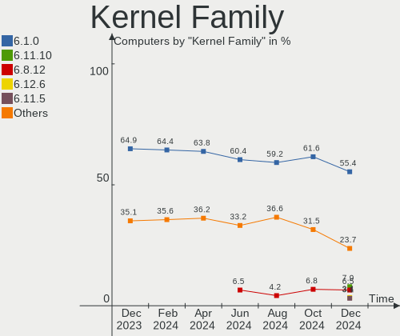
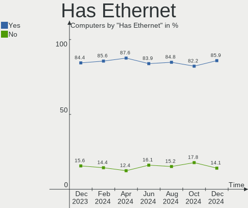
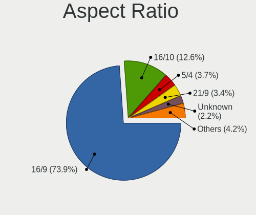
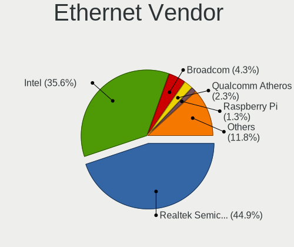
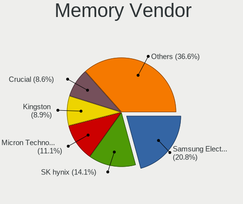

Debian - Hardware Trends
------------------------

A project to identify most popular hardware characteristics and track their change
over time based on data collected by Linux users at https://Linux-Hardware.org.

Anyone can contribute to this report by the [hw-probe](https://github.com/linuxhw/hw-probe) tool:

    sudo -E hw-probe -all -upload

This is a report for all computer types. See also reports for [desktops](/Dist/Debian/Desktop/README.md) and [notebooks](/Dist/Debian/Notebook/README.md).

This report is for one last month. Overall report since the beginning of time: [TestCoverage](https://github.com/linuxhw/TestCoverage)

Period: Jun, 2022.

Contents
--------

* [ System ](#system)
  - [ OS                       ](#os)
  - [ OS Family                ](#os-family)
  - [ Kernel                   ](#kernel)
  - [ Kernel Family            ](#kernel-family)
  - [ Kernel Major Ver.        ](#kernel-major-ver)
  - [ Arch                     ](#arch)
  - [ DE                       ](#de)
  - [ Display Server           ](#display-server)
  - [ Display Manager          ](#display-manager)
  - [ OS Lang                  ](#os-lang)
  - [ Boot Mode                ](#boot-mode)
  - [ Filesystem               ](#filesystem)
  - [ Part. scheme             ](#part-scheme)
  - [ Dual Boot with Linux/BSD ](#dual-boot-with-linuxbsd)
  - [ Dual Boot (Win)          ](#dual-boot-win)

* [ Board ](#board)
  - [ Vendor                   ](#vendor)
  - [ Model                    ](#model)
  - [ Model Family             ](#model-family)
  - [ MFG Year                 ](#mfg-year)
  - [ Form Factor              ](#form-factor)
  - [ Secure Boot              ](#secure-boot)
  - [ Coreboot                 ](#coreboot)
  - [ RAM Size                 ](#ram-size)
  - [ RAM Used                 ](#ram-used)
  - [ Total Drives             ](#total-drives)
  - [ Has CD-ROM               ](#has-cd-rom)
  - [ Has Ethernet             ](#has-ethernet)
  - [ Has WiFi                 ](#has-wifi)
  - [ Has Bluetooth            ](#has-bluetooth)

* [ Location ](#location)
  - [ Country                  ](#country)
  - [ City                     ](#city)

* [ Drives ](#drives)
  - [ Drive Vendor             ](#drive-vendor)
  - [ Drive Model              ](#drive-model)
  - [ HDD Vendor               ](#hdd-vendor)
  - [ SSD Vendor               ](#ssd-vendor)
  - [ Drive Kind               ](#drive-kind)
  - [ Drive Connector          ](#drive-connector)
  - [ Drive Size               ](#drive-size)
  - [ Space Total              ](#space-total)
  - [ Space Used               ](#space-used)
  - [ Malfunc. Drives          ](#malfunc-drives)
  - [ Malfunc. Drive Vendor    ](#malfunc-drive-vendor)
  - [ Malfunc. HDD Vendor      ](#malfunc-hdd-vendor)
  - [ Malfunc. Drive Kind      ](#malfunc-drive-kind)
  - [ Failed Drives            ](#failed-drives)
  - [ Failed Drive Vendor      ](#failed-drive-vendor)
  - [ Drive Status             ](#drive-status)

* [ Storage controller ](#storage-controller)
  - [ Storage Vendor           ](#storage-vendor)
  - [ Storage Model            ](#storage-model)
  - [ Storage Kind             ](#storage-kind)

* [ Processor ](#processor)
  - [ CPU Vendor               ](#cpu-vendor)
  - [ CPU Model                ](#cpu-model)
  - [ CPU Model Family         ](#cpu-model-family)
  - [ CPU Cores                ](#cpu-cores)
  - [ CPU Sockets              ](#cpu-sockets)
  - [ CPU Threads              ](#cpu-threads)
  - [ CPU Op-Modes             ](#cpu-op-modes)
  - [ CPU Microcode            ](#cpu-microcode)
  - [ CPU Microarch            ](#cpu-microarch)

* [ Graphics ](#graphics)
  - [ GPU Vendor               ](#gpu-vendor)
  - [ GPU Model                ](#gpu-model)
  - [ GPU Combo                ](#gpu-combo)
  - [ GPU Driver               ](#gpu-driver)
  - [ GPU Memory               ](#gpu-memory)

* [ Monitor ](#monitor)
  - [ Monitor Vendor           ](#monitor-vendor)
  - [ Monitor Model            ](#monitor-model)
  - [ Monitor Resolution       ](#monitor-resolution)
  - [ Monitor Diagonal         ](#monitor-diagonal)
  - [ Monitor Width            ](#monitor-width)
  - [ Aspect Ratio             ](#aspect-ratio)
  - [ Monitor Area             ](#monitor-area)
  - [ Pixel Density            ](#pixel-density)
  - [ Multiple Monitors        ](#multiple-monitors)

* [ Network ](#network)
  - [ Net Controller Vendor    ](#net-controller-vendor)
  - [ Net Controller Model     ](#net-controller-model)
  - [ Wireless Vendor          ](#wireless-vendor)
  - [ Wireless Model           ](#wireless-model)
  - [ Ethernet Vendor          ](#ethernet-vendor)
  - [ Ethernet Model           ](#ethernet-model)
  - [ Net Controller Kind      ](#net-controller-kind)
  - [ Used Controller          ](#used-controller)
  - [ NICs                     ](#nics)
  - [ IPv6                     ](#ipv6)

* [ Bluetooth ](#bluetooth)
  - [ Bluetooth Vendor         ](#bluetooth-vendor)
  - [ Bluetooth Model          ](#bluetooth-model)

* [ Sound ](#sound)
  - [ Sound Vendor             ](#sound-vendor)
  - [ Sound Model              ](#sound-model)

* [ Memory ](#memory)
  - [ Memory Vendor            ](#memory-vendor)
  - [ Memory Model             ](#memory-model)
  - [ Memory Kind              ](#memory-kind)
  - [ Memory Form Factor       ](#memory-form-factor)
  - [ Memory Size              ](#memory-size)
  - [ Memory Speed             ](#memory-speed)

* [ Printers & scanners ](#printers--scanners)
  - [ Printer Vendor           ](#printer-vendor)
  - [ Printer Model            ](#printer-model)
  - [ Scanner Vendor           ](#scanner-vendor)
  - [ Scanner Model            ](#scanner-model)

* [ Camera ](#camera)
  - [ Camera Vendor            ](#camera-vendor)
  - [ Camera Model             ](#camera-model)

* [ Security ](#security)
  - [ Fingerprint Vendor       ](#fingerprint-vendor)
  - [ Fingerprint Model        ](#fingerprint-model)
  - [ Chipcard Vendor          ](#chipcard-vendor)
  - [ Chipcard Model           ](#chipcard-model)

* [ Unsupported ](#unsupported)
  - [ Unsupported Devices      ](#unsupported-devices)
  - [ Unsupported Device Types ](#unsupported-device-types)

System
------

OS
--

Installed operating systems

| Name              | Computers | Percent |
|-------------------|-----------|---------|
| Debian 11         | 308       | 87.25%  |
| Debian Testing    | 18        | 5.1%    |
| Debian 10         | 15        | 4.25%   |
| Debian Unstable   | 9         | 2.55%   |
| Debian 11-updates | 2         | 0.57%   |
| Debian 8          | 1         | 0.28%   |

OS Family
---------

OS without a version

| Name   | Computers | Percent |
|--------|-----------|---------|
| Debian | 353       | 100%    |

Kernel
------

Version of the Linux kernel

| Version                    | Computers | Percent |
|----------------------------|-----------|---------|
| 5.10.0-7-amd64             | 128       | 36.26%  |
| 5.10.0-14-amd64            | 48        | 13.6%   |
| 5.10.0-15-amd64            | 42        | 11.9%   |
| 5.10.0-13-amd64            | 19        | 5.38%   |
| 5.17.0-1-amd64             | 9         | 2.55%   |
| 5.18.0-2-amd64             | 8         | 2.27%   |
| 5.16.0-0.bpo.4-amd64       | 8         | 2.27%   |
| 5.15.35-1-pve              | 6         | 1.7%    |
| 5.10.0-10-amd64            | 6         | 1.7%    |
| 5.18.0-1-amd64             | 5         | 1.42%   |
| 5.15.32-v8+                | 5         | 1.42%   |
| 4.19.0-20-amd64            | 5         | 1.42%   |
| 5.10.0-11-amd64            | 4         | 1.13%   |
| 5.10.109+truenas           | 3         | 0.85%   |
| 5.17.0-3-amd64             | 2         | 0.57%   |
| 5.17.0-2-amd64             | 2         | 0.57%   |
| 5.15.43-sunxi              | 2         | 0.57%   |
| 5.15.35-2-pve              | 2         | 0.57%   |
| 5.10.0-8-amd64             | 2         | 0.57%   |
| 5.10.0-14-686-pae          | 2         | 0.57%   |
| 4.19.0-20-686-pae          | 2         | 0.57%   |
| 5.4.61                     | 1         | 0.28%   |
| 5.19.0-rc3-amd64           | 1         | 0.28%   |
| 5.18.6-xanmod1             | 1         | 0.28%   |
| 5.18.5-amd64               | 1         | 0.28%   |
| 5.18.4-xanmod1-x64v2       | 1         | 0.28%   |
| 5.18.1-surface             | 1         | 0.28%   |
| 5.18.0-trunk-amd64         | 1         | 0.28%   |
| 5.18.0-starfive-5.18       | 1         | 0.28%   |
| 5.18.0-1-rt-amd64          | 1         | 0.28%   |
| 5.18.0-0.bpo.1-amd64       | 1         | 0.28%   |
| 5.17.15-edge               | 1         | 0.28%   |
| 5.17.14                    | 1         | 0.28%   |
| 5.17.0-trunk-amd64         | 1         | 0.28%   |
| 5.17.0-2mx-amd64           | 1         | 0.28%   |
| 5.17.0-14.1-liquorix-amd64 | 1         | 0.28%   |
| 5.17.0-1-riscv64           | 1         | 0.28%   |
| 5.17.0-1-686-pae           | 1         | 0.28%   |
| 5.16.0-5mx-amd64           | 1         | 0.28%   |
| 5.16.0-5-riscv64           | 1         | 0.28%   |
| 5.15.44-v8+                | 1         | 0.28%   |
| 5.15.35-3-pve              | 1         | 0.28%   |
| 5.15.32-xanmod1            | 1         | 0.28%   |
| 5.15.30-2-pve              | 1         | 0.28%   |
| 5.14.0-4mx-amd64           | 1         | 0.28%   |
| 5.14.0-0.bpo.2-amd64       | 1         | 0.28%   |
| 5.13.19-6-pve              | 1         | 0.28%   |
| 5.13.19-2-pve              | 1         | 0.28%   |
| 5.13.19-1-pve              | 1         | 0.28%   |
| 5.10.57                    | 1         | 0.28%   |
| 5.10.4                     | 1         | 0.28%   |
| 5.10.10-64                 | 1         | 0.28%   |
| 5.10.0-3-amd64             | 1         | 0.28%   |
| 5.10.0-15-rt-amd64         | 1         | 0.28%   |
| 5.10.0-15-686-pae          | 1         | 0.28%   |
| 5.10.0-15-686              | 1         | 0.28%   |
| 5.10.0-13-686-pae          | 1         | 0.28%   |
| 5.10.0-13-686              | 1         | 0.28%   |
| 5.10.0-12-amd64            | 1         | 0.28%   |
| 5.10.0-0.bpo.9-amd64       | 1         | 0.28%   |

Kernel Family
-------------

Linux kernel without a distro release

| Version  | Computers | Percent |
|----------|-----------|---------|
| 5.10.0   | 260       | 73.65%  |
| 5.17.0   | 18        | 5.1%    |
| 5.18.0   | 17        | 4.82%   |
| 5.16.0   | 10        | 2.83%   |
| 5.15.35  | 9         | 2.55%   |
| 4.19.0   | 9         | 2.55%   |
| 5.15.32  | 6         | 1.7%    |
| 5.13.19  | 3         | 0.85%   |
| 5.10.109 | 3         | 0.85%   |
| 5.15.43  | 2         | 0.57%   |
| 5.14.0   | 2         | 0.57%   |
| 5.4.61   | 1         | 0.28%   |
| 5.19.0   | 1         | 0.28%   |
| 5.18.6   | 1         | 0.28%   |
| 5.18.5   | 1         | 0.28%   |
| 5.18.4   | 1         | 0.28%   |
| 5.18.1   | 1         | 0.28%   |
| 5.17.15  | 1         | 0.28%   |
| 5.17.14  | 1         | 0.28%   |
| 5.15.44  | 1         | 0.28%   |
| 5.15.30  | 1         | 0.28%   |
| 5.10.57  | 1         | 0.28%   |
| 5.10.4   | 1         | 0.28%   |
| 5.10.10  | 1         | 0.28%   |
| 3.0.21   | 1         | 0.28%   |

Kernel Major Ver.
-----------------

Linux kernel major version

| Version | Computers | Percent |
|---------|-----------|---------|
| 5.10    | 266       | 75.35%  |
| 5.18    | 21        | 5.95%   |
| 5.17    | 20        | 5.67%   |
| 5.15    | 19        | 5.38%   |
| 5.16    | 10        | 2.83%   |
| 4.19    | 9         | 2.55%   |
| 5.13    | 3         | 0.85%   |
| 5.14    | 2         | 0.57%   |
| 5.4     | 1         | 0.28%   |
| 5.19    | 1         | 0.28%   |
| 3.0     | 1         | 0.28%   |

Arch
----

OS architecture (x86_64, i586, etc.)

| Name    | Computers | Percent |
|---------|-----------|---------|
| x86_64  | 330       | 93.48%  |
| i686    | 9         | 2.55%   |
| aarch64 | 6         | 1.7%    |
| riscv64 | 5         | 1.42%   |
| armv7l  | 3         | 0.85%   |

DE
--

Desktop Environment

| Name             | Computers | Percent |
|------------------|-----------|---------|
| Unknown          | 174       | 49.29%  |
| GNOME            | 70        | 19.83%  |
| XFCE             | 36        | 10.2%   |
| KDE5             | 25        | 7.08%   |
| MATE             | 12        | 3.4%    |
| LXQt             | 7         | 1.98%   |
| LXDE             | 6         | 1.7%    |
| Cinnamon         | 6         | 1.7%    |
| i3               | 3         | 0.85%   |
| X-Cinnamon       | 2         | 0.57%   |
| Openbox          | 2         | 0.57%   |
| GNOME Flashback  | 2         | 0.57%   |
| Budgie           | 2         | 0.57%   |
| Unity            | 1         | 0.28%   |
| trinity          | 1         | 0.28%   |
| sway             | 1         | 0.28%   |
| lightdm-xsession | 1         | 0.28%   |
| GNOME Classic    | 1         | 0.28%   |
| fvwm             | 1         | 0.28%   |

Display Server
--------------

X11 or Wayland

| Name    | Computers | Percent |
|---------|-----------|---------|
| Unknown | 143       | 40.51%  |
| X11     | 126       | 35.69%  |
| Wayland | 47        | 13.31%  |
| Tty     | 37        | 10.48%  |

Display Manager
---------------

SDDM, LightDM, etc.

| Name    | Computers | Percent |
|---------|-----------|---------|
| Unknown | 194       | 54.96%  |
| LightDM | 66        | 18.7%   |
| GDM     | 43        | 12.18%  |
| SDDM    | 26        | 7.37%   |
| GDM3    | 21        | 5.95%   |
| NODM    | 2         | 0.57%   |
| WDM     | 1         | 0.28%   |

OS Lang
-------

Language

| Lang    | Computers | Percent |
|---------|-----------|---------|
| ru_RU   | 140       | 39.66%  |
| en_US   | 90        | 25.5%   |
| de_DE   | 27        | 7.65%   |
| en_GB   | 20        | 5.67%   |
| fr_FR   | 16        | 4.53%   |
| Unknown | 11        | 3.12%   |
| en_AU   | 5         | 1.42%   |
| C       | 5         | 1.42%   |
| zh_CN   | 4         | 1.13%   |
| pt_BR   | 3         | 0.85%   |
| pl_PL   | 3         | 0.85%   |
| es_ES   | 3         | 0.85%   |
| es_AR   | 3         | 0.85%   |
| en_CA   | 3         | 0.85%   |
| fi_FI   | 2         | 0.57%   |
| es_VE   | 2         | 0.57%   |
| en_IN   | 2         | 0.57%   |
| en_IE   | 2         | 0.57%   |
| en_DE   | 2         | 0.57%   |
| sv_SE   | 1         | 0.28%   |
| nl_NL   | 1         | 0.28%   |
| nl_BE   | 1         | 0.28%   |
| hu_HU   | 1         | 0.28%   |
| fr_CH   | 1         | 0.28%   |
| eu_ES   | 1         | 0.28%   |
| es_PE   | 1         | 0.28%   |
| es_MX   | 1         | 0.28%   |
| en_SG   | 1         | 0.28%   |
| en_NZ   | 1         | 0.28%   |

Boot Mode
---------

EFI or BIOS

| Mode | Computers | Percent |
|------|-----------|---------|
| BIOS | 190       | 53.82%  |
| EFI  | 163       | 46.18%  |

Filesystem
----------

Type of filesystem

| Type    | Computers | Percent |
|---------|-----------|---------|
| Ext4    | 197       | 55.81%  |
| Overlay | 138       | 39.09%  |
| Btrfs   | 9         | 2.55%   |
| Zfs     | 6         | 1.7%    |
| Xfs     | 1         | 0.28%   |
| Rootfs  | 1         | 0.28%   |
| Ext2    | 1         | 0.28%   |

Part. scheme
------------

Scheme of partitioning

| Type    | Computers | Percent |
|---------|-----------|---------|
| GPT     | 168       | 47.59%  |
| MBR     | 155       | 43.91%  |
| Unknown | 30        | 8.5%    |

Dual Boot with Linux/BSD
------------------------

Hosting more than one Linux/BSD

| Dual boot | Computers | Percent |
|-----------|-----------|---------|
| No        | 312       | 88.39%  |
| Yes       | 41        | 11.61%  |

Dual Boot (Win)
---------------

Hosting Linux and Windows

| Dual boot | Computers | Percent |
|-----------|-----------|---------|
| Yes       | 181       | 51.27%  |
| No        | 172       | 48.73%  |

Board
-----

Vendor
------

Motherboard manufacturer

| Name                    | Computers | Percent |
|-------------------------|-----------|---------|
| ASUSTek Computer        | 92        | 26.06%  |
| Lenovo                  | 39        | 11.05%  |
| Gigabyte Technology     | 38        | 10.76%  |
| Dell                    | 35        | 9.92%   |
| Aquarius                | 28        | 7.93%   |
| Hewlett-Packard         | 25        | 7.08%   |
| MSI                     | 19        | 5.38%   |
| ASRock                  | 9         | 2.55%   |
| Acer                    | 8         | 2.27%   |
| Unknown                 | 7         | 1.98%   |
| Raspberry Pi Foundation | 6         | 1.7%    |
| Apple                   | 4         | 1.13%   |
| Intel                   | 3         | 0.85%   |
| Fujitsu                 | 3         | 0.85%   |
| Xunlong                 | 2         | 0.57%   |
| Toshiba                 | 2         | 0.57%   |
| Supermicro              | 2         | 0.57%   |
| Samsung Electronics     | 2         | 0.57%   |
| HUAWEI                  | 2         | 0.57%   |
| Google                  | 2         | 0.57%   |
| Foxconn                 | 2         | 0.57%   |
| ECS                     | 2         | 0.57%   |
| ZOTAC                   | 1         | 0.28%   |
| TUXEDO                  | 1         | 0.28%   |
| Timi                    | 1         | 0.28%   |
| TEKNOSERVICE            | 1         | 0.28%   |
| SANTECH                 | 1         | 0.28%   |
| Razer                   | 1         | 0.28%   |
| PC Specialist           | 1         | 0.28%   |
| PC Engines              | 1         | 0.28%   |
| Notebook                | 1         | 0.28%   |
| Microsoft               | 1         | 0.28%   |
| Medion                  | 1         | 0.28%   |
| Maxtang                 | 1         | 0.28%   |
| LG Electronics          | 1         | 0.28%   |
| Insyde                  | 1         | 0.28%   |
| Flipkart India Pvt.     | 1         | 0.28%   |
| EVGA                    | 1         | 0.28%   |
| Chuwi                   | 1         | 0.28%   |
| BESSTAR Tech            | 1         | 0.28%   |
| BenQ                    | 1         | 0.28%   |
| AXDIA International     | 1         | 0.28%   |
| ASRockRack              | 1         | 0.28%   |

Model
-----

Motherboard model

| Name                                               | Computers | Percent |
|----------------------------------------------------|-----------|---------|
| ASUS S20 K29                                       | 45        | 12.75%  |
| Aquarius NS585                                     | 28        | 7.93%   |
| Gigabyte H410M S2H                                 | 15        | 4.25%   |
| MSI MS-7996                                        | 7         | 1.98%   |
| Unknown                                            | 7         | 1.98%   |
| ASUS P5G41T-M LE                                   | 3         | 0.85%   |
| ASUS H110M-R                                       | 3         | 0.85%   |
| ASUS All Series                                    | 3         | 0.85%   |
| RPi Raspberry Pi 4 Model B Rev 1.1                 | 2         | 0.57%   |
| MSI MS-7817                                        | 2         | 0.57%   |
| Lenovo ThinkPad L13 Yoga Gen 2 20VK0019US          | 2         | 0.57%   |
| Gigabyte H81M-S2V                                  | 2         | 0.57%   |
| Gigabyte B360M H                                   | 2         | 0.57%   |
| Dell PowerEdge R210                                | 2         | 0.57%   |
| ASUS PRIME H310M-R R2.0                            | 2         | 0.57%   |
| ASUS PRIME B450M-A                                 | 2         | 0.57%   |
| ASRock B450 Gaming-ITX/ac                          | 2         | 0.57%   |
| ZOTAC ZBOX-CI527/CI547                             | 1         | 0.28%   |
| Xunlong Orange Pi Plus 2E                          | 1         | 0.28%   |
| Xunlong Orange Pi Lite                             | 1         | 0.28%   |
| TUXEDO Aura 15 Gen1                                | 1         | 0.28%   |
| Toshiba Satellite L850                             | 1         | 0.28%   |
| Toshiba Satellite A300                             | 1         | 0.28%   |
| Timi A7S                                           | 1         | 0.28%   |
| TEKNOSERVICE PORTATIL TTL 14                       | 1         | 0.28%   |
| Supermicro X8STi                                   | 1         | 0.28%   |
| Supermicro Super Server                            | 1         | 0.28%   |
| SANTECH NHx0DB,DE                                  | 1         | 0.28%   |
| Samsung 950QCG                                     | 1         | 0.28%   |
| Samsung 935XDB                                     | 1         | 0.28%   |
| Razer Blade 15 Base Model (Early 2020) - RZ09-0328 | 1         | 0.28%   |
| RPi Raspberry Pi Compute Module 4 Rev 1.0          | 1         | 0.28%   |
| RPi Raspberry Pi 400 Rev 1.1                       | 1         | 0.28%   |
| RPi Raspberry Pi 3 Model B Rev 1.2                 | 1         | 0.28%   |
| RPi Raspberry Pi                                   | 1         | 0.28%   |
| PC Specialist Standard                             | 1         | 0.28%   |
| PC Engines APU2                                    | 1         | 0.28%   |
| Notebook NL40_50CU                                 | 1         | 0.28%   |
| MSI p6620ch-m                                      | 1         | 0.28%   |
| MSI MS-7D53                                        | 1         | 0.28%   |
| MSI MS-7C84                                        | 1         | 0.28%   |
| MSI MS-7C56                                        | 1         | 0.28%   |
| MSI MS-7A38                                        | 1         | 0.28%   |
| MSI MS-7984                                        | 1         | 0.28%   |
| MSI MS-7885                                        | 1         | 0.28%   |
| MSI MS-7808                                        | 1         | 0.28%   |
| MSI MS-7721                                        | 1         | 0.28%   |
| MSI MS-7698                                        | 1         | 0.28%   |
| Microsoft Surface Laptop 2                         | 1         | 0.28%   |
| Medion E16402                                      | 1         | 0.28%   |
| Maxtang FP30                                       | 1         | 0.28%   |
| LG A410-G.BC48P1                                   | 1         | 0.28%   |
| Lenovo Yoga 6 13ALC7 82UD                          | 1         | 0.28%   |
| Lenovo XiaoXinPro-13ARE 2020 82DM                  | 1         | 0.28%   |
| Lenovo ThinkStation S20 4105J6G                    | 1         | 0.28%   |
| Lenovo ThinkPad X260 VB6R77903H                    | 1         | 0.28%   |
| Lenovo ThinkPad X230 2325AEG                       | 1         | 0.28%   |
| Lenovo ThinkPad X140e 20BLA00C00                   | 1         | 0.28%   |
| Lenovo ThinkPad X1 Carbon Gen 9 20XW0050GE         | 1         | 0.28%   |
| Lenovo ThinkPad X1 Carbon Gen 10 21CBCTO1WW        | 1         | 0.28%   |

Model Family
------------

Motherboard model prefix

| Name                   | Computers | Percent |
|------------------------|-----------|---------|
| ASUS S20               | 45        | 12.75%  |
| Aquarius NS585         | 28        | 7.93%   |
| Lenovo ThinkPad        | 23        | 6.52%   |
| Gigabyte H410M         | 15        | 4.25%   |
| Dell Latitude          | 12        | 3.4%    |
| ASUS PRIME             | 9         | 2.55%   |
| MSI MS-7996            | 7         | 1.98%   |
| Unknown                | 7         | 1.98%   |
| RPi Raspberry          | 6         | 1.7%    |
| HP EliteBook           | 6         | 1.7%    |
| Dell OptiPlex          | 6         | 1.7%    |
| Acer Aspire            | 6         | 1.7%    |
| Lenovo IdeaPad         | 5         | 1.42%   |
| HP Pavilion            | 5         | 1.42%   |
| Dell Inspiron          | 5         | 1.42%   |
| Dell Precision         | 4         | 1.13%   |
| Lenovo ThinkCentre     | 3         | 0.85%   |
| HP ProLiant            | 3         | 0.85%   |
| Dell Vostro            | 3         | 0.85%   |
| Dell PowerEdge         | 3         | 0.85%   |
| ASUS P5G41T-M          | 3         | 0.85%   |
| ASUS H110M-R           | 3         | 0.85%   |
| ASUS All               | 3         | 0.85%   |
| Xunlong Orange         | 2         | 0.57%   |
| Toshiba Satellite      | 2         | 0.57%   |
| MSI MS-7817            | 2         | 0.57%   |
| Lenovo ThinkBook       | 2         | 0.57%   |
| HP 250                 | 2         | 0.57%   |
| Gigabyte H81M-S2V      | 2         | 0.57%   |
| Gigabyte B450M         | 2         | 0.57%   |
| Gigabyte B360M         | 2         | 0.57%   |
| Fujitsu LIFEBOOK       | 2         | 0.57%   |
| ASUS ZenBook           | 2         | 0.57%   |
| ASUS ASUS              | 2         | 0.57%   |
| ASRock B450            | 2         | 0.57%   |
| Apple MacBookPro11     | 2         | 0.57%   |
| Acer Nitro             | 2         | 0.57%   |
| ZOTAC ZBOX-CI527       | 1         | 0.28%   |
| TUXEDO Aura            | 1         | 0.28%   |
| Timi A7S               | 1         | 0.28%   |
| TEKNOSERVICE PORTATIL  | 1         | 0.28%   |
| Supermicro X8STi       | 1         | 0.28%   |
| Supermicro Super       | 1         | 0.28%   |
| SANTECH NHx0DB         | 1         | 0.28%   |
| Samsung 950QCG         | 1         | 0.28%   |
| Samsung 935XDB         | 1         | 0.28%   |
| Razer Blade            | 1         | 0.28%   |
| PC Specialist Standard | 1         | 0.28%   |
| PC Engines APU2        | 1         | 0.28%   |
| Notebook NL40          | 1         | 0.28%   |
| MSI p6620ch-m          | 1         | 0.28%   |
| MSI MS-7D53            | 1         | 0.28%   |
| MSI MS-7C84            | 1         | 0.28%   |
| MSI MS-7C56            | 1         | 0.28%   |
| MSI MS-7A38            | 1         | 0.28%   |
| MSI MS-7984            | 1         | 0.28%   |
| MSI MS-7885            | 1         | 0.28%   |
| MSI MS-7808            | 1         | 0.28%   |
| MSI MS-7721            | 1         | 0.28%   |
| MSI MS-7698            | 1         | 0.28%   |

MFG Year
--------

Motherboard manufacture year

| Year    | Computers | Percent |
|---------|-----------|---------|
| 2020    | 113       | 32.01%  |
| 2018    | 33        | 9.35%   |
| 2021    | 32        | 9.07%   |
| 2012    | 19        | 5.38%   |
| 2017    | 17        | 4.82%   |
| 2014    | 17        | 4.82%   |
| 2019    | 16        | 4.53%   |
| 2013    | 15        | 4.25%   |
| 2015    | 14        | 3.97%   |
| Unknown | 14        | 3.97%   |
| 2016    | 13        | 3.68%   |
| 2011    | 11        | 3.12%   |
| 2010    | 10        | 2.83%   |
| 2022    | 7         | 1.98%   |
| 2009    | 7         | 1.98%   |
| 2007    | 6         | 1.7%    |
| 2008    | 4         | 1.13%   |
| 2005    | 3         | 0.85%   |
| 2003    | 2         | 0.57%   |

Form Factor
-----------

Physical design of the computer

| Name           | Computers | Percent |
|----------------|-----------|---------|
| Desktop        | 182       | 51.56%  |
| Notebook       | 142       | 40.23%  |
| System on chip | 8         | 2.27%   |
| Server         | 6         | 1.7%    |
| Convertible    | 5         | 1.42%   |
| Mini pc        | 5         | 1.42%   |
| Other          | 2         | 0.57%   |
| Tablet         | 2         | 0.57%   |
| All in one     | 1         | 0.28%   |

Secure Boot
-----------

Enabled or disabled

| State    | Computers | Percent |
|----------|-----------|---------|
| Disabled | 335       | 94.9%   |
| Enabled  | 18        | 5.1%    |

Coreboot
--------

Have coreboot on board

| Used | Computers | Percent |
|------|-----------|---------|
| No   | 349       | 98.87%  |
| Yes  | 4         | 1.13%   |

RAM Size
--------

Total RAM memory

| Size in GB  | Computers | Percent |
|-------------|-----------|---------|
| 4.01-8.0    | 136       | 38.53%  |
| 16.01-24.0  | 71        | 20.11%  |
| 3.01-4.0    | 46        | 13.03%  |
| 8.01-16.0   | 40        | 11.33%  |
| 32.01-64.0  | 22        | 6.23%   |
| 1.01-2.0    | 12        | 3.4%    |
| 64.01-256.0 | 9         | 2.55%   |
| 0.51-1.0    | 5         | 1.42%   |
| 24.01-32.0  | 4         | 1.13%   |
| 2.01-3.0    | 4         | 1.13%   |
| 0.01-0.5    | 3         | 0.85%   |
| Unknown     | 1         | 0.28%   |

RAM Used
--------

Used RAM memory

| Used GB    | Computers | Percent |
|------------|-----------|---------|
| 0.51-1.0   | 147       | 41.64%  |
| 1.01-2.0   | 67        | 18.98%  |
| 2.01-3.0   | 47        | 13.31%  |
| 4.01-8.0   | 30        | 8.5%    |
| 3.01-4.0   | 23        | 6.52%   |
| 8.01-16.0  | 19        | 5.38%   |
| 0.01-0.5   | 16        | 4.53%   |
| Unknown    | 2         | 0.57%   |
| 32.01-64.0 | 1         | 0.28%   |
| 24.01-32.0 | 1         | 0.28%   |

Total Drives
------------

Number of drives on board

| Drives | Computers | Percent |
|--------|-----------|---------|
| 1      | 262       | 74.22%  |
| 2      | 55        | 15.58%  |
| 3      | 13        | 3.68%   |
| 4      | 10        | 2.83%   |
| 7      | 4         | 1.13%   |
| 5      | 4         | 1.13%   |
| 8      | 3         | 0.85%   |
| 0      | 2         | 0.57%   |

Has CD-ROM
----------

Has CD-ROM on board

| Presented | Computers | Percent |
|-----------|-----------|---------|
| No        | 280       | 79.32%  |
| Yes       | 73        | 20.68%  |

Has Ethernet
------------

Has Ethernet on board

| Presented | Computers | Percent |
|-----------|-----------|---------|
| Yes       | 316       | 89.52%  |
| No        | 37        | 10.48%  |

Has WiFi
--------

Has WiFi module

| Presented | Computers | Percent |
|-----------|-----------|---------|
| Yes       | 184       | 52.12%  |
| No        | 169       | 47.88%  |

Has Bluetooth
-------------

Has Bluetooth module

| Presented | Computers | Percent |
|-----------|-----------|---------|
| No        | 199       | 56.37%  |
| Yes       | 154       | 43.63%  |

Location
--------

Country
-------

Geographic location (country)

| Country      | Computers | Percent |
|--------------|-----------|---------|
| Russia       | 145       | 41.08%  |
| USA          | 39        | 11.05%  |
| Germany      | 34        | 9.63%   |
| France       | 15        | 4.25%   |
| UK           | 10        | 2.83%   |
| Poland       | 9         | 2.55%   |
| China        | 9         | 2.55%   |
| Brazil       | 9         | 2.55%   |
| Australia    | 7         | 1.98%   |
| Spain        | 6         | 1.7%    |
| Canada       | 6         | 1.7%    |
| Italy        | 5         | 1.42%   |
| Ireland      | 4         | 1.13%   |
| Austria      | 4         | 1.13%   |
| Switzerland  | 3         | 0.85%   |
| Netherlands  | 3         | 0.85%   |
| India        | 3         | 0.85%   |
| Hungary      | 3         | 0.85%   |
| Bulgaria     | 3         | 0.85%   |
| Belgium      | 3         | 0.85%   |
| Argentina    | 3         | 0.85%   |
| Venezuela    | 2         | 0.57%   |
| Thailand     | 2         | 0.57%   |
| Sweden       | 2         | 0.57%   |
| South Africa | 2         | 0.57%   |
| Portugal     | 2         | 0.57%   |
| Haiti        | 2         | 0.57%   |
| Finland      | 2         | 0.57%   |
| Algeria      | 2         | 0.57%   |
| Uzbekistan   | 1         | 0.28%   |
| Taiwan       | 1         | 0.28%   |
| Singapore    | 1         | 0.28%   |
| Peru         | 1         | 0.28%   |
| New Zealand  | 1         | 0.28%   |
| Nepal        | 1         | 0.28%   |
| Mexico       | 1         | 0.28%   |
| Malaysia     | 1         | 0.28%   |
| Latvia       | 1         | 0.28%   |
| Iraq         | 1         | 0.28%   |
| Indonesia    | 1         | 0.28%   |
| Greece       | 1         | 0.28%   |
| Denmark      | 1         | 0.28%   |
| Czechia      | 1         | 0.28%   |

City
----

Geographic location (city)

| City                   | Computers | Percent |
|------------------------|-----------|---------|
| Voronezh               | 128       | 36.26%  |
| Paris                  | 7         | 1.98%   |
| Moscow                 | 5         | 1.42%   |
| London                 | 5         | 1.42%   |
| Vienna                 | 4         | 1.13%   |
| Sydney                 | 4         | 1.13%   |
| Gladbeck               | 4         | 1.13%   |
| Washington             | 3         | 0.85%   |
| Perm                   | 3         | 0.85%   |
| Munich                 | 3         | 0.85%   |
| Dublin                 | 3         | 0.85%   |
| Cheboksary             | 3         | 0.85%   |
| Zurich                 | 2         | 0.57%   |
| Wroclaw                | 2         | 0.57%   |
| Sofia                  | 2         | 0.57%   |
| Shanghai               | 2         | 0.57%   |
| Seville                | 2         | 0.57%   |
| Port-au-Prince         | 2         | 0.57%   |
| Johannesburg           | 2         | 0.57%   |
| Jemgum                 | 2         | 0.57%   |
| Cincinnati             | 2         | 0.57%   |
| Caracas                | 2         | 0.57%   |
| Budapest               | 2         | 0.57%   |
| Brisbane               | 2         | 0.57%   |
| Berlin                 | 2         | 0.57%   |
| Beijing                | 2         | 0.57%   |
| Bangor                 | 2         | 0.57%   |
| Amsterdam              | 2         | 0.57%   |
| Yilan                  | 1         | 0.28%   |
| Wielgie                | 1         | 0.28%   |
| Weselberg              | 1         | 0.28%   |
| Wellington             | 1         | 0.28%   |
| Weare                  | 1         | 0.28%   |
| Warsaw                 | 1         | 0.28%   |
| Warner Robins          | 1         | 0.28%   |
| Vladivostok            | 1         | 0.28%   |
| Vitoria-Gasteiz        | 1         | 0.28%   |
| Vitória               | 1         | 0.28%   |
| Villingen-Schwenningen | 1         | 0.28%   |
| Villeneuve-de-Riviere  | 1         | 0.28%   |
| Vigneux-sur-Seine      | 1         | 0.28%   |
| Valley View            | 1         | 0.28%   |
| Uberlândia            | 1         | 0.28%   |
| Tyumen                 | 1         | 0.28%   |
| Turin                  | 1         | 0.28%   |
| Toronto                | 1         | 0.28%   |
| Toms River             | 1         | 0.28%   |
| Thousand Oaks          | 1         | 0.28%   |
| Tashkent               | 1         | 0.28%   |
| Szombathely            | 1         | 0.28%   |
| Stuttgart              | 1         | 0.28%   |
| Stevenage              | 1         | 0.28%   |
| St Petersburg          | 1         | 0.28%   |
| St Louis               | 1         | 0.28%   |
| Sovicille              | 1         | 0.28%   |
| South Deerfield        | 1         | 0.28%   |
| Solna                  | 1         | 0.28%   |
| Śliwice               | 1         | 0.28%   |
| Singapore              | 1         | 0.28%   |
| Shenzhen               | 1         | 0.28%   |

Drives
------

Drive Vendor
------------

Hard drive vendors

| Vendor                       | Computers | Drives | Percent |
|------------------------------|-----------|--------|---------|
| Samsung Electronics          | 63        | 69     | 13.76%  |
| Crucial                      | 62        | 64     | 13.54%  |
| WDC                          | 61        | 80     | 13.32%  |
| Seagate                      | 51        | 68     | 11.14%  |
| Kingston                     | 42        | 44     | 9.17%   |
| A-DATA Technology            | 31        | 31     | 6.77%   |
| Unknown                      | 21        | 24     | 4.59%   |
| Toshiba                      | 21        | 24     | 4.59%   |
| SanDisk                      | 18        | 22     | 3.93%   |
| SK hynix                     | 9         | 10     | 1.97%   |
| Intel                        | 6         | 7      | 1.31%   |
| HGST                         | 6         | 6      | 1.31%   |
| China                        | 5         | 5      | 1.09%   |
| Patriot                      | 4         | 4      | 0.87%   |
| Hitachi                      | 4         | 5      | 0.87%   |
| SPCC                         | 3         | 3      | 0.66%   |
| Phison                       | 3         | 3      | 0.66%   |
| OCZ                          | 3         | 3      | 0.66%   |
| Maxtor                       | 3         | 3      | 0.66%   |
| LITEON                       | 3         | 3      | 0.66%   |
| KIOXIA                       | 3         | 3      | 0.66%   |
| UMIS                         | 2         | 2      | 0.44%   |
| Netac                        | 2         | 2      | 0.44%   |
| Intenso                      | 2         | 2      | 0.44%   |
| Fujitsu                      | 2         | 2      | 0.44%   |
| Corsair                      | 2         | 3      | 0.44%   |
| Apple                        | 2         | 3      | 0.44%   |
| WDC PC S                     | 1         | 1      | 0.22%   |
| Verbatim                     | 1         | 1      | 0.22%   |
| Transcend                    | 1         | 1      | 0.22%   |
| Team                         | 1         | 1      | 0.22%   |
| SMI DISK                     | 1         | 1      | 0.22%   |
| Silicon Motion               | 1         | 1      | 0.22%   |
| Shenzhen Longsys Electronics | 1         | 1      | 0.22%   |
| Realtek Semiconductor        | 1         | 1      | 0.22%   |
| PNY                          | 1         | 1      | 0.22%   |
| Plextor                      | 1         | 1      | 0.22%   |
| OWC                          | 1         | 1      | 0.22%   |
| Micron Technology            | 1         | 1      | 0.22%   |
| LITEONIT                     | 1         | 1      | 0.22%   |
| LDLC                         | 1         | 1      | 0.22%   |
| KingFast                     | 1         | 1      | 0.22%   |
| KingDian                     | 1         | 1      | 0.22%   |
| JetFlash                     | 1         | 1      | 0.22%   |
| IBM-D050                     | 1         | 3      | 0.22%   |
| Hewlett-Packard              | 1         | 1      | 0.22%   |
| Colorful                     | 1         | 1      | 0.22%   |
| ASMT                         | 1         | 1      | 0.22%   |
| AMP                          | 1         | 1      | 0.22%   |
| ADATA Technology             | 1         | 1      | 0.22%   |
| Unknown                      | 1         | 1      | 0.22%   |

Drive Model
-----------

Hard drive models

| Model                                | Computers | Percent |
|--------------------------------------|-----------|---------|
| Crucial CT480BX500SSD1 480GB         | 45        | 9.22%   |
| A-DATA SU800 512GB SSD               | 29        | 5.94%   |
| Kingston SA400S37240G 240GB SSD      | 18        | 3.69%   |
| Kingston SV300S37A120G 120GB SSD     | 8         | 1.64%   |
| Seagate ST1000LM024 HN-M101MBB 1TB   | 6         | 1.23%   |
| Toshiba DT01ACA050 500GB             | 4         | 0.82%   |
| Seagate ST500DM002-1BD142 500GB      | 4         | 0.82%   |
| Samsung MZVLB512HBJQ-000L7 512GB     | 4         | 0.82%   |
| WDC WD10EZEX-08WN4A0 1TB             | 3         | 0.61%   |
| Unknown SD/MMC/MS PRO 128GB          | 3         | 0.61%   |
| Unknown MMC Card  32GB               | 3         | 0.61%   |
| Seagate ST4000VN008-2DR166 4TB       | 3         | 0.61%   |
| Seagate ST1000DM003-1ER162 1TB       | 3         | 0.61%   |
| Samsung SSD 860 EVO 250GB            | 3         | 0.61%   |
| Samsung MZVLQ512HALU-00000 512GB     | 3         | 0.61%   |
| Kingston SA400S37120G 120GB SSD      | 3         | 0.61%   |
| HGST HTS541010A9E680 1TB             | 3         | 0.61%   |
| Crucial CT500MX500SSD1 500GB         | 3         | 0.61%   |
| Crucial CT250MX500SSD1 250GB         | 3         | 0.61%   |
| WDC WDS500G2B0C-00PXH0 500GB         | 2         | 0.41%   |
| WDC WDS500G2B0B-00YS70 500GB SSD     | 2         | 0.41%   |
| WDC WDS240G2G0A-00JH30 240GB SSD     | 2         | 0.41%   |
| WDC WDS100T2B0C-00PXH0 1TB           | 2         | 0.41%   |
| WDC WD6003FFBX-68MU3N0 6TB           | 2         | 0.41%   |
| WDC WD10SPZX-08Z10 1TB               | 2         | 0.41%   |
| WDC WD1003FZEX-00K3CA0 1TB           | 2         | 0.41%   |
| WDC PC SN530 SDBPNPZ-256G-1002 256GB | 2         | 0.41%   |
| WDC PC SN530 NVMe 512GB              | 2         | 0.41%   |
| Unknown SD64G  64GB                  | 2         | 0.41%   |
| Unknown SD32G  32GB                  | 2         | 0.41%   |
| Unknown MMC Card  64GB               | 2         | 0.41%   |
| Unknown HBG4a2  32GB                 | 2         | 0.41%   |
| Toshiba MQ01ABF050 500GB             | 2         | 0.41%   |
| Toshiba HDWD110 1TB                  | 2         | 0.41%   |
| SK hynix SC311 SATA 256GB SSD        | 2         | 0.41%   |
| Seagate ST3500830AS 500GB            | 2         | 0.41%   |
| Seagate ST3250318AS 250GB            | 2         | 0.41%   |
| Seagate ST2000DM006-2DM164 2TB       | 2         | 0.41%   |
| Seagate ST1000LM048-2E7172 1TB       | 2         | 0.41%   |
| Seagate ST1000DM010-2EP102 1TB       | 2         | 0.41%   |
| Seagate ST1000DM003-1SB102 1TB       | 2         | 0.41%   |
| SanDisk SSD U100 24GB                | 2         | 0.41%   |
| SanDisk SSD PLUS 120GB               | 2         | 0.41%   |
| SanDisk SDSSDXPS240G 240GB           | 2         | 0.41%   |
| SanDisk NVMe SSD Drive 1TB           | 2         | 0.41%   |
| Samsung SSD 980 500GB                | 2         | 0.41%   |
| Samsung SSD 970 EVO Plus 2TB         | 2         | 0.41%   |
| Samsung SSD 970 EVO Plus 1TB         | 2         | 0.41%   |
| Samsung SSD 970 EVO 500GB            | 2         | 0.41%   |
| Samsung SSD 960 EVO 250GB            | 2         | 0.41%   |
| Samsung SSD 870 EVO 500GB            | 2         | 0.41%   |
| Samsung SSD 860 EVO M.2 500GB        | 2         | 0.41%   |
| Samsung SSD 860 EVO M.2 250GB        | 2         | 0.41%   |
| Samsung SSD 850 EVO 250GB            | 2         | 0.41%   |
| Samsung MZVL2512HCJQ-00BL7 512GB     | 2         | 0.41%   |
| Samsung HD502HJ 500GB                | 2         | 0.41%   |
| Samsung HD103UJ 1TB                  | 2         | 0.41%   |
| Maxtor STM3160815AS 160GB            | 2         | 0.41%   |
| Kingston SUV500120G 120GB SSD        | 2         | 0.41%   |
| Crucial CT240M500SSD1 240GB          | 2         | 0.41%   |

HDD Vendor
----------

Hard disk drive vendors

| Vendor              | Computers | Drives | Percent |
|---------------------|-----------|--------|---------|
| Seagate             | 51        | 68     | 36.17%  |
| WDC                 | 43        | 58     | 30.5%   |
| Toshiba             | 20        | 23     | 14.18%  |
| Samsung Electronics | 8         | 8      | 5.67%   |
| HGST                | 6         | 6      | 4.26%   |
| Hitachi             | 4         | 5      | 2.84%   |
| Unknown             | 3         | 3      | 2.13%   |
| Maxtor              | 3         | 3      | 2.13%   |
| Fujitsu             | 2         | 2      | 1.42%   |
| AMP                 | 1         | 1      | 0.71%   |

SSD Vendor
----------

Solid state drive vendors

| Vendor              | Computers | Drives | Percent |
|---------------------|-----------|--------|---------|
| Crucial             | 59        | 61     | 28.23%  |
| Kingston            | 38        | 38     | 18.18%  |
| A-DATA Technology   | 30        | 30     | 14.35%  |
| Samsung Electronics | 23        | 24     | 11%     |
| SanDisk             | 13        | 17     | 6.22%   |
| WDC                 | 7         | 7      | 3.35%   |
| China               | 5         | 5      | 2.39%   |
| SK hynix            | 3         | 3      | 1.44%   |
| OCZ                 | 3         | 3      | 1.44%   |
| LITEON              | 3         | 3      | 1.44%   |
| SPCC                | 2         | 2      | 0.96%   |
| Patriot             | 2         | 2      | 0.96%   |
| Netac               | 2         | 2      | 0.96%   |
| Intenso             | 2         | 2      | 0.96%   |
| Intel               | 2         | 2      | 0.96%   |
| Verbatim            | 1         | 1      | 0.48%   |
| Transcend           | 1         | 1      | 0.48%   |
| Team                | 1         | 1      | 0.48%   |
| Plextor             | 1         | 1      | 0.48%   |
| Phison              | 1         | 1      | 0.48%   |
| Micron Technology   | 1         | 1      | 0.48%   |
| LITEONIT            | 1         | 1      | 0.48%   |
| LDLC                | 1         | 1      | 0.48%   |
| KingFast            | 1         | 1      | 0.48%   |
| KingDian            | 1         | 1      | 0.48%   |
| Hewlett-Packard     | 1         | 1      | 0.48%   |
| Corsair             | 1         | 2      | 0.48%   |
| ASMT                | 1         | 1      | 0.48%   |
| Apple               | 1         | 1      | 0.48%   |
| Unknown             | 1         | 1      | 0.48%   |

Drive Kind
----------

HDD or SSD

| Kind    | Computers | Drives | Percent |
|---------|-----------|--------|---------|
| SSD     | 196       | 217    | 46.23%  |
| HDD     | 121       | 177    | 28.54%  |
| NVMe    | 84        | 99     | 19.81%  |
| MMC     | 19        | 22     | 4.48%   |
| Unknown | 4         | 6      | 0.94%   |

Drive Connector
---------------

SATA, SAS, NVMe, etc.

| Type | Computers | Drives | Percent |
|------|-----------|--------|---------|
| SATA | 273       | 381    | 70.36%  |
| NVMe | 84        | 99     | 21.65%  |
| MMC  | 19        | 22     | 4.9%    |
| SAS  | 12        | 19     | 3.09%   |

Drive Size
----------

Size of hard drive

| Size in TB | Computers | Drives | Percent |
|------------|-----------|--------|---------|
| 0.01-0.5   | 202       | 236    | 61.59%  |
| 0.51-1.0   | 90        | 103    | 27.44%  |
| 1.01-2.0   | 15        | 20     | 4.57%   |
| 3.01-4.0   | 9         | 15     | 2.74%   |
| 2.01-3.0   | 5         | 6      | 1.52%   |
| 4.01-10.0  | 5         | 10     | 1.52%   |
| 10.01-20.0 | 2         | 4      | 0.61%   |

Space Total
-----------

Amount of disk space available on the file system

| Size in GB     | Computers | Percent |
|----------------|-----------|---------|
| Unknown        | 142       | 40.23%  |
| 101-250        | 60        | 17%     |
| 501-1000       | 43        | 12.18%  |
| 251-500        | 40        | 11.33%  |
| 21-50          | 16        | 4.53%   |
| 51-100         | 13        | 3.68%   |
| More than 3000 | 12        | 3.4%    |
| 1001-2000      | 12        | 3.4%    |
| 2001-3000      | 8         | 2.27%   |
| 1-20           | 7         | 1.98%   |

Space Used
----------

Amount of used disk space

| Used GB        | Computers | Percent |
|----------------|-----------|---------|
| Unknown        | 142       | 40.23%  |
| 1-20           | 86        | 24.36%  |
| 251-500        | 25        | 7.08%   |
| 101-250        | 25        | 7.08%   |
| 21-50          | 24        | 6.8%    |
| 51-100         | 24        | 6.8%    |
| 501-1000       | 12        | 3.4%    |
| More than 3000 | 6         | 1.7%    |
| 2001-3000      | 5         | 1.42%   |
| 1001-2000      | 4         | 1.13%   |

Malfunc. Drives
---------------

Drive models with a malfunction

| Model                                            | Computers | Drives | Percent |
|--------------------------------------------------|-----------|--------|---------|
| Seagate ST1000LM024 HN-M101MBB 1TB               | 3         | 3      | 7.89%   |
| Kingston SV300S37A120G 120GB SSD                 | 2         | 2      | 5.26%   |
| WDC WD6003FFBX-68MU3N0 6TB                       | 1         | 2      | 2.63%   |
| WDC WD5000AAKX-08U6AA0 500GB                     | 1         | 1      | 2.63%   |
| WDC WD5000AAKB-00H8A0 500GB                      | 1         | 1      | 2.63%   |
| WDC WD400EB-00CPF0 40GB                          | 1         | 1      | 2.63%   |
| WDC WD2500AAJS-00YZCA0 250GB                     | 1         | 1      | 2.63%   |
| WDC WD2500AAJS-00B4A0 250GB                      | 1         | 1      | 2.63%   |
| WDC WD10 TPVT-65HT5T0 1TB                        | 1         | 1      | 2.63%   |
| Toshiba MK2546GSX 250GB                          | 1         | 1      | 2.63%   |
| Seagate ST98823AS 80GB                           | 1         | 1      | 2.63%   |
| Seagate ST9160412AS 160GB                        | 1         | 1      | 2.63%   |
| Seagate ST750LM022 HN-M750MBB 752GB              | 1         | 1      | 2.63%   |
| Seagate ST500LM012 HN-M500MBB 500GB              | 1         | 1      | 2.63%   |
| Seagate ST3500830AS 500GB                        | 1         | 1      | 2.63%   |
| Seagate ST3160815AS 160GB                        | 1         | 1      | 2.63%   |
| Seagate ST31500341AS 1TB                         | 1         | 1      | 2.63%   |
| Seagate ST3000DM001-1CH166 3TB                   | 1         | 1      | 2.63%   |
| Seagate ST2000DM006-2DM164 2TB                   | 1         | 1      | 2.63%   |
| SanDisk SSD U100 24GB                            | 1         | 1      | 2.63%   |
| SanDisk SDSSDXPS240G 240GB                       | 1         | 4      | 2.63%   |
| SanDisk SD9TN8W-256G-1006 256GB SSD              | 1         | 1      | 2.63%   |
| Samsung Electronics SSD 970 PRO 1TB              | 1         | 1      | 2.63%   |
| Samsung Electronics SSD 870 EVO 500GB            | 1         | 1      | 2.63%   |
| Samsung Electronics MZNLH256HAJD-000H1 256GB SSD | 1         | 1      | 2.63%   |
| Samsung Electronics HE103UJ 1TB                  | 1         | 1      | 2.63%   |
| Samsung Electronics HD103UJ 1TB                  | 1         | 1      | 2.63%   |
| Maxtor STM3160815AS 160GB                        | 1         | 1      | 2.63%   |
| Intel SSDSCKKF256H6 SATA 256GB                   | 1         | 1      | 2.63%   |
| Intel SSDSA2M160G2LE 160GB                       | 1         | 1      | 2.63%   |
| Hitachi HTS547564A9E384 640GB                    | 1         | 1      | 2.63%   |
| Hitachi HTS545016B9A300 160GB                    | 1         | 1      | 2.63%   |
| HGST HTS541010A9E680 1TB                         | 1         | 1      | 2.63%   |
| Fujitsu MHT2030AT 32GB                           | 1         | 1      | 2.63%   |
| China SSD 120GB                                  | 1         | 1      | 2.63%   |

Malfunc. Drive Vendor
---------------------

Vendors of faulty drives

| Vendor              | Computers | Drives | Percent |
|---------------------|-----------|--------|---------|
| Seagate             | 12        | 12     | 31.58%  |
| WDC                 | 7         | 8      | 18.42%  |
| Samsung Electronics | 5         | 5      | 13.16%  |
| SanDisk             | 3         | 6      | 7.89%   |
| Kingston            | 2         | 2      | 5.26%   |
| Intel               | 2         | 2      | 5.26%   |
| Hitachi             | 2         | 2      | 5.26%   |
| Toshiba             | 1         | 1      | 2.63%   |
| Maxtor              | 1         | 1      | 2.63%   |
| HGST                | 1         | 1      | 2.63%   |
| Fujitsu             | 1         | 1      | 2.63%   |
| China               | 1         | 1      | 2.63%   |

Malfunc. HDD Vendor
-------------------

Vendors of faulty HDD drives

| Vendor              | Computers | Drives | Percent |
|---------------------|-----------|--------|---------|
| Seagate             | 12        | 12     | 44.44%  |
| WDC                 | 7         | 8      | 25.93%  |
| Samsung Electronics | 2         | 2      | 7.41%   |
| Hitachi             | 2         | 2      | 7.41%   |
| Toshiba             | 1         | 1      | 3.7%    |
| Maxtor              | 1         | 1      | 3.7%    |
| HGST                | 1         | 1      | 3.7%    |
| Fujitsu             | 1         | 1      | 3.7%    |

Malfunc. Drive Kind
-------------------

Kinds of faulty drives

| Kind | Computers | Drives | Percent |
|------|-----------|--------|---------|
| HDD  | 27        | 28     | 71.05%  |
| SSD  | 10        | 13     | 26.32%  |
| NVMe | 1         | 1      | 2.63%   |

Failed Drives
-------------

Failed drive models

| Model                           | Computers | Drives | Percent |
|---------------------------------|-----------|--------|---------|
| Seagate ST500LM000-1EJ162 500GB | 1         | 1      | 100%    |

Failed Drive Vendor
-------------------

Failed drive vendors

| Vendor  | Computers | Drives | Percent |
|---------|-----------|--------|---------|
| Seagate | 1         | 1      | 100%    |

Drive Status
------------

Number of failed and malfunc. drives

| Status   | Computers | Drives | Percent |
|----------|-----------|--------|---------|
| Works    | 283       | 387    | 75.87%  |
| Detected | 53        | 91     | 14.21%  |
| Malfunc  | 36        | 42     | 9.65%   |
| Failed   | 1         | 1      | 0.27%   |

Storage controller
------------------

Storage Vendor
--------------

Storage controller vendors

| Vendor                       | Computers | Percent |
|------------------------------|-----------|---------|
| Intel                        | 247       | 60.54%  |
| AMD                          | 49        | 12.01%  |
| Samsung Electronics          | 36        | 8.82%   |
| SanDisk                      | 17        | 4.17%   |
| SK hynix                     | 6         | 1.47%   |
| Phison Electronics           | 6         | 1.47%   |
| Nvidia                       | 5         | 1.23%   |
| ASMedia Technology           | 5         | 1.23%   |
| LSI Logic / Symbios Logic    | 4         | 0.98%   |
| Kingston Technology Company  | 4         | 0.98%   |
| JMicron Technology           | 4         | 0.98%   |
| Micron/Crucial Technology    | 3         | 0.74%   |
| Hewlett-Packard              | 3         | 0.74%   |
| Union Memory (Shenzhen)      | 2         | 0.49%   |
| Toshiba America Info Systems | 2         | 0.49%   |
| Silicon Motion               | 2         | 0.49%   |
| MAXIO Technology (Hangzhou)  | 2         | 0.49%   |
| Marvell Technology Group     | 2         | 0.49%   |
| KIOXIA                       | 2         | 0.49%   |
| ADATA Technology             | 2         | 0.49%   |
| Silicon Image                | 1         | 0.25%   |
| Shenzhen Longsys Electronics | 1         | 0.25%   |
| Realtek Semiconductor        | 1         | 0.25%   |
| HighPoint Technologies       | 1         | 0.25%   |
| Apple                        | 1         | 0.25%   |

Storage Model
-------------

Storage controller models

| Model                                                                          | Computers | Percent |
|--------------------------------------------------------------------------------|-----------|---------|
| Intel 200 Series PCH SATA controller [AHCI mode]                               | 52        | 11.23%  |
| AMD FCH SATA Controller [AHCI mode]                                            | 38        | 8.21%   |
| Intel Cannon Lake PCH SATA AHCI Controller                                     | 32        | 6.91%   |
| Intel Q170/Q150/B150/H170/H110/Z170/CM236 Chipset SATA Controller [AHCI Mode]  | 17        | 3.67%   |
| Samsung NVMe SSD Controller SM981/PM981/PM983                                  | 16        | 3.46%   |
| Intel 400 Series Chipset Family SATA AHCI Controller                           | 16        | 3.46%   |
| Intel 8 Series/C220 Series Chipset Family 6-port SATA Controller 1 [AHCI mode] | 13        | 2.81%   |
| Intel Sunrise Point-LP SATA Controller [AHCI mode]                             | 12        | 2.59%   |
| Intel 82801G (ICH7 Family) IDE Controller                                      | 12        | 2.59%   |
| Intel NM10/ICH7 Family SATA Controller [IDE mode]                              | 11        | 2.38%   |
| Samsung NVMe SSD Controller 980                                                | 10        | 2.16%   |
| Intel 82801 Mobile SATA Controller [RAID mode]                                 | 9         | 1.94%   |
| AMD 400 Series Chipset SATA Controller                                         | 9         | 1.94%   |
| Intel 7 Series Chipset Family 6-port SATA Controller [AHCI mode]               | 8         | 1.73%   |
| Intel SATA Controller [RAID mode]                                              | 7         | 1.51%   |
| Intel 7 Series/C210 Series Chipset Family 6-port SATA Controller [AHCI mode]   | 7         | 1.51%   |
| Samsung NVMe SSD Controller PM9A1/PM9A3/980PRO                                 | 6         | 1.3%    |
| Intel Volume Management Device NVMe RAID Controller                            | 6         | 1.3%    |
| AMD SB7x0/SB8x0/SB9x0 SATA Controller [AHCI mode]                              | 6         | 1.3%    |
| SanDisk WD Blue SN550 NVMe SSD                                                 | 5         | 1.08%   |
| SanDisk WD Black SN750 / PC SN730 NVMe SSD                                     | 5         | 1.08%   |
| Intel 8 Series SATA Controller 1 [AHCI mode]                                   | 5         | 1.08%   |
| ASMedia ASM1062 Serial ATA Controller                                          | 5         | 1.08%   |
| AMD SB7x0/SB8x0/SB9x0 IDE Controller                                           | 5         | 1.08%   |
| SK hynix Gold P31 SSD                                                          | 4         | 0.86%   |
| SanDisk Non-Volatile memory controller                                         | 4         | 0.86%   |
| Intel Comet Lake SATA AHCI Controller                                          | 4         | 0.86%   |
| Intel Celeron/Pentium Silver Processor SATA Controller                         | 4         | 0.86%   |
| Intel 6 Series/C200 Series Chipset Family 6 port Desktop SATA AHCI Controller  | 4         | 0.86%   |
| AMD FCH SATA Controller D                                                      | 4         | 0.86%   |
| Nvidia MCP61 SATA Controller                                                   | 3         | 0.65%   |
| Intel Tiger Lake-LP SATA Controller [AHCI mode]                                | 3         | 0.65%   |
| Intel Celeron N3350/Pentium N4200/Atom E3900 Series SATA AHCI Controller       | 3         | 0.65%   |
| Intel Cannon Point-LP SATA Controller [AHCI Mode]                              | 3         | 0.65%   |
| Union Memory (Shenzhen) Non-Volatile memory controller                         | 2         | 0.43%   |
| Silicon Motion SM2263EN/SM2263XT SSD Controller                                | 2         | 0.43%   |
| SanDisk WD Blue SN570 NVMe SSD                                                 | 2         | 0.43%   |
| Samsung NVMe SSD Controller SM961/PM961/SM963                                  | 2         | 0.43%   |
| Phison NVMe Storage Controller                                                 | 2         | 0.43%   |
| Phison E12 NVMe Controller                                                     | 2         | 0.43%   |
| Nvidia MCP61 IDE                                                               | 2         | 0.43%   |
| Micron/Crucial P1 NVMe PCIe SSD                                                | 2         | 0.43%   |
| MAXIO (Hangzhou) NVMe SSD Controller MAP1202                                   | 2         | 0.43%   |
| KIOXIA Non-Volatile memory controller                                          | 2         | 0.43%   |
| Kingston Company A2000 NVMe SSD                                                | 2         | 0.43%   |
| JMicron JMB363 SATA/IDE Controller                                             | 2         | 0.43%   |
| Intel Wildcat Point-LP SATA Controller [AHCI Mode]                             | 2         | 0.43%   |
| Intel Non-Volatile memory controller                                           | 2         | 0.43%   |
| Intel HM170/QM170 Chipset SATA Controller [AHCI Mode]                          | 2         | 0.43%   |
| Intel C610/X99 series chipset sSATA Controller [AHCI mode]                     | 2         | 0.43%   |
| Intel C600/X79 series chipset 6-Port SATA AHCI Controller                      | 2         | 0.43%   |
| Intel 82801JI (ICH10 Family) SATA AHCI Controller                              | 2         | 0.43%   |
| Intel 82801HM/HEM (ICH8M/ICH8M-E) SATA Controller [AHCI mode]                  | 2         | 0.43%   |
| Intel 82801HM/HEM (ICH8M/ICH8M-E) IDE Controller                               | 2         | 0.43%   |
| Intel 8 Series/C220 Series Chipset Family 4-port SATA Controller 1 [IDE mode]  | 2         | 0.43%   |
| Intel 5 Series/3400 Series Chipset 6 port SATA AHCI Controller                 | 2         | 0.43%   |
| Intel 5 Series/3400 Series Chipset 4 port SATA IDE Controller                  | 2         | 0.43%   |
| Intel 5 Series/3400 Series Chipset 2 port SATA IDE Controller                  | 2         | 0.43%   |
| AMD SB7x0/SB8x0/SB9x0 SATA Controller [IDE mode]                               | 2         | 0.43%   |
| AMD FCH IDE Controller                                                         | 2         | 0.43%   |

Storage Kind
------------

Kind of storage controller (IDE, SATA, NVMe, SAS, ...)

| Kind | Computers | Percent |
|------|-----------|---------|
| SATA | 256       | 62.14%  |
| NVMe | 85        | 20.63%  |
| IDE  | 38        | 9.22%   |
| RAID | 30        | 7.28%   |
| SCSI | 2         | 0.49%   |
| SAS  | 1         | 0.24%   |

Processor
---------

CPU Vendor
----------

Processor vendors

| Vendor         | Computers | Percent |
|----------------|-----------|---------|
| Intel          | 278       | 78.75%  |
| AMD            | 61        | 17.28%  |
| ARM            | 9         | 2.55%   |
| sifive,bullet0 | 2         | 0.57%   |
| Unknown        | 2         | 0.57%   |
| sifive,u74-mc  | 1         | 0.28%   |

CPU Model
---------

Processor models

| Model                                       | Computers | Percent |
|---------------------------------------------|-----------|---------|
| Intel Core i5-9400 CPU @ 2.90GHz            | 45        | 12.75%  |
| Intel Core i3-9100 CPU @ 3.60GHz            | 28        | 7.93%   |
| Intel Core i3-10100 CPU @ 3.60GHz           | 15        | 4.25%   |
| Intel Pentium CPU G4400 @ 3.30GHz           | 6         | 1.7%    |
| Intel 11th Gen Core i5-1135G7 @ 2.40GHz     | 6         | 1.7%    |
| ARM Processor                               | 6         | 1.7%    |
| Intel 11th Gen Core i7-1165G7 @ 2.80GHz     | 5         | 1.42%   |
| Intel Core i5-8265U CPU @ 1.60GHz           | 4         | 1.13%   |
| Intel Core i5-7200U CPU @ 2.50GHz           | 4         | 1.13%   |
| Intel Core i5-6200U CPU @ 2.30GHz           | 4         | 1.13%   |
| Intel Core i7-10750H CPU @ 2.60GHz          | 3         | 0.85%   |
| Intel Core i5-8250U CPU @ 1.60GHz           | 3         | 0.85%   |
| Intel Core i5-3570 CPU @ 3.40GHz            | 3         | 0.85%   |
| Intel Core i3-4130 CPU @ 3.40GHz            | 3         | 0.85%   |
| Intel Core 2 Duo CPU E7500 @ 2.93GHz        | 3         | 0.85%   |
| AMD Ryzen 7 PRO 4750U with Radeon Graphics  | 3         | 0.85%   |
| AMD Ryzen 7 5700U with Radeon Graphics      | 3         | 0.85%   |
| AMD Ryzen 7 5700G with Radeon Graphics      | 3         | 0.85%   |
| AMD Ryzen 5 3600 6-Core Processor           | 3         | 0.85%   |
| sifive,bullet0 rv64imafdc                   | 2         | 0.57%   |
| Intel Xeon CPU X3460 @ 2.80GHz              | 2         | 0.57%   |
| Intel Pentium Gold G5400 CPU @ 3.70GHz      | 2         | 0.57%   |
| Intel Core i7-10700 CPU @ 2.90GHz           | 2         | 0.57%   |
| Intel Core i5-4460 CPU @ 3.20GHz            | 2         | 0.57%   |
| Intel Core i5-4300U CPU @ 1.90GHz           | 2         | 0.57%   |
| Intel Core i5-4300M CPU @ 2.60GHz           | 2         | 0.57%   |
| Intel Core i5-3470 CPU @ 3.20GHz            | 2         | 0.57%   |
| Intel Core i5-3317U CPU @ 1.70GHz           | 2         | 0.57%   |
| Intel Core i5-3230M CPU @ 2.60GHz           | 2         | 0.57%   |
| Intel Core i5-3210M CPU @ 2.50GHz           | 2         | 0.57%   |
| Intel Core i3-2120 CPU @ 3.30GHz            | 2         | 0.57%   |
| Intel Core 2 Duo CPU P8600 @ 2.40GHz        | 2         | 0.57%   |
| Intel Core 2 Duo CPU E8400 @ 3.00GHz        | 2         | 0.57%   |
| Intel Celeron J4125 CPU @ 2.00GHz           | 2         | 0.57%   |
| Intel Celeron CPU N3350 @ 1.10GHz           | 2         | 0.57%   |
| ARM Allwinner sun8i Family Processor        | 2         | 0.57%   |
| AMD Ryzen 7 5800H with Radeon Graphics      | 2         | 0.57%   |
| AMD Ryzen 7 2700 Eight-Core Processor       | 2         | 0.57%   |
| AMD Ryzen 5 1600 Six-Core Processor         | 2         | 0.57%   |
| AMD A10-5745M APU with Radeon HD Graphics   | 2         | 0.57%   |
|                                             | 2         | 0.57%   |
| sifive,u74-mc rv64imafdc                    | 1         | 0.28%   |
| Intel Xeon CPU X3470 @ 2.93GHz              | 1         | 0.28%   |
| Intel Xeon CPU X3450 @ 2.67GHz              | 1         | 0.28%   |
| Intel Xeon CPU W3550 @ 3.07GHz              | 1         | 0.28%   |
| Intel Xeon CPU E5606 @ 2.13GHz              | 1         | 0.28%   |
| Intel Xeon CPU E5405 @ 2.00GHz              | 1         | 0.28%   |
| Intel Xeon CPU E5-2430L 0 @ 2.00GHz         | 1         | 0.28%   |
| Intel Xeon CPU E5-1620 v4 @ 3.50GHz         | 1         | 0.28%   |
| Intel Xeon CPU E3-1246 v3 @ 3.50GHz         | 1         | 0.28%   |
| Intel Xeon CPU E3-1245 v3 @ 3.40GHz         | 1         | 0.28%   |
| Intel Xeon CPU E3-1230 v3 @ 3.30GHz         | 1         | 0.28%   |
| Intel Pentium Silver N6000 @ 1.10GHz        | 1         | 0.28%   |
| Intel Pentium Silver N5030 CPU @ 1.10GHz    | 1         | 0.28%   |
| Intel Pentium M processor 1.86GHz           | 1         | 0.28%   |
| Intel Pentium Gold G5500 CPU @ 3.80GHz      | 1         | 0.28%   |
| Intel Pentium Dual-Core CPU E5700 @ 3.00GHz | 1         | 0.28%   |
| Intel Pentium Dual-Core CPU E5200 @ 2.50GHz | 1         | 0.28%   |
| Intel Pentium Dual CPU E2220 @ 2.40GHz      | 1         | 0.28%   |
| Intel Pentium Dual CPU E2180 @ 2.00GHz      | 1         | 0.28%   |

CPU Model Family
----------------

Processor model prefix

| Model                   | Computers | Percent |
|-------------------------|-----------|---------|
| Intel Core i5           | 104       | 29.46%  |
| Intel Core i3           | 60        | 17%     |
| Other                   | 33        | 9.35%   |
| Intel Core i7           | 30        | 8.5%    |
| AMD Ryzen 5             | 13        | 3.68%   |
| Intel Xeon              | 12        | 3.4%    |
| Intel Pentium           | 12        | 3.4%    |
| AMD Ryzen 7             | 12        | 3.4%    |
| Intel Core 2 Duo        | 11        | 3.12%   |
| Intel Celeron           | 9         | 2.55%   |
| AMD Ryzen 3             | 5         | 1.42%   |
| AMD Ryzen 9             | 4         | 1.13%   |
| AMD FX                  | 4         | 1.13%   |
| Intel Pentium Gold      | 3         | 0.85%   |
| Intel Atom              | 3         | 0.85%   |
| AMD Ryzen 7 PRO         | 3         | 0.85%   |
| Intel Pentium Silver    | 2         | 0.57%   |
| Intel Pentium Dual-Core | 2         | 0.57%   |
| Intel Pentium Dual      | 2         | 0.57%   |
| Intel Pentium 4         | 2         | 0.57%   |
| ARM Allwinner           | 2         | 0.57%   |
| AMD Ryzen 5 PRO         | 2         | 0.57%   |
| AMD Opteron             | 2         | 0.57%   |
| AMD E1                  | 2         | 0.57%   |
| AMD Athlon II X2        | 2         | 0.57%   |
| AMD A10                 | 2         | 0.57%   |
| Intel Pentium M         | 1         | 0.28%   |
| Intel Pentium D         | 1         | 0.28%   |
| Intel Core m3           | 1         | 0.28%   |
| Intel Core i9           | 1         | 0.28%   |
| Intel Core 2 Quad       | 1         | 0.28%   |
| ARM ARMv7               | 1         | 0.28%   |
| AMD Ryzen Embedded      | 1         | 0.28%   |
| AMD GX                  | 1         | 0.28%   |
| AMD G                   | 1         | 0.28%   |
| AMD E2                  | 1         | 0.28%   |
| AMD E                   | 1         | 0.28%   |
| AMD Athlon X4           | 1         | 0.28%   |
| AMD Athlon 64 X2        | 1         | 0.28%   |
| AMD Athlon              | 1         | 0.28%   |
| AMD A6                  | 1         | 0.28%   |

CPU Cores
---------

Number of processor cores

| Number  | Computers | Percent |
|---------|-----------|---------|
| 4       | 138       | 39.09%  |
| 2       | 102       | 28.9%   |
| 6       | 68        | 19.26%  |
| 8       | 23        | 6.52%   |
| 1       | 10        | 2.83%   |
| 12      | 4         | 1.13%   |
| Unknown | 3         | 0.85%   |
| 10      | 2         | 0.57%   |
| 16      | 1         | 0.28%   |
| 14      | 1         | 0.28%   |
| 3       | 1         | 0.28%   |

CPU Sockets
-----------

Number of sockets

| Number  | Computers | Percent |
|---------|-----------|---------|
| 1       | 347       | 98.3%   |
| 2       | 3         | 0.85%   |
| Unknown | 3         | 0.85%   |

CPU Threads
-----------

Threads per core (Hyper-Threading)

| Number  | Computers | Percent |
|---------|-----------|---------|
| 2       | 185       | 52.41%  |
| 1       | 165       | 46.74%  |
| Unknown | 3         | 0.85%   |

CPU Op-Modes
------------

CPU Operation Modes (32-bit, 64-bit)

| Op mode        | Computers | Percent |
|----------------|-----------|---------|
| 32-bit, 64-bit | 339       | 96.03%  |
| Unknown        | 10        | 2.83%   |
| 32-bit         | 4         | 1.13%   |

CPU Microcode
-------------

Microcode number

| Number     | Computers | Percent |
|------------|-----------|---------|
| Unknown    | 53        | 15.01%  |
| 0x906ea    | 51        | 14.45%  |
| 0x906eb    | 30        | 8.5%    |
| 0xa0653    | 16        | 4.53%   |
| 0x306c3    | 16        | 4.53%   |
| 0x306a9    | 16        | 4.53%   |
| 0x506e3    | 11        | 3.12%   |
| 0x806c1    | 10        | 2.83%   |
| 0x1067a    | 8         | 2.27%   |
| 0x08600106 | 8         | 2.27%   |
| 0x906e9    | 7         | 1.98%   |
| 0x806ec    | 7         | 1.98%   |
| 0x406e3    | 7         | 1.98%   |
| 0x0a50000c | 6         | 1.7%    |
| 0xa0652    | 5         | 1.42%   |
| 0x806e9    | 5         | 1.42%   |
| 0x40651    | 5         | 1.42%   |
| 0x0800820d | 5         | 1.42%   |
| 0x806ea    | 4         | 1.13%   |
| 0x706a8    | 4         | 1.13%   |
| 0x6fd      | 4         | 1.13%   |
| 0x206a7    | 4         | 1.13%   |
| 0x506c9    | 3         | 0.85%   |
| 0x20655    | 3         | 0.85%   |
| 0x10676    | 3         | 0.85%   |
| 0x08608103 | 3         | 0.85%   |
| 0xa0655    | 2         | 0.57%   |
| 0x906a3    | 2         | 0.57%   |
| 0x806d1    | 2         | 0.57%   |
| 0x706e5    | 2         | 0.57%   |
| 0x306d4    | 2         | 0.57%   |
| 0x106e5    | 2         | 0.57%   |
| 0x08701021 | 2         | 0.57%   |
| 0x08108109 | 2         | 0.57%   |
| 0x0810100b | 2         | 0.57%   |
| 0x06000822 | 2         | 0.57%   |
| 0x0500010d | 2         | 0.57%   |
| 0x00000000 | 2         | 0.57%   |
| 0xf65      | 1         | 0.28%   |
| 0xf43      | 1         | 0.28%   |
| 0xf29      | 1         | 0.28%   |
| 0xa0671    | 1         | 0.28%   |
| 0x906c0    | 1         | 0.28%   |
| 0x906a4    | 1         | 0.28%   |
| 0x90675    | 1         | 0.28%   |
| 0x806eb    | 1         | 0.28%   |
| 0x6fb      | 1         | 0.28%   |
| 0x6d8      | 1         | 0.28%   |
| 0x50657    | 1         | 0.28%   |
| 0x406c4    | 1         | 0.28%   |
| 0x306f2    | 1         | 0.28%   |
| 0x30661    | 1         | 0.28%   |
| 0x206c2    | 1         | 0.28%   |
| 0x20652    | 1         | 0.28%   |
| 0x106c2    | 1         | 0.28%   |
| 0x106a5    | 1         | 0.28%   |
| 0x0a50000d | 1         | 0.28%   |
| 0x0a201016 | 1         | 0.28%   |
| 0x08608102 | 1         | 0.28%   |
| 0x08108102 | 1         | 0.28%   |

CPU Microarch
-------------

Microarchitecture

| Name             | Computers | Percent |
|------------------|-----------|---------|
| KabyLake         | 111       | 31.44%  |
| Haswell          | 27        | 7.65%   |
| CometLake        | 23        | 6.52%   |
| Skylake          | 22        | 6.23%   |
| Unknown          | 21        | 5.95%   |
| IvyBridge        | 18        | 5.1%    |
| Zen 2            | 14        | 3.97%   |
| TigerLake        | 14        | 3.97%   |
| Penryn           | 12        | 3.4%    |
| Zen 3            | 10        | 2.83%   |
| Zen+             | 9         | 2.55%   |
| SandyBridge      | 8         | 2.27%   |
| Westmere         | 5         | 1.42%   |
| Nehalem          | 5         | 1.42%   |
| Core             | 5         | 1.42%   |
| Piledriver       | 4         | 1.13%   |
| Icelake          | 4         | 1.13%   |
| Goldmont plus    | 4         | 1.13%   |
| Zen              | 3         | 0.85%   |
| NetBurst         | 3         | 0.85%   |
| K10              | 3         | 0.85%   |
| Goldmont         | 3         | 0.85%   |
| Bulldozer        | 3         | 0.85%   |
| Broadwell        | 3         | 0.85%   |
| Bobcat           | 3         | 0.85%   |
| Silvermont       | 2         | 0.57%   |
| Jaguar           | 2         | 0.57%   |
| Excavator        | 2         | 0.57%   |
| Bonnell          | 2         | 0.57%   |
| Alderlake Hybrid | 2         | 0.57%   |
| Tremont          | 1         | 0.28%   |
| Steamroller      | 1         | 0.28%   |
| Puma             | 1         | 0.28%   |
| P6               | 1         | 0.28%   |
| K8 Hammer        | 1         | 0.28%   |
| K6               | 1         | 0.28%   |

Graphics
--------

GPU Vendor
----------

Vendors of graphics cards

| Vendor                     | Computers | Percent |
|----------------------------|-----------|---------|
| Intel                      | 245       | 65.33%  |
| Nvidia                     | 68        | 18.13%  |
| AMD                        | 54        | 14.4%   |
| Matrox Electronics Systems | 5         | 1.33%   |
| ASPEED Technology          | 3         | 0.8%    |

GPU Model
---------

Graphics card models

| Model                                                                                    | Computers | Percent |
|------------------------------------------------------------------------------------------|-----------|---------|
| Intel CoffeeLake-S GT2 [UHD Graphics 630]                                                | 76        | 19.69%  |
| Intel CometLake-S GT2 [UHD Graphics 630]                                                 | 16        | 4.15%   |
| Intel TigerLake-LP GT2 [Iris Xe Graphics]                                                | 12        | 3.11%   |
| Intel 3rd Gen Core processor Graphics Controller                                         | 10        | 2.59%   |
| AMD Renoir                                                                               | 10        | 2.59%   |
| Intel Xeon E3-1200 v3/4th Gen Core Processor Integrated Graphics Controller              | 8         | 2.07%   |
| Intel Skylake GT2 [HD Graphics 520]                                                      | 7         | 1.81%   |
| Intel HD Graphics 630                                                                    | 6         | 1.55%   |
| Intel HD Graphics 620                                                                    | 6         | 1.55%   |
| Intel HD Graphics 510                                                                    | 6         | 1.55%   |
| Intel Haswell-ULT Integrated Graphics Controller                                         | 6         | 1.55%   |
| AMD Cezanne                                                                              | 6         | 1.55%   |
| Intel Xeon E3-1200 v2/3rd Gen Core processor Graphics Controller                         | 5         | 1.3%    |
| Intel UHD Graphics 620                                                                   | 5         | 1.3%    |
| Intel CometLake-U GT2 [UHD Graphics]                                                     | 5         | 1.3%    |
| Intel CometLake-H GT2 [UHD Graphics]                                                     | 5         | 1.3%    |
| Intel 4th Generation Core Processor Family Integrated Graphics Controller                | 5         | 1.3%    |
| Intel 4 Series Chipset Integrated Graphics Controller                                    | 5         | 1.3%    |
| Matrox Electronics Systems MGA G200eW WPCM450                                            | 4         | 1.04%   |
| Intel WhiskeyLake-U GT2 [UHD Graphics 620]                                               | 4         | 1.04%   |
| Intel HD Graphics 530                                                                    | 4         | 1.04%   |
| Intel 82G33/G31 Express Integrated Graphics Controller                                   | 4         | 1.04%   |
| Intel 2nd Generation Core Processor Family Integrated Graphics Controller                | 4         | 1.04%   |
| AMD Picasso/Raven 2 [Radeon Vega Series / Radeon Vega Mobile Series]                     | 4         | 1.04%   |
| AMD Lucienne                                                                             | 4         | 1.04%   |
| Nvidia GP104 [GeForce GTX 1070]                                                          | 3         | 0.78%   |
| Intel HD Graphics 500                                                                    | 3         | 0.78%   |
| Intel GeminiLake [UHD Graphics 600]                                                      | 3         | 0.78%   |
| Intel CoffeeLake-S GT1 [UHD Graphics 610]                                                | 3         | 0.78%   |
| Intel 4th Gen Core Processor Integrated Graphics Controller                              | 3         | 0.78%   |
| ASPEED Technology ASPEED Graphics Family                                                 | 3         | 0.78%   |
| AMD Topaz XT [Radeon R7 M260/M265 / M340/M360 / M440/M445 / 530/535 / 620/625 Mobile]    | 3         | 0.78%   |
| AMD Cedar [Radeon HD 5000/6000/7350/8350 Series]                                         | 3         | 0.78%   |
| Nvidia TU117M                                                                            | 2         | 0.52%   |
| Nvidia GT218 [GeForce 210]                                                               | 2         | 0.52%   |
| Nvidia GP107 [GeForce GTX 1050 Ti]                                                       | 2         | 0.52%   |
| Nvidia GP106 [GeForce GTX 1060 3GB]                                                      | 2         | 0.52%   |
| Nvidia GM204 [GeForce GTX 970]                                                           | 2         | 0.52%   |
| Nvidia GM108M [GeForce 840M]                                                             | 2         | 0.52%   |
| Nvidia GM107M [GeForce GTX 850M]                                                         | 2         | 0.52%   |
| Nvidia GM107 [GeForce GTX 750 Ti]                                                        | 2         | 0.52%   |
| Nvidia GK208B [GeForce GT 710]                                                           | 2         | 0.52%   |
| Nvidia GK104 [GeForce GTX 760]                                                           | 2         | 0.52%   |
| Nvidia GF108 [GeForce GT 730]                                                            | 2         | 0.52%   |
| Intel Xeon E3-1200 v3 Processor Integrated Graphics Controller                           | 2         | 0.52%   |
| Intel TigerLake-H GT1 [UHD Graphics]                                                     | 2         | 0.52%   |
| Intel Mobile GM965/GL960 Integrated Graphics Controller (secondary)                      | 2         | 0.52%   |
| Intel Mobile GM965/GL960 Integrated Graphics Controller (primary)                        | 2         | 0.52%   |
| Intel HD Graphics 5500                                                                   | 2         | 0.52%   |
| Intel Core Processor Integrated Graphics Controller                                      | 2         | 0.52%   |
| Intel Atom/Celeron/Pentium Processor x5-E8000/J3xxx/N3xxx Integrated Graphics Controller | 2         | 0.52%   |
| Intel Alder Lake-P Integrated Graphics Controller                                        | 2         | 0.52%   |
| Intel 82945G/GZ Integrated Graphics Controller                                           | 2         | 0.52%   |
| AMD RV370 [Radeon X300/X550/X1050 Series] (Secondary)                                    | 2         | 0.52%   |
| AMD RV370 [Radeon X300/X550/X1050 Series]                                                | 2         | 0.52%   |
| AMD Richland [Radeon HD 8610G]                                                           | 2         | 0.52%   |
| AMD Raven Ridge [Radeon Vega Series / Radeon Vega Mobile Series]                         | 2         | 0.52%   |
| AMD ES1000                                                                               | 2         | 0.52%   |
| AMD Curacao PRO [Radeon R7 370 / R9 270/370 OEM]                                         | 2         | 0.52%   |
| Nvidia TU117M [GeForce MX450]                                                            | 1         | 0.26%   |

GPU Combo
---------

Combinations of graphics cards

| Name               | Computers | Percent |
|--------------------|-----------|---------|
| 1 x Intel          | 214       | 60.62%  |
| 1 x AMD            | 42        | 11.9%   |
| 1 x Nvidia         | 38        | 10.76%  |
| Intel + Nvidia     | 25        | 7.08%   |
| Other              | 14        | 3.97%   |
| 2 x AMD            | 6         | 1.7%    |
| 1 x Matrox         | 5         | 1.42%   |
| AMD + Nvidia       | 3         | 0.85%   |
| Intel + AMD        | 2         | 0.57%   |
| 1 x ASPEED         | 2         | 0.57%   |
| Nvidia + ASPEED    | 1         | 0.28%   |
| Intel + 2 x Nvidia | 1         | 0.28%   |

GPU Driver
----------

Free vs proprietary

| Driver      | Computers | Percent |
|-------------|-----------|---------|
| Free        | 168       | 47.59%  |
| Unknown     | 157       | 44.48%  |
| Proprietary | 28        | 7.93%   |

GPU Memory
----------

Total video memory

| Size in GB | Computers | Percent |
|------------|-----------|---------|
| Unknown    | 281       | 79.6%   |
| 0.01-0.5   | 26        | 7.37%   |
| 1.01-2.0   | 20        | 5.67%   |
| 3.01-4.0   | 7         | 1.98%   |
| 0.51-1.0   | 7         | 1.98%   |
| 7.01-8.0   | 5         | 1.42%   |
| 2.01-3.0   | 3         | 0.85%   |
| 5.01-6.0   | 2         | 0.57%   |
| 8.01-16.0  | 2         | 0.57%   |

Monitor
-------

Monitor Vendor
--------------

Monitor vendors

| Vendor                  | Computers | Percent |
|-------------------------|-----------|---------|
| AU Optronics            | 32        | 14.16%  |
| Samsung Electronics     | 23        | 10.18%  |
| LG Display              | 21        | 9.29%   |
| Chimei Innolux          | 20        | 8.85%   |
| BOE                     | 17        | 7.52%   |
| Goldstar                | 14        | 6.19%   |
| Hewlett-Packard         | 11        | 4.87%   |
| BenQ                    | 11        | 4.87%   |
| Dell                    | 9         | 3.98%   |
| Acer                    | 7         | 3.1%    |
| Philips                 | 5         | 2.21%   |
| AOC                     | 5         | 2.21%   |
| Unknown                 | 4         | 1.77%   |
| PANDA                   | 3         | 1.33%   |
| Iiyama                  | 3         | 1.33%   |
| Apple                   | 3         | 1.33%   |
| ViewSonic               | 2         | 0.88%   |
| Sony                    | 2         | 0.88%   |
| SGT                     | 2         | 0.88%   |
| Medion                  | 2         | 0.88%   |
| Lenovo                  | 2         | 0.88%   |
| Daewoo                  | 2         | 0.88%   |
| Ancor Communications    | 2         | 0.88%   |
| ___                     | 1         | 0.44%   |
| VIE                     | 1         | 0.44%   |
| Vestel                  | 1         | 0.44%   |
| Targa Visionary         | 1         | 0.44%   |
| SIL                     | 1         | 0.44%   |
| RTK                     | 1         | 0.44%   |
| Qushimei                | 1         | 0.44%   |
| Quanta Display          | 1         | 0.44%   |
| Plain Tree Systems      | 1         | 0.44%   |
| Panasonic               | 1         | 0.44%   |
| Microstep               | 1         | 0.44%   |
| Mi                      | 1         | 0.44%   |
| LG Philips              | 1         | 0.44%   |
| LG Electronics          | 1         | 0.44%   |
| InfoVision              | 1         | 0.44%   |
| HJW                     | 1         | 0.44%   |
| FHD                     | 1         | 0.44%   |
| Eizo                    | 1         | 0.44%   |
| CSO                     | 1         | 0.44%   |
| CPT                     | 1         | 0.44%   |
| Chi Mei Optoelectronics | 1         | 0.44%   |
| Belinea                 | 1         | 0.44%   |
| AGT                     | 1         | 0.44%   |
| AGO                     | 1         | 0.44%   |

Monitor Model
-------------

Monitor models

| Model                                                                  | Computers | Percent |
|------------------------------------------------------------------------|-----------|---------|
| AU Optronics LCD Monitor AUOE48D 1920x1080 344x194mm 15.5-inch         | 3         | 1.27%   |
| Unknown LCD Monitor FFFF 2288x1287 2550x2550mm 142.0-inch              | 2         | 0.85%   |
| Samsung Electronics U28D590 SAM0B80 3840x2160 607x345mm 27.5-inch      | 2         | 0.85%   |
| Philips PHL 243V7 PHLC155 1920x1080 527x296mm 23.8-inch                | 2         | 0.85%   |
| Dell S2440L DELA08B 1920x1080 531x299mm 24.0-inch                      | 2         | 0.85%   |
| Dell E172FP DELA00A 1280x1024 338x270mm 17.0-inch                      | 2         | 0.85%   |
| Daewoo HDMI DWE2100 1280x1024 476x268mm 21.5-inch                      | 2         | 0.85%   |
| AU Optronics LCD Monitor AUO592D 1920x1080 293x165mm 13.2-inch         | 2         | 0.85%   |
| AU Optronics LCD Monitor AUO203D 1920x1080 309x174mm 14.0-inch         | 2         | 0.85%   |
| ___ LCD TV ___0101 1360x768                                            | 1         | 0.42%   |
| ViewSonic VX2776-4K-mhd VSC7137 3840x2160 608x355mm 27.7-inch          | 1         | 0.42%   |
| ViewSonic LCD Monitor VSCCB25 1920x1080 480x270mm 21.7-inch            | 1         | 0.42%   |
| VIE A/G2256 VIE2150 1920x1080 473x296mm 22.0-inch                      | 1         | 0.42%   |
| Vestel LCD Monitor 49UHD_LCD_TV                                        | 1         | 0.42%   |
| Unknown LCD TV 0101 1920x1080 1600x900mm 72.3-inch                     | 1         | 0.42%   |
| Unknown LCD Monitor SAMSUNG 1920x1080                                  | 1         | 0.42%   |
| Targa Visionary LCD17-6 TAR0C49 1280x1024 338x270mm 17.0-inch          | 1         | 0.42%   |
| Sony TV SNYE903 1920x1080                                              | 1         | 0.42%   |
| Sony TV SNY00DE 1400x1050 880x490mm 39.7-inch                          | 1         | 0.42%   |
| SIL J226 SIL01C6 1680x1050 480x270mm 21.7-inch                         | 1         | 0.42%   |
| SGT Monitor SGT2700 2560x1440 601x329mm 27.0-inch                      | 1         | 0.42%   |
| SGT HS133PC SGTB720 1920x1080 294x166mm 13.3-inch                      | 1         | 0.42%   |
| Samsung Electronics U28E590 SAM0C4D 3840x2160 607x345mm 27.5-inch      | 1         | 0.42%   |
| Samsung Electronics T22B300 SAM092D 1920x1080 480x270mm 21.7-inch      | 1         | 0.42%   |
| Samsung Electronics SyncMaster SAM043F 1920x1200 520x320mm 24.0-inch   | 1         | 0.42%   |
| Samsung Electronics SyncMaster SAM0427 1920x1200                       | 1         | 0.42%   |
| Samsung Electronics SyncMaster SAM01B7 1280x1024 338x270mm 17.0-inch   | 1         | 0.42%   |
| Samsung Electronics SMXL2370HD SAM072B 1920x1080 510x287mm 23.0-inch   | 1         | 0.42%   |
| Samsung Electronics SMXL2370HD SAM0729 1920x1080 510x287mm 23.0-inch   | 1         | 0.42%   |
| Samsung Electronics SMBX2331 SAM076F 1920x1080 509x286mm 23.0-inch     | 1         | 0.42%   |
| Samsung Electronics S27B350 SAM08DC 1920x1080 598x336mm 27.0-inch      | 1         | 0.42%   |
| Samsung Electronics S24F350 SAM0D20 1920x1080 521x293mm 23.5-inch      | 1         | 0.42%   |
| Samsung Electronics LF24T35 SAM707D 1920x1080 528x297mm 23.9-inch      | 1         | 0.42%   |
| Samsung Electronics LCD Monitor SEC5441 1366x768 344x194mm 15.5-inch   | 1         | 0.42%   |
| Samsung Electronics LCD Monitor SEC334A 1366x768 344x194mm 15.5-inch   | 1         | 0.42%   |
| Samsung Electronics LCD Monitor SEC315A 1366x768 344x194mm 15.5-inch   | 1         | 0.42%   |
| Samsung Electronics LCD Monitor SEC3150 1366x768 340x190mm 15.3-inch   | 1         | 0.42%   |
| Samsung Electronics LCD Monitor SDC4A42 1366x768 309x174mm 14.0-inch   | 1         | 0.42%   |
| Samsung Electronics LCD Monitor SDC4951 1366x768 344x194mm 15.5-inch   | 1         | 0.42%   |
| Samsung Electronics LCD Monitor SDC4156 1920x1080 294x165mm 13.3-inch  | 1         | 0.42%   |
| Samsung Electronics LCD Monitor SAM0F0B 3840x2160 1210x680mm 54.6-inch | 1         | 0.42%   |
| Samsung Electronics LCD Monitor SAM0D4D 1366x768 609x347mm 27.6-inch   | 1         | 0.42%   |
| Samsung Electronics LCD Monitor SAM066B 1360x768                       | 1         | 0.42%   |
| Samsung Electronics LCD Monitor SAM03D4 1360x768                       | 1         | 0.42%   |
| Samsung Electronics LCD Monitor SAM0390 1920x1080                      | 1         | 0.42%   |
| RTK WCS Display RTK2A3B 3840x2160 344x195mm 15.6-inch                  | 1         | 0.42%   |
| Qushimei QUHMINEI190 QSM1910 1440x900 410x230mm 18.5-inch              | 1         | 0.42%   |
| Quanta Display LCD Monitor QDS0017 1400x1050 285x214mm 14.0-inch       | 1         | 0.42%   |
| Plain Tree Systems Monitor PTS0839 1680x1050 474x296mm 22.0-inch       | 1         | 0.42%   |
| Philips PHL 323E7 PHLC121 1920x1080 698x393mm 31.5-inch                | 1         | 0.42%   |
| Philips PHL 288E2 PHLC231 3840x2160 621x341mm 27.9-inch                | 1         | 0.42%   |
| Philips 244E PHLC036 1920x1080 521x293mm 23.5-inch                     | 1         | 0.42%   |
| PANDA LCD Monitor NCP004B 1920x1080 344x194mm 15.5-inch                | 1         | 0.42%   |
| PANDA LCD Monitor NCP0035 1920x1080 309x174mm 14.0-inch                | 1         | 0.42%   |
| PANDA LCD Monitor NCP002C 1920x1080 309x174mm 14.0-inch                | 1         | 0.42%   |
| Panasonic LCD Monitor MEI96A2 2560x1440 309x173mm 13.9-inch            | 1         | 0.42%   |
| Microstep LCD Monitor MSI MAG274R 3840x1080                            | 1         | 0.42%   |
| Mi Monitor XMI23C3 1920x1080 527x293mm 23.7-inch                       | 1         | 0.42%   |
| Medion MD30699PU MED89ED 1280x1024 376x301mm 19.0-inch                 | 1         | 0.42%   |
| Medion MD20444 MED3661 1920x1080 510x290mm 23.1-inch                   | 1         | 0.42%   |

Monitor Resolution
------------------

Monitor screen resolution

| Resolution         | Computers | Percent |
|--------------------|-----------|---------|
| 1920x1080 (FHD)    | 103       | 49.05%  |
| 1366x768 (WXGA)    | 30        | 14.29%  |
| 3840x2160 (4K)     | 16        | 7.62%   |
| 2560x1440 (QHD)    | 12        | 5.71%   |
| 1280x1024 (SXGA)   | 9         | 4.29%   |
| 1440x900 (WXGA+)   | 6         | 2.86%   |
| 1920x1200 (WUXGA)  | 5         | 2.38%   |
| 1600x900 (HD+)     | 4         | 1.9%    |
| 2288x1287          | 3         | 1.43%   |
| 1680x1050 (WSXGA+) | 3         | 1.43%   |
| 2880x1800          | 2         | 0.95%   |
| 2560x1600          | 2         | 0.95%   |
| 1400x1050          | 2         | 0.95%   |
| 1360x768           | 2         | 0.95%   |
| 1280x800 (WXGA)    | 2         | 0.95%   |
| Unknown            | 2         | 0.95%   |
| 3840x2400          | 1         | 0.48%   |
| 3840x1600          | 1         | 0.48%   |
| 3840x1080          | 1         | 0.48%   |
| 2736x1824          | 1         | 0.48%   |
| 2240x1400          | 1         | 0.48%   |
| 2160x1440          | 1         | 0.48%   |
| 1024x600           | 1         | 0.48%   |

Monitor Diagonal
----------------

Diagonal size in inches

| Inches  | Computers | Percent |
|---------|-----------|---------|
| 15      | 44        | 19.3%   |
| 14      | 25        | 10.96%  |
| 13      | 25        | 10.96%  |
| 27      | 22        | 9.65%   |
| 24      | 17        | 7.46%   |
| 23      | 17        | 7.46%   |
| 21      | 16        | 7.02%   |
| 17      | 11        | 4.82%   |
| Unknown | 10        | 4.39%   |
| 19      | 9         | 3.95%   |
| 31      | 6         | 2.63%   |
| 12      | 4         | 1.75%   |
| 11      | 4         | 1.75%   |
| 22      | 3         | 1.32%   |
| 16      | 3         | 1.32%   |
| 142     | 2         | 0.88%   |
| 72      | 2         | 0.88%   |
| 39      | 2         | 0.88%   |
| 18      | 2         | 0.88%   |
| 84      | 1         | 0.44%   |
| 55      | 1         | 0.44%   |
| 37      | 1         | 0.44%   |
| 10      | 1         | 0.44%   |

Monitor Width
-------------

Physical width

| Width in mm    | Computers | Percent |
|----------------|-----------|---------|
| 301-350        | 82        | 36.44%  |
| 501-600        | 49        | 21.78%  |
| 201-300        | 25        | 11.11%  |
| 401-500        | 23        | 10.22%  |
| 351-400        | 16        | 7.11%   |
| 601-700        | 11        | 4.89%   |
| Unknown        | 10        | 4.44%   |
| 801-900        | 3         | 1.33%   |
| 1501-2000      | 3         | 1.33%   |
| More than 2000 | 2         | 0.89%   |
| 1001-1500      | 1         | 0.44%   |

Aspect Ratio
------------

Proportional relationship between the width and the height

| Ratio   | Computers | Percent |
|---------|-----------|---------|
| 16/9    | 155       | 78.28%  |
| 16/10   | 21        | 10.61%  |
| 5/4     | 10        | 5.05%   |
| Unknown | 6         | 3.03%   |
| 3/2     | 2         | 1.01%   |
| 1.00    | 2         | 1.01%   |
| 4/3     | 1         | 0.51%   |
| 21/9    | 1         | 0.51%   |

Monitor Area
------------

Area in inch²

| Area in inch² | Computers | Percent |
|----------------|-----------|---------|
| 101-110        | 46        | 20.35%  |
| 201-250        | 44        | 19.47%  |
| 81-90          | 36        | 15.93%  |
| 301-350        | 22        | 9.73%   |
| 71-80          | 13        | 5.75%   |
| 151-200        | 13        | 5.75%   |
| Unknown        | 10        | 4.42%   |
| 351-500        | 7         | 3.1%    |
| More than 1000 | 6         | 2.65%   |
| 141-150        | 6         | 2.65%   |
| 121-130        | 6         | 2.65%   |
| 61-70          | 4         | 1.77%   |
| 51-60          | 4         | 1.77%   |
| 251-300        | 3         | 1.33%   |
| 501-1000       | 2         | 0.88%   |
| 41-50          | 1         | 0.44%   |
| 131-140        | 1         | 0.44%   |
| 111-120        | 1         | 0.44%   |
| 91-100         | 1         | 0.44%   |

Pixel Density
-------------

Pixels per inch

| Density       | Computers | Percent |
|---------------|-----------|---------|
| 121-160       | 63        | 28.64%  |
| 51-100        | 63        | 28.64%  |
| 101-120       | 46        | 20.91%  |
| 161-240       | 24        | 10.91%  |
| Unknown       | 10        | 4.55%   |
| 1-50          | 8         | 3.64%   |
| More than 240 | 6         | 2.73%   |

Multiple Monitors
-----------------

Total monitors connected

| Total | Computers | Percent |
|-------|-----------|---------|
| 0     | 165       | 46.74%  |
| 1     | 146       | 41.36%  |
| 2     | 36        | 10.2%   |
| 3     | 6         | 1.7%    |

Network
-------

Net Controller Vendor
---------------------

Controller vendors

| Vendor                          | Computers | Percent |
|---------------------------------|-----------|---------|
| Realtek Semiconductor           | 217       | 45.3%   |
| Intel                           | 160       | 33.4%   |
| Qualcomm Atheros                | 28        | 5.85%   |
| Broadcom                        | 19        | 3.97%   |
| ASIX Electronics                | 6         | 1.25%   |
| Ralink                          | 5         | 1.04%   |
| Broadcom Limited                | 5         | 1.04%   |
| Nvidia                          | 4         | 0.84%   |
| MediaTek                        | 4         | 0.84%   |
| D-Link System                   | 3         | 0.63%   |
| Qualcomm                        | 2         | 0.42%   |
| Microchip Technology            | 2         | 0.42%   |
| Marvell Technology Group        | 2         | 0.42%   |
| ICS Advent                      | 2         | 0.42%   |
| Dresden Elektronik              | 2         | 0.42%   |
| DisplayLink                     | 2         | 0.42%   |
| Dell                            | 2         | 0.42%   |
| Aquantia                        | 2         | 0.42%   |
| TP-Link                         | 1         | 0.21%   |
| Sierra Wireless                 | 1         | 0.21%   |
| Samsung Electronics             | 1         | 0.21%   |
| Ralink Technology               | 1         | 0.21%   |
| Qualcomm Atheros Communications | 1         | 0.21%   |
| Mellanox Technologies           | 1         | 0.21%   |
| LG Electronics                  | 1         | 0.21%   |
| Lakeview Research               | 1         | 0.21%   |
| Hewlett-Packard                 | 1         | 0.21%   |
| Google                          | 1         | 0.21%   |
| Fibocom                         | 1         | 0.21%   |
| ASUSTek Computer                | 1         | 0.21%   |

Net Controller Model
--------------------

Controller models

| Model                                                             | Computers | Percent |
|-------------------------------------------------------------------|-----------|---------|
| Realtek RTL8111/8168/8411 PCI Express Gigabit Ethernet Controller | 182       | 33.33%  |
| Intel Cannon Lake PCH CNVi WiFi                                   | 30        | 5.49%   |
| Intel Wi-Fi 6 AX200                                               | 16        | 2.93%   |
| Intel Wi-Fi 6 AX201                                               | 13        | 2.38%   |
| Realtek RTL810xE PCI Express Fast Ethernet controller             | 12        | 2.2%    |
| Realtek RTL8153 Gigabit Ethernet Adapter                          | 8         | 1.47%   |
| Realtek RTL8125 2.5GbE Controller                                 | 7         | 1.28%   |
| Intel Wireless 8265 / 8275                                        | 7         | 1.28%   |
| Intel Wi-Fi 6 AX210/AX211/AX411 160MHz                            | 7         | 1.28%   |
| Qualcomm Atheros QCA9377 802.11ac Wireless Network Adapter        | 6         | 1.1%    |
| Intel Ethernet Connection (2) I219-V                              | 6         | 1.1%    |
| ASIX AX88179 Gigabit Ethernet                                     | 6         | 1.1%    |
| Intel Wireless 8260                                               | 5         | 0.92%   |
| Intel Wireless 7265                                               | 5         | 0.92%   |
| Intel I211 Gigabit Network Connection                             | 5         | 0.92%   |
| Intel Ethernet Connection I217-LM                                 | 5         | 0.92%   |
| Intel 82579LM Gigabit Network Connection (Lewisville)             | 5         | 0.92%   |
| Qualcomm Atheros AR9485 Wireless Network Adapter                  | 4         | 0.73%   |
| Intel Wireless 7260                                               | 4         | 0.73%   |
| Intel I210 Gigabit Network Connection                             | 4         | 0.73%   |
| Intel Ethernet Controller I225-V                                  | 4         | 0.73%   |
| Intel Ethernet Connection I219-LM                                 | 4         | 0.73%   |
| Intel Ethernet Connection (4) I219-V                              | 4         | 0.73%   |
| Intel Comet Lake PCH CNVi WiFi                                    | 4         | 0.73%   |
| Intel Cannon Point-LP CNVi [Wireless-AC]                          | 4         | 0.73%   |
| Intel 82579V Gigabit Network Connection                           | 4         | 0.73%   |
| Realtek RTL88x2bu [AC1200 Techkey]                                | 3         | 0.55%   |
| Qualcomm Atheros QCA9565 / AR9565 Wireless Network Adapter        | 3         | 0.55%   |
| Qualcomm Atheros QCA6174 802.11ac Wireless Network Adapter        | 3         | 0.55%   |
| Qualcomm Atheros AR8131 Gigabit Ethernet                          | 3         | 0.55%   |
| Nvidia MCP61 Ethernet                                             | 3         | 0.55%   |
| Intel Wireless 3165                                               | 3         | 0.55%   |
| Intel Ethernet Connection I218-LM                                 | 3         | 0.55%   |
| Intel Ethernet Connection (14) I219-LM                            | 3         | 0.55%   |
| Intel Comet Lake PCH-LP CNVi WiFi                                 | 3         | 0.55%   |
| Intel Centrino Advanced-N 6205 [Taylor Peak]                      | 3         | 0.55%   |
| Intel Alder Lake-P PCH CNVi WiFi                                  | 3         | 0.55%   |
| Intel 82574L Gigabit Network Connection                           | 3         | 0.55%   |
| Broadcom NetXtreme II BCM5716 Gigabit Ethernet                    | 3         | 0.55%   |
| Realtek RTL8852AE 802.11ax PCIe Wireless Network Adapter          | 2         | 0.37%   |
| Realtek RTL8822CE 802.11ac PCIe Wireless Network Adapter          | 2         | 0.37%   |
| Realtek RTL8821CE 802.11ac PCIe Wireless Network Adapter          | 2         | 0.37%   |
| Realtek RTL8723BE PCIe Wireless Network Adapter                   | 2         | 0.37%   |
| Realtek RTL8152 Fast Ethernet Adapter                             | 2         | 0.37%   |
| Ralink RT5390 Wireless 802.11n 1T/1R PCIe                         | 2         | 0.37%   |
| Qualcomm Atheros Attansic L1 Gigabit Ethernet                     | 2         | 0.37%   |
| Qualcomm Atheros AR9462 Wireless Network Adapter                  | 2         | 0.37%   |
| Microchip SMSC9512/9514 Fast Ethernet Adapter                     | 2         | 0.37%   |
| Intel NM10/ICH7 Family LAN Controller                             | 2         | 0.37%   |
| Intel Ice Lake-LP PCH CNVi WiFi                                   | 2         | 0.37%   |
| Intel I350 Gigabit Network Connection                             | 2         | 0.37%   |
| Intel Ethernet Connection I219-V                                  | 2         | 0.37%   |
| Intel Ethernet Connection I217-V                                  | 2         | 0.37%   |
| Intel Ethernet Connection (7) I219-LM                             | 2         | 0.37%   |
| Intel Ethernet Connection (6) I219-V                              | 2         | 0.37%   |
| Intel Ethernet Connection (13) I219-V                             | 2         | 0.37%   |
| Intel Ethernet Connection (10) I219-LM                            | 2         | 0.37%   |
| Intel 82576 Gigabit Network Connection                            | 2         | 0.37%   |
| Dresden Elektronik ZigBee gateway [ConBee II]                     | 2         | 0.37%   |
| Broadcom NetXtreme II BCM5709 Gigabit Ethernet                    | 2         | 0.37%   |

Wireless Vendor
---------------

Wireless vendors

| Vendor                          | Computers | Percent |
|---------------------------------|-----------|---------|
| Intel                           | 120       | 62.83%  |
| Realtek Semiconductor           | 21        | 10.99%  |
| Qualcomm Atheros                | 20        | 10.47%  |
| Broadcom                        | 11        | 5.76%   |
| Ralink                          | 5         | 2.62%   |
| MediaTek                        | 2         | 1.05%   |
| D-Link System                   | 2         | 1.05%   |
| Broadcom Limited                | 2         | 1.05%   |
| TP-Link                         | 1         | 0.52%   |
| Sierra Wireless                 | 1         | 0.52%   |
| Ralink Technology               | 1         | 0.52%   |
| Qualcomm Atheros Communications | 1         | 0.52%   |
| Marvell Technology Group        | 1         | 0.52%   |
| Fibocom                         | 1         | 0.52%   |
| Dell                            | 1         | 0.52%   |
| ASUSTek Computer                | 1         | 0.52%   |

Wireless Model
--------------

Wireless models

| Model                                                               | Computers | Percent |
|---------------------------------------------------------------------|-----------|---------|
| Intel Cannon Lake PCH CNVi WiFi                                     | 30        | 15.71%  |
| Intel Wi-Fi 6 AX200                                                 | 16        | 8.38%   |
| Intel Wi-Fi 6 AX201                                                 | 13        | 6.81%   |
| Intel Wireless 8265 / 8275                                          | 7         | 3.66%   |
| Intel Wi-Fi 6 AX210/AX211/AX411 160MHz                              | 7         | 3.66%   |
| Qualcomm Atheros QCA9377 802.11ac Wireless Network Adapter          | 6         | 3.14%   |
| Intel Wireless 8260                                                 | 5         | 2.62%   |
| Intel Wireless 7265                                                 | 5         | 2.62%   |
| Qualcomm Atheros AR9485 Wireless Network Adapter                    | 4         | 2.09%   |
| Intel Wireless 7260                                                 | 4         | 2.09%   |
| Intel Comet Lake PCH CNVi WiFi                                      | 4         | 2.09%   |
| Intel Cannon Point-LP CNVi [Wireless-AC]                            | 4         | 2.09%   |
| Realtek RTL88x2bu [AC1200 Techkey]                                  | 3         | 1.57%   |
| Qualcomm Atheros QCA9565 / AR9565 Wireless Network Adapter          | 3         | 1.57%   |
| Qualcomm Atheros QCA6174 802.11ac Wireless Network Adapter          | 3         | 1.57%   |
| Intel Wireless 3165                                                 | 3         | 1.57%   |
| Intel Comet Lake PCH-LP CNVi WiFi                                   | 3         | 1.57%   |
| Intel Centrino Advanced-N 6205 [Taylor Peak]                        | 3         | 1.57%   |
| Intel Alder Lake-P PCH CNVi WiFi                                    | 3         | 1.57%   |
| Realtek RTL8852AE 802.11ax PCIe Wireless Network Adapter            | 2         | 1.05%   |
| Realtek RTL8822CE 802.11ac PCIe Wireless Network Adapter            | 2         | 1.05%   |
| Realtek RTL8821CE 802.11ac PCIe Wireless Network Adapter            | 2         | 1.05%   |
| Realtek RTL8723BE PCIe Wireless Network Adapter                     | 2         | 1.05%   |
| Ralink RT5390 Wireless 802.11n 1T/1R PCIe                           | 2         | 1.05%   |
| Qualcomm Atheros AR9462 Wireless Network Adapter                    | 2         | 1.05%   |
| Intel Ice Lake-LP PCH CNVi WiFi                                     | 2         | 1.05%   |
| Broadcom BCM4360 802.11ac Wireless Network Adapter                  | 2         | 1.05%   |
| Broadcom BCM43142 802.11b/g/n                                       | 2         | 1.05%   |
| TP-Link Archer T1U 802.11a/n/ac Wireless Adapter [MediaTek MT7610U] | 1         | 0.52%   |
| Sierra Wireless EM7305 Modem                                        | 1         | 0.52%   |
| Realtek RTL8812AU 802.11a/b/g/n/ac 2T2R DB WLAN Adapter             | 1         | 0.52%   |
| Realtek RTL8812AE 802.11ac PCIe Wireless Network Adapter            | 1         | 0.52%   |
| Realtek RTL8723BU 802.11b/g/n WLAN Adapter                          | 1         | 0.52%   |
| Realtek RTL8192EU 802.11b/g/n WLAN Adapter                          | 1         | 0.52%   |
| Realtek RTL8192CU 802.11n WLAN Adapter                              | 1         | 0.52%   |
| Realtek RTL8190 802.11n PCI Wireless Network Adapter                | 1         | 0.52%   |
| Realtek RTL8188FTV 802.11b/g/n 1T1R 2.4G WLAN Adapter               | 1         | 0.52%   |
| Realtek RTL8188CE 802.11b/g/n WiFi Adapter                          | 1         | 0.52%   |
| Realtek Realtek Network controller                                  | 1         | 0.52%   |
| Realtek 802.11ac NIC                                                | 1         | 0.52%   |
| Ralink RT5370 Wireless Adapter                                      | 1         | 0.52%   |
| Ralink RT5390R 802.11bgn PCIe Wireless Network Adapter              | 1         | 0.52%   |
| Ralink RT3290 Wireless 802.11n 1T/1R PCIe                           | 1         | 0.52%   |
| Ralink RT3090 Wireless 802.11n 1T/1R PCIe                           | 1         | 0.52%   |
| Qualcomm Atheros QCA6164 802.11ac Wireless Network Adapter          | 1         | 0.52%   |
| Qualcomm Atheros AR9271 802.11n                                     | 1         | 0.52%   |
| Qualcomm Atheros AR9285 Wireless Network Adapter (PCI-Express)      | 1         | 0.52%   |
| MediaTek MT7921K (RZ608) Wi-Fi 6E 80MHz                             | 1         | 0.52%   |
| MediaTek MT7921 802.11ax PCI Express Wireless Network Adapter       | 1         | 0.52%   |
| Marvell Group 88W8897 [AVASTAR] 802.11ac Wireless                   | 1         | 0.52%   |
| Intel WiFi Link 5100                                                | 1         | 0.52%   |
| Intel Wi-Fi 6 AX201 160MHz                                          | 1         | 0.52%   |
| Intel Tiger Lake PCH CNVi WiFi                                      | 1         | 0.52%   |
| Intel PRO/Wireless 4965 AG or AGN [Kedron] Network Connection       | 1         | 0.52%   |
| Intel PRO/Wireless 3945ABG [Golan] Network Connection               | 1         | 0.52%   |
| Intel PRO/Wireless 2200BG [Calexico2] Network Connection            | 1         | 0.52%   |
| Intel Dual Band Wireless-AC 3168NGW [Stone Peak]                    | 1         | 0.52%   |
| Intel Centrino Wireless-N 2200                                      | 1         | 0.52%   |
| Intel Centrino Wireless-N 1030 [Rainbow Peak]                       | 1         | 0.52%   |
| Intel Centrino Advanced-N 6235                                      | 1         | 0.52%   |

Ethernet Vendor
---------------

Ethernet vendors

| Vendor                   | Computers | Percent |
|--------------------------|-----------|---------|
| Realtek Semiconductor    | 210       | 61.76%  |
| Intel                    | 81        | 23.82%  |
| Broadcom                 | 10        | 2.94%   |
| Qualcomm Atheros         | 8         | 2.35%   |
| ASIX Electronics         | 6         | 1.76%   |
| Nvidia                   | 4         | 1.18%   |
| Broadcom Limited         | 3         | 0.88%   |
| Microchip Technology     | 2         | 0.59%   |
| MediaTek                 | 2         | 0.59%   |
| ICS Advent               | 2         | 0.59%   |
| DisplayLink              | 2         | 0.59%   |
| Aquantia                 | 2         | 0.59%   |
| Samsung Electronics      | 1         | 0.29%   |
| Qualcomm                 | 1         | 0.29%   |
| Mellanox Technologies    | 1         | 0.29%   |
| Marvell Technology Group | 1         | 0.29%   |
| LG Electronics           | 1         | 0.29%   |
| Hewlett-Packard          | 1         | 0.29%   |
| Google                   | 1         | 0.29%   |
| D-Link System            | 1         | 0.29%   |

Ethernet Model
--------------

Ethernet models

| Model                                                             | Computers | Percent |
|-------------------------------------------------------------------|-----------|---------|
| Realtek RTL8111/8168/8411 PCI Express Gigabit Ethernet Controller | 182       | 52.3%   |
| Realtek RTL810xE PCI Express Fast Ethernet controller             | 12        | 3.45%   |
| Realtek RTL8153 Gigabit Ethernet Adapter                          | 8         | 2.3%    |
| Realtek RTL8125 2.5GbE Controller                                 | 7         | 2.01%   |
| Intel Ethernet Connection (2) I219-V                              | 6         | 1.72%   |
| ASIX AX88179 Gigabit Ethernet                                     | 6         | 1.72%   |
| Intel I211 Gigabit Network Connection                             | 5         | 1.44%   |
| Intel Ethernet Connection I217-LM                                 | 5         | 1.44%   |
| Intel 82579LM Gigabit Network Connection (Lewisville)             | 5         | 1.44%   |
| Intel I210 Gigabit Network Connection                             | 4         | 1.15%   |
| Intel Ethernet Controller I225-V                                  | 4         | 1.15%   |
| Intel Ethernet Connection I219-LM                                 | 4         | 1.15%   |
| Intel Ethernet Connection (4) I219-V                              | 4         | 1.15%   |
| Intel 82579V Gigabit Network Connection                           | 4         | 1.15%   |
| Qualcomm Atheros AR8131 Gigabit Ethernet                          | 3         | 0.86%   |
| Nvidia MCP61 Ethernet                                             | 3         | 0.86%   |
| Intel Ethernet Connection I218-LM                                 | 3         | 0.86%   |
| Intel Ethernet Connection (14) I219-LM                            | 3         | 0.86%   |
| Intel 82574L Gigabit Network Connection                           | 3         | 0.86%   |
| Broadcom NetXtreme II BCM5716 Gigabit Ethernet                    | 3         | 0.86%   |
| Realtek RTL8152 Fast Ethernet Adapter                             | 2         | 0.57%   |
| Qualcomm Atheros Attansic L1 Gigabit Ethernet                     | 2         | 0.57%   |
| Microchip SMSC9512/9514 Fast Ethernet Adapter                     | 2         | 0.57%   |
| Intel NM10/ICH7 Family LAN Controller                             | 2         | 0.57%   |
| Intel I350 Gigabit Network Connection                             | 2         | 0.57%   |
| Intel Ethernet Connection I219-V                                  | 2         | 0.57%   |
| Intel Ethernet Connection I217-V                                  | 2         | 0.57%   |
| Intel Ethernet Connection (7) I219-LM                             | 2         | 0.57%   |
| Intel Ethernet Connection (6) I219-V                              | 2         | 0.57%   |
| Intel Ethernet Connection (13) I219-V                             | 2         | 0.57%   |
| Intel Ethernet Connection (10) I219-LM                            | 2         | 0.57%   |
| Intel 82576 Gigabit Network Connection                            | 2         | 0.57%   |
| Broadcom NetXtreme II BCM5709 Gigabit Ethernet                    | 2         | 0.57%   |
| Samsung GT-I9070 (network tethering, USB debugging enabled)       | 1         | 0.29%   |
| Realtek RTL-8110SC/8169SC Gigabit Ethernet                        | 1         | 0.29%   |
| Realtek Killer E2600 Gigabit Ethernet Controller                  | 1         | 0.29%   |
| Qualcomm MDM9207-MTP _SN:D3BB13ED                                 | 1         | 0.29%   |
| Qualcomm Atheros Killer E220x Gigabit Ethernet Controller         | 1         | 0.29%   |
| Qualcomm Atheros Attansic L2 Fast Ethernet                        | 1         | 0.29%   |
| Qualcomm Atheros AR8161 Gigabit Ethernet                          | 1         | 0.29%   |
| Nvidia nForce2 Ethernet Controller                                | 1         | 0.29%   |
| Mellanox MT27500 Family [ConnectX-3]                              | 1         | 0.29%   |
| MediaTek TECNO SPARK 6 Go                                         | 1         | 0.29%   |
| MediaTek TECNO SPARK 3                                            | 1         | 0.29%   |
| Marvell Group 88E8040T PCI-E Fast Ethernet Controller             | 1         | 0.29%   |
| LG G2 Android Phone [tethering mode]                              | 1         | 0.29%   |
| Intel I350 Gigabit Fiber Network Connection                       | 1         | 0.29%   |
| Intel Ethernet Controller 10-Gigabit X540-AT2                     | 1         | 0.29%   |
| Intel Ethernet Connection (7) I219-V                              | 1         | 0.29%   |
| Intel Ethernet Connection (5) I219-LM                             | 1         | 0.29%   |
| Intel Ethernet Connection (4) I219-LM                             | 1         | 0.29%   |
| Intel Ethernet Connection (2) I218-V                              | 1         | 0.29%   |
| Intel Ethernet Connection (16) I219-V                             | 1         | 0.29%   |
| Intel Ethernet Connection (16) I219-LM                            | 1         | 0.29%   |
| Intel Ethernet Connection (14) I219-V                             | 1         | 0.29%   |
| Intel Ethernet Connection (11) I219-V                             | 1         | 0.29%   |
| Intel Ethernet Connection (10) I219-V                             | 1         | 0.29%   |
| Intel 82583V Gigabit Network Connection                           | 1         | 0.29%   |
| Intel 82578DM Gigabit Network Connection                          | 1         | 0.29%   |
| Intel 82577LM Gigabit Network Connection                          | 1         | 0.29%   |

Net Controller Kind
-------------------

Ethernet, WiFi or modem

| Kind     | Computers | Percent |
|----------|-----------|---------|
| Ethernet | 316       | 62.33%  |
| WiFi     | 184       | 36.29%  |
| Modem    | 6         | 1.18%   |
| Unknown  | 1         | 0.2%    |

Used Controller
---------------

Currently used network controller

| Kind     | Computers | Percent |
|----------|-----------|---------|
| Ethernet | 243       | 72.75%  |
| WiFi     | 91        | 27.25%  |

NICs
----

Total network controllers on board

| Total | Computers | Percent |
|-------|-----------|---------|
| 1     | 186       | 52.69%  |
| 2     | 132       | 37.39%  |
| 0     | 15        | 4.25%   |
| 3     | 12        | 3.4%    |
| 4     | 6         | 1.7%    |
| 9     | 1         | 0.28%   |
| 6     | 1         | 0.28%   |

IPv6
----

IPv6 vs IPv4

| Used | Computers | Percent |
|------|-----------|---------|
| No   | 297       | 84.14%  |
| Yes  | 56        | 15.86%  |

Bluetooth
---------

Bluetooth Vendor
----------------

Controller vendors

| Vendor                          | Computers | Percent |
|---------------------------------|-----------|---------|
| Intel                           | 105       | 67.74%  |
| Realtek Semiconductor           | 9         | 5.81%   |
| Lite-On Technology              | 7         | 4.52%   |
| Qualcomm Atheros Communications | 6         | 3.87%   |
| Cambridge Silicon Radio         | 6         | 3.87%   |
| IMC Networks                    | 5         | 3.23%   |
| Foxconn / Hon Hai               | 4         | 2.58%   |
| Broadcom                        | 3         | 1.94%   |
| Apple                           | 3         | 1.94%   |
| Dell                            | 2         | 1.29%   |
| Toshiba                         | 1         | 0.65%   |
| Ralink                          | 1         | 0.65%   |
| Opticis                         | 1         | 0.65%   |
| MediaTek                        | 1         | 0.65%   |
| ASUSTek Computer                | 1         | 0.65%   |

Bluetooth Model
---------------

Controller models

| Model                                               | Computers | Percent |
|-----------------------------------------------------|-----------|---------|
| Intel Bluetooth 9460/9560 Jefferson Peak (JfP)      | 36        | 23.23%  |
| Intel Bluetooth Device                              | 24        | 15.48%  |
| Intel Bluetooth wireless interface                  | 22        | 14.19%  |
| Intel AX200 Bluetooth                               | 14        | 9.03%   |
| Realtek Bluetooth Radio                             | 7         | 4.52%   |
| Cambridge Silicon Radio Bluetooth Dongle (HCI mode) | 6         | 3.87%   |
| Intel AX210 Bluetooth                               | 5         | 3.23%   |
| Lite-On Bluetooth Device                            | 4         | 2.58%   |
| Qualcomm Atheros  Bluetooth Device                  | 3         | 1.94%   |
| Apple Bluetooth Host Controller                     | 3         | 1.94%   |
| Lite-On Qualcomm Atheros QCA9377 Bluetooth          | 2         | 1.29%   |
| Intel Wireless-AC 3168 Bluetooth                    | 2         | 1.29%   |
| IMC Networks Bluetooth Device                       | 2         | 1.29%   |
| Dell BCM20702A0 Bluetooth Module                    | 2         | 1.29%   |
| Toshiba Integrated Bluetooth HCI                    | 1         | 0.65%   |
| Realtek  Bluetooth 4.2 Adapter                      | 1         | 0.65%   |
| Realtek Bluetooth 5.1 Radio                         | 1         | 0.65%   |
| Ralink RT3290 Bluetooth                             | 1         | 0.65%   |
| Qualcomm Atheros QCA61x4 Bluetooth 4.0              | 1         | 0.65%   |
| Qualcomm Atheros AR9462 Bluetooth                   | 1         | 0.65%   |
| Qualcomm Atheros AR3011 Bluetooth                   | 1         | 0.65%   |
| Opticis Bluetooth Radio                             | 1         | 0.65%   |
| MediaTek Wireless_Device                            | 1         | 0.65%   |
| Lite-On Broadcom BCM43142A0 Bluetooth Device        | 1         | 0.65%   |
| Intel Centrino Bluetooth Wireless Transceiver       | 1         | 0.65%   |
| Intel Centrino Advanced-N 6230 Bluetooth adapter    | 1         | 0.65%   |
| IMC Networks Bluetooth USB Host Controller          | 1         | 0.65%   |
| IMC Networks Bluetooth Radio                        | 1         | 0.65%   |
| IMC Networks BCM20702A0                             | 1         | 0.65%   |
| Foxconn / Hon Hai Wireless_Device                   | 1         | 0.65%   |
| Foxconn / Hon Hai Bluetooth USB Host Controller     | 1         | 0.65%   |
| Foxconn / Hon Hai Bluetooth Device                  | 1         | 0.65%   |
| Foxconn / Hon Hai BCM20702A0                        | 1         | 0.65%   |
| Broadcom Bluetooth 3.0 Dongle                       | 1         | 0.65%   |
| Broadcom BCM43142 Bluetooth 4.0                     | 1         | 0.65%   |
| Broadcom BCM20702A0 Bluetooth 4.0                   | 1         | 0.65%   |
| ASUS Bluetooth Adapter                              | 1         | 0.65%   |

Sound
-----

Sound Vendor
------------

Sound card vendors

| Vendor                   | Computers | Percent |
|--------------------------|-----------|---------|
| Intel                    | 264       | 67.69%  |
| AMD                      | 60        | 15.38%  |
| Nvidia                   | 51        | 13.08%  |
| C-Media Electronics      | 3         | 0.77%   |
| Realtek Semiconductor    | 2         | 0.51%   |
| Texas Instruments        | 1         | 0.26%   |
| Micro Star International | 1         | 0.26%   |
| Logitech                 | 1         | 0.26%   |
| JMTek                    | 1         | 0.26%   |
| Hewlett-Packard          | 1         | 0.26%   |
| Generalplus Technology   | 1         | 0.26%   |
| Creative Labs            | 1         | 0.26%   |
| Blue Microphones         | 1         | 0.26%   |
| BEHRINGER International  | 1         | 0.26%   |
| AlfaPlus Semiconductor   | 1         | 0.26%   |

Sound Model
-----------

Sound card models

| Model                                                                                             | Computers | Percent |
|---------------------------------------------------------------------------------------------------|-----------|---------|
| Intel 200 Series PCH HD Audio                                                                     | 51        | 11.16%  |
| Intel Cannon Lake PCH cAVS                                                                        | 33        | 7.22%   |
| AMD Family 17h/19h HD Audio Controller                                                            | 27        | 5.91%   |
| Intel Sunrise Point-LP HD Audio                                                                   | 20        | 4.38%   |
| AMD Renoir Radeon High Definition Audio Controller                                                | 20        | 4.38%   |
| Intel 8 Series/C220 Series Chipset High Definition Audio Controller                               | 18        | 3.94%   |
| Intel Xeon E3-1200 v3/4th Gen Core Processor HD Audio Controller                                  | 17        | 3.72%   |
| Intel 7 Series/C216 Chipset Family High Definition Audio Controller                               | 17        | 3.72%   |
| Intel Comet Lake PCH-V cAVS                                                                       | 15        | 3.28%   |
| Intel 100 Series/C230 Series Chipset Family HD Audio Controller                                   | 15        | 3.28%   |
| Intel Tiger Lake-LP Smart Sound Technology Audio Controller                                       | 14        | 3.06%   |
| Intel NM10/ICH7 Family High Definition Audio Controller                                           | 13        | 2.84%   |
| Intel Comet Lake PCH cAVS                                                                         | 7         | 1.53%   |
| AMD SBx00 Azalia (Intel HDA)                                                                      | 7         | 1.53%   |
| Nvidia GP107GL High Definition Audio Controller                                                   | 6         | 1.31%   |
| Intel Haswell-ULT HD Audio Controller                                                             | 6         | 1.31%   |
| Intel 8 Series HD Audio Controller                                                                | 6         | 1.31%   |
| Intel 6 Series/C200 Series Chipset Family High Definition Audio Controller                        | 6         | 1.31%   |
| AMD Starship/Matisse HD Audio Controller                                                          | 6         | 1.31%   |
| AMD Raven/Raven2/Fenghuang HDMI/DP Audio Controller                                               | 6         | 1.31%   |
| AMD FCH Azalia Controller                                                                         | 6         | 1.31%   |
| AMD Family 17h (Models 00h-0fh) HD Audio Controller                                               | 6         | 1.31%   |
| Intel Comet Lake PCH-LP cAVS                                                                      | 5         | 1.09%   |
| Nvidia TU107 GeForce GTX 1650 High Definition Audio Controller                                    | 4         | 0.88%   |
| Nvidia GK104 HDMI Audio Controller                                                                | 4         | 0.88%   |
| Nvidia GF108 High Definition Audio Controller                                                     | 4         | 0.88%   |
| Intel Celeron/Pentium Silver Processor High Definition Audio                                      | 4         | 0.88%   |
| Intel Cannon Point-LP High Definition Audio Controller                                            | 4         | 0.88%   |
| Intel 5 Series/3400 Series Chipset High Definition Audio                                          | 4         | 0.88%   |
| Nvidia MCP61 High Definition Audio                                                                | 3         | 0.66%   |
| Nvidia High Definition Audio Controller                                                           | 3         | 0.66%   |
| Nvidia GP104 High Definition Audio Controller                                                     | 3         | 0.66%   |
| Nvidia GM204 High Definition Audio Controller                                                     | 3         | 0.66%   |
| Nvidia GK208 HDMI/DP Audio Controller                                                             | 3         | 0.66%   |
| Nvidia GA104 High Definition Audio Controller                                                     | 3         | 0.66%   |
| Nvidia Audio device                                                                               | 3         | 0.66%   |
| Intel Tiger Lake-H HD Audio Controller                                                            | 3         | 0.66%   |
| Intel Celeron N3350/Pentium N4200/Atom E3900 Series Audio Cluster                                 | 3         | 0.66%   |
| Intel Alder Lake PCH-P High Definition Audio Controller                                           | 3         | 0.66%   |
| Intel 82801I (ICH9 Family) HD Audio Controller                                                    | 3         | 0.66%   |
| C-Media Electronics Audio Adapter (Unitek Y-247A)                                                 | 3         | 0.66%   |
| AMD Wrestler HDMI Audio                                                                           | 3         | 0.66%   |
| AMD Oland/Hainan/Cape Verde/Pitcairn HDMI Audio [Radeon HD 7000 Series]                           | 3         | 0.66%   |
| Realtek Semiconductor USB Audio                                                                   | 2         | 0.44%   |
| Nvidia TU106 High Definition Audio Controller                                                     | 2         | 0.44%   |
| Nvidia GP106 High Definition Audio Controller                                                     | 2         | 0.44%   |
| Nvidia GM107 High Definition Audio Controller [GeForce 940MX]                                     | 2         | 0.44%   |
| Intel Wildcat Point-LP High Definition Audio Controller                                           | 2         | 0.44%   |
| Intel Ice Lake-LP Smart Sound Technology Audio Controller                                         | 2         | 0.44%   |
| Intel C610/X99 series chipset HD Audio Controller                                                 | 2         | 0.44%   |
| Intel Broadwell-U Audio Controller                                                                | 2         | 0.44%   |
| Intel Atom/Celeron/Pentium Processor x5-E8000/J3xxx/N3xxx Series High Definition Audio Controller | 2         | 0.44%   |
| Intel 82801H (ICH8 Family) HD Audio Controller                                                    | 2         | 0.44%   |
| AMD Trinity HDMI Audio Controller                                                                 | 2         | 0.44%   |
| AMD Kabini HDMI/DP Audio                                                                          | 2         | 0.44%   |
| AMD Family 15h (Models 60h-6fh) Audio Controller                                                  | 2         | 0.44%   |
| AMD Cedar HDMI Audio [Radeon HD 5400/6300/7300 Series]                                            | 2         | 0.44%   |
| Texas Instruments PCM2902 Audio Codec                                                             | 1         | 0.22%   |
| Nvidia TU116 High Definition Audio Controller                                                     | 1         | 0.22%   |
| Nvidia TU102 High Definition Audio Controller                                                     | 1         | 0.22%   |

Memory
------

Memory Vendor
-------------

Memory module vendors

| Vendor              | Computers | Percent |
|---------------------|-----------|---------|
| Crucial             | 95        | 27.38%  |
| SK hynix            | 62        | 17.87%  |
| Samsung Electronics | 51        | 14.7%   |
| Kingston            | 30        | 8.65%   |
| Unknown             | 27        | 7.78%   |
| Micron Technology   | 21        | 6.05%   |
| Corsair             | 11        | 3.17%   |
| G.Skill             | 10        | 2.88%   |
| Patriot             | 4         | 1.15%   |
| Nanya Technology    | 4         | 1.15%   |
| Unknown             | 4         | 1.15%   |
| Goodram             | 3         | 0.86%   |
| Elpida              | 3         | 0.86%   |
| A-DATA Technology   | 3         | 0.86%   |
| Unknown (ABCD)      | 2         | 0.58%   |
| Smart               | 2         | 0.58%   |
| GeIL                | 2         | 0.58%   |
| Wilk                | 1         | 0.29%   |
| Unknown (89F7)      | 1         | 0.29%   |
| Transcend           | 1         | 0.29%   |
| Timetec             | 1         | 0.29%   |
| Teikon              | 1         | 0.29%   |
| Silicon Power       | 1         | 0.29%   |
| Ramaxel Technology  | 1         | 0.29%   |
| Kimtigo             | 1         | 0.29%   |
| KETECH              | 1         | 0.29%   |
| High Bridge         | 1         | 0.29%   |
| HBS                 | 1         | 0.29%   |
| Essencore           | 1         | 0.29%   |
| AMD                 | 1         | 0.29%   |

Memory Model
------------

Memory module models

| Model                                                               | Computers | Percent |
|---------------------------------------------------------------------|-----------|---------|
| Crucial RAM CT8G4SFRA266.C8FD1 8GB SODIMM DDR4 2667MT/s             | 28        | 7.63%   |
| Crucial RAM CT8G4DFRA266.M16FG 8GB DIMM DDR4 2666MT/s               | 23        | 6.27%   |
| Crucial RAM CT8G4DFRA266.C8FN 8GB DIMM DDR4 2866MT/s                | 22        | 5.99%   |
| SK hynix RAM HMA82GU6JJR8N-VK 16GB DIMM DDR4 2667MT/s               | 16        | 4.36%   |
| Crucial RAM CT4G4DFS8213.C8FAR2 4GB DIMM DDR4 2133MT/s              | 7         | 1.91%   |
| SK hynix RAM HMAA1GS6CJR6N-XN 8192MB SODIMM DDR4 3200MT/s           | 5         | 1.36%   |
| Unknown                                                             | 4         | 1.09%   |
| Unknown RAM Module 2GB DIMM SDRAM                                   | 3         | 0.82%   |
| Unknown RAM Module 2GB DIMM 800MT/s                                 | 3         | 0.82%   |
| Samsung RAM M471A1G44AB0-CWE 8192MB SODIMM DDR4 3200MT/s            | 3         | 0.82%   |
| Unknown RAM Module 8GB DIMM DDR3 1333MT/s                           | 2         | 0.54%   |
| Unknown RAM Module 2GB DIMM DDR2 800MT/s                            | 2         | 0.54%   |
| Unknown RAM Module 2GB DIMM 1333MT/s                                | 2         | 0.54%   |
| Unknown RAM Module 2GB DIMM 1066MT/s                                | 2         | 0.54%   |
| Unknown RAM Module 2GB DIMM                                         | 2         | 0.54%   |
| Unknown RAM Module 1GB DIMM SDRAM                                   | 2         | 0.54%   |
| SK hynix RAM HMT451S6BFR8A-PB 4096MB SODIMM DDR3 1600MT/s           | 2         | 0.54%   |
| SK hynix RAM HMT451S6AFR8A-PB 4GB SODIMM DDR3 1600MT/s              | 2         | 0.54%   |
| SK hynix RAM HMT125U7BFR8C-H9 2GB DIMM DDR3 1333MT/s                | 2         | 0.54%   |
| Samsung RAM Module 8GB SODIMM DDR4 2133MT/s                         | 2         | 0.54%   |
| Samsung RAM M471B5273DH0-CH9 4GB SODIMM DDR3 1334MT/s               | 2         | 0.54%   |
| Samsung RAM M471B1G73DB0-YK0 8GB SODIMM DDR3 1600MT/s               | 2         | 0.54%   |
| Samsung RAM M471A2K43DB1-CWE 16GB SODIMM DDR4 3200MT/s              | 2         | 0.54%   |
| Samsung RAM M471A1K43DB1-CWE 8GB SODIMM DDR4 3200MT/s               | 2         | 0.54%   |
| Samsung RAM M471A1K43BB1-CRC 8GB SODIMM DDR4 2667MT/s               | 2         | 0.54%   |
| Samsung RAM M378B5673FH0-CH9 2GB DIMM DDR3 1600MT/s                 | 2         | 0.54%   |
| Micron RAM 8ATF1G64AZ-2G3E1 8GB DIMM DDR4 2400MT/s                  | 2         | 0.54%   |
| Micron RAM 4ATS2G64HZ-3G2B1 16GB SODIMM DDR4 3200MT/s               | 2         | 0.54%   |
| Kingston RAM ACR256X64D3S13C9G 2GB SODIMM DDR3 1334MT/s             | 2         | 0.54%   |
| Corsair RAM CMK8GX4M1D3000C16 8GB DIMM DDR4 3200MT/s                | 2         | 0.54%   |
| Corsair RAM CM4X32GE2666C18S2 32GB SODIMM DDR4 2667MT/s             | 2         | 0.54%   |
| Corsair RAM CM2X2048-6400C5 2GB DIMM DDR2 800MT/s                   | 2         | 0.54%   |
| Wilk RAM GR2666S464L19S/16G 16GB SODIMM DDR4 2667MT/s               | 1         | 0.27%   |
| Unknown RAM Module 8GB DIMM 1333MT/s                                | 1         | 0.27%   |
| Unknown RAM Module 512MB DIMM DDR2 667MT/s                          | 1         | 0.27%   |
| Unknown RAM Module 4GB DIMM DDR3 1333MT/s                           | 1         | 0.27%   |
| Unknown RAM Module 4GB DIMM 1600MT/s                                | 1         | 0.27%   |
| Unknown RAM Module 4GB DIMM 1333MT/s                                | 1         | 0.27%   |
| Unknown RAM Module 2GB DIMM DDR3 1333MT/s                           | 1         | 0.27%   |
| Unknown RAM Module 2GB DIMM DDR 533MT/s                             | 1         | 0.27%   |
| Unknown RAM Module 1GB SODIMM DDR2 667MT/s                          | 1         | 0.27%   |
| Unknown RAM Module 1GB FB-DIMM DDR2 667MT/s                         | 1         | 0.27%   |
| Unknown RAM Module 1GB DIMM DRAM                                    | 1         | 0.27%   |
| Unknown RAM Module 1GB DIMM DDR2 533MT/s                            | 1         | 0.27%   |
| Unknown RAM Module 1GB DIMM DDR2 333MT/s                            | 1         | 0.27%   |
| Unknown RAM Module 1GB DIMM 800MT/s                                 | 1         | 0.27%   |
| Unknown RAM Module 1GB DIMM 1066MT/s                                | 1         | 0.27%   |
| Unknown RAM Module 1024MB SODIMM DDR2 667MT/s                       | 1         | 0.27%   |
| Unknown (ABCD) RAM 123456789012345678 2GB DIMM LPDDR4 2400MT/s      | 1         | 0.27%   |
| Unknown (ABCD) RAM 123456789012345678 2048MB SODIMM LPDDR4 2400MT/s | 1         | 0.27%   |
| Unknown (89F7) RAM Module 8GB SODIMM DDR3 1600MT/s                  | 1         | 0.27%   |
| Transcend RAM JM2400HSB-8G 8GB Chip DDR4 2133MT/s                   | 1         | 0.27%   |
| Timetec RAM UD4-3600 16GB DIMM DDR4 3600MT/s                        | 1         | 0.27%   |
| Teikon RAM TMA81GS6CJR8N-VKSC 8GB SODIMM DDR4 2667MT/s              | 1         | 0.27%   |
| Smart RAM SH564568FH8NZPHSCG 2GB SODIMM DDR3 1333MT/s               | 1         | 0.27%   |
| Smart RAM SH564568FH8N6PHSFG 2GB DIMM DDR3 1333MT/s                 | 1         | 0.27%   |
| SK hynix RAM Module 8GB SODIMM DDR4 3200MT/s                        | 1         | 0.27%   |
| SK hynix RAM Module 8GB SODIMM DDR3 1600MT/s                        | 1         | 0.27%   |
| SK hynix RAM Module 4GB SODIMM DDR3 1600MT/s                        | 1         | 0.27%   |
| SK hynix RAM Module 2GB SODIMM DDR3 1333MT/s                        | 1         | 0.27%   |

Memory Kind
-----------

Memory module kinds

| Kind    | Computers | Percent |
|---------|-----------|---------|
| DDR4    | 199       | 63.17%  |
| DDR3    | 69        | 21.9%   |
| Unknown | 12        | 3.81%   |
| SDRAM   | 10        | 3.17%   |
| DDR2    | 10        | 3.17%   |
| LPDDR4  | 7         | 2.22%   |
| LPDDR3  | 4         | 1.27%   |
| DDR     | 3         | 0.95%   |
| DRAM    | 1         | 0.32%   |

Memory Form Factor
------------------

Physical design of the memory module

| Name         | Computers | Percent |
|--------------|-----------|---------|
| DIMM         | 172       | 54.6%   |
| SODIMM       | 123       | 39.05%  |
| Row Of Chips | 14        | 4.44%   |
| Chip         | 4         | 1.27%   |
| FB-DIMM      | 1         | 0.32%   |
| Unknown      | 1         | 0.32%   |

Memory Size
-----------

Memory module size

| Size  | Computers | Percent |
|-------|-----------|---------|
| 8192  | 165       | 50%     |
| 4096  | 64        | 19.39%  |
| 16384 | 45        | 13.64%  |
| 2048  | 36        | 10.91%  |
| 1024  | 12        | 3.64%   |
| 32768 | 6         | 1.82%   |
| 512   | 1         | 0.3%    |
| 256   | 1         | 0.3%    |

Memory Speed
------------

Memory module speed

| Speed   | Computers | Percent |
|---------|-----------|---------|
| 2667    | 73        | 22.05%  |
| 1600    | 51        | 15.41%  |
| 3200    | 40        | 12.08%  |
| 2666    | 25        | 7.55%   |
| 2866    | 22        | 6.65%   |
| 1333    | 20        | 6.04%   |
| 2400    | 19        | 5.74%   |
| 2133    | 18        | 5.44%   |
| 800     | 9         | 2.72%   |
| Unknown | 6         | 1.81%   |
| 667     | 5         | 1.51%   |
| 4267    | 4         | 1.21%   |
| 3600    | 4         | 1.21%   |
| 1867    | 4         | 1.21%   |
| 1866    | 4         | 1.21%   |
| 1334    | 4         | 1.21%   |
| 1066    | 3         | 0.91%   |
| 533     | 3         | 0.91%   |
| 3000    | 2         | 0.6%    |
| 1067    | 2         | 0.6%    |
| 333     | 2         | 0.6%    |
| 6400    | 1         | 0.3%    |
| 4400    | 1         | 0.3%    |
| 4333    | 1         | 0.3%    |
| 4266    | 1         | 0.3%    |
| 3800    | 1         | 0.3%    |
| 3466    | 1         | 0.3%    |
| 3266    | 1         | 0.3%    |
| 2933    | 1         | 0.3%    |
| 2048    | 1         | 0.3%    |
| 1800    | 1         | 0.3%    |
| 1400    | 1         | 0.3%    |

Printers & scanners
-------------------

Printer Vendor
--------------

Printer device vendors

| Vendor             | Computers | Percent |
|--------------------|-----------|---------|
| Xerox              | 5         | 45.45%  |
| Hewlett-Packard    | 4         | 36.36%  |
| STMicroelectronics | 1         | 9.09%   |
| Pantum             | 1         | 9.09%   |

Printer Model
-------------

Printer device models

| Model                                                     | Computers | Percent |
|-----------------------------------------------------------|-----------|---------|
| Xerox B205                                                | 5         | 45.45%  |
| HP LaserJet P1005                                         | 2         | 18.18%  |
| STMicroelectronics LED badge -- mini LED display -- 11x44 | 1         | 9.09%   |
| Pantum P2500W series                                      | 1         | 9.09%   |
| HP LaserJet 1200                                          | 1         | 9.09%   |
| HP LaserJet 1022                                          | 1         | 9.09%   |

Scanner Vendor
--------------

Scanner device vendors

| Vendor          | Computers | Percent |
|-----------------|-----------|---------|
| Canon           | 3         | 75%     |
| AGFA-Gevaert NV | 1         | 25%     |

Scanner Model
-------------

Scanner device models

| Model                              | Computers | Percent |
|------------------------------------|-----------|---------|
| Canon CanoScan LiDE 220            | 1         | 25%     |
| Canon CanoScan LiDE 210            | 1         | 25%     |
| Canon CanoScan 8800F               | 1         | 25%     |
| AGFA-Gevaert NV SnapScan 1212U (?) | 1         | 25%     |

Camera
------

Camera Vendor
-------------

Camera device vendors

| Vendor                                 | Computers | Percent |
|----------------------------------------|-----------|---------|
| Acer                                   | 40        | 26.49%  |
| Chicony Electronics                    | 24        | 15.89%  |
| Realtek Semiconductor                  | 15        | 9.93%   |
| IMC Networks                           | 14        | 9.27%   |
| Microdia                               | 9         | 5.96%   |
| Quanta                                 | 7         | 4.64%   |
| Sunplus Innovation Technology          | 6         | 3.97%   |
| Logitech                               | 6         | 3.97%   |
| Syntek                                 | 5         | 3.31%   |
| Lite-On Technology                     | 5         | 3.31%   |
| Suyin                                  | 3         | 1.99%   |
| Unknown                                | 2         | 1.32%   |
| Sonix Technology                       | 2         | 1.32%   |
| Luxvisions Innotech Limited            | 2         | 1.32%   |
| Cheng Uei Precision Industry (Foxlink) | 2         | 1.32%   |
| Apple                                  | 2         | 1.32%   |
| Trust                                  | 1         | 0.66%   |
| Microsoft                              | 1         | 0.66%   |
| KYE Systems (Mouse Systems)            | 1         | 0.66%   |
| Jieli Technology                       | 1         | 0.66%   |
| Generalplus Technology                 | 1         | 0.66%   |
| ARC International                      | 1         | 0.66%   |
| Alcor Micro                            | 1         | 0.66%   |

Camera Model
------------

Camera device models

| Model                                               | Computers | Percent |
|-----------------------------------------------------|-----------|---------|
| Acer BisonCam, NB Pro                               | 27        | 17.42%  |
| Acer Integrated Camera                              | 8         | 5.16%   |
| Realtek Integrated_Webcam_HD                        | 7         | 4.52%   |
| IMC Networks Integrated Camera                      | 6         | 3.87%   |
| Chicony Integrated Camera                           | 5         | 3.23%   |
| Syntek Integrated Camera                            | 4         | 2.58%   |
| Microdia Integrated_Webcam_HD                       | 4         | 2.58%   |
| Chicony HP HD Camera                                | 4         | 2.58%   |
| IMC Networks USB2.0 HD UVC WebCam                   | 3         | 1.94%   |
| Acer BisonCam,NB Pro                                | 3         | 1.94%   |
| Unknown 720p HD Camera                              | 2         | 1.29%   |
| Sunplus HD WebCam                                   | 2         | 1.29%   |
| Sonix USB2.0 HD UVC WebCam                          | 2         | 1.29%   |
| Realtek USB Camera                                  | 2         | 1.29%   |
| Realtek HP "Truevision HD" laptop camera            | 2         | 1.29%   |
| Quanta VGA WebCam                                   | 2         | 1.29%   |
| Lite-On Integrated Camera                           | 2         | 1.29%   |
| Lite-On HP HD Webcam                                | 2         | 1.29%   |
| Chicony USB 2.0 Camera                              | 2         | 1.29%   |
| Chicony HD Webcam                                   | 2         | 1.29%   |
| Chicony FJ Camera                                   | 2         | 1.29%   |
| Apple iPhone 5/5C/5S/6/SE                           | 2         | 1.29%   |
| Acer Integrated IR Camera                           | 2         | 1.29%   |
| Trust Full HD Webcam                                | 1         | 0.65%   |
| Syntek Lenovo EasyCamera                            | 1         | 0.65%   |
| Suyin LG Webcam                                     | 1         | 0.65%   |
| Suyin Integrated_Webcam_HD                          | 1         | 0.65%   |
| Suyin HP TrueVision HD Integrated Webcam            | 1         | 0.65%   |
| Sunplus Laptop_Integrated_Webcam_FHD                | 1         | 0.65%   |
| Sunplus Integrated_Webcam_FHD                       | 1         | 0.65%   |
| Sunplus Hy HD Camera                                | 1         | 0.65%   |
| Sunplus Full HD webcam                              | 1         | 0.65%   |
| Realtek Thronmax Webcam Mic                         | 1         | 0.65%   |
| Realtek MTD Camera                                  | 1         | 0.65%   |
| Realtek Integrated Webcam HD                        | 1         | 0.65%   |
| Realtek EasyCamera                                  | 1         | 0.65%   |
| Realtek A2L USB Camera                              | 1         | 0.65%   |
| Quanta ov9734_techfront_camera                      | 1         | 0.65%   |
| Quanta HP Wide Vision HD Camera                     | 1         | 0.65%   |
| Quanta HP Webcam                                    | 1         | 0.65%   |
| Quanta HD Webcam                                    | 1         | 0.65%   |
| Quanta HD User Facing                               | 1         | 0.65%   |
| Microsoft Microsoft LifeCam HD-6000 for Notebooks | 1         | 0.65%   |
| Microdia Webcam                                     | 1         | 0.65%   |
| Microdia USB 2.0 Camera                             | 1         | 0.65%   |
| Microdia Laptop_Integrated_Webcam_E4HD              | 1         | 0.65%   |
| Microdia HP Webcam                                  | 1         | 0.65%   |
| Microdia Dell Integrated HD Webcam                  | 1         | 0.65%   |
| Luxvisions Innotech Limited Integrated Camera       | 1         | 0.65%   |
| Luxvisions Innotech Limited HP HD Camera            | 1         | 0.65%   |
| Logitech Webcam C930e                               | 1         | 0.65%   |
| Logitech Webcam C925e                               | 1         | 0.65%   |
| Logitech Webcam C310                                | 1         | 0.65%   |
| Logitech Webcam C270                                | 1         | 0.65%   |
| Logitech C920 PRO HD Webcam                         | 1         | 0.65%   |
| Logitech BCC950 ConferenceCam                       | 1         | 0.65%   |
| Lite-On HP HD Camera                                | 1         | 0.65%   |
| KYE Systems (Mouse Systems) Genius Webcam           | 1         | 0.65%   |
| Jieli USB PHY 2.0                                   | 1         | 0.65%   |
| IMC Networks XiaoMi Webcam                          | 1         | 0.65%   |

Security
--------

Fingerprint Vendor
------------------

Fingerprint sensor vendors

| Vendor                     | Computers | Percent |
|----------------------------|-----------|---------|
| Validity Sensors           | 11        | 37.93%  |
| Synaptics                  | 10        | 34.48%  |
| Shenzhen Goodix Technology | 5         | 17.24%  |
| Elan Microelectronics      | 2         | 6.9%    |
| Samsung Electronics        | 1         | 3.45%   |

Fingerprint Model
-----------------

Fingerprint sensor models

| Model                                                                      | Computers | Percent |
|----------------------------------------------------------------------------|-----------|---------|
| Synaptics Prometheus MIS Touch Fingerprint Reader                          | 4         | 13.79%  |
| Validity Sensors VFS495 Fingerprint Reader                                 | 3         | 10.34%  |
| Shenzhen Goodix  Fingerprint Device                                        | 3         | 10.34%  |
| Validity Sensors VFS 5011 fingerprint sensor                               | 2         | 6.9%    |
| Validity Sensors Synaptics WBDI                                            | 2         | 6.9%    |
| Synaptics Metallica MIS Touch Fingerprint Reader                           | 2         | 6.9%    |
| Shenzhen Goodix Fingerprint Reader                                         | 2         | 6.9%    |
| Elan ELAN:Fingerprint                                                      | 2         | 6.9%    |
| Validity Sensors VFS7500 Touch Fingerprint Sensor                          | 1         | 3.45%   |
| Validity Sensors VFS5011 Fingerprint Reader                                | 1         | 3.45%   |
| Validity Sensors Synaptics VFS7552 Touch Fingerprint Sensor with PurePrint | 1         | 3.45%   |
| Validity Sensors Swipe Fingerprint Sensor                                  | 1         | 3.45%   |
| Synaptics  VFS7552 Touch Fingerprint Sensor with PurePrint                 | 1         | 3.45%   |
| Synaptics  FS7604 Touch Fingerprint Sensor with PurePrint                  | 1         | 3.45%   |
| Synaptics Metallica MOH Touch Fingerprint Reader                           | 1         | 3.45%   |
| Samsung Fingerprint Sensor Device - 730B                                   | 1         | 3.45%   |
| Unknown                                                                    | 1         | 3.45%   |

Chipcard Vendor
---------------

Chipcard module vendors

| Vendor           | Computers | Percent |
|------------------|-----------|---------|
| Broadcom         | 7         | 43.75%  |
| Alcor Micro      | 6         | 37.5%   |
| Upek             | 1         | 6.25%   |
| SCM Microsystems | 1         | 6.25%   |
| O2 Micro         | 1         | 6.25%   |

Chipcard Model
--------------

Chipcard module models

| Model                                                                        | Computers | Percent |
|------------------------------------------------------------------------------|-----------|---------|
| Alcor Micro AU9540 Smartcard Reader                                          | 6         | 37.5%   |
| Broadcom BCM5880 Secure Applications Processor                               | 5         | 31.25%  |
| Upek TouchChip Fingerprint Coprocessor (WBF advanced mode)                   | 1         | 6.25%   |
| SCM Microsystems SCR331-LC1 / SCR3310 SmartCard Reader                       | 1         | 6.25%   |
| O2 Micro OZ776 CCID Smartcard Reader                                         | 1         | 6.25%   |
| Broadcom BCM5880 Secure Applications Processor with fingerprint swipe sensor | 1         | 6.25%   |
| Broadcom 58200                                                               | 1         | 6.25%   |

Unsupported
-----------

Unsupported Devices
-------------------

Total unsupported devices on board

| Total | Computers | Percent |
|-------|-----------|---------|
| 1     | 175       | 49.58%  |
| 0     | 159       | 45.04%  |
| 2     | 17        | 4.82%   |
| 6     | 1         | 0.28%   |
| 3     | 1         | 0.28%   |

Unsupported Device Types
------------------------

Types of unsupported devices

| Type                     | Computers | Percent |
|--------------------------|-----------|---------|
| Graphics card            | 136       | 64.76%  |
| Fingerprint reader       | 29        | 13.81%  |
| Net/wireless             | 12        | 5.71%   |
| Chipcard                 | 12        | 5.71%   |
| Multimedia controller    | 6         | 2.86%   |
| Unassigned class         | 3         | 1.43%   |
| Bluetooth                | 3         | 1.43%   |
| Storage                  | 2         | 0.95%   |
| Communication controller | 2         | 0.95%   |
| Card reader              | 2         | 0.95%   |
| Sound                    | 1         | 0.48%   |
| Network                  | 1         | 0.48%   |
| Camera                   | 1         | 0.48%   |

