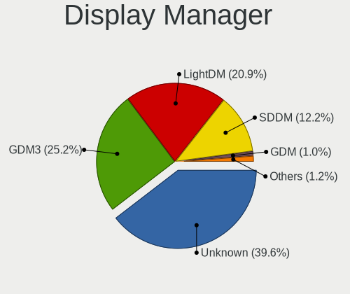
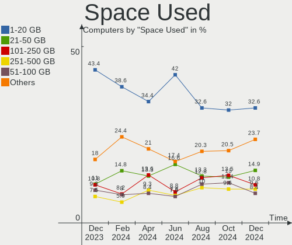
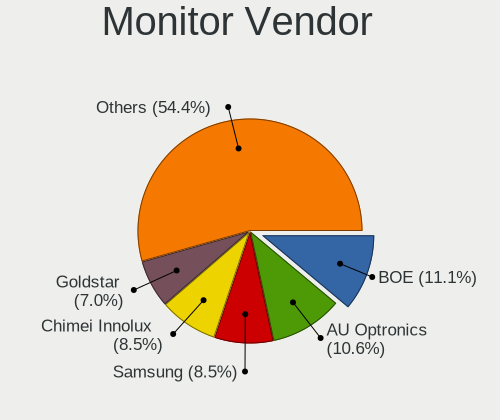

Debian - Hardware Trends
------------------------

A project to identify most popular hardware characteristics and track their change
over time based on data collected by Linux users at https://Linux-Hardware.org.

Anyone can contribute to this report by the [hw-probe](https://github.com/linuxhw/hw-probe) tool:

    sudo -E hw-probe -all -upload

This is a report for all computer types. See also reports for [desktops](/Dist/Debian/Desktop/README.md) and [notebooks](/Dist/Debian/Notebook/README.md).

This report is for one last month. Overall report since the beginning of time: [TestDays](https://github.com/linuxhw/TestDays)

Period: Nov, 2023.

Contents
--------

* [ System ](#system)
  - [ OS                       ](#os)
  - [ OS Family                ](#os-family)
  - [ Kernel                   ](#kernel)
  - [ Kernel Family            ](#kernel-family)
  - [ Kernel Major Ver.        ](#kernel-major-ver)
  - [ Arch                     ](#arch)
  - [ DE                       ](#de)
  - [ Display Server           ](#display-server)
  - [ Display Manager          ](#display-manager)
  - [ OS Lang                  ](#os-lang)
  - [ Boot Mode                ](#boot-mode)
  - [ Filesystem               ](#filesystem)
  - [ Part. scheme             ](#part-scheme)
  - [ Dual Boot with Linux/BSD ](#dual-boot-with-linuxbsd)
  - [ Dual Boot (Win)          ](#dual-boot-win)

* [ Board ](#board)
  - [ Vendor                   ](#vendor)
  - [ Model                    ](#model)
  - [ Model Family             ](#model-family)
  - [ MFG Year                 ](#mfg-year)
  - [ Form Factor              ](#form-factor)
  - [ Secure Boot              ](#secure-boot)
  - [ Coreboot                 ](#coreboot)
  - [ RAM Size                 ](#ram-size)
  - [ RAM Used                 ](#ram-used)
  - [ Total Drives             ](#total-drives)
  - [ Has CD-ROM               ](#has-cd-rom)
  - [ Has Ethernet             ](#has-ethernet)
  - [ Has WiFi                 ](#has-wifi)
  - [ Has Bluetooth            ](#has-bluetooth)

* [ Location ](#location)
  - [ Country                  ](#country)
  - [ City                     ](#city)

* [ Drives ](#drives)
  - [ Drive Vendor             ](#drive-vendor)
  - [ Drive Model              ](#drive-model)
  - [ HDD Vendor               ](#hdd-vendor)
  - [ SSD Vendor               ](#ssd-vendor)
  - [ Drive Kind               ](#drive-kind)
  - [ Drive Connector          ](#drive-connector)
  - [ Drive Size               ](#drive-size)
  - [ Space Total              ](#space-total)
  - [ Space Used               ](#space-used)
  - [ Malfunc. Drives          ](#malfunc-drives)
  - [ Malfunc. Drive Vendor    ](#malfunc-drive-vendor)
  - [ Malfunc. HDD Vendor      ](#malfunc-hdd-vendor)
  - [ Malfunc. Drive Kind      ](#malfunc-drive-kind)
  - [ Failed Drives            ](#failed-drives)
  - [ Failed Drive Vendor      ](#failed-drive-vendor)
  - [ Drive Status             ](#drive-status)

* [ Storage controller ](#storage-controller)
  - [ Storage Vendor           ](#storage-vendor)
  - [ Storage Model            ](#storage-model)
  - [ Storage Kind             ](#storage-kind)

* [ Processor ](#processor)
  - [ CPU Vendor               ](#cpu-vendor)
  - [ CPU Model                ](#cpu-model)
  - [ CPU Model Family         ](#cpu-model-family)
  - [ CPU Cores                ](#cpu-cores)
  - [ CPU Sockets              ](#cpu-sockets)
  - [ CPU Threads              ](#cpu-threads)
  - [ CPU Op-Modes             ](#cpu-op-modes)
  - [ CPU Microcode            ](#cpu-microcode)
  - [ CPU Microarch            ](#cpu-microarch)

* [ Graphics ](#graphics)
  - [ GPU Vendor               ](#gpu-vendor)
  - [ GPU Model                ](#gpu-model)
  - [ GPU Combo                ](#gpu-combo)
  - [ GPU Driver               ](#gpu-driver)
  - [ GPU Memory               ](#gpu-memory)

* [ Monitor ](#monitor)
  - [ Monitor Vendor           ](#monitor-vendor)
  - [ Monitor Model            ](#monitor-model)
  - [ Monitor Resolution       ](#monitor-resolution)
  - [ Monitor Diagonal         ](#monitor-diagonal)
  - [ Monitor Width            ](#monitor-width)
  - [ Aspect Ratio             ](#aspect-ratio)
  - [ Monitor Area             ](#monitor-area)
  - [ Pixel Density            ](#pixel-density)
  - [ Multiple Monitors        ](#multiple-monitors)

* [ Network ](#network)
  - [ Net Controller Vendor    ](#net-controller-vendor)
  - [ Net Controller Model     ](#net-controller-model)
  - [ Wireless Vendor          ](#wireless-vendor)
  - [ Wireless Model           ](#wireless-model)
  - [ Ethernet Vendor          ](#ethernet-vendor)
  - [ Ethernet Model           ](#ethernet-model)
  - [ Net Controller Kind      ](#net-controller-kind)
  - [ Used Controller          ](#used-controller)
  - [ NICs                     ](#nics)
  - [ IPv6                     ](#ipv6)

* [ Bluetooth ](#bluetooth)
  - [ Bluetooth Vendor         ](#bluetooth-vendor)
  - [ Bluetooth Model          ](#bluetooth-model)

* [ Sound ](#sound)
  - [ Sound Vendor             ](#sound-vendor)
  - [ Sound Model              ](#sound-model)

* [ Memory ](#memory)
  - [ Memory Vendor            ](#memory-vendor)
  - [ Memory Model             ](#memory-model)
  - [ Memory Kind              ](#memory-kind)
  - [ Memory Form Factor       ](#memory-form-factor)
  - [ Memory Size              ](#memory-size)
  - [ Memory Speed             ](#memory-speed)

* [ Printers & scanners ](#printers--scanners)
  - [ Printer Vendor           ](#printer-vendor)
  - [ Printer Model            ](#printer-model)
  - [ Scanner Vendor           ](#scanner-vendor)
  - [ Scanner Model            ](#scanner-model)

* [ Camera ](#camera)
  - [ Camera Vendor            ](#camera-vendor)
  - [ Camera Model             ](#camera-model)

* [ Security ](#security)
  - [ Fingerprint Vendor       ](#fingerprint-vendor)
  - [ Fingerprint Model        ](#fingerprint-model)
  - [ Chipcard Vendor          ](#chipcard-vendor)
  - [ Chipcard Model           ](#chipcard-model)

* [ Unsupported ](#unsupported)
  - [ Unsupported Devices      ](#unsupported-devices)
  - [ Unsupported Device Types ](#unsupported-device-types)

System
------

OS
--

Installed operating systems

| Name                    | Computers | Percent |
|-------------------------|-----------|---------|
| Debian 12               | 363       | 75%     |
| Debian 11               | 71        | 14.67%  |
| Debian                  | 43        | 8.88%   |
| Debian Testing/unstable | 2         | 0.41%   |
| Debian 9                | 2         | 0.41%   |
| Debian Sid              | 1         | 0.21%   |
| Debian 23               | 1         | 0.21%   |
| Debian 10               | 1         | 0.21%   |

OS Family
---------

OS without a version

| Name   | Computers | Percent |
|--------|-----------|---------|
| Debian | 484       | 100%    |

Kernel
------

Version of the Linux kernel

| Version                        | Computers | Percent |
|--------------------------------|-----------|---------|
| 6.1.0-13-amd64                 | 241       | 49.79%  |
| 5.10.0-26-amd64                | 35        | 7.23%   |
| 6.1.0-4-amd64                  | 32        | 6.61%   |
| 6.5.0-4-amd64                  | 25        | 5.17%   |
| 6.2.16-19-pve                  | 12        | 2.48%   |
| 6.5.0-3-amd64                  | 9         | 1.86%   |
| 6.1.0-10-amd64                 | 7         | 1.45%   |
| 6.5.0-0.deb12.1-amd64          | 6         | 1.24%   |
| 6.1.0-12-amd64                 | 6         | 1.24%   |
| 6.1.0-0.deb11.11-amd64         | 6         | 1.24%   |
| 6.2.16-3-pve                   | 5         | 1.03%   |
| 6.6.0-custom                   | 4         | 0.83%   |
| 6.2.16-11-bpo11-pve            | 4         | 0.83%   |
| 6.1.0-9-amd64                  | 4         | 0.83%   |
| 5.15.126-1-pve                 | 4         | 0.83%   |
| 6.6.0-0-arm64                  | 3         | 0.62%   |
| 6.5.11-4-pve                   | 3         | 0.62%   |
| 6.4.0-0.deb12.2-amd64          | 3         | 0.62%   |
| 6.2.16-18-pve                  | 3         | 0.62%   |
| 6.5.11-x64v3-xanmod1           | 2         | 0.41%   |
| 6.4.0-1mx-ahs-amd64            | 2         | 0.41%   |
| 6.2.16-5-pve                   | 2         | 0.41%   |
| 6.2.16-4-pve                   | 2         | 0.41%   |
| 6.2.16-15-pve                  | 2         | 0.41%   |
| 6.1.61-v8+                     | 2         | 0.41%   |
| 6.1.0-rpi6-rpi-2712            | 2         | 0.41%   |
| 6.1.0-11-amd64                 | 2         | 0.41%   |
| 5.10.10-64                     | 2         | 0.41%   |
| 5.10.0-21-amd64                | 2         | 0.41%   |
| 6.6.1-x64v4-xanmod1            | 1         | 0.21%   |
| 6.6.0-rc3+                     | 1         | 0.21%   |
| 6.6.0-rc1-edge-rockchip-rk3588 | 1         | 0.21%   |
| 6.6.0-al                       | 1         | 0.21%   |
| 6.5.3-bootes2-p-1000           | 1         | 0.21%   |
| 6.5.3-1-pve                    | 1         | 0.21%   |
| 6.5.11-x64v1-xanmod1           | 1         | 0.21%   |
| 6.5.11-2-pve                   | 1         | 0.21%   |
| 6.5.10-zabbly+                 | 1         | 0.21%   |
| 6.5.10-1-liquorix-amd64        | 1         | 0.21%   |
| 6.5.0-4mx-ahs-amd64            | 1         | 0.21%   |

Kernel Family
-------------

Linux kernel without a distro release

| Version  | Computers | Percent |
|----------|-----------|---------|
| 6.1.0    | 309       | 63.84%  |
| 5.10.0   | 47        | 9.71%   |
| 6.5.0    | 44        | 9.09%   |
| 6.2.16   | 32        | 6.61%   |
| 6.6.0    | 10        | 2.07%   |
| 6.5.11   | 7         | 1.45%   |
| 6.4.0    | 5         | 1.03%   |
| 5.15.126 | 4         | 0.83%   |
| 6.0.0    | 3         | 0.62%   |
| 6.5.3    | 2         | 0.41%   |
| 6.5.10   | 2         | 0.41%   |
| 6.1.61   | 2         | 0.41%   |
| 5.10.110 | 2         | 0.41%   |
| 5.10.10  | 2         | 0.41%   |
| 6.6.1    | 1         | 0.21%   |
| 6.3.0    | 1         | 0.21%   |
| 6.1.55   | 1         | 0.21%   |
| 6.1.52   | 1         | 0.21%   |
| 6.1.50   | 1         | 0.21%   |
| 6.1.21   | 1         | 0.21%   |
| 5.15.92  | 1         | 0.21%   |
| 5.15.53  | 1         | 0.21%   |
| 5.15.131 | 1         | 0.21%   |
| 5.15.0   | 1         | 0.21%   |
| 5.10.200 | 1         | 0.21%   |
| 5.10.160 | 1         | 0.21%   |
| 3.16.0   | 1         | 0.21%   |

Kernel Major Ver.
-----------------

Linux kernel major version

| Version | Computers | Percent |
|---------|-----------|---------|
| 6.1     | 315       | 65.08%  |
| 6.5     | 55        | 11.36%  |
| 5.10    | 53        | 10.95%  |
| 6.2     | 32        | 6.61%   |
| 6.6     | 11        | 2.27%   |
| 5.15    | 8         | 1.65%   |
| 6.4     | 5         | 1.03%   |
| 6.0     | 3         | 0.62%   |
| 6.3     | 1         | 0.21%   |
| 3.16    | 1         | 0.21%   |

Arch
----

OS architecture (x86_64, i586, etc.)

| Name    | Computers | Percent |
|---------|-----------|---------|
| x86_64  | 459       | 94.83%  |
| aarch64 | 17        | 3.51%   |
| i686    | 4         | 0.83%   |
| armv7l  | 3         | 0.62%   |
| riscv64 | 1         | 0.21%   |

DE
--

Desktop Environment

| Name            | Computers | Percent |
|-----------------|-----------|---------|
| GNOME           | 123       | 25.41%  |
| Unknown         | 113       | 23.35%  |
| KDE5            | 92        | 19.01%  |
| XFCE            | 62        | 12.81%  |
| X-Cinnamon      | 23        | 4.75%   |
| MATE            | 17        | 3.51%   |
| Cinnamon        | 16        | 3.31%   |
| LXDE            | 11        | 2.27%   |
| LXQt            | 8         | 1.65%   |
| LXDE-pi-wayfire | 3         | 0.62%   |
| i3              | 3         | 0.62%   |
| openbox         | 2         | 0.41%   |
| KDE             | 2         | 0.41%   |
| GNOME Flashback | 2         | 0.41%   |
| Unity           | 1         | 0.21%   |
| Trinity         | 1         | 0.21%   |
| TOS:GNOME       | 1         | 0.21%   |
| sway            | 1         | 0.21%   |
| qtile           | 1         | 0.21%   |
| GNOME Classic   | 1         | 0.21%   |
| Budgie          | 1         | 0.21%   |

Display Server
--------------

X11 or Wayland

| Name    | Computers | Percent |
|---------|-----------|---------|
| X11     | 222       | 45.87%  |
| Wayland | 139       | 28.72%  |
| Tty     | 70        | 14.46%  |
| Unknown | 52        | 10.74%  |
| Web     | 1         | 0.21%   |

Display Manager
---------------

SDDM, LightDM, etc.

| Name    | Computers | Percent |
|---------|-----------|---------|
| Unknown | 208       | 42.98%  |
| LightDM | 103       | 21.28%  |
| GDM3    | 87        | 17.98%  |
| SDDM    | 68        | 14.05%  |
| GDM     | 9         | 1.86%   |
| NODM    | 4         | 0.83%   |
| XDM     | 1         | 0.21%   |
| WDM     | 1         | 0.21%   |
| SLiM    | 1         | 0.21%   |
| LDM     | 1         | 0.21%   |
| KDM     | 1         | 0.21%   |

OS Lang
-------

Language

| Lang    | Computers | Percent |
|---------|-----------|---------|
| en_US   | 209       | 43.18%  |
| ru_RU   | 50        | 10.33%  |
| de_DE   | 36        | 7.44%   |
| en_GB   | 34        | 7.02%   |
| it_IT   | 25        | 5.17%   |
| es_ES   | 15        | 3.1%    |
| pt_BR   | 14        | 2.89%   |
| fr_FR   | 13        | 2.69%   |
| C       | 13        | 2.69%   |
| en_CA   | 9         | 1.86%   |
| pl_PL   | 8         | 1.65%   |
| en_AU   | 7         | 1.45%   |
| Unknown | 6         | 1.24%   |
| en_IN   | 4         | 0.83%   |
| zh_CN   | 3         | 0.62%   |
| es_MX   | 3         | 0.62%   |
| de_CH   | 3         | 0.62%   |
| cs_CZ   | 3         | 0.62%   |
| nl_NL   | 2         | 0.41%   |
| nl_BE   | 2         | 0.41%   |
| hu_HU   | 2         | 0.41%   |
| fr_BE   | 2         | 0.41%   |
| es_AR   | 2         | 0.41%   |
| en_ZA   | 2         | 0.41%   |
| en_IE   | 2         | 0.41%   |
| da_DK   | 2         | 0.41%   |
| ca_ES   | 2         | 0.41%   |
| tr_TR   | 1         | 0.21%   |
| sv_SE   | 1         | 0.21%   |
| sr_RS   | 1         | 0.21%   |
| pt_PT   | 1         | 0.21%   |
| fi_FI   | 1         | 0.21%   |
| es_VE   | 1         | 0.21%   |
| es_PE   | 1         | 0.21%   |
| es_CL   | 1         | 0.21%   |
| en_HK   | 1         | 0.21%   |
| en_DK   | 1         | 0.21%   |
| bg_BG   | 1         | 0.21%   |

Boot Mode
---------

EFI or BIOS

| Mode | Computers | Percent |
|------|-----------|---------|
| EFI  | 273       | 56.4%   |
| BIOS | 211       | 43.6%   |

Filesystem
----------

Type of filesystem

| Type    | Computers | Percent |
|---------|-----------|---------|
| Ext4    | 370       | 76.45%  |
| Overlay | 53        | 10.95%  |
| Btrfs   | 23        | 4.75%   |
| Zfs     | 17        | 3.51%   |
| Tmpfs   | 12        | 2.48%   |
| Xfs     | 5         | 1.03%   |
| Rootfs  | 2         | 0.41%   |
| XXXXX   | 1         | 0.21%   |
| Ext3    | 1         | 0.21%   |

Part. scheme
------------

Scheme of partitioning

| Type    | Computers | Percent |
|---------|-----------|---------|
| GPT     | 291       | 60.12%  |
| MBR     | 97        | 20.04%  |
| Unknown | 96        | 19.83%  |

Dual Boot with Linux/BSD
------------------------

Hosting more than one Linux/BSD

| Dual boot | Computers | Percent |
|-----------|-----------|---------|
| No        | 397       | 82.02%  |
| Yes       | 87        | 17.98%  |

Dual Boot (Win)
---------------

Hosting Linux and Windows

| Dual boot | Computers | Percent |
|-----------|-----------|---------|
| No        | 358       | 73.97%  |
| Yes       | 126       | 26.03%  |

Board
-----

Vendor
------

Motherboard manufacturer

| Name                                 | Computers | Percent |
|--------------------------------------|-----------|---------|
| Lenovo                               | 72        | 14.88%  |
| ASUSTek Computer                     | 60        | 12.4%   |
| Hewlett-Packard                      | 58        | 11.98%  |
| Dell                                 | 49        | 10.12%  |
| Gigabyte Technology                  | 38        | 7.85%   |
| MSI                                  | 26        | 5.37%   |
| Acer                                 | 24        | 4.96%   |
| ASRock                               | 20        | 4.13%   |
| Apple                                | 12        | 2.48%   |
| Unknown                              | 12        | 2.48%   |
| Raspberry Pi Foundation              | 10        | 2.07%   |
| Google                               | 10        | 2.07%   |
| Supermicro                           | 9         | 1.86%   |
| Aquarius                             | 8         | 1.65%   |
| Intel                                | 6         | 1.24%   |
| Toshiba                              | 5         | 1.03%   |
| Samsung Electronics                  | 5         | 1.03%   |
| IBM                                  | 4         | 0.83%   |
| HUAWEI                               | 4         | 0.83%   |
| Shuttle                              | 3         | 0.62%   |
| Fujitsu                              | 3         | 0.62%   |
| Framework                            | 3         | 0.62%   |
| AZW                                  | 3         | 0.62%   |
| ZOTAC                                | 2         | 0.41%   |
| Rockchip                             | 2         | 0.41%   |
| Packard Bell                         | 2         | 0.41%   |
| Inventec                             | 2         | 0.41%   |
| HPE                                  | 2         | 0.41%   |
| AMI                                  | 2         | 0.41%   |
| Wistron                              | 1         | 0.21%   |
| WanYou                               | 1         | 0.21%   |
| TUXEDO                               | 1         | 0.21%   |
| Timi                                 | 1         | 0.21%   |
| sunxi                                | 1         | 0.21%   |
| SIEMENS                              | 1         | 0.21%   |
| Shenzhen Meigao Electronic Equipment | 1         | 0.21%   |
| Phoenix/SiS                          | 1         | 0.21%   |
| Panasonic                            | 1         | 0.21%   |
| NZXT                                 | 1         | 0.21%   |
| Medion                               | 1         | 0.21%   |

Model
-----

Motherboard model

| Name                                      | Computers | Percent |
|-------------------------------------------|-----------|---------|
| Unknown                                   | 13        | 2.69%   |
| Aquarius NS585                            | 7         | 1.45%   |
| Supermicro Super Server                   | 5         | 1.03%   |
| Dell OptiPlex 3010                        | 4         | 0.83%   |
| Dell Inspiron 3647                        | 4         | 0.83%   |
| RPi Raspberry Pi 4 Model B Rev 1.5        | 3         | 0.62%   |
| Gigabyte B450M S2H V2                     | 3         | 0.62%   |
| Gigabyte B450 AORUS M                     | 3         | 0.62%   |
| ASUS All Series                           | 3         | 0.62%   |
| RPi Raspberry Pi 5 Model B Rev 1.0        | 2         | 0.41%   |
| Lenovo ThinkPad L13 Yoga Gen 2 20VK0019US | 2         | 0.41%   |
| Lenovo ThinkPad 13 2nd Gen 20J10046US     | 2         | 0.41%   |
| IBM System x3250 M3 -[4252K4G]-           | 2         | 0.41%   |
| HUAWEI BOM-WXX9                           | 2         | 0.41%   |
| HP Pavilion Notebook                      | 2         | 0.41%   |
| HP Pavilion dv6                           | 2         | 0.41%   |
| HP Laptop 15-da0xxx                       | 2         | 0.41%   |
| Gigabyte G41MT-S2P                        | 2         | 0.41%   |
| Gigabyte B550 AORUS PRO V2                | 2         | 0.41%   |
| Gigabyte B450M DS3H                       | 2         | 0.41%   |
| Fujitsu ESPRIMO Q920                      | 2         | 0.41%   |
| Framework Laptop (12th Gen Intel Core)    | 2         | 0.41%   |
| Dell Latitude 3320                        | 2         | 0.41%   |
| ASUS Zenbook UX3402ZA_UX3402ZA            | 2         | 0.41%   |
| ASUS ROG STRIX B650E-F GAMING WIFI        | 2         | 0.41%   |
| ZOTAC ZBOXNANO-AD10                       | 1         | 0.21%   |
| ZOTAC ZBOX                                | 1         | 0.21%   |
| Wistron Data Vault                        | 1         | 0.21%   |
| WanYou WanYouChunXiao                     | 1         | 0.21%   |
| Toshiba TECRA R950                        | 1         | 0.21%   |
| Toshiba Satellite L455D                   | 1         | 0.21%   |
| Toshiba Satellite L40                     | 1         | 0.21%   |
| Toshiba Satellite L300                    | 1         | 0.21%   |
| Toshiba QOSMIO X70-A                      | 1         | 0.21%   |
| Timi Mi NoteBook Pro                      | 1         | 0.21%   |
| Supermicro X8DTU                          | 1         | 0.21%   |
| Supermicro X8DTH-i/6/iF/6F                | 1         | 0.21%   |
| Supermicro X10SRA                         | 1         | 0.21%   |
| Supermicro SYS-6029P-WTRT                 | 1         | 0.21%   |
| sunxi Banana Pi BPI-M2-Zero               | 1         | 0.21%   |

Model Family
------------

Motherboard model prefix

| Name                  | Computers | Percent |
|-----------------------|-----------|---------|
| Lenovo ThinkPad       | 40        | 8.26%   |
| Dell Latitude         | 13        | 2.69%   |
| Acer Aspire           | 13        | 2.69%   |
| Unknown               | 13        | 2.69%   |
| ASUS PRIME            | 11        | 2.27%   |
| RPi Raspberry         | 10        | 2.07%   |
| HP Pavilion           | 10        | 2.07%   |
| Dell OptiPlex         | 10        | 2.07%   |
| Lenovo IdeaPad        | 8         | 1.65%   |
| HP EliteBook          | 8         | 1.65%   |
| Gigabyte B450M        | 8         | 1.65%   |
| Dell Inspiron         | 8         | 1.65%   |
| ASUS VivoBook         | 8         | 1.65%   |
| ASUS ROG              | 8         | 1.65%   |
| HP Laptop             | 7         | 1.45%   |
| Aquarius NS585        | 7         | 1.45%   |
| Gigabyte B450         | 6         | 1.24%   |
| Dell PowerEdge        | 6         | 1.24%   |
| Supermicro Super      | 5         | 1.03%   |
| Lenovo ThinkCentre    | 5         | 1.03%   |
| Dell XPS              | 5         | 1.03%   |
| HP ProBook            | 4         | 0.83%   |
| Dell Precision        | 4         | 0.83%   |
| ASUS TUF              | 4         | 0.83%   |
| Toshiba Satellite     | 3         | 0.62%   |
| Lenovo Yoga           | 3         | 0.62%   |
| Lenovo ThinkBook      | 3         | 0.62%   |
| IBM System            | 3         | 0.62%   |
| HP ProLiant           | 3         | 0.62%   |
| HP ProDesk            | 3         | 0.62%   |
| HP OMEN               | 3         | 0.62%   |
| Gigabyte B550         | 3         | 0.62%   |
| Fujitsu ESPRIMO       | 3         | 0.62%   |
| Framework Laptop      | 3         | 0.62%   |
| Dell Vostro           | 3         | 0.62%   |
| ASUS All              | 3         | 0.62%   |
| Rockchip Orange       | 2         | 0.41%   |
| Packard Bell EasyNote | 2         | 0.41%   |
| Lenovo ThinkStation   | 2         | 0.41%   |
| HUAWEI BOM-WXX9       | 2         | 0.41%   |

MFG Year
--------

Motherboard manufacture year

| Year    | Computers | Percent |
|---------|-----------|---------|
| 2019    | 51        | 10.54%  |
| 2020    | 47        | 9.71%   |
| 2022    | 45        | 9.3%    |
| 2012    | 39        | 8.06%   |
| 2021    | 38        | 7.85%   |
| 2018    | 35        | 7.23%   |
| 2023    | 34        | 7.02%   |
| 2013    | 29        | 5.99%   |
| 2017    | 25        | 5.17%   |
| 2011    | 24        | 4.96%   |
| Unknown | 20        | 4.13%   |
| 2014    | 17        | 3.51%   |
| 2015    | 16        | 3.31%   |
| 2009    | 16        | 3.31%   |
| 2008    | 14        | 2.89%   |
| 2016    | 13        | 2.69%   |
| 2010    | 11        | 2.27%   |
| 2007    | 7         | 1.45%   |
| 2004    | 2         | 0.41%   |
| 2006    | 1         | 0.21%   |

Form Factor
-----------

Physical design of the computer

| Name           | Computers | Percent |
|----------------|-----------|---------|
| Notebook       | 217       | 44.83%  |
| Desktop        | 191       | 39.46%  |
| Server         | 21        | 4.34%   |
| System on chip | 18        | 3.72%   |
| Mini pc        | 17        | 3.51%   |
| Convertible    | 11        | 2.27%   |
| All in one     | 7         | 1.45%   |
| Tablet         | 2         | 0.41%   |

Secure Boot
-----------

Enabled or disabled

| State    | Computers | Percent |
|----------|-----------|---------|
| Disabled | 460       | 95.04%  |
| Enabled  | 24        | 4.96%   |

Coreboot
--------

Have coreboot on board

| Used | Computers | Percent |
|------|-----------|---------|
| No   | 476       | 98.35%  |
| Yes  | 8         | 1.65%   |

RAM Size
--------

Total RAM memory

| Size in GB      | Computers | Percent |
|-----------------|-----------|---------|
| 4.01-8.0        | 106       | 21.9%   |
| 16.01-24.0      | 85        | 17.56%  |
| 8.01-16.0       | 81        | 16.74%  |
| 32.01-64.0      | 66        | 13.64%  |
| 3.01-4.0        | 58        | 11.98%  |
| 64.01-256.0     | 42        | 8.68%   |
| 1.01-2.0        | 17        | 3.51%   |
| 24.01-32.0      | 13        | 2.69%   |
| 2.01-3.0        | 11        | 2.27%   |
| More than 256.0 | 2         | 0.41%   |
| 0.51-1.0        | 2         | 0.41%   |
| 0.01-0.5        | 1         | 0.21%   |

RAM Used
--------

Used RAM memory

| Used GB     | Computers | Percent |
|-------------|-----------|---------|
| 4.01-8.0    | 102       | 21.07%  |
| 1.01-2.0    | 96        | 19.83%  |
| 2.01-3.0    | 88        | 18.18%  |
| 3.01-4.0    | 62        | 12.81%  |
| 0.51-1.0    | 58        | 11.98%  |
| 8.01-16.0   | 27        | 5.58%   |
| 0.01-0.5    | 22        | 4.55%   |
| 16.01-24.0  | 12        | 2.48%   |
| 24.01-32.0  | 7         | 1.45%   |
| 32.01-64.0  | 5         | 1.03%   |
| 64.01-256.0 | 5         | 1.03%   |

Total Drives
------------

Number of drives on board

| Drives | Computers | Percent |
|--------|-----------|---------|
| 1      | 267       | 55.17%  |
| 2      | 96        | 19.83%  |
| 3      | 51        | 10.54%  |
| 4      | 32        | 6.61%   |
| 5      | 10        | 2.07%   |
| 0      | 6         | 1.24%   |
| 7      | 5         | 1.03%   |
| 6      | 5         | 1.03%   |
| 9      | 2         | 0.41%   |
| 8      | 2         | 0.41%   |
| 27     | 1         | 0.21%   |
| 21     | 1         | 0.21%   |
| 19     | 1         | 0.21%   |
| 17     | 1         | 0.21%   |
| 14     | 1         | 0.21%   |
| 12     | 1         | 0.21%   |
| 11     | 1         | 0.21%   |
| 10     | 1         | 0.21%   |

Has CD-ROM
----------

Has CD-ROM on board

| Presented | Computers | Percent |
|-----------|-----------|---------|
| No        | 348       | 71.9%   |
| Yes       | 136       | 28.1%   |

Has Ethernet
------------

Has Ethernet on board

| Presented | Computers | Percent |
|-----------|-----------|---------|
| Yes       | 421       | 86.98%  |
| No        | 63        | 13.02%  |

Has WiFi
--------

Has WiFi module

| Presented | Computers | Percent |
|-----------|-----------|---------|
| Yes       | 322       | 66.53%  |
| No        | 162       | 33.47%  |

Has Bluetooth
-------------

Has Bluetooth module

| Presented | Computers | Percent |
|-----------|-----------|---------|
| Yes       | 277       | 57.23%  |
| No        | 207       | 42.77%  |

Location
--------

Country
-------

Geographic location (country)

| Country      | Computers | Percent |
|--------------|-----------|---------|
| USA          | 79        | 16.32%  |
| Russia       | 73        | 15.08%  |
| Germany      | 52        | 10.74%  |
| Italy        | 36        | 7.44%   |
| Brazil       | 20        | 4.13%   |
| UK           | 19        | 3.93%   |
| Spain        | 19        | 3.93%   |
| Canada       | 18        | 3.72%   |
| Mexico       | 17        | 3.51%   |
| France       | 17        | 3.51%   |
| Poland       | 14        | 2.89%   |
| Netherlands  | 10        | 2.07%   |
| China        | 10        | 2.07%   |
| Australia    | 8         | 1.65%   |
| Belgium      | 7         | 1.45%   |
| Switzerland  | 6         | 1.24%   |
| Czechia      | 6         | 1.24%   |
| Turkey       | 5         | 1.03%   |
| Malaysia     | 5         | 1.03%   |
| India        | 5         | 1.03%   |
| Greece       | 5         | 1.03%   |
| Finland      | 5         | 1.03%   |
| Sweden       | 3         | 0.62%   |
| South Africa | 3         | 0.62%   |
| Denmark      | 3         | 0.62%   |
| Austria      | 3         | 0.62%   |
| Argentina    | 3         | 0.62%   |
| Ukraine      | 2         | 0.41%   |
| Slovakia     | 2         | 0.41%   |
| Portugal     | 2         | 0.41%   |
| Norway       | 2         | 0.41%   |
| Hungary      | 2         | 0.41%   |
| Hong Kong    | 2         | 0.41%   |
| Chile        | 2         | 0.41%   |
| Venezuela    | 1         | 0.21%   |
| UAE          | 1         | 0.21%   |
| Thailand     | 1         | 0.21%   |
| Tanzania     | 1         | 0.21%   |
| South Korea  | 1         | 0.21%   |
| Serbia       | 1         | 0.21%   |

City
----

Geographic location (city)

| City           | Computers | Percent |
|----------------|-----------|---------|
| Voronezh       | 32        | 6.61%   |
| St Petersburg  | 12        | 2.48%   |
| Moscow         | 12        | 2.48%   |
| Tijuana        | 10        | 2.07%   |
| Bangor         | 9         | 1.86%   |
| Milan          | 7         | 1.45%   |
| Athens         | 5         | 1.03%   |
| Warsaw         | 4         | 0.83%   |
| Shanghai       | 4         | 0.83%   |
| Zurich         | 3         | 0.62%   |
| Vienna         | 3         | 0.62%   |
| Tucson         | 3         | 0.62%   |
| Tower Hamlets  | 3         | 0.62%   |
| Sydney         | 3         | 0.62%   |
| Stuttgart      | 3         | 0.62%   |
| Sao Paulo      | 3         | 0.62%   |
| Rome           | 3         | 0.62%   |
| Prague         | 3         | 0.62%   |
| Perm           | 3         | 0.62%   |
| Leipzig        | 3         | 0.62%   |
| Kuala Lumpur   | 3         | 0.62%   |
| Krakow         | 3         | 0.62%   |
| Johannesburg   | 3         | 0.62%   |
| Hamburg        | 3         | 0.62%   |
| Canberra       | 3         | 0.62%   |
| Brasília      | 3         | 0.62%   |
| Berlin         | 3         | 0.62%   |
| Belleville     | 3         | 0.62%   |
| Ankara         | 3         | 0.62%   |
| Zapopan        | 2         | 0.41%   |
| Valencia       | 2         | 0.41%   |
| Toronto        | 2         | 0.41%   |
| Santiago       | 2         | 0.41%   |
| Roccamonfina   | 2         | 0.41%   |
| Rio de Janeiro | 2         | 0.41%   |
| Richmond       | 2         | 0.41%   |
| Québec        | 2         | 0.41%   |
| Porto Alegre   | 2         | 0.41%   |
| Palermo        | 2         | 0.41%   |
| Oslo           | 2         | 0.41%   |

Drives
------

Drive Vendor
------------

Hard drive vendors

| Vendor                      | Computers | Drives | Percent |
|-----------------------------|-----------|--------|---------|
| Samsung Electronics         | 116       | 155    | 15.63%  |
| Seagate                     | 85        | 167    | 11.46%  |
| WDC                         | 76        | 131    | 10.24%  |
| Kingston                    | 45        | 53     | 6.06%   |
| Toshiba                     | 40        | 51     | 5.39%   |
| Sandisk                     | 38        | 39     | 5.12%   |
| Unknown                     | 37        | 42     | 4.99%   |
| Crucial                     | 34        | 44     | 4.58%   |
| Intel                       | 22        | 31     | 2.96%   |
| SK hynix                    | 17        | 17     | 2.29%   |
| Micron Technology           | 17        | 18     | 2.29%   |
| A-DATA Technology           | 17        | 17     | 2.29%   |
| Hitachi                     | 16        | 35     | 2.16%   |
| China                       | 12        | 15     | 1.62%   |
| Unknown                     | 11        | 12     | 1.48%   |
| HGST                        | 10        | 26     | 1.35%   |
| Kingston Technology Company | 9         | 9      | 1.21%   |
| Patriot                     | 8         | 9      | 1.08%   |
| JMicron Technology          | 8         | 8      | 1.08%   |
| Apacer                      | 7         | 8      | 0.94%   |
| PNY                         | 5         | 10     | 0.67%   |
| Phison                      | 5         | 5      | 0.67%   |
| Micron/Crucial Technology   | 5         | 5      | 0.67%   |
| KIOXIA                      | 5         | 6      | 0.67%   |
| GOODRAM                     | 5         | 5      | 0.67%   |
| Apple                       | 5         | 5      | 0.67%   |
| Transcend                   | 4         | 4      | 0.54%   |
| Silicon Motion              | 4         | 4      | 0.54%   |
| Team                        | 3         | 3      | 0.4%    |
| Phison Electronics          | 3         | 4      | 0.4%    |
| Netac                       | 3         | 3      | 0.4%    |
| KIOXIA-EXCERIA              | 3         | 3      | 0.4%    |
| Intenso                     | 3         | 3      | 0.4%    |
| Hewlett-Packard             | 3         | 3      | 0.4%    |
| Fujitsu                     | 3         | 5      | 0.4%    |
| Fanxiang                    | 3         | 4      | 0.4%    |
| Zheino                      | 2         | 2      | 0.27%   |
| UMIS                        | 2         | 2      | 0.27%   |
| SPCC                        | 2         | 3      | 0.27%   |
| OCZ                         | 2         | 2      | 0.27%   |

Drive Model
-----------

Hard drive models

| Model                                               | Computers | Percent |
|-----------------------------------------------------|-----------|---------|
| Unknown                                             | 11        | 1.31%   |
| Seagate ST1000DM010-2EP102 1TB                      | 9         | 1.07%   |
| Samsung NVMe SSD Controller SM981/PM981/PM983 250GB | 7         | 0.83%   |
| Crucial CT500MX500SSD1 500GB                        | 7         | 0.83%   |
| A-DATA SU800 512GB SSD                              | 7         | 0.83%   |
| Toshiba DT01ACA100 1TB                              | 6         | 0.71%   |
| Samsung SSD 850 EVO 250GB                           | 6         | 0.71%   |
| Seagate ST500DM002-1BD142 500GB                     | 5         | 0.59%   |
| SanDisk SSD PLUS 240GB                              | 5         | 0.59%   |
| Micron/Crucial P2 NVMe PCIe SSD 1TB                 | 5         | 0.59%   |
| Kingston SA400S37480G 480GB SSD                     | 5         | 0.59%   |
| JMicron Tech 250GB                                  | 5         | 0.59%   |
| WDC WD10EZEX-75M2NA0 1TB                            | 4         | 0.48%   |
| Unknown SD32G  32GB                                 | 4         | 0.48%   |
| Sandisk WD Black SN750 / PC SN730 NVMe SSD 500GB    | 4         | 0.48%   |
| Samsung SSD 860 EVO 250GB                           | 4         | 0.48%   |
| Kingston SUV400S37240G 240GB SSD                    | 4         | 0.48%   |
| Kingston SA400S37240G 240GB SSD                     | 4         | 0.48%   |
| Kingston SA400S37120G 120GB SSD                     | 4         | 0.48%   |
| GOODRAM SSDPR-CL100-120-G2 120GB                    | 4         | 0.48%   |
| WDC WD40EFRX-68N32N0 4TB                            | 3         | 0.36%   |
| WDC WD40EFAX-68JH4N1 4TB                            | 3         | 0.36%   |
| Unknown MMC Card  64GB                              | 3         | 0.36%   |
| Unknown MMC Card  128GB                             | 3         | 0.36%   |
| Toshiba MQ04ABF100 1TB                              | 3         | 0.36%   |
| Toshiba DT01ACA050 500GB                            | 3         | 0.36%   |
| Seagate ST2000DM008-2UB102 2TB                      | 3         | 0.36%   |
| Seagate ST1000LM024 HN-M101MBB 1TB                  | 3         | 0.36%   |
| Seagate ST1000DM003-9YN162 1TB                      | 3         | 0.36%   |
| Seagate ST1000DM003-1CH162 1TB                      | 3         | 0.36%   |
| SanDisk NVMe SSD Drive 1TB                          | 3         | 0.36%   |
| Samsung SSD 990 PRO 2TB                             | 3         | 0.36%   |
| Samsung SSD 990 PRO 1TB                             | 3         | 0.36%   |
| Samsung SSD 980 1TB                                 | 3         | 0.36%   |
| Samsung SSD 970 EVO Plus 2TB                        | 3         | 0.36%   |
| Samsung SSD 970 EVO Plus 1TB                        | 3         | 0.36%   |
| Samsung SSD 870 EVO 500GB                           | 3         | 0.36%   |
| Samsung SSD 860 EVO M.2 1TB                         | 3         | 0.36%   |
| Samsung MZVLB512HBJQ-000L7 512GB                    | 3         | 0.36%   |
| Kingston Company SNV2S2000G 2TB                     | 3         | 0.36%   |

HDD Vendor
----------

Hard disk drive vendors

| Vendor              | Computers | Drives | Percent |
|---------------------|-----------|--------|---------|
| Seagate             | 79        | 160    | 36.74%  |
| WDC                 | 60        | 114    | 27.91%  |
| Toshiba             | 33        | 44     | 15.35%  |
| Hitachi             | 16        | 35     | 7.44%   |
| HGST                | 10        | 26     | 4.65%   |
| Samsung Electronics | 7         | 7      | 3.26%   |
| Fujitsu             | 3         | 5      | 1.4%    |
| Apple               | 3         | 3      | 1.4%    |
| Hewlett-Packard     | 2         | 2      | 0.93%   |
| USB                 | 1         | 1      | 0.47%   |
| Maxtor              | 1         | 1      | 0.47%   |

SSD Vendor
----------

Solid state drive vendors

| Vendor              | Computers | Drives | Percent |
|---------------------|-----------|--------|---------|
| Samsung Electronics | 48        | 60     | 19.12%  |
| Kingston            | 37        | 41     | 14.74%  |
| Crucial             | 21        | 24     | 8.37%   |
| SanDisk             | 18        | 19     | 7.17%   |
| A-DATA Technology   | 13        | 13     | 5.18%   |
| China               | 11        | 14     | 4.38%   |
| Intel               | 10        | 17     | 3.98%   |
| WDC                 | 7         | 7      | 2.79%   |
| Patriot             | 7         | 8      | 2.79%   |
| Micron Technology   | 6         | 6      | 2.39%   |
| Apacer              | 6         | 7      | 2.39%   |
| GOODRAM             | 5         | 5      | 1.99%   |
| PNY                 | 4         | 9      | 1.59%   |
| Transcend           | 3         | 3      | 1.2%    |
| Toshiba             | 3         | 3      | 1.2%    |
| KIOXIA-EXCERIA      | 3         | 3      | 1.2%    |
| JMicron Technology  | 3         | 3      | 1.2%    |
| Intenso             | 3         | 3      | 1.2%    |
| Zheino              | 2         | 2      | 0.8%    |
| Team                | 2         | 2      | 0.8%    |
| SPCC                | 2         | 3      | 0.8%    |
| SK hynix            | 2         | 2      | 0.8%    |
| Seagate             | 2         | 2      | 0.8%    |
| OCZ                 | 2         | 2      | 0.8%    |
| Netac               | 2         | 2      | 0.8%    |
| LITEON              | 2         | 2      | 0.8%    |
| Fanxiang            | 2         | 3      | 0.8%    |
| Unknown             | 2         | 3      | 0.8%    |
| WDC WDS5            | 1         | 1      | 0.4%    |
| WDC WDS             | 1         | 1      | 0.4%    |
| VICKTER             | 1         | 1      | 0.4%    |
| Verbatim            | 1         | 1      | 0.4%    |
| Union Memory        | 1         | 1      | 0.4%    |
| Timetec             | 1         | 2      | 0.4%    |
| T-FORCE             | 1         | 1      | 0.4%    |
| ShiJi               | 1         | 1      | 0.4%    |
| Plextor             | 1         | 1      | 0.4%    |
| Pioneer             | 1         | 1      | 0.4%    |
| Pado                | 1         | 1      | 0.4%    |
| ORIGIN              | 1         | 1      | 0.4%    |

Drive Kind
----------

HDD or SSD

| Kind    | Computers | Drives | Percent |
|---------|-----------|--------|---------|
| SSD     | 219       | 292    | 33.59%  |
| NVMe    | 202       | 261    | 30.98%  |
| HDD     | 173       | 398    | 26.53%  |
| MMC     | 43        | 47     | 6.6%    |
| Unknown | 15        | 18     | 2.3%    |

Drive Connector
---------------

SATA, SAS, NVMe, etc.

| Type | Computers | Drives | Percent |
|------|-----------|--------|---------|
| SATA | 314       | 641    | 53.22%  |
| NVMe | 202       | 259    | 34.24%  |
| MMC  | 43        | 47     | 7.29%   |
| SAS  | 31        | 69     | 5.25%   |

Drive Size
----------

Size of hard drive

| Size in TB | Computers | Drives | Percent |
|------------|-----------|--------|---------|
| 0.01-0.5   | 213       | 265    | 49.31%  |
| 0.51-1.0   | 130       | 206    | 30.09%  |
| 1.01-2.0   | 43        | 99     | 9.95%   |
| 3.01-4.0   | 18        | 36     | 4.17%   |
| 4.01-10.0  | 14        | 66     | 3.24%   |
| 2.01-3.0   | 9         | 12     | 2.08%   |
| 10.01-20.0 | 5         | 6      | 1.16%   |

Space Total
-----------

Amount of disk space available on the file system

| Size in GB     | Computers | Percent |
|----------------|-----------|---------|
| 101-250        | 108       | 22.31%  |
| 251-500        | 100       | 20.66%  |
| 501-1000       | 76        | 15.7%   |
| Unknown        | 56        | 11.57%  |
| 1001-2000      | 41        | 8.47%   |
| More than 3000 | 33        | 6.82%   |
| 51-100         | 29        | 5.99%   |
| 21-50          | 17        | 3.51%   |
| 1-20           | 15        | 3.1%    |
| 2001-3000      | 9         | 1.86%   |

Space Used
----------

Amount of used disk space

| Used GB        | Computers | Percent |
|----------------|-----------|---------|
| 1-20           | 149       | 30.79%  |
| 21-50          | 65        | 13.43%  |
| 101-250        | 57        | 11.78%  |
| Unknown        | 56        | 11.57%  |
| 51-100         | 51        | 10.54%  |
| 251-500        | 36        | 7.44%   |
| 501-1000       | 36        | 7.44%   |
| 1001-2000      | 16        | 3.31%   |
| More than 3000 | 13        | 2.69%   |
| 2001-3000      | 4         | 0.83%   |
| 0              | 1         | 0.21%   |

Malfunc. Drives
---------------

Drive models with a malfunction

| Model                                            | Computers | Drives | Percent |
|--------------------------------------------------|-----------|--------|---------|
| WDC WD80EMAZ-00WJTA0 8TB                         | 1         | 11     | 2.13%   |
| WDC WD2502ABYS-23B7A0 39M4511 42C0463IBM 250GB   | 1         | 2      | 2.13%   |
| WDC WD20EFRX-68EUZN0 2TB                         | 1         | 1      | 2.13%   |
| WDC WD20EARS-00MVWB0 2TB                         | 1         | 1      | 2.13%   |
| WDC WD10EZEX-75M2NA0 1TB                         | 1         | 1      | 2.13%   |
| Toshiba MK6475GSX 640GB                          | 1         | 1      | 2.13%   |
| SK hynix HFS256G39TND-N210A 256GB SSD            | 1         | 1      | 2.13%   |
| Seagate ST9250315AS 250GB                        | 1         | 1      | 2.13%   |
| Seagate ST8000AS0002-1NA17Z 8TB                  | 1         | 1      | 2.13%   |
| Seagate ST3500418AS 500GB                        | 1         | 1      | 2.13%   |
| Seagate ST3250620AS 250GB                        | 1         | 1      | 2.13%   |
| Seagate ST3250410AS 250GB                        | 1         | 1      | 2.13%   |
| Seagate ST3250318AS 250GB                        | 1         | 1      | 2.13%   |
| Seagate ST2000NM0011 2TB                         | 1         | 2      | 2.13%   |
| Seagate ST2000LX001-1RG174 2TB                   | 1         | 1      | 2.13%   |
| Seagate ST1000DM010-2EP102 1TB                   | 1         | 1      | 2.13%   |
| Seagate ST1000DM003-9YN162 1TB                   | 1         | 1      | 2.13%   |
| SanDisk SSD PLUS 240GB                           | 1         | 1      | 2.13%   |
| SanDisk SDSSDX240GG25 240GB                      | 1         | 1      | 2.13%   |
| Samsung Electronics SSD 980 PRO 500GB            | 1         | 1      | 2.13%   |
| Samsung Electronics SSD 980 1TB S649NF0R661331N  | 1         | 1      | 2.13%   |
| Samsung Electronics SSD 970 EVO 500GB            | 1         | 1      | 2.13%   |
| Samsung Electronics SSD 860 EVO 250GB            | 1         | 1      | 2.13%   |
| Samsung Electronics SSD 840 EVO 250GB mSATA      | 1         | 1      | 2.13%   |
| Samsung Electronics SP2004C 200GB                | 1         | 1      | 2.13%   |
| Samsung Electronics MZNLH128HBHQ-000H1 128GB SSD | 1         | 1      | 2.13%   |
| Maxtor STM3500320AS 500GB                        | 1         | 1      | 2.13%   |
| LITEON CV5-8Q256-HP 256GB SSD                    | 1         | 1      | 2.13%   |
| Kingston SV300S37A480G 480GB SSD                 | 1         | 1      | 2.13%   |
| Kingston SV300S37A120G 120GB SSD                 | 1         | 1      | 2.13%   |
| Kingston SUV400S37240G 240GB SSD                 | 1         | 1      | 2.13%   |
| Kingston SA400S37120G 120GB SSD                  | 1         | 1      | 2.13%   |
| Intel SSDSCKKF256G8H 256GB                       | 1         | 1      | 2.13%   |
| Intel SSDSC2KW120H6 120GB                        | 1         | 1      | 2.13%   |
| Hitachi HTS545050B9A300 500GB                    | 1         | 1      | 2.13%   |
| Hitachi HDT725032VLA360 320GB                    | 1         | 1      | 2.13%   |
| Hitachi HDS721050CLA360 500GB                    | 1         | 1      | 2.13%   |
| Hitachi HDS5C3020ALA632 2TB                      | 1         | 3      | 2.13%   |
| HGST HTS725050A7E630 500GB                       | 1         | 1      | 2.13%   |
| HANCHU SSD 240GB                                 | 1         | 1      | 2.13%   |

Malfunc. Drive Vendor
---------------------

Vendors of faulty drives

| Vendor              | Computers | Drives | Percent |
|---------------------|-----------|--------|---------|
| Seagate             | 9         | 11     | 19.57%  |
| Samsung Electronics | 7         | 7      | 15.22%  |
| WDC                 | 5         | 16     | 10.87%  |
| Kingston            | 4         | 4      | 8.7%    |
| Hitachi             | 4         | 6      | 8.7%    |
| SanDisk             | 2         | 2      | 4.35%   |
| Intel               | 2         | 2      | 4.35%   |
| Crucial             | 2         | 2      | 4.35%   |
| Toshiba             | 1         | 1      | 2.17%   |
| SK hynix            | 1         | 1      | 2.17%   |
| Maxtor              | 1         | 1      | 2.17%   |
| LITEON              | 1         | 1      | 2.17%   |
| HGST                | 1         | 1      | 2.17%   |
| HANCHU              | 1         | 1      | 2.17%   |
| Fujitsu             | 1         | 1      | 2.17%   |
| Corsair             | 1         | 1      | 2.17%   |
| China               | 1         | 1      | 2.17%   |
| Apple               | 1         | 1      | 2.17%   |
| ADATA Technology    | 1         | 1      | 2.17%   |

Malfunc. HDD Vendor
-------------------

Vendors of faulty HDD drives

| Vendor              | Computers | Drives | Percent |
|---------------------|-----------|--------|---------|
| Seagate             | 9         | 11     | 37.5%   |
| WDC                 | 5         | 16     | 20.83%  |
| Hitachi             | 4         | 6      | 16.67%  |
| Toshiba             | 1         | 1      | 4.17%   |
| Samsung Electronics | 1         | 1      | 4.17%   |
| Maxtor              | 1         | 1      | 4.17%   |
| HGST                | 1         | 1      | 4.17%   |
| Fujitsu             | 1         | 1      | 4.17%   |
| Apple               | 1         | 1      | 4.17%   |

Malfunc. Drive Kind
-------------------

Kinds of faulty drives

| Kind | Computers | Drives | Percent |
|------|-----------|--------|---------|
| HDD  | 22        | 39     | 50%     |
| SSD  | 18        | 18     | 40.91%  |
| NVMe | 4         | 4      | 9.09%   |

Failed Drives
-------------

Failed drive models

Zero info for selected period =(

Failed Drive Vendor
-------------------

Failed drive vendors

Zero info for selected period =(

Drive Status
------------

Number of failed and malfunc. drives

| Status   | Computers | Drives | Percent |
|----------|-----------|--------|---------|
| Works    | 325       | 656    | 60.3%   |
| Detected | 171       | 299    | 31.73%  |
| Malfunc  | 43        | 61     | 7.98%   |

Storage controller
------------------

Storage Vendor
--------------

Storage controller vendors

| Vendor                                  | Computers | Percent |
|-----------------------------------------|-----------|---------|
| Intel                                   | 275       | 43.1%   |
| AMD                                     | 95        | 14.89%  |
| Samsung Electronics                     | 68        | 10.66%  |
| SanDisk                                 | 28        | 4.39%   |
| Micron/Crucial Technology               | 19        | 2.98%   |
| Kingston Technology Company             | 18        | 2.82%   |
| ASMedia Technology                      | 17        | 2.66%   |
| SK hynix                                | 15        | 2.35%   |
| Phison Electronics                      | 12        | 1.88%   |
| Micron Technology                       | 11        | 1.72%   |
| Nvidia                                  | 8         | 1.25%   |
| Marvell Technology Group                | 8         | 1.25%   |
| Silicon Motion                          | 7         | 1.1%    |
| Broadcom / LSI                          | 7         | 1.1%    |
| ADATA Technology                        | 7         | 1.1%    |
| Toshiba America Info Systems            | 6         | 0.94%   |
| LSI Logic / Symbios Logic               | 5         | 0.78%   |
| MAXIO Technology (Hangzhou)             | 4         | 0.63%   |
| Shenzhen Longsys Electronics            | 3         | 0.47%   |
| Seagate Technology                      | 3         | 0.47%   |
| KIOXIA                                  | 3         | 0.47%   |
| Adaptec                                 | 3         | 0.47%   |
| JMicron Technology                      | 2         | 0.31%   |
| Apple                                   | 2         | 0.31%   |
| Yangtze Memory Technologies             | 1         | 0.16%   |
| Union Memory (Shenzhen)                 | 1         | 0.16%   |
| Transcend                               | 1         | 0.16%   |
| Solid State Storage Technology          | 1         | 0.16%   |
| Silicon Integrated Systems [SiS]        | 1         | 0.16%   |
| Silicon Image                           | 1         | 0.16%   |
| Shenzhen Unionmemory Information System | 1         | 0.16%   |
| Realtek Semiconductor                   | 1         | 0.16%   |
| Radian Memory Systems                   | 1         | 0.16%   |
| INNOGRIT                                | 1         | 0.16%   |
| HighPoint Technologies                  | 1         | 0.16%   |
| Hewlett-Packard                         | 1         | 0.16%   |

Storage Model
-------------

Storage controller models

| Model                                                                          | Computers | Percent |
|--------------------------------------------------------------------------------|-----------|---------|
| AMD FCH SATA Controller [AHCI mode]                                            | 64        | 8.96%   |
| Samsung NVMe SSD Controller SM981/PM981/PM983                                  | 27        | 3.78%   |
| AMD 400 Series Chipset SATA Controller                                         | 23        | 3.22%   |
| Intel 8 Series/C220 Series Chipset Family 6-port SATA Controller 1 [AHCI mode] | 21        | 2.94%   |
| Intel Sunrise Point-LP SATA Controller [AHCI mode]                             | 19        | 2.66%   |
| Micron/Crucial P2 [Nick P2] / P3 / P3 Plus NVMe PCIe SSD (DRAM-less)           | 17        | 2.38%   |
| Intel 7 Series Chipset Family 6-port SATA Controller [AHCI mode]               | 17        | 2.38%   |
| Samsung NVMe SSD Controller 980 (DRAM-less)                                    | 15        | 2.1%    |
| Samsung NVMe SSD Controller PM9A1/PM9A3/980PRO                                 | 14        | 1.96%   |
| Intel Cannon Lake PCH SATA AHCI Controller                                     | 14        | 1.96%   |
| ASMedia ASM1062 Serial ATA Controller                                          | 14        | 1.96%   |
| Intel 6 Series/C200 Series Chipset Family 6 port Desktop SATA AHCI Controller  | 12        | 1.68%   |
| AMD SB7x0/SB8x0/SB9x0 SATA Controller [AHCI mode]                              | 12        | 1.68%   |
| Intel Volume Management Device NVMe RAID Controller                            | 11        | 1.54%   |
| Intel 7 Series/C210 Series Chipset Family 6-port SATA Controller [AHCI mode]   | 11        | 1.54%   |
| Intel Q170/Q150/B150/H170/H110/Z170/CM236 Chipset SATA Controller [AHCI Mode]  | 10        | 1.4%    |
| Intel Comet Lake SATA AHCI Controller                                          | 10        | 1.4%    |
| Intel 82801 Mobile SATA Controller [RAID mode]                                 | 10        | 1.4%    |
| AMD 500 Series Chipset SATA Controller                                         | 10        | 1.4%    |
| SK hynix Gold P31/BC711/PC711 NVMe Solid State Drive                           | 8         | 1.12%   |
| Intel SATA Controller [RAID mode]                                              | 8         | 1.12%   |
| Intel 6 Series/C200 Series Chipset Family 6 port Mobile SATA AHCI Controller   | 8         | 1.12%   |
| Intel 200 Series PCH SATA controller [AHCI mode]                               | 8         | 1.12%   |
| Intel SSD 670p Series [Keystone Harbor]                                        | 7         | 0.98%   |
| Intel 82801IBM/IEM (ICH9M/ICH9M-E) 4 port SATA Controller [AHCI mode]          | 7         | 0.98%   |
| AMD SB7x0/SB8x0/SB9x0 IDE Controller                                           | 7         | 0.98%   |
| SanDisk Extreme Pro / WD Black SN750 / PC SN730 / Red SN700 NVMe SSD           | 6         | 0.84%   |
| Samsung NVMe SSD Controller S4LV008[Pascal]                                    | 6         | 0.84%   |
| Intel Jasper Lake SATA AHCI Controller                                         | 6         | 0.84%   |
| Intel Alder Lake-S PCH SATA Controller [AHCI Mode]                             | 6         | 0.84%   |
| Silicon Motion SM2263EN/SM2263XT (DRAM-less) NVMe SSD Controllers              | 5         | 0.7%    |
| Phison PS5013-E13 PCIe3 NVMe Controller (DRAM-less)                            | 5         | 0.7%    |
| Intel Volume Management Device NVMe RAID Controller Intel Corporation          | 5         | 0.7%    |
| Intel NM10/ICH7 Family SATA Controller [IDE mode]                              | 5         | 0.7%    |
| Intel C610/X99 series chipset 6-Port SATA Controller [AHCI mode]               | 5         | 0.7%    |
| Intel 700 Series Chipset Family SATA AHCI Controller                           | 5         | 0.7%    |
| Toshiba America Info Systems XG6 NVMe SSD Controller                           | 4         | 0.56%   |
| Samsung NVMe SSD Controller SM961/PM961/SM963                                  | 4         | 0.56%   |
| Nvidia MCP79 AHCI Controller                                                   | 4         | 0.56%   |
| Kingston Company A1000/U-SNS8154P3 x2 NVMe SSD                                 | 4         | 0.56%   |

Storage Kind
------------

Kind of storage controller (IDE, SATA, NVMe, SAS, ...)

| Kind | Computers | Percent |
|------|-----------|---------|
| SATA | 320       | 51.95%  |
| NVMe | 200       | 32.47%  |
| RAID | 44        | 7.14%   |
| IDE  | 40        | 6.49%   |
| SAS  | 9         | 1.46%   |
| SCSI | 3         | 0.49%   |

Processor
---------

CPU Vendor
----------

Processor vendors

| Vendor        | Computers | Percent |
|---------------|-----------|---------|
| Intel         | 345       | 71.28%  |
| AMD           | 118       | 24.38%  |
| ARM           | 20        | 4.13%   |
| sifive,u74-mc | 1         | 0.21%   |

CPU Model
---------

Processor models

| Model                                       | Computers | Percent |
|---------------------------------------------|-----------|---------|
| ARM Processor                               | 17        | 3.51%   |
| Intel Core i5-3470 CPU @ 3.20GHz            | 7         | 1.45%   |
| Intel Core i3-9100 CPU @ 3.60GHz            | 7         | 1.45%   |
| AMD Ryzen 5 PRO 4650G with Radeon Graphics  | 7         | 1.45%   |
| Intel 11th Gen Core i7-1165G7 @ 2.80GHz     | 6         | 1.24%   |
| Intel 11th Gen Core i5-1135G7 @ 2.40GHz     | 6         | 1.24%   |
| Intel Core i7-8565U CPU @ 1.80GHz           | 5         | 1.03%   |
| Intel Core i5-7200U CPU @ 2.50GHz           | 5         | 1.03%   |
| AMD Ryzen 7 5800H with Radeon Graphics      | 5         | 1.03%   |
| Intel Xeon CPU X3470 @ 2.93GHz              | 4         | 0.83%   |
| Intel Core i7-10510U CPU @ 1.80GHz          | 4         | 0.83%   |
| Intel Core i5-7300U CPU @ 2.60GHz           | 4         | 0.83%   |
| Intel Core i5-4570 CPU @ 3.20GHz            | 4         | 0.83%   |
| Intel Core i5-4460S CPU @ 2.90GHz           | 4         | 0.83%   |
| Intel Core i5-3210M CPU @ 2.50GHz           | 4         | 0.83%   |
| Intel 12th Gen Core i5-1240P                | 4         | 0.83%   |
| AMD Ryzen 9 3900X 12-Core Processor         | 4         | 0.83%   |
| AMD Ryzen 5 5600G with Radeon Graphics      | 4         | 0.83%   |
| AMD Ryzen 5 5500U with Radeon Graphics      | 4         | 0.83%   |
| Intel N100                                  | 3         | 0.62%   |
| Intel Core i5-6300U CPU @ 2.40GHz           | 3         | 0.62%   |
| Intel Core i5-2520M CPU @ 2.50GHz           | 3         | 0.62%   |
| Intel Core i5-10400 CPU @ 2.90GHz           | 3         | 0.62%   |
| Intel Core i5-10210U CPU @ 1.60GHz          | 3         | 0.62%   |
| Intel Core 2 Duo CPU P7350 @ 2.00GHz        | 3         | 0.62%   |
| Intel Core 2 Duo CPU E8400 @ 3.00GHz        | 3         | 0.62%   |
| Intel Atom x5-Z8350 CPU @ 1.44GHz           | 3         | 0.62%   |
| Intel 13th Gen Core i7-1355U                | 3         | 0.62%   |
| Intel 12th Gen Core i7-1255U                | 3         | 0.62%   |
| AMD Ryzen 9 7900X 12-Core Processor         | 3         | 0.62%   |
| AMD Ryzen 7 5700U with Radeon Graphics      | 3         | 0.62%   |
| AMD Ryzen 5 3600 6-Core Processor           | 3         | 0.62%   |
| AMD Ryzen 3 3200G with Radeon Vega Graphics | 3         | 0.62%   |
| Intel Xeon CPU X5670 @ 2.93GHz              | 2         | 0.41%   |
| Intel Pentium Silver N6000 @ 1.10GHz        | 2         | 0.41%   |
| Intel Pentium Gold G5400 CPU @ 3.70GHz      | 2         | 0.41%   |
| Intel Core i9-9980HK CPU @ 2.40GHz          | 2         | 0.41%   |
| Intel Core i9-7920X CPU @ 2.90GHz           | 2         | 0.41%   |
| Intel Core i9-10900K CPU @ 3.70GHz          | 2         | 0.41%   |
| Intel Core i7-9700 CPU @ 3.00GHz            | 2         | 0.41%   |

CPU Model Family
----------------

Processor model prefix

| Model                   | Computers | Percent |
|-------------------------|-----------|---------|
| Intel Core i5           | 96        | 19.83%  |
| Other                   | 79        | 16.32%  |
| Intel Core i7           | 50        | 10.33%  |
| Intel Core i3           | 29        | 5.99%   |
| Intel Xeon              | 27        | 5.58%   |
| AMD Ryzen 7             | 27        | 5.58%   |
| AMD Ryzen 5             | 26        | 5.37%   |
| Intel Celeron           | 23        | 4.75%   |
| Intel Core 2 Duo        | 18        | 3.72%   |
| AMD Ryzen 9             | 16        | 3.31%   |
| Intel Atom              | 9         | 1.86%   |
| Intel Core i9           | 8         | 1.65%   |
| AMD Ryzen 5 PRO         | 8         | 1.65%   |
| Intel Pentium           | 6         | 1.24%   |
| AMD Ryzen 3             | 6         | 1.24%   |
| AMD Ryzen 7 PRO         | 5         | 1.03%   |
| AMD FX                  | 5         | 1.03%   |
| AMD A6                  | 5         | 1.03%   |
| Intel Pentium Dual-Core | 4         | 0.83%   |
| Intel Pentium Silver    | 3         | 0.62%   |
| Intel Pentium Dual      | 3         | 0.62%   |
| AMD E                   | 3         | 0.62%   |
| AMD Athlon II           | 3         | 0.62%   |
| Intel Pentium Gold      | 2         | 0.41%   |
| Intel Core 2 Quad       | 2         | 0.41%   |
| Intel Core 2            | 2         | 0.41%   |
| AMD Ryzen 3 PRO         | 2         | 0.41%   |
| AMD Athlon 64 X2        | 2         | 0.41%   |
| AMD A10                 | 2         | 0.41%   |
| Intel Xeon Silver       | 1         | 0.21%   |
| Intel Xeon Platinum     | 1         | 0.21%   |
| Intel Xeon Gold         | 1         | 0.21%   |
| Intel Pentium M         | 1         | 0.21%   |
| Intel Pentium 4         | 1         | 0.21%   |
| ARM BCM                 | 1         | 0.21%   |
| ARM Allwinner           | 1         | 0.21%   |
| AMD Sempron             | 1         | 0.21%   |
| AMD Opteron             | 1         | 0.21%   |
| AMD GX                  | 1         | 0.21%   |
| AMD G                   | 1         | 0.21%   |

CPU Cores
---------

Number of processor cores

| Number  | Computers | Percent |
|---------|-----------|---------|
| 4       | 164       | 33.88%  |
| 2       | 135       | 27.89%  |
| 6       | 54        | 11.16%  |
| 8       | 52        | 10.74%  |
| 12      | 21        | 4.34%   |
| 10      | 13        | 2.69%   |
| 14      | 9         | 1.86%   |
| Unknown | 9         | 1.86%   |
| 16      | 7         | 1.45%   |
| 1       | 6         | 1.24%   |
| 24      | 5         | 1.03%   |
| 3       | 3         | 0.62%   |
| 48      | 1         | 0.21%   |
| 40      | 1         | 0.21%   |
| 32      | 1         | 0.21%   |
| 28      | 1         | 0.21%   |
| 20      | 1         | 0.21%   |
| 5       | 1         | 0.21%   |

CPU Sockets
-----------

Number of sockets

| Number  | Computers | Percent |
|---------|-----------|---------|
| 1       | 462       | 95.45%  |
| 2       | 11        | 2.27%   |
| Unknown | 9         | 1.86%   |
| 4       | 1         | 0.21%   |
| 3       | 1         | 0.21%   |

CPU Threads
-----------

Threads per core (Hyper-Threading)

| Number  | Computers | Percent |
|---------|-----------|---------|
| 2       | 308       | 63.64%  |
| 1       | 167       | 34.5%   |
| Unknown | 9         | 1.86%   |

CPU Op-Modes
------------

CPU Operation Modes (32-bit, 64-bit)

| Op mode        | Computers | Percent |
|----------------|-----------|---------|
| 32-bit, 64-bit | 474       | 97.93%  |
| Unknown        | 5         | 1.03%   |
| 64-bit         | 3         | 0.62%   |
| 32-bit         | 2         | 0.41%   |

CPU Microcode
-------------

Microcode number

| Number     | Computers | Percent |
|------------|-----------|---------|
| Unknown    | 195       | 40.29%  |
| 0x306a9    | 24        | 4.96%   |
| 0x306c3    | 17        | 3.51%   |
| 0x1067a    | 14        | 2.89%   |
| 0x08600106 | 11        | 2.27%   |
| 0x806c1    | 10        | 2.07%   |
| 0x206a7    | 10        | 2.07%   |
| 0x806ec    | 8         | 1.65%   |
| 0x08108109 | 8         | 1.65%   |
| 0x906eb    | 7         | 1.45%   |
| 0x906ea    | 7         | 1.45%   |
| 0x806e9    | 6         | 1.24%   |
| 0x0a50000d | 6         | 1.24%   |
| 0x906c0    | 5         | 1.03%   |
| 0x906a3    | 5         | 1.03%   |
| 0x806ea    | 5         | 1.03%   |
| 0x506e3    | 5         | 1.03%   |
| 0x406e3    | 5         | 1.03%   |
| 0x0a50000c | 5         | 1.03%   |
| 0x0a404102 | 5         | 1.03%   |
| 0x08608103 | 5         | 1.03%   |
| 0x706e5    | 4         | 0.83%   |
| 0x706a8    | 4         | 0.83%   |
| 0x10676    | 4         | 0.83%   |
| 0x0a601203 | 4         | 0.83%   |
| 0x08701030 | 4         | 0.83%   |
| 0xb06e0    | 3         | 0.62%   |
| 0xb06a3    | 3         | 0.62%   |
| 0x90672    | 3         | 0.62%   |
| 0x406f1    | 3         | 0.62%   |
| 0x406c4    | 3         | 0.62%   |
| 0x40651    | 3         | 0.62%   |
| 0x30678    | 3         | 0.62%   |
| 0x0a201016 | 3         | 0.62%   |
| 0xb06a2    | 2         | 0.41%   |
| 0xa0655    | 2         | 0.41%   |
| 0xa0653    | 2         | 0.41%   |
| 0xa0652    | 2         | 0.41%   |
| 0x906ed    | 2         | 0.41%   |
| 0x906e9    | 2         | 0.41%   |

CPU Microarch
-------------

Microarchitecture

| Name             | Computers | Percent |
|------------------|-----------|---------|
| KabyLake         | 67        | 13.84%  |
| Unknown          | 58        | 11.98%  |
| IvyBridge        | 36        | 7.44%   |
| Haswell          | 34        | 7.02%   |
| Zen 3            | 28        | 5.79%   |
| Penryn           | 24        | 4.96%   |
| Alderlake Hybrid | 24        | 4.96%   |
| Zen 2            | 22        | 4.55%   |
| Skylake          | 22        | 4.55%   |
| SandyBridge      | 21        | 4.34%   |
| TigerLake        | 16        | 3.31%   |
| Zen+             | 15        | 3.1%    |
| CometLake        | 12        | 2.48%   |
| Silvermont       | 11        | 2.27%   |
| Broadwell        | 10        | 2.07%   |
| Tremont          | 8         | 1.65%   |
| Icelake          | 8         | 1.65%   |
| Westmere         | 7         | 1.45%   |
| Nehalem          | 7         | 1.45%   |
| Core             | 6         | 1.24%   |
| Goldmont plus    | 5         | 1.03%   |
| Zen              | 4         | 0.83%   |
| Piledriver       | 4         | 0.83%   |
| K10              | 4         | 0.83%   |
| Gracemont        | 4         | 0.83%   |
| Excavator        | 4         | 0.83%   |
| Bonnell          | 4         | 0.83%   |
| Bobcat           | 4         | 0.83%   |
| Jaguar           | 3         | 0.62%   |
| K8 Hammer        | 2         | 0.41%   |
| Goldmont         | 2         | 0.41%   |
| Bulldozer        | 2         | 0.41%   |
| Steamroller      | 1         | 0.21%   |
| Puma             | 1         | 0.21%   |
| P6               | 1         | 0.21%   |
| NetBurst         | 1         | 0.21%   |
| K8 & K10 hybrid  | 1         | 0.21%   |
| K10 Llano        | 1         | 0.21%   |

Graphics
--------

GPU Vendor
----------

Vendors of graphics cards

| Vendor                           | Computers | Percent |
|----------------------------------|-----------|---------|
| Intel                            | 260       | 49.43%  |
| Nvidia                           | 122       | 23.19%  |
| AMD                              | 119       | 22.62%  |
| Matrox Electronics Systems       | 16        | 3.04%   |
| ASPEED Technology                | 8         | 1.52%   |
| Silicon Integrated Systems [SiS] | 1         | 0.19%   |

GPU Model
---------

Graphics card models

| Model                                                                                    | Computers | Percent |
|------------------------------------------------------------------------------------------|-----------|---------|
| Intel 3rd Gen Core processor Graphics Controller                                         | 17        | 3.16%   |
| Intel TigerLake-LP GT2 [Iris Xe Graphics]                                                | 15        | 2.79%   |
| AMD Cezanne [Radeon Vega Series / Radeon Vega Mobile Series]                             | 15        | 2.79%   |
| Intel Xeon E3-1200 v3/4th Gen Core Processor Integrated Graphics Controller              | 14        | 2.6%    |
| AMD Renoir [Radeon RX Vega 6 (Ryzen 4000/5000 Mobile Series)]                            | 14        | 2.6%    |
| Intel CoffeeLake-S GT2 [UHD Graphics 630]                                                | 13        | 2.42%   |
| Intel 2nd Generation Core Processor Family Integrated Graphics Controller                | 13        | 2.42%   |
| Intel HD Graphics 620                                                                    | 12        | 2.23%   |
| Intel Xeon E3-1200 v2/3rd Gen Core processor Graphics Controller                         | 11        | 2.04%   |
| AMD Picasso/Raven 2 [Radeon Vega Series / Radeon Vega Mobile Series]                     | 11        | 2.04%   |
| Intel Raptor Lake-P [Iris Xe Graphics]                                                   | 10        | 1.86%   |
| Intel WhiskeyLake-U GT2 [UHD Graphics 620]                                               | 8         | 1.49%   |
| Intel CometLake-U GT2 [UHD Graphics]                                                     | 8         | 1.49%   |
| ASPEED Technology ASPEED Graphics Family                                                 | 8         | 1.49%   |
| AMD Navi 23 [Radeon RX 6600/6600 XT/6600M]                                               | 8         | 1.49%   |
| AMD Lucienne                                                                             | 8         | 1.49%   |
| Intel Mobile 4 Series Chipset Integrated Graphics Controller                             | 7         | 1.3%    |
| Intel JasperLake [UHD Graphics]                                                          | 7         | 1.3%    |
| Intel Atom/Celeron/Pentium Processor x5-E8000/J3xxx/N3xxx Integrated Graphics Controller | 7         | 1.3%    |
| Intel Alder Lake-P GT2 [Iris Xe Graphics]                                                | 7         | 1.3%    |
| Intel Skylake GT2 [HD Graphics 520]                                                      | 6         | 1.12%   |
| AMD Raphael                                                                              | 6         | 1.12%   |
| Matrox Electronics Systems MGA G200eW WPCM450                                            | 5         | 0.93%   |
| Intel UHD Graphics 620                                                                   | 5         | 0.93%   |
| Intel HD Graphics 530                                                                    | 5         | 0.93%   |
| Intel CometLake-S GT2 [UHD Graphics 630]                                                 | 5         | 0.93%   |
| Intel CoffeeLake-H GT2 [UHD Graphics 630]                                                | 5         | 0.93%   |
| Intel Alder Lake-N [UHD Graphics]                                                        | 5         | 0.93%   |
| AMD Rembrandt [Radeon 680M]                                                              | 5         | 0.93%   |
| Nvidia TU117M [GeForce GTX 1650 Mobile / Max-Q]                                          | 4         | 0.74%   |
| Matrox Electronics Systems G200eR2                                                       | 4         | 0.74%   |
| Intel Haswell-ULT Integrated Graphics Controller                                         | 4         | 0.74%   |
| Intel GeminiLake [UHD Graphics 600]                                                      | 4         | 0.74%   |
| Intel Atom Processor Z36xxx/Z37xxx Series Graphics & Display                             | 4         | 0.74%   |
| Intel 4th Gen Core Processor Integrated Graphics Controller                              | 4         | 0.74%   |
| Intel 4 Series Chipset Integrated Graphics Controller                                    | 4         | 0.74%   |
| AMD Barcelo                                                                              | 4         | 0.74%   |
| Nvidia TU117 [GeForce GTX 1650]                                                          | 3         | 0.56%   |
| Nvidia TU116 [GeForce GTX 1660 SUPER]                                                    | 3         | 0.56%   |
| Nvidia GP108 [GeForce GT 1030]                                                           | 3         | 0.56%   |

GPU Combo
---------

Combinations of graphics cards

| Name                    | Computers | Percent |
|-------------------------|-----------|---------|
| 1 x Intel               | 204       | 42.15%  |
| 1 x AMD                 | 93        | 19.21%  |
| 1 x Nvidia              | 69        | 14.26%  |
| Intel + Nvidia          | 38        | 7.85%   |
| Other                   | 21        | 4.34%   |
| 1 x Matrox              | 16        | 3.31%   |
| AMD + Nvidia            | 13        | 2.69%   |
| 2 x Intel               | 8         | 1.65%   |
| Intel + AMD             | 8         | 1.65%   |
| 1 x ASPEED              | 6         | 1.24%   |
| 2 x AMD                 | 4         | 0.83%   |
| 3 x AMD                 | 1         | 0.21%   |
| 2 x Nvidia + 1 x ASPEED | 1         | 0.21%   |
| 1 x SiS                 | 1         | 0.21%   |
| Nvidia + ASPEED         | 1         | 0.21%   |

GPU Driver
----------

Free vs proprietary

| Driver      | Computers | Percent |
|-------------|-----------|---------|
| Free        | 352       | 72.73%  |
| Unknown     | 86        | 17.77%  |
| Proprietary | 46        | 9.5%    |

GPU Memory
----------

Total video memory

| Size in GB | Computers | Percent |
|------------|-----------|---------|
| Unknown    | 362       | 74.79%  |
| 0.01-0.5   | 36        | 7.44%   |
| 1.01-2.0   | 33        | 6.82%   |
| 3.01-4.0   | 15        | 3.1%    |
| 7.01-8.0   | 14        | 2.89%   |
| 0.51-1.0   | 10        | 2.07%   |
| 5.01-6.0   | 7         | 1.45%   |
| 2.01-3.0   | 4         | 0.83%   |
| 8.01-16.0  | 2         | 0.41%   |
| 16.01-24.0 | 1         | 0.21%   |

Monitor
-------

Monitor Vendor
--------------

Monitor vendors

| Vendor                  | Computers | Percent |
|-------------------------|-----------|---------|
| AU Optronics            | 58        | 13.15%  |
| Samsung Electronics     | 51        | 11.56%  |
| BOE                     | 39        | 8.84%   |
| Dell                    | 38        | 8.62%   |
| Chimei Innolux          | 33        | 7.48%   |
| Goldstar                | 25        | 5.67%   |
| LG Display              | 24        | 5.44%   |
| Acer                    | 19        | 4.31%   |
| Hewlett-Packard         | 13        | 2.95%   |
| AOC                     | 12        | 2.72%   |
| Philips                 | 10        | 2.27%   |
| Ancor Communications    | 10        | 2.27%   |
| Apple                   | 9         | 2.04%   |
| BenQ                    | 8         | 1.81%   |
| Chi Mei Optoelectronics | 7         | 1.59%   |
| Lenovo                  | 6         | 1.36%   |
| ASUSTek Computer        | 6         | 1.36%   |
| ViewSonic               | 5         | 1.13%   |
| PANDA                   | 5         | 1.13%   |
| Sceptre Tech            | 4         | 0.91%   |
| NEC Computers           | 4         | 0.91%   |
| InfoVision              | 4         | 0.91%   |
| Iiyama                  | 3         | 0.68%   |
| CSO                     | 3         | 0.68%   |
| Xiaomi                  | 2         | 0.45%   |
| Unknown                 | 2         | 0.45%   |
| Sony                    | 2         | 0.45%   |
| Sharp                   | 2         | 0.45%   |
| RTK                     | 2         | 0.45%   |
| LG Philips              | 2         | 0.45%   |
| Denver                  | 2         | 0.45%   |
| Vizio                   | 1         | 0.23%   |
| TMA                     | 1         | 0.23%   |
| Sceptre                 | 1         | 0.23%   |
| SAC                     | 1         | 0.23%   |
| Plain Tree Systems      | 1         | 0.23%   |
| Packard Bell            | 1         | 0.23%   |
| OEM                     | 1         | 0.23%   |
| MStar                   | 1         | 0.23%   |
| MSI                     | 1         | 0.23%   |

Monitor Model
-------------

Monitor models

| Model                                                                     | Computers | Percent |
|---------------------------------------------------------------------------|-----------|---------|
| LG Display LCD Monitor LGD0521 1920x1080 309x174mm 14.0-inch              | 3         | 0.67%   |
| Dell E2011H DEL406B 1600x900 443x249mm 20.0-inch                          | 3         | 0.67%   |
| Chimei Innolux LCD Monitor CMN15E7 1920x1080 344x193mm 15.5-inch          | 3         | 0.67%   |
| Chimei Innolux LCD Monitor CMN14D4 1920x1080 309x173mm 13.9-inch          | 3         | 0.67%   |
| BOE LCD Monitor BOE0872 1920x1080 344x194mm 15.5-inch                     | 3         | 0.67%   |
| AU Optronics LCD Monitor AUO405C 1366x768 256x144mm 11.6-inch             | 3         | 0.67%   |
| Xiaomi Woieyeks-4K XMD009A 2880x1800 480x270mm 21.7-inch                  | 2         | 0.45%   |
| Sceptre Tech Sceptre F24 SPT09AB 1920x1080 520x320mm 24.0-inch            | 2         | 0.45%   |
| Samsung Electronics LCD Monitor SDC4171 2880x1800 302x189mm 14.0-inch     | 2         | 0.45%   |
| Samsung Electronics LCD Monitor SAM0A7A 1920x1080 1060x626mm 48.5-inch    | 2         | 0.45%   |
| Samsung Electronics C24F390 SAM0D2C 1920x1080 521x293mm 23.5-inch         | 2         | 0.45%   |
| Philips PHL 243V7 PHLC155 1920x1080 527x296mm 23.8-inch                   | 2         | 0.45%   |
| Philips FTV PHL04C3 1920x1080 1440x810mm 65.0-inch                        | 2         | 0.45%   |
| LG Display LCD Monitor LGDD801 1366x768 344x194mm 15.5-inch               | 2         | 0.45%   |
| LG Display LCD Monitor LGD05FE 1920x1080 344x194mm 15.5-inch              | 2         | 0.45%   |
| LG Display LCD Monitor LGD0335 1366x768 310x174mm 14.0-inch               | 2         | 0.45%   |
| LG Display LCD Monitor LGD02DF 1600x900 310x174mm 14.0-inch               | 2         | 0.45%   |
| InfoVision LCD Monitor IVO0533 1366x768 293x165mm 13.2-inch               | 2         | 0.45%   |
| Goldstar ULTRAWIDE GSM59F1 2560x1080 798x334mm 34.1-inch                  | 2         | 0.45%   |
| Goldstar LG TV SSCR2 GSMC0C8 3840x2160                                    | 2         | 0.45%   |
| Dell E197FP DELA024 1280x1024 376x301mm 19.0-inch                         | 2         | 0.45%   |
| Dell E178WFP DELD016 1440x900 370x230mm 17.2-inch                         | 2         | 0.45%   |
| Chimei Innolux LCD Monitor CMN15F5 1920x1080 344x193mm 15.5-inch          | 2         | 0.45%   |
| Chimei Innolux LCD Monitor CMN15E6 1366x768 344x193mm 15.5-inch           | 2         | 0.45%   |
| Chimei Innolux LCD Monitor CMN1387 1920x1080 293x165mm 13.2-inch          | 2         | 0.45%   |
| Chi Mei Optoelectronics LCD Monitor CMO1720 1920x1080 382x215mm 17.3-inch | 2         | 0.45%   |
| Chi Mei Optoelectronics LCD Monitor CMO15A7 1366x768 344x193mm 15.5-inch  | 2         | 0.45%   |
| BOE LCD Monitor BOE095F 2256x1504 285x190mm 13.5-inch                     | 2         | 0.45%   |
| BOE LCD Monitor BOE094A 1920x1080 344x194mm 15.5-inch                     | 2         | 0.45%   |
| BOE LCD Monitor BOE07DB 1920x1080 309x174mm 14.0-inch                     | 2         | 0.45%   |
| BOE LCD Monitor BOE07C9 1920x1080 309x173mm 13.9-inch                     | 2         | 0.45%   |
| AU Optronics LCD Monitor AUOC48A 1920x1080 344x194mm 15.5-inch            | 2         | 0.45%   |
| AU Optronics LCD Monitor AUO61ED 1920x1080 344x194mm 15.5-inch            | 2         | 0.45%   |
| AU Optronics LCD Monitor AUO38ED 1920x1080 344x193mm 15.5-inch            | 2         | 0.45%   |
| AU Optronics LCD Monitor AUO2B99 1920x1080 293x165mm 13.2-inch            | 2         | 0.45%   |
| AU Optronics LCD Monitor AUO235C 1366x768 256x144mm 11.6-inch             | 2         | 0.45%   |
| AU Optronics LCD Monitor AUO21ED 1920x1080 344x194mm 15.5-inch            | 2         | 0.45%   |
| AU Optronics LCD Monitor AUO213D 1920x1080 309x173mm 13.9-inch            | 2         | 0.45%   |
| AU Optronics LCD Monitor AUO106C 1366x768 276x155mm 12.5-inch             | 2         | 0.45%   |
| AOC 24B1W AOC2401 1920x1080 521x293mm 23.5-inch                           | 2         | 0.45%   |

Monitor Resolution
------------------

Monitor screen resolution

| Resolution         | Computers | Percent |
|--------------------|-----------|---------|
| 1920x1080 (FHD)    | 176       | 41.71%  |
| 1366x768 (WXGA)    | 57        | 13.51%  |
| 3840x2160 (4K)     | 35        | 8.29%   |
| 2560x1440 (QHD)    | 24        | 5.69%   |
| 1280x1024 (SXGA)   | 19        | 4.5%    |
| 1920x1200 (WUXGA)  | 17        | 4.03%   |
| 1600x900 (HD+)     | 14        | 3.32%   |
| 1680x1050 (WSXGA+) | 12        | 2.84%   |
| 3440x1440          | 8         | 1.9%    |
| 2560x1600          | 8         | 1.9%    |
| 1280x800 (WXGA)    | 8         | 1.9%    |
| 1440x900 (WXGA+)   | 5         | 1.18%   |
| 2560x1080          | 4         | 0.95%   |
| 1024x768 (XGA)     | 4         | 0.95%   |
| 3840x2400          | 3         | 0.71%   |
| 2256x1504          | 3         | 0.71%   |
| 1024x600           | 3         | 0.71%   |
| Unknown            | 3         | 0.71%   |
| 3840x1080          | 2         | 0.47%   |
| 3200x1800 (QHD+)   | 2         | 0.47%   |
| 2880x1800          | 2         | 0.47%   |
| 1600x1200          | 2         | 0.47%   |
| 1400x1050          | 2         | 0.47%   |
| 1360x768           | 2         | 0.47%   |
| 5760x2160          | 1         | 0.24%   |
| 5120x1440          | 1         | 0.24%   |
| 3840x1200          | 1         | 0.24%   |
| 3200x2000          | 1         | 0.24%   |
| 2288x1287          | 1         | 0.24%   |
| 2160x1440          | 1         | 0.24%   |
| 1920x540           | 1         | 0.24%   |

Monitor Diagonal
----------------

Diagonal size in inches

| Inches  | Computers | Percent |
|---------|-----------|---------|
| 15      | 90        | 20.69%  |
| 14      | 38        | 8.74%   |
| 13      | 36        | 8.28%   |
| 24      | 35        | 8.05%   |
| 27      | 28        | 6.44%   |
| 23      | 26        | 5.98%   |
| 21      | 26        | 5.98%   |
| 19      | 16        | 3.68%   |
| 16      | 14        | 3.22%   |
| Unknown | 14        | 3.22%   |
| 17      | 13        | 2.99%   |
| 11      | 12        | 2.76%   |
| 20      | 11        | 2.53%   |
| 31      | 10        | 2.3%    |
| 12      | 8         | 1.84%   |
| 34      | 7         | 1.61%   |
| 32      | 7         | 1.61%   |
| 22      | 5         | 1.15%   |
| 18      | 5         | 1.15%   |
| 84      | 3         | 0.69%   |
| 72      | 3         | 0.69%   |
| 26      | 3         | 0.69%   |
| 10      | 3         | 0.69%   |
| 65      | 2         | 0.46%   |
| 54      | 2         | 0.46%   |
| 52      | 2         | 0.46%   |
| 49      | 2         | 0.46%   |
| 48      | 2         | 0.46%   |
| 43      | 2         | 0.46%   |
| 35      | 2         | 0.46%   |
| 28      | 2         | 0.46%   |
| 25      | 2         | 0.46%   |
| 142     | 1         | 0.23%   |
| 36      | 1         | 0.23%   |
| 33      | 1         | 0.23%   |
| 29      | 1         | 0.23%   |

Monitor Width
-------------

Physical width

| Width in mm    | Computers | Percent |
|----------------|-----------|---------|
| 301-350        | 159       | 36.81%  |
| 501-600        | 85        | 19.68%  |
| 401-500        | 54        | 12.5%   |
| 201-300        | 48        | 11.11%  |
| 601-700        | 18        | 4.17%   |
| 351-400        | 17        | 3.94%   |
| 701-800        | 16        | 3.7%    |
| Unknown        | 14        | 3.24%   |
| 1001-1500      | 10        | 2.31%   |
| 1501-2000      | 6         | 1.39%   |
| 801-900        | 2         | 0.46%   |
| 901-1000       | 2         | 0.46%   |
| More than 2000 | 1         | 0.23%   |

Aspect Ratio
------------

Proportional relationship between the width and the height

| Ratio   | Computers | Percent |
|---------|-----------|---------|
| 16/9    | 288       | 71.46%  |
| 16/10   | 59        | 14.64%  |
| 5/4     | 16        | 3.97%   |
| Unknown | 12        | 2.98%   |
| 4/3     | 10        | 2.48%   |
| 21/9    | 10        | 2.48%   |
| 3/2     | 5         | 1.24%   |
| 32/9    | 2         | 0.5%    |
| 1.00    | 1         | 0.25%   |

Monitor Area
------------

Area in inch²

| Area in inch² | Computers | Percent |
|----------------|-----------|---------|
| 101-110        | 91        | 21.06%  |
| 201-250        | 72        | 16.67%  |
| 81-90          | 54        | 12.5%   |
| 151-200        | 34        | 7.87%   |
| 301-350        | 31        | 7.18%   |
| 351-500        | 28        | 6.48%   |
| 71-80          | 18        | 4.17%   |
| More than 1000 | 15        | 3.47%   |
| 251-300        | 14        | 3.24%   |
| 111-120        | 14        | 3.24%   |
| Unknown        | 14        | 3.24%   |
| 51-60          | 12        | 2.78%   |
| 141-150        | 11        | 2.55%   |
| 61-70          | 8         | 1.85%   |
| 121-130        | 6         | 1.39%   |
| 501-1000       | 5         | 1.16%   |
| 41-50          | 3         | 0.69%   |
| 131-140        | 1         | 0.23%   |
| 91-100         | 1         | 0.23%   |

Pixel Density
-------------

Pixels per inch

| Density       | Computers | Percent |
|---------------|-----------|---------|
| 51-100        | 141       | 33.33%  |
| 121-160       | 130       | 30.73%  |
| 101-120       | 86        | 20.33%  |
| 161-240       | 29        | 6.86%   |
| Unknown       | 14        | 3.31%   |
| More than 240 | 12        | 2.84%   |
| 1-50          | 11        | 2.6%    |

Multiple Monitors
-----------------

Total monitors connected

| Total | Computers | Percent |
|-------|-----------|---------|
| 1     | 323       | 66.74%  |
| 0     | 93        | 19.21%  |
| 2     | 59        | 12.19%  |
| 3     | 9         | 1.86%   |

Network
-------

Net Controller Vendor
---------------------

Controller vendors

| Vendor                                 | Computers | Percent |
|----------------------------------------|-----------|---------|
| Realtek Semiconductor                  | 249       | 34.83%  |
| Intel                                  | 248       | 34.69%  |
| Qualcomm Atheros                       | 54        | 7.55%   |
| Broadcom                               | 36        | 5.03%   |
| MediaTek                               | 25        | 3.5%    |
| TP-Link                                | 8         | 1.12%   |
| Nvidia                                 | 7         | 0.98%   |
| Marvell Technology Group               | 7         | 0.98%   |
| Broadcom Limited                       | 6         | 0.84%   |
| Ralink                                 | 5         | 0.7%    |
| Ralink Technology                      | 4         | 0.56%   |
| QinHeng Electronics                    | 4         | 0.56%   |
| Edimax Technology                      | 4         | 0.56%   |
| ASIX Electronics                       | 4         | 0.56%   |
| Xiaomi                                 | 3         | 0.42%   |
| Qualcomm                               | 3         | 0.42%   |
| IBM                                    | 3         | 0.42%   |
| DisplayLink                            | 3         | 0.42%   |
| Dell                                   | 3         | 0.42%   |
| ASUSTek Computer                       | 3         | 0.42%   |
| Aquantia                               | 3         | 0.42%   |
| Unknown                                | 3         | 0.42%   |
| Sierra Wireless                        | 2         | 0.28%   |
| Samsung Electronics                    | 2         | 0.28%   |
| Mellanox Technologies                  | 2         | 0.28%   |
| Insyde Software                        | 2         | 0.28%   |
| Hewlett-Packard                        | 2         | 0.28%   |
| D-Link                                 | 2         | 0.28%   |
| Wilocity                               | 1         | 0.14%   |
| U-Blox                                 | 1         | 0.14%   |
| Sony Ericsson Mobile Communications AB | 1         | 0.14%   |
| Silicon Integrated Systems [SiS]       | 1         | 0.14%   |
| Quectel Wireless Solutions             | 1         | 0.14%   |
| Qualcomm Technologies                  | 1         | 0.14%   |
| Qualcomm Atheros Communications        | 1         | 0.14%   |
| NetGear                                | 1         | 0.14%   |
| Microsoft                              | 1         | 0.14%   |
| Microchip Technology                   | 1         | 0.14%   |
| Mad Catz                               | 1         | 0.14%   |
| Lenovo                                 | 1         | 0.14%   |

Net Controller Model
--------------------

Controller models

| Model                                                             | Computers | Percent |
|-------------------------------------------------------------------|-----------|---------|
| Realtek RTL8111/8168/8411 PCI Express Gigabit Ethernet Controller | 170       | 20.02%  |
| Realtek RTL8153 Gigabit Ethernet Adapter                          | 19        | 2.24%   |
| Realtek RTL8125 2.5GbE Controller                                 | 19        | 2.24%   |
| Intel Wi-Fi 6 AX200                                               | 19        | 2.24%   |
| Realtek RTL810xE PCI Express Fast Ethernet controller             | 17        | 2%      |
| Intel 82579LM Gigabit Network Connection (Lewisville)             | 14        | 1.65%   |
| Intel Wi-Fi 6 AX201                                               | 13        | 1.53%   |
| Intel Cannon Lake PCH CNVi WiFi                                   | 12        | 1.41%   |
| Realtek RTL8821CE 802.11ac PCIe Wireless Network Adapter          | 11        | 1.3%    |
| MediaTek MT7921 802.11ax PCI Express Wireless Network Adapter     | 11        | 1.3%    |
| Intel Ethernet Controller I225-V                                  | 11        | 1.3%    |
| Intel Alder Lake-P PCH CNVi WiFi                                  | 11        | 1.3%    |
| Intel Wireless 7265                                               | 10        | 1.18%   |
| Intel Wi-Fi 6 AX210/AX211/AX411 160MHz                            | 10        | 1.18%   |
| Intel I211 Gigabit Network Connection                             | 9         | 1.06%   |
| Intel Ethernet Connection (2) I219-V                              | 9         | 1.06%   |
| Qualcomm Atheros QCA9377 802.11ac Wireless Network Adapter        | 8         | 0.94%   |
| MediaTek MT7921K (RZ608) Wi-Fi 6E 80MHz                           | 7         | 0.82%   |
| Intel Wireless 8265 / 8275                                        | 7         | 0.82%   |
| Intel Ethernet Connection I217-LM                                 | 7         | 0.82%   |
| Intel Comet Lake PCH CNVi WiFi                                    | 7         | 0.82%   |
| Qualcomm Atheros QCA9565 / AR9565 Wireless Network Adapter        | 6         | 0.71%   |
| Qualcomm Atheros AR9485 Wireless Network Adapter                  | 6         | 0.71%   |
| Intel Wireless 8260                                               | 6         | 0.71%   |
| Intel Wireless 3165                                               | 6         | 0.71%   |
| Intel I350 Gigabit Network Connection                             | 6         | 0.71%   |
| Intel I210 Gigabit Network Connection                             | 6         | 0.71%   |
| Intel Dual Band Wireless-AC 3168NGW [Stone Peak]                  | 6         | 0.71%   |
| Intel Comet Lake PCH-LP CNVi WiFi                                 | 6         | 0.71%   |
| Intel Centrino Advanced-N 6205 [Taylor Peak]                      | 6         | 0.71%   |
| Intel 82574L Gigabit Network Connection                           | 6         | 0.71%   |
| Realtek RTL8852BE PCIe 802.11ax Wireless Network Controller       | 5         | 0.59%   |
| Realtek RTL8822CE 802.11ac PCIe Wireless Network Adapter          | 5         | 0.59%   |
| Qualcomm Atheros QCA6174 802.11ac Wireless Network Adapter        | 5         | 0.59%   |
| Nvidia MCP79 Ethernet                                             | 5         | 0.59%   |
| Intel Raptor Lake PCH CNVi WiFi                                   | 5         | 0.59%   |
| Intel Ethernet Controller I226-V                                  | 5         | 0.59%   |
| Intel Ethernet Connection I219-LM                                 | 5         | 0.59%   |
| Intel Ethernet Connection (13) I219-V                             | 5         | 0.59%   |
| Intel Cannon Point-LP CNVi [Wireless-AC]                          | 5         | 0.59%   |

Wireless Vendor
---------------

Wireless vendors

| Vendor                          | Computers | Percent |
|---------------------------------|-----------|---------|
| Intel                           | 161       | 47.77%  |
| Realtek Semiconductor           | 51        | 15.13%  |
| Qualcomm Atheros                | 38        | 11.28%  |
| MediaTek                        | 25        | 7.42%   |
| Broadcom                        | 22        | 6.53%   |
| TP-Link                         | 8         | 2.37%   |
| Ralink                          | 5         | 1.48%   |
| Ralink Technology               | 4         | 1.19%   |
| Edimax Technology               | 4         | 1.19%   |
| Broadcom Limited                | 3         | 0.89%   |
| ASUSTek Computer                | 3         | 0.89%   |
| Sierra Wireless                 | 2         | 0.59%   |
| Qualcomm                        | 2         | 0.59%   |
| D-Link                          | 2         | 0.59%   |
| Wilocity                        | 1         | 0.3%    |
| Quectel Wireless Solutions      | 1         | 0.3%    |
| Qualcomm Atheros Communications | 1         | 0.3%    |
| NetGear                         | 1         | 0.3%    |
| Marvell Technology Group        | 1         | 0.3%    |
| Fibocom                         | 1         | 0.3%    |
| Dell                            | 1         | 0.3%    |

Wireless Model
--------------

Wireless models

| Model                                                          | Computers | Percent |
|----------------------------------------------------------------|-----------|---------|
| Intel Wi-Fi 6 AX200                                            | 19        | 5.64%   |
| Intel Wi-Fi 6 AX201                                            | 13        | 3.86%   |
| Intel Cannon Lake PCH CNVi WiFi                                | 12        | 3.56%   |
| Realtek RTL8821CE 802.11ac PCIe Wireless Network Adapter       | 11        | 3.26%   |
| MediaTek MT7921 802.11ax PCI Express Wireless Network Adapter  | 11        | 3.26%   |
| Intel Alder Lake-P PCH CNVi WiFi                               | 11        | 3.26%   |
| Intel Wireless 7265                                            | 10        | 2.97%   |
| Intel Wi-Fi 6 AX210/AX211/AX411 160MHz                         | 10        | 2.97%   |
| Qualcomm Atheros QCA9377 802.11ac Wireless Network Adapter     | 8         | 2.37%   |
| MediaTek MT7921K (RZ608) Wi-Fi 6E 80MHz                        | 7         | 2.08%   |
| Intel Wireless 8265 / 8275                                     | 7         | 2.08%   |
| Intel Comet Lake PCH CNVi WiFi                                 | 7         | 2.08%   |
| Qualcomm Atheros QCA9565 / AR9565 Wireless Network Adapter     | 6         | 1.78%   |
| Qualcomm Atheros AR9485 Wireless Network Adapter               | 6         | 1.78%   |
| Intel Wireless 8260                                            | 6         | 1.78%   |
| Intel Wireless 3165                                            | 6         | 1.78%   |
| Intel Dual Band Wireless-AC 3168NGW [Stone Peak]               | 6         | 1.78%   |
| Intel Comet Lake PCH-LP CNVi WiFi                              | 6         | 1.78%   |
| Intel Centrino Advanced-N 6205 [Taylor Peak]                   | 6         | 1.78%   |
| Realtek RTL8852BE PCIe 802.11ax Wireless Network Controller    | 5         | 1.48%   |
| Realtek RTL8822CE 802.11ac PCIe Wireless Network Adapter       | 5         | 1.48%   |
| Qualcomm Atheros QCA6174 802.11ac Wireless Network Adapter     | 5         | 1.48%   |
| Intel Raptor Lake PCH CNVi WiFi                                | 5         | 1.48%   |
| Intel Cannon Point-LP CNVi [Wireless-AC]                       | 5         | 1.48%   |
| Broadcom BCM4322 802.11a/b/g/n Wireless LAN Controller         | 5         | 1.48%   |
| Realtek RTL8852AE 802.11ax PCIe Wireless Network Adapter       | 4         | 1.19%   |
| Realtek RTL8723BE PCIe Wireless Network Adapter                | 4         | 1.19%   |
| Qualcomm Atheros AR9285 Wireless Network Adapter (PCI-Express) | 4         | 1.19%   |
| Intel Wireless 7260                                            | 4         | 1.19%   |
| Broadcom BCM43142 802.11b/g/n                                  | 4         | 1.19%   |
| Broadcom BCM4313 802.11bgn Wireless Network Adapter            | 4         | 1.19%   |
| Realtek RTL8822BE 802.11a/b/g/n/ac WiFi adapter                | 3         | 0.89%   |
| MediaTek Wi-Fi 6E MT7902 Wireless Network Adapter              | 3         | 0.89%   |
| MediaTek MT7922 802.11ax PCI Express Wireless Network Adapter  | 3         | 0.89%   |
| Intel Wireless-AC 9260                                         | 3         | 0.89%   |
| Intel WiFi Link 5100                                           | 3         | 0.89%   |
| Intel Wi-Fi 6 AX201 160MHz                                     | 3         | 0.89%   |
| Edimax EW-7811Un 802.11n Wireless Adapter [Realtek RTL8188CUS] | 3         | 0.89%   |
| TP-Link Archer T2U PLUS [RTL8821AU]                            | 2         | 0.59%   |
| TP-Link AC600 wireless Realtek RTL8811AU [Archer T2U Nano]     | 2         | 0.59%   |

Ethernet Vendor
---------------

Ethernet vendors

| Vendor                                 | Computers | Percent |
|----------------------------------------|-----------|---------|
| Realtek Semiconductor                  | 231       | 49.15%  |
| Intel                                  | 147       | 31.28%  |
| Qualcomm Atheros                       | 22        | 4.68%   |
| Broadcom                               | 18        | 3.83%   |
| Nvidia                                 | 7         | 1.49%   |
| Marvell Technology Group               | 6         | 1.28%   |
| ASIX Electronics                       | 4         | 0.85%   |
| Xiaomi                                 | 3         | 0.64%   |
| IBM                                    | 3         | 0.64%   |
| DisplayLink                            | 3         | 0.64%   |
| Broadcom Limited                       | 3         | 0.64%   |
| Aquantia                               | 3         | 0.64%   |
| Unknown                                | 3         | 0.64%   |
| Samsung Electronics                    | 2         | 0.43%   |
| Mellanox Technologies                  | 2         | 0.43%   |
| Insyde Software                        | 2         | 0.43%   |
| Dell                                   | 2         | 0.43%   |
| Sony Ericsson Mobile Communications AB | 1         | 0.21%   |
| Silicon Integrated Systems [SiS]       | 1         | 0.21%   |
| Qualcomm                               | 1         | 0.21%   |
| Microsoft                              | 1         | 0.21%   |
| Microchip Technology                   | 1         | 0.21%   |
| Lenovo                                 | 1         | 0.21%   |
| Hewlett-Packard                        | 1         | 0.21%   |
| D-Link System                          | 1         | 0.21%   |
| American Megatrends                    | 1         | 0.21%   |

Ethernet Model
--------------

Ethernet models

| Model                                                             | Computers | Percent |
|-------------------------------------------------------------------|-----------|---------|
| Realtek RTL8111/8168/8411 PCI Express Gigabit Ethernet Controller | 170       | 34.07%  |
| Realtek RTL8153 Gigabit Ethernet Adapter                          | 19        | 3.81%   |
| Realtek RTL8125 2.5GbE Controller                                 | 19        | 3.81%   |
| Realtek RTL810xE PCI Express Fast Ethernet controller             | 17        | 3.41%   |
| Intel 82579LM Gigabit Network Connection (Lewisville)             | 14        | 2.81%   |
| Intel Ethernet Controller I225-V                                  | 11        | 2.2%    |
| Intel I211 Gigabit Network Connection                             | 9         | 1.8%    |
| Intel Ethernet Connection (2) I219-V                              | 9         | 1.8%    |
| Intel Ethernet Connection I217-LM                                 | 7         | 1.4%    |
| Intel I350 Gigabit Network Connection                             | 6         | 1.2%    |
| Intel I210 Gigabit Network Connection                             | 6         | 1.2%    |
| Intel 82574L Gigabit Network Connection                           | 6         | 1.2%    |
| Nvidia MCP79 Ethernet                                             | 5         | 1%      |
| Intel Ethernet Controller I226-V                                  | 5         | 1%      |
| Intel Ethernet Connection I219-LM                                 | 5         | 1%      |
| Intel Ethernet Connection (13) I219-V                             | 5         | 1%      |
| Intel 82599ES 10-Gigabit SFI/SFP+ Network Connection              | 5         | 1%      |
| Realtek RTL8152 Fast Ethernet Adapter                             | 4         | 0.8%    |
| Qualcomm Atheros QCA8172 Fast Ethernet                            | 4         | 0.8%    |
| Qualcomm Atheros AR8161 Gigabit Ethernet                          | 4         | 0.8%    |
| Qualcomm Atheros AR8151 v2.0 Gigabit Ethernet                     | 4         | 0.8%    |
| Intel Ethernet Connection (4) I219-LM                             | 4         | 0.8%    |
| Intel 82579V Gigabit Network Connection                           | 4         | 0.8%    |
| Intel 82576 Gigabit Network Connection                            | 4         | 0.8%    |
| Broadcom NetXtreme BCM5720 Gigabit Ethernet PCIe                  | 4         | 0.8%    |
| ASIX AX88179 Gigabit Ethernet                                     | 4         | 0.8%    |
| Realtek USB 10/100/1G/2.5G LAN                                    | 3         | 0.6%    |
| Intel Ethernet Connection (7) I219-V                              | 3         | 0.6%    |
| Intel Ethernet Connection (7) I219-LM                             | 3         | 0.6%    |
| Intel Ethernet Connection (6) I219-V                              | 3         | 0.6%    |
| Intel Ethernet Connection (4) I219-V                              | 3         | 0.6%    |
| Intel Ethernet Connection (17) I219-LM                            | 3         | 0.6%    |
| Intel Ethernet Connection (16) I219-V                             | 3         | 0.6%    |
| Intel Ethernet Connection (14) I219-LM                            | 3         | 0.6%    |
| Intel Ethernet Connection (11) I219-LM                            | 3         | 0.6%    |
| Intel 82567LM Gigabit Network Connection                          | 3         | 0.6%    |
| IBM RNDIS/CDC ETHER                                               | 3         | 0.6%    |
| Broadcom NetXtreme BCM5761 Gigabit Ethernet PCIe                  | 3         | 0.6%    |
| Unknown                                                           | 3         | 0.6%    |
| Xiaomi Mi/Redmi series (RNDIS)                                    | 2         | 0.4%    |

Net Controller Kind
-------------------

Ethernet, WiFi or modem

| Kind     | Computers | Percent |
|----------|-----------|---------|
| Ethernet | 422       | 55.75%  |
| WiFi     | 322       | 42.54%  |
| Modem    | 10        | 1.32%   |
| Unknown  | 3         | 0.4%    |

Used Controller
---------------

Currently used network controller

| Kind     | Computers | Percent |
|----------|-----------|---------|
| Ethernet | 278       | 58.4%   |
| WiFi     | 198       | 41.6%   |

NICs
----

Total network controllers on board

| Total | Computers | Percent |
|-------|-----------|---------|
| 2     | 243       | 50.21%  |
| 1     | 181       | 37.4%   |
| 0     | 18        | 3.72%   |
| 3     | 17        | 3.51%   |
| 4     | 14        | 2.89%   |
| 6     | 7         | 1.45%   |
| 5     | 3         | 0.62%   |
| 8     | 1         | 0.21%   |

IPv6
----

IPv6 vs IPv4

| Used | Computers | Percent |
|------|-----------|---------|
| No   | 371       | 76.65%  |
| Yes  | 113       | 23.35%  |

Bluetooth
---------

Bluetooth Vendor
----------------

Controller vendors

| Vendor                          | Computers | Percent |
|---------------------------------|-----------|---------|
| Intel                           | 138       | 49.29%  |
| Realtek Semiconductor           | 28        | 10%     |
| IMC Networks                    | 16        | 5.71%   |
| Cambridge Silicon Radio         | 14        | 5%      |
| Qualcomm Atheros Communications | 13        | 4.64%   |
| Foxconn / Hon Hai               | 10        | 3.57%   |
| Apple                           | 10        | 3.57%   |
| Broadcom                        | 9         | 3.21%   |
| MediaTek                        | 8         | 2.86%   |
| Lite-On Technology              | 8         | 2.86%   |
| Realtek                         | 5         | 1.79%   |
| ASUSTek Computer                | 5         | 1.79%   |
| TP-Link                         | 4         | 1.43%   |
| Hewlett-Packard                 | 4         | 1.43%   |
| Dell                            | 3         | 1.07%   |
| Foxconn International           | 2         | 0.71%   |
| USI                             | 1         | 0.36%   |
| Toshiba                         | 1         | 0.36%   |
| Ralink Technology               | 1         | 0.36%   |

Bluetooth Model
---------------

Controller models

| Model                                               | Computers | Percent |
|-----------------------------------------------------|-----------|---------|
| Intel Bluetooth wireless interface                  | 32        | 11.43%  |
| Intel AX201 Bluetooth                               | 28        | 10%     |
| Realtek Bluetooth Radio                             | 21        | 7.5%    |
| Intel Bluetooth 9460/9560 Jefferson Peak (JfP)      | 21        | 7.5%    |
| Intel Bluetooth Device                              | 17        | 6.07%   |
| Intel AX200 Bluetooth                               | 17        | 6.07%   |
| Cambridge Silicon Radio Bluetooth Dongle (HCI mode) | 14        | 5%      |
| Intel AX210 Bluetooth                               | 10        | 3.57%   |
| MediaTek Wireless_Device                            | 8         | 2.86%   |
| IMC Networks Wireless_Device                        | 8         | 2.86%   |
| Realtek  Bluetooth 4.2 Adapter                      | 6         | 2.14%   |
| Intel Wireless-AC 3168 Bluetooth                    | 6         | 2.14%   |
| IMC Networks Bluetooth Radio                        | 6         | 2.14%   |
| Foxconn / Hon Hai MediaTek Bluetooth Adapter        | 5         | 1.79%   |
| TP-Link TP-Cdj+ UB5A Adapter                        | 4         | 1.43%   |
| Qualcomm Atheros AR9462 Bluetooth                   | 4         | 1.43%   |
| Lite-On Qualcomm Atheros QCA9377 Bluetooth          | 4         | 1.43%   |
| Apple Bluetooth Host Controller                     | 4         | 1.43%   |
| Realtek 802.11ac WLAN Adapter                       | 3         | 1.07%   |
| Qualcomm Atheros AR3012 Bluetooth 4.0               | 3         | 1.07%   |
| Intel Wireless-AC 9260 Bluetooth Adapter            | 3         | 1.07%   |
| Intel Centrino Bluetooth Wireless Transceiver       | 3         | 1.07%   |
| HP Broadcom 2070 Bluetooth Combo                    | 3         | 1.07%   |
| Apple Bluetooth USB Host Controller                 | 3         | 1.07%   |
| Realtek Bluetooth Radio                             | 2         | 0.71%   |
| Qualcomm Atheros  Bluetooth Device                  | 2         | 0.71%   |
| Qualcomm Atheros QCA61x4 Bluetooth 4.0              | 2         | 0.71%   |
| Qualcomm Atheros AR3011 Bluetooth                   | 2         | 0.71%   |
| Lite-On Bluetooth Device                            | 2         | 0.71%   |
| Foxconn International BCM43142A0 Bluetooth module   | 2         | 0.71%   |
| Foxconn / Hon Hai Bluetooth Device                  | 2         | 0.71%   |
| Broadcom BCM20702 Bluetooth 4.0 [ThinkPad]          | 2         | 0.71%   |
| ASUS Broadcom BCM20702A0 Bluetooth                  | 2         | 0.71%   |
| Apple Built-in Bluetooth 2.0+EDR HCI                | 2         | 0.71%   |
| USI Bluetooth Device                                | 1         | 0.36%   |
| Toshiba Bluetooth USB Host Controller               | 1         | 0.36%   |
| Realtek 802.11ac WLAN Adapter                       | 1         | 0.36%   |
| Ralink Motorola BC4 Bluetooth 3.0+HS Adapter        | 1         | 0.36%   |
| Lite-On Wireless_Device                             | 1         | 0.36%   |
| Lite-On BCM43142A0                                  | 1         | 0.36%   |

Sound
-----

Sound Vendor
------------

Sound card vendors

| Vendor                                       | Computers | Percent |
|----------------------------------------------|-----------|---------|
| Intel                                        | 307       | 48.96%  |
| AMD                                          | 130       | 20.73%  |
| Nvidia                                       | 101       | 16.11%  |
| C-Media Electronics                          | 14        | 2.23%   |
| Logitech                                     | 6         | 0.96%   |
| SteelSeries ApS                              | 5         | 0.8%    |
| Lenovo                                       | 5         | 0.8%    |
| BR25                                         | 5         | 0.8%    |
| JMTek                                        | 4         | 0.64%   |
| ASUSTek Computer                             | 4         | 0.64%   |
| Realtek Semiconductor                        | 3         | 0.48%   |
| Zoran Co. Personal Media Division (Nogatech) | 2         | 0.32%   |
| Sony                                         | 2         | 0.32%   |
| Micro Star International                     | 2         | 0.32%   |
| KTMicro                                      | 2         | 0.32%   |
| Kingston Technology                          | 2         | 0.32%   |
| Hewlett-Packard                              | 2         | 0.32%   |
| Generalplus Technology                       | 2         | 0.32%   |
| Focusrite-Novation                           | 2         | 0.32%   |
| Dell                                         | 2         | 0.32%   |
| Creative Technology                          | 2         | 0.32%   |
| Cambridge Silicon Radio                      | 2         | 0.32%   |
| Astro Gaming                                 | 2         | 0.32%   |
| Turtle Beach                                 | 1         | 0.16%   |
| Texas Instruments                            | 1         | 0.16%   |
| Tenx Technology                              | 1         | 0.16%   |
| Silicon Integrated Systems [SiS]             | 1         | 0.16%   |
| SAVITECH                                     | 1         | 0.16%   |
| RELOOP                                       | 1         | 0.16%   |
| Razer USA                                    | 1         | 0.16%   |
| Native Instruments                           | 1         | 0.16%   |
| M-Audio                                      | 1         | 0.16%   |
| Jieli Technology                             | 1         | 0.16%   |
| Huawei Technologies                          | 1         | 0.16%   |
| GYROCOM C&C                                  | 1         | 0.16%   |
| GN Netcom                                    | 1         | 0.16%   |
| DSEA A/S                                     | 1         | 0.16%   |
| DCMT Technology                              | 1         | 0.16%   |
| Creative Labs                                | 1         | 0.16%   |
| Conexant Systems                             | 1         | 0.16%   |

Sound Model
-----------

Sound card models

| Model                                                                      | Computers | Percent |
|----------------------------------------------------------------------------|-----------|---------|
| AMD Family 17h/19h HD Audio Controller                                     | 63        | 8.47%   |
| AMD Renoir Radeon High Definition Audio Controller                         | 39        | 5.24%   |
| Intel 7 Series/C216 Chipset Family High Definition Audio Controller        | 31        | 4.17%   |
| Intel Sunrise Point-LP HD Audio                                            | 26        | 3.49%   |
| Intel 8 Series/C220 Series Chipset High Definition Audio Controller        | 23        | 3.09%   |
| Intel 6 Series/C200 Series Chipset Family High Definition Audio Controller | 23        | 3.09%   |
| Intel Cannon Lake PCH cAVS                                                 | 21        | 2.82%   |
| Intel Xeon E3-1200 v3/4th Gen Core Processor HD Audio Controller           | 20        | 2.69%   |
| Intel Tiger Lake-LP Smart Sound Technology Audio Controller                | 16        | 2.15%   |
| AMD Starship/Matisse HD Audio Controller                                   | 16        | 2.15%   |
| AMD SBx00 Azalia (Intel HDA)                                               | 14        | 1.88%   |
| Intel Alder Lake PCH-P High Definition Audio Controller                    | 13        | 1.75%   |
| AMD Raven/Raven2/Fenghuang HDMI/DP Audio Controller                        | 12        | 1.61%   |
| AMD Rembrandt Radeon High Definition Audio Controller                      | 11        | 1.48%   |
| Intel Raptor Lake-P/U/H cAVS                                               | 10        | 1.34%   |
| Intel NM10/ICH7 Family High Definition Audio Controller                    | 10        | 1.34%   |
| Intel 82801I (ICH9 Family) HD Audio Controller                             | 10        | 1.34%   |
| Intel 200 Series PCH HD Audio                                              | 10        | 1.34%   |
| Nvidia TU107 GeForce GTX 1650 High Definition Audio Controller             | 9         | 1.21%   |
| Nvidia GA104 High Definition Audio Controller                              | 9         | 1.21%   |
| Intel Comet Lake PCH-LP cAVS                                               | 9         | 1.21%   |
| Intel 100 Series/C230 Series Chipset Family HD Audio Controller            | 9         | 1.21%   |
| Nvidia GP107GL High Definition Audio Controller                            | 8         | 1.08%   |
| Nvidia Audio device                                                        | 8         | 1.08%   |
| Intel Cannon Point-LP High Definition Audio Controller                     | 8         | 1.08%   |
| AMD Navi 21/23 HDMI/DP Audio Controller                                    | 8         | 1.08%   |
| Intel Jasper Lake HD Audio                                                 | 7         | 0.94%   |
| Intel Comet Lake PCH cAVS                                                  | 7         | 0.94%   |
| Intel Alder Lake-S HD Audio Controller                                     | 7         | 0.94%   |
| AMD Family 17h (Models 00h-0fh) HD Audio Controller                        | 7         | 0.94%   |
| Nvidia TU116 High Definition Audio Controller                              | 6         | 0.81%   |
| Nvidia MCP79 High Definition Audio                                         | 6         | 0.81%   |
| Nvidia GK107 HDMI Audio Controller                                         | 6         | 0.81%   |
| AMD FCH Azalia Controller                                                  | 6         | 0.81%   |
| Nvidia GK208 HDMI/DP Audio Controller                                      | 5         | 0.67%   |
| Intel Wildcat Point-LP High Definition Audio Controller                    | 5         | 0.67%   |
| Intel Celeron/Pentium Silver Processor High Definition Audio               | 5         | 0.67%   |
| Intel Alder Lake-N HD Graphics SGPC                                        | 5         | 0.67%   |
| C-Media Electronics Audio Adapter (Unitek Y-247A)                          | 5         | 0.67%   |
| BR25 MK-01                                                                 | 5         | 0.67%   |

Memory
------

Memory Vendor
-------------

Memory module vendors

| Vendor              | Computers | Percent |
|---------------------|-----------|---------|
| Samsung Electronics | 90        | 21.23%  |
| Kingston            | 57        | 13.44%  |
| SK hynix            | 55        | 12.97%  |
| Micron Technology   | 49        | 11.56%  |
| Unknown             | 33        | 7.78%   |
| Crucial             | 33        | 7.78%   |
| Corsair             | 19        | 4.48%   |
| G.Skill             | 18        | 4.25%   |
| Ramaxel Technology  | 13        | 3.07%   |
| A-DATA Technology   | 9         | 2.12%   |
| Unknown             | 5         | 1.18%   |
| Team                | 4         | 0.94%   |
| Smart               | 4         | 0.94%   |
| Elpida              | 3         | 0.71%   |
| Unknown (ABCD)      | 2         | 0.47%   |
| Unknown (0x0DD5)    | 2         | 0.47%   |
| Transcend           | 2         | 0.47%   |
| Teikon              | 2         | 0.47%   |
| Patriot             | 2         | 0.47%   |
| Unknown (0x7FFF)    | 1         | 0.24%   |
| Unknown (0x0E9D)    | 1         | 0.24%   |
| Unknown (0B85)      | 1         | 0.24%   |
| Unifosa             | 1         | 0.24%   |
| Toshiba             | 1         | 0.24%   |
| Timetec             | 1         | 0.24%   |
| Super Talent        | 1         | 0.24%   |
| Sesame              | 1         | 0.24%   |
| Qimonda             | 1         | 0.24%   |
| PKI                 | 1         | 0.24%   |
| Nanya Technology    | 1         | 0.24%   |
| HPE                 | 1         | 0.24%   |
| Hewlett-Packard     | 1         | 0.24%   |
| Gigabyte Technology | 1         | 0.24%   |
| fef5                | 1         | 0.24%   |
| DATEN               | 1         | 0.24%   |
| Avant               | 1         | 0.24%   |
| ASint Technology    | 1         | 0.24%   |
| AMD                 | 1         | 0.24%   |
| A-TECH              | 1         | 0.24%   |
| 4ea5                | 1         | 0.24%   |

Memory Model
------------

Memory module models

| Model                                                       | Computers | Percent |
|-------------------------------------------------------------|-----------|---------|
| Crucial RAM CT8G4SFRA266.C8FD1 8GB SODIMM DDR4 2667MT/s     | 7         | 1.56%   |
| Unknown                                                     | 5         | 1.12%   |
| Samsung RAM M471A5244CB0-CWE 4GB SODIMM DDR4 3200MT/s       | 4         | 0.89%   |
| Samsung RAM M471A1K43EB1-CWE 8GB SODIMM DDR4 3200MT/s       | 4         | 0.89%   |
| Samsung RAM M471A1G44BB0-CWE 8GB SODIMM DDR4 3200MT/s       | 4         | 0.89%   |
| Samsung RAM M378B5173EB0-CK0 4GB DIMM DDR3 1600MT/s         | 4         | 0.89%   |
| Unknown RAM Module 1GB DIMM SDRAM                           | 3         | 0.67%   |
| SK hynix RAM HMT351U6CFR8C-PB 4GB DIMM DDR3 1800MT/s        | 3         | 0.67%   |
| Samsung RAM M471B5273DH0-CH9 4GB SODIMM DDR3 1334MT/s       | 3         | 0.67%   |
| Samsung RAM M471A1K43DB1-CTD 8GB SODIMM DDR4 2667MT/s       | 3         | 0.67%   |
| Samsung RAM M471A1G44AB0-CWE 8GB SODIMM DDR4 3200MT/s       | 3         | 0.67%   |
| Ramaxel RAM RMT3170EB68F9W1600 4GB SODIMM DDR3 1600MT/s     | 3         | 0.67%   |
| Micron RAM 4ATF1G64HZ-3G2E1 8GB Row Of Chips DDR4 3200MT/s  | 3         | 0.67%   |
| Kingston RAM KF3200C16D4/32GX 32GB DIMM DDR4 3933MT/s       | 3         | 0.67%   |
| Corsair RAM CMK32GX4M2A2666C16 16GB DIMM DDR4 3100MT/s      | 3         | 0.67%   |
| Unknown RAM Module 8GB SODIMM DDR3 1600MT/s                 | 2         | 0.45%   |
| Unknown RAM Module 8GB DIMM DDR3 1600MT/s                   | 2         | 0.45%   |
| Unknown RAM Module 8GB DIMM 1600MT/s                        | 2         | 0.45%   |
| Unknown RAM Module 4GB Row Of Chips LPDDR4 4267MT/s         | 2         | 0.45%   |
| Unknown RAM Module 2GB SODIMM DDR2 800MT/s                  | 2         | 0.45%   |
| Unknown RAM Module 2GB DIMM SDRAM                           | 2         | 0.45%   |
| Unknown RAM Module 1GB SODIMM DDR2 800MT/s                  | 2         | 0.45%   |
| Unknown (0x0DD5) RAM AZ8G4SW266-8G 8GB SODIMM DDR4 2667MT/s | 2         | 0.45%   |
| Smart RAM SH564128FJ8NWRNSQR 4GB SODIMM DDR3 1600MT/s       | 2         | 0.45%   |
| SK hynix RAM Module 8GB SODIMM DDR4 2667MT/s                | 2         | 0.45%   |
| SK hynix RAM Module 16GB SODIMM DDR5 4800MT/s               | 2         | 0.45%   |
| SK hynix RAM HYMP125S64CP8-S6 2GB SODIMM DDR2 975MT/s       | 2         | 0.45%   |
| SK hynix RAM HYMP125S64CP8-S6 2GB SODIMM DDR2 800MT/s       | 2         | 0.45%   |
| SK hynix RAM HMAG68EXNSA051N 8GB SODIMM DDR4 3200MT/s       | 2         | 0.45%   |
| SK hynix RAM HMA82GR7AFR8N-UH 16GB DIMM DDR4 2400MT/s       | 2         | 0.45%   |
| SK hynix RAM HMA81GS6AFR8N-UH 8GB SODIMM DDR4 2667MT/s      | 2         | 0.45%   |
| SK hynix RAM HMA41GS6AFR8N-TF 8GB SODIMM DDR4 2667MT/s      | 2         | 0.45%   |
| Samsung RAM Module 16GB SODIMM DDR4 3200MT/s                | 2         | 0.45%   |
| Samsung RAM M471A5244BB0-CRC 4GB SODIMM DDR4 2667MT/s       | 2         | 0.45%   |
| Samsung RAM M471A2G43BB2-CWE 16GB SODIMM DDR4 3200MT/s      | 2         | 0.45%   |
| Samsung RAM M471A1K43DB1-CWE 8GB SODIMM DDR4 3200MT/s       | 2         | 0.45%   |
| Samsung RAM M471A1K43BB1-CTD 8GB SODIMM DDR4 2667MT/s       | 2         | 0.45%   |
| Samsung RAM M393B1K73CHD-YF8 8GB DIMM 800MT/s               | 2         | 0.45%   |
| Samsung RAM M378B5773CH0-CH9 2048MB DIMM DDR3 1867MT/s      | 2         | 0.45%   |
| Samsung RAM M378B5273DH0-CK0 4GB DIMM DDR3 2200MT/s         | 2         | 0.45%   |

Memory Kind
-----------

Memory module kinds

| Kind    | Computers | Percent |
|---------|-----------|---------|
| DDR4    | 183       | 49.06%  |
| DDR3    | 100       | 26.81%  |
| DDR5    | 21        | 5.63%   |
| DDR2    | 17        | 4.56%   |
| SDRAM   | 13        | 3.49%   |
| LPDDR4  | 13        | 3.49%   |
| LPDDR5  | 11        | 2.95%   |
| Unknown | 10        | 2.68%   |
| LPDDR3  | 4         | 1.07%   |
| DDR     | 1         | 0.27%   |

Memory Form Factor
------------------

Physical design of the memory module

| Name         | Computers | Percent |
|--------------|-----------|---------|
| SODIMM       | 175       | 47.55%  |
| DIMM         | 158       | 42.93%  |
| Row Of Chips | 29        | 7.88%   |
| Unknown      | 5         | 1.36%   |
| Chip         | 1         | 0.27%   |

Memory Size
-----------

Memory module size

| Size  | Computers | Percent |
|-------|-----------|---------|
| 8192  | 142       | 35.68%  |
| 4096  | 87        | 21.86%  |
| 16384 | 83        | 20.85%  |
| 2048  | 41        | 10.3%   |
| 32768 | 30        | 7.54%   |
| 1024  | 12        | 3.02%   |
| 65536 | 1         | 0.25%   |
| 3072  | 1         | 0.25%   |
| 512   | 1         | 0.25%   |

Memory Speed
------------

Memory module speed

| Speed   | Computers | Percent |
|---------|-----------|---------|
| 3200    | 67        | 17.01%  |
| 1600    | 64        | 16.24%  |
| 2667    | 59        | 14.97%  |
| 2400    | 27        | 6.85%   |
| 2133    | 19        | 4.82%   |
| 1333    | 17        | 4.31%   |
| 6400    | 12        | 3.05%   |
| 4800    | 12        | 3.05%   |
| 800     | 12        | 3.05%   |
| 3600    | 8         | 2.03%   |
| 1867    | 7         | 1.78%   |
| Unknown | 7         | 1.78%   |
| 4267    | 6         | 1.52%   |
| 2666    | 5         | 1.27%   |
| 1800    | 5         | 1.27%   |
| 1334    | 5         | 1.27%   |
| 6000    | 4         | 1.02%   |
| 3733    | 4         | 1.02%   |
| 1866    | 4         | 1.02%   |
| 1066    | 4         | 1.02%   |
| 667     | 4         | 1.02%   |
| 4199    | 3         | 0.76%   |
| 3933    | 3         | 0.76%   |
| 3400    | 3         | 0.76%   |
| 3100    | 3         | 0.76%   |
| 2933    | 3         | 0.76%   |
| 1067    | 3         | 0.76%   |
| 5600    | 2         | 0.51%   |
| 2200    | 2         | 0.51%   |
| 2048    | 2         | 0.51%   |
| 975     | 2         | 0.51%   |
| 7500    | 1         | 0.25%   |
| 6600    | 1         | 0.25%   |
| 5200    | 1         | 0.25%   |
| 4266    | 1         | 0.25%   |
| 3666    | 1         | 0.25%   |
| 3534    | 1         | 0.25%   |
| 3466    | 1         | 0.25%   |
| 3334    | 1         | 0.25%   |
| 3266    | 1         | 0.25%   |

Printers & scanners
-------------------

Printer Vendor
--------------

Printer device vendors

| Vendor                | Computers | Percent |
|-----------------------|-----------|---------|
| Hewlett-Packard       | 3         | 33.33%  |
| Brother Industries    | 2         | 22.22%  |
| Samsung Electronics   | 1         | 11.11%  |
| Lexmark International | 1         | 11.11%  |
| Dymo-CoStar           | 1         | 11.11%  |
| Canon                 | 1         | 11.11%  |

Printer Model
-------------

Printer device models

| Model                                       | Computers | Percent |
|---------------------------------------------|-----------|---------|
| Samsung SCX-472x Series                     | 1         | 11.11%  |
| Lexmark International Laser Printer         | 1         | 11.11%  |
| HP Printing Support                         | 1         | 11.11%  |
| HP LaserJet 1018                            | 1         | 11.11%  |
| HP DeskJet 2700 series                      | 1         | 11.11%  |
| Dymo-CoStar DYMO LabelWriter 450 Twin Turbo | 1         | 11.11%  |
| Canon LiDE 400                              | 1         | 11.11%  |
| Brother MFC-8510DN                          | 1         | 11.11%  |
| Brother HL-2240D series                     | 1         | 11.11%  |

Scanner Vendor
--------------

Scanner device vendors

| Vendor | Computers | Percent |
|--------|-----------|---------|
| Canon  | 2         | 100%    |

Scanner Model
-------------

Scanner device models

| Model                                  | Computers | Percent |
|----------------------------------------|-----------|---------|
| Canon CanoScan LiDE 50/LiDE 35/LiDE 40 | 1         | 50%     |
| Canon CanoScan LiDE 210                | 1         | 50%     |

Camera
------

Camera Vendor
-------------

Camera device vendors

| Vendor                                 | Computers | Percent |
|----------------------------------------|-----------|---------|
| Chicony Electronics                    | 53        | 20.95%  |
| Microdia                               | 22        | 8.7%    |
| Quanta                                 | 20        | 7.91%   |
| Bison Electronics                      | 20        | 7.91%   |
| IMC Networks                           | 19        | 7.51%   |
| Logitech                               | 17        | 6.72%   |
| Luxvisions Innotech Limited            | 16        | 6.32%   |
| Realtek Semiconductor                  | 14        | 5.53%   |
| Sunplus Innovation Technology          | 12        | 4.74%   |
| Acer                                   | 11        | 4.35%   |
| Cheng Uei Precision Industry (Foxlink) | 6         | 2.37%   |
| Syntek                                 | 5         | 1.98%   |
| Microsoft                              | 5         | 1.98%   |
| Apple                                  | 5         | 1.98%   |
| Suyin                                  | 4         | 1.58%   |
| Sonix Technology                       | 3         | 1.19%   |
| Silicon Motion                         | 3         | 1.19%   |
| Lite-On Technology                     | 3         | 1.19%   |
| Z-Star Microelectronics                | 2         | 0.79%   |
| USB Camera CS                          | 1         | 0.4%    |
| Trust                                  | 1         | 0.4%    |
| ShineTech                              | 1         | 0.4%    |
| Samsung Electronics                    | 1         | 0.4%    |
| Ricoh                                  | 1         | 0.4%    |
| Razer USA                              | 1         | 0.4%    |
| MacroSilicon                           | 1         | 0.4%    |
| Lenovo                                 | 1         | 0.4%    |
| Jieli Technology                       | 1         | 0.4%    |
| Intel                                  | 1         | 0.4%    |
| GEMBIRD                                | 1         | 0.4%    |
| BillionPixels                          | 1         | 0.4%    |
| Alcor Micro                            | 1         | 0.4%    |

Camera Model
------------

Camera device models

| Model                                                | Computers | Percent |
|------------------------------------------------------|-----------|---------|
| Chicony Integrated Camera                            | 12        | 4.74%   |
| IMC Networks Integrated Camera                       | 10        | 3.95%   |
| Bison Integrated Camera                              | 9         | 3.56%   |
| Microdia Integrated_Webcam_HD                        | 7         | 2.77%   |
| IMC Networks USB2.0 HD UVC WebCam                    | 7         | 2.77%   |
| Acer BisonCam, NB Pro                                | 7         | 2.77%   |
| Chicony HD Webcam                                    | 6         | 2.37%   |
| Quanta HD User Facing                                | 5         | 1.98%   |
| Quanta VGA WebCam                                    | 4         | 1.58%   |
| Luxvisions Innotech Limited HP TrueVision HD Camera  | 4         | 1.58%   |
| Chicony HP HD Camera                                 | 4         | 1.58%   |
| Syntek Integrated Camera                             | 3         | 1.19%   |
| Realtek Integrated_Webcam_HD                         | 3         | 1.19%   |
| Quanta ov9734_techfront_camera                       | 3         | 1.19%   |
| Quanta HP Wide Vision HD Camera                      | 3         | 1.19%   |
| Microsoft LifeCam HD-3000                            | 3         | 1.19%   |
| Microdia Webcam Vitade AF                            | 3         | 1.19%   |
| Luxvisions Innotech Limited Integrated RGB Camera    | 3         | 1.19%   |
| Luxvisions Innotech Limited Integrated Camera        | 3         | 1.19%   |
| Logitech Webcam C270                                 | 3         | 1.19%   |
| Logitech HD Pro Webcam C920                          | 3         | 1.19%   |
| Chicony EasyCamera                                   | 3         | 1.19%   |
| Apple Built-in iSight                                | 3         | 1.19%   |
| Syntek Lenovo EasyCamera                             | 2         | 0.79%   |
| Sunplus Laptop_Integrated_Webcam_FHD                 | 2         | 0.79%   |
| Sunplus Integrated_Webcam_FHD                        | 2         | 0.79%   |
| Sonix USB2.0 FHD UVC WebCam                          | 2         | 0.79%   |
| Realtek Laptop Camera                                | 2         | 0.79%   |
| Microsoft Modern Webcam                              | 2         | 0.79%   |
| Microdia Lumina Camera - Raw                         | 2         | 0.79%   |
| Luxvisions Innotech Limited HP Wide Vision HD Camera | 2         | 0.79%   |
| Luxvisions Innotech Limited HP 5MP Camera            | 2         | 0.79%   |
| Logitech HD Webcam C615                              | 2         | 0.79%   |
| Logitech C920 PRO HD Webcam                          | 2         | 0.79%   |
| Logitech BRIO Ultra HD Webcam                        | 2         | 0.79%   |
| Lite-On Integrated Camera                            | 2         | 0.79%   |
| Chicony USB2.0 HD UVC WebCam                         | 2         | 0.79%   |
| Chicony Integrated 5M Camera                         | 2         | 0.79%   |
| Chicony HP Wide Vision HD Camera                     | 2         | 0.79%   |
| Chicony HP TrueVision HD Camera                      | 2         | 0.79%   |

Security
--------

Fingerprint Vendor
------------------

Fingerprint sensor vendors

| Vendor                     | Computers | Percent |
|----------------------------|-----------|---------|
| Synaptics                  | 19        | 43.18%  |
| Validity Sensors           | 9         | 20.45%  |
| AuthenTec                  | 5         | 11.36%  |
| Shenzhen Goodix Technology | 4         | 9.09%   |
| Upek                       | 3         | 6.82%   |
| Elan Microelectronics      | 3         | 6.82%   |
| DigitalPersona             | 1         | 2.27%   |

Fingerprint Model
-----------------

Fingerprint sensor models

| Model                                                    | Computers | Percent |
|----------------------------------------------------------|-----------|---------|
| Synaptics Prometheus MIS Touch Fingerprint Reader        | 13        | 29.55%  |
| Shenzhen Goodix  Fingerprint Device                      | 4         | 9.09%   |
| AuthenTec AES2810                                        | 4         | 9.09%   |
| Upek Biometric Touchchip/Touchstrip Fingerprint Sensor   | 3         | 6.82%   |
| Elan ELAN:ARM-M4                                         | 3         | 6.82%   |
| Validity Sensors VFS5011 Fingerprint Reader              | 2         | 4.55%   |
| Synaptics FS7604 Touch Fingerprint Sensor with PurePrint | 2         | 4.55%   |
| Synaptics Fingerprint reader [HP G6]                     | 2         | 4.55%   |
| Validity Sensors VFS495 Fingerprint Reader               | 1         | 2.27%   |
| Validity Sensors VFS491                                  | 1         | 2.27%   |
| Validity Sensors VFS471 Fingerprint Reader               | 1         | 2.27%   |
| Validity Sensors VFS301 Fingerprint Reader               | 1         | 2.27%   |
| Validity Sensors VFS Fingerprint sensor                  | 1         | 2.27%   |
| Validity Sensors VFS 5011 fingerprint sensor             | 1         | 2.27%   |
| Validity Sensors Synaptics WBDI                          | 1         | 2.27%   |
| Synaptics UWP WBDI Device                                | 1         | 2.27%   |
| Synaptics  WBDI                                          | 1         | 2.27%   |
| DigitalPersona Fingerprint Reader                        | 1         | 2.27%   |
| AuthenTec Fingerprint Sensor                             | 1         | 2.27%   |

Chipcard Vendor
---------------

Chipcard module vendors

| Vendor                | Computers | Percent |
|-----------------------|-----------|---------|
| Alcor Micro           | 11        | 45.83%  |
| Broadcom              | 8         | 33.33%  |
| Gemalto (was Gemplus) | 2         | 8.33%   |
| Yubico.com            | 1         | 4.17%   |
| Upek                  | 1         | 4.17%   |
| Lenovo                | 1         | 4.17%   |

Chipcard Model
--------------

Chipcard module models

| Model                                                                        | Computers | Percent |
|------------------------------------------------------------------------------|-----------|---------|
| Alcor Micro AU9540 Smartcard Reader                                          | 11        | 45.83%  |
| Broadcom BCM5880 Secure Applications Processor with fingerprint swipe sensor | 3         | 12.5%   |
| Broadcom 58200                                                               | 3         | 12.5%   |
| Yubico.com Yubikey 4/5 CCID                                                  | 1         | 4.17%   |
| Upek TouchChip Fingerprint Coprocessor (WBF advanced mode)                   | 1         | 4.17%   |
| Lenovo Integrated Smart Card Reader                                          | 1         | 4.17%   |
| Gemalto (was Gemplus) GemPC Twin SmartCard Reader                            | 1         | 4.17%   |
| Gemalto (was Gemplus) Compact Smart Card Reader Writer                       | 1         | 4.17%   |
| Broadcom BCM5880 Secure Applications Processor                               | 1         | 4.17%   |
| Broadcom 5880                                                                | 1         | 4.17%   |

Unsupported
-----------

Unsupported Devices
-------------------

Total unsupported devices on board

| Total | Computers | Percent |
|-------|-----------|---------|
| 0     | 286       | 59.09%  |
| 1     | 153       | 31.61%  |
| 2     | 33        | 6.82%   |
| 3     | 6         | 1.24%   |
| 4     | 4         | 0.83%   |
| 5     | 2         | 0.41%   |

Unsupported Device Types
------------------------

Types of unsupported devices

| Type                     | Computers | Percent |
|--------------------------|-----------|---------|
| Graphics card            | 97        | 38.49%  |
| Fingerprint reader       | 44        | 17.46%  |
| Net/wireless             | 24        | 9.52%   |
| Chipcard                 | 20        | 7.94%   |
| Communication controller | 14        | 5.56%   |
| Unassigned class         | 11        | 4.37%   |
| Multimedia controller    | 9         | 3.57%   |
| Camera                   | 9         | 3.57%   |
| Bluetooth                | 6         | 2.38%   |
| Sound                    | 4         | 1.59%   |
| Net/ethernet             | 4         | 1.59%   |
| Storage                  | 3         | 1.19%   |
| Wireless                 | 1         | 0.4%    |
| Storage/raid             | 1         | 0.4%    |
| Network                  | 1         | 0.4%    |
| Modem                    | 1         | 0.4%    |
| Flash memory             | 1         | 0.4%    |
| Dvb card                 | 1         | 0.4%    |
| Card reader              | 1         | 0.4%    |

