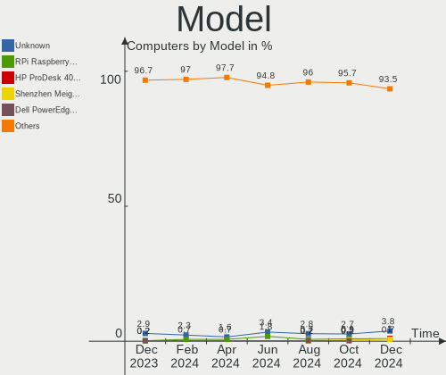
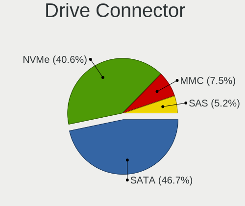
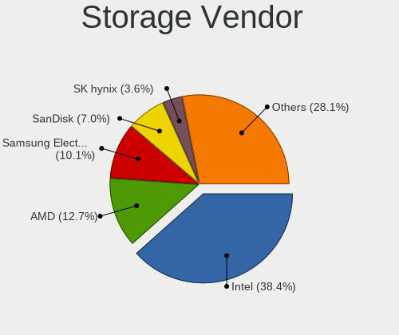
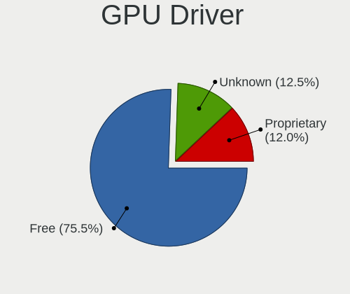
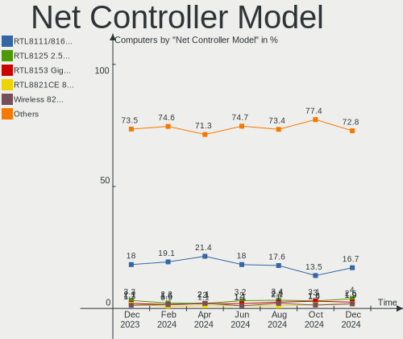

Debian - Hardware Trends
------------------------

A project to identify most popular hardware characteristics and track their change
over time based on data collected by Linux users at https://Linux-Hardware.org.

Anyone can contribute to this report by the [hw-probe](https://github.com/linuxhw/hw-probe) tool:

    sudo -E hw-probe -all -upload

This is a report for all computer types. See also reports for [desktops](/Dist/Debian/Desktop/README.md) and [notebooks](/Dist/Debian/Notebook/README.md).

This report is for one last month. Overall report since the beginning of time: [TestCoverage](https://github.com/linuxhw/TestCoverage)

Period: Sep, 2022.

Contents
--------

* [ System ](#system)
  - [ OS                       ](#os)
  - [ OS Family                ](#os-family)
  - [ Kernel                   ](#kernel)
  - [ Kernel Family            ](#kernel-family)
  - [ Kernel Major Ver.        ](#kernel-major-ver)
  - [ Arch                     ](#arch)
  - [ DE                       ](#de)
  - [ Display Server           ](#display-server)
  - [ Display Manager          ](#display-manager)
  - [ OS Lang                  ](#os-lang)
  - [ Boot Mode                ](#boot-mode)
  - [ Filesystem               ](#filesystem)
  - [ Part. scheme             ](#part-scheme)
  - [ Dual Boot with Linux/BSD ](#dual-boot-with-linuxbsd)
  - [ Dual Boot (Win)          ](#dual-boot-win)

* [ Board ](#board)
  - [ Vendor                   ](#vendor)
  - [ Model                    ](#model)
  - [ Model Family             ](#model-family)
  - [ MFG Year                 ](#mfg-year)
  - [ Form Factor              ](#form-factor)
  - [ Secure Boot              ](#secure-boot)
  - [ Coreboot                 ](#coreboot)
  - [ RAM Size                 ](#ram-size)
  - [ RAM Used                 ](#ram-used)
  - [ Total Drives             ](#total-drives)
  - [ Has CD-ROM               ](#has-cd-rom)
  - [ Has Ethernet             ](#has-ethernet)
  - [ Has WiFi                 ](#has-wifi)
  - [ Has Bluetooth            ](#has-bluetooth)

* [ Location ](#location)
  - [ Country                  ](#country)
  - [ City                     ](#city)

* [ Drives ](#drives)
  - [ Drive Vendor             ](#drive-vendor)
  - [ Drive Model              ](#drive-model)
  - [ HDD Vendor               ](#hdd-vendor)
  - [ SSD Vendor               ](#ssd-vendor)
  - [ Drive Kind               ](#drive-kind)
  - [ Drive Connector          ](#drive-connector)
  - [ Drive Size               ](#drive-size)
  - [ Space Total              ](#space-total)
  - [ Space Used               ](#space-used)
  - [ Malfunc. Drives          ](#malfunc-drives)
  - [ Malfunc. Drive Vendor    ](#malfunc-drive-vendor)
  - [ Malfunc. HDD Vendor      ](#malfunc-hdd-vendor)
  - [ Malfunc. Drive Kind      ](#malfunc-drive-kind)
  - [ Failed Drives            ](#failed-drives)
  - [ Failed Drive Vendor      ](#failed-drive-vendor)
  - [ Drive Status             ](#drive-status)

* [ Storage controller ](#storage-controller)
  - [ Storage Vendor           ](#storage-vendor)
  - [ Storage Model            ](#storage-model)
  - [ Storage Kind             ](#storage-kind)

* [ Processor ](#processor)
  - [ CPU Vendor               ](#cpu-vendor)
  - [ CPU Model                ](#cpu-model)
  - [ CPU Model Family         ](#cpu-model-family)
  - [ CPU Cores                ](#cpu-cores)
  - [ CPU Sockets              ](#cpu-sockets)
  - [ CPU Threads              ](#cpu-threads)
  - [ CPU Op-Modes             ](#cpu-op-modes)
  - [ CPU Microcode            ](#cpu-microcode)
  - [ CPU Microarch            ](#cpu-microarch)

* [ Graphics ](#graphics)
  - [ GPU Vendor               ](#gpu-vendor)
  - [ GPU Model                ](#gpu-model)
  - [ GPU Combo                ](#gpu-combo)
  - [ GPU Driver               ](#gpu-driver)
  - [ GPU Memory               ](#gpu-memory)

* [ Monitor ](#monitor)
  - [ Monitor Vendor           ](#monitor-vendor)
  - [ Monitor Model            ](#monitor-model)
  - [ Monitor Resolution       ](#monitor-resolution)
  - [ Monitor Diagonal         ](#monitor-diagonal)
  - [ Monitor Width            ](#monitor-width)
  - [ Aspect Ratio             ](#aspect-ratio)
  - [ Monitor Area             ](#monitor-area)
  - [ Pixel Density            ](#pixel-density)
  - [ Multiple Monitors        ](#multiple-monitors)

* [ Network ](#network)
  - [ Net Controller Vendor    ](#net-controller-vendor)
  - [ Net Controller Model     ](#net-controller-model)
  - [ Wireless Vendor          ](#wireless-vendor)
  - [ Wireless Model           ](#wireless-model)
  - [ Ethernet Vendor          ](#ethernet-vendor)
  - [ Ethernet Model           ](#ethernet-model)
  - [ Net Controller Kind      ](#net-controller-kind)
  - [ Used Controller          ](#used-controller)
  - [ NICs                     ](#nics)
  - [ IPv6                     ](#ipv6)

* [ Bluetooth ](#bluetooth)
  - [ Bluetooth Vendor         ](#bluetooth-vendor)
  - [ Bluetooth Model          ](#bluetooth-model)

* [ Sound ](#sound)
  - [ Sound Vendor             ](#sound-vendor)
  - [ Sound Model              ](#sound-model)

* [ Memory ](#memory)
  - [ Memory Vendor            ](#memory-vendor)
  - [ Memory Model             ](#memory-model)
  - [ Memory Kind              ](#memory-kind)
  - [ Memory Form Factor       ](#memory-form-factor)
  - [ Memory Size              ](#memory-size)
  - [ Memory Speed             ](#memory-speed)

* [ Printers & scanners ](#printers--scanners)
  - [ Printer Vendor           ](#printer-vendor)
  - [ Printer Model            ](#printer-model)
  - [ Scanner Vendor           ](#scanner-vendor)
  - [ Scanner Model            ](#scanner-model)

* [ Camera ](#camera)
  - [ Camera Vendor            ](#camera-vendor)
  - [ Camera Model             ](#camera-model)

* [ Security ](#security)
  - [ Fingerprint Vendor       ](#fingerprint-vendor)
  - [ Fingerprint Model        ](#fingerprint-model)
  - [ Chipcard Vendor          ](#chipcard-vendor)
  - [ Chipcard Model           ](#chipcard-model)

* [ Unsupported ](#unsupported)
  - [ Unsupported Devices      ](#unsupported-devices)
  - [ Unsupported Device Types ](#unsupported-device-types)

System
------

OS
--

Installed operating systems

| Name                    | Computers | Percent |
|-------------------------|-----------|---------|
| Debian 11               | 369       | 87.23%  |
| Debian Testing          | 24        | 5.67%   |
| Debian Unstable         | 15        | 3.55%   |
| Debian 10               | 6         | 1.42%   |
| Debian 11-updates       | 5         | 1.18%   |
| Debian Testing/unstable | 1         | 0.24%   |
| Debian 8                | 1         | 0.24%   |
| Debian 21               | 1         | 0.24%   |
| Debian                  | 1         | 0.24%   |

OS Family
---------

OS without a version

| Name   | Computers | Percent |
|--------|-----------|---------|
| Debian | 423       | 100%    |

Kernel
------

Version of the Linux kernel

| Version                             | Computers | Percent |
|-------------------------------------|-----------|---------|
| 5.10.0-18-amd64                     | 92        | 21.75%  |
| 5.10.0-7-amd64                      | 79        | 18.68%  |
| 5.10.0-17-amd64                     | 64        | 15.13%  |
| 5.10.0-16-amd64                     | 46        | 10.87%  |
| 5.19.0-1-amd64                      | 33        | 7.8%    |
| 5.18.0-4-amd64                      | 14        | 3.31%   |
| 5.18.0-0.deb11.4-amd64              | 14        | 3.31%   |
| 5.15.53-1-pve                       | 11        | 2.6%    |
| 5.18.0-0.bpo.1-amd64                | 5         | 1.18%   |
| 5.15.61-v8+                         | 5         | 1.18%   |
| 5.15.39-4-pve                       | 5         | 1.18%   |
| 5.15.30-2-pve                       | 5         | 1.18%   |
| 5.10.0-9-amd64                      | 3         | 0.71%   |
| 5.19.0-4.2-liquorix-amd64           | 2         | 0.47%   |
| 5.19.0-2-amd64                      | 2         | 0.47%   |
| 5.10.0-18-rt-amd64                  | 2         | 0.47%   |
| 5.10.0-18-arm64                     | 2         | 0.47%   |
| 5.10.0-18-686-pae                   | 2         | 0.47%   |
| 5.10.0-17-arm64                     | 2         | 0.47%   |
| 5.10.0-15-amd64                     | 2         | 0.47%   |
| 5.10.0-14-amd64                     | 2         | 0.47%   |
| 4.19.0-21-amd64                     | 2         | 0.47%   |
| 6.0.0-rc7-rt-amd64                  | 1         | 0.24%   |
| 6.0.0-rc2                           | 1         | 0.24%   |
| 6.0.0-rc1-asahi-00175-g01a8389621b6 | 1         | 0.24%   |
| 5.5.0-0.bpo.2-amd64                 | 1         | 0.24%   |
| 5.4.157-1-pve                       | 1         | 0.24%   |
| 5.4.0-113-generic                   | 1         | 0.24%   |
| 5.19.9-xanmod1                      | 1         | 0.24%   |
| 5.19.8-amd64                        | 1         | 0.24%   |
| 5.19.7-1-pve                        | 1         | 0.24%   |
| 5.19.1-stb-exy+                     | 1         | 0.24%   |
| 5.18.15                             | 1         | 0.24%   |
| 5.18.0-2mx-amd64                    | 1         | 0.24%   |
| 5.18.0-0.deb11.4-rt-amd64           | 1         | 0.24%   |
| 5.18.0-0.deb11.3-rt-amd64           | 1         | 0.24%   |
| 5.16.0-5mx-amd64                    | 1         | 0.24%   |
| 5.16.0-0.bpo.4-amd64                | 1         | 0.24%   |
| 5.15.63-rockchip                    | 1         | 0.24%   |
| 5.15.48-sunxi                       | 1         | 0.24%   |

Kernel Family
-------------

Linux kernel without a distro release

| Version  | Computers | Percent |
|----------|-----------|---------|
| 5.10.0   | 302       | 71.39%  |
| 5.19.0   | 37        | 8.75%   |
| 5.18.0   | 36        | 8.51%   |
| 5.15.53  | 11        | 2.6%    |
| 5.15.61  | 5         | 1.18%   |
| 5.15.39  | 5         | 1.18%   |
| 5.15.30  | 5         | 1.18%   |
| 6.0.0    | 3         | 0.71%   |
| 4.19.0   | 3         | 0.71%   |
| 5.16.0   | 2         | 0.47%   |
| 5.5.0    | 1         | 0.24%   |
| 5.4.157  | 1         | 0.24%   |
| 5.4.0    | 1         | 0.24%   |
| 5.19.9   | 1         | 0.24%   |
| 5.19.8   | 1         | 0.24%   |
| 5.19.7   | 1         | 0.24%   |
| 5.19.1   | 1         | 0.24%   |
| 5.18.15  | 1         | 0.24%   |
| 5.15.63  | 1         | 0.24%   |
| 5.15.48  | 1         | 0.24%   |
| 5.13.19  | 1         | 0.24%   |
| 5.10.131 | 1         | 0.24%   |
| 5.10.103 | 1         | 0.24%   |
| 3.0.21   | 1         | 0.24%   |

Kernel Major Ver.
-----------------

Linux kernel major version

| Version | Computers | Percent |
|---------|-----------|---------|
| 5.10    | 304       | 71.87%  |
| 5.19    | 41        | 9.69%   |
| 5.18    | 37        | 8.75%   |
| 5.15    | 28        | 6.62%   |
| 6.0     | 3         | 0.71%   |
| 4.19    | 3         | 0.71%   |
| 5.4     | 2         | 0.47%   |
| 5.16    | 2         | 0.47%   |
| 5.5     | 1         | 0.24%   |
| 5.13    | 1         | 0.24%   |
| 3.0     | 1         | 0.24%   |

Arch
----

OS architecture (x86_64, i586, etc.)

| Name    | Computers | Percent |
|---------|-----------|---------|
| x86_64  | 404       | 95.51%  |
| aarch64 | 11        | 2.6%    |
| armv7l  | 4         | 0.95%   |
| i686    | 3         | 0.71%   |
| ppc64le | 1         | 0.24%   |

DE
--

Desktop Environment

| Name             | Computers | Percent |
|------------------|-----------|---------|
| Unknown          | 157       | 37.12%  |
| GNOME            | 99        | 23.4%   |
| XFCE             | 48        | 11.35%  |
| KDE5             | 45        | 10.64%  |
| X-Cinnamon       | 18        | 4.26%   |
| MATE             | 9         | 2.13%   |
| LXQt             | 8         | 1.89%   |
| Cinnamon         | 8         | 1.89%   |
| LXDE             | 6         | 1.42%   |
| i3               | 6         | 1.42%   |
| KDE              | 5         | 1.18%   |
| trinity          | 3         | 0.71%   |
| openbox          | 3         | 0.71%   |
| GNOME Flashback  | 3         | 0.71%   |
| lightdm-xsession | 2         | 0.47%   |
| xmonad           | 1         | 0.24%   |
| sway             | 1         | 0.24%   |
| Cutefish         | 1         | 0.24%   |

Display Server
--------------

X11 or Wayland

| Name    | Computers | Percent |
|---------|-----------|---------|
| X11     | 190       | 44.92%  |
| Unknown | 120       | 28.37%  |
| Wayland | 67        | 15.84%  |
| Tty     | 46        | 10.87%  |

Display Manager
---------------

SDDM, LightDM, etc.

| Name    | Computers | Percent |
|---------|-----------|---------|
| Unknown | 208       | 49.17%  |
| LightDM | 80        | 18.91%  |
| GDM     | 68        | 16.08%  |
| SDDM    | 37        | 8.75%   |
| GDM3    | 29        | 6.86%   |
| XDM     | 1         | 0.24%   |

OS Lang
-------

Language

| Lang    | Computers | Percent |
|---------|-----------|---------|
| en_US   | 124       | 29.31%  |
| ru_RU   | 93        | 21.99%  |
| Unknown | 36        | 8.51%   |
| es_ES   | 29        | 6.86%   |
| de_DE   | 25        | 5.91%   |
| fr_FR   | 21        | 4.96%   |
| en_GB   | 15        | 3.55%   |
| it_IT   | 13        | 3.07%   |
| pt_BR   | 10        | 2.36%   |
| C       | 8         | 1.89%   |
| en_CA   | 6         | 1.42%   |
| zh_CN   | 5         | 1.18%   |
| en_AU   | 5         | 1.18%   |
| pl_PL   | 3         | 0.71%   |
| es_VE   | 3         | 0.71%   |
| es_AR   | 3         | 0.71%   |
| en_IE   | 3         | 0.71%   |
| en_SG   | 2         | 0.47%   |
| en_NZ   | 2         | 0.47%   |
| en_IN   | 2         | 0.47%   |
| zh_HK   | 1         | 0.24%   |
| pt_PT   | 1         | 0.24%   |
| lt_LT   | 1         | 0.24%   |
| id_ID   | 1         | 0.24%   |
| hu_HU   | 1         | 0.24%   |
| fr_CH   | 1         | 0.24%   |
| fr_BE   | 1         | 0.24%   |
| es_UY   | 1         | 0.24%   |
| es_MX   | 1         | 0.24%   |
| es_BO   | 1         | 0.24%   |
| en_ZA   | 1         | 0.24%   |
| en_SE   | 1         | 0.24%   |
| en_HK   | 1         | 0.24%   |
| de_AT   | 1         | 0.24%   |
| ca_ES   | 1         | 0.24%   |

Boot Mode
---------

EFI or BIOS

| Mode | Computers | Percent |
|------|-----------|---------|
| EFI  | 253       | 59.81%  |
| BIOS | 170       | 40.19%  |

Filesystem
----------

Type of filesystem

| Type    | Computers | Percent |
|---------|-----------|---------|
| Ext4    | 257       | 60.76%  |
| Overlay | 125       | 29.55%  |
| Btrfs   | 14        | 3.31%   |
| Xfs     | 12        | 2.84%   |
| Zfs     | 11        | 2.6%    |
| Tmpfs   | 1         | 0.24%   |
| Ext3    | 1         | 0.24%   |
| Ext2    | 1         | 0.24%   |
| Unknown | 1         | 0.24%   |

Part. scheme
------------

Scheme of partitioning

| Type    | Computers | Percent |
|---------|-----------|---------|
| GPT     | 258       | 60.99%  |
| MBR     | 109       | 25.77%  |
| Unknown | 56        | 13.24%  |

Dual Boot with Linux/BSD
------------------------

Hosting more than one Linux/BSD

| Dual boot | Computers | Percent |
|-----------|-----------|---------|
| No        | 364       | 86.05%  |
| Yes       | 59        | 13.95%  |

Dual Boot (Win)
---------------

Hosting Linux and Windows

| Dual boot | Computers | Percent |
|-----------|-----------|---------|
| No        | 248       | 58.63%  |
| Yes       | 175       | 41.37%  |

Board
-----

Vendor
------

Motherboard manufacturer

| Name                    | Computers | Percent |
|-------------------------|-----------|---------|
| Lenovo                  | 65        | 15.37%  |
| ASUSTek Computer        | 60        | 14.18%  |
| Hewlett-Packard         | 48        | 11.35%  |
| Dell                    | 39        | 9.22%   |
| Aquarius                | 30        | 7.09%   |
| Gigabyte Technology     | 26        | 6.15%   |
| Google                  | 24        | 5.67%   |
| ASRock                  | 24        | 5.67%   |
| MSI                     | 20        | 4.73%   |
| Acer                    | 9         | 2.13%   |
| HUAWEI                  | 8         | 1.89%   |
| Raspberry Pi Foundation | 7         | 1.65%   |
| Intel                   | 6         | 1.42%   |
| Unknown                 | 6         | 1.42%   |
| ECS                     | 5         | 1.18%   |
| Supermicro              | 3         | 0.71%   |
| AZW                     | 3         | 0.71%   |
| Toshiba                 | 2         | 0.47%   |
| Samsung Electronics     | 2         | 0.47%   |
| Positivo                | 2         | 0.47%   |
| Foxconn                 | 2         | 0.47%   |
| Chuwi                   | 2         | 0.47%   |
| Biostar                 | 2         | 0.47%   |
| BESSTAR Tech            | 2         | 0.47%   |
| ASRockRack              | 2         | 0.47%   |
| Apple                   | 2         | 0.47%   |
| Xunlong                 | 1         | 0.24%   |
| VIT                     | 1         | 0.24%   |
| Valve                   | 1         | 0.24%   |
| Thecus                  | 1         | 0.24%   |
| Shuttle                 | 1         | 0.24%   |
| Rockchip                | 1         | 0.24%   |
| Pine Microsystems       | 1         | 0.24%   |
| Pegatron                | 1         | 0.24%   |
| PC Specialist           | 1         | 0.24%   |
| Panasonic               | 1         | 0.24%   |
| Medion                  | 1         | 0.24%   |
| MECHREVO                | 1         | 0.24%   |
| IPASON                  | 1         | 0.24%   |
| Inventec                | 1         | 0.24%   |

Model
-----

Motherboard model

| Name                                      | Computers | Percent |
|-------------------------------------------|-----------|---------|
| Aquarius NS585                            | 30        | 7.09%   |
| ASRock H470M-HVS                          | 17        | 4.02%   |
| Google Enguarde                           | 15        | 3.55%   |
| Unknown                                   | 8         | 1.89%   |
| Lenovo ThinkPad L13 Yoga Gen 2 20VK0019US | 7         | 1.65%   |
| RPi Raspberry Pi 3 Model B Rev 1.2        | 4         | 0.95%   |
| Lenovo ThinkPad 13 2nd Gen 20J10046US     | 4         | 0.95%   |
| Google Terra                              | 4         | 0.95%   |
| ECS G31T-M9                               | 4         | 0.95%   |
| ASUS All Series                           | 4         | 0.95%   |
| HUAWEI HN-WX9X                            | 3         | 0.71%   |
| Gigabyte M56S-S3                          | 3         | 0.71%   |
| Dell Latitude E6330                       | 3         | 0.71%   |
| ASUS S20 K29                              | 3         | 0.71%   |
| RPi Raspberry Pi 4 Model B Rev 1.4        | 2         | 0.47%   |
| MSI MS-7996                               | 2         | 0.47%   |
| MSI MS-7817                               | 2         | 0.47%   |
| Lenovo G50-45 80E3                        | 2         | 0.47%   |
| HP Stream Notebook PC 13                  | 2         | 0.47%   |
| HP Notebook                               | 2         | 0.47%   |
| HP EliteDesk 800 G1 SFF                   | 2         | 0.47%   |
| HP Compaq Pro 6300 MT                     | 2         | 0.47%   |
| Google Reks                               | 2         | 0.47%   |
| Gigabyte H81M-S2V                         | 2         | 0.47%   |
| Gigabyte A320M-S2H                        | 2         | 0.47%   |
| Dell Vostro 15 5510                       | 2         | 0.47%   |
| ASUS UX430UAR                             | 2         | 0.47%   |
| ASUS Pro WS 565-ACE                       | 2         | 0.47%   |
| ASUS M3N78-VM                             | 2         | 0.47%   |
| ASRock Q1900M                             | 2         | 0.47%   |
| Xunlong Orange Pi Zero                    | 1         | 0.24%   |
| VIT P2402                                 | 1         | 0.24%   |
| Valve Jupiter                             | 1         | 0.24%   |
| Toshiba Satellite P745                    | 1         | 0.24%   |
| Toshiba Satellite L40                     | 1         | 0.24%   |
| Thecus N2810                              | 1         | 0.24%   |
| Supermicro X9DRD-7LN4F(-JBOD)/X9DRD-EF    | 1         | 0.24%   |
| Supermicro X9DR3-F                        | 1         | 0.24%   |
| Supermicro SSG-6048R-E1CR36N              | 1         | 0.24%   |
| Shuttle DS81D                             | 1         | 0.24%   |

Model Family
------------

Motherboard model prefix

| Name               | Computers | Percent |
|--------------------|-----------|---------|
| Lenovo ThinkPad    | 45        | 10.64%  |
| Aquarius NS585     | 30        | 7.09%   |
| ASRock H470M-HVS   | 17        | 4.02%   |
| Google Enguarde    | 15        | 3.55%   |
| Dell Latitude      | 10        | 2.36%   |
| Dell Inspiron      | 8         | 1.89%   |
| Unknown            | 8         | 1.89%   |
| RPi Raspberry      | 7         | 1.65%   |
| ASUS PRIME         | 6         | 1.42%   |
| Acer Aspire        | 6         | 1.42%   |
| Lenovo ThinkCentre | 5         | 1.18%   |
| Lenovo IdeaPad     | 5         | 1.18%   |
| HP Pavilion        | 5         | 1.18%   |
| HP EliteBook       | 5         | 1.18%   |
| HP Compaq          | 5         | 1.18%   |
| Dell XPS           | 5         | 1.18%   |
| Dell Vostro        | 5         | 1.18%   |
| Dell PowerEdge     | 5         | 1.18%   |
| HP ProBook         | 4         | 0.95%   |
| Google Terra       | 4         | 0.95%   |
| ECS G31T-M9        | 4         | 0.95%   |
| ASUS VivoBook      | 4         | 0.95%   |
| ASUS ROG           | 4         | 0.95%   |
| ASUS All           | 4         | 0.95%   |
| HUAWEI HN-WX9X     | 3         | 0.71%   |
| HP Stream          | 3         | 0.71%   |
| HP ProDesk         | 3         | 0.71%   |
| Gigabyte M56S-S3   | 3         | 0.71%   |
| Dell Precision     | 3         | 0.71%   |
| ASUS TUF           | 3         | 0.71%   |
| ASUS S20           | 3         | 0.71%   |
| Toshiba Satellite  | 2         | 0.47%   |
| MSI MS-7996        | 2         | 0.47%   |
| MSI MS-7817        | 2         | 0.47%   |
| Lenovo Legion      | 2         | 0.47%   |
| Lenovo IdeaCentre  | 2         | 0.47%   |
| Lenovo G50-45      | 2         | 0.47%   |
| HP ProLiant        | 2         | 0.47%   |
| HP Notebook        | 2         | 0.47%   |
| HP EliteDesk       | 2         | 0.47%   |

MFG Year
--------

Motherboard manufacture year

| Year    | Computers | Percent |
|---------|-----------|---------|
| 2019    | 64        | 15.13%  |
| 2021    | 63        | 14.89%  |
| 2020    | 51        | 12.06%  |
| 2022    | 36        | 8.51%   |
| 2012    | 24        | 5.67%   |
| 2017    | 22        | 5.2%    |
| 2014    | 21        | 4.96%   |
| 2018    | 19        | 4.49%   |
| 2013    | 19        | 4.49%   |
| 2011    | 17        | 4.02%   |
| 2015    | 14        | 3.31%   |
| Unknown | 14        | 3.31%   |
| 2016    | 13        | 3.07%   |
| 2009    | 13        | 3.07%   |
| 2007    | 13        | 3.07%   |
| 2010    | 12        | 2.84%   |
| 2008    | 5         | 1.18%   |
| 2005    | 2         | 0.47%   |
| 2004    | 1         | 0.24%   |

Form Factor
-----------

Physical design of the computer

| Name           | Computers | Percent |
|----------------|-----------|---------|
| Notebook       | 224       | 52.96%  |
| Desktop        | 152       | 35.93%  |
| System on chip | 13        | 3.07%   |
| Convertible    | 11        | 2.6%    |
| Mini pc        | 11        | 2.6%    |
| Server         | 9         | 2.13%   |
| All in one     | 2         | 0.47%   |
| Other          | 1         | 0.24%   |

Secure Boot
-----------

Enabled or disabled

| State    | Computers | Percent |
|----------|-----------|---------|
| Disabled | 399       | 94.33%  |
| Enabled  | 24        | 5.67%   |

Coreboot
--------

Have coreboot on board

| Used | Computers | Percent |
|------|-----------|---------|
| No   | 398       | 94.09%  |
| Yes  | 25        | 5.91%   |

RAM Size
--------

Total RAM memory

| Size in GB      | Computers | Percent |
|-----------------|-----------|---------|
| 4.01-8.0        | 109       | 25.77%  |
| 16.01-24.0      | 78        | 18.44%  |
| 3.01-4.0        | 70        | 16.55%  |
| 8.01-16.0       | 55        | 13%     |
| 32.01-64.0      | 53        | 12.53%  |
| 64.01-256.0     | 18        | 4.26%   |
| 1.01-2.0        | 16        | 3.78%   |
| 0.51-1.0        | 8         | 1.89%   |
| More than 256.0 | 5         | 1.18%   |
| 24.01-32.0      | 5         | 1.18%   |
| 2.01-3.0        | 3         | 0.71%   |
| 0.01-0.5        | 3         | 0.71%   |

RAM Used
--------

Used RAM memory

| Used GB     | Computers | Percent |
|-------------|-----------|---------|
| 1.01-2.0    | 127       | 30.02%  |
| 0.51-1.0    | 97        | 22.93%  |
| 2.01-3.0    | 71        | 16.78%  |
| 4.01-8.0    | 42        | 9.93%   |
| 3.01-4.0    | 42        | 9.93%   |
| 8.01-16.0   | 22        | 5.2%    |
| 0.01-0.5    | 13        | 3.07%   |
| 64.01-256.0 | 4         | 0.95%   |
| 24.01-32.0  | 2         | 0.47%   |
| 32.01-64.0  | 1         | 0.24%   |
| 16.01-24.0  | 1         | 0.24%   |
| Unknown     | 1         | 0.24%   |

Total Drives
------------

Number of drives on board

| Drives | Computers | Percent |
|--------|-----------|---------|
| 1      | 286       | 67.61%  |
| 2      | 77        | 18.2%   |
| 3      | 28        | 6.62%   |
| 4      | 16        | 3.78%   |
| 5      | 8         | 1.89%   |
| 6      | 2         | 0.47%   |
| 46     | 1         | 0.24%   |
| 14     | 1         | 0.24%   |
| 12     | 1         | 0.24%   |
| 10     | 1         | 0.24%   |
| 8      | 1         | 0.24%   |
| 7      | 1         | 0.24%   |

Has CD-ROM
----------

Has CD-ROM on board

| Presented | Computers | Percent |
|-----------|-----------|---------|
| No        | 328       | 77.54%  |
| Yes       | 95        | 22.46%  |

Has Ethernet
------------

Has Ethernet on board

| Presented | Computers | Percent |
|-----------|-----------|---------|
| Yes       | 366       | 86.52%  |
| No        | 57        | 13.48%  |

Has WiFi
--------

Has WiFi module

| Presented | Computers | Percent |
|-----------|-----------|---------|
| Yes       | 293       | 69.27%  |
| No        | 130       | 30.73%  |

Has Bluetooth
-------------

Has Bluetooth module

| Presented | Computers | Percent |
|-----------|-----------|---------|
| Yes       | 243       | 57.45%  |
| No        | 180       | 42.55%  |

Location
--------

Country
-------

Geographic location (country)

| Country      | Computers | Percent |
|--------------|-----------|---------|
| Russia       | 100       | 23.64%  |
| USA          | 77        | 18.2%   |
| Germany      | 40        | 9.46%   |
| Spain        | 39        | 9.22%   |
| France       | 25        | 5.91%   |
| Italy        | 20        | 4.73%   |
| Brazil       | 15        | 3.55%   |
| UK           | 10        | 2.36%   |
| Canada       | 10        | 2.36%   |
| Australia    | 7         | 1.65%   |
| Mexico       | 6         | 1.42%   |
| China        | 6         | 1.42%   |
| Hong Kong    | 5         | 1.18%   |
| Poland       | 4         | 0.95%   |
| Netherlands  | 4         | 0.95%   |
| Bulgaria     | 4         | 0.95%   |
| Belgium      | 4         | 0.95%   |
| Venezuela    | 3         | 0.71%   |
| Sweden       | 3         | 0.71%   |
| India        | 3         | 0.71%   |
| Hungary      | 3         | 0.71%   |
| Argentina    | 3         | 0.71%   |
| Switzerland  | 2         | 0.47%   |
| Romania      | 2         | 0.47%   |
| Réunion     | 2         | 0.47%   |
| New Zealand  | 2         | 0.47%   |
| Ireland      | 2         | 0.47%   |
| Indonesia    | 2         | 0.47%   |
| Greece       | 2         | 0.47%   |
| Austria      | 2         | 0.47%   |
| Vietnam      | 1         | 0.24%   |
| Uruguay      | 1         | 0.24%   |
| UAE          | 1         | 0.24%   |
| Turkey       | 1         | 0.24%   |
| South Africa | 1         | 0.24%   |
| Slovenia     | 1         | 0.24%   |
| Saudi Arabia | 1         | 0.24%   |
| Portugal     | 1         | 0.24%   |
| Morocco      | 1         | 0.24%   |
| Malta        | 1         | 0.24%   |

City
----

Geographic location (city)

| City                       | Computers | Percent |
|----------------------------|-----------|---------|
| Voronezh                   | 79        | 18.68%  |
| Bangor                     | 37        | 8.75%   |
| Seville                    | 18        | 4.26%   |
| Paris                      | 5         | 1.18%   |
| Madrid                     | 5         | 1.18%   |
| Barcelona                  | 5         | 1.18%   |
| Moscow                     | 4         | 0.95%   |
| Toronto                    | 3         | 0.71%   |
| Tijuana                    | 3         | 0.71%   |
| St Petersburg              | 3         | 0.71%   |
| Perm                       | 3         | 0.71%   |
| Las Palmas de Gran Canaria | 3         | 0.71%   |
| Frankfurt am Main          | 3         | 0.71%   |
| Zanevka                    | 2         | 0.47%   |
| Wilmington                 | 2         | 0.47%   |
| Warsaw                     | 2         | 0.47%   |
| Vitória                   | 2         | 0.47%   |
| Saint-Denis                | 2         | 0.47%   |
| Rio de Janeiro             | 2         | 0.47%   |
| Philadelphia               | 2         | 0.47%   |
| Natal                      | 2         | 0.47%   |
| Naples                     | 2         | 0.47%   |
| Munich                     | 2         | 0.47%   |
| Milan                      | 2         | 0.47%   |
| Mesa                       | 2         | 0.47%   |
| Melbourne                  | 2         | 0.47%   |
| Lübeck                    | 2         | 0.47%   |
| Leipzig                    | 2         | 0.47%   |
| Kaufbeuren                 | 2         | 0.47%   |
| Hamburg                    | 2         | 0.47%   |
| Central                    | 2         | 0.47%   |
| Brisbane                   | 2         | 0.47%   |
| Brighton                   | 2         | 0.47%   |
| Berlin                     | 2         | 0.47%   |
| Amsterdam                  | 2         | 0.47%   |
| Yerres                     | 1         | 0.24%   |
| Yelets                     | 1         | 0.24%   |
| Yekaterinburg              | 1         | 0.24%   |
| Yantai                     | 1         | 0.24%   |
| Xiaozhai                   | 1         | 0.24%   |

Drives
------

Drive Vendor
------------

Hard drive vendors

| Vendor                    | Computers | Drives | Percent |
|---------------------------|-----------|--------|---------|
| Samsung Electronics       | 89        | 112    | 15.14%  |
| WDC                       | 76        | 103    | 12.93%  |
| Seagate                   | 66        | 132    | 11.22%  |
| Unknown                   | 46        | 49     | 7.82%   |
| Toshiba                   | 43        | 47     | 7.31%   |
| A-DATA Technology         | 41        | 41     | 6.97%   |
| Kingston                  | 34        | 40     | 5.78%   |
| SanDisk                   | 24        | 26     | 4.08%   |
| Crucial                   | 23        | 26     | 3.91%   |
| Netac                     | 19        | 19     | 3.23%   |
| Hitachi                   | 14        | 14     | 2.38%   |
| SK hynix                  | 11        | 11     | 1.87%   |
| Micron Technology         | 10        | 10     | 1.7%    |
| China                     | 8         | 9      | 1.36%   |
| Intel                     | 7         | 11     | 1.19%   |
| HGST                      | 7         | 8      | 1.19%   |
| KIOXIA                    | 5         | 6      | 0.85%   |
| Unknown                   | 5         | 5      | 0.85%   |
| Phison                    | 4         | 7      | 0.68%   |
| Intenso                   | 4         | 5      | 0.68%   |
| Team                      | 3         | 3      | 0.51%   |
| Silicon Motion            | 3         | 3      | 0.51%   |
| Gigabyte Technology       | 3         | 3      | 0.51%   |
| Apple                     | 3         | 5      | 0.51%   |
| Transcend                 | 2         | 2      | 0.34%   |
| TEXTORM                   | 2         | 2      | 0.34%   |
| Supermicro                | 2         | 3      | 0.34%   |
| SPCC                      | 2         | 2      | 0.34%   |
| Plextor                   | 2         | 2      | 0.34%   |
| Maxtor                    | 2         | 2      | 0.34%   |
| KIOXIA-EXCERIA            | 2         | 2      | 0.34%   |
| Hewlett-Packard           | 2         | 2      | 0.34%   |
| SSSTC                     | 1         | 1      | 0.17%   |
| S3+                       | 1         | 1      | 0.17%   |
| PUSKILL                   | 1         | 1      | 0.17%   |
| PNY                       | 1         | 1      | 0.17%   |
| Phison Electronics        | 1         | 1      | 0.17%   |
| Pear                      | 1         | 1      | 0.17%   |
| Patriot                   | 1         | 1      | 0.17%   |
| Micron/Crucial Technology | 1         | 1      | 0.17%   |

Drive Model
-----------

Hard drive models

| Model                                | Computers | Percent |
|--------------------------------------|-----------|---------|
| A-DATA SU800 512GB SSD               | 30        | 4.82%   |
| Toshiba HDWD110 1TB                  | 17        | 2.73%   |
| Netac SSD 240GB                      | 17        | 2.73%   |
| Unknown AGND3R  16GB                 | 9         | 1.45%   |
| Samsung MZVLB512HBJQ-000L7 512GB     | 8         | 1.29%   |
| Kingston SA400S37240G 240GB SSD      | 6         | 0.96%   |
| Unknown SDW16G  16GB                 | 5         | 0.8%    |
| Unknown MMC Card  32GB               | 5         | 0.8%    |
| Unknown HAG2e  16GB                  | 5         | 0.8%    |
| Toshiba DT01ACA050 500GB             | 5         | 0.8%    |
| Seagate ST1000DM010-2EP102 1TB       | 5         | 0.8%    |
| Samsung SSD 860 EVO 500GB            | 5         | 0.8%    |
| Samsung SSD 860 EVO 250GB            | 5         | 0.8%    |
| Kingston SA400S37120G 120GB SSD      | 5         | 0.8%    |
| Unknown                              | 5         | 0.8%    |
| Toshiba DT01ACA100 1TB               | 4         | 0.64%   |
| Crucial CT480BX500SSD1 480GB         | 4         | 0.64%   |
| Crucial CT250MX500SSD1 250GB         | 4         | 0.64%   |
| Crucial CT1000MX500SSD1 1TB          | 4         | 0.64%   |
| WDC PC SN810 NVMe 1024GB             | 3         | 0.48%   |
| Toshiba MQ04ABF100 1TB               | 3         | 0.48%   |
| Seagate ST500DM002-1BD142 500GB      | 3         | 0.48%   |
| Seagate ST2000DM008-2FR102 2TB       | 3         | 0.48%   |
| Seagate ST1000LM048-2E7172 1TB       | 3         | 0.48%   |
| Seagate ST1000DM003-1ER162 1TB       | 3         | 0.48%   |
| Samsung SSD 860 EVO M.2 1TB          | 3         | 0.48%   |
| Samsung SSD 860 EVO 1TB              | 3         | 0.48%   |
| Samsung MZVLB256HAHQ-00000 256GB     | 3         | 0.48%   |
| Kingston SA400S37480G 480GB SSD      | 3         | 0.48%   |
| Hitachi HTS723232A7A364 320GB        | 3         | 0.48%   |
| WDC WDS240G2G0A-00JH30 240GB SSD     | 2         | 0.32%   |
| WDC WDS100T2B0C-00PXH0 1TB           | 2         | 0.32%   |
| WDC WD60EFZX-68B3FN0 6TB             | 2         | 0.32%   |
| WDC WD5000AAKX-60U6AA0 500GB         | 2         | 0.32%   |
| Unknown SE32G  32GB                  | 2         | 0.32%   |
| Unknown SD32G  32GB                  | 2         | 0.32%   |
| Unknown SD/MMC/MS PRO 2GB            | 2         | 0.32%   |
| Unknown MMC Card  64GB               | 2         | 0.32%   |
| SK hynix BC711 HFM512GD3JX013N 512GB | 2         | 0.32%   |
| SK hynix BC511 NVMe 256GB            | 2         | 0.32%   |

HDD Vendor
----------

Hard disk drive vendors

| Vendor              | Computers | Drives | Percent |
|---------------------|-----------|--------|---------|
| Seagate             | 63        | 129    | 34.24%  |
| WDC                 | 50        | 73     | 27.17%  |
| Toshiba             | 39        | 43     | 21.2%   |
| Hitachi             | 14        | 14     | 7.61%   |
| HGST                | 7         | 8      | 3.8%    |
| Unknown             | 3         | 3      | 1.63%   |
| Samsung Electronics | 3         | 5      | 1.63%   |
| Maxtor              | 2         | 2      | 1.09%   |
| Hajaan              | 1         | 1      | 0.54%   |
| ASMT109x            | 1         | 1      | 0.54%   |
| ASMedia             | 1         | 1      | 0.54%   |

SSD Vendor
----------

Solid state drive vendors

| Vendor              | Computers | Drives | Percent |
|---------------------|-----------|--------|---------|
| Samsung Electronics | 37        | 43     | 17.29%  |
| A-DATA Technology   | 37        | 37     | 17.29%  |
| Kingston            | 26        | 31     | 12.15%  |
| Crucial             | 21        | 23     | 9.81%   |
| Netac               | 19        | 19     | 8.88%   |
| SanDisk             | 15        | 15     | 7.01%   |
| WDC                 | 8         | 8      | 3.74%   |
| China               | 8         | 9      | 3.74%   |
| Intenso             | 4         | 5      | 1.87%   |
| Team                | 3         | 3      | 1.4%    |
| Intel               | 3         | 7      | 1.4%    |
| Transcend           | 2         | 2      | 0.93%   |
| Toshiba             | 2         | 2      | 0.93%   |
| TEXTORM             | 2         | 2      | 0.93%   |
| Supermicro          | 2         | 3      | 0.93%   |
| SPCC                | 2         | 2      | 0.93%   |
| Plextor             | 2         | 2      | 0.93%   |
| Hewlett-Packard     | 2         | 2      | 0.93%   |
| Gigabyte Technology | 2         | 2      | 0.93%   |
| SK hynix            | 1         | 1      | 0.47%   |
| S3+                 | 1         | 1      | 0.47%   |
| PUSKILL             | 1         | 1      | 0.47%   |
| Pear                | 1         | 1      | 0.47%   |
| Patriot             | 1         | 1      | 0.47%   |
| Micron Technology   | 1         | 1      | 0.47%   |
| LITEON              | 1         | 1      | 0.47%   |
| KIOXIA-EXCERIA      | 1         | 1      | 0.47%   |
| Kingchuxing         | 1         | 1      | 0.47%   |
| Hajaan              | 1         | 1      | 0.47%   |
| GLOBAL              | 1         | 1      | 0.47%   |
| Dogfish             | 1         | 1      | 0.47%   |
| DGM                 | 1         | 1      | 0.47%   |
| ASMT                | 1         | 1      | 0.47%   |
| Apple               | 1         | 1      | 0.47%   |
| Apacer              | 1         | 1      | 0.47%   |
| Unknown             | 1         | 1      | 0.47%   |

Drive Kind
----------

HDD or SSD

| Kind    | Computers | Drives | Percent |
|---------|-----------|--------|---------|
| SSD     | 193       | 234    | 35.35%  |
| HDD     | 164       | 280    | 30.04%  |
| NVMe    | 135       | 166    | 24.73%  |
| MMC     | 48        | 51     | 8.79%   |
| Unknown | 6         | 8      | 1.1%    |

Drive Connector
---------------

SATA, SAS, NVMe, etc.

| Type | Computers | Drives | Percent |
|------|-----------|--------|---------|
| SATA | 281       | 493    | 58.06%  |
| NVMe | 135       | 164    | 27.89%  |
| MMC  | 48        | 51     | 9.92%   |
| SAS  | 20        | 31     | 4.13%   |

Drive Size
----------

Size of hard drive

| Size in TB | Computers | Drives | Percent |
|------------|-----------|--------|---------|
| 0.01-0.5   | 195       | 238    | 53.13%  |
| 0.51-1.0   | 123       | 146    | 33.51%  |
| 1.01-2.0   | 23        | 44     | 6.27%   |
| 3.01-4.0   | 12        | 24     | 3.27%   |
| 4.01-10.0  | 9         | 53     | 2.45%   |
| 2.01-3.0   | 4         | 5      | 1.09%   |
| 10.01-20.0 | 1         | 4      | 0.27%   |

Space Total
-----------

Amount of disk space available on the file system

| Size in GB     | Computers | Percent |
|----------------|-----------|---------|
| Unknown        | 103       | 24.35%  |
| 251-500        | 81        | 19.15%  |
| 101-250        | 77        | 18.2%   |
| 501-1000       | 39        | 9.22%   |
| 1-20           | 29        | 6.86%   |
| 1001-2000      | 27        | 6.38%   |
| 51-100         | 22        | 5.2%    |
| More than 3000 | 18        | 4.26%   |
| 21-50          | 18        | 4.26%   |
| 2001-3000      | 9         | 2.13%   |

Space Used
----------

Amount of used disk space

| Used GB        | Computers | Percent |
|----------------|-----------|---------|
| 1-20           | 151       | 35.7%   |
| Unknown        | 103       | 24.35%  |
| 21-50          | 40        | 9.46%   |
| 101-250        | 36        | 8.51%   |
| 51-100         | 31        | 7.33%   |
| 251-500        | 24        | 5.67%   |
| 501-1000       | 18        | 4.26%   |
| More than 3000 | 10        | 2.36%   |
| 1001-2000      | 6         | 1.42%   |
| 2001-3000      | 4         | 0.95%   |

Malfunc. Drives
---------------

Drive models with a malfunction

| Model                                            | Computers | Drives | Percent |
|--------------------------------------------------|-----------|--------|---------|
| WDC WD800JD-60LSA5 80GB                          | 1         | 1      | 2.13%   |
| WDC WD5000AAKX-60U6AA0 500GB                     | 1         | 1      | 2.13%   |
| WDC WD40PURZ-85AKKY0 4TB                         | 1         | 1      | 2.13%   |
| WDC WD3200AAJS-08L7A0 320GB                      | 1         | 1      | 2.13%   |
| WDC WD2502ABYS-23B7A0 39M4511 42C0463IBM 250GB   | 1         | 2      | 2.13%   |
| WDC WD2500AAKS-00VSA0 250GB                      | 1         | 1      | 2.13%   |
| WDC WD2500AAKS-00B3A0 250GB                      | 1         | 1      | 2.13%   |
| WDC WD2500AAJS-00L7A0 250GB                      | 1         | 1      | 2.13%   |
| WDC WD2003FYYS-18W0B0 2TB                        | 1         | 6      | 2.13%   |
| WDC WD1600JS-22MHB0 160GB                        | 1         | 1      | 2.13%   |
| WDC WD10SPZX-60Z10T0 1TB                         | 1         | 1      | 2.13%   |
| WDC WD10EARS-00Y5B1 1TB                          | 1         | 1      | 2.13%   |
| WDC WD10EADS-00P8B0 1TB                          | 1         | 1      | 2.13%   |
| Toshiba MK5059GSXP 500GB                         | 1         | 1      | 2.13%   |
| Toshiba DT01ACA100 1TB                           | 1         | 1      | 2.13%   |
| Toshiba DT01ACA050 500GB                         | 1         | 1      | 2.13%   |
| SK hynix HFS256G39TND-N210A 256GB SSD            | 1         | 1      | 2.13%   |
| Seagate ST9500420AS 500GB                        | 1         | 1      | 2.13%   |
| Seagate ST9320423AS 320GB                        | 1         | 1      | 2.13%   |
| Seagate ST500NM0011 500GB                        | 1         | 1      | 2.13%   |
| Seagate ST500LM000-SSHD-8GB                      | 1         | 1      | 2.13%   |
| Seagate ST3500418AS 500GB                        | 1         | 1      | 2.13%   |
| Seagate ST3250318AS 250GB                        | 1         | 1      | 2.13%   |
| Seagate ST320LT007-9ZV142 320GB                  | 1         | 1      | 2.13%   |
| Seagate ST3120811AS 120GB                        | 1         | 1      | 2.13%   |
| Seagate ST2000DM008-2FR102 2TB                   | 1         | 1      | 2.13%   |
| Seagate ST1000LM048-2E7172 1TB                   | 1         | 1      | 2.13%   |
| Seagate ST1000LM024 HN-M101MBB 1TB               | 1         | 1      | 2.13%   |
| Seagate ST1000DM003-1ER162 1TB                   | 1         | 1      | 2.13%   |
| Samsung Electronics SSD 970 EVO 1TB              | 1         | 1      | 2.13%   |
| Samsung Electronics SSD 870 EVO 500GB            | 1         | 1      | 2.13%   |
| Samsung Electronics MZHPV256HDGL-00000 256GB SSD | 1         | 1      | 2.13%   |
| Maxtor STM3250310AS 250GB                        | 1         | 1      | 2.13%   |
| LITEON L8H-256V2G 256GB SSD                      | 1         | 1      | 2.13%   |
| Kingston SV300S37A240G 240GB SSD                 | 1         | 2      | 2.13%   |
| Kingston SA400S37120G 120GB SSD                  | 1         | 1      | 2.13%   |
| Hitachi HUA721010KLA330 1TB                      | 1         | 1      | 2.13%   |
| Hitachi HTS723232A7A364 320GB                    | 1         | 1      | 2.13%   |
| Hitachi HTS545050B9A300 500GB                    | 1         | 1      | 2.13%   |
| Hitachi HDT725032VLA380 320GB                    | 1         | 1      | 2.13%   |

Malfunc. Drive Vendor
---------------------

Vendors of faulty drives

| Vendor              | Computers | Drives | Percent |
|---------------------|-----------|--------|---------|
| WDC                 | 12        | 19     | 26.09%  |
| Seagate             | 12        | 12     | 26.09%  |
| Hitachi             | 4         | 4      | 8.7%    |
| Toshiba             | 3         | 3      | 6.52%   |
| Samsung Electronics | 3         | 3      | 6.52%   |
| HGST                | 3         | 3      | 6.52%   |
| Kingston            | 2         | 3      | 4.35%   |
| SK hynix            | 1         | 1      | 2.17%   |
| Maxtor              | 1         | 1      | 2.17%   |
| LITEON              | 1         | 1      | 2.17%   |
| DGM                 | 1         | 1      | 2.17%   |
| Crucial             | 1         | 1      | 2.17%   |
| ASMedia             | 1         | 1      | 2.17%   |
| A-DATA Technology   | 1         | 1      | 2.17%   |

Malfunc. HDD Vendor
-------------------

Vendors of faulty HDD drives

| Vendor  | Computers | Drives | Percent |
|---------|-----------|--------|---------|
| WDC     | 12        | 19     | 33.33%  |
| Seagate | 12        | 12     | 33.33%  |
| Hitachi | 4         | 4      | 11.11%  |
| Toshiba | 3         | 3      | 8.33%   |
| HGST    | 3         | 3      | 8.33%   |
| Maxtor  | 1         | 1      | 2.78%   |
| ASMedia | 1         | 1      | 2.78%   |

Malfunc. Drive Kind
-------------------

Kinds of faulty drives

| Kind | Computers | Drives | Percent |
|------|-----------|--------|---------|
| HDD  | 35        | 43     | 77.78%  |
| SSD  | 9         | 10     | 20%     |
| NVMe | 1         | 1      | 2.22%   |

Failed Drives
-------------

Failed drive models

Zero info for selected period =(

Failed Drive Vendor
-------------------

Failed drive vendors

Zero info for selected period =(

Drive Status
------------

Number of failed and malfunc. drives

| Status   | Computers | Drives | Percent |
|----------|-----------|--------|---------|
| Works    | 310       | 524    | 66.67%  |
| Detected | 110       | 161    | 23.66%  |
| Malfunc  | 45        | 54     | 9.68%   |

Storage controller
------------------

Storage Vendor
--------------

Storage controller vendors

| Vendor                           | Computers | Percent |
|----------------------------------|-----------|---------|
| Intel                            | 265       | 53.64%  |
| AMD                              | 56        | 11.34%  |
| Samsung Electronics              | 51        | 10.32%  |
| SanDisk                          | 29        | 5.87%   |
| SK hynix                         | 10        | 2.02%   |
| Micron Technology                | 9         | 1.82%   |
| Kingston Technology Company      | 9         | 1.82%   |
| Phison Electronics               | 7         | 1.42%   |
| Nvidia                           | 7         | 1.42%   |
| LSI Logic / Symbios Logic        | 7         | 1.42%   |
| ASMedia Technology               | 7         | 1.42%   |
| KIOXIA                           | 6         | 1.21%   |
| Broadcom / LSI                   | 5         | 1.01%   |
| Silicon Motion                   | 4         | 0.81%   |
| Marvell Technology Group         | 4         | 0.81%   |
| ADATA Technology                 | 4         | 0.81%   |
| Micron/Crucial Technology        | 3         | 0.61%   |
| VIA Technologies                 | 2         | 0.4%    |
| Toshiba America Info Systems     | 2         | 0.4%    |
| JMicron Technology               | 2         | 0.4%    |
| Solid State Storage Technology   | 1         | 0.2%    |
| Silicon Integrated Systems [SiS] | 1         | 0.2%    |
| Silicon Image                    | 1         | 0.2%    |
| Huawei Technologies              | 1         | 0.2%    |
| Hewlett-Packard                  | 1         | 0.2%    |

Storage Model
-------------

Storage controller models

| Model                                                                          | Computers | Percent |
|--------------------------------------------------------------------------------|-----------|---------|
| Intel Cannon Lake PCH SATA AHCI Controller                                     | 34        | 6.13%   |
| AMD FCH SATA Controller [AHCI mode]                                            | 34        | 6.13%   |
| Samsung NVMe SSD Controller SM981/PM981/PM983                                  | 32        | 5.77%   |
| Intel Comet Lake SATA AHCI Controller                                          | 23        | 4.14%   |
| Intel Sunrise Point-LP SATA Controller [AHCI mode]                             | 21        | 3.78%   |
| Intel Volume Management Device NVMe RAID Controller                            | 16        | 2.88%   |
| Intel 8 Series/C220 Series Chipset Family 6-port SATA Controller 1 [AHCI mode] | 14        | 2.52%   |
| Intel 7 Series Chipset Family 6-port SATA Controller [AHCI mode]               | 11        | 1.98%   |
| SanDisk WD Black SN750 / PC SN730 NVMe SSD                                     | 10        | 1.8%    |
| Intel NM10/ICH7 Family SATA Controller [IDE mode]                              | 10        | 1.8%    |
| Samsung NVMe SSD Controller PM9A1/PM9A3/980PRO                                 | 9         | 1.62%   |
| Micron Non-Volatile memory controller                                          | 9         | 1.62%   |
| Intel Q170/Q150/B150/H170/H110/Z170/CM236 Chipset SATA Controller [AHCI Mode]  | 8         | 1.44%   |
| Intel 6 Series/C200 Series Chipset Family 6 port Mobile SATA AHCI Controller   | 8         | 1.44%   |
| Intel 200 Series PCH SATA controller [AHCI mode]                               | 8         | 1.44%   |
| SanDisk WD Blue SN550 NVMe SSD                                                 | 7         | 1.26%   |
| Intel Celeron/Pentium Silver Processor SATA Controller                         | 7         | 1.26%   |
| Intel 82801G (ICH7 Family) IDE Controller                                      | 7         | 1.26%   |
| Intel 82801 Mobile SATA Controller [RAID mode]                                 | 7         | 1.26%   |
| Intel 6 Series/C200 Series Chipset Family 6 port Desktop SATA AHCI Controller  | 7         | 1.26%   |
| ASMedia ASM1062 Serial ATA Controller                                          | 7         | 1.26%   |
| SK hynix Gold P31 SSD                                                          | 6         | 1.08%   |
| Intel Celeron N3350/Pentium N4200/Atom E3900 Series SATA AHCI Controller       | 6         | 1.08%   |
| Intel 8 Series SATA Controller 1 [AHCI mode]                                   | 6         | 1.08%   |
| AMD SB7x0/SB8x0/SB9x0 SATA Controller [IDE mode]                               | 6         | 1.08%   |
| AMD SB7x0/SB8x0/SB9x0 IDE Controller                                           | 6         | 1.08%   |
| AMD 500 Series Chipset SATA Controller                                         | 6         | 1.08%   |
| SanDisk WD PC SN810 / Black SN850 NVMe SSD                                     | 5         | 0.9%    |
| Samsung NVMe SSD Controller 980                                                | 5         | 0.9%    |
| Phison E12 NVMe Controller                                                     | 5         | 0.9%    |
| Intel Wildcat Point-LP SATA Controller [AHCI Mode]                             | 5         | 0.9%    |
| Intel SATA Controller [RAID mode]                                              | 5         | 0.9%    |
| Intel 7 Series/C210 Series Chipset Family 6-port SATA Controller [AHCI mode]   | 5         | 0.9%    |
| AMD 400 Series Chipset SATA Controller                                         | 5         | 0.9%    |
| Nvidia MCP65 SATA Controller                                                   | 4         | 0.72%   |
| Nvidia MCP65 IDE                                                               | 4         | 0.72%   |
| KIOXIA NVMe SSD Controller BG4                                                 | 4         | 0.72%   |
| Intel Tiger Lake-LP SATA Controller                                            | 4         | 0.72%   |
| Intel SSD 660P Series                                                          | 4         | 0.72%   |
| Intel Cannon Point-LP SATA Controller [AHCI Mode]                              | 4         | 0.72%   |

Storage Kind
------------

Kind of storage controller (IDE, SATA, NVMe, SAS, ...)

| Kind | Computers | Percent |
|------|-----------|---------|
| SATA | 277       | 54.96%  |
| NVMe | 134       | 26.59%  |
| IDE  | 48        | 9.52%   |
| RAID | 33        | 6.55%   |
| SAS  | 10        | 1.98%   |
| SCSI | 2         | 0.4%    |

Processor
---------

CPU Vendor
----------

Processor vendors

| Vendor           | Computers | Percent |
|------------------|-----------|---------|
| Intel            | 327       | 77.3%   |
| AMD              | 79        | 18.68%  |
| ARM              | 12        | 2.84%   |
| PowerNV FP5466G2 | 1         | 0.24%   |
| Phytium          | 1         | 0.24%   |
| HISILICON        | 1         | 0.24%   |
| CentaurHauls     | 1         | 0.24%   |
| Unknown          | 1         | 0.24%   |

CPU Model
---------

Processor models

| Model                                         | Computers | Percent |
|-----------------------------------------------|-----------|---------|
| Intel Core i3-9100 CPU @ 3.60GHz              | 30        | 7.09%   |
| Intel Core i7-10700 CPU @ 2.90GHz             | 17        | 4.02%   |
| Intel Celeron CPU N2840 @ 2.16GHz             | 17        | 4.02%   |
| Intel 11th Gen Core i7-1165G7 @ 2.80GHz       | 10        | 2.36%   |
| Intel Celeron CPU N3060 @ 1.60GHz             | 9         | 2.13%   |
| Intel 11th Gen Core i5-1135G7 @ 2.40GHz       | 8         | 1.89%   |
| ARM Processor                                 | 8         | 1.89%   |
| Intel Core i5-10210U CPU @ 1.60GHz            | 6         | 1.42%   |
| Intel 12th Gen Core i7-12700H                 | 6         | 1.42%   |
| AMD Ryzen 5 3600 6-Core Processor             | 6         | 1.42%   |
| AMD Ryzen 5 3500U with Radeon Vega Mobile Gfx | 6         | 1.42%   |
| Intel Core i5-3320M CPU @ 2.60GHz             | 5         | 1.18%   |
| Intel Core i7-8550U CPU @ 1.80GHz             | 4         | 0.95%   |
| Intel Celeron CPU 3865U @ 1.80GHz             | 4         | 0.95%   |
| AMD Ryzen 7 5800H with Radeon Graphics        | 4         | 0.95%   |
| Intel Pentium Dual-Core CPU E6500 @ 2.93GHz   | 3         | 0.71%   |
| Intel Core i7-8565U CPU @ 1.80GHz             | 3         | 0.71%   |
| Intel Core i5-9400 CPU @ 2.90GHz              | 3         | 0.71%   |
| Intel Core i5-6300U CPU @ 2.40GHz             | 3         | 0.71%   |
| Intel Core i3-3240 CPU @ 3.40GHz              | 3         | 0.71%   |
| AMD Ryzen 9 5950X 16-Core Processor           | 3         | 0.71%   |
| AMD Athlon 64 X2 Dual Core Processor 5000+    | 3         | 0.71%   |
| Intel Xeon CPU X3470 @ 2.93GHz                | 2         | 0.47%   |
| Intel Pentium CPU G4400 @ 3.30GHz             | 2         | 0.47%   |
| Intel Pentium CPU G3220 @ 3.00GHz             | 2         | 0.47%   |
| Intel Core i7-8750H CPU @ 2.20GHz             | 2         | 0.47%   |
| Intel Core i7-8700 CPU @ 3.20GHz              | 2         | 0.47%   |
| Intel Core i5-8265U CPU @ 1.60GHz             | 2         | 0.47%   |
| Intel Core i5-8250U CPU @ 1.60GHz             | 2         | 0.47%   |
| Intel Core i5-4590 CPU @ 3.30GHz              | 2         | 0.47%   |
| Intel Core i5-4460S CPU @ 2.90GHz             | 2         | 0.47%   |
| Intel Core i5-4300U CPU @ 1.90GHz             | 2         | 0.47%   |
| Intel Core i5-4210U CPU @ 1.70GHz             | 2         | 0.47%   |
| Intel Core i5-3340M CPU @ 2.70GHz             | 2         | 0.47%   |
| Intel Core i5-2520M CPU @ 2.50GHz             | 2         | 0.47%   |
| Intel Core i3-5010U CPU @ 2.10GHz             | 2         | 0.47%   |
| Intel Core i3-4130 CPU @ 3.40GHz              | 2         | 0.47%   |
| Intel Core 2 Duo CPU E8400 @ 3.00GHz          | 2         | 0.47%   |
| Intel Core 2 Duo CPU E7500 @ 2.93GHz          | 2         | 0.47%   |
| Intel Celeron N4120 CPU @ 1.10GHz             | 2         | 0.47%   |

CPU Model Family
----------------

Processor model prefix

| Model                   | Computers | Percent |
|-------------------------|-----------|---------|
| Intel Core i5           | 64        | 15.13%  |
| Other                   | 58        | 13.71%  |
| Intel Celeron           | 56        | 13.24%  |
| Intel Core i3           | 54        | 12.77%  |
| Intel Core i7           | 53        | 12.53%  |
| AMD Ryzen 5             | 23        | 5.44%   |
| Intel Xeon              | 13        | 3.07%   |
| Intel Pentium           | 12        | 2.84%   |
| AMD Ryzen 7             | 12        | 2.84%   |
| Intel Core 2 Duo        | 11        | 2.6%    |
| Intel Pentium Dual-Core | 7         | 1.65%   |
| AMD Athlon 64 X2        | 7         | 1.65%   |
| AMD Ryzen 9             | 6         | 1.42%   |
| AMD Ryzen 7 PRO         | 5         | 1.18%   |
| AMD Opteron             | 4         | 0.95%   |
| AMD FX                  | 4         | 0.95%   |
| AMD A6                  | 4         | 0.95%   |
| Intel Atom              | 3         | 0.71%   |
| AMD Ryzen 5 PRO         | 3         | 0.71%   |
| Intel Pentium Silver    | 2         | 0.47%   |
| Intel Pentium Dual      | 2         | 0.47%   |
| Intel Core i9           | 2         | 0.47%   |
| AMD Athlon              | 2         | 0.47%   |
| AMD A10                 | 2         | 0.47%   |
| Intel Pentium D         | 1         | 0.24%   |
| Intel Mobile Pentium 4  | 1         | 0.24%   |
| Intel Core 2 Quad       | 1         | 0.24%   |
| Intel Core 2            | 1         | 0.24%   |
| Intel Celeron Dual-Core | 1         | 0.24%   |
| CentaurHauls VIA Eden   | 1         | 0.24%   |
| ARM ARMv7               | 1         | 0.24%   |
| ARM Allwinner           | 1         | 0.24%   |
| AMD Phenom II X4        | 1         | 0.24%   |
| AMD Mobile Sempron      | 1         | 0.24%   |
| AMD E2                  | 1         | 0.24%   |
| AMD E1                  | 1         | 0.24%   |
| AMD Athlon II X2        | 1         | 0.24%   |
| AMD A8                  | 1         | 0.24%   |

CPU Cores
---------

Number of processor cores

| Number | Computers | Percent |
|--------|-----------|---------|
| 4      | 158       | 37.35%  |
| 2      | 150       | 35.46%  |
| 8      | 48        | 11.35%  |
| 6      | 33        | 7.8%    |
| 14     | 8         | 1.89%   |
| 16     | 7         | 1.65%   |
| 12     | 6         | 1.42%   |
| 1      | 4         | 0.95%   |
| 10     | 3         | 0.71%   |
| 3      | 2         | 0.47%   |
| 48     | 1         | 0.24%   |
| 44     | 1         | 0.24%   |
| 32     | 1         | 0.24%   |
| 24     | 1         | 0.24%   |

CPU Sockets
-----------

Number of sockets

| Number | Computers | Percent |
|--------|-----------|---------|
| 1      | 412       | 97.4%   |
| 2      | 10        | 2.36%   |
| 4      | 1         | 0.24%   |

CPU Threads
-----------

Threads per core (Hyper-Threading)

| Number | Computers | Percent |
|--------|-----------|---------|
| 2      | 224       | 52.96%  |
| 1      | 198       | 46.81%  |
| 4      | 1         | 0.24%   |

CPU Op-Modes
------------

CPU Operation Modes (32-bit, 64-bit)

| Op mode        | Computers | Percent |
|----------------|-----------|---------|
| 32-bit, 64-bit | 412       | 97.4%   |
| Unknown        | 7         | 1.65%   |
| 64-bit         | 2         | 0.47%   |
| 32-bit         | 2         | 0.47%   |

CPU Microcode
-------------

Microcode number

| Number     | Computers | Percent |
|------------|-----------|---------|
| Unknown    | 76        | 17.97%  |
| 0x906eb    | 33        | 7.8%    |
| 0x806c1    | 20        | 4.73%   |
| 0xa0655    | 19        | 4.49%   |
| 0x306a9    | 19        | 4.49%   |
| 0x306c3    | 18        | 4.26%   |
| 0x30678    | 16        | 3.78%   |
| 0x1067a    | 13        | 3.07%   |
| 0x906a3    | 11        | 2.6%    |
| 0x406c4    | 10        | 2.36%   |
| 0x206a7    | 10        | 2.36%   |
| 0x0a50000c | 9         | 2.13%   |
| 0x906ea    | 8         | 1.89%   |
| 0x806ec    | 8         | 1.89%   |
| 0x506e3    | 8         | 1.89%   |
| 0x08108109 | 7         | 1.65%   |
| 0x806ea    | 6         | 1.42%   |
| 0x40651    | 6         | 1.42%   |
| 0x08701021 | 6         | 1.42%   |
| 0x506c9    | 5         | 1.18%   |
| 0x406e3    | 5         | 1.18%   |
| 0x306d4    | 5         | 1.18%   |
| 0x20655    | 5         | 1.18%   |
| 0xa0653    | 4         | 0.95%   |
| 0x806e9    | 4         | 0.95%   |
| 0x706a8    | 4         | 0.95%   |
| 0x6fd      | 4         | 0.95%   |
| 0x0a201016 | 4         | 0.95%   |
| 0x08600106 | 4         | 0.95%   |
| 0x906c0    | 3         | 0.71%   |
| 0x906a4    | 3         | 0.71%   |
| 0x806c2    | 3         | 0.71%   |
| 0x706a1    | 3         | 0.71%   |
| 0x07030105 | 3         | 0.71%   |
| 0xa0671    | 2         | 0.47%   |
| 0x906ed    | 2         | 0.47%   |
| 0x906e9    | 2         | 0.47%   |
| 0x90672    | 2         | 0.47%   |
| 0x806eb    | 2         | 0.47%   |
| 0x6fb      | 2         | 0.47%   |

CPU Microarch
-------------

Microarchitecture

| Name             | Computers | Percent |
|------------------|-----------|---------|
| KabyLake         | 82        | 19.39%  |
| Silvermont       | 31        | 7.33%   |
| Unknown          | 29        | 6.86%   |
| Haswell          | 26        | 6.15%   |
| CometLake        | 25        | 5.91%   |
| TigerLake        | 23        | 5.44%   |
| IvyBridge        | 23        | 5.44%   |
| Zen 2            | 17        | 4.02%   |
| SandyBridge      | 16        | 3.78%   |
| Zen 3            | 15        | 3.55%   |
| Skylake          | 15        | 3.55%   |
| Penryn           | 15        | 3.55%   |
| Zen+             | 11        | 2.6%    |
| Alderlake Hybrid | 11        | 2.6%    |
| Core             | 10        | 2.36%   |
| Westmere         | 9         | 2.13%   |
| K8 Hammer        | 8         | 1.89%   |
| Goldmont plus    | 8         | 1.89%   |
| Broadwell        | 7         | 1.65%   |
| Goldmont         | 6         | 1.42%   |
| Piledriver       | 5         | 1.18%   |
| Zen              | 4         | 0.95%   |
| Puma             | 4         | 0.95%   |
| K10              | 4         | 0.95%   |
| Tremont          | 3         | 0.71%   |
| Nehalem          | 3         | 0.71%   |
| Icelake          | 3         | 0.71%   |
| Excavator        | 3         | 0.71%   |
| NetBurst         | 2         | 0.47%   |
| Bonnell          | 2         | 0.47%   |
| Steamroller      | 1         | 0.24%   |
| K10 Llano        | 1         | 0.24%   |
| Bulldozer        | 1         | 0.24%   |

Graphics
--------

GPU Vendor
----------

Vendors of graphics cards

| Vendor                           | Computers | Percent |
|----------------------------------|-----------|---------|
| Intel                            | 261       | 57.11%  |
| Nvidia                           | 102       | 22.32%  |
| AMD                              | 78        | 17.07%  |
| Matrox Electronics Systems       | 8         | 1.75%   |
| ASPEED Technology                | 6         | 1.31%   |
| VIA Technologies                 | 1         | 0.22%   |
| Silicon Integrated Systems [SiS] | 1         | 0.22%   |

GPU Model
---------

Graphics card models

| Model                                                                                    | Computers | Percent |
|------------------------------------------------------------------------------------------|-----------|---------|
| Intel CoffeeLake-S GT2 [UHD Graphics 630]                                                | 39        | 8.33%   |
| Intel TigerLake-LP GT2 [Iris Xe Graphics]                                                | 22        | 4.7%    |
| Intel Atom Processor Z36xxx/Z37xxx Series Graphics & Display                             | 19        | 4.06%   |
| Nvidia TU106 [GeForce RTX 2060 Rev. A]                                                   | 18        | 3.85%   |
| Intel 3rd Gen Core processor Graphics Controller                                         | 14        | 2.99%   |
| Intel Xeon E3-1200 v3/4th Gen Core Processor Integrated Graphics Controller              | 12        | 2.56%   |
| Intel Atom/Celeron/Pentium Processor x5-E8000/J3xxx/N3xxx Integrated Graphics Controller | 11        | 2.35%   |
| Intel Alder Lake-P Integrated Graphics Controller                                        | 10        | 2.14%   |
| Intel 2nd Generation Core Processor Family Integrated Graphics Controller                | 9         | 1.92%   |
| AMD Picasso/Raven 2 [Radeon Vega Series / Radeon Vega Mobile Series]                     | 9         | 1.92%   |
| Intel GeminiLake [UHD Graphics 600]                                                      | 8         | 1.71%   |
| AMD Renoir                                                                               | 8         | 1.71%   |
| AMD Cezanne                                                                              | 8         | 1.71%   |
| Intel UHD Graphics 620                                                                   | 7         | 1.5%    |
| Intel CometLake-U GT2 [UHD Graphics]                                                     | 7         | 1.5%    |
| Matrox Electronics Systems MGA G200eW WPCM450                                            | 6         | 1.28%   |
| Intel HD Graphics 5500                                                                   | 6         | 1.28%   |
| Intel Haswell-ULT Integrated Graphics Controller                                         | 6         | 1.28%   |
| Intel Core Processor Integrated Graphics Controller                                      | 6         | 1.28%   |
| ASPEED Technology ASPEED Graphics Family                                                 | 6         | 1.28%   |
| Intel WhiskeyLake-U GT2 [UHD Graphics 620]                                               | 5         | 1.07%   |
| Intel Skylake GT2 [HD Graphics 520]                                                      | 5         | 1.07%   |
| Intel Kaby Lake-U GT1 Integrated Graphics Controller                                     | 5         | 1.07%   |
| Intel HD Graphics 530                                                                    | 5         | 1.07%   |
| Intel HD Graphics 500                                                                    | 5         | 1.07%   |
| Intel 4 Series Chipset Integrated Graphics Controller                                    | 5         | 1.07%   |
| AMD Ellesmere [Radeon RX 470/480/570/570X/580/580X/590]                                  | 5         | 1.07%   |
| Nvidia GF108 [GeForce GT 730]                                                            | 4         | 0.85%   |
| Intel CometLake-S GT2 [UHD Graphics 630]                                                 | 4         | 0.85%   |
| Intel CoffeeLake-H GT2 [UHD Graphics 630]                                                | 4         | 0.85%   |
| AMD Raven Ridge [Radeon Vega Series / Radeon Vega Mobile Series]                         | 4         | 0.85%   |
| Nvidia TU117M [GeForce MX450]                                                            | 3         | 0.64%   |
| Nvidia GP107GL [Quadro P400]                                                             | 3         | 0.64%   |
| Nvidia GA107M [GeForce RTX 3050 Mobile]                                                  | 3         | 0.64%   |
| Nvidia GA106M [GeForce RTX 3060 Mobile / Max-Q]                                          | 3         | 0.64%   |
| Intel Xeon E3-1200 v2/3rd Gen Core processor Graphics Controller                         | 3         | 0.64%   |
| Intel VGA compatible controller                                                          | 3         | 0.64%   |
| Intel Mobile GM965/GL960 Integrated Graphics Controller (secondary)                      | 3         | 0.64%   |
| Intel Mobile GM965/GL960 Integrated Graphics Controller (primary)                        | 3         | 0.64%   |
| Intel Mobile 4 Series Chipset Integrated Graphics Controller                             | 3         | 0.64%   |

GPU Combo
---------

Combinations of graphics cards

| Name            | Computers | Percent |
|-----------------|-----------|---------|
| 1 x Intel       | 223       | 52.72%  |
| 1 x Nvidia      | 62        | 14.66%  |
| 1 x AMD         | 60        | 14.18%  |
| Intel + Nvidia  | 32        | 7.57%   |
| Other           | 14        | 3.31%   |
| 2 x AMD         | 8         | 1.89%   |
| 1 x Matrox      | 6         | 1.42%   |
| AMD + Nvidia    | 6         | 1.42%   |
| 1 x ASPEED      | 4         | 0.95%   |
| Intel + AMD     | 2         | 0.47%   |
| 1 x VIA         | 1         | 0.24%   |
| 1 x SiS         | 1         | 0.24%   |
| Nvidia + Matrox | 1         | 0.24%   |
| Nvidia + ASPEED | 1         | 0.24%   |
| AMD + Matrox    | 1         | 0.24%   |
| AMD + ASPEED    | 1         | 0.24%   |

GPU Driver
----------

Free vs proprietary

| Driver      | Computers | Percent |
|-------------|-----------|---------|
| Free        | 276       | 65.25%  |
| Unknown     | 113       | 26.71%  |
| Proprietary | 34        | 8.04%   |

GPU Memory
----------

Total video memory

| Size in GB | Computers | Percent |
|------------|-----------|---------|
| Unknown    | 329       | 77.78%  |
| 1.01-2.0   | 23        | 5.44%   |
| 0.01-0.5   | 23        | 5.44%   |
| 0.51-1.0   | 17        | 4.02%   |
| 3.01-4.0   | 15        | 3.55%   |
| 7.01-8.0   | 9         | 2.13%   |
| 5.01-6.0   | 5         | 1.18%   |
| 8.01-16.0  | 2         | 0.47%   |

Monitor
-------

Monitor Vendor
--------------

Monitor vendors

| Vendor                  | Computers | Percent |
|-------------------------|-----------|---------|
| AU Optronics            | 56        | 16.14%  |
| BOE                     | 42        | 12.1%   |
| Samsung Electronics     | 34        | 9.8%    |
| LG Display              | 27        | 7.78%   |
| Chimei Innolux          | 27        | 7.78%   |
| Goldstar                | 19        | 5.48%   |
| Dell                    | 14        | 4.03%   |
| AOC                     | 14        | 4.03%   |
| Acer                    | 12        | 3.46%   |
| Hewlett-Packard         | 11        | 3.17%   |
| BenQ                    | 11        | 3.17%   |
| Philips                 | 7         | 2.02%   |
| Lenovo                  | 7         | 2.02%   |
| ViewSonic               | 5         | 1.44%   |
| Sharp                   | 5         | 1.44%   |
| InfoVision              | 5         | 1.44%   |
| Iiyama                  | 5         | 1.44%   |
| Eizo                    | 4         | 1.15%   |
| CSO                     | 3         | 0.86%   |
| Chi Mei Optoelectronics | 3         | 0.86%   |
| AGO                     | 3         | 0.86%   |
| Vizio                   | 2         | 0.58%   |
| Toshiba                 | 2         | 0.58%   |
| Pixio                   | 2         | 0.58%   |
| MSI                     | 2         | 0.58%   |
| Hitachi                 | 2         | 0.58%   |
| DENON                   | 2         | 0.58%   |
| Videoseven              | 1         | 0.29%   |
| SGT                     | 1         | 0.29%   |
| Quanta Display          | 1         | 0.29%   |
| PZG                     | 1         | 0.29%   |
| Positivo                | 1         | 0.29%   |
| PANDA                   | 1         | 0.29%   |
| Packard Bell            | 1         | 0.29%   |
| Optoma                  | 1         | 0.29%   |
| ONN                     | 1         | 0.29%   |
| OEM                     | 1         | 0.29%   |
| NEC Computers           | 1         | 0.29%   |
| LG Philips              | 1         | 0.29%   |
| IBM                     | 1         | 0.29%   |

Monitor Model
-------------

Monitor models

| Model                                                             | Computers | Percent |
|-------------------------------------------------------------------|-----------|---------|
| BOE LCD Monitor BOE0609 1366x768 256x144mm 11.6-inch              | 13        | 3.7%    |
| AU Optronics LCD Monitor AUO592D 1920x1080 293x165mm 13.2-inch    | 7         | 1.99%   |
| AU Optronics LCD Monitor AUO235C 1366x768 256x144mm 11.6-inch     | 7         | 1.99%   |
| LG Display LCD Monitor LGD034C 1366x768 293x165mm 13.2-inch       | 3         | 0.85%   |
| Chimei Innolux LCD Monitor CMN14D4 1920x1080 309x173mm 13.9-inch  | 3         | 0.85%   |
| Samsung Electronics LU28R55 SAM1017 3840x2160 632x360mm 28.6-inch | 2         | 0.57%   |
| Pixio U29I WAM2900 2560x1080 690x260mm 29.0-inch                  | 2         | 0.57%   |
| Lenovo LEN LT2452pwC LEN1144 1920x1200 518x324mm 24.1-inch        | 2         | 0.57%   |
| InfoVision LCD Monitor IVO0533 1366x768 293x165mm 13.2-inch       | 2         | 0.57%   |
| Goldstar LG ULTRAWIDE GSM76F9 2560x1080 800x340mm 34.2-inch       | 2         | 0.57%   |
| Goldstar 23MP65 GSM5A45 1920x1080 510x290mm 23.1-inch             | 2         | 0.57%   |
| Chimei Innolux LCD Monitor CMN15DB 1366x768 344x193mm 15.5-inch   | 2         | 0.57%   |
| Chimei Innolux LCD Monitor CMN1132 1366x768 256x144mm 11.6-inch   | 2         | 0.57%   |
| BOE LCD Monitor BOE0928 1920x1080 344x194mm 15.5-inch             | 2         | 0.57%   |
| BOE LCD Monitor BOE0718 1920x1080 309x173mm 13.9-inch             | 2         | 0.57%   |
| BOE LCD Monitor BOE06CF 1366x768 277x156mm 12.5-inch              | 2         | 0.57%   |
| BenQ GL2580 BNQ78E5 1920x1080 544x303mm 24.5-inch                 | 2         | 0.57%   |
| AU Optronics LCD Monitor AUO312C 1366x768 293x164mm 13.2-inch     | 2         | 0.57%   |
| AU Optronics LCD Monitor AUO2E3C 1366x768 309x173mm 13.9-inch     | 2         | 0.57%   |
| AU Optronics LCD Monitor AUO243D 1920x1080 309x173mm 13.9-inch    | 2         | 0.57%   |
| AU Optronics LCD Monitor AUO22EC 1366x768 344x193mm 15.5-inch     | 2         | 0.57%   |
| AU Optronics LCD Monitor AUO21ED 1920x1080 344x193mm 15.5-inch    | 2         | 0.57%   |
| AU Optronics LCD Monitor AUO106C 1366x768 277x156mm 12.5-inch     | 2         | 0.57%   |
| AOC 2270W AOC2270 1920x1080 477x268mm 21.5-inch                   | 2         | 0.57%   |
| AOC 2218 AOC2218 1680x1050 526x296mm 23.8-inch                    | 2         | 0.57%   |
| AOC 1950W AOC1950 1366x768 410x230mm 18.5-inch                    | 2         | 0.57%   |
| AGO LCD Monitor AGO6201 1920x1080 256x192mm 12.6-inch             | 2         | 0.57%   |
| Vizio VL320M VIZ0050 1920x1080 698x393mm 31.5-inch                | 1         | 0.28%   |
| Vizio M322i-B1 VIZ1005 1920x1080 698x392mm 31.5-inch              | 1         | 0.28%   |
| ViewSonic VX2757 VSCF931 1920x1080 598x336mm 27.0-inch            | 1         | 0.28%   |
| ViewSonic VX2458 Series VSCAF36 1920x1080 521x293mm 23.5-inch     | 1         | 0.28%   |
| ViewSonic VX2240w VSC6B20 1680x1050 495x291mm 22.6-inch           | 1         | 0.28%   |
| ViewSonic VG730m VSC951E 1280x1024 338x270mm 17.0-inch            | 1         | 0.28%   |
| ViewSonic VA2252 SERIES VSC7731 1920x1080 476x268mm 21.5-inch     | 1         | 0.28%   |
| Videoseven L215DS IGM2200 1920x1080 480x270mm 21.7-inch           | 1         | 0.28%   |
| Toshiba LCD-MONITOR LCDE980 1440x900 408x255mm 18.9-inch          | 1         | 0.28%   |
| Toshiba LCD Monitor TOS508F 1920x1080 477x268mm 21.5-inch         | 1         | 0.28%   |
| Sharp LQ156M1JW25 SHP152C 1920x1080 344x194mm 15.5-inch           | 1         | 0.28%   |
| Sharp LCD Monitor SHP1551 3840x2400 288x180mm 13.4-inch           | 1         | 0.28%   |
| Sharp LCD Monitor SHP1518 1920x1200 366x229mm 17.0-inch           | 1         | 0.28%   |

Monitor Resolution
------------------

Monitor screen resolution

| Resolution         | Computers | Percent |
|--------------------|-----------|---------|
| 1920x1080 (FHD)    | 142       | 43.83%  |
| 1366x768 (WXGA)    | 79        | 24.38%  |
| 3840x2160 (4K)     | 18        | 5.56%   |
| 2560x1440 (QHD)    | 14        | 4.32%   |
| 1280x1024 (SXGA)   | 12        | 3.7%    |
| 1920x1200 (WUXGA)  | 11        | 3.4%    |
| 1600x900 (HD+)     | 7         | 2.16%   |
| 2560x1080          | 6         | 1.85%   |
| 1680x1050 (WSXGA+) | 6         | 1.85%   |
| 1440x900 (WXGA+)   | 6         | 1.85%   |
| 2160x1440          | 3         | 0.93%   |
| 1280x800 (WXGA)    | 3         | 0.93%   |
| 2560x1600          | 2         | 0.62%   |
| 1920x540           | 2         | 0.62%   |
| 1024x768 (XGA)     | 2         | 0.62%   |
| Unknown            | 2         | 0.62%   |
| 800x1280           | 1         | 0.31%   |
| 3840x2400          | 1         | 0.31%   |
| 3840x1080          | 1         | 0.31%   |
| 3440x1440          | 1         | 0.31%   |
| 3200x1080          | 1         | 0.31%   |
| 2256x1504          | 1         | 0.31%   |
| 1600x1200          | 1         | 0.31%   |
| 1360x768           | 1         | 0.31%   |
| 1024x600           | 1         | 0.31%   |

Monitor Diagonal
----------------

Diagonal size in inches

| Inches  | Computers | Percent |
|---------|-----------|---------|
| 15      | 74        | 21.57%  |
| 13      | 44        | 12.83%  |
| 14      | 30        | 8.75%   |
| 24      | 28        | 8.16%   |
| 11      | 24        | 7%      |
| 23      | 23        | 6.71%   |
| 27      | 19        | 5.54%   |
| 21      | 18        | 5.25%   |
| 19      | 10        | 2.92%   |
| 17      | 10        | 2.92%   |
| 12      | 10        | 2.92%   |
| 18      | 9         | 2.62%   |
| 31      | 7         | 2.04%   |
| Unknown | 6         | 1.75%   |
| 16      | 4         | 1.17%   |
| 34      | 3         | 0.87%   |
| 28      | 3         | 0.87%   |
| 22      | 3         | 0.87%   |
| 43      | 2         | 0.58%   |
| 29      | 2         | 0.58%   |
| 20      | 2         | 0.58%   |
| 84      | 1         | 0.29%   |
| 72      | 1         | 0.29%   |
| 55      | 1         | 0.29%   |
| 47      | 1         | 0.29%   |
| 46      | 1         | 0.29%   |
| 41      | 1         | 0.29%   |
| 33      | 1         | 0.29%   |
| 32      | 1         | 0.29%   |
| 30      | 1         | 0.29%   |
| 26      | 1         | 0.29%   |
| 25      | 1         | 0.29%   |
| 10      | 1         | 0.29%   |

Monitor Width
-------------

Physical width

| Width in mm | Computers | Percent |
|-------------|-----------|---------|
| 301-350     | 127       | 37.46%  |
| 501-600     | 64        | 18.88%  |
| 201-300     | 63        | 18.58%  |
| 401-500     | 38        | 11.21%  |
| 601-700     | 15        | 4.42%   |
| 351-400     | 14        | 4.13%   |
| Unknown     | 6         | 1.77%   |
| 701-800     | 4         | 1.18%   |
| 1001-1500   | 3         | 0.88%   |
| 901-1000    | 3         | 0.88%   |
| 1501-2000   | 2         | 0.59%   |

Aspect Ratio
------------

Proportional relationship between the width and the height

| Ratio   | Computers | Percent |
|---------|-----------|---------|
| 16/9    | 244       | 79.22%  |
| 16/10   | 30        | 9.74%   |
| 5/4     | 10        | 3.25%   |
| 4/3     | 7         | 2.27%   |
| 3/2     | 5         | 1.62%   |
| 21/9    | 4         | 1.3%    |
| Unknown | 3         | 0.97%   |
| 2.65    | 2         | 0.65%   |
| 6/5     | 1         | 0.32%   |
| 1.00    | 1         | 0.32%   |
| 0.62    | 1         | 0.32%   |

Monitor Area
------------

Area in inch²

| Area in inch² | Computers | Percent |
|----------------|-----------|---------|
| 101-110        | 71        | 20.88%  |
| 201-250        | 52        | 15.29%  |
| 81-90          | 49        | 14.41%  |
| 71-80          | 26        | 7.65%   |
| 51-60          | 24        | 7.06%   |
| 151-200        | 23        | 6.76%   |
| 301-350        | 20        | 5.88%   |
| 351-500        | 15        | 4.41%   |
| 251-300        | 14        | 4.12%   |
| 141-150        | 9         | 2.65%   |
| 61-70          | 8         | 2.35%   |
| 121-130        | 7         | 2.06%   |
| Unknown        | 6         | 1.76%   |
| 111-120        | 5         | 1.47%   |
| 501-1000       | 5         | 1.47%   |
| More than 1000 | 3         | 0.88%   |
| 41-50          | 1         | 0.29%   |
| 131-140        | 1         | 0.29%   |
| 91-100         | 1         | 0.29%   |

Pixel Density
-------------

Pixels per inch

| Density       | Computers | Percent |
|---------------|-----------|---------|
| 121-160       | 112       | 33.53%  |
| 51-100        | 106       | 31.74%  |
| 101-120       | 73        | 21.86%  |
| 161-240       | 30        | 8.98%   |
| Unknown       | 6         | 1.8%    |
| 1-50          | 4         | 1.2%    |
| More than 240 | 3         | 0.9%    |

Multiple Monitors
-----------------

Total monitors connected

| Total | Computers | Percent |
|-------|-----------|---------|
| 1     | 246       | 58.16%  |
| 0     | 119       | 28.13%  |
| 2     | 54        | 12.77%  |
| 3     | 4         | 0.95%   |

Network
-------

Net Controller Vendor
---------------------

Controller vendors

| Vendor                            | Computers | Percent |
|-----------------------------------|-----------|---------|
| Intel                             | 229       | 37.24%  |
| Realtek Semiconductor             | 228       | 37.07%  |
| Qualcomm Atheros                  | 39        | 6.34%   |
| Broadcom                          | 21        | 3.41%   |
| TP-Link                           | 8         | 1.3%    |
| MediaTek                          | 7         | 1.14%   |
| ASIX Electronics                  | 7         | 1.14%   |
| Samsung Electronics               | 6         | 0.98%   |
| Nvidia                            | 6         | 0.98%   |
| Ralink Technology                 | 5         | 0.81%   |
| Microchip Technology              | 5         | 0.81%   |
| Sierra Wireless                   | 4         | 0.65%   |
| Qualcomm                          | 4         | 0.65%   |
| Broadcom Limited                  | 4         | 0.65%   |
| NetXen Incorporated               | 3         | 0.49%   |
| Dell                              | 3         | 0.49%   |
| ASUSTek Computer                  | 3         | 0.49%   |
| Ralink                            | 2         | 0.33%   |
| Qualcomm Atheros Communications   | 2         | 0.33%   |
| DisplayLink                       | 2         | 0.33%   |
| Cypress Semiconductor             | 2         | 0.33%   |
| American Megatrends               | 2         | 0.33%   |
| VIA Technologies                  | 1         | 0.16%   |
| U-Blox                            | 1         | 0.16%   |
| Texas Instruments                 | 1         | 0.16%   |
| Silicon Integrated Systems [SiS]  | 1         | 0.16%   |
| Sigma Designs                     | 1         | 0.16%   |
| Razer USA                         | 1         | 0.16%   |
| Prolific Technology               | 1         | 0.16%   |
| Motorola PCS                      | 1         | 0.16%   |
| Mellanox Technologies             | 1         | 0.16%   |
| Marvell Technology Group          | 1         | 0.16%   |
| Lakeview Research                 | 1         | 0.16%   |
| JMicron Technology                | 1         | 0.16%   |
| InterBiometrics                   | 1         | 0.16%   |
| IMC Networks                      | 1         | 0.16%   |
| IBM                               | 1         | 0.16%   |
| Huawei Technologies               | 1         | 0.16%   |
| Gemtek                            | 1         | 0.16%   |
| Ericsson Business Mobile Networks | 1         | 0.16%   |

Net Controller Model
--------------------

Controller models

| Model                                                             | Computers | Percent |
|-------------------------------------------------------------------|-----------|---------|
| Realtek RTL8111/8168/8411 PCI Express Gigabit Ethernet Controller | 169       | 23.54%  |
| Intel Cannon Lake PCH CNVi WiFi                                   | 31        | 4.32%   |
| Intel Wireless 7260                                               | 21        | 2.92%   |
| Intel Wi-Fi 6 AX201                                               | 19        | 2.65%   |
| Realtek RTL810xE PCI Express Fast Ethernet controller             | 18        | 2.51%   |
| Intel Wireless 7265                                               | 16        | 2.23%   |
| Realtek RTL8153 Gigabit Ethernet Adapter                          | 15        | 2.09%   |
| Intel Wireless 8265 / 8275                                        | 15        | 2.09%   |
| Intel Wi-Fi 6 AX200                                               | 13        | 1.81%   |
| Intel Alder Lake-P PCH CNVi WiFi                                  | 13        | 1.81%   |
| Intel 82579LM Gigabit Network Connection (Lewisville)             | 11        | 1.53%   |
| Realtek RTL8822CE 802.11ac PCIe Wireless Network Adapter          | 9         | 1.25%   |
| Realtek RTL8821CE 802.11ac PCIe Wireless Network Adapter          | 8         | 1.11%   |
| Qualcomm Atheros QCA9377 802.11ac Wireless Network Adapter        | 8         | 1.11%   |
| Intel Ethernet Connection (13) I219-V                             | 8         | 1.11%   |
| Intel Ethernet Connection (4) I219-V                              | 7         | 0.97%   |
| Intel Centrino Advanced-N 6205 [Taylor Peak]                      | 7         | 0.97%   |
| Realtek RTL8125 2.5GbE Controller                                 | 6         | 0.84%   |
| Qualcomm Atheros QCA9565 / AR9565 Wireless Network Adapter        | 6         | 0.84%   |
| Intel I210 Gigabit Network Connection                             | 6         | 0.84%   |
| Intel Ethernet Connection (2) I219-V                              | 6         | 0.84%   |
| Intel Comet Lake PCH-LP CNVi WiFi                                 | 6         | 0.84%   |
| ASIX AX88179 Gigabit Ethernet                                     | 6         | 0.84%   |
| Qualcomm Atheros AR9285 Wireless Network Adapter (PCI-Express)    | 5         | 0.7%    |
| Intel Wireless 8260                                               | 5         | 0.7%    |
| Intel Wireless 3165                                               | 5         | 0.7%    |
| Intel Wi-Fi 6 AX210/AX211/AX411 160MHz                            | 5         | 0.7%    |
| Intel Ethernet Controller I225-V                                  | 5         | 0.7%    |
| TP-Link UE300 10/100/1000 LAN (ethernet mode) [Realtek RTL8153]   | 4         | 0.56%   |
| Samsung Galaxy series, misc. (tethering mode)                     | 4         | 0.56%   |
| Realtek RTL8852AE 802.11ax PCIe Wireless Network Adapter          | 4         | 0.56%   |
| Realtek 802.11ac NIC                                              | 4         | 0.56%   |
| Qualcomm Atheros AR9485 Wireless Network Adapter                  | 4         | 0.56%   |
| Microchip SMSC9512/9514 Fast Ethernet Adapter                     | 4         | 0.56%   |
| Intel I350 Gigabit Network Connection                             | 4         | 0.56%   |
| Intel Ethernet Connection I217-LM                                 | 4         | 0.56%   |
| Intel Ethernet Connection (10) I219-V                             | 4         | 0.56%   |
| Intel Cannon Point-LP CNVi [Wireless-AC]                          | 4         | 0.56%   |
| Realtek RTL8188EUS 802.11n Wireless Network Adapter               | 3         | 0.42%   |
| Qualcomm Mobile Router                                            | 3         | 0.42%   |

Wireless Vendor
---------------

Wireless vendors

| Vendor                          | Computers | Percent |
|---------------------------------|-----------|---------|
| Intel                           | 184       | 60.53%  |
| Realtek Semiconductor           | 44        | 14.47%  |
| Qualcomm Atheros                | 30        | 9.87%   |
| Broadcom                        | 12        | 3.95%   |
| MediaTek                        | 7         | 2.3%    |
| Ralink Technology               | 5         | 1.64%   |
| TP-Link                         | 4         | 1.32%   |
| Sierra Wireless                 | 4         | 1.32%   |
| ASUSTek Computer                | 3         | 0.99%   |
| Ralink                          | 2         | 0.66%   |
| Qualcomm Atheros Communications | 2         | 0.66%   |
| Broadcom Limited                | 2         | 0.66%   |
| Qualcomm                        | 1         | 0.33%   |
| IMC Networks                    | 1         | 0.33%   |
| Gemtek                          | 1         | 0.33%   |
| Edimax Technology               | 1         | 0.33%   |
| Dell                            | 1         | 0.33%   |

Wireless Model
--------------

Wireless models

| Model                                                                   | Computers | Percent |
|-------------------------------------------------------------------------|-----------|---------|
| Intel Cannon Lake PCH CNVi WiFi                                         | 31        | 10.16%  |
| Intel Wireless 7260                                                     | 21        | 6.89%   |
| Intel Wi-Fi 6 AX201                                                     | 19        | 6.23%   |
| Intel Wireless 7265                                                     | 16        | 5.25%   |
| Intel Wireless 8265 / 8275                                              | 15        | 4.92%   |
| Intel Wi-Fi 6 AX200                                                     | 13        | 4.26%   |
| Intel Alder Lake-P PCH CNVi WiFi                                        | 13        | 4.26%   |
| Realtek RTL8822CE 802.11ac PCIe Wireless Network Adapter                | 9         | 2.95%   |
| Realtek RTL8821CE 802.11ac PCIe Wireless Network Adapter                | 8         | 2.62%   |
| Qualcomm Atheros QCA9377 802.11ac Wireless Network Adapter              | 8         | 2.62%   |
| Intel Centrino Advanced-N 6205 [Taylor Peak]                            | 7         | 2.3%    |
| Qualcomm Atheros QCA9565 / AR9565 Wireless Network Adapter              | 6         | 1.97%   |
| Intel Comet Lake PCH-LP CNVi WiFi                                       | 6         | 1.97%   |
| Qualcomm Atheros AR9285 Wireless Network Adapter (PCI-Express)          | 5         | 1.64%   |
| Intel Wireless 8260                                                     | 5         | 1.64%   |
| Intel Wireless 3165                                                     | 5         | 1.64%   |
| Intel Wi-Fi 6 AX210/AX211/AX411 160MHz                                  | 5         | 1.64%   |
| Realtek RTL8852AE 802.11ax PCIe Wireless Network Adapter                | 4         | 1.31%   |
| Realtek 802.11ac NIC                                                    | 4         | 1.31%   |
| Qualcomm Atheros AR9485 Wireless Network Adapter                        | 4         | 1.31%   |
| Intel Cannon Point-LP CNVi [Wireless-AC]                                | 4         | 1.31%   |
| Realtek RTL8188EUS 802.11n Wireless Network Adapter                     | 3         | 0.98%   |
| Qualcomm Atheros AR242x / AR542x Wireless Network Adapter (PCI-Express) | 3         | 0.98%   |
| MediaTek MT7921K (RZ608) Wi-Fi 6E 80MHz                                 | 3         | 0.98%   |
| MediaTek MT7921 802.11ax PCI Express Wireless Network Adapter           | 3         | 0.98%   |
| Intel Wireless-AC 9260                                                  | 3         | 0.98%   |
| Intel Wi-Fi 6 AX201 160MHz                                              | 3         | 0.98%   |
| Intel Comet Lake PCH CNVi WiFi                                          | 3         | 0.98%   |
| Broadcom BCM43142 802.11b/g/n                                           | 3         | 0.98%   |
| Broadcom BCM4313 802.11bgn Wireless Network Adapter                     | 3         | 0.98%   |
| Sierra Wireless EM7345 4G LTE                                           | 2         | 0.66%   |
| Realtek RTL8723BE PCIe Wireless Network Adapter                         | 2         | 0.66%   |
| Realtek RTL8192EE PCIe Wireless Network Adapter                         | 2         | 0.66%   |
| Realtek RTL8188CE 802.11b/g/n WiFi Adapter                              | 2         | 0.66%   |
| Ralink RT5370 Wireless Adapter                                          | 2         | 0.66%   |
| Ralink MT7601U Wireless Adapter                                         | 2         | 0.66%   |
| Ralink RT5390 Wireless 802.11n 1T/1R PCIe                               | 2         | 0.66%   |
| Intel PRO/Wireless 4965 AG or AGN [Kedron] Network Connection           | 2         | 0.66%   |
| Intel Gemini Lake PCH CNVi WiFi                                         | 2         | 0.66%   |
| Intel Centrino Ultimate-N 6300                                          | 2         | 0.66%   |

Ethernet Vendor
---------------

Ethernet vendors

| Vendor                           | Computers | Percent |
|----------------------------------|-----------|---------|
| Realtek Semiconductor            | 210       | 54.26%  |
| Intel                            | 101       | 26.1%   |
| Qualcomm Atheros                 | 13        | 3.36%   |
| Broadcom                         | 12        | 3.1%    |
| ASIX Electronics                 | 7         | 1.81%   |
| Samsung Electronics              | 6         | 1.55%   |
| Nvidia                           | 6         | 1.55%   |
| Microchip Technology             | 5         | 1.29%   |
| TP-Link                          | 4         | 1.03%   |
| Qualcomm                         | 3         | 0.78%   |
| NetXen Incorporated              | 3         | 0.78%   |
| DisplayLink                      | 2         | 0.52%   |
| Cypress Semiconductor            | 2         | 0.52%   |
| Broadcom Limited                 | 2         | 0.52%   |
| American Megatrends              | 2         | 0.52%   |
| VIA Technologies                 | 1         | 0.26%   |
| Silicon Integrated Systems [SiS] | 1         | 0.26%   |
| Mellanox Technologies            | 1         | 0.26%   |
| Marvell Technology Group         | 1         | 0.26%   |
| JMicron Technology               | 1         | 0.26%   |
| IBM                              | 1         | 0.26%   |
| Huawei Technologies              | 1         | 0.26%   |
| Aquantia                         | 1         | 0.26%   |
| Apple                            | 1         | 0.26%   |

Ethernet Model
--------------

Ethernet models

| Model                                                                | Computers | Percent |
|----------------------------------------------------------------------|-----------|---------|
| Realtek RTL8111/8168/8411 PCI Express Gigabit Ethernet Controller    | 169       | 42.57%  |
| Realtek RTL810xE PCI Express Fast Ethernet controller                | 18        | 4.53%   |
| Realtek RTL8153 Gigabit Ethernet Adapter                             | 15        | 3.78%   |
| Intel 82579LM Gigabit Network Connection (Lewisville)                | 11        | 2.77%   |
| Intel Ethernet Connection (13) I219-V                                | 8         | 2.02%   |
| Intel Ethernet Connection (4) I219-V                                 | 7         | 1.76%   |
| Realtek RTL8125 2.5GbE Controller                                    | 6         | 1.51%   |
| Intel I210 Gigabit Network Connection                                | 6         | 1.51%   |
| Intel Ethernet Connection (2) I219-V                                 | 6         | 1.51%   |
| ASIX AX88179 Gigabit Ethernet                                        | 6         | 1.51%   |
| Intel Ethernet Controller I225-V                                     | 5         | 1.26%   |
| TP-Link UE300 10/100/1000 LAN (ethernet mode) [Realtek RTL8153]      | 4         | 1.01%   |
| Samsung Galaxy series, misc. (tethering mode)                        | 4         | 1.01%   |
| Microchip SMSC9512/9514 Fast Ethernet Adapter                        | 4         | 1.01%   |
| Intel I350 Gigabit Network Connection                                | 4         | 1.01%   |
| Intel Ethernet Connection I217-LM                                    | 4         | 1.01%   |
| Intel Ethernet Connection (10) I219-V                                | 4         | 1.01%   |
| Qualcomm Mobile Router                                               | 3         | 0.76%   |
| Nvidia MCP65 Ethernet                                                | 3         | 0.76%   |
| NetXen Incorporated NX3031 Multifunction 1/10-Gigabit Server Adapter | 3         | 0.76%   |
| Intel Ethernet Connection I219-LM                                    | 3         | 0.76%   |
| Intel Ethernet Connection I218-LM                                    | 3         | 0.76%   |
| Intel Ethernet Connection (7) I219-V                                 | 3         | 0.76%   |
| Intel Ethernet Connection (3) I218-V                                 | 3         | 0.76%   |
| Intel Ethernet Connection (2) I219-LM                                | 3         | 0.76%   |
| Intel 82579V Gigabit Network Connection                              | 3         | 0.76%   |
| Intel 82574L Gigabit Network Connection                              | 3         | 0.76%   |
| Broadcom NetXtreme II BCM5709 Gigabit Ethernet                       | 3         | 0.76%   |
| Samsung Android USB Device                                           | 2         | 0.5%    |
| Realtek RTL8152 Fast Ethernet Adapter                                | 2         | 0.5%    |
| Realtek RTL-8100/8101L/8139 PCI Fast Ethernet Adapter                | 2         | 0.5%    |
| Qualcomm Atheros AR8161 Gigabit Ethernet                             | 2         | 0.5%    |
| Qualcomm Atheros AR8151 v2.0 Gigabit Ethernet                        | 2         | 0.5%    |
| Qualcomm Atheros AR8121/AR8113/AR8114 Gigabit or Fast Ethernet       | 2         | 0.5%    |
| Nvidia MCP77 Ethernet                                                | 2         | 0.5%    |
| Intel I211 Gigabit Network Connection                                | 2         | 0.5%    |
| Intel Ethernet Connection I217-V                                     | 2         | 0.5%    |
| Intel Ethernet Connection (6) I219-V                                 | 2         | 0.5%    |
| Intel Ethernet Connection (3) I218-LM                                | 2         | 0.5%    |
| Intel Ethernet Connection (16) I219-V                                | 2         | 0.5%    |

Net Controller Kind
-------------------

Ethernet, WiFi or modem

| Kind     | Computers | Percent |
|----------|-----------|---------|
| Ethernet | 364       | 54.17%  |
| WiFi     | 293       | 43.6%   |
| Modem    | 11        | 1.64%   |
| Unknown  | 4         | 0.6%    |

Used Controller
---------------

Currently used network controller

| Kind     | Computers | Percent |
|----------|-----------|---------|
| Ethernet | 248       | 58.49%  |
| WiFi     | 176       | 41.51%  |

NICs
----

Total network controllers on board

| Total | Computers | Percent |
|-------|-----------|---------|
| 2     | 199       | 47.04%  |
| 1     | 190       | 44.92%  |
| 0     | 15        | 3.55%   |
| 3     | 10        | 2.36%   |
| 4     | 6         | 1.42%   |
| 12    | 1         | 0.24%   |
| 8     | 1         | 0.24%   |
| 6     | 1         | 0.24%   |

IPv6
----

IPv6 vs IPv4

| Used | Computers | Percent |
|------|-----------|---------|
| No   | 345       | 81.56%  |
| Yes  | 78        | 18.44%  |

Bluetooth
---------

Bluetooth Vendor
----------------

Controller vendors

| Vendor                          | Computers | Percent |
|---------------------------------|-----------|---------|
| Intel                           | 161       | 65.45%  |
| Realtek Semiconductor           | 17        | 6.91%   |
| Qualcomm Atheros Communications | 12        | 4.88%   |
| Broadcom                        | 11        | 4.47%   |
| IMC Networks                    | 10        | 4.07%   |
| Cambridge Silicon Radio         | 7         | 2.85%   |
| Realtek                         | 5         | 2.03%   |
| Lite-On Technology              | 5         | 2.03%   |
| Dell                            | 4         | 1.63%   |
| MediaTek                        | 3         | 1.22%   |
| Hewlett-Packard                 | 3         | 1.22%   |
| Foxconn / Hon Hai               | 3         | 1.22%   |
| Integrated System Solution      | 1         | 0.41%   |
| ASUSTek Computer                | 1         | 0.41%   |
| Apple                           | 1         | 0.41%   |
| Alps Electric                   | 1         | 0.41%   |
| Unknown                         | 1         | 0.41%   |

Bluetooth Model
---------------

Controller models

| Model                                                 | Computers | Percent |
|-------------------------------------------------------|-----------|---------|
| Intel Bluetooth wireless interface                    | 60        | 24.39%  |
| Intel Bluetooth 9460/9560 Jefferson Peak (JfP)        | 41        | 16.67%  |
| Intel AX201 Bluetooth                                 | 28        | 11.38%  |
| Realtek Bluetooth Radio                               | 13        | 5.28%   |
| Intel AX200 Bluetooth                                 | 13        | 5.28%   |
| Intel Bluetooth Device                                | 11        | 4.47%   |
| Cambridge Silicon Radio Bluetooth Dongle (HCI mode)   | 7         | 2.85%   |
| Qualcomm Atheros  Bluetooth Device                    | 6         | 2.44%   |
| Realtek Bluetooth Radio                               | 5         | 2.03%   |
| Intel AX210 Bluetooth                                 | 4         | 1.63%   |
| IMC Networks Bluetooth Radio                          | 4         | 1.63%   |
| Realtek  Bluetooth 4.2 Adapter                        | 3         | 1.22%   |
| MediaTek Wireless_Device                              | 3         | 1.22%   |
| Intel Wireless-AC 9260 Bluetooth Adapter              | 3         | 1.22%   |
| IMC Networks Bluetooth Device                         | 3         | 1.22%   |
| Dell BCM20702A0 Bluetooth Module                      | 3         | 1.22%   |
| Broadcom BCM43142A0 Bluetooth Device                  | 3         | 1.22%   |
| Qualcomm Atheros AR9462 Bluetooth                     | 2         | 0.81%   |
| Qualcomm Atheros AR3012 Bluetooth 4.0                 | 2         | 0.81%   |
| Lite-On Wireless_Device                               | 2         | 0.81%   |
| Lite-On Bluetooth Device                              | 2         | 0.81%   |
| HP Bluetooth 2.0 Interface [Broadcom BCM2045]         | 2         | 0.81%   |
| Realtek RTL8723B Bluetooth                            | 1         | 0.41%   |
| Qualcomm Atheros QCA61x4 Bluetooth 4.0                | 1         | 0.41%   |
| Qualcomm Atheros AR3011 Bluetooth                     | 1         | 0.41%   |
| Lite-On Qualcomm Atheros QCA9377 Bluetooth            | 1         | 0.41%   |
| Intel Wireless-AC 3168 Bluetooth                      | 1         | 0.41%   |
| Integrated System Solution KY-BT100 Bluetooth Adapter | 1         | 0.41%   |
| IMC Networks Wireless_Device                          | 1         | 0.41%   |
| IMC Networks Bluetooth                                | 1         | 0.41%   |
| IMC Networks 802.11ac WLAN Adapter                    | 1         | 0.41%   |
| HP Broadcom 2070 Bluetooth Combo                      | 1         | 0.41%   |
| Foxconn / Hon Hai Wireless_Device                     | 1         | 0.41%   |
| Foxconn / Hon Hai Bluetooth Device                    | 1         | 0.41%   |
| Foxconn / Hon Hai BCM20702A0                          | 1         | 0.41%   |
| Dell Wireless 365 Bluetooth                           | 1         | 0.41%   |
| Broadcom HP Portable Valentine                        | 1         | 0.41%   |
| Broadcom Bluetooth Device                             | 1         | 0.41%   |
| Broadcom BCM20702A0 Bluetooth 4.0                     | 1         | 0.41%   |
| Broadcom BCM20702 Bluetooth 4.0 [ThinkPad]            | 1         | 0.41%   |

Sound
-----

Sound Vendor
------------

Sound card vendors

| Vendor                           | Computers | Percent |
|----------------------------------|-----------|---------|
| Intel                            | 310       | 61.75%  |
| AMD                              | 82        | 16.33%  |
| Nvidia                           | 75        | 14.94%  |
| C-Media Electronics              | 6         | 1.2%    |
| Realtek Semiconductor            | 5         | 1%      |
| Texas Instruments                | 4         | 0.8%    |
| Plantronics                      | 2         | 0.4%    |
| Logitech                         | 2         | 0.4%    |
| Hewlett-Packard                  | 2         | 0.4%    |
| Creative Technology              | 2         | 0.4%    |
| VIA Technologies                 | 1         | 0.2%    |
| Tenx Technology                  | 1         | 0.2%    |
| Silicon Integrated Systems [SiS] | 1         | 0.2%    |
| Razer USA                        | 1         | 0.2%    |
| Kingston Technology              | 1         | 0.2%    |
| JMTek                            | 1         | 0.2%    |
| GN Netcom                        | 1         | 0.2%    |
| Dell                             | 1         | 0.2%    |
| Creative Labs                    | 1         | 0.2%    |
| Corsair                          | 1         | 0.2%    |
| Conexant Systems                 | 1         | 0.2%    |
| ASUSTek Computer                 | 1         | 0.2%    |

Sound Model
-----------

Sound card models

| Model                                                                                             | Computers | Percent |
|---------------------------------------------------------------------------------------------------|-----------|---------|
| Intel Cannon Lake PCH cAVS                                                                        | 38        | 6.61%   |
| AMD Family 17h/19h HD Audio Controller                                                            | 35        | 6.09%   |
| Intel Tiger Lake-LP Smart Sound Technology Audio Controller                                       | 23        | 4%      |
| Intel Sunrise Point-LP HD Audio                                                                   | 22        | 3.83%   |
| Intel Comet Lake PCH cAVS                                                                         | 22        | 3.83%   |
| Intel Atom Processor Z36xxx/Z37xxx Series High Definition Audio Controller                        | 20        | 3.48%   |
| Intel 7 Series/C216 Chipset Family High Definition Audio Controller                               | 19        | 3.3%    |
| Nvidia TU106 High Definition Audio Controller                                                     | 18        | 3.13%   |
| Intel 6 Series/C200 Series Chipset Family High Definition Audio Controller                        | 17        | 2.96%   |
| AMD Renoir Radeon High Definition Audio Controller                                                | 16        | 2.78%   |
| Intel Xeon E3-1200 v3/4th Gen Core Processor HD Audio Controller                                  | 14        | 2.43%   |
| Intel Alder Lake PCH-P High Definition Audio Controller                                           | 14        | 2.43%   |
| Intel 8 Series/C220 Series Chipset High Definition Audio Controller                               | 14        | 2.43%   |
| Intel NM10/ICH7 Family High Definition Audio Controller                                           | 13        | 2.26%   |
| AMD Raven/Raven2/Fenghuang HDMI/DP Audio Controller                                               | 13        | 2.26%   |
| AMD Starship/Matisse HD Audio Controller                                                          | 11        | 1.91%   |
| Intel Atom/Celeron/Pentium Processor x5-E8000/J3xxx/N3xxx Series High Definition Audio Controller | 10        | 1.74%   |
| Intel 200 Series PCH HD Audio                                                                     | 10        | 1.74%   |
| Intel 100 Series/C230 Series Chipset Family HD Audio Controller                                   | 10        | 1.74%   |
| Nvidia GF108 High Definition Audio Controller                                                     | 9         | 1.57%   |
| Intel Celeron/Pentium Silver Processor High Definition Audio                                      | 8         | 1.39%   |
| Intel Cannon Point-LP High Definition Audio Controller                                            | 8         | 1.39%   |
| AMD SBx00 Azalia (Intel HDA)                                                                      | 8         | 1.39%   |
| Intel Comet Lake PCH-LP cAVS                                                                      | 7         | 1.22%   |
| Intel 5 Series/3400 Series Chipset High Definition Audio                                          | 7         | 1.22%   |
| Intel Haswell-ULT HD Audio Controller                                                             | 6         | 1.04%   |
| Intel Celeron N3350/Pentium N4200/Atom E3900 Series Audio Cluster                                 | 6         | 1.04%   |
| Intel Broadwell-U Audio Controller                                                                | 6         | 1.04%   |
| Intel 8 Series HD Audio Controller                                                                | 6         | 1.04%   |
| AMD FCH Azalia Controller                                                                         | 6         | 1.04%   |
| Nvidia GP107GL High Definition Audio Controller                                                   | 5         | 0.87%   |
| Nvidia GK208 HDMI/DP Audio Controller                                                             | 5         | 0.87%   |
| Intel Wildcat Point-LP High Definition Audio Controller                                           | 5         | 0.87%   |
| Intel 82801I (ICH9 Family) HD Audio Controller                                                    | 5         | 0.87%   |
| AMD Kabini HDMI/DP Audio                                                                          | 5         | 0.87%   |
| AMD Ellesmere HDMI Audio [Radeon RX 470/480 / 570/580/590]                                        | 5         | 0.87%   |
| Realtek Semiconductor USB Audio                                                                   | 4         | 0.7%    |
| Nvidia TU107 GeForce GTX 1650 High Definition Audio Controller                                    | 4         | 0.7%    |
| Nvidia MCP65 High Definition Audio                                                                | 4         | 0.7%    |
| Nvidia GA106 High Definition Audio Controller                                                     | 4         | 0.7%    |

Memory
------

Memory Vendor
-------------

Memory module vendors

| Vendor                 | Computers | Percent |
|------------------------|-----------|---------|
| Samsung Electronics    | 90        | 22.44%  |
| Crucial                | 63        | 15.71%  |
| SK hynix               | 58        | 14.46%  |
| Unknown                | 34        | 8.48%   |
| Micron Technology      | 31        | 7.73%   |
| Kingston               | 31        | 7.73%   |
| Corsair                | 18        | 4.49%   |
| Hikvision              | 17        | 4.24%   |
| Unknown                | 11        | 2.74%   |
| A-DATA Technology      | 7         | 1.75%   |
| Unknown (ABCD)         | 6         | 1.5%    |
| Team                   | 5         | 1.25%   |
| G.Skill                | 5         | 1.25%   |
| Elpida                 | 5         | 1.25%   |
| Ramaxel Technology     | 4         | 1%      |
| Smart                  | 2         | 0.5%    |
| AMD                    | 2         | 0.5%    |
| Unknown (D386)         | 1         | 0.25%   |
| Unknown (89F7)         | 1         | 0.25%   |
| Unknown (0x0C97)       | 1         | 0.25%   |
| Unknown (0000EF0010C8) | 1         | 0.25%   |
| UniIC                  | 1         | 0.25%   |
| Transcend              | 1         | 0.25%   |
| Patriot                | 1         | 0.25%   |
| Kembona                | 1         | 0.25%   |
| GOODRAM                | 1         | 0.25%   |
| Goldkey                | 1         | 0.25%   |
| CSX                    | 1         | 0.25%   |
| Apacer                 | 1         | 0.25%   |

Memory Model
------------

Memory module models

| Model                                                           | Computers | Percent |
|-----------------------------------------------------------------|-----------|---------|
| Crucial RAM CT8G4SFRA266.C8FD1 8GB SODIMM DDR4 2667MT/s         | 30        | 7.11%   |
| Hikvision RAM HKED4161DAA1D0MA1 16GB DIMM DDR4 2667MT/s         | 17        | 4.03%   |
| Samsung RAM M471B5674QH0-YK0 2048MB SODIMM DDR3 1600MT/s        | 13        | 3.08%   |
| Unknown                                                         | 11        | 2.61%   |
| Samsung RAM M471A1G44AB0-CWE 8GB SODIMM DDR4 3200MT/s           | 8         | 1.9%    |
| Unknown (ABCD) RAM 123456789012345678 2048MB DIMM DDR3 2133MT/s | 5         | 1.18%   |
| Crucial RAM CT8G4SFS824A.M8FE 8GB SODIMM DDR4 2667MT/s          | 5         | 1.18%   |
| Unknown RAM Module 2GB DIMM SDRAM                               | 4         | 0.95%   |
| Unknown RAM Module 1GB DIMM 800MT/s                             | 4         | 0.95%   |
| SK hynix RAM HMA851S6CJR6N-VK 4GB SODIMM DDR4 2667MT/s          | 4         | 0.95%   |
| Unknown RAM Module 2GB SODIMM DDR2 667MT/s                      | 3         | 0.71%   |
| Unknown RAM Module 2GB DIMM 800MT/s                             | 3         | 0.71%   |
| SK hynix RAM HMAA1GS6CJR6N-XN 8GB SODIMM DDR4 3200MT/s          | 3         | 0.71%   |
| SK hynix RAM HMA81GS6DJR8N-XN 8GB SODIMM DDR4 3200MT/s          | 3         | 0.71%   |
| Samsung RAM M471B5173QH0-YK0 4GB SODIMM DDR3 1600MT/s           | 3         | 0.71%   |
| Micron RAM 8ATF1G64HZ-3G2R1 8GB SODIMM DDR4 3200MT/s            | 3         | 0.71%   |
| Crucial RAM CT4G4DFS8213.C8FAR2 4GB DIMM DDR4 2133MT/s          | 3         | 0.71%   |
| Crucial RAM CT102464BF160B.C16 8GB SODIMM DDR3 1600MT/s         | 3         | 0.71%   |
| Unknown RAM Module 4GB DIMM DDR3 1333MT/s                       | 2         | 0.47%   |
| Unknown RAM Module 2GB DIMM DDR2 667MT/s                        | 2         | 0.47%   |
| Team RAM TEAMGROUP-UD3-1600 8GB DIMM DDR3 1600MT/s              | 2         | 0.47%   |
| SK hynix RAM Module 8GB SODIMM DDR4 3200MT/s                    | 2         | 0.47%   |
| SK hynix RAM HMT41GS6BFR8A-PB 8GB SODIMM DDR3 1600MT/s          | 2         | 0.47%   |
| SK hynix RAM HMA82GS6DJR8N-VK 16GB SODIMM DDR4 2667MT/s         | 2         | 0.47%   |
| SK hynix RAM HMA81GS6CJR8N-VK 8192MB SODIMM DDR4 2667MT/s       | 2         | 0.47%   |
| Samsung RAM Module 8GB SODIMM DDR4 2400MT/s                     | 2         | 0.47%   |
| Samsung RAM M471B5273DH0-CH9 4GB SODIMM DDR3 1334MT/s           | 2         | 0.47%   |
| Samsung RAM M471B5273CH0-CH9 4GB SODIMM DDR3 1334MT/s           | 2         | 0.47%   |
| Samsung RAM M471B5173BH0-YK0 4GB SODIMM DDR3 1600MT/s           | 2         | 0.47%   |
| Samsung RAM M471A1K43EB1-CWE 8GB SODIMM DDR4 3200MT/s           | 2         | 0.47%   |
| Samsung RAM M425R2GA3BB0-CQKOL 16GB SODIMM DDR5 4800MT/s        | 2         | 0.47%   |
| Samsung RAM M391A4G43AB1-CWE 32GB DIMM DDR4 3200MT/s            | 2         | 0.47%   |
| Samsung RAM M378B5173QH0-CK0 4GB DIMM DDR3 1866MT/s             | 2         | 0.47%   |
| Samsung RAM K4E8E324EB-EGCF 2GB LPDDR3 1867MT/s                 | 2         | 0.47%   |
| Samsung RAM K4E6E304EB-EGCG 4GB Row Of Chips LPDDR3 2133MT/s    | 2         | 0.47%   |
| Micron RAM Module 16GB SODIMM DDR4 3200MT/s                     | 2         | 0.47%   |
| Micron RAM 8KTF51264HZ-1G6N1 4GB SODIMM DDR3 1600MT/s           | 2         | 0.47%   |
| Micron RAM 4KTF25664HZ-1G6E 2GB SODIMM DDR3 1333MT/s            | 2         | 0.47%   |
| Micron RAM 4ATF1G64HZ-3G2E1 8192MB SODIMM DDR4 3200MT/s         | 2         | 0.47%   |
| Kingston RAM 99U5474-010.A00LF 2GB DIMM DDR3 1333MT/s           | 2         | 0.47%   |

Memory Kind
-----------

Memory module kinds

| Kind    | Computers | Percent |
|---------|-----------|---------|
| DDR4    | 183       | 50.83%  |
| DDR3    | 106       | 29.44%  |
| LPDDR4  | 14        | 3.89%   |
| DDR2    | 14        | 3.89%   |
| Unknown | 13        | 3.61%   |
| LPDDR3  | 10        | 2.78%   |
| SDRAM   | 7         | 1.94%   |
| DDR5    | 6         | 1.67%   |
| LPDDR5  | 3         | 0.83%   |
| DRAM    | 2         | 0.56%   |
| DDR     | 2         | 0.56%   |

Memory Form Factor
------------------

Physical design of the memory module

| Name         | Computers | Percent |
|--------------|-----------|---------|
| SODIMM       | 195       | 54.32%  |
| DIMM         | 138       | 38.44%  |
| Row Of Chips | 16        | 4.46%   |
| Unknown      | 7         | 1.95%   |
| Chip         | 2         | 0.56%   |
| FB-DIMM      | 1         | 0.28%   |

Memory Size
-----------

Memory module size

| Size  | Computers | Percent |
|-------|-----------|---------|
| 8192  | 156       | 40.41%  |
| 4096  | 74        | 19.17%  |
| 16384 | 64        | 16.58%  |
| 2048  | 63        | 16.32%  |
| 32768 | 13        | 3.37%   |
| 1024  | 13        | 3.37%   |
| 65536 | 1         | 0.26%   |
| 1536  | 1         | 0.26%   |
| 512   | 1         | 0.26%   |

Memory Speed
------------

Memory module speed

| Speed   | Computers | Percent |
|---------|-----------|---------|
| 2667    | 82        | 21.58%  |
| 1600    | 73        | 19.21%  |
| 3200    | 60        | 15.79%  |
| 2400    | 28        | 7.37%   |
| 1333    | 26        | 6.84%   |
| 2133    | 15        | 3.95%   |
| 667     | 11        | 2.89%   |
| 800     | 10        | 2.63%   |
| Unknown | 8         | 2.11%   |
| 4800    | 7         | 1.84%   |
| 1867    | 6         | 1.58%   |
| 1334    | 5         | 1.32%   |
| 1066    | 5         | 1.32%   |
| 4267    | 4         | 1.05%   |
| 3600    | 4         | 1.05%   |
| 2666    | 4         | 1.05%   |
| 4266    | 3         | 0.79%   |
| 1866    | 3         | 0.79%   |
| 6400    | 2         | 0.53%   |
| 3466    | 2         | 0.53%   |
| 3400    | 2         | 0.53%   |
| 3100    | 2         | 0.53%   |
| 1800    | 2         | 0.53%   |
| 1067    | 2         | 0.53%   |
| 533     | 2         | 0.53%   |
| 8400    | 1         | 0.26%   |
| 4333    | 1         | 0.26%   |
| 4199    | 1         | 0.26%   |
| 3866    | 1         | 0.26%   |
| 3500    | 1         | 0.26%   |
| 3333    | 1         | 0.26%   |
| 3266    | 1         | 0.26%   |
| 2933    | 1         | 0.26%   |
| 2866    | 1         | 0.26%   |
| 2733    | 1         | 0.26%   |
| 1596    | 1         | 0.26%   |
| 333     | 1         | 0.26%   |

Printers & scanners
-------------------

Printer Vendor
--------------

Printer device vendors

| Vendor             | Computers | Percent |
|--------------------|-----------|---------|
| Brother Industries | 3         | 42.86%  |
| Xerox              | 1         | 14.29%  |
| Seiko Epson        | 1         | 14.29%  |
| Dymo-CoStar        | 1         | 14.29%  |
| Canon              | 1         | 14.29%  |

Printer Model
-------------

Printer device models

| Model                                | Computers | Percent |
|--------------------------------------|-----------|---------|
| Xerox Phaser 3250                    | 1         | 14.29%  |
| Seiko Epson ET-2850 Series           | 1         | 14.29%  |
| Dymo-CoStar DYMO LabelWriter 450 DUO | 1         | 14.29%  |
| Canon LiDE 400                       | 1         | 14.29%  |
| Brother HL-L2360D series             | 1         | 14.29%  |
| Brother HL-4040CN                    | 1         | 14.29%  |
| Brother HL-1200 series               | 1         | 14.29%  |

Scanner Vendor
--------------

Scanner device vendors

| Vendor | Computers | Percent |
|--------|-----------|---------|
| Canon  | 2         | 100%    |

Scanner Model
-------------

Scanner device models

| Model                              | Computers | Percent |
|------------------------------------|-----------|---------|
| Canon CanoScan N670U/N676U/LiDE 20 | 2         | 100%    |

Camera
------

Camera Vendor
-------------

Camera device vendors

| Vendor                                 | Computers | Percent |
|----------------------------------------|-----------|---------|
| Acer                                   | 48        | 19.83%  |
| Chicony Electronics                    | 45        | 18.6%   |
| Quanta                                 | 28        | 11.57%  |
| IMC Networks                           | 28        | 11.57%  |
| Microdia                               | 23        | 9.5%    |
| Realtek Semiconductor                  | 11        | 4.55%   |
| Logitech                               | 9         | 3.72%   |
| Sunplus Innovation Technology          | 6         | 2.48%   |
| Luxvisions Innotech Limited            | 6         | 2.48%   |
| Syntek                                 | 4         | 1.65%   |
| Suyin                                  | 4         | 1.65%   |
| Cheng Uei Precision Industry (Foxlink) | 4         | 1.65%   |
| Microsoft                              | 3         | 1.24%   |
| Lite-On Technology                     | 3         | 1.24%   |
| Apple                                  | 3         | 1.24%   |
| Alcor Micro                            | 2         | 0.83%   |
| Silicon Motion                         | 1         | 0.41%   |
| Samsung Electronics                    | 1         | 0.41%   |
| Philips (or NXP)                       | 1         | 0.41%   |
| Lenovo                                 | 1         | 0.41%   |
| Jieli Technology                       | 1         | 0.41%   |
| icSpring                               | 1         | 0.41%   |
| Huawei Technologies                    | 1         | 0.41%   |
| Hewlett-Packard                        | 1         | 0.41%   |
| Google                                 | 1         | 0.41%   |
| AVerMedia Technologies                 | 1         | 0.41%   |
| ARC International                      | 1         | 0.41%   |
| Anchor Chips                           | 1         | 0.41%   |
| ALi                                    | 1         | 0.41%   |
| A4Tech                                 | 1         | 0.41%   |
| 8SSC21D67422V1SR25503GH                | 1         | 0.41%   |

Camera Model
------------

Camera device models

| Model                                    | Computers | Percent |
|------------------------------------------|-----------|---------|
| Acer BisonCam, NB Pro                    | 29        | 11.79%  |
| Chicony Integrated Camera                | 18        | 7.32%   |
| Quanta Chromebook HD Camera              | 16        | 6.5%    |
| Microdia Integrated_Webcam_HD            | 10        | 4.07%   |
| IMC Networks Integrated Camera           | 10        | 4.07%   |
| Acer Integrated Camera                   | 7         | 2.85%   |
| IMC Networks USB2.0 HD UVC WebCam        | 6         | 2.44%   |
| Acer Integrated 5M Camera                | 6         | 2.44%   |
| Luxvisions Innotech Limited HP HD Camera | 4         | 1.63%   |
| IMC Networks USB2.0 VGA UVC WebCam       | 4         | 1.63%   |
| Chicony USB2.0 HD UVC WebCam             | 4         | 1.63%   |
| Microsoft LifeCam HD-3000                | 3         | 1.22%   |
| Microdia Integrated Webcam               | 3         | 1.22%   |
| IMC Networks HD Camera                   | 3         | 1.22%   |
| Syntek Integrated Camera                 | 2         | 0.81%   |
| Suyin HP Truevision HD                   | 2         | 0.81%   |
| Sunplus Integrated_Webcam_HD             | 2         | 0.81%   |
| Realtek USB2.0 HD UVC WebCam             | 2         | 0.81%   |
| Realtek USB Camera                       | 2         | 0.81%   |
| Quanta VGA WebCam                        | 2         | 0.81%   |
| Quanta HP TrueVision HD Camera           | 2         | 0.81%   |
| Microdia Webcam Vitade AF                | 2         | 0.81%   |
| Microdia Integrated_Webcam_FHD           | 2         | 0.81%   |
| Logitech Webcam C310                     | 2         | 0.81%   |
| Chicony USB 2.0 Camera                   | 2         | 0.81%   |
| Chicony HP Truevision HD camera          | 2         | 0.81%   |
| Chicony HP HD Camera                     | 2         | 0.81%   |
| Chicony HD Webcam                        | 2         | 0.81%   |
| Chicony Chromebook HD Camera             | 2         | 0.81%   |
| Apple iPhone5/5C/5S/6                    | 2         | 0.81%   |
| Acer Lenovo EasyCamera                   | 2         | 0.81%   |
| Syntek USB Camera Device                 | 1         | 0.41%   |
| Syntek EasyCamera                        | 1         | 0.41%   |
| Suyin Laptop_Integrated_Webcam_HD        | 1         | 0.41%   |
| Suyin Acer/HP Integrated Webcam [CN0314] | 1         | 0.41%   |
| Sunplus Laptop_Integrated_Webcam_HD      | 1         | 0.41%   |
| Sunplus Integrated_Webcam_FHD            | 1         | 0.41%   |
| Sunplus HP Wide Vision HD                | 1         | 0.41%   |
| Sunplus HP TrueVision HD                 | 1         | 0.41%   |
| Silicon Motion Web Camera                | 1         | 0.41%   |

Security
--------

Fingerprint Vendor
------------------

Fingerprint sensor vendors

| Vendor                     | Computers | Percent |
|----------------------------|-----------|---------|
| Synaptics                  | 20        | 40.82%  |
| Validity Sensors           | 14        | 28.57%  |
| Shenzhen Goodix Technology | 8         | 16.33%  |
| Elan Microelectronics      | 3         | 6.12%   |
| AuthenTec                  | 3         | 6.12%   |
| Upek                       | 1         | 2.04%   |

Fingerprint Model
-----------------

Fingerprint sensor models

| Model                                                       | Computers | Percent |
|-------------------------------------------------------------|-----------|---------|
| Synaptics Prometheus MIS Touch Fingerprint Reader           | 12        | 24.49%  |
| Validity Sensors VFS5011 Fingerprint Reader                 | 5         | 10.2%   |
| Shenzhen Goodix Fingerprint Reader                          | 5         | 10.2%   |
| Unknown                                                     | 5         | 10.2%   |
| Validity Sensors VFS 5011 fingerprint sensor                | 4         | 8.16%   |
| Shenzhen Goodix  Fingerprint Device                         | 3         | 6.12%   |
| Elan ELAN:Fingerprint                                       | 3         | 6.12%   |
| AuthenTec AES2501 Fingerprint Sensor                        | 3         | 6.12%   |
| Validity Sensors Synaptics WBDI                             | 2         | 4.08%   |
| Validity Sensors VFS7500 Touch Fingerprint Sensor           | 1         | 2.04%   |
| Validity Sensors VFS495 Fingerprint Reader                  | 1         | 2.04%   |
| Validity Sensors Synaptics VFS7552 Touch Fingerprint Sensor | 1         | 2.04%   |
| Upek Biometric Touchchip/Touchstrip Fingerprint Sensor      | 1         | 2.04%   |
| Synaptics  WBDI                                             | 1         | 2.04%   |
| Synaptics  FS7604 Touch Fingerprint Sensor with PurePrint   | 1         | 2.04%   |
| Synaptics Metallica MOH Touch Fingerprint Reader            | 1         | 2.04%   |

Chipcard Vendor
---------------

Chipcard module vendors

| Vendor                | Computers | Percent |
|-----------------------|-----------|---------|
| Alcor Micro           | 10        | 43.48%  |
| Broadcom              | 5         | 21.74%  |
| Upek                  | 2         | 8.7%    |
| Yubico.com            | 1         | 4.35%   |
| O2 Micro              | 1         | 4.35%   |
| Lenovo                | 1         | 4.35%   |
| Gemalto (was Gemplus) | 1         | 4.35%   |
| Clay Logic            | 1         | 4.35%   |
| C3PO                  | 1         | 4.35%   |

Chipcard Model
--------------

Chipcard module models

| Model                                                                        | Computers | Percent |
|------------------------------------------------------------------------------|-----------|---------|
| Alcor Micro AU9540 Smartcard Reader                                          | 10        | 43.48%  |
| Broadcom 58200                                                               | 3         | 13.04%  |
| Upek TouchChip Fingerprint Coprocessor (WBF advanced mode)                   | 2         | 8.7%    |
| Yubico.com Yubikey 4/5 U2F+CCID                                              | 1         | 4.35%   |
| O2 Micro OZ776 CCID Smartcard Reader                                         | 1         | 4.35%   |
| Lenovo Integrated Smart Card Reader                                          | 1         | 4.35%   |
| Gemalto (was Gemplus) Compact Smart Card Reader Writer                       | 1         | 4.35%   |
| Clay Logic Nitrokey Pro                                                      | 1         | 4.35%   |
| C3PO LTC31v2                                                                 | 1         | 4.35%   |
| Broadcom BCM5880 Secure Applications Processor with fingerprint swipe sensor | 1         | 4.35%   |
| Broadcom BCM5880 Secure Applications Processor                               | 1         | 4.35%   |

Unsupported
-----------

Unsupported Devices
-------------------

Total unsupported devices on board

| Total | Computers | Percent |
|-------|-----------|---------|
| 0     | 233       | 55.08%  |
| 1     | 157       | 37.12%  |
| 2     | 23        | 5.44%   |
| 3     | 7         | 1.65%   |
| 7     | 1         | 0.24%   |
| 5     | 1         | 0.24%   |
| 4     | 1         | 0.24%   |

Unsupported Device Types
------------------------

Types of unsupported devices

| Type                     | Computers | Percent |
|--------------------------|-----------|---------|
| Graphics card            | 126       | 53.39%  |
| Fingerprint reader       | 49        | 20.76%  |
| Net/wireless             | 19        | 8.05%   |
| Chipcard                 | 18        | 7.63%   |
| Communication controller | 6         | 2.54%   |
| Unassigned class         | 3         | 1.27%   |
| Sound                    | 3         | 1.27%   |
| Multimedia controller    | 3         | 1.27%   |
| Bluetooth                | 3         | 1.27%   |
| Card reader              | 2         | 0.85%   |
| Camera                   | 2         | 0.85%   |
| Storage/raid             | 1         | 0.42%   |
| Network                  | 1         | 0.42%   |

