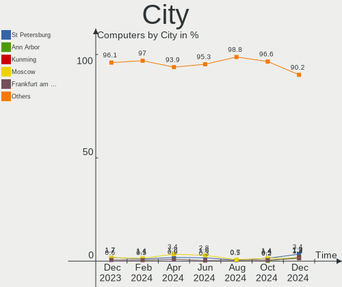
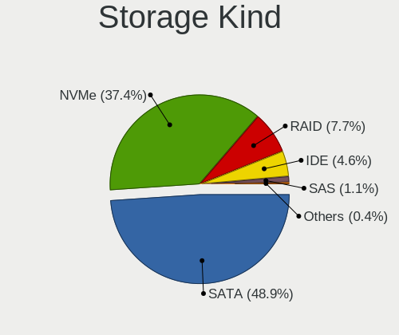
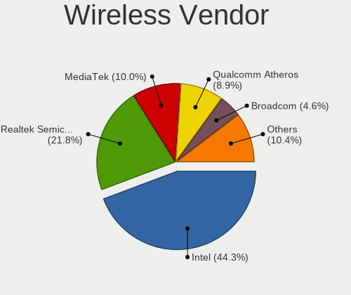
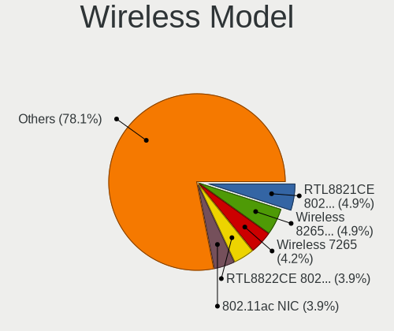

Debian - Hardware Trends
------------------------

A project to identify most popular hardware characteristics and track their change
over time based on data collected by Linux users at https://Linux-Hardware.org.

Anyone can contribute to this report by the [hw-probe](https://github.com/linuxhw/hw-probe) tool:

    sudo -E hw-probe -all -upload

This is a report for all computer types. See also reports for [desktops](/Dist/Debian/Desktop/README.md) and [notebooks](/Dist/Debian/Notebook/README.md).

This report is for one last month. Overall report since the beginning of time: [TestCoverage](https://github.com/linuxhw/TestCoverage)

Period: Jan, 2023.

Contents
--------

* [ System ](#system)
  - [ OS                       ](#os)
  - [ OS Family                ](#os-family)
  - [ Kernel                   ](#kernel)
  - [ Kernel Family            ](#kernel-family)
  - [ Kernel Major Ver.        ](#kernel-major-ver)
  - [ Arch                     ](#arch)
  - [ DE                       ](#de)
  - [ Display Server           ](#display-server)
  - [ Display Manager          ](#display-manager)
  - [ OS Lang                  ](#os-lang)
  - [ Boot Mode                ](#boot-mode)
  - [ Filesystem               ](#filesystem)
  - [ Part. scheme             ](#part-scheme)
  - [ Dual Boot with Linux/BSD ](#dual-boot-with-linuxbsd)
  - [ Dual Boot (Win)          ](#dual-boot-win)

* [ Board ](#board)
  - [ Vendor                   ](#vendor)
  - [ Model                    ](#model)
  - [ Model Family             ](#model-family)
  - [ MFG Year                 ](#mfg-year)
  - [ Form Factor              ](#form-factor)
  - [ Secure Boot              ](#secure-boot)
  - [ Coreboot                 ](#coreboot)
  - [ RAM Size                 ](#ram-size)
  - [ RAM Used                 ](#ram-used)
  - [ Total Drives             ](#total-drives)
  - [ Has CD-ROM               ](#has-cd-rom)
  - [ Has Ethernet             ](#has-ethernet)
  - [ Has WiFi                 ](#has-wifi)
  - [ Has Bluetooth            ](#has-bluetooth)

* [ Location ](#location)
  - [ Country                  ](#country)
  - [ City                     ](#city)

* [ Drives ](#drives)
  - [ Drive Vendor             ](#drive-vendor)
  - [ Drive Model              ](#drive-model)
  - [ HDD Vendor               ](#hdd-vendor)
  - [ SSD Vendor               ](#ssd-vendor)
  - [ Drive Kind               ](#drive-kind)
  - [ Drive Connector          ](#drive-connector)
  - [ Drive Size               ](#drive-size)
  - [ Space Total              ](#space-total)
  - [ Space Used               ](#space-used)
  - [ Malfunc. Drives          ](#malfunc-drives)
  - [ Malfunc. Drive Vendor    ](#malfunc-drive-vendor)
  - [ Malfunc. HDD Vendor      ](#malfunc-hdd-vendor)
  - [ Malfunc. Drive Kind      ](#malfunc-drive-kind)
  - [ Failed Drives            ](#failed-drives)
  - [ Failed Drive Vendor      ](#failed-drive-vendor)
  - [ Drive Status             ](#drive-status)

* [ Storage controller ](#storage-controller)
  - [ Storage Vendor           ](#storage-vendor)
  - [ Storage Model            ](#storage-model)
  - [ Storage Kind             ](#storage-kind)

* [ Processor ](#processor)
  - [ CPU Vendor               ](#cpu-vendor)
  - [ CPU Model                ](#cpu-model)
  - [ CPU Model Family         ](#cpu-model-family)
  - [ CPU Cores                ](#cpu-cores)
  - [ CPU Sockets              ](#cpu-sockets)
  - [ CPU Threads              ](#cpu-threads)
  - [ CPU Op-Modes             ](#cpu-op-modes)
  - [ CPU Microcode            ](#cpu-microcode)
  - [ CPU Microarch            ](#cpu-microarch)

* [ Graphics ](#graphics)
  - [ GPU Vendor               ](#gpu-vendor)
  - [ GPU Model                ](#gpu-model)
  - [ GPU Combo                ](#gpu-combo)
  - [ GPU Driver               ](#gpu-driver)
  - [ GPU Memory               ](#gpu-memory)

* [ Monitor ](#monitor)
  - [ Monitor Vendor           ](#monitor-vendor)
  - [ Monitor Model            ](#monitor-model)
  - [ Monitor Resolution       ](#monitor-resolution)
  - [ Monitor Diagonal         ](#monitor-diagonal)
  - [ Monitor Width            ](#monitor-width)
  - [ Aspect Ratio             ](#aspect-ratio)
  - [ Monitor Area             ](#monitor-area)
  - [ Pixel Density            ](#pixel-density)
  - [ Multiple Monitors        ](#multiple-monitors)

* [ Network ](#network)
  - [ Net Controller Vendor    ](#net-controller-vendor)
  - [ Net Controller Model     ](#net-controller-model)
  - [ Wireless Vendor          ](#wireless-vendor)
  - [ Wireless Model           ](#wireless-model)
  - [ Ethernet Vendor          ](#ethernet-vendor)
  - [ Ethernet Model           ](#ethernet-model)
  - [ Net Controller Kind      ](#net-controller-kind)
  - [ Used Controller          ](#used-controller)
  - [ NICs                     ](#nics)
  - [ IPv6                     ](#ipv6)

* [ Bluetooth ](#bluetooth)
  - [ Bluetooth Vendor         ](#bluetooth-vendor)
  - [ Bluetooth Model          ](#bluetooth-model)

* [ Sound ](#sound)
  - [ Sound Vendor             ](#sound-vendor)
  - [ Sound Model              ](#sound-model)

* [ Memory ](#memory)
  - [ Memory Vendor            ](#memory-vendor)
  - [ Memory Model             ](#memory-model)
  - [ Memory Kind              ](#memory-kind)
  - [ Memory Form Factor       ](#memory-form-factor)
  - [ Memory Size              ](#memory-size)
  - [ Memory Speed             ](#memory-speed)

* [ Printers & scanners ](#printers--scanners)
  - [ Printer Vendor           ](#printer-vendor)
  - [ Printer Model            ](#printer-model)
  - [ Scanner Vendor           ](#scanner-vendor)
  - [ Scanner Model            ](#scanner-model)

* [ Camera ](#camera)
  - [ Camera Vendor            ](#camera-vendor)
  - [ Camera Model             ](#camera-model)

* [ Security ](#security)
  - [ Fingerprint Vendor       ](#fingerprint-vendor)
  - [ Fingerprint Model        ](#fingerprint-model)
  - [ Chipcard Vendor          ](#chipcard-vendor)
  - [ Chipcard Model           ](#chipcard-model)

* [ Unsupported ](#unsupported)
  - [ Unsupported Devices      ](#unsupported-devices)
  - [ Unsupported Device Types ](#unsupported-device-types)

System
------

OS
--

Installed operating systems

| Name              | Computers | Percent |
|-------------------|-----------|---------|
| Debian 11         | 282       | 80.34%  |
| Debian            | 56        | 15.95%  |
| Debian 10         | 9         | 2.56%   |
| Debian 9          | 2         | 0.57%   |
| Debian 8          | 1         | 0.28%   |
| Debian 11-updates | 1         | 0.28%   |

OS Family
---------

OS without a version

| Name   | Computers | Percent |
|--------|-----------|---------|
| Debian | 351       | 100%    |

Kernel
------

Version of the Linux kernel

| Version                   | Computers | Percent |
|---------------------------|-----------|---------|
| 5.10.0-20-amd64           | 145       | 41.31%  |
| 6.0.0-6-amd64             | 31        | 8.83%   |
| 5.10.0-2-amd64            | 27        | 7.69%   |
| 5.10.0-21-amd64           | 25        | 7.12%   |
| 6.1.0-1-amd64             | 13        | 3.7%    |
| 6.0.0-0.deb11.6-amd64     | 9         | 2.56%   |
| 5.10.0-19-amd64           | 7         | 1.99%   |
| 5.15.84-v8+               | 6         | 1.71%   |
| 6.0.0-0.deb11.2-amd64     | 5         | 1.42%   |
| 5.15.83-1-pve             | 5         | 1.42%   |
| 6.1.0-2-amd64             | 4         | 1.14%   |
| 5.10.0-16-amd64           | 4         | 1.14%   |
| 6.1.0-1-pve               | 3         | 0.85%   |
| 5.15.76-v8+               | 3         | 0.85%   |
| 5.10.0-18-amd64           | 3         | 0.85%   |
| 5.10.0-14-amd64           | 3         | 0.85%   |
| 4.19.0-23-amd64           | 3         | 0.85%   |
| 6.0.0-2-amd64             | 2         | 0.57%   |
| 5.4.225-odroidxu4         | 2         | 0.57%   |
| 5.19.17-1-pve             | 2         | 0.57%   |
| 5.15.74-1-pve             | 2         | 0.57%   |
| 5.10.0-15-amd64           | 2         | 0.57%   |
| 4.19.0-13-amd64           | 2         | 0.57%   |
| 6.1.5-x64v3-xanmod1       | 1         | 0.28%   |
| 6.1.5-titanide            | 1         | 0.28%   |
| 6.1.0-rc1+                | 1         | 0.28%   |
| 6.1.0-asahi               | 1         | 0.28%   |
| 6.1.0-0-amd64             | 1         | 0.28%   |
| 6.0.0-4-amd64             | 1         | 0.28%   |
| 6.0.0-3.1mx-amd64         | 1         | 0.28%   |
| 6.0.0-10.1-liquorix-amd64 | 1         | 0.28%   |
| 5.4.128-1-pve             | 1         | 0.28%   |
| 5.19.15-dude3             | 1         | 0.28%   |
| 5.19.0-2mx-amd64          | 1         | 0.28%   |
| 5.19.0-0.deb11.2-amd64    | 1         | 0.28%   |
| 5.18.0-3-amd64            | 1         | 0.28%   |
| 5.18.0-0.deb11.4-amd64    | 1         | 0.28%   |
| 5.16.15                   | 1         | 0.28%   |
| 5.16.0-0.bpo.4-amd64      | 1         | 0.28%   |
| 5.15.89-v8+               | 1         | 0.28%   |

Kernel Family
-------------

Linux kernel without a distro release

| Version  | Computers | Percent |
|----------|-----------|---------|
| 5.10.0   | 228       | 64.96%  |
| 6.0.0    | 50        | 14.25%  |
| 6.1.0    | 23        | 6.55%   |
| 4.19.0   | 8         | 2.28%   |
| 5.15.84  | 6         | 1.71%   |
| 5.15.83  | 5         | 1.42%   |
| 5.15.76  | 3         | 0.85%   |
| 6.1.5    | 2         | 0.57%   |
| 5.4.225  | 2         | 0.57%   |
| 5.19.17  | 2         | 0.57%   |
| 5.19.0   | 2         | 0.57%   |
| 5.18.0   | 2         | 0.57%   |
| 5.15.74  | 2         | 0.57%   |
| 5.10.110 | 2         | 0.57%   |
| 5.4.128  | 1         | 0.28%   |
| 5.19.15  | 1         | 0.28%   |
| 5.16.15  | 1         | 0.28%   |
| 5.16.0   | 1         | 0.28%   |
| 5.15.89  | 1         | 0.28%   |
| 5.15.80  | 1         | 0.28%   |
| 5.15.79  | 1         | 0.28%   |
| 5.15.12  | 1         | 0.28%   |
| 5.14.0   | 1         | 0.28%   |
| 5.10.92  | 1         | 0.28%   |
| 5.10.43  | 1         | 0.28%   |
| 5.10.142 | 1         | 0.28%   |
| 4.9.0    | 1         | 0.28%   |
| 4.8.7    | 1         | 0.28%   |

Kernel Major Ver.
-----------------

Linux kernel major version

| Version | Computers | Percent |
|---------|-----------|---------|
| 5.10    | 233       | 66.38%  |
| 6.0     | 50        | 14.25%  |
| 6.1     | 25        | 7.12%   |
| 5.15    | 20        | 5.7%    |
| 4.19    | 8         | 2.28%   |
| 5.19    | 5         | 1.42%   |
| 5.4     | 3         | 0.85%   |
| 5.18    | 2         | 0.57%   |
| 5.16    | 2         | 0.57%   |
| 5.14    | 1         | 0.28%   |
| 4.9     | 1         | 0.28%   |
| 4.8     | 1         | 0.28%   |

Arch
----

OS architecture (x86_64, i586, etc.)

| Name    | Computers | Percent |
|---------|-----------|---------|
| x86_64  | 328       | 93.45%  |
| aarch64 | 15        | 4.27%   |
| i686    | 5         | 1.42%   |
| armv7l  | 3         | 0.85%   |

DE
--

Desktop Environment

| Name              | Computers | Percent |
|-------------------|-----------|---------|
| GNOME             | 97        | 27.64%  |
| Unknown           | 74        | 21.08%  |
| KDE5              | 58        | 16.52%  |
| XFCE              | 42        | 11.97%  |
| X-Cinnamon        | 18        | 5.13%   |
| LXDE              | 18        | 5.13%   |
| Cinnamon          | 14        | 3.99%   |
| MATE              | 11        | 3.13%   |
| LXQt              | 6         | 1.71%   |
| KDE               | 4         | 1.14%   |
| i3                | 2         | 0.57%   |
| x-session-manager | 1         | 0.28%   |
| Openbox           | 1         | 0.28%   |
| lightdm-xsession  | 1         | 0.28%   |
| GNOME Flashback   | 1         | 0.28%   |
| fluxbox           | 1         | 0.28%   |
| Budgie            | 1         | 0.28%   |
| /etc/X11/Xsession | 1         | 0.28%   |

Display Server
--------------

X11 or Wayland

| Name        | Computers | Percent |
|-------------|-----------|---------|
| X11         | 198       | 56.41%  |
| Wayland     | 65        | 18.52%  |
| Tty         | 50        | 14.25%  |
| Unknown     | 37        | 10.54%  |
| Unspecified | 1         | 0.28%   |

Display Manager
---------------

SDDM, LightDM, etc.

| Name    | Computers | Percent |
|---------|-----------|---------|
| Unknown | 115       | 32.76%  |
| LightDM | 98        | 27.92%  |
| GDM     | 63        | 17.95%  |
| SDDM    | 41        | 11.68%  |
| GDM3    | 29        | 8.26%   |
| XDM     | 2         | 0.57%   |
| LXDM    | 2         | 0.57%   |
| NODM    | 1         | 0.28%   |

OS Lang
-------

Language

| Lang    | Computers | Percent |
|---------|-----------|---------|
| en_US   | 127       | 36.18%  |
| ru_RU   | 46        | 13.11%  |
| de_DE   | 28        | 7.98%   |
| en_GB   | 26        | 7.41%   |
| fr_FR   | 16        | 4.56%   |
| es_ES   | 12        | 3.42%   |
| pt_BR   | 11        | 3.13%   |
| pl_PL   | 11        | 3.13%   |
| it_IT   | 10        | 2.85%   |
| en_CA   | 8         | 2.28%   |
| C       | 6         | 1.71%   |
| es_MX   | 5         | 1.42%   |
| Unknown | 5         | 1.42%   |
| zh_CN   | 4         | 1.14%   |
| es_VE   | 3         | 0.85%   |
| de_CH   | 3         | 0.85%   |
| nl_NL   | 2         | 0.57%   |
| ja_JP   | 2         | 0.57%   |
| es_AR   | 2         | 0.57%   |
| en_AU   | 2         | 0.57%   |
| cs_CZ   | 2         | 0.57%   |
| zh_TW   | 1         | 0.28%   |
| sk_SK   | 1         | 0.28%   |
| pt_PT   | 1         | 0.28%   |
| id_ID   | 1         | 0.28%   |
| hu_HU   | 1         | 0.28%   |
| fr_BE   | 1         | 0.28%   |
| fi_FI   | 1         | 0.28%   |
| es_GT   | 1         | 0.28%   |
| es_CO   | 1         | 0.28%   |
| es_CL   | 1         | 0.28%   |
| en_NZ   | 1         | 0.28%   |
| en_IL   | 1         | 0.28%   |
| en_HK   | 1         | 0.28%   |
| en_DK   | 1         | 0.28%   |
| el_GR   | 1         | 0.28%   |
| de_IT   | 1         | 0.28%   |
| de_AT   | 1         | 0.28%   |
| da_DK   | 1         | 0.28%   |
| bg_BG   | 1         | 0.28%   |

Boot Mode
---------

EFI or BIOS

| Mode | Computers | Percent |
|------|-----------|---------|
| EFI  | 203       | 57.83%  |
| BIOS | 148       | 42.17%  |

Filesystem
----------

Type of filesystem

| Type    | Computers | Percent |
|---------|-----------|---------|
| Ext4    | 290       | 82.62%  |
| Overlay | 41        | 11.68%  |
| Btrfs   | 10        | 2.85%   |
| Zfs     | 3         | 0.85%   |
| Xfs     | 3         | 0.85%   |
| Tmpfs   | 1         | 0.28%   |
| Ext3    | 1         | 0.28%   |
| Ext2    | 1         | 0.28%   |
| Aufs    | 1         | 0.28%   |

Part. scheme
------------

Scheme of partitioning

| Type    | Computers | Percent |
|---------|-----------|---------|
| GPT     | 223       | 63.53%  |
| MBR     | 86        | 24.5%   |
| Unknown | 42        | 11.97%  |

Dual Boot with Linux/BSD
------------------------

Hosting more than one Linux/BSD

| Dual boot | Computers | Percent |
|-----------|-----------|---------|
| No        | 307       | 87.46%  |
| Yes       | 44        | 12.54%  |

Dual Boot (Win)
---------------

Hosting Linux and Windows

| Dual boot | Computers | Percent |
|-----------|-----------|---------|
| No        | 228       | 64.96%  |
| Yes       | 123       | 35.04%  |

Board
-----

Vendor
------

Motherboard manufacturer

| Name                           | Computers | Percent |
|--------------------------------|-----------|---------|
| ASUSTek Computer               | 57        | 16.24%  |
| Lenovo                         | 53        | 15.1%   |
| Hewlett-Packard                | 46        | 13.11%  |
| Dell                           | 34        | 9.69%   |
| Gigabyte Technology            | 27        | 7.69%   |
| MSI                            | 19        | 5.41%   |
| Acer                           | 13        | 3.7%    |
| Raspberry Pi Foundation        | 11        | 3.13%   |
| ASRock                         | 11        | 3.13%   |
| Intel                          | 6         | 1.71%   |
| Samsung Electronics            | 5         | 1.42%   |
| Apple                          | 5         | 1.42%   |
| Panasonic                      | 3         | 0.85%   |
| HUAWEI                         | 3         | 0.85%   |
| Google                         | 3         | 0.85%   |
| AZW                            | 3         | 0.85%   |
| ASRockRack                     | 3         | 0.85%   |
| Supermicro                     | 2         | 0.57%   |
| Radxa                          | 2         | 0.57%   |
| Microsoft                      | 2         | 0.57%   |
| Hardkernel                     | 2         | 0.57%   |
| Unknown                        | 2         | 0.57%   |
| Vestel                         | 1         | 0.28%   |
| UMAX                           | 1         | 0.28%   |
| TUXEDO                         | 1         | 0.28%   |
| Toshiba                        | 1         | 0.28%   |
| TI                             | 1         | 0.28%   |
| Techvision                     | 1         | 0.28%   |
| Tactus                         | 1         | 0.28%   |
| Sony                           | 1         | 0.28%   |
| SmbiosType1_SystemManufacturer | 1         | 0.28%   |
| SLIMBOOK                       | 1         | 0.28%   |
| Rockchip                       | 1         | 0.28%   |
| Positivo                       | 1         | 0.28%   |
| Pegatron                       | 1         | 0.28%   |
| Packard Bell                   | 1         | 0.28%   |
| Novatech                       | 1         | 0.28%   |
| NetGear                        | 1         | 0.28%   |
| MPMAN                          | 1         | 0.28%   |
| Medion                         | 1         | 0.28%   |

Model
-----

Motherboard model

| Name                                                         | Computers | Percent |
|--------------------------------------------------------------|-----------|---------|
| Gigabyte P85-D3                                              | 6         | 1.71%   |
| Samsung 300E4C/300E5C/300E7C                                 | 3         | 0.85%   |
| RPi Raspberry Pi 4 Model B Rev 1.1                           | 3         | 0.85%   |
| RPi Raspberry Pi 4 Model B Rev 1.4                           | 2         | 0.57%   |
| RPi Raspberry Pi 3 Model B Rev 1.2                           | 2         | 0.57%   |
| MSI MS-7A34                                                  | 2         | 0.57%   |
| Lenovo IdeaPad 100-15IBD 80QQ                                | 2         | 0.57%   |
| Intel Jasper Lake Client Platform                            | 2         | 0.57%   |
| Hardkernel Odroid XU4                                        | 2         | 0.57%   |
| Dell Latitude 3320                                           | 2         | 0.57%   |
| Dell Inspiron 5502                                           | 2         | 0.57%   |
| ASUS ROG CROSSHAIR VIII HERO                                 | 2         | 0.57%   |
| ASRockRack X470D4U                                           | 2         | 0.57%   |
| Unknown                                                      | 2         | 0.57%   |
| Vestel 14MB24A                                               | 1         | 0.28%   |
| UMAX VisionBook 12Wr                                         | 1         | 0.28%   |
| TUXEDO Aura 15 Gen1                                          | 1         | 0.28%   |
| Toshiba Satellite C55Dt-A                                    | 1         | 0.28%   |
| TI OMAP3 BeagleBoard xM                                      | 1         | 0.28%   |
| Techvision TVI7309X                                          | 1         | 0.28%   |
| Tactus GeoFlex 110                                           | 1         | 0.28%   |
| Supermicro X9DRD-iF/LF                                       | 1         | 0.28%   |
| Supermicro Super Server                                      | 1         | 0.28%   |
| Sony PCG-Z1VA(UC)                                            | 1         | 0.28%   |
| SmbiosType1_SystemManufacturer SmbiosType1_SystemProductName | 1         | 0.28%   |
| SLIMBOOK PRO                                                 | 1         | 0.28%   |
| Samsung R710                                                 | 1         | 0.28%   |
| Samsung 300E4A/300E5A/300E7A                                 | 1         | 0.28%   |
| Rockchip Orange Pi 5                                         | 1         | 0.28%   |
| RPi Raspberry Pi 400 Rev 1.0                                 | 1         | 0.28%   |
| RPi Raspberry Pi 4 Model B Rev 1.5                           | 1         | 0.28%   |
| RPi Raspberry Pi 4 Model B Rev 1.2                           | 1         | 0.28%   |
| RPi Raspberry Pi                                             | 1         | 0.28%   |
| Radxa ROCK Pi 4B                                             | 1         | 0.28%   |
| Radxa ROCK 5B                                                | 1         | 0.28%   |
| Positivo CHT14B                                              | 1         | 0.28%   |
| Pegatron NC701AA-ABA IQ524                                   | 1         | 0.28%   |
| Panasonic FZ55-2                                             | 1         | 0.28%   |
| Panasonic CFSZ6-2                                            | 1         | 0.28%   |
| Panasonic CF-54-2                                            | 1         | 0.28%   |

Model Family
------------

Motherboard model prefix

| Name               | Computers | Percent |
|--------------------|-----------|---------|
| Lenovo ThinkPad    | 24        | 6.84%   |
| Lenovo IdeaPad     | 12        | 3.42%   |
| RPi Raspberry      | 11        | 3.13%   |
| Dell Inspiron      | 11        | 3.13%   |
| HP EliteBook       | 9         | 2.56%   |
| Dell Latitude      | 9         | 2.56%   |
| Acer Aspire        | 8         | 2.28%   |
| ASUS TUF           | 7         | 1.99%   |
| ASUS ROG           | 7         | 1.99%   |
| ASUS PRIME         | 7         | 1.99%   |
| Lenovo ThinkCentre | 6         | 1.71%   |
| HP Compaq          | 6         | 1.71%   |
| Gigabyte P85-D3    | 6         | 1.71%   |
| ASUS VivoBook      | 6         | 1.71%   |
| HP ENVY            | 4         | 1.14%   |
| Dell OptiPlex      | 4         | 1.14%   |
| Samsung 300E4C     | 3         | 0.85%   |
| HP ProLiant        | 3         | 0.85%   |
| HP ProBook         | 3         | 0.85%   |
| HP Pavilion        | 3         | 0.85%   |
| Radxa ROCK         | 2         | 0.57%   |
| MSI MS-7A34        | 2         | 0.57%   |
| Microsoft Surface  | 2         | 0.57%   |
| Lenovo Yoga        | 2         | 0.57%   |
| Intel Jasper       | 2         | 0.57%   |
| HP ZBook           | 2         | 0.57%   |
| HP Stream          | 2         | 0.57%   |
| HP ProDesk         | 2         | 0.57%   |
| HP Laptop          | 2         | 0.57%   |
| HP EliteDesk       | 2         | 0.57%   |
| HP Elite           | 2         | 0.57%   |
| Hardkernel Odroid  | 2         | 0.57%   |
| Gigabyte B450M     | 2         | 0.57%   |
| Dell XPS           | 2         | 0.57%   |
| Dell Vostro        | 2         | 0.57%   |
| Dell Precision     | 2         | 0.57%   |
| Dell PowerEdge     | 2         | 0.57%   |
| ASUS P8H61-MX      | 2         | 0.57%   |
| ASUS P8H61-M       | 2         | 0.57%   |
| ASUS P5G41T-M      | 2         | 0.57%   |

MFG Year
--------

Motherboard manufacture year

| Year    | Computers | Percent |
|---------|-----------|---------|
| 2022    | 35        | 9.97%   |
| 2019    | 35        | 9.97%   |
| 2020    | 34        | 9.69%   |
| 2021    | 32        | 9.12%   |
| 2016    | 23        | 6.55%   |
| 2013    | 22        | 6.27%   |
| 2012    | 22        | 6.27%   |
| 2017    | 21        | 5.98%   |
| 2018    | 20        | 5.7%    |
| 2011    | 19        | 5.41%   |
| Unknown | 18        | 5.13%   |
| 2015    | 17        | 4.84%   |
| 2014    | 14        | 3.99%   |
| 2008    | 12        | 3.42%   |
| 2010    | 9         | 2.56%   |
| 2009    | 6         | 1.71%   |
| 2006    | 5         | 1.42%   |
| 2007    | 3         | 0.85%   |
| 2005    | 3         | 0.85%   |
| 2003    | 1         | 0.28%   |

Form Factor
-----------

Physical design of the computer

| Name           | Computers | Percent |
|----------------|-----------|---------|
| Notebook       | 165       | 47.01%  |
| Desktop        | 141       | 40.17%  |
| System on chip | 17        | 4.84%   |
| Convertible    | 9         | 2.56%   |
| Mini pc        | 8         | 2.28%   |
| Server         | 6         | 1.71%   |
| Tablet         | 3         | 0.85%   |
| All in one     | 2         | 0.57%   |

Secure Boot
-----------

Enabled or disabled

| State    | Computers | Percent |
|----------|-----------|---------|
| Disabled | 328       | 93.45%  |
| Enabled  | 23        | 6.55%   |

Coreboot
--------

Have coreboot on board

| Used | Computers | Percent |
|------|-----------|---------|
| No   | 348       | 99.15%  |
| Yes  | 3         | 0.85%   |

RAM Size
--------

Total RAM memory

| Size in GB  | Computers | Percent |
|-------------|-----------|---------|
| 4.01-8.0    | 85        | 24.22%  |
| 3.01-4.0    | 70        | 19.94%  |
| 16.01-24.0  | 63        | 17.95%  |
| 8.01-16.0   | 47        | 13.39%  |
| 32.01-64.0  | 34        | 9.69%   |
| 1.01-2.0    | 24        | 6.84%   |
| 64.01-256.0 | 17        | 4.84%   |
| 24.01-32.0  | 6         | 1.71%   |
| 2.01-3.0    | 2         | 0.57%   |
| 0.51-1.0    | 2         | 0.57%   |
| 0.01-0.5    | 1         | 0.28%   |

RAM Used
--------

Used RAM memory

| Used GB     | Computers | Percent |
|-------------|-----------|---------|
| 1.01-2.0    | 88        | 25.07%  |
| 2.01-3.0    | 73        | 20.8%   |
| 0.51-1.0    | 65        | 18.52%  |
| 4.01-8.0    | 51        | 14.53%  |
| 3.01-4.0    | 35        | 9.97%   |
| 8.01-16.0   | 21        | 5.98%   |
| 0.01-0.5    | 10        | 2.85%   |
| 16.01-24.0  | 5         | 1.42%   |
| 32.01-64.0  | 1         | 0.28%   |
| 24.01-32.0  | 1         | 0.28%   |
| 64.01-256.0 | 1         | 0.28%   |

Total Drives
------------

Number of drives on board

| Drives | Computers | Percent |
|--------|-----------|---------|
| 1      | 222       | 63.25%  |
| 2      | 82        | 23.36%  |
| 3      | 21        | 5.98%   |
| 4      | 9         | 2.56%   |
| 5      | 7         | 1.99%   |
| 8      | 3         | 0.85%   |
| 7      | 2         | 0.57%   |
| 0      | 2         | 0.57%   |
| 18     | 1         | 0.28%   |
| 13     | 1         | 0.28%   |
| 6      | 1         | 0.28%   |

Has CD-ROM
----------

Has CD-ROM on board

| Presented | Computers | Percent |
|-----------|-----------|---------|
| No        | 260       | 74.07%  |
| Yes       | 91        | 25.93%  |

Has Ethernet
------------

Has Ethernet on board

| Presented | Computers | Percent |
|-----------|-----------|---------|
| Yes       | 292       | 83.19%  |
| No        | 59        | 16.81%  |

Has WiFi
--------

Has WiFi module

| Presented | Computers | Percent |
|-----------|-----------|---------|
| Yes       | 232       | 66.1%   |
| No        | 119       | 33.9%   |

Has Bluetooth
-------------

Has Bluetooth module

| Presented | Computers | Percent |
|-----------|-----------|---------|
| Yes       | 189       | 53.85%  |
| No        | 162       | 46.15%  |

Location
--------

Country
-------

Geographic location (country)

| Country      | Computers | Percent |
|--------------|-----------|---------|
| Russia       | 50        | 14.25%  |
| USA          | 46        | 13.11%  |
| Germany      | 41        | 11.68%  |
| France       | 26        | 7.41%   |
| Brazil       | 18        | 5.13%   |
| Spain        | 15        | 4.27%   |
| Poland       | 14        | 3.99%   |
| Italy        | 14        | 3.99%   |
| Canada       | 14        | 3.99%   |
| Switzerland  | 13        | 3.7%    |
| UK           | 12        | 3.42%   |
| Netherlands  | 10        | 2.85%   |
| Mexico       | 6         | 1.71%   |
| Australia    | 5         | 1.42%   |
| Sweden       | 4         | 1.14%   |
| Romania      | 4         | 1.14%   |
| Japan        | 4         | 1.14%   |
| Czechia      | 4         | 1.14%   |
| Venezuela    | 3         | 0.85%   |
| India        | 3         | 0.85%   |
| Denmark      | 3         | 0.85%   |
| Colombia     | 3         | 0.85%   |
| China        | 3         | 0.85%   |
| Belgium      | 3         | 0.85%   |
| Belarus      | 3         | 0.85%   |
| Portugal     | 2         | 0.57%   |
| Indonesia    | 2         | 0.57%   |
| Hungary      | 2         | 0.57%   |
| Chile        | 2         | 0.57%   |
| Argentina    | 2         | 0.57%   |
| Turkey       | 1         | 0.28%   |
| Tunisia      | 1         | 0.28%   |
| Taiwan       | 1         | 0.28%   |
| South Korea  | 1         | 0.28%   |
| South Africa | 1         | 0.28%   |
| Singapore    | 1         | 0.28%   |
| Serbia       | 1         | 0.28%   |
| Norway       | 1         | 0.28%   |
| New Zealand  | 1         | 0.28%   |
| Lebanon      | 1         | 0.28%   |

City
----

Geographic location (city)

| City               | Computers | Percent |
|--------------------|-----------|---------|
| Voronezh           | 29        | 8.26%   |
| Moscow             | 9         | 2.56%   |
| Paris              | 5         | 1.42%   |
| Grancy             | 5         | 1.42%   |
| Berlin             | 5         | 1.42%   |
| Bangor             | 4         | 1.14%   |
| Toronto            | 3         | 0.85%   |
| Sao Paulo          | 3         | 0.85%   |
| Munich             | 3         | 0.85%   |
| Milan              | 3         | 0.85%   |
| Frankfurt am Main  | 3         | 0.85%   |
| Etobicoke          | 3         | 0.85%   |
| Chambéry          | 3         | 0.85%   |
| Bonn               | 3         | 0.85%   |
| Zurich             | 2         | 0.57%   |
| Windsor            | 2         | 0.57%   |
| Vancouver          | 2         | 0.57%   |
| Valladolid         | 2         | 0.57%   |
| Sydney             | 2         | 0.57%   |
| Stuttgart          | 2         | 0.57%   |
| St Petersburg      | 2         | 0.57%   |
| Santiago           | 2         | 0.57%   |
| San Francisco      | 2         | 0.57%   |
| Rio de Janeiro     | 2         | 0.57%   |
| Prague             | 2         | 0.57%   |
| Phoenix            | 2         | 0.57%   |
| Lüneburg          | 2         | 0.57%   |
| Lisbon             | 2         | 0.57%   |
| Iasi               | 2         | 0.57%   |
| Francofonte        | 2         | 0.57%   |
| Delhi              | 2         | 0.57%   |
| Caracas            | 2         | 0.57%   |
| Brno               | 2         | 0.57%   |
| Barcelona          | 2         | 0.57%   |
| Amsterdam          | 2         | 0.57%   |
| Zuidland           | 1         | 0.28%   |
| Zapotlan el Grande | 1         | 0.28%   |
| Zapopan            | 1         | 0.28%   |
| Zahle              | 1         | 0.28%   |
| Zagreb             | 1         | 0.28%   |

Drives
------

Drive Vendor
------------

Hard drive vendors

| Vendor                    | Computers | Drives | Percent |
|---------------------------|-----------|--------|---------|
| WDC                       | 75        | 96     | 15.21%  |
| Samsung Electronics       | 66        | 80     | 13.39%  |
| Seagate                   | 58        | 88     | 11.76%  |
| Kingston                  | 43        | 47     | 8.72%   |
| Unknown                   | 33        | 38     | 6.69%   |
| SanDisk                   | 27        | 28     | 5.48%   |
| Toshiba                   | 24        | 30     | 4.87%   |
| SK hynix                  | 17        | 17     | 3.45%   |
| Intel                     | 16        | 17     | 3.25%   |
| Hitachi                   | 14        | 15     | 2.84%   |
| Crucial                   | 12        | 12     | 2.43%   |
| Micron Technology         | 10        | 10     | 2.03%   |
| China                     | 8         | 8      | 1.62%   |
| Unknown                   | 8         | 9      | 1.62%   |
| HGST                      | 7         | 11     | 1.42%   |
| Apple                     | 5         | 7      | 1.01%   |
| KIOXIA                    | 4         | 4      | 0.81%   |
| A-DATA Technology         | 4         | 4      | 0.81%   |
| Transcend                 | 3         | 3      | 0.61%   |
| SPCC                      | 3         | 3      | 0.61%   |
| Phison Electronics        | 3         | 3      | 0.61%   |
| Phison                    | 3         | 3      | 0.61%   |
| KingDian                  | 3         | 3      | 0.61%   |
| JMicron Technology        | 3         | 3      | 0.61%   |
| Intenso                   | 3         | 3      | 0.61%   |
| Corsair                   | 3         | 3      | 0.61%   |
| Apacer                    | 3         | 3      | 0.61%   |
| Netac                     | 2         | 2      | 0.41%   |
| Micron/Crucial Technology | 2         | 2      | 0.41%   |
| KIOXIA-EXCERIA            | 2         | 3      | 0.41%   |
| GOODRAM                   | 2         | 4      | 0.41%   |
| XPG                       | 1         | 1      | 0.2%    |
| Teclast                   | 1         | 1      | 0.2%    |
| Team                      | 1         | 1      | 0.2%    |
| T-FORCE                   | 1         | 1      | 0.2%    |
| StoreJet                  | 1         | 1      | 0.2%    |
| SSSTC                     | 1         | 1      | 0.2%    |
| Smartbuy                  | 1         | 1      | 0.2%    |
| Silicon Motion            | 1         | 1      | 0.2%    |
| S3+                       | 1         | 1      | 0.2%    |

Drive Model
-----------

Hard drive models

| Model                                                | Computers | Percent |
|------------------------------------------------------|-----------|---------|
| Toshiba DT01ACA050 500GB                             | 8         | 1.46%   |
| Kingston SA400S37240G 240GB SSD                      | 8         | 1.46%   |
| Unknown                                              | 8         | 1.46%   |
| Kingston SA400S37120G 120GB SSD                      | 6         | 1.1%    |
| SanDisk NVMe SSD Drive 1TB                           | 5         | 0.91%   |
| Samsung NVMe SSD Controller SM981/PM981/PM983 500GB  | 5         | 0.91%   |
| Kingston SA400S37480G 480GB SSD                      | 5         | 0.91%   |
| Unknown MMC Card  32GB                               | 4         | 0.73%   |
| Seagate ST1000DM010-2EP102 1TB                       | 4         | 0.73%   |
| WDC WDS500G2B0C-00PXH0 500GB                         | 3         | 0.55%   |
| WDC WDS500G2B0A-00SM50 500GB SSD                     | 3         | 0.55%   |
| Unknown SD/MMC/MS PRO 2GB                            | 3         | 0.55%   |
| Unknown MMC Card  64GB                               | 3         | 0.55%   |
| Seagate ST2000DM008-2FR102 2TB                       | 3         | 0.55%   |
| Seagate ST1000LM035-1RK172 1TB                       | 3         | 0.55%   |
| SanDisk NVMe SSD Drive 500GB                         | 3         | 0.55%   |
| Samsung SSD 970 EVO Plus 500GB                       | 3         | 0.55%   |
| Samsung SSD 970 EVO Plus 2TB                         | 3         | 0.55%   |
| Samsung SSD 970 EVO Plus 250GB                       | 3         | 0.55%   |
| Samsung SSD 870 EVO 500GB                            | 3         | 0.55%   |
| Samsung SSD 860 EVO 500GB                            | 3         | 0.55%   |
| Samsung SSD 860 EVO 1TB                              | 3         | 0.55%   |
| Samsung SSD 850 EVO 500GB                            | 3         | 0.55%   |
| Samsung NVMe SSD Controller PM9A1/PM9A3/980PRO 512GB | 3         | 0.55%   |
| Kingston SV300S37A120G 120GB SSD                     | 3         | 0.55%   |
| Kingston SUV400S37240G 240GB SSD                     | 3         | 0.55%   |
| WDC WDS480G2G0B-00EPW0 480GB SSD                     | 2         | 0.37%   |
| WDC WD7500BPKT-22PK4T0 752GB                         | 2         | 0.37%   |
| WDC WD5003ABYX-18WERA0 500GB                         | 2         | 0.37%   |
| WDC WD40EZRZ-00WN9B0 4TB                             | 2         | 0.37%   |
| WDC WD40EFRX-68WT0N0 4TB                             | 2         | 0.37%   |
| WDC WD10PURZ-85U8XY0 1TB                             | 2         | 0.37%   |
| WDC WD10EZEX-08WN4A0 1TB                             | 2         | 0.37%   |
| Unknown SE32G  32GB                                  | 2         | 0.37%   |
| Unknown MMC32G  32GB                                 | 2         | 0.37%   |
| Unknown MMC Card  128GB                              | 2         | 0.37%   |
| Unknown BJTD4R  32GB                                 | 2         | 0.37%   |
| SK hynix SKHynix_HFS512GDE9X081N 512GB               | 2         | 0.37%   |
| SK hynix HBG4e  32GB                                 | 2         | 0.37%   |
| Seagate ST9500325AS 500GB                            | 2         | 0.37%   |

HDD Vendor
----------

Hard disk drive vendors

| Vendor              | Computers | Drives | Percent |
|---------------------|-----------|--------|---------|
| Seagate             | 58        | 84     | 36.94%  |
| WDC                 | 50        | 66     | 31.85%  |
| Toshiba             | 20        | 25     | 12.74%  |
| Hitachi             | 14        | 15     | 8.92%   |
| HGST                | 7         | 11     | 4.46%   |
| Samsung Electronics | 4         | 4      | 2.55%   |
| Unknown             | 3         | 3      | 1.91%   |
| StoreJet            | 1         | 1      | 0.64%   |

SSD Vendor
----------

Solid state drive vendors

| Vendor              | Computers | Drives | Percent |
|---------------------|-----------|--------|---------|
| Kingston            | 36        | 39     | 20.57%  |
| Samsung Electronics | 30        | 32     | 17.14%  |
| WDC                 | 14        | 14     | 8%      |
| SanDisk             | 14        | 14     | 8%      |
| Crucial             | 9         | 9      | 5.14%   |
| China               | 8         | 8      | 4.57%   |
| Intel               | 6         | 6      | 3.43%   |
| Apple               | 4         | 4      | 2.29%   |
| A-DATA Technology   | 4         | 4      | 2.29%   |
| Transcend           | 3         | 3      | 1.71%   |
| SPCC                | 3         | 3      | 1.71%   |
| SK hynix            | 3         | 3      | 1.71%   |
| KingDian            | 3         | 3      | 1.71%   |
| Apacer              | 3         | 3      | 1.71%   |
| Netac               | 2         | 2      | 1.14%   |
| Micron Technology   | 2         | 2      | 1.14%   |
| Intenso             | 2         | 2      | 1.14%   |
| GOODRAM             | 2         | 2      | 1.14%   |
| Unknown             | 1         | 1      | 0.57%   |
| Toshiba             | 1         | 1      | 0.57%   |
| Teclast             | 1         | 1      | 0.57%   |
| Team                | 1         | 1      | 0.57%   |
| T-FORCE             | 1         | 1      | 0.57%   |
| Smartbuy            | 1         | 1      | 0.57%   |
| S3+                 | 1         | 1      | 0.57%   |
| Qumo                | 1         | 1      | 0.57%   |
| PNY                 | 1         | 1      | 0.57%   |
| Plextor             | 1         | 1      | 0.57%   |
| Phison              | 1         | 1      | 0.57%   |
| Patriot             | 1         | 1      | 0.57%   |
| OCZ-AGIL            | 1         | 1      | 0.57%   |
| OCZ                 | 1         | 1      | 0.57%   |
| Mushkin             | 1         | 1      | 0.57%   |
| LITEON              | 1         | 1      | 0.57%   |
| Kllisre             | 1         | 1      | 0.57%   |
| KIOXIA-EXCERIA      | 1         | 1      | 0.57%   |
| JMicron Technology  | 1         | 1      | 0.57%   |
| Hewlett-Packard     | 1         | 1      | 0.57%   |
| FORESEE             | 1         | 1      | 0.57%   |
| faspeed             | 1         | 1      | 0.57%   |

Drive Kind
----------

HDD or SSD

| Kind    | Computers | Drives | Percent |
|---------|-----------|--------|---------|
| SSD     | 156       | 180    | 34.51%  |
| HDD     | 131       | 209    | 28.98%  |
| NVMe    | 122       | 145    | 26.99%  |
| MMC     | 38        | 44     | 8.41%   |
| Unknown | 5         | 8      | 1.11%   |

Drive Connector
---------------

SATA, SAS, NVMe, etc.

| Type | Computers | Drives | Percent |
|------|-----------|--------|---------|
| SATA | 234       | 367    | 56.93%  |
| NVMe | 122       | 145    | 29.68%  |
| MMC  | 38        | 44     | 9.25%   |
| SAS  | 17        | 30     | 4.14%   |

Drive Size
----------

Size of hard drive

| Size in TB | Computers | Drives | Percent |
|------------|-----------|--------|---------|
| 0.01-0.5   | 188       | 219    | 60.84%  |
| 0.51-1.0   | 68        | 87     | 22.01%  |
| 1.01-2.0   | 20        | 27     | 6.47%   |
| 3.01-4.0   | 12        | 17     | 3.88%   |
| 4.01-10.0  | 10        | 15     | 3.24%   |
| 2.01-3.0   | 6         | 10     | 1.94%   |
| 10.01-20.0 | 5         | 14     | 1.62%   |

Space Total
-----------

Amount of disk space available on the file system

| Size in GB     | Computers | Percent |
|----------------|-----------|---------|
| 101-250        | 80        | 22.79%  |
| 251-500        | 70        | 19.94%  |
| 501-1000       | 49        | 13.96%  |
| Unknown        | 40        | 11.4%   |
| 51-100         | 32        | 9.12%   |
| 1001-2000      | 22        | 6.27%   |
| More than 3000 | 19        | 5.41%   |
| 21-50          | 18        | 5.13%   |
| 1-20           | 16        | 4.56%   |
| 2001-3000      | 5         | 1.42%   |

Space Used
----------

Amount of used disk space

| Used GB        | Computers | Percent |
|----------------|-----------|---------|
| 1-20           | 137       | 39.03%  |
| 101-250        | 41        | 11.68%  |
| Unknown        | 40        | 11.4%   |
| 21-50          | 36        | 10.26%  |
| 51-100         | 33        | 9.4%    |
| 251-500        | 27        | 7.69%   |
| 501-1000       | 15        | 4.27%   |
| 1001-2000      | 12        | 3.42%   |
| 2001-3000      | 5         | 1.42%   |
| More than 3000 | 4         | 1.14%   |
| 0              | 1         | 0.28%   |

Malfunc. Drives
---------------

Drive models with a malfunction

| Model                                 | Computers | Drives | Percent |
|---------------------------------------|-----------|--------|---------|
| WDC WD800AAJS-00PSA0 80GB             | 1         | 1      | 1.69%   |
| WDC WD6400AAKS-75A7B0 640GB           | 1         | 1      | 1.69%   |
| WDC WD5000AAKX-08U6AA0 500GB          | 1         | 1      | 1.69%   |
| WDC WD40EFRX-68N32N0 4TB              | 1         | 1      | 1.69%   |
| WDC WD3200BEVT-22ZCT0 320GB           | 1         | 1      | 1.69%   |
| WDC WD30EZRX-00SPEB0 3TB              | 1         | 1      | 1.69%   |
| WDC WD2500AAKX-001CA0 250GB           | 1         | 1      | 1.69%   |
| WDC WD10EZEX-21WN4A0 1TB              | 1         | 1      | 1.69%   |
| WDC WD10EARS-00Y5B1 1TB               | 1         | 1      | 1.69%   |
| WDC WD1002FAEX-00Y9A0 1TB             | 1         | 1      | 1.69%   |
| WDC WD1001FALS-40Y6A0 1TB             | 1         | 1      | 1.69%   |
| Toshiba THNSN5256GPUK 256GB           | 1         | 1      | 1.69%   |
| Toshiba MD04ACA400 4TB                | 1         | 1      | 1.69%   |
| Teclast 480GB A800 SSD                | 1         | 1      | 1.69%   |
| SK hynix PC401 NVMe 512GB             | 1         | 1      | 1.69%   |
| SK hynix HFS256G39TND-N210A 256GB SSD | 1         | 1      | 1.69%   |
| SK hynix HFS128G3AMNB-2200A 128GB SSD | 1         | 1      | 1.69%   |
| Seagate STM3250318AS 250GB            | 1         | 1      | 1.69%   |
| Seagate ST500LT012-9WS142 500GB       | 1         | 1      | 1.69%   |
| Seagate ST500LM030-2E717D 500GB       | 1         | 1      | 1.69%   |
| Seagate ST500LM012 HN-M500MBB 500GB   | 1         | 1      | 1.69%   |
| Seagate ST500DM002-1BD142 500GB       | 1         | 1      | 1.69%   |
| Seagate ST380817AS 80GB               | 1         | 1      | 1.69%   |
| Seagate ST3750640AS 752GB             | 1         | 1      | 1.69%   |
| Seagate ST3640323AS 640GB             | 1         | 1      | 1.69%   |
| Seagate ST3320620AS 320GB             | 1         | 1      | 1.69%   |
| Seagate ST3300631AS 304GB             | 1         | 1      | 1.69%   |
| Seagate ST31500341AS 1TB              | 1         | 1      | 1.69%   |
| Seagate ST3000DM001-9YN166 3TB        | 1         | 1      | 1.69%   |
| Seagate ST2000LM015-2E8174 2TB        | 1         | 1      | 1.69%   |
| Seagate ST2000DM008-2FR102 2TB        | 1         | 1      | 1.69%   |
| Seagate ST2000DM006-2DM164 2TB        | 1         | 1      | 1.69%   |
| Seagate ST2000DM001-1CH164 2TB        | 1         | 1      | 1.69%   |
| Seagate ST2000DL003-9VT166 2TB        | 1         | 1      | 1.69%   |
| Seagate ST16000NM001G-2KK103 16TB     | 1         | 1      | 1.69%   |
| Seagate ST1000LM035-1RK172 1TB        | 1         | 1      | 1.69%   |
| Seagate ST1000DM003-9YN162 1TB        | 1         | 1      | 1.69%   |
| Samsung Electronics SSD 980 PRO 1TB   | 1         | 1      | 1.69%   |
| Samsung Electronics HD103SJ 1TB       | 1         | 1      | 1.69%   |
| Plextor PX-128M5S 128GB SSD           | 1         | 1      | 1.69%   |

Malfunc. Drive Vendor
---------------------

Vendors of faulty drives

| Vendor              | Computers | Drives | Percent |
|---------------------|-----------|--------|---------|
| Seagate             | 19        | 20     | 32.76%  |
| WDC                 | 11        | 11     | 18.97%  |
| Hitachi             | 7         | 8      | 12.07%  |
| Kingston            | 5         | 5      | 8.62%   |
| SK hynix            | 3         | 3      | 5.17%   |
| Toshiba             | 2         | 2      | 3.45%   |
| Samsung Electronics | 2         | 2      | 3.45%   |
| Apacer              | 2         | 2      | 3.45%   |
| Teclast             | 1         | 1      | 1.72%   |
| Plextor             | 1         | 1      | 1.72%   |
| Netac               | 1         | 1      | 1.72%   |
| Intel               | 1         | 1      | 1.72%   |
| HGST                | 1         | 1      | 1.72%   |
| China               | 1         | 1      | 1.72%   |
| Unknown             | 1         | 1      | 1.72%   |

Malfunc. HDD Vendor
-------------------

Vendors of faulty HDD drives

| Vendor              | Computers | Drives | Percent |
|---------------------|-----------|--------|---------|
| Seagate             | 19        | 20     | 47.5%   |
| WDC                 | 11        | 11     | 27.5%   |
| Hitachi             | 7         | 8      | 17.5%   |
| Toshiba             | 1         | 1      | 2.5%    |
| Samsung Electronics | 1         | 1      | 2.5%    |
| HGST                | 1         | 1      | 2.5%    |

Malfunc. Drive Kind
-------------------

Kinds of faulty drives

| Kind | Computers | Drives | Percent |
|------|-----------|--------|---------|
| HDD  | 35        | 42     | 66.04%  |
| SSD  | 15        | 15     | 28.3%   |
| NVMe | 3         | 3      | 5.66%   |

Failed Drives
-------------

Failed drive models

Zero info for selected period =(

Failed Drive Vendor
-------------------

Failed drive vendors

Zero info for selected period =(

Drive Status
------------

Number of failed and malfunc. drives

| Status   | Computers | Drives | Percent |
|----------|-----------|--------|---------|
| Works    | 236       | 354    | 60.36%  |
| Detected | 104       | 172    | 26.6%   |
| Malfunc  | 51        | 60     | 13.04%  |

Storage controller
------------------

Storage Vendor
--------------

Storage controller vendors

| Vendor                           | Computers | Percent |
|----------------------------------|-----------|---------|
| Intel                            | 221       | 50.23%  |
| AMD                              | 65        | 14.77%  |
| Samsung Electronics              | 39        | 8.86%   |
| SanDisk                          | 28        | 6.36%   |
| SK hynix                         | 12        | 2.73%   |
| ASMedia Technology               | 10        | 2.27%   |
| Phison Electronics               | 9         | 2.05%   |
| Micron Technology                | 8         | 1.82%   |
| Kingston Technology Company      | 8         | 1.82%   |
| KIOXIA                           | 7         | 1.59%   |
| Micron/Crucial Technology        | 5         | 1.14%   |
| JMicron Technology               | 5         | 1.14%   |
| Toshiba America Info Systems     | 3         | 0.68%   |
| Nvidia                           | 3         | 0.68%   |
| Marvell Technology Group         | 2         | 0.45%   |
| LSI Logic / Symbios Logic        | 2         | 0.45%   |
| Hewlett-Packard                  | 2         | 0.45%   |
| Broadcom / LSI                   | 2         | 0.45%   |
| VIA Technologies                 | 1         | 0.23%   |
| Solid State Storage Technology   | 1         | 0.23%   |
| Silicon Motion                   | 1         | 0.23%   |
| Silicon Integrated Systems [SiS] | 1         | 0.23%   |
| Silicon Image                    | 1         | 0.23%   |
| Realtek Semiconductor            | 1         | 0.23%   |
| MAXIO Technology (Hangzhou)      | 1         | 0.23%   |
| Integrated Technology Express    | 1         | 0.23%   |
| ADATA Technology                 | 1         | 0.23%   |

Storage Model
-------------

Storage controller models

| Model                                                                                   | Computers | Percent |
|-----------------------------------------------------------------------------------------|-----------|---------|
| AMD FCH SATA Controller [AHCI mode]                                                     | 39        | 7.69%   |
| Intel Sunrise Point-LP SATA Controller [AHCI mode]                                      | 24        | 4.73%   |
| Samsung NVMe SSD Controller SM981/PM981/PM983                                           | 21        | 4.14%   |
| Intel Volume Management Device NVMe RAID Controller                                     | 15        | 2.96%   |
| Intel 8 Series/C220 Series Chipset Family 6-port SATA Controller 1 [AHCI mode]          | 15        | 2.96%   |
| Intel 7 Series Chipset Family 6-port SATA Controller [AHCI mode]                        | 14        | 2.76%   |
| AMD 400 Series Chipset SATA Controller                                                  | 12        | 2.37%   |
| Intel 6 Series/C200 Series Chipset Family 6 port Mobile SATA AHCI Controller            | 10        | 1.97%   |
| SanDisk WD Blue SN550 NVMe SSD                                                          | 9         | 1.78%   |
| Samsung NVMe SSD Controller PM9A1/PM9A3/980PRO                                          | 9         | 1.78%   |
| Intel Q170/Q150/B150/H170/H110/Z170/CM236 Chipset SATA Controller [AHCI Mode]           | 9         | 1.78%   |
| AMD SB7x0/SB8x0/SB9x0 SATA Controller [AHCI mode]                                       | 9         | 1.78%   |
| Micron Non-Volatile memory controller                                                   | 8         | 1.58%   |
| Intel Jasper Lake SATA AHCI Controller                                                  | 8         | 1.58%   |
| Intel Celeron/Pentium Silver Processor SATA Controller                                  | 8         | 1.58%   |
| ASMedia ASM1062 Serial ATA Controller                                                   | 8         | 1.58%   |
| SanDisk Non-Volatile memory controller                                                  | 7         | 1.38%   |
| Intel NM10/ICH7 Family SATA Controller [IDE mode]                                       | 7         | 1.38%   |
| Intel 82801G (ICH7 Family) IDE Controller                                               | 7         | 1.38%   |
| Intel 6 Series/C200 Series Chipset Family 6 port Desktop SATA AHCI Controller           | 7         | 1.38%   |
| Intel 200 Series PCH SATA controller [AHCI mode]                                        | 7         | 1.38%   |
| AMD SB7x0/SB8x0/SB9x0 IDE Controller                                                    | 7         | 1.38%   |
| SK hynix Gold P31/PC711 NVMe Solid State Drive                                          | 6         | 1.18%   |
| Samsung NVMe SSD Controller 980                                                         | 6         | 1.18%   |
| Intel Comet Lake SATA AHCI Controller                                                   | 6         | 1.18%   |
| Intel Alder Lake-S PCH SATA Controller [AHCI Mode]                                      | 6         | 1.18%   |
| KIOXIA NVMe SSD Controller BG4                                                          | 5         | 0.99%   |
| Kingston Company Company Non-Volatile memory controller                                 | 5         | 0.99%   |
| Intel Wildcat Point-LP SATA Controller [AHCI Mode]                                      | 5         | 0.99%   |
| Intel 82801 Mobile SATA Controller [RAID mode]                                          | 5         | 0.99%   |
| Intel 8 Series SATA Controller 1 [AHCI mode]                                            | 5         | 0.99%   |
| SanDisk WD Blue SN570 NVMe SSD                                                          | 4         | 0.79%   |
| Phison E12 NVMe Controller                                                              | 4         | 0.79%   |
| Intel Non-Volatile memory controller                                                    | 4         | 0.79%   |
| Intel Cannon Point-LP SATA Controller [AHCI Mode]                                       | 4         | 0.79%   |
| Intel Cannon Lake Mobile PCH SATA AHCI Controller                                       | 4         | 0.79%   |
| Intel Atom Processor E3800 Series SATA AHCI Controller                                  | 4         | 0.79%   |
| Intel 7 Series/C210 Series Chipset Family 6-port SATA Controller [AHCI mode]            | 4         | 0.79%   |
| Intel 6 Series/C200 Series Chipset Family Desktop SATA Controller (IDE mode, ports 4-5) | 4         | 0.79%   |
| Intel 6 Series/C200 Series Chipset Family Desktop SATA Controller (IDE mode, ports 0-3) | 4         | 0.79%   |

Storage Kind
------------

Kind of storage controller (IDE, SATA, NVMe, SAS, ...)

| Kind | Computers | Percent |
|------|-----------|---------|
| SATA | 243       | 55.1%   |
| NVMe | 121       | 27.44%  |
| IDE  | 46        | 10.43%  |
| RAID | 28        | 6.35%   |
| SAS  | 3         | 0.68%   |

Processor
---------

CPU Vendor
----------

Processor vendors

| Vendor  | Computers | Percent |
|---------|-----------|---------|
| Intel   | 253       | 72.08%  |
| AMD     | 80        | 22.79%  |
| ARM     | 17        | 4.84%   |
| Unknown | 1         | 0.28%   |

CPU Model
---------

Processor models

| Model                                         | Computers | Percent |
|-----------------------------------------------|-----------|---------|
| ARM Processor                                 | 14        | 3.99%   |
| Intel Core i3-6006U CPU @ 2.00GHz             | 6         | 1.71%   |
| Intel 11th Gen Core i5-1135G7 @ 2.40GHz       | 6         | 1.71%   |
| Intel Core i5-4440 CPU @ 3.10GHz              | 5         | 1.42%   |
| Intel Celeron N5105 @ 2.00GHz                 | 5         | 1.42%   |
| Intel Celeron N4020 CPU @ 1.10GHz             | 5         | 1.42%   |
| Intel 11th Gen Core i7-1165G7 @ 2.80GHz       | 5         | 1.42%   |
| Intel Core i5-8265U CPU @ 1.60GHz             | 4         | 1.14%   |
| Intel Core i5-7300U CPU @ 2.60GHz             | 4         | 1.14%   |
| Intel Core i5-6300U CPU @ 2.40GHz             | 4         | 1.14%   |
| AMD Ryzen 9 5900X 12-Core Processor           | 4         | 1.14%   |
| Intel Core i5-6500 CPU @ 3.20GHz              | 3         | 0.85%   |
| Intel Core i5-4300U CPU @ 1.90GHz             | 3         | 0.85%   |
| Intel Core i5-10400 CPU @ 2.90GHz             | 3         | 0.85%   |
| Intel Core i5-10210U CPU @ 1.60GHz            | 3         | 0.85%   |
| Intel Atom x5-Z8350 CPU @ 1.44GHz             | 3         | 0.85%   |
| AMD Ryzen 9 3900X 12-Core Processor           | 3         | 0.85%   |
| AMD Ryzen 7 5800X 8-Core Processor            | 3         | 0.85%   |
| AMD Ryzen 5 3500U with Radeon Vega Mobile Gfx | 3         | 0.85%   |
| Intel Pentium CPU G3220 @ 3.00GHz             | 2         | 0.57%   |
| Intel Core i7-8750H CPU @ 2.20GHz             | 2         | 0.57%   |
| Intel Core i7-8650U CPU @ 1.90GHz             | 2         | 0.57%   |
| Intel Core i7-8550U CPU @ 1.80GHz             | 2         | 0.57%   |
| Intel Core i7-7700K CPU @ 4.20GHz             | 2         | 0.57%   |
| Intel Core i7-7500U CPU @ 2.70GHz             | 2         | 0.57%   |
| Intel Core i7-6820HQ CPU @ 2.70GHz            | 2         | 0.57%   |
| Intel Core i7-3630QM CPU @ 2.40GHz            | 2         | 0.57%   |
| Intel Core i5-8365U CPU @ 1.60GHz             | 2         | 0.57%   |
| Intel Core i5-8250U CPU @ 1.60GHz             | 2         | 0.57%   |
| Intel Core i5-7200U CPU @ 2.50GHz             | 2         | 0.57%   |
| Intel Core i5-4460 CPU @ 3.20GHz              | 2         | 0.57%   |
| Intel Core i5-2520M CPU @ 2.50GHz             | 2         | 0.57%   |
| Intel Core i5-2300 CPU @ 2.80GHz              | 2         | 0.57%   |
| Intel Core i3-7100U CPU @ 2.40GHz             | 2         | 0.57%   |
| Intel Core i3-4130 CPU @ 3.40GHz              | 2         | 0.57%   |
| Intel Core i3-2350M CPU @ 2.30GHz             | 2         | 0.57%   |
| Intel Core i3-2330M CPU @ 2.20GHz             | 2         | 0.57%   |
| Intel Core i3-10110U CPU @ 2.10GHz            | 2         | 0.57%   |
| Intel Celeron N5095 @ 2.00GHz                 | 2         | 0.57%   |
| Intel Celeron N4000 CPU @ 1.10GHz             | 2         | 0.57%   |

CPU Model Family
----------------

Processor model prefix

| Model                   | Computers | Percent |
|-------------------------|-----------|---------|
| Intel Core i5           | 66        | 18.8%   |
| Other                   | 51        | 14.53%  |
| Intel Core i7           | 35        | 9.97%   |
| Intel Core i3           | 30        | 8.55%   |
| Intel Celeron           | 28        | 7.98%   |
| AMD Ryzen 5             | 20        | 5.7%    |
| AMD Ryzen 7             | 19        | 5.41%   |
| Intel Pentium           | 15        | 4.27%   |
| Intel Core 2 Duo        | 14        | 3.99%   |
| AMD Ryzen 9             | 10        | 2.85%   |
| Intel Xeon              | 9         | 2.56%   |
| Intel Atom              | 8         | 2.28%   |
| AMD Ryzen 7 PRO         | 3         | 0.85%   |
| AMD FX                  | 3         | 0.85%   |
| Intel Pentium Silver    | 2         | 0.57%   |
| Intel Pentium Dual      | 2         | 0.57%   |
| Intel Pentium 4         | 2         | 0.57%   |
| AMD Ryzen 3             | 2         | 0.57%   |
| AMD Phenom II X6        | 2         | 0.57%   |
| AMD Phenom II X4        | 2         | 0.57%   |
| AMD A6                  | 2         | 0.57%   |
| AMD A4                  | 2         | 0.57%   |
| AMD A10                 | 2         | 0.57%   |
| Intel Pentium M         | 1         | 0.28%   |
| Intel Pentium Gold      | 1         | 0.28%   |
| Intel Pentium Dual-Core | 1         | 0.28%   |
| Intel Pentium D         | 1         | 0.28%   |
| Intel Genuine           | 1         | 0.28%   |
| Intel Core M            | 1         | 0.28%   |
| Intel Core i9           | 1         | 0.28%   |
| Intel Core 2 Quad       | 1         | 0.28%   |
| Intel Core 2            | 1         | 0.28%   |
| AMD Turion II           | 1         | 0.28%   |
| AMD Turion 64 X2 Mobile | 1         | 0.28%   |
| AMD Turion              | 1         | 0.28%   |
| AMD Ryzen Threadripper  | 1         | 0.28%   |
| AMD Ryzen 5 PRO         | 1         | 0.28%   |
| AMD GX                  | 1         | 0.28%   |
| AMD G                   | 1         | 0.28%   |
| AMD EPYC                | 1         | 0.28%   |

CPU Cores
---------

Number of processor cores

| Number  | Computers | Percent |
|---------|-----------|---------|
| 2       | 128       | 36.47%  |
| 4       | 123       | 35.04%  |
| 6       | 34        | 9.69%   |
| 8       | 33        | 9.4%    |
| 12      | 14        | 3.99%   |
| 1       | 6         | 1.71%   |
| 16      | 5         | 1.42%   |
| 10      | 4         | 1.14%   |
| Unknown | 3         | 0.85%   |
| 3       | 1         | 0.28%   |

CPU Sockets
-----------

Number of sockets

| Number  | Computers | Percent |
|---------|-----------|---------|
| 1       | 340       | 96.87%  |
| 2       | 6         | 1.71%   |
| Unknown | 3         | 0.85%   |
| 3       | 2         | 0.57%   |

CPU Threads
-----------

Threads per core (Hyper-Threading)

| Number  | Computers | Percent |
|---------|-----------|---------|
| 2       | 206       | 58.69%  |
| 1       | 142       | 40.46%  |
| Unknown | 3         | 0.85%   |

CPU Op-Modes
------------

CPU Operation Modes (32-bit, 64-bit)

| Op mode        | Computers | Percent |
|----------------|-----------|---------|
| 32-bit, 64-bit | 340       | 96.87%  |
| 64-bit         | 4         | 1.14%   |
| 32-bit         | 4         | 1.14%   |
| Unknown        | 3         | 0.85%   |

CPU Microcode
-------------

Microcode number

| Number     | Computers | Percent |
|------------|-----------|---------|
| Unknown    | 84        | 23.93%  |
| 0x306c3    | 17        | 4.84%   |
| 0x306a9    | 16        | 4.56%   |
| 0x206a7    | 16        | 4.56%   |
| 0x806c1    | 12        | 3.42%   |
| 0x1067a    | 9         | 2.56%   |
| 0x906c0    | 8         | 2.28%   |
| 0x906e9    | 7         | 1.99%   |
| 0x806ea    | 7         | 1.99%   |
| 0x806e9    | 7         | 1.99%   |
| 0x706a8    | 7         | 1.99%   |
| 0x506e3    | 7         | 1.99%   |
| 0x406e3    | 7         | 1.99%   |
| 0x0a201016 | 6         | 1.71%   |
| 0xa0653    | 5         | 1.42%   |
| 0x806ec    | 5         | 1.42%   |
| 0x406c4    | 5         | 1.42%   |
| 0x40651    | 5         | 1.42%   |
| 0x30678    | 5         | 1.42%   |
| 0x08701021 | 5         | 1.42%   |
| 0x906ea    | 4         | 1.14%   |
| 0x90672    | 4         | 1.14%   |
| 0x706a1    | 4         | 1.14%   |
| 0x6fd      | 4         | 1.14%   |
| 0x08600106 | 4         | 1.14%   |
| 0x806d1    | 3         | 0.85%   |
| 0x306e4    | 3         | 0.85%   |
| 0x306d4    | 3         | 0.85%   |
| 0x0a601203 | 3         | 0.85%   |
| 0x0a50000c | 3         | 0.85%   |
| 0x08600104 | 3         | 0.85%   |
| 0x08108109 | 3         | 0.85%   |
| 0x08108102 | 3         | 0.85%   |
| 0xa0671    | 2         | 0.57%   |
| 0x906a4    | 2         | 0.57%   |
| 0x806eb    | 2         | 0.57%   |
| 0x506c9    | 2         | 0.57%   |
| 0x106e5    | 2         | 0.57%   |
| 0x0a404101 | 2         | 0.57%   |
| 0x08701013 | 2         | 0.57%   |

CPU Microarch
-------------

Microarchitecture

| Name             | Computers | Percent |
|------------------|-----------|---------|
| KabyLake         | 48        | 13.68%  |
| Unknown          | 39        | 11.11%  |
| IvyBridge        | 25        | 7.12%   |
| Haswell          | 25        | 7.12%   |
| Skylake          | 20        | 5.7%    |
| SandyBridge      | 20        | 5.7%    |
| Zen 2            | 18        | 5.13%   |
| Zen 3            | 15        | 4.27%   |
| TigerLake        | 15        | 4.27%   |
| Silvermont       | 14        | 3.99%   |
| Goldmont plus    | 11        | 3.13%   |
| Penryn           | 10        | 2.85%   |
| Core             | 9         | 2.56%   |
| Zen+             | 8         | 2.28%   |
| Tremont          | 8         | 2.28%   |
| Broadwell        | 8         | 2.28%   |
| CometLake        | 7         | 1.99%   |
| Zen              | 6         | 1.71%   |
| K10              | 6         | 1.71%   |
| IceLake          | 5         | 1.42%   |
| Nehalem          | 4         | 1.14%   |
| Excavator        | 4         | 1.14%   |
| NetBurst         | 3         | 0.85%   |
| K8 Hammer        | 3         | 0.85%   |
| Bobcat           | 3         | 0.85%   |
| Alderlake Hybrid | 3         | 0.85%   |
| Piledriver       | 2         | 0.57%   |
| P6               | 2         | 0.57%   |
| Jaguar           | 2         | 0.57%   |
| Goldmont         | 2         | 0.57%   |
| Bonnell          | 2         | 0.57%   |
| Westmere         | 1         | 0.28%   |
| Puma             | 1         | 0.28%   |
| K8 & K10 hybrid  | 1         | 0.28%   |
| Bulldozer        | 1         | 0.28%   |

Graphics
--------

GPU Vendor
----------

Vendors of graphics cards

| Vendor                     | Computers | Percent |
|----------------------------|-----------|---------|
| Intel                      | 216       | 55.53%  |
| Nvidia                     | 83        | 21.34%  |
| AMD                        | 79        | 20.31%  |
| Matrox Electronics Systems | 7         | 1.8%    |
| ASPEED Technology          | 4         | 1.03%   |

GPU Model
---------

Graphics card models

| Model                                                                                    | Computers | Percent |
|------------------------------------------------------------------------------------------|-----------|---------|
| Intel TigerLake-LP GT2 [Iris Xe Graphics]                                                | 15        | 3.76%   |
| Intel 2nd Generation Core Processor Family Integrated Graphics Controller                | 15        | 3.76%   |
| Intel Xeon E3-1200 v3/4th Gen Core Processor Integrated Graphics Controller              | 14        | 3.51%   |
| Intel 3rd Gen Core processor Graphics Controller                                         | 13        | 3.26%   |
| Intel HD Graphics 620                                                                    | 11        | 2.76%   |
| Intel Skylake GT2 [HD Graphics 520]                                                      | 9         | 2.26%   |
| Intel GeminiLake [UHD Graphics 600]                                                      | 9         | 2.26%   |
| Intel JasperLake [UHD Graphics]                                                          | 8         | 2.01%   |
| Intel Atom Processor Z36xxx/Z37xxx Series Graphics & Display                             | 8         | 2.01%   |
| Intel WhiskeyLake-U GT2 [UHD Graphics 620]                                               | 7         | 1.75%   |
| Intel UHD Graphics 620                                                                   | 7         | 1.75%   |
| Intel HD Graphics 530                                                                    | 7         | 1.75%   |
| AMD Renoir                                                                               | 7         | 1.75%   |
| Intel Haswell-ULT Integrated Graphics Controller                                         | 6         | 1.5%    |
| Intel Atom/Celeron/Pentium Processor x5-E8000/J3xxx/N3xxx Integrated Graphics Controller | 6         | 1.5%    |
| AMD Picasso/Raven 2 [Radeon Vega Series / Radeon Vega Mobile Series]                     | 6         | 1.5%    |
| Intel TigerLake-H GT1 [UHD Graphics]                                                     | 5         | 1.25%   |
| Intel CometLake-U GT2 [UHD Graphics]                                                     | 5         | 1.25%   |
| Nvidia GP104 [GeForce GTX 1080]                                                          | 4         | 1%      |
| Intel Xeon E3-1200 v2/3rd Gen Core processor Graphics Controller                         | 4         | 1%      |
| Intel HD Graphics 630                                                                    | 4         | 1%      |
| Intel AlderLake-S GT1                                                                    | 4         | 1%      |
| Intel 82G33/G31 Express Integrated Graphics Controller                                   | 4         | 1%      |
| ASPEED Technology ASPEED Graphics Family                                                 | 4         | 1%      |
| AMD Raphael                                                                              | 4         | 1%      |
| AMD Navi 10 [Radeon RX 5600 OEM/5600 XT / 5700/5700 XT]                                  | 4         | 1%      |
| Nvidia GP108 [GeForce GT 1030]                                                           | 3         | 0.75%   |
| Nvidia GK208B [GeForce GT 710]                                                           | 3         | 0.75%   |
| Nvidia GF108 [GeForce GT 730]                                                            | 3         | 0.75%   |
| Nvidia GF108 [GeForce GT 630]                                                            | 3         | 0.75%   |
| Nvidia GA107M [GeForce RTX 3050 Mobile]                                                  | 3         | 0.75%   |
| Matrox Electronics Systems MGA G200eW WPCM450                                            | 3         | 0.75%   |
| Matrox Electronics Systems MGA G200EH                                                    | 3         | 0.75%   |
| Intel Mobile 4 Series Chipset Integrated Graphics Controller                             | 3         | 0.75%   |
| Intel HD Graphics 5500                                                                   | 3         | 0.75%   |
| Intel CometLake-S GT2 [UHD Graphics 630]                                                 | 3         | 0.75%   |
| Intel CoffeeLake-S GT2 [UHD Graphics 630]                                                | 3         | 0.75%   |
| Intel CoffeeLake-H GT2 [UHD Graphics 630]                                                | 3         | 0.75%   |
| Intel 4 Series Chipset Integrated Graphics Controller                                    | 3         | 0.75%   |
| AMD Turks PRO [Radeon HD 6570/7570/8550 / R5 230]                                        | 3         | 0.75%   |

GPU Combo
---------

Combinations of graphics cards

| Name            | Computers | Percent |
|-----------------|-----------|---------|
| 1 x Intel       | 165       | 47.01%  |
| 1 x AMD         | 57        | 16.24%  |
| 1 x Nvidia      | 42        | 11.97%  |
| Intel + Nvidia  | 33        | 9.4%    |
| Other           | 19        | 5.41%   |
| Intel + AMD     | 12        | 3.42%   |
| 1 x Matrox      | 7         | 1.99%   |
| AMD + Nvidia    | 6         | 1.71%   |
| 2 x AMD         | 4         | 1.14%   |
| 1 x ASPEED      | 3         | 0.85%   |
| 2 x Nvidia      | 1         | 0.28%   |
| 2 x Intel       | 1         | 0.28%   |
| Nvidia + ASPEED | 1         | 0.28%   |

GPU Driver
----------

Free vs proprietary

| Driver      | Computers | Percent |
|-------------|-----------|---------|
| Free        | 251       | 71.51%  |
| Unknown     | 74        | 21.08%  |
| Proprietary | 26        | 7.41%   |

GPU Memory
----------

Total video memory

| Size in GB | Computers | Percent |
|------------|-----------|---------|
| Unknown    | 262       | 74.64%  |
| 0.01-0.5   | 28        | 7.98%   |
| 1.01-2.0   | 15        | 4.27%   |
| 0.51-1.0   | 14        | 3.99%   |
| 7.01-8.0   | 11        | 3.13%   |
| 3.01-4.0   | 11        | 3.13%   |
| 5.01-6.0   | 4         | 1.14%   |
| 8.01-16.0  | 4         | 1.14%   |
| 2.01-3.0   | 1         | 0.28%   |
| 16.01-24.0 | 1         | 0.28%   |

Monitor
-------

Monitor Vendor
--------------

Monitor vendors

| Vendor                  | Computers | Percent |
|-------------------------|-----------|---------|
| AU Optronics            | 34        | 11.37%  |
| Samsung Electronics     | 31        | 10.37%  |
| Chimei Innolux          | 27        | 9.03%   |
| BOE                     | 27        | 9.03%   |
| LG Display              | 23        | 7.69%   |
| Goldstar                | 16        | 5.35%   |
| Dell                    | 14        | 4.68%   |
| Acer                    | 13        | 4.35%   |
| Philips                 | 11        | 3.68%   |
| InfoVision              | 8         | 2.68%   |
| Chi Mei Optoelectronics | 7         | 2.34%   |
| BenQ                    | 7         | 2.34%   |
| Hewlett-Packard         | 6         | 2.01%   |
| Unknown                 | 5         | 1.67%   |
| Apple                   | 5         | 1.67%   |
| Ancor Communications    | 5         | 1.67%   |
| PANDA                   | 4         | 1.34%   |
| NEC Computers           | 4         | 1.34%   |
| MSI                     | 4         | 1.34%   |
| Lenovo                  | 4         | 1.34%   |
| AOC                     | 4         | 1.34%   |
| Vestel Elektronik       | 3         | 1%      |
| Sony                    | 3         | 1%      |
| Iiyama                  | 3         | 1%      |
| Sharp                   | 2         | 0.67%   |
| Eizo                    | 2         | 0.67%   |
| ASUSTek Computer        | 2         | 0.67%   |
| ___                     | 1         | 0.33%   |
| Xiaomi                  | 1         | 0.33%   |
| Unknown (XXX)           | 1         | 0.33%   |
| TRU                     | 1         | 0.33%   |
| Thomson                 | 1         | 0.33%   |
| SGT                     | 1         | 0.33%   |
| RTK                     | 1         | 0.33%   |
| Quanta Display          | 1         | 0.33%   |
| Panasonic               | 1         | 0.33%   |
| Optoma                  | 1         | 0.33%   |
| ONN                     | 1         | 0.33%   |
| Mi                      | 1         | 0.33%   |
| LG Philips              | 1         | 0.33%   |

Monitor Model
-------------

Monitor models

| Model                                                                 | Computers | Percent |
|-----------------------------------------------------------------------|-----------|---------|
| Unknown LCD Monitor FFFF 2288x1287 2550x2550mm 142.0-inch             | 4         | 1.32%   |
| InfoVision LCD Monitor IVO057D 1920x1080 309x174mm 14.0-inch          | 4         | 1.32%   |
| Goldstar HDR 4K GSM7707 3840x2160 600x340mm 27.2-inch                 | 3         | 0.99%   |
| Chimei Innolux LCD Monitor CMN15F5 1920x1080 344x193mm 15.5-inch      | 3         | 0.99%   |
| Vestel Elektronik 50FHD_LCD_TV VES3700 1920x1080 1280x720mm 57.8-inch | 2         | 0.66%   |
| Samsung Electronics S24F350 SAM0D20 1920x1080 521x293mm 23.5-inch     | 2         | 0.66%   |
| Philips PHL 221V8 PHLC211 1920x1080 477x268mm 21.5-inch               | 2         | 0.66%   |
| LG Display LCD Monitor LGD0259 1920x1080 345x194mm 15.6-inch          | 2         | 0.66%   |
| Goldstar LG ULTRAWIDE GSM59F1 2560x1080 670x280mm 28.6-inch           | 2         | 0.66%   |
| Dell P2317H DEL40F4 1920x1080 509x286mm 23.0-inch                     | 2         | 0.66%   |
| Chimei Innolux LCD Monitor CMN14C4 1366x768 309x173mm 13.9-inch       | 2         | 0.66%   |
| BOE LCD Monitor BOE09CA 1920x1080 344x194mm 15.5-inch                 | 2         | 0.66%   |
| BOE LCD Monitor BOE0869 1920x1080 344x194mm 15.5-inch                 | 2         | 0.66%   |
| AU Optronics LCD Monitor AUO8174 1280x800 331x207mm 15.4-inch         | 2         | 0.66%   |
| AU Optronics LCD Monitor AUO45EC 1366x768 344x193mm 15.5-inch         | 2         | 0.66%   |
| AU Optronics LCD Monitor AUO38ED 1920x1080 344x193mm 15.5-inch        | 2         | 0.66%   |
| AU Optronics LCD Monitor AUO2B99 1920x1080 293x165mm 13.2-inch        | 2         | 0.66%   |
| AU Optronics LCD Monitor AUO226D 1920x1080 276x155mm 12.5-inch        | 2         | 0.66%   |
| AU Optronics LCD Monitor AUO103D 1920x1080 309x173mm 13.9-inch        | 2         | 0.66%   |
| Ancor Communications VE228 ACI22FA 1920x1080 477x268mm 21.5-inch      | 2         | 0.66%   |
| ___ LCDTV16 ___0101 1360x768                                          | 1         | 0.33%   |
| Xiaomi Woieyeks-4K XMD009A 2880x1800 480x270mm 21.7-inch              | 1         | 0.33%   |
| Vestel Elektronik VES 65OPS01 VES03D7 1920x1080 1430x800mm 64.5-inch  | 1         | 0.33%   |
| Unknown LCDTV16 0101 1920x1080 1600x900mm 72.3-inch                   | 1         | 0.33%   |
| Unknown (XXX) Union TV XXX2841 1920x1080 1209x680mm 54.6-inch         | 1         | 0.33%   |
| TRU LCD Monitor TRU235C 1366x768 256x144mm 11.6-inch                  | 1         | 0.33%   |
| Thomson TCL SMART TV TMN5655 1920x1080 1210x680mm 54.6-inch           | 1         | 0.33%   |
| Sony TV SNYEE01 1920x1080                                             | 1         | 0.33%   |
| Sony TV SNY1802 1920x1080                                             | 1         | 0.33%   |
| Sony SDM-E96D SNYB400 1280x1024 376x301mm 19.0-inch                   | 1         | 0.33%   |
| Sharp LQ100P1JX51 SHP14A6 1800x1200 211x141mm 10.0-inch               | 1         | 0.33%   |
| Sharp LCD Monitor SHP14D1 1920x1200 336x210mm 15.6-inch               | 1         | 0.33%   |
| SGT HDMI SGT2271 1920x1080 480x270mm 21.7-inch                        | 1         | 0.33%   |
| Samsung Electronics U28E590 SAM0C4D 3840x2160 607x345mm 27.5-inch     | 1         | 0.33%   |
| Samsung Electronics T24B301 SAM098E 1920x1080 521x293mm 23.5-inch     | 1         | 0.33%   |
| Samsung Electronics T22E390 SAM0C1E 1920x1080 477x268mm 21.5-inch     | 1         | 0.33%   |
| Samsung Electronics SyncMaster SAM03D2 1680x1050 474x296mm 22.0-inch  | 1         | 0.33%   |
| Samsung Electronics SyncMaster SAM02B6 1920x1200 518x324mm 24.1-inch  | 1         | 0.33%   |
| Samsung Electronics SyncMaster SAM01E1 1280x1024 376x301mm 19.0-inch  | 1         | 0.33%   |
| Samsung Electronics SyncMaster SAM01B7 1280x1024 338x270mm 17.0-inch  | 1         | 0.33%   |

Monitor Resolution
------------------

Monitor screen resolution

| Resolution         | Computers | Percent |
|--------------------|-----------|---------|
| 1920x1080 (FHD)    | 136       | 47.89%  |
| 1366x768 (WXGA)    | 39        | 13.73%  |
| 3840x2160 (4K)     | 19        | 6.69%   |
| 1280x1024 (SXGA)   | 15        | 5.28%   |
| 2560x1440 (QHD)    | 11        | 3.87%   |
| 1600x900 (HD+)     | 10        | 3.52%   |
| 1280x800 (WXGA)    | 8         | 2.82%   |
| 1920x1200 (WUXGA)  | 7         | 2.46%   |
| 3440x1440          | 5         | 1.76%   |
| 2560x1080          | 5         | 1.76%   |
| 1680x1050 (WSXGA+) | 5         | 1.76%   |
| 2288x1287          | 4         | 1.41%   |
| 2880x1800          | 2         | 0.7%    |
| 2560x1600          | 2         | 0.7%    |
| 1440x900 (WXGA+)   | 2         | 0.7%    |
| 1360x768           | 2         | 0.7%    |
| 1024x768 (XGA)     | 2         | 0.7%    |
| 5760x1080          | 1         | 0.35%   |
| 3072x1920          | 1         | 0.35%   |
| 2880x1620          | 1         | 0.35%   |
| 2160x1440          | 1         | 0.35%   |
| 2048x1152          | 1         | 0.35%   |
| 1800x1200          | 1         | 0.35%   |
| 1400x1050          | 1         | 0.35%   |
| 1024x600           | 1         | 0.35%   |
| 1024x576           | 1         | 0.35%   |
| Unknown            | 1         | 0.35%   |

Monitor Diagonal
----------------

Diagonal size in inches

| Inches  | Computers | Percent |
|---------|-----------|---------|
| 15      | 62        | 20.88%  |
| 13      | 33        | 11.11%  |
| 14      | 27        | 9.09%   |
| 24      | 26        | 8.75%   |
| 27      | 22        | 7.41%   |
| 17      | 18        | 6.06%   |
| 23      | 17        | 5.72%   |
| 21      | 17        | 5.72%   |
| 34      | 9         | 3.03%   |
| 19      | 9         | 3.03%   |
| 11      | 8         | 2.69%   |
| Unknown | 7         | 2.36%   |
| 12      | 6         | 2.02%   |
| 142     | 4         | 1.35%   |
| 72      | 4         | 1.35%   |
| 20      | 4         | 1.35%   |
| 84      | 3         | 1.01%   |
| 54      | 3         | 1.01%   |
| 22      | 3         | 1.01%   |
| 16      | 3         | 1.01%   |
| 10      | 3         | 1.01%   |
| 31      | 2         | 0.67%   |
| 25      | 2         | 0.67%   |
| 18      | 2         | 0.67%   |
| 64      | 1         | 0.34%   |
| 36      | 1         | 0.34%   |
| 26      | 1         | 0.34%   |

Monitor Width
-------------

Physical width

| Width in mm    | Computers | Percent |
|----------------|-----------|---------|
| 301-350        | 116       | 39.73%  |
| 501-600        | 59        | 20.21%  |
| 201-300        | 29        | 9.93%   |
| 401-500        | 27        | 9.25%   |
| 351-400        | 23        | 7.88%   |
| 701-800        | 10        | 3.42%   |
| 1501-2000      | 7         | 2.4%    |
| Unknown        | 7         | 2.4%    |
| 601-700        | 6         | 2.05%   |
| More than 2000 | 4         | 1.37%   |
| 1001-1500      | 4         | 1.37%   |

Aspect Ratio
------------

Proportional relationship between the width and the height

| Ratio   | Computers | Percent |
|---------|-----------|---------|
| 16/9    | 210       | 76.09%  |
| 16/10   | 29        | 10.51%  |
| 5/4     | 14        | 5.07%   |
| 21/9    | 9         | 3.26%   |
| Unknown | 5         | 1.81%   |
| 1.00    | 4         | 1.45%   |
| 4/3     | 3         | 1.09%   |
| 6/5     | 1         | 0.36%   |
| 3/2     | 1         | 0.36%   |

Monitor Area
------------

Area in inch²

| Area in inch² | Computers | Percent |
|----------------|-----------|---------|
| 101-110        | 65        | 22.03%  |
| 201-250        | 50        | 16.95%  |
| 81-90          | 49        | 16.61%  |
| 301-350        | 23        | 7.8%    |
| 151-200        | 17        | 5.76%   |
| More than 1000 | 15        | 5.08%   |
| 351-500        | 11        | 3.73%   |
| 71-80          | 10        | 3.39%   |
| 251-300        | 10        | 3.39%   |
| 121-130        | 9         | 3.05%   |
| 51-60          | 8         | 2.71%   |
| 141-150        | 7         | 2.37%   |
| Unknown        | 7         | 2.37%   |
| 61-70          | 6         | 2.03%   |
| 41-50          | 3         | 1.02%   |
| 131-140        | 3         | 1.02%   |
| 501-1000       | 1         | 0.34%   |
| 91-100         | 1         | 0.34%   |

Pixel Density
-------------

Pixels per inch

| Density       | Computers | Percent |
|---------------|-----------|---------|
| 121-160       | 92        | 32.06%  |
| 51-100        | 85        | 29.62%  |
| 101-120       | 65        | 22.65%  |
| 161-240       | 23        | 8.01%   |
| 1-50          | 12        | 4.18%   |
| Unknown       | 7         | 2.44%   |
| More than 240 | 3         | 1.05%   |

Multiple Monitors
-----------------

Total monitors connected

| Total | Computers | Percent |
|-------|-----------|---------|
| 1     | 238       | 67.81%  |
| 0     | 76        | 21.65%  |
| 2     | 33        | 9.4%    |
| 3     | 4         | 1.14%   |

Network
-------

Net Controller Vendor
---------------------

Controller vendors

| Vendor                                | Computers | Percent |
|---------------------------------------|-----------|---------|
| Realtek Semiconductor                 | 186       | 38.27%  |
| Intel                                 | 154       | 31.69%  |
| Qualcomm Atheros                      | 46        | 9.47%   |
| Broadcom                              | 25        | 5.14%   |
| MediaTek                              | 9         | 1.85%   |
| Broadcom Limited                      | 8         | 1.65%   |
| Marvell Technology Group              | 5         | 1.03%   |
| ASIX Electronics                      | 5         | 1.03%   |
| TP-Link                               | 4         | 0.82%   |
| Samsung Electronics                   | 3         | 0.62%   |
| Nvidia                                | 3         | 0.62%   |
| Microchip Technology                  | 3         | 0.62%   |
| DisplayLink                           | 3         | 0.62%   |
| Sierra Wireless                       | 2         | 0.41%   |
| Ralink Technology                     | 2         | 0.41%   |
| Ralink                                | 2         | 0.41%   |
| Lenovo                                | 2         | 0.41%   |
| Ericsson Business Mobile Networks     | 2         | 0.41%   |
| Edimax Technology                     | 2         | 0.41%   |
| Belkin Components                     | 2         | 0.41%   |
| American Megatrends                   | 2         | 0.41%   |
| ZTE WCDMA Technologies MSM            | 1         | 0.21%   |
| Xiaomi                                | 1         | 0.21%   |
| Silicon Integrated Systems [SiS]      | 1         | 0.21%   |
| Qualcomm                              | 1         | 0.21%   |
| QinHeng Electronics                   | 1         | 0.21%   |
| NetGear                               | 1         | 0.21%   |
| Microsoft                             | 1         | 0.21%   |
| Lakeview Research                     | 1         | 0.21%   |
| Huawei Technologies                   | 1         | 0.21%   |
| Hewlett-Packard                       | 1         | 0.21%   |
| Gemtek                                | 1         | 0.21%   |
| Dresden Elektronik                    | 1         | 0.21%   |
| Digitech Systems                      | 1         | 0.21%   |
| D-Link                                | 1         | 0.21%   |
| 802.11g Adapter [Linksys WUSB54GC v3] | 1         | 0.21%   |
| 3Com                                  | 1         | 0.21%   |

Net Controller Model
--------------------

Controller models

| Model                                                             | Computers | Percent |
|-------------------------------------------------------------------|-----------|---------|
| Realtek RTL8111/8168/8411 PCI Express Gigabit Ethernet Controller | 122       | 21.18%  |
| Realtek RTL810xE PCI Express Fast Ethernet controller             | 17        | 2.95%   |
| Realtek RTL8125 2.5GbE Controller                                 | 13        | 2.26%   |
| Intel Wireless 8265 / 8275                                        | 12        | 2.08%   |
| Intel Wi-Fi 6 AX201                                               | 12        | 2.08%   |
| Realtek RTL8822CE 802.11ac PCIe Wireless Network Adapter          | 10        | 1.74%   |
| Intel 82579LM Gigabit Network Connection (Lewisville)             | 10        | 1.74%   |
| Qualcomm Atheros QCA9565 / AR9565 Wireless Network Adapter        | 9         | 1.56%   |
| Qualcomm Atheros QCA9377 802.11ac Wireless Network Adapter        | 9         | 1.56%   |
| Intel I211 Gigabit Network Connection                             | 9         | 1.56%   |
| Realtek RTL8821CE 802.11ac PCIe Wireless Network Adapter          | 8         | 1.39%   |
| Intel Wireless 8260                                               | 8         | 1.39%   |
| Intel Wireless 7260                                               | 8         | 1.39%   |
| Intel Wi-Fi 6 AX200                                               | 8         | 1.39%   |
| Intel Ethernet Controller I225-V                                  | 7         | 1.22%   |
| Intel Ethernet Connection (4) I219-LM                             | 7         | 1.22%   |
| Intel Cannon Point-LP CNVi [Wireless-AC]                          | 7         | 1.22%   |
| Realtek RTL8153 Gigabit Ethernet Adapter                          | 6         | 1.04%   |
| Intel Ethernet Connection (2) I219-LM                             | 6         | 1.04%   |
| MediaTek MT7921 802.11ax PCI Express Wireless Network Adapter     | 5         | 0.87%   |
| Intel Wireless 7265                                               | 5         | 0.87%   |
| Intel Cannon Lake PCH CNVi WiFi                                   | 5         | 0.87%   |
| Broadcom BCM4313 802.11bgn Wireless Network Adapter               | 5         | 0.87%   |
| ASIX AX88179 Gigabit Ethernet                                     | 5         | 0.87%   |
| Realtek RTL8723BE PCIe Wireless Network Adapter                   | 4         | 0.69%   |
| Qualcomm Atheros QCA6174 802.11ac Wireless Network Adapter        | 4         | 0.69%   |
| Qualcomm Atheros AR9485 Wireless Network Adapter                  | 4         | 0.69%   |
| Qualcomm Atheros AR9287 Wireless Network Adapter (PCI-Express)    | 4         | 0.69%   |
| Intel Wi-Fi 6 AX210/AX211/AX411 160MHz                            | 4         | 0.69%   |
| Intel I210 Gigabit Network Connection                             | 4         | 0.69%   |
| Intel Ethernet Connection I219-LM                                 | 4         | 0.69%   |
| Intel Ethernet Connection I217-LM                                 | 4         | 0.69%   |
| Intel Centrino Advanced-N 6205 [Taylor Peak]                      | 4         | 0.69%   |
| Intel Alder Lake-P PCH CNVi WiFi                                  | 4         | 0.69%   |
| Realtek RTL8852AE 802.11ax PCIe Wireless Network Adapter          | 3         | 0.52%   |
| Realtek RTL8723BU 802.11b/g/n WLAN Adapter                        | 3         | 0.52%   |
| Qualcomm Atheros Killer E220x Gigabit Ethernet Controller         | 3         | 0.52%   |
| Microchip SMSC9512/9514 Fast Ethernet Adapter                     | 3         | 0.52%   |
| MediaTek MT7922 802.11ax PCI Express Wireless Network Adapter     | 3         | 0.52%   |
| Intel Wireless 3165                                               | 3         | 0.52%   |

Wireless Vendor
---------------

Wireless vendors

| Vendor                                | Computers | Percent |
|---------------------------------------|-----------|---------|
| Intel                                 | 113       | 46.69%  |
| Realtek Semiconductor                 | 44        | 18.18%  |
| Qualcomm Atheros                      | 36        | 14.88%  |
| Broadcom                              | 16        | 6.61%   |
| MediaTek                              | 9         | 3.72%   |
| Broadcom Limited                      | 4         | 1.65%   |
| TP-Link                               | 3         | 1.24%   |
| Sierra Wireless                       | 2         | 0.83%   |
| Ralink Technology                     | 2         | 0.83%   |
| Ralink                                | 2         | 0.83%   |
| Marvell Technology Group              | 2         | 0.83%   |
| Edimax Technology                     | 2         | 0.83%   |
| Belkin Components                     | 2         | 0.83%   |
| Qualcomm                              | 1         | 0.41%   |
| NetGear                               | 1         | 0.41%   |
| Gemtek                                | 1         | 0.41%   |
| D-Link                                | 1         | 0.41%   |
| 802.11g Adapter [Linksys WUSB54GC v3] | 1         | 0.41%   |

Wireless Model
--------------

Wireless models

| Model                                                          | Computers | Percent |
|----------------------------------------------------------------|-----------|---------|
| Intel Wireless 8265 / 8275                                     | 12        | 4.92%   |
| Intel Wi-Fi 6 AX201                                            | 12        | 4.92%   |
| Realtek RTL8822CE 802.11ac PCIe Wireless Network Adapter       | 10        | 4.1%    |
| Qualcomm Atheros QCA9565 / AR9565 Wireless Network Adapter     | 9         | 3.69%   |
| Qualcomm Atheros QCA9377 802.11ac Wireless Network Adapter     | 9         | 3.69%   |
| Realtek RTL8821CE 802.11ac PCIe Wireless Network Adapter       | 8         | 3.28%   |
| Intel Wireless 8260                                            | 8         | 3.28%   |
| Intel Wireless 7260                                            | 8         | 3.28%   |
| Intel Wi-Fi 6 AX200                                            | 8         | 3.28%   |
| Intel Cannon Point-LP CNVi [Wireless-AC]                       | 7         | 2.87%   |
| MediaTek MT7921 802.11ax PCI Express Wireless Network Adapter  | 5         | 2.05%   |
| Intel Wireless 7265                                            | 5         | 2.05%   |
| Intel Cannon Lake PCH CNVi WiFi                                | 5         | 2.05%   |
| Broadcom BCM4313 802.11bgn Wireless Network Adapter            | 5         | 2.05%   |
| Realtek RTL8723BE PCIe Wireless Network Adapter                | 4         | 1.64%   |
| Qualcomm Atheros QCA6174 802.11ac Wireless Network Adapter     | 4         | 1.64%   |
| Qualcomm Atheros AR9485 Wireless Network Adapter               | 4         | 1.64%   |
| Qualcomm Atheros AR9287 Wireless Network Adapter (PCI-Express) | 4         | 1.64%   |
| Intel Wi-Fi 6 AX210/AX211/AX411 160MHz                         | 4         | 1.64%   |
| Intel Centrino Advanced-N 6205 [Taylor Peak]                   | 4         | 1.64%   |
| Intel Alder Lake-P PCH CNVi WiFi                               | 4         | 1.64%   |
| Realtek RTL8852AE 802.11ax PCIe Wireless Network Adapter       | 3         | 1.23%   |
| Realtek RTL8723BU 802.11b/g/n WLAN Adapter                     | 3         | 1.23%   |
| MediaTek MT7922 802.11ax PCI Express Wireless Network Adapter  | 3         | 1.23%   |
| Intel Wireless 3165                                            | 3         | 1.23%   |
| Intel PRO/Wireless 3945ABG [Golan] Network Connection          | 3         | 1.23%   |
| Intel Gemini Lake PCH CNVi WiFi                                | 3         | 1.23%   |
| Intel Dual Band Wireless-AC 3168NGW [Stone Peak]               | 3         | 1.23%   |
| Intel Comet Lake PCH-LP CNVi WiFi                              | 3         | 1.23%   |
| Intel Alder Lake-S PCH CNVi WiFi                               | 3         | 1.23%   |
| TP-Link TL-WN823N v2/v3 [Realtek RTL8192EU]                    | 2         | 0.82%   |
| Realtek RTL88x2bu [AC1200 Techkey]                             | 2         | 0.82%   |
| Realtek RTL8821AE 802.11ac PCIe Wireless Network Adapter       | 2         | 0.82%   |
| Realtek RTL8188EUS 802.11n Wireless Network Adapter            | 2         | 0.82%   |
| Realtek RTL8188CUS 802.11n WLAN Adapter                        | 2         | 0.82%   |
| Realtek 802.11ac NIC                                           | 2         | 0.82%   |
| Ralink RT2790 Wireless 802.11n 1T/2R PCIe                      | 2         | 0.82%   |
| Qualcomm Atheros AR9285 Wireless Network Adapter (PCI-Express) | 2         | 0.82%   |
| Intel Wireless-AC 9260                                         | 2         | 0.82%   |
| Intel PRO/Wireless 4965 AG or AGN [Kedron] Network Connection  | 2         | 0.82%   |

Ethernet Vendor
---------------

Ethernet vendors

| Vendor                           | Computers | Percent |
|----------------------------------|-----------|---------|
| Realtek Semiconductor            | 164       | 51.57%  |
| Intel                            | 91        | 28.62%  |
| Qualcomm Atheros                 | 13        | 4.09%   |
| Broadcom                         | 12        | 3.77%   |
| ASIX Electronics                 | 5         | 1.57%   |
| Marvell Technology Group         | 4         | 1.26%   |
| Broadcom Limited                 | 4         | 1.26%   |
| Samsung Electronics              | 3         | 0.94%   |
| Nvidia                           | 3         | 0.94%   |
| Microchip Technology             | 3         | 0.94%   |
| DisplayLink                      | 3         | 0.94%   |
| Lenovo                           | 2         | 0.63%   |
| American Megatrends              | 2         | 0.63%   |
| ZTE WCDMA Technologies MSM       | 1         | 0.31%   |
| Xiaomi                           | 1         | 0.31%   |
| TP-Link                          | 1         | 0.31%   |
| Silicon Integrated Systems [SiS] | 1         | 0.31%   |
| Microsoft                        | 1         | 0.31%   |
| Huawei Technologies              | 1         | 0.31%   |
| Hewlett-Packard                  | 1         | 0.31%   |
| Digitech Systems                 | 1         | 0.31%   |
| 3Com                             | 1         | 0.31%   |

Ethernet Model
--------------

Ethernet models

| Model                                                             | Computers | Percent |
|-------------------------------------------------------------------|-----------|---------|
| Realtek RTL8111/8168/8411 PCI Express Gigabit Ethernet Controller | 122       | 37.54%  |
| Realtek RTL810xE PCI Express Fast Ethernet controller             | 17        | 5.23%   |
| Realtek RTL8125 2.5GbE Controller                                 | 13        | 4%      |
| Intel 82579LM Gigabit Network Connection (Lewisville)             | 10        | 3.08%   |
| Intel I211 Gigabit Network Connection                             | 9         | 2.77%   |
| Intel Ethernet Controller I225-V                                  | 7         | 2.15%   |
| Intel Ethernet Connection (4) I219-LM                             | 7         | 2.15%   |
| Realtek RTL8153 Gigabit Ethernet Adapter                          | 6         | 1.85%   |
| Intel Ethernet Connection (2) I219-LM                             | 6         | 1.85%   |
| ASIX AX88179 Gigabit Ethernet                                     | 5         | 1.54%   |
| Intel I210 Gigabit Network Connection                             | 4         | 1.23%   |
| Intel Ethernet Connection I219-LM                                 | 4         | 1.23%   |
| Intel Ethernet Connection I217-LM                                 | 4         | 1.23%   |
| Qualcomm Atheros Killer E220x Gigabit Ethernet Controller         | 3         | 0.92%   |
| Microchip SMSC9512/9514 Fast Ethernet Adapter                     | 3         | 0.92%   |
| Intel I350 Gigabit Network Connection                             | 3         | 0.92%   |
| Intel Ethernet Connection I218-LM                                 | 3         | 0.92%   |
| Intel Ethernet Connection (6) I219-V                              | 3         | 0.92%   |
| Intel Ethernet Connection (2) I219-V                              | 3         | 0.92%   |
| Intel Ethernet Connection (13) I219-LM                            | 3         | 0.92%   |
| Intel 82579V Gigabit Network Connection                           | 3         | 0.92%   |
| Samsung Galaxy series, misc. (tethering mode)                     | 2         | 0.62%   |
| Realtek Killer E2600 Gigabit Ethernet Controller                  | 2         | 0.62%   |
| Qualcomm Atheros AR8121/AR8113/AR8114 Gigabit or Fast Ethernet    | 2         | 0.62%   |
| Nvidia MCP55 Ethernet                                             | 2         | 0.62%   |
| Lenovo ThinkPad Dock Ethernet [Realtek RTL8153B]                  | 2         | 0.62%   |
| Intel Ethernet Connection (6) I219-LM                             | 2         | 0.62%   |
| Intel Ethernet Connection (5) I219-LM                             | 2         | 0.62%   |
| Intel Ethernet Connection (17) I219-LM                            | 2         | 0.62%   |
| Intel Ethernet Connection (14) I219-V                             | 2         | 0.62%   |
| Intel 82566MM Gigabit Network Connection                          | 2         | 0.62%   |
| Broadcom NetXtreme II BCM5709 Gigabit Ethernet                    | 2         | 0.62%   |
| Broadcom NetXtreme BCM5720 Gigabit Ethernet PCIe                  | 2         | 0.62%   |
| American Megatrends Virtual Ethernet.                             | 2         | 0.62%   |
| ZTE WCDMA MSM Spreadtrum Phone                                    | 1         | 0.31%   |
| Xiaomi Mi/Redmi series (RNDIS)                                    | 1         | 0.31%   |
| TP-Link M7200                                                     | 1         | 0.31%   |
| Silicon Integrated Systems [SiS] 191 Gigabit Ethernet Adapter     | 1         | 0.31%   |
| Samsung GT-I9070 (network tethering, USB debugging enabled)       | 1         | 0.31%   |
| Realtek USB 10/100/1G/2.5G LAN                                    | 1         | 0.31%   |

Net Controller Kind
-------------------

Ethernet, WiFi or modem

| Kind     | Computers | Percent |
|----------|-----------|---------|
| Ethernet | 291       | 54.91%  |
| WiFi     | 232       | 43.77%  |
| Modem    | 6         | 1.13%   |
| Unknown  | 1         | 0.19%   |

Used Controller
---------------

Currently used network controller

| Kind     | Computers | Percent |
|----------|-----------|---------|
| Ethernet | 196       | 56.48%  |
| WiFi     | 151       | 43.52%  |

NICs
----

Total network controllers on board

| Total | Computers | Percent |
|-------|-----------|---------|
| 2     | 173       | 49.29%  |
| 1     | 142       | 40.46%  |
| 0     | 23        | 6.55%   |
| 3     | 6         | 1.71%   |
| 4     | 4         | 1.14%   |
| 8     | 3         | 0.85%   |

IPv6
----

IPv6 vs IPv4

| Used | Computers | Percent |
|------|-----------|---------|
| No   | 275       | 78.35%  |
| Yes  | 76        | 21.65%  |

Bluetooth
---------

Bluetooth Vendor
----------------

Controller vendors

| Vendor                          | Computers | Percent |
|---------------------------------|-----------|---------|
| Intel                           | 88        | 45.36%  |
| Realtek Semiconductor           | 24        | 12.37%  |
| Qualcomm Atheros Communications | 20        | 10.31%  |
| Cambridge Silicon Radio         | 10        | 5.15%   |
| IMC Networks                    | 9         | 4.64%   |
| Foxconn / Hon Hai               | 8         | 4.12%   |
| Broadcom                        | 8         | 4.12%   |
| Apple                           | 5         | 2.58%   |
| Realtek                         | 4         | 2.06%   |
| Hewlett-Packard                 | 4         | 2.06%   |
| ASUSTek Computer                | 4         | 2.06%   |
| TP-Link                         | 2         | 1.03%   |
| MediaTek                        | 2         | 1.03%   |
| Lite-On Technology              | 2         | 1.03%   |
| USI                             | 1         | 0.52%   |
| Foxconn International           | 1         | 0.52%   |
| Dell                            | 1         | 0.52%   |
| Alps Electric                   | 1         | 0.52%   |

Bluetooth Model
---------------

Controller models

| Model                                                       | Computers | Percent |
|-------------------------------------------------------------|-----------|---------|
| Intel Bluetooth wireless interface                          | 35        | 18.04%  |
| Intel Bluetooth Device                                      | 21        | 10.82%  |
| Realtek Bluetooth Radio                                     | 17        | 8.76%   |
| Intel Bluetooth 9460/9560 Jefferson Peak (JfP)              | 16        | 8.25%   |
| Qualcomm Atheros  Bluetooth Device                          | 12        | 6.19%   |
| Cambridge Silicon Radio Bluetooth Dongle (HCI mode)         | 10        | 5.15%   |
| Intel AX200 Bluetooth                                       | 7         | 3.61%   |
| Realtek Bluetooth Radio                                     | 4         | 2.06%   |
| Qualcomm Atheros AR3012 Bluetooth 4.0                       | 4         | 2.06%   |
| IMC Networks Wireless_Device                                | 4         | 2.06%   |
| IMC Networks Bluetooth Radio                                | 4         | 2.06%   |
| Foxconn / Hon Hai Wireless_Device                           | 4         | 2.06%   |
| Realtek  Bluetooth 4.2 Adapter                              | 3         | 1.55%   |
| Qualcomm Atheros AR9462 Bluetooth                           | 3         | 1.55%   |
| Intel Wireless-AC 3168 Bluetooth                            | 3         | 1.55%   |
| Intel AX210 Bluetooth                                       | 3         | 1.55%   |
| HP Bluetooth 2.0 Interface [Broadcom BCM2045]               | 3         | 1.55%   |
| TP-Link TPuLink UB500 Adapter                               | 2         | 1.03%   |
| Realtek RTL8821A Bluetooth                                  | 2         | 1.03%   |
| Realtek RTL8723B Bluetooth                                  | 2         | 1.03%   |
| MediaTek Wireless_Device                                    | 2         | 1.03%   |
| Intel Wireless-AC 9260 Bluetooth Adapter                    | 2         | 1.03%   |
| ASUS ASUS USB-BT500                                         | 2         | 1.03%   |
| Apple Built-in Bluetooth 2.0+EDR HCI                        | 2         | 1.03%   |
| Apple Bluetooth Host Controller                             | 2         | 1.03%   |
| USI Bluetooth Device                                        | 1         | 0.52%   |
| Qualcomm Atheros QCA61x4 Bluetooth 4.0                      | 1         | 0.52%   |
| Lite-On Bluetooth Device                                    | 1         | 0.52%   |
| Lite-On Atheros Bluetooth                                   | 1         | 0.52%   |
| Intel Centrino Bluetooth Wireless Transceiver               | 1         | 0.52%   |
| IMC Networks Bluetooth Device                               | 1         | 0.52%   |
| HP Integrated Module with Bluetooth 2.1 Wireless technology | 1         | 0.52%   |
| Foxconn International BCM43142A0 Bluetooth module           | 1         | 0.52%   |
| Foxconn / Hon Hai Broadcom Bluetooth 2.1 Device             | 1         | 0.52%   |
| Foxconn / Hon Hai Bluetooth USB Host Controller             | 1         | 0.52%   |
| Foxconn / Hon Hai Bluetooth Device                          | 1         | 0.52%   |
| Foxconn / Hon Hai BCM20702A0                                | 1         | 0.52%   |
| Dell BCM20702A0 Bluetooth Module                            | 1         | 0.52%   |
| Broadcom HP Portable Valentine                              | 1         | 0.52%   |
| Broadcom HP Portable SoftSailing                            | 1         | 0.52%   |

Sound
-----

Sound Vendor
------------

Sound card vendors

| Vendor                           | Computers | Percent |
|----------------------------------|-----------|---------|
| Intel                            | 237       | 55.5%   |
| AMD                              | 89        | 20.84%  |
| Nvidia                           | 62        | 14.52%  |
| C-Media Electronics              | 7         | 1.64%   |
| Dell                             | 4         | 0.94%   |
| Focusrite-Novation               | 3         | 0.7%    |
| Microsoft                        | 2         | 0.47%   |
| Logitech                         | 2         | 0.47%   |
| Lenovo                           | 2         | 0.47%   |
| KTMicro                          | 2         | 0.47%   |
| Hewlett-Packard                  | 2         | 0.47%   |
| GN Netcom                        | 2         | 0.47%   |
| Generalplus Technology           | 2         | 0.47%   |
| ASUSTek Computer                 | 2         | 0.47%   |
| Yamaha                           | 1         | 0.23%   |
| Texas Instruments                | 1         | 0.23%   |
| TerraTec Electronic              | 1         | 0.23%   |
| SteelSeries ApS                  | 1         | 0.23%   |
| Silicon Integrated Systems [SiS] | 1         | 0.23%   |
| Realtek Semiconductor            | 1         | 0.23%   |
| Micro Star International         | 1         | 0.23%   |
| Giga-Byte Technology             | 1         | 0.23%   |
| Creative Labs                    | 1         | 0.23%   |

Sound Model
-----------

Sound card models

| Model                                                                      | Computers | Percent |
|----------------------------------------------------------------------------|-----------|---------|
| Intel Sunrise Point-LP HD Audio                                            | 30        | 5.91%   |
| AMD Family 17h/19h HD Audio Controller                                     | 29        | 5.71%   |
| AMD Starship/Matisse HD Audio Controller                                   | 21        | 4.13%   |
| Intel 7 Series/C216 Chipset Family High Definition Audio Controller        | 20        | 3.94%   |
| Intel 6 Series/C200 Series Chipset Family High Definition Audio Controller | 20        | 3.94%   |
| Intel Xeon E3-1200 v3/4th Gen Core Processor HD Audio Controller           | 17        | 3.35%   |
| Intel 8 Series/C220 Series Chipset High Definition Audio Controller        | 16        | 3.15%   |
| Intel Tiger Lake-LP Smart Sound Technology Audio Controller                | 15        | 2.95%   |
| AMD Renoir Radeon High Definition Audio Controller                         | 15        | 2.95%   |
| AMD SBx00 Azalia (Intel HDA)                                               | 12        | 2.36%   |
| Intel Celeron/Pentium Silver Processor High Definition Audio               | 11        | 2.17%   |
| Intel NM10/ICH7 Family High Definition Audio Controller                    | 10        | 1.97%   |
| Intel 100 Series/C230 Series Chipset Family HD Audio Controller            | 10        | 1.97%   |
| Intel Jasper Lake HD Audio                                                 | 8         | 1.57%   |
| Intel Cannon Point-LP High Definition Audio Controller                     | 7         | 1.38%   |
| Intel Broadwell-U Audio Controller                                         | 7         | 1.38%   |
| Intel 200 Series PCH HD Audio                                              | 7         | 1.38%   |
| Nvidia GK208 HDMI/DP Audio Controller                                      | 6         | 1.18%   |
| Intel Wildcat Point-LP High Definition Audio Controller                    | 6         | 1.18%   |
| Intel Tiger Lake-H HD Audio Controller                                     | 6         | 1.18%   |
| Intel Haswell-ULT HD Audio Controller                                      | 6         | 1.18%   |
| Intel Cannon Lake PCH cAVS                                                 | 6         | 1.18%   |
| Intel Alder Lake-S HD Audio Controller                                     | 6         | 1.18%   |
| Intel 8 Series HD Audio Controller                                         | 6         | 1.18%   |
| AMD Rembrandt Radeon High Definition Audio Controller                      | 6         | 1.18%   |
| AMD Raven/Raven2/Fenghuang HDMI/DP Audio Controller                        | 6         | 1.18%   |
| Nvidia GP107GL High Definition Audio Controller                            | 5         | 0.98%   |
| Nvidia GF108 High Definition Audio Controller                              | 5         | 0.98%   |
| Intel Comet Lake PCH-LP cAVS                                               | 5         | 0.98%   |
| Intel Atom Processor Z36xxx/Z37xxx Series High Definition Audio Controller | 5         | 0.98%   |
| Intel 82801I (ICH9 Family) HD Audio Controller                             | 5         | 0.98%   |
| AMD Navi 21/23 HDMI/DP Audio Controller                                    | 5         | 0.98%   |
| AMD Navi 10 HDMI Audio                                                     | 5         | 0.98%   |
| Nvidia GP104 High Definition Audio Controller                              | 4         | 0.79%   |
| Intel Audio device                                                         | 4         | 0.79%   |
| Intel Alder Lake PCH-P High Definition Audio Controller                    | 4         | 0.79%   |
| C-Media Electronics Audio Adapter (Unitek Y-247A)                          | 4         | 0.79%   |
| AMD Turks HDMI Audio [Radeon HD 6500/6600 / 6700M Series]                  | 4         | 0.79%   |
| AMD Kabini HDMI/DP Audio                                                   | 4         | 0.79%   |
| AMD Family 17h (Models 00h-0fh) HD Audio Controller                        | 4         | 0.79%   |

Memory
------

Memory Vendor
-------------

Memory module vendors

| Vendor                       | Computers | Percent |
|------------------------------|-----------|---------|
| Samsung Electronics          | 65        | 19.76%  |
| SK hynix                     | 56        | 17.02%  |
| Unknown                      | 41        | 12.46%  |
| Kingston                     | 34        | 10.33%  |
| Micron Technology            | 29        | 8.81%   |
| Crucial                      | 17        | 5.17%   |
| Corsair                      | 16        | 4.86%   |
| G.Skill                      | 12        | 3.65%   |
| A-DATA Technology            | 9         | 2.74%   |
| Unknown                      | 7         | 2.13%   |
| Unknown (ABCD)               | 5         | 1.52%   |
| Patriot                      | 5         | 1.52%   |
| Smart                        | 4         | 1.22%   |
| Ramaxel Technology           | 4         | 1.22%   |
| Team                         | 3         | 0.91%   |
| Nanya Technology             | 2         | 0.61%   |
| GOODRAM                      | 2         | 0.61%   |
| Goldkey                      | 2         | 0.61%   |
| Apacer                       | 2         | 0.61%   |
| Wilk Elektronik              | 1         | 0.3%    |
| Unknown (0x5846)             | 1         | 0.3%    |
| Transcend                    | 1         | 0.3%    |
| PUSKILL                      | 1         | 0.3%    |
| Patriot Memory (PDP Systems) | 1         | 0.3%    |
| Patriot Memory               | 1         | 0.3%    |
| Kllisre                      | 1         | 0.3%    |
| Hewlett-Packard              | 1         | 0.3%    |
| Gold Key                     | 1         | 0.3%    |
| ff                           | 1         | 0.3%    |
| Elpida                       | 1         | 0.3%    |
| ASint Technology             | 1         | 0.3%    |
| AMD                          | 1         | 0.3%    |
| 4ea5                         | 1         | 0.3%    |

Memory Model
------------

Memory module models

| Model                                                            | Computers | Percent |
|------------------------------------------------------------------|-----------|---------|
| Unknown                                                          | 7         | 2.02%   |
| Unknown RAM Module 2GB DIMM SDRAM                                | 5         | 1.45%   |
| Unknown (ABCD) RAM 123456789012345678 2GB SODIMM LPDDR4 2400MT/s | 4         | 1.16%   |
| Samsung RAM M471A5244CB0-CWE 4GB SODIMM DDR4 3200MT/s            | 4         | 1.16%   |
| Samsung RAM M471A1G44AB0-CWE 8GB SODIMM DDR4 3200MT/s            | 4         | 1.16%   |
| Kingston RAM 99U5584-010.A00LF 4GB DIMM DDR3 1866MT/s            | 4         | 1.16%   |
| Corsair RAM CMK16GX4M2B3200C16 8GB DIMM DDR4 3600MT/s            | 3         | 0.87%   |
| Unknown RAM Module 4GB SODIMM DDR2 667MT/s                       | 2         | 0.58%   |
| Unknown RAM Module 4GB Row Of Chips LPDDR4 4267MT/s              | 2         | 0.58%   |
| Unknown RAM Module 4GB DIMM DDR3 1333MT/s                        | 2         | 0.58%   |
| Unknown RAM Module 1GB DIMM SDRAM                                | 2         | 0.58%   |
| Team RAM TEAMGROUP-UD4-3200 8GB DIMM DDR4 3733MT/s               | 2         | 0.58%   |
| SK hynix RAM HMT451S6BFR8A-PB 4096MB SODIMM DDR3 1600MT/s        | 2         | 0.58%   |
| SK hynix RAM HMT451S6AFR8A-PB 4GB SODIMM DDR3 1600MT/s           | 2         | 0.58%   |
| SK hynix RAM HMT351S6CFR8C-PB 4GB SODIMM DDR3 1600MT/s           | 2         | 0.58%   |
| SK hynix RAM HMAA2GS6CJR8N-XN 16GB SODIMM DDR4 3200MT/s          | 2         | 0.58%   |
| SK hynix RAM HMAA1GS6CMR6N-VK 8GB Row Of Chips DDR4 2667MT/s     | 2         | 0.58%   |
| SK hynix RAM HMAA1GS6CJR6N-XN 8GB SODIMM DDR4 3200MT/s           | 2         | 0.58%   |
| SK hynix RAM HMA851S6AFR6N-UH 4GB SODIMM DDR4 2667MT/s           | 2         | 0.58%   |
| SK hynix RAM HMA81GS6DJR8N-XN 8GB SODIMM DDR4 3200MT/s           | 2         | 0.58%   |
| SK hynix RAM HMA81GS6AFR8N-UH 8192MB SODIMM DDR4 2667MT/s        | 2         | 0.58%   |
| Samsung RAM M471B5773CHS-CH9 2GB SODIMM DDR3 4199MT/s            | 2         | 0.58%   |
| Samsung RAM M471A5244CB0-CTD 4GB SODIMM DDR4 3266MT/s            | 2         | 0.58%   |
| Samsung RAM M471A2K43DB1-CTD 16GB SODIMM DDR4 2667MT/s           | 2         | 0.58%   |
| Samsung RAM M471A1K43CB1-CRC 8GB SODIMM DDR4 2667MT/s            | 2         | 0.58%   |
| Samsung RAM M4 70T5663QZ3-CF7 2GB SODIMM SDRAM 2048MT/s          | 2         | 0.58%   |
| Samsung RAM K4EBE304EB-EGCG 8GB Row Of Chips LPDDR3 2133MT/s     | 2         | 0.58%   |
| Micron RAM Module 8GB SODIMM DDR4 3200MT/s                       | 2         | 0.58%   |
| Micron RAM Module 8GB SODIMM DDR4 2133MT/s                       | 2         | 0.58%   |
| Micron RAM 8ATF1G64HZ-3G2R1 8192MB SODIMM DDR4 3200MT/s          | 2         | 0.58%   |
| Micron RAM 4ATF51264HZ-2G6E1 4GB SODIMM DDR4 2667MT/s            | 2         | 0.58%   |
| Kingston RAM 99U5401-011.A00LF 2GB DIMM DDR3 1600MT/s            | 2         | 0.58%   |
| G.Skill RAM F4-3200C16-8GIS 8GB DIMM DDR4 3200MT/s               | 2         | 0.58%   |
| Corsair RAM CMK32GX4M2E3200C16 16GB DIMM DDR4 3200MT/s           | 2         | 0.58%   |
| Wilk Elektronik RAM IRP3600D4V64L17/16G 16GB DIMM DDR4 3600MT/s  | 1         | 0.29%   |
| Unknown RAM Module 8GB SODIMM DDR4 2133MT/s                      | 1         | 0.29%   |
| Unknown RAM Module 8GB SODIMM DDR3 1600MT/s                      | 1         | 0.29%   |
| Unknown RAM Module 8GB DIMM DDR3 1600MT/s                        | 1         | 0.29%   |
| Unknown RAM Module 8192MB DIMM DDR3 1333MT/s                     | 1         | 0.29%   |
| Unknown RAM Module 512MB SODIMM DDR 100MT/s                      | 1         | 0.29%   |

Memory Kind
-----------

Memory module kinds

| Kind    | Computers | Percent |
|---------|-----------|---------|
| DDR4    | 137       | 47.24%  |
| DDR3    | 92        | 31.72%  |
| SDRAM   | 13        | 4.48%   |
| LPDDR4  | 13        | 4.48%   |
| DDR2    | 10        | 3.45%   |
| DDR5    | 8         | 2.76%   |
| Unknown | 8         | 2.76%   |
| LPDDR3  | 4         | 1.38%   |
| DDR     | 3         | 1.03%   |
| LPDDR5  | 2         | 0.69%   |

Memory Form Factor
------------------

Physical design of the memory module

| Name         | Computers | Percent |
|--------------|-----------|---------|
| SODIMM       | 151       | 52.61%  |
| DIMM         | 115       | 40.07%  |
| Row Of Chips | 19        | 6.62%   |
| Unknown      | 2         | 0.7%    |

Memory Size
-----------

Memory module size

| Size  | Computers | Percent |
|-------|-----------|---------|
| 8192  | 102       | 32.9%   |
| 4096  | 94        | 30.32%  |
| 16384 | 47        | 15.16%  |
| 2048  | 39        | 12.58%  |
| 32768 | 13        | 4.19%   |
| 1024  | 12        | 3.87%   |
| 512   | 3         | 0.97%   |

Memory Speed
------------

Memory module speed

| Speed   | Computers | Percent |
|---------|-----------|---------|
| 1600    | 55        | 17.68%  |
| 3200    | 49        | 15.76%  |
| 2667    | 41        | 13.18%  |
| 1333    | 25        | 8.04%   |
| 2400    | 21        | 6.75%   |
| 2133    | 19        | 6.11%   |
| Unknown | 9         | 2.89%   |
| 3600    | 8         | 2.57%   |
| 800     | 8         | 2.57%   |
| 667     | 6         | 1.93%   |
| 4800    | 5         | 1.61%   |
| 3733    | 5         | 1.61%   |
| 1866    | 5         | 1.61%   |
| 1334    | 5         | 1.61%   |
| 1066    | 5         | 1.61%   |
| 2933    | 4         | 1.29%   |
| 2666    | 4         | 1.29%   |
| 6400    | 3         | 0.96%   |
| 4267    | 3         | 0.96%   |
| 3400    | 3         | 0.96%   |
| 3266    | 3         | 0.96%   |
| 3000    | 3         | 0.96%   |
| 1867    | 3         | 0.96%   |
| 1067    | 3         | 0.96%   |
| 4199    | 2         | 0.64%   |
| 2048    | 2         | 0.64%   |
| 6000    | 1         | 0.32%   |
| 5200    | 1         | 0.32%   |
| 4000    | 1         | 0.32%   |
| 3800    | 1         | 0.32%   |
| 2866    | 1         | 0.32%   |
| 2800    | 1         | 0.32%   |
| 2132    | 1         | 0.32%   |
| 975     | 1         | 0.32%   |
| 933     | 1         | 0.32%   |
| 533     | 1         | 0.32%   |
| 266     | 1         | 0.32%   |
| 100     | 1         | 0.32%   |

Printers & scanners
-------------------

Printer Vendor
--------------

Printer device vendors

| Vendor             | Computers | Percent |
|--------------------|-----------|---------|
| Brother Industries | 2         | 66.67%  |
| Kyocera            | 1         | 33.33%  |

Printer Model
-------------

Printer device models

| Model                     | Computers | Percent |
|---------------------------|-----------|---------|
| Kyocera FS-1120MFP        | 1         | 33.33%  |
| Brother HL-L2395DW series | 1         | 33.33%  |
| Brother HL-5350DN series  | 1         | 33.33%  |

Scanner Vendor
--------------

Scanner device vendors

| Vendor | Computers | Percent |
|--------|-----------|---------|
| Canon  | 2         | 100%    |

Scanner Model
-------------

Scanner device models

| Model                                  | Computers | Percent |
|----------------------------------------|-----------|---------|
| Canon CanoScan LiDE 50/LiDE 35/LiDE 40 | 1         | 50%     |
| Canon CanoScan LiDE 210                | 1         | 50%     |

Camera
------

Camera Vendor
-------------

Camera device vendors

| Vendor                                 | Computers | Percent |
|----------------------------------------|-----------|---------|
| Chicony Electronics                    | 35        | 18.92%  |
| IMC Networks                           | 22        | 11.89%  |
| Acer                                   | 19        | 10.27%  |
| Realtek Semiconductor                  | 12        | 6.49%   |
| Microdia                               | 12        | 6.49%   |
| Logitech                               | 9         | 4.86%   |
| Quanta                                 | 7         | 3.78%   |
| Cheng Uei Precision Industry (Foxlink) | 7         | 3.78%   |
| Luxvisions Innotech Limited            | 6         | 3.24%   |
| Lite-On Technology                     | 6         | 3.24%   |
| Apple                                  | 6         | 3.24%   |
| Sunplus Innovation Technology          | 5         | 2.7%    |
| Silicon Motion                         | 5         | 2.7%    |
| Syntek                                 | 4         | 2.16%   |
| Suyin                                  | 4         | 2.16%   |
| Microsoft                              | 3         | 1.62%   |
| Genesys Logic                          | 3         | 1.62%   |
| Alcor Micro                            | 3         | 1.62%   |
| Sonix Technology                       | 2         | 1.08%   |
| Importek                               | 2         | 1.08%   |
| Z-Star Microelectronics                | 1         | 0.54%   |
| Trust                                  | 1         | 0.54%   |
| Tripath Technology                     | 1         | 0.54%   |
| Sunplus IT                             | 1         | 0.54%   |
| Nebraska Furniture Mart                | 1         | 0.54%   |
| KYE Systems (Mouse Systems)            | 1         | 0.54%   |
| Intel                                  | 1         | 0.54%   |
| icSpring                               | 1         | 0.54%   |
| Creative Technology                    | 1         | 0.54%   |
| Arkmicro Technologies                  | 1         | 0.54%   |
| ARC International                      | 1         | 0.54%   |
| Anchor Chips                           | 1         | 0.54%   |
| 2M UVC CAMERA                          | 1         | 0.54%   |

Camera Model
------------

Camera device models

| Model                                                       | Computers | Percent |
|-------------------------------------------------------------|-----------|---------|
| IMC Networks USB2.0 HD UVC WebCam                           | 7         | 3.66%   |
| Realtek Integrated_Webcam_HD                                | 6         | 3.14%   |
| Microdia Integrated_Webcam_HD                               | 6         | 3.14%   |
| IMC Networks Integrated Camera                              | 6         | 3.14%   |
| Chicony Integrated Camera                                   | 6         | 3.14%   |
| Chicony EasyCamera                                          | 5         | 2.62%   |
| Acer Integrated Camera                                      | 5         | 2.62%   |
| Sunplus Integrated_Webcam_HD                                | 3         | 1.57%   |
| Microdia Integrated Webcam                                  | 3         | 1.57%   |
| Luxvisions Innotech Limited HP HD Camera                    | 3         | 1.57%   |
| Lite-On HP HD Camera                                        | 3         | 1.57%   |
| IMC Networks ov9734_azurewave_camera                        | 3         | 1.57%   |
| Chicony Lenovo Integrated Camera (0.3MP)                    | 3         | 1.57%   |
| Chicony HP HD Camera                                        | 3         | 1.57%   |
| Apple iPhone 5/5C/5S/6/SE                                   | 3         | 1.57%   |
| Acer BisonCam,NB Pro                                        | 3         | 1.57%   |
| Syntek Integrated Camera                                    | 2         | 1.05%   |
| Suyin 1.3M WebCam (notebook emachines E730, Acer sub-brand) | 2         | 1.05%   |
| Silicon Motion WebCam SC-13HDL11939N                        | 2         | 1.05%   |
| Quanta HP Wide Vision HD Camera                             | 2         | 1.05%   |
| Quanta HD User Facing                                       | 2         | 1.05%   |
| Microsoft LifeCam HD-3000                                   | 2         | 1.05%   |
| Logitech Webcam C270                                        | 2         | 1.05%   |
| Logitech Webcam C170                                        | 2         | 1.05%   |
| Logitech HD Pro Webcam C920                                 | 2         | 1.05%   |
| IMC Networks USB2.0 VGA UVC WebCam                          | 2         | 1.05%   |
| IMC Networks Lenovo EasyCamera                              | 2         | 1.05%   |
| Genesys Logic USB2.0 Digital Camera                         | 2         | 1.05%   |
| Chicony USB2.0 HD UVC WebCam                                | 2         | 1.05%   |
| Chicony Lenovo EasyCamera                                   | 2         | 1.05%   |
| Chicony Integrated IR Camera                                | 2         | 1.05%   |
| Chicony HD WebCam                                           | 2         | 1.05%   |
| Apple FaceTime HD Camera (Built-in)                         | 2         | 1.05%   |
| Acer USB HD Webcam                                          | 2         | 1.05%   |
| Acer Lenovo Integrated Webcam                               | 2         | 1.05%   |
| Acer BisonCam, NB Pro                                       | 2         | 1.05%   |
| Z-Star Vega USB 2.0 Camera                                  | 1         | 0.52%   |
| Trust HD Webcam                                             | 1         | 0.52%   |
| Tripath PC Camera                                           | 1         | 0.52%   |
| Syntek Sonix 1.3MPixel USB 2.0 Camera                       | 1         | 0.52%   |

Security
--------

Fingerprint Vendor
------------------

Fingerprint sensor vendors

| Vendor                             | Computers | Percent |
|------------------------------------|-----------|---------|
| Validity Sensors                   | 12        | 34.29%  |
| Synaptics                          | 8         | 22.86%  |
| Shenzhen Goodix Technology         | 7         | 20%     |
| Upek                               | 4         | 11.43%  |
| STMicroelectronics                 | 1         | 2.86%   |
| Realtek USB2.0 Finger Print Bridge | 1         | 2.86%   |
| LighTuning Technology              | 1         | 2.86%   |
| AuthenTec                          | 1         | 2.86%   |

Fingerprint Model
-----------------

Fingerprint sensor models

| Model                                                           | Computers | Percent |
|-----------------------------------------------------------------|-----------|---------|
| Validity Sensors VFS495 Fingerprint Reader                      | 4         | 11.43%  |
| Upek Biometric Touchchip/Touchstrip Fingerprint Sensor          | 4         | 11.43%  |
| Validity Sensors VFS491                                         | 3         | 8.57%   |
| Validity Sensors VFS 5011 fingerprint sensor                    | 3         | 8.57%   |
| Synaptics Prometheus MIS Touch Fingerprint Reader               | 3         | 8.57%   |
| Shenzhen Goodix  Fingerprint Device                             | 3         | 8.57%   |
| Shenzhen Goodix Fingerprint Reader                              | 3         | 8.57%   |
| Synaptics Metallica MIS Touch Fingerprint Reader                | 2         | 5.71%   |
| Validity Sensors VFS5011 Fingerprint Reader                     | 1         | 2.86%   |
| Validity Sensors Synaptics WBDI                                 | 1         | 2.86%   |
| Synaptics  WBDI                                                 | 1         | 2.86%   |
| Synaptics Metallica MOH Touch Fingerprint Reader                | 1         | 2.86%   |
| STMicroelectronics Fingerprint Reader                           | 1         | 2.86%   |
| Shenzhen Goodix FingerPrint                                     | 1         | 2.86%   |
| Realtek USB2.0 Finger Print Bridge FocalTech Fingerprint Device | 1         | 2.86%   |
| LighTuning EgisTec Touch Fingerprint Sensor                     | 1         | 2.86%   |
| AuthenTec AES2501 Fingerprint Sensor                            | 1         | 2.86%   |
| Unknown                                                         | 1         | 2.86%   |

Chipcard Vendor
---------------

Chipcard module vendors

| Vendor                | Computers | Percent |
|-----------------------|-----------|---------|
| Alcor Micro           | 5         | 41.67%  |
| Broadcom              | 4         | 33.33%  |
| O2 Micro              | 1         | 8.33%   |
| Lenovo                | 1         | 8.33%   |
| Advanced Card Systems | 1         | 8.33%   |

Chipcard Model
--------------

Chipcard module models

| Model                                                                        | Computers | Percent |
|------------------------------------------------------------------------------|-----------|---------|
| Alcor Micro AU9540 Smartcard Reader                                          | 5         | 41.67%  |
| Broadcom 58200                                                               | 3         | 25%     |
| O2 Micro OZ776 CCID Smartcard Reader                                         | 1         | 8.33%   |
| Lenovo Integrated Smart Card Reader                                          | 1         | 8.33%   |
| Broadcom BCM5880 Secure Applications Processor with fingerprint touch sensor | 1         | 8.33%   |
| Advanced Card Systems ACR39U                                                 | 1         | 8.33%   |

Unsupported
-----------

Unsupported Devices
-------------------

Total unsupported devices on board

| Total | Computers | Percent |
|-------|-----------|---------|
| 0     | 209       | 59.54%  |
| 1     | 110       | 31.34%  |
| 2     | 29        | 8.26%   |
| 3     | 3         | 0.85%   |

Unsupported Device Types
------------------------

Types of unsupported devices

| Type                     | Computers | Percent |
|--------------------------|-----------|---------|
| Graphics card            | 72        | 45%     |
| Fingerprint reader       | 35        | 21.88%  |
| Net/wireless             | 20        | 12.5%   |
| Chipcard                 | 10        | 6.25%   |
| Multimedia controller    | 5         | 3.13%   |
| Camera                   | 5         | 3.13%   |
| Communication controller | 4         | 2.5%    |
| Sound                    | 3         | 1.88%   |
| Unassigned class         | 2         | 1.25%   |
| Net/ethernet             | 2         | 1.25%   |
| Flash memory             | 1         | 0.63%   |
| Firewire controller      | 1         | 0.63%   |

