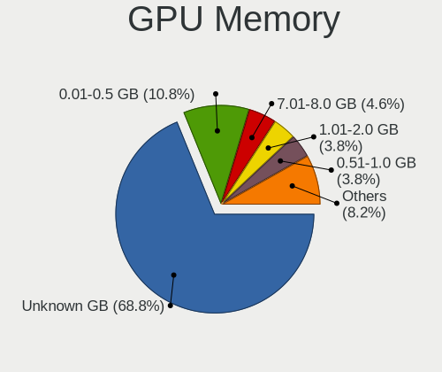
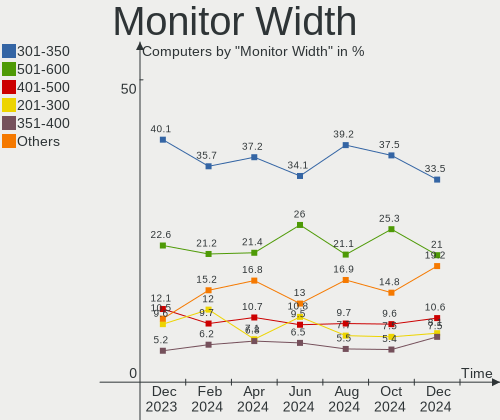

Debian Hardware Trends
----------------------

A project to identify most popular hardware characteristics and track their change
over time based on data collected by Debian users at https://Linux-Hardware.org.

Anyone can contribute to the study by uploading probes of their computers by
the [hw-probe](https://github.com/linuxhw/hw-probe) tool:

    sudo hw-probe -all -upload

This is a report for all computer types. See also reports for [desktops](/Dist/Debian/Desktop/README.md) and [notebooks](/Dist/Debian/Notebook/README.md).

Full-feature report is available here: https://linux-hardware.org/?view=trends

Period: Jan, 2020.

Contents
--------

- [ OS                       ](#os)
- [ OS Family                ](#os-family)
- [ Kernel                   ](#kernel)
- [ Kernel Family            ](#kernel-family)
- [ Kernel Major Ver.        ](#kernel-major-ver)
- [ Arch                     ](#arch)
- [ DE                       ](#de)
- [ Display Server           ](#display-server)
- [ OS Lang                  ](#os-lang)
- [ Boot Mode                ](#boot-mode)
- [ Filesystem               ](#filesystem)
- [ Dual Boot with Linux     ](#dual-boot-with-linux)
- [ Dual Boot (Win)          ](#dual-boot-win)
- [ Country                  ](#country)
- [ City                     ](#city)
- [ Vendor                   ](#vendor)
- [ Model                    ](#model)
- [ Model Family             ](#model-family)
- [ MFG Year                 ](#mfg-year)
- [ Form Factor              ](#form-factor)
- [ Secure Boot              ](#secure-boot)
- [ Coreboot                 ](#coreboot)
- [ RAM Size                 ](#ram-size)
- [ RAM Used                 ](#ram-used)
- [ Drive Vendor             ](#drive-vendor)
- [ Drive Model              ](#drive-model)
- [ Drive Kind               ](#drive-kind)
- [ Drive Connector          ](#drive-connector)
- [ Drive Size               ](#drive-size)
- [ Space Total              ](#space-total)
- [ Space Used               ](#space-used)
- [ Malfunc. Drives          ](#malfunc-drives)
- [ Malfunc. Drive Vendor    ](#malfunc-drive-vendor)
- [ Malfunc. Drive Kind      ](#malfunc-drive-kind)
- [ Failed Drives            ](#failed-drives)
- [ Failed Drive Vendor      ](#failed-drive-vendor)
- [ Drive Status             ](#drive-status)
- [ CPU Vendor               ](#cpu-vendor)
- [ CPU Model                ](#cpu-model)
- [ CPU Model Family         ](#cpu-model-family)
- [ CPU Cores                ](#cpu-cores)
- [ CPU Sockets              ](#cpu-sockets)
- [ CPU Threads              ](#cpu-threads)
- [ CPU Op-Modes             ](#cpu-op-modes)
- [ CPU Microarch            ](#cpu-microarch)
- [ CPU Microcode            ](#cpu-microcode)
- [ GPU Vendor               ](#gpu-vendor)
- [ GPU Model                ](#gpu-model)
- [ GPU Combo                ](#gpu-combo)
- [ GPU Driver               ](#gpu-driver)
- [ GPU Memory               ](#gpu-memory)
- [ Monitor Vendor           ](#monitor-vendor)
- [ Monitor Model            ](#monitor-model)
- [ Monitor Resolution       ](#monitor-resolution)
- [ Monitor Diagonal         ](#monitor-diagonal)
- [ Monitor Width            ](#monitor-width)
- [ Aspect Ratio             ](#aspect-ratio)
- [ Monitor Area             ](#monitor-area)
- [ Pixel Density            ](#pixel-density)
- [ Multiple Monitors        ](#multiple-monitors)
- [ Net Controller Vendor    ](#net-controller-vendor)
- [ Net Controller Model     ](#net-controller-model)
- [ Net Controller Kind      ](#net-controller-kind)
- [ Used Controller          ](#used-controller)
- [ NICs                     ](#nics)
- [ Unsupported Devices      ](#unsupported-devices)
- [ Unsupported Device Types ](#unsupported-device-types)

OS
--

Installed operating systems

| Name            | Computers | Percent |
|-----------------|-----------|---------|
| Debian 10       | 42        | 48.84%  |
| Debian          | 16        | 18.6%   |
| Debian Unstable | 13        | 15.12%  |
| Debian Testing  | 7         | 8.14%   |
| Debian 9        | 6         | 6.98%   |
| Debian 9.11     | 1         | 1.16%   |
| Debian 8.11     | 1         | 1.16%   |

OS Family
---------

OS without a version

| Name   | Computers | Percent |
|--------|-----------|---------|
| Debian | 86        | 100%    |

Kernel
------

Version of the Linux kernel

| Version                      | Computers | Percent |
|------------------------------|-----------|---------|
| 4.19.0-6-amd64               | 24        | 27.91%  |
| 5.4.0-2-amd64                | 9         | 10.47%  |
| 5.4.0-3-amd64                | 7         | 8.14%   |
| 4.9.0-11-amd64               | 6         | 6.98%   |
| 5.4.0-1-amd64                | 5         | 5.81%   |
| 5.3.0-3-amd64                | 4         | 4.65%   |
| 5.4.0-0.bpo.2-amd64          | 2         | 2.33%   |
| 5.3.13-1-pve                 | 2         | 2.33%   |
| 4.9.0-8-amd64                | 2         | 2.33%   |
| 4.15.0-30deepin-generic      | 2         | 2.33%   |
| 5.5.0-rc6-custom+            | 1         | 1.16%   |
| 5.4.5-towo.2-siduction-amd64 | 1         | 1.16%   |
| 5.4.13                       | 1         | 1.16%   |
| 5.4.0-13.1-liquorix-amd64    | 1         | 1.16%   |
| 5.4.0-10.2-liquorix-amd64    | 1         | 1.16%   |
| 5.3.9-bootes2-iommu-p-1000   | 1         | 1.16%   |
| 5.3.6-wyatt                  | 1         | 1.16%   |
| 5.3.11-rockchip64            | 1         | 1.16%   |
| 5.3.0-2-amd64                | 1         | 1.16%   |
| 5.3.0-1-amd64                | 1         | 1.16%   |
| 5.3.0-0.bpo.2-amd64          | 1         | 1.16%   |
| 5.2.21-antix.2-amd64-smp     | 1         | 1.16%   |
| 5.1.2-antix.1-amd64-smp      | 1         | 1.16%   |
| 5.0.18-1-pve                 | 1         | 1.16%   |
| 4.9.0-3-amd64                | 1         | 1.16%   |
| 4.19.67                      | 1         | 1.16%   |
| 4.19.0-7-amd64               | 1         | 1.16%   |
| 4.19.0-6-686-pae             | 1         | 1.16%   |
| 4.19.0-5-686-pae             | 1         | 1.16%   |
| 4.19.0-1-amd64               | 1         | 1.16%   |
| 4.15.18-24-pve               | 1         | 1.16%   |
| 4.15.0-1-amd64               | 1         | 1.16%   |
| 3.16.0-7-586                 | 1         | 1.16%   |

Kernel Family
-------------

Linux kernel without a distro release

| Version | Computers | Percent |
|---------|-----------|---------|
| 4.19.0  | 28        | 32.56%  |
| 5.4.0   | 25        | 29.07%  |
| 4.9.0   | 9         | 10.47%  |
| 5.3.0   | 7         | 8.14%   |
| 4.15.0  | 3         | 3.49%   |
| 5.3.13  | 2         | 2.33%   |
| 5.5.0   | 1         | 1.16%   |
| 5.4.5   | 1         | 1.16%   |
| 5.4.13  | 1         | 1.16%   |
| 5.3.9   | 1         | 1.16%   |
| 5.3.6   | 1         | 1.16%   |
| 5.3.11  | 1         | 1.16%   |
| 5.2.21  | 1         | 1.16%   |
| 5.1.2   | 1         | 1.16%   |
| 5.0.18  | 1         | 1.16%   |
| 4.19.67 | 1         | 1.16%   |
| 4.15.18 | 1         | 1.16%   |
| 3.16.0  | 1         | 1.16%   |

Kernel Major Ver.
-----------------

Linux kernel major version

| Version | Computers | Percent |
|---------|-----------|---------|
| 4.19    | 29        | 33.72%  |
| 5.4     | 27        | 31.4%   |
| 5.3     | 12        | 13.95%  |
| 4.9     | 9         | 10.47%  |
| 4.15    | 4         | 4.65%   |
| 5.5     | 1         | 1.16%   |
| 5.2     | 1         | 1.16%   |
| 5.1     | 1         | 1.16%   |
| 5.0     | 1         | 1.16%   |
| 3.16    | 1         | 1.16%   |

Arch
----

OS architecture (x86_64, i586, etc.)

| Name    | Computers | Percent |
|---------|-----------|---------|
| x86_64  | 82        | 95.35%  |
| i686    | 2         | 2.33%   |
| i586    | 1         | 1.16%   |
| aarch64 | 1         | 1.16%   |

DE
--

Desktop Environment

| Name       | Computers | Percent |
|------------|-----------|---------|
| Unknown    | 23        | 26.74%  |
| XFCE       | 16        | 18.6%   |
| GNOME      | 15        | 17.44%  |
| X-Cinnamon | 7         | 8.14%   |
| MATE       | 6         | 6.98%   |
| KDE        | 5         | 5.81%   |
| i3         | 4         | 4.65%   |
| Cinnamon   | 3         | 3.49%   |
| LXQt       | 2         | 2.33%   |
| LXDE       | 2         | 2.33%   |
| Deepin     | 2         | 2.33%   |
| Trinity    | 1         | 1.16%   |

Display Server
--------------

X11 or Wayland

| Name    | Computers | Percent |
|---------|-----------|---------|
| Unknown | 55        | 63.95%  |
| X11     | 27        | 31.4%   |
| Wayland | 2         | 2.33%   |
| Tty     | 2         | 2.33%   |

OS Lang
-------

Language

| Lang       | Computers | Percent |
|------------|-----------|---------|
| Unknown    | 39        | 45.35%  |
| en_US      | 18        | 20.93%  |
| de_DE      | 8         | 9.3%    |
| ru_RU      | 5         | 5.81%   |
| pt_BR      | 2         | 2.33%   |
| fr_FR      | 2         | 2.33%   |
| pt_PT      | 1         | 1.16%   |
| nl_BE      | 1         | 1.16%   |
| it_IT      | 1         | 1.16%   |
| fr_LU      | 1         | 1.16%   |
| es_ES      | 1         | 1.16%   |
| es_CO      | 1         | 1.16%   |
| en_NZ      | 1         | 1.16%   |
| en_IN      | 1         | 1.16%   |
| en_GB.utf8 | 1         | 1.16%   |
| en_AU      | 1         | 1.16%   |
| de_CH      | 1         | 1.16%   |
| C          | 1         | 1.16%   |

Boot Mode
---------

EFI or BIOS

| Mode | Computers | Percent |
|------|-----------|---------|
| BIOS | 51        | 59.3%   |
| EFI  | 35        | 40.7%   |

Filesystem
----------

Type of filesystem

| Type    | Computers | Percent |
|---------|-----------|---------|
| Ext4    | 78        | 90.7%   |
| Btrfs   | 2         | 2.33%   |
| Unknown | 2         | 2.33%   |
| Zfs     | 1         | 1.16%   |
| Xfs     | 1         | 1.16%   |
| Tmpfs   | 1         | 1.16%   |
| Ext3    | 1         | 1.16%   |

Dual Boot with Linux
--------------------

Hosting more than one Linux

| Dual boot | Computers | Percent |
|-----------|-----------|---------|
| No        | 71        | 82.56%  |
| Yes       | 15        | 17.44%  |

Dual Boot (Win)
---------------

Hosting Linux and Windows

| Dual boot | Computers | Percent |
|-----------|-----------|---------|
| No        | 70        | 81.4%   |
| Yes       | 16        | 18.6%   |

Country
-------

Geographic location (country)

| Country      | Computers | Percent |
|--------------|-----------|---------|
| Germany      | 15        | 17.44%  |
| USA          | 13        | 15.12%  |
| Russia       | 6         | 6.98%   |
| UK           | 5         | 5.81%   |
| France       | 5         | 5.81%   |
| Portugal     | 4         | 4.65%   |
| India        | 3         | 3.49%   |
| Belgium      | 3         | 3.49%   |
| Netherlands  | 2         | 2.33%   |
| Finland      | 2         | 2.33%   |
| Colombia     | 2         | 2.33%   |
| Canada       | 2         | 2.33%   |
| Brazil       | 2         | 2.33%   |
| Australia    | 2         | 2.33%   |
| Ukraine      | 1         | 1.16%   |
| Tunisia      | 1         | 1.16%   |
| Switzerland  | 1         | 1.16%   |
| Sweden       | 1         | 1.16%   |
| Spain        | 1         | 1.16%   |
| South Africa | 1         | 1.16%   |
| Slovenia     | 1         | 1.16%   |
| Slovakia     | 1         | 1.16%   |
| Saudi Arabia | 1         | 1.16%   |
| Romania      | 1         | 1.16%   |
| Poland       | 1         | 1.16%   |
| New Zealand  | 1         | 1.16%   |
| Mongolia     | 1         | 1.16%   |
| Kyrgyzstan   | 1         | 1.16%   |
| Italy        | 1         | 1.16%   |
| Indonesia    | 1         | 1.16%   |
| Hungary      | 1         | 1.16%   |
| Hong Kong    | 1         | 1.16%   |
| Greece       | 1         | 1.16%   |
| Cuba         | 1         | 1.16%   |

City
----

Geographic location (city)

| City                | Computers | Percent |
|---------------------|-----------|---------|
| St Petersburg       | 3         | 3.49%   |
| Lisbon              | 3         | 3.49%   |
| Schaarbeek          | 2         | 2.33%   |
| Munich              | 2         | 2.33%   |
| Montreal            | 2         | 2.33%   |
| Medellín           | 2         | 2.33%   |
| Gotha               | 2         | 2.33%   |
| Chicago             | 2         | 2.33%   |
| Zurich              | 1         | 1.16%   |
| Yekaterinburg       | 1         | 1.16%   |
| Williston           | 1         | 1.16%   |
| Werder              | 1         | 1.16%   |
| Warin               | 1         | 1.16%   |
| Voronezh            | 1         | 1.16%   |
| Vignot              | 1         | 1.16%   |
| Utrecht             | 1         | 1.16%   |
| Tuusula             | 1         | 1.16%   |
| Thessaloniki        | 1         | 1.16%   |
| Tettnang Castle     | 1         | 1.16%   |
| Tauranga            | 1         | 1.16%   |
| Sydney              | 1         | 1.16%   |
| Stockholm           | 1         | 1.16%   |
| St Louis            | 1         | 1.16%   |
| Spišská Nová Ves | 1         | 1.16%   |
| Sidi Bouzid         | 1         | 1.16%   |
| Sheffield           | 1         | 1.16%   |
| Sao Jose            | 1         | 1.16%   |
| San Diego           | 1         | 1.16%   |
| Roeselare           | 1         | 1.16%   |
| Riyadh              | 1         | 1.16%   |
| Rancho Mirage       | 1         | 1.16%   |
| Potsdam             | 1         | 1.16%   |
| Porterville         | 1         | 1.16%   |
| Naaldwijk           | 1         | 1.16%   |
| Montreuil           | 1         | 1.16%   |
| Mechanicsburg       | 1         | 1.16%   |
| Market Drayton      | 1         | 1.16%   |
| Luton               | 1         | 1.16%   |
| Lubbock             | 1         | 1.16%   |
| London              | 1         | 1.16%   |
| Ljubljana           | 1         | 1.16%   |
| Lido degli Estensi  | 1         | 1.16%   |
| Leonberg            | 1         | 1.16%   |
| Leca do Bailio      | 1         | 1.16%   |
| Krakow              | 1         | 1.16%   |
| Konstanz            | 1         | 1.16%   |
| Khabarovsk          | 1         | 1.16%   |
| Huyagt              | 1         | 1.16%   |
| Horlivka            | 1         | 1.16%   |
| Helsinki            | 1         | 1.16%   |
| Havana              | 1         | 1.16%   |
| Gronau              | 1         | 1.16%   |
| Griesheim           | 1         | 1.16%   |
| Geu                 | 1         | 1.16%   |
| Fontenay-sous-Bois  | 1         | 1.16%   |
| Ettumanoor          | 1         | 1.16%   |
| Delhi               | 1         | 1.16%   |
| Cologne             | 1         | 1.16%   |
| Central             | 1         | 1.16%   |
| Burbank             | 1         | 1.16%   |

Vendor
------

Motherboard manufacturer

| Name                | Computers | Percent |
|---------------------|-----------|---------|
| ASUSTek Computer    | 18        | 20.93%  |
| Lenovo              | 13        | 15.12%  |
| Dell                | 11        | 12.79%  |
| Hewlett-Packard     | 8         | 9.3%    |
| Acer                | 6         | 6.98%   |
| Gigabyte Technology | 5         | 5.81%   |
| ASRock              | 4         | 4.65%   |
| Sony                | 3         | 3.49%   |
| Intel               | 3         | 3.49%   |
| Timi                | 2         | 2.33%   |
| Supermicro          | 2         | 2.33%   |
| Notebook            | 2         | 2.33%   |
| Toshiba             | 1         | 1.16%   |
| Radxa               | 1         | 1.16%   |
| Medion              | 1         | 1.16%   |
| IBM                 | 1         | 1.16%   |
| HARDKERNEL          | 1         | 1.16%   |
| Fujitsu             | 1         | 1.16%   |
| eMachines           | 1         | 1.16%   |
| ASRockRack          | 1         | 1.16%   |
| Alienware           | 1         | 1.16%   |

Model
-----

Motherboard model

| Name                              | Computers | Percent |
|-----------------------------------|-----------|---------|
| NUC5i7RYB H73774-104              | 2         | 2.33%   |
| M5A78L-M/USB3                     | 2         | 2.33%   |
| Latitude E7450                    | 2         | 2.33%   |
| Laptop 15-db0xxx                  | 2         | 2.33%   |
| K72Jr                             | 2         | 2.33%   |
| Inspiron 5567                     | 2         | 2.33%   |
| ZBook 14u G5                      | 1         | 1.16%   |
| Z87X-UD5H                         | 1         | 1.16%   |
| Z77 Pro4-M                        | 1         | 1.16%   |
| Z420 Workstation                  | 1         | 1.16%   |
| Z170M Pro4S                       | 1         | 1.16%   |
| XPS 15 9570                       | 1         | 1.16%   |
| X8STi                             | 1         | 1.16%   |
| X8SIL                             | 1         | 1.16%   |
| X570 AORUS ELITE                  | 1         | 1.16%   |
| X470D4U                           | 1         | 1.16%   |
| VPCEB1S1E                         | 1         | 1.16%   |
| VPCCB2Z8E                         | 1         | 1.16%   |
| Vostro 3560                       | 1         | 1.16%   |
| Vostro 3250                       | 1         | 1.16%   |
| VivoBook_ASUSLaptop X512FB_X512FB | 1         | 1.16%   |
| VivoBook_ASUSLaptop X509FL_X509FL | 1         | 1.16%   |
| VGN-NS190J                        | 1         | 1.16%   |
| TM1701                            | 1         | 1.16%   |
| TM1607                            | 1         | 1.16%   |
| ThinkPad X230 2325WNX             | 1         | 1.16%   |
| ThinkPad X230 23259H1             | 1         | 1.16%   |
| ThinkPad X201 Tablet 3113WDZ      | 1         | 1.16%   |
| ThinkPad X1 Carbon 7th 20QDCTO1WW | 1         | 1.16%   |
| ThinkPad T460s 20FAS1A400         | 1         | 1.16%   |
| ThinkPad T450s 20BWS1RY00         | 1         | 1.16%   |
| ThinkPad T440s 20AQ005NUS         | 1         | 1.16%   |
| ThinkPad T420 4236CU8             | 1         | 1.16%   |
| ThinkPad S1 Yoga 20C0S0AX00       | 1         | 1.16%   |
| ThinkPad P53 20QN0006GE           | 1         | 1.16%   |
| ThinkPad L412 0585W28             | 1         | 1.16%   |
| ThinkPad Edge E540 20C6CTO1WW     | 1         | 1.16%   |
| Satellite L75-C                   | 1         | 1.16%   |
| ROCK Pi 4                         | 1         | 1.16%   |
| PRIME X570-P                      | 1         | 1.16%   |
| PRIME B350M-A                     | 1         | 1.16%   |
| Pavilion Notebook                 | 1         | 1.16%   |
| P8P67 PRO                         | 1         | 1.16%   |
| P7xxTM1                           | 1         | 1.16%   |
| P5L-MX                            | 1         | 1.16%   |
| OptiPlex 7050                     | 1         | 1.16%   |
| ODROID-H2                         | 1         | 1.16%   |
| NUC5i3RYB H41000-502              | 1         | 1.16%   |
| Notebook                          | 1         | 1.16%   |
| N150ZU                            | 1         | 1.16%   |
| MSH87TN-00                        | 1         | 1.16%   |
| M4A785TD-V EVO                    | 1         | 1.16%   |
| Latitude E7270                    | 1         | 1.16%   |
| Latitude 5580                     | 1         | 1.16%   |
| Latitude 5500                     | 1         | 1.16%   |
| K54C                              | 1         | 1.16%   |
| K46CB                             | 1         | 1.16%   |
| FL257AA-B14 a6532.be              | 1         | 1.16%   |
| F2A85-M                           | 1         | 1.16%   |
| Extensa 5620                      | 1         | 1.16%   |

Model Family
------------

Motherboard model prefix

| Name                 | Computers | Percent |
|----------------------|-----------|---------|
| Lenovo ThinkPad      | 12        | 13.95%  |
| Dell Latitude        | 5         | 5.81%   |
| Acer Aspire          | 4         | 4.65%   |
| Intel NUC5i7RYB      | 2         | 2.33%   |
| HP Laptop            | 2         | 2.33%   |
| Dell Vostro          | 2         | 2.33%   |
| Dell Inspiron        | 2         | 2.33%   |
| ASUS VivoBook        | 2         | 2.33%   |
| ASUS PRIME           | 2         | 2.33%   |
| ASUS M5A78L-M        | 2         | 2.33%   |
| ASUS K72Jr           | 2         | 2.33%   |
| Toshiba Satellite    | 1         | 1.16%   |
| Timi TM1701          | 1         | 1.16%   |
| Timi TM1607          | 1         | 1.16%   |
| Supermicro X8STi     | 1         | 1.16%   |
| Supermicro X8SIL     | 1         | 1.16%   |
| Sony VPCEB1S1E       | 1         | 1.16%   |
| Sony VPCCB2Z8E       | 1         | 1.16%   |
| Sony VGN-NS190J      | 1         | 1.16%   |
| Radxa ROCK           | 1         | 1.16%   |
| Notebook P7xxTM1     | 1         | 1.16%   |
| Notebook N150ZU      | 1         | 1.16%   |
| Medion E2294         | 1         | 1.16%   |
| Lenovo C205          | 1         | 1.16%   |
| Intel NUC5i3RYB      | 1         | 1.16%   |
| IBM 264070A          | 1         | 1.16%   |
| HP ZBook             | 1         | 1.16%   |
| HP Z420              | 1         | 1.16%   |
| HP Pavilion          | 1         | 1.16%   |
| HP Notebook          | 1         | 1.16%   |
| HP EliteBook         | 1         | 1.16%   |
| HP 110-414           | 1         | 1.16%   |
| HARDKERNEL ODROID-H2 | 1         | 1.16%   |
| Gigabyte Z87X-UD5H   | 1         | 1.16%   |
| Gigabyte X570        | 1         | 1.16%   |
| Gigabyte MSH87TN-00  | 1         | 1.16%   |
| Gigabyte B75M-D3V    | 1         | 1.16%   |
| Gigabyte B450M       | 1         | 1.16%   |
| Fujitsu CELSIUS      | 1         | 1.16%   |
| eMachines E725       | 1         | 1.16%   |
| Dell XPS             | 1         | 1.16%   |
| Dell OptiPlex        | 1         | 1.16%   |
| ASUS P8P67           | 1         | 1.16%   |
| ASUS P5L-MX          | 1         | 1.16%   |
| ASUS M4A785TD-V      | 1         | 1.16%   |
| ASUS K54C            | 1         | 1.16%   |
| ASUS K46CB           | 1         | 1.16%   |
| ASUS FL257AA-B14     | 1         | 1.16%   |
| ASUS F2A85-M         | 1         | 1.16%   |
| ASUS B75M-A          | 1         | 1.16%   |
| ASUS All             | 1         | 1.16%   |
| ASUS 1000HE          | 1         | 1.16%   |
| ASRockRack X470D4U   | 1         | 1.16%   |
| ASRock Z77           | 1         | 1.16%   |
| ASRock Z170M         | 1         | 1.16%   |
| ASRock B450M-HDV     | 1         | 1.16%   |
| ASRock A320M         | 1         | 1.16%   |
| Alienware 17         | 1         | 1.16%   |
| Acer Extensa         | 1         | 1.16%   |
| Acer ES1-512         | 1         | 1.16%   |

MFG Year
--------

Motherboard manufacture year

| Year    | Computers | Percent |
|---------|-----------|---------|
| 2019    | 23        | 26.74%  |
| 2018    | 13        | 15.12%  |
| 2011    | 7         | 8.14%   |
| 2015    | 6         | 6.98%   |
| 2014    | 6         | 6.98%   |
| 2017    | 5         | 5.81%   |
| 2013    | 5         | 5.81%   |
| 2016    | 4         | 4.65%   |
| 2012    | 4         | 4.65%   |
| 2010    | 4         | 4.65%   |
| 2009    | 4         | 4.65%   |
| Unknown | 2         | 2.33%   |
| 2008    | 1         | 1.16%   |
| 2007    | 1         | 1.16%   |
| 2006    | 1         | 1.16%   |

Form Factor
-----------

Physical design of the computer

| Name           | Computers | Percent |
|----------------|-----------|---------|
| Notebook       | 49        | 56.98%  |
| Desktop        | 30        | 34.88%  |
| Mini pc        | 3         | 3.49%   |
| Convertible    | 2         | 2.33%   |
| System on chip | 1         | 1.16%   |
| All in one     | 1         | 1.16%   |

Secure Boot
-----------

Enabled or disabled

| State    | Computers | Percent |
|----------|-----------|---------|
| Disabled | 54        | 62.79%  |
| Unknown  | 29        | 33.72%  |
| Enabled  | 3         | 3.49%   |

Coreboot
--------

Have coreboot on board

| Used | Computers | Percent |
|------|-----------|---------|
| No   | 86        | 100%    |

RAM Size
--------

Total RAM memory

| Size in GB  | Computers | Percent |
|-------------|-----------|---------|
| 16.01-24.0  | 19        | 22.09%  |
| 8.01-16.0   | 19        | 22.09%  |
| 4.01-8.0    | 18        | 20.93%  |
| 3.01-4.0    | 14        | 16.28%  |
| 32.01-64.0  | 7         | 8.14%   |
| 1.01-2.0    | 3         | 3.49%   |
| 64.01-256.0 | 2         | 2.33%   |
| 0.01-1.0    | 2         | 2.33%   |
| Unknown     | 2         | 2.33%   |

RAM Used
--------

Used RAM memory

| Used GB   | Computers | Percent |
|-----------|-----------|---------|
| 2.01-3.0  | 20        | 23.26%  |
| 1.01-2.0  | 18        | 20.93%  |
| 3.01-4.0  | 14        | 16.28%  |
| 4.01-8.0  | 13        | 15.12%  |
| 0.01-1.0  | 12        | 13.95%  |
| 8.01-16.0 | 6         | 6.98%   |
| Unknown   | 2         | 2.33%   |
| 0         | 1         | 1.16%   |

Drive Vendor
------------

Hard drive vendors

| Vendor              | Computers | Drives  | Percent |
|---------------------|-----------|---------|---------|
| Seagate             | 19        | 24      | 14.39%  |
| Samsung Electronics | 17        | 18      | 12.88%  |
| WDC                 | 16        | 17      | 12.12%  |
| Toshiba             | 14        | 14      | 10.61%  |
| Crucial             | 9         | 9       | 6.82%   |
| SanDisk             | 8         | 9       | 6.06%   |
| Kingston            | 7         | 8       | 5.3%    |
| Hitachi             | 7         | 7       | 5.3%    |
| A-DATA Technology   | 5         | 5       | 3.79%   |
| Unknown             | 4         | 6       | 3.03%   |
| HGST                | 4         | 5       | 3.03%   |
| Transcend           | 3         | 3       | 2.27%   |
| Intel               | 3         | 3       | 2.27%   |
| PLEXTOR             | 2         | 2       | 1.52%   |
| Micron Technology   | 2         | 2       | 1.52%   |
| BIWIN               | 2         | 2       | 1.52%   |
| Zheino              | 1         | 1       | 0.76%   |
| WDC WD64            | 1         | 1       | 0.76%   |
| Team                | 1         | 1       | 0.76%   |
| SK Hynix            | 1         | 1       | 0.76%   |
| LDLC                | 1         | 1       | 0.76%   |
| LaCie               | 1         | 1       | 0.76%   |
| KingDian            | 1         | 1       | 0.76%   |
| Intenso             | 1         | 1       | 0.76%   |
| HL-DT-ST            | 1         | Unknown | 0.76%   |
| China               | 1         | 1       | 0.76%   |

Drive Model
-----------

Hard drive models

| Model                      | Computers | Percent |
|----------------------------|-----------|---------|
| SA400S37120G 120GB SSD     | 3         | 2.1%    |
| X400 M.2 2280 256GB SSD    | 2         | 1.4%    |
| ST31000528AS 1TB           | 2         | 1.4%    |
| ST2000DM001-9YN164 2TB     | 2         | 1.4%    |
| SSD 512GB                  | 2         | 1.4%    |
| MQ04ABF100 1TB             | 2         | 1.4%    |
| MQ01ABF050 500GB           | 2         | 1.4%    |
| MMC Card  31GB             | 2         | 1.4%    |
| HTS725050A7E630 500GB      | 2         | 1.4%    |
| HDP725050GLA360 500GB      | 2         | 1.4%    |
| HD204UI 2TB                | 2         | 1.4%    |
| CT525MX300SSD4 525GB       | 2         | 1.4%    |
| CT525MX300SSD1 528GB       | 2         | 1.4%    |
| CT1000MX500SSD1 1TB        | 2         | 1.4%    |
| X400 2.5 7MM 256GB SSD     | 1         | 0.7%    |
| WD5000LPVX-75V0TT0 500GB   | 1         | 0.7%    |
| WD5000LPVX-22V0TT0 500GB   | 1         | 0.7%    |
| WD5000BEVT-22A0RT0 500GB   | 1         | 0.7%    |
| WD40EFRX-68N32N0 4TB       | 1         | 0.7%    |
| WD3200KS-75PFB0 320GB      | 1         | 0.7%    |
| WD3200BEVT-2 320GB         | 1         | 0.7%    |
| WD3200BEKT-75PVMT1 320GB   | 1         | 0.7%    |
| WD20SPZX-22UA7T0 2TB       | 1         | 0.7%    |
| WD20EFRX-68EUZN0 2TB       | 1         | 0.7%    |
| WD2002FAEX-0 2TB           | 1         | 0.7%    |
| WD10EZRX-00L4HB0 1TB       | 1         | 0.7%    |
| WD10EZEX-75ZF5A0 1TB       | 1         | 0.7%    |
| WD10EZEX-60M2NA0 1TB       | 1         | 0.7%    |
| WD1003FZEX-00MK2A0 1TB     | 1         | 0.7%    |
| WD1003FZEX-00K3CA0 1TB     | 1         | 0.7%    |
| WD1003FBYX-18Y7B0 1TB      | 1         | 0.7%    |
| USDU1  128GB               | 1         | 0.7%    |
| Ultra II 240GB SSD         | 1         | 0.7%    |
| TS512GMTS430S 512GB SSD    | 1         | 0.7%    |
| TS512GMTS400 512GB SSD     | 1         | 0.7%    |
| TS256GMTS830S 256GB SSD    | 1         | 0.7%    |
| T253LE240G 240GB SSD       | 1         | 0.7%    |
| SX8200NP 240GB             | 1         | 0.7%    |
| SV100S232G 32GB SSD        | 1         | 0.7%    |
| SU900 512GB SSD            | 1         | 0.7%    |
| SU800 256GB SSD            | 1         | 0.7%    |
| SU650NS38 240GB SSD        | 1         | 0.7%    |
| SU630 480GB SSD            | 1         | 0.7%    |
| ST500DM002-1BD142 500GB    | 1         | 0.7%    |
| ST500DM002-1BC142 500GB    | 1         | 0.7%    |
| ST380215AS 80GB            | 1         | 0.7%    |
| ST31000333AS 1TB           | 1         | 0.7%    |
| ST3000DM001-9YN166 3TB     | 1         | 0.7%    |
| ST3000DM001-1CH166 3TB     | 1         | 0.7%    |
| ST3000DM001-1CH1 3TB       | 1         | 0.7%    |
| ST2000LX001-1RG174 2TB     | 1         | 0.7%    |
| ST2000DM 008-2FR102 2TB    | 1         | 0.7%    |
| ST1000LX015-1U7172 1TB     | 1         | 0.7%    |
| ST1000LM049-2GH172 1TB     | 1         | 0.7%    |
| ST1000LM048-2E7172 1TB     | 1         | 0.7%    |
| ST1000LM035-1RK172 1TB     | 1         | 0.7%    |
| ST1000LM024 HN-M101MBB 1TB | 1         | 0.7%    |
| ST1000DX001-1CM162 1TB     | 1         | 0.7%    |
| ST1000DM003-1ER162 1TB     | 1         | 0.7%    |
| SSDPEKKW128G8 128GB        | 1         | 0.7%    |

Drive Kind
----------

HDD or SSD

| Kind    | Computers | Drives | Percent |
|---------|-----------|--------|---------|
| HDD     | 50        | 66     | 43.1%   |
| SSD     | 43        | 53     | 37.07%  |
| NVMe    | 16        | 16     | 13.79%  |
| MMC     | 4         | 6      | 3.45%   |
| Unknown | 3         | 2      | 2.59%   |

Drive Connector
---------------

SATA, SAS, NVMe, etc.

| Type | Computers | Drives | Percent |
|------|-----------|--------|---------|
| SATA | 77        | 113    | 74.04%  |
| NVMe | 16        | 16     | 15.38%  |
| SAS  | 7         | 8      | 6.73%   |
| MMC  | 4         | 6      | 3.85%   |

Drive Size
----------

Size of hard drive

| Size in TB | Computers | Drives | Percent |
|------------|-----------|--------|---------|
| 0.01-0.5   | 59        | 75     | 52.21%  |
| 0.51-1.0   | 35        | 46     | 30.97%  |
| 1.01-2.0   | 11        | 13     | 9.73%   |
| 2.01-3.0   | 3         | 4      | 2.65%   |
| 4.01-10.0  | 3         | 3      | 2.65%   |
| 3.01-4.0   | 2         | 2      | 1.77%   |

Space Total
-----------

Amount of disk space available on the file system

| Size in GB     | Computers | Percent |
|----------------|-----------|---------|
| 101-250        | 24        | 27.91%  |
| 251-500        | 22        | 25.58%  |
| 501-1000       | 13        | 15.12%  |
| More than 3000 | 9         | 10.47%  |
| 1001-2000      | 5         | 5.81%   |
| 51-100         | 4         | 4.65%   |
| Unknown        | 4         | 4.65%   |
| 21-50          | 3         | 3.49%   |
| 2001-3000      | 2         | 2.33%   |

Space Used
----------

Amount of used disk space

| Used GB        | Computers | Percent |
|----------------|-----------|---------|
| 1-20           | 23        | 26.74%  |
| 101-250        | 17        | 19.77%  |
| 251-500        | 9         | 10.47%  |
| 51-100         | 9         | 10.47%  |
| 21-50          | 7         | 8.14%   |
| 501-1000       | 7         | 8.14%   |
| More than 3000 | 6         | 6.98%   |
| Unknown        | 4         | 4.65%   |
| 2001-3000      | 2         | 2.33%   |
| 1001-2000      | 2         | 2.33%   |

Malfunc. Drives
---------------

Drive models with a malfunction

| Model                          | Computers | Drives | Percent |
|--------------------------------|-----------|--------|---------|
| WD3200BEVT-2 320GB             | 1         | 1      | 9.09%   |
| ST500DM002-1BD142 500GB        | 1         | 1      | 9.09%   |
| ST500DM002-1BC142 500GB        | 1         | 1      | 9.09%   |
| ST31000528AS 1TB               | 1         | 1      | 9.09%   |
| S280 120GB SSD                 | 1         | 1      | 9.09%   |
| Q300 240GB SSD                 | 1         | 1      | 9.09%   |
| MQ01ACF050 500GB               | 1         | 1      | 9.09%   |
| HDS721050CLA660 500GB          | 1         | 1      | 9.09%   |
| HDP725050GLA360 500GB          | 1         | 1      | 9.09%   |
| CT256MX100SSD1 256GB           | 1         | 1      | 9.09%   |
| BC501 HFM256GDJTNG-8310A 256GB | 1         | 1      | 9.09%   |

Malfunc. Drive Vendor
---------------------

Vendors of faulty drives

| Vendor   | Computers | Drives | Percent |
|----------|-----------|--------|---------|
| Toshiba  | 2         | 2      | 20%     |
| Seagate  | 2         | 3      | 20%     |
| Hitachi  | 2         | 2      | 20%     |
| WDC      | 1         | 1      | 10%     |
| SK Hynix | 1         | 1      | 10%     |
| KingDian | 1         | 1      | 10%     |
| Crucial  | 1         | 1      | 10%     |

Malfunc. Drive Kind
-------------------

Kinds of faulty drives

| Kind | Computers | Drives | Percent |
|------|-----------|--------|---------|
| HDD  | 6         | 7      | 60%     |
| SSD  | 3         | 3      | 30%     |
| NVMe | 1         | 1      | 10%     |

Failed Drives
-------------

Failed drive models

Zero info for selected period =(

Failed Drive Vendor
-------------------

Failed drive vendors

Zero info for selected period =(

Drive Status
------------

Number of failed and malfunc. drives

| Status   | Computers | Drives | Percent |
|----------|-----------|--------|---------|
| Works    | 51        | 82     | 52.58%  |
| Detected | 36        | 50     | 37.11%  |
| Malfunc  | 10        | 11     | 10.31%  |

CPU Vendor
----------

Processor vendors

| Vendor | Computers | Percent |
|--------|-----------|---------|
| Intel  | 69        | 80.23%  |
| AMD    | 16        | 18.6%   |
| ARM    | 1         | 1.16%   |

CPU Model
---------

Processor models

| Model                                         | Computers | Percent |
|-----------------------------------------------|-----------|---------|
| Intel Core i7-7500U CPU @ 2.70GHz             | 3         | 3.49%   |
| Intel Core i5 CPU M 430 @ 2.27GHz             | 3         | 3.49%   |
| Intel Core i7-8750H CPU @ 2.20GHz             | 2         | 2.33%   |
| Intel Core i7-8565U CPU @ 1.80GHz             | 2         | 2.33%   |
| Intel Core i7-7700 CPU @ 3.60GHz              | 2         | 2.33%   |
| Intel Core i7-5557U CPU @ 3.10GHz             | 2         | 2.33%   |
| Intel Core i5-8265U CPU @ 1.60GHz             | 2         | 2.33%   |
| Intel Core i5-6300U CPU @ 2.40GHz             | 2         | 2.33%   |
| Intel Core i5-5300U CPU @ 2.30GHz             | 2         | 2.33%   |
| Intel Core i5-3320M CPU @ 2.60GHz             | 2         | 2.33%   |
| AMD Ryzen 5 2500U with Radeon Vega Mobile Gfx | 2         | 2.33%   |
| Intel Xeon CPU X3430 @ 2.40GHz                | 1         | 1.16%   |
| Intel Xeon CPU E5-2670 0 @ 2.60GHz            | 1         | 1.16%   |
| Intel Pentium Silver N5000 CPU @ 1.10GHz      | 1         | 1.16%   |
| Intel Pentium Dual-Core CPU T4300 @ 2.10GHz   | 1         | 1.16%   |
| Intel Pentium CPU P6200 @ 2.13GHz             | 1         | 1.16%   |
| Intel Pentium CPU N3540 @ 2.16GHz             | 1         | 1.16%   |
| Intel Pentium CPU G630 @ 2.70GHz              | 1         | 1.16%   |
| Intel Pentium CPU G4400 @ 3.30GHz             | 1         | 1.16%   |
| Intel Pentium 4 CPU 3.00GHz                   | 1         | 1.16%   |
| Intel Pentium 3556U @ 1.70GHz                 | 1         | 1.16%   |
| Intel Mobile Pentium MMX                      | 1         | 1.16%   |
| Intel Core m3-7Y30 CPU @ 1.00GHz              | 1         | 1.16%   |
| Intel Core i7-9850H CPU @ 2.60GHz             | 1         | 1.16%   |
| Intel Core i7-9700K CPU @ 3.60GHz             | 1         | 1.16%   |
| Intel Core i7-8665U CPU @ 1.90GHz             | 1         | 1.16%   |
| Intel Core i7-8550U CPU @ 1.80GHz             | 1         | 1.16%   |
| Intel Core i7-7600U CPU @ 2.80GHz             | 1         | 1.16%   |
| Intel Core i7-6500U CPU @ 2.50GHz             | 1         | 1.16%   |
| Intel Core i7-5600U CPU @ 2.60GHz             | 1         | 1.16%   |
| Intel Core i7-4790K CPU @ 4.00GHz             | 1         | 1.16%   |
| Intel Core i7-4770 CPU @ 3.40GHz              | 1         | 1.16%   |
| Intel Core i7-4600U CPU @ 2.10GHz             | 1         | 1.16%   |
| Intel Core i7-3770 CPU @ 3.40GHz              | 1         | 1.16%   |
| Intel Core i7-3537U CPU @ 2.00GHz             | 1         | 1.16%   |
| Intel Core i7-2620M CPU @ 2.70GHz             | 1         | 1.16%   |
| Intel Core i7-2600K CPU @ 3.40GHz             | 1         | 1.16%   |
| Intel Core i7 CPU L 640 @ 2.13GHz             | 1         | 1.16%   |
| Intel Core i7 CPU 920 @ 2.67GHz               | 1         | 1.16%   |
| Intel Core i5-7300HQ CPU @ 2.50GHz            | 1         | 1.16%   |
| Intel Core i5-6600K CPU @ 3.50GHz             | 1         | 1.16%   |
| Intel Core i5-6200U CPU @ 2.30GHz             | 1         | 1.16%   |
| Intel Core i5-4570T CPU @ 2.90GHz             | 1         | 1.16%   |
| Intel Core i5-4200U CPU @ 1.60GHz             | 1         | 1.16%   |
| Intel Core i5-4200M CPU @ 2.50GHz             | 1         | 1.16%   |
| Intel Core i5-3470 CPU @ 3.20GHz              | 1         | 1.16%   |
| Intel Core i5-2520M CPU @ 2.50GHz             | 1         | 1.16%   |
| Intel Core i5-2500K CPU @ 3.30GHz             | 1         | 1.16%   |
| Intel Core i5 CPU M 520 @ 2.40GHz             | 1         | 1.16%   |
| Intel Core i3-5010U CPU @ 2.10GHz             | 1         | 1.16%   |
| Intel Core i3-4005U CPU @ 1.70GHz             | 1         | 1.16%   |
| Intel Core i3-3120M CPU @ 2.50GHz             | 1         | 1.16%   |
| Intel Core i3-2370M CPU @ 2.40GHz             | 1         | 1.16%   |
| Intel Core 2 Duo CPU T5800 @ 2.00GHz          | 1         | 1.16%   |
| Intel Core 2 Duo CPU T5450 @ 1.66GHz          | 1         | 1.16%   |
| Intel Core 2 Duo CPU E4700 @ 2.60GHz          | 1         | 1.16%   |
| Intel Celeron J4105 CPU @ 1.50GHz             | 1         | 1.16%   |
| Intel Atom CPU N280 @ 1.66GHz                 | 1         | 1.16%   |
| ARM Processor                                 | 1         | 1.16%   |
| AMD Ryzen 7 3700X 8-Core Processor            | 1         | 1.16%   |

CPU Model Family
----------------

Processor model prefix

| Model                   | Computers | Percent |
|-------------------------|-----------|---------|
| Intel Core i7           | 27        | 31.4%   |
| Intel Core i5           | 21        | 24.42%  |
| Intel Pentium           | 5         | 5.81%   |
| AMD Ryzen 5             | 5         | 5.81%   |
| Intel Core i3           | 4         | 4.65%   |
| Intel Core 2 Duo        | 3         | 3.49%   |
| Other                   | 2         | 2.33%   |
| Intel Xeon              | 2         | 2.33%   |
| AMD Ryzen 7             | 2         | 2.33%   |
| AMD FX                  | 2         | 2.33%   |
| AMD E                   | 2         | 2.33%   |
| AMD A8                  | 2         | 2.33%   |
| Intel Pentium Silver    | 1         | 1.16%   |
| Intel Pentium Dual-Core | 1         | 1.16%   |
| Intel Pentium 4         | 1         | 1.16%   |
| Intel Core m3           | 1         | 1.16%   |
| Intel Celeron           | 1         | 1.16%   |
| Intel Atom              | 1         | 1.16%   |
| AMD Ryzen 3             | 1         | 1.16%   |
| AMD Phenom II X4        | 1         | 1.16%   |
| AMD Athlon              | 1         | 1.16%   |

CPU Cores
---------

Number of processor cores

| Number | Computers | Percent |
|--------|-----------|---------|
| 2      | 45        | 52.33%  |
| 4      | 28        | 32.56%  |
| 6      | 6         | 6.98%   |
| 8      | 4         | 4.65%   |
| 1      | 3         | 3.49%   |

CPU Sockets
-----------

Number of sockets

| Number | Computers | Percent |
|--------|-----------|---------|
| 1      | 85        | 98.84%  |
| 2      | 1         | 1.16%   |

CPU Threads
-----------

Threads per core (Hyper-Threading)

| Number | Computers | Percent |
|--------|-----------|---------|
| 2      | 62        | 72.09%  |
| 1      | 24        | 27.91%  |

CPU Op-Modes
------------

CPU Operation Modes (32-bit, 64-bit)

| Op mode        | Computers | Percent |
|----------------|-----------|---------|
| 32-bit, 64-bit | 80        | 93.02%  |
| Unknown        | 4         | 4.65%   |
| 32-bit         | 2         | 2.33%   |

CPU Microarch
-------------

Microarchitecture

| Name          | Computers | Percent |
|---------------|-----------|---------|
| Skylake       | 15        | 17.44%  |
| KabyLake      | 9         | 10.47%  |
| Haswell       | 8         | 9.3%    |
| SandyBridge   | 7         | 8.14%   |
| Zen           | 6         | 6.98%   |
| Westmere      | 6         | 6.98%   |
| IvyBridge     | 6         | 6.98%   |
| Broadwell     | 6         | 6.98%   |
| Core          | 3         | 3.49%   |
| Zen 2         | 2         | 2.33%   |
| Piledriver    | 2         | 2.33%   |
| Nehalem       | 2         | 2.33%   |
| Goldmont plus | 2         | 2.33%   |
| Bobcat        | 2         | 2.33%   |
| Unknown       | 2         | 2.33%   |
| Zen+          | 1         | 1.16%   |
| Silvermont    | 1         | 1.16%   |
| Puma          | 1         | 1.16%   |
| Penryn        | 1         | 1.16%   |
| NetBurst      | 1         | 1.16%   |
| K10           | 1         | 1.16%   |
| Bulldozer     | 1         | 1.16%   |
| Bonnell       | 1         | 1.16%   |

CPU Microcode
-------------

Microcode number

| Number     | Computers | Percent |
|------------|-----------|---------|
| Unknown    | 33        | 38.37%  |
| 0x206a7    | 5         | 5.81%   |
| 0x306a9    | 4         | 4.65%   |
| 0x806ec    | 3         | 3.49%   |
| 0x806e9    | 3         | 3.49%   |
| 0x406e3    | 3         | 3.49%   |
| 0x306d4    | 3         | 3.49%   |
| 0x306c3    | 3         | 3.49%   |
| 0x906ea    | 2         | 2.33%   |
| 0x906e9    | 2         | 2.33%   |
| 0x40651    | 2         | 2.33%   |
| 0x20655    | 2         | 2.33%   |
| 0x20652    | 2         | 2.33%   |
| 0xf49      | 1         | 1.16%   |
| 0x906ed    | 1         | 1.16%   |
| 0x906ec    | 1         | 1.16%   |
| 0x706a1    | 1         | 1.16%   |
| 0x6fd      | 1         | 1.16%   |
| 0x506e3    | 1         | 1.16%   |
| 0x106e5    | 1         | 1.16%   |
| 0x106c2    | 1         | 1.16%   |
| 0x106a5    | 1         | 1.16%   |
| 0x08701013 | 1         | 1.16%   |
| 0x08101016 | 1         | 1.16%   |
| 0x0810100b | 1         | 1.16%   |
| 0x0800820d | 1         | 1.16%   |
| 0x08001138 | 1         | 1.16%   |
| 0x07030105 | 1         | 1.16%   |
| 0x0600063d | 1         | 1.16%   |
| 0x05000101 | 1         | 1.16%   |
| 0x05000028 | 1         | 1.16%   |
| 0x01000086 | 1         | 1.16%   |

GPU Vendor
----------

Vendors of graphics cards

| Vendor                     | Computers | Percent |
|----------------------------|-----------|---------|
| Intel                      | 50        | 50.51%  |
| AMD                        | 24        | 24.24%  |
| Nvidia                     | 20        | 20.2%   |
| Matrox Electronics Systems | 2         | 2.02%   |
| Silicon Motion             | 1         | 1.01%   |
| Neomagic                   | 1         | 1.01%   |
| ASPEED Technology          | 1         | 1.01%   |

GPU Model
---------

Graphics card models

| Model                                                                             | Computers | Percent |
|-----------------------------------------------------------------------------------|-----------|---------|
| UHD Graphics 620 (Whiskey Lake)                                                   | 5         | 4.9%    |
| Skylake GT2 [HD Graphics 520]                                                     | 4         | 3.92%   |
| Raven Ridge [Radeon Vega Series / Radeon Vega Mobile Series]                      | 4         | 3.92%   |
| HD Graphics 620                                                                   | 4         | 3.92%   |
| HD Graphics 5500                                                                  | 4         | 3.92%   |
| Haswell-ULT Integrated Graphics Controller                                        | 4         | 3.92%   |
| 3rd Gen Core processor Graphics Controller                                        | 4         | 3.92%   |
| 2nd Generation Core Processor Family Integrated Graphics Controller               | 4         | 3.92%   |
| Core Processor Integrated Graphics Controller                                     | 3         | 2.94%   |
| UHD Graphics 630 (Mobile)                                                         | 2         | 1.96%   |
| UHD Graphics 605                                                                  | 2         | 1.96%   |
| Topaz XT [Radeon R7 M260/M265 / M340/M360 / M440/M445 / 530/535 / 620/625 Mobile] | 2         | 1.96%   |
| Park [Mobility Radeon HD 5430/5450/5470]                                          | 2         | 1.96%   |
| Mobile 4 Series Chipset Integrated Graphics Controller                            | 2         | 1.96%   |
| MGA G200eW WPCM450                                                                | 2         | 1.96%   |
| Iris Graphics 6100                                                                | 2         | 1.96%   |
| GM206 [GeForce GTX 960]                                                           | 2         | 1.96%   |
| Ellesmere [Radeon RX 470/480/570/570X/580/580X/590]                               | 2         | 1.96%   |
| Xeon E3-1200 v3/4th Gen Core Processor Integrated Graphics Controller             | 1         | 0.98%   |
| Xeon E3-1200 v2/3rd Gen Core processor Graphics Controller                        | 1         | 0.98%   |
| Wrestler [Radeon HD 6320]                                                         | 1         | 0.98%   |
| Wrestler [Radeon HD 6310]                                                         | 1         | 0.98%   |
| Whistler [Radeon HD 6630M/6650M/6750M/7670M/7690M]                                | 1         | 0.98%   |
| UHD Graphics 620                                                                  | 1         | 0.98%   |
| TU106GLM [Quadro RTX 3000 Mobile / Max-Q]                                         | 1         | 0.98%   |
| TU104BM [GeForce RTX 2080 Mobile]                                                 | 1         | 0.98%   |
| Trinity [Radeon HD 7560D]                                                         | 1         | 0.98%   |
| Sun XT [Radeon HD 8670A/8670M/8690M / R5 M330 / M430 / Radeon 520 Mobile]         | 1         | 0.98%   |
| SM750                                                                             | 1         | 0.98%   |
| RV635 [Radeon HD 3650/3750/4570/4580]                                             | 1         | 0.98%   |
| RV630 PRO [Radeon HD 2600 PRO]                                                    | 1         | 0.98%   |
| RS880 [Radeon HD 4200]                                                            | 1         | 0.98%   |
| RS780L [Radeon 3000]                                                              | 1         | 0.98%   |
| Oland [Radeon HD 8570 / R7 240/340 OEM]                                           | 1         | 0.98%   |
| NM2160 [MagicGraph 128XD]                                                         | 1         | 0.98%   |
| Mullins [Radeon R4/R5 Graphics]                                                   | 1         | 0.98%   |
| Mobile GM965/GL960 Integrated Graphics Controller (secondary)                     | 1         | 0.98%   |
| Mobile GM965/GL960 Integrated Graphics Controller (primary)                       | 1         | 0.98%   |
| Mobile 945GSE Express Integrated Graphics Controller                              | 1         | 0.98%   |
| Mobile 945GM/GMS/GME, 943/940GML Express Integrated Graphics Controller           | 1         | 0.98%   |
| Madison [Mobility Radeon HD 5650/5750 / 6530M/6550M]                              | 1         | 0.98%   |
| HD Graphics 630                                                                   | 1         | 0.98%   |
| HD Graphics 615                                                                   | 1         | 0.98%   |
| HD Graphics 510                                                                   | 1         | 0.98%   |
| GT218 [GeForce 405]                                                               | 1         | 0.98%   |
| GP108M [GeForce MX250]                                                            | 1         | 0.98%   |
| GP108M [GeForce MX150]                                                            | 1         | 0.98%   |
| GP107M [GeForce GTX 1050 Ti Mobile]                                               | 1         | 0.98%   |
| GP107 [GeForce GTX 1050 Ti]                                                       | 1         | 0.98%   |
| GP104BM [GeForce GTX 1070 Mobile]                                                 | 1         | 0.98%   |
| GP104 [GeForce GTX 1080]                                                          | 1         | 0.98%   |
| GP104 [GeForce GTX 1070]                                                          | 1         | 0.98%   |
| GM108M [GeForce MX110]                                                            | 1         | 0.98%   |
| GM108M [GeForce 940M]                                                             | 1         | 0.98%   |
| GM108M [GeForce 840M]                                                             | 1         | 0.98%   |
| GK208M [GeForce GT 740M]                                                          | 1         | 0.98%   |
| GK107M [GeForce GT 740M]                                                          | 1         | 0.98%   |
| GK107 [GeForce GT 640]                                                            | 1         | 0.98%   |
| GF119M [Quadro NVS 4200M]                                                         | 1         | 0.98%   |
| GF119 [NVS 310]                                                                   | 1         | 0.98%   |

GPU Combo
---------

Combinations of graphics cards

| Name               | Computers | Percent |
|--------------------|-----------|---------|
| 1 x Intel          | 36        | 41.86%  |
| 1 x AMD            | 19        | 22.09%  |
| 1 x Nvidia         | 11        | 12.79%  |
| Intel + Nvidia     | 9         | 10.47%  |
| Intel + AMD        | 4         | 4.65%   |
| 1 x Matrox         | 2         | 2.33%   |
| Other              | 1         | 1.16%   |
| 2 x AMD            | 1         | 1.16%   |
| 1 x Silicon Motion | 1         | 1.16%   |
| 1 x Neomagic       | 1         | 1.16%   |
| 1 x ASPEED         | 1         | 1.16%   |

GPU Driver
----------

Free vs proprietary

| Driver      | Computers | Percent |
|-------------|-----------|---------|
| Free        | 72        | 83.72%  |
| Proprietary | 8         | 9.3%    |
| Unknown     | 6         | 6.98%   |

GPU Memory
----------

Total video memory

| Size in GB | Computers | Percent |
|------------|-----------|---------|
| Unknown    | 60        | 69.77%  |
| 0.01-0.5   | 7         | 8.14%   |
| 7.01-8.0   | 6         | 6.98%   |
| 1.01-2.0   | 6         | 6.98%   |
| 3.01-4.0   | 3         | 3.49%   |
| 0.51-1.0   | 3         | 3.49%   |
| 5.01-6.0   | 1         | 1.16%   |

Monitor Vendor
--------------

Monitor vendors

| Vendor                  | Computers | Percent |
|-------------------------|-----------|---------|
| AU Optronics            | 14        | 15.73%  |
| Samsung Electronics     | 11        | 12.36%  |
| LG Display              | 10        | 11.24%  |
| Dell                    | 10        | 11.24%  |
| Chimei Innolux          | 8         | 8.99%   |
| Philips                 | 3         | 3.37%   |
| Lenovo                  | 3         | 3.37%   |
| Hewlett-Packard         | 3         | 3.37%   |
| BOE                     | 3         | 3.37%   |
| Ancor Communications    | 3         | 3.37%   |
| Sony                    | 2         | 2.25%   |
| Sceptre Tech            | 2         | 2.25%   |
| Iiyama                  | 2         | 2.25%   |
| Eizo                    | 2         | 2.25%   |
| Chi Mei Optoelectronics | 2         | 2.25%   |
| Wacom                   | 1         | 1.12%   |
| ViewSonic               | 1         | 1.12%   |
| Sharp                   | 1         | 1.12%   |
| PANDA                   | 1         | 1.12%   |
| HannStar                | 1         | 1.12%   |
| Fujitsu Siemens         | 1         | 1.12%   |
| Envision                | 1         | 1.12%   |
| CVT                     | 1         | 1.12%   |
| CMN                     | 1         | 1.12%   |
| AOC                     | 1         | 1.12%   |
| Acer                    | 1         | 1.12%   |

Monitor Model
-------------

Monitor models

| Model                                               | Computers | Percent |
|-----------------------------------------------------|-----------|---------|
| U2412M DELA07B 1920x1200 518x324mm 24.1-inch        | 2         | 2.13%   |
| LCD Monitor LGD02DC 1366x768 344x194mm 15.5-inch    | 2         | 2.13%   |
| LCD Monitor AUO38ED 1920x1080 340x190mm 15.3-inch   | 2         | 2.13%   |
| LCD Monitor AUO133D 1920x1080 309x173mm 13.9-inch   | 2         | 2.13%   |
| LCD Monitor AUO106C 1366x768 277x156mm 12.5-inch    | 2         | 2.13%   |
| ZR2240w HWP2952 1920x1080 475x267mm 21.5-inch       | 1         | 1.06%   |
| w2007 HWP26A6 1680x1050 433x271mm 20.1-inch         | 1         | 1.06%   |
| VX24A ACI24AA 2560x1440 530x300mm 24.0-inch         | 1         | 1.06%   |
| VX2451 SERIES VSC2528 1920x1080 521x293mm 23.5-inch | 1         | 1.06%   |
| U3419W DELA132 3440x1440 800x335mm 34.1-inch        | 1         | 1.06%   |
| U28D590 SAM0B80 3840x2160 607x345mm 27.5-inch       | 1         | 1.06%   |
| U2415 DELA0BA 1920x1080 518x324mm 24.1-inch         | 1         | 1.06%   |
| U2415 DELA0B8 1920x1080 520x320mm 24.0-inch         | 1         | 1.06%   |
| U2414H DELA0A4 1920x1080 530x300mm 24.0-inch        | 1         | 1.06%   |
| TV SNYA500 1360x768                                 | 1         | 1.06%   |
| TV *01 SNYE502 1920x1080 1018x573mm 46.0-inch       | 1         | 1.06%   |
| T23C350 SAM0ABC 1920x1080 510x287mm 23.0-inch       | 1         | 1.06%   |
| SyncMaster SAM02F5 1920x1200                        | 1         | 1.06%   |
| SyncMaster SAM00ED 1280x1024 376x301mm 19.0-inch    | 1         | 1.06%   |
| SE2717H/HX DELD0A1 1920x1080 600x340mm 27.2-inch    | 1         | 1.06%   |
| S240HL ACR0289 1920x1080 531x299mm 24.0-inch        | 1         | 1.06%   |
| S22D300 SAM0B3F 1920x1080 477x268mm 21.5-inch       | 1         | 1.06%   |
| S2243W ENC2140 1920x1200 474x297mm 22.0-inch        | 1         | 1.06%   |
| PLX2483H IVM6114 1920x1080 531x299mm 24.0-inch      | 1         | 1.06%   |
| PLC301WT IVM1044 1280x768 643x386mm 29.5-inch       | 1         | 1.06%   |
| PHL 244E5 PHLC0C0 1920x1080 530x300mm 24.0-inch     | 1         | 1.06%   |
| PA249 ACI24B2 1920x1200 518x324mm 24.1-inch         | 1         | 1.06%   |
| P2719H DEL4184 1920x1080 598x336mm 27.0-inch        | 1         | 1.06%   |
| P2416D DELA0C4 2560x1440 527x296mm 23.8-inch        | 1         | 1.06%   |
| Nvidia Defaul SNY05FA 1366x768 290x170mm 13.2-inch  | 1         | 1.06%   |
| LEN T24i-10 LEN61CE 1920x1080 527x296mm 23.8-inch   | 1         | 1.06%   |
| LCD Monitor WAC1043 2560x1440 600x340mm 27.2-inch   | 1         | 1.06%   |
| LCD Monitor SHP149A 1920x1080 344x194mm 15.5-inch   | 1         | 1.06%   |
| LCD Monitor SEC5441 1366x768 344x194mm 15.5-inch    | 1         | 1.06%   |
| LCD Monitor SEC3046 1366x768 340x190mm 15.3-inch    | 1         | 1.06%   |
| LCD Monitor SDC5844 1920x1080 344x194mm 15.5-inch   | 1         | 1.06%   |
| LCD Monitor SDC534B 1600x900 380x220mm 17.3-inch    | 1         | 1.06%   |
| LCD Monitor SDC4C48 1920x1080 409x230mm 18.5-inch   | 1         | 1.06%   |
| LCD Monitor SAM0D4F 1920x1080 1210x680mm 54.6-inch  | 1         | 1.06%   |
| LCD Monitor LGD05F1 1920x1080 309x174mm 14.0-inch   | 1         | 1.06%   |
| LCD Monitor LGD04FF 1920x1080 309x174mm 14.0-inch   | 1         | 1.06%   |
| LCD Monitor LGD049F 1920x1080 276x156mm 12.5-inch   | 1         | 1.06%   |
| LCD Monitor LGD0456 1366x768 344x194mm 15.5-inch    | 1         | 1.06%   |
| LCD Monitor LGD0437 1920x1080 276x156mm 12.5-inch   | 1         | 1.06%   |
| LCD Monitor LGD02E2 1600x900 310x174mm 14.0-inch    | 1         | 1.06%   |
| LCD Monitor LGD01E9 1920x1080 345x194mm 15.6-inch   | 1         | 1.06%   |
| LCD Monitor LGD01DD 1600x900 382x215mm 17.3-inch    | 1         | 1.06%   |
| LCD Monitor LEN40A0 1366x768 309x174mm 14.0-inch    | 1         | 1.06%   |
| LCD Monitor LEN4011 1280x800 261x163mm 12.1-inch    | 1         | 1.06%   |
| LCD Monitor LEN25038 530x300mm 24.0-inch            | 1         | 1.06%   |
| LCD Monitor HSD03E9 1024x600 220x129mm 10.0-inch    | 1         | 1.06%   |
| LCD Monitor CMO1570 1366x768 344x193mm 15.5-inch    | 1         | 1.06%   |
| LCD Monitor CMO1552 1280x800 331x207mm 15.4-inch    | 1         | 1.06%   |
| LCD Monitor CMN15E8 1920x1080 344x193mm 15.5-inch   | 1         | 1.06%   |
| LCD Monitor CMN15E6 1366x768 344x193mm 15.5-inch    | 1         | 1.06%   |
| LCD Monitor CMN15DB 1366x768 344x193mm 15.5-inch    | 1         | 1.06%   |
| LCD Monitor CMN15C4 1920x1080 344x193mm 15.5-inch   | 1         | 1.06%   |
| LCD Monitor CMN15C0 1920x1080 344x194mm 15.5-inch   | 1         | 1.06%   |
| LCD Monitor CMN1499 1366x768 310x170mm 13.9-inch    | 1         | 1.06%   |
| LCD Monitor CMN1494 1366x768 309x173mm 13.9-inch    | 1         | 1.06%   |

Monitor Resolution
------------------

Monitor screen resolution

| Resolution         | Computers | Percent |
|--------------------|-----------|---------|
| 1920x1080 (FHD)    | 39        | 43.82%  |
| 1366x768 (WXGA)    | 19        | 21.35%  |
| 1600x900 (HD+)     | 6         | 6.74%   |
| 1920x1200 (WUXGA)  | 5         | 5.62%   |
| 2560x1440 (QHD)    | 4         | 4.49%   |
| 1280x1024 (SXGA)   | 4         | 4.49%   |
| 3840x2160 (4K)     | 2         | 2.25%   |
| 3440x1440          | 2         | 2.25%   |
| 1280x800 (WXGA)    | 2         | 2.25%   |
| 1680x1050 (WSXGA+) | 1         | 1.12%   |
| 1440x900 (WXGA+)   | 1         | 1.12%   |
| 1400x1050          | 1         | 1.12%   |
| 1360x768           | 1         | 1.12%   |
| 1024x600           | 1         | 1.12%   |
| Unknown            | 1         | 1.12%   |

Monitor Diagonal
----------------

Diagonal size in inches

| Inches  | Computers | Percent |
|---------|-----------|---------|
| 15      | 21        | 22.83%  |
| 24      | 9         | 9.78%   |
| 14      | 9         | 9.78%   |
| 23      | 7         | 7.61%   |
| 13      | 6         | 6.52%   |
| 12      | 6         | 6.52%   |
| 27      | 5         | 5.43%   |
| 17      | 5         | 5.43%   |
| 19      | 4         | 4.35%   |
| 20      | 3         | 3.26%   |
| Unknown | 3         | 3.26%   |
| 34      | 2         | 2.17%   |
| 21      | 2         | 2.17%   |
| 18      | 2         | 2.17%   |
| 46      | 1         | 1.09%   |
| 40      | 1         | 1.09%   |
| 31      | 1         | 1.09%   |
| 29      | 1         | 1.09%   |
| 26      | 1         | 1.09%   |
| 22      | 1         | 1.09%   |
| 11      | 1         | 1.09%   |
| 10      | 1         | 1.09%   |

Monitor Width
-------------

Physical width

| Width in mm | Computers | Percent |
|-------------|-----------|---------|
| 301-350     | 35        | 38.89%  |
| 501-600     | 19        | 21.11%  |
| 401-500     | 10        | 11.11%  |
| 201-300     | 10        | 11.11%  |
| 351-400     | 6         | 6.67%   |
| 601-700     | 3         | 3.33%   |
| Unknown     | 3         | 3.33%   |
| 701-800     | 2         | 2.22%   |
| 801-900     | 1         | 1.11%   |
| 1001-1500   | 1         | 1.11%   |

Aspect Ratio
------------

Proportional relationship between the width and the height

| Ratio   | Computers | Percent |
|---------|-----------|---------|
| 16/9    | 62        | 76.54%  |
| 16/10   | 12        | 14.81%  |
| 5/4     | 3         | 3.7%    |
| 21/9    | 2         | 2.47%   |
| 3/2     | 1         | 1.23%   |
| Unknown | 1         | 1.23%   |

Monitor Area
------------

Area in inch²

| Area in inch² | Computers | Percent |
|----------------|-----------|---------|
| 101-110        | 20        | 21.74%  |
| 81-90          | 13        | 14.13%  |
| 201-250        | 11        | 11.96%  |
| 151-200        | 10        | 10.87%  |
| 251-300        | 6         | 6.52%   |
| 61-70          | 5         | 5.43%   |
| 301-350        | 5         | 5.43%   |
| 351-500        | 4         | 4.35%   |
| 121-130        | 4         | 4.35%   |
| 71-80          | 3         | 3.26%   |
| 141-150        | 3         | 3.26%   |
| Unknown        | 3         | 3.26%   |
| 501-1000       | 2         | 2.17%   |
| 51-60          | 1         | 1.09%   |
| 41-50          | 1         | 1.09%   |
| 91-100         | 1         | 1.09%   |

Pixel Density
-------------

Pixels per inch

| Density | Computers | Percent |
|---------|-----------|---------|
| 121-160 | 27        | 29.67%  |
| 51-100  | 27        | 29.67%  |
| 101-120 | 26        | 28.57%  |
| 161-240 | 6         | 6.59%   |
| Unknown | 4         | 4.4%    |
| 1-50    | 1         | 1.1%    |

Multiple Monitors
-----------------

Total monitors connected

| Total | Computers | Percent |
|-------|-----------|---------|
| 1     | 65        | 75.58%  |
| 2     | 14        | 16.28%  |
| 0     | 5         | 5.81%   |
| 4     | 1         | 1.16%   |
| 3     | 1         | 1.16%   |

Net Controller Vendor
---------------------

Controller vendors

| Vendor                            | Computers | Percent |
|-----------------------------------|-----------|---------|
| Intel                             | 15        | 71.43%  |
| Realtek Semiconductor             | 2         | 9.52%   |
| Lenovo                            | 2         | 9.52%   |
| Huawei Technologies               | 1         | 4.76%   |
| Ericsson Business Mobile Networks | 1         | 4.76%   |

Net Controller Model
--------------------

Controller models

| Model                                           | Computers | Percent |
|-------------------------------------------------|-----------|---------|
| 82579LM Gigabit Network Connection (Lewisville) | 4         | 18.18%  |
| 82574L Gigabit Network Connection               | 3         | 13.64%  |
| I210 Gigabit Network Connection                 | 2         | 9.09%   |
| Wireless 8265 / 8275                            | 1         | 4.55%   |
| Wi-Fi 6 AX200                                   | 1         | 4.55%   |
| ThinkPad TBT 3 Dock                             | 1         | 4.55%   |
| ThinkPad Dock Giga                              | 1         | 4.55%   |
| RTL8723DE Wireless Network Adapter              | 1         | 4.55%   |
| RTL8153 Gigabit Ethernet Adapter                | 1         | 4.55%   |
| I211 Gigabit Network Connection                 | 1         | 4.55%   |
| H5321 gw Mobile Broadband Driver                | 1         | 4.55%   |
| DLI-TL20                                        | 1         | 4.55%   |
| Centrino Advanced-N 6205 [Taylor Peak]          | 1         | 4.55%   |
| Centrino Advanced-N 6200                        | 1         | 4.55%   |
| 82579V Gigabit Network Connection               | 1         | 4.55%   |
| 82577LM Gigabit Network Connection              | 1         | 4.55%   |

Net Controller Kind
-------------------

Ethernet, WiFi or modem

| Kind     | Computers | Percent |
|----------|-----------|---------|
| Ethernet | 16        | 72.73%  |
| WiFi     | 5         | 22.73%  |
| Modem    | 1         | 4.55%   |

Used Controller
---------------

Currently used network controller

| Kind     | Computers | Percent |
|----------|-----------|---------|
| Ethernet | 8         | 66.67%  |
| WiFi     | 4         | 33.33%  |

NICs
----

Total network controllers on board

| Total | Computers | Percent |
|-------|-----------|---------|
| 2     | 53        | 61.63%  |
| 1     | 31        | 36.05%  |
| 3     | 1         | 1.16%   |
| 0     | 1         | 1.16%   |

Unsupported Devices
-------------------

Total unsupported devices on board

| Total | Computers | Percent |
|-------|-----------|---------|
| 0     | 64        | 74.42%  |
| 1     | 18        | 20.93%  |
| 2     | 4         | 4.65%   |

Unsupported Device Types
------------------------

Types of unsupported devices

| Type                     | Computers | Percent |
|--------------------------|-----------|---------|
| Fingerprint reader       | 9         | 34.62%  |
| Graphics card            | 7         | 26.92%  |
| Net/wireless             | 4         | 15.38%  |
| Chipcard                 | 3         | 11.54%  |
| Multimedia controller    | 1         | 3.85%   |
| Communication controller | 1         | 3.85%   |
| Camera                   | 1         | 3.85%   |

