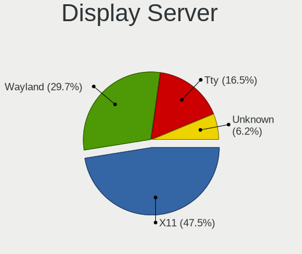
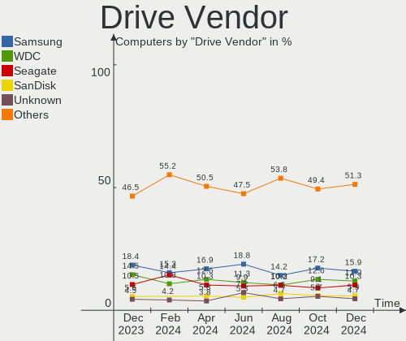
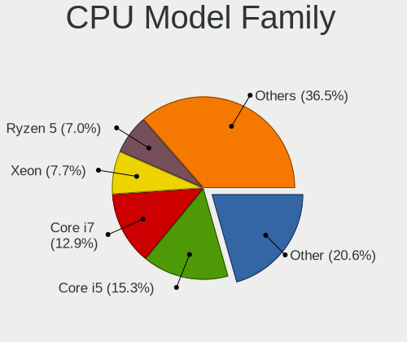

Debian - Hardware Trends
------------------------

A project to identify most popular hardware characteristics and track their change
over time based on data collected by Linux users at https://Linux-Hardware.org.

Anyone can contribute to this report by the [hw-probe](https://github.com/linuxhw/hw-probe) tool:

    sudo -E hw-probe -all -upload

This is a report for all computer types. See also reports for [desktops](/Dist/Debian/Desktop/README.md) and [notebooks](/Dist/Debian/Notebook/README.md).

This report is for one last month. Overall report since the beginning of time: [TestDays](https://github.com/linuxhw/TestDays)

Period: Apr, 2023.

Contents
--------

* [ System ](#system)
  - [ OS                       ](#os)
  - [ OS Family                ](#os-family)
  - [ Kernel                   ](#kernel)
  - [ Kernel Family            ](#kernel-family)
  - [ Kernel Major Ver.        ](#kernel-major-ver)
  - [ Arch                     ](#arch)
  - [ DE                       ](#de)
  - [ Display Server           ](#display-server)
  - [ Display Manager          ](#display-manager)
  - [ OS Lang                  ](#os-lang)
  - [ Boot Mode                ](#boot-mode)
  - [ Filesystem               ](#filesystem)
  - [ Part. scheme             ](#part-scheme)
  - [ Dual Boot with Linux/BSD ](#dual-boot-with-linuxbsd)
  - [ Dual Boot (Win)          ](#dual-boot-win)

* [ Board ](#board)
  - [ Vendor                   ](#vendor)
  - [ Model                    ](#model)
  - [ Model Family             ](#model-family)
  - [ MFG Year                 ](#mfg-year)
  - [ Form Factor              ](#form-factor)
  - [ Secure Boot              ](#secure-boot)
  - [ Coreboot                 ](#coreboot)
  - [ RAM Size                 ](#ram-size)
  - [ RAM Used                 ](#ram-used)
  - [ Total Drives             ](#total-drives)
  - [ Has CD-ROM               ](#has-cd-rom)
  - [ Has Ethernet             ](#has-ethernet)
  - [ Has WiFi                 ](#has-wifi)
  - [ Has Bluetooth            ](#has-bluetooth)

* [ Location ](#location)
  - [ Country                  ](#country)
  - [ City                     ](#city)

* [ Drives ](#drives)
  - [ Drive Vendor             ](#drive-vendor)
  - [ Drive Model              ](#drive-model)
  - [ HDD Vendor               ](#hdd-vendor)
  - [ SSD Vendor               ](#ssd-vendor)
  - [ Drive Kind               ](#drive-kind)
  - [ Drive Connector          ](#drive-connector)
  - [ Drive Size               ](#drive-size)
  - [ Space Total              ](#space-total)
  - [ Space Used               ](#space-used)
  - [ Malfunc. Drives          ](#malfunc-drives)
  - [ Malfunc. Drive Vendor    ](#malfunc-drive-vendor)
  - [ Malfunc. HDD Vendor      ](#malfunc-hdd-vendor)
  - [ Malfunc. Drive Kind      ](#malfunc-drive-kind)
  - [ Failed Drives            ](#failed-drives)
  - [ Failed Drive Vendor      ](#failed-drive-vendor)
  - [ Drive Status             ](#drive-status)

* [ Storage controller ](#storage-controller)
  - [ Storage Vendor           ](#storage-vendor)
  - [ Storage Model            ](#storage-model)
  - [ Storage Kind             ](#storage-kind)

* [ Processor ](#processor)
  - [ CPU Vendor               ](#cpu-vendor)
  - [ CPU Model                ](#cpu-model)
  - [ CPU Model Family         ](#cpu-model-family)
  - [ CPU Cores                ](#cpu-cores)
  - [ CPU Sockets              ](#cpu-sockets)
  - [ CPU Threads              ](#cpu-threads)
  - [ CPU Op-Modes             ](#cpu-op-modes)
  - [ CPU Microcode            ](#cpu-microcode)
  - [ CPU Microarch            ](#cpu-microarch)

* [ Graphics ](#graphics)
  - [ GPU Vendor               ](#gpu-vendor)
  - [ GPU Model                ](#gpu-model)
  - [ GPU Combo                ](#gpu-combo)
  - [ GPU Driver               ](#gpu-driver)
  - [ GPU Memory               ](#gpu-memory)

* [ Monitor ](#monitor)
  - [ Monitor Vendor           ](#monitor-vendor)
  - [ Monitor Model            ](#monitor-model)
  - [ Monitor Resolution       ](#monitor-resolution)
  - [ Monitor Diagonal         ](#monitor-diagonal)
  - [ Monitor Width            ](#monitor-width)
  - [ Aspect Ratio             ](#aspect-ratio)
  - [ Monitor Area             ](#monitor-area)
  - [ Pixel Density            ](#pixel-density)
  - [ Multiple Monitors        ](#multiple-monitors)

* [ Network ](#network)
  - [ Net Controller Vendor    ](#net-controller-vendor)
  - [ Net Controller Model     ](#net-controller-model)
  - [ Wireless Vendor          ](#wireless-vendor)
  - [ Wireless Model           ](#wireless-model)
  - [ Ethernet Vendor          ](#ethernet-vendor)
  - [ Ethernet Model           ](#ethernet-model)
  - [ Net Controller Kind      ](#net-controller-kind)
  - [ Used Controller          ](#used-controller)
  - [ NICs                     ](#nics)
  - [ IPv6                     ](#ipv6)

* [ Bluetooth ](#bluetooth)
  - [ Bluetooth Vendor         ](#bluetooth-vendor)
  - [ Bluetooth Model          ](#bluetooth-model)

* [ Sound ](#sound)
  - [ Sound Vendor             ](#sound-vendor)
  - [ Sound Model              ](#sound-model)

* [ Memory ](#memory)
  - [ Memory Vendor            ](#memory-vendor)
  - [ Memory Model             ](#memory-model)
  - [ Memory Kind              ](#memory-kind)
  - [ Memory Form Factor       ](#memory-form-factor)
  - [ Memory Size              ](#memory-size)
  - [ Memory Speed             ](#memory-speed)

* [ Printers & scanners ](#printers--scanners)
  - [ Printer Vendor           ](#printer-vendor)
  - [ Printer Model            ](#printer-model)
  - [ Scanner Vendor           ](#scanner-vendor)
  - [ Scanner Model            ](#scanner-model)

* [ Camera ](#camera)
  - [ Camera Vendor            ](#camera-vendor)
  - [ Camera Model             ](#camera-model)

* [ Security ](#security)
  - [ Fingerprint Vendor       ](#fingerprint-vendor)
  - [ Fingerprint Model        ](#fingerprint-model)
  - [ Chipcard Vendor          ](#chipcard-vendor)
  - [ Chipcard Model           ](#chipcard-model)

* [ Unsupported ](#unsupported)
  - [ Unsupported Devices      ](#unsupported-devices)
  - [ Unsupported Device Types ](#unsupported-device-types)

System
------

OS
--

Installed operating systems

| Name            | Computers | Percent |
|-----------------|-----------|---------|
| Debian 11       | 271       | 67.41%  |
| Debian 12       | 118       | 29.35%  |
| Debian 10       | 8         | 1.99%   |
| Debian 8        | 2         | 0.5%    |
| Debian Unstable | 1         | 0.25%   |
| Debian 7        | 1         | 0.25%   |
| Debian          | 1         | 0.25%   |

OS Family
---------

OS without a version

| Name   | Computers | Percent |
|--------|-----------|---------|
| Debian | 402       | 100%    |

Kernel
------

Version of the Linux kernel

| Version                    | Computers | Percent |
|----------------------------|-----------|---------|
| 5.10.0-21-amd64            | 139       | 34.58%  |
| 6.1.0-7-amd64              | 61        | 15.17%  |
| 5.10.0-20-amd64            | 35        | 8.71%   |
| 6.1.0-4-amd64              | 34        | 8.46%   |
| 6.1.0-0.deb11.5-amd64      | 17        | 4.23%   |
| 6.1.0-6-amd64              | 10        | 2.49%   |
| 5.15.104-1-pve             | 8         | 1.99%   |
| 5.15.102-1-pve             | 6         | 1.49%   |
| 6.2.9-1-pve                | 4         | 1%      |
| 6.1.0-5-amd64              | 4         | 1%      |
| 5.10.0-21-686-pae          | 4         | 1%      |
| 4.19.0-23-amd64            | 4         | 1%      |
| 6.2.6-1-pve                | 3         | 0.75%   |
| 6.1.19-v8+                 | 3         | 0.75%   |
| 5.15.107-1-pve             | 3         | 0.75%   |
| 6.2.9-4-liquorix-amd64     | 2         | 0.5%    |
| 6.1.21-v8+                 | 2         | 0.5%    |
| 6.1.0-0.deb11.6-amd64      | 2         | 0.5%    |
| 6.0.12                     | 2         | 0.5%    |
| 6.0.0-0.deb11.6-amd64      | 2         | 0.5%    |
| 5.15.84-v8+                | 2         | 0.5%    |
| 5.15.79+truenas            | 2         | 0.5%    |
| 5.15.62-yocto-standard     | 2         | 0.5%    |
| 5.10.0-9-amd64             | 2         | 0.5%    |
| 5.10.0-15-amd64            | 2         | 0.5%    |
| 6.2.9                      | 1         | 0.25%   |
| 6.2.11-titanide            | 1         | 0.25%   |
| 6.2.11-3-liquorix-amd64    | 1         | 0.25%   |
| 6.2.11-1-pve               | 1         | 0.25%   |
| 6.2.11                     | 1         | 0.25%   |
| 6.2.10-1-liquorix-amd64    | 1         | 0.25%   |
| 6.1.25-x64v3-xanmod1       | 1         | 0.25%   |
| 6.1.25-sunxi               | 1         | 0.25%   |
| 6.1.22-04691-g10d99e724bd0 | 1         | 0.25%   |
| 6.1.2-1-pve                | 1         | 0.25%   |
| 6.1.15-bootes0-p-1000      | 1         | 0.25%   |
| 6.1.15-2-liquorix-amd64    | 1         | 0.25%   |
| 6.1.15-1-pve               | 1         | 0.25%   |
| 6.1.0-8-amd64              | 1         | 0.25%   |
| 6.1.0-7-rt-amd64           | 1         | 0.25%   |

Kernel Family
-------------

Linux kernel without a distro release

| Version  | Computers | Percent |
|----------|-----------|---------|
| 5.10.0   | 188       | 46.77%  |
| 6.1.0    | 135       | 33.58%  |
| 5.15.104 | 8         | 1.99%   |
| 6.2.9    | 7         | 1.74%   |
| 5.15.102 | 6         | 1.49%   |
| 4.19.0   | 5         | 1.24%   |
| 6.2.11   | 4         | 1%      |
| 6.0.0    | 4         | 1%      |
| 6.2.6    | 3         | 0.75%   |
| 6.1.19   | 3         | 0.75%   |
| 6.1.15   | 3         | 0.75%   |
| 5.15.79  | 3         | 0.75%   |
| 5.15.107 | 3         | 0.75%   |
| 6.1.25   | 2         | 0.5%    |
| 6.1.21   | 2         | 0.5%    |
| 6.0.12   | 2         | 0.5%    |
| 5.15.84  | 2         | 0.5%    |
| 5.15.62  | 2         | 0.5%    |
| 5.15.0   | 2         | 0.5%    |
| 4.19.271 | 2         | 0.5%    |
| 6.2.10   | 1         | 0.25%   |
| 6.1.22   | 1         | 0.25%   |
| 6.1.2    | 1         | 0.25%   |
| 6.0.2    | 1         | 0.25%   |
| 6.0.19   | 1         | 0.25%   |
| 5.3.5    | 1         | 0.25%   |
| 5.19.17  | 1         | 0.25%   |
| 5.19.0   | 1         | 0.25%   |
| 5.15.94  | 1         | 0.25%   |
| 5.15.93  | 1         | 0.25%   |
| 5.15.83  | 1         | 0.25%   |
| 5.15.74  | 1         | 0.25%   |
| 5.14.0   | 1         | 0.25%   |
| 5.10.110 | 1         | 0.25%   |
| 4.4.202  | 1         | 0.25%   |
| 2.6.32   | 1         | 0.25%   |

Kernel Major Ver.
-----------------

Linux kernel major version

| Version | Computers | Percent |
|---------|-----------|---------|
| 5.10    | 189       | 47.01%  |
| 6.1     | 147       | 36.57%  |
| 5.15    | 30        | 7.46%   |
| 6.2     | 15        | 3.73%   |
| 6.0     | 8         | 1.99%   |
| 4.19    | 7         | 1.74%   |
| 5.19    | 2         | 0.5%    |
| 5.3     | 1         | 0.25%   |
| 5.14    | 1         | 0.25%   |
| 4.4     | 1         | 0.25%   |
| 2.6     | 1         | 0.25%   |

Arch
----

OS architecture (x86_64, i586, etc.)

| Name    | Computers | Percent |
|---------|-----------|---------|
| x86_64  | 375       | 93.28%  |
| aarch64 | 12        | 2.99%   |
| i686    | 8         | 1.99%   |
| riscv64 | 2         | 0.5%    |
| ppc64   | 2         | 0.5%    |
| armv7l  | 2         | 0.5%    |
| sparc64 | 1         | 0.25%   |

DE
--

Desktop Environment

| Name            | Computers | Percent |
|-----------------|-----------|---------|
| Unknown         | 109       | 27.11%  |
| GNOME           | 104       | 25.87%  |
| KDE5            | 62        | 15.42%  |
| XFCE            | 51        | 12.69%  |
| MATE            | 20        | 4.98%   |
| X-Cinnamon      | 12        | 2.99%   |
| LXDE            | 10        | 2.49%   |
| LXQt            | 7         | 1.74%   |
| Cinnamon        | 5         | 1.24%   |
| Openbox         | 4         | 1%      |
| KDE             | 3         | 0.75%   |
| i3              | 3         | 0.75%   |
| GNOME Flashback | 3         | 0.75%   |
| GNUstep         | 2         | 0.5%    |
| BunsenLabs      | 2         | 0.5%    |
| Trinity         | 1         | 0.25%   |
| mwm             | 1         | 0.25%   |
| GNOME Classic   | 1         | 0.25%   |
| fvwm            | 1         | 0.25%   |
| Enlightenment   | 1         | 0.25%   |

Display Server
--------------

X11 or Wayland

| Name        | Computers | Percent |
|-------------|-----------|---------|
| X11         | 205       | 51%     |
| Tty         | 69        | 17.16%  |
| Wayland     | 66        | 16.42%  |
| Unknown     | 58        | 14.43%  |
| Unspecified | 3         | 0.75%   |
| Web         | 1         | 0.25%   |

Display Manager
---------------

SDDM, LightDM, etc.

| Name    | Computers | Percent |
|---------|-----------|---------|
| Unknown | 151       | 37.56%  |
| LightDM | 92        | 22.89%  |
| SDDM    | 59        | 14.68%  |
| GDM     | 57        | 14.18%  |
| GDM3    | 34        | 8.46%   |
| XDM     | 2         | 0.5%    |
| SU      | 2         | 0.5%    |
| SLiM    | 2         | 0.5%    |
| NODM    | 2         | 0.5%    |
| LXDM    | 1         | 0.25%   |

OS Lang
-------

Language

| Lang    | Computers | Percent |
|---------|-----------|---------|
| en_US   | 146       | 36.32%  |
| ru_RU   | 46        | 11.44%  |
| de_DE   | 39        | 9.7%    |
| fr_FR   | 30        | 7.46%   |
| en_GB   | 21        | 5.22%   |
| pl_PL   | 13        | 3.23%   |
| Unknown | 13        | 3.23%   |
| es_ES   | 12        | 2.99%   |
| pt_BR   | 8         | 1.99%   |
| it_IT   | 8         | 1.99%   |
| C       | 8         | 1.99%   |
| es_MX   | 6         | 1.49%   |
| en_CA   | 5         | 1.24%   |
| nl_NL   | 4         | 1%      |
| es_AR   | 4         | 1%      |
| en_AU   | 4         | 1%      |
| fr_CH   | 3         | 0.75%   |
| en_NZ   | 3         | 0.75%   |
| en_IN   | 3         | 0.75%   |
| zh_CN   | 2         | 0.5%    |
| tr_TR   | 2         | 0.5%    |
| hu_HU   | 2         | 0.5%    |
| fr_BE   | 2         | 0.5%    |
| de_CH   | 2         | 0.5%    |
| de_AT   | 2         | 0.5%    |
| sr_RS   | 1         | 0.25%   |
| sk_SK   | 1         | 0.25%   |
| pt_PT   | 1         | 0.25%   |
| nl_BE   | 1         | 0.25%   |
| nb_NO   | 1         | 0.25%   |
| ja_JP   | 1         | 0.25%   |
| fr_CA   | 1         | 0.25%   |
| fi_FI   | 1         | 0.25%   |
| es_VE   | 1         | 0.25%   |
| es_UY   | 1         | 0.25%   |
| es_CR   | 1         | 0.25%   |
| es_CO   | 1         | 0.25%   |
| en_IL   | 1         | 0.25%   |
| en_DK   | 1         | 0.25%   |

Boot Mode
---------

EFI or BIOS

| Mode | Computers | Percent |
|------|-----------|---------|
| EFI  | 275       | 68.41%  |
| BIOS | 127       | 31.59%  |

Filesystem
----------

Type of filesystem

| Type    | Computers | Percent |
|---------|-----------|---------|
| Ext4    | 304       | 75.62%  |
| Overlay | 61        | 15.17%  |
| Zfs     | 14        | 3.48%   |
| Btrfs   | 11        | 2.74%   |
| Xfs     | 8         | 1.99%   |
| Tmpfs   | 1         | 0.25%   |
| Rootfs  | 1         | 0.25%   |
| Ext3    | 1         | 0.25%   |
| Aufs    | 1         | 0.25%   |

Part. scheme
------------

Scheme of partitioning

| Type    | Computers | Percent |
|---------|-----------|---------|
| GPT     | 289       | 71.89%  |
| MBR     | 72        | 17.91%  |
| Unknown | 41        | 10.2%   |

Dual Boot with Linux/BSD
------------------------

Hosting more than one Linux/BSD

| Dual boot | Computers | Percent |
|-----------|-----------|---------|
| No        | 340       | 84.58%  |
| Yes       | 62        | 15.42%  |

Dual Boot (Win)
---------------

Hosting Linux and Windows

| Dual boot | Computers | Percent |
|-----------|-----------|---------|
| No        | 285       | 70.9%   |
| Yes       | 117       | 29.1%   |

Board
-----

Vendor
------

Motherboard manufacturer

| Name                                 | Computers | Percent |
|--------------------------------------|-----------|---------|
| Hewlett-Packard                      | 61        | 15.17%  |
| ASUSTek Computer                     | 53        | 13.18%  |
| Dell                                 | 42        | 10.45%  |
| Lenovo                               | 33        | 8.21%   |
| Aquarius                             | 25        | 6.22%   |
| MSI                                  | 20        | 4.98%   |
| Gigabyte Technology                  | 19        | 4.73%   |
| Acer                                 | 19        | 4.73%   |
| Unknown                              | 14        | 3.48%   |
| ASRock                               | 12        | 2.99%   |
| Apple                                | 10        | 2.49%   |
| Toshiba                              | 8         | 1.99%   |
| Raspberry Pi Foundation              | 7         | 1.74%   |
| Intel                                | 7         | 1.74%   |
| Google                               | 5         | 1.24%   |
| Supermicro                           | 3         | 0.75%   |
| sunxi                                | 3         | 0.75%   |
| Shuttle                              | 3         | 0.75%   |
| Samsung Electronics                  | 3         | 0.75%   |
| Inventec                             | 3         | 0.75%   |
| Fujitsu                              | 3         | 0.75%   |
| AMI                                  | 3         | 0.75%   |
| Techvision                           | 2         | 0.5%    |
| Shenzhen Meigao Electronic Equipment | 2         | 0.5%    |
| Packard Bell                         | 2         | 0.5%    |
| Medion                               | 2         | 0.5%    |
| LG Electronics                       | 2         | 0.5%    |
| eMachines                            | 2         | 0.5%    |
| Biostar                              | 2         | 0.5%    |
| BESSTAR Tech                         | 2         | 0.5%    |
| AZW                                  | 2         | 0.5%    |
| ASRockRack                           | 2         | 0.5%    |
| Tactus                               | 1         | 0.25%   |
| System76                             | 1         | 0.25%   |
| Schenker                             | 1         | 0.25%   |
| Rockchip                             | 1         | 0.25%   |
| QTQD                                 | 1         | 0.25%   |
| Positivo                             | 1         | 0.25%   |
| Pegatron                             | 1         | 0.25%   |
| PC Specialist                        | 1         | 0.25%   |

Model
-----

Motherboard model

| Name                                | Computers | Percent |
|-------------------------------------|-----------|---------|
| Aquarius NS585                      | 25        | 6.22%   |
| Unknown                             | 17        | 4.23%   |
| HP Pavilion Gaming Laptop 15-ec2xxx | 4         | 1%      |
| HP Pavilion Gaming Laptop 15-ec1xxx | 3         | 0.75%   |
| HP Notebook                         | 3         | 0.75%   |
| HP 255 G8 Notebook PC               | 3         | 0.75%   |
| ASUS All Series                     | 3         | 0.75%   |
| Acer TravelMate 5735Z               | 3         | 0.75%   |
| Techvision TVI7309X                 | 2         | 0.5%    |
| Supermicro Super Server             | 2         | 0.5%    |
| RPi Raspberry Pi 400 Rev 1.0        | 2         | 0.5%    |
| Inventec D CLASS                    | 2         | 0.5%    |
| Intel NUC8i5BEH                     | 2         | 0.5%    |
| HP Z420 Workstation                 | 2         | 0.5%    |
| HP Pavilion dv7                     | 2         | 0.5%    |
| HP Laptop 15s-eq2xxx                | 2         | 0.5%    |
| HP Laptop 15-db1xxx                 | 2         | 0.5%    |
| HP EliteDesk 705 G4 DM 65W          | 2         | 0.5%    |
| Google Reks                         | 2         | 0.5%    |
| Gigabyte B550 VISION D-P            | 2         | 0.5%    |
| Dell OptiPlex 5000                  | 2         | 0.5%    |
| Dell Latitude 3320                  | 2         | 0.5%    |
| Dell Inspiron 1525                  | 2         | 0.5%    |
| ASUS ProArt X670E-CREATOR WIFI      | 2         | 0.5%    |
| ASUS PRIME B450M-A                  | 2         | 0.5%    |
| ASUS PRIME B450-PLUS                | 2         | 0.5%    |
| ASUS PRIME A320M-K                  | 2         | 0.5%    |
| Apple iMac7,1                       | 2         | 0.5%    |
| AMI Aptio CRB                       | 2         | 0.5%    |
| Toshiba Satellite X200              | 1         | 0.25%   |
| Toshiba Satellite Pro NB10-A-125    | 1         | 0.25%   |
| Toshiba Satellite Pro C850-1K0      | 1         | 0.25%   |
| Toshiba Satellite Pro C850-1J2      | 1         | 0.25%   |
| Toshiba Satellite Pro A100          | 1         | 0.25%   |
| Toshiba Satellite C855D-12J         | 1         | 0.25%   |
| Toshiba Satellite C70D-A            | 1         | 0.25%   |
| Toshiba PORTEGE Z20t-C              | 1         | 0.25%   |
| Tactus GeoBook 140                  | 1         | 0.25%   |
| System76 Lemur Pro                  | 1         | 0.25%   |
| Supermicro X9DRW                    | 1         | 0.25%   |

Model Family
------------

Motherboard model prefix

| Name                  | Computers | Percent |
|-----------------------|-----------|---------|
| Aquarius NS585        | 25        | 6.22%   |
| Lenovo ThinkPad       | 20        | 4.98%   |
| Unknown               | 17        | 4.23%   |
| ASUS PRIME            | 13        | 3.23%   |
| HP Pavilion           | 10        | 2.49%   |
| Dell Latitude         | 10        | 2.49%   |
| Acer Aspire           | 10        | 2.49%   |
| HP Laptop             | 8         | 1.99%   |
| Toshiba Satellite     | 7         | 1.74%   |
| RPi Raspberry         | 7         | 1.74%   |
| Dell Inspiron         | 7         | 1.74%   |
| HP EliteBook          | 6         | 1.49%   |
| Gigabyte B550         | 6         | 1.49%   |
| Dell Precision        | 6         | 1.49%   |
| Dell OptiPlex         | 6         | 1.49%   |
| ASUS ROG              | 6         | 1.49%   |
| HP ENVY               | 4         | 1%      |
| HP EliteDesk          | 4         | 1%      |
| ASUS VivoBook         | 4         | 1%      |
| ASUS ASUS             | 4         | 1%      |
| Acer TravelMate       | 4         | 1%      |
| HP ZBook              | 3         | 0.75%   |
| HP ProBook            | 3         | 0.75%   |
| HP Notebook           | 3         | 0.75%   |
| HP 255                | 3         | 0.75%   |
| Dell XPS              | 3         | 0.75%   |
| Dell Vostro           | 3         | 0.75%   |
| Dell PowerEdge        | 3         | 0.75%   |
| ASUS TUF              | 3         | 0.75%   |
| ASUS All              | 3         | 0.75%   |
| Techvision TVI7309X   | 2         | 0.5%    |
| Supermicro Super      | 2         | 0.5%    |
| Packard Bell EasyNote | 2         | 0.5%    |
| Lenovo IdeaPad        | 2         | 0.5%    |
| Inventec D            | 2         | 0.5%    |
| Intel NUC8i5BEH       | 2         | 0.5%    |
| HP Z420               | 2         | 0.5%    |
| HP OMEN               | 2         | 0.5%    |
| HP Compaq             | 2         | 0.5%    |
| Google Reks           | 2         | 0.5%    |

MFG Year
--------

Motherboard manufacture year

| Year    | Computers | Percent |
|---------|-----------|---------|
| 2022    | 52        | 12.94%  |
| 2021    | 51        | 12.69%  |
| 2019    | 48        | 11.94%  |
| 2020    | 33        | 8.21%   |
| 2018    | 28        | 6.97%   |
| 2012    | 26        | 6.47%   |
| 2015    | 20        | 4.98%   |
| 2014    | 18        | 4.48%   |
| Unknown | 18        | 4.48%   |
| 2017    | 17        | 4.23%   |
| 2016    | 17        | 4.23%   |
| 2013    | 17        | 4.23%   |
| 2010    | 12        | 2.99%   |
| 2011    | 10        | 2.49%   |
| 2023    | 8         | 1.99%   |
| 2008    | 8         | 1.99%   |
| 2007    | 7         | 1.74%   |
| 2009    | 6         | 1.49%   |
| 2006    | 3         | 0.75%   |
| 2005    | 3         | 0.75%   |

Form Factor
-----------

Physical design of the computer

| Name           | Computers | Percent |
|----------------|-----------|---------|
| Notebook       | 191       | 47.51%  |
| Desktop        | 156       | 38.81%  |
| System on chip | 16        | 3.98%   |
| Mini pc        | 12        | 2.99%   |
| All in one     | 10        | 2.49%   |
| Server         | 10        | 2.49%   |
| Convertible    | 6         | 1.49%   |
| Tablet         | 1         | 0.25%   |

Secure Boot
-----------

Enabled or disabled

| State    | Computers | Percent |
|----------|-----------|---------|
| Disabled | 363       | 90.3%   |
| Enabled  | 39        | 9.7%    |

Coreboot
--------

Have coreboot on board

| Used | Computers | Percent |
|------|-----------|---------|
| No   | 396       | 98.51%  |
| Yes  | 6         | 1.49%   |

RAM Size
--------

Total RAM memory

| Size in GB      | Computers | Percent |
|-----------------|-----------|---------|
| 4.01-8.0        | 91        | 22.64%  |
| 16.01-24.0      | 80        | 19.9%   |
| 8.01-16.0       | 60        | 14.93%  |
| 32.01-64.0      | 53        | 13.18%  |
| 3.01-4.0        | 42        | 10.45%  |
| 64.01-256.0     | 28        | 6.97%   |
| 1.01-2.0        | 23        | 5.72%   |
| 24.01-32.0      | 11        | 2.74%   |
| 0.51-1.0        | 6         | 1.49%   |
| 2.01-3.0        | 3         | 0.75%   |
| More than 256.0 | 2         | 0.5%    |
| Unknown         | 2         | 0.5%    |
| 0.01-0.5        | 1         | 0.25%   |

RAM Used
--------

Used RAM memory

| Used GB     | Computers | Percent |
|-------------|-----------|---------|
| 1.01-2.0    | 98        | 24.38%  |
| 4.01-8.0    | 72        | 17.91%  |
| 2.01-3.0    | 66        | 16.42%  |
| 0.51-1.0    | 56        | 13.93%  |
| 3.01-4.0    | 46        | 11.44%  |
| 8.01-16.0   | 24        | 5.97%   |
| 0.01-0.5    | 24        | 5.97%   |
| 24.01-32.0  | 7         | 1.74%   |
| Unknown     | 3         | 0.75%   |
| 32.01-64.0  | 2         | 0.5%    |
| 64.01-256.0 | 2         | 0.5%    |
| 16.01-24.0  | 2         | 0.5%    |

Total Drives
------------

Number of drives on board

| Drives | Computers | Percent |
|--------|-----------|---------|
| 1      | 246       | 61.19%  |
| 2      | 86        | 21.39%  |
| 3      | 28        | 6.97%   |
| 5      | 13        | 3.23%   |
| 4      | 13        | 3.23%   |
| 6      | 5         | 1.24%   |
| 0      | 4         | 1%      |
| 9      | 3         | 0.75%   |
| 7      | 3         | 0.75%   |
| 8      | 1         | 0.25%   |

Has CD-ROM
----------

Has CD-ROM on board

| Presented | Computers | Percent |
|-----------|-----------|---------|
| No        | 297       | 73.88%  |
| Yes       | 105       | 26.12%  |

Has Ethernet
------------

Has Ethernet on board

| Presented | Computers | Percent |
|-----------|-----------|---------|
| Yes       | 361       | 89.8%   |
| No        | 41        | 10.2%   |

Has WiFi
--------

Has WiFi module

| Presented | Computers | Percent |
|-----------|-----------|---------|
| Yes       | 283       | 70.4%   |
| No        | 119       | 29.6%   |

Has Bluetooth
-------------

Has Bluetooth module

| Presented | Computers | Percent |
|-----------|-----------|---------|
| Yes       | 245       | 60.95%  |
| No        | 157       | 39.05%  |

Location
--------

Country
-------

Geographic location (country)

| Country     | Computers | Percent |
|-------------|-----------|---------|
| Russia      | 58        | 14.43%  |
| Germany     | 53        | 13.18%  |
| USA         | 52        | 12.94%  |
| France      | 33        | 8.21%   |
| Poland      | 18        | 4.48%   |
| Spain       | 16        | 3.98%   |
| Brazil      | 15        | 3.73%   |
| Italy       | 12        | 2.99%   |
| UK          | 10        | 2.49%   |
| Netherlands | 10        | 2.49%   |
| Australia   | 9         | 2.24%   |
| Switzerland | 8         | 1.99%   |
| Mexico      | 8         | 1.99%   |
| Canada      | 8         | 1.99%   |
| China       | 7         | 1.74%   |
| Belgium     | 7         | 1.74%   |
| Turkey      | 4         | 1%      |
| Slovakia    | 4         | 1%      |
| Norway      | 4         | 1%      |
| Finland     | 4         | 1%      |
| Austria     | 4         | 1%      |
| Argentina   | 4         | 1%      |
| New Zealand | 3         | 0.75%   |
| India       | 3         | 0.75%   |
| Cyprus      | 3         | 0.75%   |
| Bulgaria    | 3         | 0.75%   |
| Taiwan      | 2         | 0.5%    |
| Romania     | 2         | 0.5%    |
| Portugal    | 2         | 0.5%    |
| Malaysia    | 2         | 0.5%    |
| Madagascar  | 2         | 0.5%    |
| Latvia      | 2         | 0.5%    |
| Japan       | 2         | 0.5%    |
| Hungary     | 2         | 0.5%    |
| Czechia     | 2         | 0.5%    |
| Bolivia     | 2         | 0.5%    |
| Algeria     | 2         | 0.5%    |
| Vietnam     | 1         | 0.25%   |
| Venezuela   | 1         | 0.25%   |
| Uruguay     | 1         | 0.25%   |

City
----

Geographic location (city)

| City                  | Computers | Percent |
|-----------------------|-----------|---------|
| Voronezh              | 34        | 8.46%   |
| Paris                 | 12        | 2.99%   |
| Chorzele              | 9         | 2.24%   |
| Moscow                | 7         | 1.74%   |
| Traunstein            | 4         | 1%      |
| Nuremberg             | 4         | 1%      |
| Miege                 | 4         | 1%      |
| Kirchhain             | 4         | 1%      |
| Hamburg               | 4         | 1%      |
| Bangor                | 4         | 1%      |
| Zurich                | 3         | 0.75%   |
| Sao Paulo             | 3         | 0.75%   |
| Melbourne             | 3         | 0.75%   |
| Mannheim              | 3         | 0.75%   |
| Istanbul              | 3         | 0.75%   |
| Campo Grande          | 3         | 0.75%   |
| Bieligutai            | 3         | 0.75%   |
| Barcelona             | 3         | 0.75%   |
| Yekaterinburg         | 2         | 0.5%    |
| Warsaw                | 2         | 0.5%    |
| Vienna                | 2         | 0.5%    |
| Trondheim             | 2         | 0.5%    |
| Toronto               | 2         | 0.5%    |
| Taipei                | 2         | 0.5%    |
| St Petersburg         | 2         | 0.5%    |
| Seville               | 2         | 0.5%    |
| San Francisco         | 2         | 0.5%    |
| Rome                  | 2         | 0.5%    |
| Riverside             | 2         | 0.5%    |
| Perth                 | 2         | 0.5%    |
| Perm                  | 2         | 0.5%    |
| Nicosia               | 2         | 0.5%    |
| Montreal              | 2         | 0.5%    |
| Ludwigshafen am Rhein | 2         | 0.5%    |
| London                | 2         | 0.5%    |
| Kuala Lumpur          | 2         | 0.5%    |
| Košice               | 2         | 0.5%    |
| Helsinki              | 2         | 0.5%    |
| Halifax               | 2         | 0.5%    |
| Fuenlabrada           | 2         | 0.5%    |

Drives
------

Drive Vendor
------------

Hard drive vendors

| Vendor                      | Computers | Drives | Percent |
|-----------------------------|-----------|--------|---------|
| Samsung Electronics         | 92        | 115    | 15.67%  |
| WDC                         | 81        | 115    | 13.8%   |
| Seagate                     | 65        | 104    | 11.07%  |
| Kingston                    | 34        | 36     | 5.79%   |
| A-DATA Technology           | 34        | 35     | 5.79%   |
| Unknown                     | 29        | 31     | 4.94%   |
| Toshiba                     | 26        | 28     | 4.43%   |
| Crucial                     | 25        | 26     | 4.26%   |
| SanDisk                     | 22        | 23     | 3.75%   |
| SK hynix                    | 20        | 20     | 3.41%   |
| Intel                       | 17        | 17     | 2.9%    |
| Micron Technology           | 14        | 14     | 2.39%   |
| HGST                        | 12        | 12     | 2.04%   |
| Hitachi                     | 9         | 10     | 1.53%   |
| China                       | 9         | 9      | 1.53%   |
| PNY                         | 7         | 9      | 1.19%   |
| Unknown                     | 7         | 7      | 1.19%   |
| KIOXIA                      | 6         | 6      | 1.02%   |
| Corsair                     | 6         | 7      | 1.02%   |
| Apple                       | 6         | 6      | 1.02%   |
| Phison                      | 5         | 5      | 0.85%   |
| JMicron Technology          | 5         | 8      | 0.85%   |
| Team                        | 3         | 4      | 0.51%   |
| LITEON                      | 3         | 3      | 0.51%   |
| Intenso                     | 3         | 3      | 0.51%   |
| Hewlett-Packard             | 3         | 4      | 0.51%   |
| Apacer                      | 3         | 3      | 0.51%   |
| XPG                         | 2         | 2      | 0.34%   |
| Silicon Motion              | 2         | 2      | 0.34%   |
| Netac                       | 2         | 2      | 0.34%   |
| LITEONIT                    | 2         | 2      | 0.34%   |
| Kingston Technology Company | 2         | 2      | 0.34%   |
| Gigabyte Technology         | 2         | 2      | 0.34%   |
| Fanxiang                    | 2         | 2      | 0.34%   |
| YMTC                        | 1         | 1      | 0.17%   |
| Verbatim                    | 1         | 1      | 0.17%   |
| Vaseky                      | 1         | 1      | 0.17%   |
| Transcend                   | 1         | 1      | 0.17%   |
| TO Exter                    | 1         | 1      | 0.17%   |
| SSSTC                       | 1         | 1      | 0.17%   |

Drive Model
-----------

Hard drive models

| Model                                             | Computers | Percent |
|---------------------------------------------------|-----------|---------|
| A-DATA SU800 512GB SSD                            | 25        | 3.91%   |
| Kingston SA400S37240G 240GB SSD                   | 8         | 1.25%   |
| Unknown                                           | 7         | 1.1%    |
| Samsung SSD 860 EVO 500GB                         | 6         | 0.94%   |
| Samsung SSD 860 EVO 250GB                         | 6         | 0.94%   |
| Kingston SA400S37480G 480GB SSD                   | 6         | 0.94%   |
| Crucial CT500MX500SSD1 500GB                      | 6         | 0.94%   |
| Samsung SSD 980 1TB                               | 5         | 0.78%   |
| Samsung SSD 850 EVO 500GB                         | 5         | 0.78%   |
| Intel SSDPEKNW512G8H 512GB                        | 5         | 0.78%   |
| Unknown SD32G  32GB                               | 4         | 0.63%   |
| SK hynix PC711 HFS512GDE9X073N 512GB              | 4         | 0.63%   |
| Samsung NVMe SSD Controller SM981/PM981/PM983 1TB | 4         | 0.63%   |
| HGST HTS541010A9E680 1TB                          | 4         | 0.63%   |
| WDC WDS500G2B0A-00SM50 500GB SSD                  | 3         | 0.47%   |
| WDC WD20EZRZ-00Z5HB0 2TB                          | 3         | 0.47%   |
| WDC PC SN530 NVMe 256GB                           | 3         | 0.47%   |
| Toshiba DT01ACA050 500GB                          | 3         | 0.47%   |
| SK hynix BC711 NVMe 256GB                         | 3         | 0.47%   |
| Seagate ST1000DM010-2EP102 1TB                    | 3         | 0.47%   |
| SanDisk SSD PLUS 240GB                            | 3         | 0.47%   |
| Samsung SSD 980 PRO 1TB                           | 3         | 0.47%   |
| Samsung SSD 870 QVO 2TB                           | 3         | 0.47%   |
| Samsung SSD 870 QVO 1TB                           | 3         | 0.47%   |
| Samsung SSD 850 EVO 250GB                         | 3         | 0.47%   |
| Kingston SV300S37A120G 120GB SSD                  | 3         | 0.47%   |
| Kingston SA400S37120G 120GB SSD                   | 3         | 0.47%   |
| XPG GAMMIX S11 Pro 1TB                            | 2         | 0.31%   |
| WDC WDS240G2G0B-00EPW0 240GB SSD                  | 2         | 0.31%   |
| WDC WD40EFZX-68AWUN0 4TB                          | 2         | 0.31%   |
| WDC WD40EFRX-68N32N0 4TB                          | 2         | 0.31%   |
| WDC WD30EFRX-68EUZN0 3TB                          | 2         | 0.31%   |
| WDC WD10EZEX-08WN4A0 1TB                          | 2         | 0.31%   |
| WDC WD10EZEX-00BN5A0 1TB                          | 2         | 0.31%   |
| WDC WD1003FBYX-01Y7B1 1TB                         | 2         | 0.31%   |
| WDC WD Green M.2 2280 480GB                       | 2         | 0.31%   |
| Unknown SL08G  8GB                                | 2         | 0.31%   |
| Unknown SD16G  16GB                               | 2         | 0.31%   |
| Unknown SD/MMC/MS PRO 249GB                       | 2         | 0.31%   |
| Unknown AJTD4R  16GB                              | 2         | 0.31%   |

HDD Vendor
----------

Hard disk drive vendors

| Vendor              | Computers | Drives | Percent |
|---------------------|-----------|--------|---------|
| Seagate             | 60        | 99     | 37.04%  |
| WDC                 | 50        | 81     | 30.86%  |
| Toshiba             | 20        | 21     | 12.35%  |
| HGST                | 12        | 12     | 7.41%   |
| Hitachi             | 9         | 10     | 5.56%   |
| JMicron Technology  | 3         | 6      | 1.85%   |
| Apple               | 3         | 3      | 1.85%   |
| Unknown             | 2         | 2      | 1.23%   |
| Samsung Electronics | 2         | 2      | 1.23%   |
| Hewlett-Packard     | 1         | 2      | 0.62%   |

SSD Vendor
----------

Solid state drive vendors

| Vendor              | Computers | Drives | Percent |
|---------------------|-----------|--------|---------|
| Samsung Electronics | 47        | 53     | 20.52%  |
| Kingston            | 31        | 32     | 13.54%  |
| A-DATA Technology   | 31        | 31     | 13.54%  |
| Crucial             | 16        | 17     | 6.99%   |
| SanDisk             | 15        | 16     | 6.55%   |
| WDC                 | 13        | 13     | 5.68%   |
| China               | 9         | 9      | 3.93%   |
| Micron Technology   | 7         | 7      | 3.06%   |
| PNY                 | 6         | 8      | 2.62%   |
| SK hynix            | 4         | 4      | 1.75%   |
| Toshiba             | 3         | 3      | 1.31%   |
| Team                | 3         | 4      | 1.31%   |
| LITEON              | 3         | 3      | 1.31%   |
| Intenso             | 3         | 3      | 1.31%   |
| Intel               | 3         | 3      | 1.31%   |
| Apple               | 3         | 3      | 1.31%   |
| Apacer              | 3         | 3      | 1.31%   |
| LITEONIT            | 2         | 2      | 0.87%   |
| Corsair             | 2         | 2      | 0.87%   |
| Verbatim            | 1         | 1      | 0.44%   |
| Transcend           | 1         | 1      | 0.44%   |
| TO Exter            | 1         | 1      | 0.44%   |
| SPCC Sol            | 1         | 1      | 0.44%   |
| SPCC                | 1         | 1      | 0.44%   |
| sk600               | 1         | 1      | 0.44%   |
| ShiJi               | 1         | 1      | 0.44%   |
| Seagate             | 1         | 1      | 0.44%   |
| Patriot             | 1         | 1      | 0.44%   |
| OCZ                 | 1         | 1      | 0.44%   |
| NGFF                | 1         | 1      | 0.44%   |
| Netac               | 1         | 1      | 0.44%   |
| LVCARDS             | 1         | 1      | 0.44%   |
| Lexar               | 1         | 1      | 0.44%   |
| KingSpec            | 1         | 1      | 0.44%   |
| KingFast            | 1         | 1      | 0.44%   |
| Kingchuxing         | 1         | 1      | 0.44%   |
| Innodisk            | 1         | 1      | 0.44%   |
| Inland              | 1         | 1      | 0.44%   |
| Hewlett-Packard     | 1         | 1      | 0.44%   |
| Fanxiang            | 1         | 1      | 0.44%   |

Drive Kind
----------

HDD or SSD

| Kind    | Computers | Drives | Percent |
|---------|-----------|--------|---------|
| SSD     | 193       | 241    | 36.62%  |
| NVMe    | 155       | 182    | 29.41%  |
| HDD     | 140       | 238    | 26.57%  |
| MMC     | 32        | 34     | 6.07%   |
| Unknown | 7         | 7      | 1.33%   |

Drive Connector
---------------

SATA, SAS, NVMe, etc.

| Type | Computers | Drives | Percent |
|------|-----------|--------|---------|
| SATA | 267       | 453    | 56.09%  |
| NVMe | 155       | 182    | 32.56%  |
| MMC  | 32        | 34     | 6.72%   |
| SAS  | 22        | 33     | 4.62%   |

Drive Size
----------

Size of hard drive

| Size in TB | Computers | Drives | Percent |
|------------|-----------|--------|---------|
| 0.01-0.5   | 180       | 235    | 50%     |
| 0.51-1.0   | 111       | 139    | 30.83%  |
| 1.01-2.0   | 35        | 51     | 9.72%   |
| 3.01-4.0   | 14        | 23     | 3.89%   |
| 2.01-3.0   | 10        | 13     | 2.78%   |
| 4.01-10.0  | 8         | 13     | 2.22%   |
| 10.01-20.0 | 2         | 5      | 0.56%   |

Space Total
-----------

Amount of disk space available on the file system

| Size in GB     | Computers | Percent |
|----------------|-----------|---------|
| 101-250        | 76        | 18.91%  |
| 251-500        | 74        | 18.41%  |
| Unknown        | 58        | 14.43%  |
| 501-1000       | 55        | 13.68%  |
| 51-100         | 28        | 6.97%   |
| 1001-2000      | 27        | 6.72%   |
| More than 3000 | 26        | 6.47%   |
| 1-20           | 26        | 6.47%   |
| 21-50          | 23        | 5.72%   |
| 2001-3000      | 9         | 2.24%   |

Space Used
----------

Amount of used disk space

| Used GB        | Computers | Percent |
|----------------|-----------|---------|
| 1-20           | 149       | 37.06%  |
| Unknown        | 58        | 14.43%  |
| 101-250        | 51        | 12.69%  |
| 21-50          | 45        | 11.19%  |
| 51-100         | 28        | 6.97%   |
| 251-500        | 24        | 5.97%   |
| 501-1000       | 18        | 4.48%   |
| 1001-2000      | 17        | 4.23%   |
| More than 3000 | 6         | 1.49%   |
| 2001-3000      | 5         | 1.24%   |
| 0              | 1         | 0.25%   |

Malfunc. Drives
---------------

Drive models with a malfunction

| Model                                          | Computers | Drives | Percent |
|------------------------------------------------|-----------|--------|---------|
| SK hynix PC711 HFS512GDE9X073N 512GB           | 4         | 4      | 7.02%   |
| Seagate ST31000528AS 1TB                       | 2         | 3      | 3.51%   |
| Seagate ST2000DL003-9VT166 2TB                 | 2         | 2      | 3.51%   |
| HGST HTS541010A9E680 1TB                       | 2         | 2      | 3.51%   |
| WDC WD800UE-22HCT0 80GB                        | 1         | 1      | 1.75%   |
| WDC WD6401AALS-00L3B2 640GB                    | 1         | 1      | 1.75%   |
| WDC WD60PURX-64T0ZY0 6TB                       | 1         | 1      | 1.75%   |
| WDC WD40EZRZ-00WN9B0 4TB                       | 1         | 1      | 1.75%   |
| WDC WD3200BEKT-75PVMT1 320GB                   | 1         | 1      | 1.75%   |
| WDC WD3200AAKS-22L6A0 320GB                    | 1         | 1      | 1.75%   |
| WDC WD30PURX-64P6ZY0 3TB                       | 1         | 2      | 1.75%   |
| WDC WD20PURZ-85GU6Y0 2TB                       | 1         | 1      | 1.75%   |
| WDC WD1600BEVT-22A23T0 160GB                   | 1         | 1      | 1.75%   |
| WDC WD10EFRX-68JCSN0 1TB                       | 1         | 2      | 1.75%   |
| WDC WD10EARS-00MVWB0 1TB                       | 1         | 1      | 1.75%   |
| WDC WD10EALX-009BA0 1TB                        | 1         | 1      | 1.75%   |
| Toshiba MK7575GSX 752GB                        | 1         | 1      | 1.75%   |
| Toshiba MK3259GSXP 320GB                       | 1         | 1      | 1.75%   |
| Toshiba DT01ACA200 2TB                         | 1         | 1      | 1.75%   |
| Toshiba DT01ACA050 500GB                       | 1         | 1      | 1.75%   |
| SK hynix SHGS31-500GS-2 500GB SSD              | 1         | 1      | 1.75%   |
| SK hynix BC711 HFM512GD3JX013N 512GB           | 1         | 1      | 1.75%   |
| ShiJi SSD 128GB                                | 1         | 1      | 1.75%   |
| Seagate ST9500325AS 500GB                      | 1         | 1      | 1.75%   |
| Seagate ST9160314AS 160GB                      | 1         | 1      | 1.75%   |
| Seagate ST9100821AS 100GB                      | 1         | 1      | 1.75%   |
| Seagate ST500DM002-1BD142 500GB                | 1         | 3      | 1.75%   |
| Seagate ST3500418AS 500GB                      | 1         | 1      | 1.75%   |
| Seagate ST3000DM001-1ER166 3TB                 | 1         | 1      | 1.75%   |
| Seagate ST2000NM0055-1V4104 2TB                | 1         | 1      | 1.75%   |
| Seagate ST2000DX001-1CM164 2TB                 | 1         | 1      | 1.75%   |
| SanDisk SD6SP1M256G1012 256GB SSD              | 1         | 1      | 1.75%   |
| Samsung Electronics SSD 970 EVO 500GB          | 1         | 1      | 1.75%   |
| Samsung Electronics SSD 970 EVO 1TB            | 1         | 1      | 1.75%   |
| Micron Technology MTFDDAK128MAM-1J1 128GB SSD  | 1         | 1      | 1.75%   |
| Micron Technology 2300 NVMe 512GB              | 1         | 1      | 1.75%   |
| Micron Technology 1100_MTFDDAK256TBN 256GB SSD | 1         | 1      | 1.75%   |
| KingSpec P3-128 128GB                          | 1         | 1      | 1.75%   |
| JMicron Technology Generic DISK03 2TB          | 1         | 1      | 1.75%   |
| JMicron Technology Generic DISK02 256GB        | 1         | 1      | 1.75%   |

Malfunc. Drive Vendor
---------------------

Vendors of faulty drives

| Vendor              | Computers | Drives | Percent |
|---------------------|-----------|--------|---------|
| Seagate             | 11        | 15     | 20.75%  |
| WDC                 | 10        | 14     | 18.87%  |
| SK hynix            | 6         | 6      | 11.32%  |
| Hitachi             | 5         | 5      | 9.43%   |
| Toshiba             | 4         | 4      | 7.55%   |
| Micron Technology   | 3         | 3      | 5.66%   |
| HGST                | 3         | 3      | 5.66%   |
| Samsung Electronics | 2         | 2      | 3.77%   |
| Crucial             | 2         | 2      | 3.77%   |
| ShiJi               | 1         | 1      | 1.89%   |
| SanDisk             | 1         | 1      | 1.89%   |
| KingSpec            | 1         | 1      | 1.89%   |
| JMicron Technology  | 1         | 2      | 1.89%   |
| Intel               | 1         | 1      | 1.89%   |
| China               | 1         | 1      | 1.89%   |
| A-DATA Technology   | 1         | 1      | 1.89%   |

Malfunc. HDD Vendor
-------------------

Vendors of faulty HDD drives

| Vendor             | Computers | Drives | Percent |
|--------------------|-----------|--------|---------|
| Seagate            | 11        | 15     | 32.35%  |
| WDC                | 10        | 14     | 29.41%  |
| Hitachi            | 5         | 5      | 14.71%  |
| Toshiba            | 4         | 4      | 11.76%  |
| HGST               | 3         | 3      | 8.82%   |
| JMicron Technology | 1         | 2      | 2.94%   |

Malfunc. Drive Kind
-------------------

Kinds of faulty drives

| Kind | Computers | Drives | Percent |
|------|-----------|--------|---------|
| HDD  | 30        | 43     | 62.5%   |
| SSD  | 10        | 11     | 20.83%  |
| NVMe | 8         | 8      | 16.67%  |

Failed Drives
-------------

Failed drive models

| Model                     | Computers | Drives | Percent |
|---------------------------|-----------|--------|---------|
| Inland SATA SSD 128GB     | 1         | 1      | 50%     |
| Crucial CT500P2SSD8 500GB | 1         | 1      | 50%     |

Failed Drive Vendor
-------------------

Failed drive vendors

| Vendor  | Computers | Drives | Percent |
|---------|-----------|--------|---------|
| Inland  | 1         | 1      | 50%     |
| Crucial | 1         | 1      | 50%     |

Drive Status
------------

Number of failed and malfunc. drives

| Status   | Computers | Drives | Percent |
|----------|-----------|--------|---------|
| Works    | 305       | 494    | 67.63%  |
| Detected | 98        | 144    | 21.73%  |
| Malfunc  | 46        | 62     | 10.2%   |
| Failed   | 2         | 2      | 0.44%   |

Storage controller
------------------

Storage Vendor
--------------

Storage controller vendors

| Vendor                           | Computers | Percent |
|----------------------------------|-----------|---------|
| Intel                            | 243       | 47.18%  |
| AMD                              | 87        | 16.89%  |
| Samsung Electronics              | 51        | 9.9%    |
| SanDisk                          | 27        | 5.24%   |
| SK hynix                         | 16        | 3.11%   |
| Phison Electronics               | 12        | 2.33%   |
| ASMedia Technology               | 9         | 1.75%   |
| Micron/Crucial Technology        | 8         | 1.55%   |
| Micron Technology                | 7         | 1.36%   |
| Toshiba America Info Systems     | 5         | 0.97%   |
| KIOXIA                           | 5         | 0.97%   |
| Kingston Technology Company      | 5         | 0.97%   |
| ADATA Technology                 | 5         | 0.97%   |
| Marvell Technology Group         | 4         | 0.78%   |
| LSI Logic / Symbios Logic        | 4         | 0.78%   |
| JMicron Technology               | 4         | 0.78%   |
| Silicon Motion                   | 3         | 0.58%   |
| VIA Technologies                 | 2         | 0.39%   |
| Realtek Semiconductor            | 2         | 0.39%   |
| Nvidia                           | 2         | 0.39%   |
| MAXIO Technology (Hangzhou)      | 2         | 0.39%   |
| IBM                              | 2         | 0.39%   |
| Broadcom / LSI                   | 2         | 0.39%   |
| Yangtze Memory Technologies      | 1         | 0.19%   |
| ULi Electronics                  | 1         | 0.19%   |
| Solid State Storage Technology   | 1         | 0.19%   |
| Silicon Integrated Systems [SiS] | 1         | 0.19%   |
| Netac Technology                 | 1         | 0.19%   |
| Innodisk                         | 1         | 0.19%   |
| Hewlett-Packard                  | 1         | 0.19%   |
| Artop Electronic                 | 1         | 0.19%   |

Storage Model
-------------

Storage controller models

| Model                                                                          | Computers | Percent |
|--------------------------------------------------------------------------------|-----------|---------|
| AMD FCH SATA Controller [AHCI mode]                                            | 64        | 11.21%  |
| Intel Cannon Lake PCH SATA AHCI Controller                                     | 32        | 5.6%    |
| Samsung NVMe SSD Controller SM981/PM981/PM983                                  | 18        | 3.15%   |
| Samsung NVMe SSD Controller 980                                                | 16        | 2.8%    |
| Samsung NVMe SSD Controller PM9A1/PM9A3/980PRO                                 | 15        | 2.63%   |
| Intel Sunrise Point-LP SATA Controller [AHCI mode]                             | 14        | 2.45%   |
| Intel 8 Series/C220 Series Chipset Family 6-port SATA Controller 1 [AHCI mode] | 13        | 2.28%   |
| Intel 7 Series Chipset Family 6-port SATA Controller [AHCI mode]               | 11        | 1.93%   |
| AMD 400 Series Chipset SATA Controller                                         | 11        | 1.93%   |
| SK hynix Gold P31/PC711 NVMe Solid State Drive                                 | 10        | 1.75%   |
| Intel Alder Lake-S PCH SATA Controller [AHCI Mode]                             | 10        | 1.75%   |
| Intel 8 Series SATA Controller 1 [AHCI mode]                                   | 10        | 1.75%   |
| Intel Volume Management Device NVMe RAID Controller                            | 9         | 1.58%   |
| Intel Tiger Lake-LP SATA Controller                                            | 9         | 1.58%   |
| Intel Jasper Lake SATA AHCI Controller                                         | 9         | 1.58%   |
| Intel 82801IBM/IEM (ICH9M/ICH9M-E) 4 port SATA Controller [AHCI mode]          | 9         | 1.58%   |
| AMD 500 Series Chipset SATA Controller                                         | 9         | 1.58%   |
| Intel Q170/Q150/B150/H170/H110/Z170/CM236 Chipset SATA Controller [AHCI Mode]  | 8         | 1.4%    |
| Intel 6 Series/C200 Series Chipset Family 6 port Mobile SATA AHCI Controller   | 8         | 1.4%    |
| AMD SB7x0/SB8x0/SB9x0 SATA Controller [AHCI mode]                              | 8         | 1.4%    |
| SanDisk WD Blue SN550 NVMe SSD                                                 | 7         | 1.23%   |
| Intel SSD 660P Series                                                          | 7         | 1.23%   |
| Intel 82801 Mobile SATA Controller [RAID mode]                                 | 7         | 1.23%   |
| ASMedia ASM1062 Serial ATA Controller                                          | 7         | 1.23%   |
| SanDisk WD Black SN750 / PC SN730 NVMe SSD                                     | 6         | 1.05%   |
| Sandisk Non-Volatile memory controller                                         | 6         | 1.05%   |
| Micron/Crucial P2 NVMe PCIe SSD                                                | 6         | 1.05%   |
| Micron NVMe Storage Controller                                                 | 6         | 1.05%   |
| Intel Comet Lake SATA AHCI Controller                                          | 6         | 1.05%   |
| Intel 82801HM/HEM (ICH8M/ICH8M-E) IDE Controller                               | 6         | 1.05%   |
| Intel 7 Series/C210 Series Chipset Family 6-port SATA Controller [AHCI mode]   | 6         | 1.05%   |
| Intel Wildcat Point-LP SATA Controller [AHCI Mode]                             | 5         | 0.88%   |
| Intel Non-Volatile memory controller                                           | 5         | 0.88%   |
| Intel C602 chipset 4-Port SATA Storage Control Unit                            | 5         | 0.88%   |
| Intel 82801HM/HEM (ICH8M/ICH8M-E) SATA Controller [AHCI mode]                  | 5         | 0.88%   |
| Intel 400 Series Chipset Family SATA AHCI Controller                           | 5         | 0.88%   |
| Phison PS5013 E13 NVMe Controller                                              | 4         | 0.7%    |
| Phison E12 NVMe Controller                                                     | 4         | 0.7%    |
| KIOXIA NVMe SSD Controller BG4                                                 | 4         | 0.7%    |
| JMicron JMB58x AHCI SATA controller                                            | 4         | 0.7%    |

Storage Kind
------------

Kind of storage controller (IDE, SATA, NVMe, SAS, ...)

| Kind | Computers | Percent |
|------|-----------|---------|
| SATA | 292       | 57.03%  |
| NVMe | 154       | 30.08%  |
| IDE  | 29        | 5.66%   |
| RAID | 28        | 5.47%   |
| SAS  | 5         | 0.98%   |
| SCSI | 4         | 0.78%   |

Processor
---------

CPU Vendor
----------

Processor vendors

| Vendor            | Computers | Percent |
|-------------------|-----------|---------|
| Intel             | 276       | 68.66%  |
| AMD               | 107       | 26.62%  |
| ARM               | 14        | 3.48%   |
| sifive,u74-mc     | 2         | 0.5%    |
| CHRP IBM,8233-E8B | 2         | 0.5%    |
| Unknown           | 1         | 0.25%   |

CPU Model
---------

Processor models

| Model                                         | Computers | Percent |
|-----------------------------------------------|-----------|---------|
| Intel Core i3-9100 CPU @ 3.60GHz              | 25        | 6.22%   |
| ARM Processor                                 | 12        | 2.99%   |
| Intel 11th Gen Core i5-1135G7 @ 2.40GHz       | 8         | 1.99%   |
| Intel 11th Gen Core i7-1165G7 @ 2.80GHz       | 7         | 1.74%   |
| AMD Ryzen 5 5500U with Radeon Graphics        | 7         | 1.74%   |
| Intel Celeron N5105 @ 2.00GHz                 | 6         | 1.49%   |
| AMD Ryzen 5 5600H with Radeon Graphics        | 6         | 1.49%   |
| Intel Pentium Dual-Core CPU T4500 @ 2.30GHz   | 4         | 1%      |
| Intel Core i7-3770 CPU @ 3.40GHz              | 4         | 1%      |
| Intel Celeron CPU N3060 @ 1.60GHz             | 4         | 1%      |
| Intel 12th Gen Core i7-12700H                 | 4         | 1%      |
| AMD Ryzen 9 5950X 16-Core Processor           | 4         | 1%      |
| AMD Ryzen 7 5800H with Radeon Graphics        | 4         | 1%      |
| AMD Ryzen 5 4600H with Radeon Graphics        | 4         | 1%      |
| AMD Ryzen 5 3500U with Radeon Vega Mobile Gfx | 4         | 1%      |
| Intel Pentium Silver N6005 @ 2.00GHz          | 3         | 0.75%   |
| Intel Core i5-7200U CPU @ 2.50GHz             | 3         | 0.75%   |
| Intel Core i5-6300U CPU @ 2.40GHz             | 3         | 0.75%   |
| Intel Core i3-10110U CPU @ 2.10GHz            | 3         | 0.75%   |
| Intel 11th Gen Core i5-11400 @ 2.60GHz        | 3         | 0.75%   |
| AMD Ryzen 9 7950X 16-Core Processor           | 3         | 0.75%   |
| AMD Ryzen 7 6800H with Radeon Graphics        | 3         | 0.75%   |
| AMD Ryzen 7 5700U with Radeon Graphics        | 3         | 0.75%   |
| AMD Ryzen 5 3600 6-Core Processor             | 3         | 0.75%   |
| sifive,u74-mc rv64imafdc                      | 2         | 0.5%    |
| Intel Pentium Dual-Core CPU T4400 @ 2.20GHz   | 2         | 0.5%    |
| Intel Core i7-7600U CPU @ 2.80GHz             | 2         | 0.5%    |
| Intel Core i7-7500U CPU @ 2.70GHz             | 2         | 0.5%    |
| Intel Core i7-5600U CPU @ 2.60GHz             | 2         | 0.5%    |
| Intel Core i7-4720HQ CPU @ 2.60GHz            | 2         | 0.5%    |
| Intel Core i7-2630QM CPU @ 2.00GHz            | 2         | 0.5%    |
| Intel Core i7-10510U CPU @ 1.80GHz            | 2         | 0.5%    |
| Intel Core i5-9600K CPU @ 3.70GHz             | 2         | 0.5%    |
| Intel Core i5-8350U CPU @ 1.70GHz             | 2         | 0.5%    |
| Intel Core i5-8259U CPU @ 2.30GHz             | 2         | 0.5%    |
| Intel Core i5-8250U CPU @ 1.60GHz             | 2         | 0.5%    |
| Intel Core i5-3470 CPU @ 3.20GHz              | 2         | 0.5%    |
| Intel Core i5-3320M CPU @ 2.60GHz             | 2         | 0.5%    |
| Intel Core i5-3210M CPU @ 2.50GHz             | 2         | 0.5%    |
| Intel Core i5-10400F CPU @ 2.90GHz            | 2         | 0.5%    |

CPU Model Family
----------------

Processor model prefix

| Model                   | Computers | Percent |
|-------------------------|-----------|---------|
| Other                   | 64        | 15.92%  |
| Intel Core i5           | 61        | 15.17%  |
| Intel Core i7           | 41        | 10.2%   |
| Intel Core i3           | 38        | 9.45%   |
| AMD Ryzen 5             | 37        | 9.2%    |
| Intel Celeron           | 31        | 7.71%   |
| AMD Ryzen 7             | 24        | 5.97%   |
| Intel Xeon              | 14        | 3.48%   |
| AMD Ryzen 9             | 12        | 2.99%   |
| Intel Core 2 Duo        | 10        | 2.49%   |
| Intel Pentium Dual-Core | 8         | 1.99%   |
| Intel Pentium           | 8         | 1.99%   |
| Intel Atom              | 4         | 1%      |
| AMD G                   | 4         | 1%      |
| AMD FX                  | 4         | 1%      |
| AMD A6                  | 4         | 1%      |
| Intel Pentium Silver    | 3         | 0.75%   |
| AMD Ryzen 3             | 3         | 0.75%   |
| AMD GX                  | 3         | 0.75%   |
| AMD EPYC                | 3         | 0.75%   |
| Intel Xeon Silver       | 2         | 0.5%    |
| Intel Genuine           | 2         | 0.5%    |
| Intel Core 2 Quad       | 2         | 0.5%    |
| ARM Allwinner           | 2         | 0.5%    |
| AMD Ryzen 5 PRO         | 2         | 0.5%    |
| AMD E                   | 2         | 0.5%    |
| Intel Pentium M         | 1         | 0.25%   |
| Intel Pentium Dual      | 1         | 0.25%   |
| Intel Pentium 4         | 1         | 0.25%   |
| Intel Core m7           | 1         | 0.25%   |
| Intel Core i9           | 1         | 0.25%   |
| Intel Core 2            | 1         | 0.25%   |
| AMD Sempron             | 1         | 0.25%   |
| AMD PRO A10             | 1         | 0.25%   |
| AMD Phenom II X6        | 1         | 0.25%   |
| AMD Embedded            | 1         | 0.25%   |
| AMD E2                  | 1         | 0.25%   |
| AMD A8                  | 1         | 0.25%   |
| AMD A4                  | 1         | 0.25%   |
| AMD A10                 | 1         | 0.25%   |

CPU Cores
---------

Number of processor cores

| Number  | Computers | Percent |
|---------|-----------|---------|
| 4       | 159       | 39.55%  |
| 2       | 114       | 28.36%  |
| 6       | 49        | 12.19%  |
| 8       | 36        | 8.96%   |
| 16      | 12        | 2.99%   |
| 12      | 9         | 2.24%   |
| 1       | 7         | 1.74%   |
| 14      | 5         | 1.24%   |
| 10      | 3         | 0.75%   |
| 24      | 2         | 0.5%    |
| Unknown | 2         | 0.5%    |
| 192     | 1         | 0.25%   |
| 36      | 1         | 0.25%   |
| 32      | 1         | 0.25%   |
| 3       | 1         | 0.25%   |

CPU Sockets
-----------

Number of sockets

| Number  | Computers | Percent |
|---------|-----------|---------|
| 1       | 391       | 97.26%  |
| 2       | 9         | 2.24%   |
| Unknown | 2         | 0.5%    |

CPU Threads
-----------

Threads per core (Hyper-Threading)

| Number  | Computers | Percent |
|---------|-----------|---------|
| 2       | 228       | 56.72%  |
| 1       | 170       | 42.29%  |
| 4       | 2         | 0.5%    |
| Unknown | 2         | 0.5%    |

CPU Op-Modes
------------

CPU Operation Modes (32-bit, 64-bit)

| Op mode        | Computers | Percent |
|----------------|-----------|---------|
| 32-bit, 64-bit | 394       | 98.01%  |
| 32-bit         | 4         | 1%      |
| Unknown        | 4         | 1%      |

CPU Microcode
-------------

Microcode number

| Number     | Computers | Percent |
|------------|-----------|---------|
| Unknown    | 87        | 21.64%  |
| 0x906eb    | 25        | 6.22%   |
| 0x806c1    | 20        | 4.98%   |
| 0x306a9    | 14        | 3.48%   |
| 0x206a7    | 12        | 2.99%   |
| 0x1067a    | 11        | 2.74%   |
| 0x306c3    | 10        | 2.49%   |
| 0x906c0    | 9         | 2.24%   |
| 0x806ea    | 9         | 2.24%   |
| 0x40651    | 9         | 2.24%   |
| 0x906a3    | 7         | 1.74%   |
| 0x806ec    | 7         | 1.74%   |
| 0x506e3    | 7         | 1.74%   |
| 0x0a50000c | 7         | 1.74%   |
| 0x08608103 | 7         | 1.74%   |
| 0x90672    | 6         | 1.49%   |
| 0x806e9    | 6         | 1.49%   |
| 0x406e3    | 6         | 1.49%   |
| 0x406c4    | 6         | 1.49%   |
| 0x306d4    | 6         | 1.49%   |
| 0x0a20120a | 5         | 1.24%   |
| 0x906ea    | 4         | 1%      |
| 0x506c9    | 4         | 1%      |
| 0x0a601203 | 4         | 1%      |
| 0x07030105 | 4         | 1%      |
| 0xa0671    | 3         | 0.75%   |
| 0xa0653    | 3         | 0.75%   |
| 0x906e9    | 3         | 0.75%   |
| 0x6fd      | 3         | 0.75%   |
| 0x30678    | 3         | 0.75%   |
| 0x0a201016 | 3         | 0.75%   |
| 0x08701021 | 3         | 0.75%   |
| 0x0800820d | 3         | 0.75%   |
| 0xb0671    | 2         | 0.5%    |
| 0xa0652    | 2         | 0.5%    |
| 0x906ed    | 2         | 0.5%    |
| 0x906ec    | 2         | 0.5%    |
| 0x90675    | 2         | 0.5%    |
| 0x706a8    | 2         | 0.5%    |
| 0x606a6    | 2         | 0.5%    |

CPU Microarch
-------------

Microarchitecture

| Name             | Computers | Percent |
|------------------|-----------|---------|
| KabyLake         | 64        | 15.92%  |
| Unknown          | 50        | 12.44%  |
| Zen 3            | 28        | 6.97%   |
| Haswell          | 28        | 6.97%   |
| TigerLake        | 23        | 5.72%   |
| IvyBridge        | 23        | 5.72%   |
| Skylake          | 16        | 3.98%   |
| SandyBridge      | 16        | 3.98%   |
| Penryn           | 15        | 3.73%   |
| Zen+             | 12        | 2.99%   |
| Zen 2            | 12        | 2.99%   |
| Silvermont       | 12        | 2.99%   |
| Zen              | 11        | 2.74%   |
| Tremont          | 11        | 2.74%   |
| Alderlake Hybrid | 11        | 2.74%   |
| Core             | 8         | 1.99%   |
| CometLake        | 8         | 1.99%   |
| Broadwell        | 7         | 1.74%   |
| Puma             | 6         | 1.49%   |
| Bobcat           | 6         | 1.49%   |
| IceLake          | 5         | 1.24%   |
| Piledriver       | 4         | 1%      |
| Goldmont         | 4         | 1%      |
| Excavator        | 4         | 1%      |
| Westmere         | 3         | 0.75%   |
| P6               | 3         | 0.75%   |
| Nehalem          | 3         | 0.75%   |
| NetBurst         | 2         | 0.5%    |
| Goldmont plus    | 2         | 0.5%    |
| Steamroller      | 1         | 0.25%   |
| K8 Hammer        | 1         | 0.25%   |
| K10              | 1         | 0.25%   |
| Jaguar           | 1         | 0.25%   |
| Bonnell          | 1         | 0.25%   |

Graphics
--------

GPU Vendor
----------

Vendors of graphics cards

| Vendor                     | Computers | Percent |
|----------------------------|-----------|---------|
| Intel                      | 222       | 49.33%  |
| AMD                        | 112       | 24.89%  |
| Nvidia                     | 102       | 22.67%  |
| Matrox Electronics Systems | 8         | 1.78%   |
| ASPEED Technology          | 4         | 0.89%   |
| VIA Technologies           | 1         | 0.22%   |
| 3DLabs                     | 1         | 0.22%   |

GPU Model
---------

Graphics card models

| Model                                                                                    | Computers | Percent |
|------------------------------------------------------------------------------------------|-----------|---------|
| Intel CoffeeLake-S GT2 [UHD Graphics 630]                                                | 31        | 6.74%   |
| Intel TigerLake-LP GT2 [Iris Xe Graphics]                                                | 20        | 4.35%   |
| AMD Cezanne [Radeon Vega Series / Radeon Vega Mobile Series]                             | 16        | 3.48%   |
| Intel JasperLake [UHD Graphics]                                                          | 11        | 2.39%   |
| Intel Haswell-ULT Integrated Graphics Controller                                         | 10        | 2.17%   |
| Intel 2nd Generation Core Processor Family Integrated Graphics Controller                | 10        | 2.17%   |
| AMD Lucienne                                                                             | 10        | 2.17%   |
| Intel Atom/Celeron/Pentium Processor x5-E8000/J3xxx/N3xxx Integrated Graphics Controller | 9         | 1.96%   |
| Intel 3rd Gen Core processor Graphics Controller                                         | 9         | 1.96%   |
| Intel HD Graphics 620                                                                    | 8         | 1.74%   |
| AMD Picasso/Raven 2 [Radeon Vega Series / Radeon Vega Mobile Series]                     | 8         | 1.74%   |
| Intel Xeon E3-1200 v3/4th Gen Core Processor Integrated Graphics Controller              | 7         | 1.52%   |
| Intel Mobile 4 Series Chipset Integrated Graphics Controller                             | 7         | 1.52%   |
| Intel Alder Lake-P Integrated Graphics Controller                                        | 7         | 1.52%   |
| Intel UHD Graphics 620                                                                   | 6         | 1.3%    |
| Intel HD Graphics 530                                                                    | 6         | 1.3%    |
| Intel CometLake-U GT2 [UHD Graphics]                                                     | 6         | 1.3%    |
| Intel AlderLake-S GT1                                                                    | 6         | 1.3%    |
| AMD Renoir                                                                               | 6         | 1.3%    |
| AMD Ellesmere [Radeon RX 470/480/570/570X/580/580X/590]                                  | 6         | 1.3%    |
| Intel Skylake GT2 [HD Graphics 520]                                                      | 5         | 1.09%   |
| Intel HD Graphics 5500                                                                   | 5         | 1.09%   |
| AMD Raven Ridge [Radeon Vega Series / Radeon Vega Mobile Series]                         | 5         | 1.09%   |
| Nvidia TU117M [GeForce GTX 1650 Ti Mobile]                                               | 4         | 0.87%   |
| Nvidia TU117M                                                                            | 4         | 0.87%   |
| Nvidia GK208B [GeForce GT 710]                                                           | 4         | 0.87%   |
| Intel HD Graphics 500                                                                    | 4         | 0.87%   |
| Intel 4th Gen Core Processor Integrated Graphics Controller                              | 4         | 0.87%   |
| ASPEED Technology ASPEED Graphics Family                                                 | 4         | 0.87%   |
| AMD Rembrandt [Radeon 680M]                                                              | 4         | 0.87%   |
| Nvidia GM107 [GeForce GTX 750 Ti]                                                        | 3         | 0.65%   |
| Nvidia GA106 [GeForce RTX 3060 Lite Hash Rate]                                           | 3         | 0.65%   |
| Nvidia GA104M [GeForce RTX 3070 Mobile / Max-Q]                                          | 3         | 0.65%   |
| Intel Xeon E3-1200 v2/3rd Gen Core processor Graphics Controller                         | 3         | 0.65%   |
| Intel Tiger Lake-LP GT2 [UHD Graphics G4]                                                | 3         | 0.65%   |
| Intel Mobile GM965/GL960 Integrated Graphics Controller (secondary)                      | 3         | 0.65%   |
| Intel Mobile GM965/GL960 Integrated Graphics Controller (primary)                        | 3         | 0.65%   |
| Intel Mobile 945GM/GMS/GME, 943/940GML Express Integrated Graphics Controller            | 3         | 0.65%   |
| Intel Mobile 945GM/GMS, 943/940GML Express Integrated Graphics Controller                | 3         | 0.65%   |
| Intel IvyBridge GT2 [HD Graphics 4000]                                                   | 3         | 0.65%   |

GPU Combo
---------

Combinations of graphics cards

| Name           | Computers | Percent |
|----------------|-----------|---------|
| 1 x Intel      | 176       | 43.78%  |
| 1 x AMD        | 81        | 20.15%  |
| 1 x Nvidia     | 52        | 12.94%  |
| Intel + Nvidia | 32        | 7.96%   |
| Other          | 17        | 4.23%   |
| AMD + Nvidia   | 17        | 4.23%   |
| Intel + AMD    | 9         | 2.24%   |
| 1 x Matrox     | 7         | 1.74%   |
| 1 x ASPEED     | 4         | 1%      |
| 2 x AMD        | 3         | 0.75%   |
| 2 x Nvidia     | 1         | 0.25%   |
| 1 x VIA        | 1         | 0.25%   |
| AMD + Matrox   | 1         | 0.25%   |
| AMD + 3DLabs   | 1         | 0.25%   |

GPU Driver
----------

Free vs proprietary

| Driver      | Computers | Percent |
|-------------|-----------|---------|
| Free        | 268       | 66.67%  |
| Unknown     | 89        | 22.14%  |
| Proprietary | 45        | 11.19%  |

GPU Memory
----------

Total video memory

| Size in GB | Computers | Percent |
|------------|-----------|---------|
| Unknown    | 271       | 67.41%  |
| 0.01-0.5   | 32        | 7.96%   |
| 1.01-2.0   | 28        | 6.97%   |
| 3.01-4.0   | 23        | 5.72%   |
| 0.51-1.0   | 17        | 4.23%   |
| 7.01-8.0   | 13        | 3.23%   |
| 5.01-6.0   | 8         | 1.99%   |
| 8.01-16.0  | 4         | 1%      |
| 4.01-5.0   | 2         | 0.5%    |
| 2.01-3.0   | 2         | 0.5%    |
| 16.01-24.0 | 2         | 0.5%    |

Monitor
-------

Monitor Vendor
--------------

Monitor vendors

| Vendor               | Computers | Percent |
|----------------------|-----------|---------|
| Samsung Electronics  | 41        | 12.06%  |
| AU Optronics         | 36        | 10.59%  |
| Chimei Innolux       | 33        | 9.71%   |
| Dell                 | 28        | 8.24%   |
| LG Display           | 27        | 7.94%   |
| BOE                  | 22        | 6.47%   |
| Goldstar             | 20        | 5.88%   |
| BenQ                 | 15        | 4.41%   |
| Philips              | 11        | 3.24%   |
| Acer                 | 10        | 2.94%   |
| Apple                | 8         | 2.35%   |
| Lenovo               | 7         | 2.06%   |
| Hewlett-Packard      | 7         | 2.06%   |
| AOC                  | 7         | 2.06%   |
| Unknown              | 5         | 1.47%   |
| PANDA                | 5         | 1.47%   |
| LG Electronics       | 5         | 1.47%   |
| Unknown              | 5         | 1.47%   |
| Ancor Communications | 4         | 1.18%   |
| ViewSonic            | 3         | 0.88%   |
| Sony                 | 2         | 0.59%   |
| NEC Computers        | 2         | 0.59%   |
| LG Philips           | 2         | 0.59%   |
| Lenovo Group Limited | 2         | 0.59%   |
| InfoVision           | 2         | 0.59%   |
| Iiyama               | 2         | 0.59%   |
| HPN                  | 2         | 0.59%   |
| Eizo                 | 2         | 0.59%   |
| CSO                  | 2         | 0.59%   |
| Yamaha               | 1         | 0.29%   |
| Xiaomi               | 1         | 0.29%   |
| Vizio                | 1         | 0.29%   |
| TMX                  | 1         | 0.29%   |
| Sharp                | 1         | 0.29%   |
| Seiko/Epson          | 1         | 0.29%   |
| Sceptre Tech         | 1         | 0.29%   |
| Panasonic            | 1         | 0.29%   |
| Packard Bell         | 1         | 0.29%   |
| Mitsubishi           | 1         | 0.29%   |
| MiTAC                | 1         | 0.29%   |

Monitor Model
-------------

Monitor models

| Model                                                                 | Computers | Percent |
|-----------------------------------------------------------------------|-----------|---------|
| Unknown                                                               | 5         | 1.42%   |
| LG Display LCD Monitor LGD06E8 1920x1080 344x194mm 15.5-inch          | 4         | 1.14%   |
| Unknown LCD Monitor FFFF 2288x1287 2550x2550mm 142.0-inch             | 3         | 0.85%   |
| Goldstar FHD GSM5BC9 1920x1080 480x270mm 21.7-inch                    | 3         | 0.85%   |
| Chimei Innolux LCD Monitor CMN14D4 1920x1080 309x173mm 13.9-inch      | 3         | 0.85%   |
| BOE LCD Monitor BOE0687 1920x1080 344x193mm 15.5-inch                 | 3         | 0.85%   |
| BenQ GW2470 BNQ78E4 1920x1080 527x296mm 23.8-inch                     | 3         | 0.85%   |
| Samsung Electronics LCD Monitor SDC4C48 1920x1080 344x194mm 15.5-inch | 2         | 0.57%   |
| Samsung Electronics LCD Monitor SDC4161 1920x1080 344x194mm 15.5-inch | 2         | 0.57%   |
| PANDA LCD Monitor NCP005F 1920x1080 344x194mm 15.5-inch               | 2         | 0.57%   |
| PANDA LCD Monitor NCP0058 1920x1080 344x194mm 15.5-inch               | 2         | 0.57%   |
| LG Display LCD Monitor LGD027A 1600x900 382x215mm 17.3-inch           | 2         | 0.57%   |
| Goldstar Ultra HD GSM5B09 3840x2160 600x340mm 27.2-inch               | 2         | 0.57%   |
| Goldstar FULL HD GSM5ABB 1920x1080 480x270mm 21.7-inch                | 2         | 0.57%   |
| Dell P2417H DELA0DB 1920x1080 527x296mm 23.8-inch                     | 2         | 0.57%   |
| Chimei Innolux LCD Monitor CMN15C4 1920x1080 344x193mm 15.5-inch      | 2         | 0.57%   |
| Chimei Innolux LCD Monitor CMN1538 1920x1080 344x193mm 15.5-inch      | 2         | 0.57%   |
| Chimei Innolux LCD Monitor CMN1515 1920x1080 344x193mm 15.5-inch      | 2         | 0.57%   |
| Chimei Innolux LCD Monitor CMN14C9 1920x1080 309x173mm 13.9-inch      | 2         | 0.57%   |
| BOE LCD Monitor BOE08D5 1920x1080 344x194mm 15.5-inch                 | 2         | 0.57%   |
| BOE LCD Monitor BOE0812 1920x1080 344x194mm 15.5-inch                 | 2         | 0.57%   |
| BOE LCD Monitor BOE0609 1366x768 256x144mm 11.6-inch                  | 2         | 0.57%   |
| BenQ GW2283 BNQ78E9 1920x1080 476x268mm 21.5-inch                     | 2         | 0.57%   |
| BenQ GW2270 BNQ78DB 1920x1080 476x268mm 21.5-inch                     | 2         | 0.57%   |
| AU Optronics LCD Monitor AUO403D 1920x1080 309x174mm 14.0-inch        | 2         | 0.57%   |
| AU Optronics LCD Monitor AUO35ED 1920x1080 344x193mm 15.5-inch        | 2         | 0.57%   |
| AU Optronics LCD Monitor AUO2B99 1920x1080 293x165mm 13.2-inch        | 2         | 0.57%   |
| AU Optronics LCD Monitor AUO26EC 1366x768 344x193mm 15.5-inch         | 2         | 0.57%   |
| AU Optronics LCD Monitor AUO23EC 1366x768 344x193mm 15.5-inch         | 2         | 0.57%   |
| AU Optronics LCD Monitor AUO235C 1366x768 256x144mm 11.6-inch         | 2         | 0.57%   |
| AU Optronics LCD Monitor AUO22EC 1366x768 344x193mm 15.5-inch         | 2         | 0.57%   |
| AOC 28E850 AOC0CCD 2560x1440 480x270mm 21.7-inch                      | 2         | 0.57%   |
| Yamaha RX-V483 YMH31DD 1920x540                                       | 1         | 0.28%   |
| Xiaomi Mi TV XMD009A 3440x1440 480x270mm 21.7-inch                    | 1         | 0.28%   |
| Vizio D24f4-J01 VIZ1044 1920x1080 527x296mm 23.8-inch                 | 1         | 0.28%   |
| ViewSonic VX3276-QHD VSCE635 2560x1440 698x393mm 31.5-inch            | 1         | 0.28%   |
| ViewSonic VX2457 VSCB931 1920x1080 521x293mm 23.5-inch                | 1         | 0.28%   |
| ViewSonic VG175 VSCDD00 1280x1024 345x276mm 17.4-inch                 | 1         | 0.28%   |
| Unknown LCD Monitor Sharp LQ156M1JW03 1920x1080                       | 1         | 0.28%   |
| Unknown LCD Monitor SAMSUNG 1920x1080                                 | 1         | 0.28%   |

Monitor Resolution
------------------

Monitor screen resolution

| Resolution         | Computers | Percent |
|--------------------|-----------|---------|
| 1920x1080 (FHD)    | 152       | 46.48%  |
| 1366x768 (WXGA)    | 45        | 13.76%  |
| 3840x2160 (4K)     | 26        | 7.95%   |
| 2560x1440 (QHD)    | 17        | 5.2%    |
| 1600x900 (HD+)     | 11        | 3.36%   |
| 1280x1024 (SXGA)   | 11        | 3.36%   |
| Unknown            | 11        | 3.36%   |
| 1680x1050 (WSXGA+) | 8         | 2.45%   |
| 1920x1200 (WUXGA)  | 7         | 2.14%   |
| 3440x1440          | 5         | 1.53%   |
| 1280x800 (WXGA)    | 5         | 1.53%   |
| 1440x900 (WXGA+)   | 4         | 1.22%   |
| 2560x1600          | 3         | 0.92%   |
| 2288x1287          | 3         | 0.92%   |
| 1360x768           | 3         | 0.92%   |
| 3840x1200          | 2         | 0.61%   |
| 3840x1080          | 2         | 0.61%   |
| 1920x540           | 2         | 0.61%   |
| 6400x2160          | 1         | 0.31%   |
| 6400x1440          | 1         | 0.31%   |
| 3520x1080          | 1         | 0.31%   |
| 3200x1080          | 1         | 0.31%   |
| 3000x1920          | 1         | 0.31%   |
| 2880x1800          | 1         | 0.31%   |
| 2256x1504          | 1         | 0.31%   |
| 2160x1440          | 1         | 0.31%   |
| 1280x720 (HD)      | 1         | 0.31%   |
| 1024x768 (XGA)     | 1         | 0.31%   |

Monitor Diagonal
----------------

Diagonal size in inches

| Inches  | Computers | Percent |
|---------|-----------|---------|
| 15      | 87        | 26.2%   |
| 21      | 27        | 8.13%   |
| 27      | 26        | 7.83%   |
| Unknown | 26        | 7.83%   |
| 24      | 25        | 7.53%   |
| 13      | 25        | 7.53%   |
| 23      | 18        | 5.42%   |
| 14      | 17        | 5.12%   |
| 17      | 11        | 3.31%   |
| 31      | 10        | 3.01%   |
| 11      | 10        | 3.01%   |
| 18      | 9         | 2.71%   |
| 20      | 7         | 2.11%   |
| 19      | 7         | 2.11%   |
| 34      | 4         | 1.2%    |
| 12      | 4         | 1.2%    |
| 142     | 3         | 0.9%    |
| 16      | 3         | 0.9%    |
| 84      | 2         | 0.6%    |
| 48      | 2         | 0.6%    |
| 32      | 2         | 0.6%    |
| 26      | 2         | 0.6%    |
| 22      | 2         | 0.6%    |
| 75      | 1         | 0.3%    |
| 40      | 1         | 0.3%    |
| 25      | 1         | 0.3%    |

Monitor Width
-------------

Physical width

| Width in mm    | Computers | Percent |
|----------------|-----------|---------|
| 301-350        | 122       | 37.65%  |
| 501-600        | 65        | 20.06%  |
| 401-500        | 44        | 13.58%  |
| 201-300        | 26        | 8.02%   |
| Unknown        | 26        | 8.02%   |
| 351-400        | 15        | 4.63%   |
| 601-700        | 11        | 3.4%    |
| 701-800        | 6         | 1.85%   |
| More than 2000 | 3         | 0.93%   |
| 1501-2000      | 3         | 0.93%   |
| 1001-1500      | 2         | 0.62%   |
| 801-900        | 1         | 0.31%   |

Aspect Ratio
------------

Proportional relationship between the width and the height

| Ratio   | Computers | Percent |
|---------|-----------|---------|
| 16/9    | 223       | 74.58%  |
| 16/10   | 26        | 8.7%    |
| Unknown | 24        | 8.03%   |
| 5/4     | 9         | 3.01%   |
| 3/2     | 5         | 1.67%   |
| 21/9    | 4         | 1.34%   |
| 1.00    | 3         | 1%      |
| 6/5     | 2         | 0.67%   |
| 4/3     | 1         | 0.33%   |
| 32/9    | 1         | 0.33%   |
| 1.96    | 1         | 0.33%   |

Monitor Area
------------

Area in inch²

| Area in inch² | Computers | Percent |
|----------------|-----------|---------|
| 101-110        | 87        | 26.28%  |
| 201-250        | 59        | 17.82%  |
| 81-90          | 33        | 9.97%   |
| 301-350        | 27        | 8.16%   |
| Unknown        | 26        | 7.85%   |
| 151-200        | 21        | 6.34%   |
| 351-500        | 16        | 4.83%   |
| 51-60          | 10        | 3.02%   |
| 141-150        | 10        | 3.02%   |
| 71-80          | 9         | 2.72%   |
| 251-300        | 9         | 2.72%   |
| 121-130        | 8         | 2.42%   |
| More than 1000 | 7         | 2.11%   |
| 61-70          | 4         | 1.21%   |
| 111-120        | 2         | 0.6%    |
| 501-1000       | 2         | 0.6%    |
| 131-140        | 1         | 0.3%    |

Pixel Density
-------------

Pixels per inch

| Density       | Computers | Percent |
|---------------|-----------|---------|
| 121-160       | 100       | 30.49%  |
| 51-100        | 98        | 29.88%  |
| 101-120       | 76        | 23.17%  |
| Unknown       | 26        | 7.93%   |
| 161-240       | 19        | 5.79%   |
| 1-50          | 6         | 1.83%   |
| More than 240 | 3         | 0.91%   |

Multiple Monitors
-----------------

Total monitors connected

| Total | Computers | Percent |
|-------|-----------|---------|
| 1     | 234       | 58.21%  |
| 0     | 106       | 26.37%  |
| 2     | 58        | 14.43%  |
| 3     | 4         | 1%      |

Network
-------

Net Controller Vendor
---------------------

Controller vendors

| Vendor                           | Computers | Percent |
|----------------------------------|-----------|---------|
| Realtek Semiconductor            | 216       | 34.78%  |
| Intel                            | 210       | 33.82%  |
| Broadcom                         | 38        | 6.12%   |
| Qualcomm Atheros                 | 36        | 5.8%    |
| MediaTek                         | 18        | 2.9%    |
| Broadcom Limited                 | 10        | 1.61%   |
| ASIX Electronics                 | 10        | 1.61%   |
| TP-Link                          | 8         | 1.29%   |
| Xiaomi                           | 7         | 1.13%   |
| Ralink Technology                | 7         | 1.13%   |
| Marvell Technology Group         | 6         | 0.97%   |
| Aquantia                         | 4         | 0.64%   |
| Samsung Electronics              | 3         | 0.48%   |
| Ralink                           | 3         | 0.48%   |
| IBM                              | 3         | 0.48%   |
| VIA Technologies                 | 2         | 0.32%   |
| Sierra Wireless                  | 2         | 0.32%   |
| Qualcomm Atheros Communications  | 2         | 0.32%   |
| Nvidia                           | 2         | 0.32%   |
| NetGear                          | 2         | 0.32%   |
| Microchip Technology             | 2         | 0.32%   |
| Mellanox Technologies            | 2         | 0.32%   |
| Lenovo                           | 2         | 0.32%   |
| Dell                             | 2         | 0.32%   |
| Arduino SA                       | 2         | 0.32%   |
| T & A Mobile Phones              | 1         | 0.16%   |
| Silicon Integrated Systems [SiS] | 1         | 0.16%   |
| Sigma Designs                    | 1         | 0.16%   |
| Raspberry Pi                     | 1         | 0.16%   |
| Qualcomm                         | 1         | 0.16%   |
| QinHeng Electronics              | 1         | 0.16%   |
| OpenMoko                         | 1         | 0.16%   |
| MYRICOM                          | 1         | 0.16%   |
| Microsoft                        | 1         | 0.16%   |
| MCS                              | 1         | 0.16%   |
| LeEco                            | 1         | 0.16%   |
| Lakeview Research                | 1         | 0.16%   |
| JMicron Technology               | 1         | 0.16%   |
| Insyde Software                  | 1         | 0.16%   |
| Emulex                           | 1         | 0.16%   |

Net Controller Model
--------------------

Controller models

| Model                                                             | Computers | Percent |
|-------------------------------------------------------------------|-----------|---------|
| Realtek RTL8111/8168/8411 PCI Express Gigabit Ethernet Controller | 160       | 21.59%  |
| Intel Cannon Lake PCH CNVi WiFi                                   | 27        | 3.64%   |
| Realtek RTL8125 2.5GbE Controller                                 | 21        | 2.83%   |
| Intel Wi-Fi 6 AX201                                               | 18        | 2.43%   |
| Intel Ethernet Controller I225-V                                  | 18        | 2.43%   |
| Intel Wi-Fi 6 AX200                                               | 12        | 1.62%   |
| Realtek RTL810xE PCI Express Fast Ethernet controller             | 11        | 1.48%   |
| Intel 82579LM Gigabit Network Connection (Lewisville)             | 11        | 1.48%   |
| Intel Wireless 7265                                               | 10        | 1.35%   |
| Realtek RTL8821CE 802.11ac PCIe Wireless Network Adapter          | 9         | 1.21%   |
| Qualcomm Atheros QCA9565 / AR9565 Wireless Network Adapter        | 9         | 1.21%   |
| Intel I211 Gigabit Network Connection                             | 9         | 1.21%   |
| ASIX AX88179 Gigabit Ethernet                                     | 9         | 1.21%   |
| Realtek RTL8822CE 802.11ac PCIe Wireless Network Adapter          | 8         | 1.08%   |
| Realtek RTL8153 Gigabit Ethernet Adapter                          | 8         | 1.08%   |
| Intel Alder Lake-P PCH CNVi WiFi                                  | 8         | 1.08%   |
| Xiaomi Mi/Redmi series (RNDIS)                                    | 7         | 0.94%   |
| MediaTek MT7921 802.11ax PCI Express Wireless Network Adapter     | 7         | 0.94%   |
| Intel Wireless-AC 9260                                            | 7         | 0.94%   |
| Intel Wireless 8265 / 8275                                        | 7         | 0.94%   |
| Realtek RTL8852AE 802.11ax PCIe Wireless Network Adapter          | 6         | 0.81%   |
| Intel Wireless 8260                                               | 6         | 0.81%   |
| Intel Ethernet Connection (4) I219-LM                             | 6         | 0.81%   |
| Intel Comet Lake PCH-LP CNVi WiFi                                 | 6         | 0.81%   |
| Realtek RTL88x2bu [AC1200 Techkey]                                | 5         | 0.67%   |
| Qualcomm Atheros QCA9377 802.11ac Wireless Network Adapter        | 5         | 0.67%   |
| MediaTek MT7921K (RZ608) Wi-Fi 6E 80MHz                           | 5         | 0.67%   |
| Intel Wireless 7260                                               | 5         | 0.67%   |
| Intel Ethernet Connection (2) I219-V                              | 5         | 0.67%   |
| Intel Alder Lake-S PCH CNVi WiFi                                  | 5         | 0.67%   |
| Realtek RTL8822BE 802.11a/b/g/n/ac WiFi adapter                   | 4         | 0.54%   |
| Realtek RTL8152 Fast Ethernet Adapter                             | 4         | 0.54%   |
| Qualcomm Atheros QCA6174 802.11ac Wireless Network Adapter        | 4         | 0.54%   |
| Qualcomm Atheros AR9485 Wireless Network Adapter                  | 4         | 0.54%   |
| MediaTek MT7922 802.11ax PCI Express Wireless Network Adapter     | 4         | 0.54%   |
| Intel Wi-Fi 6 AX210/AX211/AX411 160MHz                            | 4         | 0.54%   |
| Intel I350 Gigabit Network Connection                             | 4         | 0.54%   |
| Intel Ethernet Controller I226-V                                  | 4         | 0.54%   |
| Intel Ethernet Connection I219-LM                                 | 4         | 0.54%   |
| Intel Ethernet Connection I217-LM                                 | 4         | 0.54%   |

Wireless Vendor
---------------

Wireless vendors

| Vendor                          | Computers | Percent |
|---------------------------------|-----------|---------|
| Intel                           | 145       | 48.49%  |
| Realtek Semiconductor           | 48        | 16.05%  |
| Qualcomm Atheros                | 35        | 11.71%  |
| MediaTek                        | 18        | 6.02%   |
| Broadcom                        | 17        | 5.69%   |
| TP-Link                         | 8         | 2.68%   |
| Ralink Technology               | 7         | 2.34%   |
| Broadcom Limited                | 7         | 2.34%   |
| Ralink                          | 3         | 1%      |
| Qualcomm Atheros Communications | 2         | 0.67%   |
| NetGear                         | 2         | 0.67%   |
| Sierra Wireless                 | 1         | 0.33%   |
| Qualcomm                        | 1         | 0.33%   |
| Marvell Technology Group        | 1         | 0.33%   |
| Edimax Technology               | 1         | 0.33%   |
| Dell                            | 1         | 0.33%   |
| D-Link                          | 1         | 0.33%   |
| ASUSTek Computer                | 1         | 0.33%   |

Wireless Model
--------------

Wireless models

| Model                                                          | Computers | Percent |
|----------------------------------------------------------------|-----------|---------|
| Intel Cannon Lake PCH CNVi WiFi                                | 27        | 8.97%   |
| Intel Wi-Fi 6 AX201                                            | 18        | 5.98%   |
| Intel Wi-Fi 6 AX200                                            | 12        | 3.99%   |
| Intel Wireless 7265                                            | 10        | 3.32%   |
| Realtek RTL8821CE 802.11ac PCIe Wireless Network Adapter       | 9         | 2.99%   |
| Qualcomm Atheros QCA9565 / AR9565 Wireless Network Adapter     | 9         | 2.99%   |
| Realtek RTL8822CE 802.11ac PCIe Wireless Network Adapter       | 8         | 2.66%   |
| Intel Alder Lake-P PCH CNVi WiFi                               | 8         | 2.66%   |
| MediaTek MT7921 802.11ax PCI Express Wireless Network Adapter  | 7         | 2.33%   |
| Intel Wireless-AC 9260                                         | 7         | 2.33%   |
| Intel Wireless 8265 / 8275                                     | 7         | 2.33%   |
| Realtek RTL8852AE 802.11ax PCIe Wireless Network Adapter       | 6         | 1.99%   |
| Intel Wireless 8260                                            | 6         | 1.99%   |
| Intel Comet Lake PCH-LP CNVi WiFi                              | 6         | 1.99%   |
| Realtek RTL88x2bu [AC1200 Techkey]                             | 5         | 1.66%   |
| Qualcomm Atheros QCA9377 802.11ac Wireless Network Adapter     | 5         | 1.66%   |
| MediaTek MT7921K (RZ608) Wi-Fi 6E 80MHz                        | 5         | 1.66%   |
| Intel Wireless 7260                                            | 5         | 1.66%   |
| Intel Alder Lake-S PCH CNVi WiFi                               | 5         | 1.66%   |
| Realtek RTL8822BE 802.11a/b/g/n/ac WiFi adapter                | 4         | 1.33%   |
| Qualcomm Atheros QCA6174 802.11ac Wireless Network Adapter     | 4         | 1.33%   |
| Qualcomm Atheros AR9485 Wireless Network Adapter               | 4         | 1.33%   |
| MediaTek MT7922 802.11ax PCI Express Wireless Network Adapter  | 4         | 1.33%   |
| Intel Wi-Fi 6 AX210/AX211/AX411 160MHz                         | 4         | 1.33%   |
| TP-Link 802.11ac WLAN Adapter                                  | 3         | 1%      |
| Ralink RT5370 Wireless Adapter                                 | 3         | 1%      |
| Qualcomm Atheros AR9462 Wireless Network Adapter               | 3         | 1%      |
| Qualcomm Atheros AR928X Wireless Network Adapter (PCI-Express) | 3         | 1%      |
| Intel Wireless 3165                                            | 3         | 1%      |
| Intel PRO/Wireless 3945ABG [Golan] Network Connection          | 3         | 1%      |
| Intel Dual Band Wireless-AC 3168NGW [Stone Peak]               | 3         | 1%      |
| Broadcom Limited BCM4360 802.11ac Wireless Network Adapter     | 3         | 1%      |
| Broadcom Limited BCM4331 802.11a/b/g/n                         | 3         | 1%      |
| Broadcom BCM43225 802.11b/g/n                                  | 3         | 1%      |
| Broadcom BCM4313 802.11bgn Wireless Network Adapter            | 3         | 1%      |
| Realtek RTL8852BE PCIe 802.11ax Wireless Network Controller    | 2         | 0.66%   |
| Realtek RTL8812AU 802.11a/b/g/n/ac 2T2R DB WLAN Adapter        | 2         | 0.66%   |
| Realtek RTL8191SU 802.11n WLAN Adapter                         | 2         | 0.66%   |
| Realtek RTL8188EE Wireless Network Adapter                     | 2         | 0.66%   |
| Ralink RT2870/RT3070 Wireless Adapter                          | 2         | 0.66%   |

Ethernet Vendor
---------------

Ethernet vendors

| Vendor                           | Computers | Percent |
|----------------------------------|-----------|---------|
| Realtek Semiconductor            | 201       | 49.14%  |
| Intel                            | 123       | 30.07%  |
| Broadcom                         | 23        | 5.62%   |
| ASIX Electronics                 | 10        | 2.44%   |
| Xiaomi                           | 7         | 1.71%   |
| Qualcomm Atheros                 | 6         | 1.47%   |
| Marvell Technology Group         | 5         | 1.22%   |
| Aquantia                         | 4         | 0.98%   |
| Samsung Electronics              | 3         | 0.73%   |
| IBM                              | 3         | 0.73%   |
| Broadcom Limited                 | 3         | 0.73%   |
| VIA Technologies                 | 2         | 0.49%   |
| Nvidia                           | 2         | 0.49%   |
| Microchip Technology             | 2         | 0.49%   |
| Mellanox Technologies            | 2         | 0.49%   |
| Lenovo                           | 2         | 0.49%   |
| Silicon Integrated Systems [SiS] | 1         | 0.24%   |
| Sierra Wireless                  | 1         | 0.24%   |
| MYRICOM                          | 1         | 0.24%   |
| Microsoft                        | 1         | 0.24%   |
| LeEco                            | 1         | 0.24%   |
| JMicron Technology               | 1         | 0.24%   |
| Insyde Software                  | 1         | 0.24%   |
| Emulex                           | 1         | 0.24%   |
| D-Link System                    | 1         | 0.24%   |
| American Megatrends              | 1         | 0.24%   |
| 3Com                             | 1         | 0.24%   |

Ethernet Model
--------------

Ethernet models

| Model                                                             | Computers | Percent |
|-------------------------------------------------------------------|-----------|---------|
| Realtek RTL8111/8168/8411 PCI Express Gigabit Ethernet Controller | 160       | 37.38%  |
| Realtek RTL8125 2.5GbE Controller                                 | 21        | 4.91%   |
| Intel Ethernet Controller I225-V                                  | 18        | 4.21%   |
| Realtek RTL810xE PCI Express Fast Ethernet controller             | 11        | 2.57%   |
| Intel 82579LM Gigabit Network Connection (Lewisville)             | 11        | 2.57%   |
| Intel I211 Gigabit Network Connection                             | 9         | 2.1%    |
| ASIX AX88179 Gigabit Ethernet                                     | 9         | 2.1%    |
| Realtek RTL8153 Gigabit Ethernet Adapter                          | 8         | 1.87%   |
| Xiaomi Mi/Redmi series (RNDIS)                                    | 7         | 1.64%   |
| Intel Ethernet Connection (4) I219-LM                             | 6         | 1.4%    |
| Intel Ethernet Connection (2) I219-V                              | 5         | 1.17%   |
| Realtek RTL8152 Fast Ethernet Adapter                             | 4         | 0.93%   |
| Intel I350 Gigabit Network Connection                             | 4         | 0.93%   |
| Intel Ethernet Controller I226-V                                  | 4         | 0.93%   |
| Intel Ethernet Connection I219-LM                                 | 4         | 0.93%   |
| Intel Ethernet Connection I217-LM                                 | 4         | 0.93%   |
| Intel Ethernet Connection (7) I219-V                              | 4         | 0.93%   |
| Intel Ethernet Connection (6) I219-V                              | 4         | 0.93%   |
| Intel Ethernet Connection (17) I219-LM                            | 4         | 0.93%   |
| Intel 82574L Gigabit Network Connection                           | 4         | 0.93%   |
| Samsung Galaxy series, misc. (tethering mode)                     | 3         | 0.7%    |
| Intel I210 Gigabit Network Connection                             | 3         | 0.7%    |
| Intel Ethernet Connection I217-V                                  | 3         | 0.7%    |
| Intel Ethernet Connection (3) I218-LM                             | 3         | 0.7%    |
| Intel Ethernet Connection (2) I219-LM                             | 3         | 0.7%    |
| Intel Ethernet Connection (13) I219-V                             | 3         | 0.7%    |
| Broadcom NetXtreme BCM57766 Gigabit Ethernet PCIe                 | 3         | 0.7%    |
| Broadcom NetXtreme BCM5720 Gigabit Ethernet PCIe                  | 3         | 0.7%    |
| Broadcom NetLink BCM57785 Gigabit Ethernet PCIe                   | 3         | 0.7%    |
| Broadcom Limited NetLink BCM57780 Gigabit Ethernet PCIe           | 3         | 0.7%    |
| VIA VT6102/VT6103 [Rhine-II]                                      | 2         | 0.47%   |
| Qualcomm Atheros AR8162 Fast Ethernet                             | 2         | 0.47%   |
| Qualcomm Atheros AR8131 Gigabit Ethernet                          | 2         | 0.47%   |
| Microchip SMSC9512/9514 Fast Ethernet Adapter                     | 2         | 0.47%   |
| Marvell Group 88E8058 PCI-E Gigabit Ethernet Controller           | 2         | 0.47%   |
| Marvell Group 88E8040 PCI-E Fast Ethernet Controller              | 2         | 0.47%   |
| Intel Ethernet Controller X710 for 10GbE SFP+                     | 2         | 0.47%   |
| Intel Ethernet Controller I225-LM                                 | 2         | 0.47%   |
| Intel Ethernet Connection (7) I219-LM                             | 2         | 0.47%   |
| Intel Ethernet Connection (4) I219-V                              | 2         | 0.47%   |

Net Controller Kind
-------------------

Ethernet, WiFi or modem

| Kind     | Computers | Percent |
|----------|-----------|---------|
| Ethernet | 361       | 55.11%  |
| WiFi     | 283       | 43.21%  |
| Modem    | 11        | 1.68%   |

Used Controller
---------------

Currently used network controller

| Kind     | Computers | Percent |
|----------|-----------|---------|
| Ethernet | 247       | 63.99%  |
| WiFi     | 139       | 36.01%  |

NICs
----

Total network controllers on board

| Total | Computers | Percent |
|-------|-----------|---------|
| 2     | 224       | 55.72%  |
| 1     | 121       | 30.1%   |
| 3     | 18        | 4.48%   |
| 0     | 18        | 4.48%   |
| 4     | 12        | 2.99%   |
| 6     | 3         | 0.75%   |
| 5     | 2         | 0.5%    |
| 17    | 1         | 0.25%   |
| 16    | 1         | 0.25%   |
| 11    | 1         | 0.25%   |
| 8     | 1         | 0.25%   |

IPv6
----

IPv6 vs IPv4

| Used | Computers | Percent |
|------|-----------|---------|
| No   | 293       | 72.89%  |
| Yes  | 109       | 27.11%  |

Bluetooth
---------

Bluetooth Vendor
----------------

Controller vendors

| Vendor                          | Computers | Percent |
|---------------------------------|-----------|---------|
| Intel                           | 127       | 51.63%  |
| Realtek Semiconductor           | 30        | 12.2%   |
| IMC Networks                    | 13        | 5.28%   |
| Cambridge Silicon Radio         | 13        | 5.28%   |
| Apple                           | 11        | 4.47%   |
| Qualcomm Atheros Communications | 8         | 3.25%   |
| Lite-On Technology              | 8         | 3.25%   |
| Broadcom                        | 8         | 3.25%   |
| Foxconn / Hon Hai               | 7         | 2.85%   |
| MediaTek                        | 6         | 2.44%   |
| Toshiba                         | 5         | 2.03%   |
| ASUSTek Computer                | 3         | 1.22%   |
| TP-Link                         | 2         | 0.81%   |
| Dell                            | 2         | 0.81%   |
| Ralink Technology               | 1         | 0.41%   |
| Marvell Semiconductor           | 1         | 0.41%   |
| Belkin Components               | 1         | 0.41%   |

Bluetooth Model
---------------

Controller models

| Model                                               | Computers | Percent |
|-----------------------------------------------------|-----------|---------|
| Intel Bluetooth 9460/9560 Jefferson Peak (JfP)      | 35        | 14.23%  |
| Intel Bluetooth wireless interface                  | 28        | 11.38%  |
| Intel AX201 Bluetooth                               | 26        | 10.57%  |
| Realtek Bluetooth Radio                             | 24        | 9.76%   |
| Cambridge Silicon Radio Bluetooth Dongle (HCI mode) | 13        | 5.28%   |
| Intel AX200 Bluetooth                               | 12        | 4.88%   |
| Intel Bluetooth Device                              | 11        | 4.47%   |
| Realtek  Bluetooth 4.2 Adapter                      | 6         | 2.44%   |
| Qualcomm Atheros  Bluetooth Device                  | 6         | 2.44%   |
| MediaTek Wireless_Device                            | 6         | 2.44%   |
| Intel Wireless-AC 9260 Bluetooth Adapter            | 6         | 2.44%   |
| IMC Networks Bluetooth Radio                        | 5         | 2.03%   |
| Apple Bluetooth Host Controller                     | 5         | 2.03%   |
| IMC Networks Wireless_Device                        | 4         | 1.63%   |
| Apple Bluetooth USB Host Controller                 | 4         | 1.63%   |
| Lite-On Qualcomm Atheros QCA9377 Bluetooth          | 3         | 1.22%   |
| Intel Wireless-AC 3168 Bluetooth                    | 3         | 1.22%   |
| Intel AX210 Bluetooth                               | 3         | 1.22%   |
| IMC Networks Bluetooth Device                       | 3         | 1.22%   |
| Foxconn / Hon Hai Wireless_Device                   | 3         | 1.22%   |
| Foxconn / Hon Hai Bluetooth Device                  | 3         | 1.22%   |
| TP-Link UB500 Adapter                               | 2         | 0.81%   |
| Toshiba Bluetooth Device                            | 2         | 0.81%   |
| Qualcomm Atheros AR3012 Bluetooth 4.0               | 2         | 0.81%   |
| Lite-On Wireless_Device                             | 2         | 0.81%   |
| Lite-On Bluetooth Device                            | 2         | 0.81%   |
| Intel Centrino Bluetooth Wireless Transceiver       | 2         | 0.81%   |
| Broadcom BCM2045B (BDC-2.1) [Bluetooth Controller]  | 2         | 0.81%   |
| ASUS ASUS USB-BT500                                 | 2         | 0.81%   |
| Apple Bluetooth HCI                                 | 2         | 0.81%   |
| Toshiba RT Bluetooth Radio                          | 1         | 0.41%   |
| Toshiba Integrated Bluetooth HCI                    | 1         | 0.41%   |
| Toshiba Atheros AR3012 Bluetooth                    | 1         | 0.41%   |
| Ralink CSR BS8510                                   | 1         | 0.41%   |
| Marvell Bluetooth and Wireless LAN Composite Device | 1         | 0.41%   |
| Lite-On Atheros AR3012 Bluetooth                    | 1         | 0.41%   |
| Intel Centrino Advanced-N 6230 Bluetooth adapter    | 1         | 0.41%   |
| IMC Networks Bluetooth USB Host Controller          | 1         | 0.41%   |
| Foxconn / Hon Hai BCM2045A0                         | 1         | 0.41%   |
| Dell Wireless 355 Bluetooth                         | 1         | 0.41%   |

Sound
-----

Sound Vendor
------------

Sound card vendors

| Vendor                                       | Computers | Percent |
|----------------------------------------------|-----------|---------|
| Intel                                        | 261       | 50.78%  |
| AMD                                          | 114       | 22.18%  |
| Nvidia                                       | 79        | 15.37%  |
| C-Media Electronics                          | 10        | 1.95%   |
| Realtek Semiconductor                        | 5         | 0.97%   |
| Logitech                                     | 4         | 0.78%   |
| Kingston Technology                          | 4         | 0.78%   |
| Creative Labs                                | 4         | 0.78%   |
| Micro Star International                     | 3         | 0.58%   |
| GN Netcom                                    | 3         | 0.58%   |
| Zoran Co. Personal Media Division (Nogatech) | 2         | 0.39%   |
| VIA Technologies                             | 2         | 0.39%   |
| KTMicro                                      | 2         | 0.39%   |
| ASUSTek Computer                             | 2         | 0.39%   |
| ULi Electronics                              | 1         | 0.19%   |
| Texas Instruments                            | 1         | 0.19%   |
| Sony                                         | 1         | 0.19%   |
| Silicon Integrated Systems [SiS]             | 1         | 0.19%   |
| Razer USA                                    | 1         | 0.19%   |
| Quanta                                       | 1         | 0.19%   |
| Plantronics                                  | 1         | 0.19%   |
| OPPO Electronics                             | 1         | 0.19%   |
| NanosIC                                      | 1         | 0.19%   |
| Microsoft                                    | 1         | 0.19%   |
| Lenovo                                       | 1         | 0.19%   |
| Giga-Byte Technology                         | 1         | 0.19%   |
| Generalplus Technology                       | 1         | 0.19%   |
| Focusrite-Novation                           | 1         | 0.19%   |
| Earth Computer Technologies                  | 1         | 0.19%   |
| Dell                                         | 1         | 0.19%   |
| Creative Technology                          | 1         | 0.19%   |
| Cambridge Silicon Radio                      | 1         | 0.19%   |
| Alesis                                       | 1         | 0.19%   |

Sound Model
-----------

Sound card models

| Model                                                                                             | Computers | Percent |
|---------------------------------------------------------------------------------------------------|-----------|---------|
| AMD Family 17h/19h HD Audio Controller                                                            | 52        | 8.48%   |
| Intel Cannon Lake PCH cAVS                                                                        | 35        | 5.71%   |
| Intel Tiger Lake-LP Smart Sound Technology Audio Controller                                       | 23        | 3.75%   |
| AMD Renoir Radeon High Definition Audio Controller                                                | 22        | 3.59%   |
| Intel 7 Series/C216 Chipset Family High Definition Audio Controller                               | 21        | 3.43%   |
| Intel Sunrise Point-LP HD Audio                                                                   | 20        | 3.26%   |
| AMD Starship/Matisse HD Audio Controller                                                          | 16        | 2.61%   |
| Intel 8 Series/C220 Series Chipset High Definition Audio Controller                               | 13        | 2.12%   |
| Intel 6 Series/C200 Series Chipset Family High Definition Audio Controller                        | 13        | 2.12%   |
| AMD Raven/Raven2/Fenghuang HDMI/DP Audio Controller                                               | 13        | 2.12%   |
| Nvidia TU107 GeForce GTX 1650 High Definition Audio Controller                                    | 12        | 1.96%   |
| Intel Xeon E3-1200 v3/4th Gen Core Processor HD Audio Controller                                  | 12        | 1.96%   |
| Intel Jasper Lake HD Audio                                                                        | 11        | 1.79%   |
| Intel Haswell-ULT HD Audio Controller                                                             | 11        | 1.79%   |
| Intel 8 Series HD Audio Controller                                                                | 11        | 1.79%   |
| Intel Alder Lake-S HD Audio Controller                                                            | 10        | 1.63%   |
| Intel 82801I (ICH9 Family) HD Audio Controller                                                    | 10        | 1.63%   |
| AMD FCH Azalia Controller                                                                         | 10        | 1.63%   |
| Intel Alder Lake PCH-P High Definition Audio Controller                                           | 9         | 1.47%   |
| AMD Kabini HDMI/DP Audio                                                                          | 9         | 1.47%   |
| Intel 100 Series/C230 Series Chipset Family HD Audio Controller                                   | 8         | 1.31%   |
| AMD SBx00 Azalia (Intel HDA)                                                                      | 8         | 1.31%   |
| AMD Family 17h (Models 00h-0fh) HD Audio Controller                                               | 8         | 1.31%   |
| Nvidia GM107 High Definition Audio Controller [GeForce 940MX]                                     | 7         | 1.14%   |
| Nvidia GA104 High Definition Audio Controller                                                     | 7         | 1.14%   |
| Intel Wildcat Point-LP High Definition Audio Controller                                           | 7         | 1.14%   |
| Intel Comet Lake PCH-LP cAVS                                                                      | 7         | 1.14%   |
| Intel Broadwell-U Audio Controller                                                                | 7         | 1.14%   |
| C-Media Electronics Audio Adapter (Unitek Y-247A)                                                 | 7         | 1.14%   |
| Nvidia GP106 High Definition Audio Controller                                                     | 6         | 0.98%   |
| Nvidia GF108 High Definition Audio Controller                                                     | 6         | 0.98%   |
| Nvidia GA106 High Definition Audio Controller                                                     | 6         | 0.98%   |
| Intel NM10/ICH7 Family High Definition Audio Controller                                           | 6         | 0.98%   |
| Intel Atom/Celeron/Pentium Processor x5-E8000/J3xxx/N3xxx Series High Definition Audio Controller | 6         | 0.98%   |
| Intel 82801H (ICH8 Family) HD Audio Controller                                                    | 6         | 0.98%   |
| Nvidia GK208 HDMI/DP Audio Controller                                                             | 5         | 0.82%   |
| Intel 200 Series PCH HD Audio                                                                     | 5         | 0.82%   |
| AMD Wrestler HDMI Audio                                                                           | 5         | 0.82%   |
| AMD Ellesmere HDMI Audio [Radeon RX 470/480 / 570/580/590]                                        | 5         | 0.82%   |
| Nvidia Audio device                                                                               | 4         | 0.65%   |

Memory
------

Memory Vendor
-------------

Memory module vendors

| Vendor                       | Computers | Percent |
|------------------------------|-----------|---------|
| SK hynix                     | 72        | 18.41%  |
| Samsung Electronics          | 71        | 18.16%  |
| Kingston                     | 53        | 13.55%  |
| Crucial                      | 45        | 11.51%  |
| Micron Technology            | 33        | 8.44%   |
| Unknown                      | 29        | 7.42%   |
| Corsair                      | 19        | 4.86%   |
| G.Skill                      | 16        | 4.09%   |
| GOODRAM                      | 9         | 2.3%    |
| Unknown                      | 9         | 2.3%    |
| Elpida                       | 5         | 1.28%   |
| A-DATA Technology            | 5         | 1.28%   |
| Ramaxel Technology           | 4         | 1.02%   |
| Unknown (ABCD)               | 3         | 0.77%   |
| Nanya Technology             | 3         | 0.77%   |
| Transcend                    | 2         | 0.51%   |
| Team                         | 2         | 0.51%   |
| Unknown (AB)                 | 1         | 0.26%   |
| Unknown (0xD306)             | 1         | 0.26%   |
| Unifosa                      | 1         | 0.26%   |
| Smart                        | 1         | 0.26%   |
| Patriot Memory (PDP Systems) | 1         | 0.26%   |
| Patriot                      | 1         | 0.26%   |
| Neo Forza                    | 1         | 0.26%   |
| Melco                        | 1         | 0.26%   |
| fef5                         | 1         | 0.26%   |
| Avant                        | 1         | 0.26%   |
| AMD                          | 1         | 0.26%   |

Memory Model
------------

Memory module models

| Model                                                          | Computers | Percent |
|----------------------------------------------------------------|-----------|---------|
| Crucial RAM CT8G4SFRA266.C8FD1 8GB SODIMM DDR4 2667MT/s        | 25        | 6%      |
| Unknown                                                        | 9         | 2.16%   |
| SK hynix RAM HMT41GS6BFR8A-PB 8GB SODIMM DDR3 1600MT/s         | 6         | 1.44%   |
| SK hynix RAM HMA81GS6DJR8N-XN 8GB SODIMM DDR4 3200MT/s         | 5         | 1.2%    |
| Samsung RAM M471A1K43EB1-CWE 8GB SODIMM DDR4 3200MT/s          | 5         | 1.2%    |
| Samsung RAM M471A1G44AB0-CWE 8GB SODIMM DDR4 3200MT/s          | 5         | 1.2%    |
| SK hynix RAM Module 4GB SODIMM DDR3 1600MT/s                   | 4         | 0.96%   |
| SK hynix RAM HMA81GS6AFR8N-UH 8GB SODIMM DDR4 2667MT/s         | 4         | 0.96%   |
| Samsung RAM M471B5173EB0-YK0 4GB SODIMM DDR3 1600MT/s          | 4         | 0.96%   |
| Kingston RAM KF3200C16D4/32GX 32GB DIMM DDR4 3933MT/s          | 4         | 0.96%   |
| GOODRAM RAM GR3200S464L22/32G 32GB SODIMM DDR4 3200MT/s        | 4         | 0.96%   |
| GOODRAM RAM GR2666S464L19/16G 16GB SODIMM DDR4 2667MT/s        | 4         | 0.96%   |
| G.Skill RAM F4-3200C16-16GVK 16GB DIMM DDR4 3600MT/s           | 4         | 0.96%   |
| SK hynix RAM Module 8GB SODIMM DDR4 2400MT/s                   | 3         | 0.72%   |
| Micron RAM 8ATF1G64HZ-3G2R1 8GB SODIMM DDR4 3200MT/s           | 3         | 0.72%   |
| Unknown RAM Module 4GB Row Of Chips LPDDR4 4267MT/s            | 2         | 0.48%   |
| Unknown RAM Module 4GB DIMM 1066MT/s                           | 2         | 0.48%   |
| Unknown RAM Module 2GB SODIMM DDR3 1600MT/s                    | 2         | 0.48%   |
| Unknown RAM Module 2GB SODIMM 800MT/s                          | 2         | 0.48%   |
| Unknown RAM Module 1GB DIMM                                    | 2         | 0.48%   |
| Unknown RAM DDR4 NB 8G 2666 8GB SODIMM DDR4 2667MT/s           | 2         | 0.48%   |
| Unknown (ABCD) RAM 123456789012345678 2GB DIMM LPDDR4 2400MT/s | 2         | 0.48%   |
| SK hynix RAM HMT451S6AFR8A-PB 4GB SODIMM DDR3 1600MT/s         | 2         | 0.48%   |
| SK hynix RAM HMT125U6TFR8C-H9 2GB DIMM DDR3 1333MT/s           | 2         | 0.48%   |
| SK hynix RAM HMAB2GS6AMR6N-XN 16GB SODIMM DDR4 3200MT/s        | 2         | 0.48%   |
| SK hynix RAM HMAA1GS6CJR6N-XN 8GB SODIMM DDR4 3200MT/s         | 2         | 0.48%   |
| SK hynix RAM HMA851S6CJR6N-VK 4GB SODIMM DDR4 2667MT/s         | 2         | 0.48%   |
| SK hynix RAM 484D543432355336 2GB SODIMM DDR3 1600MT/s         | 2         | 0.48%   |
| Samsung RAM M471B5273DH0-CK0 4GB SODIMM DDR3 1600MT/s          | 2         | 0.48%   |
| Samsung RAM M471B5173QH0-YK0 4GB SODIMM DDR3 1600MT/s          | 2         | 0.48%   |
| Samsung RAM M471B5173DB0-YK0 4GB SODIMM DDR3 1600MT/s          | 2         | 0.48%   |
| Samsung RAM M471B5173BH0-YK0 4GB SODIMM DDR3 1600MT/s          | 2         | 0.48%   |
| Samsung RAM M471A1K43DB1-CWE 8GB SODIMM DDR4 3200MT/s          | 2         | 0.48%   |
| Samsung RAM K4E8E324EB-EGCF 2GB LPDDR3 1867MT/s                | 2         | 0.48%   |
| Micron RAM 4ATF1G64HZ-3G2E2 8GB SODIMM DDR4 3200MT/s           | 2         | 0.48%   |
| Kingston RAM KHX2400C15/8G 8GB DIMM DDR4 3400MT/s              | 2         | 0.48%   |
| Kingston RAM KF2666C15S4/8G 8GB SODIMM DDR4 2667MT/s           | 2         | 0.48%   |
| Kingston RAM 99U5663-003.A00G 16GB SODIMM DDR4 2400MT/s        | 2         | 0.48%   |
| G.Skill RAM F5-6000J3040G32G 32GB DIMM DDR5 6000MT/s           | 2         | 0.48%   |
| G.Skill RAM F4-3600C16-16GTZNC 16GB DIMM DDR4 3600MT/s         | 2         | 0.48%   |

Memory Kind
-----------

Memory module kinds

| Kind    | Computers | Percent |
|---------|-----------|---------|
| DDR4    | 190       | 55.07%  |
| DDR3    | 86        | 24.93%  |
| Unknown | 17        | 4.93%   |
| LPDDR4  | 13        | 3.77%   |
| DDR2    | 11        | 3.19%   |
| DDR5    | 10        | 2.9%    |
| SDRAM   | 6         | 1.74%   |
| LPDDR3  | 5         | 1.45%   |
| DDR     | 5         | 1.45%   |
| LPDDR5  | 2         | 0.58%   |

Memory Form Factor
------------------

Physical design of the memory module

| Name         | Computers | Percent |
|--------------|-----------|---------|
| SODIMM       | 215       | 63.42%  |
| DIMM         | 105       | 30.97%  |
| Row Of Chips | 13        | 3.83%   |
| Unknown      | 5         | 1.47%   |
| RIMM         | 1         | 0.29%   |

Memory Size
-----------

Memory module size

| Size  | Computers | Percent |
|-------|-----------|---------|
| 8192  | 148       | 40.11%  |
| 4096  | 72        | 19.51%  |
| 16384 | 63        | 17.07%  |
| 2048  | 38        | 10.3%   |
| 32768 | 29        | 7.86%   |
| 1024  | 15        | 4.07%   |
| 512   | 2         | 0.54%   |
| 256   | 1         | 0.27%   |
| 64    | 1         | 0.27%   |

Memory Speed
------------

Memory module speed

| Speed   | Computers | Percent |
|---------|-----------|---------|
| 3200    | 69        | 19.17%  |
| 1600    | 66        | 18.33%  |
| 2667    | 65        | 18.06%  |
| 2400    | 23        | 6.39%   |
| 2133    | 15        | 4.17%   |
| 1333    | 14        | 3.89%   |
| 4800    | 13        | 3.61%   |
| 3600    | 10        | 2.78%   |
| 1066    | 7         | 1.94%   |
| 667     | 7         | 1.94%   |
| 800     | 6         | 1.67%   |
| 4267    | 5         | 1.39%   |
| Unknown | 5         | 1.39%   |
| 3933    | 4         | 1.11%   |
| 1867    | 4         | 1.11%   |
| 1334    | 4         | 1.11%   |
| 6000    | 3         | 0.83%   |
| 3733    | 3         | 0.83%   |
| 3400    | 3         | 0.83%   |
| 1866    | 3         | 0.83%   |
| 533     | 3         | 0.83%   |
| 6400    | 2         | 0.56%   |
| 3800    | 2         | 0.56%   |
| 3466    | 2         | 0.56%   |
| 3266    | 2         | 0.56%   |
| 3100    | 2         | 0.56%   |
| 3000    | 2         | 0.56%   |
| 2933    | 2         | 0.56%   |
| 1067    | 2         | 0.56%   |
| 5200    | 1         | 0.28%   |
| 4266    | 1         | 0.28%   |
| 3534    | 1         | 0.28%   |
| 3500    | 1         | 0.28%   |
| 2800    | 1         | 0.28%   |
| 2733    | 1         | 0.28%   |
| 2666    | 1         | 0.28%   |
| 2473    | 1         | 0.28%   |
| 2048    | 1         | 0.28%   |
| 1800    | 1         | 0.28%   |
| 1648    | 1         | 0.28%   |

Printers & scanners
-------------------

Printer Vendor
--------------

Printer device vendors

| Vendor             | Computers | Percent |
|--------------------|-----------|---------|
| Canon              | 4         | 40%     |
| Hewlett-Packard    | 2         | 20%     |
| Brother Industries | 2         | 20%     |
| Seiko Epson        | 1         | 10%     |
| Oki Data           | 1         | 10%     |

Printer Model
-------------

Printer device models

| Model                      | Computers | Percent |
|----------------------------|-----------|---------|
| Seiko Epson L120 Series    | 1         | 10%     |
| Oki Data USB Device        | 1         | 10%     |
| HP LaserJet M402dn         | 1         | 10%     |
| HP ENVY 5540 series        | 1         | 10%     |
| Canon PIXMA MG3600 Series  | 1         | 10%     |
| Canon PIXMA iP4300 Printer | 1         | 10%     |
| Canon LiDE 300             | 1         | 10%     |
| Canon LBP6020              | 1         | 10%     |
| Brother HL-1110 series     | 1         | 10%     |
| Brother FAX-2940           | 1         | 10%     |

Scanner Vendor
--------------

Scanner device vendors

| Vendor          | Computers | Percent |
|-----------------|-----------|---------|
| Canon           | 2         | 50%     |
| Seiko Epson     | 1         | 25%     |
| Hewlett-Packard | 1         | 25%     |

Scanner Model
-------------

Scanner device models

| Model                                 | Computers | Percent |
|---------------------------------------|-----------|---------|
| Seiko Epson GT-6600U [Perfection 610] | 1         | 25%     |
| HP ScanJet 82x0C                      | 1         | 25%     |
| Canon CanoScan N670U/N676U/LiDE 20    | 1         | 25%     |
| Canon CanoScan LiDE 210               | 1         | 25%     |

Camera
------

Camera Vendor
-------------

Camera device vendors

| Vendor                                 | Computers | Percent |
|----------------------------------------|-----------|---------|
| Chicony Electronics                    | 37        | 16.67%  |
| Acer                                   | 33        | 14.86%  |
| Quanta                                 | 22        | 9.91%   |
| Logitech                               | 16        | 7.21%   |
| Sunplus Innovation Technology          | 11        | 4.95%   |
| Microdia                               | 11        | 4.95%   |
| IMC Networks                           | 11        | 4.95%   |
| Lite-On Technology                     | 10        | 4.5%    |
| Cheng Uei Precision Industry (Foxlink) | 10        | 4.5%    |
| Realtek Semiconductor                  | 8         | 3.6%    |
| Suyin                                  | 7         | 3.15%   |
| Apple                                  | 6         | 2.7%    |
| Luxvisions Innotech Limited            | 4         | 1.8%    |
| Bison Electronics                      | 4         | 1.8%    |
| Syntek                                 | 3         | 1.35%   |
| Sonix Technology                       | 3         | 1.35%   |
| Microsoft                              | 3         | 1.35%   |
| Samsung Electronics                    | 2         | 0.9%    |
| GEMBIRD                                | 2         | 0.9%    |
| ValueHD                                | 1         | 0.45%   |
| Tobii Technology AB                    | 1         | 0.45%   |
| SunplusIT                              | 1         | 0.45%   |
| Silicon Motion                         | 1         | 0.45%   |
| OmniVision Technologies                | 1         | 0.45%   |
| MacroSilicon                           | 1         | 0.45%   |
| LG Electronics                         | 1         | 0.45%   |
| Lenovo                                 | 1         | 0.45%   |
| Jieli Technology                       | 1         | 0.45%   |
| Huawei Technologies                    | 1         | 0.45%   |
| Guillemot                              | 1         | 0.45%   |
| Google                                 | 1         | 0.45%   |
| Generalplus Technology                 | 1         | 0.45%   |
| EVGA                                   | 1         | 0.45%   |
| ARC International                      | 1         | 0.45%   |
| Alpha Imaging Technology               | 1         | 0.45%   |
| ALi                                    | 1         | 0.45%   |
| Alcor Micro                            | 1         | 0.45%   |
| Unknown                                | 1         | 0.45%   |

Camera Model
------------

Camera device models

| Model                                               | Computers | Percent |
|-----------------------------------------------------|-----------|---------|
| Acer BisonCam, NB Pro                               | 25        | 11.06%  |
| Quanta HP TrueVision HD Camera                      | 11        | 4.87%   |
| Microdia Integrated_Webcam_HD                       | 7         | 3.1%    |
| Logitech Webcam C270                                | 7         | 3.1%    |
| Realtek Integrated_Webcam_HD                        | 5         | 2.21%   |
| IMC Networks USB2.0 HD UVC WebCam                   | 5         | 2.21%   |
| Chicony Integrated Camera                           | 5         | 2.21%   |
| Lite-On Integrated Camera                           | 4         | 1.77%   |
| IMC Networks Integrated Camera                      | 4         | 1.77%   |
| Acer Integrated Camera                              | 4         | 1.77%   |
| Quanta HP HD Camera                                 | 3         | 1.33%   |
| Chicony USB2.0 HD UVC WebCam                        | 3         | 1.33%   |
| Chicony USB 2.0 Camera                              | 3         | 1.33%   |
| Chicony HD WebCam                                   | 3         | 1.33%   |
| Cheng Uei Precision Industry (Foxlink) HP HD Camera | 3         | 1.33%   |
| Apple FaceTime HD Camera (Built-in)                 | 3         | 1.33%   |
| Apple Built-in iSight                               | 3         | 1.33%   |
| Sunplus Integrated_Webcam_HD                        | 2         | 0.88%   |
| Sunplus Integrated_Webcam_FHD                       | 2         | 0.88%   |
| Sonix USB2.0 HD UVC WebCam                          | 2         | 0.88%   |
| Samsung Galaxy series, misc. (MTP mode)             | 2         | 0.88%   |
| Quanta HP Wide Vision HD Camera                     | 2         | 0.88%   |
| Quanta Chromebook HD Camera                         | 2         | 0.88%   |
| Luxvisions Innotech Limited HP TrueVision HD Camera | 2         | 0.88%   |
| Logitech HD Webcam C615                             | 2         | 0.88%   |
| Lite-On TOSHIBA Web Camera - HD                     | 2         | 0.88%   |
| GEMBIRD USB2.0 PC CAMERA                            | 2         | 0.88%   |
| Chicony USB2.0 VGA UVC WebCam                       | 2         | 0.88%   |
| Chicony USB2.0 Camera                               | 2         | 0.88%   |
| Chicony TOSHIBA Web Camera - HD                     | 2         | 0.88%   |
| Chicony HP Webcam                                   | 2         | 0.88%   |
| Chicony HP Truevision HD camera                     | 2         | 0.88%   |
| Chicony HP HD Camera                                | 2         | 0.88%   |
| Chicony HD User Facing                              | 2         | 0.88%   |
| Chicony Acer CrystalEye Webcam                      | 2         | 0.88%   |
| Chicony 1.3M Webcam                                 | 2         | 0.88%   |
| Cheng Uei Precision Industry (Foxlink) Webcam       | 2         | 0.88%   |
| Cheng Uei Precision Industry (Foxlink) HP Webcam    | 2         | 0.88%   |
| Bison HP TrueVision HD Webcam                       | 2         | 0.88%   |
| Acer Lenovo EasyCamera                              | 2         | 0.88%   |

Security
--------

Fingerprint Vendor
------------------

Fingerprint sensor vendors

| Vendor                             | Computers | Percent |
|------------------------------------|-----------|---------|
| Validity Sensors                   | 13        | 37.14%  |
| Synaptics                          | 11        | 31.43%  |
| Shenzhen Goodix Technology         | 4         | 11.43%  |
| LighTuning Technology              | 2         | 5.71%   |
| Upek                               | 1         | 2.86%   |
| STMicroelectronics                 | 1         | 2.86%   |
| Realtek USB2.0 Finger Print Bridge | 1         | 2.86%   |
| Elan Microelectronics              | 1         | 2.86%   |
| AuthenTec                          | 1         | 2.86%   |

Fingerprint Model
-----------------

Fingerprint sensor models

| Model                                                                      | Computers | Percent |
|----------------------------------------------------------------------------|-----------|---------|
| Validity Sensors Fingerprint scanner                                       | 4         | 11.43%  |
| Synaptics Prometheus MIS Touch Fingerprint Reader                          | 4         | 11.43%  |
| Shenzhen Goodix  FingerPrint Device                                        | 4         | 11.43%  |
| Validity Sensors VFS495 Fingerprint Reader                                 | 3         | 8.57%   |
| Validity Sensors VFS5011 Fingerprint Reader                                | 2         | 5.71%   |
| Synaptics Metallica MIS Touch Fingerprint Reader                           | 2         | 5.71%   |
| LighTuning EgisTec Touch Fingerprint Sensor                                | 2         | 5.71%   |
| Validity Sensors VFS451 Fingerprint Reader                                 | 1         | 2.86%   |
| Validity Sensors VFS 5011 fingerprint sensor                               | 1         | 2.86%   |
| Validity Sensors Synaptics WBDI                                            | 1         | 2.86%   |
| Validity Sensors Synaptics VFS7552 Touch Fingerprint Sensor with PurePrint | 1         | 2.86%   |
| Upek TCS5B Fingerprint sensor                                              | 1         | 2.86%   |
| Synaptics WBDI Fingerprint Reader USB 086                                  | 1         | 2.86%   |
| Synaptics UWP WBDI                                                         | 1         | 2.86%   |
| Synaptics  WBDI Fingerprint Reader - USB 052                               | 1         | 2.86%   |
| Synaptics  VFS7552 Touch Fingerprint Sensor with PurePrint                 | 1         | 2.86%   |
| Synaptics FS7604 Touch Fingerprint Sensor with PurePrint                   | 1         | 2.86%   |
| STMicroelectronics Fingerprint Reader                                      | 1         | 2.86%   |
| Realtek USB2.0 Finger Print Bridge FocalTech Fingerprint Device            | 1         | 2.86%   |
| Elan ELAN:ARM-M4                                                           | 1         | 2.86%   |
| AuthenTec AES2810                                                          | 1         | 2.86%   |

Chipcard Vendor
---------------

Chipcard module vendors

| Vendor                | Computers | Percent |
|-----------------------|-----------|---------|
| Broadcom              | 7         | 50%     |
| Alcor Micro           | 4         | 28.57%  |
| Upek                  | 1         | 7.14%   |
| O2 Micro              | 1         | 7.14%   |
| Advanced Card Systems | 1         | 7.14%   |

Chipcard Model
--------------

Chipcard module models

| Model                                                                        | Computers | Percent |
|------------------------------------------------------------------------------|-----------|---------|
| Alcor Micro AU9540 Smartcard Reader                                          | 4         | 28.57%  |
| Broadcom BCM5880 Secure Applications Processor with fingerprint swipe sensor | 3         | 21.43%  |
| Broadcom 58200                                                               | 3         | 21.43%  |
| Upek TouchChip Fingerprint Coprocessor (WBF advanced mode)                   | 1         | 7.14%   |
| O2 Micro OZ776 CCID Smartcard Reader                                         | 1         | 7.14%   |
| Broadcom BCM5880 Secure Applications Processor                               | 1         | 7.14%   |
| Advanced Card Systems ACR1281 1S Dual Reader                                 | 1         | 7.14%   |

Unsupported
-----------

Unsupported Devices
-------------------

Total unsupported devices on board

| Total | Computers | Percent |
|-------|-----------|---------|
| 0     | 241       | 59.95%  |
| 1     | 133       | 33.08%  |
| 2     | 20        | 4.98%   |
| 3     | 8         | 1.99%   |

Unsupported Device Types
------------------------

Types of unsupported devices

| Type                     | Computers | Percent |
|--------------------------|-----------|---------|
| Graphics card            | 88        | 46.81%  |
| Fingerprint reader       | 34        | 18.09%  |
| Net/wireless             | 25        | 13.3%   |
| Chipcard                 | 13        | 6.91%   |
| Communication controller | 8         | 4.26%   |
| Camera                   | 7         | 3.72%   |
| Unassigned class         | 5         | 2.66%   |
| Multimedia controller    | 2         | 1.06%   |
| Bluetooth                | 2         | 1.06%   |
| Sound                    | 1         | 0.53%   |
| Net/ethernet             | 1         | 0.53%   |
| Modem                    | 1         | 0.53%   |
| Card reader              | 1         | 0.53%   |

