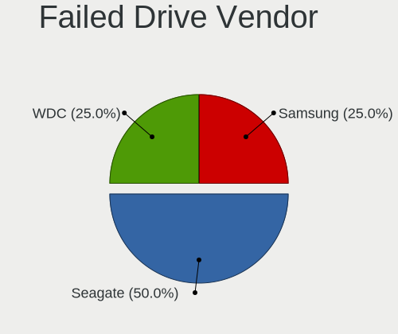
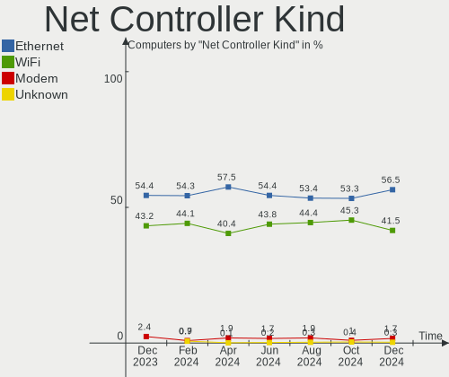
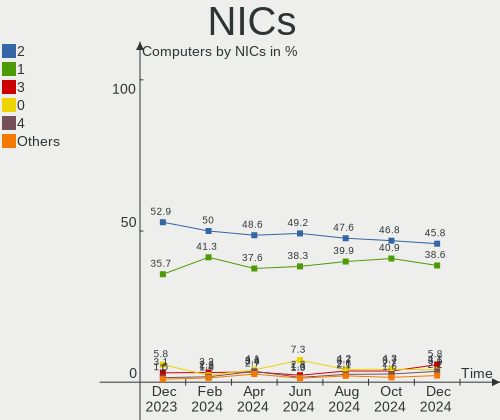
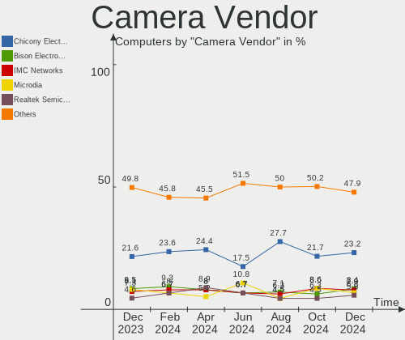

Debian - Hardware Trends
------------------------

A project to identify most popular hardware characteristics and track their change
over time based on data collected by Linux users at https://Linux-Hardware.org.

Anyone can contribute to this report by the [hw-probe](https://github.com/linuxhw/hw-probe) tool:

    sudo -E hw-probe -all -upload

This is a report for all computer types. See also reports for [desktops](/Dist/Debian/Desktop/README.md) and [notebooks](/Dist/Debian/Notebook/README.md).

This report is for one last month. Overall report since the beginning of time: [TestDays](https://github.com/linuxhw/TestDays)

Period: Dec, 2024.

Contents
--------

* [ System ](#system)
  - [ OS                       ](#os)
  - [ OS Family                ](#os-family)
  - [ Kernel                   ](#kernel)
  - [ Kernel Family            ](#kernel-family)
  - [ Kernel Major Ver.        ](#kernel-major-ver)
  - [ Arch                     ](#arch)
  - [ DE                       ](#de)
  - [ Display Server           ](#display-server)
  - [ Display Manager          ](#display-manager)
  - [ OS Lang                  ](#os-lang)
  - [ Boot Mode                ](#boot-mode)
  - [ Filesystem               ](#filesystem)
  - [ Part. scheme             ](#part-scheme)
  - [ Dual Boot with Linux/BSD ](#dual-boot-with-linuxbsd)
  - [ Dual Boot (Win)          ](#dual-boot-win)

* [ Board ](#board)
  - [ Vendor                   ](#vendor)
  - [ Model                    ](#model)
  - [ Model Family             ](#model-family)
  - [ MFG Year                 ](#mfg-year)
  - [ Form Factor              ](#form-factor)
  - [ Secure Boot              ](#secure-boot)
  - [ Coreboot                 ](#coreboot)
  - [ RAM Size                 ](#ram-size)
  - [ RAM Used                 ](#ram-used)
  - [ Total Drives             ](#total-drives)
  - [ Has CD-ROM               ](#has-cd-rom)
  - [ Has Ethernet             ](#has-ethernet)
  - [ Has WiFi                 ](#has-wifi)
  - [ Has Bluetooth            ](#has-bluetooth)

* [ Location ](#location)
  - [ Country                  ](#country)
  - [ City                     ](#city)

* [ Drives ](#drives)
  - [ Drive Vendor             ](#drive-vendor)
  - [ Drive Model              ](#drive-model)
  - [ HDD Vendor               ](#hdd-vendor)
  - [ SSD Vendor               ](#ssd-vendor)
  - [ Drive Kind               ](#drive-kind)
  - [ Drive Connector          ](#drive-connector)
  - [ Drive Size               ](#drive-size)
  - [ Space Total              ](#space-total)
  - [ Space Used               ](#space-used)
  - [ Malfunc. Drives          ](#malfunc-drives)
  - [ Malfunc. Drive Vendor    ](#malfunc-drive-vendor)
  - [ Malfunc. HDD Vendor      ](#malfunc-hdd-vendor)
  - [ Malfunc. Drive Kind      ](#malfunc-drive-kind)
  - [ Failed Drives            ](#failed-drives)
  - [ Failed Drive Vendor      ](#failed-drive-vendor)
  - [ Drive Status             ](#drive-status)

* [ Storage controller ](#storage-controller)
  - [ Storage Vendor           ](#storage-vendor)
  - [ Storage Model            ](#storage-model)
  - [ Storage Kind             ](#storage-kind)

* [ Processor ](#processor)
  - [ CPU Vendor               ](#cpu-vendor)
  - [ CPU Model                ](#cpu-model)
  - [ CPU Model Family         ](#cpu-model-family)
  - [ CPU Cores                ](#cpu-cores)
  - [ CPU Sockets              ](#cpu-sockets)
  - [ CPU Threads              ](#cpu-threads)
  - [ CPU Op-Modes             ](#cpu-op-modes)
  - [ CPU Microcode            ](#cpu-microcode)
  - [ CPU Microarch            ](#cpu-microarch)

* [ Graphics ](#graphics)
  - [ GPU Vendor               ](#gpu-vendor)
  - [ GPU Model                ](#gpu-model)
  - [ GPU Combo                ](#gpu-combo)
  - [ GPU Driver               ](#gpu-driver)
  - [ GPU Memory               ](#gpu-memory)

* [ Monitor ](#monitor)
  - [ Monitor Vendor           ](#monitor-vendor)
  - [ Monitor Model            ](#monitor-model)
  - [ Monitor Resolution       ](#monitor-resolution)
  - [ Monitor Diagonal         ](#monitor-diagonal)
  - [ Monitor Width            ](#monitor-width)
  - [ Aspect Ratio             ](#aspect-ratio)
  - [ Monitor Area             ](#monitor-area)
  - [ Pixel Density            ](#pixel-density)
  - [ Multiple Monitors        ](#multiple-monitors)

* [ Network ](#network)
  - [ Net Controller Vendor    ](#net-controller-vendor)
  - [ Net Controller Model     ](#net-controller-model)
  - [ Wireless Vendor          ](#wireless-vendor)
  - [ Wireless Model           ](#wireless-model)
  - [ Ethernet Vendor          ](#ethernet-vendor)
  - [ Ethernet Model           ](#ethernet-model)
  - [ Net Controller Kind      ](#net-controller-kind)
  - [ Used Controller          ](#used-controller)
  - [ NICs                     ](#nics)
  - [ IPv6                     ](#ipv6)

* [ Bluetooth ](#bluetooth)
  - [ Bluetooth Vendor         ](#bluetooth-vendor)
  - [ Bluetooth Model          ](#bluetooth-model)

* [ Sound ](#sound)
  - [ Sound Vendor             ](#sound-vendor)
  - [ Sound Model              ](#sound-model)

* [ Memory ](#memory)
  - [ Memory Vendor            ](#memory-vendor)
  - [ Memory Model             ](#memory-model)
  - [ Memory Kind              ](#memory-kind)
  - [ Memory Form Factor       ](#memory-form-factor)
  - [ Memory Size              ](#memory-size)
  - [ Memory Speed             ](#memory-speed)

* [ Printers & scanners ](#printers--scanners)
  - [ Printer Vendor           ](#printer-vendor)
  - [ Printer Model            ](#printer-model)
  - [ Scanner Vendor           ](#scanner-vendor)
  - [ Scanner Model            ](#scanner-model)

* [ Camera ](#camera)
  - [ Camera Vendor            ](#camera-vendor)
  - [ Camera Model             ](#camera-model)

* [ Security ](#security)
  - [ Fingerprint Vendor       ](#fingerprint-vendor)
  - [ Fingerprint Model        ](#fingerprint-model)
  - [ Chipcard Vendor          ](#chipcard-vendor)
  - [ Chipcard Model           ](#chipcard-model)

* [ Unsupported ](#unsupported)
  - [ Unsupported Devices      ](#unsupported-devices)
  - [ Unsupported Device Types ](#unsupported-device-types)

System
------

OS
--

Installed operating systems

| Name      | Computers | Percent |
|-----------|-----------|---------|
| Debian 12 | 320       | 76.74%  |
| Debian    | 73        | 17.51%  |
| Debian 11 | 18        | 4.32%   |
| Debian 9  | 4         | 0.96%   |
| Debian 24 | 1         | 0.24%   |
| Debian 10 | 1         | 0.24%   |

OS Family
---------

OS without a version

| Name   | Computers | Percent |
|--------|-----------|---------|
| Debian | 417       | 100%    |

Kernel
------

Version of the Linux kernel

| Version                   | Computers | Percent |
|---------------------------|-----------|---------|
| 6.1.0-28-amd64            | 156       | 37.41%  |
| 6.1.0-27-amd64            | 37        | 8.87%   |
| 6.11.10-amd64             | 28        | 6.71%   |
| 6.8.12-4-pve              | 16        | 3.84%   |
| 6.11.5+bpo-amd64          | 11        | 2.64%   |
| 6.12.6-amd64              | 10        | 2.4%    |
| 6.1.0-25-amd64            | 9         | 2.16%   |
| 6.12.5-amd64              | 8         | 1.92%   |
| 6.8.12-5-pve              | 7         | 1.68%   |
| 6.1.0-18-amd64            | 6         | 1.44%   |
| 6.6.62+rpt-rpi-v8         | 5         | 1.2%    |
| 6.12.3-amd64              | 5         | 1.2%    |
| 5.10.0-33-amd64           | 5         | 1.2%    |
| 6.8.4-2-pve               | 4         | 0.96%   |
| 6.11.10+bpo-amd64         | 4         | 0.96%   |
| 6.1.0-28-686-pae          | 4         | 0.96%   |
| 6.1.0-26-amd64            | 4         | 0.96%   |
| 6.1.0-23-amd64            | 4         | 0.96%   |
| 6.6.62+rpt-rpi-2712       | 3         | 0.72%   |
| 6.6.51+rpt-rpi-v8         | 3         | 0.72%   |
| 6.2.16-20-bpo11-pve       | 3         | 0.72%   |
| 6.12.6-1-liquorix-amd64   | 3         | 0.72%   |
| 6.11.9-amd64              | 3         | 0.72%   |
| 6.10.11+bpo-amd64         | 3         | 0.72%   |
| 6.1.0-10-amd64            | 3         | 0.72%   |
| 5.15.158-2-pve            | 3         | 0.72%   |
| 4.19.0-6-amd64            | 3         | 0.72%   |
| 6.8.12-2-pve              | 2         | 0.48%   |
| 6.6.58-chrultrabook       | 2         | 0.48%   |
| 6.6.44-production+truenas | 2         | 0.48%   |
| 6.11.9-loong64            | 2         | 0.48%   |
| 6.11.7-amd64              | 2         | 0.48%   |
| 6.11.5-amd64              | 2         | 0.48%   |
| 6.11.0-1-pve              | 2         | 0.48%   |
| 6.1.21-v8+                | 2         | 0.48%   |
| 6.1.0-17-amd64            | 2         | 0.48%   |
| 6.9.7+bpo-amd64           | 1         | 0.24%   |
| 6.9.10-1-liquorix-amd64   | 1         | 0.24%   |
| 6.8.8-2-pve               | 1         | 0.24%   |
| 6.8.12-i7                 | 1         | 0.24%   |

Kernel Family
-------------

Linux kernel without a distro release

| Version  | Computers | Percent |
|----------|-----------|---------|
| 6.1.0    | 231       | 55.4%   |
| 6.11.10  | 33        | 7.91%   |
| 6.8.12   | 27        | 6.47%   |
| 6.12.6   | 14        | 3.36%   |
| 6.11.5   | 13        | 3.12%   |
| 6.12.5   | 9         | 2.16%   |
| 6.6.62   | 8         | 1.92%   |
| 5.10.0   | 8         | 1.92%   |
| 6.12.3   | 7         | 1.68%   |
| 6.11.9   | 5         | 1.2%    |
| 6.8.4    | 4         | 0.96%   |
| 6.6.51   | 4         | 0.96%   |
| 6.10.11  | 4         | 0.96%   |
| 6.2.16   | 3         | 0.72%   |
| 5.15.158 | 3         | 0.72%   |
| 4.19.0   | 3         | 0.72%   |
| 6.6.58   | 2         | 0.48%   |
| 6.6.44   | 2         | 0.48%   |
| 6.5.11   | 2         | 0.48%   |
| 6.12.4   | 2         | 0.48%   |
| 6.11.7   | 2         | 0.48%   |
| 6.11.0   | 2         | 0.48%   |
| 6.1.21   | 2         | 0.48%   |
| 6.9.7    | 1         | 0.24%   |
| 6.9.10   | 1         | 0.24%   |
| 6.8.8    | 1         | 0.24%   |
| 6.7.0    | 1         | 0.24%   |
| 6.6.65   | 1         | 0.24%   |
| 6.6.63   | 1         | 0.24%   |
| 6.6.32   | 1         | 0.24%   |
| 6.6.28   | 1         | 0.24%   |
| 6.6.15   | 1         | 0.24%   |
| 6.5.0    | 1         | 0.24%   |
| 6.13.0   | 1         | 0.24%   |
| 6.11.4   | 1         | 0.24%   |
| 6.11.2   | 1         | 0.24%   |
| 6.10.3   | 1         | 0.24%   |
| 6.10.0   | 1         | 0.24%   |
| 6.1.90   | 1         | 0.24%   |
| 6.1.84   | 1         | 0.24%   |

Kernel Major Ver.
-----------------

Linux kernel major version

| Version | Computers | Percent |
|---------|-----------|---------|
| 6.1     | 240       | 57.55%  |
| 6.11    | 57        | 13.67%  |
| 6.8     | 32        | 7.67%   |
| 6.12    | 32        | 7.67%   |
| 6.6     | 21        | 5.04%   |
| 5.10    | 10        | 2.4%    |
| 6.10    | 6         | 1.44%   |
| 5.15    | 4         | 0.96%   |
| 4.19    | 4         | 0.96%   |
| 6.5     | 3         | 0.72%   |
| 6.2     | 3         | 0.72%   |
| 6.9     | 2         | 0.48%   |
| 6.7     | 1         | 0.24%   |
| 6.13    | 1         | 0.24%   |
| 5.14    | 1         | 0.24%   |

Arch
----

OS architecture (x86_64, i586, etc.)

| Name        | Computers | Percent |
|-------------|-----------|---------|
| x86_64      | 386       | 92.57%  |
| aarch64     | 20        | 4.8%    |
| i686        | 5         | 1.2%    |
| loongarch64 | 3         | 0.72%   |
| armv7l      | 2         | 0.48%   |
| ppc64le     | 1         | 0.24%   |

DE
--

Desktop Environment

| Name             | Computers | Percent |
|------------------|-----------|---------|
| GNOME            | 125       | 29.98%  |
| Unknown          | 83        | 19.9%   |
| KDE5             | 62        | 14.87%  |
| XFCE             | 61        | 14.63%  |
| MATE             | 17        | 4.08%   |
| X-Cinnamon       | 15        | 3.6%    |
| KDE6             | 11        | 2.64%   |
| Cinnamon         | 9         | 2.16%   |
| LXQt             | 7         | 1.68%   |
| LXDE             | 5         | 1.2%    |
| Trinity          | 3         | 0.72%   |
| labwc:wlroots    | 3         | 0.72%   |
| KDE              | 3         | 0.72%   |
| i3               | 3         | 0.72%   |
| wlroots          | 2         | 0.48%   |
| sway             | 2         | 0.48%   |
| lightdm-xsession | 1         | 0.24%   |
| icewm            | 1         | 0.24%   |
| GNOME Flashback  | 1         | 0.24%   |
| fluxbox          | 1         | 0.24%   |
| Deepin           | 1         | 0.24%   |
| Budgie           | 1         | 0.24%   |

Display Server
--------------

X11 or Wayland

| Name    | Computers | Percent |
|---------|-----------|---------|
| X11     | 198       | 47.48%  |
| Wayland | 124       | 29.74%  |
| Tty     | 69        | 16.55%  |
| Unknown | 26        | 6.24%   |

Display Manager
---------------

SDDM, LightDM, etc.

| Name    | Computers | Percent |
|---------|-----------|---------|
| Unknown | 165       | 39.57%  |
| GDM3    | 105       | 25.18%  |
| LightDM | 87        | 20.86%  |
| SDDM    | 51        | 12.23%  |
| GDM     | 4         | 0.96%   |
| XDM     | 2         | 0.48%   |
| WDM     | 1         | 0.24%   |
| TDM     | 1         | 0.24%   |
| LXDM    | 1         | 0.24%   |

OS Lang
-------

Language

| Lang         | Computers | Percent |
|--------------|-----------|---------|
| en_US        | 208       | 49.88%  |
| fr_FR        | 32        | 7.67%   |
| de_DE        | 30        | 7.19%   |
| en_GB        | 25        | 6%      |
| ru_RU        | 17        | 4.08%   |
| it_IT        | 11        | 2.64%   |
| Unknown      | 10        | 2.4%    |
| pt_BR        | 9         | 2.16%   |
| es_ES        | 9         | 2.16%   |
| C            | 9         | 2.16%   |
| en_CA        | 5         | 1.2%    |
| en_AU        | 5         | 1.2%    |
| tr_TR        | 4         | 0.96%   |
| pl_PL        | 3         | 0.72%   |
| de_CH        | 3         | 0.72%   |
| cs_CZ        | 3         | 0.72%   |
| zh_CN        | 2         | 0.48%   |
| hu_HU        | 2         | 0.48%   |
| es_MX        | 2         | 0.48%   |
| es_AR        | 2         | 0.48%   |
| en_IN        | 2         | 0.48%   |
| de_AT        | 2         | 0.48%   |
| th_TH        | 1         | 0.24%   |
| sv_SE        | 1         | 0.24%   |
| sr_RS        | 1         | 0.24%   |
| ru_UA        | 1         | 0.24%   |
| pt_PT        | 1         | 0.24%   |
| nl_NL        | 1         | 0.24%   |
| nl_BE        | 1         | 0.24%   |
| ja_JP        | 1         | 0.24%   |
| fr_CH        | 1         | 0.24%   |
| fr_CA        | 1         | 0.24%   |
| fr_BE        | 1         | 0.24%   |
| fi_FI        | 1         | 0.24%   |
| es_UY        | 1         | 0.24%   |
| es_PE        | 1         | 0.24%   |
| es_PA        | 1         | 0.24%   |
| es_CL        | 1         | 0.24%   |
| en_US@custom | 1         | 0.24%   |
| en_NZ        | 1         | 0.24%   |

Boot Mode
---------

EFI or BIOS

| Mode | Computers | Percent |
|------|-----------|---------|
| EFI  | 265       | 63.55%  |
| BIOS | 152       | 36.45%  |

Filesystem
----------

Type of filesystem

| Type    | Computers | Percent |
|---------|-----------|---------|
| Ext4    | 355       | 85.13%  |
| Overlay | 21        | 5.04%   |
| Btrfs   | 17        | 4.08%   |
| Zfs     | 13        | 3.12%   |
| Tmpfs   | 4         | 0.96%   |
| Xfs     | 3         | 0.72%   |
| Ext3    | 1         | 0.24%   |
| Ext2    | 1         | 0.24%   |
| Aufs    | 1         | 0.24%   |
| Unknown | 1         | 0.24%   |

Part. scheme
------------

Scheme of partitioning

| Type    | Computers | Percent |
|---------|-----------|---------|
| GPT     | 278       | 66.67%  |
| Unknown | 81        | 19.42%  |
| MBR     | 58        | 13.91%  |

Dual Boot with Linux/BSD
------------------------

Hosting more than one Linux/BSD

| Dual boot | Computers | Percent |
|-----------|-----------|---------|
| No        | 348       | 83.45%  |
| Yes       | 69        | 16.55%  |

Dual Boot (Win)
---------------

Hosting Linux and Windows

| Dual boot | Computers | Percent |
|-----------|-----------|---------|
| No        | 327       | 78.42%  |
| Yes       | 90        | 21.58%  |

Board
-----

Vendor
------

Motherboard manufacturer

| Name                                 | Computers | Percent |
|--------------------------------------|-----------|---------|
| Lenovo                               | 60        | 14.39%  |
| Hewlett-Packard                      | 54        | 12.95%  |
| ASUSTek Computer                     | 52        | 12.47%  |
| Dell                                 | 47        | 11.27%  |
| Gigabyte Technology                  | 26        | 6.24%   |
| MSI                                  | 17        | 4.08%   |
| ASRock                               | 17        | 4.08%   |
| Unknown                              | 15        | 3.6%    |
| Raspberry Pi Foundation              | 14        | 3.36%   |
| Intel                                | 14        | 3.36%   |
| Acer                                 | 12        | 2.88%   |
| Supermicro                           | 9         | 2.16%   |
| AZW                                  | 7         | 1.68%   |
| Apple                                | 5         | 1.2%    |
| Shenzhen Meigao Electronic Equipment | 4         | 0.96%   |
| Notebook                             | 4         | 0.96%   |
| Google                               | 4         | 0.96%   |
| Loongson                             | 3         | 0.72%   |
| Sony                                 | 2         | 0.48%   |
| Shanghai Zhaoxin Semiconductor       | 2         | 0.48%   |
| Samsung Electronics                  | 2         | 0.48%   |
| Positivo                             | 2         | 0.48%   |
| Packard Bell                         | 2         | 0.48%   |
| Insyde                               | 2         | 0.48%   |
| IBM                                  | 2         | 0.48%   |
| Fujitsu Siemens                      | 2         | 0.48%   |
| Fujitsu                              | 2         | 0.48%   |
| ZOTAC                                | 1         | 0.24%   |
| WTM                                  | 1         | 0.24%   |
| Win Element                          | 1         | 0.24%   |
| UMAX                                 | 1         | 0.24%   |
| UGREEN                               | 1         | 0.24%   |
| TUXEDO                               | 1         | 0.24%   |
| Toshiba                              | 1         | 0.24%   |
| TI                                   | 1         | 0.24%   |
| TB                                   | 1         | 0.24%   |
| sunxi                                | 1         | 0.24%   |
| Shuttle                              | 1         | 0.24%   |
| Schenker                             | 1         | 0.24%   |
| Sapphire                             | 1         | 0.24%   |

Model
-----

Motherboard model

| Name                                              | Computers | Percent |
|---------------------------------------------------|-----------|---------|
| Unknown                                           | 16        | 3.84%   |
| RPi Raspberry Pi 5 Model B Rev 1.0                | 4         | 0.96%   |
| HP ProDesk 400 G4 DM                              | 4         | 0.96%   |
| Shenzhen Meigao Electronic Equipment Venus series | 3         | 0.72%   |
| Dell PowerEdge R730xd                             | 3         | 0.72%   |
| AZW LZX                                           | 3         | 0.72%   |
| Supermicro SYS-6018U-TR4+                         | 2         | 0.48%   |
| Supermicro SYS-111R-M                             | 2         | 0.48%   |
| Supermicro Super Server                           | 2         | 0.48%   |
| Shanghai Zhaoxin ZXE CRB                          | 2         | 0.48%   |
| RPi Raspberry Pi 4 Model B Rev 1.5                | 2         | 0.48%   |
| RPi Raspberry Pi 3 Model B Rev 1.2                | 2         | 0.48%   |
| Positivo R516256AI-15                             | 2         | 0.48%   |
| MSI MS-7E07                                       | 2         | 0.48%   |
| Lenovo IdeaPad 1 15ALC7 82R4                      | 2         | 0.48%   |
| Intel X99                                         | 2         | 0.48%   |
| Insyde Purley                                     | 2         | 0.48%   |
| HP ProLiant DL380 Gen9                            | 2         | 0.48%   |
| HP Pavilion 17                                    | 2         | 0.48%   |
| HP EliteDesk 800 G1 SFF                           | 2         | 0.48%   |
| HP 255 15.6 inch G10                              | 2         | 0.48%   |
| Dell Precision M4800                              | 2         | 0.48%   |
| Dell Latitude 7480                                | 2         | 0.48%   |
| Dell Latitude 5480                                | 2         | 0.48%   |
| Dell Latitude 3320                                | 2         | 0.48%   |
| Dell Inspiron 15 3520                             | 2         | 0.48%   |
| ASUS VivoBook_ASUSLaptop K3605ZF_K3605ZF          | 2         | 0.48%   |
| ASUS TUF Gaming Z790-PLUS WIFI                    | 2         | 0.48%   |
| ASUS TUF Gaming X570-PLUS                         | 2         | 0.48%   |
| ASUS All Series                                   | 2         | 0.48%   |
| ASRock X399 Taichi                                | 2         | 0.48%   |
| ZOTAC NM10                                        | 1         | 0.24%   |
| WTM W-N95-R                                       | 1         | 0.24%   |
| Win Element M6                                    | 1         | 0.24%   |
| UMAX VisionBook 14WRx                             | 1         | 0.24%   |
| UGREEN DXP8800 Plus                               | 1         | 0.24%   |
| TUXEDO InfinityBook Pro AMD Gen9                  | 1         | 0.24%   |
| Toshiba Satellite S70-B                           | 1         | 0.24%   |
| TI AM335x BeagleBone Black Gateway Cape           | 1         | 0.24%   |
| TB WTR R1                                         | 1         | 0.24%   |

Model Family
------------

Motherboard model prefix

| Name                                       | Computers | Percent |
|--------------------------------------------|-----------|---------|
| Lenovo ThinkPad                            | 31        | 7.43%   |
| Unknown                                    | 16        | 3.84%   |
| RPi Raspberry                              | 14        | 3.36%   |
| Lenovo IdeaPad                             | 14        | 3.36%   |
| ASUS VivoBook                              | 12        | 2.88%   |
| HP EliteBook                               | 11        | 2.64%   |
| Dell PowerEdge                             | 9         | 2.16%   |
| Dell Latitude                              | 9         | 2.16%   |
| Acer Aspire                                | 9         | 2.16%   |
| HP ProDesk                                 | 8         | 1.92%   |
| Dell Precision                             | 8         | 1.92%   |
| ASUS TUF                                   | 8         | 1.92%   |
| Dell OptiPlex                              | 7         | 1.68%   |
| Dell XPS                                   | 6         | 1.44%   |
| ASUS PRIME                                 | 6         | 1.44%   |
| HP Pavilion                                | 5         | 1.2%    |
| HP EliteDesk                               | 5         | 1.2%    |
| Dell Inspiron                              | 5         | 1.2%    |
| HP ProLiant                                | 4         | 0.96%   |
| HP Compaq                                  | 4         | 0.96%   |
| ASUS ROG                                   | 4         | 0.96%   |
| Shenzhen Meigao Electronic Equipment Venus | 3         | 0.72%   |
| Lenovo ThinkBook                           | 3         | 0.72%   |
| HP ProBook                                 | 3         | 0.72%   |
| HP Laptop                                  | 3         | 0.72%   |
| HP ENVY                                    | 3         | 0.72%   |
| HP 255                                     | 3         | 0.72%   |
| Gigabyte B450M                             | 3         | 0.72%   |
| AZW LZX                                    | 3         | 0.72%   |
| Supermicro SYS-6018U-TR4+                  | 2         | 0.48%   |
| Supermicro SYS-111R-M                      | 2         | 0.48%   |
| Supermicro Super                           | 2         | 0.48%   |
| Shanghai Zhaoxin ZXE                       | 2         | 0.48%   |
| Positivo R516256AI-15                      | 2         | 0.48%   |
| Packard Bell EasyNote                      | 2         | 0.48%   |
| MSI MS-7E07                                | 2         | 0.48%   |
| Lenovo Yoga                                | 2         | 0.48%   |
| Lenovo ThinkStation                        | 2         | 0.48%   |
| Lenovo ThinkCentre                         | 2         | 0.48%   |
| Lenovo IdeaCentre                          | 2         | 0.48%   |

MFG Year
--------

Motherboard manufacture year

| Year    | Computers | Percent |
|---------|-----------|---------|
| 2023    | 50        | 11.99%  |
| 2022    | 44        | 10.55%  |
| 2024    | 37        | 8.87%   |
| 2018    | 37        | 8.87%   |
| 2021    | 31        | 7.43%   |
| 2020    | 26        | 6.24%   |
| 2017    | 25        | 6%      |
| Unknown | 25        | 6%      |
| 2014    | 23        | 5.52%   |
| 2013    | 21        | 5.04%   |
| 2012    | 18        | 4.32%   |
| 2019    | 15        | 3.6%    |
| 2011    | 15        | 3.6%    |
| 2015    | 13        | 3.12%   |
| 2010    | 11        | 2.64%   |
| 2009    | 11        | 2.64%   |
| 2016    | 5         | 1.2%    |
| 2008    | 3         | 0.72%   |
| 2007    | 3         | 0.72%   |
| 2006    | 3         | 0.72%   |
| 2004    | 1         | 0.24%   |

Form Factor
-----------

Physical design of the computer

| Name           | Computers | Percent |
|----------------|-----------|---------|
| Notebook       | 178       | 42.69%  |
| Desktop        | 163       | 39.09%  |
| Server         | 28        | 6.71%   |
| System on chip | 22        | 5.28%   |
| Mini pc        | 16        | 3.84%   |
| Convertible    | 7         | 1.68%   |
| All in one     | 3         | 0.72%   |

Secure Boot
-----------

Enabled or disabled

| State    | Computers | Percent |
|----------|-----------|---------|
| Disabled | 390       | 93.53%  |
| Enabled  | 27        | 6.47%   |

Coreboot
--------

Have coreboot on board

| Used | Computers | Percent |
|------|-----------|---------|
| No   | 414       | 99.28%  |
| Yes  | 3         | 0.72%   |

RAM Size
--------

Total RAM memory

| Size in GB      | Computers | Percent |
|-----------------|-----------|---------|
| 16.01-24.0      | 78        | 18.71%  |
| 32.01-64.0      | 77        | 18.47%  |
| 4.01-8.0        | 75        | 17.99%  |
| 8.01-16.0       | 60        | 14.39%  |
| 64.01-256.0     | 49        | 11.75%  |
| 3.01-4.0        | 31        | 7.43%   |
| 24.01-32.0      | 21        | 5.04%   |
| 1.01-2.0        | 11        | 2.64%   |
| More than 256.0 | 6         | 1.44%   |
| 0.51-1.0        | 4         | 0.96%   |
| 2.01-3.0        | 3         | 0.72%   |
| 0.01-0.5        | 2         | 0.48%   |

RAM Used
--------

Used RAM memory

| Used GB         | Computers | Percent |
|-----------------|-----------|---------|
| 2.01-3.0        | 96        | 23.02%  |
| 4.01-8.0        | 84        | 20.14%  |
| 1.01-2.0        | 82        | 19.66%  |
| 3.01-4.0        | 55        | 13.19%  |
| 8.01-16.0       | 38        | 9.11%   |
| 0.51-1.0        | 21        | 5.04%   |
| 0.01-0.5        | 14        | 3.36%   |
| 16.01-24.0      | 9         | 2.16%   |
| 64.01-256.0     | 7         | 1.68%   |
| 24.01-32.0      | 6         | 1.44%   |
| 32.01-64.0      | 4         | 0.96%   |
| More than 256.0 | 1         | 0.24%   |

Total Drives
------------

Number of drives on board

| Drives | Computers | Percent |
|--------|-----------|---------|
| 1      | 237       | 56.83%  |
| 2      | 98        | 23.5%   |
| 3      | 27        | 6.47%   |
| 4      | 17        | 4.08%   |
| 5      | 11        | 2.64%   |
| 9      | 4         | 0.96%   |
| 6      | 4         | 0.96%   |
| 10     | 3         | 0.72%   |
| 8      | 3         | 0.72%   |
| 7      | 3         | 0.72%   |
| 0      | 2         | 0.48%   |
| 61     | 1         | 0.24%   |
| 44     | 1         | 0.24%   |
| 39     | 1         | 0.24%   |
| 24     | 1         | 0.24%   |
| 20     | 1         | 0.24%   |
| 16     | 1         | 0.24%   |
| 14     | 1         | 0.24%   |
| 11     | 1         | 0.24%   |

Has CD-ROM
----------

Has CD-ROM on board

| Presented | Computers | Percent |
|-----------|-----------|---------|
| No        | 317       | 76.02%  |
| Yes       | 100       | 23.98%  |

Has Ethernet
------------

Has Ethernet on board

| Presented | Computers | Percent |
|-----------|-----------|---------|
| Yes       | 358       | 85.85%  |
| No        | 59        | 14.15%  |

Has WiFi
--------

Has WiFi module

| Presented | Computers | Percent |
|-----------|-----------|---------|
| Yes       | 263       | 63.07%  |
| No        | 154       | 36.93%  |

Has Bluetooth
-------------

Has Bluetooth module

| Presented | Computers | Percent |
|-----------|-----------|---------|
| Yes       | 234       | 56.12%  |
| No        | 183       | 43.88%  |

Location
--------

Country
-------

Geographic location (country)

| Country      | Computers | Percent |
|--------------|-----------|---------|
| USA          | 84        | 20.14%  |
| Germany      | 49        | 11.75%  |
| France       | 39        | 9.35%   |
| Russia       | 36        | 8.63%   |
| Brazil       | 18        | 4.32%   |
| Italy        | 14        | 3.36%   |
| China        | 13        | 3.12%   |
| Canada       | 12        | 2.88%   |
| UK           | 11        | 2.64%   |
| Spain        | 9         | 2.16%   |
| Austria      | 9         | 2.16%   |
| Switzerland  | 7         | 1.68%   |
| Belgium      | 7         | 1.68%   |
| Australia    | 7         | 1.68%   |
| Turkey       | 6         | 1.44%   |
| Poland       | 6         | 1.44%   |
| Netherlands  | 6         | 1.44%   |
| Czechia      | 6         | 1.44%   |
| Romania      | 5         | 1.2%    |
| Sweden       | 4         | 0.96%   |
| Norway       | 4         | 0.96%   |
| Mexico       | 4         | 0.96%   |
| Hungary      | 4         | 0.96%   |
| Finland      | 4         | 0.96%   |
| Ukraine      | 3         | 0.72%   |
| Saudi Arabia | 3         | 0.72%   |
| Portugal     | 3         | 0.72%   |
| Kazakhstan   | 3         | 0.72%   |
| Japan        | 3         | 0.72%   |
| Greece       | 3         | 0.72%   |
| Bangladesh   | 3         | 0.72%   |
| Serbia       | 2         | 0.48%   |
| India        | 2         | 0.48%   |
| Denmark      | 2         | 0.48%   |
| Belarus      | 2         | 0.48%   |
| Argentina    | 2         | 0.48%   |
| Türkiye     | 1         | 0.24%   |
| Thailand     | 1         | 0.24%   |
| Taiwan       | 1         | 0.24%   |
| South Korea  | 1         | 0.24%   |

City
----

Geographic location (city)

| City              | Computers | Percent |
|-------------------|-----------|---------|
| St Petersburg     | 14        | 3.36%   |
| Ann Arbor         | 8         | 1.92%   |
| Kunming           | 7         | 1.68%   |
| Moscow            | 6         | 1.44%   |
| Frankfurt am Main | 6         | 1.44%   |
| Berlin            | 5         | 1.2%    |
| Bagneux           | 5         | 1.2%    |
| Vienna            | 4         | 0.96%   |
| Prague            | 4         | 0.96%   |
| Los Angeles       | 4         | 0.96%   |
| Seattle           | 3         | 0.72%   |
| Sao Paulo         | 3         | 0.72%   |
| Paris             | 3         | 0.72%   |
| Martinez          | 3         | 0.72%   |
| Leipzig           | 3         | 0.72%   |
| Florianópolis    | 3         | 0.72%   |
| Düsseldorf       | 3         | 0.72%   |
| Dhaka             | 3         | 0.72%   |
| Bucharest         | 3         | 0.72%   |
| Bangor            | 3         | 0.72%   |
| Amsterdam         | 3         | 0.72%   |
| Adelaide          | 3         | 0.72%   |
| Wenshan City      | 2         | 0.48%   |
| Szentendre        | 2         | 0.48%   |
| Strasbourg        | 2         | 0.48%   |
| Shymkent          | 2         | 0.48%   |
| Rome              | 2         | 0.48%   |
| Rio de Janeiro    | 2         | 0.48%   |
| Reutlingen        | 2         | 0.48%   |
| Quimper           | 2         | 0.48%   |
| Omsk              | 2         | 0.48%   |
| New York          | 2         | 0.48%   |
| Nantes            | 2         | 0.48%   |
| Munich            | 2         | 0.48%   |
| Minsk             | 2         | 0.48%   |
| Minnetonka        | 2         | 0.48%   |
| Melbourne         | 2         | 0.48%   |
| Mainz             | 2         | 0.48%   |
| Linz              | 2         | 0.48%   |
| Lessebo           | 2         | 0.48%   |

Drives
------

Drive Vendor
------------

Hard drive vendors

| Vendor                      | Computers | Drives | Percent |
|-----------------------------|-----------|--------|---------|
| Samsung Electronics         | 99        | 154    | 15.92%  |
| WDC                         | 74        | 170    | 11.9%   |
| Seagate                     | 64        | 131    | 10.29%  |
| SanDisk                     | 37        | 45     | 5.95%   |
| Unknown                     | 29        | 31     | 4.66%   |
| Toshiba                     | 29        | 69     | 4.66%   |
| Kingston                    | 29        | 37     | 4.66%   |
| Crucial                     | 25        | 28     | 4.02%   |
| SK hynix                    | 23        | 23     | 3.7%    |
| Intel                       | 17        | 29     | 2.73%   |
| Unknown                     | 15        | 15     | 2.41%   |
| Micron Technology           | 14        | 15     | 2.25%   |
| HGST                        | 13        | 41     | 2.09%   |
| Hitachi                     | 11        | 35     | 1.77%   |
| A-DATA Technology           | 11        | 13     | 1.77%   |
| SPCC                        | 9         | 9      | 1.45%   |
| Kingston Technology Company | 8         | 10     | 1.29%   |
| MAXIO Technology (Hangzhou) | 7         | 7      | 1.13%   |
| China                       | 7         | 7      | 1.13%   |
| Intenso                     | 5         | 5      | 0.8%    |
| ZHITAI                      | 4         | 4      | 0.64%   |
| PNY                         | 4         | 4      | 0.64%   |
| Patriot                     | 4         | 4      | 0.64%   |
| Lexar                       | 4         | 4      | 0.64%   |
| Transcend                   | 3         | 3      | 0.48%   |
| Micron/Crucial Technology   | 3         | 3      | 0.48%   |
| Maxtor                      | 3         | 3      | 0.48%   |
| Hewlett-Packard             | 3         | 15     | 0.48%   |
| Fanxiang                    | 3         | 5      | 0.48%   |
| ASMT                        | 3         | 3      | 0.48%   |
| YMTC                        | 2         | 2      | 0.32%   |
| Team                        | 2         | 2      | 0.32%   |
| Silicon Motion              | 2         | 2      | 0.32%   |
| SD                          | 2         | 2      | 0.32%   |
| SABRENT                     | 2         | 3      | 0.32%   |
| Phison                      | 2         | 2      | 0.32%   |
| Netac                       | 2         | 2      | 0.32%   |
| MACROVIP                    | 2         | 2      | 0.32%   |
| KIOXIA-EXCERIA              | 2         | 2      | 0.32%   |
| Hikvision                   | 2         | 2      | 0.32%   |

Drive Model
-----------

Hard drive models

| Model                                                | Computers | Percent |
|------------------------------------------------------|-----------|---------|
| Unknown                                              | 15        | 2.07%   |
| Samsung NVMe SSD Controller SM981/PM981/PM983 512GB  | 7         | 0.96%   |
| SanDisk NVMe SSD Drive 1TB                           | 6         | 0.83%   |
| Samsung NVMe SSD Controller PM9A1/PM9A3/980PRO 512GB | 6         | 0.83%   |
| Unknown MMC Card  32GB                               | 4         | 0.55%   |
| SPCC Solid State Disk 256GB                          | 4         | 0.55%   |
| Seagate ST8000DM004-2U9188 8TB                       | 4         | 0.55%   |
| Seagate ST1000DM010-2EP102 1TB                       | 4         | 0.55%   |
| SanDisk NVMe SSD Drive 2TB                           | 4         | 0.55%   |
| Samsung SSD 990 PRO 1TB                              | 4         | 0.55%   |
| Samsung SSD 980 1TB                                  | 4         | 0.55%   |
| Samsung SSD 970 EVO Plus 1TB                         | 4         | 0.55%   |
| Samsung SSD 870 EVO 1TB                              | 4         | 0.55%   |
| Samsung MZVL4512HBLU-00BTW 512GB                     | 4         | 0.55%   |
| MAXIO (Hangzhou) NVMe SSD Controller MAP1202 512GB   | 4         | 0.55%   |
| Crucial CT1000P3PSSD8 1TB                            | 4         | 0.55%   |
| ZHITAI SC001 Active 512GB SSD                        | 3         | 0.41%   |
| WDC WDS250G2B0A-00SM50 250GB SSD                     | 3         | 0.41%   |
| WDC WD2502ABYS-23B7A0 39M4511 42C0463IBM 250GB       | 3         | 0.41%   |
| WDC WD2502ABYS-23B7A0 39M4511 250GB                  | 3         | 0.41%   |
| WDC WD2002FYPS-02W3B0 2TB                            | 3         | 0.41%   |
| Unknown MMC Card  64GB                               | 3         | 0.41%   |
| Seagate ST3600057SS 600GB                            | 3         | 0.41%   |
| Samsung SSD 990 PRO 2TB                              | 3         | 0.41%   |
| Samsung SSD 870 EVO 500GB                            | 3         | 0.41%   |
| Samsung SSD 860 EVO 500GB                            | 3         | 0.41%   |
| Samsung SSD 860 EVO 1TB                              | 3         | 0.41%   |
| Samsung SSD 850 EVO 500GB                            | 3         | 0.41%   |
| Samsung SSD 850 EVO 250GB                            | 3         | 0.41%   |
| Kingston Company SNV2S1000G 1TB                      | 3         | 0.41%   |
| Kingston SUV400S37120G 120GB SSD                     | 3         | 0.41%   |
| Kingston SA400S37480G 480GB SSD                      | 3         | 0.41%   |
| Kingston SA400S37240G 240GB SSD                      | 3         | 0.41%   |
| Intel SSDPEKNU512GZ 512GB                            | 3         | 0.41%   |
| HGST HUS726T6TALE6L4 6TB                             | 3         | 0.41%   |
| Crucial CT240BX500SSD1 240GB                         | 3         | 0.41%   |
| YMTC PC005 512GB                                     | 2         | 0.28%   |
| WDC WDS480G2G0C-00AJM0 480GB                         | 2         | 0.28%   |
| WDC WDS240G2G0A-00JH30 240GB SSD                     | 2         | 0.28%   |
| WDC WDS100T2B0C-00PXH0 1TB                           | 2         | 0.28%   |

HDD Vendor
----------

Hard disk drive vendors

| Vendor              | Computers | Drives | Percent |
|---------------------|-----------|--------|---------|
| Seagate             | 62        | 128    | 36.05%  |
| WDC                 | 46        | 136    | 26.74%  |
| Toshiba             | 25        | 63     | 14.53%  |
| HGST                | 13        | 40     | 7.56%   |
| Hitachi             | 11        | 35     | 6.4%    |
| Samsung Electronics | 6         | 9      | 3.49%   |
| SABRENT             | 2         | 3      | 1.16%   |
| Maxtor              | 2         | 2      | 1.16%   |
| IBM-XIV             | 1         | 7      | 0.58%   |
| IBM-ESXS            | 1         | 1      | 0.58%   |
| HPE                 | 1         | 1      | 0.58%   |
| Hewlett-Packard     | 1         | 13     | 0.58%   |
| ASMT                | 1         | 1      | 0.58%   |

SSD Vendor
----------

Solid state drive vendors

| Vendor              | Computers | Drives | Percent |
|---------------------|-----------|--------|---------|
| Samsung Electronics | 43        | 66     | 22.63%  |
| WDC                 | 17        | 17     | 8.95%   |
| Kingston            | 16        | 23     | 8.42%   |
| Crucial             | 13        | 13     | 6.84%   |
| SanDisk             | 12        | 15     | 6.32%   |
| Intel               | 9         | 20     | 4.74%   |
| SPCC                | 8         | 8      | 4.21%   |
| A-DATA Technology   | 8         | 9      | 4.21%   |
| China               | 6         | 6      | 3.16%   |
| PNY                 | 4         | 4      | 2.11%   |
| Intenso             | 4         | 4      | 2.11%   |
| Unknown             | 4         | 4      | 2.11%   |
| ZHITAI              | 3         | 3      | 1.58%   |
| Transcend           | 3         | 3      | 1.58%   |
| Micron Technology   | 3         | 3      | 1.58%   |
| SK hynix            | 2         | 2      | 1.05%   |
| SD                  | 2         | 2      | 1.05%   |
| MACROVIP            | 2         | 2      | 1.05%   |
| Fanxiang            | 2         | 3      | 1.05%   |
| Verbatim            | 1         | 1      | 0.53%   |
| V-GeN               | 1         | 1      | 0.53%   |
| Toshiba             | 1         | 2      | 0.53%   |
| Timetec             | 1         | 1      | 0.53%   |
| Team                | 1         | 1      | 0.53%   |
| Seagate             | 1         | 1      | 0.53%   |
| Patriot             | 1         | 1      | 0.53%   |
| OXYBR               | 1         | 1      | 0.53%   |
| OWC                 | 1         | 1      | 0.53%   |
| Netac               | 1         | 1      | 0.53%   |
| Mushkin             | 1         | 2      | 0.53%   |
| Maxtor              | 1         | 1      | 0.53%   |
| LITEONIT            | 1         | 1      | 0.53%   |
| LITEON              | 1         | 1      | 0.53%   |
| LDLC                | 1         | 1      | 0.53%   |
| KingDian            | 1         | 1      | 0.53%   |
| KimMiDi             | 1         | 1      | 0.53%   |
| INTEL SS            | 1         | 1      | 0.53%   |
| Hewlett-Packard     | 1         | 1      | 0.53%   |
| Great               | 1         | 1      | 0.53%   |
| GOODRAM             | 1         | 2      | 0.53%   |

Drive Kind
----------

HDD or SSD

| Kind    | Computers | Drives | Percent |
|---------|-----------|--------|---------|
| NVMe    | 212       | 264    | 37.66%  |
| SSD     | 173       | 239    | 30.73%  |
| HDD     | 129       | 439    | 22.91%  |
| MMC     | 39        | 41     | 6.93%   |
| Unknown | 10        | 10     | 1.78%   |

Drive Connector
---------------

SATA, SAS, NVMe, etc.

| Type | Computers | Drives | Percent |
|------|-----------|--------|---------|
| SATA | 243       | 653    | 46.73%  |
| NVMe | 211       | 263    | 40.58%  |
| MMC  | 39        | 41     | 7.5%    |
| SAS  | 27        | 36     | 5.19%   |

Drive Size
----------

Size of hard drive

| Size in TB | Computers | Drives | Percent |
|------------|-----------|--------|---------|
| 0.01-0.5   | 163       | 228    | 47.8%   |
| 0.51-1.0   | 78        | 139    | 22.87%  |
| 1.01-2.0   | 36        | 89     | 10.56%  |
| 3.01-4.0   | 27        | 61     | 7.92%   |
| 4.01-10.0  | 24        | 87     | 7.04%   |
| 2.01-3.0   | 8         | 66     | 2.35%   |
| 10.01-20.0 | 5         | 8      | 1.47%   |

Space Total
-----------

Amount of disk space available on the file system

| Size in GB     | Computers | Percent |
|----------------|-----------|---------|
| 101-250        | 95        | 22.78%  |
| 251-500        | 84        | 20.14%  |
| 501-1000       | 59        | 14.15%  |
| More than 3000 | 44        | 10.55%  |
| 1001-2000      | 31        | 7.43%   |
| 1-20           | 24        | 5.76%   |
| Unknown        | 23        | 5.52%   |
| 51-100         | 22        | 5.28%   |
| 2001-3000      | 18        | 4.32%   |
| 21-50          | 17        | 4.08%   |

Space Used
----------

Amount of used disk space

| Used GB        | Computers | Percent |
|----------------|-----------|---------|
| 1-20           | 136       | 32.61%  |
| 21-50          | 62        | 14.87%  |
| 101-250        | 45        | 10.79%  |
| 251-500        | 40        | 9.59%   |
| 51-100         | 35        | 8.39%   |
| 501-1000       | 26        | 6.24%   |
| Unknown        | 23        | 5.52%   |
| More than 3000 | 22        | 5.28%   |
| 1001-2000      | 19        | 4.56%   |
| 2001-3000      | 9         | 2.16%   |

Malfunc. Drives
---------------

Drive models with a malfunction

| Model                                                 | Computers | Drives | Percent |
|-------------------------------------------------------|-----------|--------|---------|
| WDC WD60PURZ-85ZUFY1 6TB                              | 1         | 1      | 1.67%   |
| WDC WD5000AAKX-08U6AA0 500GB                          | 1         | 1      | 1.67%   |
| WDC WD4000FYYZ-01UL1B2 4TB                            | 1         | 1      | 1.67%   |
| WDC WD3200BEKT-75PVMT1 320GB                          | 1         | 1      | 1.67%   |
| WDC WD3200AAJS-60M0A1 320GB                           | 1         | 1      | 1.67%   |
| WDC WD30EFRX-68AX9N0 3TB                              | 1         | 4      | 1.67%   |
| WDC WD2502ABYS-23B7A0 39M4511 250GB                   | 1         | 2      | 1.67%   |
| WDC WD20PURX-64P6ZY0 2TB                              | 1         | 1      | 1.67%   |
| WDC WD2002FYPS-02W3B0 2TB                             | 1         | 1      | 1.67%   |
| WDC WD2000FYYZ-01UL1B2 2TB                            | 1         | 8      | 1.67%   |
| WDC WD1600ADFS-75SLR2 160GB                           | 1         | 1      | 1.67%   |
| WDC WD Green 2.5 240GB SSD                            | 1         | 1      | 1.67%   |
| Toshiba MQ04ABF100 1TB                                | 1         | 1      | 1.67%   |
| Toshiba MG08ACA16TE 16TB                              | 1         | 2      | 1.67%   |
| Toshiba HDWD110 1TB                                   | 1         | 1      | 1.67%   |
| Toshiba DT01ACA300 3TB                                | 1         | 4      | 1.67%   |
| Silicon Motion SM2263EN/SM2263XT SSD Controller 256GB | 1         | 1      | 1.67%   |
| Seagate ST98823AS 80GB                                | 1         | 1      | 1.67%   |
| Seagate ST9500325AS 500GB                             | 1         | 1      | 1.67%   |
| Seagate ST8000DM005-2EH112 8TB                        | 1         | 1      | 1.67%   |
| Seagate ST500LT012-9WS142 500GB                       | 1         | 1      | 1.67%   |
| Seagate ST500LM000-1EJ162 500GB                       | 1         | 1      | 1.67%   |
| Seagate ST500DM005 HD502HJ 500GB                      | 1         | 1      | 1.67%   |
| Seagate ST4000NM0265-2DC107 4TB                       | 1         | 1      | 1.67%   |
| Seagate ST3500418AS 500GB                             | 1         | 1      | 1.67%   |
| Seagate ST3320620AS 320GB                             | 1         | 2      | 1.67%   |
| Seagate ST31000520AS 1TB                              | 1         | 1      | 1.67%   |
| Seagate ST2000DM001-9YN164 2TB                        | 1         | 2      | 1.67%   |
| Seagate ST1000LM024 HN-M101MBB 1TB                    | 1         | 1      | 1.67%   |
| Seagate ST1000DM003-1ER162 1TB                        | 1         | 1      | 1.67%   |
| SanDisk SSD PLUS 240 GB                               | 1         | 1      | 1.67%   |
| SanDisk SD8TB8U-256G-1006 256GB SSD                   | 1         | 1      | 1.67%   |
| Samsung Electronics SSD 870 EVO 500GB                 | 1         | 1      | 1.67%   |
| Samsung Electronics SSD 870 EVO 1TB                   | 1         | 4      | 1.67%   |
| Samsung Electronics SSD 840 EVO 250GB                 | 1         | 1      | 1.67%   |
| Samsung Electronics SP1614N 160GB                     | 1         | 1      | 1.67%   |
| Samsung Electronics MZ5PA128HMCD-01000 128GB SSD      | 1         | 1      | 1.67%   |
| Samsung Electronics HM251JI 250GB                     | 1         | 1      | 1.67%   |
| Netac NS512GSSD340 512GB                              | 1         | 1      | 1.67%   |
| Micron Technology MTFDDAV256TDL-1AW1ZABHA 256GB SSD   | 1         | 1      | 1.67%   |

Malfunc. Drive Vendor
---------------------

Vendors of faulty drives

| Vendor              | Computers | Drives | Percent |
|---------------------|-----------|--------|---------|
| Seagate             | 13        | 15     | 22.81%  |
| WDC                 | 9         | 23     | 15.79%  |
| Samsung Electronics | 6         | 9      | 10.53%  |
| Toshiba             | 4         | 8      | 7.02%   |
| Hitachi             | 4         | 4      | 7.02%   |
| HGST                | 4         | 6      | 7.02%   |
| SanDisk             | 2         | 2      | 3.51%   |
| Micron Technology   | 2         | 2      | 3.51%   |
| Maxtor              | 2         | 2      | 3.51%   |
| Intel               | 2         | 2      | 3.51%   |
| A-DATA Technology   | 2         | 2      | 3.51%   |
| Silicon Motion      | 1         | 1      | 1.75%   |
| Netac               | 1         | 1      | 1.75%   |
| Kingston            | 1         | 3      | 1.75%   |
| HPE                 | 1         | 1      | 1.75%   |
| Crucial             | 1         | 1      | 1.75%   |
| ASMT                | 1         | 1      | 1.75%   |
| Apple               | 1         | 1      | 1.75%   |

Malfunc. HDD Vendor
-------------------

Vendors of faulty HDD drives

| Vendor              | Computers | Drives | Percent |
|---------------------|-----------|--------|---------|
| Seagate             | 13        | 15     | 32.5%   |
| WDC                 | 9         | 22     | 22.5%   |
| Toshiba             | 4         | 8      | 10%     |
| Hitachi             | 4         | 4      | 10%     |
| HGST                | 4         | 6      | 10%     |
| Samsung Electronics | 2         | 2      | 5%      |
| Maxtor              | 2         | 2      | 5%      |
| HPE                 | 1         | 1      | 2.5%    |
| ASMT                | 1         | 1      | 2.5%    |

Malfunc. Drive Kind
-------------------

Kinds of faulty drives

| Kind | Computers | Drives | Percent |
|------|-----------|--------|---------|
| HDD  | 37        | 61     | 67.27%  |
| SSD  | 16        | 21     | 29.09%  |
| NVMe | 2         | 2      | 3.64%   |

Failed Drives
-------------

Failed drive models

| Model                             | Computers | Drives | Percent |
|-----------------------------------|-----------|--------|---------|
| Seagate ST31000528AS 1TB          | 2         | 5      | 50%     |
| WDC WD2000F9YZ-09N20L0 2TB        | 1         | 8      | 25%     |
| Samsung Electronics HM321HI 320GB | 1         | 4      | 25%     |

Failed Drive Vendor
-------------------

Failed drive vendors

| Vendor              | Computers | Drives | Percent |
|---------------------|-----------|--------|---------|
| Seagate             | 2         | 5      | 50%     |
| WDC                 | 1         | 8      | 25%     |
| Samsung Electronics | 1         | 4      | 25%     |

Drive Status
------------

Number of failed and malfunc. drives

| Status   | Computers | Drives | Percent |
|----------|-----------|--------|---------|
| Works    | 272       | 670    | 56.67%  |
| Detected | 154       | 222    | 32.08%  |
| Malfunc  | 51        | 84     | 10.63%  |
| Failed   | 3         | 17     | 0.63%   |

Storage controller
------------------

Storage Vendor
--------------

Storage controller vendors

| Vendor                                  | Computers | Percent |
|-----------------------------------------|-----------|---------|
| Intel                                   | 224       | 38.42%  |
| AMD                                     | 74        | 12.69%  |
| Samsung Electronics                     | 59        | 10.12%  |
| SanDisk                                 | 41        | 7.03%   |
| SK hynix                                | 21        | 3.6%    |
| Kingston Technology Company             | 21        | 3.6%    |
| Micron/Crucial Technology               | 13        | 2.23%   |
| Micron Technology                       | 13        | 2.23%   |
| MAXIO Technology (Hangzhou)             | 11        | 1.89%   |
| Broadcom / LSI                          | 11        | 1.89%   |
| ASMedia Technology                      | 10        | 1.72%   |
| Phison Electronics                      | 9         | 1.54%   |
| Marvell Technology Group                | 8         | 1.37%   |
| LSI Logic / Symbios Logic               | 8         | 1.37%   |
| Zhaoxin                                 | 6         | 1.03%   |
| Silicon Motion                          | 5         | 0.86%   |
| Nvidia                                  | 5         | 0.86%   |
| JMicron Technology                      | 5         | 0.86%   |
| Yangtze Memory Technologies             | 4         | 0.69%   |
| Toshiba America Info Systems            | 4         | 0.69%   |
| Shenzhen Longsys Electronics            | 4         | 0.69%   |
| Hewlett-Packard                         | 4         | 0.69%   |
| ADATA Technology                        | 4         | 0.69%   |
| Loongson Technology                     | 3         | 0.51%   |
| KIOXIA                                  | 3         | 0.51%   |
| Adaptec                                 | 3         | 0.51%   |
| Solid State Storage Technology          | 2         | 0.34%   |
| VIA Technologies                        | 1         | 0.17%   |
| Union Memory (Shenzhen)                 | 1         | 0.17%   |
| Solidigm                                | 1         | 0.17%   |
| Silicon Integrated Systems [SiS]        | 1         | 0.17%   |
| Realtek Semiconductor                   | 1         | 0.17%   |
| Jiangsu Xinsheng Intelligent Technology | 1         | 0.17%   |
| INNOGRIT                                | 1         | 0.17%   |
| Unknown                                 | 1         | 0.17%   |

Storage Model
-------------

Storage controller models

| Model                                                                          | Computers | Percent |
|--------------------------------------------------------------------------------|-----------|---------|
| AMD FCH SATA Controller [AHCI mode]                                            | 38        | 5.81%   |
| Samsung NVMe SSD Controller SM981/PM981/PM983                                  | 21        | 3.21%   |
| Samsung NVMe SSD Controller PM9A1/PM9A3/980PRO                                 | 15        | 2.29%   |
| Intel Sunrise Point-LP SATA Controller [AHCI mode]                             | 13        | 1.99%   |
| Intel 8 Series/C220 Series Chipset Family 6-port SATA Controller 1 [AHCI mode] | 13        | 1.99%   |
| AMD 600 Series Chipset SATA Controller                                         | 13        | 1.99%   |
| Samsung NVMe SSD Controller S4LV008[Pascal]                                    | 12        | 1.83%   |
| Intel Raptor Lake SATA AHCI Controller                                         | 12        | 1.83%   |
| MAXIO (Hangzhou) NVMe SSD Controller MAP1202 (DRAM-less)                       | 10        | 1.53%   |
| Intel Celeron/Pentium Silver Processor SATA Controller                         | 10        | 1.53%   |
| Intel 7 Series Chipset Family 6-port SATA Controller [AHCI mode]               | 10        | 1.53%   |
| AMD 400 Series Chipset SATA Controller                                         | 10        | 1.53%   |
| SanDisk WD Black SN770 / PC SN740 256GB / PC SN560 (DRAM-less) NVMe SSD        | 9         | 1.38%   |
| Intel Volume Management Device NVMe RAID Controller                            | 9         | 1.38%   |
| Samsung NVMe SSD Controller 980 (DRAM-less)                                    | 8         | 1.22%   |
| Intel Cannon Lake PCH SATA AHCI Controller                                     | 8         | 1.22%   |
| Intel 82801 Mobile SATA Controller [RAID mode]                                 | 8         | 1.22%   |
| AMD 500 Series Chipset SATA Controller                                         | 8         | 1.22%   |
| Intel C610/X99 series chipset sSATA Controller [AHCI mode]                     | 7         | 1.07%   |
| Intel C610/X99 series chipset 6-Port SATA Controller [AHCI mode]               | 7         | 1.07%   |
| Intel Alder Lake-P SATA AHCI Controller                                        | 7         | 1.07%   |
| Intel Alder Lake-N SATA AHCI Controller                                        | 7         | 1.07%   |
| Intel 8 Series SATA Controller 1 [AHCI mode]                                   | 7         | 1.07%   |
| Intel 7 Series/C210 Series Chipset Family 6-port SATA Controller [AHCI mode]   | 7         | 1.07%   |
| Broadcom / LSI MegaRAID SAS-3 3108 [Invader]                                   | 7         | 1.07%   |
| ASMedia ASM1061/ASM1062 Serial ATA Controller                                  | 7         | 1.07%   |
| AMD SB7x0/SB8x0/SB9x0 SATA Controller [AHCI mode]                              | 7         | 1.07%   |
| Zhaoxin ZX-100/ZX-200/KX-6000/KX-6000G/KH-40000/KX-7000 StorX AHCI Controller  | 6         | 0.92%   |
| SK hynix Gold P31/BC711/PC711 NVMe Solid State Drive                           | 6         | 0.92%   |
| Kingston Company KC3000/FURY Renegade NVMe SSD [E18]                           | 6         | 0.92%   |
| Intel Wildcat Point-LP SATA Controller [AHCI Mode]                             | 6         | 0.92%   |
| Intel C600/X79 series chipset 6-Port SATA AHCI Controller                      | 6         | 0.92%   |
| AMD SB7x0/SB8x0/SB9x0 IDE Controller                                           | 6         | 0.92%   |
| SK hynix BC901 NVMe Solid State Drive (DRAM-less)                              | 5         | 0.76%   |
| Silicon Motion SM2263EN/SM2263XT (DRAM-less) NVMe SSD Controllers              | 5         | 0.76%   |
| SanDisk WD PC SN810 / Black SN850 NVMe SSD                                     | 5         | 0.76%   |
| Samsung NVMe SSD Controller PM9B1 (DRAM-less)                                  | 5         | 0.76%   |
| Micron/Crucial P2 [Nick P2] / P3 / P3 Plus NVMe PCIe SSD (DRAM-less)           | 5         | 0.76%   |
| Micron 2450 NVMe SSD [HendrixV] (DRAM-less)                                    | 5         | 0.76%   |
| Intel Volume Management Device NVMe RAID Controller Intel Corporation          | 5         | 0.76%   |

Storage Kind
------------

Kind of storage controller (IDE, SATA, NVMe, SAS, ...)

| Kind | Computers | Percent |
|------|-----------|---------|
| SATA | 275       | 48.93%  |
| NVMe | 210       | 37.37%  |
| RAID | 43        | 7.65%   |
| IDE  | 26        | 4.63%   |
| SAS  | 6         | 1.07%   |
| SCSI | 2         | 0.36%   |

Processor
---------

CPU Vendor
----------

Processor vendors

| Vendor                   | Computers | Percent |
|--------------------------|-----------|---------|
| Intel                    | 278       | 66.67%  |
| AMD                      | 106       | 25.42%  |
| ARM                      | 22        | 5.28%   |
| CentaurHauls             | 7         | 1.68%   |
| Loongson                 | 3         | 0.72%   |
| PowerNV C1P9S01 REV 1.02 | 1         | 0.24%   |

CPU Model
---------

Processor models

| Model                                          | Computers | Percent |
|------------------------------------------------|-----------|---------|
| ARM Processor                                  | 20        | 4.8%    |
| Intel N100                                     | 7         | 1.68%   |
| AMD Ryzen 7 5700U with Radeon Graphics         | 6         | 1.44%   |
| Intel 12th Gen Core i5-1235U                   | 5         | 1.2%    |
| Intel 11th Gen Core i5-1135G7 @ 2.40GHz        | 5         | 1.2%    |
| CentaurHauls ZHAOXIN KaiXian KX-6640MA@2.2+GHz | 5         | 1.2%    |
| Intel Core i7-8550U CPU @ 1.80GHz              | 4         | 0.96%   |
| Intel Core i5-3470 CPU @ 3.20GHz               | 4         | 0.96%   |
| Intel Celeron G4900T CPU @ 2.90GHz             | 4         | 0.96%   |
| AMD Ryzen 5 7530U with Radeon Graphics         | 4         | 0.96%   |
| AMD Ryzen 5 5500U with Radeon Graphics         | 4         | 0.96%   |
| Loongson Loongson 3A                           | 3         | 0.72%   |
| Intel Xeon CPU X3470 @ 2.93GHz                 | 3         | 0.72%   |
| Intel Core i5-8265U CPU @ 1.60GHz              | 3         | 0.72%   |
| Intel Core i5-7500 CPU @ 3.40GHz               | 3         | 0.72%   |
| Intel Core i5-7200U CPU @ 2.50GHz              | 3         | 0.72%   |
| Intel Core i5-6300U CPU @ 2.40GHz              | 3         | 0.72%   |
| Intel Core i5-4590 CPU @ 3.30GHz               | 3         | 0.72%   |
| Intel Celeron N5095 @ 2.00GHz                  | 3         | 0.72%   |
| Intel Celeron J4125 CPU @ 2.00GHz              | 3         | 0.72%   |
| Intel 13th Gen Core i5-1335U                   | 3         | 0.72%   |
| AMD Ryzen 9 5950X 16-Core Processor            | 3         | 0.72%   |
| AMD Ryzen 7 5800X 8-Core Processor             | 3         | 0.72%   |
| Intel Xeon Gold 5118 CPU @ 2.30GHz             | 2         | 0.48%   |
| Intel Xeon E E-2468                            | 2         | 0.48%   |
| Intel Xeon CPU E5-2697 v3 @ 2.60GHz            | 2         | 0.48%   |
| Intel Xeon CPU E5-2683 v4 @ 2.10GHz            | 2         | 0.48%   |
| Intel Xeon CPU E5-2680 v4 @ 2.40GHz            | 2         | 0.48%   |
| Intel Xeon CPU E5-2660 v3 @ 2.60GHz            | 2         | 0.48%   |
| Intel Pentium Silver J5005 CPU @ 1.50GHz       | 2         | 0.48%   |
| Intel Core i7-8850H CPU @ 2.60GHz              | 2         | 0.48%   |
| Intel Core i7-8665U CPU @ 1.90GHz              | 2         | 0.48%   |
| Intel Core i7-8565U CPU @ 1.80GHz              | 2         | 0.48%   |
| Intel Core i7-7500U CPU @ 2.70GHz              | 2         | 0.48%   |
| Intel Core i7-4810MQ CPU @ 2.80GHz             | 2         | 0.48%   |
| Intel Core i7-4790K CPU @ 4.00GHz              | 2         | 0.48%   |
| Intel Core i7-4770 CPU @ 3.40GHz               | 2         | 0.48%   |
| Intel Core i7-3520M CPU @ 2.90GHz              | 2         | 0.48%   |
| Intel Core i7-14700K                           | 2         | 0.48%   |
| Intel Core i7-10700 CPU @ 2.90GHz              | 2         | 0.48%   |

CPU Model Family
----------------

Processor model prefix

| Model                   | Computers | Percent |
|-------------------------|-----------|---------|
| Other                   | 86        | 20.62%  |
| Intel Core i5           | 64        | 15.35%  |
| Intel Core i7           | 54        | 12.95%  |
| Intel Xeon              | 32        | 7.67%   |
| AMD Ryzen 5             | 29        | 6.95%   |
| AMD Ryzen 7             | 28        | 6.71%   |
| Intel Celeron           | 26        | 6.24%   |
| Intel Core i3           | 16        | 3.84%   |
| AMD Ryzen 9             | 13        | 3.12%   |
| Intel Xeon Gold         | 5         | 1.2%    |
| Intel Core              | 4         | 0.96%   |
| Intel Atom              | 4         | 0.96%   |
| AMD Ryzen 7 PRO         | 4         | 0.96%   |
| AMD Ryzen 3             | 4         | 0.96%   |
| AMD FX                  | 4         | 0.96%   |
| Intel Pentium Silver    | 3         | 0.72%   |
| Intel Core i9           | 3         | 0.72%   |
| Intel Core 2 Duo        | 3         | 0.72%   |
| AMD Ryzen 5 PRO         | 3         | 0.72%   |
| Intel Pentium Dual-Core | 2         | 0.48%   |
| Intel Pentium 4         | 2         | 0.48%   |
| Intel Core M            | 2         | 0.48%   |
| Intel Core 2 Quad       | 2         | 0.48%   |
| AMD Ryzen Threadripper  | 2         | 0.48%   |
| AMD A8                  | 2         | 0.48%   |
| AMD A4                  | 2         | 0.48%   |
| Intel Pentium M         | 1         | 0.24%   |
| Intel Pentium Gold      | 1         | 0.24%   |
| Intel Core Duo          | 1         | 0.24%   |
| Intel Core 2            | 1         | 0.24%   |
| ARM Allwinner           | 1         | 0.24%   |
| AMD PRO A10             | 1         | 0.24%   |
| AMD Phenom II X6        | 1         | 0.24%   |
| AMD Phenom II X4        | 1         | 0.24%   |
| AMD Phenom II X2        | 1         | 0.24%   |
| AMD Opteron             | 1         | 0.24%   |
| AMD G                   | 1         | 0.24%   |
| AMD EPYC                | 1         | 0.24%   |
| AMD E1                  | 1         | 0.24%   |
| AMD E                   | 1         | 0.24%   |

CPU Cores
---------

Number of processor cores

| Number  | Computers | Percent |
|---------|-----------|---------|
| 4       | 129       | 30.94%  |
| 2       | 91        | 21.82%  |
| 6       | 48        | 11.51%  |
| 8       | 47        | 11.27%  |
| 12      | 27        | 6.47%   |
| 10      | 17        | 4.08%   |
| Unknown | 14        | 3.36%   |
| 16      | 12        | 2.88%   |
| 1       | 8         | 1.92%   |
| 14      | 5         | 1.2%    |
| 20      | 4         | 0.96%   |
| 40      | 3         | 0.72%   |
| 32      | 3         | 0.72%   |
| 28      | 3         | 0.72%   |
| 24      | 3         | 0.72%   |
| 48      | 1         | 0.24%   |
| 36      | 1         | 0.24%   |
| 3       | 1         | 0.24%   |

CPU Sockets
-----------

Number of sockets

| Number  | Computers | Percent |
|---------|-----------|---------|
| 1       | 380       | 91.13%  |
| 2       | 23        | 5.52%   |
| Unknown | 14        | 3.36%   |

CPU Threads
-----------

Threads per core (Hyper-Threading)

| Number  | Computers | Percent |
|---------|-----------|---------|
| 2       | 285       | 68.35%  |
| 1       | 117       | 28.06%  |
| Unknown | 14        | 3.36%   |
| 4       | 1         | 0.24%   |

CPU Op-Modes
------------

CPU Operation Modes (32-bit, 64-bit)

| Op mode        | Computers | Percent |
|----------------|-----------|---------|
| 32-bit, 64-bit | 404       | 96.88%  |
| 64-bit         | 6         | 1.44%   |
| 32-bit         | 4         | 0.96%   |
| Unknown        | 3         | 0.72%   |

CPU Microcode
-------------

Microcode number

| Number     | Computers | Percent |
|------------|-----------|---------|
| Unknown    | 240       | 57.55%  |
| 0x306c3    | 11        | 2.64%   |
| 0x306a9    | 8         | 1.92%   |
| 0xb06e0    | 5         | 1.2%    |
| 0x906eb    | 5         | 1.2%    |
| 0x906ea    | 5         | 1.2%    |
| 0x40651    | 5         | 1.2%    |
| 0x206a7    | 5         | 1.2%    |
| 0x20655    | 5         | 1.2%    |
| 0x90672    | 4         | 0.96%   |
| 0x806ec    | 4         | 0.96%   |
| 0x806e9    | 4         | 0.96%   |
| 0x08608103 | 4         | 0.96%   |
| 0xb06a3    | 3         | 0.72%   |
| 0xa0653    | 3         | 0.72%   |
| 0x906a4    | 3         | 0.72%   |
| 0x906a3    | 3         | 0.72%   |
| 0x806ea    | 3         | 0.72%   |
| 0x806c1    | 3         | 0.72%   |
| 0x506e3    | 3         | 0.72%   |
| 0x406f1    | 3         | 0.72%   |
| 0x406e3    | 3         | 0.72%   |
| 0x306d4    | 3         | 0.72%   |
| 0x1067a    | 3         | 0.72%   |
| 0x0a601206 | 3         | 0.72%   |
| 0x08a00008 | 3         | 0.72%   |
| 0xb0671    | 2         | 0.48%   |
| 0xa06a4    | 2         | 0.48%   |
| 0xa0655    | 2         | 0.48%   |
| 0x506c9    | 2         | 0.48%   |
| 0x106e5    | 2         | 0.48%   |
| 0x0a50000d | 2         | 0.48%   |
| 0x08600109 | 2         | 0.48%   |
| 0x0810100b | 2         | 0.48%   |
| 0x03000027 | 2         | 0.48%   |
| 0x010000db | 2         | 0.48%   |
| 0xf65      | 1         | 0.24%   |
| 0xf29      | 1         | 0.24%   |
| 0xb06a2    | 1         | 0.24%   |
| 0xa0671    | 1         | 0.24%   |

CPU Microarch
-------------

Microarchitecture

| Name             | Computers | Percent |
|------------------|-----------|---------|
| Unknown          | 96        | 23.02%  |
| KabyLake         | 52        | 12.47%  |
| Haswell          | 33        | 7.91%   |
| Alderlake Hybrid | 25        | 6%      |
| Zen 3            | 21        | 5.04%   |
| IvyBridge        | 19        | 4.56%   |
| Skylake          | 18        | 4.32%   |
| Broadwell        | 14        | 3.36%   |
| SandyBridge      | 13        | 3.12%   |
| Goldmont plus    | 11        | 2.64%   |
| CometLake        | 11        | 2.64%   |
| Zen 2            | 9         | 2.16%   |
| Zen              | 9         | 2.16%   |
| Westmere         | 8         | 1.92%   |
| TigerLake        | 7         | 1.68%   |
| Penryn           | 7         | 1.68%   |
| Gracemont        | 7         | 1.68%   |
| Nehalem          | 6         | 1.44%   |
| Tremont          | 5         | 1.2%    |
| Zen+             | 4         | 0.96%   |
| Silvermont       | 4         | 0.96%   |
| Piledriver       | 4         | 0.96%   |
| K10              | 4         | 0.96%   |
| Excavator        | 4         | 0.96%   |
| Goldmont         | 3         | 0.72%   |
| Core             | 3         | 0.72%   |
| Puma             | 2         | 0.48%   |
| P6               | 2         | 0.48%   |
| NetBurst         | 2         | 0.48%   |
| K8 Hammer        | 2         | 0.48%   |
| K10 Llano        | 2         | 0.48%   |
| IceLake          | 2         | 0.48%   |
| Bulldozer        | 2         | 0.48%   |
| Bonnell          | 2         | 0.48%   |
| Bobcat           | 2         | 0.48%   |
| Sapphire Rapids  | 1         | 0.24%   |
| Lunarlake Hybrid | 1         | 0.24%   |

Graphics
--------

GPU Vendor
----------

Vendors of graphics cards

| Vendor                           | Computers | Percent |
|----------------------------------|-----------|---------|
| Intel                            | 202       | 44.99%  |
| AMD                              | 107       | 23.83%  |
| Nvidia                           | 97        | 21.6%   |
| Matrox Electronics Systems       | 19        | 4.23%   |
| ASPEED Technology                | 13        | 2.9%    |
| Zhaoxin                          | 7         | 1.56%   |
| Loongson Technology              | 3         | 0.67%   |
| Silicon Integrated Systems [SiS] | 1         | 0.22%   |

GPU Model
---------

Graphics card models

| Model                                                                       | Computers | Percent |
|-----------------------------------------------------------------------------|-----------|---------|
| ASPEED Technology ASPEED Graphics Family                                    | 13        | 2.84%   |
| AMD Lucienne                                                                | 10        | 2.18%   |
| Intel WhiskeyLake-U GT2 [UHD Graphics 620]                                  | 9         | 1.97%   |
| Intel Raptor Lake-P [Iris Xe Graphics]                                      | 9         | 1.97%   |
| Intel Alder Lake-N [UHD Graphics]                                           | 9         | 1.97%   |
| Intel 3rd Gen Core processor Graphics Controller                            | 9         | 1.97%   |
| Intel UHD Graphics 620                                                      | 8         | 1.75%   |
| Intel GeminiLake [UHD Graphics 600]                                         | 8         | 1.75%   |
| Intel TigerLake-LP GT2 [Iris Xe Graphics]                                   | 7         | 1.53%   |
| Intel Haswell-ULT Integrated Graphics Controller                            | 7         | 1.53%   |
| Intel CoffeeLake-H GT2 [UHD Graphics 630]                                   | 7         | 1.53%   |
| Intel Alder Lake-UP3 GT2 [Iris Xe Graphics]                                 | 7         | 1.53%   |
| AMD Raphael                                                                 | 7         | 1.53%   |
| AMD Phoenix1                                                                | 7         | 1.53%   |
| Zhaoxin KX-6000 C-960 GPU                                                   | 6         | 1.31%   |
| Intel Xeon E3-1200 v3/4th Gen Core Processor Integrated Graphics Controller | 6         | 1.31%   |
| Intel Skylake GT2 [HD Graphics 520]                                         | 6         | 1.31%   |
| Intel HD Graphics 620                                                       | 6         | 1.31%   |
| Intel CoffeeLake-S GT1 [UHD Graphics 610]                                   | 6         | 1.31%   |
| Intel Alder Lake-P GT2 [Iris Xe Graphics]                                   | 6         | 1.31%   |
| Intel 2nd Generation Core Processor Family Integrated Graphics Controller   | 6         | 1.31%   |
| AMD Cezanne [Radeon Vega Series / Radeon Vega Mobile Series]                | 6         | 1.31%   |
| AMD Barcelo                                                                 | 6         | 1.31%   |
| Nvidia GK208B [GeForce GT 710]                                              | 5         | 1.09%   |
| Matrox Electronics Systems MGA G200eW WPCM450                               | 5         | 1.09%   |
| Matrox Electronics Systems G200eR2                                          | 5         | 1.09%   |
| Intel HD Graphics 530                                                       | 5         | 1.09%   |
| Intel CometLake-S GT2 [UHD Graphics 630]                                    | 5         | 1.09%   |
| Intel 4th Gen Core Processor Integrated Graphics Controller                 | 5         | 1.09%   |
| AMD Renoir [Radeon Vega Series / Radeon Vega Mobile Series]                 | 5         | 1.09%   |
| Matrox Electronics Systems MGA G200EH                                       | 4         | 0.87%   |
| Intel Raptor Lake-S GT1 [UHD Graphics 770]                                  | 4         | 0.87%   |
| Intel JasperLake [UHD Graphics]                                             | 4         | 0.87%   |
| Intel HD Graphics 630                                                       | 4         | 0.87%   |
| Intel HD Graphics 5500                                                      | 4         | 0.87%   |
| Intel Core Processor Integrated Graphics Controller                         | 4         | 0.87%   |
| AMD Rembrandt [Radeon 680M]                                                 | 4         | 0.87%   |
| AMD Phoenix3                                                                | 4         | 0.87%   |
| AMD Mendocino                                                               | 4         | 0.87%   |
| AMD Lexa PRO [Radeon 540/540X/550/550X / RX 540X/550/550X]                  | 4         | 0.87%   |

GPU Combo
---------

Combinations of graphics cards

| Name                    | Computers | Percent |
|-------------------------|-----------|---------|
| 1 x Intel               | 157       | 37.65%  |
| 1 x AMD                 | 84        | 20.14%  |
| 1 x Nvidia              | 51        | 12.23%  |
| Intel + Nvidia          | 33        | 7.91%   |
| Other                   | 24        | 5.76%   |
| 1 x Matrox              | 18        | 4.32%   |
| 1 x ASPEED              | 10        | 2.4%    |
| AMD + Nvidia            | 9         | 2.16%   |
| 1 x Zhaoxin             | 7         | 1.68%   |
| Intel + AMD             | 7         | 1.68%   |
| 2 x AMD                 | 6         | 1.44%   |
| 2 x Intel               | 3         | 0.72%   |
| 1 x Loongson Technology | 3         | 0.72%   |
| 2 x Nvidia              | 1         | 0.24%   |
| 1 x SiS                 | 1         | 0.24%   |
| Nvidia + Matrox         | 1         | 0.24%   |
| Nvidia + ASPEED         | 1         | 0.24%   |
| AMD + ASPEED            | 1         | 0.24%   |

GPU Driver
----------

Free vs proprietary

| Driver      | Computers | Percent |
|-------------|-----------|---------|
| Free        | 315       | 75.54%  |
| Unknown     | 52        | 12.47%  |
| Proprietary | 50        | 11.99%  |

GPU Memory
----------

Total video memory

| Size in GB | Computers | Percent |
|------------|-----------|---------|
| Unknown    | 287       | 68.82%  |
| 0.01-0.5   | 45        | 10.79%  |
| 7.01-8.0   | 19        | 4.56%   |
| 1.01-2.0   | 16        | 3.84%   |
| 0.51-1.0   | 16        | 3.84%   |
| 3.01-4.0   | 12        | 2.88%   |
| 8.01-16.0  | 11        | 2.64%   |
| 5.01-6.0   | 5         | 1.2%    |
| 16.01-24.0 | 3         | 0.72%   |
| 4.01-5.0   | 2         | 0.48%   |
| 2.01-3.0   | 1         | 0.24%   |

Monitor
-------

Monitor Vendor
--------------

Monitor vendors

| Vendor                  | Computers | Percent |
|-------------------------|-----------|---------|
| BOE                     | 43        | 11.08%  |
| AU Optronics            | 41        | 10.57%  |
| Samsung Electronics     | 33        | 8.51%   |
| Chimei Innolux          | 33        | 8.51%   |
| Goldstar                | 27        | 6.96%   |
| LG Display              | 23        | 5.93%   |
| Dell                    | 20        | 5.15%   |
| Hewlett-Packard         | 17        | 4.38%   |
| Lenovo                  | 13        | 3.35%   |
| BenQ                    | 10        | 2.58%   |
| AOC                     | 10        | 2.58%   |
| Acer                    | 10        | 2.58%   |
| Philips                 | 9         | 2.32%   |
| ASUSTek Computer        | 7         | 1.8%    |
| Sharp                   | 6         | 1.55%   |
| Iiyama                  | 6         | 1.55%   |
| Chi Mei Optoelectronics | 6         | 1.55%   |
| Eizo                    | 5         | 1.29%   |
| Apple                   | 5         | 1.29%   |
| ViewSonic               | 4         | 1.03%   |
| Unknown                 | 4         | 1.03%   |
| Sony                    | 3         | 0.77%   |
| MSI                     | 3         | 0.77%   |
| LG Electronics          | 3         | 0.77%   |
| VCS                     | 2         | 0.52%   |
| RTK                     | 2         | 0.52%   |
| Panasonic               | 2         | 0.52%   |
| NEC Computers           | 2         | 0.52%   |
| Insignia                | 2         | 0.52%   |
| HUAWEI                  | 2         | 0.52%   |
| Hitachi                 | 2         | 0.52%   |
| Gigabyte Technology     | 2         | 0.52%   |
| CSO                     | 2         | 0.52%   |
| APT                     | 2         | 0.52%   |
| Ancor Communications    | 2         | 0.52%   |
| Unknown                 | 2         | 0.52%   |
| Unknown (XXX)           | 1         | 0.26%   |
| Toshiba                 | 1         | 0.26%   |
| SUNNY                   | 1         | 0.26%   |
| SKG                     | 1         | 0.26%   |

Monitor Model
-------------

Monitor models

| Model                                                                     | Computers | Percent |
|---------------------------------------------------------------------------|-----------|---------|
| Hewlett-Packard 22xi HWP302E 1920x1080 480x270mm 21.7-inch                | 5         | 1.25%   |
| Chi Mei Optoelectronics LCD Monitor CMO1720 1920x1080 382x215mm 17.3-inch | 3         | 0.75%   |
| BOE LCD Monitor BOE08D5 1920x1080 344x194mm 15.5-inch                     | 3         | 0.75%   |
| AU Optronics LCD Monitor AUO132C 1366x768 293x164mm 13.2-inch             | 3         | 0.75%   |
| VCS Connector VCS1145 1920x1080 575x323mm 26.0-inch                       | 2         | 0.5%    |
| Unknown SMART TV 0563 1920x1080 1209x680mm 54.6-inch                      | 2         | 0.5%    |
| Samsung Electronics LCD Monitor SDC4171 2880x1800 302x189mm 14.0-inch     | 2         | 0.5%    |
| Samsung Electronics C27F390 SAM0D32 1920x1080 600x340mm 27.2-inch         | 2         | 0.5%    |
| Philips PHL 240V5A PHLC10C 1920x1080 530x300mm 24.0-inch                  | 2         | 0.5%    |
| Panasonic TV MEIA296 1920x1080 698x392mm 31.5-inch                        | 2         | 0.5%    |
| NEC Computers EA244WMi NEC68D6 1920x1200 519x324mm 24.1-inch              | 2         | 0.5%    |
| LG Display LCD Monitor LGD0725 1920x1080 309x174mm 14.0-inch              | 2         | 0.5%    |
| LG Display LCD Monitor LGD046F 1920x1080 344x194mm 15.5-inch              | 2         | 0.5%    |
| LG Display LCD Monitor LGD02DC 1366x768 344x194mm 15.5-inch               | 2         | 0.5%    |
| Insignia NS-19E310A13 BBY0032 1680x1050 640x384mm 29.4-inch               | 2         | 0.5%    |
| Goldstar FULL HD GSM5B55 1920x1080 480x270mm 21.7-inch                    | 2         | 0.5%    |
| Chimei Innolux LCD Monitor CMN15E7 1920x1080 344x193mm 15.5-inch          | 2         | 0.5%    |
| Chimei Innolux LCD Monitor CMN1522 1920x1080 344x193mm 15.5-inch          | 2         | 0.5%    |
| Chimei Innolux LCD Monitor CMN14D5 1920x1080 309x173mm 13.9-inch          | 2         | 0.5%    |
| Chimei Innolux LCD Monitor CMN14D4 1920x1080 309x173mm 13.9-inch          | 2         | 0.5%    |
| BOE LCD Monitor BOE0B2B 1920x1200 345x215mm 16.0-inch                     | 2         | 0.5%    |
| BOE LCD Monitor BOE0AF7 1920x1080 344x194mm 15.5-inch                     | 2         | 0.5%    |
| BOE LCD Monitor BOE0AED 1920x1080 344x194mm 15.5-inch                     | 2         | 0.5%    |
| AU Optronics LCD Monitor AUOA08B 1920x1080 344x193mm 15.5-inch            | 2         | 0.5%    |
| AU Optronics LCD Monitor AUO61ED 1920x1080 344x194mm 15.5-inch            | 2         | 0.5%    |
| AU Optronics LCD Monitor AUO2B99 1920x1080 293x165mm 13.2-inch            | 2         | 0.5%    |
| AU Optronics LCD Monitor AUO22EC 1366x768 344x193mm 15.5-inch             | 2         | 0.5%    |
| APT VILVA APT1223 1920x1080 370x140mm 15.6-inch                           | 2         | 0.5%    |
| Acer V193 ACR00F7 1280x1024 376x301mm 19.0-inch                           | 2         | 0.5%    |
| Unknown                                                                   | 2         | 0.5%    |
| ViewSonic VX3211-4K VSCC336 3840x2160 698x393mm 31.5-inch                 | 1         | 0.25%   |
| ViewSonic VX2250 SERIES VSCCB25 1920x1080 477x268mm 21.5-inch             | 1         | 0.25%   |
| ViewSonic VA2261 Series VSC0F30 1920x1080 477x268mm 21.5-inch             | 1         | 0.25%   |
| ViewSonic TD2220-2 VSC052C 1920x1080 480x270mm 21.7-inch                  | 1         | 0.25%   |
| Unknown LCD Monitor FFFF 2288x1287 2550x2550mm 142.0-inch                 | 1         | 0.25%   |
| Unknown LCD Monitor Dell S2417DG 2560x1440                                | 1         | 0.25%   |
| Unknown (XXX) LCDTV XXX0180 1440x900 884x663mm 43.5-inch                  | 1         | 0.25%   |
| Toshiba ScreenXpert TSB8888 1080x2160                                     | 1         | 0.25%   |
| SUNNY SUNNY SNN0002 1920x1080 708x398mm 32.0-inch                         | 1         | 0.25%   |
| Sony TV SNY4402 1360x768                                                  | 1         | 0.25%   |

Monitor Resolution
------------------

Monitor screen resolution

| Resolution         | Computers | Percent |
|--------------------|-----------|---------|
| 1920x1080 (FHD)    | 168       | 44.92%  |
| 1366x768 (WXGA)    | 42        | 11.23%  |
| 3840x2160 (4K)     | 35        | 9.36%   |
| 2560x1440 (QHD)    | 30        | 8.02%   |
| 1920x1200 (WUXGA)  | 25        | 6.68%   |
| 1280x1024 (SXGA)   | 14        | 3.74%   |
| 1600x900 (HD+)     | 11        | 2.94%   |
| 3440x1440          | 10        | 2.67%   |
| 2880x1800          | 5         | 1.34%   |
| 1680x1050 (WSXGA+) | 5         | 1.34%   |
| 2560x1080          | 4         | 1.07%   |
| 1280x800 (WXGA)    | 4         | 1.07%   |
| 3840x2400          | 2         | 0.53%   |
| 2560x1600          | 2         | 0.53%   |
| 1920x540           | 2         | 0.53%   |
| 1600x1200          | 2         | 0.53%   |
| 1440x900 (WXGA+)   | 2         | 0.53%   |
| 3840x1080          | 1         | 0.27%   |
| 3200x2000          | 1         | 0.27%   |
| 3200x1800 (QHD+)   | 1         | 0.27%   |
| 2288x1287          | 1         | 0.27%   |
| 2256x1504          | 1         | 0.27%   |
| 2240x1400          | 1         | 0.27%   |
| 2200x1650          | 1         | 0.27%   |
| 2160x1200          | 1         | 0.27%   |
| 1360x768           | 1         | 0.27%   |
| 1280x960           | 1         | 0.27%   |
| Unknown            | 1         | 0.27%   |

Monitor Diagonal
----------------

Diagonal size in inches

| Inches  | Computers | Percent |
|---------|-----------|---------|
| 15      | 69        | 17.6%   |
| 13      | 37        | 9.44%   |
| 24      | 35        | 8.93%   |
| 14      | 35        | 8.93%   |
| 27      | 33        | 8.42%   |
| 21      | 29        | 7.4%    |
| 17      | 18        | 4.59%   |
| 23      | 17        | 4.34%   |
| 31      | 16        | 4.08%   |
| 19      | 12        | 3.06%   |
| Unknown | 10        | 2.55%   |
| 34      | 9         | 2.3%    |
| 16      | 9         | 2.3%    |
| 84      | 7         | 1.79%   |
| 11      | 7         | 1.79%   |
| 20      | 5         | 1.28%   |
| 18      | 5         | 1.28%   |
| 25      | 4         | 1.02%   |
| 12      | 4         | 1.02%   |
| 54      | 3         | 0.77%   |
| 40      | 3         | 0.77%   |
| 26      | 3         | 0.77%   |
| 72      | 2         | 0.51%   |
| 48      | 2         | 0.51%   |
| 32      | 2         | 0.51%   |
| 28      | 2         | 0.51%   |
| 142     | 1         | 0.26%   |
| 86      | 1         | 0.26%   |
| 85      | 1         | 0.26%   |
| 65      | 1         | 0.26%   |
| 55      | 1         | 0.26%   |
| 52      | 1         | 0.26%   |
| 49      | 1         | 0.26%   |
| 46      | 1         | 0.26%   |
| 43      | 1         | 0.26%   |
| 42      | 1         | 0.26%   |
| 39      | 1         | 0.26%   |
| 35      | 1         | 0.26%   |
| 33      | 1         | 0.26%   |
| 22      | 1         | 0.26%   |

Monitor Width
-------------

Physical width

| Width in mm    | Computers | Percent |
|----------------|-----------|---------|
| 301-350        | 129       | 33.51%  |
| 501-600        | 81        | 21.04%  |
| 401-500        | 41        | 10.65%  |
| 201-300        | 31        | 8.05%   |
| 351-400        | 29        | 7.53%   |
| 601-700        | 23        | 5.97%   |
| 701-800        | 12        | 3.12%   |
| 1001-1500      | 11        | 2.86%   |
| 1501-2000      | 10        | 2.6%    |
| Unknown        | 10        | 2.6%    |
| 801-900        | 5         | 1.3%    |
| 901-1000       | 2         | 0.52%   |
| More than 2000 | 1         | 0.26%   |

Aspect Ratio
------------

Proportional relationship between the width and the height

| Ratio   | Computers | Percent |
|---------|-----------|---------|
| 16/9    | 263       | 73.88%  |
| 16/10   | 45        | 12.64%  |
| 5/4     | 13        | 3.65%   |
| 21/9    | 12        | 3.37%   |
| Unknown | 8         | 2.25%   |
| 4/3     | 3         | 0.84%   |
| 3/2     | 3         | 0.84%   |
| 6/5     | 2         | 0.56%   |
| 2.64    | 2         | 0.56%   |
| 1.96    | 2         | 0.56%   |
| 32/9    | 1         | 0.28%   |
| 1.00    | 1         | 0.28%   |
| 0.56    | 1         | 0.28%   |

Monitor Area
------------

Area in inch²

| Area in inch² | Computers | Percent |
|----------------|-----------|---------|
| 101-110        | 67        | 17.22%  |
| 201-250        | 66        | 16.97%  |
| 81-90          | 55        | 14.14%  |
| 301-350        | 33        | 8.48%   |
| 351-500        | 30        | 7.71%   |
| 151-200        | 23        | 5.91%   |
| 71-80          | 19        | 4.88%   |
| More than 1000 | 18        | 4.63%   |
| 251-300        | 18        | 4.63%   |
| 121-130        | 12        | 3.08%   |
| 501-1000       | 10        | 2.57%   |
| Unknown        | 10        | 2.57%   |
| 111-120        | 8         | 2.06%   |
| 51-60          | 7         | 1.8%    |
| 141-150        | 7         | 1.8%    |
| 61-70          | 4         | 1.03%   |
| 131-140        | 2         | 0.51%   |

Pixel Density
-------------

Pixels per inch

| Density       | Computers | Percent |
|---------------|-----------|---------|
| 121-160       | 120       | 31.41%  |
| 51-100        | 116       | 30.37%  |
| 101-120       | 88        | 23.04%  |
| 161-240       | 26        | 6.81%   |
| 1-50          | 12        | 3.14%   |
| More than 240 | 10        | 2.62%   |
| Unknown       | 10        | 2.62%   |

Multiple Monitors
-----------------

Total monitors connected

| Total | Computers | Percent |
|-------|-----------|---------|
| 1     | 299       | 71.7%   |
| 0     | 67        | 16.07%  |
| 2     | 42        | 10.07%  |
| 3     | 9         | 2.16%   |

Network
-------

Net Controller Vendor
---------------------

Controller vendors

| Vendor                                 | Computers | Percent |
|----------------------------------------|-----------|---------|
| Intel                                  | 212       | 35.22%  |
| Realtek Semiconductor                  | 211       | 35.05%  |
| MediaTek                               | 32        | 5.32%   |
| Qualcomm Atheros                       | 30        | 4.98%   |
| Broadcom                               | 28        | 4.65%   |
| TP-Link                                | 10        | 1.66%   |
| Ralink Technology                      | 6         | 1%      |
| Raspberry Pi                           | 5         | 0.83%   |
| Nvidia                                 | 5         | 0.83%   |
| Microchip Technology                   | 5         | 0.83%   |
| ASIX Electronics                       | 5         | 0.83%   |
| Aquantia                               | 5         | 0.83%   |
| Qualcomm Technologies                  | 4         | 0.66%   |
| QinHeng Electronics                    | 4         | 0.66%   |
| Suzhou Motorcomm Electronic Technology | 3         | 0.5%    |
| Mellanox Technologies                  | 3         | 0.5%    |
| Marvell Technology Group               | 3         | 0.5%    |
| Loongson Technology                    | 3         | 0.5%    |
| Insyde Software                        | 3         | 0.5%    |
| Qualcomm                               | 2         | 0.33%   |
| Microsoft                              | 2         | 0.33%   |
| IBM                                    | 2         | 0.33%   |
| Dell                                   | 2         | 0.33%   |
| Broadcom Limited                       | 2         | 0.33%   |
| VIA Technologies                       | 1         | 0.17%   |
| SparkFun                               | 1         | 0.17%   |
| Silicon Integrated Systems [SiS]       | 1         | 0.17%   |
| Samsung Electronics                    | 1         | 0.17%   |
| Realtek                                | 1         | 0.17%   |
| Ralink                                 | 1         | 0.17%   |
| NetGear                                | 1         | 0.17%   |
| MicroPython                            | 1         | 0.17%   |
| Lakeview Research                      | 1         | 0.17%   |
| JMicron Technology                     | 1         | 0.17%   |
| Huawei Technologies                    | 1         | 0.17%   |
| Ericsson Business Mobile Networks      | 1         | 0.17%   |
| D-Link System                          | 1         | 0.17%   |
| Arduino SA                             | 1         | 0.17%   |
| 802.11g Adapter [Linksys WUSB54GC v3]  | 1         | 0.17%   |

Net Controller Model
--------------------

Controller models

| Model                                                                  | Computers | Percent |
|------------------------------------------------------------------------|-----------|---------|
| Realtek RTL8111/8168/8211/8411 PCI Express Gigabit Ethernet Controller | 120       | 16.67%  |
| Realtek RTL8125 2.5GbE Controller                                      | 29        | 4.03%   |
| Realtek RTL8153 Gigabit Ethernet Adapter                               | 19        | 2.64%   |
| Realtek RTL8821CE 802.11ac PCIe Wireless Network Adapter               | 14        | 1.94%   |
| Intel Wireless 8265 / 8275                                             | 14        | 1.94%   |
| Intel Wireless 7265                                                    | 12        | 1.67%   |
| Realtek RTL8852BE PCIe 802.11ax Wireless Network Controller            | 11        | 1.53%   |
| Realtek RTL8822CE 802.11ac PCIe Wireless Network Adapter               | 11        | 1.53%   |
| Realtek 802.11ac NIC                                                   | 11        | 1.53%   |
| Intel Wi-Fi 6 AX200                                                    | 10        | 1.39%   |
| Intel I211 Gigabit Network Connection                                  | 10        | 1.39%   |
| Intel 82599ES 10-Gigabit SFI/SFP+ Network Connection                   | 10        | 1.39%   |
| MediaTek MT7922 802.11ax PCI Express Wireless Network Adapter          | 9         | 1.25%   |
| MediaTek MT7921 802.11ax PCI Express Wireless Network Adapter          | 9         | 1.25%   |
| Intel I350 Gigabit Network Connection                                  | 9         | 1.25%   |
| Intel Ethernet Controller I226-V                                       | 9         | 1.25%   |
| Intel Ethernet Controller I225-V                                       | 9         | 1.25%   |
| Intel Ethernet Connection I217-LM                                      | 9         | 1.25%   |
| Intel 82579LM Gigabit Network Connection (Lewisville)                  | 9         | 1.25%   |
| Realtek RTL810xE PCI Express Fast Ethernet controller                  | 8         | 1.11%   |
| Intel Raptor Lake PCH CNVi WiFi                                        | 8         | 1.11%   |
| Intel Cannon Point-LP CNVi [Wireless-AC]                               | 8         | 1.11%   |
| Intel Alder Lake-P PCH CNVi WiFi                                       | 8         | 1.11%   |
| MediaTek Wi-Fi 6E MT7902 Wireless Network Adapter                      | 7         | 0.97%   |
| Intel Wireless 7260                                                    | 7         | 0.97%   |
| Intel I210 Gigabit Network Connection                                  | 7         | 0.97%   |
| Intel Ethernet Connection (5) I219-LM                                  | 7         | 0.97%   |
| Intel Ethernet Connection (4) I219-V                                   | 7         | 0.97%   |
| Qualcomm Atheros QCA6174 802.11ac Wireless Network Adapter             | 6         | 0.83%   |
| Qualcomm Atheros AR9285 Wireless Network Adapter (PCI-Express)         | 6         | 0.83%   |
| Intel Dual Band Wireless-AC 3168NGW [Stone Peak]                       | 6         | 0.83%   |
| Raspberry Pi RP1 PCIe 2.0 South Bridge                                 | 5         | 0.69%   |
| Intel Ethernet Connection (4) I219-LM                                  | 5         | 0.69%   |
| Broadcom NetXtreme BCM5719 Gigabit Ethernet PCIe                       | 5         | 0.69%   |
| ASIX AX88179 Gigabit Ethernet                                          | 5         | 0.69%   |
| Qualcomm WCN785x Wi-Fi 7(802.11be) 320MHz 2x2 [FastConnect 7800]       | 4         | 0.56%   |
| QinHeng SONOFF Zigbee 3.0 USB Dongle Plus V2                           | 4         | 0.56%   |
| Microchip SMSC9512/9514 Fast Ethernet Adapter                          | 4         | 0.56%   |
| MediaTek MT7921K (RZ608) Wi-Fi 6E 80MHz                                | 4         | 0.56%   |
| Intel Wi-Fi 6 AX201                                                    | 4         | 0.56%   |

Wireless Vendor
---------------

Wireless vendors

| Vendor                                | Computers | Percent |
|---------------------------------------|-----------|---------|
| Intel                                 | 124       | 44.29%  |
| Realtek Semiconductor                 | 61        | 21.79%  |
| MediaTek                              | 28        | 10%     |
| Qualcomm Atheros                      | 25        | 8.93%   |
| Broadcom                              | 13        | 4.64%   |
| TP-Link                               | 9         | 3.21%   |
| Ralink Technology                     | 6         | 2.14%   |
| Qualcomm Technologies                 | 4         | 1.43%   |
| Microsoft                             | 2         | 0.71%   |
| Realtek                               | 1         | 0.36%   |
| Ralink                                | 1         | 0.36%   |
| Qualcomm                              | 1         | 0.36%   |
| NetGear                               | 1         | 0.36%   |
| Dell                                  | 1         | 0.36%   |
| D-Link System                         | 1         | 0.36%   |
| Broadcom Limited                      | 1         | 0.36%   |
| 802.11g Adapter [Linksys WUSB54GC v3] | 1         | 0.36%   |

Wireless Model
--------------

Wireless models

| Model                                                            | Computers | Percent |
|------------------------------------------------------------------|-----------|---------|
| Realtek RTL8821CE 802.11ac PCIe Wireless Network Adapter         | 14        | 4.95%   |
| Intel Wireless 8265 / 8275                                       | 14        | 4.95%   |
| Intel Wireless 7265                                              | 12        | 4.24%   |
| Realtek RTL8822CE 802.11ac PCIe Wireless Network Adapter         | 11        | 3.89%   |
| Realtek 802.11ac NIC                                             | 11        | 3.89%   |
| Realtek RTL8852BE PCIe 802.11ax Wireless Network Controller      | 10        | 3.53%   |
| Intel Wi-Fi 6 AX200                                              | 10        | 3.53%   |
| MediaTek MT7921 802.11ax PCI Express Wireless Network Adapter    | 9         | 3.18%   |
| Intel Raptor Lake PCH CNVi WiFi                                  | 8         | 2.83%   |
| Intel Cannon Point-LP CNVi [Wireless-AC]                         | 8         | 2.83%   |
| Intel Alder Lake-P PCH CNVi WiFi                                 | 8         | 2.83%   |
| MediaTek Wi-Fi 6E MT7902 Wireless Network Adapter                | 7         | 2.47%   |
| MediaTek MT7922 802.11ax PCI Express Wireless Network Adapter    | 7         | 2.47%   |
| Intel Wireless 7260                                              | 7         | 2.47%   |
| Qualcomm Atheros QCA6174 802.11ac Wireless Network Adapter       | 6         | 2.12%   |
| Qualcomm Atheros AR9285 Wireless Network Adapter (PCI-Express)   | 6         | 2.12%   |
| Intel Dual Band Wireless-AC 3168NGW [Stone Peak]                 | 6         | 2.12%   |
| Qualcomm WCN785x Wi-Fi 7(802.11be) 320MHz 2x2 [FastConnect 7800] | 4         | 1.41%   |
| MediaTek MT7921K (RZ608) Wi-Fi 6E 80MHz                          | 4         | 1.41%   |
| Intel Wi-Fi 6 AX201                                              | 4         | 1.41%   |
| Intel Raptor Lake-S PCH CNVi WiFi                                | 4         | 1.41%   |
| Intel Cannon Lake PCH CNVi WiFi                                  | 4         | 1.41%   |
| TP-Link 802.11ac NIC                                             | 3         | 1.06%   |
| Realtek RTL8822BE 802.11a/b/g/n/ac WiFi adapter                  | 3         | 1.06%   |
| Qualcomm Atheros QCA9377 802.11ac Wireless Network Adapter       | 3         | 1.06%   |
| Qualcomm Atheros AR9462 Wireless Network Adapter                 | 3         | 1.06%   |
| Intel Wireless 3160                                              | 3         | 1.06%   |
| Intel Wi-Fi 6E(802.11ax) AX210/AX1675* 2x2 [Typhoon Peak]        | 3         | 1.06%   |
| Intel Wi-Fi 5(802.11ac) Wireless-AC 9x6x [Thunder Peak]          | 3         | 1.06%   |
| Intel Dual Band Wireless-AC 3165 Plus Bluetooth                  | 3         | 1.06%   |
| Intel Comet Lake PCH-LP CNVi WiFi                                | 3         | 1.06%   |
| Intel Centrino Advanced-N 6205 [Taylor Peak]                     | 3         | 1.06%   |
| Broadcom BCM43224 802.11a/b/g/n                                  | 3         | 1.06%   |
| Broadcom BCM43142 802.11b/g/n                                    | 3         | 1.06%   |
| TP-Link TL-WN823N v2/v3 [Realtek RTL8192EU]                      | 2         | 0.71%   |
| TP-Link Archer T4U v2 [Realtek RTL8812AU]                        | 2         | 0.71%   |
| Realtek RTL8811AU 802.11a/b/g/n/ac WLAN Adapter                  | 2         | 0.71%   |
| Realtek RTL8192EE PCIe Wireless Network Adapter                  | 2         | 0.71%   |
| Ralink RT3072 Wireless Adapter                                   | 2         | 0.71%   |
| Ralink MT7601U Wireless Adapter                                  | 2         | 0.71%   |

Ethernet Vendor
---------------

Ethernet vendors

| Vendor                                 | Computers | Percent |
|----------------------------------------|-----------|---------|
| Realtek Semiconductor                  | 179       | 44.86%  |
| Intel                                  | 142       | 35.59%  |
| Broadcom                               | 17        | 4.26%   |
| Qualcomm Atheros                       | 9         | 2.26%   |
| Raspberry Pi                           | 5         | 1.25%   |
| Nvidia                                 | 5         | 1.25%   |
| ASIX Electronics                       | 5         | 1.25%   |
| Aquantia                               | 5         | 1.25%   |
| Microchip Technology                   | 4         | 1%      |
| Suzhou Motorcomm Electronic Technology | 3         | 0.75%   |
| Mellanox Technologies                  | 3         | 0.75%   |
| MediaTek                               | 3         | 0.75%   |
| Marvell Technology Group               | 3         | 0.75%   |
| Loongson Technology                    | 3         | 0.75%   |
| Insyde Software                        | 3         | 0.75%   |
| IBM                                    | 2         | 0.5%    |
| VIA Technologies                       | 1         | 0.25%   |
| TP-Link                                | 1         | 0.25%   |
| Silicon Integrated Systems [SiS]       | 1         | 0.25%   |
| Samsung Electronics                    | 1         | 0.25%   |
| Qualcomm                               | 1         | 0.25%   |
| JMicron Technology                     | 1         | 0.25%   |
| Huawei Technologies                    | 1         | 0.25%   |
| Broadcom Limited                       | 1         | 0.25%   |

Ethernet Model
--------------

Ethernet models

| Model                                                                  | Computers | Percent |
|------------------------------------------------------------------------|-----------|---------|
| Realtek RTL8111/8168/8211/8411 PCI Express Gigabit Ethernet Controller | 120       | 28.3%   |
| Realtek RTL8125 2.5GbE Controller                                      | 28        | 6.6%    |
| Realtek RTL8153 Gigabit Ethernet Adapter                               | 19        | 4.48%   |
| Intel I211 Gigabit Network Connection                                  | 10        | 2.36%   |
| Intel 82599ES 10-Gigabit SFI/SFP+ Network Connection                   | 10        | 2.36%   |
| Intel I350 Gigabit Network Connection                                  | 9         | 2.12%   |
| Intel Ethernet Controller I226-V                                       | 9         | 2.12%   |
| Intel Ethernet Controller I225-V                                       | 9         | 2.12%   |
| Intel Ethernet Connection I217-LM                                      | 9         | 2.12%   |
| Intel 82579LM Gigabit Network Connection (Lewisville)                  | 9         | 2.12%   |
| Realtek RTL810xE PCI Express Fast Ethernet controller                  | 8         | 1.89%   |
| Intel I210 Gigabit Network Connection                                  | 7         | 1.65%   |
| Intel Ethernet Connection (5) I219-LM                                  | 7         | 1.65%   |
| Intel Ethernet Connection (4) I219-V                                   | 7         | 1.65%   |
| Raspberry Pi RP1 PCIe 2.0 South Bridge                                 | 5         | 1.18%   |
| Intel Ethernet Connection (4) I219-LM                                  | 5         | 1.18%   |
| Broadcom NetXtreme BCM5719 Gigabit Ethernet PCIe                       | 5         | 1.18%   |
| ASIX AX88179 Gigabit Ethernet                                          | 5         | 1.18%   |
| Microchip SMSC9512/9514 Fast Ethernet Adapter                          | 4         | 0.94%   |
| Intel Ethernet Connection (7) I219-LM                                  | 4         | 0.94%   |
| Intel Ethernet Connection (6) I219-LM                                  | 4         | 0.94%   |
| Intel Ethernet Connection (16) I219-V                                  | 4         | 0.94%   |
| Suzhou Motorcomm Electronic YT6801 Gigabit Ethernet Controller         | 3         | 0.71%   |
| Qualcomm Atheros AR8151 v2.0 Gigabit Ethernet                          | 3         | 0.71%   |
| Nvidia MCP79 Ethernet                                                  | 3         | 0.71%   |
| Loongson Ethernet controller                                           | 3         | 0.71%   |
| Intel Ethernet Controller X710 for 10GbE SFP+                          | 3         | 0.71%   |
| Intel Ethernet Controller 10-Gigabit X540-AT2                          | 3         | 0.71%   |
| Intel Ethernet Connection (6) I219-V                                   | 3         | 0.71%   |
| Intel Ethernet Connection (3) I219-LM                                  | 3         | 0.71%   |
| Intel 82574L Gigabit Network Connection                                | 3         | 0.71%   |
| Insyde Software RNDIS/Ethernet Gadget                                  | 3         | 0.71%   |
| Broadcom NetXtreme II BCM5716 Gigabit Ethernet                         | 3         | 0.71%   |
| Realtek USB 10/100/1G/2.5G LAN                                         | 2         | 0.47%   |
| Realtek RTL8111/8168/8411 PCI Express Gigabit Ethernet Controller      | 2         | 0.47%   |
| Qualcomm Atheros Killer E220x Gigabit Ethernet Controller              | 2         | 0.47%   |
| Mellanox MT26448 [ConnectX EN 10GigE, PCIe 2.0 5GT/s]                  | 2         | 0.47%   |
| MediaTek MT7922 802.11ax PCI Express Wireless Network Adapter          | 2         | 0.47%   |
| Intel Ethernet Controller I225-LM                                      | 2         | 0.47%   |
| Intel Ethernet Connection I217-V                                       | 2         | 0.47%   |

Net Controller Kind
-------------------

Ethernet, WiFi or modem

| Kind     | Computers | Percent |
|----------|-----------|---------|
| Ethernet | 358       | 56.47%  |
| WiFi     | 263       | 41.48%  |
| Modem    | 11        | 1.74%   |
| Unknown  | 2         | 0.32%   |

Used Controller
---------------

Currently used network controller

| Kind     | Computers | Percent |
|----------|-----------|---------|
| Ethernet | 220       | 55.7%   |
| WiFi     | 175       | 44.3%   |

NICs
----

Total network controllers on board

| Total | Computers | Percent |
|-------|-----------|---------|
| 2     | 191       | 45.8%   |
| 1     | 161       | 38.61%  |
| 3     | 24        | 5.76%   |
| 0     | 17        | 4.08%   |
| 4     | 15        | 3.6%    |
| 8     | 6         | 1.44%   |
| 6     | 3         | 0.72%   |

IPv6
----

IPv6 vs IPv4

| Used | Computers | Percent |
|------|-----------|---------|
| No   | 288       | 69.06%  |
| Yes  | 129       | 30.94%  |

Bluetooth
---------

Bluetooth Vendor
----------------

Controller vendors

| Vendor                          | Computers | Percent |
|---------------------------------|-----------|---------|
| Intel                           | 115       | 47.92%  |
| Realtek Semiconductor           | 40        | 16.67%  |
| IMC Networks                    | 20        | 8.33%   |
| Foxconn / Hon Hai               | 14        | 5.83%   |
| MediaTek                        | 12        | 5%      |
| Qualcomm Atheros Communications | 9         | 3.75%   |
| Cambridge Silicon Radio         | 5         | 2.08%   |
| Broadcom                        | 5         | 2.08%   |
| Apple                           | 5         | 2.08%   |
| TP-Link                         | 3         | 1.25%   |
| Lite-On Technology              | 3         | 1.25%   |
| Dell                            | 3         | 1.25%   |
| ASUSTek Computer                | 3         | 1.25%   |
| SINO WEALTH                     | 1         | 0.42%   |
| Ralink                          | 1         | 0.42%   |
| HTC (High Tech Computer)        | 1         | 0.42%   |

Bluetooth Model
---------------

Controller models

| Model                                                                | Computers | Percent |
|----------------------------------------------------------------------|-----------|---------|
| Intel Bluetooth wireless interface                                   | 40        | 16.67%  |
| Realtek Bluetooth Radio                                              | 28        | 11.67%  |
| Intel AX211 Bluetooth                                                | 18        | 7.5%    |
| Intel AX201 Bluetooth                                                | 16        | 6.67%   |
| Intel Bluetooth 9460/9560 Jefferson Peak (JfP)                       | 14        | 5.83%   |
| MediaTek Wireless_Device                                             | 12        | 5%      |
| IMC Networks Wireless_Device                                         | 11        | 4.58%   |
| Intel AX200 Bluetooth                                                | 10        | 4.17%   |
| Qualcomm Atheros  Bluetooth Device                                   | 7         | 2.92%   |
| IMC Networks Bluetooth Radio                                         | 7         | 2.92%   |
| Realtek 802.11ac WLAN Adapter                                        | 6         | 2.5%    |
| Intel Wireless-AC 3168 Bluetooth                                     | 6         | 2.5%    |
| Foxconn / Hon Hai Bluetooth Device                                   | 6         | 2.5%    |
| Cambridge Silicon Radio Bluetooth Dongle (HCI mode)                  | 5         | 2.08%   |
| Realtek  Bluetooth 4.2 Adapter                                       | 4         | 1.67%   |
| Foxconn / Hon Hai MediaTek Bluetooth Adapter                         | 4         | 1.67%   |
| TP-Link TP-Link Bluetooth USB Adapter                                | 3         | 1.25%   |
| Intel Wireless-AC 9260 Bluetooth Adapter                             | 3         | 1.25%   |
| Intel Centrino Bluetooth Wireless Transceiver                        | 3         | 1.25%   |
| Intel AX210 Bluetooth                                                | 3         | 1.25%   |
| Foxconn / Hon Hai Wireless_Device                                    | 3         | 1.25%   |
| Lite-On Bluetooth Device                                             | 2         | 0.83%   |
| Dell DW375 Bluetooth Module                                          | 2         | 0.83%   |
| ASUS ASUS USB-BT500                                                  | 2         | 0.83%   |
| Apple Built-in Bluetooth 2.0+EDR HCI                                 | 2         | 0.83%   |
| Apple Bluetooth Host Controller                                      | 2         | 0.83%   |
| SINO WEALTH RK Bluetooth Keyboard                                    | 1         | 0.42%   |
| Realtek RTL8822BE Bluetooth 4.2 Adapter                              | 1         | 0.42%   |
| Realtek Bluetooth 5.3 Radio                                          | 1         | 0.42%   |
| Ralink RT3290 Bluetooth                                              | 1         | 0.42%   |
| Qualcomm Atheros QCA61x4 Bluetooth 4.0                               | 1         | 0.42%   |
| Qualcomm Atheros AR3012 Bluetooth 4.0                                | 1         | 0.42%   |
| Lite-On Qualcomm Atheros QCA9377 Bluetooth                           | 1         | 0.42%   |
| Intel Bluetooth Device                                               | 1         | 0.42%   |
| Intel Bluetooth                                                      | 1         | 0.42%   |
| IMC Networks Atheros AR3012 Bluetooth 4.0 Adapter                    | 1         | 0.42%   |
| IMC Networks Asus Integrated Bluetooth module [AR3011]               | 1         | 0.42%   |
| HTC (High Tech Computer) Vive Hub Bluetooth 4.1 (Broadcom BCM920703) | 1         | 0.42%   |
| Foxconn / Hon Hai BCM43142A0 broadcom bluetooth                      | 1         | 0.42%   |
| Dell Wireless 365 Bluetooth                                          | 1         | 0.42%   |

Sound
-----

Sound Vendor
------------

Sound card vendors

| Vendor                                       | Computers | Percent |
|----------------------------------------------|-----------|---------|
| Intel                                        | 236       | 46%     |
| AMD                                          | 120       | 23.39%  |
| Nvidia                                       | 81        | 15.79%  |
| C-Media Electronics                          | 8         | 1.56%   |
| Zhaoxin                                      | 7         | 1.36%   |
| Texas Instruments                            | 6         | 1.17%   |
| Logitech                                     | 4         | 0.78%   |
| Zoran Co. Personal Media Division (Nogatech) | 3         | 0.58%   |
| Micro Star International                     | 3         | 0.58%   |
| Loongson Technology                          | 3         | 0.58%   |
| Generalplus Technology                       | 3         | 0.58%   |
| Focusrite-Novation                           | 3         | 0.58%   |
| SteelSeries ApS                              | 2         | 0.39%   |
| KTMicro                                      | 2         | 0.39%   |
| Jieli Technology                             | 2         | 0.39%   |
| Huawei Technologies                          | 2         | 0.39%   |
| GN Netcom                                    | 2         | 0.39%   |
| XMOS                                         | 1         | 0.19%   |
| VIA Technologies                             | 1         | 0.19%   |
| Tempest                                      | 1         | 0.19%   |
| Tdlasunnic                                   | 1         | 0.19%   |
| Sony                                         | 1         | 0.19%   |
| Silicon Integrated Systems [SiS]             | 1         | 0.19%   |
| Sigma Designs                                | 1         | 0.19%   |
| Setek Elektronik                             | 1         | 0.19%   |
| Samson Technologies                          | 1         | 0.19%   |
| QinHeng Electronics                          | 1         | 0.19%   |
| Ploytec                                      | 1         | 0.19%   |
| Plantronics                                  | 1         | 0.19%   |
| Lenovo                                       | 1         | 0.19%   |
| Kingston Technology                          | 1         | 0.19%   |
| JMTek                                        | 1         | 0.19%   |
| Hewlett-Packard                              | 1         | 0.19%   |
| GS3                                          | 1         | 0.19%   |
| Giga-Byte Technology                         | 1         | 0.19%   |
| Dell                                         | 1         | 0.19%   |
| Creative Technology                          | 1         | 0.19%   |
| Bang Olufsen                                 | 1         | 0.19%   |
| Arturia                                      | 1         | 0.19%   |
| Anker                                        | 1         | 0.19%   |

Sound Model
-----------

Sound card models

| Model                                                                                     | Computers | Percent |
|-------------------------------------------------------------------------------------------|-----------|---------|
| AMD Family 17h/19h/1ah HD Audio Controller                                                | 61        | 9.61%   |
| AMD Renoir Radeon High Definition Audio Controller                                        | 28        | 4.41%   |
| AMD Rembrandt Radeon High Definition Audio Controller                                     | 28        | 4.41%   |
| Intel Sunrise Point-LP HD Audio                                                           | 24        | 3.78%   |
| Intel 8 Series/C220 Series Chipset High Definition Audio Controller                       | 17        | 2.68%   |
| Intel 7 Series/C216 Chipset Family High Definition Audio Controller                       | 16        | 2.52%   |
| Intel Cannon Lake PCH cAVS                                                                | 15        | 2.36%   |
| Intel Alder Lake PCH-P High Definition Audio Controller                                   | 15        | 2.36%   |
| Intel Xeon E3-1200 v3/4th Gen Core Processor HD Audio Controller                          | 13        | 2.05%   |
| AMD Starship/Matisse HD Audio Controller                                                  | 12        | 1.89%   |
| Intel Raptor Lake-P/U/H cAVS                                                              | 11        | 1.73%   |
| Intel Raptor Lake High Definition Audio Controller                                        | 10        | 1.57%   |
| Intel Celeron/Pentium Silver Processor High Definition Audio                              | 10        | 1.57%   |
| Intel Cannon Point-LP High Definition Audio Controller                                    | 10        | 1.57%   |
| AMD SBx00 Azalia (Intel HDA)                                                              | 10        | 1.57%   |
| Intel 6 Series/C200 Series Chipset Family High Definition Audio Controller                | 9         | 1.42%   |
| Intel Alder Lake-N PCH High Definition Audio Controller                                   | 8         | 1.26%   |
| Intel 5 Series/3400 Series Chipset High Definition Audio                                  | 8         | 1.26%   |
| Zhaoxin ZX-100/KX-5000/KX-6000/KX-6000G/KH-40000/KX-7000 High Definition Audio Controller | 7         | 1.1%    |
| Intel Haswell-ULT HD Audio Controller                                                     | 7         | 1.1%    |
| Intel 8 Series HD Audio Controller                                                        | 7         | 1.1%    |
| AMD Family 17h (Models 00h-0fh) HD Audio Controller                                       | 7         | 1.1%    |
| Zhaoxin ZX-E High Definition Audio Controller                                             | 6         | 0.94%   |
| Nvidia TU104 HD Audio Controller                                                          | 6         | 0.94%   |
| Nvidia GP104 High Definition Audio Controller                                             | 6         | 0.94%   |
| Intel Tiger Lake-LP Smart Sound Technology Audio Controller                               | 6         | 0.94%   |
| Intel Broadwell-U Audio Controller                                                        | 6         | 0.94%   |
| AMD Navi 31 HDMI/DP Audio                                                                 | 6         | 0.94%   |
| AMD Navi 21/23 HDMI/DP Audio Controller                                                   | 6         | 0.94%   |
| AMD Baffin HDMI/DP Audio [Radeon RX 550 640SP / RX 560/560X]                              | 6         | 0.94%   |
| Texas Instruments PCM2902 Audio Codec                                                     | 5         | 0.79%   |
| Nvidia High Definition Audio Controller                                                   | 5         | 0.79%   |
| Nvidia GK208 HDMI/DP Audio Controller                                                     | 5         | 0.79%   |
| Nvidia AD107 High Definition Audio Controller                                             | 5         | 0.79%   |
| Intel Wildcat Point-LP High Definition Audio Controller                                   | 5         | 0.79%   |
| Intel Comet Lake PCH cAVS                                                                 | 5         | 0.79%   |
| Intel 200 Series PCH HD Audio                                                             | 5         | 0.79%   |
| AMD FCH Azalia Controller                                                                 | 5         | 0.79%   |
| Nvidia GP107GL High Definition Audio Controller                                           | 4         | 0.63%   |
| Nvidia GP106 High Definition Audio Controller                                             | 4         | 0.63%   |

Memory
------

Memory Vendor
-------------

Memory module vendors

| Vendor                     | Computers | Percent |
|----------------------------|-----------|---------|
| Samsung Electronics        | 75        | 20.78%  |
| SK hynix                   | 51        | 14.13%  |
| Micron Technology          | 40        | 11.08%  |
| Kingston                   | 32        | 8.86%   |
| Crucial                    | 31        | 8.59%   |
| Unknown                    | 27        | 7.48%   |
| Corsair                    | 23        | 6.37%   |
| G.Skill                    | 16        | 4.43%   |
| Team                       | 6         | 1.66%   |
| Nanya Technology           | 6         | 1.66%   |
| KINGBANK                   | 5         | 1.39%   |
| Unknown                    | 4         | 1.11%   |
| Ramaxel Technology         | 3         | 0.83%   |
| Patriot                    | 3         | 0.83%   |
| Hewlett-Packard            | 3         | 0.83%   |
| Elpida                     | 3         | 0.83%   |
| A-DATA Technology          | 3         | 0.83%   |
| Xi'an UniIC Semiconductors | 2         | 0.55%   |
| Transcend                  | 2         | 0.55%   |
| Timetec                    | 2         | 0.55%   |
| GeIL                       | 2         | 0.55%   |
| 8F9400008F94               | 2         | 0.55%   |
| Zentel                     | 1         | 0.28%   |
| Wodposit                   | 1         | 0.28%   |
| Unknown (ABCD)             | 1         | 0.28%   |
| Unknown (768A)             | 1         | 0.28%   |
| Unknown (0x0E9D)           | 1         | 0.28%   |
| UniIC                      | 1         | 0.28%   |
| Smart                      | 1         | 0.28%   |
| Shenzhen WODPOSIT          | 1         | 0.28%   |
| SHARETRONIC                | 1         | 0.28%   |
| Lexar Co Limited           | 1         | 0.28%   |
| Lexar                      | 1         | 0.28%   |
| Lenovo                     | 1         | 0.28%   |
| INNOVATION PC              | 1         | 0.28%   |
| Hakatronics                | 1         | 0.28%   |
| GLOWAY                     | 1         | 0.28%   |
| fef5                       | 1         | 0.28%   |
| Essencore Limited          | 1         | 0.28%   |
| Apacer                     | 1         | 0.28%   |

Memory Model
------------

Memory module models

| Model                                                           | Computers | Percent |
|-----------------------------------------------------------------|-----------|---------|
| Samsung RAM M393A2G40DB0-CPB 16GB DIMM DDR4 2133MT/s            | 4         | 1.04%   |
| Unknown                                                         | 4         | 1.04%   |
| Unknown RAM Module 4GB DIMM 1333MT/s                            | 3         | 0.78%   |
| Samsung RAM Module 16GB SODIMM DDR4 3200MT/s                    | 3         | 0.78%   |
| Samsung RAM Module 16GB SODIMM DDR4 2667MT/s                    | 3         | 0.78%   |
| Samsung RAM M471A2K43DB1-CTD 16GB SODIMM DDR4 2667MT/s          | 3         | 0.78%   |
| Samsung RAM M471A1G44BB0-CWE 8GB SODIMM DDR4 3200MT/s           | 3         | 0.78%   |
| Samsung RAM M471A1G44AB0-CWE 8GB SODIMM DDR4 3200MT/s           | 3         | 0.78%   |
| Samsung RAM M386A4G40DM0-CPB 32GB DIMM DDR4 2400MT/s            | 3         | 0.78%   |
| Micron RAM 8ATF1G64HZ-3G2R1 8GB SODIMM DDR4 3200MT/s            | 3         | 0.78%   |
| Micron RAM 4ATF1G64HZ-3G2F1 8GB SODIMM DDR4 3200MT/s            | 3         | 0.78%   |
| Unknown RAM Module 8GB SODIMM DDR3 1600MT/s                     | 2         | 0.52%   |
| Unknown RAM Module 4GB Row Of Chips LPDDR4 4267MT/s             | 2         | 0.52%   |
| Team RAM UD5-6000 32GB DIMM DDR5 6000MT/s                       | 2         | 0.52%   |
| SK hynix RAM Module 16GB SODIMM DDR4 2667MT/s                   | 2         | 0.52%   |
| SK hynix RAM HMT451S6BFR8A-PB 4096MB SODIMM DDR3 1600MT/s       | 2         | 0.52%   |
| SK hynix RAM HMT41GS6BFR8A-PB 8GB SODIMM DDR3 1600MT/s          | 2         | 0.52%   |
| SK hynix RAM HMT351S6BFR8C-H9 4GB SODIMM DDR3 1333MT/s          | 2         | 0.52%   |
| SK hynix RAM HMAA1GS6CJR6N-XN 8GB Row Of Chips DDR4 3200MT/s    | 2         | 0.52%   |
| Samsung RAM M471B5773DH0-CH9 2GB SODIMM DDR3 1600MT/s           | 2         | 0.52%   |
| Samsung RAM M471B5173QH0-YK0 4GB SODIMM DDR3 1600MT/s           | 2         | 0.52%   |
| Samsung RAM M471A5244CB0-CTD 4GB SODIMM DDR4 3266MT/s           | 2         | 0.52%   |
| Samsung RAM M471A1K43CB1-CTD 8GB SODIMM DDR4 2667MT/s           | 2         | 0.52%   |
| Samsung RAM M393B1K73CHD-YF8 8GB DIMM 1066MT/s                  | 2         | 0.52%   |
| Samsung RAM M378B5173DB0-CK0 4096MB DIMM DDR3 1600MT/s          | 2         | 0.52%   |
| Micron RAM MT62F1G32D4DR-031 WT 4GB SODIMM LPDDR5 6400MT/s      | 2         | 0.52%   |
| Micron RAM Module 32GB DIMM DDR4 2666MT/s                       | 2         | 0.52%   |
| KINGBANK RAM Module 16GB SODIMM DDR4 3200MT/s                   | 2         | 0.52%   |
| KINGBANK RAM Module 16GB DIMM DDR4 2666MT/s                     | 2         | 0.52%   |
| Crucial RAM CT32G4SFD832A.C16FF 32GB SODIMM DDR4 3200MT/s       | 2         | 0.52%   |
| Crucial RAM CT32G4SFD832A.C16FE 32GB SODIMM DDR4 3200MT/s       | 2         | 0.52%   |
| Crucial RAM CT32G48C40U5.M16A1 32GB DIMM DDR5 4800MT/s          | 2         | 0.52%   |
| Crucial RAM CT16G56C46S5.M8G1 16GB SODIMM DDR5 5600MT/s         | 2         | 0.52%   |
| Corsair RAM CMK32GX4M2E3200C16 16GB DIMM DDR4 3534MT/s          | 2         | 0.52%   |
| 8F9400008F94 RAM SMS4WEC3C1J0446SAG 8GB SODIMM DDR4 3200MT/s    | 2         | 0.52%   |
| Zentel RAM Z6FAGH3SBCA-MC 16GB DIMM DDR4 3200MT/s               | 1         | 0.26%   |
| Xi'an UniIC Semiconductors RAM Module 8GB SODIMM DDR4 3200MT/s  | 1         | 0.26%   |
| Xi'an UniIC Semiconductors RAM Module 16GB SODIMM DDR4 3200MT/s | 1         | 0.26%   |
| Wodposit RAM WPBH32D408SWM-16G 16GB SODIMM DDR4 3200MT/s        | 1         | 0.26%   |
| Unknown RAM Module 8GB Row Of Chips LPDDR4 4267MT/s             | 1         | 0.26%   |

Memory Kind
-----------

Memory module kinds

| Kind    | Computers | Percent |
|---------|-----------|---------|
| DDR4    | 154       | 49.04%  |
| DDR3    | 63        | 20.06%  |
| DDR5    | 39        | 12.42%  |
| LPDDR5  | 14        | 4.46%   |
| LPDDR4  | 10        | 3.18%   |
| Unknown | 10        | 3.18%   |
| LPDDR3  | 7         | 2.23%   |
| DRAM    | 7         | 2.23%   |
| DDR2    | 6         | 1.91%   |
| SDRAM   | 4         | 1.27%   |

Memory Form Factor
------------------

Physical design of the memory module

| Name         | Computers | Percent |
|--------------|-----------|---------|
| SODIMM       | 158       | 50.48%  |
| DIMM         | 127       | 40.58%  |
| Row Of Chips | 25        | 7.99%   |
| FB-DIMM      | 1         | 0.32%   |
| Chip         | 1         | 0.32%   |
| Unknown      | 1         | 0.32%   |

Memory Size
-----------

Memory module size

| Size  | Computers | Percent |
|-------|-----------|---------|
| 8192  | 116       | 33.62%  |
| 16384 | 92        | 26.67%  |
| 4096  | 60        | 17.39%  |
| 32768 | 45        | 13.04%  |
| 2048  | 13        | 3.77%   |
| 1024  | 9         | 2.61%   |
| 512   | 4         | 1.16%   |
| 49152 | 3         | 0.87%   |
| 5120  | 1         | 0.29%   |
| 256   | 1         | 0.29%   |
| 16    | 1         | 0.29%   |

Memory Speed
------------

Memory module speed

| Speed   | Computers | Percent |
|---------|-----------|---------|
| 3200    | 66        | 19.58%  |
| 1600    | 42        | 12.46%  |
| 2667    | 40        | 11.87%  |
| 2400    | 23        | 6.82%   |
| 2133    | 21        | 6.23%   |
| 5600    | 16        | 4.75%   |
| 1333    | 14        | 4.15%   |
| 6400    | 12        | 3.56%   |
| 4800    | 12        | 3.56%   |
| 6000    | 7         | 2.08%   |
| 3600    | 7         | 2.08%   |
| 4267    | 6         | 1.78%   |
| 1334    | 6         | 1.78%   |
| Unknown | 6         | 1.78%   |
| 2666    | 5         | 1.48%   |
| 1867    | 5         | 1.48%   |
| 1066    | 5         | 1.48%   |
| 800     | 4         | 1.19%   |
| 4000    | 3         | 0.89%   |
| 3800    | 3         | 0.89%   |
| 1866    | 3         | 0.89%   |
| 7500    | 2         | 0.59%   |
| 3733    | 2         | 0.59%   |
| 3534    | 2         | 0.59%   |
| 3466    | 2         | 0.59%   |
| 3266    | 2         | 0.59%   |
| 2933    | 2         | 0.59%   |
| 1800    | 2         | 0.59%   |
| 667     | 2         | 0.59%   |
| 8533    | 1         | 0.3%    |
| 8400    | 1         | 0.3%    |
| 6800    | 1         | 0.3%    |
| 5500    | 1         | 0.3%    |
| 5200    | 1         | 0.3%    |
| 3933    | 1         | 0.3%    |
| 3866    | 1         | 0.3%    |
| 3400    | 1         | 0.3%    |
| 3334    | 1         | 0.3%    |
| 3100    | 1         | 0.3%    |
| 2800    | 1         | 0.3%    |

Printers & scanners
-------------------

Printer Vendor
--------------

Printer device vendors

| Vendor             | Computers | Percent |
|--------------------|-----------|---------|
| Hewlett-Packard    | 3         | 42.86%  |
| Brother Industries | 2         | 28.57%  |
| Ricoh              | 1         | 14.29%  |
| Canon              | 1         | 14.29%  |

Printer Model
-------------

Printer device models

| Model                           | Computers | Percent |
|---------------------------------|-----------|---------|
| Ricoh SP 213w                   | 1         | 14.29%  |
| HP OfficeJet 4650 series        | 1         | 14.29%  |
| HP LaserJet 1022                | 1         | 14.29%  |
| HP HP LaserJet M14-M17          | 1         | 14.29%  |
| Canon TS5300 series             | 1         | 14.29%  |
| Brother HL-3142CW series        | 1         | 14.29%  |
| Brother HL-2270DW Laser Printer | 1         | 14.29%  |

Scanner Vendor
--------------

Scanner device vendors

| Vendor      | Computers | Percent |
|-------------|-----------|---------|
| Seiko Epson | 3         | 50%     |
| Canon       | 3         | 50%     |

Scanner Model
-------------

Scanner device models

| Model                                                   | Computers | Percent |
|---------------------------------------------------------|-----------|---------|
| Canon CanoScan LiDE 210                                 | 2         | 33.33%  |
| Seiko Epson GT-X900 [Perfection V700/V750 Photo]        | 1         | 16.67%  |
| Seiko Epson GT-X770 [Perfection V500]                   | 1         | 16.67%  |
| Seiko Epson GT-F720 [GT-S620/Perfection V30/V300 Photo] | 1         | 16.67%  |
| Canon CanoScan LiDE 220                                 | 1         | 16.67%  |

Camera
------

Camera Vendor
-------------

Camera device vendors

| Vendor                                 | Computers | Percent |
|----------------------------------------|-----------|---------|
| Chicony Electronics                    | 44        | 23.16%  |
| Bison Electronics                      | 16        | 8.42%   |
| IMC Networks                           | 15        | 7.89%   |
| Microdia                               | 13        | 6.84%   |
| Realtek Semiconductor                  | 11        | 5.79%   |
| Quanta                                 | 11        | 5.79%   |
| Logitech                               | 9         | 4.74%   |
| Sunplus Innovation Technology          | 8         | 4.21%   |
| Cheng Uei Precision Industry (Foxlink) | 8         | 4.21%   |
| Syntek                                 | 7         | 3.68%   |
| Luxvisions Innotech Limited            | 7         | 3.68%   |
| Apple                                  | 5         | 2.63%   |
| Alcor Micro                            | 4         | 2.11%   |
| Suyin                                  | 3         | 1.58%   |
| Sonix Technology                       | 3         | 1.58%   |
| Lite-On Technology                     | 3         | 1.58%   |
| ShineTech                              | 2         | 1.05%   |
| Ricoh                                  | 2         | 1.05%   |
| Generalplus Technology                 | 2         | 1.05%   |
| Unknown                                | 2         | 1.05%   |
| SunplusIT                              | 1         | 0.53%   |
| ShineOptics                            | 1         | 0.53%   |
| Shine-optics                           | 1         | 0.53%   |
| SHENZHEN EMEET TECHNOLOGY              | 1         | 0.53%   |
| Razer USA                              | 1         | 0.53%   |
| Omnivision                             | 1         | 0.53%   |
| Microsoft                              | 1         | 0.53%   |
| Lenovo                                 | 1         | 0.53%   |
| Jiangxi Shinetech Optical              | 1         | 0.53%   |
| Intel                                  | 1         | 0.53%   |
| Importek                               | 1         | 0.53%   |
| Fuzhou Rockchip Electronics Company    | 1         | 0.53%   |
| ASUSTek Computer                       | 1         | 0.53%   |
| ARC International                      | 1         | 0.53%   |
| Acer                                   | 1         | 0.53%   |

Camera Model
------------

Camera device models

| Model                                          | Computers | Percent |
|------------------------------------------------|-----------|---------|
| Chicony Integrated Camera                      | 13        | 6.67%   |
| Bison Integrated Camera                        | 10        | 5.13%   |
| IMC Networks USB2.0 HD UVC WebCam              | 7         | 3.59%   |
| Syntek Integrated Camera                       | 6         | 3.08%   |
| Chicony HD WebCam                              | 5         | 2.56%   |
| Realtek Integrated_Webcam_HD                   | 4         | 2.05%   |
| Microdia Integrated_Webcam_HD                  | 4         | 2.05%   |
| IMC Networks Integrated Camera                 | 4         | 2.05%   |
| Chicony USB 2.0 Camera                         | 4         | 2.05%   |
| Sonix USB2.0 FHD UVC WebCam                    | 3         | 1.54%   |
| Microdia Webcam Vitade AF                      | 3         | 1.54%   |
| Logitech Webcam C270                           | 3         | 1.54%   |
| Chicony HP Truevision HD camera                | 3         | 1.54%   |
| Chicony HP HD Camera                           | 3         | 1.54%   |
| Sunplus Integrated_Webcam_HD                   | 2         | 1.03%   |
| ShineTech USB2.0 HD UVC WebCam                 | 2         | 1.03%   |
| Luxvisions Innotech Limited Integrated Camera  | 2         | 1.03%   |
| Logitech C922 Pro Stream Webcam                | 2         | 1.03%   |
| Lite-On Integrated Camera                      | 2         | 1.03%   |
| Generalplus GENERAL WEBCAM                     | 2         | 1.03%   |
| Chicony VGA WebCam                             | 2         | 1.03%   |
| Chicony ThinkPad T490 Webcam                   | 2         | 1.03%   |
| Chicony Integrated Camera (1280x720@30)        | 2         | 1.03%   |
| Chicony HP Wide Vision HD Camera               | 2         | 1.03%   |
| Cheng Uei Precision Industry (Foxlink) Webcam  | 2         | 1.03%   |
| Bison BisonCam, NB Pro                         | 2         | 1.03%   |
| Apple FaceTime HD Camera (Built-in)            | 2         | 1.03%   |
| Apple Built-in iSight                          | 2         | 1.03%   |
| Alcor Micro Acer Integrated Webcam             | 2         | 1.03%   |
| Unknown                                        | 2         | 1.03%   |
| Syntek EasyCamera                              | 1         | 0.51%   |
| Suyin UVC HD Webcam                            | 1         | 0.51%   |
| Suyin HP Webcam                                | 1         | 0.51%   |
| Suyin Asus Integrated Webcam                   | 1         | 0.51%   |
| SunplusIT USB 2.0 Camera                       | 1         | 0.51%   |
| Sunplus Lenovo EasyCamera                      | 1         | 0.51%   |
| Sunplus Laptop Integrated WebCam HD            | 1         | 0.51%   |
| Sunplus Integrated_Webcam_FHD                  | 1         | 0.51%   |
| Sunplus HP 2.0MP High Definition Webcam - Rear | 1         | 0.51%   |
| Sunplus HD WebCam                              | 1         | 0.51%   |

Security
--------

Fingerprint Vendor
------------------

Fingerprint sensor vendors

| Vendor                             | Computers | Percent |
|------------------------------------|-----------|---------|
| Synaptics                          | 14        | 41.18%  |
| Validity Sensors                   | 10        | 29.41%  |
| Shenzhen Goodix Technology         | 3         | 8.82%   |
| Elan Microelectronics              | 2         | 5.88%   |
| Upek                               | 1         | 2.94%   |
| STMicroelectronics                 | 1         | 2.94%   |
| Realtek USB2.0 Finger Print Bridge | 1         | 2.94%   |
| LighTuning Technology              | 1         | 2.94%   |
| Focal-systems.Corp                 | 1         | 2.94%   |

Fingerprint Model
-----------------

Fingerprint sensor models

| Model                                                                      | Computers | Percent |
|----------------------------------------------------------------------------|-----------|---------|
| Synaptics Prometheus MIS Touch Fingerprint Reader                          | 6         | 17.65%  |
| Validity Sensors VFS495 Fingerprint Reader                                 | 2         | 5.88%   |
| Validity Sensors VFS 5011 fingerprint sensor                               | 2         | 5.88%   |
| Validity Sensors Synaptics WBDI                                            | 2         | 5.88%   |
| Synaptics Metallica MIS Touch Fingerprint Reader                           | 2         | 5.88%   |
| Synaptics FS7604 Touch Fingerprint Sensor with PurePrint                   | 2         | 5.88%   |
| Elan ELAN:Fingerprint                                                      | 2         | 5.88%   |
| Validity Sensors VFS5011 Fingerprint Reader                                | 1         | 2.94%   |
| Validity Sensors VFS471 Fingerprint Reader                                 | 1         | 2.94%   |
| Validity Sensors Synaptics VFS7552 Touch Fingerprint Sensor with PurePrint | 1         | 2.94%   |
| Validity Sensors Swipe Fingerprint Sensor                                  | 1         | 2.94%   |
| Upek Biometric Touchchip/Touchstrip Fingerprint Sensor                     | 1         | 2.94%   |
| Synaptics  WBDI                                                            | 1         | 2.94%   |
| Synaptics Prometheus Fingerprint Reader                                    | 1         | 2.94%   |
| Synaptics Metallica MOH Touch Fingerprint Reader                           | 1         | 2.94%   |
| Synaptics Fingerprint reader [HP G6]                                       | 1         | 2.94%   |
| STMicroelectronics Fingerprint Reader                                      | 1         | 2.94%   |
| Shenzhen Goodix  FingerPrint Device                                        | 1         | 2.94%   |
| Shenzhen Goodix Fingerprint Reader                                         | 1         | 2.94%   |
| Shenzhen Goodix FingerPrint                                                | 1         | 2.94%   |
| Realtek USB2.0 Finger Print Bridge FocalTech Fingerprint Device            | 1         | 2.94%   |
| LighTuning Fingerprint Sensor                                              | 1         | 2.94%   |
| Focal-systems.Corp FT9201Fingerprint.̚                                  | 1         | 2.94%   |

Chipcard Vendor
---------------

Chipcard module vendors

| Vendor                | Computers | Percent |
|-----------------------|-----------|---------|
| Broadcom              | 9         | 56.25%  |
| Alcor Micro           | 5         | 31.25%  |
| Lenovo                | 1         | 6.25%   |
| Advanced Card Systems | 1         | 6.25%   |

Chipcard Model
--------------

Chipcard module models

| Model                                                                        | Computers | Percent |
|------------------------------------------------------------------------------|-----------|---------|
| Broadcom 5880                                                                | 5         | 31.25%  |
| Alcor Micro AU9540 Smartcard Reader                                          | 5         | 31.25%  |
| Broadcom BCM5880 Secure Applications Processor                               | 2         | 12.5%   |
| Lenovo Integrated Smart Card Reader                                          | 1         | 6.25%   |
| Broadcom BCM5880 Secure Applications Processor with fingerprint swipe sensor | 1         | 6.25%   |
| Broadcom 58200                                                               | 1         | 6.25%   |
| Advanced Card Systems ACR39U                                                 | 1         | 6.25%   |

Unsupported
-----------

Unsupported Devices
-------------------

Total unsupported devices on board

| Total | Computers | Percent |
|-------|-----------|---------|
| 0     | 273       | 65.47%  |
| 1     | 100       | 23.98%  |
| 2     | 30        | 7.19%   |
| 3     | 9         | 2.16%   |
| 4     | 4         | 0.96%   |
| 5     | 1         | 0.24%   |

Unsupported Device Types
------------------------

Types of unsupported devices

| Type                     | Computers | Percent |
|--------------------------|-----------|---------|
| Graphics card            | 46        | 24.08%  |
| Fingerprint reader       | 33        | 17.28%  |
| Net/wireless             | 30        | 15.71%  |
| Communication controller | 21        | 10.99%  |
| Unassigned class         | 19        | 9.95%   |
| Chipcard                 | 13        | 6.81%   |
| Sound                    | 8         | 4.19%   |
| Multimedia controller    | 7         | 3.66%   |
| Net/ethernet             | 5         | 2.62%   |
| Bluetooth                | 3         | 1.57%   |
| Storage/ide              | 1         | 0.52%   |
| Network                  | 1         | 0.52%   |
| Modem                    | 1         | 0.52%   |
| Dvb card                 | 1         | 0.52%   |
| Card reader              | 1         | 0.52%   |
| Camera                   | 1         | 0.52%   |

