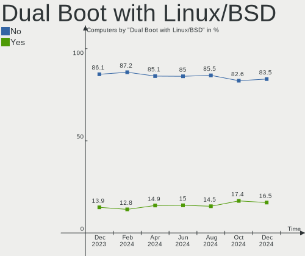
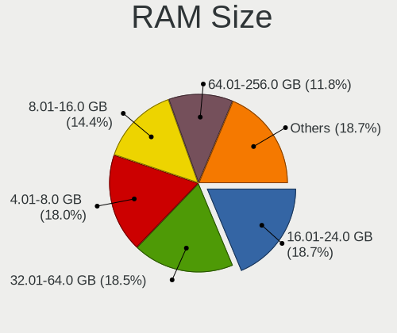
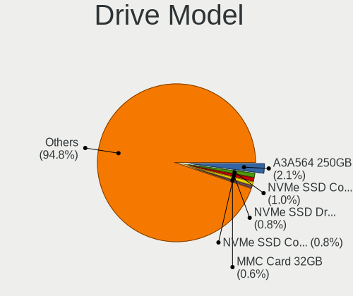
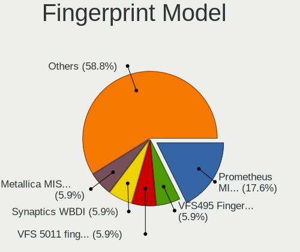

Debian Hardware Trends
----------------------

A project to identify most popular hardware characteristics and track their change
over time based on data collected by Debian users at https://Linux-Hardware.org.

Anyone can contribute to this report by the [hw-probe](https://github.com/linuxhw/hw-probe) tool:

    sudo -E hw-probe -all -upload

This is a report for all computer types. See also reports for [desktops](/Dist/Debian/Desktop/README.md) and [notebooks](/Dist/Debian/Notebook/README.md).

Full-feature report is available here: https://linux-hardware.org/?view=trends

Period: Mar, 2022.

Contents
--------

* [ System ](#system)
  - [ OS                       ](#os)
  - [ OS Family                ](#os-family)
  - [ Kernel                   ](#kernel)
  - [ Kernel Family            ](#kernel-family)
  - [ Kernel Major Ver.        ](#kernel-major-ver)
  - [ Arch                     ](#arch)
  - [ DE                       ](#de)
  - [ Display Server           ](#display-server)
  - [ Display Manager          ](#display-manager)
  - [ OS Lang                  ](#os-lang)
  - [ Boot Mode                ](#boot-mode)
  - [ Filesystem               ](#filesystem)
  - [ Part. scheme             ](#part-scheme)
  - [ Dual Boot with Linux/BSD ](#dual-boot-with-linuxbsd)
  - [ Dual Boot (Win)          ](#dual-boot-win)

* [ Board ](#board)
  - [ Vendor                   ](#vendor)
  - [ Model                    ](#model)
  - [ Model Family             ](#model-family)
  - [ MFG Year                 ](#mfg-year)
  - [ Form Factor              ](#form-factor)
  - [ Secure Boot              ](#secure-boot)
  - [ Coreboot                 ](#coreboot)
  - [ RAM Size                 ](#ram-size)
  - [ RAM Used                 ](#ram-used)
  - [ Total Drives             ](#total-drives)
  - [ Has CD-ROM               ](#has-cd-rom)
  - [ Has Ethernet             ](#has-ethernet)
  - [ Has WiFi                 ](#has-wifi)
  - [ Has Bluetooth            ](#has-bluetooth)

* [ Location ](#location)
  - [ Country                  ](#country)
  - [ City                     ](#city)

* [ Drives ](#drives)
  - [ Drive Vendor             ](#drive-vendor)
  - [ Drive Model              ](#drive-model)
  - [ HDD Vendor               ](#hdd-vendor)
  - [ SSD Vendor               ](#ssd-vendor)
  - [ Drive Kind               ](#drive-kind)
  - [ Drive Connector          ](#drive-connector)
  - [ Drive Size               ](#drive-size)
  - [ Space Total              ](#space-total)
  - [ Space Used               ](#space-used)
  - [ Malfunc. Drives          ](#malfunc-drives)
  - [ Malfunc. Drive Vendor    ](#malfunc-drive-vendor)
  - [ Malfunc. HDD Vendor      ](#malfunc-hdd-vendor)
  - [ Malfunc. Drive Kind      ](#malfunc-drive-kind)
  - [ Failed Drives            ](#failed-drives)
  - [ Failed Drive Vendor      ](#failed-drive-vendor)
  - [ Drive Status             ](#drive-status)

* [ Storage controller ](#storage-controller)
  - [ Storage Vendor           ](#storage-vendor)
  - [ Storage Model            ](#storage-model)
  - [ Storage Kind             ](#storage-kind)

* [ Processor ](#processor)
  - [ CPU Vendor               ](#cpu-vendor)
  - [ CPU Model                ](#cpu-model)
  - [ CPU Model Family         ](#cpu-model-family)
  - [ CPU Cores                ](#cpu-cores)
  - [ CPU Sockets              ](#cpu-sockets)
  - [ CPU Threads              ](#cpu-threads)
  - [ CPU Op-Modes             ](#cpu-op-modes)
  - [ CPU Microcode            ](#cpu-microcode)
  - [ CPU Microarch            ](#cpu-microarch)

* [ Graphics ](#graphics)
  - [ GPU Vendor               ](#gpu-vendor)
  - [ GPU Model                ](#gpu-model)
  - [ GPU Combo                ](#gpu-combo)
  - [ GPU Driver               ](#gpu-driver)
  - [ GPU Memory               ](#gpu-memory)

* [ Monitor ](#monitor)
  - [ Monitor Vendor           ](#monitor-vendor)
  - [ Monitor Model            ](#monitor-model)
  - [ Monitor Resolution       ](#monitor-resolution)
  - [ Monitor Diagonal         ](#monitor-diagonal)
  - [ Monitor Width            ](#monitor-width)
  - [ Aspect Ratio             ](#aspect-ratio)
  - [ Monitor Area             ](#monitor-area)
  - [ Pixel Density            ](#pixel-density)
  - [ Multiple Monitors        ](#multiple-monitors)

* [ Network ](#network)
  - [ Net Controller Vendor    ](#net-controller-vendor)
  - [ Net Controller Model     ](#net-controller-model)
  - [ Wireless Vendor          ](#wireless-vendor)
  - [ Wireless Model           ](#wireless-model)
  - [ Ethernet Vendor          ](#ethernet-vendor)
  - [ Ethernet Model           ](#ethernet-model)
  - [ Net Controller Kind      ](#net-controller-kind)
  - [ Used Controller          ](#used-controller)
  - [ NICs                     ](#nics)
  - [ IPv6                     ](#ipv6)

* [ Bluetooth ](#bluetooth)
  - [ Bluetooth Vendor         ](#bluetooth-vendor)
  - [ Bluetooth Model          ](#bluetooth-model)

* [ Sound ](#sound)
  - [ Sound Vendor             ](#sound-vendor)
  - [ Sound Model              ](#sound-model)

* [ Memory ](#memory)
  - [ Memory Vendor            ](#memory-vendor)
  - [ Memory Model             ](#memory-model)
  - [ Memory Kind              ](#memory-kind)
  - [ Memory Form Factor       ](#memory-form-factor)
  - [ Memory Size              ](#memory-size)
  - [ Memory Speed             ](#memory-speed)

* [ Printers & scanners ](#printers--scanners)
  - [ Printer Vendor           ](#printer-vendor)
  - [ Printer Model            ](#printer-model)
  - [ Scanner Vendor           ](#scanner-vendor)
  - [ Scanner Model            ](#scanner-model)

* [ Camera ](#camera)
  - [ Camera Vendor            ](#camera-vendor)
  - [ Camera Model             ](#camera-model)

* [ Security ](#security)
  - [ Fingerprint Vendor       ](#fingerprint-vendor)
  - [ Fingerprint Model        ](#fingerprint-model)
  - [ Chipcard Vendor          ](#chipcard-vendor)
  - [ Chipcard Model           ](#chipcard-model)

* [ Unsupported ](#unsupported)
  - [ Unsupported Devices      ](#unsupported-devices)
  - [ Unsupported Device Types ](#unsupported-device-types)

System
------

OS
--

Installed operating systems

| Name            | Computers | Percent |
|-----------------|-----------|---------|
| Debian 11       | 620       | 93.94%  |
| Debian 10       | 21        | 3.18%   |
| Debian Testing  | 13        | 1.97%   |
| Debian Unstable | 6         | 0.91%   |

OS Family
---------

OS without a version

| Name   | Computers | Percent |
|--------|-----------|---------|
| Debian | 660       | 100%    |

Kernel
------

Version of the Linux kernel

| Version                    | Computers | Percent |
|----------------------------|-----------|---------|
| 5.10.0-10-amd64            | 383       | 58.03%  |
| 5.10.0-12-amd64            | 55        | 8.33%   |
| 5.10.0-7-amd64             | 47        | 7.12%   |
| 5.10.0-11-amd64            | 43        | 6.52%   |
| 5.10.0-13-amd64            | 23        | 3.48%   |
| 5.10.0-13-686-pae          | 10        | 1.52%   |
| 5.16.0-5-amd64             | 7         | 1.06%   |
| 5.16.0-4-amd64             | 6         | 0.91%   |
| 5.10.0-9-amd64             | 6         | 0.91%   |
| 5.10.0-8-amd64             | 6         | 0.91%   |
| 5.16.0-3-amd64             | 5         | 0.76%   |
| 5.16.0-1-amd64             | 4         | 0.61%   |
| 5.15.0-2-amd64             | 4         | 0.61%   |
| 4.19.0-18-amd64            | 4         | 0.61%   |
| 5.15.0-0.bpo.3-amd64       | 3         | 0.45%   |
| 5.10.92-v8+                | 3         | 0.45%   |
| 5.10.103-v8+               | 3         | 0.45%   |
| 4.19.0-19-amd64            | 3         | 0.45%   |
| 5.13.19-6-pve              | 2         | 0.3%    |
| 5.10.78-2-osmc             | 2         | 0.3%    |
| 5.10.0-11-686              | 2         | 0.3%    |
| 4.19.0-20-amd64            | 2         | 0.3%    |
| 5.6.0-2-amd64              | 1         | 0.15%   |
| 5.4.140-1-pve              | 1         | 0.15%   |
| 5.4.124-1-pve              | 1         | 0.15%   |
| 5.16.15-xanmod1            | 1         | 0.15%   |
| 5.16.14-amd64              | 1         | 0.15%   |
| 5.16.11-surface            | 1         | 0.15%   |
| 5.16.0-4mx-amd64           | 1         | 0.15%   |
| 5.16.0-2-amd64             | 1         | 0.15%   |
| 5.16.0-12.2-liquorix-amd64 | 1         | 0.15%   |
| 5.16.0-0.bpo.4-amd64       | 1         | 0.15%   |
| 5.16.0-0.bpo.3-amd64       | 1         | 0.15%   |
| 5.15.6.1-march             | 1         | 0.15%   |
| 5.15.30-v8+                | 1         | 0.15%   |
| 5.15.27-v8+                | 1         | 0.15%   |
| 5.15.0-3mx-amd64           | 1         | 0.15%   |
| 5.15-sunxi64               | 1         | 0.15%   |
| 5.14.0-2-amd64             | 1         | 0.15%   |
| 5.14.0-0.bpo.2-amd64       | 1         | 0.15%   |
| 5.13.19-4-pve              | 1         | 0.15%   |
| 5.13.0-trunk-amd64         | 1         | 0.15%   |
| 5.12.0+                    | 1         | 0.15%   |
| 5.10.93+truenas            | 1         | 0.15%   |
| 5.10.102-xanmod1           | 1         | 0.15%   |
| 5.10.0-5mx-amd64           | 1         | 0.15%   |
| 5.10.0-13-arm64            | 1         | 0.15%   |
| 5.10.0-13-686              | 1         | 0.15%   |
| 5.10.0-12-686              | 1         | 0.15%   |
| 5.10.0-11-rt-amd64         | 1         | 0.15%   |
| 5.10.0-11-686-pae          | 1         | 0.15%   |
| 5.10.0-10-686              | 1         | 0.15%   |
| 5.10.0-0.bpo.9-amd64       | 1         | 0.15%   |
| 5.10.0-0.bpo.11-amd64      | 1         | 0.15%   |
| 4.19.0-6-amd64             | 1         | 0.15%   |
| 4.19.0-19-rt-amd64         | 1         | 0.15%   |
| 4.19.0-19-686-pae          | 1         | 0.15%   |
| 4.19.0-18-rt-amd64         | 1         | 0.15%   |
| 4.19.0-17-amd64            | 1         | 0.15%   |

Kernel Family
-------------

Linux kernel without a distro release

| Version  | Computers | Percent |
|----------|-----------|---------|
| 5.10.0   | 584       | 88.48%  |
| 5.16.0   | 27        | 4.09%   |
| 4.19.0   | 14        | 2.12%   |
| 5.15.0   | 8         | 1.21%   |
| 5.13.19  | 3         | 0.45%   |
| 5.10.92  | 3         | 0.45%   |
| 5.10.103 | 3         | 0.45%   |
| 5.14.0   | 2         | 0.3%    |
| 5.10.78  | 2         | 0.3%    |
| 5.6.0    | 1         | 0.15%   |
| 5.4.140  | 1         | 0.15%   |
| 5.4.124  | 1         | 0.15%   |
| 5.16.15  | 1         | 0.15%   |
| 5.16.14  | 1         | 0.15%   |
| 5.16.11  | 1         | 0.15%   |
| 5.15.6.1 | 1         | 0.15%   |
| 5.15.30  | 1         | 0.15%   |
| 5.15.27  | 1         | 0.15%   |
| 5.15     | 1         | 0.15%   |
| 5.13.0   | 1         | 0.15%   |
| 5.12.0   | 1         | 0.15%   |
| 5.10.93  | 1         | 0.15%   |
| 5.10.102 | 1         | 0.15%   |

Kernel Major Ver.
-----------------

Linux kernel major version

| Version | Computers | Percent |
|---------|-----------|---------|
| 5.10    | 594       | 90%     |
| 5.16    | 30        | 4.55%   |
| 4.19    | 14        | 2.12%   |
| 5.15    | 10        | 1.52%   |
| 5.13    | 4         | 0.61%   |
| 5.4     | 2         | 0.3%    |
| 5.14    | 2         | 0.3%    |
| 5.6     | 1         | 0.15%   |
| 5.15.6  | 1         | 0.15%   |
| 5.12    | 1         | 0.15%   |
| 5       | 1         | 0.15%   |

Arch
----

OS architecture (x86_64, i586, etc.)

| Name    | Computers | Percent |
|---------|-----------|---------|
| x86_64  | 630       | 95.45%  |
| i686    | 17        | 2.58%   |
| aarch64 | 12        | 1.82%   |
| armv7l  | 1         | 0.15%   |

DE
--

Desktop Environment

| Name             | Computers | Percent |
|------------------|-----------|---------|
| Unknown          | 463       | 70.15%  |
| GNOME            | 75        | 11.36%  |
| XFCE             | 34        | 5.15%   |
| KDE5             | 32        | 4.85%   |
| MATE             | 9         | 1.36%   |
| X-Cinnamon       | 8         | 1.21%   |
| LXQt             | 6         | 0.91%   |
| LXDE             | 6         | 0.91%   |
| Cinnamon         | 5         | 0.76%   |
| Openbox          | 4         | 0.61%   |
| GNOME Flashback  | 4         | 0.61%   |
| i3               | 3         | 0.45%   |
| Budgie           | 3         | 0.45%   |
| trinity          | 2         | 0.3%    |
| lightdm-xsession | 2         | 0.3%    |
| sway             | 1         | 0.15%   |
| Phosh:GNOME      | 1         | 0.15%   |
| KDE              | 1         | 0.15%   |
| GNOME Classic    | 1         | 0.15%   |

Display Server
--------------

X11 or Wayland

| Name    | Computers | Percent |
|---------|-----------|---------|
| Unknown | 446       | 67.58%  |
| X11     | 131       | 19.85%  |
| Wayland | 57        | 8.64%   |
| Tty     | 26        | 3.94%   |

Display Manager
---------------

SDDM, LightDM, etc.

| Name    | Computers | Percent |
|---------|-----------|---------|
| Unknown | 517       | 78.33%  |
| LightDM | 55        | 8.33%   |
| GDM     | 44        | 6.67%   |
| SDDM    | 28        | 4.24%   |
| GDM3    | 16        | 2.42%   |

OS Lang
-------

Language

| Lang    | Computers | Percent |
|---------|-----------|---------|
| Unknown | 378       | 57.27%  |
| en_US   | 92        | 13.94%  |
| ru_RU   | 55        | 8.33%   |
| de_DE   | 26        | 3.94%   |
| en_GB   | 13        | 1.97%   |
| pt_BR   | 10        | 1.52%   |
| fr_FR   | 10        | 1.52%   |
| it_IT   | 9         | 1.36%   |
| zh_CN   | 8         | 1.21%   |
| es_ES   | 6         | 0.91%   |
| en_AU   | 5         | 0.76%   |
| hu_HU   | 4         | 0.61%   |
| es_VE   | 4         | 0.61%   |
| C       | 4         | 0.61%   |
| pl_PL   | 3         | 0.45%   |
| es_MX   | 3         | 0.45%   |
| es_CL   | 3         | 0.45%   |
| en_CA   | 3         | 0.45%   |
| nl_NL   | 2         | 0.3%    |
| hr_HR   | 2         | 0.3%    |
| en_SG   | 2         | 0.3%    |
| de_AT   | 2         | 0.3%    |
| sv_SE   | 1         | 0.15%   |
| pt_PT   | 1         | 0.15%   |
| nl_BE   | 1         | 0.15%   |
| ko_KR   | 1         | 0.15%   |
| ja_JP   | 1         | 0.15%   |
| fr_CA   | 1         | 0.15%   |
| fr_BE   | 1         | 0.15%   |
| eu_ES   | 1         | 0.15%   |
| es_PY   | 1         | 0.15%   |
| es_PE   | 1         | 0.15%   |
| es_CO   | 1         | 0.15%   |
| es_AR   | 1         | 0.15%   |
| en_ZA   | 1         | 0.15%   |
| en_IE   | 1         | 0.15%   |
| da_DK   | 1         | 0.15%   |
| cs_CZ   | 1         | 0.15%   |

Boot Mode
---------

EFI or BIOS

| Mode | Computers | Percent |
|------|-----------|---------|
| EFI  | 504       | 76.36%  |
| BIOS | 156       | 23.64%  |

Filesystem
----------

Type of filesystem

| Type    | Computers | Percent |
|---------|-----------|---------|
| Overlay | 443       | 67.12%  |
| Ext4    | 203       | 30.76%  |
| Btrfs   | 12        | 1.82%   |
| Zfs     | 1         | 0.15%   |
| Ext2    | 1         | 0.15%   |

Part. scheme
------------

Scheme of partitioning

| Type    | Computers | Percent |
|---------|-----------|---------|
| GPT     | 484       | 73.33%  |
| Unknown | 90        | 13.64%  |
| MBR     | 86        | 13.03%  |

Dual Boot with Linux/BSD
------------------------

Hosting more than one Linux/BSD

| Dual boot | Computers | Percent |
|-----------|-----------|---------|
| Yes       | 377       | 57.12%  |
| No        | 283       | 42.88%  |

Dual Boot (Win)
---------------

Hosting Linux and Windows

| Dual boot | Computers | Percent |
|-----------|-----------|---------|
| No        | 556       | 84.24%  |
| Yes       | 104       | 15.76%  |

Board
-----

Vendor
------

Motherboard manufacturer

| Name                    | Computers | Percent |
|-------------------------|-----------|---------|
| Apple                   | 372       | 56.36%  |
| Lenovo                  | 50        | 7.58%   |
| Dell                    | 42        | 6.36%   |
| ASUSTek Computer        | 40        | 6.06%   |
| Hewlett-Packard         | 30        | 4.55%   |
| Gigabyte Technology     | 22        | 3.33%   |
| MSI                     | 19        | 2.88%   |
| Acer                    | 11        | 1.67%   |
| Raspberry Pi Foundation | 10        | 1.52%   |
| ASRock                  | 6         | 0.91%   |
| Fujitsu                 | 5         | 0.76%   |
| Aquarius                | 5         | 0.76%   |
| Intel                   | 4         | 0.61%   |
| Samsung Electronics     | 3         | 0.45%   |
| Microsoft               | 3         | 0.45%   |
| Foxconn                 | 3         | 0.45%   |
| Supermicro              | 2         | 0.3%    |
| IBM                     | 2         | 0.3%    |
| HUAWEI                  | 2         | 0.3%    |
| Biostar                 | 2         | 0.3%    |
| AMI                     | 2         | 0.3%    |
| Unknown                 | 2         | 0.3%    |
| ZOTAC                   | 1         | 0.15%   |
| VIT                     | 1         | 0.15%   |
| Toshiba                 | 1         | 0.15%   |
| Timi                    | 1         | 0.15%   |
| System76                | 1         | 0.15%   |
| Radxa                   | 1         | 0.15%   |
| Pine Microsystems       | 1         | 0.15%   |
| Philco                  | 1         | 0.15%   |
| Packard Bell            | 1         | 0.15%   |
| Notebook                | 1         | 0.15%   |
| Multilaser              | 1         | 0.15%   |
| MicronPc_MPC            | 1         | 0.15%   |
| IPASON                  | 1         | 0.15%   |
| IP3 Tech                | 1         | 0.15%   |
| Getac                   | 1         | 0.15%   |
| Fujitsu Siemens         | 1         | 0.15%   |
| Eluktronics             | 1         | 0.15%   |
| Elife                   | 1         | 0.15%   |
| ECS                     | 1         | 0.15%   |
| Digiboard               | 1         | 0.15%   |
| BUYMPC MicronPC_MPC     | 1         | 0.15%   |
| AXDIA International     | 1         | 0.15%   |
| Avell High Performance  | 1         | 0.15%   |

Model
-----

Motherboard model

| Name                                      | Computers | Percent |
|-------------------------------------------|-----------|---------|
| Apple MacBook5,2                          | 285       | 43.18%  |
| Apple MacBook2,1                          | 52        | 7.88%   |
| Apple MacBook4,1                          | 21        | 3.18%   |
| RPi Raspberry Pi                          | 10        | 1.52%   |
| ASUS PRIME H510M-A                        | 8         | 1.21%   |
| Lenovo ThinkPad L13 Yoga Gen 2 20VK0019US | 7         | 1.06%   |
| ASUS All Series                           | 7         | 1.06%   |
| Dell Inspiron 5100                        | 6         | 0.91%   |
| Apple MacBook7,1                          | 6         | 0.91%   |
| Aquarius NS585                            | 4         | 0.61%   |
| MSI MS-7996                               | 3         | 0.45%   |
| Gigabyte H81M-S2V                         | 3         | 0.45%   |
| Fujitsu ESPRIMO P720                      | 3         | 0.45%   |
| Dell OptiPlex 7010                        | 3         | 0.45%   |
| Dell Latitude E6420                       | 3         | 0.45%   |
| Unknown                                   | 3         | 0.45%   |
| MSI MS-7817                               | 2         | 0.3%    |
| Lenovo ThinkPad 13 2nd Gen 20J10046US     | 2         | 0.3%    |
| IBM System x3250 M3 -[4252K4G]-           | 2         | 0.3%    |
| HP Z420 Workstation                       | 2         | 0.3%    |
| HP Pavilion g6                            | 2         | 0.3%    |
| HP Laptop 15-bw0xx                        | 2         | 0.3%    |
| HP Compaq nx6125 (PZ849UA#ABA)            | 2         | 0.3%    |
| HP Compaq nx6110 (PZ065UA#ABA)            | 2         | 0.3%    |
| Gigabyte B360M H                          | 2         | 0.3%    |
| Dell Latitude E6330                       | 2         | 0.3%    |
| Dell Inspiron 5502                        | 2         | 0.3%    |
| ASUS TUF B450M-PLUS GAMING                | 2         | 0.3%    |
| ASUS S20 K29                              | 2         | 0.3%    |
| ZOTAC ZBOX-ID88/ID89/ID90                 | 1         | 0.15%   |
| VIT NP3020M3                              | 1         | 0.15%   |
| Toshiba Satellite P850                    | 1         | 0.15%   |
| Timi A7S                                  | 1         | 0.15%   |
| System76 Kudu Professional                | 1         | 0.15%   |
| Supermicro SYS-5018A-FTN4                 | 1         | 0.15%   |
| Supermicro Super Server                   | 1         | 0.15%   |
| Samsung RC530/RC730                       | 1         | 0.15%   |
| Samsung R509                              | 1         | 0.15%   |
| Samsung 300V3A/300V4A/300V5A              | 1         | 0.15%   |
| Radxa ROCK Pi 4B                          | 1         | 0.15%   |
| Pine Microsystems Pine64 PinePhone (1.2)  | 1         | 0.15%   |
| Philco O E M                              | 1         | 0.15%   |
| Packard Bell EasyNote TK85                | 1         | 0.15%   |
| Notebook PCx0Dx                           | 1         | 0.15%   |
| Multilaser MLSH1H LINUX                   | 1         | 0.15%   |
| MSI Pro 3000 Microtower PC                | 1         | 0.15%   |
| MSI Prestige 14Evo A11M                   | 1         | 0.15%   |
| MSI MS-7D53                               | 1         | 0.15%   |
| MSI MS-7D15                               | 1         | 0.15%   |
| MSI MS-7C95                               | 1         | 0.15%   |
| MSI MS-7C84                               | 1         | 0.15%   |
| MSI MS-7C52                               | 1         | 0.15%   |
| MSI MS-7C37                               | 1         | 0.15%   |
| MSI MS-7A40                               | 1         | 0.15%   |
| MSI MS-7A38                               | 1         | 0.15%   |
| MSI MS-7877                               | 1         | 0.15%   |
| MSI MS-7698                               | 1         | 0.15%   |
| MSI MS-7596                               | 1         | 0.15%   |
| MSI Katana GF66 12UC                      | 1         | 0.15%   |
| Microsoft Surface Pro 6                   | 1         | 0.15%   |

Model Family
------------

Motherboard model prefix

| Name                      | Computers | Percent |
|---------------------------|-----------|---------|
| Apple MacBook5            | 285       | 43.18%  |
| Apple MacBook2            | 52        | 7.88%   |
| Lenovo ThinkPad           | 27        | 4.09%   |
| Apple MacBook4            | 21        | 3.18%   |
| Dell Latitude             | 14        | 2.12%   |
| Dell Inspiron             | 13        | 1.97%   |
| Acer Aspire               | 11        | 1.67%   |
| RPi Raspberry             | 10        | 1.52%   |
| ASUS PRIME                | 10        | 1.52%   |
| Lenovo IdeaPad            | 9         | 1.36%   |
| ASUS All                  | 7         | 1.06%   |
| HP Compaq                 | 6         | 0.91%   |
| Apple MacBook7            | 6         | 0.91%   |
| Lenovo ThinkCentre        | 5         | 0.76%   |
| HP Pavilion               | 5         | 0.76%   |
| Dell OptiPlex             | 5         | 0.76%   |
| HP ProBook                | 4         | 0.61%   |
| HP Laptop                 | 4         | 0.61%   |
| Dell PowerEdge            | 4         | 0.61%   |
| Aquarius NS585            | 4         | 0.61%   |
| MSI MS-7996               | 3         | 0.45%   |
| Microsoft Surface         | 3         | 0.45%   |
| Gigabyte H81M-S2V         | 3         | 0.45%   |
| Fujitsu ESPRIMO           | 3         | 0.45%   |
| ASUS TUF                  | 3         | 0.45%   |
| Unknown                   | 3         | 0.45%   |
| MSI MS-7817               | 2         | 0.3%    |
| IBM System                | 2         | 0.3%    |
| HP Z420                   | 2         | 0.3%    |
| Gigabyte B450M            | 2         | 0.3%    |
| Gigabyte B360M            | 2         | 0.3%    |
| Dell XPS                  | 2         | 0.3%    |
| ASUS S20                  | 2         | 0.3%    |
| ZOTAC ZBOX-ID88           | 1         | 0.15%   |
| VIT NP3020M3              | 1         | 0.15%   |
| Toshiba Satellite         | 1         | 0.15%   |
| Timi A7S                  | 1         | 0.15%   |
| System76 Kudu             | 1         | 0.15%   |
| Supermicro SYS-5018A-FTN4 | 1         | 0.15%   |
| Supermicro Super          | 1         | 0.15%   |
| Samsung RC530             | 1         | 0.15%   |
| Samsung R509              | 1         | 0.15%   |
| Samsung 300V3A            | 1         | 0.15%   |
| Radxa ROCK                | 1         | 0.15%   |
| Pine Microsystems Pine64  | 1         | 0.15%   |
| Philco O                  | 1         | 0.15%   |
| Packard Bell EasyNote     | 1         | 0.15%   |
| Notebook PCx0Dx           | 1         | 0.15%   |
| Multilaser MLSH1H         | 1         | 0.15%   |
| MSI Pro                   | 1         | 0.15%   |
| MSI Prestige              | 1         | 0.15%   |
| MSI MS-7D53               | 1         | 0.15%   |
| MSI MS-7D15               | 1         | 0.15%   |
| MSI MS-7C95               | 1         | 0.15%   |
| MSI MS-7C84               | 1         | 0.15%   |
| MSI MS-7C52               | 1         | 0.15%   |
| MSI MS-7C37               | 1         | 0.15%   |
| MSI MS-7A40               | 1         | 0.15%   |
| MSI MS-7A38               | 1         | 0.15%   |
| MSI MS-7877               | 1         | 0.15%   |

MFG Year
--------

Motherboard manufacture year

| Year    | Computers | Percent |
|---------|-----------|---------|
| 2009    | 297       | 45%     |
| 2007    | 59        | 8.94%   |
| 2020    | 38        | 5.76%   |
| 2021    | 32        | 4.85%   |
| 2008    | 32        | 4.85%   |
| 2019    | 23        | 3.48%   |
| 2014    | 22        | 3.33%   |
| 2011    | 22        | 3.33%   |
| 2013    | 21        | 3.18%   |
| 2018    | 20        | 3.03%   |
| 2012    | 20        | 3.03%   |
| 2017    | 15        | 2.27%   |
| 2015    | 14        | 2.12%   |
| Unknown | 13        | 1.97%   |
| 2010    | 11        | 1.67%   |
| 2016    | 10        | 1.52%   |
| 2003    | 8         | 1.21%   |
| 2005    | 3         | 0.45%   |

Form Factor
-----------

Physical design of the computer

| Name           | Computers | Percent |
|----------------|-----------|---------|
| Notebook       | 503       | 76.21%  |
| Desktop        | 110       | 16.67%  |
| System on chip | 12        | 1.82%   |
| Convertible    | 11        | 1.67%   |
| Server         | 10        | 1.52%   |
| All in one     | 5         | 0.76%   |
| Tablet         | 4         | 0.61%   |
| Mini pc        | 4         | 0.61%   |
| Phone          | 1         | 0.15%   |

Secure Boot
-----------

Enabled or disabled

| State    | Computers | Percent |
|----------|-----------|---------|
| Disabled | 643       | 97.42%  |
| Enabled  | 17        | 2.58%   |

Coreboot
--------

Have coreboot on board

| Used | Computers | Percent |
|------|-----------|---------|
| No   | 659       | 99.85%  |
| Yes  | 1         | 0.15%   |

RAM Size
--------

Total RAM memory

| Size in GB  | Computers | Percent |
|-------------|-----------|---------|
| 1.01-2.0    | 349       | 52.88%  |
| 3.01-4.0    | 78        | 11.82%  |
| 4.01-8.0    | 69        | 10.45%  |
| 16.01-24.0  | 59        | 8.94%   |
| 8.01-16.0   | 37        | 5.61%   |
| 32.01-64.0  | 21        | 3.18%   |
| 2.01-3.0    | 15        | 2.27%   |
| 0.51-1.0    | 14        | 2.12%   |
| 64.01-256.0 | 8         | 1.21%   |
| 0.01-0.5    | 6         | 0.91%   |
| 24.01-32.0  | 4         | 0.61%   |

RAM Used
--------

Used RAM memory

| Used GB     | Computers | Percent |
|-------------|-----------|---------|
| 1.01-2.0    | 433       | 65.61%  |
| 0.51-1.0    | 77        | 11.67%  |
| 2.01-3.0    | 53        | 8.03%   |
| 4.01-8.0    | 35        | 5.3%    |
| 3.01-4.0    | 24        | 3.64%   |
| 0.01-0.5    | 24        | 3.64%   |
| 8.01-16.0   | 9         | 1.36%   |
| 16.01-24.0  | 2         | 0.3%    |
| 32.01-64.0  | 1         | 0.15%   |
| 24.01-32.0  | 1         | 0.15%   |
| 64.01-256.0 | 1         | 0.15%   |

Total Drives
------------

Number of drives on board

| Drives | Computers | Percent |
|--------|-----------|---------|
| 1      | 553       | 83.79%  |
| 2      | 46        | 6.97%   |
| 3      | 28        | 4.24%   |
| 4      | 11        | 1.67%   |
| 0      | 10        | 1.52%   |
| 6      | 6         | 0.91%   |
| 5      | 4         | 0.61%   |
| 10     | 1         | 0.15%   |
| 7      | 1         | 0.15%   |

Has CD-ROM
----------

Has CD-ROM on board

| Presented | Computers | Percent |
|-----------|-----------|---------|
| Yes       | 467       | 70.76%  |
| No        | 193       | 29.24%  |

Has Ethernet
------------

Has Ethernet on board

| Presented | Computers | Percent |
|-----------|-----------|---------|
| Yes       | 626       | 94.85%  |
| No        | 34        | 5.15%   |

Has WiFi
--------

Has WiFi module

| Presented | Computers | Percent |
|-----------|-----------|---------|
| Yes       | 564       | 85.45%  |
| No        | 96        | 14.55%  |

Has Bluetooth
-------------

Has Bluetooth module

| Presented | Computers | Percent |
|-----------|-----------|---------|
| Yes       | 504       | 76.36%  |
| No        | 156       | 23.64%  |

Location
--------

Country
-------

Geographic location (country)

| Country      | Computers | Percent |
|--------------|-----------|---------|
| USA          | 418       | 63.33%  |
| Russia       | 60        | 9.09%   |
| Germany      | 30        | 4.55%   |
| Brazil       | 17        | 2.58%   |
| France       | 15        | 2.27%   |
| Italy        | 13        | 1.97%   |
| Spain        | 8         | 1.21%   |
| Hungary      | 7         | 1.06%   |
| China        | 7         | 1.06%   |
| UK           | 6         | 0.91%   |
| Australia    | 6         | 0.91%   |
| Poland       | 5         | 0.76%   |
| Mexico       | 5         | 0.76%   |
| Canada       | 5         | 0.76%   |
| Venezuela    | 4         | 0.61%   |
| Switzerland  | 4         | 0.61%   |
| Turkey       | 3         | 0.45%   |
| Czechia      | 3         | 0.45%   |
| Chile        | 3         | 0.45%   |
| Austria      | 3         | 0.45%   |
| Thailand     | 2         | 0.3%    |
| Sweden       | 2         | 0.3%    |
| Portugal     | 2         | 0.3%    |
| Paraguay     | 2         | 0.3%    |
| Netherlands  | 2         | 0.3%    |
| Croatia      | 2         | 0.3%    |
| Bulgaria     | 2         | 0.3%    |
| Belgium      | 2         | 0.3%    |
| Argentina    | 2         | 0.3%    |
| Tunisia      | 1         | 0.15%   |
| South Korea  | 1         | 0.15%   |
| South Africa | 1         | 0.15%   |
| Slovenia     | 1         | 0.15%   |
| Romania      | 1         | 0.15%   |
| Peru         | 1         | 0.15%   |
| Oman         | 1         | 0.15%   |
| Norway       | 1         | 0.15%   |
| Nigeria      | 1         | 0.15%   |
| Morocco      | 1         | 0.15%   |
| Kyrgyzstan   | 1         | 0.15%   |
| Japan        | 1         | 0.15%   |
| Iran         | 1         | 0.15%   |
| Indonesia    | 1         | 0.15%   |
| India        | 1         | 0.15%   |
| Hong Kong    | 1         | 0.15%   |
| Denmark      | 1         | 0.15%   |
| Cyprus       | 1         | 0.15%   |
| Colombia     | 1         | 0.15%   |
| Belarus      | 1         | 0.15%   |

City
----

Geographic location (city)

| City                    | Computers | Percent |
|-------------------------|-----------|---------|
| Bangor                  | 392       | 59.39%  |
| Voronezh                | 48        | 7.27%   |
| Berlin                  | 7         | 1.06%   |
| Paris                   | 5         | 0.76%   |
| Perm                    | 4         | 0.61%   |
| Brasília               | 4         | 0.61%   |
| Moscow                  | 3         | 0.45%   |
| Milan                   | 3         | 0.45%   |
| Melbourne               | 3         | 0.45%   |
| Budapest                | 3         | 0.45%   |
| Warsaw                  | 2         | 0.3%    |
| Villa Elisa             | 2         | 0.3%    |
| Vienna                  | 2         | 0.3%    |
| The Hague               | 2         | 0.3%    |
| Sydney                  | 2         | 0.3%    |
| Prague                  | 2         | 0.3%    |
| Newberg                 | 2         | 0.3%    |
| Caracas                 | 2         | 0.3%    |
| Barcelona               | 2         | 0.3%    |
| Zhongba                 | 1         | 0.15%   |
| Zaragoza                | 1         | 0.15%   |
| Zapopan                 | 1         | 0.15%   |
| Zagreb                  | 1         | 0.15%   |
| Yutz                    | 1         | 0.15%   |
| Yambol                  | 1         | 0.15%   |
| Xining                  | 1         | 0.15%   |
| Wooster                 | 1         | 0.15%   |
| Winterport              | 1         | 0.15%   |
| Winfield                | 1         | 0.15%   |
| Weiden                  | 1         | 0.15%   |
| Waregem                 | 1         | 0.15%   |
| Vladivostok             | 1         | 0.15%   |
| Vitória                | 1         | 0.15%   |
| Villingen-Schwenningen  | 1         | 0.15%   |
| Victorville             | 1         | 0.15%   |
| Venda Nova do Imigrante | 1         | 0.15%   |
| Valdosta                | 1         | 0.15%   |
| Urbandale               | 1         | 0.15%   |
| Ulm                     | 1         | 0.15%   |
| Tyumen                  | 1         | 0.15%   |
| Turin                   | 1         | 0.15%   |
| Tunis                   | 1         | 0.15%   |
| Tulare                  | 1         | 0.15%   |
| Trenton                 | 1         | 0.15%   |
| Tepic                   | 1         | 0.15%   |
| Tehran                  | 1         | 0.15%   |
| Szombathely             | 1         | 0.15%   |
| Sylvan Lake             | 1         | 0.15%   |
| Surabaya                | 1         | 0.15%   |
| Strasbourg              | 1         | 0.15%   |
| Split                   | 1         | 0.15%   |
| Sion                    | 1         | 0.15%   |
| Shenzhen                | 1         | 0.15%   |
| Seville                 | 1         | 0.15%   |
| Seocho-gu               | 1         | 0.15%   |
| Seattle                 | 1         | 0.15%   |
| Saujon                  | 1         | 0.15%   |
| Sartrouville            | 1         | 0.15%   |
| Sao Paulo               | 1         | 0.15%   |
| Sao Luís               | 1         | 0.15%   |

Drives
------

Drive Vendor
------------

Hard drive vendors

| Vendor              | Computers | Drives | Percent |
|---------------------|-----------|--------|---------|
| Fujitsu             | 209       | 209    | 27.07%  |
| Toshiba             | 130       | 136    | 16.84%  |
| Seagate             | 85        | 114    | 11.01%  |
| WDC                 | 74        | 85     | 9.59%   |
| Samsung Electronics | 57        | 69     | 7.38%   |
| Kingston            | 30        | 32     | 3.89%   |
| Hitachi             | 27        | 29     | 3.5%    |
| SanDisk             | 23        | 23     | 2.98%   |
| Unknown             | 18        | 24     | 2.33%   |
| Crucial             | 18        | 19     | 2.33%   |
| Intel               | 14        | 15     | 1.81%   |
| A-DATA Technology   | 10        | 10     | 1.3%    |
| SK Hynix            | 8         | 9      | 1.04%   |
| GOODRAM             | 6         | 6      | 0.78%   |
| Team                | 4         | 4      | 0.52%   |
| SPCC                | 4         | 4      | 0.52%   |
| Micron Technology   | 4         | 4      | 0.52%   |
| HGST                | 4         | 4      | 0.52%   |
| China               | 4         | 4      | 0.52%   |
| Apple               | 3         | 4      | 0.39%   |
| Unknown             | 3         | 3      | 0.39%   |
| XPG                 | 2         | 2      | 0.26%   |
| Xinhaike            | 2         | 2      | 0.26%   |
| Transcend           | 2         | 2      | 0.26%   |
| PNY                 | 2         | 3      | 0.26%   |
| Phison              | 2         | 2      | 0.26%   |
| OCZ                 | 2         | 2      | 0.26%   |
| Netac               | 2         | 2      | 0.26%   |
| MAXTOR              | 2         | 2      | 0.26%   |
| KIOXIA-EXCERIA      | 2         | 2      | 0.26%   |
| ZTC                 | 1         | 1      | 0.13%   |
| Verbatim            | 1         | 1      | 0.13%   |
| UMIS                | 1         | 1      | 0.13%   |
| SSSTC               | 1         | 1      | 0.13%   |
| SMART               | 1         | 1      | 0.13%   |
| SABRENT             | 1         | 1      | 0.13%   |
| Realtek             | 1         | 1      | 0.13%   |
| Patriot             | 1         | 1      | 0.13%   |
| M4-CT256            | 1         | 1      | 0.13%   |
| Lenovo              | 1         | 1      | 0.13%   |
| KIOXIA              | 1         | 1      | 0.13%   |
| JMicron             | 1         | 1      | 0.13%   |
| JASTER              | 1         | 1      | 0.13%   |
| G-DRIVE             | 1         | 1      | 0.13%   |
| External            | 1         | 1      | 0.13%   |
| DOGFISH             | 1         | 1      | 0.13%   |
| Dell                | 1         | 1      | 0.13%   |
| asmedia             | 1         | 1      | 0.13%   |
| Argon               | 1         | 1      | 0.13%   |

Drive Model
-----------

Hard drive models

| Model                                | Computers | Percent |
|--------------------------------------|-----------|---------|
| Fujitsu MHZ2160BH FFS G1 160GB       | 185       | 22.87%  |
| Toshiba MK1655GSXF 160GB             | 43        | 5.32%   |
| Toshiba MK1653GSX 160GB              | 40        | 4.94%   |
| WDC WD1600BUDT-63DPZY0 160GB         | 16        | 1.98%   |
| Seagate ST980811AS 80GB              | 11        | 1.36%   |
| Kingston SA400S37480G 480GB SSD      | 11        | 1.36%   |
| SanDisk SD8SBAT128G1122 128GB SSD    | 10        | 1.24%   |
| Fujitsu MHY2120BH 120GB              | 10        | 1.24%   |
| Toshiba MK5065GSXF 500GB             | 9         | 1.11%   |
| Fujitsu MHY2080BH 80GB               | 9         | 1.11%   |
| Seagate ST500DM002-1BD142 500GB      | 8         | 0.99%   |
| Toshiba DT01ACA050 500GB             | 7         | 0.87%   |
| Hitachi HTS543216L9SA02 160GB        | 7         | 0.87%   |
| Seagate ST94811A 40GB                | 6         | 0.74%   |
| Seagate ST500LT012-1DG142 500GB      | 5         | 0.62%   |
| Seagate ST2000DM008-2FR102 2TB       | 5         | 0.62%   |
| Samsung MZVLB512HBJQ-000L7 512GB     | 5         | 0.62%   |
| Kingston SA400S37240G 240GB SSD      | 5         | 0.62%   |
| Hitachi HTS542512K9SA00 120GB        | 5         | 0.62%   |
| WDC WD20EFRX-68EUZN0 2TB             | 4         | 0.49%   |
| Unknown MMC Card  32GB               | 4         | 0.49%   |
| Seagate ST9160314AS 160GB            | 4         | 0.49%   |
| Samsung SSD 850 EVO 250GB            | 4         | 0.49%   |
| Samsung NVMe SSD Drive 500GB         | 4         | 0.49%   |
| Kingston SV300S37A120G 120GB SSD     | 4         | 0.49%   |
| Crucial CT480BX500SSD1 480GB         | 4         | 0.49%   |
| A-DATA SU800 512GB SSD               | 4         | 0.49%   |
| WDC WD5000AAKX-60U6AA0 500GB         | 3         | 0.37%   |
| WDC PC SN730 SDBQNTY-512G-1001 512GB | 3         | 0.37%   |
| Unknown MMC Card  64GB               | 3         | 0.37%   |
| Toshiba MQ01ABF050 500GB             | 3         | 0.37%   |
| Toshiba MK2555GSXF 250GB             | 3         | 0.37%   |
| Seagate ST1000DM010-2EP102 1TB       | 3         | 0.37%   |
| Samsung SSD 970 EVO Plus 1TB         | 3         | 0.37%   |
| Samsung SSD 860 EVO 500GB            | 3         | 0.37%   |
| Hitachi HTS545025B9SA02 250GB        | 3         | 0.37%   |
| Unknown                              | 3         | 0.37%   |
| Xinhaike SSD 120GB                   | 2         | 0.25%   |
| WDC WDS500G2B0C-00PXH0 500GB         | 2         | 0.25%   |
| WDC WDS500G2B0A-00SM50 500GB SSD     | 2         | 0.25%   |
| WDC WDS240G2G0A-00JH30 240GB SSD     | 2         | 0.25%   |
| WDC WD2500BEKT-75PVMT0 250GB         | 2         | 0.25%   |
| WDC WD10SPZX-24Z10 1TB               | 2         | 0.25%   |
| Unknown SM32G  32GB                  | 2         | 0.25%   |
| Unknown SC32G  32GB                  | 2         | 0.25%   |
| Toshiba MQ04ABF100 1TB               | 2         | 0.25%   |
| Toshiba MQ01ABD050 500GB             | 2         | 0.25%   |
| Toshiba MQ01ABD032 320GB             | 2         | 0.25%   |
| Toshiba MK2561GSYN 250GB             | 2         | 0.25%   |
| SPCC Solid State Disk 256GB          | 2         | 0.25%   |
| Seagate ST3250620AS 250GB            | 2         | 0.25%   |
| Seagate ST320LT007-9ZV142 320GB      | 2         | 0.25%   |
| Seagate ST2000LX001-1RG174 2TB       | 2         | 0.25%   |
| Seagate ST2000DM001-1ER164 2TB       | 2         | 0.25%   |
| Seagate ST1000LM035-1RK172 1TB       | 2         | 0.25%   |
| Seagate ST1000LM024 HN-M101MBB 1TB   | 2         | 0.25%   |
| SanDisk SSD PLUS 480GB               | 2         | 0.25%   |
| SanDisk SD8SN8U128G1001 128GB SSD    | 2         | 0.25%   |
| Samsung SSD 980 500GB                | 2         | 0.25%   |
| Samsung SSD 860 QVO 1TB              | 2         | 0.25%   |

HDD Vendor
----------

Hard disk drive vendors

| Vendor              | Computers | Drives | Percent |
|---------------------|-----------|--------|---------|
| Fujitsu             | 209       | 209    | 40.43%  |
| Toshiba             | 124       | 130    | 23.98%  |
| Seagate             | 84        | 113    | 16.25%  |
| WDC                 | 58        | 66     | 11.22%  |
| Hitachi             | 27        | 29     | 5.22%   |
| Samsung Electronics | 6         | 6      | 1.16%   |
| HGST                | 4         | 4      | 0.77%   |
| Unknown             | 1         | 1      | 0.19%   |
| SABRENT             | 1         | 1      | 0.19%   |
| MAXTOR              | 1         | 1      | 0.19%   |
| asmedia             | 1         | 1      | 0.19%   |
| Apple               | 1         | 1      | 0.19%   |

SSD Vendor
----------

Solid state drive vendors

| Vendor              | Computers | Drives | Percent |
|---------------------|-----------|--------|---------|
| Kingston            | 29        | 31     | 18.59%  |
| Samsung Electronics | 28        | 33     | 17.95%  |
| SanDisk             | 20        | 20     | 12.82%  |
| Crucial             | 18        | 19     | 11.54%  |
| WDC                 | 7         | 7      | 4.49%   |
| A-DATA Technology   | 7         | 7      | 4.49%   |
| GOODRAM             | 6         | 6      | 3.85%   |
| Team                | 4         | 4      | 2.56%   |
| Intel               | 4         | 4      | 2.56%   |
| China               | 4         | 4      | 2.56%   |
| SPCC                | 3         | 3      | 1.92%   |
| Xinhaike            | 2         | 2      | 1.28%   |
| Transcend           | 2         | 2      | 1.28%   |
| PNY                 | 2         | 3      | 1.28%   |
| OCZ                 | 2         | 2      | 1.28%   |
| Netac               | 2         | 2      | 1.28%   |
| Micron Technology   | 2         | 2      | 1.28%   |
| ZTC                 | 1         | 1      | 0.64%   |
| Verbatim            | 1         | 1      | 0.64%   |
| Unknown             | 1         | 1      | 0.64%   |
| Toshiba             | 1         | 1      | 0.64%   |
| SMART               | 1         | 1      | 0.64%   |
| SK Hynix            | 1         | 1      | 0.64%   |
| Patriot             | 1         | 1      | 0.64%   |
| MAXTOR              | 1         | 1      | 0.64%   |
| M4-CT256            | 1         | 1      | 0.64%   |
| KIOXIA-EXCERIA      | 1         | 1      | 0.64%   |
| JMicron             | 1         | 1      | 0.64%   |
| DOGFISH             | 1         | 1      | 0.64%   |
| Argon               | 1         | 1      | 0.64%   |
| Apple               | 1         | 1      | 0.64%   |

Drive Kind
----------

HDD or SSD

| Kind    | Computers | Drives | Percent |
|---------|-----------|--------|---------|
| HDD     | 492       | 562    | 67.31%  |
| SSD     | 137       | 165    | 18.74%  |
| NVMe    | 78        | 88     | 10.67%  |
| MMC     | 19        | 24     | 2.6%    |
| Unknown | 5         | 6      | 0.68%   |

Drive Connector
---------------

SATA, SAS, NVMe, etc.

| Type | Computers | Drives | Percent |
|------|-----------|--------|---------|
| SATA | 580       | 712    | 83.69%  |
| NVMe | 77        | 86     | 11.11%  |
| MMC  | 19        | 24     | 2.74%   |
| SAS  | 17        | 23     | 2.45%   |

Drive Size
----------

Size of hard drive

| Size in TB | Computers | Drives | Percent |
|------------|-----------|--------|---------|
| 0.01-0.5   | 540       | 584    | 83.98%  |
| 0.51-1.0   | 53        | 69     | 8.24%   |
| 1.01-2.0   | 26        | 36     | 4.04%   |
| 3.01-4.0   | 14        | 25     | 2.18%   |
| 2.01-3.0   | 5         | 7      | 0.78%   |
| 4.01-10.0  | 5         | 6      | 0.78%   |

Space Total
-----------

Amount of disk space available on the file system

| Size in GB     | Computers | Percent |
|----------------|-----------|---------|
| Unknown        | 428       | 64.85%  |
| 251-500        | 60        | 9.09%   |
| 101-250        | 57        | 8.64%   |
| 501-1000       | 30        | 4.55%   |
| More than 3000 | 21        | 3.18%   |
| 1-20           | 16        | 2.42%   |
| 51-100         | 16        | 2.42%   |
| 1001-2000      | 14        | 2.12%   |
| 21-50          | 10        | 1.52%   |
| 2001-3000      | 8         | 1.21%   |

Space Used
----------

Amount of used disk space

| Used GB        | Computers | Percent |
|----------------|-----------|---------|
| Unknown        | 428       | 64.85%  |
| 1-20           | 97        | 14.7%   |
| 101-250        | 29        | 4.39%   |
| 21-50          | 26        | 3.94%   |
| 51-100         | 25        | 3.79%   |
| 251-500        | 15        | 2.27%   |
| 501-1000       | 14        | 2.12%   |
| 1001-2000      | 11        | 1.67%   |
| More than 3000 | 10        | 1.52%   |
| 2001-3000      | 4         | 0.61%   |
| 0              | 1         | 0.15%   |

Malfunc. Drives
---------------

Drive models with a malfunction

| Model                                               | Computers | Drives | Percent |
|-----------------------------------------------------|-----------|--------|---------|
| Fujitsu MHZ2160BH FFS G1 160GB                      | 19        | 19     | 20.65%  |
| Toshiba MK1653GSX 160GB                             | 9         | 9      | 9.78%   |
| Toshiba MK1655GSXF 160GB                            | 6         | 6      | 6.52%   |
| Hitachi HTS543216L9SA02 160GB                       | 6         | 6      | 6.52%   |
| Hitachi HTS542512K9SA00 120GB                       | 5         | 5      | 5.43%   |
| WDC WD1600BUDT-63DPZY0 160GB                        | 4         | 4      | 4.35%   |
| Seagate ST980811AS 80GB                             | 3         | 3      | 3.26%   |
| Seagate ST94811A 40GB                               | 2         | 2      | 2.17%   |
| Seagate ST500LT012-1DG142 500GB                     | 2         | 2      | 2.17%   |
| HGST HTS725050A7E630 500GB                          | 2         | 2      | 2.17%   |
| WDC WDS120G2G0A-00JH30 120GB SSD                    | 1         | 1      | 1.09%   |
| WDC WD5000AAKS-00UU3A0 500GB                        | 1         | 1      | 1.09%   |
| WDC WD5000AAKS-00A7B2 500GB                         | 1         | 1      | 1.09%   |
| WDC WD50 00BPVT-24HXZT1 500GB                       | 1         | 1      | 1.09%   |
| WDC WD3200AAKX-753CA1 320GB                         | 1         | 1      | 1.09%   |
| WDC WD2500AAKX-75U6AA0 250GB                        | 1         | 1      | 1.09%   |
| WDC WD2500AAJS-40VWA1 250GB                         | 1         | 1      | 1.09%   |
| WDC WD20EARS-00MVWB0 2TB                            | 1         | 1      | 1.09%   |
| WDC WD1600BUDT-73DPZY0 160GB                        | 1         | 1      | 1.09%   |
| Toshiba MQ04ABF100 1TB                              | 1         | 1      | 1.09%   |
| Toshiba MK2561GSYN 250GB                            | 1         | 1      | 1.09%   |
| SK Hynix SC308 SATA 128GB SSD                       | 1         | 1      | 1.09%   |
| Seagate ST9500420AS 500GB                           | 1         | 1      | 1.09%   |
| Seagate ST92011A 20GB                               | 1         | 1      | 1.09%   |
| Seagate ST500DM002-1BD142 500GB                     | 1         | 1      | 1.09%   |
| Seagate ST3250620AS 250GB                           | 1         | 1      | 1.09%   |
| Seagate ST320LT007-9ZV142 320GB                     | 1         | 1      | 1.09%   |
| Seagate ST31500341AS 1TB                            | 1         | 1      | 1.09%   |
| Seagate ST2000VM003-1ET164 2TB                      | 1         | 1      | 1.09%   |
| Seagate ST1000LX015-1U7172-SSHD 1TB                 | 1         | 1      | 1.09%   |
| Seagate ST1000LM024 HN-M101MBB 1TB                  | 1         | 1      | 1.09%   |
| Samsung Electronics SSD 840 PRO Series 128GB        | 1         | 1      | 1.09%   |
| Micron Technology MTFDDAK256MAY-1AH1ZABHA 256GB SSD | 1         | 1      | 1.09%   |
| Kingston SHFS37A120G 120GB SSD                      | 1         | 1      | 1.09%   |
| Kingston RBU-SNS8350DES3128GP 128GB SSD             | 1         | 1      | 1.09%   |
| Hitachi HTS725032A9A364 320GB                       | 1         | 1      | 1.09%   |
| Hitachi HTS545025B9A300 250GB                       | 1         | 1      | 1.09%   |
| Hitachi HTS541040G9AT00 40GB                        | 1         | 1      | 1.09%   |
| Hitachi HDS722020ALA330 2TB                         | 1         | 1      | 1.09%   |
| Hitachi HDP725050GLA360 500GB                       | 1         | 1      | 1.09%   |
| Fujitsu MHY2120BH 120GB                             | 1         | 1      | 1.09%   |
| Fujitsu MHW2080BHPL 80GB                            | 1         | 1      | 1.09%   |
| Fujitsu MHV2080BHPL 80GB                            | 1         | 1      | 1.09%   |
| A-DATA Technology IM2P33F3A NVMe 512GB              | 1         | 1      | 1.09%   |

Malfunc. Drive Vendor
---------------------

Vendors of faulty drives

| Vendor              | Computers | Drives | Percent |
|---------------------|-----------|--------|---------|
| Fujitsu             | 22        | 22     | 24.72%  |
| Toshiba             | 17        | 17     | 19.1%   |
| Hitachi             | 16        | 16     | 17.98%  |
| Seagate             | 14        | 16     | 15.73%  |
| WDC                 | 12        | 13     | 13.48%  |
| Kingston            | 2         | 2      | 2.25%   |
| HGST                | 2         | 2      | 2.25%   |
| SK Hynix            | 1         | 1      | 1.12%   |
| Samsung Electronics | 1         | 1      | 1.12%   |
| Micron Technology   | 1         | 1      | 1.12%   |
| A-DATA Technology   | 1         | 1      | 1.12%   |

Malfunc. HDD Vendor
-------------------

Vendors of faulty HDD drives

| Vendor  | Computers | Drives | Percent |
|---------|-----------|--------|---------|
| Fujitsu | 22        | 22     | 26.51%  |
| Toshiba | 17        | 17     | 20.48%  |
| Hitachi | 16        | 16     | 19.28%  |
| Seagate | 14        | 16     | 16.87%  |
| WDC     | 12        | 12     | 14.46%  |
| HGST    | 2         | 2      | 2.41%   |

Malfunc. Drive Kind
-------------------

Kinds of faulty drives

| Kind | Computers | Drives | Percent |
|------|-----------|--------|---------|
| HDD  | 82        | 85     | 92.13%  |
| SSD  | 6         | 6      | 6.74%   |
| NVMe | 1         | 1      | 1.12%   |

Failed Drives
-------------

Failed drive models

| Model                           | Computers | Drives | Percent |
|---------------------------------|-----------|--------|---------|
| Seagate ST500LT012-1DG142 500GB | 1         | 1      | 100%    |

Failed Drive Vendor
-------------------

Failed drive vendors

| Vendor  | Computers | Drives | Percent |
|---------|-----------|--------|---------|
| Seagate | 1         | 1      | 100%    |

Drive Status
------------

Number of failed and malfunc. drives

| Status   | Computers | Drives | Percent |
|----------|-----------|--------|---------|
| Works    | 494       | 589    | 73.51%  |
| Detected | 90        | 162    | 13.39%  |
| Malfunc  | 86        | 92     | 12.8%   |
| Failed   | 1         | 1      | 0.15%   |
| Limited  | 1         | 1      | 0.15%   |

Storage controller
------------------

Storage Vendor
--------------

Storage controller vendors

| Vendor                         | Computers | Percent |
|--------------------------------|-----------|---------|
| Nvidia                         | 297       | 42.31%  |
| Intel                          | 269       | 38.32%  |
| AMD                            | 50        | 7.12%   |
| Samsung Electronics            | 28        | 3.99%   |
| Sandisk                        | 14        | 1.99%   |
| SK Hynix                       | 6         | 0.85%   |
| Toshiba America Info Systems   | 5         | 0.71%   |
| LSI Logic / Symbios Logic      | 4         | 0.57%   |
| ASMedia Technology             | 4         | 0.57%   |
| ADATA Technology               | 4         | 0.57%   |
| Phison Electronics             | 3         | 0.43%   |
| JMicron Technology             | 3         | 0.43%   |
| ULi Electronics                | 2         | 0.28%   |
| Micron Technology              | 2         | 0.28%   |
| Apple                          | 2         | 0.28%   |
| Union Memory (Shenzhen)        | 1         | 0.14%   |
| Solid State Storage Technology | 1         | 0.14%   |
| Silicon Motion                 | 1         | 0.14%   |
| Seagate Technology             | 1         | 0.14%   |
| Realtek Semiconductor          | 1         | 0.14%   |
| Marvell Technology Group       | 1         | 0.14%   |
| KIOXIA                         | 1         | 0.14%   |
| Kingston Technology Company    | 1         | 0.14%   |
| Broadcom / LSI                 | 1         | 0.14%   |

Storage Model
-------------

Storage controller models

| Model                                                                          | Computers | Percent |
|--------------------------------------------------------------------------------|-----------|---------|
| Nvidia MCP79 AHCI Controller                                                   | 287       | 34.83%  |
| Intel 82801G (ICH7 Family) IDE Controller                                      | 57        | 6.92%   |
| Intel 82801GBM/GHM (ICH7-M Family) SATA Controller [AHCI mode]                 | 53        | 6.43%   |
| AMD FCH SATA Controller [AHCI mode]                                            | 34        | 4.13%   |
| Intel 82801HM/HEM (ICH8M/ICH8M-E) IDE Controller                               | 25        | 3.03%   |
| Intel 82801HM/HEM (ICH8M/ICH8M-E) SATA Controller [AHCI mode]                  | 24        | 2.91%   |
| Intel 8 Series/C220 Series Chipset Family 6-port SATA Controller 1 [AHCI mode] | 19        | 2.31%   |
| Samsung NVMe SSD Controller SM981/PM981/PM983                                  | 18        | 2.18%   |
| Intel Sunrise Point-LP SATA Controller [AHCI mode]                             | 15        | 1.82%   |
| Intel Q170/Q150/B150/H170/H110/Z170/CM236 Chipset SATA Controller [AHCI Mode]  | 10        | 1.21%   |
| Intel 500 Series Chipset Family SATA AHCI Controller                           | 10        | 1.21%   |
| Intel 82801 Mobile SATA Controller [RAID mode]                                 | 8         | 0.97%   |
| Intel 6 Series/C200 Series Chipset Family 6 port Mobile SATA AHCI Controller   | 8         | 0.97%   |
| Samsung NVMe SSD Controller 980                                                | 7         | 0.85%   |
| Intel 7 Series/C210 Series Chipset Family 6-port SATA Controller [AHCI mode]   | 7         | 0.85%   |
| Intel 7 Series Chipset Family 6-port SATA Controller [AHCI mode]               | 7         | 0.85%   |
| AMD 400 Series Chipset SATA Controller                                         | 7         | 0.85%   |
| Nvidia MCP89 SATA Controller (AHCI mode)                                       | 6         | 0.73%   |
| Intel NM10/ICH7 Family SATA Controller [IDE mode]                              | 6         | 0.73%   |
| Intel Cannon Lake PCH SATA AHCI Controller                                     | 6         | 0.73%   |
| Intel Atom Processor E3800 Series SATA AHCI Controller                         | 6         | 0.73%   |
| Intel 82801DB (ICH4) IDE Controller                                            | 6         | 0.73%   |
| Intel 8 Series/C220 Series Chipset Family 4-port SATA Controller 1 [IDE mode]  | 6         | 0.73%   |
| Intel 6 Series/C200 Series Chipset Family 6 port Desktop SATA AHCI Controller  | 6         | 0.73%   |
| AMD SB7x0/SB8x0/SB9x0 SATA Controller [AHCI mode]                              | 6         | 0.73%   |
| Sandisk WD Blue SN550 NVMe SSD                                                 | 5         | 0.61%   |
| Sandisk WD Black SN750 / PC SN730 NVMe SSD                                     | 5         | 0.61%   |
| Intel Volume Management Device NVMe RAID Controller                            | 5         | 0.61%   |
| Intel 200 Series PCH SATA controller [AHCI mode]                               | 4         | 0.49%   |
| ASMedia ASM1062 Serial ATA Controller                                          | 4         | 0.49%   |
| AMD SB7x0/SB8x0/SB9x0 IDE Controller                                           | 4         | 0.49%   |
| Toshiba America Info Systems BG3 NVMe SSD Controller                           | 3         | 0.36%   |
| SK Hynix Gold P31 SSD                                                          | 3         | 0.36%   |
| Intel Wildcat Point-LP SATA Controller [AHCI Mode]                             | 3         | 0.36%   |
| Intel SSD Pro 7600p/760p/E 6100p Series                                        | 3         | 0.36%   |
| Intel SSD 660P Series                                                          | 3         | 0.36%   |
| Intel Comet Lake SATA AHCI Controller                                          | 3         | 0.36%   |
| Intel Celeron/Pentium Silver Processor SATA Controller                         | 3         | 0.36%   |
| Intel Cannon Point-LP SATA Controller [AHCI Mode]                              | 3         | 0.36%   |
| Intel Cannon Lake Mobile PCH SATA AHCI Controller                              | 3         | 0.36%   |
| Intel 82801JI (ICH10 Family) SATA AHCI Controller                              | 3         | 0.36%   |
| Intel 82801FB/FBM/FR/FW/FRW (ICH6 Family) IDE Controller                       | 3         | 0.36%   |
| Intel 5 Series/3400 Series Chipset 6 port SATA AHCI Controller                 | 3         | 0.36%   |
| Intel 400 Series Chipset Family SATA AHCI Controller                           | 3         | 0.36%   |
| AMD SB7x0/SB8x0/SB9x0 SATA Controller [IDE mode]                               | 3         | 0.36%   |
| AMD 500 Series Chipset SATA Controller                                         | 3         | 0.36%   |
| ULi M5229 IDE                                                                  | 2         | 0.24%   |
| Toshiba America Info Systems XG6 NVMe SSD Controller                           | 2         | 0.24%   |
| Phison PS5013 E13 NVMe Controller                                              | 2         | 0.24%   |
| Nvidia MCP61 SATA Controller                                                   | 2         | 0.24%   |
| Micron Non-Volatile memory controller                                          | 2         | 0.24%   |
| LSI Logic / Symbios Logic SAS1064ET PCI-Express Fusion-MPT SAS                 | 2         | 0.24%   |
| Intel Tiger Lake-LP SATA Controller [AHCI mode]                                | 2         | 0.24%   |
| Intel SATA Controller [RAID mode]                                              | 2         | 0.24%   |
| Intel Celeron N3350/Pentium N4200/Atom E3900 Series SATA AHCI Controller       | 2         | 0.24%   |
| Intel C620 Series Chipset Family SATA Controller [AHCI mode]                   | 2         | 0.24%   |
| Intel C610/X99 series chipset sSATA Controller [AHCI mode]                     | 2         | 0.24%   |
| Intel C610/X99 series chipset 6-Port SATA Controller [AHCI mode]               | 2         | 0.24%   |
| Intel C602 chipset 4-Port SATA Storage Control Unit                            | 2         | 0.24%   |
| Intel C600/X79 series chipset 6-Port SATA AHCI Controller                      | 2         | 0.24%   |

Storage Kind
------------

Kind of storage controller (IDE, SATA, NVMe, SAS, ...)

| Kind | Computers | Percent |
|------|-----------|---------|
| SATA | 567       | 71.68%  |
| IDE  | 125       | 15.8%   |
| NVMe | 76        | 9.61%   |
| RAID | 18        | 2.28%   |
| SAS  | 3         | 0.38%   |
| SCSI | 2         | 0.25%   |

Processor
---------

CPU Vendor
----------

Processor vendors

| Vendor | Computers | Percent |
|--------|-----------|---------|
| Intel  | 590       | 89.39%  |
| AMD    | 57        | 8.64%   |
| ARM    | 13        | 1.97%   |

CPU Model
---------

Processor models

| Model                                           | Computers | Percent |
|-------------------------------------------------|-----------|---------|
| Intel Core 2 Duo CPU P7450 @ 2.13GHz            | 285       | 43.18%  |
| Intel Core 2 CPU T7200 @ 2.00GHz                | 52        | 7.88%   |
| Intel Core 2 Duo CPU T8100 @ 2.10GHz            | 21        | 3.18%   |
| Intel 11th Gen Core i7-1165G7 @ 2.80GHz         | 12        | 1.82%   |
| ARM Processor                                   | 11        | 1.67%   |
| Intel Core i5-10400 CPU @ 2.90GHz               | 8         | 1.21%   |
| Intel Pentium 4 CPU 2.66GHz                     | 6         | 0.91%   |
| Intel Core 2 Duo CPU P8600 @ 2.40GHz            | 6         | 0.91%   |
| AMD Ryzen 5 3500U with Radeon Vega Mobile Gfx   | 5         | 0.76%   |
| Intel Pentium CPU G4400 @ 3.30GHz               | 4         | 0.61%   |
| Intel Core i5-8250U CPU @ 1.60GHz               | 4         | 0.61%   |
| Intel Core i3-9100 CPU @ 3.60GHz                | 4         | 0.61%   |
| AMD Ryzen 5 5500U with Radeon Graphics          | 4         | 0.61%   |
| Intel Pentium CPU G3420 @ 3.20GHz               | 3         | 0.45%   |
| Intel Core i7-9750H CPU @ 2.60GHz               | 3         | 0.45%   |
| Intel Core i7-8565U CPU @ 1.80GHz               | 3         | 0.45%   |
| Intel Core i7-10510U CPU @ 1.80GHz              | 3         | 0.45%   |
| Intel Core i5-9400 CPU @ 2.90GHz                | 3         | 0.45%   |
| Intel Core i5-6200U CPU @ 2.30GHz               | 3         | 0.45%   |
| Intel Core i5-3320M CPU @ 2.60GHz               | 3         | 0.45%   |
| Intel Core i3-4130 CPU @ 3.40GHz                | 3         | 0.45%   |
| AMD Ryzen 5 3600 6-Core Processor               | 3         | 0.45%   |
| Intel Xeon CPU X3470 @ 2.93GHz                  | 2         | 0.3%    |
| Intel Pentium M processor 1.73GHz               | 2         | 0.3%    |
| Intel Pentium CPU G3220 @ 3.00GHz               | 2         | 0.3%    |
| Intel Mobile Pentium 4 - M CPU 2.40GHz          | 2         | 0.3%    |
| Intel Core i7-7500U CPU @ 2.70GHz               | 2         | 0.3%    |
| Intel Core i7-4700HQ CPU @ 2.40GHz              | 2         | 0.3%    |
| Intel Core i7-2620M CPU @ 2.70GHz               | 2         | 0.3%    |
| Intel Core i5-6500 CPU @ 3.20GHz                | 2         | 0.3%    |
| Intel Core i5-4670 CPU @ 3.40GHz                | 2         | 0.3%    |
| Intel Core i5-3210M CPU @ 2.50GHz               | 2         | 0.3%    |
| Intel Core i5-2540M CPU @ 2.60GHz               | 2         | 0.3%    |
| Intel Core i5-2520M CPU @ 2.50GHz               | 2         | 0.3%    |
| Intel Core i5-2410M CPU @ 2.30GHz               | 2         | 0.3%    |
| Intel Core i3-6100U CPU @ 2.30GHz               | 2         | 0.3%    |
| Intel Core i3-10100 CPU @ 3.60GHz               | 2         | 0.3%    |
| Intel Core 2 Duo CPU T7500 @ 2.20GHz            | 2         | 0.3%    |
| Intel Core 2 Duo CPU E8400 @ 3.00GHz            | 2         | 0.3%    |
| Intel Celeron J4125 CPU @ 2.00GHz               | 2         | 0.3%    |
| Intel Celeron CPU 3865U @ 1.80GHz               | 2         | 0.3%    |
| Intel 11th Gen Core i5-1135G7 @ 2.40GHz         | 2         | 0.3%    |
| ARM BCM2835 Processor                           | 2         | 0.3%    |
| AMD Turion 64 Mobile ML-30                      | 2         | 0.3%    |
| AMD Ryzen 9 5900X 12-Core Processor             | 2         | 0.3%    |
| AMD Ryzen 5 PRO 3500U w/ Radeon Vega Mobile Gfx | 2         | 0.3%    |
| AMD Ryzen 5 3400G with Radeon Vega Graphics     | 2         | 0.3%    |
| AMD FX-6300 Six-Core Processor                  | 2         | 0.3%    |
| Intel Xeon W-3235 CPU @ 3.30GHz                 | 1         | 0.15%   |
| Intel Xeon Gold 5218R CPU @ 2.10GHz             | 1         | 0.15%   |
| Intel Xeon CPU X5650 @ 2.67GHz                  | 1         | 0.15%   |
| Intel Xeon CPU X3430 @ 2.40GHz                  | 1         | 0.15%   |
| Intel Xeon CPU E5-2687W 0 @ 3.10GHz             | 1         | 0.15%   |
| Intel Xeon CPU E5-2620 v4 @ 2.10GHz             | 1         | 0.15%   |
| Intel Xeon CPU E5-1650 v2 @ 3.50GHz             | 1         | 0.15%   |
| Intel Xeon CPU E31270 @ 3.40GHz                 | 1         | 0.15%   |
| Intel Xeon CPU E3-1245 v3 @ 3.40GHz             | 1         | 0.15%   |
| Intel Xeon CPU E3-1225 v5 @ 3.30GHz             | 1         | 0.15%   |
| Intel Xeon CPU E3-1220 v3 @ 3.10GHz             | 1         | 0.15%   |
| Intel Pentium Silver N6000 @ 1.10GHz            | 1         | 0.15%   |

CPU Model Family
----------------

Processor model prefix

| Model                   | Computers | Percent |
|-------------------------|-----------|---------|
| Intel Core 2 Duo        | 324       | 49.09%  |
| Intel Core i5           | 60        | 9.09%   |
| Intel Core 2            | 53        | 8.03%   |
| Intel Core i7           | 36        | 5.45%   |
| Other                   | 33        | 5%      |
| Intel Core i3           | 21        | 3.18%   |
| AMD Ryzen 5             | 19        | 2.88%   |
| Intel Pentium           | 17        | 2.58%   |
| Intel Celeron           | 14        | 2.12%   |
| Intel Xeon              | 12        | 1.82%   |
| Intel Atom              | 9         | 1.36%   |
| Intel Pentium 4         | 6         | 0.91%   |
| AMD Ryzen 7             | 5         | 0.76%   |
| AMD FX                  | 4         | 0.61%   |
| Intel Pentium M         | 3         | 0.45%   |
| AMD Ryzen 9             | 3         | 0.45%   |
| AMD A6                  | 3         | 0.45%   |
| AMD A10                 | 3         | 0.45%   |
| Intel Pentium Silver    | 2         | 0.3%    |
| Intel Pentium Gold      | 2         | 0.3%    |
| Intel Pentium Dual-Core | 2         | 0.3%    |
| Intel Pentium Dual      | 2         | 0.3%    |
| Intel Mobile Pentium 4  | 2         | 0.3%    |
| Intel Core 2 Quad       | 2         | 0.3%    |
| ARM BCM                 | 2         | 0.3%    |
| AMD Turion 64 Mobile    | 2         | 0.3%    |
| AMD Ryzen 5 PRO         | 2         | 0.3%    |
| AMD E1                  | 2         | 0.3%    |
| Intel Xeon Gold         | 1         | 0.15%   |
| Intel Core i9           | 1         | 0.15%   |
| Intel Core 2 Extreme    | 1         | 0.15%   |
| AMD Turion 64 X2 Mobile | 1         | 0.15%   |
| AMD Ryzen 3             | 1         | 0.15%   |
| AMD Phenom II X6        | 1         | 0.15%   |
| AMD Phenom II X4        | 1         | 0.15%   |
| AMD Opteron             | 1         | 0.15%   |
| AMD E                   | 1         | 0.15%   |
| AMD Athlon X4           | 1         | 0.15%   |
| AMD Athlon X2           | 1         | 0.15%   |
| AMD Athlon II X2        | 1         | 0.15%   |
| AMD Athlon 64 X2        | 1         | 0.15%   |
| AMD A4                  | 1         | 0.15%   |
| AMD A12                 | 1         | 0.15%   |

CPU Cores
---------

Number of processor cores

| Number  | Computers | Percent |
|---------|-----------|---------|
| 2       | 469       | 71.06%  |
| 4       | 118       | 17.88%  |
| 6       | 35        | 5.3%    |
| 1       | 17        | 2.58%   |
| 8       | 9         | 1.36%   |
| 12      | 4         | 0.61%   |
| 3       | 3         | 0.45%   |
| 16      | 2         | 0.3%    |
| 20      | 1         | 0.15%   |
| 14      | 1         | 0.15%   |
| Unknown | 1         | 0.15%   |

CPU Sockets
-----------

Number of sockets

| Number  | Computers | Percent |
|---------|-----------|---------|
| 1       | 656       | 99.39%  |
| 2       | 3         | 0.45%   |
| Unknown | 1         | 0.15%   |

CPU Threads
-----------

Threads per core (Hyper-Threading)

| Number  | Computers | Percent |
|---------|-----------|---------|
| 1       | 489       | 74.09%  |
| 2       | 170       | 25.76%  |
| Unknown | 1         | 0.15%   |

CPU Op-Modes
------------

CPU Operation Modes (32-bit, 64-bit)

| Op mode        | Computers | Percent |
|----------------|-----------|---------|
| 32-bit, 64-bit | 643       | 97.42%  |
| 32-bit         | 13        | 1.97%   |
| Unknown        | 3         | 0.45%   |
| 64-bit         | 1         | 0.15%   |

CPU Microcode
-------------

Microcode number

| Number     | Computers | Percent |
|------------|-----------|---------|
| 0x1067a    | 298       | 45.15%  |
| Unknown    | 71        | 10.76%  |
| 0x6f6      | 52        | 7.88%   |
| 0x10676    | 24        | 3.64%   |
| 0x306c3    | 17        | 2.58%   |
| 0x806c1    | 14        | 2.12%   |
| 0x206a7    | 13        | 1.97%   |
| 0xa0653    | 11        | 1.67%   |
| 0x506e3    | 10        | 1.52%   |
| 0x306a9    | 10        | 1.52%   |
| 0xf29      | 8         | 1.21%   |
| 0x806ec    | 7         | 1.06%   |
| 0x906ea    | 6         | 0.91%   |
| 0x906eb    | 5         | 0.76%   |
| 0x806ea    | 5         | 0.76%   |
| 0x806e9    | 5         | 0.76%   |
| 0x406e3    | 5         | 0.76%   |
| 0x30678    | 5         | 0.76%   |
| 0x08108109 | 5         | 0.76%   |
| 0x706a8    | 4         | 0.61%   |
| 0x08608103 | 4         | 0.61%   |
| 0x08108102 | 4         | 0.61%   |
| 0x06006705 | 4         | 0.61%   |
| 0x906e9    | 3         | 0.45%   |
| 0x6fd      | 3         | 0.45%   |
| 0x6fb      | 3         | 0.45%   |
| 0x306d4    | 3         | 0.45%   |
| 0x106e5    | 3         | 0.45%   |
| 0x0a201016 | 3         | 0.45%   |
| 0xa0671    | 2         | 0.3%    |
| 0xa0652    | 2         | 0.3%    |
| 0x906ed    | 2         | 0.3%    |
| 0x706e5    | 2         | 0.3%    |
| 0x6d8      | 2         | 0.3%    |
| 0x506c9    | 2         | 0.3%    |
| 0x50657    | 2         | 0.3%    |
| 0x40651    | 2         | 0.3%    |
| 0x30673    | 2         | 0.3%    |
| 0x0a50000c | 2         | 0.3%    |
| 0xa0655    | 1         | 0.15%   |
| 0x906c0    | 1         | 0.15%   |
| 0x906a3    | 1         | 0.15%   |
| 0x90672    | 1         | 0.15%   |
| 0x6fa      | 1         | 0.15%   |
| 0x406f1    | 1         | 0.15%   |
| 0x406d8    | 1         | 0.15%   |
| 0x406c4    | 1         | 0.15%   |
| 0x406c3    | 1         | 0.15%   |
| 0x306e4    | 1         | 0.15%   |
| 0x30679    | 1         | 0.15%   |
| 0x206d7    | 1         | 0.15%   |
| 0x206c2    | 1         | 0.15%   |
| 0x20655    | 1         | 0.15%   |
| 0x106ca    | 1         | 0.15%   |
| 0x106c2    | 1         | 0.15%   |
| 0x106a5    | 1         | 0.15%   |
| 0x08701021 | 1         | 0.15%   |
| 0x08101016 | 1         | 0.15%   |
| 0x0800820d | 1         | 0.15%   |
| 0x0800820b | 1         | 0.15%   |

CPU Microarch
-------------

Microarchitecture

| Name             | Computers | Percent |
|------------------|-----------|---------|
| Penryn           | 326       | 49.39%  |
| Core             | 59        | 8.94%   |
| KabyLake         | 39        | 5.91%   |
| Haswell          | 29        | 4.39%   |
| Unknown          | 20        | 3.03%   |
| Skylake          | 18        | 2.73%   |
| IvyBridge        | 18        | 2.73%   |
| SandyBridge      | 17        | 2.58%   |
| TigerLake        | 16        | 2.42%   |
| CometLake        | 14        | 2.12%   |
| Silvermont       | 13        | 1.97%   |
| Zen+             | 12        | 1.82%   |
| NetBurst         | 8         | 1.21%   |
| Zen 3            | 7         | 1.06%   |
| Excavator        | 7         | 1.06%   |
| Broadwell        | 6         | 0.91%   |
| Nehalem          | 5         | 0.76%   |
| Zen 2            | 4         | 0.61%   |
| K8 Hammer        | 4         | 0.61%   |
| Goldmont plus    | 4         | 0.61%   |
| Westmere         | 3         | 0.45%   |
| Piledriver       | 3         | 0.45%   |
| P6               | 3         | 0.45%   |
| K10              | 3         | 0.45%   |
| IceLake          | 3         | 0.45%   |
| Bonnell          | 3         | 0.45%   |
| Zen              | 2         | 0.3%    |
| Steamroller      | 2         | 0.3%    |
| K10 Llano        | 2         | 0.3%    |
| Jaguar           | 2         | 0.3%    |
| Goldmont         | 2         | 0.3%    |
| Bulldozer        | 2         | 0.3%    |
| Tremont          | 1         | 0.15%   |
| K8 & K10 hybrid  | 1         | 0.15%   |
| Bobcat           | 1         | 0.15%   |
| Alderlake Hybrid | 1         | 0.15%   |

Graphics
--------

GPU Vendor
----------

Vendors of graphics cards

| Vendor                     | Computers | Percent |
|----------------------------|-----------|---------|
| Nvidia                     | 356       | 52.05%  |
| Intel                      | 250       | 36.55%  |
| AMD                        | 68        | 9.94%   |
| Matrox Electronics Systems | 5         | 0.73%   |
| ASPEED Technology          | 5         | 0.73%   |

GPU Model
---------

Graphics card models

| Model                                                                                    | Computers | Percent |
|------------------------------------------------------------------------------------------|-----------|---------|
| Nvidia C79 [GeForce 9400M G]                                                             | 285       | 37.3%   |
| Intel Mobile 945GM/GMS/GME, 943/940GML Express Integrated Graphics Controller            | 53        | 6.94%   |
| Intel Mobile 945GM/GMS, 943/940GML Express Integrated Graphics Controller                | 52        | 6.81%   |
| Intel Mobile GM965/GL960 Integrated Graphics Controller (secondary)                      | 24        | 3.14%   |
| Intel Mobile GM965/GL960 Integrated Graphics Controller (primary)                        | 24        | 3.14%   |
| Intel TigerLake-LP GT2 [Iris Xe Graphics]                                                | 15        | 1.96%   |
| Intel Xeon E3-1200 v3/4th Gen Core Processor Integrated Graphics Controller              | 13        | 1.7%    |
| Intel 2nd Generation Core Processor Family Integrated Graphics Controller                | 11        | 1.44%   |
| Intel CometLake-S GT2 [UHD Graphics 630]                                                 | 10        | 1.31%   |
| AMD Picasso/Raven 2 [Radeon Vega Series / Radeon Vega Mobile Series]                     | 10        | 1.31%   |
| Intel Atom Processor Z36xxx/Z37xxx Series Graphics & Display                             | 9         | 1.18%   |
| Intel 3rd Gen Core processor Graphics Controller                                         | 9         | 1.18%   |
| Intel CoffeeLake-S GT2 [UHD Graphics 630]                                                | 8         | 1.05%   |
| Nvidia MCP89 [GeForce 320M]                                                              | 6         | 0.79%   |
| Intel UHD Graphics 620                                                                   | 6         | 0.79%   |
| Intel Skylake GT2 [HD Graphics 520]                                                      | 6         | 0.79%   |
| AMD RV200/M7 [Mobility Radeon 7500]                                                      | 6         | 0.79%   |
| Intel WhiskeyLake-U GT2 [UHD Graphics 620]                                               | 5         | 0.65%   |
| Intel 4th Generation Core Processor Family Integrated Graphics Controller                | 5         | 0.65%   |
| ASPEED Technology ASPEED Graphics Family                                                 | 5         | 0.65%   |
| AMD Lucienne                                                                             | 5         | 0.65%   |
| Intel Xeon E3-1200 v2/3rd Gen Core processor Graphics Controller                         | 4         | 0.52%   |
| Intel HD Graphics 510                                                                    | 4         | 0.52%   |
| Intel CometLake-U GT2 [UHD Graphics]                                                     | 4         | 0.52%   |
| Intel CoffeeLake-H GT2 [UHD Graphics 630]                                                | 4         | 0.52%   |
| Intel 82G33/G31 Express Integrated Graphics Controller                                   | 4         | 0.52%   |
| Intel 4th Gen Core Processor Integrated Graphics Controller                              | 4         | 0.52%   |
| AMD Stoney [Radeon R2/R3/R4/R5 Graphics]                                                 | 4         | 0.52%   |
| AMD Ellesmere [Radeon RX 470/480/570/570X/580/580X/590]                                  | 4         | 0.52%   |
| Nvidia GP108M [GeForce MX250]                                                            | 3         | 0.39%   |
| Intel Mobile 915GM/GMS/910GML Express Graphics Controller                                | 3         | 0.39%   |
| Intel HD Graphics 630                                                                    | 3         | 0.39%   |
| Intel HD Graphics 620                                                                    | 3         | 0.39%   |
| Intel HD Graphics 5500                                                                   | 3         | 0.39%   |
| Intel HD Graphics 530                                                                    | 3         | 0.39%   |
| Intel GeminiLake [UHD Graphics 600]                                                      | 3         | 0.39%   |
| Intel Atom/Celeron/Pentium Processor x5-E8000/J3xxx/N3xxx Integrated Graphics Controller | 3         | 0.39%   |
| Nvidia GP107M [GeForce MX350]                                                            | 2         | 0.26%   |
| Nvidia GP106 [GeForce GTX 1060 6GB]                                                      | 2         | 0.26%   |
| Nvidia GM206 [GeForce GTX 960]                                                           | 2         | 0.26%   |
| Nvidia GM107M [GeForce GTX 950M]                                                         | 2         | 0.26%   |
| Nvidia GK208B [GeForce GT 710]                                                           | 2         | 0.26%   |
| Matrox Electronics Systems MGA G200EV                                                    | 2         | 0.26%   |
| Intel Kaby Lake-U GT1 Integrated Graphics Controller                                     | 2         | 0.26%   |
| Intel IvyBridge GT2 [HD Graphics 4000]                                                   | 2         | 0.26%   |
| Intel HD Graphics 500                                                                    | 2         | 0.26%   |
| Intel Haswell-ULT Integrated Graphics Controller                                         | 2         | 0.26%   |
| Intel CometLake-H GT2 [UHD Graphics]                                                     | 2         | 0.26%   |
| Intel 4 Series Chipset Integrated Graphics Controller                                    | 2         | 0.26%   |
| AMD Wani [Radeon R5/R6/R7 Graphics]                                                      | 2         | 0.26%   |
| AMD Topaz XT [Radeon R7 M260/M265 / M340/M360 / M440/M445 / 530/535 / 620/625 Mobile]    | 2         | 0.26%   |
| AMD Seymour [Radeon HD 6400M/7400M Series]                                               | 2         | 0.26%   |
| AMD RV250/M9 GL [Mobility FireGL 9000/Radeon 9000]                                       | 2         | 0.26%   |
| AMD RS480M [Mobility Radeon Xpress 200]                                                  | 2         | 0.26%   |
| AMD Raven Ridge [Radeon Vega Series / Radeon Vega Mobile Series]                         | 2         | 0.26%   |
| AMD Oland XT [Radeon HD 8670 / R5 340X OEM / R7 250/350/350X OEM]                        | 2         | 0.26%   |
| AMD Cezanne                                                                              | 2         | 0.26%   |
| Nvidia TU117M [GeForce GTX 1650 Mobile / Max-Q]                                          | 1         | 0.13%   |
| Nvidia TU117GLM [Quadro T1000 Mobile]                                                    | 1         | 0.13%   |
| Nvidia TU116 [GeForce GTX 1660 Ti]                                                       | 1         | 0.13%   |

GPU Combo
---------

Combinations of graphics cards

| Name            | Computers | Percent |
|-----------------|-----------|---------|
| 1 x Nvidia      | 325       | 49.24%  |
| 1 x Intel       | 218       | 33.03%  |
| 1 x AMD         | 59        | 8.94%   |
| Intel + Nvidia  | 26        | 3.94%   |
| Other           | 13        | 1.97%   |
| 1 x Matrox      | 5         | 0.76%   |
| 1 x ASPEED      | 4         | 0.61%   |
| 2 x AMD         | 3         | 0.45%   |
| Intel + AMD     | 3         | 0.45%   |
| AMD + Nvidia    | 3         | 0.45%   |
| Nvidia + ASPEED | 1         | 0.15%   |

GPU Driver
----------

Free vs proprietary

| Driver      | Computers | Percent |
|-------------|-----------|---------|
| Free        | 568       | 86.06%  |
| Unknown     | 71        | 10.76%  |
| Proprietary | 21        | 3.18%   |

GPU Memory
----------

Total video memory

| Size in GB | Computers | Percent |
|------------|-----------|---------|
| 0.01-0.5   | 320       | 48.48%  |
| Unknown    | 293       | 44.39%  |
| 1.01-2.0   | 21        | 3.18%   |
| 0.51-1.0   | 13        | 1.97%   |
| 3.01-4.0   | 6         | 0.91%   |
| 5.01-6.0   | 3         | 0.45%   |
| 7.01-8.0   | 2         | 0.3%    |
| 8.01-16.0  | 2         | 0.3%    |

Monitor
-------

Monitor Vendor
--------------

Monitor vendors

| Vendor                  | Computers | Percent |
|-------------------------|-----------|---------|
| Apple                   | 368       | 61.54%  |
| AU Optronics            | 33        | 5.52%   |
| Samsung Electronics     | 27        | 4.52%   |
| LG Display              | 22        | 3.68%   |
| Chimei Innolux          | 22        | 3.68%   |
| BOE                     | 14        | 2.34%   |
| Dell                    | 13        | 2.17%   |
| Goldstar                | 12        | 2.01%   |
| Hewlett-Packard         | 8         | 1.34%   |
| Sharp                   | 6         | 1%      |
| Philips                 | 5         | 0.84%   |
| Chi Mei Optoelectronics | 5         | 0.84%   |
| AOC                     | 5         | 0.84%   |
| Lenovo                  | 4         | 0.67%   |
| Iiyama                  | 4         | 0.67%   |
| BenQ                    | 4         | 0.67%   |
| Ancor Communications    | 4         | 0.67%   |
| Medion                  | 3         | 0.5%    |
| LG Philips              | 3         | 0.5%    |
| LG Electronics          | 3         | 0.5%    |
| Acer                    | 3         | 0.5%    |
| MStar                   | 2         | 0.33%   |
| InfoVision              | 2         | 0.33%   |
| Hitachi                 | 2         | 0.33%   |
| Grundig                 | 2         | 0.33%   |
| ViewSonic               | 1         | 0.17%   |
| Unknown                 | 1         | 0.17%   |
| Sony                    | 1         | 0.17%   |
| Sanyo                   | 1         | 0.17%   |
| SAC                     | 1         | 0.17%   |
| Planar                  | 1         | 0.17%   |
| Plain Tree Systems      | 1         | 0.17%   |
| Panasonic               | 1         | 0.17%   |
| Onkyo                   | 1         | 0.17%   |
| NEC Computers           | 1         | 0.17%   |
| LED                     | 1         | 0.17%   |
| LDR                     | 1         | 0.17%   |
| ITE                     | 1         | 0.17%   |
| Insignia                | 1         | 0.17%   |
| HCL                     | 1         | 0.17%   |
| Haier                   | 1         | 0.17%   |
| GKK                     | 1         | 0.17%   |
| FUS                     | 1         | 0.17%   |
| Fujitsu Siemens         | 1         | 0.17%   |
| CSO                     | 1         | 0.17%   |
| CPT                     | 1         | 0.17%   |
| Unknown                 | 1         | 0.17%   |

Monitor Model
-------------

Monitor models

| Model                                                                  | Computers | Percent |
|------------------------------------------------------------------------|-----------|---------|
| Apple Color LCD APP9C5B 1280x800 286x179mm 13.3-inch                   | 187       | 30.96%  |
| Apple LCD Monitor APP9C5F 1280x800 286x179mm 13.3-inch                 | 141       | 23.34%  |
| Apple Color LCD APP9C5C 1280x800 286x179mm 13.3-inch                   | 18        | 2.98%   |
| Apple Color LCD APP9C5E 1280x800 286x178mm 13.3-inch                   | 11        | 1.82%   |
| AU Optronics LCD Monitor AUO592D 1920x1080 293x165mm 13.2-inch         | 5         | 0.83%   |
| Philips PHL 243V7 PHLC155 1920x1080 527x296mm 23.8-inch                | 3         | 0.5%    |
| AU Optronics LCD Monitor AUO10EC 1366x768 344x193mm 15.5-inch          | 3         | 0.5%    |
| Apple Color LCD APP9CC0 1280x800 261x163mm 12.1-inch                   | 3         | 0.5%    |
| Samsung Electronics S24F350 SAM0D20 1920x1080 521x293mm 23.5-inch      | 2         | 0.33%   |
| Samsung Electronics LCD Monitor SEC5441 1366x768 256x144mm 11.6-inch   | 2         | 0.33%   |
| MStar Demo MST0030 1920x540 1150x650mm 52.0-inch                       | 2         | 0.33%   |
| LG Philips LCD Monitor LPL1151 1024x768 304x228mm 15.0-inch            | 2         | 0.33%   |
| LG Display LCD Monitor LGD034C 1366x768 293x165mm 13.2-inch            | 2         | 0.33%   |
| LG Display LCD Monitor LGD02EB 1366x768 309x174mm 14.0-inch            | 2         | 0.33%   |
| Grundig TV GRU4448 1920x1080 1210x680mm 54.6-inch                      | 2         | 0.33%   |
| Goldstar IPS FULLHD GSM5AB8 1920x1080 480x270mm 21.7-inch              | 2         | 0.33%   |
| Dell P2722H DEL4241 1920x1080 598x336mm 27.0-inch                      | 2         | 0.33%   |
| Chimei Innolux LCD Monitor CMN15E6 1366x768 344x193mm 15.5-inch        | 2         | 0.33%   |
| Chimei Innolux LCD Monitor CMN14D4 1920x1080 309x173mm 13.9-inch       | 2         | 0.33%   |
| Chimei Innolux LCD Monitor CMN1387 1920x1080 293x165mm 13.2-inch       | 2         | 0.33%   |
| BOE LCD Monitor BOE06CF 1366x768 277x156mm 12.5-inch                   | 2         | 0.33%   |
| AU Optronics LCD Monitor AUO61ED 1920x1080 344x193mm 15.5-inch         | 2         | 0.33%   |
| AU Optronics LCD Monitor AUO205C 1366x768 256x144mm 11.6-inch          | 2         | 0.33%   |
| Apple LCD Monitor APP9CD1 1280x800 286x179mm 13.3-inch                 | 2         | 0.33%   |
| Apple LCD Monitor APP9CBE 1280x800 286x179mm 13.3-inch                 | 2         | 0.33%   |
| ViewSonic VX2452 Series VSCDE2E 1920x1080 521x293mm 23.5-inch          | 1         | 0.17%   |
| Unknown LCD Monitor FFFF 2288x1287 2550x2550mm 142.0-inch              | 1         | 0.17%   |
| Sony TV  *30 SNYC105 3840x2160 1220x680mm 55.0-inch                    | 1         | 0.17%   |
| Sharp LQ156M1JW09 SHP14D3 1920x1080 344x194mm 15.5-inch                | 1         | 0.17%   |
| Sharp LQ156M1JW03 SHP14C5 1920x1080 344x194mm 15.5-inch                | 1         | 0.17%   |
| Sharp LQ100P1JX51 SHP14A6 1800x1200 211x141mm 10.0-inch                | 1         | 0.17%   |
| Sharp LCD Monitor SHP14F9 1920x1200 288x180mm 13.4-inch                | 1         | 0.17%   |
| Sharp LCD Monitor SHP149A 1920x1080 344x194mm 15.5-inch                | 1         | 0.17%   |
| Sharp LCD Monitor SHP1453 1920x1080 346x194mm 15.6-inch                | 1         | 0.17%   |
| Sanyo LCD Monitor SAN0348 1024x768                                     | 1         | 0.17%   |
| Samsung Electronics U32J59x SAM0F52 3840x2160 700x390mm 31.5-inch      | 1         | 0.17%   |
| Samsung Electronics T24B301 SAM098E 1920x1080 520x290mm 23.4-inch      | 1         | 0.17%   |
| Samsung Electronics SyncMaster SAM034E 1280x1024 376x301mm 19.0-inch   | 1         | 0.17%   |
| Samsung Electronics SyncMaster SAM030D 1680x1050 474x296mm 22.0-inch   | 1         | 0.17%   |
| Samsung Electronics SyncMaster SAM021E 1680x1050 433x271mm 20.1-inch   | 1         | 0.17%   |
| Samsung Electronics SyncMaster SAM01B7 1280x1024 338x270mm 17.0-inch   | 1         | 0.17%   |
| Samsung Electronics SME1920NR SAM06A4 1280x1024 376x301mm 19.0-inch    | 1         | 0.17%   |
| Samsung Electronics S27F350 SAM0D22 1920x1080 600x340mm 27.2-inch      | 1         | 0.17%   |
| Samsung Electronics S27E650 SAM0CC8 1920x1080 600x340mm 27.2-inch      | 1         | 0.17%   |
| Samsung Electronics S24F350 SAM0D21 1920x1080 521x293mm 23.5-inch      | 1         | 0.17%   |
| Samsung Electronics S22F350 SAM0D1A 1920x1080 477x268mm 21.5-inch      | 1         | 0.17%   |
| Samsung Electronics LU28R55 SAM1017 3840x2160 632x360mm 28.6-inch      | 1         | 0.17%   |
| Samsung Electronics LCD Monitor SyncMaster 1680x1050                   | 1         | 0.17%   |
| Samsung Electronics LCD Monitor SEC544B 1600x900 310x174mm 14.0-inch   | 1         | 0.17%   |
| Samsung Electronics LCD Monitor SEC4B45 1280x800 331x207mm 15.4-inch   | 1         | 0.17%   |
| Samsung Electronics LCD Monitor SEC3245 1366x768 344x194mm 15.5-inch   | 1         | 0.17%   |
| Samsung Electronics LCD Monitor SEC314A 1920x1080 408x230mm 18.4-inch  | 1         | 0.17%   |
| Samsung Electronics LCD Monitor SEC3047 1366x768 277x156mm 12.5-inch   | 1         | 0.17%   |
| Samsung Electronics LCD Monitor SDC834E 1920x1080 309x174mm 14.0-inch  | 1         | 0.17%   |
| Samsung Electronics LCD Monitor SDC4C48 1920x1080 309x174mm 14.0-inch  | 1         | 0.17%   |
| Samsung Electronics LCD Monitor SDC4752 1366x768 344x194mm 15.5-inch   | 1         | 0.17%   |
| Samsung Electronics LCD Monitor SDC4158 1920x1080 294x165mm 13.3-inch  | 1         | 0.17%   |
| Samsung Electronics LCD Monitor SAM0C42 3840x2160 1210x680mm 54.6-inch | 1         | 0.17%   |
| Samsung Electronics C24F390 SAM0D2C 1920x1080 521x293mm 23.5-inch      | 1         | 0.17%   |
| SAC LED MONITOR SAC952D 1920x1080 443x249mm 20.0-inch                  | 1         | 0.17%   |

Monitor Resolution
------------------

Monitor screen resolution

| Resolution         | Computers | Percent |
|--------------------|-----------|---------|
| 1280x800 (WXGA)    | 369       | 62.54%  |
| 1920x1080 (FHD)    | 103       | 17.46%  |
| 1366x768 (WXGA)    | 42        | 7.12%   |
| 3840x2160 (4K)     | 17        | 2.88%   |
| 1680x1050 (WSXGA+) | 10        | 1.69%   |
| 1600x900 (HD+)     | 8         | 1.36%   |
| 1280x1024 (SXGA)   | 7         | 1.19%   |
| 1920x1200 (WUXGA)  | 6         | 1.02%   |
| 2560x1440 (QHD)    | 5         | 0.85%   |
| 1440x900 (WXGA+)   | 4         | 0.68%   |
| 1024x768 (XGA)     | 4         | 0.68%   |
| Unknown            | 3         | 0.51%   |
| 2560x1600          | 2         | 0.34%   |
| 2560x1080          | 2         | 0.34%   |
| 5360x1440          | 1         | 0.17%   |
| 3360x1050          | 1         | 0.17%   |
| 3200x1080          | 1         | 0.17%   |
| 2736x1824          | 1         | 0.17%   |
| 2288x1287          | 1         | 0.17%   |
| 1800x1200          | 1         | 0.17%   |
| 1360x768           | 1         | 0.17%   |
| 1024x576           | 1         | 0.17%   |

Monitor Diagonal
----------------

Diagonal size in inches

| Inches  | Computers | Percent |
|---------|-----------|---------|
| 13      | 388       | 64.77%  |
| 15      | 54        | 9.02%   |
| 14      | 22        | 3.67%   |
| 23      | 19        | 3.17%   |
| 24      | 16        | 2.67%   |
| 21      | 15        | 2.5%    |
| 27      | 14        | 2.34%   |
| 17      | 9         | 1.5%    |
| 12      | 9         | 1.5%    |
| Unknown | 7         | 1.17%   |
| 22      | 6         | 1%      |
| 19      | 6         | 1%      |
| 11      | 5         | 0.83%   |
| 18      | 4         | 0.67%   |
| 54      | 3         | 0.5%    |
| 52      | 3         | 0.5%    |
| 31      | 3         | 0.5%    |
| 40      | 2         | 0.33%   |
| 20      | 2         | 0.33%   |
| 10      | 2         | 0.33%   |
| 142     | 1         | 0.17%   |
| 84      | 1         | 0.17%   |
| 55      | 1         | 0.17%   |
| 39      | 1         | 0.17%   |
| 34      | 1         | 0.17%   |
| 32      | 1         | 0.17%   |
| 29      | 1         | 0.17%   |
| 28      | 1         | 0.17%   |
| 25      | 1         | 0.17%   |
| 16      | 1         | 0.17%   |

Monitor Width
-------------

Physical width

| Width in mm    | Computers | Percent |
|----------------|-----------|---------|
| 201-300        | 394       | 66.55%  |
| 301-350        | 86        | 14.53%  |
| 501-600        | 46        | 7.77%   |
| 401-500        | 27        | 4.56%   |
| 351-400        | 13        | 2.2%    |
| 1001-1500      | 7         | 1.18%   |
| Unknown        | 7         | 1.18%   |
| 601-700        | 5         | 0.84%   |
| 801-900        | 2         | 0.34%   |
| 701-800        | 2         | 0.34%   |
| More than 2000 | 1         | 0.17%   |
| 1501-2000      | 1         | 0.17%   |
| 901-1000       | 1         | 0.17%   |

Aspect Ratio
------------

Proportional relationship between the width and the height

| Ratio   | Computers | Percent |
|---------|-----------|---------|
| 16/10   | 391       | 67.88%  |
| 16/9    | 163       | 28.3%   |
| 5/4     | 7         | 1.22%   |
| Unknown | 6         | 1.04%   |
| 4/3     | 4         | 0.69%   |
| 3/2     | 2         | 0.35%   |
| 21/9    | 2         | 0.35%   |
| 1.00    | 1         | 0.17%   |

Monitor Area
------------

Area in inch²

| Area in inch² | Computers | Percent |
|----------------|-----------|---------|
| 81-90          | 383       | 64.7%   |
| 101-110        | 55        | 9.29%   |
| 201-250        | 43        | 7.26%   |
| 71-80          | 27        | 4.56%   |
| 301-350        | 14        | 2.36%   |
| 151-200        | 12        | 2.03%   |
| More than 1000 | 9         | 1.52%   |
| 61-70          | 8         | 1.35%   |
| Unknown        | 7         | 1.18%   |
| 351-500        | 6         | 1.01%   |
| 141-150        | 6         | 1.01%   |
| 121-130        | 6         | 1.01%   |
| 51-60          | 5         | 0.84%   |
| 251-300        | 5         | 0.84%   |
| 501-1000       | 3         | 0.51%   |
| 41-50          | 2         | 0.34%   |
| 91-100         | 1         | 0.17%   |

Pixel Density
-------------

Pixels per inch

| Density       | Computers | Percent |
|---------------|-----------|---------|
| 101-120       | 415       | 70.22%  |
| 51-100        | 79        | 13.37%  |
| 121-160       | 63        | 10.66%  |
| 161-240       | 19        | 3.21%   |
| Unknown       | 7         | 1.18%   |
| 1-50          | 6         | 1.02%   |
| More than 240 | 2         | 0.34%   |

Multiple Monitors
-----------------

Total monitors connected

| Total | Computers | Percent |
|-------|-----------|---------|
| 1     | 544       | 82.42%  |
| 0     | 80        | 12.12%  |
| 2     | 32        | 4.85%   |
| 3     | 4         | 0.61%   |

Network
-------

Net Controller Vendor
---------------------

Controller vendors

| Vendor                          | Computers | Percent |
|---------------------------------|-----------|---------|
| Broadcom                        | 346       | 29.62%  |
| Nvidia                          | 296       | 25.34%  |
| Intel                           | 149       | 12.76%  |
| Realtek Semiconductor           | 140       | 11.99%  |
| Qualcomm Atheros                | 87        | 7.45%   |
| Marvell Technology Group        | 78        | 6.68%   |
| Ralink Technology               | 7         | 0.6%    |
| Broadcom Limited                | 6         | 0.51%   |
| TP-Link                         | 5         | 0.43%   |
| Samsung Electronics             | 5         | 0.43%   |
| Ralink                          | 4         | 0.34%   |
| Dell                            | 3         | 0.26%   |
| Xiaomi                          | 2         | 0.17%   |
| ULi Electronics                 | 2         | 0.17%   |
| Qualcomm Atheros Communications | 2         | 0.17%   |
| National Semiconductor          | 2         | 0.17%   |
| Microsoft                       | 2         | 0.17%   |
| ICS Advent                      | 2         | 0.17%   |
| IBM                             | 2         | 0.17%   |
| Huawei Technologies             | 2         | 0.17%   |
| Fibocom                         | 2         | 0.17%   |
| D-Link System                   | 2         | 0.17%   |
| AMD                             | 2         | 0.17%   |
| Z-Com                           | 1         | 0.09%   |
| U-Blox                          | 1         | 0.09%   |
| Spreadtrum Communications       | 1         | 0.09%   |
| Sigma Designs                   | 1         | 0.09%   |
| QLogic                          | 1         | 0.09%   |
| OPPO Electronics                | 1         | 0.09%   |
| NetGear                         | 1         | 0.09%   |
| Microchip Technology            | 1         | 0.09%   |
| Mellanox Technologies           | 1         | 0.09%   |
| Lenovo                          | 1         | 0.09%   |
| Lakeview Research               | 1         | 0.09%   |
| JMicron Technology              | 1         | 0.09%   |
| Gemtek                          | 1         | 0.09%   |
| DisplayLink                     | 1         | 0.09%   |
| Davicom Semiconductor           | 1         | 0.09%   |
| BUFFALO                         | 1         | 0.09%   |
| ASUSTek Computer                | 1         | 0.09%   |
| ASIX Electronics                | 1         | 0.09%   |
| Arduino SA                      | 1         | 0.09%   |
| 3Com                            | 1         | 0.09%   |

Net Controller Model
--------------------

Controller models

| Model                                                                                 | Computers | Percent |
|---------------------------------------------------------------------------------------|-----------|---------|
| Nvidia MCP79 Ethernet                                                                 | 287       | 23.03%  |
| Broadcom BCM4322 802.11a/b/g/n Wireless LAN Controller                                | 286       | 22.95%  |
| Realtek RTL8111/8168/8411 PCI Express Gigabit Ethernet Controller                     | 101       | 8.11%   |
| Qualcomm Atheros AR5418 Wireless Network Adapter [AR5008E 802.11(a)bgn] (PCI-Express) | 52        | 4.17%   |
| Marvell Group 88E8053 PCI-E Gigabit Ethernet Controller                               | 52        | 4.17%   |
| Broadcom BCM4321 802.11a/b/g/n                                                        | 22        | 1.77%   |
| Marvell Group 88E8058 PCI-E Gigabit Ethernet Controller                               | 21        | 1.69%   |
| Intel 82579LM Gigabit Network Connection (Lewisville)                                 | 19        | 1.52%   |
| Intel Wi-Fi 6 AX201                                                                   | 16        | 1.28%   |
| Realtek RTL810xE PCI Express Fast Ethernet controller                                 | 15        | 1.2%    |
| Qualcomm Atheros QCA9377 802.11ac Wireless Network Adapter                            | 12        | 0.96%   |
| Realtek RTL8153 Gigabit Ethernet Adapter                                              | 9         | 0.72%   |
| Intel Ethernet Connection (14) I219-V                                                 | 8         | 0.64%   |
| Intel Ethernet Connection (13) I219-V                                                 | 8         | 0.64%   |
| Intel Wireless 8265 / 8275                                                            | 7         | 0.56%   |
| Intel Centrino Advanced-N 6205 [Taylor Peak]                                          | 7         | 0.56%   |
| Intel Cannon Lake PCH CNVi WiFi                                                       | 7         | 0.56%   |
| Broadcom BCM43224 802.11a/b/g/n                                                       | 7         | 0.56%   |
| Qualcomm Atheros AR9485 Wireless Network Adapter                                      | 6         | 0.48%   |
| Nvidia MCP89 Ethernet                                                                 | 6         | 0.48%   |
| Intel Wi-Fi 6 AX200                                                                   | 6         | 0.48%   |
| Intel Dual Band Wireless-AC 3168NGW [Stone Peak]                                      | 6         | 0.48%   |
| Intel 82801DB/DBL/DBM (ICH4/ICH4-L/ICH4-M) AC'97 Modem Controller                     | 6         | 0.48%   |
| Broadcom BCM4401 100Base-T                                                            | 6         | 0.48%   |
| Intel Wireless 7260                                                                   | 5         | 0.4%    |
| Intel PRO/Wireless 2200BG [Calexico2] Network Connection                              | 5         | 0.4%    |
| Intel I210 Gigabit Network Connection                                                 | 5         | 0.4%    |
| Intel Ethernet Connection I217-V                                                      | 5         | 0.4%    |
| Intel Ethernet Connection I217-LM                                                     | 5         | 0.4%    |
| Intel Cannon Point-LP CNVi [Wireless-AC]                                              | 5         | 0.4%    |
| Broadcom BCM43228 802.11a/b/g/n                                                       | 5         | 0.4%    |
| Samsung GT-I9070 (network tethering, USB debugging enabled)                           | 4         | 0.32%   |
| Realtek RTL8822CE 802.11ac PCIe Wireless Network Adapter                              | 4         | 0.32%   |
| Ralink RT5370 Wireless Adapter                                                        | 4         | 0.32%   |
| Intel Wireless 8260                                                                   | 4         | 0.32%   |
| Intel Ethernet Connection (4) I219-V                                                  | 4         | 0.32%   |
| Intel Comet Lake PCH-LP CNVi WiFi                                                     | 4         | 0.32%   |
| TP-Link 802.11n NIC                                                                   | 3         | 0.24%   |
| Realtek RTL88x2bu [AC1200 Techkey]                                                    | 3         | 0.24%   |
| Realtek RTL8821CE 802.11ac PCIe Wireless Network Adapter                              | 3         | 0.24%   |
| Realtek RTL8812AE 802.11ac PCIe Wireless Network Adapter                              | 3         | 0.24%   |
| Realtek RTL8125 2.5GbE Controller                                                     | 3         | 0.24%   |
| Qualcomm Atheros QCA9565 / AR9565 Wireless Network Adapter                            | 3         | 0.24%   |
| Qualcomm Atheros QCA6174 802.11ac Wireless Network Adapter                            | 3         | 0.24%   |
| Intel Ethernet Controller I225-V                                                      | 3         | 0.24%   |
| Broadcom BCM4312 802.11b/g LP-PHY                                                     | 3         | 0.24%   |
| ULi M5457 AC'97 Modem Controller                                                      | 2         | 0.16%   |
| Realtek RTL8852AE 802.11ax PCIe Wireless Network Adapter                              | 2         | 0.16%   |
| Realtek RTL8821AE 802.11ac PCIe Wireless Network Adapter                              | 2         | 0.16%   |
| Realtek RTL8812AU 802.11a/b/g/n/ac 2T2R DB WLAN Adapter                               | 2         | 0.16%   |
| Realtek RTL8723BE PCIe Wireless Network Adapter                                       | 2         | 0.16%   |
| Realtek RTL-8100/8101L/8139 PCI Fast Ethernet Adapter                                 | 2         | 0.16%   |
| Realtek 802.11ac NIC                                                                  | 2         | 0.16%   |
| Ralink MT7601U Wireless Adapter                                                       | 2         | 0.16%   |
| Qualcomm Atheros QCA8171 Gigabit Ethernet                                             | 2         | 0.16%   |
| Qualcomm Atheros AR9271 802.11n                                                       | 2         | 0.16%   |
| Qualcomm Atheros AR242x / AR542x Wireless Network Adapter (PCI-Express)               | 2         | 0.16%   |
| Nvidia MCP61 Ethernet                                                                 | 2         | 0.16%   |
| National DP83815 (MacPhyter) Ethernet Controller                                      | 2         | 0.16%   |
| Marvell Group 88W8897 [AVASTAR] 802.11ac Wireless                                     | 2         | 0.16%   |

Wireless Vendor
---------------

Wireless vendors

| Vendor                          | Computers | Percent |
|---------------------------------|-----------|---------|
| Broadcom                        | 329       | 57.62%  |
| Intel                           | 95        | 16.64%  |
| Qualcomm Atheros                | 82        | 14.36%  |
| Realtek Semiconductor           | 33        | 5.78%   |
| Ralink Technology               | 7         | 1.23%   |
| TP-Link                         | 4         | 0.7%    |
| Ralink                          | 4         | 0.7%    |
| Broadcom Limited                | 4         | 0.7%    |
| Qualcomm Atheros Communications | 2         | 0.35%   |
| Marvell Technology Group        | 2         | 0.35%   |
| Z-Com                           | 1         | 0.18%   |
| NetGear                         | 1         | 0.18%   |
| Microsoft                       | 1         | 0.18%   |
| Gemtek                          | 1         | 0.18%   |
| Dell                            | 1         | 0.18%   |
| D-Link System                   | 1         | 0.18%   |
| BUFFALO                         | 1         | 0.18%   |
| ASUSTek Computer                | 1         | 0.18%   |
| 3Com                            | 1         | 0.18%   |

Wireless Model
--------------

Wireless models

| Model                                                                                 | Computers | Percent |
|---------------------------------------------------------------------------------------|-----------|---------|
| Broadcom BCM4322 802.11a/b/g/n Wireless LAN Controller                                | 286       | 49.91%  |
| Qualcomm Atheros AR5418 Wireless Network Adapter [AR5008E 802.11(a)bgn] (PCI-Express) | 52        | 9.08%   |
| Broadcom BCM4321 802.11a/b/g/n                                                        | 22        | 3.84%   |
| Intel Wi-Fi 6 AX201                                                                   | 16        | 2.79%   |
| Qualcomm Atheros QCA9377 802.11ac Wireless Network Adapter                            | 12        | 2.09%   |
| Intel Wireless 8265 / 8275                                                            | 7         | 1.22%   |
| Intel Centrino Advanced-N 6205 [Taylor Peak]                                          | 7         | 1.22%   |
| Intel Cannon Lake PCH CNVi WiFi                                                       | 7         | 1.22%   |
| Broadcom BCM43224 802.11a/b/g/n                                                       | 7         | 1.22%   |
| Qualcomm Atheros AR9485 Wireless Network Adapter                                      | 6         | 1.05%   |
| Intel Wi-Fi 6 AX200                                                                   | 6         | 1.05%   |
| Intel Dual Band Wireless-AC 3168NGW [Stone Peak]                                      | 6         | 1.05%   |
| Intel Wireless 7260                                                                   | 5         | 0.87%   |
| Intel PRO/Wireless 2200BG [Calexico2] Network Connection                              | 5         | 0.87%   |
| Intel Cannon Point-LP CNVi [Wireless-AC]                                              | 5         | 0.87%   |
| Broadcom BCM43228 802.11a/b/g/n                                                       | 5         | 0.87%   |
| Realtek RTL8822CE 802.11ac PCIe Wireless Network Adapter                              | 4         | 0.7%    |
| Ralink RT5370 Wireless Adapter                                                        | 4         | 0.7%    |
| Intel Wireless 8260                                                                   | 4         | 0.7%    |
| Intel Comet Lake PCH-LP CNVi WiFi                                                     | 4         | 0.7%    |
| TP-Link 802.11n NIC                                                                   | 3         | 0.52%   |
| Realtek RTL88x2bu [AC1200 Techkey]                                                    | 3         | 0.52%   |
| Realtek RTL8821CE 802.11ac PCIe Wireless Network Adapter                              | 3         | 0.52%   |
| Realtek RTL8812AE 802.11ac PCIe Wireless Network Adapter                              | 3         | 0.52%   |
| Qualcomm Atheros QCA9565 / AR9565 Wireless Network Adapter                            | 3         | 0.52%   |
| Qualcomm Atheros QCA6174 802.11ac Wireless Network Adapter                            | 3         | 0.52%   |
| Broadcom BCM4312 802.11b/g LP-PHY                                                     | 3         | 0.52%   |
| Realtek RTL8852AE 802.11ax PCIe Wireless Network Adapter                              | 2         | 0.35%   |
| Realtek RTL8821AE 802.11ac PCIe Wireless Network Adapter                              | 2         | 0.35%   |
| Realtek RTL8812AU 802.11a/b/g/n/ac 2T2R DB WLAN Adapter                               | 2         | 0.35%   |
| Realtek RTL8723BE PCIe Wireless Network Adapter                                       | 2         | 0.35%   |
| Realtek 802.11ac NIC                                                                  | 2         | 0.35%   |
| Ralink MT7601U Wireless Adapter                                                       | 2         | 0.35%   |
| Qualcomm Atheros AR9271 802.11n                                                       | 2         | 0.35%   |
| Qualcomm Atheros AR242x / AR542x Wireless Network Adapter (PCI-Express)               | 2         | 0.35%   |
| Marvell Group 88W8897 [AVASTAR] 802.11ac Wireless                                     | 2         | 0.35%   |
| Intel Wireless-AC 9260                                                                | 2         | 0.35%   |
| Intel Wireless 3165                                                                   | 2         | 0.35%   |
| Intel Wireless 3160                                                                   | 2         | 0.35%   |
| Intel Wi-Fi 6 AX210/AX211/AX411 160MHz                                                | 2         | 0.35%   |
| Intel PRO/Wireless 4965 AG or AGN [Kedron] Network Connection                         | 2         | 0.35%   |
| Intel PRO/Wireless 2915ABG [Calexico2] Network Connection                             | 2         | 0.35%   |
| Intel Comet Lake PCH CNVi WiFi                                                        | 2         | 0.35%   |
| Intel Centrino Wireless-N 130                                                         | 2         | 0.35%   |
| Broadcom Limited BCM4318 [AirForce 54g] 802.11a/b/g PCI Express Transceiver           | 2         | 0.35%   |
| Broadcom BCM43142 802.11b/g/n                                                         | 2         | 0.35%   |
| Z-Com XG-705A 802.11g Wireless Adapter [Intersil ISL3887]                             | 1         | 0.17%   |
| TP-Link TL-WN821N v5/v6 [RTL8192EU]                                                   | 1         | 0.17%   |
| Realtek RTL8723DE Wireless Network Adapter                                            | 1         | 0.17%   |
| Realtek RTL8723BU 802.11b/g/n WLAN Adapter                                            | 1         | 0.17%   |
| Realtek RTL8723AE PCIe Wireless Network Adapter                                       | 1         | 0.17%   |
| Realtek RTL8192EE PCIe Wireless Network Adapter                                       | 1         | 0.17%   |
| Realtek RTL8192CU 802.11n WLAN Adapter                                                | 1         | 0.17%   |
| Realtek RTL8188EUS 802.11n Wireless Network Adapter                                   | 1         | 0.17%   |
| Realtek RTL8188EE Wireless Network Adapter                                            | 1         | 0.17%   |
| Realtek RTL8188CUS 802.11n WLAN Adapter                                               | 1         | 0.17%   |
| Realtek RTL8188CE 802.11b/g/n WiFi Adapter                                            | 1         | 0.17%   |
| Realtek 802.11n WLAN Adapter                                                          | 1         | 0.17%   |
| Ralink RT2501USB Wireless Adapter                                                     | 1         | 0.17%   |
| Ralink RT5592 PCIe Wireless Network Adapter                                           | 1         | 0.17%   |

Ethernet Vendor
---------------

Ethernet vendors

| Vendor                    | Computers | Percent |
|---------------------------|-----------|---------|
| Nvidia                    | 296       | 45.82%  |
| Realtek Semiconductor     | 128       | 19.81%  |
| Intel                     | 86        | 13.31%  |
| Marvell Technology Group  | 76        | 11.76%  |
| Broadcom                  | 21        | 3.25%   |
| Qualcomm Atheros          | 7         | 1.08%   |
| Samsung Electronics       | 5         | 0.77%   |
| Xiaomi                    | 2         | 0.31%   |
| National Semiconductor    | 2         | 0.31%   |
| ICS Advent                | 2         | 0.31%   |
| IBM                       | 2         | 0.31%   |
| Huawei Technologies       | 2         | 0.31%   |
| Fibocom                   | 2         | 0.31%   |
| Broadcom Limited          | 2         | 0.31%   |
| TP-Link                   | 1         | 0.15%   |
| Spreadtrum Communications | 1         | 0.15%   |
| QLogic                    | 1         | 0.15%   |
| OPPO Electronics          | 1         | 0.15%   |
| Microsoft                 | 1         | 0.15%   |
| Microchip Technology      | 1         | 0.15%   |
| Mellanox Technologies     | 1         | 0.15%   |
| Lenovo                    | 1         | 0.15%   |
| JMicron Technology        | 1         | 0.15%   |
| DisplayLink               | 1         | 0.15%   |
| Davicom Semiconductor     | 1         | 0.15%   |
| D-Link System             | 1         | 0.15%   |
| ASIX Electronics          | 1         | 0.15%   |

Ethernet Model
--------------

Ethernet models

| Model                                                             | Computers | Percent |
|-------------------------------------------------------------------|-----------|---------|
| Nvidia MCP79 Ethernet                                             | 287       | 43.82%  |
| Realtek RTL8111/8168/8411 PCI Express Gigabit Ethernet Controller | 101       | 15.42%  |
| Marvell Group 88E8053 PCI-E Gigabit Ethernet Controller           | 52        | 7.94%   |
| Marvell Group 88E8058 PCI-E Gigabit Ethernet Controller           | 21        | 3.21%   |
| Intel 82579LM Gigabit Network Connection (Lewisville)             | 19        | 2.9%    |
| Realtek RTL810xE PCI Express Fast Ethernet controller             | 15        | 2.29%   |
| Realtek RTL8153 Gigabit Ethernet Adapter                          | 9         | 1.37%   |
| Intel Ethernet Connection (14) I219-V                             | 8         | 1.22%   |
| Intel Ethernet Connection (13) I219-V                             | 8         | 1.22%   |
| Nvidia MCP89 Ethernet                                             | 6         | 0.92%   |
| Broadcom BCM4401 100Base-T                                        | 6         | 0.92%   |
| Intel I210 Gigabit Network Connection                             | 5         | 0.76%   |
| Intel Ethernet Connection I217-V                                  | 5         | 0.76%   |
| Intel Ethernet Connection I217-LM                                 | 5         | 0.76%   |
| Samsung GT-I9070 (network tethering, USB debugging enabled)       | 4         | 0.61%   |
| Intel Ethernet Connection (4) I219-V                              | 4         | 0.61%   |
| Realtek RTL8125 2.5GbE Controller                                 | 3         | 0.46%   |
| Intel Ethernet Controller I225-V                                  | 3         | 0.46%   |
| Realtek RTL-8100/8101L/8139 PCI Fast Ethernet Adapter             | 2         | 0.31%   |
| Qualcomm Atheros QCA8171 Gigabit Ethernet                         | 2         | 0.31%   |
| Nvidia MCP61 Ethernet                                             | 2         | 0.31%   |
| National DP83815 (MacPhyter) Ethernet Controller                  | 2         | 0.31%   |
| Intel I350 Gigabit Network Connection                             | 2         | 0.31%   |
| Intel Ethernet Connection I219-V                                  | 2         | 0.31%   |
| Intel Ethernet Connection (7) I219-V                              | 2         | 0.31%   |
| Intel Ethernet Connection (6) I219-V                              | 2         | 0.31%   |
| Intel Ethernet Connection (2) I219-V                              | 2         | 0.31%   |
| Intel Ethernet Connection (2) I219-LM                             | 2         | 0.31%   |
| Intel 82579V Gigabit Network Connection                           | 2         | 0.31%   |
| Intel 82574L Gigabit Network Connection                           | 2         | 0.31%   |
| ICS Advent USB 10/100 LAN                                         | 2         | 0.31%   |
| IBM RNDIS/CDC ETHER                                               | 2         | 0.31%   |
| Fibocom L831-EAU-00                                               | 2         | 0.31%   |
| Broadcom NetXtreme BCM5788 Gigabit Ethernet                       | 2         | 0.31%   |
| Broadcom NetXtreme BCM57766 Gigabit Ethernet PCIe                 | 2         | 0.31%   |
| Broadcom NetXtreme BCM5720 Gigabit Ethernet PCIe                  | 2         | 0.31%   |
| Broadcom NetLink BCM57780 Gigabit Ethernet PCIe                   | 2         | 0.31%   |
| Broadcom BCM4401-B0 100Base-TX                                    | 2         | 0.31%   |
| Xiaomi Mi/Redmi series (RNDIS)                                    | 1         | 0.15%   |
| Xiaomi Mi/Redmi series (RNDIS + ADB)                              | 1         | 0.15%   |
| TP-Link UE300 10/100/1000 LAN (ethernet mode) [Realtek RTL8153]   | 1         | 0.15%   |
| Spreadtrum Spreadtrum Phone                                       | 1         | 0.15%   |
| Samsung Galaxy series, misc. (tethering mode)                     | 1         | 0.15%   |
| Realtek USB 10/100/1G/2.5G LAN                                    | 1         | 0.15%   |
| Realtek RTL8152 Fast Ethernet Adapter                             | 1         | 0.15%   |
| Qualcomm Atheros QCA8172 Fast Ethernet                            | 1         | 0.15%   |
| Qualcomm Atheros Killer E2500 Gigabit Ethernet Controller         | 1         | 0.15%   |
| Qualcomm Atheros Killer E220x Gigabit Ethernet Controller         | 1         | 0.15%   |
| Qualcomm Atheros AR8151 v2.0 Gigabit Ethernet                     | 1         | 0.15%   |
| Qualcomm Atheros AR8132 Fast Ethernet                             | 1         | 0.15%   |
| QLogic cLOM8214 1/10GbE Controller                                | 1         | 0.15%   |
| OPPO RMX2001                                                      | 1         | 0.15%   |
| Nvidia MCP73 Ethernet                                             | 1         | 0.15%   |
| Microsoft RTL8153 GigE [Surface Ethernet Adapter]                 | 1         | 0.15%   |
| Microchip SMSC9512/9514 Fast Ethernet Adapter                     | 1         | 0.15%   |
| Mellanox MT27710 Family [ConnectX-4 Lx]                           | 1         | 0.15%   |
| Marvell Group 88E8056 PCI-E Gigabit Ethernet Controller           | 1         | 0.15%   |
| Marvell Group 88E8055 PCI-E Gigabit Ethernet Controller           | 1         | 0.15%   |
| Marvell Group 88E8042 PCI-E Fast Ethernet Controller              | 1         | 0.15%   |
| Lenovo ThinkPad TBT 3 Dock                                        | 1         | 0.15%   |

Net Controller Kind
-------------------

Ethernet, WiFi or modem

| Kind     | Computers | Percent |
|----------|-----------|---------|
| Ethernet | 625       | 51.82%  |
| WiFi     | 563       | 46.68%  |
| Modem    | 18        | 1.49%   |

Used Controller
---------------

Currently used network controller

| Kind     | Computers | Percent |
|----------|-----------|---------|
| WiFi     | 502       | 73.39%  |
| Ethernet | 181       | 26.46%  |
| Modem    | 1         | 0.15%   |

NICs
----

Total network controllers on board

| Total | Computers | Percent |
|-------|-----------|---------|
| 2     | 508       | 76.97%  |
| 1     | 124       | 18.79%  |
| 0     | 16        | 2.42%   |
| 4     | 7         | 1.06%   |
| 3     | 5         | 0.76%   |

IPv6
----

IPv6 vs IPv4

| Used | Computers | Percent |
|------|-----------|---------|
| No   | 597       | 90.45%  |
| Yes  | 63        | 9.55%   |

Bluetooth
---------

Bluetooth Vendor
----------------

Controller vendors

| Vendor                          | Computers | Percent |
|---------------------------------|-----------|---------|
| Apple                           | 366       | 72.48%  |
| Intel                           | 72        | 14.26%  |
| Qualcomm Atheros Communications | 14        | 2.77%   |
| Realtek Semiconductor           | 12        | 2.38%   |
| Cambridge Silicon Radio         | 11        | 2.18%   |
| Lite-On Technology              | 7         | 1.39%   |
| Dell                            | 5         | 0.99%   |
| IMC Networks                    | 4         | 0.79%   |
| Broadcom                        | 4         | 0.79%   |
| Hewlett-Packard                 | 3         | 0.59%   |
| ASUSTek Computer                | 2         | 0.4%    |
| Toshiba                         | 1         | 0.2%    |
| Taiyo Yuden                     | 1         | 0.2%    |
| Realtek                         | 1         | 0.2%    |
| Opticis                         | 1         | 0.2%    |
| Foxconn International           | 1         | 0.2%    |

Bluetooth Model
---------------

Controller models

| Model                                               | Computers | Percent |
|-----------------------------------------------------|-----------|---------|
| Apple Built-in Bluetooth 2.0+EDR HCI                | 282       | 55.62%  |
| Apple Bluetooth HCI MacBookPro (HID mode)           | 73        | 14.4%   |
| Intel Bluetooth wireless interface                  | 21        | 4.14%   |
| Intel AX201 Bluetooth                               | 19        | 3.75%   |
| Intel Bluetooth 9460/9560 Jefferson Peak (JfP)      | 15        | 2.96%   |
| Cambridge Silicon Radio Bluetooth Dongle (HCI mode) | 11        | 2.17%   |
| Qualcomm Atheros  Bluetooth Device                  | 9         | 1.78%   |
| Realtek Bluetooth Radio                             | 7         | 1.38%   |
| Apple Bluetooth Host Controller                     | 7         | 1.38%   |
| Intel Wireless-AC 3168 Bluetooth                    | 6         | 1.18%   |
| Intel AX200 Bluetooth                               | 6         | 1.18%   |
| Lite-On Qualcomm Atheros QCA9377 Bluetooth          | 4         | 0.79%   |
| Realtek  Bluetooth 4.2 Adapter                      | 3         | 0.59%   |
| Qualcomm Atheros Bluetooth USB Host Controller      | 3         | 0.59%   |
| Dell BCM20702A0 Bluetooth Module                    | 3         | 0.59%   |
| Apple Bluetooth USB Host Controller                 | 3         | 0.59%   |
| Qualcomm Atheros QCA61x4 Bluetooth 4.0              | 2         | 0.39%   |
| Intel Centrino Advanced-N 6230 Bluetooth adapter    | 2         | 0.39%   |
| Intel Bluetooth Device                              | 2         | 0.39%   |
| Intel AX210 Bluetooth                               | 2         | 0.39%   |
| IMC Networks Bluetooth Device                       | 2         | 0.39%   |
| HP Broadcom 2070 Bluetooth Combo                    | 2         | 0.39%   |
| Dell DW375 Bluetooth Module                         | 2         | 0.39%   |
| Toshiba RT Bluetooth Radio                          | 1         | 0.2%    |
| Taiyo Yuden Bluetooth Device (V2.0+EDR)             | 1         | 0.2%    |
| Realtek RTL8821A Bluetooth                          | 1         | 0.2%    |
| Realtek RTL8723B Bluetooth                          | 1         | 0.2%    |
| Realtek Bluetooth Radio                             | 1         | 0.2%    |
| Opticis Bluetooth Radio                             | 1         | 0.2%    |
| Lite-On Broadcom BCM43142A0 Bluetooth Device        | 1         | 0.2%    |
| Lite-On Bluetooth Device                            | 1         | 0.2%    |
| Lite-On Atheros AR3012 Bluetooth                    | 1         | 0.2%    |
| Intel Centrino Bluetooth Wireless Transceiver       | 1         | 0.2%    |
| IMC Networks Bluetooth USB Host Controller          | 1         | 0.2%    |
| IMC Networks Bluetooth Radio                        | 1         | 0.2%    |
| HP Bluetooth 2.0 Interface [Broadcom BCM2045]       | 1         | 0.2%    |
| Foxconn International BCM43142A0 Bluetooth module   | 1         | 0.2%    |
| Broadcom HP Portable SoftSailing                    | 1         | 0.2%    |
| Broadcom BCM20702A0 Bluetooth                       | 1         | 0.2%    |
| Broadcom BCM2045B (BDC-2.1)                         | 1         | 0.2%    |
| Broadcom BCM2045B (BDC-2) [Bluetooth Controller]    | 1         | 0.2%    |
| ASUS Broadcom Bluetooth 2.1                         | 1         | 0.2%    |
| ASUS Broadcom BCM20702A0 Bluetooth                  | 1         | 0.2%    |
| Apple Bluetooth HCI                                 | 1         | 0.2%    |

Sound
-----

Sound Vendor
------------

Sound card vendors

| Vendor                   | Computers | Percent |
|--------------------------|-----------|---------|
| Nvidia                   | 332       | 47.03%  |
| Intel                    | 276       | 39.09%  |
| AMD                      | 66        | 9.35%   |
| C-Media Electronics      | 7         | 0.99%   |
| Logitech                 | 6         | 0.85%   |
| ULi Electronics          | 2         | 0.28%   |
| JMTek                    | 2         | 0.28%   |
| DCMT Technology          | 2         | 0.28%   |
| Creative Labs            | 2         | 0.28%   |
| Texas Instruments        | 1         | 0.14%   |
| Samson Technologies      | 1         | 0.14%   |
| RODE Microphones         | 1         | 0.14%   |
| Plantronics              | 1         | 0.14%   |
| Microsoft                | 1         | 0.14%   |
| Micro Star International | 1         | 0.14%   |
| Lenovo                   | 1         | 0.14%   |
| GYROCOM C&C              | 1         | 0.14%   |
| Generalplus Technology   | 1         | 0.14%   |
| Blue Microphones         | 1         | 0.14%   |
| Apple                    | 1         | 0.14%   |

Sound Model
-----------

Sound card models

| Model                                                                      | Computers | Percent |
|----------------------------------------------------------------------------|-----------|---------|
| Nvidia MCP79 High Definition Audio                                         | 287       | 37.08%  |
| Intel NM10/ICH7 Family High Definition Audio Controller                    | 59        | 7.62%   |
| Intel 82801H (ICH8 Family) HD Audio Controller                             | 26        | 3.36%   |
| Intel 8 Series/C220 Series Chipset High Definition Audio Controller        | 23        | 2.97%   |
| Intel Xeon E3-1200 v3/4th Gen Core Processor HD Audio Controller           | 20        | 2.58%   |
| Intel Sunrise Point-LP HD Audio                                            | 19        | 2.45%   |
| AMD Family 17h/19h HD Audio Controller                                     | 19        | 2.45%   |
| Intel Tiger Lake-LP Smart Sound Technology Audio Controller                | 16        | 2.07%   |
| Intel 7 Series/C216 Chipset Family High Definition Audio Controller        | 16        | 2.07%   |
| Intel 6 Series/C200 Series Chipset Family High Definition Audio Controller | 16        | 2.07%   |
| AMD Raven/Raven2/Fenghuang HDMI/DP Audio Controller                        | 12        | 1.55%   |
| Intel Cannon Lake PCH cAVS                                                 | 11        | 1.42%   |
| Intel 100 Series/C230 Series Chipset Family HD Audio Controller            | 10        | 1.29%   |
| AMD SBx00 Azalia (Intel HDA)                                               | 10        | 1.29%   |
| Intel Audio device                                                         | 8         | 1.03%   |
| AMD Starship/Matisse HD Audio Controller                                   | 8         | 1.03%   |
| Intel Atom Processor Z36xxx/Z37xxx Series High Definition Audio Controller | 7         | 0.9%    |
| AMD Renoir Radeon High Definition Audio Controller                         | 7         | 0.9%    |
| AMD Family 15h (Models 60h-6fh) Audio Controller                           | 7         | 0.9%    |
| Nvidia MCP89 High Definition Audio                                         | 6         | 0.78%   |
| Intel 82801DB/DBL/DBM (ICH4/ICH4-L/ICH4-M) AC'97 Audio Controller          | 6         | 0.78%   |
| AMD Oland/Hainan/Cape Verde/Pitcairn HDMI Audio [Radeon HD 7000 Series]    | 6         | 0.78%   |
| AMD FCH Azalia Controller                                                  | 6         | 0.78%   |
| Intel Wildcat Point-LP High Definition Audio Controller                    | 5         | 0.65%   |
| Intel Cannon Point-LP High Definition Audio Controller                     | 5         | 0.65%   |
| Intel Broadwell-U Audio Controller                                         | 5         | 0.65%   |
| Nvidia GK208 HDMI/DP Audio Controller                                      | 4         | 0.52%   |
| Nvidia GK107 HDMI Audio Controller                                         | 4         | 0.52%   |
| Nvidia GF108 High Definition Audio Controller                              | 4         | 0.52%   |
| Intel Comet Lake PCH-LP cAVS                                               | 4         | 0.52%   |
| Intel Comet Lake PCH cAVS                                                  | 4         | 0.52%   |
| Intel Celeron/Pentium Silver Processor High Definition Audio               | 4         | 0.52%   |
| Intel 200 Series PCH HD Audio                                              | 4         | 0.52%   |
| AMD Kabini HDMI/DP Audio                                                   | 4         | 0.52%   |
| AMD High Definition Audio Controller                                       | 4         | 0.52%   |
| AMD Ellesmere HDMI Audio [Radeon RX 470/480 / 570/580/590]                 | 4         | 0.52%   |
| Intel 82801JI (ICH10 Family) HD Audio Controller                           | 3         | 0.39%   |
| Intel 82801I (ICH9 Family) HD Audio Controller                             | 3         | 0.39%   |
| Intel 5 Series/3400 Series Chipset High Definition Audio                   | 3         | 0.39%   |
| ULi Electronics M5451 PCI AC-Link Controller Audio Device                  | 2         | 0.26%   |
| Nvidia TU106 High Definition Audio Controller                              | 2         | 0.26%   |
| Nvidia MCP61 High Definition Audio                                         | 2         | 0.26%   |
| Nvidia High Definition Audio Controller                                    | 2         | 0.26%   |
| Nvidia GP107GL High Definition Audio Controller                            | 2         | 0.26%   |
| Nvidia GP106 High Definition Audio Controller                              | 2         | 0.26%   |
| Nvidia GM206 High Definition Audio Controller                              | 2         | 0.26%   |
| Nvidia Audio device                                                        | 2         | 0.26%   |
| Logitech H600 [Wireless Headset]                                           | 2         | 0.26%   |
| JMTek USB PnP Audio Device                                                 | 2         | 0.26%   |
| Intel Tiger Lake-H HD Audio Controller                                     | 2         | 0.26%   |
| Intel Ice Lake-LP Smart Sound Technology Audio Controller                  | 2         | 0.26%   |
| Intel Haswell-ULT HD Audio Controller                                      | 2         | 0.26%   |
| Intel Comet Lake PCH-V cAVS                                                | 2         | 0.26%   |
| Intel Celeron N3350/Pentium N4200/Atom E3900 Series Audio Cluster          | 2         | 0.26%   |
| Intel C600/X79 series chipset High Definition Audio Controller             | 2         | 0.26%   |
| Intel 82801FB/FBM/FR/FW/FRW (ICH6 Family) AC'97 Audio Controller           | 2         | 0.26%   |
| Intel 8 Series HD Audio Controller                                         | 2         | 0.26%   |
| DCMT Technology USB Condenser Microphone                                   | 2         | 0.26%   |
| C-Media Electronics KLIM Mantis Audio 7.1                                  | 2         | 0.26%   |
| C-Media Electronics CMI8738/CMI8768 PCI Audio                              | 2         | 0.26%   |

Memory
------

Memory Vendor
-------------

Memory module vendors

| Vendor                       | Computers | Percent |
|------------------------------|-----------|---------|
| SK Hynix                     | 381       | 61.55%  |
| Samsung Electronics          | 85        | 13.73%  |
| Crucial                      | 31        | 5.01%   |
| Unknown                      | 28        | 4.52%   |
| Kingston                     | 24        | 3.88%   |
| Micron Technology            | 19        | 3.07%   |
| Ramaxel Technology           | 8         | 1.29%   |
| Nanya Technology             | 6         | 0.97%   |
| Corsair                      | 5         | 0.81%   |
| A-DATA Technology            | 5         | 0.81%   |
| Patriot                      | 4         | 0.65%   |
| G.Skill                      | 4         | 0.65%   |
| Elpida                       | 3         | 0.48%   |
| Unknown (ABCD)               | 2         | 0.32%   |
| Transcend                    | 2         | 0.32%   |
| Hewlett-Packard              | 2         | 0.32%   |
| TIMETEC                      | 1         | 0.16%   |
| Smart Brazil                 | 1         | 0.16%   |
| Smart                        | 1         | 0.16%   |
| PNY                          | 1         | 0.16%   |
| Patriot Memory (PDP Systems) | 1         | 0.16%   |
| Infineon                     | 1         | 0.16%   |
| Essencore                    | 1         | 0.16%   |
| Apacer                       | 1         | 0.16%   |
| AMD                          | 1         | 0.16%   |
| A Force                      | 1         | 0.16%   |

Memory Model
------------

Memory module models

| Model                                                               | Computers | Percent |
|---------------------------------------------------------------------|-----------|---------|
| SK Hynix RAM Module 1GB SODIMM DDR2 800MT/s                         | 239       | 37.29%  |
| SK Hynix RAM Module 1GB SODIMM DDR2 667MT/s                         | 66        | 10.3%   |
| Samsung RAM Module 1GB SODIMM DDR2 800MT/s                          | 29        | 4.52%   |
| SK Hynix RAM Module 2GB SODIMM DDR2 800MT/s                         | 24        | 3.74%   |
| Samsung RAM M471A1G44AB0-CWE 8GB SODIMM DDR4 3200MT/s               | 9         | 1.4%    |
| Crucial RAM CT8G4DFRA32A.M4FE 8GB DIMM DDR4 3200MT/s                | 8         | 1.25%   |
| Unknown RAM Module 256MB SODIMM DDR 266MT/s                         | 6         | 0.94%   |
| SK Hynix RAM Module 512MB SODIMM DDR2 667MT/s                       | 6         | 0.94%   |
| SK Hynix RAM Module 1GB SODIMM DDR3 1067MT/s                        | 4         | 0.62%   |
| Samsung RAM M471B5773DH0-CH9 2GB SODIMM DDR3 1600MT/s               | 4         | 0.62%   |
| Crucial RAM CT8G4SFRA266.C8FD1 8GB SODIMM DDR4 2667MT/s             | 4         | 0.62%   |
| Samsung RAM Module 1GB SODIMM DDR2 667MT/s                          | 3         | 0.47%   |
| Micron RAM Module 1GB SODIMM DDR3 1067MT/s                          | 3         | 0.47%   |
| Crucial RAM CT8G4SFS824A.M8FE 8GB SODIMM DDR4 2667MT/s              | 3         | 0.47%   |
| Crucial RAM CT4G4DFS8213.C8FAR2 4GB DIMM DDR4 2133MT/s              | 3         | 0.47%   |
| Unknown RAM Module 2GB SODIMM DDR2 667MT/s                          | 2         | 0.31%   |
| Unknown RAM Module 2GB DIMM DDR2 800MT/s                            | 2         | 0.31%   |
| Unknown RAM Module 2GB DIMM 800MT/s                                 | 2         | 0.31%   |
| Unknown RAM Module 2GB DIMM 1066MT/s                                | 2         | 0.31%   |
| SK Hynix RAM HMT425S6AFR6A-PB 2GB SODIMM DDR3 1600MT/s              | 2         | 0.31%   |
| SK Hynix RAM HMA81GS6JJR8N-VK 8GB SODIMM DDR4 2667MT/s              | 2         | 0.31%   |
| SK Hynix RAM HMA81GS6AFR8N-UH 8192MB SODIMM DDR4 2400MT/s           | 2         | 0.31%   |
| SK Hynix RAM HCNNNCPMMLXR-NEE 2GB Row Of Chips LPDDR4 4267MT/s      | 2         | 0.31%   |
| Samsung RAM M471B5273DH0-CH9 4096MB SODIMM DDR3 1334MT/s            | 2         | 0.31%   |
| Samsung RAM M471A5244CB0-CTD 4096MB SODIMM DDR4 3266MT/s            | 2         | 0.31%   |
| Samsung RAM M471A4G43MB1-CTD 32GB SODIMM DDR4 2667MT/s              | 2         | 0.31%   |
| Samsung RAM M4 70L6524CU0-CB3 512MB SODIMM DDR 333MT/s              | 2         | 0.31%   |
| Samsung RAM M393B1K73CHD-YF8 8192MB DIMM 800MT/s                    | 2         | 0.31%   |
| Samsung RAM M378B5773QB0-CK0 2GB DIMM DDR3 1600MT/s                 | 2         | 0.31%   |
| Ramaxel RAM RMSA3270ME86H9F-2666 4GB SODIMM DDR4 2667MT/s           | 2         | 0.31%   |
| Nanya RAM NT512D64SH8B0GN-6K 512MB SODIMM DDR 333MT/s               | 2         | 0.31%   |
| Micron RAM 4ATF51264HZ-3G2J1 4GB Row Of Chips DDR4 3200MT/s         | 2         | 0.31%   |
| Kingston RAM KHX2666C16/8G 8GB DIMM DDR4 3200MT/s                   | 2         | 0.31%   |
| Crucial RAM CT8G4DFRA266.M16FG 8GB DIMM DDR4 2666MT/s               | 2         | 0.31%   |
| Crucial RAM CT8G4DFRA266.C8FE 8GB DIMM DDR4 2667MT/s                | 2         | 0.31%   |
| Crucial RAM BL16G32C16U4B.16FE 16GB DIMM DDR4 3200MT/s              | 2         | 0.31%   |
| Unknown RAM Module 8GB SODIMM DDR3 1600MT/s                         | 1         | 0.16%   |
| Unknown RAM Module 512MB SODIMM DRAM                                | 1         | 0.16%   |
| Unknown RAM Module 512MB SODIMM DDR 266MT/s                         | 1         | 0.16%   |
| Unknown RAM Module 512MB DIMM 667MT/s                               | 1         | 0.16%   |
| Unknown RAM Module 4GB SODIMM DDR3 1067MT/s                         | 1         | 0.16%   |
| Unknown RAM Module 4GB DIMM DDR3 1333MT/s                           | 1         | 0.16%   |
| Unknown RAM Module 4GB DIMM 1066MT/s                                | 1         | 0.16%   |
| Unknown RAM Module 2GB SODIMM DDR2 800MT/s                          | 1         | 0.16%   |
| Unknown RAM Module 2GB SODIMM DDR2 533MT/s                          | 1         | 0.16%   |
| Unknown RAM Module 2GB DIMM SDRAM                                   | 1         | 0.16%   |
| Unknown RAM Module 2GB DIMM DDR 800MT/s                             | 1         | 0.16%   |
| Unknown RAM Module 2GB DIMM 667MT/s                                 | 1         | 0.16%   |
| Unknown RAM Module 2GB DIMM 1333MT/s                                | 1         | 0.16%   |
| Unknown RAM Module 256MB SODIMM DRAM                                | 1         | 0.16%   |
| Unknown RAM Module 1GB SODIMM DDR3 1600MT/s                         | 1         | 0.16%   |
| Unknown RAM Module 1GB SODIMM DDR2 533MT/s                          | 1         | 0.16%   |
| Unknown RAM Module 1GB DIMM 800MT/s                                 | 1         | 0.16%   |
| Unknown RAM 8GBPC1600 PB N0 8192MB DIMM DDR3 1600MT/s               | 1         | 0.16%   |
| Unknown RAM 3000 C16 Series 8192MB DIMM DDR4 2133MT/s               | 1         | 0.16%   |
| Unknown (ABCD) RAM 123456789012345678 2GB DIMM LPDDR4 2400MT/s      | 1         | 0.16%   |
| Unknown (ABCD) RAM 123456789012345678 2048MB SODIMM LPDDR4 2400MT/s | 1         | 0.16%   |
| Transcend RAM JM2400HSB-8G 8GB SODIMM DDR4 2400MT/s                 | 1         | 0.16%   |
| Transcend RAM JM1600KLN-2G 2GB DIMM DDR3 1333MT/s                   | 1         | 0.16%   |
| TIMETEC RAM UD4-2400 16GB DIMM DDR4 2400MT/s                        | 1         | 0.16%   |

Memory Kind
-----------

Memory module kinds

| Kind    | Computers | Percent |
|---------|-----------|---------|
| DDR2    | 366       | 62.35%  |
| DDR4    | 101       | 17.21%  |
| DDR3    | 82        | 13.97%  |
| DDR     | 11        | 1.87%   |
| Unknown | 9         | 1.53%   |
| LPDDR4  | 7         | 1.19%   |
| LPDDR3  | 5         | 0.85%   |
| SDRAM   | 4         | 0.68%   |
| DRAM    | 2         | 0.34%   |

Memory Form Factor
------------------

Physical design of the memory module

| Name         | Computers | Percent |
|--------------|-----------|---------|
| SODIMM       | 478       | 81.71%  |
| DIMM         | 92        | 15.73%  |
| Row Of Chips | 14        | 2.39%   |
| Chip         | 1         | 0.17%   |

Memory Size
-----------

Memory module size

| Size  | Computers | Percent |
|-------|-----------|---------|
| 1024  | 351       | 57.35%  |
| 8192  | 84        | 13.73%  |
| 4096  | 69        | 11.27%  |
| 2048  | 60        | 9.8%    |
| 16384 | 20        | 3.27%   |
| 512   | 13        | 2.12%   |
| 256   | 8         | 1.31%   |
| 32768 | 7         | 1.14%   |

Memory Speed
------------

Memory module speed

| Speed   | Computers | Percent |
|---------|-----------|---------|
| 800     | 295       | 49%     |
| 667     | 78        | 12.96%  |
| 1600    | 50        | 8.31%   |
| 2667    | 40        | 6.64%   |
| 3200    | 38        | 6.31%   |
| 2400    | 13        | 2.16%   |
| 1333    | 13        | 2.16%   |
| 1334    | 9         | 1.5%    |
| 1067    | 9         | 1.5%    |
| 2133    | 7         | 1.16%   |
| 266     | 6         | 1%      |
| 4267    | 4         | 0.66%   |
| 2666    | 4         | 0.66%   |
| 1867    | 4         | 0.66%   |
| 1066    | 4         | 0.66%   |
| 3000    | 3         | 0.5%    |
| 333     | 3         | 0.5%    |
| Unknown | 3         | 0.5%    |
| 3600    | 2         | 0.33%   |
| 3266    | 2         | 0.33%   |
| 1866    | 2         | 0.33%   |
| 4800    | 1         | 0.17%   |
| 4199    | 1         | 0.17%   |
| 4000    | 1         | 0.17%   |
| 3666    | 1         | 0.17%   |
| 3100    | 1         | 0.17%   |
| 2933    | 1         | 0.17%   |
| 2465    | 1         | 0.17%   |
| 2200    | 1         | 0.17%   |
| 2048    | 1         | 0.17%   |
| 1800    | 1         | 0.17%   |
| 1639    | 1         | 0.17%   |
| 533     | 1         | 0.17%   |
| 400     | 1         | 0.17%   |

Printers & scanners
-------------------

Printer Vendor
--------------

Printer device vendors

| Vendor              | Computers | Percent |
|---------------------|-----------|---------|
| Samsung Electronics | 1         | 33.33%  |
| Hewlett-Packard     | 1         | 33.33%  |
| Brother Industries  | 1         | 33.33%  |

Printer Model
-------------

Printer device models

| Model                                | Computers | Percent |
|--------------------------------------|-----------|---------|
| Samsung ML-216x Series Laser Printer | 1         | 33.33%  |
| HP LaserJet M14-M17                  | 1         | 33.33%  |
| Brother HL-2030 Laser Printer        | 1         | 33.33%  |

Scanner Vendor
--------------

Scanner device vendors

| Vendor          | Computers | Percent |
|-----------------|-----------|---------|
| Canon           | 5         | 83.33%  |
| AGFA-Gevaert NV | 1         | 16.67%  |

Scanner Model
-------------

Scanner device models

| Model                              | Computers | Percent |
|------------------------------------|-----------|---------|
| Canon CanoScan LiDE 110            | 2         | 33.33%  |
| Canon CanoScan LIDE 25             | 1         | 16.67%  |
| Canon CanoScan LiDE 210            | 1         | 16.67%  |
| Canon CanoScan LiDE 120            | 1         | 16.67%  |
| AGFA-Gevaert NV SnapScan 1212U (?) | 1         | 16.67%  |

Camera
------

Camera Vendor
-------------

Camera device vendors

| Vendor                                 | Computers | Percent |
|----------------------------------------|-----------|---------|
| Acer                                   | 25        | 15.63%  |
| Chicony Electronics                    | 23        | 14.38%  |
| Apple                                  | 17        | 10.63%  |
| Microdia                               | 15        | 9.38%   |
| IMC Networks                           | 15        | 9.38%   |
| Realtek Semiconductor                  | 12        | 7.5%    |
| Quanta                                 | 9         | 5.63%   |
| Logitech                               | 9         | 5.63%   |
| Sunplus Innovation Technology          | 8         | 5%      |
| Lite-On Technology                     | 4         | 2.5%    |
| Cheng Uei Precision Industry (Foxlink) | 3         | 1.88%   |
| Syntek                                 | 2         | 1.25%   |
| Ricoh                                  | 2         | 1.25%   |
| Alcor Micro                            | 2         | 1.25%   |
| Y Media                                | 1         | 0.63%   |
| U0AS01A-0                              | 1         | 0.63%   |
| Suyin                                  | 1         | 0.63%   |
| Silicon Motion                         | 1         | 0.63%   |
| Primax Electronics                     | 1         | 0.63%   |
| OmniVision Technologies                | 1         | 0.63%   |
| Novatek Microelectronics               | 1         | 0.63%   |
| Luxvisions Innotech Limited            | 1         | 0.63%   |
| LG Electronics                         | 1         | 0.63%   |
| KYE Systems (Mouse Systems)            | 1         | 0.63%   |
| Generalplus Technology                 | 1         | 0.63%   |
| Arkmicro Technologies                  | 1         | 0.63%   |
| ARC International                      | 1         | 0.63%   |
| Unknown                                | 1         | 0.63%   |

Camera Model
------------

Camera device models

| Model                                                       | Computers | Percent |
|-------------------------------------------------------------|-----------|---------|
| Acer Integrated Camera                                      | 14        | 8.59%   |
| Chicony Integrated Camera                                   | 11        | 6.75%   |
| Apple Built-in iSight                                       | 10        | 6.13%   |
| Microdia Integrated_Webcam_HD                               | 8         | 4.91%   |
| IMC Networks Integrated Camera                              | 6         | 3.68%   |
| Acer Integrated 5M Camera                                   | 5         | 3.07%   |
| Acer BisonCam, NB Pro                                       | 5         | 3.07%   |
| Realtek Integrated_Webcam_HD                                | 4         | 2.45%   |
| Quanta VGA WebCam                                           | 3         | 1.84%   |
| Logitech Webcam C270                                        | 3         | 1.84%   |
| Apple iPhone 5/5C/5S/6/SE                                   | 3         | 1.84%   |
| Syntek Lenovo EasyCamera                                    | 2         | 1.23%   |
| Sunplus HP HD Webcam [Fixed]                                | 2         | 1.23%   |
| Ricoh Laptop_Integrated_Webcam_FHD                          | 2         | 1.23%   |
| Realtek USB Camera                                          | 2         | 1.23%   |
| Realtek HD Webcam - Realtek                                 | 2         | 1.23%   |
| Quanta HP Webcam                                            | 2         | 1.23%   |
| Quanta HD User Facing                                       | 2         | 1.23%   |
| Microdia Laptop_Integrated_Webcam_E4HD                      | 2         | 1.23%   |
| IMC Networks USB2.0 VGA UVC WebCam                          | 2         | 1.23%   |
| Chicony USB2.0 HD UVC WebCam                                | 2         | 1.23%   |
| Chicony Integrated 5M Camera                                | 2         | 1.23%   |
| Chicony HD Webcam                                           | 2         | 1.23%   |
| Cheng Uei Precision Industry (Foxlink) HP Webcam-101        | 2         | 1.23%   |
| Apple Built-in iSight [Micron]                              | 2         | 1.23%   |
| Y Media USB Camera                                          | 1         | 0.61%   |
| U0AS01A-0 U0AS01A-0                                         | 1         | 0.61%   |
| Suyin 1.3M WebCam (notebook emachines E730, Acer sub-brand) | 1         | 0.61%   |
| Sunplus USB 2.0 Camera                                      | 1         | 0.61%   |
| Sunplus Laptop_Integrated_Webcam_FHD                        | 1         | 0.61%   |
| Sunplus Integrated_Webcam_HD                                | 1         | 0.61%   |
| Sunplus HD WebCam                                           | 1         | 0.61%   |
| Sunplus FULL HD webcam                                      | 1         | 0.61%   |
| Sunplus Aukey-PC-LM1E Camera                                | 1         | 0.61%   |
| Silicon Motion WebCam SCB-1100N                             | 1         | 0.61%   |
| Realtek USB2.0 VGA UVC WebCam                               | 1         | 0.61%   |
| Realtek USB2.0 HD UVC WebCam                                | 1         | 0.61%   |
| Realtek HP Webcam                                           | 1         | 0.61%   |
| Realtek Acer 640 x 480 laptop camera                        | 1         | 0.61%   |
| Quanta HP TrueVision HD Camera                              | 1         | 0.61%   |
| Quanta HP True Vision HD Camera                             | 1         | 0.61%   |
| Primax HP HD Webcam [Fixed]                                 | 1         | 0.61%   |
| OmniVision OV2640 Webcam                                    | 1         | 0.61%   |
| Novatek HP High Definition 2MP Webcam                       | 1         | 0.61%   |
| Microdia Lenovo EasyCamera                                  | 1         | 0.61%   |
| Microdia Laptop_Integrated_Webcam_HD                        | 1         | 0.61%   |
| Microdia Laptop Integrated Webcam HD (Composite Device)     | 1         | 0.61%   |
| Microdia Integrated Webcam HD                               | 1         | 0.61%   |
| Microdia Integrated Webcam                                  | 1         | 0.61%   |
| Luxvisions Innotech Limited HP TrueVision HD Camera         | 1         | 0.61%   |
| Logitech Webcam C170                                        | 1         | 0.61%   |
| Logitech HD Webcam B910                                     | 1         | 0.61%   |
| Logitech HD Pro Webcam C920                                 | 1         | 0.61%   |
| Logitech Fujitsu Webcam                                     | 1         | 0.61%   |
| Logitech C922 Pro Stream Webcam                             | 1         | 0.61%   |
| Logitech BRIO                                               | 1         | 0.61%   |
| Lite-On Integrated Camera                                   | 1         | 0.61%   |
| Lite-On HP Wide Vision HD Camera                            | 1         | 0.61%   |
| Lite-On HP TrueVision HD Camera                             | 1         | 0.61%   |
| Lite-On HP HD Camera                                        | 1         | 0.61%   |

Security
--------

Fingerprint Vendor
------------------

Fingerprint sensor vendors

| Vendor                     | Computers | Percent |
|----------------------------|-----------|---------|
| Synaptics                  | 15        | 41.67%  |
| Validity Sensors           | 11        | 30.56%  |
| Shenzhen Goodix Technology | 4         | 11.11%  |
| STMicroelectronics         | 2         | 5.56%   |
| AuthenTec                  | 2         | 5.56%   |
| Upek                       | 1         | 2.78%   |
| LighTuning Technology      | 1         | 2.78%   |

Fingerprint Model
-----------------

Fingerprint sensor models

| Model                                                  | Computers | Percent |
|--------------------------------------------------------|-----------|---------|
| Synaptics Prometheus MIS Touch Fingerprint Reader      | 11        | 30.56%  |
| Validity Sensors VFS5011 Fingerprint Reader            | 5         | 13.89%  |
| Unknown                                                | 4         | 11.11%  |
| Validity Sensors Synaptics WBDI                        | 2         | 5.56%   |
| STMicroelectronics TouchChip Fingerprint Reader      | 2         | 5.56%   |
| Shenzhen Goodix  Fingerprint Device                    | 2         | 5.56%   |
| AuthenTec AES2501 Fingerprint Sensor                   | 2         | 5.56%   |
| Validity Sensors VFS495 Fingerprint Reader             | 1         | 2.78%   |
| Validity Sensors VFS101 Fingerprint Reader             | 1         | 2.78%   |
| Validity Sensors VFS Fingerprint sensor                | 1         | 2.78%   |
| Validity Sensors VFS 5011 fingerprint sensor           | 1         | 2.78%   |
| Upek Biometric Touchchip/Touchstrip Fingerprint Sensor | 1         | 2.78%   |
| Shenzhen Goodix Fingerprint Reader                     | 1         | 2.78%   |
| Shenzhen Goodix FingerPrint                            | 1         | 2.78%   |
| LighTuning ES603 Swipe Fingerprint Sensor              | 1         | 2.78%   |

Chipcard Vendor
---------------

Chipcard module vendors

| Vendor                | Computers | Percent |
|-----------------------|-----------|---------|
| Broadcom              | 7         | 41.18%  |
| Alcor Micro           | 3         | 17.65%  |
| O2 Micro              | 2         | 11.76%  |
| Upek                  | 1         | 5.88%   |
| SCM Microsystems      | 1         | 5.88%   |
| Lenovo                | 1         | 5.88%   |
| Gemalto (was Gemplus) | 1         | 5.88%   |
| Clay Logic            | 1         | 5.88%   |

Chipcard Model
--------------

Chipcard module models

| Model                                                                        | Computers | Percent |
|------------------------------------------------------------------------------|-----------|---------|
| Broadcom BCM5880 Secure Applications Processor                               | 5         | 29.41%  |
| Alcor Micro AU9540 Smartcard Reader                                          | 3         | 17.65%  |
| O2 Micro OZ776 CCID Smartcard Reader                                         | 2         | 11.76%  |
| Upek TouchChip Fingerprint Coprocessor (WBF advanced mode)                   | 1         | 5.88%   |
| SCM Microsystems uTrust FIDO2 Security Key                                   | 1         | 5.88%   |
| Lenovo Integrated Smart Card Reader                                          | 1         | 5.88%   |
| Gemalto (was Gemplus) GemPC Twin SmartCard Reader                            | 1         | 5.88%   |
| Clay Logic Nitrokey Pro                                                      | 1         | 5.88%   |
| Broadcom BCM5880 Secure Applications Processor with fingerprint swipe sensor | 1         | 5.88%   |
| Broadcom 5880                                                                | 1         | 5.88%   |

Unsupported
-----------

Unsupported Devices
-------------------

Total unsupported devices on board

| Total | Computers | Percent |
|-------|-----------|---------|
| 0     | 524       | 79.39%  |
| 1     | 104       | 15.76%  |
| 2     | 25        | 3.79%   |
| 3     | 5         | 0.76%   |
| 4     | 2         | 0.3%    |

Unsupported Device Types
------------------------

Types of unsupported devices

| Type                     | Computers | Percent |
|--------------------------|-----------|---------|
| Graphics card            | 68        | 41.72%  |
| Fingerprint reader       | 36        | 22.09%  |
| Chipcard                 | 15        | 9.2%    |
| Net/wireless             | 12        | 7.36%   |
| Multimedia controller    | 7         | 4.29%   |
| Unassigned class         | 4         | 2.45%   |
| Storage                  | 4         | 2.45%   |
| Communication controller | 4         | 2.45%   |
| Modem                    | 3         | 1.84%   |
| Bluetooth                | 3         | 1.84%   |
| Card reader              | 2         | 1.23%   |
| Camera                   | 2         | 1.23%   |
| Tv card                  | 1         | 0.61%   |
| Network                  | 1         | 0.61%   |
| Net/ethernet             | 1         | 0.61%   |

