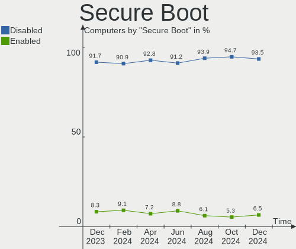
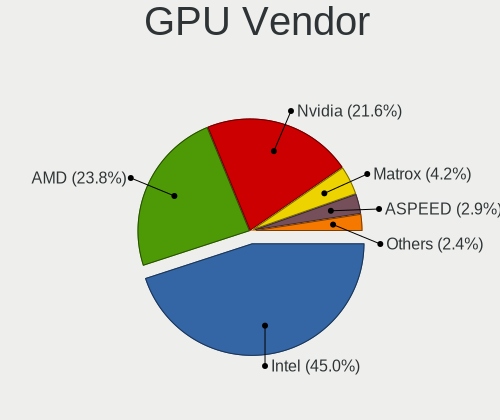
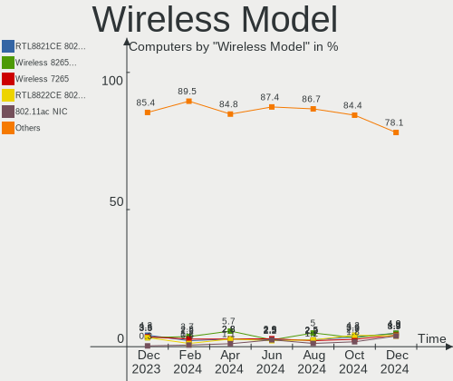

Debian Hardware Trends
----------------------

A project to identify most popular hardware characteristics and track their change
over time based on data collected by Debian users at https://Linux-Hardware.org.

Anyone can contribute to this report by the [hw-probe](https://github.com/linuxhw/hw-probe) tool:

    sudo -E hw-probe -all -upload

This is a report for all computer types. See also reports for [desktops](/Dist/Debian/Desktop/README.md) and [notebooks](/Dist/Debian/Notebook/README.md).

Full-feature report is available here: https://linux-hardware.org/?view=trends

Period: Jul, 2021.

Contents
--------

* [ System ](#system)
  - [ OS                       ](#os)
  - [ OS Family                ](#os-family)
  - [ Kernel                   ](#kernel)
  - [ Kernel Family            ](#kernel-family)
  - [ Kernel Major Ver.        ](#kernel-major-ver)
  - [ Arch                     ](#arch)
  - [ DE                       ](#de)
  - [ Display Server           ](#display-server)
  - [ Display Manager          ](#display-manager)
  - [ OS Lang                  ](#os-lang)
  - [ Boot Mode                ](#boot-mode)
  - [ Filesystem               ](#filesystem)
  - [ Part. scheme             ](#part-scheme)
  - [ Dual Boot with Linux/BSD ](#dual-boot-with-linuxbsd)
  - [ Dual Boot (Win)          ](#dual-boot-win)

* [ Board ](#board)
  - [ Vendor                   ](#vendor)
  - [ Model                    ](#model)
  - [ Model Family             ](#model-family)
  - [ MFG Year                 ](#mfg-year)
  - [ Form Factor              ](#form-factor)
  - [ Secure Boot              ](#secure-boot)
  - [ Coreboot                 ](#coreboot)
  - [ RAM Size                 ](#ram-size)
  - [ RAM Used                 ](#ram-used)
  - [ Total Drives             ](#total-drives)
  - [ Has CD-ROM               ](#has-cd-rom)
  - [ Has Ethernet             ](#has-ethernet)
  - [ Has WiFi                 ](#has-wifi)
  - [ Has Bluetooth            ](#has-bluetooth)

* [ Location ](#location)
  - [ Country                  ](#country)
  - [ City                     ](#city)

* [ Drives ](#drives)
  - [ Drive Vendor             ](#drive-vendor)
  - [ Drive Model              ](#drive-model)
  - [ HDD Vendor               ](#hdd-vendor)
  - [ SSD Vendor               ](#ssd-vendor)
  - [ Drive Kind               ](#drive-kind)
  - [ Drive Connector          ](#drive-connector)
  - [ Drive Size               ](#drive-size)
  - [ Space Total              ](#space-total)
  - [ Space Used               ](#space-used)
  - [ Malfunc. Drives          ](#malfunc-drives)
  - [ Malfunc. Drive Vendor    ](#malfunc-drive-vendor)
  - [ Malfunc. HDD Vendor      ](#malfunc-hdd-vendor)
  - [ Malfunc. Drive Kind      ](#malfunc-drive-kind)
  - [ Failed Drives            ](#failed-drives)
  - [ Failed Drive Vendor      ](#failed-drive-vendor)
  - [ Drive Status             ](#drive-status)

* [ Storage controller ](#storage-controller)
  - [ Storage Vendor           ](#storage-vendor)
  - [ Storage Model            ](#storage-model)
  - [ Storage Kind             ](#storage-kind)

* [ Processor ](#processor)
  - [ CPU Vendor               ](#cpu-vendor)
  - [ CPU Model                ](#cpu-model)
  - [ CPU Model Family         ](#cpu-model-family)
  - [ CPU Cores                ](#cpu-cores)
  - [ CPU Sockets              ](#cpu-sockets)
  - [ CPU Threads              ](#cpu-threads)
  - [ CPU Op-Modes             ](#cpu-op-modes)
  - [ CPU Microcode            ](#cpu-microcode)
  - [ CPU Microarch            ](#cpu-microarch)

* [ Graphics ](#graphics)
  - [ GPU Vendor               ](#gpu-vendor)
  - [ GPU Model                ](#gpu-model)
  - [ GPU Combo                ](#gpu-combo)
  - [ GPU Driver               ](#gpu-driver)
  - [ GPU Memory               ](#gpu-memory)

* [ Monitor ](#monitor)
  - [ Monitor Vendor           ](#monitor-vendor)
  - [ Monitor Model            ](#monitor-model)
  - [ Monitor Resolution       ](#monitor-resolution)
  - [ Monitor Diagonal         ](#monitor-diagonal)
  - [ Monitor Width            ](#monitor-width)
  - [ Aspect Ratio             ](#aspect-ratio)
  - [ Monitor Area             ](#monitor-area)
  - [ Pixel Density            ](#pixel-density)
  - [ Multiple Monitors        ](#multiple-monitors)

* [ Network ](#network)
  - [ Net Controller Vendor    ](#net-controller-vendor)
  - [ Net Controller Model     ](#net-controller-model)
  - [ Wireless Vendor          ](#wireless-vendor)
  - [ Wireless Model           ](#wireless-model)
  - [ Ethernet Vendor          ](#ethernet-vendor)
  - [ Ethernet Model           ](#ethernet-model)
  - [ Net Controller Kind      ](#net-controller-kind)
  - [ Used Controller          ](#used-controller)
  - [ NICs                     ](#nics)
  - [ IPv6                     ](#ipv6)

* [ Bluetooth ](#bluetooth)
  - [ Bluetooth Vendor         ](#bluetooth-vendor)
  - [ Bluetooth Model          ](#bluetooth-model)

* [ Sound ](#sound)
  - [ Sound Vendor             ](#sound-vendor)
  - [ Sound Model              ](#sound-model)

* [ Memory ](#memory)
  - [ Memory Vendor            ](#memory-vendor)
  - [ Memory Model             ](#memory-model)
  - [ Memory Kind              ](#memory-kind)
  - [ Memory Form Factor       ](#memory-form-factor)
  - [ Memory Size              ](#memory-size)
  - [ Memory Speed             ](#memory-speed)

* [ Printers & scanners ](#printers--scanners)
  - [ Printer Vendor           ](#printer-vendor)
  - [ Printer Model            ](#printer-model)
  - [ Scanner Vendor           ](#scanner-vendor)
  - [ Scanner Model            ](#scanner-model)

* [ Camera ](#camera)
  - [ Camera Vendor            ](#camera-vendor)
  - [ Camera Model             ](#camera-model)

* [ Security ](#security)
  - [ Fingerprint Vendor       ](#fingerprint-vendor)
  - [ Fingerprint Model        ](#fingerprint-model)
  - [ Chipcard Vendor          ](#chipcard-vendor)
  - [ Chipcard Model           ](#chipcard-model)

* [ Unsupported ](#unsupported)
  - [ Unsupported Devices      ](#unsupported-devices)
  - [ Unsupported Device Types ](#unsupported-device-types)

System
------

OS
--

Installed operating systems

| Name           | Computers | Percent |
|----------------|-----------|---------|
| Debian 11      | 259       | 72.14%  |
| Debian 10      | 74        | 20.61%  |
| Debian         | 18        | 5.01%   |
| Debian 9.13    | 4         | 1.11%   |
| Debian 9       | 2         | 0.56%   |
| Debian Testing | 1         | 0.28%   |
| Debian Sid     | 1         | 0.28%   |

OS Family
---------

OS without a version

| Name   | Computers | Percent |
|--------|-----------|---------|
| Debian | 359       | 100%    |

Kernel
------

Version of the Linux kernel

| Version                    | Computers | Percent |
|----------------------------|-----------|---------|
| 5.10.0-8-amd64             | 161       | 44.85%  |
| 5.10.0-7-amd64             | 67        | 18.66%  |
| 4.19.0-17-amd64            | 34        | 9.47%   |
| 5.10.0-2-amd64             | 19        | 5.29%   |
| 5.10.0-0.bpo.7-amd64       | 9         | 2.51%   |
| 5.11.22-1-pve              | 4         | 1.11%   |
| 4.19.0-17-686-pae          | 4         | 1.11%   |
| 5.4.106-1-pve              | 3         | 0.84%   |
| 5.10.0-8-686               | 3         | 0.84%   |
| 5.10.0-5mx-amd64           | 3         | 0.84%   |
| 5.10.0-0.bpo.3-amd64       | 3         | 0.84%   |
| 5.4.119-1-pve              | 2         | 0.56%   |
| 5.12.0-19.3-liquorix-amd64 | 2         | 0.56%   |
| 5.11.22-2-pve              | 2         | 0.56%   |
| 5.10.0-8-rt-amd64          | 2         | 0.56%   |
| 5.10.0-8-686-pae           | 2         | 0.56%   |
| 5.10.0-6-amd64             | 2         | 0.56%   |
| 4.9.0-16-amd64             | 2         | 0.56%   |
| 4.19.0-16-amd64            | 2         | 0.56%   |
| 4.19.0-14-amd64            | 2         | 0.56%   |
| 5.8.16-antix.1-amd64-smp   | 1         | 0.28%   |
| 5.8.0-3-amd64              | 1         | 0.28%   |
| 5.6.0-2-amd64              | 1         | 0.28%   |
| 5.4.114-1-pve              | 1         | 0.28%   |
| 5.14.0-rc3-prygun          | 1         | 0.28%   |
| 5.13.5-xanmod1             | 1         | 0.28%   |
| 5.13.4-e5520               | 1         | 0.28%   |
| 5.13.4                     | 1         | 0.28%   |
| 5.13.1a                    | 1         | 0.28%   |
| 5.13.1                     | 1         | 0.28%   |
| 5.12.0-14.2-liquorix-amd64 | 1         | 0.28%   |
| 5.11.22-3-pve              | 1         | 0.28%   |
| 5.10.47                    | 1         | 0.28%   |
| 5.10.46custom              | 1         | 0.28%   |
| 5.10.43-rockchip64         | 1         | 0.28%   |
| 5.10.40-ismynik            | 1         | 0.28%   |
| 5.10.38-falcot             | 1         | 0.28%   |
| 5.10.17-v8+                | 1         | 0.28%   |
| 5.10.0-8-armmp             | 1         | 0.28%   |
| 5.10.0-7-686-pae           | 1         | 0.28%   |
| 5.10.0-4-amd64             | 1         | 0.28%   |
| 5.10.0-3-686-pae           | 1         | 0.28%   |
| 5.10.0-0.bpo.5-amd64       | 1         | 0.28%   |
| 4.9.0-16-686-pae           | 1         | 0.28%   |
| 4.9.0-15-amd64             | 1         | 0.28%   |
| 4.8.0-2-amd64              | 1         | 0.28%   |
| 4.19.194-atom              | 1         | 0.28%   |
| 4.19.0-8-amd64             | 1         | 0.28%   |
| 4.19.0-6-amd64             | 1         | 0.28%   |
| 4.19.0-17-rt-amd64         | 1         | 0.28%   |
| 4.15.18-30-pve             | 1         | 0.28%   |

Kernel Family
-------------

Linux kernel without a distro release

| Version  | Computers | Percent |
|----------|-----------|---------|
| 5.10.0   | 276       | 76.88%  |
| 4.19.0   | 45        | 12.53%  |
| 5.11.22  | 7         | 1.95%   |
| 4.9.0    | 4         | 1.11%   |
| 5.4.106  | 3         | 0.84%   |
| 5.12.0   | 3         | 0.84%   |
| 5.4.119  | 2         | 0.56%   |
| 5.13.4   | 2         | 0.56%   |
| 5.13.1   | 2         | 0.56%   |
| 5.8.16   | 1         | 0.28%   |
| 5.8.0    | 1         | 0.28%   |
| 5.6.0    | 1         | 0.28%   |
| 5.4.114  | 1         | 0.28%   |
| 5.14.0   | 1         | 0.28%   |
| 5.13.5   | 1         | 0.28%   |
| 5.10.47  | 1         | 0.28%   |
| 5.10.46  | 1         | 0.28%   |
| 5.10.43  | 1         | 0.28%   |
| 5.10.40  | 1         | 0.28%   |
| 5.10.38  | 1         | 0.28%   |
| 5.10.17  | 1         | 0.28%   |
| 4.8.0    | 1         | 0.28%   |
| 4.19.194 | 1         | 0.28%   |
| 4.15.18  | 1         | 0.28%   |

Kernel Major Ver.
-----------------

Linux kernel major version

| Version | Computers | Percent |
|---------|-----------|---------|
| 5.10    | 282       | 78.55%  |
| 4.19    | 46        | 12.81%  |
| 5.11    | 7         | 1.95%   |
| 5.4     | 6         | 1.67%   |
| 5.13    | 5         | 1.39%   |
| 4.9     | 4         | 1.11%   |
| 5.12    | 3         | 0.84%   |
| 5.8     | 2         | 0.56%   |
| 5.6     | 1         | 0.28%   |
| 5.14    | 1         | 0.28%   |
| 4.8     | 1         | 0.28%   |
| 4.15    | 1         | 0.28%   |

Arch
----

OS architecture (x86_64, i586, etc.)

| Name    | Computers | Percent |
|---------|-----------|---------|
| x86_64  | 344       | 95.82%  |
| i686    | 12        | 3.34%   |
| aarch64 | 2         | 0.56%   |
| armv7l  | 1         | 0.28%   |

DE
--

Desktop Environment

| Name             | Computers | Percent |
|------------------|-----------|---------|
| GNOME            | 96        | 26.74%  |
| Unknown          | 74        | 20.61%  |
| KDE5             | 60        | 16.71%  |
| XFCE             | 42        | 11.7%   |
| MATE             | 22        | 6.13%   |
| LXDE             | 13        | 3.62%   |
| LXQt             | 10        | 2.79%   |
| KDE              | 8         | 2.23%   |
| i3               | 8         | 2.23%   |
| Cinnamon         | 7         | 1.95%   |
| X-Cinnamon       | 5         | 1.39%   |
| Trinity          | 4         | 1.11%   |
| Openbox          | 3         | 0.84%   |
| lightdm-xsession | 3         | 0.84%   |
| sway             | 2         | 0.56%   |
| GNOME Flashback  | 2         | 0.56%   |

Display Server
--------------

X11 or Wayland

| Name    | Computers | Percent |
|---------|-----------|---------|
| X11     | 209       | 58.22%  |
| Wayland | 70        | 19.5%   |
| Tty     | 47        | 13.09%  |
| Unknown | 33        | 9.19%   |

Display Manager
---------------

SDDM, LightDM, etc.

| Name    | Computers | Percent |
|---------|-----------|---------|
| Unknown | 112       | 31.2%   |
| TDM     | 89        | 24.79%  |
| GDM     | 83        | 23.12%  |
| SDDM    | 63        | 17.55%  |
| LightDM | 7         | 1.95%   |
| SLiM    | 2         | 0.56%   |
| GDM3    | 2         | 0.56%   |
| XDM     | 1         | 0.28%   |

OS Lang
-------

Language

| Lang    | Computers | Percent |
|---------|-----------|---------|
| en_US   | 155       | 43.18%  |
| ru_RU   | 45        | 12.53%  |
| en_GB   | 27        | 7.52%   |
| fr_FR   | 18        | 5.01%   |
| de_DE   | 17        | 4.74%   |
| es_ES   | 10        | 2.79%   |
| en_IN   | 9         | 2.51%   |
| en_AU   | 8         | 2.23%   |
| pt_BR   | 7         | 1.95%   |
| it_IT   | 6         | 1.67%   |
| Unknown | 6         | 1.67%   |
| pt_PT   | 4         | 1.11%   |
| pl_PL   | 4         | 1.11%   |
| en_CA   | 4         | 1.11%   |
| nl_BE   | 3         | 0.84%   |
| C       | 3         | 0.84%   |
| uk_UA   | 2         | 0.56%   |
| hu_HU   | 2         | 0.56%   |
| fi_FI   | 2         | 0.56%   |
| en_SG   | 2         | 0.56%   |
| en_IE   | 2         | 0.56%   |
| cs_CZ   | 2         | 0.56%   |
| zh_CN   | 1         | 0.28%   |
| tr_TR   | 1         | 0.28%   |
| sv_SE   | 1         | 0.28%   |
| sk_SK   | 1         | 0.28%   |
| ru_UA   | 1         | 0.28%   |
| hr_HR   | 1         | 0.28%   |
| gl_ES   | 1         | 0.28%   |
| fr_BE   | 1         | 0.28%   |
| es_US   | 1         | 0.28%   |
| es_NI   | 1         | 0.28%   |
| es_MX   | 1         | 0.28%   |
| es_EC   | 1         | 0.28%   |
| es_CR   | 1         | 0.28%   |
| es_CO   | 1         | 0.28%   |
| es_CL   | 1         | 0.28%   |
| es_AR   | 1         | 0.28%   |
| en_ZA   | 1         | 0.28%   |
| en_SI   | 1         | 0.28%   |
| en_PH   | 1         | 0.28%   |
| en_HK   | 1         | 0.28%   |
| de_CH   | 1         | 0.28%   |

Boot Mode
---------

EFI or BIOS

| Mode | Computers | Percent |
|------|-----------|---------|
| EFI  | 206       | 57.38%  |
| BIOS | 153       | 42.62%  |

Filesystem
----------

Type of filesystem

| Type    | Computers | Percent |
|---------|-----------|---------|
| Ext4    | 284       | 79.11%  |
| Overlay | 35        | 9.75%   |
| Btrfs   | 22        | 6.13%   |
| Zfs     | 8         | 2.23%   |
| Xfs     | 5         | 1.39%   |
| Ext3    | 3         | 0.84%   |
| Unknown | 2         | 0.56%   |

Part. scheme
------------

Scheme of partitioning

| Type    | Computers | Percent |
|---------|-----------|---------|
| GPT     | 217       | 60.45%  |
| MBR     | 97        | 27.02%  |
| Unknown | 45        | 12.53%  |

Dual Boot with Linux/BSD
------------------------

Hosting more than one Linux/BSD

| Dual boot | Computers | Percent |
|-----------|-----------|---------|
| No        | 295       | 82.17%  |
| Yes       | 64        | 17.83%  |

Dual Boot (Win)
---------------

Hosting Linux and Windows

| Dual boot | Computers | Percent |
|-----------|-----------|---------|
| No        | 250       | 69.64%  |
| Yes       | 109       | 30.36%  |

Board
-----

Vendor
------

Motherboard manufacturer

| Name                    | Computers | Percent |
|-------------------------|-----------|---------|
| Lenovo                  | 70        | 19.5%   |
| ASUSTek Computer        | 56        | 15.6%   |
| Dell                    | 45        | 12.53%  |
| Hewlett-Packard         | 44        | 12.26%  |
| Gigabyte Technology     | 31        | 8.64%   |
| ASRock                  | 27        | 7.52%   |
| MSI                     | 20        | 5.57%   |
| Acer                    | 17        | 4.74%   |
| Intel                   | 7         | 1.95%   |
| Supermicro              | 6         | 1.67%   |
| Fujitsu                 | 4         | 1.11%   |
| Apple                   | 4         | 1.11%   |
| Toshiba                 | 3         | 0.84%   |
| HUAWEI                  | 3         | 0.84%   |
| Raspberry Pi Foundation | 2         | 0.56%   |
| IBM                     | 2         | 0.56%   |
| Foxconn                 | 2         | 0.56%   |
| ZOTAC                   | 1         | 0.28%   |
| YANYU                   | 1         | 0.28%   |
| SLIMBOOK                | 1         | 0.28%   |
| Shuttle                 | 1         | 0.28%   |
| Quanta                  | 1         | 0.28%   |
| Protectli               | 1         | 0.28%   |
| PC Specialist           | 1         | 0.28%   |
| Panasonic               | 1         | 0.28%   |
| One Education           | 1         | 0.28%   |
| Itautec                 | 1         | 0.28%   |
| Huanan                  | 1         | 0.28%   |
| ECS                     | 1         | 0.28%   |
| Compulab                | 1         | 0.28%   |
| Casper                  | 1         | 0.28%   |
| ASRockRack              | 1         | 0.28%   |
| Unknown                 | 1         | 0.28%   |

Model
-----

Motherboard model

| Name                                    | Computers | Percent |
|-----------------------------------------|-----------|---------|
| ASUS All Series                         | 5         | 1.39%   |
| Gigabyte B550I AORUS PRO AX             | 3         | 0.84%   |
| Fujitsu ESPRIMO P720                    | 3         | 0.84%   |
| Dell Latitude E6420                     | 3         | 0.84%   |
| Acer Aspire A315-23                     | 3         | 0.84%   |
| Lenovo G50-80 80E5                      | 2         | 0.56%   |
| HUAWEI NBLK-WAX9X                       | 2         | 0.56%   |
| HP Z620 Workstation                     | 2         | 0.56%   |
| Gigabyte H61M-DS2 REV 1.2               | 2         | 0.56%   |
| Gigabyte AB350M-DS3H V2                 | 2         | 0.56%   |
| Dell XPS 13 7390                        | 2         | 0.56%   |
| Dell OptiPlex 760                       | 2         | 0.56%   |
| Dell Inspiron 5570                      | 2         | 0.56%   |
| ASUS VivoBook_ASUS Laptop E210MA_L210MA | 2         | 0.56%   |
| ASUS PRIME Z370-A                       | 2         | 0.56%   |
| ASUS PRIME B350-PLUS                    | 2         | 0.56%   |
| ASUS PRIME A320M-K                      | 2         | 0.56%   |
| ASRock H470M-HVS                        | 2         | 0.56%   |
| ASRock B450M Pro4                       | 2         | 0.56%   |
| ZOTAC ZBOX-EN1070/1060,EN1070K/1060K    | 1         | 0.28%   |
| YANYU ITX-M51_D2L baytrail              | 1         | 0.28%   |
| Toshiba Satellite S55-A                 | 1         | 0.28%   |
| Toshiba Satellite M70                   | 1         | 0.28%   |
| Toshiba Satellite C45-A                 | 1         | 0.28%   |
| Supermicro X8STi                        | 1         | 0.28%   |
| Supermicro X10SLL-F                     | 1         | 0.28%   |
| Supermicro SYS-6019P-WT                 | 1         | 0.28%   |
| Supermicro SYS-5038MA-H24TRF            | 1         | 0.28%   |
| Supermicro SYS-5018R-WR                 | 1         | 0.28%   |
| Supermicro Super Server                 | 1         | 0.28%   |
| SLIMBOOK PROX14-AMD                     | 1         | 0.28%   |
| Shuttle SX79R                           | 1         | 0.28%   |
| RPi Raspberry Pi 4 Model B Rev 1.4      | 1         | 0.28%   |
| RPi Raspberry Pi 2 Model B Rev 1.1      | 1         | 0.28%   |
| Quanta TWC                              | 1         | 0.28%   |
| Protectli FW6                           | 1         | 0.28%   |
| PC Specialist NV4XMB,ME,MZ              | 1         | 0.28%   |
| Panasonic CF-AX2LDCZMF                  | 1         | 0.28%   |
| One Education Infinity:One              | 1         | 0.28%   |
| MSI U210/U210 Light                     | 1         | 0.28%   |
| MSI MS-A912                             | 1         | 0.28%   |
| MSI MS-7C94                             | 1         | 0.28%   |
| MSI MS-7C84                             | 1         | 0.28%   |
| MSI MS-7C80                             | 1         | 0.28%   |
| MSI MS-7C75                             | 1         | 0.28%   |
| MSI MS-7C56                             | 1         | 0.28%   |
| MSI MS-7C37                             | 1         | 0.28%   |
| MSI MS-7C35                             | 1         | 0.28%   |
| MSI MS-7B46                             | 1         | 0.28%   |
| MSI MS-7B09                             | 1         | 0.28%   |
| MSI MS-7A38                             | 1         | 0.28%   |
| MSI MS-7995                             | 1         | 0.28%   |
| MSI MS-7924                             | 1         | 0.28%   |
| MSI MS-7759                             | 1         | 0.28%   |
| MSI MS-7721                             | 1         | 0.28%   |
| MSI MS-7562                             | 1         | 0.28%   |
| MSI MS-6712                             | 1         | 0.28%   |
| MSI Modern 15 A11M                      | 1         | 0.28%   |
| MSI GF65 Thin 10UE                      | 1         | 0.28%   |
| Lenovo Yoga 710-11ISK 80TX              | 1         | 0.28%   |

Model Family
------------

Motherboard model prefix

| Name                         | Computers | Percent |
|------------------------------|-----------|---------|
| Lenovo ThinkPad              | 49        | 13.65%  |
| ASUS PRIME                   | 18        | 5.01%   |
| Acer Aspire                  | 11        | 3.06%   |
| Lenovo IdeaPad               | 10        | 2.79%   |
| Dell Inspiron                | 10        | 2.79%   |
| Dell OptiPlex                | 9         | 2.51%   |
| HP ProBook                   | 8         | 2.23%   |
| Dell XPS                     | 7         | 1.95%   |
| Dell Latitude                | 7         | 1.95%   |
| HP EliteBook                 | 6         | 1.67%   |
| HP Laptop                    | 5         | 1.39%   |
| HP Compaq                    | 5         | 1.39%   |
| Dell Precision               | 5         | 1.39%   |
| ASUS VivoBook                | 5         | 1.39%   |
| ASUS ROG                     | 5         | 1.39%   |
| ASUS All                     | 5         | 1.39%   |
| Toshiba Satellite            | 3         | 0.84%   |
| HP Pavilion                  | 3         | 0.84%   |
| Gigabyte B550I               | 3         | 0.84%   |
| Fujitsu ESPRIMO              | 3         | 0.84%   |
| Dell Vostro                  | 3         | 0.84%   |
| Dell PowerEdge               | 3         | 0.84%   |
| ASUS TUF                     | 3         | 0.84%   |
| RPi Raspberry                | 2         | 0.56%   |
| Lenovo Yoga                  | 2         | 0.56%   |
| Lenovo ThinkStation          | 2         | 0.56%   |
| Lenovo ThinkCentre           | 2         | 0.56%   |
| Lenovo G50-80                | 2         | 0.56%   |
| HUAWEI NBLK-WAX9X            | 2         | 0.56%   |
| HP Z620                      | 2         | 0.56%   |
| HP ProLiant                  | 2         | 0.56%   |
| HP OMEN                      | 2         | 0.56%   |
| HP EliteDesk                 | 2         | 0.56%   |
| HP 250                       | 2         | 0.56%   |
| Gigabyte H61M-DS2            | 2         | 0.56%   |
| Gigabyte B450M               | 2         | 0.56%   |
| Gigabyte AERO                | 2         | 0.56%   |
| Gigabyte AB350M-DS3H         | 2         | 0.56%   |
| ASUS ZenBook                 | 2         | 0.56%   |
| ASUS M5A78L-M                | 2         | 0.56%   |
| ASRock Z97                   | 2         | 0.56%   |
| ASRock H470M-HVS             | 2         | 0.56%   |
| ASRock B450M                 | 2         | 0.56%   |
| Acer Swift                   | 2         | 0.56%   |
| ZOTAC ZBOX-EN1070            | 1         | 0.28%   |
| YANYU ITX-M51                | 1         | 0.28%   |
| Supermicro X8STi             | 1         | 0.28%   |
| Supermicro X10SLL-F          | 1         | 0.28%   |
| Supermicro SYS-6019P-WT      | 1         | 0.28%   |
| Supermicro SYS-5038MA-H24TRF | 1         | 0.28%   |
| Supermicro SYS-5018R-WR      | 1         | 0.28%   |
| Supermicro Super             | 1         | 0.28%   |
| SLIMBOOK PROX14-AMD          | 1         | 0.28%   |
| Shuttle SX79R                | 1         | 0.28%   |
| Quanta TWC                   | 1         | 0.28%   |
| Protectli FW6                | 1         | 0.28%   |
| PC Specialist NV4XMB         | 1         | 0.28%   |
| Panasonic CF-AX2LDCZMF       | 1         | 0.28%   |
| One Education Infinity:One   | 1         | 0.28%   |
| MSI U210                     | 1         | 0.28%   |

MFG Year
--------

Motherboard manufacture year

| Year    | Computers | Percent |
|---------|-----------|---------|
| 2020    | 80        | 22.28%  |
| 2021    | 56        | 15.6%   |
| 2018    | 43        | 11.98%  |
| 2019    | 41        | 11.42%  |
| 2012    | 20        | 5.57%   |
| 2015    | 18        | 5.01%   |
| 2013    | 18        | 5.01%   |
| 2016    | 16        | 4.46%   |
| 2011    | 14        | 3.9%    |
| 2014    | 13        | 3.62%   |
| 2017    | 8         | 2.23%   |
| 2010    | 8         | 2.23%   |
| 2009    | 6         | 1.67%   |
| 2008    | 4         | 1.11%   |
| 2007    | 4         | 1.11%   |
| 2006    | 4         | 1.11%   |
| Unknown | 3         | 0.84%   |
| 2004    | 2         | 0.56%   |
| 2001    | 1         | 0.28%   |

Form Factor
-----------

Physical design of the computer

| Name           | Computers | Percent |
|----------------|-----------|---------|
| Notebook       | 171       | 47.63%  |
| Desktop        | 164       | 45.68%  |
| Server         | 7         | 1.95%   |
| Convertible    | 6         | 1.67%   |
| Mini pc        | 5         | 1.39%   |
| System on chip | 3         | 0.84%   |
| All in one     | 2         | 0.56%   |
| Other          | 1         | 0.28%   |

Secure Boot
-----------

Enabled or disabled

| State    | Computers | Percent |
|----------|-----------|---------|
| Disabled | 327       | 91.09%  |
| Enabled  | 32        | 8.91%   |

Coreboot
--------

Have coreboot on board

| Used | Computers | Percent |
|------|-----------|---------|
| No   | 358       | 99.72%  |
| Yes  | 1         | 0.28%   |

RAM Size
--------

Total RAM memory

| Size in GB      | Computers | Percent |
|-----------------|-----------|---------|
| 16.01-24.0      | 96        | 26.74%  |
| 4.01-8.0        | 70        | 19.5%   |
| 3.01-4.0        | 49        | 13.65%  |
| 8.01-16.0       | 47        | 13.09%  |
| 32.01-64.0      | 43        | 11.98%  |
| 64.01-256.0     | 22        | 6.13%   |
| 1.01-2.0        | 13        | 3.62%   |
| 24.01-32.0      | 7         | 1.95%   |
| 2.01-3.0        | 5         | 1.39%   |
| 0.01-0.5        | 3         | 0.84%   |
| More than 256.0 | 2         | 0.56%   |
| 0.51-1.0        | 2         | 0.56%   |

RAM Used
--------

Used RAM memory

| Used GB         | Computers | Percent |
|-----------------|-----------|---------|
| 1.01-2.0        | 76        | 21.17%  |
| 2.01-3.0        | 63        | 17.55%  |
| 4.01-8.0        | 58        | 16.16%  |
| 0.51-1.0        | 53        | 14.76%  |
| 3.01-4.0        | 48        | 13.37%  |
| 8.01-16.0       | 31        | 8.64%   |
| 0.01-0.5        | 20        | 5.57%   |
| 32.01-64.0      | 4         | 1.11%   |
| 24.01-32.0      | 3         | 0.84%   |
| More than 256.0 | 1         | 0.28%   |
| 64.01-256.0     | 1         | 0.28%   |
| 16.01-24.0      | 1         | 0.28%   |

Total Drives
------------

Number of drives on board

| Drives | Computers | Percent |
|--------|-----------|---------|
| 1      | 186       | 51.81%  |
| 2      | 98        | 27.3%   |
| 3      | 26        | 7.24%   |
| 4      | 23        | 6.41%   |
| 5      | 11        | 3.06%   |
| 6      | 5         | 1.39%   |
| 9      | 3         | 0.84%   |
| 8      | 3         | 0.84%   |
| 0      | 2         | 0.56%   |
| 10     | 1         | 0.28%   |
| 7      | 1         | 0.28%   |

Has CD-ROM
----------

Has CD-ROM on board

| Presented | Computers | Percent |
|-----------|-----------|---------|
| No        | 245       | 68.25%  |
| Yes       | 114       | 31.75%  |

Has Ethernet
------------

Has Ethernet on board

| Presented | Computers | Percent |
|-----------|-----------|---------|
| Yes       | 319       | 88.86%  |
| No        | 40        | 11.14%  |

Has WiFi
--------

Has WiFi module

| Presented | Computers | Percent |
|-----------|-----------|---------|
| Yes       | 219       | 61%     |
| No        | 140       | 39%     |

Has Bluetooth
-------------

Has Bluetooth module

| Presented | Computers | Percent |
|-----------|-----------|---------|
| Yes       | 182       | 50.7%   |
| No        | 177       | 49.3%   |

Location
--------

Country
-------

Geographic location (country)

| Country                | Computers | Percent |
|------------------------|-----------|---------|
| USA                    | 60        | 16.71%  |
| Russia                 | 50        | 13.93%  |
| Germany                | 30        | 8.36%   |
| France                 | 28        | 7.8%    |
| UK                     | 20        | 5.57%   |
| Spain                  | 15        | 4.18%   |
| Ukraine                | 11        | 3.06%   |
| Brazil                 | 10        | 2.79%   |
| India                  | 9         | 2.51%   |
| Australia              | 8         | 2.23%   |
| Netherlands            | 7         | 1.95%   |
| Canada                 | 7         | 1.95%   |
| Switzerland            | 6         | 1.67%   |
| Poland                 | 6         | 1.67%   |
| Portugal               | 5         | 1.39%   |
| Mexico                 | 5         | 1.39%   |
| Italy                  | 5         | 1.39%   |
| Greece                 | 5         | 1.39%   |
| Czechia                | 5         | 1.39%   |
| Kazakhstan             | 4         | 1.11%   |
| Finland                | 4         | 1.11%   |
| Bulgaria               | 4         | 1.11%   |
| Belgium                | 4         | 1.11%   |
| Austria                | 4         | 1.11%   |
| Thailand               | 3         | 0.84%   |
| Norway                 | 3         | 0.84%   |
| Hungary                | 3         | 0.84%   |
| Ecuador                | 3         | 0.84%   |
| Belarus                | 3         | 0.84%   |
| Turkey                 | 2         | 0.56%   |
| Sweden                 | 2         | 0.56%   |
| Slovenia               | 2         | 0.56%   |
| Croatia                | 2         | 0.56%   |
| Colombia               | 2         | 0.56%   |
| Venezuela              | 1         | 0.28%   |
| Uganda                 | 1         | 0.28%   |
| Tunisia                | 1         | 0.28%   |
| Syria                  | 1         | 0.28%   |
| South Africa           | 1         | 0.28%   |
| Singapore              | 1         | 0.28%   |
| Serbia                 | 1         | 0.28%   |
| Romania                | 1         | 0.28%   |
| Philippines            | 1         | 0.28%   |
| Nicaragua              | 1         | 0.28%   |
| Morocco                | 1         | 0.28%   |
| Mongolia               | 1         | 0.28%   |
| Malaysia               | 1         | 0.28%   |
| Madagascar             | 1         | 0.28%   |
| Indonesia              | 1         | 0.28%   |
| Hong Kong              | 1         | 0.28%   |
| China                  | 1         | 0.28%   |
| Chile                  | 1         | 0.28%   |
| Bosnia and Herzegovina | 1         | 0.28%   |
| Bangladesh             | 1         | 0.28%   |
| Azerbaijan             | 1         | 0.28%   |
| Argentina              | 1         | 0.28%   |

City
----

Geographic location (city)

| City              | Computers | Percent |
|-------------------|-----------|---------|
| Voronezh          | 18        | 5.01%   |
| St Petersburg     | 9         | 2.51%   |
| Paris             | 6         | 1.67%   |
| London            | 6         | 1.67%   |
| Lyon              | 5         | 1.39%   |
| Kalamazoo         | 5         | 1.39%   |
| Athens            | 5         | 1.39%   |
| Sofia             | 4         | 1.11%   |
| Ocala             | 4         | 1.11%   |
| Moscow            | 4         | 1.11%   |
| Ensenada          | 4         | 1.11%   |
| Berlin            | 4         | 1.11%   |
| Bengaluru         | 4         | 1.11%   |
| Vienna            | 3         | 0.84%   |
| Sunnyvale         | 3         | 0.84%   |
| Mesa              | 3         | 0.84%   |
| Gloucester        | 3         | 0.84%   |
| Bristol           | 3         | 0.84%   |
| Bangkok           | 3         | 0.84%   |
| Zurich            | 2         | 0.56%   |
| Westborough       | 2         | 0.56%   |
| Waregem           | 2         | 0.56%   |
| Vancouver         | 2         | 0.56%   |
| Sydney            | 2         | 0.56%   |
| Saint-Denis       | 2         | 0.56%   |
| Rio de Janeiro    | 2         | 0.56%   |
| Prague            | 2         | 0.56%   |
| Perm              | 2         | 0.56%   |
| Osnabr??ck        | 2         | 0.56%   |
| Oleksandrivka     | 2         | 0.56%   |
| Noblesville       | 2         | 0.56%   |
| Melbourne         | 2         | 0.56%   |
| Mainz             | 2         | 0.56%   |
| Madrid            | 2         | 0.56%   |
| Lublin            | 2         | 0.56%   |
| Lisbon            | 2         | 0.56%   |
| Kyiv              | 2         | 0.56%   |
| Kharkiv           | 2         | 0.56%   |
| Helsinki          | 2         | 0.56%   |
| Hanover           | 2         | 0.56%   |
| Hakadal           | 2         | 0.56%   |
| Gorinchem         | 2         | 0.56%   |
| Fryazino          | 2         | 0.56%   |
| Frankfurt am Main | 2         | 0.56%   |
| Donetsk           | 2         | 0.56%   |
| Delhi             | 2         | 0.56%   |
| Cuenca            | 2         | 0.56%   |
| Burnaby           | 2         | 0.56%   |
| Ajdov????ina      | 2         | 0.56%   |
| Érd              | 1         | 0.28%   |
| Zaragoza          | 1         | 0.28%   |
| Zagreb            | 1         | 0.28%   |
| Yiwu              | 1         | 0.28%   |
| Yekaterinburg     | 1         | 0.28%   |
| Woolloongabba     | 1         | 0.28%   |
| Woodstock         | 1         | 0.28%   |
| Whitefield        | 1         | 0.28%   |
| Wenatchee         | 1         | 0.28%   |
| Waterloo          | 1         | 0.28%   |
| Warsaw            | 1         | 0.28%   |

Drives
------

Drive Vendor
------------

Hard drive vendors

| Vendor              | Computers | Drives | Percent |
|---------------------|-----------|--------|---------|
| WDC                 | 95        | 136    | 17.76%  |
| Samsung Electronics | 94        | 134    | 17.57%  |
| Seagate             | 71        | 106    | 13.27%  |
| Toshiba             | 37        | 53     | 6.92%   |
| Crucial             | 35        | 38     | 6.54%   |
| Kingston            | 33        | 37     | 6.17%   |
| Unknown             | 18        | 20     | 3.36%   |
| SanDisk             | 18        | 25     | 3.36%   |
| SK Hynix            | 13        | 14     | 2.43%   |
| Intel               | 12        | 13     | 2.24%   |
| Hitachi             | 11        | 13     | 2.06%   |
| HGST                | 11        | 16     | 2.06%   |
| A-DATA Technology   | 7         | 9      | 1.31%   |
| China               | 6         | 6      | 1.12%   |
| Transcend           | 4         | 5      | 0.75%   |
| SPCC                | 4         | 4      | 0.75%   |
| PNY                 | 4         | 4      | 0.75%   |
| Phison              | 4         | 5      | 0.75%   |
| KIOXIA              | 4         | 4      | 0.75%   |
| Apple               | 4         | 4      | 0.75%   |
| Union Memory        | 3         | 3      | 0.56%   |
| Micron Technology   | 3         | 3      | 0.56%   |
| MAXTOR              | 3         | 3      | 0.56%   |
| Lenovo              | 3         | 3      | 0.56%   |
| Patriot             | 2         | 2      | 0.37%   |
| Netac               | 2         | 2      | 0.37%   |
| LDLC                | 2         | 2      | 0.37%   |
| Intenso             | 2         | 2      | 0.37%   |
| Gigabyte Technology | 2         | 2      | 0.37%   |
| Corsair             | 2         | 2      | 0.37%   |
| ZTC                 | 1         | 1      | 0.19%   |
| Xinhaike            | 1         | 1      | 0.19%   |
| TrueNAS             | 1         | 1      | 0.19%   |
| Team                | 1         | 1      | 0.19%   |
| SILICONMOTION       | 1         | 1      | 0.19%   |
| Silicon Motion      | 1         | 1      | 0.19%   |
| PLEXTOR             | 1         | 1      | 0.19%   |
| OCZ                 | 1         | 1      | 0.19%   |
| Maximus             | 1         | 1      | 0.19%   |
| MaxDigital          | 1         | 2      | 0.19%   |
| LITEONIT            | 1         | 1      | 0.19%   |
| LITEON              | 1         | 1      | 0.19%   |
| Lexar               | 1         | 1      | 0.19%   |
| KingSpec            | 1         | 1      | 0.19%   |
| KingDian            | 1         | 1      | 0.19%   |
| InnoDisk            | 1         | 1      | 0.19%   |
| IBM/Hitachi         | 1         | 1      | 0.19%   |
| IBM-ESXS            | 1         | 2      | 0.19%   |
| HUAWEI              | 1         | 1      | 0.19%   |
| GLOWAY              | 1         | 1      | 0.19%   |
| DOGFISH             | 1         | 1      | 0.19%   |
| ASUS-PHISON         | 1         | 1      | 0.19%   |
| ASMT                | 1         | 2      | 0.19%   |
| Apacer              | 1         | 1      | 0.19%   |
| AMD                 | 1         | 1      | 0.19%   |
| 2-Power             | 1         | 1      | 0.19%   |

Drive Model
-----------

Hard drive models

| Model                                | Computers | Percent |
|--------------------------------------|-----------|---------|
| Samsung SSD 860 EVO 1TB              | 11        | 1.78%   |
| Seagate ST1000LM035-1RK172 1TB       | 8         | 1.29%   |
| Samsung SSD 970 EVO Plus 500GB       | 7         | 1.13%   |
| Samsung SSD 850 EVO 250GB            | 7         | 1.13%   |
| Crucial CT500MX500SSD1 500GB         | 7         | 1.13%   |
| Samsung SSD 860 EVO 500GB            | 6         | 0.97%   |
| Samsung SSD 850 EVO 500GB            | 6         | 0.97%   |
| Toshiba HDWD110 1TB                  | 5         | 0.81%   |
| Seagate ST500DM002-1BD142 500GB      | 5         | 0.81%   |
| Samsung SSD 970 EVO Plus 1TB         | 5         | 0.81%   |
| Samsung SSD 860 EVO 250GB            | 5         | 0.81%   |
| Kingston SA400S37240G 240GB SSD      | 5         | 0.81%   |
| Toshiba MQ04ABF100 1TB               | 4         | 0.65%   |
| Toshiba DT01ACA200 2TB               | 4         | 0.65%   |
| Seagate ST4000DM004-2CV104 4TB       | 4         | 0.65%   |
| Seagate ST1000DM010-2EP102 1TB       | 4         | 0.65%   |
| Samsung SSD 870 EVO 500GB            | 4         | 0.65%   |
| Kingston SA400S37120G 120GB SSD      | 4         | 0.65%   |
| Crucial CT240BX500SSD1 240GB         | 4         | 0.65%   |
| Crucial CT1000MX500SSD1 1TB          | 4         | 0.65%   |
| WDC WDS120G2G0A-00JH30 120GB SSD     | 3         | 0.48%   |
| WDC WD20EFRX-68EUZN0 2TB             | 3         | 0.48%   |
| WDC WD10JPVX-22JC3T0 1TB             | 3         | 0.48%   |
| WDC WD10EZEX-08WN4A0 1TB             | 3         | 0.48%   |
| Unknown SD/MMC/MS PRO 128GB          | 3         | 0.48%   |
| Seagate ST2000DM008-2FR102 2TB       | 3         | 0.48%   |
| Seagate ST2000DM006-2DM164 2TB       | 3         | 0.48%   |
| Seagate ST2000DM001-1ER164 2TB       | 3         | 0.48%   |
| Seagate Backup+ Hub BK 4TB           | 3         | 0.48%   |
| Samsung SSD 860 EVO M.2 1TB          | 3         | 0.48%   |
| Kingston SV300S37A240G 240GB SSD     | 3         | 0.48%   |
| Kingston SA400S37480G 480GB SSD      | 3         | 0.48%   |
| Hitachi HUS724040ALE641 4TB          | 3         | 0.48%   |
| Crucial CT250MX500SSD1 250GB         | 3         | 0.48%   |
| Crucial CT1000P1SSD8 1TB             | 3         | 0.48%   |
| China SSD 120GB                      | 3         | 0.48%   |
| WDC WDS500G2B0C-00PXH0 500GB         | 2         | 0.32%   |
| WDC WDS500G2B0A-00SM50 500GB SSD     | 2         | 0.32%   |
| WDC WDS250G2B0A-00SM50 250GB SSD     | 2         | 0.32%   |
| WDC WDS240G2G0B-00EPW0 240GB SSD     | 2         | 0.32%   |
| WDC WD40EFZX-68AWUN0 4TB             | 2         | 0.32%   |
| WDC WD20EZAZ-00GGJB0 2TB             | 2         | 0.32%   |
| WDC WD2002FAEX-007BA0 2TB            | 2         | 0.32%   |
| WDC WD10SPZX-21Z10T0 1TB             | 2         | 0.32%   |
| WDC WD10EFRX-68FYTN0 1TB             | 2         | 0.32%   |
| WDC WD1003FZEX-00MK2A0 1TB           | 2         | 0.32%   |
| WDC WD1002FAEX-00Z3A0 1TB            | 2         | 0.32%   |
| WDC PC SN730 SDBPNTY-1T00-1006 1TB   | 2         | 0.32%   |
| WDC PC SN720 SDAQNTW-512G-1001 512GB | 2         | 0.32%   |
| Unknown SL16G  16GB                  | 2         | 0.32%   |
| Unknown MMC Card  32GB               | 2         | 0.32%   |
| Unknown DA4064  64GB                 | 2         | 0.32%   |
| Toshiba MQ01ABF050 500GB             | 2         | 0.32%   |
| Toshiba MQ01ABD100 1TB               | 2         | 0.32%   |
| Toshiba HDWE140 4TB                  | 2         | 0.32%   |
| Toshiba DT01ACA300 3TB               | 2         | 0.32%   |
| Toshiba DT01ACA050 500GB             | 2         | 0.32%   |
| SPCC M.2 PCIe SSD 1TB                | 2         | 0.32%   |
| Seagate ST3160815AS 160GB            | 2         | 0.32%   |
| Seagate ST31000524AS 1TB             | 2         | 0.32%   |

HDD Vendor
----------

Hard disk drive vendors

| Vendor              | Computers | Drives | Percent |
|---------------------|-----------|--------|---------|
| Seagate             | 67        | 92     | 33.84%  |
| WDC                 | 64        | 96     | 32.32%  |
| Toshiba             | 27        | 43     | 13.64%  |
| Hitachi             | 11        | 13     | 5.56%   |
| HGST                | 11        | 16     | 5.56%   |
| Samsung Electronics | 9         | 10     | 4.55%   |
| MAXTOR              | 2         | 2      | 1.01%   |
| SILICONMOTION       | 1         | 1      | 0.51%   |
| MaxDigital          | 1         | 2      | 0.51%   |
| InnoDisk            | 1         | 1      | 0.51%   |
| IBM/Hitachi         | 1         | 1      | 0.51%   |
| IBM-ESXS            | 1         | 2      | 0.51%   |
| ASMT                | 1         | 2      | 0.51%   |
| Apple               | 1         | 1      | 0.51%   |

SSD Vendor
----------

Solid state drive vendors

| Vendor              | Computers | Drives | Percent |
|---------------------|-----------|--------|---------|
| Samsung Electronics | 58        | 83     | 27.75%  |
| Crucial             | 28        | 31     | 13.4%   |
| Kingston            | 26        | 30     | 12.44%  |
| WDC                 | 17        | 18     | 8.13%   |
| SanDisk             | 13        | 20     | 6.22%   |
| Intel               | 6         | 7      | 2.87%   |
| China               | 6         | 6      | 2.87%   |
| Transcend           | 4         | 5      | 1.91%   |
| Toshiba             | 4         | 4      | 1.91%   |
| A-DATA Technology   | 4         | 5      | 1.91%   |
| SK Hynix            | 3         | 3      | 1.44%   |
| PNY                 | 3         | 3      | 1.44%   |
| Apple               | 3         | 3      | 1.44%   |
| SPCC                | 2         | 2      | 0.96%   |
| Seagate             | 2         | 2      | 0.96%   |
| Patriot             | 2         | 2      | 0.96%   |
| Netac               | 2         | 2      | 0.96%   |
| LDLC                | 2         | 2      | 0.96%   |
| Intenso             | 2         | 2      | 0.96%   |
| ZTC                 | 1         | 1      | 0.48%   |
| Xinhaike            | 1         | 1      | 0.48%   |
| Unknown             | 1         | 1      | 0.48%   |
| Union Memory        | 1         | 1      | 0.48%   |
| TrueNAS             | 1         | 1      | 0.48%   |
| Team                | 1         | 1      | 0.48%   |
| PLEXTOR             | 1         | 1      | 0.48%   |
| OCZ                 | 1         | 1      | 0.48%   |
| Micron Technology   | 1         | 1      | 0.48%   |
| Maxtor              | 1         | 1      | 0.48%   |
| Maximus             | 1         | 1      | 0.48%   |
| LITEONIT            | 1         | 1      | 0.48%   |
| Lexar               | 1         | 1      | 0.48%   |
| KingSpec            | 1         | 1      | 0.48%   |
| KingDian            | 1         | 1      | 0.48%   |
| GLOWAY              | 1         | 1      | 0.48%   |
| Gigabyte Technology | 1         | 1      | 0.48%   |
| DOGFISH             | 1         | 1      | 0.48%   |
| ASUS-PHISON         | 1         | 1      | 0.48%   |
| Apacer              | 1         | 1      | 0.48%   |
| AMD                 | 1         | 1      | 0.48%   |
| 2-Power             | 1         | 1      | 0.48%   |

Drive Kind
----------

HDD or SSD

| Kind    | Computers | Drives | Percent |
|---------|-----------|--------|---------|
| SSD     | 189       | 252    | 37.5%   |
| HDD     | 173       | 282    | 34.33%  |
| NVMe    | 117       | 131    | 23.21%  |
| MMC     | 16        | 18     | 3.17%   |
| Unknown | 9         | 16     | 1.79%   |

Drive Connector
---------------

SATA, SAS, NVMe, etc.

| Type | Computers | Drives | Percent |
|------|-----------|--------|---------|
| SATA | 278       | 523    | 64.95%  |
| NVMe | 117       | 131    | 27.34%  |
| SAS  | 17        | 27     | 3.97%   |
| MMC  | 16        | 18     | 3.74%   |

Drive Size
----------

Size of hard drive

| Size in TB | Computers | Drives | Percent |
|------------|-----------|--------|---------|
| 0.01-0.5   | 197       | 260    | 51.84%  |
| 0.51-1.0   | 108       | 137    | 28.42%  |
| 1.01-2.0   | 40        | 58     | 10.53%  |
| 3.01-4.0   | 16        | 41     | 4.21%   |
| 2.01-3.0   | 10        | 17     | 2.63%   |
| 4.01-10.0  | 7         | 18     | 1.84%   |
| 10.01-20.0 | 2         | 3      | 0.53%   |

Space Total
-----------

Amount of disk space available on the file system

| Size in GB     | Computers | Percent |
|----------------|-----------|---------|
| 251-500        | 67        | 18.66%  |
| 101-250        | 59        | 16.43%  |
| 501-1000       | 44        | 12.26%  |
| 1001-2000      | 39        | 10.86%  |
| More than 3000 | 38        | 10.58%  |
| Unknown        | 32        | 8.91%   |
| 1-20           | 29        | 8.08%   |
| 51-100         | 27        | 7.52%   |
| 21-50          | 12        | 3.34%   |
| 2001-3000      | 12        | 3.34%   |

Space Used
----------

Amount of used disk space

| Used GB        | Computers | Percent |
|----------------|-----------|---------|
| 1-20           | 102       | 28.41%  |
| 21-50          | 41        | 11.42%  |
| 51-100         | 41        | 11.42%  |
| 101-250        | 39        | 10.86%  |
| Unknown        | 32        | 8.91%   |
| 501-1000       | 29        | 8.08%   |
| 251-500        | 28        | 7.8%    |
| 1001-2000      | 22        | 6.13%   |
| More than 3000 | 12        | 3.34%   |
| 2001-3000      | 9         | 2.51%   |
| 0              | 4         | 1.11%   |

Malfunc. Drives
---------------

Drive models with a malfunction

| Model                                 | Computers | Drives | Percent |
|---------------------------------------|-----------|--------|---------|
| Seagate ST500DM002-1BD142 500GB       | 4         | 4      | 7.55%   |
| WDC WD20EFRX-68EUZN0 2TB              | 2         | 4      | 3.77%   |
| Toshiba MQ04ABF100 1TB                | 2         | 2      | 3.77%   |
| WDC WD5003ABYX-18WERA0 500GB          | 1         | 2      | 1.89%   |
| WDC WD5000HHTZ-04N21V0 500GB          | 1         | 1      | 1.89%   |
| WDC WD5000BPVT-22HXZT1 500GB          | 1         | 1      | 1.89%   |
| WDC WD5000AAKX-08U6AA0 500GB          | 1         | 1      | 1.89%   |
| WDC WD5000AAKS-22V1A0 500GB           | 1         | 1      | 1.89%   |
| WDC WD5000AAJS-22A8B0 500GB           | 1         | 1      | 1.89%   |
| WDC WD40EFZX-68AWUN0 4TB              | 1         | 6      | 1.89%   |
| WDC WD400BB-00DEA0 40GB               | 1         | 1      | 1.89%   |
| WDC WD20EARS-00MVWB0 2TB              | 1         | 1      | 1.89%   |
| WDC WD2002FAEX-007BA0 2TB             | 1         | 1      | 1.89%   |
| WDC WD1600AAJS-00L7A0 160GB           | 1         | 1      | 1.89%   |
| WDC WD10JPVX-60JC3T0 1TB              | 1         | 1      | 1.89%   |
| WDC WD10JPVX-22JC3T0 1TB              | 1         | 1      | 1.89%   |
| WDC WD10JPVT-75A1YT0 1TB              | 1         | 1      | 1.89%   |
| WDC WD10EZEX-08WN4A0 1TB              | 1         | 1      | 1.89%   |
| WDC WD10EALX-009BA0 1TB               | 1         | 1      | 1.89%   |
| WDC WD1002FAEX-00Z3A0 1TB             | 1         | 1      | 1.89%   |
| Toshiba MQ01ABF050 500GB              | 1         | 1      | 1.89%   |
| Toshiba MQ01ABD100 1TB                | 1         | 1      | 1.89%   |
| Toshiba MK2565GSX 250GB               | 1         | 1      | 1.89%   |
| Toshiba DT01ACA050 500GB              | 1         | 1      | 1.89%   |
| SK Hynix PC401 NVMe 512GB             | 1         | 2      | 1.89%   |
| Seagate ST9160310AS 160GB             | 1         | 1      | 1.89%   |
| Seagate ST500LT012-9WS142 500GB       | 1         | 1      | 1.89%   |
| Seagate ST320LT007-9ZV142 320GB       | 1         | 1      | 1.89%   |
| Seagate ST3200827AS 200GB             | 1         | 1      | 1.89%   |
| Seagate ST32000542AS 2TB              | 1         | 1      | 1.89%   |
| Seagate ST3120827AS 120GB             | 1         | 1      | 1.89%   |
| Seagate ST31000333AS 1TB              | 1         | 1      | 1.89%   |
| Seagate ST3000DM001-9YN166 3TB        | 1         | 1      | 1.89%   |
| Seagate ST250DM000-1BD141 250GB       | 1         | 1      | 1.89%   |
| Seagate ST1000LM035-1RK172 1TB        | 1         | 1      | 1.89%   |
| SanDisk SSD PLUS 120 GB               | 1         | 1      | 1.89%   |
| SanDisk SDSSDX480GG25 480GB           | 1         | 1      | 1.89%   |
| Samsung Electronics SSD 970 EVO 250GB | 1         | 1      | 1.89%   |
| Samsung Electronics SP2014N 200GB     | 1         | 1      | 1.89%   |
| Samsung Electronics HD161GJ 160GB     | 1         | 1      | 1.89%   |
| Samsung Electronics HD103SI 1TB       | 1         | 1      | 1.89%   |
| PNY SSD2SC240G3LC709B121-460P 240GB   | 1         | 1      | 1.89%   |
| PLEXTOR PX-128M2S 128GB SSD           | 1         | 1      | 1.89%   |
| Kingston SV300S37A120G 120GB SSD      | 1         | 1      | 1.89%   |
| KingSpec Q-90 90GB SSD                | 1         | 1      | 1.89%   |
| KingDian S280 240GB                   | 1         | 1      | 1.89%   |
| HGST TOURO S 1TB                      | 1         | 1      | 1.89%   |
| A-DATA Technology SU800 256GB SSD     | 1         | 2      | 1.89%   |

Malfunc. Drive Vendor
---------------------

Vendors of faulty drives

| Vendor              | Computers | Drives | Percent |
|---------------------|-----------|--------|---------|
| WDC                 | 18        | 27     | 35.29%  |
| Seagate             | 13        | 14     | 25.49%  |
| Toshiba             | 6         | 6      | 11.76%  |
| Samsung Electronics | 4         | 4      | 7.84%   |
| SanDisk             | 2         | 2      | 3.92%   |
| SK Hynix            | 1         | 2      | 1.96%   |
| PNY                 | 1         | 1      | 1.96%   |
| PLEXTOR             | 1         | 1      | 1.96%   |
| Kingston            | 1         | 1      | 1.96%   |
| KingSpec            | 1         | 1      | 1.96%   |
| KingDian            | 1         | 1      | 1.96%   |
| HGST                | 1         | 1      | 1.96%   |
| A-DATA Technology   | 1         | 2      | 1.96%   |

Malfunc. HDD Vendor
-------------------

Vendors of faulty HDD drives

| Vendor              | Computers | Drives | Percent |
|---------------------|-----------|--------|---------|
| WDC                 | 18        | 27     | 43.9%   |
| Seagate             | 13        | 14     | 31.71%  |
| Toshiba             | 6         | 6      | 14.63%  |
| Samsung Electronics | 3         | 3      | 7.32%   |
| HGST                | 1         | 1      | 2.44%   |

Malfunc. Drive Kind
-------------------

Kinds of faulty drives

| Kind | Computers | Drives | Percent |
|------|-----------|--------|---------|
| HDD  | 40        | 51     | 80%     |
| SSD  | 8         | 9      | 16%     |
| NVMe | 2         | 3      | 4%      |

Failed Drives
-------------

Failed drive models

Zero info for selected period =(

Failed Drive Vendor
-------------------

Failed drive vendors

Zero info for selected period =(

Drive Status
------------

Number of failed and malfunc. drives

| Status   | Computers | Drives | Percent |
|----------|-----------|--------|---------|
| Works    | 286       | 522    | 70.97%  |
| Detected | 69        | 114    | 17.12%  |
| Malfunc  | 48        | 63     | 11.91%  |

Storage controller
------------------

Storage Vendor
--------------

Storage controller vendors

| Vendor                       | Computers | Percent |
|------------------------------|-----------|---------|
| Intel                        | 226       | 50.45%  |
| AMD                          | 75        | 16.74%  |
| Samsung Electronics          | 40        | 8.93%   |
| Sandisk                      | 24        | 5.36%   |
| ASMedia Technology           | 10        | 2.23%   |
| SK Hynix                     | 9         | 2.01%   |
| Phison Electronics           | 9         | 2.01%   |
| Micron/Crucial Technology    | 7         | 1.56%   |
| Kingston Technology Company  | 7         | 1.56%   |
| KIOXIA                       | 5         | 1.12%   |
| Toshiba America Info Systems | 4         | 0.89%   |
| Marvell Technology Group     | 4         | 0.89%   |
| Broadcom / LSI               | 4         | 0.89%   |
| ADATA Technology             | 4         | 0.89%   |
| Lenovo                       | 3         | 0.67%   |
| Union Memory (Shenzhen)      | 2         | 0.45%   |
| Nvidia                       | 2         | 0.45%   |
| Micron Technology            | 2         | 0.45%   |
| LSI Logic / Symbios Logic    | 2         | 0.45%   |
| JMicron Technology           | 2         | 0.45%   |
| VIA Technologies             | 1         | 0.22%   |
| Silicon Motion               | 1         | 0.22%   |
| Silicon Image                | 1         | 0.22%   |
| Seagate Technology           | 1         | 0.22%   |
| OCZ Technology Group         | 1         | 0.22%   |
| Lite-On Technology           | 1         | 0.22%   |
| Adaptec                      | 1         | 0.22%   |

Storage Model
-------------

Storage controller models

| Model                                                                                   | Computers | Percent |
|-----------------------------------------------------------------------------------------|-----------|---------|
| AMD FCH SATA Controller [AHCI mode]                                                     | 53        | 10.21%  |
| Samsung NVMe SSD Controller SM981/PM981/PM983                                           | 27        | 5.2%    |
| Intel 8 Series/C220 Series Chipset Family 6-port SATA Controller 1 [AHCI mode]          | 18        | 3.47%   |
| Intel Sunrise Point-LP SATA Controller [AHCI mode]                                      | 17        | 3.28%   |
| Intel 7 Series Chipset Family 6-port SATA Controller [AHCI mode]                        | 16        | 3.08%   |
| Intel 82801 Mobile SATA Controller [RAID mode]                                          | 14        | 2.7%    |
| Intel 200 Series PCH SATA controller [AHCI mode]                                        | 12        | 2.31%   |
| Intel Q170/Q150/B150/H170/H110/Z170/CM236 Chipset SATA Controller [AHCI Mode]           | 11        | 2.12%   |
| Intel Comet Lake SATA AHCI Controller                                                   | 11        | 2.12%   |
| AMD 400 Series Chipset SATA Controller                                                  | 11        | 2.12%   |
| Intel Wildcat Point-LP SATA Controller [AHCI Mode]                                      | 10        | 1.93%   |
| Intel 6 Series/C200 Series Chipset Family 6 port Mobile SATA AHCI Controller            | 9         | 1.73%   |
| ASMedia ASM1062 Serial ATA Controller                                                   | 9         | 1.73%   |
| Sandisk WD Blue SN550 NVMe SSD                                                          | 8         | 1.54%   |
| Sandisk WD Black SN750 / PC SN730 NVMe SSD                                              | 7         | 1.35%   |
| Samsung NVMe SSD Controller SM961/PM961/SM963                                           | 7         | 1.35%   |
| Phison E12 NVMe Controller                                                              | 7         | 1.35%   |
| AMD Starship/Matisse Chipset SATA Controller [AHCI mode]                                | 7         | 1.35%   |
| AMD SB7x0/SB8x0/SB9x0 SATA Controller [AHCI mode]                                       | 7         | 1.35%   |
| Intel 6 Series/C200 Series Chipset Family Desktop SATA Controller (IDE mode, ports 4-5) | 6         | 1.16%   |
| Intel 6 Series/C200 Series Chipset Family Desktop SATA Controller (IDE mode, ports 0-3) | 6         | 1.16%   |
| Intel 6 Series/C200 Series Chipset Family 6 port Desktop SATA AHCI Controller           | 6         | 1.16%   |
| AMD 300 Series Chipset SATA Controller                                                  | 6         | 1.16%   |
| Samsung NVMe Controller                                                                 | 5         | 0.96%   |
| Micron/Crucial P1 NVMe PCIe SSD                                                         | 5         | 0.96%   |
| KIOXIA Non-Volatile memory controller                                                   | 5         | 0.96%   |
| Intel Volume Management Device NVMe RAID Controller                                     | 5         | 0.96%   |
| Intel Celeron/Pentium Silver Processor SATA Controller                                  | 5         | 0.96%   |
| Intel 9 Series Chipset Family SATA Controller [AHCI Mode]                               | 5         | 0.96%   |
| AMD SB7x0/SB8x0/SB9x0 IDE Controller                                                    | 5         | 0.96%   |
| Sandisk WD Black 2018/SN750 / PC SN720 NVMe SSD                                         | 4         | 0.77%   |
| Intel SATA Controller [RAID mode]                                                       | 4         | 0.77%   |
| Intel C600/X79 series chipset SATA RAID Controller                                      | 4         | 0.77%   |
| Intel 82801HM/HEM (ICH8M/ICH8M-E) SATA Controller [AHCI mode]                           | 4         | 0.77%   |
| Intel 82801HM/HEM (ICH8M/ICH8M-E) IDE Controller                                        | 4         | 0.77%   |
| Intel 8 Series SATA Controller 1 [AHCI mode]                                            | 4         | 0.77%   |
| Intel 7 Series/C210 Series Chipset Family 6-port SATA Controller [AHCI mode]            | 4         | 0.77%   |
| AMD FCH SATA Controller D                                                               | 4         | 0.77%   |
| Toshiba America Info Systems XG6 NVMe SSD Controller                                    | 3         | 0.58%   |
| SK Hynix NVMe SSD Controller                                                            | 3         | 0.58%   |
| Marvell Group 88SE9215 PCIe 2.0 x1 4-port SATA 6 Gb/s Controller                        | 3         | 0.58%   |
| Lenovo Non-Volatile memory controller                                                   | 3         | 0.58%   |
| Kingston Company Company Non-Volatile memory controller                                 | 3         | 0.58%   |
| Intel Celeron N3350/Pentium N4200/Atom E3900 Series SATA AHCI Controller                | 3         | 0.58%   |
| Intel C610/X99 series chipset 6-Port SATA Controller [AHCI mode]                        | 3         | 0.58%   |
| Intel C600/X79 series chipset 6-Port SATA AHCI Controller                               | 3         | 0.58%   |
| Intel Atom Processor E3800 Series SATA AHCI Controller                                  | 3         | 0.58%   |
| Intel 82801JD/DO (ICH10 Family) SATA AHCI Controller                                    | 3         | 0.58%   |
| Intel 82801FBM (ICH6M) SATA Controller                                                  | 3         | 0.58%   |
| Intel 82801FB/FBM/FR/FW/FRW (ICH6 Family) IDE Controller                                | 3         | 0.58%   |
| Intel 8 Series/C220 Series Chipset Family 4-port SATA Controller 1 [IDE mode]           | 3         | 0.58%   |
| Intel 5 Series/3400 Series Chipset 6 port SATA AHCI Controller                          | 3         | 0.58%   |
| Intel 400 Series Chipset Family SATA AHCI Controller                                    | 3         | 0.58%   |
| Intel 4 Series Chipset PT IDER Controller                                               | 3         | 0.58%   |
| AMD SB7x0/SB8x0/SB9x0 SATA Controller [IDE mode]                                        | 3         | 0.58%   |
| ADATA XPG SX8200 Pro PCIe Gen3x4 M.2 2280 Solid State Drive                             | 3         | 0.58%   |
| SK Hynix PC401 NVMe Solid State Drive 256GB                                             | 2         | 0.39%   |
| SK Hynix BC511                                                                          | 2         | 0.39%   |
| SK Hynix BC501 NVMe Solid State Drive                                                   | 2         | 0.39%   |
| Sandisk WD Blue SN500 / PC SN520 NVMe SSD                                               | 2         | 0.39%   |

Storage Kind
------------

Kind of storage controller (IDE, SATA, NVMe, SAS, ...)

| Kind | Computers | Percent |
|------|-----------|---------|
| SATA | 249       | 54.97%  |
| NVMe | 117       | 25.83%  |
| IDE  | 49        | 10.82%  |
| RAID | 31        | 6.84%   |
| SAS  | 6         | 1.32%   |
| SCSI | 1         | 0.22%   |

Processor
---------

CPU Vendor
----------

Processor vendors

| Vendor | Computers | Percent |
|--------|-----------|---------|
| Intel  | 267       | 74.37%  |
| AMD    | 89        | 24.79%  |
| ARM    | 3         | 0.84%   |

CPU Model
---------

Processor models

| Model                                         | Computers | Percent |
|-----------------------------------------------|-----------|---------|
| Intel Core i5-8250U CPU @ 1.60GHz             | 9         | 2.51%   |
| AMD Ryzen 5 3500U with Radeon Vega Mobile Gfx | 9         | 2.51%   |
| Intel Core i7-8565U CPU @ 1.80GHz             | 8         | 2.23%   |
| Intel Core i7-10510U CPU @ 1.80GHz            | 6         | 1.67%   |
| Intel Core i5-2520M CPU @ 2.50GHz             | 6         | 1.67%   |
| Intel Core i3-5005U CPU @ 2.00GHz             | 6         | 1.67%   |
| Intel 11th Gen Core i5-1135G7 @ 2.40GHz       | 6         | 1.67%   |
| Intel Core i7-8550U CPU @ 1.80GHz             | 5         | 1.39%   |
| Intel Core i5-3320M CPU @ 2.60GHz             | 5         | 1.39%   |
| AMD Ryzen 7 PRO 4750U with Radeon Graphics    | 5         | 1.39%   |
| AMD Ryzen 5 3600 6-Core Processor             | 5         | 1.39%   |
| Intel Core i5-6300U CPU @ 2.40GHz             | 4         | 1.11%   |
| AMD Ryzen 5 5600X 6-Core Processor            | 4         | 1.11%   |
| Intel Core i7-8750H CPU @ 2.20GHz             | 3         | 0.84%   |
| Intel Core i7-6700K CPU @ 4.00GHz             | 3         | 0.84%   |
| Intel Core i7-10700 CPU @ 2.90GHz             | 3         | 0.84%   |
| Intel Core i5-7200U CPU @ 2.50GHz             | 3         | 0.84%   |
| Intel Core i5-6200U CPU @ 2.30GHz             | 3         | 0.84%   |
| Intel Core i5-4570 CPU @ 3.20GHz              | 3         | 0.84%   |
| Intel Core i5-10210U CPU @ 1.60GHz            | 3         | 0.84%   |
| Intel Core i3-4130 CPU @ 3.40GHz              | 3         | 0.84%   |
| AMD Ryzen 9 3900X 12-Core Processor           | 3         | 0.84%   |
| AMD Ryzen 7 5800X 8-Core Processor            | 3         | 0.84%   |
| AMD Ryzen 7 4700U with Radeon Graphics        | 3         | 0.84%   |
| AMD Ryzen 7 3700X 8-Core Processor            | 3         | 0.84%   |
| Intel Xeon W-2133 CPU @ 3.60GHz               | 2         | 0.56%   |
| Intel Xeon CPU E5-2699 v4 @ 2.20GHz           | 2         | 0.56%   |
| Intel Pentium Gold G5420 CPU @ 3.80GHz        | 2         | 0.56%   |
| Intel Pentium CPU N4200 @ 1.10GHz             | 2         | 0.56%   |
| Intel Pentium CPU G620 @ 2.60GHz              | 2         | 0.56%   |
| Intel Pentium 4 CPU 2.80GHz                   | 2         | 0.56%   |
| Intel Core i7-7700 CPU @ 3.60GHz              | 2         | 0.56%   |
| Intel Core i7-7500U CPU @ 2.70GHz             | 2         | 0.56%   |
| Intel Core i7-5600U CPU @ 2.60GHz             | 2         | 0.56%   |
| Intel Core i7-3770 CPU @ 3.40GHz              | 2         | 0.56%   |
| Intel Core i7-3537U CPU @ 2.00GHz             | 2         | 0.56%   |
| Intel Core i7-2640M CPU @ 2.80GHz             | 2         | 0.56%   |
| Intel Core i7-10750H CPU @ 2.60GHz            | 2         | 0.56%   |
| Intel Core i7-10700K CPU @ 3.80GHz            | 2         | 0.56%   |
| Intel Core i7-1065G7 CPU @ 1.30GHz            | 2         | 0.56%   |
| Intel Core i5-7500 CPU @ 3.40GHz              | 2         | 0.56%   |
| Intel Core i5-4300U CPU @ 1.90GHz             | 2         | 0.56%   |
| Intel Core i5-3210M CPU @ 2.50GHz             | 2         | 0.56%   |
| Intel Core i5-2500K CPU @ 3.30GHz             | 2         | 0.56%   |
| Intel Core i5-1035G1 CPU @ 1.00GHz            | 2         | 0.56%   |
| Intel Core i5 CPU 650 @ 3.20GHz               | 2         | 0.56%   |
| Intel Core i3-7100 CPU @ 3.90GHz              | 2         | 0.56%   |
| Intel Core i3-2120 CPU @ 3.30GHz              | 2         | 0.56%   |
| Intel Core i3-10100 CPU @ 3.60GHz             | 2         | 0.56%   |
| Intel Core i3-1005G1 CPU @ 1.20GHz            | 2         | 0.56%   |
| Intel Core 2 Duo CPU T7300 @ 2.00GHz          | 2         | 0.56%   |
| Intel Core 2 Duo CPU T6400 @ 2.00GHz          | 2         | 0.56%   |
| Intel Core 2 Duo CPU E8400 @ 3.00GHz          | 2         | 0.56%   |
| Intel Celeron N4020 CPU @ 1.10GHz             | 2         | 0.56%   |
| Intel Celeron M processor 900MHz              | 2         | 0.56%   |
| Intel 11th Gen Core i7-1165G7 @ 2.80GHz       | 2         | 0.56%   |
| ARM Processor                                 | 2         | 0.56%   |
| AMD Ryzen 7 3800X 8-Core Processor            | 2         | 0.56%   |
| AMD Ryzen 7 1700 Eight-Core Processor         | 2         | 0.56%   |
| AMD Ryzen 5 3600X 6-Core Processor            | 2         | 0.56%   |

CPU Model Family
----------------

Processor model prefix

| Model                  | Computers | Percent |
|------------------------|-----------|---------|
| Intel Core i5          | 85        | 23.68%  |
| Intel Core i7          | 71        | 19.78%  |
| AMD Ryzen 5            | 29        | 8.08%   |
| Intel Core i3          | 26        | 7.24%   |
| Intel Xeon             | 17        | 4.74%   |
| AMD Ryzen 7            | 16        | 4.46%   |
| Other                  | 14        | 3.9%    |
| Intel Celeron          | 12        | 3.34%   |
| Intel Pentium          | 11        | 3.06%   |
| Intel Core 2 Duo       | 11        | 3.06%   |
| Intel Atom             | 6         | 1.67%   |
| AMD Ryzen 7 PRO        | 6         | 1.67%   |
| AMD Ryzen 9            | 5         | 1.39%   |
| AMD Ryzen 3            | 4         | 1.11%   |
| AMD FX                 | 4         | 1.11%   |
| Intel Core 2           | 3         | 0.84%   |
| Intel Pentium M        | 2         | 0.56%   |
| Intel Pentium Gold     | 2         | 0.56%   |
| Intel Pentium 4        | 2         | 0.56%   |
| Intel Core 2 Quad      | 2         | 0.56%   |
| Intel Celeron M        | 2         | 0.56%   |
| AMD Ryzen Threadripper | 2         | 0.56%   |
| AMD Phenom II X4       | 2         | 0.56%   |
| AMD Athlon X4          | 2         | 0.56%   |
| AMD Athlon II X2       | 2         | 0.56%   |
| AMD Athlon             | 2         | 0.56%   |
| AMD A8                 | 2         | 0.56%   |
| AMD A10                | 2         | 0.56%   |
| Intel Xeon Silver      | 1         | 0.28%   |
| Intel Pentium Silver   | 1         | 0.28%   |
| Intel Pentium III      | 1         | 0.28%   |
| Intel Core i9          | 1         | 0.28%   |
| ARM BCM                | 1         | 0.28%   |
| AMD PRO A8             | 1         | 0.28%   |
| AMD Opteron            | 1         | 0.28%   |
| AMD C-70               | 1         | 0.28%   |
| AMD C-30               | 1         | 0.28%   |
| AMD Athlon XP          | 1         | 0.28%   |
| AMD Athlon Neo         | 1         | 0.28%   |
| AMD Athlon II Neo      | 1         | 0.28%   |
| AMD Athlon Dual Core   | 1         | 0.28%   |
| AMD A6                 | 1         | 0.28%   |
| AMD A12                | 1         | 0.28%   |

CPU Cores
---------

Number of processor cores

| Number | Computers | Percent |
|--------|-----------|---------|
| 4      | 140       | 39%     |
| 2      | 125       | 34.82%  |
| 8      | 33        | 9.19%   |
| 6      | 33        | 9.19%   |
| 1      | 12        | 3.34%   |
| 12     | 7         | 1.95%   |
| 16     | 4         | 1.11%   |
| 44     | 1         | 0.28%   |
| 32     | 1         | 0.28%   |
| 28     | 1         | 0.28%   |
| 22     | 1         | 0.28%   |
| 3      | 1         | 0.28%   |

CPU Sockets
-----------

Number of sockets

| Number | Computers | Percent |
|--------|-----------|---------|
| 1      | 351       | 97.77%  |
| 2      | 7         | 1.95%   |
| 4      | 1         | 0.28%   |

CPU Threads
-----------

Threads per core (Hyper-Threading)

| Number | Computers | Percent |
|--------|-----------|---------|
| 2      | 259       | 72.14%  |
| 1      | 100       | 27.86%  |

CPU Op-Modes
------------

CPU Operation Modes (32-bit, 64-bit)

| Op mode        | Computers | Percent |
|----------------|-----------|---------|
| 32-bit, 64-bit | 347       | 96.66%  |
| 32-bit         | 9         | 2.51%   |
| Unknown        | 3         | 0.84%   |

CPU Microcode
-------------

Microcode number

| Number     | Computers | Percent |
|------------|-----------|---------|
| Unknown    | 52        | 14.48%  |
| 0x306a9    | 22        | 6.13%   |
| 0x306c3    | 21        | 5.85%   |
| 0x206a7    | 20        | 5.57%   |
| 0x806ec    | 12        | 3.34%   |
| 0x806ea    | 12        | 3.34%   |
| 0x08701021 | 12        | 3.34%   |
| 0x08108109 | 11        | 3.06%   |
| 0x306d4    | 9         | 2.51%   |
| 0x08600106 | 9         | 2.51%   |
| 0x906ea    | 8         | 2.23%   |
| 0x806c1    | 8         | 2.23%   |
| 0x506e3    | 7         | 1.95%   |
| 0xa0652    | 6         | 1.67%   |
| 0x806e9    | 6         | 1.67%   |
| 0x706e5    | 6         | 1.67%   |
| 0x406e3    | 6         | 1.67%   |
| 0xa0655    | 5         | 1.39%   |
| 0x906e9    | 5         | 1.39%   |
| 0x806eb    | 5         | 1.39%   |
| 0x206d7    | 5         | 1.39%   |
| 0x0a201009 | 5         | 1.39%   |
| 0x06003106 | 5         | 1.39%   |
| 0x1067a    | 4         | 1.11%   |
| 0x08701013 | 4         | 1.11%   |
| 0xa0653    | 3         | 0.84%   |
| 0x706a8    | 3         | 0.84%   |
| 0x6d8      | 3         | 0.84%   |
| 0x506c9    | 3         | 0.84%   |
| 0x50654    | 3         | 0.84%   |
| 0x20655    | 3         | 0.84%   |
| 0x08108102 | 3         | 0.84%   |
| 0x010000c8 | 3         | 0.84%   |
| 0xf41      | 2         | 0.56%   |
| 0x906ed    | 2         | 0.56%   |
| 0x706a1    | 2         | 0.56%   |
| 0x6fb      | 2         | 0.56%   |
| 0x6fa      | 2         | 0.56%   |
| 0x6f6      | 2         | 0.56%   |
| 0x406f1    | 2         | 0.56%   |
| 0x406c3    | 2         | 0.56%   |
| 0x40651    | 2         | 0.56%   |
| 0x306f2    | 2         | 0.56%   |
| 0x30678    | 2         | 0.56%   |
| 0x106a5    | 2         | 0.56%   |
| 0x0a201016 | 2         | 0.56%   |
| 0x0810100b | 2         | 0.56%   |
| 0x08001138 | 2         | 0.56%   |
| 0x0600611a | 2         | 0.56%   |
| 0x06000852 | 2         | 0.56%   |
| 0x010000b6 | 2         | 0.56%   |
| 0xf29      | 1         | 0.28%   |
| 0xa0671    | 1         | 0.28%   |
| 0x906ec    | 1         | 0.28%   |
| 0x906eb    | 1         | 0.28%   |
| 0x6fd      | 1         | 0.28%   |
| 0x6f2      | 1         | 0.28%   |
| 0x6b1      | 1         | 0.28%   |
| 0x695      | 1         | 0.28%   |
| 0x50657    | 1         | 0.28%   |

CPU Microarch
-------------

Microarchitecture

| Name          | Computers | Percent |
|---------------|-----------|---------|
| KabyLake      | 63        | 17.55%  |
| Haswell       | 33        | 9.19%   |
| Zen 2         | 29        | 8.08%   |
| SandyBridge   | 28        | 7.8%    |
| IvyBridge     | 25        | 6.96%   |
| Skylake       | 22        | 6.13%   |
| Zen+          | 17        | 4.74%   |
| CometLake     | 14        | 3.9%    |
| Broadwell     | 12        | 3.34%   |
| Zen 3         | 10        | 2.79%   |
| TigerLake     | 10        | 2.79%   |
| Core          | 9         | 2.51%   |
| Silvermont    | 8         | 2.23%   |
| Zen           | 7         | 1.95%   |
| Westmere      | 7         | 1.95%   |
| Penryn        | 7         | 1.95%   |
| IceLake       | 6         | 1.67%   |
| Steamroller   | 5         | 1.39%   |
| P6            | 5         | 1.39%   |
| K10           | 5         | 1.39%   |
| Goldmont plus | 5         | 1.39%   |
| Unknown       | 5         | 1.39%   |
| Piledriver    | 3         | 0.84%   |
| NetBurst      | 3         | 0.84%   |
| Nehalem       | 3         | 0.84%   |
| Goldmont      | 3         | 0.84%   |
| Excavator     | 3         | 0.84%   |
| Bonnell       | 3         | 0.84%   |
| K8 Hammer     | 2         | 0.56%   |
| Bulldozer     | 2         | 0.56%   |
| Bobcat        | 2         | 0.56%   |
| Puma          | 1         | 0.28%   |
| K6            | 1         | 0.28%   |
| K10 Llano     | 1         | 0.28%   |

Graphics
--------

GPU Vendor
----------

Vendors of graphics cards

| Vendor                     | Computers | Percent |
|----------------------------|-----------|---------|
| Intel                      | 198       | 49.01%  |
| Nvidia                     | 100       | 24.75%  |
| AMD                        | 93        | 23.02%  |
| Matrox Electronics Systems | 6         | 1.49%   |
| ASPEED Technology          | 6         | 1.49%   |
| S3 Graphics                | 1         | 0.25%   |

GPU Model
---------

Graphics card models

| Model                                                                                    | Computers | Percent |
|------------------------------------------------------------------------------------------|-----------|---------|
| Intel 2nd Generation Core Processor Family Integrated Graphics Controller                | 20        | 4.85%   |
| Intel UHD Graphics 620                                                                   | 17        | 4.13%   |
| Intel 3rd Gen Core processor Graphics Controller                                         | 15        | 3.64%   |
| AMD Picasso                                                                              | 15        | 3.64%   |
| AMD Renoir                                                                               | 11        | 2.67%   |
| Intel Xeon E3-1200 v3/4th Gen Core Processor Integrated Graphics Controller              | 10        | 2.43%   |
| Intel HD Graphics 5500                                                                   | 10        | 2.43%   |
| Intel CometLake-U GT2 [UHD Graphics]                                                     | 10        | 2.43%   |
| Intel WhiskeyLake-U GT2 [UHD Graphics 620]                                               | 9         | 2.18%   |
| Intel TigerLake-LP GT2 [Iris Xe Graphics]                                                | 9         | 2.18%   |
| AMD Ellesmere [Radeon RX 470/480/570/570X/580/580X/590]                                  | 9         | 2.18%   |
| Nvidia GK208B [GeForce GT 710]                                                           | 7         | 1.7%    |
| Intel Skylake GT2 [HD Graphics 520]                                                      | 7         | 1.7%    |
| AMD Topaz XT [Radeon R7 M260/M265 / M340/M360 / M440/M445 / 530/535 / 620/625 Mobile]    | 7         | 1.7%    |
| Nvidia GP107 [GeForce GTX 1050 Ti]                                                       | 6         | 1.46%   |
| Intel HD Graphics 620                                                                    | 6         | 1.46%   |
| Intel 4th Generation Core Processor Family Integrated Graphics Controller                | 6         | 1.46%   |
| ASPEED Technology ASPEED Graphics Family                                                 | 6         | 1.46%   |
| Intel CometLake-S GT2 [UHD Graphics 630]                                                 | 5         | 1.21%   |
| AMD Lexa PRO [Radeon 540/540X/550/550X / RX 540X/550/550X]                               | 5         | 1.21%   |
| Nvidia GP104 [GeForce GTX 1080]                                                          | 4         | 0.97%   |
| Nvidia GF119M [NVS 4200M]                                                                | 4         | 0.97%   |
| Intel Iris Plus Graphics G1 (Ice Lake)                                                   | 4         | 0.97%   |
| Intel HD Graphics 630                                                                    | 4         | 0.97%   |
| Intel HD Graphics 530                                                                    | 4         | 0.97%   |
| Intel Haswell-ULT Integrated Graphics Controller                                         | 4         | 0.97%   |
| Intel GeminiLake [UHD Graphics 600]                                                      | 4         | 0.97%   |
| Intel Core Processor Integrated Graphics Controller                                      | 4         | 0.97%   |
| Intel CometLake-H GT2 [UHD Graphics]                                                     | 4         | 0.97%   |
| Intel CoffeeLake-H GT2 [UHD Graphics 630]                                                | 4         | 0.97%   |
| Intel Atom Processor Z36xxx/Z37xxx Series Graphics & Display                             | 4         | 0.97%   |
| AMD Navi 10 [Radeon RX 5600 OEM/5600 XT / 5700/5700 XT]                                  | 4         | 0.97%   |
| Nvidia TU106 [GeForce RTX 2060 SUPER]                                                    | 3         | 0.73%   |
| Nvidia GP107M [GeForce GTX 1050 Mobile]                                                  | 3         | 0.73%   |
| Matrox Electronics Systems MGA G200eW WPCM450                                            | 3         | 0.73%   |
| Intel Xeon E3-1200 v2/3rd Gen Core processor Graphics Controller                         | 3         | 0.73%   |
| Intel Mobile 915GM/GMS/910GML Express Graphics Controller                                | 3         | 0.73%   |
| Intel Atom/Celeron/Pentium Processor x5-E8000/J3xxx/N3xxx Integrated Graphics Controller | 3         | 0.73%   |
| Intel 4th Gen Core Processor Integrated Graphics Controller                              | 3         | 0.73%   |
| AMD Raven Ridge [Radeon Vega Series / Radeon Vega Mobile Series]                         | 3         | 0.73%   |
| AMD Kaveri [Radeon R7 Graphics]                                                          | 3         | 0.73%   |
| AMD Cedar [Radeon HD 5000/6000/7350/8350 Series]                                         | 3         | 0.73%   |
| Nvidia TU116M [GeForce GTX 1660 Ti Mobile]                                               | 2         | 0.49%   |
| Nvidia TU104 [GeForce RTX 2070 SUPER]                                                    | 2         | 0.49%   |
| Nvidia GT218 [GeForce 210]                                                               | 2         | 0.49%   |
| Nvidia GP108 [GeForce GT 1030]                                                           | 2         | 0.49%   |
| Nvidia GP107 [GeForce GTX 1050]                                                          | 2         | 0.49%   |
| Nvidia GK107M [GeForce GT 640M]                                                          | 2         | 0.49%   |
| Nvidia GK104 [GeForce GTX 770]                                                           | 2         | 0.49%   |
| Nvidia GF116 [GeForce GTS 450 Rev. 2]                                                    | 2         | 0.49%   |
| Nvidia GF108 [GeForce GT 440]                                                            | 2         | 0.49%   |
| Nvidia GF104 [GeForce GTX 460]                                                           | 2         | 0.49%   |
| Nvidia G98 [Quadro NVS 295]                                                              | 2         | 0.49%   |
| Matrox Electronics Systems G200eR2                                                       | 2         | 0.49%   |
| Intel Mobile GM965/GL960 Integrated Graphics Controller (secondary)                      | 2         | 0.49%   |
| Intel Mobile GM965/GL960 Integrated Graphics Controller (primary)                        | 2         | 0.49%   |
| Intel Iris Plus Graphics G7                                                              | 2         | 0.49%   |
| Intel CoffeeLake-S GT1 [UHD Graphics 610]                                                | 2         | 0.49%   |
| Intel Celeron N3350/Pentium N4200/Atom E3900 Series Integrated Graphics Controller       | 2         | 0.49%   |
| Intel 82915G/GV/910GL Integrated Graphics Controller                                     | 2         | 0.49%   |

GPU Combo
---------

Combinations of graphics cards

| Name            | Computers | Percent |
|-----------------|-----------|---------|
| 1 x Intel       | 155       | 43.18%  |
| 1 x AMD         | 73        | 20.33%  |
| 1 x Nvidia      | 67        | 18.66%  |
| Intel + Nvidia  | 29        | 8.08%   |
| Intel + AMD     | 12        | 3.34%   |
| 1 x Matrox      | 5         | 1.39%   |
| 1 x ASPEED      | 5         | 1.39%   |
| 2 x AMD         | 4         | 1.11%   |
| Other           | 3         | 0.84%   |
| AMD + Nvidia    | 3         | 0.84%   |
| 1 x S3 Graphics | 1         | 0.28%   |
| Nvidia + Matrox | 1         | 0.28%   |
| AMD + ASPEED    | 1         | 0.28%   |

GPU Driver
----------

Free vs proprietary

| Driver      | Computers | Percent |
|-------------|-----------|---------|
| Free        | 288       | 80.22%  |
| Proprietary | 40        | 11.14%  |
| Unknown     | 31        | 8.64%   |

GPU Memory
----------

Total video memory

| Size in GB | Computers | Percent |
|------------|-----------|---------|
| Unknown    | 217       | 60.45%  |
| 1.01-2.0   | 36        | 10.03%  |
| 0.01-0.5   | 34        | 9.47%   |
| 0.51-1.0   | 24        | 6.69%   |
| 7.01-8.0   | 22        | 6.13%   |
| 3.01-4.0   | 16        | 4.46%   |
| 5.01-6.0   | 4         | 1.11%   |
| 2.01-3.0   | 2         | 0.56%   |
| 8.01-16.0  | 2         | 0.56%   |
| 24.01-32.0 | 1         | 0.28%   |
| 16.01-24.0 | 1         | 0.28%   |

Monitor
-------

Monitor Vendor
--------------

Monitor vendors

| Vendor                  | Computers | Percent |
|-------------------------|-----------|---------|
| AU Optronics            | 42        | 12%     |
| Chimei Innolux          | 33        | 9.43%   |
| Dell                    | 30        | 8.57%   |
| LG Display              | 28        | 8%      |
| Samsung Electronics     | 27        | 7.71%   |
| BOE                     | 27        | 7.71%   |
| Goldstar                | 26        | 7.43%   |
| Acer                    | 17        | 4.86%   |
| BenQ                    | 14        | 4%      |
| Ancor Communications    | 13        | 3.71%   |
| Philips                 | 10        | 2.86%   |
| Lenovo                  | 10        | 2.86%   |
| Hewlett-Packard         | 8         | 2.29%   |
| Sharp                   | 7         | 2%      |
| AOC                     | 7         | 2%      |
| ViewSonic               | 5         | 1.43%   |
| ASUSTek Computer        | 5         | 1.43%   |
| InfoVision              | 3         | 0.86%   |
| Apple                   | 3         | 0.86%   |
| Unknown                 | 2         | 0.57%   |
| Sony                    | 2         | 0.57%   |
| NEC Computers           | 2         | 0.57%   |
| MSI                     | 2         | 0.57%   |
| LG Electronics          | 2         | 0.57%   |
| Iiyama                  | 2         | 0.57%   |
| HannStar                | 2         | 0.57%   |
| Vestel Elektronik       | 1         | 0.29%   |
| Prestigio               | 1         | 0.29%   |
| PANDA                   | 1         | 0.29%   |
| ODH                     | 1         | 0.29%   |
| NCS                     | 1         | 0.29%   |
| MIT                     | 1         | 0.29%   |
| Mi                      | 1         | 0.29%   |
| Medion                  | 1         | 0.29%   |
| LPL                     | 1         | 0.29%   |
| LG Philips              | 1         | 0.29%   |
| Lenovo Group Limited    | 1         | 0.29%   |
| JRY                     | 1         | 0.29%   |
| InnoLux Display         | 1         | 0.29%   |
| HXF                     | 1         | 0.29%   |
| Eizo                    | 1         | 0.29%   |
| CPT                     | 1         | 0.29%   |
| COBY                    | 1         | 0.29%   |
| CMN                     | 1         | 0.29%   |
| CHR                     | 1         | 0.29%   |
| Chi Mei Optoelectronics | 1         | 0.29%   |
| CHD                     | 1         | 0.29%   |

Monitor Model
-------------

Monitor models

| Model                                                                  | Computers | Percent |
|------------------------------------------------------------------------|-----------|---------|
| Dell E176FP DELA014 1280x1024 340x270mm 17.1-inch                      | 4         | 1.11%   |
| Chimei Innolux LCD Monitor CMN14D4 1920x1080 309x173mm 13.9-inch       | 4         | 1.11%   |
| AU Optronics LCD Monitor AUO235C 1366x768 260x140mm 11.6-inch          | 4         | 1.11%   |
| Goldstar LG ULTRAWIDE GSM59F1 1920x1080 580x240mm 24.7-inch            | 3         | 0.83%   |
| Goldstar FULL HD GSM5B55 1920x1080 480x270mm 21.7-inch                 | 3         | 0.83%   |
| Chimei Innolux LCD Monitor CMN14C9 1920x1080 309x173mm 13.9-inch       | 3         | 0.83%   |
| AU Optronics LCD Monitor AUO403D 1920x1080 309x173mm 13.9-inch         | 3         | 0.83%   |
| AU Optronics LCD Monitor AUO38ED 1920x1080 340x190mm 15.3-inch         | 3         | 0.83%   |
| AU Optronics LCD Monitor AUO213E 1600x900 309x174mm 14.0-inch          | 3         | 0.83%   |
| ASUSTek Computer MZ279 AUS27CA 1920x1080 598x336mm 27.0-inch           | 3         | 0.83%   |
| ViewSonic VX3211-2K VSCF634 2560x1440 698x392mm 31.5-inch              | 2         | 0.56%   |
| Unknown LCD Monitor FFFF 2288x1287 2550x2550mm 142.0-inch              | 2         | 0.56%   |
| Sharp LCD Monitor SHP14AD 3840x2160 294x165mm 13.3-inch                | 2         | 0.56%   |
| LG Display LCD Monitor LGD064C 1920x1080 344x194mm 15.5-inch           | 2         | 0.56%   |
| LG Display LCD Monitor LGD05FA 1920x1080 309x174mm 14.0-inch           | 2         | 0.56%   |
| LG Display LCD Monitor LGD0362 1600x900 309x174mm 14.0-inch            | 2         | 0.56%   |
| Lenovo L2251x Wide LEN0A12 1680x1050 474x296mm 22.0-inch               | 2         | 0.56%   |
| Hewlett-Packard LA2405 HWP284C 1920x1200 518x324mm 24.1-inch           | 2         | 0.56%   |
| HannStar HSD121PHW1 HSD04B6 1366x768 270x150mm 12.2-inch               | 2         | 0.56%   |
| Goldstar 27GL850 GSM5B7F 2560x1440 597x336mm 27.0-inch                 | 2         | 0.56%   |
| Dell U2412M DELA07A 1920x1200 518x324mm 24.1-inch                      | 2         | 0.56%   |
| Dell P2419H DELD0D9 1920x1080 527x296mm 23.8-inch                      | 2         | 0.56%   |
| Dell LCD Monitor U2312HM 1920x1080                                     | 2         | 0.56%   |
| Chimei Innolux LCD Monitor CMN15F5 1920x1080 344x193mm 15.5-inch       | 2         | 0.56%   |
| Chimei Innolux LCD Monitor CMN14E5 1920x1080 309x173mm 13.9-inch       | 2         | 0.56%   |
| BOE LCD Monitor BOE097D 1920x1080 344x194mm 15.5-inch                  | 2         | 0.56%   |
| BOE LCD Monitor BOE0903 1920x1080 344x194mm 15.5-inch                  | 2         | 0.56%   |
| BOE LCD Monitor BOE0868 1920x1080 309x174mm 14.0-inch                  | 2         | 0.56%   |
| BOE LCD Monitor BOE06A9 1920x1080 344x193mm 15.5-inch                  | 2         | 0.56%   |
| BenQ LCD BNQ801B 2560x1440 527x296mm 23.8-inch                         | 2         | 0.56%   |
| BenQ EW3270U BNQ7950 3840x2160 698x393mm 31.5-inch                     | 2         | 0.56%   |
| AU Optronics LCD Monitor AUO71EC 1366x768 340x190mm 15.3-inch          | 2         | 0.56%   |
| AU Optronics LCD Monitor AUO1536 2560x1440 309x174mm 14.0-inch         | 2         | 0.56%   |
| AU Optronics LCD Monitor AUO106C 1366x768 277x156mm 12.5-inch          | 2         | 0.56%   |
| Ancor Communications ASUS PA238 ACI23B1 1920x1080 509x286mm 23.0-inch  | 2         | 0.56%   |
| ViewSonic VP2768-4k VSC9636 3840x2160 597x336mm 27.0-inch              | 1         | 0.28%   |
| ViewSonic VA926 Series VSC7D20 1280x1024 376x301mm 19.0-inch           | 1         | 0.28%   |
| ViewSonic LCD Monitor XG2401 SERIES                                    | 1         | 0.28%   |
| Vestel Elektronik 50UHD_LCD_TV VES3700 3840x2160 1872x1053mm 84.6-inch | 1         | 0.28%   |
| Sony TV SNY4D04 1920x1080 1600x900mm 72.3-inch                         | 1         | 0.28%   |
| Sony TV *00 SNY3F05 3840x2160 952x535mm 43.0-inch                      | 1         | 0.28%   |
| Sharp LQ156M1JW25 SHP152C 1920x1080 344x194mm 15.5-inch                | 1         | 0.28%   |
| Sharp LCD Monitor SHP14E2 1920x1080 309x174mm 14.0-inch                | 1         | 0.28%   |
| Sharp LCD Monitor SHP14D7 1920x1200 366x229mm 17.0-inch                | 1         | 0.28%   |
| Sharp LCD Monitor SHP14CC 3840x2400 288x180mm 13.4-inch                | 1         | 0.28%   |
| Sharp LCD Monitor SHP1484 1920x1080 294x165mm 13.3-inch                | 1         | 0.28%   |
| Samsung Electronics U28E590 SAM0C4D 3840x2160 607x345mm 27.5-inch      | 1         | 0.28%   |
| Samsung Electronics U28E570 SAM0D6F 3840x2160 607x345mm 27.5-inch      | 1         | 0.28%   |
| Samsung Electronics T24B350 SAM093E 1920x1080 531x299mm 24.0-inch      | 1         | 0.28%   |
| Samsung Electronics SyncMaster SAM0656 1920x1080 510x287mm 23.0-inch   | 1         | 0.28%   |
| Samsung Electronics SyncMaster SAM0564 1024x768 410x230mm 18.5-inch    | 1         | 0.28%   |
| Samsung Electronics SyncMaster SAM0521 1600x900 443x249mm 20.0-inch    | 1         | 0.28%   |
| Samsung Electronics SyncMaster SAM04D4 1920x1080 531x298mm 24.0-inch   | 1         | 0.28%   |
| Samsung Electronics SyncMaster SAM0304 1680x1050 494x320mm 23.2-inch   | 1         | 0.28%   |
| Samsung Electronics SyncMaster SAM0088 1024x768 304x228mm 15.0-inch    | 1         | 0.28%   |
| Samsung Electronics SME1920NR SAM06A4 1280x1024 376x301mm 19.0-inch    | 1         | 0.28%   |
| Samsung Electronics SMB2430H SAM064D 1920x1080 531x299mm 24.0-inch     | 1         | 0.28%   |
| Samsung Electronics SA300/SA350 SAM0789 1366x768 410x230mm 18.5-inch   | 1         | 0.28%   |
| Samsung Electronics S34J55x SAM0F70 3440x1440 797x333mm 34.0-inch      | 1         | 0.28%   |
| Samsung Electronics S27F350 SAM0D22 1920x1080 598x336mm 27.0-inch      | 1         | 0.28%   |

Monitor Resolution
------------------

Monitor screen resolution

| Resolution         | Computers | Percent |
|--------------------|-----------|---------|
| 1920x1080 (FHD)    | 156       | 45.35%  |
| 1366x768 (WXGA)    | 52        | 15.12%  |
| 3840x2160 (4K)     | 26        | 7.56%   |
| 2560x1440 (QHD)    | 23        | 6.69%   |
| 1600x900 (HD+)     | 14        | 4.07%   |
| 1280x1024 (SXGA)   | 13        | 3.78%   |
| 1920x1200 (WUXGA)  | 12        | 3.49%   |
| 1680x1050 (WSXGA+) | 8         | 2.33%   |
| 2560x1080          | 6         | 1.74%   |
| 1280x800 (WXGA)    | 5         | 1.45%   |
| Unknown            | 5         | 1.45%   |
| 1440x900 (WXGA+)   | 4         | 1.16%   |
| 1024x768 (XGA)     | 4         | 1.16%   |
| 3840x1080          | 2         | 0.58%   |
| 3440x1440          | 2         | 0.58%   |
| 2288x1287          | 2         | 0.58%   |
| 7680x4320          | 1         | 0.29%   |
| 7680x2160          | 1         | 0.29%   |
| 4480x1440          | 1         | 0.29%   |
| 3840x2400          | 1         | 0.29%   |
| 2880x1800          | 1         | 0.29%   |
| 2560x1600          | 1         | 0.29%   |
| 2256x1504          | 1         | 0.29%   |
| 2048x1152          | 1         | 0.29%   |
| 1600x1200          | 1         | 0.29%   |
| 1360x768           | 1         | 0.29%   |

Monitor Diagonal
----------------

Diagonal size in inches

| Inches  | Computers | Percent |
|---------|-----------|---------|
| 15      | 59        | 16.95%  |
| 13      | 44        | 12.64%  |
| 24      | 40        | 11.49%  |
| 27      | 33        | 9.48%   |
| 14      | 31        | 8.91%   |
| 23      | 24        | 6.9%    |
| 17      | 15        | 4.31%   |
| 21      | 14        | 4.02%   |
| 12      | 12        | 3.45%   |
| Unknown | 12        | 3.45%   |
| 31      | 9         | 2.59%   |
| 19      | 9         | 2.59%   |
| 18      | 9         | 2.59%   |
| 34      | 7         | 2.01%   |
| 11      | 7         | 2.01%   |
| 22      | 6         | 1.72%   |
| 20      | 4         | 1.15%   |
| 25      | 3         | 0.86%   |
| 142     | 2         | 0.57%   |
| 84      | 1         | 0.29%   |
| 72      | 1         | 0.29%   |
| 55      | 1         | 0.29%   |
| 47      | 1         | 0.29%   |
| 40      | 1         | 0.29%   |
| 32      | 1         | 0.29%   |
| 28      | 1         | 0.29%   |
| 16      | 1         | 0.29%   |

Monitor Width
-------------

Physical width

| Width in mm    | Computers | Percent |
|----------------|-----------|---------|
| 301-350        | 123       | 35.76%  |
| 501-600        | 89        | 25.87%  |
| 401-500        | 37        | 10.76%  |
| 201-300        | 36        | 10.47%  |
| 601-700        | 17        | 4.94%   |
| 351-400        | 15        | 4.36%   |
| Unknown        | 12        | 3.49%   |
| 701-800        | 8         | 2.33%   |
| More than 2000 | 2         | 0.58%   |
| 1501-2000      | 2         | 0.58%   |
| 1001-1500      | 2         | 0.58%   |
| 801-900        | 1         | 0.29%   |

Aspect Ratio
------------

Proportional relationship between the width and the height

| Ratio   | Computers | Percent |
|---------|-----------|---------|
| 16/9    | 247       | 76.47%  |
| 16/10   | 32        | 9.91%   |
| 5/4     | 12        | 3.72%   |
| Unknown | 10        | 3.1%    |
| 21/9    | 8         | 2.48%   |
| 4/3     | 7         | 2.17%   |
| 3/2     | 4         | 1.24%   |
| 1.00    | 2         | 0.62%   |
| 6/5     | 1         | 0.31%   |

Monitor Area
------------

Area in inch²

| Area in inch² | Computers | Percent |
|----------------|-----------|---------|
| 201-250        | 62        | 17.92%  |
| 81-90          | 61        | 17.63%  |
| 101-110        | 59        | 17.05%  |
| 301-350        | 33        | 9.54%   |
| 251-300        | 19        | 5.49%   |
| 151-200        | 18        | 5.2%    |
| 351-500        | 17        | 4.91%   |
| 71-80          | 15        | 4.34%   |
| 141-150        | 15        | 4.34%   |
| Unknown        | 12        | 3.47%   |
| 61-70          | 11        | 3.18%   |
| 121-130        | 8         | 2.31%   |
| 51-60          | 7         | 2.02%   |
| More than 1000 | 5         | 1.45%   |
| 131-140        | 2         | 0.58%   |
| 501-1000       | 2         | 0.58%   |

Pixel Density
-------------

Pixels per inch

| Density       | Computers | Percent |
|---------------|-----------|---------|
| 51-100        | 126       | 37.39%  |
| 121-160       | 109       | 32.34%  |
| 101-120       | 58        | 17.21%  |
| 161-240       | 22        | 6.53%   |
| Unknown       | 12        | 3.56%   |
| More than 240 | 6         | 1.78%   |
| 1-50          | 4         | 1.19%   |

Multiple Monitors
-----------------

Total monitors connected

| Total | Computers | Percent |
|-------|-----------|---------|
| 1     | 255       | 71.03%  |
| 2     | 51        | 14.21%  |
| 0     | 47        | 13.09%  |
| 3     | 6         | 1.67%   |

Network
-------

Net Controller Vendor
---------------------

Controller vendors

| Vendor                            | Computers | Percent |
|-----------------------------------|-----------|---------|
| Intel                             | 203       | 40.6%   |
| Realtek Semiconductor             | 181       | 36.2%   |
| Qualcomm Atheros                  | 42        | 8.4%    |
| Broadcom                          | 19        | 3.8%    |
| Broadcom Limited                  | 8         | 1.6%    |
| Ralink Technology                 | 4         | 0.8%    |
| Marvell Technology Group          | 3         | 0.6%    |
| Ericsson Business Mobile Networks | 3         | 0.6%    |
| TP-Link                           | 2         | 0.4%    |
| Sierra Wireless                   | 2         | 0.4%    |
| Nvidia                            | 2         | 0.4%    |
| Microsoft                         | 2         | 0.4%    |
| Microchip Technology              | 2         | 0.4%    |
| DisplayLink                       | 2         | 0.4%    |
| Dell                              | 2         | 0.4%    |
| D-Link                            | 2         | 0.4%    |
| Cypress Semiconductor             | 2         | 0.4%    |
| ZyXEL Communications              | 1         | 0.2%    |
| ZTE WCDMA Technologies MSM        | 1         | 0.2%    |
| Xiaomi                            | 1         | 0.2%    |
| STMicroelectronics                | 1         | 0.2%    |
| Samsung Electronics               | 1         | 0.2%    |
| Ralink                            | 1         | 0.2%    |
| Qualcomm Atheros Communications   | 1         | 0.2%    |
| Qualcomm                          | 1         | 0.2%    |
| Mellanox Technologies             | 1         | 0.2%    |
| MEDIATEK                          | 1         | 0.2%    |
| LSI                               | 1         | 0.2%    |
| Linksys                           | 1         | 0.2%    |
| IBM                               | 1         | 0.2%    |
| Huawei Technologies               | 1         | 0.2%    |
| Hewlett-Packard                   | 1         | 0.2%    |
| Fibocom                           | 1         | 0.2%    |
| Edimax Technology                 | 1         | 0.2%    |
| Attansic Technology               | 1         | 0.2%    |
| American Megatrends               | 1         | 0.2%    |

Net Controller Model
--------------------

Controller models

| Model                                                                   | Computers | Percent |
|-------------------------------------------------------------------------|-----------|---------|
| Realtek RTL8111/8168/8411 PCI Express Gigabit Ethernet Controller       | 131       | 22.24%  |
| Intel Wi-Fi 6 AX200                                                     | 24        | 4.07%   |
| Intel 82579LM Gigabit Network Connection (Lewisville)                   | 22        | 3.74%   |
| Intel Centrino Advanced-N 6205 [Taylor Peak]                            | 13        | 2.21%   |
| Qualcomm Atheros QCA9377 802.11ac Wireless Network Adapter              | 12        | 2.04%   |
| Intel Wireless 8265 / 8275                                              | 12        | 2.04%   |
| Realtek RTL810xE PCI Express Fast Ethernet controller                   | 11        | 1.87%   |
| Realtek RTL8125 2.5GbE Controller                                       | 10        | 1.7%    |
| Intel I211 Gigabit Network Connection                                   | 10        | 1.7%    |
| Intel Ethernet Connection (2) I219-V                                    | 10        | 1.7%    |
| Realtek RTL8822CE 802.11ac PCIe Wireless Network Adapter                | 8         | 1.36%   |
| Intel Wireless 8260                                                     | 8         | 1.36%   |
| Intel Comet Lake PCH-LP CNVi WiFi                                       | 8         | 1.36%   |
| Realtek RTL8821CE 802.11ac PCIe Wireless Network Adapter                | 7         | 1.19%   |
| Realtek RTL8153 Gigabit Ethernet Adapter                                | 7         | 1.19%   |
| Intel Wireless 7265                                                     | 7         | 1.19%   |
| Intel Ethernet Connection I217-V                                        | 6         | 1.02%   |
| Intel Ethernet Connection (6) I219-V                                    | 6         | 1.02%   |
| Intel Cannon Point-LP CNVi [Wireless-AC]                                | 6         | 1.02%   |
| Intel 82574L Gigabit Network Connection                                 | 6         | 1.02%   |
| Qualcomm Atheros QCA9565 / AR9565 Wireless Network Adapter              | 5         | 0.85%   |
| Qualcomm Atheros QCA6174 802.11ac Wireless Network Adapter              | 5         | 0.85%   |
| Intel Wi-Fi 6 AX201                                                     | 5         | 0.85%   |
| Intel Ethernet Connection (4) I219-V                                    | 5         | 0.85%   |
| Intel Dual Band Wireless-AC 3165 Plus Bluetooth                         | 5         | 0.85%   |
| Intel Comet Lake PCH CNVi WiFi                                          | 5         | 0.85%   |
| Realtek RTL8723BE PCIe Wireless Network Adapter                         | 4         | 0.68%   |
| Intel Ice Lake-LP PCH CNVi WiFi                                         | 4         | 0.68%   |
| Intel I210 Gigabit Network Connection                                   | 4         | 0.68%   |
| Intel Ethernet Connection (7) I219-V                                    | 4         | 0.68%   |
| Intel Ethernet Connection (2) I219-LM                                   | 4         | 0.68%   |
| Intel Centrino Wireless-N 2230                                          | 4         | 0.68%   |
| Intel Centrino Ultimate-N 6300                                          | 4         | 0.68%   |
| Realtek RTL-8100/8101L/8139 PCI Fast Ethernet Adapter                   | 3         | 0.51%   |
| Realtek Killer E2600 Gigabit Ethernet Controller                        | 3         | 0.51%   |
| Qualcomm Atheros QCA8171 Gigabit Ethernet                               | 3         | 0.51%   |
| Qualcomm Atheros AR9485 Wireless Network Adapter                        | 3         | 0.51%   |
| Qualcomm Atheros AR9285 Wireless Network Adapter (PCI-Express)          | 3         | 0.51%   |
| Qualcomm Atheros AR8161 Gigabit Ethernet                                | 3         | 0.51%   |
| Intel Wireless-AC 9260                                                  | 3         | 0.51%   |
| Intel Wireless 7260                                                     | 3         | 0.51%   |
| Intel Wireless 3165                                                     | 3         | 0.51%   |
| Intel Wireless 3160                                                     | 3         | 0.51%   |
| Intel I350 Gigabit Network Connection                                   | 3         | 0.51%   |
| Intel Ethernet Connection I219-LM                                       | 3         | 0.51%   |
| Intel Ethernet Connection (4) I219-LM                                   | 3         | 0.51%   |
| Intel Ethernet Connection (3) I218-LM                                   | 3         | 0.51%   |
| Intel Cannon Lake PCH CNVi WiFi                                         | 3         | 0.51%   |
| Intel 82579V Gigabit Network Connection                                 | 3         | 0.51%   |
| Intel 82567LM-3 Gigabit Network Connection                              | 3         | 0.51%   |
| Broadcom BCM43142 802.11b/g/n                                           | 3         | 0.51%   |
| Sierra Wireless EM7455 Qualcomm Snapdragon X7 LTE-A                     | 2         | 0.34%   |
| Realtek RTL88x2bu [AC1200 Techkey]                                      | 2         | 0.34%   |
| Realtek RTL8822BE 802.11a/b/g/n/ac WiFi adapter                         | 2         | 0.34%   |
| Realtek RTL8812AU 802.11a/b/g/n/ac 2T2R DB WLAN Adapter                 | 2         | 0.34%   |
| Ralink MT7601U Wireless Adapter                                         | 2         | 0.34%   |
| Qualcomm Atheros Killer E2400 Gigabit Ethernet Controller               | 2         | 0.34%   |
| Qualcomm Atheros AR8162 Fast Ethernet                                   | 2         | 0.34%   |
| Qualcomm Atheros AR5212/5213/2414 Wireless Network Adapter              | 2         | 0.34%   |
| Qualcomm Atheros AR242x / AR542x Wireless Network Adapter (PCI-Express) | 2         | 0.34%   |

Wireless Vendor
---------------

Wireless vendors

| Vendor                          | Computers | Percent |
|---------------------------------|-----------|---------|
| Intel                           | 134       | 59.03%  |
| Qualcomm Atheros                | 33        | 14.54%  |
| Realtek Semiconductor           | 32        | 14.1%   |
| Broadcom                        | 7         | 3.08%   |
| Ralink Technology               | 4         | 1.76%   |
| Broadcom Limited                | 3         | 1.32%   |
| TP-Link                         | 2         | 0.88%   |
| Sierra Wireless                 | 2         | 0.88%   |
| Microsoft                       | 2         | 0.88%   |
| ZyXEL Communications            | 1         | 0.44%   |
| Ralink                          | 1         | 0.44%   |
| Qualcomm Atheros Communications | 1         | 0.44%   |
| MEDIATEK                        | 1         | 0.44%   |
| Linksys                         | 1         | 0.44%   |
| Fibocom                         | 1         | 0.44%   |
| Edimax Technology               | 1         | 0.44%   |
| D-Link                          | 1         | 0.44%   |

Wireless Model
--------------

Wireless models

| Model                                                                   | Computers | Percent |
|-------------------------------------------------------------------------|-----------|---------|
| Intel Wi-Fi 6 AX200                                                     | 24        | 10.57%  |
| Intel Centrino Advanced-N 6205 [Taylor Peak]                            | 13        | 5.73%   |
| Qualcomm Atheros QCA9377 802.11ac Wireless Network Adapter              | 12        | 5.29%   |
| Intel Wireless 8265 / 8275                                              | 12        | 5.29%   |
| Realtek RTL8822CE 802.11ac PCIe Wireless Network Adapter                | 8         | 3.52%   |
| Intel Wireless 8260                                                     | 8         | 3.52%   |
| Intel Comet Lake PCH-LP CNVi WiFi                                       | 8         | 3.52%   |
| Realtek RTL8821CE 802.11ac PCIe Wireless Network Adapter                | 7         | 3.08%   |
| Intel Wireless 7265                                                     | 7         | 3.08%   |
| Intel Cannon Point-LP CNVi [Wireless-AC]                                | 6         | 2.64%   |
| Qualcomm Atheros QCA9565 / AR9565 Wireless Network Adapter              | 5         | 2.2%    |
| Qualcomm Atheros QCA6174 802.11ac Wireless Network Adapter              | 5         | 2.2%    |
| Intel Wi-Fi 6 AX201                                                     | 5         | 2.2%    |
| Intel Dual Band Wireless-AC 3165 Plus Bluetooth                         | 5         | 2.2%    |
| Intel Comet Lake PCH CNVi WiFi                                          | 5         | 2.2%    |
| Realtek RTL8723BE PCIe Wireless Network Adapter                         | 4         | 1.76%   |
| Intel Ice Lake-LP PCH CNVi WiFi                                         | 4         | 1.76%   |
| Intel Centrino Wireless-N 2230                                          | 4         | 1.76%   |
| Intel Centrino Ultimate-N 6300                                          | 4         | 1.76%   |
| Qualcomm Atheros AR9485 Wireless Network Adapter                        | 3         | 1.32%   |
| Qualcomm Atheros AR9285 Wireless Network Adapter (PCI-Express)          | 3         | 1.32%   |
| Intel Wireless-AC 9260                                                  | 3         | 1.32%   |
| Intel Wireless 7260                                                     | 3         | 1.32%   |
| Intel Wireless 3165                                                     | 3         | 1.32%   |
| Intel Wireless 3160                                                     | 3         | 1.32%   |
| Intel Cannon Lake PCH CNVi WiFi                                         | 3         | 1.32%   |
| Broadcom BCM43142 802.11b/g/n                                           | 3         | 1.32%   |
| Sierra Wireless EM7455 Qualcomm Snapdragon X7 LTE-A                     | 2         | 0.88%   |
| Realtek RTL88x2bu [AC1200 Techkey]                                      | 2         | 0.88%   |
| Realtek RTL8822BE 802.11a/b/g/n/ac WiFi adapter                         | 2         | 0.88%   |
| Realtek RTL8812AU 802.11a/b/g/n/ac 2T2R DB WLAN Adapter                 | 2         | 0.88%   |
| Ralink MT7601U Wireless Adapter                                         | 2         | 0.88%   |
| Qualcomm Atheros AR5212/5213/2414 Wireless Network Adapter              | 2         | 0.88%   |
| Qualcomm Atheros AR242x / AR542x Wireless Network Adapter (PCI-Express) | 2         | 0.88%   |
| Microsoft Xbox 360 Wireless Adapter                                     | 2         | 0.88%   |
| Intel Wi-Fi 6 AX210/AX211/AX411 160MHz                                  | 2         | 0.88%   |
| Intel PRO/Wireless 4965 AG or AGN [Kedron] Network Connection           | 2         | 0.88%   |
| Intel PRO/Wireless 3945ABG [Golan] Network Connection                   | 2         | 0.88%   |
| Intel Dual Band Wireless-AC 3168NGW [Stone Peak]                        | 2         | 0.88%   |
| Broadcom BCM4331 802.11a/b/g/n                                          | 2         | 0.88%   |
| ZyXEL NWD2105 802.11bgn Wireless Adapter [Ralink RT3070]                | 1         | 0.44%   |
| TP-Link TL-WN821N Version 5 RTL8192EU                                   | 1         | 0.44%   |
| TP-Link Archer T4U ver.3                                                | 1         | 0.44%   |
| Realtek RTL8723DE Wireless Network Adapter                              | 1         | 0.44%   |
| Realtek RTL8723AE PCIe Wireless Network Adapter                         | 1         | 0.44%   |
| Realtek RTL8191SEvB Wireless LAN Controller                             | 1         | 0.44%   |
| Realtek RTL8188EUS 802.11n Wireless Network Adapter                     | 1         | 0.44%   |
| Realtek RTL8188CE 802.11b/g/n WiFi Adapter                              | 1         | 0.44%   |
| Realtek RTL8187B Wireless 802.11g 54Mbps Network Adapter                | 1         | 0.44%   |
| Realtek 802.11ac NIC                                                    | 1         | 0.44%   |
| Ralink RT5372 Wireless Adapter                                          | 1         | 0.44%   |
| Ralink RT5370 Wireless Adapter                                          | 1         | 0.44%   |
| Ralink RT5392 PCIe Wireless Network Adapter                             | 1         | 0.44%   |
| Qualcomm Atheros AR9271 802.11n                                         | 1         | 0.44%   |
| Qualcomm Atheros AR9287 Wireless Network Adapter (PCI-Express)          | 1         | 0.44%   |
| MEDIATEK Network controller                                             | 1         | 0.44%   |
| Linksys AE1200 802.11bgn Wireless Adapter [Broadcom BCM43235]           | 1         | 0.44%   |
| Intel WiFi Link 5100                                                    | 1         | 0.44%   |
| Intel PRO/Wireless 5100 AGN [Shiloh] Network Connection                 | 1         | 0.44%   |
| Intel PRO/Wireless 2200BG [Calexico2] Network Connection                | 1         | 0.44%   |

Ethernet Vendor
---------------

Ethernet vendors

| Vendor                   | Computers | Percent |
|--------------------------|-----------|---------|
| Realtek Semiconductor    | 165       | 48.67%  |
| Intel                    | 122       | 35.99%  |
| Broadcom                 | 14        | 4.13%   |
| Qualcomm Atheros         | 13        | 3.83%   |
| Broadcom Limited         | 6         | 1.77%   |
| Marvell Technology Group | 3         | 0.88%   |
| Nvidia                   | 2         | 0.59%   |
| Microchip Technology     | 2         | 0.59%   |
| DisplayLink              | 2         | 0.59%   |
| Cypress Semiconductor    | 2         | 0.59%   |
| Xiaomi                   | 1         | 0.29%   |
| Samsung Electronics      | 1         | 0.29%   |
| Qualcomm                 | 1         | 0.29%   |
| Mellanox Technologies    | 1         | 0.29%   |
| IBM                      | 1         | 0.29%   |
| D-Link                   | 1         | 0.29%   |
| Attansic Technology      | 1         | 0.29%   |
| American Megatrends      | 1         | 0.29%   |

Ethernet Model
--------------

Ethernet models

| Model                                                             | Computers | Percent |
|-------------------------------------------------------------------|-----------|---------|
| Realtek RTL8111/8168/8411 PCI Express Gigabit Ethernet Controller | 131       | 37.43%  |
| Intel 82579LM Gigabit Network Connection (Lewisville)             | 22        | 6.29%   |
| Realtek RTL810xE PCI Express Fast Ethernet controller             | 11        | 3.14%   |
| Realtek RTL8125 2.5GbE Controller                                 | 10        | 2.86%   |
| Intel I211 Gigabit Network Connection                             | 10        | 2.86%   |
| Intel Ethernet Connection (2) I219-V                              | 10        | 2.86%   |
| Realtek RTL8153 Gigabit Ethernet Adapter                          | 7         | 2%      |
| Intel Ethernet Connection I217-V                                  | 6         | 1.71%   |
| Intel Ethernet Connection (6) I219-V                              | 6         | 1.71%   |
| Intel 82574L Gigabit Network Connection                           | 6         | 1.71%   |
| Intel Ethernet Connection (4) I219-V                              | 5         | 1.43%   |
| Intel I210 Gigabit Network Connection                             | 4         | 1.14%   |
| Intel Ethernet Connection (7) I219-V                              | 4         | 1.14%   |
| Intel Ethernet Connection (2) I219-LM                             | 4         | 1.14%   |
| Realtek RTL-8100/8101L/8139 PCI Fast Ethernet Adapter             | 3         | 0.86%   |
| Realtek Killer E2600 Gigabit Ethernet Controller                  | 3         | 0.86%   |
| Qualcomm Atheros QCA8171 Gigabit Ethernet                         | 3         | 0.86%   |
| Qualcomm Atheros AR8161 Gigabit Ethernet                          | 3         | 0.86%   |
| Intel I350 Gigabit Network Connection                             | 3         | 0.86%   |
| Intel Ethernet Connection I219-LM                                 | 3         | 0.86%   |
| Intel Ethernet Connection (4) I219-LM                             | 3         | 0.86%   |
| Intel Ethernet Connection (3) I218-LM                             | 3         | 0.86%   |
| Intel 82579V Gigabit Network Connection                           | 3         | 0.86%   |
| Intel 82567LM-3 Gigabit Network Connection                        | 3         | 0.86%   |
| Qualcomm Atheros Killer E2400 Gigabit Ethernet Controller         | 2         | 0.57%   |
| Qualcomm Atheros AR8162 Fast Ethernet                             | 2         | 0.57%   |
| Nvidia MCP61 Ethernet                                             | 2         | 0.57%   |
| Intel Ethernet Controller 10G X550T                               | 2         | 0.57%   |
| Intel Ethernet Connection I219-V                                  | 2         | 0.57%   |
| Intel Ethernet Connection I218-LM                                 | 2         | 0.57%   |
| Intel Ethernet Connection I217-LM                                 | 2         | 0.57%   |
| Intel Ethernet Connection (5) I219-LM                             | 2         | 0.57%   |
| Intel Ethernet Connection (2) I218-V                              | 2         | 0.57%   |
| Intel 82578DC Gigabit Network Connection                          | 2         | 0.57%   |
| Intel 82577LM Gigabit Network Connection                          | 2         | 0.57%   |
| Cypress K38231_03                                                 | 2         | 0.57%   |
| Broadcom NetXtreme BCM57765 Gigabit Ethernet PCIe                 | 2         | 0.57%   |
| Broadcom NetXtreme BCM5761 Gigabit Ethernet PCIe                  | 2         | 0.57%   |
| Broadcom NetXtreme BCM5720 Gigabit Ethernet PCIe                  | 2         | 0.57%   |
| Broadcom Limited NetXtreme BCM5722 Gigabit Ethernet PCI Express   | 2         | 0.57%   |
| Xiaomi Mi/Redmi series (RNDIS)                                    | 1         | 0.29%   |
| Samsung Galaxy series, misc. (tethering mode)                     | 1         | 0.29%   |
| Qualcomm Atheros Attansic L2 Fast Ethernet                        | 1         | 0.29%   |
| Qualcomm Atheros AR8151 v2.0 Gigabit Ethernet                     | 1         | 0.29%   |
| Qualcomm Atheros AR8121/AR8113/AR8114 Gigabit or Fast Ethernet    | 1         | 0.29%   |
| Qualcomm Android                                                  | 1         | 0.29%   |
| Microchip SMSC9512/9514 Fast Ethernet Adapter                     | 1         | 0.29%   |
| Microchip LAN9512/LAN9514 Ethernet 10/100 Adapter (SAL10)         | 1         | 0.29%   |
| Mellanox MT27500 Family [ConnectX-3]                              | 1         | 0.29%   |
| Marvell Group 88E8072 PCI-E Gigabit Ethernet Controller           | 1         | 0.29%   |
| Marvell Group 88E8071 PCI-E Gigabit Ethernet Controller           | 1         | 0.29%   |
| Marvell Group 88E8055 PCI-E Gigabit Ethernet Controller           | 1         | 0.29%   |
| Intel NM10/ICH7 Family LAN Controller                             | 1         | 0.29%   |
| Intel Ethernet Virtual Function 700 Series                        | 1         | 0.29%   |
| Intel Ethernet Controller XXV710 for 25GbE SFP28                  | 1         | 0.29%   |
| Intel Ethernet Controller X710 for 10GbE SFP+                     | 1         | 0.29%   |
| Intel Ethernet Controller 10-Gigabit X540-AT2                     | 1         | 0.29%   |
| Intel Ethernet Connection X722 for 1GbE                           | 1         | 0.29%   |
| Intel Ethernet Connection I354                                    | 1         | 0.29%   |
| Intel Ethernet Connection (3) I218-V                              | 1         | 0.29%   |

Net Controller Kind
-------------------

Ethernet, WiFi or modem

| Kind     | Computers | Percent |
|----------|-----------|---------|
| Ethernet | 319       | 58%     |
| WiFi     | 219       | 39.82%  |
| Modem    | 12        | 2.18%   |

Used Controller
---------------

Currently used network controller

| Kind     | Computers | Percent |
|----------|-----------|---------|
| Ethernet | 269       | 59.12%  |
| WiFi     | 185       | 40.66%  |
| Modem    | 1         | 0.22%   |

NICs
----

Total network controllers on board

| Total | Computers | Percent |
|-------|-----------|---------|
| 2     | 174       | 48.47%  |
| 1     | 162       | 45.13%  |
| 3     | 10        | 2.79%   |
| 0     | 6         | 1.67%   |
| 4     | 3         | 0.84%   |
| 6     | 2         | 0.56%   |
| 13    | 1         | 0.28%   |
| 5     | 1         | 0.28%   |

IPv6
----

IPv6 vs IPv4

| Used | Computers | Percent |
|------|-----------|---------|
| No   | 289       | 80.5%   |
| Yes  | 70        | 19.5%   |

Bluetooth
---------

Bluetooth Vendor
----------------

Controller vendors

| Vendor                          | Computers | Percent |
|---------------------------------|-----------|---------|
| Intel                           | 100       | 54.64%  |
| Realtek Semiconductor           | 16        | 8.74%   |
| Broadcom                        | 13        | 7.1%    |
| Qualcomm Atheros Communications | 9         | 4.92%   |
| Lite-On Technology              | 9         | 4.92%   |
| Cambridge Silicon Radio         | 8         | 4.37%   |
| IMC Networks                    | 5         | 2.73%   |
| Dell                            | 4         | 2.19%   |
| ASUSTek Computer                | 4         | 2.19%   |
| Apple                           | 4         | 2.19%   |
| Realtek                         | 3         | 1.64%   |
| Toshiba                         | 2         | 1.09%   |
| Hewlett-Packard                 | 2         | 1.09%   |
| Foxconn / Hon Hai               | 2         | 1.09%   |
| Kensington                      | 1         | 0.55%   |
| Integrated System Solution      | 1         | 0.55%   |

Bluetooth Model
---------------

Controller models

| Model                                               | Computers | Percent |
|-----------------------------------------------------|-----------|---------|
| Intel Bluetooth wireless interface                  | 34        | 18.58%  |
| Intel AX200 Bluetooth                               | 24        | 13.11%  |
| Intel AX201 Bluetooth                               | 21        | 11.48%  |
| Realtek Bluetooth Radio                             | 11        | 6.01%   |
| Intel Bluetooth 9460/9560 Jefferson Peak (JfP)      | 10        | 5.46%   |
| Cambridge Silicon Radio Bluetooth Dongle (HCI mode) | 8         | 4.37%   |
| Qualcomm Atheros  Bluetooth Device                  | 7         | 3.83%   |
| Lite-On Qualcomm Atheros QCA9377 Bluetooth          | 6         | 3.28%   |
| Intel Centrino Bluetooth Wireless Transceiver       | 5         | 2.73%   |
| Broadcom BCM2045B (BDC-2.1)                         | 4         | 2.19%   |
| Realtek  Bluetooth 4.2 Adapter                      | 3         | 1.64%   |
| Realtek Bluetooth Radio                             | 3         | 1.64%   |
| Intel Wireless-AC 9260 Bluetooth Adapter            | 3         | 1.64%   |
| IMC Networks Bluetooth Radio                        | 3         | 1.64%   |
| Apple Bluetooth Host Controller                     | 3         | 1.64%   |
| Toshiba Bluetooth Device                            | 2         | 1.09%   |
| Foxconn / Hon Hai Bluetooth Device                  | 2         | 1.09%   |
| Dell DW375 Bluetooth Module                         | 2         | 1.09%   |
| Broadcom BCM43142A0 Bluetooth 4.0                   | 2         | 1.09%   |
| Broadcom BCM20702 Bluetooth 4.0 [ThinkPad]          | 2         | 1.09%   |
| Broadcom BCM2045B (BDC-2) [Bluetooth Controller]    | 2         | 1.09%   |
| Realtek RTL8723B Bluetooth                          | 1         | 0.55%   |
| Realtek CSR BS8510                                  | 1         | 0.55%   |
| Qualcomm Atheros QCA61x4 Bluetooth 4.0              | 1         | 0.55%   |
| Qualcomm Atheros AR3011 Bluetooth                   | 1         | 0.55%   |
| Lite-On Wireless_Device                             | 1         | 0.55%   |
| Lite-On Bluetooth Device                            | 1         | 0.55%   |
| Lite-On Atheros AR3012 Bluetooth                    | 1         | 0.55%   |
| Kensington Bluetooth EDR Dongle                     | 1         | 0.55%   |
| Intel Wireless-AC 3168 Bluetooth                    | 1         | 0.55%   |
| Intel Centrino Advanced-N 6230 Bluetooth adapter    | 1         | 0.55%   |
| Intel Bluetooth Device                              | 1         | 0.55%   |
| Integrated System Solution Bluetooth Device         | 1         | 0.55%   |
| IMC Networks Bluetooth Device                       | 1         | 0.55%   |
| IMC Networks Bluetooth                              | 1         | 0.55%   |
| HP Broadcom 2070 Bluetooth Combo                    | 1         | 0.55%   |
| HP Bluetooth 2.0 Interface [Broadcom BCM2045]       | 1         | 0.55%   |
| Dell Wireless 355 Bluetooth                         | 1         | 0.55%   |
| Dell BCM20702A0 Bluetooth Module                    | 1         | 0.55%   |
| Broadcom HP Portable SoftSailing                    | 1         | 0.55%   |
| Broadcom Bluetooth 3.0 Device                       | 1         | 0.55%   |
| Broadcom BCM43142 Bluetooth 4.0                     | 1         | 0.55%   |
| ASUS Broadcom BCM20702A0 Bluetooth                  | 1         | 0.55%   |
| ASUS Bluetooth Radio                                | 1         | 0.55%   |
| ASUS Bluetooth Adapter                              | 1         | 0.55%   |
| ASUS ASUS USB-BT500                                 | 1         | 0.55%   |
| Apple Bluetooth USB Host Controller                 | 1         | 0.55%   |

Sound
-----

Sound Vendor
------------

Sound card vendors

| Vendor                     | Computers | Percent |
|----------------------------|-----------|---------|
| Intel                      | 248       | 50.92%  |
| AMD                        | 97        | 19.92%  |
| Nvidia                     | 83        | 17.04%  |
| C-Media Electronics        | 10        | 2.05%   |
| Logitech                   | 6         | 1.23%   |
| Generalplus Technology     | 5         | 1.03%   |
| GYROCOM C&C                | 4         | 0.82%   |
| Texas Instruments          | 3         | 0.62%   |
| GN Netcom                  | 3         | 0.62%   |
| Creative Labs              | 3         | 0.62%   |
| Samson Technologies        | 2         | 0.41%   |
| RODE Microphones           | 2         | 0.41%   |
| Plantronics                | 2         | 0.41%   |
| BEHRINGER International    | 2         | 0.41%   |
| XMOS                       | 1         | 0.21%   |
| VIA Technologies           | 1         | 0.21%   |
| USB MICROPHONE             | 1         | 0.21%   |
| TEAC                       | 1         | 0.21%   |
| SteelSeries ApS            | 1         | 0.21%   |
| ROCCAT                     | 1         | 0.21%   |
| PreSonus Audio Electronics | 1         | 0.21%   |
| Kingston Technology        | 1         | 0.21%   |
| Hewlett-Packard            | 1         | 0.21%   |
| Hangzhou Worlde            | 1         | 0.21%   |
| Dell                       | 1         | 0.21%   |
| Blue Microphones           | 1         | 0.21%   |
| AXELVOX                    | 1         | 0.21%   |
| AVID Technology            | 1         | 0.21%   |
| Audioengine                | 1         | 0.21%   |
| ASUSTek Computer           | 1         | 0.21%   |
| Alesis                     | 1         | 0.21%   |

Sound Model
-----------

Sound card models

| Model                                                                      | Computers | Percent |
|----------------------------------------------------------------------------|-----------|---------|
| AMD Family 17h (Models 10h-1fh) HD Audio Controller                        | 32        | 5.56%   |
| Intel Sunrise Point-LP HD Audio                                            | 30        | 5.21%   |
| AMD Starship/Matisse HD Audio Controller                                   | 24        | 4.17%   |
| Intel 7 Series/C216 Chipset Family High Definition Audio Controller        | 23        | 3.99%   |
| Intel 6 Series/C200 Series Chipset Family High Definition Audio Controller | 23        | 3.99%   |
| Intel 8 Series/C220 Series Chipset High Definition Audio Controller        | 20        | 3.47%   |
| Intel Xeon E3-1200 v3/4th Gen Core Processor HD Audio Controller           | 19        | 3.3%    |
| AMD Raven/Raven2/Fenghuang HDMI/DP Audio Controller                        | 17        | 2.95%   |
| Intel 200 Series PCH HD Audio                                              | 13        | 2.26%   |
| AMD Renoir Radeon High Definition Audio Controller                         | 13        | 2.26%   |
| Nvidia GP107GL High Definition Audio Controller                            | 12        | 2.08%   |
| Intel Comet Lake PCH cAVS                                                  | 12        | 2.08%   |
| Intel 100 Series/C230 Series Chipset Family HD Audio Controller            | 11        | 1.91%   |
| Intel Wildcat Point-LP High Definition Audio Controller                    | 10        | 1.74%   |
| Intel Tiger Lake-LP Smart Sound Technology Audio Controller                | 10        | 1.74%   |
| Intel Comet Lake PCH-LP cAVS                                               | 10        | 1.74%   |
| Intel Broadwell-U Audio Controller                                         | 10        | 1.74%   |
| Nvidia GK208 HDMI/DP Audio Controller                                      | 9         | 1.56%   |
| Intel Cannon Point-LP High Definition Audio Controller                     | 9         | 1.56%   |
| AMD SBx00 Azalia (Intel HDA)                                               | 9         | 1.56%   |
| AMD Ellesmere HDMI Audio [Radeon RX 470/480 / 570/580/590]                 | 9         | 1.56%   |
| AMD FCH Azalia Controller                                                  | 8         | 1.39%   |
| Nvidia GP104 High Definition Audio Controller                              | 7         | 1.22%   |
| Nvidia GF119 HDMI Audio Controller                                         | 7         | 1.22%   |
| Intel Cannon Lake PCH cAVS                                                 | 7         | 1.22%   |
| Intel 5 Series/3400 Series Chipset High Definition Audio                   | 7         | 1.22%   |
| Intel Ice Lake-LP Smart Sound Technology Audio Controller                  | 6         | 1.04%   |
| AMD Navi 10 HDMI Audio                                                     | 6         | 1.04%   |
| Nvidia TU106 High Definition Audio Controller                              | 5         | 0.87%   |
| Nvidia TU104 HD Audio Controller                                           | 5         | 0.87%   |
| Intel Celeron/Pentium Silver Processor High Definition Audio               | 5         | 0.87%   |
| Intel 9 Series Chipset Family HD Audio Controller                          | 5         | 0.87%   |
| Intel 82801H (ICH8 Family) HD Audio Controller                             | 5         | 0.87%   |
| Generalplus Technology USB Audio Device                                    | 5         | 0.87%   |
| Intel NM10/ICH7 Family High Definition Audio Controller                    | 4         | 0.69%   |
| Intel Haswell-ULT HD Audio Controller                                      | 4         | 0.69%   |
| Intel C600/X79 series chipset High Definition Audio Controller             | 4         | 0.69%   |
| Intel 82801I (ICH9 Family) HD Audio Controller                             | 4         | 0.69%   |
| Intel 8 Series HD Audio Controller                                         | 4         | 0.69%   |
| AMD Family 17h (Models 00h-0fh) HD Audio Controller                        | 4         | 0.69%   |
| Nvidia TU116 High Definition Audio Controller                              | 3         | 0.52%   |
| Nvidia GK107 HDMI Audio Controller                                         | 3         | 0.52%   |
| Nvidia GK104 HDMI Audio Controller                                         | 3         | 0.52%   |
| Nvidia GF108 High Definition Audio Controller                              | 3         | 0.52%   |
| Intel Celeron N3350/Pentium N4200/Atom E3900 Series Audio Cluster          | 3         | 0.52%   |
| Intel C610/X99 series chipset HD Audio Controller                          | 3         | 0.52%   |
| Intel Atom Processor Z36xxx/Z37xxx Series High Definition Audio Controller | 3         | 0.52%   |
| Intel 82801JD/DO (ICH10 Family) HD Audio Controller                        | 3         | 0.52%   |
| Intel 82801FB/FBM/FR/FW/FRW (ICH6 Family) AC'97 Audio Controller           | 3         | 0.52%   |
| GYROCOM C&C Fiio E10                                                       | 3         | 0.52%   |
| AMD Kaveri HDMI/DP Audio Controller                                        | 3         | 0.52%   |
| AMD Kabini HDMI/DP Audio                                                   | 3         | 0.52%   |
| AMD Family 15h (Models 60h-6fh) Audio Controller                           | 3         | 0.52%   |
| AMD Baffin HDMI/DP Audio [Radeon RX 550 640SP / RX 560/560X]               | 3         | 0.52%   |
| Texas Instruments PCM2912A Audio Codec                                     | 2         | 0.35%   |
| Nvidia TU107 GeForce GTX 1650 High Definition Audio Controller             | 2         | 0.35%   |
| Nvidia MCP61 High Definition Audio                                         | 2         | 0.35%   |
| Nvidia High Definition Audio Controller                                    | 2         | 0.35%   |
| Nvidia GP108 High Definition Audio Controller                              | 2         | 0.35%   |
| Nvidia GM107 High Definition Audio Controller [GeForce 940MX]              | 2         | 0.35%   |

Memory
------

Memory Vendor
-------------

Memory module vendors

| Vendor              | Computers | Percent |
|---------------------|-----------|---------|
| Samsung Electronics | 69        | 18.7%   |
| SK Hynix            | 66        | 17.89%  |
| Kingston            | 56        | 15.18%  |
| Unknown             | 39        | 10.57%  |
| Micron Technology   | 31        | 8.4%    |
| Crucial             | 30        | 8.13%   |
| Corsair             | 26        | 7.05%   |
| G.Skill             | 16        | 4.34%   |
| A-DATA Technology   | 9         | 2.44%   |
| Ramaxel Technology  | 7         | 1.9%    |
| Team                | 4         | 1.08%   |
| Patriot             | 3         | 0.81%   |
| Nanya Technology    | 2         | 0.54%   |
| Kllisre             | 2         | 0.54%   |
| Hikvision           | 2         | 0.54%   |
| Elpida              | 2         | 0.54%   |
| Unifosa             | 1         | 0.27%   |
| SMART Brazil        | 1         | 0.27%   |
| Kingmax             | 1         | 0.27%   |
| GOODRAM             | 1         | 0.27%   |
| Apacer              | 1         | 0.27%   |

Memory Model
------------

Memory module models

| Model                                                            | Computers | Percent |
|------------------------------------------------------------------|-----------|---------|
| Samsung RAM M471A5244CB0-CTD 4GB SODIMM DDR4 2667MT/s            | 5         | 1.26%   |
| SK Hynix RAM HMT451S6BFR8A-PB 4096MB SODIMM DDR3 1600MT/s        | 4         | 1.01%   |
| Micron RAM 4ATF51264HZ-3G2J1 4096MB SODIMM DDR4 3200MT/s         | 4         | 1.01%   |
| Kingston RAM KHX3200C16D4/32GX 32GB DIMM DDR4 3200MT/s           | 4         | 1.01%   |
| SK Hynix RAM HMT41GS6BFR8A-PB 8GB SODIMM DDR3 1600MT/s           | 3         | 0.76%   |
| SK Hynix RAM HMA82GS6CJR8N-VK 16384MB SODIMM DDR4 2667MT/s       | 3         | 0.76%   |
| SK Hynix RAM HMA81GS6AFR8N-UH 8GB SODIMM DDR4 2667MT/s           | 3         | 0.76%   |
| SK Hynix RAM H9CCNNNCLGALAR-NVD 8GB Row Of Chips LPDDR3 2133MT/s | 3         | 0.76%   |
| Samsung RAM M471B5273CH0-CH9 4096MB SODIMM DDR3 1334MT/s         | 3         | 0.76%   |
| Samsung RAM M471B5173QH0-YK0 4GB SODIMM DDR3 1600MT/s            | 3         | 0.76%   |
| Samsung RAM M471A1K43DB1-CTD 8GB SODIMM DDR4 2667MT/s            | 3         | 0.76%   |
| Samsung RAM M471A1G44AB0-CWE 8GB SODIMM DDR4 3200MT/s            | 3         | 0.76%   |
| Kingston RAM KHX2666C16/8G 8GB DIMM DDR4 3200MT/s                | 3         | 0.76%   |
| Corsair RAM CMZ16GX3M2A1600C10 8GB DIMM DDR3 1600MT/s            | 3         | 0.76%   |
| Unknown RAM Module 512MB SODIMM DDR2 400MT/s                     | 2         | 0.5%    |
| Unknown RAM Module 4GB SODIMM DDR4 2400MT/s                      | 2         | 0.5%    |
| Unknown RAM Module 4GB DIMM 1333MT/s                             | 2         | 0.5%    |
| SK Hynix RAM Module 4GB SODIMM DDR3 1600MT/s                     | 2         | 0.5%    |
| SK Hynix RAM HMT351S6EFR8C-PB 4GB SODIMM DDR3 1600MT/s           | 2         | 0.5%    |
| SK Hynix RAM HMT351S6CFR8C-H9 4GB SODIMM DDR3 1333MT/s           | 2         | 0.5%    |
| SK Hynix RAM HMA851S6CJR6N-VK 4GB Row Of Chips DDR4 2667MT/s     | 2         | 0.5%    |
| SK Hynix RAM HMA81GS6DJR8N-XN 8GB SODIMM DDR4 3200MT/s           | 2         | 0.5%    |
| Samsung RAM M471B5273DH0-CH9 4GB SODIMM DDR3 1334MT/s            | 2         | 0.5%    |
| Samsung RAM M471B1G73DB0-YK0 8GB SODIMM DDR3 1600MT/s            | 2         | 0.5%    |
| Samsung RAM M378B5773QB0-CK0 2048MB DIMM DDR3 1600MT/s           | 2         | 0.5%    |
| Samsung RAM M378B5173QH0-CK0 4096MB DIMM DDR3 1866MT/s           | 2         | 0.5%    |
| Ramaxel RAM RMSA3260ME78HAF-2666 8192MB SODIMM DDR4 2667MT/s     | 2         | 0.5%    |
| Micron RAM 8ATF1G64HZ-3G2J1 8GB SODIMM DDR4 3200MT/s             | 2         | 0.5%    |
| Micron RAM 4ATF1G64HZ-3G2E2 8GB SODIMM DDR4 3200MT/s             | 2         | 0.5%    |
| Kllisre RAM KRE-D3U1600M/8G 8GB DIMM DDR3 1600MT/s               | 2         | 0.5%    |
| Kingston RAM KHX2400C15/8G 8GB DIMM DDR4 2933MT/s                | 2         | 0.5%    |
| Kingston RAM KHX2400C14S4/16G 16GB SODIMM DDR4 2667MT/s          | 2         | 0.5%    |
| Kingston RAM KHX2133C14D4/8G 8GB DIMM DDR4 2667MT/s              | 2         | 0.5%    |
| Kingston RAM KHX1600C10D3/8G 8GB DIMM DDR3 1867MT/s              | 2         | 0.5%    |
| Kingston RAM 9965745-002.A00G 16384MB DIMM DDR4 3600MT/s         | 2         | 0.5%    |
| Hikvision RAM HKED4161DAA1D0MA1 16384MB DIMM DDR4 2667MT/s       | 2         | 0.5%    |
| G.Skill RAM F4-3600C16-16GTZNC 16GB DIMM DDR4 3600MT/s           | 2         | 0.5%    |
| G.Skill RAM F4-3000C16-8GISB 8GB DIMM DDR4 3200MT/s              | 2         | 0.5%    |
| Crucial RAM CT8G4SFRA32A.C8FE 8GB SODIMM DDR4 3200MT/s           | 2         | 0.5%    |
| Crucial RAM CT102464BD160B.C16 8GB DIMM DDR3 1600MT/s            | 2         | 0.5%    |
| Corsair RAM CMSO8GX3M1C1600C11 8192MB SODIMM DDR3 1600MT/s       | 2         | 0.5%    |
| Corsair RAM CMK32GX4M2A2666C16 16384MB DIMM DDR4 3100MT/s        | 2         | 0.5%    |
| Corsair RAM CMK16GX4M2B3000C15 8GB DIMM DDR4 3466MT/s            | 2         | 0.5%    |
| Unknown SODIMM 2GB SODIMM DDR2 667MT/s                           | 1         | 0.25%   |
| Unknown SODIMM 2GB SODIMM DDR2 533MT/s                           | 1         | 0.25%   |
| Unknown SODIMM 1GB SODIMM DDR2 533MT/s                           | 1         | 0.25%   |
| Unknown RAM Module 8GB SODIMM DDR4 2133MT/s                      | 1         | 0.25%   |
| Unknown RAM Module 8GB DIMM DDR3 1600MT/s                        | 1         | 0.25%   |
| Unknown RAM Module 8GB DIMM DDR3 1333MT/s                        | 1         | 0.25%   |
| Unknown RAM Module 8192MB DIMM 667MT/s                           | 1         | 0.25%   |
| Unknown RAM Module 8192MB DIMM 1333MT/s                          | 1         | 0.25%   |
| Unknown RAM Module 512MB SODIMM SDRAM                            | 1         | 0.25%   |
| Unknown RAM Module 512MB DIMM SDRAM 400MT/s                      | 1         | 0.25%   |
| Unknown RAM Module 512MB DIMM DDR2 667MT/s                       | 1         | 0.25%   |
| Unknown RAM Module 4GB SODIMM DDR3 1333MT/s                      | 1         | 0.25%   |
| Unknown RAM Module 4GB DIMM DDR3 1600MT/s                        | 1         | 0.25%   |
| Unknown RAM Module 4096MB DIMM DDR3 1333MT/s                     | 1         | 0.25%   |
| Unknown RAM Module 4096MB DIMM 1066MT/s                          | 1         | 0.25%   |
| Unknown RAM Module 2GB DIMM SDRAM                                | 1         | 0.25%   |
| Unknown RAM Module 2GB DIMM 800MT/s                              | 1         | 0.25%   |

Memory Kind
-----------

Memory module kinds

| Kind    | Computers | Percent |
|---------|-----------|---------|
| DDR4    | 164       | 50.77%  |
| DDR3    | 116       | 35.91%  |
| DDR2    | 15        | 4.64%   |
| SDRAM   | 8         | 2.48%   |
| LPDDR3  | 8         | 2.48%   |
| Unknown | 7         | 2.17%   |
| LPDDR4  | 3         | 0.93%   |
| DDR     | 2         | 0.62%   |

Memory Form Factor
------------------

Physical design of the memory module

| Name         | Computers | Percent |
|--------------|-----------|---------|
| DIMM         | 154       | 47.98%  |
| SODIMM       | 150       | 46.73%  |
| Row Of Chips | 16        | 4.98%   |
| RIMM         | 1         | 0.31%   |

Memory Size
-----------

Memory module size

| Size  | Computers | Percent |
|-------|-----------|---------|
| 8192  | 129       | 37.39%  |
| 4096  | 93        | 26.96%  |
| 16384 | 56        | 16.23%  |
| 2048  | 32        | 9.28%   |
| 1024  | 13        | 3.77%   |
| 32768 | 12        | 3.48%   |
| 512   | 6         | 1.74%   |
| 256   | 2         | 0.58%   |
| 65536 | 1         | 0.29%   |
| 128   | 1         | 0.29%   |

Memory Speed
------------

Memory module speed

| Speed   | Computers | Percent |
|---------|-----------|---------|
| 1600    | 79        | 22.19%  |
| 2667    | 56        | 15.73%  |
| 3200    | 51        | 14.33%  |
| 1333    | 33        | 9.27%   |
| 2400    | 27        | 7.58%   |
| 2133    | 21        | 5.9%    |
| 3600    | 11        | 3.09%   |
| 1334    | 8         | 2.25%   |
| 667     | 8         | 2.25%   |
| 1867    | 6         | 1.69%   |
| 2933    | 5         | 1.4%    |
| 2666    | 5         | 1.4%    |
| 1866    | 5         | 1.4%    |
| 800     | 5         | 1.4%    |
| 400     | 5         | 1.4%    |
| 1066    | 4         | 1.12%   |
| Unknown | 4         | 1.12%   |
| 3400    | 3         | 0.84%   |
| 1067    | 3         | 0.84%   |
| 3466    | 2         | 0.56%   |
| 3100    | 2         | 0.56%   |
| 333     | 2         | 0.56%   |
| 4333    | 1         | 0.28%   |
| 4267    | 1         | 0.28%   |
| 4199    | 1         | 0.28%   |
| 3533    | 1         | 0.28%   |
| 3000    | 1         | 0.28%   |
| 2800    | 1         | 0.28%   |
| 2747    | 1         | 0.28%   |
| 2000    | 1         | 0.28%   |
| 1800    | 1         | 0.28%   |
| 975     | 1         | 0.28%   |
| 533     | 1         | 0.28%   |

Printers & scanners
-------------------

Printer Vendor
--------------

Printer device vendors

| Vendor              | Computers | Percent |
|---------------------|-----------|---------|
| Hewlett-Packard     | 4         | 50%     |
| Canon               | 2         | 25%     |
| Seiko Epson         | 1         | 12.5%   |
| Samsung Electronics | 1         | 12.5%   |

Printer Model
-------------

Printer device models

| Model                   | Computers | Percent |
|-------------------------|-----------|---------|
| Seiko Epson Printer     | 1         | 12.5%   |
| Samsung SCX-4600 Series | 1         | 12.5%   |
| HP LaserJet P1006       | 1         | 12.5%   |
| HP LaserJet M101-M106   | 1         | 12.5%   |
| HP EWS UPD              | 1         | 12.5%   |
| HP ENVY 4520 series     | 1         | 12.5%   |
| Canon LiDE 400          | 1         | 12.5%   |
| Canon iP2700 series     | 1         | 12.5%   |

Scanner Vendor
--------------

Scanner device vendors

| Vendor | Computers | Percent |
|--------|-----------|---------|
| Canon  | 2         | 100%    |

Scanner Model
-------------

Scanner device models

| Model                              | Computers | Percent |
|------------------------------------|-----------|---------|
| Canon CanoScan N670U/N676U/LiDE 20 | 1         | 50%     |
| Canon CanoScan LiDE 210            | 1         | 50%     |

Camera
------

Camera Vendor
-------------

Camera device vendors

| Vendor                                 | Computers | Percent |
|----------------------------------------|-----------|---------|
| Chicony Electronics                    | 33        | 16.92%  |
| IMC Networks                           | 29        | 14.87%  |
| Logitech                               | 23        | 11.79%  |
| Acer                                   | 20        | 10.26%  |
| Microdia                               | 14        | 7.18%   |
| Realtek Semiconductor                  | 12        | 6.15%   |
| Quanta                                 | 12        | 6.15%   |
| Lite-On Technology                     | 12        | 6.15%   |
| Sunplus Innovation Technology          | 8         | 4.1%    |
| Suyin                                  | 4         | 2.05%   |
| Luxvisions Innotech Limited            | 4         | 2.05%   |
| Cheng Uei Precision Industry (Foxlink) | 4         | 2.05%   |
| Apple                                  | 3         | 1.54%   |
| Samsung Electronics                    | 2         | 1.03%   |
| Generalplus Technology                 | 2         | 1.03%   |
| Z-Star Microelectronics                | 1         | 0.51%   |
| Xiongmai                               | 1         | 0.51%   |
| Syntek                                 | 1         | 0.51%   |
| SiGma Micro                            | 1         | 0.51%   |
| Pixart Imaging                         | 1         | 0.51%   |
| OmniVision Technologies                | 1         | 0.51%   |
| Microsoft                              | 1         | 0.51%   |
| Lenovo                                 | 1         | 0.51%   |
| Hewlett-Packard                        | 1         | 0.51%   |
| Genesys Logic                          | 1         | 0.51%   |
| eMPIA Technology                       | 1         | 0.51%   |
| ALi                                    | 1         | 0.51%   |
| A4Tech                                 | 1         | 0.51%   |

Camera Model
------------

Camera device models

| Model                                    | Computers | Percent |
|------------------------------------------|-----------|---------|
| Chicony Integrated Camera                | 14        | 7.11%   |
| IMC Networks Integrated Camera           | 11        | 5.58%   |
| Acer Integrated Camera                   | 8         | 4.06%   |
| Microdia Integrated_Webcam_HD            | 6         | 3.05%   |
| Logitech Webcam C270                     | 6         | 3.05%   |
| Logitech HD Pro Webcam C920              | 6         | 3.05%   |
| Realtek Integrated_Webcam_HD             | 5         | 2.54%   |
| Lite-On Integrated Camera                | 5         | 2.54%   |
| IMC Networks USB2.0 HD UVC WebCam        | 5         | 2.54%   |
| Chicony HD Webcam                        | 5         | 2.54%   |
| Acer SunplusIT Integrated Camera         | 5         | 2.54%   |
| Quanta VGA WebCam                        | 4         | 2.03%   |
| IMC Networks USB2.0 VGA UVC WebCam       | 4         | 2.03%   |
| Sunplus Laptop_Integrated_Webcam_FHD     | 3         | 1.52%   |
| Chicony HP HD Camera                     | 3         | 1.52%   |
| Samsung Galaxy A5 (MTP)                  | 2         | 1.02%   |
| Realtek Integrated Webcam                | 2         | 1.02%   |
| Realtek EasyCamera                       | 2         | 1.02%   |
| Quanta HP Wide Vision HD Camera          | 2         | 1.02%   |
| Microdia Integrated Camera               | 2         | 1.02%   |
| Luxvisions Innotech Limited HP HD Camera | 2         | 1.02%   |
| Logitech HD Webcam C910                  | 2         | 1.02%   |
| Logitech C505 HD Webcam                  | 2         | 1.02%   |
| Lite-On HP Webcam                        | 2         | 1.02%   |
| Lite-On HP HD Camera                     | 2         | 1.02%   |
| IMC Networks USB2.0 HD IR UVC WebCam     | 2         | 1.02%   |
| IMC Networks ov9734_azurewave_camera     | 2         | 1.02%   |
| IMC Networks Lenovo EasyCamera           | 2         | 1.02%   |
| Generalplus GENERAL WEBCAM               | 2         | 1.02%   |
| Chicony HP Wide Vision HD Camera         | 2         | 1.02%   |
| Apple FaceTime HD Camera                 | 2         | 1.02%   |
| Z-Star Venus USB2.0 Camera               | 1         | 0.51%   |
| Xiongmai web camera                      | 1         | 0.51%   |
| Syntek Lenovo EasyCamera                 | 1         | 0.51%   |
| Suyin Laptop_Integrated_Webcam_HD        | 1         | 0.51%   |
| Suyin HP TrueVision HD Integrated Webcam | 1         | 0.51%   |
| Suyin Acer/HP Integrated Webcam [CN0314] | 1         | 0.51%   |
| Suyin Acer CrystalEye Webcam             | 1         | 0.51%   |
| Sunplus Laptop_Integrated_Webcam_HD      | 1         | 0.51%   |
| Sunplus Laptop Integrated Webcam FHD     | 1         | 0.51%   |
| Sunplus Integrated_Webcam_HD             | 1         | 0.51%   |
| Sunplus HD WebCam                        | 1         | 0.51%   |
| Sunplus HD USB Camaer 4K                 | 1         | 0.51%   |
| SiGma Micro WebCam SiGma Micro           | 1         | 0.51%   |
| Realtek USB Camera                       | 1         | 0.51%   |
| Realtek Lenovo EasyCamera                | 1         | 0.51%   |
| Realtek HD WebCam                        | 1         | 0.51%   |
| Quanta ov9734_techfront_camera           | 1         | 0.51%   |
| Quanta HP Webcam                         | 1         | 0.51%   |
| Quanta HP TrueVision HD Camera           | 1         | 0.51%   |
| Quanta HP HD Camera                      | 1         | 0.51%   |
| Quanta HD Webcam                         | 1         | 0.51%   |
| Quanta HD User Facing                    | 1         | 0.51%   |
| Pixart Imaging GE 1.3 MP MiniCam Pro     | 1         | 0.51%   |
| OmniVision OV2640 Webcam                 | 1         | 0.51%   |
| Microsoft LifeCam HD-3000                | 1         | 0.51%   |
| Microdia Webcam Vitade AF                | 1         | 0.51%   |
| Microdia Laptop_Integrated_Webcam_HD     | 1         | 0.51%   |
| Microdia Laptop_Integrated_Webcam_E4HD   | 1         | 0.51%   |
| Microdia Laptop_Integrated_Webcam_2M     | 1         | 0.51%   |

Security
--------

Fingerprint Vendor
------------------

Fingerprint sensor vendors

| Vendor                     | Computers | Percent |
|----------------------------|-----------|---------|
| Synaptics                  | 16        | 43.24%  |
| Shenzhen Goodix Technology | 8         | 21.62%  |
| Validity Sensors           | 6         | 16.22%  |
| Upek                       | 3         | 8.11%   |
| Elan Microelectronics      | 2         | 5.41%   |
| STMicroelectronics         | 1         | 2.7%    |
| LighTuning Technology      | 1         | 2.7%    |

Fingerprint Model
-----------------

Fingerprint sensor models

| Model                                                                      | Computers | Percent |
|----------------------------------------------------------------------------|-----------|---------|
| Synaptics Prometheus MIS Touch Fingerprint Reader                          | 6         | 16.22%  |
| Shenzhen Goodix  Fingerprint Device                                        | 5         | 13.51%  |
| Synaptics Metallica MIS Touch Fingerprint Reader                           | 4         | 10.81%  |
| Upek Biometric Touchchip/Touchstrip Fingerprint Sensor                     | 3         | 8.11%   |
| Synaptics  FS7604 Touch Fingerprint Sensor with PurePrint                  | 3         | 8.11%   |
| Validity Sensors VFS495 Fingerprint Reader                                 | 2         | 5.41%   |
| Synaptics Metallica MOH Touch Fingerprint Reader                           | 2         | 5.41%   |
| Shenzhen Goodix FingerPrint                                                | 2         | 5.41%   |
| Elan ELAN:Fingerprint                                                      | 2         | 5.41%   |
| Validity Sensors VFS471 Fingerprint Reader                                 | 1         | 2.7%    |
| Validity Sensors VFS 5011 fingerprint sensor                               | 1         | 2.7%    |
| Validity Sensors Synaptics WBDI                                            | 1         | 2.7%    |
| Validity Sensors Synaptics VFS7552 Touch Fingerprint Sensor with PurePrint | 1         | 2.7%    |
| Synaptics  WBDI                                                            | 1         | 2.7%    |
| STMicroelectronics Fingerprint Reader                                      | 1         | 2.7%    |
| Shenzhen Goodix Fingerprint Reader                                         | 1         | 2.7%    |
| LighTuning EgisTec Touch Fingerprint Sensor                                | 1         | 2.7%    |

Chipcard Vendor
---------------

Chipcard module vendors

| Vendor                | Computers | Percent |
|-----------------------|-----------|---------|
| Broadcom              | 7         | 33.33%  |
| Alcor Micro           | 5         | 23.81%  |
| Upek                  | 3         | 14.29%  |
| Lenovo                | 3         | 14.29%  |
| Yubico.com            | 1         | 4.76%   |
| O2 Micro              | 1         | 4.76%   |
| Gemalto (was Gemplus) | 1         | 4.76%   |

Chipcard Model
--------------

Chipcard module models

| Model                                                                        | Computers | Percent |
|------------------------------------------------------------------------------|-----------|---------|
| Alcor Micro AU9540 Smartcard Reader                                          | 5         | 23.81%  |
| Upek TouchChip Fingerprint Coprocessor (WBF advanced mode)                   | 3         | 14.29%  |
| Lenovo Integrated Smart Card Reader                                          | 3         | 14.29%  |
| Broadcom BCM5880 Secure Applications Processor with fingerprint swipe sensor | 2         | 9.52%   |
| Broadcom BCM5880 Secure Applications Processor                               | 2         | 9.52%   |
| Broadcom 58200                                                               | 2         | 9.52%   |
| Yubico.com Yubikey 4 CCID                                                    | 1         | 4.76%   |
| O2 Micro OZ776 CCID Smartcard Reader                                         | 1         | 4.76%   |
| Gemalto (was Gemplus) GemPC Twin SmartCard Reader                            | 1         | 4.76%   |
| Broadcom 5880                                                                | 1         | 4.76%   |

Unsupported
-----------

Unsupported Devices
-------------------

Total unsupported devices on board

| Total | Computers | Percent |
|-------|-----------|---------|
| 0     | 262       | 72.98%  |
| 1     | 73        | 20.33%  |
| 2     | 18        | 5.01%   |
| 3     | 3         | 0.84%   |
| 5     | 2         | 0.56%   |
| 6     | 1         | 0.28%   |

Unsupported Device Types
------------------------

Types of unsupported devices

| Type                     | Computers | Percent |
|--------------------------|-----------|---------|
| Fingerprint reader       | 37        | 30.83%  |
| Graphics card            | 34        | 28.33%  |
| Chipcard                 | 16        | 13.33%  |
| Net/wireless             | 8         | 6.67%   |
| Communication controller | 6         | 5%      |
| Unassigned class         | 5         | 4.17%   |
| Storage                  | 4         | 3.33%   |
| Multimedia controller    | 3         | 2.5%    |
| Modem                    | 2         | 1.67%   |
| Bluetooth                | 2         | 1.67%   |
| Sound                    | 1         | 0.83%   |
| Network                  | 1         | 0.83%   |
| Firewire controller      | 1         | 0.83%   |

