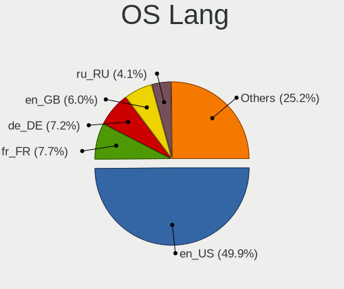
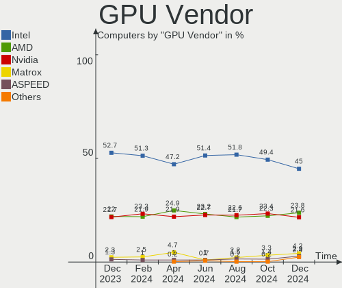
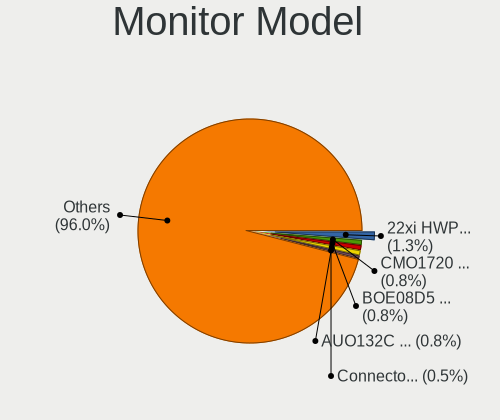
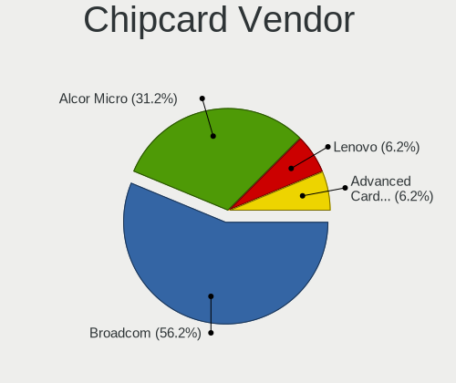
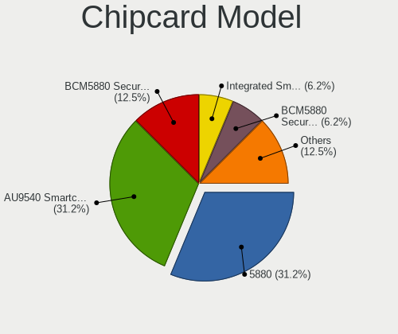

Debian - Hardware Trends
------------------------

A project to identify most popular hardware characteristics and track their change
over time based on data collected by Linux users at https://Linux-Hardware.org.

Anyone can contribute to this report by the [hw-probe](https://github.com/linuxhw/hw-probe) tool:

    sudo -E hw-probe -all -upload

This is a report for all computer types. See also reports for [desktops](/Dist/Debian/Desktop/README.md) and [notebooks](/Dist/Debian/Notebook/README.md).

This report is for one last month. Overall report since the beginning of time: [TestDays](https://github.com/linuxhw/TestDays)

Period: Jan, 2024.

Contents
--------

* [ System ](#system)
  - [ OS                       ](#os)
  - [ OS Family                ](#os-family)
  - [ Kernel                   ](#kernel)
  - [ Kernel Family            ](#kernel-family)
  - [ Kernel Major Ver.        ](#kernel-major-ver)
  - [ Arch                     ](#arch)
  - [ DE                       ](#de)
  - [ Display Server           ](#display-server)
  - [ Display Manager          ](#display-manager)
  - [ OS Lang                  ](#os-lang)
  - [ Boot Mode                ](#boot-mode)
  - [ Filesystem               ](#filesystem)
  - [ Part. scheme             ](#part-scheme)
  - [ Dual Boot with Linux/BSD ](#dual-boot-with-linuxbsd)
  - [ Dual Boot (Win)          ](#dual-boot-win)

* [ Board ](#board)
  - [ Vendor                   ](#vendor)
  - [ Model                    ](#model)
  - [ Model Family             ](#model-family)
  - [ MFG Year                 ](#mfg-year)
  - [ Form Factor              ](#form-factor)
  - [ Secure Boot              ](#secure-boot)
  - [ Coreboot                 ](#coreboot)
  - [ RAM Size                 ](#ram-size)
  - [ RAM Used                 ](#ram-used)
  - [ Total Drives             ](#total-drives)
  - [ Has CD-ROM               ](#has-cd-rom)
  - [ Has Ethernet             ](#has-ethernet)
  - [ Has WiFi                 ](#has-wifi)
  - [ Has Bluetooth            ](#has-bluetooth)

* [ Location ](#location)
  - [ Country                  ](#country)
  - [ City                     ](#city)

* [ Drives ](#drives)
  - [ Drive Vendor             ](#drive-vendor)
  - [ Drive Model              ](#drive-model)
  - [ HDD Vendor               ](#hdd-vendor)
  - [ SSD Vendor               ](#ssd-vendor)
  - [ Drive Kind               ](#drive-kind)
  - [ Drive Connector          ](#drive-connector)
  - [ Drive Size               ](#drive-size)
  - [ Space Total              ](#space-total)
  - [ Space Used               ](#space-used)
  - [ Malfunc. Drives          ](#malfunc-drives)
  - [ Malfunc. Drive Vendor    ](#malfunc-drive-vendor)
  - [ Malfunc. HDD Vendor      ](#malfunc-hdd-vendor)
  - [ Malfunc. Drive Kind      ](#malfunc-drive-kind)
  - [ Failed Drives            ](#failed-drives)
  - [ Failed Drive Vendor      ](#failed-drive-vendor)
  - [ Drive Status             ](#drive-status)

* [ Storage controller ](#storage-controller)
  - [ Storage Vendor           ](#storage-vendor)
  - [ Storage Model            ](#storage-model)
  - [ Storage Kind             ](#storage-kind)

* [ Processor ](#processor)
  - [ CPU Vendor               ](#cpu-vendor)
  - [ CPU Model                ](#cpu-model)
  - [ CPU Model Family         ](#cpu-model-family)
  - [ CPU Cores                ](#cpu-cores)
  - [ CPU Sockets              ](#cpu-sockets)
  - [ CPU Threads              ](#cpu-threads)
  - [ CPU Op-Modes             ](#cpu-op-modes)
  - [ CPU Microcode            ](#cpu-microcode)
  - [ CPU Microarch            ](#cpu-microarch)

* [ Graphics ](#graphics)
  - [ GPU Vendor               ](#gpu-vendor)
  - [ GPU Model                ](#gpu-model)
  - [ GPU Combo                ](#gpu-combo)
  - [ GPU Driver               ](#gpu-driver)
  - [ GPU Memory               ](#gpu-memory)

* [ Monitor ](#monitor)
  - [ Monitor Vendor           ](#monitor-vendor)
  - [ Monitor Model            ](#monitor-model)
  - [ Monitor Resolution       ](#monitor-resolution)
  - [ Monitor Diagonal         ](#monitor-diagonal)
  - [ Monitor Width            ](#monitor-width)
  - [ Aspect Ratio             ](#aspect-ratio)
  - [ Monitor Area             ](#monitor-area)
  - [ Pixel Density            ](#pixel-density)
  - [ Multiple Monitors        ](#multiple-monitors)

* [ Network ](#network)
  - [ Net Controller Vendor    ](#net-controller-vendor)
  - [ Net Controller Model     ](#net-controller-model)
  - [ Wireless Vendor          ](#wireless-vendor)
  - [ Wireless Model           ](#wireless-model)
  - [ Ethernet Vendor          ](#ethernet-vendor)
  - [ Ethernet Model           ](#ethernet-model)
  - [ Net Controller Kind      ](#net-controller-kind)
  - [ Used Controller          ](#used-controller)
  - [ NICs                     ](#nics)
  - [ IPv6                     ](#ipv6)

* [ Bluetooth ](#bluetooth)
  - [ Bluetooth Vendor         ](#bluetooth-vendor)
  - [ Bluetooth Model          ](#bluetooth-model)

* [ Sound ](#sound)
  - [ Sound Vendor             ](#sound-vendor)
  - [ Sound Model              ](#sound-model)

* [ Memory ](#memory)
  - [ Memory Vendor            ](#memory-vendor)
  - [ Memory Model             ](#memory-model)
  - [ Memory Kind              ](#memory-kind)
  - [ Memory Form Factor       ](#memory-form-factor)
  - [ Memory Size              ](#memory-size)
  - [ Memory Speed             ](#memory-speed)

* [ Printers & scanners ](#printers--scanners)
  - [ Printer Vendor           ](#printer-vendor)
  - [ Printer Model            ](#printer-model)
  - [ Scanner Vendor           ](#scanner-vendor)
  - [ Scanner Model            ](#scanner-model)

* [ Camera ](#camera)
  - [ Camera Vendor            ](#camera-vendor)
  - [ Camera Model             ](#camera-model)

* [ Security ](#security)
  - [ Fingerprint Vendor       ](#fingerprint-vendor)
  - [ Fingerprint Model        ](#fingerprint-model)
  - [ Chipcard Vendor          ](#chipcard-vendor)
  - [ Chipcard Model           ](#chipcard-model)

* [ Unsupported ](#unsupported)
  - [ Unsupported Devices      ](#unsupported-devices)
  - [ Unsupported Device Types ](#unsupported-device-types)

System
------

OS
--

Installed operating systems

| Name       | Computers | Percent |
|------------|-----------|---------|
| Debian 12  | 430       | 77.76%  |
| Debian 11  | 63        | 11.39%  |
| Debian     | 55        | 9.95%   |
| Debian 23  | 2         | 0.36%   |
| Debian 10  | 2         | 0.36%   |
| Debian Sid | 1         | 0.18%   |

OS Family
---------

OS without a version

| Name   | Computers | Percent |
|--------|-----------|---------|
| Debian | 553       | 100%    |

Kernel
------

Version of the Linux kernel

| Version                   | Computers | Percent |
|---------------------------|-----------|---------|
| 6.1.0-17-amd64            | 186       | 33.63%  |
| 6.1.0-16-amd64            | 62        | 11.21%  |
| 6.1.0-4-amd64             | 49        | 8.86%   |
| 6.5.0-5-amd64             | 24        | 4.34%   |
| 6.1.0-15-amd64            | 23        | 4.16%   |
| 6.5.11-7-pve              | 21        | 3.8%    |
| 5.10.0-27-amd64           | 21        | 3.8%    |
| 6.6.9-amd64               | 11        | 1.99%   |
| 6.5.0-0.deb12.4-amd64     | 11        | 1.99%   |
| 6.1.0-13-amd64            | 10        | 1.81%   |
| 6.1.0-0.deb11.13-amd64    | 6         | 1.08%   |
| 5.10.0-26-amd64           | 6         | 1.08%   |
| 6.6.11-amd64              | 5         | 0.9%    |
| 6.1.0-rpi7-rpi-2712       | 5         | 0.9%    |
| 6.6.13-amd64              | 4         | 0.72%   |
| 6.5.11-4-pve              | 4         | 0.72%   |
| 6.2.16-19-pve             | 4         | 0.72%   |
| 6.1.0-rpi7-rpi-v8         | 4         | 0.72%   |
| 5.10.0-23-amd64           | 4         | 0.72%   |
| 6.7-amd64                 | 3         | 0.54%   |
| 6.1.0-10-amd64            | 3         | 0.54%   |
| 6.6.8-amd64               | 2         | 0.36%   |
| 6.6.12-1-liquorix-amd64   | 2         | 0.36%   |
| 6.5.0-0.deb12.1-amd64     | 2         | 0.36%   |
| 6.2.16-3-pve              | 2         | 0.36%   |
| 6.2.16-11-bpo11-pve       | 2         | 0.36%   |
| 6.1.63-production+truenas | 2         | 0.36%   |
| 6.1.21-v8+                | 2         | 0.36%   |
| 6.1.0-rpi8-rpi-v8         | 2         | 0.36%   |
| 6.1.0-17-686-pae          | 2         | 0.36%   |
| 6.1.0-12-amd64            | 2         | 0.36%   |
| 5.10.0-20-amd64           | 2         | 0.36%   |
| 5.10.0-19-amd64           | 2         | 0.36%   |
| 6.7.2-tereszkiewicz       | 1         | 0.18%   |
| 6.7.2-3-liquorix-amd64    | 1         | 0.18%   |
| 6.7.1-x64v3-xanmod1       | 1         | 0.18%   |
| 6.7.1-1-liquorix-amd64    | 1         | 0.18%   |
| 6.7.0-rc6-edge-bcm2711    | 1         | 0.18%   |
| 6.7.0-keepos              | 1         | 0.18%   |
| 6.7.0--2024.01.11-04h20   | 1         | 0.18%   |

Kernel Family
-------------

Linux kernel without a distro release

| Version  | Computers | Percent |
|----------|-----------|---------|
| 6.1.0    | 361       | 65.28%  |
| 5.10.0   | 40        | 7.23%   |
| 6.5.0    | 38        | 6.87%   |
| 6.5.11   | 26        | 4.7%    |
| 6.6.9    | 11        | 1.99%   |
| 6.2.16   | 11        | 1.99%   |
| 6.6.13   | 6         | 1.08%   |
| 6.6.11   | 6         | 1.08%   |
| 6.1.63   | 5         | 0.9%    |
| 6.7.0    | 4         | 0.72%   |
| 6.7      | 3         | 0.54%   |
| 6.7.2    | 2         | 0.36%   |
| 6.7.1    | 2         | 0.36%   |
| 6.6.8    | 2         | 0.36%   |
| 6.6.2    | 2         | 0.36%   |
| 6.6.12   | 2         | 0.36%   |
| 6.6.10   | 2         | 0.36%   |
| 6.4.0    | 2         | 0.36%   |
| 6.1.69   | 2         | 0.36%   |
| 6.1.21   | 2         | 0.36%   |
| 6.6.5    | 1         | 0.18%   |
| 6.6.0    | 1         | 0.18%   |
| 6.3.13   | 1         | 0.18%   |
| 6.3.0    | 1         | 0.18%   |
| 6.1.68   | 1         | 0.18%   |
| 6.1.62   | 1         | 0.18%   |
| 6.1.42   | 1         | 0.18%   |
| 6.1.30   | 1         | 0.18%   |
| 6.0.0    | 1         | 0.18%   |
| 5.4.203  | 1         | 0.18%   |
| 5.18.0   | 1         | 0.18%   |
| 5.16.17  | 1         | 0.18%   |
| 5.15.92  | 1         | 0.18%   |
| 5.15.85  | 1         | 0.18%   |
| 5.15.76  | 1         | 0.18%   |
| 5.15.131 | 1         | 0.18%   |
| 5.15.126 | 1         | 0.18%   |
| 5.15.108 | 1         | 0.18%   |
| 5.10.203 | 1         | 0.18%   |
| 5.10.200 | 1         | 0.18%   |

Kernel Major Ver.
-----------------

Linux kernel major version

| Version | Computers | Percent |
|---------|-----------|---------|
| 6.1     | 374       | 67.63%  |
| 6.5     | 64        | 11.57%  |
| 5.10    | 44        | 7.96%   |
| 6.6     | 33        | 5.97%   |
| 6.2     | 11        | 1.99%   |
| 6.7     | 8         | 1.45%   |
| 5.15    | 6         | 1.08%   |
| 6       | 3         | 0.54%   |
| 6.4     | 2         | 0.36%   |
| 6.3     | 2         | 0.36%   |
| 6.0     | 1         | 0.18%   |
| 5.4     | 1         | 0.18%   |
| 5.18    | 1         | 0.18%   |
| 5.16    | 1         | 0.18%   |
| 4.9     | 1         | 0.18%   |
| 4.19    | 1         | 0.18%   |

Arch
----

OS architecture (x86_64, i586, etc.)

| Name    | Computers | Percent |
|---------|-----------|---------|
| x86_64  | 513       | 92.77%  |
| aarch64 | 28        | 5.06%   |
| i686    | 6         | 1.08%   |
| armv7l  | 4         | 0.72%   |
| riscv64 | 1         | 0.18%   |
| ppc     | 1         | 0.18%   |

DE
--

Desktop Environment

| Name             | Computers | Percent |
|------------------|-----------|---------|
| GNOME            | 165       | 29.84%  |
| Unknown          | 150       | 27.12%  |
| KDE5             | 96        | 17.36%  |
| XFCE             | 56        | 10.13%  |
| X-Cinnamon       | 20        | 3.62%   |
| MATE             | 14        | 2.53%   |
| LXDE             | 10        | 1.81%   |
| LXQt             | 9         | 1.63%   |
| GNOME Flashback  | 5         | 0.9%    |
| Cinnamon         | 5         | 0.9%    |
| LXDE-pi-wayfire  | 4         | 0.72%   |
| icewm            | 3         | 0.54%   |
| sway             | 2         | 0.36%   |
| Openbox          | 2         | 0.36%   |
| lightdm-xsession | 2         | 0.36%   |
| KDE              | 2         | 0.36%   |
| GNOME Classic    | 2         | 0.36%   |
| Trinity          | 1         | 0.18%   |
| sway:GNOME       | 1         | 0.18%   |
| i3               | 1         | 0.18%   |
| GNUstep          | 1         | 0.18%   |
| Enlightenment    | 1         | 0.18%   |
| Budgie           | 1         | 0.18%   |

Display Server
--------------

X11 or Wayland

| Name    | Computers | Percent |
|---------|-----------|---------|
| X11     | 234       | 42.31%  |
| Wayland | 155       | 28.03%  |
| Unknown | 84        | 15.19%  |
| Tty     | 79        | 14.29%  |
| Web     | 1         | 0.18%   |

Display Manager
---------------

SDDM, LightDM, etc.

| Name          | Computers | Percent |
|---------------|-----------|---------|
| Unknown       | 246       | 44.48%  |
| GDM3          | 134       | 24.23%  |
| LightDM       | 96        | 17.36%  |
| SDDM          | 64        | 11.57%  |
| GDM           | 8         | 1.45%   |
| XDM           | 1         | 0.18%   |
| WDM           | 1         | 0.18%   |
| TDM           | 1         | 0.18%   |
| NODM          | 1         | 0.18%   |
| DARKDM_ON_TTY | 1         | 0.18%   |

OS Lang
-------

Language

| Lang       | Computers | Percent |
|------------|-----------|---------|
| en_US      | 217       | 39.24%  |
| fr_FR      | 69        | 12.48%  |
| ru_RU      | 65        | 11.75%  |
| de_DE      | 43        | 7.78%   |
| Unknown    | 25        | 4.52%   |
| en_GB      | 18        | 3.25%   |
| it_IT      | 17        | 3.07%   |
| en_CA      | 10        | 1.81%   |
| pt_BR      | 9         | 1.63%   |
| es_ES      | 9         | 1.63%   |
| C          | 9         | 1.63%   |
| en_AU      | 7         | 1.27%   |
| es_MX      | 6         | 1.08%   |
| zh_CN      | 5         | 0.9%    |
| pl_PL      | 5         | 0.9%    |
| en_IN      | 4         | 0.72%   |
| de_CH      | 4         | 0.72%   |
| tr_TR      | 2         | 0.36%   |
| ro_RO      | 2         | 0.36%   |
| pt_PT      | 2         | 0.36%   |
| nb_NO      | 2         | 0.36%   |
| fr_BE      | 2         | 0.36%   |
| es_CO      | 2         | 0.36%   |
| es_AR      | 2         | 0.36%   |
| en_IE      | 2         | 0.36%   |
| sv_FI      | 1         | 0.18%   |
| ko_KR      | 1         | 0.18%   |
| ja_JP      | 1         | 0.18%   |
| it_CH      | 1         | 0.18%   |
| hu_HU      | 1         | 0.18%   |
| hr_HR      | 1         | 0.18%   |
| fr_CH      | 1         | 0.18%   |
| fr_CA      | 1         | 0.18%   |
| eu_ES      | 1         | 0.18%   |
| en_ZA      | 1         | 0.18%   |
| en_NZ      | 1         | 0.18%   |
| en_DK      | 1         | 0.18%   |
| de_CH.UTF8 | 1         | 0.18%   |
| de_AT      | 1         | 0.18%   |
| ca_AD      | 1         | 0.18%   |

Boot Mode
---------

EFI or BIOS

| Mode | Computers | Percent |
|------|-----------|---------|
| EFI  | 330       | 59.67%  |
| BIOS | 223       | 40.33%  |

Filesystem
----------

Type of filesystem

| Type    | Computers | Percent |
|---------|-----------|---------|
| Ext4    | 416       | 75.23%  |
| Overlay | 78        | 14.1%   |
| Btrfs   | 18        | 3.25%   |
| Zfs     | 17        | 3.07%   |
| Tmpfs   | 15        | 2.71%   |
| Xfs     | 6         | 1.08%   |
| F2fs    | 2         | 0.36%   |
| Ext3    | 1         | 0.18%   |

Part. scheme
------------

Scheme of partitioning

| Type    | Computers | Percent |
|---------|-----------|---------|
| GPT     | 334       | 60.4%   |
| MBR     | 123       | 22.24%  |
| Unknown | 96        | 17.36%  |

Dual Boot with Linux/BSD
------------------------

Hosting more than one Linux/BSD

| Dual boot | Computers | Percent |
|-----------|-----------|---------|
| No        | 479       | 86.62%  |
| Yes       | 74        | 13.38%  |

Dual Boot (Win)
---------------

Hosting Linux and Windows

| Dual boot | Computers | Percent |
|-----------|-----------|---------|
| No        | 400       | 72.33%  |
| Yes       | 153       | 27.67%  |

Board
-----

Vendor
------

Motherboard manufacturer

| Name                                 | Computers | Percent |
|--------------------------------------|-----------|---------|
| Hewlett-Packard                      | 96        | 17.36%  |
| Lenovo                               | 85        | 15.37%  |
| ASUSTek Computer                     | 76        | 13.74%  |
| Dell                                 | 56        | 10.13%  |
| Gigabyte Technology                  | 23        | 4.16%   |
| MSI                                  | 21        | 3.8%    |
| Raspberry Pi Foundation              | 19        | 3.44%   |
| Apple                                | 18        | 3.25%   |
| ASRock                               | 16        | 2.89%   |
| Acer                                 | 15        | 2.71%   |
| Unknown                              | 14        | 2.53%   |
| Intel                                | 13        | 2.35%   |
| Aquarius                             | 9         | 1.63%   |
| Google                               | 6         | 1.08%   |
| Supermicro                           | 5         | 0.9%    |
| Rockchip                             | 5         | 0.9%    |
| Medion                               | 5         | 0.9%    |
| HUAWEI                               | 4         | 0.72%   |
| TUXEDO                               | 3         | 0.54%   |
| Toshiba                              | 3         | 0.54%   |
| IBM                                  | 3         | 0.54%   |
| AZW                                  | 3         | 0.54%   |
| Shenzhen Meigao Electronic Equipment | 2         | 0.36%   |
| Samsung Electronics                  | 2         | 0.36%   |
| newplatforms                         | 2         | 0.36%   |
| Microsoft                            | 2         | 0.36%   |
| Gateway                              | 2         | 0.36%   |
| Fujitsu                              | 2         | 0.36%   |
| Foxconn                              | 2         | 0.36%   |
| ECS                                  | 2         | 0.36%   |
| Biostar                              | 2         | 0.36%   |
| TYAN Computer                        | 1         | 0.18%   |
| TI                                   | 1         | 0.18%   |
| Thomson                              | 1         | 0.18%   |
| T-bao TianBei                        | 1         | 0.18%   |
| SYWZ                                 | 1         | 0.18%   |
| Sony                                 | 1         | 0.18%   |
| Schenker                             | 1         | 0.18%   |
| Sapphire                             | 1         | 0.18%   |
| Razer                                | 1         | 0.18%   |

Model
-----

Motherboard model

| Name                                      | Computers | Percent |
|-------------------------------------------|-----------|---------|
| HP ProDesk 400 G2.5 SFF                   | 20        | 3.62%   |
| Unknown                                   | 15        | 2.71%   |
| ASUS P5QL-CM                              | 13        | 2.35%   |
| Aquarius NS585                            | 9         | 1.63%   |
| RPi Raspberry Pi 5 Model B Rev 1.0        | 7         | 1.27%   |
| HP ProDesk 400 G3 SFF                     | 7         | 1.27%   |
| ASUS All Series                           | 7         | 1.27%   |
| Lenovo ThinkCentre M83 10AHS1T000         | 4         | 0.72%   |
| Supermicro Super Server                   | 3         | 0.54%   |
| Rockchip RK3318 BOX                       | 3         | 0.54%   |
| RPi Raspberry Pi 4 Model B Rev 1.5        | 3         | 0.54%   |
| Lenovo ThinkPad L13 Yoga Gen 2 20VK0019US | 3         | 0.54%   |
| Intel NUC13ANHi7                          | 3         | 0.54%   |
| HP 15                                     | 3         | 0.54%   |
| Dell OptiPlex 390                         | 3         | 0.54%   |
| ASUS PRIME A320M-K                        | 3         | 0.54%   |
| Apple MacBookAir7,2                       | 3         | 0.54%   |
| RPi Raspberry Pi 4 Model B Rev 1.2        | 2         | 0.36%   |
| RPi Raspberry Pi 4 Model B Rev 1.1        | 2         | 0.36%   |
| MSI MS-7B79                               | 2         | 0.36%   |
| MSI MS-7996                               | 2         | 0.36%   |
| Lenovo ThinkPad 13 2nd Gen 20J10046US     | 2         | 0.36%   |
| Lenovo ThinkCentre M800 10FXS0PS00        | 2         | 0.36%   |
| Lenovo ThinkCentre M55p 8808D8U           | 2         | 0.36%   |
| HP Victus by Gaming Laptop 16-r0xxx       | 2         | 0.36%   |
| HP Pavilion Laptop 15-eh1xxx              | 2         | 0.36%   |
| HP Pavilion g4                            | 2         | 0.36%   |
| HP Laptop 15-db0xxx                       | 2         | 0.36%   |
| HP EliteBook 745 G3                       | 2         | 0.36%   |
| HP EliteBook 2570p                        | 2         | 0.36%   |
| HP Compaq 8200 Elite SFF PC               | 2         | 0.36%   |
| Foxconn G33M03                            | 2         | 0.36%   |
| ECS G31T-M9                               | 2         | 0.36%   |
| Dell XPS 9315                             | 2         | 0.36%   |
| Dell XPS 13 9360                          | 2         | 0.36%   |
| Dell PowerEdge R730xd                     | 2         | 0.36%   |
| Dell PowerEdge R720                       | 2         | 0.36%   |
| Dell Latitude 3320                        | 2         | 0.36%   |
| AZW SER                                   | 2         | 0.36%   |
| ASUS ROG STRIX X670E-E GAMING WIFI        | 2         | 0.36%   |

Model Family
------------

Motherboard model prefix

| Name                                       | Computers | Percent |
|--------------------------------------------|-----------|---------|
| Lenovo ThinkPad                            | 37        | 6.69%   |
| HP ProDesk                                 | 30        | 5.42%   |
| RPi Raspberry                              | 19        | 3.44%   |
| ASUS PRIME                                 | 19        | 3.44%   |
| Lenovo ThinkCentre                         | 16        | 2.89%   |
| Unknown                                    | 15        | 2.71%   |
| ASUS P5QL-CM                               | 13        | 2.35%   |
| HP Pavilion                                | 11        | 1.99%   |
| Lenovo IdeaPad                             | 10        | 1.81%   |
| HP EliteBook                               | 10        | 1.81%   |
| Dell PowerEdge                             | 10        | 1.81%   |
| Dell Latitude                              | 10        | 1.81%   |
| Dell XPS                                   | 9         | 1.63%   |
| Aquarius NS585                             | 9         | 1.63%   |
| HP ProBook                                 | 8         | 1.45%   |
| Dell OptiPlex                              | 8         | 1.45%   |
| Dell Inspiron                              | 8         | 1.45%   |
| ASUS ROG                                   | 7         | 1.27%   |
| ASUS All                                   | 7         | 1.27%   |
| HP Laptop                                  | 6         | 1.08%   |
| HP Compaq                                  | 6         | 1.08%   |
| Dell Precision                             | 6         | 1.08%   |
| Lenovo Yoga                                | 5         | 0.9%    |
| ASUS VivoBook                              | 5         | 0.9%    |
| Acer Aspire                                | 5         | 0.9%    |
| Lenovo ThinkBook                           | 4         | 0.72%   |
| HP ProLiant                                | 4         | 0.72%   |
| Supermicro Super                           | 3         | 0.54%   |
| Rockchip RK3318                            | 3         | 0.54%   |
| Lenovo Legion                              | 3         | 0.54%   |
| Intel NUC13ANHi7                           | 3         | 0.54%   |
| HP 15                                      | 3         | 0.54%   |
| Apple MacBookAir7                          | 3         | 0.54%   |
| Toshiba PORTEGE                            | 2         | 0.36%   |
| Shenzhen Meigao Electronic Equipment UM560 | 2         | 0.36%   |
| Rockchip RK3288                            | 2         | 0.36%   |
| MSI MS-7B79                                | 2         | 0.36%   |
| MSI MS-7996                                | 2         | 0.36%   |
| Microsoft Surface                          | 2         | 0.36%   |
| Lenovo ThinkStation                        | 2         | 0.36%   |

MFG Year
--------

Motherboard manufacture year

| Year    | Computers | Percent |
|---------|-----------|---------|
| 2023    | 54        | 9.76%   |
| 2022    | 47        | 8.5%    |
| 2019    | 46        | 8.32%   |
| 2020    | 38        | 6.87%   |
| 2016    | 36        | 6.51%   |
| 2018    | 34        | 6.15%   |
| 2021    | 33        | 5.97%   |
| 2015    | 33        | 5.97%   |
| Unknown | 30        | 5.42%   |
| 2012    | 28        | 5.06%   |
| 2014    | 26        | 4.7%    |
| 2013    | 26        | 4.7%    |
| 2011    | 24        | 4.34%   |
| 2008    | 24        | 4.34%   |
| 2007    | 19        | 3.44%   |
| 2017    | 17        | 3.07%   |
| 2010    | 17        | 3.07%   |
| 2009    | 14        | 2.53%   |
| 2006    | 4         | 0.72%   |
| 2005    | 2         | 0.36%   |
| 2024    | 1         | 0.18%   |

Form Factor
-----------

Physical design of the computer

| Name           | Computers | Percent |
|----------------|-----------|---------|
| Notebook       | 233       | 42.13%  |
| Desktop        | 227       | 41.05%  |
| System on chip | 30        | 5.42%   |
| Server         | 24        | 4.34%   |
| Mini pc        | 17        | 3.07%   |
| Convertible    | 10        | 1.81%   |
| All in one     | 7         | 1.27%   |
| Tablet         | 4         | 0.72%   |
| Other          | 1         | 0.18%   |

Secure Boot
-----------

Enabled or disabled

| State    | Computers | Percent |
|----------|-----------|---------|
| Disabled | 526       | 95.12%  |
| Enabled  | 27        | 4.88%   |

Coreboot
--------

Have coreboot on board

| Used | Computers | Percent |
|------|-----------|---------|
| No   | 544       | 98.37%  |
| Yes  | 9         | 1.63%   |

RAM Size
--------

Total RAM memory

| Size in GB      | Computers | Percent |
|-----------------|-----------|---------|
| 4.01-8.0        | 117       | 21.16%  |
| 3.01-4.0        | 113       | 20.43%  |
| 16.01-24.0      | 87        | 15.73%  |
| 8.01-16.0       | 70        | 12.66%  |
| 32.01-64.0      | 60        | 10.85%  |
| 1.01-2.0        | 34        | 6.15%   |
| 64.01-256.0     | 32        | 5.79%   |
| 24.01-32.0      | 16        | 2.89%   |
| 2.01-3.0        | 13        | 2.35%   |
| More than 256.0 | 6         | 1.08%   |
| 0.51-1.0        | 3         | 0.54%   |
| 0.01-0.5        | 2         | 0.36%   |

RAM Used
--------

Used RAM memory

| Used GB     | Computers | Percent |
|-------------|-----------|---------|
| 1.01-2.0    | 160       | 28.93%  |
| 2.01-3.0    | 108       | 19.53%  |
| 0.51-1.0    | 80        | 14.47%  |
| 3.01-4.0    | 67        | 12.12%  |
| 4.01-8.0    | 63        | 11.39%  |
| 8.01-16.0   | 34        | 6.15%   |
| 0.01-0.5    | 22        | 3.98%   |
| 16.01-24.0  | 8         | 1.45%   |
| 32.01-64.0  | 6         | 1.08%   |
| 24.01-32.0  | 4         | 0.72%   |
| 64.01-256.0 | 1         | 0.18%   |

Total Drives
------------

Number of drives on board

| Drives | Computers | Percent |
|--------|-----------|---------|
| 1      | 369       | 66.73%  |
| 2      | 101       | 18.26%  |
| 3      | 25        | 4.52%   |
| 4      | 21        | 3.8%    |
| 6      | 9         | 1.63%   |
| 5      | 8         | 1.45%   |
| 8      | 6         | 1.08%   |
| 7      | 4         | 0.72%   |
| 0      | 3         | 0.54%   |
| 11     | 2         | 0.36%   |
| 33     | 1         | 0.18%   |
| 16     | 1         | 0.18%   |
| 13     | 1         | 0.18%   |
| 10     | 1         | 0.18%   |
| 9      | 1         | 0.18%   |

Has CD-ROM
----------

Has CD-ROM on board

| Presented | Computers | Percent |
|-----------|-----------|---------|
| No        | 385       | 69.62%  |
| Yes       | 168       | 30.38%  |

Has Ethernet
------------

Has Ethernet on board

| Presented | Computers | Percent |
|-----------|-----------|---------|
| Yes       | 473       | 85.53%  |
| No        | 80        | 14.47%  |

Has WiFi
--------

Has WiFi module

| Presented | Computers | Percent |
|-----------|-----------|---------|
| Yes       | 336       | 60.76%  |
| No        | 217       | 39.24%  |

Has Bluetooth
-------------

Has Bluetooth module

| Presented | Computers | Percent |
|-----------|-----------|---------|
| Yes       | 283       | 51.18%  |
| No        | 270       | 48.82%  |

Location
--------

Country
-------

Geographic location (country)

| Country         | Computers | Percent |
|-----------------|-----------|---------|
| USA             | 93        | 16.82%  |
| Russia          | 89        | 16.09%  |
| France          | 76        | 13.74%  |
| Germany         | 71        | 12.84%  |
| Italy           | 30        | 5.42%   |
| Canada          | 16        | 2.89%   |
| Brazil          | 16        | 2.89%   |
| Poland          | 15        | 2.71%   |
| UK              | 13        | 2.35%   |
| Switzerland     | 11        | 1.99%   |
| Spain           | 11        | 1.99%   |
| China           | 9         | 1.63%   |
| Australia       | 9         | 1.63%   |
| Sweden          | 8         | 1.45%   |
| Netherlands     | 8         | 1.45%   |
| Turkey          | 6         | 1.08%   |
| Mexico          | 6         | 1.08%   |
| Romania         | 5         | 0.9%    |
| India           | 5         | 0.9%    |
| Greece          | 3         | 0.54%   |
| Colombia        | 3         | 0.54%   |
| Chile           | 3         | 0.54%   |
| Belgium         | 3         | 0.54%   |
| Austria         | 3         | 0.54%   |
| Argentina       | 3         | 0.54%   |
| Portugal        | 2         | 0.36%   |
| Norway          | 2         | 0.36%   |
| Kazakhstan      | 2         | 0.36%   |
| Iran            | 2         | 0.36%   |
| Indonesia       | 2         | 0.36%   |
| Hungary         | 2         | 0.36%   |
| Hong Kong       | 2         | 0.36%   |
| Finland         | 2         | 0.36%   |
| Belarus         | 2         | 0.36%   |
| Venezuela       | 1         | 0.18%   |
| The Netherlands | 1         | 0.18%   |
| South Korea     | 1         | 0.18%   |
| South Africa    | 1         | 0.18%   |
| Pakistan        | 1         | 0.18%   |
| Nicaragua       | 1         | 0.18%   |

City
----

Geographic location (city)

| City              | Computers | Percent |
|-------------------|-----------|---------|
| Voronezh          | 49        | 8.86%   |
| Roubaix           | 24        | 4.34%   |
| Bagneux           | 16        | 2.89%   |
| Moscow            | 12        | 2.17%   |
| Bangor            | 12        | 2.17%   |
| St Petersburg     | 11        | 1.99%   |
| Turin             | 7         | 1.27%   |
| Warsaw            | 6         | 1.08%   |
| Milan             | 6         | 1.08%   |
| Hamburg           | 6         | 1.08%   |
| Paris             | 5         | 0.9%    |
| Berlin            | 5         | 0.9%    |
| Stockholm         | 4         | 0.72%   |
| Istanbul          | 4         | 0.72%   |
| Harrisonburg      | 4         | 0.72%   |
| Frankfurt am Main | 4         | 0.72%   |
| Bonn              | 4         | 0.72%   |
| Zurich            | 3         | 0.54%   |
| Traunstein        | 3         | 0.54%   |
| Minneapolis       | 3         | 0.54%   |
| Margate           | 3         | 0.54%   |
| Los Angeles       | 3         | 0.54%   |
| Leipzig           | 3         | 0.54%   |
| Kansas City       | 3         | 0.54%   |
| Dresden           | 3         | 0.54%   |
| Wiesbaden         | 2         | 0.36%   |
| Villeurbanne      | 2         | 0.36%   |
| Vienna            | 2         | 0.36%   |
| Vancouver         | 2         | 0.36%   |
| Toronto           | 2         | 0.36%   |
| Tehran            | 2         | 0.36%   |
| Shanghai          | 2         | 0.36%   |
| Semey             | 2         | 0.36%   |
| Sao Paulo         | 2         | 0.36%   |
| Samara            | 2         | 0.36%   |
| Salt Lake City    | 2         | 0.36%   |
| Pittsburgh        | 2         | 0.36%   |
| Palermo           | 2         | 0.36%   |
| Oslo              | 2         | 0.36%   |
| Oldenburg         | 2         | 0.36%   |

Drives
------

Drive Vendor
------------

Hard drive vendors

| Vendor                      | Computers | Drives | Percent |
|-----------------------------|-----------|--------|---------|
| Samsung Electronics         | 118       | 160    | 15.4%   |
| WDC                         | 116       | 151    | 15.14%  |
| Seagate                     | 86        | 145    | 11.23%  |
| Unknown                     | 48        | 51     | 6.27%   |
| Kingston                    | 39        | 50     | 5.09%   |
| Toshiba                     | 35        | 43     | 4.57%   |
| SanDisk                     | 35        | 35     | 4.57%   |
| Crucial                     | 32        | 38     | 4.18%   |
| SK hynix                    | 21        | 21     | 2.74%   |
| Intel                       | 21        | 27     | 2.74%   |
| Hitachi                     | 17        | 18     | 2.22%   |
| A-DATA Technology           | 16        | 17     | 2.09%   |
| Unknown                     | 14        | 14     | 1.83%   |
| Micron Technology           | 10        | 12     | 1.31%   |
| HGST                        | 10        | 18     | 1.31%   |
| KIOXIA                      | 8         | 8      | 1.04%   |
| China                       | 8         | 12     | 1.04%   |
| Apple                       | 8         | 11     | 1.04%   |
| Intenso                     | 6         | 8      | 0.78%   |
| Silicon Motion              | 5         | 5      | 0.65%   |
| PNY                         | 5         | 5      | 0.65%   |
| Phison Electronics          | 5         | 6      | 0.65%   |
| Patriot                     | 5         | 5      | 0.65%   |
| Fanxiang                    | 5         | 5      | 0.65%   |
| Netac                       | 4         | 4      | 0.52%   |
| Micron/Crucial Technology   | 4         | 6      | 0.52%   |
| Gigabyte Technology         | 4         | 4      | 0.52%   |
| XrayDisk                    | 3         | 3      | 0.39%   |
| Team                        | 3         | 4      | 0.39%   |
| SPCC                        | 3         | 3      | 0.39%   |
| Plextor                     | 3         | 3      | 0.39%   |
| Phison                      | 3         | 4      | 0.39%   |
| Kingston Technology Company | 3         | 3      | 0.39%   |
| JMicron Technology          | 3         | 3      | 0.39%   |
| Innodisk                    | 3         | 3      | 0.39%   |
| Fujitsu                     | 3         | 8      | 0.39%   |
| Corsair                     | 3         | 3      | 0.39%   |
| WALRAM                      | 2         | 2      | 0.26%   |
| SSSTC                       | 2         | 2      | 0.26%   |
| Realtek Semiconductor       | 2         | 2      | 0.26%   |

Drive Model
-----------

Hard drive models

| Model                                              | Computers | Percent |
|----------------------------------------------------|-----------|---------|
| Seagate ST500DM002-1BD142 500GB                    | 15        | 1.77%   |
| Kingston SA400S37240G 240GB SSD                    | 15        | 1.77%   |
| WDC WD3200AAJS-00L7A0 320GB                        | 14        | 1.65%   |
| Unknown                                            | 14        | 1.65%   |
| Samsung NVMe SSD Controller SM981/PM981/PM983 1TB  | 10        | 1.18%   |
| A-DATA SU800 512GB SSD                             | 9         | 1.06%   |
| Kingston SA400S37480G 480GB SSD                    | 7         | 0.83%   |
| Samsung SSD 870 EVO 1TB                            | 6         | 0.71%   |
| Samsung SSD 850 EVO 250GB                          | 6         | 0.71%   |
| Toshiba DT01ACA050 500GB                           | 5         | 0.59%   |
| SanDisk NVMe SSD Drive 1TB                         | 5         | 0.59%   |
| Samsung SSD 870 QVO 1TB                            | 5         | 0.59%   |
| Samsung SSD 860 EVO 500GB                          | 5         | 0.59%   |
| Samsung NVMe SSD Controller PM9A1/PM9A3/980PRO 2TB | 5         | 0.59%   |
| WDC WD10EZEX-08WN4A0 1TB                           | 4         | 0.47%   |
| WDC WD10EZEX-08M2NA0 1TB                           | 4         | 0.47%   |
| Unknown SD32G  32GB                                | 4         | 0.47%   |
| Unknown MMC Card  64GB                             | 4         | 0.47%   |
| Unknown MMC Card  32GB                             | 4         | 0.47%   |
| Seagate ST9500325AS 500GB                          | 4         | 0.47%   |
| Sandisk WD Blue SN550 NVMe SSD 512GB               | 4         | 0.47%   |
| Samsung SSD 990 PRO 2TB                            | 4         | 0.47%   |
| Samsung SSD 980 PRO 1TB                            | 4         | 0.47%   |
| Samsung SSD 860 EVO 250GB                          | 4         | 0.47%   |
| Samsung PSSD T7 1TB                                | 4         | 0.47%   |
| Kingston SA400S37960G 960GB SSD                    | 4         | 0.47%   |
| Crucial CT500MX500SSD1 500GB                       | 4         | 0.47%   |
| Crucial CT500BX500SSD1 500GB                       | 4         | 0.47%   |
| WDC WD5000AZLX-08K2TA0 500GB                       | 3         | 0.35%   |
| WDC WD40EFAX-68JH4N1 4TB                           | 3         | 0.35%   |
| WDC WD10SPZX-60Z10T0 1TB                           | 3         | 0.35%   |
| WDC PC SN730 SDBQNTY-512G-1001 512GB               | 3         | 0.35%   |
| Unknown MMC Card  16GB                             | 3         | 0.35%   |
| Toshiba MQ01ABF050 500GB                           | 3         | 0.35%   |
| Seagate ST4000VN008-2DR166 4TB                     | 3         | 0.35%   |
| Seagate ST4000LM024-2AN17V 4TB                     | 3         | 0.35%   |
| Seagate ST2000DM001-1CH164 2TB                     | 3         | 0.35%   |
| Seagate ST1000DM003-1CH162 1TB                     | 3         | 0.35%   |
| Sandisk WD Black SN750 / PC SN730 NVMe SSD 512GB   | 3         | 0.35%   |
| Samsung SSD 970 EVO Plus 1TB                       | 3         | 0.35%   |

HDD Vendor
----------

Hard disk drive vendors

| Vendor              | Computers | Drives | Percent |
|---------------------|-----------|--------|---------|
| WDC                 | 94        | 127    | 37.3%   |
| Seagate             | 86        | 145    | 34.13%  |
| Toshiba             | 28        | 36     | 11.11%  |
| Hitachi             | 17        | 18     | 6.75%   |
| HGST                | 10        | 18     | 3.97%   |
| Samsung Electronics | 3         | 3      | 1.19%   |
| Fujitsu             | 3         | 8      | 1.19%   |
| MARSHAL             | 2         | 2      | 0.79%   |
| Unknown (CF)        | 1         | 1      | 0.4%    |
| Unknown             | 1         | 1      | 0.4%    |
| Maxtor              | 1         | 1      | 0.4%    |
| LaCie               | 1         | 1      | 0.4%    |
| JMicron Technology  | 1         | 1      | 0.4%    |
| HPE                 | 1         | 1      | 0.4%    |
| Hewlett-Packard     | 1         | 4      | 0.4%    |
| Apple               | 1         | 1      | 0.4%    |
| Unknown             | 1         | 1      | 0.4%    |

SSD Vendor
----------

Solid state drive vendors

| Vendor              | Computers | Drives | Percent |
|---------------------|-----------|--------|---------|
| Samsung Electronics | 56        | 68     | 22.86%  |
| Kingston            | 33        | 38     | 13.47%  |
| Crucial             | 23        | 26     | 9.39%   |
| SanDisk             | 14        | 14     | 5.71%   |
| WDC                 | 12        | 12     | 4.9%    |
| A-DATA Technology   | 12        | 12     | 4.9%    |
| China               | 8         | 12     | 3.27%   |
| Intel               | 7         | 12     | 2.86%   |
| Intenso             | 6         | 8      | 2.45%   |
| Apple               | 6         | 6      | 2.45%   |
| PNY                 | 5         | 5      | 2.04%   |
| Patriot             | 4         | 4      | 1.63%   |
| XrayDisk            | 3         | 3      | 1.22%   |
| SPCC                | 3         | 3      | 1.22%   |
| SK hynix            | 3         | 3      | 1.22%   |
| Plextor             | 3         | 3      | 1.22%   |
| Netac               | 3         | 3      | 1.22%   |
| Micron Technology   | 3         | 5      | 1.22%   |
| Innodisk            | 3         | 3      | 1.22%   |
| Fanxiang            | 3         | 3      | 1.22%   |
| OCZ                 | 2         | 2      | 0.82%   |
| Leven               | 2         | 3      | 0.82%   |
| Gigabyte Technology | 2         | 2      | 0.82%   |
| Corsair             | 2         | 2      | 0.82%   |
| ASMT                | 2         | 2      | 0.82%   |
| Unknown             | 2         | 2      | 0.82%   |
| Wodposit            | 1         | 1      | 0.41%   |
| WALRAM              | 1         | 1      | 0.41%   |
| Verbatim            | 1         | 1      | 0.41%   |
| Transcend           | 1         | 1      | 0.41%   |
| Toshiba             | 1         | 1      | 0.41%   |
| Team                | 1         | 1      | 0.41%   |
| SSSTC               | 1         | 1      | 0.41%   |
| Solid               | 1         | 1      | 0.41%   |
| Phison              | 1         | 1      | 0.41%   |
| OCZ-VERTEX2         | 1         | 1      | 0.41%   |
| MS310               | 1         | 1      | 0.41%   |
| Min Yi U            | 1         | 1      | 0.41%   |
| Lexar               | 1         | 1      | 0.41%   |
| Lenovo              | 1         | 1      | 0.41%   |

Drive Kind
----------

HDD or SSD

| Kind    | Computers | Drives | Percent |
|---------|-----------|--------|---------|
| HDD     | 224       | 369    | 31.95%  |
| SSD     | 214       | 280    | 30.53%  |
| NVMe    | 202       | 259    | 28.82%  |
| MMC     | 55        | 58     | 7.85%   |
| Unknown | 6         | 7      | 0.86%   |

Drive Connector
---------------

SATA, SAS, NVMe, etc.

| Type | Computers | Drives | Percent |
|------|-----------|--------|---------|
| SATA | 361       | 623    | 55.71%  |
| NVMe | 202       | 257    | 31.17%  |
| MMC  | 55        | 58     | 8.49%   |
| SAS  | 30        | 35     | 4.63%   |

Drive Size
----------

Size of hard drive

| Size in TB | Computers | Drives | Percent |
|------------|-----------|--------|---------|
| 0.01-0.5   | 266       | 334    | 58.46%  |
| 0.51-1.0   | 117       | 147    | 25.71%  |
| 1.01-2.0   | 35        | 55     | 7.69%   |
| 3.01-4.0   | 19        | 51     | 4.18%   |
| 10.01-20.0 | 8         | 36     | 1.76%   |
| 4.01-10.0  | 7         | 20     | 1.54%   |
| 2.01-3.0   | 3         | 6      | 0.66%   |

Space Total
-----------

Amount of disk space available on the file system

| Size in GB     | Computers | Percent |
|----------------|-----------|---------|
| 251-500        | 125       | 22.6%   |
| 101-250        | 109       | 19.71%  |
| 501-1000       | 78        | 14.1%   |
| Unknown        | 78        | 14.1%   |
| 51-100         | 38        | 6.87%   |
| 1001-2000      | 33        | 5.97%   |
| 1-20           | 32        | 5.79%   |
| More than 3000 | 23        | 4.16%   |
| 21-50          | 20        | 3.62%   |
| 2001-3000      | 17        | 3.07%   |

Space Used
----------

Amount of used disk space

| Used GB        | Computers | Percent |
|----------------|-----------|---------|
| 1-20           | 223       | 40.33%  |
| Unknown        | 78        | 14.1%   |
| 21-50          | 57        | 10.31%  |
| 101-250        | 56        | 10.13%  |
| 51-100         | 52        | 9.4%    |
| 251-500        | 27        | 4.88%   |
| 501-1000       | 27        | 4.88%   |
| 1001-2000      | 22        | 3.98%   |
| More than 3000 | 7         | 1.27%   |
| 2001-3000      | 4         | 0.72%   |

Malfunc. Drives
---------------

Drive models with a malfunction

| Model                                                 | Computers | Drives | Percent |
|-------------------------------------------------------|-----------|--------|---------|
| WDC WD3200AAJS-00L7A0 320GB                           | 9         | 9      | 11.11%  |
| Seagate ST500DM002-1BD142 500GB                       | 3         | 3      | 3.7%    |
| WDC WD2500AAJS-00L7A0 250GB                           | 2         | 2      | 2.47%   |
| WDC WD1602ABYS-23B7A0 39M4507 42C0462IBM 160GB        | 2         | 2      | 2.47%   |
| Seagate ST1000LM024 HN-M101MBB 1TB                    | 2         | 2      | 2.47%   |
| Hitachi HTS541680J9SA00 80GB                          | 2         | 2      | 2.47%   |
| WDC WD5000AAKX-08U6AA0 500GB                          | 1         | 1      | 1.23%   |
| WDC WD5000AADS-00S9B0 500GB                           | 1         | 1      | 1.23%   |
| WDC WD3200BPVT-75ZEST0 320GB                          | 1         | 1      | 1.23%   |
| WDC WD2502ABYS-23B7A0 39M4511 42C0463IBM 250GB        | 1         | 2      | 1.23%   |
| WDC WD20EFRX-68EUZN0 2TB                              | 1         | 1      | 1.23%   |
| WDC WD1600BEVT-60A23T0 160GB                          | 1         | 1      | 1.23%   |
| WDC WD10SPZX-60Z10T0 1TB                              | 1         | 1      | 1.23%   |
| WDC WD10EZEX-08WN4A0 1TB                              | 1         | 1      | 1.23%   |
| WDC WD10EFRX-68PJCN0 1TB                              | 1         | 1      | 1.23%   |
| WDC WD10EARS-22Y5B1 1TB                               | 1         | 2      | 1.23%   |
| WDC WD Green 2.5 1000GB SSD                           | 1         | 1      | 1.23%   |
| Toshiba MQ01ABF050 500GB                              | 1         | 1      | 1.23%   |
| Toshiba MQ01ABD050V 500GB                             | 1         | 1      | 1.23%   |
| Toshiba DT01ACA200 2TB                                | 1         | 1      | 1.23%   |
| SK hynix HFS128G39TND-N210A 128GB SSD                 | 1         | 1      | 1.23%   |
| SK hynix HFS060G32MNB-2000A 64GB SSD                  | 1         | 1      | 1.23%   |
| Seagate ST9500325AS 500GB                             | 1         | 1      | 1.23%   |
| Seagate ST9250827AS 250GB                             | 1         | 1      | 1.23%   |
| Seagate ST500LT012-9WS142 500GB                       | 1         | 1      | 1.23%   |
| Seagate ST500LT012-1DG142 500GB                       | 1         | 1      | 1.23%   |
| Seagate ST500LM012 HN-M500MBB 500GB                   | 1         | 1      | 1.23%   |
| Seagate ST320LT007-9ZV142 320GB                       | 1         | 1      | 1.23%   |
| Seagate ST3160815AS 160GB                             | 1         | 1      | 1.23%   |
| Seagate ST3000VN007-2AH16M 3TB                        | 1         | 1      | 1.23%   |
| Seagate ST250DM000-1BD141 250GB                       | 1         | 1      | 1.23%   |
| Seagate ST2000DM006-2DM164 2TB                        | 1         | 1      | 1.23%   |
| Seagate ST2000DM001-1CH164 2TB                        | 1         | 1      | 1.23%   |
| Seagate ST1000LM014-1EJ164 1TB                        | 1         | 1      | 1.23%   |
| Seagate ST1000DM003-9YN162 1TB                        | 1         | 1      | 1.23%   |
| SanDisk SSD PLUS 1000GB                               | 1         | 1      | 1.23%   |
| SanDisk SD9SN8W-128G-1006 128GB SSD                   | 1         | 1      | 1.23%   |
| SanDisk SD6SB2M-512G-1006 512GB SSD                   | 1         | 1      | 1.23%   |
| Samsung Electronics SSD 980 PRO 500GB S5GYNG0NC10065Y | 1         | 1      | 1.23%   |
| Samsung Electronics SSD 980 PRO 2TB                   | 1         | 2      | 1.23%   |

Malfunc. Drive Vendor
---------------------

Vendors of faulty drives

| Vendor              | Computers | Drives | Percent |
|---------------------|-----------|--------|---------|
| WDC                 | 24        | 26     | 30%     |
| Seagate             | 18        | 18     | 22.5%   |
| Samsung Electronics | 7         | 8      | 8.75%   |
| Hitachi             | 7         | 7      | 8.75%   |
| HGST                | 4         | 5      | 5%      |
| Toshiba             | 3         | 3      | 3.75%   |
| SanDisk             | 3         | 3      | 3.75%   |
| Intel               | 3         | 4      | 3.75%   |
| SK hynix            | 2         | 2      | 2.5%    |
| Micron Technology   | 1         | 2      | 1.25%   |
| Lenovo              | 1         | 1      | 1.25%   |
| KLEVV               | 1         | 1      | 1.25%   |
| Kingston            | 1         | 1      | 1.25%   |
| Hewlett-Packard     | 1         | 2      | 1.25%   |
| Fujitsu             | 1         | 1      | 1.25%   |
| Crucial             | 1         | 1      | 1.25%   |
| China               | 1         | 1      | 1.25%   |
| ASMT                | 1         | 1      | 1.25%   |

Malfunc. HDD Vendor
-------------------

Vendors of faulty HDD drives

| Vendor              | Computers | Drives | Percent |
|---------------------|-----------|--------|---------|
| WDC                 | 23        | 25     | 38.98%  |
| Seagate             | 18        | 18     | 30.51%  |
| Hitachi             | 7         | 7      | 11.86%  |
| HGST                | 4         | 5      | 6.78%   |
| Toshiba             | 3         | 3      | 5.08%   |
| Samsung Electronics | 2         | 2      | 3.39%   |
| Hewlett-Packard     | 1         | 2      | 1.69%   |
| Fujitsu             | 1         | 1      | 1.69%   |

Malfunc. Drive Kind
-------------------

Kinds of faulty drives

| Kind | Computers | Drives | Percent |
|------|-----------|--------|---------|
| HDD  | 57        | 63     | 74.03%  |
| SSD  | 16        | 19     | 20.78%  |
| NVMe | 4         | 5      | 5.19%   |

Failed Drives
-------------

Failed drive models

Zero info for selected period =(

Failed Drive Vendor
-------------------

Failed drive vendors

Zero info for selected period =(

Drive Status
------------

Number of failed and malfunc. drives

| Status   | Computers | Drives | Percent |
|----------|-----------|--------|---------|
| Works    | 344       | 630    | 58.01%  |
| Detected | 174       | 256    | 29.34%  |
| Malfunc  | 75        | 87     | 12.65%  |

Storage controller
------------------

Storage Vendor
--------------

Storage controller vendors

| Vendor                           | Computers | Percent |
|----------------------------------|-----------|---------|
| Intel                            | 338       | 48.42%  |
| AMD                              | 87        | 12.46%  |
| Samsung Electronics              | 75        | 10.74%  |
| SanDisk                          | 31        | 4.44%   |
| SK hynix                         | 18        | 2.58%   |
| JMicron Technology               | 18        | 2.58%   |
| Micron/Crucial Technology        | 14        | 2.01%   |
| Kingston Technology Company      | 10        | 1.43%   |
| ASMedia Technology               | 10        | 1.43%   |
| Phison Electronics               | 9         | 1.29%   |
| LSI Logic / Symbios Logic        | 9         | 1.29%   |
| KIOXIA                           | 8         | 1.15%   |
| Silicon Motion                   | 7         | 1%      |
| Micron Technology                | 7         | 1%      |
| Marvell Technology Group         | 7         | 1%      |
| Toshiba America Info Systems     | 6         | 0.86%   |
| Nvidia                           | 6         | 0.86%   |
| MAXIO Technology (Hangzhou)      | 6         | 0.86%   |
| Broadcom / LSI                   | 6         | 0.86%   |
| Realtek Semiconductor            | 4         | 0.57%   |
| ADATA Technology                 | 4         | 0.57%   |
| Shenzhen Longsys Electronics     | 3         | 0.43%   |
| Hewlett-Packard                  | 3         | 0.43%   |
| Yangtze Memory Technologies      | 2         | 0.29%   |
| VIA Technologies                 | 2         | 0.29%   |
| Adaptec                          | 2         | 0.29%   |
| Union Memory (Shenzhen)          | 1         | 0.14%   |
| Swissbit                         | 1         | 0.14%   |
| Solid State Storage Technology   | 1         | 0.14%   |
| Silicon Integrated Systems [SiS] | 1         | 0.14%   |
| Silicon Image                    | 1         | 0.14%   |
| Netac Technology                 | 1         | 0.14%   |

Storage Model
-------------

Storage controller models

| Model                                                                                   | Computers | Percent |
|-----------------------------------------------------------------------------------------|-----------|---------|
| AMD FCH SATA Controller [AHCI mode]                                                     | 48        | 6.07%   |
| Intel 8 Series/C220 Series Chipset Family 6-port SATA Controller 1 [AHCI mode]          | 44        | 5.56%   |
| Samsung NVMe SSD Controller SM981/PM981/PM983                                           | 26        | 3.29%   |
| Intel Sunrise Point-LP SATA Controller [AHCI mode]                                      | 19        | 2.4%    |
| Intel Q170/Q150/B150/H170/H110/Z170/CM236 Chipset SATA Controller [AHCI Mode]           | 19        | 2.4%    |
| Samsung NVMe SSD Controller PM9A1/PM9A3/980PRO                                          | 18        | 2.28%   |
| JMicron JMB368 IDE controller                                                           | 16        | 2.02%   |
| Intel 82801JI (ICH10 Family) 4 port SATA IDE Controller #1                              | 16        | 2.02%   |
| Intel 82801JI (ICH10 Family) 2 port SATA IDE Controller #2                              | 16        | 2.02%   |
| Samsung NVMe SSD Controller 980 (DRAM-less)                                             | 13        | 1.64%   |
| Micron/Crucial P2 [Nick P2] / P3 / P3 Plus NVMe PCIe SSD (DRAM-less)                    | 13        | 1.64%   |
| Intel Cannon Lake PCH SATA AHCI Controller                                              | 13        | 1.64%   |
| AMD 500 Series Chipset SATA Controller                                                  | 11        | 1.39%   |
| Intel 82801 Mobile SATA Controller [RAID mode]                                          | 10        | 1.26%   |
| Intel 7 Series Chipset Family 6-port SATA Controller [AHCI mode]                        | 10        | 1.26%   |
| Intel 6 Series/C200 Series Chipset Family 6 port Mobile SATA AHCI Controller            | 10        | 1.26%   |
| AMD SB7x0/SB8x0/SB9x0 SATA Controller [AHCI mode]                                       | 10        | 1.26%   |
| Intel Volume Management Device NVMe RAID Controller                                     | 9         | 1.14%   |
| ASMedia ASM1061/ASM1062 Serial ATA Controller                                           | 9         | 1.14%   |
| AMD 600 Series Chipset SATA Controller                                                  | 9         | 1.14%   |
| SanDisk Extreme Pro / WD Black SN750 / PC SN730 / Red SN700 NVMe SSD                    | 8         | 1.01%   |
| Intel Cannon Lake Mobile PCH SATA AHCI Controller                                       | 8         | 1.01%   |
| Intel 82801G (ICH7 Family) IDE Controller                                               | 8         | 1.01%   |
| Intel 6 Series/C200 Series Chipset Family Desktop SATA Controller (IDE mode, ports 4-5) | 8         | 1.01%   |
| Intel 6 Series/C200 Series Chipset Family Desktop SATA Controller (IDE mode, ports 0-3) | 8         | 1.01%   |
| AMD 400 Series Chipset SATA Controller                                                  | 8         | 1.01%   |
| Samsung NVMe SSD Controller S4LV008[Pascal]                                             | 7         | 0.88%   |
| Intel Tiger Lake-LP SATA Controller                                                     | 7         | 0.88%   |
| Intel C610/X99 series chipset 6-Port SATA Controller [AHCI mode]                        | 7         | 0.88%   |
| Intel 8 Series SATA Controller 1 [AHCI mode]                                            | 7         | 0.88%   |
| Intel 200 Series PCH SATA controller [AHCI mode]                                        | 7         | 0.88%   |
| SK hynix Gold P31/BC711/PC711 NVMe Solid State Drive                                    | 6         | 0.76%   |
| SanDisk Ultra 3D / WD Blue SN550 NVMe SSD                                               | 6         | 0.76%   |
| Intel SATA Controller [RAID Mode]                                                       | 6         | 0.76%   |
| Intel NM10/ICH7 Family SATA Controller [IDE mode]                                       | 6         | 0.76%   |
| Intel NM10/ICH7 Family SATA Controller [AHCI mode]                                      | 6         | 0.76%   |
| Intel 82801HM/HEM (ICH8M/ICH8M-E) SATA Controller [AHCI mode]                           | 6         | 0.76%   |
| Intel 6 Series/C200 Series Chipset Family 6 port Desktop SATA AHCI Controller           | 6         | 0.76%   |
| Intel 5 Series/3400 Series Chipset 6 port SATA AHCI Controller                          | 6         | 0.76%   |
| SK hynix BC501 NVMe Solid State Drive                                                   | 5         | 0.63%   |

Storage Kind
------------

Kind of storage controller (IDE, SATA, NVMe, SAS, ...)

| Kind | Computers | Percent |
|------|-----------|---------|
| SATA | 357       | 52.73%  |
| NVMe | 201       | 29.69%  |
| IDE  | 68        | 10.04%  |
| RAID | 41        | 6.06%   |
| SAS  | 9         | 1.33%   |
| SCSI | 1         | 0.15%   |

Processor
---------

CPU Vendor
----------

Processor vendors

| Vendor       | Computers | Percent |
|--------------|-----------|---------|
| Intel        | 400       | 72.33%  |
| AMD          | 119       | 21.52%  |
| ARM          | 30        | 5.42%   |
| Unknown      | 2         | 0.36%   |
| thead,c906   | 1         | 0.18%   |
| PowerBook3,5 | 1         | 0.18%   |

CPU Model
---------

Processor models

| Model                                   | Computers | Percent |
|-----------------------------------------|-----------|---------|
| ARM Processor                           | 26        | 4.7%    |
| Intel Core 2 Duo CPU E7400 @ 2.80GHz    | 13        | 2.35%   |
| Intel Pentium CPU G3260 @ 3.30GHz       | 12        | 2.17%   |
| Intel Core i3-9100 CPU @ 3.60GHz        | 10        | 1.81%   |
| Intel Core i3-4170 CPU @ 3.70GHz        | 8         | 1.45%   |
| Intel 11th Gen Core i5-1135G7 @ 2.40GHz | 8         | 1.45%   |
| Intel Pentium CPU G4400 @ 3.30GHz       | 7         | 1.27%   |
| Intel Core i3-6100 CPU @ 3.70GHz        | 6         | 1.08%   |
| Intel N100                              | 5         | 0.9%    |
| Intel 11th Gen Core i7-1165G7 @ 2.80GHz | 5         | 0.9%    |
| AMD Ryzen 7 5700U with Radeon Graphics  | 5         | 0.9%    |
| Intel Core i7-8565U CPU @ 1.80GHz       | 4         | 0.72%   |
| Intel Core i7-7500U CPU @ 2.70GHz       | 4         | 0.72%   |
| Intel Core i5-2400 CPU @ 3.10GHz        | 4         | 0.72%   |
| Intel Core i3-4130 CPU @ 3.40GHz        | 4         | 0.72%   |
| Intel Atom x5-Z8350 CPU @ 1.44GHz       | 4         | 0.72%   |
| AMD Ryzen 7 3700X 8-Core Processor      | 4         | 0.72%   |
| AMD Ryzen 5 5600G with Radeon Graphics  | 4         | 0.72%   |
| Intel Xeon CPU X5670 @ 2.93GHz          | 3         | 0.54%   |
| Intel Xeon CPU X3470 @ 2.93GHz          | 3         | 0.54%   |
| Intel Core i7-8665U CPU @ 1.90GHz       | 3         | 0.54%   |
| Intel Core i7-8550U CPU @ 1.80GHz       | 3         | 0.54%   |
| Intel Core i7-2620M CPU @ 2.70GHz       | 3         | 0.54%   |
| Intel Core i5-8350U CPU @ 1.70GHz       | 3         | 0.54%   |
| Intel Core i5-8300H CPU @ 2.30GHz       | 3         | 0.54%   |
| Intel Core i5-8250U CPU @ 1.60GHz       | 3         | 0.54%   |
| Intel Core i5-5250U CPU @ 1.60GHz       | 3         | 0.54%   |
| Intel Core i5-4300U CPU @ 1.90GHz       | 3         | 0.54%   |
| Intel Celeron CPU N3060 @ 1.60GHz       | 3         | 0.54%   |
| Intel 13th Gen Core i7-1360P            | 3         | 0.54%   |
| Intel 13th Gen Core i7-1355U            | 3         | 0.54%   |
| Intel 13th Gen Core i5-13500H           | 3         | 0.54%   |
| Intel 12th Gen Core i7-1255U            | 3         | 0.54%   |
| AMD Ryzen 5 7600X 6-Core Processor      | 3         | 0.54%   |
| AMD Ryzen 5 5600X 6-Core Processor      | 3         | 0.54%   |
| AMD Ryzen 5 5600H with Radeon Graphics  | 3         | 0.54%   |
| AMD Ryzen 5 3600 6-Core Processor       | 3         | 0.54%   |
| AMD E-450 APU with Radeon HD Graphics   | 3         | 0.54%   |
| Intel Xeon CPU E5-2670 v2 @ 2.50GHz     | 2         | 0.36%   |
| Intel Xeon CPU E5-2650 v4 @ 2.20GHz     | 2         | 0.36%   |

CPU Model Family
----------------

Processor model prefix

| Model                   | Computers | Percent |
|-------------------------|-----------|---------|
| Other                   | 100       | 18.08%  |
| Intel Core i5           | 72        | 13.02%  |
| Intel Core i7           | 63        | 11.39%  |
| Intel Core i3           | 48        | 8.68%   |
| AMD Ryzen 5             | 36        | 6.51%   |
| Intel Pentium           | 31        | 5.61%   |
| Intel Core 2 Duo        | 31        | 5.61%   |
| Intel Xeon              | 30        | 5.42%   |
| AMD Ryzen 7             | 25        | 4.52%   |
| Intel Celeron           | 23        | 4.16%   |
| Intel Atom              | 14        | 2.53%   |
| AMD Ryzen 9             | 8         | 1.45%   |
| AMD Ryzen 7 PRO         | 7         | 1.27%   |
| Intel Core 2            | 6         | 1.08%   |
| Intel Pentium Dual-Core | 4         | 0.72%   |
| AMD Ryzen 3             | 4         | 0.72%   |
| AMD FX                  | 4         | 0.72%   |
| AMD E                   | 4         | 0.72%   |
| Intel Pentium Silver    | 3         | 0.54%   |
| AMD Ryzen 5 PRO         | 3         | 0.54%   |
| AMD EPYC                | 3         | 0.54%   |
| AMD E1                  | 3         | 0.54%   |
| Intel Pentium 4         | 2         | 0.36%   |
| Intel Core i9           | 2         | 0.36%   |
| AMD PRO A10             | 2         | 0.36%   |
| AMD GX                  | 2         | 0.36%   |
| AMD Athlon 64 X2        | 2         | 0.36%   |
| AMD A6                  | 2         | 0.36%   |
| Intel Xeon Gold         | 1         | 0.18%   |
| Intel Pentium Gold      | 1         | 0.18%   |
| Intel Pentium Dual      | 1         | 0.18%   |
| Intel Genuine           | 1         | 0.18%   |
| Intel Core m3           | 1         | 0.18%   |
| Intel Core 2 Quad       | 1         | 0.18%   |
| Intel Core 2 Extreme    | 1         | 0.18%   |
| Intel Celeron M         | 1         | 0.18%   |
| ARM BCM                 | 1         | 0.18%   |
| AMD Turion II Dual-Core | 1         | 0.18%   |
| AMD Turion 64 X2 Mobile | 1         | 0.18%   |
| AMD Ryzen Threadripper  | 1         | 0.18%   |

CPU Cores
---------

Number of processor cores

| Number  | Computers | Percent |
|---------|-----------|---------|
| 2       | 201       | 36.35%  |
| 4       | 167       | 30.2%   |
| 6       | 51        | 9.22%   |
| 8       | 47        | 8.5%    |
| 12      | 20        | 3.62%   |
| Unknown | 19        | 3.44%   |
| 10      | 13        | 2.35%   |
| 16      | 10        | 1.81%   |
| 1       | 10        | 1.81%   |
| 14      | 9         | 1.63%   |
| 32      | 2         | 0.36%   |
| 64      | 1         | 0.18%   |
| 28      | 1         | 0.18%   |
| 24      | 1         | 0.18%   |
| 20      | 1         | 0.18%   |

CPU Sockets
-----------

Number of sockets

| Number  | Computers | Percent |
|---------|-----------|---------|
| 1       | 521       | 94.21%  |
| Unknown | 19        | 3.44%   |
| 2       | 13        | 2.35%   |

CPU Threads
-----------

Threads per core (Hyper-Threading)

| Number  | Computers | Percent |
|---------|-----------|---------|
| 2       | 336       | 60.76%  |
| 1       | 198       | 35.8%   |
| Unknown | 19        | 3.44%   |

CPU Op-Modes
------------

CPU Operation Modes (32-bit, 64-bit)

| Op mode        | Computers | Percent |
|----------------|-----------|---------|
| 32-bit, 64-bit | 539       | 97.47%  |
| Unknown        | 6         | 1.08%   |
| 32-bit         | 5         | 0.9%    |
| 64-bit         | 3         | 0.54%   |

CPU Microcode
-------------

Microcode number

| Number     | Computers | Percent |
|------------|-----------|---------|
| Unknown    | 221       | 39.96%  |
| 0x306c3    | 41        | 7.41%   |
| 0x1067a    | 22        | 3.98%   |
| 0x506e3    | 17        | 3.07%   |
| 0x306a9    | 12        | 2.17%   |
| 0x206a7    | 12        | 2.17%   |
| 0x0a50000d | 11        | 1.99%   |
| 0x906eb    | 9         | 1.63%   |
| 0x806c1    | 8         | 1.45%   |
| 0x906ea    | 7         | 1.27%   |
| 0x10676    | 7         | 1.27%   |
| 0x806ec    | 6         | 1.08%   |
| 0x806e9    | 6         | 1.08%   |
| 0x406e3    | 6         | 1.08%   |
| 0x20655    | 6         | 1.08%   |
| 0xb06a2    | 5         | 0.9%    |
| 0x906e9    | 5         | 0.9%    |
| 0x906a3    | 5         | 0.9%    |
| 0x6fd      | 5         | 0.9%    |
| 0x0a601206 | 5         | 0.9%    |
| 0x08600106 | 5         | 0.9%    |
| 0xb06a3    | 4         | 0.72%   |
| 0xa0671    | 4         | 0.72%   |
| 0x906a4    | 4         | 0.72%   |
| 0x6f2      | 4         | 0.72%   |
| 0x40651    | 4         | 0.72%   |
| 0x306d4    | 4         | 0.72%   |
| 0x106ca    | 4         | 0.72%   |
| 0x0a404102 | 4         | 0.72%   |
| 0x906ed    | 3         | 0.54%   |
| 0x806ea    | 3         | 0.54%   |
| 0x406f1    | 3         | 0.54%   |
| 0x406c4    | 3         | 0.54%   |
| 0x0a704104 | 3         | 0.54%   |
| 0x0a601203 | 3         | 0.54%   |
| 0x0a50000f | 3         | 0.54%   |
| 0x08701021 | 3         | 0.54%   |
| 0x08608103 | 3         | 0.54%   |
| 0x08108102 | 3         | 0.54%   |
| 0x07030104 | 3         | 0.54%   |

CPU Microarch
-------------

Microarchitecture

| Name             | Computers | Percent |
|------------------|-----------|---------|
| KabyLake         | 72        | 13.02%  |
| Unknown          | 71        | 12.84%  |
| Haswell          | 61        | 11.03%  |
| Penryn           | 33        | 5.97%   |
| Skylake          | 30        | 5.42%   |
| Alderlake Hybrid | 27        | 4.88%   |
| Zen 3            | 25        | 4.52%   |
| IvyBridge        | 25        | 4.52%   |
| SandyBridge      | 23        | 4.16%   |
| Zen 2            | 20        | 3.62%   |
| TigerLake        | 20        | 3.62%   |
| Core             | 16        | 2.89%   |
| Broadwell        | 12        | 2.17%   |
| Westmere         | 11        | 1.99%   |
| Silvermont       | 11        | 1.99%   |
| Zen+             | 8         | 1.45%   |
| Nehalem          | 8         | 1.45%   |
| Goldmont plus    | 8         | 1.45%   |
| Zen              | 7         | 1.27%   |
| IceLake          | 7         | 1.27%   |
| Goldmont         | 6         | 1.08%   |
| CometLake        | 6         | 1.08%   |
| Bonnell          | 6         | 1.08%   |
| Bobcat           | 6         | 1.08%   |
| Excavator        | 5         | 0.9%    |
| Puma             | 4         | 0.72%   |
| Piledriver       | 4         | 0.72%   |
| K8 Hammer        | 4         | 0.72%   |
| Gracemont        | 4         | 0.72%   |
| K10              | 3         | 0.54%   |
| Jaguar           | 3         | 0.54%   |
| Tremont          | 2         | 0.36%   |
| NetBurst         | 2         | 0.36%   |
| Sapphire Rapids  | 1         | 0.18%   |
| P6               | 1         | 0.18%   |
| Bulldozer        | 1         | 0.18%   |

Graphics
--------

GPU Vendor
----------

Vendors of graphics cards

| Vendor                     | Computers | Percent |
|----------------------------|-----------|---------|
| Intel                      | 307       | 52.66%  |
| AMD                        | 144       | 24.7%   |
| Nvidia                     | 105       | 18.01%  |
| Matrox Electronics Systems | 16        | 2.74%   |
| ASPEED Technology          | 11        | 1.89%   |

GPU Model
---------

Graphics card models

| Model                                                                                    | Computers | Percent |
|------------------------------------------------------------------------------------------|-----------|---------|
| Intel Xeon E3-1200 v3/4th Gen Core Processor Integrated Graphics Controller              | 20        | 3.35%   |
| Intel 2nd Generation Core Processor Family Integrated Graphics Controller                | 20        | 3.35%   |
| Intel TigerLake-LP GT2 [Iris Xe Graphics]                                                | 18        | 3.02%   |
| Intel Raptor Lake-P [Iris Xe Graphics]                                                   | 16        | 2.68%   |
| Intel CoffeeLake-S GT2 [UHD Graphics 630]                                                | 15        | 2.51%   |
| Intel 4th Generation Core Processor Family Integrated Graphics Controller                | 14        | 2.35%   |
| AMD RV730 XT [Radeon HD 4670]                                                            | 14        | 2.35%   |
| AMD Cezanne [Radeon Vega Series / Radeon Vega Mobile Series]                             | 12        | 2.01%   |
| Intel WhiskeyLake-U GT2 [UHD Graphics 620]                                               | 11        | 1.84%   |
| ASPEED Technology ASPEED Graphics Family                                                 | 11        | 1.84%   |
| Intel UHD Graphics 620                                                                   | 10        | 1.68%   |
| Intel 3rd Gen Core processor Graphics Controller                                         | 10        | 1.68%   |
| AMD Raphael                                                                              | 10        | 1.68%   |
| Intel HD Graphics 530                                                                    | 9         | 1.51%   |
| Intel CoffeeLake-H GT2 [UHD Graphics 630]                                                | 9         | 1.51%   |
| Intel HD Graphics 620                                                                    | 8         | 1.34%   |
| Intel Haswell-ULT Integrated Graphics Controller                                         | 8         | 1.34%   |
| AMD Lucienne                                                                             | 8         | 1.34%   |
| Intel Skylake GT2 [HD Graphics 520]                                                      | 7         | 1.17%   |
| Intel HD Graphics 510                                                                    | 7         | 1.17%   |
| Intel Atom/Celeron/Pentium Processor x5-E8000/J3xxx/N3xxx Integrated Graphics Controller | 7         | 1.17%   |
| AMD Renoir [Radeon RX Vega 6 (Ryzen 4000/5000 Mobile Series)]                            | 7         | 1.17%   |
| AMD Picasso/Raven 2 [Radeon Vega Series / Radeon Vega Mobile Series]                     | 7         | 1.17%   |
| Matrox Electronics Systems G200eR2                                                       | 6         | 1.01%   |
| Intel Xeon E3-1200 v2/3rd Gen Core processor Graphics Controller                         | 6         | 1.01%   |
| Intel Alder Lake-N [UHD Graphics]                                                        | 6         | 1.01%   |
| Intel 82G33/G31 Express Integrated Graphics Controller                                   | 6         | 1.01%   |
| Intel GeminiLake [UHD Graphics 600]                                                      | 5         | 0.84%   |
| Intel Core Processor Integrated Graphics Controller                                      | 5         | 0.84%   |
| Intel Atom Processor D4xx/D5xx/N4xx/N5xx Integrated Graphics Controller                  | 5         | 0.84%   |
| Intel 4th Gen Core Processor Integrated Graphics Controller                              | 5         | 0.84%   |
| AMD Rembrandt [Radeon 680M]                                                              | 5         | 0.84%   |
| Nvidia GP107M [GeForce GTX 1050 Mobile]                                                  | 4         | 0.67%   |
| Intel Mobile 945GM/GMS/GME, 943/940GML Express Integrated Graphics Controller            | 4         | 0.67%   |
| Intel Mobile 945GM/GMS, 943/940GML Express Integrated Graphics Controller                | 4         | 0.67%   |
| Intel HD Graphics 630                                                                    | 4         | 0.67%   |
| Intel HD Graphics 500                                                                    | 4         | 0.67%   |
| Intel CometLake-S GT2 [UHD Graphics 630]                                                 | 4         | 0.67%   |
| Intel Alder Lake-UP3 GT2 [Iris Xe Graphics]                                              | 4         | 0.67%   |
| AMD Raven Ridge [Radeon Vega Series / Radeon Vega Mobile Series]                         | 4         | 0.67%   |

GPU Combo
---------

Combinations of graphics cards

| Name            | Computers | Percent |
|-----------------|-----------|---------|
| 1 x Intel       | 245       | 44.3%   |
| 1 x AMD         | 127       | 22.97%  |
| 1 x Nvidia      | 51        | 9.22%   |
| Intel + Nvidia  | 43        | 7.78%   |
| Other           | 36        | 6.51%   |
| 1 x Matrox      | 13        | 2.35%   |
| 1 x ASPEED      | 8         | 1.45%   |
| 2 x Intel       | 7         | 1.27%   |
| 2 x AMD         | 6         | 1.08%   |
| Intel + AMD     | 6         | 1.08%   |
| AMD + Nvidia    | 5         | 0.9%    |
| Nvidia + Matrox | 3         | 0.54%   |
| Nvidia + ASPEED | 3         | 0.54%   |

GPU Driver
----------

Free vs proprietary

| Driver      | Computers | Percent |
|-------------|-----------|---------|
| Free        | 401       | 72.51%  |
| Unknown     | 109       | 19.71%  |
| Proprietary | 43        | 7.78%   |

GPU Memory
----------

Total video memory

| Size in GB | Computers | Percent |
|------------|-----------|---------|
| Unknown    | 426       | 77.03%  |
| 0.01-0.5   | 47        | 8.5%    |
| 0.51-1.0   | 25        | 4.52%   |
| 1.01-2.0   | 22        | 3.98%   |
| 7.01-8.0   | 13        | 2.35%   |
| 3.01-4.0   | 13        | 2.35%   |
| 5.01-6.0   | 6         | 1.08%   |
| 2.01-3.0   | 1         | 0.18%   |

Monitor
-------

Monitor Vendor
--------------

Monitor vendors

| Vendor                  | Computers | Percent |
|-------------------------|-----------|---------|
| Philips                 | 53        | 11.02%  |
| AU Optronics            | 50        | 10.4%   |
| Samsung Electronics     | 48        | 9.98%   |
| BOE                     | 48        | 9.98%   |
| Chimei Innolux          | 35        | 7.28%   |
| LG Display              | 30        | 6.24%   |
| Dell                    | 26        | 5.41%   |
| Goldstar                | 19        | 3.95%   |
| Acer                    | 16        | 3.33%   |
| Apple                   | 15        | 3.12%   |
| Hewlett-Packard         | 14        | 2.91%   |
| Ancor Communications    | 13        | 2.7%    |
| Lenovo                  | 11        | 2.29%   |
| AOC                     | 10        | 2.08%   |
| BenQ                    | 9         | 1.87%   |
| Sharp                   | 8         | 1.66%   |
| ASUSTek Computer        | 7         | 1.46%   |
| ViewSonic               | 5         | 1.04%   |
| PANDA                   | 5         | 1.04%   |
| InfoVision              | 4         | 0.83%   |
| Chi Mei Optoelectronics | 4         | 0.83%   |
| NEC Computers           | 3         | 0.62%   |
| Unknown                 | 2         | 0.42%   |
| SOY                     | 2         | 0.42%   |
| Quanta Display          | 2         | 0.42%   |
| Panasonic               | 2         | 0.42%   |
| Mi                      | 2         | 0.42%   |
| LG Philips              | 2         | 0.42%   |
| LG Electronics          | 2         | 0.42%   |
| HUAWEI                  | 2         | 0.42%   |
| ZLX                     | 1         | 0.21%   |
| WMX                     | 1         | 0.21%   |
| Westinghouse            | 1         | 0.21%   |
| TMX                     | 1         | 0.21%   |
| Sony                    | 1         | 0.21%   |
| SKY                     | 1         | 0.21%   |
| SGT                     | 1         | 0.21%   |
| Semp Toshiba            | 1         | 0.21%   |
| Sceptre Tech            | 1         | 0.21%   |
| SAC                     | 1         | 0.21%   |

Monitor Model
-------------

Monitor models

| Model                                                                | Computers | Percent |
|----------------------------------------------------------------------|-----------|---------|
| Philips 197EL PHLC08B 1366x768 410x230mm 18.5-inch                   | 38        | 7.74%   |
| Philips 190SW PHL086D 1440x900 408x255mm 18.9-inch                   | 4         | 0.81%   |
| Chimei Innolux LCD Monitor CMN1387 1920x1080 293x165mm 13.2-inch     | 3         | 0.61%   |
| Unknown LCD Monitor FFFF 2288x1287 2550x2550mm 142.0-inch            | 2         | 0.41%   |
| SOY M5 MONITOR SOY0240 1920x1080 520x320mm 24.0-inch                 | 2         | 0.41%   |
| Sharp LCD Monitor SHP144A 3200x1800 294x165mm 13.3-inch              | 2         | 0.41%   |
| Samsung Electronics SyncMaster SAM0273 1440x900 410x257mm 19.1-inch  | 2         | 0.41%   |
| Samsung Electronics SyncMaster SAM01B7 1280x1024 338x270mm 17.0-inch | 2         | 0.41%   |
| Samsung Electronics S24F350 SAM0D21 1920x1080 520x290mm 23.4-inch    | 2         | 0.41%   |
| Samsung Electronics S24E390 SAM0C1A 1920x1080 521x293mm 23.5-inch    | 2         | 0.41%   |
| Samsung Electronics LU28R55 SAM1017 3840x2160 632x360mm 28.6-inch    | 2         | 0.41%   |
| Philips FTV PHL04C3 3840x2160 1440x810mm 65.0-inch                   | 2         | 0.41%   |
| PANDA LM156LF9L01 NCP0028 1920x1080 344x194mm 15.5-inch              | 2         | 0.41%   |
| Mi Monitor XMI23C3 1920x1080 527x293mm 23.7-inch                     | 2         | 0.41%   |
| LG Display LCD Monitor LGD06B3 1920x1200 336x210mm 15.6-inch         | 2         | 0.41%   |
| LG Display LCD Monitor LGD02E9 1366x768 309x174mm 14.0-inch          | 2         | 0.41%   |
| LG Display LCD Monitor LGD02D8 1366x768 277x156mm 12.5-inch          | 2         | 0.41%   |
| HUAWEI AD80HW HWV2402 1920x1080 527x296mm 23.8-inch                  | 2         | 0.41%   |
| Dell S2721QS DELA196 3840x2160 597x336mm 27.0-inch                   | 2         | 0.41%   |
| Dell P2217 DELD098 1680x1050 474x296mm 22.0-inch                     | 2         | 0.41%   |
| Chimei Innolux LCD Monitor CMN162E 1920x1080 355x199mm 16.0-inch     | 2         | 0.41%   |
| Chimei Innolux LCD Monitor CMN15C2 1920x1080 344x194mm 15.5-inch     | 2         | 0.41%   |
| Chimei Innolux LCD Monitor CMN14D6 1366x768 309x173mm 13.9-inch      | 2         | 0.41%   |
| Chimei Innolux LCD Monitor CMN14D4 1920x1080 309x173mm 13.9-inch     | 2         | 0.41%   |
| Chimei Innolux LCD Monitor CMN14C9 1920x1080 309x173mm 13.9-inch     | 2         | 0.41%   |
| Chimei Innolux LCD Monitor CMN143F 1920x1200 301x188mm 14.0-inch     | 2         | 0.41%   |
| BOE LCD Monitor BOE09CA 1920x1080 344x194mm 15.5-inch                | 2         | 0.41%   |
| BOE LCD Monitor BOE07C9 1920x1080 309x173mm 13.9-inch                | 2         | 0.41%   |
| BOE LCD Monitor BOE0687 1920x1080 344x193mm 15.5-inch                | 2         | 0.41%   |
| BenQ G2220HD BNQ7821 1920x1080 477x268mm 21.5-inch                   | 2         | 0.41%   |
| BenQ BL902 BNQ8007 1280x1024 376x301mm 19.0-inch                     | 2         | 0.41%   |
| AU Optronics LCD Monitor AUO7AA7 2560x1600 312x195mm 14.5-inch       | 2         | 0.41%   |
| AU Optronics LCD Monitor AUO683D 1920x1080 309x174mm 14.0-inch       | 2         | 0.41%   |
| AU Optronics LCD Monitor AUO61ED 1920x1080 344x194mm 15.5-inch       | 2         | 0.41%   |
| AU Optronics LCD Monitor AUO573D 1920x1080 309x174mm 14.0-inch       | 2         | 0.41%   |
| AU Optronics LCD Monitor AUO42EC 1366x768 344x193mm 15.5-inch        | 2         | 0.41%   |
| AU Optronics LCD Monitor AUO2E3C 1366x768 309x173mm 13.9-inch        | 2         | 0.41%   |
| AU Optronics LCD Monitor AUO2B99 1920x1080 293x165mm 13.2-inch       | 2         | 0.41%   |
| AU Optronics LCD Monitor AUO21ED 1920x1080 344x193mm 15.5-inch       | 2         | 0.41%   |
| AU Optronics LCD Monitor AUO206C 1366x768 277x156mm 12.5-inch        | 2         | 0.41%   |

Monitor Resolution
------------------

Monitor screen resolution

| Resolution         | Computers | Percent |
|--------------------|-----------|---------|
| 1920x1080 (FHD)    | 185       | 39.53%  |
| 1366x768 (WXGA)    | 99        | 21.15%  |
| 3840x2160 (4K)     | 24        | 5.13%   |
| 1440x900 (WXGA+)   | 24        | 5.13%   |
| 2560x1440 (QHD)    | 22        | 4.7%    |
| 1920x1200 (WUXGA)  | 17        | 3.63%   |
| 1600x900 (HD+)     | 14        | 2.99%   |
| 1280x1024 (SXGA)   | 12        | 2.56%   |
| 1680x1050 (WSXGA+) | 10        | 2.14%   |
| 2560x1080          | 9         | 1.92%   |
| 1280x800 (WXGA)    | 8         | 1.71%   |
| 2560x1600          | 5         | 1.07%   |
| 3440x1440          | 4         | 0.85%   |
| 3200x1800 (QHD+)   | 4         | 0.85%   |
| 1024x600           | 4         | 0.85%   |
| Unknown            | 4         | 0.85%   |
| 2880x1800          | 3         | 0.64%   |
| 1360x768           | 3         | 0.64%   |
| 3840x1600          | 2         | 0.43%   |
| 2288x1287          | 2         | 0.43%   |
| 2160x1440          | 2         | 0.43%   |
| 1024x768 (XGA)     | 2         | 0.43%   |
| 5760x2160          | 1         | 0.21%   |
| 4480x1600          | 1         | 0.21%   |
| 3840x2400          | 1         | 0.21%   |
| 3840x1080          | 1         | 0.21%   |
| 2736x1824          | 1         | 0.21%   |
| 2520x1680          | 1         | 0.21%   |
| 1600x1200          | 1         | 0.21%   |
| 1400x1050          | 1         | 0.21%   |
| 1280x854           | 1         | 0.21%   |

Monitor Diagonal
----------------

Diagonal size in inches

| Inches  | Computers | Percent |
|---------|-----------|---------|
| 15      | 94        | 19.62%  |
| 13      | 49        | 10.23%  |
| 18      | 47        | 9.81%   |
| 14      | 39        | 8.14%   |
| 27      | 34        | 7.1%    |
| 24      | 34        | 7.1%    |
| 21      | 26        | 5.43%   |
| 23      | 21        | 4.38%   |
| 19      | 20        | 4.18%   |
| 17      | 17        | 3.55%   |
| 12      | 13        | 2.71%   |
| Unknown | 12        | 2.51%   |
| 34      | 7         | 1.46%   |
| 22      | 7         | 1.46%   |
| 16      | 7         | 1.46%   |
| 28      | 6         | 1.25%   |
| 11      | 6         | 1.25%   |
| 31      | 5         | 1.04%   |
| 10      | 5         | 1.04%   |
| 20      | 4         | 0.84%   |
| 40      | 3         | 0.63%   |
| 32      | 3         | 0.63%   |
| 25      | 3         | 0.63%   |
| 142     | 2         | 0.42%   |
| 84      | 2         | 0.42%   |
| 72      | 2         | 0.42%   |
| 65      | 2         | 0.42%   |
| 54      | 2         | 0.42%   |
| 37      | 2         | 0.42%   |
| 52      | 1         | 0.21%   |
| 36      | 1         | 0.21%   |
| 33      | 1         | 0.21%   |
| 29      | 1         | 0.21%   |
| 26      | 1         | 0.21%   |

Monitor Width
-------------

Physical width

| Width in mm    | Computers | Percent |
|----------------|-----------|---------|
| 301-350        | 155       | 32.91%  |
| 401-500        | 94        | 19.96%  |
| 501-600        | 88        | 18.68%  |
| 201-300        | 57        | 12.1%   |
| 351-400        | 24        | 5.1%    |
| 601-700        | 14        | 2.97%   |
| Unknown        | 12        | 2.55%   |
| 701-800        | 11        | 2.34%   |
| 801-900        | 5         | 1.06%   |
| 1001-1500      | 5         | 1.06%   |
| 1501-2000      | 4         | 0.85%   |
| More than 2000 | 2         | 0.42%   |

Aspect Ratio
------------

Proportional relationship between the width and the height

| Ratio   | Computers | Percent |
|---------|-----------|---------|
| 16/9    | 334       | 73.73%  |
| 16/10   | 73        | 16.11%  |
| 21/9    | 12        | 2.65%   |
| 5/4     | 10        | 2.21%   |
| Unknown | 8         | 1.77%   |
| 3/2     | 6         | 1.32%   |
| 4/3     | 4         | 0.88%   |
| 6/5     | 2         | 0.44%   |
| 2.65    | 2         | 0.44%   |
| 1.00    | 2         | 0.44%   |

Monitor Area
------------

Area in inch

| Area in inch | Computers | Percent |
|----------------|-----------|---------|
| 101-110        | 95        | 20.04%  |
| 201-250        | 70        | 14.77%  |
| 81-90          | 58        | 12.24%  |
| 141-150        | 46        | 9.7%    |
| 301-350        | 35        | 7.38%   |
| 151-200        | 32        | 6.75%   |
| 71-80          | 26        | 5.49%   |
| 251-300        | 18        | 3.8%    |
| 351-500        | 17        | 3.59%   |
| 61-70          | 13        | 2.74%   |
| 121-130        | 12        | 2.53%   |
| Unknown        | 12        | 2.53%   |
| More than 1000 | 11        | 2.32%   |
| 51-60          | 6         | 1.27%   |
| 501-1000       | 6         | 1.27%   |
| 41-50          | 5         | 1.05%   |
| 91-100         | 5         | 1.05%   |
| 131-140        | 4         | 0.84%   |
| 111-120        | 3         | 0.63%   |

Pixel Density
-------------

Pixels per inch

| Density       | Computers | Percent |
|---------------|-----------|---------|
| 51-100        | 169       | 36.34%  |
| 121-160       | 119       | 25.59%  |
| 101-120       | 108       | 23.23%  |
| 161-240       | 38        | 8.17%   |
| Unknown       | 12        | 2.58%   |
| More than 240 | 10        | 2.15%   |
| 1-50          | 9         | 1.94%   |

Multiple Monitors
-----------------

Total monitors connected

| Total | Computers | Percent |
|-------|-----------|---------|
| 1     | 382       | 69.08%  |
| 0     | 116       | 20.98%  |
| 2     | 45        | 8.14%   |
| 3     | 9         | 1.63%   |
| 4     | 1         | 0.18%   |

Network
-------

Net Controller Vendor
---------------------

Controller vendors

| Vendor                            | Computers | Percent |
|-----------------------------------|-----------|---------|
| Realtek Semiconductor             | 296       | 38.1%   |
| Intel                             | 248       | 31.92%  |
| Broadcom                          | 51        | 6.56%   |
| Qualcomm Atheros                  | 38        | 4.89%   |
| MediaTek                          | 22        | 2.83%   |
| Broadcom Limited                  | 13        | 1.67%   |
| Ralink Technology                 | 8         | 1.03%   |
| Raspberry Pi                      | 7         | 0.9%    |
| Marvell Technology Group          | 7         | 0.9%    |
| ASIX Electronics                  | 7         | 0.9%    |
| Nvidia                            | 6         | 0.77%   |
| TP-Link                           | 5         | 0.64%   |
| Qualcomm                          | 5         | 0.64%   |
| QinHeng Electronics               | 3         | 0.39%   |
| JMicron Technology                | 3         | 0.39%   |
| Aquantia                          | 3         | 0.39%   |
| Xiaomi                            | 2         | 0.26%   |
| VIA Technologies                  | 2         | 0.26%   |
| Sigma Designs                     | 2         | 0.26%   |
| Ralink                            | 2         | 0.26%   |
| Insyde Software                   | 2         | 0.26%   |
| IBM                               | 2         | 0.26%   |
| Hewlett-Packard                   | 2         | 0.26%   |
| Google                            | 2         | 0.26%   |
| Fibocom                           | 2         | 0.26%   |
| Ericsson Business Mobile Networks | 2         | 0.26%   |
| Dresden Elektronik                | 2         | 0.26%   |
| DisplayLink                       | 2         | 0.26%   |
| Dell                              | 2         | 0.26%   |
| ASUSTek Computer                  | 2         | 0.26%   |
| 3Com                              | 2         | 0.26%   |
| Solarflare Communications         | 1         | 0.13%   |
| Silicon Integrated Systems [SiS]  | 1         | 0.13%   |
| Sierra Wireless                   | 1         | 0.13%   |
| Samsung Electronics               | 1         | 0.13%   |
| Qualcomm Technologies             | 1         | 0.13%   |
| Qualcomm Atheros Communications   | 1         | 0.13%   |
| OPPO Electronics                  | 1         | 0.13%   |
| OpenMoko                          | 1         | 0.13%   |
| OnePlus Technology (Shenzhen)     | 1         | 0.13%   |

Net Controller Model
--------------------

Controller models

| Model                                                                  | Computers | Percent |
|------------------------------------------------------------------------|-----------|---------|
| Realtek RTL8111/8168/8211/8411 PCI Express Gigabit Ethernet Controller | 207       | 22.77%  |
| Realtek RTL8153 Gigabit Ethernet Adapter                               | 21        | 2.31%   |
| Intel Wi-Fi 6 AX200                                                    | 20        | 2.2%    |
| Realtek RTL810xE PCI Express Fast Ethernet controller                  | 18        | 1.98%   |
| Intel 82579LM Gigabit Network Connection (Lewisville)                  | 16        | 1.76%   |
| Realtek RTL8125 2.5GbE Controller                                      | 14        | 1.54%   |
| Intel Wireless 7265                                                    | 14        | 1.54%   |
| Intel Wi-Fi 6 AX201                                                    | 14        | 1.54%   |
| Intel Wireless 8265 / 8275                                             | 13        | 1.43%   |
| Intel Ethernet Connection I217-LM                                      | 12        | 1.32%   |
| Intel Cannon Lake PCH CNVi WiFi                                        | 11        | 1.21%   |
| Intel Wi-Fi 6E(802.11ax) AX210/AX1675* 2x2 [Typhoon Peak]              | 10        | 1.1%    |
| Intel Raptor Lake PCH CNVi WiFi                                        | 10        | 1.1%    |
| Intel Alder Lake-P PCH CNVi WiFi                                       | 10        | 1.1%    |
| MediaTek MT7922 802.11ax PCI Express Wireless Network Adapter          | 9         | 0.99%   |
| Intel Ethernet Controller I225-V                                       | 9         | 0.99%   |
| Realtek RTL8852BE PCIe 802.11ax Wireless Network Controller            | 8         | 0.88%   |
| Realtek RTL8821CE 802.11ac PCIe Wireless Network Adapter               | 8         | 0.88%   |
| Qualcomm Atheros QCA6174 802.11ac Wireless Network Adapter             | 8         | 0.88%   |
| Intel I210 Gigabit Network Connection                                  | 8         | 0.88%   |
| Intel Cannon Point-LP CNVi [Wireless-AC]                               | 8         | 0.88%   |
| Raspberry Pi RP1 PCIe 2.0 South Bridge                                 | 7         | 0.77%   |
| Qualcomm Atheros QCA9377 802.11ac Wireless Network Adapter             | 7         | 0.77%   |
| Qualcomm Atheros AR9485 Wireless Network Adapter                       | 7         | 0.77%   |
| Intel I211 Gigabit Network Connection                                  | 7         | 0.77%   |
| Intel Ethernet Controller I226-V                                       | 7         | 0.77%   |
| Broadcom NetXtreme BCM5720 Gigabit Ethernet PCIe                       | 7         | 0.77%   |
| Realtek RTL8822CE 802.11ac PCIe Wireless Network Adapter               | 6         | 0.66%   |
| MediaTek MT7921K (RZ608) Wi-Fi 6E 80MHz                                | 6         | 0.66%   |
| MediaTek MT7921 802.11ax PCI Express Wireless Network Adapter          | 6         | 0.66%   |
| Intel Wireless 7260                                                    | 6         | 0.66%   |
| Intel 82599ES 10-Gigabit SFI/SFP+ Network Connection                   | 6         | 0.66%   |
| Intel 82574L Gigabit Network Connection                                | 6         | 0.66%   |
| ASIX AX88179 Gigabit Ethernet                                          | 6         | 0.66%   |
| Realtek RTL-8100/8101L/8139 PCI Fast Ethernet Adapter                  | 5         | 0.55%   |
| Realtek 802.11ac NIC                                                   | 5         | 0.55%   |
| Intel Wireless 8260                                                    | 5         | 0.55%   |
| Intel Ethernet Connection (7) I219-V                                   | 5         | 0.55%   |
| Intel Ethernet Connection (6) I219-LM                                  | 5         | 0.55%   |
| Intel Ethernet Connection (4) I219-V                                   | 5         | 0.55%   |

Wireless Vendor
---------------

Wireless vendors

| Vendor                          | Computers | Percent |
|---------------------------------|-----------|---------|
| Intel                           | 169       | 48.15%  |
| Realtek Semiconductor           | 61        | 17.38%  |
| Qualcomm Atheros                | 32        | 9.12%   |
| Broadcom                        | 28        | 7.98%   |
| MediaTek                        | 22        | 6.27%   |
| Broadcom Limited                | 9         | 2.56%   |
| Ralink Technology               | 8         | 2.28%   |
| TP-Link                         | 4         | 1.14%   |
| Qualcomm                        | 4         | 1.14%   |
| Ralink                          | 2         | 0.57%   |
| Marvell Technology Group        | 2         | 0.57%   |
| Fibocom                         | 2         | 0.57%   |
| ASUSTek Computer                | 2         | 0.57%   |
| Sierra Wireless                 | 1         | 0.28%   |
| Qualcomm Atheros Communications | 1         | 0.28%   |
| NetGear                         | 1         | 0.28%   |
| Microsoft                       | 1         | 0.28%   |
| IMC Networks                    | 1         | 0.28%   |
| Dell                            | 1         | 0.28%   |

Wireless Model
--------------

Wireless models

| Model                                                                | Computers | Percent |
|----------------------------------------------------------------------|-----------|---------|
| Intel Wi-Fi 6 AX200                                                  | 20        | 5.67%   |
| Intel Wireless 7265                                                  | 14        | 3.97%   |
| Intel Wi-Fi 6 AX201                                                  | 14        | 3.97%   |
| Intel Wireless 8265 / 8275                                           | 13        | 3.68%   |
| Intel Cannon Lake PCH CNVi WiFi                                      | 11        | 3.12%   |
| Intel Wi-Fi 6E(802.11ax) AX210/AX1675* 2x2 [Typhoon Peak]            | 10        | 2.83%   |
| Intel Raptor Lake PCH CNVi WiFi                                      | 10        | 2.83%   |
| Intel Alder Lake-P PCH CNVi WiFi                                     | 10        | 2.83%   |
| MediaTek MT7922 802.11ax PCI Express Wireless Network Adapter        | 9         | 2.55%   |
| Realtek RTL8852BE PCIe 802.11ax Wireless Network Controller          | 8         | 2.27%   |
| Realtek RTL8821CE 802.11ac PCIe Wireless Network Adapter             | 8         | 2.27%   |
| Qualcomm Atheros QCA6174 802.11ac Wireless Network Adapter           | 8         | 2.27%   |
| Intel Cannon Point-LP CNVi [Wireless-AC]                             | 8         | 2.27%   |
| Qualcomm Atheros QCA9377 802.11ac Wireless Network Adapter           | 7         | 1.98%   |
| Qualcomm Atheros AR9485 Wireless Network Adapter                     | 7         | 1.98%   |
| Realtek RTL8822CE 802.11ac PCIe Wireless Network Adapter             | 6         | 1.7%    |
| MediaTek MT7921K (RZ608) Wi-Fi 6E 80MHz                              | 6         | 1.7%    |
| MediaTek MT7921 802.11ax PCI Express Wireless Network Adapter        | 6         | 1.7%    |
| Intel Wireless 7260                                                  | 6         | 1.7%    |
| Realtek 802.11ac NIC                                                 | 5         | 1.42%   |
| Intel Wireless 8260                                                  | 5         | 1.42%   |
| Intel Dual Band Wireless-AC 3168NGW [Stone Peak]                     | 5         | 1.42%   |
| Intel Centrino Advanced-N 6205 [Taylor Peak]                         | 5         | 1.42%   |
| Broadcom Limited BCM4360 802.11ac Dual Band Wireless Network Adapter | 5         | 1.42%   |
| Realtek RTL8723DE Wireless Network Adapter                           | 4         | 1.13%   |
| Qualcomm Atheros QCA9565 / AR9565 Wireless Network Adapter           | 4         | 1.13%   |
| Intel Comet Lake PCH-LP CNVi WiFi                                    | 4         | 1.13%   |
| Intel Comet Lake PCH CNVi WiFi                                       | 4         | 1.13%   |
| Broadcom BCM4313 802.11bgn Wireless Network Adapter                  | 4         | 1.13%   |
| Broadcom BCM4312 802.11b/g LP-PHY                                    | 4         | 1.13%   |
| Realtek RTL8822BE 802.11a/b/g/n/ac WiFi adapter                      | 3         | 0.85%   |
| Realtek RTL8188CE 802.11b/g/n WiFi Adapter                           | 3         | 0.85%   |
| Intel Wireless 3165                                                  | 3         | 0.85%   |
| Realtek RTL88x2bu [AC1200 Techkey]                                   | 2         | 0.57%   |
| Realtek RTL8812AU 802.11a/b/g/n/ac 2T2R DB WLAN Adapter              | 2         | 0.57%   |
| Realtek RTL8723BE PCIe Wireless Network Adapter                      | 2         | 0.57%   |
| Realtek RTL8192EE PCIe Wireless Network Adapter                      | 2         | 0.57%   |
| Realtek RTL8188EUS 802.11n Wireless Network Adapter                  | 2         | 0.57%   |
| Realtek RTL8188EE Wireless Network Adapter                           | 2         | 0.57%   |
| Ralink RT2870/RT3070 Wireless Adapter                                | 2         | 0.57%   |

Ethernet Vendor
---------------

Ethernet vendors

| Vendor                           | Computers | Percent |
|----------------------------------|-----------|---------|
| Realtek Semiconductor            | 267       | 51.84%  |
| Intel                            | 143       | 27.77%  |
| Broadcom                         | 31        | 6.02%   |
| Qualcomm Atheros                 | 8         | 1.55%   |
| Raspberry Pi                     | 7         | 1.36%   |
| ASIX Electronics                 | 7         | 1.36%   |
| Nvidia                           | 6         | 1.17%   |
| Marvell Technology Group         | 5         | 0.97%   |
| Broadcom Limited                 | 4         | 0.78%   |
| JMicron Technology               | 3         | 0.58%   |
| Aquantia                         | 3         | 0.58%   |
| Xiaomi                           | 2         | 0.39%   |
| VIA Technologies                 | 2         | 0.39%   |
| Insyde Software                  | 2         | 0.39%   |
| IBM                              | 2         | 0.39%   |
| Google                           | 2         | 0.39%   |
| DisplayLink                      | 2         | 0.39%   |
| 3Com                             | 2         | 0.39%   |
| TP-Link                          | 1         | 0.19%   |
| Solarflare Communications        | 1         | 0.19%   |
| Silicon Integrated Systems [SiS] | 1         | 0.19%   |
| Samsung Electronics              | 1         | 0.19%   |
| Qualcomm                         | 1         | 0.19%   |
| OPPO Electronics                 | 1         | 0.19%   |
| NetXen Incorporated              | 1         | 0.19%   |
| Microchip Technology             | 1         | 0.19%   |
| Mellanox Technologies            | 1         | 0.19%   |
| Lenovo                           | 1         | 0.19%   |
| ICS Advent                       | 1         | 0.19%   |
| Dell                             | 1         | 0.19%   |
| D-Link System                    | 1         | 0.19%   |
| Cypress Semiconductor            | 1         | 0.19%   |
| Attansic Technology              | 1         | 0.19%   |
| Apple                            | 1         | 0.19%   |
| ADMtek                           | 1         | 0.19%   |

Ethernet Model
--------------

Ethernet models

| Model                                                                  | Computers | Percent |
|------------------------------------------------------------------------|-----------|---------|
| Realtek RTL8111/8168/8211/8411 PCI Express Gigabit Ethernet Controller | 207       | 38.48%  |
| Realtek RTL8153 Gigabit Ethernet Adapter                               | 21        | 3.9%    |
| Realtek RTL810xE PCI Express Fast Ethernet controller                  | 18        | 3.35%   |
| Intel 82579LM Gigabit Network Connection (Lewisville)                  | 16        | 2.97%   |
| Realtek RTL8125 2.5GbE Controller                                      | 14        | 2.6%    |
| Intel Ethernet Connection I217-LM                                      | 12        | 2.23%   |
| Intel Ethernet Controller I225-V                                       | 9         | 1.67%   |
| Intel I210 Gigabit Network Connection                                  | 8         | 1.49%   |
| Raspberry Pi RP1 PCIe 2.0 South Bridge                                 | 7         | 1.3%    |
| Intel I211 Gigabit Network Connection                                  | 7         | 1.3%    |
| Intel Ethernet Controller I226-V                                       | 7         | 1.3%    |
| Broadcom NetXtreme BCM5720 Gigabit Ethernet PCIe                       | 7         | 1.3%    |
| Intel 82599ES 10-Gigabit SFI/SFP+ Network Connection                   | 6         | 1.12%   |
| Intel 82574L Gigabit Network Connection                                | 6         | 1.12%   |
| ASIX AX88179 Gigabit Ethernet                                          | 6         | 1.12%   |
| Realtek RTL-8100/8101L/8139 PCI Fast Ethernet Adapter                  | 5         | 0.93%   |
| Intel Ethernet Connection (7) I219-V                                   | 5         | 0.93%   |
| Intel Ethernet Connection (6) I219-LM                                  | 5         | 0.93%   |
| Intel Ethernet Connection (4) I219-V                                   | 5         | 0.93%   |
| Realtek RTL8152 Fast Ethernet Adapter                                  | 4         | 0.74%   |
| Intel I350 Gigabit Network Connection                                  | 4         | 0.74%   |
| Intel Ethernet Connection (4) I219-LM                                  | 4         | 0.74%   |
| Intel Ethernet Connection (2) I219-V                                   | 4         | 0.74%   |
| Intel Ethernet Connection (16) I219-V                                  | 4         | 0.74%   |
| Intel 82579V Gigabit Network Connection                                | 4         | 0.74%   |
| Broadcom NetXtreme BCM5764M Gigabit Ethernet PCIe                      | 4         | 0.74%   |
| Realtek RTL-8110SC/8169SC Gigabit Ethernet                             | 3         | 0.56%   |
| Qualcomm Atheros QCA8172 Fast Ethernet                                 | 3         | 0.56%   |
| Nvidia MCP79 Ethernet                                                  | 3         | 0.56%   |
| Intel Ethernet Connection I217-V                                       | 3         | 0.56%   |
| Intel Ethernet Connection (13) I219-V                                  | 3         | 0.56%   |
| Intel 82567LM Gigabit Network Connection                               | 3         | 0.56%   |
| Broadcom NetXtreme II BCM5709 Gigabit Ethernet                         | 3         | 0.56%   |
| Broadcom NetXtreme BCM57766 Gigabit Ethernet PCIe                      | 3         | 0.56%   |
| Xiaomi Mi/Redmi series (RNDIS)                                         | 2         | 0.37%   |
| Realtek RTL8111/8168/8411 PCI Express Gigabit Ethernet Controller      | 2         | 0.37%   |
| Marvell Group 88E8072 PCI-E Gigabit Ethernet Controller                | 2         | 0.37%   |
| JMicron JMC250 PCI Express Gigabit Ethernet Controller                 | 2         | 0.37%   |
| Intel Ethernet Connection X553 10 GbE SFP+                             | 2         | 0.37%   |
| Intel Ethernet Connection I219-V                                       | 2         | 0.37%   |

Net Controller Kind
-------------------

Ethernet, WiFi or modem

| Kind     | Computers | Percent |
|----------|-----------|---------|
| Ethernet | 471       | 57.16%  |
| WiFi     | 335       | 40.66%  |
| Modem    | 14        | 1.7%    |
| Unknown  | 4         | 0.49%   |

Used Controller
---------------

Currently used network controller

| Kind     | Computers | Percent |
|----------|-----------|---------|
| Ethernet | 298       | 56.65%  |
| WiFi     | 228       | 43.35%  |

NICs
----

Total network controllers on board

| Total | Computers | Percent |
|-------|-----------|---------|
| 2     | 245       | 44.3%   |
| 1     | 242       | 43.76%  |
| 0     | 29        | 5.24%   |
| 3     | 18        | 3.25%   |
| 4     | 9         | 1.63%   |
| 8     | 5         | 0.9%    |
| 6     | 4         | 0.72%   |
| 5     | 1         | 0.18%   |

IPv6
----

IPv6 vs IPv4

| Used | Computers | Percent |
|------|-----------|---------|
| No   | 398       | 71.97%  |
| Yes  | 155       | 28.03%  |

Bluetooth
---------

Bluetooth Vendor
----------------

Controller vendors

| Vendor                          | Computers | Percent |
|---------------------------------|-----------|---------|
| Intel                           | 140       | 49.12%  |
| Realtek Semiconductor           | 30        | 10.53%  |
| Apple                           | 18        | 6.32%   |
| Qualcomm Atheros Communications | 16        | 5.61%   |
| IMC Networks                    | 13        | 4.56%   |
| Cambridge Silicon Radio         | 13        | 4.56%   |
| Foxconn / Hon Hai               | 11        | 3.86%   |
| Broadcom                        | 10        | 3.51%   |
| MediaTek                        | 8         | 2.81%   |
| Hewlett-Packard                 | 7         | 2.46%   |
| Dell                            | 5         | 1.75%   |
| USI                             | 2         | 0.7%    |
| ASUSTek Computer                | 2         | 0.7%    |
| TP-Link                         | 1         | 0.35%   |
| Realtek                         | 1         | 0.35%   |
| Marvell Semiconductor           | 1         | 0.35%   |
| Lite-On Technology              | 1         | 0.35%   |
| Edimax Technology               | 1         | 0.35%   |
| Dynex                           | 1         | 0.35%   |
| Chicony Electronics             | 1         | 0.35%   |
| Alps Electric                   | 1         | 0.35%   |
| Actions                         | 1         | 0.35%   |
| Unknown                         | 1         | 0.35%   |

Bluetooth Model
---------------

Controller models

| Model                                                       | Computers | Percent |
|-------------------------------------------------------------|-----------|---------|
| Intel Bluetooth wireless interface                          | 37        | 12.98%  |
| Intel Bluetooth 9460/9560 Jefferson Peak (JfP)              | 27        | 9.47%   |
| Realtek Bluetooth Radio                                     | 24        | 8.42%   |
| Intel AX201 Bluetooth                                       | 21        | 7.37%   |
| Intel Bluetooth Device                                      | 18        | 6.32%   |
| Intel AX200 Bluetooth                                       | 17        | 5.96%   |
| Cambridge Silicon Radio Bluetooth Dongle (HCI mode)         | 13        | 4.56%   |
| Intel AX210 Bluetooth                                       | 10        | 3.51%   |
| MediaTek Wireless_Device                                    | 8         | 2.81%   |
| Foxconn / Hon Hai Wireless_Device                           | 8         | 2.81%   |
| Apple Bluetooth Host Controller                             | 8         | 2.81%   |
| Realtek  Bluetooth 4.2 Adapter                              | 6         | 2.11%   |
| Qualcomm Atheros  Bluetooth Device                          | 6         | 2.11%   |
| Apple Bluetooth USB Host Controller                         | 6         | 2.11%   |
| Qualcomm Atheros QCA61x4 Bluetooth 4.0                      | 5         | 1.75%   |
| Intel Wireless-AC 3168 Bluetooth                            | 5         | 1.75%   |
| IMC Networks Wireless_Device                                | 5         | 1.75%   |
| Intel Centrino Bluetooth Wireless Transceiver               | 4         | 1.4%    |
| IMC Networks Bluetooth Radio                                | 4         | 1.4%    |
| HP Bluetooth 2.0 Interface [Broadcom BCM2045]               | 4         | 1.4%    |
| Qualcomm Atheros AR3012 Bluetooth 4.0                       | 3         | 1.05%   |
| IMC Networks Bluetooth Device                               | 3         | 1.05%   |
| Broadcom BCM2045B (BDC-2.1)                                 | 3         | 1.05%   |
| USI Bluetooth Device                                        | 2         | 0.7%    |
| Qualcomm Atheros Bluetooth                                  | 2         | 0.7%    |
| HP Broadcom 2070 Bluetooth Combo                            | 2         | 0.7%    |
| Foxconn / Hon Hai Bluetooth Device                          | 2         | 0.7%    |
| Broadcom BCM43142A0 Bluetooth Device                        | 2         | 0.7%    |
| Broadcom BCM2070 Bluetooth 2.1 + EDR                        | 2         | 0.7%    |
| ASUS ASUS USB-BT500                                         | 2         | 0.7%    |
| Apple Built-in Bluetooth 2.0+EDR HCI                        | 2         | 0.7%    |
| Apple Bluetooth HCI                                         | 2         | 0.7%    |
| TP-Link UB500 Adapter                                       | 1         | 0.35%   |
| Realtek Bluetooth Radio                                     | 1         | 0.35%   |
| Marvell Bluetooth and Wireless LAN Composite Device         | 1         | 0.35%   |
| Lite-On Bluetooth Device                                    | 1         | 0.35%   |
| Intel Wireless-AC 9260 Bluetooth Adapter                    | 1         | 0.35%   |
| IMC Networks Bluetooth                                      | 1         | 0.35%   |
| HP Integrated Module with Bluetooth 2.1 Wireless technology | 1         | 0.35%   |
| Foxconn / Hon Hai Broadcom BCM20702 Bluetooth               | 1         | 0.35%   |

Sound
-----

Sound Vendor
------------

Sound card vendors

| Vendor                                       | Computers | Percent |
|----------------------------------------------|-----------|---------|
| Intel                                        | 357       | 55.18%  |
| AMD                                          | 147       | 22.72%  |
| Nvidia                                       | 79        | 12.21%  |
| C-Media Electronics                          | 14        | 2.16%   |
| Logitech                                     | 5         | 0.77%   |
| ASUSTek Computer                             | 5         | 0.77%   |
| Texas Instruments                            | 4         | 0.62%   |
| Zoran Co. Personal Media Division (Nogatech) | 3         | 0.46%   |
| GN Netcom                                    | 3         | 0.46%   |
| SteelSeries ApS                              | 2         | 0.31%   |
| RODE Microphones                             | 2         | 0.31%   |
| Realtek Semiconductor                        | 2         | 0.31%   |
| PreSonus Audio Electronics                   | 2         | 0.31%   |
| Micro Star International                     | 2         | 0.31%   |
| Lenovo                                       | 2         | 0.31%   |
| Hewlett-Packard                              | 2         | 0.31%   |
| VIA Technologies                             | 1         | 0.15%   |
| Tenx Technology                              | 1         | 0.15%   |
| Synaptics                                    | 1         | 0.15%   |
| Silicon Integrated Systems [SiS]             | 1         | 0.15%   |
| Schiit Audio                                 | 1         | 0.15%   |
| Razer USA                                    | 1         | 0.15%   |
| Plantronics                                  | 1         | 0.15%   |
| Nordic Semiconductor ASA                     | 1         | 0.15%   |
| JMTek                                        | 1         | 0.15%   |
| GYROCOM C&C                                  | 1         | 0.15%   |
| Generalplus Technology                       | 1         | 0.15%   |
| Dell                                         | 1         | 0.15%   |
| Creative Labs                                | 1         | 0.15%   |
| Cambridge Audio                              | 1         | 0.15%   |
| Bose                                         | 1         | 0.15%   |
| Audio-Technica                               | 1         | 0.15%   |

Sound Model
-----------

Sound card models

| Model                                                                      | Computers | Percent |
|----------------------------------------------------------------------------|-----------|---------|
| AMD Family 17h/19h HD Audio Controller                                     | 60        | 7.57%   |
| Intel 8 Series/C220 Series Chipset High Definition Audio Controller        | 47        | 5.93%   |
| Intel Xeon E3-1200 v3/4th Gen Core Processor HD Audio Controller           | 38        | 4.79%   |
| AMD Renoir Radeon High Definition Audio Controller                         | 35        | 4.41%   |
| Intel Sunrise Point-LP HD Audio                                            | 27        | 3.4%    |
| Intel 6 Series/C200 Series Chipset Family High Definition Audio Controller | 25        | 3.15%   |
| Intel Cannon Lake PCH cAVS                                                 | 23        | 2.9%    |
| Intel Tiger Lake-LP Smart Sound Technology Audio Controller                | 20        | 2.52%   |
| Intel 82801JI (ICH10 Family) HD Audio Controller                           | 19        | 2.4%    |
| Intel 100 Series/C230 Series Chipset Family HD Audio Controller            | 18        | 2.27%   |
| AMD RV710/730 HDMI Audio [Radeon HD 4000 series]                           | 18        | 2.27%   |
| AMD Rembrandt Radeon High Definition Audio Controller                      | 18        | 2.27%   |
| Intel NM10/ICH7 Family High Definition Audio Controller                    | 17        | 2.14%   |
| Intel Raptor Lake-P/U/H cAVS                                               | 16        | 2.02%   |
| Intel 7 Series/C216 Chipset Family High Definition Audio Controller        | 16        | 2.02%   |
| AMD Starship/Matisse HD Audio Controller                                   | 16        | 2.02%   |
| Intel Cannon Point-LP High Definition Audio Controller                     | 14        | 1.77%   |
| AMD SBx00 Azalia (Intel HDA)                                               | 11        | 1.39%   |
| AMD Raven/Raven2/Fenghuang HDMI/DP Audio Controller                        | 11        | 1.39%   |
| Intel Alder Lake PCH-P High Definition Audio Controller                    | 10        | 1.26%   |
| AMD Kabini HDMI/DP Audio                                                   | 10        | 1.26%   |
| Intel 5 Series/3400 Series Chipset High Definition Audio                   | 9         | 1.13%   |
| AMD FCH Azalia Controller                                                  | 9         | 1.13%   |
| Intel Haswell-ULT HD Audio Controller                                      | 8         | 1.01%   |
| Intel Celeron/Pentium Silver Processor High Definition Audio               | 8         | 1.01%   |
| Intel 82801I (ICH9 Family) HD Audio Controller                             | 8         | 1.01%   |
| Intel 82801H (ICH8 Family) HD Audio Controller                             | 8         | 1.01%   |
| Intel 8 Series HD Audio Controller                                         | 8         | 1.01%   |
| Nvidia GP107GL High Definition Audio Controller                            | 7         | 0.88%   |
| Intel 200 Series PCH HD Audio                                              | 7         | 0.88%   |
| Nvidia GK208 HDMI/DP Audio Controller                                      | 6         | 0.76%   |
| AMD Wrestler HDMI Audio                                                    | 6         | 0.76%   |
| AMD Navi 31 HDMI/DP Audio                                                  | 6         | 0.76%   |
| AMD Ellesmere HDMI Audio [Radeon RX 470/480 / 570/580/590]                 | 6         | 0.76%   |
| Nvidia TU106 High Definition Audio Controller                              | 5         | 0.63%   |
| Nvidia High Definition Audio Controller                                    | 5         | 0.63%   |
| Nvidia GA106 High Definition Audio Controller                              | 5         | 0.63%   |
| Nvidia GA104 High Definition Audio Controller                              | 5         | 0.63%   |
| Nvidia Audio device                                                        | 5         | 0.63%   |
| Intel Tiger Lake-H HD Audio Controller                                     | 5         | 0.63%   |

Memory
------

Memory Vendor
-------------

Memory module vendors

| Vendor                       | Computers | Percent |
|------------------------------|-----------|---------|
| Samsung Electronics          | 118       | 24.43%  |
| SK hynix                     | 76        | 15.73%  |
| Unknown                      | 52        | 10.77%  |
| Micron Technology            | 48        | 9.94%   |
| Kingston                     | 48        | 9.94%   |
| Crucial                      | 39        | 8.07%   |
| Corsair                      | 15        | 3.11%   |
| Unknown                      | 15        | 3.11%   |
| Ramaxel Technology           | 10        | 2.07%   |
| A-DATA Technology            | 9         | 1.86%   |
| G.Skill                      | 8         | 1.66%   |
| Unknown (ABCD)               | 4         | 0.83%   |
| Patriot                      | 4         | 0.83%   |
| Nanya Technology             | 4         | 0.83%   |
| Elpida                       | 4         | 0.83%   |
| ff                           | 3         | 0.62%   |
| 4ea5                         | 3         | 0.62%   |
| Unknown (000000B30000)       | 2         | 0.41%   |
| Transcend                    | 2         | 0.41%   |
| Timetec                      | 2         | 0.41%   |
| f186                         | 2         | 0.41%   |
| 057F000000AD                 | 2         | 0.41%   |
| Unknown (0xFFFF000000000000) | 1         | 0.21%   |
| Unknown (0x29E)              | 1         | 0.21%   |
| Unknown (00007FB380CE)       | 1         | 0.21%   |
| Team                         | 1         | 0.21%   |
| PNY                          | 1         | 0.21%   |
| Micro Memory Bank            | 1         | 0.21%   |
| Juhor                        | 1         | 0.21%   |
| Hewlett-Packard              | 1         | 0.21%   |
| Goldkey                      | 1         | 0.21%   |
| Gold Key                     | 1         | 0.21%   |
| Gigabyte Technology          | 1         | 0.21%   |
| GeIL                         | 1         | 0.21%   |
| Axiom                        | 1         | 0.21%   |

Memory Model
------------

Memory module models

| Model                                                               | Computers | Percent |
|---------------------------------------------------------------------|-----------|---------|
| Samsung RAM M378B5173EB0-YK0 4GB DIMM DDR3 1600MT/s                 | 15        | 2.9%    |
| Unknown                                                             | 15        | 2.9%    |
| Unknown RAM Module 2GB DIMM DDR2 800MT/s                            | 14        | 2.7%    |
| Crucial RAM CT8G4SFRA266.C8FD1 8GB SODIMM DDR4 2667MT/s             | 9         | 1.74%   |
| Unknown RAM Module 1GB DIMM SDRAM                                   | 6         | 1.16%   |
| Samsung RAM M471A5244CB0-CTD 4096MB SODIMM DDR4 3266MT/s            | 6         | 1.16%   |
| Samsung RAM M471A1G44AB0-CWE 8GB SODIMM DDR4 3200MT/s               | 5         | 0.97%   |
| Unknown RAM Module 2GB DIMM SDRAM                                   | 4         | 0.77%   |
| SK hynix RAM HMT451U6BFR8A-PB 4GB DIMM DDR3 1600MT/s                | 4         | 0.77%   |
| SK hynix RAM HMA81GS6AFR8N-UH 8GB SODIMM DDR4 2667MT/s              | 4         | 0.77%   |
| Samsung RAM M378B5273DH0-CH9 4096MB DIMM DDR2 2133MT/s              | 4         | 0.77%   |
| Ramaxel RAM RMR5030MN68F9F1600 4GB DIMM DDR3 1600MT/s               | 4         | 0.77%   |
| Unknown RAM Module 8GB DIMM DDR3 1333MT/s                           | 3         | 0.58%   |
| SK hynix RAM HMT31GR7BFR4C-H9 8GB DIMM DDR3 1333MT/s                | 3         | 0.58%   |
| SK hynix RAM HMA81GS6CJR8N-VK 8GB SODIMM DDR4 2667MT/s              | 3         | 0.58%   |
| Samsung RAM Module 16GB SODIMM DDR4 3200MT/s                        | 3         | 0.58%   |
| Samsung RAM M471B5273DH0-CH9 4GB SODIMM DDR3 1334MT/s               | 3         | 0.58%   |
| Samsung RAM M471A1K43EB1-CWE 8GB SODIMM DDR4 3200MT/s               | 3         | 0.58%   |
| Samsung RAM M471A1K43BB1-CTD 8GB SODIMM DDR4 2667MT/s               | 3         | 0.58%   |
| Micron RAM Module 8GB DIMM DDR4 2133MT/s                            | 3         | 0.58%   |
| Kingston RAM KF3200C20S4/32GX 32GB SODIMM DDR4 3200MT/s             | 3         | 0.58%   |
| Crucial RAM CT32G4SFD832A.M16FF 32GB SODIMM DDR4 3200MT/s           | 3         | 0.58%   |
| Unknown RAM Module 4GB Row Of Chips LPDDR4 4267MT/s                 | 2         | 0.39%   |
| Unknown RAM Module 4GB DIMM DDR3 1333MT/s                           | 2         | 0.39%   |
| Unknown RAM Module 2GB SODIMM DDR2 667MT/s                          | 2         | 0.39%   |
| Unknown RAM Module 1GB DIMM 667MT/s                                 | 2         | 0.39%   |
| Unknown (ABCD) RAM 123456789012345678 2GB DIMM LPDDR4 2400MT/s      | 2         | 0.39%   |
| Unknown (ABCD) RAM 123456789012345678 2048MB SODIMM LPDDR4 2400MT/s | 2         | 0.39%   |
| Unknown (000000B30000) RAM Module 16GB DIMM DDR3 1066MT/s           | 2         | 0.39%   |
| SK hynix RAM Module 8GB SODIMM DDR3 1600MT/s                        | 2         | 0.39%   |
| SK hynix RAM HMT451S6BFR8A-PB 4GB SODIMM DDR3 1600MT/s              | 2         | 0.39%   |
| SK hynix RAM HMT451S6AFR8A-PB 4GB SODIMM DDR3 1600MT/s              | 2         | 0.39%   |
| SK hynix RAM HMT351S6CFR8C-H9 4GB SODIMM DDR3 1333MT/s              | 2         | 0.39%   |
| SK hynix RAM HMA851S6AFR6N-UH 4GB SODIMM DDR4 2667MT/s              | 2         | 0.39%   |
| SK hynix RAM HMA81GS6DJR8N-XN 8GB SODIMM DDR4 3200MT/s              | 2         | 0.39%   |
| SK hynix RAM H9CCNNNCLTMLAR-NUD 8GB Row Of Chips LPDDR3 1867MT/s    | 2         | 0.39%   |
| Samsung RAM Module 8GB SODIMM DDR4 2667MT/s                         | 2         | 0.39%   |
| Samsung RAM Module 8GB SODIMM DDR3 1600MT/s                         | 2         | 0.39%   |
| Samsung RAM Module 4GB DIMM DDR4 2133MT/s                           | 2         | 0.39%   |
| Samsung RAM M471A4G43MB1-CTD 32GB SODIMM DDR4 2667MT/s              | 2         | 0.39%   |

Memory Kind
-----------

Memory module kinds

| Kind    | Computers | Percent |
|---------|-----------|---------|
| DDR4    | 170       | 39.91%  |
| DDR3    | 128       | 30.05%  |
| DDR2    | 35        | 8.22%   |
| DDR5    | 20        | 4.69%   |
| LPDDR4  | 19        | 4.46%   |
| LPDDR5  | 15        | 3.52%   |
| SDRAM   | 13        | 3.05%   |
| Unknown | 10        | 2.35%   |
| LPDDR3  | 9         | 2.11%   |
| EPROM   | 2         | 0.47%   |
| DRAM    | 2         | 0.47%   |
| DDR     | 2         | 0.47%   |
| LPDDR2  | 1         | 0.23%   |

Memory Form Factor
------------------

Physical design of the memory module

| Name         | Computers | Percent |
|--------------|-----------|---------|
| DIMM         | 190       | 45.24%  |
| SODIMM       | 184       | 43.81%  |
| Row Of Chips | 33        | 7.86%   |
| Unknown      | 8         | 1.9%    |
| RIMM         | 2         | 0.48%   |
| Chip         | 2         | 0.48%   |
| FB-DIMM      | 1         | 0.24%   |

Memory Size
-----------

Memory module size

| Size  | Computers | Percent |
|-------|-----------|---------|
| 8192  | 160       | 35.09%  |
| 4096  | 120       | 26.32%  |
| 16384 | 63        | 13.82%  |
| 2048  | 59        | 12.94%  |
| 32768 | 24        | 5.26%   |
| 1024  | 24        | 5.26%   |
| 65536 | 2         | 0.44%   |
| 512   | 2         | 0.44%   |
| 3072  | 1         | 0.22%   |
| 16    | 1         | 0.22%   |

Memory Speed
------------

Memory module speed

| Speed   | Computers | Percent |
|---------|-----------|---------|
| 1600    | 74        | 16.59%  |
| 3200    | 61        | 13.68%  |
| 2667    | 49        | 10.99%  |
| 2400    | 35        | 7.85%   |
| 2133    | 28        | 6.28%   |
| 1333    | 26        | 5.83%   |
| 800     | 23        | 5.16%   |
| 667     | 16        | 3.59%   |
| 6400    | 13        | 2.91%   |
| Unknown | 13        | 2.91%   |
| 4800    | 11        | 2.47%   |
| 1867    | 9         | 2.02%   |
| 3600    | 8         | 1.79%   |
| 1334    | 7         | 1.57%   |
| 1066    | 7         | 1.57%   |
| 4267    | 6         | 1.35%   |
| 3266    | 6         | 1.35%   |
| 5600    | 5         | 1.12%   |
| 2666    | 5         | 1.12%   |
| 1067    | 5         | 1.12%   |
| 6000    | 4         | 0.9%    |
| 1648    | 4         | 0.9%    |
| 1866    | 3         | 0.67%   |
| 975     | 3         | 0.67%   |
| 7500    | 2         | 0.45%   |
| 4266    | 2         | 0.45%   |
| 4199    | 2         | 0.45%   |
| 3800    | 2         | 0.45%   |
| 3466    | 2         | 0.45%   |
| 2800    | 2         | 0.45%   |
| 8400    | 1         | 0.22%   |
| 7400    | 1         | 0.22%   |
| 3866    | 1         | 0.22%   |
| 3733    | 1         | 0.22%   |
| 3100    | 1         | 0.22%   |
| 3066    | 1         | 0.22%   |
| 2933    | 1         | 0.22%   |
| 2866    | 1         | 0.22%   |
| 2000    | 1         | 0.22%   |
| 1800    | 1         | 0.22%   |

Printers & scanners
-------------------

Printer Vendor
--------------

Printer device vendors

| Vendor              | Computers | Percent |
|---------------------|-----------|---------|
| Brother Industries  | 3         | 42.86%  |
| Hewlett-Packard     | 2         | 28.57%  |
| QinHeng Electronics | 1         | 14.29%  |
| Pantum              | 1         | 14.29%  |

Printer Model
-------------

Printer device models

| Model                        | Computers | Percent |
|------------------------------|-----------|---------|
| QinHeng CH340S               | 1         | 14.29%  |
| Pantum P2200 series          | 1         | 14.29%  |
| HP OfficeJet Pro 9020 series | 1         | 14.29%  |
| HP Officejet 4500 G510g-m    | 1         | 14.29%  |
| Brother HL-3142CW series     | 1         | 14.29%  |
| Brother HL-2240D series      | 1         | 14.29%  |
| Brother DCP-L2500D           | 1         | 14.29%  |

Scanner Vendor
--------------

Scanner device vendors

| Vendor      | Computers | Percent |
|-------------|-----------|---------|
| Seiko Epson | 2         | 66.67%  |
| Canon       | 1         | 33.33%  |

Scanner Model
-------------

Scanner device models

| Model                                             | Computers | Percent |
|---------------------------------------------------|-----------|---------|
| Seiko Epson GT-F650 [GT-S600/Perfection V10/V100] | 1         | 33.33%  |
| Seiko Epson GT-8300UF [Perfection 1660 PHOTO]     | 1         | 33.33%  |
| Canon CanoScan LiDE 220                           | 1         | 33.33%  |

Camera
------

Camera Vendor
-------------

Camera device vendors

| Vendor                                 | Computers | Percent |
|----------------------------------------|-----------|---------|
| Chicony Electronics                    | 51        | 20.24%  |
| Microdia                               | 29        | 11.51%  |
| IMC Networks                           | 18        | 7.14%   |
| Quanta                                 | 16        | 6.35%   |
| Acer                                   | 16        | 6.35%   |
| Logitech                               | 14        | 5.56%   |
| Apple                                  | 14        | 5.56%   |
| Realtek Semiconductor                  | 13        | 5.16%   |
| Bison Electronics                      | 12        | 4.76%   |
| Sunplus Innovation Technology          | 10        | 3.97%   |
| Luxvisions Innotech Limited            | 10        | 3.97%   |
| Cheng Uei Precision Industry (Foxlink) | 8         | 3.17%   |
| Lite-On Technology                     | 6         | 2.38%   |
| Microsoft                              | 5         | 1.98%   |
| Z-Star Microelectronics                | 3         | 1.19%   |
| Syntek                                 | 3         | 1.19%   |
| Suyin                                  | 3         | 1.19%   |
| Sonix Technology                       | 2         | 0.79%   |
| Samsung Electronics                    | 2         | 0.79%   |
| Lenovo                                 | 2         | 0.79%   |
| Alcor Micro                            | 2         | 0.79%   |
| Y Media                                | 1         | 0.4%    |
| USB Camera                             | 1         | 0.4%    |
| Silicon Motion                         | 1         | 0.4%    |
| Ricoh                                  | 1         | 0.4%    |
| Primax Electronics                     | 1         | 0.4%    |
| OmniVision Technologies                | 1         | 0.4%    |
| kingcome                               | 1         | 0.4%    |
| Hopewin Electronic Material            | 1         | 0.4%    |
| Guillemot                              | 1         | 0.4%    |
| Generalplus Technology                 | 1         | 0.4%    |
| Denron                                 | 1         | 0.4%    |
| ARC International                      | 1         | 0.4%    |
| Unknown                                | 1         | 0.4%    |

Camera Model
------------

Camera device models

| Model                                               | Computers | Percent |
|-----------------------------------------------------|-----------|---------|
| Chicony Integrated Camera                           | 18        | 6.98%   |
| Microdia Integrated_Webcam_HD                       | 11        | 4.26%   |
| Acer BisonCam, NB Pro                               | 9         | 3.49%   |
| IMC Networks Integrated Camera                      | 7         | 2.71%   |
| Apple Built-in iSight                               | 6         | 2.33%   |
| IMC Networks USB2.0 HD UVC WebCam                   | 5         | 1.94%   |
| Quanta HD User Facing                               | 4         | 1.55%   |
| Microdia Webcam Vitade AF                           | 4         | 1.55%   |
| Logitech Webcam C270                                | 4         | 1.55%   |
| Chicony HP HD Camera                                | 4         | 1.55%   |
| Acer SunplusIT Integrated Camera                    | 4         | 1.55%   |
| Sunplus Integrated_Webcam_HD                        | 3         | 1.16%   |
| Realtek Integrated_Webcam_HD                        | 3         | 1.16%   |
| Quanta HP TrueVision HD Camera                      | 3         | 1.16%   |
| Microdia USB 2.0 Camera                             | 3         | 1.16%   |
| Bison Integrated Camera                             | 3         | 1.16%   |
| Bison Integrated 5M Camera                          | 3         | 1.16%   |
| Apple iPhone 5/5C/5S/6/SE/7/8/X/XR                  | 3         | 1.16%   |
| Syntek Integrated Camera                            | 2         | 0.78%   |
| Sunplus USB Camera                                  | 2         | 0.78%   |
| Samsung Galaxy series, misc. (MTP mode)             | 2         | 0.78%   |
| Realtek USB2.0 HD UVC WebCam                        | 2         | 0.78%   |
| Quanta HP Wide Vision HD Camera                     | 2         | 0.78%   |
| Quanta HP HD Camera                                 | 2         | 0.78%   |
| Microsoft LifeCam VX-2000                           | 2         | 0.78%   |
| Microdia Sonix Integrated Webcam                    | 2         | 0.78%   |
| Microdia Integrated Webcam HD                       | 2         | 0.78%   |
| Microdia HP Webcam                                  | 2         | 0.78%   |
| Luxvisions Innotech Limited Integrated RGB Camera   | 2         | 0.78%   |
| Luxvisions Innotech Limited HP TrueVision HD Camera | 2         | 0.78%   |
| Logitech C920 PRO HD Webcam                         | 2         | 0.78%   |
| Chicony USB2.0 Camera                               | 2         | 0.78%   |
| Chicony Lenovo Integrated Camera (0.3MP)            | 2         | 0.78%   |
| Chicony HD WebCam                                   | 2         | 0.78%   |
| Chicony HD User Facing                              | 2         | 0.78%   |
| Chicony 1.3M Webcam                                 | 2         | 0.78%   |
| Cheng Uei Precision Industry (Foxlink) Webcam       | 2         | 0.78%   |
| Bison Integrated RGB Camera                         | 2         | 0.78%   |
| Apple FaceTime HD Camera (Built-in)                 | 2         | 0.78%   |
| Apple FaceTime HD Camera                            | 2         | 0.78%   |

Security
--------

Fingerprint Vendor
------------------

Fingerprint sensor vendors

| Vendor                     | Computers | Percent |
|----------------------------|-----------|---------|
| Synaptics                  | 16        | 34.78%  |
| Validity Sensors           | 13        | 28.26%  |
| AuthenTec                  | 6         | 13.04%  |
| Shenzhen Goodix Technology | 5         | 10.87%  |
| Elan Microelectronics      | 4         | 8.7%    |
| Upek                       | 1         | 2.17%   |
| LighTuning Technology      | 1         | 2.17%   |

Fingerprint Model
-----------------

Fingerprint sensor models

| Model                                                  | Computers | Percent |
|--------------------------------------------------------|-----------|---------|
| Synaptics Prometheus MIS Touch Fingerprint Reader      | 10        | 21.74%  |
| Validity Sensors VFS495 Fingerprint Reader             | 4         | 8.7%    |
| Elan ELAN:ARM-M4                                       | 4         | 8.7%    |
| Validity Sensors VFS5011 Fingerprint Reader            | 3         | 6.52%   |
| Validity Sensors VFS491                                | 3         | 6.52%   |
| Synaptics Metallica MIS Touch Fingerprint Reader       | 3         | 6.52%   |
| Synaptics UWP WBDI Device                              | 2         | 4.35%   |
| Shenzhen Goodix  FingerPrint Device                    | 2         | 4.35%   |
| Shenzhen Goodix Fingerprint Reader                     | 2         | 4.35%   |
| AuthenTec AES2810                                      | 2         | 4.35%   |
| Validity Sensors VFS451 Fingerprint Reader             | 1         | 2.17%   |
| Validity Sensors VFS 5011 fingerprint sensor           | 1         | 2.17%   |
| Validity Sensors Fingerprint scanner                   | 1         | 2.17%   |
| Upek Biometric Touchchip/Touchstrip Fingerprint Sensor | 1         | 2.17%   |
| Synaptics Fingerprint reader [HP G6]                   | 1         | 2.17%   |
| Shenzhen Goodix FingerPrint                            | 1         | 2.17%   |
| LighTuning ES603 Swipe Fingerprint Sensor              | 1         | 2.17%   |
| AuthenTec Fingerprint Sensor                           | 1         | 2.17%   |
| AuthenTec AES2501 Fingerprint Sensor                   | 1         | 2.17%   |
| AuthenTec AES1660 Fingerprint Sensor                   | 1         | 2.17%   |
| AuthenTec AES1600                                      | 1         | 2.17%   |

Chipcard Vendor
---------------

Chipcard module vendors

| Vendor                | Computers | Percent |
|-----------------------|-----------|---------|
| Alcor Micro           | 10        | 45.45%  |
| Broadcom              | 7         | 31.82%  |
| O2 Micro              | 3         | 13.64%  |
| Upek                  | 1         | 4.55%   |
| Gemalto (was Gemplus) | 1         | 4.55%   |

Chipcard Model
--------------

Chipcard module models

| Model                                                                        | Computers | Percent |
|------------------------------------------------------------------------------|-----------|---------|
| Alcor Micro AU9540 Smartcard Reader                                          | 10        | 45.45%  |
| O2 Micro OZ776 CCID Smartcard Reader                                         | 2         | 9.09%   |
| Broadcom BCM5880 Secure Applications Processor with fingerprint swipe sensor | 2         | 9.09%   |
| Broadcom 5880                                                                | 2         | 9.09%   |
| Broadcom 58200                                                               | 2         | 9.09%   |
| Upek TouchChip Fingerprint Coprocessor (WBF advanced mode)                   | 1         | 4.55%   |
| O2 Micro Oz776 SmartCard Reader                                              | 1         | 4.55%   |
| Gemalto (was Gemplus) Compact Smart Card Reader Writer                       | 1         | 4.55%   |
| Broadcom BCM5880 Secure Applications Processor                               | 1         | 4.55%   |

Unsupported
-----------

Unsupported Devices
-------------------

Total unsupported devices on board

| Total | Computers | Percent |
|-------|-----------|---------|
| 0     | 341       | 61.66%  |
| 1     | 168       | 30.38%  |
| 2     | 41        | 7.41%   |
| 3     | 3         | 0.54%   |

Unsupported Device Types
------------------------

Types of unsupported devices

| Type                     | Computers | Percent |
|--------------------------|-----------|---------|
| Graphics card            | 107       | 42.13%  |
| Fingerprint reader       | 45        | 17.72%  |
| Net/wireless             | 24        | 9.45%   |
| Chipcard                 | 20        | 7.87%   |
| Communication controller | 14        | 5.51%   |
| Camera                   | 13        | 5.12%   |
| Unassigned class         | 9         | 3.54%   |
| Multimedia controller    | 8         | 3.15%   |
| Sound                    | 2         | 0.79%   |
| Network                  | 2         | 0.79%   |
| Card reader              | 2         | 0.79%   |
| Bluetooth                | 2         | 0.79%   |
| Wireless                 | 1         | 0.39%   |
| Storage/nvme             | 1         | 0.39%   |
| Storage                  | 1         | 0.39%   |
| Net/ethernet             | 1         | 0.39%   |
| Modem                    | 1         | 0.39%   |
| Flash memory             | 1         | 0.39%   |

