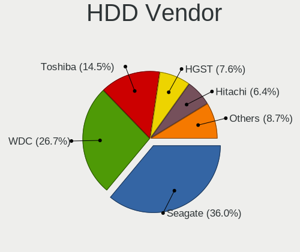
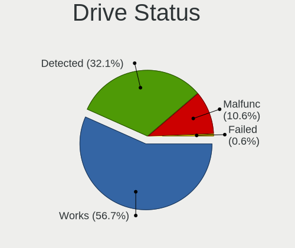
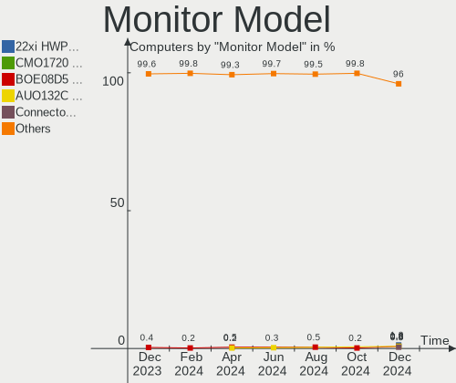
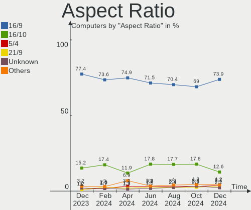
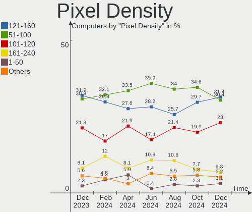
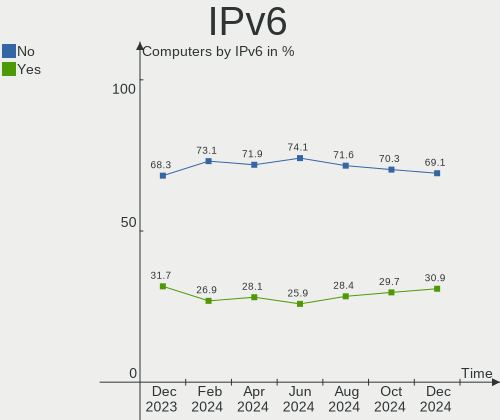

Debian Hardware Trends
----------------------

A project to identify most popular hardware characteristics and track their change
over time based on data collected by Debian users at https://Linux-Hardware.org.

Anyone can contribute to the study by uploading probes of their computers by
the [hw-probe](https://github.com/linuxhw/hw-probe) tool:

    sudo -E hw-probe -all -upload

This is a report for all computer types. See also reports for [desktops](/Dist/Debian/Desktop/README.md) and [notebooks](/Dist/Debian/Notebook/README.md).

Full-feature report is available here: https://linux-hardware.org/?view=trends

Period: Apr, 2021.

Contents
--------

- [ OS                       ](#os)
- [ OS Family                ](#os-family)
- [ Kernel                   ](#kernel)
- [ Kernel Family            ](#kernel-family)
- [ Kernel Major Ver.        ](#kernel-major-ver)
- [ Arch                     ](#arch)
- [ DE                       ](#de)
- [ Display Server           ](#display-server)
- [ Display Manager          ](#display-manager)
- [ OS Lang                  ](#os-lang)
- [ Boot Mode                ](#boot-mode)
- [ Filesystem               ](#filesystem)
- [ Part. scheme             ](#part-scheme)
- [ Dual Boot with Linux/BSD ](#dual-boot-with-linux/bsd)
- [ Dual Boot (Win)          ](#dual-boot-win)
- [ Country                  ](#country)
- [ City                     ](#city)
- [ Vendor                   ](#vendor)
- [ Model                    ](#model)
- [ Model Family             ](#model-family)
- [ MFG Year                 ](#mfg-year)
- [ Form Factor              ](#form-factor)
- [ Secure Boot              ](#secure-boot)
- [ Coreboot                 ](#coreboot)
- [ RAM Size                 ](#ram-size)
- [ RAM Used                 ](#ram-used)
- [ Has CD-ROM               ](#has-cd-rom)
- [ Total Drives             ](#total-drives)
- [ Has Ethernet             ](#has-ethernet)
- [ Has WiFi                 ](#has-wifi)
- [ Has Bluetooth            ](#has-bluetooth)
- [ Drive Vendor             ](#drive-vendor)
- [ Drive Model              ](#drive-model)
- [ HDD Vendor               ](#hdd-vendor)
- [ SSD Vendor               ](#ssd-vendor)
- [ Drive Kind               ](#drive-kind)
- [ Drive Connector          ](#drive-connector)
- [ Drive Size               ](#drive-size)
- [ Space Total              ](#space-total)
- [ Space Used               ](#space-used)
- [ Malfunc. Drives          ](#malfunc-drives)
- [ Malfunc. Drive Vendor    ](#malfunc-drive-vendor)
- [ Malfunc. HDD Vendor      ](#malfunc-hdd-vendor)
- [ Malfunc. Drive Kind      ](#malfunc-drive-kind)
- [ Failed Drives            ](#failed-drives)
- [ Failed Drive Vendor      ](#failed-drive-vendor)
- [ Drive Status             ](#drive-status)
- [ Storage Vendor           ](#storage-vendor)
- [ Storage Model            ](#storage-model)
- [ Storage Kind             ](#storage-kind)
- [ CPU Vendor               ](#cpu-vendor)
- [ CPU Model                ](#cpu-model)
- [ CPU Model Family         ](#cpu-model-family)
- [ CPU Cores                ](#cpu-cores)
- [ CPU Sockets              ](#cpu-sockets)
- [ CPU Threads              ](#cpu-threads)
- [ CPU Op-Modes             ](#cpu-op-modes)
- [ CPU Microcode            ](#cpu-microcode)
- [ CPU Microarch            ](#cpu-microarch)
- [ GPU Vendor               ](#gpu-vendor)
- [ GPU Model                ](#gpu-model)
- [ GPU Combo                ](#gpu-combo)
- [ GPU Driver               ](#gpu-driver)
- [ GPU Memory               ](#gpu-memory)
- [ Monitor Vendor           ](#monitor-vendor)
- [ Monitor Model            ](#monitor-model)
- [ Monitor Resolution       ](#monitor-resolution)
- [ Monitor Diagonal         ](#monitor-diagonal)
- [ Monitor Width            ](#monitor-width)
- [ Aspect Ratio             ](#aspect-ratio)
- [ Monitor Area             ](#monitor-area)
- [ Pixel Density            ](#pixel-density)
- [ Multiple Monitors        ](#multiple-monitors)
- [ Net Controller Vendor    ](#net-controller-vendor)
- [ Net Controller Model     ](#net-controller-model)
- [ Wireless Vendor          ](#wireless-vendor)
- [ Wireless Model           ](#wireless-model)
- [ Ethernet Vendor          ](#ethernet-vendor)
- [ Ethernet Model           ](#ethernet-model)
- [ Net Controller Kind      ](#net-controller-kind)
- [ Used Controller          ](#used-controller)
- [ NICs                     ](#nics)
- [ IPv6                     ](#ipv6)
- [ Memory Vendor            ](#memory-vendor)
- [ Memory Model             ](#memory-model)
- [ Memory Kind              ](#memory-kind)
- [ Memory Form Factor       ](#memory-form-factor)
- [ Memory Size              ](#memory-size)
- [ Memory Speed             ](#memory-speed)
- [ Sound Vendor             ](#sound-vendor)
- [ Sound Model              ](#sound-model)
- [ Camera Vendor            ](#camera-vendor)
- [ Camera Model             ](#camera-model)
- [ Fingerprint Vendor       ](#fingerprint-vendor)
- [ Fingerprint Model        ](#fingerprint-model)
- [ Chipcard Vendor          ](#chipcard-vendor)
- [ Chipcard Model           ](#chipcard-model)
- [ Printer Vendor           ](#printer-vendor)
- [ Printer Model            ](#printer-model)
- [ Scanner Vendor           ](#scanner-vendor)
- [ Scanner Model            ](#scanner-model)
- [ Bluetooth Vendor         ](#bluetooth-vendor)
- [ Bluetooth Model          ](#bluetooth-model)
- [ Unsupported Devices      ](#unsupported-devices)
- [ Unsupported Device Types ](#unsupported-device-types)

OS
--

Installed operating systems

| Name                    | Computers | Percent |
|-------------------------|-----------|---------|
| Debian 10               | 92        | 48.68%  |
| Debian                  | 36        | 19.05%  |
| Debian Testing          | 32        | 16.93%  |
| Debian 11               | 12        | 6.35%   |
| Debian Unstable         | 4         | 2.12%   |
| Debian 9                | 3         | 1.59%   |
| Debian 8.6              | 3         | 1.59%   |
| Debian Testing/unstable | 2         | 1.06%   |
| Debian 8.11             | 2         | 1.06%   |
| Debian Sid              | 1         | 0.53%   |
| Debian 9.9              | 1         | 0.53%   |
| Debian 9.13             | 1         | 0.53%   |

OS Family
---------

OS without a version

| Name   | Computers | Percent |
|--------|-----------|---------|
| Debian | 189       | 100%    |

Kernel
------

Version of the Linux kernel

| Version                    | Computers | Percent |
|----------------------------|-----------|---------|
| 4.19.0-16-amd64            | 45        | 23.81%  |
| 5.10.0-5-amd64             | 25        | 13.23%  |
| 5.10.0-2-amd64             | 24        | 12.7%   |
| 5.10.0-6-amd64             | 18        | 9.52%   |
| 4.19.0-14-amd64            | 7         | 3.7%    |
| 5.4.106-1-pve              | 6         | 3.17%   |
| 4.19.0-13-amd64            | 5         | 2.65%   |
| 5.8.0-3-amd64              | 3         | 1.59%   |
| 5.10.0-0.bpo.3-amd64       | 3         | 1.59%   |
| 4.19.0-16-686-pae          | 3         | 1.59%   |
| 5.9.0-0.bpo.5-amd64        | 2         | 1.06%   |
| 5.4.0-0.bpo.4-amd64        | 2         | 1.06%   |
| 5.11.14                    | 2         | 1.06%   |
| 5.11.0-051100-generic      | 2         | 1.06%   |
| 5.10.0-5mx-amd64           | 2         | 1.06%   |
| 5.10.0-0.bpo.5-amd64       | 2         | 1.06%   |
| 4.9.0-15-amd64             | 2         | 1.06%   |
| 5.7.0-2-pinebookpro-arm64  | 1         | 0.53%   |
| 5.6.0-0.bpo.2-amd64        | 1         | 0.53%   |
| 5.4.98-1-pve               | 1         | 0.53%   |
| 5.4.78-2-pve               | 1         | 0.53%   |
| 5.4.104.1.pm64-smp         | 1         | 0.53%   |
| 5.12.0-rc6-custom          | 1         | 0.53%   |
| 5.12.0-gnu                 | 1         | 0.53%   |
| 5.11.9+                    | 1         | 0.53%   |
| 5.11.8                     | 1         | 0.53%   |
| 5.11.15-terranz            | 1         | 0.53%   |
| 5.11.15-051115-generic     | 1         | 0.53%   |
| 5.11.13-surface            | 1         | 0.53%   |
| 5.11.11-051111-generic     | 1         | 0.53%   |
| 5.11.11                    | 1         | 0.53%   |
| 5.11.10-xanmod1            | 1         | 0.53%   |
| 5.11.0-rc6                 | 1         | 0.53%   |
| 5.11.0-16.1-liquorix-amd64 | 1         | 0.53%   |
| 5.11.0-11.1-liquorix-amd64 | 1         | 0.53%   |
| 5.10.21-sunxi              | 1         | 0.53%   |
| 5.10.17-v7l+               | 1         | 0.53%   |
| 5.10.0-4-amd64             | 1         | 0.53%   |
| 5.10.0-0.bpo.4-amd64       | 1         | 0.53%   |
| 5.10-sunxi64               | 1         | 0.53%   |
| 4.9.0-6-amd64              | 1         | 0.53%   |
| 4.9.0-13-686-pae           | 1         | 0.53%   |
| 4.9.0-1-amd64              | 1         | 0.53%   |
| 4.8.7-armv7-x4             | 1         | 0.53%   |
| 4.19.0-6-amd64             | 1         | 0.53%   |
| 4.19.0-16-686              | 1         | 0.53%   |
| 4.19.0-14-686              | 1         | 0.53%   |
| 4.19.0-12-amd64            | 1         | 0.53%   |
| 4.15.18-16-pve             | 1         | 0.53%   |
| 3.16.0-4-686-pae           | 1         | 0.53%   |
| 3.16.0-11-686-pae          | 1         | 0.53%   |
| 3.10.65+                   | 1         | 0.53%   |
| 3.0.21-perf                | 1         | 0.53%   |

Kernel Family
-------------

Linux kernel without a distro release

| Version   | Computers | Percent |
|-----------|-----------|---------|
| 5.10.0    | 76        | 40.21%  |
| 4.19.0    | 64        | 33.86%  |
| 5.4.106   | 6         | 3.17%   |
| 5.11.0    | 5         | 2.65%   |
| 4.9.0     | 5         | 2.65%   |
| 5.8.0     | 3         | 1.59%   |
| 5.9.0     | 2         | 1.06%   |
| 5.4.0     | 2         | 1.06%   |
| 5.12.0    | 2         | 1.06%   |
| 5.11.15   | 2         | 1.06%   |
| 5.11.14   | 2         | 1.06%   |
| 5.11.11   | 2         | 1.06%   |
| 3.16.0    | 2         | 1.06%   |
| 5.7.0     | 1         | 0.53%   |
| 5.6.0     | 1         | 0.53%   |
| 5.4.98    | 1         | 0.53%   |
| 5.4.78    | 1         | 0.53%   |
| 5.4.104.1 | 1         | 0.53%   |
| 5.11.9    | 1         | 0.53%   |
| 5.11.8    | 1         | 0.53%   |
| 5.11.13   | 1         | 0.53%   |
| 5.11.10   | 1         | 0.53%   |
| 5.10.21   | 1         | 0.53%   |
| 5.10.17   | 1         | 0.53%   |
| 5.10      | 1         | 0.53%   |
| 4.8.7     | 1         | 0.53%   |
| 4.15.18   | 1         | 0.53%   |
| 3.10.65   | 1         | 0.53%   |
| 3.0.21    | 1         | 0.53%   |

Kernel Major Ver.
-----------------

Linux kernel major version

| Version | Computers | Percent |
|---------|-----------|---------|
| 5.10    | 78        | 41.27%  |
| 4.19    | 64        | 33.86%  |
| 5.11    | 15        | 7.94%   |
| 5.4     | 10        | 5.29%   |
| 4.9     | 5         | 2.65%   |
| 5.8     | 3         | 1.59%   |
| 5.9     | 2         | 1.06%   |
| 5.12    | 2         | 1.06%   |
| 3.16    | 2         | 1.06%   |
| 5.7     | 1         | 0.53%   |
| 5.6     | 1         | 0.53%   |
| 5.4.104 | 1         | 0.53%   |
| 5       | 1         | 0.53%   |
| 4.8     | 1         | 0.53%   |
| 4.15    | 1         | 0.53%   |
| 3.10    | 1         | 0.53%   |
| 3.0     | 1         | 0.53%   |

Arch
----

OS architecture (x86_64, i586, etc.)

| Name    | Computers | Percent |
|---------|-----------|---------|
| x86_64  | 174       | 92.06%  |
| i686    | 8         | 4.23%   |
| armv7l  | 5         | 2.65%   |
| aarch64 | 2         | 1.06%   |

DE
--

Desktop Environment

| Name             | Computers | Percent |
|------------------|-----------|---------|
| Unknown          | 54        | 28.57%  |
| GNOME            | 44        | 23.28%  |
| XFCE             | 23        | 12.17%  |
| KDE5             | 17        | 8.99%   |
| MATE             | 10        | 5.29%   |
| KDE              | 10        | 5.29%   |
| X-Cinnamon       | 6         | 3.17%   |
| LXDE             | 5         | 2.65%   |
| Cinnamon         | 5         | 2.65%   |
| LXQt             | 3         | 1.59%   |
| lightdm-xsession | 2         | 1.06%   |
| i3               | 2         | 1.06%   |
| Budgie           | 2         | 1.06%   |
| awesome          | 2         | 1.06%   |
| i3-with-shmlog   | 1         | 0.53%   |
| GNOME Classic    | 1         | 0.53%   |
| fluxbox          | 1         | 0.53%   |
| default          | 1         | 0.53%   |

Display Server
--------------

X11 or Wayland

| Name    | Computers | Percent |
|---------|-----------|---------|
| X11     | 113       | 59.79%  |
| Unknown | 32        | 16.93%  |
| Wayland | 24        | 12.7%   |
| Tty     | 20        | 10.58%  |

Display Manager
---------------

SDDM, LightDM, etc.

| Name    | Computers | Percent |
|---------|-----------|---------|
| Unknown | 98        | 51.85%  |
| TDM     | 43        | 22.75%  |
| GDM     | 27        | 14.29%  |
| SDDM    | 14        | 7.41%   |
| LightDM | 3         | 1.59%   |
| XDM     | 2         | 1.06%   |
| GDM3    | 2         | 1.06%   |

OS Lang
-------

Language

| Lang    | Computers | Percent |
|---------|-----------|---------|
| en_US   | 64        | 33.86%  |
| ru_RU   | 39        | 20.63%  |
| pt_BR   | 12        | 6.35%   |
| de_DE   | 9         | 4.76%   |
| fr_FR   | 8         | 4.23%   |
| es_ES   | 7         | 3.7%    |
| en_GB   | 6         | 3.17%   |
| Unknown | 4         | 2.12%   |
| sv_SE   | 3         | 1.59%   |
| nl_BE   | 3         | 1.59%   |
| es_MX   | 3         | 1.59%   |
| en_IE   | 3         | 1.59%   |
| ru_UA   | 2         | 1.06%   |
| ro_RO   | 2         | 1.06%   |
| pt_PT   | 2         | 1.06%   |
| ko_KR   | 2         | 1.06%   |
| it_IT   | 2         | 1.06%   |
| es_CL   | 2         | 1.06%   |
| en_CA   | 2         | 1.06%   |
| de_CH   | 2         | 1.06%   |
| C       | 2         | 1.06%   |
| sk_SK   | 1         | 0.53%   |
| pl_PL   | 1         | 0.53%   |
| ja_JP   | 1         | 0.53%   |
| hu_HU   | 1         | 0.53%   |
| hr_HR   | 1         | 0.53%   |
| fr_BE   | 1         | 0.53%   |
| eo      | 1         | 0.53%   |
| en_ZA   | 1         | 0.53%   |
| en_IN   | 1         | 0.53%   |
| en_AU   | 1         | 0.53%   |

Boot Mode
---------

EFI or BIOS

| Mode | Computers | Percent |
|------|-----------|---------|
| BIOS | 114       | 60.32%  |
| EFI  | 75        | 39.68%  |

Filesystem
----------

Type of filesystem

| Type    | Computers | Percent |
|---------|-----------|---------|
| Ext4    | 149       | 78.84%  |
| Overlay | 26        | 13.76%  |
| Btrfs   | 8         | 4.23%   |
| Zfs     | 2         | 1.06%   |
| XXXXXXX | 1         | 0.53%   |
| Xfs     | 1         | 0.53%   |
| Tmpfs   | 1         | 0.53%   |
| Ext3    | 1         | 0.53%   |

Part. scheme
------------

Scheme of partitioning

| Type    | Computers | Percent |
|---------|-----------|---------|
| GPT     | 77        | 40.74%  |
| MBR     | 62        | 32.8%   |
| Unknown | 50        | 26.46%  |

Dual Boot with Linux/BSD
------------------------

Hosting more than one Linux/BSD

| Dual boot | Computers | Percent |
|-----------|-----------|---------|
| No        | 162       | 85.71%  |
| Yes       | 27        | 14.29%  |

Dual Boot (Win)
---------------

Hosting Linux and Windows

| Dual boot | Computers | Percent |
|-----------|-----------|---------|
| No        | 117       | 61.9%   |
| Yes       | 72        | 38.1%   |

Country
-------

Geographic location (country)

| Country      | Computers | Percent |
|--------------|-----------|---------|
| Russia       | 45        | 23.81%  |
| USA          | 24        | 12.7%   |
| Germany      | 19        | 10.05%  |
| Brazil       | 14        | 7.41%   |
| Spain        | 12        | 6.35%   |
| France       | 9         | 4.76%   |
| Ukraine      | 6         | 3.17%   |
| Pakistan     | 5         | 2.65%   |
| UK           | 4         | 2.12%   |
| Belgium      | 4         | 2.12%   |
| Switzerland  | 3         | 1.59%   |
| Sweden       | 3         | 1.59%   |
| South Korea  | 3         | 1.59%   |
| Poland       | 3         | 1.59%   |
| Mexico       | 3         | 1.59%   |
| Italy        | 3         | 1.59%   |
| Turkey       | 2         | 1.06%   |
| Romania      | 2         | 1.06%   |
| Portugal     | 2         | 1.06%   |
| Chile        | 2         | 1.06%   |
| Austria      | 2         | 1.06%   |
| Vietnam      | 1         | 0.53%   |
| Thailand     | 1         | 0.53%   |
| South Africa | 1         | 0.53%   |
| Slovakia     | 1         | 0.53%   |
| Serbia       | 1         | 0.53%   |
| Peru         | 1         | 0.53%   |
| Norway       | 1         | 0.53%   |
| Netherlands  | 1         | 0.53%   |
| Japan        | 1         | 0.53%   |
| Ireland      | 1         | 0.53%   |
| India        | 1         | 0.53%   |
| Hungary      | 1         | 0.53%   |
| Greece       | 1         | 0.53%   |
| Estonia      | 1         | 0.53%   |
| Ecuador      | 1         | 0.53%   |
| Denmark      | 1         | 0.53%   |
| Croatia      | 1         | 0.53%   |
| Canada       | 1         | 0.53%   |
| Australia    | 1         | 0.53%   |

City
----

Geographic location (city)

| City              | Computers | Percent |
|-------------------|-----------|---------|
| Voronezh          | 24        | 12.7%   |
| Moscow            | 8         | 4.23%   |
| Wooster           | 7         | 3.7%    |
| Perm              | 5         | 2.65%   |
| Lahore            | 5         | 2.65%   |
| Madrid            | 4         | 2.12%   |
| Kyiv              | 3         | 1.59%   |
| Berlin            | 3         | 1.59%   |
| Vienna            | 2         | 1.06%   |
| St Petersburg     | 2         | 1.06%   |
| Lisbon            | 2         | 1.06%   |
| Hamburg           | 2         | 1.06%   |
| Danyang           | 2         | 1.06%   |
| Curitiba          | 2         | 1.06%   |
| Belo Horizonte    | 2         | 1.06%   |
| Zagreb            | 1         | 0.53%   |
| Yangsan           | 1         | 0.53%   |
| Xalapa            | 1         | 0.53%   |
| Wuppertal         | 1         | 0.53%   |
| Wroclaw           | 1         | 0.53%   |
| Werder            | 1         | 0.53%   |
| Waregem           | 1         | 0.53%   |
| Vojens            | 1         | 0.53%   |
| Vitória          | 1         | 0.53%   |
| Vila-real         | 1         | 0.53%   |
| Ver-sur-Launette  | 1         | 0.53%   |
| Vaestra Froelunda | 1         | 0.53%   |
| Uppsala           | 1         | 0.53%   |
| Turin             | 1         | 0.53%   |
| Troy              | 1         | 0.53%   |
| The Hague         | 1         | 0.53%   |
| Tallinn           | 1         | 0.53%   |
| Tallard           | 1         | 0.53%   |
| São Paulo        | 1         | 0.53%   |
| St Louis          | 1         | 0.53%   |
| Springfield       | 1         | 0.53%   |
| Soyen             | 1         | 0.53%   |
| Sint-Michiels     | 1         | 0.53%   |
| Shizuoka          | 1         | 0.53%   |
| Sevenoaks         | 1         | 0.53%   |
| Sevastopol        | 1         | 0.53%   |
| Sao Vicente       | 1         | 0.53%   |
| Santo André      | 1         | 0.53%   |
| Santiago          | 1         | 0.53%   |
| Santa Ursula      | 1         | 0.53%   |
| Salvador          | 1         | 0.53%   |
| Rome              | 1         | 0.53%   |
| Rocky Point       | 1         | 0.53%   |
| Ramos Arizpe      | 1         | 0.53%   |
| Quito             | 1         | 0.53%   |
| Pskov             | 1         | 0.53%   |
| Porto Alegre      | 1         | 0.53%   |
| Pontarddulais     | 1         | 0.53%   |
| Ponta Grossa      | 1         | 0.53%   |
| Pompano Beach     | 1         | 0.53%   |
| Pinto             | 1         | 0.53%   |
| Pavlohrad         | 1         | 0.53%   |
| Paris             | 1         | 0.53%   |
| Panama City       | 1         | 0.53%   |
| Pamplona          | 1         | 0.53%   |

Vendor
------

Motherboard manufacturer

| Name                    | Computers | Percent |
|-------------------------|-----------|---------|
| Lenovo                  | 29        | 15.34%  |
| ASUSTek Computer        | 28        | 14.81%  |
| Dell                    | 23        | 12.17%  |
| Hewlett-Packard         | 21        | 11.11%  |
| MSI                     | 11        | 5.82%   |
| Gigabyte Technology     | 11        | 5.82%   |
| Acer                    | 11        | 5.82%   |
| ASRock                  | 8         | 4.23%   |
| Toshiba                 | 4         | 2.12%   |
| Sony                    | 3         | 1.59%   |
| Positivo                | 3         | 1.59%   |
| Intel                   | 3         | 1.59%   |
| ECS                     | 3         | 1.59%   |
| Unknown                 | 3         | 1.59%   |
| Supermicro              | 2         | 1.06%   |
| Pine Microsystems       | 2         | 1.06%   |
| Notebook                | 2         | 1.06%   |
| HUAWEI                  | 2         | 1.06%   |
| Fujitsu                 | 2         | 1.06%   |
| Apple                   | 2         | 1.06%   |
| TUXEDO                  | 1         | 0.53%   |
| TQ-Group                | 1         | 0.53%   |
| TI                      | 1         | 0.53%   |
| sunxi                   | 1         | 0.53%   |
| Shuttle                 | 1         | 0.53%   |
| Samsung Electronics     | 1         | 0.53%   |
| Raspberry Pi Foundation | 1         | 0.53%   |
| Pegatron                | 1         | 0.53%   |
| PC Engines              | 1         | 0.53%   |
| Microsoft               | 1         | 0.53%   |
| LG Electronics          | 1         | 0.53%   |
| Inventec                | 1         | 0.53%   |
| Google                  | 1         | 0.53%   |
| Foxconn                 | 1         | 0.53%   |
| Chuwi                   | 1         | 0.53%   |
| Biostar                 | 1         | 0.53%   |

Model
-----

Motherboard model

| Name                                       | Computers | Percent |
|--------------------------------------------|-----------|---------|
| ASUS TUF GAMING X570-PLUS                  | 3         | 1.59%   |
| Unknown                                    | 3         | 1.59%   |
| MSI MS-7996                                | 2         | 1.06%   |
| HUAWEI BOHK-WAX9X                          | 2         | 1.06%   |
| Dell Precision WorkStation T7500           | 2         | 1.06%   |
| ASUS All Series                            | 2         | 1.06%   |
| TUXEDO Pulse 15 Gen1                       | 1         | 0.53%   |
| TQ-Group TQMxE39S                          | 1         | 0.53%   |
| Toshiba Satellite M505D                    | 1         | 0.53%   |
| Toshiba Satellite L505D                    | 1         | 0.53%   |
| Toshiba Satellite Click W35Dt-A            | 1         | 0.53%   |
| Toshiba Satellite C50-A-K9K                | 1         | 0.53%   |
| TI OMAP3 BeagleBoard xM                    | 1         | 0.53%   |
| Supermicro X9SCL/X9SCM                     | 1         | 0.53%   |
| Supermicro SYS-5039MC-H12TRF               | 1         | 0.53%   |
| sunxi Banana Pi BPI-M2-Ultra               | 1         | 0.53%   |
| Sony VPCM120AL                             | 1         | 0.53%   |
| Sony VPCEJ3S1R                             | 1         | 0.53%   |
| Sony VGN-FW31ZJ                            | 1         | 0.53%   |
| Shuttle DS81D                              | 1         | 0.53%   |
| Samsung 300E4A/300E5A/300E7A/3430EA/3530EA | 1         | 0.53%   |
| RPi Raspberry Pi 4 Model B Rev 1.2         | 1         | 0.53%   |
| Positivo POS-VVCN896BD                     | 1         | 0.53%   |
| Positivo MOBILE                            | 1         | 0.53%   |
| Positivo C14CR21                           | 1         | 0.53%   |
| Pine Microsystems Pine64 PinePhone (1.2)   | 1         | 0.53%   |
| Pine Microsystems Pine64 Pinebook Pro      | 1         | 0.53%   |
| Pegatron C15B                              | 1         | 0.53%   |
| PC Engines apu2                            | 1         | 0.53%   |
| Notebook NJ5x_NJ7xLU                       | 1         | 0.53%   |
| Notebook N650DU                            | 1         | 0.53%   |
| MSI P35 Platinum(MS-7345)                  | 1         | 0.53%   |
| MSI MS-7C37                                | 1         | 0.53%   |
| MSI MS-7C06                                | 1         | 0.53%   |
| MSI MS-7A34                                | 1         | 0.53%   |
| MSI MS-7982                                | 1         | 0.53%   |
| MSI MS-7917                                | 1         | 0.53%   |
| MSI MS-7592                                | 1         | 0.53%   |
| MSI EC507AA-ABF SR1507FR FR530             | 1         | 0.53%   |
| MSI Bravo 15 A4DDR                         | 1         | 0.53%   |
| Microsoft Surface Pro                      | 1         | 0.53%   |
| LG 15ND530-GX30K                           | 1         | 0.53%   |
| Lenovo Yoga 910-13IKB 80VF                 | 1         | 0.53%   |
| Lenovo Yoga 7 14ITL5 82BH                  | 1         | 0.53%   |
| Lenovo ThinkStation D30 4223CC9            | 1         | 0.53%   |
| Lenovo ThinkPad X1 Carbon 20HRCT01WW       | 1         | 0.53%   |
| Lenovo ThinkPad W520 42844LG               | 1         | 0.53%   |
| Lenovo ThinkPad T530 24297XG               | 1         | 0.53%   |
| Lenovo ThinkPad T530 24296HG               | 1         | 0.53%   |
| Lenovo ThinkPad T490 20N2007JPB            | 1         | 0.53%   |
| Lenovo ThinkPad T470 W10DG 20JNS1C905      | 1         | 0.53%   |
| Lenovo ThinkPad T460 20FMS0X022            | 1         | 0.53%   |
| Lenovo ThinkPad T450s 20BXCTO1WW           | 1         | 0.53%   |
| Lenovo ThinkPad T450s 20BWS2KM00           | 1         | 0.53%   |
| Lenovo ThinkPad T440s 20AR003RMS           | 1         | 0.53%   |
| Lenovo ThinkPad T430s 23533KJ              | 1         | 0.53%   |
| Lenovo ThinkPad T420 4236WS7               | 1         | 0.53%   |
| Lenovo ThinkPad T15 Gen 1 20S7S5GE00       | 1         | 0.53%   |
| Lenovo ThinkPad T14 Gen 1 20S1S17600       | 1         | 0.53%   |
| Lenovo ThinkPad P51s 20HB000URT            | 1         | 0.53%   |

Model Family
------------

Motherboard model prefix

| Name                         | Computers | Percent |
|------------------------------|-----------|---------|
| Lenovo ThinkPad              | 16        | 8.47%   |
| Acer Aspire                  | 7         | 3.7%    |
| Lenovo IdeaPad               | 6         | 3.17%   |
| Dell Latitude                | 6         | 3.17%   |
| Dell Inspiron                | 6         | 3.17%   |
| Dell Precision               | 5         | 2.65%   |
| Dell OptiPlex                | 5         | 2.65%   |
| Toshiba Satellite            | 4         | 2.12%   |
| HP Compaq                    | 4         | 2.12%   |
| ASUS ROG                     | 4         | 2.12%   |
| HP Pavilion                  | 3         | 1.59%   |
| HP EliteBook                 | 3         | 1.59%   |
| ASUS TUF                     | 3         | 1.59%   |
| ASUS PRIME                   | 3         | 1.59%   |
| Unknown                      | 3         | 1.59%   |
| Pine Microsystems Pine64     | 2         | 1.06%   |
| MSI MS-7996                  | 2         | 1.06%   |
| Lenovo Yoga                  | 2         | 1.06%   |
| Lenovo ThinkCentre           | 2         | 1.06%   |
| HUAWEI BOHK-WAX9X            | 2         | 1.06%   |
| HP ENVY                      | 2         | 1.06%   |
| Fujitsu LIFEBOOK             | 2         | 1.06%   |
| ASUS ZenBook                 | 2         | 1.06%   |
| ASUS All                     | 2         | 1.06%   |
| TUXEDO Pulse                 | 1         | 0.53%   |
| TQ-Group TQMxE39S            | 1         | 0.53%   |
| TI OMAP3                     | 1         | 0.53%   |
| Supermicro X9SCL             | 1         | 0.53%   |
| Supermicro SYS-5039MC-H12TRF | 1         | 0.53%   |
| sunxi Banana                 | 1         | 0.53%   |
| Sony VPCM120AL               | 1         | 0.53%   |
| Sony VPCEJ3S1R               | 1         | 0.53%   |
| Sony VGN-FW31ZJ              | 1         | 0.53%   |
| Shuttle DS81D                | 1         | 0.53%   |
| Samsung 300E4A               | 1         | 0.53%   |
| RPi Raspberry                | 1         | 0.53%   |
| Positivo POS-VVCN896BD       | 1         | 0.53%   |
| Positivo MOBILE              | 1         | 0.53%   |
| Positivo C14CR21             | 1         | 0.53%   |
| Pegatron C15B                | 1         | 0.53%   |
| PC Engines apu2              | 1         | 0.53%   |
| Notebook NJ5x                | 1         | 0.53%   |
| Notebook N650DU              | 1         | 0.53%   |
| MSI P35                      | 1         | 0.53%   |
| MSI MS-7C37                  | 1         | 0.53%   |
| MSI MS-7C06                  | 1         | 0.53%   |
| MSI MS-7A34                  | 1         | 0.53%   |
| MSI MS-7982                  | 1         | 0.53%   |
| MSI MS-7917                  | 1         | 0.53%   |
| MSI MS-7592                  | 1         | 0.53%   |
| MSI EC507AA-ABF              | 1         | 0.53%   |
| MSI Bravo                    | 1         | 0.53%   |
| Microsoft Surface            | 1         | 0.53%   |
| LG 15ND530-GX30K             | 1         | 0.53%   |
| Lenovo ThinkStation          | 1         | 0.53%   |
| Lenovo IdeaCentre            | 1         | 0.53%   |
| Lenovo G550                  | 1         | 0.53%   |
| Inventec R                   | 1         | 0.53%   |
| Intel Pro                    | 1         | 0.53%   |
| Intel PR1710N                | 1         | 0.53%   |

MFG Year
--------

Motherboard manufacture year

| Year    | Computers | Percent |
|---------|-----------|---------|
| 2020    | 42        | 22.22%  |
| 2019    | 17        | 8.99%   |
| 2013    | 16        | 8.47%   |
| 2018    | 13        | 6.88%   |
| 2017    | 13        | 6.88%   |
| 2016    | 13        | 6.88%   |
| 2011    | 12        | 6.35%   |
| 2009    | 12        | 6.35%   |
| 2014    | 11        | 5.82%   |
| 2012    | 9         | 4.76%   |
| Unknown | 8         | 4.23%   |
| 2010    | 6         | 3.17%   |
| 2008    | 6         | 3.17%   |
| 2015    | 5         | 2.65%   |
| 2021    | 4         | 2.12%   |
| 2006    | 2         | 1.06%   |

Form Factor
-----------

Physical design of the computer

| Name           | Computers | Percent |
|----------------|-----------|---------|
| Notebook       | 92        | 48.68%  |
| Desktop        | 79        | 41.8%   |
| System on chip | 3         | 1.59%   |
| Tablet         | 3         | 1.59%   |
| Convertible    | 3         | 1.59%   |
| All in one     | 3         | 1.59%   |
| Server         | 3         | 1.59%   |
| Mini pc        | 2         | 1.06%   |
| Phone          | 1         | 0.53%   |

Secure Boot
-----------

Enabled or disabled

| State    | Computers | Percent |
|----------|-----------|---------|
| Disabled | 183       | 96.83%  |
| Enabled  | 6         | 3.17%   |

Coreboot
--------

Have coreboot on board

| Used | Computers | Percent |
|------|-----------|---------|
| No   | 187       | 98.94%  |
| Yes  | 2         | 1.06%   |

RAM Size
--------

Total RAM memory

| Size in GB  | Computers | Percent |
|-------------|-----------|---------|
| 4.01-8.0    | 39        | 20.63%  |
| 8.01-16.0   | 38        | 20.11%  |
| 3.01-4.0    | 34        | 17.99%  |
| 16.01-24.0  | 30        | 15.87%  |
| 32.01-64.0  | 13        | 6.88%   |
| 1.01-2.0    | 12        | 6.35%   |
| 64.01-256.0 | 8         | 4.23%   |
| 2.01-3.0    | 5         | 2.65%   |
| 24.01-32.0  | 4         | 2.12%   |
| 0.51-1.0    | 3         | 1.59%   |
| 0.01-0.5    | 3         | 1.59%   |

RAM Used
--------

Used RAM memory

| Used GB     | Computers | Percent |
|-------------|-----------|---------|
| 1.01-2.0    | 48        | 25.4%   |
| 2.01-3.0    | 36        | 19.05%  |
| 0.51-1.0    | 36        | 19.05%  |
| 4.01-8.0    | 26        | 13.76%  |
| 3.01-4.0    | 21        | 11.11%  |
| 8.01-16.0   | 12        | 6.35%   |
| 0.01-0.5    | 4         | 2.12%   |
| 64.01-256.0 | 2         | 1.06%   |
| Unknown     | 2         | 1.06%   |
| 32.01-64.0  | 1         | 0.53%   |
| 16.01-24.0  | 1         | 0.53%   |

Has CD-ROM
----------

Has CD-ROM on board

| Presented | Computers | Percent |
|-----------|-----------|---------|
| No        | 127       | 67.2%   |
| Yes       | 62        | 32.8%   |

Total Drives
------------

Number of drives on board

| Drives | Computers | Percent |
|--------|-----------|---------|
| 1      | 108       | 57.14%  |
| 2      | 45        | 23.81%  |
| 3      | 10        | 5.29%   |
| 5      | 9         | 4.76%   |
| 4      | 6         | 3.17%   |
| 6      | 5         | 2.65%   |
| 7      | 4         | 2.12%   |
| 9      | 2         | 1.06%   |

Has Ethernet
------------

Has Ethernet on board

| Presented | Computers | Percent |
|-----------|-----------|---------|
| Yes       | 169       | 89.42%  |
| No        | 20        | 10.58%  |

Has WiFi
--------

Has WiFi module

| Presented | Computers | Percent |
|-----------|-----------|---------|
| Yes       | 132       | 69.84%  |
| No        | 57        | 30.16%  |

Has Bluetooth
-------------

Has Bluetooth module

| Presented | Computers | Percent |
|-----------|-----------|---------|
| Yes       | 102       | 53.97%  |
| No        | 87        | 46.03%  |

Drive Vendor
------------

Hard drive vendors

| Vendor              | Computers | Drives | Percent |
|---------------------|-----------|--------|---------|
| Samsung Electronics | 50        | 60     | 16.5%   |
| WDC                 | 47        | 64     | 15.51%  |
| Seagate             | 36        | 50     | 11.88%  |
| Unknown             | 22        | 27     | 7.26%   |
| Kingston            | 21        | 24     | 6.93%   |
| Toshiba             | 13        | 17     | 4.29%   |
| Hitachi             | 11        | 11     | 3.63%   |
| SanDisk             | 10        | 11     | 3.3%    |
| Intel               | 10        | 13     | 3.3%    |
| Crucial             | 9         | 10     | 2.97%   |
| HGST                | 7         | 8      | 2.31%   |
| SK Hynix            | 6         | 6      | 1.98%   |
| OCZ                 | 4         | 4      | 1.32%   |
| Phison              | 3         | 4      | 0.99%   |
| Gigabyte Technology | 3         | 4      | 0.99%   |
| Corsair             | 3         | 3      | 0.99%   |
| A-DATA Technology   | 3         | 3      | 0.99%   |
| Union Memory        | 2         | 2      | 0.66%   |
| Sabrent             | 2         | 3      | 0.66%   |
| Micron Technology   | 2         | 2      | 0.66%   |
| LITEONIT            | 2         | 2      | 0.66%   |
| Lexar               | 2         | 2      | 0.66%   |
| LaCie               | 2         | 2      | 0.66%   |
| KingDian            | 2         | 2      | 0.66%   |
| Hewlett-Packard     | 2         | 3      | 0.66%   |
| Hajaan              | 2         | 2      | 0.66%   |
| Fujitsu             | 2         | 2      | 0.66%   |
| China               | 2         | 2      | 0.66%   |
| Apple               | 2         | 2      | 0.66%   |
| ZTC                 | 1         | 1      | 0.33%   |
| Zheino              | 1         | 1      | 0.33%   |
| USB30               | 1         | 1      | 0.33%   |
| Transcend           | 1         | 1      | 0.33%   |
| THU                 | 1         | 1      | 0.33%   |
| TAMMUZ              | 1         | 1      | 0.33%   |
| Silicon Motion      | 1         | 1      | 0.33%   |
| PNY                 | 1         | 1      | 0.33%   |
| PLEXTOR             | 1         | 1      | 0.33%   |
| NETAPP              | 1         | 1      | 0.33%   |
| Mass                | 1         | 1      | 0.33%   |
| LITEON              | 1         | 1      | 0.33%   |
| LDLC                | 1         | 1      | 0.33%   |
| JMicron             | 1         | 1      | 0.33%   |
| Intenso             | 1         | 1      | 0.33%   |
| HUAWEI              | 1         | 1      | 0.33%   |
| Hoodisk             | 1         | 1      | 0.33%   |
| CIE                 | 1         | 1      | 0.33%   |
| ASMT                | 1         | 2      | 0.33%   |
| Apacer              | 1         | 1      | 0.33%   |
| AMD                 | 1         | 1      | 0.33%   |

Drive Model
-----------

Hard drive models

| Model                                | Computers | Percent |
|--------------------------------------|-----------|---------|
| Kingston SA400S37240G 240GB SSD      | 7         | 2.09%   |
| Samsung SSD 870 EVO 500GB            | 5         | 1.49%   |
| Samsung SSD 860 EVO 500GB            | 4         | 1.19%   |
| Unknown MMC Card  32GB               | 3         | 0.9%    |
| Toshiba DT01ACA100 1TB               | 3         | 0.9%    |
| Seagate ST1000LM048-2E7172 1TB       | 3         | 0.9%    |
| Samsung SSD 860 EVO 1TB              | 3         | 0.9%    |
| Samsung SSD 850 EVO 500GB            | 3         | 0.9%    |
| Samsung SSD 850 EVO 250GB            | 3         | 0.9%    |
| Kingston SUV400S37240G 240GB SSD     | 3         | 0.9%    |
| HGST HTS721010A9E630 1TB             | 3         | 0.9%    |
| WDC WDS240G2G0A-00JH30 240GB SSD     | 2         | 0.6%    |
| WDC WD50 00LPVX-22V0TT0 500GB        | 2         | 0.6%    |
| WDC WD2500BEVT-75A23T0 250GB         | 2         | 0.6%    |
| WDC WD10JPVX-22JC3T0 1TB             | 2         | 0.6%    |
| WDC WD10EZEX-60WN4A0 1TB             | 2         | 0.6%    |
| WDC PC SN730 SDBPNTY-256G-1027 256GB | 2         | 0.6%    |
| Unknown SD/MMC/MS PRO 32GB           | 2         | 0.6%    |
| Unknown SA32G  32GB                  | 2         | 0.6%    |
| Unknown MMC Card  4GB                | 2         | 0.6%    |
| Seagate ST9500325AS 500GB            | 2         | 0.6%    |
| Seagate ST2000DM008-2FR102 2TB       | 2         | 0.6%    |
| Seagate ST2000DM008-2FR1             | 2         | 0.6%    |
| Seagate ST1000DM010-2EP102 1TB       | 2         | 0.6%    |
| Samsung SSD 970 EVO Plus 500GB       | 2         | 0.6%    |
| Samsung SSD 860 EVO 250GB            | 2         | 0.6%    |
| Samsung SSD 850 EVO 120GB            | 2         | 0.6%    |
| Samsung MZVLB1T0HBLR-000L7 1TB       | 2         | 0.6%    |
| Samsung HD250HJ 250GB                | 2         | 0.6%    |
| LaCie Rugged USB-C 4TB               | 2         | 0.6%    |
| Kingston SA400S37120G 120GB SSD      | 2         | 0.6%    |
| Intel SSDPEKNW010T8 1TB              | 2         | 0.6%    |
| Hitachi HUA723020ALA640 2TB          | 2         | 0.6%    |
| Hitachi HDS721050CLA362 500GB        | 2         | 0.6%    |
| HP MB2000EBZQC 2TB                   | 2         | 0.6%    |
| Hajaan SSD 256G                      | 2         | 0.6%    |
| Crucial CT240BX500SSD1 240GB         | 2         | 0.6%    |
| ZTC SM201-512G                       | 1         | 0.3%    |
| Zheino CHN 25SATAA3 360 360GB SSD    | 1         | 0.3%    |
| WDC WUH721414ALE6L4 14TB             | 1         | 0.3%    |
| WDC WDS500G2B0A-00SM50 500GB SSD     | 1         | 0.3%    |
| WDC WDS250G2B0B 250GB SSD            | 1         | 0.3%    |
| WDC WDS240G1G0B-00RC30 240GB SSD     | 1         | 0.3%    |
| WDC WDS120G1G0B-00RC30 120GB SSD     | 1         | 0.3%    |
| WDC WDS100T3XHC-00SJG0 1TB           | 1         | 0.3%    |
| WDC WDS100T2B0A-00SM50 1TB SSD       | 1         | 0.3%    |
| WDC WDS100T1X0E-00AFY0 1TB           | 1         | 0.3%    |
| WDC WD800JD-75JNA0 80GB              | 1         | 0.3%    |
| WDC WD7500BPVX-60JC3T0 752GB         | 1         | 0.3%    |
| WDC WD5002AALX-00J37A0 500GB         | 1         | 0.3%    |
| WDC WD5000MPCK-22AWHT0 500GB         | 1         | 0.3%    |
| WDC WD5000LPVX-00V0TT0 500GB         | 1         | 0.3%    |
| WDC WD5000BEVT-60ZAT1 500GB          | 1         | 0.3%    |
| WDC WD5000AZRX-00A8LB0 500GB         | 1         | 0.3%    |
| WDC WD5000AAKS-55A7B2 500GB          | 1         | 0.3%    |
| WDC WD5000AAKS-00UU3A0 500GB         | 1         | 0.3%    |
| WDC WD40EFRX-68N32N0 4TB             | 1         | 0.3%    |
| WDC WD40EFAX-68JH4N1 4TB             | 1         | 0.3%    |
| WDC WD3200KS-75PFB0 320GB            | 1         | 0.3%    |
| WDC WD3200BEVT-22ZCT0 320GB          | 1         | 0.3%    |

HDD Vendor
----------

Hard disk drive vendors

| Vendor              | Computers | Drives | Percent |
|---------------------|-----------|--------|---------|
| WDC                 | 35        | 50     | 32.11%  |
| Seagate             | 34        | 48     | 31.19%  |
| Toshiba             | 11        | 15     | 10.09%  |
| Hitachi             | 11        | 11     | 10.09%  |
| HGST                | 7         | 8      | 6.42%   |
| Samsung Electronics | 3         | 3      | 2.75%   |
| Hewlett-Packard     | 2         | 3      | 1.83%   |
| Fujitsu             | 2         | 2      | 1.83%   |
| Apple               | 2         | 2      | 1.83%   |
| Sabrent             | 1         | 2      | 0.92%   |
| ASMT                | 1         | 2      | 0.92%   |

SSD Vendor
----------

Solid state drive vendors

| Vendor              | Computers | Drives | Percent |
|---------------------|-----------|--------|---------|
| Samsung Electronics | 34        | 42     | 28.1%   |
| Kingston            | 19        | 20     | 15.7%   |
| Crucial             | 9         | 9      | 7.44%   |
| WDC                 | 7         | 7      | 5.79%   |
| SanDisk             | 6         | 7      | 4.96%   |
| Intel               | 5         | 6      | 4.13%   |
| SK Hynix            | 4         | 4      | 3.31%   |
| OCZ                 | 4         | 4      | 3.31%   |
| A-DATA Technology   | 3         | 3      | 2.48%   |
| Micron Technology   | 2         | 2      | 1.65%   |
| LITEONIT            | 2         | 2      | 1.65%   |
| Lexar               | 2         | 2      | 1.65%   |
| KingDian            | 2         | 2      | 1.65%   |
| Hajaan              | 2         | 2      | 1.65%   |
| ZTC                 | 1         | 1      | 0.83%   |
| Zheino              | 1         | 1      | 0.83%   |
| USB30               | 1         | 1      | 0.83%   |
| Unknown             | 1         | 1      | 0.83%   |
| Transcend           | 1         | 1      | 0.83%   |
| Toshiba             | 1         | 1      | 0.83%   |
| THU                 | 1         | 1      | 0.83%   |
| TAMMUZ              | 1         | 1      | 0.83%   |
| Seagate             | 1         | 1      | 0.83%   |
| SABRENT             | 1         | 1      | 0.83%   |
| PNY                 | 1         | 1      | 0.83%   |
| PLEXTOR             | 1         | 1      | 0.83%   |
| LDLC                | 1         | 1      | 0.83%   |
| Intenso             | 1         | 1      | 0.83%   |
| Hoodisk             | 1         | 1      | 0.83%   |
| Gigabyte Technology | 1         | 1      | 0.83%   |
| Corsair             | 1         | 1      | 0.83%   |
| CIE                 | 1         | 1      | 0.83%   |
| China               | 1         | 1      | 0.83%   |
| AMD                 | 1         | 1      | 0.83%   |

Drive Kind
----------

HDD or SSD

| Kind    | Computers | Drives | Percent |
|---------|-----------|--------|---------|
| SSD     | 98        | 132    | 37.69%  |
| HDD     | 89        | 146    | 34.23%  |
| NVMe    | 42        | 50     | 16.15%  |
| MMC     | 19        | 26     | 7.31%   |
| Unknown | 12        | 13     | 4.62%   |

Drive Connector
---------------

SATA, SAS, NVMe, etc.

| Type | Computers | Drives | Percent |
|------|-----------|--------|---------|
| SATA | 150       | 269    | 65.79%  |
| NVMe | 42        | 50     | 18.42%  |
| MMC  | 19        | 26     | 8.33%   |
| SAS  | 17        | 22     | 7.46%   |

Drive Size
----------

Size of hard drive

| Size in TB | Computers | Drives | Percent |
|------------|-----------|--------|---------|
| 0.01-0.5   | 122       | 166    | 61%     |
| 0.51-1.0   | 48        | 63     | 24%     |
| 1.01-2.0   | 18        | 30     | 9%      |
| 3.01-4.0   | 6         | 13     | 3%      |
| 2.01-3.0   | 3         | 3      | 1.5%    |
| 4.01-10.0  | 2         | 2      | 1%      |
| 10.01-20.0 | 1         | 1      | 0.5%    |

Space Total
-----------

Amount of disk space available on the file system

| Size in GB     | Computers | Percent |
|----------------|-----------|---------|
| 101-250        | 41        | 21.69%  |
| Unknown        | 30        | 15.87%  |
| 251-500        | 28        | 14.81%  |
| 501-1000       | 28        | 14.81%  |
| 1001-2000      | 19        | 10.05%  |
| 51-100         | 16        | 8.47%   |
| More than 3000 | 9         | 4.76%   |
| 21-50          | 7         | 3.7%    |
| 1-20           | 6         | 3.17%   |
| 2001-3000      | 5         | 2.65%   |

Space Used
----------

Amount of used disk space

| Used GB        | Computers | Percent |
|----------------|-----------|---------|
| 1-20           | 45        | 23.81%  |
| Unknown        | 30        | 15.87%  |
| 101-250        | 27        | 14.29%  |
| 21-50          | 22        | 11.64%  |
| 251-500        | 21        | 11.11%  |
| 501-1000       | 15        | 7.94%   |
| 51-100         | 15        | 7.94%   |
| 1001-2000      | 8         | 4.23%   |
| More than 3000 | 4         | 2.12%   |
| 2001-3000      | 2         | 1.06%   |

Malfunc. Drives
---------------

Drive models with a malfunction

| Model                                        | Computers | Drives | Percent |
|----------------------------------------------|-----------|--------|---------|
| Seagate ST9500325AS 500GB                    | 2         | 2      | 6.25%   |
| Seagate ST2000DM008-2FR1                     | 2         | 2      | 6.25%   |
| Zheino CHN 25SATAA3 360 360GB SSD            | 1         | 1      | 3.13%   |
| WDC WD5002AALX-00J37A0 500GB                 | 1         | 1      | 3.13%   |
| WDC WD3200BEVT-22A23T0 320GB                 | 1         | 1      | 3.13%   |
| WDC WD3200AAKS-00L9A0 320GB                  | 1         | 1      | 3.13%   |
| WDC WD20EARX-00PASB0 2TB                     | 1         | 1      | 3.13%   |
| WDC WD10EZEX-60ZF5A0 1TB                     | 1         | 1      | 3.13%   |
| WDC WD10EZEX-00BN5A0 1TB                     | 1         | 1      | 3.13%   |
| WDC WD10EARS-00MVWB0 1TB                     | 1         | 1      | 3.13%   |
| Toshiba MQ01ABU050W 500GB                    | 1         | 1      | 3.13%   |
| Toshiba DT01ACA300 3TB                       | 1         | 1      | 3.13%   |
| SK Hynix HFS256G39MND-2300A 256GB SSD        | 1         | 1      | 3.13%   |
| Seagate ST9320325AS 320GB                    | 1         | 1      | 3.13%   |
| Seagate ST9120822AS 120GB                    | 1         | 1      | 3.13%   |
| Seagate ST380215A 80GB                       | 1         | 1      | 3.13%   |
| Seagate ST3320613AS 320GB                    | 1         | 1      | 3.13%   |
| Seagate ST2000VX000-1CU164 2TB               | 1         | 1      | 3.13%   |
| Seagate ST2000LM003 HN-M201RAD 2TB           | 1         | 1      | 3.13%   |
| Seagate ST1000NM0011 1TB                     | 1         | 1      | 3.13%   |
| Seagate ST1000LM014-SSHD-8GB                 | 1         | 1      | 3.13%   |
| SanDisk SSD PLUS 480GB                       | 1         | 1      | 3.13%   |
| Samsung Electronics SSD 840 PRO Series 256GB | 1         | 1      | 3.13%   |
| Samsung Electronics HD501LJ 500GB            | 1         | 1      | 3.13%   |
| KingDian S280-240GB SSD                      | 1         | 1      | 3.13%   |
| Intel SSDSA2M080G2GN 73GB                    | 1         | 1      | 3.13%   |
| Hitachi HTS721080G9SA00 80GB                 | 1         | 1      | 3.13%   |
| Hitachi HTS543225A7A384 250GB                | 1         | 1      | 3.13%   |
| Fujitsu MHT2040AH PL 40GB                    | 1         | 1      | 3.13%   |
| Crucial CT525MX300SSD1 528GB                 | 1         | 1      | 3.13%   |

Malfunc. Drive Vendor
---------------------

Vendors of faulty drives

| Vendor              | Computers | Drives | Percent |
|---------------------|-----------|--------|---------|
| Seagate             | 11        | 12     | 36.67%  |
| WDC                 | 6         | 7      | 20%     |
| Toshiba             | 2         | 2      | 6.67%   |
| Samsung Electronics | 2         | 2      | 6.67%   |
| Hitachi             | 2         | 2      | 6.67%   |
| Zheino              | 1         | 1      | 3.33%   |
| SK Hynix            | 1         | 1      | 3.33%   |
| SanDisk             | 1         | 1      | 3.33%   |
| KingDian            | 1         | 1      | 3.33%   |
| Intel               | 1         | 1      | 3.33%   |
| Fujitsu             | 1         | 1      | 3.33%   |
| Crucial             | 1         | 1      | 3.33%   |

Malfunc. HDD Vendor
-------------------

Vendors of faulty HDD drives

| Vendor              | Computers | Drives | Percent |
|---------------------|-----------|--------|---------|
| Seagate             | 11        | 12     | 47.83%  |
| WDC                 | 6         | 7      | 26.09%  |
| Toshiba             | 2         | 2      | 8.7%    |
| Hitachi             | 2         | 2      | 8.7%    |
| Samsung Electronics | 1         | 1      | 4.35%   |
| Fujitsu             | 1         | 1      | 4.35%   |

Malfunc. Drive Kind
-------------------

Kinds of faulty drives

| Kind | Computers | Drives | Percent |
|------|-----------|--------|---------|
| HDD  | 22        | 25     | 75.86%  |
| SSD  | 7         | 7      | 24.14%  |

Failed Drives
-------------

Failed drive models

| Model                     | Computers | Drives | Percent |
|---------------------------|-----------|--------|---------|
| Seagate ST3500830AS 500GB | 1         | 1      | 100%    |

Failed Drive Vendor
-------------------

Failed drive vendors

| Vendor  | Computers | Drives | Percent |
|---------|-----------|--------|---------|
| Seagate | 1         | 1      | 100%    |

Drive Status
------------

Number of failed and malfunc. drives

| Status   | Computers | Drives | Percent |
|----------|-----------|--------|---------|
| Works    | 119       | 215    | 54.59%  |
| Detected | 71        | 119    | 32.57%  |
| Malfunc  | 27        | 32     | 12.39%  |
| Failed   | 1         | 1      | 0.46%   |

Storage Vendor
--------------

Storage controller vendors

| Vendor                      | Computers | Percent |
|-----------------------------|-----------|---------|
| Intel                       | 123       | 54.19%  |
| AMD                         | 39        | 17.18%  |
| Samsung Electronics         | 16        | 7.05%   |
| Sandisk                     | 9         | 3.96%   |
| Phison Electronics          | 6         | 2.64%   |
| Marvell Technology Group    | 5         | 2.2%    |
| LSI Logic / Symbios Logic   | 4         | 1.76%   |
| ASMedia Technology          | 4         | 1.76%   |
| VIA Technologies            | 3         | 1.32%   |
| Kingston Technology Company | 3         | 1.32%   |
| JMicron Technology          | 3         | 1.32%   |
| Union Memory (Shenzhen)     | 2         | 0.88%   |
| Silicon Image               | 2         | 0.88%   |
| SK Hynix                    | 1         | 0.44%   |
| Silicon Motion              | 1         | 0.44%   |
| Nvidia                      | 1         | 0.44%   |
| Micron/Crucial Technology   | 1         | 0.44%   |
| Lite-On Technology          | 1         | 0.44%   |
| Hewlett-Packard             | 1         | 0.44%   |
| Broadcom / LSI              | 1         | 0.44%   |
| 3ware                       | 1         | 0.44%   |

Storage Model
-------------

Storage controller models

| Model                                                                          | Computers | Percent |
|--------------------------------------------------------------------------------|-----------|---------|
| AMD FCH SATA Controller [AHCI mode]                                            | 29        | 10.58%  |
| Intel Sunrise Point-LP SATA Controller [AHCI mode]                             | 12        | 4.38%   |
| Intel 7 Series Chipset Family 6-port SATA Controller [AHCI mode]               | 12        | 4.38%   |
| Intel 8 Series/C220 Series Chipset Family 6-port SATA Controller 1 [AHCI mode] | 9         | 3.28%   |
| Intel 6 Series/C200 Series Chipset Family 6 port Mobile SATA AHCI Controller   | 8         | 2.92%   |
| Samsung NVMe SSD Controller SM981/PM981/PM983                                  | 7         | 2.55%   |
| Intel Q170/Q150/B150/H170/H110/Z170/CM236 Chipset SATA Controller [AHCI Mode]  | 6         | 2.19%   |
| Intel NM10/ICH7 Family SATA Controller [IDE mode]                              | 6         | 2.19%   |
| AMD SB7x0/SB8x0/SB9x0 SATA Controller [AHCI mode]                              | 6         | 2.19%   |
| Intel Cannon Lake PCH SATA AHCI Controller                                     | 5         | 1.82%   |
| Intel 82801 Mobile SATA Controller [RAID mode]                                 | 5         | 1.82%   |
| AMD 400 Series Chipset SATA Controller                                         | 5         | 1.82%   |
| Intel 82801IBM/IEM (ICH9M/ICH9M-E) 4 port SATA Controller [AHCI mode]          | 4         | 1.46%   |
| Intel 6 Series/C200 Series Chipset Family 6 port Desktop SATA AHCI Controller  | 4         | 1.46%   |
| Intel 400 Series Chipset Family SATA AHCI Controller                           | 4         | 1.46%   |
| Intel 4 Series Chipset PT IDER Controller                                      | 4         | 1.46%   |
| ASMedia ASM1062 Serial ATA Controller                                          | 4         | 1.46%   |
| AMD SB7x0/SB8x0/SB9x0 IDE Controller                                           | 4         | 1.46%   |
| Sandisk WD Black SN750 / PC SN730 NVMe SSD                                     | 3         | 1.09%   |
| Samsung NVMe SSD Controller SM961/PM961/SM963                                  | 3         | 1.09%   |
| Samsung NVMe Controller                                                        | 3         | 1.09%   |
| Phison E12 NVMe Controller                                                     | 3         | 1.09%   |
| LSI Logic / Symbios Logic SAS1068E PCI-Express Fusion-MPT SAS                  | 3         | 1.09%   |
| Intel Wildcat Point-LP SATA Controller [AHCI Mode]                             | 3         | 1.09%   |
| Intel C600/X79 series chipset 6-Port SATA AHCI Controller                      | 3         | 1.09%   |
| Intel 82801JD/DO (ICH10 Family) SATA AHCI Controller                           | 3         | 1.09%   |
| Intel 82801G (ICH7 Family) IDE Controller                                      | 3         | 1.09%   |
| Intel 8 Series SATA Controller 1 [AHCI mode]                                   | 3         | 1.09%   |
| AMD FCH SATA Controller D                                                      | 3         | 1.09%   |
| VIA VT82C586A/B/VT82C686/A/B/VT823x/A/C PIPC Bus Master IDE                    | 2         | 0.73%   |
| VIA VT8237/8251 Serial ATA Controller                                          | 2         | 0.73%   |
| Union Memory (Shenzhen) Non-Volatile memory controller                         | 2         | 0.73%   |
| Sandisk WD Blue SN550 NVMe SSD                                                 | 2         | 0.73%   |
| Sandisk WD Black 2018/SN750 / PC SN720 NVMe SSD                                | 2         | 0.73%   |
| Samsung Electronics Non-Volatile memory controller                             | 2         | 0.73%   |
| Phison PS5013 E13 NVMe Controller                                              | 2         | 0.73%   |
| Marvell Group 88SE9215 PCIe 2.0 x1 4-port SATA 6 Gb/s Controller               | 2         | 0.73%   |
| JMicron JMB363 SATA/IDE Controller                                             | 2         | 0.73%   |
| Intel SSD Pro 7600p/760p/E 6100p Series                                        | 2         | 0.73%   |
| Intel SSD 660P Series                                                          | 2         | 0.73%   |
| Intel SATA Controller [RAID mode]                                              | 2         | 0.73%   |
| Intel Ice Lake-LP SATA Controller [AHCI mode]                                  | 2         | 0.73%   |
| Intel Cannon Lake Mobile PCH SATA AHCI Controller                              | 2         | 0.73%   |
| Intel Atom Processor E3800 Series SATA AHCI Controller                         | 2         | 0.73%   |
| Intel 9 Series Chipset Family SATA Controller [AHCI Mode]                      | 2         | 0.73%   |
| Intel 82801JI (ICH10 Family) SATA AHCI Controller                              | 2         | 0.73%   |
| Intel 82801JD/DO (ICH10 Family) 2-port SATA IDE Controller                     | 2         | 0.73%   |
| Intel 82801IR/IO/IH (ICH9R/DO/DH) 4 port SATA Controller [IDE mode]            | 2         | 0.73%   |
| Intel 82801I (ICH9 Family) 2 port SATA Controller [IDE mode]                   | 2         | 0.73%   |
| Intel 82801HM/HEM (ICH8M/ICH8M-E) SATA Controller [AHCI mode]                  | 2         | 0.73%   |
| Intel 82801HM/HEM (ICH8M/ICH8M-E) IDE Controller                               | 2         | 0.73%   |
| Intel 7 Series/C210 Series Chipset Family 6-port SATA Controller [AHCI mode]   | 2         | 0.73%   |
| VIA VT8237A SATA 2-Port Controller                                             | 1         | 0.36%   |
| SK Hynix BC511                                                                 | 1         | 0.36%   |
| Silicon Motion SM2263EN/SM2263XT SSD Controller                                | 1         | 0.36%   |
| Silicon Image SiI 3531 [SATALink/SATARaid] Serial ATA Controller               | 1         | 0.36%   |
| Silicon Image SiI 3512 [SATALink/SATARaid] Serial ATA Controller               | 1         | 0.36%   |
| Sandisk WD Blue SN500 / PC SN520 NVMe SSD                                      | 1         | 0.36%   |
| Sandisk WD Black SN850                                                         | 1         | 0.36%   |
| Samsung Electronics SATA controller                                            | 1         | 0.36%   |

Storage Kind
------------

Kind of storage controller (IDE, SATA, NVMe, SAS, ...)

| Kind | Computers | Percent |
|------|-----------|---------|
| SATA | 139       | 59.4%   |
| NVMe | 42        | 17.95%  |
| IDE  | 35        | 14.96%  |
| RAID | 12        | 5.13%   |
| SAS  | 3         | 1.28%   |
| SCSI | 3         | 1.28%   |

CPU Vendor
----------

Processor vendors

| Vendor       | Computers | Percent |
|--------------|-----------|---------|
| Intel        | 138       | 73.02%  |
| AMD          | 42        | 22.22%  |
| ARM          | 7         | 3.7%    |
| CentaurHauls | 2         | 1.06%   |

CPU Model
---------

Processor models

| Model                                         | Computers | Percent |
|-----------------------------------------------|-----------|---------|
| Intel Core i5-8250U CPU @ 1.60GHz             | 4         | 2.12%   |
| Intel Core i5-2520M CPU @ 2.50GHz             | 4         | 2.12%   |
| AMD Ryzen 5 3600 6-Core Processor             | 4         | 2.12%   |
| Intel Core i7-8565U CPU @ 1.80GHz             | 3         | 1.59%   |
| Intel Core i7-7500U CPU @ 2.70GHz             | 3         | 1.59%   |
| Intel Core i5-7200U CPU @ 2.50GHz             | 3         | 1.59%   |
| Intel Core i5-6300U CPU @ 2.40GHz             | 3         | 1.59%   |
| Intel Xeon CPU X5650 @ 2.67GHz                | 2         | 1.06%   |
| Intel Pentium CPU G4400 @ 3.30GHz             | 2         | 1.06%   |
| Intel Core i7-9750H CPU @ 2.60GHz             | 2         | 1.06%   |
| Intel Core i7-3630QM CPU @ 2.40GHz            | 2         | 1.06%   |
| Intel Core i7-10510U CPU @ 1.80GHz            | 2         | 1.06%   |
| Intel Core i5-5200U CPU @ 2.20GHz             | 2         | 1.06%   |
| Intel Core i5-4310U CPU @ 2.00GHz             | 2         | 1.06%   |
| Intel Core i5-3470 CPU @ 3.20GHz              | 2         | 1.06%   |
| Intel Core i5-3320M CPU @ 2.60GHz             | 2         | 1.06%   |
| Intel Core i5-3230M CPU @ 2.60GHz             | 2         | 1.06%   |
| Intel Core i3-4000M CPU @ 2.40GHz             | 2         | 1.06%   |
| Intel Core 2 Quad CPU Q6600 @ 2.40GHz         | 2         | 1.06%   |
| Intel Core 2 Duo CPU T9550 @ 2.66GHz          | 2         | 1.06%   |
| Intel Core 2 Duo CPU E7400 @ 2.80GHz          | 2         | 1.06%   |
| Intel Atom x5-Z8350 CPU @ 1.44GHz             | 2         | 1.06%   |
| ARM Processor                                 | 2         | 1.06%   |
| AMD Ryzen 7 4800H with Radeon Graphics        | 2         | 1.06%   |
| AMD Ryzen 5 3500U with Radeon Vega Mobile Gfx | 2         | 1.06%   |
| AMD Ryzen 5 3400G with Radeon Vega Graphics   | 2         | 1.06%   |
| AMD E-450 APU with Radeon HD Graphics         | 2         | 1.06%   |
| Intel Xeon E-2278G CPU @ 3.40GHz              | 1         | 0.53%   |
| Intel Xeon CPU X5355 @ 2.66GHz                | 1         | 0.53%   |
| Intel Xeon CPU E5630 @ 2.53GHz                | 1         | 0.53%   |
| Intel Xeon CPU E5-2667 0 @ 2.90GHz            | 1         | 0.53%   |
| Intel Xeon CPU E5-2650 0 @ 2.00GHz            | 1         | 0.53%   |
| Intel Xeon CPU E5-2609 0 @ 2.40GHz            | 1         | 0.53%   |
| Intel Xeon CPU E31240 @ 3.30GHz               | 1         | 0.53%   |
| Intel Pentium M processor 2.13GHz             | 1         | 0.53%   |
| Intel Pentium Dual-Core CPU T4300 @ 2.10GHz   | 1         | 0.53%   |
| Intel Pentium Dual-Core CPU E6500 @ 2.93GHz   | 1         | 0.53%   |
| Intel Pentium Dual-Core CPU E5200 @ 2.50GHz   | 1         | 0.53%   |
| Intel Pentium CPU G620 @ 2.60GHz              | 1         | 0.53%   |
| Intel Pentium 4 CPU 3.20GHz                   | 1         | 0.53%   |
| Intel Core m7-6Y75 CPU @ 1.20GHz              | 1         | 0.53%   |
| Intel Core i9-9980XE CPU @ 3.00GHz            | 1         | 0.53%   |
| Intel Core i9-10900 CPU @ 2.80GHz             | 1         | 0.53%   |
| Intel Core i7-9700K CPU @ 3.60GHz             | 1         | 0.53%   |
| Intel Core i7-7700HQ CPU @ 2.80GHz            | 1         | 0.53%   |
| Intel Core i7-7660U CPU @ 2.50GHz             | 1         | 0.53%   |
| Intel Core i7-7600U CPU @ 2.80GHz             | 1         | 0.53%   |
| Intel Core i7-6700T CPU @ 2.80GHz             | 1         | 0.53%   |
| Intel Core i7-6700K CPU @ 4.00GHz             | 1         | 0.53%   |
| Intel Core i7-6700HQ CPU @ 2.60GHz            | 1         | 0.53%   |
| Intel Core i7-6500U CPU @ 2.50GHz             | 1         | 0.53%   |
| Intel Core i7-5600U CPU @ 2.60GHz             | 1         | 0.53%   |
| Intel Core i7-4930K CPU @ 3.40GHz             | 1         | 0.53%   |
| Intel Core i7-4790 CPU @ 3.60GHz              | 1         | 0.53%   |
| Intel Core i7-4770K CPU @ 3.50GHz             | 1         | 0.53%   |
| Intel Core i7-4720HQ CPU @ 2.60GHz            | 1         | 0.53%   |
| Intel Core i7-4700MQ CPU @ 2.40GHz            | 1         | 0.53%   |
| Intel Core i7-3770K CPU @ 3.50GHz             | 1         | 0.53%   |
| Intel Core i7-3632QM CPU @ 2.20GHz            | 1         | 0.53%   |
| Intel Core i7-3612QM CPU @ 2.10GHz            | 1         | 0.53%   |

CPU Model Family
----------------

Processor model prefix

| Model                          | Computers | Percent |
|--------------------------------|-----------|---------|
| Intel Core i5                  | 39        | 20.63%  |
| Intel Core i7                  | 34        | 17.99%  |
| Intel Core i3                  | 16        | 8.47%   |
| AMD Ryzen 5                    | 15        | 7.94%   |
| Intel Xeon                     | 9         | 4.76%   |
| Intel Core 2 Duo               | 9         | 4.76%   |
| Intel Celeron                  | 7         | 3.7%    |
| Intel Atom                     | 6         | 3.17%   |
| Other                          | 5         | 2.65%   |
| Intel Core 2 Quad              | 5         | 2.65%   |
| AMD Ryzen 7                    | 5         | 2.65%   |
| Intel Pentium Dual-Core        | 3         | 1.59%   |
| Intel Pentium                  | 3         | 1.59%   |
| Intel Core i9                  | 2         | 1.06%   |
| CentaurHauls VIA C7            | 2         | 1.06%   |
| ARM ARMv7                      | 2         | 1.06%   |
| AMD Sempron                    | 2         | 1.06%   |
| AMD Ryzen 9                    | 2         | 1.06%   |
| AMD Ryzen 3                    | 2         | 1.06%   |
| AMD GX                         | 2         | 1.06%   |
| AMD FX                         | 2         | 1.06%   |
| AMD E                          | 2         | 1.06%   |
| Intel Pentium M                | 1         | 0.53%   |
| Intel Pentium 4                | 1         | 0.53%   |
| Intel Core m7                  | 1         | 0.53%   |
| Intel Core 2                   | 1         | 0.53%   |
| ARM BCM                        | 1         | 0.53%   |
| ARM Allwinner                  | 1         | 0.53%   |
| AMD Turion X2 Dual-Core Mobile | 1         | 0.53%   |
| AMD Embedded                   | 1         | 0.53%   |
| AMD E1                         | 1         | 0.53%   |
| AMD Athlon II Dual-Core        | 1         | 0.53%   |
| AMD Athlon 64 X2               | 1         | 0.53%   |
| AMD Athlon                     | 1         | 0.53%   |
| AMD A8                         | 1         | 0.53%   |
| AMD A4                         | 1         | 0.53%   |
| AMD A10                        | 1         | 0.53%   |

CPU Cores
---------

Number of processor cores

| Number | Computers | Percent |
|--------|-----------|---------|
| 2      | 85        | 44.97%  |
| 4      | 63        | 33.33%  |
| 6      | 17        | 8.99%   |
| 8      | 9         | 4.76%   |
| 1      | 9         | 4.76%   |
| 16     | 3         | 1.59%   |
| 18     | 1         | 0.53%   |
| 12     | 1         | 0.53%   |
| 10     | 1         | 0.53%   |

CPU Sockets
-----------

Number of sockets

| Number | Computers | Percent |
|--------|-----------|---------|
| 1      | 184       | 97.35%  |
| 2      | 5         | 2.65%   |

CPU Threads
-----------

Threads per core (Hyper-Threading)

| Number | Computers | Percent |
|--------|-----------|---------|
| 2      | 120       | 63.49%  |
| 1      | 69        | 36.51%  |

CPU Op-Modes
------------

CPU Operation Modes (32-bit, 64-bit)

| Op mode        | Computers | Percent |
|----------------|-----------|---------|
| 32-bit, 64-bit | 179       | 94.71%  |
| Unknown        | 5         | 2.65%   |
| 32-bit         | 3         | 1.59%   |
| 64-bit         | 2         | 1.06%   |

CPU Microcode
-------------

Microcode number

| Number     | Computers | Percent |
|------------|-----------|---------|
| Unknown    | 61        | 32.28%  |
| 0x306a9    | 11        | 5.82%   |
| 0x206a7    | 10        | 5.29%   |
| 0x1067a    | 10        | 5.29%   |
| 0x506e3    | 8         | 4.23%   |
| 0x306c3    | 8         | 4.23%   |
| 0x806e9    | 5         | 2.65%   |
| 0x806ea    | 4         | 2.12%   |
| 0x08701021 | 4         | 2.12%   |
| 0x806ec    | 3         | 1.59%   |
| 0x6fb      | 3         | 1.59%   |
| 0x406e3    | 3         | 1.59%   |
| 0x406c4    | 3         | 1.59%   |
| 0x30678    | 3         | 1.59%   |
| 0x08108109 | 3         | 1.59%   |
| 0xa0653    | 2         | 1.06%   |
| 0x906ed    | 2         | 1.06%   |
| 0x706e5    | 2         | 1.06%   |
| 0x40651    | 2         | 1.06%   |
| 0x306d4    | 2         | 1.06%   |
| 0x206c2    | 2         | 1.06%   |
| 0x106ca    | 2         | 1.06%   |
| 0x0a201009 | 2         | 1.06%   |
| 0x0810100b | 2         | 1.06%   |
| 0x07030105 | 2         | 1.06%   |
| 0xf49      | 1         | 0.53%   |
| 0xa0655    | 1         | 0.53%   |
| 0x906eb    | 1         | 0.53%   |
| 0x906ea    | 1         | 0.53%   |
| 0x806eb    | 1         | 0.53%   |
| 0x806c1    | 1         | 0.53%   |
| 0x6f2      | 1         | 0.53%   |
| 0x6d8      | 1         | 0.53%   |
| 0x506ca    | 1         | 0.53%   |
| 0x50654    | 1         | 0.53%   |
| 0x406c3    | 1         | 0.53%   |
| 0x306e4    | 1         | 0.53%   |
| 0x206d7    | 1         | 0.53%   |
| 0x20655    | 1         | 0.53%   |
| 0x10677    | 1         | 0.53%   |
| 0x0a201005 | 1         | 0.53%   |
| 0x08701013 | 1         | 0.53%   |
| 0x08600104 | 1         | 0.53%   |
| 0x08600103 | 1         | 0.53%   |
| 0x08101016 | 1         | 0.53%   |
| 0x08001138 | 1         | 0.53%   |
| 0x0700010f | 1         | 0.53%   |
| 0x0700010b | 1         | 0.53%   |
| 0x06006705 | 1         | 0.53%   |
| 0x06006112 | 1         | 0.53%   |
| 0x06000852 | 1         | 0.53%   |
| 0x05000119 | 1         | 0.53%   |
| 0x05000101 | 1         | 0.53%   |
| 0x03000014 | 1         | 0.53%   |
| 0x02000057 | 1         | 0.53%   |

CPU Microarch
-------------

Microarchitecture

| Name            | Computers | Percent |
|-----------------|-----------|---------|
| KabyLake        | 26        | 13.76%  |
| SandyBridge     | 18        | 9.52%   |
| Skylake         | 16        | 8.47%   |
| IvyBridge       | 16        | 8.47%   |
| Haswell         | 15        | 7.94%   |
| Penryn          | 14        | 7.41%   |
| Zen 2           | 9         | 4.76%   |
| Unknown         | 9         | 4.76%   |
| Zen+            | 7         | 3.7%    |
| Silvermont      | 7         | 3.7%    |
| Zen             | 6         | 3.17%   |
| Core            | 6         | 3.17%   |
| Westmere        | 4         | 2.12%   |
| CometLake       | 4         | 2.12%   |
| Zen 3           | 3         | 1.59%   |
| K8 Hammer       | 3         | 1.59%   |
| Broadwell       | 3         | 1.59%   |
| Puma            | 2         | 1.06%   |
| Piledriver      | 2         | 1.06%   |
| Jaguar          | 2         | 1.06%   |
| IceLake         | 2         | 1.06%   |
| Excavator       | 2         | 1.06%   |
| Bonnell         | 2         | 1.06%   |
| Bobcat          | 2         | 1.06%   |
| TigerLake       | 1         | 0.53%   |
| Steamroller     | 1         | 0.53%   |
| P6              | 1         | 0.53%   |
| NetBurst        | 1         | 0.53%   |
| Nehalem         | 1         | 0.53%   |
| K8 & K10 hybrid | 1         | 0.53%   |
| K10 Llano       | 1         | 0.53%   |
| K10             | 1         | 0.53%   |
| Goldmont        | 1         | 0.53%   |

GPU Vendor
----------

Vendors of graphics cards

| Vendor                     | Computers | Percent |
|----------------------------|-----------|---------|
| Intel                      | 107       | 50%     |
| Nvidia                     | 62        | 28.97%  |
| AMD                        | 41        | 19.16%  |
| VIA Technologies           | 2         | 0.93%   |
| Matrox Electronics Systems | 1         | 0.47%   |
| ASPEED Technology          | 1         | 0.47%   |

GPU Model
---------

Graphics card models

| Model                                                                                    | Computers | Percent |
|------------------------------------------------------------------------------------------|-----------|---------|
| Intel 2nd Generation Core Processor Family Integrated Graphics Controller                | 13        | 5.91%   |
| Intel 3rd Gen Core processor Graphics Controller                                         | 10        | 4.55%   |
| Intel HD Graphics 620                                                                    | 7         | 3.18%   |
| Intel Skylake GT2 [HD Graphics 520]                                                      | 6         | 2.73%   |
| Intel 4 Series Chipset Integrated Graphics Controller                                    | 6         | 2.73%   |
| AMD Picasso                                                                              | 6         | 2.73%   |
| Nvidia GP108M [GeForce MX150]                                                            | 4         | 1.82%   |
| Intel UHD Graphics 620                                                                   | 4         | 1.82%   |
| Intel Haswell-ULT Integrated Graphics Controller                                         | 4         | 1.82%   |
| Intel CometLake-S GT2 [UHD Graphics 630]                                                 | 4         | 1.82%   |
| Intel Atom/Celeron/Pentium Processor x5-E8000/J3xxx/N3xxx Integrated Graphics Controller | 4         | 1.82%   |
| Intel 4th Gen Core Processor Integrated Graphics Controller                              | 4         | 1.82%   |
| AMD Renoir                                                                               | 4         | 1.82%   |
| Intel Xeon E3-1200 v2/3rd Gen Core processor Graphics Controller                         | 3         | 1.36%   |
| Intel WhiskeyLake-U GT2 [UHD Graphics 620]                                               | 3         | 1.36%   |
| Intel HD Graphics 5500                                                                   | 3         | 1.36%   |
| Intel HD Graphics 530                                                                    | 3         | 1.36%   |
| Intel Atom Processor Z36xxx/Z37xxx Series Graphics & Display                             | 3         | 1.36%   |
| Intel 4th Generation Core Processor Family Integrated Graphics Controller                | 3         | 1.36%   |
| AMD Raven Ridge [Radeon Vega Series / Radeon Vega Mobile Series]                         | 3         | 1.36%   |
| AMD Ellesmere [Radeon RX 470/480/570/570X/580/580X/590]                                  | 3         | 1.36%   |
| VIA Technologies CN896/VN896/P4M900 [Chrome 9 HC]                                        | 2         | 0.91%   |
| Nvidia TU116 [GeForce GTX 1660 Ti]                                                       | 2         | 0.91%   |
| Nvidia TU106M [GeForce RTX 2060 Mobile]                                                  | 2         | 0.91%   |
| Nvidia GT218 [GeForce 210]                                                               | 2         | 0.91%   |
| Nvidia GP104 [GeForce GTX 1080]                                                          | 2         | 0.91%   |
| Nvidia GM204 [GeForce GTX 970]                                                           | 2         | 0.91%   |
| Nvidia GM108M [GeForce 940MX]                                                            | 2         | 0.91%   |
| Nvidia GM108M [GeForce 840M]                                                             | 2         | 0.91%   |
| Nvidia GM107 [GeForce GTX 750 Ti]                                                        | 2         | 0.91%   |
| Nvidia GF119M [GeForce 410M]                                                             | 2         | 0.91%   |
| Nvidia GF117M [GeForce 610M/710M/810M/820M / GT 620M/625M/630M/720M]                     | 2         | 0.91%   |
| Nvidia GF108M [NVS 5400M]                                                                | 2         | 0.91%   |
| Intel Mobile GM965/GL960 Integrated Graphics Controller (secondary)                      | 2         | 0.91%   |
| Intel Mobile GM965/GL960 Integrated Graphics Controller (primary)                        | 2         | 0.91%   |
| Intel Mobile 4 Series Chipset Integrated Graphics Controller                             | 2         | 0.91%   |
| Intel HD Graphics 510                                                                    | 2         | 0.91%   |
| Intel CometLake-U GT2 [UHD Graphics]                                                     | 2         | 0.91%   |
| Intel CoffeeLake-H GT2 [UHD Graphics 630]                                                | 2         | 0.91%   |
| Intel Atom Processor D4xx/D5xx/N4xx/N5xx Integrated Graphics Controller                  | 2         | 0.91%   |
| AMD Wrestler [Radeon HD 6320]                                                            | 2         | 0.91%   |
| AMD ES1000                                                                               | 2         | 0.91%   |
| Nvidia TU117M                                                                            | 1         | 0.45%   |
| Nvidia TU117 [GeForce GTX 1650]                                                          | 1         | 0.45%   |
| Nvidia TU116 [GeForce GTX 1660]                                                          | 1         | 0.45%   |
| Nvidia TU116 [GeForce GTX 1660 SUPER]                                                    | 1         | 0.45%   |
| Nvidia TU104 [GeForce RTX 2080 SUPER]                                                    | 1         | 0.45%   |
| Nvidia TU102 [GeForce RTX 2080 Ti Rev. A]                                                | 1         | 0.45%   |
| Nvidia NV44 [GeForce 6200 LE]                                                            | 1         | 0.45%   |
| Nvidia GT218 [GeForce 310]                                                               | 1         | 0.45%   |
| Nvidia GP108M [GeForce MX330]                                                            | 1         | 0.45%   |
| Nvidia GP107M [GeForce GTX 1050 Mobile]                                                  | 1         | 0.45%   |
| Nvidia GP102 [GeForce GTX 1080 Ti]                                                       | 1         | 0.45%   |
| Nvidia GM206 [GeForce GTX 960]                                                           | 1         | 0.45%   |
| Nvidia GM204M [GeForce GTX 980M]                                                         | 1         | 0.45%   |
| Nvidia GM200 [GeForce GTX 980 Ti]                                                        | 1         | 0.45%   |
| Nvidia GM108M [GeForce MX110]                                                            | 1         | 0.45%   |
| Nvidia GM108M [GeForce 940M]                                                             | 1         | 0.45%   |
| Nvidia GM108GLM [Quadro M520 Mobile]                                                     | 1         | 0.45%   |
| Nvidia GM107M [GeForce GTX 960M]                                                         | 1         | 0.45%   |

GPU Combo
---------

Combinations of graphics cards

| Name           | Computers | Percent |
|----------------|-----------|---------|
| 1 x Intel      | 74        | 39.15%  |
| 1 x AMD        | 34        | 17.99%  |
| 1 x Nvidia     | 32        | 16.93%  |
| Intel + Nvidia | 29        | 15.34%  |
| Other          | 8         | 4.23%   |
| 2 x AMD        | 4         | 2.12%   |
| Intel + AMD    | 3         | 1.59%   |
| 1 x VIA        | 2         | 1.06%   |
| 2 x Nvidia     | 1         | 0.53%   |
| 1 x Matrox     | 1         | 0.53%   |
| 1 x ASPEED     | 1         | 0.53%   |

GPU Driver
----------

Free vs proprietary

| Driver      | Computers | Percent |
|-------------|-----------|---------|
| Free        | 121       | 64.02%  |
| Unknown     | 42        | 22.22%  |
| Proprietary | 26        | 13.76%  |

GPU Memory
----------

Total video memory

| Size in GB | Computers | Percent |
|------------|-----------|---------|
| Unknown    | 136       | 71.96%  |
| 0.01-0.5   | 14        | 7.41%   |
| 1.01-2.0   | 10        | 5.29%   |
| 3.01-4.0   | 9         | 4.76%   |
| 0.51-1.0   | 7         | 3.7%    |
| 5.01-6.0   | 6         | 3.17%   |
| 7.01-8.0   | 4         | 2.12%   |
| 8.01-16.0  | 2         | 1.06%   |
| 2.01-3.0   | 1         | 0.53%   |

Monitor Vendor
--------------

Monitor vendors

| Vendor                  | Computers | Percent |
|-------------------------|-----------|---------|
| Samsung Electronics     | 28        | 16.77%  |
| AU Optronics            | 22        | 13.17%  |
| LG Display              | 20        | 11.98%  |
| Chimei Innolux          | 12        | 7.19%   |
| Hewlett-Packard         | 7         | 4.19%   |
| Goldstar                | 7         | 4.19%   |
| Dell                    | 7         | 4.19%   |
| BenQ                    | 7         | 4.19%   |
| Philips                 | 6         | 3.59%   |
| BOE                     | 6         | 3.59%   |
| AOC                     | 5         | 2.99%   |
| Ancor Communications    | 5         | 2.99%   |
| ViewSonic               | 3         | 1.8%    |
| NEC Computers           | 3         | 1.8%    |
| Lenovo                  | 3         | 1.8%    |
| Iiyama                  | 3         | 1.8%    |
| HannStar                | 2         | 1.2%    |
| Chi Mei Optoelectronics | 2         | 1.2%    |
| Apple                   | 2         | 1.2%    |
| Acer                    | 2         | 1.2%    |
| YEPX063261              | 1         | 0.6%    |
| Xiaomi                  | 1         | 0.6%    |
| Vizio                   | 1         | 0.6%    |
| Unknown (XXX)           | 1         | 0.6%    |
| Unknown                 | 1         | 0.6%    |
| Sharp                   | 1         | 0.6%    |
| Medion                  | 1         | 0.6%    |
| LG Electronics          | 1         | 0.6%    |
| InnoLux Display         | 1         | 0.6%    |
| InfoVision              | 1         | 0.6%    |
| Higer                   | 1         | 0.6%    |
| Gateway                 | 1         | 0.6%    |
| Envision                | 1         | 0.6%    |
| CND                     | 1         | 0.6%    |
| ASUSTek Computer        | 1         | 0.6%    |

Monitor Model
-------------

Monitor models

| Model                                                                   | Computers | Percent |
|-------------------------------------------------------------------------|-----------|---------|
| Samsung Electronics S24F350 SAM0D20 1920x1080 521x293mm 23.5-inch       | 2         | 1.18%   |
| NEC Computers EA241WM NEC674F 1920x1200 520x320mm 24.0-inch             | 2         | 1.18%   |
| Goldstar 23MP65 GSM5A45 1920x1080 510x290mm 23.1-inch                   | 2         | 1.18%   |
| YEPX063261 Monitor BMM0238 1024x768 300x240mm 15.1-inch                 | 1         | 0.59%   |
| Xiaomi Mi TV XMD00E1 3840x2160 708x398mm 32.0-inch                      | 1         | 0.59%   |
| Vizio D32h-D1 VIZ1002 1360x768 697x392mm 31.5-inch                      | 1         | 0.59%   |
| ViewSonic VX2210 SERIES VSC172B 1920x1080 476x268mm 21.5-inch           | 1         | 0.59%   |
| ViewSonic VP2250wb VSC5320 1680x1050 465x291mm 21.6-inch                | 1         | 0.59%   |
| ViewSonic LCD Monitor VX3276-QHD 4480x1440                              | 1         | 0.59%   |
| Unknown LCD Monitor Dell SE2717H/HX 1920x1080                           | 1         | 0.59%   |
| Unknown (XXX) Union TV XXX2841 1920x1080 1209x680mm 54.6-inch           | 1         | 0.59%   |
| Sharp LQ156M1JW01 SHP14C3 1920x1080 344x194mm 15.5-inch                 | 1         | 0.59%   |
| Samsung Electronics U28E570 SAM0D71 3840x2160 608x345mm 27.5-inch       | 1         | 0.59%   |
| Samsung Electronics SyncMaster SAM0524 1920x1080 477x268mm 21.5-inch    | 1         | 0.59%   |
| Samsung Electronics SyncMaster SAM011F 1280x1024 376x301mm 19.0-inch    | 1         | 0.59%   |
| Samsung Electronics SMS27A850 SAM083D 1280x1024 520x320mm 24.0-inch     | 1         | 0.59%   |
| Samsung Electronics SME1920NR SAM06A4 1280x1024 376x301mm 19.0-inch     | 1         | 0.59%   |
| Samsung Electronics SMBX2350 SAM071E 1920x1080 509x286mm 23.0-inch      | 1         | 0.59%   |
| Samsung Electronics SE790C SAM0BFD 3440x1440 800x330mm 34.1-inch        | 1         | 0.59%   |
| Samsung Electronics S24E650 SAM0CBE 1920x1200 520x320mm 24.0-inch       | 1         | 0.59%   |
| Samsung Electronics S24D300 SAM0B43 1920x1080 531x299mm 24.0-inch       | 1         | 0.59%   |
| Samsung Electronics S24B350 SAM08DA 1920x1080 531x299mm 24.0-inch       | 1         | 0.59%   |
| Samsung Electronics S22F350 SAM0D1A 1920x1080 480x270mm 21.7-inch       | 1         | 0.59%   |
| Samsung Electronics S22E390 SAM0C17 1920x1080 477x268mm 21.5-inch       | 1         | 0.59%   |
| Samsung Electronics LU28R55 SAM1015 3840x2160 632x360mm 28.6-inch       | 1         | 0.59%   |
| Samsung Electronics LCD Monitor SEC5742 1366x768 309x174mm 14.0-inch    | 1         | 0.59%   |
| Samsung Electronics LCD Monitor SEC5442 1440x900 367x230mm 17.1-inch    | 1         | 0.59%   |
| Samsung Electronics LCD Monitor SEC3754 1366x768 293x165mm 13.2-inch    | 1         | 0.59%   |
| Samsung Electronics LCD Monitor SEC3649 1366x768 309x174mm 14.0-inch    | 1         | 0.59%   |
| Samsung Electronics LCD Monitor SEC3350 1680x1050 331x207mm 15.4-inch   | 1         | 0.59%   |
| Samsung Electronics LCD Monitor SDC4447 1366x768 340x190mm 15.3-inch    | 1         | 0.59%   |
| Samsung Electronics LCD Monitor SDC4249 1920x1080 276x155mm 12.5-inch   | 1         | 0.59%   |
| Samsung Electronics LCD Monitor SDC415A 3200x1800 293x165mm 13.2-inch   | 1         | 0.59%   |
| Samsung Electronics LCD Monitor SDC324C 1920x1080 344x194mm 15.5-inch   | 1         | 0.59%   |
| Samsung Electronics LCD Monitor SAM0FA2 3840x2160 1872x1053mm 84.6-inch | 1         | 0.59%   |
| Samsung Electronics LCD Monitor SAM0E8C 1920x1080 885x498mm 40.0-inch   | 1         | 0.59%   |
| Samsung Electronics LCD Monitor SAM0C3C 1920x1080 700x390mm 31.5-inch   | 1         | 0.59%   |
| Samsung Electronics C27F591 SAM0D37 1920x1080 598x336mm 27.0-inch       | 1         | 0.59%   |
| Philips PHL 276E8V PHLC18F 3840x2160 597x336mm 27.0-inch                | 1         | 0.59%   |
| Philips PHL 271E1 PHLC208 1920x1080 598x336mm 27.0-inch                 | 1         | 0.59%   |
| Philips PHL 244E5 PHLC0C0 1920x1080 530x300mm 24.0-inch                 | 1         | 0.59%   |
| Philips PHL 243V7 PHLC155 1920x1080 530x300mm 24.0-inch                 | 1         | 0.59%   |
| Philips LCD Monitor PHLD074 1920x1080 640x360mm 28.9-inch               | 1         | 0.59%   |
| Philips LCD Monitor PHL 272B7QPJ 7680x1440                              | 1         | 0.59%   |
| NEC Computers LCD1970V NEC6663 1280x1024 376x301mm 19.0-inch            | 1         | 0.59%   |
| Medion MD7212AW MED493C 1280x1024 359x287mm 18.1-inch                   | 1         | 0.59%   |
| LG Electronics LCD Monitor 27GL850 2560x1440                            | 1         | 0.59%   |
| LG Display LCD Monitor LGDD801 1366x768 344x194mm 15.5-inch             | 1         | 0.59%   |
| LG Display LCD Monitor LGD40A0 1366x768 310x174mm 14.0-inch             | 1         | 0.59%   |
| LG Display LCD Monitor LGD0590 1920x1080 344x194mm 15.5-inch            | 1         | 0.59%   |
| LG Display LCD Monitor LGD057D 3840x2160 309x174mm 14.0-inch            | 1         | 0.59%   |
| LG Display LCD Monitor LGD0558 1920x1080 309x174mm 14.0-inch            | 1         | 0.59%   |
| LG Display LCD Monitor LGD0555 2736x1824 260x173mm 12.3-inch            | 1         | 0.59%   |
| LG Display LCD Monitor LGD0541 1920x1080 344x194mm 15.5-inch            | 1         | 0.59%   |
| LG Display LCD Monitor LGD0521 1920x1080 309x174mm 14.0-inch            | 1         | 0.59%   |
| LG Display LCD Monitor LGD046F 1920x1080 344x194mm 15.5-inch            | 1         | 0.59%   |
| LG Display LCD Monitor LGD046D 1920x1080 309x174mm 14.0-inch            | 1         | 0.59%   |
| LG Display LCD Monitor LGD046C 1920x1080 380x210mm 17.1-inch            | 1         | 0.59%   |
| LG Display LCD Monitor LGD03EA 1920x1080 309x174mm 14.0-inch            | 1         | 0.59%   |
| LG Display LCD Monitor LGD03E9 1366x768 350x190mm 15.7-inch             | 1         | 0.59%   |

Monitor Resolution
------------------

Monitor screen resolution

| Resolution         | Computers | Percent |
|--------------------|-----------|---------|
| 1920x1080 (FHD)    | 67        | 42.68%  |
| 1366x768 (WXGA)    | 31        | 19.75%  |
| 3840x2160 (4K)     | 9         | 5.73%   |
| 1280x1024 (SXGA)   | 8         | 5.1%    |
| 2560x1440 (QHD)    | 7         | 4.46%   |
| 1680x1050 (WSXGA+) | 6         | 3.82%   |
| 1600x900 (HD+)     | 6         | 3.82%   |
| 1920x1200 (WUXGA)  | 3         | 1.91%   |
| 1440x900 (WXGA+)   | 3         | 1.91%   |
| 1024x600           | 3         | 1.91%   |
| Unknown            | 3         | 1.91%   |
| 3440x1440          | 2         | 1.27%   |
| 7680x1440          | 1         | 0.64%   |
| 5760x1080          | 1         | 0.64%   |
| 4480x1440          | 1         | 0.64%   |
| 3200x1800 (QHD+)   | 1         | 0.64%   |
| 2736x1824          | 1         | 0.64%   |
| 1360x768           | 1         | 0.64%   |
| 1280x800 (WXGA)    | 1         | 0.64%   |
| 1280x720 (HD)      | 1         | 0.64%   |
| 1024x768 (XGA)     | 1         | 0.64%   |

Monitor Diagonal
----------------

Diagonal size in inches

| Inches  | Computers | Percent |
|---------|-----------|---------|
| 15      | 34        | 20.99%  |
| 14      | 21        | 12.96%  |
| 13      | 15        | 9.26%   |
| 27      | 13        | 8.02%   |
| 24      | 13        | 8.02%   |
| 23      | 12        | 7.41%   |
| 21      | 11        | 6.79%   |
| 17      | 7         | 4.32%   |
| 19      | 6         | 3.7%    |
| Unknown | 6         | 3.7%    |
| 18      | 4         | 2.47%   |
| 22      | 3         | 1.85%   |
| 43      | 2         | 1.23%   |
| 34      | 2         | 1.23%   |
| 28      | 2         | 1.23%   |
| 12      | 2         | 1.23%   |
| 10      | 2         | 1.23%   |
| 84      | 1         | 0.62%   |
| 54      | 1         | 0.62%   |
| 38      | 1         | 0.62%   |
| 31      | 1         | 0.62%   |
| 16      | 1         | 0.62%   |
| 11      | 1         | 0.62%   |
| 9       | 1         | 0.62%   |

Monitor Width
-------------

Physical width

| Width in mm | Computers | Percent |
|-------------|-----------|---------|
| 301-350     | 65        | 40.37%  |
| 501-600     | 36        | 22.36%  |
| 401-500     | 18        | 11.18%  |
| 201-300     | 13        | 8.07%   |
| 351-400     | 11        | 6.83%   |
| Unknown     | 6         | 3.73%   |
| 601-700     | 4         | 2.48%   |
| 701-800     | 2         | 1.24%   |
| 901-1000    | 2         | 1.24%   |
| 801-900     | 1         | 0.62%   |
| 1501-2000   | 1         | 0.62%   |
| 101-200     | 1         | 0.62%   |
| 1001-1500   | 1         | 0.62%   |

Aspect Ratio
------------

Proportional relationship between the width and the height

| Ratio   | Computers | Percent |
|---------|-----------|---------|
| 16/9    | 111       | 77.62%  |
| 16/10   | 13        | 9.09%   |
| 5/4     | 10        | 6.99%   |
| Unknown | 6         | 4.2%    |
| 21/9    | 2         | 1.4%    |
| 3/2     | 1         | 0.7%    |

Monitor Area
------------

Area in inch²

| Area in inch² | Computers | Percent |
|----------------|-----------|---------|
| 101-110        | 33        | 20.5%   |
| 81-90          | 30        | 18.63%  |
| 201-250        | 30        | 18.63%  |
| 301-350        | 13        | 8.07%   |
| 151-200        | 10        | 6.21%   |
| 71-80          | 7         | 4.35%   |
| 141-150        | 6         | 3.73%   |
| Unknown        | 6         | 3.73%   |
| 351-500        | 5         | 3.11%   |
| 251-300        | 5         | 3.11%   |
| 121-130        | 3         | 1.86%   |
| 501-1000       | 3         | 1.86%   |
| More than 1000 | 2         | 1.24%   |
| 41-50          | 2         | 1.24%   |
| 131-140        | 2         | 1.24%   |
| 61-70          | 1         | 0.62%   |
| 51-60          | 1         | 0.62%   |
| 1-40           | 1         | 0.62%   |
| 111-120        | 1         | 0.62%   |

Pixel Density
-------------

Pixels per inch

| Density       | Computers | Percent |
|---------------|-----------|---------|
| 51-100        | 52        | 33.55%  |
| 121-160       | 43        | 27.74%  |
| 101-120       | 43        | 27.74%  |
| 161-240       | 6         | 3.87%   |
| Unknown       | 6         | 3.87%   |
| 1-50          | 3         | 1.94%   |
| More than 240 | 2         | 1.29%   |

Multiple Monitors
-----------------

Total monitors connected

| Total | Computers | Percent |
|-------|-----------|---------|
| 1     | 113       | 59.79%  |
| 0     | 45        | 23.81%  |
| 2     | 30        | 15.87%  |
| 3     | 1         | 0.53%   |

Net Controller Vendor
---------------------

Controller vendors

| Vendor                                | Computers | Percent |
|---------------------------------------|-----------|---------|
| Realtek Semiconductor                 | 101       | 35.44%  |
| Intel                                 | 85        | 29.82%  |
| Qualcomm Atheros                      | 32        | 11.23%  |
| Broadcom                              | 17        | 5.96%   |
| Ralink                                | 4         | 1.4%    |
| Marvell Technology Group              | 4         | 1.4%    |
| Huawei Technologies                   | 4         | 1.4%    |
| Broadcom Limited                      | 4         | 1.4%    |
| ASIX Electronics                      | 4         | 1.4%    |
| JMicron Technology                    | 3         | 1.05%   |
| TP-Link                               | 2         | 0.7%    |
| Ralink Technology                     | 2         | 0.7%    |
| IMC Networks                          | 2         | 0.7%    |
| Ericsson Business Mobile Networks     | 2         | 0.7%    |
| Dell                                  | 2         | 0.7%    |
| D-Link System                         | 2         | 0.7%    |
| Xiaomi                                | 1         | 0.35%   |
| VIA Technologies                      | 1         | 0.35%   |
| Standard Microsystems                 | 1         | 0.35%   |
| Sierra Wireless                       | 1         | 0.35%   |
| Samsung Electronics                   | 1         | 0.35%   |
| Nvidia                                | 1         | 0.35%   |
| Motorola PCS                          | 1         | 0.35%   |
| Microsoft                             | 1         | 0.35%   |
| Hewlett-Packard                       | 1         | 0.35%   |
| Gemtek                                | 1         | 0.35%   |
| GCT Semiconductor                     | 1         | 0.35%   |
| Fibocom                               | 1         | 0.35%   |
| D-Link                                | 1         | 0.35%   |
| Aquantia                              | 1         | 0.35%   |
| 802.11g Adapter [Linksys WUSB54GC v3] | 1         | 0.35%   |

Net Controller Model
--------------------

Controller models

| Model                                                             | Computers | Percent |
|-------------------------------------------------------------------|-----------|---------|
| Realtek RTL8111/8168/8411 PCI Express Gigabit Ethernet Controller | 69        | 20.06%  |
| Realtek RTL810xE PCI Express Fast Ethernet controller             | 15        | 4.36%   |
| Intel 82579LM Gigabit Network Connection (Lewisville)             | 15        | 4.36%   |
| Qualcomm Atheros QCA9565 / AR9565 Wireless Network Adapter        | 7         | 2.03%   |
| Intel Centrino Advanced-N 6205 [Taylor Peak]                      | 7         | 2.03%   |
| Intel Wireless 7260                                               | 6         | 1.74%   |
| Intel Wi-Fi 6 AX200                                               | 6         | 1.74%   |
| Qualcomm Atheros AR9285 Wireless Network Adapter (PCI-Express)    | 5         | 1.45%   |
| Intel Wireless 7265                                               | 5         | 1.45%   |
| Intel Dual Band Wireless-AC 3168NGW [Stone Peak]                  | 5         | 1.45%   |
| Qualcomm Atheros QCA6174 802.11ac Wireless Network Adapter        | 4         | 1.16%   |
| Intel Wireless 8265 / 8275                                        | 4         | 1.16%   |
| Intel Wireless 8260                                               | 4         | 1.16%   |
| Intel Ethernet Connection (2) I219-V                              | 4         | 1.16%   |
| Intel 82599ES 10-Gigabit SFI/SFP+ Network Connection              | 4         | 1.16%   |
| Intel 82574L Gigabit Network Connection                           | 4         | 1.16%   |
| Intel 82567LM-3 Gigabit Network Connection                        | 4         | 1.16%   |
| Realtek RTL88x2bu [AC1200 Techkey]                                | 3         | 0.87%   |
| Realtek RTL8822CE 802.11ac PCIe Wireless Network Adapter          | 3         | 0.87%   |
| Realtek RTL8188EUS 802.11n Wireless Network Adapter               | 3         | 0.87%   |
| Realtek RTL8153 Gigabit Ethernet Adapter                          | 3         | 0.87%   |
| Realtek RTL-8100/8101L/8139 PCI Fast Ethernet Adapter             | 3         | 0.87%   |
| Qualcomm Atheros QCA9377 802.11ac Wireless Network Adapter        | 3         | 0.87%   |
| Qualcomm Atheros AR9462 Wireless Network Adapter                  | 3         | 0.87%   |
| Intel Wireless-AC 9260                                            | 3         | 0.87%   |
| Intel I211 Gigabit Network Connection                             | 3         | 0.87%   |
| Intel Ethernet Connection I219-LM                                 | 3         | 0.87%   |
| Intel Ethernet Connection I218-LM                                 | 3         | 0.87%   |
| Intel Cannon Point-LP CNVi [Wireless-AC]                          | 3         | 0.87%   |
| Intel 82579V Gigabit Network Connection                           | 3         | 0.87%   |
| Broadcom BCM4312 802.11b/g LP-PHY                                 | 3         | 0.87%   |
| ASIX AX88179 Gigabit Ethernet                                     | 3         | 0.87%   |
| Realtek RTL8821CE 802.11ac PCIe Wireless Network Adapter          | 2         | 0.58%   |
| Realtek RTL8188FTV 802.11b/g/n 1T1R 2.4G WLAN Adapter             | 2         | 0.58%   |
| Realtek RTL8188CE 802.11b/g/n WiFi Adapter                        | 2         | 0.58%   |
| Realtek RTL8125 2.5GbE Controller                                 | 2         | 0.58%   |
| Ralink RT3290 Wireless 802.11n 1T/1R PCIe                         | 2         | 0.58%   |
| Qualcomm Atheros Killer E220x Gigabit Ethernet Controller         | 2         | 0.58%   |
| Qualcomm Atheros AR9485 Wireless Network Adapter                  | 2         | 0.58%   |
| Qualcomm Atheros AR8151 v2.0 Gigabit Ethernet                     | 2         | 0.58%   |
| JMicron JMC260 PCI Express Fast Ethernet Controller               | 2         | 0.58%   |
| Intel Wireless-AC 9560 [Jefferson Peak]                           | 2         | 0.58%   |
| Intel I210 Gigabit Network Connection                             | 2         | 0.58%   |
| Intel Ethernet Connection (6) I219-V                              | 2         | 0.58%   |
| Intel Ethernet Connection (10) I219-V                             | 2         | 0.58%   |
| Intel Comet Lake PCH-LP CNVi WiFi                                 | 2         | 0.58%   |
| Intel Centrino Ultimate-N 6300                                    | 2         | 0.58%   |
| Huawei E353/E3131                                                 | 2         | 0.58%   |
| Broadcom NetXtreme BCM5761 Gigabit Ethernet PCIe                  | 2         | 0.58%   |
| Broadcom BCM43227 802.11b/g/n                                     | 2         | 0.58%   |
| Xiaomi Mi/Redmi series (RNDIS)                                    | 1         | 0.29%   |
| VIA VT6102/VT6103 [Rhine-II]                                      | 1         | 0.29%   |
| TP-Link UE300 10/100/1000 LAN (ethernet mode) [Realtek RTL8153]   | 1         | 0.29%   |
| TP-Link 802.11n NIC                                               | 1         | 0.29%   |
| Standard Microsystems SMSC9512/9514 Fast Ethernet Adapter         | 1         | 0.29%   |
| Sierra Wireless AirPrime MC7455 3G/4G LTE Modem                   | 1         | 0.29%   |
| Samsung Galaxy series, misc. (tethering mode)                     | 1         | 0.29%   |
| Realtek RTL8812AE 802.11ac PCIe Wireless Network Adapter          | 1         | 0.29%   |
| Realtek RTL8723BE PCIe Wireless Network Adapter                   | 1         | 0.29%   |
| Realtek RTL8723AE PCIe Wireless Network Adapter                   | 1         | 0.29%   |

Wireless Vendor
---------------

Wireless vendors

| Vendor                                | Computers | Percent |
|---------------------------------------|-----------|---------|
| Intel                                 | 59        | 42.45%  |
| Qualcomm Atheros                      | 26        | 18.71%  |
| Realtek Semiconductor                 | 22        | 15.83%  |
| Broadcom                              | 13        | 9.35%   |
| Ralink                                | 4         | 2.88%   |
| Ralink Technology                     | 2         | 1.44%   |
| IMC Networks                          | 2         | 1.44%   |
| TP-Link                               | 1         | 0.72%   |
| Sierra Wireless                       | 1         | 0.72%   |
| Microsoft                             | 1         | 0.72%   |
| Marvell Technology Group              | 1         | 0.72%   |
| Hewlett-Packard                       | 1         | 0.72%   |
| Fibocom                               | 1         | 0.72%   |
| Dell                                  | 1         | 0.72%   |
| D-Link System                         | 1         | 0.72%   |
| D-Link                                | 1         | 0.72%   |
| Broadcom Limited                      | 1         | 0.72%   |
| 802.11g Adapter [Linksys WUSB54GC v3] | 1         | 0.72%   |

Wireless Model
--------------

Wireless models

| Model                                                                  | Computers | Percent |
|------------------------------------------------------------------------|-----------|---------|
| Qualcomm Atheros QCA9565 / AR9565 Wireless Network Adapter             | 7         | 4.96%   |
| Intel Centrino Advanced-N 6205 [Taylor Peak]                           | 7         | 4.96%   |
| Intel Wireless 7260                                                    | 6         | 4.26%   |
| Intel Wi-Fi 6 AX200                                                    | 6         | 4.26%   |
| Qualcomm Atheros AR9285 Wireless Network Adapter (PCI-Express)         | 5         | 3.55%   |
| Intel Wireless 7265                                                    | 5         | 3.55%   |
| Intel Dual Band Wireless-AC 3168NGW [Stone Peak]                       | 5         | 3.55%   |
| Qualcomm Atheros QCA6174 802.11ac Wireless Network Adapter             | 4         | 2.84%   |
| Intel Wireless 8265 / 8275                                             | 4         | 2.84%   |
| Intel Wireless 8260                                                    | 4         | 2.84%   |
| Realtek RTL88x2bu [AC1200 Techkey]                                     | 3         | 2.13%   |
| Realtek RTL8822CE 802.11ac PCIe Wireless Network Adapter               | 3         | 2.13%   |
| Realtek RTL8188EUS 802.11n Wireless Network Adapter                    | 3         | 2.13%   |
| Qualcomm Atheros QCA9377 802.11ac Wireless Network Adapter             | 3         | 2.13%   |
| Qualcomm Atheros AR9462 Wireless Network Adapter                       | 3         | 2.13%   |
| Intel Wireless-AC 9260                                                 | 3         | 2.13%   |
| Intel Cannon Point-LP CNVi [Wireless-AC]                               | 3         | 2.13%   |
| Broadcom BCM4312 802.11b/g LP-PHY                                      | 3         | 2.13%   |
| Realtek RTL8821CE 802.11ac PCIe Wireless Network Adapter               | 2         | 1.42%   |
| Realtek RTL8188FTV 802.11b/g/n 1T1R 2.4G WLAN Adapter                  | 2         | 1.42%   |
| Realtek RTL8188CE 802.11b/g/n WiFi Adapter                             | 2         | 1.42%   |
| Ralink RT3290 Wireless 802.11n 1T/1R PCIe                              | 2         | 1.42%   |
| Qualcomm Atheros AR9485 Wireless Network Adapter                       | 2         | 1.42%   |
| Intel Wireless-AC 9560 [Jefferson Peak]                                | 2         | 1.42%   |
| Intel Comet Lake PCH-LP CNVi WiFi                                      | 2         | 1.42%   |
| Intel Centrino Ultimate-N 6300                                         | 2         | 1.42%   |
| Broadcom BCM43227 802.11b/g/n                                          | 2         | 1.42%   |
| TP-Link 802.11n NIC                                                    | 1         | 0.71%   |
| Sierra Wireless AirPrime MC7455 3G/4G LTE Modem                        | 1         | 0.71%   |
| Realtek RTL8812AE 802.11ac PCIe Wireless Network Adapter               | 1         | 0.71%   |
| Realtek RTL8723BE PCIe Wireless Network Adapter                        | 1         | 0.71%   |
| Realtek RTL8723AE PCIe Wireless Network Adapter                        | 1         | 0.71%   |
| Realtek RTL8192E/RTL8192SE Wireless LAN Controller                     | 1         | 0.71%   |
| Realtek RTL8192CE PCIe Wireless Network Adapter                        | 1         | 0.71%   |
| Realtek RTL8188EE Wireless Network Adapter                             | 1         | 0.71%   |
| Realtek RTL8187SE Wireless LAN Controller                              | 1         | 0.71%   |
| Realtek RTL-8185 IEEE 802.11a/b/g Wireless LAN Controller              | 1         | 0.71%   |
| Ralink RT5372 Wireless Adapter                                         | 1         | 0.71%   |
| Ralink RT2870/RT3070 Wireless Adapter                                  | 1         | 0.71%   |
| Ralink RT5390R 802.11bgn PCIe Wireless Network Adapter                 | 1         | 0.71%   |
| Ralink RT3090 Wireless 802.11n 1T/1R PCIe                              | 1         | 0.71%   |
| Qualcomm Atheros AR93xx Wireless Network Adapter                       | 1         | 0.71%   |
| Qualcomm Atheros AR9287 Wireless Network Adapter (PCI-Express)         | 1         | 0.71%   |
| Qualcomm Atheros AR2417 Wireless Network Adapter [AR5007G 802.11bg]    | 1         | 0.71%   |
| Microsoft Wireless XBox Controller Dongle                              | 1         | 0.71%   |
| Marvell Group 88W8897 [AVASTAR] 802.11ac Wireless                      | 1         | 0.71%   |
| Intel Wireless 3165                                                    | 1         | 0.71%   |
| Intel WiFi Link 5100                                                   | 1         | 0.71%   |
| Intel Wi-Fi 6 AX201                                                    | 1         | 0.71%   |
| Intel PRO/Wireless 2200BG [Calexico2] Network Connection               | 1         | 0.71%   |
| Intel Killer Wi-Fi 6 AX1650i 160MHz Wireless Network Adapter (201NGW)  | 1         | 0.71%   |
| Intel Dual Band Wireless-AC 3165 Plus Bluetooth                        | 1         | 0.71%   |
| Intel Comet Lake PCH CNVi WiFi                                         | 1         | 0.71%   |
| Intel Centrino Wireless-N 2230                                         | 1         | 0.71%   |
| Intel Centrino Wireless-N 130                                          | 1         | 0.71%   |
| Intel Centrino Advanced-N 6235                                         | 1         | 0.71%   |
| IMC Networks UB93                                                      | 1         | 0.71%   |
| IMC Networks AW-NU222 802.11bgn Wireless Module [Ralink RT2770+RT2720] | 1         | 0.71%   |
| HP lt4112 Gobi 4G Module Network Device                                | 1         | 0.71%   |
| Fibocom L830-EB-00 LTE WWAN Modem                                      | 1         | 0.71%   |

Ethernet Vendor
---------------

Ethernet vendors

| Vendor                   | Computers | Percent |
|--------------------------|-----------|---------|
| Realtek Semiconductor    | 91        | 48.4%   |
| Intel                    | 55        | 29.26%  |
| Qualcomm Atheros         | 8         | 4.26%   |
| Broadcom                 | 7         | 3.72%   |
| ASIX Electronics         | 4         | 2.13%   |
| Marvell Technology Group | 3         | 1.6%    |
| JMicron Technology       | 3         | 1.6%    |
| Huawei Technologies      | 3         | 1.6%    |
| Broadcom Limited         | 3         | 1.6%    |
| Xiaomi                   | 1         | 0.53%   |
| VIA Technologies         | 1         | 0.53%   |
| TP-Link                  | 1         | 0.53%   |
| Standard Microsystems    | 1         | 0.53%   |
| Samsung Electronics      | 1         | 0.53%   |
| Nvidia                   | 1         | 0.53%   |
| Motorola PCS             | 1         | 0.53%   |
| Gemtek                   | 1         | 0.53%   |
| GCT Semiconductor        | 1         | 0.53%   |
| D-Link System            | 1         | 0.53%   |
| Aquantia                 | 1         | 0.53%   |

Ethernet Model
--------------

Ethernet models

| Model                                                             | Computers | Percent |
|-------------------------------------------------------------------|-----------|---------|
| Realtek RTL8111/8168/8411 PCI Express Gigabit Ethernet Controller | 69        | 34.85%  |
| Realtek RTL810xE PCI Express Fast Ethernet controller             | 15        | 7.58%   |
| Intel 82579LM Gigabit Network Connection (Lewisville)             | 15        | 7.58%   |
| Intel Ethernet Connection (2) I219-V                              | 4         | 2.02%   |
| Intel 82599ES 10-Gigabit SFI/SFP+ Network Connection              | 4         | 2.02%   |
| Intel 82574L Gigabit Network Connection                           | 4         | 2.02%   |
| Intel 82567LM-3 Gigabit Network Connection                        | 4         | 2.02%   |
| Realtek RTL8153 Gigabit Ethernet Adapter                          | 3         | 1.52%   |
| Realtek RTL-8100/8101L/8139 PCI Fast Ethernet Adapter             | 3         | 1.52%   |
| Intel I211 Gigabit Network Connection                             | 3         | 1.52%   |
| Intel Ethernet Connection I219-LM                                 | 3         | 1.52%   |
| Intel Ethernet Connection I218-LM                                 | 3         | 1.52%   |
| Intel 82579V Gigabit Network Connection                           | 3         | 1.52%   |
| ASIX AX88179 Gigabit Ethernet                                     | 3         | 1.52%   |
| Realtek RTL8125 2.5GbE Controller                                 | 2         | 1.01%   |
| Qualcomm Atheros Killer E220x Gigabit Ethernet Controller         | 2         | 1.01%   |
| Qualcomm Atheros AR8151 v2.0 Gigabit Ethernet                     | 2         | 1.01%   |
| JMicron JMC260 PCI Express Fast Ethernet Controller               | 2         | 1.01%   |
| Intel I210 Gigabit Network Connection                             | 2         | 1.01%   |
| Intel Ethernet Connection (6) I219-V                              | 2         | 1.01%   |
| Intel Ethernet Connection (10) I219-V                             | 2         | 1.01%   |
| Huawei E353/E3131                                                 | 2         | 1.01%   |
| Broadcom NetXtreme BCM5761 Gigabit Ethernet PCIe                  | 2         | 1.01%   |
| Xiaomi Mi/Redmi series (RNDIS)                                    | 1         | 0.51%   |
| VIA VT6102/VT6103 [Rhine-II]                                      | 1         | 0.51%   |
| TP-Link UE300 10/100/1000 LAN (ethernet mode) [Realtek RTL8153]   | 1         | 0.51%   |
| Standard Microsystems SMSC9512/9514 Fast Ethernet Adapter         | 1         | 0.51%   |
| Samsung Galaxy series, misc. (tethering mode)                     | 1         | 0.51%   |
| Realtek RTL8169 PCI Gigabit Ethernet Controller                   | 1         | 0.51%   |
| Realtek RTL8152 Fast Ethernet Adapter                             | 1         | 0.51%   |
| Realtek RTL-8110SC/8169SC Gigabit Ethernet                        | 1         | 0.51%   |
| Qualcomm Atheros QCA8172 Fast Ethernet                            | 1         | 0.51%   |
| Qualcomm Atheros Killer E2500 Gigabit Ethernet Controller         | 1         | 0.51%   |
| Qualcomm Atheros Attansic L2 Fast Ethernet                        | 1         | 0.51%   |
| Qualcomm Atheros AR8131 Gigabit Ethernet                          | 1         | 0.51%   |
| Nvidia MCP67 Ethernet                                             | 1         | 0.51%   |
| Motorola PCS Moto G (5S)                                          | 1         | 0.51%   |
| Marvell Group 88E8058 PCI-E Gigabit Ethernet Controller           | 1         | 0.51%   |
| Marvell Group 88E8056 PCI-E Gigabit Ethernet Controller           | 1         | 0.51%   |
| Marvell Group 88E8055 PCI-E Gigabit Ethernet Controller           | 1         | 0.51%   |
| JMicron JMC250 PCI Express Gigabit Ethernet Controller            | 1         | 0.51%   |
| Intel I350 Gigabit Network Connection                             | 1         | 0.51%   |
| Intel I210 Gigabit Unprogrammed                                   | 1         | 0.51%   |
| Intel Ethernet Connection I217-V                                  | 1         | 0.51%   |
| Intel Ethernet Connection (7) I219-V                              | 1         | 0.51%   |
| Intel Ethernet Connection (4) I219-V                              | 1         | 0.51%   |
| Intel Ethernet Connection (4) I219-LM                             | 1         | 0.51%   |
| Intel Ethernet Connection (3) I218-V                              | 1         | 0.51%   |
| Intel Ethernet Connection (3) I218-LM                             | 1         | 0.51%   |
| Intel Ethernet Connection (12) I219-V                             | 1         | 0.51%   |
| Intel 82567LM Gigabit Network Connection                          | 1         | 0.51%   |
| Intel 82566DM-2 Gigabit Network Connection                        | 1         | 0.51%   |
| Intel 80003ES2LAN Gigabit Ethernet Controller (Copper)            | 1         | 0.51%   |
| Huawei Ideos (tethering mode)                                     | 1         | 0.51%   |
| Gemtek WLTUBA-107 [Yota 4G LTE]                                   | 1         | 0.51%   |
| GCT LU150 LTE Modem [Yota LU150]                                  | 1         | 0.51%   |
| D-Link System DGE-528T Gigabit Ethernet Adapter                   | 1         | 0.51%   |
| Broadcom NetXtreme II BCM5709 Gigabit Ethernet                    | 1         | 0.51%   |
| Broadcom NetXtreme BCM57766 Gigabit Ethernet PCIe                 | 1         | 0.51%   |
| Broadcom NetXtreme BCM57760 Gigabit Ethernet PCIe                 | 1         | 0.51%   |

Net Controller Kind
-------------------

Ethernet, WiFi or modem

| Kind     | Computers | Percent |
|----------|-----------|---------|
| Ethernet | 169       | 55.41%  |
| WiFi     | 131       | 42.95%  |
| Modem    | 5         | 1.64%   |

Used Controller
---------------

Currently used network controller

| Kind     | Computers | Percent |
|----------|-----------|---------|
| Ethernet | 144       | 62.61%  |
| WiFi     | 85        | 36.96%  |
| Modem    | 1         | 0.43%   |

NICs
----

Total network controllers on board

| Total | Computers | Percent |
|-------|-----------|---------|
| 2     | 103       | 54.5%   |
| 1     | 62        | 32.8%   |
| 3     | 10        | 5.29%   |
| 0     | 10        | 5.29%   |
| 4     | 3         | 1.59%   |
| 6     | 1         | 0.53%   |

IPv6
----

IPv6 vs IPv4

| Used | Computers | Percent |
|------|-----------|---------|
| No   | 149       | 78.84%  |
| Yes  | 40        | 21.16%  |

Memory Vendor
-------------

Memory module vendors

| Vendor              | Computers | Percent |
|---------------------|-----------|---------|
| Samsung Electronics | 34        | 19.65%  |
| SK Hynix            | 33        | 19.08%  |
| Kingston            | 25        | 14.45%  |
| Unknown             | 23        | 13.29%  |
| Micron Technology   | 13        | 7.51%   |
| Crucial             | 9         | 5.2%    |
| Corsair             | 6         | 3.47%   |
| Nanya Technology    | 4         | 2.31%   |
| A-DATA Technology   | 4         | 2.31%   |
| Ramaxel Technology  | 3         | 1.73%   |
| Elpida              | 3         | 1.73%   |
| Transcend           | 2         | 1.16%   |
| G.Skill             | 2         | 1.16%   |
| AMD                 | 2         | 1.16%   |
| Unknown (8C97)      | 1         | 0.58%   |
| Toshiba-0098        | 1         | 0.58%   |
| Teikon              | 1         | 0.58%   |
| Smart               | 1         | 0.58%   |
| PNY                 | 1         | 0.58%   |
| Patriot             | 1         | 0.58%   |
| Kllisre             | 1         | 0.58%   |
| GOODRAM             | 1         | 0.58%   |
| Goldkey             | 1         | 0.58%   |
| Apacer              | 1         | 0.58%   |

Memory Model
------------

Memory module models

| Model                                                        | Computers | Percent |
|--------------------------------------------------------------|-----------|---------|
| SK Hynix RAM HMT41GS6BFR8A-PB 8GB SODIMM DDR3 1600MT/s       | 4         | 2.13%   |
| Samsung RAM M471B5273CH0-CH9 4GB SODIMM DDR3 1334MT/s        | 3         | 1.6%    |
| Unknown RAM Module 2048MB DIMM SDRAM                         | 2         | 1.06%   |
| SK Hynix RAM HMT42GR7AFR4A-PB 16384MB DIMM DDR3 1600MT/s     | 2         | 1.06%   |
| SK Hynix RAM HMT41GS6MFR8C-PB 8192MB SODIMM DDR3 1600MT/s    | 2         | 1.06%   |
| SK Hynix RAM HMA851S6CJR6N-VK 4GB Row Of Chips DDR4 2667MT/s | 2         | 1.06%   |
| SK Hynix RAM HMA81GS6JJR8N-VK 8GB SODIMM DDR4 2667MT/s       | 2         | 1.06%   |
| Samsung RAM M471B5173DB0-YK0 4GB SODIMM DDR3 1600MT/s        | 2         | 1.06%   |
| Samsung RAM M471B1G73EB0-YK0 8192MB SODIMM DDR3 1600MT/s     | 2         | 1.06%   |
| Samsung RAM M471A5244CB0-CRC 4096MB SODIMM DDR4 2667MT/s     | 2         | 1.06%   |
| Micron RAM 8ATF1G64HZ-2G6E1 8GB SODIMM DDR4 2667MT/s         | 2         | 1.06%   |
| Kingston RAM KHX3200C16D4/8GX 8GB DIMM DDR4 3533MT/s         | 2         | 1.06%   |
| Kingston RAM KHX3200C16D4/32GX 32GB DIMM DDR4 3200MT/s       | 2         | 1.06%   |
| Unknown RAM Module 8GB DIMM DDR4 3200MT/s                    | 1         | 0.53%   |
| Unknown RAM Module 8GB DIMM DDR3 1333MT/s                    | 1         | 0.53%   |
| Unknown RAM Module 8192MB SODIMM DDR3                        | 1         | 0.53%   |
| Unknown RAM Module 512MB SODIMM LPDDR4 2133MT/s              | 1         | 0.53%   |
| Unknown RAM Module 512MB DIMM DDR2 667MT/s                   | 1         | 0.53%   |
| Unknown RAM Module 4GB DIMM 800MT/s                          | 1         | 0.53%   |
| Unknown RAM Module 4096MB SODIMM DDR3                        | 1         | 0.53%   |
| Unknown RAM Module 4096MB DIMM SDRAM 1066MT/s                | 1         | 0.53%   |
| Unknown RAM Module 2GB DIMM DDR2 800MT/s                     | 1         | 0.53%   |
| Unknown RAM Module 2GB DIMM DDR2                             | 1         | 0.53%   |
| Unknown RAM Module 2048MB SODIMM RAM                         | 1         | 0.53%   |
| Unknown RAM Module 2048MB SODIMM DDR3 1600MT/s               | 1         | 0.53%   |
| Unknown RAM Module 2048MB SODIMM DDR2 400MT/s                | 1         | 0.53%   |
| Unknown RAM Module 2048MB DIMM 800MT/s                       | 1         | 0.53%   |
| Unknown RAM Module 1GB DIMM SDRAM                            | 1         | 0.53%   |
| Unknown RAM Module 1GB DIMM DDR2 667MT/s                     | 1         | 0.53%   |
| Unknown RAM Module 1024MB SODIMM DDR2                        | 1         | 0.53%   |
| Unknown RAM Module 1024MB DIMM SDRAM 667MT/s                 | 1         | 0.53%   |
| Unknown RAM Module 1024MB DIMM DDR2 533MT/s                  | 1         | 0.53%   |
| Unknown RAM 8GBPC1600 PB N0 8192MB DIMM DDR3 1600MT/s        | 1         | 0.53%   |
| Unknown RAM 7EH64AA# 8GB DIMM DDR4 2667MT/s                  | 1         | 0.53%   |
| Unknown RAM 1866 CL10 Ser 8192MB DIMM DDR3 800MT/s           | 1         | 0.53%   |
| Unknown (8C97) RAM TXS8G1M2666C19 8GB SODIMM DDR4 2667MT/s   | 1         | 0.53%   |
| Transcend RAM TS512MLK72V3N 4096MB DIMM DDR3 1333MT/s        | 1         | 0.53%   |
| Transcend RAM JM1333KLH-8G 8GB DIMM DDR3 1333MT/s            | 1         | 0.53%   |
| Toshiba-0098 RAM 9965516-069.A00LF 8192MB DIMM DDR3 1067MT/s | 1         | 0.53%   |
| Toshiba-0098 RAM 9965516-057.A00LF 8192MB DIMM DDR3 1067MT/s | 1         | 0.53%   |
| Teikon RAM TMA41GS6AFR8N-TFSC 8192MB SODIMM DDR4 2133MT/s    | 1         | 0.53%   |
| Smart RAM SH564128FJ8NWRNSQG 4GB SODIMM DDR3 1600MT/s        | 1         | 0.53%   |
| SK Hynix RAM Module 4GB SODIMM DDR3 1600MT/s                 | 1         | 0.53%   |
| SK Hynix RAM Module 4GB DIMM DDR3 1066MT/s                   | 1         | 0.53%   |
| SK Hynix RAM HYMP125S64CP8-S6 2GB SODIMM DDR2 975MT/s        | 1         | 0.53%   |
| SK Hynix RAM HYMP112S64CP6-Y5 1024MB SODIMM DDR2 667MT/s     | 1         | 0.53%   |
| SK Hynix RAM HMT451S6DFR8A-PB 4GB SODIMM DDR3 1600MT/s       | 1         | 0.53%   |
| SK Hynix RAM HMT451S6BFR8A-PB 4096MB SODIMM DDR3 1600MT/s    | 1         | 0.53%   |
| SK Hynix RAM HMT451S6AFR8A-PB 4096MB SODIMM DDR3 1600MT/s    | 1         | 0.53%   |
| SK Hynix RAM HMT451S6AFR8A-G7 4096MB SODIMM DDR3 1066MT/s    | 1         | 0.53%   |
| SK Hynix RAM HMT42GR7AFR4A 16384MB DIMM DDR3 1333MT/s        | 1         | 0.53%   |
| SK Hynix RAM HMT351U6BFR8C-H9 4096MB DIMM DDR3 1333MT/s      | 1         | 0.53%   |
| SK Hynix RAM HMT351S6EFR8A-PB 4096MB SODIMM DDR3 1600MT/s    | 1         | 0.53%   |
| SK Hynix RAM HMT351S6CFR8C-PB 4096MB SODIMM DDR3 1600MT/s    | 1         | 0.53%   |
| SK Hynix RAM HMT325S6EFR8A-PB 2048MB SODIMM DDR3 1600MT/s    | 1         | 0.53%   |
| SK Hynix RAM HMT325S6BFR8C-H9 2048MB SODIMM DDR3 1600MT/s    | 1         | 0.53%   |
| SK Hynix RAM HMT125S6BFR8C-H9 2GB SODIMM DDR3 1333MT/s       | 1         | 0.53%   |
| SK Hynix RAM HMA851S6CJR6N-VK 4GB Row Of Chips DDR4 1866MT/s | 1         | 0.53%   |
| SK Hynix RAM HMA851S6AFR6N-UH 4096MB SODIMM DDR4 2400MT/s    | 1         | 0.53%   |
| SK Hynix RAM HMA82GU6JJR8N-VK 16384MB DIMM DDR4 2666MT/s     | 1         | 0.53%   |

Memory Kind
-----------

Memory module kinds

| Kind    | Computers | Percent |
|---------|-----------|---------|
| DDR3    | 59        | 40.97%  |
| DDR4    | 58        | 40.28%  |
| DDR2    | 12        | 8.33%   |
| SDRAM   | 7         | 4.86%   |
| LPDDR4  | 2         | 1.39%   |
| LPDDR3  | 2         | 1.39%   |
| Unknown | 2         | 1.39%   |
| RAM     | 1         | 0.69%   |
| DDR     | 1         | 0.69%   |

Memory Form Factor
------------------

Physical design of the memory module

| Name         | Computers | Percent |
|--------------|-----------|---------|
| SODIMM       | 76        | 53.15%  |
| DIMM         | 59        | 41.26%  |
| Row Of Chips | 6         | 4.2%    |
| FB-DIMM      | 1         | 0.7%    |
| Chip         | 1         | 0.7%    |

Memory Size
-----------

Memory module size

| Size  | Computers | Percent |
|-------|-----------|---------|
| 8192  | 61        | 38.36%  |
| 4096  | 49        | 30.82%  |
| 2048  | 23        | 14.47%  |
| 16384 | 12        | 7.55%   |
| 1024  | 9         | 5.66%   |
| 32768 | 3         | 1.89%   |
| 512   | 2         | 1.26%   |

Memory Speed
------------

Memory module speed

| Speed   | Computers | Percent |
|---------|-----------|---------|
| 1600    | 39        | 24.38%  |
| 2667    | 21        | 13.13%  |
| 2133    | 15        | 9.38%   |
| 1333    | 15        | 9.38%   |
| 2400    | 12        | 7.5%    |
| 3200    | 11        | 6.88%   |
| Unknown | 8         | 5%      |
| 667     | 6         | 3.75%   |
| 1334    | 4         | 2.5%    |
| 1066    | 3         | 1.88%   |
| 800     | 3         | 1.88%   |
| 3533    | 2         | 1.25%   |
| 3000    | 2         | 1.25%   |
| 2666    | 2         | 1.25%   |
| 2048    | 2         | 1.25%   |
| 1067    | 2         | 1.25%   |
| 400     | 2         | 1.25%   |
| 4333    | 1         | 0.63%   |
| 4266    | 1         | 0.63%   |
| 4000    | 1         | 0.63%   |
| 3666    | 1         | 0.63%   |
| 3600    | 1         | 0.63%   |
| 3334    | 1         | 0.63%   |
| 2933    | 1         | 0.63%   |
| 1867    | 1         | 0.63%   |
| 1866    | 1         | 0.63%   |
| 975     | 1         | 0.63%   |
| 533     | 1         | 0.63%   |

Sound Vendor
------------

Sound card vendors

| Vendor                    | Computers | Percent |
|---------------------------|-----------|---------|
| Intel                     | 127       | 54.98%  |
| AMD                       | 47        | 20.35%  |
| Nvidia                    | 37        | 16.02%  |
| Logitech                  | 5         | 2.16%   |
| C-Media Electronics       | 5         | 2.16%   |
| VIA Technologies          | 2         | 0.87%   |
| Texas Instruments         | 1         | 0.43%   |
| Sennheiser Communications | 1         | 0.43%   |
| RODE Microphones          | 1         | 0.43%   |
| Plantronics               | 1         | 0.43%   |
| JMTek                     | 1         | 0.43%   |
| Focusrite-Novation        | 1         | 0.43%   |
| Dell                      | 1         | 0.43%   |
| Creative Labs             | 1         | 0.43%   |

Sound Model
-----------

Sound card models

| Model                                                                             | Computers | Percent |
|-----------------------------------------------------------------------------------|-----------|---------|
| Intel Sunrise Point-LP HD Audio                                                   | 19        | 6.96%   |
| Intel 7 Series/C216 Chipset Family High Definition Audio Controller               | 16        | 5.86%   |
| Intel 6 Series/C200 Series Chipset Family High Definition Audio Controller        | 13        | 4.76%   |
| AMD Family 17h (Models 10h-1fh) HD Audio Controller                               | 13        | 4.76%   |
| Intel 8 Series/C220 Series Chipset High Definition Audio Controller               | 9         | 3.3%    |
| AMD Raven/Raven2/Fenghuang HDMI/DP Audio Controller                               | 9         | 3.3%    |
| Intel Xeon E3-1200 v3/4th Gen Core Processor HD Audio Controller                  | 8         | 2.93%   |
| AMD Starship/Matisse HD Audio Controller                                          | 8         | 2.93%   |
| Nvidia GF108 High Definition Audio Controller                                     | 7         | 2.56%   |
| Intel NM10/ICH7 Family High Definition Audio Controller                           | 7         | 2.56%   |
| Intel 82801I (ICH9 Family) HD Audio Controller                                    | 7         | 2.56%   |
| Intel 100 Series/C230 Series Chipset Family HD Audio Controller                   | 7         | 2.56%   |
| AMD SBx00 Azalia (Intel HDA)                                                      | 7         | 2.56%   |
| Intel Cannon Lake PCH cAVS                                                        | 6         | 2.2%    |
| AMD FCH Azalia Controller                                                         | 5         | 1.83%   |
| Nvidia TU116 High Definition Audio Controller                                     | 4         | 1.47%   |
| Intel Haswell-ULT HD Audio Controller                                             | 4         | 1.47%   |
| Intel Cannon Point-LP High Definition Audio Controller                            | 4         | 1.47%   |
| Intel C600/X79 series chipset High Definition Audio Controller                    | 4         | 1.47%   |
| Intel 82801JD/DO (ICH10 Family) HD Audio Controller                               | 4         | 1.47%   |
| Intel 8 Series HD Audio Controller                                                | 4         | 1.47%   |
| AMD Kabini HDMI/DP Audio                                                          | 4         | 1.47%   |
| AMD Family 17h (Models 00h-0fh) HD Audio Controller                               | 4         | 1.47%   |
| Nvidia High Definition Audio Controller                                           | 3         | 1.1%    |
| Nvidia GM204 High Definition Audio Controller                                     | 3         | 1.1%    |
| Intel Wildcat Point-LP High Definition Audio Controller                           | 3         | 1.1%    |
| Intel Comet Lake PCH-V Smart Sound Technology Audio Controller                    | 3         | 1.1%    |
| Intel Broadwell-U Audio Controller                                                | 3         | 1.1%    |
| Intel 82801H (ICH8 Family) HD Audio Controller                                    | 3         | 1.1%    |
| AMD Renoir Radeon High Definition Audio Controller                                | 3         | 1.1%    |
| AMD Ellesmere HDMI Audio [Radeon RX 470/480 / 570/580/590]                        | 3         | 1.1%    |
| VIA Technologies VX900/VT8xxx High Definition Audio Controller                    | 2         | 0.73%   |
| Nvidia TU107 GeForce GTX 1650 High Definition Audio Controller                    | 2         | 0.73%   |
| Nvidia TU106 High Definition Audio Controller                                     | 2         | 0.73%   |
| Nvidia GP104 High Definition Audio Controller                                     | 2         | 0.73%   |
| Nvidia GM107 High Definition Audio Controller [GeForce 940MX]                     | 2         | 0.73%   |
| Nvidia GK208 HDMI/DP Audio Controller                                             | 2         | 0.73%   |
| Nvidia GF119 HDMI Audio Controller                                                | 2         | 0.73%   |
| Logitech 960 Headset                                                              | 2         | 0.73%   |
| Intel Ice Lake-LP Smart Sound Technology Audio Controller                         | 2         | 0.73%   |
| Intel Comet Lake PCH-LP cAVS                                                      | 2         | 0.73%   |
| Intel Atom Processor Z36xxx/Z37xxx Series High Definition Audio Controller        | 2         | 0.73%   |
| Intel 5 Series/3400 Series Chipset High Definition Audio                          | 2         | 0.73%   |
| Intel 200 Series PCH HD Audio                                                     | 2         | 0.73%   |
| C-Media Electronics Audio Adapter (Unitek Y-247A)                                 | 2         | 0.73%   |
| AMD Wrestler HDMI Audio                                                           | 2         | 0.73%   |
| AMD Family 15h (Models 60h-6fh) Audio Controller                                  | 2         | 0.73%   |
| AMD Cypress HDMI Audio [Radeon HD 5830/5850/5870 / 6850/6870 Rebrand]             | 2         | 0.73%   |
| AMD Caicos HDMI Audio [Radeon HD 6450 / 7450/8450/8490 OEM / R5 230/235/235X OEM] | 2         | 0.73%   |
| Texas Instruments PCM2902 Audio Codec                                             | 1         | 0.37%   |
| Sennheiser Communications GSP 370                                                 | 1         | 0.37%   |
| RODE Microphones RODE AI-1                                                        | 1         | 0.37%   |
| Plantronics Blackwire 3220 Series                                                 | 1         | 0.37%   |
| Nvidia TU104 HD Audio Controller                                                  | 1         | 0.37%   |
| Nvidia TU102 High Definition Audio Controller                                     | 1         | 0.37%   |
| Nvidia MCP67 High Definition Audio                                                | 1         | 0.37%   |
| Nvidia GP102 HDMI Audio Controller                                                | 1         | 0.37%   |
| Nvidia GM206 High Definition Audio Controller                                     | 1         | 0.37%   |
| Nvidia GM200 High Definition Audio                                                | 1         | 0.37%   |
| Nvidia GK110 High Definition Audio Controller                                     | 1         | 0.37%   |

Camera Vendor
-------------

Camera device vendors

| Vendor                                 | Computers | Percent |
|----------------------------------------|-----------|---------|
| Chicony Electronics                    | 25        | 25.51%  |
| Logitech                               | 10        | 10.2%   |
| Realtek Semiconductor                  | 9         | 9.18%   |
| IMC Networks                           | 8         | 8.16%   |
| Acer                                   | 8         | 8.16%   |
| Microdia                               | 7         | 7.14%   |
| Syntek                                 | 5         | 5.1%    |
| Suyin                                  | 4         | 4.08%   |
| Lite-On Technology                     | 3         | 3.06%   |
| Sunplus Innovation Technology          | 2         | 2.04%   |
| Quanta                                 | 2         | 2.04%   |
| Cheng Uei Precision Industry (Foxlink) | 2         | 2.04%   |
| Apple                                  | 2         | 2.04%   |
| Z-Star Microelectronics                | 1         | 1.02%   |
| Xiongmai                               | 1         | 1.02%   |
| Silicon Motion                         | 1         | 1.02%   |
| Ricoh                                  | 1         | 1.02%   |
| Novatek Microelectronics               | 1         | 1.02%   |
| MacroSilicon                           | 1         | 1.02%   |
| KYE Systems (Mouse Systems)            | 1         | 1.02%   |
| Jieli Technology                       | 1         | 1.02%   |
| Aveo Technology                        | 1         | 1.02%   |
| ARC International                      | 1         | 1.02%   |
| Alcor Micro                            | 1         | 1.02%   |

Camera Model
------------

Camera device models

| Model                                     | Computers | Percent |
|-------------------------------------------|-----------|---------|
| Acer Integrated Camera                    | 5         | 5.1%    |
| Chicony integrated camera                 | 4         | 4.08%   |
| Syntek Integrated Camera                  | 3         | 3.06%   |
| Logitech Webcam C270                      | 3         | 3.06%   |
| Chicony HD WebCam                         | 3         | 3.06%   |
| Realtek Integrated_Webcam_HD              | 2         | 2.04%   |
| Microdia Integrated Webcam HD             | 2         | 2.04%   |
| Logitech Webcam C310                      | 2         | 2.04%   |
| Logitech HD Pro Webcam C920               | 2         | 2.04%   |
| Logitech C922 Pro Stream Webcam           | 2         | 2.04%   |
| Lite-On Integrated Camera                 | 2         | 2.04%   |
| IMC Networks USB2.0 HD UVC WebCam         | 2         | 2.04%   |
| IMC Networks ov9734_azurewave_camera      | 2         | 2.04%   |
| Chicony USB2.0 HD UVC WebCam              | 2         | 2.04%   |
| Chicony USB2.0 Camera                     | 2         | 2.04%   |
| Z-Star A4 TECH USB2.0 PC Camera J         | 1         | 1.02%   |
| Xiongmai web camera                       | 1         | 1.02%   |
| Syntek Lenovo EasyCamera                  | 1         | 1.02%   |
| Syntek EasyCamera                         | 1         | 1.02%   |
| Suyin Lenovo EasyCamera                   | 1         | 1.02%   |
| Suyin Integrated_Webcam_HD                | 1         | 1.02%   |
| Suyin HP Truevision HD                    | 1         | 1.02%   |
| Suyin 1.3M HD WebCam                      | 1         | 1.02%   |
| Sunplus Laptop_Integrated_Webcam_FHD      | 1         | 1.02%   |
| Sunplus HD WebCam                         | 1         | 1.02%   |
| Silicon Motion WebCam SC-0311139N         | 1         | 1.02%   |
| Ricoh Sony Vaio Integrated Webcam         | 1         | 1.02%   |
| Realtek USB2.0 HD UVC WebCam              | 1         | 1.02%   |
| Realtek USB Boot                          | 1         | 1.02%   |
| Realtek HP Wide Vision HD Camera          | 1         | 1.02%   |
| Realtek HP Webcam-101                     | 1         | 1.02%   |
| Realtek HP Truevision HD                  | 1         | 1.02%   |
| Realtek HP "Truevision HD" laptop camera  | 1         | 1.02%   |
| Realtek EasyCamera                        | 1         | 1.02%   |
| Quanta VGA WebCam                         | 1         | 1.02%   |
| Quanta HP Truevision HD                   | 1         | 1.02%   |
| Novatek HP High Definition 2MP Webcam     | 1         | 1.02%   |
| Microdia USB Camera                       | 1         | 1.02%   |
| Microdia Laptop_Integrated_Webcam_E4HD    | 1         | 1.02%   |
| Microdia Integrated_Webcam_HD             | 1         | 1.02%   |
| Microdia Integrated Webcam                | 1         | 1.02%   |
| Microdia Dell Laptop Integrated Webcam HD | 1         | 1.02%   |
| MacroSilicon USB Video                    | 1         | 1.02%   |
| Logitech BRIO                             | 1         | 1.02%   |
| Lite-On TOSHIBA Web Camera - HD           | 1         | 1.02%   |
| KYE Systems (Mouse Systems) Genius Webcam | 1         | 1.02%   |
| Jieli USB PHY 2.0                         | 1         | 1.02%   |
| IMC Networks USB2.0 VGA UVC WebCam        | 1         | 1.02%   |
| IMC Networks USB2.0 HD IR UVC WebCam      | 1         | 1.02%   |
| IMC Networks USB HD Webcam                | 1         | 1.02%   |
| IMC Networks Integrated Camera            | 1         | 1.02%   |
| Chicony USB2.0 UVC WebCam                 | 1         | 1.02%   |
| Chicony USB 2.0 Camera                    | 1         | 1.02%   |
| Chicony TOSHIBA Web Camera - HD           | 1         | 1.02%   |
| Chicony ThinkPad T490 Webcam              | 1         | 1.02%   |
| Chicony Sony Visual Communication Camera  | 1         | 1.02%   |
| Chicony Lenovo Integrated Camera (0.3MP)  | 1         | 1.02%   |
| Chicony HP Wide Vision HD                 | 1         | 1.02%   |
| Chicony HP Webcam-101                     | 1         | 1.02%   |
| Chicony HP Truevision HD                  | 1         | 1.02%   |

Fingerprint Vendor
------------------

Fingerprint sensor vendors

| Vendor                     | Computers | Percent |
|----------------------------|-----------|---------|
| Validity Sensors           | 7         | 41.18%  |
| Synaptics                  | 5         | 29.41%  |
| Upek                       | 2         | 11.76%  |
| Shenzhen Goodix Technology | 2         | 11.76%  |
| Elan Microelectronics      | 1         | 5.88%   |

Fingerprint Model
-----------------

Fingerprint sensor models

| Model                                                  | Computers | Percent |
|--------------------------------------------------------|-----------|---------|
| Validity Sensors VFS 5011 fingerprint sensor           | 2         | 11.76%  |
| Validity Sensors Synaptics WBDI                        | 2         | 11.76%  |
| Upek Biometric Touchchip/Touchstrip Fingerprint Sensor | 2         | 11.76%  |
| Synaptics Prometheus MIS Touch Fingerprint Reader      | 2         | 11.76%  |
| Shenzhen Goodix  Fingerprint Device                    | 2         | 11.76%  |
| Unknown                                                | 2         | 11.76%  |
| Validity Sensors VFS495 Fingerprint Reader             | 1         | 5.88%   |
| Validity Sensors VFS471 Fingerprint Reader             | 1         | 5.88%   |
| Validity Sensors Swipe Fingerprint Sensor              | 1         | 5.88%   |
| Synaptics  WBDI                                        | 1         | 5.88%   |
| Elan ELAN:Fingerprint                                  | 1         | 5.88%   |

Chipcard Vendor
---------------

Chipcard module vendors

| Vendor                | Computers | Percent |
|-----------------------|-----------|---------|
| Broadcom              | 5         | 35.71%  |
| Alcor Micro           | 4         | 28.57%  |
| Lenovo                | 2         | 14.29%  |
| Upek                  | 1         | 7.14%   |
| O2 Micro              | 1         | 7.14%   |
| Gemalto (was Gemplus) | 1         | 7.14%   |

Chipcard Model
--------------

Chipcard module models

| Model                                                                        | Computers | Percent |
|------------------------------------------------------------------------------|-----------|---------|
| Alcor Micro AU9540 Smartcard Reader                                          | 4         | 28.57%  |
| Lenovo Integrated Smart Card Reader                                          | 2         | 14.29%  |
| Broadcom BCM5880 Secure Applications Processor with fingerprint swipe sensor | 2         | 14.29%  |
| Broadcom BCM5880 Secure Applications Processor                               | 2         | 14.29%  |
| Upek TouchChip Fingerprint Coprocessor (WBF advanced mode)                   | 1         | 7.14%   |
| O2 Micro OZ776 CCID Smartcard Reader                                         | 1         | 7.14%   |
| Gemalto (was Gemplus) Compact Smart Card Reader Writer                       | 1         | 7.14%   |
| Broadcom 5880                                                                | 1         | 7.14%   |

Printer Vendor
--------------

Printer device vendors

| Vendor                | Computers | Percent |
|-----------------------|-----------|---------|
| Seiko Epson           | 1         | 25%     |
| Prolific Technology   | 1         | 25%     |
| Lexmark International | 1         | 25%     |
| Hewlett-Packard       | 1         | 25%     |

Printer Model
-------------

Printer device models

| Model                                 | Computers | Percent |
|---------------------------------------|-----------|---------|
| Seiko Epson L210 Series               | 1         | 25%     |
| Prolific PL2305 Parallel Port         | 1         | 25%     |
| Lexmark International Lexmark CS410dn | 1         | 25%     |
| HP EWS UPD                            | 1         | 25%     |

Scanner Vendor
--------------

Scanner device vendors

| Vendor | Computers | Percent |
|--------|-----------|---------|
| Canon  | 1         | 100%    |

Scanner Model
-------------

Scanner device models

| Model                   | Computers | Percent |
|-------------------------|-----------|---------|
| Canon CanoScan LiDE 110 | 1         | 100%    |

Bluetooth Vendor
----------------

Controller vendors

| Vendor                          | Computers | Percent |
|---------------------------------|-----------|---------|
| Intel                           | 46        | 44.23%  |
| Qualcomm Atheros Communications | 13        | 12.5%   |
| Broadcom                        | 8         | 7.69%   |
| Cambridge Silicon Radio         | 7         | 6.73%   |
| Realtek Semiconductor           | 6         | 5.77%   |
| ASUSTek Computer                | 5         | 4.81%   |
| Lite-On Technology              | 3         | 2.88%   |
| Foxconn / Hon Hai               | 3         | 2.88%   |
| Dell                            | 3         | 2.88%   |
| Toshiba                         | 2         | 1.92%   |
| Realtek                         | 2         | 1.92%   |
| Ralink                          | 2         | 1.92%   |
| IMC Networks                    | 1         | 0.96%   |
| Askey Computer                  | 1         | 0.96%   |
| Apple                           | 1         | 0.96%   |
| Alps Electric                   | 1         | 0.96%   |

Bluetooth Model
---------------

Controller models

| Model                                               | Computers | Percent |
|-----------------------------------------------------|-----------|---------|
| Intel Bluetooth Device                              | 26        | 25%     |
| Intel Bluetooth wireless interface                  | 7         | 6.73%   |
| Cambridge Silicon Radio Bluetooth Dongle (HCI mode) | 7         | 6.73%   |
| Qualcomm Atheros  Bluetooth Device                  | 6         | 5.77%   |
| Realtek Bluetooth Radio                             | 5         | 4.81%   |
| Intel Bluetooth 9460/9560 Jefferson Peak (JfP)      | 5         | 4.81%   |
| Intel Wireless-AC 3168 Bluetooth                    | 4         | 3.85%   |
| Qualcomm Atheros AR3011 Bluetooth                   | 3         | 2.88%   |
| Intel Wireless-AC 9260 Bluetooth Adapter            | 3         | 2.88%   |
| Toshiba Bluetooth Device                            | 2         | 1.92%   |
| Realtek Bluetooth Radio                             | 2         | 1.92%   |
| Ralink RT3290 Bluetooth                             | 2         | 1.92%   |
| Qualcomm Atheros QCA61x4 Bluetooth 4.0              | 2         | 1.92%   |
| Qualcomm Atheros AR3012 Bluetooth 4.0               | 2         | 1.92%   |
| Lite-On Bluetooth Device                            | 2         | 1.92%   |
| Foxconn / Hon Hai Bluetooth Device                  | 2         | 1.92%   |
| Dell DW375 Bluetooth Module                         | 2         | 1.92%   |
| Broadcom BCM20702 Bluetooth 4.0 [ThinkPad]          | 2         | 1.92%   |
| Broadcom BCM2045B (BDC-2.1)                         | 2         | 1.92%   |
| ASUS Bluetooth Adapter                              | 2         | 1.92%   |
| Realtek  Bluetooth 4.2 Adapter                      | 1         | 0.96%   |
| Lite-On Qualcomm Atheros Bluetooth                  | 1         | 0.96%   |
| Intel Centrino Advanced-N 6230 Bluetooth adapter    | 1         | 0.96%   |
| IMC Networks Bluetooth                              | 1         | 0.96%   |
| Foxconn / Hon Hai BCM20702A0                        | 1         | 0.96%   |
| Dell BCM20702A0 Bluetooth Module                    | 1         | 0.96%   |
| Broadcom HP Portable Bumble Bee                     | 1         | 0.96%   |
| Broadcom BCM43142 Bluetooth 4.0                     | 1         | 0.96%   |
| Broadcom BCM20702A0 Bluetooth 4.0                   | 1         | 0.96%   |
| Broadcom BCM2035 Bluetooth dongle                   | 1         | 0.96%   |
| ASUS Qualcomm Bluetooth 4.1                         | 1         | 0.96%   |
| ASUS Broadcom BCM20702A0 Bluetooth                  | 1         | 0.96%   |
| ASUS BCM20702A0                                     | 1         | 0.96%   |
| Askey Bluetooth Device                              | 1         | 0.96%   |
| Apple Bluetooth HCI                                 | 1         | 0.96%   |
| Alps Electric BCM2046 Bluetooth Device              | 1         | 0.96%   |

Unsupported Devices
-------------------

Total unsupported devices on board

| Total | Computers | Percent |
|-------|-----------|---------|
| 0     | 107       | 56.61%  |
| 1     | 61        | 32.28%  |
| 2     | 17        | 8.99%   |
| 3     | 3         | 1.59%   |
| 4     | 1         | 0.53%   |

Unsupported Device Types
------------------------

Types of unsupported devices

| Type                     | Computers | Percent |
|--------------------------|-----------|---------|
| Graphics card            | 43        | 41.75%  |
| Fingerprint reader       | 17        | 16.5%   |
| Net/wireless             | 12        | 11.65%  |
| Chipcard                 | 12        | 11.65%  |
| Multimedia controller    | 4         | 3.88%   |
| Sound                    | 3         | 2.91%   |
| Bluetooth                | 3         | 2.91%   |
| Storage/ide              | 2         | 1.94%   |
| Storage                  | 2         | 1.94%   |
| Communication controller | 2         | 1.94%   |
| Card reader              | 2         | 1.94%   |
| Network                  | 1         | 0.97%   |

