Elementary Hardware Trends
--------------------------

A project to identify most popular hardware characteristics and track their change
over time based on data collected by Elementary users at https://Linux-Hardware.org.

Anyone can contribute to this report by the [hw-probe](https://github.com/linuxhw/hw-probe) tool:

    sudo -E hw-probe -all -upload

This is a report for all computer types. See also reports for [desktops](/Dist/Elementary/Desktop/README.md) and [notebooks](/Dist/Elementary/Notebook/README.md).

Full-feature report is available here: https://linux-hardware.org/?view=trends

Period: Mar, 2022.

Contents
--------

* [ System ](#system)
  - [ OS                       ](#os)
  - [ OS Family                ](#os-family)
  - [ Kernel                   ](#kernel)
  - [ Kernel Family            ](#kernel-family)
  - [ Kernel Major Ver.        ](#kernel-major-ver)
  - [ Arch                     ](#arch)
  - [ DE                       ](#de)
  - [ Display Server           ](#display-server)
  - [ Display Manager          ](#display-manager)
  - [ OS Lang                  ](#os-lang)
  - [ Boot Mode                ](#boot-mode)
  - [ Filesystem               ](#filesystem)
  - [ Part. scheme             ](#part-scheme)
  - [ Dual Boot with Linux/BSD ](#dual-boot-with-linuxbsd)
  - [ Dual Boot (Win)          ](#dual-boot-win)

* [ Board ](#board)
  - [ Vendor                   ](#vendor)
  - [ Model                    ](#model)
  - [ Model Family             ](#model-family)
  - [ MFG Year                 ](#mfg-year)
  - [ Form Factor              ](#form-factor)
  - [ Secure Boot              ](#secure-boot)
  - [ Coreboot                 ](#coreboot)
  - [ RAM Size                 ](#ram-size)
  - [ RAM Used                 ](#ram-used)
  - [ Total Drives             ](#total-drives)
  - [ Has CD-ROM               ](#has-cd-rom)
  - [ Has Ethernet             ](#has-ethernet)
  - [ Has WiFi                 ](#has-wifi)
  - [ Has Bluetooth            ](#has-bluetooth)

* [ Location ](#location)
  - [ Country                  ](#country)
  - [ City                     ](#city)

* [ Drives ](#drives)
  - [ Drive Vendor             ](#drive-vendor)
  - [ Drive Model              ](#drive-model)
  - [ HDD Vendor               ](#hdd-vendor)
  - [ SSD Vendor               ](#ssd-vendor)
  - [ Drive Kind               ](#drive-kind)
  - [ Drive Connector          ](#drive-connector)
  - [ Drive Size               ](#drive-size)
  - [ Space Total              ](#space-total)
  - [ Space Used               ](#space-used)
  - [ Malfunc. Drives          ](#malfunc-drives)
  - [ Malfunc. Drive Vendor    ](#malfunc-drive-vendor)
  - [ Malfunc. HDD Vendor      ](#malfunc-hdd-vendor)
  - [ Malfunc. Drive Kind      ](#malfunc-drive-kind)
  - [ Failed Drives            ](#failed-drives)
  - [ Failed Drive Vendor      ](#failed-drive-vendor)
  - [ Drive Status             ](#drive-status)

* [ Storage controller ](#storage-controller)
  - [ Storage Vendor           ](#storage-vendor)
  - [ Storage Model            ](#storage-model)
  - [ Storage Kind             ](#storage-kind)

* [ Processor ](#processor)
  - [ CPU Vendor               ](#cpu-vendor)
  - [ CPU Model                ](#cpu-model)
  - [ CPU Model Family         ](#cpu-model-family)
  - [ CPU Cores                ](#cpu-cores)
  - [ CPU Sockets              ](#cpu-sockets)
  - [ CPU Threads              ](#cpu-threads)
  - [ CPU Op-Modes             ](#cpu-op-modes)
  - [ CPU Microcode            ](#cpu-microcode)
  - [ CPU Microarch            ](#cpu-microarch)

* [ Graphics ](#graphics)
  - [ GPU Vendor               ](#gpu-vendor)
  - [ GPU Model                ](#gpu-model)
  - [ GPU Combo                ](#gpu-combo)
  - [ GPU Driver               ](#gpu-driver)
  - [ GPU Memory               ](#gpu-memory)

* [ Monitor ](#monitor)
  - [ Monitor Vendor           ](#monitor-vendor)
  - [ Monitor Model            ](#monitor-model)
  - [ Monitor Resolution       ](#monitor-resolution)
  - [ Monitor Diagonal         ](#monitor-diagonal)
  - [ Monitor Width            ](#monitor-width)
  - [ Aspect Ratio             ](#aspect-ratio)
  - [ Monitor Area             ](#monitor-area)
  - [ Pixel Density            ](#pixel-density)
  - [ Multiple Monitors        ](#multiple-monitors)

* [ Network ](#network)
  - [ Net Controller Vendor    ](#net-controller-vendor)
  - [ Net Controller Model     ](#net-controller-model)
  - [ Wireless Vendor          ](#wireless-vendor)
  - [ Wireless Model           ](#wireless-model)
  - [ Ethernet Vendor          ](#ethernet-vendor)
  - [ Ethernet Model           ](#ethernet-model)
  - [ Net Controller Kind      ](#net-controller-kind)
  - [ Used Controller          ](#used-controller)
  - [ NICs                     ](#nics)
  - [ IPv6                     ](#ipv6)

* [ Bluetooth ](#bluetooth)
  - [ Bluetooth Vendor         ](#bluetooth-vendor)
  - [ Bluetooth Model          ](#bluetooth-model)

* [ Sound ](#sound)
  - [ Sound Vendor             ](#sound-vendor)
  - [ Sound Model              ](#sound-model)

* [ Memory ](#memory)
  - [ Memory Vendor            ](#memory-vendor)
  - [ Memory Model             ](#memory-model)
  - [ Memory Kind              ](#memory-kind)
  - [ Memory Form Factor       ](#memory-form-factor)
  - [ Memory Size              ](#memory-size)
  - [ Memory Speed             ](#memory-speed)

* [ Printers & scanners ](#printers--scanners)
  - [ Printer Vendor           ](#printer-vendor)
  - [ Printer Model            ](#printer-model)
  - [ Scanner Vendor           ](#scanner-vendor)
  - [ Scanner Model            ](#scanner-model)

* [ Camera ](#camera)
  - [ Camera Vendor            ](#camera-vendor)
  - [ Camera Model             ](#camera-model)

* [ Security ](#security)
  - [ Fingerprint Vendor       ](#fingerprint-vendor)
  - [ Fingerprint Model        ](#fingerprint-model)
  - [ Chipcard Vendor          ](#chipcard-vendor)
  - [ Chipcard Model           ](#chipcard-model)

* [ Unsupported ](#unsupported)
  - [ Unsupported Devices      ](#unsupported-devices)
  - [ Unsupported Device Types ](#unsupported-device-types)

System
------

OS
--

Installed operating systems

| Name             | Computers | Percent |
|------------------|-----------|---------|
| Elementary 6.1   | 79        | 92.94%  |
| Elementary 5.1.7 | 5         | 5.88%   |
| Elementary 6     | 1         | 1.18%   |

OS Family
---------

OS without a version

| Name       | Computers | Percent |
|------------|-----------|---------|
| Elementary | 85        | 100%    |

Kernel
------

Version of the Linux kernel

| Version                    | Computers | Percent |
|----------------------------|-----------|---------|
| 5.13.0-35-generic          | 22        | 25.88%  |
| 5.13.0-30-generic          | 22        | 25.88%  |
| 5.13.0-37-generic          | 16        | 18.82%  |
| 5.11.0-43-generic          | 7         | 8.24%   |
| 5.13.0-39-generic          | 3         | 3.53%   |
| 5.4.0-100-generic          | 2         | 2.35%   |
| 5.13.0-28-generic          | 2         | 2.35%   |
| 5.11.0-41-generic          | 2         | 2.35%   |
| 5.4.0-1055-raspi           | 1         | 1.18%   |
| 5.3.0-7648-generic         | 1         | 1.18%   |
| 5.17.0-051700-generic      | 1         | 1.18%   |
| 5.16.16-051616-generic     | 1         | 1.18%   |
| 5.16.11-surface            | 1         | 1.18%   |
| 5.16.0-13.4-liquorix-amd64 | 1         | 1.18%   |
| 5.14.0-1029-oem            | 1         | 1.18%   |
| 5.13.0-25-generic          | 1         | 1.18%   |
| 4.15.0-171-generic         | 1         | 1.18%   |

Kernel Family
-------------

Linux kernel without a distro release

| Version | Computers | Percent |
|---------|-----------|---------|
| 5.13.0  | 66        | 77.65%  |
| 5.11.0  | 9         | 10.59%  |
| 5.4.0   | 3         | 3.53%   |
| 5.3.0   | 1         | 1.18%   |
| 5.17.0  | 1         | 1.18%   |
| 5.16.16 | 1         | 1.18%   |
| 5.16.11 | 1         | 1.18%   |
| 5.16.0  | 1         | 1.18%   |
| 5.14.0  | 1         | 1.18%   |
| 4.15.0  | 1         | 1.18%   |

Kernel Major Ver.
-----------------

Linux kernel major version

| Version | Computers | Percent |
|---------|-----------|---------|
| 5.13    | 66        | 77.65%  |
| 5.11    | 9         | 10.59%  |
| 5.4     | 3         | 3.53%   |
| 5.16    | 3         | 3.53%   |
| 5.3     | 1         | 1.18%   |
| 5.17    | 1         | 1.18%   |
| 5.14    | 1         | 1.18%   |
| 4.15    | 1         | 1.18%   |

Arch
----

OS architecture (x86_64, i586, etc.)

| Name    | Computers | Percent |
|---------|-----------|---------|
| x86_64  | 84        | 98.82%  |
| aarch64 | 1         | 1.18%   |

DE
--

Desktop Environment

| Name     | Computers | Percent |
|----------|-----------|---------|
| Pantheon | 85        | 100%    |

Display Server
--------------

X11 or Wayland

| Name | Computers | Percent |
|------|-----------|---------|
| X11  | 85        | 100%    |

Display Manager
---------------

SDDM, LightDM, etc.

| Name    | Computers | Percent |
|---------|-----------|---------|
| Unknown | 66        | 77.65%  |
| LightDM | 19        | 22.35%  |

OS Lang
-------

Language

| Lang  | Computers | Percent |
|-------|-----------|---------|
| en_US | 36        | 42.35%  |
| de_DE | 9         | 10.59%  |
| fr_FR | 6         | 7.06%   |
| it_IT | 4         | 4.71%   |
| es_ES | 4         | 4.71%   |
| en_AU | 4         | 4.71%   |
| ru_RU | 3         | 3.53%   |
| pt_BR | 3         | 3.53%   |
| tr_TR | 2         | 2.35%   |
| pl_PL | 2         | 2.35%   |
| nb_NO | 2         | 2.35%   |
| sv_SE | 1         | 1.18%   |
| pt_PT | 1         | 1.18%   |
| et_EE | 1         | 1.18%   |
| es_PA | 1         | 1.18%   |
| en_ZA | 1         | 1.18%   |
| en_IN | 1         | 1.18%   |
| en_GB | 1         | 1.18%   |
| en_CA | 1         | 1.18%   |
| cs_CZ | 1         | 1.18%   |
| C     | 1         | 1.18%   |

Boot Mode
---------

EFI or BIOS

| Mode | Computers | Percent |
|------|-----------|---------|
| EFI  | 53        | 62.35%  |
| BIOS | 32        | 37.65%  |

Filesystem
----------

Type of filesystem

| Type | Computers | Percent |
|------|-----------|---------|
| Ext4 | 85        | 100%    |

Part. scheme
------------

Scheme of partitioning

| Type    | Computers | Percent |
|---------|-----------|---------|
| Unknown | 76        | 89.41%  |
| GPT     | 9         | 10.59%  |

Dual Boot with Linux/BSD
------------------------

Hosting more than one Linux/BSD

| Dual boot | Computers | Percent |
|-----------|-----------|---------|
| No        | 83        | 97.65%  |
| Yes       | 2         | 2.35%   |

Dual Boot (Win)
---------------

Hosting Linux and Windows

| Dual boot | Computers | Percent |
|-----------|-----------|---------|
| No        | 79        | 92.94%  |
| Yes       | 6         | 7.06%   |

Board
-----

Vendor
------

Motherboard manufacturer

| Name                    | Computers | Percent |
|-------------------------|-----------|---------|
| Lenovo                  | 15        | 17.65%  |
| Dell                    | 12        | 14.12%  |
| Hewlett-Packard         | 10        | 11.76%  |
| Acer                    | 7         | 8.24%   |
| MSI                     | 6         | 7.06%   |
| ASUSTek Computer        | 6         | 7.06%   |
| Apple                   | 5         | 5.88%   |
| LG Electronics          | 3         | 3.53%   |
| Toshiba                 | 2         | 2.35%   |
| Sony                    | 2         | 2.35%   |
| Samsung Electronics     | 2         | 2.35%   |
| HUAWEI                  | 2         | 2.35%   |
| Gigabyte Technology     | 2         | 2.35%   |
| Biostar                 | 2         | 2.35%   |
| ASRock                  | 2         | 2.35%   |
| Teclast                 | 1         | 1.18%   |
| Raspberry Pi Foundation | 1         | 1.18%   |
| Microsoft               | 1         | 1.18%   |
| iOTA                    | 1         | 1.18%   |
| Intel                   | 1         | 1.18%   |
| AOpen                   | 1         | 1.18%   |
| AMI                     | 1         | 1.18%   |

Model
-----

Motherboard model

| Name                                        | Computers | Percent |
|---------------------------------------------|-----------|---------|
| Toshiba Satellite L50D-C                    | 1         | 1.18%   |
| Toshiba Satellite C70D-A                    | 1         | 1.18%   |
| Teclast F15S                                | 1         | 1.18%   |
| Sony VPCCA4E1E                              | 1         | 1.18%   |
| Sony SVP1321B4E                             | 1         | 1.18%   |
| Samsung RV411/RV511/E3511/S3511/RV711/E3411 | 1         | 1.18%   |
| Samsung 530U3C/530U4C/532U3C                | 1         | 1.18%   |
| RPi Raspberry Pi                            | 1         | 1.18%   |
| MSI MS-7C91                                 | 1         | 1.18%   |
| MSI MS-7C35                                 | 1         | 1.18%   |
| MSI MS-7918                                 | 1         | 1.18%   |
| MSI MS-7851                                 | 1         | 1.18%   |
| MSI Modern 14 B4MW                          | 1         | 1.18%   |
| MSI Modern 14 B10MW                         | 1         | 1.18%   |
| Microsoft Surface Laptop 3                  | 1         | 1.18%   |
| LG P1-JSUVT                                 | 1         | 1.18%   |
| LG A410-G.BC51P1                            | 1         | 1.18%   |
| LG 17Z95P-K.AAE8U1                          | 1         | 1.18%   |
| Lenovo ThinkPad X230 2325ND9                | 1         | 1.18%   |
| Lenovo ThinkPad T420 4236JY2                | 1         | 1.18%   |
| Lenovo ThinkPad T400s 2808D9G               | 1         | 1.18%   |
| Lenovo ThinkPad P14s Gen 1 20S4004AMH       | 1         | 1.18%   |
| Lenovo ThinkPad L470 20J4002FMX             | 1         | 1.18%   |
| Lenovo ThinkCentre M58 6258D3G              | 1         | 1.18%   |
| Lenovo ThinkBook 16p Gen 2 20YM             | 1         | 1.18%   |
| Lenovo MIIX 310-10ICR 80SG                  | 1         | 1.18%   |
| Lenovo IdeaPad Y580                         | 1         | 1.18%   |
| Lenovo IdeaPad S340-15API 81NC              | 1         | 1.18%   |
| Lenovo IdeaPad S145-15IWL 81MV              | 1         | 1.18%   |
| Lenovo IdeaPad S145-15IIL 82DJ              | 1         | 1.18%   |
| Lenovo IdeaPad S145-14AST 81ST              | 1         | 1.18%   |
| Lenovo IdeaPad 330S-15ARR 81FB              | 1         | 1.18%   |
| Lenovo IdeaPad 310-15IKB 80TV               | 1         | 1.18%   |
| iOTA IOTA2320                               | 1         | 1.18%   |
| Intel X79                                   | 1         | 1.18%   |
| HUAWEI NBLB-WAX9N                           | 1         | 1.18%   |
| HUAWEI MACHD-WXX9                           | 1         | 1.18%   |
| HP Z420 Workstation                         | 1         | 1.18%   |
| HP Z240 SFF Workstation                     | 1         | 1.18%   |
| HP ProDesk 600 G2 SFF                       | 1         | 1.18%   |
| HP ProDesk 600 G1 SFF                       | 1         | 1.18%   |
| HP Laptop 15-db0xxx                         | 1         | 1.18%   |
| HP ENVY x360 Convertible 13-ay0xxx          | 1         | 1.18%   |
| HP ENVY x360 Convertible 13-ar0xxx          | 1         | 1.18%   |
| HP EliteBook 8730w                          | 1         | 1.18%   |
| HP 520-1175a                                | 1         | 1.18%   |
| HP 250 G7 Notebook PC                       | 1         | 1.18%   |
| Gigabyte B150N Phoenix-WIFI                 | 1         | 1.18%   |
| Gigabyte A320M-S2H                          | 1         | 1.18%   |
| Dell Vostro 15 3515                         | 1         | 1.18%   |
| Dell OptiPlex 980                           | 1         | 1.18%   |
| Dell OptiPlex 755                           | 1         | 1.18%   |
| Dell OptiPlex 3070                          | 1         | 1.18%   |
| Dell Latitude E6220                         | 1         | 1.18%   |
| Dell Latitude 5520                          | 1         | 1.18%   |
| Dell Latitude 5290 2-in-1                   | 1         | 1.18%   |
| Dell Latitude 3550                          | 1         | 1.18%   |
| Dell Inspiron MM061                         | 1         | 1.18%   |
| Dell Inspiron 5481                          | 1         | 1.18%   |
| Dell Inspiron 1545                          | 1         | 1.18%   |

Model Family
------------

Motherboard model prefix

| Name                | Computers | Percent |
|---------------------|-----------|---------|
| Lenovo IdeaPad      | 7         | 8.24%   |
| Lenovo ThinkPad     | 5         | 5.88%   |
| Dell Latitude       | 4         | 4.71%   |
| Dell Inspiron       | 4         | 4.71%   |
| Acer Aspire         | 4         | 4.71%   |
| Dell OptiPlex       | 3         | 3.53%   |
| Toshiba Satellite   | 2         | 2.35%   |
| MSI Modern          | 2         | 2.35%   |
| HP ProDesk          | 2         | 2.35%   |
| HP ENVY             | 2         | 2.35%   |
| Acer Nitro          | 2         | 2.35%   |
| Teclast F15S        | 1         | 1.18%   |
| Sony VPCCA4E1E      | 1         | 1.18%   |
| Sony SVP1321B4E     | 1         | 1.18%   |
| Samsung RV411       | 1         | 1.18%   |
| Samsung 530U3C      | 1         | 1.18%   |
| RPi Raspberry       | 1         | 1.18%   |
| MSI MS-7C91         | 1         | 1.18%   |
| MSI MS-7C35         | 1         | 1.18%   |
| MSI MS-7918         | 1         | 1.18%   |
| MSI MS-7851         | 1         | 1.18%   |
| Microsoft Surface   | 1         | 1.18%   |
| LG P1-JSUVT         | 1         | 1.18%   |
| LG A410-G.BC51P1    | 1         | 1.18%   |
| LG 17Z95P-K.AAE8U1  | 1         | 1.18%   |
| Lenovo ThinkCentre  | 1         | 1.18%   |
| Lenovo ThinkBook    | 1         | 1.18%   |
| Lenovo MIIX         | 1         | 1.18%   |
| iOTA IOTA2320       | 1         | 1.18%   |
| Intel X79           | 1         | 1.18%   |
| HUAWEI NBLB-WAX9N   | 1         | 1.18%   |
| HUAWEI MACHD-WXX9   | 1         | 1.18%   |
| HP Z420             | 1         | 1.18%   |
| HP Z240             | 1         | 1.18%   |
| HP Laptop           | 1         | 1.18%   |
| HP EliteBook        | 1         | 1.18%   |
| HP 520-1175a        | 1         | 1.18%   |
| HP 250              | 1         | 1.18%   |
| Gigabyte B150N      | 1         | 1.18%   |
| Gigabyte A320M-S2H  | 1         | 1.18%   |
| Dell Vostro         | 1         | 1.18%   |
| Biostar N68S3B      | 1         | 1.18%   |
| Biostar H61MLV2     | 1         | 1.18%   |
| ASUS X200CA         | 1         | 1.18%   |
| ASUS VivoBook       | 1         | 1.18%   |
| ASUS UL80VT         | 1         | 1.18%   |
| ASUS Rampage        | 1         | 1.18%   |
| ASUS P8H61-M        | 1         | 1.18%   |
| ASUS M11AD          | 1         | 1.18%   |
| ASRock FM2A58M-DG3+ | 1         | 1.18%   |
| ASRock B450M        | 1         | 1.18%   |
| Apple MacBookPro6   | 1         | 1.18%   |
| Apple MacBookAir7   | 1         | 1.18%   |
| Apple iMac9         | 1         | 1.18%   |
| Apple iMac14        | 1         | 1.18%   |
| Apple iMac11        | 1         | 1.18%   |
| AOpen ESPRIMO       | 1         | 1.18%   |
| AMI Z83-V           | 1         | 1.18%   |
| Acer Swift          | 1         | 1.18%   |

MFG Year
--------

Motherboard manufacture year

| Year    | Computers | Percent |
|---------|-----------|---------|
| 2020    | 12        | 14.12%  |
| 2019    | 10        | 11.76%  |
| 2017    | 7         | 8.24%   |
| 2013    | 6         | 7.06%   |
| 2012    | 6         | 7.06%   |
| 2011    | 6         | 7.06%   |
| 2021    | 5         | 5.88%   |
| 2016    | 5         | 5.88%   |
| 2015    | 5         | 5.88%   |
| 2014    | 5         | 5.88%   |
| 2010    | 5         | 5.88%   |
| 2018    | 4         | 4.71%   |
| 2009    | 3         | 3.53%   |
| 2008    | 2         | 2.35%   |
| 2006    | 2         | 2.35%   |
| 2007    | 1         | 1.18%   |
| Unknown | 1         | 1.18%   |

Form Factor
-----------

Physical design of the computer

| Name           | Computers | Percent |
|----------------|-----------|---------|
| Notebook       | 50        | 58.82%  |
| Desktop        | 25        | 29.41%  |
| Tablet         | 3         | 3.53%   |
| Convertible    | 3         | 3.53%   |
| All in one     | 3         | 3.53%   |
| System on chip | 1         | 1.18%   |

Secure Boot
-----------

Enabled or disabled

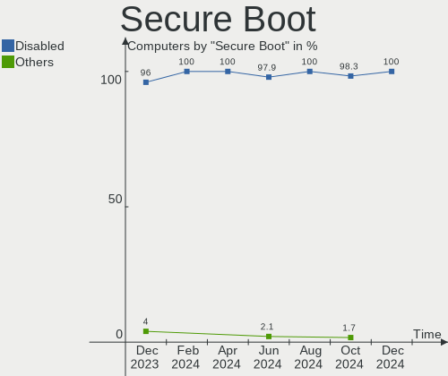

| State    | Computers | Percent |
|----------|-----------|---------|
| Disabled | 72        | 84.71%  |
| Enabled  | 13        | 15.29%  |

Coreboot
--------

Have coreboot on board

| Used | Computers | Percent |
|------|-----------|---------|
| No   | 85        | 100%    |

RAM Size
--------

Total RAM memory

| Size in GB  | Computers | Percent |
|-------------|-----------|---------|
| 4.01-8.0    | 26        | 30.59%  |
| 3.01-4.0    | 21        | 24.71%  |
| 8.01-16.0   | 15        | 17.65%  |
| 16.01-24.0  | 11        | 12.94%  |
| 32.01-64.0  | 6         | 7.06%   |
| 1.01-2.0    | 5         | 5.88%   |
| 64.01-256.0 | 1         | 1.18%   |

RAM Used
--------

Used RAM memory

| Used GB    | Computers | Percent |
|------------|-----------|---------|
| 1.01-2.0   | 39        | 45.88%  |
| 2.01-3.0   | 27        | 31.76%  |
| 3.01-4.0   | 10        | 11.76%  |
| 4.01-8.0   | 6         | 7.06%   |
| 0.51-1.0   | 2         | 2.35%   |
| 24.01-32.0 | 1         | 1.18%   |

Total Drives
------------

Number of drives on board

| Drives | Computers | Percent |
|--------|-----------|---------|
| 1      | 62        | 72.94%  |
| 2      | 16        | 18.82%  |
| 4      | 3         | 3.53%   |
| 3      | 2         | 2.35%   |
| 6      | 1         | 1.18%   |
| 0      | 1         | 1.18%   |

Has CD-ROM
----------

Has CD-ROM on board

| Presented | Computers | Percent |
|-----------|-----------|---------|
| No        | 55        | 64.71%  |
| Yes       | 30        | 35.29%  |

Has Ethernet
------------

Has Ethernet on board

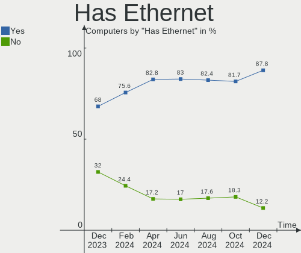

| Presented | Computers | Percent |
|-----------|-----------|---------|
| Yes       | 64        | 75.29%  |
| No        | 21        | 24.71%  |

Has WiFi
--------

Has WiFi module

| Presented | Computers | Percent |
|-----------|-----------|---------|
| Yes       | 70        | 82.35%  |
| No        | 15        | 17.65%  |

Has Bluetooth
-------------

Has Bluetooth module

| Presented | Computers | Percent |
|-----------|-----------|---------|
| Yes       | 64        | 75.29%  |
| No        | 21        | 24.71%  |

Location
--------

Country
-------

Geographic location (country)

| Country      | Computers | Percent |
|--------------|-----------|---------|
| USA          | 8         | 9.41%   |
| Germany      | 8         | 9.41%   |
| Australia    | 8         | 9.41%   |
| Russia       | 6         | 7.06%   |
| Italy        | 6         | 7.06%   |
| France       | 4         | 4.71%   |
| Brazil       | 4         | 4.71%   |
| Spain        | 3         | 3.53%   |
| New Zealand  | 3         | 3.53%   |
| Indonesia    | 3         | 3.53%   |
| India        | 3         | 3.53%   |
| Austria      | 3         | 3.53%   |
| UK           | 2         | 2.35%   |
| Turkey       | 2         | 2.35%   |
| South Africa | 2         | 2.35%   |
| Norway       | 2         | 2.35%   |
| Czechia      | 2         | 2.35%   |
| Vietnam      | 1         | 1.18%   |
| Switzerland  | 1         | 1.18%   |
| Serbia       | 1         | 1.18%   |
| Poland       | 1         | 1.18%   |
| Panama       | 1         | 1.18%   |
| Nicaragua    | 1         | 1.18%   |
| Netherlands  | 1         | 1.18%   |
| Mexico       | 1         | 1.18%   |
| Luxembourg   | 1         | 1.18%   |
| Israel       | 1         | 1.18%   |
| Iceland      | 1         | 1.18%   |
| Finland      | 1         | 1.18%   |
| Estonia      | 1         | 1.18%   |
| Egypt        | 1         | 1.18%   |
| Canada       | 1         | 1.18%   |
| Bulgaria     | 1         | 1.18%   |

City
----

Geographic location (city)

| City                  | Computers | Percent |
|-----------------------|-----------|---------|
| Sydney                | 4         | 4.71%   |
| Wellington            | 2         | 2.35%   |
| Moscow                | 2         | 2.35%   |
| Istanbul              | 2         | 2.35%   |
| Cape Town             | 2         | 2.35%   |
| Brisbane              | 2         | 2.35%   |
| Wonosari              | 1         | 1.18%   |
| Vienna                | 1         | 1.18%   |
| Vantaa                | 1         | 1.18%   |
| Valencia              | 1         | 1.18%   |
| Ulyanovsk             | 1         | 1.18%   |
| Ubstadt-Weiher        | 1         | 1.18%   |
| Tromsø               | 1         | 1.18%   |
| Treviso               | 1         | 1.18%   |
| Tournus               | 1         | 1.18%   |
| Tomsk                 | 1         | 1.18%   |
| Tel Aviv              | 1         | 1.18%   |
| Strasbourg            | 1         | 1.18%   |
| Spello                | 1         | 1.18%   |
| Sofia                 | 1         | 1.18%   |
| Sentmenat             | 1         | 1.18%   |
| Sault Ste. Marie      | 1         | 1.18%   |
| Sao Paulo             | 1         | 1.18%   |
| Rzeszów              | 1         | 1.18%   |
| Rotterdam             | 1         | 1.18%   |
| Rome                  | 1         | 1.18%   |
| Reykjavik             | 1         | 1.18%   |
| Recklinghausen        | 1         | 1.18%   |
| Prague                | 1         | 1.18%   |
| Plano                 | 1         | 1.18%   |
| Paris                 | 1         | 1.18%   |
| Panchkula             | 1         | 1.18%   |
| Panama City           | 1         | 1.18%   |
| Osnabrück            | 1         | 1.18%   |
| New Delhi             | 1         | 1.18%   |
| Neuhofen an der Krems | 1         | 1.18%   |
| Narva                 | 1         | 1.18%   |
| Muralto               | 1         | 1.18%   |
| Munich                | 1         | 1.18%   |
| Moorhead              | 1         | 1.18%   |
| Monterey Park         | 1         | 1.18%   |
| Mariposa              | 1         | 1.18%   |
| Managua               | 1         | 1.18%   |
| Madrid                | 1         | 1.18%   |
| Lyngdal               | 1         | 1.18%   |
| Luxembourg            | 1         | 1.18%   |
| London                | 1         | 1.18%   |
| Licata                | 1         | 1.18%   |
| Lasino                | 1         | 1.18%   |
| l'Alfas del Pi        | 1         | 1.18%   |
| Krasnodar             | 1         | 1.18%   |
| Kolkata               | 1         | 1.18%   |
| Kazan’              | 1         | 1.18%   |
| Joinville             | 1         | 1.18%   |
| Jakarta               | 1         | 1.18%   |
| Innsbruck             | 1         | 1.18%   |
| Hradec Králové      | 1         | 1.18%   |
| Gloucester            | 1         | 1.18%   |
| Fürth                | 1         | 1.18%   |
| Frankfurt am Main     | 1         | 1.18%   |

Drives
------

Drive Vendor
------------

Hard drive vendors

| Vendor                    | Computers | Drives | Percent |
|---------------------------|-----------|--------|---------|
| Seagate                   | 14        | 14     | 12.96%  |
| Samsung Electronics       | 14        | 16     | 12.96%  |
| Toshiba                   | 11        | 11     | 10.19%  |
| Kingston                  | 11        | 11     | 10.19%  |
| WDC                       | 9         | 11     | 8.33%   |
| Sandisk                   | 9         | 10     | 8.33%   |
| Unknown                   | 5         | 7      | 4.63%   |
| SK Hynix                  | 5         | 5      | 4.63%   |
| PNY                       | 3         | 3      | 2.78%   |
| Micron Technology         | 2         | 2      | 1.85%   |
| Leven                     | 2         | 2      | 1.85%   |
| Hitachi                   | 2         | 2      | 1.85%   |
| Fujitsu                   | 2         | 2      | 1.85%   |
| Crucial                   | 2         | 2      | 1.85%   |
| Apple                     | 2         | 3      | 1.85%   |
| XPG                       | 1         | 1      | 0.93%   |
| Smartbuy                  | 1         | 1      | 0.93%   |
| PLEXTOR                   | 1         | 1      | 0.93%   |
| Pichau                    | 1         | 1      | 0.93%   |
| Phison                    | 1         | 1      | 0.93%   |
| NGFF                      | 1         | 1      | 0.93%   |
| Netac                     | 1         | 1      | 0.93%   |
| MidasForce                | 1         | 1      | 0.93%   |
| Micron/Crucial Technology | 1         | 2      | 0.93%   |
| KIOXIA                    | 1         | 1      | 0.93%   |
| Intel                     | 1         | 1      | 0.93%   |
| HGST                      | 1         | 1      | 0.93%   |
| Dogfish                   | 1         | 1      | 0.93%   |
| China                     | 1         | 1      | 0.93%   |
| A-DATA Technology         | 1         | 1      | 0.93%   |

Drive Model
-----------

Hard drive models

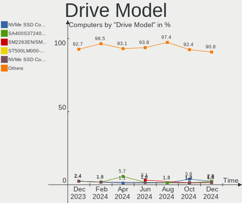

| Model                                   | Computers | Percent |
|-----------------------------------------|-----------|---------|
| Samsung NVMe SSD Drive 256GB            | 4         | 3.45%   |
| Sandisk NVMe SSD Drive 512GB            | 3         | 2.59%   |
| Unknown MMC Card  32GB                  | 2         | 1.72%   |
| Toshiba NVMe SSD Drive 512GB            | 2         | 1.72%   |
| SK Hynix NVMe SSD Drive 512GB           | 2         | 1.72%   |
| Sandisk NVMe SSD Drive 1024GB           | 2         | 1.72%   |
| Samsung SSD 860 EVO 250GB               | 2         | 1.72%   |
| PNY CS900 480GB SSD                     | 2         | 1.72%   |
| Kingston SA400S37240G 240GB SSD         | 2         | 1.72%   |
| Kingston SA400S37120G 120GB SSD         | 2         | 1.72%   |
| XPG NVMe SSD Drive 512GB                | 1         | 0.86%   |
| WDC WDS100T2B0A-00SM50 1TB SSD          | 1         | 0.86%   |
| WDC WD5000LPVX-75V0TT0 500GB            | 1         | 0.86%   |
| WDC WD5000AVDS-63U7B1 500GB             | 1         | 0.86%   |
| WDC WD40EFRX-68N32N0 4TB                | 1         | 0.86%   |
| WDC WD1600BEVT-24A23T0 160GB            | 1         | 0.86%   |
| WDC WD10SPZX-75Z10T2 1TB                | 1         | 0.86%   |
| WDC WD10EZEX-22MFCA0 1TB                | 1         | 0.86%   |
| WDC WD10EZEX-00UD2A0 1TB                | 1         | 0.86%   |
| WDC WD1001FALS-40K1B0 1TB               | 1         | 0.86%   |
| WDC PC SN730 SDBPNTY-1T00-1101 1TB      | 1         | 0.86%   |
| WDC PC SN530 SDBPNPZ-512G-1014 512GB    | 1         | 0.86%   |
| Unknown SU02G  2GB                      | 1         | 0.86%   |
| Unknown SD/MMC/M.S.PRO 32GB             | 1         | 0.86%   |
| Unknown SD/MMC 16GB                     | 1         | 0.86%   |
| Unknown MMC Card  128GB                 | 1         | 0.86%   |
| Unknown M.S./M.S.Pro/HG 16GB            | 1         | 0.86%   |
| Toshiba THNS128GG4BAAA-NonFDE 128GB SSD | 1         | 0.86%   |
| Toshiba MQ01ACF050 500GB                | 1         | 0.86%   |
| Toshiba MQ01ABF050 500GB                | 1         | 0.86%   |
| Toshiba MQ01ABF032 320GB                | 1         | 0.86%   |
| Toshiba MQ01ABD100 1TB                  | 1         | 0.86%   |
| Toshiba MK6459GSXP 640GB                | 1         | 0.86%   |
| Toshiba MK3275GSX 320GB                 | 1         | 0.86%   |
| Toshiba DT01ACA100 1TB                  | 1         | 0.86%   |
| Toshiba DT01ACA050 500GB                | 1         | 0.86%   |
| Smartbuy SSD 64GB                       | 1         | 0.86%   |
| SK Hynix NVMe SSD Drive 256GB           | 1         | 0.86%   |
| SK Hynix HFS128G39TND-N210A 128GB SSD   | 1         | 0.86%   |
| SK Hynix HFM256GDHTNG-8310A 256GB       | 1         | 0.86%   |
| Seagate ST980811AS 80GB                 | 1         | 0.86%   |
| Seagate ST93205620AS 320GB              | 1         | 0.86%   |
| Seagate ST9320423AS 320GB               | 1         | 0.86%   |
| Seagate ST500LT012-1DG142 500GB         | 1         | 0.86%   |
| Seagate ST500DM002-1BD142 500GB         | 1         | 0.86%   |
| Seagate ST3500418AS 500GB               | 1         | 0.86%   |
| Seagate ST3320311CS 320GB               | 1         | 0.86%   |
| Seagate ST320LT020-9YG142 320GB         | 1         | 0.86%   |
| Seagate ST2000DX002-2DV164 2TB          | 1         | 0.86%   |
| Seagate ST1000LM035-1RK172 1TB          | 1         | 0.86%   |
| Seagate ST1000LM024 HN-M101MBB 1TB      | 1         | 0.86%   |
| Seagate ST1000DM003-1ER162 1TB          | 1         | 0.86%   |
| Seagate Expansion Desk 4TB              | 1         | 0.86%   |
| Seagate BUP Slim SL 1TB                 | 1         | 0.86%   |
| SanDisk SSD PLUS 240GB                  | 1         | 0.86%   |
| SanDisk SSD i100 24GB                   | 1         | 0.86%   |
| SanDisk SDSSDP128G 128GB                | 1         | 0.86%   |
| Sandisk NVMe SSD Drive 1TB              | 1         | 0.86%   |
| SanDisk DF4032  32GB                    | 1         | 0.86%   |
| Samsung SSD 870 QVO 1TB                 | 1         | 0.86%   |

HDD Vendor
----------

Hard disk drive vendors

| Vendor              | Computers | Drives | Percent |
|---------------------|-----------|--------|---------|
| Seagate             | 14        | 14     | 38.89%  |
| Toshiba             | 8         | 8      | 22.22%  |
| WDC                 | 7         | 8      | 19.44%  |
| Hitachi             | 2         | 2      | 5.56%   |
| Fujitsu             | 2         | 2      | 5.56%   |
| Samsung Electronics | 1         | 1      | 2.78%   |
| HGST                | 1         | 1      | 2.78%   |
| Apple               | 1         | 1      | 2.78%   |

SSD Vendor
----------

Solid state drive vendors

| Vendor              | Computers | Drives | Percent |
|---------------------|-----------|--------|---------|
| Samsung Electronics | 9         | 9      | 21.43%  |
| Kingston            | 9         | 9      | 21.43%  |
| SanDisk             | 3         | 3      | 7.14%   |
| PNY                 | 3         | 3      | 7.14%   |
| Crucial             | 2         | 2      | 4.76%   |
| Apple               | 2         | 2      | 4.76%   |
| WDC                 | 1         | 1      | 2.38%   |
| Toshiba             | 1         | 1      | 2.38%   |
| Smartbuy            | 1         | 1      | 2.38%   |
| SK Hynix            | 1         | 1      | 2.38%   |
| PLEXTOR             | 1         | 1      | 2.38%   |
| Pichau              | 1         | 1      | 2.38%   |
| NGFF                | 1         | 1      | 2.38%   |
| Netac               | 1         | 1      | 2.38%   |
| MidasForce          | 1         | 1      | 2.38%   |
| Micron Technology   | 1         | 1      | 2.38%   |
| Leven               | 1         | 1      | 2.38%   |
| Dogfish             | 1         | 1      | 2.38%   |
| China               | 1         | 1      | 2.38%   |
| A-DATA Technology   | 1         | 1      | 2.38%   |

Drive Kind
----------

HDD or SSD

| Kind    | Computers | Drives | Percent |
|---------|-----------|--------|---------|
| SSD     | 39        | 42     | 38.24%  |
| HDD     | 33        | 37     | 32.35%  |
| NVMe    | 24        | 29     | 23.53%  |
| MMC     | 4         | 5      | 3.92%   |
| Unknown | 2         | 4      | 1.96%   |

Drive Connector
---------------

SATA, SAS, NVMe, etc.

| Type | Computers | Drives | Percent |
|------|-----------|--------|---------|
| SATA | 64        | 78     | 67.37%  |
| NVMe | 24        | 29     | 25.26%  |
| MMC  | 4         | 5      | 4.21%   |
| SAS  | 3         | 5      | 3.16%   |

Drive Size
----------

Size of hard drive

| Size in TB | Computers | Drives | Percent |
|------------|-----------|--------|---------|
| 0.01-0.5   | 53        | 59     | 73.61%  |
| 0.51-1.0   | 15        | 16     | 20.83%  |
| 3.01-4.0   | 2         | 2      | 2.78%   |
| 1.01-2.0   | 2         | 2      | 2.78%   |

Space Total
-----------

Amount of disk space available on the file system

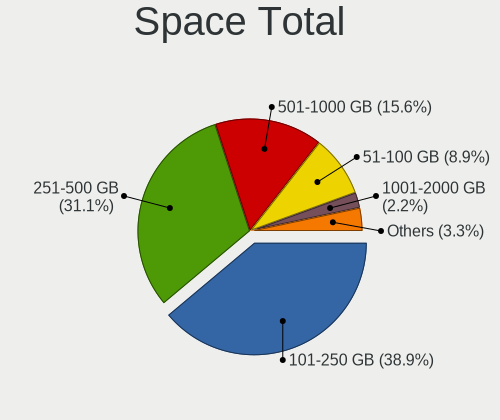

| Size in GB     | Computers | Percent |
|----------------|-----------|---------|
| 101-250        | 26        | 30.59%  |
| 251-500        | 21        | 24.71%  |
| 501-1000       | 16        | 18.82%  |
| 1001-2000      | 8         | 9.41%   |
| 51-100         | 7         | 8.24%   |
| 21-50          | 6         | 7.06%   |
| More than 3000 | 1         | 1.18%   |

Space Used
----------

Amount of used disk space

| Used GB   | Computers | Percent |
|-----------|-----------|---------|
| 1-20      | 36        | 42.35%  |
| 21-50     | 20        | 23.53%  |
| 101-250   | 9         | 10.59%  |
| 51-100    | 9         | 10.59%  |
| 251-500   | 5         | 5.88%   |
| 501-1000  | 5         | 5.88%   |
| 1001-2000 | 1         | 1.18%   |

Malfunc. Drives
---------------

Drive models with a malfunction

| Model                                   | Computers | Drives | Percent |
|-----------------------------------------|-----------|--------|---------|
| SanDisk SSD PLUS 240GB                  | 1         | 1      | 50%     |
| Kingston RBU-SNS8350DES3128GP 128GB SSD | 1         | 1      | 50%     |

Malfunc. Drive Vendor
---------------------

Vendors of faulty drives

| Vendor   | Computers | Drives | Percent |
|----------|-----------|--------|---------|
| SanDisk  | 1         | 1      | 50%     |
| Kingston | 1         | 1      | 50%     |

Malfunc. HDD Vendor
-------------------

Vendors of faulty HDD drives

Zero info for selected period =(

Malfunc. Drive Kind
-------------------

Kinds of faulty drives

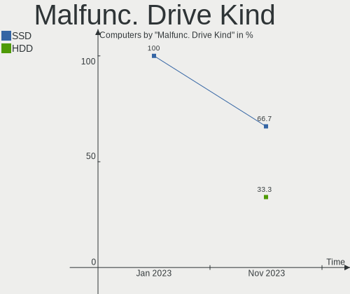

| Kind | Computers | Drives | Percent |
|------|-----------|--------|---------|
| SSD  | 2         | 2      | 100%    |

Failed Drives
-------------

Failed drive models

Zero info for selected period =(

Failed Drive Vendor
-------------------

Failed drive vendors

Zero info for selected period =(

Drive Status
------------

Number of failed and malfunc. drives

| Status   | Computers | Drives | Percent |
|----------|-----------|--------|---------|
| Detected | 76        | 105    | 87.36%  |
| Works    | 9         | 10     | 10.34%  |
| Malfunc  | 2         | 2      | 2.3%    |

Storage controller
------------------

Storage Vendor
--------------

Storage controller vendors

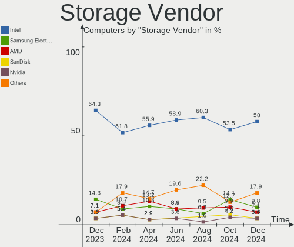

| Vendor                       | Computers | Percent |
|------------------------------|-----------|---------|
| Intel                        | 54        | 54%     |
| AMD                          | 16        | 16%     |
| Samsung Electronics          | 7         | 7%      |
| Sandisk                      | 6         | 6%      |
| SK Hynix                     | 4         | 4%      |
| Toshiba America Info Systems | 2         | 2%      |
| Nvidia                       | 2         | 2%      |
| Kingston Technology Company  | 2         | 2%      |
| ASMedia Technology           | 2         | 2%      |
| Phison Electronics           | 1         | 1%      |
| Micron/Crucial Technology    | 1         | 1%      |
| Micron Technology            | 1         | 1%      |
| Marvell Technology Group     | 1         | 1%      |
| ADATA Technology             | 1         | 1%      |

Storage Model
-------------

Storage controller models

| Model                                                                                   | Computers | Percent |
|-----------------------------------------------------------------------------------------|-----------|---------|
| AMD FCH SATA Controller [AHCI mode]                                                     | 15        | 13.27%  |
| Samsung NVMe SSD Controller SM981/PM981/PM983                                           | 4         | 3.54%   |
| Intel Sunrise Point-LP SATA Controller [AHCI mode]                                      | 4         | 3.54%   |
| Intel 82801IBM/IEM (ICH9M/ICH9M-E) 4 port SATA Controller [AHCI mode]                   | 4         | 3.54%   |
| Intel 8 Series/C220 Series Chipset Family 6-port SATA Controller 1 [AHCI mode]          | 4         | 3.54%   |
| Intel 7 Series Chipset Family 6-port SATA Controller [AHCI mode]                        | 4         | 3.54%   |
| Intel 6 Series/C200 Series Chipset Family 6 port Mobile SATA AHCI Controller            | 4         | 3.54%   |
| Intel Q170/Q150/B150/H170/H110/Z170/CM236 Chipset SATA Controller [AHCI Mode]           | 3         | 2.65%   |
| Toshiba America Info Systems XG6 NVMe SSD Controller                                    | 2         | 1.77%   |
| SK Hynix BC501 NVMe Solid State Drive                                                   | 2         | 1.77%   |
| Sandisk WD Blue SN550 NVMe SSD                                                          | 2         | 1.77%   |
| Sandisk WD Black SN750 / PC SN730 NVMe SSD                                              | 2         | 1.77%   |
| Samsung NVMe SSD Controller 980                                                         | 2         | 1.77%   |
| Intel Celeron N3350/Pentium N4200/Atom E3900 Series SATA AHCI Controller                | 2         | 1.77%   |
| Intel 82801 Mobile SATA Controller [RAID mode]                                          | 2         | 1.77%   |
| Intel 6 Series/C200 Series Chipset Family Desktop SATA Controller (IDE mode, ports 4-5) | 2         | 1.77%   |
| Intel 6 Series/C200 Series Chipset Family Desktop SATA Controller (IDE mode, ports 0-3) | 2         | 1.77%   |
| Intel 6 Series/C200 Series Chipset Family 6 port Desktop SATA AHCI Controller           | 2         | 1.77%   |
| Intel 5 Series/3400 Series Chipset 4 port SATA AHCI Controller                          | 2         | 1.77%   |
| Intel 400 Series Chipset Family SATA AHCI Controller                                    | 2         | 1.77%   |
| ASMedia ASM1062 Serial ATA Controller                                                   | 2         | 1.77%   |
| SK Hynix Gold P31 SSD                                                                   | 1         | 0.88%   |
| SK Hynix BC511                                                                          | 1         | 0.88%   |
| Sandisk PC SN520 NVMe SSD                                                               | 1         | 0.88%   |
| Sandisk Non-Volatile memory controller                                                  | 1         | 0.88%   |
| Samsung Electronics SATA controller                                                     | 1         | 0.88%   |
| Phison PS5013 E13 NVMe Controller                                                       | 1         | 0.88%   |
| Nvidia MCP79 AHCI Controller                                                            | 1         | 0.88%   |
| Nvidia MCP61 SATA Controller                                                            | 1         | 0.88%   |
| Nvidia MCP61 IDE                                                                        | 1         | 0.88%   |
| Micron/Crucial P2 NVMe PCIe SSD                                                         | 1         | 0.88%   |
| Micron Non-Volatile memory controller                                                   | 1         | 0.88%   |
| Marvell Group 88SS9183 PCIe SSD Controller                                              | 1         | 0.88%   |
| Kingston Company Company Non-Volatile memory controller                                 | 1         | 0.88%   |
| Kingston Company OM3PDP3 NVMe SSD                                                       | 1         | 0.88%   |
| Intel Wildcat Point-LP SATA Controller [AHCI Mode]                                      | 1         | 0.88%   |
| Intel SSD Pro 7600p/760p/E 6100p Series                                                 | 1         | 0.88%   |
| Intel SATA Controller [RAID mode]                                                       | 1         | 0.88%   |
| Intel Ice Lake-LP SATA Controller [AHCI mode]                                           | 1         | 0.88%   |
| Intel Comet Lake SATA AHCI Controller                                                   | 1         | 0.88%   |
| Intel Celeron/Pentium Silver Processor SATA Controller                                  | 1         | 0.88%   |
| Intel Cannon Point-LP SATA Controller [AHCI Mode]                                       | 1         | 0.88%   |
| Intel Cannon Lake PCH SATA AHCI Controller                                              | 1         | 0.88%   |
| Intel C602 chipset 4-Port SATA Storage Control Unit                                     | 1         | 0.88%   |
| Intel C600/X79 series chipset SATA RAID Controller                                      | 1         | 0.88%   |
| Intel C600/X79 series chipset IDE-r Controller                                          | 1         | 0.88%   |
| Intel C600/X79 series chipset 6-Port SATA AHCI Controller                               | 1         | 0.88%   |
| Intel Atom/Celeron/Pentium Processor x5-E8000/J3xxx/N3xxx Series SATA Controller        | 1         | 0.88%   |
| Intel 9 Series Chipset Family SATA Controller [AHCI Mode]                               | 1         | 0.88%   |
| Intel 82Q35 Express PT IDER Controller                                                  | 1         | 0.88%   |
| Intel 82801JD/DO (ICH10 Family) SATA AHCI Controller                                    | 1         | 0.88%   |
| Intel 82801IR/IO/IH (ICH9R/DO/DH) 6 port SATA Controller [AHCI mode]                    | 1         | 0.88%   |
| Intel 82801GBM/GHM (ICH7-M Family) SATA Controller [IDE mode]                           | 1         | 0.88%   |
| Intel 82801GBM/GHM (ICH7-M Family) SATA Controller [AHCI mode]                          | 1         | 0.88%   |
| Intel 82801G (ICH7 Family) IDE Controller                                               | 1         | 0.88%   |
| Intel 8 Series SATA Controller 1 [AHCI mode]                                            | 1         | 0.88%   |
| Intel 5 Series/3400 Series Chipset PT IDER Controller                                   | 1         | 0.88%   |
| Intel 5 Series/3400 Series Chipset 6 port SATA AHCI Controller                          | 1         | 0.88%   |
| Intel 5 Series/3400 Series Chipset 4 port SATA IDE Controller                           | 1         | 0.88%   |
| Intel 5 Series/3400 Series Chipset 2 port SATA IDE Controller                           | 1         | 0.88%   |

Storage Kind
------------

Kind of storage controller (IDE, SATA, NVMe, SAS, ...)

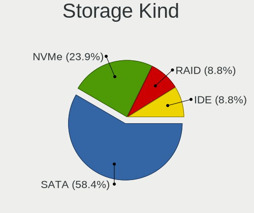

| Kind | Computers | Percent |
|------|-----------|---------|
| SATA | 63        | 61.76%  |
| NVMe | 23        | 22.55%  |
| IDE  | 11        | 10.78%  |
| RAID | 4         | 3.92%   |
| SAS  | 1         | 0.98%   |

Processor
---------

CPU Vendor
----------

Processor vendors

| Vendor | Computers | Percent |
|--------|-----------|---------|
| Intel  | 63        | 74.12%  |
| AMD    | 21        | 24.71%  |
| ARM    | 1         | 1.18%   |

CPU Model
---------

Processor models

| Model                                        | Computers | Percent |
|----------------------------------------------|-----------|---------|
| Intel Core i5-7200U CPU @ 2.50GHz            | 3         | 3.53%   |
| Intel Core i5-2520M CPU @ 2.50GHz            | 3         | 3.53%   |
| Intel Core i3-8145U CPU @ 2.10GHz            | 2         | 2.35%   |
| Intel Atom x5-Z8350 CPU @ 1.44GHz            | 2         | 2.35%   |
| Intel 11th Gen Core i7-1165G7 @ 2.80GHz      | 2         | 2.35%   |
| AMD Ryzen 7 3700X 8-Core Processor           | 2         | 2.35%   |
| AMD Ryzen 5 4500U with Radeon Graphics       | 2         | 2.35%   |
| AMD A6-9225 RADEON R4, 5 COMPUTE CORES 2C+3G | 2         | 2.35%   |
| Intel Xeon CPU E5-2690 0 @ 2.90GHz           | 1         | 1.18%   |
| Intel Xeon CPU E5-2665 0 @ 2.40GHz           | 1         | 1.18%   |
| Intel Xeon CPU E5-1660 0 @ 3.30GHz           | 1         | 1.18%   |
| Intel Xeon CPU E31270 @ 3.40GHz              | 1         | 1.18%   |
| Intel Xeon CPU E3-1230 v3 @ 3.30GHz          | 1         | 1.18%   |
| Intel Pentium Silver N5030 CPU @ 1.10GHz     | 1         | 1.18%   |
| Intel Pentium CPU N4200 @ 1.10GHz            | 1         | 1.18%   |
| Intel Genuine CPU U7300 @ 1.30GHz            | 1         | 1.18%   |
| Intel Core i7-8650U CPU @ 1.90GHz            | 1         | 1.18%   |
| Intel Core i7-6700K CPU @ 4.00GHz            | 1         | 1.18%   |
| Intel Core i7-6700 CPU @ 3.40GHz             | 1         | 1.18%   |
| Intel Core i7-5650U CPU @ 2.20GHz            | 1         | 1.18%   |
| Intel Core i7-4790S CPU @ 3.20GHz            | 1         | 1.18%   |
| Intel Core i7-4500U CPU @ 1.80GHz            | 1         | 1.18%   |
| Intel Core i7-3630QM CPU @ 2.40GHz           | 1         | 1.18%   |
| Intel Core i7-10750H CPU @ 2.60GHz           | 1         | 1.18%   |
| Intel Core i7-1065G7 CPU @ 1.30GHz           | 1         | 1.18%   |
| Intel Core i7-10510U CPU @ 1.80GHz           | 1         | 1.18%   |
| Intel Core i7 CPU 870 @ 2.93GHz              | 1         | 1.18%   |
| Intel Core i5-4670 CPU @ 3.40GHz             | 1         | 1.18%   |
| Intel Core i5-4570 CPU @ 3.20GHz             | 1         | 1.18%   |
| Intel Core i5-3570 CPU @ 3.40GHz             | 1         | 1.18%   |
| Intel Core i5-3470 CPU @ 3.20GHz             | 1         | 1.18%   |
| Intel Core i5-3320M CPU @ 2.60GHz            | 1         | 1.18%   |
| Intel Core i5-1035G1 CPU @ 1.00GHz           | 1         | 1.18%   |
| Intel Core i5-10300H CPU @ 2.50GHz           | 1         | 1.18%   |
| Intel Core i5-10210U CPU @ 1.60GHz           | 1         | 1.18%   |
| Intel Core i5 CPU M 520 @ 2.40GHz            | 1         | 1.18%   |
| Intel Core i3-9100 CPU @ 3.60GHz             | 1         | 1.18%   |
| Intel Core i3-7100U CPU @ 2.40GHz            | 1         | 1.18%   |
| Intel Core i3-6100 CPU @ 3.70GHz             | 1         | 1.18%   |
| Intel Core i3-5005U CPU @ 2.00GHz            | 1         | 1.18%   |
| Intel Core i3-4130 CPU @ 3.40GHz             | 1         | 1.18%   |
| Intel Core i3-3217U CPU @ 1.80GHz            | 1         | 1.18%   |
| Intel Core i3-2350M CPU @ 2.30GHz            | 1         | 1.18%   |
| Intel Core i3-10110U CPU @ 2.10GHz           | 1         | 1.18%   |
| Intel Core i3 CPU M 390 @ 2.67GHz            | 1         | 1.18%   |
| Intel Core i3 CPU M 380 @ 2.53GHz            | 1         | 1.18%   |
| Intel Core i3 CPU 530 @ 2.93GHz              | 1         | 1.18%   |
| Intel Core 2 Quad CPU Q9000 @ 2.00GHz        | 1         | 1.18%   |
| Intel Core 2 Duo CPU P9400 @ 2.40GHz         | 1         | 1.18%   |
| Intel Core 2 Duo CPU E8435 @ 3.06GHz         | 1         | 1.18%   |
| Intel Core 2 Duo CPU E7500 @ 2.93GHz         | 1         | 1.18%   |
| Intel Core 2 Duo CPU E6550 @ 2.33GHz         | 1         | 1.18%   |
| Intel Core 2 CPU T5600 @ 1.83GHz             | 1         | 1.18%   |
| Intel Core 2 CPU T5300 @ 1.73GHz             | 1         | 1.18%   |
| Intel Celeron CPU N3050 @ 1.60GHz            | 1         | 1.18%   |
| Intel Celeron CPU J3455 @ 1.50GHz            | 1         | 1.18%   |
| Intel Celeron CPU 900 @ 2.20GHz              | 1         | 1.18%   |
| Intel Celeron CPU 1007U @ 1.50GHz            | 1         | 1.18%   |
| Intel 11th Gen Core i7-1195G7 @ 2.90GHz      | 1         | 1.18%   |
| ARM Processor                                | 1         | 1.18%   |

CPU Model Family
----------------

Processor model prefix

| Model                | Computers | Percent |
|----------------------|-----------|---------|
| Intel Core i5        | 15        | 17.65%  |
| Intel Core i3        | 13        | 15.29%  |
| Intel Core i7        | 11        | 12.94%  |
| AMD Ryzen 5          | 7         | 8.24%   |
| Other                | 5         | 5.88%   |
| Intel Xeon           | 5         | 5.88%   |
| Intel Core 2 Duo     | 4         | 4.71%   |
| Intel Celeron        | 4         | 4.71%   |
| Intel Core 2         | 2         | 2.35%   |
| Intel Atom           | 2         | 2.35%   |
| AMD Ryzen 7          | 2         | 2.35%   |
| AMD Ryzen 3          | 2         | 2.35%   |
| AMD A6               | 2         | 2.35%   |
| Intel Pentium Silver | 1         | 1.18%   |
| Intel Pentium        | 1         | 1.18%   |
| Intel Genuine        | 1         | 1.18%   |
| Intel Core 2 Quad    | 1         | 1.18%   |
| AMD Ryzen 9          | 1         | 1.18%   |
| AMD E1               | 1         | 1.18%   |
| AMD Athlon X4        | 1         | 1.18%   |
| AMD Athlon II X2     | 1         | 1.18%   |
| AMD Athlon           | 1         | 1.18%   |
| AMD A4               | 1         | 1.18%   |
| AMD A10              | 1         | 1.18%   |

CPU Cores
---------

Number of processor cores

| Number | Computers | Percent |
|--------|-----------|---------|
| 2      | 40        | 47.06%  |
| 4      | 34        | 40%     |
| 8      | 5         | 5.88%   |
| 6      | 5         | 5.88%   |
| 1      | 1         | 1.18%   |

CPU Sockets
-----------

Number of sockets

| Number | Computers | Percent |
|--------|-----------|---------|
| 1      | 85        | 100%    |

CPU Threads
-----------

Threads per core (Hyper-Threading)

| Number | Computers | Percent |
|--------|-----------|---------|
| 2      | 54        | 63.53%  |
| 1      | 31        | 36.47%  |

CPU Op-Modes
------------

CPU Operation Modes (32-bit, 64-bit)

| Op mode        | Computers | Percent |
|----------------|-----------|---------|
| 32-bit, 64-bit | 84        | 98.82%  |
| 64-bit         | 1         | 1.18%   |

CPU Microcode
-------------

Microcode number

| Number     | Computers | Percent |
|------------|-----------|---------|
| Unknown    | 9         | 10.59%  |
| 0x1067a    | 6         | 7.06%   |
| 0x306a9    | 5         | 5.88%   |
| 0x206a7    | 5         | 5.88%   |
| 0x306c3    | 4         | 4.71%   |
| 0x806ec    | 3         | 3.53%   |
| 0x806e9    | 3         | 3.53%   |
| 0x506e3    | 3         | 3.53%   |
| 0x206d7    | 3         | 3.53%   |
| 0x20655    | 3         | 3.53%   |
| 0x08108109 | 3         | 3.53%   |
| 0x06006705 | 3         | 3.53%   |
| 0xa0652    | 2         | 2.35%   |
| 0x806c1    | 2         | 2.35%   |
| 0x706e5    | 2         | 2.35%   |
| 0x506c9    | 2         | 2.35%   |
| 0x406c4    | 2         | 2.35%   |
| 0x306d4    | 2         | 2.35%   |
| 0x08701021 | 2         | 2.35%   |
| 0x08108102 | 2         | 2.35%   |
| 0x0700010f | 2         | 2.35%   |
| 0x906eb    | 1         | 1.18%   |
| 0x806eb    | 1         | 1.18%   |
| 0x806ea    | 1         | 1.18%   |
| 0x806c2    | 1         | 1.18%   |
| 0x706a8    | 1         | 1.18%   |
| 0x6fb      | 1         | 1.18%   |
| 0x6f6      | 1         | 1.18%   |
| 0x6f2      | 1         | 1.18%   |
| 0x20652    | 1         | 1.18%   |
| 0x106e5    | 1         | 1.18%   |
| 0x0a50000c | 1         | 1.18%   |
| 0x08600106 | 1         | 1.18%   |
| 0x0810100b | 1         | 1.18%   |
| 0x08001138 | 1         | 1.18%   |
| 0x06006110 | 1         | 1.18%   |
| 0x06001119 | 1         | 1.18%   |
| 0x010000c7 | 1         | 1.18%   |

CPU Microarch
-------------

Microarchitecture

| Name          | Computers | Percent |
|---------------|-----------|---------|
| KabyLake      | 11        | 12.94%  |
| SandyBridge   | 8         | 9.41%   |
| Zen+          | 6         | 7.06%   |
| Penryn        | 6         | 7.06%   |
| IvyBridge     | 6         | 7.06%   |
| Haswell       | 6         | 7.06%   |
| Zen 2         | 4         | 4.71%   |
| Westmere      | 4         | 4.71%   |
| Excavator     | 4         | 4.71%   |
| TigerLake     | 3         | 3.53%   |
| Skylake       | 3         | 3.53%   |
| Silvermont    | 3         | 3.53%   |
| Core          | 3         | 3.53%   |
| Zen           | 2         | 2.35%   |
| Jaguar        | 2         | 2.35%   |
| IceLake       | 2         | 2.35%   |
| Goldmont      | 2         | 2.35%   |
| CometLake     | 2         | 2.35%   |
| Broadwell     | 2         | 2.35%   |
| Zen 3         | 1         | 1.18%   |
| Piledriver    | 1         | 1.18%   |
| Nehalem       | 1         | 1.18%   |
| K10           | 1         | 1.18%   |
| Goldmont plus | 1         | 1.18%   |
| Unknown       | 1         | 1.18%   |

Graphics
--------

GPU Vendor
----------

Vendors of graphics cards

| Vendor | Computers | Percent |
|--------|-----------|---------|
| Intel  | 45        | 48.39%  |
| AMD    | 30        | 32.26%  |
| Nvidia | 18        | 19.35%  |

GPU Model
---------

Graphics card models

| Model                                                                                    | Computers | Percent |
|------------------------------------------------------------------------------------------|-----------|---------|
| AMD Picasso/Raven 2 [Radeon Vega Series / Radeon Vega Mobile Series]                     | 6         | 6.19%   |
| Intel HD Graphics 620                                                                    | 4         | 4.12%   |
| Intel 3rd Gen Core processor Graphics Controller                                         | 4         | 4.12%   |
| Intel 2nd Generation Core Processor Family Integrated Graphics Controller                | 4         | 4.12%   |
| Intel TigerLake-LP GT2 [Iris Xe Graphics]                                                | 3         | 3.09%   |
| Intel Mobile 4 Series Chipset Integrated Graphics Controller                             | 3         | 3.09%   |
| Intel Core Processor Integrated Graphics Controller                                      | 3         | 3.09%   |
| Intel CometLake-U GT2 [UHD Graphics]                                                     | 3         | 3.09%   |
| Intel Atom/Celeron/Pentium Processor x5-E8000/J3xxx/N3xxx Integrated Graphics Controller | 3         | 3.09%   |
| AMD Stoney [Radeon R2/R3/R4/R5 Graphics]                                                 | 3         | 3.09%   |
| Intel WhiskeyLake-U GT2 [UHD Graphics 620]                                               | 2         | 2.06%   |
| Intel HD Graphics 530                                                                    | 2         | 2.06%   |
| Intel CometLake-H GT2 [UHD Graphics]                                                     | 2         | 2.06%   |
| AMD Renoir                                                                               | 2         | 2.06%   |
| AMD Jet PRO [Radeon R5 M230 / R7 M260DX / Radeon 520 Mobile]                             | 2         | 2.06%   |
| AMD Caicos [Radeon HD 6450/7450/8450 / R5 230 OEM]                                       | 2         | 2.06%   |
| Nvidia TU117M                                                                            | 1         | 1.03%   |
| Nvidia TU106M [GeForce RTX 2060 Mobile]                                                  | 1         | 1.03%   |
| Nvidia TU104 [GeForce RTX 2070 SUPER]                                                    | 1         | 1.03%   |
| Nvidia GT218M [GeForce G210M]                                                            | 1         | 1.03%   |
| Nvidia GT218M [GeForce 315M]                                                             | 1         | 1.03%   |
| Nvidia GT216M [GeForce GT 330M]                                                          | 1         | 1.03%   |
| Nvidia GP108GLM [Quadro P520]                                                            | 1         | 1.03%   |
| Nvidia GP106 [GeForce GTX 1060 6GB]                                                      | 1         | 1.03%   |
| Nvidia GP106 [GeForce GTX 1060 3GB]                                                      | 1         | 1.03%   |
| Nvidia GM204 [GeForce GTX 970]                                                           | 1         | 1.03%   |
| Nvidia GM108M [GeForce 920MX]                                                            | 1         | 1.03%   |
| Nvidia GK107M [GeForce GTX 660M]                                                         | 1         | 1.03%   |
| Nvidia GK104M [GeForce GTX 775M Mac Edition]                                             | 1         | 1.03%   |
| Nvidia GK104 [GeForce GTX 670]                                                           | 1         | 1.03%   |
| Nvidia GA106M [GeForce RTX 3060 Mobile / Max-Q]                                          | 1         | 1.03%   |
| Nvidia G94GLM [Quadro FX 2700M]                                                          | 1         | 1.03%   |
| Nvidia G94 [GeForce 9600 GT]                                                             | 1         | 1.03%   |
| Nvidia G72M [Quadro NVS 110M/GeForce Go 7300]                                            | 1         | 1.03%   |
| Intel Xeon E3-1200 v3/4th Gen Core Processor Integrated Graphics Controller              | 1         | 1.03%   |
| Intel UHD Graphics 620                                                                   | 1         | 1.03%   |
| Intel Iris Plus Graphics G7                                                              | 1         | 1.03%   |
| Intel Iris Plus Graphics G1 (Ice Lake)                                                   | 1         | 1.03%   |
| Intel HD Graphics 6000                                                                   | 1         | 1.03%   |
| Intel HD Graphics 5500                                                                   | 1         | 1.03%   |
| Intel HD Graphics 500                                                                    | 1         | 1.03%   |
| Intel Haswell-ULT Integrated Graphics Controller                                         | 1         | 1.03%   |
| Intel GeminiLake [UHD Graphics 605]                                                      | 1         | 1.03%   |
| Intel CoffeeLake-S GT2 [UHD Graphics 630]                                                | 1         | 1.03%   |
| Intel Celeron N3350/Pentium N4200/Atom E3900 Series Integrated Graphics Controller       | 1         | 1.03%   |
| Intel 4 Series Chipset Integrated Graphics Controller                                    | 1         | 1.03%   |
| AMD Wani [Radeon R5/R6/R7 Graphics]                                                      | 1         | 1.03%   |
| AMD Turks PRO [Radeon HD 6570/7570/8550 / R5 230]                                        | 1         | 1.03%   |
| AMD Topaz XT [Radeon R7 M260/M265 / M340/M360 / M440/M445 / 530/535 / 620/625 Mobile]    | 1         | 1.03%   |
| AMD Sun XT [Radeon HD 8670A/8670M/8690M / R5 M330 / M430 / Radeon 520 Mobile]            | 1         | 1.03%   |
| AMD RV610 [Radeon HD 2400 PRO/XT]                                                        | 1         | 1.03%   |
| AMD RV515/M54 [Mobility Radeon X1400]                                                    | 1         | 1.03%   |
| AMD Raven Ridge [Radeon Vega Series / Radeon Vega Mobile Series]                         | 1         | 1.03%   |
| AMD Oland [Radeon HD 8570 / R5 430 OEM / R7 240/340 / Radeon 520 OEM]                    | 1         | 1.03%   |
| AMD Navi 23 [Radeon RX 6600/6600 XT/6600M]                                               | 1         | 1.03%   |
| AMD Lexa [Radeon 540X/550X/630 / RX 640 / E9171 MCM]                                     | 1         | 1.03%   |
| AMD Kabini [Radeon HD 8330]                                                              | 1         | 1.03%   |
| AMD Kabini [Radeon HD 8240 / R3 Series]                                                  | 1         | 1.03%   |
| AMD Ellesmere [Radeon RX 470/480/570/570X/580/580X/590]                                  | 1         | 1.03%   |
| AMD Cezanne                                                                              | 1         | 1.03%   |

GPU Combo
---------

Combinations of graphics cards

| Name           | Computers | Percent |
|----------------|-----------|---------|
| 1 x Intel      | 37        | 43.53%  |
| 1 x AMD        | 24        | 28.24%  |
| 1 x Nvidia     | 10        | 11.76%  |
| Intel + Nvidia | 7         | 8.24%   |
| 2 x AMD        | 4         | 4.71%   |
| Other          | 1         | 1.18%   |
| Intel + AMD    | 1         | 1.18%   |
| AMD + Nvidia   | 1         | 1.18%   |

GPU Driver
----------

Free vs proprietary

| Driver      | Computers | Percent |
|-------------|-----------|---------|
| Free        | 76        | 89.41%  |
| Proprietary | 6         | 7.06%   |
| Unknown     | 3         | 3.53%   |

GPU Memory
----------

Total video memory

| Size in GB | Computers | Percent |
|------------|-----------|---------|
| Unknown    | 43        | 50.59%  |
| 1.01-2.0   | 13        | 15.29%  |
| 0.01-0.5   | 12        | 14.12%  |
| 3.01-4.0   | 6         | 7.06%   |
| 0.51-1.0   | 6         | 7.06%   |
| 7.01-8.0   | 2         | 2.35%   |
| 5.01-6.0   | 2         | 2.35%   |
| 2.01-3.0   | 1         | 1.18%   |

Monitor
-------

Monitor Vendor
--------------

Monitor vendors

| Vendor               | Computers | Percent |
|----------------------|-----------|---------|
| AU Optronics         | 15        | 16.85%  |
| BOE                  | 11        | 12.36%  |
| LG Display           | 10        | 11.24%  |
| Hewlett-Packard      | 5         | 5.62%   |
| Dell                 | 5         | 5.62%   |
| Apple                | 5         | 5.62%   |
| Philips              | 4         | 4.49%   |
| Chimei Innolux       | 4         | 4.49%   |
| Samsung Electronics  | 3         | 3.37%   |
| Goldstar             | 3         | 3.37%   |
| Acer                 | 3         | 3.37%   |
| Sharp                | 2         | 2.25%   |
| PANDA                | 2         | 2.25%   |
| Lenovo               | 2         | 2.25%   |
| BenQ                 | 2         | 2.25%   |
| Ancor Communications | 2         | 2.25%   |
| ___                  | 1         | 1.12%   |
| Vizio                | 1         | 1.12%   |
| Unknown              | 1         | 1.12%   |
| SPC                  | 1         | 1.12%   |
| Panasonic            | 1         | 1.12%   |
| Packard Bell         | 1         | 1.12%   |
| Konka                | 1         | 1.12%   |
| Fujitsu Siemens      | 1         | 1.12%   |
| CSO                  | 1         | 1.12%   |
| CPT                  | 1         | 1.12%   |
| AOC                  | 1         | 1.12%   |

Monitor Model
-------------

Monitor models

| Model                                                                          | Computers | Percent |
|--------------------------------------------------------------------------------|-----------|---------|
| LG Display LCD Monitor LGD05E5 1920x1080 344x194mm 15.5-inch                   | 2         | 2.25%   |
| AU Optronics LCD Monitor AUO403D 1920x1080 309x174mm 14.0-inch                 | 2         | 2.25%   |
| ___ LCD TV ___9000 1360x768                                                    | 1         | 1.12%   |
| Vizio M322i-B1 VIZ1005 1920x1080 698x392mm 31.5-inch                           | 1         | 1.12%   |
| Unknown LCDTV16 9000 1360x768 1600x900mm 72.3-inch                             | 1         | 1.12%   |
| SPC LCD Monitor SPC1900 1440x900 368x207mm 16.6-inch                           | 1         | 1.12%   |
| Sharp LQ150P1JX51 SHP14B4 2496x1664 317x211mm 15.0-inch                        | 1         | 1.12%   |
| Sharp LCD Monitor SHP1479 1920x1280 259x173mm 12.3-inch                        | 1         | 1.12%   |
| Samsung Electronics S22C450 SAM09C7 1680x1050 473x291mm 21.9-inch              | 1         | 1.12%   |
| Samsung Electronics LCD Monitor SEC5441 1366x768 256x144mm 11.6-inch           | 1         | 1.12%   |
| Samsung Electronics LCD Monitor SDC4141 1366x768 344x194mm 15.5-inch           | 1         | 1.12%   |
| Philips PHL BDM4350 PHL08FA 3840x2160 953x543mm 43.2-inch                      | 1         | 1.12%   |
| Philips PHL 345E2 PHLC237 3440x1440 800x335mm 34.1-inch                        | 1         | 1.12%   |
| Philips LCD Monitor PHL 276E8V 3840x2160                                       | 1         | 1.12%   |
| Philips 190CW PHLC023 1440x900 408x255mm 18.9-inch                             | 1         | 1.12%   |
| PANDA LM156LF1L03 NCP001C 1920x1080 344x194mm 15.5-inch                        | 1         | 1.12%   |
| PANDA LCD Monitor NCP004D 1920x1080 344x194mm 15.5-inch                        | 1         | 1.12%   |
| Panasonic VVX13F009G00 MEI96A2 1920x1080 344x193mm 15.5-inch                   | 1         | 1.12%   |
| Packard Bell Viseo 240DX PKB0121 1920x1080 521x293mm 23.5-inch                 | 1         | 1.12%   |
| LG Display LP171WU5-TLB1 LGD0169 1920x1200 367x230mm 17.1-inch                 | 1         | 1.12%   |
| LG Display LCD Monitor LGD0695 2560x1600 366x229mm 17.0-inch                   | 1         | 1.12%   |
| LG Display LCD Monitor LGD0456 1366x768 340x190mm 15.3-inch                    | 1         | 1.12%   |
| LG Display LCD Monitor LGD036C 1366x768 277x156mm 12.5-inch                    | 1         | 1.12%   |
| LG Display LCD Monitor LGD02EF 1366x768 310x174mm 14.0-inch                    | 1         | 1.12%   |
| LG Display LCD Monitor LGD02E9 1366x768 309x174mm 14.0-inch                    | 1         | 1.12%   |
| LG Display LCD Monitor LGD02D8 1366x768 277x156mm 12.5-inch                    | 1         | 1.12%   |
| LG Display LCD Monitor LGD01E9 1920x1080 345x194mm 15.6-inch                   | 1         | 1.12%   |
| Lenovo LT2252p Wide LEN0A0C 1680x1050 474x296mm 22.0-inch                      | 1         | 1.12%   |
| Lenovo LCD Monitor LEN4036 1440x900 303x190mm 14.1-inch                        | 1         | 1.12%   |
| Konka TV MONIOR KOA0030 1920x540 708x398mm 32.0-inch                           | 1         | 1.12%   |
| Hewlett-Packard w2207 HWP26A9 1680x1050 473x296mm 22.0-inch                    | 1         | 1.12%   |
| Hewlett-Packard VH27 HPN3525 1920x1080 598x336mm 27.0-inch                     | 1         | 1.12%   |
| Hewlett-Packard V194 HWP3346 1366x768 410x230mm 18.5-inch                      | 1         | 1.12%   |
| Hewlett-Packard TouchSmart HP_touchsmart HWP4211 1920x1080 509x286mm 23.0-inch | 1         | 1.12%   |
| Hewlett-Packard LA2205 HWP2848 1680x1050 473x296mm 22.0-inch                   | 1         | 1.12%   |
| Goldstar ULTRAGEAR GSM5BB3 2560x1440 597x336mm 27.0-inch                       | 1         | 1.12%   |
| Goldstar IPS FULLHD GSM5AB8 1920x1080 480x270mm 21.7-inch                      | 1         | 1.12%   |
| Goldstar 22EN33 GSM597C 1920x1080 480x270mm 21.7-inch                          | 1         | 1.12%   |
| Fujitsu Siemens L22W-6SA FUS0747 1680x1050 474x296mm 22.0-inch                 | 1         | 1.12%   |
| Dell U2720Q DEL41B5 3840x2160 600x340mm 27.2-inch                              | 1         | 1.12%   |
| Dell SE2416H DELD082 1920x1080 527x296mm 23.8-inch                             | 1         | 1.12%   |
| Dell S2721DGF DEL41D9 2560x1440 597x336mm 27.0-inch                            | 1         | 1.12%   |
| Dell P2715Q DEL40BD 3840x2160 597x336mm 27.0-inch                              | 1         | 1.12%   |
| Dell E2016H DELA0C8 1600x900 432x236mm 19.4-inch                               | 1         | 1.12%   |
| CSO LCD Monitor CSO1309 3000x2000 293x195mm 13.9-inch                          | 1         | 1.12%   |
| CPT LCD Monitor CPT14BF 1366x768 344x193mm 15.5-inch                           | 1         | 1.12%   |
| Chimei Innolux LCD Monitor CMN1728 1600x900 382x215mm 17.3-inch                | 1         | 1.12%   |
| Chimei Innolux LCD Monitor CMN15E6 1366x768 344x193mm 15.5-inch                | 1         | 1.12%   |
| Chimei Innolux LCD Monitor CMN15DC 1366x768 344x193mm 15.5-inch                | 1         | 1.12%   |
| Chimei Innolux LCD Monitor CMN14C9 1920x1080 309x173mm 13.9-inch               | 1         | 1.12%   |
| BOE LCD Monitor BOE0A89 1920x1080 344x194mm 15.5-inch                          | 1         | 1.12%   |
| BOE LCD Monitor BOE0877 1920x1080 309x173mm 13.9-inch                          | 1         | 1.12%   |
| BOE LCD Monitor BOE0812 1920x1080 344x194mm 15.5-inch                          | 1         | 1.12%   |
| BOE LCD Monitor BOE0757 1366x768 344x194mm 15.5-inch                           | 1         | 1.12%   |
| BOE LCD Monitor BOE06F3 1920x1080 309x173mm 13.9-inch                          | 1         | 1.12%   |
| BOE LCD Monitor BOE06DF 1920x1080 309x173mm 13.9-inch                          | 1         | 1.12%   |
| BOE LCD Monitor BOE06A5 1366x768 344x194mm 15.5-inch                           | 1         | 1.12%   |
| BOE LCD Monitor BOE0690 1920x1080 344x193mm 15.5-inch                          | 1         | 1.12%   |
| BOE LCD Monitor BOE0687 1920x1080 344x193mm 15.5-inch                          | 1         | 1.12%   |
| BOE LCD Monitor BOE0620 1366x768 344x194mm 15.5-inch                           | 1         | 1.12%   |

Monitor Resolution
------------------

Monitor screen resolution

| Resolution         | Computers | Percent |
|--------------------|-----------|---------|
| 1920x1080 (FHD)    | 31        | 35.63%  |
| 1366x768 (WXGA)    | 20        | 22.99%  |
| 3840x2160 (4K)     | 7         | 8.05%   |
| 1680x1050 (WSXGA+) | 6         | 6.9%    |
| 2560x1440 (QHD)    | 5         | 5.75%   |
| 1440x900 (WXGA+)   | 5         | 5.75%   |
| 1920x1200 (WUXGA)  | 3         | 3.45%   |
| 2560x1600          | 2         | 2.3%    |
| 1600x900 (HD+)     | 2         | 2.3%    |
| 3440x1440          | 1         | 1.15%   |
| 3000x2000          | 1         | 1.15%   |
| 2496x1664          | 1         | 1.15%   |
| 1920x1280          | 1         | 1.15%   |
| 1360x768           | 1         | 1.15%   |
| 1280x800 (WXGA)    | 1         | 1.15%   |

Monitor Diagonal
----------------

Diagonal size in inches

| Inches  | Computers | Percent |
|---------|-----------|---------|
| 15      | 22        | 24.72%  |
| 14      | 10        | 11.24%  |
| 27      | 8         | 8.99%   |
| 13      | 8         | 8.99%   |
| 22      | 5         | 5.62%   |
| 17      | 5         | 5.62%   |
| 21      | 4         | 4.49%   |
| Unknown | 4         | 4.49%   |
| 24      | 3         | 3.37%   |
| 23      | 3         | 3.37%   |
| 18      | 3         | 3.37%   |
| 12      | 3         | 3.37%   |
| 16      | 2         | 2.25%   |
| 11      | 2         | 2.25%   |
| 72      | 1         | 1.12%   |
| 52      | 1         | 1.12%   |
| 43      | 1         | 1.12%   |
| 34      | 1         | 1.12%   |
| 31      | 1         | 1.12%   |
| 25      | 1         | 1.12%   |
| 19      | 1         | 1.12%   |

Monitor Width
-------------

Physical width

| Width in mm | Computers | Percent |
|-------------|-----------|---------|
| 301-350     | 37        | 41.57%  |
| 501-600     | 14        | 15.73%  |
| 401-500     | 13        | 14.61%  |
| 201-300     | 8         | 8.99%   |
| 351-400     | 7         | 7.87%   |
| Unknown     | 4         | 4.49%   |
| 601-700     | 2         | 2.25%   |
| 701-800     | 1         | 1.12%   |
| 1501-2000   | 1         | 1.12%   |
| 1001-1500   | 1         | 1.12%   |
| 901-1000    | 1         | 1.12%   |

Aspect Ratio
------------

Proportional relationship between the width and the height

| Ratio   | Computers | Percent |
|---------|-----------|---------|
| 16/9    | 60        | 73.17%  |
| 16/10   | 15        | 18.29%  |
| 3/2     | 3         | 3.66%   |
| Unknown | 3         | 3.66%   |
| 21/9    | 1         | 1.22%   |

Monitor Area
------------

Area in inch²

| Area in inch² | Computers | Percent |
|----------------|-----------|---------|
| 101-110        | 22        | 25%     |
| 81-90          | 16        | 18.18%  |
| 201-250        | 12        | 13.64%  |
| 301-350        | 8         | 9.09%   |
| Unknown        | 4         | 4.55%   |
| 61-70          | 3         | 3.41%   |
| 251-300        | 3         | 3.41%   |
| 121-130        | 3         | 3.41%   |
| More than 1000 | 2         | 2.27%   |
| 71-80          | 2         | 2.27%   |
| 51-60          | 2         | 2.27%   |
| 351-500        | 2         | 2.27%   |
| 151-200        | 2         | 2.27%   |
| 141-150        | 2         | 2.27%   |
| 131-140        | 2         | 2.27%   |
| 111-120        | 2         | 2.27%   |
| 501-1000       | 1         | 1.14%   |

Pixel Density
-------------

Pixels per inch

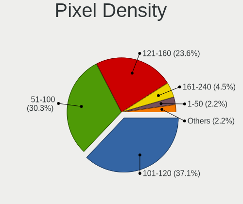

| Density       | Computers | Percent |
|---------------|-----------|---------|
| 121-160       | 26        | 29.89%  |
| 101-120       | 26        | 29.89%  |
| 51-100        | 19        | 21.84%  |
| 161-240       | 7         | 8.05%   |
| Unknown       | 4         | 4.6%    |
| More than 240 | 3         | 3.45%   |
| 1-50          | 2         | 2.3%    |

Multiple Monitors
-----------------

Total monitors connected

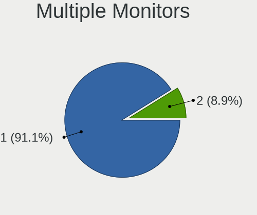

| Total | Computers | Percent |
|-------|-----------|---------|
| 1     | 75        | 88.24%  |
| 2     | 8         | 9.41%   |
| 3     | 1         | 1.18%   |
| 0     | 1         | 1.18%   |

Network
-------

Net Controller Vendor
---------------------

Controller vendors

| Vendor                            | Computers | Percent |
|-----------------------------------|-----------|---------|
| Intel                             | 41        | 34.45%  |
| Realtek Semiconductor             | 39        | 32.77%  |
| Qualcomm Atheros                  | 16        | 13.45%  |
| Broadcom                          | 8         | 6.72%   |
| Broadcom Limited                  | 3         | 2.52%   |
| Ralink                            | 2         | 1.68%   |
| Nvidia                            | 2         | 1.68%   |
| Xiaomi                            | 1         | 0.84%   |
| TP-Link                           | 1         | 0.84%   |
| OnePlus Technology (Shenzhen)     | 1         | 0.84%   |
| Marvell Technology Group          | 1         | 0.84%   |
| LSI                               | 1         | 0.84%   |
| Huawei Technologies               | 1         | 0.84%   |
| Ericsson Business Mobile Networks | 1         | 0.84%   |
| ASIX Electronics                  | 1         | 0.84%   |

Net Controller Model
--------------------

Controller models

| Model                                                             | Computers | Percent |
|-------------------------------------------------------------------|-----------|---------|
| Realtek RTL8111/8168/8411 PCI Express Gigabit Ethernet Controller | 21        | 15%     |
| Realtek RTL8821CE 802.11ac PCIe Wireless Network Adapter          | 5         | 3.57%   |
| Qualcomm Atheros QCA9377 802.11ac Wireless Network Adapter        | 5         | 3.57%   |
| Intel 82579LM Gigabit Network Connection (Lewisville)             | 5         | 3.57%   |
| Realtek RTL810xE PCI Express Fast Ethernet controller             | 3         | 2.14%   |
| Qualcomm Atheros QCA9565 / AR9565 Wireless Network Adapter        | 3         | 2.14%   |
| Intel Wi-Fi 6 AX201                                               | 3         | 2.14%   |
| Intel Wi-Fi 6 AX200                                               | 3         | 2.14%   |
| Intel Comet Lake PCH-LP CNVi WiFi                                 | 3         | 2.14%   |
| Intel Centrino Advanced-N 6205 [Taylor Peak]                      | 3         | 2.14%   |
| Realtek RTL8822CE 802.11ac PCIe Wireless Network Adapter          | 2         | 1.43%   |
| Realtek RTL8822BE 802.11a/b/g/n/ac WiFi adapter                   | 2         | 1.43%   |
| Realtek RTL8188EUS 802.11n Wireless Network Adapter               | 2         | 1.43%   |
| Realtek RTL8125 2.5GbE Controller                                 | 2         | 1.43%   |
| Realtek Killer E2600 Gigabit Ethernet Controller                  | 2         | 1.43%   |
| Realtek 802.11ac NIC                                              | 2         | 1.43%   |
| Intel Wireless 8265 / 8275                                        | 2         | 1.43%   |
| Intel Wireless 7265                                               | 2         | 1.43%   |
| Intel Wireless 3165                                               | 2         | 1.43%   |
| Intel Ultimate N WiFi Link 5300                                   | 2         | 1.43%   |
| Intel PRO/Wireless 3945ABG [Golan] Network Connection             | 2         | 1.43%   |
| Intel Ethernet Connection (2) I219-LM                             | 2         | 1.43%   |
| Intel Comet Lake PCH CNVi WiFi                                    | 2         | 1.43%   |
| Intel 82567LM Gigabit Network Connection                          | 2         | 1.43%   |
| Broadcom NetXtreme BCM5764M Gigabit Ethernet PCIe                 | 2         | 1.43%   |
| Broadcom BCM43228 802.11a/b/g/n                                   | 2         | 1.43%   |
| Xiaomi Mi/Redmi series (RNDIS)                                    | 1         | 0.71%   |
| TP-Link Archer T4U ver.3                                          | 1         | 0.71%   |
| Realtek RTL8821AE 802.11ac PCIe Wireless Network Adapter          | 1         | 0.71%   |
| Realtek RTL8188ETV Wireless LAN 802.11n Network Adapter           | 1         | 0.71%   |
| Realtek RTL8188CUS 802.11n WLAN Adapter                           | 1         | 0.71%   |
| Realtek RTL-8100/8101L/8139 PCI Fast Ethernet Adapter             | 1         | 0.71%   |
| Realtek 802.11n WLAN Adapter                                      | 1         | 0.71%   |
| Ralink RT3290 Wireless 802.11n 1T/1R PCIe                         | 1         | 0.71%   |
| Ralink RT3090 Wireless 802.11n 1T/1R PCIe                         | 1         | 0.71%   |
| Qualcomm Atheros QCA8172 Fast Ethernet                            | 1         | 0.71%   |
| Qualcomm Atheros QCA6174 802.11ac Wireless Network Adapter        | 1         | 0.71%   |
| Qualcomm Atheros Killer E220x Gigabit Ethernet Controller         | 1         | 0.71%   |
| Qualcomm Atheros AR9485 Wireless Network Adapter                  | 1         | 0.71%   |
| Qualcomm Atheros AR928X Wireless Network Adapter (PCI-Express)    | 1         | 0.71%   |
| Qualcomm Atheros AR8162 Fast Ethernet                             | 1         | 0.71%   |
| Qualcomm Atheros AR8161 Gigabit Ethernet                          | 1         | 0.71%   |
| Qualcomm Atheros AR8152 v2.0 Fast Ethernet                        | 1         | 0.71%   |
| Qualcomm Atheros AR8151 v2.0 Gigabit Ethernet                     | 1         | 0.71%   |
| Qualcomm Atheros AR8131 Gigabit Ethernet                          | 1         | 0.71%   |
| OnePlus (Shenzhen) AC2001                                         | 1         | 0.71%   |
| Nvidia MCP79 Ethernet                                             | 1         | 0.71%   |
| Nvidia MCP61 Ethernet                                             | 1         | 0.71%   |
| Marvell Group 88E8040 PCI-E Fast Ethernet Controller              | 1         | 0.71%   |
| LSI ET-131x PCI-E Ethernet Controller                             | 1         | 0.71%   |
| Intel Wireless 8260                                               | 1         | 0.71%   |
| Intel Wireless 7260                                               | 1         | 0.71%   |
| Intel Ice Lake-LP PCH CNVi WiFi                                   | 1         | 0.71%   |
| Intel I211 Gigabit Network Connection                             | 1         | 0.71%   |
| Intel Ethernet Connection I217-LM                                 | 1         | 0.71%   |
| Intel Ethernet Connection (4) I219-V                              | 1         | 0.71%   |
| Intel Ethernet Connection (2) I219-V                              | 1         | 0.71%   |
| Intel Ethernet Connection (13) I219-V                             | 1         | 0.71%   |
| Intel Ethernet Connection (10) I219-V                             | 1         | 0.71%   |
| Intel Dual Band Wireless-AC 3168NGW [Stone Peak]                  | 1         | 0.71%   |

Wireless Vendor
---------------

Wireless vendors

| Vendor                | Computers | Percent |
|-----------------------|-----------|---------|
| Intel                 | 32        | 45.07%  |
| Realtek Semiconductor | 16        | 22.54%  |
| Qualcomm Atheros      | 11        | 15.49%  |
| Broadcom              | 6         | 8.45%   |
| Broadcom Limited      | 3         | 4.23%   |
| Ralink                | 2         | 2.82%   |
| TP-Link               | 1         | 1.41%   |

Wireless Model
--------------

Wireless models

| Model                                                          | Computers | Percent |
|----------------------------------------------------------------|-----------|---------|
| Realtek RTL8821CE 802.11ac PCIe Wireless Network Adapter       | 5         | 6.94%   |
| Qualcomm Atheros QCA9377 802.11ac Wireless Network Adapter     | 5         | 6.94%   |
| Qualcomm Atheros QCA9565 / AR9565 Wireless Network Adapter     | 3         | 4.17%   |
| Intel Wi-Fi 6 AX201                                            | 3         | 4.17%   |
| Intel Wi-Fi 6 AX200                                            | 3         | 4.17%   |
| Intel Comet Lake PCH-LP CNVi WiFi                              | 3         | 4.17%   |
| Intel Centrino Advanced-N 6205 [Taylor Peak]                   | 3         | 4.17%   |
| Realtek RTL8822CE 802.11ac PCIe Wireless Network Adapter       | 2         | 2.78%   |
| Realtek RTL8822BE 802.11a/b/g/n/ac WiFi adapter                | 2         | 2.78%   |
| Realtek RTL8188EUS 802.11n Wireless Network Adapter            | 2         | 2.78%   |
| Realtek 802.11ac NIC                                           | 2         | 2.78%   |
| Intel Wireless 8265 / 8275                                     | 2         | 2.78%   |
| Intel Wireless 7265                                            | 2         | 2.78%   |
| Intel Wireless 3165                                            | 2         | 2.78%   |
| Intel Ultimate N WiFi Link 5300                                | 2         | 2.78%   |
| Intel PRO/Wireless 3945ABG [Golan] Network Connection          | 2         | 2.78%   |
| Intel Comet Lake PCH CNVi WiFi                                 | 2         | 2.78%   |
| Broadcom BCM43228 802.11a/b/g/n                                | 2         | 2.78%   |
| TP-Link Archer T4U ver.3                                       | 1         | 1.39%   |
| Realtek RTL8821AE 802.11ac PCIe Wireless Network Adapter       | 1         | 1.39%   |
| Realtek RTL8188ETV Wireless LAN 802.11n Network Adapter        | 1         | 1.39%   |
| Realtek RTL8188CUS 802.11n WLAN Adapter                        | 1         | 1.39%   |
| Realtek 802.11n WLAN Adapter                                   | 1         | 1.39%   |
| Ralink RT3290 Wireless 802.11n 1T/1R PCIe                      | 1         | 1.39%   |
| Ralink RT3090 Wireless 802.11n 1T/1R PCIe                      | 1         | 1.39%   |
| Qualcomm Atheros QCA6174 802.11ac Wireless Network Adapter     | 1         | 1.39%   |
| Qualcomm Atheros AR9485 Wireless Network Adapter               | 1         | 1.39%   |
| Qualcomm Atheros AR928X Wireless Network Adapter (PCI-Express) | 1         | 1.39%   |
| Intel Wireless 8260                                            | 1         | 1.39%   |
| Intel Wireless 7260                                            | 1         | 1.39%   |
| Intel Ice Lake-LP PCH CNVi WiFi                                | 1         | 1.39%   |
| Intel Dual Band Wireless-AC 3168NGW [Stone Peak]               | 1         | 1.39%   |
| Intel Centrino Wireless-N 2200                                 | 1         | 1.39%   |
| Intel Centrino Wireless-N 1000 [Condor Peak]                   | 1         | 1.39%   |
| Intel Centrino Advanced-N 6235                                 | 1         | 1.39%   |
| Intel Cannon Point-LP CNVi [Wireless-AC]                       | 1         | 1.39%   |
| Broadcom Limited BCM4360 802.11ac Wireless Network Adapter     | 1         | 1.39%   |
| Broadcom Limited BCM4331 802.11a/b/g/n                         | 1         | 1.39%   |
| Broadcom Limited BCM4312 802.11b/g LP-PHY                      | 1         | 1.39%   |
| Broadcom BCM4360 802.11ac Wireless Network Adapter             | 1         | 1.39%   |
| Broadcom BCM43224 802.11a/b/g/n                                | 1         | 1.39%   |
| Broadcom BCM4322 802.11a/b/g/n Wireless LAN Controller         | 1         | 1.39%   |
| Broadcom BCM4313 802.11bgn Wireless Network Adapter            | 1         | 1.39%   |

Ethernet Vendor
---------------

Ethernet vendors

| Vendor                   | Computers | Percent |
|--------------------------|-----------|---------|
| Realtek Semiconductor    | 29        | 43.94%  |
| Intel                    | 19        | 28.79%  |
| Qualcomm Atheros         | 7         | 10.61%  |
| Broadcom                 | 4         | 6.06%   |
| Nvidia                   | 2         | 3.03%   |
| Xiaomi                   | 1         | 1.52%   |
| Marvell Technology Group | 1         | 1.52%   |
| LSI                      | 1         | 1.52%   |
| Huawei Technologies      | 1         | 1.52%   |
| ASIX Electronics         | 1         | 1.52%   |

Ethernet Model
--------------

Ethernet models

| Model                                                             | Computers | Percent |
|-------------------------------------------------------------------|-----------|---------|
| Realtek RTL8111/8168/8411 PCI Express Gigabit Ethernet Controller | 21        | 31.82%  |
| Intel 82579LM Gigabit Network Connection (Lewisville)             | 5         | 7.58%   |
| Realtek RTL810xE PCI Express Fast Ethernet controller             | 3         | 4.55%   |
| Realtek RTL8125 2.5GbE Controller                                 | 2         | 3.03%   |
| Realtek Killer E2600 Gigabit Ethernet Controller                  | 2         | 3.03%   |
| Intel Ethernet Connection (2) I219-LM                             | 2         | 3.03%   |
| Intel 82567LM Gigabit Network Connection                          | 2         | 3.03%   |
| Broadcom NetXtreme BCM5764M Gigabit Ethernet PCIe                 | 2         | 3.03%   |
| Xiaomi Mi/Redmi series (RNDIS)                                    | 1         | 1.52%   |
| Realtek RTL-8100/8101L/8139 PCI Fast Ethernet Adapter             | 1         | 1.52%   |
| Qualcomm Atheros QCA8172 Fast Ethernet                            | 1         | 1.52%   |
| Qualcomm Atheros Killer E220x Gigabit Ethernet Controller         | 1         | 1.52%   |
| Qualcomm Atheros AR8162 Fast Ethernet                             | 1         | 1.52%   |
| Qualcomm Atheros AR8161 Gigabit Ethernet                          | 1         | 1.52%   |
| Qualcomm Atheros AR8152 v2.0 Fast Ethernet                        | 1         | 1.52%   |
| Qualcomm Atheros AR8151 v2.0 Gigabit Ethernet                     | 1         | 1.52%   |
| Qualcomm Atheros AR8131 Gigabit Ethernet                          | 1         | 1.52%   |
| Nvidia MCP79 Ethernet                                             | 1         | 1.52%   |
| Nvidia MCP61 Ethernet                                             | 1         | 1.52%   |
| Marvell Group 88E8040 PCI-E Fast Ethernet Controller              | 1         | 1.52%   |
| LSI ET-131x PCI-E Ethernet Controller                             | 1         | 1.52%   |
| Intel I211 Gigabit Network Connection                             | 1         | 1.52%   |
| Intel Ethernet Connection I217-LM                                 | 1         | 1.52%   |
| Intel Ethernet Connection (4) I219-V                              | 1         | 1.52%   |
| Intel Ethernet Connection (2) I219-V                              | 1         | 1.52%   |
| Intel Ethernet Connection (13) I219-V                             | 1         | 1.52%   |
| Intel Ethernet Connection (10) I219-V                             | 1         | 1.52%   |
| Intel 82579V Gigabit Network Connection                           | 1         | 1.52%   |
| Intel 82578DM Gigabit Network Connection                          | 1         | 1.52%   |
| Intel 82567LM-3 Gigabit Network Connection                        | 1         | 1.52%   |
| Intel 82566DM-2 Gigabit Network Connection                        | 1         | 1.52%   |
| Huawei SNE-LX3                                                    | 1         | 1.52%   |
| Broadcom NetXtreme BCM57766 Gigabit Ethernet PCIe                 | 1         | 1.52%   |
| Broadcom BCM4401-B0 100Base-TX                                    | 1         | 1.52%   |
| ASIX AX88179 Gigabit Ethernet                                     | 1         | 1.52%   |

Net Controller Kind
-------------------

Ethernet, WiFi or modem

| Kind     | Computers | Percent |
|----------|-----------|---------|
| WiFi     | 70        | 51.85%  |
| Ethernet | 63        | 46.67%  |
| Modem    | 1         | 0.74%   |
| Unknown  | 1         | 0.74%   |

Used Controller
---------------

Currently used network controller

| Kind     | Computers | Percent |
|----------|-----------|---------|
| WiFi     | 58        | 58.59%  |
| Ethernet | 40        | 40.4%   |
| Modem    | 1         | 1.01%   |

NICs
----

Total network controllers on board

| Total | Computers | Percent |
|-------|-----------|---------|
| 2     | 42        | 49.41%  |
| 1     | 40        | 47.06%  |
| 0     | 2         | 2.35%   |
| 3     | 1         | 1.18%   |

IPv6
----

IPv6 vs IPv4

| Used | Computers | Percent |
|------|-----------|---------|
| No   | 63        | 74.12%  |
| Yes  | 22        | 25.88%  |

Bluetooth
---------

Bluetooth Vendor
----------------

Controller vendors

| Vendor                          | Computers | Percent |
|---------------------------------|-----------|---------|
| Intel                           | 23        | 35.94%  |
| Realtek Semiconductor           | 8         | 12.5%   |
| Apple                           | 6         | 9.38%   |
| Qualcomm Atheros Communications | 5         | 7.81%   |
| Broadcom                        | 5         | 7.81%   |
| Lite-On Technology              | 3         | 4.69%   |
| IMC Networks                    | 3         | 4.69%   |
| Cambridge Silicon Radio         | 3         | 4.69%   |
| Toshiba                         | 2         | 3.13%   |
| Ralink                          | 1         | 1.56%   |
| Qcom                            | 1         | 1.56%   |
| Hewlett-Packard                 | 1         | 1.56%   |
| Foxconn / Hon Hai               | 1         | 1.56%   |
| Dell                            | 1         | 1.56%   |
| ASUSTek Computer                | 1         | 1.56%   |

Bluetooth Model
---------------

Controller models

| Model                                               | Computers | Percent |
|-----------------------------------------------------|-----------|---------|
| Intel Bluetooth wireless interface                  | 8         | 12.5%   |
| Realtek Bluetooth Radio                             | 7         | 10.94%  |
| Intel AX201 Bluetooth                               | 6         | 9.38%   |
| Qualcomm Atheros  Bluetooth Device                  | 5         | 7.81%   |
| Intel Bluetooth 9460/9560 Jefferson Peak (JfP)      | 4         | 6.25%   |
| Intel AX200 Bluetooth                               | 3         | 4.69%   |
| Cambridge Silicon Radio Bluetooth Dongle (HCI mode) | 3         | 4.69%   |
| Apple Bluetooth USB Host Controller                 | 3         | 4.69%   |
| Lite-On Atheros AR3012 Bluetooth                    | 2         | 3.13%   |
| IMC Networks Bluetooth Radio                        | 2         | 3.13%   |
| Apple Built-in Bluetooth 2.0+EDR HCI                | 2         | 3.13%   |
| Toshiba Bluetooth Radio                             | 1         | 1.56%   |
| Toshiba Bluetooth Device                            | 1         | 1.56%   |
| Realtek  Bluetooth 4.2 Adapter                      | 1         | 1.56%   |
| Ralink RT3290 Bluetooth                             | 1         | 1.56%   |
| Qcom Bluetooth USB                                  | 1         | 1.56%   |
| Lite-On Qualcomm Atheros QCA9377 Bluetooth          | 1         | 1.56%   |
| Intel Wireless-AC 3168 Bluetooth                    | 1         | 1.56%   |
| Intel Centrino Bluetooth Wireless Transceiver       | 1         | 1.56%   |
| IMC Networks Bluetooth Device                       | 1         | 1.56%   |
| HP Bluetooth 2.0 Interface [Broadcom BCM2045]       | 1         | 1.56%   |
| Foxconn / Hon Hai Bluetooth USB Host Controller     | 1         | 1.56%   |
| Dell DW375 Bluetooth Module                         | 1         | 1.56%   |
| Broadcom HP Portable Bumble Bee                     | 1         | 1.56%   |
| Broadcom BCM20702 Bluetooth 4.0 [ThinkPad]          | 1         | 1.56%   |
| Broadcom BCM2070 Bluetooth Device                   | 1         | 1.56%   |
| Broadcom BCM2045B (BDC-2.1) [Bluetooth Controller]  | 1         | 1.56%   |
| Broadcom BCM2045B (BDC-2.1)                         | 1         | 1.56%   |
| ASUS BT-253 Bluetooth Adapter                       | 1         | 1.56%   |
| Apple Bluetooth Host Controller                     | 1         | 1.56%   |

Sound
-----

Sound Vendor
------------

Sound card vendors

| Vendor                 | Computers | Percent |
|------------------------|-----------|---------|
| Intel                  | 60        | 56.6%   |
| AMD                    | 28        | 26.42%  |
| Nvidia                 | 14        | 13.21%  |
| Unknown                | 1         | 0.94%   |
| Logitech               | 1         | 0.94%   |
| Generalplus Technology | 1         | 0.94%   |
| Dell                   | 1         | 0.94%   |

Sound Model
-----------

Sound card models

| Model                                                                                             | Computers | Percent |
|---------------------------------------------------------------------------------------------------|-----------|---------|
| AMD Family 17h/19h HD Audio Controller                                                            | 10        | 7.75%   |
| Intel 6 Series/C200 Series Chipset Family High Definition Audio Controller                        | 8         | 6.2%    |
| AMD Raven/Raven2/Fenghuang HDMI/DP Audio Controller                                               | 7         | 5.43%   |
| Intel Sunrise Point-LP HD Audio                                                                   | 5         | 3.88%   |
| Intel 82801I (ICH9 Family) HD Audio Controller                                                    | 5         | 3.88%   |
| Intel 5 Series/3400 Series Chipset High Definition Audio                                          | 5         | 3.88%   |
| Intel 8 Series/C220 Series Chipset High Definition Audio Controller                               | 4         | 3.1%    |
| Intel 7 Series/C216 Chipset Family High Definition Audio Controller                               | 4         | 3.1%    |
| AMD Family 15h (Models 60h-6fh) Audio Controller                                                  | 4         | 3.1%    |
| Intel Tiger Lake-LP Smart Sound Technology Audio Controller                                       | 3         | 2.33%   |
| Intel Comet Lake PCH-LP cAVS                                                                      | 3         | 2.33%   |
| Intel 100 Series/C230 Series Chipset Family HD Audio Controller                                   | 3         | 2.33%   |
| AMD Oland/Hainan/Cape Verde/Pitcairn HDMI Audio [Radeon HD 7000 Series]                           | 3         | 2.33%   |
| AMD Kabini HDMI/DP Audio                                                                          | 3         | 2.33%   |
| AMD High Definition Audio Controller                                                              | 3         | 2.33%   |
| AMD FCH Azalia Controller                                                                         | 3         | 2.33%   |
| Nvidia High Definition Audio Controller                                                           | 2         | 1.55%   |
| Nvidia GP106 High Definition Audio Controller                                                     | 2         | 1.55%   |
| Nvidia GK104 HDMI Audio Controller                                                                | 2         | 1.55%   |
| Intel Wildcat Point-LP High Definition Audio Controller                                           | 2         | 1.55%   |
| Intel NM10/ICH7 Family High Definition Audio Controller                                           | 2         | 1.55%   |
| Intel Ice Lake-LP Smart Sound Technology Audio Controller                                         | 2         | 1.55%   |
| Intel Comet Lake PCH cAVS                                                                         | 2         | 1.55%   |
| Intel Celeron N3350/Pentium N4200/Atom E3900 Series Audio Cluster                                 | 2         | 1.55%   |
| Intel Cannon Point-LP High Definition Audio Controller                                            | 2         | 1.55%   |
| Intel C600/X79 series chipset High Definition Audio Controller                                    | 2         | 1.55%   |
| Intel Broadwell-U Audio Controller                                                                | 2         | 1.55%   |
| AMD Starship/Matisse HD Audio Controller                                                          | 2         | 1.55%   |
| AMD Renoir Radeon High Definition Audio Controller                                                | 2         | 1.55%   |
| AMD Caicos HDMI Audio [Radeon HD 6450 / 7450/8450/8490 OEM / R5 230/235/235X OEM]                 | 2         | 1.55%   |
| AMD Baffin HDMI/DP Audio [Radeon RX 550 640SP / RX 560/560X]                                      | 2         | 1.55%   |
| Unknown USB MIDI Interface                                                                        | 1         | 0.78%   |
| Nvidia TU107 GeForce GTX 1650 High Definition Audio Controller                                    | 1         | 0.78%   |
| Nvidia TU106 High Definition Audio Controller                                                     | 1         | 0.78%   |
| Nvidia TU104 HD Audio Controller                                                                  | 1         | 0.78%   |
| Nvidia MCP79 High Definition Audio                                                                | 1         | 0.78%   |
| Nvidia MCP61 High Definition Audio                                                                | 1         | 0.78%   |
| Nvidia GT216 HDMI Audio Controller                                                                | 1         | 0.78%   |
| Nvidia GM204 High Definition Audio Controller                                                     | 1         | 0.78%   |
| Nvidia Audio device                                                                               | 1         | 0.78%   |
| Logitech Headset H340                                                                             | 1         | 0.78%   |
| Intel Xeon E3-1200 v3/4th Gen Core Processor HD Audio Controller                                  | 1         | 0.78%   |
| Intel USB2.0 Device                                                                               | 1         | 0.78%   |
| Intel Haswell-ULT HD Audio Controller                                                             | 1         | 0.78%   |
| Intel Celeron/Pentium Silver Processor High Definition Audio                                      | 1         | 0.78%   |
| Intel Cannon Lake PCH cAVS                                                                        | 1         | 0.78%   |
| Intel Atom/Celeron/Pentium Processor x5-E8000/J3xxx/N3xxx Series High Definition Audio Controller | 1         | 0.78%   |
| Intel 9 Series Chipset Family HD Audio Controller                                                 | 1         | 0.78%   |
| Intel 82801JD/DO (ICH10 Family) HD Audio Controller                                               | 1         | 0.78%   |
| Intel 8 Series HD Audio Controller                                                                | 1         | 0.78%   |
| Generalplus Technology USB Audio Device                                                           | 1         | 0.78%   |
| Dell PROFESSIONAL SOUND BAR AE515                                                                 | 1         | 0.78%   |
| AMD Turks HDMI Audio [Radeon HD 6500/6600 / 6700M Series]                                         | 1         | 0.78%   |
| AMD Navi 21/23 HDMI/DP Audio Controller                                                           | 1         | 0.78%   |
| AMD Juniper HDMI Audio [Radeon HD 5700 Series]                                                    | 1         | 0.78%   |
| AMD Family 17h (Models 00h-0fh) HD Audio Controller                                               | 1         | 0.78%   |
| AMD Ellesmere HDMI Audio [Radeon RX 470/480 / 570/580/590]                                        | 1         | 0.78%   |

Memory
------

Memory Vendor
-------------

Memory module vendors

| Vendor              | Computers | Percent |
|---------------------|-----------|---------|
| Samsung Electronics | 8         | 44.44%  |
| SK Hynix            | 6         | 33.33%  |
| Unknown             | 1         | 5.56%   |
| Ramaxel Technology  | 1         | 5.56%   |
| Micron Technology   | 1         | 5.56%   |
| Kingston            | 1         | 5.56%   |

Memory Model
------------

Memory module models

| Model                                                        | Computers | Percent |
|--------------------------------------------------------------|-----------|---------|
| Unknown RAM Module 2048MB SODIMM DDR3 1600MT/s               | 1         | 4.76%   |
| SK Hynix RAM HMT42GR7BMR4C 16384MB DIMM DDR3 1066MT/s        | 1         | 4.76%   |
| SK Hynix RAM HMT351U6CFR8C-PB 4096MB DIMM DDR3 1800MT/s      | 1         | 4.76%   |
| SK Hynix RAM HMT351S6CFR8C-PB 4GB SODIMM DDR3 1600MT/s       | 1         | 4.76%   |
| SK Hynix RAM HMA851S6CJR6N-VK 4096MB SODIMM DDR4 2667MT/s    | 1         | 4.76%   |
| SK Hynix RAM HMA851S6AFR6N-UH 4096MB SODIMM DDR4 2667MT/s    | 1         | 4.76%   |
| SK Hynix RAM HMA81GS6DJR8N-XN 8GB SODIMM DDR4 3200MT/s       | 1         | 4.76%   |
| SK Hynix RAM HMA425S6AFR6N-UH 2048MB SODIMM DDR4 2400MT/s    | 1         | 4.76%   |
| Samsung RAM M471B5173DB0-YK0 4GB SODIMM DDR3 1600MT/s        | 1         | 4.76%   |
| Samsung RAM M471B1G73DB0-YK0 8GB SODIMM DDR3 1600MT/s        | 1         | 4.76%   |
| Samsung RAM M471A5244CB0-CTD 4096MB SODIMM DDR4 3266MT/s     | 1         | 4.76%   |
| Samsung RAM M471A5244BB0-CPB 4GB SODIMM DDR4 2400MT/s        | 1         | 4.76%   |
| Samsung RAM M471A5143EB1-CRC 4096MB SODIMM DDR4 2400MT/s     | 1         | 4.76%   |
| Samsung RAM M471A2G44AM0-CWE 16GB Row Of Chips DDR4 3200MT/s | 1         | 4.76%   |
| Samsung RAM M471A2G43AB2-CWE 16GB SODIMM DDR4 3200MT/s       | 1         | 4.76%   |
| Samsung RAM M471A1K43BB1-CRC 8GB SODIMM DDR4 2667MT/s        | 1         | 4.76%   |
| Samsung RAM M393B2K70DM0 16384MB DIMM DDR3 1066MT/s          | 1         | 4.76%   |
| Samsung RAM M378B5273DH0-CK0 4GB DIMM DDR3 2200MT/s          | 1         | 4.76%   |
| Ramaxel RAM RMSA3270ME86H9F-2666 4GB SODIMM DDR4 2667MT/s    | 1         | 4.76%   |
| Micron RAM 4ATF51264HZ-2G3B1 4GB SODIMM DDR4 2400MT/s        | 1         | 4.76%   |
| Kingston RAM KHYXPX-HYJ 8GB SODIMM DDR4 2667MT/s             | 1         | 4.76%   |

Memory Kind
-----------

Memory module kinds

| Kind   | Computers | Percent |
|--------|-----------|---------|
| DDR4   | 9         | 60%     |
| DDR3   | 5         | 33.33%  |
| LPDDR4 | 1         | 6.67%   |

Memory Form Factor
------------------

Physical design of the memory module

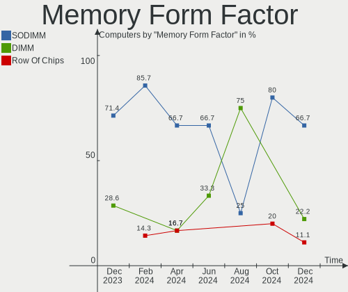

| Name         | Computers | Percent |
|--------------|-----------|---------|
| SODIMM       | 12        | 80%     |
| DIMM         | 2         | 13.33%  |
| Row Of Chips | 1         | 6.67%   |

Memory Size
-----------

Memory module size

| Size  | Computers | Percent |
|-------|-----------|---------|
| 4096  | 7         | 43.75%  |
| 8192  | 5         | 31.25%  |
| 16384 | 2         | 12.5%   |
| 2048  | 2         | 12.5%   |

Memory Speed
------------

Memory module speed

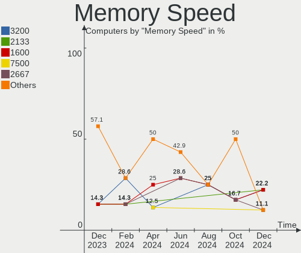

| Speed | Computers | Percent |
|-------|-----------|---------|
| 2667  | 5         | 29.41%  |
| 2400  | 3         | 17.65%  |
| 1600  | 3         | 17.65%  |
| 3200  | 2         | 11.76%  |
| 3266  | 1         | 5.88%   |
| 2200  | 1         | 5.88%   |
| 1800  | 1         | 5.88%   |
| 1066  | 1         | 5.88%   |

Printers & scanners
-------------------

Printer Vendor
--------------

Printer device vendors

| Vendor                          | Computers | Percent |
|---------------------------------|-----------|---------|
| Samsung Electronics             | 1         | 33.33%  |
| Dymo-CoStar                     | 1         | 33.33%  |
| cab Produkttechnik GmbH & Co KG | 1         | 33.33%  |

Printer Model
-------------

Printer device models

| Model                                    | Computers | Percent |
|------------------------------------------|-----------|---------|
| Samsung M2020 Series                     | 1         | 33.33%  |
| Dymo-CoStar LabelWriter 450              | 1         | 33.33%  |
| cab Produkttechnik GmbH & Co KG EOS2/300 | 1         | 33.33%  |

Scanner Vendor
--------------

Scanner device vendors

Zero info for selected period =(

Scanner Model
-------------

Scanner device models

Zero info for selected period =(

Camera
------

Camera Vendor
-------------

Camera device vendors

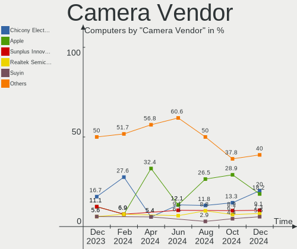

| Vendor                                 | Computers | Percent |
|----------------------------------------|-----------|---------|
| Chicony Electronics                    | 10        | 17.24%  |
| Realtek Semiconductor                  | 8         | 13.79%  |
| Apple                                  | 7         | 12.07%  |
| Quanta                                 | 6         | 10.34%  |
| Syntek                                 | 5         | 8.62%   |
| Sunplus Innovation Technology          | 3         | 5.17%   |
| Microdia                               | 3         | 5.17%   |
| Logitech                               | 3         | 5.17%   |
| Silicon Motion                         | 2         | 3.45%   |
| IMC Networks                           | 2         | 3.45%   |
| Alcor Micro                            | 2         | 3.45%   |
| Acer                                   | 2         | 3.45%   |
| Suyin                                  | 1         | 1.72%   |
| Ricoh                                  | 1         | 1.72%   |
| Microsoft                              | 1         | 1.72%   |
| Lenovo                                 | 1         | 1.72%   |
| Cheng Uei Precision Industry (Foxlink) | 1         | 1.72%   |

Camera Model
------------

Camera device models

| Model                                            | Computers | Percent |
|--------------------------------------------------|-----------|---------|
| Syntek Integrated Camera                         | 5         | 8.62%   |
| Apple iPhone 5/5C/5S/6/SE                        | 3         | 5.17%   |
| Apple Built-in iSight                            | 3         | 5.17%   |
| Sunplus Integrated_Webcam_HD                     | 2         | 3.45%   |
| Realtek Acer 640 x 480 laptop camera             | 2         | 3.45%   |
| Quanta HD User Facing                            | 2         | 3.45%   |
| Microdia Integrated_Webcam_HD                    | 2         | 3.45%   |
| Logitech Logi 4K Stream Edition                  | 2         | 3.45%   |
| Chicony Integrated Camera                        | 2         | 3.45%   |
| Alcor Micro USB 2.0 PC cam                       | 2         | 3.45%   |
| Suyin Asus Integrated Webcam [CN031B]            | 1         | 1.72%   |
| Sunplus Laptop_Integrated_Webcam_HD              | 1         | 1.72%   |
| Silicon Motion WebCam SCB-0385N                  | 1         | 1.72%   |
| Silicon Motion WebCam SC-13HDL12131N             | 1         | 1.72%   |
| Ricoh USB2.0 Camera                              | 1         | 1.72%   |
| Realtek USB2.0 HD UVC WebCam                     | 1         | 1.72%   |
| Realtek LG Webcam                                | 1         | 1.72%   |
| Realtek LG Camera                                | 1         | 1.72%   |
| Realtek Integrated_Webcam_HD                     | 1         | 1.72%   |
| Realtek Integrated Webcam                        | 1         | 1.72%   |
| Realtek Integrated Camera                        | 1         | 1.72%   |
| Quanta VGA WebCam                                | 1         | 1.72%   |
| Quanta HP Wide Vision HD Camera                  | 1         | 1.72%   |
| Quanta HP TrueVision HD Camera                   | 1         | 1.72%   |
| Quanta HD Camera                                 | 1         | 1.72%   |
| Microsoft Surface Camera Front                   | 1         | 1.72%   |
| Microdia Integrated_Webcam_1.3M                  | 1         | 1.72%   |
| Logitech QuickCam Communicate Deluxe             | 1         | 1.72%   |
| Lenovo Integrated Webcam [R5U877]                | 1         | 1.72%   |
| IMC Networks USB2.0 VGA UVC WebCam               | 1         | 1.72%   |
| IMC Networks Integrated Camera                   | 1         | 1.72%   |
| Chicony VGA WebCam                               | 1         | 1.72%   |
| Chicony TOSHIBA Web Camera - HD                  | 1         | 1.72%   |
| Chicony Lenovo EasyCamera                        | 1         | 1.72%   |
| Chicony HP Wide Vision HD Camera                 | 1         | 1.72%   |
| Chicony HP High Definition 1MP Webcam            | 1         | 1.72%   |
| Chicony HD WebCam                                | 1         | 1.72%   |
| Chicony EasyCamera                               | 1         | 1.72%   |
| Chicony CKA7216                                  | 1         | 1.72%   |
| Cheng Uei Precision Industry (Foxlink) HP Webcam | 1         | 1.72%   |
| Apple FaceTime HD Camera (Built-in)              | 1         | 1.72%   |
| Acer ThinkPad Integrated Camera                  | 1         | 1.72%   |
| Acer HD Webcam                                   | 1         | 1.72%   |

Security
--------

Fingerprint Vendor
------------------

Fingerprint sensor vendors

| Vendor                | Computers | Percent |
|-----------------------|-----------|---------|
| Synaptics             | 3         | 37.5%   |
| Upek                  | 2         | 25%     |
| Validity Sensors      | 1         | 12.5%   |
| LighTuning Technology | 1         | 12.5%   |
| AuthenTec             | 1         | 12.5%   |

Fingerprint Model
-----------------

Fingerprint sensor models

| Model                                                  | Computers | Percent |
|--------------------------------------------------------|-----------|---------|
| Upek Biometric Touchchip/Touchstrip Fingerprint Sensor | 2         | 25%     |
| Unknown                                                | 2         | 25%     |
| Validity Sensors VFS5011 Fingerprint Reader            | 1         | 12.5%   |
| Synaptics Prometheus MIS Touch Fingerprint Reader      | 1         | 12.5%   |
| LighTuning EgisTec Touch Fingerprint Sensor            | 1         | 12.5%   |
| AuthenTec AES2501 Fingerprint Sensor                   | 1         | 12.5%   |

Chipcard Vendor
---------------

Chipcard module vendors

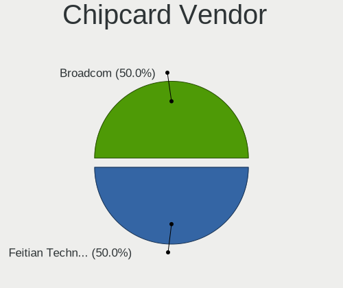

| Vendor                | Computers | Percent |
|-----------------------|-----------|---------|
| Broadcom              | 2         | 33.33%  |
| Alcor Micro           | 2         | 33.33%  |
| Lenovo                | 1         | 16.67%  |
| Gemalto (was Gemplus) | 1         | 16.67%  |

Chipcard Model
--------------

Chipcard module models

| Model                                                  | Computers | Percent |
|--------------------------------------------------------|-----------|---------|
| Alcor Micro AU9540 Smartcard Reader                    | 2         | 33.33%  |
| Lenovo Integrated Smart Card Reader                    | 1         | 16.67%  |
| Gemalto (was Gemplus) Compact Smart Card Reader Writer | 1         | 16.67%  |
| Broadcom BCM5880 Secure Applications Processor         | 1         | 16.67%  |
| Broadcom 58200                                         | 1         | 16.67%  |

Unsupported
-----------

Unsupported Devices
-------------------

Total unsupported devices on board

| Total | Computers | Percent |
|-------|-----------|---------|
| 0     | 61        | 71.76%  |
| 1     | 15        | 17.65%  |
| 2     | 8         | 9.41%   |
| 4     | 1         | 1.18%   |

Unsupported Device Types
------------------------

Types of unsupported devices

| Type                     | Computers | Percent |
|--------------------------|-----------|---------|
| Fingerprint reader       | 8         | 24.24%  |
| Net/wireless             | 7         | 21.21%  |
| Chipcard                 | 6         | 18.18%  |
| Multimedia controller    | 3         | 9.09%   |
| Graphics card            | 3         | 9.09%   |
| Bluetooth                | 2         | 6.06%   |
| Storage/ide              | 1         | 3.03%   |
| Storage                  | 1         | 3.03%   |
| Sound                    | 1         | 3.03%   |
| Communication controller | 1         | 3.03%   |

