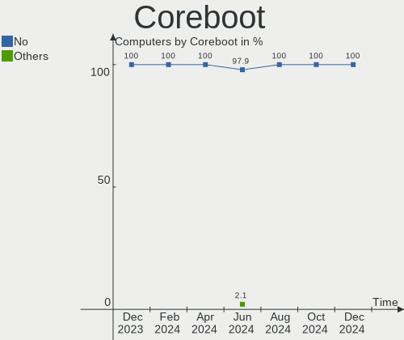
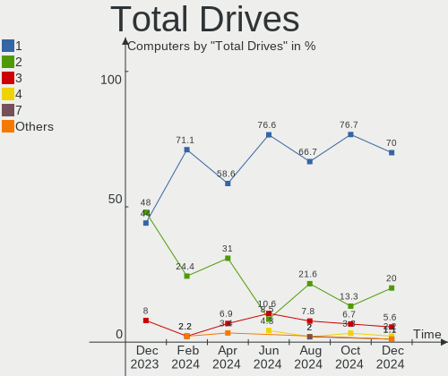
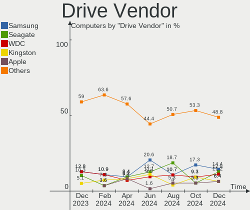
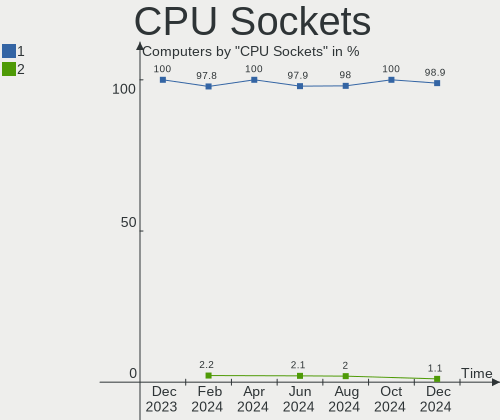
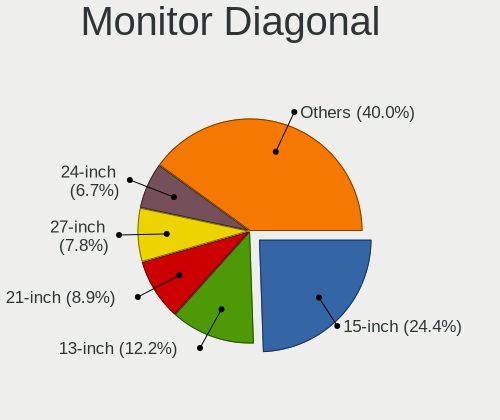
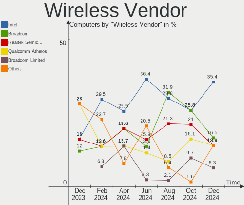
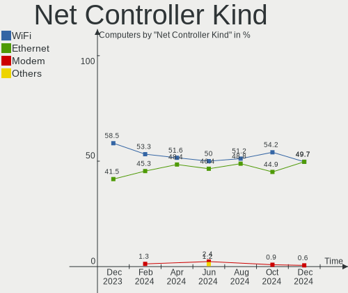
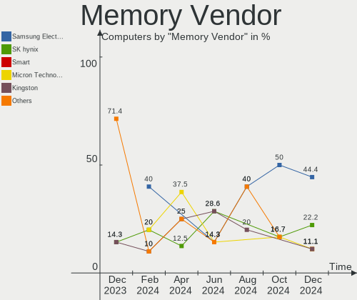

Elementary - Hardware Trends
----------------------------

A project to identify most popular hardware characteristics and track their change
over time based on data collected by Linux users at https://Linux-Hardware.org.

Anyone can contribute to this report by the [hw-probe](https://github.com/linuxhw/hw-probe) tool:

    sudo -E hw-probe -all -upload

This is a report for all computer types. See also reports for [desktops](/Dist/Elementary/Desktop/README.md) and [notebooks](/Dist/Elementary/Notebook/README.md).

This report is for one last month. Overall report since the beginning of time: [TestCoverage](https://github.com/linuxhw/TestCoverage)

Period: Nov, 2022.

Contents
--------

* [ System ](#system)
  - [ OS                       ](#os)
  - [ OS Family                ](#os-family)
  - [ Kernel                   ](#kernel)
  - [ Kernel Family            ](#kernel-family)
  - [ Kernel Major Ver.        ](#kernel-major-ver)
  - [ Arch                     ](#arch)
  - [ DE                       ](#de)
  - [ Display Server           ](#display-server)
  - [ Display Manager          ](#display-manager)
  - [ OS Lang                  ](#os-lang)
  - [ Boot Mode                ](#boot-mode)
  - [ Filesystem               ](#filesystem)
  - [ Part. scheme             ](#part-scheme)
  - [ Dual Boot with Linux/BSD ](#dual-boot-with-linuxbsd)
  - [ Dual Boot (Win)          ](#dual-boot-win)

* [ Board ](#board)
  - [ Vendor                   ](#vendor)
  - [ Model                    ](#model)
  - [ Model Family             ](#model-family)
  - [ MFG Year                 ](#mfg-year)
  - [ Form Factor              ](#form-factor)
  - [ Secure Boot              ](#secure-boot)
  - [ Coreboot                 ](#coreboot)
  - [ RAM Size                 ](#ram-size)
  - [ RAM Used                 ](#ram-used)
  - [ Total Drives             ](#total-drives)
  - [ Has CD-ROM               ](#has-cd-rom)
  - [ Has Ethernet             ](#has-ethernet)
  - [ Has WiFi                 ](#has-wifi)
  - [ Has Bluetooth            ](#has-bluetooth)

* [ Location ](#location)
  - [ Country                  ](#country)
  - [ City                     ](#city)

* [ Drives ](#drives)
  - [ Drive Vendor             ](#drive-vendor)
  - [ Drive Model              ](#drive-model)
  - [ HDD Vendor               ](#hdd-vendor)
  - [ SSD Vendor               ](#ssd-vendor)
  - [ Drive Kind               ](#drive-kind)
  - [ Drive Connector          ](#drive-connector)
  - [ Drive Size               ](#drive-size)
  - [ Space Total              ](#space-total)
  - [ Space Used               ](#space-used)
  - [ Malfunc. Drives          ](#malfunc-drives)
  - [ Malfunc. Drive Vendor    ](#malfunc-drive-vendor)
  - [ Malfunc. HDD Vendor      ](#malfunc-hdd-vendor)
  - [ Malfunc. Drive Kind      ](#malfunc-drive-kind)
  - [ Failed Drives            ](#failed-drives)
  - [ Failed Drive Vendor      ](#failed-drive-vendor)
  - [ Drive Status             ](#drive-status)

* [ Storage controller ](#storage-controller)
  - [ Storage Vendor           ](#storage-vendor)
  - [ Storage Model            ](#storage-model)
  - [ Storage Kind             ](#storage-kind)

* [ Processor ](#processor)
  - [ CPU Vendor               ](#cpu-vendor)
  - [ CPU Model                ](#cpu-model)
  - [ CPU Model Family         ](#cpu-model-family)
  - [ CPU Cores                ](#cpu-cores)
  - [ CPU Sockets              ](#cpu-sockets)
  - [ CPU Threads              ](#cpu-threads)
  - [ CPU Op-Modes             ](#cpu-op-modes)
  - [ CPU Microcode            ](#cpu-microcode)
  - [ CPU Microarch            ](#cpu-microarch)

* [ Graphics ](#graphics)
  - [ GPU Vendor               ](#gpu-vendor)
  - [ GPU Model                ](#gpu-model)
  - [ GPU Combo                ](#gpu-combo)
  - [ GPU Driver               ](#gpu-driver)
  - [ GPU Memory               ](#gpu-memory)

* [ Monitor ](#monitor)
  - [ Monitor Vendor           ](#monitor-vendor)
  - [ Monitor Model            ](#monitor-model)
  - [ Monitor Resolution       ](#monitor-resolution)
  - [ Monitor Diagonal         ](#monitor-diagonal)
  - [ Monitor Width            ](#monitor-width)
  - [ Aspect Ratio             ](#aspect-ratio)
  - [ Monitor Area             ](#monitor-area)
  - [ Pixel Density            ](#pixel-density)
  - [ Multiple Monitors        ](#multiple-monitors)

* [ Network ](#network)
  - [ Net Controller Vendor    ](#net-controller-vendor)
  - [ Net Controller Model     ](#net-controller-model)
  - [ Wireless Vendor          ](#wireless-vendor)
  - [ Wireless Model           ](#wireless-model)
  - [ Ethernet Vendor          ](#ethernet-vendor)
  - [ Ethernet Model           ](#ethernet-model)
  - [ Net Controller Kind      ](#net-controller-kind)
  - [ Used Controller          ](#used-controller)
  - [ NICs                     ](#nics)
  - [ IPv6                     ](#ipv6)

* [ Bluetooth ](#bluetooth)
  - [ Bluetooth Vendor         ](#bluetooth-vendor)
  - [ Bluetooth Model          ](#bluetooth-model)

* [ Sound ](#sound)
  - [ Sound Vendor             ](#sound-vendor)
  - [ Sound Model              ](#sound-model)

* [ Memory ](#memory)
  - [ Memory Vendor            ](#memory-vendor)
  - [ Memory Model             ](#memory-model)
  - [ Memory Kind              ](#memory-kind)
  - [ Memory Form Factor       ](#memory-form-factor)
  - [ Memory Size              ](#memory-size)
  - [ Memory Speed             ](#memory-speed)

* [ Printers & scanners ](#printers--scanners)
  - [ Printer Vendor           ](#printer-vendor)
  - [ Printer Model            ](#printer-model)
  - [ Scanner Vendor           ](#scanner-vendor)
  - [ Scanner Model            ](#scanner-model)

* [ Camera ](#camera)
  - [ Camera Vendor            ](#camera-vendor)
  - [ Camera Model             ](#camera-model)

* [ Security ](#security)
  - [ Fingerprint Vendor       ](#fingerprint-vendor)
  - [ Fingerprint Model        ](#fingerprint-model)
  - [ Chipcard Vendor          ](#chipcard-vendor)
  - [ Chipcard Model           ](#chipcard-model)

* [ Unsupported ](#unsupported)
  - [ Unsupported Devices      ](#unsupported-devices)
  - [ Unsupported Device Types ](#unsupported-device-types)

System
------

OS
--

Installed operating systems

| Name             | Computers | Percent |
|------------------|-----------|---------|
| Elementary 6.1   | 46        | 93.88%  |
| Elementary 5.1.7 | 2         | 4.08%   |
| Elementary 0.4.1 | 1         | 2.04%   |

OS Family
---------

OS without a version

| Name       | Computers | Percent |
|------------|-----------|---------|
| Elementary | 49        | 100%    |

Kernel
------

Version of the Linux kernel

| Version            | Computers | Percent |
|--------------------|-----------|---------|
| 5.15.0-52-generic  | 21        | 42.86%  |
| 5.15.0-53-generic  | 17        | 34.69%  |
| 5.11.0-43-generic  | 5         | 10.2%   |
| 5.4.0-131-generic  | 2         | 4.08%   |
| 5.15.0-48-generic  | 1         | 2.04%   |
| 5.13.0-52-generic  | 1         | 2.04%   |
| 5.11.0-40-generic  | 1         | 2.04%   |
| 4.15.0-142-generic | 1         | 2.04%   |

Kernel Family
-------------

Linux kernel without a distro release

| Version | Computers | Percent |
|---------|-----------|---------|
| 5.15.0  | 39        | 79.59%  |
| 5.11.0  | 6         | 12.24%  |
| 5.4.0   | 2         | 4.08%   |
| 5.13.0  | 1         | 2.04%   |
| 4.15.0  | 1         | 2.04%   |

Kernel Major Ver.
-----------------

Linux kernel major version

| Version | Computers | Percent |
|---------|-----------|---------|
| 5.15    | 39        | 79.59%  |
| 5.11    | 6         | 12.24%  |
| 5.4     | 2         | 4.08%   |
| 5.13    | 1         | 2.04%   |
| 4.15    | 1         | 2.04%   |

Arch
----

OS architecture (x86_64, i586, etc.)

| Name   | Computers | Percent |
|--------|-----------|---------|
| x86_64 | 49        | 100%    |

DE
--

Desktop Environment

| Name     | Computers | Percent |
|----------|-----------|---------|
| Pantheon | 48        | 97.96%  |
| Unknown  | 1         | 2.04%   |

Display Server
--------------

X11 or Wayland

| Name | Computers | Percent |
|------|-----------|---------|
| X11  | 49        | 100%    |

Display Manager
---------------

SDDM, LightDM, etc.

| Name    | Computers | Percent |
|---------|-----------|---------|
| Unknown | 35        | 71.43%  |
| LightDM | 14        | 28.57%  |

OS Lang
-------

Language

| Lang  | Computers | Percent |
|-------|-----------|---------|
| en_US | 20        | 40.82%  |
| de_DE | 8         | 16.33%  |
| fr_FR | 4         | 8.16%   |
| es_ES | 4         | 8.16%   |
| ru_RU | 3         | 6.12%   |
| en_GB | 3         | 6.12%   |
| pt_BR | 2         | 4.08%   |
| it_IT | 2         | 4.08%   |
| en_AU | 2         | 4.08%   |
| nl_NL | 1         | 2.04%   |

Boot Mode
---------

EFI or BIOS

| Mode | Computers | Percent |
|------|-----------|---------|
| EFI  | 32        | 65.31%  |
| BIOS | 17        | 34.69%  |

Filesystem
----------

Type of filesystem

| Type  | Computers | Percent |
|-------|-----------|---------|
| Ext4  | 48        | 97.96%  |
| Btrfs | 1         | 2.04%   |

Part. scheme
------------

Scheme of partitioning

| Type    | Computers | Percent |
|---------|-----------|---------|
| Unknown | 34        | 69.39%  |
| GPT     | 13        | 26.53%  |
| MBR     | 2         | 4.08%   |

Dual Boot with Linux/BSD
------------------------

Hosting more than one Linux/BSD

| Dual boot | Computers | Percent |
|-----------|-----------|---------|
| No        | 47        | 95.92%  |
| Yes       | 2         | 4.08%   |

Dual Boot (Win)
---------------

Hosting Linux and Windows

| Dual boot | Computers | Percent |
|-----------|-----------|---------|
| No        | 48        | 97.96%  |
| Yes       | 1         | 2.04%   |

Board
-----

Vendor
------

Motherboard manufacturer

| Name                | Computers | Percent |
|---------------------|-----------|---------|
| Apple               | 15        | 30.61%  |
| Lenovo              | 10        | 20.41%  |
| Dell                | 6         | 12.24%  |
| ASUSTek Computer    | 4         | 8.16%   |
| Wortmann AG         | 1         | 2.04%   |
| Sony                | 1         | 2.04%   |
| Samsung Electronics | 1         | 2.04%   |
| Packard Bell        | 1         | 2.04%   |
| MSI                 | 1         | 2.04%   |
| Microsoft           | 1         | 2.04%   |
| Medion              | 1         | 2.04%   |
| LORD ELECTRONICS    | 1         | 2.04%   |
| LattePanda          | 1         | 2.04%   |
| HUAWEI              | 1         | 2.04%   |
| Hewlett-Packard     | 1         | 2.04%   |
| Gigabyte Technology | 1         | 2.04%   |
| Alienware           | 1         | 2.04%   |
| Acer                | 1         | 2.04%   |

Model
-----

Motherboard model

| Name                                              | Computers | Percent |
|---------------------------------------------------|-----------|---------|
| Apple MacBook3,1                                  | 2         | 4.08%   |
| Apple iMac8,1                                     | 2         | 4.08%   |
| Wortmann AG 1220624_1470150                       | 1         | 2.04%   |
| Sony VPCEA1S1R                                    | 1         | 2.04%   |
| Samsung 530U3C/530U4C/532U3C                      | 1         | 2.04%   |
| Packard Bell EasyNote LS44HR                      | 1         | 2.04%   |
| MSI VT564AA-ABG HPE-180a                          | 1         | 2.04%   |
| Microsoft Surface Laptop 2                        | 1         | 2.04%   |
| Medion E7220                                      | 1         | 2.04%   |
| LORD ELECTRONICS LORD G4x 775 ICH7 8712 As Design | 1         | 2.04%   |
| Lenovo ThinkPad X1 Yoga 3rd 20LDS10D00            | 1         | 2.04%   |
| Lenovo ThinkPad T495 20NKS01W02                   | 1         | 2.04%   |
| Lenovo ThinkPad T470p 20J60018MX                  | 1         | 2.04%   |
| Lenovo ThinkPad T430 2349IF8                      | 1         | 2.04%   |
| Lenovo ThinkPad T14 Gen 1 20S1S5MX1J              | 1         | 2.04%   |
| Lenovo ThinkCentre M70e 0809D1Y                   | 1         | 2.04%   |
| Lenovo IdeaPad 5 Pro 14ACN6 82L7                  | 1         | 2.04%   |
| Lenovo IdeaPad 5 15ALC05 82LN                     | 1         | 2.04%   |
| Lenovo IdeaPad 330S-15ARR 81FB                    | 1         | 2.04%   |
| Lenovo G50-45 80E3                                | 1         | 2.04%   |
| LattePanda Alpha                                  | 1         | 2.04%   |
| HUAWEI KLVL-WXX9                                  | 1         | 2.04%   |
| HP Pavilion dv5                                   | 1         | 2.04%   |
| Gigabyte H310M S2H                                | 1         | 2.04%   |
| Dell XPS420                                       | 1         | 2.04%   |
| Dell Studio 1558                                  | 1         | 2.04%   |
| Dell Precision WorkStation T7400                  | 1         | 2.04%   |
| Dell Latitude E6520                               | 1         | 2.04%   |
| Dell Inspiron 5584                                | 1         | 2.04%   |
| Dell Inspiron 15-3567                             | 1         | 2.04%   |
| ASUS ZenBook S UX391UA                            | 1         | 2.04%   |
| ASUS ROG Strix G512LV_G512LV                      | 1         | 2.04%   |
| ASUS P8H61-M LX R2.0                              | 1         | 2.04%   |
| ASUS 1001PX                                       | 1         | 2.04%   |
| Apple MacPro6,1                                   | 1         | 2.04%   |
| Apple Macmini3,1                                  | 1         | 2.04%   |
| Apple MacBookPro9,2                               | 1         | 2.04%   |
| Apple MacBookPro6,2                               | 1         | 2.04%   |
| Apple MacBookPro12,1                              | 1         | 2.04%   |
| Apple MacBookPro11,3                              | 1         | 2.04%   |

Model Family
------------

Motherboard model prefix

| Name                  | Computers | Percent |
|-----------------------|-----------|---------|
| Lenovo ThinkPad       | 5         | 10.2%   |
| Lenovo IdeaPad        | 3         | 6.12%   |
| Dell Inspiron         | 2         | 4.08%   |
| Apple MacBook3        | 2         | 4.08%   |
| Apple iMac8           | 2         | 4.08%   |
| Apple iMac19          | 2         | 4.08%   |
| Wortmann AG 1220624   | 1         | 2.04%   |
| Sony VPCEA1S1R        | 1         | 2.04%   |
| Samsung 530U3C        | 1         | 2.04%   |
| Packard Bell EasyNote | 1         | 2.04%   |
| MSI VT564AA-ABG       | 1         | 2.04%   |
| Microsoft Surface     | 1         | 2.04%   |
| Medion E7220          | 1         | 2.04%   |
| LORD ELECTRONICS LORD | 1         | 2.04%   |
| Lenovo ThinkCentre    | 1         | 2.04%   |
| Lenovo G50-45         | 1         | 2.04%   |
| LattePanda Alpha      | 1         | 2.04%   |
| HUAWEI KLVL-WXX9      | 1         | 2.04%   |
| HP Pavilion           | 1         | 2.04%   |
| Gigabyte H310M        | 1         | 2.04%   |
| Dell XPS420           | 1         | 2.04%   |
| Dell Studio           | 1         | 2.04%   |
| Dell Precision        | 1         | 2.04%   |
| Dell Latitude         | 1         | 2.04%   |
| ASUS ZenBook          | 1         | 2.04%   |
| ASUS ROG              | 1         | 2.04%   |
| ASUS P8H61-M          | 1         | 2.04%   |
| ASUS 1001PX           | 1         | 2.04%   |
| Apple MacPro6         | 1         | 2.04%   |
| Apple Macmini3        | 1         | 2.04%   |
| Apple MacBookPro9     | 1         | 2.04%   |
| Apple MacBookPro6     | 1         | 2.04%   |
| Apple MacBookPro12    | 1         | 2.04%   |
| Apple MacBookPro11    | 1         | 2.04%   |
| Apple iMac18          | 1         | 2.04%   |
| Apple iMac13          | 1         | 2.04%   |
| Apple iMac11          | 1         | 2.04%   |
| Alienware m15         | 1         | 2.04%   |
| Acer Aspire           | 1         | 2.04%   |

MFG Year
--------

Motherboard manufacture year

| Year | Computers | Percent |
|------|-----------|---------|
| 2008 | 7         | 14.29%  |
| 2019 | 6         | 12.24%  |
| 2010 | 6         | 12.24%  |
| 2020 | 5         | 10.2%   |
| 2012 | 4         | 8.16%   |
| 2021 | 3         | 6.12%   |
| 2018 | 3         | 6.12%   |
| 2017 | 3         | 6.12%   |
| 2014 | 3         | 6.12%   |
| 2011 | 3         | 6.12%   |
| 2016 | 2         | 4.08%   |
| 2022 | 1         | 2.04%   |
| 2015 | 1         | 2.04%   |
| 2009 | 1         | 2.04%   |
| 2007 | 1         | 2.04%   |

Form Factor
-----------

Physical design of the computer

| Name        | Computers | Percent |
|-------------|-----------|---------|
| Notebook    | 30        | 61.22%  |
| Desktop     | 9         | 18.37%  |
| All in one  | 7         | 14.29%  |
| Tablet      | 1         | 2.04%   |
| Convertible | 1         | 2.04%   |
| Mini pc     | 1         | 2.04%   |

Secure Boot
-----------

Enabled or disabled

| State    | Computers | Percent |
|----------|-----------|---------|
| Disabled | 45        | 91.84%  |
| Enabled  | 4         | 8.16%   |

Coreboot
--------

Have coreboot on board

| Used | Computers | Percent |
|------|-----------|---------|
| No   | 49        | 100%    |

RAM Size
--------

Total RAM memory

| Size in GB  | Computers | Percent |
|-------------|-----------|---------|
| 4.01-8.0    | 15        | 30.61%  |
| 8.01-16.0   | 12        | 24.49%  |
| 3.01-4.0    | 11        | 22.45%  |
| 16.01-24.0  | 4         | 8.16%   |
| 64.01-256.0 | 3         | 6.12%   |
| 32.01-64.0  | 2         | 4.08%   |
| 1.01-2.0    | 2         | 4.08%   |

RAM Used
--------

Used RAM memory

| Used GB   | Computers | Percent |
|-----------|-----------|---------|
| 1.01-2.0  | 20        | 40.82%  |
| 2.01-3.0  | 15        | 30.61%  |
| 4.01-8.0  | 8         | 16.33%  |
| 3.01-4.0  | 4         | 8.16%   |
| 8.01-16.0 | 1         | 2.04%   |
| 0.51-1.0  | 1         | 2.04%   |

Total Drives
------------

Number of drives on board

| Drives | Computers | Percent |
|--------|-----------|---------|
| 1      | 30        | 61.22%  |
| 2      | 16        | 32.65%  |
| 3      | 2         | 4.08%   |
| 0      | 1         | 2.04%   |

Has CD-ROM
----------

Has CD-ROM on board

| Presented | Computers | Percent |
|-----------|-----------|---------|
| No        | 28        | 57.14%  |
| Yes       | 21        | 42.86%  |

Has Ethernet
------------

Has Ethernet on board

| Presented | Computers | Percent |
|-----------|-----------|---------|
| Yes       | 42        | 85.71%  |
| No        | 7         | 14.29%  |

Has WiFi
--------

Has WiFi module

| Presented | Computers | Percent |
|-----------|-----------|---------|
| Yes       | 46        | 93.88%  |
| No        | 3         | 6.12%   |

Has Bluetooth
-------------

Has Bluetooth module

| Presented | Computers | Percent |
|-----------|-----------|---------|
| Yes       | 37        | 75.51%  |
| No        | 12        | 24.49%  |

Location
--------

Country
-------

Geographic location (country)

| Country   | Computers | Percent |
|-----------|-----------|---------|
| USA       | 9         | 18.37%  |
| Germany   | 8         | 16.33%  |
| Brazil    | 4         | 8.16%   |
| Russia    | 3         | 6.12%   |
| France    | 3         | 6.12%   |
| Romania   | 2         | 4.08%   |
| Italy     | 2         | 4.08%   |
| Belgium   | 2         | 4.08%   |
| Australia | 2         | 4.08%   |
| Turkey    | 1         | 2.04%   |
| Thailand  | 1         | 2.04%   |
| Sweden    | 1         | 2.04%   |
| Spain     | 1         | 2.04%   |
| Serbia    | 1         | 2.04%   |
| Poland    | 1         | 2.04%   |
| Mexico    | 1         | 2.04%   |
| Ireland   | 1         | 2.04%   |
| Indonesia | 1         | 2.04%   |
| India     | 1         | 2.04%   |
| Croatia   | 1         | 2.04%   |
| Colombia  | 1         | 2.04%   |
| Canada    | 1         | 2.04%   |
| Argentina | 1         | 2.04%   |

City
----

Geographic location (city)

| City                | Computers | Percent |
|---------------------|-----------|---------|
| Sydney              | 2         | 4.08%   |
| Stuttgart           | 2         | 4.08%   |
| Seedorf             | 2         | 4.08%   |
| Moscow              | 2         | 4.08%   |
| Vranje              | 1         | 2.04%   |
| Surabaya            | 1         | 2.04%   |
| Storm Lake          | 1         | 2.04%   |
| Silverton           | 1         | 2.04%   |
| Seynod              | 1         | 2.04%   |
| Sao Vicente         | 1         | 2.04%   |
| Sao Paulo           | 1         | 2.04%   |
| Reno                | 1         | 2.04%   |
| Quarouble           | 1         | 2.04%   |
| Poznan              | 1         | 2.04%   |
| Philadelphia        | 1         | 2.04%   |
| Petrinja            | 1         | 2.04%   |
| Pak Kret            | 1         | 2.04%   |
| Novo Hamburgo       | 1         | 2.04%   |
| New Bedford         | 1         | 2.04%   |
| Naples              | 1         | 2.04%   |
| Milan               | 1         | 2.04%   |
| Medellín           | 1         | 2.04%   |
| Krasnoyarsk         | 1         | 2.04%   |
| Knoxville           | 1         | 2.04%   |
| Kingston            | 1         | 2.04%   |
| Katy                | 1         | 2.04%   |
| Karabük            | 1         | 2.04%   |
| Hyderabad           | 1         | 2.04%   |
| Granada             | 1         | 2.04%   |
| General Pacheco     | 1         | 2.04%   |
| Gelsenkirchen       | 1         | 2.04%   |
| Floresti            | 1         | 2.04%   |
| Flemalle            | 1         | 2.04%   |
| Feuquieres-en-Vimeu | 1         | 2.04%   |
| Erfurt              | 1         | 2.04%   |
| Cork                | 1         | 2.04%   |
| Cologne             | 1         | 2.04%   |
| Bucharest           | 1         | 2.04%   |
| Brasília           | 1         | 2.04%   |
| Brampton            | 1         | 2.04%   |

Drives
------

Drive Vendor
------------

Hard drive vendors

| Vendor              | Computers | Drives | Percent |
|---------------------|-----------|--------|---------|
| WDC                 | 10        | 11     | 15.63%  |
| Samsung Electronics | 9         | 9      | 14.06%  |
| Seagate             | 6         | 9      | 9.38%   |
| Apple               | 6         | 6      | 9.38%   |
| Toshiba             | 4         | 4      | 6.25%   |
| Unknown             | 3         | 3      | 4.69%   |
| SK hynix            | 3         | 3      | 4.69%   |
| Sandisk             | 3         | 3      | 4.69%   |
| Intel               | 3         | 4      | 4.69%   |
| Hitachi             | 3         | 3      | 4.69%   |
| Crucial             | 3         | 3      | 4.69%   |
| SPCC                | 1         | 1      | 1.56%   |
| Silicon Motion      | 1         | 1      | 1.56%   |
| Lexar               | 1         | 1      | 1.56%   |
| LaCie               | 1         | 1      | 1.56%   |
| KingDian            | 1         | 1      | 1.56%   |
| JetFlash            | 1         | 1      | 1.56%   |
| Intenso             | 1         | 1      | 1.56%   |
| HUSKY               | 1         | 1      | 1.56%   |
| China               | 1         | 1      | 1.56%   |
| BORY                | 1         | 1      | 1.56%   |
| A-DATA Technology   | 1         | 1      | 1.56%   |

Drive Model
-----------

Hard drive models

| Model                                                | Computers | Percent |
|------------------------------------------------------|-----------|---------|
| Samsung NVMe SSD Controller SM981/PM981/PM983 1TB    | 4         | 5.8%    |
| Unknown MMC Card  16GB                               | 2         | 2.9%    |
| Apple HDD HTS541010A9E632 1TB                        | 2         | 2.9%    |
| WDC WDS240G2G0A-00JH30 240GB SSD                     | 1         | 1.45%   |
| WDC WDS100T2B0C-00PXH0 1TB                           | 1         | 1.45%   |
| WDC WD5000LPVX-22V0TT0 500GB                         | 1         | 1.45%   |
| WDC WD5000LPCX-24C6HT0 500GB                         | 1         | 1.45%   |
| WDC WD3200BEVT-75ZCT2 320GB                          | 1         | 1.45%   |
| WDC WD1600BEVT-80A23T0 160GB                         | 1         | 1.45%   |
| WDC WD1600AABS-00PRA0 160GB                          | 1         | 1.45%   |
| WDC WD10SPCX-75KHST0 1TB                             | 1         | 1.45%   |
| WDC WD10EZEX-60WN4A0 1TB                             | 1         | 1.45%   |
| WDC WD10EARS-00Y5B1 1TB                              | 1         | 1.45%   |
| WDC WD1001FALS-40Y6A0 1TB                            | 1         | 1.45%   |
| Unknown MMC Card  4GB                                | 1         | 1.45%   |
| Toshiba XG4 NVMe SSD Controller 256GB                | 1         | 1.45%   |
| Toshiba NVMe Controller 512GB                        | 1         | 1.45%   |
| Toshiba MK7559GSXP 752GB                             | 1         | 1.45%   |
| Toshiba MK3261GSYN 320GB                             | 1         | 1.45%   |
| SPCC Solid State Disk 120GB                          | 1         | 1.45%   |
| SK hynix SKHynix_HFS256GD9TNG-L5B0B 256GB            | 1         | 1.45%   |
| SK hynix PC711 NVMe 1TB                              | 1         | 1.45%   |
| SK hynix BC501 NVMe Solid State Drive 512GB          | 1         | 1.45%   |
| Silicon Motion SM2262/SM2262EN SSD Controller 1TB    | 1         | 1.45%   |
| Seagate ST500LT012-1DG142 500GB                      | 1         | 1.45%   |
| Seagate ST3320620AS 320GB                            | 1         | 1.45%   |
| Seagate ST320LT007-9ZV142 320GB                      | 1         | 1.45%   |
| Seagate ST3160815AS 160GB                            | 1         | 1.45%   |
| Seagate ST31000524AS 1TB                             | 1         | 1.45%   |
| Seagate ST31000340NS 1TB                             | 1         | 1.45%   |
| Seagate ST250DM000-1BD141 250GB                      | 1         | 1.45%   |
| Seagate Backup+ Hub BK 8TB                           | 1         | 1.45%   |
| Seagate Backup+ BK 1TB                               | 1         | 1.45%   |
| Sandisk WD Blue SN550 NVMe SSD 1TB                   | 1         | 1.45%   |
| SanDisk SSD i100 24GB                                | 1         | 1.45%   |
| SanDisk SDSSDP128G 128GB                             | 1         | 1.45%   |
| Samsung NVMe SSD Controller PM9A1/PM9A3/980PRO 250GB | 1         | 1.45%   |
| Samsung MZVLQ512HALU-00000 512GB                     | 1         | 1.45%   |
| Samsung MZALQ512HBLU-00BL2 512GB                     | 1         | 1.45%   |
| Samsung KUS020203M-B000 128GB                        | 1         | 1.45%   |

HDD Vendor
----------

Hard disk drive vendors

| Vendor              | Computers | Drives | Percent |
|---------------------|-----------|--------|---------|
| WDC                 | 8         | 9      | 36.36%  |
| Seagate             | 5         | 8      | 22.73%  |
| Hitachi             | 3         | 3      | 13.64%  |
| Apple               | 3         | 3      | 13.64%  |
| Toshiba             | 2         | 2      | 9.09%   |
| Samsung Electronics | 1         | 1      | 4.55%   |

SSD Vendor
----------

Solid state drive vendors

| Vendor            | Computers | Drives | Percent |
|-------------------|-----------|--------|---------|
| Crucial           | 3         | 3      | 17.65%  |
| SanDisk           | 2         | 2      | 11.76%  |
| Intel             | 2         | 2      | 11.76%  |
| Apple             | 2         | 2      | 11.76%  |
| WDC               | 1         | 1      | 5.88%   |
| SPCC              | 1         | 1      | 5.88%   |
| Lexar             | 1         | 1      | 5.88%   |
| KingDian          | 1         | 1      | 5.88%   |
| Intenso           | 1         | 1      | 5.88%   |
| HUSKY             | 1         | 1      | 5.88%   |
| China             | 1         | 1      | 5.88%   |
| A-DATA Technology | 1         | 1      | 5.88%   |

Drive Kind
----------

HDD or SSD

| Kind    | Computers | Drives | Percent |
|---------|-----------|--------|---------|
| HDD     | 21        | 26     | 35%     |
| NVMe    | 16        | 19     | 26.67%  |
| SSD     | 16        | 17     | 26.67%  |
| Unknown | 4         | 4      | 6.67%   |
| MMC     | 3         | 3      | 5%      |

Drive Connector
---------------

SATA, SAS, NVMe, etc.

| Type | Computers | Drives | Percent |
|------|-----------|--------|---------|
| SATA | 33        | 42     | 57.89%  |
| NVMe | 16        | 19     | 28.07%  |
| SAS  | 5         | 5      | 8.77%   |
| MMC  | 3         | 3      | 5.26%   |

Drive Size
----------

Size of hard drive

| Size in TB | Computers | Drives | Percent |
|------------|-----------|--------|---------|
| 0.01-0.5   | 25        | 30     | 71.43%  |
| 0.51-1.0   | 9         | 12     | 25.71%  |
| 4.01-10.0  | 1         | 1      | 2.86%   |

Space Total
-----------

Amount of disk space available on the file system

| Size in GB     | Computers | Percent |
|----------------|-----------|---------|
| 101-250        | 23        | 46.94%  |
| 251-500        | 12        | 24.49%  |
| 501-1000       | 7         | 14.29%  |
| 1001-2000      | 3         | 6.12%   |
| 51-100         | 2         | 4.08%   |
| More than 3000 | 1         | 2.04%   |
| 21-50          | 1         | 2.04%   |

Space Used
----------

Amount of used disk space

| Used GB   | Computers | Percent |
|-----------|-----------|---------|
| 1-20      | 21        | 42.86%  |
| 21-50     | 15        | 30.61%  |
| 101-250   | 5         | 10.2%   |
| 51-100    | 3         | 6.12%   |
| 251-500   | 2         | 4.08%   |
| 501-1000  | 2         | 4.08%   |
| 2001-3000 | 1         | 2.04%   |

Malfunc. Drives
---------------

Drive models with a malfunction

Zero info for selected period =(

Malfunc. Drive Vendor
---------------------

Vendors of faulty drives

Zero info for selected period =(

Malfunc. HDD Vendor
-------------------

Vendors of faulty HDD drives

Zero info for selected period =(

Malfunc. Drive Kind
-------------------

Kinds of faulty drives

Zero info for selected period =(

Failed Drives
-------------

Failed drive models

Zero info for selected period =(

Failed Drive Vendor
-------------------

Failed drive vendors

Zero info for selected period =(

Drive Status
------------

Number of failed and malfunc. drives

| Status   | Computers | Drives | Percent |
|----------|-----------|--------|---------|
| Detected | 43        | 61     | 87.76%  |
| Works    | 6         | 8      | 12.24%  |

Storage controller
------------------

Storage Vendor
--------------

Storage controller vendors

| Vendor                       | Computers | Percent |
|------------------------------|-----------|---------|
| Intel                        | 31        | 55.36%  |
| Samsung Electronics          | 11        | 19.64%  |
| AMD                          | 4         | 7.14%   |
| SK hynix                     | 3         | 5.36%   |
| Toshiba America Info Systems | 2         | 3.57%   |
| SanDisk                      | 2         | 3.57%   |
| Silicon Motion               | 1         | 1.79%   |
| Nvidia                       | 1         | 1.79%   |
| LSI Logic / Symbios Logic    | 1         | 1.79%   |

Storage Model
-------------

Storage controller models

| Model                                                                                   | Computers | Percent |
|-----------------------------------------------------------------------------------------|-----------|---------|
| Samsung NVMe SSD Controller SM981/PM981/PM983                                           | 4         | 5.97%   |
| Intel 82801HM/HEM (ICH8M/ICH8M-E) SATA Controller [AHCI mode]                           | 4         | 5.97%   |
| Intel 82801HM/HEM (ICH8M/ICH8M-E) IDE Controller                                        | 4         | 5.97%   |
| Intel Cannon Lake PCH SATA AHCI Controller                                              | 3         | 4.48%   |
| Intel 7 Series Chipset Family 6-port SATA Controller [AHCI mode]                        | 3         | 4.48%   |
| AMD FCH SATA Controller [AHCI mode]                                                     | 3         | 4.48%   |
| SanDisk WD Blue SN550 NVMe SSD                                                          | 2         | 2.99%   |
| Samsung NVMe SSD Controller 980                                                         | 2         | 2.99%   |
| Intel Sunrise Point-LP SATA Controller [AHCI mode]                                      | 2         | 2.99%   |
| Intel NM10/ICH7 Family SATA Controller [IDE mode]                                       | 2         | 2.99%   |
| Intel 82801G (ICH7 Family) IDE Controller                                               | 2         | 2.99%   |
| Intel 82801 Mobile SATA Controller [RAID mode]                                          | 2         | 2.99%   |
| Intel 6 Series/C200 Series Chipset Family 6 port Mobile SATA AHCI Controller            | 2         | 2.99%   |
| Intel 5 Series/3400 Series Chipset 4 port SATA AHCI Controller                          | 2         | 2.99%   |
| Toshiba America Info Systems XG4 NVMe SSD Controller                                    | 1         | 1.49%   |
| Toshiba America Info Systems NVMe Controller                                            | 1         | 1.49%   |
| SK hynix Non-Volatile memory controller                                                 | 1         | 1.49%   |
| SK hynix Gold P31/PC711 NVMe Solid State Drive                                          | 1         | 1.49%   |
| SK hynix BC501 NVMe Solid State Drive                                                   | 1         | 1.49%   |
| Silicon Motion SM2262/SM2262EN SSD Controller                                           | 1         | 1.49%   |
| Samsung NVMe SSD Controller SM961/PM961/SM963                                           | 1         | 1.49%   |
| Samsung NVMe SSD Controller PM9A1/PM9A3/980PRO                                          | 1         | 1.49%   |
| Samsung Electronics SATA controller                                                     | 1         | 1.49%   |
| Samsung Electronics Non-Volatile memory controller                                      | 1         | 1.49%   |
| Samsung Apple PCIe SSD                                                                  | 1         | 1.49%   |
| Nvidia MCP79 AHCI Controller                                                            | 1         | 1.49%   |
| LSI Logic / Symbios Logic SAS1068E PCI-Express Fusion-MPT SAS                           | 1         | 1.49%   |
| Intel SATA Controller [RAID mode]                                                       | 1         | 1.49%   |
| Intel Q170/Q150/B150/H170/H110/Z170/CM236 Chipset SATA Controller [AHCI Mode]           | 1         | 1.49%   |
| Intel Non-Volatile memory controller                                                    | 1         | 1.49%   |
| Intel NM10/ICH7 Family SATA Controller [AHCI mode]                                      | 1         | 1.49%   |
| Intel Celeron/Pentium Silver Processor SATA Controller                                  | 1         | 1.49%   |
| Intel 82801IR/IO/IH (ICH9R/DO/DH) 4 port SATA Controller [IDE mode]                     | 1         | 1.49%   |
| Intel 82801I (ICH9 Family) 2 port SATA Controller [IDE mode]                            | 1         | 1.49%   |
| Intel 7 Series/C210 Series Chipset Family 6-port SATA Controller [AHCI mode]            | 1         | 1.49%   |
| Intel 631xESB/632xESB SATA AHCI Controller                                              | 1         | 1.49%   |
| Intel 631xESB/632xESB IDE Controller                                                    | 1         | 1.49%   |
| Intel 6 Series/C200 Series Chipset Family Desktop SATA Controller (IDE mode, ports 4-5) | 1         | 1.49%   |
| Intel 6 Series/C200 Series Chipset Family Desktop SATA Controller (IDE mode, ports 0-3) | 1         | 1.49%   |
| Intel 500 Series Chipset Family SATA AHCI Controller                                    | 1         | 1.49%   |

Storage Kind
------------

Kind of storage controller (IDE, SATA, NVMe, SAS, ...)

| Kind | Computers | Percent |
|------|-----------|---------|
| SATA | 30        | 49.18%  |
| NVMe | 16        | 26.23%  |
| IDE  | 11        | 18.03%  |
| RAID | 3         | 4.92%   |
| SCSI | 1         | 1.64%   |

Processor
---------

CPU Vendor
----------

Processor vendors

| Vendor | Computers | Percent |
|--------|-----------|---------|
| Intel  | 42        | 85.71%  |
| AMD    | 7         | 14.29%  |

CPU Model
---------

Processor models

| Model                                       | Computers | Percent |
|---------------------------------------------|-----------|---------|
| Intel Core i7-8550U CPU @ 1.80GHz           | 2         | 4.08%   |
| Intel Core i3-8100 CPU @ 3.60GHz            | 2         | 4.08%   |
| Intel Core i3 CPU M 330 @ 2.13GHz           | 2         | 4.08%   |
| Intel Core 2 Duo CPU T7500 @ 2.20GHz        | 2         | 4.08%   |
| Intel Xeon CPU E5410 @ 2.33GHz              | 1         | 2.04%   |
| Intel Xeon CPU E5-1650 v2 @ 3.50GHz         | 1         | 2.04%   |
| Intel Pentium Silver N5000 CPU @ 1.10GHz    | 1         | 2.04%   |
| Intel Pentium Dual-Core CPU E5700 @ 3.00GHz | 1         | 2.04%   |
| Intel Core m3-8100Y CPU @ 1.10GHz           | 1         | 2.04%   |
| Intel Core i9-9900K CPU @ 3.60GHz           | 1         | 2.04%   |
| Intel Core i7-8565U CPU @ 1.80GHz           | 1         | 2.04%   |
| Intel Core i7-7700HQ CPU @ 2.80GHz          | 1         | 2.04%   |
| Intel Core i7-7500U CPU @ 2.70GHz           | 1         | 2.04%   |
| Intel Core i7-4870HQ CPU @ 2.50GHz          | 1         | 2.04%   |
| Intel Core i7-3517U CPU @ 1.90GHz           | 1         | 2.04%   |
| Intel Core i7-2600 CPU @ 3.40GHz            | 1         | 2.04%   |
| Intel Core i7-10870H CPU @ 2.20GHz          | 1         | 2.04%   |
| Intel Core i7-10610U CPU @ 1.80GHz          | 1         | 2.04%   |
| Intel Core i7 CPU M 620 @ 2.67GHz           | 1         | 2.04%   |
| Intel Core i5-8250U CPU @ 1.60GHz           | 1         | 2.04%   |
| Intel Core i5-7400 CPU @ 3.00GHz            | 1         | 2.04%   |
| Intel Core i5-5257U CPU @ 2.70GHz           | 1         | 2.04%   |
| Intel Core i5-3320M CPU @ 2.60GHz           | 1         | 2.04%   |
| Intel Core i5-3210M CPU @ 2.50GHz           | 1         | 2.04%   |
| Intel Core i5-2450M CPU @ 2.50GHz           | 1         | 2.04%   |
| Intel Core i5 CPU 760 @ 2.80GHz             | 1         | 2.04%   |
| Intel Core i5 CPU 750 @ 2.67GHz             | 1         | 2.04%   |
| Intel Core i3-7020U CPU @ 2.30GHz           | 1         | 2.04%   |
| Intel Core i3-3225 CPU @ 3.30GHz            | 1         | 2.04%   |
| Intel Core i3-2330M CPU @ 2.20GHz           | 1         | 2.04%   |
| Intel Core i3-2310M CPU @ 2.10GHz           | 1         | 2.04%   |
| Intel Core 2 Quad CPU Q6600 @ 2.40GHz       | 1         | 2.04%   |
| Intel Core 2 Duo CPU P7350 @ 2.00GHz        | 1         | 2.04%   |
| Intel Core 2 Duo CPU E8435 @ 3.06GHz        | 1         | 2.04%   |
| Intel Core 2 Duo CPU E8335 @ 2.66GHz        | 1         | 2.04%   |
| Intel Core 2 Duo CPU E6550 @ 2.33GHz        | 1         | 2.04%   |
| Intel Atom CPU N450 @ 1.66GHz               | 1         | 2.04%   |
| Intel 11th Gen Core i7-11800H @ 2.30GHz     | 1         | 2.04%   |
| AMD Turion X2 Ultra Dual-Core Mobile ZM-87  | 1         | 2.04%   |
| AMD Ryzen 7 5700U with Radeon Graphics      | 1         | 2.04%   |

CPU Model Family
----------------

Processor model prefix

| Model                                | Computers | Percent |
|--------------------------------------|-----------|---------|
| Intel Core i7                        | 11        | 22.45%  |
| Intel Core i5                        | 8         | 16.33%  |
| Intel Core i3                        | 8         | 16.33%  |
| Intel Core 2 Duo                     | 6         | 12.24%  |
| AMD Ryzen 5                          | 3         | 6.12%   |
| Intel Xeon                           | 2         | 4.08%   |
| Other                                | 1         | 2.04%   |
| Intel Pentium Silver                 | 1         | 2.04%   |
| Intel Pentium Dual-Core              | 1         | 2.04%   |
| Intel Core m3                        | 1         | 2.04%   |
| Intel Core i9                        | 1         | 2.04%   |
| Intel Core 2 Quad                    | 1         | 2.04%   |
| Intel Atom                           | 1         | 2.04%   |
| AMD Turion X2 Ultra Dual-Core Mobile | 1         | 2.04%   |
| AMD Ryzen 7                          | 1         | 2.04%   |
| AMD Ryzen 5 PRO                      | 1         | 2.04%   |
| AMD A8                               | 1         | 2.04%   |

CPU Cores
---------

Number of processor cores

| Number | Computers | Percent |
|--------|-----------|---------|
| 2      | 22        | 44.9%   |
| 4      | 19        | 38.78%  |
| 8      | 4         | 8.16%   |
| 6      | 3         | 6.12%   |
| 1      | 1         | 2.04%   |

CPU Sockets
-----------

Number of sockets

| Number | Computers | Percent |
|--------|-----------|---------|
| 1      | 49        | 100%    |

CPU Threads
-----------

Threads per core (Hyper-Threading)

| Number | Computers | Percent |
|--------|-----------|---------|
| 2      | 32        | 65.31%  |
| 1      | 17        | 34.69%  |

CPU Op-Modes
------------

CPU Operation Modes (32-bit, 64-bit)

| Op mode        | Computers | Percent |
|----------------|-----------|---------|
| 32-bit, 64-bit | 49        | 100%    |

CPU Microcode
-------------

Microcode number

| Number     | Computers | Percent |
|------------|-----------|---------|
| 0x806ea    | 4         | 8.16%   |
| 0x6fb      | 4         | 8.16%   |
| 0x306a9    | 4         | 8.16%   |
| 0x206a7    | 4         | 8.16%   |
| 0x10676    | 3         | 6.12%   |
| 0x906eb    | 2         | 4.08%   |
| 0x906e9    | 2         | 4.08%   |
| 0x806e9    | 2         | 4.08%   |
| 0x20652    | 2         | 4.08%   |
| 0x106e5    | 2         | 4.08%   |
| 0x1067a    | 2         | 4.08%   |
| Unknown    | 2         | 4.08%   |
| 0xa0652    | 1         | 2.04%   |
| 0x906ec    | 1         | 2.04%   |
| 0x806ec    | 1         | 2.04%   |
| 0x806eb    | 1         | 2.04%   |
| 0x806d1    | 1         | 2.04%   |
| 0x706a1    | 1         | 2.04%   |
| 0x40661    | 1         | 2.04%   |
| 0x306e4    | 1         | 2.04%   |
| 0x20655    | 1         | 2.04%   |
| 0x106ca    | 1         | 2.04%   |
| 0x0a50000c | 1         | 2.04%   |
| 0x08608102 | 1         | 2.04%   |
| 0x08108109 | 1         | 2.04%   |
| 0x0810100b | 1         | 2.04%   |
| 0x07030105 | 1         | 2.04%   |
| 0x02000057 | 1         | 2.04%   |

CPU Microarch
-------------

Microarchitecture

| Name            | Computers | Percent |
|-----------------|-----------|---------|
| KabyLake        | 13        | 26.53%  |
| Penryn          | 5         | 10.2%   |
| IvyBridge       | 5         | 10.2%   |
| SandyBridge     | 4         | 8.16%   |
| Core            | 4         | 8.16%   |
| Westmere        | 3         | 6.12%   |
| Nehalem         | 2         | 4.08%   |
| Zen+            | 1         | 2.04%   |
| Zen 3           | 1         | 2.04%   |
| Zen 2           | 1         | 2.04%   |
| Zen             | 1         | 2.04%   |
| Puma            | 1         | 2.04%   |
| K8 & K10 hybrid | 1         | 2.04%   |
| Icelake         | 1         | 2.04%   |
| Haswell         | 1         | 2.04%   |
| Goldmont plus   | 1         | 2.04%   |
| CometLake       | 1         | 2.04%   |
| Broadwell       | 1         | 2.04%   |
| Bonnell         | 1         | 2.04%   |
| Unknown         | 1         | 2.04%   |

Graphics
--------

GPU Vendor
----------

Vendors of graphics cards

| Vendor | Computers | Percent |
|--------|-----------|---------|
| Intel  | 26        | 48.15%  |
| AMD    | 18        | 33.33%  |
| Nvidia | 10        | 18.52%  |

GPU Model
---------

Graphics card models

| Model                                                                         | Computers | Percent |
|-------------------------------------------------------------------------------|-----------|---------|
| Intel 2nd Generation Core Processor Family Integrated Graphics Controller     | 4         | 7.02%   |
| Intel UHD Graphics 620                                                        | 3         | 5.26%   |
| Intel 3rd Gen Core processor Graphics Controller                              | 3         | 5.26%   |
| Nvidia GP108 [GeForce GT 1030]                                                | 2         | 3.51%   |
| Intel Mobile GM965/GL960 Integrated Graphics Controller (secondary)           | 2         | 3.51%   |
| Intel Mobile GM965/GL960 Integrated Graphics Controller (primary)             | 2         | 3.51%   |
| Intel HD Graphics 620                                                         | 2         | 3.51%   |
| AMD RV710/M92 [Mobility Radeon HD 4530/4570/545v]                             | 2         | 3.51%   |
| AMD Baffin [Radeon RX 460/560D / Pro 450/455/460/555/555X/560/560X]           | 2         | 3.51%   |
| Nvidia TU106M [GeForce RTX 2060 Mobile]                                       | 1         | 1.75%   |
| Nvidia TU106 [GeForce GTX 1650]                                               | 1         | 1.75%   |
| Nvidia GT216M [GeForce GT 330M]                                               | 1         | 1.75%   |
| Nvidia GM108M [GeForce 940MX]                                                 | 1         | 1.75%   |
| Nvidia GK107M [GeForce GT 750M Mac Edition]                                   | 1         | 1.75%   |
| Nvidia GA104M [GeForce RTX 3070 Mobile / Max-Q]                               | 1         | 1.75%   |
| Nvidia G92M [GeForce 8800M GTS]                                               | 1         | 1.75%   |
| Nvidia G92 [GeForce GT 230 OEM]                                               | 1         | 1.75%   |
| Nvidia C79 [GeForce 9400]                                                     | 1         | 1.75%   |
| Intel WhiskeyLake-U GT2 [UHD Graphics 620]                                    | 1         | 1.75%   |
| Intel UHD Graphics 615                                                        | 1         | 1.75%   |
| Intel TigerLake-H GT1 [UHD Graphics]                                          | 1         | 1.75%   |
| Intel IvyBridge GT2 [HD Graphics 4000]                                        | 1         | 1.75%   |
| Intel Iris Graphics 6100                                                      | 1         | 1.75%   |
| Intel HD Graphics 630                                                         | 1         | 1.75%   |
| Intel GeminiLake [UHD Graphics 605]                                           | 1         | 1.75%   |
| Intel CometLake-U GT2 [UHD Graphics]                                          | 1         | 1.75%   |
| Intel CometLake-H GT2 [UHD Graphics]                                          | 1         | 1.75%   |
| Intel CoffeeLake-S GT2 [UHD Graphics 630]                                     | 1         | 1.75%   |
| Intel Atom Processor D4xx/D5xx/N4xx/N5xx Integrated Graphics Controller       | 1         | 1.75%   |
| Intel 4 Series Chipset Integrated Graphics Controller                         | 1         | 1.75%   |
| AMD Vega 10 XGA [Radeon Pro Vega 48]                                          | 1         | 1.75%   |
| AMD Tahiti LE [Radeon HD 7870 XT]                                             | 1         | 1.75%   |
| AMD Sun XT [Radeon HD 8670A/8670M/8690M / R5 M330 / M430 / Radeon 520 Mobile] | 1         | 1.75%   |
| AMD Seymour [Radeon HD 6400M/7400M Series]                                    | 1         | 1.75%   |
| AMD RV710 [Radeon HD 4350/4550]                                               | 1         | 1.75%   |
| AMD RV630/M76 [Mobility Radeon HD 2600 XT/2700]                               | 1         | 1.75%   |
| AMD RV620/M82 [Mobility Radeon HD 3450/3470]                                  | 1         | 1.75%   |
| AMD Renoir                                                                    | 1         | 1.75%   |
| AMD Raven Ridge [Radeon Vega Series / Radeon Vega Mobile Series]              | 1         | 1.75%   |
| AMD Picasso/Raven 2 [Radeon Vega Series / Radeon Vega Mobile Series]          | 1         | 1.75%   |

GPU Combo
---------

Combinations of graphics cards

| Name           | Computers | Percent |
|----------------|-----------|---------|
| 1 x Intel      | 21        | 42.86%  |
| 1 x AMD        | 15        | 30.61%  |
| 1 x Nvidia     | 6         | 12.24%  |
| Intel + Nvidia | 3         | 6.12%   |
| Intel + AMD    | 2         | 4.08%   |
| 2 x Nvidia     | 1         | 2.04%   |
| 2 x AMD        | 1         | 2.04%   |

GPU Driver
----------

Free vs proprietary

| Driver      | Computers | Percent |
|-------------|-----------|---------|
| Free        | 44        | 89.8%   |
| Proprietary | 5         | 10.2%   |

GPU Memory
----------

Total video memory

| Size in GB | Computers | Percent |
|------------|-----------|---------|
| Unknown    | 24        | 48.98%  |
| 1.01-2.0   | 10        | 20.41%  |
| 0.01-0.5   | 7         | 14.29%  |
| 0.51-1.0   | 4         | 8.16%   |
| 7.01-8.0   | 1         | 2.04%   |
| 5.01-6.0   | 1         | 2.04%   |
| 3.01-4.0   | 1         | 2.04%   |
| 2.01-3.0   | 1         | 2.04%   |

Monitor
-------

Monitor Vendor
--------------

Monitor vendors

| Vendor              | Computers | Percent |
|---------------------|-----------|---------|
| Apple               | 13        | 26%     |
| AU Optronics        | 11        | 22%     |
| Dell                | 4         | 8%      |
| LG Display          | 3         | 6%      |
| Samsung Electronics | 2         | 4%      |
| Goldstar            | 2         | 4%      |
| Chimei Innolux      | 2         | 4%      |
| BOE                 | 2         | 4%      |
| Sony                | 1         | 2%      |
| Sharp               | 1         | 2%      |
| Panasonic           | 1         | 2%      |
| LG Electronics      | 1         | 2%      |
| Lenovo              | 1         | 2%      |
| Iiyama              | 1         | 2%      |
| HannStar            | 1         | 2%      |
| CSO                 | 1         | 2%      |
| BenQ                | 1         | 2%      |
| AOC                 | 1         | 2%      |
| Acer                | 1         | 2%      |

Monitor Model
-------------

Monitor models

| Model                                                                | Computers | Percent |
|----------------------------------------------------------------------|-----------|---------|
| AU Optronics LCD Monitor AUO403D 1920x1080 309x173mm 13.9-inch       | 2         | 3.92%   |
| Apple iMac APPAE19 3840x2160 475x267mm 21.5-inch                     | 2         | 3.92%   |
| Sony Nvidia Defaul t Flat Panel SNY06FA 1600x900 360x200mm 16.2-inch | 1         | 1.96%   |
| Sharp LCD Monitor SHP151C 1920x1080 344x194mm 15.5-inch              | 1         | 1.96%   |
| Samsung Electronics S27F350 SAM0D22 1920x1080 598x336mm 27.0-inch    | 1         | 1.96%   |
| Samsung Electronics LCD Monitor SEC304C 1366x768 309x174mm 14.0-inch | 1         | 1.96%   |
| Panasonic LCD Monitor MEI96A2 2560x1440 309x173mm 13.9-inch          | 1         | 1.96%   |
| LG Electronics LCD Monitor LG ULTRAWIDE                              | 1         | 1.96%   |
| LG Display LCD Monitor LGD05FF 1920x1080 344x194mm 15.5-inch         | 1         | 1.96%   |
| LG Display LCD Monitor LGD05E5 1920x1080 344x194mm 15.5-inch         | 1         | 1.96%   |
| LG Display LCD Monitor LGD0525 1366x768 344x194mm 15.5-inch          | 1         | 1.96%   |
| Lenovo LCD Monitor LEN40A3 1920x1080 309x175mm 14.0-inch             | 1         | 1.96%   |
| Iiyama PL2796HS IVM6668 1920x1080 598x336mm 27.0-inch                | 1         | 1.96%   |
| HannStar HSD101PFW2 HSD03E9 1024x600 222x125mm 10.0-inch             | 1         | 1.96%   |
| Goldstar M2094D-PZ GSM4E8F 1680x1050 433x270mm 20.1-inch             | 1         | 1.96%   |
| Goldstar L1753T GSM4434 1280x1024 338x270mm 17.0-inch                | 1         | 1.96%   |
| Dell U3219Q DELA122 3840x2160 697x392mm 31.5-inch                    | 1         | 1.96%   |
| Dell U3219Q DELA121 2048x1280 350x390mm 20.6-inch                    | 1         | 1.96%   |
| Dell ST2320L DELF024 1920x1080 509x286mm 23.0-inch                   | 1         | 1.96%   |
| Dell SP2208WFP DEL4038 1680x1050 473x296mm 22.0-inch                 | 1         | 1.96%   |
| Dell P2421D DELD0FF 2560x1440 527x296mm 23.8-inch                    | 1         | 1.96%   |
| CSO LCD Monitor CSO1402 2880x1800 302x188mm 14.0-inch                | 1         | 1.96%   |
| Chimei Innolux LCD Monitor CMN15DB 1366x768 344x193mm 15.5-inch      | 1         | 1.96%   |
| Chimei Innolux LCD Monitor CMN15B7 1366x768 344x193mm 15.5-inch      | 1         | 1.96%   |
| BOE LCD Monitor BOE090F 1920x1080 344x194mm 15.5-inch                | 1         | 1.96%   |
| BOE LCD Monitor BOE0893 2160x1440 296x197mm 14.0-inch                | 1         | 1.96%   |
| BenQ EW2730V BNQ7931 1920x1080 597x336mm 27.0-inch                   | 1         | 1.96%   |
| AU Optronics LCD Monitor AUOE48D 1920x1080 344x194mm 15.5-inch       | 1         | 1.96%   |
| AU Optronics LCD Monitor AUO492D 1920x1080 293x165mm 13.2-inch       | 1         | 1.96%   |
| AU Optronics LCD Monitor AUO38ED 1920x1080 344x193mm 15.5-inch       | 1         | 1.96%   |
| AU Optronics LCD Monitor AUO243D 1920x1080 309x173mm 13.9-inch       | 1         | 1.96%   |
| AU Optronics LCD Monitor AUO23EC 1366x768 344x193mm 15.5-inch        | 1         | 1.96%   |
| AU Optronics LCD Monitor AUO22EC 1366x768 344x193mm 15.5-inch        | 1         | 1.96%   |
| AU Optronics LCD Monitor AUO2036 2560x1440 309x174mm 14.0-inch       | 1         | 1.96%   |
| AU Optronics LCD Monitor AUO139E 1600x900 382x214mm 17.2-inch        | 1         | 1.96%   |
| AU Optronics LCD Monitor AUO129E 1600x900 382x214mm 17.2-inch        | 1         | 1.96%   |
| Apple LCD Monitor Color LCD 4240x1080                                | 1         | 1.96%   |
| Apple iMac APPAE25 3840x2160 597x336mm 27.0-inch                     | 1         | 1.96%   |
| Apple iMac APPA012 1920x1080 475x267mm 21.5-inch                     | 1         | 1.96%   |
| Apple Color LCD APPA02A 2560x1600 286x179mm 13.3-inch                | 1         | 1.96%   |

Monitor Resolution
------------------

Monitor screen resolution

| Resolution         | Computers | Percent |
|--------------------|-----------|---------|
| 1920x1080 (FHD)    | 18        | 36.73%  |
| 3840x2160 (4K)     | 5         | 10.2%   |
| 1366x768 (WXGA)    | 5         | 10.2%   |
| 2560x1440 (QHD)    | 3         | 6.12%   |
| 1680x1050 (WSXGA+) | 3         | 6.12%   |
| 1600x900 (HD+)     | 3         | 6.12%   |
| 1280x800 (WXGA)    | 3         | 6.12%   |
| 2880x1800          | 2         | 4.08%   |
| 4240x1080          | 1         | 2.04%   |
| 2560x1600          | 1         | 2.04%   |
| 2160x1440          | 1         | 2.04%   |
| 1920x1200 (WUXGA)  | 1         | 2.04%   |
| 1280x1024 (SXGA)   | 1         | 2.04%   |
| 1024x600           | 1         | 2.04%   |
| Unknown            | 1         | 2.04%   |

Monitor Diagonal
----------------

Diagonal size in inches

| Inches  | Computers | Percent |
|---------|-----------|---------|
| 15      | 13        | 26%     |
| 27      | 7         | 14%     |
| 14      | 7         | 14%     |
| 17      | 5         | 10%     |
| 13      | 5         | 10%     |
| 21      | 4         | 8%      |
| 24      | 2         | 4%      |
| 20      | 2         | 4%      |
| 31      | 1         | 2%      |
| 23      | 1         | 2%      |
| 22      | 1         | 2%      |
| 10      | 1         | 2%      |
| Unknown | 1         | 2%      |

Monitor Width
-------------

Physical width

| Width in mm | Computers | Percent |
|-------------|-----------|---------|
| 301-350     | 19        | 38%     |
| 501-600     | 10        | 20%     |
| 401-500     | 7         | 14%     |
| 201-300     | 7         | 14%     |
| 351-400     | 5         | 10%     |
| 601-700     | 1         | 2%      |
| Unknown     | 1         | 2%      |

Aspect Ratio
------------

Proportional relationship between the width and the height

| Ratio   | Computers | Percent |
|---------|-----------|---------|
| 16/9    | 33        | 71.74%  |
| 16/10   | 10        | 21.74%  |
| 5/4     | 1         | 2.17%   |
| 3/2     | 1         | 2.17%   |
| Unknown | 1         | 2.17%   |

Monitor Area
------------

Area in inch²

| Area in inch² | Computers | Percent |
|----------------|-----------|---------|
| 101-110        | 13        | 26%     |
| 81-90          | 10        | 20%     |
| 301-350        | 7         | 14%     |
| 151-200        | 5         | 10%     |
| 201-250        | 4         | 8%      |
| 121-130        | 4         | 8%      |
| 71-80          | 2         | 4%      |
| 351-500        | 1         | 2%      |
| 41-50          | 1         | 2%      |
| 251-300        | 1         | 2%      |
| 141-150        | 1         | 2%      |
| Unknown        | 1         | 2%      |

Pixel Density
-------------

Pixels per inch

| Density       | Computers | Percent |
|---------------|-----------|---------|
| 101-120       | 15        | 30%     |
| 121-160       | 12        | 24%     |
| 51-100        | 12        | 24%     |
| 161-240       | 8         | 16%     |
| More than 240 | 2         | 4%      |
| Unknown       | 1         | 2%      |

Multiple Monitors
-----------------

Total monitors connected

| Total | Computers | Percent |
|-------|-----------|---------|
| 1     | 43        | 87.76%  |
| 2     | 6         | 12.24%  |

Network
-------

Net Controller Vendor
---------------------

Controller vendors

| Vendor                            | Computers | Percent |
|-----------------------------------|-----------|---------|
| Realtek Semiconductor             | 18        | 22.5%   |
| Intel                             | 15        | 18.75%  |
| Broadcom                          | 15        | 18.75%  |
| Qualcomm Atheros                  | 12        | 15%     |
| Marvell Technology Group          | 7         | 8.75%   |
| Broadcom Limited                  | 3         | 3.75%   |
| Xiaomi                            | 1         | 1.25%   |
| vivo                              | 1         | 1.25%   |
| Sundance Technology Inc / IC Plus | 1         | 1.25%   |
| Samsung Electronics               | 1         | 1.25%   |
| Ralink                            | 1         | 1.25%   |
| Qualcomm Atheros Communications   | 1         | 1.25%   |
| Nvidia                            | 1         | 1.25%   |
| Lenovo                            | 1         | 1.25%   |
| Exar                              | 1         | 1.25%   |
| AirTies Wireless Networks         | 1         | 1.25%   |

Net Controller Model
--------------------

Controller models

| Model                                                                          | Computers | Percent |
|--------------------------------------------------------------------------------|-----------|---------|
| Realtek RTL8111/8168/8411 PCI Express Gigabit Ethernet Controller              | 12        | 12.5%   |
| Qualcomm Atheros QCA9377 802.11ac Wireless Network Adapter                     | 4         | 4.17%   |
| Marvell Group 88E8058 PCI-E Gigabit Ethernet Controller                        | 4         | 4.17%   |
| Broadcom NetXtreme BCM57766 Gigabit Ethernet PCIe                              | 4         | 4.17%   |
| Broadcom BCM4321 802.11a/b/g/n                                                 | 4         | 4.17%   |
| Realtek RTL810xE PCI Express Fast Ethernet controller                          | 3         | 3.13%   |
| Intel Wireless 8265 / 8275                                                     | 3         | 3.13%   |
| Intel Centrino Advanced-N 6205 [Taylor Peak]                                   | 3         | 3.13%   |
| Qualcomm Atheros QCA6174 802.11ac Wireless Network Adapter                     | 2         | 2.08%   |
| Qualcomm Atheros AR8151 v2.0 Gigabit Ethernet                                  | 2         | 2.08%   |
| Intel 82579LM Gigabit Network Connection (Lewisville)                          | 2         | 2.08%   |
| Broadcom NetXtreme BCM57762 Gigabit Ethernet PCIe                              | 2         | 2.08%   |
| Broadcom NetXtreme BCM5764M Gigabit Ethernet PCIe                              | 2         | 2.08%   |
| Broadcom Limited BCM4321 802.11a/b/g/n                                         | 2         | 2.08%   |
| Broadcom BCM4364 802.11ac Wireless Network Adapter                             | 2         | 2.08%   |
| Broadcom BCM43602 802.11ac Wireless LAN SoC                                    | 2         | 2.08%   |
| Broadcom BCM4360 802.11ac Wireless Network Adapter                             | 2         | 2.08%   |
| Xiaomi Mi/Redmi series (RNDIS)                                                 | 1         | 1.04%   |
| vivo 1806                                                                      | 1         | 1.04%   |
| Sundance Inc / IC Plus IC Plus IP100A Integrated 10/100 Ethernet MAC + PHY     | 1         | 1.04%   |
| Samsung Galaxy series, misc. (tethering mode)                                  | 1         | 1.04%   |
| Realtek RTL8822CE 802.11ac PCIe Wireless Network Adapter                       | 1         | 1.04%   |
| Realtek RTL8188EUS 802.11n Wireless Network Adapter                            | 1         | 1.04%   |
| Realtek RTL8188EE Wireless Network Adapter                                     | 1         | 1.04%   |
| Realtek Killer E2600 Gigabit Ethernet Controller                               | 1         | 1.04%   |
| Realtek 802.11ac NIC                                                           | 1         | 1.04%   |
| Ralink RT3092 Wireless 802.11n 2T/2R PCIe                                      | 1         | 1.04%   |
| Qualcomm Atheros QCA6164 802.11ac Wireless Network Adapter                     | 1         | 1.04%   |
| Qualcomm Atheros AR9271 802.11n                                                | 1         | 1.04%   |
| Qualcomm Atheros AR928X Wireless Network Adapter (PCI-Express)                 | 1         | 1.04%   |
| Qualcomm Atheros AR8132 Fast Ethernet                                          | 1         | 1.04%   |
| Qualcomm Atheros AR242x / AR542x Wireless Network Adapter (PCI-Express)        | 1         | 1.04%   |
| Qualcomm Atheros AR2427 802.11bg Wireless Network Adapter (PCI-Express)        | 1         | 1.04%   |
| Nvidia MCP79 Ethernet                                                          | 1         | 1.04%   |
| Marvell Group Yukon Optima 88E8059 [PCIe Gigabit Ethernet Controller with AVB] | 1         | 1.04%   |
| Marvell Group 88W8897 [AVASTAR] 802.11ac Wireless                              | 1         | 1.04%   |
| Marvell Group 88E8057 PCI-E Gigabit Ethernet Controller                        | 1         | 1.04%   |
| Lenovo ThinkPad Lan                                                            | 1         | 1.04%   |
| Intel Wireless-AC 9260                                                         | 1         | 1.04%   |
| Intel Wireless 7260                                                            | 1         | 1.04%   |

Wireless Vendor
---------------

Wireless vendors

| Vendor                          | Computers | Percent |
|---------------------------------|-----------|---------|
| Intel                           | 14        | 29.79%  |
| Broadcom                        | 12        | 25.53%  |
| Qualcomm Atheros                | 10        | 21.28%  |
| Realtek Semiconductor           | 4         | 8.51%   |
| Broadcom Limited                | 3         | 6.38%   |
| Ralink                          | 1         | 2.13%   |
| Qualcomm Atheros Communications | 1         | 2.13%   |
| Marvell Technology Group        | 1         | 2.13%   |
| AirTies Wireless Networks       | 1         | 2.13%   |

Wireless Model
--------------

Wireless models

| Model                                                                   | Computers | Percent |
|-------------------------------------------------------------------------|-----------|---------|
| Qualcomm Atheros QCA9377 802.11ac Wireless Network Adapter              | 4         | 8.33%   |
| Broadcom BCM4321 802.11a/b/g/n                                          | 4         | 8.33%   |
| Intel Wireless 8265 / 8275                                              | 3         | 6.25%   |
| Intel Centrino Advanced-N 6205 [Taylor Peak]                            | 3         | 6.25%   |
| Qualcomm Atheros QCA6174 802.11ac Wireless Network Adapter              | 2         | 4.17%   |
| Broadcom Limited BCM4321 802.11a/b/g/n                                  | 2         | 4.17%   |
| Broadcom BCM4364 802.11ac Wireless Network Adapter                      | 2         | 4.17%   |
| Broadcom BCM43602 802.11ac Wireless LAN SoC                             | 2         | 4.17%   |
| Broadcom BCM4360 802.11ac Wireless Network Adapter                      | 2         | 4.17%   |
| Realtek RTL8822CE 802.11ac PCIe Wireless Network Adapter                | 1         | 2.08%   |
| Realtek RTL8188EUS 802.11n Wireless Network Adapter                     | 1         | 2.08%   |
| Realtek RTL8188EE Wireless Network Adapter                              | 1         | 2.08%   |
| Realtek 802.11ac NIC                                                    | 1         | 2.08%   |
| Ralink RT3092 Wireless 802.11n 2T/2R PCIe                               | 1         | 2.08%   |
| Qualcomm Atheros QCA6164 802.11ac Wireless Network Adapter              | 1         | 2.08%   |
| Qualcomm Atheros AR9271 802.11n                                         | 1         | 2.08%   |
| Qualcomm Atheros AR928X Wireless Network Adapter (PCI-Express)          | 1         | 2.08%   |
| Qualcomm Atheros AR242x / AR542x Wireless Network Adapter (PCI-Express) | 1         | 2.08%   |
| Qualcomm Atheros AR2427 802.11bg Wireless Network Adapter (PCI-Express) | 1         | 2.08%   |
| Marvell Group 88W8897 [AVASTAR] 802.11ac Wireless                       | 1         | 2.08%   |
| Intel Wireless-AC 9260                                                  | 1         | 2.08%   |
| Intel Wireless 7260                                                     | 1         | 2.08%   |
| Intel Tiger Lake PCH CNVi WiFi                                          | 1         | 2.08%   |
| Intel Gemini Lake PCH CNVi WiFi                                         | 1         | 2.08%   |
| Intel Comet Lake PCH-LP CNVi WiFi                                       | 1         | 2.08%   |
| Intel Comet Lake PCH CNVi WiFi                                          | 1         | 2.08%   |
| Intel Centrino Wireless-N 1030 [Rainbow Peak]                           | 1         | 2.08%   |
| Intel Centrino Advanced-N 6235                                          | 1         | 2.08%   |
| Intel Centrino Advanced-N 6200                                          | 1         | 2.08%   |
| Broadcom Limited BCM4331 802.11a/b/g/n                                  | 1         | 2.08%   |
| Broadcom BCM4331 802.11a/b/g/n                                          | 1         | 2.08%   |
| Broadcom BCM43224 802.11a/b/g/n                                         | 1         | 2.08%   |
| AirTies Wireless Networks Air2310 150 Mbps Wireless Adapter             | 1         | 2.08%   |

Ethernet Vendor
---------------

Ethernet vendors

| Vendor                            | Computers | Percent |
|-----------------------------------|-----------|---------|
| Realtek Semiconductor             | 16        | 34.04%  |
| Broadcom                          | 10        | 21.28%  |
| Marvell Technology Group          | 6         | 12.77%  |
| Intel                             | 6         | 12.77%  |
| Qualcomm Atheros                  | 3         | 6.38%   |
| Xiaomi                            | 1         | 2.13%   |
| vivo                              | 1         | 2.13%   |
| Sundance Technology Inc / IC Plus | 1         | 2.13%   |
| Samsung Electronics               | 1         | 2.13%   |
| Nvidia                            | 1         | 2.13%   |
| Lenovo                            | 1         | 2.13%   |

Ethernet Model
--------------

Ethernet models

| Model                                                                          | Computers | Percent |
|--------------------------------------------------------------------------------|-----------|---------|
| Realtek RTL8111/8168/8411 PCI Express Gigabit Ethernet Controller              | 12        | 25.53%  |
| Marvell Group 88E8058 PCI-E Gigabit Ethernet Controller                        | 4         | 8.51%   |
| Broadcom NetXtreme BCM57766 Gigabit Ethernet PCIe                              | 4         | 8.51%   |
| Realtek RTL810xE PCI Express Fast Ethernet controller                          | 3         | 6.38%   |
| Qualcomm Atheros AR8151 v2.0 Gigabit Ethernet                                  | 2         | 4.26%   |
| Intel 82579LM Gigabit Network Connection (Lewisville)                          | 2         | 4.26%   |
| Broadcom NetXtreme BCM57762 Gigabit Ethernet PCIe                              | 2         | 4.26%   |
| Broadcom NetXtreme BCM5764M Gigabit Ethernet PCIe                              | 2         | 4.26%   |
| Xiaomi Mi/Redmi series (RNDIS)                                                 | 1         | 2.13%   |
| vivo 1806                                                                      | 1         | 2.13%   |
| Sundance Inc / IC Plus IC Plus IP100A Integrated 10/100 Ethernet MAC + PHY     | 1         | 2.13%   |
| Samsung Galaxy series, misc. (tethering mode)                                  | 1         | 2.13%   |
| Realtek Killer E2600 Gigabit Ethernet Controller                               | 1         | 2.13%   |
| Qualcomm Atheros AR8132 Fast Ethernet                                          | 1         | 2.13%   |
| Nvidia MCP79 Ethernet                                                          | 1         | 2.13%   |
| Marvell Group Yukon Optima 88E8059 [PCIe Gigabit Ethernet Controller with AVB] | 1         | 2.13%   |
| Marvell Group 88E8057 PCI-E Gigabit Ethernet Controller                        | 1         | 2.13%   |
| Lenovo ThinkPad Lan                                                            | 1         | 2.13%   |
| Intel Ethernet Connection (5) I219-V                                           | 1         | 2.13%   |
| Intel Ethernet Connection (4) I219-V                                           | 1         | 2.13%   |
| Intel Ethernet Connection (10) I219-LM                                         | 1         | 2.13%   |
| Intel 82566DC-2 Gigabit Network Connection                                     | 1         | 2.13%   |
| Broadcom NetXtreme BCM57765 Gigabit Ethernet PCIe                              | 1         | 2.13%   |
| Broadcom NetXtreme BCM5754 Gigabit Ethernet PCI Express                        | 1         | 2.13%   |

Net Controller Kind
-------------------

Ethernet, WiFi or modem

| Kind     | Computers | Percent |
|----------|-----------|---------|
| WiFi     | 46        | 51.69%  |
| Ethernet | 42        | 47.19%  |
| Modem    | 1         | 1.12%   |

Used Controller
---------------

Currently used network controller

| Kind     | Computers | Percent |
|----------|-----------|---------|
| WiFi     | 32        | 65.31%  |
| Ethernet | 17        | 34.69%  |

NICs
----

Total network controllers on board

| Total | Computers | Percent |
|-------|-----------|---------|
| 2     | 35        | 71.43%  |
| 1     | 12        | 24.49%  |
| 3     | 2         | 4.08%   |

IPv6
----

IPv6 vs IPv4

| Used | Computers | Percent |
|------|-----------|---------|
| No   | 33        | 67.35%  |
| Yes  | 16        | 32.65%  |

Bluetooth
---------

Bluetooth Vendor
----------------

Controller vendors

| Vendor                          | Computers | Percent |
|---------------------------------|-----------|---------|
| Apple                           | 13        | 35.14%  |
| Intel                           | 10        | 27.03%  |
| Qualcomm Atheros Communications | 6         | 16.22%  |
| Dell                            | 2         | 5.41%   |
| Realtek                         | 1         | 2.7%    |
| Marvell Semiconductor           | 1         | 2.7%    |
| Lite-On Technology              | 1         | 2.7%    |
| Foxconn / Hon Hai               | 1         | 2.7%    |
| Cambridge Silicon Radio         | 1         | 2.7%    |
| Broadcom                        | 1         | 2.7%    |

Bluetooth Model
---------------

Controller models

| Model                                                                               | Computers | Percent |
|-------------------------------------------------------------------------------------|-----------|---------|
| Apple Bluetooth USB Host Controller                                                 | 5         | 13.51%  |
| Apple Bluetooth HCI                                                                 | 4         | 10.81%  |
| Qualcomm Atheros  Bluetooth Device                                                  | 3         | 8.11%   |
| Qualcomm Atheros QCA61x4 Bluetooth 4.0                                              | 3         | 8.11%   |
| Intel Bluetooth wireless interface                                                  | 3         | 8.11%   |
| Intel AX201 Bluetooth                                                               | 3         | 8.11%   |
| Apple Bluetooth Host Controller                                                     | 3         | 8.11%   |
| Realtek Bluetooth Radio                                                             | 1         | 2.7%    |
| Marvell Bluetooth and Wireless LAN Composite                                        | 1         | 2.7%    |
| Lite-On Qualcomm Atheros QCA9377 Bluetooth                                          | 1         | 2.7%    |
| Intel Wireless-AC 9260 Bluetooth Adapter                                            | 1         | 2.7%    |
| Intel Centrino Bluetooth Wireless Transceiver                                       | 1         | 2.7%    |
| Intel Centrino Advanced-N 6230 Bluetooth adapter                                    | 1         | 2.7%    |
| Intel Bluetooth 9460/9560 Jefferson Peak (JfP)                                      | 1         | 2.7%    |
| Foxconn / Hon Hai Foxconn T77H114 BCM2070 [Single-Chip Bluetooth 2.1 + EDR Adapter] | 1         | 2.7%    |
| Dell Wireless 365 Bluetooth                                                         | 1         | 2.7%    |
| Dell DW375 Bluetooth Module                                                         | 1         | 2.7%    |
| Cambridge Silicon Radio Bluetooth Dongle (HCI mode)                                 | 1         | 2.7%    |
| Broadcom BCM92046DG-CL1ROM Bluetooth 2.1 Adapter                                    | 1         | 2.7%    |
| Apple Built-in Bluetooth 2.0+EDR HCI                                                | 1         | 2.7%    |

Sound
-----

Sound Vendor
------------

Sound card vendors

| Vendor                    | Computers | Percent |
|---------------------------|-----------|---------|
| Intel                     | 40        | 60.61%  |
| AMD                       | 15        | 22.73%  |
| Nvidia                    | 7         | 10.61%  |
| Texas Instruments         | 1         | 1.52%   |
| Philips Speech Processing | 1         | 1.52%   |
| Huawei Technologies       | 1         | 1.52%   |
| Cambridge Silicon Radio   | 1         | 1.52%   |

Sound Model
-----------

Sound card models

| Model                                                                      | Computers | Percent |
|----------------------------------------------------------------------------|-----------|---------|
| Intel Sunrise Point-LP HD Audio                                            | 6         | 8%      |
| Intel 5 Series/3400 Series Chipset High Definition Audio                   | 5         | 6.67%   |
| AMD Family 17h/19h HD Audio Controller                                     | 5         | 6.67%   |
| Intel 82801H (ICH8 Family) HD Audio Controller                             | 4         | 5.33%   |
| Intel 7 Series/C216 Chipset Family High Definition Audio Controller        | 4         | 5.33%   |
| Intel 6 Series/C200 Series Chipset Family High Definition Audio Controller | 4         | 5.33%   |
| Intel NM10/ICH7 Family High Definition Audio Controller                    | 3         | 4%      |
| Intel Cannon Lake PCH cAVS                                                 | 3         | 4%      |
| AMD RV710/730 HDMI Audio [Radeon HD 4000 series]                           | 3         | 4%      |
| AMD Renoir Radeon High Definition Audio Controller                         | 3         | 4%      |
| Nvidia TU106 High Definition Audio Controller                              | 2         | 2.67%   |
| Nvidia GP108 High Definition Audio Controller                              | 2         | 2.67%   |
| AMD Raven/Raven2/Fenghuang HDMI/DP Audio Controller                        | 2         | 2.67%   |
| AMD Baffin HDMI/DP Audio [Radeon RX 550 640SP / RX 560/560X]               | 2         | 2.67%   |
| Texas Instruments PCM2706 stereo audio DAC                                 | 1         | 1.33%   |
| Philips Speech Processing SpeechMike III                                   | 1         | 1.33%   |
| Nvidia MCP79 High Definition Audio                                         | 1         | 1.33%   |
| Nvidia GT216 HDMI Audio Controller                                         | 1         | 1.33%   |
| Nvidia GK107 HDMI Audio Controller                                         | 1         | 1.33%   |
| Nvidia GA104 High Definition Audio Controller                              | 1         | 1.33%   |
| Intel Wildcat Point-LP High Definition Audio Controller                    | 1         | 1.33%   |
| Intel Tiger Lake-H HD Audio Controller                                     | 1         | 1.33%   |
| Intel Comet Lake PCH-LP cAVS                                               | 1         | 1.33%   |
| Intel Comet Lake PCH cAVS                                                  | 1         | 1.33%   |
| Intel CM238 HD Audio Controller                                            | 1         | 1.33%   |
| Intel Celeron/Pentium Silver Processor High Definition Audio               | 1         | 1.33%   |
| Intel Cannon Point-LP High Definition Audio Controller                     | 1         | 1.33%   |
| Intel C600/X79 series chipset High Definition Audio Controller             | 1         | 1.33%   |
| Intel Broadwell-U Audio Controller                                         | 1         | 1.33%   |
| Intel 82801I (ICH9 Family) HD Audio Controller                             | 1         | 1.33%   |
| Intel 8 Series/C220 Series Chipset High Definition Audio Controller        | 1         | 1.33%   |
| Intel 100 Series/C230 Series Chipset Family HD Audio Controller            | 1         | 1.33%   |
| Huawei Technologies USB-C HEADSET                                          | 1         | 1.33%   |
| Cambridge Silicon Radio CSR-HEADSET-1645                                   | 1         | 1.33%   |
| AMD Vega 10 HDMI Audio [Radeon Vega 56/64]                                 | 1         | 1.33%   |
| AMD Tahiti HDMI Audio [Radeon HD 7870 XT / 7950/7970]                      | 1         | 1.33%   |
| AMD SBx00 Azalia (Intel HDA)                                               | 1         | 1.33%   |
| AMD RV620 HDMI Audio [Radeon HD 3450/3470/3550/3570]                       | 1         | 1.33%   |
| AMD Kabini HDMI/DP Audio                                                   | 1         | 1.33%   |
| AMD Juniper HDMI Audio [Radeon HD 5700 Series]                             | 1         | 1.33%   |

Memory
------

Memory Vendor
-------------

Memory module vendors

| Vendor              | Computers | Percent |
|---------------------|-----------|---------|
| Micron Technology   | 3         | 23.08%  |
| Samsung Electronics | 2         | 15.38%  |
| Unknown             | 1         | 7.69%   |
| Transcend           | 1         | 7.69%   |
| SK hynix            | 1         | 7.69%   |
| Melco               | 1         | 7.69%   |
| Kingston            | 1         | 7.69%   |
| G.Skill             | 1         | 7.69%   |
| Elpida              | 1         | 7.69%   |
| Unknown             | 1         | 7.69%   |

Memory Model
------------

Memory module models

| Model                                                       | Computers | Percent |
|-------------------------------------------------------------|-----------|---------|
| Unknown RAM Module 2048MB SODIMM DDR2 800MT/s               | 1         | 7.69%   |
| Transcend RAM Module 2048MB SODIMM DDR2 667MT/s             | 1         | 7.69%   |
| SK hynix RAM Module 8192MB SODIMM DDR3 1600MT/s             | 1         | 7.69%   |
| Samsung RAM M471B5173QH0-YK0 4GB SODIMM DDR3 1600MT/s       | 1         | 7.69%   |
| Samsung RAM M471A5244CB0-CTD 4GB Row Of Chips DDR4 2667MT/s | 1         | 7.69%   |
| Micron RAM Module 4GB SODIMM DDR4 2400MT/s                  | 1         | 7.69%   |
| Micron RAM Module 2048MB SODIMM DDR3 1067MT/s               | 1         | 7.69%   |
| Micron RAM 16ATF2G64HZ-2G6E3 16384MB SODIMM DDR4 2667MT/s   | 1         | 7.69%   |
| Melco RAM Module 2048MB SODIMM DDR2 667MT/s                 | 1         | 7.69%   |
| Kingston RAM 9905428-426.A00LF 8192MB SODIMM DDR3 1600MT/s  | 1         | 7.69%   |
| G.Skill RAM F4-3200C22-32GRS 32GB SODIMM DDR4 3200MT/s      | 1         | 7.69%   |
| Elpida RAM EBJ41UF8BDU0-GN-F 4096MB SODIMM DDR3 1600MT/s    | 1         | 7.69%   |
| Unknown                                                     | 1         | 7.69%   |

Memory Kind
-----------

Memory module kinds

| Kind  | Computers | Percent |
|-------|-----------|---------|
| DDR4  | 4         | 36.36%  |
| DDR3  | 4         | 36.36%  |
| DDR2  | 2         | 18.18%  |
| SDRAM | 1         | 9.09%   |

Memory Form Factor
------------------

Physical design of the memory module

| Name         | Computers | Percent |
|--------------|-----------|---------|
| SODIMM       | 9         | 81.82%  |
| Row Of Chips | 1         | 9.09%   |
| DIMM         | 1         | 9.09%   |

Memory Size
-----------

Memory module size

| Size  | Computers | Percent |
|-------|-----------|---------|
| 4096  | 5         | 41.67%  |
| 2048  | 3         | 25%     |
| 8192  | 2         | 16.67%  |
| 32768 | 1         | 8.33%   |
| 16384 | 1         | 8.33%   |

Memory Speed
------------

Memory module speed

| Speed | Computers | Percent |
|-------|-----------|---------|
| 1600  | 3         | 27.27%  |
| 2667  | 2         | 18.18%  |
| 800   | 2         | 18.18%  |
| 3200  | 1         | 9.09%   |
| 2400  | 1         | 9.09%   |
| 1067  | 1         | 9.09%   |
| 667   | 1         | 9.09%   |

Printers & scanners
-------------------

Printer Vendor
--------------

Printer device vendors

Zero info for selected period =(

Printer Model
-------------

Printer device models

Zero info for selected period =(

Scanner Vendor
--------------

Scanner device vendors

| Vendor      | Computers | Percent |
|-------------|-----------|---------|
| Seiko Epson | 1         | 100%    |

Scanner Model
-------------

Scanner device models

| Model                         | Computers | Percent |
|-------------------------------|-----------|---------|
| Seiko Epson ES-H300 [GT-2500] | 1         | 100%    |

Camera
------

Camera Vendor
-------------

Camera device vendors

| Vendor                                 | Computers | Percent |
|----------------------------------------|-----------|---------|
| Apple                                  | 10        | 29.41%  |
| Chicony Electronics                    | 5         | 14.71%  |
| Acer                                   | 3         | 8.82%   |
| Suyin                                  | 2         | 5.88%   |
| Sunplus Innovation Technology          | 2         | 5.88%   |
| Silicon Motion                         | 2         | 5.88%   |
| Realtek Semiconductor                  | 2         | 5.88%   |
| Microdia                               | 2         | 5.88%   |
| IMC Networks                           | 2         | 5.88%   |
| Cheng Uei Precision Industry (Foxlink) | 2         | 5.88%   |
| Quanta                                 | 1         | 2.94%   |
| OmniVision Technologies                | 1         | 2.94%   |

Camera Model
------------

Camera device models

| Model                                                         | Computers | Percent |
|---------------------------------------------------------------|-----------|---------|
| Chicony Integrated Camera                                     | 4         | 11.76%  |
| Apple FaceTime HD Camera (Built-in)                           | 4         | 11.76%  |
| Apple Built-in iSight                                         | 4         | 11.76%  |
| Suyin USB 2.0 Camera                                          | 1         | 2.94%   |
| Suyin 1.3M HD WebCam                                          | 1         | 2.94%   |
| Sunplus Laptop_Integrated_Webcam_FHD                          | 1         | 2.94%   |
| Sunplus Integrated_Webcam_HD                                  | 1         | 2.94%   |
| Silicon Motion WebCam SC-13HDL12131N                          | 1         | 2.94%   |
| Silicon Motion Silicon Motion Camera                          | 1         | 2.94%   |
| Realtek VGA WebCam                                            | 1         | 2.94%   |
| Realtek Integrated_Webcam_HD                                  | 1         | 2.94%   |
| Quanta HP Webcam                                              | 1         | 2.94%   |
| OmniVision Monitor Webcam                                     | 1         | 2.94%   |
| Microdia Integrated_Webcam_HD                                 | 1         | 2.94%   |
| Microdia Integrated Webcam                                    | 1         | 2.94%   |
| IMC Networks UVC VGA Webcam                                   | 1         | 2.94%   |
| IMC Networks USB2.0 HD UVC WebCam                             | 1         | 2.94%   |
| Chicony thinkpad t430s camera                                 | 1         | 2.94%   |
| Cheng Uei Precision Industry (Foxlink) USB2.0 UVC 1.3M Webcam | 1         | 2.94%   |
| Cheng Uei Precision Industry (Foxlink) HD Camera              | 1         | 2.94%   |
| Apple FaceTime HD Camera                                      | 1         | 2.94%   |
| Apple Built-in iSight [Micron]                                | 1         | 2.94%   |
| Acer SunplusIT Integrated Camera                              | 1         | 2.94%   |
| Acer Lenovo EasyCamera                                        | 1         | 2.94%   |
| Acer Integrated Camera                                        | 1         | 2.94%   |

Security
--------

Fingerprint Vendor
------------------

Fingerprint sensor vendors

| Vendor                     | Computers | Percent |
|----------------------------|-----------|---------|
| Synaptics                  | 3         | 60%     |
| Shenzhen Goodix Technology | 2         | 40%     |

Fingerprint Model
-----------------

Fingerprint sensor models

| Model                                             | Computers | Percent |
|---------------------------------------------------|-----------|---------|
| Synaptics Prometheus MIS Touch Fingerprint Reader | 2         | 40%     |
| Synaptics Metallica MIS Touch Fingerprint Reader  | 1         | 20%     |
| Shenzhen Goodix  Fingerprint Device               | 1         | 20%     |
| Shenzhen Goodix Fingerprint Reader                | 1         | 20%     |

Chipcard Vendor
---------------

Chipcard module vendors

| Vendor   | Computers | Percent |
|----------|-----------|---------|
| Lenovo   | 1         | 50%     |
| Broadcom | 1         | 50%     |

Chipcard Model
--------------

Chipcard module models

| Model                                                                        | Computers | Percent |
|------------------------------------------------------------------------------|-----------|---------|
| Lenovo Integrated Smart Card Reader                                          | 1         | 50%     |
| Broadcom BCM5880 Secure Applications Processor with fingerprint swipe sensor | 1         | 50%     |

Unsupported
-----------

Unsupported Devices
-------------------

Total unsupported devices on board

| Total | Computers | Percent |
|-------|-----------|---------|
| 0     | 36        | 73.47%  |
| 1     | 11        | 22.45%  |
| 2     | 2         | 4.08%   |

Unsupported Device Types
------------------------

Types of unsupported devices

| Type                  | Computers | Percent |
|-----------------------|-----------|---------|
| Multimedia controller | 4         | 26.67%  |
| Fingerprint reader    | 4         | 26.67%  |
| Net/wireless          | 3         | 20%     |
| Chipcard              | 2         | 13.33%  |
| Storage               | 1         | 6.67%   |
| Graphics card         | 1         | 6.67%   |

