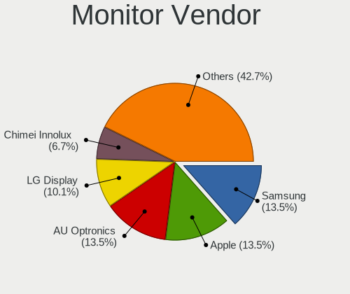
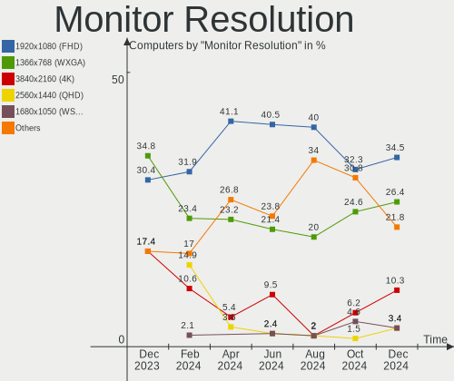
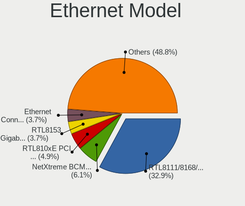
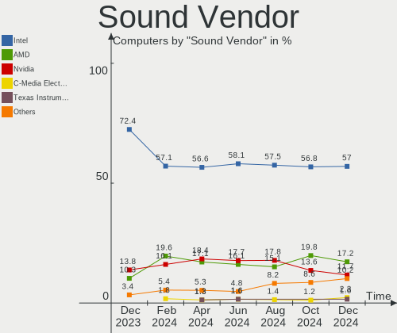

Elementary - Hardware Trends
----------------------------

A project to identify most popular hardware characteristics and track their change
over time based on data collected by Linux users at https://Linux-Hardware.org.

Anyone can contribute to this report by the [hw-probe](https://github.com/linuxhw/hw-probe) tool:

    sudo -E hw-probe -all -upload

This is a report for all computer types. See also reports for [desktops](/Dist/Elementary/Desktop/README.md) and [notebooks](/Dist/Elementary/Notebook/README.md).

This report is for one last month. Overall report since the beginning of time: [TestDays](https://github.com/linuxhw/TestDays)

Period: Mar, 2023.

Contents
--------

* [ System ](#system)
  - [ OS                       ](#os)
  - [ OS Family                ](#os-family)
  - [ Kernel                   ](#kernel)
  - [ Kernel Family            ](#kernel-family)
  - [ Kernel Major Ver.        ](#kernel-major-ver)
  - [ Arch                     ](#arch)
  - [ DE                       ](#de)
  - [ Display Server           ](#display-server)
  - [ Display Manager          ](#display-manager)
  - [ OS Lang                  ](#os-lang)
  - [ Boot Mode                ](#boot-mode)
  - [ Filesystem               ](#filesystem)
  - [ Part. scheme             ](#part-scheme)
  - [ Dual Boot with Linux/BSD ](#dual-boot-with-linuxbsd)
  - [ Dual Boot (Win)          ](#dual-boot-win)

* [ Board ](#board)
  - [ Vendor                   ](#vendor)
  - [ Model                    ](#model)
  - [ Model Family             ](#model-family)
  - [ MFG Year                 ](#mfg-year)
  - [ Form Factor              ](#form-factor)
  - [ Secure Boot              ](#secure-boot)
  - [ Coreboot                 ](#coreboot)
  - [ RAM Size                 ](#ram-size)
  - [ RAM Used                 ](#ram-used)
  - [ Total Drives             ](#total-drives)
  - [ Has CD-ROM               ](#has-cd-rom)
  - [ Has Ethernet             ](#has-ethernet)
  - [ Has WiFi                 ](#has-wifi)
  - [ Has Bluetooth            ](#has-bluetooth)

* [ Location ](#location)
  - [ Country                  ](#country)
  - [ City                     ](#city)

* [ Drives ](#drives)
  - [ Drive Vendor             ](#drive-vendor)
  - [ Drive Model              ](#drive-model)
  - [ HDD Vendor               ](#hdd-vendor)
  - [ SSD Vendor               ](#ssd-vendor)
  - [ Drive Kind               ](#drive-kind)
  - [ Drive Connector          ](#drive-connector)
  - [ Drive Size               ](#drive-size)
  - [ Space Total              ](#space-total)
  - [ Space Used               ](#space-used)
  - [ Malfunc. Drives          ](#malfunc-drives)
  - [ Malfunc. Drive Vendor    ](#malfunc-drive-vendor)
  - [ Malfunc. HDD Vendor      ](#malfunc-hdd-vendor)
  - [ Malfunc. Drive Kind      ](#malfunc-drive-kind)
  - [ Failed Drives            ](#failed-drives)
  - [ Failed Drive Vendor      ](#failed-drive-vendor)
  - [ Drive Status             ](#drive-status)

* [ Storage controller ](#storage-controller)
  - [ Storage Vendor           ](#storage-vendor)
  - [ Storage Model            ](#storage-model)
  - [ Storage Kind             ](#storage-kind)

* [ Processor ](#processor)
  - [ CPU Vendor               ](#cpu-vendor)
  - [ CPU Model                ](#cpu-model)
  - [ CPU Model Family         ](#cpu-model-family)
  - [ CPU Cores                ](#cpu-cores)
  - [ CPU Sockets              ](#cpu-sockets)
  - [ CPU Threads              ](#cpu-threads)
  - [ CPU Op-Modes             ](#cpu-op-modes)
  - [ CPU Microcode            ](#cpu-microcode)
  - [ CPU Microarch            ](#cpu-microarch)

* [ Graphics ](#graphics)
  - [ GPU Vendor               ](#gpu-vendor)
  - [ GPU Model                ](#gpu-model)
  - [ GPU Combo                ](#gpu-combo)
  - [ GPU Driver               ](#gpu-driver)
  - [ GPU Memory               ](#gpu-memory)

* [ Monitor ](#monitor)
  - [ Monitor Vendor           ](#monitor-vendor)
  - [ Monitor Model            ](#monitor-model)
  - [ Monitor Resolution       ](#monitor-resolution)
  - [ Monitor Diagonal         ](#monitor-diagonal)
  - [ Monitor Width            ](#monitor-width)
  - [ Aspect Ratio             ](#aspect-ratio)
  - [ Monitor Area             ](#monitor-area)
  - [ Pixel Density            ](#pixel-density)
  - [ Multiple Monitors        ](#multiple-monitors)

* [ Network ](#network)
  - [ Net Controller Vendor    ](#net-controller-vendor)
  - [ Net Controller Model     ](#net-controller-model)
  - [ Wireless Vendor          ](#wireless-vendor)
  - [ Wireless Model           ](#wireless-model)
  - [ Ethernet Vendor          ](#ethernet-vendor)
  - [ Ethernet Model           ](#ethernet-model)
  - [ Net Controller Kind      ](#net-controller-kind)
  - [ Used Controller          ](#used-controller)
  - [ NICs                     ](#nics)
  - [ IPv6                     ](#ipv6)

* [ Bluetooth ](#bluetooth)
  - [ Bluetooth Vendor         ](#bluetooth-vendor)
  - [ Bluetooth Model          ](#bluetooth-model)

* [ Sound ](#sound)
  - [ Sound Vendor             ](#sound-vendor)
  - [ Sound Model              ](#sound-model)

* [ Memory ](#memory)
  - [ Memory Vendor            ](#memory-vendor)
  - [ Memory Model             ](#memory-model)
  - [ Memory Kind              ](#memory-kind)
  - [ Memory Form Factor       ](#memory-form-factor)
  - [ Memory Size              ](#memory-size)
  - [ Memory Speed             ](#memory-speed)

* [ Printers & scanners ](#printers--scanners)
  - [ Printer Vendor           ](#printer-vendor)
  - [ Printer Model            ](#printer-model)
  - [ Scanner Vendor           ](#scanner-vendor)
  - [ Scanner Model            ](#scanner-model)

* [ Camera ](#camera)
  - [ Camera Vendor            ](#camera-vendor)
  - [ Camera Model             ](#camera-model)

* [ Security ](#security)
  - [ Fingerprint Vendor       ](#fingerprint-vendor)
  - [ Fingerprint Model        ](#fingerprint-model)
  - [ Chipcard Vendor          ](#chipcard-vendor)
  - [ Chipcard Model           ](#chipcard-model)

* [ Unsupported ](#unsupported)
  - [ Unsupported Devices      ](#unsupported-devices)
  - [ Unsupported Device Types ](#unsupported-device-types)

System
------

OS
--

Installed operating systems

| Name           | Computers | Percent |
|----------------|-----------|---------|
| Elementary 7   | 37        | 77.08%  |
| Elementary 6.1 | 11        | 22.92%  |

OS Family
---------

OS without a version

| Name       | Computers | Percent |
|------------|-----------|---------|
| Elementary | 48        | 100%    |

Kernel
------

Version of the Linux kernel

| Version                | Computers | Percent |
|------------------------|-----------|---------|
| 5.19.0-35-generic      | 23        | 47.92%  |
| 5.19.0-32-generic      | 7         | 14.58%  |
| 5.15.0-67-generic      | 3         | 6.25%   |
| 5.15.0-60-generic      | 3         | 6.25%   |
| 5.15.0-58-generic      | 3         | 6.25%   |
| 5.19.0-38-generic      | 2         | 4.17%   |
| 5.15.0-56-generic      | 2         | 4.17%   |
| 6.2.8-3-liquorix-amd64 | 1         | 2.08%   |
| 6.2.2-surface          | 1         | 2.08%   |
| 5.19.12-051912-generic | 1         | 2.08%   |
| 5.15.0-52-generic      | 1         | 2.08%   |
| 5.15.0-46-generic      | 1         | 2.08%   |

Kernel Family
-------------

Linux kernel without a distro release

| Version | Computers | Percent |
|---------|-----------|---------|
| 5.19.0  | 32        | 66.67%  |
| 5.15.0  | 13        | 27.08%  |
| 6.2.8   | 1         | 2.08%   |
| 6.2.2   | 1         | 2.08%   |
| 5.19.12 | 1         | 2.08%   |

Kernel Major Ver.
-----------------

Linux kernel major version

| Version | Computers | Percent |
|---------|-----------|---------|
| 5.19    | 33        | 68.75%  |
| 5.15    | 13        | 27.08%  |
| 6.2     | 2         | 4.17%   |

Arch
----

OS architecture (x86_64, i586, etc.)

| Name   | Computers | Percent |
|--------|-----------|---------|
| x86_64 | 48        | 100%    |

DE
--

Desktop Environment

| Name     | Computers | Percent |
|----------|-----------|---------|
| Pantheon | 48        | 100%    |

Display Server
--------------

X11 or Wayland

| Name | Computers | Percent |
|------|-----------|---------|
| X11  | 48        | 100%    |

Display Manager
---------------

SDDM, LightDM, etc.

| Name    | Computers | Percent |
|---------|-----------|---------|
| Unknown | 37        | 77.08%  |
| LightDM | 11        | 22.92%  |

OS Lang
-------

Language

| Lang  | Computers | Percent |
|-------|-----------|---------|
| en_US | 25        | 52.08%  |
| de_DE | 6         | 12.5%   |
| ru_RU | 3         | 6.25%   |
| pl_PL | 2         | 4.17%   |
| it_IT | 2         | 4.17%   |
| es_ES | 2         | 4.17%   |
| pt_PT | 1         | 2.08%   |
| pt_BR | 1         | 2.08%   |
| fi_FI | 1         | 2.08%   |
| en_GB | 1         | 2.08%   |
| en_CA | 1         | 2.08%   |
| en_AU | 1         | 2.08%   |
| el_GR | 1         | 2.08%   |
| de_CH | 1         | 2.08%   |

Boot Mode
---------

EFI or BIOS

| Mode | Computers | Percent |
|------|-----------|---------|
| BIOS | 37        | 77.08%  |
| EFI  | 11        | 22.92%  |

Filesystem
----------

Type of filesystem

| Type  | Computers | Percent |
|-------|-----------|---------|
| Ext4  | 47        | 97.92%  |
| Btrfs | 1         | 2.08%   |

Part. scheme
------------

Scheme of partitioning

| Type    | Computers | Percent |
|---------|-----------|---------|
| Unknown | 37        | 77.08%  |
| GPT     | 10        | 20.83%  |
| MBR     | 1         | 2.08%   |

Dual Boot with Linux/BSD
------------------------

Hosting more than one Linux/BSD

| Dual boot | Computers | Percent |
|-----------|-----------|---------|
| No        | 48        | 100%    |

Dual Boot (Win)
---------------

Hosting Linux and Windows

| Dual boot | Computers | Percent |
|-----------|-----------|---------|
| No        | 46        | 95.83%  |
| Yes       | 2         | 4.17%   |

Board
-----

Vendor
------

Motherboard manufacturer

| Name             | Computers | Percent |
|------------------|-----------|---------|
| Lenovo           | 7         | 14.58%  |
| ASUSTek Computer | 7         | 14.58%  |
| Hewlett-Packard  | 6         | 12.5%   |
| Dell             | 5         | 10.42%  |
| MSI              | 4         | 8.33%   |
| Acer             | 4         | 8.33%   |
| Fujitsu          | 3         | 6.25%   |
| Apple            | 3         | 6.25%   |
| Toshiba          | 1         | 2.08%   |
| Sony             | 1         | 2.08%   |
| Microsoft        | 1         | 2.08%   |
| Inventec         | 1         | 2.08%   |
| HUAWEI           | 1         | 2.08%   |
| HONOR            | 1         | 2.08%   |
| GPU Company      | 1         | 2.08%   |
| AZW              | 1         | 2.08%   |
| Unknown          | 1         | 2.08%   |

Model
-----

Motherboard model

| Name                                    | Computers | Percent |
|-----------------------------------------|-----------|---------|
| Toshiba TECRA Z40-C                     | 1         | 2.08%   |
| Sony VPCEH2C5E                          | 1         | 2.08%   |
| MSI MS-7C31                             | 1         | 2.08%   |
| MSI MS-7C02                             | 1         | 2.08%   |
| MSI GT72 2QE                            | 1         | 2.08%   |
| MSI CX61 2PC                            | 1         | 2.08%   |
| Microsoft Surface Pro 7                 | 1         | 2.08%   |
| Lenovo V510-15IKB 80WQ                  | 1         | 2.08%   |
| Lenovo V17 G2 ITL 82NX                  | 1         | 2.08%   |
| Lenovo ThinkPad X240 20AMS0XP0S         | 1         | 2.08%   |
| Lenovo ThinkPad X13 Gen 1 20T3S3SH0U    | 1         | 2.08%   |
| Lenovo Legion 5 15ARH05H 82B1           | 1         | 2.08%   |
| Lenovo IdeaPad 330S-15ARR 81FB          | 1         | 2.08%   |
| Lenovo G580 20150                       | 1         | 2.08%   |
| Inventec Z CLASS                        | 1         | 2.08%   |
| HUAWEI KLVL-WXX9                        | 1         | 2.08%   |
| HONOR HYM-WXX                           | 1         | 2.08%   |
| HP ProBook 450 15.6 inch G9 Notebook PC | 1         | 2.08%   |
| HP Pavilion Laptop 15-eh0xxx            | 1         | 2.08%   |
| HP Laptop 15-bs2xx                      | 1         | 2.08%   |
| HP EliteDesk 705 G2 MT                  | 1         | 2.08%   |
| HP Compaq dc7900 Ultra-Slim Desktop     | 1         | 2.08%   |
| HP 255 G7 Notebook PC                   | 1         | 2.08%   |
| GPU Company GWTN156-11                  | 1         | 2.08%   |
| Fujitsu LIFEBOOK E744                   | 1         | 2.08%   |
| Fujitsu LIFEBOOK AH530                  | 1         | 2.08%   |
| Fujitsu LIFEBOOK A359                   | 1         | 2.08%   |
| Dell OptiPlex 5040                      | 1         | 2.08%   |
| Dell Latitude E7440                     | 1         | 2.08%   |
| Dell Latitude E5570                     | 1         | 2.08%   |
| Dell Latitude 5420                      | 1         | 2.08%   |
| Dell G3 3590                            | 1         | 2.08%   |
| AZW U59                                 | 1         | 2.08%   |
| ASUS ZenBook UX425EA_UX425EA            | 1         | 2.08%   |
| ASUS Zenbook UN5401QAB_UN5401QA         | 1         | 2.08%   |
| ASUS ZenBook S UX391UA                  | 1         | 2.08%   |
| ASUS ROG Zephyrus M16 GU603HE_GU603HE   | 1         | 2.08%   |
| ASUS M4A785TD-V EVO                     | 1         | 2.08%   |
| ASUS K55A                               | 1         | 2.08%   |
| ASUS BT6130-8                           | 1         | 2.08%   |

Model Family
------------

Motherboard model prefix

| Name                   | Computers | Percent |
|------------------------|-----------|---------|
| Acer Aspire            | 4         | 8.33%   |
| Fujitsu LIFEBOOK       | 3         | 6.25%   |
| Dell Latitude          | 3         | 6.25%   |
| ASUS ZenBook           | 3         | 6.25%   |
| Lenovo ThinkPad        | 2         | 4.17%   |
| Toshiba TECRA          | 1         | 2.08%   |
| Sony VPCEH2C5E         | 1         | 2.08%   |
| MSI MS-7C31            | 1         | 2.08%   |
| MSI MS-7C02            | 1         | 2.08%   |
| MSI GT72               | 1         | 2.08%   |
| MSI CX61               | 1         | 2.08%   |
| Microsoft Surface      | 1         | 2.08%   |
| Lenovo V510-15IKB      | 1         | 2.08%   |
| Lenovo V17             | 1         | 2.08%   |
| Lenovo Legion          | 1         | 2.08%   |
| Lenovo IdeaPad         | 1         | 2.08%   |
| Lenovo G580            | 1         | 2.08%   |
| Inventec Z             | 1         | 2.08%   |
| HUAWEI KLVL-WXX9       | 1         | 2.08%   |
| HONOR HYM-WXX          | 1         | 2.08%   |
| HP ProBook             | 1         | 2.08%   |
| HP Pavilion            | 1         | 2.08%   |
| HP Laptop              | 1         | 2.08%   |
| HP EliteDesk           | 1         | 2.08%   |
| HP Compaq              | 1         | 2.08%   |
| HP 255                 | 1         | 2.08%   |
| GPU Company GWTN156-11 | 1         | 2.08%   |
| Dell OptiPlex          | 1         | 2.08%   |
| Dell G3                | 1         | 2.08%   |
| AZW U59                | 1         | 2.08%   |
| ASUS ROG               | 1         | 2.08%   |
| ASUS M4A785TD-V        | 1         | 2.08%   |
| ASUS K55A              | 1         | 2.08%   |
| ASUS BT6130-8          | 1         | 2.08%   |
| Apple MacBookPro5      | 1         | 2.08%   |
| Apple MacBookPro11     | 1         | 2.08%   |
| Apple iMac9            | 1         | 2.08%   |
| Unknown                | 1         | 2.08%   |

MFG Year
--------

Motherboard manufacture year

| Year | Computers | Percent |
|------|-----------|---------|
| 2020 | 7         | 14.58%  |
| 2018 | 6         | 12.5%   |
| 2022 | 5         | 10.42%  |
| 2016 | 5         | 10.42%  |
| 2012 | 5         | 10.42%  |
| 2021 | 4         | 8.33%   |
| 2019 | 4         | 8.33%   |
| 2014 | 3         | 6.25%   |
| 2013 | 3         | 6.25%   |
| 2009 | 3         | 6.25%   |
| 2015 | 1         | 2.08%   |
| 2010 | 1         | 2.08%   |
| 2008 | 1         | 2.08%   |

Form Factor
-----------

Physical design of the computer

| Name        | Computers | Percent |
|-------------|-----------|---------|
| Notebook    | 34        | 70.83%  |
| Desktop     | 11        | 22.92%  |
| Tablet      | 1         | 2.08%   |
| Convertible | 1         | 2.08%   |
| All in one  | 1         | 2.08%   |

Secure Boot
-----------

Enabled or disabled

| State    | Computers | Percent |
|----------|-----------|---------|
| Disabled | 45        | 93.75%  |
| Enabled  | 3         | 6.25%   |

Coreboot
--------

Have coreboot on board

| Used | Computers | Percent |
|------|-----------|---------|
| No   | 48        | 100%    |

RAM Size
--------

Total RAM memory

| Size in GB | Computers | Percent |
|------------|-----------|---------|
| 4.01-8.0   | 15        | 31.25%  |
| 3.01-4.0   | 11        | 22.92%  |
| 16.01-24.0 | 10        | 20.83%  |
| 8.01-16.0  | 9         | 18.75%  |
| 32.01-64.0 | 3         | 6.25%   |

RAM Used
--------

Used RAM memory

| Used GB   | Computers | Percent |
|-----------|-----------|---------|
| 2.01-3.0  | 14        | 29.17%  |
| 1.01-2.0  | 14        | 29.17%  |
| 3.01-4.0  | 10        | 20.83%  |
| 4.01-8.0  | 8         | 16.67%  |
| 8.01-16.0 | 1         | 2.08%   |
| 0.51-1.0  | 1         | 2.08%   |

Total Drives
------------

Number of drives on board

| Drives | Computers | Percent |
|--------|-----------|---------|
| 1      | 31        | 64.58%  |
| 2      | 16        | 33.33%  |
| 4      | 1         | 2.08%   |

Has CD-ROM
----------

Has CD-ROM on board

| Presented | Computers | Percent |
|-----------|-----------|---------|
| No        | 30        | 62.5%   |
| Yes       | 18        | 37.5%   |

Has Ethernet
------------

Has Ethernet on board

| Presented | Computers | Percent |
|-----------|-----------|---------|
| Yes       | 37        | 77.08%  |
| No        | 11        | 22.92%  |

Has WiFi
--------

Has WiFi module

| Presented | Computers | Percent |
|-----------|-----------|---------|
| Yes       | 43        | 89.58%  |
| No        | 5         | 10.42%  |

Has Bluetooth
-------------

Has Bluetooth module

| Presented | Computers | Percent |
|-----------|-----------|---------|
| Yes       | 38        | 79.17%  |
| No        | 10        | 20.83%  |

Location
--------

Country
-------

Geographic location (country)

| Country     | Computers | Percent |
|-------------|-----------|---------|
| USA         | 10        | 20.83%  |
| Germany     | 8         | 16.67%  |
| Russia      | 4         | 8.33%   |
| Poland      | 3         | 6.25%   |
| UK          | 2         | 4.17%   |
| Spain       | 2         | 4.17%   |
| Italy       | 2         | 4.17%   |
| Greece      | 2         | 4.17%   |
| Turkey      | 1         | 2.08%   |
| Tunisia     | 1         | 2.08%   |
| Thailand    | 1         | 2.08%   |
| Switzerland | 1         | 2.08%   |
| Puerto Rico | 1         | 2.08%   |
| Portugal    | 1         | 2.08%   |
| Norway      | 1         | 2.08%   |
| Israel      | 1         | 2.08%   |
| Ireland     | 1         | 2.08%   |
| Finland     | 1         | 2.08%   |
| Czechia     | 1         | 2.08%   |
| Cyprus      | 1         | 2.08%   |
| Canada      | 1         | 2.08%   |
| Belgium     | 1         | 2.08%   |
| Australia   | 1         | 2.08%   |

City
----

Geographic location (city)

| City                | Computers | Percent |
|---------------------|-----------|---------|
| Athens              | 2         | 4.17%   |
| Znojmo              | 1         | 2.08%   |
| Wellingborough      | 1         | 2.08%   |
| Wauconda            | 1         | 2.08%   |
| Warsaw              | 1         | 2.08%   |
| Vigo                | 1         | 2.08%   |
| Tuam                | 1         | 2.08%   |
| Tower City          | 1         | 2.08%   |
| Tel Aviv            | 1         | 2.08%   |
| Stuttgart           | 1         | 2.08%   |
| St Petersburg       | 1         | 2.08%   |
| San Marcos          | 1         | 2.08%   |
| Salt Lake City      | 1         | 2.08%   |
| Perth               | 1         | 2.08%   |
| Nicosia             | 1         | 2.08%   |
| Newcastle upon Tyne | 1         | 2.08%   |
| Moscow              | 1         | 2.08%   |
| Mombello di Torino  | 1         | 2.08%   |
| Milano              | 1         | 2.08%   |
| Mahlstetten         | 1         | 2.08%   |
| Madrid              | 1         | 2.08%   |
| Lyngdal             | 1         | 2.08%   |
| Lublin              | 1         | 2.08%   |
| Lousada             | 1         | 2.08%   |
| Lausen              | 1         | 2.08%   |
| Las Vegas           | 1         | 2.08%   |
| Laberweinting       | 1         | 2.08%   |
| Khimki              | 1         | 2.08%   |
| Kansas City         | 1         | 2.08%   |
| Irvine              | 1         | 2.08%   |
| Houston             | 1         | 2.08%   |
| Herne               | 1         | 2.08%   |
| Helsinki            | 1         | 2.08%   |
| Greven              | 1         | 2.08%   |
| Ghent               | 1         | 2.08%   |
| Fürstenfeldbruck   | 1         | 2.08%   |
| Chemnitz            | 1         | 2.08%   |
| Brzesko             | 1         | 2.08%   |
| Brampton            | 1         | 2.08%   |
| Berlin              | 1         | 2.08%   |

Drives
------

Drive Vendor
------------

Hard drive vendors

| Vendor              | Computers | Drives | Percent |
|---------------------|-----------|--------|---------|
| Samsung Electronics | 10        | 11     | 16.39%  |
| WDC                 | 8         | 8      | 13.11%  |
| Toshiba             | 4         | 5      | 6.56%   |
| Seagate             | 4         | 5      | 6.56%   |
| Sandisk             | 4         | 4      | 6.56%   |
| Kingston            | 4         | 4      | 6.56%   |
| Intel               | 3         | 4      | 4.92%   |
| Crucial             | 3         | 3      | 4.92%   |
| Unknown             | 2         | 2      | 3.28%   |
| Fujitsu             | 2         | 2      | 3.28%   |
| China               | 2         | 2      | 3.28%   |
| Team                | 1         | 2      | 1.64%   |
| T-FORCE             | 1         | 1      | 1.64%   |
| Solid State Storage | 1         | 1      | 1.64%   |
| SK hynix            | 1         | 1      | 1.64%   |
| NGFF                | 1         | 1      | 1.64%   |
| Netac               | 1         | 1      | 1.64%   |
| Micron Technology   | 1         | 1      | 1.64%   |
| KIOXIA              | 1         | 1      | 1.64%   |
| KingDian            | 1         | 1      | 1.64%   |
| Intenso             | 1         | 1      | 1.64%   |
| Inland              | 1         | 1      | 1.64%   |
| Hewlett-Packard     | 1         | 1      | 1.64%   |
| ASMT                | 1         | 1      | 1.64%   |
| Apple               | 1         | 1      | 1.64%   |
| Unknown             | 1         | 1      | 1.64%   |

Drive Model
-----------

Hard drive models

| Model                                              | Computers | Percent |
|----------------------------------------------------|-----------|---------|
| Kingston SA400S37240G 240GB SSD                    | 2         | 3.08%   |
| Intel SSD 660P Series 512GB                        | 2         | 3.08%   |
| WDC WDS240G2G0B-00EPW0 240GB SSD                   | 1         | 1.54%   |
| WDC WDS100T2B0B-00YS70 1TB SSD                     | 1         | 1.54%   |
| WDC WD5000LPVX-22V0TT0 500GB                       | 1         | 1.54%   |
| WDC WD5000LPCX-60VHAT1 500GB                       | 1         | 1.54%   |
| WDC WD10SPZX-21Z10T0 1TB                           | 1         | 1.54%   |
| WDC WD10JPVX-22JC3T0 1TB                           | 1         | 1.54%   |
| WDC WD10EZEX-60WN4A0 1TB                           | 1         | 1.54%   |
| WDC WD10EZEX-21WN4A0 1TB                           | 1         | 1.54%   |
| Unknown MMC Card  32GB                             | 1         | 1.54%   |
| Unknown MMC Card  128GB                            | 1         | 1.54%   |
| Toshiba THNSNK128GVN8 M.2 2280 128GB SSD           | 1         | 1.54%   |
| Toshiba THNSNJ128GCSU 128GB SSD                    | 1         | 1.54%   |
| Toshiba THNSNJ128G8NU 128GB SSD                    | 1         | 1.54%   |
| Toshiba NVMe Controller 1TB                        | 1         | 1.54%   |
| Team T253X2001T 1024GB SSD                         | 1         | 1.54%   |
| Team T253X1480G 480GB SSD                          | 1         | 1.54%   |
| T-FORCE 2TB                                        | 1         | 1.54%   |
| Solid State Storage CL1-3D512-Q11 NVMe SSSTC 512GB | 1         | 1.54%   |
| SK hynix BC501 NVMe Solid State Drive 512GB        | 1         | 1.54%   |
| Seagate ST9500325AS 500GB                          | 1         | 1.54%   |
| Seagate ST500LM012 HN-M500MBB 500GB                | 1         | 1.54%   |
| Seagate ST2000LM015-2E8174 2TB                     | 1         | 1.54%   |
| Seagate ST2000LM003 HN-M201RAD 2TB                 | 1         | 1.54%   |
| Seagate Expansion+ 2TB                             | 1         | 1.54%   |
| Sandisk WDC PC SN530 SDBPMPZ-256G-1101 256GB       | 1         | 1.54%   |
| Sandisk WD Black SN750 / PC SN730 NVMe SSD 1TB     | 1         | 1.54%   |
| SanDisk SD8SBAT256G1122 256GB SSD                  | 1         | 1.54%   |
| Sandisk PC SN530 NVMe WDC 256GB                    | 1         | 1.54%   |
| Samsung SSD PM810 2.5 7mm 128GB                    | 1         | 1.54%   |
| Samsung SSD 870 EVO 250GB                          | 1         | 1.54%   |
| Samsung SSD 850 PRO 256GB                          | 1         | 1.54%   |
| Samsung NVMe SSD Controller PM9A1/PM9A3/980PRO 1TB | 1         | 1.54%   |
| Samsung MZVLQ512HALU-000H1 512GB                   | 1         | 1.54%   |
| Samsung MZVLQ512HALU-00000 512GB                   | 1         | 1.54%   |
| Samsung MZVL4256HBJD-00BH1 256GB                   | 1         | 1.54%   |
| Samsung MZNTY256HDHP-000L2 256GB SSD               | 1         | 1.54%   |
| Samsung MZNLN128HAHQ-000H1 128GB SSD               | 1         | 1.54%   |
| Samsung MZ7LN256HAJQ-00000 256GB SSD               | 1         | 1.54%   |

HDD Vendor
----------

Hard disk drive vendors

| Vendor              | Computers | Drives | Percent |
|---------------------|-----------|--------|---------|
| WDC                 | 6         | 6      | 42.86%  |
| Seagate             | 4         | 5      | 28.57%  |
| Fujitsu             | 2         | 2      | 14.29%  |
| Samsung Electronics | 1         | 1      | 7.14%   |
| ASMT                | 1         | 1      | 7.14%   |

SSD Vendor
----------

Solid state drive vendors

| Vendor              | Computers | Drives | Percent |
|---------------------|-----------|--------|---------|
| Samsung Electronics | 6         | 6      | 21.43%  |
| Kingston            | 4         | 4      | 14.29%  |
| Toshiba             | 3         | 4      | 10.71%  |
| Crucial             | 3         | 3      | 10.71%  |
| WDC                 | 2         | 2      | 7.14%   |
| China               | 2         | 2      | 7.14%   |
| Team                | 1         | 2      | 3.57%   |
| SanDisk             | 1         | 1      | 3.57%   |
| NGFF                | 1         | 1      | 3.57%   |
| KingDian            | 1         | 1      | 3.57%   |
| Intenso             | 1         | 1      | 3.57%   |
| Inland              | 1         | 1      | 3.57%   |
| Hewlett-Packard     | 1         | 1      | 3.57%   |
| Apple               | 1         | 1      | 3.57%   |

Drive Kind
----------

HDD or SSD

| Kind    | Computers | Drives | Percent |
|---------|-----------|--------|---------|
| SSD     | 26        | 30     | 44.07%  |
| NVMe    | 15        | 16     | 25.42%  |
| HDD     | 13        | 15     | 22.03%  |
| Unknown | 3         | 3      | 5.08%   |
| MMC     | 2         | 2      | 3.39%   |

Drive Connector
---------------

SATA, SAS, NVMe, etc.

| Type | Computers | Drives | Percent |
|------|-----------|--------|---------|
| SATA | 35        | 45     | 63.64%  |
| NVMe | 15        | 16     | 27.27%  |
| SAS  | 3         | 3      | 5.45%   |
| MMC  | 2         | 2      | 3.64%   |

Drive Size
----------

Size of hard drive

| Size in TB | Computers | Drives | Percent |
|------------|-----------|--------|---------|
| 0.01-0.5   | 28        | 32     | 70%     |
| 0.51-1.0   | 8         | 8      | 20%     |
| 1.01-2.0   | 4         | 5      | 10%     |

Space Total
-----------

Amount of disk space available on the file system

| Size in GB     | Computers | Percent |
|----------------|-----------|---------|
| 101-250        | 24        | 50%     |
| 251-500        | 10        | 20.83%  |
| 501-1000       | 7         | 14.58%  |
| 1001-2000      | 3         | 6.25%   |
| 51-100         | 2         | 4.17%   |
| More than 3000 | 1         | 2.08%   |
| 2001-3000      | 1         | 2.08%   |

Space Used
----------

Amount of used disk space

| Used GB        | Computers | Percent |
|----------------|-----------|---------|
| 1-20           | 17        | 35.42%  |
| 21-50          | 11        | 22.92%  |
| 51-100         | 9         | 18.75%  |
| 101-250        | 6         | 12.5%   |
| 251-500        | 2         | 4.17%   |
| 1001-2000      | 2         | 4.17%   |
| More than 3000 | 1         | 2.08%   |

Malfunc. Drives
---------------

Drive models with a malfunction

Zero info for selected period =(

Malfunc. Drive Vendor
---------------------

Vendors of faulty drives

Zero info for selected period =(

Malfunc. HDD Vendor
-------------------

Vendors of faulty HDD drives

Zero info for selected period =(

Malfunc. Drive Kind
-------------------

Kinds of faulty drives

Zero info for selected period =(

Failed Drives
-------------

Failed drive models

Zero info for selected period =(

Failed Drive Vendor
-------------------

Failed drive vendors

Zero info for selected period =(

Drive Status
------------

Number of failed and malfunc. drives

| Status   | Computers | Drives | Percent |
|----------|-----------|--------|---------|
| Detected | 44        | 61     | 89.8%   |
| Works    | 5         | 5      | 10.2%   |

Storage controller
------------------

Storage Vendor
--------------

Storage controller vendors

| Vendor                         | Computers | Percent |
|--------------------------------|-----------|---------|
| Intel                          | 29        | 55.77%  |
| AMD                            | 8         | 15.38%  |
| Samsung Electronics            | 5         | 9.62%   |
| SanDisk                        | 3         | 5.77%   |
| Nvidia                         | 2         | 3.85%   |
| Toshiba America Info Systems   | 1         | 1.92%   |
| Solid State Storage Technology | 1         | 1.92%   |
| SK hynix                       | 1         | 1.92%   |
| Micron Technology              | 1         | 1.92%   |
| KIOXIA                         | 1         | 1.92%   |

Storage Model
-------------

Storage controller models

| Model                                                                          | Computers | Percent |
|--------------------------------------------------------------------------------|-----------|---------|
| AMD FCH SATA Controller [AHCI mode]                                            | 6         | 9.84%   |
| Intel Celeron/Pentium Silver Processor SATA Controller                         | 4         | 6.56%   |
| Intel Volume Management Device NVMe RAID Controller                            | 3         | 4.92%   |
| Intel Sunrise Point-LP SATA Controller [AHCI mode]                             | 3         | 4.92%   |
| Intel 82801 Mobile SATA Controller [RAID mode]                                 | 3         | 4.92%   |
| Samsung NVMe SSD Controller 980                                                | 2         | 3.28%   |
| Nvidia MCP79 AHCI Controller                                                   | 2         | 3.28%   |
| Intel SSD 660P Series                                                          | 2         | 3.28%   |
| Intel Non-Volatile memory controller                                           | 2         | 3.28%   |
| Intel Cannon Lake Mobile PCH SATA AHCI Controller                              | 2         | 3.28%   |
| Intel 8 Series/C220 Series Chipset Family 6-port SATA Controller 1 [AHCI mode] | 2         | 3.28%   |
| Intel 7 Series Chipset Family 6-port SATA Controller [AHCI mode]               | 2         | 3.28%   |
| Toshiba America Info Systems NVMe Controller                                   | 1         | 1.64%   |
| Solid State Storage Non-Volatile memory controller                             | 1         | 1.64%   |
| SK hynix BC501 NVMe Solid State Drive                                          | 1         | 1.64%   |
| SanDisk WD Black SN750 / PC SN730 NVMe SSD                                     | 1         | 1.64%   |
| SanDisk NVMe Controller                                                        | 1         | 1.64%   |
| SanDisk Non-Volatile memory controller                                         | 1         | 1.64%   |
| Samsung NVMe SSD Controller PM9B1                                              | 1         | 1.64%   |
| Samsung NVMe SSD Controller PM9A1/PM9A3/980PRO                                 | 1         | 1.64%   |
| Samsung Apple PCIe SSD                                                         | 1         | 1.64%   |
| Micron NVMe Storage Controller                                                 | 1         | 1.64%   |
| KIOXIA NVMe SSD Controller BG4                                                 | 1         | 1.64%   |
| Intel Tiger Lake-LP SATA Controller                                            | 1         | 1.64%   |
| Intel Q170/Q150/B150/H170/H110/Z170/CM236 Chipset SATA Controller [AHCI Mode]  | 1         | 1.64%   |
| Intel Jasper Lake SATA AHCI Controller                                         | 1         | 1.64%   |
| Intel 82801JD/DO (ICH10 Family) SATA AHCI Controller                           | 1         | 1.64%   |
| Intel 8 Series SATA Controller 1 [AHCI mode]                                   | 1         | 1.64%   |
| Intel 7 Series Chipset Family 4-port SATA Controller [IDE mode]                | 1         | 1.64%   |
| Intel 7 Series Chipset Family 2-port SATA Controller [IDE mode]                | 1         | 1.64%   |
| Intel 6 Series/C200 Series Chipset Family 6 port Mobile SATA AHCI Controller   | 1         | 1.64%   |
| Intel 6 Series/C200 Series Chipset Family 6 port Desktop SATA AHCI Controller  | 1         | 1.64%   |
| Intel 5 Series/3400 Series Chipset 4 port SATA AHCI Controller                 | 1         | 1.64%   |
| Intel 4 Series Chipset PT IDER Controller                                      | 1         | 1.64%   |
| Intel 200 Series PCH SATA controller [AHCI mode]                               | 1         | 1.64%   |
| AMD SB7x0/SB8x0/SB9x0 SATA Controller [IDE mode]                               | 1         | 1.64%   |
| AMD SB7x0/SB8x0/SB9x0 SATA Controller [AHCI mode]                              | 1         | 1.64%   |
| AMD SB7x0/SB8x0/SB9x0 IDE Controller                                           | 1         | 1.64%   |
| AMD 400 Series Chipset SATA Controller                                         | 1         | 1.64%   |
| AMD 300 Series Chipset SATA Controller                                         | 1         | 1.64%   |

Storage Kind
------------

Kind of storage controller (IDE, SATA, NVMe, SAS, ...)

| Kind | Computers | Percent |
|------|-----------|---------|
| SATA | 33        | 57.89%  |
| NVMe | 15        | 26.32%  |
| RAID | 6         | 10.53%  |
| IDE  | 3         | 5.26%   |

Processor
---------

CPU Vendor
----------

Processor vendors

| Vendor | Computers | Percent |
|--------|-----------|---------|
| Intel  | 36        | 75%     |
| AMD    | 12        | 25%     |

CPU Model
---------

Processor models

| Model                                    | Computers | Percent |
|------------------------------------------|-----------|---------|
| Intel Pentium Silver N5030 CPU @ 1.10GHz | 1         | 2.08%   |
| Intel Pentium Silver N5000 CPU @ 1.10GHz | 1         | 2.08%   |
| Intel Pentium CPU P6200 @ 2.13GHz        | 1         | 2.08%   |
| Intel Core i7-9750H CPU @ 2.60GHz        | 1         | 2.08%   |
| Intel Core i7-8550U CPU @ 1.80GHz        | 1         | 2.08%   |
| Intel Core i7-4750HQ CPU @ 2.00GHz       | 1         | 2.08%   |
| Intel Core i7-4712MQ CPU @ 2.30GHz       | 1         | 2.08%   |
| Intel Core i7-4710HQ CPU @ 2.50GHz       | 1         | 2.08%   |
| Intel Core i7-4600U CPU @ 2.10GHz        | 1         | 2.08%   |
| Intel Core i7-3770S CPU @ 3.10GHz        | 1         | 2.08%   |
| Intel Core i5-8300H CPU @ 2.30GHz        | 1         | 2.08%   |
| Intel Core i5-8250U CPU @ 1.60GHz        | 1         | 2.08%   |
| Intel Core i5-6500 CPU @ 3.20GHz         | 1         | 2.08%   |
| Intel Core i5-6300U CPU @ 2.40GHz        | 1         | 2.08%   |
| Intel Core i5-6200U CPU @ 2.30GHz        | 1         | 2.08%   |
| Intel Core i5-4300U CPU @ 1.90GHz        | 1         | 2.08%   |
| Intel Core i5-4300M CPU @ 2.60GHz        | 1         | 2.08%   |
| Intel Core i5-3230M CPU @ 2.60GHz        | 1         | 2.08%   |
| Intel Core i5-3210M CPU @ 2.50GHz        | 1         | 2.08%   |
| Intel Core i5-2430M CPU @ 2.40GHz        | 1         | 2.08%   |
| Intel Core i5-1035G4 CPU @ 1.10GHz       | 1         | 2.08%   |
| Intel Core i5-10310U CPU @ 1.70GHz       | 1         | 2.08%   |
| Intel Core i3-9100 CPU @ 3.60GHz         | 1         | 2.08%   |
| Intel Core i3-6006U CPU @ 2.00GHz        | 1         | 2.08%   |
| Intel Core 2 Duo CPU P7550 @ 2.26GHz     | 1         | 2.08%   |
| Intel Core 2 Duo CPU E8400 @ 3.00GHz     | 1         | 2.08%   |
| Intel Core 2 Duo CPU E8135 @ 2.66GHz     | 1         | 2.08%   |
| Intel Celeron N5105 @ 2.00GHz            | 1         | 2.08%   |
| Intel Celeron N4000 CPU @ 1.10GHz        | 1         | 2.08%   |
| Intel Celeron J4125 CPU @ 2.00GHz        | 1         | 2.08%   |
| Intel Celeron CPU B830 @ 1.80GHz         | 1         | 2.08%   |
| Intel 12th Gen Core i5-1235U             | 1         | 2.08%   |
| Intel 11th Gen Core i7-1185G7 @ 3.00GHz  | 1         | 2.08%   |
| Intel 11th Gen Core i7-11800H @ 2.30GHz  | 1         | 2.08%   |
| Intel 11th Gen Core i7-1165G7 @ 2.80GHz  | 1         | 2.08%   |
| Intel 11th Gen Core i3-1115G4 @ 3.00GHz  | 1         | 2.08%   |
| AMD Ryzen 7 5800HS with Radeon Graphics  | 1         | 2.08%   |
| AMD Ryzen 7 4800H with Radeon Graphics   | 1         | 2.08%   |
| AMD Ryzen 5 5600H with Radeon Graphics   | 1         | 2.08%   |
| AMD Ryzen 5 4600H with Radeon Graphics   | 1         | 2.08%   |

CPU Model Family
----------------

Processor model prefix

| Model                | Computers | Percent |
|----------------------|-----------|---------|
| Intel Core i5        | 12        | 25%     |
| Intel Core i7        | 7         | 14.58%  |
| Other                | 6         | 12.5%   |
| AMD Ryzen 5          | 6         | 12.5%   |
| Intel Celeron        | 4         | 8.33%   |
| Intel Core 2 Duo     | 3         | 6.25%   |
| Intel Pentium Silver | 2         | 4.17%   |
| Intel Core i3        | 2         | 4.17%   |
| AMD Ryzen 7          | 2         | 4.17%   |
| Intel Pentium        | 1         | 2.08%   |
| AMD Phenom II X6     | 1         | 2.08%   |
| AMD G                | 1         | 2.08%   |
| AMD A4               | 1         | 2.08%   |

CPU Cores
---------

Number of processor cores

| Number | Computers | Percent |
|--------|-----------|---------|
| 4      | 19        | 39.58%  |
| 2      | 18        | 37.5%   |
| 6      | 5         | 10.42%  |
| 8      | 3         | 6.25%   |
| 10     | 1         | 2.08%   |
| 5      | 1         | 2.08%   |
| 1      | 1         | 2.08%   |

CPU Sockets
-----------

Number of sockets

| Number | Computers | Percent |
|--------|-----------|---------|
| 1      | 48        | 100%    |

CPU Threads
-----------

Threads per core (Hyper-Threading)

| Number | Computers | Percent |
|--------|-----------|---------|
| 2      | 32        | 66.67%  |
| 1      | 16        | 33.33%  |

CPU Op-Modes
------------

CPU Operation Modes (32-bit, 64-bit)

| Op mode        | Computers | Percent |
|----------------|-----------|---------|
| 32-bit, 64-bit | 48        | 100%    |

CPU Microcode
-------------

Microcode number

| Number     | Computers | Percent |
|------------|-----------|---------|
| Unknown    | 32        | 66.67%  |
| 0x706a1    | 2         | 4.17%   |
| 0x306a9    | 2         | 4.17%   |
| 0x0810100b | 2         | 4.17%   |
| 0x906c0    | 1         | 2.08%   |
| 0x906a4    | 1         | 2.08%   |
| 0x806ea    | 1         | 2.08%   |
| 0x806c1    | 1         | 2.08%   |
| 0x506e3    | 1         | 2.08%   |
| 0x406e3    | 1         | 2.08%   |
| 0x40651    | 1         | 2.08%   |
| 0x206a7    | 1         | 2.08%   |
| 0x0a50000c | 1         | 2.08%   |
| 0x08600104 | 1         | 2.08%   |

CPU Microarch
-------------

Microarchitecture

| Name             | Computers | Percent |
|------------------|-----------|---------|
| KabyLake         | 6         | 12.5%   |
| Haswell          | 6         | 12.5%   |
| Zen 2            | 4         | 8.33%   |
| Skylake          | 4         | 8.33%   |
| Goldmont plus    | 4         | 8.33%   |
| TigerLake        | 3         | 6.25%   |
| Penryn           | 3         | 6.25%   |
| IvyBridge        | 3         | 6.25%   |
| Zen 3            | 2         | 4.17%   |
| Zen              | 2         | 4.17%   |
| SandyBridge      | 2         | 4.17%   |
| Westmere         | 1         | 2.08%   |
| Tremont          | 1         | 2.08%   |
| Steamroller      | 1         | 2.08%   |
| K10              | 1         | 2.08%   |
| IceLake          | 1         | 2.08%   |
| Excavator        | 1         | 2.08%   |
| Bobcat           | 1         | 2.08%   |
| Alderlake Hybrid | 1         | 2.08%   |
| Unknown          | 1         | 2.08%   |

Graphics
--------

GPU Vendor
----------

Vendors of graphics cards

| Vendor | Computers | Percent |
|--------|-----------|---------|
| Intel  | 30        | 54.55%  |
| AMD    | 14        | 25.45%  |
| Nvidia | 11        | 20%     |

GPU Model
---------

Graphics card models

| Model                                                                                 | Computers | Percent |
|---------------------------------------------------------------------------------------|-----------|---------|
| AMD Renoir                                                                            | 3         | 5.36%   |
| Nvidia GF117M [GeForce 610M/710M/810M/820M / GT 620M/625M/630M/720M]                  | 2         | 3.57%   |
| Intel UHD Graphics 620                                                                | 2         | 3.57%   |
| Intel TigerLake-LP GT2 [Iris Xe Graphics]                                             | 2         | 3.57%   |
| Intel Skylake GT2 [HD Graphics 520]                                                   | 2         | 3.57%   |
| Intel Haswell-ULT Integrated Graphics Controller                                      | 2         | 3.57%   |
| Intel GeminiLake [UHD Graphics 605]                                                   | 2         | 3.57%   |
| Intel GeminiLake [UHD Graphics 600]                                                   | 2         | 3.57%   |
| Intel CoffeeLake-H GT2 [UHD Graphics 630]                                             | 2         | 3.57%   |
| Intel 4th Gen Core Processor Integrated Graphics Controller                           | 2         | 3.57%   |
| Intel 3rd Gen Core processor Graphics Controller                                      | 2         | 3.57%   |
| AMD Cezanne [Radeon Vega Series / Radeon Vega Mobile Series]                          | 2         | 3.57%   |
| Nvidia TU116M [GeForce GTX 1660 Ti Mobile]                                            | 1         | 1.79%   |
| Nvidia TU106M [GeForce RTX 2060 Mobile]                                               | 1         | 1.79%   |
| Nvidia GP107M [GeForce GTX 1050 Mobile]                                               | 1         | 1.79%   |
| Nvidia GP107 [GeForce GTX 1050]                                                       | 1         | 1.79%   |
| Nvidia GM204M [GeForce GTX 980M]                                                      | 1         | 1.79%   |
| Nvidia GF119M [GeForce 410M]                                                          | 1         | 1.79%   |
| Nvidia GA107M [GeForce RTX 3050 Ti Mobile]                                            | 1         | 1.79%   |
| Nvidia C79 [GeForce 9400]                                                             | 1         | 1.79%   |
| Nvidia C79 [GeForce 9400M]                                                            | 1         | 1.79%   |
| Intel TigerLake-H GT1 [UHD Graphics]                                                  | 1         | 1.79%   |
| Intel Tiger Lake-LP GT2 [UHD Graphics G4]                                             | 1         | 1.79%   |
| Intel JasperLake [UHD Graphics]                                                       | 1         | 1.79%   |
| Intel IvyBridge GT2 [HD Graphics 4000]                                                | 1         | 1.79%   |
| Intel Iris Plus Graphics G4 (Ice Lake)                                                | 1         | 1.79%   |
| Intel HD Graphics 520                                                                 | 1         | 1.79%   |
| Intel Crystal Well Integrated Graphics Controller                                     | 1         | 1.79%   |
| Intel Core Processor Integrated Graphics Controller                                   | 1         | 1.79%   |
| Intel CometLake-U GT2 [UHD Graphics]                                                  | 1         | 1.79%   |
| Intel Alder Lake-UP3 GT2 [UHD Graphics]                                               | 1         | 1.79%   |
| Intel 4 Series Chipset Integrated Graphics Controller                                 | 1         | 1.79%   |
| Intel 2nd Generation Core Processor Family Integrated Graphics Controller             | 1         | 1.79%   |
| AMD Wrestler [Radeon HD 6320]                                                         | 1         | 1.79%   |
| AMD Topaz XT [Radeon R7 M260/M265 / M340/M360 / M440/M445 / 530/535 / 620/625 Mobile] | 1         | 1.79%   |
| AMD Stoney [Radeon R2/R3/R4/R5 Graphics]                                              | 1         | 1.79%   |
| AMD RS880 [Radeon HD 4200]                                                            | 1         | 1.79%   |
| AMD Raven Ridge [Radeon Vega Series / Radeon Vega Mobile Series]                      | 1         | 1.79%   |
| AMD Oland [Radeon HD 8570 / R5 430 OEM / R7 240/340 / Radeon 520 OEM]                 | 1         | 1.79%   |
| AMD Oland XT [Radeon HD 8670 / R5 340X OEM / R7 250/350/350X OEM]                     | 1         | 1.79%   |

GPU Combo
---------

Combinations of graphics cards

| Name           | Computers | Percent |
|----------------|-----------|---------|
| 1 x Intel      | 24        | 50%     |
| 1 x AMD        | 11        | 22.92%  |
| 1 x Nvidia     | 5         | 10.42%  |
| Intel + Nvidia | 5         | 10.42%  |
| 2 x AMD        | 1         | 2.08%   |
| Intel + AMD    | 1         | 2.08%   |
| AMD + Nvidia   | 1         | 2.08%   |

GPU Driver
----------

Free vs proprietary

| Driver      | Computers | Percent |
|-------------|-----------|---------|
| Free        | 46        | 95.83%  |
| Proprietary | 2         | 4.17%   |

GPU Memory
----------

Total video memory

| Size in GB | Computers | Percent |
|------------|-----------|---------|
| Unknown    | 42        | 87.5%   |
| 1.01-2.0   | 2         | 4.17%   |
| 0.01-0.5   | 2         | 4.17%   |
| 5.01-6.0   | 1         | 2.08%   |
| 0.51-1.0   | 1         | 2.08%   |

Monitor
-------

Monitor Vendor
--------------

Monitor vendors

| Vendor              | Computers | Percent |
|---------------------|-----------|---------|
| LG Display          | 10        | 18.18%  |
| BOE                 | 10        | 18.18%  |
| AU Optronics        | 6         | 10.91%  |
| Samsung Electronics | 4         | 7.27%   |
| Goldstar            | 3         | 5.45%   |
| Chimei Innolux      | 3         | 5.45%   |
| Apple               | 3         | 5.45%   |
| Hewlett-Packard     | 2         | 3.64%   |
| Vizio               | 1         | 1.82%   |
| Sceptre Tech        | 1         | 1.82%   |
| Philips             | 1         | 1.82%   |
| Panasonic           | 1         | 1.82%   |
| Onkyo               | 1         | 1.82%   |
| NSL                 | 1         | 1.82%   |
| MSI                 | 1         | 1.82%   |
| LLP                 | 1         | 1.82%   |
| Lenovo              | 1         | 1.82%   |
| Fujitsu Siemens     | 1         | 1.82%   |
| Dell                | 1         | 1.82%   |
| CPT                 | 1         | 1.82%   |
| Cisco               | 1         | 1.82%   |
| ASUSTek Computer    | 1         | 1.82%   |

Monitor Model
-------------

Monitor models

| Model                                                                 | Computers | Percent |
|-----------------------------------------------------------------------|-----------|---------|
| AU Optronics LCD Monitor AUO38ED 1920x1080 344x193mm 15.5-inch        | 2         | 3.64%   |
| Vizio M220VA VIZ0070 1920x1080 476x268mm 21.5-inch                    | 1         | 1.82%   |
| Sceptre Tech E24 SPT099D 1920x1080 409x230mm 18.5-inch                | 1         | 1.82%   |
| Samsung Electronics U32J59x SAM0F33 3840x2160 697x392mm 31.5-inch     | 1         | 1.82%   |
| Samsung Electronics SMB2030HD SAM0709 1600x900 443x249mm 20.0-inch    | 1         | 1.82%   |
| Samsung Electronics LCD Monitor SEC5641 1366x768 344x193mm 15.5-inch  | 1         | 1.82%   |
| Samsung Electronics LCD Monitor SDC4154 2880x1800 302x189mm 14.0-inch | 1         | 1.82%   |
| Philips FTV PHL01EA 1920x1080 1440x810mm 65.0-inch                    | 1         | 1.82%   |
| Panasonic TV MEIA296 3840x2160 698x392mm 31.5-inch                    | 1         | 1.82%   |
| Onkyo PA-R200 ONK0C6B 1920x1080                                       | 1         | 1.82%   |
| NSL RGB-27QHD NSL2711 2560x1440 597x336mm 27.0-inch                   | 1         | 1.82%   |
| MSI MAG245R MSI3BA4 1920x1080 527x296mm 23.8-inch                     | 1         | 1.82%   |
| LLP 32V3H-H6A LLP4C54 1280x1024 697x392mm 31.5-inch                   | 1         | 1.82%   |
| LG Display LCD Monitor LGD068D 1920x1080 309x174mm 14.0-inch          | 1         | 1.82%   |
| LG Display LCD Monitor LGD060A 1920x1080 294x165mm 13.3-inch          | 1         | 1.82%   |
| LG Display LCD Monitor LGD05E5 1920x1080 344x194mm 15.5-inch          | 1         | 1.82%   |
| LG Display LCD Monitor LGD0555 2736x1824 260x173mm 12.3-inch          | 1         | 1.82%   |
| LG Display LCD Monitor LGD04A7 1920x1080 344x194mm 15.5-inch          | 1         | 1.82%   |
| LG Display LCD Monitor LGD046D 1920x1080 309x174mm 14.0-inch          | 1         | 1.82%   |
| LG Display LCD Monitor LGD03EA 1920x1080 309x174mm 14.0-inch          | 1         | 1.82%   |
| LG Display LCD Monitor LGD038E 1366x768 344x194mm 15.5-inch           | 1         | 1.82%   |
| LG Display LCD Monitor LGD033A 1366x768 344x194mm 15.5-inch           | 1         | 1.82%   |
| LG Display LCD Monitor LGD0259 1920x1080 345x194mm 15.6-inch          | 1         | 1.82%   |
| Lenovo Q24i-10 LEN65F3 1920x1080 527x296mm 23.8-inch                  | 1         | 1.82%   |
| Hewlett-Packard VH240a HPN3499 1920x1080 527x296mm 23.8-inch          | 1         | 1.82%   |
| Hewlett-Packard 27fw HPN3607 1920x1080 598x336mm 27.0-inch            | 1         | 1.82%   |
| Goldstar IPS FULLHD GSM5AB8 1920x1080 480x270mm 21.7-inch             | 1         | 1.82%   |
| Goldstar E2260 GSM57E0 1920x1080 477x268mm 21.5-inch                  | 1         | 1.82%   |
| Goldstar 27MP35 GSM5A86 1920x1080 598x337mm 27.0-inch                 | 1         | 1.82%   |
| Fujitsu Siemens B27T-7 LED FUS083D 1920x1080 598x336mm 27.0-inch      | 1         | 1.82%   |
| Dell S2740L DELA08E 1920x1080 598x336mm 27.0-inch                     | 1         | 1.82%   |
| CPT LCD Monitor CPT14C7 1366x768 344x194mm 15.5-inch                  | 1         | 1.82%   |
| Cisco CS-DESKPRO-1 CIS0107 3840x2160 598x336mm 27.0-inch              | 1         | 1.82%   |
| Chimei Innolux LCD Monitor CMN1735 1920x1080 382x215mm 17.3-inch      | 1         | 1.82%   |
| Chimei Innolux LCD Monitor CMN1728 1600x900 382x215mm 17.3-inch       | 1         | 1.82%   |
| Chimei Innolux LCD Monitor CMN15DB 1366x768 344x193mm 15.5-inch       | 1         | 1.82%   |
| BOE LCD Monitor BOE0A0B 2560x1600 344x215mm 16.0-inch                 | 1         | 1.82%   |
| BOE LCD Monitor BOE09E1 1366x768 344x194mm 15.5-inch                  | 1         | 1.82%   |
| BOE LCD Monitor BOE09C1 1920x1080 382x215mm 17.3-inch                 | 1         | 1.82%   |
| BOE LCD Monitor BOE0893 2160x1440 296x197mm 14.0-inch                 | 1         | 1.82%   |

Monitor Resolution
------------------

Monitor screen resolution

| Resolution         | Computers | Percent |
|--------------------|-----------|---------|
| 1920x1080 (FHD)    | 27        | 54%     |
| 1366x768 (WXGA)    | 9         | 18%     |
| 3840x2160 (4K)     | 3         | 6%      |
| 2880x1800          | 2         | 4%      |
| 1600x900 (HD+)     | 2         | 4%      |
| 2736x1824          | 1         | 2%      |
| 2560x1600          | 1         | 2%      |
| 2560x1440 (QHD)    | 1         | 2%      |
| 2160x1440          | 1         | 2%      |
| 1680x1050 (WSXGA+) | 1         | 2%      |
| 1280x800 (WXGA)    | 1         | 2%      |
| 1280x1024 (SXGA)   | 1         | 2%      |

Monitor Diagonal
----------------

Diagonal size in inches

| Inches  | Computers | Percent |
|---------|-----------|---------|
| 15      | 19        | 34.55%  |
| 27      | 7         | 12.73%  |
| 14      | 6         | 10.91%  |
| 24      | 3         | 5.45%   |
| 17      | 3         | 5.45%   |
| 13      | 3         | 5.45%   |
| 31      | 2         | 3.64%   |
| 21      | 2         | 3.64%   |
| 20      | 2         | 3.64%   |
| 16      | 2         | 3.64%   |
| 84      | 1         | 1.82%   |
| 65      | 1         | 1.82%   |
| 42      | 1         | 1.82%   |
| 23      | 1         | 1.82%   |
| 12      | 1         | 1.82%   |
| Unknown | 1         | 1.82%   |

Monitor Width
-------------

Physical width

| Width in mm | Computers | Percent |
|-------------|-----------|---------|
| 301-350     | 25        | 45.45%  |
| 501-600     | 11        | 20%     |
| 201-300     | 5         | 9.09%   |
| 401-500     | 4         | 7.27%   |
| 351-400     | 4         | 7.27%   |
| 601-700     | 2         | 3.64%   |
| 1501-2000   | 1         | 1.82%   |
| 1001-1500   | 1         | 1.82%   |
| 901-1000    | 1         | 1.82%   |
| Unknown     | 1         | 1.82%   |

Aspect Ratio
------------

Proportional relationship between the width and the height

| Ratio | Computers | Percent |
|-------|-----------|---------|
| 16/9  | 39        | 84.78%  |
| 16/10 | 5         | 10.87%  |
| 3/2   | 2         | 4.35%   |

Monitor Area
------------

Area in inch²

| Area in inch² | Computers | Percent |
|----------------|-----------|---------|
| 101-110        | 20        | 36.36%  |
| 301-350        | 7         | 12.73%  |
| 81-90          | 6         | 10.91%  |
| 201-250        | 5         | 9.09%   |
| 71-80          | 4         | 7.27%   |
| 151-200        | 3         | 5.45%   |
| More than 1000 | 2         | 3.64%   |
| 351-500        | 2         | 3.64%   |
| 121-130        | 2         | 3.64%   |
| 131-140        | 1         | 1.82%   |
| 111-120        | 1         | 1.82%   |
| 501-1000       | 1         | 1.82%   |
| Unknown        | 1         | 1.82%   |

Pixel Density
-------------

Pixels per inch

| Density       | Computers | Percent |
|---------------|-----------|---------|
| 121-160       | 17        | 32.69%  |
| 101-120       | 14        | 26.92%  |
| 51-100        | 13        | 25%     |
| 161-240       | 5         | 9.62%   |
| More than 240 | 1         | 1.92%   |
| 1-50          | 1         | 1.92%   |
| Unknown       | 1         | 1.92%   |

Multiple Monitors
-----------------

Total monitors connected

| Total | Computers | Percent |
|-------|-----------|---------|
| 1     | 39        | 81.25%  |
| 2     | 9         | 18.75%  |

Network
-------

Net Controller Vendor
---------------------

Controller vendors

| Vendor                   | Computers | Percent |
|--------------------------|-----------|---------|
| Realtek Semiconductor    | 25        | 35.21%  |
| Intel                    | 20        | 28.17%  |
| Qualcomm Atheros         | 11        | 15.49%  |
| Broadcom                 | 4         | 5.63%   |
| Nvidia                   | 2         | 2.82%   |
| Samsung Electronics      | 1         | 1.41%   |
| Ralink                   | 1         | 1.41%   |
| Qualcomm                 | 1         | 1.41%   |
| Motorola PCS             | 1         | 1.41%   |
| MediaTek                 | 1         | 1.41%   |
| Marvell Technology Group | 1         | 1.41%   |
| Linksys                  | 1         | 1.41%   |
| Dell                     | 1         | 1.41%   |
| Broadcom Limited         | 1         | 1.41%   |

Net Controller Model
--------------------

Controller models

| Model                                                             | Computers | Percent |
|-------------------------------------------------------------------|-----------|---------|
| Realtek RTL8111/8168/8411 PCI Express Gigabit Ethernet Controller | 19        | 22.62%  |
| Qualcomm Atheros QCA9377 802.11ac Wireless Network Adapter        | 3         | 3.57%   |
| Intel Wireless 7260                                               | 3         | 3.57%   |
| Intel Wi-Fi 6 AX201                                               | 3         | 3.57%   |
| Realtek RTL88x2bu [AC1200 Techkey]                                | 2         | 2.38%   |
| Realtek RTL8821CE 802.11ac PCIe Wireless Network Adapter          | 2         | 2.38%   |
| Qualcomm Atheros QCA6174 802.11ac Wireless Network Adapter        | 2         | 2.38%   |
| Qualcomm Atheros AR9285 Wireless Network Adapter (PCI-Express)    | 2         | 2.38%   |
| Nvidia MCP79 Ethernet                                             | 2         | 2.38%   |
| Intel Wireless 8260                                               | 2         | 2.38%   |
| Intel Wireless 3165                                               | 2         | 2.38%   |
| Intel Wi-Fi 6 AX200                                               | 2         | 2.38%   |
| Intel Ethernet Connection I218-LM                                 | 2         | 2.38%   |
| Broadcom BCM4322 802.11a/b/g/n Wireless LAN Controller            | 2         | 2.38%   |
| Samsung Galaxy series, misc. (tethering mode)                     | 1         | 1.19%   |
| Realtek RTL8852BE PCIe 802.11ax Wireless Network Controller       | 1         | 1.19%   |
| Realtek RTL8822CE 802.11ac PCIe Wireless Network Adapter          | 1         | 1.19%   |
| Realtek RTL8723AE PCIe Wireless Network Adapter                   | 1         | 1.19%   |
| Realtek PCIe GbE Family Controller                                | 1         | 1.19%   |
| Realtek 802.11n WLAN Adapter                                      | 1         | 1.19%   |
| Ralink RT3090 Wireless 802.11n 1T/1R PCIe                         | 1         | 1.19%   |
| Qualcomm QCNFA765 Wireless Network Adapter                        | 1         | 1.19%   |
| Qualcomm Atheros Killer E220x Gigabit Ethernet Controller         | 1         | 1.19%   |
| Qualcomm Atheros AR9485 Wireless Network Adapter                  | 1         | 1.19%   |
| Qualcomm Atheros AR9462 Wireless Network Adapter                  | 1         | 1.19%   |
| Qualcomm Atheros AR8162 Fast Ethernet                             | 1         | 1.19%   |
| Qualcomm Atheros AR8161 Gigabit Ethernet                          | 1         | 1.19%   |
| Qualcomm Atheros AR8151 v2.0 Gigabit Ethernet                     | 1         | 1.19%   |
| Motorola PCS moto g(7) optimo maxx(XT1955DL)                      | 1         | 1.19%   |
| MediaTek MT7921 802.11ax PCI Express Wireless Network Adapter     | 1         | 1.19%   |
| Marvell Group 88w8335 [Libertas] 802.11b/g Wireless               | 1         | 1.19%   |
| Linksys AE1200 802.11bgn Wireless Adapter [Broadcom BCM43235]     | 1         | 1.19%   |
| Intel Wireless 8265 / 8275                                        | 1         | 1.19%   |
| Intel Wireless 7265                                               | 1         | 1.19%   |
| Intel Ice Lake-LP PCH CNVi WiFi                                   | 1         | 1.19%   |
| Intel Gemini Lake PCH CNVi WiFi                                   | 1         | 1.19%   |
| Intel Ethernet Controller I225-V                                  | 1         | 1.19%   |
| Intel Ethernet Connection I219-V                                  | 1         | 1.19%   |
| Intel Ethernet Connection I219-LM                                 | 1         | 1.19%   |
| Intel Ethernet Connection I217-V                                  | 1         | 1.19%   |

Wireless Vendor
---------------

Wireless vendors

| Vendor                   | Computers | Percent |
|--------------------------|-----------|---------|
| Intel                    | 18        | 40%     |
| Qualcomm Atheros         | 9         | 20%     |
| Realtek Semiconductor    | 8         | 17.78%  |
| Broadcom                 | 3         | 6.67%   |
| Ralink                   | 1         | 2.22%   |
| Qualcomm                 | 1         | 2.22%   |
| MediaTek                 | 1         | 2.22%   |
| Marvell Technology Group | 1         | 2.22%   |
| Linksys                  | 1         | 2.22%   |
| Dell                     | 1         | 2.22%   |
| Broadcom Limited         | 1         | 2.22%   |

Wireless Model
--------------

Wireless models

| Model                                                          | Computers | Percent |
|----------------------------------------------------------------|-----------|---------|
| Qualcomm Atheros QCA9377 802.11ac Wireless Network Adapter     | 3         | 6.67%   |
| Intel Wireless 7260                                            | 3         | 6.67%   |
| Intel Wi-Fi 6 AX201                                            | 3         | 6.67%   |
| Realtek RTL88x2bu [AC1200 Techkey]                             | 2         | 4.44%   |
| Realtek RTL8821CE 802.11ac PCIe Wireless Network Adapter       | 2         | 4.44%   |
| Qualcomm Atheros QCA6174 802.11ac Wireless Network Adapter     | 2         | 4.44%   |
| Qualcomm Atheros AR9285 Wireless Network Adapter (PCI-Express) | 2         | 4.44%   |
| Intel Wireless 8260                                            | 2         | 4.44%   |
| Intel Wireless 3165                                            | 2         | 4.44%   |
| Intel Wi-Fi 6 AX200                                            | 2         | 4.44%   |
| Broadcom BCM4322 802.11a/b/g/n Wireless LAN Controller         | 2         | 4.44%   |
| Realtek RTL8852BE PCIe 802.11ax Wireless Network Controller    | 1         | 2.22%   |
| Realtek RTL8822CE 802.11ac PCIe Wireless Network Adapter       | 1         | 2.22%   |
| Realtek RTL8723AE PCIe Wireless Network Adapter                | 1         | 2.22%   |
| Realtek 802.11n WLAN Adapter                                   | 1         | 2.22%   |
| Ralink RT3090 Wireless 802.11n 1T/1R PCIe                      | 1         | 2.22%   |
| Qualcomm QCNFA765 Wireless Network Adapter                     | 1         | 2.22%   |
| Qualcomm Atheros AR9485 Wireless Network Adapter               | 1         | 2.22%   |
| Qualcomm Atheros AR9462 Wireless Network Adapter               | 1         | 2.22%   |
| MediaTek MT7921 802.11ax PCI Express Wireless Network Adapter  | 1         | 2.22%   |
| Marvell Group 88w8335 [Libertas] 802.11b/g Wireless            | 1         | 2.22%   |
| Linksys AE1200 802.11bgn Wireless Adapter [Broadcom BCM43235]  | 1         | 2.22%   |
| Intel Wireless 8265 / 8275                                     | 1         | 2.22%   |
| Intel Wireless 7265                                            | 1         | 2.22%   |
| Intel Ice Lake-LP PCH CNVi WiFi                                | 1         | 2.22%   |
| Intel Gemini Lake PCH CNVi WiFi                                | 1         | 2.22%   |
| Intel Dual Band Wireless-AC 3165 Plus Bluetooth                | 1         | 2.22%   |
| Intel Comet Lake PCH-LP CNVi WiFi                              | 1         | 2.22%   |
| Dell DW5811e Snapdragon™ X7 LTE                           | 1         | 2.22%   |
| Broadcom Limited BCM4313 802.11bgn Wireless Network Adapter    | 1         | 2.22%   |
| Broadcom BCM4360 802.11ac Wireless Network Adapter             | 1         | 2.22%   |

Ethernet Vendor
---------------

Ethernet vendors

| Vendor                | Computers | Percent |
|-----------------------|-----------|---------|
| Realtek Semiconductor | 20        | 52.63%  |
| Intel                 | 10        | 26.32%  |
| Qualcomm Atheros      | 4         | 10.53%  |
| Nvidia                | 2         | 5.26%   |
| Samsung Electronics   | 1         | 2.63%   |
| Broadcom              | 1         | 2.63%   |

Ethernet Model
--------------

Ethernet models

| Model                                                             | Computers | Percent |
|-------------------------------------------------------------------|-----------|---------|
| Realtek RTL8111/8168/8411 PCI Express Gigabit Ethernet Controller | 19        | 50%     |
| Nvidia MCP79 Ethernet                                             | 2         | 5.26%   |
| Intel Ethernet Connection I218-LM                                 | 2         | 5.26%   |
| Samsung Galaxy series, misc. (tethering mode)                     | 1         | 2.63%   |
| Realtek PCIe GbE Family Controller                                | 1         | 2.63%   |
| Qualcomm Atheros Killer E220x Gigabit Ethernet Controller         | 1         | 2.63%   |
| Qualcomm Atheros AR8162 Fast Ethernet                             | 1         | 2.63%   |
| Qualcomm Atheros AR8161 Gigabit Ethernet                          | 1         | 2.63%   |
| Qualcomm Atheros AR8151 v2.0 Gigabit Ethernet                     | 1         | 2.63%   |
| Intel Ethernet Controller I225-V                                  | 1         | 2.63%   |
| Intel Ethernet Connection I219-V                                  | 1         | 2.63%   |
| Intel Ethernet Connection I219-LM                                 | 1         | 2.63%   |
| Intel Ethernet Connection I217-V                                  | 1         | 2.63%   |
| Intel Ethernet Connection (2) I219-V                              | 1         | 2.63%   |
| Intel Ethernet Connection (13) I219-LM                            | 1         | 2.63%   |
| Intel Ethernet Connection (10) I219-LM                            | 1         | 2.63%   |
| Intel 82567LM-3 Gigabit Network Connection                        | 1         | 2.63%   |
| Broadcom NetXtreme BCM5762 Gigabit Ethernet PCIe                  | 1         | 2.63%   |

Net Controller Kind
-------------------

Ethernet, WiFi or modem

| Kind     | Computers | Percent |
|----------|-----------|---------|
| WiFi     | 43        | 53.09%  |
| Ethernet | 37        | 45.68%  |
| Unknown  | 1         | 1.23%   |

Used Controller
---------------

Currently used network controller

| Kind     | Computers | Percent |
|----------|-----------|---------|
| WiFi     | 31        | 68.89%  |
| Ethernet | 14        | 31.11%  |

NICs
----

Total network controllers on board

| Total | Computers | Percent |
|-------|-----------|---------|
| 2     | 29        | 60.42%  |
| 1     | 17        | 35.42%  |
| 3     | 1         | 2.08%   |
| 0     | 1         | 2.08%   |

IPv6
----

IPv6 vs IPv4

| Used | Computers | Percent |
|------|-----------|---------|
| No   | 32        | 66.67%  |
| Yes  | 16        | 33.33%  |

Bluetooth
---------

Bluetooth Vendor
----------------

Controller vendors

| Vendor                          | Computers | Percent |
|---------------------------------|-----------|---------|
| Intel                           | 17        | 44.74%  |
| Qualcomm Atheros Communications | 4         | 10.53%  |
| Realtek Semiconductor           | 3         | 7.89%   |
| Lite-On Technology              | 3         | 7.89%   |
| Apple                           | 3         | 7.89%   |
| IMC Networks                    | 2         | 5.26%   |
| Foxconn / Hon Hai               | 2         | 5.26%   |
| Cambridge Silicon Radio         | 2         | 5.26%   |
| Realtek                         | 1         | 2.63%   |
| Askey Computer                  | 1         | 2.63%   |

Bluetooth Model
---------------

Controller models

| Model                                               | Computers | Percent |
|-----------------------------------------------------|-----------|---------|
| Intel Bluetooth wireless interface                  | 9         | 23.68%  |
| Intel AX201 Bluetooth                               | 5         | 13.16%  |
| Realtek  Bluetooth 4.2 Adapter                      | 2         | 5.26%   |
| Qualcomm Atheros  Bluetooth Device                  | 2         | 5.26%   |
| Lite-On Bluetooth Device                            | 2         | 5.26%   |
| Intel AX200 Bluetooth                               | 2         | 5.26%   |
| Cambridge Silicon Radio Bluetooth Dongle (HCI mode) | 2         | 5.26%   |
| Apple Bluetooth Host Controller                     | 2         | 5.26%   |
| Realtek Bluetooth Radio                             | 1         | 2.63%   |
| Realtek Bluetooth Radio                             | 1         | 2.63%   |
| Qualcomm Atheros AR3012 Bluetooth 4.0               | 1         | 2.63%   |
| Qualcomm Atheros AR3011 Bluetooth                   | 1         | 2.63%   |
| Lite-On Qualcomm Atheros QCA9377 Bluetooth          | 1         | 2.63%   |
| Intel Bluetooth 9460/9560 Jefferson Peak (JfP)      | 1         | 2.63%   |
| IMC Networks Wireless_Device                        | 1         | 2.63%   |
| IMC Networks Bluetooth                              | 1         | 2.63%   |
| Foxconn / Hon Hai Broadcom BCM20702 Bluetooth       | 1         | 2.63%   |
| Foxconn / Hon Hai Bluetooth Device                  | 1         | 2.63%   |
| Askey Bluetooth Device                              | 1         | 2.63%   |
| Apple Built-in Bluetooth 2.0+EDR HCI                | 1         | 2.63%   |

Sound
-----

Sound Vendor
------------

Sound card vendors

| Vendor              | Computers | Percent |
|---------------------|-----------|---------|
| Intel               | 34        | 56.67%  |
| AMD                 | 14        | 23.33%  |
| Nvidia              | 9         | 15%     |
| Logitech            | 1         | 1.67%   |
| KTMicro             | 1         | 1.67%   |
| C-Media Electronics | 1         | 1.67%   |

Sound Model
-----------

Sound card models

| Model                                                                      | Computers | Percent |
|----------------------------------------------------------------------------|-----------|---------|
| AMD Family 17h/19h HD Audio Controller                                     | 7         | 9.21%   |
| Intel Sunrise Point-LP HD Audio                                            | 5         | 6.58%   |
| Intel Celeron/Pentium Silver Processor High Definition Audio               | 4         | 5.26%   |
| Intel 8 Series/C220 Series Chipset High Definition Audio Controller        | 4         | 5.26%   |
| AMD Renoir Radeon High Definition Audio Controller                         | 4         | 5.26%   |
| Intel Tiger Lake-LP Smart Sound Technology Audio Controller                | 3         | 3.95%   |
| Intel 7 Series/C216 Chipset Family High Definition Audio Controller        | 3         | 3.95%   |
| Nvidia MCP79 High Definition Audio                                         | 2         | 2.63%   |
| Nvidia GP107GL High Definition Audio Controller                            | 2         | 2.63%   |
| Intel Xeon E3-1200 v3/4th Gen Core Processor HD Audio Controller           | 2         | 2.63%   |
| Intel Haswell-ULT HD Audio Controller                                      | 2         | 2.63%   |
| Intel Cannon Lake PCH cAVS                                                 | 2         | 2.63%   |
| Intel 8 Series HD Audio Controller                                         | 2         | 2.63%   |
| Intel 6 Series/C200 Series Chipset Family High Definition Audio Controller | 2         | 2.63%   |
| AMD SBx00 Azalia (Intel HDA)                                               | 2         | 2.63%   |
| AMD Oland/Hainan/Cape Verde/Pitcairn HDMI Audio [Radeon HD 7000 Series]    | 2         | 2.63%   |
| Nvidia TU116 High Definition Audio Controller                              | 1         | 1.32%   |
| Nvidia TU106 High Definition Audio Controller                              | 1         | 1.32%   |
| Nvidia GM204 High Definition Audio Controller                              | 1         | 1.32%   |
| Nvidia GF119 HDMI Audio Controller                                         | 1         | 1.32%   |
| Nvidia Audio device                                                        | 1         | 1.32%   |
| Logitech [G533 Wireless Headset Dongle]                                    | 1         | 1.32%   |
| KTMicro KT USB Audio                                                       | 1         | 1.32%   |
| Intel Tiger Lake-H HD Audio Controller                                     | 1         | 1.32%   |
| Intel Jasper Lake HD Audio                                                 | 1         | 1.32%   |
| Intel Ice Lake-LP Smart Sound Technology Audio Controller                  | 1         | 1.32%   |
| Intel Crystal Well HD Audio Controller                                     | 1         | 1.32%   |
| Intel Comet Lake PCH-LP cAVS                                               | 1         | 1.32%   |
| Intel Alder Lake PCH-P High Definition Audio Controller                    | 1         | 1.32%   |
| Intel 82801JD/DO (ICH10 Family) HD Audio Controller                        | 1         | 1.32%   |
| Intel 5 Series/3400 Series Chipset High Definition Audio                   | 1         | 1.32%   |
| Intel 200 Series PCH HD Audio                                              | 1         | 1.32%   |
| Intel 100 Series/C230 Series Chipset Family HD Audio Controller            | 1         | 1.32%   |
| C-Media Electronics Audio Adapter (Unitek Y-247A)                          | 1         | 1.32%   |
| AMD Wrestler HDMI Audio                                                    | 1         | 1.32%   |
| AMD Starship/Matisse HD Audio Controller                                   | 1         | 1.32%   |
| AMD RS880 HDMI Audio [Radeon HD 4200 Series]                               | 1         | 1.32%   |
| AMD Raven/Raven2/Fenghuang HDMI/DP Audio Controller                        | 1         | 1.32%   |
| AMD Navi 10 HDMI Audio                                                     | 1         | 1.32%   |
| AMD Kaveri HDMI/DP Audio Controller                                        | 1         | 1.32%   |

Memory
------

Memory Vendor
-------------

Memory module vendors

| Vendor              | Computers | Percent |
|---------------------|-----------|---------|
| SK hynix            | 2         | 22.22%  |
| Samsung Electronics | 2         | 22.22%  |
| Kingston            | 2         | 22.22%  |
| Unknown (0x5846)    | 1         | 11.11%  |
| Ramaxel Technology  | 1         | 11.11%  |
| Crucial             | 1         | 11.11%  |

Memory Model
------------

Memory module models

| Model                                                         | Computers | Percent |
|---------------------------------------------------------------|-----------|---------|
| Unknown (0x5846) RAM DDR4 NB 8G 2666 8GB SODIMM DDR4 2667MT/s | 1         | 11.11%  |
| SK hynix RAM HMA851S6AFR6N-UH 4GB SODIMM DDR4 2667MT/s        | 1         | 11.11%  |
| SK hynix RAM HMA81GS6CJR8N-VK 8GB SODIMM DDR4 2667MT/s        | 1         | 11.11%  |
| Samsung RAM M471B1G73QH0-YK0 8GB SODIMM DDR3 1867MT/s         | 1         | 11.11%  |
| Samsung RAM M471A1G44AB0-CWE 8GB Row Of Chips DDR4 3200MT/s   | 1         | 11.11%  |
| Ramaxel RAM Module 16GB SODIMM DDR4 3200MT/s                  | 1         | 11.11%  |
| Kingston RAM ASU16D3LU1KBG/4G 4GB DIMM DDR3 3200MT/s          | 1         | 11.11%  |
| Kingston RAM ACR26D4U9S8MH-8 8GB DIMM DDR4 2667MT/s           | 1         | 11.11%  |
| Crucial RAM CT8G4DFD824A.C16FF 8GB DIMM DDR4 2733MT/s         | 1         | 11.11%  |

Memory Kind
-----------

Memory module kinds

| Kind   | Computers | Percent |
|--------|-----------|---------|
| DDR4   | 5         | 62.5%   |
| DDR3   | 2         | 25%     |
| LPDDR4 | 1         | 12.5%   |

Memory Form Factor
------------------

Physical design of the memory module

| Name         | Computers | Percent |
|--------------|-----------|---------|
| SODIMM       | 5         | 62.5%   |
| DIMM         | 2         | 25%     |
| Row Of Chips | 1         | 12.5%   |

Memory Size
-----------

Memory module size

| Size  | Computers | Percent |
|-------|-----------|---------|
| 8192  | 6         | 75%     |
| 16384 | 1         | 12.5%   |
| 4096  | 1         | 12.5%   |

Memory Speed
------------

Memory module speed

| Speed | Computers | Percent |
|-------|-----------|---------|
| 2667  | 5         | 55.56%  |
| 3200  | 3         | 33.33%  |
| 2733  | 1         | 11.11%  |

Printers & scanners
-------------------

Printer Vendor
--------------

Printer device vendors

| Vendor          | Computers | Percent |
|-----------------|-----------|---------|
| Hewlett-Packard | 1         | 100%    |

Printer Model
-------------

Printer device models

| Model                  | Computers | Percent |
|------------------------|-----------|---------|
| HP DeskJet 2600 series | 1         | 100%    |

Scanner Vendor
--------------

Scanner device vendors

Zero info for selected period =(

Scanner Model
-------------

Scanner device models

Zero info for selected period =(

Camera
------

Camera Vendor
-------------

Camera device vendors

| Vendor                                 | Computers | Percent |
|----------------------------------------|-----------|---------|
| Chicony Electronics                    | 7         | 23.33%  |
| IMC Networks                           | 5         | 16.67%  |
| Sunplus Innovation Technology          | 4         | 13.33%  |
| Quanta                                 | 4         | 13.33%  |
| Cheng Uei Precision Industry (Foxlink) | 2         | 6.67%   |
| Apple                                  | 2         | 6.67%   |
| Syntek                                 | 1         | 3.33%   |
| SunplusIT                              | 1         | 3.33%   |
| Realtek Semiconductor                  | 1         | 3.33%   |
| Microdia                               | 1         | 3.33%   |
| Cisco Systems                          | 1         | 3.33%   |
| Acer                                   | 1         | 3.33%   |

Camera Model
------------

Camera device models

| Model                                             | Computers | Percent |
|---------------------------------------------------|-----------|---------|
| IMC Networks USB2.0 HD UVC WebCam                 | 4         | 13.33%  |
| Quanta HP Webcam                                  | 2         | 6.67%   |
| Chicony Integrated Camera                         | 2         | 6.67%   |
| Apple Built-in iSight                             | 2         | 6.67%   |
| Syntek EasyCamera                                 | 1         | 3.33%   |
| SunplusIT HD Camera                               | 1         | 3.33%   |
| Sunplus USB Camera                                | 1         | 3.33%   |
| Sunplus HD WebCam                                 | 1         | 3.33%   |
| Sunplus Dell E5570 integrated webcam              | 1         | 3.33%   |
| Sunplus Asus Webcam                               | 1         | 3.33%   |
| Realtek Integrated_Webcam_HD                      | 1         | 3.33%   |
| Quanta VGA WebCam                                 | 1         | 3.33%   |
| Quanta HD Webcam                                  | 1         | 3.33%   |
| Microdia Integrated Webcam                        | 1         | 3.33%   |
| IMC Networks Integrated Camera                    | 1         | 3.33%   |
| Cisco Systems Desk Pro Web Camera                 | 1         | 3.33%   |
| Chicony TOSHIBA Web Camera - FHD                  | 1         | 3.33%   |
| Chicony Sony Visual Communication Camera          | 1         | 3.33%   |
| Chicony Lenovo EasyCamera                         | 1         | 3.33%   |
| Chicony HP Wide Vision HD Camera                  | 1         | 3.33%   |
| Chicony HP HD Camera                              | 1         | 3.33%   |
| Cheng Uei Precision Industry (Foxlink) HD Camera  | 1         | 3.33%   |
| Cheng Uei Precision Industry (Foxlink) FH13FF-238 | 1         | 3.33%   |
| Acer Integrated Camera                            | 1         | 3.33%   |

Security
--------

Fingerprint Vendor
------------------

Fingerprint sensor vendors

| Vendor                     | Computers | Percent |
|----------------------------|-----------|---------|
| Shenzhen Goodix Technology | 3         | 37.5%   |
| Validity Sensors           | 2         | 25%     |
| Elan Microelectronics      | 2         | 25%     |
| Synaptics                  | 1         | 12.5%   |

Fingerprint Model
-----------------

Fingerprint sensor models

| Model                                             | Computers | Percent |
|---------------------------------------------------|-----------|---------|
| Shenzhen Goodix  Fingerprint Device               | 2         | 25%     |
| Validity Sensors VFS5011 Fingerprint Reader       | 1         | 12.5%   |
| Validity Sensors VFS Fingerprint sensor           | 1         | 12.5%   |
| Synaptics Prometheus MIS Touch Fingerprint Reader | 1         | 12.5%   |
| Shenzhen Goodix Fingerprint Reader                | 1         | 12.5%   |
| Elan ELAN:Fingerprint                             | 1         | 12.5%   |
| Elan ELAN:ARM-M4                                  | 1         | 12.5%   |

Chipcard Vendor
---------------

Chipcard module vendors

| Vendor   | Computers | Percent |
|----------|-----------|---------|
| O2 Micro | 1         | 50%     |
| Broadcom | 1         | 50%     |

Chipcard Model
--------------

Chipcard module models

| Model                                                                        | Computers | Percent |
|------------------------------------------------------------------------------|-----------|---------|
| O2 Micro OZ776 CCID Smartcard Reader                                         | 1         | 50%     |
| Broadcom BCM5880 Secure Applications Processor with fingerprint swipe sensor | 1         | 50%     |

Unsupported
-----------

Unsupported Devices
-------------------

Total unsupported devices on board

| Total | Computers | Percent |
|-------|-----------|---------|
| 0     | 32        | 66.67%  |
| 1     | 13        | 27.08%  |
| 2     | 3         | 6.25%   |

Unsupported Device Types
------------------------

Types of unsupported devices

| Type                     | Computers | Percent |
|--------------------------|-----------|---------|
| Fingerprint reader       | 7         | 36.84%  |
| Net/wireless             | 5         | 26.32%  |
| Multimedia controller    | 4         | 21.05%  |
| Chipcard                 | 2         | 10.53%  |
| Communication controller | 1         | 5.26%   |

