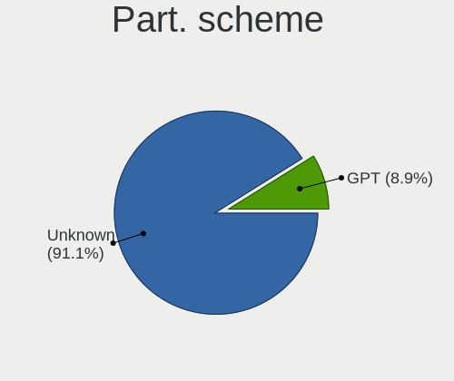
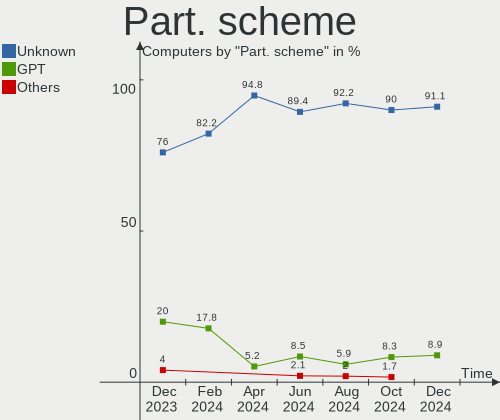
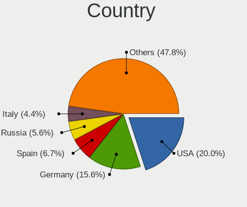
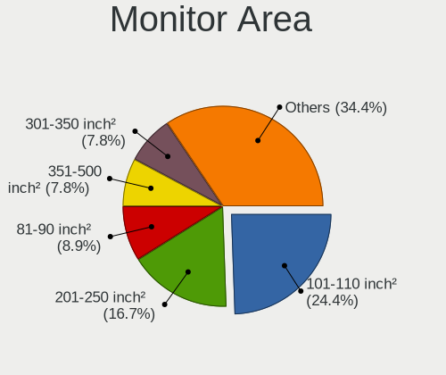
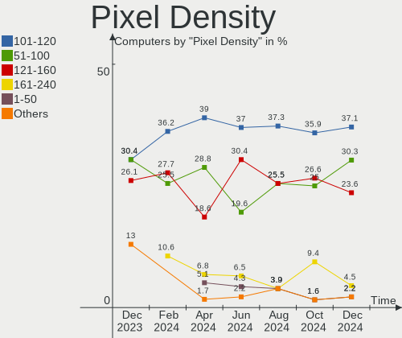
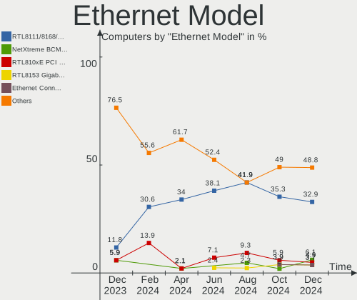
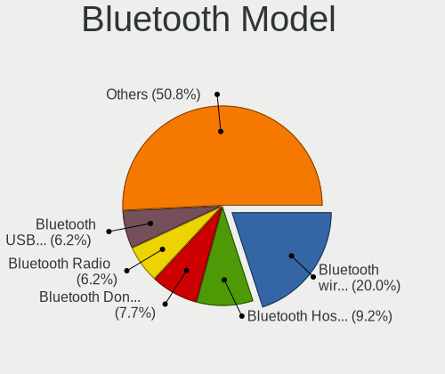
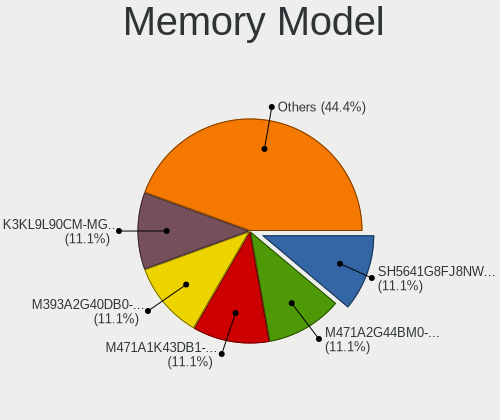
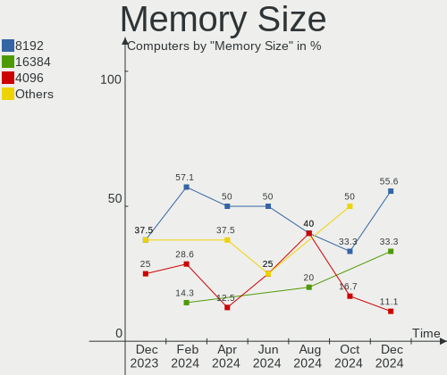

Elementary - Hardware Trends
----------------------------

A project to identify most popular hardware characteristics and track their change
over time based on data collected by Linux users at https://Linux-Hardware.org.

Anyone can contribute to this report by the [hw-probe](https://github.com/linuxhw/hw-probe) tool:

    sudo -E hw-probe -all -upload

This is a report for all computer types. See also reports for [desktops](/Dist/Elementary/Desktop/README.md) and [notebooks](/Dist/Elementary/Notebook/README.md).

This report is for one last month. Overall report since the beginning of time: [TestDays](https://github.com/linuxhw/TestDays)

Period: Dec, 2024.

Contents
--------

* [ System ](#system)
  - [ OS                       ](#os)
  - [ OS Family                ](#os-family)
  - [ Kernel                   ](#kernel)
  - [ Kernel Family            ](#kernel-family)
  - [ Kernel Major Ver.        ](#kernel-major-ver)
  - [ Arch                     ](#arch)
  - [ DE                       ](#de)
  - [ Display Server           ](#display-server)
  - [ Display Manager          ](#display-manager)
  - [ OS Lang                  ](#os-lang)
  - [ Boot Mode                ](#boot-mode)
  - [ Filesystem               ](#filesystem)
  - [ Part. scheme             ](#part-scheme)
  - [ Dual Boot with Linux/BSD ](#dual-boot-with-linuxbsd)
  - [ Dual Boot (Win)          ](#dual-boot-win)

* [ Board ](#board)
  - [ Vendor                   ](#vendor)
  - [ Model                    ](#model)
  - [ Model Family             ](#model-family)
  - [ MFG Year                 ](#mfg-year)
  - [ Form Factor              ](#form-factor)
  - [ Secure Boot              ](#secure-boot)
  - [ Coreboot                 ](#coreboot)
  - [ RAM Size                 ](#ram-size)
  - [ RAM Used                 ](#ram-used)
  - [ Total Drives             ](#total-drives)
  - [ Has CD-ROM               ](#has-cd-rom)
  - [ Has Ethernet             ](#has-ethernet)
  - [ Has WiFi                 ](#has-wifi)
  - [ Has Bluetooth            ](#has-bluetooth)

* [ Location ](#location)
  - [ Country                  ](#country)
  - [ City                     ](#city)

* [ Drives ](#drives)
  - [ Drive Vendor             ](#drive-vendor)
  - [ Drive Model              ](#drive-model)
  - [ HDD Vendor               ](#hdd-vendor)
  - [ SSD Vendor               ](#ssd-vendor)
  - [ Drive Kind               ](#drive-kind)
  - [ Drive Connector          ](#drive-connector)
  - [ Drive Size               ](#drive-size)
  - [ Space Total              ](#space-total)
  - [ Space Used               ](#space-used)
  - [ Malfunc. Drives          ](#malfunc-drives)
  - [ Malfunc. Drive Vendor    ](#malfunc-drive-vendor)
  - [ Malfunc. HDD Vendor      ](#malfunc-hdd-vendor)
  - [ Malfunc. Drive Kind      ](#malfunc-drive-kind)
  - [ Failed Drives            ](#failed-drives)
  - [ Failed Drive Vendor      ](#failed-drive-vendor)
  - [ Drive Status             ](#drive-status)

* [ Storage controller ](#storage-controller)
  - [ Storage Vendor           ](#storage-vendor)
  - [ Storage Model            ](#storage-model)
  - [ Storage Kind             ](#storage-kind)

* [ Processor ](#processor)
  - [ CPU Vendor               ](#cpu-vendor)
  - [ CPU Model                ](#cpu-model)
  - [ CPU Model Family         ](#cpu-model-family)
  - [ CPU Cores                ](#cpu-cores)
  - [ CPU Sockets              ](#cpu-sockets)
  - [ CPU Threads              ](#cpu-threads)
  - [ CPU Op-Modes             ](#cpu-op-modes)
  - [ CPU Microcode            ](#cpu-microcode)
  - [ CPU Microarch            ](#cpu-microarch)

* [ Graphics ](#graphics)
  - [ GPU Vendor               ](#gpu-vendor)
  - [ GPU Model                ](#gpu-model)
  - [ GPU Combo                ](#gpu-combo)
  - [ GPU Driver               ](#gpu-driver)
  - [ GPU Memory               ](#gpu-memory)

* [ Monitor ](#monitor)
  - [ Monitor Vendor           ](#monitor-vendor)
  - [ Monitor Model            ](#monitor-model)
  - [ Monitor Resolution       ](#monitor-resolution)
  - [ Monitor Diagonal         ](#monitor-diagonal)
  - [ Monitor Width            ](#monitor-width)
  - [ Aspect Ratio             ](#aspect-ratio)
  - [ Monitor Area             ](#monitor-area)
  - [ Pixel Density            ](#pixel-density)
  - [ Multiple Monitors        ](#multiple-monitors)

* [ Network ](#network)
  - [ Net Controller Vendor    ](#net-controller-vendor)
  - [ Net Controller Model     ](#net-controller-model)
  - [ Wireless Vendor          ](#wireless-vendor)
  - [ Wireless Model           ](#wireless-model)
  - [ Ethernet Vendor          ](#ethernet-vendor)
  - [ Ethernet Model           ](#ethernet-model)
  - [ Net Controller Kind      ](#net-controller-kind)
  - [ Used Controller          ](#used-controller)
  - [ NICs                     ](#nics)
  - [ IPv6                     ](#ipv6)

* [ Bluetooth ](#bluetooth)
  - [ Bluetooth Vendor         ](#bluetooth-vendor)
  - [ Bluetooth Model          ](#bluetooth-model)

* [ Sound ](#sound)
  - [ Sound Vendor             ](#sound-vendor)
  - [ Sound Model              ](#sound-model)

* [ Memory ](#memory)
  - [ Memory Vendor            ](#memory-vendor)
  - [ Memory Model             ](#memory-model)
  - [ Memory Kind              ](#memory-kind)
  - [ Memory Form Factor       ](#memory-form-factor)
  - [ Memory Size              ](#memory-size)
  - [ Memory Speed             ](#memory-speed)

* [ Printers & scanners ](#printers--scanners)
  - [ Printer Vendor           ](#printer-vendor)
  - [ Printer Model            ](#printer-model)
  - [ Scanner Vendor           ](#scanner-vendor)
  - [ Scanner Model            ](#scanner-model)

* [ Camera ](#camera)
  - [ Camera Vendor            ](#camera-vendor)
  - [ Camera Model             ](#camera-model)

* [ Security ](#security)
  - [ Fingerprint Vendor       ](#fingerprint-vendor)
  - [ Fingerprint Model        ](#fingerprint-model)
  - [ Chipcard Vendor          ](#chipcard-vendor)
  - [ Chipcard Model           ](#chipcard-model)

* [ Unsupported ](#unsupported)
  - [ Unsupported Devices      ](#unsupported-devices)
  - [ Unsupported Device Types ](#unsupported-device-types)

System
------

OS
--

Installed operating systems

| Name             | Computers | Percent |
|------------------|-----------|---------|
| Elementary 8     | 62        | 68.89%  |
| Elementary 7.1   | 27        | 30%     |
| Elementary 5.1.7 | 1         | 1.11%   |

OS Family
---------

OS without a version

| Name       | Computers | Percent |
|------------|-----------|---------|
| Elementary | 90        | 100%    |

Kernel
------

Version of the Linux kernel

| Version              | Computers | Percent |
|----------------------|-----------|---------|
| 6.8.0-49-generic     | 42        | 46.67%  |
| 6.8.0-51-generic     | 25        | 27.78%  |
| 6.8.0-50-generic     | 10        | 11.11%  |
| 6.2.0-33-generic     | 4         | 4.44%   |
| 6.8.0-48-generic     | 2         | 2.22%   |
| 6.8.0-45-generic     | 1         | 1.11%   |
| 6.8.0-1017-oem       | 1         | 1.11%   |
| 6.5.0-41-generic     | 1         | 1.11%   |
| 6.2.0-26-generic     | 1         | 1.11%   |
| 6.12.6-x64v3-xanmod1 | 1         | 1.11%   |
| 5.4.0-135-generic    | 1         | 1.11%   |
| 5.19.0-41-generic    | 1         | 1.11%   |

Kernel Family
-------------

Linux kernel without a distro release

| Version | Computers | Percent |
|---------|-----------|---------|
| 6.8.0   | 81        | 90%     |
| 6.2.0   | 5         | 5.56%   |
| 6.5.0   | 1         | 1.11%   |
| 6.12.6  | 1         | 1.11%   |
| 5.4.0   | 1         | 1.11%   |
| 5.19.0  | 1         | 1.11%   |

Kernel Major Ver.
-----------------

Linux kernel major version

| Version | Computers | Percent |
|---------|-----------|---------|
| 6.8     | 81        | 90%     |
| 6.2     | 5         | 5.56%   |
| 6.5     | 1         | 1.11%   |
| 6.12    | 1         | 1.11%   |
| 5.4     | 1         | 1.11%   |
| 5.19    | 1         | 1.11%   |

Arch
----

OS architecture (x86_64, i586, etc.)

| Name   | Computers | Percent |
|--------|-----------|---------|
| x86_64 | 90        | 100%    |

DE
--

Desktop Environment

| Name     | Computers | Percent |
|----------|-----------|---------|
| Pantheon | 89        | 98.89%  |
| GNOME    | 1         | 1.11%   |

Display Server
--------------

X11 or Wayland

| Name    | Computers | Percent |
|---------|-----------|---------|
| X11     | 85        | 94.44%  |
| Wayland | 5         | 5.56%   |

Display Manager
---------------

SDDM, LightDM, etc.

| Name    | Computers | Percent |
|---------|-----------|---------|
| Unknown | 82        | 91.11%  |
| LightDM | 8         | 8.89%   |

OS Lang
-------

Language

| Lang  | Computers | Percent |
|-------|-----------|---------|
| en_US | 29        | 32.22%  |
| de_DE | 14        | 15.56%  |
| es_ES | 11        | 12.22%  |
| ru_RU | 7         | 7.78%   |
| fr_FR | 5         | 5.56%   |
| nl_NL | 4         | 4.44%   |
| it_IT | 4         | 4.44%   |
| pt_BR | 3         | 3.33%   |
| hu_HU | 2         | 2.22%   |
| bg_BG | 2         | 2.22%   |
| uk_UA | 1         | 1.11%   |
| tr_TR | 1         | 1.11%   |
| pl_PL | 1         | 1.11%   |
| ko_KR | 1         | 1.11%   |
| ja_JP | 1         | 1.11%   |
| hr_HR | 1         | 1.11%   |
| fr_CA | 1         | 1.11%   |
| da_DK | 1         | 1.11%   |
| cs_CZ | 1         | 1.11%   |

Boot Mode
---------

EFI or BIOS

| Mode | Computers | Percent |
|------|-----------|---------|
| BIOS | 83        | 92.22%  |
| EFI  | 7         | 7.78%   |

Filesystem
----------

Type of filesystem

| Type  | Computers | Percent |
|-------|-----------|---------|
| Ext4  | 87        | 96.67%  |
| Btrfs | 2         | 2.22%   |
| Xfs   | 1         | 1.11%   |

Part. scheme
------------

Scheme of partitioning

| Type    | Computers | Percent |
|---------|-----------|---------|
| Unknown | 82        | 91.11%  |
| GPT     | 8         | 8.89%   |

Dual Boot with Linux/BSD
------------------------

Hosting more than one Linux/BSD

| Dual boot | Computers | Percent |
|-----------|-----------|---------|
| No        | 90        | 100%    |

Dual Boot (Win)
---------------

Hosting Linux and Windows

| Dual boot | Computers | Percent |
|-----------|-----------|---------|
| No        | 88        | 97.78%  |
| Yes       | 2         | 2.22%   |

Board
-----

Vendor
------

Motherboard manufacturer

| Name                | Computers | Percent |
|---------------------|-----------|---------|
| Hewlett-Packard     | 14        | 15.56%  |
| Apple               | 14        | 15.56%  |
| Dell                | 10        | 11.11%  |
| ASUSTek Computer    | 8         | 8.89%   |
| Intel               | 6         | 6.67%   |
| Lenovo              | 5         | 5.56%   |
| Acer                | 5         | 5.56%   |
| Gigabyte Technology | 4         | 4.44%   |
| MSI                 | 3         | 3.33%   |
| Sony                | 2         | 2.22%   |
| Samsung Electronics | 2         | 2.22%   |
| ASRock              | 2         | 2.22%   |
| Toshiba             | 1         | 1.11%   |
| SK hynix            | 1         | 1.11%   |
| Pegatron            | 1         | 1.11%   |
| Panasonic           | 1         | 1.11%   |
| Packard Bell        | 1         | 1.11%   |
| NEC Computers       | 1         | 1.11%   |
| Microtech           | 1         | 1.11%   |
| HUAWEI              | 1         | 1.11%   |
| Huanan              | 1         | 1.11%   |
| GEEKOM              | 1         | 1.11%   |
| Fujitsu Siemens     | 1         | 1.11%   |
| eMachines           | 1         | 1.11%   |
| Chuwi               | 1         | 1.11%   |
| AWOW                | 1         | 1.11%   |
| Unknown             | 1         | 1.11%   |

Model
-----

Motherboard model

| Name                                       | Computers | Percent |
|--------------------------------------------|-----------|---------|
| Apple MacBookAir3,1                        | 2         | 2.22%   |
| Apple iMac10,1                             | 2         | 2.22%   |
| Unknown                                    | 2         | 2.22%   |
| Toshiba Satellite L50-B                    | 1         | 1.11%   |
| Sony SVS1313V9RB                           | 1         | 1.11%   |
| Sony SVF14213CLB                           | 1         | 1.11%   |
| SK hynix 10WWA464B                         | 1         | 1.11%   |
| Samsung SR58P                              | 1         | 1.11%   |
| Samsung 950XCJ/951XCJ/950XCR               | 1         | 1.11%   |
| Pegatron A15                               | 1         | 1.11%   |
| Panasonic CF-52PFP54QL                     | 1         | 1.11%   |
| Packard Bell EasyNote TJ75                 | 1         | 1.11%   |
| NEC Computers PC-LL750MSW                  | 1         | 1.11%   |
| MSI MS-7E02                                | 1         | 1.11%   |
| MSI MS-7D98                                | 1         | 1.11%   |
| MSI MS-7721                                | 1         | 1.11%   |
| Microtech ebookPro                         | 1         | 1.11%   |
| Lenovo ThinkPad X1 Carbon Gen 8 20U90030US | 1         | 1.11%   |
| Lenovo ThinkPad L380 20M6S11800            | 1         | 1.11%   |
| Lenovo IdeaPad Y560                        | 1         | 1.11%   |
| Lenovo IdeaPad Slim 5 14AHP9 83DB          | 1         | 1.11%   |
| Lenovo IdeaPad S205 1038D8G                | 1         | 1.11%   |
| Intel X99-P4 V5.11                         | 1         | 1.11%   |
| Intel TERRA_PC                             | 1         | 1.11%   |
| Intel T5226                                | 1         | 1.11%   |
| Intel NUC7i3BNK                            | 1         | 1.11%   |
| Intel B75                                  | 1         | 1.11%   |
| HUAWEI RH2288H V3                          | 1         | 1.11%   |
| Huanan X99-F8 GAMING V5.0                  | 1         | 1.11%   |
| HP Z2 Mini G3 Workstation                  | 1         | 1.11%   |
| HP ProBook 6570b                           | 1         | 1.11%   |
| HP ProBook 645 G2                          | 1         | 1.11%   |
| HP Pavilion dv7                            | 1         | 1.11%   |
| HP Pavilion dv6                            | 1         | 1.11%   |
| HP Laptop 17z-ca100                        | 1         | 1.11%   |
| HP Laptop 17-by3xxx                        | 1         | 1.11%   |
| HP Laptop 15s-fq1xxx                       | 1         | 1.11%   |
| HP Laptop 15-dy5xxx                        | 1         | 1.11%   |
| HP EliteDesk 800 G3 SFF                    | 1         | 1.11%   |
| HP EliteDesk 705 G4 SFF                    | 1         | 1.11%   |

Model Family
------------

Motherboard model prefix

| Name                      | Computers | Percent |
|---------------------------|-----------|---------|
| HP Laptop                 | 4         | 4.44%   |
| Acer Aspire               | 4         | 4.44%   |
| Lenovo IdeaPad            | 3         | 3.33%   |
| HP EliteDesk              | 3         | 3.33%   |
| Dell Inspiron             | 3         | 3.33%   |
| Apple iMac14              | 3         | 3.33%   |
| Lenovo ThinkPad           | 2         | 2.22%   |
| HP ProBook                | 2         | 2.22%   |
| HP Pavilion               | 2         | 2.22%   |
| HP EliteBook              | 2         | 2.22%   |
| Dell Precision            | 2         | 2.22%   |
| Dell OptiPlex             | 2         | 2.22%   |
| Dell Latitude             | 2         | 2.22%   |
| Apple MacBookAir3         | 2         | 2.22%   |
| Apple iMac10              | 2         | 2.22%   |
| Unknown                   | 2         | 2.22%   |
| Toshiba Satellite         | 1         | 1.11%   |
| Sony SVS1313V9RB          | 1         | 1.11%   |
| Sony SVF14213CLB          | 1         | 1.11%   |
| SK hynix 10WWA464B        | 1         | 1.11%   |
| Samsung SR58P             | 1         | 1.11%   |
| Samsung 950XCJ            | 1         | 1.11%   |
| Pegatron A15              | 1         | 1.11%   |
| Panasonic CF-52PFP54QL    | 1         | 1.11%   |
| Packard Bell EasyNote     | 1         | 1.11%   |
| NEC Computers PC-LL750MSW | 1         | 1.11%   |
| MSI MS-7E02               | 1         | 1.11%   |
| MSI MS-7D98               | 1         | 1.11%   |
| MSI MS-7721               | 1         | 1.11%   |
| Microtech ebookPro        | 1         | 1.11%   |
| Intel X99-P4              | 1         | 1.11%   |
| Intel TERRA               | 1         | 1.11%   |
| Intel T5226               | 1         | 1.11%   |
| Intel NUC7i3BNK           | 1         | 1.11%   |
| Intel B75                 | 1         | 1.11%   |
| HUAWEI RH2288H            | 1         | 1.11%   |
| Huanan X99-F8             | 1         | 1.11%   |
| HP Z2                     | 1         | 1.11%   |
| Gigabyte Z77-D3H          | 1         | 1.11%   |
| Gigabyte B85M-HD3         | 1         | 1.11%   |

MFG Year
--------

Motherboard manufacture year

| Year | Computers | Percent |
|------|-----------|---------|
| 2015 | 10        | 11.11%  |
| 2018 | 9         | 10%     |
| 2019 | 6         | 6.67%   |
| 2017 | 6         | 6.67%   |
| 2014 | 6         | 6.67%   |
| 2012 | 6         | 6.67%   |
| 2011 | 6         | 6.67%   |
| 2010 | 6         | 6.67%   |
| 2008 | 6         | 6.67%   |
| 2022 | 5         | 5.56%   |
| 2020 | 5         | 5.56%   |
| 2013 | 5         | 5.56%   |
| 2009 | 5         | 5.56%   |
| 2024 | 3         | 3.33%   |
| 2016 | 2         | 2.22%   |
| 2007 | 2         | 2.22%   |
| 2023 | 1         | 1.11%   |
| 2021 | 1         | 1.11%   |

Form Factor
-----------

Physical design of the computer

| Name       | Computers | Percent |
|------------|-----------|---------|
| Notebook   | 51        | 56.67%  |
| Desktop    | 25        | 27.78%  |
| Mini pc    | 6         | 6.67%   |
| All in one | 6         | 6.67%   |
| Tablet     | 1         | 1.11%   |
| Server     | 1         | 1.11%   |

Secure Boot
-----------

Enabled or disabled

| State    | Computers | Percent |
|----------|-----------|---------|
| Disabled | 90        | 100%    |

Coreboot
--------

Have coreboot on board

| Used | Computers | Percent |
|------|-----------|---------|
| No   | 90        | 100%    |

RAM Size
--------

Total RAM memory

| Size in GB  | Computers | Percent |
|-------------|-----------|---------|
| 4.01-8.0    | 25        | 27.78%  |
| 16.01-24.0  | 20        | 22.22%  |
| 8.01-16.0   | 13        | 14.44%  |
| 3.01-4.0    | 12        | 13.33%  |
| 32.01-64.0  | 9         | 10%     |
| 1.01-2.0    | 4         | 4.44%   |
| 2.01-3.0    | 3         | 3.33%   |
| 24.01-32.0  | 2         | 2.22%   |
| 64.01-256.0 | 2         | 2.22%   |

RAM Used
--------

Used RAM memory

| Used GB   | Computers | Percent |
|-----------|-----------|---------|
| 2.01-3.0  | 29        | 32.22%  |
| 1.01-2.0  | 26        | 28.89%  |
| 4.01-8.0  | 16        | 17.78%  |
| 3.01-4.0  | 15        | 16.67%  |
| 0.51-1.0  | 3         | 3.33%   |
| 8.01-16.0 | 1         | 1.11%   |

Total Drives
------------

Number of drives on board

| Drives | Computers | Percent |
|--------|-----------|---------|
| 1      | 63        | 70%     |
| 2      | 18        | 20%     |
| 3      | 5         | 5.56%   |
| 4      | 2         | 2.22%   |
| 7      | 1         | 1.11%   |
| 5      | 1         | 1.11%   |

Has CD-ROM
----------

Has CD-ROM on board

| Presented | Computers | Percent |
|-----------|-----------|---------|
| No        | 60        | 66.67%  |
| Yes       | 30        | 33.33%  |

Has Ethernet
------------

Has Ethernet on board

| Presented | Computers | Percent |
|-----------|-----------|---------|
| Yes       | 79        | 87.78%  |
| No        | 11        | 12.22%  |

Has WiFi
--------

Has WiFi module

| Presented | Computers | Percent |
|-----------|-----------|---------|
| Yes       | 79        | 87.78%  |
| No        | 11        | 12.22%  |

Has Bluetooth
-------------

Has Bluetooth module

| Presented | Computers | Percent |
|-----------|-----------|---------|
| Yes       | 65        | 72.22%  |
| No        | 25        | 27.78%  |

Location
--------

Country
-------

Geographic location (country)

| Country         | Computers | Percent |
|-----------------|-----------|---------|
| USA             | 18        | 20%     |
| Germany         | 14        | 15.56%  |
| Spain           | 6         | 6.67%   |
| Russia          | 5         | 5.56%   |
| Italy           | 4         | 4.44%   |
| France          | 4         | 4.44%   |
| Mexico          | 3         | 3.33%   |
| Brazil          | 3         | 3.33%   |
| Ukraine         | 2         | 2.22%   |
| UK              | 2         | 2.22%   |
| Portugal        | 2         | 2.22%   |
| Canada          | 2         | 2.22%   |
| Bulgaria        | 2         | 2.22%   |
| Belgium         | 2         | 2.22%   |
| Venezuela       | 1         | 1.11%   |
| Türkiye        | 1         | 1.11%   |
| Turkey          | 1         | 1.11%   |
| The Netherlands | 1         | 1.11%   |
| South Korea     | 1         | 1.11%   |
| Slovakia        | 1         | 1.11%   |
| Serbia          | 1         | 1.11%   |
| Poland          | 1         | 1.11%   |
| Netherlands     | 1         | 1.11%   |
| Morocco         | 1         | 1.11%   |
| Latvia          | 1         | 1.11%   |
| Kazakhstan      | 1         | 1.11%   |
| Japan           | 1         | 1.11%   |
| Indonesia       | 1         | 1.11%   |
| Hungary         | 1         | 1.11%   |
| Faroe Islands   | 1         | 1.11%   |
| Czechia         | 1         | 1.11%   |
| Croatia         | 1         | 1.11%   |
| Bolivia         | 1         | 1.11%   |
| Austria         | 1         | 1.11%   |
| Australia       | 1         | 1.11%   |

City
----

Geographic location (city)

| City                     | Computers | Percent |
|--------------------------|-----------|---------|
| Munich                   | 3         | 3.33%   |
| Naples                   | 2         | 2.22%   |
| Mannheim                 | 2         | 2.22%   |
| Málaga                  | 2         | 2.22%   |
| Los Angeles              | 2         | 2.22%   |
| Zwijndrecht              | 1         | 1.11%   |
| Zubia                    | 1         | 1.11%   |
| Zagreb                   | 1         | 1.11%   |
| Yeonsu-gu                | 1         | 1.11%   |
| Wolverhampton            | 1         | 1.11%   |
| Wiesbaden                | 1         | 1.11%   |
| Warsaw                   | 1         | 1.11%   |
| Trnava                   | 1         | 1.11%   |
| Tours                    | 1         | 1.11%   |
| Tórshavn                | 1         | 1.11%   |
| Sofia                    | 1         | 1.11%   |
| Sioux Falls              | 1         | 1.11%   |
| Simferopol               | 1         | 1.11%   |
| Shawinigan               | 1         | 1.11%   |
| Seth                     | 1         | 1.11%   |
| Seattle                  | 1         | 1.11%   |
| Sarmanovo                | 1         | 1.11%   |
| Santa Maria Chimalhuacan | 1         | 1.11%   |
| Santa Cruz               | 1         | 1.11%   |
| Sannomaru                | 1         | 1.11%   |
| San Jose de Gracia       | 1         | 1.11%   |
| San Jose                 | 1         | 1.11%   |
| San Francisco            | 1         | 1.11%   |
| Sainte-Therese           | 1         | 1.11%   |
| Saint-Cyr-au-Mont-d'Or   | 1         | 1.11%   |
| Roncador                 | 1         | 1.11%   |
| Rome                     | 1         | 1.11%   |
| Riga                     | 1         | 1.11%   |
| Ramstein-Miesenbach      | 1         | 1.11%   |
| Querétaro City          | 1         | 1.11%   |
| Porto                    | 1         | 1.11%   |
| Pontevedra               | 1         | 1.11%   |
| Pazardzhik               | 1         | 1.11%   |
| Paris                    | 1         | 1.11%   |
| Palma                    | 1         | 1.11%   |

Drives
------

Drive Vendor
------------

Hard drive vendors

| Vendor                      | Computers | Drives | Percent |
|-----------------------------|-----------|--------|---------|
| Samsung Electronics         | 18        | 20     | 14.4%   |
| Seagate                     | 16        | 19     | 12.8%   |
| WDC                         | 14        | 14     | 11.2%   |
| Kingston                    | 8         | 9      | 6.4%    |
| Apple                       | 8         | 9      | 6.4%    |
| Toshiba                     | 6         | 6      | 4.8%    |
| SanDisk                     | 5         | 5      | 4%      |
| Unknown                     | 3         | 3      | 2.4%    |
| MAXIO Technology (Hangzhou) | 3         | 3      | 2.4%    |
| KIOXIA                      | 3         | 3      | 2.4%    |
| Crucial                     | 3         | 3      | 2.4%    |
| Silicon Motion              | 2         | 2      | 1.6%    |
| Micron/Crucial Technology   | 2         | 2      | 1.6%    |
| JMicron Technology          | 2         | 2      | 1.6%    |
| HGST                        | 2         | 2      | 1.6%    |
| GOODRAM                     | 2         | 2      | 1.6%    |
| Fujitsu                     | 2         | 2      | 1.6%    |
| Fanxiang                    | 2         | 2      | 1.6%    |
| Emtec                       | 2         | 2      | 1.6%    |
| ADATA Technology            | 2         | 2      | 1.6%    |
| XrayDisk                    | 1         | 1      | 0.8%    |
| WALRAM                      | 1         | 1      | 0.8%    |
| SPCC                        | 1         | 1      | 0.8%    |
| PRO Z                       | 1         | 2      | 0.8%    |
| PNY                         | 1         | 1      | 0.8%    |
| OCZ-VERTEX2                 | 1         | 1      | 0.8%    |
| NETAPP                      | 1         | 1      | 0.8%    |
| Netac                       | 1         | 1      | 0.8%    |
| Micron Technology           | 1         | 1      | 0.8%    |
| Maxtor                      | 1         | 1      | 0.8%    |
| Kingston Technology Company | 1         | 1      | 0.8%    |
| KingSpec                    | 1         | 1      | 0.8%    |
| KingDian                    | 1         | 1      | 0.8%    |
| Intel                       | 1         | 1      | 0.8%    |
| HS-SSD-E100                 | 1         | 1      | 0.8%    |
| Hitachi                     | 1         | 1      | 0.8%    |
| China                       | 1         | 1      | 0.8%    |
| Apacer                      | 1         | 1      | 0.8%    |
| A-DATA Technology           | 1         | 1      | 0.8%    |
| 2-Power                     | 1         | 2      | 0.8%    |

Drive Model
-----------

Hard drive models

| Model                                                 | Computers | Percent |
|-------------------------------------------------------|-----------|---------|
| Samsung NVMe SSD Controller SM981/PM981/PM983 512GB   | 3         | 2.31%   |
| Kingston SA400S37240G 240GB SSD                       | 3         | 2.31%   |
| Silicon Motion SM2263EN/SM2263XT SSD Controller 256GB | 2         | 1.54%   |
| Seagate ST500LM000-1EJ162 500GB                       | 2         | 1.54%   |
| Samsung NVMe SSD Controller SM961/PM961/SM963 256GB   | 2         | 1.54%   |
| MAXIO (Hangzhou) NVMe SSD Controller MAP1202 512GB    | 2         | 1.54%   |
| Kingston SV300S37A240G 240GB SSD                      | 2         | 1.54%   |
| JMicron Generic 500GB                                 | 2         | 1.54%   |
| Apple SSD SM0256F 256GB                               | 2         | 1.54%   |
| XrayDisk 512GB                                        | 1         | 0.77%   |
| WDC WDS240G2G0A-00JH30 240GB SSD                      | 1         | 0.77%   |
| WDC WD5000LPCX-21VHAT0 500GB                          | 1         | 0.77%   |
| WDC WD5000BPVT-22HXZT3 500GB                          | 1         | 0.77%   |
| WDC WD5000BEVT-22ZAT0 500GB                           | 1         | 0.77%   |
| WDC WD3200BUCT-63TWBY0 320GB                          | 1         | 0.77%   |
| WDC WD3200BPVT-00JJ5T0 320GB                          | 1         | 0.77%   |
| WDC WD3200BEKT-60PVMT0 320GB                          | 1         | 0.77%   |
| WDC WD3200AAKS-75L9A0 320GB                           | 1         | 0.77%   |
| WDC WD20EZRX-00DC0B0 2TB                              | 1         | 0.77%   |
| WDC WD20EZRX-00D8PB0 2TB                              | 1         | 0.77%   |
| WDC WD1600AVVS-62L2B0 160GB                           | 1         | 0.77%   |
| WDC WD10JPVX-08JC3T2 1TB                              | 1         | 0.77%   |
| WDC WD10EZEX-22MFCA0 1TB                              | 1         | 0.77%   |
| WDC WD10EARS-22Y5B1 1TB                               | 1         | 0.77%   |
| WALRAM 512GB                                          | 1         | 0.77%   |
| Unknown MMC Card  64GB                                | 1         | 0.77%   |
| Unknown MMC Card  393GB                               | 1         | 0.77%   |
| Unknown MMC Card  32GB                                | 1         | 0.77%   |
| Toshiba MQ04ABF100 1TB                                | 1         | 0.77%   |
| Toshiba MQ01ABF032 320GB                              | 1         | 0.77%   |
| Toshiba MQ01ABD075 752GB                              | 1         | 0.77%   |
| Toshiba KXG6AZNV512G 512GB                            | 1         | 0.77%   |
| Toshiba KXG50ZNV512G 512GB                            | 1         | 0.77%   |
| Toshiba DT01ACA100 1TB                                | 1         | 0.77%   |
| SPCC Solid State Disk 64GB                            | 1         | 0.77%   |
| Seagate ST9160412ASG 160GB                            | 1         | 0.77%   |
| Seagate ST9160310AS 160GB                             | 1         | 0.77%   |
| Seagate ST500LM030-1RK17D 500GB                       | 1         | 0.77%   |
| Seagate ST500LM021-1KJ152 500GB                       | 1         | 0.77%   |
| Seagate ST500DM002-1ER14C 500GB                       | 1         | 0.77%   |

HDD Vendor
----------

Hard disk drive vendors

| Vendor             | Computers | Drives | Percent |
|--------------------|-----------|--------|---------|
| Seagate            | 16        | 19     | 36.36%  |
| WDC                | 13        | 13     | 29.55%  |
| Toshiba            | 4         | 4      | 9.09%   |
| JMicron Technology | 2         | 2      | 4.55%   |
| HGST               | 2         | 2      | 4.55%   |
| Fujitsu            | 2         | 2      | 4.55%   |
| Apple              | 2         | 2      | 4.55%   |
| NETAPP             | 1         | 1      | 2.27%   |
| Maxtor             | 1         | 1      | 2.27%   |
| Hitachi            | 1         | 1      | 2.27%   |

SSD Vendor
----------

Solid state drive vendors

| Vendor              | Computers | Drives | Percent |
|---------------------|-----------|--------|---------|
| Samsung Electronics | 11        | 12     | 25%     |
| Kingston            | 8         | 9      | 18.18%  |
| Apple               | 7         | 7      | 15.91%  |
| Crucial             | 3         | 3      | 6.82%   |
| GOODRAM             | 2         | 2      | 4.55%   |
| Emtec               | 2         | 2      | 4.55%   |
| WDC                 | 1         | 1      | 2.27%   |
| SPCC                | 1         | 1      | 2.27%   |
| SanDisk             | 1         | 1      | 2.27%   |
| PNY                 | 1         | 1      | 2.27%   |
| OCZ-VERTEX2         | 1         | 1      | 2.27%   |
| KingSpec            | 1         | 1      | 2.27%   |
| KingDian            | 1         | 1      | 2.27%   |
| China               | 1         | 1      | 2.27%   |
| Apacer              | 1         | 1      | 2.27%   |
| A-DATA Technology   | 1         | 1      | 2.27%   |
| 2-Power             | 1         | 2      | 2.27%   |

Drive Kind
----------

HDD or SSD

| Kind    | Computers | Drives | Percent |
|---------|-----------|--------|---------|
| SSD     | 41        | 47     | 34.75%  |
| HDD     | 40        | 47     | 33.9%   |
| NVMe    | 27        | 29     | 22.88%  |
| Unknown | 7         | 8      | 5.93%   |
| MMC     | 3         | 3      | 2.54%   |

Drive Connector
---------------

SATA, SAS, NVMe, etc.

| Type | Computers | Drives | Percent |
|------|-----------|--------|---------|
| SATA | 70        | 94     | 66.04%  |
| NVMe | 27        | 29     | 25.47%  |
| SAS  | 6         | 8      | 5.66%   |
| MMC  | 3         | 3      | 2.83%   |

Drive Size
----------

Size of hard drive

| Size in TB | Computers | Drives | Percent |
|------------|-----------|--------|---------|
| 0.01-0.5   | 59        | 65     | 71.95%  |
| 0.51-1.0   | 18        | 24     | 21.95%  |
| 1.01-2.0   | 3         | 3      | 3.66%   |
| 3.01-4.0   | 1         | 1      | 1.22%   |
| 2.01-3.0   | 1         | 1      | 1.22%   |

Space Total
-----------

Amount of disk space available on the file system

| Size in GB | Computers | Percent |
|------------|-----------|---------|
| 101-250    | 35        | 38.89%  |
| 251-500    | 28        | 31.11%  |
| 501-1000   | 14        | 15.56%  |
| 51-100     | 8         | 8.89%   |
| 21-50      | 2         | 2.22%   |
| 1001-2000  | 2         | 2.22%   |
| 2001-3000  | 1         | 1.11%   |

Space Used
----------

Amount of used disk space

| Used GB  | Computers | Percent |
|----------|-----------|---------|
| 1-20     | 49        | 54.44%  |
| 21-50    | 24        | 26.67%  |
| 101-250  | 7         | 7.78%   |
| 51-100   | 6         | 6.67%   |
| 251-500  | 2         | 2.22%   |
| 501-1000 | 2         | 2.22%   |

Malfunc. Drives
---------------

Drive models with a malfunction

Zero info for selected period =(

Malfunc. Drive Vendor
---------------------

Vendors of faulty drives

Zero info for selected period =(

Malfunc. HDD Vendor
-------------------

Vendors of faulty HDD drives

Zero info for selected period =(

Malfunc. Drive Kind
-------------------

Kinds of faulty drives

Zero info for selected period =(

Failed Drives
-------------

Failed drive models

Zero info for selected period =(

Failed Drive Vendor
-------------------

Failed drive vendors

Zero info for selected period =(

Drive Status
------------

Number of failed and malfunc. drives

| Status   | Computers | Drives | Percent |
|----------|-----------|--------|---------|
| Detected | 85        | 128    | 93.41%  |
| Works    | 6         | 6      | 6.59%   |

Storage controller
------------------

Storage Vendor
--------------

Storage controller vendors

| Vendor                       | Computers | Percent |
|------------------------------|-----------|---------|
| Intel                        | 65        | 58.04%  |
| Samsung Electronics          | 11        | 9.82%   |
| AMD                          | 8         | 7.14%   |
| SanDisk                      | 4         | 3.57%   |
| Nvidia                       | 4         | 3.57%   |
| MAXIO Technology (Hangzhou)  | 3         | 2.68%   |
| KIOXIA                       | 3         | 2.68%   |
| Toshiba America Info Systems | 2         | 1.79%   |
| Silicon Motion               | 2         | 1.79%   |
| Micron/Crucial Technology    | 2         | 1.79%   |
| ADATA Technology             | 2         | 1.79%   |
| VIA Technologies             | 1         | 0.89%   |
| Micron Technology            | 1         | 0.89%   |
| Marvell Technology Group     | 1         | 0.89%   |
| Kingston Technology Company  | 1         | 0.89%   |
| Broadcom / LSI               | 1         | 0.89%   |
| ASMedia Technology           | 1         | 0.89%   |

Storage Model
-------------

Storage controller models

| Model                                                                          | Computers | Percent |
|--------------------------------------------------------------------------------|-----------|---------|
| Intel 7 Series Chipset Family 6-port SATA Controller [AHCI mode]               | 7         | 5.56%   |
| AMD FCH SATA Controller [AHCI mode]                                            | 6         | 4.76%   |
| Intel 82801 Mobile SATA Controller [RAID mode]                                 | 5         | 3.97%   |
| Samsung NVMe SSD Controller SM981/PM981/PM983                                  | 4         | 3.17%   |
| Intel 82801IBM/IEM (ICH9M/ICH9M-E) 4 port SATA Controller [AHCI mode]          | 4         | 3.17%   |
| Intel 8 Series SATA Controller 1 [AHCI mode]                                   | 4         | 3.17%   |
| Intel Wildcat Point-LP SATA Controller [AHCI Mode]                             | 3         | 2.38%   |
| Intel Sunrise Point-LP SATA Controller [AHCI mode]                             | 3         | 2.38%   |
| Intel SATA Controller [RAID mode]                                              | 3         | 2.38%   |
| Intel Celeron/Pentium Silver Processor SATA Controller                         | 3         | 2.38%   |
| Intel 8 Series/C220 Series Chipset Family 6-port SATA Controller 1 [AHCI mode] | 3         | 2.38%   |
| Intel 6 Series/C200 Series Chipset Family 6 port Mobile SATA AHCI Controller   | 3         | 2.38%   |
| Intel 5 Series/3400 Series Chipset 4 port SATA AHCI Controller                 | 3         | 2.38%   |
| Silicon Motion SM2263EN/SM2263XT (DRAM-less) NVMe SSD Controllers              | 2         | 1.59%   |
| Samsung S4LN053X01 AHCI SSD Controller(Apple slot)                             | 2         | 1.59%   |
| Samsung NVMe SSD Controller SM961/PM961/SM963                                  | 2         | 1.59%   |
| Nvidia MCP89 SATA Controller (AHCI mode)                                       | 2         | 1.59%   |
| Nvidia MCP79 AHCI Controller                                                   | 2         | 1.59%   |
| MAXIO (Hangzhou) NVMe SSD Controller MAP1202 (DRAM-less)                       | 2         | 1.59%   |
| Intel Raptor Lake SATA AHCI Controller                                         | 2         | 1.59%   |
| Intel C610/X99 series chipset sSATA Controller [AHCI mode]                     | 2         | 1.59%   |
| Intel C610/X99 series chipset 6-Port SATA Controller [AHCI mode]               | 2         | 1.59%   |
| Intel 82801HM/HEM (ICH8M/ICH8M-E) SATA Controller [AHCI mode]                  | 2         | 1.59%   |
| Intel 82801HM/HEM (ICH8M/ICH8M-E) IDE Controller                               | 2         | 1.59%   |
| Intel 200 Series PCH SATA controller [AHCI mode]                               | 2         | 1.59%   |
| VIA VT6415 PATA IDE Host Controller                                            | 1         | 0.79%   |
| Toshiba America Info Systems XG6 NVMe SSD Controller                           | 1         | 0.79%   |
| Toshiba America Info Systems XG5 NVMe SSD Controller                           | 1         | 0.79%   |
| Sandisk WD PC SN740 NVMe SSD 512GB (DRAM-less)                                 | 1         | 0.79%   |
| SanDisk WD Blue SN570 NVMe SSD 2TB                                             | 1         | 0.79%   |
| SanDisk WD Black SN770 / PC SN740 256GB / PC SN560 (DRAM-less) NVMe SSD        | 1         | 0.79%   |
| SanDisk Ultra 3D / WD PC SN530, IX SN530, Blue SN550 NVMe SSD (DRAM-less)      | 1         | 0.79%   |
| Samsung S4LN058A01[SSUBX] AHCI SSD Controller (Apple slot)                     | 1         | 0.79%   |
| Samsung NVMe SSD Controller PM9C1a (DRAM-less)                                 | 1         | 0.79%   |
| Samsung NVMe SSD Controller PM9A1/PM9A3/980PRO                                 | 1         | 0.79%   |
| Micron/Crucial P3 Plus NVMe PCIe SSD (DRAM-less)                               | 1         | 0.79%   |
| Micron/Crucial P2 [Nick P2] / P3 / P3 Plus NVMe PCIe SSD (DRAM-less)           | 1         | 0.79%   |
| Micron 2400 NVMe SSD (DRAM-less)                                               | 1         | 0.79%   |
| MAXIO (Hangzhou) NVMe SSD Controller MAP1602 (DRAM-less)                       | 1         | 0.79%   |
| Marvell Group 88SS9183 PCIe SSD Controller                                     | 1         | 0.79%   |

Storage Kind
------------

Kind of storage controller (IDE, SATA, NVMe, SAS, ...)

| Kind | Computers | Percent |
|------|-----------|---------|
| SATA | 66        | 58.41%  |
| NVMe | 27        | 23.89%  |
| RAID | 10        | 8.85%   |
| IDE  | 10        | 8.85%   |

Processor
---------

CPU Vendor
----------

Processor vendors

| Vendor | Computers | Percent |
|--------|-----------|---------|
| Intel  | 79        | 87.78%  |
| AMD    | 11        | 12.22%  |

CPU Model
---------

Processor models

| Model                                       | Computers | Percent |
|---------------------------------------------|-----------|---------|
| Intel Core i5-5250U CPU @ 1.60GHz           | 2         | 2.22%   |
| Intel Core i5-4200U CPU @ 1.60GHz           | 2         | 2.22%   |
| Intel Core 2 Duo CPU U9400 @ 1.40GHz        | 2         | 2.22%   |
| Intel Core 2 Duo CPU E7600 @ 3.06GHz        | 2         | 2.22%   |
| Intel Xeon CPU X3440 @ 2.53GHz              | 1         | 1.11%   |
| Intel Xeon CPU E5-2696 v3 @ 2.30GHz         | 1         | 1.11%   |
| Intel Xeon CPU E5-2680 v4 @ 2.40GHz         | 1         | 1.11%   |
| Intel Xeon CPU E5-2660 v3 @ 2.60GHz         | 1         | 1.11%   |
| Intel Xeon CPU E3-1245 v5 @ 3.50GHz         | 1         | 1.11%   |
| Intel Xeon CPU E3-1225 v5 @ 3.30GHz         | 1         | 1.11%   |
| Intel Pentium Silver N5000 CPU @ 1.10GHz    | 1         | 1.11%   |
| Intel Pentium Dual-Core CPU T4400 @ 2.20GHz | 1         | 1.11%   |
| Intel Pentium Dual CPU T2330 @ 1.60GHz      | 1         | 1.11%   |
| Intel Pentium D CPU 3.00GHz                 | 1         | 1.11%   |
| Intel Pentium CPU N3710 @ 1.60GHz           | 1         | 1.11%   |
| Intel Pentium CPU G4400 @ 3.30GHz           | 1         | 1.11%   |
| Intel Pentium CPU 2117U @ 1.80GHz           | 1         | 1.11%   |
| Intel Genuine CPU U7300 @ 1.30GHz           | 1         | 1.11%   |
| Intel Core m3-6Y30 CPU @ 0.90GHz            | 1         | 1.11%   |
| Intel Core i7-8850H CPU @ 2.60GHz           | 1         | 1.11%   |
| Intel Core i7-8565U CPU @ 1.80GHz           | 1         | 1.11%   |
| Intel Core i7-8550U CPU @ 1.80GHz           | 1         | 1.11%   |
| Intel Core i7-6700HQ CPU @ 2.60GHz          | 1         | 1.11%   |
| Intel Core i7-4771 CPU @ 3.50GHz            | 1         | 1.11%   |
| Intel Core i7-4700MQ CPU @ 2.40GHz          | 1         | 1.11%   |
| Intel Core i7-4510U CPU @ 2.00GHz           | 1         | 1.11%   |
| Intel Core i7-3770S CPU @ 3.10GHz           | 1         | 1.11%   |
| Intel Core i7-3720QM CPU @ 2.60GHz          | 1         | 1.11%   |
| Intel Core i7-3615QM CPU @ 2.30GHz          | 1         | 1.11%   |
| Intel Core i7-3540M CPU @ 3.00GHz           | 1         | 1.11%   |
| Intel Core i7-2670QM CPU @ 2.20GHz          | 1         | 1.11%   |
| Intel Core i7-1065G7 CPU @ 1.30GHz          | 1         | 1.11%   |
| Intel Core i7-10610U CPU @ 1.80GHz          | 1         | 1.11%   |
| Intel Core i7 CPU M 620 @ 2.67GHz           | 1         | 1.11%   |
| Intel Core i5-8500 CPU @ 3.00GHz            | 1         | 1.11%   |
| Intel Core i5-8400 CPU @ 2.80GHz            | 1         | 1.11%   |
| Intel Core i5-7500 CPU @ 3.40GHz            | 1         | 1.11%   |
| Intel Core i5-7200U CPU @ 2.50GHz           | 1         | 1.11%   |
| Intel Core i5-4690 CPU @ 3.50GHz            | 1         | 1.11%   |
| Intel Core i5-4570S CPU @ 2.90GHz           | 1         | 1.11%   |

CPU Model Family
----------------

Processor model prefix

| Model                   | Computers | Percent |
|-------------------------|-----------|---------|
| Intel Core i5           | 24        | 26.67%  |
| Intel Core i7           | 15        | 16.67%  |
| Intel Core 2 Duo        | 9         | 10%     |
| Intel Xeon              | 6         | 6.67%   |
| Intel Core i3           | 6         | 6.67%   |
| Other                   | 5         | 5.56%   |
| Intel Celeron           | 5         | 5.56%   |
| Intel Pentium           | 3         | 3.33%   |
| AMD Ryzen 9             | 2         | 2.22%   |
| AMD Ryzen 7             | 2         | 2.22%   |
| AMD Ryzen 5             | 2         | 2.22%   |
| Intel Pentium Silver    | 1         | 1.11%   |
| Intel Pentium Dual-Core | 1         | 1.11%   |
| Intel Pentium Dual      | 1         | 1.11%   |
| Intel Pentium D         | 1         | 1.11%   |
| Intel Genuine           | 1         | 1.11%   |
| Intel Core m3           | 1         | 1.11%   |
| AMD Ryzen 5 PRO         | 1         | 1.11%   |
| AMD PRO A8              | 1         | 1.11%   |
| AMD PRO A10             | 1         | 1.11%   |
| AMD E                   | 1         | 1.11%   |
| AMD A8                  | 1         | 1.11%   |

CPU Cores
---------

Number of processor cores

| Number | Computers | Percent |
|--------|-----------|---------|
| 2      | 46        | 51.11%  |
| 4      | 28        | 31.11%  |
| 6      | 6         | 6.67%   |
| 8      | 4         | 4.44%   |
| 12     | 2         | 2.22%   |
| 10     | 2         | 2.22%   |
| 28     | 1         | 1.11%   |
| 18     | 1         | 1.11%   |

CPU Sockets
-----------

Number of sockets

| Number | Computers | Percent |
|--------|-----------|---------|
| 1      | 89        | 98.89%  |
| 2      | 1         | 1.11%   |

CPU Threads
-----------

Threads per core (Hyper-Threading)

| Number | Computers | Percent |
|--------|-----------|---------|
| 2      | 57        | 63.33%  |
| 1      | 33        | 36.67%  |

CPU Op-Modes
------------

CPU Operation Modes (32-bit, 64-bit)

| Op mode        | Computers | Percent |
|----------------|-----------|---------|
| 32-bit, 64-bit | 90        | 100%    |

CPU Microcode
-------------

Microcode number

| Number     | Computers | Percent |
|------------|-----------|---------|
| Unknown    | 89        | 98.89%  |
| 0x08108109 | 1         | 1.11%   |

CPU Microarch
-------------

Microarchitecture

| Name             | Computers | Percent |
|------------------|-----------|---------|
| Haswell          | 13        | 14.44%  |
| KabyLake         | 11        | 12.22%  |
| Penryn           | 10        | 11.11%  |
| IvyBridge        | 9         | 10%     |
| SandyBridge      | 6         | 6.67%   |
| Skylake          | 5         | 5.56%   |
| Broadwell        | 5         | 5.56%   |
| Unknown          | 5         | 5.56%   |
| Westmere         | 4         | 4.44%   |
| Zen 3            | 3         | 3.33%   |
| Goldmont plus    | 3         | 3.33%   |
| Silvermont       | 2         | 2.22%   |
| IceLake          | 2         | 2.22%   |
| Excavator        | 2         | 2.22%   |
| Core             | 2         | 2.22%   |
| Alderlake Hybrid | 2         | 2.22%   |
| Zen+             | 1         | 1.11%   |
| Zen              | 1         | 1.11%   |
| Steamroller      | 1         | 1.11%   |
| NetBurst         | 1         | 1.11%   |
| Nehalem          | 1         | 1.11%   |
| Bobcat           | 1         | 1.11%   |

Graphics
--------

GPU Vendor
----------

Vendors of graphics cards

| Vendor              | Computers | Percent |
|---------------------|-----------|---------|
| Intel               | 57        | 54.29%  |
| AMD                 | 25        | 23.81%  |
| Nvidia              | 22        | 20.95%  |
| Huawei Technologies | 1         | 0.95%   |

GPU Model
---------

Graphics card models

| Model                                                                       | Computers | Percent |
|-----------------------------------------------------------------------------|-----------|---------|
| Intel 3rd Gen Core processor Graphics Controller                            | 7         | 6.6%    |
| Intel 2nd Generation Core Processor Family Integrated Graphics Controller   | 6         | 5.66%   |
| Intel Haswell-ULT Integrated Graphics Controller                            | 5         | 4.72%   |
| Intel Core Processor Integrated Graphics Controller                         | 3         | 2.83%   |
| AMD Ellesmere [Radeon RX 470/480/570/570X/580/580X/590]                     | 3         | 2.83%   |
| Nvidia MCP89 [GeForce 320M]                                                 | 2         | 1.89%   |
| Nvidia GP108M [GeForce MX250]                                               | 2         | 1.89%   |
| Nvidia GF117M [GeForce 610M/710M/810M/820M / GT 620M/625M/630M/720M]        | 2         | 1.89%   |
| Intel Xeon E3-1200 v3/4th Gen Core Processor Integrated Graphics Controller | 2         | 1.89%   |
| Intel UHD Graphics 620                                                      | 2         | 1.89%   |
| Intel HD Graphics 620                                                       | 2         | 1.89%   |
| Intel HD Graphics 6000                                                      | 2         | 1.89%   |
| Intel HD Graphics 5500                                                      | 2         | 1.89%   |
| Intel GeminiLake [UHD Graphics 600]                                         | 2         | 1.89%   |
| Intel CometLake-U GT2 [UHD Graphics]                                        | 2         | 1.89%   |
| AMD Wani [Radeon R5/R6/R7 Graphics]                                         | 2         | 1.89%   |
| AMD RV730/M96-XT [Mobility Radeon HD 4670]                                  | 2         | 1.89%   |
| AMD RV710/M92 [Mobility Radeon HD 4530/4570/5145/530v/540v/545v]            | 2         | 1.89%   |
| AMD Phoenix3                                                                | 2         | 1.89%   |
| Nvidia TU116 [GeForce GTX 1650 SUPER]                                       | 1         | 0.94%   |
| Nvidia GP108 [GeForce GT 1030]                                              | 1         | 0.94%   |
| Nvidia GP107GLM [Quadro P1000 Mobile]                                       | 1         | 0.94%   |
| Nvidia GP104 [GeForce GTX 1080]                                             | 1         | 0.94%   |
| Nvidia GM107M [GeForce GTX 960M]                                            | 1         | 0.94%   |
| Nvidia GM107GLM [Quadro M620 Mobile]                                        | 1         | 0.94%   |
| Nvidia GM107 [GeForce GTX 750]                                              | 1         | 0.94%   |
| Nvidia GK107M [GeForce GT 750M Mac Edition]                                 | 1         | 0.94%   |
| Nvidia GK107M [GeForce GT 650M Mac Edition]                                 | 1         | 0.94%   |
| Nvidia GK107M [GeForce GT 640M LE]                                          | 1         | 0.94%   |
| Nvidia GK104M [GeForce GTX 780M Mac Edition]                                | 1         | 0.94%   |
| Nvidia GF119M [NVS 4200M]                                                   | 1         | 0.94%   |
| Nvidia GF108 [GeForce GT 630]                                               | 1         | 0.94%   |
| Nvidia GA106 [GeForce RTX 3060 Lite Hash Rate]                              | 1         | 0.94%   |
| Nvidia G98 [GeForce 9300 GE]                                                | 1         | 0.94%   |
| Nvidia G96CM [GeForce 9600M GT]                                             | 1         | 0.94%   |
| Intel WhiskeyLake-U GT2 [UHD Graphics 620]                                  | 1         | 0.94%   |
| Intel Mobile GM965/GL960 Integrated Graphics Controller (secondary)         | 1         | 0.94%   |
| Intel Mobile GM965/GL960 Integrated Graphics Controller (primary)           | 1         | 0.94%   |
| Intel Mobile 4 Series Chipset Integrated Graphics Controller                | 1         | 0.94%   |
| Intel IvyBridge GT2 [HD Graphics 4000]                                      | 1         | 0.94%   |

GPU Combo
---------

Combinations of graphics cards

| Name                    | Computers | Percent |
|-------------------------|-----------|---------|
| 1 x Intel               | 43        | 47.78%  |
| 1 x AMD                 | 21        | 23.33%  |
| 1 x Nvidia              | 11        | 12.22%  |
| Intel + Nvidia          | 10        | 11.11%  |
| Intel + AMD             | 3         | 3.33%   |
| 1 x Huawei Technologies | 1         | 1.11%   |
| AMD + Nvidia            | 1         | 1.11%   |

GPU Driver
----------

Free vs proprietary

| Driver      | Computers | Percent |
|-------------|-----------|---------|
| Free        | 83        | 92.22%  |
| Proprietary | 4         | 4.44%   |
| Unknown     | 3         | 3.33%   |

GPU Memory
----------

Total video memory

| Size in GB | Computers | Percent |
|------------|-----------|---------|
| Unknown    | 85        | 94.44%  |
| 3.01-4.0   | 2         | 2.22%   |
| 1.01-2.0   | 1         | 1.11%   |
| 8.01-16.0  | 1         | 1.11%   |
| 0.51-1.0   | 1         | 1.11%   |

Monitor
-------

Monitor Vendor
--------------

Monitor vendors

| Vendor                  | Computers | Percent |
|-------------------------|-----------|---------|
| Samsung Electronics     | 12        | 13.48%  |
| AU Optronics            | 12        | 13.48%  |
| Apple                   | 12        | 13.48%  |
| LG Display              | 9         | 10.11%  |
| Chimei Innolux          | 6         | 6.74%   |
| Goldstar                | 4         | 4.49%   |
| BOE                     | 3         | 3.37%   |
| Sharp                   | 2         | 2.25%   |
| Philips                 | 2         | 2.25%   |
| Insignia                | 2         | 2.25%   |
| Hewlett-Packard         | 2         | 2.25%   |
| Dell                    | 2         | 2.25%   |
| Chi Mei Optoelectronics | 2         | 2.25%   |
| ASUSTek Computer        | 2         | 2.25%   |
| AOC                     | 2         | 2.25%   |
| Westinghouse            | 1         | 1.12%   |
| ViewSonic               | 1         | 1.12%   |
| Unknown                 | 1         | 1.12%   |
| Sony                    | 1         | 1.12%   |
| Sceptre Tech            | 1         | 1.12%   |
| Panasonic               | 1         | 1.12%   |
| Lenovo                  | 1         | 1.12%   |
| InfoVision              | 1         | 1.12%   |
| Iiyama                  | 1         | 1.12%   |
| HannStar                | 1         | 1.12%   |
| Eizo                    | 1         | 1.12%   |
| DENON                   | 1         | 1.12%   |
| BenQ                    | 1         | 1.12%   |
| Ancor Communications    | 1         | 1.12%   |
| Acer                    | 1         | 1.12%   |

Monitor Model
-------------

Monitor models

| Model                                                                  | Computers | Percent |
|------------------------------------------------------------------------|-----------|---------|
| LG Display LCD Monitor LGD0456 1366x768 344x194mm 15.5-inch            | 2         | 2.2%    |
| LG Display LCD Monitor LGD02DC 1366x768 344x194mm 15.5-inch            | 2         | 2.2%    |
| Goldstar HDR WFHD GSM7714 2560x1080 798x334mm 34.1-inch                | 2         | 2.2%    |
| Chimei Innolux LCD Monitor CMN15E7 1920x1080 344x193mm 15.5-inch       | 2         | 2.2%    |
| Apple iMac APPA012 1920x1080 475x267mm 21.5-inch                       | 2         | 2.2%    |
| Apple Color LCD APP9CF2 1366x768 256x144mm 11.6-inch                   | 2         | 2.2%    |
| Apple Color LCD APP9CB5 2560x1440 600x340mm 27.2-inch                  | 2         | 2.2%    |
| AOC U2879G6 AOC2879 3840x2160 621x341mm 27.9-inch                      | 2         | 2.2%    |
| Westinghouse VR-3225 WDT6400 1920x1080 710x400mm 32.1-inch             | 1         | 1.1%    |
| ViewSonic VA2407 Series VSC8C31 1920x1080 521x293mm 23.5-inch          | 1         | 1.1%    |
| Unknown LCD Monitor FFFF 2288x1287 2550x2550mm 142.0-inch              | 1         | 1.1%    |
| Sony TV SNYEF03 1600x900                                               | 1         | 1.1%    |
| Sharp LCD Monitor SHP149A 1920x1080 344x194mm 15.5-inch                | 1         | 1.1%    |
| Sharp LCD Monitor SHP143E 3840x2160 346x194mm 15.6-inch                | 1         | 1.1%    |
| Sceptre Tech Sceptre O34 SPT8542 3440x1440 797x334mm 34.0-inch         | 1         | 1.1%    |
| Samsung Electronics T24E390 SAM0C20 1920x1080 521x293mm 23.5-inch      | 1         | 1.1%    |
| Samsung Electronics SyncMaster SAM0467 1920x1200 518x324mm 24.1-inch   | 1         | 1.1%    |
| Samsung Electronics SyncMaster SAM027F 1680x1050 474x296mm 22.0-inch   | 1         | 1.1%    |
| Samsung Electronics S24C300 SAM0A28 1920x1080 531x299mm 24.0-inch      | 1         | 1.1%    |
| Samsung Electronics LS32A70 SAM7166 3840x2160 698x393mm 31.5-inch      | 1         | 1.1%    |
| Samsung Electronics LS24C33xG SAM7435 1920x1080 527x296mm 23.8-inch    | 1         | 1.1%    |
| Samsung Electronics LCD Monitor SEC3953 1366x768 256x144mm 11.6-inch   | 1         | 1.1%    |
| Samsung Electronics LCD Monitor SEC324B 1440x900 367x230mm 17.1-inch   | 1         | 1.1%    |
| Samsung Electronics LCD Monitor SEC3245 1366x768 344x194mm 15.5-inch   | 1         | 1.1%    |
| Samsung Electronics LCD Monitor SDC4187 1920x1200 302x189mm 14.0-inch  | 1         | 1.1%    |
| Samsung Electronics LCD Monitor SDC4146 1366x768 344x194mm 15.5-inch   | 1         | 1.1%    |
| Samsung Electronics LCD Monitor SAM735B 3840x2160 1420x800mm 64.2-inch | 1         | 1.1%    |
| Samsung Electronics C49J89x SAM0F21 3840x1080 1196x336mm 48.9-inch     | 1         | 1.1%    |
| Philips PHL 221B6Q PHL08DF 1920x1080 477x268mm 21.5-inch               | 1         | 1.1%    |
| Philips 236V4 PHLC0B3 1920x1080 510x287mm 23.0-inch                    | 1         | 1.1%    |
| Panasonic TV MEIA296 1920x1080 698x392mm 31.5-inch                     | 1         | 1.1%    |
| LG Display LCD Monitor LGD2298 1366x768 345x194mm 15.6-inch            | 1         | 1.1%    |
| LG Display LCD Monitor LGD045E 1366x768 309x174mm 14.0-inch            | 1         | 1.1%    |
| LG Display LCD Monitor LGD03E7 1366x768 345x194mm 15.6-inch            | 1         | 1.1%    |
| LG Display LCD Monitor LGD031D 1366x768 256x144mm 11.6-inch            | 1         | 1.1%    |
| LG Display LCD Monitor LGD02E3 1366x768 344x194mm 15.5-inch            | 1         | 1.1%    |
| Lenovo LEN L171p LEN24C9 1280x1024 338x270mm 17.0-inch                 | 1         | 1.1%    |
| Insignia TV BBY3223 1920x1080 697x392mm 31.5-inch                      | 1         | 1.1%    |
| Insignia DX-22L150A11 BBY2211 1360x768 480x268mm 21.6-inch             | 1         | 1.1%    |
| InfoVision LCD Monitor IVO0533 1366x768 293x165mm 13.2-inch            | 1         | 1.1%    |

Monitor Resolution
------------------

Monitor screen resolution

| Resolution         | Computers | Percent |
|--------------------|-----------|---------|
| 1920x1080 (FHD)    | 30        | 34.48%  |
| 1366x768 (WXGA)    | 23        | 26.44%  |
| 3840x2160 (4K)     | 9         | 10.34%  |
| 2560x1440 (QHD)    | 3         | 3.45%   |
| 1680x1050 (WSXGA+) | 3         | 3.45%   |
| 2880x1800          | 2         | 2.3%    |
| 2560x1080          | 2         | 2.3%    |
| 1920x1200 (WUXGA)  | 2         | 2.3%    |
| 1600x900 (HD+)     | 2         | 2.3%    |
| 1440x900 (WXGA+)   | 2         | 2.3%    |
| 1280x800 (WXGA)    | 2         | 2.3%    |
| 3840x1080          | 1         | 1.15%   |
| 3440x1440          | 1         | 1.15%   |
| 2288x1287          | 1         | 1.15%   |
| 1680x945           | 1         | 1.15%   |
| 1360x768           | 1         | 1.15%   |
| 1280x720 (HD)      | 1         | 1.15%   |
| 1280x1024 (SXGA)   | 1         | 1.15%   |

Monitor Diagonal
----------------

Diagonal size in inches

| Inches  | Computers | Percent |
|---------|-----------|---------|
| 15      | 22        | 24.44%  |
| 13      | 11        | 12.22%  |
| 21      | 8         | 8.89%   |
| 27      | 7         | 7.78%   |
| 24      | 6         | 6.67%   |
| 23      | 5         | 5.56%   |
| 17      | 5         | 5.56%   |
| 11      | 4         | 4.44%   |
| 34      | 3         | 3.33%   |
| 14      | 3         | 3.33%   |
| 32      | 2         | 2.22%   |
| 31      | 2         | 2.22%   |
| 22      | 2         | 2.22%   |
| 19      | 2         | 2.22%   |
| 142     | 1         | 1.11%   |
| 84      | 1         | 1.11%   |
| 72      | 1         | 1.11%   |
| 64      | 1         | 1.11%   |
| 49      | 1         | 1.11%   |
| 18      | 1         | 1.11%   |
| 16      | 1         | 1.11%   |
| Unknown | 1         | 1.11%   |

Monitor Width
-------------

Physical width

| Width in mm    | Computers | Percent |
|----------------|-----------|---------|
| 301-350        | 30        | 33.33%  |
| 501-600        | 15        | 16.67%  |
| 401-500        | 12        | 13.33%  |
| 201-300        | 12        | 13.33%  |
| 701-800        | 5         | 5.56%   |
| 601-700        | 5         | 5.56%   |
| 351-400        | 5         | 5.56%   |
| 1501-2000      | 2         | 2.22%   |
| 1001-1500      | 2         | 2.22%   |
| More than 2000 | 1         | 1.11%   |
| Unknown        | 1         | 1.11%   |

Aspect Ratio
------------

Proportional relationship between the width and the height

| Ratio   | Computers | Percent |
|---------|-----------|---------|
| 16/9    | 67        | 77.91%  |
| 16/10   | 11        | 12.79%  |
| 21/9    | 3         | 3.49%   |
| 5/4     | 2         | 2.33%   |
| 32/9    | 1         | 1.16%   |
| 1.00    | 1         | 1.16%   |
| Unknown | 1         | 1.16%   |

Monitor Area
------------

Area in inch²

| Area in inch² | Computers | Percent |
|----------------|-----------|---------|
| 101-110        | 22        | 24.44%  |
| 201-250        | 15        | 16.67%  |
| 81-90          | 8         | 8.89%   |
| 351-500        | 7         | 7.78%   |
| 301-350        | 7         | 7.78%   |
| 71-80          | 6         | 6.67%   |
| 151-200        | 5         | 5.56%   |
| More than 1000 | 4         | 4.44%   |
| 51-60          | 4         | 4.44%   |
| 251-300        | 3         | 3.33%   |
| 121-130        | 3         | 3.33%   |
| 141-150        | 2         | 2.22%   |
| 131-140        | 1         | 1.11%   |
| 111-120        | 1         | 1.11%   |
| 501-1000       | 1         | 1.11%   |
| Unknown        | 1         | 1.11%   |

Pixel Density
-------------

Pixels per inch

| Density       | Computers | Percent |
|---------------|-----------|---------|
| 101-120       | 33        | 37.08%  |
| 51-100        | 27        | 30.34%  |
| 121-160       | 21        | 23.6%   |
| 161-240       | 4         | 4.49%   |
| 1-50          | 2         | 2.25%   |
| More than 240 | 1         | 1.12%   |
| Unknown       | 1         | 1.12%   |

Multiple Monitors
-----------------

Total monitors connected

| Total | Computers | Percent |
|-------|-----------|---------|
| 1     | 82        | 91.11%  |
| 2     | 8         | 8.89%   |

Network
-------

Net Controller Vendor
---------------------

Controller vendors

| Vendor                          | Computers | Percent |
|---------------------------------|-----------|---------|
| Realtek Semiconductor           | 40        | 29.2%   |
| Intel                           | 37        | 27.01%  |
| Broadcom                        | 19        | 13.87%  |
| Qualcomm Atheros                | 13        | 9.49%   |
| Broadcom Limited                | 7         | 5.11%   |
| MediaTek                        | 4         | 2.92%   |
| Ralink                          | 3         | 2.19%   |
| Marvell Technology Group        | 3         | 2.19%   |
| TP-Link                         | 2         | 1.46%   |
| Nvidia                          | 2         | 1.46%   |
| Xiaomi                          | 1         | 0.73%   |
| Samsung Electronics             | 1         | 0.73%   |
| Qualcomm Atheros Communications | 1         | 0.73%   |
| Lenovo                          | 1         | 0.73%   |
| Hewlett-Packard                 | 1         | 0.73%   |
| Edimax Technology               | 1         | 0.73%   |
| Belkin Components               | 1         | 0.73%   |

Net Controller Model
--------------------

Controller models

| Model                                                                  | Computers | Percent |
|------------------------------------------------------------------------|-----------|---------|
| Realtek RTL8111/8168/8211/8411 PCI Express Gigabit Ethernet Controller | 27        | 16.67%  |
| Intel Wireless 8265 / 8275                                             | 5         | 3.09%   |
| Broadcom NetXtreme BCM57766 Gigabit Ethernet PCIe                      | 5         | 3.09%   |
| Realtek RTL8821CE 802.11ac PCIe Wireless Network Adapter               | 4         | 2.47%   |
| Realtek RTL810xE PCI Express Fast Ethernet controller                  | 4         | 2.47%   |
| Qualcomm Atheros AR928X Wireless Network Adapter (PCI-Express)         | 4         | 2.47%   |
| Intel Wireless 3165                                                    | 4         | 2.47%   |
| Realtek RTL8153 Gigabit Ethernet Adapter                               | 3         | 1.85%   |
| MediaTek MT7922 802.11ax PCI Express Wireless Network Adapter          | 3         | 1.85%   |
| Intel Wireless 7265                                                    | 3         | 1.85%   |
| Intel Ethernet Connection (4) I219-V                                   | 3         | 1.85%   |
| Broadcom BCM4360 802.11ac Dual Band Wireless Network Adapter           | 3         | 1.85%   |
| Realtek RTL8125 2.5GbE Controller                                      | 2         | 1.23%   |
| Qualcomm Atheros QCA9565 / AR9565 Wireless Network Adapter             | 2         | 1.23%   |
| Qualcomm Atheros AR9285 Wireless Network Adapter (PCI-Express)         | 2         | 1.23%   |
| Qualcomm Atheros AR8151 v2.0 Gigabit Ethernet                          | 2         | 1.23%   |
| Nvidia MCP79 Ethernet                                                  | 2         | 1.23%   |
| Marvell Group 88E8058 PCI-E Gigabit Ethernet Controller                | 2         | 1.23%   |
| Intel Ethernet Connection (2) I219-LM                                  | 2         | 1.23%   |
| Intel Comet Lake PCH-LP CNVi WiFi                                      | 2         | 1.23%   |
| Intel Centrino Advanced-N 6235                                         | 2         | 1.23%   |
| Intel 82579LM Gigabit Network Connection (Lewisville)                  | 2         | 1.23%   |
| Broadcom Limited NetLink BCM57780 Gigabit Ethernet PCIe                | 2         | 1.23%   |
| Broadcom Limited BCM4360 802.11ac Dual Band Wireless Network Adapter   | 2         | 1.23%   |
| Broadcom BCM4331 802.11a/b/g/n                                         | 2         | 1.23%   |
| Broadcom BCM43228 802.11a/b/g/n                                        | 2         | 1.23%   |
| Broadcom BCM43224 802.11a/b/g/n                                        | 2         | 1.23%   |
| Broadcom BCM4321 802.11a/b/g/n                                         | 2         | 1.23%   |
| Xiaomi Mi/Redmi series (RNDIS)                                         | 1         | 0.62%   |
| TP-Link TL-WN821N v5/v6 [RTL8192EU]                                    | 1         | 0.62%   |
| TP-Link AC600 wireless Realtek RTL8811AU [Archer T2U Nano]             | 1         | 0.62%   |
| Samsung Galaxy series, misc. (tethering mode)                          | 1         | 0.62%   |
| Realtek RTL8822CE 802.11ac PCIe Wireless Network Adapter               | 1         | 0.62%   |
| Realtek RTL8723BE PCIe Wireless Network Adapter                        | 1         | 0.62%   |
| Realtek RTL8188FTV 802.11b/g/n 1T1R 2.4G WLAN Adapter                  | 1         | 0.62%   |
| Realtek RTL8188CE 802.11b/g/n WiFi Adapter                             | 1         | 0.62%   |
| Realtek RTL8152 Fast Ethernet Adapter                                  | 1         | 0.62%   |
| Realtek RTL-8185 IEEE 802.11a/b/g Wireless LAN Controller              | 1         | 0.62%   |
| Realtek 802.11n WLAN Adapter                                           | 1         | 0.62%   |
| Realtek 802.11ac NIC                                                   | 1         | 0.62%   |

Wireless Vendor
---------------

Wireless vendors

| Vendor                          | Computers | Percent |
|---------------------------------|-----------|---------|
| Intel                           | 28        | 35.44%  |
| Broadcom                        | 13        | 16.46%  |
| Realtek Semiconductor           | 11        | 13.92%  |
| Qualcomm Atheros                | 11        | 13.92%  |
| Broadcom Limited                | 5         | 6.33%   |
| Ralink                          | 3         | 3.8%    |
| MediaTek                        | 3         | 3.8%    |
| TP-Link                         | 2         | 2.53%   |
| Qualcomm Atheros Communications | 1         | 1.27%   |
| Edimax Technology               | 1         | 1.27%   |
| Belkin Components               | 1         | 1.27%   |

Wireless Model
--------------

Wireless models

| Model                                                                   | Computers | Percent |
|-------------------------------------------------------------------------|-----------|---------|
| Intel Wireless 8265 / 8275                                              | 5         | 6.33%   |
| Realtek RTL8821CE 802.11ac PCIe Wireless Network Adapter                | 4         | 5.06%   |
| Qualcomm Atheros AR928X Wireless Network Adapter (PCI-Express)          | 4         | 5.06%   |
| Intel Wireless 3165                                                     | 4         | 5.06%   |
| Intel Wireless 7265                                                     | 3         | 3.8%    |
| Broadcom BCM4360 802.11ac Dual Band Wireless Network Adapter            | 3         | 3.8%    |
| Qualcomm Atheros QCA9565 / AR9565 Wireless Network Adapter              | 2         | 2.53%   |
| Qualcomm Atheros AR9285 Wireless Network Adapter (PCI-Express)          | 2         | 2.53%   |
| MediaTek MT7922 802.11ax PCI Express Wireless Network Adapter           | 2         | 2.53%   |
| Intel Comet Lake PCH-LP CNVi WiFi                                       | 2         | 2.53%   |
| Intel Centrino Advanced-N 6235                                          | 2         | 2.53%   |
| Broadcom Limited BCM4360 802.11ac Dual Band Wireless Network Adapter    | 2         | 2.53%   |
| Broadcom BCM4331 802.11a/b/g/n                                          | 2         | 2.53%   |
| Broadcom BCM43228 802.11a/b/g/n                                         | 2         | 2.53%   |
| Broadcom BCM43224 802.11a/b/g/n                                         | 2         | 2.53%   |
| Broadcom BCM4321 802.11a/b/g/n                                          | 2         | 2.53%   |
| TP-Link TL-WN821N v5/v6 [RTL8192EU]                                     | 1         | 1.27%   |
| TP-Link AC600 wireless Realtek RTL8811AU [Archer T2U Nano]              | 1         | 1.27%   |
| Realtek RTL8822CE 802.11ac PCIe Wireless Network Adapter                | 1         | 1.27%   |
| Realtek RTL8723BE PCIe Wireless Network Adapter                         | 1         | 1.27%   |
| Realtek RTL8188FTV 802.11b/g/n 1T1R 2.4G WLAN Adapter                   | 1         | 1.27%   |
| Realtek RTL8188CE 802.11b/g/n WiFi Adapter                              | 1         | 1.27%   |
| Realtek RTL-8185 IEEE 802.11a/b/g Wireless LAN Controller               | 1         | 1.27%   |
| Realtek 802.11n WLAN Adapter                                            | 1         | 1.27%   |
| Realtek 802.11ac NIC                                                    | 1         | 1.27%   |
| Ralink RT3290 Wireless 802.11n 1T/1R PCIe                               | 1         | 1.27%   |
| Ralink RT3091 Wireless 802.11n 1T/2R PCIe                               | 1         | 1.27%   |
| Ralink RT3090 Wireless 802.11n 1T/1R PCIe                               | 1         | 1.27%   |
| Qualcomm Atheros AR9271 802.11n                                         | 1         | 1.27%   |
| Qualcomm Atheros AR9485 Wireless Network Adapter                        | 1         | 1.27%   |
| Qualcomm Atheros AR9287 Wireless Network Adapter (PCI-Express)          | 1         | 1.27%   |
| Qualcomm Atheros AR242x / AR542x Wireless Network Adapter (PCI-Express) | 1         | 1.27%   |
| MediaTek MT7921 802.11ax PCI Express Wireless Network Adapter           | 1         | 1.27%   |
| Intel Wireless 7260                                                     | 1         | 1.27%   |
| Intel Wireless 3160                                                     | 1         | 1.27%   |
| Intel WiFi Link 5100                                                    | 1         | 1.27%   |
| Intel Wi-Fi 6E(802.11ax) AX210/AX1675* 2x2 [Typhoon Peak]               | 1         | 1.27%   |
| Intel Wi-Fi 5(802.11ac) Wireless-AC 9x6x [Thunder Peak]                 | 1         | 1.27%   |
| Intel Raptor Lake-S PCH CNVi WiFi                                       | 1         | 1.27%   |
| Intel PRO/Wireless 5100 AGN [Shiloh] Network Connection                 | 1         | 1.27%   |

Ethernet Vendor
---------------

Ethernet vendors

| Vendor                   | Computers | Percent |
|--------------------------|-----------|---------|
| Realtek Semiconductor    | 37        | 45.68%  |
| Intel                    | 19        | 23.46%  |
| Broadcom                 | 11        | 13.58%  |
| Qualcomm Atheros         | 3         | 3.7%    |
| Marvell Technology Group | 3         | 3.7%    |
| Nvidia                   | 2         | 2.47%   |
| Broadcom Limited         | 2         | 2.47%   |
| Xiaomi                   | 1         | 1.23%   |
| Samsung Electronics      | 1         | 1.23%   |
| MediaTek                 | 1         | 1.23%   |
| Lenovo                   | 1         | 1.23%   |

Ethernet Model
--------------

Ethernet models

| Model                                                                  | Computers | Percent |
|------------------------------------------------------------------------|-----------|---------|
| Realtek RTL8111/8168/8211/8411 PCI Express Gigabit Ethernet Controller | 27        | 32.93%  |
| Broadcom NetXtreme BCM57766 Gigabit Ethernet PCIe                      | 5         | 6.1%    |
| Realtek RTL810xE PCI Express Fast Ethernet controller                  | 4         | 4.88%   |
| Realtek RTL8153 Gigabit Ethernet Adapter                               | 3         | 3.66%   |
| Intel Ethernet Connection (4) I219-V                                   | 3         | 3.66%   |
| Realtek RTL8125 2.5GbE Controller                                      | 2         | 2.44%   |
| Qualcomm Atheros AR8151 v2.0 Gigabit Ethernet                          | 2         | 2.44%   |
| Nvidia MCP79 Ethernet                                                  | 2         | 2.44%   |
| Marvell Group 88E8058 PCI-E Gigabit Ethernet Controller                | 2         | 2.44%   |
| Intel Ethernet Connection (2) I219-LM                                  | 2         | 2.44%   |
| Intel 82579LM Gigabit Network Connection (Lewisville)                  | 2         | 2.44%   |
| Broadcom Limited NetLink BCM57780 Gigabit Ethernet PCIe                | 2         | 2.44%   |
| Xiaomi Mi/Redmi series (RNDIS)                                         | 1         | 1.22%   |
| Samsung Galaxy series, misc. (tethering mode)                          | 1         | 1.22%   |
| Realtek RTL8152 Fast Ethernet Adapter                                  | 1         | 1.22%   |
| Qualcomm Atheros AR8131 Gigabit Ethernet                               | 1         | 1.22%   |
| MediaTek MT7922 802.11ax PCI Express Wireless Network Adapter          | 1         | 1.22%   |
| Marvell Group 88E8039 PCI-E Fast Ethernet Controller                   | 1         | 1.22%   |
| Lenovo Lenovo USB-C to LAN                                             | 1         | 1.22%   |
| Intel PRO/100 VE Network Connection                                    | 1         | 1.22%   |
| Intel I350 Gigabit Network Connection                                  | 1         | 1.22%   |
| Intel I211 Gigabit Network Connection                                  | 1         | 1.22%   |
| Intel I210 Gigabit Network Connection                                  | 1         | 1.22%   |
| Intel Ethernet Connection I218-LM                                      | 1         | 1.22%   |
| Intel Ethernet Connection I217-LM                                      | 1         | 1.22%   |
| Intel Ethernet Connection (7) I219-V                                   | 1         | 1.22%   |
| Intel Ethernet Connection (5) I219-LM                                  | 1         | 1.22%   |
| Intel Ethernet Connection (3) I218-V                                   | 1         | 1.22%   |
| Intel Ethernet Connection (10) I219-LM                                 | 1         | 1.22%   |
| Intel 82579V Gigabit Network Connection                                | 1         | 1.22%   |
| Intel 82577LM Gigabit Network Connection                               | 1         | 1.22%   |
| Intel 82567LF-3 Gigabit Network Connection                             | 1         | 1.22%   |
| Broadcom NetXtreme BCM57786 Gigabit Ethernet PCIe                      | 1         | 1.22%   |
| Broadcom NetXtreme BCM57765 Gigabit Ethernet PCIe                      | 1         | 1.22%   |
| Broadcom NetXtreme BCM5764M Gigabit Ethernet PCIe                      | 1         | 1.22%   |
| Broadcom NetXtreme BCM5762 Gigabit Ethernet PCIe                       | 1         | 1.22%   |
| Broadcom NetLink BCM57785 Gigabit Ethernet PCIe                        | 1         | 1.22%   |
| Broadcom NetLink BCM57780 Gigabit Ethernet PCIe                        | 1         | 1.22%   |

Net Controller Kind
-------------------

Ethernet, WiFi or modem

| Kind     | Computers | Percent |
|----------|-----------|---------|
| WiFi     | 79        | 49.69%  |
| Ethernet | 79        | 49.69%  |
| Modem    | 1         | 0.63%   |

Used Controller
---------------

Currently used network controller

| Kind     | Computers | Percent |
|----------|-----------|---------|
| WiFi     | 69        | 71.88%  |
| Ethernet | 27        | 28.13%  |

NICs
----

Total network controllers on board

| Total | Computers | Percent |
|-------|-----------|---------|
| 2     | 58        | 64.44%  |
| 1     | 31        | 34.44%  |
| 0     | 1         | 1.11%   |

IPv6
----

IPv6 vs IPv4

| Used | Computers | Percent |
|------|-----------|---------|
| No   | 54        | 60%     |
| Yes  | 36        | 40%     |

Bluetooth
---------

Bluetooth Vendor
----------------

Controller vendors

| Vendor                          | Computers | Percent |
|---------------------------------|-----------|---------|
| Intel                           | 22        | 33.85%  |
| Apple                           | 14        | 21.54%  |
| Realtek Semiconductor           | 6         | 9.23%   |
| Foxconn / Hon Hai               | 5         | 7.69%   |
| Cambridge Silicon Radio         | 5         | 7.69%   |
| Qualcomm Atheros Communications | 3         | 4.62%   |
| IMC Networks                    | 3         | 4.62%   |
| Ralink                          | 1         | 1.54%   |
| Lite-On Technology              | 1         | 1.54%   |
| Dell                            | 1         | 1.54%   |
| Broadcom                        | 1         | 1.54%   |
| ASUSTek Computer                | 1         | 1.54%   |
| Alps Electric                   | 1         | 1.54%   |
| Unknown                         | 1         | 1.54%   |

Bluetooth Model
---------------

Controller models

| Model                                               | Computers | Percent |
|-----------------------------------------------------|-----------|---------|
| Intel Bluetooth wireless interface                  | 13        | 20%     |
| Apple Bluetooth Host Controller                     | 6         | 9.23%   |
| Cambridge Silicon Radio Bluetooth Dongle (HCI mode) | 5         | 7.69%   |
| Realtek Bluetooth Radio                             | 4         | 6.15%   |
| Apple Bluetooth USB Host Controller                 | 4         | 6.15%   |
| Intel AX201 Bluetooth                               | 3         | 4.62%   |
| Realtek  Bluetooth 4.2 Adapter                      | 2         | 3.08%   |
| Qualcomm Atheros  Bluetooth Device                  | 2         | 3.08%   |
| Intel Bluetooth 9460/9560 Jefferson Peak (JfP)      | 2         | 3.08%   |
| IMC Networks Wireless_Device                        | 2         | 3.08%   |
| Foxconn / Hon Hai Wireless_Device                   | 2         | 3.08%   |
| Foxconn / Hon Hai Broadcom Bluetooth 2.1 Device     | 2         | 3.08%   |
| Apple Built-in Bluetooth 2.0+EDR HCI                | 2         | 3.08%   |
| Apple Bluetooth HCI                                 | 2         | 3.08%   |
| Ralink RT3290 Bluetooth                             | 1         | 1.54%   |
| Qualcomm Atheros AR3011 Bluetooth                   | 1         | 1.54%   |
| Lite-On Broadcom BCM43142A0 Bluetooth Device        | 1         | 1.54%   |
| Intel Wireless-AC 9260 Bluetooth Adapter            | 1         | 1.54%   |
| Intel Centrino Bluetooth Wireless Transceiver       | 1         | 1.54%   |
| Intel AX211 Bluetooth                               | 1         | 1.54%   |
| Intel AX210 Bluetooth                               | 1         | 1.54%   |
| IMC Networks Bluetooth Radio                        | 1         | 1.54%   |
| Foxconn / Hon Hai BCM43142A0                        | 1         | 1.54%   |
| Dell DW375 Bluetooth Module                         | 1         | 1.54%   |
| Broadcom BCM20702A0                                 | 1         | 1.54%   |
| ASUS BT-253 Bluetooth Adapter                       | 1         | 1.54%   |
| Alps Electric UGTZ4 Bluetooth                       | 1         | 1.54%   |
| Unknown                                             | 1         | 1.54%   |

Sound
-----

Sound Vendor
------------

Sound card vendors

| Vendor                  | Computers | Percent |
|-------------------------|-----------|---------|
| Intel                   | 73        | 57.03%  |
| AMD                     | 22        | 17.19%  |
| Nvidia                  | 15        | 11.72%  |
| C-Media Electronics     | 3         | 2.34%   |
| Texas Instruments       | 2         | 1.56%   |
| M-Audio                 | 2         | 1.56%   |
| GN Netcom               | 2         | 1.56%   |
| Generalplus Technology  | 2         | 1.56%   |
| Creative Labs           | 2         | 1.56%   |
| Realtek Semiconductor   | 1         | 0.78%   |
| Kingston Technology     | 1         | 0.78%   |
| Hewlett-Packard         | 1         | 0.78%   |
| CMTECK                  | 1         | 0.78%   |
| Cambridge Silicon Radio | 1         | 0.78%   |

Sound Model
-----------

Sound card models

| Model                                                                                           | Computers | Percent |
|-------------------------------------------------------------------------------------------------|-----------|---------|
| Intel 7 Series/C216 Chipset Family High Definition Audio Controller                             | 9         | 5.88%   |
| Intel 8 Series/C220 Series Chipset High Definition Audio Controller                             | 6         | 3.92%   |
| Intel 6 Series/C200 Series Chipset Family High Definition Audio Controller                      | 6         | 3.92%   |
| AMD Family 17h/19h/1ah HD Audio Controller                                                      | 6         | 3.92%   |
| Intel Sunrise Point-LP HD Audio                                                                 | 5         | 3.27%   |
| Intel Haswell-ULT HD Audio Controller                                                           | 5         | 3.27%   |
| Intel 8 Series HD Audio Controller                                                              | 5         | 3.27%   |
| Intel 5 Series/3400 Series Chipset High Definition Audio                                        | 5         | 3.27%   |
| Intel Wildcat Point-LP High Definition Audio Controller                                         | 4         | 2.61%   |
| Intel Broadwell-U Audio Controller                                                              | 4         | 2.61%   |
| Intel 82801I (ICH9 Family) HD Audio Controller                                                  | 4         | 2.61%   |
| Intel 100 Series/C230 Series Chipset Family HD Audio Controller                                 | 4         | 2.61%   |
| AMD RV710/730 HDMI Audio [Radeon HD 4000 series]                                                | 4         | 2.61%   |
| Intel Xeon E3-1200 v3/4th Gen Core Processor HD Audio Controller                                | 3         | 1.96%   |
| Intel Celeron/Pentium Silver Processor High Definition Audio                                    | 3         | 1.96%   |
| AMD Ellesmere HDMI Audio [Radeon RX 470/480 / 570/580/590]                                      | 3         | 1.96%   |
| Nvidia MCP89 High Definition Audio                                                              | 2         | 1.31%   |
| Nvidia MCP79 High Definition Audio                                                              | 2         | 1.31%   |
| Nvidia GM107 High Definition Audio Controller [GeForce 940MX]                                   | 2         | 1.31%   |
| Nvidia GK107 HDMI Audio Controller                                                              | 2         | 1.31%   |
| Intel Raptor Lake High Definition Audio Controller                                              | 2         | 1.31%   |
| Intel Ice Lake-LP Smart Sound Technology Audio Controller                                       | 2         | 1.31%   |
| Intel Comet Lake PCH-LP cAVS                                                                    | 2         | 1.31%   |
| Intel Cannon Lake PCH cAVS                                                                      | 2         | 1.31%   |
| Intel C610/X99 series chipset HD Audio Controller                                               | 2         | 1.31%   |
| Intel Alder Lake PCH-P High Definition Audio Controller                                         | 2         | 1.31%   |
| Intel 82801H (ICH8 Family) HD Audio Controller                                                  | 2         | 1.31%   |
| Intel 200 Series PCH HD Audio                                                                   | 2         | 1.31%   |
| Generalplus Technology USB Audio Device                                                         | 2         | 1.31%   |
| Creative Labs CA0132 Sound Core3D [Sound Blaster Recon3D / Z-Series / Sound BlasterX AE-5 Plus] | 2         | 1.31%   |
| AMD SBx00 Azalia (Intel HDA)                                                                    | 2         | 1.31%   |
| AMD Renoir Radeon High Definition Audio Controller                                              | 2         | 1.31%   |
| AMD Rembrandt Radeon High Definition Audio Controller                                           | 2         | 1.31%   |
| AMD Raven/Raven2/Fenghuang HDMI/DP Audio Controller                                             | 2         | 1.31%   |
| AMD Kabini HDMI/DP Audio                                                                        | 2         | 1.31%   |
| AMD Family 15h (Models 60h-6fh) Audio Controller                                                | 2         | 1.31%   |
| Texas Instruments PCM2902 Audio Codec                                                           | 1         | 0.65%   |
| Texas Instruments PCM2901 Audio Codec                                                           | 1         | 0.65%   |
| Realtek Semiconductor USB Audio                                                                 | 1         | 0.65%   |
| Nvidia TU116 High Definition Audio Controller                                                   | 1         | 0.65%   |

Memory
------

Memory Vendor
-------------

Memory module vendors

| Vendor              | Computers | Percent |
|---------------------|-----------|---------|
| Samsung Electronics | 4         | 44.44%  |
| SK hynix            | 2         | 22.22%  |
| Smart               | 1         | 11.11%  |
| Micron Technology   | 1         | 11.11%  |
| Kingston            | 1         | 11.11%  |

Memory Model
------------

Memory module models

| Model                                                  | Computers | Percent |
|--------------------------------------------------------|-----------|---------|
| Smart RAM SH5641G8FJ8NWRNSQG 8GB SODIMM DDR3 1600MT/s  | 1         | 11.11%  |
| SK hynix RAM Module 8GB Row Of Chips LPDDR3 2133MT/s   | 1         | 11.11%  |
| SK hynix RAM Module 4GB SODIMM DDR3 1600MT/s           | 1         | 11.11%  |
| Samsung RAM M471A2G44BM0-CWE 16GB SODIMM DDR4 3200MT/s | 1         | 11.11%  |
| Samsung RAM M471A1K43DB1-CTD 8GB SODIMM DDR4 2667MT/s  | 1         | 11.11%  |
| Samsung RAM M393A2G40DB0-CPB 16GB DIMM DDR4 2133MT/s   | 1         | 11.11%  |
| Samsung RAM K3KL9L90CM-MGCT 8GB SODIMM LPDDR5 7500MT/s | 1         | 11.11%  |
| Micron RAM 18ASF2G72AZ-2G3B1 16GB DIMM DDR4 2400MT/s   | 1         | 11.11%  |
| Kingston RAM HP32D4S2S1MF-8 8GB SODIMM DDR4 3200MT/s   | 1         | 11.11%  |

Memory Kind
-----------

Memory module kinds

| Kind   | Computers | Percent |
|--------|-----------|---------|
| DDR4   | 4         | 44.44%  |
| DDR3   | 2         | 22.22%  |
| LPDDR5 | 1         | 11.11%  |
| LPDDR3 | 1         | 11.11%  |
| DRAM   | 1         | 11.11%  |

Memory Form Factor
------------------

Physical design of the memory module

| Name         | Computers | Percent |
|--------------|-----------|---------|
| SODIMM       | 6         | 66.67%  |
| DIMM         | 2         | 22.22%  |
| Row Of Chips | 1         | 11.11%  |

Memory Size
-----------

Memory module size

| Size  | Computers | Percent |
|-------|-----------|---------|
| 8192  | 5         | 55.56%  |
| 16384 | 3         | 33.33%  |
| 4096  | 1         | 11.11%  |

Memory Speed
------------

Memory module speed

| Speed | Computers | Percent |
|-------|-----------|---------|
| 3200  | 2         | 22.22%  |
| 2133  | 2         | 22.22%  |
| 1600  | 2         | 22.22%  |
| 7500  | 1         | 11.11%  |
| 2667  | 1         | 11.11%  |
| 2400  | 1         | 11.11%  |

Printers & scanners
-------------------

Printer Vendor
--------------

Printer device vendors

| Vendor                | Computers | Percent |
|-----------------------|-----------|---------|
| Seiko Epson           | 1         | 25%     |
| Samsung Electronics   | 1         | 25%     |
| Lexmark International | 1         | 25%     |
| Hewlett-Packard       | 1         | 25%     |

Printer Model
-------------

Printer device models

| Model                                      | Computers | Percent |
|--------------------------------------------|-----------|---------|
| Seiko Epson XP-4100 Series                 | 1         | 25%     |
| Samsung M2070 Series                       | 1         | 25%     |
| Lexmark International InkJet Color Printer | 1         | 25%     |
| HP LaserJet 1020                           | 1         | 25%     |

Scanner Vendor
--------------

Scanner device vendors

Zero info for selected period =(

Scanner Model
-------------

Scanner device models

Zero info for selected period =(

Camera
------

Camera Vendor
-------------

Camera device vendors

| Vendor                                 | Computers | Percent |
|----------------------------------------|-----------|---------|
| Chicony Electronics                    | 11        | 20%     |
| Apple                                  | 10        | 18.18%  |
| Sunplus Innovation Technology          | 5         | 9.09%   |
| Realtek Semiconductor                  | 4         | 7.27%   |
| Suyin                                  | 3         | 5.45%   |
| Microdia                               | 3         | 5.45%   |
| Luxvisions Innotech Limited            | 3         | 5.45%   |
| Cheng Uei Precision Industry (Foxlink) | 3         | 5.45%   |
| Bison Electronics                      | 3         | 5.45%   |
| USB 4K Camera                          | 1         | 1.82%   |
| SunplusIT                              | 1         | 1.82%   |
| Shine-optics                           | 1         | 1.82%   |
| Shenzhen Kingcome Optoelectronic       | 1         | 1.82%   |
| Samsung Electronics                    | 1         | 1.82%   |
| Ricoh                                  | 1         | 1.82%   |
| Logitech                               | 1         | 1.82%   |
| IMC Networks                           | 1         | 1.82%   |
| GEMBIRD                                | 1         | 1.82%   |
| Alcor Micro                            | 1         | 1.82%   |

Camera Model
------------

Camera device models

| Model                                               | Computers | Percent |
|-----------------------------------------------------|-----------|---------|
| Apple FaceTime HD Camera (Built-in)                 | 4         | 7.14%   |
| Apple Built-in iSight                               | 3         | 5.36%   |
| Luxvisions Innotech Limited HP TrueVision HD Camera | 2         | 3.57%   |
| Bison HP Webcam                                     | 2         | 3.57%   |
| Apple FaceTime Camera                               | 2         | 3.57%   |
| USB 4K Camera                                       | 1         | 1.79%   |
| Suyin Lenovo EasyCamera Integrated Webcam           | 1         | 1.79%   |
| Suyin Integrated_Webcam_HD                          | 1         | 1.79%   |
| Suyin Acer/HP Integrated Webcam [CN0314]            | 1         | 1.79%   |
| SunplusIT USB IR Camera                             | 1         | 1.79%   |
| Sunplus USB2.0 Camera                               | 1         | 1.79%   |
| Sunplus MTD camera                                  | 1         | 1.79%   |
| Sunplus Integrated_Webcam_HD                        | 1         | 1.79%   |
| Sunplus HP HD Webcam [Fixed]                        | 1         | 1.79%   |
| Sunplus HD User Facing                              | 1         | 1.79%   |
| Shine-optics USB2.0 HD UVC WebCam                   | 1         | 1.79%   |
| Shenzhen Kingcome Optoelectronic 720p HD Camera     | 1         | 1.79%   |
| Samsung Galaxy series, misc. (MTP mode)             | 1         | 1.79%   |
| Ricoh Laptop_Integrated_Webcam_FHD                  | 1         | 1.79%   |
| Realtek USB Camera                                  | 1         | 1.79%   |
| Realtek Integrated_Webcam_HD                        | 1         | 1.79%   |
| Realtek Integrated Webcam HD                        | 1         | 1.79%   |
| Realtek Acer 640 x 480 laptop camera                | 1         | 1.79%   |
| Microdia Webcam Vitade AF                           | 1         | 1.79%   |
| Microdia USB 2.0 Camera                             | 1         | 1.79%   |
| Microdia Streaming Camera W8GS                      | 1         | 1.79%   |
| Microdia Integrated_Webcam_HD                       | 1         | 1.79%   |
| Luxvisions Innotech Limited Integrated RGB Camera   | 1         | 1.79%   |
| Logitech QuickCam Pro 9000                          | 1         | 1.79%   |
| IMC Networks Integrated Camera                      | 1         | 1.79%   |
| GEMBIRD USB2.0 PC CAMERA                            | 1         | 1.79%   |
| Chicony USB2.0 VGA UVC WebCam                       | 1         | 1.79%   |
| Chicony USB2.0 HD UVC WebCam                        | 1         | 1.79%   |
| Chicony USB 2.0 Camera                              | 1         | 1.79%   |
| Chicony NEC HD WebCam                               | 1         | 1.79%   |
| Chicony Lenovo EasyCamera                           | 1         | 1.79%   |
| Chicony Integrated Camera (1280x720@30)             | 1         | 1.79%   |
| Chicony HP HD Webcam [Fixed]                        | 1         | 1.79%   |
| Chicony CKF8156                                     | 1         | 1.79%   |
| Chicony ACER FHD User Facing                        | 1         | 1.79%   |

Security
--------

Fingerprint Vendor
------------------

Fingerprint sensor vendors

| Vendor                | Computers | Percent |
|-----------------------|-----------|---------|
| Validity Sensors      | 3         | 50%     |
| Synaptics             | 1         | 16.67%  |
| Samsung Electronics   | 1         | 16.67%  |
| LighTuning Technology | 1         | 16.67%  |

Fingerprint Model
-----------------

Fingerprint sensor models

| Model                                                                      | Computers | Percent |
|----------------------------------------------------------------------------|-----------|---------|
| Validity Sensors VFS495 Fingerprint Reader                                 | 1         | 16.67%  |
| Validity Sensors VFS101 Fingerprint Reader                                 | 1         | 16.67%  |
| Validity Sensors Synaptics VFS7552 Touch Fingerprint Sensor with PurePrint | 1         | 16.67%  |
| Synaptics Prometheus MIS Touch Fingerprint Reader                          | 1         | 16.67%  |
| Samsung Fingerprint Sensor Device - 730B                                   | 1         | 16.67%  |
| LighTuning EgisTec Touch Fingerprint Sensor                                | 1         | 16.67%  |

Chipcard Vendor
---------------

Chipcard module vendors

| Vendor               | Computers | Percent |
|----------------------|-----------|---------|
| Feitian Technologies | 1         | 50%     |
| Broadcom             | 1         | 50%     |

Chipcard Model
--------------

Chipcard module models

| Model                                          | Computers | Percent |
|------------------------------------------------|-----------|---------|
| Feitian Technologies SCR301                    | 1         | 50%     |
| Broadcom BCM5880 Secure Applications Processor | 1         | 50%     |

Unsupported
-----------

Unsupported Devices
-------------------

Total unsupported devices on board

| Total | Computers | Percent |
|-------|-----------|---------|
| 0     | 69        | 76.67%  |
| 1     | 18        | 20%     |
| 2     | 2         | 2.22%   |
| 3     | 1         | 1.11%   |

Unsupported Device Types
------------------------

Types of unsupported devices

| Type                     | Computers | Percent |
|--------------------------|-----------|---------|
| Fingerprint reader       | 6         | 24%     |
| Unassigned class         | 3         | 12%     |
| Net/wireless             | 3         | 12%     |
| Graphics card            | 3         | 12%     |
| Communication controller | 2         | 8%      |
| Chipcard                 | 2         | 8%      |
| Storage/raid             | 1         | 4%      |
| Storage/ata              | 1         | 4%      |
| Storage                  | 1         | 4%      |
| Net/ethernet             | 1         | 4%      |
| Multimedia controller    | 1         | 4%      |
| Bluetooth                | 1         | 4%      |

