Elementary - Hardware Trends
----------------------------

A project to identify most popular hardware characteristics and track their change
over time based on data collected by Linux users at https://Linux-Hardware.org.

Anyone can contribute to this report by the [hw-probe](https://github.com/linuxhw/hw-probe) tool:

    sudo -E hw-probe -all -upload

This is a report for all computer types. See also reports for [desktops](/Dist/Elementary/Desktop/README.md) and [notebooks](/Dist/Elementary/Notebook/README.md).

This report is for one last month. Overall report since the beginning of time: [TestDays](https://github.com/linuxhw/TestDays)

Period: Apr, 2023.

Contents
--------

* [ System ](#system)
  - [ OS                       ](#os)
  - [ OS Family                ](#os-family)
  - [ Kernel                   ](#kernel)
  - [ Kernel Family            ](#kernel-family)
  - [ Kernel Major Ver.        ](#kernel-major-ver)
  - [ Arch                     ](#arch)
  - [ DE                       ](#de)
  - [ Display Server           ](#display-server)
  - [ Display Manager          ](#display-manager)
  - [ OS Lang                  ](#os-lang)
  - [ Boot Mode                ](#boot-mode)
  - [ Filesystem               ](#filesystem)
  - [ Part. scheme             ](#part-scheme)
  - [ Dual Boot with Linux/BSD ](#dual-boot-with-linuxbsd)
  - [ Dual Boot (Win)          ](#dual-boot-win)

* [ Board ](#board)
  - [ Vendor                   ](#vendor)
  - [ Model                    ](#model)
  - [ Model Family             ](#model-family)
  - [ MFG Year                 ](#mfg-year)
  - [ Form Factor              ](#form-factor)
  - [ Secure Boot              ](#secure-boot)
  - [ Coreboot                 ](#coreboot)
  - [ RAM Size                 ](#ram-size)
  - [ RAM Used                 ](#ram-used)
  - [ Total Drives             ](#total-drives)
  - [ Has CD-ROM               ](#has-cd-rom)
  - [ Has Ethernet             ](#has-ethernet)
  - [ Has WiFi                 ](#has-wifi)
  - [ Has Bluetooth            ](#has-bluetooth)

* [ Location ](#location)
  - [ Country                  ](#country)
  - [ City                     ](#city)

* [ Drives ](#drives)
  - [ Drive Vendor             ](#drive-vendor)
  - [ Drive Model              ](#drive-model)
  - [ HDD Vendor               ](#hdd-vendor)
  - [ SSD Vendor               ](#ssd-vendor)
  - [ Drive Kind               ](#drive-kind)
  - [ Drive Connector          ](#drive-connector)
  - [ Drive Size               ](#drive-size)
  - [ Space Total              ](#space-total)
  - [ Space Used               ](#space-used)
  - [ Malfunc. Drives          ](#malfunc-drives)
  - [ Malfunc. Drive Vendor    ](#malfunc-drive-vendor)
  - [ Malfunc. HDD Vendor      ](#malfunc-hdd-vendor)
  - [ Malfunc. Drive Kind      ](#malfunc-drive-kind)
  - [ Failed Drives            ](#failed-drives)
  - [ Failed Drive Vendor      ](#failed-drive-vendor)
  - [ Drive Status             ](#drive-status)

* [ Storage controller ](#storage-controller)
  - [ Storage Vendor           ](#storage-vendor)
  - [ Storage Model            ](#storage-model)
  - [ Storage Kind             ](#storage-kind)

* [ Processor ](#processor)
  - [ CPU Vendor               ](#cpu-vendor)
  - [ CPU Model                ](#cpu-model)
  - [ CPU Model Family         ](#cpu-model-family)
  - [ CPU Cores                ](#cpu-cores)
  - [ CPU Sockets              ](#cpu-sockets)
  - [ CPU Threads              ](#cpu-threads)
  - [ CPU Op-Modes             ](#cpu-op-modes)
  - [ CPU Microcode            ](#cpu-microcode)
  - [ CPU Microarch            ](#cpu-microarch)

* [ Graphics ](#graphics)
  - [ GPU Vendor               ](#gpu-vendor)
  - [ GPU Model                ](#gpu-model)
  - [ GPU Combo                ](#gpu-combo)
  - [ GPU Driver               ](#gpu-driver)
  - [ GPU Memory               ](#gpu-memory)

* [ Monitor ](#monitor)
  - [ Monitor Vendor           ](#monitor-vendor)
  - [ Monitor Model            ](#monitor-model)
  - [ Monitor Resolution       ](#monitor-resolution)
  - [ Monitor Diagonal         ](#monitor-diagonal)
  - [ Monitor Width            ](#monitor-width)
  - [ Aspect Ratio             ](#aspect-ratio)
  - [ Monitor Area             ](#monitor-area)
  - [ Pixel Density            ](#pixel-density)
  - [ Multiple Monitors        ](#multiple-monitors)

* [ Network ](#network)
  - [ Net Controller Vendor    ](#net-controller-vendor)
  - [ Net Controller Model     ](#net-controller-model)
  - [ Wireless Vendor          ](#wireless-vendor)
  - [ Wireless Model           ](#wireless-model)
  - [ Ethernet Vendor          ](#ethernet-vendor)
  - [ Ethernet Model           ](#ethernet-model)
  - [ Net Controller Kind      ](#net-controller-kind)
  - [ Used Controller          ](#used-controller)
  - [ NICs                     ](#nics)
  - [ IPv6                     ](#ipv6)

* [ Bluetooth ](#bluetooth)
  - [ Bluetooth Vendor         ](#bluetooth-vendor)
  - [ Bluetooth Model          ](#bluetooth-model)

* [ Sound ](#sound)
  - [ Sound Vendor             ](#sound-vendor)
  - [ Sound Model              ](#sound-model)

* [ Memory ](#memory)
  - [ Memory Vendor            ](#memory-vendor)
  - [ Memory Model             ](#memory-model)
  - [ Memory Kind              ](#memory-kind)
  - [ Memory Form Factor       ](#memory-form-factor)
  - [ Memory Size              ](#memory-size)
  - [ Memory Speed             ](#memory-speed)

* [ Printers & scanners ](#printers--scanners)
  - [ Printer Vendor           ](#printer-vendor)
  - [ Printer Model            ](#printer-model)
  - [ Scanner Vendor           ](#scanner-vendor)
  - [ Scanner Model            ](#scanner-model)

* [ Camera ](#camera)
  - [ Camera Vendor            ](#camera-vendor)
  - [ Camera Model             ](#camera-model)

* [ Security ](#security)
  - [ Fingerprint Vendor       ](#fingerprint-vendor)
  - [ Fingerprint Model        ](#fingerprint-model)
  - [ Chipcard Vendor          ](#chipcard-vendor)
  - [ Chipcard Model           ](#chipcard-model)

* [ Unsupported ](#unsupported)
  - [ Unsupported Devices      ](#unsupported-devices)
  - [ Unsupported Device Types ](#unsupported-device-types)

System
------

OS
--

Installed operating systems

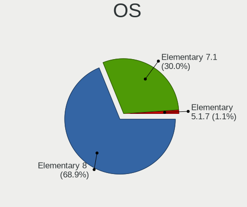

| Name           | Computers | Percent |
|----------------|-----------|---------|
| Elementary 7   | 33        | 82.5%   |
| Elementary 6.1 | 7         | 17.5%   |

OS Family
---------

OS without a version

| Name       | Computers | Percent |
|------------|-----------|---------|
| Elementary | 40        | 100%    |

Kernel
------

Version of the Linux kernel

| Version              | Computers | Percent |
|----------------------|-----------|---------|
| 5.19.0-38-generic    | 14        | 35%     |
| 5.15.0-58-generic    | 9         | 22.5%   |
| 5.19.0-40-generic    | 6         | 15%     |
| 5.15.0-69-generic    | 6         | 15%     |
| 5.19.0-41-generic    | 3         | 7.5%    |
| 6.2.7-060207-generic | 1         | 2.5%    |
| 5.11.0-43-generic    | 1         | 2.5%    |

Kernel Family
-------------

Linux kernel without a distro release

| Version | Computers | Percent |
|---------|-----------|---------|
| 5.19.0  | 23        | 57.5%   |
| 5.15.0  | 15        | 37.5%   |
| 6.2.7   | 1         | 2.5%    |
| 5.11.0  | 1         | 2.5%    |

Kernel Major Ver.
-----------------

Linux kernel major version

| Version | Computers | Percent |
|---------|-----------|---------|
| 5.19    | 23        | 57.5%   |
| 5.15    | 15        | 37.5%   |
| 6.2     | 1         | 2.5%    |
| 5.11    | 1         | 2.5%    |

Arch
----

OS architecture (x86_64, i586, etc.)

| Name   | Computers | Percent |
|--------|-----------|---------|
| x86_64 | 40        | 100%    |

DE
--

Desktop Environment

| Name     | Computers | Percent |
|----------|-----------|---------|
| Pantheon | 40        | 100%    |

Display Server
--------------

X11 or Wayland

| Name | Computers | Percent |
|------|-----------|---------|
| X11  | 40        | 100%    |

Display Manager
---------------

SDDM, LightDM, etc.

| Name    | Computers | Percent |
|---------|-----------|---------|
| Unknown | 34        | 85%     |
| LightDM | 6         | 15%     |

OS Lang
-------

Language

| Lang  | Computers | Percent |
|-------|-----------|---------|
| en_US | 17        | 42.5%   |
| de_DE | 5         | 12.5%   |
| en_GB | 4         | 10%     |
| pt_BR | 3         | 7.5%    |
| ru_RU | 2         | 5%      |
| es_ES | 2         | 5%      |
| sv_SE | 1         | 2.5%    |
| sk_SK | 1         | 2.5%    |
| it_IT | 1         | 2.5%    |
| hu_HU | 1         | 2.5%    |
| fr_CA | 1         | 2.5%    |
| en_CA | 1         | 2.5%    |
| da_DK | 1         | 2.5%    |

Boot Mode
---------

EFI or BIOS

| Mode | Computers | Percent |
|------|-----------|---------|
| BIOS | 33        | 82.5%   |
| EFI  | 7         | 17.5%   |

Filesystem
----------

Type of filesystem

| Type  | Computers | Percent |
|-------|-----------|---------|
| Ext4  | 38        | 95%     |
| Tmpfs | 1         | 2.5%    |
| Btrfs | 1         | 2.5%    |

Part. scheme
------------

Scheme of partitioning

| Type    | Computers | Percent |
|---------|-----------|---------|
| Unknown | 34        | 85%     |
| GPT     | 6         | 15%     |

Dual Boot with Linux/BSD
------------------------

Hosting more than one Linux/BSD

| Dual boot | Computers | Percent |
|-----------|-----------|---------|
| No        | 40        | 100%    |

Dual Boot (Win)
---------------

Hosting Linux and Windows

| Dual boot | Computers | Percent |
|-----------|-----------|---------|
| No        | 37        | 92.5%   |
| Yes       | 3         | 7.5%    |

Board
-----

Vendor
------

Motherboard manufacturer

| Name                | Computers | Percent |
|---------------------|-----------|---------|
| Hewlett-Packard     | 10        | 25%     |
| Apple               | 7         | 17.5%   |
| Lenovo              | 5         | 12.5%   |
| Dell                | 4         | 10%     |
| MSI                 | 3         | 7.5%    |
| HUAWEI              | 2         | 5%      |
| Gigabyte Technology | 2         | 5%      |
| ASUSTek Computer    | 2         | 5%      |
| Notebook            | 1         | 2.5%    |
| Multilaser          | 1         | 2.5%    |
| MACHINIST           | 1         | 2.5%    |
| Foxconn             | 1         | 2.5%    |
| ASRock              | 1         | 2.5%    |

Model
-----

Motherboard model

| Name                                     | Computers | Percent |
|------------------------------------------|-----------|---------|
| Notebook NLx0MU                          | 1         | 2.5%    |
| Multilaser PC150                         | 1         | 2.5%    |
| MSI PE70 6QE                             | 1         | 2.5%    |
| MSI MS-7B84                              | 1         | 2.5%    |
| MSI GE62VR 6RF                           | 1         | 2.5%    |
| MACHINIST E5-MR9A PRO V1.1               | 1         | 2.5%    |
| Lenovo V17 G2 ITL 82NX                   | 1         | 2.5%    |
| Lenovo V14 G2 ITL 82KA                   | 1         | 2.5%    |
| Lenovo ThinkPad X1 Carbon 3rd 20BSCTO1WW | 1         | 2.5%    |
| Lenovo H500s 10157                       | 1         | 2.5%    |
| Lenovo G580 20150                        | 1         | 2.5%    |
| HUAWEI NBD-WXX9                          | 1         | 2.5%    |
| HUAWEI BOD-WXX9                          | 1         | 2.5%    |
| HP Z600 Workstation                      | 1         | 2.5%    |
| HP Pavilion Laptop 15-cw1xxx             | 1         | 2.5%    |
| HP Pavilion g6                           | 1         | 2.5%    |
| HP Pavilion dv7                          | 1         | 2.5%    |
| HP Pavilion 15                           | 1         | 2.5%    |
| HP EliteDesk 800 G2 DM 35W               | 1         | 2.5%    |
| HP EliteBook 2560p                       | 1         | 2.5%    |
| HP 255 G7 Notebook PC                    | 1         | 2.5%    |
| HP 250 G8 Notebook PC                    | 1         | 2.5%    |
| HP 1998                                  | 1         | 2.5%    |
| Gigabyte Z270-Gaming K3                  | 1         | 2.5%    |
| Gigabyte H410M H V3                      | 1         | 2.5%    |
| Foxconn A76GMV                           | 1         | 2.5%    |
| Dell XPS 15 9510                         | 1         | 2.5%    |
| Dell Latitude E5570                      | 1         | 2.5%    |
| Dell Latitude E4300                      | 1         | 2.5%    |
| Dell Latitude 5420                       | 1         | 2.5%    |
| ASUS PRIME Z390-A                        | 1         | 2.5%    |
| ASUS ASUS TUF Gaming A15 FA506QR         | 1         | 2.5%    |
| ASRock B660M-C                           | 1         | 2.5%    |
| Apple MacBookPro9,2                      | 1         | 2.5%    |
| Apple MacBookPro5,2                      | 1         | 2.5%    |
| Apple MacBookPro10,1                     | 1         | 2.5%    |
| Apple MacBookAir7,1                      | 1         | 2.5%    |
| Apple MacBookAir3,2                      | 1         | 2.5%    |
| Apple iMac8,1                            | 1         | 2.5%    |
| Apple iMac12,1                           | 1         | 2.5%    |

Model Family
------------

Motherboard model prefix

| Name                 | Computers | Percent |
|----------------------|-----------|---------|
| HP Pavilion          | 4         | 10%     |
| Dell Latitude        | 3         | 7.5%    |
| Notebook NLx0MU      | 1         | 2.5%    |
| Multilaser PC150     | 1         | 2.5%    |
| MSI PE70             | 1         | 2.5%    |
| MSI MS-7B84          | 1         | 2.5%    |
| MSI GE62VR           | 1         | 2.5%    |
| MACHINIST E5-MR9A    | 1         | 2.5%    |
| Lenovo V17           | 1         | 2.5%    |
| Lenovo V14           | 1         | 2.5%    |
| Lenovo ThinkPad      | 1         | 2.5%    |
| Lenovo H500s         | 1         | 2.5%    |
| Lenovo G580          | 1         | 2.5%    |
| HUAWEI NBD-WXX9      | 1         | 2.5%    |
| HUAWEI BOD-WXX9      | 1         | 2.5%    |
| HP Z600              | 1         | 2.5%    |
| HP EliteDesk         | 1         | 2.5%    |
| HP EliteBook         | 1         | 2.5%    |
| HP 255               | 1         | 2.5%    |
| HP 250               | 1         | 2.5%    |
| HP 1998              | 1         | 2.5%    |
| Gigabyte Z270-Gaming | 1         | 2.5%    |
| Gigabyte H410M       | 1         | 2.5%    |
| Foxconn A76GMV       | 1         | 2.5%    |
| Dell XPS             | 1         | 2.5%    |
| ASUS PRIME           | 1         | 2.5%    |
| ASUS ASUS            | 1         | 2.5%    |
| ASRock B660M-C       | 1         | 2.5%    |
| Apple MacBookPro9    | 1         | 2.5%    |
| Apple MacBookPro5    | 1         | 2.5%    |
| Apple MacBookPro10   | 1         | 2.5%    |
| Apple MacBookAir7    | 1         | 2.5%    |
| Apple MacBookAir3    | 1         | 2.5%    |
| Apple iMac8          | 1         | 2.5%    |
| Apple iMac12         | 1         | 2.5%    |

MFG Year
--------

Motherboard manufacture year

| Year | Computers | Percent |
|------|-----------|---------|
| 2021 | 6         | 15%     |
| 2016 | 4         | 10%     |
| 2012 | 4         | 10%     |
| 2022 | 3         | 7.5%    |
| 2015 | 3         | 7.5%    |
| 2011 | 3         | 7.5%    |
| 2010 | 3         | 7.5%    |
| 2008 | 3         | 7.5%    |
| 2020 | 2         | 5%      |
| 2019 | 2         | 5%      |
| 2018 | 2         | 5%      |
| 2013 | 2         | 5%      |
| 2023 | 1         | 2.5%    |
| 2014 | 1         | 2.5%    |
| 2009 | 1         | 2.5%    |

Form Factor
-----------

Physical design of the computer

| Name       | Computers | Percent |
|------------|-----------|---------|
| Notebook   | 27        | 67.5%   |
| Desktop    | 10        | 25%     |
| All in one | 2         | 5%      |
| Mini pc    | 1         | 2.5%    |

Secure Boot
-----------

Enabled or disabled

| State    | Computers | Percent |
|----------|-----------|---------|
| Disabled | 37        | 92.5%   |
| Enabled  | 3         | 7.5%    |

Coreboot
--------

Have coreboot on board

| Used | Computers | Percent |
|------|-----------|---------|
| No   | 40        | 100%    |

RAM Size
--------

Total RAM memory

| Size in GB  | Computers | Percent |
|-------------|-----------|---------|
| 4.01-8.0    | 12        | 30%     |
| 16.01-24.0  | 9         | 22.5%   |
| 8.01-16.0   | 8         | 20%     |
| 3.01-4.0    | 7         | 17.5%   |
| 1.01-2.0    | 2         | 5%      |
| 24.01-32.0  | 1         | 2.5%    |
| 64.01-256.0 | 1         | 2.5%    |

RAM Used
--------

Used RAM memory

| Used GB  | Computers | Percent |
|----------|-----------|---------|
| 2.01-3.0 | 19        | 47.5%   |
| 1.01-2.0 | 11        | 27.5%   |
| 3.01-4.0 | 6         | 15%     |
| 4.01-8.0 | 3         | 7.5%    |
| 0.51-1.0 | 1         | 2.5%    |

Total Drives
------------

Number of drives on board

| Drives | Computers | Percent |
|--------|-----------|---------|
| 1      | 26        | 65%     |
| 2      | 10        | 25%     |
| 3      | 3         | 7.5%    |
| 4      | 1         | 2.5%    |

Has CD-ROM
----------

Has CD-ROM on board

| Presented | Computers | Percent |
|-----------|-----------|---------|
| No        | 29        | 72.5%   |
| Yes       | 11        | 27.5%   |

Has Ethernet
------------

Has Ethernet on board

| Presented | Computers | Percent |
|-----------|-----------|---------|
| Yes       | 33        | 82.5%   |
| No        | 7         | 17.5%   |

Has WiFi
--------

Has WiFi module

| Presented | Computers | Percent |
|-----------|-----------|---------|
| Yes       | 34        | 85%     |
| No        | 6         | 15%     |

Has Bluetooth
-------------

Has Bluetooth module

| Presented | Computers | Percent |
|-----------|-----------|---------|
| Yes       | 28        | 70%     |
| No        | 12        | 30%     |

Location
--------

Country
-------

Geographic location (country)

| Country      | Computers | Percent |
|--------------|-----------|---------|
| USA          | 11        | 27.5%   |
| Germany      | 6         | 15%     |
| Brazil       | 4         | 10%     |
| UK           | 2         | 5%      |
| Russia       | 2         | 5%      |
| Canada       | 2         | 5%      |
| Thailand     | 1         | 2.5%    |
| Spain        | 1         | 2.5%    |
| South Africa | 1         | 2.5%    |
| Slovakia     | 1         | 2.5%    |
| Norway       | 1         | 2.5%    |
| Netherlands  | 1         | 2.5%    |
| Mexico       | 1         | 2.5%    |
| Italy        | 1         | 2.5%    |
| India        | 1         | 2.5%    |
| Hungary      | 1         | 2.5%    |
| Denmark      | 1         | 2.5%    |
| Australia    | 1         | 2.5%    |
| Albania      | 1         | 2.5%    |

City
----

Geographic location (city)

| City             | Computers | Percent |
|------------------|-----------|---------|
| Las Vegas        | 2         | 5%      |
| Kingston         | 2         | 5%      |
| Berlin           | 2         | 5%      |
| Tirana           | 1         | 2.5%    |
| Stará Ľubovňa | 1         | 2.5%    |
| Soborg           | 1         | 2.5%    |
| Sarasota         | 1         | 2.5%    |
| Sao Paulo        | 1         | 2.5%    |
| Salt Lake City   | 1         | 2.5%    |
| Roosendaal       | 1         | 2.5%    |
| Praia Grande     | 1         | 2.5%    |
| Pforzheim        | 1         | 2.5%    |
| Pécs            | 1         | 2.5%    |
| Oslo             | 1         | 2.5%    |
| Odessa           | 1         | 2.5%    |
| Oaxaca City      | 1         | 2.5%    |
| Oakham           | 1         | 2.5%    |
| Novosibirsk      | 1         | 2.5%    |
| Monsummano Terme | 1         | 2.5%    |
| Melbourne        | 1         | 2.5%    |
| Mascouche        | 1         | 2.5%    |
| Lagerdorf        | 1         | 2.5%    |
| Johannesburg     | 1         | 2.5%    |
| Imperatriz       | 1         | 2.5%    |
| Gaston           | 1         | 2.5%    |
| Dresden          | 1         | 2.5%    |
| Derby            | 1         | 2.5%    |
| Curitiba         | 1         | 2.5%    |
| Chemnitz         | 1         | 2.5%    |
| Cheboksary       | 1         | 2.5%    |
| Catarroja        | 1         | 2.5%    |
| Burlingame       | 1         | 2.5%    |
| Budd Lake        | 1         | 2.5%    |
| Bluffton         | 1         | 2.5%    |
| Bangkok          | 1         | 2.5%    |
| Asheville        | 1         | 2.5%    |
| Ahmedabad        | 1         | 2.5%    |

Drives
------

Drive Vendor
------------

Hard drive vendors

| Vendor                      | Computers | Drives | Percent |
|-----------------------------|-----------|--------|---------|
| SanDisk                     | 6         | 6      | 10.71%  |
| WDC                         | 5         | 5      | 8.93%   |
| Samsung Electronics         | 5         | 7      | 8.93%   |
| Seagate                     | 4         | 4      | 7.14%   |
| Kingston                    | 4         | 4      | 7.14%   |
| Hitachi                     | 3         | 3      | 5.36%   |
| Apple                       | 3         | 3      | 5.36%   |
| Unknown                     | 2         | 3      | 3.57%   |
| Toshiba                     | 2         | 2      | 3.57%   |
| SK hynix                    | 2         | 3      | 3.57%   |
| Intenso                     | 2         | 2      | 3.57%   |
| HGST                        | 2         | 2      | 3.57%   |
| Crucial                     | 2         | 2      | 3.57%   |
| A-DATA Technology           | 2         | 2      | 3.57%   |
| USB 3.0                     | 1         | 1      | 1.79%   |
| Union Memory                | 1         | 1      | 1.79%   |
| Silicon Motion              | 1         | 1      | 1.79%   |
| Phison Electronics          | 1         | 1      | 1.79%   |
| Netac                       | 1         | 1      | 1.79%   |
| Micron/Crucial Technology   | 1         | 1      | 1.79%   |
| MAXIO Technology (Hangzhou) | 1         | 1      | 1.79%   |
| LITEON                      | 1         | 1      | 1.79%   |
| Kingston Technology Company | 1         | 1      | 1.79%   |
| HUSKY                       | 1         | 1      | 1.79%   |
| HS-SSD-E100                 | 1         | 2      | 1.79%   |
| China                       | 1         | 1      | 1.79%   |

Drive Model
-----------

Hard drive models

| Model                                               | Computers | Percent |
|-----------------------------------------------------|-----------|---------|
| Kingston SA400S37240G 240GB SSD                     | 2         | 3.33%   |
| HGST HTS721010A9E630 1TB                            | 2         | 3.33%   |
| WDC WDS480G2G0C-00AJM0 480GB                        | 1         | 1.67%   |
| WDC WDS240G2G0A-00JH30 240GB SSD                    | 1         | 1.67%   |
| WDC WD5000AAKX-08U6AA0 500GB                        | 1         | 1.67%   |
| WDC WD10EZEX-60WN4A0 1TB                            | 1         | 1.67%   |
| WDC WD10EZEX-00BBHA0 1TB                            | 1         | 1.67%   |
| USB 3.0 Device 250GB                                | 1         | 1.67%   |
| Unknown MMC Card  8GB                               | 1         | 1.67%   |
| Unknown MMC Card  7GB                               | 1         | 1.67%   |
| Unknown MMC Card  32GB                              | 1         | 1.67%   |
| Union Memory UMIS RPJTJ512MEE1OWX 512GB             | 1         | 1.67%   |
| Toshiba THNSNK128GVN8 M.2 2280 128GB SSD            | 1         | 1.67%   |
| Toshiba MQ01ABF050 500GB                            | 1         | 1.67%   |
| SK hynix PC711 NVMe 1TB                             | 1         | 1.67%   |
| SK hynix HFM512GD3JX013N 512GB                      | 1         | 1.67%   |
| Silicon Motion PCIe-8 SSD 256GB                     | 1         | 1.67%   |
| Seagate ST9500325AS 500GB                           | 1         | 1.67%   |
| Seagate ST500LM012 HN-M500MBB 500GB                 | 1         | 1.67%   |
| Seagate ST4000DM004-2CV104 4TB                      | 1         | 1.67%   |
| Seagate ST3500413AS 500GB                           | 1         | 1.67%   |
| Sandisk WD_BLACK SN750 SE 500GB                     | 1         | 1.67%   |
| Sandisk WDC PC SN530 SDBPMPZ-256G-1101 256GB        | 1         | 1.67%   |
| SanDisk SSD G5 BICS4 1TB                            | 1         | 1.67%   |
| SanDisk SD7TB3Q-256G-1006 256GB SSD                 | 1         | 1.67%   |
| SanDisk SD7SB3Q-256G-1006 256GB SSD                 | 1         | 1.67%   |
| Sandisk PC SN530 NVMe WDC 256GB                     | 1         | 1.67%   |
| Samsung SSD 980 500GB                               | 1         | 1.67%   |
| Samsung SSD 860 EVO 500GB                           | 1         | 1.67%   |
| Samsung SSD 840 Series 120GB                        | 1         | 1.67%   |
| Samsung PSSD T7 Shield 2TB                          | 1         | 1.67%   |
| Samsung NVMe SSD Controller SM981/PM981/PM983 1TB   | 1         | 1.67%   |
| Samsung NVMe SSD Controller SM961/PM961/SM963 500GB | 1         | 1.67%   |
| Samsung HD502HI 500GB                               | 1         | 1.67%   |
| Phison E12 NVMe Controller 512GB                    | 1         | 1.67%   |
| Netac SSD 1TB                                       | 1         | 1.67%   |
| Micron/Crucial P1 NVMe PCIe SSD 500GB               | 1         | 1.67%   |
| MAXIO (Hangzhou) NVMe SSD Controller MAP1202 1TB    | 1         | 1.67%   |
| LITEON L8H-256V2G 256GB SSD                         | 1         | 1.67%   |
| Kingston Company SNV2S1000G 1TB                     | 1         | 1.67%   |

HDD Vendor
----------

Hard disk drive vendors

| Vendor              | Computers | Drives | Percent |
|---------------------|-----------|--------|---------|
| Seagate             | 4         | 4      | 28.57%  |
| WDC                 | 3         | 3      | 21.43%  |
| Hitachi             | 3         | 3      | 21.43%  |
| HGST                | 2         | 2      | 14.29%  |
| Toshiba             | 1         | 1      | 7.14%   |
| Samsung Electronics | 1         | 1      | 7.14%   |

SSD Vendor
----------

Solid state drive vendors

| Vendor              | Computers | Drives | Percent |
|---------------------|-----------|--------|---------|
| Kingston            | 4         | 4      | 16%     |
| SanDisk             | 3         | 3      | 12%     |
| Samsung Electronics | 3         | 3      | 12%     |
| Apple               | 3         | 3      | 12%     |
| Crucial             | 2         | 2      | 8%      |
| A-DATA Technology   | 2         | 2      | 8%      |
| WDC                 | 1         | 1      | 4%      |
| Toshiba             | 1         | 1      | 4%      |
| Netac               | 1         | 1      | 4%      |
| LITEON              | 1         | 1      | 4%      |
| Intenso             | 1         | 1      | 4%      |
| HUSKY               | 1         | 1      | 4%      |
| HS-SSD-E100         | 1         | 1      | 4%      |
| China               | 1         | 1      | 4%      |

Drive Kind
----------

HDD or SSD

| Kind    | Computers | Drives | Percent |
|---------|-----------|--------|---------|
| SSD     | 23        | 25     | 41.82%  |
| NVMe    | 14        | 16     | 25.45%  |
| HDD     | 13        | 14     | 23.64%  |
| Unknown | 3         | 3      | 5.45%   |
| MMC     | 2         | 3      | 3.64%   |

Drive Connector
---------------

SATA, SAS, NVMe, etc.

| Type | Computers | Drives | Percent |
|------|-----------|--------|---------|
| SATA | 30        | 40     | 62.5%   |
| NVMe | 14        | 16     | 29.17%  |
| SAS  | 2         | 2      | 4.17%   |
| MMC  | 2         | 3      | 4.17%   |

Drive Size
----------

Size of hard drive

| Size in TB | Computers | Drives | Percent |
|------------|-----------|--------|---------|
| 0.01-0.5   | 25        | 30     | 73.53%  |
| 0.51-1.0   | 6         | 6      | 17.65%  |
| 1.01-2.0   | 2         | 2      | 5.88%   |
| 3.01-4.0   | 1         | 1      | 2.94%   |

Space Total
-----------

Amount of disk space available on the file system

| Size in GB | Computers | Percent |
|------------|-----------|---------|
| 101-250    | 15        | 37.5%   |
| 251-500    | 12        | 30%     |
| 501-1000   | 7         | 17.5%   |
| 51-100     | 4         | 10%     |
| 21-50      | 2         | 5%      |

Space Used
----------

Amount of used disk space

| Used GB | Computers | Percent |
|---------|-----------|---------|
| 1-20    | 18        | 45%     |
| 51-100  | 8         | 20%     |
| 101-250 | 7         | 17.5%   |
| 21-50   | 5         | 12.5%   |
| 251-500 | 2         | 5%      |

Malfunc. Drives
---------------

Drive models with a malfunction

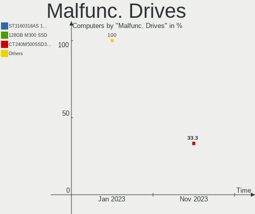

| Model                         | Computers | Drives | Percent |
|-------------------------------|-----------|--------|---------|
| Hitachi HTS725050A7E630 500GB | 1         | 1      | 100%    |

Malfunc. Drive Vendor
---------------------

Vendors of faulty drives

| Vendor  | Computers | Drives | Percent |
|---------|-----------|--------|---------|
| Hitachi | 1         | 1      | 100%    |

Malfunc. HDD Vendor
-------------------

Vendors of faulty HDD drives

| Vendor  | Computers | Drives | Percent |
|---------|-----------|--------|---------|
| Hitachi | 1         | 1      | 100%    |

Malfunc. Drive Kind
-------------------

Kinds of faulty drives

| Kind | Computers | Drives | Percent |
|------|-----------|--------|---------|
| HDD  | 1         | 1      | 100%    |

Failed Drives
-------------

Failed drive models

Zero info for selected period =(

Failed Drive Vendor
-------------------

Failed drive vendors

Zero info for selected period =(

Drive Status
------------

Number of failed and malfunc. drives

| Status   | Computers | Drives | Percent |
|----------|-----------|--------|---------|
| Detected | 38        | 57     | 90.48%  |
| Works    | 3         | 3      | 7.14%   |
| Malfunc  | 1         | 1      | 2.38%   |

Storage controller
------------------

Storage Vendor
--------------

Storage controller vendors

| Vendor                      | Computers | Percent |
|-----------------------------|-----------|---------|
| Intel                       | 27        | 54%     |
| AMD                         | 5         | 10%     |
| SanDisk                     | 4         | 8%      |
| Samsung Electronics         | 3         | 6%      |
| SK hynix                    | 2         | 4%      |
| Nvidia                      | 2         | 4%      |
| Union Memory (Shenzhen)     | 1         | 2%      |
| Silicon Motion              | 1         | 2%      |
| Phison Electronics          | 1         | 2%      |
| Micron/Crucial Technology   | 1         | 2%      |
| MAXIO Technology (Hangzhou) | 1         | 2%      |
| Kingston Technology Company | 1         | 2%      |
| ASMedia Technology          | 1         | 2%      |

Storage Model
-------------

Storage controller models

| Model                                                                          | Computers | Percent |
|--------------------------------------------------------------------------------|-----------|---------|
| AMD FCH SATA Controller [AHCI mode]                                            | 4         | 7.14%   |
| SanDisk Non-Volatile memory controller                                         | 3         | 5.36%   |
| Intel Volume Management Device NVMe RAID Controller                            | 3         | 5.36%   |
| Intel Tiger Lake-LP SATA Controller                                            | 3         | 5.36%   |
| Intel 7 Series Chipset Family 6-port SATA Controller [AHCI mode]               | 3         | 5.36%   |
| SK hynix Gold P31/PC711 NVMe Solid State Drive                                 | 2         | 3.57%   |
| Intel HM170/QM170 Chipset SATA Controller [AHCI Mode]                          | 2         | 3.57%   |
| Intel 82801 Mobile SATA Controller [RAID mode]                                 | 2         | 3.57%   |
| Intel 8 Series/C220 Series Chipset Family 6-port SATA Controller 1 [AHCI mode] | 2         | 3.57%   |
| Union Memory (Shenzhen) Non-Volatile memory controller                         | 1         | 1.79%   |
| Silicon Motion Non-Volatile memory controller                                  | 1         | 1.79%   |
| SanDisk NVMe Controller                                                        | 1         | 1.79%   |
| Samsung NVMe SSD Controller SM981/PM981/PM983                                  | 1         | 1.79%   |
| Samsung NVMe SSD Controller SM961/PM961/SM963                                  | 1         | 1.79%   |
| Samsung NVMe SSD Controller 980                                                | 1         | 1.79%   |
| Samsung Electronics SATA controller                                            | 1         | 1.79%   |
| Phison E12 NVMe Controller                                                     | 1         | 1.79%   |
| Nvidia MCP89 SATA Controller (AHCI mode)                                       | 1         | 1.79%   |
| Nvidia MCP79 AHCI Controller                                                   | 1         | 1.79%   |
| Micron/Crucial P1 NVMe PCIe SSD                                                | 1         | 1.79%   |
| MAXIO (Hangzhou) NVMe SSD Controller MAP1202                                   | 1         | 1.79%   |
| Kingston Company Company Non-Volatile memory controller                        | 1         | 1.79%   |
| Intel Wildcat Point-LP SATA Controller [AHCI Mode]                             | 1         | 1.79%   |
| Intel SATA Controller [RAID mode]                                              | 1         | 1.79%   |
| Intel Q170/Q150/B150/H170/H110/Z170/CM236 Chipset SATA Controller [AHCI Mode]  | 1         | 1.79%   |
| Intel Celeron/Pentium Silver Processor SATA Controller                         | 1         | 1.79%   |
| Intel Cannon Lake PCH SATA AHCI Controller                                     | 1         | 1.79%   |
| Intel Atom Processor E3800 Series SATA AHCI Controller                         | 1         | 1.79%   |
| Intel Alder Lake-S PCH SATA Controller [AHCI Mode]                             | 1         | 1.79%   |
| Intel 82801HM/HEM (ICH8M/ICH8M-E) SATA Controller [AHCI mode]                  | 1         | 1.79%   |
| Intel 82801HM/HEM (ICH8M/ICH8M-E) IDE Controller                               | 1         | 1.79%   |
| Intel 8 Series SATA Controller 1 [AHCI mode]                                   | 1         | 1.79%   |
| Intel 6 Series/C200 Series Chipset Family 6 port Mobile SATA AHCI Controller   | 1         | 1.79%   |
| Intel 6 Series/C200 Series Chipset Family 6 port Desktop SATA AHCI Controller  | 1         | 1.79%   |
| Intel 500 Series Chipset Family SATA AHCI Controller                           | 1         | 1.79%   |
| Intel 5 Series/3400 Series Chipset 4 port SATA AHCI Controller                 | 1         | 1.79%   |
| Intel 200 Series PCH SATA controller [AHCI mode]                               | 1         | 1.79%   |
| ASMedia ASM1062 Serial ATA Controller                                          | 1         | 1.79%   |
| AMD SB7x0/SB8x0/SB9x0 SATA Controller [IDE mode]                               | 1         | 1.79%   |
| AMD SB7x0/SB8x0/SB9x0 IDE Controller                                           | 1         | 1.79%   |

Storage Kind
------------

Kind of storage controller (IDE, SATA, NVMe, SAS, ...)

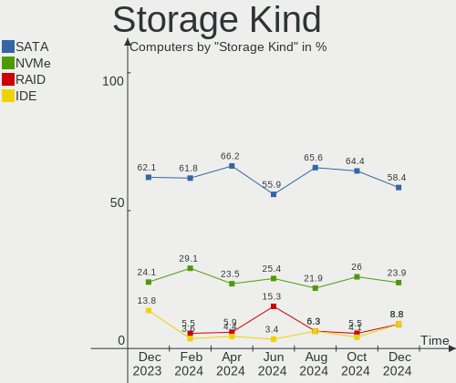

| Kind | Computers | Percent |
|------|-----------|---------|
| SATA | 31        | 58.49%  |
| NVMe | 14        | 26.42%  |
| RAID | 6         | 11.32%  |
| IDE  | 2         | 3.77%   |

Processor
---------

CPU Vendor
----------

Processor vendors

| Vendor | Computers | Percent |
|--------|-----------|---------|
| Intel  | 33        | 82.5%   |
| AMD    | 7         | 17.5%   |

CPU Model
---------

Processor models

| Model                                         | Computers | Percent |
|-----------------------------------------------|-----------|---------|
| Intel 11th Gen Core i3-1115G4 @ 3.00GHz       | 3         | 7.5%    |
| Intel Core i7-6700HQ CPU @ 2.60GHz            | 2         | 5%      |
| Intel 11th Gen Core i5-1135G7 @ 2.40GHz       | 2         | 5%      |
| Intel Xeon CPU E5620 @ 2.40GHz                | 1         | 2.5%    |
| Intel Xeon CPU E5-2670 v3 @ 2.30GHz           | 1         | 2.5%    |
| Intel Pentium CPU J2900 @ 2.41GHz             | 1         | 2.5%    |
| Intel Core i9-9900K CPU @ 3.60GHz             | 1         | 2.5%    |
| Intel Core i7-6700T CPU @ 2.80GHz             | 1         | 2.5%    |
| Intel Core i7-5650U CPU @ 2.20GHz             | 1         | 2.5%    |
| Intel Core i7-5600U CPU @ 2.60GHz             | 1         | 2.5%    |
| Intel Core i7-4510U CPU @ 2.00GHz             | 1         | 2.5%    |
| Intel Core i7-3720QM CPU @ 2.60GHz            | 1         | 2.5%    |
| Intel Core i7 CPU Q 720 @ 1.60GHz             | 1         | 2.5%    |
| Intel Core i5-7500T CPU @ 2.70GHz             | 1         | 2.5%    |
| Intel Core i5-6300U CPU @ 2.40GHz             | 1         | 2.5%    |
| Intel Core i5-4590 CPU @ 3.30GHz              | 1         | 2.5%    |
| Intel Core i5-3210M CPU @ 2.50GHz             | 1         | 2.5%    |
| Intel Core i5-2520M CPU @ 2.50GHz             | 1         | 2.5%    |
| Intel Core i5-2400S CPU @ 2.50GHz             | 1         | 2.5%    |
| Intel Core i5-10400F CPU @ 2.90GHz            | 1         | 2.5%    |
| Intel Core i3-3120M CPU @ 2.50GHz             | 1         | 2.5%    |
| Intel Core 2 Duo CPU T9600 @ 2.80GHz          | 1         | 2.5%    |
| Intel Core 2 Duo CPU P9600 @ 2.53GHz          | 1         | 2.5%    |
| Intel Core 2 Duo CPU L9400 @ 1.86GHz          | 1         | 2.5%    |
| Intel Core 2 Duo CPU E8435 @ 3.06GHz          | 1         | 2.5%    |
| Intel Celeron N4020 CPU @ 1.10GHz             | 1         | 2.5%    |
| Intel 12th Gen Core i7-12700F                 | 1         | 2.5%    |
| Intel 11th Gen Core i9-11900H @ 2.50GHz       | 1         | 2.5%    |
| Intel 11th Gen Core i7-1185G7 @ 3.00GHz       | 1         | 2.5%    |
| AMD Sempron 145 Processor                     | 1         | 2.5%    |
| AMD Ryzen 7 5800H with Radeon Graphics        | 1         | 2.5%    |
| AMD Ryzen 3 3300U with Radeon Vega Mobile Gfx | 1         | 2.5%    |
| AMD Athlon Silver 3050U with Radeon Graphics  | 1         | 2.5%    |
| AMD Athlon 3000G with Radeon Vega Graphics    | 1         | 2.5%    |
| AMD A6-4400M APU with Radeon HD Graphics      | 1         | 2.5%    |
| AMD A4-9120e RADEON R3, 4 COMPUTE CORES 2C+2G | 1         | 2.5%    |

CPU Model Family
----------------

Processor model prefix

| Model            | Computers | Percent |
|------------------|-----------|---------|
| Other            | 8         | 20%     |
| Intel Core i7    | 8         | 20%     |
| Intel Core i5    | 7         | 17.5%   |
| Intel Core 2 Duo | 4         | 10%     |
| Intel Xeon       | 2         | 5%      |
| AMD Athlon       | 2         | 5%      |
| Intel Pentium    | 1         | 2.5%    |
| Intel Core i9    | 1         | 2.5%    |
| Intel Core i3    | 1         | 2.5%    |
| Intel Celeron    | 1         | 2.5%    |
| AMD Sempron      | 1         | 2.5%    |
| AMD Ryzen 7      | 1         | 2.5%    |
| AMD Ryzen 3      | 1         | 2.5%    |
| AMD A6           | 1         | 2.5%    |
| AMD A4           | 1         | 2.5%    |

CPU Cores
---------

Number of processor cores

| Number | Computers | Percent |
|--------|-----------|---------|
| 2      | 18        | 45%     |
| 4      | 13        | 32.5%   |
| 8      | 4         | 10%     |
| 12     | 2         | 5%      |
| 1      | 2         | 5%      |
| 6      | 1         | 2.5%    |

CPU Sockets
-----------

Number of sockets

| Number | Computers | Percent |
|--------|-----------|---------|
| 1      | 39        | 97.5%   |
| 2      | 1         | 2.5%    |

CPU Threads
-----------

Threads per core (Hyper-Threading)

| Number | Computers | Percent |
|--------|-----------|---------|
| 2      | 27        | 67.5%   |
| 1      | 13        | 32.5%   |

CPU Op-Modes
------------

CPU Operation Modes (32-bit, 64-bit)

| Op mode        | Computers | Percent |
|----------------|-----------|---------|
| 32-bit, 64-bit | 40        | 100%    |

CPU Microcode
-------------

Microcode number

| Number     | Computers | Percent |
|------------|-----------|---------|
| Unknown    | 29        | 72.5%   |
| 0x806c1    | 2         | 5%      |
| 0x806d1    | 1         | 2.5%    |
| 0x306d4    | 1         | 2.5%    |
| 0x206c2    | 1         | 2.5%    |
| 0x206a7    | 1         | 2.5%    |
| 0x106e5    | 1         | 2.5%    |
| 0x0a50000c | 1         | 2.5%    |
| 0x08108109 | 1         | 2.5%    |
| 0x06006705 | 1         | 2.5%    |
| 0x010000c8 | 1         | 2.5%    |

CPU Microarch
-------------

Microarchitecture

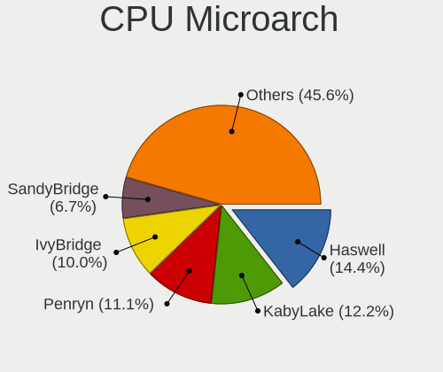

| Name          | Computers | Percent |
|---------------|-----------|---------|
| TigerLake     | 6         | 15%     |
| Skylake       | 4         | 10%     |
| Penryn        | 4         | 10%     |
| Zen+          | 3         | 7.5%    |
| IvyBridge     | 3         | 7.5%    |
| Haswell       | 3         | 7.5%    |
| SandyBridge   | 2         | 5%      |
| KabyLake      | 2         | 5%      |
| Broadwell     | 2         | 5%      |
| Zen 3         | 1         | 2.5%    |
| Westmere      | 1         | 2.5%    |
| Silvermont    | 1         | 2.5%    |
| Piledriver    | 1         | 2.5%    |
| Nehalem       | 1         | 2.5%    |
| K10           | 1         | 2.5%    |
| Icelake       | 1         | 2.5%    |
| Goldmont plus | 1         | 2.5%    |
| Excavator     | 1         | 2.5%    |
| CometLake     | 1         | 2.5%    |
| Unknown       | 1         | 2.5%    |

Graphics
--------

GPU Vendor
----------

Vendors of graphics cards

| Vendor | Computers | Percent |
|--------|-----------|---------|
| Intel  | 23        | 47.92%  |
| Nvidia | 14        | 29.17%  |
| AMD    | 11        | 22.92%  |

GPU Model
---------

Graphics card models

| Model                                                                       | Computers | Percent |
|-----------------------------------------------------------------------------|-----------|---------|
| Intel TigerLake-LP GT2 [Iris Xe Graphics]                                   | 3         | 6%      |
| Intel Tiger Lake-LP GT2 [UHD Graphics G4]                                   | 3         | 6%      |
| Intel HD Graphics 530                                                       | 3         | 6%      |
| Intel 3rd Gen Core processor Graphics Controller                            | 3         | 6%      |
| AMD Picasso/Raven 2 [Radeon Vega Series / Radeon Vega Mobile Series]        | 3         | 6%      |
| Intel 2nd Generation Core Processor Family Integrated Graphics Controller   | 2         | 4%      |
| Nvidia TU116 [GeForce GTX 1660 SUPER]                                       | 1         | 2%      |
| Nvidia TU106 [GeForce GTX 1650]                                             | 1         | 2%      |
| Nvidia MCP89 [GeForce 320M]                                                 | 1         | 2%      |
| Nvidia GP106M [GeForce GTX 1060 Mobile]                                     | 1         | 2%      |
| Nvidia GM108M [GeForce 840M]                                                | 1         | 2%      |
| Nvidia GM107M [GeForce GTX 960M]                                            | 1         | 2%      |
| Nvidia GM107GL [Quadro K620]                                                | 1         | 2%      |
| Nvidia GK107M [GeForce GT 650M Mac Edition]                                 | 1         | 2%      |
| Nvidia GF119 [GeForce GT 610]                                               | 1         | 2%      |
| Nvidia GF117M [GeForce 610M/710M/810M/820M / GT 620M/625M/630M/720M]        | 1         | 2%      |
| Nvidia GA107M [GeForce RTX 3050 Ti Mobile]                                  | 1         | 2%      |
| Nvidia GA104M [GeForce RTX 3070 Mobile / Max-Q]                             | 1         | 2%      |
| Nvidia GA104 [GeForce RTX 3060 Ti Lite Hash Rate]                           | 1         | 2%      |
| Nvidia G96CM [GeForce 9600M GT]                                             | 1         | 2%      |
| Nvidia G92M [GeForce 8800M GTS]                                             | 1         | 2%      |
| Nvidia C79 [GeForce 9400M]                                                  | 1         | 2%      |
| Intel Xeon E3-1200 v3/4th Gen Core Processor Integrated Graphics Controller | 1         | 2%      |
| Intel TigerLake-H GT1 [UHD Graphics]                                        | 1         | 2%      |
| Intel Skylake GT2 [HD Graphics 520]                                         | 1         | 2%      |
| Intel Mobile 4 Series Chipset Integrated Graphics Controller                | 1         | 2%      |
| Intel HD Graphics 6000                                                      | 1         | 2%      |
| Intel HD Graphics 5500                                                      | 1         | 2%      |
| Intel Haswell-ULT Integrated Graphics Controller                            | 1         | 2%      |
| Intel GeminiLake [UHD Graphics 600]                                         | 1         | 2%      |
| Intel CoffeeLake-S GT2 [UHD Graphics 630]                                   | 1         | 2%      |
| AMD Whistler [Radeon HD 6630M/6650M/6750M/7670M/7690M]                      | 1         | 2%      |
| AMD Trinity 2 [Radeon HD 7520G]                                             | 1         | 2%      |
| AMD Stoney [Radeon R2/R3/R4/R5 Graphics]                                    | 1         | 2%      |
| AMD RS780L [Radeon 3000]                                                    | 1         | 2%      |
| AMD Navi 23 [Radeon RX 6600/6600 XT/6600M]                                  | 1         | 2%      |
| AMD Navi 10 [Radeon RX 5600 OEM/5600 XT / 5700/5700 XT]                     | 1         | 2%      |
| AMD Madison [Mobility Radeon HD 5650/5750 / 6530M/6550M]                    | 1         | 2%      |
| AMD Cezanne [Radeon Vega Series / Radeon Vega Mobile Series]                | 1         | 2%      |

GPU Combo
---------

Combinations of graphics cards

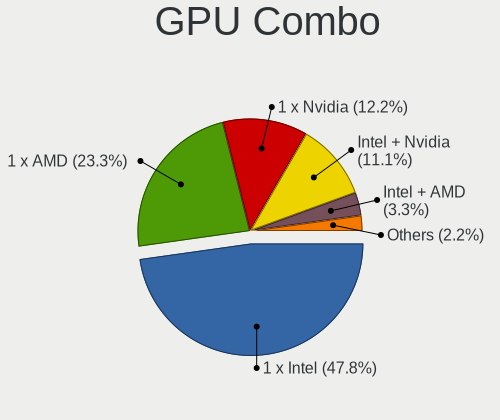

| Name           | Computers | Percent |
|----------------|-----------|---------|
| 1 x Intel      | 16        | 40%     |
| 1 x AMD        | 10        | 25%     |
| Intel + Nvidia | 6         | 15%     |
| 1 x Nvidia     | 5         | 12.5%   |
| 2 x Nvidia     | 2         | 5%      |
| AMD + Nvidia   | 1         | 2.5%    |

GPU Driver
----------

Free vs proprietary

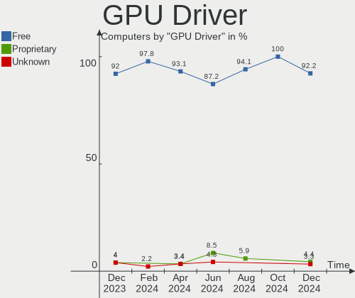

| Driver      | Computers | Percent |
|-------------|-----------|---------|
| Free        | 38        | 95%     |
| Proprietary | 2         | 5%      |

GPU Memory
----------

Total video memory

| Size in GB | Computers | Percent |
|------------|-----------|---------|
| Unknown    | 34        | 85%     |
| 0.51-1.0   | 2         | 5%      |
| 0.01-0.5   | 2         | 5%      |
| 3.01-4.0   | 1         | 2.5%    |
| 1.01-2.0   | 1         | 2.5%    |

Monitor
-------

Monitor Vendor
--------------

Monitor vendors

| Vendor              | Computers | Percent |
|---------------------|-----------|---------|
| Apple               | 7         | 16.28%  |
| BOE                 | 6         | 13.95%  |
| LG Display          | 5         | 11.63%  |
| Samsung Electronics | 4         | 9.3%    |
| Goldstar            | 4         | 9.3%    |
| Chimei Innolux      | 4         | 9.3%    |
| Dell                | 2         | 4.65%   |
| BenQ                | 2         | 4.65%   |
| AU Optronics        | 2         | 4.65%   |
| Sharp               | 1         | 2.33%   |
| Sceptre Tech        | 1         | 2.33%   |
| PANDA               | 1         | 2.33%   |
| MYS                 | 1         | 2.33%   |
| Idek Iiyama         | 1         | 2.33%   |
| Hewlett-Packard     | 1         | 2.33%   |
| Acer                | 1         | 2.33%   |

Monitor Model
-------------

Monitor models

| Model                                                                | Computers | Percent |
|----------------------------------------------------------------------|-----------|---------|
| Sharp LCD Monitor SHP14D0 3840x2400 336x210mm 15.6-inch              | 1         | 2.22%   |
| Sceptre Tech Sceptre Q27 SPT0AD2 2560x1440 597x336mm 27.0-inch       | 1         | 2.22%   |
| Samsung Electronics LS27AG55x SAM71E0 2560x1440 597x336mm 27.0-inch  | 1         | 2.22%   |
| Samsung Electronics LCD Monitor SEC5441 1366x768 344x194mm 15.5-inch | 1         | 2.22%   |
| Samsung Electronics LCD Monitor SEC4149 1366x768 292x174mm 13.4-inch | 1         | 2.22%   |
| Samsung Electronics C32F391 SAM0D34 1920x1080 698x393mm 31.5-inch    | 1         | 2.22%   |
| PANDA LCD Monitor NCP004D 1920x1080 344x194mm 15.5-inch              | 1         | 2.22%   |
| MYS LCD Monitor MYS1700 1280x1024 360x240mm 17.0-inch                | 1         | 2.22%   |
| LG Display LCD Monitor LGD4601 1280x800 286x179mm 13.3-inch          | 1         | 2.22%   |
| LG Display LCD Monitor LGD068D 1920x1080 309x174mm 14.0-inch         | 1         | 2.22%   |
| LG Display LCD Monitor LGD04A7 1920x1080 344x194mm 15.5-inch         | 1         | 2.22%   |
| LG Display LCD Monitor LGD0419 2560x1440 310x174mm 14.0-inch         | 1         | 2.22%   |
| LG Display LCD Monitor LGD034D 1366x768 344x194mm 15.5-inch          | 1         | 2.22%   |
| Idek Iiyama LCD Monitor PL2377 1920x1080                             | 1         | 2.22%   |
| Idek Iiyama LCD Monitor PL2377                                       | 1         | 2.22%   |
| Hewlett-Packard E231 HWP3063 1920x1080 509x286mm 23.0-inch           | 1         | 2.22%   |
| Goldstar ULTRAGEAR GSM7766 2560x1440 697x392mm 31.5-inch             | 1         | 2.22%   |
| Goldstar L1752T GSM4434 1280x1024 338x270mm 17.0-inch                | 1         | 2.22%   |
| Goldstar FULL HD GSM5B55 1920x1080 480x270mm 21.7-inch               | 1         | 2.22%   |
| Goldstar FULL HD GSM5B54 1920x1080 480x270mm 21.7-inch               | 1         | 2.22%   |
| Dell LCD Monitor LNK0001 1920x1080 256x192mm 12.6-inch               | 1         | 2.22%   |
| Dell LCD Monitor E198WFP 3360x1080                                   | 1         | 2.22%   |
| Dell E1914H DELD03A 1366x768 410x230mm 18.5-inch                     | 1         | 2.22%   |
| Chimei Innolux LCD Monitor CMN1735 1920x1080 381x214mm 17.2-inch     | 1         | 2.22%   |
| Chimei Innolux LCD Monitor CMN15DB 1366x768 344x193mm 15.5-inch      | 1         | 2.22%   |
| Chimei Innolux LCD Monitor CMN15BC 1366x768 344x193mm 15.5-inch      | 1         | 2.22%   |
| Chimei Innolux LCD Monitor CMN14D6 1366x768 309x173mm 13.9-inch      | 1         | 2.22%   |
| BOE LCD Monitor BOE09C1 1920x1080 382x215mm 17.3-inch                | 1         | 2.22%   |
| BOE LCD Monitor BOE091F 1366x768 344x194mm 15.5-inch                 | 1         | 2.22%   |
| BOE LCD Monitor BOE0877 1920x1080 309x173mm 13.9-inch                | 1         | 2.22%   |
| BOE LCD Monitor BOE0872 1920x1080 344x194mm 15.5-inch                | 1         | 2.22%   |
| BOE LCD Monitor BOE076F 1366x768 344x194mm 15.5-inch                 | 1         | 2.22%   |
| BOE LCD Monitor BOE0620 1366x768 344x194mm 15.5-inch                 | 1         | 2.22%   |
| BenQ GW2280 BNQ78E8 1920x1080 476x268mm 21.5-inch                    | 1         | 2.22%   |
| BenQ GL2460 BNQ78CE 1920x1080 531x299mm 24.0-inch                    | 1         | 2.22%   |
| AU Optronics LCD Monitor AUO403D 1920x1080 309x174mm 14.0-inch       | 1         | 2.22%   |
| AU Optronics LCD Monitor AUO208D 1920x1080 309x174mm 14.0-inch       | 1         | 2.22%   |
| Apple LCD Monitor APP9CCB 1280x800 286x179mm 13.3-inch               | 1         | 2.22%   |
| Apple iMac APPA00C 1920x1080 475x267mm 21.5-inch                     | 1         | 2.22%   |
| Apple Color LCD APPA00E 2880x1800 331x207mm 15.4-inch                | 1         | 2.22%   |

Monitor Resolution
------------------

Monitor screen resolution

| Resolution        | Computers | Percent |
|-------------------|-----------|---------|
| 1920x1080 (FHD)   | 16        | 36.36%  |
| 1366x768 (WXGA)   | 12        | 27.27%  |
| 2560x1440 (QHD)   | 4         | 9.09%   |
| 1920x1200 (WUXGA) | 2         | 4.55%   |
| 1280x800 (WXGA)   | 2         | 4.55%   |
| 1280x1024 (SXGA)  | 2         | 4.55%   |
| 3840x2400         | 1         | 2.27%   |
| 3840x2160 (4K)    | 1         | 2.27%   |
| 3360x1080         | 1         | 2.27%   |
| 2880x1800         | 1         | 2.27%   |
| 1440x900 (WXGA+)  | 1         | 2.27%   |
| Unknown           | 1         | 2.27%   |

Monitor Diagonal
----------------

Diagonal size in inches

| Inches  | Computers | Percent |
|---------|-----------|---------|
| 15      | 12        | 27.91%  |
| 13      | 6         | 13.95%  |
| 17      | 5         | 11.63%  |
| 14      | 5         | 11.63%  |
| 21      | 4         | 9.3%    |
| 31      | 2         | 4.65%   |
| 27      | 2         | 4.65%   |
| 24      | 2         | 4.65%   |
| 18      | 2         | 4.65%   |
| 23      | 1         | 2.33%   |
| 11      | 1         | 2.33%   |
| Unknown | 1         | 2.33%   |

Monitor Width
-------------

Physical width

| Width in mm | Computers | Percent |
|-------------|-----------|---------|
| 301-350     | 18        | 41.86%  |
| 401-500     | 6         | 13.95%  |
| 201-300     | 6         | 13.95%  |
| 501-600     | 5         | 11.63%  |
| 351-400     | 5         | 11.63%  |
| 601-700     | 2         | 4.65%   |
| Unknown     | 1         | 2.33%   |

Aspect Ratio
------------

Proportional relationship between the width and the height

| Ratio   | Computers | Percent |
|---------|-----------|---------|
| 16/9    | 29        | 72.5%   |
| 16/10   | 7         | 17.5%   |
| 5/4     | 1         | 2.5%    |
| 4/3     | 1         | 2.5%    |
| 3/2     | 1         | 2.5%    |
| Unknown | 1         | 2.5%    |

Monitor Area
------------

Area in inch²

| Area in inch² | Computers | Percent |
|----------------|-----------|---------|
| 101-110        | 13        | 30.23%  |
| 81-90          | 6         | 13.95%  |
| 201-250        | 6         | 13.95%  |
| 71-80          | 4         | 9.3%    |
| 141-150        | 3         | 6.98%   |
| 351-500        | 2         | 4.65%   |
| 301-350        | 2         | 4.65%   |
| 131-140        | 2         | 4.65%   |
| 121-130        | 2         | 4.65%   |
| 51-60          | 1         | 2.33%   |
| 251-300        | 1         | 2.33%   |
| Unknown        | 1         | 2.33%   |

Pixel Density
-------------

Pixels per inch

| Density       | Computers | Percent |
|---------------|-----------|---------|
| 121-160       | 13        | 31.71%  |
| 101-120       | 13        | 31.71%  |
| 51-100        | 11        | 26.83%  |
| 161-240       | 2         | 4.88%   |
| More than 240 | 1         | 2.44%   |
| Unknown       | 1         | 2.44%   |

Multiple Monitors
-----------------

Total monitors connected

| Total | Computers | Percent |
|-------|-----------|---------|
| 1     | 34        | 85%     |
| 2     | 6         | 15%     |

Network
-------

Net Controller Vendor
---------------------

Controller vendors

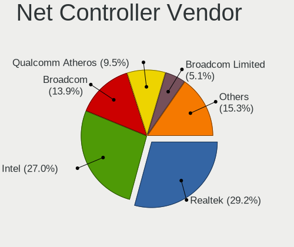

| Vendor                   | Computers | Percent |
|--------------------------|-----------|---------|
| Intel                    | 18        | 29.51%  |
| Realtek Semiconductor    | 14        | 22.95%  |
| Broadcom                 | 8         | 13.11%  |
| Qualcomm Atheros         | 6         | 9.84%   |
| Broadcom Limited         | 3         | 4.92%   |
| Xiaomi                   | 2         | 3.28%   |
| Dell                     | 2         | 3.28%   |
| TP-Link                  | 1         | 1.64%   |
| Samsung Electronics      | 1         | 1.64%   |
| Ralink Technology        | 1         | 1.64%   |
| Nvidia                   | 1         | 1.64%   |
| MediaTek                 | 1         | 1.64%   |
| Marvell Technology Group | 1         | 1.64%   |
| D-Link                   | 1         | 1.64%   |
| ASIX Electronics         | 1         | 1.64%   |

Net Controller Model
--------------------

Controller models

| Model                                                             | Computers | Percent |
|-------------------------------------------------------------------|-----------|---------|
| Realtek RTL8111/8168/8411 PCI Express Gigabit Ethernet Controller | 9         | 11.69%  |
| Intel Wi-Fi 6 AX201                                               | 4         | 5.19%   |
| Realtek RTL8821CE 802.11ac PCIe Wireless Network Adapter          | 3         | 3.9%    |
| Realtek RTL810xE PCI Express Fast Ethernet controller             | 3         | 3.9%    |
| Intel Wi-Fi 6 AX200                                               | 3         | 3.9%    |
| Xiaomi Mi/Redmi series (RNDIS)                                    | 2         | 2.6%    |
| Intel Wireless 8260                                               | 2         | 2.6%    |
| Intel Wireless 3165                                               | 2         | 2.6%    |
| Broadcom NetXtreme BCM57765 Gigabit Ethernet PCIe                 | 2         | 2.6%    |
| TP-Link UE300 10/100/1000 LAN (ethernet mode) [Realtek RTL8153]   | 1         | 1.3%    |
| Samsung Galaxy series, misc. (tethering mode)                     | 1         | 1.3%    |
| Realtek RTL8822CE 802.11ac PCIe Wireless Network Adapter          | 1         | 1.3%    |
| Realtek RTL8723BU 802.11b/g/n WLAN Adapter                        | 1         | 1.3%    |
| Realtek RTL8153 Gigabit Ethernet Adapter                          | 1         | 1.3%    |
| Ralink RT5370 Wireless Adapter                                    | 1         | 1.3%    |
| Qualcomm Atheros QCA9565 / AR9565 Wireless Network Adapter        | 1         | 1.3%    |
| Qualcomm Atheros QCA8171 Gigabit Ethernet                         | 1         | 1.3%    |
| Qualcomm Atheros Killer E2500 Gigabit Ethernet Controller         | 1         | 1.3%    |
| Qualcomm Atheros Killer E2400 Gigabit Ethernet Controller         | 1         | 1.3%    |
| Qualcomm Atheros AR9485 Wireless Network Adapter                  | 1         | 1.3%    |
| Qualcomm Atheros AR93xx Wireless Network Adapter                  | 1         | 1.3%    |
| Qualcomm Atheros AR8162 Fast Ethernet                             | 1         | 1.3%    |
| Nvidia MCP79 Ethernet                                             | 1         | 1.3%    |
| MediaTek MT7612U 802.11a/b/g/n/ac Wireless Adapter                | 1         | 1.3%    |
| Marvell Group 88E8058 PCI-E Gigabit Ethernet Controller           | 1         | 1.3%    |
| Intel Wireless 7265                                               | 1         | 1.3%    |
| Intel Wi-Fi 6 AX210/AX211/AX411 160MHz                            | 1         | 1.3%    |
| Intel Ultimate N WiFi Link 5300                                   | 1         | 1.3%    |
| Intel Tiger Lake PCH CNVi WiFi                                    | 1         | 1.3%    |
| Intel Ethernet Connection I219-LM                                 | 1         | 1.3%    |
| Intel Ethernet Connection I217-LM                                 | 1         | 1.3%    |
| Intel Ethernet Connection (7) I219-V                              | 1         | 1.3%    |
| Intel Ethernet Connection (3) I218-LM                             | 1         | 1.3%    |
| Intel Ethernet Connection (2) I219-LM                             | 1         | 1.3%    |
| Intel Ethernet Connection (17) I219-V                             | 1         | 1.3%    |
| Intel Ethernet Connection (14) I219-V                             | 1         | 1.3%    |
| Intel Ethernet Connection (13) I219-V                             | 1         | 1.3%    |
| Intel Ethernet Connection (13) I219-LM                            | 1         | 1.3%    |
| Intel Centrino Ultimate-N 6300                                    | 1         | 1.3%    |
| Intel Alder Lake-S PCH CNVi WiFi                                  | 1         | 1.3%    |

Wireless Vendor
---------------

Wireless vendors

| Vendor                | Computers | Percent |
|-----------------------|-----------|---------|
| Intel                 | 17        | 45.95%  |
| Realtek Semiconductor | 5         | 13.51%  |
| Broadcom              | 5         | 13.51%  |
| Qualcomm Atheros      | 3         | 8.11%   |
| Broadcom Limited      | 3         | 8.11%   |
| Ralink Technology     | 1         | 2.7%    |
| MediaTek              | 1         | 2.7%    |
| Dell                  | 1         | 2.7%    |
| D-Link                | 1         | 2.7%    |

Wireless Model
--------------

Wireless models

| Model                                                      | Computers | Percent |
|------------------------------------------------------------|-----------|---------|
| Intel Wi-Fi 6 AX201                                        | 4         | 10.81%  |
| Realtek RTL8821CE 802.11ac PCIe Wireless Network Adapter   | 3         | 8.11%   |
| Intel Wi-Fi 6 AX200                                        | 3         | 8.11%   |
| Intel Wireless 8260                                        | 2         | 5.41%   |
| Intel Wireless 3165                                        | 2         | 5.41%   |
| Realtek RTL8822CE 802.11ac PCIe Wireless Network Adapter   | 1         | 2.7%    |
| Realtek RTL8723BU 802.11b/g/n WLAN Adapter                 | 1         | 2.7%    |
| Ralink RT5370 Wireless Adapter                             | 1         | 2.7%    |
| Qualcomm Atheros QCA9565 / AR9565 Wireless Network Adapter | 1         | 2.7%    |
| Qualcomm Atheros AR9485 Wireless Network Adapter           | 1         | 2.7%    |
| Qualcomm Atheros AR93xx Wireless Network Adapter           | 1         | 2.7%    |
| MediaTek MT7612U 802.11a/b/g/n/ac Wireless Adapter         | 1         | 2.7%    |
| Intel Wireless 7265                                        | 1         | 2.7%    |
| Intel Wi-Fi 6 AX210/AX211/AX411 160MHz                     | 1         | 2.7%    |
| Intel Ultimate N WiFi Link 5300                            | 1         | 2.7%    |
| Intel Tiger Lake PCH CNVi WiFi                             | 1         | 2.7%    |
| Intel Centrino Ultimate-N 6300                             | 1         | 2.7%    |
| Intel Alder Lake-S PCH CNVi WiFi                           | 1         | 2.7%    |
| Dell DW5811e Snapdragon™ X7 LTE                       | 1         | 2.7%    |
| D-Link 802.11ac NIC                                        | 1         | 2.7%    |
| Broadcom Limited BCM4360 802.11ac Wireless Network Adapter | 1         | 2.7%    |
| Broadcom Limited BCM4331 802.11a/b/g/n                     | 1         | 2.7%    |
| Broadcom Limited BCM43224 802.11a/b/g/n                    | 1         | 2.7%    |
| Broadcom BCM4331 802.11a/b/g/n                             | 1         | 2.7%    |
| Broadcom BCM43224 802.11a/b/g/n                            | 1         | 2.7%    |
| Broadcom BCM4322 802.11a/b/g/n Wireless LAN Controller     | 1         | 2.7%    |
| Broadcom BCM4321 802.11a/b/g/n                             | 1         | 2.7%    |
| Broadcom BCM43142 802.11b/g/n                              | 1         | 2.7%    |

Ethernet Vendor
---------------

Ethernet vendors

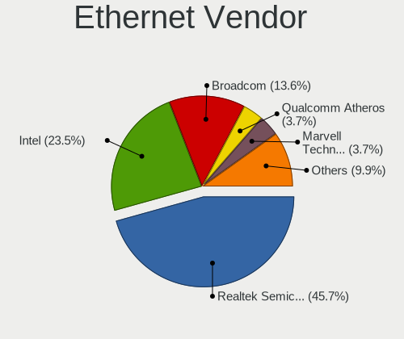

| Vendor                   | Computers | Percent |
|--------------------------|-----------|---------|
| Realtek Semiconductor    | 13        | 33.33%  |
| Intel                    | 11        | 28.21%  |
| Qualcomm Atheros         | 4         | 10.26%  |
| Broadcom                 | 4         | 10.26%  |
| Xiaomi                   | 2         | 5.13%   |
| TP-Link                  | 1         | 2.56%   |
| Samsung Electronics      | 1         | 2.56%   |
| Nvidia                   | 1         | 2.56%   |
| Marvell Technology Group | 1         | 2.56%   |
| ASIX Electronics         | 1         | 2.56%   |

Ethernet Model
--------------

Ethernet models

| Model                                                             | Computers | Percent |
|-------------------------------------------------------------------|-----------|---------|
| Realtek RTL8111/8168/8411 PCI Express Gigabit Ethernet Controller | 9         | 23.08%  |
| Realtek RTL810xE PCI Express Fast Ethernet controller             | 3         | 7.69%   |
| Xiaomi Mi/Redmi series (RNDIS)                                    | 2         | 5.13%   |
| Broadcom NetXtreme BCM57765 Gigabit Ethernet PCIe                 | 2         | 5.13%   |
| TP-Link UE300 10/100/1000 LAN (ethernet mode) [Realtek RTL8153]   | 1         | 2.56%   |
| Samsung Galaxy series, misc. (tethering mode)                     | 1         | 2.56%   |
| Realtek RTL8153 Gigabit Ethernet Adapter                          | 1         | 2.56%   |
| Qualcomm Atheros QCA8171 Gigabit Ethernet                         | 1         | 2.56%   |
| Qualcomm Atheros Killer E2500 Gigabit Ethernet Controller         | 1         | 2.56%   |
| Qualcomm Atheros Killer E2400 Gigabit Ethernet Controller         | 1         | 2.56%   |
| Qualcomm Atheros AR8162 Fast Ethernet                             | 1         | 2.56%   |
| Nvidia MCP79 Ethernet                                             | 1         | 2.56%   |
| Marvell Group 88E8058 PCI-E Gigabit Ethernet Controller           | 1         | 2.56%   |
| Intel Ethernet Connection I219-LM                                 | 1         | 2.56%   |
| Intel Ethernet Connection I217-LM                                 | 1         | 2.56%   |
| Intel Ethernet Connection (7) I219-V                              | 1         | 2.56%   |
| Intel Ethernet Connection (3) I218-LM                             | 1         | 2.56%   |
| Intel Ethernet Connection (2) I219-LM                             | 1         | 2.56%   |
| Intel Ethernet Connection (17) I219-V                             | 1         | 2.56%   |
| Intel Ethernet Connection (14) I219-V                             | 1         | 2.56%   |
| Intel Ethernet Connection (13) I219-V                             | 1         | 2.56%   |
| Intel Ethernet Connection (13) I219-LM                            | 1         | 2.56%   |
| Intel 82579LM Gigabit Network Connection (Lewisville)             | 1         | 2.56%   |
| Intel 82567LM Gigabit Network Connection                          | 1         | 2.56%   |
| Broadcom NetXtreme BCM57786 Gigabit Ethernet PCIe                 | 1         | 2.56%   |
| Broadcom NetXtreme BCM5764M Gigabit Ethernet PCIe                 | 1         | 2.56%   |
| ASIX AX88179 Gigabit Ethernet                                     | 1         | 2.56%   |

Net Controller Kind
-------------------

Ethernet, WiFi or modem

| Kind     | Computers | Percent |
|----------|-----------|---------|
| WiFi     | 34        | 50%     |
| Ethernet | 33        | 48.53%  |
| Modem    | 1         | 1.47%   |

Used Controller
---------------

Currently used network controller

| Kind     | Computers | Percent |
|----------|-----------|---------|
| WiFi     | 27        | 62.79%  |
| Ethernet | 16        | 37.21%  |

NICs
----

Total network controllers on board

| Total | Computers | Percent |
|-------|-----------|---------|
| 2     | 26        | 65%     |
| 1     | 13        | 32.5%   |
| 0     | 1         | 2.5%    |

IPv6
----

IPv6 vs IPv4

| Used | Computers | Percent |
|------|-----------|---------|
| No   | 27        | 67.5%   |
| Yes  | 13        | 32.5%   |

Bluetooth
---------

Bluetooth Vendor
----------------

Controller vendors

| Vendor                | Computers | Percent |
|-----------------------|-----------|---------|
| Intel                 | 15        | 53.57%  |
| Apple                 | 6         | 21.43%  |
| Realtek Semiconductor | 4         | 14.29%  |
| Toshiba               | 1         | 3.57%   |
| Hewlett-Packard       | 1         | 3.57%   |
| Broadcom              | 1         | 3.57%   |

Bluetooth Model
---------------

Controller models

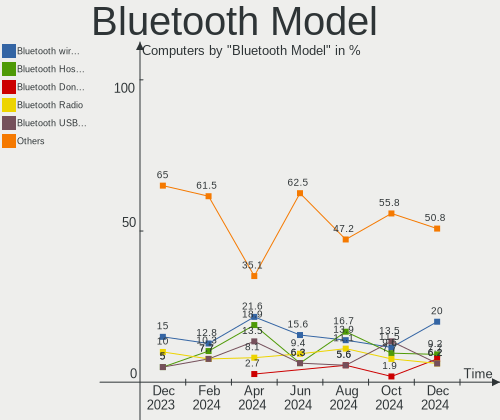

| Model                                          | Computers | Percent |
|------------------------------------------------|-----------|---------|
| Intel Bluetooth wireless interface             | 5         | 17.86%  |
| Intel AX201 Bluetooth                          | 5         | 17.86%  |
| Realtek  Bluetooth 4.2 Adapter                 | 3         | 10.71%  |
| Intel AX200 Bluetooth                          | 3         | 10.71%  |
| Apple Bluetooth USB Host Controller            | 3         | 10.71%  |
| Toshiba Bluetooth Device                       | 1         | 3.57%   |
| Realtek Bluetooth Radio                        | 1         | 3.57%   |
| Intel Bluetooth 9460/9560 Jefferson Peak (JfP) | 1         | 3.57%   |
| Intel AX210 Bluetooth                          | 1         | 3.57%   |
| HP Broadcom 2070 Bluetooth Combo               | 1         | 3.57%   |
| Broadcom BCM43142A0 Bluetooth Device           | 1         | 3.57%   |
| Apple Built-in Bluetooth 2.0+EDR HCI           | 1         | 3.57%   |
| Apple Bluetooth Host Controller                | 1         | 3.57%   |
| Apple Bluetooth HCI                            | 1         | 3.57%   |

Sound
-----

Sound Vendor
------------

Sound card vendors

| Vendor                 | Computers | Percent |
|------------------------|-----------|---------|
| Intel                  | 31        | 55.36%  |
| AMD                    | 11        | 19.64%  |
| Nvidia                 | 9         | 16.07%  |
| Logitech               | 2         | 3.57%   |
| Goldvish               | 1         | 1.79%   |
| Generalplus Technology | 1         | 1.79%   |
| C-Media Electronics    | 1         | 1.79%   |

Sound Model
-----------

Sound card models

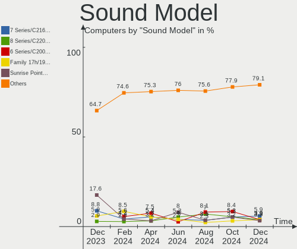

| Model                                                                      | Computers | Percent |
|----------------------------------------------------------------------------|-----------|---------|
| Intel Tiger Lake-LP Smart Sound Technology Audio Controller                | 6         | 9.09%   |
| Intel 7 Series/C216 Chipset Family High Definition Audio Controller        | 3         | 4.55%   |
| Intel 100 Series/C230 Series Chipset Family HD Audio Controller            | 3         | 4.55%   |
| AMD Raven/Raven2/Fenghuang HDMI/DP Audio Controller                        | 3         | 4.55%   |
| AMD Family 17h/19h HD Audio Controller                                     | 3         | 4.55%   |
| Nvidia GA104 High Definition Audio Controller                              | 2         | 3.03%   |
| Intel Wildcat Point-LP High Definition Audio Controller                    | 2         | 3.03%   |
| Intel Broadwell-U Audio Controller                                         | 2         | 3.03%   |
| Intel 8 Series/C220 Series Chipset High Definition Audio Controller        | 2         | 3.03%   |
| Intel 6 Series/C200 Series Chipset Family High Definition Audio Controller | 2         | 3.03%   |
| Nvidia TU116 High Definition Audio Controller                              | 1         | 1.52%   |
| Nvidia TU106 High Definition Audio Controller                              | 1         | 1.52%   |
| Nvidia MCP89 High Definition Audio                                         | 1         | 1.52%   |
| Nvidia MCP79 High Definition Audio                                         | 1         | 1.52%   |
| Nvidia GP106 High Definition Audio Controller                              | 1         | 1.52%   |
| Nvidia GM107 High Definition Audio Controller [GeForce 940MX]              | 1         | 1.52%   |
| Nvidia GK107 HDMI Audio Controller                                         | 1         | 1.52%   |
| Nvidia GF119 HDMI Audio Controller                                         | 1         | 1.52%   |
| Logitech PRO X Wireless Gaming Headset                                     | 1         | 1.52%   |
| Logitech G432 Gaming Headset                                               | 1         | 1.52%   |
| Intel Xeon E3-1200 v3/4th Gen Core Processor HD Audio Controller           | 1         | 1.52%   |
| Intel Tiger Lake-H HD Audio Controller                                     | 1         | 1.52%   |
| Intel Sunrise Point-LP HD Audio                                            | 1         | 1.52%   |
| Intel Smart Sound Technology (SST) Audio Controller                        | 1         | 1.52%   |
| Intel Haswell-ULT HD Audio Controller                                      | 1         | 1.52%   |
| Intel Celeron/Pentium Silver Processor High Definition Audio               | 1         | 1.52%   |
| Intel Cannon Lake PCH cAVS                                                 | 1         | 1.52%   |
| Intel Atom Processor Z36xxx/Z37xxx Series High Definition Audio Controller | 1         | 1.52%   |
| Intel Alder Lake-S HD Audio Controller                                     | 1         | 1.52%   |
| Intel 82801JI (ICH10 Family) HD Audio Controller                           | 1         | 1.52%   |
| Intel 82801I (ICH9 Family) HD Audio Controller                             | 1         | 1.52%   |
| Intel 82801H (ICH8 Family) HD Audio Controller                             | 1         | 1.52%   |
| Intel 8 Series HD Audio Controller                                         | 1         | 1.52%   |
| Intel 5 Series/3400 Series Chipset High Definition Audio                   | 1         | 1.52%   |
| Intel 200 Series PCH HD Audio                                              | 1         | 1.52%   |
| Goldvish H210                                                              | 1         | 1.52%   |
| Generalplus Technology USB Audio Device                                    | 1         | 1.52%   |
| C-Media Electronics USB Advanced Audio Device                              | 1         | 1.52%   |
| AMD Turks HDMI Audio [Radeon HD 6500/6600 / 6700M Series]                  | 1         | 1.52%   |
| AMD Trinity HDMI Audio Controller                                          | 1         | 1.52%   |

Memory
------

Memory Vendor
-------------

Memory module vendors

| Vendor              | Computers | Percent |
|---------------------|-----------|---------|
| Samsung Electronics | 3         | 37.5%   |
| SK hynix            | 1         | 12.5%   |
| Micron Technology   | 1         | 12.5%   |
| Kingston            | 1         | 12.5%   |
| CSX                 | 1         | 12.5%   |
| Unknown             | 1         | 12.5%   |

Memory Model
------------

Memory module models

| Model                                                      | Computers | Percent |
|------------------------------------------------------------|-----------|---------|
| Samsung RAM U6E3S4AA-MGCR 4GB Row Of Chips LPDDR4 4267MT/s | 2         | 25%     |
| SK hynix RAM HMAA4GS6CJR8N-XN 32GB SODIMM DDR4 3200MT/s    | 1         | 12.5%   |
| Samsung RAM M471A1G44AB0-CWE 8GB SODIMM DDR4 3200MT/s      | 1         | 12.5%   |
| Micron RAM 16ATF4G64HZ-3G2E2 32GB SODIMM DDR4 3200MT/s     | 1         | 12.5%   |
| Kingston RAM HX426C16FB/4 4GB DIMM DDR4 2800MT/s           | 1         | 12.5%   |
| CSX RAM V01D3L82GB26826813 2GB DIMM 1066MT/s               | 1         | 12.5%   |
| Unknown                                                    | 1         | 12.5%   |

Memory Kind
-----------

Memory module kinds

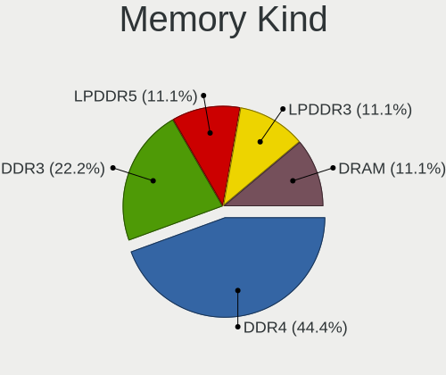

| Kind    | Computers | Percent |
|---------|-----------|---------|
| DDR4    | 3         | 42.86%  |
| LPDDR4  | 2         | 28.57%  |
| SDRAM   | 1         | 14.29%  |
| Unknown | 1         | 14.29%  |

Memory Form Factor
------------------

Physical design of the memory module

| Name         | Computers | Percent |
|--------------|-----------|---------|
| SODIMM       | 2         | 33.33%  |
| Row Of Chips | 2         | 33.33%  |
| DIMM         | 2         | 33.33%  |

Memory Size
-----------

Memory module size

| Size  | Computers | Percent |
|-------|-----------|---------|
| 4096  | 3         | 42.86%  |
| 8192  | 2         | 28.57%  |
| 32768 | 1         | 14.29%  |
| 2048  | 1         | 14.29%  |

Memory Speed
------------

Memory module speed

| Speed | Computers | Percent |
|-------|-----------|---------|
| 4267  | 2         | 28.57%  |
| 3200  | 2         | 28.57%  |
| 2800  | 1         | 14.29%  |
| 1066  | 1         | 14.29%  |
| 533   | 1         | 14.29%  |

Printers & scanners
-------------------

Printer Vendor
--------------

Printer device vendors

Zero info for selected period =(

Printer Model
-------------

Printer device models

Zero info for selected period =(

Scanner Vendor
--------------

Scanner device vendors

| Vendor | Computers | Percent |
|--------|-----------|---------|
| Canon  | 1         | 100%    |

Scanner Model
-------------

Scanner device models

| Model                   | Computers | Percent |
|-------------------------|-----------|---------|
| Canon CanoScan LiDE 100 | 1         | 100%    |

Camera
------

Camera Vendor
-------------

Camera device vendors

| Vendor                        | Computers | Percent |
|-------------------------------|-----------|---------|
| Apple                         | 7         | 22.58%  |
| Chicony Electronics           | 6         | 19.35%  |
| Microdia                      | 3         | 9.68%   |
| Sunplus Innovation Technology | 2         | 6.45%   |
| IMC Networks                  | 2         | 6.45%   |
| Bison Electronics             | 2         | 6.45%   |
| Syntek                        | 1         | 3.23%   |
| Samsung Electronics           | 1         | 3.23%   |
| Realtek Semiconductor         | 1         | 3.23%   |
| Quanta                        | 1         | 3.23%   |
| Logitech                      | 1         | 3.23%   |
| KYE Systems (Mouse Systems)   | 1         | 3.23%   |
| Generalplus Technology        | 1         | 3.23%   |
| Alcor Micro                   | 1         | 3.23%   |
| Acer                          | 1         | 3.23%   |

Camera Model
------------

Camera device models

| Model                                   | Computers | Percent |
|-----------------------------------------|-----------|---------|
| Chicony Integrated Camera               | 2         | 6.25%   |
| Chicony HP TrueVision HD Camera         | 2         | 6.25%   |
| Apple iPhone 5/5C/5S/6/SE/7/8/X         | 2         | 6.25%   |
| Apple FaceTime HD Camera (Built-in)     | 2         | 6.25%   |
| Apple Built-in iSight                   | 2         | 6.25%   |
| Syntek Lenovo EasyCamera                | 1         | 3.13%   |
| Sunplus HP HD Webcam [Fixed]            | 1         | 3.13%   |
| Sunplus Dell E5570 integrated webcam    | 1         | 3.13%   |
| Samsung Galaxy series, misc. (MTP mode) | 1         | 3.13%   |
| Realtek 2SF022                          | 1         | 3.13%   |
| Quanta ov9734_techfront_camera          | 1         | 3.13%   |
| Microdia Webcam Vitade AF               | 1         | 3.13%   |
| Microdia Integrated_Webcam_HD           | 1         | 3.13%   |
| Microdia Integrated_Webcam_2M           | 1         | 3.13%   |
| Logitech C922 Pro Stream Webcam         | 1         | 3.13%   |
| KYE Systems (Mouse Systems) iSlim 1300  | 1         | 3.13%   |
| IMC Networks USB2.0 HD UVC WebCam       | 1         | 3.13%   |
| IMC Networks HD Camera                  | 1         | 3.13%   |
| Generalplus 808 Camera                  | 1         | 3.13%   |
| Chicony HP Webcam                       | 1         | 3.13%   |
| Chicony HP Truevision HD                | 1         | 3.13%   |
| Bison BisonCam,NB Pro                   | 1         | 3.13%   |
| Bison BisonCam, NB Pro                  | 1         | 3.13%   |
| Apple FaceTime HD Camera                | 1         | 3.13%   |
| Apple FaceTime Camera                   | 1         | 3.13%   |
| Alcor Micro SHUNCCM2MP                  | 1         | 3.13%   |
| Acer Integrated Camera                  | 1         | 3.13%   |

Security
--------

Fingerprint Vendor
------------------

Fingerprint sensor vendors

| Vendor                     | Computers | Percent |
|----------------------------|-----------|---------|
| Validity Sensors           | 3         | 60%     |
| Shenzhen Goodix Technology | 2         | 40%     |

Fingerprint Model
-----------------

Fingerprint sensor models

| Model                                        | Computers | Percent |
|----------------------------------------------|-----------|---------|
| Shenzhen Goodix  Fingerprint Device          | 2         | 40%     |
| Validity Sensors VFS471 Fingerprint Reader   | 1         | 20%     |
| Validity Sensors VFS301 Fingerprint Reader   | 1         | 20%     |
| Validity Sensors VFS 5011 fingerprint sensor | 1         | 20%     |

Chipcard Vendor
---------------

Chipcard module vendors

| Vendor   | Computers | Percent |
|----------|-----------|---------|
| Broadcom | 1         | 100%    |

Chipcard Model
--------------

Chipcard module models

| Model                                          | Computers | Percent |
|------------------------------------------------|-----------|---------|
| Broadcom BCM5880 Secure Applications Processor | 1         | 100%    |

Unsupported
-----------

Unsupported Devices
-------------------

Total unsupported devices on board

| Total | Computers | Percent |
|-------|-----------|---------|
| 0     | 26        | 65%     |
| 1     | 11        | 27.5%   |
| 2     | 2         | 5%      |
| 3     | 1         | 2.5%    |

Unsupported Device Types
------------------------

Types of unsupported devices

| Type                  | Computers | Percent |
|-----------------------|-----------|---------|
| Net/wireless          | 5         | 29.41%  |
| Fingerprint reader    | 5         | 29.41%  |
| Net/ethernet          | 2         | 11.76%  |
| Multimedia controller | 2         | 11.76%  |
| Graphics card         | 2         | 11.76%  |
| Chipcard              | 1         | 5.88%   |

