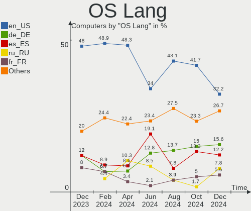
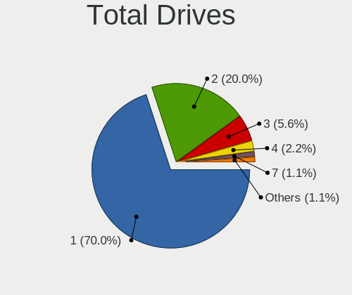
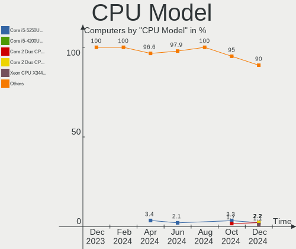
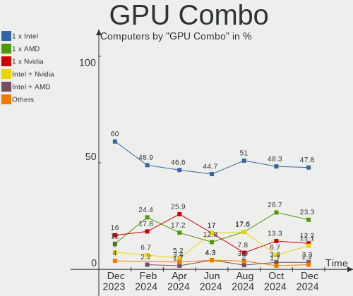
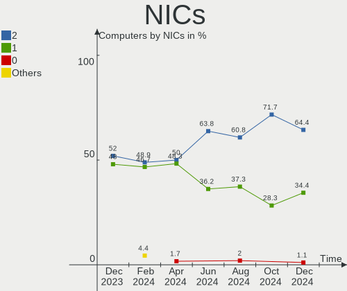
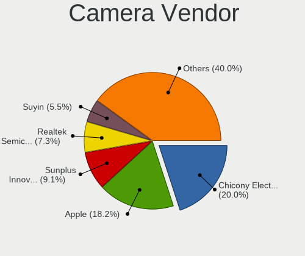

Elementary - Hardware Trends
----------------------------

A project to identify most popular hardware characteristics and track their change
over time based on data collected by Linux users at https://Linux-Hardware.org.

Anyone can contribute to this report by the [hw-probe](https://github.com/linuxhw/hw-probe) tool:

    sudo -E hw-probe -all -upload

This is a report for all computer types. See also reports for [desktops](/Dist/Elementary/Desktop/README.md) and [notebooks](/Dist/Elementary/Notebook/README.md).

This report is for one last month. Overall report since the beginning of time: [TestDays](https://github.com/linuxhw/TestDays)

Period: Apr, 2024.

Contents
--------

* [ System ](#system)
  - [ OS                       ](#os)
  - [ OS Family                ](#os-family)
  - [ Kernel                   ](#kernel)
  - [ Kernel Family            ](#kernel-family)
  - [ Kernel Major Ver.        ](#kernel-major-ver)
  - [ Arch                     ](#arch)
  - [ DE                       ](#de)
  - [ Display Server           ](#display-server)
  - [ Display Manager          ](#display-manager)
  - [ OS Lang                  ](#os-lang)
  - [ Boot Mode                ](#boot-mode)
  - [ Filesystem               ](#filesystem)
  - [ Part. scheme             ](#part-scheme)
  - [ Dual Boot with Linux/BSD ](#dual-boot-with-linuxbsd)
  - [ Dual Boot (Win)          ](#dual-boot-win)

* [ Board ](#board)
  - [ Vendor                   ](#vendor)
  - [ Model                    ](#model)
  - [ Model Family             ](#model-family)
  - [ MFG Year                 ](#mfg-year)
  - [ Form Factor              ](#form-factor)
  - [ Secure Boot              ](#secure-boot)
  - [ Coreboot                 ](#coreboot)
  - [ RAM Size                 ](#ram-size)
  - [ RAM Used                 ](#ram-used)
  - [ Total Drives             ](#total-drives)
  - [ Has CD-ROM               ](#has-cd-rom)
  - [ Has Ethernet             ](#has-ethernet)
  - [ Has WiFi                 ](#has-wifi)
  - [ Has Bluetooth            ](#has-bluetooth)

* [ Location ](#location)
  - [ Country                  ](#country)
  - [ City                     ](#city)

* [ Drives ](#drives)
  - [ Drive Vendor             ](#drive-vendor)
  - [ Drive Model              ](#drive-model)
  - [ HDD Vendor               ](#hdd-vendor)
  - [ SSD Vendor               ](#ssd-vendor)
  - [ Drive Kind               ](#drive-kind)
  - [ Drive Connector          ](#drive-connector)
  - [ Drive Size               ](#drive-size)
  - [ Space Total              ](#space-total)
  - [ Space Used               ](#space-used)
  - [ Malfunc. Drives          ](#malfunc-drives)
  - [ Malfunc. Drive Vendor    ](#malfunc-drive-vendor)
  - [ Malfunc. HDD Vendor      ](#malfunc-hdd-vendor)
  - [ Malfunc. Drive Kind      ](#malfunc-drive-kind)
  - [ Failed Drives            ](#failed-drives)
  - [ Failed Drive Vendor      ](#failed-drive-vendor)
  - [ Drive Status             ](#drive-status)

* [ Storage controller ](#storage-controller)
  - [ Storage Vendor           ](#storage-vendor)
  - [ Storage Model            ](#storage-model)
  - [ Storage Kind             ](#storage-kind)

* [ Processor ](#processor)
  - [ CPU Vendor               ](#cpu-vendor)
  - [ CPU Model                ](#cpu-model)
  - [ CPU Model Family         ](#cpu-model-family)
  - [ CPU Cores                ](#cpu-cores)
  - [ CPU Sockets              ](#cpu-sockets)
  - [ CPU Threads              ](#cpu-threads)
  - [ CPU Op-Modes             ](#cpu-op-modes)
  - [ CPU Microcode            ](#cpu-microcode)
  - [ CPU Microarch            ](#cpu-microarch)

* [ Graphics ](#graphics)
  - [ GPU Vendor               ](#gpu-vendor)
  - [ GPU Model                ](#gpu-model)
  - [ GPU Combo                ](#gpu-combo)
  - [ GPU Driver               ](#gpu-driver)
  - [ GPU Memory               ](#gpu-memory)

* [ Monitor ](#monitor)
  - [ Monitor Vendor           ](#monitor-vendor)
  - [ Monitor Model            ](#monitor-model)
  - [ Monitor Resolution       ](#monitor-resolution)
  - [ Monitor Diagonal         ](#monitor-diagonal)
  - [ Monitor Width            ](#monitor-width)
  - [ Aspect Ratio             ](#aspect-ratio)
  - [ Monitor Area             ](#monitor-area)
  - [ Pixel Density            ](#pixel-density)
  - [ Multiple Monitors        ](#multiple-monitors)

* [ Network ](#network)
  - [ Net Controller Vendor    ](#net-controller-vendor)
  - [ Net Controller Model     ](#net-controller-model)
  - [ Wireless Vendor          ](#wireless-vendor)
  - [ Wireless Model           ](#wireless-model)
  - [ Ethernet Vendor          ](#ethernet-vendor)
  - [ Ethernet Model           ](#ethernet-model)
  - [ Net Controller Kind      ](#net-controller-kind)
  - [ Used Controller          ](#used-controller)
  - [ NICs                     ](#nics)
  - [ IPv6                     ](#ipv6)

* [ Bluetooth ](#bluetooth)
  - [ Bluetooth Vendor         ](#bluetooth-vendor)
  - [ Bluetooth Model          ](#bluetooth-model)

* [ Sound ](#sound)
  - [ Sound Vendor             ](#sound-vendor)
  - [ Sound Model              ](#sound-model)

* [ Memory ](#memory)
  - [ Memory Vendor            ](#memory-vendor)
  - [ Memory Model             ](#memory-model)
  - [ Memory Kind              ](#memory-kind)
  - [ Memory Form Factor       ](#memory-form-factor)
  - [ Memory Size              ](#memory-size)
  - [ Memory Speed             ](#memory-speed)

* [ Printers & scanners ](#printers--scanners)
  - [ Printer Vendor           ](#printer-vendor)
  - [ Printer Model            ](#printer-model)
  - [ Scanner Vendor           ](#scanner-vendor)
  - [ Scanner Model            ](#scanner-model)

* [ Camera ](#camera)
  - [ Camera Vendor            ](#camera-vendor)
  - [ Camera Model             ](#camera-model)

* [ Security ](#security)
  - [ Fingerprint Vendor       ](#fingerprint-vendor)
  - [ Fingerprint Model        ](#fingerprint-model)
  - [ Chipcard Vendor          ](#chipcard-vendor)
  - [ Chipcard Model           ](#chipcard-model)

* [ Unsupported ](#unsupported)
  - [ Unsupported Devices      ](#unsupported-devices)
  - [ Unsupported Device Types ](#unsupported-device-types)

System
------

OS
--

Installed operating systems

| Name             | Computers | Percent |
|------------------|-----------|---------|
| Elementary 7.1   | 54        | 93.1%   |
| Elementary 6.1   | 3         | 5.17%   |
| Elementary 5.1.7 | 1         | 1.72%   |

OS Family
---------

OS without a version

| Name       | Computers | Percent |
|------------|-----------|---------|
| Elementary | 58        | 100%    |

Kernel
------

Version of the Linux kernel

| Version            | Computers | Percent |
|--------------------|-----------|---------|
| 6.5.0-28-generic   | 17        | 29.31%  |
| 6.5.0-27-generic   | 16        | 27.59%  |
| 6.5.0-26-generic   | 14        | 24.14%  |
| 6.2.0-33-generic   | 6         | 10.34%  |
| 6.5.0-15-generic   | 1         | 1.72%   |
| 5.4.0-72-generic   | 1         | 1.72%   |
| 5.15.0-97-generic  | 1         | 1.72%   |
| 5.15.0-102-generic | 1         | 1.72%   |
| 5.11.0-43-generic  | 1         | 1.72%   |

Kernel Family
-------------

Linux kernel without a distro release

| Version | Computers | Percent |
|---------|-----------|---------|
| 6.5.0   | 48        | 82.76%  |
| 6.2.0   | 6         | 10.34%  |
| 5.15.0  | 2         | 3.45%   |
| 5.4.0   | 1         | 1.72%   |
| 5.11.0  | 1         | 1.72%   |

Kernel Major Ver.
-----------------

Linux kernel major version

| Version | Computers | Percent |
|---------|-----------|---------|
| 6.5     | 48        | 82.76%  |
| 6.2     | 6         | 10.34%  |
| 5.15    | 2         | 3.45%   |
| 5.4     | 1         | 1.72%   |
| 5.11    | 1         | 1.72%   |

Arch
----

OS architecture (x86_64, i586, etc.)

| Name   | Computers | Percent |
|--------|-----------|---------|
| x86_64 | 58        | 100%    |

DE
--

Desktop Environment

| Name     | Computers | Percent |
|----------|-----------|---------|
| Pantheon | 58        | 100%    |

Display Server
--------------

X11 or Wayland

| Name | Computers | Percent |
|------|-----------|---------|
| X11  | 58        | 100%    |

Display Manager
---------------

SDDM, LightDM, etc.

| Name    | Computers | Percent |
|---------|-----------|---------|
| Unknown | 55        | 94.83%  |
| LightDM | 3         | 5.17%   |

OS Lang
-------

Language

| Lang  | Computers | Percent |
|-------|-----------|---------|
| en_US | 28        | 48.28%  |
| it_IT | 7         | 12.07%  |
| ru_RU | 6         | 10.34%  |
| es_ES | 5         | 8.62%   |
| de_DE | 4         | 6.9%    |
| fr_FR | 2         | 3.45%   |
| en_GB | 2         | 3.45%   |
| sv_SE | 1         | 1.72%   |
| pt_PT | 1         | 1.72%   |
| nl_NL | 1         | 1.72%   |
| el_GR | 1         | 1.72%   |

Boot Mode
---------

EFI or BIOS

| Mode | Computers | Percent |
|------|-----------|---------|
| BIOS | 52        | 89.66%  |
| EFI  | 6         | 10.34%  |

Filesystem
----------

Type of filesystem

| Type  | Computers | Percent |
|-------|-----------|---------|
| Ext4  | 56        | 96.55%  |
| Xfs   | 1         | 1.72%   |
| Btrfs | 1         | 1.72%   |

Part. scheme
------------

Scheme of partitioning

| Type    | Computers | Percent |
|---------|-----------|---------|
| Unknown | 55        | 94.83%  |
| GPT     | 3         | 5.17%   |

Dual Boot with Linux/BSD
------------------------

Hosting more than one Linux/BSD

| Dual boot | Computers | Percent |
|-----------|-----------|---------|
| No        | 58        | 100%    |

Dual Boot (Win)
---------------

Hosting Linux and Windows

| Dual boot | Computers | Percent |
|-----------|-----------|---------|
| No        | 56        | 96.55%  |
| Yes       | 2         | 3.45%   |

Board
-----

Vendor
------

Motherboard manufacturer

| Name                | Computers | Percent |
|---------------------|-----------|---------|
| Apple               | 14        | 24.14%  |
| Hewlett-Packard     | 12        | 20.69%  |
| ASUSTek Computer    | 8         | 13.79%  |
| Lenovo              | 4         | 6.9%    |
| Acer                | 4         | 6.9%    |
| MSI                 | 3         | 5.17%   |
| Gigabyte Technology | 3         | 5.17%   |
| Medion              | 2         | 3.45%   |
| Dell                | 2         | 3.45%   |
| Toshiba             | 1         | 1.72%   |
| TECNO               | 1         | 1.72%   |
| HUAWEI              | 1         | 1.72%   |
| ECS                 | 1         | 1.72%   |
| DEPO Computers      | 1         | 1.72%   |
| Unknown             | 1         | 1.72%   |

Model
-----

Motherboard model

| Name                                   | Computers | Percent |
|----------------------------------------|-----------|---------|
| HP ProDesk 600 G1 SFF                  | 2         | 3.45%   |
| Apple MacBookPro9,2                    | 2         | 3.45%   |
| Apple MacBookPro8,1                    | 2         | 3.45%   |
| Apple MacBookAir7,2                    | 2         | 3.45%   |
| Toshiba Satellite L10W-B-101           | 1         | 1.72%   |
| TECNO MEGABOOK T1                      | 1         | 1.72%   |
| MSI MS-B09012                          | 1         | 1.72%   |
| MSI MS-7D38                            | 1         | 1.72%   |
| MSI GT62VR 6RE                         | 1         | 1.72%   |
| Medion Z370H4-EM                       | 1         | 1.72%   |
| Medion MS-7797                         | 1         | 1.72%   |
| Lenovo Yoga Pro 7 14APH8 82Y8          | 1         | 1.72%   |
| Lenovo Yoga 900S-12ISK 80ML            | 1         | 1.72%   |
| Lenovo ThinkPad E480 20KN003TUS        | 1         | 1.72%   |
| Lenovo MIIX 310-10ICR 80SG             | 1         | 1.72%   |
| HUAWEI KPL-W0X                         | 1         | 1.72%   |
| HP Z400 Workstation                    | 1         | 1.72%   |
| HP ProBook 6360b                       | 1         | 1.72%   |
| HP ProBook 470 G5                      | 1         | 1.72%   |
| HP Pavilion x2 Detachable              | 1         | 1.72%   |
| HP Pavilion Notebook                   | 1         | 1.72%   |
| HP Pavilion dv7                        | 1         | 1.72%   |
| HP Pavilion dv6                        | 1         | 1.72%   |
| HP EliteBook 8440p                     | 1         | 1.72%   |
| HP EliteBook 745 G4                    | 1         | 1.72%   |
| HP 22-h017nf                           | 1         | 1.72%   |
| Gigabyte F2A68HM-S1                    | 1         | 1.72%   |
| Gigabyte B250M-D2VX-SI                 | 1         | 1.72%   |
| Gigabyte 945GME-DS2                    | 1         | 1.72%   |
| ECS H110M-C3D/C3V                      | 1         | 1.72%   |
| DEPO Computers W25CEW                  | 1         | 1.72%   |
| Dell XPS 15 9570                       | 1         | 1.72%   |
| Dell OptiPlex 7050                     | 1         | 1.72%   |
| ASUS ZenBook UX425EA_UX425EA           | 1         | 1.72%   |
| ASUS VivoBook_ASUSLaptop X580GD_N580GD | 1         | 1.72%   |
| ASUS TUF X470-PLUS GAMING              | 1         | 1.72%   |
| ASUS PRIME H510M-A                     | 1         | 1.72%   |
| ASUS PRIME A320M-K                     | 1         | 1.72%   |
| ASUS P8H77-M PRO                       | 1         | 1.72%   |
| ASUS K42F                              | 1         | 1.72%   |

Model Family
------------

Motherboard model prefix

| Name                   | Computers | Percent |
|------------------------|-----------|---------|
| HP Pavilion            | 4         | 6.9%    |
| Acer Aspire            | 4         | 6.9%    |
| Apple MacBookPro8      | 3         | 5.17%   |
| Apple MacBookAir7      | 3         | 5.17%   |
| Lenovo Yoga            | 2         | 3.45%   |
| HP ProDesk             | 2         | 3.45%   |
| HP ProBook             | 2         | 3.45%   |
| HP EliteBook           | 2         | 3.45%   |
| ASUS PRIME             | 2         | 3.45%   |
| Apple MacBookPro9      | 2         | 3.45%   |
| Toshiba Satellite      | 1         | 1.72%   |
| TECNO MEGABOOK         | 1         | 1.72%   |
| MSI MS-B09012          | 1         | 1.72%   |
| MSI MS-7D38            | 1         | 1.72%   |
| MSI GT62VR             | 1         | 1.72%   |
| Medion Z370H4-EM       | 1         | 1.72%   |
| Medion MS-7797         | 1         | 1.72%   |
| Lenovo ThinkPad        | 1         | 1.72%   |
| Lenovo MIIX            | 1         | 1.72%   |
| HUAWEI KPL-W0X         | 1         | 1.72%   |
| HP Z400                | 1         | 1.72%   |
| HP 22-h017nf           | 1         | 1.72%   |
| Gigabyte F2A68HM-S1    | 1         | 1.72%   |
| Gigabyte B250M-D2VX-SI | 1         | 1.72%   |
| Gigabyte 945GME-DS2    | 1         | 1.72%   |
| ECS H110M-C3D          | 1         | 1.72%   |
| DEPO Computers W25CEW  | 1         | 1.72%   |
| Dell XPS               | 1         | 1.72%   |
| Dell OptiPlex          | 1         | 1.72%   |
| ASUS ZenBook           | 1         | 1.72%   |
| ASUS VivoBook          | 1         | 1.72%   |
| ASUS TUF               | 1         | 1.72%   |
| ASUS P8H77-M           | 1         | 1.72%   |
| ASUS K42F              | 1         | 1.72%   |
| ASUS EX-B150M-V3       | 1         | 1.72%   |
| Apple MacBookPro5      | 1         | 1.72%   |
| Apple MacBookPro16     | 1         | 1.72%   |
| Apple MacBookPro11     | 1         | 1.72%   |
| Apple MacBook5         | 1         | 1.72%   |
| Apple iMac14           | 1         | 1.72%   |

MFG Year
--------

Motherboard manufacture year

| Year | Computers | Percent |
|------|-----------|---------|
| 2018 | 7         | 12.07%  |
| 2012 | 6         | 10.34%  |
| 2011 | 6         | 10.34%  |
| 2015 | 5         | 8.62%   |
| 2017 | 4         | 6.9%    |
| 2016 | 4         | 6.9%    |
| 2014 | 4         | 6.9%    |
| 2020 | 3         | 5.17%   |
| 2010 | 3         | 5.17%   |
| 2008 | 3         | 5.17%   |
| 2007 | 3         | 5.17%   |
| 2022 | 2         | 3.45%   |
| 2019 | 2         | 3.45%   |
| 2013 | 2         | 3.45%   |
| 2009 | 2         | 3.45%   |
| 2023 | 1         | 1.72%   |
| 2021 | 1         | 1.72%   |

Form Factor
-----------

Physical design of the computer

| Name       | Computers | Percent |
|------------|-----------|---------|
| Notebook   | 37        | 63.79%  |
| Desktop    | 16        | 27.59%  |
| All in one | 4         | 6.9%    |
| Tablet     | 1         | 1.72%   |

Secure Boot
-----------

Enabled or disabled

| State    | Computers | Percent |
|----------|-----------|---------|
| Disabled | 58        | 100%    |

Coreboot
--------

Have coreboot on board

| Used | Computers | Percent |
|------|-----------|---------|
| No   | 58        | 100%    |

RAM Size
--------

Total RAM memory

| Size in GB | Computers | Percent |
|------------|-----------|---------|
| 4.01-8.0   | 18        | 31.03%  |
| 3.01-4.0   | 11        | 18.97%  |
| 16.01-24.0 | 11        | 18.97%  |
| 8.01-16.0  | 9         | 15.52%  |
| 32.01-64.0 | 3         | 5.17%   |
| 1.01-2.0   | 3         | 5.17%   |
| 24.01-32.0 | 2         | 3.45%   |
| 2.01-3.0   | 1         | 1.72%   |

RAM Used
--------

Used RAM memory

| Used GB  | Computers | Percent |
|----------|-----------|---------|
| 1.01-2.0 | 21        | 36.21%  |
| 2.01-3.0 | 19        | 32.76%  |
| 4.01-8.0 | 10        | 17.24%  |
| 3.01-4.0 | 7         | 12.07%  |
| 0.51-1.0 | 1         | 1.72%   |

Total Drives
------------

Number of drives on board

| Drives | Computers | Percent |
|--------|-----------|---------|
| 1      | 34        | 58.62%  |
| 2      | 18        | 31.03%  |
| 3      | 4         | 6.9%    |
| 6      | 1         | 1.72%   |
| 0      | 1         | 1.72%   |

Has CD-ROM
----------

Has CD-ROM on board

| Presented | Computers | Percent |
|-----------|-----------|---------|
| No        | 32        | 55.17%  |
| Yes       | 26        | 44.83%  |

Has Ethernet
------------

Has Ethernet on board

| Presented | Computers | Percent |
|-----------|-----------|---------|
| Yes       | 47        | 81.03%  |
| No        | 11        | 18.97%  |

Has WiFi
--------

Has WiFi module

| Presented | Computers | Percent |
|-----------|-----------|---------|
| Yes       | 49        | 84.48%  |
| No        | 9         | 15.52%  |

Has Bluetooth
-------------

Has Bluetooth module

| Presented | Computers | Percent |
|-----------|-----------|---------|
| Yes       | 37        | 63.79%  |
| No        | 21        | 36.21%  |

Location
--------

Country
-------

Geographic location (country)

| Country         | Computers | Percent |
|-----------------|-----------|---------|
| USA             | 11        | 18.97%  |
| Italy           | 7         | 12.07%  |
| Russia          | 4         | 6.9%    |
| Spain           | 2         | 3.45%   |
| Portugal        | 2         | 3.45%   |
| Mexico          | 2         | 3.45%   |
| Greece          | 2         | 3.45%   |
| Germany         | 2         | 3.45%   |
| Austria         | 2         | 3.45%   |
| Australia       | 2         | 3.45%   |
| UK              | 1         | 1.72%   |
| UAE             | 1         | 1.72%   |
| The Netherlands | 1         | 1.72%   |
| Switzerland     | 1         | 1.72%   |
| Sweden          | 1         | 1.72%   |
| Poland          | 1         | 1.72%   |
| Philippines     | 1         | 1.72%   |
| Pakistan        | 1         | 1.72%   |
| New Zealand     | 1         | 1.72%   |
| Netherlands     | 1         | 1.72%   |
| Malaysia        | 1         | 1.72%   |
| Israel          | 1         | 1.72%   |
| Indonesia       | 1         | 1.72%   |
| Hungary         | 1         | 1.72%   |
| France          | 1         | 1.72%   |
| Czechia         | 1         | 1.72%   |
| Chile           | 1         | 1.72%   |
| Canada          | 1         | 1.72%   |
| Brazil          | 1         | 1.72%   |
| Belgium         | 1         | 1.72%   |
| Belarus         | 1         | 1.72%   |
| Argentina       | 1         | 1.72%   |

City
----

Geographic location (city)

| City                    | Computers | Percent |
|-------------------------|-----------|---------|
| Moscow                  | 2         | 3.45%   |
| Athens                  | 2         | 3.45%   |
| Zurich                  | 1         | 1.72%   |
| Zapopan                 | 1         | 1.72%   |
| Westerville             | 1         | 1.72%   |
| Vitebsk                 | 1         | 1.72%   |
| Västerås              | 1         | 1.72%   |
| Tucson                  | 1         | 1.72%   |
| St Petersburg           | 1         | 1.72%   |
| Spokane                 | 1         | 1.72%   |
| Santiago                | 1         | 1.72%   |
| San Jose                | 1         | 1.72%   |
| Rheine                  | 1         | 1.72%   |
| Portimao                | 1         | 1.72%   |
| Polomolok               | 1         | 1.72%   |
| Pirching am Traubenberg | 1         | 1.72%   |
| Pescia                  | 1         | 1.72%   |
| Pelion                  | 1         | 1.72%   |
| Palermo                 | 1         | 1.72%   |
| Naples                  | 1         | 1.72%   |
| Naaldwijk               | 1         | 1.72%   |
| Morwell                 | 1         | 1.72%   |
| Montreal                | 1         | 1.72%   |
| Mobile                  | 1         | 1.72%   |
| Milton Keynes           | 1         | 1.72%   |
| Milan                   | 1         | 1.72%   |
| Mérida                 | 1         | 1.72%   |
| Malang                  | 1         | 1.72%   |
| Loxstedt                | 1         | 1.72%   |
| Los Angeles             | 1         | 1.72%   |
| Lesmo                   | 1         | 1.72%   |
| Legnano                 | 1         | 1.72%   |
| Kuala Lumpur            | 1         | 1.72%   |
| Kladno                  | 1         | 1.72%   |
| Katowice                | 1         | 1.72%   |
| Islamabad               | 1         | 1.72%   |
| Herndon                 | 1         | 1.72%   |
| Graz                    | 1         | 1.72%   |
| Grand Rapids            | 1         | 1.72%   |
| Gafanha                 | 1         | 1.72%   |

Drives
------

Drive Vendor
------------

Hard drive vendors

| Vendor                       | Computers | Drives | Percent |
|------------------------------|-----------|--------|---------|
| Seagate                      | 8         | 8      | 9.41%   |
| Samsung Electronics          | 8         | 10     | 9.41%   |
| Toshiba                      | 7         | 7      | 8.24%   |
| Kingston                     | 7         | 7      | 8.24%   |
| Apple                        | 7         | 7      | 8.24%   |
| WDC                          | 6         | 6      | 7.06%   |
| Intel                        | 6         | 6      | 7.06%   |
| SanDisk                      | 5         | 5      | 5.88%   |
| Unknown                      | 4         | 4      | 4.71%   |
| HGST                         | 3         | 3      | 3.53%   |
| Transcend                    | 2         | 2      | 2.35%   |
| SPCC                         | 2         | 2      | 2.35%   |
| SK hynix                     | 2         | 2      | 2.35%   |
| Patriot                      | 2         | 2      | 2.35%   |
| LITEON                       | 2         | 2      | 2.35%   |
| Crucial                      | 2         | 2      | 2.35%   |
| A-DATA Technology            | 2         | 2      | 2.35%   |
| Shenzhen Longsys Electronics | 1         | 1      | 1.18%   |
| Micron/Crucial Technology    | 1         | 1      | 1.18%   |
| Lexar                        | 1         | 1      | 1.18%   |
| KIOXIA                       | 1         | 1      | 1.18%   |
| Intenso                      | 1         | 1      | 1.18%   |
| Hitachi                      | 1         | 1      | 1.18%   |
| ETOPSO                       | 1         | 1      | 1.18%   |
| China                        | 1         | 1      | 1.18%   |
| AGI                          | 1         | 1      | 1.18%   |
| Unknown                      | 1         | 1      | 1.18%   |

Drive Model
-----------

Hard drive models

| Model                                                  | Computers | Percent |
|--------------------------------------------------------|-----------|---------|
| Kingston SA400S37240G 240GB SSD                        | 5         | 5.75%   |
| Samsung NVMe SSD Controller SM951/PM951 256GB          | 2         | 2.3%    |
| WDC WD7502AAEX-00Y9A0 752GB                            | 1         | 1.15%   |
| WDC WD6400BPVT-22HXZT1 640GB                           | 1         | 1.15%   |
| WDC WD5003ABYX-01WERA2 500GB                           | 1         | 1.15%   |
| WDC WD5000AAKX-75U6AA0 500GB                           | 1         | 1.15%   |
| WDC WD3200BPVT-00JJ5T0 320GB                           | 1         | 1.15%   |
| WDC WD10EZEX-22MFCA0 1TB                               | 1         | 1.15%   |
| Unknown SDW32G  32GB                                   | 1         | 1.15%   |
| Unknown MMC Card  32GB                                 | 1         | 1.15%   |
| Unknown MMC Card  196GB                                | 1         | 1.15%   |
| Unknown MMC Card  16GB                                 | 1         | 1.15%   |
| Transcend TS500GSSD220Q 500GB                          | 1         | 1.15%   |
| Transcend TS256GSSD370 256GB                           | 1         | 1.15%   |
| Toshiba XG6 NVMe SSD Controller 1024GB                 | 1         | 1.15%   |
| Toshiba MQ01ACF050 500GB                               | 1         | 1.15%   |
| Toshiba MQ01ABD100 1TB                                 | 1         | 1.15%   |
| Toshiba MQ01ABD032 320GB                               | 1         | 1.15%   |
| Toshiba MK7559GSXF 752GB                               | 1         | 1.15%   |
| Toshiba MK2555GSXF 250GB                               | 1         | 1.15%   |
| Toshiba DT01ACA050 500GB                               | 1         | 1.15%   |
| SPCC Solid State Disk 512GB                            | 1         | 1.15%   |
| SPCC Solid State Disk 128GB                            | 1         | 1.15%   |
| SK hynix SKHynix_HFS001TEJ9X115N 1024GB                | 1         | 1.15%   |
| SK hynix BC501 NVMe Solid State Drive 512GB            | 1         | 1.15%   |
| Shenzhen Longsys SM2263EN/SM2263XT-based OEM SSD 256GB | 1         | 1.15%   |
| Seagate ST9500420ASG 500GB                             | 1         | 1.15%   |
| Seagate ST9500325AS 500GB                              | 1         | 1.15%   |
| Seagate ST500LT012-1DG142 500GB                        | 1         | 1.15%   |
| Seagate ST3320813AS 320GB                              | 1         | 1.15%   |
| Seagate ST3250310CS 250GB                              | 1         | 1.15%   |
| Seagate ST3000DM008-2DM166 3TB                         | 1         | 1.15%   |
| Seagate ST2000DM001-9YN164 2TB                         | 1         | 1.15%   |
| Seagate BUP BK 4TB                                     | 1         | 1.15%   |
| Sandisk WD_BLACK SN770 1TB                             | 1         | 1.15%   |
| Sandisk WD Black 2018/SN750 / PC SN720 NVMe SSD 1TB    | 1         | 1.15%   |
| SanDisk SSD PLUS 1000GB                                | 1         | 1.15%   |
| SanDisk SDSSDP128G 128GB                               | 1         | 1.15%   |
| SanDisk SD9SN8W128G1002 128GB SSD                      | 1         | 1.15%   |
| Samsung SSD PM871b 2.5 7mm 256GB                       | 1         | 1.15%   |

HDD Vendor
----------

Hard disk drive vendors

| Vendor  | Computers | Drives | Percent |
|---------|-----------|--------|---------|
| Seagate | 8         | 8      | 30.77%  |
| WDC     | 6         | 6      | 23.08%  |
| Toshiba | 6         | 6      | 23.08%  |
| HGST    | 3         | 3      | 11.54%  |
| Apple   | 2         | 2      | 7.69%   |
| Hitachi | 1         | 1      | 3.85%   |

SSD Vendor
----------

Solid state drive vendors

| Vendor              | Computers | Drives | Percent |
|---------------------|-----------|--------|---------|
| Kingston            | 7         | 7      | 18.42%  |
| Samsung Electronics | 5         | 6      | 13.16%  |
| Apple               | 4         | 4      | 10.53%  |
| SanDisk             | 3         | 3      | 7.89%   |
| Intel               | 3         | 3      | 7.89%   |
| Transcend           | 2         | 2      | 5.26%   |
| SPCC                | 2         | 2      | 5.26%   |
| Patriot             | 2         | 2      | 5.26%   |
| Crucial             | 2         | 2      | 5.26%   |
| A-DATA Technology   | 2         | 2      | 5.26%   |
| LITEON              | 1         | 1      | 2.63%   |
| Lexar               | 1         | 1      | 2.63%   |
| Intenso             | 1         | 1      | 2.63%   |
| ETOPSO              | 1         | 1      | 2.63%   |
| China               | 1         | 1      | 2.63%   |
| AGI                 | 1         | 1      | 2.63%   |

Drive Kind
----------

HDD or SSD

| Kind    | Computers | Drives | Percent |
|---------|-----------|--------|---------|
| SSD     | 32        | 39     | 41.56%  |
| HDD     | 24        | 26     | 31.17%  |
| NVMe    | 16        | 17     | 20.78%  |
| MMC     | 4         | 4      | 5.19%   |
| Unknown | 1         | 1      | 1.3%    |

Drive Connector
---------------

SATA, SAS, NVMe, etc.

| Type | Computers | Drives | Percent |
|------|-----------|--------|---------|
| SATA | 48        | 64     | 68.57%  |
| NVMe | 16        | 17     | 22.86%  |
| MMC  | 4         | 4      | 5.71%   |
| SAS  | 2         | 2      | 2.86%   |

Drive Size
----------

Size of hard drive

| Size in TB | Computers | Drives | Percent |
|------------|-----------|--------|---------|
| 0.01-0.5   | 39        | 48     | 70.91%  |
| 0.51-1.0   | 12        | 13     | 21.82%  |
| 1.01-2.0   | 2         | 2      | 3.64%   |
| 3.01-4.0   | 1         | 1      | 1.82%   |
| 2.01-3.0   | 1         | 1      | 1.82%   |

Space Total
-----------

Amount of disk space available on the file system

| Size in GB | Computers | Percent |
|------------|-----------|---------|
| 101-250    | 22        | 37.93%  |
| 251-500    | 16        | 27.59%  |
| 501-1000   | 8         | 13.79%  |
| 1001-2000  | 6         | 10.34%  |
| 21-50      | 3         | 5.17%   |
| 51-100     | 2         | 3.45%   |
| 1-20       | 1         | 1.72%   |

Space Used
----------

Amount of used disk space

| Used GB  | Computers | Percent |
|----------|-----------|---------|
| 1-20     | 29        | 50%     |
| 21-50    | 15        | 25.86%  |
| 51-100   | 6         | 10.34%  |
| 101-250  | 4         | 6.9%    |
| 251-500  | 2         | 3.45%   |
| 501-1000 | 2         | 3.45%   |

Malfunc. Drives
---------------

Drive models with a malfunction

Zero info for selected period =(

Malfunc. Drive Vendor
---------------------

Vendors of faulty drives

Zero info for selected period =(

Malfunc. HDD Vendor
-------------------

Vendors of faulty HDD drives

Zero info for selected period =(

Malfunc. Drive Kind
-------------------

Kinds of faulty drives

Zero info for selected period =(

Failed Drives
-------------

Failed drive models

Zero info for selected period =(

Failed Drive Vendor
-------------------

Failed drive vendors

Zero info for selected period =(

Drive Status
------------

Number of failed and malfunc. drives

| Status   | Computers | Drives | Percent |
|----------|-----------|--------|---------|
| Detected | 55        | 85     | 96.49%  |
| Works    | 2         | 2      | 3.51%   |

Storage controller
------------------

Storage Vendor
--------------

Storage controller vendors

| Vendor                       | Computers | Percent |
|------------------------------|-----------|---------|
| Intel                        | 38        | 55.88%  |
| AMD                          | 9         | 13.24%  |
| Samsung Electronics          | 7         | 10.29%  |
| SK hynix                     | 2         | 2.94%   |
| SanDisk                      | 2         | 2.94%   |
| Nvidia                       | 2         | 2.94%   |
| Marvell Technology Group     | 2         | 2.94%   |
| Toshiba America Info Systems | 1         | 1.47%   |
| Shenzhen Longsys Electronics | 1         | 1.47%   |
| Micron/Crucial Technology    | 1         | 1.47%   |
| Lite-On Technology           | 1         | 1.47%   |
| KIOXIA                       | 1         | 1.47%   |
| Apple                        | 1         | 1.47%   |

Storage Model
-------------

Storage controller models

| Model                                                                                  | Computers | Percent |
|----------------------------------------------------------------------------------------|-----------|---------|
| AMD FCH SATA Controller [AHCI mode]                                                    | 7         | 9.59%   |
| Intel 6 Series/C200 Series Chipset Family 6 port Mobile SATA AHCI Controller           | 5         | 6.85%   |
| Samsung S4LN058A01[SSUBX] AHCI SSD Controller (Apple slot)                             | 3         | 4.11%   |
| Intel Q170/Q150/B150/H170/H110/Z170/CM236 Chipset SATA Controller [AHCI Mode]          | 3         | 4.11%   |
| Intel 8 Series/C220 Series Chipset Family 6-port SATA Controller 1 [AHCI mode]         | 3         | 4.11%   |
| Intel 7 Series Chipset Family 6-port SATA Controller [AHCI mode]                       | 3         | 4.11%   |
| Intel 5 Series/3400 Series Chipset 6 port SATA AHCI Controller                         | 3         | 4.11%   |
| Samsung NVMe SSD Controller SM951/PM951                                                | 2         | 2.74%   |
| Nvidia MCP79 AHCI Controller                                                           | 2         | 2.74%   |
| Intel Sunrise Point-LP SATA Controller [AHCI mode]                                     | 2         | 2.74%   |
| Intel SATA Controller [RAID mode]                                                      | 2         | 2.74%   |
| Intel 500 Series Chipset Family SATA AHCI Controller                                   | 2         | 2.74%   |
| Intel 200 Series PCH SATA controller [AHCI mode]                                       | 2         | 2.74%   |
| Toshiba America Info Systems XG6 NVMe SSD Controller                                   | 1         | 1.37%   |
| SK hynix Platinum P41/PC801 NVMe Solid State Drive                                     | 1         | 1.37%   |
| SK hynix BC501 NVMe Solid State Drive                                                  | 1         | 1.37%   |
| Shenzhen Longsys SM2263EN/SM2263XT-based OEM NVME SSD (DRAM-less)                      | 1         | 1.37%   |
| SanDisk WD Black SN770 / PC SN740 256GB / PC SN560 (DRAM-less) NVMe SSD                | 1         | 1.37%   |
| SanDisk Extreme Pro / WD Black 2018/SN750/PC SN720 NVMe SSD                            | 1         | 1.37%   |
| Samsung NVMe SSD Controller SM981/PM981/PM983                                          | 1         | 1.37%   |
| Samsung NVMe SSD Controller PM9A1/PM9A3/980PRO                                         | 1         | 1.37%   |
| Micron/Crucial P5 Plus NVMe PCIe SSD                                                   | 1         | 1.37%   |
| Marvell Group 88SS9183 PCIe SSD Controller                                             | 1         | 1.37%   |
| Marvell Group 88SE9172 SATA III 6Gb/s RAID Controller                                  | 1         | 1.37%   |
| Lite-On CA3-8D256, CA3-8D512 NVMe SSD                                                  | 1         | 1.37%   |
| KIOXIA NVMe SSD Controller BG4 (DRAM-less)                                             | 1         | 1.37%   |
| Intel Volume Management Device NVMe RAID Controller                                    | 1         | 1.37%   |
| Intel SSD 670p Series [Keystone Harbor]                                                | 1         | 1.37%   |
| Intel SSD 660P Series                                                                  | 1         | 1.37%   |
| Intel SSD 600P Series                                                                  | 1         | 1.37%   |
| Intel NM10/ICH7 Family SATA Controller [IDE mode]                                      | 1         | 1.37%   |
| Intel HM170/QM170 Chipset SATA Controller [AHCI Mode]                                  | 1         | 1.37%   |
| Intel Cannon Lake Mobile PCH SATA AHCI Controller                                      | 1         | 1.37%   |
| Intel Atom Processor E3800 Series SATA AHCI Controller                                 | 1         | 1.37%   |
| Intel 82801IBM/IEM (ICH9M/ICH9M-E) 4 port SATA Controller [AHCI mode]                  | 1         | 1.37%   |
| Intel 82801 Mobile SATA Controller [RAID mode]                                         | 1         | 1.37%   |
| Intel 7 Series/C210 Series Chipset Family 6-port SATA Controller [AHCI mode]           | 1         | 1.37%   |
| Intel 7 Series/C210 Series Chipset Family 4-port SATA Controller [IDE mode]            | 1         | 1.37%   |
| Intel 7 Series/C210 Series Chipset Family 2-port SATA Controller [IDE mode]            | 1         | 1.37%   |
| Intel 6 Series/C200 Series Chipset Family Mobile SATA Controller (IDE mode, ports 4-5) | 1         | 1.37%   |

Storage Kind
------------

Kind of storage controller (IDE, SATA, NVMe, SAS, ...)

| Kind | Computers | Percent |
|------|-----------|---------|
| SATA | 45        | 66.18%  |
| NVMe | 16        | 23.53%  |
| RAID | 4         | 5.88%   |
| IDE  | 3         | 4.41%   |

Processor
---------

CPU Vendor
----------

Processor vendors

| Vendor | Computers | Percent |
|--------|-----------|---------|
| Intel  | 48        | 82.76%  |
| AMD    | 10        | 17.24%  |

CPU Model
---------

Processor models

| Model                                    | Computers | Percent |
|------------------------------------------|-----------|---------|
| Intel Core i5-8300H CPU @ 2.30GHz        | 2         | 3.45%   |
| Intel Core i5-5250U CPU @ 1.60GHz        | 2         | 3.45%   |
| Intel Core i5-3210M CPU @ 2.50GHz        | 2         | 3.45%   |
| Intel Core i5-2415M CPU @ 2.30GHz        | 2         | 3.45%   |
| Intel Core i5 CPU M 430 @ 2.27GHz        | 2         | 3.45%   |
| Intel Core 2 Duo CPU P8600 @ 2.40GHz     | 2         | 3.45%   |
| Intel Xeon CPU W3520 @ 2.67GHz           | 1         | 1.72%   |
| Intel Xeon CPU E3-1220 v5 @ 3.00GHz      | 1         | 1.72%   |
| Intel Pentium CPU P6100 @ 2.00GHz        | 1         | 1.72%   |
| Intel Pentium CPU G4400 @ 3.30GHz        | 1         | 1.72%   |
| Intel Core m7-6Y75 CPU @ 1.20GHz         | 1         | 1.72%   |
| Intel Core i7-9750H CPU @ 2.60GHz        | 1         | 1.72%   |
| Intel Core i7-6700HQ CPU @ 2.60GHz       | 1         | 1.72%   |
| Intel Core i7-5650U CPU @ 2.20GHz        | 1         | 1.72%   |
| Intel Core i7-2720QM CPU @ 2.20GHz       | 1         | 1.72%   |
| Intel Core i7-2600 CPU @ 3.40GHz         | 1         | 1.72%   |
| Intel Core i5-8400 CPU @ 2.80GHz         | 1         | 1.72%   |
| Intel Core i5-8250U CPU @ 1.60GHz        | 1         | 1.72%   |
| Intel Core i5-7200U CPU @ 2.50GHz        | 1         | 1.72%   |
| Intel Core i5-6400 CPU @ 2.70GHz         | 1         | 1.72%   |
| Intel Core i5-4670 CPU @ 3.40GHz         | 1         | 1.72%   |
| Intel Core i5-4570R CPU @ 2.70GHz        | 1         | 1.72%   |
| Intel Core i5-4570 CPU @ 3.20GHz         | 1         | 1.72%   |
| Intel Core i5-4278U CPU @ 2.60GHz        | 1         | 1.72%   |
| Intel Core i5-3470 CPU @ 3.20GHz         | 1         | 1.72%   |
| Intel Core i5-2450M CPU @ 2.50GHz        | 1         | 1.72%   |
| Intel Core i5-2430M CPU @ 2.40GHz        | 1         | 1.72%   |
| Intel Core i5-2410M CPU @ 2.30GHz        | 1         | 1.72%   |
| Intel Core i5-1035G1 CPU @ 1.00GHz       | 1         | 1.72%   |
| Intel Core i5 CPU M 540 @ 2.53GHz        | 1         | 1.72%   |
| Intel Core i3-6100T CPU @ 3.20GHz        | 1         | 1.72%   |
| Intel Core i3-6100 CPU @ 3.70GHz         | 1         | 1.72%   |
| Intel Core i3-3220 CPU @ 3.30GHz         | 1         | 1.72%   |
| Intel Core i3-2310M CPU @ 2.10GHz        | 1         | 1.72%   |
| Intel Core 2 Duo CPU P8700 @ 2.53GHz     | 1         | 1.72%   |
| Intel Core 2 CPU 6600 @ 2.40GHz          | 1         | 1.72%   |
| Intel Celeron CPU N2840 @ 2.16GHz        | 1         | 1.72%   |
| Intel Atom x5-Z8350 CPU @ 1.44GHz        | 1         | 1.72%   |
| Intel Atom x5-Z8300 CPU @ 1.44GHz        | 1         | 1.72%   |
| Intel 11th Gen Core i7-11700KF @ 3.60GHz | 1         | 1.72%   |

CPU Model Family
----------------

Processor model prefix

| Model            | Computers | Percent |
|------------------|-----------|---------|
| Intel Core i5    | 24        | 41.38%  |
| Intel Core i7    | 5         | 8.62%   |
| Intel Core i3    | 4         | 6.9%    |
| Other            | 3         | 5.17%   |
| Intel Core 2 Duo | 3         | 5.17%   |
| AMD Ryzen 7      | 3         | 5.17%   |
| Intel Xeon       | 2         | 3.45%   |
| Intel Pentium    | 2         | 3.45%   |
| Intel Atom       | 2         | 3.45%   |
| AMD Ryzen 5      | 2         | 3.45%   |
| Intel Core m7    | 1         | 1.72%   |
| Intel Core 2     | 1         | 1.72%   |
| Intel Celeron    | 1         | 1.72%   |
| AMD Ryzen 3      | 1         | 1.72%   |
| AMD PRO A10      | 1         | 1.72%   |
| AMD A8           | 1         | 1.72%   |
| AMD A6           | 1         | 1.72%   |
| AMD A4           | 1         | 1.72%   |

CPU Cores
---------

Number of processor cores

| Number | Computers | Percent |
|--------|-----------|---------|
| 2      | 29        | 50%     |
| 4      | 22        | 37.93%  |
| 8      | 3         | 5.17%   |
| 6      | 3         | 5.17%   |
| 1      | 1         | 1.72%   |

CPU Sockets
-----------

Number of sockets

| Number | Computers | Percent |
|--------|-----------|---------|
| 1      | 58        | 100%    |

CPU Threads
-----------

Threads per core (Hyper-Threading)

| Number | Computers | Percent |
|--------|-----------|---------|
| 2      | 39        | 67.24%  |
| 1      | 19        | 32.76%  |

CPU Op-Modes
------------

CPU Operation Modes (32-bit, 64-bit)

| Op mode        | Computers | Percent |
|----------------|-----------|---------|
| 32-bit, 64-bit | 58        | 100%    |

CPU Microcode
-------------

Microcode number

| Number     | Computers | Percent |
|------------|-----------|---------|
| Unknown    | 53        | 91.38%  |
| 0x806c1    | 1         | 1.72%   |
| 0x306d4    | 1         | 1.72%   |
| 0x30678    | 1         | 1.72%   |
| 0x0a704104 | 1         | 1.72%   |
| 0x08101016 | 1         | 1.72%   |

CPU Microarch
-------------

Microarchitecture

| Name        | Computers | Percent |
|-------------|-----------|---------|
| SandyBridge | 8         | 13.79%  |
| Skylake     | 7         | 12.07%  |
| KabyLake    | 6         | 10.34%  |
| Westmere    | 4         | 6.9%    |
| IvyBridge   | 4         | 6.9%    |
| Haswell     | 4         | 6.9%    |
| Zen+        | 3         | 5.17%   |
| Silvermont  | 3         | 5.17%   |
| Penryn      | 3         | 5.17%   |
| Broadwell   | 3         | 5.17%   |
| Unknown     | 3         | 5.17%   |
| Zen         | 2         | 3.45%   |
| TigerLake   | 1         | 1.72%   |
| Puma        | 1         | 1.72%   |
| Piledriver  | 1         | 1.72%   |
| Nehalem     | 1         | 1.72%   |
| Jaguar      | 1         | 1.72%   |
| IceLake     | 1         | 1.72%   |
| Excavator   | 1         | 1.72%   |
| Core        | 1         | 1.72%   |

Graphics
--------

GPU Vendor
----------

Vendors of graphics cards

| Vendor | Computers | Percent |
|--------|-----------|---------|
| Intel  | 33        | 51.56%  |
| Nvidia | 18        | 28.13%  |
| AMD    | 13        | 20.31%  |

GPU Model
---------

Graphics card models

| Model                                                                                    | Computers | Percent |
|------------------------------------------------------------------------------------------|-----------|---------|
| Intel 2nd Generation Core Processor Family Integrated Graphics Controller                | 8         | 12.12%  |
| Intel HD Graphics 6000                                                                   | 3         | 4.55%   |
| Nvidia GK107 [GeForce GTX 650]                                                           | 2         | 3.03%   |
| Nvidia C79 [GeForce 9400M]                                                               | 2         | 3.03%   |
| Intel Xeon E3-1200 v3/4th Gen Core Processor Integrated Graphics Controller              | 2         | 3.03%   |
| Intel HD Graphics 530                                                                    | 2         | 3.03%   |
| Intel Core Processor Integrated Graphics Controller                                      | 2         | 3.03%   |
| Intel CoffeeLake-H GT2 [UHD Graphics 630]                                                | 2         | 3.03%   |
| Intel Atom/Celeron/Pentium Processor x5-E8000/J3xxx/N3xxx Integrated Graphics Controller | 2         | 3.03%   |
| Intel 3rd Gen Core processor Graphics Controller                                         | 2         | 3.03%   |
| AMD Raven Ridge [Radeon Vega Series / Radeon Vega Mobile Series]                         | 2         | 3.03%   |
| AMD Picasso/Raven 2 [Radeon Vega Series / Radeon Vega Mobile Series]                     | 2         | 3.03%   |
| Nvidia TU104 [GeForce RTX 2070 SUPER]                                                    | 1         | 1.52%   |
| Nvidia GT218M [GeForce G 105M]                                                           | 1         | 1.52%   |
| Nvidia GT218 [GeForce 210]                                                               | 1         | 1.52%   |
| Nvidia GT216M [GeForce GT 320M]                                                          | 1         | 1.52%   |
| Nvidia GP107M [GeForce GTX 1050 Mobile]                                                  | 1         | 1.52%   |
| Nvidia GP106 [GeForce GTX 1060 6GB]                                                      | 1         | 1.52%   |
| Nvidia GP104M [GeForce GTX 1070 Mobile]                                                  | 1         | 1.52%   |
| Nvidia GM206 [GeForce GTX 960]                                                           | 1         | 1.52%   |
| Nvidia GM108M [GeForce 930MX]                                                            | 1         | 1.52%   |
| Nvidia GK106GLM [Quadro K2100M]                                                          | 1         | 1.52%   |
| Nvidia GF108M [GeForce GT 540M]                                                          | 1         | 1.52%   |
| Nvidia GA106 [Geforce RTX 3050]                                                          | 1         | 1.52%   |
| Nvidia G98 [Quadro NVS 295]                                                              | 1         | 1.52%   |
| Nvidia G96CM [GeForce 9600M GT]                                                          | 1         | 1.52%   |
| Intel UHD Graphics 620                                                                   | 1         | 1.52%   |
| Intel TigerLake-LP GT2 [Iris Xe Graphics]                                                | 1         | 1.52%   |
| Intel Iris Plus Graphics G1 (Ice Lake)                                                   | 1         | 1.52%   |
| Intel HD Graphics 620                                                                    | 1         | 1.52%   |
| Intel HD Graphics 515                                                                    | 1         | 1.52%   |
| Intel HD Graphics 510                                                                    | 1         | 1.52%   |
| Intel Haswell-ULT Integrated Graphics Controller                                         | 1         | 1.52%   |
| Intel Crystal Well Integrated Iris Pro Graphics 5200                                     | 1         | 1.52%   |
| Intel CoffeeLake-S GT2 [UHD Graphics 630]                                                | 1         | 1.52%   |
| Intel Atom Processor Z36xxx/Z37xxx Series Graphics & Display                             | 1         | 1.52%   |
| AMD Whistler [Radeon HD 6630M/6650M/6750M/7670M/7690M]                                   | 1         | 1.52%   |
| AMD Wani [Radeon R5/R6/R7 Graphics]                                                      | 1         | 1.52%   |
| AMD Vega 10 XL/XT [Radeon RX Vega 56/64]                                                 | 1         | 1.52%   |
| AMD Topaz XT [Radeon R7 M260/M265 / M340/M360 / M440/M445 / 530/535 / 620/625 Mobile]    | 1         | 1.52%   |

GPU Combo
---------

Combinations of graphics cards

| Name           | Computers | Percent |
|----------------|-----------|---------|
| 1 x Intel      | 27        | 46.55%  |
| 1 x Nvidia     | 15        | 25.86%  |
| 1 x AMD        | 10        | 17.24%  |
| Intel + Nvidia | 3         | 5.17%   |
| 2 x AMD        | 2         | 3.45%   |
| Intel + AMD    | 1         | 1.72%   |

GPU Driver
----------

Free vs proprietary

| Driver      | Computers | Percent |
|-------------|-----------|---------|
| Free        | 54        | 93.1%   |
| Proprietary | 2         | 3.45%   |
| Unknown     | 2         | 3.45%   |

GPU Memory
----------

Total video memory

| Size in GB | Computers | Percent |
|------------|-----------|---------|
| Unknown    | 55        | 94.83%  |
| 7.01-8.0   | 1         | 1.72%   |
| 3.01-4.0   | 1         | 1.72%   |
| 1.01-2.0   | 1         | 1.72%   |

Monitor
-------

Monitor Vendor
--------------

Monitor vendors

| Vendor                  | Computers | Percent |
|-------------------------|-----------|---------|
| Apple                   | 14        | 23.73%  |
| Samsung Electronics     | 9         | 15.25%  |
| LG Display              | 5         | 8.47%   |
| Chimei Innolux          | 4         | 6.78%   |
| AU Optronics            | 4         | 6.78%   |
| Chi Mei Optoelectronics | 3         | 5.08%   |
| Sharp                   | 2         | 3.39%   |
| Philips                 | 2         | 3.39%   |
| Hewlett-Packard         | 2         | 3.39%   |
| Goldstar                | 2         | 3.39%   |
| Dell                    | 2         | 3.39%   |
| BOE                     | 2         | 3.39%   |
| AOC                     | 2         | 3.39%   |
| Toshiba                 | 1         | 1.69%   |
| RTK                     | 1         | 1.69%   |
| Lenovo                  | 1         | 1.69%   |
| HKC                     | 1         | 1.69%   |
| HGC                     | 1         | 1.69%   |
| Acer                    | 1         | 1.69%   |

Monitor Model
-------------

Monitor models

| Model                                                                    | Computers | Percent |
|--------------------------------------------------------------------------|-----------|---------|
| Apple Color LCD APP9CC7 1280x800 286x179mm 13.3-inch                     | 2         | 3.23%   |
| Toshiba TV TSB0108 1360x768 698x393mm 31.5-inch                          | 1         | 1.61%   |
| Sharp LCD Monitor SHP149A 1920x1080 344x194mm 15.5-inch                  | 1         | 1.61%   |
| Sharp LCD Monitor SHP1457 2560x1440 276x156mm 12.5-inch                  | 1         | 1.61%   |
| Samsung Electronics SyncMaster SAM060C 1920x1080 510x290mm 23.1-inch     | 1         | 1.61%   |
| Samsung Electronics S24F350 SAM0D21 1920x1080 521x293mm 23.5-inch        | 1         | 1.61%   |
| Samsung Electronics S24F350 SAM0D20 1920x1080 521x293mm 23.5-inch        | 1         | 1.61%   |
| Samsung Electronics S24E450 SAM0C81 1920x1080 531x299mm 24.0-inch        | 1         | 1.61%   |
| Samsung Electronics S24E390 SAM0C19 1920x1080 521x293mm 23.5-inch        | 1         | 1.61%   |
| Samsung Electronics LF27T35 SAM707F 1920x1080 598x337mm 27.0-inch        | 1         | 1.61%   |
| Samsung Electronics LCD Monitor SEC3642 1366x768 309x174mm 14.0-inch     | 1         | 1.61%   |
| Samsung Electronics LCD Monitor SEC304C 1366x768 353x198mm 15.9-inch     | 1         | 1.61%   |
| Samsung Electronics LCD Monitor SDC4E51 1366x768 344x194mm 15.5-inch     | 1         | 1.61%   |
| Samsung Electronics LCD Monitor SAM7106 1920x1080 1210x680mm 54.6-inch   | 1         | 1.61%   |
| Samsung Electronics C27F390 SAM0D32 1920x1080 598x336mm 27.0-inch        | 1         | 1.61%   |
| RTK LCD Monitor RTK1D1A 1920x1080 1020x570mm 46.0-inch                   | 1         | 1.61%   |
| Philips PHL 274E5 PHLC0C8 1920x1080 598x336mm 27.0-inch                  | 1         | 1.61%   |
| Philips PHL 241V8 PHLC212 1920x1080 527x296mm 23.8-inch                  | 1         | 1.61%   |
| LG Display LCD Monitor LGD0563 1920x1080 344x194mm 15.5-inch             | 1         | 1.61%   |
| LG Display LCD Monitor LGD04D4 3840x2160 344x194mm 15.5-inch             | 1         | 1.61%   |
| LG Display LCD Monitor LGD0395 1366x768 344x194mm 15.5-inch              | 1         | 1.61%   |
| LG Display LCD Monitor LGD02DC 1366x768 344x194mm 15.5-inch              | 1         | 1.61%   |
| LG Display LCD Monitor LGD0250 1366x768 345x194mm 15.6-inch              | 1         | 1.61%   |
| Lenovo LEN T23i-20 LEN61F6 1920x1080 509x286mm 23.0-inch                 | 1         | 1.61%   |
| HKC 22N1 HKCB215 1920x1080 476x268mm 21.5-inch                           | 1         | 1.61%   |
| HGC Q24 HGC2380 1920x1080 530x290mm 23.8-inch                            | 1         | 1.61%   |
| Hewlett-Packard P22v G5 HPN3813 1920x1080 478x260mm 21.4-inch            | 1         | 1.61%   |
| Hewlett-Packard All-in-One HWP421A 1920x1080 477x268mm 21.5-inch         | 1         | 1.61%   |
| Goldstar W2361 GSM56F9 1920x1080 474x296mm 22.0-inch                     | 1         | 1.61%   |
| Goldstar HD GSM5ACD 1366x768 410x230mm 18.5-inch                         | 1         | 1.61%   |
| Dell E2216H DELF069 1920x1080 476x268mm 21.5-inch                        | 1         | 1.61%   |
| Dell E2216H DELF068 1920x1080 476x268mm 21.5-inch                        | 1         | 1.61%   |
| Dell AW3418DW DELA0FA 3440x1440 798x335mm 34.1-inch                      | 1         | 1.61%   |
| Chimei Innolux LCD Monitor CMN1738 1920x1080 381x214mm 17.2-inch         | 1         | 1.61%   |
| Chimei Innolux LCD Monitor CMN15E8 1920x1080 344x193mm 15.5-inch         | 1         | 1.61%   |
| Chimei Innolux LCD Monitor CMN14D5 1920x1080 309x173mm 13.9-inch         | 1         | 1.61%   |
| Chimei Innolux LCD Monitor CMN1128 1366x768 256x144mm 11.6-inch          | 1         | 1.61%   |
| Chi Mei Optoelectronics LCD Monitor CMO1711 1600x900 382x215mm 17.3-inch | 1         | 1.61%   |
| Chi Mei Optoelectronics LCD Monitor CMO1453 1366x768 309x174mm 14.0-inch | 1         | 1.61%   |
| Chi Mei Optoelectronics LCD Monitor CMO1330 1366x768 293x164mm 13.2-inch | 1         | 1.61%   |

Monitor Resolution
------------------

Monitor screen resolution

| Resolution       | Computers | Percent |
|------------------|-----------|---------|
| 1920x1080 (FHD)  | 23        | 41.07%  |
| 1366x768 (WXGA)  | 13        | 23.21%  |
| 1280x800 (WXGA)  | 5         | 8.93%   |
| 1440x900 (WXGA+) | 4         | 7.14%   |
| 3840x2160 (4K)   | 3         | 5.36%   |
| 2560x1600        | 2         | 3.57%   |
| 2560x1440 (QHD)  | 2         | 3.57%   |
| 3440x1440        | 1         | 1.79%   |
| 3072x1920        | 1         | 1.79%   |
| 1920x540         | 1         | 1.79%   |
| 1600x900 (HD+)   | 1         | 1.79%   |

Monitor Diagonal
----------------

Diagonal size in inches

| Inches | Computers | Percent |
|--------|-----------|---------|
| 15     | 15        | 24.59%  |
| 13     | 12        | 19.67%  |
| 23     | 8         | 13.11%  |
| 27     | 5         | 8.2%    |
| 21     | 4         | 6.56%   |
| 24     | 3         | 4.92%   |
| 17     | 2         | 3.28%   |
| 14     | 2         | 3.28%   |
| 11     | 2         | 3.28%   |
| 72     | 1         | 1.64%   |
| 54     | 1         | 1.64%   |
| 46     | 1         | 1.64%   |
| 40     | 1         | 1.64%   |
| 34     | 1         | 1.64%   |
| 18     | 1         | 1.64%   |
| 16     | 1         | 1.64%   |
| 12     | 1         | 1.64%   |

Monitor Width
-------------

Physical width

| Width in mm | Computers | Percent |
|-------------|-----------|---------|
| 301-350     | 20        | 33.33%  |
| 501-600     | 15        | 25%     |
| 201-300     | 12        | 20%     |
| 401-500     | 5         | 8.33%   |
| 351-400     | 3         | 5%      |
| 1001-1500   | 2         | 3.33%   |
| 801-900     | 1         | 1.67%   |
| 701-800     | 1         | 1.67%   |
| 1501-2000   | 1         | 1.67%   |

Aspect Ratio
------------

Proportional relationship between the width and the height

| Ratio | Computers | Percent |
|-------|-----------|---------|
| 16/9  | 41        | 75.93%  |
| 16/10 | 12        | 22.22%  |
| 21/9  | 1         | 1.85%   |

Monitor Area
------------

Area in inch²

| Area in inch² | Computers | Percent |
|----------------|-----------|---------|
| 101-110        | 15        | 25.42%  |
| 201-250        | 11        | 18.64%  |
| 81-90          | 9         | 15.25%  |
| 301-350        | 5         | 8.47%   |
| 71-80          | 4         | 6.78%   |
| More than 1000 | 2         | 3.39%   |
| 51-60          | 2         | 3.39%   |
| 151-200        | 2         | 3.39%   |
| 501-1000       | 2         | 3.39%   |
| 61-70          | 1         | 1.69%   |
| 351-500        | 1         | 1.69%   |
| 141-150        | 1         | 1.69%   |
| 131-140        | 1         | 1.69%   |
| 121-130        | 1         | 1.69%   |
| 111-120        | 1         | 1.69%   |
| 91-100         | 1         | 1.69%   |

Pixel Density
-------------

Pixels per inch

| Density       | Computers | Percent |
|---------------|-----------|---------|
| 101-120       | 23        | 38.98%  |
| 51-100        | 17        | 28.81%  |
| 121-160       | 11        | 18.64%  |
| 161-240       | 4         | 6.78%   |
| 1-50          | 3         | 5.08%   |
| More than 240 | 1         | 1.69%   |

Multiple Monitors
-----------------

Total monitors connected

| Total | Computers | Percent |
|-------|-----------|---------|
| 1     | 47        | 81.03%  |
| 2     | 7         | 12.07%  |
| 3     | 2         | 3.45%   |
| 0     | 2         | 3.45%   |

Network
-------

Net Controller Vendor
---------------------

Controller vendors

| Vendor                   | Computers | Percent |
|--------------------------|-----------|---------|
| Realtek Semiconductor    | 25        | 29.07%  |
| Intel                    | 19        | 22.09%  |
| Broadcom                 | 14        | 16.28%  |
| Qualcomm Atheros         | 8         | 9.3%    |
| Broadcom Limited         | 8         | 9.3%    |
| Nvidia                   | 2         | 2.33%   |
| ASIX Electronics         | 2         | 2.33%   |
| TP-Link                  | 1         | 1.16%   |
| Ralink Technology        | 1         | 1.16%   |
| Mercucys                 | 1         | 1.16%   |
| MediaTek                 | 1         | 1.16%   |
| Marvell Technology Group | 1         | 1.16%   |
| JMicron Technology       | 1         | 1.16%   |
| Huawei Technologies      | 1         | 1.16%   |
| ASUSTek Computer         | 1         | 1.16%   |

Net Controller Model
--------------------

Controller models

| Model                                                                  | Computers | Percent |
|------------------------------------------------------------------------|-----------|---------|
| Realtek RTL8111/8168/8211/8411 PCI Express Gigabit Ethernet Controller | 16        | 16.33%  |
| Broadcom NetXtreme BCM57765 Gigabit Ethernet PCIe                      | 6         | 6.12%   |
| Broadcom BCM4331 802.11a/b/g/n                                         | 5         | 5.1%    |
| Broadcom Limited BCM4360 802.11ac Dual Band Wireless Network Adapter   | 4         | 4.08%   |
| Intel Wireless 8265 / 8275                                             | 3         | 3.06%   |
| Realtek RTL8723BE PCIe Wireless Network Adapter                        | 2         | 2.04%   |
| Realtek RTL8188FTV 802.11b/g/n 1T1R 2.4G WLAN Adapter                  | 2         | 2.04%   |
| Qualcomm Atheros QCA6174 802.11ac Wireless Network Adapter             | 2         | 2.04%   |
| Qualcomm Atheros AR9287 Wireless Network Adapter (PCI-Express)         | 2         | 2.04%   |
| Nvidia MCP79 Ethernet                                                  | 2         | 2.04%   |
| Intel Wireless 7265                                                    | 2         | 2.04%   |
| Intel Wireless 3165                                                    | 2         | 2.04%   |
| Intel Ethernet Connection I217-LM                                      | 2         | 2.04%   |
| Intel 82579V Gigabit Network Connection                                | 2         | 2.04%   |
| Broadcom NetLink BCM57785 Gigabit Ethernet PCIe                        | 2         | 2.04%   |
| Broadcom Limited BCM43225 802.11b/g/n                                  | 2         | 2.04%   |
| Broadcom BCM4322 802.11a/b/g/n Wireless LAN Controller                 | 2         | 2.04%   |
| ASIX AX88179 Gigabit Ethernet                                          | 2         | 2.04%   |
| TP-Link 802.11ac NIC                                                   | 1         | 1.02%   |
| Realtek RTL8822BE 802.11a/b/g/n/ac WiFi adapter                        | 1         | 1.02%   |
| Realtek RTL8821CE 802.11ac PCIe Wireless Network Adapter               | 1         | 1.02%   |
| Realtek RTL8723AE PCIe Wireless Network Adapter                        | 1         | 1.02%   |
| Realtek RTL8188EUS 802.11n Wireless Network Adapter                    | 1         | 1.02%   |
| Realtek RTL8188CUS 802.11n WLAN Adapter                                | 1         | 1.02%   |
| Realtek RTL810xE PCI Express Fast Ethernet controller                  | 1         | 1.02%   |
| Realtek RTL-8100/8101L/8139 PCI Fast Ethernet Adapter                  | 1         | 1.02%   |
| Realtek 802.11ax WLAN Adapter                                          | 1         | 1.02%   |
| Ralink MT7601U Wireless Adapter                                        | 1         | 1.02%   |
| Qualcomm Atheros Killer E2400 Gigabit Ethernet Controller              | 1         | 1.02%   |
| Qualcomm Atheros AR9485 Wireless Network Adapter                       | 1         | 1.02%   |
| Qualcomm Atheros AR93xx Wireless Network Adapter                       | 1         | 1.02%   |
| Qualcomm Atheros AR9285 Wireless Network Adapter (PCI-Express)         | 1         | 1.02%   |
| Qualcomm Atheros AR8121/AR8113/AR8114 Gigabit or Fast Ethernet         | 1         | 1.02%   |
| Mercucys 802.11n NIC                                                   | 1         | 1.02%   |
| MediaTek MT7922 802.11ax PCI Express Wireless Network Adapter          | 1         | 1.02%   |
| Marvell Group 88E8001 Gigabit Ethernet Controller                      | 1         | 1.02%   |
| JMicron JMC250 PCI Express Gigabit Ethernet Controller                 | 1         | 1.02%   |
| Intel Wireless 3160                                                    | 1         | 1.02%   |
| Intel WiFi Link 5100                                                   | 1         | 1.02%   |
| Intel Wi-Fi 6E(802.11ax) AX210/AX1675* 2x2 [Typhoon Peak]              | 1         | 1.02%   |

Wireless Vendor
---------------

Wireless vendors

| Vendor                | Computers | Percent |
|-----------------------|-----------|---------|
| Intel                 | 13        | 25%     |
| Realtek Semiconductor | 10        | 19.23%  |
| Broadcom              | 10        | 19.23%  |
| Qualcomm Atheros      | 7         | 13.46%  |
| Broadcom Limited      | 7         | 13.46%  |
| TP-Link               | 1         | 1.92%   |
| Ralink Technology     | 1         | 1.92%   |
| Mercucys              | 1         | 1.92%   |
| MediaTek              | 1         | 1.92%   |
| ASUSTek Computer      | 1         | 1.92%   |

Wireless Model
--------------

Wireless models

| Model                                                                | Computers | Percent |
|----------------------------------------------------------------------|-----------|---------|
| Broadcom BCM4331 802.11a/b/g/n                                       | 5         | 9.62%   |
| Broadcom Limited BCM4360 802.11ac Dual Band Wireless Network Adapter | 4         | 7.69%   |
| Intel Wireless 8265 / 8275                                           | 3         | 5.77%   |
| Realtek RTL8723BE PCIe Wireless Network Adapter                      | 2         | 3.85%   |
| Realtek RTL8188FTV 802.11b/g/n 1T1R 2.4G WLAN Adapter                | 2         | 3.85%   |
| Qualcomm Atheros QCA6174 802.11ac Wireless Network Adapter           | 2         | 3.85%   |
| Qualcomm Atheros AR9287 Wireless Network Adapter (PCI-Express)       | 2         | 3.85%   |
| Intel Wireless 7265                                                  | 2         | 3.85%   |
| Intel Wireless 3165                                                  | 2         | 3.85%   |
| Broadcom Limited BCM43225 802.11b/g/n                                | 2         | 3.85%   |
| Broadcom BCM4322 802.11a/b/g/n Wireless LAN Controller               | 2         | 3.85%   |
| TP-Link 802.11ac NIC                                                 | 1         | 1.92%   |
| Realtek RTL8822BE 802.11a/b/g/n/ac WiFi adapter                      | 1         | 1.92%   |
| Realtek RTL8821CE 802.11ac PCIe Wireless Network Adapter             | 1         | 1.92%   |
| Realtek RTL8723AE PCIe Wireless Network Adapter                      | 1         | 1.92%   |
| Realtek RTL8188EUS 802.11n Wireless Network Adapter                  | 1         | 1.92%   |
| Realtek RTL8188CUS 802.11n WLAN Adapter                              | 1         | 1.92%   |
| Realtek 802.11ax WLAN Adapter                                        | 1         | 1.92%   |
| Ralink MT7601U Wireless Adapter                                      | 1         | 1.92%   |
| Qualcomm Atheros AR9485 Wireless Network Adapter                     | 1         | 1.92%   |
| Qualcomm Atheros AR93xx Wireless Network Adapter                     | 1         | 1.92%   |
| Qualcomm Atheros AR9285 Wireless Network Adapter (PCI-Express)       | 1         | 1.92%   |
| Mercucys 802.11n NIC                                                 | 1         | 1.92%   |
| MediaTek MT7922 802.11ax PCI Express Wireless Network Adapter        | 1         | 1.92%   |
| Intel Wireless 3160                                                  | 1         | 1.92%   |
| Intel WiFi Link 5100                                                 | 1         | 1.92%   |
| Intel Wi-Fi 6E(802.11ax) AX210/AX1675* 2x2 [Typhoon Peak]            | 1         | 1.92%   |
| Intel Wi-Fi 6 AX201                                                  | 1         | 1.92%   |
| Intel Ice Lake-LP PCH CNVi WiFi                                      | 1         | 1.92%   |
| Intel Centrino Advanced-N 6200                                       | 1         | 1.92%   |
| Broadcom Limited BCM43224 802.11a/b/g/n                              | 1         | 1.92%   |
| Broadcom BCM4364 802.11ac Wireless Network Adapter                   | 1         | 1.92%   |
| Broadcom BCM4360 802.11ac Dual Band Wireless Network Adapter         | 1         | 1.92%   |
| Broadcom BCM4350 802.11ac Wireless Network Adapter                   | 1         | 1.92%   |
| ASUS USB-N13 802.11n Network Adapter (rev. B1) [Realtek RTL8192CU]   | 1         | 1.92%   |

Ethernet Vendor
---------------

Ethernet vendors

| Vendor                   | Computers | Percent |
|--------------------------|-----------|---------|
| Realtek Semiconductor    | 18        | 39.13%  |
| Broadcom                 | 10        | 21.74%  |
| Intel                    | 8         | 17.39%  |
| Qualcomm Atheros         | 2         | 4.35%   |
| Nvidia                   | 2         | 4.35%   |
| ASIX Electronics         | 2         | 4.35%   |
| Marvell Technology Group | 1         | 2.17%   |
| JMicron Technology       | 1         | 2.17%   |
| Huawei Technologies      | 1         | 2.17%   |
| Broadcom Limited         | 1         | 2.17%   |

Ethernet Model
--------------

Ethernet models

| Model                                                                  | Computers | Percent |
|------------------------------------------------------------------------|-----------|---------|
| Realtek RTL8111/8168/8211/8411 PCI Express Gigabit Ethernet Controller | 16        | 34.78%  |
| Broadcom NetXtreme BCM57765 Gigabit Ethernet PCIe                      | 6         | 13.04%  |
| Nvidia MCP79 Ethernet                                                  | 2         | 4.35%   |
| Intel Ethernet Connection I217-LM                                      | 2         | 4.35%   |
| Intel 82579V Gigabit Network Connection                                | 2         | 4.35%   |
| Broadcom NetLink BCM57785 Gigabit Ethernet PCIe                        | 2         | 4.35%   |
| ASIX AX88179 Gigabit Ethernet                                          | 2         | 4.35%   |
| Realtek RTL810xE PCI Express Fast Ethernet controller                  | 1         | 2.17%   |
| Realtek RTL-8100/8101L/8139 PCI Fast Ethernet Adapter                  | 1         | 2.17%   |
| Qualcomm Atheros Killer E2400 Gigabit Ethernet Controller              | 1         | 2.17%   |
| Qualcomm Atheros AR8121/AR8113/AR8114 Gigabit or Fast Ethernet         | 1         | 2.17%   |
| Marvell Group 88E8001 Gigabit Ethernet Controller                      | 1         | 2.17%   |
| JMicron JMC250 PCI Express Gigabit Ethernet Controller                 | 1         | 2.17%   |
| Intel Ethernet Controller I225-V                                       | 1         | 2.17%   |
| Intel Ethernet Connection (5) I219-LM                                  | 1         | 2.17%   |
| Intel Ethernet Connection (14) I219-V                                  | 1         | 2.17%   |
| Intel 82577LM Gigabit Network Connection                               | 1         | 2.17%   |
| Huawei VTR-L09                                                         | 1         | 2.17%   |
| Broadcom NetXtreme BCM57766 Gigabit Ethernet PCIe                      | 1         | 2.17%   |
| Broadcom NetXtreme BCM5764M Gigabit Ethernet PCIe                      | 1         | 2.17%   |
| Broadcom Limited NetXtreme BCM5762 Gigabit Ethernet PCIe               | 1         | 2.17%   |

Net Controller Kind
-------------------

Ethernet, WiFi or modem

| Kind     | Computers | Percent |
|----------|-----------|---------|
| WiFi     | 49        | 52.69%  |
| Ethernet | 44        | 47.31%  |

Used Controller
---------------

Currently used network controller

| Kind     | Computers | Percent |
|----------|-----------|---------|
| WiFi     | 33        | 62.26%  |
| Ethernet | 20        | 37.74%  |

NICs
----

Total network controllers on board

| Total | Computers | Percent |
|-------|-----------|---------|
| 2     | 29        | 50%     |
| 1     | 28        | 48.28%  |
| 0     | 1         | 1.72%   |

IPv6
----

IPv6 vs IPv4

| Used | Computers | Percent |
|------|-----------|---------|
| No   | 37        | 63.79%  |
| Yes  | 21        | 36.21%  |

Bluetooth
---------

Bluetooth Vendor
----------------

Controller vendors

| Vendor                          | Computers | Percent |
|---------------------------------|-----------|---------|
| Apple                           | 13        | 35.14%  |
| Intel                           | 11        | 29.73%  |
| Realtek Semiconductor           | 5         | 13.51%  |
| Qualcomm Atheros Communications | 2         | 5.41%   |
| Hewlett-Packard                 | 2         | 5.41%   |
| Toshiba                         | 1         | 2.7%    |
| Foxconn / Hon Hai               | 1         | 2.7%    |
| Cambridge Silicon Radio         | 1         | 2.7%    |
| Broadcom                        | 1         | 2.7%    |

Bluetooth Model
---------------

Controller models

| Model                                               | Computers | Percent |
|-----------------------------------------------------|-----------|---------|
| Apple Bluetooth Host Controller                     | 7         | 18.92%  |
| Intel Bluetooth wireless interface                  | 5         | 13.51%  |
| Apple Bluetooth USB Host Controller                 | 5         | 13.51%  |
| Realtek Bluetooth Radio                             | 3         | 8.11%   |
| Intel Bluetooth Device                              | 3         | 8.11%   |
| HP Broadcom 2070 Bluetooth Combo                    | 2         | 5.41%   |
| Toshiba Bluetooth Radio                             | 1         | 2.7%    |
| Realtek RTL8822BE Bluetooth 4.2 Adapter             | 1         | 2.7%    |
| Realtek RTL8723A Bluetooth                          | 1         | 2.7%    |
| Qualcomm Atheros  Bluetooth Device                  | 1         | 2.7%    |
| Qualcomm Atheros QCA61x4 Bluetooth 4.0              | 1         | 2.7%    |
| Intel Bluetooth 9460/9560 Jefferson Peak (JfP)      | 1         | 2.7%    |
| Intel AX210 Bluetooth                               | 1         | 2.7%    |
| Intel AX201 Bluetooth                               | 1         | 2.7%    |
| Foxconn / Hon Hai Wireless_Device                   | 1         | 2.7%    |
| Cambridge Silicon Radio Bluetooth Dongle (HCI mode) | 1         | 2.7%    |
| Broadcom BCM2045 Bluetooth                          | 1         | 2.7%    |
| Apple Built-in Bluetooth 2.0+EDR HCI                | 1         | 2.7%    |

Sound
-----

Sound Vendor
------------

Sound card vendors

| Vendor                   | Computers | Percent |
|--------------------------|-----------|---------|
| Intel                    | 43        | 56.58%  |
| Nvidia                   | 14        | 18.42%  |
| AMD                      | 13        | 17.11%  |
| Texas Instruments        | 1         | 1.32%   |
| Micro Star International | 1         | 1.32%   |
| GN Netcom                | 1         | 1.32%   |
| Dell                     | 1         | 1.32%   |
| C-Media Electronics      | 1         | 1.32%   |
| Apple                    | 1         | 1.32%   |

Sound Model
-----------

Sound card models

| Model                                                                      | Computers | Percent |
|----------------------------------------------------------------------------|-----------|---------|
| Intel 6 Series/C200 Series Chipset Family High Definition Audio Controller | 7         | 7.53%   |
| Intel 7 Series/C216 Chipset Family High Definition Audio Controller        | 5         | 5.38%   |
| AMD Family 17h/19h HD Audio Controller                                     | 5         | 5.38%   |
| Intel 5 Series/3400 Series Chipset High Definition Audio                   | 4         | 4.3%    |
| Intel 100 Series/C230 Series Chipset Family HD Audio Controller            | 4         | 4.3%    |
| AMD Raven/Raven2/Fenghuang HDMI/DP Audio Controller                        | 4         | 4.3%    |
| Intel Wildcat Point-LP High Definition Audio Controller                    | 3         | 3.23%   |
| Intel Sunrise Point-LP HD Audio                                            | 3         | 3.23%   |
| Intel Broadwell-U Audio Controller                                         | 3         | 3.23%   |
| Intel 8 Series/C220 Series Chipset High Definition Audio Controller        | 3         | 3.23%   |
| Intel 200 Series PCH HD Audio                                              | 3         | 3.23%   |
| AMD Kabini HDMI/DP Audio                                                   | 3         | 3.23%   |
| AMD FCH Azalia Controller                                                  | 3         | 3.23%   |
| Nvidia MCP79 High Definition Audio                                         | 2         | 2.15%   |
| Nvidia High Definition Audio Controller                                    | 2         | 2.15%   |
| Nvidia GK107 HDMI Audio Controller                                         | 2         | 2.15%   |
| Intel Xeon E3-1200 v3/4th Gen Core Processor HD Audio Controller           | 2         | 2.15%   |
| Intel Tiger Lake-H HD Audio Controller                                     | 2         | 2.15%   |
| Intel Cannon Lake PCH cAVS                                                 | 2         | 2.15%   |
| Texas Instruments PCM2901 Audio Codec                                      | 1         | 1.08%   |
| Nvidia TU104 HD Audio Controller                                           | 1         | 1.08%   |
| Nvidia GT216 HDMI Audio Controller                                         | 1         | 1.08%   |
| Nvidia GP106 High Definition Audio Controller                              | 1         | 1.08%   |
| Nvidia GP104 High Definition Audio Controller                              | 1         | 1.08%   |
| Nvidia GM206 High Definition Audio Controller                              | 1         | 1.08%   |
| Nvidia GK106 HDMI Audio Controller                                         | 1         | 1.08%   |
| Nvidia GF108 High Definition Audio Controller                              | 1         | 1.08%   |
| Nvidia GA106 High Definition Audio Controller                              | 1         | 1.08%   |
| Micro Star International USB Audio                                         | 1         | 1.08%   |
| Intel Tiger Lake-LP Smart Sound Technology Audio Controller                | 1         | 1.08%   |
| Intel NM10/ICH7 Family High Definition Audio Controller                    | 1         | 1.08%   |
| Intel Ice Lake-LP Smart Sound Technology Audio Controller                  | 1         | 1.08%   |
| Intel Haswell-ULT HD Audio Controller                                      | 1         | 1.08%   |
| Intel Crystal Well HD Audio Controller                                     | 1         | 1.08%   |
| Intel Atom Processor Z36xxx/Z37xxx Series High Definition Audio Controller | 1         | 1.08%   |
| Intel 82801JI (ICH10 Family) HD Audio Controller                           | 1         | 1.08%   |
| Intel 82801I (ICH9 Family) HD Audio Controller                             | 1         | 1.08%   |
| Intel 8 Series HD Audio Controller                                         | 1         | 1.08%   |
| GN Netcom Jabra EVOLVE 20 MS                                               | 1         | 1.08%   |
| Dell AC511 Sound Bar                                                       | 1         | 1.08%   |

Memory
------

Memory Vendor
-------------

Memory module vendors

| Vendor            | Computers | Percent |
|-------------------|-----------|---------|
| Micron Technology | 3         | 37.5%   |
| Kingston          | 2         | 25%     |
| Timetec           | 1         | 12.5%   |
| SK hynix          | 1         | 12.5%   |
| Crucial           | 1         | 12.5%   |

Memory Model
------------

Memory module models

| Model                                                            | Computers | Percent |
|------------------------------------------------------------------|-----------|---------|
| Timetec RAM Module 8GB SODIMM DDR3 1333MT/s                      | 1         | 12.5%   |
| SK hynix RAM HMT325S6CFR8C-PB 2GB SODIMM DDR3 1600MT/s           | 1         | 12.5%   |
| Micron RAM MT62F2G32D4DS-026 WT 8GB Row Of Chips LPDDR5 6400MT/s | 1         | 12.5%   |
| Micron RAM MT41K256M16LY-107 2GB SODIMM DDR3 1600MT/s            | 1         | 12.5%   |
| Micron RAM 4ATF51264HZ-2G3B1 4GB SODIMM DDR4 3200MT/s            | 1         | 12.5%   |
| Kingston RAM KVR26N19S8/8 8192MB SODIMM DDR4 2400MT/s            | 1         | 12.5%   |
| Kingston RAM ACR512X64D3S13C9G 4GB SODIMM DDR3 1333MT/s          | 1         | 12.5%   |
| Crucial RAM CT8G4DFRA266.C8FE 8GB DIMM DDR4 2933MT/s             | 1         | 12.5%   |

Memory Kind
-----------

Memory module kinds

| Kind   | Computers | Percent |
|--------|-----------|---------|
| DDR3   | 3         | 50%     |
| DDR4   | 2         | 33.33%  |
| LPDDR5 | 1         | 16.67%  |

Memory Form Factor
------------------

Physical design of the memory module

| Name         | Computers | Percent |
|--------------|-----------|---------|
| SODIMM       | 4         | 66.67%  |
| Row Of Chips | 1         | 16.67%  |
| DIMM         | 1         | 16.67%  |

Memory Size
-----------

Memory module size

| Size  | Computers | Percent |
|-------|-----------|---------|
| 8192  | 4         | 50%     |
| 2048  | 2         | 25%     |
| 32768 | 1         | 12.5%   |
| 4096  | 1         | 12.5%   |

Memory Speed
------------

Memory module speed

| Speed | Computers | Percent |
|-------|-----------|---------|
| 1600  | 2         | 25%     |
| 1333  | 2         | 25%     |
| 6400  | 1         | 12.5%   |
| 3200  | 1         | 12.5%   |
| 2933  | 1         | 12.5%   |
| 2400  | 1         | 12.5%   |

Printers & scanners
-------------------

Printer Vendor
--------------

Printer device vendors

Zero info for selected period =(

Printer Model
-------------

Printer device models

Zero info for selected period =(

Scanner Vendor
--------------

Scanner device vendors

Zero info for selected period =(

Scanner Model
-------------

Scanner device models

Zero info for selected period =(

Camera
------

Camera Vendor
-------------

Camera device vendors

| Vendor                                 | Computers | Percent |
|----------------------------------------|-----------|---------|
| Apple                                  | 12        | 32.43%  |
| IMC Networks                           | 5         | 13.51%  |
| Bison Electronics                      | 3         | 8.11%   |
| Suyin                                  | 2         | 5.41%   |
| Microdia                               | 2         | 5.41%   |
| Chicony Electronics                    | 2         | 5.41%   |
| Cheng Uei Precision Industry (Foxlink) | 2         | 5.41%   |
| SunplusIT                              | 1         | 2.7%    |
| Sunplus Technology                     | 1         | 2.7%    |
| Samsung Electronics                    | 1         | 2.7%    |
| Quanta                                 | 1         | 2.7%    |
| Primax Electronics                     | 1         | 2.7%    |
| Logitech                               | 1         | 2.7%    |
| Lite-On Technology                     | 1         | 2.7%    |
| GEMBIRD                                | 1         | 2.7%    |
| Alcor Micro                            | 1         | 2.7%    |

Camera Model
------------

Camera device models

| Model                                                                | Computers | Percent |
|----------------------------------------------------------------------|-----------|---------|
| Apple FaceTime HD Camera                                             | 5         | 13.16%  |
| Apple iPhone 5/5C/5S/6/SE/7/8/X                                      | 4         | 10.53%  |
| IMC Networks USB2.0 HD UVC WebCam                                    | 2         | 5.26%   |
| Apple FaceTime HD Camera (Built-in)                                  | 2         | 5.26%   |
| Apple Built-in iSight                                                | 2         | 5.26%   |
| Suyin HP webcam [dv6-1190en]                                         | 1         | 2.63%   |
| Suyin HD Video WebCam                                                | 1         | 2.63%   |
| SunplusIT USB Camera                                                 | 1         | 2.63%   |
| Sunplus 1.3M WebCam                                                  | 1         | 2.63%   |
| Samsung Galaxy series, misc. (MTP mode)                              | 1         | 2.63%   |
| Quanta HP Webcam                                                     | 1         | 2.63%   |
| Primax HP HD Webcam [Fixed]                                          | 1         | 2.63%   |
| Microdia Integrated_Webcam_HD                                        | 1         | 2.63%   |
| Microdia Integrated Camera                                           | 1         | 2.63%   |
| Logitech C922 Pro Stream Webcam                                      | 1         | 2.63%   |
| Lite-On HP HD Camera                                                 | 1         | 2.63%   |
| IMC Networks TOSHIBA Web Camera - HD                                 | 1         | 2.63%   |
| IMC Networks Lenovo EasyCamera                                       | 1         | 2.63%   |
| IMC Networks Integrated Webcam                                       | 1         | 2.63%   |
| GEMBIRD Generic UVC 1.00 camera [AppoTech AX2311]                    | 1         | 2.63%   |
| Chicony HP Truevision HD                                             | 1         | 2.63%   |
| Chicony HD User Facing                                               | 1         | 2.63%   |
| Cheng Uei Precision Industry (Foxlink) HP High Definition 1MP Webcam | 1         | 2.63%   |
| Cheng Uei Precision Industry (Foxlink) HP HD Camera                  | 1         | 2.63%   |
| Bison SunplusIT Integrated Camera                                    | 1         | 2.63%   |
| Bison Integrated RGB Camera                                          | 1         | 2.63%   |
| Bison HP Webcam [2 MP Macro]                                         | 1         | 2.63%   |
| Alcor Micro Acer Integrated Webcam                                   | 1         | 2.63%   |

Security
--------

Fingerprint Vendor
------------------

Fingerprint sensor vendors

| Vendor             | Computers | Percent |
|--------------------|-----------|---------|
| Validity Sensors   | 5         | 62.5%   |
| Upek               | 1         | 12.5%   |
| Synaptics          | 1         | 12.5%   |
| Focal-systems.Corp | 1         | 12.5%   |

Fingerprint Model
-----------------

Fingerprint sensor models

| Model                                                  | Computers | Percent |
|--------------------------------------------------------|-----------|---------|
| Validity Sensors VFS495 Fingerprint Reader             | 2         | 25%     |
| Validity Sensors VFS471 Fingerprint Reader             | 1         | 12.5%   |
| Validity Sensors VFS451 Fingerprint Reader             | 1         | 12.5%   |
| Validity Sensors VFS101 Fingerprint Reader             | 1         | 12.5%   |
| Upek Biometric Touchchip/Touchstrip Fingerprint Sensor | 1         | 12.5%   |
| Synaptics Metallica MOH Touch Fingerprint Reader       | 1         | 12.5%   |
| Focal-systems.Corp FT9201Fingerprint.                  | 1         | 12.5%   |

Chipcard Vendor
---------------

Chipcard module vendors

Zero info for selected period =(

Chipcard Model
--------------

Chipcard module models

Zero info for selected period =(

Unsupported
-----------

Unsupported Devices
-------------------

Total unsupported devices on board

| Total | Computers | Percent |
|-------|-----------|---------|
| 0     | 36        | 62.07%  |
| 1     | 17        | 29.31%  |
| 2     | 5         | 8.62%   |

Unsupported Device Types
------------------------

Types of unsupported devices

| Type                  | Computers | Percent |
|-----------------------|-----------|---------|
| Net/wireless          | 8         | 29.63%  |
| Fingerprint reader    | 8         | 29.63%  |
| Multimedia controller | 4         | 14.81%  |
| Graphics card         | 3         | 11.11%  |
| Sound                 | 1         | 3.7%    |
| Modem                 | 1         | 3.7%    |
| Card reader           | 1         | 3.7%    |
| Camera                | 1         | 3.7%    |

