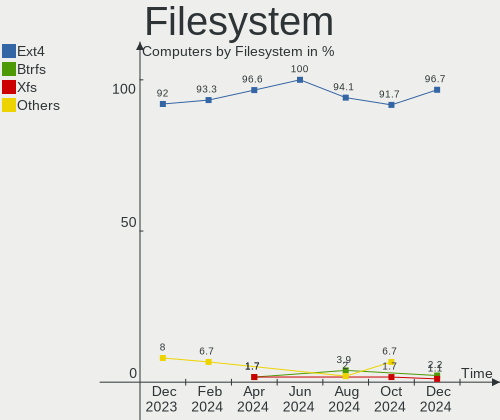
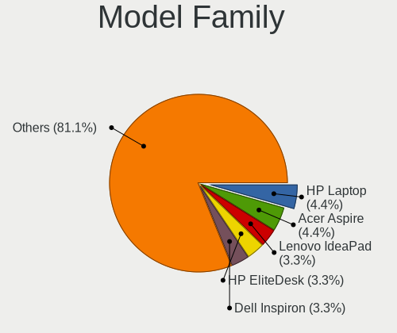
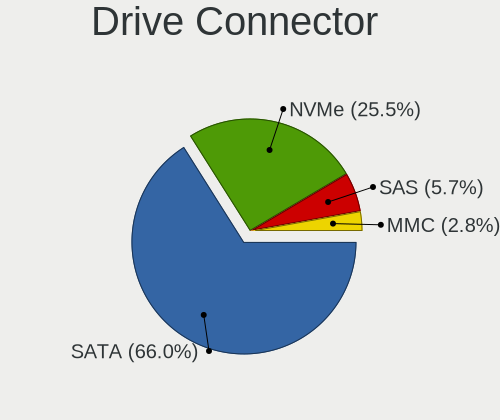
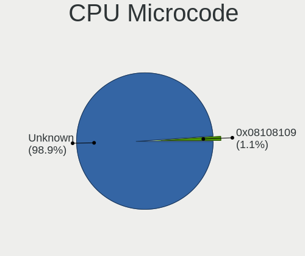
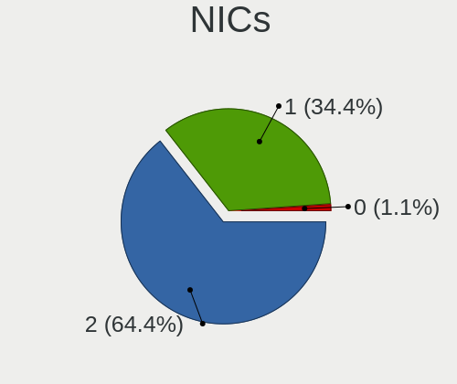
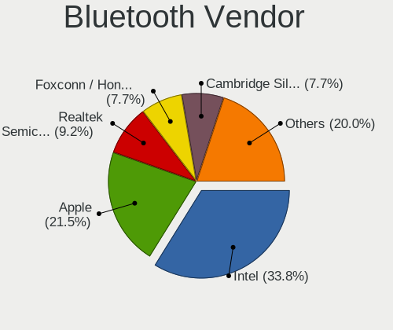
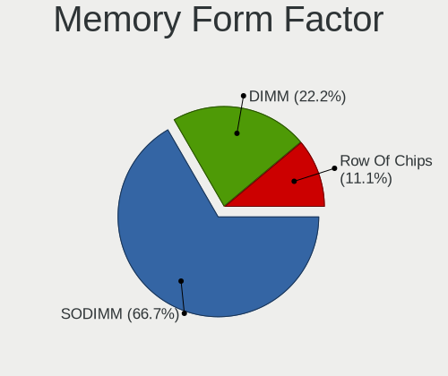
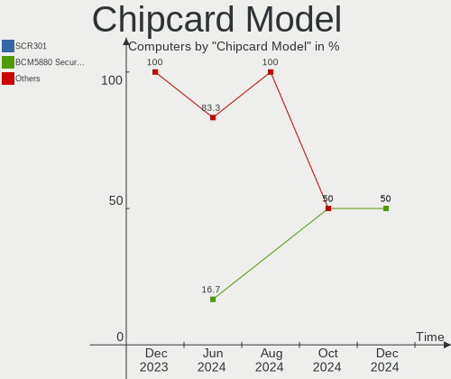

Elementary - Hardware Trends
----------------------------

A project to identify most popular hardware characteristics and track their change
over time based on data collected by Linux users at https://Linux-Hardware.org.

Anyone can contribute to this report by the [hw-probe](https://github.com/linuxhw/hw-probe) tool:

    sudo -E hw-probe -all -upload

This is a report for all computer types. See also reports for [desktops](/Dist/Elementary/Desktop/README.md) and [notebooks](/Dist/Elementary/Notebook/README.md).

This report is for one last month. Overall report since the beginning of time: [TestDays](https://github.com/linuxhw/TestDays)

Period: Oct, 2023.

Contents
--------

* [ System ](#system)
  - [ OS                       ](#os)
  - [ OS Family                ](#os-family)
  - [ Kernel                   ](#kernel)
  - [ Kernel Family            ](#kernel-family)
  - [ Kernel Major Ver.        ](#kernel-major-ver)
  - [ Arch                     ](#arch)
  - [ DE                       ](#de)
  - [ Display Server           ](#display-server)
  - [ Display Manager          ](#display-manager)
  - [ OS Lang                  ](#os-lang)
  - [ Boot Mode                ](#boot-mode)
  - [ Filesystem               ](#filesystem)
  - [ Part. scheme             ](#part-scheme)
  - [ Dual Boot with Linux/BSD ](#dual-boot-with-linuxbsd)
  - [ Dual Boot (Win)          ](#dual-boot-win)

* [ Board ](#board)
  - [ Vendor                   ](#vendor)
  - [ Model                    ](#model)
  - [ Model Family             ](#model-family)
  - [ MFG Year                 ](#mfg-year)
  - [ Form Factor              ](#form-factor)
  - [ Secure Boot              ](#secure-boot)
  - [ Coreboot                 ](#coreboot)
  - [ RAM Size                 ](#ram-size)
  - [ RAM Used                 ](#ram-used)
  - [ Total Drives             ](#total-drives)
  - [ Has CD-ROM               ](#has-cd-rom)
  - [ Has Ethernet             ](#has-ethernet)
  - [ Has WiFi                 ](#has-wifi)
  - [ Has Bluetooth            ](#has-bluetooth)

* [ Location ](#location)
  - [ Country                  ](#country)
  - [ City                     ](#city)

* [ Drives ](#drives)
  - [ Drive Vendor             ](#drive-vendor)
  - [ Drive Model              ](#drive-model)
  - [ HDD Vendor               ](#hdd-vendor)
  - [ SSD Vendor               ](#ssd-vendor)
  - [ Drive Kind               ](#drive-kind)
  - [ Drive Connector          ](#drive-connector)
  - [ Drive Size               ](#drive-size)
  - [ Space Total              ](#space-total)
  - [ Space Used               ](#space-used)
  - [ Malfunc. Drives          ](#malfunc-drives)
  - [ Malfunc. Drive Vendor    ](#malfunc-drive-vendor)
  - [ Malfunc. HDD Vendor      ](#malfunc-hdd-vendor)
  - [ Malfunc. Drive Kind      ](#malfunc-drive-kind)
  - [ Failed Drives            ](#failed-drives)
  - [ Failed Drive Vendor      ](#failed-drive-vendor)
  - [ Drive Status             ](#drive-status)

* [ Storage controller ](#storage-controller)
  - [ Storage Vendor           ](#storage-vendor)
  - [ Storage Model            ](#storage-model)
  - [ Storage Kind             ](#storage-kind)

* [ Processor ](#processor)
  - [ CPU Vendor               ](#cpu-vendor)
  - [ CPU Model                ](#cpu-model)
  - [ CPU Model Family         ](#cpu-model-family)
  - [ CPU Cores                ](#cpu-cores)
  - [ CPU Sockets              ](#cpu-sockets)
  - [ CPU Threads              ](#cpu-threads)
  - [ CPU Op-Modes             ](#cpu-op-modes)
  - [ CPU Microcode            ](#cpu-microcode)
  - [ CPU Microarch            ](#cpu-microarch)

* [ Graphics ](#graphics)
  - [ GPU Vendor               ](#gpu-vendor)
  - [ GPU Model                ](#gpu-model)
  - [ GPU Combo                ](#gpu-combo)
  - [ GPU Driver               ](#gpu-driver)
  - [ GPU Memory               ](#gpu-memory)

* [ Monitor ](#monitor)
  - [ Monitor Vendor           ](#monitor-vendor)
  - [ Monitor Model            ](#monitor-model)
  - [ Monitor Resolution       ](#monitor-resolution)
  - [ Monitor Diagonal         ](#monitor-diagonal)
  - [ Monitor Width            ](#monitor-width)
  - [ Aspect Ratio             ](#aspect-ratio)
  - [ Monitor Area             ](#monitor-area)
  - [ Pixel Density            ](#pixel-density)
  - [ Multiple Monitors        ](#multiple-monitors)

* [ Network ](#network)
  - [ Net Controller Vendor    ](#net-controller-vendor)
  - [ Net Controller Model     ](#net-controller-model)
  - [ Wireless Vendor          ](#wireless-vendor)
  - [ Wireless Model           ](#wireless-model)
  - [ Ethernet Vendor          ](#ethernet-vendor)
  - [ Ethernet Model           ](#ethernet-model)
  - [ Net Controller Kind      ](#net-controller-kind)
  - [ Used Controller          ](#used-controller)
  - [ NICs                     ](#nics)
  - [ IPv6                     ](#ipv6)

* [ Bluetooth ](#bluetooth)
  - [ Bluetooth Vendor         ](#bluetooth-vendor)
  - [ Bluetooth Model          ](#bluetooth-model)

* [ Sound ](#sound)
  - [ Sound Vendor             ](#sound-vendor)
  - [ Sound Model              ](#sound-model)

* [ Memory ](#memory)
  - [ Memory Vendor            ](#memory-vendor)
  - [ Memory Model             ](#memory-model)
  - [ Memory Kind              ](#memory-kind)
  - [ Memory Form Factor       ](#memory-form-factor)
  - [ Memory Size              ](#memory-size)
  - [ Memory Speed             ](#memory-speed)

* [ Printers & scanners ](#printers--scanners)
  - [ Printer Vendor           ](#printer-vendor)
  - [ Printer Model            ](#printer-model)
  - [ Scanner Vendor           ](#scanner-vendor)
  - [ Scanner Model            ](#scanner-model)

* [ Camera ](#camera)
  - [ Camera Vendor            ](#camera-vendor)
  - [ Camera Model             ](#camera-model)

* [ Security ](#security)
  - [ Fingerprint Vendor       ](#fingerprint-vendor)
  - [ Fingerprint Model        ](#fingerprint-model)
  - [ Chipcard Vendor          ](#chipcard-vendor)
  - [ Chipcard Model           ](#chipcard-model)

* [ Unsupported ](#unsupported)
  - [ Unsupported Devices      ](#unsupported-devices)
  - [ Unsupported Device Types ](#unsupported-device-types)

System
------

OS
--

Installed operating systems

| Name             | Computers | Percent |
|------------------|-----------|---------|
| Elementary 7.1   | 39        | 88.64%  |
| Elementary 6.1   | 4         | 9.09%   |
| Elementary 5.1.7 | 1         | 2.27%   |

OS Family
---------

OS without a version

| Name       | Computers | Percent |
|------------|-----------|---------|
| Elementary | 44        | 100%    |

Kernel
------

Version of the Linux kernel

| Version             | Computers | Percent |
|---------------------|-----------|---------|
| 6.2.0-34-generic    | 14        | 31.82%  |
| 6.2.0-35-generic    | 13        | 29.55%  |
| 6.2.0-33-generic    | 8         | 18.18%  |
| 6.5.5-x64v3-xanmod1 | 1         | 2.27%   |
| 6.2.0-26-generic    | 1         | 2.27%   |
| 5.19.0-41-generic   | 1         | 2.27%   |
| 5.15.0-86-generic   | 1         | 2.27%   |
| 5.15.0-84-generic   | 1         | 2.27%   |
| 5.15.0-79-generic   | 1         | 2.27%   |
| 5.15.0-69-generic   | 1         | 2.27%   |
| 5.15.0-58-generic   | 1         | 2.27%   |
| 4.15.0-213-generic  | 1         | 2.27%   |

Kernel Family
-------------

Linux kernel without a distro release

| Version | Computers | Percent |
|---------|-----------|---------|
| 6.2.0   | 36        | 81.82%  |
| 5.15.0  | 5         | 11.36%  |
| 6.5.5   | 1         | 2.27%   |
| 5.19.0  | 1         | 2.27%   |
| 4.15.0  | 1         | 2.27%   |

Kernel Major Ver.
-----------------

Linux kernel major version

| Version | Computers | Percent |
|---------|-----------|---------|
| 6.2     | 36        | 81.82%  |
| 5.15    | 5         | 11.36%  |
| 6.5     | 1         | 2.27%   |
| 5.19    | 1         | 2.27%   |
| 4.15    | 1         | 2.27%   |

Arch
----

OS architecture (x86_64, i586, etc.)

| Name   | Computers | Percent |
|--------|-----------|---------|
| x86_64 | 44        | 100%    |

DE
--

Desktop Environment

| Name     | Computers | Percent |
|----------|-----------|---------|
| Pantheon | 44        | 100%    |

Display Server
--------------

X11 or Wayland

| Name | Computers | Percent |
|------|-----------|---------|
| X11  | 44        | 100%    |

Display Manager
---------------

SDDM, LightDM, etc.

| Name    | Computers | Percent |
|---------|-----------|---------|
| Unknown | 37        | 84.09%  |
| LightDM | 7         | 15.91%  |

OS Lang
-------

Language

| Lang  | Computers | Percent |
|-------|-----------|---------|
| en_US | 17        | 38.64%  |
| de_DE | 8         | 18.18%  |
| ru_RU | 5         | 11.36%  |
| it_IT | 4         | 9.09%   |
| es_ES | 3         | 6.82%   |
| de_CH | 2         | 4.55%   |
| pt_PT | 1         | 2.27%   |
| pt_BR | 1         | 2.27%   |
| pl_PL | 1         | 2.27%   |
| fr_FR | 1         | 2.27%   |
| fr_CA | 1         | 2.27%   |

Boot Mode
---------

EFI or BIOS

| Mode | Computers | Percent |
|------|-----------|---------|
| BIOS | 38        | 86.36%  |
| EFI  | 6         | 13.64%  |

Filesystem
----------

Type of filesystem

| Type    | Computers | Percent |
|---------|-----------|---------|
| Ext4    | 39        | 88.64%  |
| Tmpfs   | 2         | 4.55%   |
| Overlay | 1         | 2.27%   |
| Ext2    | 1         | 2.27%   |
| Btrfs   | 1         | 2.27%   |

Part. scheme
------------

Scheme of partitioning

| Type    | Computers | Percent |
|---------|-----------|---------|
| Unknown | 37        | 84.09%  |
| GPT     | 4         | 9.09%   |
| MBR     | 3         | 6.82%   |

Dual Boot with Linux/BSD
------------------------

Hosting more than one Linux/BSD

| Dual boot | Computers | Percent |
|-----------|-----------|---------|
| No        | 43        | 97.73%  |
| Yes       | 1         | 2.27%   |

Dual Boot (Win)
---------------

Hosting Linux and Windows

| Dual boot | Computers | Percent |
|-----------|-----------|---------|
| No        | 41        | 93.18%  |
| Yes       | 3         | 6.82%   |

Board
-----

Vendor
------

Motherboard manufacturer

| Name                | Computers | Percent |
|---------------------|-----------|---------|
| Apple               | 10        | 22.73%  |
| Dell                | 9         | 20.45%  |
| ASUSTek Computer    | 8         | 18.18%  |
| Lenovo              | 5         | 11.36%  |
| Hewlett-Packard     | 4         | 9.09%   |
| MACHINIST           | 2         | 4.55%   |
| Acer                | 2         | 4.55%   |
| MSI                 | 1         | 2.27%   |
| HUAWEI              | 1         | 2.27%   |
| Google              | 1         | 2.27%   |
| Gigabyte Technology | 1         | 2.27%   |

Model
-----

Motherboard model

| Name                                    | Computers | Percent |
|-----------------------------------------|-----------|---------|
| Apple MacBookPro6,2                     | 2         | 4.55%   |
| MSI MS-7A63                             | 1         | 2.27%   |
| MACHINIST X79 Z9-D7 V1.2                | 1         | 2.27%   |
| MACHINIST H81M-PRO S1 V2.0              | 1         | 2.27%   |
| Lenovo ThinkPad T440p 20AN0069US        | 1         | 2.27%   |
| Lenovo IdeaPad 5 14ITL05 82FE           | 1         | 2.27%   |
| Lenovo IdeaPad 330S-15IKB 81F5          | 1         | 2.27%   |
| Lenovo IdeaCentre 310S-08ASR 90G90073GE | 1         | 2.27%   |
| Lenovo B570 1068FRG                     | 1         | 2.27%   |
| HUAWEI NBLK-WAX9X                       | 1         | 2.27%   |
| HP Pavilion dv7                         | 1         | 2.27%   |
| HP Pavilion 17                          | 1         | 2.27%   |
| HP Pavilion 15                          | 1         | 2.27%   |
| HP EliteBook 2570p                      | 1         | 2.27%   |
| Google Cave                             | 1         | 2.27%   |
| Gigabyte B560M DS3H                     | 1         | 2.27%   |
| Dell Wyse 5070 Thin Client              | 1         | 2.27%   |
| Dell Vostro 1510                        | 1         | 2.27%   |
| Dell Vostro 15 3515                     | 1         | 2.27%   |
| Dell PowerEdge T40                      | 1         | 2.27%   |
| Dell Latitude E7270                     | 1         | 2.27%   |
| Dell Latitude E6520                     | 1         | 2.27%   |
| Dell Latitude E6400                     | 1         | 2.27%   |
| Dell Inspiron 620                       | 1         | 2.27%   |
| Dell Inspiron 1545                      | 1         | 2.27%   |
| ASUS Zenbook UX3402VA_UX3402VA          | 1         | 2.27%   |
| ASUS Zenbook UM3402YA_UM3402YA          | 1         | 2.27%   |
| ASUS X555LAB                            | 1         | 2.27%   |
| ASUS VivoBook_ASUSLaptop X512DA_F512DA  | 1         | 2.27%   |
| ASUS ROG STRIX X570-E GAMING WIFI II    | 1         | 2.27%   |
| ASUS P8H61-MX R2.0                      | 1         | 2.27%   |
| ASUS P5G41T-M LX                        | 1         | 2.27%   |
| ASUS P5G41-M LX2/GB                     | 1         | 2.27%   |
| Apple MacBookPro7,1                     | 1         | 2.27%   |
| Apple MacBookPro5,3                     | 1         | 2.27%   |
| Apple MacBookPro11,5                    | 1         | 2.27%   |
| Apple MacBook7,1                        | 1         | 2.27%   |
| Apple iMac19,1                          | 1         | 2.27%   |
| Apple iMac18,2                          | 1         | 2.27%   |
| Apple iMac14,2                          | 1         | 2.27%   |

Model Family
------------

Motherboard model prefix

| Name               | Computers | Percent |
|--------------------|-----------|---------|
| HP Pavilion        | 3         | 6.82%   |
| Dell Latitude      | 3         | 6.82%   |
| Lenovo IdeaPad     | 2         | 4.55%   |
| Dell Vostro        | 2         | 4.55%   |
| Dell Inspiron      | 2         | 4.55%   |
| ASUS Zenbook       | 2         | 4.55%   |
| Apple MacBookPro6  | 2         | 4.55%   |
| MSI MS-7A63        | 1         | 2.27%   |
| MACHINIST X79      | 1         | 2.27%   |
| MACHINIST H81M-PRO | 1         | 2.27%   |
| Lenovo ThinkPad    | 1         | 2.27%   |
| Lenovo IdeaCentre  | 1         | 2.27%   |
| Lenovo B570        | 1         | 2.27%   |
| HUAWEI NBLK-WAX9X  | 1         | 2.27%   |
| HP EliteBook       | 1         | 2.27%   |
| Google Cave        | 1         | 2.27%   |
| Gigabyte B560M     | 1         | 2.27%   |
| Dell Wyse          | 1         | 2.27%   |
| Dell PowerEdge     | 1         | 2.27%   |
| ASUS X555LAB       | 1         | 2.27%   |
| ASUS VivoBook      | 1         | 2.27%   |
| ASUS ROG           | 1         | 2.27%   |
| ASUS P8H61-MX      | 1         | 2.27%   |
| ASUS P5G41T-M      | 1         | 2.27%   |
| ASUS P5G41-M       | 1         | 2.27%   |
| Apple MacBookPro7  | 1         | 2.27%   |
| Apple MacBookPro5  | 1         | 2.27%   |
| Apple MacBookPro11 | 1         | 2.27%   |
| Apple MacBook7     | 1         | 2.27%   |
| Apple iMac19       | 1         | 2.27%   |
| Apple iMac18       | 1         | 2.27%   |
| Apple iMac14       | 1         | 2.27%   |
| Apple iMac12       | 1         | 2.27%   |
| Acer Nitro         | 1         | 2.27%   |
| Acer Aspire        | 1         | 2.27%   |

MFG Year
--------

Motherboard manufacture year

| Year | Computers | Percent |
|------|-----------|---------|
| 2021 | 6         | 13.64%  |
| 2010 | 5         | 11.36%  |
| 2019 | 4         | 9.09%   |
| 2011 | 4         | 9.09%   |
| 2008 | 4         | 9.09%   |
| 2018 | 3         | 6.82%   |
| 2016 | 3         | 6.82%   |
| 2013 | 3         | 6.82%   |
| 2022 | 2         | 4.55%   |
| 2012 | 2         | 4.55%   |
| 2009 | 2         | 4.55%   |
| 2023 | 1         | 2.27%   |
| 2020 | 1         | 2.27%   |
| 2017 | 1         | 2.27%   |
| 2015 | 1         | 2.27%   |
| 2014 | 1         | 2.27%   |
| 2007 | 1         | 2.27%   |

Form Factor
-----------

Physical design of the computer

| Name       | Computers | Percent |
|------------|-----------|---------|
| Notebook   | 27        | 61.36%  |
| Desktop    | 12        | 27.27%  |
| All in one | 4         | 9.09%   |
| Mini pc    | 1         | 2.27%   |

Secure Boot
-----------

Enabled or disabled

| State    | Computers | Percent |
|----------|-----------|---------|
| Disabled | 43        | 97.73%  |
| Enabled  | 1         | 2.27%   |

Coreboot
--------

Have coreboot on board

| Used | Computers | Percent |
|------|-----------|---------|
| No   | 43        | 97.73%  |
| Yes  | 1         | 2.27%   |

RAM Size
--------

Total RAM memory

| Size in GB  | Computers | Percent |
|-------------|-----------|---------|
| 4.01-8.0    | 13        | 29.55%  |
| 16.01-24.0  | 10        | 22.73%  |
| 3.01-4.0    | 9         | 20.45%  |
| 8.01-16.0   | 5         | 11.36%  |
| 24.01-32.0  | 2         | 4.55%   |
| 2.01-3.0    | 2         | 4.55%   |
| 64.01-256.0 | 2         | 4.55%   |
| 32.01-64.0  | 1         | 2.27%   |

RAM Used
--------

Used RAM memory

| Used GB   | Computers | Percent |
|-----------|-----------|---------|
| 2.01-3.0  | 18        | 40.91%  |
| 1.01-2.0  | 11        | 25%     |
| 4.01-8.0  | 7         | 15.91%  |
| 3.01-4.0  | 6         | 13.64%  |
| 8.01-16.0 | 1         | 2.27%   |
| 0.51-1.0  | 1         | 2.27%   |

Total Drives
------------

Number of drives on board

| Drives | Computers | Percent |
|--------|-----------|---------|
| 1      | 25        | 56.82%  |
| 2      | 18        | 40.91%  |
| 3      | 1         | 2.27%   |

Has CD-ROM
----------

Has CD-ROM on board

| Presented | Computers | Percent |
|-----------|-----------|---------|
| No        | 27        | 61.36%  |
| Yes       | 17        | 38.64%  |

Has Ethernet
------------

Has Ethernet on board

| Presented | Computers | Percent |
|-----------|-----------|---------|
| Yes       | 38        | 86.36%  |
| No        | 6         | 13.64%  |

Has WiFi
--------

Has WiFi module

| Presented | Computers | Percent |
|-----------|-----------|---------|
| Yes       | 37        | 84.09%  |
| No        | 7         | 15.91%  |

Has Bluetooth
-------------

Has Bluetooth module

| Presented | Computers | Percent |
|-----------|-----------|---------|
| Yes       | 29        | 65.91%  |
| No        | 15        | 34.09%  |

Location
--------

Country
-------

Geographic location (country)

| Country     | Computers | Percent |
|-------------|-----------|---------|
| USA         | 6         | 13.64%  |
| Germany     | 6         | 13.64%  |
| Russia      | 5         | 11.36%  |
| Italy       | 5         | 11.36%  |
| Canada      | 5         | 11.36%  |
| Brazil      | 3         | 6.82%   |
| Mexico      | 2         | 4.55%   |
| Thailand    | 1         | 2.27%   |
| Switzerland | 1         | 2.27%   |
| Sweden      | 1         | 2.27%   |
| Slovakia    | 1         | 2.27%   |
| Portugal    | 1         | 2.27%   |
| Poland      | 1         | 2.27%   |
| Israel      | 1         | 2.27%   |
| France      | 1         | 2.27%   |
| Belarus     | 1         | 2.27%   |
| Austria     | 1         | 2.27%   |
| Armenia     | 1         | 2.27%   |
| Argentina   | 1         | 2.27%   |

City
----

Geographic location (city)

| City           | Computers | Percent |
|----------------|-----------|---------|
| Moscow         | 2         | 4.55%   |
| Yerevan        | 1         | 2.27%   |
| Yekaterinburg  | 1         | 2.27%   |
| Warsaw         | 1         | 2.27%   |
| Vitebsk        | 1         | 2.27%   |
| Victoria       | 1         | 2.27%   |
| Ummendorf      | 1         | 2.27%   |
| Toronto        | 1         | 2.27%   |
| Savannah       | 1         | 2.27%   |
| Sainte-Therese | 1         | 2.27%   |
| Rome           | 1         | 2.27%   |
| Resistencia    | 1         | 2.27%   |
| Puebla City    | 1         | 2.27%   |
| Powell         | 1         | 2.27%   |
| Portland       | 1         | 2.27%   |
| Ponte de Lima  | 1         | 2.27%   |
| Phoenix        | 1         | 2.27%   |
| Petah Tikva    | 1         | 2.27%   |
| Parma          | 1         | 2.27%   |
| Nîmes         | 1         | 2.27%   |
| Neumünster    | 1         | 2.27%   |
| Nemchinovka    | 1         | 2.27%   |
| Munich         | 1         | 2.27%   |
| Montreal       | 1         | 2.27%   |
| Milton         | 1         | 2.27%   |
| Milano         | 1         | 2.27%   |
| Milan          | 1         | 2.27%   |
| Mikhaylovsk    | 1         | 2.27%   |
| Mascouche      | 1         | 2.27%   |
| Linhares       | 1         | 2.27%   |
| León          | 1         | 2.27%   |
| Leipzig        | 1         | 2.27%   |
| Koblenz        | 1         | 2.27%   |
| Johanneshov    | 1         | 2.27%   |
| Grossenhain    | 1         | 2.27%   |
| Galanta        | 1         | 2.27%   |
| Foz do Iguaçu | 1         | 2.27%   |
| Chiang Mai     | 1         | 2.27%   |
| Bowling Green  | 1         | 2.27%   |
| Baumgartenberg | 1         | 2.27%   |

Drives
------

Drive Vendor
------------

Hard drive vendors

| Vendor                      | Computers | Drives | Percent |
|-----------------------------|-----------|--------|---------|
| Samsung Electronics         | 11        | 13     | 18.33%  |
| WDC                         | 9         | 9      | 15%     |
| Seagate                     | 6         | 6      | 10%     |
| Toshiba                     | 4         | 4      | 6.67%   |
| SanDisk                     | 4         | 4      | 6.67%   |
| Apple                       | 4         | 4      | 6.67%   |
| Unknown                     | 2         | 3      | 3.33%   |
| SPCC                        | 2         | 2      | 3.33%   |
| Intel                       | 2         | 2      | 3.33%   |
| Hitachi                     | 2         | 2      | 3.33%   |
| China                       | 2         | 2      | 3.33%   |
| XrayDisk                    | 1         | 1      | 1.67%   |
| TS-RDF2                     | 1         | 1      | 1.67%   |
| Timetec                     | 1         | 1      | 1.67%   |
| Patriot                     | 1         | 1      | 1.67%   |
| Netac                       | 1         | 1      | 1.67%   |
| MAXIO Technology (Hangzhou) | 1         | 1      | 1.67%   |
| Kingston                    | 1         | 1      | 1.67%   |
| KingSpec                    | 1         | 1      | 1.67%   |
| JMicron Technology          | 1         | 1      | 1.67%   |
| HGST                        | 1         | 1      | 1.67%   |
| Fanxiang                    | 1         | 1      | 1.67%   |
| A-DATA Technology           | 1         | 1      | 1.67%   |

Drive Model
-----------

Hard drive models

| Model                                             | Computers | Percent |
|---------------------------------------------------|-----------|---------|
| Samsung SSD 860 EVO 500GB                         | 2         | 3.17%   |
| Samsung NVMe SSD Controller SM981/PM981/PM983 1TB | 2         | 3.17%   |
| XrayDisk 512GB SSD                                | 1         | 1.59%   |
| WDC WDS240G2G0B-00EPW0 240GB SSD                  | 1         | 1.59%   |
| WDC WDS240G2G0A-00JH30 240GB SSD                  | 1         | 1.59%   |
| WDC WDS200T2B0A-00SM50 2TB SSD                    | 1         | 1.59%   |
| WDC WD5000LPVX-00V0TT0 500GB                      | 1         | 1.59%   |
| WDC WD5000BPVT-24HXZT3 500GB                      | 1         | 1.59%   |
| WDC WD50 00AZLX-60K2TA0 500GB                     | 1         | 1.59%   |
| WDC WD10SPZX-21Z10T0 1TB                          | 1         | 1.59%   |
| WDC WD10EZEX-22MFCA0 1TB                          | 1         | 1.59%   |
| WDC WD Blue SA510 2.5 500GB                       | 1         | 1.59%   |
| Unknown MMC Card  64GB                            | 1         | 1.59%   |
| Unknown MMC Card  512GB                           | 1         | 1.59%   |
| Unknown MMC Card  16GB                            | 1         | 1.59%   |
| TS-RDF2 Transcend 128GB                           | 1         | 1.59%   |
| Toshiba MQ04ABF100 1TB                            | 1         | 1.59%   |
| Toshiba KXG60ZNV512G 512GB                        | 1         | 1.59%   |
| Toshiba HDWD110 1TB                               | 1         | 1.59%   |
| Toshiba DT01ACA050 500GB                          | 1         | 1.59%   |
| Timetec 35TTM8SSATA-512G                          | 1         | 1.59%   |
| SPCC Solid State Disk 512GB                       | 1         | 1.59%   |
| SPCC Solid State Disk 256GB                       | 1         | 1.59%   |
| Seagate ST2000LM007-1R8174 2TB                    | 1         | 1.59%   |
| Seagate ST2000DM001-1ER164 2TB                    | 1         | 1.59%   |
| Seagate ST1000LX015-1U7172 1TB                    | 1         | 1.59%   |
| Seagate ST1000DM003-1ER162 1TB                    | 1         | 1.59%   |
| Seagate BUP Slim 1TB                              | 1         | 1.59%   |
| Seagate Backup+ BK 1TB                            | 1         | 1.59%   |
| SanDisk X400 M.2 2280 128GB SSD                   | 1         | 1.59%   |
| Sandisk WD Blue SN550 NVMe SSD 1TB                | 1         | 1.59%   |
| SanDisk SSD PLUS 240GB                            | 1         | 1.59%   |
| SanDisk SDSSDHII960G 960GB                        | 1         | 1.59%   |
| Samsung SSD PM810 2.5 128GB                       | 1         | 1.59%   |
| Samsung SSD 850 EVO 250GB                         | 1         | 1.59%   |
| Samsung SSD 750 EVO 250GB                         | 1         | 1.59%   |
| Samsung PM991a NVMe 256GB                         | 1         | 1.59%   |
| Samsung MZVL4512HBLU-00BTW 512GB                  | 1         | 1.59%   |
| Samsung MZALQ256HBJD-00BL2 256GB                  | 1         | 1.59%   |
| Samsung HM250HI 250GB                             | 1         | 1.59%   |

HDD Vendor
----------

Hard disk drive vendors

| Vendor              | Computers | Drives | Percent |
|---------------------|-----------|--------|---------|
| WDC                 | 5         | 5      | 25%     |
| Seagate             | 5         | 5      | 25%     |
| Toshiba             | 3         | 3      | 15%     |
| Samsung Electronics | 2         | 3      | 10%     |
| Hitachi             | 2         | 2      | 10%     |
| Apple               | 2         | 2      | 10%     |
| HGST                | 1         | 1      | 5%      |

SSD Vendor
----------

Solid state drive vendors

| Vendor              | Computers | Drives | Percent |
|---------------------|-----------|--------|---------|
| WDC                 | 4         | 4      | 17.39%  |
| Samsung Electronics | 4         | 5      | 17.39%  |
| SanDisk             | 3         | 3      | 13.04%  |
| SPCC                | 2         | 2      | 8.7%    |
| China               | 2         | 2      | 8.7%    |
| XrayDisk            | 1         | 1      | 4.35%   |
| Timetec             | 1         | 1      | 4.35%   |
| Patriot             | 1         | 1      | 4.35%   |
| Netac               | 1         | 1      | 4.35%   |
| Kingston            | 1         | 1      | 4.35%   |
| KingSpec            | 1         | 1      | 4.35%   |
| Intel               | 1         | 1      | 4.35%   |
| Apple               | 1         | 1      | 4.35%   |

Drive Kind
----------

HDD or SSD

| Kind    | Computers | Drives | Percent |
|---------|-----------|--------|---------|
| SSD     | 22        | 24     | 38.6%   |
| HDD     | 18        | 21     | 31.58%  |
| NVMe    | 11        | 11     | 19.3%   |
| Unknown | 4         | 4      | 7.02%   |
| MMC     | 2         | 3      | 3.51%   |

Drive Connector
---------------

SATA, SAS, NVMe, etc.

| Type | Computers | Drives | Percent |
|------|-----------|--------|---------|
| SATA | 35        | 44     | 66.04%  |
| NVMe | 11        | 11     | 20.75%  |
| SAS  | 5         | 5      | 9.43%   |
| MMC  | 2         | 3      | 3.77%   |

Drive Size
----------

Size of hard drive

| Size in TB | Computers | Drives | Percent |
|------------|-----------|--------|---------|
| 0.01-0.5   | 24        | 29     | 60%     |
| 0.51-1.0   | 13        | 13     | 32.5%   |
| 1.01-2.0   | 3         | 3      | 7.5%    |

Space Total
-----------

Amount of disk space available on the file system

| Size in GB | Computers | Percent |
|------------|-----------|---------|
| 101-250    | 19        | 43.18%  |
| 251-500    | 11        | 25%     |
| 1001-2000  | 5         | 11.36%  |
| 501-1000   | 4         | 9.09%   |
| 51-100     | 2         | 4.55%   |
| 21-50      | 1         | 2.27%   |
| 2001-3000  | 1         | 2.27%   |
| 1-20       | 1         | 2.27%   |

Space Used
----------

Amount of used disk space

| Used GB   | Computers | Percent |
|-----------|-----------|---------|
| 1-20      | 19        | 43.18%  |
| 21-50     | 14        | 31.82%  |
| 251-500   | 5         | 11.36%  |
| 101-250   | 2         | 4.55%   |
| 51-100    | 2         | 4.55%   |
| 1001-2000 | 1         | 2.27%   |
| 501-1000  | 1         | 2.27%   |

Malfunc. Drives
---------------

Drive models with a malfunction

Zero info for selected period =(

Malfunc. Drive Vendor
---------------------

Vendors of faulty drives

Zero info for selected period =(

Malfunc. HDD Vendor
-------------------

Vendors of faulty HDD drives

Zero info for selected period =(

Malfunc. Drive Kind
-------------------

Kinds of faulty drives

Zero info for selected period =(

Failed Drives
-------------

Failed drive models

Zero info for selected period =(

Failed Drive Vendor
-------------------

Failed drive vendors

Zero info for selected period =(

Drive Status
------------

Number of failed and malfunc. drives

| Status   | Computers | Drives | Percent |
|----------|-----------|--------|---------|
| Detected | 39        | 56     | 88.64%  |
| Works    | 5         | 7      | 11.36%  |

Storage controller
------------------

Storage Vendor
--------------

Storage controller vendors

| Vendor                       | Computers | Percent |
|------------------------------|-----------|---------|
| Intel                        | 32        | 65.31%  |
| Samsung Electronics          | 6         | 12.24%  |
| AMD                          | 4         | 8.16%   |
| Nvidia                       | 3         | 6.12%   |
| Toshiba America Info Systems | 1         | 2.04%   |
| SanDisk                      | 1         | 2.04%   |
| MAXIO Technology (Hangzhou)  | 1         | 2.04%   |
| ADATA Technology             | 1         | 2.04%   |

Storage Model
-------------

Storage controller models

| Model                                                                                   | Computers | Percent |
|-----------------------------------------------------------------------------------------|-----------|---------|
| AMD FCH SATA Controller [AHCI mode]                                                     | 4         | 7.27%   |
| Intel 82801 Mobile SATA Controller [RAID mode]                                          | 3         | 5.45%   |
| Intel 8 Series/C220 Series Chipset Family 6-port SATA Controller 1 [AHCI mode]          | 3         | 5.45%   |
| Intel 5 Series/3400 Series Chipset 4 port SATA AHCI Controller                          | 3         | 5.45%   |
| Samsung NVMe SSD Controller SM981/PM981/PM983                                           | 2         | 3.64%   |
| Samsung NVMe SSD Controller 980 (DRAM-less)                                             | 2         | 3.64%   |
| Nvidia MCP89 SATA Controller (AHCI mode)                                                | 2         | 3.64%   |
| Intel NM10/ICH7 Family SATA Controller [IDE mode]                                       | 2         | 3.64%   |
| Intel 82801G (ICH7 Family) IDE Controller                                               | 2         | 3.64%   |
| Intel 6 Series/C200 Series Chipset Family Desktop SATA Controller (IDE mode, ports 4-5) | 2         | 3.64%   |
| Intel 6 Series/C200 Series Chipset Family Desktop SATA Controller (IDE mode, ports 0-3) | 2         | 3.64%   |
| Toshiba America Info Systems XG6 NVMe SSD Controller                                    | 1         | 1.82%   |
| SanDisk Ultra 3D / WD Blue SN550 NVMe SSD                                               | 1         | 1.82%   |
| Samsung NVMe SSD Controller SM961/PM961/SM963                                           | 1         | 1.82%   |
| Samsung NVMe SSD Controller PM9B1 (DRAM-less)                                           | 1         | 1.82%   |
| Nvidia MCP79 AHCI Controller                                                            | 1         | 1.82%   |
| MAXIO (Hangzhou) NVMe SSD Controller MAP1202                                            | 1         | 1.82%   |
| Intel Wildcat Point-LP SATA Controller [AHCI Mode]                                      | 1         | 1.82%   |
| Intel Volume Management Device NVMe RAID Controller Intel Corporation                   | 1         | 1.82%   |
| Intel Tiger Lake SATA AHCI Controller                                                   | 1         | 1.82%   |
| Intel Sunrise Point-LP SATA Controller [AHCI mode]                                      | 1         | 1.82%   |
| Intel SSD 670p Series [Keystone Harbor]                                                 | 1         | 1.82%   |
| Intel SATA Controller [RAID mode]                                                       | 1         | 1.82%   |
| Intel Q170/Q150/B150/H170/H110/Z170/CM236 Chipset SATA Controller [AHCI Mode]           | 1         | 1.82%   |
| Intel Celeron/Pentium Silver Processor SATA Controller                                  | 1         | 1.82%   |
| Intel Cannon Lake PCH SATA AHCI Controller                                              | 1         | 1.82%   |
| Intel C600/X79 series chipset SATA RAID Controller                                      | 1         | 1.82%   |
| Intel C600/X79 series chipset 6-Port SATA AHCI Controller                               | 1         | 1.82%   |
| Intel 82801IBM/IEM (ICH9M/ICH9M-E) 4 port SATA Controller [AHCI mode]                   | 1         | 1.82%   |
| Intel 82801HM/HEM (ICH8M/ICH8M-E) SATA Controller [AHCI mode]                           | 1         | 1.82%   |
| Intel 82801HM/HEM (ICH8M/ICH8M-E) IDE Controller                                        | 1         | 1.82%   |
| Intel 8 Series SATA Controller 1 [AHCI mode]                                            | 1         | 1.82%   |
| Intel 7 Series Chipset Family 6-port SATA Controller [AHCI mode]                        | 1         | 1.82%   |
| Intel 6 Series/C200 Series Chipset Family Mobile SATA Controller (IDE mode, ports 4-5)  | 1         | 1.82%   |
| Intel 6 Series/C200 Series Chipset Family Mobile SATA Controller (IDE mode, ports 0-3)  | 1         | 1.82%   |
| Intel 6 Series/C200 Series Chipset Family 6 port Desktop SATA AHCI Controller           | 1         | 1.82%   |
| Intel 500 Series Chipset Family SATA AHCI Controller                                    | 1         | 1.82%   |
| Intel 200 Series PCH SATA controller [AHCI mode]                                        | 1         | 1.82%   |
| ADATA IM2P33F8 series NVMe SSD (DRAM-less)                                              | 1         | 1.82%   |

Storage Kind
------------

Kind of storage controller (IDE, SATA, NVMe, SAS, ...)

| Kind | Computers | Percent |
|------|-----------|---------|
| SATA | 27        | 54%     |
| NVMe | 11        | 22%     |
| RAID | 6         | 12%     |
| IDE  | 6         | 12%     |

Processor
---------

CPU Vendor
----------

Processor vendors

| Vendor | Computers | Percent |
|--------|-----------|---------|
| Intel  | 37        | 84.09%  |
| AMD    | 7         | 15.91%  |

CPU Model
---------

Processor models

| Model                                         | Computers | Percent |
|-----------------------------------------------|-----------|---------|
| Intel Core i5 CPU M 520 @ 2.40GHz             | 2         | 4.55%   |
| Intel Core 2 Duo CPU P8600 @ 2.40GHz          | 2         | 4.55%   |
| AMD Ryzen 5 3500U with Radeon Vega Mobile Gfx | 2         | 4.55%   |
| Intel Xeon E-2224G CPU @ 3.50GHz              | 1         | 2.27%   |
| Intel Xeon CPU E5-2643 0 @ 3.30GHz            | 1         | 2.27%   |
| Intel Pentium Dual-Core CPU E5700 @ 3.00GHz   | 1         | 2.27%   |
| Intel Pentium Dual-Core CPU E5400 @ 2.70GHz   | 1         | 2.27%   |
| Intel Pentium CPU B950 @ 2.10GHz              | 1         | 2.27%   |
| Intel Core m3-6Y30 CPU @ 0.90GHz              | 1         | 2.27%   |
| Intel Core i9-9900K CPU @ 3.60GHz             | 1         | 2.27%   |
| Intel Core i7-8550U CPU @ 1.80GHz             | 1         | 2.27%   |
| Intel Core i7-6700K CPU @ 4.00GHz             | 1         | 2.27%   |
| Intel Core i7-4980HQ CPU @ 2.80GHz            | 1         | 2.27%   |
| Intel Core i7-4712MQ CPU @ 2.30GHz            | 1         | 2.27%   |
| Intel Core i7-10700 CPU @ 2.90GHz             | 1         | 2.27%   |
| Intel Core i7 CPU Q 720 @ 1.60GHz             | 1         | 2.27%   |
| Intel Core i5-7400 CPU @ 3.00GHz              | 1         | 2.27%   |
| Intel Core i5-6300U CPU @ 2.40GHz             | 1         | 2.27%   |
| Intel Core i5-4670 CPU @ 3.40GHz              | 1         | 2.27%   |
| Intel Core i5-4210U CPU @ 1.70GHz             | 1         | 2.27%   |
| Intel Core i5-3470 CPU @ 3.20GHz              | 1         | 2.27%   |
| Intel Core i5-3320M CPU @ 2.60GHz             | 1         | 2.27%   |
| Intel Core i5-2500S CPU @ 2.70GHz             | 1         | 2.27%   |
| Intel Core i5-2410M CPU @ 2.30GHz             | 1         | 2.27%   |
| Intel Core i5-2320 CPU @ 3.00GHz              | 1         | 2.27%   |
| Intel Core i3-5005U CPU @ 2.00GHz             | 1         | 2.27%   |
| Intel Core i3-4170 CPU @ 3.70GHz              | 1         | 2.27%   |
| Intel Core 2 Quad CPU Q6600 @ 2.40GHz         | 1         | 2.27%   |
| Intel Core 2 Duo CPU T9600 @ 2.80GHz          | 1         | 2.27%   |
| Intel Core 2 Duo CPU T9400 @ 2.53GHz          | 1         | 2.27%   |
| Intel Core 2 Duo CPU T8100 @ 2.10GHz          | 1         | 2.27%   |
| Intel Celeron J4105 CPU @ 1.50GHz             | 1         | 2.27%   |
| Intel Celeron Dual-Core CPU T3000 @ 1.80GHz   | 1         | 2.27%   |
| Intel 13th Gen Core i5-1340P                  | 1         | 2.27%   |
| Intel 11th Gen Core i7-11800H @ 2.30GHz       | 1         | 2.27%   |
| Intel 11th Gen Core i3-1115G4 @ 3.00GHz       | 1         | 2.27%   |
| AMD Ryzen 9 5950X 16-Core Processor           | 1         | 2.27%   |
| AMD Ryzen 5 5625U with Radeon Graphics        | 1         | 2.27%   |
| AMD Ryzen 5 3450U with Radeon Vega Mobile Gfx | 1         | 2.27%   |
| AMD A9-9425 RADEON R5, 5 COMPUTE CORES 2C+3G  | 1         | 2.27%   |

CPU Model Family
----------------

Processor model prefix

| Model                   | Computers | Percent |
|-------------------------|-----------|---------|
| Intel Core i5           | 11        | 25%     |
| Intel Core i7           | 6         | 13.64%  |
| Intel Core 2 Duo        | 5         | 11.36%  |
| Other                   | 4         | 9.09%   |
| AMD Ryzen 5             | 4         | 9.09%   |
| Intel Xeon              | 2         | 4.55%   |
| Intel Pentium Dual-Core | 2         | 4.55%   |
| Intel Core i3           | 2         | 4.55%   |
| Intel Pentium           | 1         | 2.27%   |
| Intel Core m3           | 1         | 2.27%   |
| Intel Core i9           | 1         | 2.27%   |
| Intel Core 2 Quad       | 1         | 2.27%   |
| Intel Celeron Dual-Core | 1         | 2.27%   |
| Intel Celeron           | 1         | 2.27%   |
| AMD Ryzen 9             | 1         | 2.27%   |
| AMD A4                  | 1         | 2.27%   |

CPU Cores
---------

Number of processor cores

| Number | Computers | Percent |
|--------|-----------|---------|
| 2      | 20        | 45.45%  |
| 4      | 18        | 40.91%  |
| 8      | 3         | 6.82%   |
| 16     | 1         | 2.27%   |
| 12     | 1         | 2.27%   |
| 6      | 1         | 2.27%   |

CPU Sockets
-----------

Number of sockets

| Number | Computers | Percent |
|--------|-----------|---------|
| 1      | 44        | 100%    |

CPU Threads
-----------

Threads per core (Hyper-Threading)

| Number | Computers | Percent |
|--------|-----------|---------|
| 2      | 25        | 56.82%  |
| 1      | 19        | 43.18%  |

CPU Op-Modes
------------

CPU Operation Modes (32-bit, 64-bit)

| Op mode        | Computers | Percent |
|----------------|-----------|---------|
| 32-bit, 64-bit | 44        | 100%    |

CPU Microcode
-------------

Microcode number

| Number     | Computers | Percent |
|------------|-----------|---------|
| Unknown    | 36        | 81.82%  |
| 0x08108109 | 2         | 4.55%   |
| 0x906e9    | 1         | 2.27%   |
| 0x40661    | 1         | 2.27%   |
| 0x306a9    | 1         | 2.27%   |
| 0x206a7    | 1         | 2.27%   |
| 0x106e5    | 1         | 2.27%   |
| 0x06006704 | 1         | 2.27%   |

CPU Microarch
-------------

Microarchitecture

| Name             | Computers | Percent |
|------------------|-----------|---------|
| Penryn           | 8         | 18.18%  |
| SandyBridge      | 5         | 11.36%  |
| Haswell          | 5         | 11.36%  |
| KabyLake         | 4         | 9.09%   |
| Zen+             | 3         | 6.82%   |
| Skylake          | 3         | 6.82%   |
| Zen 3            | 2         | 4.55%   |
| Westmere         | 2         | 4.55%   |
| IvyBridge        | 2         | 4.55%   |
| TigerLake        | 1         | 2.27%   |
| Nehalem          | 1         | 2.27%   |
| Jaguar           | 1         | 2.27%   |
| Icelake          | 1         | 2.27%   |
| Goldmont plus    | 1         | 2.27%   |
| Excavator        | 1         | 2.27%   |
| Core             | 1         | 2.27%   |
| CometLake        | 1         | 2.27%   |
| Broadwell        | 1         | 2.27%   |
| Alderlake Hybrid | 1         | 2.27%   |

Graphics
--------

GPU Vendor
----------

Vendors of graphics cards

| Vendor | Computers | Percent |
|--------|-----------|---------|
| Intel  | 22        | 44%     |
| Nvidia | 16        | 32%     |
| AMD    | 12        | 24%     |

GPU Model
---------

Graphics card models

| Model                                                                     | Computers | Percent |
|---------------------------------------------------------------------------|-----------|---------|
| Intel 2nd Generation Core Processor Family Integrated Graphics Controller | 3         | 5.77%   |
| AMD Picasso/Raven 2 [Radeon Vega Series / Radeon Vega Mobile Series]      | 3         | 5.77%   |
| Nvidia MCP89 [GeForce 320M]                                               | 2         | 3.85%   |
| Nvidia GT216M [GeForce GT 330M]                                           | 2         | 3.85%   |
| Intel Core Processor Integrated Graphics Controller                       | 2         | 3.85%   |
| Intel 4 Series Chipset Integrated Graphics Controller                     | 2         | 3.85%   |
| Nvidia TU117M [GeForce GTX 1650 Mobile / Max-Q]                           | 1         | 1.92%   |
| Nvidia GP108 [GeForce GT 1030]                                            | 1         | 1.92%   |
| Nvidia GP104 [GeForce GTX 1070]                                           | 1         | 1.92%   |
| Nvidia GP104 [GeForce GTX 1070 Ti]                                        | 1         | 1.92%   |
| Nvidia GM108M [GeForce 840M]                                              | 1         | 1.92%   |
| Nvidia GK208B [GeForce GT 710]                                            | 1         | 1.92%   |
| Nvidia GK104M [GeForce GTX 775M Mac Edition]                              | 1         | 1.92%   |
| Nvidia GF119M [NVS 4200M]                                                 | 1         | 1.92%   |
| Nvidia GF108 [GeForce GT 730]                                             | 1         | 1.92%   |
| Nvidia GA102 [GeForce RTX 3090]                                           | 1         | 1.92%   |
| Nvidia G98M [Quadro NVS 160M]                                             | 1         | 1.92%   |
| Nvidia G96CM [GeForce 9600M GT]                                           | 1         | 1.92%   |
| Nvidia C79 [GeForce 9400M]                                                | 1         | 1.92%   |
| Intel UHD Graphics 620                                                    | 1         | 1.92%   |
| Intel TigerLake-H GT1 [UHD Graphics]                                      | 1         | 1.92%   |
| Intel Tiger Lake-LP GT2 [UHD Graphics G4]                                 | 1         | 1.92%   |
| Intel Skylake GT2 [HD Graphics 520]                                       | 1         | 1.92%   |
| Intel Raptor Lake-P [Iris Xe Graphics]                                    | 1         | 1.92%   |
| Intel Mobile GM965/GL960 Integrated Graphics Controller (secondary)       | 1         | 1.92%   |
| Intel Mobile GM965/GL960 Integrated Graphics Controller (primary)         | 1         | 1.92%   |
| Intel Mobile 4 Series Chipset Integrated Graphics Controller              | 1         | 1.92%   |
| Intel HD Graphics 5500                                                    | 1         | 1.92%   |
| Intel HD Graphics 515                                                     | 1         | 1.92%   |
| Intel Haswell-ULT Integrated Graphics Controller                          | 1         | 1.92%   |
| Intel GeminiLake [UHD Graphics 600]                                       | 1         | 1.92%   |
| Intel CometLake-S GT2 [UHD Graphics 630]                                  | 1         | 1.92%   |
| Intel CoffeeLake-S GT2 [UHD Graphics P630]                                | 1         | 1.92%   |
| Intel 4th Gen Core Processor Integrated Graphics Controller               | 1         | 1.92%   |
| Intel 3rd Gen Core processor Graphics Controller                          | 1         | 1.92%   |
| AMD Whistler [Radeon HD 6730M/6770M/7690M XT]                             | 1         | 1.92%   |
| AMD Venus XT [Radeon HD 8870M / R9 M270X/M370X]                           | 1         | 1.92%   |
| AMD Vega 10 XL/XT [Radeon RX Vega 56/64]                                  | 1         | 1.92%   |
| AMD Vega 10 XGA [Radeon Pro Vega 48]                                      | 1         | 1.92%   |
| AMD Stoney [Radeon R2/R3/R4/R5 Graphics]                                  | 1         | 1.92%   |

GPU Combo
---------

Combinations of graphics cards

| Name           | Computers | Percent |
|----------------|-----------|---------|
| 1 x Intel      | 16        | 36.36%  |
| 1 x AMD        | 12        | 27.27%  |
| 1 x Nvidia     | 10        | 22.73%  |
| Intel + Nvidia | 5         | 11.36%  |
| 2 x Nvidia     | 1         | 2.27%   |

GPU Driver
----------

Free vs proprietary

| Driver      | Computers | Percent |
|-------------|-----------|---------|
| Free        | 39        | 88.64%  |
| Proprietary | 3         | 6.82%   |
| Unknown     | 2         | 4.55%   |

GPU Memory
----------

Total video memory

| Size in GB | Computers | Percent |
|------------|-----------|---------|
| Unknown    | 37        | 84.09%  |
| 7.01-8.0   | 2         | 4.55%   |
| 1.01-2.0   | 2         | 4.55%   |
| 0.51-1.0   | 2         | 4.55%   |
| 3.01-4.0   | 1         | 2.27%   |

Monitor
-------

Monitor Vendor
--------------

Monitor vendors

| Vendor                  | Computers | Percent |
|-------------------------|-----------|---------|
| Apple                   | 9         | 20.45%  |
| AU Optronics            | 8         | 18.18%  |
| Samsung Electronics     | 5         | 11.36%  |
| Goldstar                | 3         | 6.82%   |
| BOE                     | 3         | 6.82%   |
| Ancor Communications    | 3         | 6.82%   |
| Acer                    | 3         | 6.82%   |
| LG Display              | 2         | 4.55%   |
| BenQ                    | 2         | 4.55%   |
| Skyworth                | 1         | 2.27%   |
| Philips                 | 1         | 2.27%   |
| Mi                      | 1         | 2.27%   |
| Hewlett-Packard         | 1         | 2.27%   |
| Chimei Innolux          | 1         | 2.27%   |
| Chi Mei Optoelectronics | 1         | 2.27%   |

Monitor Model
-------------

Monitor models

| Model                                                                    | Computers | Percent |
|--------------------------------------------------------------------------|-----------|---------|
| Samsung Electronics LCD Monitor SDC4171 2880x1800 302x189mm 14.0-inch    | 2         | 4.55%   |
| Skyworth CP9687 SII9687 1920x1080 708x398mm 32.0-inch                    | 1         | 2.27%   |
| Samsung Electronics LCD Monitor SEC5442 1440x900 303x190mm 14.1-inch     | 1         | 2.27%   |
| Samsung Electronics LCD Monitor SEC5441 1366x768 309x174mm 14.0-inch     | 1         | 2.27%   |
| Samsung Electronics LCD Monitor SDC3654 1600x900 382x215mm 17.3-inch     | 1         | 2.27%   |
| Philips 226V4 PHLC0B1 1920x1080 477x268mm 21.5-inch                      | 1         | 2.27%   |
| Mi 27 NFGL XMIB004 1920x1080 598x336mm 27.0-inch                         | 1         | 2.27%   |
| LG Display LCD Monitor LGD039F 1366x768 345x194mm 15.6-inch              | 1         | 2.27%   |
| LG Display LCD Monitor LGD02E3 1366x768 344x194mm 15.5-inch              | 1         | 2.27%   |
| Hewlett-Packard 22xi HWP302E 1920x1080 480x270mm 21.7-inch               | 1         | 2.27%   |
| Goldstar ULTRAWIDE GSM7770 2560x1080 798x334mm 34.1-inch                 | 1         | 2.27%   |
| Goldstar L192WS GSM4B32 1440x900 410x256mm 19.0-inch                     | 1         | 2.27%   |
| Goldstar HDR WFHD GSM7714 2560x1080 798x334mm 34.1-inch                  | 1         | 2.27%   |
| Chimei Innolux LCD Monitor CMN140A 1920x1080 309x173mm 13.9-inch         | 1         | 2.27%   |
| Chi Mei Optoelectronics LCD Monitor CMO15A7 1366x768 344x193mm 15.5-inch | 1         | 2.27%   |
| BOE LCD Monitor BOE0877 1920x1080 309x173mm 13.9-inch                    | 1         | 2.27%   |
| BOE LCD Monitor BOE07F1 1920x1080 344x193mm 15.5-inch                    | 1         | 2.27%   |
| BOE LCD Monitor BOE0757 1366x768 344x194mm 15.5-inch                     | 1         | 2.27%   |
| BenQ GW2406Z BNQ78E1 1920x1080 527x296mm 23.8-inch                       | 1         | 2.27%   |
| BenQ GL2780 BNQ78EC 1920x1080 598x336mm 27.0-inch                        | 1         | 2.27%   |
| AU Optronics LCD Monitor AUO978F 1920x1080 382x215mm 17.3-inch           | 1         | 2.27%   |
| AU Optronics LCD Monitor AUO43EC 1366x768 344x193mm 15.5-inch            | 1         | 2.27%   |
| AU Optronics LCD Monitor AUO23ED 1920x1080 344x194mm 15.5-inch           | 1         | 2.27%   |
| AU Optronics LCD Monitor AUO233E 1600x900 309x174mm 14.0-inch            | 1         | 2.27%   |
| AU Optronics LCD Monitor AUO226D 1920x1080 276x155mm 12.5-inch           | 1         | 2.27%   |
| AU Optronics LCD Monitor AUO2077 1440x900 331x207mm 15.4-inch            | 1         | 2.27%   |
| AU Optronics LCD Monitor AUO206C 1366x768 277x156mm 12.5-inch            | 1         | 2.27%   |
| AU Optronics LCD Monitor AUO106C 1366x768 276x155mm 12.5-inch            | 1         | 2.27%   |
| Apple LCD Monitor APP9CBE 1280x800 286x179mm 13.3-inch                   | 1         | 2.27%   |
| Apple LCD Monitor APP9CA3 1440x900 331x207mm 15.4-inch                   | 1         | 2.27%   |
| Apple iMac APPB005 2560x1440 597x336mm 27.0-inch                         | 1         | 2.27%   |
| Apple iMac APPAE25 3840x2160 597x336mm 27.0-inch                         | 1         | 2.27%   |
| Apple iMac APPAE19 3840x2160 475x267mm 21.5-inch                         | 1         | 2.27%   |
| Apple iMac APPA007 2560x1440 597x336mm 27.0-inch                         | 1         | 2.27%   |
| Apple Color LCD APPA02E 2880x1800 331x207mm 15.4-inch                    | 1         | 2.27%   |
| Apple Color LCD APP9CC7 1280x800 286x179mm 13.3-inch                     | 1         | 2.27%   |
| Apple Color LCD APP9CB6 1680x1050 331x207mm 15.4-inch                    | 1         | 2.27%   |
| Ancor Communications VE247 ACI2493 1920x1080 531x299mm 24.0-inch         | 1         | 2.27%   |
| Ancor Communications ASUS VS197 ACI19F2 1366x768 410x230mm 18.5-inch     | 1         | 2.27%   |
| Ancor Communications ASUS PB287Q ACI28A3 3840x2160 621x341mm 27.9-inch   | 1         | 2.27%   |

Monitor Resolution
------------------

Monitor screen resolution

| Resolution         | Computers | Percent |
|--------------------|-----------|---------|
| 1920x1080 (FHD)    | 13        | 29.55%  |
| 1366x768 (WXGA)    | 9         | 20.45%  |
| 1440x900 (WXGA+)   | 4         | 9.09%   |
| 3840x2160 (4K)     | 3         | 6.82%   |
| 2880x1800          | 3         | 6.82%   |
| 2560x1440 (QHD)    | 3         | 6.82%   |
| 2560x1080          | 2         | 4.55%   |
| 1680x1050 (WSXGA+) | 2         | 4.55%   |
| 1600x900 (HD+)     | 2         | 4.55%   |
| 1280x800 (WXGA)    | 2         | 4.55%   |
| 1920x540           | 1         | 2.27%   |

Monitor Diagonal
----------------

Diagonal size in inches

| Inches | Computers | Percent |
|--------|-----------|---------|
| 15     | 12        | 27.27%  |
| 27     | 6         | 13.64%  |
| 13     | 4         | 9.09%   |
| 21     | 3         | 6.82%   |
| 17     | 3         | 6.82%   |
| 14     | 3         | 6.82%   |
| 12     | 3         | 6.82%   |
| 34     | 2         | 4.55%   |
| 24     | 2         | 4.55%   |
| 32     | 1         | 2.27%   |
| 26     | 1         | 2.27%   |
| 23     | 1         | 2.27%   |
| 22     | 1         | 2.27%   |
| 19     | 1         | 2.27%   |
| 18     | 1         | 2.27%   |

Monitor Width
-------------

Physical width

| Width in mm | Computers | Percent |
|-------------|-----------|---------|
| 301-350     | 16        | 36.36%  |
| 501-600     | 9         | 20.45%  |
| 401-500     | 6         | 13.64%  |
| 201-300     | 5         | 11.36%  |
| 351-400     | 4         | 9.09%   |
| 701-800     | 3         | 6.82%   |
| 601-700     | 1         | 2.27%   |

Aspect Ratio
------------

Proportional relationship between the width and the height

| Ratio | Computers | Percent |
|-------|-----------|---------|
| 16/9  | 30        | 69.77%  |
| 16/10 | 11        | 25.58%  |
| 21/9  | 2         | 4.65%   |

Monitor Area
------------

Area in inch²

| Area in inch² | Computers | Percent |
|----------------|-----------|---------|
| 101-110        | 12        | 27.27%  |
| 81-90          | 7         | 15.91%  |
| 301-350        | 7         | 15.91%  |
| 201-250        | 6         | 13.64%  |
| 61-70          | 3         | 6.82%   |
| 351-500        | 3         | 6.82%   |
| 151-200        | 2         | 4.55%   |
| 121-130        | 2         | 4.55%   |
| 141-150        | 1         | 2.27%   |
| 131-140        | 1         | 2.27%   |

Pixel Density
-------------

Pixels per inch

| Density       | Computers | Percent |
|---------------|-----------|---------|
| 51-100        | 15        | 34.09%  |
| 101-120       | 13        | 29.55%  |
| 121-160       | 10        | 22.73%  |
| 161-240       | 4         | 9.09%   |
| More than 240 | 2         | 4.55%   |

Multiple Monitors
-----------------

Total monitors connected

| Total | Computers | Percent |
|-------|-----------|---------|
| 1     | 39        | 88.64%  |
| 2     | 3         | 6.82%   |
| 0     | 2         | 4.55%   |

Network
-------

Net Controller Vendor
---------------------

Controller vendors

| Vendor                          | Computers | Percent |
|---------------------------------|-----------|---------|
| Realtek Semiconductor           | 19        | 27.54%  |
| Intel                           | 15        | 21.74%  |
| Broadcom                        | 14        | 20.29%  |
| Qualcomm Atheros                | 5         | 7.25%   |
| MediaTek                        | 4         | 5.8%    |
| Ralink Technology               | 2         | 2.9%    |
| Nvidia                          | 2         | 2.9%    |
| Broadcom Limited                | 2         | 2.9%    |
| Xiaomi                          | 1         | 1.45%   |
| Qualcomm Atheros Communications | 1         | 1.45%   |
| Marvell Technology Group        | 1         | 1.45%   |
| Hewlett-Packard                 | 1         | 1.45%   |
| Dell                            | 1         | 1.45%   |
| D-Link System                   | 1         | 1.45%   |

Net Controller Model
--------------------

Controller models

| Model                                                                         | Computers | Percent |
|-------------------------------------------------------------------------------|-----------|---------|
| Realtek RTL8111/8168/8411 PCI Express Gigabit Ethernet Controller             | 13        | 15.66%  |
| Broadcom NetXtreme BCM57766 Gigabit Ethernet PCIe                             | 3         | 3.61%   |
| Broadcom NetXtreme BCM5764M Gigabit Ethernet PCIe                             | 3         | 3.61%   |
| Broadcom BCM43224 802.11a/b/g/n                                               | 3         | 3.61%   |
| Realtek RTL8821CE 802.11ac PCIe Wireless Network Adapter                      | 2         | 2.41%   |
| Realtek RTL810xE PCI Express Fast Ethernet controller                         | 2         | 2.41%   |
| Ralink MT7601U Wireless Adapter                                               | 2         | 2.41%   |
| Intel Wireless 8265 / 8275                                                    | 2         | 2.41%   |
| Intel 82579LM Gigabit Network Connection (Lewisville)                         | 2         | 2.41%   |
| Broadcom BCM43602 802.11ac Wireless LAN SoC                                   | 2         | 2.41%   |
| Broadcom BCM4360 802.11ac Dual Band Wireless Network Adapter                  | 2         | 2.41%   |
| Broadcom BCM4322 802.11a/b/g/n Wireless LAN Controller                        | 2         | 2.41%   |
| Xiaomi Mi/Redmi series (RNDIS + ADB)                                          | 1         | 1.2%    |
| Realtek RTL8822CE 802.11ac PCIe Wireless Network Adapter                      | 1         | 1.2%    |
| Realtek RTL8188EUS 802.11n Wireless Network Adapter                           | 1         | 1.2%    |
| Realtek RTL8125 2.5GbE Controller                                             | 1         | 1.2%    |
| Realtek Killer E2600 Gigabit Ethernet Controller                              | 1         | 1.2%    |
| Qualcomm Atheros QCA9377 802.11ac Wireless Network Adapter                    | 1         | 1.2%    |
| Qualcomm Atheros TP-Link TL-WN821N v2 / TL-WN822N v1 802.11n [Atheros AR9170] | 1         | 1.2%    |
| Qualcomm Atheros AR9485 Wireless Network Adapter                              | 1         | 1.2%    |
| Qualcomm Atheros AR93xx Wireless Network Adapter                              | 1         | 1.2%    |
| Qualcomm Atheros AR9285 Wireless Network Adapter (PCI-Express)                | 1         | 1.2%    |
| Qualcomm Atheros AR8131 Gigabit Ethernet                                      | 1         | 1.2%    |
| Nvidia MCP89 Ethernet                                                         | 1         | 1.2%    |
| Nvidia MCP79 Ethernet                                                         | 1         | 1.2%    |
| MediaTek Wiko U316AT                                                          | 1         | 1.2%    |
| MediaTek MT7922 802.11ax PCI Express Wireless Network Adapter                 | 1         | 1.2%    |
| MediaTek MT7921K (RZ608) Wi-Fi 6E 80MHz                                       | 1         | 1.2%    |
| MediaTek MT7630e 802.11bgn Wireless Network Adapter                           | 1         | 1.2%    |
| Marvell Group 88E8040 PCI-E Fast Ethernet Controller                          | 1         | 1.2%    |
| Intel Wireless 8260                                                           | 1         | 1.2%    |
| Intel Wireless 7265                                                           | 1         | 1.2%    |
| Intel Wireless 7260                                                           | 1         | 1.2%    |
| Intel Wi-Fi 6 AX201                                                           | 1         | 1.2%    |
| Intel Ultimate N WiFi Link 5300                                               | 1         | 1.2%    |
| Intel Tiger Lake PCH CNVi WiFi                                                | 1         | 1.2%    |
| Intel Raptor Lake PCH CNVi WiFi                                               | 1         | 1.2%    |
| Intel PRO/Wireless 3945ABG [Golan] Network Connection                         | 1         | 1.2%    |
| Intel I211 Gigabit Network Connection                                         | 1         | 1.2%    |
| Intel Ethernet Connection I219-LM                                             | 1         | 1.2%    |

Wireless Vendor
---------------

Wireless vendors

| Vendor                          | Computers | Percent |
|---------------------------------|-----------|---------|
| Broadcom                        | 13        | 31.71%  |
| Intel                           | 10        | 24.39%  |
| Realtek Semiconductor           | 4         | 9.76%   |
| Qualcomm Atheros                | 4         | 9.76%   |
| MediaTek                        | 3         | 7.32%   |
| Ralink Technology               | 2         | 4.88%   |
| Broadcom Limited                | 2         | 4.88%   |
| Qualcomm Atheros Communications | 1         | 2.44%   |
| Dell                            | 1         | 2.44%   |
| D-Link System                   | 1         | 2.44%   |

Wireless Model
--------------

Wireless models

| Model                                                                         | Computers | Percent |
|-------------------------------------------------------------------------------|-----------|---------|
| Broadcom BCM43224 802.11a/b/g/n                                               | 3         | 7.14%   |
| Realtek RTL8821CE 802.11ac PCIe Wireless Network Adapter                      | 2         | 4.76%   |
| Ralink MT7601U Wireless Adapter                                               | 2         | 4.76%   |
| Intel Wireless 8265 / 8275                                                    | 2         | 4.76%   |
| Broadcom BCM43602 802.11ac Wireless LAN SoC                                   | 2         | 4.76%   |
| Broadcom BCM4360 802.11ac Dual Band Wireless Network Adapter                  | 2         | 4.76%   |
| Broadcom BCM4322 802.11a/b/g/n Wireless LAN Controller                        | 2         | 4.76%   |
| Realtek RTL8822CE 802.11ac PCIe Wireless Network Adapter                      | 1         | 2.38%   |
| Realtek RTL8188EUS 802.11n Wireless Network Adapter                           | 1         | 2.38%   |
| Qualcomm Atheros QCA9377 802.11ac Wireless Network Adapter                    | 1         | 2.38%   |
| Qualcomm Atheros TP-Link TL-WN821N v2 / TL-WN822N v1 802.11n [Atheros AR9170] | 1         | 2.38%   |
| Qualcomm Atheros AR9485 Wireless Network Adapter                              | 1         | 2.38%   |
| Qualcomm Atheros AR93xx Wireless Network Adapter                              | 1         | 2.38%   |
| Qualcomm Atheros AR9285 Wireless Network Adapter (PCI-Express)                | 1         | 2.38%   |
| MediaTek MT7922 802.11ax PCI Express Wireless Network Adapter                 | 1         | 2.38%   |
| MediaTek MT7921K (RZ608) Wi-Fi 6E 80MHz                                       | 1         | 2.38%   |
| MediaTek MT7630e 802.11bgn Wireless Network Adapter                           | 1         | 2.38%   |
| Intel Wireless 8260                                                           | 1         | 2.38%   |
| Intel Wireless 7265                                                           | 1         | 2.38%   |
| Intel Wireless 7260                                                           | 1         | 2.38%   |
| Intel Wi-Fi 6 AX201                                                           | 1         | 2.38%   |
| Intel Ultimate N WiFi Link 5300                                               | 1         | 2.38%   |
| Intel Tiger Lake PCH CNVi WiFi                                                | 1         | 2.38%   |
| Intel Raptor Lake PCH CNVi WiFi                                               | 1         | 2.38%   |
| Intel PRO/Wireless 3945ABG [Golan] Network Connection                         | 1         | 2.38%   |
| Intel Centrino Advanced-N 6205 [Taylor Peak]                                  | 1         | 2.38%   |
| Dell DW5811e Snapdragon™ X7 LTE                                          | 1         | 2.38%   |
| D-Link System WUA-2340 RangeBooster G Adapter(rev.A) [Atheros AR5523]         | 1         | 2.38%   |
| Broadcom Limited BCM43224 802.11a/b/g/n                                       | 1         | 2.38%   |
| Broadcom Limited BCM4312 802.11b/g LP-PHY                                     | 1         | 2.38%   |
| Broadcom BCM4364 802.11ac Wireless Network Adapter                            | 1         | 2.38%   |
| Broadcom BCM43228 802.11a/b/g/n                                               | 1         | 2.38%   |
| Broadcom BCM43142 802.11b/g/n                                                 | 1         | 2.38%   |
| Broadcom BCM4312 802.11b/g LP-PHY                                             | 1         | 2.38%   |

Ethernet Vendor
---------------

Ethernet vendors

| Vendor                   | Computers | Percent |
|--------------------------|-----------|---------|
| Realtek Semiconductor    | 17        | 42.5%   |
| Intel                    | 9         | 22.5%   |
| Broadcom                 | 8         | 20%     |
| Nvidia                   | 2         | 5%      |
| Xiaomi                   | 1         | 2.5%    |
| Qualcomm Atheros         | 1         | 2.5%    |
| MediaTek                 | 1         | 2.5%    |
| Marvell Technology Group | 1         | 2.5%    |

Ethernet Model
--------------

Ethernet models

| Model                                                             | Computers | Percent |
|-------------------------------------------------------------------|-----------|---------|
| Realtek RTL8111/8168/8411 PCI Express Gigabit Ethernet Controller | 13        | 32.5%   |
| Broadcom NetXtreme BCM57766 Gigabit Ethernet PCIe                 | 3         | 7.5%    |
| Broadcom NetXtreme BCM5764M Gigabit Ethernet PCIe                 | 3         | 7.5%    |
| Realtek RTL810xE PCI Express Fast Ethernet controller             | 2         | 5%      |
| Intel 82579LM Gigabit Network Connection (Lewisville)             | 2         | 5%      |
| Xiaomi Mi/Redmi series (RNDIS + ADB)                              | 1         | 2.5%    |
| Realtek RTL8125 2.5GbE Controller                                 | 1         | 2.5%    |
| Realtek Killer E2600 Gigabit Ethernet Controller                  | 1         | 2.5%    |
| Qualcomm Atheros AR8131 Gigabit Ethernet                          | 1         | 2.5%    |
| Nvidia MCP89 Ethernet                                             | 1         | 2.5%    |
| Nvidia MCP79 Ethernet                                             | 1         | 2.5%    |
| MediaTek Wiko U316AT                                              | 1         | 2.5%    |
| Marvell Group 88E8040 PCI-E Fast Ethernet Controller              | 1         | 2.5%    |
| Intel I211 Gigabit Network Connection                             | 1         | 2.5%    |
| Intel Ethernet Connection I219-LM                                 | 1         | 2.5%    |
| Intel Ethernet Connection I217-LM                                 | 1         | 2.5%    |
| Intel Ethernet Connection (7) I219-LM                             | 1         | 2.5%    |
| Intel Ethernet Connection (2) I219-V                              | 1         | 2.5%    |
| Intel 82567LM Gigabit Network Connection                          | 1         | 2.5%    |
| Intel 82566DC-2 Gigabit Network Connection                        | 1         | 2.5%    |
| Broadcom NetXtreme BCM57765 Gigabit Ethernet PCIe                 | 1         | 2.5%    |
| Broadcom NetXtreme BCM57762 Gigabit Ethernet PCIe                 | 1         | 2.5%    |

Net Controller Kind
-------------------

Ethernet, WiFi or modem

| Kind     | Computers | Percent |
|----------|-----------|---------|
| Ethernet | 38        | 50%     |
| WiFi     | 37        | 48.68%  |
| Modem    | 1         | 1.32%   |

Used Controller
---------------

Currently used network controller

| Kind     | Computers | Percent |
|----------|-----------|---------|
| WiFi     | 26        | 56.52%  |
| Ethernet | 20        | 43.48%  |

NICs
----

Total network controllers on board

| Total | Computers | Percent |
|-------|-----------|---------|
| 2     | 26        | 59.09%  |
| 1     | 16        | 36.36%  |
| 3     | 2         | 4.55%   |

IPv6
----

IPv6 vs IPv4

| Used | Computers | Percent |
|------|-----------|---------|
| No   | 30        | 68.18%  |
| Yes  | 14        | 31.82%  |

Bluetooth
---------

Bluetooth Vendor
----------------

Controller vendors

| Vendor                          | Computers | Percent |
|---------------------------------|-----------|---------|
| Apple                           | 9         | 31.03%  |
| Intel                           | 8         | 27.59%  |
| Realtek Semiconductor           | 4         | 13.79%  |
| Broadcom                        | 3         | 10.34%  |
| Realtek                         | 1         | 3.45%   |
| Qualcomm Atheros Communications | 1         | 3.45%   |
| MediaTek                        | 1         | 3.45%   |
| Foxconn / Hon Hai               | 1         | 3.45%   |
| Dell                            | 1         | 3.45%   |

Bluetooth Model
---------------

Controller models

| Model                                | Computers | Percent |
|--------------------------------------|-----------|---------|
| Apple Bluetooth Host Controller      | 7         | 24.14%  |
| Intel Bluetooth wireless interface   | 5         | 17.24%  |
| Realtek Bluetooth Radio              | 4         | 13.79%  |
| Intel AX201 Bluetooth                | 2         | 6.9%    |
| Realtek Bluetooth Radio              | 1         | 3.45%   |
| Qualcomm Atheros  Bluetooth Device   | 1         | 3.45%   |
| MediaTek Wireless_Device             | 1         | 3.45%   |
| Intel Bluetooth Device               | 1         | 3.45%   |
| Foxconn / Hon Hai BT                 | 1         | 3.45%   |
| Dell DW375 Bluetooth Module          | 1         | 3.45%   |
| Broadcom HP Portable SoftSailing     | 1         | 3.45%   |
| Broadcom Bluetooth Controller        | 1         | 3.45%   |
| Broadcom BCM43142A0 Bluetooth Device | 1         | 3.45%   |
| Apple Built-in Bluetooth 2.0+EDR HCI | 1         | 3.45%   |
| Apple Bluetooth USB Host Controller  | 1         | 3.45%   |

Sound
-----

Sound Vendor
------------

Sound card vendors

| Vendor                               | Computers | Percent |
|--------------------------------------|-----------|---------|
| Intel                                | 34        | 50%     |
| Nvidia                               | 14        | 20.59%  |
| AMD                                  | 13        | 19.12%  |
| Yealink Network Technology           | 1         | 1.47%   |
| Thesycon Systemsoftware & Consulting | 1         | 1.47%   |
| Logitech                             | 1         | 1.47%   |
| JBL                                  | 1         | 1.47%   |
| Huawei Technologies                  | 1         | 1.47%   |
| Creative Labs                        | 1         | 1.47%   |
| C-Media Electronics                  | 1         | 1.47%   |

Sound Model
-----------

Sound card models

| Model                                                                      | Computers | Percent |
|----------------------------------------------------------------------------|-----------|---------|
| Intel 6 Series/C200 Series Chipset Family High Definition Audio Controller | 5         | 6.49%   |
| Intel 8 Series/C220 Series Chipset High Definition Audio Controller        | 4         | 5.19%   |
| AMD Family 17h/19h HD Audio Controller                                     | 4         | 5.19%   |
| Intel Sunrise Point-LP HD Audio                                            | 3         | 3.9%    |
| Intel 82801I (ICH9 Family) HD Audio Controller                             | 3         | 3.9%    |
| Intel 5 Series/3400 Series Chipset High Definition Audio                   | 3         | 3.9%    |
| AMD Raven/Raven2/Fenghuang HDMI/DP Audio Controller                        | 3         | 3.9%    |
| Nvidia MCP89 High Definition Audio                                         | 2         | 2.6%    |
| Nvidia GT216 HDMI Audio Controller                                         | 2         | 2.6%    |
| Nvidia GP104 High Definition Audio Controller                              | 2         | 2.6%    |
| Intel NM10/ICH7 Family High Definition Audio Controller                    | 2         | 2.6%    |
| Intel Cannon Lake PCH cAVS                                                 | 2         | 2.6%    |
| AMD Vega 10 HDMI Audio [Radeon Vega 56/64]                                 | 2         | 2.6%    |
| Yealink Network Technology Yealink UH36                                    | 1         | 1.3%    |
| Thesycon Systemsoftware & Consulting DX3 Pro+                              | 1         | 1.3%    |
| Nvidia TU107 GeForce GTX 1650 High Definition Audio Controller             | 1         | 1.3%    |
| Nvidia MCP79 High Definition Audio                                         | 1         | 1.3%    |
| Nvidia GP108 High Definition Audio Controller                              | 1         | 1.3%    |
| Nvidia GK208 HDMI/DP Audio Controller                                      | 1         | 1.3%    |
| Nvidia GK104 HDMI Audio Controller                                         | 1         | 1.3%    |
| Nvidia GF119 HDMI Audio Controller                                         | 1         | 1.3%    |
| Nvidia GF108 High Definition Audio Controller                              | 1         | 1.3%    |
| Nvidia GA102 High Definition Audio Controller                              | 1         | 1.3%    |
| Logitech H390 headset with microphone                                      | 1         | 1.3%    |
| JBL Quantum 400                                                            | 1         | 1.3%    |
| Intel Xeon E3-1200 v3/4th Gen Core Processor HD Audio Controller           | 1         | 1.3%    |
| Intel Wildcat Point-LP High Definition Audio Controller                    | 1         | 1.3%    |
| Intel Tiger Lake-LP Smart Sound Technology Audio Controller                | 1         | 1.3%    |
| Intel Tiger Lake-H HD Audio Controller                                     | 1         | 1.3%    |
| Intel Smart Sound Technology (SST) Audio Controller                        | 1         | 1.3%    |
| Intel Raptor Lake-P/U/H cAVS                                               | 1         | 1.3%    |
| Intel Haswell-ULT HD Audio Controller                                      | 1         | 1.3%    |
| Intel Celeron/Pentium Silver Processor High Definition Audio               | 1         | 1.3%    |
| Intel C600/X79 series chipset High Definition Audio Controller             | 1         | 1.3%    |
| Intel Broadwell-U Audio Controller                                         | 1         | 1.3%    |
| Intel 82801H (ICH8 Family) HD Audio Controller                             | 1         | 1.3%    |
| Intel 8 Series HD Audio Controller                                         | 1         | 1.3%    |
| Intel 7 Series/C216 Chipset Family High Definition Audio Controller        | 1         | 1.3%    |
| Intel 200 Series PCH HD Audio                                              | 1         | 1.3%    |
| Intel 100 Series/C230 Series Chipset Family HD Audio Controller            | 1         | 1.3%    |

Memory
------

Memory Vendor
-------------

Memory module vendors

| Vendor             | Computers | Percent |
|--------------------|-----------|---------|
| Micron Technology  | 2         | 33.33%  |
| SK hynix           | 1         | 16.67%  |
| Ramaxel Technology | 1         | 16.67%  |
| Kingston           | 1         | 16.67%  |
| Crucial            | 1         | 16.67%  |

Memory Model
------------

Memory module models

| Model                                                         | Computers | Percent |
|---------------------------------------------------------------|-----------|---------|
| SK hynix RAM HMA851S6CJR6N-VK 4GB Row Of Chips DDR4 2667MT/s  | 1         | 16.67%  |
| Ramaxel RAM RMUA5110ME78HAF-2666 8GB DIMM DDR4 2667MT/s       | 1         | 16.67%  |
| Micron RAM MT62F1G32D4DR-031 2GB Row Of Chips LPDDR5 6400MT/s | 1         | 16.67%  |
| Micron RAM 16ATF2G64HZ-2G6E3 16GB SODIMM DDR4 2667MT/s        | 1         | 16.67%  |
| Kingston RAM HX318C10F/8 8GB DIMM DDR3 1600MT/s               | 1         | 16.67%  |
| Crucial RAM CT102464BF832B 16GB SODIMM DDR4 3200MT/s          | 1         | 16.67%  |

Memory Kind
-----------

Memory module kinds

| Kind   | Computers | Percent |
|--------|-----------|---------|
| DDR4   | 4         | 66.67%  |
| LPDDR5 | 1         | 16.67%  |
| DDR3   | 1         | 16.67%  |

Memory Form Factor
------------------

Physical design of the memory module

| Name         | Computers | Percent |
|--------------|-----------|---------|
| SODIMM       | 2         | 33.33%  |
| Row Of Chips | 2         | 33.33%  |
| DIMM         | 2         | 33.33%  |

Memory Size
-----------

Memory module size

| Size  | Computers | Percent |
|-------|-----------|---------|
| 8192  | 3         | 50%     |
| 16384 | 2         | 33.33%  |
| 4096  | 1         | 16.67%  |

Memory Speed
------------

Memory module speed

| Speed | Computers | Percent |
|-------|-----------|---------|
| 2667  | 3         | 50%     |
| 6400  | 1         | 16.67%  |
| 3200  | 1         | 16.67%  |
| 1600  | 1         | 16.67%  |

Printers & scanners
-------------------

Printer Vendor
--------------

Printer device vendors

| Vendor              | Computers | Percent |
|---------------------|-----------|---------|
| Samsung Electronics | 1         | 100%    |

Printer Model
-------------

Printer device models

| Model                | Computers | Percent |
|----------------------|-----------|---------|
| Samsung M2070 Series | 1         | 100%    |

Scanner Vendor
--------------

Scanner device vendors

| Vendor      | Computers | Percent |
|-------------|-----------|---------|
| Seiko Epson | 1         | 100%    |

Scanner Model
-------------

Scanner device models

| Model                         | Computers | Percent |
|-------------------------------|-----------|---------|
| Seiko Epson ES-H300 [GT-2500] | 1         | 100%    |

Camera
------

Camera Vendor
-------------

Camera device vendors

| Vendor                | Computers | Percent |
|-----------------------|-----------|---------|
| Apple                 | 10        | 32.26%  |
| IMC Networks          | 5         | 16.13%  |
| Realtek Semiconductor | 3         | 9.68%   |
| Microdia              | 3         | 9.68%   |
| Chicony Electronics   | 2         | 6.45%   |
| Trust                 | 1         | 3.23%   |
| Suyin                 | 1         | 3.23%   |
| Sonix Technology      | 1         | 3.23%   |
| Ricoh                 | 1         | 3.23%   |
| Quanta                | 1         | 3.23%   |
| Lite-On Technology    | 1         | 3.23%   |
| GEMBIRD               | 1         | 3.23%   |
| Acer                  | 1         | 3.23%   |

Camera Model
------------

Camera device models

| Model                                | Computers | Percent |
|--------------------------------------|-----------|---------|
| Apple Built-in iSight                | 5         | 16.13%  |
| Apple FaceTime HD Camera (Built-in)  | 4         | 12.9%   |
| IMC Networks USB2.0 HD UVC WebCam    | 3         | 9.68%   |
| Trust Trust USB Camera               | 1         | 3.23%   |
| Suyin HP Truevision HD               | 1         | 3.23%   |
| Sonix USB2.0 FHD UVC WebCam          | 1         | 3.23%   |
| Ricoh Laptop_Integrated_Webcam_FHD   | 1         | 3.23%   |
| Realtek USB2.0-Camera                | 1         | 3.23%   |
| Realtek USB Camera                   | 1         | 3.23%   |
| Realtek Integrated_Webcam_HD         | 1         | 3.23%   |
| Quanta HD User Facing                | 1         | 3.23%   |
| Microdia Sonix Integrated Webcam     | 1         | 3.23%   |
| Microdia Integrated_Webcam_HD        | 1         | 3.23%   |
| Microdia Integrated Webcam           | 1         | 3.23%   |
| Lite-On Integrated Camera            | 1         | 3.23%   |
| IMC Networks ov9734_azurewave_camera | 1         | 3.23%   |
| IMC Networks Integrated Camera       | 1         | 3.23%   |
| GEMBIRD USB2.0 PC CAMERA             | 1         | 3.23%   |
| Chicony Lenovo EasyCamera            | 1         | 3.23%   |
| Chicony HP Truevision HD camera      | 1         | 3.23%   |
| Apple iPhone 5/5C/5S/6/SE/7/8/X      | 1         | 3.23%   |
| Acer Integrated Camera               | 1         | 3.23%   |

Security
--------

Fingerprint Vendor
------------------

Fingerprint sensor vendors

| Vendor                     | Computers | Percent |
|----------------------------|-----------|---------|
| Validity Sensors           | 2         | 50%     |
| Shenzhen Goodix Technology | 1         | 25%     |
| LighTuning Technology      | 1         | 25%     |

Fingerprint Model
-----------------

Fingerprint sensor models

| Model                                      | Computers | Percent |
|--------------------------------------------|-----------|---------|
| Validity Sensors VFS491                    | 1         | 25%     |
| Validity Sensors VFS301 Fingerprint Reader | 1         | 25%     |
| Shenzhen Goodix  Fingerprint Device        | 1         | 25%     |
| LighTuning ES603 Swipe Fingerprint Sensor  | 1         | 25%     |

Chipcard Vendor
---------------

Chipcard module vendors

| Vendor   | Computers | Percent |
|----------|-----------|---------|
| Broadcom | 2         | 100%    |

Chipcard Model
--------------

Chipcard module models

| Model                                          | Computers | Percent |
|------------------------------------------------|-----------|---------|
| Broadcom BCM5880 Secure Applications Processor | 2         | 100%    |

Unsupported
-----------

Unsupported Devices
-------------------

Total unsupported devices on board

| Total | Computers | Percent |
|-------|-----------|---------|
| 0     | 31        | 70.45%  |
| 1     | 9         | 20.45%  |
| 2     | 3         | 6.82%   |
| 3     | 1         | 2.27%   |

Unsupported Device Types
------------------------

Types of unsupported devices

| Type                  | Computers | Percent |
|-----------------------|-----------|---------|
| Net/wireless          | 4         | 23.53%  |
| Fingerprint reader    | 4         | 23.53%  |
| Graphics card         | 3         | 17.65%  |
| Storage               | 2         | 11.76%  |
| Chipcard              | 2         | 11.76%  |
| Multimedia controller | 1         | 5.88%   |
| Bluetooth             | 1         | 5.88%   |

