Elementary - Hardware Trends (Desktops)
---------------------------------------

A project to identify most popular hardware characteristics and track their change
over time based on data collected by Linux users at https://Linux-Hardware.org.

Anyone can contribute to this report by the [hw-probe](https://github.com/linuxhw/hw-probe) tool:

    sudo -E hw-probe -all -upload

This report is for one last month. Overall report since the beginning of time: [TestDays](https://github.com/linuxhw/TestDays)

Period: Dec, 2025.

Contents
--------

* [ System ](#system)
  - [ OS                       ](#os)
  - [ OS Family                ](#os-family)
  - [ Kernel                   ](#kernel)
  - [ Kernel Family            ](#kernel-family)
  - [ Kernel Major Ver.        ](#kernel-major-ver)
  - [ Arch                     ](#arch)
  - [ DE                       ](#de)
  - [ Display Server           ](#display-server)
  - [ Display Manager          ](#display-manager)
  - [ OS Lang                  ](#os-lang)
  - [ Boot Mode                ](#boot-mode)
  - [ Filesystem               ](#filesystem)
  - [ Part. scheme             ](#part-scheme)
  - [ Dual Boot with Linux/BSD ](#dual-boot-with-linuxbsd)
  - [ Dual Boot (Win)          ](#dual-boot-win)

* [ Board ](#board)
  - [ Vendor                   ](#vendor)
  - [ Model                    ](#model)
  - [ Model Family             ](#model-family)
  - [ MFG Year                 ](#mfg-year)
  - [ Form Factor              ](#form-factor)
  - [ Secure Boot              ](#secure-boot)
  - [ Coreboot                 ](#coreboot)
  - [ RAM Size                 ](#ram-size)
  - [ RAM Used                 ](#ram-used)
  - [ Total Drives             ](#total-drives)
  - [ Has CD-ROM               ](#has-cd-rom)
  - [ Has Ethernet             ](#has-ethernet)
  - [ Has WiFi                 ](#has-wifi)
  - [ Has Bluetooth            ](#has-bluetooth)

* [ Location ](#location)
  - [ Country                  ](#country)
  - [ City                     ](#city)

* [ Drives ](#drives)
  - [ Drive Vendor             ](#drive-vendor)
  - [ Drive Model              ](#drive-model)
  - [ HDD Vendor               ](#hdd-vendor)
  - [ SSD Vendor               ](#ssd-vendor)
  - [ Drive Kind               ](#drive-kind)
  - [ Drive Connector          ](#drive-connector)
  - [ Drive Size               ](#drive-size)
  - [ Space Total              ](#space-total)
  - [ Space Used               ](#space-used)
  - [ Malfunc. Drives          ](#malfunc-drives)
  - [ Malfunc. Drive Vendor    ](#malfunc-drive-vendor)
  - [ Malfunc. HDD Vendor      ](#malfunc-hdd-vendor)
  - [ Malfunc. Drive Kind      ](#malfunc-drive-kind)
  - [ Failed Drives            ](#failed-drives)
  - [ Failed Drive Vendor      ](#failed-drive-vendor)
  - [ Drive Status             ](#drive-status)

* [ Storage controller ](#storage-controller)
  - [ Storage Vendor           ](#storage-vendor)
  - [ Storage Model            ](#storage-model)
  - [ Storage Kind             ](#storage-kind)

* [ Processor ](#processor)
  - [ CPU Vendor               ](#cpu-vendor)
  - [ CPU Model                ](#cpu-model)
  - [ CPU Model Family         ](#cpu-model-family)
  - [ CPU Cores                ](#cpu-cores)
  - [ CPU Sockets              ](#cpu-sockets)
  - [ CPU Threads              ](#cpu-threads)
  - [ CPU Op-Modes             ](#cpu-op-modes)
  - [ CPU Microcode            ](#cpu-microcode)
  - [ CPU Microarch            ](#cpu-microarch)

* [ Graphics ](#graphics)
  - [ GPU Vendor               ](#gpu-vendor)
  - [ GPU Model                ](#gpu-model)
  - [ GPU Combo                ](#gpu-combo)
  - [ GPU Driver               ](#gpu-driver)
  - [ GPU Memory               ](#gpu-memory)

* [ Monitor ](#monitor)
  - [ Monitor Vendor           ](#monitor-vendor)
  - [ Monitor Model            ](#monitor-model)
  - [ Monitor Resolution       ](#monitor-resolution)
  - [ Monitor Diagonal         ](#monitor-diagonal)
  - [ Monitor Width            ](#monitor-width)
  - [ Aspect Ratio             ](#aspect-ratio)
  - [ Monitor Area             ](#monitor-area)
  - [ Pixel Density            ](#pixel-density)
  - [ Multiple Monitors        ](#multiple-monitors)

* [ Network ](#network)
  - [ Net Controller Vendor    ](#net-controller-vendor)
  - [ Net Controller Model     ](#net-controller-model)
  - [ Wireless Vendor          ](#wireless-vendor)
  - [ Wireless Model           ](#wireless-model)
  - [ Ethernet Vendor          ](#ethernet-vendor)
  - [ Ethernet Model           ](#ethernet-model)
  - [ Net Controller Kind      ](#net-controller-kind)
  - [ Used Controller          ](#used-controller)
  - [ NICs                     ](#nics)
  - [ IPv6                     ](#ipv6)

* [ Bluetooth ](#bluetooth)
  - [ Bluetooth Vendor         ](#bluetooth-vendor)
  - [ Bluetooth Model          ](#bluetooth-model)

* [ Sound ](#sound)
  - [ Sound Vendor             ](#sound-vendor)
  - [ Sound Model              ](#sound-model)

* [ Memory ](#memory)
  - [ Memory Vendor            ](#memory-vendor)
  - [ Memory Model             ](#memory-model)
  - [ Memory Kind              ](#memory-kind)
  - [ Memory Form Factor       ](#memory-form-factor)
  - [ Memory Size              ](#memory-size)
  - [ Memory Speed             ](#memory-speed)

* [ Printers & scanners ](#printers--scanners)
  - [ Printer Vendor           ](#printer-vendor)
  - [ Printer Model            ](#printer-model)
  - [ Scanner Vendor           ](#scanner-vendor)
  - [ Scanner Model            ](#scanner-model)

* [ Camera ](#camera)
  - [ Camera Vendor            ](#camera-vendor)
  - [ Camera Model             ](#camera-model)

* [ Security ](#security)
  - [ Fingerprint Vendor       ](#fingerprint-vendor)
  - [ Fingerprint Model        ](#fingerprint-model)
  - [ Chipcard Vendor          ](#chipcard-vendor)
  - [ Chipcard Model           ](#chipcard-model)

* [ Unsupported ](#unsupported)
  - [ Unsupported Devices      ](#unsupported-devices)
  - [ Unsupported Device Types ](#unsupported-device-types)

System
------

OS
--

Installed operating systems

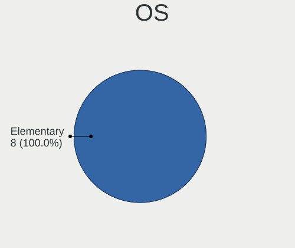

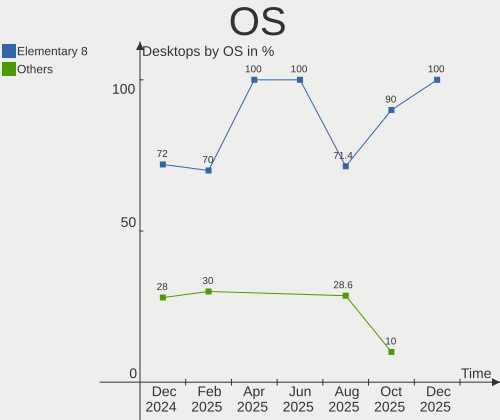

| Name         | Desktops | Percent |
|--------------|----------|---------|
| Elementary 8 | 5        | 100%    |

OS Family
---------

OS without a version

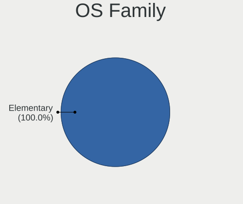

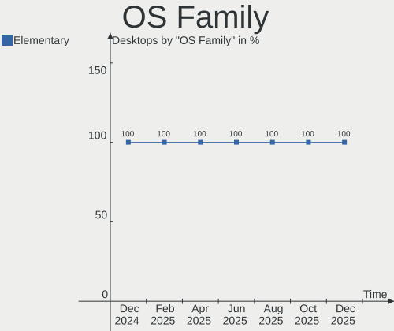

| Name       | Desktops | Percent |
|------------|----------|---------|
| Elementary | 5        | 100%    |

Kernel
------

Version of the Linux kernel

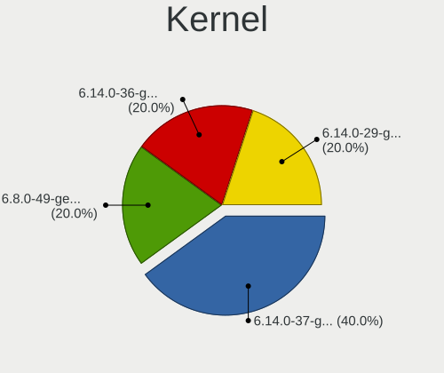

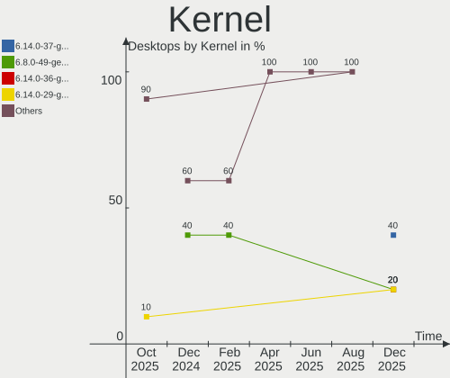

| Version           | Desktops | Percent |
|-------------------|----------|---------|
| 6.14.0-37-generic | 2        | 40%     |
| 6.8.0-49-generic  | 1        | 20%     |
| 6.14.0-36-generic | 1        | 20%     |
| 6.14.0-29-generic | 1        | 20%     |

Kernel Family
-------------

Linux kernel without a distro release

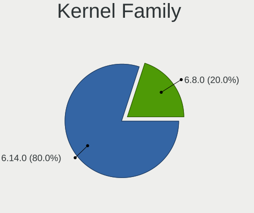

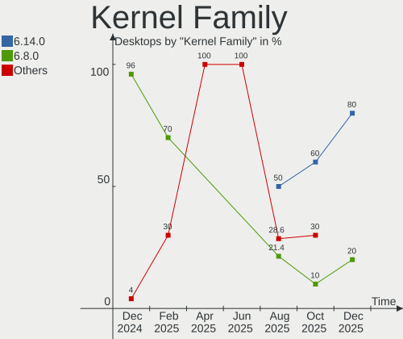

| Version | Desktops | Percent |
|---------|----------|---------|
| 6.14.0  | 4        | 80%     |
| 6.8.0   | 1        | 20%     |

Kernel Major Ver.
-----------------

Linux kernel major version

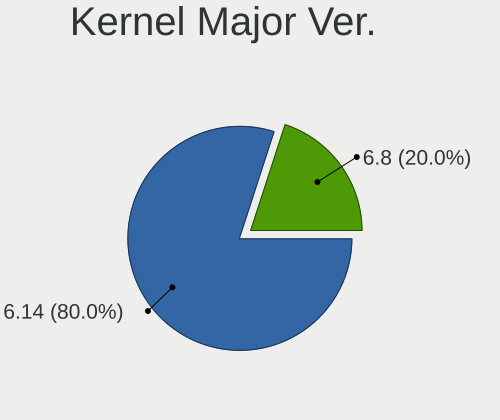

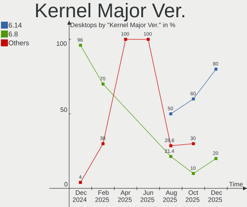

| Version | Desktops | Percent |
|---------|----------|---------|
| 6.14    | 4        | 80%     |
| 6.8     | 1        | 20%     |

Arch
----

OS architecture (x86_64, i586, etc.)

| Name   | Desktops | Percent |
|--------|----------|---------|
| x86_64 | 5        | 100%    |

DE
--

Desktop Environment

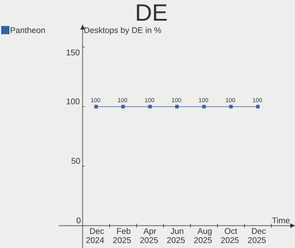

| Name     | Desktops | Percent |
|----------|----------|---------|
| Pantheon | 5        | 100%    |

Display Server
--------------

X11 or Wayland

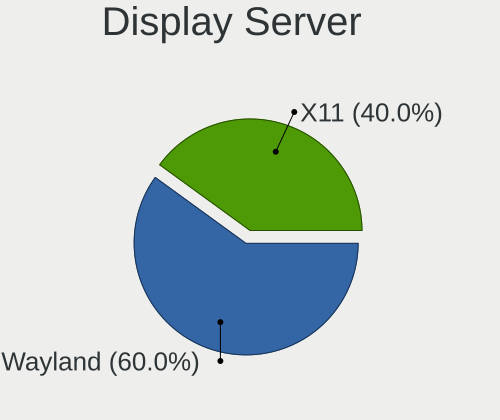

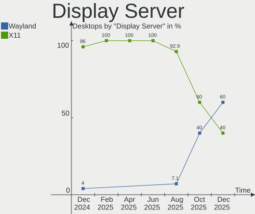

| Name    | Desktops | Percent |
|---------|----------|---------|
| Wayland | 3        | 60%     |
| X11     | 2        | 40%     |

Display Manager
---------------

SDDM, LightDM, etc.

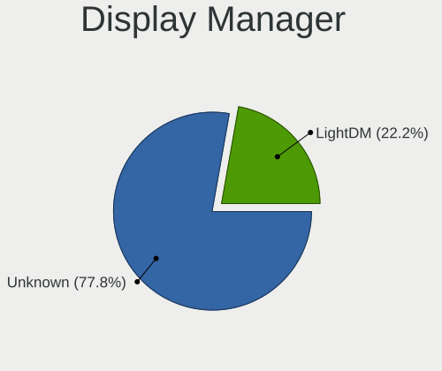

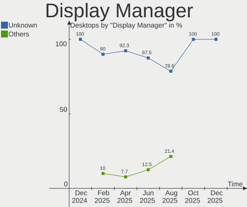

| Name    | Desktops | Percent |
|---------|----------|---------|
| Unknown | 5        | 100%    |

OS Lang
-------

Language

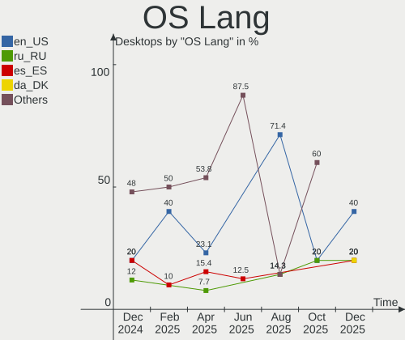

| Lang  | Desktops | Percent |
|-------|----------|---------|
| en_US | 2        | 40%     |
| ru_RU | 1        | 20%     |
| es_ES | 1        | 20%     |
| da_DK | 1        | 20%     |

Boot Mode
---------

EFI or BIOS

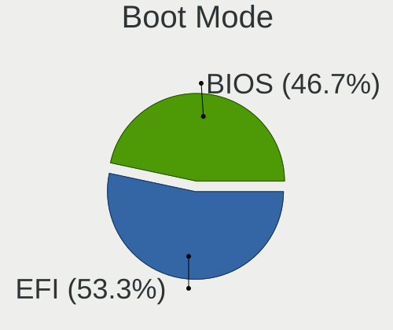

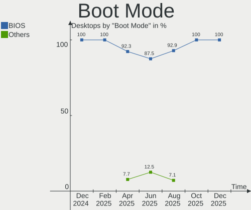

| Mode | Desktops | Percent |
|------|----------|---------|
| BIOS | 5        | 100%    |

Filesystem
----------

Type of filesystem

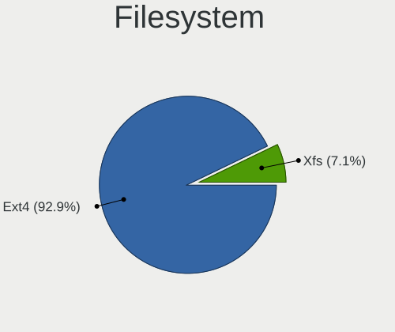

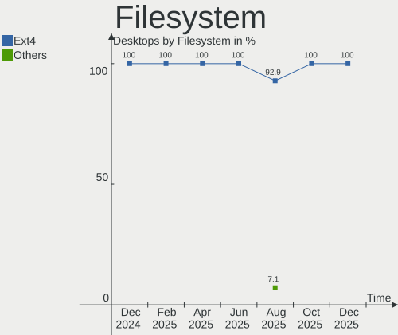

| Type | Desktops | Percent |
|------|----------|---------|
| Ext4 | 5        | 100%    |

Part. scheme
------------

Scheme of partitioning

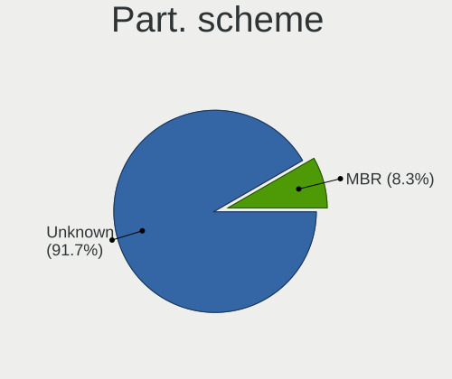

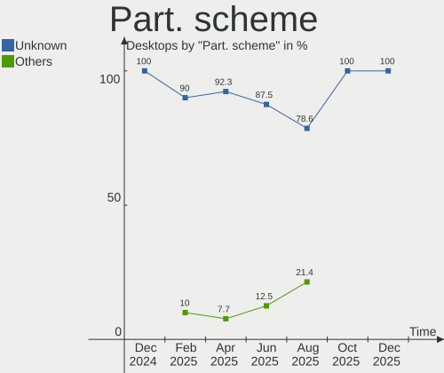

| Type    | Desktops | Percent |
|---------|----------|---------|
| Unknown | 5        | 100%    |

Dual Boot with Linux/BSD
------------------------

Hosting more than one Linux/BSD

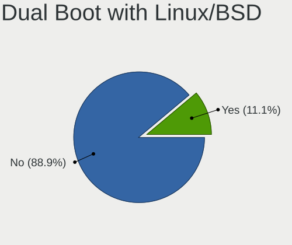

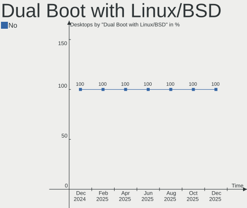

| Dual boot | Desktops | Percent |
|-----------|----------|---------|
| No        | 5        | 100%    |

Dual Boot (Win)
---------------

Hosting Linux and Windows

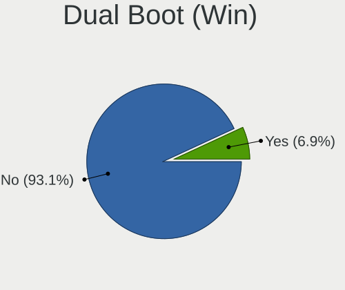

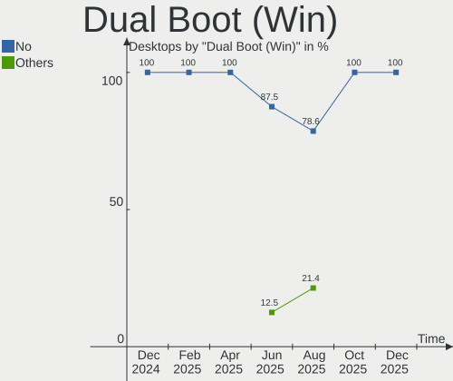

| Dual boot | Desktops | Percent |
|-----------|----------|---------|
| No        | 5        | 100%    |

Board
-----

Vendor
------

Motherboard manufacturer

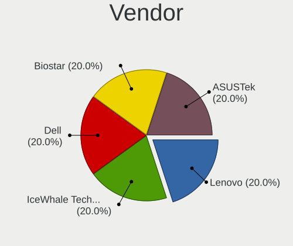

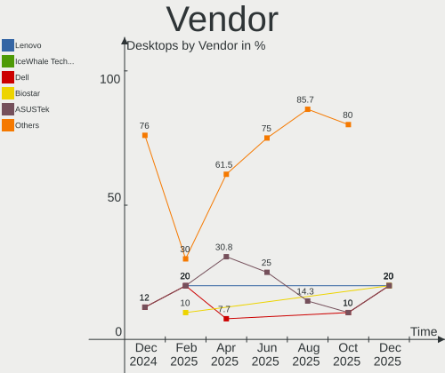

| Name                | Desktops | Percent |
|---------------------|----------|---------|
| Lenovo              | 1        | 20%     |
| IceWhale Technology | 1        | 20%     |
| Dell                | 1        | 20%     |
| Biostar             | 1        | 20%     |
| ASUSTek Computer    | 1        | 20%     |

Model
-----

Motherboard model

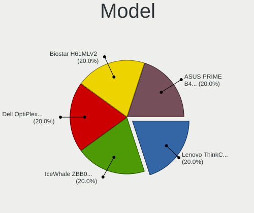

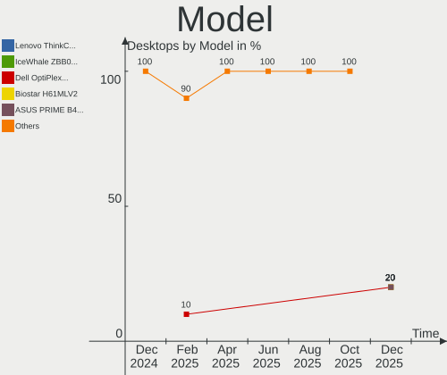

| Name                            | Desktops | Percent |
|---------------------------------|----------|---------|
| Lenovo ThinkCentre M92P 3237A1U | 1        | 20%     |
| IceWhale ZBB001-BK30032 ZMB     | 1        | 20%     |
| Dell OptiPlex 7010              | 1        | 20%     |
| Biostar H61MLV2                 | 1        | 20%     |
| ASUS PRIME B450M-A II           | 1        | 20%     |

Model Family
------------

Motherboard model prefix

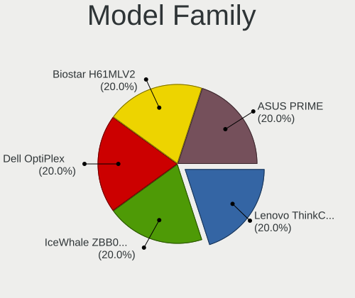

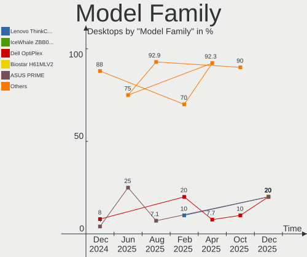

| Name                    | Desktops | Percent |
|-------------------------|----------|---------|
| Lenovo ThinkCentre      | 1        | 20%     |
| IceWhale ZBB001-BK30032 | 1        | 20%     |
| Dell OptiPlex           | 1        | 20%     |
| Biostar H61MLV2         | 1        | 20%     |
| ASUS PRIME              | 1        | 20%     |

MFG Year
--------

Motherboard manufacture year

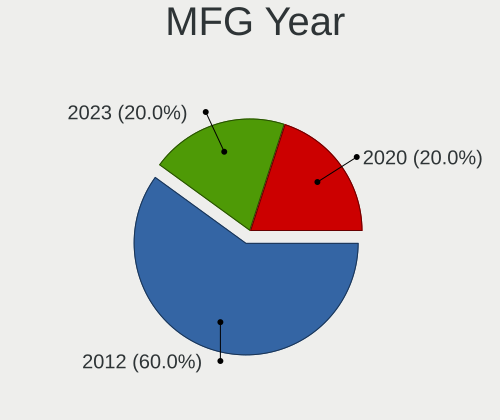

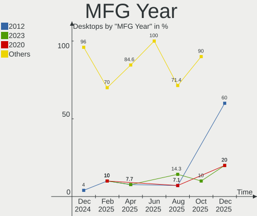

| Year | Desktops | Percent |
|------|----------|---------|
| 2012 | 3        | 60%     |
| 2023 | 1        | 20%     |
| 2020 | 1        | 20%     |

Form Factor
-----------

Physical design of the computer

| Name    | Desktops | Percent |
|---------|----------|---------|
| Desktop | 5        | 100%    |

Secure Boot
-----------

Enabled or disabled

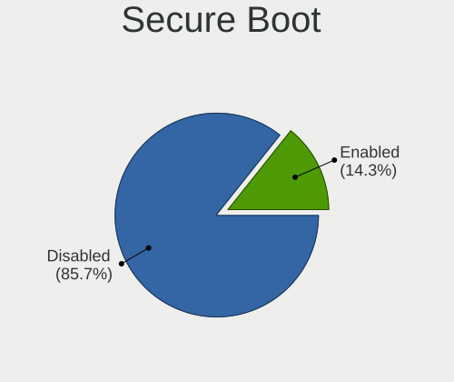

| State    | Desktops | Percent |
|----------|----------|---------|
| Disabled | 5        | 100%    |

Coreboot
--------

Have coreboot on board

| Used | Desktops | Percent |
|------|----------|---------|
| No   | 5        | 100%    |

RAM Size
--------

Total RAM memory

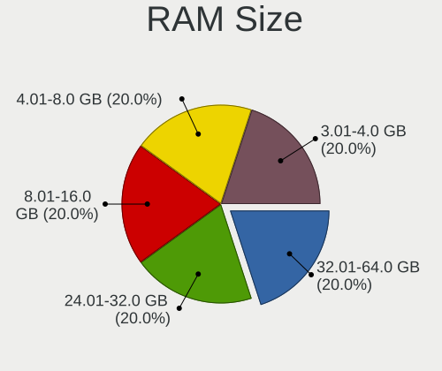

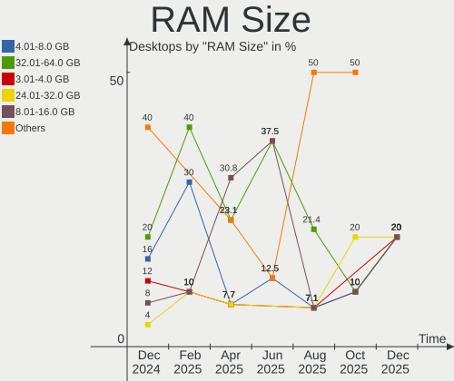

| Size in GB | Desktops | Percent |
|------------|----------|---------|
| 4.01-8.0   | 1        | 20%     |
| 32.01-64.0 | 1        | 20%     |
| 3.01-4.0   | 1        | 20%     |
| 24.01-32.0 | 1        | 20%     |
| 8.01-16.0  | 1        | 20%     |

RAM Used
--------

Used RAM memory

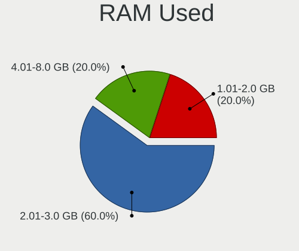

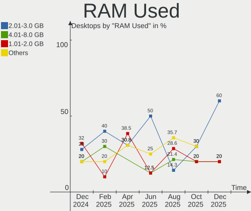

| Used GB  | Desktops | Percent |
|----------|----------|---------|
| 2.01-3.0 | 3        | 60%     |
| 4.01-8.0 | 1        | 20%     |
| 1.01-2.0 | 1        | 20%     |

Total Drives
------------

Number of drives on board

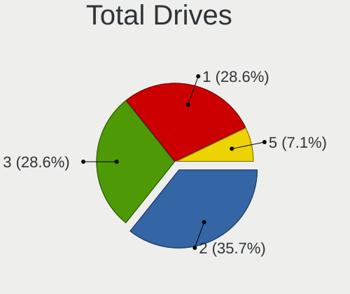

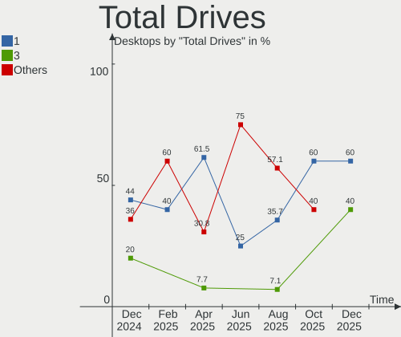

| Drives | Desktops | Percent |
|--------|----------|---------|
| 1      | 3        | 60%     |
| 3      | 2        | 40%     |

Has CD-ROM
----------

Has CD-ROM on board

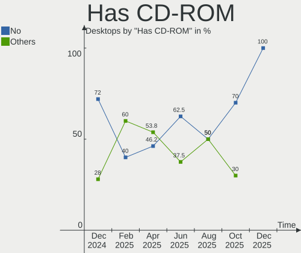

| Presented | Desktops | Percent |
|-----------|----------|---------|
| No        | 5        | 100%    |

Has Ethernet
------------

Has Ethernet on board

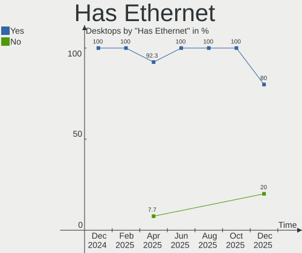

| Presented | Desktops | Percent |
|-----------|----------|---------|
| Yes       | 4        | 80%     |
| No        | 1        | 20%     |

Has WiFi
--------

Has WiFi module

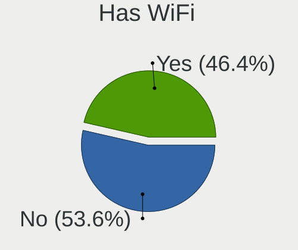

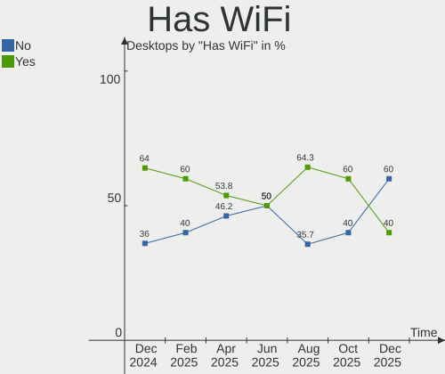

| Presented | Desktops | Percent |
|-----------|----------|---------|
| No        | 3        | 60%     |
| Yes       | 2        | 40%     |

Has Bluetooth
-------------

Has Bluetooth module

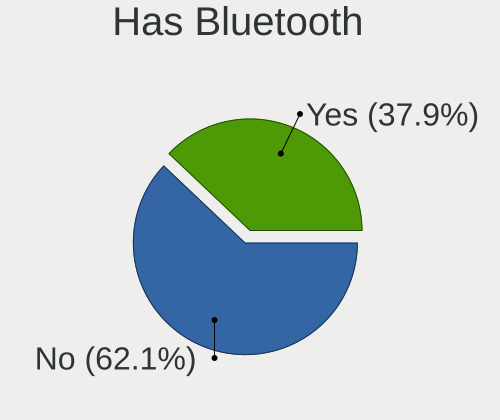

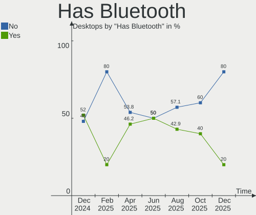

| Presented | Desktops | Percent |
|-----------|----------|---------|
| No        | 4        | 80%     |
| Yes       | 1        | 20%     |

Location
--------

Country
-------

Geographic location (country)

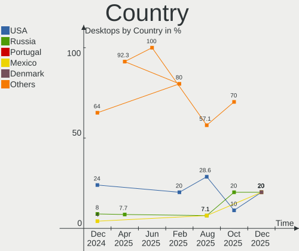

| Country  | Desktops | Percent |
|----------|----------|---------|
| USA      | 1        | 20%     |
| Russia   | 1        | 20%     |
| Portugal | 1        | 20%     |
| Mexico   | 1        | 20%     |
| Denmark  | 1        | 20%     |

City
----

Geographic location (city)

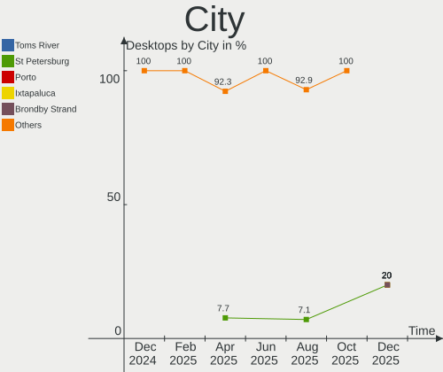

| City           | Desktops | Percent |
|----------------|----------|---------|
| Toms River     | 1        | 20%     |
| St Petersburg  | 1        | 20%     |
| Porto          | 1        | 20%     |
| Ixtapaluca     | 1        | 20%     |
| Brondby Strand | 1        | 20%     |

Drives
------

Drive Vendor
------------

Hard drive vendors

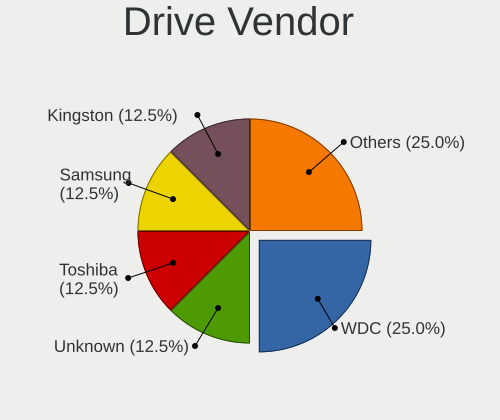

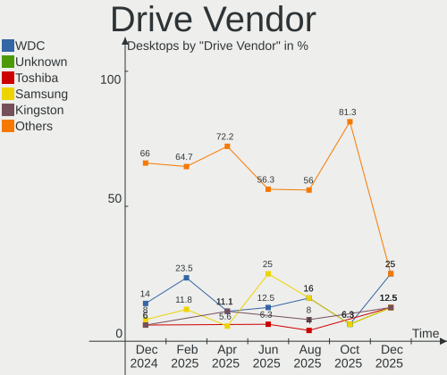

| Vendor              | Desktops | Drives | Percent |
|---------------------|----------|--------|---------|
| WDC                 | 2        | 2      | 25%     |
| Unknown             | 1        | 1      | 12.5%   |
| Toshiba             | 1        | 1      | 12.5%   |
| Samsung Electronics | 1        | 1      | 12.5%   |
| Kingston            | 1        | 2      | 12.5%   |
| Hitachi             | 1        | 1      | 12.5%   |
| A-DATA Technology   | 1        | 1      | 12.5%   |

Drive Model
-----------

Hard drive models

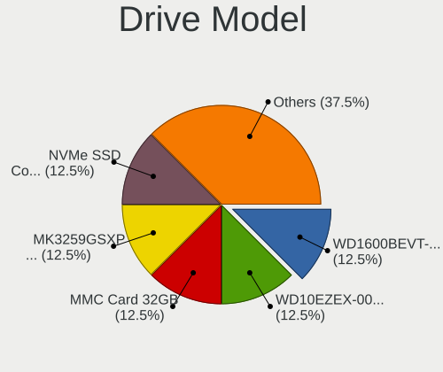

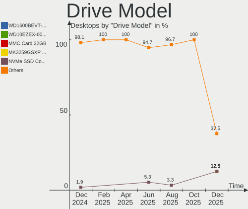

| Model                                             | Desktops | Percent |
|---------------------------------------------------|----------|---------|
| WDC WD1600BEVT-00A1TT0 160GB                      | 1        | 12.5%   |
| WDC WD10EZEX-00MFCA0 1TB                          | 1        | 12.5%   |
| Unknown MMC Card  32GB                            | 1        | 12.5%   |
| Toshiba MK3259GSXP 320GB                          | 1        | 12.5%   |
| Samsung NVMe SSD Controller SM981/PM981/PM983 1TB | 1        | 12.5%   |
| Kingston SA400S37240G 240GB SSD                   | 1        | 12.5%   |
| Hitachi HTS545050B9A300 500GB                     | 1        | 12.5%   |
| A-DATA SP600 256GB SSD                            | 1        | 12.5%   |

HDD Vendor
----------

Hard disk drive vendors

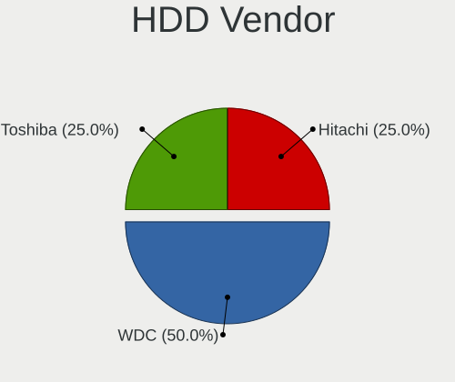

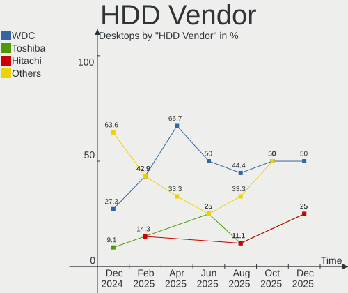

| Vendor  | Desktops | Drives | Percent |
|---------|----------|--------|---------|
| WDC     | 2        | 2      | 50%     |
| Toshiba | 1        | 1      | 25%     |
| Hitachi | 1        | 1      | 25%     |

SSD Vendor
----------

Solid state drive vendors

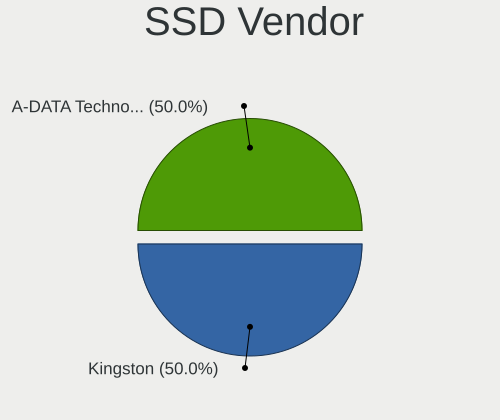

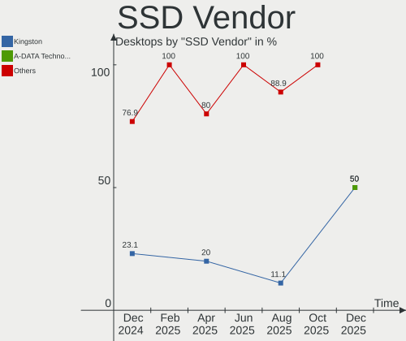

| Vendor            | Desktops | Drives | Percent |
|-------------------|----------|--------|---------|
| Kingston          | 1        | 2      | 50%     |
| A-DATA Technology | 1        | 1      | 50%     |

Drive Kind
----------

HDD or SSD

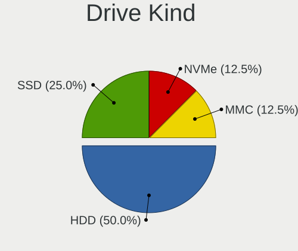

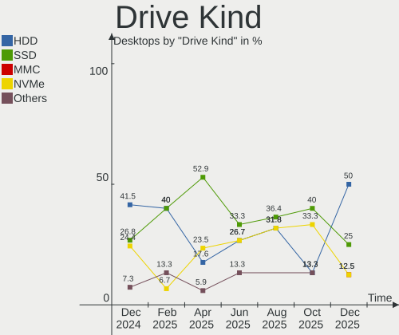

| Kind | Desktops | Drives | Percent |
|------|----------|--------|---------|
| HDD  | 4        | 4      | 50%     |
| SSD  | 2        | 3      | 25%     |
| MMC  | 1        | 1      | 12.5%   |
| NVMe | 1        | 1      | 12.5%   |

Drive Connector
---------------

SATA, SAS, NVMe, etc.

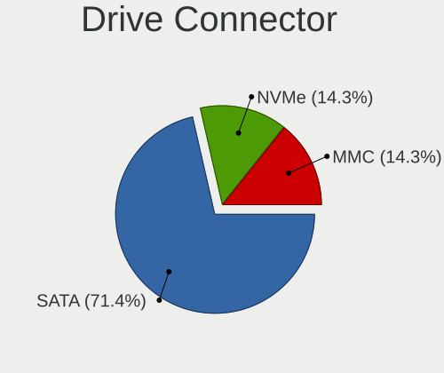

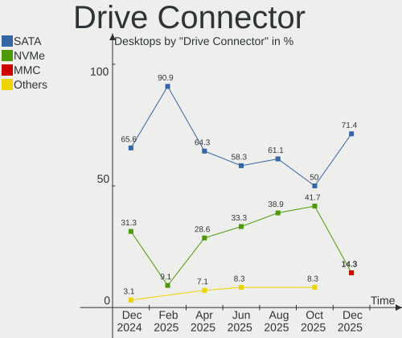

| Type | Desktops | Drives | Percent |
|------|----------|--------|---------|
| SATA | 5        | 7      | 71.43%  |
| NVMe | 1        | 1      | 14.29%  |
| MMC  | 1        | 1      | 14.29%  |

Drive Size
----------

Size of hard drive

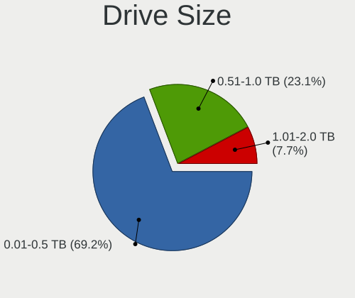

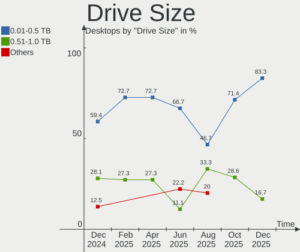

| Size in TB | Desktops | Drives | Percent |
|------------|----------|--------|---------|
| 0.01-0.5   | 5        | 6      | 83.33%  |
| 0.51-1.0   | 1        | 1      | 16.67%  |

Space Total
-----------

Amount of disk space available on the file system

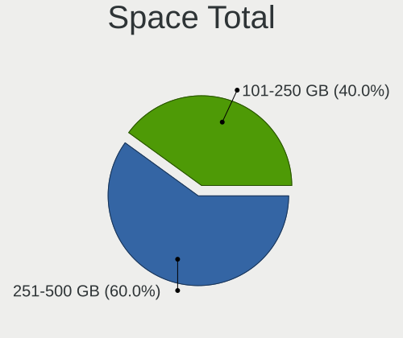

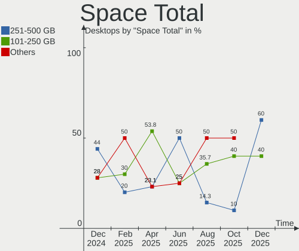

| Size in GB | Desktops | Percent |
|------------|----------|---------|
| 251-500    | 3        | 60%     |
| 101-250    | 2        | 40%     |

Space Used
----------

Amount of used disk space

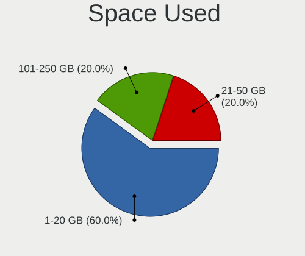

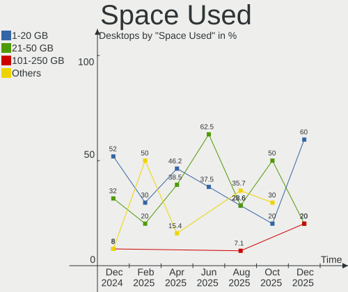

| Used GB | Desktops | Percent |
|---------|----------|---------|
| 1-20    | 3        | 60%     |
| 21-50   | 1        | 20%     |
| 101-250 | 1        | 20%     |

Malfunc. Drives
---------------

Drive models with a malfunction

Zero info for selected period =(

Malfunc. Drive Vendor
---------------------

Vendors of faulty drives

Zero info for selected period =(

Malfunc. HDD Vendor
-------------------

Vendors of faulty HDD drives

Zero info for selected period =(

Malfunc. Drive Kind
-------------------

Kinds of faulty drives

Zero info for selected period =(

Failed Drives
-------------

Failed drive models

Zero info for selected period =(

Failed Drive Vendor
-------------------

Failed drive vendors

Zero info for selected period =(

Drive Status
------------

Number of failed and malfunc. drives

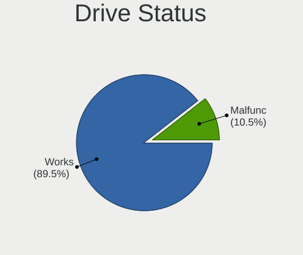

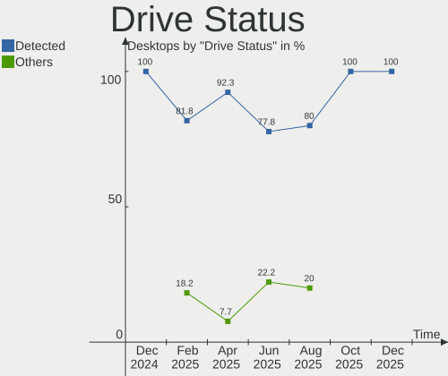

| Status   | Desktops | Drives | Percent |
|----------|----------|--------|---------|
| Detected | 5        | 9      | 100%    |

Storage controller
------------------

Storage Vendor
--------------

Storage controller vendors

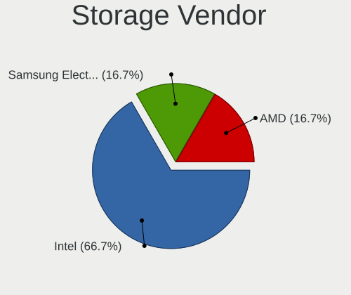

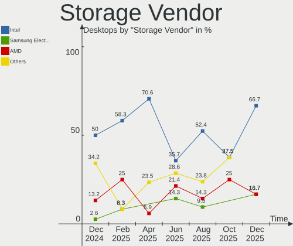

| Vendor              | Desktops | Percent |
|---------------------|----------|---------|
| Intel               | 4        | 66.67%  |
| Samsung Electronics | 1        | 16.67%  |
| AMD                 | 1        | 16.67%  |

Storage Model
-------------

Storage controller models

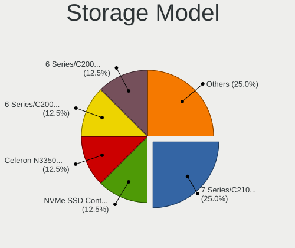

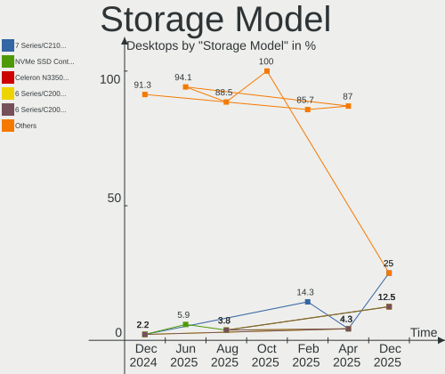

| Model                                                                                   | Desktops | Percent |
|-----------------------------------------------------------------------------------------|----------|---------|
| Intel 7 Series/C210 Series Chipset Family 6-port SATA Controller [AHCI mode]            | 2        | 25%     |
| Samsung NVMe SSD Controller SM981/PM981/PM983                                           | 1        | 12.5%   |
| Intel Celeron N3350/Pentium N4200/Atom E3900 Series SATA AHCI Controller                | 1        | 12.5%   |
| Intel 6 Series/C200 Series Chipset Family Desktop SATA Controller (IDE mode, ports 4-5) | 1        | 12.5%   |
| Intel 6 Series/C200 Series Chipset Family Desktop SATA Controller (IDE mode, ports 0-3) | 1        | 12.5%   |
| AMD FCH SATA Controller [AHCI mode]                                                     | 1        | 12.5%   |
| AMD 400 Series Chipset SATA Controller                                                  | 1        | 12.5%   |

Storage Kind
------------

Kind of storage controller (IDE, SATA, NVMe, SAS, ...)

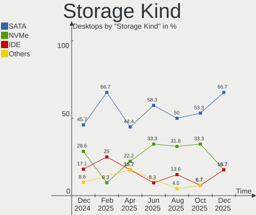

| Kind | Desktops | Percent |
|------|----------|---------|
| SATA | 4        | 66.67%  |
| NVMe | 1        | 16.67%  |
| IDE  | 1        | 16.67%  |

Processor
---------

CPU Vendor
----------

Processor vendors

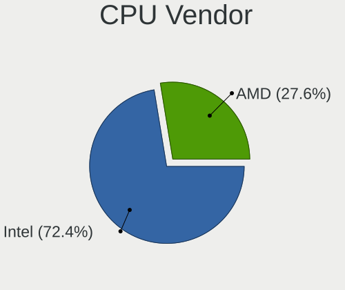

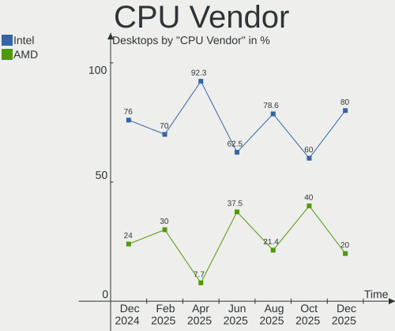

| Vendor | Desktops | Percent |
|--------|----------|---------|
| Intel  | 4        | 80%     |
| AMD    | 1        | 20%     |

CPU Model
---------

Processor models

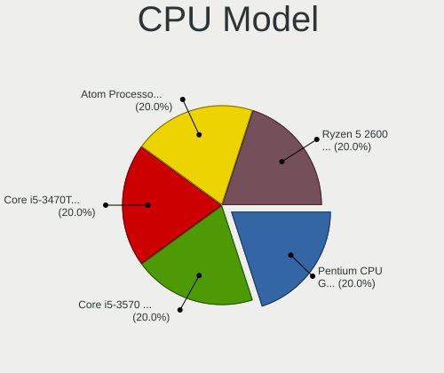

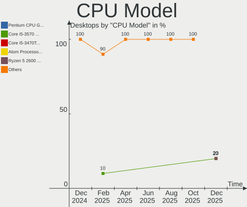

| Model                                | Desktops | Percent |
|--------------------------------------|----------|---------|
| Intel Pentium CPU G2020 @ 2.90GHz    | 1        | 20%     |
| Intel Core i5-3570 CPU @ 3.40GHz     | 1        | 20%     |
| Intel Core i5-3470T CPU @ 2.90GHz    | 1        | 20%     |
| Intel Atom Processor E3950 @ 1.60GHz | 1        | 20%     |
| AMD Ryzen 5 2600 Six-Core Processor  | 1        | 20%     |

CPU Model Family
----------------

Processor model prefix

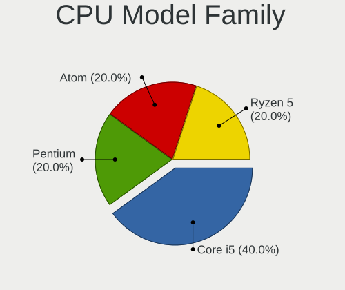

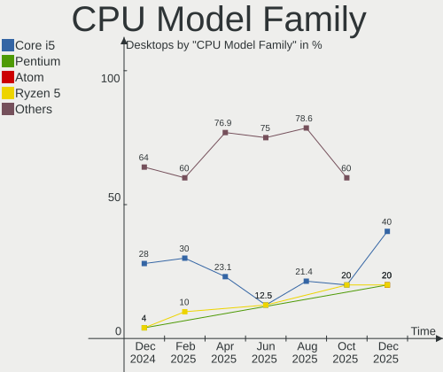

| Model         | Desktops | Percent |
|---------------|----------|---------|
| Intel Core i5 | 2        | 40%     |
| Intel Pentium | 1        | 20%     |
| Intel Atom    | 1        | 20%     |
| AMD Ryzen 5   | 1        | 20%     |

CPU Cores
---------

Number of processor cores

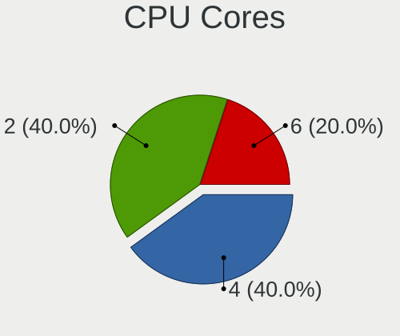

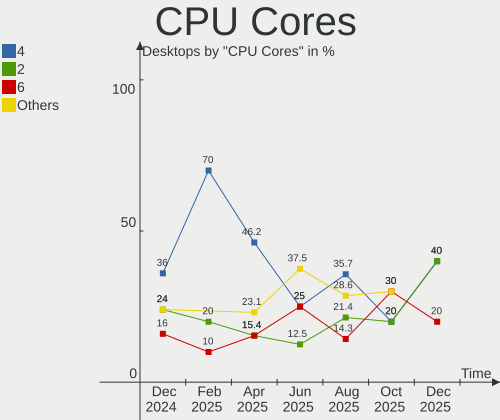

| Number | Desktops | Percent |
|--------|----------|---------|
| 4      | 2        | 40%     |
| 2      | 2        | 40%     |
| 6      | 1        | 20%     |

CPU Sockets
-----------

Number of sockets

| Number | Desktops | Percent |
|--------|----------|---------|
| 1      | 5        | 100%    |

CPU Threads
-----------

Threads per core (Hyper-Threading)

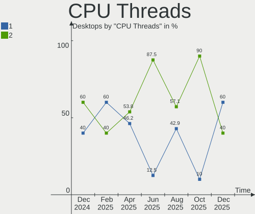

| Number | Desktops | Percent |
|--------|----------|---------|
| 1      | 3        | 60%     |
| 2      | 2        | 40%     |

CPU Op-Modes
------------

CPU Operation Modes (32-bit, 64-bit)

| Op mode        | Desktops | Percent |
|----------------|----------|---------|
| 32-bit, 64-bit | 5        | 100%    |

CPU Microcode
-------------

Microcode number

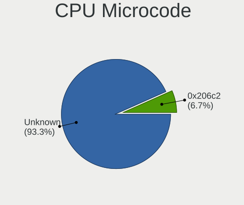

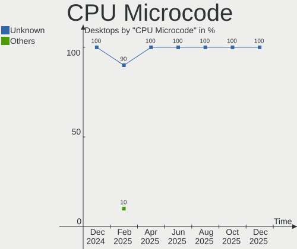

| Number  | Desktops | Percent |
|---------|----------|---------|
| Unknown | 5        | 100%    |

CPU Microarch
-------------

Microarchitecture

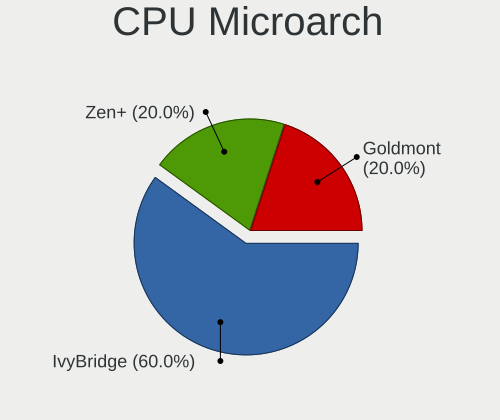

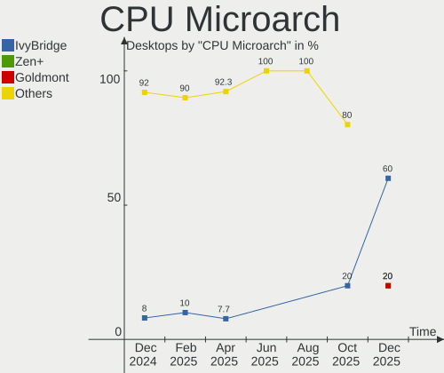

| Name      | Desktops | Percent |
|-----------|----------|---------|
| IvyBridge | 3        | 60%     |
| Zen+      | 1        | 20%     |
| Goldmont  | 1        | 20%     |

Graphics
--------

GPU Vendor
----------

Vendors of graphics cards

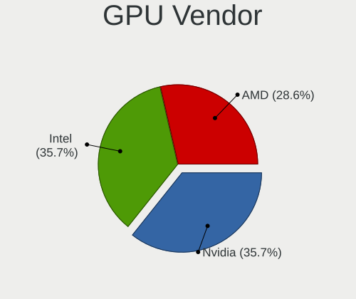

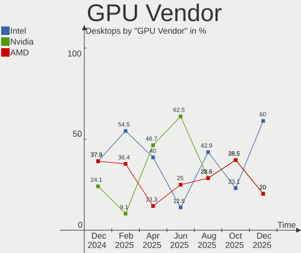

| Vendor | Desktops | Percent |
|--------|----------|---------|
| Intel  | 3        | 60%     |
| Nvidia | 1        | 20%     |
| AMD    | 1        | 20%     |

GPU Model
---------

Graphics card models

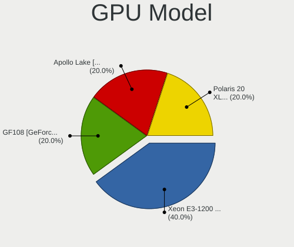

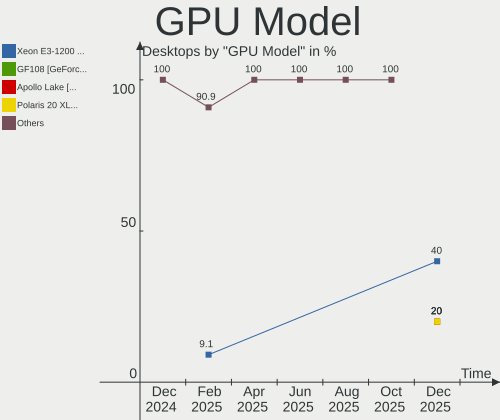

| Model                                                            | Desktops | Percent |
|------------------------------------------------------------------|----------|---------|
| Intel Xeon E3-1200 v2/3rd Gen Core processor Graphics Controller | 2        | 40%     |
| Nvidia GF108 [GeForce GT 730]                                    | 1        | 20%     |
| Intel Apollo Lake [HD Graphics 505]                              | 1        | 20%     |
| AMD Polaris 20 XL [Radeon RX 580 2048SP]                         | 1        | 20%     |

GPU Combo
---------

Combinations of graphics cards

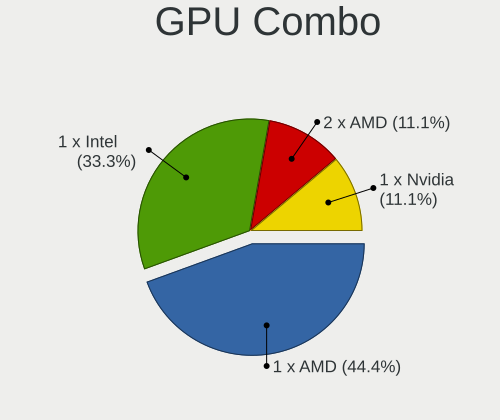

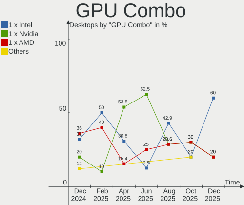

| Name       | Desktops | Percent |
|------------|----------|---------|
| 1 x Intel  | 3        | 60%     |
| 1 x Nvidia | 1        | 20%     |
| 1 x AMD    | 1        | 20%     |

GPU Driver
----------

Free vs proprietary

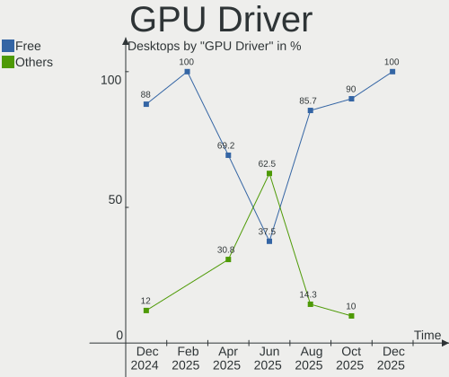

| Driver | Desktops | Percent |
|--------|----------|---------|
| Free   | 5        | 100%    |

GPU Memory
----------

Total video memory

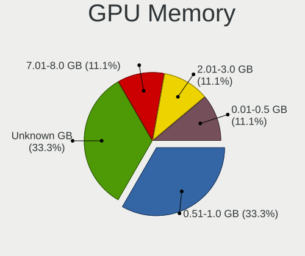

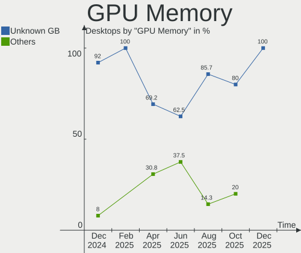

| Size in GB | Desktops | Percent |
|------------|----------|---------|
| Unknown    | 5        | 100%    |

Monitor
-------

Monitor Vendor
--------------

Monitor vendors

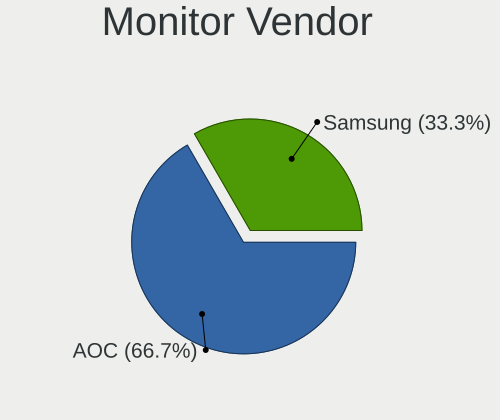

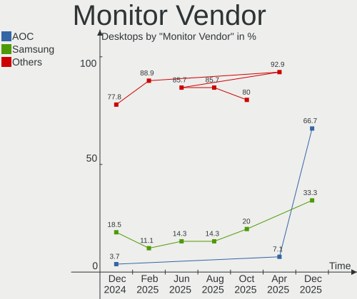

| Vendor              | Desktops | Percent |
|---------------------|----------|---------|
| AOC                 | 2        | 66.67%  |
| Samsung Electronics | 1        | 33.33%  |

Monitor Model
-------------

Monitor models

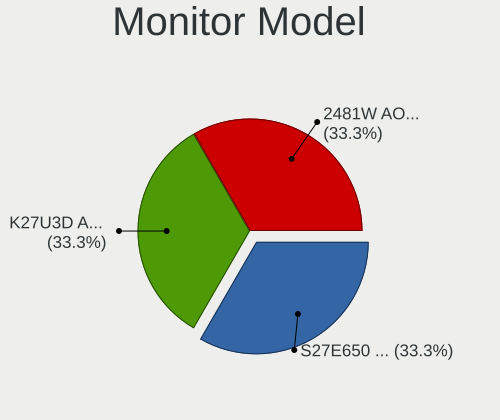

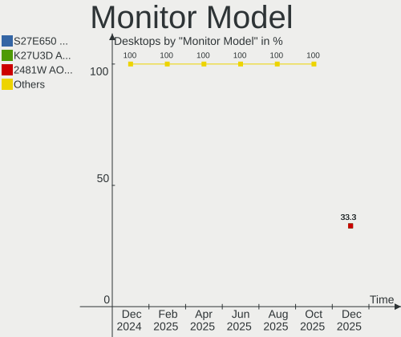

| Model                                                             | Desktops | Percent |
|-------------------------------------------------------------------|----------|---------|
| Samsung Electronics S27E650 SAM0CC9 1920x1080 598x336mm 27.0-inch | 1        | 33.33%  |
| AOC K27U3D AOC2703 3840x2160 597x336mm 27.0-inch                  | 1        | 33.33%  |
| AOC 2481W AOC2481 1920x1080 527x296mm 23.8-inch                   | 1        | 33.33%  |

Monitor Resolution
------------------

Monitor screen resolution

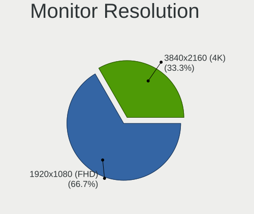

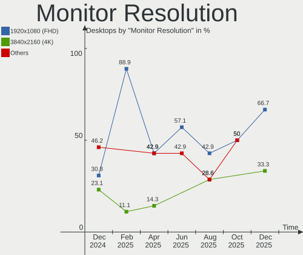

| Resolution      | Desktops | Percent |
|-----------------|----------|---------|
| 1920x1080 (FHD) | 2        | 66.67%  |
| 3840x2160 (4K)  | 1        | 33.33%  |

Monitor Diagonal
----------------

Diagonal size in inches

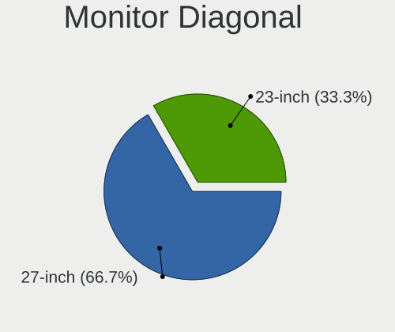

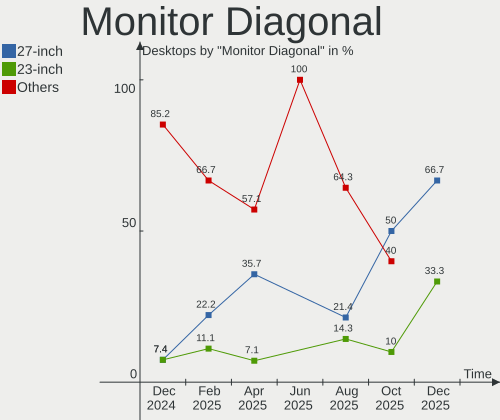

| Inches | Desktops | Percent |
|--------|----------|---------|
| 27     | 2        | 66.67%  |
| 23     | 1        | 33.33%  |

Monitor Width
-------------

Physical width

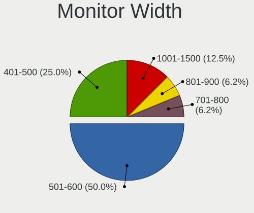

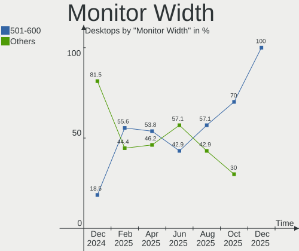

| Width in mm | Desktops | Percent |
|-------------|----------|---------|
| 501-600     | 3        | 100%    |

Aspect Ratio
------------

Proportional relationship between the width and the height

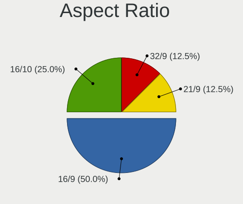

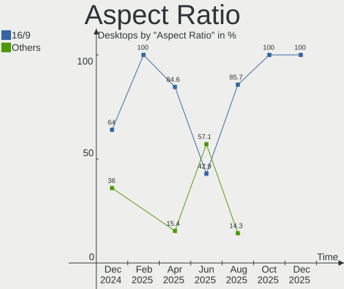

| Ratio | Desktops | Percent |
|-------|----------|---------|
| 16/9  | 3        | 100%    |

Monitor Area
------------

Area in inch²

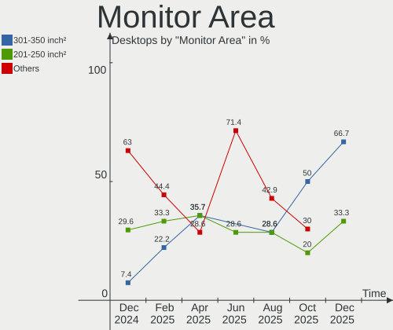

| Area in inch² | Desktops | Percent |
|----------------|----------|---------|
| 301-350        | 2        | 66.67%  |
| 201-250        | 1        | 33.33%  |

Pixel Density
-------------

Pixels per inch

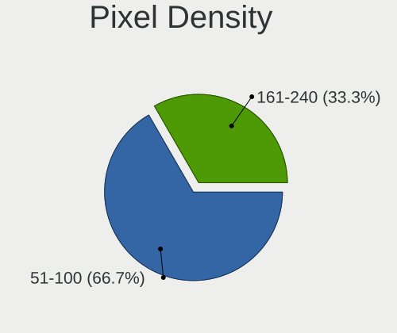

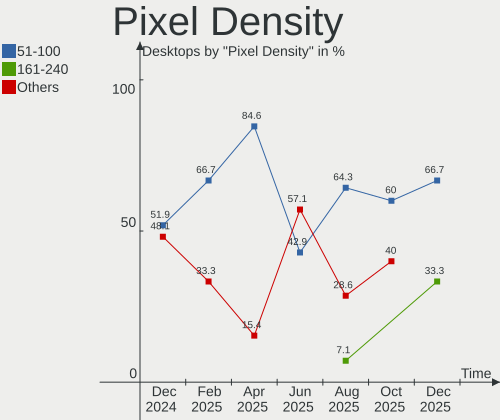

| Density | Desktops | Percent |
|---------|----------|---------|
| 51-100  | 2        | 66.67%  |
| 161-240 | 1        | 33.33%  |

Multiple Monitors
-----------------

Total monitors connected

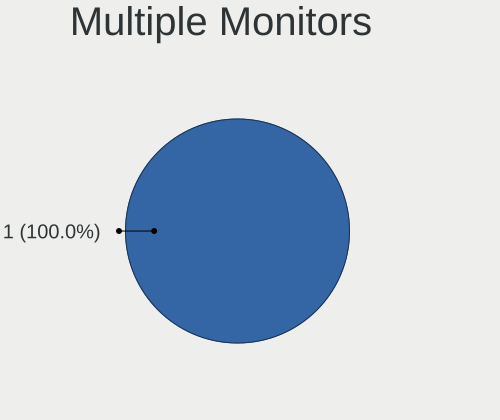

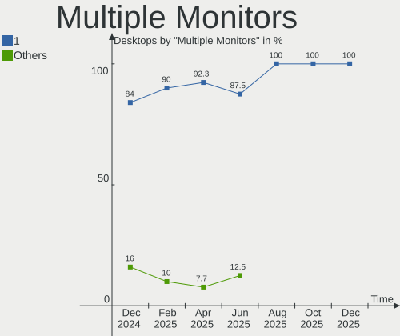

| Total | Desktops | Percent |
|-------|----------|---------|
| 1     | 5        | 100%    |

Network
-------

Net Controller Vendor
---------------------

Controller vendors

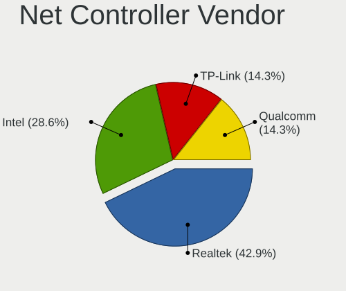

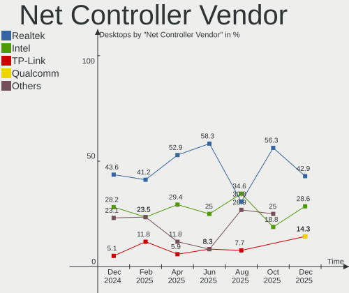

| Vendor                | Desktops | Percent |
|-----------------------|----------|---------|
| Realtek Semiconductor | 3        | 42.86%  |
| Intel                 | 2        | 28.57%  |
| TP-Link               | 1        | 14.29%  |
| Qualcomm              | 1        | 14.29%  |

Net Controller Model
--------------------

Controller models

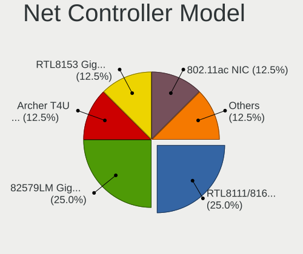

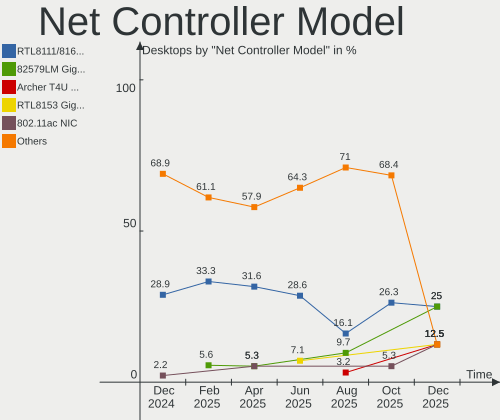

| Model                                                                  | Desktops | Percent |
|------------------------------------------------------------------------|----------|---------|
| Realtek RTL8111/8168/8211/8411 PCI Express Gigabit Ethernet Controller | 2        | 25%     |
| Intel 82579LM Gigabit Network Connection (Lewisville)                  | 2        | 25%     |
| TP-Link Archer T4U v2 [Realtek RTL8812AU]                              | 1        | 12.5%   |
| Realtek RTL8153 Gigabit Ethernet Adapter                               | 1        | 12.5%   |
| Realtek 802.11ac NIC                                                   | 1        | 12.5%   |
| Qualcomm YUPIK-QRD _SN:AC1D5909                                        | 1        | 12.5%   |

Wireless Vendor
---------------

Wireless vendors

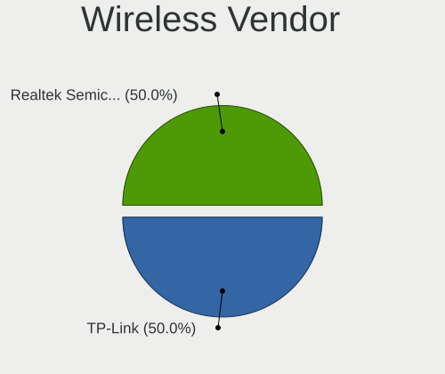

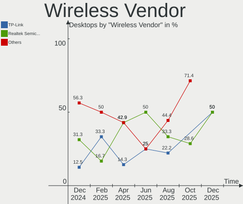

| Vendor                | Desktops | Percent |
|-----------------------|----------|---------|
| TP-Link               | 1        | 50%     |
| Realtek Semiconductor | 1        | 50%     |

Wireless Model
--------------

Wireless models

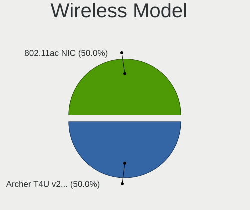

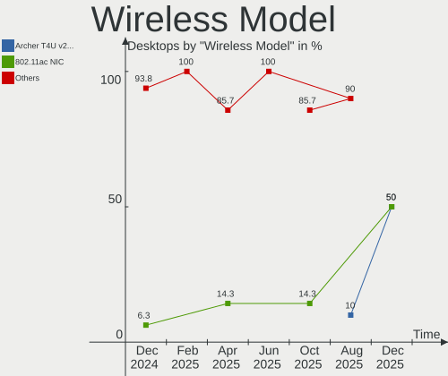

| Model                                     | Desktops | Percent |
|-------------------------------------------|----------|---------|
| TP-Link Archer T4U v2 [Realtek RTL8812AU] | 1        | 50%     |
| Realtek 802.11ac NIC                      | 1        | 50%     |

Ethernet Vendor
---------------

Ethernet vendors

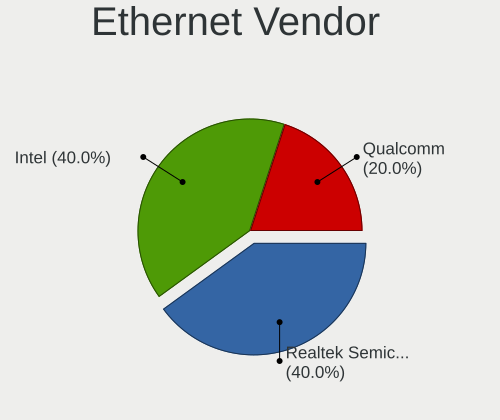

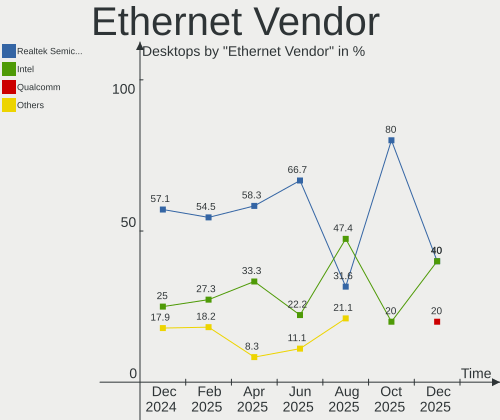

| Vendor                | Desktops | Percent |
|-----------------------|----------|---------|
| Realtek Semiconductor | 2        | 40%     |
| Intel                 | 2        | 40%     |
| Qualcomm              | 1        | 20%     |

Ethernet Model
--------------

Ethernet models

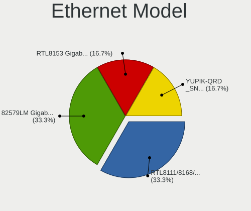

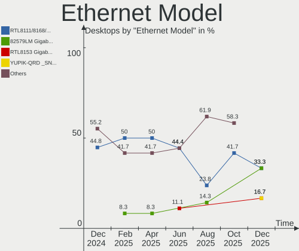

| Model                                                                  | Desktops | Percent |
|------------------------------------------------------------------------|----------|---------|
| Realtek RTL8111/8168/8211/8411 PCI Express Gigabit Ethernet Controller | 2        | 33.33%  |
| Intel 82579LM Gigabit Network Connection (Lewisville)                  | 2        | 33.33%  |
| Realtek RTL8153 Gigabit Ethernet Adapter                               | 1        | 16.67%  |
| Qualcomm YUPIK-QRD _SN:AC1D5909                                        | 1        | 16.67%  |

Net Controller Kind
-------------------

Ethernet, WiFi or modem

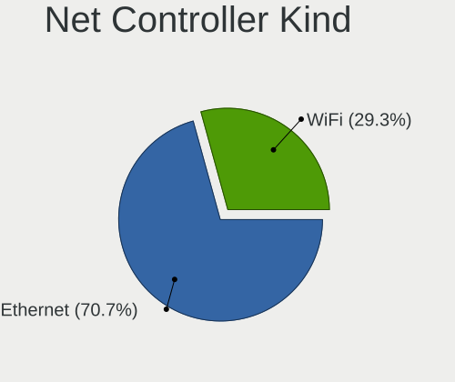

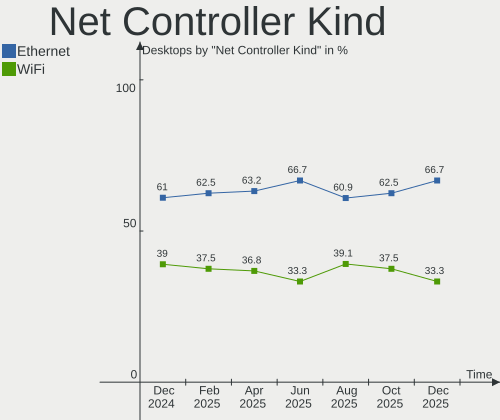

| Kind     | Desktops | Percent |
|----------|----------|---------|
| Ethernet | 4        | 66.67%  |
| WiFi     | 2        | 33.33%  |

Used Controller
---------------

Currently used network controller

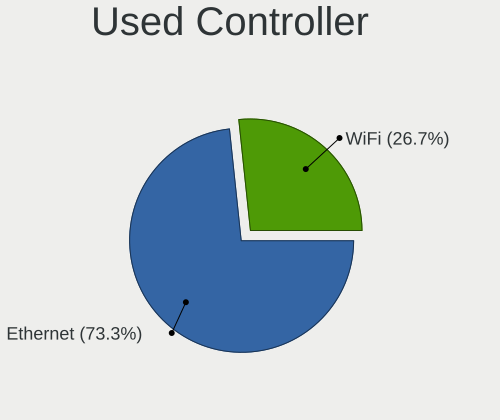

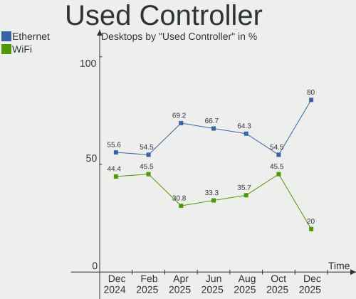

| Kind     | Desktops | Percent |
|----------|----------|---------|
| Ethernet | 4        | 80%     |
| WiFi     | 1        | 20%     |

NICs
----

Total network controllers on board

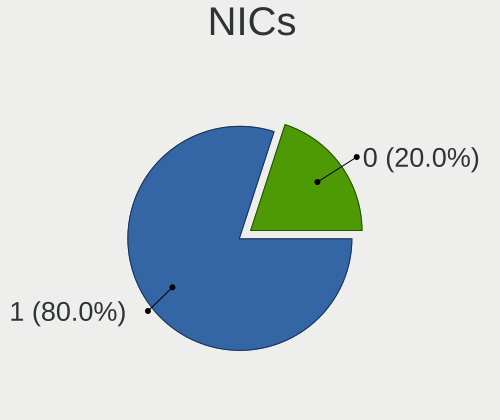

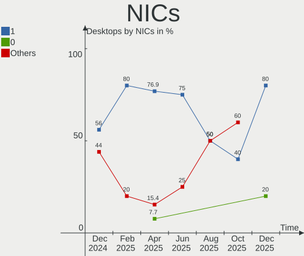

| Total | Desktops | Percent |
|-------|----------|---------|
| 1     | 4        | 80%     |
| 0     | 1        | 20%     |

IPv6
----

IPv6 vs IPv4

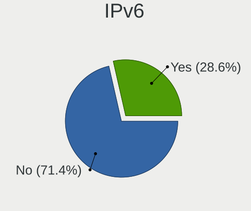

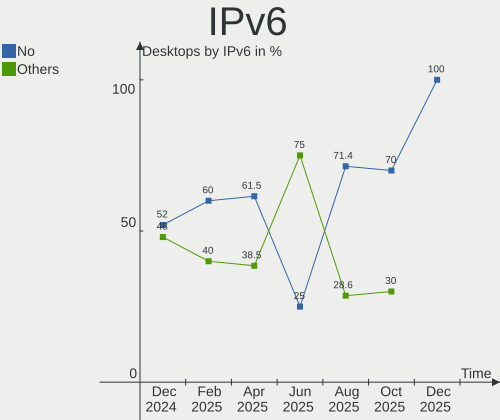

| Used | Desktops | Percent |
|------|----------|---------|
| No   | 5        | 100%    |

Bluetooth
---------

Bluetooth Vendor
----------------

Controller vendors

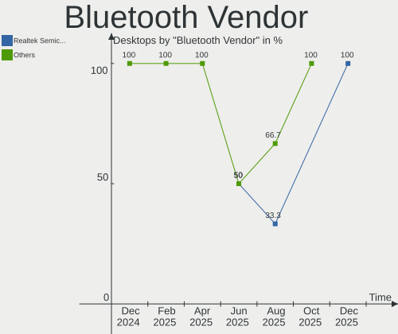

| Vendor                | Desktops | Percent |
|-----------------------|----------|---------|
| Realtek Semiconductor | 1        | 100%    |

Bluetooth Model
---------------

Controller models

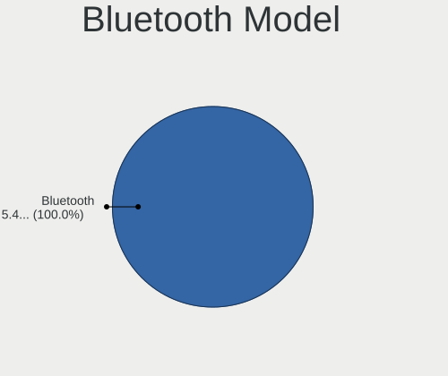

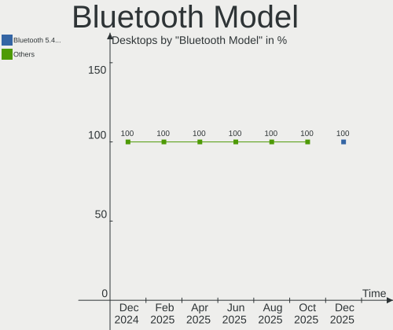

| Model                       | Desktops | Percent |
|-----------------------------|----------|---------|
| Realtek Bluetooth 5.4 Radio | 1        | 100%    |

Sound
-----

Sound Vendor
------------

Sound card vendors

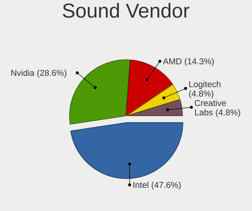

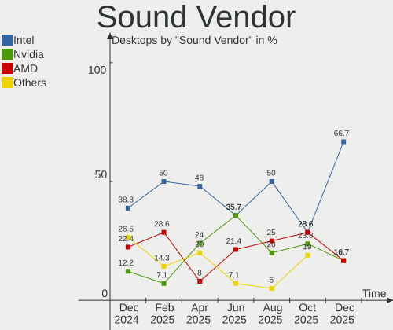

| Vendor | Desktops | Percent |
|--------|----------|---------|
| Intel  | 4        | 66.67%  |
| Nvidia | 1        | 16.67%  |
| AMD    | 1        | 16.67%  |

Sound Model
-----------

Sound card models

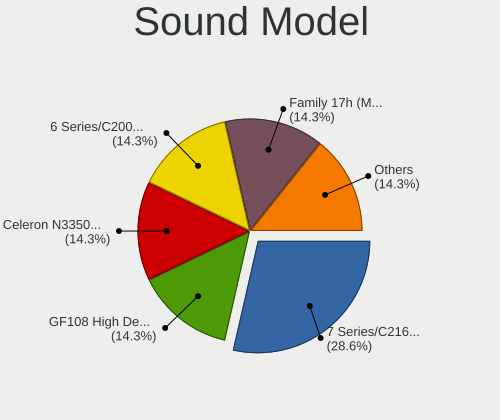

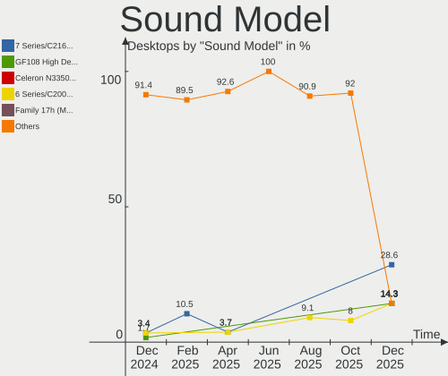

| Model                                                                      | Desktops | Percent |
|----------------------------------------------------------------------------|----------|---------|
| Intel 7 Series/C216 Chipset Family High Definition Audio Controller        | 2        | 28.57%  |
| Nvidia GF108 High Definition Audio Controller                              | 1        | 14.29%  |
| Intel Celeron N3350/Pentium N4200/Atom E3900 Series Audio Cluster          | 1        | 14.29%  |
| Intel 6 Series/C200 Series Chipset Family High Definition Audio Controller | 1        | 14.29%  |
| AMD Family 17h (Models 00h-0fh) HD Audio Controller                        | 1        | 14.29%  |
| AMD Ellesmere HDMI Audio [Radeon RX 470/480 / 570/580/590]                 | 1        | 14.29%  |

Memory
------

Memory Vendor
-------------

Memory module vendors

Zero info for selected period =(

Memory Model
------------

Memory module models

Zero info for selected period =(

Memory Kind
-----------

Memory module kinds

Zero info for selected period =(

Memory Form Factor
------------------

Physical design of the memory module

Zero info for selected period =(

Memory Size
-----------

Memory module size

Zero info for selected period =(

Memory Speed
------------

Memory module speed

Zero info for selected period =(

Printers & scanners
-------------------

Printer Vendor
--------------

Printer device vendors

Zero info for selected period =(

Printer Model
-------------

Printer device models

Zero info for selected period =(

Scanner Vendor
--------------

Scanner device vendors

Zero info for selected period =(

Scanner Model
-------------

Scanner device models

Zero info for selected period =(

Camera
------

Camera Vendor
-------------

Camera device vendors

Zero info for selected period =(

Camera Model
------------

Camera device models

Zero info for selected period =(

Security
--------

Fingerprint Vendor
------------------

Fingerprint sensor vendors

Zero info for selected period =(

Fingerprint Model
-----------------

Fingerprint sensor models

Zero info for selected period =(

Chipcard Vendor
---------------

Chipcard module vendors

Zero info for selected period =(

Chipcard Model
--------------

Chipcard module models

Zero info for selected period =(

Unsupported
-----------

Unsupported Devices
-------------------

Total unsupported devices on board

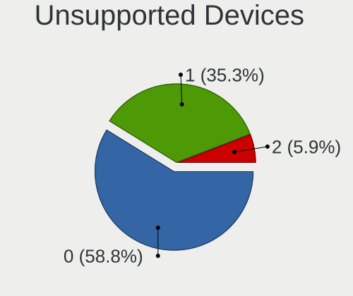

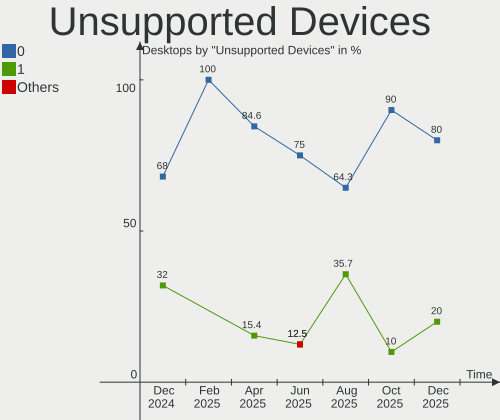

| Total | Desktops | Percent |
|-------|----------|---------|
| 0     | 4        | 80%     |
| 1     | 1        | 20%     |

Unsupported Device Types
------------------------

Types of unsupported devices

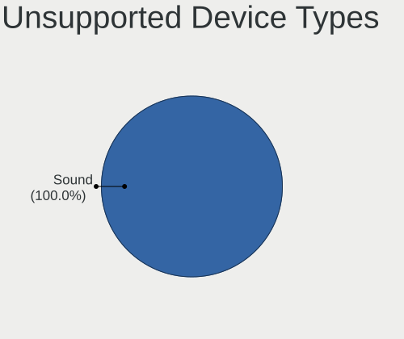

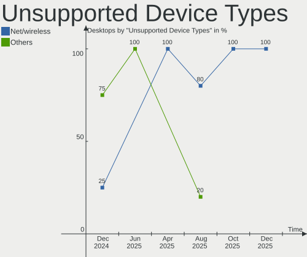

| Type         | Desktops | Percent |
|--------------|----------|---------|
| Net/wireless | 1        | 100%    |

