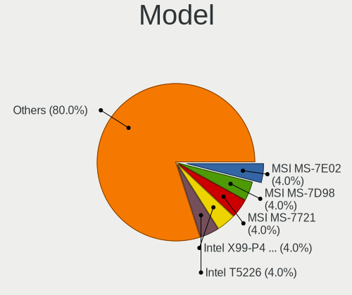
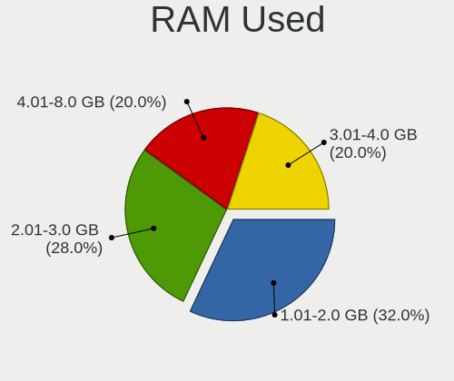
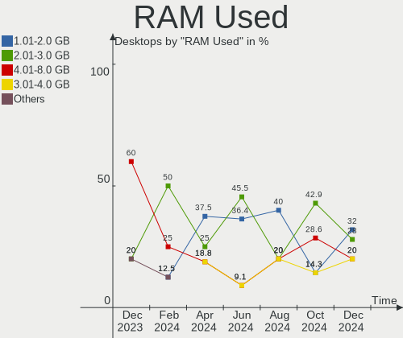
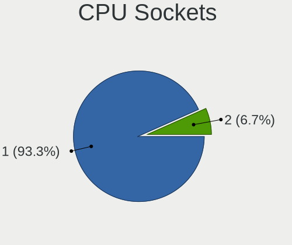
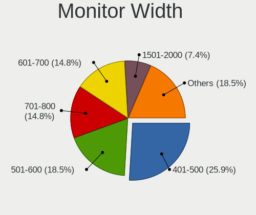
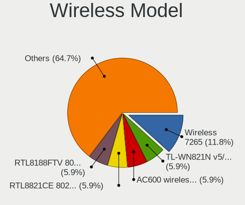
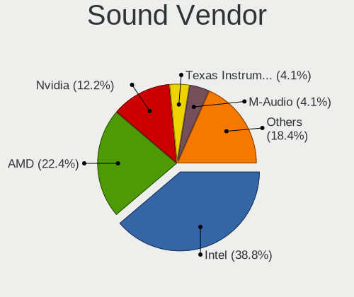
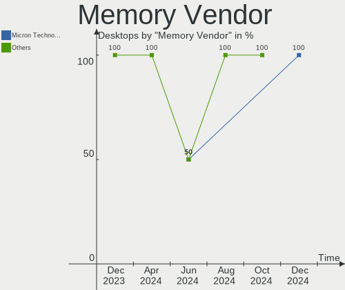

Elementary - Hardware Trends (Desktops)
---------------------------------------

A project to identify most popular hardware characteristics and track their change
over time based on data collected by Linux users at https://Linux-Hardware.org.

Anyone can contribute to this report by the [hw-probe](https://github.com/linuxhw/hw-probe) tool:

    sudo -E hw-probe -all -upload

This report is for one last month. Overall report since the beginning of time: [TestCoverage](https://github.com/linuxhw/TestCoverage)

Period: Nov, 2022.

Contents
--------

* [ System ](#system)
  - [ OS                       ](#os)
  - [ OS Family                ](#os-family)
  - [ Kernel                   ](#kernel)
  - [ Kernel Family            ](#kernel-family)
  - [ Kernel Major Ver.        ](#kernel-major-ver)
  - [ Arch                     ](#arch)
  - [ DE                       ](#de)
  - [ Display Server           ](#display-server)
  - [ Display Manager          ](#display-manager)
  - [ OS Lang                  ](#os-lang)
  - [ Boot Mode                ](#boot-mode)
  - [ Filesystem               ](#filesystem)
  - [ Part. scheme             ](#part-scheme)
  - [ Dual Boot with Linux/BSD ](#dual-boot-with-linuxbsd)
  - [ Dual Boot (Win)          ](#dual-boot-win)

* [ Board ](#board)
  - [ Vendor                   ](#vendor)
  - [ Model                    ](#model)
  - [ Model Family             ](#model-family)
  - [ MFG Year                 ](#mfg-year)
  - [ Form Factor              ](#form-factor)
  - [ Secure Boot              ](#secure-boot)
  - [ Coreboot                 ](#coreboot)
  - [ RAM Size                 ](#ram-size)
  - [ RAM Used                 ](#ram-used)
  - [ Total Drives             ](#total-drives)
  - [ Has CD-ROM               ](#has-cd-rom)
  - [ Has Ethernet             ](#has-ethernet)
  - [ Has WiFi                 ](#has-wifi)
  - [ Has Bluetooth            ](#has-bluetooth)

* [ Location ](#location)
  - [ Country                  ](#country)
  - [ City                     ](#city)

* [ Drives ](#drives)
  - [ Drive Vendor             ](#drive-vendor)
  - [ Drive Model              ](#drive-model)
  - [ HDD Vendor               ](#hdd-vendor)
  - [ SSD Vendor               ](#ssd-vendor)
  - [ Drive Kind               ](#drive-kind)
  - [ Drive Connector          ](#drive-connector)
  - [ Drive Size               ](#drive-size)
  - [ Space Total              ](#space-total)
  - [ Space Used               ](#space-used)
  - [ Malfunc. Drives          ](#malfunc-drives)
  - [ Malfunc. Drive Vendor    ](#malfunc-drive-vendor)
  - [ Malfunc. HDD Vendor      ](#malfunc-hdd-vendor)
  - [ Malfunc. Drive Kind      ](#malfunc-drive-kind)
  - [ Failed Drives            ](#failed-drives)
  - [ Failed Drive Vendor      ](#failed-drive-vendor)
  - [ Drive Status             ](#drive-status)

* [ Storage controller ](#storage-controller)
  - [ Storage Vendor           ](#storage-vendor)
  - [ Storage Model            ](#storage-model)
  - [ Storage Kind             ](#storage-kind)

* [ Processor ](#processor)
  - [ CPU Vendor               ](#cpu-vendor)
  - [ CPU Model                ](#cpu-model)
  - [ CPU Model Family         ](#cpu-model-family)
  - [ CPU Cores                ](#cpu-cores)
  - [ CPU Sockets              ](#cpu-sockets)
  - [ CPU Threads              ](#cpu-threads)
  - [ CPU Op-Modes             ](#cpu-op-modes)
  - [ CPU Microcode            ](#cpu-microcode)
  - [ CPU Microarch            ](#cpu-microarch)

* [ Graphics ](#graphics)
  - [ GPU Vendor               ](#gpu-vendor)
  - [ GPU Model                ](#gpu-model)
  - [ GPU Combo                ](#gpu-combo)
  - [ GPU Driver               ](#gpu-driver)
  - [ GPU Memory               ](#gpu-memory)

* [ Monitor ](#monitor)
  - [ Monitor Vendor           ](#monitor-vendor)
  - [ Monitor Model            ](#monitor-model)
  - [ Monitor Resolution       ](#monitor-resolution)
  - [ Monitor Diagonal         ](#monitor-diagonal)
  - [ Monitor Width            ](#monitor-width)
  - [ Aspect Ratio             ](#aspect-ratio)
  - [ Monitor Area             ](#monitor-area)
  - [ Pixel Density            ](#pixel-density)
  - [ Multiple Monitors        ](#multiple-monitors)

* [ Network ](#network)
  - [ Net Controller Vendor    ](#net-controller-vendor)
  - [ Net Controller Model     ](#net-controller-model)
  - [ Wireless Vendor          ](#wireless-vendor)
  - [ Wireless Model           ](#wireless-model)
  - [ Ethernet Vendor          ](#ethernet-vendor)
  - [ Ethernet Model           ](#ethernet-model)
  - [ Net Controller Kind      ](#net-controller-kind)
  - [ Used Controller          ](#used-controller)
  - [ NICs                     ](#nics)
  - [ IPv6                     ](#ipv6)

* [ Bluetooth ](#bluetooth)
  - [ Bluetooth Vendor         ](#bluetooth-vendor)
  - [ Bluetooth Model          ](#bluetooth-model)

* [ Sound ](#sound)
  - [ Sound Vendor             ](#sound-vendor)
  - [ Sound Model              ](#sound-model)

* [ Memory ](#memory)
  - [ Memory Vendor            ](#memory-vendor)
  - [ Memory Model             ](#memory-model)
  - [ Memory Kind              ](#memory-kind)
  - [ Memory Form Factor       ](#memory-form-factor)
  - [ Memory Size              ](#memory-size)
  - [ Memory Speed             ](#memory-speed)

* [ Printers & scanners ](#printers--scanners)
  - [ Printer Vendor           ](#printer-vendor)
  - [ Printer Model            ](#printer-model)
  - [ Scanner Vendor           ](#scanner-vendor)
  - [ Scanner Model            ](#scanner-model)

* [ Camera ](#camera)
  - [ Camera Vendor            ](#camera-vendor)
  - [ Camera Model             ](#camera-model)

* [ Security ](#security)
  - [ Fingerprint Vendor       ](#fingerprint-vendor)
  - [ Fingerprint Model        ](#fingerprint-model)
  - [ Chipcard Vendor          ](#chipcard-vendor)
  - [ Chipcard Model           ](#chipcard-model)

* [ Unsupported ](#unsupported)
  - [ Unsupported Devices      ](#unsupported-devices)
  - [ Unsupported Device Types ](#unsupported-device-types)

System
------

OS
--

Installed operating systems

| Name             | Desktops | Percent |
|------------------|----------|---------|
| Elementary 6.1   | 8        | 88.89%  |
| Elementary 0.4.1 | 1        | 11.11%  |

OS Family
---------

OS without a version

| Name       | Desktops | Percent |
|------------|----------|---------|
| Elementary | 9        | 100%    |

Kernel
------

Version of the Linux kernel

| Version            | Desktops | Percent |
|--------------------|----------|---------|
| 5.15.0-53-generic  | 3        | 33.33%  |
| 5.15.0-52-generic  | 2        | 22.22%  |
| 5.13.0-52-generic  | 1        | 11.11%  |
| 5.11.0-43-generic  | 1        | 11.11%  |
| 5.11.0-40-generic  | 1        | 11.11%  |
| 4.15.0-142-generic | 1        | 11.11%  |

Kernel Family
-------------

Linux kernel without a distro release

| Version | Desktops | Percent |
|---------|----------|---------|
| 5.15.0  | 5        | 55.56%  |
| 5.11.0  | 2        | 22.22%  |
| 5.13.0  | 1        | 11.11%  |
| 4.15.0  | 1        | 11.11%  |

Kernel Major Ver.
-----------------

Linux kernel major version

| Version | Desktops | Percent |
|---------|----------|---------|
| 5.15    | 5        | 55.56%  |
| 5.11    | 2        | 22.22%  |
| 5.13    | 1        | 11.11%  |
| 4.15    | 1        | 11.11%  |

Arch
----

OS architecture (x86_64, i586, etc.)

| Name   | Desktops | Percent |
|--------|----------|---------|
| x86_64 | 9        | 100%    |

DE
--

Desktop Environment

| Name     | Desktops | Percent |
|----------|----------|---------|
| Pantheon | 9        | 100%    |

Display Server
--------------

X11 or Wayland

| Name | Desktops | Percent |
|------|----------|---------|
| X11  | 9        | 100%    |

Display Manager
---------------

SDDM, LightDM, etc.

| Name    | Desktops | Percent |
|---------|----------|---------|
| Unknown | 7        | 77.78%  |
| LightDM | 2        | 22.22%  |

OS Lang
-------

Language

| Lang  | Desktops | Percent |
|-------|----------|---------|
| en_US | 3        | 33.33%  |
| es_ES | 2        | 22.22%  |
| ru_RU | 1        | 11.11%  |
| pt_BR | 1        | 11.11%  |
| it_IT | 1        | 11.11%  |
| en_AU | 1        | 11.11%  |

Boot Mode
---------

EFI or BIOS

| Mode | Desktops | Percent |
|------|----------|---------|
| BIOS | 5        | 55.56%  |
| EFI  | 4        | 44.44%  |

Filesystem
----------

Type of filesystem

| Type  | Desktops | Percent |
|-------|----------|---------|
| Ext4  | 8        | 88.89%  |
| Btrfs | 1        | 11.11%  |

Part. scheme
------------

Scheme of partitioning

| Type    | Desktops | Percent |
|---------|----------|---------|
| Unknown | 7        | 77.78%  |
| MBR     | 1        | 11.11%  |
| GPT     | 1        | 11.11%  |

Dual Boot with Linux/BSD
------------------------

Hosting more than one Linux/BSD

| Dual boot | Desktops | Percent |
|-----------|----------|---------|
| No        | 8        | 88.89%  |
| Yes       | 1        | 11.11%  |

Dual Boot (Win)
---------------

Hosting Linux and Windows

| Dual boot | Desktops | Percent |
|-----------|----------|---------|
| No        | 9        | 100%    |

Board
-----

Vendor
------

Motherboard manufacturer

| Name                | Desktops | Percent |
|---------------------|----------|---------|
| Dell                | 2        | 22.22%  |
| MSI                 | 1        | 11.11%  |
| LORD ELECTRONICS    | 1        | 11.11%  |
| Lenovo              | 1        | 11.11%  |
| LattePanda          | 1        | 11.11%  |
| Gigabyte Technology | 1        | 11.11%  |
| ASUSTek Computer    | 1        | 11.11%  |
| Apple               | 1        | 11.11%  |

Model
-----

Motherboard model

| Name                                              | Desktops | Percent |
|---------------------------------------------------|----------|---------|
| MSI VT564AA-ABG HPE-180a                          | 1        | 11.11%  |
| LORD ELECTRONICS LORD G4x 775 ICH7 8712 As Design | 1        | 11.11%  |
| Lenovo ThinkCentre M70e 0809D1Y                   | 1        | 11.11%  |
| LattePanda Alpha                                  | 1        | 11.11%  |
| Gigabyte H310M S2H                                | 1        | 11.11%  |
| Dell XPS420                                       | 1        | 11.11%  |
| Dell Precision WorkStation T7400                  | 1        | 11.11%  |
| ASUS P8H61-M LX R2.0                              | 1        | 11.11%  |
| Apple MacPro6,1                                   | 1        | 11.11%  |

Model Family
------------

Motherboard model prefix

| Name                  | Desktops | Percent |
|-----------------------|----------|---------|
| MSI VT564AA-ABG       | 1        | 11.11%  |
| LORD ELECTRONICS LORD | 1        | 11.11%  |
| Lenovo ThinkCentre    | 1        | 11.11%  |
| LattePanda Alpha      | 1        | 11.11%  |
| Gigabyte H310M        | 1        | 11.11%  |
| Dell XPS420           | 1        | 11.11%  |
| Dell Precision        | 1        | 11.11%  |
| ASUS P8H61-M          | 1        | 11.11%  |
| Apple MacPro6         | 1        | 11.11%  |

MFG Year
--------

Motherboard manufacture year

| Year | Desktops | Percent |
|------|----------|---------|
| 2018 | 2        | 22.22%  |
| 2019 | 1        | 11.11%  |
| 2016 | 1        | 11.11%  |
| 2012 | 1        | 11.11%  |
| 2010 | 1        | 11.11%  |
| 2009 | 1        | 11.11%  |
| 2008 | 1        | 11.11%  |
| 2007 | 1        | 11.11%  |

Form Factor
-----------

Physical design of the computer

| Name    | Desktops | Percent |
|---------|----------|---------|
| Desktop | 9        | 100%    |

Secure Boot
-----------

Enabled or disabled

| State    | Desktops | Percent |
|----------|----------|---------|
| Disabled | 9        | 100%    |

Coreboot
--------

Have coreboot on board

| Used | Desktops | Percent |
|------|----------|---------|
| No   | 9        | 100%    |

RAM Size
--------

Total RAM memory

| Size in GB  | Desktops | Percent |
|-------------|----------|---------|
| 8.01-16.0   | 4        | 44.44%  |
| 4.01-8.0    | 2        | 22.22%  |
| 3.01-4.0    | 1        | 11.11%  |
| 64.01-256.0 | 1        | 11.11%  |
| 1.01-2.0    | 1        | 11.11%  |

RAM Used
--------

Used RAM memory

| Used GB  | Desktops | Percent |
|----------|----------|---------|
| 1.01-2.0 | 5        | 55.56%  |
| 2.01-3.0 | 3        | 33.33%  |
| 3.01-4.0 | 1        | 11.11%  |

Total Drives
------------

Number of drives on board

| Drives | Desktops | Percent |
|--------|----------|---------|
| 2      | 3        | 33.33%  |
| 1      | 3        | 33.33%  |
| 3      | 2        | 22.22%  |
| 0      | 1        | 11.11%  |

Has CD-ROM
----------

Has CD-ROM on board

| Presented | Desktops | Percent |
|-----------|----------|---------|
| Yes       | 5        | 55.56%  |
| No        | 4        | 44.44%  |

Has Ethernet
------------

Has Ethernet on board

| Presented | Desktops | Percent |
|-----------|----------|---------|
| Yes       | 9        | 100%    |

Has WiFi
--------

Has WiFi module

| Presented | Desktops | Percent |
|-----------|----------|---------|
| Yes       | 6        | 66.67%  |
| No        | 3        | 33.33%  |

Has Bluetooth
-------------

Has Bluetooth module

| Presented | Desktops | Percent |
|-----------|----------|---------|
| No        | 7        | 77.78%  |
| Yes       | 2        | 22.22%  |

Location
--------

Country
-------

Geographic location (country)

| Country   | Desktops | Percent |
|-----------|----------|---------|
| USA       | 2        | 22.22%  |
| Russia    | 1        | 11.11%  |
| Italy     | 1        | 11.11%  |
| Indonesia | 1        | 11.11%  |
| Colombia  | 1        | 11.11%  |
| Brazil    | 1        | 11.11%  |
| Australia | 1        | 11.11%  |
| Argentina | 1        | 11.11%  |

City
----

Geographic location (city)

| City            | Desktops | Percent |
|-----------------|----------|---------|
| Sydney          | 1        | 11.11%  |
| Surabaya        | 1        | 11.11%  |
| Sao Vicente     | 1        | 11.11%  |
| New Bedford     | 1        | 11.11%  |
| Naples          | 1        | 11.11%  |
| Medellín       | 1        | 11.11%  |
| Krasnoyarsk     | 1        | 11.11%  |
| General Pacheco | 1        | 11.11%  |
| Billings        | 1        | 11.11%  |

Drives
------

Drive Vendor
------------

Hard drive vendors

| Vendor              | Desktops | Drives | Percent |
|---------------------|----------|--------|---------|
| Seagate             | 4        | 7      | 33.33%  |
| WDC                 | 2        | 3      | 16.67%  |
| Silicon Motion      | 1        | 1      | 8.33%   |
| Samsung Electronics | 1        | 1      | 8.33%   |
| Lexar               | 1        | 1      | 8.33%   |
| HUSKY               | 1        | 1      | 8.33%   |
| China               | 1        | 1      | 8.33%   |
| BORY                | 1        | 1      | 8.33%   |

Drive Model
-----------

Hard drive models

| Model                                             | Desktops | Percent |
|---------------------------------------------------|----------|---------|
| WDC WD1600AABS-00PRA0 160GB                       | 1        | 6.25%   |
| WDC WD10SPCX-75KHST0 1TB                          | 1        | 6.25%   |
| WDC WD10EARS-00Y5B1 1TB                           | 1        | 6.25%   |
| Silicon Motion SM2262/SM2262EN SSD Controller 1TB | 1        | 6.25%   |
| Seagate ST500LT012-1DG142 500GB                   | 1        | 6.25%   |
| Seagate ST3320620AS 320GB                         | 1        | 6.25%   |
| Seagate ST3160815AS 160GB                         | 1        | 6.25%   |
| Seagate ST31000524AS 1TB                          | 1        | 6.25%   |
| Seagate ST31000340NS 1TB                          | 1        | 6.25%   |
| Seagate ST250DM000-1BD141 250GB                   | 1        | 6.25%   |
| Seagate Backup+ Hub BK 8TB                        | 1        | 6.25%   |
| Samsung NVMe SSD Controller SM981/PM981/PM983 1TB | 1        | 6.25%   |
| Lexar 480GB SSD                                   | 1        | 6.25%   |
| HUSKY SSD 128GB                                   | 1        | 6.25%   |
| China 240GB SSD                                   | 1        | 6.25%   |
| BORY R500 1TB                                     | 1        | 6.25%   |

HDD Vendor
----------

Hard disk drive vendors

| Vendor  | Desktops | Drives | Percent |
|---------|----------|--------|---------|
| Seagate | 4        | 7      | 66.67%  |
| WDC     | 2        | 3      | 33.33%  |

SSD Vendor
----------

Solid state drive vendors

| Vendor | Desktops | Drives | Percent |
|--------|----------|--------|---------|
| Lexar  | 1        | 1      | 33.33%  |
| HUSKY  | 1        | 1      | 33.33%  |
| China  | 1        | 1      | 33.33%  |

Drive Kind
----------

HDD or SSD

| Kind    | Desktops | Drives | Percent |
|---------|----------|--------|---------|
| HDD     | 5        | 10     | 50%     |
| NVMe    | 2        | 2      | 20%     |
| SSD     | 2        | 3      | 20%     |
| Unknown | 1        | 1      | 10%     |

Drive Connector
---------------

SATA, SAS, NVMe, etc.

| Type | Desktops | Drives | Percent |
|------|----------|--------|---------|
| SATA | 6        | 13     | 66.67%  |
| NVMe | 2        | 2      | 22.22%  |
| SAS  | 1        | 1      | 11.11%  |

Drive Size
----------

Size of hard drive

| Size in TB | Desktops | Drives | Percent |
|------------|----------|--------|---------|
| 0.01-0.5   | 5        | 8      | 62.5%   |
| 0.51-1.0   | 2        | 4      | 25%     |
| 4.01-10.0  | 1        | 1      | 12.5%   |

Space Total
-----------

Amount of disk space available on the file system

| Size in GB | Desktops | Percent |
|------------|----------|---------|
| 101-250    | 5        | 55.56%  |
| 21-50      | 1        | 11.11%  |
| 1001-2000  | 1        | 11.11%  |
| 501-1000   | 1        | 11.11%  |
| 51-100     | 1        | 11.11%  |

Space Used
----------

Amount of used disk space

| Used GB | Desktops | Percent |
|---------|----------|---------|
| 1-20    | 4        | 44.44%  |
| 21-50   | 2        | 22.22%  |
| 251-500 | 1        | 11.11%  |
| 101-250 | 1        | 11.11%  |
| 51-100  | 1        | 11.11%  |

Malfunc. Drives
---------------

Drive models with a malfunction

Zero info for selected period =(

Malfunc. Drive Vendor
---------------------

Vendors of faulty drives

Zero info for selected period =(

Malfunc. HDD Vendor
-------------------

Vendors of faulty HDD drives

Zero info for selected period =(

Malfunc. Drive Kind
-------------------

Kinds of faulty drives

Zero info for selected period =(

Failed Drives
-------------

Failed drive models

Zero info for selected period =(

Failed Drive Vendor
-------------------

Failed drive vendors

Zero info for selected period =(

Drive Status
------------

Number of failed and malfunc. drives

| Status   | Desktops | Drives | Percent |
|----------|----------|--------|---------|
| Detected | 8        | 16     | 100%    |

Storage controller
------------------

Storage Vendor
--------------

Storage controller vendors

| Vendor                    | Desktops | Percent |
|---------------------------|----------|---------|
| Intel                     | 7        | 70%     |
| Silicon Motion            | 1        | 10%     |
| Samsung Electronics       | 1        | 10%     |
| LSI Logic / Symbios Logic | 1        | 10%     |

Storage Model
-------------

Storage controller models

| Model                                                                                   | Desktops | Percent |
|-----------------------------------------------------------------------------------------|----------|---------|
| Intel NM10/ICH7 Family SATA Controller [IDE mode]                                       | 2        | 13.33%  |
| Intel 82801G (ICH7 Family) IDE Controller                                               | 2        | 13.33%  |
| Silicon Motion SM2262/SM2262EN SSD Controller                                           | 1        | 6.67%   |
| Samsung NVMe SSD Controller SM981/PM981/PM983                                           | 1        | 6.67%   |
| LSI Logic / Symbios Logic SAS1068E PCI-Express Fusion-MPT SAS                           | 1        | 6.67%   |
| Intel SATA Controller [RAID mode]                                                       | 1        | 6.67%   |
| Intel Cannon Lake PCH SATA AHCI Controller                                              | 1        | 6.67%   |
| Intel 82801IR/IO/IH (ICH9R/DO/DH) 4 port SATA Controller [IDE mode]                     | 1        | 6.67%   |
| Intel 82801I (ICH9 Family) 2 port SATA Controller [IDE mode]                            | 1        | 6.67%   |
| Intel 631xESB/632xESB SATA AHCI Controller                                              | 1        | 6.67%   |
| Intel 631xESB/632xESB IDE Controller                                                    | 1        | 6.67%   |
| Intel 6 Series/C200 Series Chipset Family Desktop SATA Controller (IDE mode, ports 4-5) | 1        | 6.67%   |
| Intel 6 Series/C200 Series Chipset Family Desktop SATA Controller (IDE mode, ports 0-3) | 1        | 6.67%   |

Storage Kind
------------

Kind of storage controller (IDE, SATA, NVMe, SAS, ...)

| Kind | Desktops | Percent |
|------|----------|---------|
| IDE  | 5        | 45.45%  |
| NVMe | 2        | 18.18%  |
| SATA | 2        | 18.18%  |
| RAID | 1        | 9.09%   |
| SCSI | 1        | 9.09%   |

Processor
---------

CPU Vendor
----------

Processor vendors

| Vendor | Desktops | Percent |
|--------|----------|---------|
| Intel  | 9        | 100%    |

CPU Model
---------

Processor models

| Model                                       | Desktops | Percent |
|---------------------------------------------|----------|---------|
| Intel Xeon CPU E5410 @ 2.33GHz              | 1        | 11.11%  |
| Intel Xeon CPU E5-1650 v2 @ 3.50GHz         | 1        | 11.11%  |
| Intel Pentium Dual-Core CPU E5700 @ 3.00GHz | 1        | 11.11%  |
| Intel Core m3-8100Y CPU @ 1.10GHz           | 1        | 11.11%  |
| Intel Core i7-2600 CPU @ 3.40GHz            | 1        | 11.11%  |
| Intel Core i5 CPU 750 @ 2.67GHz             | 1        | 11.11%  |
| Intel Core i3-8100 CPU @ 3.60GHz            | 1        | 11.11%  |
| Intel Core 2 Quad CPU Q6600 @ 2.40GHz       | 1        | 11.11%  |
| Intel Core 2 Duo CPU E6550 @ 2.33GHz        | 1        | 11.11%  |

CPU Model Family
----------------

Processor model prefix

| Model                   | Desktops | Percent |
|-------------------------|----------|---------|
| Intel Xeon              | 2        | 22.22%  |
| Intel Pentium Dual-Core | 1        | 11.11%  |
| Intel Core m3           | 1        | 11.11%  |
| Intel Core i7           | 1        | 11.11%  |
| Intel Core i5           | 1        | 11.11%  |
| Intel Core i3           | 1        | 11.11%  |
| Intel Core 2 Quad       | 1        | 11.11%  |
| Intel Core 2 Duo        | 1        | 11.11%  |

CPU Cores
---------

Number of processor cores

| Number | Desktops | Percent |
|--------|----------|---------|
| 4      | 5        | 55.56%  |
| 2      | 3        | 33.33%  |
| 6      | 1        | 11.11%  |

CPU Sockets
-----------

Number of sockets

| Number | Desktops | Percent |
|--------|----------|---------|
| 1      | 9        | 100%    |

CPU Threads
-----------

Threads per core (Hyper-Threading)

| Number | Desktops | Percent |
|--------|----------|---------|
| 1      | 6        | 66.67%  |
| 2      | 3        | 33.33%  |

CPU Op-Modes
------------

CPU Operation Modes (32-bit, 64-bit)

| Op mode        | Desktops | Percent |
|----------------|----------|---------|
| 32-bit, 64-bit | 9        | 100%    |

CPU Microcode
-------------

Microcode number

| Number  | Desktops | Percent |
|---------|----------|---------|
| 0x6fb   | 2        | 22.22%  |
| 0x906eb | 1        | 11.11%  |
| 0x806e9 | 1        | 11.11%  |
| 0x306e4 | 1        | 11.11%  |
| 0x206a7 | 1        | 11.11%  |
| 0x106e5 | 1        | 11.11%  |
| 0x1067a | 1        | 11.11%  |
| 0x10676 | 1        | 11.11%  |

CPU Microarch
-------------

Microarchitecture

| Name        | Desktops | Percent |
|-------------|----------|---------|
| Penryn      | 2        | 22.22%  |
| KabyLake    | 2        | 22.22%  |
| Core        | 2        | 22.22%  |
| SandyBridge | 1        | 11.11%  |
| Nehalem     | 1        | 11.11%  |
| IvyBridge   | 1        | 11.11%  |

Graphics
--------

GPU Vendor
----------

Vendors of graphics cards

| Vendor | Desktops | Percent |
|--------|----------|---------|
| Intel  | 4        | 44.44%  |
| Nvidia | 3        | 33.33%  |
| AMD    | 2        | 22.22%  |

GPU Model
---------

Graphics card models

| Model                                                                     | Desktops | Percent |
|---------------------------------------------------------------------------|----------|---------|
| Nvidia GP108 [GeForce GT 1030]                                            | 2        | 20%     |
| Nvidia TU106 [GeForce GTX 1650]                                           | 1        | 10%     |
| Nvidia G92 [GeForce GT 230 OEM]                                           | 1        | 10%     |
| Intel UHD Graphics 615                                                    | 1        | 10%     |
| Intel CoffeeLake-S GT2 [UHD Graphics 630]                                 | 1        | 10%     |
| Intel 4 Series Chipset Integrated Graphics Controller                     | 1        | 10%     |
| Intel 2nd Generation Core Processor Family Integrated Graphics Controller | 1        | 10%     |
| AMD Tahiti LE [Radeon HD 7870 XT]                                         | 1        | 10%     |
| AMD RV710 [Radeon HD 4350/4550]                                           | 1        | 10%     |

GPU Combo
---------

Combinations of graphics cards

| Name       | Desktops | Percent |
|------------|----------|---------|
| 1 x Intel  | 4        | 44.44%  |
| 1 x Nvidia | 2        | 22.22%  |
| 2 x Nvidia | 1        | 11.11%  |
| 2 x AMD    | 1        | 11.11%  |
| 1 x AMD    | 1        | 11.11%  |

GPU Driver
----------

Free vs proprietary

| Driver      | Desktops | Percent |
|-------------|----------|---------|
| Free        | 8        | 88.89%  |
| Proprietary | 1        | 11.11%  |

GPU Memory
----------

Total video memory

| Size in GB | Desktops | Percent |
|------------|----------|---------|
| Unknown    | 4        | 44.44%  |
| 1.01-2.0   | 2        | 22.22%  |
| 3.01-4.0   | 1        | 11.11%  |
| 2.01-3.0   | 1        | 11.11%  |
| 0.51-1.0   | 1        | 11.11%  |

Monitor
-------

Monitor Vendor
--------------

Monitor vendors

| Vendor              | Desktops | Percent |
|---------------------|----------|---------|
| Dell                | 3        | 37.5%   |
| Goldstar            | 2        | 25%     |
| Samsung Electronics | 1        | 12.5%   |
| BenQ                | 1        | 12.5%   |
| AOC                 | 1        | 12.5%   |

Monitor Model
-------------

Monitor models

| Model                                                             | Desktops | Percent |
|-------------------------------------------------------------------|----------|---------|
| Samsung Electronics S27F350 SAM0D22 1920x1080 598x336mm 27.0-inch | 1        | 11.11%  |
| Goldstar M2094D-PZ GSM4E8F 1680x1050 433x270mm 20.1-inch          | 1        | 11.11%  |
| Goldstar L1753T GSM4434 1280x1024 338x270mm 17.0-inch             | 1        | 11.11%  |
| Dell U3219Q DELA122 3840x2160 697x392mm 31.5-inch                 | 1        | 11.11%  |
| Dell U3219Q DELA121 2048x1280 350x390mm 20.6-inch                 | 1        | 11.11%  |
| Dell SP2208WFP DEL4038 1680x1050 473x296mm 22.0-inch              | 1        | 11.11%  |
| Dell P2421D DELD0FF 2560x1440 527x296mm 23.8-inch                 | 1        | 11.11%  |
| BenQ EW2730V BNQ7931 1920x1080 597x336mm 27.0-inch                | 1        | 11.11%  |
| AOC 2752 AOC2752 1920x1080 579x336mm 26.4-inch                    | 1        | 11.11%  |

Monitor Resolution
------------------

Monitor screen resolution

| Resolution         | Desktops | Percent |
|--------------------|----------|---------|
| 1920x1080 (FHD)    | 4        | 44.44%  |
| 1680x1050 (WSXGA+) | 2        | 22.22%  |
| 3840x2160 (4K)     | 1        | 11.11%  |
| 2560x1440 (QHD)    | 1        | 11.11%  |
| 1280x1024 (SXGA)   | 1        | 11.11%  |

Monitor Diagonal
----------------

Diagonal size in inches

| Inches | Desktops | Percent |
|--------|----------|---------|
| 27     | 3        | 33.33%  |
| 31     | 1        | 11.11%  |
| 24     | 1        | 11.11%  |
| 22     | 1        | 11.11%  |
| 21     | 1        | 11.11%  |
| 20     | 1        | 11.11%  |
| 17     | 1        | 11.11%  |

Monitor Width
-------------

Physical width

| Width in mm | Desktops | Percent |
|-------------|----------|---------|
| 501-600     | 4        | 44.44%  |
| 401-500     | 3        | 33.33%  |
| 601-700     | 1        | 11.11%  |
| 301-350     | 1        | 11.11%  |

Aspect Ratio
------------

Proportional relationship between the width and the height

| Ratio | Desktops | Percent |
|-------|----------|---------|
| 16/9  | 5        | 62.5%   |
| 16/10 | 2        | 25%     |
| 5/4   | 1        | 12.5%   |

Monitor Area
------------

Area in inch²

| Area in inch² | Desktops | Percent |
|----------------|----------|---------|
| 301-350        | 3        | 33.33%  |
| 201-250        | 2        | 22.22%  |
| 151-200        | 2        | 22.22%  |
| 351-500        | 1        | 11.11%  |
| 141-150        | 1        | 11.11%  |

Pixel Density
-------------

Pixels per inch

| Density | Desktops | Percent |
|---------|----------|---------|
| 51-100  | 6        | 66.67%  |
| 121-160 | 2        | 22.22%  |
| 101-120 | 1        | 11.11%  |

Multiple Monitors
-----------------

Total monitors connected

| Total | Desktops | Percent |
|-------|----------|---------|
| 1     | 7        | 77.78%  |
| 2     | 2        | 22.22%  |

Network
-------

Net Controller Vendor
---------------------

Controller vendors

| Vendor                            | Desktops | Percent |
|-----------------------------------|----------|---------|
| Realtek Semiconductor             | 5        | 29.41%  |
| Broadcom                          | 2        | 11.76%  |
| Xiaomi                            | 1        | 5.88%   |
| vivo                              | 1        | 5.88%   |
| Sundance Technology Inc / IC Plus | 1        | 5.88%   |
| Samsung Electronics               | 1        | 5.88%   |
| Ralink                            | 1        | 5.88%   |
| Marvell Technology Group          | 1        | 5.88%   |
| Intel                             | 1        | 5.88%   |
| Exar                              | 1        | 5.88%   |
| Broadcom Limited                  | 1        | 5.88%   |
| AirTies Wireless Networks         | 1        | 5.88%   |

Net Controller Model
--------------------

Controller models

| Model                                                                      | Desktops | Percent |
|----------------------------------------------------------------------------|----------|---------|
| Realtek RTL8111/8168/8411 PCI Express Gigabit Ethernet Controller          | 4        | 20%     |
| Xiaomi Mi/Redmi series (RNDIS)                                             | 1        | 5%      |
| vivo 1806                                                                  | 1        | 5%      |
| Sundance Inc / IC Plus IC Plus IP100A Integrated 10/100 Ethernet MAC + PHY | 1        | 5%      |
| Samsung Galaxy series, misc. (tethering mode)                              | 1        | 5%      |
| Realtek RTL8188EUS 802.11n Wireless Network Adapter                        | 1        | 5%      |
| Realtek RTL810xE PCI Express Fast Ethernet controller                      | 1        | 5%      |
| Realtek 802.11ac NIC                                                       | 1        | 5%      |
| Ralink RT3092 Wireless 802.11n 2T/2R PCIe                                  | 1        | 5%      |
| Marvell Group 88E8057 PCI-E Gigabit Ethernet Controller                    | 1        | 5%      |
| Intel 82566DC-2 Gigabit Network Connection                                 | 1        | 5%      |
| Exar XR21V1410 USB-UART IC                                                 | 1        | 5%      |
| Broadcom NetXtreme BCM57762 Gigabit Ethernet PCIe                          | 1        | 5%      |
| Broadcom NetXtreme BCM5754 Gigabit Ethernet PCI Express                    | 1        | 5%      |
| Broadcom Limited BCM4321 802.11a/b/g/n                                     | 1        | 5%      |
| Broadcom BCM4360 802.11ac Wireless Network Adapter                         | 1        | 5%      |
| AirTies Wireless Networks Air2310 150 Mbps Wireless Adapter                | 1        | 5%      |

Wireless Vendor
---------------

Wireless vendors

| Vendor                    | Desktops | Percent |
|---------------------------|----------|---------|
| Realtek Semiconductor     | 2        | 33.33%  |
| Ralink                    | 1        | 16.67%  |
| Broadcom Limited          | 1        | 16.67%  |
| Broadcom                  | 1        | 16.67%  |
| AirTies Wireless Networks | 1        | 16.67%  |

Wireless Model
--------------

Wireless models

| Model                                                       | Desktops | Percent |
|-------------------------------------------------------------|----------|---------|
| Realtek RTL8188EUS 802.11n Wireless Network Adapter         | 1        | 16.67%  |
| Realtek 802.11ac NIC                                        | 1        | 16.67%  |
| Ralink RT3092 Wireless 802.11n 2T/2R PCIe                   | 1        | 16.67%  |
| Broadcom Limited BCM4321 802.11a/b/g/n                      | 1        | 16.67%  |
| Broadcom BCM4360 802.11ac Wireless Network Adapter          | 1        | 16.67%  |
| AirTies Wireless Networks Air2310 150 Mbps Wireless Adapter | 1        | 16.67%  |

Ethernet Vendor
---------------

Ethernet vendors

| Vendor                            | Desktops | Percent |
|-----------------------------------|----------|---------|
| Realtek Semiconductor             | 5        | 38.46%  |
| Broadcom                          | 2        | 15.38%  |
| Xiaomi                            | 1        | 7.69%   |
| vivo                              | 1        | 7.69%   |
| Sundance Technology Inc / IC Plus | 1        | 7.69%   |
| Samsung Electronics               | 1        | 7.69%   |
| Marvell Technology Group          | 1        | 7.69%   |
| Intel                             | 1        | 7.69%   |

Ethernet Model
--------------

Ethernet models

| Model                                                                      | Desktops | Percent |
|----------------------------------------------------------------------------|----------|---------|
| Realtek RTL8111/8168/8411 PCI Express Gigabit Ethernet Controller          | 4        | 30.77%  |
| Xiaomi Mi/Redmi series (RNDIS)                                             | 1        | 7.69%   |
| vivo 1806                                                                  | 1        | 7.69%   |
| Sundance Inc / IC Plus IC Plus IP100A Integrated 10/100 Ethernet MAC + PHY | 1        | 7.69%   |
| Samsung Galaxy series, misc. (tethering mode)                              | 1        | 7.69%   |
| Realtek RTL810xE PCI Express Fast Ethernet controller                      | 1        | 7.69%   |
| Marvell Group 88E8057 PCI-E Gigabit Ethernet Controller                    | 1        | 7.69%   |
| Intel 82566DC-2 Gigabit Network Connection                                 | 1        | 7.69%   |
| Broadcom NetXtreme BCM57762 Gigabit Ethernet PCIe                          | 1        | 7.69%   |
| Broadcom NetXtreme BCM5754 Gigabit Ethernet PCI Express                    | 1        | 7.69%   |

Net Controller Kind
-------------------

Ethernet, WiFi or modem

| Kind     | Desktops | Percent |
|----------|----------|---------|
| Ethernet | 9        | 56.25%  |
| WiFi     | 6        | 37.5%   |
| Modem    | 1        | 6.25%   |

Used Controller
---------------

Currently used network controller

| Kind     | Desktops | Percent |
|----------|----------|---------|
| Ethernet | 7        | 87.5%   |
| WiFi     | 1        | 12.5%   |

NICs
----

Total network controllers on board

| Total | Desktops | Percent |
|-------|----------|---------|
| 1     | 5        | 55.56%  |
| 2     | 3        | 33.33%  |
| 3     | 1        | 11.11%  |

IPv6
----

IPv6 vs IPv4

| Used | Desktops | Percent |
|------|----------|---------|
| No   | 6        | 66.67%  |
| Yes  | 3        | 33.33%  |

Bluetooth
---------

Bluetooth Vendor
----------------

Controller vendors

| Vendor   | Desktops | Percent |
|----------|----------|---------|
| Broadcom | 1        | 50%     |
| Apple    | 1        | 50%     |

Bluetooth Model
---------------

Controller models

| Model                                            | Desktops | Percent |
|--------------------------------------------------|----------|---------|
| Broadcom BCM92046DG-CL1ROM Bluetooth 2.1 Adapter | 1        | 50%     |
| Apple Bluetooth USB Host Controller              | 1        | 50%     |

Sound
-----

Sound Vendor
------------

Sound card vendors

| Vendor                    | Desktops | Percent |
|---------------------------|----------|---------|
| Intel                     | 8        | 61.54%  |
| Nvidia                    | 2        | 15.38%  |
| AMD                       | 2        | 15.38%  |
| Philips Speech Processing | 1        | 7.69%   |

Sound Model
-----------

Sound card models

| Model                                                                      | Desktops | Percent |
|----------------------------------------------------------------------------|----------|---------|
| Nvidia GP108 High Definition Audio Controller                              | 2        | 14.29%  |
| Intel NM10/ICH7 Family High Definition Audio Controller                    | 2        | 14.29%  |
| Philips Speech Processing SpeechMike III                                   | 1        | 7.14%   |
| Nvidia TU106 High Definition Audio Controller                              | 1        | 7.14%   |
| Intel Sunrise Point-LP HD Audio                                            | 1        | 7.14%   |
| Intel Cannon Lake PCH cAVS                                                 | 1        | 7.14%   |
| Intel C600/X79 series chipset High Definition Audio Controller             | 1        | 7.14%   |
| Intel 82801I (ICH9 Family) HD Audio Controller                             | 1        | 7.14%   |
| Intel 6 Series/C200 Series Chipset Family High Definition Audio Controller | 1        | 7.14%   |
| Intel 5 Series/3400 Series Chipset High Definition Audio                   | 1        | 7.14%   |
| AMD Tahiti HDMI Audio [Radeon HD 7870 XT / 7950/7970]                      | 1        | 7.14%   |
| AMD RV710/730 HDMI Audio [Radeon HD 4000 series]                           | 1        | 7.14%   |

Memory
------

Memory Vendor
-------------

Memory module vendors

| Vendor  | Desktops | Percent |
|---------|----------|---------|
| Unknown | 1        | 100%    |

Memory Model
------------

Memory module models

| Model   | Desktops | Percent |
|---------|----------|---------|
| Unknown | 1        | 100%    |

Memory Kind
-----------

Memory module kinds

| Kind  | Desktops | Percent |
|-------|----------|---------|
| SDRAM | 1        | 100%    |

Memory Form Factor
------------------

Physical design of the memory module

| Name | Desktops | Percent |
|------|----------|---------|
| DIMM | 1        | 100%    |

Memory Size
-----------

Memory module size

| Size | Desktops | Percent |
|------|----------|---------|
| 4096 | 1        | 100%    |

Memory Speed
------------

Memory module speed

| Speed | Desktops | Percent |
|-------|----------|---------|
| 800   | 1        | 100%    |

Printers & scanners
-------------------

Printer Vendor
--------------

Printer device vendors

Zero info for selected period =(

Printer Model
-------------

Printer device models

Zero info for selected period =(

Scanner Vendor
--------------

Scanner device vendors

Zero info for selected period =(

Scanner Model
-------------

Scanner device models

Zero info for selected period =(

Camera
------

Camera Vendor
-------------

Camera device vendors

| Vendor                  | Desktops | Percent |
|-------------------------|----------|---------|
| Silicon Motion          | 1        | 50%     |
| OmniVision Technologies | 1        | 50%     |

Camera Model
------------

Camera device models

| Model                                | Desktops | Percent |
|--------------------------------------|----------|---------|
| Silicon Motion Silicon Motion Camera | 1        | 50%     |
| OmniVision Monitor Webcam            | 1        | 50%     |

Security
--------

Fingerprint Vendor
------------------

Fingerprint sensor vendors

Zero info for selected period =(

Fingerprint Model
-----------------

Fingerprint sensor models

Zero info for selected period =(

Chipcard Vendor
---------------

Chipcard module vendors

Zero info for selected period =(

Chipcard Model
--------------

Chipcard module models

Zero info for selected period =(

Unsupported
-----------

Unsupported Devices
-------------------

Total unsupported devices on board

| Total | Desktops | Percent |
|-------|----------|---------|
| 0     | 8        | 88.89%  |
| 1     | 1        | 11.11%  |

Unsupported Device Types
------------------------

Types of unsupported devices

| Type         | Desktops | Percent |
|--------------|----------|---------|
| Net/wireless | 1        | 100%    |

