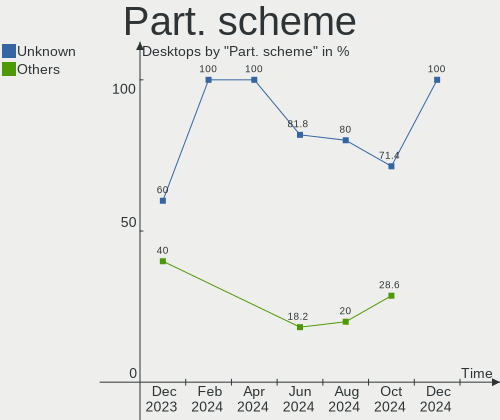
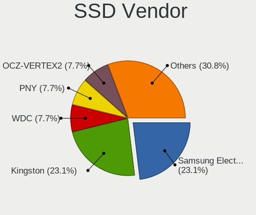
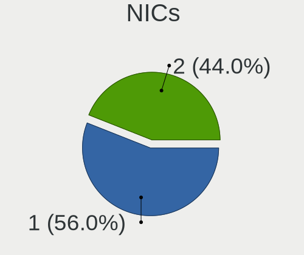

Elementary - Hardware Trends (Desktops)
---------------------------------------

A project to identify most popular hardware characteristics and track their change
over time based on data collected by Linux users at https://Linux-Hardware.org.

Anyone can contribute to this report by the [hw-probe](https://github.com/linuxhw/hw-probe) tool:

    sudo -E hw-probe -all -upload

This report is for one last month. Overall report since the beginning of time: [TestDays](https://github.com/linuxhw/TestDays)

Period: Jul, 2023.

Contents
--------

* [ System ](#system)
  - [ OS                       ](#os)
  - [ OS Family                ](#os-family)
  - [ Kernel                   ](#kernel)
  - [ Kernel Family            ](#kernel-family)
  - [ Kernel Major Ver.        ](#kernel-major-ver)
  - [ Arch                     ](#arch)
  - [ DE                       ](#de)
  - [ Display Server           ](#display-server)
  - [ Display Manager          ](#display-manager)
  - [ OS Lang                  ](#os-lang)
  - [ Boot Mode                ](#boot-mode)
  - [ Filesystem               ](#filesystem)
  - [ Part. scheme             ](#part-scheme)
  - [ Dual Boot with Linux/BSD ](#dual-boot-with-linuxbsd)
  - [ Dual Boot (Win)          ](#dual-boot-win)

* [ Board ](#board)
  - [ Vendor                   ](#vendor)
  - [ Model                    ](#model)
  - [ Model Family             ](#model-family)
  - [ MFG Year                 ](#mfg-year)
  - [ Form Factor              ](#form-factor)
  - [ Secure Boot              ](#secure-boot)
  - [ Coreboot                 ](#coreboot)
  - [ RAM Size                 ](#ram-size)
  - [ RAM Used                 ](#ram-used)
  - [ Total Drives             ](#total-drives)
  - [ Has CD-ROM               ](#has-cd-rom)
  - [ Has Ethernet             ](#has-ethernet)
  - [ Has WiFi                 ](#has-wifi)
  - [ Has Bluetooth            ](#has-bluetooth)

* [ Location ](#location)
  - [ Country                  ](#country)
  - [ City                     ](#city)

* [ Drives ](#drives)
  - [ Drive Vendor             ](#drive-vendor)
  - [ Drive Model              ](#drive-model)
  - [ HDD Vendor               ](#hdd-vendor)
  - [ SSD Vendor               ](#ssd-vendor)
  - [ Drive Kind               ](#drive-kind)
  - [ Drive Connector          ](#drive-connector)
  - [ Drive Size               ](#drive-size)
  - [ Space Total              ](#space-total)
  - [ Space Used               ](#space-used)
  - [ Malfunc. Drives          ](#malfunc-drives)
  - [ Malfunc. Drive Vendor    ](#malfunc-drive-vendor)
  - [ Malfunc. HDD Vendor      ](#malfunc-hdd-vendor)
  - [ Malfunc. Drive Kind      ](#malfunc-drive-kind)
  - [ Failed Drives            ](#failed-drives)
  - [ Failed Drive Vendor      ](#failed-drive-vendor)
  - [ Drive Status             ](#drive-status)

* [ Storage controller ](#storage-controller)
  - [ Storage Vendor           ](#storage-vendor)
  - [ Storage Model            ](#storage-model)
  - [ Storage Kind             ](#storage-kind)

* [ Processor ](#processor)
  - [ CPU Vendor               ](#cpu-vendor)
  - [ CPU Model                ](#cpu-model)
  - [ CPU Model Family         ](#cpu-model-family)
  - [ CPU Cores                ](#cpu-cores)
  - [ CPU Sockets              ](#cpu-sockets)
  - [ CPU Threads              ](#cpu-threads)
  - [ CPU Op-Modes             ](#cpu-op-modes)
  - [ CPU Microcode            ](#cpu-microcode)
  - [ CPU Microarch            ](#cpu-microarch)

* [ Graphics ](#graphics)
  - [ GPU Vendor               ](#gpu-vendor)
  - [ GPU Model                ](#gpu-model)
  - [ GPU Combo                ](#gpu-combo)
  - [ GPU Driver               ](#gpu-driver)
  - [ GPU Memory               ](#gpu-memory)

* [ Monitor ](#monitor)
  - [ Monitor Vendor           ](#monitor-vendor)
  - [ Monitor Model            ](#monitor-model)
  - [ Monitor Resolution       ](#monitor-resolution)
  - [ Monitor Diagonal         ](#monitor-diagonal)
  - [ Monitor Width            ](#monitor-width)
  - [ Aspect Ratio             ](#aspect-ratio)
  - [ Monitor Area             ](#monitor-area)
  - [ Pixel Density            ](#pixel-density)
  - [ Multiple Monitors        ](#multiple-monitors)

* [ Network ](#network)
  - [ Net Controller Vendor    ](#net-controller-vendor)
  - [ Net Controller Model     ](#net-controller-model)
  - [ Wireless Vendor          ](#wireless-vendor)
  - [ Wireless Model           ](#wireless-model)
  - [ Ethernet Vendor          ](#ethernet-vendor)
  - [ Ethernet Model           ](#ethernet-model)
  - [ Net Controller Kind      ](#net-controller-kind)
  - [ Used Controller          ](#used-controller)
  - [ NICs                     ](#nics)
  - [ IPv6                     ](#ipv6)

* [ Bluetooth ](#bluetooth)
  - [ Bluetooth Vendor         ](#bluetooth-vendor)
  - [ Bluetooth Model          ](#bluetooth-model)

* [ Sound ](#sound)
  - [ Sound Vendor             ](#sound-vendor)
  - [ Sound Model              ](#sound-model)

* [ Memory ](#memory)
  - [ Memory Vendor            ](#memory-vendor)
  - [ Memory Model             ](#memory-model)
  - [ Memory Kind              ](#memory-kind)
  - [ Memory Form Factor       ](#memory-form-factor)
  - [ Memory Size              ](#memory-size)
  - [ Memory Speed             ](#memory-speed)

* [ Printers & scanners ](#printers--scanners)
  - [ Printer Vendor           ](#printer-vendor)
  - [ Printer Model            ](#printer-model)
  - [ Scanner Vendor           ](#scanner-vendor)
  - [ Scanner Model            ](#scanner-model)

* [ Camera ](#camera)
  - [ Camera Vendor            ](#camera-vendor)
  - [ Camera Model             ](#camera-model)

* [ Security ](#security)
  - [ Fingerprint Vendor       ](#fingerprint-vendor)
  - [ Fingerprint Model        ](#fingerprint-model)
  - [ Chipcard Vendor          ](#chipcard-vendor)
  - [ Chipcard Model           ](#chipcard-model)

* [ Unsupported ](#unsupported)
  - [ Unsupported Devices      ](#unsupported-devices)
  - [ Unsupported Device Types ](#unsupported-device-types)

System
------

OS
--

Installed operating systems

| Name         | Desktops | Percent |
|--------------|----------|---------|
| Elementary 7 | 8        | 100%    |

OS Family
---------

OS without a version

| Name       | Desktops | Percent |
|------------|----------|---------|
| Elementary | 8        | 100%    |

Kernel
------

Version of the Linux kernel

| Version             | Desktops | Percent |
|---------------------|----------|---------|
| 5.19.0-46-generic   | 4        | 50%     |
| 5.15.0-58-generic   | 3        | 37.5%   |
| 6.4.5-x64v3-xanmod1 | 1        | 12.5%   |

Kernel Family
-------------

Linux kernel without a distro release

| Version | Desktops | Percent |
|---------|----------|---------|
| 5.19.0  | 4        | 50%     |
| 5.15.0  | 3        | 37.5%   |
| 6.4.5   | 1        | 12.5%   |

Kernel Major Ver.
-----------------

Linux kernel major version

| Version | Desktops | Percent |
|---------|----------|---------|
| 5.19    | 4        | 50%     |
| 5.15    | 3        | 37.5%   |
| 6.4     | 1        | 12.5%   |

Arch
----

OS architecture (x86_64, i586, etc.)

| Name   | Desktops | Percent |
|--------|----------|---------|
| x86_64 | 8        | 100%    |

DE
--

Desktop Environment

| Name     | Desktops | Percent |
|----------|----------|---------|
| Pantheon | 8        | 100%    |

Display Server
--------------

X11 or Wayland

| Name | Desktops | Percent |
|------|----------|---------|
| X11  | 8        | 100%    |

Display Manager
---------------

SDDM, LightDM, etc.

| Name    | Desktops | Percent |
|---------|----------|---------|
| Unknown | 8        | 100%    |

OS Lang
-------

Language

| Lang  | Desktops | Percent |
|-------|----------|---------|
| en_US | 3        | 37.5%   |
| de_DE | 3        | 37.5%   |
| ru_RU | 1        | 12.5%   |
| it_IT | 1        | 12.5%   |

Boot Mode
---------

EFI or BIOS

| Mode | Desktops | Percent |
|------|----------|---------|
| BIOS | 8        | 100%    |

Filesystem
----------

Type of filesystem

| Type | Desktops | Percent |
|------|----------|---------|
| Ext4 | 8        | 100%    |

Part. scheme
------------

Scheme of partitioning

| Type    | Desktops | Percent |
|---------|----------|---------|
| Unknown | 8        | 100%    |

Dual Boot with Linux/BSD
------------------------

Hosting more than one Linux/BSD

| Dual boot | Desktops | Percent |
|-----------|----------|---------|
| No        | 8        | 100%    |

Dual Boot (Win)
---------------

Hosting Linux and Windows

| Dual boot | Desktops | Percent |
|-----------|----------|---------|
| No        | 8        | 100%    |

Board
-----

Vendor
------

Motherboard manufacturer

| Name        | Desktops | Percent |
|-------------|----------|---------|
| ASRock      | 2        | 25%     |
| Wortmann AG | 1        | 12.5%   |
| MSI         | 1        | 12.5%   |
| Lenovo      | 1        | 12.5%   |
| Apple       | 1        | 12.5%   |
| Alienware   | 1        | 12.5%   |
| Acer        | 1        | 12.5%   |

Model
-----

Motherboard model

| Name                                | Desktops | Percent |
|-------------------------------------|----------|---------|
| Wortmann AG TERRA_PC                | 1        | 12.5%   |
| MSI MS-7C52                         | 1        | 12.5%   |
| Lenovo ThinkCentre M910s 10MLS05C00 | 1        | 12.5%   |
| ASRock X570 Extreme4                | 1        | 12.5%   |
| ASRock X370 Pro4                    | 1        | 12.5%   |
| Apple MacPro4,1                     | 1        | 12.5%   |
| Alienware Aurora R6                 | 1        | 12.5%   |
| Acer Aspire TC-380                  | 1        | 12.5%   |

Model Family
------------

Motherboard model prefix

| Name               | Desktops | Percent |
|--------------------|----------|---------|
| Wortmann AG TERRA  | 1        | 12.5%   |
| MSI MS-7C52        | 1        | 12.5%   |
| Lenovo ThinkCentre | 1        | 12.5%   |
| ASRock X570        | 1        | 12.5%   |
| ASRock X370        | 1        | 12.5%   |
| Apple MacPro4      | 1        | 12.5%   |
| Alienware Aurora   | 1        | 12.5%   |
| Acer Aspire        | 1        | 12.5%   |

MFG Year
--------

Motherboard manufacture year

| Year | Desktops | Percent |
|------|----------|---------|
| 2018 | 3        | 37.5%   |
| 2019 | 2        | 25%     |
| 2017 | 1        | 12.5%   |
| 2013 | 1        | 12.5%   |
| 2009 | 1        | 12.5%   |

Form Factor
-----------

Physical design of the computer

| Name    | Desktops | Percent |
|---------|----------|---------|
| Desktop | 8        | 100%    |

Secure Boot
-----------

Enabled or disabled

| State    | Desktops | Percent |
|----------|----------|---------|
| Disabled | 8        | 100%    |

Coreboot
--------

Have coreboot on board

| Used | Desktops | Percent |
|------|----------|---------|
| No   | 8        | 100%    |

RAM Size
--------

Total RAM memory

| Size in GB | Desktops | Percent |
|------------|----------|---------|
| 32.01-64.0 | 4        | 50%     |
| 16.01-24.0 | 2        | 25%     |
| 4.01-8.0   | 1        | 12.5%   |
| 8.01-16.0  | 1        | 12.5%   |

RAM Used
--------

Used RAM memory

| Used GB  | Desktops | Percent |
|----------|----------|---------|
| 4.01-8.0 | 4        | 50%     |
| 2.01-3.0 | 3        | 37.5%   |
| 3.01-4.0 | 1        | 12.5%   |

Total Drives
------------

Number of drives on board

| Drives | Desktops | Percent |
|--------|----------|---------|
| 1      | 3        | 37.5%   |
| 3      | 2        | 25%     |
| 2      | 2        | 25%     |
| 4      | 1        | 12.5%   |

Has CD-ROM
----------

Has CD-ROM on board

| Presented | Desktops | Percent |
|-----------|----------|---------|
| Yes       | 4        | 50%     |
| No        | 4        | 50%     |

Has Ethernet
------------

Has Ethernet on board

| Presented | Desktops | Percent |
|-----------|----------|---------|
| Yes       | 8        | 100%    |

Has WiFi
--------

Has WiFi module

| Presented | Desktops | Percent |
|-----------|----------|---------|
| No        | 6        | 75%     |
| Yes       | 2        | 25%     |

Has Bluetooth
-------------

Has Bluetooth module

| Presented | Desktops | Percent |
|-----------|----------|---------|
| No        | 6        | 75%     |
| Yes       | 2        | 25%     |

Location
--------

Country
-------

Geographic location (country)

| Country     | Desktops | Percent |
|-------------|----------|---------|
| USA         | 2        | 25%     |
| Germany     | 2        | 25%     |
| Russia      | 1        | 12.5%   |
| Netherlands | 1        | 12.5%   |
| Italy       | 1        | 12.5%   |
| India       | 1        | 12.5%   |

City
----

Geographic location (city)

| City         | Desktops | Percent |
|--------------|----------|---------|
| Yorktown     | 1        | 12.5%   |
| Plauen       | 1        | 12.5%   |
| Moscow       | 1        | 12.5%   |
| Milano       | 1        | 12.5%   |
| Independence | 1        | 12.5%   |
| Delhi        | 1        | 12.5%   |
| Burbach      | 1        | 12.5%   |
| Amsterdam    | 1        | 12.5%   |

Drives
------

Drive Vendor
------------

Hard drive vendors

| Vendor                | Desktops | Drives | Percent |
|-----------------------|----------|--------|---------|
| WDC                   | 5        | 7      | 35.71%  |
| Toshiba               | 2        | 3      | 14.29%  |
| Seagate               | 1        | 1      | 7.14%   |
| Samsung Electronics   | 1        | 1      | 7.14%   |
| Realtek Semiconductor | 1        | 1      | 7.14%   |
| OCZ-VERTEX2           | 1        | 1      | 7.14%   |
| Hitachi               | 1        | 1      | 7.14%   |
| Crucial               | 1        | 1      | 7.14%   |
| Unknown               | 1        | 1      | 7.14%   |

Drive Model
-----------

Hard drive models

| Model                                               | Desktops | Percent |
|-----------------------------------------------------|----------|---------|
| WDC WDS500G2B0A-00SM50 500GB SSD                    | 1        | 6.67%   |
| WDC WD5000AAKS-00UU3A0 500GB                        | 1        | 6.67%   |
| WDC WD20EZRX-00D8PB0 2TB                            | 1        | 6.67%   |
| WDC WD10EZEX-21WN4A0 1TB                            | 1        | 6.67%   |
| WDC WD10EZEX-08WN4A0 1TB                            | 1        | 6.67%   |
| Toshiba XG4 NVMe SSD Controller 256GB               | 1        | 6.67%   |
| Toshiba HDWD110 1TB                                 | 1        | 6.67%   |
| Toshiba DT01ACA200 2TB                              | 1        | 6.67%   |
| Seagate ST1000DM010-2EP102 1TB                      | 1        | 6.67%   |
| Samsung NVMe SSD Controller SM981/PM981/PM983 500GB | 1        | 6.67%   |
| Realtek ADATA SX6000LNP 1024GB                      | 1        | 6.67%   |
| OCZ-VERTEX2 3.5 120GB SSD                           | 1        | 6.67%   |
| Hitachi HDE721064SLA360 640GB                       | 1        | 6.67%   |
| Crucial CT500MX500SSD1 500GB                        | 1        | 6.67%   |
| Unknown                                             | 1        | 6.67%   |

HDD Vendor
----------

Hard disk drive vendors

| Vendor  | Desktops | Drives | Percent |
|---------|----------|--------|---------|
| WDC     | 4        | 6      | 50%     |
| Toshiba | 2        | 2      | 25%     |
| Seagate | 1        | 1      | 12.5%   |
| Hitachi | 1        | 1      | 12.5%   |

SSD Vendor
----------

Solid state drive vendors

| Vendor      | Desktops | Drives | Percent |
|-------------|----------|--------|---------|
| WDC         | 1        | 1      | 33.33%  |
| OCZ-VERTEX2 | 1        | 1      | 33.33%  |
| Crucial     | 1        | 1      | 33.33%  |

Drive Kind
----------

HDD or SSD

| Kind    | Desktops | Drives | Percent |
|---------|----------|--------|---------|
| HDD     | 7        | 10     | 50%     |
| NVMe    | 3        | 3      | 21.43%  |
| SSD     | 3        | 3      | 21.43%  |
| Unknown | 1        | 1      | 7.14%   |

Drive Connector
---------------

SATA, SAS, NVMe, etc.

| Type | Desktops | Drives | Percent |
|------|----------|--------|---------|
| SATA | 8        | 14     | 72.73%  |
| NVMe | 3        | 3      | 27.27%  |

Drive Size
----------

Size of hard drive

| Size in TB | Desktops | Drives | Percent |
|------------|----------|--------|---------|
| 0.51-1.0   | 5        | 5      | 45.45%  |
| 0.01-0.5   | 4        | 6      | 36.36%  |
| 1.01-2.0   | 2        | 2      | 18.18%  |

Space Total
-----------

Amount of disk space available on the file system

| Size in GB | Desktops | Percent |
|------------|----------|---------|
| 251-500    | 4        | 50%     |
| 101-250    | 2        | 25%     |
| 501-1000   | 2        | 25%     |

Space Used
----------

Amount of used disk space

| Used GB | Desktops | Percent |
|---------|----------|---------|
| 1-20    | 4        | 50%     |
| 101-250 | 2        | 25%     |
| 21-50   | 1        | 12.5%   |
| 51-100  | 1        | 12.5%   |

Malfunc. Drives
---------------

Drive models with a malfunction

Zero info for selected period =(

Malfunc. Drive Vendor
---------------------

Vendors of faulty drives

Zero info for selected period =(

Malfunc. HDD Vendor
-------------------

Vendors of faulty HDD drives

Zero info for selected period =(

Malfunc. Drive Kind
-------------------

Kinds of faulty drives

Zero info for selected period =(

Failed Drives
-------------

Failed drive models

Zero info for selected period =(

Failed Drive Vendor
-------------------

Failed drive vendors

Zero info for selected period =(

Drive Status
------------

Number of failed and malfunc. drives

| Status   | Desktops | Drives | Percent |
|----------|----------|--------|---------|
| Detected | 8        | 17     | 100%    |

Storage controller
------------------

Storage Vendor
--------------

Storage controller vendors

| Vendor                       | Desktops | Percent |
|------------------------------|----------|---------|
| Intel                        | 4        | 33.33%  |
| AMD                          | 4        | 33.33%  |
| Toshiba America Info Systems | 1        | 8.33%   |
| Samsung Electronics          | 1        | 8.33%   |
| Realtek Semiconductor        | 1        | 8.33%   |
| ASMedia Technology           | 1        | 8.33%   |

Storage Model
-------------

Storage controller models

| Model                                                            | Desktops | Percent |
|------------------------------------------------------------------|----------|---------|
| AMD FCH SATA Controller [AHCI mode]                              | 4        | 26.67%  |
| Intel 200 Series PCH SATA controller [AHCI mode]                 | 2        | 13.33%  |
| Toshiba America Info Systems XG4 NVMe SSD Controller             | 1        | 6.67%   |
| Samsung NVMe SSD Controller SM981/PM981/PM983                    | 1        | 6.67%   |
| Realtek RTS5763DL NVMe SSD Controller (DRAM-less)                | 1        | 6.67%   |
| Intel 82801JI (ICH10 Family) SATA AHCI Controller                | 1        | 6.67%   |
| Intel 7 Series Chipset Family 6-port SATA Controller [AHCI mode] | 1        | 6.67%   |
| ASMedia ASM1062 Serial ATA Controller                            | 1        | 6.67%   |
| AMD X370 Series Chipset SATA Controller                          | 1        | 6.67%   |
| AMD FCH SATA Controller D                                        | 1        | 6.67%   |
| AMD 300 Series Chipset SATA Controller                           | 1        | 6.67%   |

Storage Kind
------------

Kind of storage controller (IDE, SATA, NVMe, SAS, ...)

| Kind | Desktops | Percent |
|------|----------|---------|
| SATA | 8        | 72.73%  |
| NVMe | 3        | 27.27%  |

Processor
---------

CPU Vendor
----------

Processor vendors

| Vendor | Desktops | Percent |
|--------|----------|---------|
| Intel  | 4        | 50%     |
| AMD    | 4        | 50%     |

CPU Model
---------

Processor models

| Model                                         | Desktops | Percent |
|-----------------------------------------------|----------|---------|
| Intel Xeon CPU W3520 @ 2.67GHz                | 1        | 12.5%   |
| Intel Core i7-7700 CPU @ 3.60GHz              | 1        | 12.5%   |
| Intel Core i3-7100 CPU @ 3.90GHz              | 1        | 12.5%   |
| Intel Celeron CPU 1007U @ 1.50GHz             | 1        | 12.5%   |
| AMD Ryzen 9 5900X 12-Core Processor           | 1        | 12.5%   |
| AMD Ryzen 7 3700X 8-Core Processor            | 1        | 12.5%   |
| AMD Ryzen 5 2400G with Radeon Vega Graphics   | 1        | 12.5%   |
| AMD A8-9600 RADEON R7, 10 COMPUTE CORES 4C+6G | 1        | 12.5%   |

CPU Model Family
----------------

Processor model prefix

| Model         | Desktops | Percent |
|---------------|----------|---------|
| Intel Xeon    | 1        | 12.5%   |
| Intel Core i7 | 1        | 12.5%   |
| Intel Core i3 | 1        | 12.5%   |
| Intel Celeron | 1        | 12.5%   |
| AMD Ryzen 9   | 1        | 12.5%   |
| AMD Ryzen 7   | 1        | 12.5%   |
| AMD Ryzen 5   | 1        | 12.5%   |
| AMD A8        | 1        | 12.5%   |

CPU Cores
---------

Number of processor cores

| Number | Desktops | Percent |
|--------|----------|---------|
| 4      | 3        | 37.5%   |
| 2      | 3        | 37.5%   |
| 12     | 1        | 12.5%   |
| 8      | 1        | 12.5%   |

CPU Sockets
-----------

Number of sockets

| Number | Desktops | Percent |
|--------|----------|---------|
| 1      | 8        | 100%    |

CPU Threads
-----------

Threads per core (Hyper-Threading)

| Number | Desktops | Percent |
|--------|----------|---------|
| 2      | 7        | 87.5%   |
| 1      | 1        | 12.5%   |

CPU Op-Modes
------------

CPU Operation Modes (32-bit, 64-bit)

| Op mode        | Desktops | Percent |
|----------------|----------|---------|
| 32-bit, 64-bit | 8        | 100%    |

CPU Microcode
-------------

Microcode number

| Number  | Desktops | Percent |
|---------|----------|---------|
| Unknown | 8        | 100%    |

CPU Microarch
-------------

Microarchitecture

| Name      | Desktops | Percent |
|-----------|----------|---------|
| KabyLake  | 2        | 25%     |
| Zen 3     | 1        | 12.5%   |
| Zen 2     | 1        | 12.5%   |
| Zen       | 1        | 12.5%   |
| Nehalem   | 1        | 12.5%   |
| IvyBridge | 1        | 12.5%   |
| Excavator | 1        | 12.5%   |

Graphics
--------

GPU Vendor
----------

Vendors of graphics cards

| Vendor | Desktops | Percent |
|--------|----------|---------|
| AMD    | 5        | 55.56%  |
| Intel  | 3        | 33.33%  |
| Nvidia | 1        | 11.11%  |

GPU Model
---------

Graphics card models

| Model                                                   | Desktops | Percent |
|---------------------------------------------------------|----------|---------|
| Intel HD Graphics 630                                   | 2        | 22.22%  |
| Nvidia GP104 [GeForce GTX 1080]                         | 1        | 11.11%  |
| Intel 3rd Gen Core processor Graphics Controller        | 1        | 11.11%  |
| AMD Wani [Radeon R5/R6/R7 Graphics]                     | 1        | 11.11%  |
| AMD Navi 14 [Radeon RX 5500/5500M / Pro 5500M]          | 1        | 11.11%  |
| AMD Navi 10 [Radeon RX 5600 OEM/5600 XT / 5700/5700 XT] | 1        | 11.11%  |
| AMD Juniper XT [Radeon HD 5770]                         | 1        | 11.11%  |
| AMD Ellesmere [Radeon RX 470/480/570/570X/580/580X/590] | 1        | 11.11%  |

GPU Combo
---------

Combinations of graphics cards

| Name       | Desktops | Percent |
|------------|----------|---------|
| 1 x AMD    | 5        | 62.5%   |
| 1 x Intel  | 2        | 25%     |
| 1 x Nvidia | 1        | 12.5%   |

GPU Driver
----------

Free vs proprietary

| Driver | Desktops | Percent |
|--------|----------|---------|
| Free   | 8        | 100%    |

GPU Memory
----------

Total video memory

| Size in GB | Desktops | Percent |
|------------|----------|---------|
| Unknown    | 8        | 100%    |

Monitor
-------

Monitor Vendor
--------------

Monitor vendors

| Vendor              | Desktops | Percent |
|---------------------|----------|---------|
| ViewSonic           | 1        | 14.29%  |
| Samsung Electronics | 1        | 14.29%  |
| Lenovo              | 1        | 14.29%  |
| Goldstar            | 1        | 14.29%  |
| Dell                | 1        | 14.29%  |
| ASUSTek Computer    | 1        | 14.29%  |
| Acer                | 1        | 14.29%  |

Monitor Model
-------------

Monitor models

| Model                                                              | Desktops | Percent |
|--------------------------------------------------------------------|----------|---------|
| ViewSonic VA2719 Series VSCC132 1920x1080 598x336mm 27.0-inch      | 1        | 12.5%   |
| Samsung Electronics C49J89x SAM0F21 3840x1080 1196x336mm 48.9-inch | 1        | 12.5%   |
| Lenovo LI2215sD LEN65CC 1920x1080 476x267mm 21.5-inch              | 1        | 12.5%   |
| Goldstar W1934 GSM4B7A 1440x900 410x256mm 19.0-inch                | 1        | 12.5%   |
| Goldstar ULTRAWIDE GSM59F2 2560x1080 798x334mm 34.1-inch           | 1        | 12.5%   |
| Dell DELL2407WFPHC DELA026 1920x1200 519x324mm 24.1-inch           | 1        | 12.5%   |
| ASUSTek Computer VG245 AUS24A1 1920x1080 530x300mm 24.0-inch       | 1        | 12.5%   |
| Acer K222HQL ACR03E1 1920x1080 477x268mm 21.5-inch                 | 1        | 12.5%   |

Monitor Resolution
------------------

Monitor screen resolution

| Resolution        | Desktops | Percent |
|-------------------|----------|---------|
| 1920x1080 (FHD)   | 4        | 50%     |
| 3840x1080         | 1        | 12.5%   |
| 2560x1080         | 1        | 12.5%   |
| 1920x1200 (WUXGA) | 1        | 12.5%   |
| 1440x900 (WXGA+)  | 1        | 12.5%   |

Monitor Diagonal
----------------

Diagonal size in inches

| Inches | Desktops | Percent |
|--------|----------|---------|
| 24     | 2        | 25%     |
| 21     | 2        | 25%     |
| 49     | 1        | 12.5%   |
| 34     | 1        | 12.5%   |
| 27     | 1        | 12.5%   |
| 19     | 1        | 12.5%   |

Monitor Width
-------------

Physical width

| Width in mm | Desktops | Percent |
|-------------|----------|---------|
| 501-600     | 3        | 37.5%   |
| 401-500     | 3        | 37.5%   |
| 701-800     | 1        | 12.5%   |
| 1001-1500   | 1        | 12.5%   |

Aspect Ratio
------------

Proportional relationship between the width and the height

| Ratio | Desktops | Percent |
|-------|----------|---------|
| 16/9  | 4        | 50%     |
| 16/10 | 2        | 25%     |
| 32/9  | 1        | 12.5%   |
| 21/9  | 1        | 12.5%   |

Monitor Area
------------

Area in inch²

| Area in inch² | Desktops | Percent |
|----------------|----------|---------|
| 201-250        | 2        | 25%     |
| 151-200        | 2        | 25%     |
| 351-500        | 1        | 12.5%   |
| 301-350        | 1        | 12.5%   |
| 251-300        | 1        | 12.5%   |
| 501-1000       | 1        | 12.5%   |

Pixel Density
-------------

Pixels per inch

| Density | Desktops | Percent |
|---------|----------|---------|
| 51-100  | 5        | 71.43%  |
| 101-120 | 2        | 28.57%  |

Multiple Monitors
-----------------

Total monitors connected

| Total | Desktops | Percent |
|-------|----------|---------|
| 1     | 7        | 87.5%   |
| 2     | 1        | 12.5%   |

Network
-------

Net Controller Vendor
---------------------

Controller vendors

| Vendor                | Desktops | Percent |
|-----------------------|----------|---------|
| Realtek Semiconductor | 4        | 40%     |
| Intel                 | 3        | 30%     |
| TP-Link               | 1        | 10%     |
| Qualcomm Atheros      | 1        | 10%     |
| Qualcomm              | 1        | 10%     |

Net Controller Model
--------------------

Controller models

| Model                                                             | Desktops | Percent |
|-------------------------------------------------------------------|----------|---------|
| Realtek RTL8111/8168/8411 PCI Express Gigabit Ethernet Controller | 4        | 33.33%  |
| TP-Link Archer T4U ver.3                                          | 1        | 8.33%   |
| Realtek RTL8188CE 802.11b/g/n WiFi Adapter                        | 1        | 8.33%   |
| Qualcomm Redmi Note 8                                             | 1        | 8.33%   |
| Qualcomm Atheros Killer E2400 Gigabit Ethernet Controller         | 1        | 8.33%   |
| Intel Wireless-AC 9260                                            | 1        | 8.33%   |
| Intel Wireless 3165                                               | 1        | 8.33%   |
| Intel I211 Gigabit Network Connection                             | 1        | 8.33%   |
| Intel 82574L Gigabit Network Connection                           | 1        | 8.33%   |

Wireless Vendor
---------------

Wireless vendors

| Vendor                | Desktops | Percent |
|-----------------------|----------|---------|
| TP-Link               | 1        | 33.33%  |
| Realtek Semiconductor | 1        | 33.33%  |
| Intel                 | 1        | 33.33%  |

Wireless Model
--------------

Wireless models

| Model                                      | Desktops | Percent |
|--------------------------------------------|----------|---------|
| TP-Link Archer T4U ver.3                   | 1        | 25%     |
| Realtek RTL8188CE 802.11b/g/n WiFi Adapter | 1        | 25%     |
| Intel Wireless-AC 9260                     | 1        | 25%     |
| Intel Wireless 3165                        | 1        | 25%     |

Ethernet Vendor
---------------

Ethernet vendors

| Vendor                | Desktops | Percent |
|-----------------------|----------|---------|
| Realtek Semiconductor | 4        | 50%     |
| Intel                 | 2        | 25%     |
| Qualcomm Atheros      | 1        | 12.5%   |
| Qualcomm              | 1        | 12.5%   |

Ethernet Model
--------------

Ethernet models

| Model                                                             | Desktops | Percent |
|-------------------------------------------------------------------|----------|---------|
| Realtek RTL8111/8168/8411 PCI Express Gigabit Ethernet Controller | 4        | 50%     |
| Qualcomm Redmi Note 8                                             | 1        | 12.5%   |
| Qualcomm Atheros Killer E2400 Gigabit Ethernet Controller         | 1        | 12.5%   |
| Intel I211 Gigabit Network Connection                             | 1        | 12.5%   |
| Intel 82574L Gigabit Network Connection                           | 1        | 12.5%   |

Net Controller Kind
-------------------

Ethernet, WiFi or modem

| Kind     | Desktops | Percent |
|----------|----------|---------|
| Ethernet | 8        | 80%     |
| WiFi     | 2        | 20%     |

Used Controller
---------------

Currently used network controller

| Kind     | Desktops | Percent |
|----------|----------|---------|
| Ethernet | 5        | 83.33%  |
| WiFi     | 1        | 16.67%  |

NICs
----

Total network controllers on board

| Total | Desktops | Percent |
|-------|----------|---------|
| 1     | 4        | 50%     |
| 2     | 2        | 25%     |
| 3     | 1        | 12.5%   |
| 0     | 1        | 12.5%   |

IPv6
----

IPv6 vs IPv4

| Used | Desktops | Percent |
|------|----------|---------|
| No   | 5        | 62.5%   |
| Yes  | 3        | 37.5%   |

Bluetooth
---------

Bluetooth Vendor
----------------

Controller vendors

| Vendor | Desktops | Percent |
|--------|----------|---------|
| Intel  | 1        | 50%     |
| Apple  | 1        | 50%     |

Bluetooth Model
---------------

Controller models

| Model                                | Desktops | Percent |
|--------------------------------------|----------|---------|
| Intel Bluetooth wireless interface   | 1        | 50%     |
| Apple Built-in Bluetooth 2.0+EDR HCI | 1        | 50%     |

Sound
-----

Sound Vendor
------------

Sound card vendors

| Vendor              | Desktops | Percent |
|---------------------|----------|---------|
| AMD                 | 5        | 45.45%  |
| Intel               | 4        | 36.36%  |
| Nvidia              | 1        | 9.09%   |
| C-Media Electronics | 1        | 9.09%   |

Sound Model
-----------

Sound card models

| Model                                                               | Desktops | Percent |
|---------------------------------------------------------------------|----------|---------|
| Intel 200 Series PCH HD Audio                                       | 2        | 13.33%  |
| AMD Starship/Matisse HD Audio Controller                            | 2        | 13.33%  |
| AMD Navi 10 HDMI Audio                                              | 2        | 13.33%  |
| Nvidia GP104 High Definition Audio Controller                       | 1        | 6.67%   |
| Intel 82801JI (ICH10 Family) HD Audio Controller                    | 1        | 6.67%   |
| Intel 7 Series/C216 Chipset Family High Definition Audio Controller | 1        | 6.67%   |
| C-Media Electronics TONOR TC30 Audio Device                         | 1        | 6.67%   |
| AMD Kabini HDMI/DP Audio                                            | 1        | 6.67%   |
| AMD Juniper HDMI Audio [Radeon HD 5700 Series]                      | 1        | 6.67%   |
| AMD Family 17h/19h HD Audio Controller                              | 1        | 6.67%   |
| AMD Family 15h (Models 60h-6fh) Audio Controller                    | 1        | 6.67%   |
| AMD Ellesmere HDMI Audio [Radeon RX 470/480 / 570/580/590]          | 1        | 6.67%   |

Memory
------

Memory Vendor
-------------

Memory module vendors

Zero info for selected period =(

Memory Model
------------

Memory module models

Zero info for selected period =(

Memory Kind
-----------

Memory module kinds

Zero info for selected period =(

Memory Form Factor
------------------

Physical design of the memory module

Zero info for selected period =(

Memory Size
-----------

Memory module size

Zero info for selected period =(

Memory Speed
------------

Memory module speed

Zero info for selected period =(

Printers & scanners
-------------------

Printer Vendor
--------------

Printer device vendors

Zero info for selected period =(

Printer Model
-------------

Printer device models

Zero info for selected period =(

Scanner Vendor
--------------

Scanner device vendors

Zero info for selected period =(

Scanner Model
-------------

Scanner device models

Zero info for selected period =(

Camera
------

Camera Vendor
-------------

Camera device vendors

Zero info for selected period =(

Camera Model
------------

Camera device models

Zero info for selected period =(

Security
--------

Fingerprint Vendor
------------------

Fingerprint sensor vendors

Zero info for selected period =(

Fingerprint Model
-----------------

Fingerprint sensor models

Zero info for selected period =(

Chipcard Vendor
---------------

Chipcard module vendors

Zero info for selected period =(

Chipcard Model
--------------

Chipcard module models

Zero info for selected period =(

Unsupported
-----------

Unsupported Devices
-------------------

Total unsupported devices on board

| Total | Desktops | Percent |
|-------|----------|---------|
| 0     | 7        | 87.5%   |
| 1     | 1        | 12.5%   |

Unsupported Device Types
------------------------

Types of unsupported devices

| Type         | Desktops | Percent |
|--------------|----------|---------|
| Net/wireless | 1        | 100%    |

