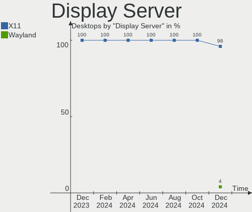
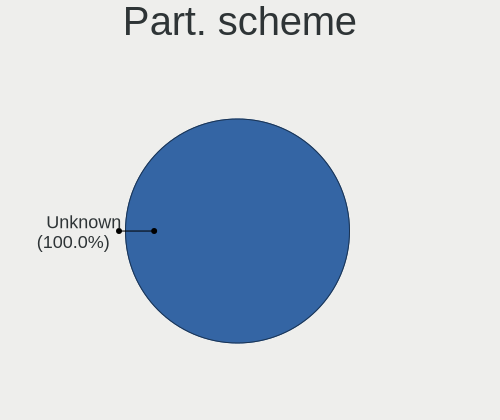
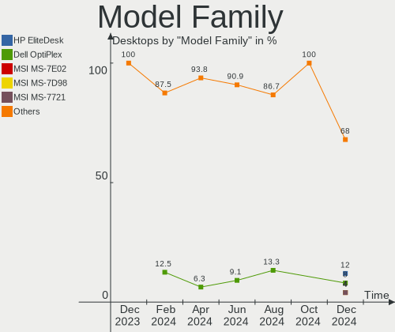
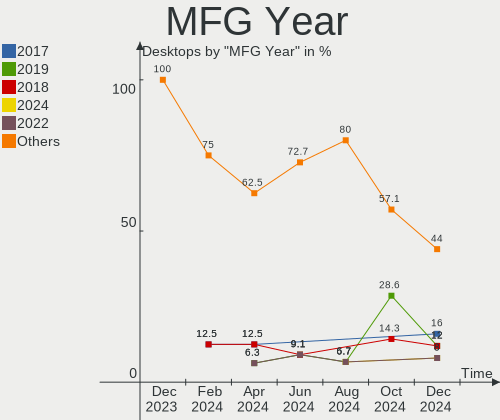
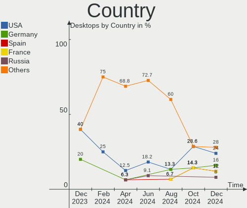
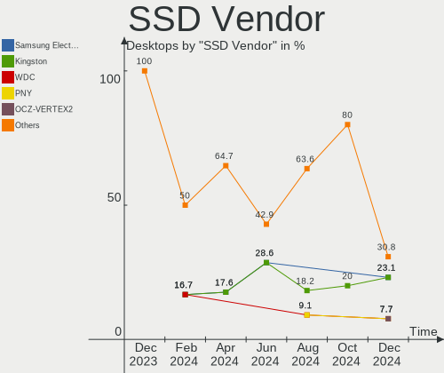
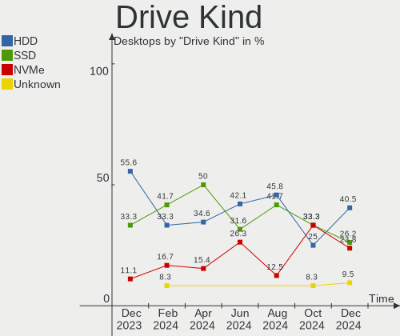
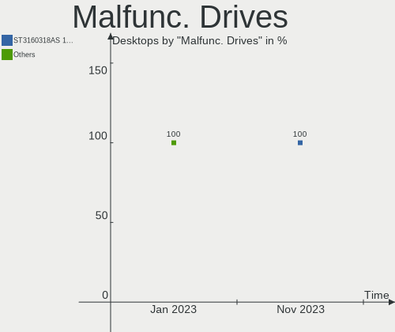
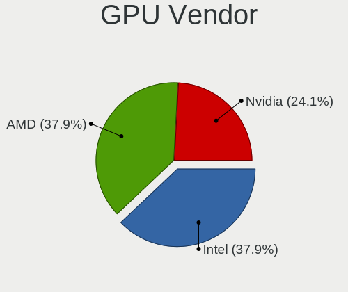

Elementary Hardware Trends (Desktops)
-------------------------------------

A project to identify most popular hardware characteristics and track their change
over time based on data collected by Elementary users at https://Linux-Hardware.org.

Anyone can contribute to this report by the [hw-probe](https://github.com/linuxhw/hw-probe) tool:

    sudo -E hw-probe -all -upload

Full-feature report is available here: https://linux-hardware.org/?view=trends

Period: Mar, 2022.

Contents
--------

* [ System ](#system)
  - [ OS                       ](#os)
  - [ OS Family                ](#os-family)
  - [ Kernel                   ](#kernel)
  - [ Kernel Family            ](#kernel-family)
  - [ Kernel Major Ver.        ](#kernel-major-ver)
  - [ Arch                     ](#arch)
  - [ DE                       ](#de)
  - [ Display Server           ](#display-server)
  - [ Display Manager          ](#display-manager)
  - [ OS Lang                  ](#os-lang)
  - [ Boot Mode                ](#boot-mode)
  - [ Filesystem               ](#filesystem)
  - [ Part. scheme             ](#part-scheme)
  - [ Dual Boot with Linux/BSD ](#dual-boot-with-linuxbsd)
  - [ Dual Boot (Win)          ](#dual-boot-win)

* [ Board ](#board)
  - [ Vendor                   ](#vendor)
  - [ Model                    ](#model)
  - [ Model Family             ](#model-family)
  - [ MFG Year                 ](#mfg-year)
  - [ Form Factor              ](#form-factor)
  - [ Secure Boot              ](#secure-boot)
  - [ Coreboot                 ](#coreboot)
  - [ RAM Size                 ](#ram-size)
  - [ RAM Used                 ](#ram-used)
  - [ Total Drives             ](#total-drives)
  - [ Has CD-ROM               ](#has-cd-rom)
  - [ Has Ethernet             ](#has-ethernet)
  - [ Has WiFi                 ](#has-wifi)
  - [ Has Bluetooth            ](#has-bluetooth)

* [ Location ](#location)
  - [ Country                  ](#country)
  - [ City                     ](#city)

* [ Drives ](#drives)
  - [ Drive Vendor             ](#drive-vendor)
  - [ Drive Model              ](#drive-model)
  - [ HDD Vendor               ](#hdd-vendor)
  - [ SSD Vendor               ](#ssd-vendor)
  - [ Drive Kind               ](#drive-kind)
  - [ Drive Connector          ](#drive-connector)
  - [ Drive Size               ](#drive-size)
  - [ Space Total              ](#space-total)
  - [ Space Used               ](#space-used)
  - [ Malfunc. Drives          ](#malfunc-drives)
  - [ Malfunc. Drive Vendor    ](#malfunc-drive-vendor)
  - [ Malfunc. HDD Vendor      ](#malfunc-hdd-vendor)
  - [ Malfunc. Drive Kind      ](#malfunc-drive-kind)
  - [ Failed Drives            ](#failed-drives)
  - [ Failed Drive Vendor      ](#failed-drive-vendor)
  - [ Drive Status             ](#drive-status)

* [ Storage controller ](#storage-controller)
  - [ Storage Vendor           ](#storage-vendor)
  - [ Storage Model            ](#storage-model)
  - [ Storage Kind             ](#storage-kind)

* [ Processor ](#processor)
  - [ CPU Vendor               ](#cpu-vendor)
  - [ CPU Model                ](#cpu-model)
  - [ CPU Model Family         ](#cpu-model-family)
  - [ CPU Cores                ](#cpu-cores)
  - [ CPU Sockets              ](#cpu-sockets)
  - [ CPU Threads              ](#cpu-threads)
  - [ CPU Op-Modes             ](#cpu-op-modes)
  - [ CPU Microcode            ](#cpu-microcode)
  - [ CPU Microarch            ](#cpu-microarch)

* [ Graphics ](#graphics)
  - [ GPU Vendor               ](#gpu-vendor)
  - [ GPU Model                ](#gpu-model)
  - [ GPU Combo                ](#gpu-combo)
  - [ GPU Driver               ](#gpu-driver)
  - [ GPU Memory               ](#gpu-memory)

* [ Monitor ](#monitor)
  - [ Monitor Vendor           ](#monitor-vendor)
  - [ Monitor Model            ](#monitor-model)
  - [ Monitor Resolution       ](#monitor-resolution)
  - [ Monitor Diagonal         ](#monitor-diagonal)
  - [ Monitor Width            ](#monitor-width)
  - [ Aspect Ratio             ](#aspect-ratio)
  - [ Monitor Area             ](#monitor-area)
  - [ Pixel Density            ](#pixel-density)
  - [ Multiple Monitors        ](#multiple-monitors)

* [ Network ](#network)
  - [ Net Controller Vendor    ](#net-controller-vendor)
  - [ Net Controller Model     ](#net-controller-model)
  - [ Wireless Vendor          ](#wireless-vendor)
  - [ Wireless Model           ](#wireless-model)
  - [ Ethernet Vendor          ](#ethernet-vendor)
  - [ Ethernet Model           ](#ethernet-model)
  - [ Net Controller Kind      ](#net-controller-kind)
  - [ Used Controller          ](#used-controller)
  - [ NICs                     ](#nics)
  - [ IPv6                     ](#ipv6)

* [ Bluetooth ](#bluetooth)
  - [ Bluetooth Vendor         ](#bluetooth-vendor)
  - [ Bluetooth Model          ](#bluetooth-model)

* [ Sound ](#sound)
  - [ Sound Vendor             ](#sound-vendor)
  - [ Sound Model              ](#sound-model)

* [ Memory ](#memory)
  - [ Memory Vendor            ](#memory-vendor)
  - [ Memory Model             ](#memory-model)
  - [ Memory Kind              ](#memory-kind)
  - [ Memory Form Factor       ](#memory-form-factor)
  - [ Memory Size              ](#memory-size)
  - [ Memory Speed             ](#memory-speed)

* [ Printers & scanners ](#printers--scanners)
  - [ Printer Vendor           ](#printer-vendor)
  - [ Printer Model            ](#printer-model)
  - [ Scanner Vendor           ](#scanner-vendor)
  - [ Scanner Model            ](#scanner-model)

* [ Camera ](#camera)
  - [ Camera Vendor            ](#camera-vendor)
  - [ Camera Model             ](#camera-model)

* [ Security ](#security)
  - [ Fingerprint Vendor       ](#fingerprint-vendor)
  - [ Fingerprint Model        ](#fingerprint-model)
  - [ Chipcard Vendor          ](#chipcard-vendor)
  - [ Chipcard Model           ](#chipcard-model)

* [ Unsupported ](#unsupported)
  - [ Unsupported Devices      ](#unsupported-devices)
  - [ Unsupported Device Types ](#unsupported-device-types)

System
------

OS
--

Installed operating systems

| Name             | Desktops | Percent |
|------------------|----------|---------|
| Elementary 6.1   | 23       | 92%     |
| Elementary 5.1.7 | 2        | 8%      |

OS Family
---------

OS without a version

| Name       | Desktops | Percent |
|------------|----------|---------|
| Elementary | 25       | 100%    |

Kernel
------

Version of the Linux kernel

| Version               | Desktops | Percent |
|-----------------------|----------|---------|
| 5.13.0-35-generic     | 7        | 28%     |
| 5.13.0-30-generic     | 5        | 20%     |
| 5.13.0-37-generic     | 4        | 16%     |
| 5.11.0-43-generic     | 3        | 12%     |
| 5.13.0-39-generic     | 2        | 8%      |
| 5.4.0-100-generic     | 1        | 4%      |
| 5.17.0-051700-generic | 1        | 4%      |
| 5.13.0-28-generic     | 1        | 4%      |
| 5.11.0-41-generic     | 1        | 4%      |

Kernel Family
-------------

Linux kernel without a distro release

| Version | Desktops | Percent |
|---------|----------|---------|
| 5.13.0  | 19       | 76%     |
| 5.11.0  | 4        | 16%     |
| 5.4.0   | 1        | 4%      |
| 5.17.0  | 1        | 4%      |

Kernel Major Ver.
-----------------

Linux kernel major version

| Version | Desktops | Percent |
|---------|----------|---------|
| 5.13    | 19       | 76%     |
| 5.11    | 4        | 16%     |
| 5.4     | 1        | 4%      |
| 5.17    | 1        | 4%      |

Arch
----

OS architecture (x86_64, i586, etc.)

| Name   | Desktops | Percent |
|--------|----------|---------|
| x86_64 | 25       | 100%    |

DE
--

Desktop Environment

| Name     | Desktops | Percent |
|----------|----------|---------|
| Pantheon | 25       | 100%    |

Display Server
--------------

X11 or Wayland

| Name | Desktops | Percent |
|------|----------|---------|
| X11  | 25       | 100%    |

Display Manager
---------------

SDDM, LightDM, etc.

| Name    | Desktops | Percent |
|---------|----------|---------|
| Unknown | 20       | 80%     |
| LightDM | 5        | 20%     |

OS Lang
-------

Language

| Lang  | Desktops | Percent |
|-------|----------|---------|
| en_US | 13       | 52%     |
| it_IT | 2        | 8%      |
| fr_FR | 2        | 8%      |
| es_ES | 2        | 8%      |
| de_DE | 2        | 8%      |
| tr_TR | 1        | 4%      |
| ru_RU | 1        | 4%      |
| es_PA | 1        | 4%      |
| en_AU | 1        | 4%      |

Boot Mode
---------

EFI or BIOS

| Mode | Desktops | Percent |
|------|----------|---------|
| EFI  | 13       | 52%     |
| BIOS | 12       | 48%     |

Filesystem
----------

Type of filesystem

| Type | Desktops | Percent |
|------|----------|---------|
| Ext4 | 25       | 100%    |

Part. scheme
------------

Scheme of partitioning

| Type    | Desktops | Percent |
|---------|----------|---------|
| Unknown | 22       | 88%     |
| GPT     | 3        | 12%     |

Dual Boot with Linux/BSD
------------------------

Hosting more than one Linux/BSD

| Dual boot | Desktops | Percent |
|-----------|----------|---------|
| No        | 24       | 96%     |
| Yes       | 1        | 4%      |

Dual Boot (Win)
---------------

Hosting Linux and Windows

| Dual boot | Desktops | Percent |
|-----------|----------|---------|
| No        | 25       | 100%    |

Board
-----

Vendor
------

Motherboard manufacturer

| Name                | Desktops | Percent |
|---------------------|----------|---------|
| Hewlett-Packard     | 5        | 20%     |
| MSI                 | 4        | 16%     |
| Dell                | 3        | 12%     |
| ASUSTek Computer    | 3        | 12%     |
| Gigabyte Technology | 2        | 8%      |
| Biostar             | 2        | 8%      |
| ASRock              | 2        | 8%      |
| Lenovo              | 1        | 4%      |
| Intel               | 1        | 4%      |
| AOpen               | 1        | 4%      |
| AMI                 | 1        | 4%      |

Model
-----

Motherboard model

| Name                           | Desktops | Percent |
|--------------------------------|----------|---------|
| MSI MS-7C91                    | 1        | 4%      |
| MSI MS-7C35                    | 1        | 4%      |
| MSI MS-7918                    | 1        | 4%      |
| MSI MS-7851                    | 1        | 4%      |
| Lenovo ThinkCentre M58 6258D3G | 1        | 4%      |
| Intel X79                      | 1        | 4%      |
| HP Z420 Workstation            | 1        | 4%      |
| HP Z240 SFF Workstation        | 1        | 4%      |
| HP ProDesk 600 G2 SFF          | 1        | 4%      |
| HP ProDesk 600 G1 SFF          | 1        | 4%      |
| HP 520-1175a                   | 1        | 4%      |
| Gigabyte B150N Phoenix-WIFI    | 1        | 4%      |
| Gigabyte A320M-S2H             | 1        | 4%      |
| Dell OptiPlex 980              | 1        | 4%      |
| Dell OptiPlex 755              | 1        | 4%      |
| Dell OptiPlex 3070             | 1        | 4%      |
| Biostar N68S3B                 | 1        | 4%      |
| Biostar H61MLV2                | 1        | 4%      |
| ASUS Rampage IV GENE           | 1        | 4%      |
| ASUS P8H61-M LX3 R2.0          | 1        | 4%      |
| ASUS M11AD                     | 1        | 4%      |
| ASRock FM2A58M-DG3+            | 1        | 4%      |
| ASRock B450M Pro4              | 1        | 4%      |
| AOpen ESPRIMO Q900             | 1        | 4%      |
| AMI Z83-V                      | 1        | 4%      |

Model Family
------------

Motherboard model prefix

| Name                | Desktops | Percent |
|---------------------|----------|---------|
| Dell OptiPlex       | 3        | 12%     |
| HP ProDesk          | 2        | 8%      |
| MSI MS-7C91         | 1        | 4%      |
| MSI MS-7C35         | 1        | 4%      |
| MSI MS-7918         | 1        | 4%      |
| MSI MS-7851         | 1        | 4%      |
| Lenovo ThinkCentre  | 1        | 4%      |
| Intel X79           | 1        | 4%      |
| HP Z420             | 1        | 4%      |
| HP Z240             | 1        | 4%      |
| HP 520-1175a        | 1        | 4%      |
| Gigabyte B150N      | 1        | 4%      |
| Gigabyte A320M-S2H  | 1        | 4%      |
| Biostar N68S3B      | 1        | 4%      |
| Biostar H61MLV2     | 1        | 4%      |
| ASUS Rampage        | 1        | 4%      |
| ASUS P8H61-M        | 1        | 4%      |
| ASUS M11AD          | 1        | 4%      |
| ASRock FM2A58M-DG3+ | 1        | 4%      |
| ASRock B450M        | 1        | 4%      |
| AOpen ESPRIMO       | 1        | 4%      |
| AMI Z83-V           | 1        | 4%      |

MFG Year
--------

Motherboard manufacture year

| Year | Desktops | Percent |
|------|----------|---------|
| 2014 | 4        | 16%     |
| 2013 | 3        | 12%     |
| 2012 | 3        | 12%     |
| 2019 | 2        | 8%      |
| 2017 | 2        | 8%      |
| 2015 | 2        | 8%      |
| 2010 | 2        | 8%      |
| 2021 | 1        | 4%      |
| 2020 | 1        | 4%      |
| 2018 | 1        | 4%      |
| 2016 | 1        | 4%      |
| 2011 | 1        | 4%      |
| 2009 | 1        | 4%      |
| 2007 | 1        | 4%      |

Form Factor
-----------

Physical design of the computer

| Name    | Desktops | Percent |
|---------|----------|---------|
| Desktop | 25       | 100%    |

Secure Boot
-----------

Enabled or disabled

| State    | Desktops | Percent |
|----------|----------|---------|
| Disabled | 24       | 96%     |
| Enabled  | 1        | 4%      |

Coreboot
--------

Have coreboot on board

| Used | Desktops | Percent |
|------|----------|---------|
| No   | 25       | 100%    |

RAM Size
--------

Total RAM memory

| Size in GB  | Desktops | Percent |
|-------------|----------|---------|
| 8.01-16.0   | 7        | 28%     |
| 4.01-8.0    | 5        | 20%     |
| 32.01-64.0  | 4        | 16%     |
| 16.01-24.0  | 4        | 16%     |
| 3.01-4.0    | 2        | 8%      |
| 1.01-2.0    | 2        | 8%      |
| 64.01-256.0 | 1        | 4%      |

RAM Used
--------

Used RAM memory

| Used GB  | Desktops | Percent |
|----------|----------|---------|
| 1.01-2.0 | 11       | 44%     |
| 2.01-3.0 | 8        | 32%     |
| 4.01-8.0 | 3        | 12%     |
| 3.01-4.0 | 3        | 12%     |

Total Drives
------------

Number of drives on board

| Drives | Desktops | Percent |
|--------|----------|---------|
| 1      | 14       | 56%     |
| 2      | 5        | 20%     |
| 4      | 3        | 12%     |
| 3      | 2        | 8%      |
| 6      | 1        | 4%      |

Has CD-ROM
----------

Has CD-ROM on board

| Presented | Desktops | Percent |
|-----------|----------|---------|
| No        | 13       | 52%     |
| Yes       | 12       | 48%     |

Has Ethernet
------------

Has Ethernet on board

| Presented | Desktops | Percent |
|-----------|----------|---------|
| Yes       | 25       | 100%    |

Has WiFi
--------

Has WiFi module

| Presented | Desktops | Percent |
|-----------|----------|---------|
| No        | 13       | 52%     |
| Yes       | 12       | 48%     |

Has Bluetooth
-------------

Has Bluetooth module

| Presented | Desktops | Percent |
|-----------|----------|---------|
| No        | 16       | 64%     |
| Yes       | 9        | 36%     |

Location
--------

Country
-------

Geographic location (country)

| Country     | Desktops | Percent |
|-------------|----------|---------|
| USA         | 3        | 12%     |
| Australia   | 3        | 12%     |
| Russia      | 2        | 8%      |
| Italy       | 2        | 8%      |
| Indonesia   | 2        | 8%      |
| France      | 2        | 8%      |
| Turkey      | 1        | 4%      |
| Spain       | 1        | 4%      |
| Panama      | 1        | 4%      |
| Norway      | 1        | 4%      |
| New Zealand | 1        | 4%      |
| Netherlands | 1        | 4%      |
| Mexico      | 1        | 4%      |
| India       | 1        | 4%      |
| Germany     | 1        | 4%      |
| Egypt       | 1        | 4%      |
| Austria     | 1        | 4%      |

City
----

Geographic location (city)

| City         | Desktops | Percent |
|--------------|----------|---------|
| Brisbane     | 2        | 8%      |
| Vienna       | 1        | 4%      |
| Tournus      | 1        | 4%      |
| Sydney       | 1        | 4%      |
| Spello       | 1        | 4%      |
| Sentmenat    | 1        | 4%      |
| Rotterdam    | 1        | 4%      |
| Plano        | 1        | 4%      |
| Paris        | 1        | 4%      |
| Panchkula    | 1        | 4%      |
| Panama City  | 1        | 4%      |
| Lyngdal      | 1        | 4%      |
| Lasino       | 1        | 4%      |
| Krasnodar    | 1        | 4%      |
| Kazan’     | 1        | 4%      |
| Jakarta      | 1        | 4%      |
| Istanbul     | 1        | 4%      |
| Fairmont     | 1        | 4%      |
| Ecatepec     | 1        | 4%      |
| Conifer      | 1        | 4%      |
| Christchurch | 1        | 4%      |
| Cairo        | 1        | 4%      |
| Bonn         | 1        | 4%      |
| Bandung      | 1        | 4%      |

Drives
------

Drive Vendor
------------

Hard drive vendors

| Vendor                    | Desktops | Drives | Percent |
|---------------------------|----------|--------|---------|
| Seagate                   | 8        | 8      | 21.05%  |
| Kingston                  | 6        | 6      | 15.79%  |
| Samsung Electronics       | 4        | 6      | 10.53%  |
| WDC                       | 3        | 4      | 7.89%   |
| Unknown                   | 2        | 4      | 5.26%   |
| Toshiba                   | 2        | 2      | 5.26%   |
| SanDisk                   | 2        | 3      | 5.26%   |
| PNY                       | 2        | 2      | 5.26%   |
| Hitachi                   | 2        | 2      | 5.26%   |
| XPG                       | 1        | 1      | 2.63%   |
| PLEXTOR                   | 1        | 1      | 2.63%   |
| MidasForce                | 1        | 1      | 2.63%   |
| Micron/Crucial Technology | 1        | 2      | 2.63%   |
| Micron Technology         | 1        | 1      | 2.63%   |
| Intel                     | 1        | 1      | 2.63%   |
| A-DATA Technology         | 1        | 1      | 2.63%   |

Drive Model
-----------

Hard drive models

| Model                                | Desktops | Percent |
|--------------------------------------|----------|---------|
| Kingston SA400S37120G 120GB SSD      | 2        | 4.55%   |
| XPG NVMe SSD Drive 512GB             | 1        | 2.27%   |
| WDC WD5000AVDS-63U7B1 500GB          | 1        | 2.27%   |
| WDC WD40EFRX-68N32N0 4TB             | 1        | 2.27%   |
| WDC WD10EZEX-22MFCA0 1TB             | 1        | 2.27%   |
| WDC WD10EZEX-00UD2A0 1TB             | 1        | 2.27%   |
| Unknown SD/MMC/M.S.PRO 32GB          | 1        | 2.27%   |
| Unknown SD/MMC 16GB                  | 1        | 2.27%   |
| Unknown MMC Card  32GB               | 1        | 2.27%   |
| Unknown M.S./M.S.Pro/HG 16GB         | 1        | 2.27%   |
| Toshiba DT01ACA100 1TB               | 1        | 2.27%   |
| Toshiba DT01ACA050 500GB             | 1        | 2.27%   |
| Seagate ST93205620AS 320GB           | 1        | 2.27%   |
| Seagate ST500DM002-1BD142 500GB      | 1        | 2.27%   |
| Seagate ST3500418AS 500GB            | 1        | 2.27%   |
| Seagate ST3320311CS 320GB            | 1        | 2.27%   |
| Seagate ST320LT020-9YG142 320GB      | 1        | 2.27%   |
| Seagate ST2000DX002-2DV164 2TB       | 1        | 2.27%   |
| Seagate ST1000DM003-1ER162 1TB       | 1        | 2.27%   |
| Seagate Expansion Desk 4TB           | 1        | 2.27%   |
| SanDisk SSD PLUS 240GB               | 1        | 2.27%   |
| SanDisk SDSSDP128G 128GB             | 1        | 2.27%   |
| Sandisk NVMe SSD Drive 1TB           | 1        | 2.27%   |
| Samsung SSD 870 QVO 1TB              | 1        | 2.27%   |
| Samsung SSD 860 EVO 500GB            | 1        | 2.27%   |
| Samsung SSD 850 EVO 250GB            | 1        | 2.27%   |
| Samsung NVMe SSD Drive 256GB         | 1        | 2.27%   |
| Samsung MZ7PD128HCFV-000H1 128GB SSD | 1        | 2.27%   |
| Samsung HM120JI 120GB                | 1        | 2.27%   |
| PNY CS900 480GB SSD                  | 1        | 2.27%   |
| PNY CS900 120GB SSD                  | 1        | 2.27%   |
| PLEXTOR PX-64M5S 64GB SSD            | 1        | 2.27%   |
| MidasForce SSD 120GB                 | 1        | 2.27%   |
| Micron/Crucial NVMe SSD Drive 1TB    | 1        | 2.27%   |
| Micron 2200S NVMe 512GB              | 1        | 2.27%   |
| Kingston SV300S37A480G 480GB SSD     | 1        | 2.27%   |
| Kingston SV300S37A120G 120GB SSD     | 1        | 2.27%   |
| Kingston SH103S3120G 120GB SSD       | 1        | 2.27%   |
| Kingston SA400S37240G 240GB SSD      | 1        | 2.27%   |
| Intel NVMe SSD Drive 256GB           | 1        | 2.27%   |
| Hitachi HTS545032B9A300 320GB        | 1        | 2.27%   |
| Hitachi HDT721032SLA380 320GB        | 1        | 2.27%   |
| A-DATA SU650 120GB SSD               | 1        | 2.27%   |

HDD Vendor
----------

Hard disk drive vendors

| Vendor              | Desktops | Drives | Percent |
|---------------------|----------|--------|---------|
| Seagate             | 8        | 8      | 50%     |
| WDC                 | 3        | 4      | 18.75%  |
| Toshiba             | 2        | 2      | 12.5%   |
| Hitachi             | 2        | 2      | 12.5%   |
| Samsung Electronics | 1        | 1      | 6.25%   |

SSD Vendor
----------

Solid state drive vendors

| Vendor              | Desktops | Drives | Percent |
|---------------------|----------|--------|---------|
| Kingston            | 6        | 6      | 35.29%  |
| Samsung Electronics | 4        | 4      | 23.53%  |
| SanDisk             | 2        | 2      | 11.76%  |
| PNY                 | 2        | 2      | 11.76%  |
| PLEXTOR             | 1        | 1      | 5.88%   |
| MidasForce          | 1        | 1      | 5.88%   |
| A-DATA Technology   | 1        | 1      | 5.88%   |

Drive Kind
----------

HDD or SSD

| Kind    | Desktops | Drives | Percent |
|---------|----------|--------|---------|
| SSD     | 16       | 17     | 43.24%  |
| HDD     | 14       | 17     | 37.84%  |
| NVMe    | 5        | 7      | 13.51%  |
| MMC     | 1        | 1      | 2.7%    |
| Unknown | 1        | 3      | 2.7%    |

Drive Connector
---------------

SATA, SAS, NVMe, etc.

| Type | Desktops | Drives | Percent |
|------|----------|--------|---------|
| SATA | 23       | 33     | 74.19%  |
| NVMe | 5        | 7      | 16.13%  |
| SAS  | 2        | 4      | 6.45%   |
| MMC  | 1        | 1      | 3.23%   |

Drive Size
----------

Size of hard drive

| Size in TB | Desktops | Drives | Percent |
|------------|----------|--------|---------|
| 0.01-0.5   | 20       | 26     | 74.07%  |
| 0.51-1.0   | 4        | 5      | 14.81%  |
| 3.01-4.0   | 2        | 2      | 7.41%   |
| 1.01-2.0   | 1        | 1      | 3.7%    |

Space Total
-----------

Amount of disk space available on the file system

| Size in GB     | Desktops | Percent |
|----------------|----------|---------|
| 251-500        | 7        | 28%     |
| 101-250        | 5        | 20%     |
| 1001-2000      | 5        | 20%     |
| 501-1000       | 5        | 20%     |
| More than 3000 | 1        | 4%      |
| 21-50          | 1        | 4%      |
| 51-100         | 1        | 4%      |

Space Used
----------

Amount of used disk space

| Used GB  | Desktops | Percent |
|----------|----------|---------|
| 1-20     | 9        | 36%     |
| 251-500  | 4        | 16%     |
| 21-50    | 4        | 16%     |
| 101-250  | 4        | 16%     |
| 501-1000 | 3        | 12%     |
| 51-100   | 1        | 4%      |

Malfunc. Drives
---------------

Drive models with a malfunction

| Model                  | Desktops | Drives | Percent |
|------------------------|----------|--------|---------|
| SanDisk SSD PLUS 240GB | 1        | 1      | 100%    |

Malfunc. Drive Vendor
---------------------

Vendors of faulty drives

| Vendor  | Desktops | Drives | Percent |
|---------|----------|--------|---------|
| SanDisk | 1        | 1      | 100%    |

Malfunc. HDD Vendor
-------------------

Vendors of faulty HDD drives

Zero info for selected period =(

Malfunc. Drive Kind
-------------------

Kinds of faulty drives

| Kind | Desktops | Drives | Percent |
|------|----------|--------|---------|
| SSD  | 1        | 1      | 100%    |

Failed Drives
-------------

Failed drive models

Zero info for selected period =(

Failed Drive Vendor
-------------------

Failed drive vendors

Zero info for selected period =(

Drive Status
------------

Number of failed and malfunc. drives

| Status   | Desktops | Drives | Percent |
|----------|----------|--------|---------|
| Detected | 22       | 41     | 88%     |
| Works    | 2        | 3      | 8%      |
| Malfunc  | 1        | 1      | 4%      |

Storage controller
------------------

Storage Vendor
--------------

Storage controller vendors

| Vendor                    | Desktops | Percent |
|---------------------------|----------|---------|
| Intel                     | 19       | 59.38%  |
| AMD                       | 5        | 15.63%  |
| ASMedia Technology        | 2        | 6.25%   |
| Sandisk                   | 1        | 3.13%   |
| Samsung Electronics       | 1        | 3.13%   |
| Nvidia                    | 1        | 3.13%   |
| Micron/Crucial Technology | 1        | 3.13%   |
| Micron Technology         | 1        | 3.13%   |
| ADATA Technology          | 1        | 3.13%   |

Storage Model
-------------

Storage controller models

| Model                                                                                   | Desktops | Percent |
|-----------------------------------------------------------------------------------------|----------|---------|
| AMD FCH SATA Controller [AHCI mode]                                                     | 4        | 9.3%    |
| Intel Q170/Q150/B150/H170/H110/Z170/CM236 Chipset SATA Controller [AHCI Mode]           | 3        | 6.98%   |
| Intel 8 Series/C220 Series Chipset Family 6-port SATA Controller 1 [AHCI mode]          | 3        | 6.98%   |
| Intel 6 Series/C200 Series Chipset Family Desktop SATA Controller (IDE mode, ports 4-5) | 2        | 4.65%   |
| Intel 6 Series/C200 Series Chipset Family Desktop SATA Controller (IDE mode, ports 0-3) | 2        | 4.65%   |
| Intel 6 Series/C200 Series Chipset Family 6 port Desktop SATA AHCI Controller           | 2        | 4.65%   |
| ASMedia ASM1062 Serial ATA Controller                                                   | 2        | 4.65%   |
| Sandisk Non-Volatile memory controller                                                  | 1        | 2.33%   |
| Samsung NVMe SSD Controller SM981/PM981/PM983                                           | 1        | 2.33%   |
| Nvidia MCP61 SATA Controller                                                            | 1        | 2.33%   |
| Nvidia MCP61 IDE                                                                        | 1        | 2.33%   |
| Micron/Crucial P2 NVMe PCIe SSD                                                         | 1        | 2.33%   |
| Micron Non-Volatile memory controller                                                   | 1        | 2.33%   |
| Intel SSD Pro 7600p/760p/E 6100p Series                                                 | 1        | 2.33%   |
| Intel SATA Controller [RAID mode]                                                       | 1        | 2.33%   |
| Intel Cannon Lake PCH SATA AHCI Controller                                              | 1        | 2.33%   |
| Intel C602 chipset 4-Port SATA Storage Control Unit                                     | 1        | 2.33%   |
| Intel C600/X79 series chipset SATA RAID Controller                                      | 1        | 2.33%   |
| Intel C600/X79 series chipset IDE-r Controller                                          | 1        | 2.33%   |
| Intel C600/X79 series chipset 6-Port SATA AHCI Controller                               | 1        | 2.33%   |
| Intel 9 Series Chipset Family SATA Controller [AHCI Mode]                               | 1        | 2.33%   |
| Intel 82Q35 Express PT IDER Controller                                                  | 1        | 2.33%   |
| Intel 82801JD/DO (ICH10 Family) SATA AHCI Controller                                    | 1        | 2.33%   |
| Intel 82801IR/IO/IH (ICH9R/DO/DH) 6 port SATA Controller [AHCI mode]                    | 1        | 2.33%   |
| Intel 6 Series/C200 Series Chipset Family 6 port Mobile SATA AHCI Controller            | 1        | 2.33%   |
| Intel 5 Series/3400 Series Chipset PT IDER Controller                                   | 1        | 2.33%   |
| Intel 4 Series Chipset PT IDER Controller                                               | 1        | 2.33%   |
| AMD FCH SATA Controller D                                                               | 1        | 2.33%   |
| AMD FCH IDE Controller                                                                  | 1        | 2.33%   |
| AMD 500 Series Chipset SATA Controller                                                  | 1        | 2.33%   |
| AMD 400 Series Chipset SATA Controller                                                  | 1        | 2.33%   |
| ADATA XPG SX8200 Pro PCIe Gen3x4 M.2 2280 Solid State Drive                             | 1        | 2.33%   |

Storage Kind
------------

Kind of storage controller (IDE, SATA, NVMe, SAS, ...)

| Kind | Desktops | Percent |
|------|----------|---------|
| SATA | 19       | 54.29%  |
| IDE  | 8        | 22.86%  |
| NVMe | 5        | 14.29%  |
| RAID | 2        | 5.71%   |
| SAS  | 1        | 2.86%   |

Processor
---------

CPU Vendor
----------

Processor vendors

| Vendor | Desktops | Percent |
|--------|----------|---------|
| Intel  | 19       | 76%     |
| AMD    | 6        | 24%     |

CPU Model
---------

Processor models

| Model                                      | Desktops | Percent |
|--------------------------------------------|----------|---------|
| AMD Ryzen 7 3700X 8-Core Processor         | 2        | 8%      |
| Intel Xeon CPU E5-2690 0 @ 2.90GHz         | 1        | 4%      |
| Intel Xeon CPU E5-2665 0 @ 2.40GHz         | 1        | 4%      |
| Intel Xeon CPU E5-1660 0 @ 3.30GHz         | 1        | 4%      |
| Intel Xeon CPU E31270 @ 3.40GHz            | 1        | 4%      |
| Intel Xeon CPU E3-1230 v3 @ 3.30GHz        | 1        | 4%      |
| Intel Core i7-6700K CPU @ 4.00GHz          | 1        | 4%      |
| Intel Core i7-6700 CPU @ 3.40GHz           | 1        | 4%      |
| Intel Core i7-4790S CPU @ 3.20GHz          | 1        | 4%      |
| Intel Core i5-4570 CPU @ 3.20GHz           | 1        | 4%      |
| Intel Core i5-3570 CPU @ 3.40GHz           | 1        | 4%      |
| Intel Core i5-3470 CPU @ 3.20GHz           | 1        | 4%      |
| Intel Core i5-2520M CPU @ 2.50GHz          | 1        | 4%      |
| Intel Core i3-9100 CPU @ 3.60GHz           | 1        | 4%      |
| Intel Core i3-6100 CPU @ 3.70GHz           | 1        | 4%      |
| Intel Core i3-4130 CPU @ 3.40GHz           | 1        | 4%      |
| Intel Core i3 CPU 530 @ 2.93GHz            | 1        | 4%      |
| Intel Core 2 Duo CPU E7500 @ 2.93GHz       | 1        | 4%      |
| Intel Core 2 Duo CPU E6550 @ 2.33GHz       | 1        | 4%      |
| Intel Atom x5-Z8350 CPU @ 1.44GHz          | 1        | 4%      |
| AMD Ryzen 5 1600 Six-Core Processor        | 1        | 4%      |
| AMD Athlon X4 750K Quad Core Processor     | 1        | 4%      |
| AMD Athlon II X2 245 Processor             | 1        | 4%      |
| AMD Athlon 3000G with Radeon Vega Graphics | 1        | 4%      |

CPU Model Family
----------------

Processor model prefix

| Model            | Desktops | Percent |
|------------------|----------|---------|
| Intel Xeon       | 5        | 20%     |
| Intel Core i5    | 4        | 16%     |
| Intel Core i3    | 4        | 16%     |
| Intel Core i7    | 3        | 12%     |
| Intel Core 2 Duo | 2        | 8%      |
| AMD Ryzen 7      | 2        | 8%      |
| Intel Atom       | 1        | 4%      |
| AMD Ryzen 5      | 1        | 4%      |
| AMD Athlon X4    | 1        | 4%      |
| AMD Athlon II X2 | 1        | 4%      |
| AMD Athlon       | 1        | 4%      |

CPU Cores
---------

Number of processor cores

| Number | Desktops | Percent |
|--------|----------|---------|
| 4      | 10       | 40%     |
| 2      | 9        | 36%     |
| 8      | 4        | 16%     |
| 6      | 2        | 8%      |

CPU Sockets
-----------

Number of sockets

| Number | Desktops | Percent |
|--------|----------|---------|
| 1      | 25       | 100%    |

CPU Threads
-----------

Threads per core (Hyper-Threading)

| Number | Desktops | Percent |
|--------|----------|---------|
| 2      | 17       | 68%     |
| 1      | 8        | 32%     |

CPU Op-Modes
------------

CPU Operation Modes (32-bit, 64-bit)

| Op mode        | Desktops | Percent |
|----------------|----------|---------|
| 32-bit, 64-bit | 25       | 100%    |

CPU Microcode
-------------

Microcode number

| Number     | Desktops | Percent |
|------------|----------|---------|
| 0x506e3    | 3        | 12%     |
| 0x306c3    | 3        | 12%     |
| 0x206d7    | 3        | 12%     |
| 0x306a9    | 2        | 8%      |
| 0x206a7    | 2        | 8%      |
| 0x08701021 | 2        | 8%      |
| 0x906eb    | 1        | 4%      |
| 0x6fb      | 1        | 4%      |
| 0x406c4    | 1        | 4%      |
| 0x20652    | 1        | 4%      |
| 0x1067a    | 1        | 4%      |
| 0x08108109 | 1        | 4%      |
| 0x08001138 | 1        | 4%      |
| 0x06001119 | 1        | 4%      |
| 0x010000c7 | 1        | 4%      |
| Unknown    | 1        | 4%      |

CPU Microarch
-------------

Microarchitecture

| Name        | Desktops | Percent |
|-------------|----------|---------|
| SandyBridge | 5        | 20%     |
| Haswell     | 4        | 16%     |
| Skylake     | 3        | 12%     |
| Zen 2       | 2        | 8%      |
| IvyBridge   | 2        | 8%      |
| Zen+        | 1        | 4%      |
| Zen         | 1        | 4%      |
| Westmere    | 1        | 4%      |
| Silvermont  | 1        | 4%      |
| Piledriver  | 1        | 4%      |
| Penryn      | 1        | 4%      |
| KabyLake    | 1        | 4%      |
| K10         | 1        | 4%      |
| Core        | 1        | 4%      |

Graphics
--------

GPU Vendor
----------

Vendors of graphics cards

| Vendor | Desktops | Percent |
|--------|----------|---------|
| AMD    | 12       | 48%     |
| Intel  | 8        | 32%     |
| Nvidia | 5        | 20%     |

GPU Model
---------

Graphics card models

| Model                                                                                    | Desktops | Percent |
|------------------------------------------------------------------------------------------|----------|---------|
| Intel HD Graphics 530                                                                    | 2        | 8%      |
| AMD Caicos [Radeon HD 6450/7450/8450 / R5 230 OEM]                                       | 2        | 8%      |
| Nvidia TU104 [GeForce RTX 2070 SUPER]                                                    | 1        | 4%      |
| Nvidia GP106 [GeForce GTX 1060 6GB]                                                      | 1        | 4%      |
| Nvidia GP106 [GeForce GTX 1060 3GB]                                                      | 1        | 4%      |
| Nvidia GM204 [GeForce GTX 970]                                                           | 1        | 4%      |
| Nvidia GK104 [GeForce GTX 670]                                                           | 1        | 4%      |
| Intel Xeon E3-1200 v3/4th Gen Core Processor Integrated Graphics Controller              | 1        | 4%      |
| Intel Core Processor Integrated Graphics Controller                                      | 1        | 4%      |
| Intel CoffeeLake-S GT2 [UHD Graphics 630]                                                | 1        | 4%      |
| Intel Atom/Celeron/Pentium Processor x5-E8000/J3xxx/N3xxx Integrated Graphics Controller | 1        | 4%      |
| Intel 4 Series Chipset Integrated Graphics Controller                                    | 1        | 4%      |
| Intel 2nd Generation Core Processor Family Integrated Graphics Controller                | 1        | 4%      |
| AMD Turks PRO [Radeon HD 6570/7570/8550 / R5 230]                                        | 1        | 4%      |
| AMD RV610 [Radeon HD 2400 PRO/XT]                                                        | 1        | 4%      |
| AMD Picasso/Raven 2 [Radeon Vega Series / Radeon Vega Mobile Series]                     | 1        | 4%      |
| AMD Oland [Radeon HD 8570 / R5 430 OEM / R7 240/340 / Radeon 520 OEM]                    | 1        | 4%      |
| AMD Navi 23 [Radeon RX 6600/6600 XT/6600M]                                               | 1        | 4%      |
| AMD Ellesmere [Radeon RX 470/480/570/570X/580/580X/590]                                  | 1        | 4%      |
| AMD Cape Verde PRX [Radeon R9 255 OEM]                                                   | 1        | 4%      |
| AMD Cape Verde PRO [Radeon HD 7750/8740 / R7 250E]                                       | 1        | 4%      |
| AMD Baffin [Radeon RX 460/560D / Pro 450/455/460/555/555X/560/560X]                      | 1        | 4%      |
| AMD Baffin [Radeon Pro WX 4100]                                                          | 1        | 4%      |

GPU Combo
---------

Combinations of graphics cards

| Name       | Desktops | Percent |
|------------|----------|---------|
| 1 x AMD    | 12       | 48%     |
| 1 x Intel  | 8        | 32%     |
| 1 x Nvidia | 5        | 20%     |

GPU Driver
----------

Free vs proprietary

| Driver      | Desktops | Percent |
|-------------|----------|---------|
| Free        | 22       | 88%     |
| Proprietary | 3        | 12%     |

GPU Memory
----------

Total video memory

| Size in GB | Desktops | Percent |
|------------|----------|---------|
| Unknown    | 8        | 32%     |
| 3.01-4.0   | 5        | 20%     |
| 1.01-2.0   | 4        | 16%     |
| 0.51-1.0   | 3        | 12%     |
| 7.01-8.0   | 2        | 8%      |
| 5.01-6.0   | 1        | 4%      |
| 2.01-3.0   | 1        | 4%      |
| 0.01-0.5   | 1        | 4%      |

Monitor
-------

Monitor Vendor
--------------

Monitor vendors

| Vendor               | Desktops | Percent |
|----------------------|----------|---------|
| Hewlett-Packard      | 5        | 18.52%  |
| Philips              | 4        | 14.81%  |
| Dell                 | 3        | 11.11%  |
| Acer                 | 3        | 11.11%  |
| Goldstar             | 2        | 7.41%   |
| BenQ                 | 2        | 7.41%   |
| ___                  | 1        | 3.7%    |
| Vizio                | 1        | 3.7%    |
| Unknown              | 1        | 3.7%    |
| SPC                  | 1        | 3.7%    |
| Samsung Electronics  | 1        | 3.7%    |
| Lenovo               | 1        | 3.7%    |
| Fujitsu Siemens      | 1        | 3.7%    |
| Ancor Communications | 1        | 3.7%    |

Monitor Model
-------------

Monitor models

| Model                                                                          | Desktops | Percent |
|--------------------------------------------------------------------------------|----------|---------|
| ___ LCD TV ___9000 1360x768                                                    | 1        | 3.7%    |
| Vizio M322i-B1 VIZ1005 1920x1080 698x392mm 31.5-inch                           | 1        | 3.7%    |
| Unknown LCDTV16 9000 1360x768 1600x900mm 72.3-inch                             | 1        | 3.7%    |
| SPC LCD Monitor SPC1900 1440x900 368x207mm 16.6-inch                           | 1        | 3.7%    |
| Samsung Electronics S22C450 SAM09C7 1680x1050 473x291mm 21.9-inch              | 1        | 3.7%    |
| Philips PHL BDM4350 PHL08FA 3840x2160 953x543mm 43.2-inch                      | 1        | 3.7%    |
| Philips PHL 345E2 PHLC237 3440x1440 800x335mm 34.1-inch                        | 1        | 3.7%    |
| Philips LCD Monitor PHL 276E8V 3840x2160                                       | 1        | 3.7%    |
| Philips 190CW PHLC023 1440x900 408x255mm 18.9-inch                             | 1        | 3.7%    |
| Lenovo LT2252p Wide LEN0A0C 1680x1050 474x296mm 22.0-inch                      | 1        | 3.7%    |
| Hewlett-Packard w2207 HWP26A9 1680x1050 473x296mm 22.0-inch                    | 1        | 3.7%    |
| Hewlett-Packard VH27 HPN3525 1920x1080 598x336mm 27.0-inch                     | 1        | 3.7%    |
| Hewlett-Packard V194 HWP3346 1366x768 410x230mm 18.5-inch                      | 1        | 3.7%    |
| Hewlett-Packard TouchSmart HP_touchsmart HWP4211 1920x1080 509x286mm 23.0-inch | 1        | 3.7%    |
| Hewlett-Packard LA2205 HWP2848 1680x1050 473x296mm 22.0-inch                   | 1        | 3.7%    |
| Goldstar IPS FULLHD GSM5AB8 1920x1080 480x270mm 21.7-inch                      | 1        | 3.7%    |
| Goldstar 22EN33 GSM597C 1920x1080 480x270mm 21.7-inch                          | 1        | 3.7%    |
| Fujitsu Siemens L22W-6SA FUS0747 1680x1050 474x296mm 22.0-inch                 | 1        | 3.7%    |
| Dell SE2416H DELD082 1920x1080 527x296mm 23.8-inch                             | 1        | 3.7%    |
| Dell S2721DGF DEL41D9 2560x1440 597x336mm 27.0-inch                            | 1        | 3.7%    |
| Dell E2016H DELA0C8 1600x900 432x236mm 19.4-inch                               | 1        | 3.7%    |
| BenQ EL2870U BNQ7949 3840x2160 621x341mm 27.9-inch                             | 1        | 3.7%    |
| BenQ BL2411 BNQ8011 1920x1200 518x324mm 24.1-inch                              | 1        | 3.7%    |
| Ancor Communications LCD Monitor ASUS VS239 1920x1080                          | 1        | 3.7%    |
| Acer V193HQ ACR00F9 1366x768 410x230mm 18.5-inch                               | 1        | 3.7%    |
| Acer LCD Monitor V233H 1920x1080                                               | 1        | 3.7%    |
| Acer B226WL ACR033A 1680x1050 474x296mm 22.0-inch                              | 1        | 3.7%    |

Monitor Resolution
------------------

Monitor screen resolution

| Resolution         | Desktops | Percent |
|--------------------|----------|---------|
| 1920x1080 (FHD)    | 8        | 29.63%  |
| 1680x1050 (WSXGA+) | 6        | 22.22%  |
| 3840x2160 (4K)     | 3        | 11.11%  |
| 1440x900 (WXGA+)   | 3        | 11.11%  |
| 1366x768 (WXGA)    | 2        | 7.41%   |
| 3440x1440          | 1        | 3.7%    |
| 2560x1440 (QHD)    | 1        | 3.7%    |
| 1920x1200 (WUXGA)  | 1        | 3.7%    |
| 1600x900 (HD+)     | 1        | 3.7%    |
| 1360x768           | 1        | 3.7%    |

Monitor Diagonal
----------------

Diagonal size in inches

| Inches  | Desktops | Percent |
|---------|----------|---------|
| 22      | 5        | 18.52%  |
| Unknown | 4        | 14.81%  |
| 27      | 3        | 11.11%  |
| 21      | 3        | 11.11%  |
| 18      | 3        | 11.11%  |
| 24      | 2        | 7.41%   |
| 72      | 1        | 3.7%    |
| 43      | 1        | 3.7%    |
| 34      | 1        | 3.7%    |
| 31      | 1        | 3.7%    |
| 23      | 1        | 3.7%    |
| 19      | 1        | 3.7%    |
| 16      | 1        | 3.7%    |

Monitor Width
-------------

Physical width

| Width in mm | Desktops | Percent |
|-------------|----------|---------|
| 401-500     | 12       | 44.44%  |
| 501-600     | 5        | 18.52%  |
| Unknown     | 4        | 14.81%  |
| 601-700     | 2        | 7.41%   |
| 701-800     | 1        | 3.7%    |
| 351-400     | 1        | 3.7%    |
| 1501-2000   | 1        | 3.7%    |
| 901-1000    | 1        | 3.7%    |

Aspect Ratio
------------

Proportional relationship between the width and the height

| Ratio   | Desktops | Percent |
|---------|----------|---------|
| 16/9    | 13       | 52%     |
| 16/10   | 8        | 32%     |
| Unknown | 3        | 12%     |
| 21/9    | 1        | 4%      |

Monitor Area
------------

Area in inch²

| Area in inch² | Desktops | Percent |
|----------------|----------|---------|
| 201-250        | 9        | 34.62%  |
| Unknown        | 4        | 15.38%  |
| 301-350        | 3        | 11.54%  |
| 351-500        | 2        | 7.69%   |
| 151-200        | 2        | 7.69%   |
| 141-150        | 2        | 7.69%   |
| More than 1000 | 1        | 3.85%   |
| 251-300        | 1        | 3.85%   |
| 111-120        | 1        | 3.85%   |
| 501-1000       | 1        | 3.85%   |

Pixel Density
-------------

Pixels per inch

| Density | Desktops | Percent |
|---------|----------|---------|
| 51-100  | 14       | 53.85%  |
| 101-120 | 6        | 23.08%  |
| Unknown | 4        | 15.38%  |
| 1-50    | 1        | 3.85%   |
| 121-160 | 1        | 3.85%   |

Multiple Monitors
-----------------

Total monitors connected

| Total | Desktops | Percent |
|-------|----------|---------|
| 1     | 22       | 88%     |
| 2     | 2        | 8%      |
| 3     | 1        | 4%      |

Network
-------

Net Controller Vendor
---------------------

Controller vendors

| Vendor                | Desktops | Percent |
|-----------------------|----------|---------|
| Realtek Semiconductor | 16       | 45.71%  |
| Intel                 | 12       | 34.29%  |
| Qualcomm Atheros      | 2        | 5.71%   |
| TP-Link               | 1        | 2.86%   |
| Nvidia                | 1        | 2.86%   |
| Huawei Technologies   | 1        | 2.86%   |
| Broadcom Limited      | 1        | 2.86%   |
| Broadcom              | 1        | 2.86%   |

Net Controller Model
--------------------

Controller models

| Model                                                             | Desktops | Percent |
|-------------------------------------------------------------------|----------|---------|
| Realtek RTL8111/8168/8411 PCI Express Gigabit Ethernet Controller | 9        | 21.95%  |
| Realtek RTL8188EUS 802.11n Wireless Network Adapter               | 2        | 4.88%   |
| Realtek RTL8125 2.5GbE Controller                                 | 2        | 4.88%   |
| Realtek 802.11ac NIC                                              | 2        | 4.88%   |
| Intel Wi-Fi 6 AX200                                               | 2        | 4.88%   |
| Intel Ethernet Connection (2) I219-LM                             | 2        | 4.88%   |
| Intel 82579LM Gigabit Network Connection (Lewisville)             | 2        | 4.88%   |
| TP-Link Archer T4U ver.3                                          | 1        | 2.44%   |
| Realtek RTL8188ETV Wireless LAN 802.11n Network Adapter           | 1        | 2.44%   |
| Realtek RTL810xE PCI Express Fast Ethernet controller             | 1        | 2.44%   |
| Realtek RTL-8100/8101L/8139 PCI Fast Ethernet Adapter             | 1        | 2.44%   |
| Realtek 802.11n WLAN Adapter                                      | 1        | 2.44%   |
| Qualcomm Atheros Killer E220x Gigabit Ethernet Controller         | 1        | 2.44%   |
| Qualcomm Atheros AR8152 v2.0 Fast Ethernet                        | 1        | 2.44%   |
| Nvidia MCP61 Ethernet                                             | 1        | 2.44%   |
| Intel Wireless 8260                                               | 1        | 2.44%   |
| Intel I211 Gigabit Network Connection                             | 1        | 2.44%   |
| Intel Ethernet Connection I217-LM                                 | 1        | 2.44%   |
| Intel Ethernet Connection (2) I219-V                              | 1        | 2.44%   |
| Intel Centrino Advanced-N 6205 [Taylor Peak]                      | 1        | 2.44%   |
| Intel 82579V Gigabit Network Connection                           | 1        | 2.44%   |
| Intel 82578DM Gigabit Network Connection                          | 1        | 2.44%   |
| Intel 82567LM-3 Gigabit Network Connection                        | 1        | 2.44%   |
| Intel 82566DM-2 Gigabit Network Connection                        | 1        | 2.44%   |
| Huawei SNE-LX3                                                    | 1        | 2.44%   |
| Broadcom Limited BCM4331 802.11a/b/g/n                            | 1        | 2.44%   |
| Broadcom BCM43228 802.11a/b/g/n                                   | 1        | 2.44%   |

Wireless Vendor
---------------

Wireless vendors

| Vendor                | Desktops | Percent |
|-----------------------|----------|---------|
| Realtek Semiconductor | 5        | 41.67%  |
| Intel                 | 4        | 33.33%  |
| TP-Link               | 1        | 8.33%   |
| Broadcom Limited      | 1        | 8.33%   |
| Broadcom              | 1        | 8.33%   |

Wireless Model
--------------

Wireless models

| Model                                                   | Desktops | Percent |
|---------------------------------------------------------|----------|---------|
| Realtek RTL8188EUS 802.11n Wireless Network Adapter     | 2        | 15.38%  |
| Realtek 802.11ac NIC                                    | 2        | 15.38%  |
| Intel Wi-Fi 6 AX200                                     | 2        | 15.38%  |
| TP-Link Archer T4U ver.3                                | 1        | 7.69%   |
| Realtek RTL8188ETV Wireless LAN 802.11n Network Adapter | 1        | 7.69%   |
| Realtek 802.11n WLAN Adapter                            | 1        | 7.69%   |
| Intel Wireless 8260                                     | 1        | 7.69%   |
| Intel Centrino Advanced-N 6205 [Taylor Peak]            | 1        | 7.69%   |
| Broadcom Limited BCM4331 802.11a/b/g/n                  | 1        | 7.69%   |
| Broadcom BCM43228 802.11a/b/g/n                         | 1        | 7.69%   |

Ethernet Vendor
---------------

Ethernet vendors

| Vendor                | Desktops | Percent |
|-----------------------|----------|---------|
| Realtek Semiconductor | 13       | 46.43%  |
| Intel                 | 11       | 39.29%  |
| Qualcomm Atheros      | 2        | 7.14%   |
| Nvidia                | 1        | 3.57%   |
| Huawei Technologies   | 1        | 3.57%   |

Ethernet Model
--------------

Ethernet models

| Model                                                             | Desktops | Percent |
|-------------------------------------------------------------------|----------|---------|
| Realtek RTL8111/8168/8411 PCI Express Gigabit Ethernet Controller | 9        | 32.14%  |
| Realtek RTL8125 2.5GbE Controller                                 | 2        | 7.14%   |
| Intel Ethernet Connection (2) I219-LM                             | 2        | 7.14%   |
| Intel 82579LM Gigabit Network Connection (Lewisville)             | 2        | 7.14%   |
| Realtek RTL810xE PCI Express Fast Ethernet controller             | 1        | 3.57%   |
| Realtek RTL-8100/8101L/8139 PCI Fast Ethernet Adapter             | 1        | 3.57%   |
| Qualcomm Atheros Killer E220x Gigabit Ethernet Controller         | 1        | 3.57%   |
| Qualcomm Atheros AR8152 v2.0 Fast Ethernet                        | 1        | 3.57%   |
| Nvidia MCP61 Ethernet                                             | 1        | 3.57%   |
| Intel I211 Gigabit Network Connection                             | 1        | 3.57%   |
| Intel Ethernet Connection I217-LM                                 | 1        | 3.57%   |
| Intel Ethernet Connection (2) I219-V                              | 1        | 3.57%   |
| Intel 82579V Gigabit Network Connection                           | 1        | 3.57%   |
| Intel 82578DM Gigabit Network Connection                          | 1        | 3.57%   |
| Intel 82567LM-3 Gigabit Network Connection                        | 1        | 3.57%   |
| Intel 82566DM-2 Gigabit Network Connection                        | 1        | 3.57%   |
| Huawei SNE-LX3                                                    | 1        | 3.57%   |

Net Controller Kind
-------------------

Ethernet, WiFi or modem

| Kind     | Desktops | Percent |
|----------|----------|---------|
| Ethernet | 25       | 67.57%  |
| WiFi     | 12       | 32.43%  |

Used Controller
---------------

Currently used network controller

| Kind     | Desktops | Percent |
|----------|----------|---------|
| Ethernet | 22       | 78.57%  |
| WiFi     | 6        | 21.43%  |

NICs
----

Total network controllers on board

| Total | Desktops | Percent |
|-------|----------|---------|
| 1     | 18       | 72%     |
| 2     | 6        | 24%     |
| 3     | 1        | 4%      |

IPv6
----

IPv6 vs IPv4

| Used | Desktops | Percent |
|------|----------|---------|
| No   | 19       | 76%     |
| Yes  | 6        | 24%     |

Bluetooth
---------

Bluetooth Vendor
----------------

Controller vendors

| Vendor                  | Desktops | Percent |
|-------------------------|----------|---------|
| Intel                   | 3        | 33.33%  |
| Cambridge Silicon Radio | 2        | 22.22%  |
| Realtek Semiconductor   | 1        | 11.11%  |
| Qcom                    | 1        | 11.11%  |
| Broadcom                | 1        | 11.11%  |
| Apple                   | 1        | 11.11%  |

Bluetooth Model
---------------

Controller models

| Model                                               | Desktops | Percent |
|-----------------------------------------------------|----------|---------|
| Intel AX200 Bluetooth                               | 2        | 22.22%  |
| Cambridge Silicon Radio Bluetooth Dongle (HCI mode) | 2        | 22.22%  |
| Realtek Bluetooth Radio                             | 1        | 11.11%  |
| Qcom Bluetooth USB                                  | 1        | 11.11%  |
| Intel Bluetooth wireless interface                  | 1        | 11.11%  |
| Broadcom HP Portable Bumble Bee                     | 1        | 11.11%  |
| Apple Bluetooth USB Host Controller                 | 1        | 11.11%  |

Sound
-----

Sound Vendor
------------

Sound card vendors

| Vendor                 | Desktops | Percent |
|------------------------|----------|---------|
| Intel                  | 18       | 47.37%  |
| AMD                    | 12       | 31.58%  |
| Nvidia                 | 6        | 15.79%  |
| Logitech               | 1        | 2.63%   |
| Generalplus Technology | 1        | 2.63%   |

Sound Model
-----------

Sound card models

| Model                                                                             | Desktops | Percent |
|-----------------------------------------------------------------------------------|----------|---------|
| Intel 6 Series/C200 Series Chipset Family High Definition Audio Controller        | 5        | 11.63%  |
| Intel 8 Series/C220 Series Chipset High Definition Audio Controller               | 3        | 6.98%   |
| Intel 100 Series/C230 Series Chipset Family HD Audio Controller                   | 3        | 6.98%   |
| AMD Oland/Hainan/Cape Verde/Pitcairn HDMI Audio [Radeon HD 7000 Series]           | 3        | 6.98%   |
| Nvidia GP106 High Definition Audio Controller                                     | 2        | 4.65%   |
| Intel C600/X79 series chipset High Definition Audio Controller                    | 2        | 4.65%   |
| AMD Starship/Matisse HD Audio Controller                                          | 2        | 4.65%   |
| AMD Caicos HDMI Audio [Radeon HD 6450 / 7450/8450/8490 OEM / R5 230/235/235X OEM] | 2        | 4.65%   |
| AMD Baffin HDMI/DP Audio [Radeon RX 550 640SP / RX 560/560X]                      | 2        | 4.65%   |
| Nvidia TU104 HD Audio Controller                                                  | 1        | 2.33%   |
| Nvidia MCP61 High Definition Audio                                                | 1        | 2.33%   |
| Nvidia GM204 High Definition Audio Controller                                     | 1        | 2.33%   |
| Nvidia GK104 HDMI Audio Controller                                                | 1        | 2.33%   |
| Logitech Headset H340                                                             | 1        | 2.33%   |
| Intel Xeon E3-1200 v3/4th Gen Core Processor HD Audio Controller                  | 1        | 2.33%   |
| Intel Cannon Lake PCH cAVS                                                        | 1        | 2.33%   |
| Intel 9 Series Chipset Family HD Audio Controller                                 | 1        | 2.33%   |
| Intel 82801JD/DO (ICH10 Family) HD Audio Controller                               | 1        | 2.33%   |
| Intel 82801I (ICH9 Family) HD Audio Controller                                    | 1        | 2.33%   |
| Intel 5 Series/3400 Series Chipset High Definition Audio                          | 1        | 2.33%   |
| Generalplus Technology USB Audio Device                                           | 1        | 2.33%   |
| AMD Turks HDMI Audio [Radeon HD 6500/6600 / 6700M Series]                         | 1        | 2.33%   |
| AMD Raven/Raven2/Fenghuang HDMI/DP Audio Controller                               | 1        | 2.33%   |
| AMD Navi 21/23 HDMI/DP Audio Controller                                           | 1        | 2.33%   |
| AMD FCH Azalia Controller                                                         | 1        | 2.33%   |
| AMD Family 17h/19h HD Audio Controller                                            | 1        | 2.33%   |
| AMD Family 17h (Models 00h-0fh) HD Audio Controller                               | 1        | 2.33%   |
| AMD Ellesmere HDMI Audio [Radeon RX 470/480 / 570/580/590]                        | 1        | 2.33%   |

Memory
------

Memory Vendor
-------------

Memory module vendors

| Vendor              | Desktops | Percent |
|---------------------|----------|---------|
| SK Hynix            | 3        | 50%     |
| Samsung Electronics | 3        | 50%     |

Memory Model
------------

Memory module models

| Model                                                   | Desktops | Percent |
|---------------------------------------------------------|----------|---------|
| SK Hynix RAM HMT42GR7BMR4C 16384MB DIMM DDR3 1066MT/s   | 1        | 16.67%  |
| SK Hynix RAM HMT351U6CFR8C-PB 4096MB DIMM DDR3 1800MT/s | 1        | 16.67%  |
| SK Hynix RAM HMT351S6CFR8C-PB 4GB SODIMM DDR3 1600MT/s  | 1        | 16.67%  |
| Samsung RAM M471B5173DB0-YK0 4GB SODIMM DDR3 1600MT/s   | 1        | 16.67%  |
| Samsung RAM M393B2K70DM0 16384MB DIMM DDR3 1066MT/s     | 1        | 16.67%  |
| Samsung RAM M378B5273DH0-CK0 4GB DIMM DDR3 2200MT/s     | 1        | 16.67%  |

Memory Kind
-----------

Memory module kinds

| Kind | Desktops | Percent |
|------|----------|---------|
| DDR3 | 3        | 100%    |

Memory Form Factor
------------------

Physical design of the memory module

| Name   | Desktops | Percent |
|--------|----------|---------|
| DIMM   | 2        | 66.67%  |
| SODIMM | 1        | 33.33%  |

Memory Size
-----------

Memory module size

| Size  | Desktops | Percent |
|-------|----------|---------|
| 4096  | 2        | 66.67%  |
| 16384 | 1        | 33.33%  |

Memory Speed
------------

Memory module speed

| Speed | Desktops | Percent |
|-------|----------|---------|
| 2200  | 1        | 25%     |
| 1800  | 1        | 25%     |
| 1600  | 1        | 25%     |
| 1066  | 1        | 25%     |

Printers & scanners
-------------------

Printer Vendor
--------------

Printer device vendors

| Vendor      | Desktops | Percent |
|-------------|----------|---------|
| Dymo-CoStar | 1        | 100%    |

Printer Model
-------------

Printer device models

| Model                       | Desktops | Percent |
|-----------------------------|----------|---------|
| Dymo-CoStar LabelWriter 450 | 1        | 100%    |

Scanner Vendor
--------------

Scanner device vendors

Zero info for selected period =(

Scanner Model
-------------

Scanner device models

Zero info for selected period =(

Camera
------

Camera Vendor
-------------

Camera device vendors

| Vendor              | Desktops | Percent |
|---------------------|----------|---------|
| Logitech            | 2        | 50%     |
| Chicony Electronics | 1        | 25%     |
| Apple               | 1        | 25%     |

Camera Model
------------

Camera device models

| Model                                 | Desktops | Percent |
|---------------------------------------|----------|---------|
| Logitech QuickCam Communicate Deluxe  | 1        | 25%     |
| Logitech Logi 4K Stream Edition       | 1        | 25%     |
| Chicony HP High Definition 1MP Webcam | 1        | 25%     |
| Apple iPhone 5/5C/5S/6/SE             | 1        | 25%     |

Security
--------

Fingerprint Vendor
------------------

Fingerprint sensor vendors

Zero info for selected period =(

Fingerprint Model
-----------------

Fingerprint sensor models

Zero info for selected period =(

Chipcard Vendor
---------------

Chipcard module vendors

Zero info for selected period =(

Chipcard Model
--------------

Chipcard module models

Zero info for selected period =(

Unsupported
-----------

Unsupported Devices
-------------------

Total unsupported devices on board

| Total | Desktops | Percent |
|-------|----------|---------|
| 0     | 21       | 84%     |
| 1     | 2        | 8%      |
| 4     | 1        | 4%      |
| 2     | 1        | 4%      |

Unsupported Device Types
------------------------

Types of unsupported devices

| Type         | Desktops | Percent |
|--------------|----------|---------|
| Net/wireless | 3        | 50%     |
| Storage/ide  | 1        | 16.67%  |
| Sound        | 1        | 16.67%  |
| Bluetooth    | 1        | 16.67%  |

