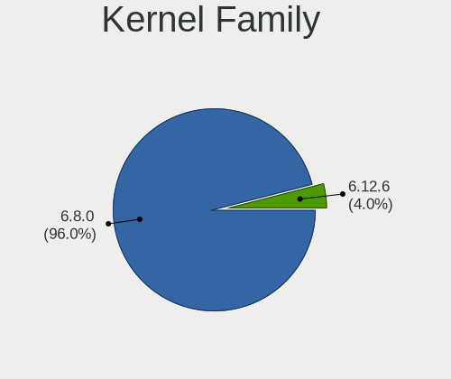
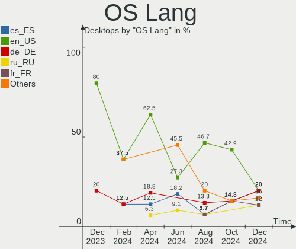
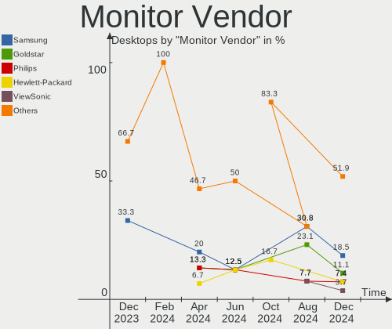
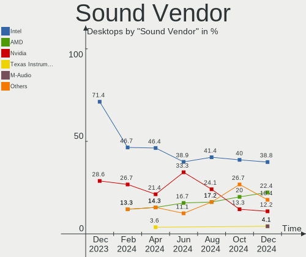

Elementary - Hardware Trends (Desktops)
---------------------------------------

A project to identify most popular hardware characteristics and track their change
over time based on data collected by Linux users at https://Linux-Hardware.org.

Anyone can contribute to this report by the [hw-probe](https://github.com/linuxhw/hw-probe) tool:

    sudo -E hw-probe -all -upload

This report is for one last month. Overall report since the beginning of time: [TestCoverage](https://github.com/linuxhw/TestCoverage)

Period: Sep, 2022.

Contents
--------

* [ System ](#system)
  - [ OS                       ](#os)
  - [ OS Family                ](#os-family)
  - [ Kernel                   ](#kernel)
  - [ Kernel Family            ](#kernel-family)
  - [ Kernel Major Ver.        ](#kernel-major-ver)
  - [ Arch                     ](#arch)
  - [ DE                       ](#de)
  - [ Display Server           ](#display-server)
  - [ Display Manager          ](#display-manager)
  - [ OS Lang                  ](#os-lang)
  - [ Boot Mode                ](#boot-mode)
  - [ Filesystem               ](#filesystem)
  - [ Part. scheme             ](#part-scheme)
  - [ Dual Boot with Linux/BSD ](#dual-boot-with-linuxbsd)
  - [ Dual Boot (Win)          ](#dual-boot-win)

* [ Board ](#board)
  - [ Vendor                   ](#vendor)
  - [ Model                    ](#model)
  - [ Model Family             ](#model-family)
  - [ MFG Year                 ](#mfg-year)
  - [ Form Factor              ](#form-factor)
  - [ Secure Boot              ](#secure-boot)
  - [ Coreboot                 ](#coreboot)
  - [ RAM Size                 ](#ram-size)
  - [ RAM Used                 ](#ram-used)
  - [ Total Drives             ](#total-drives)
  - [ Has CD-ROM               ](#has-cd-rom)
  - [ Has Ethernet             ](#has-ethernet)
  - [ Has WiFi                 ](#has-wifi)
  - [ Has Bluetooth            ](#has-bluetooth)

* [ Location ](#location)
  - [ Country                  ](#country)
  - [ City                     ](#city)

* [ Drives ](#drives)
  - [ Drive Vendor             ](#drive-vendor)
  - [ Drive Model              ](#drive-model)
  - [ HDD Vendor               ](#hdd-vendor)
  - [ SSD Vendor               ](#ssd-vendor)
  - [ Drive Kind               ](#drive-kind)
  - [ Drive Connector          ](#drive-connector)
  - [ Drive Size               ](#drive-size)
  - [ Space Total              ](#space-total)
  - [ Space Used               ](#space-used)
  - [ Malfunc. Drives          ](#malfunc-drives)
  - [ Malfunc. Drive Vendor    ](#malfunc-drive-vendor)
  - [ Malfunc. HDD Vendor      ](#malfunc-hdd-vendor)
  - [ Malfunc. Drive Kind      ](#malfunc-drive-kind)
  - [ Failed Drives            ](#failed-drives)
  - [ Failed Drive Vendor      ](#failed-drive-vendor)
  - [ Drive Status             ](#drive-status)

* [ Storage controller ](#storage-controller)
  - [ Storage Vendor           ](#storage-vendor)
  - [ Storage Model            ](#storage-model)
  - [ Storage Kind             ](#storage-kind)

* [ Processor ](#processor)
  - [ CPU Vendor               ](#cpu-vendor)
  - [ CPU Model                ](#cpu-model)
  - [ CPU Model Family         ](#cpu-model-family)
  - [ CPU Cores                ](#cpu-cores)
  - [ CPU Sockets              ](#cpu-sockets)
  - [ CPU Threads              ](#cpu-threads)
  - [ CPU Op-Modes             ](#cpu-op-modes)
  - [ CPU Microcode            ](#cpu-microcode)
  - [ CPU Microarch            ](#cpu-microarch)

* [ Graphics ](#graphics)
  - [ GPU Vendor               ](#gpu-vendor)
  - [ GPU Model                ](#gpu-model)
  - [ GPU Combo                ](#gpu-combo)
  - [ GPU Driver               ](#gpu-driver)
  - [ GPU Memory               ](#gpu-memory)

* [ Monitor ](#monitor)
  - [ Monitor Vendor           ](#monitor-vendor)
  - [ Monitor Model            ](#monitor-model)
  - [ Monitor Resolution       ](#monitor-resolution)
  - [ Monitor Diagonal         ](#monitor-diagonal)
  - [ Monitor Width            ](#monitor-width)
  - [ Aspect Ratio             ](#aspect-ratio)
  - [ Monitor Area             ](#monitor-area)
  - [ Pixel Density            ](#pixel-density)
  - [ Multiple Monitors        ](#multiple-monitors)

* [ Network ](#network)
  - [ Net Controller Vendor    ](#net-controller-vendor)
  - [ Net Controller Model     ](#net-controller-model)
  - [ Wireless Vendor          ](#wireless-vendor)
  - [ Wireless Model           ](#wireless-model)
  - [ Ethernet Vendor          ](#ethernet-vendor)
  - [ Ethernet Model           ](#ethernet-model)
  - [ Net Controller Kind      ](#net-controller-kind)
  - [ Used Controller          ](#used-controller)
  - [ NICs                     ](#nics)
  - [ IPv6                     ](#ipv6)

* [ Bluetooth ](#bluetooth)
  - [ Bluetooth Vendor         ](#bluetooth-vendor)
  - [ Bluetooth Model          ](#bluetooth-model)

* [ Sound ](#sound)
  - [ Sound Vendor             ](#sound-vendor)
  - [ Sound Model              ](#sound-model)

* [ Memory ](#memory)
  - [ Memory Vendor            ](#memory-vendor)
  - [ Memory Model             ](#memory-model)
  - [ Memory Kind              ](#memory-kind)
  - [ Memory Form Factor       ](#memory-form-factor)
  - [ Memory Size              ](#memory-size)
  - [ Memory Speed             ](#memory-speed)

* [ Printers & scanners ](#printers--scanners)
  - [ Printer Vendor           ](#printer-vendor)
  - [ Printer Model            ](#printer-model)
  - [ Scanner Vendor           ](#scanner-vendor)
  - [ Scanner Model            ](#scanner-model)

* [ Camera ](#camera)
  - [ Camera Vendor            ](#camera-vendor)
  - [ Camera Model             ](#camera-model)

* [ Security ](#security)
  - [ Fingerprint Vendor       ](#fingerprint-vendor)
  - [ Fingerprint Model        ](#fingerprint-model)
  - [ Chipcard Vendor          ](#chipcard-vendor)
  - [ Chipcard Model           ](#chipcard-model)

* [ Unsupported ](#unsupported)
  - [ Unsupported Devices      ](#unsupported-devices)
  - [ Unsupported Device Types ](#unsupported-device-types)

System
------

OS
--

Installed operating systems

| Name           | Desktops | Percent |
|----------------|----------|---------|
| Elementary 6.1 | 9        | 100%    |

OS Family
---------

OS without a version

| Name       | Desktops | Percent |
|------------|----------|---------|
| Elementary | 9        | 100%    |

Kernel
------

Version of the Linux kernel

| Version           | Desktops | Percent |
|-------------------|----------|---------|
| 5.15.0-46-generic | 7        | 77.78%  |
| 5.15.0-48-generic | 2        | 22.22%  |

Kernel Family
-------------

Linux kernel without a distro release

| Version | Desktops | Percent |
|---------|----------|---------|
| 5.15.0  | 9        | 100%    |

Kernel Major Ver.
-----------------

Linux kernel major version

| Version | Desktops | Percent |
|---------|----------|---------|
| 5.15    | 9        | 100%    |

Arch
----

OS architecture (x86_64, i586, etc.)

| Name   | Desktops | Percent |
|--------|----------|---------|
| x86_64 | 9        | 100%    |

DE
--

Desktop Environment

| Name     | Desktops | Percent |
|----------|----------|---------|
| Pantheon | 9        | 100%    |

Display Server
--------------

X11 or Wayland

| Name | Desktops | Percent |
|------|----------|---------|
| X11  | 9        | 100%    |

Display Manager
---------------

SDDM, LightDM, etc.

| Name    | Desktops | Percent |
|---------|----------|---------|
| Unknown | 8        | 88.89%  |
| LightDM | 1        | 11.11%  |

OS Lang
-------

Language

| Lang  | Desktops | Percent |
|-------|----------|---------|
| en_US | 5        | 55.56%  |
| ru_RU | 2        | 22.22%  |
| fr_FR | 1        | 11.11%  |
| es_ES | 1        | 11.11%  |

Boot Mode
---------

EFI or BIOS

| Mode | Desktops | Percent |
|------|----------|---------|
| BIOS | 5        | 55.56%  |
| EFI  | 4        | 44.44%  |

Filesystem
----------

Type of filesystem

| Type | Desktops | Percent |
|------|----------|---------|
| Ext4 | 9        | 100%    |

Part. scheme
------------

Scheme of partitioning

| Type    | Desktops | Percent |
|---------|----------|---------|
| Unknown | 9        | 100%    |

Dual Boot with Linux/BSD
------------------------

Hosting more than one Linux/BSD

| Dual boot | Desktops | Percent |
|-----------|----------|---------|
| No        | 9        | 100%    |

Dual Boot (Win)
---------------

Hosting Linux and Windows

| Dual boot | Desktops | Percent |
|-----------|----------|---------|
| No        | 9        | 100%    |

Board
-----

Vendor
------

Motherboard manufacturer

| Name                | Desktops | Percent |
|---------------------|----------|---------|
| Gigabyte Technology | 2        | 22.22%  |
| ASUSTek Computer    | 2        | 22.22%  |
| Packard Bell        | 1        | 11.11%  |
| IceWhale Technology | 1        | 11.11%  |
| ASRock              | 1        | 11.11%  |
| Apple               | 1        | 11.11%  |
| Acer                | 1        | 11.11%  |

Model
-----

Motherboard model

| Name                       | Desktops | Percent |
|----------------------------|----------|---------|
| Packard Bell IMEDIA S1300  | 1        | 11.11%  |
| IceWhale ZimaBoard 832 ZMB | 1        | 11.11%  |
| Gigabyte G41MT-S2          | 1        | 11.11%  |
| Gigabyte F2A88XM-D3HP      | 1        | 11.11%  |
| ASUS TUF Gaming Z490-PLUS  | 1        | 11.11%  |
| ASUS P8H77-V LE            | 1        | 11.11%  |
| ASRock X370 Taichi         | 1        | 11.11%  |
| Apple MacPro5,1            | 1        | 11.11%  |
| Acer Aspire X1420G         | 1        | 11.11%  |

Model Family
------------

Motherboard model prefix

| Name                  | Desktops | Percent |
|-----------------------|----------|---------|
| Packard Bell IMEDIA   | 1        | 11.11%  |
| IceWhale ZimaBoard    | 1        | 11.11%  |
| Gigabyte G41MT-S2     | 1        | 11.11%  |
| Gigabyte F2A88XM-D3HP | 1        | 11.11%  |
| ASUS TUF              | 1        | 11.11%  |
| ASUS P8H77-V          | 1        | 11.11%  |
| ASRock X370           | 1        | 11.11%  |
| Apple MacPro5         | 1        | 11.11%  |
| Acer Aspire           | 1        | 11.11%  |

MFG Year
--------

Motherboard manufacture year

| Year | Desktops | Percent |
|------|----------|---------|
| 2010 | 3        | 33.33%  |
| 2022 | 1        | 11.11%  |
| 2020 | 1        | 11.11%  |
| 2017 | 1        | 11.11%  |
| 2015 | 1        | 11.11%  |
| 2012 | 1        | 11.11%  |
| 2011 | 1        | 11.11%  |

Form Factor
-----------

Physical design of the computer

| Name    | Desktops | Percent |
|---------|----------|---------|
| Desktop | 9        | 100%    |

Secure Boot
-----------

Enabled or disabled

| State    | Desktops | Percent |
|----------|----------|---------|
| Disabled | 9        | 100%    |

Coreboot
--------

Have coreboot on board

| Used | Desktops | Percent |
|------|----------|---------|
| No   | 9        | 100%    |

RAM Size
--------

Total RAM memory

| Size in GB | Desktops | Percent |
|------------|----------|---------|
| 4.01-8.0   | 3        | 33.33%  |
| 3.01-4.0   | 3        | 33.33%  |
| 32.01-64.0 | 1        | 11.11%  |
| 16.01-24.0 | 1        | 11.11%  |
| 8.01-16.0  | 1        | 11.11%  |

RAM Used
--------

Used RAM memory

| Used GB  | Desktops | Percent |
|----------|----------|---------|
| 4.01-8.0 | 3        | 33.33%  |
| 1.01-2.0 | 3        | 33.33%  |
| 2.01-3.0 | 2        | 22.22%  |
| 0.51-1.0 | 1        | 11.11%  |

Total Drives
------------

Number of drives on board

| Drives | Desktops | Percent |
|--------|----------|---------|
| 1      | 5        | 55.56%  |
| 2      | 2        | 22.22%  |
| 4      | 1        | 11.11%  |
| 3      | 1        | 11.11%  |

Has CD-ROM
----------

Has CD-ROM on board

| Presented | Desktops | Percent |
|-----------|----------|---------|
| No        | 5        | 55.56%  |
| Yes       | 4        | 44.44%  |

Has Ethernet
------------

Has Ethernet on board

| Presented | Desktops | Percent |
|-----------|----------|---------|
| Yes       | 9        | 100%    |

Has WiFi
--------

Has WiFi module

| Presented | Desktops | Percent |
|-----------|----------|---------|
| Yes       | 6        | 66.67%  |
| No        | 3        | 33.33%  |

Has Bluetooth
-------------

Has Bluetooth module

| Presented | Desktops | Percent |
|-----------|----------|---------|
| No        | 5        | 55.56%  |
| Yes       | 4        | 44.44%  |

Location
--------

Country
-------

Geographic location (country)

| Country     | Desktops | Percent |
|-------------|----------|---------|
| USA         | 5        | 55.56%  |
| Russia      | 2        | 22.22%  |
| Switzerland | 1        | 11.11%  |
| Colombia    | 1        | 11.11%  |

City
----

Geographic location (city)

| City        | Desktops | Percent |
|-------------|----------|---------|
| Woodbridge  | 1        | 11.11%  |
| San Antonio | 1        | 11.11%  |
| Podolsk     | 1        | 11.11%  |
| Moscow      | 1        | 11.11%  |
| Henderson   | 1        | 11.11%  |
| Fort Worth  | 1        | 11.11%  |
| Castle Rock | 1        | 11.11%  |
| Caslano     | 1        | 11.11%  |
| Barbosa     | 1        | 11.11%  |

Drives
------

Drive Vendor
------------

Hard drive vendors

| Vendor              | Desktops | Drives | Percent |
|---------------------|----------|--------|---------|
| WDC                 | 3        | 3      | 23.08%  |
| Samsung Electronics | 2        | 3      | 15.38%  |
| Unknown             | 1        | 1      | 7.69%   |
| SPCC                | 1        | 1      | 7.69%   |
| Seagate             | 1        | 2      | 7.69%   |
| Kingston            | 1        | 1      | 7.69%   |
| Hitachi             | 1        | 1      | 7.69%   |
| HGST                | 1        | 1      | 7.69%   |
| Fujitsu             | 1        | 1      | 7.69%   |
| Corsair             | 1        | 1      | 7.69%   |

Drive Model
-----------

Hard drive models

| Model                                               | Desktops | Percent |
|-----------------------------------------------------|----------|---------|
| WDC WD5000AAKX-603CA0 500GB                         | 1        | 6.67%   |
| WDC WD10EADX-22TDHB0 1TB                            | 1        | 6.67%   |
| WDC WD Blue SA510 2.5 500GB SSD                     | 1        | 6.67%   |
| Unknown MMC Card  32GB                              | 1        | 6.67%   |
| SPCC Solid State Disk 512GB                         | 1        | 6.67%   |
| Seagate ST31500341AS 1TB                            | 1        | 6.67%   |
| Seagate ST1000DM003-1ER162 1TB                      | 1        | 6.67%   |
| Samsung SSD 860 EVO 1TB                             | 1        | 6.67%   |
| Samsung SP0812C 80GB                                | 1        | 6.67%   |
| Samsung NVMe SSD Controller SM961/PM961/SM963 256GB | 1        | 6.67%   |
| Kingston SV300S37A120G 120GB SSD                    | 1        | 6.67%   |
| Hitachi HUS724030ALE641 3TB                         | 1        | 6.67%   |
| HGST HTS721010A9E630 1TB                            | 1        | 6.67%   |
| Fujitsu MHW2160BHPL 160GB                           | 1        | 6.67%   |
| Corsair Force 3 SSD 120GB                           | 1        | 6.67%   |

HDD Vendor
----------

Hard disk drive vendors

| Vendor              | Desktops | Drives | Percent |
|---------------------|----------|--------|---------|
| WDC                 | 2        | 2      | 28.57%  |
| Seagate             | 1        | 2      | 14.29%  |
| Samsung Electronics | 1        | 1      | 14.29%  |
| Hitachi             | 1        | 1      | 14.29%  |
| HGST                | 1        | 1      | 14.29%  |
| Fujitsu             | 1        | 1      | 14.29%  |

SSD Vendor
----------

Solid state drive vendors

| Vendor              | Desktops | Drives | Percent |
|---------------------|----------|--------|---------|
| WDC                 | 1        | 1      | 20%     |
| SPCC                | 1        | 1      | 20%     |
| Samsung Electronics | 1        | 1      | 20%     |
| Kingston            | 1        | 1      | 20%     |
| Corsair             | 1        | 1      | 20%     |

Drive Kind
----------

HDD or SSD

| Kind | Desktops | Drives | Percent |
|------|----------|--------|---------|
| HDD  | 6        | 8      | 46.15%  |
| SSD  | 5        | 5      | 38.46%  |
| MMC  | 1        | 1      | 7.69%   |
| NVMe | 1        | 1      | 7.69%   |

Drive Connector
---------------

SATA, SAS, NVMe, etc.

| Type | Desktops | Drives | Percent |
|------|----------|--------|---------|
| SATA | 9        | 13     | 81.82%  |
| NVMe | 1        | 1      | 9.09%   |
| MMC  | 1        | 1      | 9.09%   |

Drive Size
----------

Size of hard drive

| Size in TB | Desktops | Drives | Percent |
|------------|----------|--------|---------|
| 0.01-0.5   | 6        | 6      | 54.55%  |
| 0.51-1.0   | 4        | 6      | 36.36%  |
| 2.01-3.0   | 1        | 1      | 9.09%   |

Space Total
-----------

Amount of disk space available on the file system

| Size in GB | Desktops | Percent |
|------------|----------|---------|
| 101-250    | 4        | 44.44%  |
| 251-500    | 2        | 22.22%  |
| 1001-2000  | 1        | 11.11%  |
| 501-1000   | 1        | 11.11%  |
| 51-100     | 1        | 11.11%  |

Space Used
----------

Amount of used disk space

| Used GB   | Desktops | Percent |
|-----------|----------|---------|
| 1-20      | 4        | 44.44%  |
| 21-50     | 3        | 33.33%  |
| 101-250   | 1        | 11.11%  |
| 1001-2000 | 1        | 11.11%  |

Malfunc. Drives
---------------

Drive models with a malfunction

Zero info for selected period =(

Malfunc. Drive Vendor
---------------------

Vendors of faulty drives

Zero info for selected period =(

Malfunc. HDD Vendor
-------------------

Vendors of faulty HDD drives

Zero info for selected period =(

Malfunc. Drive Kind
-------------------

Kinds of faulty drives

Zero info for selected period =(

Failed Drives
-------------

Failed drive models

Zero info for selected period =(

Failed Drive Vendor
-------------------

Failed drive vendors

Zero info for selected period =(

Drive Status
------------

Number of failed and malfunc. drives

| Status   | Desktops | Drives | Percent |
|----------|----------|--------|---------|
| Detected | 9        | 15     | 100%    |

Storage controller
------------------

Storage Vendor
--------------

Storage controller vendors

| Vendor              | Desktops | Percent |
|---------------------|----------|---------|
| Intel               | 5        | 45.45%  |
| Nvidia              | 2        | 18.18%  |
| AMD                 | 2        | 18.18%  |
| Samsung Electronics | 1        | 9.09%   |
| ASMedia Technology  | 1        | 9.09%   |

Storage Model
-------------

Storage controller models

| Model                                                                        | Desktops | Percent |
|------------------------------------------------------------------------------|----------|---------|
| Nvidia MCP61 SATA Controller                                                 | 2        | 15.38%  |
| AMD FCH SATA Controller [AHCI mode]                                          | 2        | 15.38%  |
| Samsung NVMe SSD Controller SM961/PM961/SM963                                | 1        | 7.69%   |
| Nvidia MCP61 IDE                                                             | 1        | 7.69%   |
| Intel NM10/ICH7 Family SATA Controller [IDE mode]                            | 1        | 7.69%   |
| Intel Comet Lake PCH-H RAID                                                  | 1        | 7.69%   |
| Intel Celeron N3350/Pentium N4200/Atom E3900 Series SATA AHCI Controller     | 1        | 7.69%   |
| Intel 82801JI (ICH10 Family) SATA AHCI Controller                            | 1        | 7.69%   |
| Intel 7 Series/C210 Series Chipset Family 6-port SATA Controller [AHCI mode] | 1        | 7.69%   |
| ASMedia ASM1062 Serial ATA Controller                                        | 1        | 7.69%   |
| AMD X370 Series Chipset SATA Controller                                      | 1        | 7.69%   |

Storage Kind
------------

Kind of storage controller (IDE, SATA, NVMe, SAS, ...)

| Kind | Desktops | Percent |
|------|----------|---------|
| SATA | 5        | 50%     |
| IDE  | 3        | 30%     |
| RAID | 1        | 10%     |
| NVMe | 1        | 10%     |

Processor
---------

CPU Vendor
----------

Processor vendors

| Vendor | Desktops | Percent |
|--------|----------|---------|
| Intel  | 5        | 55.56%  |
| AMD    | 4        | 44.44%  |

CPU Model
---------

Processor models

| Model                                           | Desktops | Percent |
|-------------------------------------------------|----------|---------|
| Intel Xeon CPU X5680 @ 3.33GHz                  | 1        | 11.11%  |
| Intel Pentium Dual-Core CPU E5700 @ 3.00GHz     | 1        | 11.11%  |
| Intel Core i5-2310 CPU @ 2.90GHz                | 1        | 11.11%  |
| Intel Core i3-10100F CPU @ 3.60GHz              | 1        | 11.11%  |
| Intel Celeron CPU N3450 @ 1.10GHz               | 1        | 11.11%  |
| AMD Ryzen 5 2600 Six-Core Processor             | 1        | 11.11%  |
| AMD Athlon II X4 645 Processor                  | 1        | 11.11%  |
| AMD Athlon II X2 250 Processor                  | 1        | 11.11%  |
| AMD A10-7860K Radeon R7, 12 Compute Cores 4C+8G | 1        | 11.11%  |

CPU Model Family
----------------

Processor model prefix

| Model                   | Desktops | Percent |
|-------------------------|----------|---------|
| Intel Xeon              | 1        | 11.11%  |
| Intel Pentium Dual-Core | 1        | 11.11%  |
| Intel Core i5           | 1        | 11.11%  |
| Intel Core i3           | 1        | 11.11%  |
| Intel Celeron           | 1        | 11.11%  |
| AMD Ryzen 5             | 1        | 11.11%  |
| AMD Athlon II X4        | 1        | 11.11%  |
| AMD Athlon II X2        | 1        | 11.11%  |
| AMD A10                 | 1        | 11.11%  |

CPU Cores
---------

Number of processor cores

| Number | Desktops | Percent |
|--------|----------|---------|
| 4      | 4        | 44.44%  |
| 2      | 3        | 33.33%  |
| 12     | 1        | 11.11%  |
| 6      | 1        | 11.11%  |

CPU Sockets
-----------

Number of sockets

| Number | Desktops | Percent |
|--------|----------|---------|
| 1      | 8        | 88.89%  |
| 2      | 1        | 11.11%  |

CPU Threads
-----------

Threads per core (Hyper-Threading)

| Number | Desktops | Percent |
|--------|----------|---------|
| 1      | 5        | 55.56%  |
| 2      | 4        | 44.44%  |

CPU Op-Modes
------------

CPU Operation Modes (32-bit, 64-bit)

| Op mode        | Desktops | Percent |
|----------------|----------|---------|
| 32-bit, 64-bit | 9        | 100%    |

CPU Microcode
-------------

Microcode number

| Number     | Desktops | Percent |
|------------|----------|---------|
| 0xa0653    | 1        | 11.11%  |
| 0x506c9    | 1        | 11.11%  |
| 0x206c2    | 1        | 11.11%  |
| 0x206a7    | 1        | 11.11%  |
| 0x1067a    | 1        | 11.11%  |
| 0x0800820d | 1        | 11.11%  |
| 0x06003106 | 1        | 11.11%  |
| 0x010000c8 | 1        | 11.11%  |
| 0x010000c7 | 1        | 11.11%  |

CPU Microarch
-------------

Microarchitecture

| Name        | Desktops | Percent |
|-------------|----------|---------|
| K10         | 2        | 22.22%  |
| Zen+        | 1        | 11.11%  |
| Westmere    | 1        | 11.11%  |
| Steamroller | 1        | 11.11%  |
| SandyBridge | 1        | 11.11%  |
| Penryn      | 1        | 11.11%  |
| Goldmont    | 1        | 11.11%  |
| CometLake   | 1        | 11.11%  |

Graphics
--------

GPU Vendor
----------

Vendors of graphics cards

| Vendor | Desktops | Percent |
|--------|----------|---------|
| AMD    | 5        | 55.56%  |
| Intel  | 3        | 33.33%  |
| Nvidia | 1        | 11.11%  |

GPU Model
---------

Graphics card models

| Model                                                                     | Desktops | Percent |
|---------------------------------------------------------------------------|----------|---------|
| Nvidia GK110 [GeForce GTX 780]                                            | 1        | 10%     |
| Intel HD Graphics 500                                                     | 1        | 10%     |
| Intel 4 Series Chipset Integrated Graphics Controller                     | 1        | 10%     |
| Intel 2nd Generation Core Processor Family Integrated Graphics Controller | 1        | 10%     |
| AMD Turks PRO [Radeon HD 6570/7570/8550 / R5 230]                         | 1        | 10%     |
| AMD Redwood PRO GL [FirePro V3800]                                        | 1        | 10%     |
| AMD Kaveri [Radeon R7 Graphics]                                           | 1        | 10%     |
| AMD Ellesmere [Radeon RX 470/480/570/570X/580/580X/590]                   | 1        | 10%     |
| AMD Cape Verde XT [Radeon HD 7770/8760 / R7 250X]                         | 1        | 10%     |
| AMD Baffin [Radeon RX 550 640SP / RX 560/560X]                            | 1        | 10%     |

GPU Combo
---------

Combinations of graphics cards

| Name       | Desktops | Percent |
|------------|----------|---------|
| 1 x AMD    | 4        | 44.44%  |
| 1 x Intel  | 3        | 33.33%  |
| 2 x AMD    | 1        | 11.11%  |
| 1 x Nvidia | 1        | 11.11%  |

GPU Driver
----------

Free vs proprietary

| Driver | Desktops | Percent |
|--------|----------|---------|
| Free   | 9        | 100%    |

GPU Memory
----------

Total video memory

| Size in GB | Desktops | Percent |
|------------|----------|---------|
| 0.51-1.0   | 3        | 33.33%  |
| Unknown    | 3        | 33.33%  |
| 7.01-8.0   | 1        | 11.11%  |
| 2.01-3.0   | 1        | 11.11%  |
| 0.01-0.5   | 1        | 11.11%  |

Monitor
-------

Monitor Vendor
--------------

Monitor vendors

| Vendor   | Desktops | Percent |
|----------|----------|---------|
| AOC      | 2        | 22.22%  |
| Vizio    | 1        | 11.11%  |
| Sharp    | 1        | 11.11%  |
| Lenovo   | 1        | 11.11%  |
| Goldstar | 1        | 11.11%  |
| Dell     | 1        | 11.11%  |
| Apple    | 1        | 11.11%  |
| Acer     | 1        | 11.11%  |

Monitor Model
-------------

Monitor models

| Model                                                    | Desktops | Percent |
|----------------------------------------------------------|----------|---------|
| Vizio VO320E VIZ0035 1280x720 700x390mm 31.5-inch        | 1        | 11.11%  |
| Sharp HDMI SHP1048 1920x1080 1330x750mm 60.1-inch        | 1        | 11.11%  |
| Lenovo LEN L1711pC LEN13B7 1280x1024 360x300mm 18.4-inch | 1        | 11.11%  |
| Goldstar LG HDR 4K GSM7706 3840x2160 600x340mm 27.2-inch | 1        | 11.11%  |
| Dell 1704FPV DEL3016 1280x1024 340x270mm 17.1-inch       | 1        | 11.11%  |
| Apple Cinema HD APP921C 1920x1200 495x310mm 23.0-inch    | 1        | 11.11%  |
| AOC 2460G5 AOC2460 1920x1080 531x299mm 24.0-inch         | 1        | 11.11%  |
| AOC 1943W AOC1943 1366x768 410x230mm 18.5-inch           | 1        | 11.11%  |
| Acer R240HY ACR046F 1920x1080 527x296mm 23.8-inch        | 1        | 11.11%  |

Monitor Resolution
------------------

Monitor screen resolution

| Resolution        | Desktops | Percent |
|-------------------|----------|---------|
| 1920x1080 (FHD)   | 4        | 44.44%  |
| 1280x1024 (SXGA)  | 2        | 22.22%  |
| 3840x2160 (4K)    | 1        | 11.11%  |
| 1920x1200 (WUXGA) | 1        | 11.11%  |
| 1366x768 (WXGA)   | 1        | 11.11%  |

Monitor Diagonal
----------------

Diagonal size in inches

| Inches | Desktops | Percent |
|--------|----------|---------|
| 24     | 2        | 22.22%  |
| 18     | 2        | 22.22%  |
| 60     | 1        | 11.11%  |
| 36     | 1        | 11.11%  |
| 27     | 1        | 11.11%  |
| 23     | 1        | 11.11%  |
| 17     | 1        | 11.11%  |

Monitor Width
-------------

Physical width

| Width in mm | Desktops | Percent |
|-------------|----------|---------|
| 501-600     | 3        | 33.33%  |
| 401-500     | 2        | 22.22%  |
| 701-800     | 1        | 11.11%  |
| 351-400     | 1        | 11.11%  |
| 301-350     | 1        | 11.11%  |
| 1001-1500   | 1        | 11.11%  |

Aspect Ratio
------------

Proportional relationship between the width and the height

| Ratio | Desktops | Percent |
|-------|----------|---------|
| 16/9  | 4        | 44.44%  |
| 16/10 | 2        | 22.22%  |
| 6/5   | 1        | 11.11%  |
| 5/4   | 1        | 11.11%  |
| 3/2   | 1        | 11.11%  |

Monitor Area
------------

Area in inch²

| Area in inch² | Desktops | Percent |
|----------------|----------|---------|
| 201-250        | 2        | 22.22%  |
| 141-150        | 2        | 22.22%  |
| More than 1000 | 1        | 11.11%  |
| 301-350        | 1        | 11.11%  |
| 251-300        | 1        | 11.11%  |
| 151-200        | 1        | 11.11%  |
| 501-1000       | 1        | 11.11%  |

Pixel Density
-------------

Pixels per inch

| Density | Desktops | Percent |
|---------|----------|---------|
| 51-100  | 6        | 66.67%  |
| 1-50    | 2        | 22.22%  |
| 161-240 | 1        | 11.11%  |

Multiple Monitors
-----------------

Total monitors connected

| Total | Desktops | Percent |
|-------|----------|---------|
| 1     | 9        | 100%    |

Network
-------

Net Controller Vendor
---------------------

Controller vendors

| Vendor                | Desktops | Percent |
|-----------------------|----------|---------|
| Intel                 | 4        | 33.33%  |
| Realtek Semiconductor | 3        | 25%     |
| Nvidia                | 2        | 16.67%  |
| Ralink Technology     | 1        | 8.33%   |
| Qualcomm Atheros      | 1        | 8.33%   |
| Broadcom              | 1        | 8.33%   |

Net Controller Model
--------------------

Controller models

| Model                                                             | Desktops | Percent |
|-------------------------------------------------------------------|----------|---------|
| Realtek RTL8111/8168/8411 PCI Express Gigabit Ethernet Controller | 3        | 20%     |
| Nvidia MCP61 Ethernet                                             | 2        | 13.33%  |
| Realtek RTL8188CE 802.11b/g/n WiFi Adapter                        | 1        | 6.67%   |
| Ralink MT7601U Wireless Adapter                                   | 1        | 6.67%   |
| Qualcomm Atheros AR8151 v1.0 Gigabit Ethernet                     | 1        | 6.67%   |
| Intel Wi-Fi 6 AX210/AX211/AX411 160MHz                            | 1        | 6.67%   |
| Intel I211 Gigabit Network Connection                             | 1        | 6.67%   |
| Intel Ethernet Connection (11) I219-V                             | 1        | 6.67%   |
| Intel Dual Band Wireless-AC 3168NGW [Stone Peak]                  | 1        | 6.67%   |
| Intel Comet Lake PCH CNVi WiFi                                    | 1        | 6.67%   |
| Intel 82574L Gigabit Network Connection                           | 1        | 6.67%   |
| Broadcom BCM4322 802.11a/b/g/n Wireless LAN Controller            | 1        | 6.67%   |

Wireless Vendor
---------------

Wireless vendors

| Vendor                | Desktops | Percent |
|-----------------------|----------|---------|
| Intel                 | 3        | 50%     |
| Realtek Semiconductor | 1        | 16.67%  |
| Ralink Technology     | 1        | 16.67%  |
| Broadcom              | 1        | 16.67%  |

Wireless Model
--------------

Wireless models

| Model                                                  | Desktops | Percent |
|--------------------------------------------------------|----------|---------|
| Realtek RTL8188CE 802.11b/g/n WiFi Adapter             | 1        | 16.67%  |
| Ralink MT7601U Wireless Adapter                        | 1        | 16.67%  |
| Intel Wi-Fi 6 AX210/AX211/AX411 160MHz                 | 1        | 16.67%  |
| Intel Dual Band Wireless-AC 3168NGW [Stone Peak]       | 1        | 16.67%  |
| Intel Comet Lake PCH CNVi WiFi                         | 1        | 16.67%  |
| Broadcom BCM4322 802.11a/b/g/n Wireless LAN Controller | 1        | 16.67%  |

Ethernet Vendor
---------------

Ethernet vendors

| Vendor                | Desktops | Percent |
|-----------------------|----------|---------|
| Realtek Semiconductor | 3        | 33.33%  |
| Intel                 | 3        | 33.33%  |
| Nvidia                | 2        | 22.22%  |
| Qualcomm Atheros      | 1        | 11.11%  |

Ethernet Model
--------------

Ethernet models

| Model                                                             | Desktops | Percent |
|-------------------------------------------------------------------|----------|---------|
| Realtek RTL8111/8168/8411 PCI Express Gigabit Ethernet Controller | 3        | 33.33%  |
| Nvidia MCP61 Ethernet                                             | 2        | 22.22%  |
| Qualcomm Atheros AR8151 v1.0 Gigabit Ethernet                     | 1        | 11.11%  |
| Intel I211 Gigabit Network Connection                             | 1        | 11.11%  |
| Intel Ethernet Connection (11) I219-V                             | 1        | 11.11%  |
| Intel 82574L Gigabit Network Connection                           | 1        | 11.11%  |

Net Controller Kind
-------------------

Ethernet, WiFi or modem

| Kind     | Desktops | Percent |
|----------|----------|---------|
| Ethernet | 9        | 60%     |
| WiFi     | 6        | 40%     |

Used Controller
---------------

Currently used network controller

| Kind     | Desktops | Percent |
|----------|----------|---------|
| Ethernet | 5        | 55.56%  |
| WiFi     | 4        | 44.44%  |

NICs
----

Total network controllers on board

| Total | Desktops | Percent |
|-------|----------|---------|
| 2     | 5        | 55.56%  |
| 1     | 3        | 33.33%  |
| 3     | 1        | 11.11%  |

IPv6
----

IPv6 vs IPv4

| Used | Desktops | Percent |
|------|----------|---------|
| No   | 6        | 66.67%  |
| Yes  | 3        | 33.33%  |

Bluetooth
---------

Bluetooth Vendor
----------------

Controller vendors

| Vendor | Desktops | Percent |
|--------|----------|---------|
| Intel  | 3        | 75%     |
| Apple  | 1        | 25%     |

Bluetooth Model
---------------

Controller models

| Model                                | Desktops | Percent |
|--------------------------------------|----------|---------|
| Intel Wireless-AC 3168 Bluetooth     | 1        | 25%     |
| Intel AX210 Bluetooth                | 1        | 25%     |
| Intel AX201 Bluetooth                | 1        | 25%     |
| Apple Built-in Bluetooth 2.0+EDR HCI | 1        | 25%     |

Sound
-----

Sound Vendor
------------

Sound card vendors

| Vendor   | Desktops | Percent |
|----------|----------|---------|
| Intel    | 5        | 35.71%  |
| AMD      | 5        | 35.71%  |
| Nvidia   | 3        | 21.43%  |
| Logitech | 1        | 7.14%   |

Sound Model
-----------

Sound card models

| Model                                                                   | Desktops | Percent |
|-------------------------------------------------------------------------|----------|---------|
| Nvidia MCP61 High Definition Audio                                      | 2        | 11.76%  |
| Nvidia GK110 High Definition Audio Controller                           | 1        | 5.88%   |
| Logitech Logitech USB Microphone                                        | 1        | 5.88%   |
| Intel NM10/ICH7 Family High Definition Audio Controller                 | 1        | 5.88%   |
| Intel Comet Lake PCH cAVS                                               | 1        | 5.88%   |
| Intel Celeron N3350/Pentium N4200/Atom E3900 Series Audio Cluster       | 1        | 5.88%   |
| Intel 82801JI (ICH10 Family) HD Audio Controller                        | 1        | 5.88%   |
| Intel 7 Series/C216 Chipset Family High Definition Audio Controller     | 1        | 5.88%   |
| AMD Turks HDMI Audio [Radeon HD 6500/6600 / 6700M Series]               | 1        | 5.88%   |
| AMD Redwood HDMI Audio [Radeon HD 5000 Series]                          | 1        | 5.88%   |
| AMD Oland/Hainan/Cape Verde/Pitcairn HDMI Audio [Radeon HD 7000 Series] | 1        | 5.88%   |
| AMD Kaveri HDMI/DP Audio Controller                                     | 1        | 5.88%   |
| AMD FCH Azalia Controller                                               | 1        | 5.88%   |
| AMD Family 17h (Models 00h-0fh) HD Audio Controller                     | 1        | 5.88%   |
| AMD Ellesmere HDMI Audio [Radeon RX 470/480 / 570/580/590]              | 1        | 5.88%   |
| AMD Baffin HDMI/DP Audio [Radeon RX 550 640SP / RX 560/560X]            | 1        | 5.88%   |

Memory
------

Memory Vendor
-------------

Memory module vendors

Zero info for selected period =(

Memory Model
------------

Memory module models

Zero info for selected period =(

Memory Kind
-----------

Memory module kinds

Zero info for selected period =(

Memory Form Factor
------------------

Physical design of the memory module

Zero info for selected period =(

Memory Size
-----------

Memory module size

Zero info for selected period =(

Memory Speed
------------

Memory module speed

Zero info for selected period =(

Printers & scanners
-------------------

Printer Vendor
--------------

Printer device vendors

| Vendor          | Desktops | Percent |
|-----------------|----------|---------|
| Hewlett-Packard | 1        | 100%    |

Printer Model
-------------

Printer device models

| Model                    | Desktops | Percent |
|--------------------------|----------|---------|
| HP OfficeJet 5200 series | 1        | 100%    |

Scanner Vendor
--------------

Scanner device vendors

Zero info for selected period =(

Scanner Model
-------------

Scanner device models

Zero info for selected period =(

Camera
------

Camera Vendor
-------------

Camera device vendors

| Vendor   | Desktops | Percent |
|----------|----------|---------|
| Logitech | 2        | 66.67%  |
| Microdia | 1        | 33.33%  |

Camera Model
------------

Camera device models

| Model                           | Desktops | Percent |
|---------------------------------|----------|---------|
| Microdia CameraA                | 1        | 33.33%  |
| Logitech Webcam C270            | 1        | 33.33%  |
| Logitech C922 Pro Stream Webcam | 1        | 33.33%  |

Security
--------

Fingerprint Vendor
------------------

Fingerprint sensor vendors

Zero info for selected period =(

Fingerprint Model
-----------------

Fingerprint sensor models

Zero info for selected period =(

Chipcard Vendor
---------------

Chipcard module vendors

Zero info for selected period =(

Chipcard Model
--------------

Chipcard module models

Zero info for selected period =(

Unsupported
-----------

Unsupported Devices
-------------------

Total unsupported devices on board

| Total | Desktops | Percent |
|-------|----------|---------|
| 0     | 9        | 100%    |

Unsupported Device Types
------------------------

Types of unsupported devices

Zero info for selected period =(

