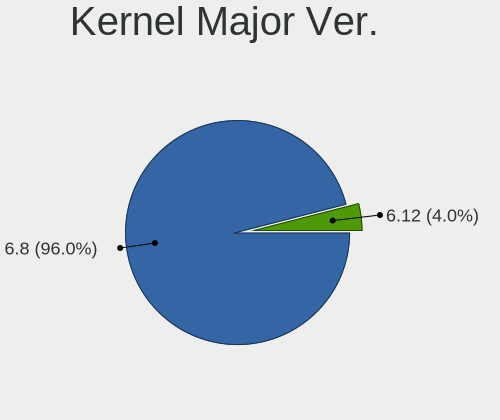
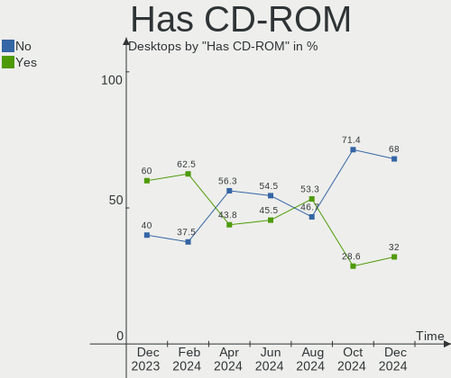
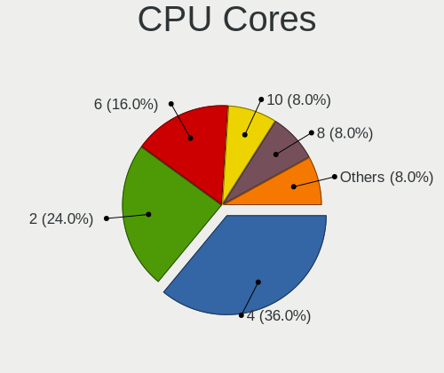
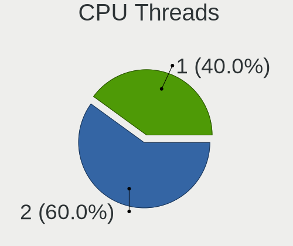

Elementary - Hardware Trends (Desktops)
---------------------------------------

A project to identify most popular hardware characteristics and track their change
over time based on data collected by Linux users at https://Linux-Hardware.org.

Anyone can contribute to this report by the [hw-probe](https://github.com/linuxhw/hw-probe) tool:

    sudo -E hw-probe -all -upload

This report is for one last month. Overall report since the beginning of time: [TestCoverage](https://github.com/linuxhw/TestCoverage)

Period: Aug, 2022.

Contents
--------

* [ System ](#system)
  - [ OS                       ](#os)
  - [ OS Family                ](#os-family)
  - [ Kernel                   ](#kernel)
  - [ Kernel Family            ](#kernel-family)
  - [ Kernel Major Ver.        ](#kernel-major-ver)
  - [ Arch                     ](#arch)
  - [ DE                       ](#de)
  - [ Display Server           ](#display-server)
  - [ Display Manager          ](#display-manager)
  - [ OS Lang                  ](#os-lang)
  - [ Boot Mode                ](#boot-mode)
  - [ Filesystem               ](#filesystem)
  - [ Part. scheme             ](#part-scheme)
  - [ Dual Boot with Linux/BSD ](#dual-boot-with-linuxbsd)
  - [ Dual Boot (Win)          ](#dual-boot-win)

* [ Board ](#board)
  - [ Vendor                   ](#vendor)
  - [ Model                    ](#model)
  - [ Model Family             ](#model-family)
  - [ MFG Year                 ](#mfg-year)
  - [ Form Factor              ](#form-factor)
  - [ Secure Boot              ](#secure-boot)
  - [ Coreboot                 ](#coreboot)
  - [ RAM Size                 ](#ram-size)
  - [ RAM Used                 ](#ram-used)
  - [ Total Drives             ](#total-drives)
  - [ Has CD-ROM               ](#has-cd-rom)
  - [ Has Ethernet             ](#has-ethernet)
  - [ Has WiFi                 ](#has-wifi)
  - [ Has Bluetooth            ](#has-bluetooth)

* [ Location ](#location)
  - [ Country                  ](#country)
  - [ City                     ](#city)

* [ Drives ](#drives)
  - [ Drive Vendor             ](#drive-vendor)
  - [ Drive Model              ](#drive-model)
  - [ HDD Vendor               ](#hdd-vendor)
  - [ SSD Vendor               ](#ssd-vendor)
  - [ Drive Kind               ](#drive-kind)
  - [ Drive Connector          ](#drive-connector)
  - [ Drive Size               ](#drive-size)
  - [ Space Total              ](#space-total)
  - [ Space Used               ](#space-used)
  - [ Malfunc. Drives          ](#malfunc-drives)
  - [ Malfunc. Drive Vendor    ](#malfunc-drive-vendor)
  - [ Malfunc. HDD Vendor      ](#malfunc-hdd-vendor)
  - [ Malfunc. Drive Kind      ](#malfunc-drive-kind)
  - [ Failed Drives            ](#failed-drives)
  - [ Failed Drive Vendor      ](#failed-drive-vendor)
  - [ Drive Status             ](#drive-status)

* [ Storage controller ](#storage-controller)
  - [ Storage Vendor           ](#storage-vendor)
  - [ Storage Model            ](#storage-model)
  - [ Storage Kind             ](#storage-kind)

* [ Processor ](#processor)
  - [ CPU Vendor               ](#cpu-vendor)
  - [ CPU Model                ](#cpu-model)
  - [ CPU Model Family         ](#cpu-model-family)
  - [ CPU Cores                ](#cpu-cores)
  - [ CPU Sockets              ](#cpu-sockets)
  - [ CPU Threads              ](#cpu-threads)
  - [ CPU Op-Modes             ](#cpu-op-modes)
  - [ CPU Microcode            ](#cpu-microcode)
  - [ CPU Microarch            ](#cpu-microarch)

* [ Graphics ](#graphics)
  - [ GPU Vendor               ](#gpu-vendor)
  - [ GPU Model                ](#gpu-model)
  - [ GPU Combo                ](#gpu-combo)
  - [ GPU Driver               ](#gpu-driver)
  - [ GPU Memory               ](#gpu-memory)

* [ Monitor ](#monitor)
  - [ Monitor Vendor           ](#monitor-vendor)
  - [ Monitor Model            ](#monitor-model)
  - [ Monitor Resolution       ](#monitor-resolution)
  - [ Monitor Diagonal         ](#monitor-diagonal)
  - [ Monitor Width            ](#monitor-width)
  - [ Aspect Ratio             ](#aspect-ratio)
  - [ Monitor Area             ](#monitor-area)
  - [ Pixel Density            ](#pixel-density)
  - [ Multiple Monitors        ](#multiple-monitors)

* [ Network ](#network)
  - [ Net Controller Vendor    ](#net-controller-vendor)
  - [ Net Controller Model     ](#net-controller-model)
  - [ Wireless Vendor          ](#wireless-vendor)
  - [ Wireless Model           ](#wireless-model)
  - [ Ethernet Vendor          ](#ethernet-vendor)
  - [ Ethernet Model           ](#ethernet-model)
  - [ Net Controller Kind      ](#net-controller-kind)
  - [ Used Controller          ](#used-controller)
  - [ NICs                     ](#nics)
  - [ IPv6                     ](#ipv6)

* [ Bluetooth ](#bluetooth)
  - [ Bluetooth Vendor         ](#bluetooth-vendor)
  - [ Bluetooth Model          ](#bluetooth-model)

* [ Sound ](#sound)
  - [ Sound Vendor             ](#sound-vendor)
  - [ Sound Model              ](#sound-model)

* [ Memory ](#memory)
  - [ Memory Vendor            ](#memory-vendor)
  - [ Memory Model             ](#memory-model)
  - [ Memory Kind              ](#memory-kind)
  - [ Memory Form Factor       ](#memory-form-factor)
  - [ Memory Size              ](#memory-size)
  - [ Memory Speed             ](#memory-speed)

* [ Printers & scanners ](#printers--scanners)
  - [ Printer Vendor           ](#printer-vendor)
  - [ Printer Model            ](#printer-model)
  - [ Scanner Vendor           ](#scanner-vendor)
  - [ Scanner Model            ](#scanner-model)

* [ Camera ](#camera)
  - [ Camera Vendor            ](#camera-vendor)
  - [ Camera Model             ](#camera-model)

* [ Security ](#security)
  - [ Fingerprint Vendor       ](#fingerprint-vendor)
  - [ Fingerprint Model        ](#fingerprint-model)
  - [ Chipcard Vendor          ](#chipcard-vendor)
  - [ Chipcard Model           ](#chipcard-model)

* [ Unsupported ](#unsupported)
  - [ Unsupported Devices      ](#unsupported-devices)
  - [ Unsupported Device Types ](#unsupported-device-types)

System
------

OS
--

Installed operating systems

| Name             | Desktops | Percent |
|------------------|----------|---------|
| Elementary 6.1   | 13       | 86.67%  |
| Elementary 5.1.7 | 2        | 13.33%  |

OS Family
---------

OS without a version

| Name       | Desktops | Percent |
|------------|----------|---------|
| Elementary | 15       | 100%    |

Kernel
------

Version of the Linux kernel

| Version           | Desktops | Percent |
|-------------------|----------|---------|
| 5.15.0-46-generic | 9        | 60%     |
| 5.4.0-124-generic | 2        | 13.33%  |
| 5.11.0-43-generic | 2        | 13.33%  |
| 5.15.0-41-generic | 1        | 6.67%   |
| 5.13.0-28-generic | 1        | 6.67%   |

Kernel Family
-------------

Linux kernel without a distro release

| Version | Desktops | Percent |
|---------|----------|---------|
| 5.15.0  | 10       | 66.67%  |
| 5.4.0   | 2        | 13.33%  |
| 5.11.0  | 2        | 13.33%  |
| 5.13.0  | 1        | 6.67%   |

Kernel Major Ver.
-----------------

Linux kernel major version

| Version | Desktops | Percent |
|---------|----------|---------|
| 5.15    | 10       | 66.67%  |
| 5.4     | 2        | 13.33%  |
| 5.11    | 2        | 13.33%  |
| 5.13    | 1        | 6.67%   |

Arch
----

OS architecture (x86_64, i586, etc.)

| Name   | Desktops | Percent |
|--------|----------|---------|
| x86_64 | 15       | 100%    |

DE
--

Desktop Environment

| Name     | Desktops | Percent |
|----------|----------|---------|
| Pantheon | 14       | 93.33%  |
| KDE5     | 1        | 6.67%   |

Display Server
--------------

X11 or Wayland

| Name | Desktops | Percent |
|------|----------|---------|
| X11  | 15       | 100%    |

Display Manager
---------------

SDDM, LightDM, etc.

| Name    | Desktops | Percent |
|---------|----------|---------|
| Unknown | 15       | 100%    |

OS Lang
-------

Language

| Lang  | Desktops | Percent |
|-------|----------|---------|
| en_US | 6        | 40%     |
| fr_FR | 3        | 20%     |
| en_GB | 2        | 13.33%  |
| ru_RU | 1        | 6.67%   |
| pt_BR | 1        | 6.67%   |
| en_CA | 1        | 6.67%   |
| de_DE | 1        | 6.67%   |

Boot Mode
---------

EFI or BIOS

| Mode | Desktops | Percent |
|------|----------|---------|
| EFI  | 8        | 53.33%  |
| BIOS | 7        | 46.67%  |

Filesystem
----------

Type of filesystem

| Type | Desktops | Percent |
|------|----------|---------|
| Ext4 | 15       | 100%    |

Part. scheme
------------

Scheme of partitioning

| Type    | Desktops | Percent |
|---------|----------|---------|
| Unknown | 15       | 100%    |

Dual Boot with Linux/BSD
------------------------

Hosting more than one Linux/BSD

| Dual boot | Desktops | Percent |
|-----------|----------|---------|
| No        | 15       | 100%    |

Dual Boot (Win)
---------------

Hosting Linux and Windows

| Dual boot | Desktops | Percent |
|-----------|----------|---------|
| No        | 15       | 100%    |

Board
-----

Vendor
------

Motherboard manufacturer

| Name                | Desktops | Percent |
|---------------------|----------|---------|
| ASUSTek Computer    | 5        | 33.33%  |
| Gigabyte Technology | 3        | 20%     |
| Hewlett-Packard     | 2        | 13.33%  |
| MSI                 | 1        | 6.67%   |
| Lenovo              | 1        | 6.67%   |
| Foxconn             | 1        | 6.67%   |
| ASRock              | 1        | 6.67%   |
| Apple               | 1        | 6.67%   |

Model
-----

Motherboard model

| Name                            | Desktops | Percent |
|---------------------------------|----------|---------|
| MSI MS-7C77                     | 1        | 6.67%   |
| Lenovo ThinkCentre M92p 3212DF9 | 1        | 6.67%   |
| HP ProDesk 600 G2 SFF           | 1        | 6.67%   |
| HP 700-210xt                    | 1        | 6.67%   |
| Gigabyte H81M-DS2               | 1        | 6.67%   |
| Gigabyte H61M-S1                | 1        | 6.67%   |
| Gigabyte H370AORUSGAMING3WIFI   | 1        | 6.67%   |
| Foxconn Pro3500 Series          | 1        | 6.67%   |
| ASUS TUF Gaming B550M-PLUS      | 1        | 6.67%   |
| ASUS PRIME B450M-A              | 1        | 6.67%   |
| ASUS P7H55-M LX                 | 1        | 6.67%   |
| ASUS P5B                        | 1        | 6.67%   |
| ASUS M2N68-AM SE2               | 1        | 6.67%   |
| ASRock N68-VGS3 FX              | 1        | 6.67%   |
| Apple MacPro5,1                 | 1        | 6.67%   |

Model Family
------------

Motherboard model prefix

| Name                          | Desktops | Percent |
|-------------------------------|----------|---------|
| MSI MS-7C77                   | 1        | 6.67%   |
| Lenovo ThinkCentre            | 1        | 6.67%   |
| HP ProDesk                    | 1        | 6.67%   |
| HP 700-210xt                  | 1        | 6.67%   |
| Gigabyte H81M-DS2             | 1        | 6.67%   |
| Gigabyte H61M-S1              | 1        | 6.67%   |
| Gigabyte H370AORUSGAMING3WIFI | 1        | 6.67%   |
| Foxconn Pro3500               | 1        | 6.67%   |
| ASUS TUF                      | 1        | 6.67%   |
| ASUS PRIME                    | 1        | 6.67%   |
| ASUS P7H55-M                  | 1        | 6.67%   |
| ASUS P5B                      | 1        | 6.67%   |
| ASUS M2N68-AM                 | 1        | 6.67%   |
| ASRock N68-VGS3               | 1        | 6.67%   |
| Apple MacPro5                 | 1        | 6.67%   |

MFG Year
--------

Motherboard manufacture year

| Year | Desktops | Percent |
|------|----------|---------|
| 2013 | 3        | 20%     |
| 2020 | 2        | 13.33%  |
| 2018 | 2        | 13.33%  |
| 2010 | 2        | 13.33%  |
| 2015 | 1        | 6.67%   |
| 2014 | 1        | 6.67%   |
| 2012 | 1        | 6.67%   |
| 2011 | 1        | 6.67%   |
| 2009 | 1        | 6.67%   |
| 2006 | 1        | 6.67%   |

Form Factor
-----------

Physical design of the computer

| Name    | Desktops | Percent |
|---------|----------|---------|
| Desktop | 15       | 100%    |

Secure Boot
-----------

Enabled or disabled

| State    | Desktops | Percent |
|----------|----------|---------|
| Disabled | 14       | 93.33%  |
| Enabled  | 1        | 6.67%   |

Coreboot
--------

Have coreboot on board

| Used | Desktops | Percent |
|------|----------|---------|
| No   | 15       | 100%    |

RAM Size
--------

Total RAM memory

| Size in GB | Desktops | Percent |
|------------|----------|---------|
| 32.01-64.0 | 4        | 26.67%  |
| 4.01-8.0   | 3        | 20%     |
| 16.01-24.0 | 3        | 20%     |
| 8.01-16.0  | 3        | 20%     |
| 3.01-4.0   | 2        | 13.33%  |

RAM Used
--------

Used RAM memory

| Used GB   | Desktops | Percent |
|-----------|----------|---------|
| 2.01-3.0  | 4        | 26.67%  |
| 1.01-2.0  | 4        | 26.67%  |
| 3.01-4.0  | 3        | 20%     |
| 4.01-8.0  | 2        | 13.33%  |
| 8.01-16.0 | 1        | 6.67%   |
| 0.51-1.0  | 1        | 6.67%   |

Total Drives
------------

Number of drives on board

| Drives | Desktops | Percent |
|--------|----------|---------|
| 2      | 8        | 53.33%  |
| 6      | 2        | 13.33%  |
| 4      | 2        | 13.33%  |
| 1      | 2        | 13.33%  |
| 3      | 1        | 6.67%   |

Has CD-ROM
----------

Has CD-ROM on board

| Presented | Desktops | Percent |
|-----------|----------|---------|
| Yes       | 9        | 60%     |
| No        | 6        | 40%     |

Has Ethernet
------------

Has Ethernet on board

| Presented | Desktops | Percent |
|-----------|----------|---------|
| Yes       | 15       | 100%    |

Has WiFi
--------

Has WiFi module

| Presented | Desktops | Percent |
|-----------|----------|---------|
| No        | 9        | 60%     |
| Yes       | 6        | 40%     |

Has Bluetooth
-------------

Has Bluetooth module

| Presented | Desktops | Percent |
|-----------|----------|---------|
| Yes       | 8        | 53.33%  |
| No        | 7        | 46.67%  |

Location
--------

Country
-------

Geographic location (country)

| Country     | Desktops | Percent |
|-------------|----------|---------|
| USA         | 3        | 20%     |
| Switzerland | 2        | 13.33%  |
| Canada      | 2        | 13.33%  |
| Thailand    | 1        | 6.67%   |
| Kenya       | 1        | 6.67%   |
| Ireland     | 1        | 6.67%   |
| Germany     | 1        | 6.67%   |
| France      | 1        | 6.67%   |
| Czechia     | 1        | 6.67%   |
| Brazil      | 1        | 6.67%   |
| Belarus     | 1        | 6.67%   |

City
----

Geographic location (city)

| City               | Desktops | Percent |
|--------------------|----------|---------|
| Caslano            | 2        | 13.33%  |
| Werneck            | 1        | 6.67%   |
| Walnut Creek       | 1        | 6.67%   |
| Toronto            | 1        | 6.67%   |
| Teresina           | 1        | 6.67%   |
| Nairobi            | 1        | 6.67%   |
| Kucharovice        | 1        | 6.67%   |
| Hua Hin            | 1        | 6.67%   |
| Gomel              | 1        | 6.67%   |
| Fort Worth         | 1        | 6.67%   |
| Dublin             | 1        | 6.67%   |
| Daniel's Harbour   | 1        | 6.67%   |
| Arques-la-Bataille | 1        | 6.67%   |
| Antioch            | 1        | 6.67%   |

Drives
------

Drive Vendor
------------

Hard drive vendors

| Vendor              | Desktops | Drives | Percent |
|---------------------|----------|--------|---------|
| Seagate             | 7        | 9      | 24.14%  |
| WDC                 | 6        | 7      | 20.69%  |
| Samsung Electronics | 3        | 8      | 10.34%  |
| Toshiba             | 2        | 2      | 6.9%    |
| Unknown             | 1        | 2      | 3.45%   |
| SanDisk             | 1        | 1      | 3.45%   |
| PNY                 | 1        | 1      | 3.45%   |
| Phison              | 1        | 1      | 3.45%   |
| OCZ                 | 1        | 1      | 3.45%   |
| Kingston            | 1        | 1      | 3.45%   |
| KingFast            | 1        | 1      | 3.45%   |
| Intel               | 1        | 1      | 3.45%   |
| Hitachi             | 1        | 1      | 3.45%   |
| Crucial             | 1        | 1      | 3.45%   |
| China               | 1        | 1      | 3.45%   |

Drive Model
-----------

Hard drive models

| Model                             | Desktops | Percent |
|-----------------------------------|----------|---------|
| Seagate ST500DM002-1BD142 500GB   | 2        | 5.26%   |
| Seagate ST1000DM003-1ER162 1TB    | 2        | 5.26%   |
| Samsung SSD 840 EVO 250GB         | 2        | 5.26%   |
| WDC WD5003AZEX-00K1GA0 500GB      | 1        | 2.63%   |
| WDC WD5000AAKS-00A7B2 500GB       | 1        | 2.63%   |
| WDC WD20EARS-00MVWB0 2TB          | 1        | 2.63%   |
| WDC WD2003FZEX-00SRLA0 2TB        | 1        | 2.63%   |
| WDC WD10EFRX-68PJCN0 1TB          | 1        | 2.63%   |
| WDC WD Blue SA510 2.5 500GB SSD   | 1        | 2.63%   |
| WDC SSC-D0064SC-2100 64GB         | 1        | 2.63%   |
| Unknown SD/MMC 16GB               | 1        | 2.63%   |
| Unknown M.S./M.S.Pro/HG 16GB      | 1        | 2.63%   |
| Toshiba DT01ACA100 1TB            | 1        | 2.63%   |
| Toshiba DT01ACA050 500GB          | 1        | 2.63%   |
| Seagate ST3500630AS 500GB         | 1        | 2.63%   |
| Seagate ST3500620AS 500GB         | 1        | 2.63%   |
| Seagate ST31500341AS 1TB          | 1        | 2.63%   |
| Seagate ST31000528AS 1TB          | 1        | 2.63%   |
| Seagate ST1000LM 035-1RK172 1TB   | 1        | 2.63%   |
| SanDisk SD8SBAT128G1122 128GB SSD | 1        | 2.63%   |
| Samsung SSD 870 EVO 500GB         | 1        | 2.63%   |
| Samsung SSD 870 EVO 1TB           | 1        | 2.63%   |
| Samsung SSD 860 EVO 1TB           | 1        | 2.63%   |
| Samsung SSD 850 EVO 250GB         | 1        | 2.63%   |
| Samsung NVMe SSD Drive 500GB      | 1        | 2.63%   |
| Samsung HD502IJ 500GB             | 1        | 2.63%   |
| PNY CS900 480GB SSD               | 1        | 2.63%   |
| Phison NVMe SSD Drive 960GB       | 1        | 2.63%   |
| OCZ AGILITY3 240GB SSD            | 1        | 2.63%   |
| Kingston NVMe SSD Drive 500GB     | 1        | 2.63%   |
| KingFast 128GB                    | 1        | 2.63%   |
| Intel NVMe SSD Drive 512GB        | 1        | 2.63%   |
| Hitachi HUS724030ALE641 3TB       | 1        | 2.63%   |
| Crucial CT480BX500SSD1 480GB      | 1        | 2.63%   |
| China SATA SSD 256GB              | 1        | 2.63%   |

HDD Vendor
----------

Hard disk drive vendors

| Vendor              | Desktops | Drives | Percent |
|---------------------|----------|--------|---------|
| Seagate             | 7        | 9      | 43.75%  |
| WDC                 | 5        | 5      | 31.25%  |
| Toshiba             | 2        | 2      | 12.5%   |
| Samsung Electronics | 1        | 1      | 6.25%   |
| Hitachi             | 1        | 1      | 6.25%   |

SSD Vendor
----------

Solid state drive vendors

| Vendor              | Desktops | Drives | Percent |
|---------------------|----------|--------|---------|
| Samsung Electronics | 3        | 6      | 33.33%  |
| WDC                 | 1        | 1      | 11.11%  |
| SanDisk             | 1        | 1      | 11.11%  |
| PNY                 | 1        | 1      | 11.11%  |
| OCZ                 | 1        | 1      | 11.11%  |
| Crucial             | 1        | 1      | 11.11%  |
| China               | 1        | 1      | 11.11%  |

Drive Kind
----------

HDD or SSD

| Kind    | Desktops | Drives | Percent |
|---------|----------|--------|---------|
| HDD     | 12       | 18     | 44.44%  |
| SSD     | 8        | 12     | 29.63%  |
| NVMe    | 4        | 4      | 14.81%  |
| Unknown | 3        | 4      | 11.11%  |

Drive Connector
---------------

SATA, SAS, NVMe, etc.

| Type | Desktops | Drives | Percent |
|------|----------|--------|---------|
| SATA | 14       | 31     | 70%     |
| NVMe | 4        | 4      | 20%     |
| SAS  | 2        | 3      | 10%     |

Drive Size
----------

Size of hard drive

| Size in TB | Desktops | Drives | Percent |
|------------|----------|--------|---------|
| 0.01-0.5   | 12       | 18     | 60%     |
| 0.51-1.0   | 5        | 9      | 25%     |
| 1.01-2.0   | 2        | 2      | 10%     |
| 2.01-3.0   | 1        | 1      | 5%      |

Space Total
-----------

Amount of disk space available on the file system

| Size in GB | Desktops | Percent |
|------------|----------|---------|
| 251-500    | 4        | 26.67%  |
| 101-250    | 3        | 20%     |
| 1001-2000  | 3        | 20%     |
| 501-1000   | 3        | 20%     |
| 51-100     | 2        | 13.33%  |

Space Used
----------

Amount of used disk space

| Used GB  | Desktops | Percent |
|----------|----------|---------|
| 1-20     | 5        | 33.33%  |
| 21-50    | 3        | 20%     |
| 51-100   | 3        | 20%     |
| 501-1000 | 2        | 13.33%  |
| 251-500  | 1        | 6.67%   |
| 101-250  | 1        | 6.67%   |

Malfunc. Drives
---------------

Drive models with a malfunction

Zero info for selected period =(

Malfunc. Drive Vendor
---------------------

Vendors of faulty drives

Zero info for selected period =(

Malfunc. HDD Vendor
-------------------

Vendors of faulty HDD drives

Zero info for selected period =(

Malfunc. Drive Kind
-------------------

Kinds of faulty drives

Zero info for selected period =(

Failed Drives
-------------

Failed drive models

Zero info for selected period =(

Failed Drive Vendor
-------------------

Failed drive vendors

Zero info for selected period =(

Drive Status
------------

Number of failed and malfunc. drives

| Status   | Desktops | Drives | Percent |
|----------|----------|--------|---------|
| Detected | 15       | 38     | 100%    |

Storage controller
------------------

Storage Vendor
--------------

Storage controller vendors

| Vendor                      | Desktops | Percent |
|-----------------------------|----------|---------|
| Intel                       | 12       | 60%     |
| Nvidia                      | 2        | 10%     |
| AMD                         | 2        | 10%     |
| Samsung Electronics         | 1        | 5%      |
| Phison Electronics          | 1        | 5%      |
| Kingston Technology Company | 1        | 5%      |
| JMicron Technology          | 1        | 5%      |

Storage Model
-------------

Storage controller models

| Model                                                                          | Desktops | Percent |
|--------------------------------------------------------------------------------|----------|---------|
| Nvidia MCP61 SATA Controller                                                   | 2        | 8.7%    |
| Intel 8 Series/C220 Series Chipset Family 6-port SATA Controller 1 [AHCI mode] | 2        | 8.7%    |
| Intel 6 Series/C200 Series Chipset Family 6 port Desktop SATA AHCI Controller  | 2        | 8.7%    |
| Samsung NVMe SSD Controller SM981/PM981/PM983                                  | 1        | 4.35%   |
| Phison E12 NVMe Controller                                                     | 1        | 4.35%   |
| Nvidia MCP61 IDE                                                               | 1        | 4.35%   |
| Kingston Company A2000 NVMe SSD                                                | 1        | 4.35%   |
| JMicron JMB363 SATA/IDE Controller                                             | 1        | 4.35%   |
| Intel SSD 660P Series                                                          | 1        | 4.35%   |
| Intel Q170/Q150/B150/H170/H110/Z170/CM236 Chipset SATA Controller [AHCI Mode]  | 1        | 4.35%   |
| Intel Comet Lake SATA AHCI Controller                                          | 1        | 4.35%   |
| Intel Cannon Lake PCH SATA AHCI Controller                                     | 1        | 4.35%   |
| Intel 82801JI (ICH10 Family) SATA AHCI Controller                              | 1        | 4.35%   |
| Intel 82801HB (ICH8) 4 port SATA Controller [AHCI mode]                        | 1        | 4.35%   |
| Intel 7 Series/C210 Series Chipset Family 6-port SATA Controller [AHCI mode]   | 1        | 4.35%   |
| Intel 5 Series/3400 Series Chipset 4 port SATA IDE Controller                  | 1        | 4.35%   |
| Intel 5 Series/3400 Series Chipset 2 port SATA IDE Controller                  | 1        | 4.35%   |
| AMD FCH SATA Controller [AHCI mode]                                            | 1        | 4.35%   |
| AMD 500 Series Chipset SATA Controller                                         | 1        | 4.35%   |
| AMD 400 Series Chipset SATA Controller                                         | 1        | 4.35%   |

Storage Kind
------------

Kind of storage controller (IDE, SATA, NVMe, SAS, ...)

| Kind | Desktops | Percent |
|------|----------|---------|
| SATA | 12       | 60%     |
| NVMe | 4        | 20%     |
| IDE  | 4        | 20%     |

Processor
---------

CPU Vendor
----------

Processor vendors

| Vendor | Desktops | Percent |
|--------|----------|---------|
| Intel  | 11       | 73.33%  |
| AMD    | 4        | 26.67%  |

CPU Model
---------

Processor models

| Model                                  | Desktops | Percent |
|----------------------------------------|----------|---------|
| Intel Xeon CPU X5680 @ 3.33GHz         | 1        | 6.67%   |
| Intel Core i7-8700 CPU @ 3.20GHz       | 1        | 6.67%   |
| Intel Core i7-4770 CPU @ 3.40GHz       | 1        | 6.67%   |
| Intel Core i7-4720HQ CPU @ 2.60GHz     | 1        | 6.67%   |
| Intel Core i7-10700K CPU @ 3.80GHz     | 1        | 6.67%   |
| Intel Core i7 CPU 870 @ 2.93GHz        | 1        | 6.67%   |
| Intel Core i5-3570 CPU @ 3.40GHz       | 1        | 6.67%   |
| Intel Core i5-3330 CPU @ 3.00GHz       | 1        | 6.67%   |
| Intel Core i3-6100 CPU @ 3.70GHz       | 1        | 6.67%   |
| Intel Core i3-3240 CPU @ 3.40GHz       | 1        | 6.67%   |
| Intel Core 2 Quad CPU Q9400 @ 2.66GHz  | 1        | 6.67%   |
| AMD Ryzen 7 3700X 8-Core Processor     | 1        | 6.67%   |
| AMD Ryzen 7 2700X Eight-Core Processor | 1        | 6.67%   |
| AMD FX-6300 Six-Core Processor         | 1        | 6.67%   |
| AMD Athlon II X2 215 Processor         | 1        | 6.67%   |

CPU Model Family
----------------

Processor model prefix

| Model             | Desktops | Percent |
|-------------------|----------|---------|
| Intel Core i7     | 5        | 33.33%  |
| Intel Core i5     | 2        | 13.33%  |
| Intel Core i3     | 2        | 13.33%  |
| AMD Ryzen 7       | 2        | 13.33%  |
| Intel Xeon        | 1        | 6.67%   |
| Intel Core 2 Quad | 1        | 6.67%   |
| AMD FX            | 1        | 6.67%   |
| AMD Athlon II X2  | 1        | 6.67%   |

CPU Cores
---------

Number of processor cores

| Number | Desktops | Percent |
|--------|----------|---------|
| 4      | 6        | 40%     |
| 8      | 3        | 20%     |
| 2      | 3        | 20%     |
| 12     | 1        | 6.67%   |
| 6      | 1        | 6.67%   |
| 3      | 1        | 6.67%   |

CPU Sockets
-----------

Number of sockets

| Number | Desktops | Percent |
|--------|----------|---------|
| 1      | 14       | 93.33%  |
| 2      | 1        | 6.67%   |

CPU Threads
-----------

Threads per core (Hyper-Threading)

| Number | Desktops | Percent |
|--------|----------|---------|
| 2      | 11       | 73.33%  |
| 1      | 4        | 26.67%  |

CPU Op-Modes
------------

CPU Operation Modes (32-bit, 64-bit)

| Op mode        | Desktops | Percent |
|----------------|----------|---------|
| 32-bit, 64-bit | 15       | 100%    |

CPU Microcode
-------------

Microcode number

| Number     | Desktops | Percent |
|------------|----------|---------|
| 0x306a9    | 3        | 20%     |
| 0x306c3    | 2        | 13.33%  |
| Unknown    | 2        | 13.33%  |
| 0xa0655    | 1        | 6.67%   |
| 0x906ea    | 1        | 6.67%   |
| 0x506e3    | 1        | 6.67%   |
| 0x106e5    | 1        | 6.67%   |
| 0x1067a    | 1        | 6.67%   |
| 0x08701021 | 1        | 6.67%   |
| 0x0800820d | 1        | 6.67%   |
| 0x06000852 | 1        | 6.67%   |

CPU Microarch
-------------

Microarchitecture

| Name       | Desktops | Percent |
|------------|----------|---------|
| IvyBridge  | 3        | 20%     |
| Haswell    | 2        | 13.33%  |
| Zen+       | 1        | 6.67%   |
| Zen 2      | 1        | 6.67%   |
| Westmere   | 1        | 6.67%   |
| Skylake    | 1        | 6.67%   |
| Piledriver | 1        | 6.67%   |
| Penryn     | 1        | 6.67%   |
| Nehalem    | 1        | 6.67%   |
| KabyLake   | 1        | 6.67%   |
| K10        | 1        | 6.67%   |
| CometLake  | 1        | 6.67%   |

Graphics
--------

GPU Vendor
----------

Vendors of graphics cards

| Vendor | Desktops | Percent |
|--------|----------|---------|
| AMD    | 7        | 43.75%  |
| Nvidia | 6        | 37.5%   |
| Intel  | 3        | 18.75%  |

GPU Model
---------

Graphics card models

| Model                                                                       | Desktops | Percent |
|-----------------------------------------------------------------------------|----------|---------|
| Nvidia TU116 [GeForce GTX 1660]                                             | 1        | 6.25%   |
| Nvidia GP107 [GeForce GTX 1050 Ti]                                          | 1        | 6.25%   |
| Nvidia GK208B [GeForce GT 730]                                              | 1        | 6.25%   |
| Nvidia GK110 [GeForce GTX 780]                                              | 1        | 6.25%   |
| Nvidia GF108 [GeForce GT 440]                                               | 1        | 6.25%   |
| Nvidia GF100 [GeForce GTX 470]                                              | 1        | 6.25%   |
| Intel Xeon E3-1200 v3/4th Gen Core Processor Integrated Graphics Controller | 1        | 6.25%   |
| Intel HD Graphics 530                                                       | 1        | 6.25%   |
| Intel 4th Gen Core Processor Integrated Graphics Controller                 | 1        | 6.25%   |
| AMD Turks XT [Radeon HD 6670/7670]                                          | 1        | 6.25%   |
| AMD Park [Mobility Radeon HD 5430]                                          | 1        | 6.25%   |
| AMD Navi 14 [Radeon RX 5500/5500M / Pro 5500M]                              | 1        | 6.25%   |
| AMD Lexa PRO [Radeon 540/540X/550/550X / RX 540X/550/550X]                  | 1        | 6.25%   |
| AMD Ellesmere [Radeon RX 470/480/570/570X/580/580X/590]                     | 1        | 6.25%   |
| AMD Curacao PRO [Radeon R7 370 / R9 270/370 OEM]                            | 1        | 6.25%   |
| AMD Bonaire XTX [Radeon R7 260X/360]                                        | 1        | 6.25%   |

GPU Combo
---------

Combinations of graphics cards

| Name           | Desktops | Percent |
|----------------|----------|---------|
| 1 x AMD        | 7        | 46.67%  |
| 1 x Nvidia     | 5        | 33.33%  |
| 1 x Intel      | 2        | 13.33%  |
| Intel + Nvidia | 1        | 6.67%   |

GPU Driver
----------

Free vs proprietary

| Driver      | Desktops | Percent |
|-------------|----------|---------|
| Free        | 10       | 66.67%  |
| Proprietary | 5        | 33.33%  |

GPU Memory
----------

Total video memory

| Size in GB | Desktops | Percent |
|------------|----------|---------|
| 1.01-2.0   | 6        | 40%     |
| 3.01-4.0   | 3        | 20%     |
| Unknown    | 3        | 20%     |
| 5.01-6.0   | 1        | 6.67%   |
| 0.51-1.0   | 1        | 6.67%   |
| 0.01-0.5   | 1        | 6.67%   |

Monitor
-------

Monitor Vendor
--------------

Monitor vendors

| Vendor              | Desktops | Percent |
|---------------------|----------|---------|
| Dell                | 4        | 23.53%  |
| Hewlett-Packard     | 3        | 17.65%  |
| Samsung Electronics | 2        | 11.76%  |
| Sony                | 1        | 5.88%   |
| LG Electronics      | 1        | 5.88%   |
| HKC                 | 1        | 5.88%   |
| Goldstar            | 1        | 5.88%   |
| Gateway             | 1        | 5.88%   |
| AUS                 | 1        | 5.88%   |
| Apple               | 1        | 5.88%   |
| Acer                | 1        | 5.88%   |

Monitor Model
-------------

Monitor models

| Model                                                             | Desktops | Percent |
|-------------------------------------------------------------------|----------|---------|
| Sony TV  *00 SNY8004 3840x2160 1220x680mm 55.0-inch               | 1        | 5%      |
| Samsung Electronics T22C310 SAM0AE9 1920x1080 477x268mm 21.5-inch | 1        | 5%      |
| Samsung Electronics LCD Monitor SAM04FD 1360x768                  | 1        | 5%      |
| LG Electronics LCD Monitor LG FULL HD 1920x1080                   | 1        | 5%      |
| HKC LCD Monitor TV 1920x1080                                      | 1        | 5%      |
| Hewlett-Packard X24ih HPN36DA 1920x1080 530x300mm 24.0-inch       | 1        | 5%      |
| Hewlett-Packard 2310 HWP288F 1920x1080 510x287mm 23.0-inch        | 1        | 5%      |
| Hewlett-Packard 2010 HWP2889 1600x900 443x250mm 20.0-inch         | 1        | 5%      |
| Hewlett-Packard 2009 HWP2828 1600x900 443x250mm 20.0-inch         | 1        | 5%      |
| Goldstar 22EN33 GSM597C 1920x1080 480x270mm 21.7-inch             | 1        | 5%      |
| Gateway HD1900 GWY078A 1440x900 410x257mm 19.1-inch               | 1        | 5%      |
| Dell U3415W DELA0A7 3440x1440 798x335mm 34.1-inch                 | 1        | 5%      |
| Dell P2419H DELD0D9 1920x1080 530x300mm 24.0-inch                 | 1        | 5%      |
| Dell P2214H DELA098 1920x1080 477x268mm 21.5-inch                 | 1        | 5%      |
| Dell LCD Monitor 1704FPV 1280x1024                                | 1        | 5%      |
| Dell 1704FPV DEL3016 1280x1024 338x270mm 17.0-inch                | 1        | 5%      |
| AUS LCD Monitor PA248QV 3840x1200                                 | 1        | 5%      |
| AUS LCD Monitor PA248QV                                           | 1        | 5%      |
| Apple Cinema HD APP921C 1920x1200 495x310mm 23.0-inch             | 1        | 5%      |
| Acer LCD Monitor ED273 1920x1080                                  | 1        | 5%      |

Monitor Resolution
------------------

Monitor screen resolution

| Resolution        | Desktops | Percent |
|-------------------|----------|---------|
| 1920x1080 (FHD)   | 9        | 47.37%  |
| 1600x900 (HD+)    | 2        | 10.53%  |
| 1280x1024 (SXGA)  | 2        | 10.53%  |
| 3840x2160 (4K)    | 1        | 5.26%   |
| 3840x1200         | 1        | 5.26%   |
| 3440x1440         | 1        | 5.26%   |
| 1920x1200 (WUXGA) | 1        | 5.26%   |
| 1440x900 (WXGA+)  | 1        | 5.26%   |
| Unknown           | 1        | 5.26%   |

Monitor Diagonal
----------------

Diagonal size in inches

| Inches  | Desktops | Percent |
|---------|----------|---------|
| Unknown | 5        | 26.32%  |
| 21      | 3        | 15.79%  |
| 24      | 2        | 10.53%  |
| 23      | 2        | 10.53%  |
| 20      | 2        | 10.53%  |
| 19      | 2        | 10.53%  |
| 65      | 1        | 5.26%   |
| 34      | 1        | 5.26%   |
| 17      | 1        | 5.26%   |

Monitor Width
-------------

Physical width

| Width in mm | Desktops | Percent |
|-------------|----------|---------|
| 401-500     | 6        | 33.33%  |
| Unknown     | 5        | 27.78%  |
| 501-600     | 3        | 16.67%  |
| 701-800     | 1        | 5.56%   |
| 351-400     | 1        | 5.56%   |
| 301-350     | 1        | 5.56%   |
| 1001-1500   | 1        | 5.56%   |

Aspect Ratio
------------

Proportional relationship between the width and the height

| Ratio   | Desktops | Percent |
|---------|----------|---------|
| 16/9    | 7        | 41.18%  |
| Unknown | 5        | 29.41%  |
| 5/4     | 2        | 11.76%  |
| 16/10   | 2        | 11.76%  |
| 21/9    | 1        | 5.88%   |

Monitor Area
------------

Area in inch²

| Area in inch² | Desktops | Percent |
|----------------|----------|---------|
| 201-250        | 6        | 35.29%  |
| Unknown        | 5        | 29.41%  |
| 151-200        | 3        | 17.65%  |
| More than 1000 | 1        | 5.88%   |
| 351-500        | 1        | 5.88%   |
| 141-150        | 1        | 5.88%   |

Pixel Density
-------------

Pixels per inch

| Density | Desktops | Percent |
|---------|----------|---------|
| 51-100  | 7        | 41.18%  |
| 101-120 | 5        | 29.41%  |
| Unknown | 5        | 29.41%  |

Multiple Monitors
-----------------

Total monitors connected

| Total | Desktops | Percent |
|-------|----------|---------|
| 1     | 10       | 66.67%  |
| 2     | 4        | 26.67%  |
| 3     | 1        | 6.67%   |

Network
-------

Net Controller Vendor
---------------------

Controller vendors

| Vendor                | Desktops | Percent |
|-----------------------|----------|---------|
| Realtek Semiconductor | 9        | 39.13%  |
| Intel                 | 6        | 26.09%  |
| Qualcomm Atheros      | 2        | 8.7%    |
| Nvidia                | 2        | 8.7%    |
| Ralink Technology     | 1        | 4.35%   |
| Ralink                | 1        | 4.35%   |
| Linksys               | 1        | 4.35%   |
| Broadcom              | 1        | 4.35%   |

Net Controller Model
--------------------

Controller models

| Model                                                               | Desktops | Percent |
|---------------------------------------------------------------------|----------|---------|
| Realtek RTL8111/8168/8411 PCI Express Gigabit Ethernet Controller   | 7        | 30.43%  |
| Realtek RTL8125 2.5GbE Controller                                   | 2        | 8.7%    |
| Nvidia MCP61 Ethernet                                               | 2        | 8.7%    |
| Ralink RT5372 Wireless Adapter                                      | 1        | 4.35%   |
| Ralink RT3290 Wireless 802.11n 1T/1R PCIe                           | 1        | 4.35%   |
| Qualcomm Atheros AR928X Wireless Network Adapter (PCI-Express)      | 1        | 4.35%   |
| Qualcomm Atheros AR2417 Wireless Network Adapter [AR5007G 802.11bg] | 1        | 4.35%   |
| Linksys WUSB6300 V2                                                 | 1        | 4.35%   |
| Intel Ethernet Connection (7) I219-V                                | 1        | 4.35%   |
| Intel Ethernet Connection (2) I219-LM                               | 1        | 4.35%   |
| Intel Dual Band Wireless-AC 3168NGW [Stone Peak]                    | 1        | 4.35%   |
| Intel Comet Lake PCH CNVi WiFi                                      | 1        | 4.35%   |
| Intel 82579LM Gigabit Network Connection (Lewisville)               | 1        | 4.35%   |
| Intel 82574L Gigabit Network Connection                             | 1        | 4.35%   |
| Broadcom BCM4322 802.11a/b/g/n Wireless LAN Controller              | 1        | 4.35%   |

Wireless Vendor
---------------

Wireless vendors

| Vendor            | Desktops | Percent |
|-------------------|----------|---------|
| Qualcomm Atheros  | 2        | 25%     |
| Intel             | 2        | 25%     |
| Ralink Technology | 1        | 12.5%   |
| Ralink            | 1        | 12.5%   |
| Linksys           | 1        | 12.5%   |
| Broadcom          | 1        | 12.5%   |

Wireless Model
--------------

Wireless models

| Model                                                               | Desktops | Percent |
|---------------------------------------------------------------------|----------|---------|
| Ralink RT5372 Wireless Adapter                                      | 1        | 12.5%   |
| Ralink RT3290 Wireless 802.11n 1T/1R PCIe                           | 1        | 12.5%   |
| Qualcomm Atheros AR928X Wireless Network Adapter (PCI-Express)      | 1        | 12.5%   |
| Qualcomm Atheros AR2417 Wireless Network Adapter [AR5007G 802.11bg] | 1        | 12.5%   |
| Linksys WUSB6300 V2                                                 | 1        | 12.5%   |
| Intel Dual Band Wireless-AC 3168NGW [Stone Peak]                    | 1        | 12.5%   |
| Intel Comet Lake PCH CNVi WiFi                                      | 1        | 12.5%   |
| Broadcom BCM4322 802.11a/b/g/n Wireless LAN Controller              | 1        | 12.5%   |

Ethernet Vendor
---------------

Ethernet vendors

| Vendor                | Desktops | Percent |
|-----------------------|----------|---------|
| Realtek Semiconductor | 9        | 60%     |
| Intel                 | 4        | 26.67%  |
| Nvidia                | 2        | 13.33%  |

Ethernet Model
--------------

Ethernet models

| Model                                                             | Desktops | Percent |
|-------------------------------------------------------------------|----------|---------|
| Realtek RTL8111/8168/8411 PCI Express Gigabit Ethernet Controller | 7        | 46.67%  |
| Realtek RTL8125 2.5GbE Controller                                 | 2        | 13.33%  |
| Nvidia MCP61 Ethernet                                             | 2        | 13.33%  |
| Intel Ethernet Connection (7) I219-V                              | 1        | 6.67%   |
| Intel Ethernet Connection (2) I219-LM                             | 1        | 6.67%   |
| Intel 82579LM Gigabit Network Connection (Lewisville)             | 1        | 6.67%   |
| Intel 82574L Gigabit Network Connection                           | 1        | 6.67%   |

Net Controller Kind
-------------------

Ethernet, WiFi or modem

| Kind     | Desktops | Percent |
|----------|----------|---------|
| Ethernet | 15       | 71.43%  |
| WiFi     | 6        | 28.57%  |

Used Controller
---------------

Currently used network controller

| Kind     | Desktops | Percent |
|----------|----------|---------|
| Ethernet | 12       | 80%     |
| WiFi     | 3        | 20%     |

NICs
----

Total network controllers on board

| Total | Desktops | Percent |
|-------|----------|---------|
| 1     | 10       | 66.67%  |
| 2     | 3        | 20%     |
| 3     | 2        | 13.33%  |

IPv6
----

IPv6 vs IPv4

| Used | Desktops | Percent |
|------|----------|---------|
| No   | 10       | 66.67%  |
| Yes  | 5        | 33.33%  |

Bluetooth
---------

Bluetooth Vendor
----------------

Controller vendors

| Vendor                  | Desktops | Percent |
|-------------------------|----------|---------|
| Cambridge Silicon Radio | 3        | 37.5%   |
| Intel                   | 2        | 25%     |
| Realtek Semiconductor   | 1        | 12.5%   |
| Ralink                  | 1        | 12.5%   |
| Apple                   | 1        | 12.5%   |

Bluetooth Model
---------------

Controller models

| Model                                               | Desktops | Percent |
|-----------------------------------------------------|----------|---------|
| Cambridge Silicon Radio Bluetooth Dongle (HCI mode) | 3        | 37.5%   |
| Realtek Bluetooth Radio                             | 1        | 12.5%   |
| Ralink RT3290 Bluetooth                             | 1        | 12.5%   |
| Intel Wireless-AC 3168 Bluetooth                    | 1        | 12.5%   |
| Intel AX201 Bluetooth                               | 1        | 12.5%   |
| Apple Built-in Bluetooth 2.0+EDR HCI                | 1        | 12.5%   |

Sound
-----

Sound Vendor
------------

Sound card vendors

| Vendor             | Desktops | Percent |
|--------------------|----------|---------|
| Intel              | 10       | 33.33%  |
| Nvidia             | 7        | 23.33%  |
| AMD                | 7        | 23.33%  |
| Texas Instruments  | 1        | 3.33%   |
| Microsoft          | 1        | 3.33%   |
| Logitech           | 1        | 3.33%   |
| Edifier Technology | 1        | 3.33%   |
| Creative Labs      | 1        | 3.33%   |
| Corsair            | 1        | 3.33%   |

Sound Model
-----------

Sound card models

| Model                                                                      | Desktops | Percent |
|----------------------------------------------------------------------------|----------|---------|
| Nvidia MCP61 High Definition Audio                                         | 2        | 5.88%   |
| Intel 8 Series/C220 Series Chipset High Definition Audio Controller        | 2        | 5.88%   |
| Intel 6 Series/C200 Series Chipset Family High Definition Audio Controller | 2        | 5.88%   |
| Texas Instruments PCM2704 16-bit stereo audio DAC                          | 1        | 2.94%   |
| Nvidia TU116 High Definition Audio Controller                              | 1        | 2.94%   |
| Nvidia GP107GL High Definition Audio Controller                            | 1        | 2.94%   |
| Nvidia GK208 HDMI/DP Audio Controller                                      | 1        | 2.94%   |
| Nvidia GK110 High Definition Audio Controller                              | 1        | 2.94%   |
| Nvidia GF108 High Definition Audio Controller                              | 1        | 2.94%   |
| Nvidia GF100 High Definition Audio Controller                              | 1        | 2.94%   |
| Microsoft LifeChat LX-3000 Headset                                         | 1        | 2.94%   |
| Logitech Logitech USB Microphone                                           | 1        | 2.94%   |
| Intel Xeon E3-1200 v3/4th Gen Core Processor HD Audio Controller           | 1        | 2.94%   |
| Intel Comet Lake PCH cAVS                                                  | 1        | 2.94%   |
| Intel 82801JI (ICH10 Family) HD Audio Controller                           | 1        | 2.94%   |
| Intel 82801H (ICH8 Family) HD Audio Controller                             | 1        | 2.94%   |
| Intel 7 Series/C216 Chipset Family High Definition Audio Controller        | 1        | 2.94%   |
| Intel 5 Series/3400 Series Chipset High Definition Audio                   | 1        | 2.94%   |
| Intel 100 Series/C230 Series Chipset Family HD Audio Controller            | 1        | 2.94%   |
| Edifier Technology HECATE GS02 GAMING SOUND CARD                           | 1        | 2.94%   |
| Creative Labs EMU20k2 [Sound Blaster X-Fi Titanium Series]                 | 1        | 2.94%   |
| Corsair Corsair VOID PRO Surround USB Adapter                              | 1        | 2.94%   |
| AMD Turks HDMI Audio [Radeon HD 6500/6600 / 6700M Series]                  | 1        | 2.94%   |
| AMD Tobago HDMI Audio [Radeon R7 360 / R9 360 OEM]                         | 1        | 2.94%   |
| AMD Starship/Matisse HD Audio Controller                                   | 1        | 2.94%   |
| AMD Oland/Hainan/Cape Verde/Pitcairn HDMI Audio [Radeon HD 7000 Series]    | 1        | 2.94%   |
| AMD Navi 10 HDMI Audio                                                     | 1        | 2.94%   |
| AMD Family 17h (Models 00h-0fh) HD Audio Controller                        | 1        | 2.94%   |
| AMD Ellesmere HDMI Audio [Radeon RX 470/480 / 570/580/590]                 | 1        | 2.94%   |
| AMD Cedar HDMI Audio [Radeon HD 5400/6300/7300 Series]                     | 1        | 2.94%   |
| AMD Baffin HDMI/DP Audio [Radeon RX 550 640SP / RX 560/560X]               | 1        | 2.94%   |

Memory
------

Memory Vendor
-------------

Memory module vendors

| Vendor           | Desktops | Percent |
|------------------|----------|---------|
| Unknown (0x038A) | 1        | 50%     |
| Unknown          | 1        | 50%     |

Memory Model
------------

Memory module models

| Model                                              | Desktops | Percent |
|----------------------------------------------------|----------|---------|
| Unknown RAM Module 8GB DIMM DDR3 1066MT/s          | 1        | 33.33%  |
| Unknown RAM Module 4GB DIMM DDR3 1066MT/s          | 1        | 33.33%  |
| Unknown (0x038A) RAM Module 4GB DIMM DDR3 1066MT/s | 1        | 33.33%  |

Memory Kind
-----------

Memory module kinds

| Kind | Desktops | Percent |
|------|----------|---------|
| DDR3 | 1        | 100%    |

Memory Form Factor
------------------

Physical design of the memory module

| Name | Desktops | Percent |
|------|----------|---------|
| DIMM | 1        | 100%    |

Memory Size
-----------

Memory module size

| Size | Desktops | Percent |
|------|----------|---------|
| 8192 | 1        | 50%     |
| 4096 | 1        | 50%     |

Memory Speed
------------

Memory module speed

| Speed | Desktops | Percent |
|-------|----------|---------|
| 1066  | 1        | 100%    |

Printers & scanners
-------------------

Printer Vendor
--------------

Printer device vendors

Zero info for selected period =(

Printer Model
-------------

Printer device models

Zero info for selected period =(

Scanner Vendor
--------------

Scanner device vendors

Zero info for selected period =(

Scanner Model
-------------

Scanner device models

Zero info for selected period =(

Camera
------

Camera Vendor
-------------

Camera device vendors

| Vendor                  | Desktops | Percent |
|-------------------------|----------|---------|
| Z-Star Microelectronics | 1        | 33.33%  |
| Microdia                | 1        | 33.33%  |
| Logitech                | 1        | 33.33%  |

Camera Model
------------

Camera device models

| Model                      | Desktops | Percent |
|----------------------------|----------|---------|
| Z-Star Vega USB 2.0 Camera | 1        | 33.33%  |
| Microdia Integrated Camera | 1        | 33.33%  |
| Logitech Webcam C270       | 1        | 33.33%  |

Security
--------

Fingerprint Vendor
------------------

Fingerprint sensor vendors

Zero info for selected period =(

Fingerprint Model
-----------------

Fingerprint sensor models

Zero info for selected period =(

Chipcard Vendor
---------------

Chipcard module vendors

Zero info for selected period =(

Chipcard Model
--------------

Chipcard module models

Zero info for selected period =(

Unsupported
-----------

Unsupported Devices
-------------------

Total unsupported devices on board

| Total | Desktops | Percent |
|-------|----------|---------|
| 0     | 14       | 93.33%  |
| 2     | 1        | 6.67%   |

Unsupported Device Types
------------------------

Types of unsupported devices

| Type         | Desktops | Percent |
|--------------|----------|---------|
| Net/wireless | 1        | 50%     |
| Bluetooth    | 1        | 50%     |

