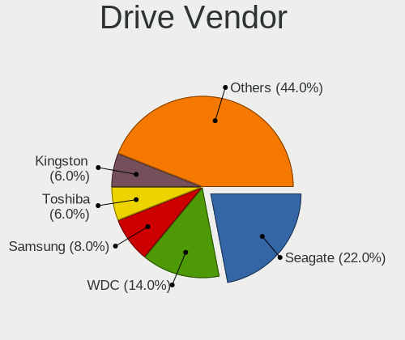
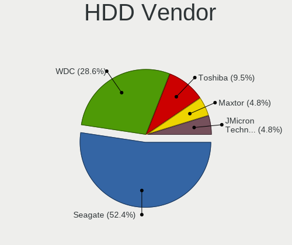
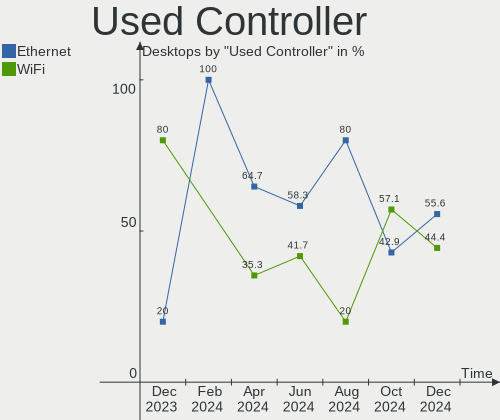
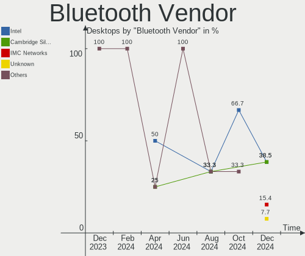

Elementary - Hardware Trends (Desktops)
---------------------------------------

A project to identify most popular hardware characteristics and track their change
over time based on data collected by Linux users at https://Linux-Hardware.org.

Anyone can contribute to this report by the [hw-probe](https://github.com/linuxhw/hw-probe) tool:

    sudo -E hw-probe -all -upload

This report is for one last month. Overall report since the beginning of time: [TestCoverage](https://github.com/linuxhw/TestCoverage)

Period: Oct, 2022.

Contents
--------

* [ System ](#system)
  - [ OS                       ](#os)
  - [ OS Family                ](#os-family)
  - [ Kernel                   ](#kernel)
  - [ Kernel Family            ](#kernel-family)
  - [ Kernel Major Ver.        ](#kernel-major-ver)
  - [ Arch                     ](#arch)
  - [ DE                       ](#de)
  - [ Display Server           ](#display-server)
  - [ Display Manager          ](#display-manager)
  - [ OS Lang                  ](#os-lang)
  - [ Boot Mode                ](#boot-mode)
  - [ Filesystem               ](#filesystem)
  - [ Part. scheme             ](#part-scheme)
  - [ Dual Boot with Linux/BSD ](#dual-boot-with-linuxbsd)
  - [ Dual Boot (Win)          ](#dual-boot-win)

* [ Board ](#board)
  - [ Vendor                   ](#vendor)
  - [ Model                    ](#model)
  - [ Model Family             ](#model-family)
  - [ MFG Year                 ](#mfg-year)
  - [ Form Factor              ](#form-factor)
  - [ Secure Boot              ](#secure-boot)
  - [ Coreboot                 ](#coreboot)
  - [ RAM Size                 ](#ram-size)
  - [ RAM Used                 ](#ram-used)
  - [ Total Drives             ](#total-drives)
  - [ Has CD-ROM               ](#has-cd-rom)
  - [ Has Ethernet             ](#has-ethernet)
  - [ Has WiFi                 ](#has-wifi)
  - [ Has Bluetooth            ](#has-bluetooth)

* [ Location ](#location)
  - [ Country                  ](#country)
  - [ City                     ](#city)

* [ Drives ](#drives)
  - [ Drive Vendor             ](#drive-vendor)
  - [ Drive Model              ](#drive-model)
  - [ HDD Vendor               ](#hdd-vendor)
  - [ SSD Vendor               ](#ssd-vendor)
  - [ Drive Kind               ](#drive-kind)
  - [ Drive Connector          ](#drive-connector)
  - [ Drive Size               ](#drive-size)
  - [ Space Total              ](#space-total)
  - [ Space Used               ](#space-used)
  - [ Malfunc. Drives          ](#malfunc-drives)
  - [ Malfunc. Drive Vendor    ](#malfunc-drive-vendor)
  - [ Malfunc. HDD Vendor      ](#malfunc-hdd-vendor)
  - [ Malfunc. Drive Kind      ](#malfunc-drive-kind)
  - [ Failed Drives            ](#failed-drives)
  - [ Failed Drive Vendor      ](#failed-drive-vendor)
  - [ Drive Status             ](#drive-status)

* [ Storage controller ](#storage-controller)
  - [ Storage Vendor           ](#storage-vendor)
  - [ Storage Model            ](#storage-model)
  - [ Storage Kind             ](#storage-kind)

* [ Processor ](#processor)
  - [ CPU Vendor               ](#cpu-vendor)
  - [ CPU Model                ](#cpu-model)
  - [ CPU Model Family         ](#cpu-model-family)
  - [ CPU Cores                ](#cpu-cores)
  - [ CPU Sockets              ](#cpu-sockets)
  - [ CPU Threads              ](#cpu-threads)
  - [ CPU Op-Modes             ](#cpu-op-modes)
  - [ CPU Microcode            ](#cpu-microcode)
  - [ CPU Microarch            ](#cpu-microarch)

* [ Graphics ](#graphics)
  - [ GPU Vendor               ](#gpu-vendor)
  - [ GPU Model                ](#gpu-model)
  - [ GPU Combo                ](#gpu-combo)
  - [ GPU Driver               ](#gpu-driver)
  - [ GPU Memory               ](#gpu-memory)

* [ Monitor ](#monitor)
  - [ Monitor Vendor           ](#monitor-vendor)
  - [ Monitor Model            ](#monitor-model)
  - [ Monitor Resolution       ](#monitor-resolution)
  - [ Monitor Diagonal         ](#monitor-diagonal)
  - [ Monitor Width            ](#monitor-width)
  - [ Aspect Ratio             ](#aspect-ratio)
  - [ Monitor Area             ](#monitor-area)
  - [ Pixel Density            ](#pixel-density)
  - [ Multiple Monitors        ](#multiple-monitors)

* [ Network ](#network)
  - [ Net Controller Vendor    ](#net-controller-vendor)
  - [ Net Controller Model     ](#net-controller-model)
  - [ Wireless Vendor          ](#wireless-vendor)
  - [ Wireless Model           ](#wireless-model)
  - [ Ethernet Vendor          ](#ethernet-vendor)
  - [ Ethernet Model           ](#ethernet-model)
  - [ Net Controller Kind      ](#net-controller-kind)
  - [ Used Controller          ](#used-controller)
  - [ NICs                     ](#nics)
  - [ IPv6                     ](#ipv6)

* [ Bluetooth ](#bluetooth)
  - [ Bluetooth Vendor         ](#bluetooth-vendor)
  - [ Bluetooth Model          ](#bluetooth-model)

* [ Sound ](#sound)
  - [ Sound Vendor             ](#sound-vendor)
  - [ Sound Model              ](#sound-model)

* [ Memory ](#memory)
  - [ Memory Vendor            ](#memory-vendor)
  - [ Memory Model             ](#memory-model)
  - [ Memory Kind              ](#memory-kind)
  - [ Memory Form Factor       ](#memory-form-factor)
  - [ Memory Size              ](#memory-size)
  - [ Memory Speed             ](#memory-speed)

* [ Printers & scanners ](#printers--scanners)
  - [ Printer Vendor           ](#printer-vendor)
  - [ Printer Model            ](#printer-model)
  - [ Scanner Vendor           ](#scanner-vendor)
  - [ Scanner Model            ](#scanner-model)

* [ Camera ](#camera)
  - [ Camera Vendor            ](#camera-vendor)
  - [ Camera Model             ](#camera-model)

* [ Security ](#security)
  - [ Fingerprint Vendor       ](#fingerprint-vendor)
  - [ Fingerprint Model        ](#fingerprint-model)
  - [ Chipcard Vendor          ](#chipcard-vendor)
  - [ Chipcard Model           ](#chipcard-model)

* [ Unsupported ](#unsupported)
  - [ Unsupported Devices      ](#unsupported-devices)
  - [ Unsupported Device Types ](#unsupported-device-types)

System
------

OS
--

Installed operating systems

| Name           | Desktops | Percent |
|----------------|----------|---------|
| Elementary 6.1 | 7        | 100%    |

OS Family
---------

OS without a version

| Name       | Desktops | Percent |
|------------|----------|---------|
| Elementary | 7        | 100%    |

Kernel
------

Version of the Linux kernel

| Version           | Desktops | Percent |
|-------------------|----------|---------|
| 5.15.0-50-generic | 3        | 42.86%  |
| 5.15.0-52-generic | 2        | 28.57%  |
| 5.13.0-27-generic | 1        | 14.29%  |
| 5.11.0-43-generic | 1        | 14.29%  |

Kernel Family
-------------

Linux kernel without a distro release

| Version | Desktops | Percent |
|---------|----------|---------|
| 5.15.0  | 5        | 71.43%  |
| 5.13.0  | 1        | 14.29%  |
| 5.11.0  | 1        | 14.29%  |

Kernel Major Ver.
-----------------

Linux kernel major version

| Version | Desktops | Percent |
|---------|----------|---------|
| 5.15    | 5        | 71.43%  |
| 5.13    | 1        | 14.29%  |
| 5.11    | 1        | 14.29%  |

Arch
----

OS architecture (x86_64, i586, etc.)

| Name   | Desktops | Percent |
|--------|----------|---------|
| x86_64 | 7        | 100%    |

DE
--

Desktop Environment

| Name     | Desktops | Percent |
|----------|----------|---------|
| Pantheon | 7        | 100%    |

Display Server
--------------

X11 or Wayland

| Name | Desktops | Percent |
|------|----------|---------|
| X11  | 7        | 100%    |

Display Manager
---------------

SDDM, LightDM, etc.

| Name    | Desktops | Percent |
|---------|----------|---------|
| Unknown | 6        | 85.71%  |
| LightDM | 1        | 14.29%  |

OS Lang
-------

Language

| Lang  | Desktops | Percent |
|-------|----------|---------|
| en_US | 4        | 57.14%  |
| ru_RU | 1        | 14.29%  |
| fr_FR | 1        | 14.29%  |
| en_GB | 1        | 14.29%  |

Boot Mode
---------

EFI or BIOS

| Mode | Desktops | Percent |
|------|----------|---------|
| EFI  | 5        | 71.43%  |
| BIOS | 2        | 28.57%  |

Filesystem
----------

Type of filesystem

| Type  | Desktops | Percent |
|-------|----------|---------|
| Ext4  | 6        | 85.71%  |
| Btrfs | 1        | 14.29%  |

Part. scheme
------------

Scheme of partitioning

| Type    | Desktops | Percent |
|---------|----------|---------|
| Unknown | 6        | 85.71%  |
| GPT     | 1        | 14.29%  |

Dual Boot with Linux/BSD
------------------------

Hosting more than one Linux/BSD

| Dual boot | Desktops | Percent |
|-----------|----------|---------|
| No        | 7        | 100%    |

Dual Boot (Win)
---------------

Hosting Linux and Windows

| Dual boot | Desktops | Percent |
|-----------|----------|---------|
| No        | 6        | 85.71%  |
| Yes       | 1        | 14.29%  |

Board
-----

Vendor
------

Motherboard manufacturer

| Name             | Desktops | Percent |
|------------------|----------|---------|
| ASUSTek Computer | 3        | 42.86%  |
| MSI              | 1        | 14.29%  |
| Kraftway         | 1        | 14.29%  |
| Hewlett-Packard  | 1        | 14.29%  |
| Dell             | 1        | 14.29%  |

Model
-----

Motherboard model

| Name                       | Desktops | Percent |
|----------------------------|----------|---------|
| MSI MS-7B61                | 1        | 14.29%  |
| Kraftway Credo KCxx        | 1        | 14.29%  |
| HP ProDesk 600 G2 SFF      | 1        | 14.29%  |
| Dell OptiPlex 790          | 1        | 14.29%  |
| ASUS TUF Z390-PLUS GAMING  | 1        | 14.29%  |
| ASUS TUF Gaming B550M-PLUS | 1        | 14.29%  |
| ASUS PRIME X570-PRO        | 1        | 14.29%  |

Model Family
------------

Motherboard model prefix

| Name           | Desktops | Percent |
|----------------|----------|---------|
| ASUS TUF       | 2        | 28.57%  |
| MSI MS-7B61    | 1        | 14.29%  |
| Kraftway Credo | 1        | 14.29%  |
| HP ProDesk     | 1        | 14.29%  |
| Dell OptiPlex  | 1        | 14.29%  |
| ASUS PRIME     | 1        | 14.29%  |

MFG Year
--------

Motherboard manufacture year

| Year | Desktops | Percent |
|------|----------|---------|
| 2020 | 1        | 14.29%  |
| 2019 | 1        | 14.29%  |
| 2018 | 1        | 14.29%  |
| 2017 | 1        | 14.29%  |
| 2015 | 1        | 14.29%  |
| 2012 | 1        | 14.29%  |
| 2011 | 1        | 14.29%  |

Form Factor
-----------

Physical design of the computer

| Name    | Desktops | Percent |
|---------|----------|---------|
| Desktop | 7        | 100%    |

Secure Boot
-----------

Enabled or disabled

| State    | Desktops | Percent |
|----------|----------|---------|
| Disabled | 7        | 100%    |

Coreboot
--------

Have coreboot on board

| Used | Desktops | Percent |
|------|----------|---------|
| No   | 7        | 100%    |

RAM Size
--------

Total RAM memory

| Size in GB  | Desktops | Percent |
|-------------|----------|---------|
| 32.01-64.0  | 2        | 28.57%  |
| 3.01-4.0    | 2        | 28.57%  |
| 4.01-8.0    | 1        | 14.29%  |
| 64.01-256.0 | 1        | 14.29%  |
| 16.01-24.0  | 1        | 14.29%  |

RAM Used
--------

Used RAM memory

| Used GB  | Desktops | Percent |
|----------|----------|---------|
| 4.01-8.0 | 3        | 42.86%  |
| 2.01-3.0 | 3        | 42.86%  |
| 1.01-2.0 | 1        | 14.29%  |

Total Drives
------------

Number of drives on board

| Drives | Desktops | Percent |
|--------|----------|---------|
| 2      | 4        | 57.14%  |
| 1      | 2        | 28.57%  |
| 4      | 1        | 14.29%  |

Has CD-ROM
----------

Has CD-ROM on board

| Presented | Desktops | Percent |
|-----------|----------|---------|
| No        | 5        | 71.43%  |
| Yes       | 2        | 28.57%  |

Has Ethernet
------------

Has Ethernet on board

| Presented | Desktops | Percent |
|-----------|----------|---------|
| Yes       | 7        | 100%    |

Has WiFi
--------

Has WiFi module

| Presented | Desktops | Percent |
|-----------|----------|---------|
| Yes       | 4        | 57.14%  |
| No        | 3        | 42.86%  |

Has Bluetooth
-------------

Has Bluetooth module

| Presented | Desktops | Percent |
|-----------|----------|---------|
| No        | 4        | 57.14%  |
| Yes       | 3        | 42.86%  |

Location
--------

Country
-------

Geographic location (country)

| Country | Desktops | Percent |
|---------|----------|---------|
| USA     | 3        | 42.86%  |
| Russia  | 1        | 14.29%  |
| France  | 1        | 14.29%  |
| Czechia | 1        | 14.29%  |
| Brazil  | 1        | 14.29%  |

City
----

Geographic location (city)

| City        | Desktops | Percent |
|-------------|----------|---------|
| Sao Paulo   | 1        | 14.29%  |
| Parkersburg | 1        | 14.29%  |
| Paris       | 1        | 14.29%  |
| Novosibirsk | 1        | 14.29%  |
| McAllen     | 1        | 14.29%  |
| Kucharovice | 1        | 14.29%  |
| Ballwin     | 1        | 14.29%  |

Drives
------

Drive Vendor
------------

Hard drive vendors

| Vendor                      | Desktops | Drives | Percent |
|-----------------------------|----------|--------|---------|
| Seagate                     | 3        | 3      | 23.08%  |
| PNY                         | 2        | 2      | 15.38%  |
| WDC                         | 1        | 2      | 7.69%   |
| Toshiba                     | 1        | 1      | 7.69%   |
| SanDisk                     | 1        | 1      | 7.69%   |
| Samsung Electronics         | 1        | 1      | 7.69%   |
| Phison Electronics          | 1        | 1      | 7.69%   |
| OCZ                         | 1        | 1      | 7.69%   |
| Kingston Technology Company | 1        | 1      | 7.69%   |
| HUSKY                       | 1        | 1      | 7.69%   |

Drive Model
-----------

Hard drive models

| Model                                               | Desktops | Percent |
|-----------------------------------------------------|----------|---------|
| WDC WDS100T1XHE-00AFY0 1TB                          | 1        | 7.14%   |
| WDC WDS100T1X0E-00AFY0 1TB                          | 1        | 7.14%   |
| Toshiba DT01ABA100V 1TB                             | 1        | 7.14%   |
| Seagate ST500DM009-2F110A 500GB                     | 1        | 7.14%   |
| Seagate ST3320813AS 320GB                           | 1        | 7.14%   |
| Seagate ST1000DM003-1ER162 1TB                      | 1        | 7.14%   |
| SanDisk SDSSDHP256G 256GB                           | 1        | 7.14%   |
| Samsung NVMe SSD Controller SM981/PM981/PM983 500GB | 1        | 7.14%   |
| PNY CS900 500GB SSD                                 | 1        | 7.14%   |
| PNY CS900 480GB SSD                                 | 1        | 7.14%   |
| Phison E12 NVMe Controller 2TB                      | 1        | 7.14%   |
| OCZ AGILITY3 240GB SSD                              | 1        | 7.14%   |
| Kingston Company A2000 NVMe SSD 1TB                 | 1        | 7.14%   |
| HUSKY SSD 128GB                                     | 1        | 7.14%   |

HDD Vendor
----------

Hard disk drive vendors

| Vendor  | Desktops | Drives | Percent |
|---------|----------|--------|---------|
| Seagate | 3        | 3      | 75%     |
| Toshiba | 1        | 1      | 25%     |

SSD Vendor
----------

Solid state drive vendors

| Vendor  | Desktops | Drives | Percent |
|---------|----------|--------|---------|
| PNY     | 2        | 2      | 40%     |
| SanDisk | 1        | 1      | 20%     |
| OCZ     | 1        | 1      | 20%     |
| HUSKY   | 1        | 1      | 20%     |

Drive Kind
----------

HDD or SSD

| Kind | Desktops | Drives | Percent |
|------|----------|--------|---------|
| SSD  | 4        | 5      | 36.36%  |
| HDD  | 4        | 4      | 36.36%  |
| NVMe | 3        | 5      | 27.27%  |

Drive Connector
---------------

SATA, SAS, NVMe, etc.

| Type | Desktops | Drives | Percent |
|------|----------|--------|---------|
| SATA | 6        | 9      | 66.67%  |
| NVMe | 3        | 5      | 33.33%  |

Drive Size
----------

Size of hard drive

| Size in TB | Desktops | Drives | Percent |
|------------|----------|--------|---------|
| 0.01-0.5   | 6        | 7      | 75%     |
| 0.51-1.0   | 2        | 2      | 25%     |

Space Total
-----------

Amount of disk space available on the file system

| Size in GB | Desktops | Percent |
|------------|----------|---------|
| 251-500    | 5        | 71.43%  |
| 1001-2000  | 2        | 28.57%  |

Space Used
----------

Amount of used disk space

| Used GB  | Desktops | Percent |
|----------|----------|---------|
| 101-250  | 2        | 28.57%  |
| 251-500  | 1        | 14.29%  |
| 21-50    | 1        | 14.29%  |
| 1-20     | 1        | 14.29%  |
| 501-1000 | 1        | 14.29%  |
| 51-100   | 1        | 14.29%  |

Malfunc. Drives
---------------

Drive models with a malfunction

Zero info for selected period =(

Malfunc. Drive Vendor
---------------------

Vendors of faulty drives

Zero info for selected period =(

Malfunc. HDD Vendor
-------------------

Vendors of faulty HDD drives

Zero info for selected period =(

Malfunc. Drive Kind
-------------------

Kinds of faulty drives

Zero info for selected period =(

Failed Drives
-------------

Failed drive models

Zero info for selected period =(

Failed Drive Vendor
-------------------

Failed drive vendors

Zero info for selected period =(

Drive Status
------------

Number of failed and malfunc. drives

| Status   | Desktops | Drives | Percent |
|----------|----------|--------|---------|
| Detected | 6        | 10     | 85.71%  |
| Works    | 1        | 4      | 14.29%  |

Storage controller
------------------

Storage Vendor
--------------

Storage controller vendors

| Vendor                      | Desktops | Percent |
|-----------------------------|----------|---------|
| Intel                       | 5        | 45.45%  |
| AMD                         | 2        | 18.18%  |
| SanDisk                     | 1        | 9.09%   |
| Samsung Electronics         | 1        | 9.09%   |
| Phison Electronics          | 1        | 9.09%   |
| Kingston Technology Company | 1        | 9.09%   |

Storage Model
-------------

Storage controller models

| Model                                                                         | Desktops | Percent |
|-------------------------------------------------------------------------------|----------|---------|
| Intel 6 Series/C200 Series Chipset Family 6 port Desktop SATA AHCI Controller | 2        | 16.67%  |
| SanDisk WD PC SN810 / Black SN850 NVMe SSD                                    | 1        | 8.33%   |
| Samsung NVMe SSD Controller SM981/PM981/PM983                                 | 1        | 8.33%   |
| Phison E12 NVMe Controller                                                    | 1        | 8.33%   |
| Kingston Company A2000 NVMe SSD                                               | 1        | 8.33%   |
| Intel SATA Controller [RAID mode]                                             | 1        | 8.33%   |
| Intel Q170/Q150/B150/H170/H110/Z170/CM236 Chipset SATA Controller [AHCI Mode] | 1        | 8.33%   |
| Intel 6 Series/C200 Series Chipset Family IDE-r Controller                    | 1        | 8.33%   |
| Intel 200 Series PCH SATA controller [AHCI mode]                              | 1        | 8.33%   |
| AMD FCH SATA Controller [AHCI mode]                                           | 1        | 8.33%   |
| AMD 500 Series Chipset SATA Controller                                        | 1        | 8.33%   |

Storage Kind
------------

Kind of storage controller (IDE, SATA, NVMe, SAS, ...)

| Kind | Desktops | Percent |
|------|----------|---------|
| SATA | 6        | 54.55%  |
| NVMe | 3        | 27.27%  |
| RAID | 1        | 9.09%   |
| IDE  | 1        | 9.09%   |

Processor
---------

CPU Vendor
----------

Processor vendors

| Vendor | Desktops | Percent |
|--------|----------|---------|
| Intel  | 5        | 71.43%  |
| AMD    | 2        | 28.57%  |

CPU Model
---------

Processor models

| Model                               | Desktops | Percent |
|-------------------------------------|----------|---------|
| Intel Pentium CPU G850 @ 2.90GHz    | 1        | 14.29%  |
| Intel Core i9-9900K CPU @ 3.60GHz   | 1        | 14.29%  |
| Intel Core i7-9700 CPU @ 3.00GHz    | 1        | 14.29%  |
| Intel Core i3-6100 CPU @ 3.70GHz    | 1        | 14.29%  |
| Intel Core i3-2100 CPU @ 3.10GHz    | 1        | 14.29%  |
| AMD Ryzen 9 5950X 16-Core Processor | 1        | 14.29%  |
| AMD Ryzen 7 3700X 8-Core Processor  | 1        | 14.29%  |

CPU Model Family
----------------

Processor model prefix

| Model         | Desktops | Percent |
|---------------|----------|---------|
| Intel Core i3 | 2        | 28.57%  |
| Intel Pentium | 1        | 14.29%  |
| Intel Core i9 | 1        | 14.29%  |
| Intel Core i7 | 1        | 14.29%  |
| AMD Ryzen 9   | 1        | 14.29%  |
| AMD Ryzen 7   | 1        | 14.29%  |

CPU Cores
---------

Number of processor cores

| Number | Desktops | Percent |
|--------|----------|---------|
| 8      | 3        | 42.86%  |
| 2      | 3        | 42.86%  |
| 16     | 1        | 14.29%  |

CPU Sockets
-----------

Number of sockets

| Number | Desktops | Percent |
|--------|----------|---------|
| 1      | 7        | 100%    |

CPU Threads
-----------

Threads per core (Hyper-Threading)

| Number | Desktops | Percent |
|--------|----------|---------|
| 2      | 5        | 71.43%  |
| 1      | 2        | 28.57%  |

CPU Op-Modes
------------

CPU Operation Modes (32-bit, 64-bit)

| Op mode        | Desktops | Percent |
|----------------|----------|---------|
| 32-bit, 64-bit | 7        | 100%    |

CPU Microcode
-------------

Microcode number

| Number     | Desktops | Percent |
|------------|----------|---------|
| 0x906ed    | 2        | 28.57%  |
| 0x206a7    | 2        | 28.57%  |
| 0x506e3    | 1        | 14.29%  |
| 0x0a201016 | 1        | 14.29%  |
| 0x08701021 | 1        | 14.29%  |

CPU Microarch
-------------

Microarchitecture

| Name        | Desktops | Percent |
|-------------|----------|---------|
| SandyBridge | 2        | 28.57%  |
| KabyLake    | 2        | 28.57%  |
| Zen 3       | 1        | 14.29%  |
| Zen 2       | 1        | 14.29%  |
| Skylake     | 1        | 14.29%  |

Graphics
--------

GPU Vendor
----------

Vendors of graphics cards

| Vendor | Desktops | Percent |
|--------|----------|---------|
| Nvidia | 3        | 37.5%   |
| Intel  | 3        | 37.5%   |
| AMD    | 2        | 25%     |

GPU Model
---------

Graphics card models

| Model                                                                     | Desktops | Percent |
|---------------------------------------------------------------------------|----------|---------|
| Nvidia TU106 [GeForce RTX 2070]                                           | 1        | 12.5%   |
| Nvidia TU104 [GeForce RTX 2080 SUPER]                                     | 1        | 12.5%   |
| Nvidia GA102 [GeForce RTX 3080 Lite Hash Rate]                            | 1        | 12.5%   |
| Intel HD Graphics 530                                                     | 1        | 12.5%   |
| Intel CoffeeLake-S GT2 [UHD Graphics 630]                                 | 1        | 12.5%   |
| Intel 2nd Generation Core Processor Family Integrated Graphics Controller | 1        | 12.5%   |
| AMD Redwood XT [Radeon HD 5670/5690/5730]                                 | 1        | 12.5%   |
| AMD Lexa PRO [Radeon 540/540X/550/550X / RX 540X/550/550X]                | 1        | 12.5%   |

GPU Combo
---------

Combinations of graphics cards

| Name           | Desktops | Percent |
|----------------|----------|---------|
| 1 x Nvidia     | 2        | 28.57%  |
| 1 x Intel      | 2        | 28.57%  |
| 1 x AMD        | 2        | 28.57%  |
| Intel + Nvidia | 1        | 14.29%  |

GPU Driver
----------

Free vs proprietary

| Driver      | Desktops | Percent |
|-------------|----------|---------|
| Free        | 6        | 85.71%  |
| Proprietary | 1        | 14.29%  |

GPU Memory
----------

Total video memory

| Size in GB | Desktops | Percent |
|------------|----------|---------|
| 7.01-8.0   | 2        | 28.57%  |
| Unknown    | 2        | 28.57%  |
| 1.01-2.0   | 1        | 14.29%  |
| 8.01-16.0  | 1        | 14.29%  |
| 0.51-1.0   | 1        | 14.29%  |

Monitor
-------

Monitor Vendor
--------------

Monitor vendors

| Vendor              | Desktops | Percent |
|---------------------|----------|---------|
| Dell                | 3        | 37.5%   |
| Samsung Electronics | 2        | 25%     |
| Goldstar            | 2        | 25%     |
| Vizio               | 1        | 12.5%   |

Monitor Model
-------------

Monitor models

| Model                                                                | Desktops | Percent |
|----------------------------------------------------------------------|----------|---------|
| Vizio E280i-B1 VIZ1002 1360x768 607x345mm 27.5-inch                  | 1        | 10%     |
| Samsung Electronics SyncMaster SAM0580 1280x1024 376x301mm 19.0-inch | 1        | 10%     |
| Samsung Electronics SyncMaster SAM0380 1680x1050 459x296mm 21.5-inch | 1        | 10%     |
| Goldstar ULTRAWIDE GSM59F1 2560x1080 798x334mm 34.1-inch             | 1        | 10%     |
| Goldstar 22EN33 GSM597C 1920x1080 480x270mm 21.7-inch                | 1        | 10%     |
| Dell P2419H DELD0D9 1920x1080 527x296mm 23.8-inch                    | 1        | 10%     |
| Dell P2319H DELD0D7 1920x1080 509x286mm 23.0-inch                    | 1        | 10%     |
| Dell P2319H DELD0D6 1920x1080 510x290mm 23.1-inch                    | 1        | 10%     |
| Dell P2214H DELA098 1920x1080 477x268mm 21.5-inch                    | 1        | 10%     |
| Dell E1909W DELF00D 1440x900 408x255mm 18.9-inch                     | 1        | 10%     |

Monitor Resolution
------------------

Monitor screen resolution

| Resolution         | Desktops | Percent |
|--------------------|----------|---------|
| 1920x1080 (FHD)    | 3        | 37.5%   |
| 2560x1080          | 1        | 12.5%   |
| 1680x1050 (WSXGA+) | 1        | 12.5%   |
| 1440x900 (WXGA+)   | 1        | 12.5%   |
| 1366x768 (WXGA)    | 1        | 12.5%   |
| 1280x1024 (SXGA)   | 1        | 12.5%   |

Monitor Diagonal
----------------

Diagonal size in inches

| Inches | Desktops | Percent |
|--------|----------|---------|
| 21     | 2        | 25%     |
| 19     | 2        | 25%     |
| 38     | 1        | 12.5%   |
| 34     | 1        | 12.5%   |
| 24     | 1        | 12.5%   |
| 23     | 1        | 12.5%   |

Monitor Width
-------------

Physical width

| Width in mm | Desktops | Percent |
|-------------|----------|---------|
| 401-500     | 3        | 37.5%   |
| 501-600     | 2        | 25%     |
| 801-900     | 1        | 12.5%   |
| 701-800     | 1        | 12.5%   |
| 351-400     | 1        | 12.5%   |

Aspect Ratio
------------

Proportional relationship between the width and the height

| Ratio | Desktops | Percent |
|-------|----------|---------|
| 16/9  | 4        | 50%     |
| 16/10 | 2        | 25%     |
| 5/4   | 1        | 12.5%   |
| 21/9  | 1        | 12.5%   |

Monitor Area
------------

Area in inch²

| Area in inch² | Desktops | Percent |
|----------------|----------|---------|
| 201-250        | 3        | 42.86%  |
| 151-200        | 2        | 28.57%  |
| 351-500        | 1        | 14.29%  |
| 501-1000       | 1        | 14.29%  |

Pixel Density
-------------

Pixels per inch

| Density | Desktops | Percent |
|---------|----------|---------|
| 51-100  | 5        | 62.5%   |
| 101-120 | 2        | 25%     |
| 1-50    | 1        | 12.5%   |

Multiple Monitors
-----------------

Total monitors connected

| Total | Desktops | Percent |
|-------|----------|---------|
| 1     | 5        | 71.43%  |
| 3     | 1        | 14.29%  |
| 2     | 1        | 14.29%  |

Network
-------

Net Controller Vendor
---------------------

Controller vendors

| Vendor                | Desktops | Percent |
|-----------------------|----------|---------|
| Intel                 | 6        | 54.55%  |
| Realtek Semiconductor | 3        | 27.27%  |
| ZyXEL Communications  | 1        | 9.09%   |
| Samsung Electronics   | 1        | 9.09%   |

Net Controller Model
--------------------

Controller models

| Model                                                             | Desktops | Percent |
|-------------------------------------------------------------------|----------|---------|
| Intel 82579LM Gigabit Network Connection (Lewisville)             | 2        | 14.29%  |
| ZyXEL NWD2205 802.11n Wireless N Adapter [Realtek RTL8192CU]      | 1        | 7.14%   |
| Samsung GT-I9070 (network tethering, USB debugging enabled)       | 1        | 7.14%   |
| Realtek RTL88x2bu [AC1200 Techkey]                                | 1        | 7.14%   |
| Realtek RTL8125 2.5GbE Controller                                 | 1        | 7.14%   |
| Realtek RTL8111/8168/8411 PCI Express Gigabit Ethernet Controller | 1        | 7.14%   |
| Intel Wi-Fi 6 AX200                                               | 1        | 7.14%   |
| Intel I211 Gigabit Network Connection                             | 1        | 7.14%   |
| Intel Ethernet Connection (7) I219-V                              | 1        | 7.14%   |
| Intel Ethernet Connection (2) I219-V                              | 1        | 7.14%   |
| Intel Ethernet Connection (2) I219-LM                             | 1        | 7.14%   |
| Intel Cannon Lake PCH CNVi WiFi                                   | 1        | 7.14%   |
| Intel 82574L Gigabit Network Connection                           | 1        | 7.14%   |

Wireless Vendor
---------------

Wireless vendors

| Vendor                | Desktops | Percent |
|-----------------------|----------|---------|
| Intel                 | 2        | 50%     |
| ZyXEL Communications  | 1        | 25%     |
| Realtek Semiconductor | 1        | 25%     |

Wireless Model
--------------

Wireless models

| Model                                                        | Desktops | Percent |
|--------------------------------------------------------------|----------|---------|
| ZyXEL NWD2205 802.11n Wireless N Adapter [Realtek RTL8192CU] | 1        | 25%     |
| Realtek RTL88x2bu [AC1200 Techkey]                           | 1        | 25%     |
| Intel Wi-Fi 6 AX200                                          | 1        | 25%     |
| Intel Cannon Lake PCH CNVi WiFi                              | 1        | 25%     |

Ethernet Vendor
---------------

Ethernet vendors

| Vendor                | Desktops | Percent |
|-----------------------|----------|---------|
| Intel                 | 6        | 66.67%  |
| Realtek Semiconductor | 2        | 22.22%  |
| Samsung Electronics   | 1        | 11.11%  |

Ethernet Model
--------------

Ethernet models

| Model                                                             | Desktops | Percent |
|-------------------------------------------------------------------|----------|---------|
| Intel 82579LM Gigabit Network Connection (Lewisville)             | 2        | 20%     |
| Samsung GT-I9070 (network tethering, USB debugging enabled)       | 1        | 10%     |
| Realtek RTL8125 2.5GbE Controller                                 | 1        | 10%     |
| Realtek RTL8111/8168/8411 PCI Express Gigabit Ethernet Controller | 1        | 10%     |
| Intel I211 Gigabit Network Connection                             | 1        | 10%     |
| Intel Ethernet Connection (7) I219-V                              | 1        | 10%     |
| Intel Ethernet Connection (2) I219-V                              | 1        | 10%     |
| Intel Ethernet Connection (2) I219-LM                             | 1        | 10%     |
| Intel 82574L Gigabit Network Connection                           | 1        | 10%     |

Net Controller Kind
-------------------

Ethernet, WiFi or modem

| Kind     | Desktops | Percent |
|----------|----------|---------|
| Ethernet | 7        | 63.64%  |
| WiFi     | 4        | 36.36%  |

Used Controller
---------------

Currently used network controller

| Kind     | Desktops | Percent |
|----------|----------|---------|
| Ethernet | 5        | 71.43%  |
| WiFi     | 2        | 28.57%  |

NICs
----

Total network controllers on board

| Total | Desktops | Percent |
|-------|----------|---------|
| 2     | 4        | 57.14%  |
| 1     | 3        | 42.86%  |

IPv6
----

IPv6 vs IPv4

| Used | Desktops | Percent |
|------|----------|---------|
| No   | 5        | 71.43%  |
| Yes  | 2        | 28.57%  |

Bluetooth
---------

Bluetooth Vendor
----------------

Controller vendors

| Vendor                  | Desktops | Percent |
|-------------------------|----------|---------|
| Intel                   | 2        | 66.67%  |
| Cambridge Silicon Radio | 1        | 33.33%  |

Bluetooth Model
---------------

Controller models

| Model                                               | Desktops | Percent |
|-----------------------------------------------------|----------|---------|
| Intel Bluetooth 9460/9560 Jefferson Peak (JfP)      | 1        | 33.33%  |
| Intel AX200 Bluetooth                               | 1        | 33.33%  |
| Cambridge Silicon Radio Bluetooth Dongle (HCI mode) | 1        | 33.33%  |

Sound
-----

Sound Vendor
------------

Sound card vendors

| Vendor          | Desktops | Percent |
|-----------------|----------|---------|
| Intel           | 5        | 38.46%  |
| Nvidia          | 3        | 23.08%  |
| AMD             | 3        | 23.08%  |
| Tenx Technology | 1        | 7.69%   |
| Sony            | 1        | 7.69%   |

Sound Model
-----------

Sound card models

| Model                                                                      | Desktops | Percent |
|----------------------------------------------------------------------------|----------|---------|
| Intel 6 Series/C200 Series Chipset Family High Definition Audio Controller | 2        | 14.29%  |
| AMD Starship/Matisse HD Audio Controller                                   | 2        | 14.29%  |
| Tenx Technology USB AUDIO                                                  | 1        | 7.14%   |
| Sony Wireless Headset                                                      | 1        | 7.14%   |
| Nvidia TU106 High Definition Audio Controller                              | 1        | 7.14%   |
| Nvidia TU104 HD Audio Controller                                           | 1        | 7.14%   |
| Nvidia GA102 High Definition Audio Controller                              | 1        | 7.14%   |
| Intel Cannon Lake PCH cAVS                                                 | 1        | 7.14%   |
| Intel 200 Series PCH HD Audio                                              | 1        | 7.14%   |
| Intel 100 Series/C230 Series Chipset Family HD Audio Controller            | 1        | 7.14%   |
| AMD Redwood HDMI Audio [Radeon HD 5000 Series]                             | 1        | 7.14%   |
| AMD Baffin HDMI/DP Audio [Radeon RX 550 640SP / RX 560/560X]               | 1        | 7.14%   |

Memory
------

Memory Vendor
-------------

Memory module vendors

| Vendor   | Desktops | Percent |
|----------|----------|---------|
| Kingston | 1        | 100%    |

Memory Model
------------

Memory module models

| Model                                                 | Desktops | Percent |
|-------------------------------------------------------|----------|---------|
| Kingston RAM KF3600C18D4/32GX 32GB DIMM DDR4 3600MT/s | 1        | 100%    |

Memory Kind
-----------

Memory module kinds

| Kind | Desktops | Percent |
|------|----------|---------|
| DDR4 | 1        | 100%    |

Memory Form Factor
------------------

Physical design of the memory module

| Name | Desktops | Percent |
|------|----------|---------|
| DIMM | 1        | 100%    |

Memory Size
-----------

Memory module size

| Size  | Desktops | Percent |
|-------|----------|---------|
| 32768 | 1        | 100%    |

Memory Speed
------------

Memory module speed

| Speed | Desktops | Percent |
|-------|----------|---------|
| 3600  | 1        | 100%    |

Printers & scanners
-------------------

Printer Vendor
--------------

Printer device vendors

Zero info for selected period =(

Printer Model
-------------

Printer device models

Zero info for selected period =(

Scanner Vendor
--------------

Scanner device vendors

Zero info for selected period =(

Scanner Model
-------------

Scanner device models

Zero info for selected period =(

Camera
------

Camera Vendor
-------------

Camera device vendors

Zero info for selected period =(

Camera Model
------------

Camera device models

Zero info for selected period =(

Security
--------

Fingerprint Vendor
------------------

Fingerprint sensor vendors

Zero info for selected period =(

Fingerprint Model
-----------------

Fingerprint sensor models

Zero info for selected period =(

Chipcard Vendor
---------------

Chipcard module vendors

Zero info for selected period =(

Chipcard Model
--------------

Chipcard module models

Zero info for selected period =(

Unsupported
-----------

Unsupported Devices
-------------------

Total unsupported devices on board

| Total | Desktops | Percent |
|-------|----------|---------|
| 0     | 6        | 85.71%  |
| 2     | 1        | 14.29%  |

Unsupported Device Types
------------------------

Types of unsupported devices

| Type  | Desktops | Percent |
|-------|----------|---------|
| Sound | 1        | 100%    |

