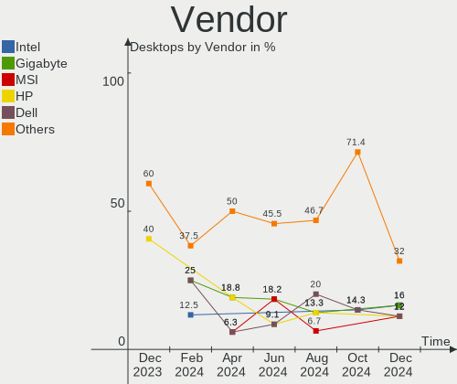
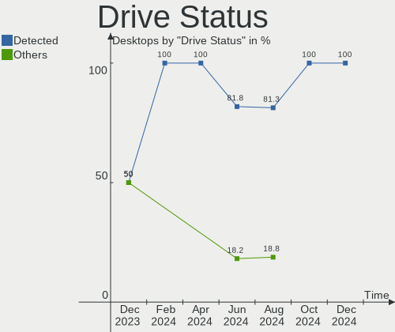
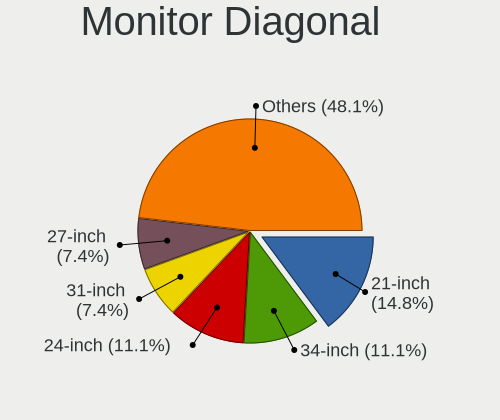
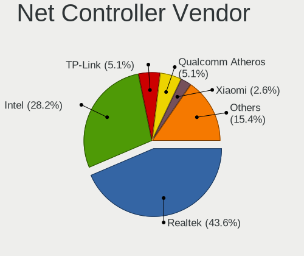

Elementary - Hardware Trends (Desktops)
---------------------------------------

A project to identify most popular hardware characteristics and track their change
over time based on data collected by Linux users at https://Linux-Hardware.org.

Anyone can contribute to this report by the [hw-probe](https://github.com/linuxhw/hw-probe) tool:

    sudo -E hw-probe -all -upload

This report is for one last month. Overall report since the beginning of time: [TestDays](https://github.com/linuxhw/TestDays)

Period: Mar, 2023.

Contents
--------

* [ System ](#system)
  - [ OS                       ](#os)
  - [ OS Family                ](#os-family)
  - [ Kernel                   ](#kernel)
  - [ Kernel Family            ](#kernel-family)
  - [ Kernel Major Ver.        ](#kernel-major-ver)
  - [ Arch                     ](#arch)
  - [ DE                       ](#de)
  - [ Display Server           ](#display-server)
  - [ Display Manager          ](#display-manager)
  - [ OS Lang                  ](#os-lang)
  - [ Boot Mode                ](#boot-mode)
  - [ Filesystem               ](#filesystem)
  - [ Part. scheme             ](#part-scheme)
  - [ Dual Boot with Linux/BSD ](#dual-boot-with-linuxbsd)
  - [ Dual Boot (Win)          ](#dual-boot-win)

* [ Board ](#board)
  - [ Vendor                   ](#vendor)
  - [ Model                    ](#model)
  - [ Model Family             ](#model-family)
  - [ MFG Year                 ](#mfg-year)
  - [ Form Factor              ](#form-factor)
  - [ Secure Boot              ](#secure-boot)
  - [ Coreboot                 ](#coreboot)
  - [ RAM Size                 ](#ram-size)
  - [ RAM Used                 ](#ram-used)
  - [ Total Drives             ](#total-drives)
  - [ Has CD-ROM               ](#has-cd-rom)
  - [ Has Ethernet             ](#has-ethernet)
  - [ Has WiFi                 ](#has-wifi)
  - [ Has Bluetooth            ](#has-bluetooth)

* [ Location ](#location)
  - [ Country                  ](#country)
  - [ City                     ](#city)

* [ Drives ](#drives)
  - [ Drive Vendor             ](#drive-vendor)
  - [ Drive Model              ](#drive-model)
  - [ HDD Vendor               ](#hdd-vendor)
  - [ SSD Vendor               ](#ssd-vendor)
  - [ Drive Kind               ](#drive-kind)
  - [ Drive Connector          ](#drive-connector)
  - [ Drive Size               ](#drive-size)
  - [ Space Total              ](#space-total)
  - [ Space Used               ](#space-used)
  - [ Malfunc. Drives          ](#malfunc-drives)
  - [ Malfunc. Drive Vendor    ](#malfunc-drive-vendor)
  - [ Malfunc. HDD Vendor      ](#malfunc-hdd-vendor)
  - [ Malfunc. Drive Kind      ](#malfunc-drive-kind)
  - [ Failed Drives            ](#failed-drives)
  - [ Failed Drive Vendor      ](#failed-drive-vendor)
  - [ Drive Status             ](#drive-status)

* [ Storage controller ](#storage-controller)
  - [ Storage Vendor           ](#storage-vendor)
  - [ Storage Model            ](#storage-model)
  - [ Storage Kind             ](#storage-kind)

* [ Processor ](#processor)
  - [ CPU Vendor               ](#cpu-vendor)
  - [ CPU Model                ](#cpu-model)
  - [ CPU Model Family         ](#cpu-model-family)
  - [ CPU Cores                ](#cpu-cores)
  - [ CPU Sockets              ](#cpu-sockets)
  - [ CPU Threads              ](#cpu-threads)
  - [ CPU Op-Modes             ](#cpu-op-modes)
  - [ CPU Microcode            ](#cpu-microcode)
  - [ CPU Microarch            ](#cpu-microarch)

* [ Graphics ](#graphics)
  - [ GPU Vendor               ](#gpu-vendor)
  - [ GPU Model                ](#gpu-model)
  - [ GPU Combo                ](#gpu-combo)
  - [ GPU Driver               ](#gpu-driver)
  - [ GPU Memory               ](#gpu-memory)

* [ Monitor ](#monitor)
  - [ Monitor Vendor           ](#monitor-vendor)
  - [ Monitor Model            ](#monitor-model)
  - [ Monitor Resolution       ](#monitor-resolution)
  - [ Monitor Diagonal         ](#monitor-diagonal)
  - [ Monitor Width            ](#monitor-width)
  - [ Aspect Ratio             ](#aspect-ratio)
  - [ Monitor Area             ](#monitor-area)
  - [ Pixel Density            ](#pixel-density)
  - [ Multiple Monitors        ](#multiple-monitors)

* [ Network ](#network)
  - [ Net Controller Vendor    ](#net-controller-vendor)
  - [ Net Controller Model     ](#net-controller-model)
  - [ Wireless Vendor          ](#wireless-vendor)
  - [ Wireless Model           ](#wireless-model)
  - [ Ethernet Vendor          ](#ethernet-vendor)
  - [ Ethernet Model           ](#ethernet-model)
  - [ Net Controller Kind      ](#net-controller-kind)
  - [ Used Controller          ](#used-controller)
  - [ NICs                     ](#nics)
  - [ IPv6                     ](#ipv6)

* [ Bluetooth ](#bluetooth)
  - [ Bluetooth Vendor         ](#bluetooth-vendor)
  - [ Bluetooth Model          ](#bluetooth-model)

* [ Sound ](#sound)
  - [ Sound Vendor             ](#sound-vendor)
  - [ Sound Model              ](#sound-model)

* [ Memory ](#memory)
  - [ Memory Vendor            ](#memory-vendor)
  - [ Memory Model             ](#memory-model)
  - [ Memory Kind              ](#memory-kind)
  - [ Memory Form Factor       ](#memory-form-factor)
  - [ Memory Size              ](#memory-size)
  - [ Memory Speed             ](#memory-speed)

* [ Printers & scanners ](#printers--scanners)
  - [ Printer Vendor           ](#printer-vendor)
  - [ Printer Model            ](#printer-model)
  - [ Scanner Vendor           ](#scanner-vendor)
  - [ Scanner Model            ](#scanner-model)

* [ Camera ](#camera)
  - [ Camera Vendor            ](#camera-vendor)
  - [ Camera Model             ](#camera-model)

* [ Security ](#security)
  - [ Fingerprint Vendor       ](#fingerprint-vendor)
  - [ Fingerprint Model        ](#fingerprint-model)
  - [ Chipcard Vendor          ](#chipcard-vendor)
  - [ Chipcard Model           ](#chipcard-model)

* [ Unsupported ](#unsupported)
  - [ Unsupported Devices      ](#unsupported-devices)
  - [ Unsupported Device Types ](#unsupported-device-types)

System
------

OS
--

Installed operating systems

| Name           | Desktops | Percent |
|----------------|----------|---------|
| Elementary 7   | 9        | 81.82%  |
| Elementary 6.1 | 2        | 18.18%  |

OS Family
---------

OS without a version

| Name       | Desktops | Percent |
|------------|----------|---------|
| Elementary | 11       | 100%    |

Kernel
------

Version of the Linux kernel

| Version           | Desktops | Percent |
|-------------------|----------|---------|
| 5.19.0-35-generic | 6        | 54.55%  |
| 5.19.0-32-generic | 2        | 18.18%  |
| 5.19.0-38-generic | 1        | 9.09%   |
| 5.15.0-58-generic | 1        | 9.09%   |
| 5.15.0-56-generic | 1        | 9.09%   |

Kernel Family
-------------

Linux kernel without a distro release

| Version | Desktops | Percent |
|---------|----------|---------|
| 5.19.0  | 9        | 81.82%  |
| 5.15.0  | 2        | 18.18%  |

Kernel Major Ver.
-----------------

Linux kernel major version

| Version | Desktops | Percent |
|---------|----------|---------|
| 5.19    | 9        | 81.82%  |
| 5.15    | 2        | 18.18%  |

Arch
----

OS architecture (x86_64, i586, etc.)

| Name   | Desktops | Percent |
|--------|----------|---------|
| x86_64 | 11       | 100%    |

DE
--

Desktop Environment

| Name     | Desktops | Percent |
|----------|----------|---------|
| Pantheon | 11       | 100%    |

Display Server
--------------

X11 or Wayland

| Name | Desktops | Percent |
|------|----------|---------|
| X11  | 11       | 100%    |

Display Manager
---------------

SDDM, LightDM, etc.

| Name    | Desktops | Percent |
|---------|----------|---------|
| Unknown | 7        | 63.64%  |
| LightDM | 4        | 36.36%  |

OS Lang
-------

Language

| Lang  | Desktops | Percent |
|-------|----------|---------|
| en_US | 3        | 27.27%  |
| it_IT | 2        | 18.18%  |
| pt_PT | 1        | 9.09%   |
| fi_FI | 1        | 9.09%   |
| es_ES | 1        | 9.09%   |
| en_CA | 1        | 9.09%   |
| de_DE | 1        | 9.09%   |
| de_CH | 1        | 9.09%   |

Boot Mode
---------

EFI or BIOS

| Mode | Desktops | Percent |
|------|----------|---------|
| BIOS | 8        | 72.73%  |
| EFI  | 3        | 27.27%  |

Filesystem
----------

Type of filesystem

| Type  | Desktops | Percent |
|-------|----------|---------|
| Ext4  | 10       | 90.91%  |
| Btrfs | 1        | 9.09%   |

Part. scheme
------------

Scheme of partitioning

| Type    | Desktops | Percent |
|---------|----------|---------|
| Unknown | 7        | 63.64%  |
| GPT     | 4        | 36.36%  |

Dual Boot with Linux/BSD
------------------------

Hosting more than one Linux/BSD

| Dual boot | Desktops | Percent |
|-----------|----------|---------|
| No        | 11       | 100%    |

Dual Boot (Win)
---------------

Hosting Linux and Windows

| Dual boot | Desktops | Percent |
|-----------|----------|---------|
| No        | 10       | 90.91%  |
| Yes       | 1        | 9.09%   |

Board
-----

Vendor
------

Motherboard manufacturer

| Name             | Desktops | Percent |
|------------------|----------|---------|
| MSI              | 2        | 18.18%  |
| Hewlett-Packard  | 2        | 18.18%  |
| ASUSTek Computer | 2        | 18.18%  |
| Inventec         | 1        | 9.09%   |
| Dell             | 1        | 9.09%   |
| AZW              | 1        | 9.09%   |
| Acer             | 1        | 9.09%   |
| Unknown          | 1        | 9.09%   |

Model
-----

Motherboard model

| Name                                | Desktops | Percent |
|-------------------------------------|----------|---------|
| MSI MS-7C31                         | 1        | 9.09%   |
| MSI MS-7C02                         | 1        | 9.09%   |
| Inventec Z CLASS                    | 1        | 9.09%   |
| HP EliteDesk 705 G2 MT              | 1        | 9.09%   |
| HP Compaq dc7900 Ultra-Slim Desktop | 1        | 9.09%   |
| Dell OptiPlex 5040                  | 1        | 9.09%   |
| AZW U59                             | 1        | 9.09%   |
| ASUS M4A785TD-V EVO                 | 1        | 9.09%   |
| ASUS BT6130-8                       | 1        | 9.09%   |
| Acer Aspire TC-380                  | 1        | 9.09%   |
| Unknown                             | 1        | 9.09%   |

Model Family
------------

Motherboard model prefix

| Name            | Desktops | Percent |
|-----------------|----------|---------|
| MSI MS-7C31     | 1        | 9.09%   |
| MSI MS-7C02     | 1        | 9.09%   |
| Inventec Z      | 1        | 9.09%   |
| HP EliteDesk    | 1        | 9.09%   |
| HP Compaq       | 1        | 9.09%   |
| Dell OptiPlex   | 1        | 9.09%   |
| AZW U59         | 1        | 9.09%   |
| ASUS M4A785TD-V | 1        | 9.09%   |
| ASUS BT6130-8   | 1        | 9.09%   |
| Acer Aspire     | 1        | 9.09%   |
| Unknown         | 1        | 9.09%   |

MFG Year
--------

Motherboard manufacture year

| Year | Desktops | Percent |
|------|----------|---------|
| 2021 | 2        | 18.18%  |
| 2020 | 1        | 9.09%   |
| 2019 | 1        | 9.09%   |
| 2018 | 1        | 9.09%   |
| 2016 | 1        | 9.09%   |
| 2015 | 1        | 9.09%   |
| 2013 | 1        | 9.09%   |
| 2012 | 1        | 9.09%   |
| 2009 | 1        | 9.09%   |
| 2008 | 1        | 9.09%   |

Form Factor
-----------

Physical design of the computer

| Name    | Desktops | Percent |
|---------|----------|---------|
| Desktop | 11       | 100%    |

Secure Boot
-----------

Enabled or disabled

| State    | Desktops | Percent |
|----------|----------|---------|
| Disabled | 11       | 100%    |

Coreboot
--------

Have coreboot on board

| Used | Desktops | Percent |
|------|----------|---------|
| No   | 11       | 100%    |

RAM Size
--------

Total RAM memory

| Size in GB | Desktops | Percent |
|------------|----------|---------|
| 4.01-8.0   | 5        | 45.45%  |
| 3.01-4.0   | 3        | 27.27%  |
| 16.01-24.0 | 2        | 18.18%  |
| 8.01-16.0  | 1        | 9.09%   |

RAM Used
--------

Used RAM memory

| Used GB  | Desktops | Percent |
|----------|----------|---------|
| 3.01-4.0 | 4        | 36.36%  |
| 2.01-3.0 | 3        | 27.27%  |
| 1.01-2.0 | 3        | 27.27%  |
| 0.51-1.0 | 1        | 9.09%   |

Total Drives
------------

Number of drives on board

| Drives | Desktops | Percent |
|--------|----------|---------|
| 2      | 6        | 54.55%  |
| 1      | 5        | 45.45%  |

Has CD-ROM
----------

Has CD-ROM on board

| Presented | Desktops | Percent |
|-----------|----------|---------|
| No        | 6        | 54.55%  |
| Yes       | 5        | 45.45%  |

Has Ethernet
------------

Has Ethernet on board

| Presented | Desktops | Percent |
|-----------|----------|---------|
| Yes       | 11       | 100%    |

Has WiFi
--------

Has WiFi module

| Presented | Desktops | Percent |
|-----------|----------|---------|
| Yes       | 6        | 54.55%  |
| No        | 5        | 45.45%  |

Has Bluetooth
-------------

Has Bluetooth module

| Presented | Desktops | Percent |
|-----------|----------|---------|
| No        | 7        | 63.64%  |
| Yes       | 4        | 36.36%  |

Location
--------

Country
-------

Geographic location (country)

| Country     | Desktops | Percent |
|-------------|----------|---------|
| USA         | 2        | 18.18%  |
| Italy       | 2        | 18.18%  |
| Switzerland | 1        | 9.09%   |
| Spain       | 1        | 9.09%   |
| Portugal    | 1        | 9.09%   |
| Greece      | 1        | 9.09%   |
| Germany     | 1        | 9.09%   |
| Finland     | 1        | 9.09%   |
| Canada      | 1        | 9.09%   |

City
----

Geographic location (city)

| City               | Desktops | Percent |
|--------------------|----------|---------|
| San Marcos         | 1        | 9.09%   |
| Mombello di Torino | 1        | 9.09%   |
| Milano             | 1        | 9.09%   |
| Madrid             | 1        | 9.09%   |
| Lousada            | 1        | 9.09%   |
| Lausen             | 1        | 9.09%   |
| Laberweinting      | 1        | 9.09%   |
| Irvine             | 1        | 9.09%   |
| Helsinki           | 1        | 9.09%   |
| Brampton           | 1        | 9.09%   |
| Athens             | 1        | 9.09%   |

Drives
------

Drive Vendor
------------

Hard drive vendors

| Vendor              | Desktops | Drives | Percent |
|---------------------|----------|--------|---------|
| WDC                 | 2        | 2      | 14.29%  |
| Samsung Electronics | 2        | 3      | 14.29%  |
| Kingston            | 2        | 2      | 14.29%  |
| China               | 2        | 2      | 14.29%  |
| Team                | 1        | 2      | 7.14%   |
| NGFF                | 1        | 1      | 7.14%   |
| Netac               | 1        | 1      | 7.14%   |
| KingDian            | 1        | 1      | 7.14%   |
| Crucial             | 1        | 1      | 7.14%   |
| Unknown             | 1        | 1      | 7.14%   |

Drive Model
-----------

Hard drive models

| Model                           | Desktops | Percent |
|---------------------------------|----------|---------|
| WDC WD10EZEX-60WN4A0 1TB        | 1        | 6.25%   |
| WDC WD10EZEX-21WN4A0 1TB        | 1        | 6.25%   |
| Team T253X2001T 1024GB SSD      | 1        | 6.25%   |
| Team T253X1480G 480GB SSD       | 1        | 6.25%   |
| Samsung SSD PM810 2.5 7mm 128GB | 1        | 6.25%   |
| Samsung SSD 870 EVO 250GB       | 1        | 6.25%   |
| Samsung HD500LJ 500GB           | 1        | 6.25%   |
| NGFF 2280 512GB SSD             | 1        | 6.25%   |
| Netac S535N4/128 128GB          | 1        | 6.25%   |
| Kingston SA400S37240G 240GB SSD | 1        | 6.25%   |
| Kingston SA400S37120G 120GB SSD | 1        | 6.25%   |
| KingDian S280-240GB             | 1        | 6.25%   |
| Crucial CT500MX500SSD1 500GB    | 1        | 6.25%   |
| China SATA SSD 128GB            | 1        | 6.25%   |
| China 256GB SSD                 | 1        | 6.25%   |
| Unknown                         | 1        | 6.25%   |

HDD Vendor
----------

Hard disk drive vendors

| Vendor              | Desktops | Drives | Percent |
|---------------------|----------|--------|---------|
| WDC                 | 2        | 2      | 66.67%  |
| Samsung Electronics | 1        | 1      | 33.33%  |

SSD Vendor
----------

Solid state drive vendors

| Vendor              | Desktops | Drives | Percent |
|---------------------|----------|--------|---------|
| Samsung Electronics | 2        | 2      | 20%     |
| Kingston            | 2        | 2      | 20%     |
| China               | 2        | 2      | 20%     |
| Team                | 1        | 2      | 10%     |
| NGFF                | 1        | 1      | 10%     |
| KingDian            | 1        | 1      | 10%     |
| Crucial             | 1        | 1      | 10%     |

Drive Kind
----------

HDD or SSD

| Kind    | Desktops | Drives | Percent |
|---------|----------|--------|---------|
| SSD     | 10       | 11     | 66.67%  |
| HDD     | 3        | 3      | 20%     |
| Unknown | 2        | 2      | 13.33%  |

Drive Connector
---------------

SATA, SAS, NVMe, etc.

| Type | Desktops | Drives | Percent |
|------|----------|--------|---------|
| SATA | 11       | 16     | 100%    |

Drive Size
----------

Size of hard drive

| Size in TB | Desktops | Drives | Percent |
|------------|----------|--------|---------|
| 0.01-0.5   | 9        | 10     | 69.23%  |
| 0.51-1.0   | 3        | 3      | 23.08%  |
| 1.01-2.0   | 1        | 1      | 7.69%   |

Space Total
-----------

Amount of disk space available on the file system

| Size in GB | Desktops | Percent |
|------------|----------|---------|
| 101-250    | 7        | 63.64%  |
| 251-500    | 2        | 18.18%  |
| 1001-2000  | 1        | 9.09%   |
| 501-1000   | 1        | 9.09%   |

Space Used
----------

Amount of used disk space

| Used GB | Desktops | Percent |
|---------|----------|---------|
| 21-50   | 4        | 36.36%  |
| 1-20    | 4        | 36.36%  |
| 251-500 | 2        | 18.18%  |
| 51-100  | 1        | 9.09%   |

Malfunc. Drives
---------------

Drive models with a malfunction

Zero info for selected period =(

Malfunc. Drive Vendor
---------------------

Vendors of faulty drives

Zero info for selected period =(

Malfunc. HDD Vendor
-------------------

Vendors of faulty HDD drives

Zero info for selected period =(

Malfunc. Drive Kind
-------------------

Kinds of faulty drives

Zero info for selected period =(

Failed Drives
-------------

Failed drive models

Zero info for selected period =(

Failed Drive Vendor
-------------------

Failed drive vendors

Zero info for selected period =(

Drive Status
------------

Number of failed and malfunc. drives

| Status   | Desktops | Drives | Percent |
|----------|----------|--------|---------|
| Detected | 9        | 14     | 81.82%  |
| Works    | 2        | 2      | 18.18%  |

Storage controller
------------------

Storage Vendor
--------------

Storage controller vendors

| Vendor | Desktops | Percent |
|--------|----------|---------|
| Intel  | 6        | 54.55%  |
| AMD    | 5        | 45.45%  |

Storage Model
-------------

Storage controller models

| Model                                                                         | Desktops | Percent |
|-------------------------------------------------------------------------------|----------|---------|
| AMD FCH SATA Controller [AHCI mode]                                           | 3        | 20%     |
| Intel Q170/Q150/B150/H170/H110/Z170/CM236 Chipset SATA Controller [AHCI Mode] | 1        | 6.67%   |
| Intel Jasper Lake SATA AHCI Controller                                        | 1        | 6.67%   |
| Intel Celeron/Pentium Silver Processor SATA Controller                        | 1        | 6.67%   |
| Intel 82801JD/DO (ICH10 Family) SATA AHCI Controller                          | 1        | 6.67%   |
| Intel 6 Series/C200 Series Chipset Family 6 port Desktop SATA AHCI Controller | 1        | 6.67%   |
| Intel 4 Series Chipset PT IDER Controller                                     | 1        | 6.67%   |
| Intel 200 Series PCH SATA controller [AHCI mode]                              | 1        | 6.67%   |
| AMD SB7x0/SB8x0/SB9x0 SATA Controller [IDE mode]                              | 1        | 6.67%   |
| AMD SB7x0/SB8x0/SB9x0 SATA Controller [AHCI mode]                             | 1        | 6.67%   |
| AMD SB7x0/SB8x0/SB9x0 IDE Controller                                          | 1        | 6.67%   |
| AMD 400 Series Chipset SATA Controller                                        | 1        | 6.67%   |
| AMD 300 Series Chipset SATA Controller                                        | 1        | 6.67%   |

Storage Kind
------------

Kind of storage controller (IDE, SATA, NVMe, SAS, ...)

| Kind | Desktops | Percent |
|------|----------|---------|
| SATA | 11       | 84.62%  |
| IDE  | 2        | 15.38%  |

Processor
---------

CPU Vendor
----------

Processor vendors

| Vendor | Desktops | Percent |
|--------|----------|---------|
| Intel  | 6        | 54.55%  |
| AMD    | 5        | 45.45%  |

CPU Model
---------

Processor models

| Model                                       | Desktops | Percent |
|---------------------------------------------|----------|---------|
| Intel Core i7-3770S CPU @ 3.10GHz           | 1        | 9.09%   |
| Intel Core i5-6500 CPU @ 3.20GHz            | 1        | 9.09%   |
| Intel Core i3-9100 CPU @ 3.60GHz            | 1        | 9.09%   |
| Intel Core 2 Duo CPU E8400 @ 3.00GHz        | 1        | 9.09%   |
| Intel Celeron N5105 @ 2.00GHz               | 1        | 9.09%   |
| Intel Celeron J4125 CPU @ 2.00GHz           | 1        | 9.09%   |
| AMD Ryzen 5 3600 6-Core Processor           | 1        | 9.09%   |
| AMD Ryzen 5 2400G with Radeon Vega Graphics | 1        | 9.09%   |
| AMD PRO A6-8550B R5, 6 Compute Cores 2C+4G  | 1        | 9.09%   |
| AMD Phenom II X6 1055T Processor            | 1        | 9.09%   |
| AMD G-T56N Processor                        | 1        | 9.09%   |

CPU Model Family
----------------

Processor model prefix

| Model            | Desktops | Percent |
|------------------|----------|---------|
| Intel Celeron    | 2        | 18.18%  |
| AMD Ryzen 5      | 2        | 18.18%  |
| Other            | 1        | 9.09%   |
| Intel Core i7    | 1        | 9.09%   |
| Intel Core i5    | 1        | 9.09%   |
| Intel Core i3    | 1        | 9.09%   |
| Intel Core 2 Duo | 1        | 9.09%   |
| AMD Phenom II X6 | 1        | 9.09%   |
| AMD G            | 1        | 9.09%   |

CPU Cores
---------

Number of processor cores

| Number | Desktops | Percent |
|--------|----------|---------|
| 4      | 6        | 54.55%  |
| 6      | 2        | 18.18%  |
| 2      | 2        | 18.18%  |
| 1      | 1        | 9.09%   |

CPU Sockets
-----------

Number of sockets

| Number | Desktops | Percent |
|--------|----------|---------|
| 1      | 11       | 100%    |

CPU Threads
-----------

Threads per core (Hyper-Threading)

| Number | Desktops | Percent |
|--------|----------|---------|
| 1      | 7        | 63.64%  |
| 2      | 4        | 36.36%  |

CPU Op-Modes
------------

CPU Operation Modes (32-bit, 64-bit)

| Op mode        | Desktops | Percent |
|----------------|----------|---------|
| 32-bit, 64-bit | 11       | 100%    |

CPU Microcode
-------------

Microcode number

| Number     | Desktops | Percent |
|------------|----------|---------|
| Unknown    | 7        | 63.64%  |
| 0x906c0    | 1        | 9.09%   |
| 0x506e3    | 1        | 9.09%   |
| 0x306a9    | 1        | 9.09%   |
| 0x0810100b | 1        | 9.09%   |

CPU Microarch
-------------

Microarchitecture

| Name          | Desktops | Percent |
|---------------|----------|---------|
| Zen 2         | 1        | 9.09%   |
| Zen           | 1        | 9.09%   |
| Tremont       | 1        | 9.09%   |
| Steamroller   | 1        | 9.09%   |
| Skylake       | 1        | 9.09%   |
| Penryn        | 1        | 9.09%   |
| KabyLake      | 1        | 9.09%   |
| K10           | 1        | 9.09%   |
| IvyBridge     | 1        | 9.09%   |
| Goldmont plus | 1        | 9.09%   |
| Bobcat        | 1        | 9.09%   |

Graphics
--------

GPU Vendor
----------

Vendors of graphics cards

| Vendor | Desktops | Percent |
|--------|----------|---------|
| AMD    | 6        | 54.55%  |
| Intel  | 4        | 36.36%  |
| Nvidia | 1        | 9.09%   |

GPU Model
---------

Graphics card models

| Model                                                                 | Desktops | Percent |
|-----------------------------------------------------------------------|----------|---------|
| Nvidia GP107 [GeForce GTX 1050]                                       | 1        | 8.33%   |
| Intel JasperLake [UHD Graphics]                                       | 1        | 8.33%   |
| Intel IvyBridge GT2 [HD Graphics 4000]                                | 1        | 8.33%   |
| Intel GeminiLake [UHD Graphics 600]                                   | 1        | 8.33%   |
| Intel 4 Series Chipset Integrated Graphics Controller                 | 1        | 8.33%   |
| AMD Wrestler [Radeon HD 6320]                                         | 1        | 8.33%   |
| AMD RS880 [Radeon HD 4200]                                            | 1        | 8.33%   |
| AMD Oland [Radeon HD 8570 / R5 430 OEM / R7 240/340 / Radeon 520 OEM] | 1        | 8.33%   |
| AMD Oland XT [Radeon HD 8670 / R5 340X OEM / R7 250/350/350X OEM]     | 1        | 8.33%   |
| AMD Navi 10 [Radeon RX 5600 OEM/5600 XT / 5700/5700 XT]               | 1        | 8.33%   |
| AMD Kaveri [Radeon R5 Graphics]                                       | 1        | 8.33%   |
| AMD Ellesmere [Radeon RX 470/480/570/570X/580/580X/590]               | 1        | 8.33%   |

GPU Combo
---------

Combinations of graphics cards

| Name       | Desktops | Percent |
|------------|----------|---------|
| 1 x AMD    | 5        | 45.45%  |
| 1 x Intel  | 4        | 36.36%  |
| 2 x AMD    | 1        | 9.09%   |
| 1 x Nvidia | 1        | 9.09%   |

GPU Driver
----------

Free vs proprietary

| Driver | Desktops | Percent |
|--------|----------|---------|
| Free   | 11       | 100%    |

GPU Memory
----------

Total video memory

| Size in GB | Desktops | Percent |
|------------|----------|---------|
| Unknown    | 9        | 81.82%  |
| 5.01-6.0   | 1        | 9.09%   |
| 1.01-2.0   | 1        | 9.09%   |

Monitor
-------

Monitor Vendor
--------------

Monitor vendors

| Vendor              | Desktops | Percent |
|---------------------|----------|---------|
| Goldstar            | 2        | 16.67%  |
| Vizio               | 1        | 8.33%   |
| Sceptre Tech        | 1        | 8.33%   |
| Samsung Electronics | 1        | 8.33%   |
| Onkyo               | 1        | 8.33%   |
| NSL                 | 1        | 8.33%   |
| MSI                 | 1        | 8.33%   |
| LLP                 | 1        | 8.33%   |
| Hewlett-Packard     | 1        | 8.33%   |
| Fujitsu Siemens     | 1        | 8.33%   |
| ASUSTek Computer    | 1        | 8.33%   |

Monitor Model
-------------

Monitor models

| Model                                                              | Desktops | Percent |
|--------------------------------------------------------------------|----------|---------|
| Vizio M220VA VIZ0070 1920x1080 476x268mm 21.5-inch                 | 1        | 8.33%   |
| Sceptre Tech E24 SPT099D 1920x1080 409x230mm 18.5-inch             | 1        | 8.33%   |
| Samsung Electronics SMB2030HD SAM0709 1600x900 443x249mm 20.0-inch | 1        | 8.33%   |
| Onkyo PA-R200 ONK0C6B 1920x1080                                    | 1        | 8.33%   |
| NSL RGB-27QHD NSL2711 2560x1440 597x336mm 27.0-inch                | 1        | 8.33%   |
| MSI MAG245R MSI3BA4 1920x1080 527x296mm 23.8-inch                  | 1        | 8.33%   |
| LLP 32V3H-H6A LLP4C54 1280x1024 697x392mm 31.5-inch                | 1        | 8.33%   |
| Hewlett-Packard VH240a HPN3499 1920x1080 527x296mm 23.8-inch       | 1        | 8.33%   |
| Goldstar E2260 GSM57E0 1920x1080 477x268mm 21.5-inch               | 1        | 8.33%   |
| Goldstar 27MP35 GSM5A86 1920x1080 598x337mm 27.0-inch              | 1        | 8.33%   |
| Fujitsu Siemens B27T-7 LED FUS083D 1920x1080 598x336mm 27.0-inch   | 1        | 8.33%   |
| ASUSTek Computer VG279Q1A AUS2725 1920x1080 597x336mm 27.0-inch    | 1        | 8.33%   |

Monitor Resolution
------------------

Monitor screen resolution

| Resolution       | Desktops | Percent |
|------------------|----------|---------|
| 1920x1080 (FHD)  | 8        | 72.73%  |
| 2560x1440 (QHD)  | 1        | 9.09%   |
| 1600x900 (HD+)   | 1        | 9.09%   |
| 1280x1024 (SXGA) | 1        | 9.09%   |

Monitor Diagonal
----------------

Diagonal size in inches

| Inches  | Desktops | Percent |
|---------|----------|---------|
| 27      | 4        | 33.33%  |
| 24      | 2        | 16.67%  |
| 42      | 1        | 8.33%   |
| 31      | 1        | 8.33%   |
| 23      | 1        | 8.33%   |
| 21      | 1        | 8.33%   |
| 20      | 1        | 8.33%   |
| Unknown | 1        | 8.33%   |

Monitor Width
-------------

Physical width

| Width in mm | Desktops | Percent |
|-------------|----------|---------|
| 501-600     | 7        | 58.33%  |
| 401-500     | 2        | 16.67%  |
| 601-700     | 1        | 8.33%   |
| 901-1000    | 1        | 8.33%   |
| Unknown     | 1        | 8.33%   |

Aspect Ratio
------------

Proportional relationship between the width and the height

| Ratio | Desktops | Percent |
|-------|----------|---------|
| 16/9  | 10       | 100%    |

Monitor Area
------------

Area in inch²

| Area in inch² | Desktops | Percent |
|----------------|----------|---------|
| 301-350        | 4        | 33.33%  |
| 201-250        | 3        | 25%     |
| 151-200        | 2        | 16.67%  |
| 351-500        | 1        | 8.33%   |
| 501-1000       | 1        | 8.33%   |
| Unknown        | 1        | 8.33%   |

Pixel Density
-------------

Pixels per inch

| Density | Desktops | Percent |
|---------|----------|---------|
| 51-100  | 8        | 72.73%  |
| 101-120 | 2        | 18.18%  |
| Unknown | 1        | 9.09%   |

Multiple Monitors
-----------------

Total monitors connected

| Total | Desktops | Percent |
|-------|----------|---------|
| 1     | 9        | 81.82%  |
| 2     | 2        | 18.18%  |

Network
-------

Net Controller Vendor
---------------------

Controller vendors

| Vendor                   | Desktops | Percent |
|--------------------------|----------|---------|
| Realtek Semiconductor    | 8        | 50%     |
| Intel                    | 4        | 25%     |
| Ralink                   | 1        | 6.25%   |
| Marvell Technology Group | 1        | 6.25%   |
| Linksys                  | 1        | 6.25%   |
| Broadcom                 | 1        | 6.25%   |

Net Controller Model
--------------------

Controller models

| Model                                                             | Desktops | Percent |
|-------------------------------------------------------------------|----------|---------|
| Realtek RTL8111/8168/8411 PCI Express Gigabit Ethernet Controller | 7        | 38.89%  |
| Realtek RTL88x2bu [AC1200 Techkey]                                | 2        | 11.11%  |
| Intel Wireless 3165                                               | 2        | 11.11%  |
| Ralink RT3090 Wireless 802.11n 1T/1R PCIe                         | 1        | 5.56%   |
| Marvell Group 88w8335 [Libertas] 802.11b/g Wireless               | 1        | 5.56%   |
| Linksys AE1200 802.11bgn Wireless Adapter [Broadcom BCM43235]     | 1        | 5.56%   |
| Intel Ethernet Controller I225-V                                  | 1        | 5.56%   |
| Intel Ethernet Connection (2) I219-V                              | 1        | 5.56%   |
| Intel 82567LM-3 Gigabit Network Connection                        | 1        | 5.56%   |
| Broadcom NetXtreme BCM5762 Gigabit Ethernet PCIe                  | 1        | 5.56%   |

Wireless Vendor
---------------

Wireless vendors

| Vendor                   | Desktops | Percent |
|--------------------------|----------|---------|
| Realtek Semiconductor    | 2        | 28.57%  |
| Intel                    | 2        | 28.57%  |
| Ralink                   | 1        | 14.29%  |
| Marvell Technology Group | 1        | 14.29%  |
| Linksys                  | 1        | 14.29%  |

Wireless Model
--------------

Wireless models

| Model                                                         | Desktops | Percent |
|---------------------------------------------------------------|----------|---------|
| Realtek RTL88x2bu [AC1200 Techkey]                            | 2        | 28.57%  |
| Intel Wireless 3165                                           | 2        | 28.57%  |
| Ralink RT3090 Wireless 802.11n 1T/1R PCIe                     | 1        | 14.29%  |
| Marvell Group 88w8335 [Libertas] 802.11b/g Wireless           | 1        | 14.29%  |
| Linksys AE1200 802.11bgn Wireless Adapter [Broadcom BCM43235] | 1        | 14.29%  |

Ethernet Vendor
---------------

Ethernet vendors

| Vendor                | Desktops | Percent |
|-----------------------|----------|---------|
| Realtek Semiconductor | 7        | 63.64%  |
| Intel                 | 3        | 27.27%  |
| Broadcom              | 1        | 9.09%   |

Ethernet Model
--------------

Ethernet models

| Model                                                             | Desktops | Percent |
|-------------------------------------------------------------------|----------|---------|
| Realtek RTL8111/8168/8411 PCI Express Gigabit Ethernet Controller | 7        | 63.64%  |
| Intel Ethernet Controller I225-V                                  | 1        | 9.09%   |
| Intel Ethernet Connection (2) I219-V                              | 1        | 9.09%   |
| Intel 82567LM-3 Gigabit Network Connection                        | 1        | 9.09%   |
| Broadcom NetXtreme BCM5762 Gigabit Ethernet PCIe                  | 1        | 9.09%   |

Net Controller Kind
-------------------

Ethernet, WiFi or modem

| Kind     | Desktops | Percent |
|----------|----------|---------|
| Ethernet | 11       | 64.71%  |
| WiFi     | 6        | 35.29%  |

Used Controller
---------------

Currently used network controller

| Kind     | Desktops | Percent |
|----------|----------|---------|
| Ethernet | 8        | 88.89%  |
| WiFi     | 1        | 11.11%  |

NICs
----

Total network controllers on board

| Total | Desktops | Percent |
|-------|----------|---------|
| 1     | 7        | 63.64%  |
| 2     | 3        | 27.27%  |
| 3     | 1        | 9.09%   |

IPv6
----

IPv6 vs IPv4

| Used | Desktops | Percent |
|------|----------|---------|
| No   | 6        | 54.55%  |
| Yes  | 5        | 45.45%  |

Bluetooth
---------

Bluetooth Vendor
----------------

Controller vendors

| Vendor                  | Desktops | Percent |
|-------------------------|----------|---------|
| Intel                   | 2        | 50%     |
| Cambridge Silicon Radio | 2        | 50%     |

Bluetooth Model
---------------

Controller models

| Model                                               | Desktops | Percent |
|-----------------------------------------------------|----------|---------|
| Intel Bluetooth wireless interface                  | 2        | 50%     |
| Cambridge Silicon Radio Bluetooth Dongle (HCI mode) | 2        | 50%     |

Sound
-----

Sound Vendor
------------

Sound card vendors

| Vendor              | Desktops | Percent |
|---------------------|----------|---------|
| AMD                 | 7        | 41.18%  |
| Intel               | 6        | 35.29%  |
| Nvidia              | 1        | 5.88%   |
| Logitech            | 1        | 5.88%   |
| KTMicro             | 1        | 5.88%   |
| C-Media Electronics | 1        | 5.88%   |

Sound Model
-----------

Sound card models

| Model                                                                      | Desktops | Percent |
|----------------------------------------------------------------------------|----------|---------|
| AMD SBx00 Azalia (Intel HDA)                                               | 2        | 9.09%   |
| AMD Oland/Hainan/Cape Verde/Pitcairn HDMI Audio [Radeon HD 7000 Series]    | 2        | 9.09%   |
| Nvidia GP107GL High Definition Audio Controller                            | 1        | 4.55%   |
| Logitech [G533 Wireless Headset Dongle]                                    | 1        | 4.55%   |
| KTMicro KT USB Audio                                                       | 1        | 4.55%   |
| Intel Jasper Lake HD Audio                                                 | 1        | 4.55%   |
| Intel Celeron/Pentium Silver Processor High Definition Audio               | 1        | 4.55%   |
| Intel 82801JD/DO (ICH10 Family) HD Audio Controller                        | 1        | 4.55%   |
| Intel 6 Series/C200 Series Chipset Family High Definition Audio Controller | 1        | 4.55%   |
| Intel 200 Series PCH HD Audio                                              | 1        | 4.55%   |
| Intel 100 Series/C230 Series Chipset Family HD Audio Controller            | 1        | 4.55%   |
| C-Media Electronics Audio Adapter (Unitek Y-247A)                          | 1        | 4.55%   |
| AMD Wrestler HDMI Audio                                                    | 1        | 4.55%   |
| AMD Starship/Matisse HD Audio Controller                                   | 1        | 4.55%   |
| AMD RS880 HDMI Audio [Radeon HD 4200 Series]                               | 1        | 4.55%   |
| AMD Navi 10 HDMI Audio                                                     | 1        | 4.55%   |
| AMD Kaveri HDMI/DP Audio Controller                                        | 1        | 4.55%   |
| AMD FCH Azalia Controller                                                  | 1        | 4.55%   |
| AMD Family 17h/19h HD Audio Controller                                     | 1        | 4.55%   |
| AMD Ellesmere HDMI Audio [Radeon RX 470/480 / 570/580/590]                 | 1        | 4.55%   |

Memory
------

Memory Vendor
-------------

Memory module vendors

| Vendor           | Desktops | Percent |
|------------------|----------|---------|
| Kingston         | 2        | 50%     |
| Unknown (0x5846) | 1        | 25%     |
| Crucial          | 1        | 25%     |

Memory Model
------------

Memory module models

| Model                                                         | Desktops | Percent |
|---------------------------------------------------------------|----------|---------|
| Unknown (0x5846) RAM DDR4 NB 8G 2666 8GB SODIMM DDR4 2667MT/s | 1        | 25%     |
| Kingston RAM ASU16D3LU1KBG/4G 4GB DIMM DDR3 3200MT/s          | 1        | 25%     |
| Kingston RAM ACR26D4U9S8MH-8 8GB DIMM DDR4 2667MT/s           | 1        | 25%     |
| Crucial RAM CT8G4DFD824A.C16FF 8GB DIMM DDR4 2733MT/s         | 1        | 25%     |

Memory Kind
-----------

Memory module kinds

| Kind | Desktops | Percent |
|------|----------|---------|
| DDR4 | 2        | 66.67%  |
| DDR3 | 1        | 33.33%  |

Memory Form Factor
------------------

Physical design of the memory module

| Name   | Desktops | Percent |
|--------|----------|---------|
| DIMM   | 2        | 66.67%  |
| SODIMM | 1        | 33.33%  |

Memory Size
-----------

Memory module size

| Size | Desktops | Percent |
|------|----------|---------|
| 8192 | 2        | 66.67%  |
| 4096 | 1        | 33.33%  |

Memory Speed
------------

Memory module speed

| Speed | Desktops | Percent |
|-------|----------|---------|
| 2667  | 2        | 50%     |
| 3200  | 1        | 25%     |
| 2733  | 1        | 25%     |

Printers & scanners
-------------------

Printer Vendor
--------------

Printer device vendors

Zero info for selected period =(

Printer Model
-------------

Printer device models

Zero info for selected period =(

Scanner Vendor
--------------

Scanner device vendors

Zero info for selected period =(

Scanner Model
-------------

Scanner device models

Zero info for selected period =(

Camera
------

Camera Vendor
-------------

Camera device vendors

Zero info for selected period =(

Camera Model
------------

Camera device models

Zero info for selected period =(

Security
--------

Fingerprint Vendor
------------------

Fingerprint sensor vendors

Zero info for selected period =(

Fingerprint Model
-----------------

Fingerprint sensor models

Zero info for selected period =(

Chipcard Vendor
---------------

Chipcard module vendors

Zero info for selected period =(

Chipcard Model
--------------

Chipcard module models

Zero info for selected period =(

Unsupported
-----------

Unsupported Devices
-------------------

Total unsupported devices on board

| Total | Desktops | Percent |
|-------|----------|---------|
| 0     | 8        | 72.73%  |
| 1     | 3        | 27.27%  |

Unsupported Device Types
------------------------

Types of unsupported devices

| Type         | Desktops | Percent |
|--------------|----------|---------|
| Net/wireless | 3        | 100%    |

