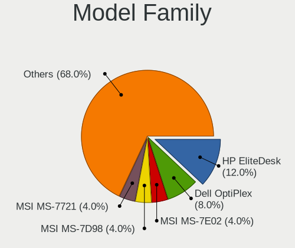
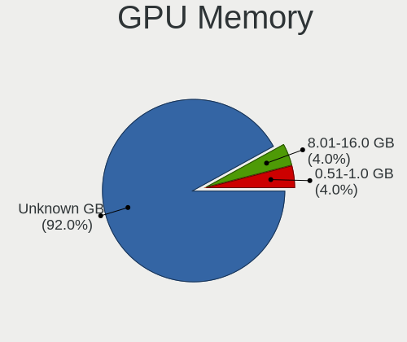
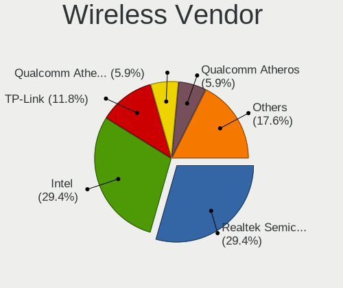

Elementary - Hardware Trends (Desktops)
---------------------------------------

A project to identify most popular hardware characteristics and track their change
over time based on data collected by Linux users at https://Linux-Hardware.org.

Anyone can contribute to this report by the [hw-probe](https://github.com/linuxhw/hw-probe) tool:

    sudo -E hw-probe -all -upload

This report is for one last month. Overall report since the beginning of time: [TestDays](https://github.com/linuxhw/TestDays)

Period: Apr, 2023.

Contents
--------

* [ System ](#system)
  - [ OS                       ](#os)
  - [ OS Family                ](#os-family)
  - [ Kernel                   ](#kernel)
  - [ Kernel Family            ](#kernel-family)
  - [ Kernel Major Ver.        ](#kernel-major-ver)
  - [ Arch                     ](#arch)
  - [ DE                       ](#de)
  - [ Display Server           ](#display-server)
  - [ Display Manager          ](#display-manager)
  - [ OS Lang                  ](#os-lang)
  - [ Boot Mode                ](#boot-mode)
  - [ Filesystem               ](#filesystem)
  - [ Part. scheme             ](#part-scheme)
  - [ Dual Boot with Linux/BSD ](#dual-boot-with-linuxbsd)
  - [ Dual Boot (Win)          ](#dual-boot-win)

* [ Board ](#board)
  - [ Vendor                   ](#vendor)
  - [ Model                    ](#model)
  - [ Model Family             ](#model-family)
  - [ MFG Year                 ](#mfg-year)
  - [ Form Factor              ](#form-factor)
  - [ Secure Boot              ](#secure-boot)
  - [ Coreboot                 ](#coreboot)
  - [ RAM Size                 ](#ram-size)
  - [ RAM Used                 ](#ram-used)
  - [ Total Drives             ](#total-drives)
  - [ Has CD-ROM               ](#has-cd-rom)
  - [ Has Ethernet             ](#has-ethernet)
  - [ Has WiFi                 ](#has-wifi)
  - [ Has Bluetooth            ](#has-bluetooth)

* [ Location ](#location)
  - [ Country                  ](#country)
  - [ City                     ](#city)

* [ Drives ](#drives)
  - [ Drive Vendor             ](#drive-vendor)
  - [ Drive Model              ](#drive-model)
  - [ HDD Vendor               ](#hdd-vendor)
  - [ SSD Vendor               ](#ssd-vendor)
  - [ Drive Kind               ](#drive-kind)
  - [ Drive Connector          ](#drive-connector)
  - [ Drive Size               ](#drive-size)
  - [ Space Total              ](#space-total)
  - [ Space Used               ](#space-used)
  - [ Malfunc. Drives          ](#malfunc-drives)
  - [ Malfunc. Drive Vendor    ](#malfunc-drive-vendor)
  - [ Malfunc. HDD Vendor      ](#malfunc-hdd-vendor)
  - [ Malfunc. Drive Kind      ](#malfunc-drive-kind)
  - [ Failed Drives            ](#failed-drives)
  - [ Failed Drive Vendor      ](#failed-drive-vendor)
  - [ Drive Status             ](#drive-status)

* [ Storage controller ](#storage-controller)
  - [ Storage Vendor           ](#storage-vendor)
  - [ Storage Model            ](#storage-model)
  - [ Storage Kind             ](#storage-kind)

* [ Processor ](#processor)
  - [ CPU Vendor               ](#cpu-vendor)
  - [ CPU Model                ](#cpu-model)
  - [ CPU Model Family         ](#cpu-model-family)
  - [ CPU Cores                ](#cpu-cores)
  - [ CPU Sockets              ](#cpu-sockets)
  - [ CPU Threads              ](#cpu-threads)
  - [ CPU Op-Modes             ](#cpu-op-modes)
  - [ CPU Microcode            ](#cpu-microcode)
  - [ CPU Microarch            ](#cpu-microarch)

* [ Graphics ](#graphics)
  - [ GPU Vendor               ](#gpu-vendor)
  - [ GPU Model                ](#gpu-model)
  - [ GPU Combo                ](#gpu-combo)
  - [ GPU Driver               ](#gpu-driver)
  - [ GPU Memory               ](#gpu-memory)

* [ Monitor ](#monitor)
  - [ Monitor Vendor           ](#monitor-vendor)
  - [ Monitor Model            ](#monitor-model)
  - [ Monitor Resolution       ](#monitor-resolution)
  - [ Monitor Diagonal         ](#monitor-diagonal)
  - [ Monitor Width            ](#monitor-width)
  - [ Aspect Ratio             ](#aspect-ratio)
  - [ Monitor Area             ](#monitor-area)
  - [ Pixel Density            ](#pixel-density)
  - [ Multiple Monitors        ](#multiple-monitors)

* [ Network ](#network)
  - [ Net Controller Vendor    ](#net-controller-vendor)
  - [ Net Controller Model     ](#net-controller-model)
  - [ Wireless Vendor          ](#wireless-vendor)
  - [ Wireless Model           ](#wireless-model)
  - [ Ethernet Vendor          ](#ethernet-vendor)
  - [ Ethernet Model           ](#ethernet-model)
  - [ Net Controller Kind      ](#net-controller-kind)
  - [ Used Controller          ](#used-controller)
  - [ NICs                     ](#nics)
  - [ IPv6                     ](#ipv6)

* [ Bluetooth ](#bluetooth)
  - [ Bluetooth Vendor         ](#bluetooth-vendor)
  - [ Bluetooth Model          ](#bluetooth-model)

* [ Sound ](#sound)
  - [ Sound Vendor             ](#sound-vendor)
  - [ Sound Model              ](#sound-model)

* [ Memory ](#memory)
  - [ Memory Vendor            ](#memory-vendor)
  - [ Memory Model             ](#memory-model)
  - [ Memory Kind              ](#memory-kind)
  - [ Memory Form Factor       ](#memory-form-factor)
  - [ Memory Size              ](#memory-size)
  - [ Memory Speed             ](#memory-speed)

* [ Printers & scanners ](#printers--scanners)
  - [ Printer Vendor           ](#printer-vendor)
  - [ Printer Model            ](#printer-model)
  - [ Scanner Vendor           ](#scanner-vendor)
  - [ Scanner Model            ](#scanner-model)

* [ Camera ](#camera)
  - [ Camera Vendor            ](#camera-vendor)
  - [ Camera Model             ](#camera-model)

* [ Security ](#security)
  - [ Fingerprint Vendor       ](#fingerprint-vendor)
  - [ Fingerprint Model        ](#fingerprint-model)
  - [ Chipcard Vendor          ](#chipcard-vendor)
  - [ Chipcard Model           ](#chipcard-model)

* [ Unsupported ](#unsupported)
  - [ Unsupported Devices      ](#unsupported-devices)
  - [ Unsupported Device Types ](#unsupported-device-types)

System
------

OS
--

Installed operating systems

| Name           | Desktops | Percent |
|----------------|----------|---------|
| Elementary 7   | 9        | 90%     |
| Elementary 6.1 | 1        | 10%     |

OS Family
---------

OS without a version

| Name       | Desktops | Percent |
|------------|----------|---------|
| Elementary | 10       | 100%    |

Kernel
------

Version of the Linux kernel

| Version           | Desktops | Percent |
|-------------------|----------|---------|
| 5.19.0-38-generic | 4        | 40%     |
| 5.19.0-40-generic | 2        | 20%     |
| 5.15.0-58-generic | 2        | 20%     |
| 5.19.0-41-generic | 1        | 10%     |
| 5.15.0-69-generic | 1        | 10%     |

Kernel Family
-------------

Linux kernel without a distro release

| Version | Desktops | Percent |
|---------|----------|---------|
| 5.19.0  | 7        | 70%     |
| 5.15.0  | 3        | 30%     |

Kernel Major Ver.
-----------------

Linux kernel major version

| Version | Desktops | Percent |
|---------|----------|---------|
| 5.19    | 7        | 70%     |
| 5.15    | 3        | 30%     |

Arch
----

OS architecture (x86_64, i586, etc.)

| Name   | Desktops | Percent |
|--------|----------|---------|
| x86_64 | 10       | 100%    |

DE
--

Desktop Environment

| Name     | Desktops | Percent |
|----------|----------|---------|
| Pantheon | 10       | 100%    |

Display Server
--------------

X11 or Wayland

| Name | Desktops | Percent |
|------|----------|---------|
| X11  | 10       | 100%    |

Display Manager
---------------

SDDM, LightDM, etc.

| Name    | Desktops | Percent |
|---------|----------|---------|
| Unknown | 9        | 90%     |
| LightDM | 1        | 10%     |

OS Lang
-------

Language

| Lang  | Desktops | Percent |
|-------|----------|---------|
| en_US | 5        | 50%     |
| pt_BR | 2        | 20%     |
| ru_RU | 1        | 10%     |
| it_IT | 1        | 10%     |
| es_ES | 1        | 10%     |

Boot Mode
---------

EFI or BIOS

| Mode | Desktops | Percent |
|------|----------|---------|
| BIOS | 9        | 90%     |
| EFI  | 1        | 10%     |

Filesystem
----------

Type of filesystem

| Type  | Desktops | Percent |
|-------|----------|---------|
| Ext4  | 9        | 90%     |
| Btrfs | 1        | 10%     |

Part. scheme
------------

Scheme of partitioning

| Type    | Desktops | Percent |
|---------|----------|---------|
| Unknown | 9        | 90%     |
| GPT     | 1        | 10%     |

Dual Boot with Linux/BSD
------------------------

Hosting more than one Linux/BSD

| Dual boot | Desktops | Percent |
|-----------|----------|---------|
| No        | 10       | 100%    |

Dual Boot (Win)
---------------

Hosting Linux and Windows

| Dual boot | Desktops | Percent |
|-----------|----------|---------|
| No        | 9        | 90%     |
| Yes       | 1        | 10%     |

Board
-----

Vendor
------

Motherboard manufacturer

| Name                | Desktops | Percent |
|---------------------|----------|---------|
| Hewlett-Packard     | 3        | 30%     |
| Gigabyte Technology | 2        | 20%     |
| MSI                 | 1        | 10%     |
| MACHINIST           | 1        | 10%     |
| Foxconn             | 1        | 10%     |
| ASUSTek Computer    | 1        | 10%     |
| ASRock              | 1        | 10%     |

Model
-----

Motherboard model

| Name                       | Desktops | Percent |
|----------------------------|----------|---------|
| MSI MS-7B84                | 1        | 10%     |
| MACHINIST E5-MR9A PRO V1.1 | 1        | 10%     |
| HP Z600 Workstation        | 1        | 10%     |
| HP EliteDesk 800 G2 DM 35W | 1        | 10%     |
| HP 1998                    | 1        | 10%     |
| Gigabyte Z270-Gaming K3    | 1        | 10%     |
| Gigabyte H410M H V3        | 1        | 10%     |
| Foxconn A76GMV             | 1        | 10%     |
| ASUS PRIME Z390-A          | 1        | 10%     |
| ASRock B660M-C             | 1        | 10%     |

Model Family
------------

Motherboard model prefix

| Name                 | Desktops | Percent |
|----------------------|----------|---------|
| MSI MS-7B84          | 1        | 10%     |
| MACHINIST E5-MR9A    | 1        | 10%     |
| HP Z600              | 1        | 10%     |
| HP EliteDesk         | 1        | 10%     |
| HP 1998              | 1        | 10%     |
| Gigabyte Z270-Gaming | 1        | 10%     |
| Gigabyte H410M       | 1        | 10%     |
| Foxconn A76GMV       | 1        | 10%     |
| ASUS PRIME           | 1        | 10%     |
| ASRock B660M-C       | 1        | 10%     |

MFG Year
--------

Motherboard manufacture year

| Year | Desktops | Percent |
|------|----------|---------|
| 2010 | 2        | 20%     |
| 2023 | 1        | 10%     |
| 2022 | 1        | 10%     |
| 2021 | 1        | 10%     |
| 2018 | 1        | 10%     |
| 2016 | 1        | 10%     |
| 2015 | 1        | 10%     |
| 2013 | 1        | 10%     |
| 2012 | 1        | 10%     |

Form Factor
-----------

Physical design of the computer

| Name    | Desktops | Percent |
|---------|----------|---------|
| Desktop | 10       | 100%    |

Secure Boot
-----------

Enabled or disabled

| State    | Desktops | Percent |
|----------|----------|---------|
| Disabled | 10       | 100%    |

Coreboot
--------

Have coreboot on board

| Used | Desktops | Percent |
|------|----------|---------|
| No   | 10       | 100%    |

RAM Size
--------

Total RAM memory

| Size in GB | Desktops | Percent |
|------------|----------|---------|
| 16.01-24.0 | 5        | 50%     |
| 4.01-8.0   | 2        | 20%     |
| 3.01-4.0   | 1        | 10%     |
| 24.01-32.0 | 1        | 10%     |
| 8.01-16.0  | 1        | 10%     |

RAM Used
--------

Used RAM memory

| Used GB  | Desktops | Percent |
|----------|----------|---------|
| 2.01-3.0 | 6        | 60%     |
| 1.01-2.0 | 3        | 30%     |
| 4.01-8.0 | 1        | 10%     |

Total Drives
------------

Number of drives on board

| Drives | Desktops | Percent |
|--------|----------|---------|
| 3      | 3        | 30%     |
| 2      | 3        | 30%     |
| 1      | 3        | 30%     |
| 4      | 1        | 10%     |

Has CD-ROM
----------

Has CD-ROM on board

| Presented | Desktops | Percent |
|-----------|----------|---------|
| No        | 9        | 90%     |
| Yes       | 1        | 10%     |

Has Ethernet
------------

Has Ethernet on board

| Presented | Desktops | Percent |
|-----------|----------|---------|
| Yes       | 10       | 100%    |

Has WiFi
--------

Has WiFi module

| Presented | Desktops | Percent |
|-----------|----------|---------|
| No        | 6        | 60%     |
| Yes       | 4        | 40%     |

Has Bluetooth
-------------

Has Bluetooth module

| Presented | Desktops | Percent |
|-----------|----------|---------|
| No        | 6        | 60%     |
| Yes       | 4        | 40%     |

Location
--------

Country
-------

Geographic location (country)

| Country | Desktops | Percent |
|---------|----------|---------|
| Brazil  | 3        | 30%     |
| USA     | 2        | 20%     |
| Spain   | 1        | 10%     |
| Russia  | 1        | 10%     |
| Italy   | 1        | 10%     |
| India   | 1        | 10%     |
| Germany | 1        | 10%     |

City
----

Geographic location (city)

| City             | Desktops | Percent |
|------------------|----------|---------|
| Sao Paulo        | 1        | 10%     |
| Salt Lake City   | 1        | 10%     |
| Praia Grande     | 1        | 10%     |
| Monsummano Terme | 1        | 10%     |
| Las Vegas        | 1        | 10%     |
| Lagerdorf        | 1        | 10%     |
| Imperatriz       | 1        | 10%     |
| Cheboksary       | 1        | 10%     |
| Catarroja        | 1        | 10%     |
| Ahmedabad        | 1        | 10%     |

Drives
------

Drive Vendor
------------

Hard drive vendors

| Vendor                      | Desktops | Drives | Percent |
|-----------------------------|----------|--------|---------|
| Seagate                     | 4        | 4      | 20%     |
| WDC                         | 2        | 2      | 10%     |
| Sandisk                     | 2        | 2      | 10%     |
| Samsung Electronics         | 2        | 4      | 10%     |
| Netac                       | 1        | 1      | 5%      |
| Micron/Crucial Technology   | 1        | 1      | 5%      |
| MAXIO Technology (Hangzhou) | 1        | 1      | 5%      |
| Kingston                    | 1        | 1      | 5%      |
| Intenso                     | 1        | 1      | 5%      |
| HUSKY                       | 1        | 1      | 5%      |
| HS-SSD-E100                 | 1        | 2      | 5%      |
| Hitachi                     | 1        | 1      | 5%      |
| Crucial                     | 1        | 1      | 5%      |
| A-DATA Technology           | 1        | 1      | 5%      |

Drive Model
-----------

Hard drive models

| Model                                               | Desktops | Percent |
|-----------------------------------------------------|----------|---------|
| WDC WDS480G2G0C-00AJM0 480GB                        | 1        | 4.35%   |
| WDC WD10EZEX-00BBHA0 1TB                            | 1        | 4.35%   |
| Seagate ST9500325AS 500GB                           | 1        | 4.35%   |
| Seagate ST500LM012 HN-M500MBB 500GB                 | 1        | 4.35%   |
| Seagate ST4000DM004-2CV104 4TB                      | 1        | 4.35%   |
| Seagate ST3500413AS 500GB                           | 1        | 4.35%   |
| Sandisk WD_BLACK SN750 SE 500GB                     | 1        | 4.35%   |
| SanDisk SD7TB3Q-256G-1006 256GB SSD                 | 1        | 4.35%   |
| Samsung SSD 840 Series 120GB                        | 1        | 4.35%   |
| Samsung NVMe SSD Controller SM981/PM981/PM983 1TB   | 1        | 4.35%   |
| Samsung NVMe SSD Controller SM961/PM961/SM963 500GB | 1        | 4.35%   |
| Samsung HD502HI 500GB                               | 1        | 4.35%   |
| Netac SSD 1TB                                       | 1        | 4.35%   |
| Micron/Crucial P1 NVMe PCIe SSD 500GB               | 1        | 4.35%   |
| MAXIO (Hangzhou) NVMe SSD Controller MAP1202 1TB    | 1        | 4.35%   |
| Kingston SA400S37240G 240GB SSD                     | 1        | 4.35%   |
| Intenso SSD SATAIII 256GB                           | 1        | 4.35%   |
| HUSKY SSD 128GB                                     | 1        | 4.35%   |
| HS-SSD-E100 SSD 256G                                | 1        | 4.35%   |
| HS-SSD-E100 256G                                    | 1        | 4.35%   |
| Hitachi HTS725050A7E630 500GB                       | 1        | 4.35%   |
| Crucial CT500MX500SSD1 500GB                        | 1        | 4.35%   |
| A-DATA SSD S511 60GB                                | 1        | 4.35%   |

HDD Vendor
----------

Hard disk drive vendors

| Vendor              | Desktops | Drives | Percent |
|---------------------|----------|--------|---------|
| Seagate             | 4        | 4      | 57.14%  |
| WDC                 | 1        | 1      | 14.29%  |
| Samsung Electronics | 1        | 1      | 14.29%  |
| Hitachi             | 1        | 1      | 14.29%  |

SSD Vendor
----------

Solid state drive vendors

| Vendor              | Desktops | Drives | Percent |
|---------------------|----------|--------|---------|
| SanDisk             | 1        | 1      | 11.11%  |
| Samsung Electronics | 1        | 1      | 11.11%  |
| Netac               | 1        | 1      | 11.11%  |
| Kingston            | 1        | 1      | 11.11%  |
| Intenso             | 1        | 1      | 11.11%  |
| HUSKY               | 1        | 1      | 11.11%  |
| HS-SSD-E100         | 1        | 1      | 11.11%  |
| Crucial             | 1        | 1      | 11.11%  |
| A-DATA Technology   | 1        | 1      | 11.11%  |

Drive Kind
----------

HDD or SSD

| Kind    | Desktops | Drives | Percent |
|---------|----------|--------|---------|
| SSD     | 8        | 9      | 40%     |
| HDD     | 6        | 7      | 30%     |
| NVMe    | 5        | 6      | 25%     |
| Unknown | 1        | 1      | 5%      |

Drive Connector
---------------

SATA, SAS, NVMe, etc.

| Type | Desktops | Drives | Percent |
|------|----------|--------|---------|
| SATA | 10       | 17     | 66.67%  |
| NVMe | 5        | 6      | 33.33%  |

Drive Size
----------

Size of hard drive

| Size in TB | Desktops | Drives | Percent |
|------------|----------|--------|---------|
| 0.01-0.5   | 9        | 13     | 75%     |
| 0.51-1.0   | 2        | 2      | 16.67%  |
| 3.01-4.0   | 1        | 1      | 8.33%   |

Space Total
-----------

Amount of disk space available on the file system

| Size in GB | Desktops | Percent |
|------------|----------|---------|
| 101-250    | 3        | 30%     |
| 501-1000   | 3        | 30%     |
| 251-500    | 2        | 20%     |
| 21-50      | 1        | 10%     |
| 51-100     | 1        | 10%     |

Space Used
----------

Amount of used disk space

| Used GB | Desktops | Percent |
|---------|----------|---------|
| 1-20    | 5        | 50%     |
| 51-100  | 2        | 20%     |
| 251-500 | 1        | 10%     |
| 21-50   | 1        | 10%     |
| 101-250 | 1        | 10%     |

Malfunc. Drives
---------------

Drive models with a malfunction

| Model                         | Desktops | Drives | Percent |
|-------------------------------|----------|--------|---------|
| Hitachi HTS725050A7E630 500GB | 1        | 1      | 100%    |

Malfunc. Drive Vendor
---------------------

Vendors of faulty drives

| Vendor  | Desktops | Drives | Percent |
|---------|----------|--------|---------|
| Hitachi | 1        | 1      | 100%    |

Malfunc. HDD Vendor
-------------------

Vendors of faulty HDD drives

| Vendor  | Desktops | Drives | Percent |
|---------|----------|--------|---------|
| Hitachi | 1        | 1      | 100%    |

Malfunc. Drive Kind
-------------------

Kinds of faulty drives

| Kind | Desktops | Drives | Percent |
|------|----------|--------|---------|
| HDD  | 1        | 1      | 100%    |

Failed Drives
-------------

Failed drive models

Zero info for selected period =(

Failed Drive Vendor
-------------------

Failed drive vendors

Zero info for selected period =(

Drive Status
------------

Number of failed and malfunc. drives

| Status   | Desktops | Drives | Percent |
|----------|----------|--------|---------|
| Detected | 9        | 20     | 75%     |
| Works    | 2        | 2      | 16.67%  |
| Malfunc  | 1        | 1      | 8.33%   |

Storage controller
------------------

Storage Vendor
--------------

Storage controller vendors

| Vendor                      | Desktops | Percent |
|-----------------------------|----------|---------|
| Intel                       | 8        | 50%     |
| SanDisk                     | 2        | 12.5%   |
| AMD                         | 2        | 12.5%   |
| Samsung Electronics         | 1        | 6.25%   |
| Micron/Crucial Technology   | 1        | 6.25%   |
| MAXIO Technology (Hangzhou) | 1        | 6.25%   |
| ASMedia Technology          | 1        | 6.25%   |

Storage Model
-------------

Storage controller models

| Model                                                                          | Desktops | Percent |
|--------------------------------------------------------------------------------|----------|---------|
| SanDisk Non-Volatile memory controller                                         | 2        | 10.53%  |
| Intel 8 Series/C220 Series Chipset Family 6-port SATA Controller 1 [AHCI mode] | 2        | 10.53%  |
| Samsung NVMe SSD Controller SM981/PM981/PM983                                  | 1        | 5.26%   |
| Samsung NVMe SSD Controller SM961/PM961/SM963                                  | 1        | 5.26%   |
| Micron/Crucial P1 NVMe PCIe SSD                                                | 1        | 5.26%   |
| MAXIO (Hangzhou) NVMe SSD Controller MAP1202                                   | 1        | 5.26%   |
| Intel SATA Controller [RAID mode]                                              | 1        | 5.26%   |
| Intel Q170/Q150/B150/H170/H110/Z170/CM236 Chipset SATA Controller [AHCI Mode]  | 1        | 5.26%   |
| Intel Cannon Lake PCH SATA AHCI Controller                                     | 1        | 5.26%   |
| Intel Alder Lake-S PCH SATA Controller [AHCI Mode]                             | 1        | 5.26%   |
| Intel 500 Series Chipset Family SATA AHCI Controller                           | 1        | 5.26%   |
| Intel 200 Series PCH SATA controller [AHCI mode]                               | 1        | 5.26%   |
| ASMedia ASM1062 Serial ATA Controller                                          | 1        | 5.26%   |
| AMD SB7x0/SB8x0/SB9x0 SATA Controller [IDE mode]                               | 1        | 5.26%   |
| AMD SB7x0/SB8x0/SB9x0 IDE Controller                                           | 1        | 5.26%   |
| AMD FCH SATA Controller [AHCI mode]                                            | 1        | 5.26%   |
| AMD 400 Series Chipset SATA Controller                                         | 1        | 5.26%   |

Storage Kind
------------

Kind of storage controller (IDE, SATA, NVMe, SAS, ...)

| Kind | Desktops | Percent |
|------|----------|---------|
| SATA | 9        | 56.25%  |
| NVMe | 5        | 31.25%  |
| RAID | 1        | 6.25%   |
| IDE  | 1        | 6.25%   |

Processor
---------

CPU Vendor
----------

Processor vendors

| Vendor | Desktops | Percent |
|--------|----------|---------|
| Intel  | 8        | 80%     |
| AMD    | 2        | 20%     |

CPU Model
---------

Processor models

| Model                                      | Desktops | Percent |
|--------------------------------------------|----------|---------|
| Intel Xeon CPU E5620 @ 2.40GHz             | 1        | 10%     |
| Intel Xeon CPU E5-2670 v3 @ 2.30GHz        | 1        | 10%     |
| Intel Core i9-9900K CPU @ 3.60GHz          | 1        | 10%     |
| Intel Core i7-6700T CPU @ 2.80GHz          | 1        | 10%     |
| Intel Core i5-7500T CPU @ 2.70GHz          | 1        | 10%     |
| Intel Core i5-4590 CPU @ 3.30GHz           | 1        | 10%     |
| Intel Core i5-10400F CPU @ 2.90GHz         | 1        | 10%     |
| Intel 12th Gen Core i7-12700F              | 1        | 10%     |
| AMD Sempron 145 Processor                  | 1        | 10%     |
| AMD Athlon 3000G with Radeon Vega Graphics | 1        | 10%     |

CPU Model Family
----------------

Processor model prefix

| Model         | Desktops | Percent |
|---------------|----------|---------|
| Intel Core i5 | 3        | 30%     |
| Intel Xeon    | 2        | 20%     |
| Other         | 1        | 10%     |
| Intel Core i9 | 1        | 10%     |
| Intel Core i7 | 1        | 10%     |
| AMD Sempron   | 1        | 10%     |
| AMD Athlon    | 1        | 10%     |

CPU Cores
---------

Number of processor cores

| Number | Desktops | Percent |
|--------|----------|---------|
| 4      | 3        | 30%     |
| 12     | 2        | 20%     |
| 8      | 2        | 20%     |
| 6      | 1        | 10%     |
| 2      | 1        | 10%     |
| 1      | 1        | 10%     |

CPU Sockets
-----------

Number of sockets

| Number | Desktops | Percent |
|--------|----------|---------|
| 1      | 9        | 90%     |
| 2      | 1        | 10%     |

CPU Threads
-----------

Threads per core (Hyper-Threading)

| Number | Desktops | Percent |
|--------|----------|---------|
| 2      | 7        | 70%     |
| 1      | 3        | 30%     |

CPU Op-Modes
------------

CPU Operation Modes (32-bit, 64-bit)

| Op mode        | Desktops | Percent |
|----------------|----------|---------|
| 32-bit, 64-bit | 10       | 100%    |

CPU Microcode
-------------

Microcode number

| Number     | Desktops | Percent |
|------------|----------|---------|
| Unknown    | 7        | 70%     |
| 0x206c2    | 1        | 10%     |
| 0x08108109 | 1        | 10%     |
| 0x010000c8 | 1        | 10%     |

CPU Microarch
-------------

Microarchitecture

| Name      | Desktops | Percent |
|-----------|----------|---------|
| KabyLake  | 2        | 20%     |
| Haswell   | 2        | 20%     |
| Zen+      | 1        | 10%     |
| Westmere  | 1        | 10%     |
| Skylake   | 1        | 10%     |
| K10       | 1        | 10%     |
| CometLake | 1        | 10%     |
| Unknown   | 1        | 10%     |

Graphics
--------

GPU Vendor
----------

Vendors of graphics cards

| Vendor | Desktops | Percent |
|--------|----------|---------|
| AMD    | 4        | 40%     |
| Nvidia | 3        | 30%     |
| Intel  | 3        | 30%     |

GPU Model
---------

Graphics card models

| Model                                                                       | Desktops | Percent |
|-----------------------------------------------------------------------------|----------|---------|
| Nvidia TU116 [GeForce GTX 1660 SUPER]                                       | 1        | 9.09%   |
| Nvidia TU106 [GeForce GTX 1650]                                             | 1        | 9.09%   |
| Nvidia GM107GL [Quadro K620]                                                | 1        | 9.09%   |
| Nvidia GA104 [GeForce RTX 3060 Ti Lite Hash Rate]                           | 1        | 9.09%   |
| Intel Xeon E3-1200 v3/4th Gen Core Processor Integrated Graphics Controller | 1        | 9.09%   |
| Intel HD Graphics 530                                                       | 1        | 9.09%   |
| Intel CoffeeLake-S GT2 [UHD Graphics 630]                                   | 1        | 9.09%   |
| AMD RS780L [Radeon 3000]                                                    | 1        | 9.09%   |
| AMD Picasso/Raven 2 [Radeon Vega Series / Radeon Vega Mobile Series]        | 1        | 9.09%   |
| AMD Navi 23 [Radeon RX 6600/6600 XT/6600M]                                  | 1        | 9.09%   |
| AMD Navi 10 [Radeon RX 5600 OEM/5600 XT / 5700/5700 XT]                     | 1        | 9.09%   |

GPU Combo
---------

Combinations of graphics cards

| Name       | Desktops | Percent |
|------------|----------|---------|
| 1 x AMD    | 4        | 40%     |
| 1 x Intel  | 3        | 30%     |
| 1 x Nvidia | 2        | 20%     |
| 2 x Nvidia | 1        | 10%     |

GPU Driver
----------

Free vs proprietary

| Driver | Desktops | Percent |
|--------|----------|---------|
| Free   | 10       | 100%    |

GPU Memory
----------

Total video memory

| Size in GB | Desktops | Percent |
|------------|----------|---------|
| Unknown    | 8        | 80%     |
| 1.01-2.0   | 1        | 10%     |
| 0.01-0.5   | 1        | 10%     |

Monitor
-------

Monitor Vendor
--------------

Monitor vendors

| Vendor              | Desktops | Percent |
|---------------------|----------|---------|
| Goldstar            | 3        | 27.27%  |
| Samsung Electronics | 2        | 18.18%  |
| Sceptre Tech        | 1        | 9.09%   |
| MYS                 | 1        | 9.09%   |
| Hewlett-Packard     | 1        | 9.09%   |
| Dell                | 1        | 9.09%   |
| BenQ                | 1        | 9.09%   |
| Acer                | 1        | 9.09%   |

Monitor Model
-------------

Monitor models

| Model                                                               | Desktops | Percent |
|---------------------------------------------------------------------|----------|---------|
| Sceptre Tech Sceptre Q27 SPT0AD2 2560x1440 597x336mm 27.0-inch      | 1        | 8.33%   |
| Samsung Electronics LS27AG55x SAM71E0 2560x1440 597x336mm 27.0-inch | 1        | 8.33%   |
| Samsung Electronics C32F391 SAM0D34 1920x1080 698x393mm 31.5-inch   | 1        | 8.33%   |
| MYS LCD Monitor MYS1700 1280x1024 360x240mm 17.0-inch               | 1        | 8.33%   |
| Hewlett-Packard E231 HWP3063 1920x1080 509x286mm 23.0-inch          | 1        | 8.33%   |
| Goldstar ULTRAGEAR GSM7766 2560x1440 697x392mm 31.5-inch            | 1        | 8.33%   |
| Goldstar L1752T GSM4434 1280x1024 338x270mm 17.0-inch               | 1        | 8.33%   |
| Goldstar FULL HD GSM5B54 1920x1080 480x270mm 21.7-inch              | 1        | 8.33%   |
| Dell LCD Monitor LNK0001 1920x1080 256x192mm 12.6-inch              | 1        | 8.33%   |
| Dell E1914H DELD03A 1366x768 410x230mm 18.5-inch                    | 1        | 8.33%   |
| BenQ GW2280 BNQ78E8 1920x1080 476x268mm 21.5-inch                   | 1        | 8.33%   |
| Acer P166HQL ACR0276 1366x768 344x194mm 15.5-inch                   | 1        | 8.33%   |

Monitor Resolution
------------------

Monitor screen resolution

| Resolution       | Desktops | Percent |
|------------------|----------|---------|
| 1920x1080 (FHD)  | 5        | 41.67%  |
| 2560x1440 (QHD)  | 3        | 25%     |
| 1366x768 (WXGA)  | 2        | 16.67%  |
| 1280x1024 (SXGA) | 2        | 16.67%  |

Monitor Diagonal
----------------

Diagonal size in inches

| Inches | Desktops | Percent |
|--------|----------|---------|
| 31     | 2        | 16.67%  |
| 27     | 2        | 16.67%  |
| 21     | 2        | 16.67%  |
| 18     | 2        | 16.67%  |
| 17     | 2        | 16.67%  |
| 23     | 1        | 8.33%   |
| 14     | 1        | 8.33%   |

Monitor Width
-------------

Physical width

| Width in mm | Desktops | Percent |
|-------------|----------|---------|
| 401-500     | 4        | 33.33%  |
| 501-600     | 3        | 25%     |
| 601-700     | 2        | 16.67%  |
| 351-400     | 1        | 8.33%   |
| 301-350     | 1        | 8.33%   |
| 201-300     | 1        | 8.33%   |

Aspect Ratio
------------

Proportional relationship between the width and the height

| Ratio | Desktops | Percent |
|-------|----------|---------|
| 16/9  | 8        | 72.73%  |
| 5/4   | 1        | 9.09%   |
| 4/3   | 1        | 9.09%   |
| 3/2   | 1        | 9.09%   |

Monitor Area
------------

Area in inch²

| Area in inch² | Desktops | Percent |
|----------------|----------|---------|
| 201-250        | 3        | 25%     |
| 141-150        | 3        | 25%     |
| 351-500        | 2        | 16.67%  |
| 301-350        | 2        | 16.67%  |
| 131-140        | 1        | 8.33%   |
| 101-110        | 1        | 8.33%   |

Pixel Density
-------------

Pixels per inch

| Density | Desktops | Percent |
|---------|----------|---------|
| 51-100  | 7        | 63.64%  |
| 101-120 | 3        | 27.27%  |
| 121-160 | 1        | 9.09%   |

Multiple Monitors
-----------------

Total monitors connected

| Total | Desktops | Percent |
|-------|----------|---------|
| 1     | 7        | 70%     |
| 2     | 3        | 30%     |

Network
-------

Net Controller Vendor
---------------------

Controller vendors

| Vendor                | Desktops | Percent |
|-----------------------|----------|---------|
| Intel                 | 5        | 41.67%  |
| Realtek Semiconductor | 3        | 25%     |
| Xiaomi                | 1        | 8.33%   |
| TP-Link               | 1        | 8.33%   |
| Qualcomm Atheros      | 1        | 8.33%   |
| Broadcom              | 1        | 8.33%   |

Net Controller Model
--------------------

Controller models

| Model                                                             | Desktops | Percent |
|-------------------------------------------------------------------|----------|---------|
| Realtek RTL8111/8168/8411 PCI Express Gigabit Ethernet Controller | 3        | 18.75%  |
| Xiaomi Mi/Redmi series (RNDIS)                                    | 1        | 6.25%   |
| TP-Link UE300 10/100/1000 LAN (ethernet mode) [Realtek RTL8153]   | 1        | 6.25%   |
| Qualcomm Atheros Killer E2500 Gigabit Ethernet Controller         | 1        | 6.25%   |
| Intel Wireless 8260                                               | 1        | 6.25%   |
| Intel Wi-Fi 6 AX210/AX211/AX411 160MHz                            | 1        | 6.25%   |
| Intel Wi-Fi 6 AX200                                               | 1        | 6.25%   |
| Intel Ethernet Connection I217-LM                                 | 1        | 6.25%   |
| Intel Ethernet Connection (7) I219-V                              | 1        | 6.25%   |
| Intel Ethernet Connection (2) I219-LM                             | 1        | 6.25%   |
| Intel Ethernet Connection (17) I219-V                             | 1        | 6.25%   |
| Intel Ethernet Connection (14) I219-V                             | 1        | 6.25%   |
| Intel Alder Lake-S PCH CNVi WiFi                                  | 1        | 6.25%   |
| Broadcom NetXtreme BCM5764M Gigabit Ethernet PCIe                 | 1        | 6.25%   |

Wireless Vendor
---------------

Wireless vendors

| Vendor | Desktops | Percent |
|--------|----------|---------|
| Intel  | 4        | 100%    |

Wireless Model
--------------

Wireless models

| Model                                  | Desktops | Percent |
|----------------------------------------|----------|---------|
| Intel Wireless 8260                    | 1        | 25%     |
| Intel Wi-Fi 6 AX210/AX211/AX411 160MHz | 1        | 25%     |
| Intel Wi-Fi 6 AX200                    | 1        | 25%     |
| Intel Alder Lake-S PCH CNVi WiFi       | 1        | 25%     |

Ethernet Vendor
---------------

Ethernet vendors

| Vendor                | Desktops | Percent |
|-----------------------|----------|---------|
| Intel                 | 5        | 41.67%  |
| Realtek Semiconductor | 3        | 25%     |
| Xiaomi                | 1        | 8.33%   |
| TP-Link               | 1        | 8.33%   |
| Qualcomm Atheros      | 1        | 8.33%   |
| Broadcom              | 1        | 8.33%   |

Ethernet Model
--------------

Ethernet models

| Model                                                             | Desktops | Percent |
|-------------------------------------------------------------------|----------|---------|
| Realtek RTL8111/8168/8411 PCI Express Gigabit Ethernet Controller | 3        | 25%     |
| Xiaomi Mi/Redmi series (RNDIS)                                    | 1        | 8.33%   |
| TP-Link UE300 10/100/1000 LAN (ethernet mode) [Realtek RTL8153]   | 1        | 8.33%   |
| Qualcomm Atheros Killer E2500 Gigabit Ethernet Controller         | 1        | 8.33%   |
| Intel Ethernet Connection I217-LM                                 | 1        | 8.33%   |
| Intel Ethernet Connection (7) I219-V                              | 1        | 8.33%   |
| Intel Ethernet Connection (2) I219-LM                             | 1        | 8.33%   |
| Intel Ethernet Connection (17) I219-V                             | 1        | 8.33%   |
| Intel Ethernet Connection (14) I219-V                             | 1        | 8.33%   |
| Broadcom NetXtreme BCM5764M Gigabit Ethernet PCIe                 | 1        | 8.33%   |

Net Controller Kind
-------------------

Ethernet, WiFi or modem

| Kind     | Desktops | Percent |
|----------|----------|---------|
| Ethernet | 10       | 71.43%  |
| WiFi     | 4        | 28.57%  |

Used Controller
---------------

Currently used network controller

| Kind     | Desktops | Percent |
|----------|----------|---------|
| Ethernet | 8        | 66.67%  |
| WiFi     | 4        | 33.33%  |

NICs
----

Total network controllers on board

| Total | Desktops | Percent |
|-------|----------|---------|
| 1     | 6        | 60%     |
| 2     | 4        | 40%     |

IPv6
----

IPv6 vs IPv4

| Used | Desktops | Percent |
|------|----------|---------|
| No   | 6        | 60%     |
| Yes  | 4        | 40%     |

Bluetooth
---------

Bluetooth Vendor
----------------

Controller vendors

| Vendor | Desktops | Percent |
|--------|----------|---------|
| Intel  | 4        | 100%    |

Bluetooth Model
---------------

Controller models

| Model                                          | Desktops | Percent |
|------------------------------------------------|----------|---------|
| Intel Bluetooth wireless interface             | 1        | 25%     |
| Intel Bluetooth 9460/9560 Jefferson Peak (JfP) | 1        | 25%     |
| Intel AX210 Bluetooth                          | 1        | 25%     |
| Intel AX200 Bluetooth                          | 1        | 25%     |

Sound
-----

Sound Vendor
------------

Sound card vendors

| Vendor   | Desktops | Percent |
|----------|----------|---------|
| Intel    | 8        | 47.06%  |
| AMD      | 4        | 23.53%  |
| Nvidia   | 3        | 17.65%  |
| Logitech | 1        | 5.88%   |
| Goldvish | 1        | 5.88%   |

Sound Model
-----------

Sound card models

| Model                                                               | Desktops | Percent |
|---------------------------------------------------------------------|----------|---------|
| Intel 8 Series/C220 Series Chipset High Definition Audio Controller | 2        | 10.53%  |
| Nvidia TU116 High Definition Audio Controller                       | 1        | 5.26%   |
| Nvidia TU106 High Definition Audio Controller                       | 1        | 5.26%   |
| Nvidia GM107 High Definition Audio Controller [GeForce 940MX]       | 1        | 5.26%   |
| Nvidia GA104 High Definition Audio Controller                       | 1        | 5.26%   |
| Logitech G432 Gaming Headset                                        | 1        | 5.26%   |
| Intel Xeon E3-1200 v3/4th Gen Core Processor HD Audio Controller    | 1        | 5.26%   |
| Intel Smart Sound Technology (SST) Audio Controller                 | 1        | 5.26%   |
| Intel Cannon Lake PCH cAVS                                          | 1        | 5.26%   |
| Intel Alder Lake-S HD Audio Controller                              | 1        | 5.26%   |
| Intel 82801JI (ICH10 Family) HD Audio Controller                    | 1        | 5.26%   |
| Intel 200 Series PCH HD Audio                                       | 1        | 5.26%   |
| Intel 100 Series/C230 Series Chipset Family HD Audio Controller     | 1        | 5.26%   |
| Goldvish H210                                                       | 1        | 5.26%   |
| AMD SBx00 Azalia (Intel HDA)                                        | 1        | 5.26%   |
| AMD Raven/Raven2/Fenghuang HDMI/DP Audio Controller                 | 1        | 5.26%   |
| AMD Navi 21/23 HDMI/DP Audio Controller                             | 1        | 5.26%   |
| AMD Navi 10 HDMI Audio                                              | 1        | 5.26%   |

Memory
------

Memory Vendor
-------------

Memory module vendors

| Vendor   | Desktops | Percent |
|----------|----------|---------|
| Kingston | 1        | 33.33%  |
| CSX      | 1        | 33.33%  |
| Unknown  | 1        | 33.33%  |

Memory Model
------------

Memory module models

| Model                                            | Desktops | Percent |
|--------------------------------------------------|----------|---------|
| Kingston RAM HX426C16FB/4 4GB DIMM DDR4 2800MT/s | 1        | 33.33%  |
| CSX RAM V01D3L82GB26826813 2GB DIMM 1066MT/s     | 1        | 33.33%  |
| Unknown                                          | 1        | 33.33%  |

Memory Kind
-----------

Memory module kinds

| Kind    | Desktops | Percent |
|---------|----------|---------|
| SDRAM   | 1        | 33.33%  |
| DDR4    | 1        | 33.33%  |
| Unknown | 1        | 33.33%  |

Memory Form Factor
------------------

Physical design of the memory module

| Name | Desktops | Percent |
|------|----------|---------|
| DIMM | 2        | 100%    |

Memory Size
-----------

Memory module size

| Size | Desktops | Percent |
|------|----------|---------|
| 8192 | 1        | 33.33%  |
| 4096 | 1        | 33.33%  |
| 2048 | 1        | 33.33%  |

Memory Speed
------------

Memory module speed

| Speed | Desktops | Percent |
|-------|----------|---------|
| 2800  | 1        | 33.33%  |
| 1066  | 1        | 33.33%  |
| 533   | 1        | 33.33%  |

Printers & scanners
-------------------

Printer Vendor
--------------

Printer device vendors

Zero info for selected period =(

Printer Model
-------------

Printer device models

Zero info for selected period =(

Scanner Vendor
--------------

Scanner device vendors

Zero info for selected period =(

Scanner Model
-------------

Scanner device models

Zero info for selected period =(

Camera
------

Camera Vendor
-------------

Camera device vendors

| Vendor                      | Desktops | Percent |
|-----------------------------|----------|---------|
| KYE Systems (Mouse Systems) | 1        | 100%    |

Camera Model
------------

Camera device models

| Model                                  | Desktops | Percent |
|----------------------------------------|----------|---------|
| KYE Systems (Mouse Systems) iSlim 1300 | 1        | 100%    |

Security
--------

Fingerprint Vendor
------------------

Fingerprint sensor vendors

Zero info for selected period =(

Fingerprint Model
-----------------

Fingerprint sensor models

Zero info for selected period =(

Chipcard Vendor
---------------

Chipcard module vendors

Zero info for selected period =(

Chipcard Model
--------------

Chipcard module models

Zero info for selected period =(

Unsupported
-----------

Unsupported Devices
-------------------

Total unsupported devices on board

| Total | Desktops | Percent |
|-------|----------|---------|
| 0     | 9        | 90%     |
| 1     | 1        | 10%     |

Unsupported Device Types
------------------------

Types of unsupported devices

| Type         | Desktops | Percent |
|--------------|----------|---------|
| Net/ethernet | 1        | 100%    |

