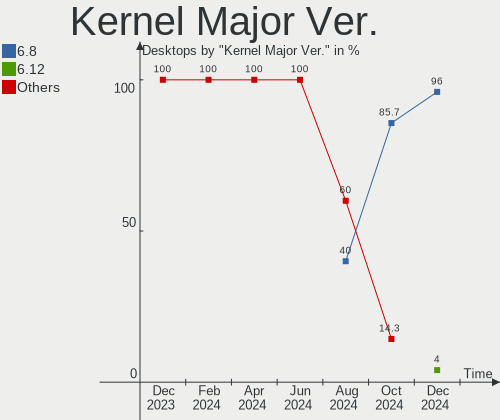
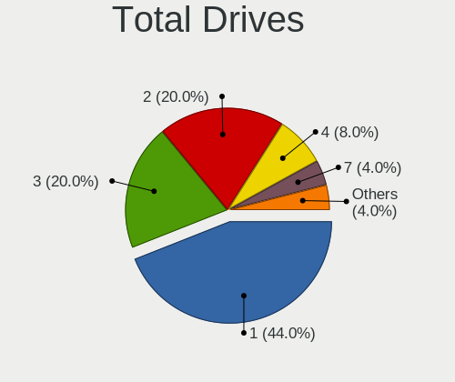
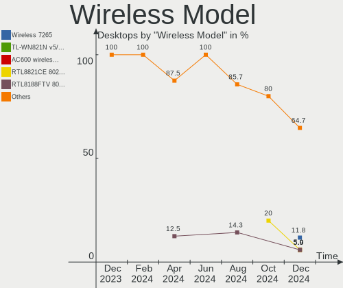

Elementary Hardware Trends (Desktops)
-------------------------------------

A project to identify most popular hardware characteristics and track their change
over time based on data collected by Elementary users at https://Linux-Hardware.org.

Anyone can contribute to this report by the [hw-probe](https://github.com/linuxhw/hw-probe) tool:

    sudo -E hw-probe -all -upload

This report is for one last month. Overall report since the beginning of time: [TestCoverage](https://github.com/linuxhw/TestCoverage)

Period: Apr, 2022.

Contents
--------

* [ System ](#system)
  - [ OS                       ](#os)
  - [ OS Family                ](#os-family)
  - [ Kernel                   ](#kernel)
  - [ Kernel Family            ](#kernel-family)
  - [ Kernel Major Ver.        ](#kernel-major-ver)
  - [ Arch                     ](#arch)
  - [ DE                       ](#de)
  - [ Display Server           ](#display-server)
  - [ Display Manager          ](#display-manager)
  - [ OS Lang                  ](#os-lang)
  - [ Boot Mode                ](#boot-mode)
  - [ Filesystem               ](#filesystem)
  - [ Part. scheme             ](#part-scheme)
  - [ Dual Boot with Linux/BSD ](#dual-boot-with-linuxbsd)
  - [ Dual Boot (Win)          ](#dual-boot-win)

* [ Board ](#board)
  - [ Vendor                   ](#vendor)
  - [ Model                    ](#model)
  - [ Model Family             ](#model-family)
  - [ MFG Year                 ](#mfg-year)
  - [ Form Factor              ](#form-factor)
  - [ Secure Boot              ](#secure-boot)
  - [ Coreboot                 ](#coreboot)
  - [ RAM Size                 ](#ram-size)
  - [ RAM Used                 ](#ram-used)
  - [ Total Drives             ](#total-drives)
  - [ Has CD-ROM               ](#has-cd-rom)
  - [ Has Ethernet             ](#has-ethernet)
  - [ Has WiFi                 ](#has-wifi)
  - [ Has Bluetooth            ](#has-bluetooth)

* [ Location ](#location)
  - [ Country                  ](#country)
  - [ City                     ](#city)

* [ Drives ](#drives)
  - [ Drive Vendor             ](#drive-vendor)
  - [ Drive Model              ](#drive-model)
  - [ HDD Vendor               ](#hdd-vendor)
  - [ SSD Vendor               ](#ssd-vendor)
  - [ Drive Kind               ](#drive-kind)
  - [ Drive Connector          ](#drive-connector)
  - [ Drive Size               ](#drive-size)
  - [ Space Total              ](#space-total)
  - [ Space Used               ](#space-used)
  - [ Malfunc. Drives          ](#malfunc-drives)
  - [ Malfunc. Drive Vendor    ](#malfunc-drive-vendor)
  - [ Malfunc. HDD Vendor      ](#malfunc-hdd-vendor)
  - [ Malfunc. Drive Kind      ](#malfunc-drive-kind)
  - [ Failed Drives            ](#failed-drives)
  - [ Failed Drive Vendor      ](#failed-drive-vendor)
  - [ Drive Status             ](#drive-status)

* [ Storage controller ](#storage-controller)
  - [ Storage Vendor           ](#storage-vendor)
  - [ Storage Model            ](#storage-model)
  - [ Storage Kind             ](#storage-kind)

* [ Processor ](#processor)
  - [ CPU Vendor               ](#cpu-vendor)
  - [ CPU Model                ](#cpu-model)
  - [ CPU Model Family         ](#cpu-model-family)
  - [ CPU Cores                ](#cpu-cores)
  - [ CPU Sockets              ](#cpu-sockets)
  - [ CPU Threads              ](#cpu-threads)
  - [ CPU Op-Modes             ](#cpu-op-modes)
  - [ CPU Microcode            ](#cpu-microcode)
  - [ CPU Microarch            ](#cpu-microarch)

* [ Graphics ](#graphics)
  - [ GPU Vendor               ](#gpu-vendor)
  - [ GPU Model                ](#gpu-model)
  - [ GPU Combo                ](#gpu-combo)
  - [ GPU Driver               ](#gpu-driver)
  - [ GPU Memory               ](#gpu-memory)

* [ Monitor ](#monitor)
  - [ Monitor Vendor           ](#monitor-vendor)
  - [ Monitor Model            ](#monitor-model)
  - [ Monitor Resolution       ](#monitor-resolution)
  - [ Monitor Diagonal         ](#monitor-diagonal)
  - [ Monitor Width            ](#monitor-width)
  - [ Aspect Ratio             ](#aspect-ratio)
  - [ Monitor Area             ](#monitor-area)
  - [ Pixel Density            ](#pixel-density)
  - [ Multiple Monitors        ](#multiple-monitors)

* [ Network ](#network)
  - [ Net Controller Vendor    ](#net-controller-vendor)
  - [ Net Controller Model     ](#net-controller-model)
  - [ Wireless Vendor          ](#wireless-vendor)
  - [ Wireless Model           ](#wireless-model)
  - [ Ethernet Vendor          ](#ethernet-vendor)
  - [ Ethernet Model           ](#ethernet-model)
  - [ Net Controller Kind      ](#net-controller-kind)
  - [ Used Controller          ](#used-controller)
  - [ NICs                     ](#nics)
  - [ IPv6                     ](#ipv6)

* [ Bluetooth ](#bluetooth)
  - [ Bluetooth Vendor         ](#bluetooth-vendor)
  - [ Bluetooth Model          ](#bluetooth-model)

* [ Sound ](#sound)
  - [ Sound Vendor             ](#sound-vendor)
  - [ Sound Model              ](#sound-model)

* [ Memory ](#memory)
  - [ Memory Vendor            ](#memory-vendor)
  - [ Memory Model             ](#memory-model)
  - [ Memory Kind              ](#memory-kind)
  - [ Memory Form Factor       ](#memory-form-factor)
  - [ Memory Size              ](#memory-size)
  - [ Memory Speed             ](#memory-speed)

* [ Printers & scanners ](#printers--scanners)
  - [ Printer Vendor           ](#printer-vendor)
  - [ Printer Model            ](#printer-model)
  - [ Scanner Vendor           ](#scanner-vendor)
  - [ Scanner Model            ](#scanner-model)

* [ Camera ](#camera)
  - [ Camera Vendor            ](#camera-vendor)
  - [ Camera Model             ](#camera-model)

* [ Security ](#security)
  - [ Fingerprint Vendor       ](#fingerprint-vendor)
  - [ Fingerprint Model        ](#fingerprint-model)
  - [ Chipcard Vendor          ](#chipcard-vendor)
  - [ Chipcard Model           ](#chipcard-model)

* [ Unsupported ](#unsupported)
  - [ Unsupported Devices      ](#unsupported-devices)
  - [ Unsupported Device Types ](#unsupported-device-types)

System
------

OS
--

Installed operating systems

| Name             | Desktops | Percent |
|------------------|----------|---------|
| Elementary 6.1   | 26       | 89.66%  |
| Elementary 6     | 2        | 6.9%    |
| Elementary 5.1.7 | 1        | 3.45%   |

OS Family
---------

OS without a version

| Name       | Desktops | Percent |
|------------|----------|---------|
| Elementary | 29       | 100%    |

Kernel
------

Version of the Linux kernel

| Version           | Desktops | Percent |
|-------------------|----------|---------|
| 5.13.0-39-generic | 14       | 48.28%  |
| 5.13.0-40-generic | 6        | 20.69%  |
| 5.11.0-43-generic | 3        | 10.34%  |
| 5.4.0-107-generic | 1        | 3.45%   |
| 5.13.0-37-generic | 1        | 3.45%   |
| 5.13.0-30-generic | 1        | 3.45%   |
| 5.13.0-27-generic | 1        | 3.45%   |
| 5.11.0-41-generic | 1        | 3.45%   |
| 5.11.0-25-generic | 1        | 3.45%   |

Kernel Family
-------------

Linux kernel without a distro release

| Version | Desktops | Percent |
|---------|----------|---------|
| 5.13.0  | 23       | 79.31%  |
| 5.11.0  | 5        | 17.24%  |
| 5.4.0   | 1        | 3.45%   |

Kernel Major Ver.
-----------------

Linux kernel major version

| Version | Desktops | Percent |
|---------|----------|---------|
| 5.13    | 23       | 79.31%  |
| 5.11    | 5        | 17.24%  |
| 5.4     | 1        | 3.45%   |

Arch
----

OS architecture (x86_64, i586, etc.)

| Name   | Desktops | Percent |
|--------|----------|---------|
| x86_64 | 29       | 100%    |

DE
--

Desktop Environment

| Name     | Desktops | Percent |
|----------|----------|---------|
| Pantheon | 29       | 100%    |

Display Server
--------------

X11 or Wayland

| Name | Desktops | Percent |
|------|----------|---------|
| X11  | 29       | 100%    |

Display Manager
---------------

SDDM, LightDM, etc.

| Name    | Desktops | Percent |
|---------|----------|---------|
| Unknown | 25       | 86.21%  |
| LightDM | 4        | 13.79%  |

OS Lang
-------

Language

| Lang  | Desktops | Percent |
|-------|----------|---------|
| en_US | 12       | 41.38%  |
| de_DE | 5        | 17.24%  |
| es_ES | 3        | 10.34%  |
| fr_FR | 2        | 6.9%    |
| en_GB | 2        | 6.9%    |
| uk_UA | 1        | 3.45%   |
| pt_BR | 1        | 3.45%   |
| pl_PL | 1        | 3.45%   |
| ja_JP | 1        | 3.45%   |
| it_IT | 1        | 3.45%   |

Boot Mode
---------

EFI or BIOS

| Mode | Desktops | Percent |
|------|----------|---------|
| EFI  | 20       | 68.97%  |
| BIOS | 9        | 31.03%  |

Filesystem
----------

Type of filesystem

| Type | Desktops | Percent |
|------|----------|---------|
| Ext4 | 29       | 100%    |

Part. scheme
------------

Scheme of partitioning

| Type    | Desktops | Percent |
|---------|----------|---------|
| Unknown | 29       | 100%    |

Dual Boot with Linux/BSD
------------------------

Hosting more than one Linux/BSD

| Dual boot | Desktops | Percent |
|-----------|----------|---------|
| No        | 28       | 96.55%  |
| Yes       | 1        | 3.45%   |

Dual Boot (Win)
---------------

Hosting Linux and Windows

| Dual boot | Desktops | Percent |
|-----------|----------|---------|
| No        | 26       | 89.66%  |
| Yes       | 3        | 10.34%  |

Board
-----

Vendor
------

Motherboard manufacturer

| Name                | Desktops | Percent |
|---------------------|----------|---------|
| ASUSTek Computer    | 10       | 34.48%  |
| Gigabyte Technology | 4        | 13.79%  |
| Dell                | 3        | 10.34%  |
| MSI                 | 2        | 6.9%    |
| Hewlett-Packard     | 2        | 6.9%    |
| ASRock              | 2        | 6.9%    |
| Pegatron            | 1        | 3.45%   |
| Lenovo              | 1        | 3.45%   |
| Inventec            | 1        | 3.45%   |
| Fujitsu             | 1        | 3.45%   |
| ECS                 | 1        | 3.45%   |
| AZW                 | 1        | 3.45%   |

Model
-----

Motherboard model

| Name                                    | Desktops | Percent |
|-----------------------------------------|----------|---------|
| Pegatron IPMH61P1                       | 1        | 3.45%   |
| MSI MS-7A38                             | 1        | 3.45%   |
| MSI MS-7885                             | 1        | 3.45%   |
| Lenovo IdeaCentre 510S-07ICK 90LX006TGE | 1        | 3.45%   |
| Inventec D CLASS                        | 1        | 3.45%   |
| HP Z200 SFF Workstation                 | 1        | 3.45%   |
| HP Compaq 8200 Elite CMT PC             | 1        | 3.45%   |
| Gigabyte H61M-D2H-USB3                  | 1        | 3.45%   |
| Gigabyte B450M DS3H                     | 1        | 3.45%   |
| Gigabyte B450 AORUS ELITE               | 1        | 3.45%   |
| Gigabyte B150N Phoenix-WIFI             | 1        | 3.45%   |
| Fujitsu ESPRIMO D757                    | 1        | 3.45%   |
| ECS H61H2-MV                            | 1        | 3.45%   |
| Dell Precision Tower 5810               | 1        | 3.45%   |
| Dell OptiPlex 9010                      | 1        | 3.45%   |
| Dell OptiPlex 790                       | 1        | 3.45%   |
| AZW GTi                                 | 1        | 3.45%   |
| ASUS TUF X470-PLUS GAMING               | 1        | 3.45%   |
| ASUS TUF Gaming B460M-PLUS              | 1        | 3.45%   |
| ASUS STRIKER II FORMULA                 | 1        | 3.45%   |
| ASUS ROG STRIX Z590-F GAMING WIFI       | 1        | 3.45%   |
| ASUS ROG CROSSHAIR VIII HERO            | 1        | 3.45%   |
| ASUS PRIME Z390-A                       | 1        | 3.45%   |
| ASUS P8Z77-V                            | 1        | 3.45%   |
| ASUS P8H61-M LX3 R2.0                   | 1        | 3.45%   |
| ASUS H110I-PLUS                         | 1        | 3.45%   |
| ASUS All Series                         | 1        | 3.45%   |
| ASRock Z490 Pro4                        | 1        | 3.45%   |
| ASRock C226 WS                          | 1        | 3.45%   |

Model Family
------------

Motherboard model prefix

| Name                   | Desktops | Percent |
|------------------------|----------|---------|
| Dell OptiPlex          | 2        | 6.9%    |
| ASUS TUF               | 2        | 6.9%    |
| ASUS ROG               | 2        | 6.9%    |
| Pegatron IPMH61P1      | 1        | 3.45%   |
| MSI MS-7A38            | 1        | 3.45%   |
| MSI MS-7885            | 1        | 3.45%   |
| Lenovo IdeaCentre      | 1        | 3.45%   |
| Inventec D             | 1        | 3.45%   |
| HP Z200                | 1        | 3.45%   |
| HP Compaq              | 1        | 3.45%   |
| Gigabyte H61M-D2H-USB3 | 1        | 3.45%   |
| Gigabyte B450M         | 1        | 3.45%   |
| Gigabyte B450          | 1        | 3.45%   |
| Gigabyte B150N         | 1        | 3.45%   |
| Fujitsu ESPRIMO        | 1        | 3.45%   |
| ECS H61H2-MV           | 1        | 3.45%   |
| Dell Precision         | 1        | 3.45%   |
| AZW GTi                | 1        | 3.45%   |
| ASUS STRIKER           | 1        | 3.45%   |
| ASUS PRIME             | 1        | 3.45%   |
| ASUS P8Z77-V           | 1        | 3.45%   |
| ASUS P8H61-M           | 1        | 3.45%   |
| ASUS H110I-PLUS        | 1        | 3.45%   |
| ASUS All               | 1        | 3.45%   |
| ASRock Z490            | 1        | 3.45%   |
| ASRock C226            | 1        | 3.45%   |

MFG Year
--------

Motherboard manufacture year

| Year | Desktops | Percent |
|------|----------|---------|
| 2012 | 5        | 17.24%  |
| 2021 | 4        | 13.79%  |
| 2018 | 4        | 13.79%  |
| 2013 | 3        | 10.34%  |
| 2011 | 3        | 10.34%  |
| 2019 | 2        | 6.9%    |
| 2015 | 2        | 6.9%    |
| 2010 | 2        | 6.9%    |
| 2022 | 1        | 3.45%   |
| 2020 | 1        | 3.45%   |
| 2016 | 1        | 3.45%   |
| 2014 | 1        | 3.45%   |

Form Factor
-----------

Physical design of the computer

| Name    | Desktops | Percent |
|---------|----------|---------|
| Desktop | 29       | 100%    |

Secure Boot
-----------

Enabled or disabled

| State    | Desktops | Percent |
|----------|----------|---------|
| Disabled | 25       | 86.21%  |
| Enabled  | 4        | 13.79%  |

Coreboot
--------

Have coreboot on board

| Used | Desktops | Percent |
|------|----------|---------|
| No   | 29       | 100%    |

RAM Size
--------

Total RAM memory

| Size in GB  | Desktops | Percent |
|-------------|----------|---------|
| 16.01-24.0  | 9        | 31.03%  |
| 4.01-8.0    | 6        | 20.69%  |
| 8.01-16.0   | 6        | 20.69%  |
| 32.01-64.0  | 5        | 17.24%  |
| 3.01-4.0    | 2        | 6.9%    |
| 64.01-256.0 | 1        | 3.45%   |

RAM Used
--------

Used RAM memory

| Used GB   | Desktops | Percent |
|-----------|----------|---------|
| 2.01-3.0  | 11       | 37.93%  |
| 1.01-2.0  | 10       | 34.48%  |
| 4.01-8.0  | 3        | 10.34%  |
| 3.01-4.0  | 3        | 10.34%  |
| 8.01-16.0 | 1        | 3.45%   |
| 0.51-1.0  | 1        | 3.45%   |

Total Drives
------------

Number of drives on board

| Drives | Desktops | Percent |
|--------|----------|---------|
| 1      | 11       | 37.93%  |
| 2      | 10       | 34.48%  |
| 5      | 3        | 10.34%  |
| 4      | 3        | 10.34%  |
| 3      | 2        | 6.9%    |

Has CD-ROM
----------

Has CD-ROM on board

| Presented | Desktops | Percent |
|-----------|----------|---------|
| No        | 15       | 51.72%  |
| Yes       | 14       | 48.28%  |

Has Ethernet
------------

Has Ethernet on board

| Presented | Desktops | Percent |
|-----------|----------|---------|
| Yes       | 29       | 100%    |

Has WiFi
--------

Has WiFi module

| Presented | Desktops | Percent |
|-----------|----------|---------|
| No        | 15       | 51.72%  |
| Yes       | 14       | 48.28%  |

Has Bluetooth
-------------

Has Bluetooth module

| Presented | Desktops | Percent |
|-----------|----------|---------|
| No        | 16       | 55.17%  |
| Yes       | 13       | 44.83%  |

Location
--------

Country
-------

Geographic location (country)

| Country     | Desktops | Percent |
|-------------|----------|---------|
| Germany     | 5        | 17.24%  |
| UK          | 3        | 10.34%  |
| Spain       | 3        | 10.34%  |
| Poland      | 2        | 6.9%    |
| Japan       | 2        | 6.9%    |
| France      | 2        | 6.9%    |
| Brazil      | 2        | 6.9%    |
| USA         | 1        | 3.45%   |
| Turkey      | 1        | 3.45%   |
| Switzerland | 1        | 3.45%   |
| Romania     | 1        | 3.45%   |
| Norway      | 1        | 3.45%   |
| Malaysia    | 1        | 3.45%   |
| Italy       | 1        | 3.45%   |
| India       | 1        | 3.45%   |
| Canada      | 1        | 3.45%   |
| Austria     | 1        | 3.45%   |

City
----

Geographic location (city)

| City                | Desktops | Percent |
|---------------------|----------|---------|
| Yokohama            | 1        | 3.45%   |
| Wroclaw             | 1        | 3.45%   |
| Warsaw              | 1        | 3.45%   |
| Vanse               | 1        | 3.45%   |
| Toronto             | 1        | 3.45%   |
| Sarrebourg          | 1        | 3.45%   |
| Revere              | 1        | 3.45%   |
| Nuremberg           | 1        | 3.45%   |
| Munich              | 1        | 3.45%   |
| Las Rozas de Madrid | 1        | 3.45%   |
| Larnage             | 1        | 3.45%   |
| Krenglbach          | 1        | 3.45%   |
| Kilchberg           | 1        | 3.45%   |
| Kamenz              | 1        | 3.45%   |
| Itanhem             | 1        | 3.45%   |
| Istanbul            | 1        | 3.45%   |
| Hinsdale            | 1        | 3.45%   |
| Hatfield            | 1        | 3.45%   |
| Hamburg             | 1        | 3.45%   |
| Getafe              | 1        | 3.45%   |
| George Town         | 1        | 3.45%   |
| Fukuoka             | 1        | 3.45%   |
| Fortaleza           | 1        | 3.45%   |
| Dehradun            | 1        | 3.45%   |
| Cunewalde           | 1        | 3.45%   |
| Cervo               | 1        | 3.45%   |
| Botosani            | 1        | 3.45%   |
| Bonnybridge         | 1        | 3.45%   |
| Belfast             | 1        | 3.45%   |

Drives
------

Drive Vendor
------------

Hard drive vendors

| Vendor                    | Desktops | Drives | Percent |
|---------------------------|----------|--------|---------|
| WDC                       | 9        | 9      | 16.36%  |
| Seagate                   | 9        | 12     | 16.36%  |
| Samsung Electronics       | 7        | 9      | 12.73%  |
| Kingston                  | 7        | 8      | 12.73%  |
| Toshiba                   | 5        | 7      | 9.09%   |
| Micron/Crucial Technology | 4        | 5      | 7.27%   |
| Crucial                   | 3        | 4      | 5.45%   |
| SanDisk                   | 2        | 2      | 3.64%   |
| MAXTOR                    | 2        | 2      | 3.64%   |
| Team                      | 1        | 1      | 1.82%   |
| PLEXTOR                   | 1        | 1      | 1.82%   |
| Micron Technology         | 1        | 1      | 1.82%   |
| LITEON                    | 1        | 1      | 1.82%   |
| Intenso                   | 1        | 1      | 1.82%   |
| Intel                     | 1        | 1      | 1.82%   |
| HGST                      | 1        | 1      | 1.82%   |

Drive Model
-----------

Hard drive models

| Model                                       | Desktops | Percent |
|---------------------------------------------|----------|---------|
| Micron/Crucial NVMe SSD Drive 1TB           | 3        | 4.84%   |
| Samsung SSD 860 EVO 250GB                   | 2        | 3.23%   |
| Kingston SA400S37960G 960GB SSD             | 2        | 3.23%   |
| WDC WDS500G1B0A-00H9H0 500GB SSD            | 1        | 1.61%   |
| WDC WD5000LPLX-60ZNTT2 500GB                | 1        | 1.61%   |
| WDC WD5000AAKX-00ERMA0 500GB                | 1        | 1.61%   |
| WDC WD5000AAKX-003CA0 500GB                 | 1        | 1.61%   |
| WDC WD3200AVJS-63B6A0 320GB                 | 1        | 1.61%   |
| WDC WD30EZRX-00SPEB0 3TB                    | 1        | 1.61%   |
| WDC WD2500JS-23MHB0 250GB                   | 1        | 1.61%   |
| WDC WD10EZEX-00ZF5A0 1TB                    | 1        | 1.61%   |
| WDC WD10EZEX-00BN5A0 1TB                    | 1        | 1.61%   |
| Toshiba MG06ACA600E 6TB                     | 1        | 1.61%   |
| Toshiba HDWF180 8TB                         | 1        | 1.61%   |
| Toshiba HDWD130 3TB                         | 1        | 1.61%   |
| Toshiba DT01ACA100 LENOVO 1TB               | 1        | 1.61%   |
| Toshiba DT01ACA100 1TB                      | 1        | 1.61%   |
| Toshiba DT01ACA050 500GB                    | 1        | 1.61%   |
| Team T253X1480G 480GB SSD                   | 1        | 1.61%   |
| Seagate ST500DM002-1BD142 500GB             | 1        | 1.61%   |
| Seagate ST3500418AS 500GB                   | 1        | 1.61%   |
| Seagate ST3408111AS 40GB                    | 1        | 1.61%   |
| Seagate ST3320413AS 320GB                   | 1        | 1.61%   |
| Seagate ST3250312AS 250GB                   | 1        | 1.61%   |
| Seagate ST3160318AS 160GB                   | 1        | 1.61%   |
| Seagate ST31000528AS 1TB                    | 1        | 1.61%   |
| Seagate ST2000DM001-1CH164 2TB              | 1        | 1.61%   |
| Seagate ST1000LM048-2E7172 1TB              | 1        | 1.61%   |
| Seagate ST1000DM010-2EP102 1TB              | 1        | 1.61%   |
| Seagate NVMe SSD Drive 2TB                  | 1        | 1.61%   |
| Seagate BarraCuda Q1 SSD ZA960CV10001 960GB | 1        | 1.61%   |
| SanDisk SSD PLUS 480GB                      | 1        | 1.61%   |
| Sandisk NVMe SSD Drive 500GB                | 1        | 1.61%   |
| Samsung SSD 980 PRO 500GB                   | 1        | 1.61%   |
| Samsung SSD 980 PRO 1TB                     | 1        | 1.61%   |
| Samsung SSD 850 PRO 256GB                   | 1        | 1.61%   |
| Samsung SSD 840 EVO 120GB                   | 1        | 1.61%   |
| Samsung NVMe SSD Drive 500GB                | 1        | 1.61%   |
| Samsung NVMe SSD Drive 1TB                  | 1        | 1.61%   |
| Samsung HD103SJ 1TB                         | 1        | 1.61%   |
| PLEXTOR PH6-CE120-L1 120GB SSD              | 1        | 1.61%   |
| Micron/Crucial NVMe SSD Drive 500GB         | 1        | 1.61%   |
| Micron 1100_MTFDDAV256TBN 256GB SSD         | 1        | 1.61%   |
| MAXTOR STM3500320AS 500GB                   | 1        | 1.61%   |
| MAXTOR STM3160813AS 160GB                   | 1        | 1.61%   |
| LITEON IT LCS-256L9S-11 2.5 7mm 256GB SSD   | 1        | 1.61%   |
| Kingston SV300S37A480G 480GB SSD            | 1        | 1.61%   |
| Kingston SV300S37A120G 120GB SSD            | 1        | 1.61%   |
| Kingston SUV400S37480G 480GB SSD            | 1        | 1.61%   |
| Kingston SUV400S37240G 240GB SSD            | 1        | 1.61%   |
| Kingston NVMe SSD Drive 500GB               | 1        | 1.61%   |
| Kingston NVMe SSD Drive 1TB                 | 1        | 1.61%   |
| Intenso SSD 120GB                           | 1        | 1.61%   |
| Intel SSDSC2CT240A3 240GB                   | 1        | 1.61%   |
| HGST HTS721010A9E630 1TB                    | 1        | 1.61%   |
| Crucial CT480BX500SSD1 480GB                | 1        | 1.61%   |
| Crucial CT240BX500SSD1 240GB                | 1        | 1.61%   |
| Crucial CT120BX300SSD1 120GB                | 1        | 1.61%   |

HDD Vendor
----------

Hard disk drive vendors

| Vendor              | Desktops | Drives | Percent |
|---------------------|----------|--------|---------|
| WDC                 | 8        | 8      | 33.33%  |
| Seagate             | 7        | 10     | 29.17%  |
| Toshiba             | 5        | 7      | 20.83%  |
| MAXTOR              | 2        | 2      | 8.33%   |
| Samsung Electronics | 1        | 1      | 4.17%   |
| HGST                | 1        | 1      | 4.17%   |

SSD Vendor
----------

Solid state drive vendors

| Vendor              | Desktops | Drives | Percent |
|---------------------|----------|--------|---------|
| Kingston            | 6        | 6      | 28.57%  |
| Samsung Electronics | 3        | 4      | 14.29%  |
| Crucial             | 3        | 4      | 14.29%  |
| WDC                 | 1        | 1      | 4.76%   |
| Team                | 1        | 1      | 4.76%   |
| Seagate             | 1        | 1      | 4.76%   |
| SanDisk             | 1        | 1      | 4.76%   |
| PLEXTOR             | 1        | 1      | 4.76%   |
| Micron Technology   | 1        | 1      | 4.76%   |
| LITEON              | 1        | 1      | 4.76%   |
| Intenso             | 1        | 1      | 4.76%   |
| Intel               | 1        | 1      | 4.76%   |

Drive Kind
----------

HDD or SSD

| Kind | Desktops | Drives | Percent |
|------|----------|--------|---------|
| HDD  | 18       | 29     | 42.86%  |
| SSD  | 15       | 23     | 35.71%  |
| NVMe | 9        | 13     | 21.43%  |

Drive Connector
---------------

SATA, SAS, NVMe, etc.

| Type | Desktops | Drives | Percent |
|------|----------|--------|---------|
| SATA | 27       | 52     | 75%     |
| NVMe | 9        | 13     | 25%     |

Drive Size
----------

Size of hard drive

| Size in TB | Desktops | Drives | Percent |
|------------|----------|--------|---------|
| 0.01-0.5   | 21       | 34     | 60%     |
| 0.51-1.0   | 9        | 12     | 25.71%  |
| 2.01-3.0   | 2        | 3      | 5.71%   |
| 4.01-10.0  | 2        | 2      | 5.71%   |
| 1.01-2.0   | 1        | 1      | 2.86%   |

Space Total
-----------

Amount of disk space available on the file system

| Size in GB     | Desktops | Percent |
|----------------|----------|---------|
| 101-250        | 10       | 34.48%  |
| 501-1000       | 8        | 27.59%  |
| 251-500        | 5        | 17.24%  |
| 51-100         | 3        | 10.34%  |
| More than 3000 | 2        | 6.9%    |
| 1-20           | 1        | 3.45%   |

Space Used
----------

Amount of used disk space

| Used GB        | Desktops | Percent |
|----------------|----------|---------|
| 1-20           | 15       | 51.72%  |
| 21-50          | 4        | 13.79%  |
| 101-250        | 3        | 10.34%  |
| 51-100         | 3        | 10.34%  |
| More than 3000 | 1        | 3.45%   |
| 251-500        | 1        | 3.45%   |
| 1001-2000      | 1        | 3.45%   |
| 501-1000       | 1        | 3.45%   |

Malfunc. Drives
---------------

Drive models with a malfunction

Zero info for selected period =(

Malfunc. Drive Vendor
---------------------

Vendors of faulty drives

Zero info for selected period =(

Malfunc. HDD Vendor
-------------------

Vendors of faulty HDD drives

Zero info for selected period =(

Malfunc. Drive Kind
-------------------

Kinds of faulty drives

Zero info for selected period =(

Failed Drives
-------------

Failed drive models

Zero info for selected period =(

Failed Drive Vendor
-------------------

Failed drive vendors

Zero info for selected period =(

Drive Status
------------

Number of failed and malfunc. drives

| Status   | Desktops | Drives | Percent |
|----------|----------|--------|---------|
| Detected | 29       | 64     | 96.67%  |
| Works    | 1        | 1      | 3.33%   |

Storage controller
------------------

Storage Vendor
--------------

Storage controller vendors

| Vendor                      | Desktops | Percent |
|-----------------------------|----------|---------|
| Intel                       | 22       | 52.38%  |
| AMD                         | 6        | 14.29%  |
| Micron/Crucial Technology   | 4        | 9.52%   |
| Samsung Electronics         | 3        | 7.14%   |
| Kingston Technology Company | 2        | 4.76%   |
| Seagate Technology          | 1        | 2.38%   |
| Sandisk                     | 1        | 2.38%   |
| Nvidia                      | 1        | 2.38%   |
| Marvell Technology Group    | 1        | 2.38%   |
| ASMedia Technology          | 1        | 2.38%   |

Storage Model
-------------

Storage controller models

| Model                                                                                   | Desktops | Percent |
|-----------------------------------------------------------------------------------------|----------|---------|
| AMD 400 Series Chipset SATA Controller                                                  | 4        | 7.84%   |
| Samsung NVMe SSD Controller PM9A1/PM9A3/980PRO                                          | 3        | 5.88%   |
| Micron/Crucial P2 NVMe PCIe SSD                                                         | 3        | 5.88%   |
| Intel 6 Series/C200 Series Chipset Family Desktop SATA Controller (IDE mode, ports 4-5) | 3        | 5.88%   |
| Intel 6 Series/C200 Series Chipset Family Desktop SATA Controller (IDE mode, ports 0-3) | 3        | 5.88%   |
| Intel 6 Series/C200 Series Chipset Family 6 port Desktop SATA AHCI Controller           | 3        | 5.88%   |
| AMD FCH SATA Controller [AHCI mode]                                                     | 3        | 5.88%   |
| Kingston Company A2000 NVMe SSD                                                         | 2        | 3.92%   |
| Intel Q170/Q150/B150/H170/H110/Z170/CM236 Chipset SATA Controller [AHCI Mode]           | 2        | 3.92%   |
| Intel C610/X99 series chipset 6-Port SATA Controller [AHCI mode]                        | 2        | 3.92%   |
| Intel 7 Series/C210 Series Chipset Family 6-port SATA Controller [AHCI mode]            | 2        | 3.92%   |
| Intel 200 Series PCH SATA controller [AHCI mode]                                        | 2        | 3.92%   |
| Seagate FireCuda 510 SSD                                                                | 1        | 1.96%   |
| Sandisk WD Blue SN550 NVMe SSD                                                          | 1        | 1.96%   |
| Nvidia MCP55 SATA Controller                                                            | 1        | 1.96%   |
| Nvidia MCP55 IDE                                                                        | 1        | 1.96%   |
| Micron/Crucial Non-Volatile memory controller                                           | 1        | 1.96%   |
| Marvell Group 88SE9172 SATA 6Gb/s Controller                                            | 1        | 1.96%   |
| Intel Tiger Lake-LP SATA Controller [AHCI mode]                                         | 1        | 1.96%   |
| Intel SATA Controller [RAID mode]                                                       | 1        | 1.96%   |
| Intel Comet Lake SATA AHCI Controller                                                   | 1        | 1.96%   |
| Intel Cannon Lake PCH SATA AHCI Controller                                              | 1        | 1.96%   |
| Intel C610/X99 series chipset sSATA Controller [AHCI mode]                              | 1        | 1.96%   |
| Intel 8 Series/C220 Series Chipset Family 6-port SATA Controller 1 [AHCI mode]          | 1        | 1.96%   |
| Intel 8 Series/C220 Series Chipset Family 4-port SATA Controller 1 [IDE mode]           | 1        | 1.96%   |
| Intel 8 Series/C220 Series Chipset Family 2-port SATA Controller 2 [IDE mode]           | 1        | 1.96%   |
| Intel 6 Series/C200 Series Chipset Family IDE-r Controller                              | 1        | 1.96%   |
| Intel 500 Series Chipset Family SATA AHCI Controller                                    | 1        | 1.96%   |
| Intel 300 Series Chipset Family SATA RAID Controller                                    | 1        | 1.96%   |
| ASMedia ASM1062 Serial ATA Controller                                                   | 1        | 1.96%   |
| AMD SB7x0/SB8x0/SB9x0 SATA Controller [AHCI mode]                                       | 1        | 1.96%   |

Storage Kind
------------

Kind of storage controller (IDE, SATA, NVMe, SAS, ...)

| Kind | Desktops | Percent |
|------|----------|---------|
| SATA | 22       | 56.41%  |
| NVMe | 9        | 23.08%  |
| IDE  | 6        | 15.38%  |
| RAID | 2        | 5.13%   |

Processor
---------

CPU Vendor
----------

Processor vendors

| Vendor | Desktops | Percent |
|--------|----------|---------|
| Intel  | 23       | 79.31%  |
| AMD    | 6        | 20.69%  |

CPU Model
---------

Processor models

| Model                                       | Desktops | Percent |
|---------------------------------------------|----------|---------|
| Intel Core i5-2400 CPU @ 3.10GHz            | 3        | 10.34%  |
| Intel Core i7-3770 CPU @ 3.40GHz            | 2        | 6.9%    |
| Intel Core i5-7400 CPU @ 3.00GHz            | 2        | 6.9%    |
| Intel Xeon CPU E5-1650 v3 @ 3.50GHz         | 1        | 3.45%   |
| Intel Xeon CPU E5-1620 v3 @ 3.50GHz         | 1        | 3.45%   |
| Intel Pentium CPU G620 @ 2.60GHz            | 1        | 3.45%   |
| Intel Pentium CPU G2030 @ 3.00GHz           | 1        | 3.45%   |
| Intel Core i9-9900K CPU @ 3.60GHz           | 1        | 3.45%   |
| Intel Core i7-6700K CPU @ 4.00GHz           | 1        | 3.45%   |
| Intel Core i7-4790K CPU @ 4.00GHz           | 1        | 3.45%   |
| Intel Core i7-10700K CPU @ 3.80GHz          | 1        | 3.45%   |
| Intel Core i5-3330S CPU @ 2.70GHz           | 1        | 3.45%   |
| Intel Core i5-10400 CPU @ 2.90GHz           | 1        | 3.45%   |
| Intel Core i5 CPU 650 @ 3.20GHz             | 1        | 3.45%   |
| Intel Core i3-9100 CPU @ 3.60GHz            | 1        | 3.45%   |
| Intel Core i3-4130 CPU @ 3.40GHz            | 1        | 3.45%   |
| Intel Core 2 Quad CPU @ 2.40GHz             | 1        | 3.45%   |
| Intel 11th Gen Core i7-11700K @ 3.60GHz     | 1        | 3.45%   |
| Intel 11th Gen Core i5-1135G7 @ 2.40GHz     | 1        | 3.45%   |
| AMD Ryzen 9 5900X 12-Core Processor         | 1        | 3.45%   |
| AMD Ryzen 5 5600G with Radeon Graphics      | 1        | 3.45%   |
| AMD Ryzen 5 3600 6-Core Processor           | 1        | 3.45%   |
| AMD Ryzen 5 3400G with Radeon Vega Graphics | 1        | 3.45%   |
| AMD Ryzen 5 2600X Six-Core Processor        | 1        | 3.45%   |
| AMD G-T48E Processor                        | 1        | 3.45%   |

CPU Model Family
----------------

Processor model prefix

| Model             | Desktops | Percent |
|-------------------|----------|---------|
| Intel Core i5     | 8        | 27.59%  |
| Intel Core i7     | 5        | 17.24%  |
| AMD Ryzen 5       | 4        | 13.79%  |
| Other             | 2        | 6.9%    |
| Intel Xeon        | 2        | 6.9%    |
| Intel Pentium     | 2        | 6.9%    |
| Intel Core i3     | 2        | 6.9%    |
| Intel Core i9     | 1        | 3.45%   |
| Intel Core 2 Quad | 1        | 3.45%   |
| AMD Ryzen 9       | 1        | 3.45%   |
| AMD G             | 1        | 3.45%   |

CPU Cores
---------

Number of processor cores

| Number | Desktops | Percent |
|--------|----------|---------|
| 4      | 14       | 48.28%  |
| 2      | 6        | 20.69%  |
| 6      | 5        | 17.24%  |
| 8      | 3        | 10.34%  |
| 12     | 1        | 3.45%   |

CPU Sockets
-----------

Number of sockets

| Number | Desktops | Percent |
|--------|----------|---------|
| 1      | 29       | 100%    |

CPU Threads
-----------

Threads per core (Hyper-Threading)

| Number | Desktops | Percent |
|--------|----------|---------|
| 2      | 18       | 62.07%  |
| 1      | 11       | 37.93%  |

CPU Op-Modes
------------

CPU Operation Modes (32-bit, 64-bit)

| Op mode        | Desktops | Percent |
|----------------|----------|---------|
| 32-bit, 64-bit | 29       | 100%    |

CPU Microcode
-------------

Microcode number

| Number     | Desktops | Percent |
|------------|----------|---------|
| 0x306a9    | 4        | 13.79%  |
| 0x206a7    | 3        | 10.34%  |
| 0x906e9    | 2        | 6.9%    |
| 0x306c3    | 2        | 6.9%    |
| Unknown    | 2        | 6.9%    |
| 0xa0671    | 1        | 3.45%   |
| 0xa0655    | 1        | 3.45%   |
| 0xa0653    | 1        | 3.45%   |
| 0x906ed    | 1        | 3.45%   |
| 0x906eb    | 1        | 3.45%   |
| 0x806c1    | 1        | 3.45%   |
| 0x6f7      | 1        | 3.45%   |
| 0x506e3    | 1        | 3.45%   |
| 0x306f2    | 1        | 3.45%   |
| 0x20655    | 1        | 3.45%   |
| 0x0a50000c | 1        | 3.45%   |
| 0x0a201016 | 1        | 3.45%   |
| 0x08701021 | 1        | 3.45%   |
| 0x08108109 | 1        | 3.45%   |
| 0x0800820d | 1        | 3.45%   |
| 0x05000119 | 1        | 3.45%   |

CPU Microarch
-------------

Microarchitecture

| Name        | Desktops | Percent |
|-------------|----------|---------|
| SandyBridge | 4        | 13.79%  |
| KabyLake    | 4        | 13.79%  |
| IvyBridge   | 4        | 13.79%  |
| Haswell     | 4        | 13.79%  |
| Zen+        | 2        | 6.9%    |
| Zen 3       | 2        | 6.9%    |
| CometLake   | 2        | 6.9%    |
| Zen 2       | 1        | 3.45%   |
| Westmere    | 1        | 3.45%   |
| TigerLake   | 1        | 3.45%   |
| Skylake     | 1        | 3.45%   |
| Icelake     | 1        | 3.45%   |
| Core        | 1        | 3.45%   |
| Bobcat      | 1        | 3.45%   |

Graphics
--------

GPU Vendor
----------

Vendors of graphics cards

| Vendor | Desktops | Percent |
|--------|----------|---------|
| Nvidia | 14       | 42.42%  |
| Intel  | 12       | 36.36%  |
| AMD    | 7        | 21.21%  |

GPU Model
---------

Graphics card models

| Model                                                                     | Desktops | Percent |
|---------------------------------------------------------------------------|----------|---------|
| Intel 2nd Generation Core Processor Family Integrated Graphics Controller | 4        | 12.12%  |
| Nvidia GM107 [GeForce GTX 750]                                            | 2        | 6.06%   |
| Intel HD Graphics 630                                                     | 2        | 6.06%   |
| Nvidia TU117 [GeForce GTX 1650]                                           | 1        | 3.03%   |
| Nvidia TU116 [GeForce GTX 1660]                                           | 1        | 3.03%   |
| Nvidia TU106 [GeForce GTX 1650]                                           | 1        | 3.03%   |
| Nvidia GP107 [GeForce GTX 1050 Ti]                                        | 1        | 3.03%   |
| Nvidia GP104 [GeForce GTX 1070]                                           | 1        | 3.03%   |
| Nvidia GK208B [GeForce GT 730]                                            | 1        | 3.03%   |
| Nvidia GK208B [GeForce GT 710]                                            | 1        | 3.03%   |
| Nvidia GK110B [GeForce GTX TITAN Black]                                   | 1        | 3.03%   |
| Nvidia GK104 [GeForce GTX 680]                                            | 1        | 3.03%   |
| Nvidia GF119 [GeForce GT 610]                                             | 1        | 3.03%   |
| Nvidia GF108 [GeForce GT 430]                                             | 1        | 3.03%   |
| Nvidia GA102 [GeForce RTX 3080]                                           | 1        | 3.03%   |
| Intel Xeon E3-1200 v2/3rd Gen Core processor Graphics Controller          | 1        | 3.03%   |
| Intel TigerLake-LP GT2 [Iris Xe Graphics]                                 | 1        | 3.03%   |
| Intel IvyBridge GT2 [HD Graphics 4000]                                    | 1        | 3.03%   |
| Intel CometLake-S GT2 [UHD Graphics 630]                                  | 1        | 3.03%   |
| Intel CoffeeLake-S GT2 [UHD Graphics 630]                                 | 1        | 3.03%   |
| Intel 4th Generation Core Processor Family Integrated Graphics Controller | 1        | 3.03%   |
| AMD Wrestler [Radeon HD 6250]                                             | 1        | 3.03%   |
| AMD Tahiti PRO [Radeon HD 7950/8950 OEM / R9 280]                         | 1        | 3.03%   |
| AMD Picasso/Raven 2 [Radeon Vega Series / Radeon Vega Mobile Series]      | 1        | 3.03%   |
| AMD Park [Mobility Radeon HD 5430]                                        | 1        | 3.03%   |
| AMD Ellesmere [Radeon RX 470/480/570/570X/580/580X/590]                   | 1        | 3.03%   |
| AMD Cezanne                                                               | 1        | 3.03%   |
| AMD Caicos [Radeon HD 6450/7450/8450 / R5 230 OEM]                        | 1        | 3.03%   |

GPU Combo
---------

Combinations of graphics cards

| Name           | Desktops | Percent |
|----------------|----------|---------|
| 1 x Nvidia     | 12       | 41.38%  |
| 1 x Intel      | 9        | 31.03%  |
| 1 x AMD        | 6        | 20.69%  |
| Intel + Nvidia | 1        | 3.45%   |
| AMD + Nvidia   | 1        | 3.45%   |

GPU Driver
----------

Free vs proprietary

| Driver      | Desktops | Percent |
|-------------|----------|---------|
| Free        | 21       | 72.41%  |
| Proprietary | 8        | 27.59%  |

GPU Memory
----------

Total video memory

| Size in GB | Desktops | Percent |
|------------|----------|---------|
| Unknown    | 10       | 34.48%  |
| 1.01-2.0   | 5        | 17.24%  |
| 0.51-1.0   | 4        | 13.79%  |
| 3.01-4.0   | 3        | 10.34%  |
| 7.01-8.0   | 2        | 6.9%    |
| 5.01-6.0   | 2        | 6.9%    |
| 2.01-3.0   | 1        | 3.45%   |
| 8.01-16.0  | 1        | 3.45%   |
| 0.01-0.5   | 1        | 3.45%   |

Monitor
-------

Monitor Vendor
--------------

Monitor vendors

| Vendor               | Desktops | Percent |
|----------------------|----------|---------|
| Samsung Electronics  | 4        | 11.76%  |
| Goldstar             | 4        | 11.76%  |
| Philips              | 3        | 8.82%   |
| Ancor Communications | 3        | 8.82%   |
| Acer                 | 3        | 8.82%   |
| Unknown              | 2        | 5.88%   |
| NEC Computers        | 2        | 5.88%   |
| Lenovo               | 2        | 5.88%   |
| Hewlett-Packard      | 2        | 5.88%   |
| Dell                 | 2        | 5.88%   |
| AOC                  | 2        | 5.88%   |
| LG Electronics       | 1        | 2.94%   |
| HPN                  | 1        | 2.94%   |
| Fujitsu Siemens      | 1        | 2.94%   |
| BenQ                 | 1        | 2.94%   |
| ASUSTek Computer     | 1        | 2.94%   |

Monitor Model
-------------

Monitor models

| Model                                                                  | Desktops | Percent |
|------------------------------------------------------------------------|----------|---------|
| Ancor Communications ASUS VS247 ACI249A 1920x1080 521x293mm 23.5-inch  | 2        | 5.71%   |
| Unknown LCD Monitor SAMSUNG 1920x1080                                  | 1        | 2.86%   |
| Unknown LCD Monitor Bit 3 LE2262 1680x1050                             | 1        | 2.86%   |
| Samsung Electronics SyncMaster SAM0421 1920x1200 518x324mm 24.1-inch   | 1        | 2.86%   |
| Samsung Electronics SMBX2035 SAM06FD 1600x900 443x249mm 20.0-inch      | 1        | 2.86%   |
| Samsung Electronics LCD Monitor SAM0C3F 3840x2160 1050x590mm 47.4-inch | 1        | 2.86%   |
| Samsung Electronics C24F390 SAM0D2C 1920x1080 521x293mm 23.5-inch      | 1        | 2.86%   |
| Philips PHL 221V8 PHLC211 1920x1080 477x268mm 21.5-inch                | 1        | 2.86%   |
| Philips LCD Monitor PHL 498P9 3840x1080                                | 1        | 2.86%   |
| Philips LCD Monitor PHL 323E7 1920x1080                                | 1        | 2.86%   |
| NEC Computers EA221WMe NEC6778 1680x1050 474x296mm 22.0-inch           | 1        | 2.86%   |
| NEC Computers 70GX2 NEC6691 1280x1024 338x270mm 17.0-inch              | 1        | 2.86%   |
| LG Electronics LCD Monitor LG TV SSCR2 3840x2160                       | 1        | 2.86%   |
| Lenovo D22-20 LEN66AD 1920x1080 477x268mm 21.5-inch                    | 1        | 2.86%   |
| Lenovo C24-25 LEN66B0 1920x1080 527x296mm 23.8-inch                    | 1        | 2.86%   |
| HPN LCD Monitor HP P244 1920x1080                                      | 1        | 2.86%   |
| Hewlett-Packard v220 HWP26FE 1680x1050 473x296mm 22.0-inch             | 1        | 2.86%   |
| Hewlett-Packard 27fw HPN354B 1920x1080 598x336mm 27.0-inch             | 1        | 2.86%   |
| Goldstar W1752 GSM4490 1440x900 370x232mm 17.2-inch                    | 1        | 2.86%   |
| Goldstar IPS FULLHD GSM5AB6 1920x1080 480x270mm 21.7-inch              | 1        | 2.86%   |
| Goldstar HDR 4K GSM7750 3840x2160 697x392mm 31.5-inch                  | 1        | 2.86%   |
| Goldstar 20EN33 GSM4EE1 1600x900 443x249mm 20.0-inch                   | 1        | 2.86%   |
| Fujitsu Siemens B22W-7 LED FUS0837 1680x1050 474x296mm 22.0-inch       | 1        | 2.86%   |
| Dell P2719H DEL4185 1920x1080 598x336mm 27.0-inch                      | 1        | 2.86%   |
| Dell E1914H DELD03A 1366x768 410x230mm 18.5-inch                       | 1        | 2.86%   |
| BenQ EW3270U BNQ7950 3840x2160 698x393mm 31.5-inch                     | 1        | 2.86%   |
| ASUSTek Computer VG245 AUS24A1 1920x1080 531x299mm 24.0-inch           | 1        | 2.86%   |
| AOC 2440 AOC2440 1920x1080 530x300mm 24.0-inch                         | 1        | 2.86%   |
| AOC 2070W AOC2070 1600x900 434x236mm 19.4-inch                         | 1        | 2.86%   |
| Ancor Communications ASUS VS228 ACI22FE 1920x1080 476x268mm 21.5-inch  | 1        | 2.86%   |
| Acer LCD Monitor XV270U 5120x1440                                      | 1        | 2.86%   |
| Acer LCD Monitor VG272U                                                | 1        | 2.86%   |
| Acer LCD Monitor VG270 1920x1080                                       | 1        | 2.86%   |
| Acer ED242QR A ACR062A 1920x1080 598x336mm 27.0-inch                   | 1        | 2.86%   |

Monitor Resolution
------------------

Monitor screen resolution

| Resolution         | Desktops | Percent |
|--------------------|----------|---------|
| 1920x1080 (FHD)    | 16       | 48.48%  |
| 3840x2160 (4K)     | 4        | 12.12%  |
| 1680x1050 (WSXGA+) | 4        | 12.12%  |
| 1600x900 (HD+)     | 2        | 6.06%   |
| 5120x1440          | 1        | 3.03%   |
| 3840x1080          | 1        | 3.03%   |
| 1920x1200 (WUXGA)  | 1        | 3.03%   |
| 1440x900 (WXGA+)   | 1        | 3.03%   |
| 1366x768 (WXGA)    | 1        | 3.03%   |
| 1280x1024 (SXGA)   | 1        | 3.03%   |
| Unknown            | 1        | 3.03%   |

Monitor Diagonal
----------------

Diagonal size in inches

| Inches  | Desktops | Percent |
|---------|----------|---------|
| Unknown | 8        | 23.53%  |
| 23      | 4        | 11.76%  |
| 21      | 4        | 11.76%  |
| 27      | 3        | 8.82%   |
| 24      | 3        | 8.82%   |
| 22      | 3        | 8.82%   |
| 31      | 2        | 5.88%   |
| 20      | 2        | 5.88%   |
| 17      | 2        | 5.88%   |
| 84      | 1        | 2.94%   |
| 19      | 1        | 2.94%   |
| 18      | 1        | 2.94%   |

Monitor Width
-------------

Physical width

| Width in mm | Desktops | Percent |
|-------------|----------|---------|
| 501-600     | 10       | 31.25%  |
| 401-500     | 9        | 28.13%  |
| Unknown     | 8        | 25%     |
| 601-700     | 2        | 6.25%   |
| 351-400     | 1        | 3.13%   |
| 301-350     | 1        | 3.13%   |
| 1501-2000   | 1        | 3.13%   |

Aspect Ratio
------------

Proportional relationship between the width and the height

| Ratio   | Desktops | Percent |
|---------|----------|---------|
| 16/9    | 18       | 58.06%  |
| Unknown | 8        | 25.81%  |
| 16/10   | 4        | 12.9%   |
| 5/4     | 1        | 3.23%   |

Monitor Area
------------

Area in inch

| Area in inch | Desktops | Percent |
|----------------|----------|---------|
| 201-250        | 10       | 31.25%  |
| Unknown        | 8        | 25%     |
| 151-200        | 4        | 12.5%   |
| 301-350        | 3        | 9.38%   |
| 351-500        | 2        | 6.25%   |
| 141-150        | 2        | 6.25%   |
| More than 1000 | 1        | 3.13%   |
| 251-300        | 1        | 3.13%   |
| 131-140        | 1        | 3.13%   |

Pixel Density
-------------

Pixels per inch

| Density | Desktops | Percent |
|---------|----------|---------|
| 51-100  | 18       | 56.25%  |
| Unknown | 8        | 25%     |
| 101-120 | 4        | 12.5%   |
| 121-160 | 2        | 6.25%   |

Multiple Monitors
-----------------

Total monitors connected

| Total | Desktops | Percent |
|-------|----------|---------|
| 1     | 24       | 82.76%  |
| 2     | 5        | 17.24%  |

Network
-------

Net Controller Vendor
---------------------

Controller vendors

| Vendor                | Desktops | Percent |
|-----------------------|----------|---------|
| Intel                 | 18       | 47.37%  |
| Realtek Semiconductor | 12       | 31.58%  |
| Qualcomm Atheros      | 3        | 7.89%   |
| TP-Link               | 2        | 5.26%   |
| TRENDnet              | 1        | 2.63%   |
| Ralink Technology     | 1        | 2.63%   |
| Nvidia                | 1        | 2.63%   |

Net Controller Model
--------------------

Controller models

| Model                                                                             | Desktops | Percent |
|-----------------------------------------------------------------------------------|----------|---------|
| Realtek RTL8111/8168/8411 PCI Express Gigabit Ethernet Controller                 | 9        | 20.45%  |
| Intel Wi-Fi 6 AX200                                                               | 4        | 9.09%   |
| Intel 82579LM Gigabit Network Connection (Lewisville)                             | 3        | 6.82%   |
| Intel Ethernet Controller I225-V                                                  | 2        | 4.55%   |
| Intel Ethernet Connection (2) I219-V                                              | 2        | 4.55%   |
| TRENDnet TEW-648UBM 802.11n 150Mbps Micro Wireless N Adapter [Realtek RTL8188CUS] | 1        | 2.27%   |
| TP-Link TL-WN821N v5/v6 [RTL8192EU]                                               | 1        | 2.27%   |
| TP-Link AC600 wireless Realtek RTL8811AU [Archer T2U Nano]                        | 1        | 2.27%   |
| Realtek RTL88x2bu [AC1200 Techkey]                                                | 1        | 2.27%   |
| Realtek RTL8125 2.5GbE Controller                                                 | 1        | 2.27%   |
| Realtek RTL810xE PCI Express Fast Ethernet controller                             | 1        | 2.27%   |
| Ralink RT5372 Wireless Adapter                                                    | 1        | 2.27%   |
| Qualcomm Atheros AR9485 Wireless Network Adapter                                  | 1        | 2.27%   |
| Qualcomm Atheros AR8161 Gigabit Ethernet                                          | 1        | 2.27%   |
| Qualcomm Atheros AR8151 v2.0 Gigabit Ethernet                                     | 1        | 2.27%   |
| Nvidia MCP55 Ethernet                                                             | 1        | 2.27%   |
| Intel Wireless 8260                                                               | 1        | 2.27%   |
| Intel Wi-Fi 6 AX210/AX211/AX411 160MHz                                            | 1        | 2.27%   |
| Intel Wi-Fi 6 AX201                                                               | 1        | 2.27%   |
| Intel I211 Gigabit Network Connection                                             | 1        | 2.27%   |
| Intel I210 Gigabit Network Connection                                             | 1        | 2.27%   |
| Intel Ethernet Connection I217-LM                                                 | 1        | 2.27%   |
| Intel Ethernet Connection (7) I219-V                                              | 1        | 2.27%   |
| Intel Ethernet Connection (2) I218-V                                              | 1        | 2.27%   |
| Intel Ethernet Connection (12) I219-V                                             | 1        | 2.27%   |
| Intel Ethernet Connection (11) I219-V                                             | 1        | 2.27%   |
| Intel Dual Band Wireless-AC 3165 Plus Bluetooth                                   | 1        | 2.27%   |
| Intel 82579V Gigabit Network Connection                                           | 1        | 2.27%   |
| Intel 82578DM Gigabit Network Connection                                          | 1        | 2.27%   |

Wireless Vendor
---------------

Wireless vendors

| Vendor                | Desktops | Percent |
|-----------------------|----------|---------|
| Intel                 | 8        | 57.14%  |
| TP-Link               | 2        | 14.29%  |
| TRENDnet              | 1        | 7.14%   |
| Realtek Semiconductor | 1        | 7.14%   |
| Ralink Technology     | 1        | 7.14%   |
| Qualcomm Atheros      | 1        | 7.14%   |

Wireless Model
--------------

Wireless models

| Model                                                                             | Desktops | Percent |
|-----------------------------------------------------------------------------------|----------|---------|
| Intel Wi-Fi 6 AX200                                                               | 4        | 28.57%  |
| TRENDnet TEW-648UBM 802.11n 150Mbps Micro Wireless N Adapter [Realtek RTL8188CUS] | 1        | 7.14%   |
| TP-Link TL-WN821N v5/v6 [RTL8192EU]                                               | 1        | 7.14%   |
| TP-Link AC600 wireless Realtek RTL8811AU [Archer T2U Nano]                        | 1        | 7.14%   |
| Realtek RTL88x2bu [AC1200 Techkey]                                                | 1        | 7.14%   |
| Ralink RT5372 Wireless Adapter                                                    | 1        | 7.14%   |
| Qualcomm Atheros AR9485 Wireless Network Adapter                                  | 1        | 7.14%   |
| Intel Wireless 8260                                                               | 1        | 7.14%   |
| Intel Wi-Fi 6 AX210/AX211/AX411 160MHz                                            | 1        | 7.14%   |
| Intel Wi-Fi 6 AX201                                                               | 1        | 7.14%   |
| Intel Dual Band Wireless-AC 3165 Plus Bluetooth                                   | 1        | 7.14%   |

Ethernet Vendor
---------------

Ethernet vendors

| Vendor                | Desktops | Percent |
|-----------------------|----------|---------|
| Intel                 | 16       | 53.33%  |
| Realtek Semiconductor | 11       | 36.67%  |
| Qualcomm Atheros      | 2        | 6.67%   |
| Nvidia                | 1        | 3.33%   |

Ethernet Model
--------------

Ethernet models

| Model                                                             | Desktops | Percent |
|-------------------------------------------------------------------|----------|---------|
| Realtek RTL8111/8168/8411 PCI Express Gigabit Ethernet Controller | 9        | 30%     |
| Intel 82579LM Gigabit Network Connection (Lewisville)             | 3        | 10%     |
| Intel Ethernet Controller I225-V                                  | 2        | 6.67%   |
| Intel Ethernet Connection (2) I219-V                              | 2        | 6.67%   |
| Realtek RTL8125 2.5GbE Controller                                 | 1        | 3.33%   |
| Realtek RTL810xE PCI Express Fast Ethernet controller             | 1        | 3.33%   |
| Qualcomm Atheros AR8161 Gigabit Ethernet                          | 1        | 3.33%   |
| Qualcomm Atheros AR8151 v2.0 Gigabit Ethernet                     | 1        | 3.33%   |
| Nvidia MCP55 Ethernet                                             | 1        | 3.33%   |
| Intel I211 Gigabit Network Connection                             | 1        | 3.33%   |
| Intel I210 Gigabit Network Connection                             | 1        | 3.33%   |
| Intel Ethernet Connection I217-LM                                 | 1        | 3.33%   |
| Intel Ethernet Connection (7) I219-V                              | 1        | 3.33%   |
| Intel Ethernet Connection (2) I218-V                              | 1        | 3.33%   |
| Intel Ethernet Connection (12) I219-V                             | 1        | 3.33%   |
| Intel Ethernet Connection (11) I219-V                             | 1        | 3.33%   |
| Intel 82579V Gigabit Network Connection                           | 1        | 3.33%   |
| Intel 82578DM Gigabit Network Connection                          | 1        | 3.33%   |

Net Controller Kind
-------------------

Ethernet, WiFi or modem

| Kind     | Desktops | Percent |
|----------|----------|---------|
| Ethernet | 29       | 67.44%  |
| WiFi     | 14       | 32.56%  |

Used Controller
---------------

Currently used network controller

| Kind     | Desktops | Percent |
|----------|----------|---------|
| Ethernet | 22       | 73.33%  |
| WiFi     | 8        | 26.67%  |

NICs
----

Total network controllers on board

| Total | Desktops | Percent |
|-------|----------|---------|
| 1     | 19       | 65.52%  |
| 2     | 8        | 27.59%  |
| 3     | 2        | 6.9%    |

IPv6
----

IPv6 vs IPv4

| Used | Desktops | Percent |
|------|----------|---------|
| No   | 19       | 65.52%  |
| Yes  | 10       | 34.48%  |

Bluetooth
---------

Bluetooth Vendor
----------------

Controller vendors

| Vendor                  | Desktops | Percent |
|-------------------------|----------|---------|
| Intel                   | 8        | 57.14%  |
| Cambridge Silicon Radio | 5        | 35.71%  |
| Realtek Semiconductor   | 1        | 7.14%   |

Bluetooth Model
---------------

Controller models

| Model                                               | Desktops | Percent |
|-----------------------------------------------------|----------|---------|
| Cambridge Silicon Radio Bluetooth Dongle (HCI mode) | 5        | 35.71%  |
| Intel AX200 Bluetooth                               | 4        | 28.57%  |
| Intel Bluetooth wireless interface                  | 2        | 14.29%  |
| Realtek Bluetooth 5.1 Radio                         | 1        | 7.14%   |
| Intel Bluetooth Device                              | 1        | 7.14%   |
| Intel AX210 Bluetooth                               | 1        | 7.14%   |

Sound
-----

Sound Vendor
------------

Sound card vendors

| Vendor              | Desktops | Percent |
|---------------------|----------|---------|
| Intel               | 21       | 38.89%  |
| Nvidia              | 14       | 25.93%  |
| AMD                 | 9        | 16.67%  |
| Creative Labs       | 3        | 5.56%   |
| C-Media Electronics | 3        | 5.56%   |
| Native Instruments  | 1        | 1.85%   |
| Focusrite-Novation  | 1        | 1.85%   |
| Creative Technology | 1        | 1.85%   |
| ASUSTek Computer    | 1        | 1.85%   |

Sound Model
-----------

Sound card models

| Model                                                                             | Desktops | Percent |
|-----------------------------------------------------------------------------------|----------|---------|
| Intel 6 Series/C200 Series Chipset Family High Definition Audio Controller        | 6        | 10.17%  |
| Nvidia GM107 High Definition Audio Controller [GeForce 940MX]                     | 2        | 3.39%   |
| Nvidia GK208 HDMI/DP Audio Controller                                             | 2        | 3.39%   |
| Intel C610/X99 series chipset HD Audio Controller                                 | 2        | 3.39%   |
| Intel 7 Series/C216 Chipset Family High Definition Audio Controller               | 2        | 3.39%   |
| Intel 200 Series PCH HD Audio                                                     | 2        | 3.39%   |
| Intel 100 Series/C230 Series Chipset Family HD Audio Controller                   | 2        | 3.39%   |
| Creative Labs Sound Core3D [Sound Blaster Recon3D / Z-Series]                     | 2        | 3.39%   |
| AMD Starship/Matisse HD Audio Controller                                          | 2        | 3.39%   |
| AMD Family 17h/19h HD Audio Controller                                            | 2        | 3.39%   |
| Nvidia TU116 High Definition Audio Controller                                     | 1        | 1.69%   |
| Nvidia TU107 GeForce GTX 1650 High Definition Audio Controller                    | 1        | 1.69%   |
| Nvidia TU106 High Definition Audio Controller                                     | 1        | 1.69%   |
| Nvidia MCP55 High Definition Audio                                                | 1        | 1.69%   |
| Nvidia GP107GL High Definition Audio Controller                                   | 1        | 1.69%   |
| Nvidia GP104 High Definition Audio Controller                                     | 1        | 1.69%   |
| Nvidia GK110 High Definition Audio Controller                                     | 1        | 1.69%   |
| Nvidia GK104 HDMI Audio Controller                                                | 1        | 1.69%   |
| Nvidia GF119 HDMI Audio Controller                                                | 1        | 1.69%   |
| Nvidia GF108 High Definition Audio Controller                                     | 1        | 1.69%   |
| Nvidia GA102 High Definition Audio Controller                                     | 1        | 1.69%   |
| Native Instruments Traktor Audio 2 MK2                                            | 1        | 1.69%   |
| Intel Xeon E3-1200 v3/4th Gen Core Processor HD Audio Controller                  | 1        | 1.69%   |
| Intel Tiger Lake-LP Smart Sound Technology Audio Controller                       | 1        | 1.69%   |
| Intel Tiger Lake-H HD Audio Controller                                            | 1        | 1.69%   |
| Intel Comet Lake PCH-V cAVS                                                       | 1        | 1.69%   |
| Intel Comet Lake PCH cAVS                                                         | 1        | 1.69%   |
| Intel Cannon Lake PCH cAVS                                                        | 1        | 1.69%   |
| Intel 8 Series/C220 Series Chipset High Definition Audio Controller               | 1        | 1.69%   |
| Intel 5 Series/3400 Series Chipset High Definition Audio                          | 1        | 1.69%   |
| Focusrite-Novation Scarlett 18i6 USB                                              | 1        | 1.69%   |
| Creative Technology Sound BlasterX Kratos S5                                      | 1        | 1.69%   |
| Creative Labs EMU20k2 [Sound Blaster X-Fi Titanium Series]                        | 1        | 1.69%   |
| C-Media Electronics USB Microphone                                                | 1        | 1.69%   |
| C-Media Electronics CMI8788 [Oxygen HD Audio]                                     | 1        | 1.69%   |
| C-Media Electronics Audio Adapter (Planet UP-100, Genius G-Talk)                  | 1        | 1.69%   |
| ASUSTek Computer USB Audio                                                        | 1        | 1.69%   |
| AMD Wrestler HDMI Audio                                                           | 1        | 1.69%   |
| AMD Tahiti HDMI Audio [Radeon HD 7870 XT / 7950/7970]                             | 1        | 1.69%   |
| AMD SBx00 Azalia (Intel HDA)                                                      | 1        | 1.69%   |
| AMD Renoir Radeon High Definition Audio Controller                                | 1        | 1.69%   |
| AMD Raven/Raven2/Fenghuang HDMI/DP Audio Controller                               | 1        | 1.69%   |
| AMD Ellesmere HDMI Audio [Radeon RX 470/480 / 570/580/590]                        | 1        | 1.69%   |
| AMD Cedar HDMI Audio [Radeon HD 5400/6300/7300 Series]                            | 1        | 1.69%   |
| AMD Caicos HDMI Audio [Radeon HD 6450 / 7450/8450/8490 OEM / R5 230/235/235X OEM] | 1        | 1.69%   |

Memory
------

Memory Vendor
-------------

Memory module vendors

| Vendor   | Desktops | Percent |
|----------|----------|---------|
| Kingston | 1        | 100%    |

Memory Model
------------

Memory module models

| Model                                                 | Desktops | Percent |
|-------------------------------------------------------|----------|---------|
| Kingston RAM KF3600C18D4/16GX 16GB DIMM DDR4 3600MT/s | 1        | 100%    |

Memory Kind
-----------

Memory module kinds

| Kind | Desktops | Percent |
|------|----------|---------|
| DDR4 | 1        | 100%    |

Memory Form Factor
------------------

Physical design of the memory module

| Name | Desktops | Percent |
|------|----------|---------|
| DIMM | 1        | 100%    |

Memory Size
-----------

Memory module size

| Size  | Desktops | Percent |
|-------|----------|---------|
| 16384 | 1        | 100%    |

Memory Speed
------------

Memory module speed

| Speed | Desktops | Percent |
|-------|----------|---------|
| 3600  | 1        | 100%    |

Printers & scanners
-------------------

Printer Vendor
--------------

Printer device vendors

| Vendor          | Desktops | Percent |
|-----------------|----------|---------|
| Hewlett-Packard | 1        | 100%    |

Printer Model
-------------

Printer device models

| Model                  | Desktops | Percent |
|------------------------|----------|---------|
| HP Ink Tank 110 series | 1        | 100%    |

Scanner Vendor
--------------

Scanner device vendors

Zero info for selected period =(

Scanner Model
-------------

Scanner device models

Zero info for selected period =(

Camera
------

Camera Vendor
-------------

Camera device vendors

| Vendor                        | Desktops | Percent |
|-------------------------------|----------|---------|
| Logitech                      | 3        | 42.86%  |
| Sunplus Innovation Technology | 1        | 14.29%  |
| Razer USA                     | 1        | 14.29%  |
| CQG-5693-201019               | 1        | 14.29%  |
| Alcor Micro                   | 1        | 14.29%  |

Camera Model
------------

Camera device models

| Model                               | Desktops | Percent |
|-------------------------------------|----------|---------|
| Sunplus Integrated_Webcam_HD        | 1        | 14.29%  |
| Razer USA Razer Kiyo Pro            | 1        | 14.29%  |
| Logitech Webcam C925e               | 1        | 14.29%  |
| Logitech HD Webcam C910             | 1        | 14.29%  |
| Logitech HD Webcam C615             | 1        | 14.29%  |
| CQG-5693-201019 Real QHD(2592x1944) | 1        | 14.29%  |
| Alcor Micro USB 2.0 PC Camera       | 1        | 14.29%  |

Security
--------

Fingerprint Vendor
------------------

Fingerprint sensor vendors

| Vendor                | Desktops | Percent |
|-----------------------|----------|---------|
| LighTuning Technology | 1        | 100%    |

Fingerprint Model
-----------------

Fingerprint sensor models

| Model                         | Desktops | Percent |
|-------------------------------|----------|---------|
| LighTuning Fingerprint Sensor | 1        | 100%    |

Chipcard Vendor
---------------

Chipcard module vendors

Zero info for selected period =(

Chipcard Model
--------------

Chipcard module models

Zero info for selected period =(

Unsupported
-----------

Unsupported Devices
-------------------

Total unsupported devices on board

| Total | Desktops | Percent |
|-------|----------|---------|
| 0     | 24       | 82.76%  |
| 1     | 5        | 17.24%  |

Unsupported Device Types
------------------------

Types of unsupported devices

| Type               | Desktops | Percent |
|--------------------|----------|---------|
| Unassigned class   | 2        | 40%     |
| Sound              | 1        | 20%     |
| Net/wireless       | 1        | 20%     |
| Fingerprint reader | 1        | 20%     |

